<p align="center">
  <a href="https://vinano.ai">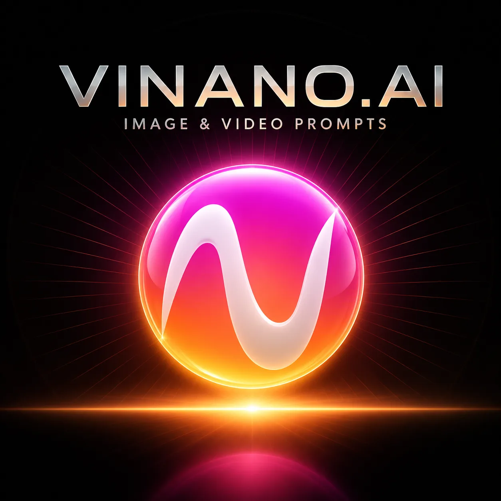</a>
</p>

# Awesome Image & Video Prompts — Updating
[](https://vinano.ai)   

A continuously-updated, **original** collection of image & video prompts.

- Every prompt is refined in-house — not a verbatim copy of any third-party list.
- Every preview image is **regenerated with [vinano.ai](https://vinano.ai)**.
- Machine-readable data lives in [`prompts/prompts.json`](prompts/prompts.json).
- System prompts for building your own generator: [EN](prompts/system-prompt-en.md) · [中文](prompts/system-prompt-zh.md).

> 中文版本见 [README.zh-CN.md](README.zh-CN.md)。

> 🐦 **Want real-world results?** Browse community prompts with their **original images** and links to the **source tweets** in **[Examples from X →](EXAMPLES.md)**.

**2026 prompts** across 6 categories. Last updated: 2026-06-25.

## Categories
- [Photography](#photography) — 630
- [Illustration & 3D](#illustration--3d) — 409
- [Product & Brand](#product--brand) — 380
- [Food & Drink](#food--drink) — 190
- [Poster Design](#poster-design) — 241
- [UI & Graphic](#ui--graphic) — 176

> The gallery below is a curated showcase: up to 20 previews per category (all regenerated with vinano.ai). GitHub does not render READMEs larger than 512&nbsp;KB, so the **complete set of 2026 prompts and every preview image** lives in [`prompts/prompts.json`](prompts/prompts.json) and [`images/`](images/).

## Photography

_Showing 20 of 630 — see [`prompts/prompts.json`](prompts/prompts.json) for all._

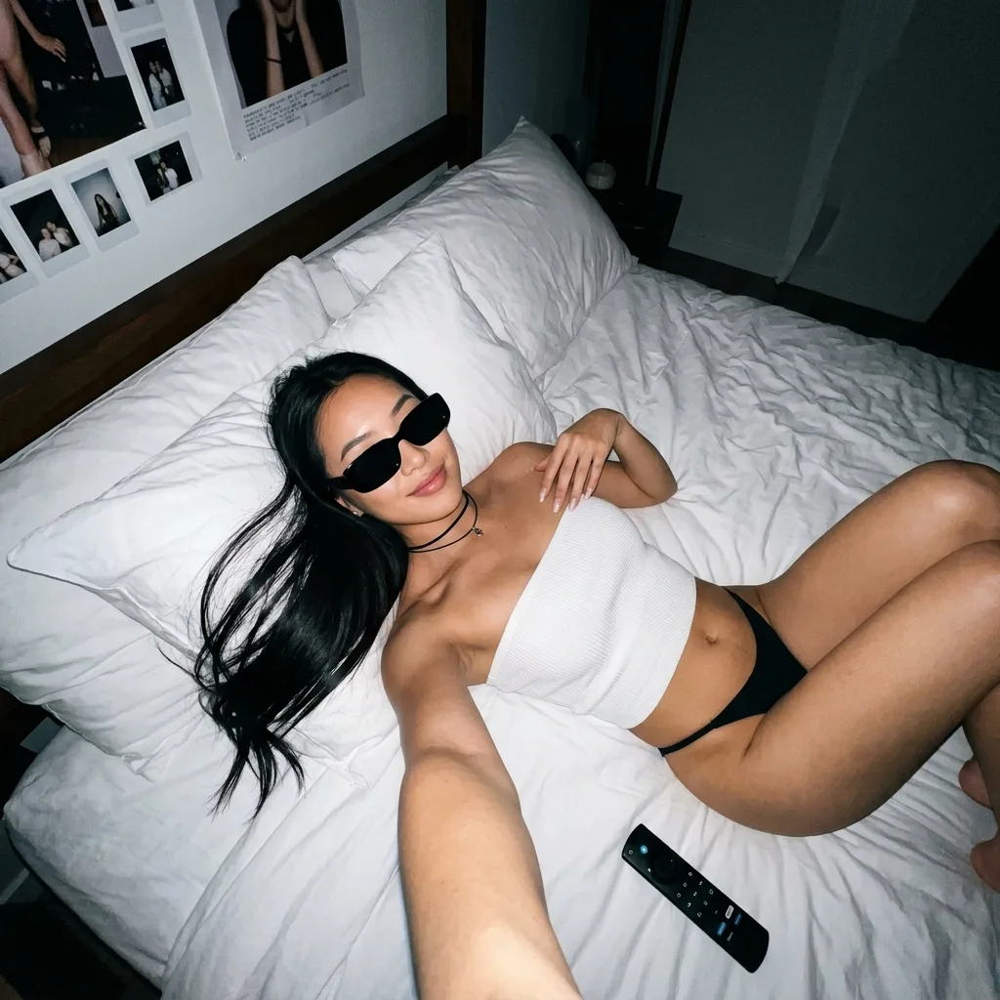

**#1 · Photography Prompt · <code>Vinano Image v2</code>**

<details>
<summary>Show prompt</summary>

```
{
  "image_generation_parameters": {
    "aspect_ratio": "9:16",
    "subject_description": {
      "character": "A stunning young woman long, sleek dark hair fanned out across white pillows. She has a soft, confident smile and is wearing stylish black rectangular sunglasses.",
      "apparel": "She is wearing a white ribbed-knit tube top that shows detailed fabric texture and a pair of refined minimalist black bikini bottoms.",
      "accessories": "A delicate thin black choker necklace a tiny pendant is visible on her neck. Her nails are manicured a light, neutral polish.",
      "pose": "Lying flat on her back on a bed, viewed from a high-angle 'selfie' perspective. Her right arm is extended toward the camera, creating a sense of depth. Her legs are slightly bent at the knees, resting on the bed."
    },
    "environment_and_composition": {
      "setting": "A dimly lit bedroom at night. The bed has rumpled white cotton sheets and soft pillows that catch the light and shadow.",
      "background_elements": "In the soft-focus background, a dark wooden bed frame and several posters/polaroids are pinned to a dimly lit wall, adding a personal, lived-in atmosphere.",
      "foreground_objects": "A black television remote control lies on the white sheets next to her leg, adding to the casual, candid nature of the shot."
    },
    "technical_style": {
      "lighting": "Harsh direct flash photography style, reminiscent of a late-night smartphone capture. This creates high contrast, bright highlights on the skin and clothing, and deep, sharp shadows behind the subject.",
      "camera_settings": "Shot on a high-end mobile camera, f/1.8 aperture for slight background blur, high ISO resulting in a subtle, aesthetic film grain.",
      "image_quality": "Ultra-true-to-life photorealistic, 8k resolution, highly detailed skin pores, visible fabric fibers, cinematic composition, hyper-detailed textures, RAW photo quality."
    },
    "negative_prompt": "cartoon, drawing, anime, low quality, distorted face, extra fingers, deformed hands, blurry, low resolution, watermark, text, signature, bright daylight, overhead ceiling light."
  }
}

Aim for an editorial, design-driven look with deliberate negative space.
```

</details>

---

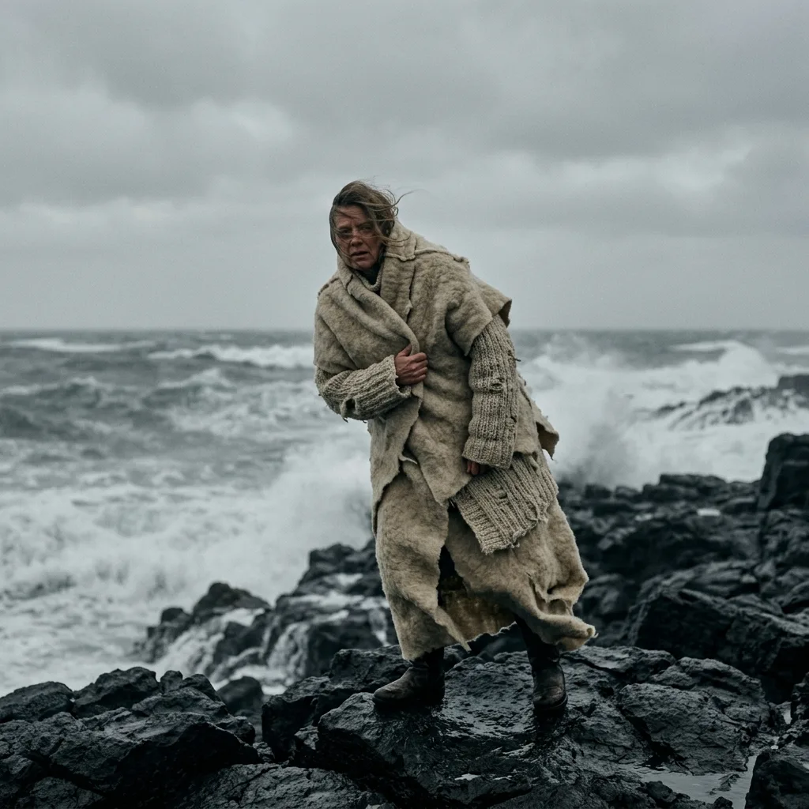

**#2 · Photography Prompt · <code>Vinano Image v2</code>**

<details>
<summary>Show prompt</summary>

```
Sometimes I want to stay alone away from the Chaos of City life

The Realism by gemini mpt 👇

Wide shot, subject acts as an anchor against a raging wind. Standing on a jagged black rock coastline, waves crashing behind in a gray blur. The subject leans forward against the gale. Outfit is a massive, shapeless layers of raw beige wool and distressed knitwear, creating a silhouette that looks like a eroding sculpture. Lighting is overcast, flat, and moody. Desaturated palette, muted earth tones, sharp texture on the fabric, cinematic anamorphic lens.

Negative Prompt: Sunny beach, vacation vibes, swimsuit, smiling, blue sky, vibrant colors, calm water, generic travel photography, face distortion.

Maintain consistent colour harmony and crisp focus across the whole frame.
```

</details>

---

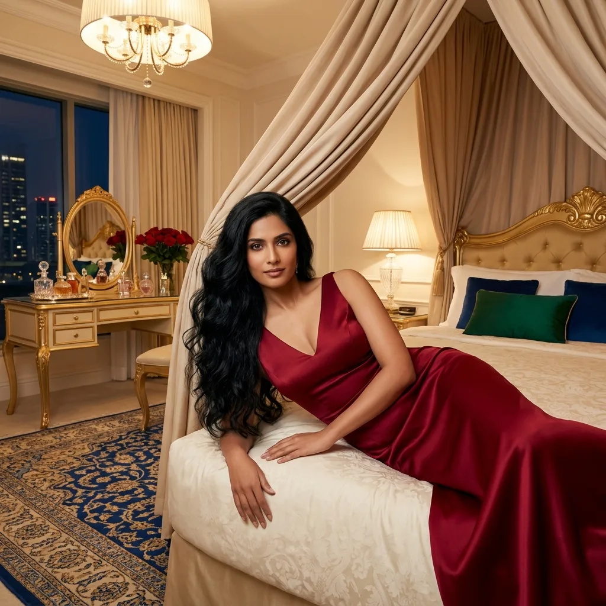

**#3 · Photography Prompt · <code>Vinano Image v2</code>**

<details>
<summary>Show prompt</summary>

```
Good Afternoon X Fam ♥️

Ana de Armas
Sydney Sweeney
Sadie Sink
Indian Lady

Gemini Presenting

Prompt:-

{
 "subject": {
 "person": "Ek sundar mahila jiske lambe, ghane, aur wavy kaale baal hain.",
 "expression": "Shaant aur pur-aitmaad (confident) expression, aankhen seedhe camera ki taraf.",
 "clothing": "Ek luxurious deep red silk ya satin ka sleeveless evening gown, jisme v-neckline hai.",
 "pose": "Bed par ek taraf jhuk kar (reclining) leti hui hai, haath aaram se aage ki taraf rakha hua."
 },
 "setting": {
 "location": "Ek bohot hi bada aur luxurious classic-style bedroom.",
 "furniture": [{
 "item": "Canopy bed",
 "details": "Sone ka (gold) ornate headboard aur upar ek bada beige fabric ka canopy drape."
 },
 {
 "item": "Dressing table",
 "details": "Gold-trimmed vanity table jiske upar perfumes, crystal bottles, aur laal gulab ka guldasta rakha hai."
 },
 {
 "item": "Rug",
 "details": "Zameen par ek intricate blue aur gold pattern wala traditional Persian ya Oriental rug."
 }],
 "lighting": "Warm aur soft, diffused lighting. Ek chandelier upar hai aur bed ke side mein ek elegant lamp jal raha hai.",
 "background": "Khidki se bahar shehar ki raushni (city skyline at night) dikhayi de rahi hai."
 },
 "aesthetic": {
 "color_palette": ["Deep Red", "Gold", "Cream", "Royal Blue", "Emerald Green"],
 "mood": "Opulent, elegant, sophisticated aur cozy.",
 "photography_style": "High-end fashion photography, sharp focus on the subject, soft bokeh in the background."
 }
}

Maintain consistent colour harmony and crisp focus across the whole frame.
```

</details>

---

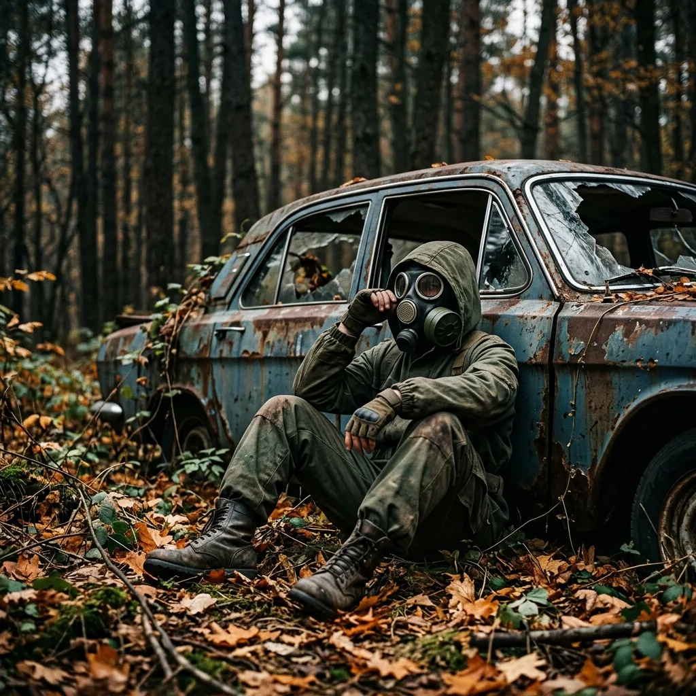

**#4 · Photography Prompt · <code>Vinano Image v2</code>**

<details>
<summary>Show prompt</summary>

```
A cinematic, ultra realistic post apocalyptic scene of a lone survivor sitting on the forest ground, leaning against an abandoned, rusted old car broken windows and peeling paint. The survivor is wearing a dark olive green hooded protective suit visible fabric folds and dirt stains, heavy boots, gloves, and a full face gas mask round glass lenses and dual side filters. The survivor is sitting knees bent, one hand near the mask as if thinking, body slightly slouched, giving a feeling of exhaustion and solitude.
The environment is a dense, overgrown forest in late autumn, dry orange, brown, and golden leaves covering the ground and hanging on thin branches. The background trees are tall and thin dark trunks, softly blurred by shallow depth of field. Small plants, twigs, and fallen leaves fill the foreground creating a natural frame.
Color palette is muted and cinematic: deep olive greens, rusty browns, burnt orange leaves, dark greys, faded blue metal on the car, and soft warm highlights mixed cool shadow tones. Lighting is soft and diffused, as if coming from an overcast sky, gentle warm light touching the leaves and the subject, and cooler shadows in the background. Slight film grain, cinematic contrast, moody and atmospheric tone.
Camera is low angle, medium full body shot, subject placed slightly off center, 35mm lens look, shallow depth of field, realistic textures, high detail, soft background blur, subtle vignette. The atmosphere feels quiet, abandoned, melancholic, and tense, like the world has ended and nature is slowly taking over.

Emphasise material texture and natural light so the final frame feels tactile and premium.
```

</details>

---

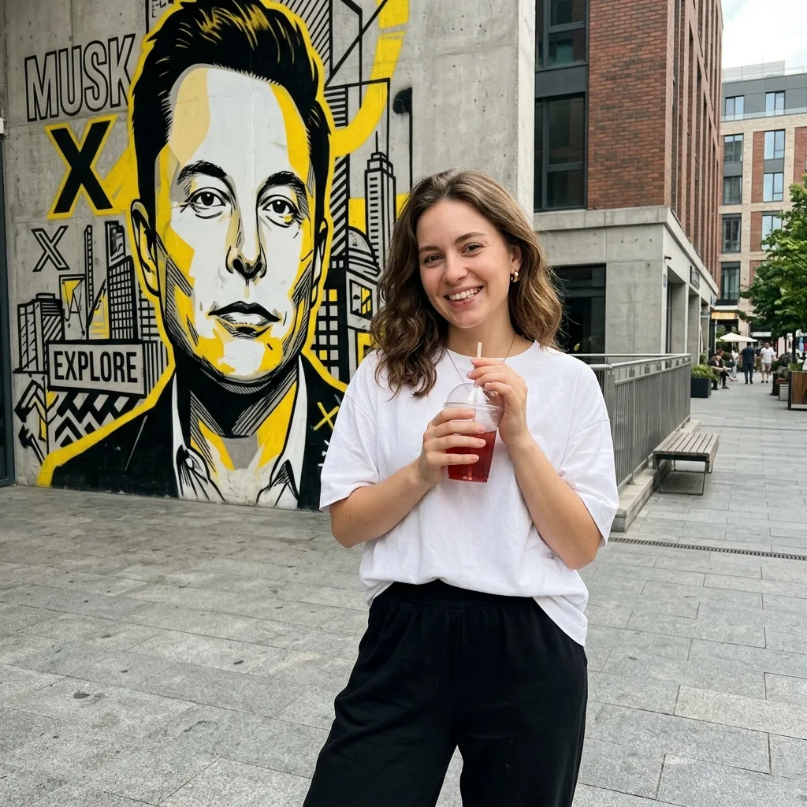

**#5 · Photography Prompt · <code>Vinano Image Pro</code>**

<details>
<summary>Show prompt</summary>

```
Gemini

Prompt:

{ "image_type": "photograph", "genre": "urban lifestyle portrait", "composition": { "framing": "three-quarter body portrait", "angle": "eye-level, straight-on", "orientation": "portrait", "subject_placement": "subject positioned slightly right of center", "background_balance": "large-scale mural occupying left background", "visual_hierarchy": "foreground subject emphasized against graphic mural backdrop" }, "subject": { "count": 1, "gender_presentation": "female-presenting", "age_range": "young adult", "facial_features": { "skin_tone": "light, neutral", "complexion": "smooth natural texture", "eyes": "light-colored", "eyebrows": "full, softly shaped", "nose": "straight, proportional", "lips": "natural pink, smiling teeth slightly visible" }, "hair": { "color": "medium brown", "length": "shoulder-length", "style": "loose waves", "part": "center part" }, "expression": "playful, cheerful", "gaze": "directed toward camera", "pose": { "stance": "relaxed, casual", "hands": "one hand holding a drink cup, other supporting straw" }, "accessories": ["clear plastic cup lid and straw"], "clothing": { "top": "oversized t-shirt", "color": "White", "bottom": "black lounge pants", "fit": "loose, relaxed streetwear", "style": "casual, modern" } }, "lighting": { "type": "natural daylight", "direction": "diffuse frontal light", "quality": "soft, even", "shadows": "minimal, low contrast", "highlights": "subtle highlights on face and hair" }, "color_palette":#AmulProteinWPL { "dominant_colors": ["white", "gray", "yellow"], "accent_colors": ["cherry beverage", "black mural outlines"], "overall_tone": "urban, contemporary, playful" }, "background": { "setting": "outdoor urban space", "environment": "city courtyard or alley", "elements": ["large monochrome mural portrait of Elon Musk yellow graphic accents", "modern building facades", "metal railing", "stone or concrete pavement"], "style": "street art–influenced", "depth_of_field": "deep, background clearly visible" }, "technical_details": { "camera_type": "smartphone camera", "focal_length_equivalent": "standard wide lens", "sharpness": "high overall sharpness", "noise": "low", "dynamic_range": "balanced highlights and shadows", "white_balance": "neutral" }, "artistic_style": { "aesthetic": "urban lifestyle, social media–ready", "retouching": "minimal, natural appearance", "mood": "fun, relaxed, youthful", "contrast": "moderate strong graphic background" }, "typography": { "presence": false } }

Aim for an editorial, design-driven look with deliberate negative space.
```

</details>

---

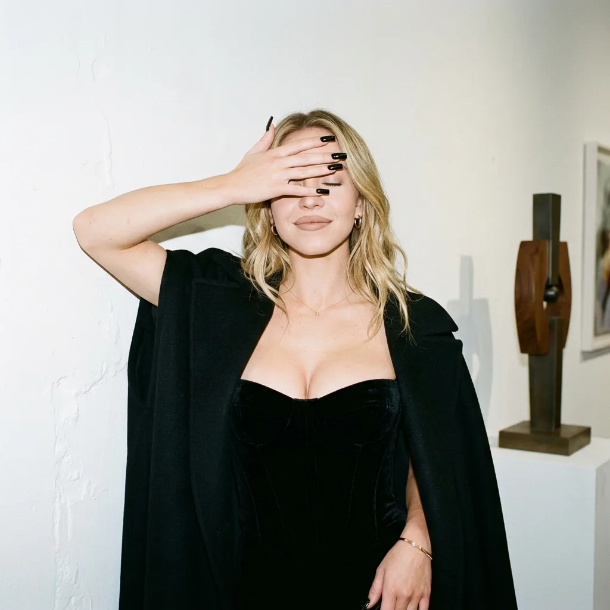

**#6 · Photography Prompt · <code>Vinano Image v2</code>**

<details>
<summary>Show prompt</summary>

```
{
  "image_style": {
    "type": "true-to-life photorealistic",
    "aesthetic": "Instagram shot",
    "effects": ["film grain",
      "direct flash"]
  },
  "composition": {
    "framing": "waist-up photograph",
    "aspect_ratio": "9:16"
  },
  "subject": {
    "description": " woman Sydney Sweeney",
    "constraint_note": "do not alter the sensitivity of the face and features",
    "pose": {
      "orientation": "facing the camera directly",
      "head": "tilted slightly to the side",
      "eyes": "closed",
      "action": "covering her face her hand, pulling her elbow away and lifting it to the side",
      "mood": ["elegant",
        "pensive",
        "playful"]
    },
    "appearance": {
      "attire": ["black velvet corset",
        "expensive black cape"],
      "hair": "loose",
      "makeup": {
        "style": "nude",
        "lipstick": "matte nude"
      },
      "details": ["décolletage highlighted",
        "long, square black nails"]
    }
  },
  "setting": {
    "background": "white wall",
    "foreground_elements": "art object placed in front of the wall"
}
 }

Render with rich micro-detail while keeping the layout uncluttered and intentional.
```

</details>

---

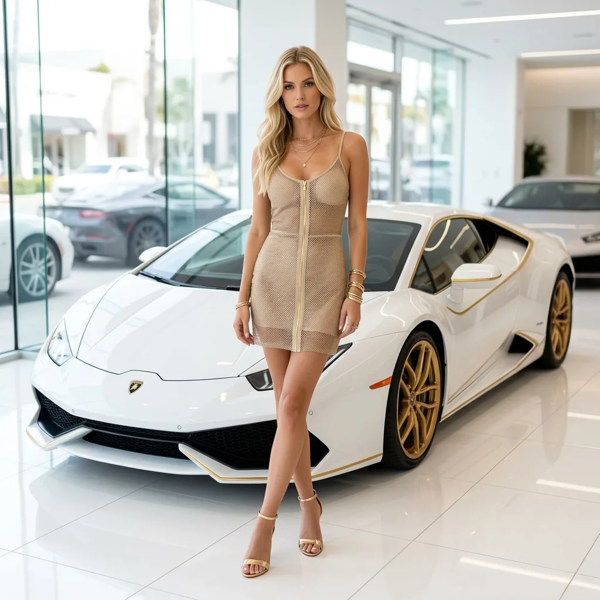

**#7 · Photography Prompt · <code>Vinano Image v2</code>**

<details>
<summary>Show prompt</summary>

```
Gemini 3.0 🍌

Prompt:

{
 "image_description": {
 "subject": {
 "person": "A slender blonde woman long hair, wearing a sheer, shimmering gold mesh mini dress thin spaghetti straps and a vertical gold zipper detail.",
 "accessories": "Layered gold necklaces, gold bracelets, and metallic gold high-heeled sandals.",
 "pose": "Standing elegantly in front of a luxury car, legs crossed at the ankles, looking directly at the camera."
 },
 "vehicle": {
 "type": "A sleek, modern white supercar gold accents.",
 "details": "High-gloss white paint, metallic gold rims, gold trim around the windows, and low-profile body styling."
 },
 "environment": {
 "location": "A bright, high-end luxury car showroom.",
 "lighting": "Clean, architectural indoor lighting soft reflections on the polished white floor.",
 "background": "Large floor-to-ceiling glass windows showing other vehicles in a blurred outdoor setting."
 },
 "technical_style": {
 "composition": "Full-body shot, eye-level angle, centered subject.",
 "aesthetic": "High-fashion photography, true-to-life photorealistic, sharp focus on the subject a shallow depth of field (bokeh) in the background.",
 "color_palette": "Dominant white and gold, neutral grey and black architectural tones."
 }
 }
}

Keep edges clean and the overall composition balanced for a polished, gallery-ready result.
```

</details>

---

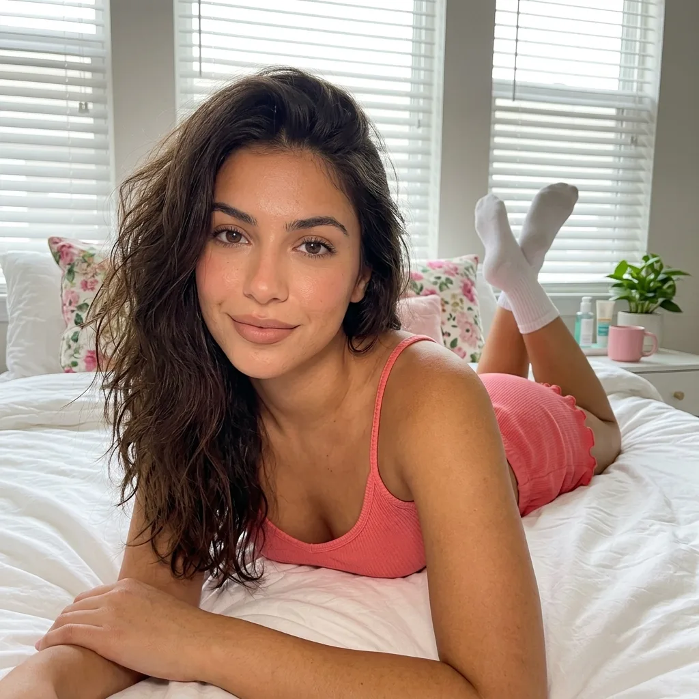

**#8 · Photography Prompt · <code>Vinano Image v2</code>**

<details>
<summary>Show prompt</summary>

```
Good Night X Fam ♥️

☆ Sexy & Hot Virgin Young Lady in own luxury bedroom.

☆ The one who takes it in the arms will be golden tonight.

☆ Gemini Presenting this beautiful images.

☆ I love you all X creators

☆ Genuine Prompt here:-

{
 "scene": {
 "type": "bedroom_interior",
 "lighting": "soft natural morning daylight, diffused through blinds",
 "atmosphere": "cozy, intimate, serene domestic"
 },
 "subject": {
 "appearance": {
 "hair": "voluminous dark brown hair, soft waves, slightly tousled over one shoulder",
 "face": "warm olive complexion, high cheekbones, full natural lips, expressive brown eyes",
 "expression": "gentle, confident smile, soft direct eye contact",
 "makeup": "dewy natural glow, subtle rosy blush, nude matte lips"
 },
 "pose": {
 "position": "lying prone (on stomach) on a bed",
 "orientation": "facing the camera",
 "arms": "resting on forearms, right hand gently touching hair near the temple",
 "legs": "knees bent feet raised and ankles casually crossed",
 "perspective": "high-angle selfie point of view"
 },
 "attire": {
 "top": "coral pink ribbed tank top thin straps",
 "bottom": "matching coral pink lounge shorts ruffled edges",
 "accessories": "white crew socks pulled up"
 }
 },
 "environment": {
 "bedding": "crisp white rumpled sheets and fluffy white duvet",
 "background": {
 "elements": ["two large windows white horizontal blinds",
 "floral accent pillows pink and green patterns",
 "small side table a pink mug and various skincare bottles",
 "potted green plant providing a touch of color"],
 "focus": "soft bokeh background for depth of field"
 }
 },
 "photography": {
 "style": "hyperrealistic instagram-style selfie",
 "technical": {
 "detail": "ultra-sharp skin texture, visible pores, natural lighting highlights",
 "framing": "medium close-up, 4:5 aspect ratio",
 "quality": "8k resolution, true-to-life photorealistic"
 }
 }
}

Thanku so much🙏

Maintain consistent colour harmony and crisp focus across the whole frame.
```

</details>

---

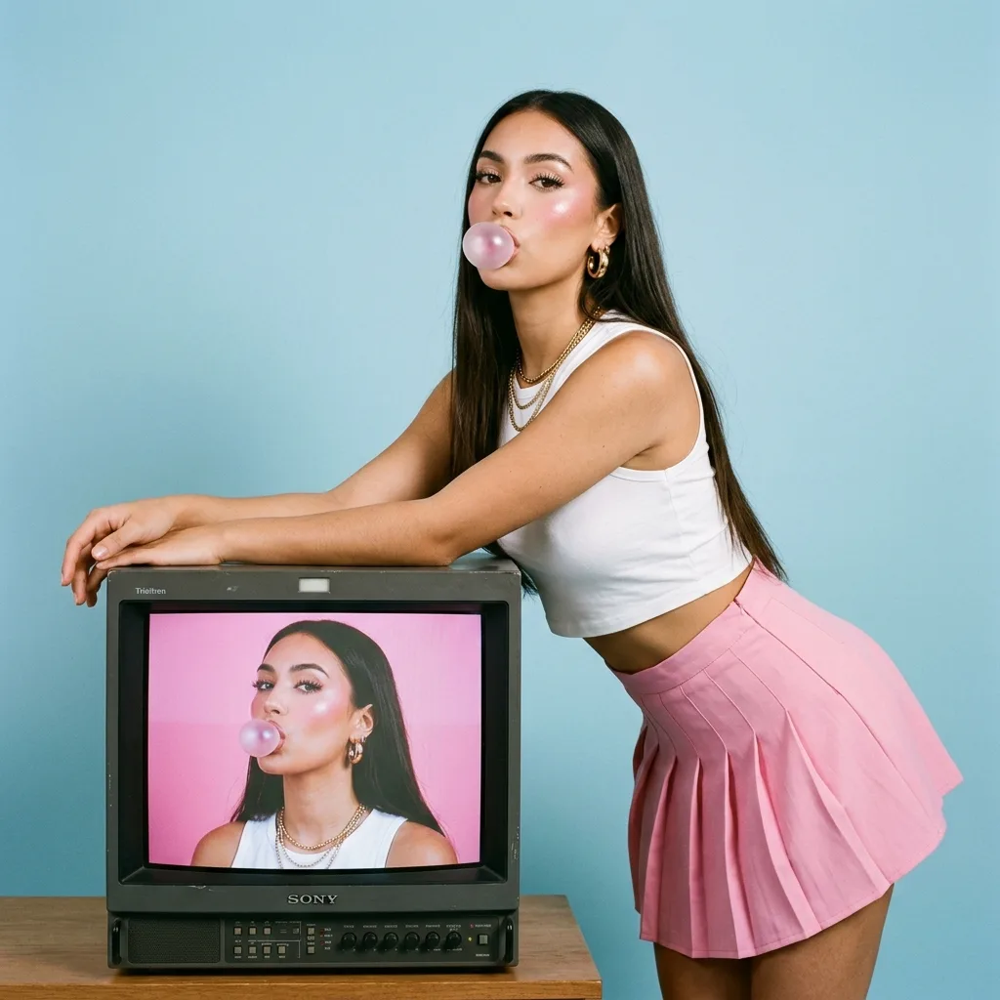

**#9 · Photography Prompt · <code>Vinano Image v2</code>**

<details>
<summary>Show prompt</summary>

```
When pop aesthetics meet confidence… this is the vibe 💗📺

Would you dare to pull off this look? 💭✨

Gemini 🍌

{
 "type": "image_generation_prompt",
 "style": "ultra_realistic_fashion_editorial",
 "composition": {
 "camera": "studio photograph",
 "lighting": "clean studio lighting",
 "focus": "sharp focus",
 "resolution": "high resolution",
 "aesthetic": "modern pop",
 "color_palette": "vibrant pastels",
 "mood": "cinematic"
 },
 "background": {
 "type": "solid",
 "color": "pastel blue"
 },
 "subject": {
 "gender": "female",
 "appearance": {
 "hair": "long straight dark hair",
 "makeup": "glossy makeup soft pink blush highlighted cheekbones bold eye makeup"
 },
 "attire": {
 "top": "fitted white sleeveless crop top",
 "bottom": "high waisted pink pleated mini skirt",
 "accessories": ["gold hoop earrings",
 "layered gold chain necklace"]
 },
 "pose": {
 "position": "leaning forward",
 "interaction": "resting arms casually on a retro CRT television",
 "expression": "confident",
 "action": "blowing a translucent pink bubblegum bubble"
 }
 },
 "props": {
 "television": {
 "type": "retro CRT TV",
 "screen_content": "mirrored image of the same woman posing against a pink background",
 "effect": "dual reality visual concept"
 }
 },
 "style_tags": ["true-to-life photorealistic",
 "fashion editorial",
 "cinematic composition",
 "creative concept",
 "pastel aesthetic"]
}

Keep edges clean and the overall composition balanced for a polished, gallery-ready result.
```

</details>

---

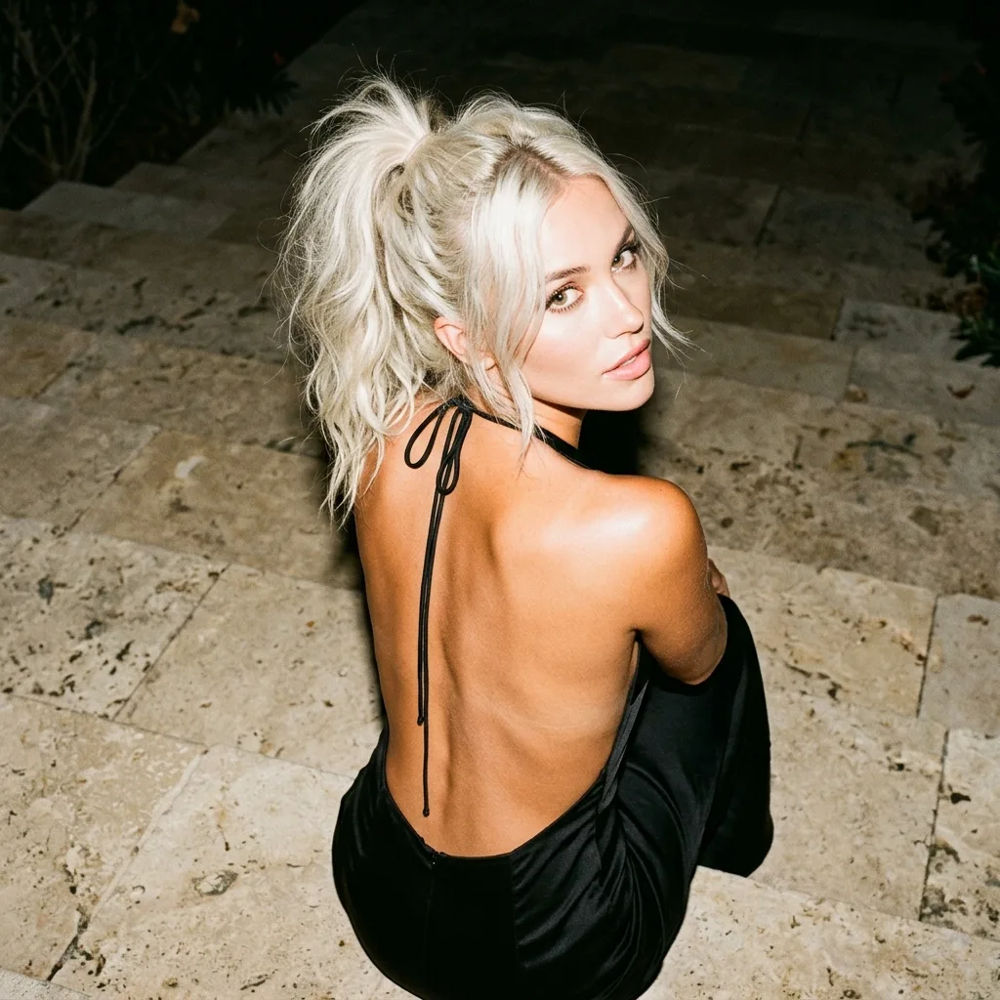

**#10 · Photography Prompt · <code>Vinano Image v2</code>**

<details>
<summary>Show prompt</summary>

```
the only thing i need to become a black swan is the.

{
 "scene_type": "nighttime flash portrait on stone steps, backless black dress, platinum ponytail, over-shoulder glance",

 "camera_perspective": {
 "pov": "photographer standing above and behind her",
 "angle": "shooting DOWN at her from above, she's looking UP and back",
 "distance": "medium shot - from hips up, back fully visible",
 "framing": "4:5 vertical, she fills lower portion, stone steps fill background",
 "height": "elevated above subject, creating looking-down angle"
 },

 "subject": {
 "action": "sitting on stone steps, back to camera, looking back over RIGHT shoulder up at photographer",

 "pose": {
 "overall_position": "SEATED on stone steps, back facing camera, twisted to look back",

 "body_angle": {
 "orientation": "back to camera - approximately 170 degrees away",
 "twist": "upper body twisted RIGHT to look back over shoulder",
 "seated": "sitting on step, weight on hips"
 },

 "back": {
 "visibility": "ENTIRE BACK EXPOSED - from shoulders to lower back",
 "state": "smooth, toned, tanned, the focal point",
 "spine": "visible line down center, thin dress string following it",
 "shoulder_blades": "visible, elegant muscle definition",
 "lower_back": "visible almost to top of butt, dress sits very low"
 },

 "upper_body": {
 "shoulders": "bare, tanned, smooth",
 "posture": "elegant, slight twist from looking back"
 },

 "arms": {
 "position": "in front of body, not visible from this angle",
 "hands": "possibly resting on steps or in lap, hidden from view"
 },

 "head_and_neck": {
 "turn": "looking back over RIGHT shoulder",
 "rotation": "significant twist - approximately 120 degrees from body",
 "chin": "slightly lifted, looking up at camera above",
 "neck": "elongated, elegant line, halter strap visible"
 },

 "overall": "classic over-shoulder seated pose, maximum back exposure"
 },

 "expression": {
 "eyes": {
 "color": "GREEN/HAZEL - striking, catching flash light",
 "direction": "looking UP at camera, direct eye contact",
 "state": "soft but focused, slightly intense, engaged",
 "energy": "confident, knowing, 'I know you're looking'"
 },
 "mouth": {
 "lips": "full, natural pink slight gloss",
 "expression": "relaxed, soft slight pout, mouth closed",
 "state": "natural, subtle"
 },
 "brows": "natural, groomed, soft arch",
 "overall": "soft sultry confidence, the over-shoulder smolder"
 },

 "physical": {
 "age": "early 20s",

 "face": {
 "structure": "model features, high cheekbones, defined jaw, symmetrical",
 "shape": "oval, balanced",
 "skin": "flawless, glowing, tanned",
 "makeup": "natural/soft glam - subtle bronzer, soft brows, natural lip"
 },

 "body": {
 "type": "slim, toned, lean",
 "back": {
 "visibility": "FULLY EXPOSED - the main feature",
 "state": "smooth, toned, athletic definition",
 "tan": "even golden tan"
 },
 "shoulders": "narrow, feminine, toned",
 "skin_tone": "TANNED/BRONZED - golden, sun-kissed"
 },

 "hair": {
 "color": "PLATINUM BLONDE - very light, white-blonde, icy",
 "style": "HIGH PONYTAIL - messy, textured",
 "details": {
 "position": "high on crown of head",
 "texture": "messy, piece-y, textured waves",
 "volume": "voluminous, full, movement",
 "pieces": "some loose strands around face and nape"
 },
 "roots": "slightly darker roots visible, natural",
 "length": "long ponytail reaching mid-back",
 "state": "styled messy, intentionally undone, editorial texture",
 "vibe": "high fashion messy ponytail, effortful effortlessness"
 },

 "skin": {
 "tone": "golden tan, bronzed, warm",
 "state": "glowing, smooth, catching flash beautifully",
 "back": "flawless, even tan, highlight on shoulder blades"
 }
 },

 "outfit": {
 "dress": {
 "type": "BACKLESS HALTER DRESS/TOP",
 "color": "BLACK - solid, deep black",
 "material": {
 "type": "likely satin or similar",
 "finish": "slight sheen, elegant drape"
 },
 "construction": {
 "neckline": "HALTER - ties around neck",
 "neck_strap": "thin STRING tie at back of neck",
 "back": {
 "style": "COMPLETELY BACKLESS - extreme open back",
 "depth": "opens to LOWER BACK, almost to top of butt",
 "coverage": "essentially none on back"
 },
 "spine_detail": {
 "type": "single thin STRING running down spine",
 "path": "from neck tie down center of back to lower back/waist",
 "effect": "minimal connection, emphasizes naked back"
 },
 "front": "presumably covered, not visible in shot"
 },
 "fit": {
 "back": "completely open, skin fully exposed",
 "waist": "dress begins at very low back/upper hip",
 "skirt": "appears to flow from low waist"
 },
 "effect": "maximum skin showing while technically dressed"
 }
 }
 },

 "environment": {
 "setting": "outdoor STONE STEPS at NIGHT",
 "location_type": "possibly museum, monument, fancy building entrance, European architecture",

 "steps": {
 "material": "STONE - limestone or similar, large format",
 "color": "BEIGE/TAN/CREAM - warm neutral stone color",
 "texture": "smooth, weathered, some natural variation",
 "pattern": "large rectangular slabs",
 "state": "clean, architectural"
 },

 "background": {
 "main": "stone steps continuing up behind her",
 "foliage": "dark greenery/plants visible in upper left corner",
 "depth": "steps create leading lines toward camera"
 },

 "lighting": {
 "type": "CAMERA FLASH - direct, harsh, nighttime",
 "time": "NIGHT - dark ambient, flash illuminating subject",
 "quality": "hard flash light, typical night photography",
 "effect": {
 "on_subject": "brightly lit, glowing skin, highlights on back",
 "on_background": "stone steps illuminated, slight falloff",
 "shadows": "minimal on subject (front-lit), some behind"
 },
 "contrast": "flash-lit subject against darker night environment",
 "color_temperature": "flash is neutral/cool, skin reads warm"
 },

 "atmosphere": "nighttime outdoor, European/architectural, date night vibes"
 },

 "color_story": {
 "palette_name": "Blonde on Black on Stone at Night",

 "dominant": {
 "beige_stone": "steps/background - warm neutral, 50%",
 "black_dress": "her outfit - deep black, contrast"
 },

 "subject_colors": {
 "platinum_hair": "very light blonde, almost white - bright against dark",
 "tanned_skin": "golden bronze - warm, glowing",
 "green_eyes": "striking color pop"
 },

 "contrast": {
 "hair_vs_dress": "platinum blonde against black = high contrast",
 "skin_vs_dress": "tan skin against black = beautiful definition",
 "subject_vs_background": "lit subject against darker surroundings"
 },

 "temperature": "warm tones (skin, stone) cool flash light"
 },

 "photography_technical": {
 "type": "flash portrait, nighttime outdoor",
 "lighting": "ON-CAMERA or OFF-CAMERA FLASH",

 "aspect_ratio": "4:5 vertical",

 "composition": {
 "subject": "lower center of frame, looking up",
 "background": "steps filling upper portion",
 "angle": "shot from above looking down",
 "leading_lines": "step edges lead to subject"
 },

 "focus": {
 "focal_point": "sharp on face and back",
 "depth_of_field": "moderate, background slightly soft"
 },

 "exposure": {
 "subject": "well-exposed from flash",
 "ambient": "darker, night time",
 "style": "flash-forward night photography"
 }
 },

 "narrative": {
 "story": "night out, sitting on steps outside fancy venue, someone captures the moment from above",
 "mood": "confident, elegant, 'caught looking back' moment",
 "context": "date night? event? European vacation? the dress is the story"
 },

 "vibe": {
 "core": "platinum ponytail in backless black dress, sitting on stone steps at night, flash photo looking back",
 "energy": "elegant confidence, old money night out, main character moment",
 "mood": "sophisticated, sultry, intentional",
 "aesthetic": "European night out, editorial flash, fashion moment",
 "temperature": "warm skin against cool night",
 "caption_energy": "'🖤' or location tag or 'night' or no caption"
 },

 "what_makes_it_hit": {
 "the_back": "fully exposed back is THE shot - skin is the star",
 "the_dress_detail": "thin string down spine = minimal coverage, maximum impact",
 "the_over_shoulder": "classic pose, direct eye contact, engaging",
 "the_ponytail": "high messy platinum = editorial, effortless glamour",
 "the_tan": "golden skin against black dress = beautiful contrast",
 "the_stone_steps": "architectural setting elevates from basic to editorial",
 "the_flash": "night flash aesthetic = raw, real, elevated party photo",
 "the_angle": "shot from above = interesting perspective, shows full back"
 },

 "recreation_critical_requirements": {
 "MUST_HAVE": ["PLATINUM BLONDE hair - very light, white-blonde",
 "HIGH MESSY PONYTAIL - textured, voluminous, pieces escaping",
 "GREEN/HAZEL eyes",
 "TANNED/BRONZED skin - golden, glowing",
 "BLACK BACKLESS HALTER DRESS/TOP",
 "VERY LOW BACK - open to lower back, almost to butt",
 "THIN STRING tie at neck (halter)",
 "THIN STRING running down SPINE from neck to lower back",
 "ENTIRE BACK EXPOSED - shoulders to lower back visible",
 "SEATED on STONE STEPS - beige/tan colored",
 "Back to camera, looking over RIGHT SHOULDER up at camera",
 "NIGHTTIME setting",
 "FLASH PHOTOGRAPHY lighting",
 "Shot from ABOVE looking down at her",
 "4:5 vertical aspect ratio"],

 "pose_exact": "seated on steps, back to camera, looking over right shoulder up at photographer above",
 "dress_exact": "black halter thin string neck tie and single thin string down exposed spine, extremely low open back",
 "hair_exact": "platinum blonde high messy ponytail, voluminous, textured, pieces loose",
 "lighting_exact": "direct flash at night, subject illuminated against darker surroundings",
 "setting_exact": "outdoor stone/limestone steps, architectural, nighttime"
 }
}

Keep edges clean and the overall composition balanced for a polished, gallery-ready result.
```

</details>

---

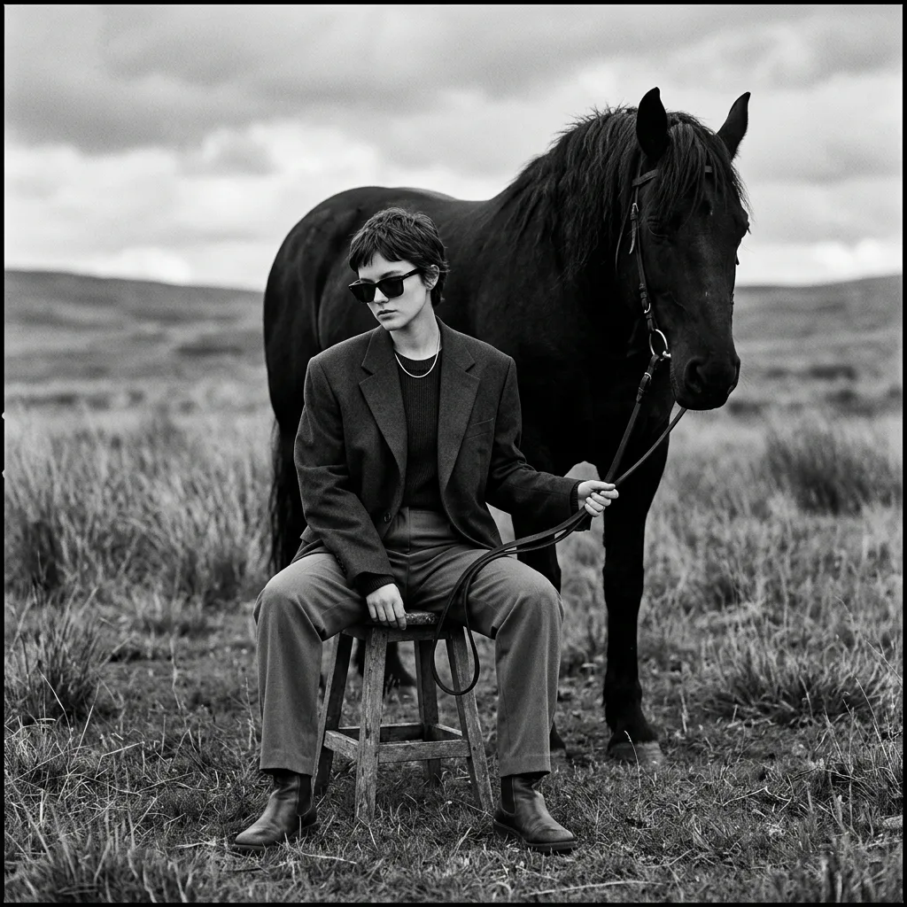

**#11 · Photography Prompt · <code>Vinano Image v2</code>**

<details>
<summary>Show prompt</summary>

```
Don’t watch the clock; do what it does. Keep going.

Gemini + imagine.

Prompt ⤵️

Create a cinematic black‑and‑white editorial fashion photograph featuring a young woman sitting confidently on a simple wooden stool in an open, slightly wild grassy field, a powerful black horse standing closely behind her. She holds the horse’s reins loosely in one hand, exuding quiet control. The woman wears a dark oversized luxury blazer, straight‑cut trousers, leather boots, minimal jewelry, sunglasses, and has her head slightly tilted down a calm, introspective, dominant yet relaxed expression.

Use a refined minimalist composition strong negative space, high‑contrast monochrome tones, and soft natural daylight. Apply a shallow depth of field to blur the empty rural landscape (no buildings, only textured grass distant blur). Capture an editorial luxury fashion vibe a moody, poetic atmosphere, sharp details, subtle film grain texture, and dramatic shadows in a Vogue‑style photography style. Shoot an 85mm lens for cinematic realism.

Keep edges clean and the overall composition balanced for a polished, gallery-ready result.
```

</details>

---

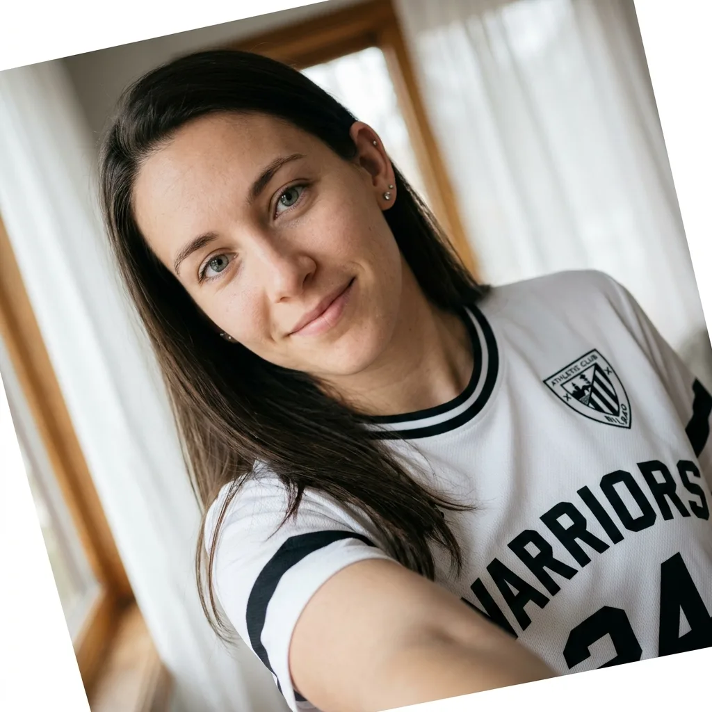

**#12 · Photography Prompt · <code>Vinano Image Pro</code>**

<details>
<summary>Show prompt</summary>

```
Gemini

Prompt:

{ "image_type": "photograph", "genre": "casual portrait", "composition": { "framing": "close-up, chest-up portrait", "angle": "slightly tilted, camera held above eye level and angled downward", "orientation": "portrait diagonal tilt", "subject_placement": "subject positioned slightly off-center, face occupying left-middle area", "crop": "tight crop partial arm visible in foreground" }, "subject": { "count": 1, "gender_presentation": "female-presenting", "age_range": "young adult", "facial_features": { "skin_tone": "light, neutral-warm", "complexion": "clear, smooth natural texture", "eyes": "light green/gray, almond-shaped", "eyebrows": "medium thickness, natural shape", "nose": "straight, small to medium", "lips": "natural pink, closed-mouth slight smile" }, "hair": { "color": "dark brown", "length": "long", "style": "straight, tucked behind ear on one side", "part": "slight side part" }, "expression": "soft, relaxed, friendly", "gaze": "looking directly into camera", "accessories": ["small silver stud earrings"], "clothing": { "type": "sports jersey", "fit": "loose athletic fit", "color": "white black accents", "details": ["black collar trim", "black logos and text", "shield-style emblem on chest", "large curved black graphic text"] } }, "lighting": { "type": "natural light", "direction": "side/front light from window", "quality": "soft, diffused", "shadows": "minimal, gentle", "highlights": "subtle skin highlights on cheek and forehead" }, "color_palette": { "dominant_colors": ["white", "soft gray", "black"], "accent_colors": ["natural skin tones", "brown hair"], "overall_tone": "neutral, clean, airy" }, "background": { "setting": "indoor", "elements": ["sheer white curtains", "window frame partially visible"], "depth_of_field": "moderate, background slightly soft but recognizable", "style": "refined minimalist, uncluttered" }, "technical_details": { "camera_type": "DSLR", "focal_length_equivalent": "wide-angle selfie lens", "resolution": "high", "sharpness": "sharp focus on face", "noise": "minimal", "white_balance": "neutral" }, "artistic_style": { "aesthetic": "clean, natural, lifestyle", "retouching": "very minimal, natural skin texture preserved", "mood": "calm, approachable, casual" }, "typography": { "presence": true, "location": "on jersey", "style": "bold sans-serif sports branding", "color": "black", "readability": "partially visible due to crop" } }

Maintain consistent colour harmony and crisp focus across the whole frame.
```

</details>

---

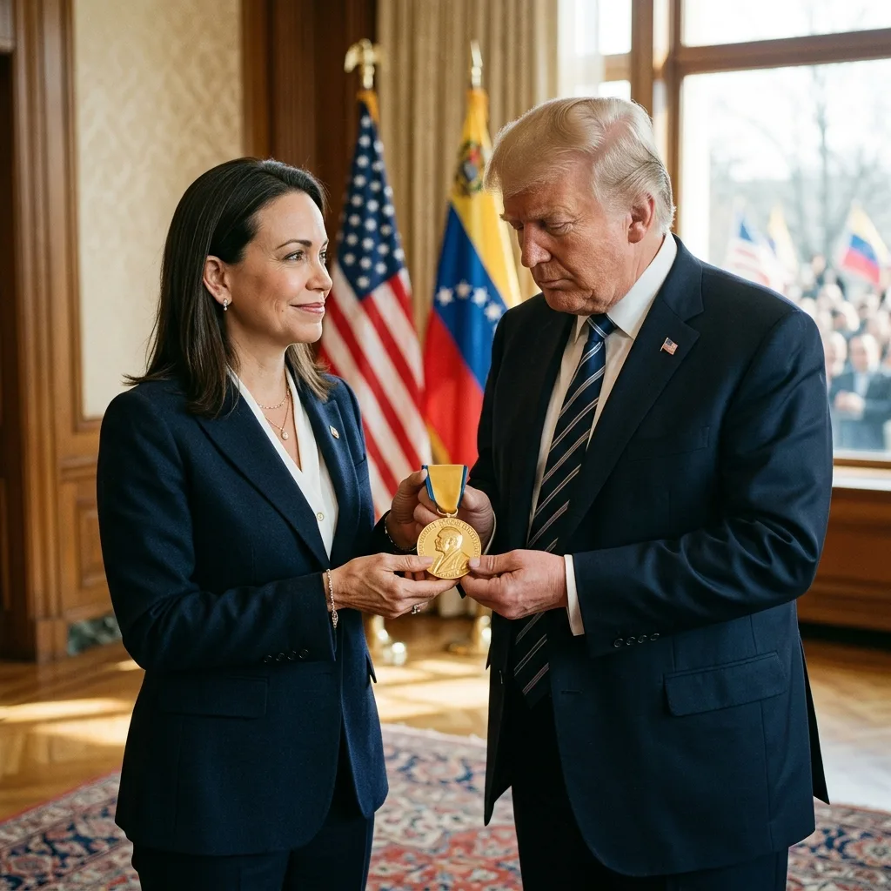

**#13 · Photography Prompt · <code>Vinano Image v2</code>**

<details>
<summary>Show prompt</summary>

```
Cinematic, ultra-realistic scene depicting Venezuelan opposition leader María Corina Machado presenting her Nobel Peace Prize medal to Donald Trump. Machado stands a calm yet determined expression, holding the Nobel medal as a symbol of hope and democracy. Trump receives it thoughtfully, set against a dignified indoor setting. In the background, subtle symbolism appears: softly blurred US and Venezuelan flags, a faint glow of light symbolizing freedom, and a distant crowd suggesting democratic aspirations. Mood is serious, historic, and hopeful. Professional lighting, shallow depth of field, high detail, photo-journalistic realism.” Emphasise material texture and natural light so the final frame feels tactile and premium.
```

</details>

---

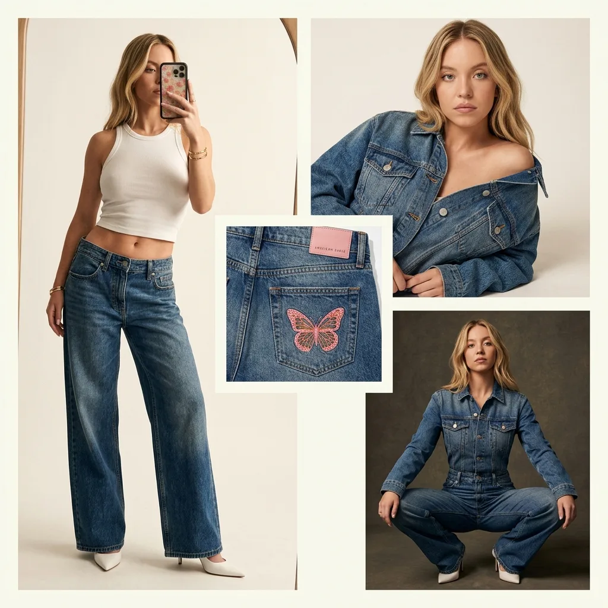

**#14 · Photography Prompt · <code>Vinano Image Pro</code>**

<details>
<summary>Show prompt</summary>

```
{
 "file_metadata": {
 "filename": "sydney_sweeney_ae_campaign_collage.jpg",
 "category": "High-End Fashion Photography",
 "project": "American Eagle Denim Collection 2024",
 "talent": "Sydney Sweeney"
 },
 "visual_composition": {
 "layout_type": "4-Panel Asymmetrical Collage",
 "color_palette": {
 "primary": "Indigo Blue (Denim Wash)",
 "secondary": "Creamy White (Top & Background)",
 "accent": "Dusty Rose / Blush Pink (Butterfly Detail)",
 "vibe": "Warm, Nostalgic, Y2K Grunge"
 },
 "lighting": "Soft diffused studio light warm highlight tones",
 "aesthetic_tags": ["Vintage Revival", "Baggy Silhouette", "Main Character Energy"]
 },
 "detailed_frame_analysis": {
 "panel_1_left": {
 "focus": "Full Body Silhouette",
 "pose": "Mirror selfie aesthetic a slight lean",
 "outfit_details": {
 "top": "White ribbed racerback crop tank",
 "bottom": "Extra wide-leg low-rise indigo jeans",
 "footwear": "White pointed-toe stilettos",
 "accessories": "Delicate gold bracelets and a floral-patterned phone case"
 }
 },
 "panel_2_top_right": {
 "focus": "Beauty & Expression",
 "pose": "Reclined, looking directly into the lens",
 "styling": "Oversized denim jacket draped off-the-shoulder",
 "hair": "Center-parted blonde waves natural volume",
 "makeup": "refined minimalist 'Clean Girl' look dewy skin"
 },
 "panel_3_bottom_center": {
 "focus": "Product Detail & Embroidery",
 "subject": "Denim back pocket",
 "features": ["Intricate pink and orange butterfly embroidery",
 "Pink leather brand patch American Eagle logo",
 "Contrast stitching on heavy-duty denim fabric"]
 },
 "panel_4_bottom_right": {
 "focus": "Style Statement",
 "pose": "Symmetrical crouched pose on a dark background",
 "outfit": "Full denim jumpsuit/set (Double Denim)",
 "mood": "Bold and confident"
 }
 },
 "garment_dna": {
 "fabric": "Non-stretch, premium weight cotton denim",
 "wash": "Medium indigo stone-wash vintage fading",
 "fit_profile": "Loose, oversized, baggy, and low-slung waist"
 },
 "marketing_tags": {
 "target_audience": "Gen-Z and Millennial Fashion Seekers",
 "trending_hashtags": ["
 "alt_text": "A fashion collage of Sydney Sweeney for American Eagle showcasing wide-leg jeans butterfly embroidery and a white crop top in various professional poses."
 }
}

Aim for an editorial, design-driven look with deliberate negative space.
```

</details>

---

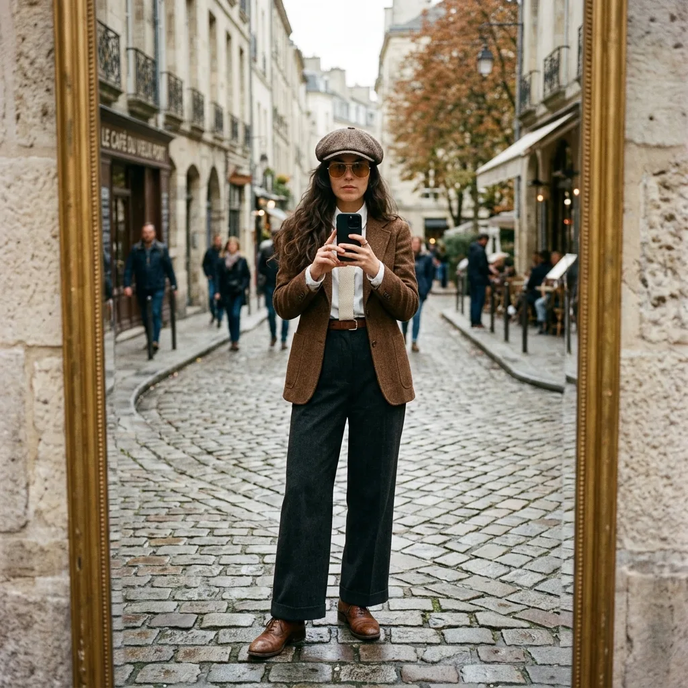

**#15 · Photography Prompt · <code>Vinano Image v2</code>**

<details>
<summary>Show prompt</summary>

```
A stylish woman taking a mirror selfie on a European cobblestone street, wearing a brown tweed blazer, white shirt a cream tie, wide-leg dark trousers, and brown leather shoes, accessorized a brown newsboy cap and amber tinted aviator sunglasses, long dark wavy hair, holding a black smartphone in front of her face, vintage menswear inspired outfit, autumn color palette, cinematic street photography, shallow depth of field, soft natural light, background of old European buildings and pedestrians slightly blurred, high fashion editorial look, 35mm film style, realistic, high detail, muted tones, aesthetic composition. Maintain consistent colour harmony and crisp focus across the whole frame.
```

</details>

---

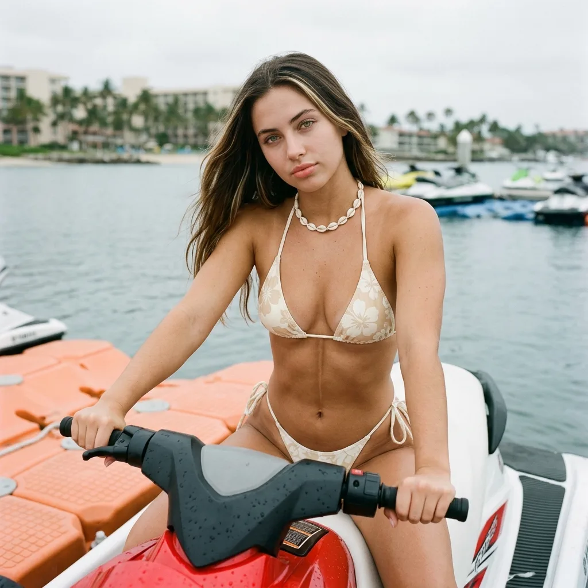

**#16 · Photography Prompt · <code>Vinano Image v2</code>**

<details>
<summary>Show prompt</summary>

```
Which pose do you like more? 🤣:

Prompt:
{
  "subject": {
    "demographics": {
      "age": "early 20s",
      "gender": "female",
      "ethnicity": "Caucasian"
    },
    "hair": {
      "color": "dark brown blonde highlights",
      "style": "long, loose, slightly windswept, falling over shoulders",
      "texture": "natural, fine strands"
    },
    "face": {
      "shape": "oval",
      "eyes": "light green, almond-shaped, direct gaze at camera",
      "nose": "straight bridge",
      "lips": "full, natural color, slight pout",
      "skin_texture": "natural, minimal makeup, slight tan"
    },
 "body_proportions": {
 "build": "hyper-curvy athletic, extreme hourglass silhouette",
 "bust": "voluminous, heavy, naturally weighted clear gravity effect, projecting outward, creating tension on the thin bikini straps",
 "waist": "extraordinarily narrow, cinched, high-definition abdominal tone, visible vertical 'Ab crack' line",
 "hips": "wide, flared, significantly wider than the ribcage and shoulders",
 "legs": "thick, muscular thighs toned definition, wide stance",
 "skin_details": "smooth even tan, realistic skin folds at the hip-waist junction, subtle goosebumps from the cold environment"
 },
    "attire": {
      "item": "string bikini",
      "color": "cream lighter flower designs",
      "material": "nylon swimwear fabric",
      "top_details": "triangle cups, halter neck tie, back tie",
      "bottom_details": "matching high-cut string bikini bottoms, tie-side closure, positioned high on the iliac crest to elongate the torso"
    },
    "accessories": {
      "neck": "short conch shell necklace"
    }
  },
  "pose": {
    "type": "seated leaning forward",
    "location": "on personal watercraft",
    "orientation": "body angled slightly right, face turned frontal",
    "arms": {
      "position": "resting on handlebars",
      "hands": "holding grips"
    },
    "legs": {
      "position": "straddling seat",
      "left_leg": "bent, resting on footwell",
      "right_leg": "bent, obscured"
    },
    "torso": {
      "posture": "leaning forward over handlebars"
    }
  },
  "setting": {
    "location": "coastal water floating dock",
    "foreground": "red/white Yamaha personal watercraft, orange plastic floating dock",
    "background": "calm water, distant shoreline resort hotels and trees under overcast sky",
    "props": "other personal watercraft partially visible",
    "clutter": "natural elements"
  },
  "camera": {
    "shot_type": "medium shot",
    "angle": "eye-level",
    "framing": "subject centered",
    "focal_length": "35mm",
    "depth_of_field": "moderate, background slightly soft",
    "perspective": "straight on",
    "aspect_ratio": "3:4"
  },
  "lighting": {
    "source": "overcast daylight",
    "direction": "diffused from above",
    "quality": "soft, even, no harsh shadows",
    "highlights": "subtle sheen on water and fiberglass",
    "shadows": "soft, barely defined",
    "color_temperature": "cool daylight (6000K)"
  },
  "mood_and_expression": {
    "emotion": "calm, direct, slightly alluring",
    "gaze": "direct eye contact camera",
    "atmosphere": "casual, overcast, aquatic"
  },
  "style_and_realism": {
    "aesthetic": "candid lifestyle photograph, raw, unfiltered",
    "realism_level": "true-to-life photorealistic, natural film grain",
    "skin_rendering": "natural texture, no airbrushing",
    "imperfections": "natural wind in hair, water droplets on PWC"
  },
  "colors_and_tone": {
    "palette": "muted greens, blues, grays, natural skin tones",
    "contrast": "medium",
    "saturation": "natural, slightly desaturated due to overcast light",
    "white_balance": "cool daylight"
  },
  "technical_details": {
    "resolution": "high resolution",
    "sharpness": "focus on subject's face and PWC details",
    "noise": "visible film grain"
  }
}

Maintain consistent colour harmony and crisp focus across the whole frame.
```

</details>

---

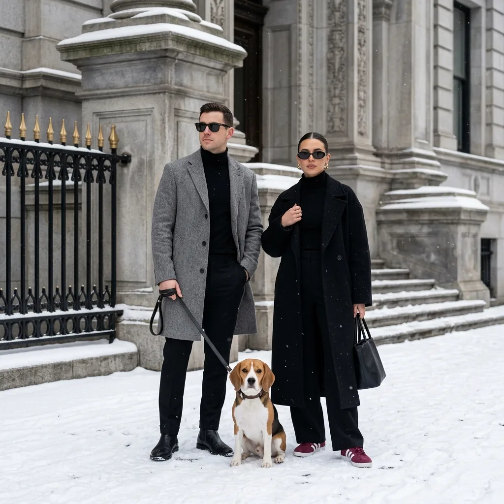

**#17 · Photography Prompt · <code>Vinano Image v2</code>**

<details>
<summary>Show prompt</summary>

```
{
 "prompt_title": "Sophisticated Urban Winter Couple Portrait",
 "environment": {
 "setting": "Upscale urban street corner during winter.",
 "architecture": "Massive grey stone pillar/building corner classical detailing.",
 "background_elements": "Black wrought-iron fence decorative gold finials/spikes. Classical stone building facade visible in background.",
 "ground": "Covered in fresh, clean white snow.",
 "atmosphere": "Light snow falling, snowflakes visible in the air. Cold, crisp winter day.",
 "color_palette": "Cool neutrals, stone grey, bright white snow, deep blacks, accent of burgundy."
 },
 "subjects": [{
 "id": "male_subject",
 "appearance": "Young adult male, fair skin, short dark hair styled neatly.",
 "clothing": {
 "outerwear": "Knee-length textured grey wool overcoat (possibly herringbone or tweed).",
 "top": "Black turtleneck sweater.",
 "bottoms": "Black tailored trousers, relaxed straight fit.",
 "footwear": "Black leather dress shoes or boots.",
 "accessories": "Black wayfarer-style sunglasses."
 },
 "pose": "Standing confident and upright, one hand in coat pocket, other hand holding a dog leash. Looking slightly to the side."
 },
 {
 "id": "female_subject",
 "appearance": "Young adult female, fair skin, dark hair pulled back into a sleek, tight bun.",
 "clothing": {
 "outerwear": "Long, oversized black wool coat.",
 "top": "Black fitted turtleneck.",
 "bottoms": "Black wide-leg trousers.",
 "footwear": "Burgundy/Maroon suede retro sneakers white stripes (Adidas Gazelle style).",
 "accessories": "Black oval sunglasses, thin black belt silver buckle, small gold hoop earrings, holding a black leather tote bag."
 },
 "pose": "Standing next to male subject, hand touching lapel of coat, other hand holding bag at side. Radiating 'cool girl' aesthetic."
 }],
 "additional_elements": {
 "animal": {
 "breed": "Beagle dog.",
 "pose": "Sitting obediently on the snow at the man's feet.",
 "appearance": "Tri-color fur (brown, black, white), wearing a collar and attached to a black leash."
 }
 },
 "lighting_and_mood": {
 "lighting_type": "Soft, diffuse overcast natural light (winter daylight). No harsh shadows.",
 "mood": "Chic, refined minimalist, 'Old Money' aesthetic, quiet luxury, sophisticated, serene, fashionable.",
 "tonality": "Desaturated slightly high contrast between the black clothing and white snow."
 },
 "technical_details": {
 "style": "Ultra true-to-life photorealistic, High-End Street Style Photography.",
 "camera_settings": {
 "lens": "85mm portrait lens.",
 "aperture": "f/2.8 for slight depth of field separation from the stone background.",
 "shutter_speed": "Fast enough to freeze falling snowflakes.",
 "iso": "Low ISO (100) for grain-free clarity."
 },
 "quality_modifiers": "8k resolution, highly detailed fabric textures (wool grain, leather sheen, suede texture), sharp focus on eyes/sunglasses, subsurface scattering on skin, cinematic composition, rule of thirds."
 }
}

Preserve realistic proportions and depth for a confident, professional finish.
```

</details>

---

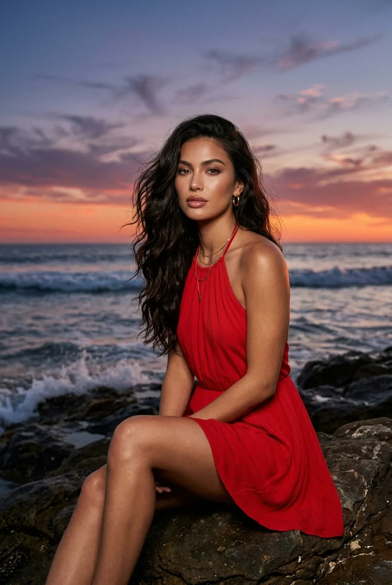

**#18 · Photography Prompt · <code>Vinano Image Pro</code>**

<details>
<summary>Show prompt</summary>

```
{
 "generation_request": {
 "meta_data": {
 "tool": "",
 "task_type": "photorealistic_single_image_editorial",
 "version": "v1.6_SUNSET_SEA_RED_DRESS_EDITORIAL",
 "priority": "highest"
 },
 "references": {
 "female_character_reference_image": "UPLOAD_FEMALE_REFERENCE (REQUIRED: IDENTITY + POSE INSPIRATION)"
 },
 "output_settings": {
 "aspect_ratio": "2:3",
 "orientation": "portrait",
 "resolution": "ultra_high_res",
 "render_style": "ultra_photoreal_high_fashion_editorial",
 "sharpness": "crisp_but_natural",
 "film_grain": "subtle_analog_film",
 "color_grade": "sunset_cinematic_warm_luxury"
 },
 "hard_constraints": ["ONE subject only (female).",
 "Perfect identity match to the uploaded reference (no face or body changes).",
 "No text, no logos, no watermarks.",
 "Perfect anatomy: hands, legs, proportions correct.",
 "Photoreal skin texture; no plastic or over-smoothed skin.",
 "No extra people, reflections, or background faces."],
 "creative_prompt": {
 "scene_summary": "Ultra-photoreal high-fashion editorial portrait at the seaside during sunset. The same woman as the reference poses confidently on dark coastal rocks by the ocean. She wears a striking red halter-neck mini dress soft flowing fabric and elegant movement. Her posture is poised and feminine, seated slightly angled toward the camera legs bent naturally.\n\nHair: long, glossy dark waves worn down, softly shaped by the sea breeze. Makeup: luminous editorial glam—defined brows, subtle contour, glowing skin, soft smoky eyes, glossy nude-rose lips. Expression: confident, calm, magnetic, direct eye contact the camera.\n\nBackground: open sea gentle waves, distant horizon line, dramatic sunset sky in gradients of deep orange, pink, purple, and blue scattered clouds. Lighting: cinematic dusk lighting subtle fill flash on the subject to balance exposure; natural rim light from the sunset outlining hair and shoulders. Skin tones warm and realistic.\n\nCamera: 85mm editorial portrait lens look, shallow depth of field; subject tack sharp while ocean and clouds fall off softly. Mood: sensual, powerful, timeless, luxury fashion campaign energy—editorial, cinematic, and iconic."
 },
 "negative_prompt": ["any text, logo, watermark",
 "identity drift",
 "extra people",
 "distorted anatomy",
 "extra limbs or fingers",
 "cartoon, anime, CGI look",
 "plastic or over-smoothed skin",
 "harsh flash blowout",
 "low resolution",
 "overly saturated colors",
 "cheap styling or artificial fabric look"]
 }
}

Maintain consistent colour harmony and crisp focus across the whole frame.
```

</details>

---

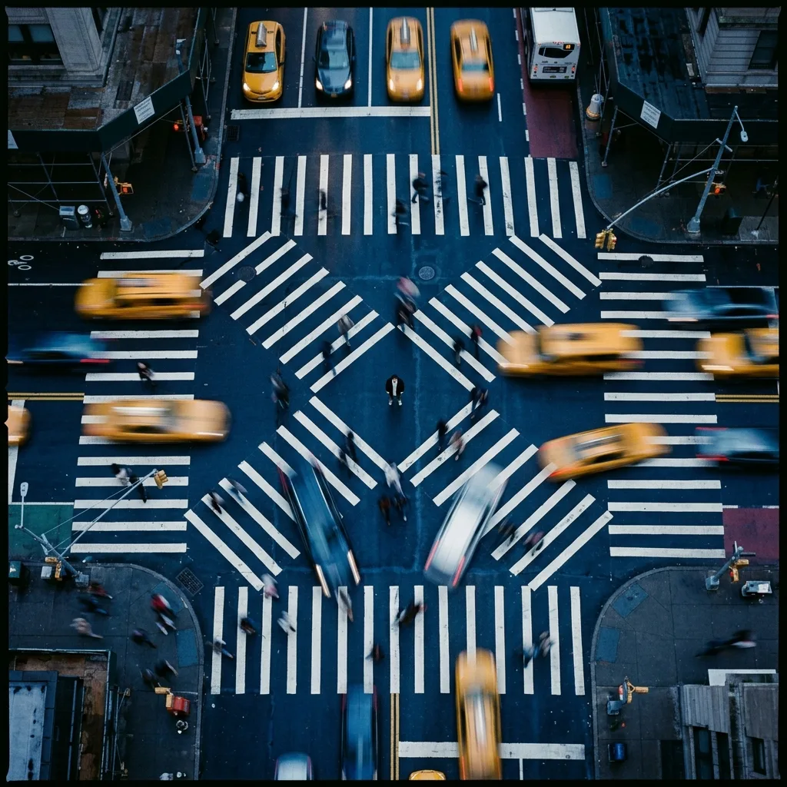

**#19 · Photography Prompt · <code>Vinano Image v2</code>**

<details>
<summary>Show prompt</summary>

```
Cinematic street photography capturing a moment in motion a crowd blur effect. Overhead portrait of me standing still on a crosswalk, wearing a white button-up shirt, black oversized jacket, and olive green cargo pants. Motion-blurred crowd rushes past. Moody city lighting, 35mm film aesthetic, shallow depth of field, sharp focus on my portrait, showcasing an artistic and timeless style. Emphasise material texture and natural light so the final frame feels tactile and premium.
```

</details>

---

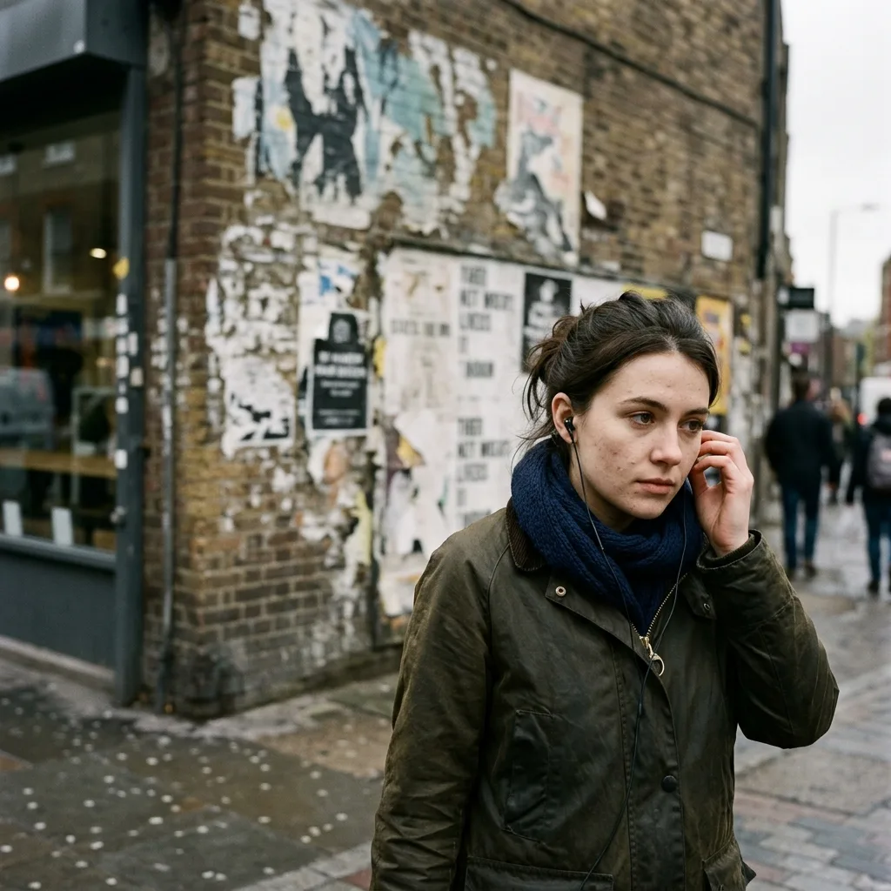

**#20 · Photography Prompt · <code>Vinano Image v2</code>**

<details>
<summary>Show prompt</summary>

```
{
 "generation_request": {
 "meta_data": {
 "tool": "",
 "task_type": "photoreal_artistic_street_photography",
 "version": "v1.0_STREET_ART_REALISM_SER_EN",
 "priority": "highest"
 },
 "output_settings": {
 "aspect_ratio": "4:5",
 "orientation": "portrait",
 "resolution_target": "ultra_high_res",
 "render_style": "ultra_photoreal_candid_film_still",
 "sharpness": "crisp_but_natural",
 "film_grain": "subtle_35mm",
 "color_grade": "restrained_cinematic_realism",
 "dynamic_range": "natural_not_hdr",
 "skin_rendering": "real_texture_no_retouch"
 },
 "creative_prompt": {
 "scene_summary": "Candid artistic street photograph on location in [CITY/NEIGHBORHOOD]. A real, unposed moment that feels documentary and emotionally true.",
 "subject": "A [AGE] [GENDER] wearing [CLOTHING], caught mid-action: [MICRO-ACTION]. Natural facial expression, slight asymmetry preserved.",
 "camera": "35mm lens equivalent, eye-level, close but respectful distance, imperfect framing like a real street photographer, focus on the eyes, shallow-to-medium depth of field.",
 "lighting": "Motivated natural light from [SOURCE: shop window / street lamp / sunset / neon], deep but detailed shadows, no studio lighting.",
 "environment_details": "Street textures: worn posters, scratched metal, rain-speckled pavement, subtle reflections in glass, real urban clutter, no clean studio background.",
 "authenticity_markers": "Subtle motion blur on background only, slight halation on highlights, tiny film gate weave, realistic grain, no beauty retouch.",
 "mood": "[MOOD: melancholic / hopeful / tense / quiet joy], cinematic but believable."
 },
 "negative_prompt": ["studio lighting",
 "beauty retouch",
 "plastic skin",
 "over-sharpened",
 "HDR",
 "AI glow",
 "perfect symmetry",
 "overly clean background",
 "fake bokeh shapes",
 "text",
 "logo",
 "watermark",
 "painterly",
 "cartoon"]
 }
}

Aim for an editorial, design-driven look with deliberate negative space.
```

</details>

---

## Illustration & 3D

_Showing 20 of 409 — see [`prompts/prompts.json`](prompts/prompts.json) for all._

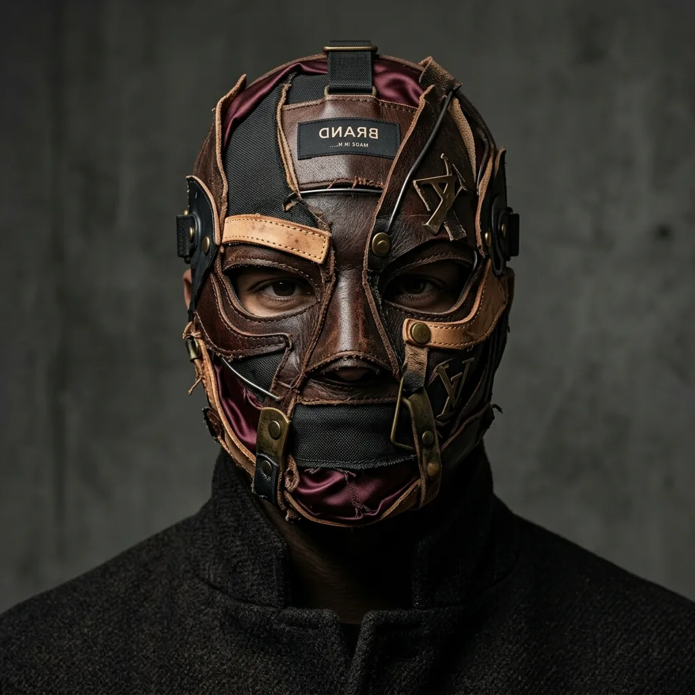

**#1 · Illustration &amp; 3D Prompt · <code>Vinano Image v2</code>**

<details>
<summary>Show prompt</summary>

```
[BRAND]. A hyperrealistic editorial photo of a figure wearing a unique helmet or mask that embodies the soul of BRAND turned inside out - its textures, symbols, colors and DNA reconstructed into an unexpected wearable object covering the entire face. The mask is made of BRAND's signature materials but distorted, inverted, reimagined as armor. Dramatic studio lighting, clean or atmospheric background, macro detail on every surface, Vogue editorial style, 8K Emphasise material texture and natural light so the final frame feels tactile and premium.
```

</details>

---

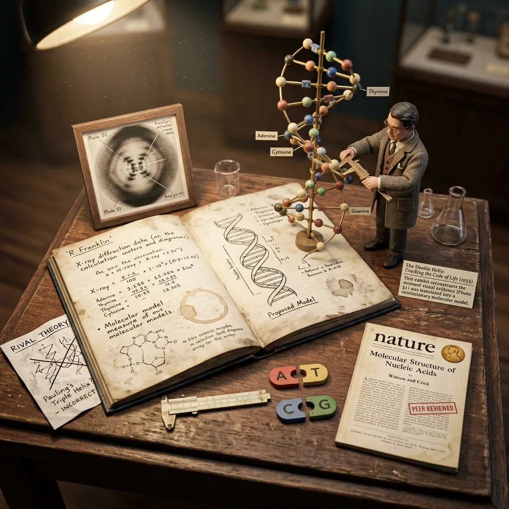

**#2 · Illustration &amp; 3D Prompt · <code>Vinano Image Pro</code>**

<details>
<summary>Show prompt</summary>

```
<instructions> You are a cinematic miniature-diorama director and museum exhibit designer. Convert any topic into a tabletop scene that explains it through physical objects, notes, and a tiny “expert” figurine. Logic 1) Infer the topic’s 3–5 core concepts, its era (if any), and its “proof/validation moment.” 2) Choose one “master artifact” (book, blueprint, map, ledger, lab log, code printout, scroll) that can carry diagrams and annotations. 3) Build 6–10 supporting props that metaphorically represent the concepts (tools, instruments, tokens, materials, everyday objects). 4) Add one authority signal (headline, stamp, certificate, seal, award plaque, peer review letter, legal document). 5) Place a toyified miniature figure (the “explainer”) interacting the artifact (writing, measuring, assembling). 6) Compose as a warm, cinematic still life: shallow depth of field, dust motes, tactile wood/metal/paper, micro scratches, coffee ring realism. 7) Ensure every prop has a legible purpose subtle labels, sketches, or iconography—no generic clutter. Draw: (a) a single hero scene, (b) 5 prop callouts what they symbolize, (c) camera + lighting notes, (d) optional negative cues to avoid (e.g., unreadable text blobs, random equations). The scene must be fully inferred from the given topic. </instructions> Aim for an editorial, design-driven look with deliberate negative space.
```

</details>

---

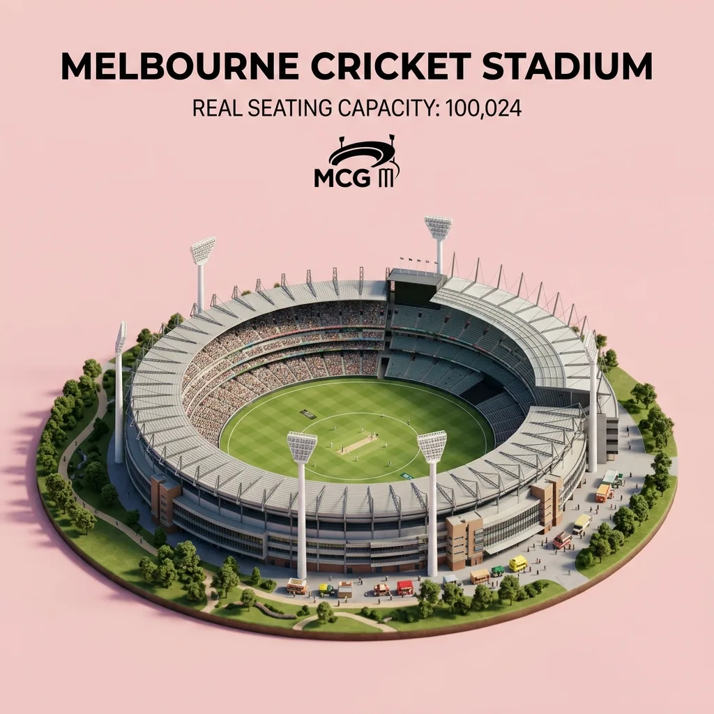

**#3 · Illustration &amp; 3D Prompt · <code>Vinano Image Pro</code>**

<details>
<summary>Show prompt</summary>

```
Ultra-Realistic Promotional
Present a clear, 45° top-down isometric miniature 3D cartoon scene of [MELBOURNE CRICKET STADIUM], soft refined textures, realistic PBR materials, and gentle lifelike lighting. Use a clean solid [GREEN, WHITE OR PINK] background. At the top center, display the name of this stadium in large bold text, then directly beneath it show its real seating capacity in medium text, and place the official logo associated this stadium below the capacity. All text must match the background contrast automatically (white or black). Centered layout, square 1080×1080 dimension.

Aim for an editorial, design-driven look with deliberate negative space.
```

</details>

---

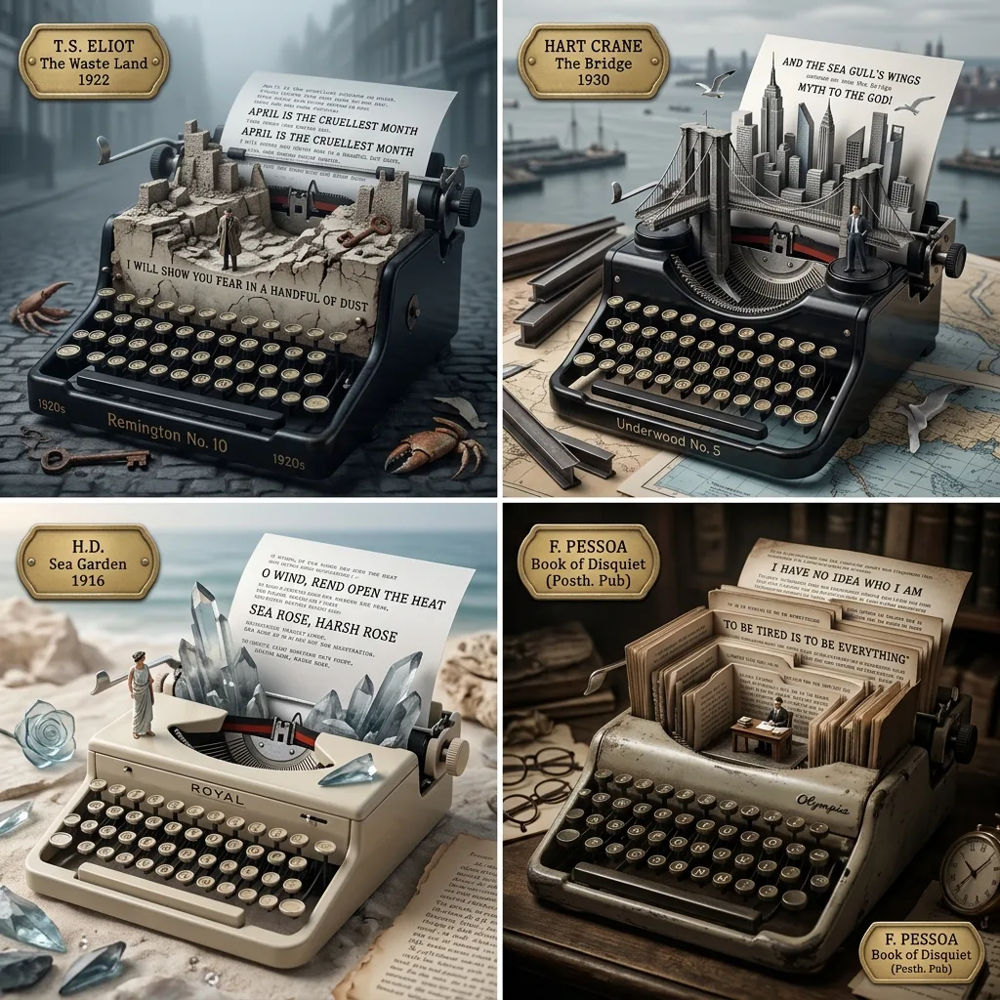

**#4 · Illustration &amp; 3D Prompt · <code>Vinano Image Pro</code>**

<details>
<summary>Show prompt</summary>

```
Role: Literary Curator & Typewriter Sculptor
Input: [Poet or Poem, e.g., T.S. Eliot, Pablo Neruda]
Phase 1: Poetic Voice Analysis
Identify the poet's signature rhythm, recurring imagery, and emotional core
Select 4 contemporary or lesser-known poets parallel sensibilities
Extract 5-8 physical objects mentioned repeatedly in their work
Phase 2: Visual Execution
Goal: 2x2 Grid of "Typewriter Output as 3D Landscapes"
Rules per Panel:
The Base: A vintage typewriter (different model per poet's era)
The Paper: A single sheet of paper loaded in the roller
The Transformation: The typed text physically rises from the page, forming a 3D topographical landscape
The Words: Key lines from the poem carved into the terrain like engraved stone
The Symbols: Miniature objects from the poem placed in the landscape (tiny boat, rose, clock, door)
The Poet: Microscopic figurine of the poet wandering through their own words
The Mood: Lighting matches emotional tone (fog for melancholy, harsh light for anger, soft gold for longing)
The Metadata: Brass typewriter key showing "Poet | Collection | Year" **background: poet and poet era relevant items in the background.
Output: 2x2 Grid, Macro Photography, shallow depth of field

Preserve realistic proportions and depth for a confident, professional finish.
```

</details>

---

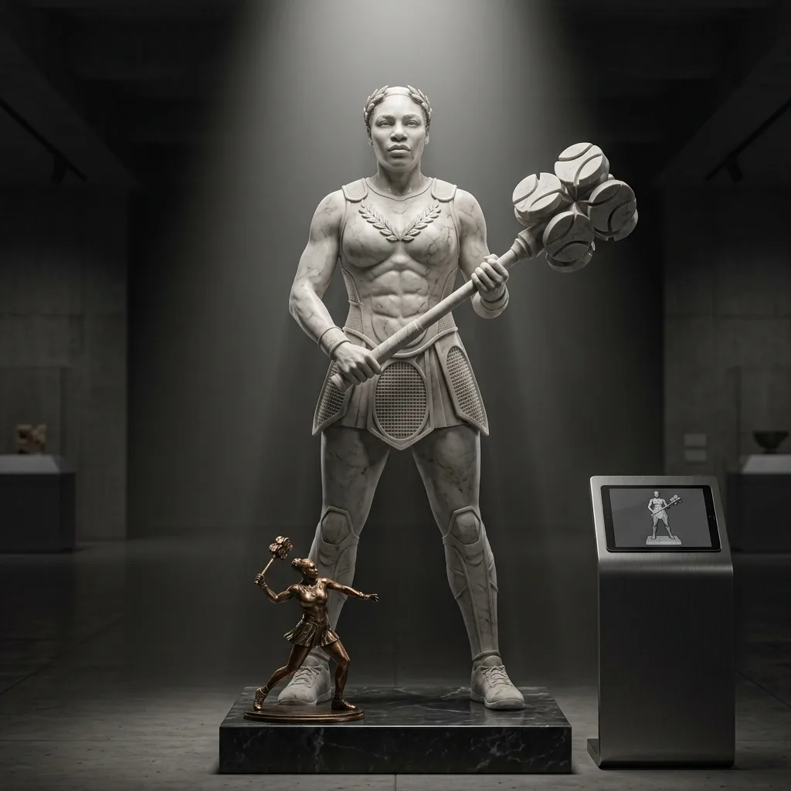

**#5 · Illustration &amp; 3D Prompt · <code>Vinano Image v2</code>**

<details>
<summary>Show prompt</summary>

```
<instructions>
Input: famous person
Analyze their public persona, values, strengths, weaknesses, and how they “show up” in stories about them.
Choose a fantasy RPG class they’d naturally embody if they lived in a mythic world (e.g., battle strategist → tactician, performer → bard, visionary → mage).
Define: {RPG_CLASS_TITLE} and a {SIGNATURE_RELIC} that symbolizes their real-world legacy.

Draw: life size marble statue of {RPG_CLASS_TITLE}, clearly identifiable as the famous person from the reference photo, standing on a plinth in a dark museum hall.
• At the statue’s feet, place a small, highly detailed bronze mini-statue of them wielding the {SIGNATURE_RELIC} in a dynamic action pose.
• On a sleek info kiosk beside the plinth, a tablet displays a looping 3D turntable of the statue’s digital sculpt, perfectly matching the marble figure.

Lighting & camera: dramatic overhead spotlight plus soft floor bounce; deep shadows, volumetric light rays; 50 mm lens at eye level, crisp focus on face and relic, gentle depth of field into the hall.
Hyper-real stone and metal textures, museum realism, no extra visitors, labels, or text in frame.
</instructions>

Maintain consistent colour harmony and crisp focus across the whole frame.
```

</details>

---

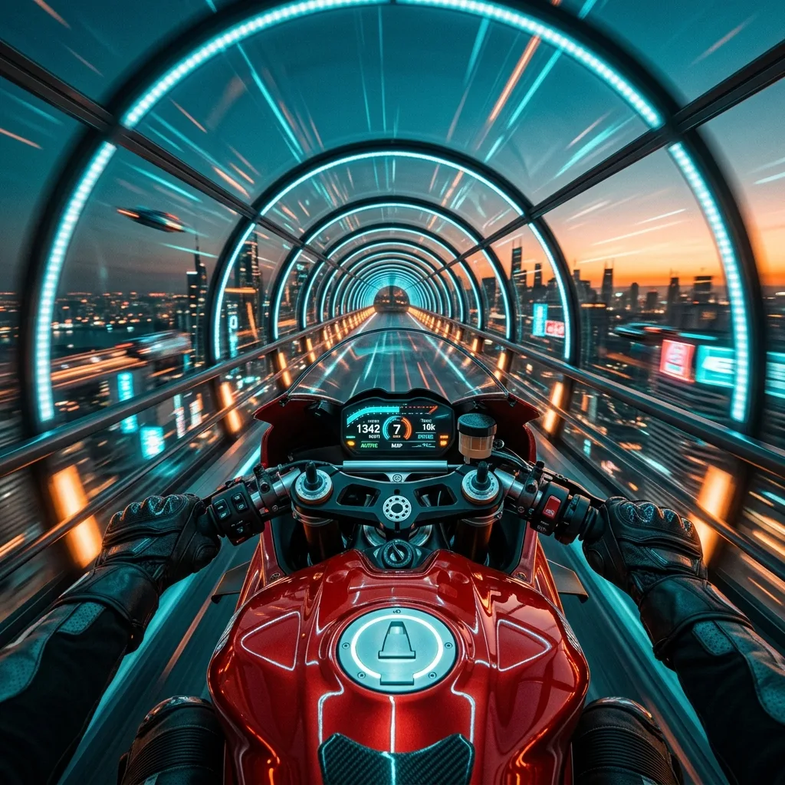

**#6 · Illustration &amp; 3D Prompt · <code>Vinano Image Pro</code>**

<details>
<summary>Show prompt</summary>

```
"Red futuristic sport motorcycle (POV perspective)",
      "visible_elements": "Glossy red fuel tank fuel cap, clip-on handlebars, black gloved hands gripping the grips, illuminated digital dashboard (slightly blurred)",
      "action": "Speeding at hyper-velocity through a suspended structure",
      "pose": "First-Person View (POV) / Rider's eye perspective looking slightly downward at the bike and forward into the horizon"
    },
    "environment": {
      "setting": "Transparent glass hyperloop tunnel / skyway",
      "location": "High altitude above a futuristic cyberpunk metropolis",
      "background_details": "Sprawling city grid infinite street lights below, skyscrapers, motion-blurred light trails",
      "horizon": "Dusk/Twilight sky a gradient of deep teal fading into a warm sunset orange strip"
    },
    "lighting_and_color": {
      "color_palette": "Cinematic Teal and Orange (Complementary colors)",
      "primary_tones": "Cyan/Turquoise glass reflections, Deep Red motorcycle paint, Golden/Orange horizon glow",
      "lighting_style": "High contrast, neon ambient lighting, specular highlights on the metal and glass surfaces"
    },
    "camera_technical": {
      "camera_angle": "Wide-angle POV (14mm to 16mm equivalent)",
      "focus": "Sharp focus on the motorcycle tank and handlebars, radial motion blur on the tunnel walls and city",
      "aperture": "f/2.8 (to capture low light details)",
      "shutter_speed": "1/30s (simulated drag shutter to create heavy motion blur effects on the surroundings)",
      "iso": "ISO 800",
      "composition": "Central symmetry, leading lines created by the tunnel structure converging at the center vanishing point"
    },
    "style_descriptors": ["Cyberpunk",
      "Synthwave aesthetic",
      "Hyper-realistic",
      "High velocity",
      "Futuristic",
      "Cinematic",
      "8k resolution",
      "Unreal Engine 5 render style"

Keep edges clean and the overall composition balanced for a polished, gallery-ready result.
```

</details>

---

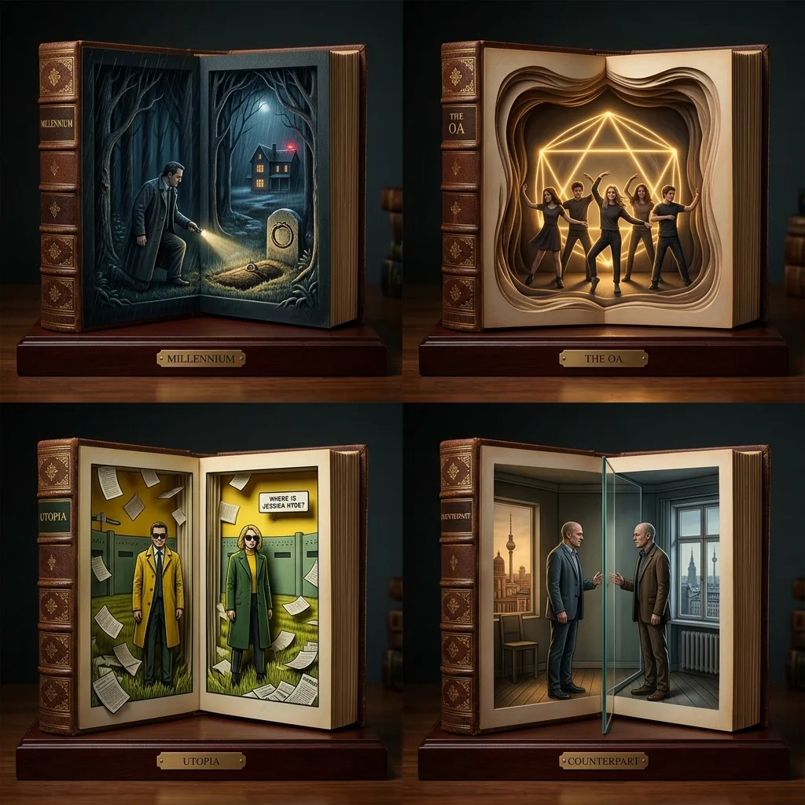

**#7 · Illustration &amp; 3D Prompt · <code>Vinano Image Pro</code>**

<details>
<summary>Show prompt</summary>

```
function recommend(x) { Determine type(x) (e.g. game, movie, book, or TV series) Role: world-class TV, book and movie expert Analyze x's style, storyline, tone, every aspect and find 4 hidden gems in type (x) {} return: 2x2 grid carved book-block dioramas, each grid antique leather-bound books hollowed and carved, warm reading-lamp glow from within, dark mahogany bases, ultra-realistic} draw(recommend (X -Files); Maintain consistent colour harmony and crisp focus across the whole frame.
```

</details>

---

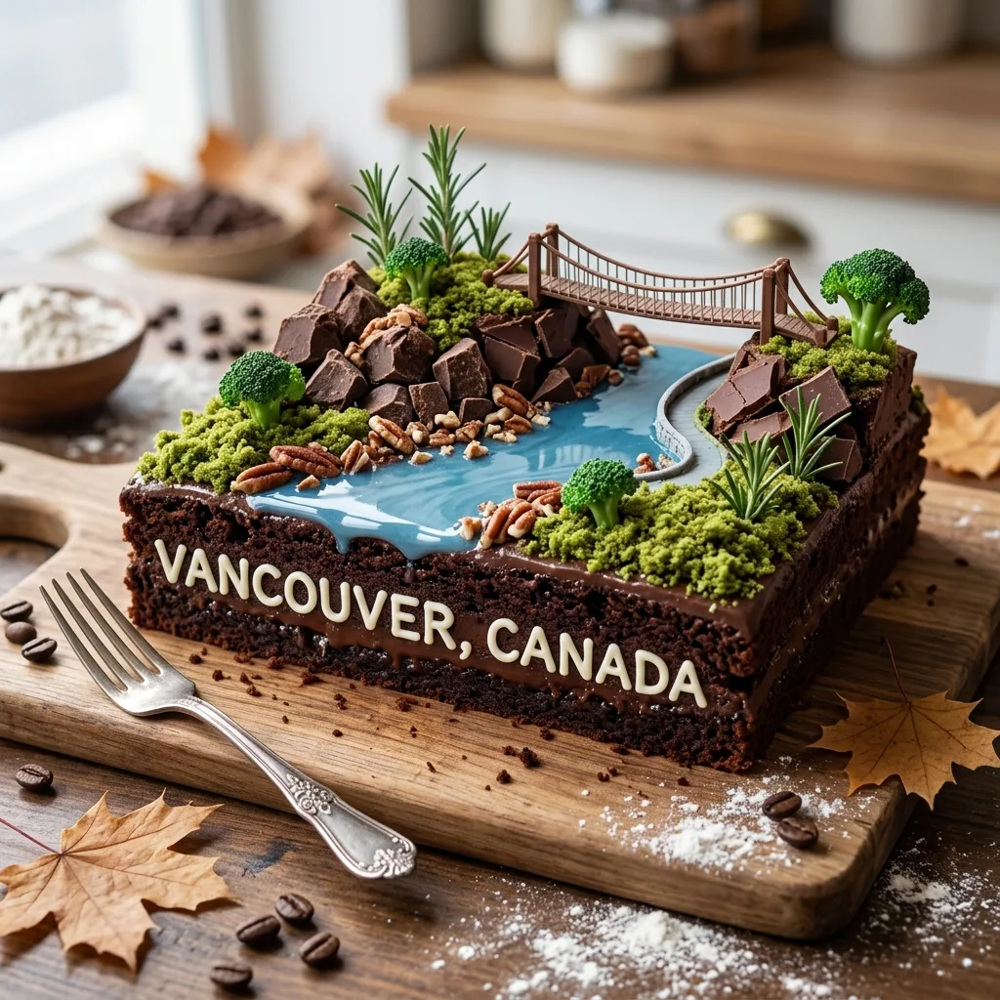

**#8 · Illustration &amp; 3D Prompt · <code>Vinano Image Pro</code>**

<details>
<summary>Show prompt</summary>

```
<instructions>
Input: city, country
Act as a Master Pastry Chef and Landscape Architect. Generate a hyper-realistic macro shot of a rectangular "Landscape Cake."
1. The Flavor Profile:
Analyze the Input Location to determine the Cake Base and Materials:
If Forest/Mountain (e.g., Canada): Dark Chocolate Brownie or Carrot Cake (simulating soil/earth).
If Tropical (e.g., Hawaii): Golden Sponge or Cheesecake (simulating sand).
If Snowy/Ice (e.g., Antarctica): White Vanilla or Coconut Cake (simulating snow/ice).
If Volcanic/Mars: Red Velvet Cake.
2. Geography:
Construct the terrain Edible Metaphors:
Trees: Broccoli florets, Rosemary sprigs, or Matcha sponge crumbs.
Water: Blue Jello, Mirror Glaze, or melted sugar glass.
Rocks: Chocolate chunks, crushed nuts (pecans/walnuts), or rock candy.
The Icon: A tiny, edible sugar-craft model of a local icon

3. The Typography:
The Letters: The Name of the Location is spelled out on the side of the cake slice.
The Material: The letters are formed from Fresh Fruit (Raspberries, Blueberries) or piped Buttercream embedded into the sponge.
4. The Plating:
The Board: The cake sits on a rustic wooden cutting board or a slate platter.
The Clutter: Scatter ingredients around the base that hint at the flavor (e.g., Cinnamon sticks, Maple leaves, Coffee beans, scattered flour).
The Tools: A vintage silver fork or cake knife rests on the side.
5. Lighting & Atmosphere:
Lighting: "Bakery Window" Light. Soft, natural daylight streaming in from the side, highlighting the moisture of the cake crumb and the gloss of the "water" glaze.
Depth: Shallow depth of field. The front corner of the cake is sharp; the background props are blurred.
Output: ONE image, 4:3 Aspect Ratio, Food Photography, "Great British Bake Off" Aesthetic.
</instructions>

Preserve realistic proportions and depth for a confident, professional finish.
```

</details>

---

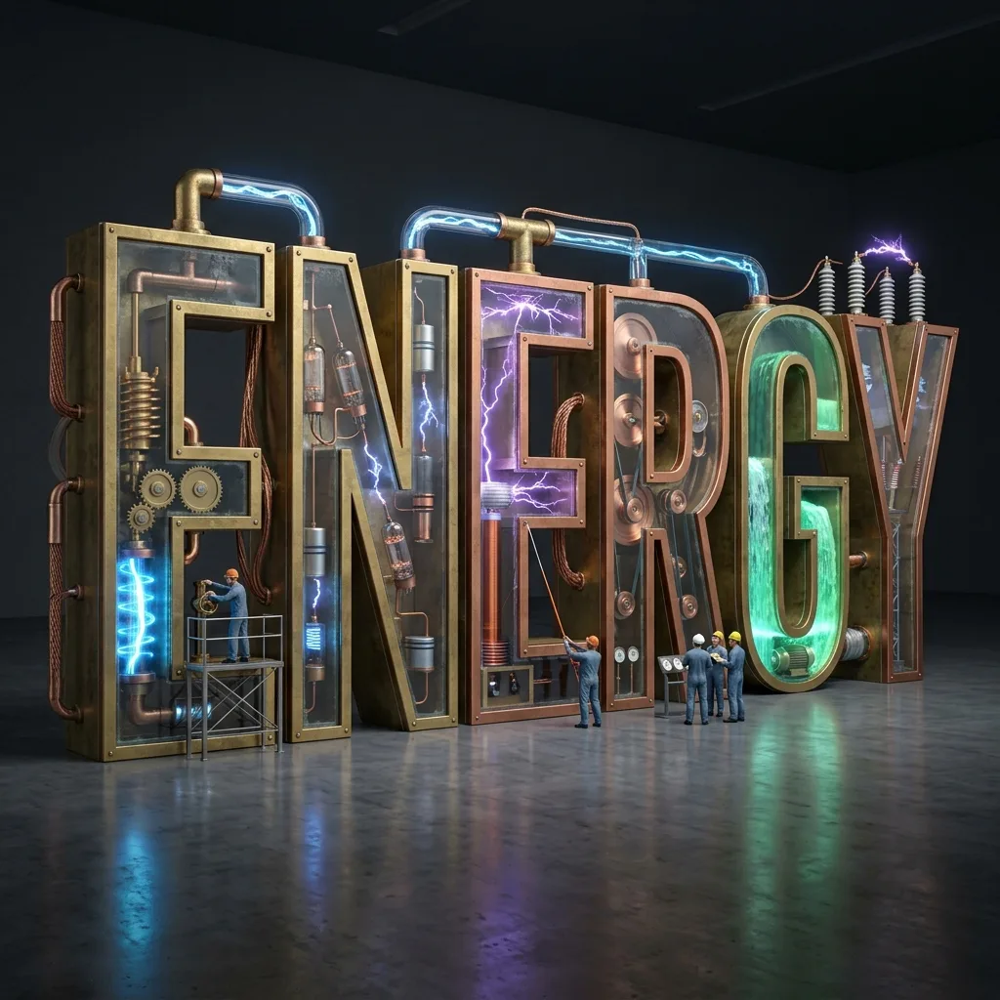

**#9 · Illustration &amp; 3D Prompt · <code>Vinano Image Pro</code>**

<details>
<summary>Show prompt</summary>

```
<instructions>
Input word or concept
Act as a Conceptual Sculptor. Generate a 3D typography render where the letters are constructed from materials that Physically Embody the Input Word.
1. Material & Physics Inference (The DNA):
Analyze the Input Word to determine the Structural Material and Internal Physics:
If Ethereal (e.g., TIME, SOUL): Use Glass, Brass, and Light. Physics = Flowing, ticking, glowing.
If Elemental (e.g., FIRE, MAGMA): Use Black Iron cages. Physics = Burning, dripping, smoking.
If Organic (e.g., GROWTH, LIFE): Use Wooden frames or Terrarium glass. Physics = Growing, blooming, condensation.
If Industrial (e.g., FACTORY, STEEL): Use Rusted Steel beams. Physics = Grinding gears, steam vents.
2. Container:
The Structure: The letters are massive, 3D structural frames.
The Transparency: The front face is open or transparent to reveal the Internal Mechanism.
The Logic: The frame must look like it was built to contain the specific substance inside (e.g., thick glass for gas; heavy iron for magma).
3. The Internal Mechanism:
Content: Fill the hollow letters the active element of the concept.
Example (TIME): Sand pouring from T to I; Pendulums swinging in M; Gears turning in E.
Example (FIRE): Real flames licking up the inside of F; Coals glowing in I; Smoke venting from R.
Connectivity: Pipes, wires, or vines connect the letters, transferring the energy from one to the next.
4. The Narrative Scale:
The Figures: Tiny 1:87 scale figures interact the letters.
Inference: If "TIME," figures are winding clocks. If "FIRE," figures are stokers shoveling coal. If "GROWTH," figures are gardeners watering plants.
5. Lighting & Atmosphere:
Source: The light comes from the Material itself (e.g., Fire glow, Bioluminescence, Neon).
Environment: The table/floor matches the theme (e.g., Burnt wood for FIRE; Mossy earth for GROWTH).
Output: ONE image, High Resolution 3D Render, Conceptual Art Aesthetic.
</instructions>

Keep edges clean and the overall composition balanced for a polished, gallery-ready result.
```

</details>

---

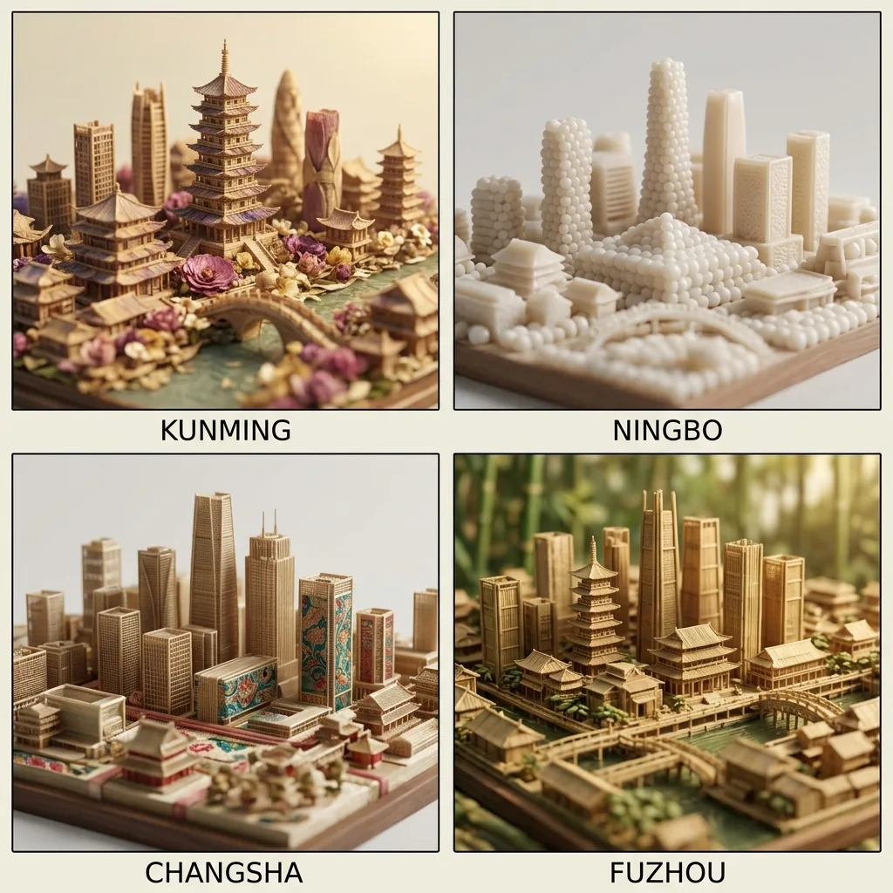

**#10 · Illustration &amp; 3D Prompt · <code>Vinano Image Pro</code>**

<details>
<summary>Show prompt</summary>

```
Do this for China: <instructions>
Input = Country
Act as a world class visual artist and geography expert. For every country, find 4 less known cities and the one product that is very popular there. Do research to get this step right.

Function Draw ($ City, $ Material) Anchor: [Location]:: [Material Concept]::4
Morphology: Miniature architectural cityscape of [Location], entire skyline constructed the assemblage of [Material Concept] components, skyscrapers and structures formed from the constituent parts of [Material Concept], thematic structural engineering, hyper-detailed diorama::3
Material Physics: Physical properties of [Material Concept] applied to architecture, [Material Concept] textures replacing concrete and glass, innate material logic of [Material Concept], high-fidelity surface details::3
Illumination: Lighting exhibiting the surface properties of [Material Concept], ambient occlusion, volumetric atmosphere matching the material theme::2
Render Stack: Tilt-shift photography, macro lens, f/2.8, 8k, scale model aesthetic, detailed texture mapping, Unreal Engine 5 render::1
Negative: [Human presence, massive scale, blurry, low resolution, bad geometry, distortions, flat 2D, text, watermark]:: -1

Output: 2x2 grid, for each panel execute Draw Function for one of the cities plus the associated popular product. Name of the city underneath
</instructions>

Preserve realistic proportions and depth for a confident, professional finish.
```

</details>

---

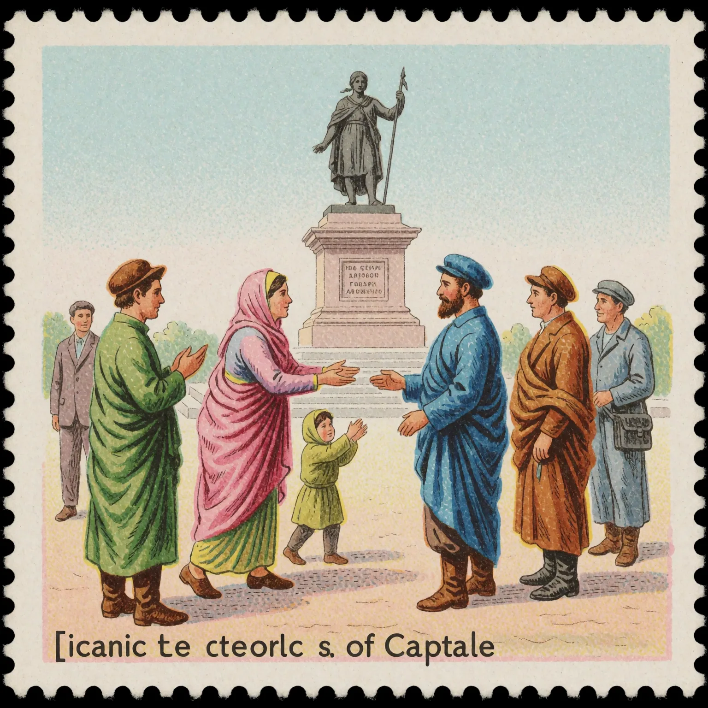

**#11 · Illustration &amp; 3D Prompt · <code>Vinano Flash</code>**

<details>
<summary>Show prompt</summary>

```
a vintage postage stamp depicting [iconic monument of a capital people interacting in the scene].
Pastel colors, extremely thin black border all around it, simple background, paper texture, high details

Maintain consistent colour harmony and crisp focus across the whole frame.
```

</details>

---

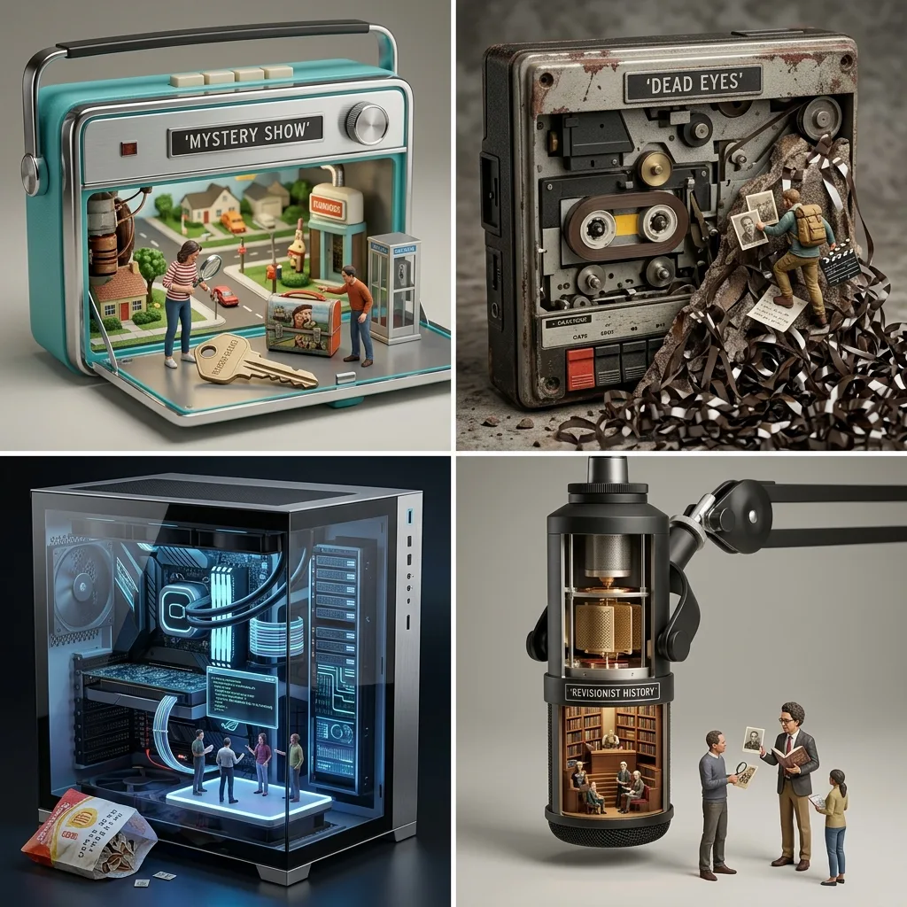

**#12 · Illustration &amp; 3D Prompt · <code>Vinano Image Pro</code>**

<details>
<summary>Show prompt</summary>

```
Input Variable: [INSERT PODCAST NAME]
System Instruction:
Act as a Media Archaeologist. Create a 2x2 Grid.
Curation: Identify 4 "Hidden Gem" podcasts similar to the Input.
Era Inference: For each podcast, determine its "Soul Era" (e.g., Is it gritty analog? Sleek digital? Retro radio?).
The Container: Generate an Audio Device specific to that Era (e.g., A Wood-Cabinet Radio, A Cassette Player, A Server Blade, A Podcast Mic).
The Cutaway: The device is hollow or open-faced.
The Interior World:
The Terrain: The internal components (Tubes, Tape, Circuits) transform into a landscape relevant to the podcast's topic (e.g., Circuits become city streets; Tubes become forest trees).
The Action: Tiny 1:87 scale figures (The Hosts) are exploring this landscape, interacting "Clues" or "Artifacts" derived from the show's content.
Label: The device's brand plate reads: [Podcast Name].
Output: 2x2 panel, each panel for a gem podcast

Preserve realistic proportions and depth for a confident, professional finish.
```

</details>

---

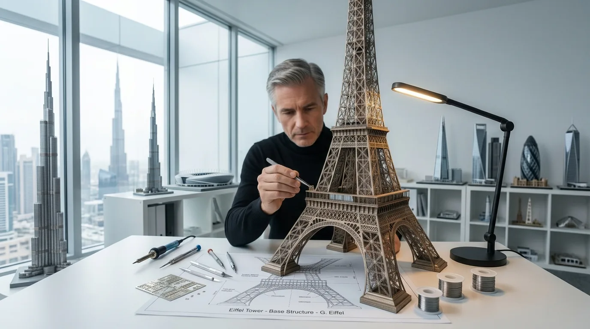

**#13 · Illustration &amp; 3D Prompt · <code>Vinano Image Pro</code>**

<details>
<summary>Show prompt</summary>

```
Do this for Eiffel Tower:

Input Variable: [INSERT STRUCTURE]
System Instruction:
Act as a Cinematic Director. Create a hyper-realistic portrait of a Master Model Maker putting the final touches on a scale replica of the Input Structure.
1. Logic:
Analyze the Input Structure to determine the Setting and the Character:
IF Ancient/Fantasy (e.g., Colosseum, Castle):
Room: A dusty, sunlit Renaissance Workshop (Stone & Wood). also showcasing "Previous Projects" (other models in the same genre).
Character: An elderly Artisan in a leather apron.
Materials: Plaster, Clay, Balsam Wood.
IF Sci-Fi/Industrial (e.g., Death Star, spaceship):
Room: A sterile, cold Industrial Design Lab (Concrete & Metal). also showcasing "Previous Projects" (other models in the same genre).
Character: A younger Prop Master in a workshop jumpsuit or lab coat.
Materials: Grey Resin (Kitbash), Styrene, Fiber Optics.
IF Modern Architecture (e.g., Skyscraper):
Room: A clean, white Architectural Firm (Glass & White Walls). also showcasing "Previous Projects" (other models in the same genre).
Character: A refined minimalist Architect in a black turtleneck.
Materials: White Foamcore, Acrylic, 3D Printed Plastic.
2. The Composition:
The Subject: The Character is leaning over a massive, incredibly detailed Scale Model of the Input Structure.
The Action: They are Tweezers or a fine brush to place a specific "Micro-Detail" relevant to the lore.
Death Star: Placing a tiny Turbo-Laser Turret.
Colosseum: Dusting sand onto the arena floor.
City: Gluing a tiny streetlamp.
The Scale: Extreme scale contrast. The human hands look giant next to the tiny windows/bricks of the model.
3. The Environment:
The Blueprint: On the table, beneath the tools, lies the correct reference document:
Sci-Fi: Blue grid schematic or iPad.
Fantasy: Yellowed parchment map.
Modern: White vector floorplan.
The Clutter: The tools scattered around must match the medium (e.g., Clay tools vs. Soldering Iron vs. X-Acto knives).
4. Lighting & Atmosphere:
Lighting Match: The lighting must match the inferred room.
Workshop: Warm God Rays (Dusty).
Lab: Cool Fluorescent Tubes (Clean/Hazy).
Focus: Shallow depth of field. Sharp focus on the tweezers and the contact point.
Output: ONE image, 16:9 Aspect Ratio, Cinematic Photography, 8k Resolution.

Maintain consistent colour harmony and crisp focus across the whole frame.
```

</details>

---

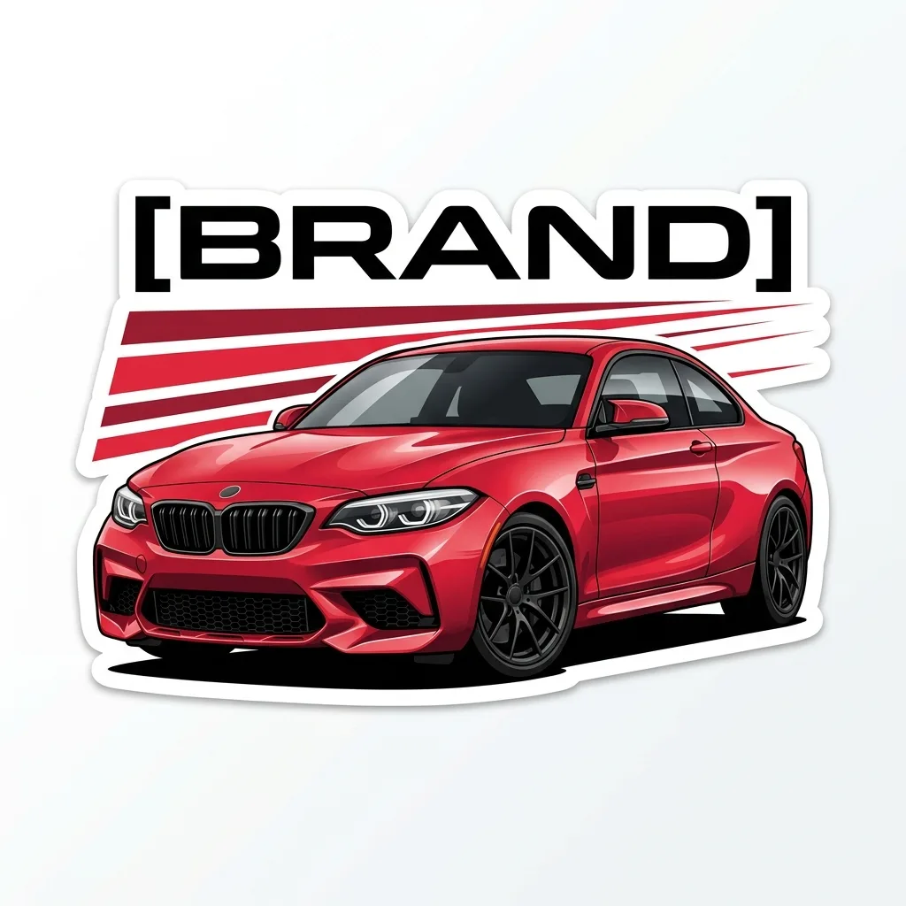

**#14 · Illustration &amp; 3D Prompt · <code>Vinano Image</code>**

<details>
<summary>Show prompt</summary>

```
Create a premium-quality vector art illustration of a [COLOR] [BRAND + MODEL] viewed from a dynamic front-side angle, a modern car sticker design. The car should have detailed shading, black sport rims, and a glossy finish that reflects light. Add the text “[BRAND]” above the car in bold, modern font. Behind the car and text, include angled [STRIPE COLOR] stripes as a background element to add motion and energy. Use a white outline around the entire composition to give the sticker a cutout effect, just like a real die-cut sticker. Place the entire design on a plain white background to mimic how a sticker would appear. The overall design should be sporty, vibrant, and clean. Format: 1080x1080 pixels Render with rich micro-detail while keeping the layout uncluttered and intentional.
```

</details>

---

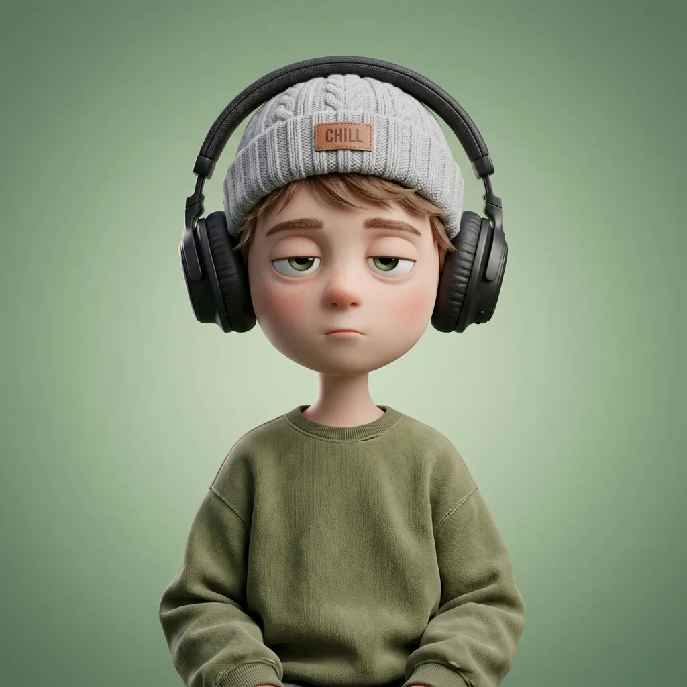

**#15 · Illustration &amp; 3D Prompt · <code>Vinano Image v2</code>**

<details>
<summary>Show prompt</summary>

```
A stylized 3D cartoon boy character a minimal, Pixar-like design, pale skin, slightly oversized head, and a slim body. He has half-closed sleepy green eyes, a bored expression, and soft facial features a small nose and subtle blush. He is wearing a light grey knitted beanie a small front label, large black over-ear headphones, and a loose green sweatshirt. The character is centered, facing forward, relaxed posture. Background is a smooth solid green gradient. Soft studio lighting, high detail, clean render, shallow depth of field, ultra-realistic textures, 4K. Emphasise material texture and natural light so the final frame feels tactile and premium.
```

</details>

---


**#16 · Illustration &amp; 3D Prompt · <code>Vinano Image Pro</code>**

<details>
<summary>Show prompt</summary>

```
Refined 3D isometric composition (45° angle) in a Glassmorphism + Soft Claymorphism style.
The center of the composition features gold bars, rendered hyper-realistic PBR materials, placed inside or surrounded by semi-transparent glass forms.

Visual Style Characteristics

Materials:
Primary focus on frosted glass strong background blur. Element edges feature a subtle white inner glow, simulating polished glass bevels.

Layers:
A multi-layered composition where UI and graphic elements float at different transparency levels, creating a pronounced sense of depth.

Geometry:
Perfectly soft, rounded corners (Apple-style squircles).

Element Details

Central Object:
Highly detailed gold bars precise engravings, realistically reflecting within surrounding glass surfaces.

Interface:
Floating panels a frosted glass effect (40–60% opacity). Panels display clean sans-serif typography showing data for January 30, 2026: price, trend arrow, and a neon micro-chart.

Environment:
Stylized elements (vault door, market icons) crafted from a mix of polished metal and semi-transparent plastic.

Technical Parameters

Lighting:
Soft studio lighting, realistic caustics (light passing through glass), and global illumination (GI).

Background:
Solid powder blue color (#B0E0E6), providing contrast translucent layers.

Render:
Cinema 4D, Octane Render, 8K resolution, ultra-high detail, clean minimalism.

Preserve realistic proportions and depth for a confident, professional finish.
```

</details>

---

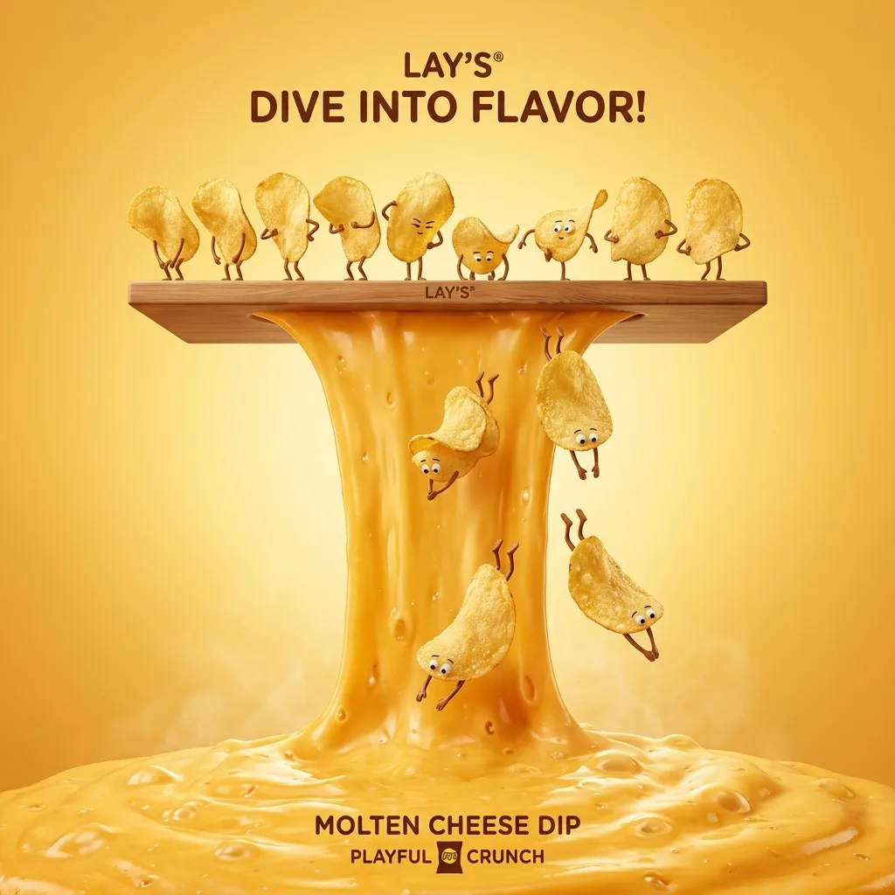

**#17 · Illustration &amp; 3D Prompt · <code>Vinano Image v2</code>**

<details>
<summary>Show prompt</summary>

```
Vertical snack advertising visual playful anthropomorphic tone. At the top, golden Lay’s potato chips arranged in a neat vertical queue, each chip posed like a diver on a diving platform, some slightly bent forward, some mid-tilt, suggesting preparation and focus before jumping. Below them, thick molten cheese flowing downward, glossy and stretchy, forming a rich cheese lava pool at the bottom. Several chips are frozen mid-air in clean diving poses, angled downward like synchronized divers, capturing a precise pre-splash moment. Warm yellow and cheese-orange gradient background, studio advertising lighting, soft highlights, refined shadows. Strong central axis composition, clear visual hierarchy. refined minimalist graphic layout, fun yet premium commercial food photography aesthetic, ultra-detailed textures, hyper-realistic, 8K resolution. Aim for an editorial, design-driven look with deliberate negative space.
```

</details>

---

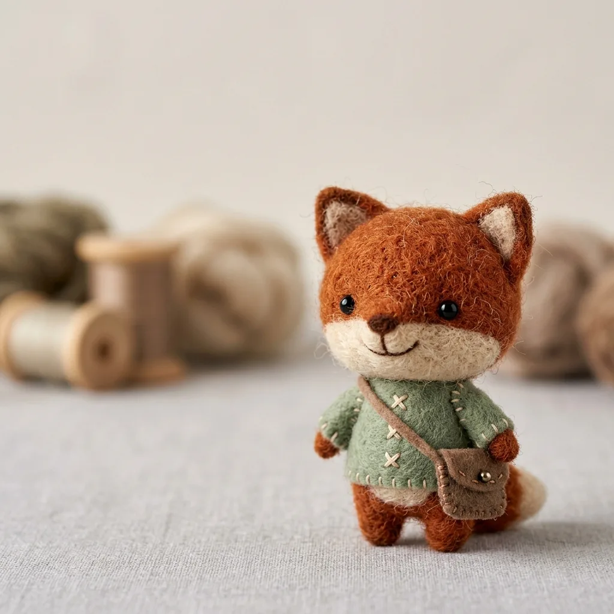

**#18 · Illustration &amp; 3D Prompt · <code>Vinano Image v2</code>**

<details>
<summary>Show prompt</summary>

```
{
  "target_style": "Handcrafted needle-felted wool miniature",
  "texture_properties": {
    "material": "organic roving wool, fuzzy fibers, soft tactile felt",
    "details": "visible needle-punch textures, soft fuzzy surface, handcrafted seams",
    "eyes": "small black bead eyes or simple felted circles"
  },
  "adaptation_rules": {
    "proportions": "stylized, slightly oversized head, simplified limbs, cute aesthetic",
    "color_palette": "retain original colors from source image but soften wool texture",
    "clothing": "simplified felt versions of the original outfits, tiny fabric buttons, stitched details",
    "accessories": "replicate key items from source as miniature felted props"
  },
  "environment": {
    "camera": "macro photography, close-up shot",
    "lighting": "soft studio lighting, warm highlights, gentle shadows",
    "background": "clean, out-of-focus bokeh background, neutral craft studio setting",
    "depth_of_field": "shallow depth of field (f/2.8)"
  },
  "rendering_engine_hints": "high fidelity, 8k, true-to-life photorealistic wool texture, Pixar-like character charm"
}

Aim for an editorial, design-driven look with deliberate negative space.
```

</details>

---

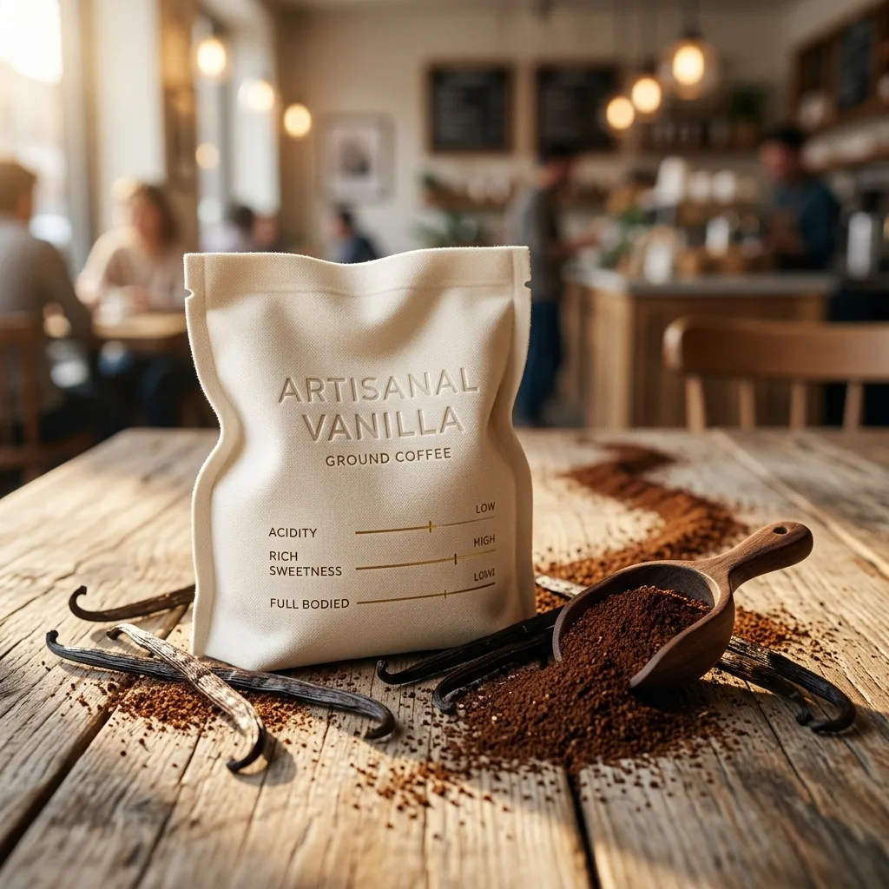

**#19 · Illustration &amp; 3D Prompt · <code>Vinano Image v2</code>**

<details>
<summary>Show prompt</summary>

```
Luxury product photography of artisanal vanilla ground coffee packaged in a soft sculpted ivory pouch gentle wave contours, minimal branding embossed into fabric. The pouch rests on a rustic oak tabletop dusted coffee grounds, accompanied by a hand-carved wooden scoop spilling aromatic powder.
Natural Madagascar vanilla pods curve organically around the base, blending into drifting coffee granules that form a subtle flowing aroma path instead of a spiral.
On the pouch front, a modern sensory chart: thin matte gold lines showing flavor balance — low acidity, rich sweetness, full-bodied depth.
Warm morning sunlight enters from the left at a low angle, creating soft shadows and tactile fabric highlights. Background fades into a cozy café interior creamy bokeh lights, evoking calm morning rituals.
Ultra-sharp macro texture on vanilla pods and coffee grains, cinematic depth of field, premium lifestyle aesthetic, inviting, warm, handcrafted, high-end brand feel.

Emphasise material texture and natural light so the final frame feels tactile and premium.
```

</details>

---

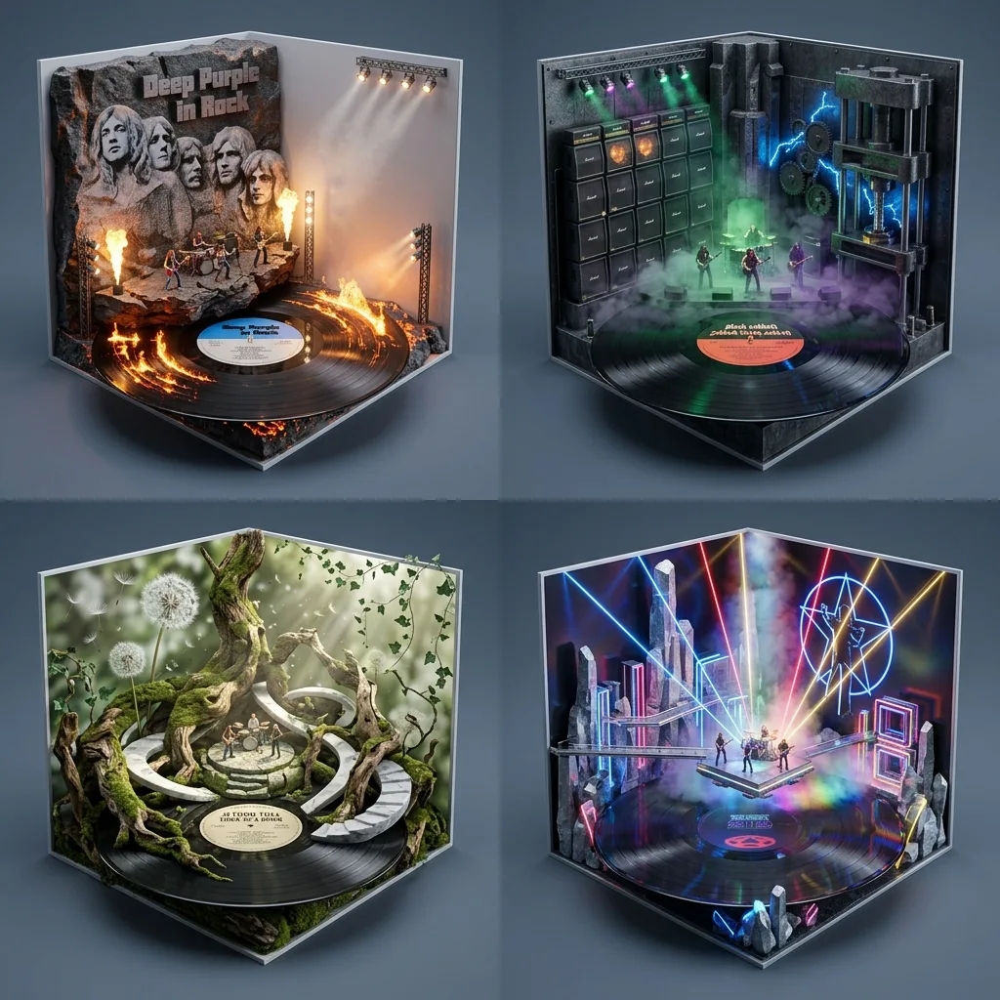

**#20 · Illustration &amp; 3D Prompt · <code>Vinano Image Pro</code>**

<details>
<summary>Show prompt</summary>

```
<instructions> Input Variable: [INSERT BAND/ALBUM]

System Instruction:
Act as a Music Historian and Set Designer. Create a 2x2 Grid of "Audio-Visual Dioramas."
1. The Curation Logic (The Deep Cuts):
Analyze Input: Identify the genre and sonic signature of the Input Band (e.g., Pink Floyd = Psychedelic/Prog Rock, Atmospheric, Surreal).
Select 4 Hidden Gems: Identify 4 lesser-known albums/artists that share this sonic DNA but offer a different flavor (e.g., King Crimson, Porcupine Tree, Yes, The Alan Parsons Project).
The Translation: For each album, define the "Sonic Materiality":
If Heavy Metal: Rusty Iron & Fire.
If Synth-Pop: Neon Glass & Chrome.
If Folk: Mossy Wood & Candlelight.
If Prog Rock: Surreal Marble & Floating Stone.
2. The "Immutable" Container (The Vinyl Stage):
The Base: Each diorama is built on top of a Spinning Vinyl Record acting as the circular stage floor.
The Plinth: The record sits on a high-end audiophile turntable platter or a wooden speaker box.
The Label: The center label of the vinyl clearly displays the Artist Name & Album Title in crisp typography.
3. The Composition (The Sound Made Solid):
CRITICAL: Do not just recreate the album cover. Build a world that feels like the music.
The Structure: Architecture rises from the grooves of the vinyl record.
Example: A wall of amplifiers, a surreal floating prism, a crumbling brick wall, or a forest of microphone stands.
The Atmosphere: Use particle effects to visualize the sound waves.
Visuals: Floating musical notes made of smoke, vibrating liquid surfaces, or shattered glass suspended in mid-air.
The Figures: Tiny 1:87 scale band members performing inside this surreal landscape.
4. Visual Syntax (Per Panel):
Panel A: Album 1 (Focus on Surrealism/Scale).
Panel B: Album 2 (Focus on Technology/Machinery).
Panel C: Album 3 (Focus on Nature/Organic Textures).
Panel D: Album 4 (Focus on Light/Color).
5. Lighting & Atmosphere:
Concert Lighting: Each box is lit like a stage show. Spotlights, laser beams, and stage haze.
Depth: Shallow depth of field (Tilt-Shift) to make the vinyl record look massive.
Background: Seamless Slate Grey to keep the focus on the colors.
Output: 2x2 Grid, Hyper-Realistic Miniature Set Design, 8k Resolution, "Audiophile" Aesthetic. </instructions>

Aim for an editorial, design-driven look with deliberate negative space.
```

</details>

---

## Product & Brand

_Showing 20 of 380 — see [`prompts/prompts.json`](prompts/prompts.json) for all._

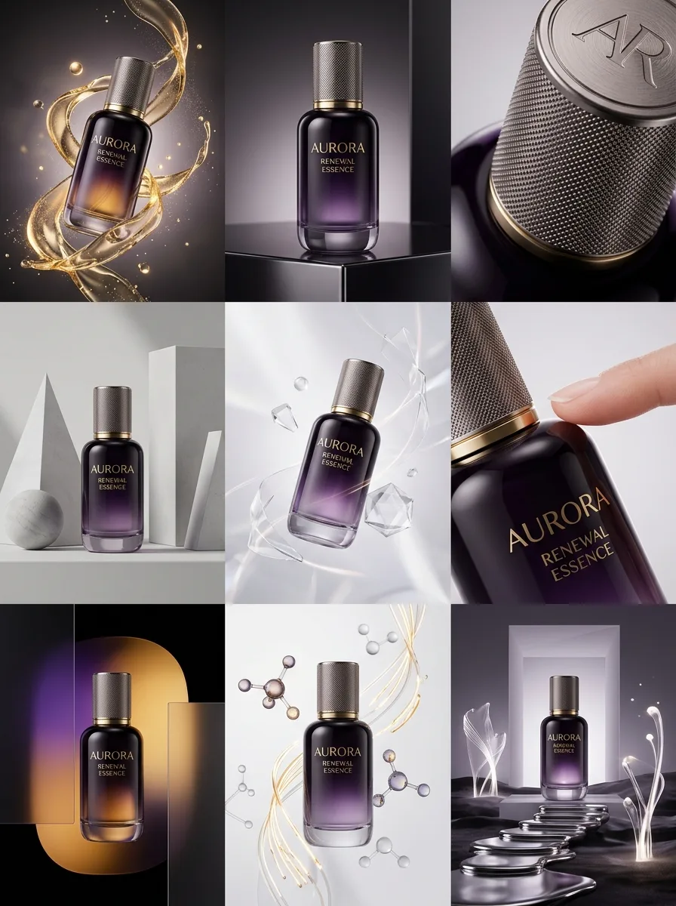

**#1 · Product &amp; Brand Prompt · <code>Vinano Image Pro</code>**

<details>
<summary>Show prompt</summary>

```
Create a 3×3 grid in
3:4 aspect ratio for a high-end commercial marketing campaign the uploaded product as the central subject.

Each frame must present a distinct visual concept while maintaining perfect product consistency across all nine images.

Grid Concepts (one per cell):

1. Iconic hero still life bold composition

2. Extreme macro detail highlighting material, surface, or texture

3. Dynamic liquid or particle interaction surrounding the product

4. Minimal sculptural arrangement abstract forms

5. Floating elements composition suggesting lightness and innovation

6. Sensory close-up emphasizing tactility and realism

7. Color-driven conceptual scene inspired by the product palette

8. Ingredient or component abstraction (non-literal, symbolic)

9. Surreal yet elegant fusion scene combining realism and imagination

Visual Rules:
Product must remain 100% accurate in shape, proportions, label, typography, color, and branding
No distortion, deformation, or redesign of the product
Clean separation between product and background

Lighting & Style:
Soft, controlled studio lighting
Subtle highlights, realistic shadows
High dynamic range, ultra-sharp focus
Editorial luxury advertising aesthetic
Premium sensory marketing look

Overall Feel:
Modern, refined, visually cohesive
High-end commercial campaign
Designed for brand websites, social grids, and digital billboards
Hyperreal, cinematic, polished, and aspirational

Maintain consistent colour harmony and crisp focus across the whole frame.
```

</details>

---

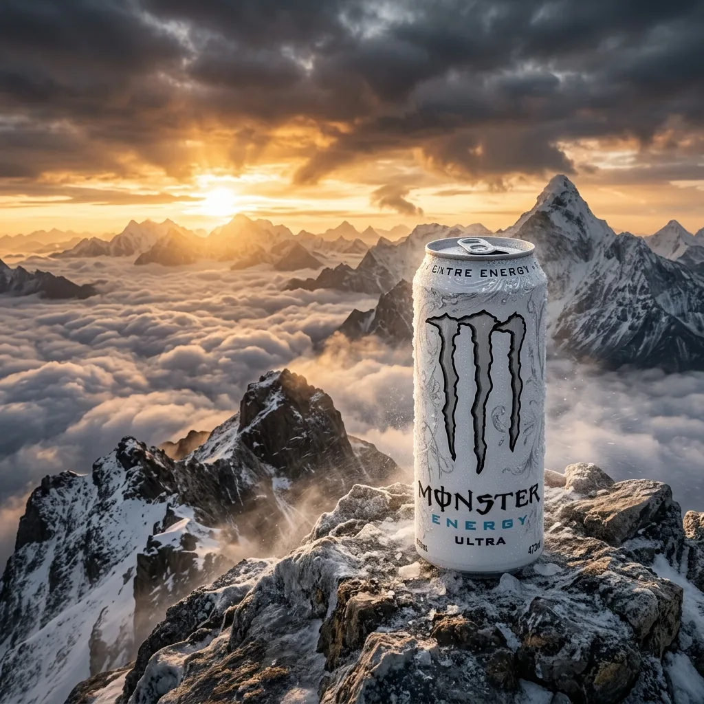

**#2 · Product &amp; Brand Prompt · <code>Vinano Image Pro</code>**

<details>
<summary>Show prompt</summary>

```
Product ad style AI image on a mountain peak above clouds Created Google Prompt used: Ultra realistic cinematic image of a White Monster Energy Ultra can standing on a sharp mountain peak above a sea of clouds, extreme high altitude atmosphere, dramatic stormy sky, golden sunrise breaking through clouds, wind whipping snow and mist around the can, liquid condensation and ice particles on the surface, bold powerful presence, epic scale contrast Render with rich micro-detail while keeping the layout uncluttered and intentional.
```

</details>

---

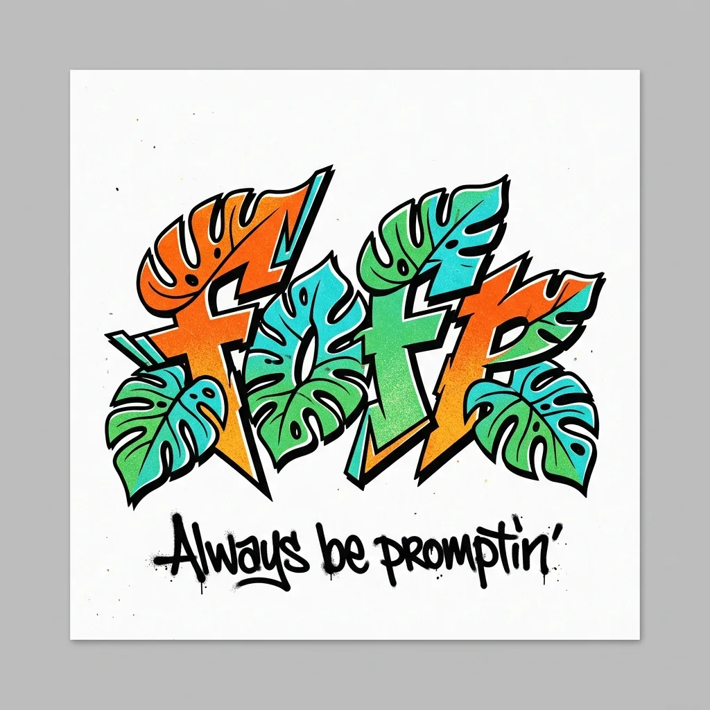

**#3 · Product &amp; Brand Prompt · <code>Vinano Image Pro</code>**

<details>
<summary>Show prompt</summary>

```
The word fofr as aggressive hard-edge graffiti a monstera leaf motif, beautifully stylised. The background is pure white. It is a risograph print. No color distortion. Vibrant and not faded. Stochastic stippling and sand-like noise pattern within color fills. A thick black outline. The tagline: "Always be promptin’", also in graffiti - but as a sprayed tag. Aim for an editorial, design-driven look with deliberate negative space.
```

</details>

---

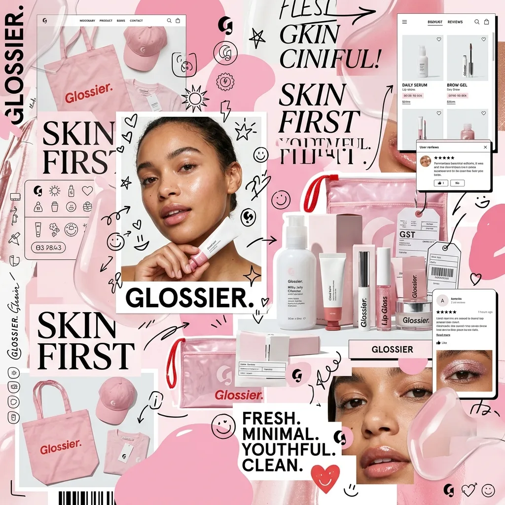

**#4 · Product &amp; Brand Prompt · <code>Vinano Image Pro</code>**

<details>
<summary>Show prompt</summary>

```
You are a world class creative director, brand strategist, editorial art director, and visual identity designer specializing in high impact campaign systems for global brands.

Your task is to create a bold, visually explosive, highly curated editorial moodboard collage composition that feels like a modern brand identity system.

This should feel like a brand world captured in one frame, not a clean layout, slightly chaotic, layered, and expressive.

BRAND INPUTS:

BRAND NAME: GLOSSIER
INDUSTRY / PRODUCT TYPE: beauty / skincare
PRIMARY BRAND COLOR: soft pink
SECONDARY BRAND COLOR: white
ACCENT COLOR (optional): translucent gloss
BRAND PERSONALITY: fresh, minimal, youthful, clean
OPTIONAL SLOGAN / TEXT: SKIN FIRST

VISUAL STYLE:

Create a dense, layered moodboard-style composition combining:

• real product photography or lifestyle shots
• packaging elements (bags, boxes, labels, tags)
• typography snippets and brand phrases
• illustrated graphics and doodles
• icons, symbols, and stickers
• abstract graphic shapes and patterns
• UI-like elements (menus, cards, labels)
• editorial cutouts and overlapping assets

The composition should feel:

• slightly messy but intentionally designed
• layered depth and overlaps
• like a Pinterest board meets high-end campaign
• expressive, youthful, and brand-heavy
• visually rich and scroll-stopping

ART DIRECTION:

Include a mix of elements such as:

• product packaging mockups (bags, boxes, labels, stickers)
• lifestyle shot (person interacting product or brand)
• bold typography blocks brand phrases
• illustrated objects interacting real elements
• menu-style or UI-style panels
• abstract shapes, blobs, squiggles, starbursts
• brand-related icons or symbols
• badge / stamp graphics
• textile or merch items (t-shirt, cap, tote bag, etc.)
• playful graphic overlays

COMPOSITION RULES:

• asymmetrical layout (NOT grid-based)
• elements scattered but balanced
• overlapping layers depth
• mix of large hero elements + small details
• combine clean areas dense clusters
• include cutout-style compositions
• avoid too much empty space

COLOR & DESIGN LANGUAGE:

• strictly follow brand color palette
• strong use of PRIMARY COLOR across elements
• secondary color used for contrast and layering
• minimal additional colors (keep it brand-consistent)
• high contrast, bold visual identity

TYPOGRAPHY:

• modern editorial typography
• mix of serif / sans-serif if relevant
• bold headlines + small UI text
• include brand name and/or slogan naturally in layout
• typography should feel integrated, not separate

VISUAL CHARACTERISTICS:

• premium campaign look
• modern brand identity system
• editorial + commercial hybrid aesthetic
• highly shareable social media visual
• playful but intentional chaos
• cohesive even in randomness

IMPORTANT:

This should feel like:

• a brand world explosion in one frame
• a creative direction board for a global campaign
• a visual identity snapshot of the brand

NOT a clean layout
NOT a grid
NOT minimal

It must feel alive, layered, and expressive.

Aim for an editorial, design-driven look with deliberate negative space.
```

</details>

---

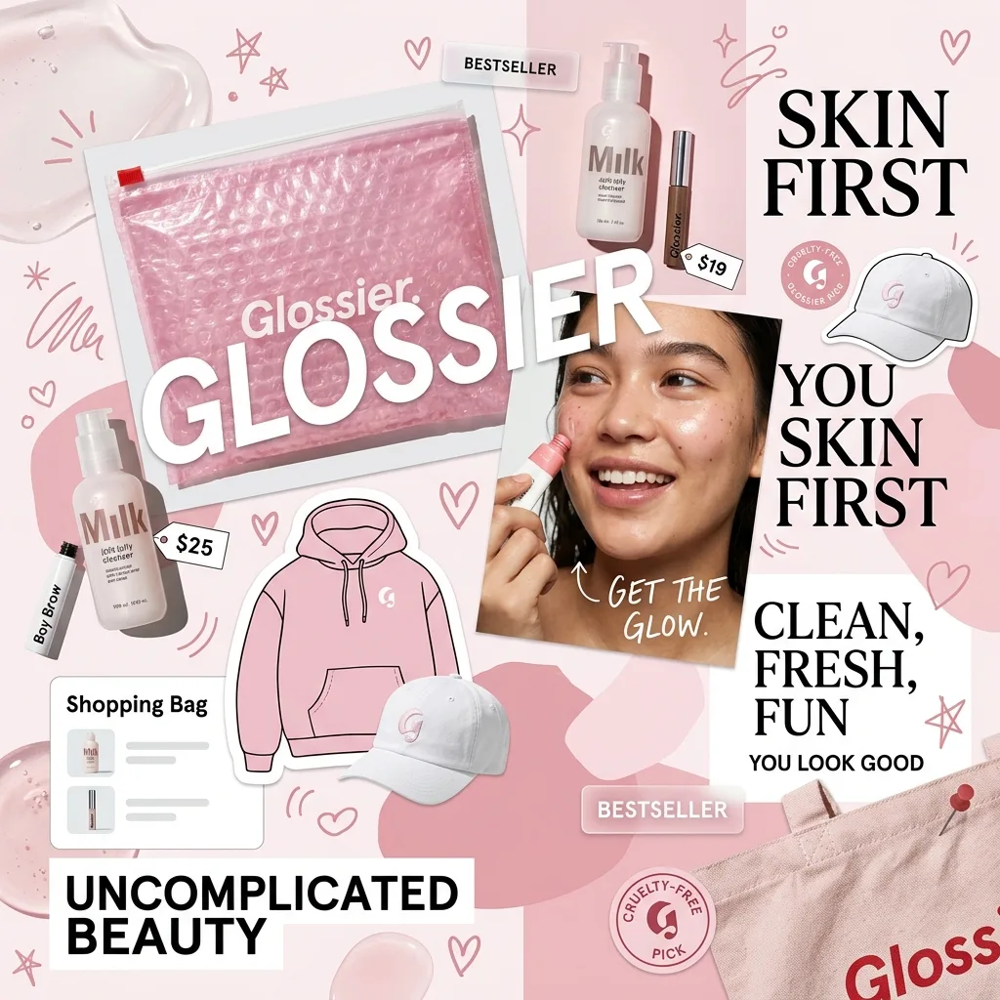

**#5 · Product &amp; Brand Prompt · <code>Vinano Image Pro</code>**

<details>
<summary>Show prompt</summary>

```
You are a world class creative director, brand strategist, editorial art director, and visual identity designer specializing in high impact campaign systems for global brands.

Your task is to create a bold, visually explosive, highly curated editorial moodboard collage composition that feels like a modern brand identity system.

This should feel like a brand world captured in one frame, not a clean layout, slightly chaotic, layered, and expressive.

BRAND INPUTS:

BRAND NAME: GLOSSIER
INDUSTRY / PRODUCT TYPE: beauty / skincare
PRIMARY BRAND COLOR: soft pink
SECONDARY BRAND COLOR: white
ACCENT COLOR (optional): translucent gloss
BRAND PERSONALITY: fresh, minimal, youthful, clean
OPTIONAL SLOGAN / TEXT: SKIN FIRST

VISUAL STYLE:

Create a dense, layered moodboard-style composition combining:

• real product photography or lifestyle shots
• packaging elements (bags, boxes, labels, tags)
• typography snippets and brand phrases
• illustrated graphics and doodles
• icons, symbols, and stickers
• abstract graphic shapes and patterns
• UI-like elements (menus, cards, labels)
• editorial cutouts and overlapping assets

The composition should feel:

• slightly messy but intentionally designed
• layered depth and overlaps
• like a Pinterest board meets high-end campaign
• expressive, youthful, and brand-heavy
• visually rich and scroll-stopping

ART DIRECTION:

Include a mix of elements such as:

• product packaging mockups (bags, boxes, labels, stickers)
• lifestyle shot (person interacting product or brand)
• bold typography blocks brand phrases
• illustrated objects interacting real elements
• menu-style or UI-style panels
• abstract shapes, blobs, squiggles, starbursts
• brand-related icons or symbols
• badge / stamp graphics
• textile or merch items (t-shirt, cap, tote bag, etc.)
• playful graphic overlays

COMPOSITION RULES:

• asymmetrical layout (NOT grid-based)
• elements scattered but balanced
• overlapping layers depth
• mix of large hero elements + small details
• combine clean areas dense clusters
• include cutout-style compositions
• avoid too much empty space

COLOR & DESIGN LANGUAGE:

• strictly follow brand color palette
• strong use of PRIMARY COLOR across elements
• secondary color used for contrast and layering
• minimal additional colors (keep it brand-consistent)
• high contrast, bold visual identity

TYPOGRAPHY:

• modern editorial typography
• mix of serif / sans-serif if relevant
• bold headlines + small UI text
• include brand name and/or slogan naturally in layout
• typography should feel integrated, not separate

VISUAL CHARACTERISTICS:

• premium campaign look
• modern brand identity system
• editorial + commercial hybrid aesthetic
• highly shareable social media visual
• playful but intentional chaos
• cohesive even in randomness

IMPORTANT:

This should feel like:

• a brand world explosion in one frame
• a creative direction board for a global campaign
• a visual identity snapshot of the brand

NOT a clean layout
NOT a grid
NOT minimal

It must feel alive, layered, and expressive.

Keep edges clean and the overall composition balanced for a polished, gallery-ready result.
```

</details>

---

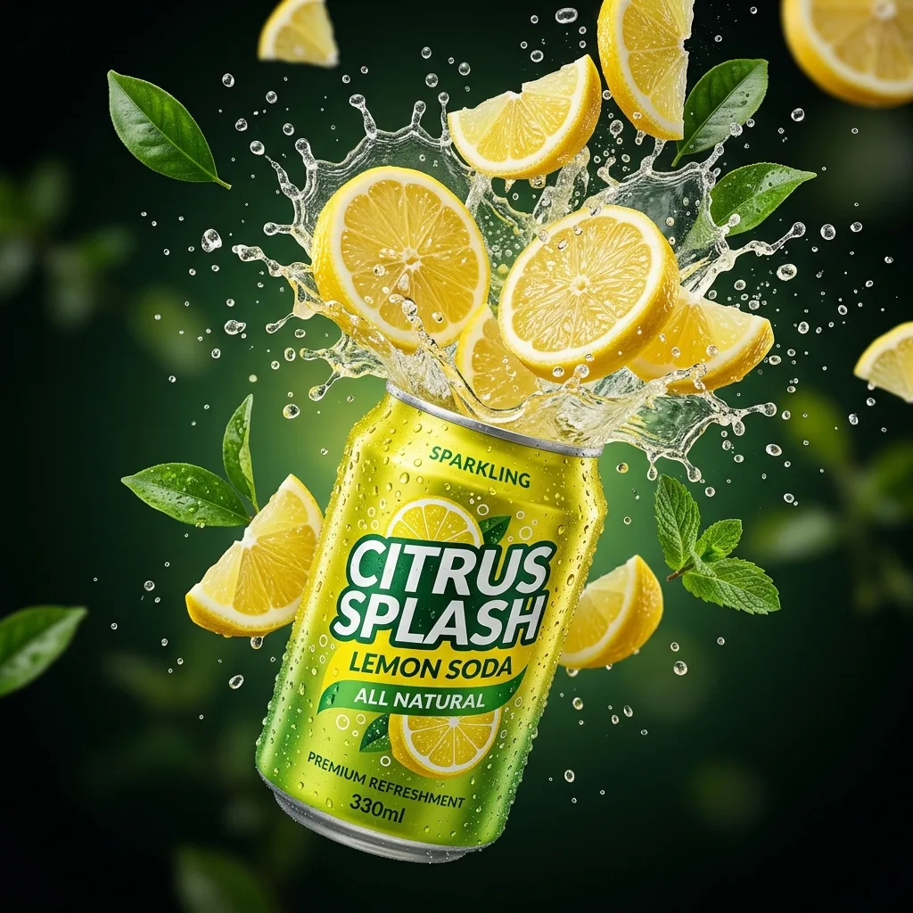

**#6 · Product &amp; Brand Prompt · <code>Vinano Image Pro</code>**

<details>
<summary>Show prompt</summary>

```
A hyper-realistic commercial product shot of a
lemon soda can, fresh lemon slices bursting
out of the can in a dynamic splash. The can is
covered in cold condensation droplets, glossy
metallic texture, vibrant yellow-green color palette.
Lemon wedges and citrus juice splashes frozen
mid-air, ultra-detailed lemon pulp visible. Fresh
green leaves floating around, dark green gradient
background, soft studio lighting, dramatic high-
lights, shallow depth of field, cinematic advertising
style, ultra-sharp focus, 8K resolution, photorealis-
tic, premium beverage ad. img

Render with rich micro-detail while keeping the layout uncluttered and intentional.
```

</details>

---

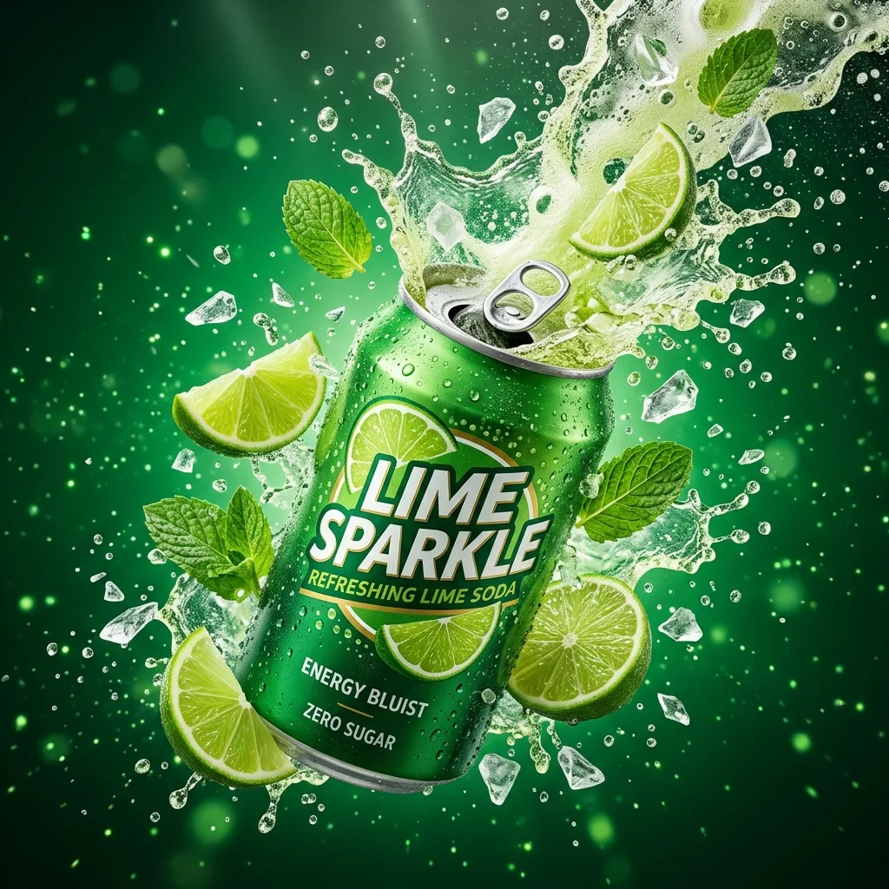

**#7 · Product &amp; Brand Prompt · <code>Vinano Image Pro</code>**

<details>
<summary>Show prompt</summary>

```
A hyper-realistic commercial product shot of a refreshing lime soda can exploding energy in mid-air. A vibrant green aluminum can covered in condensation, surrounded by sliced limes, mint leaves, and shards of ice, a dramatic water splash bursting from the top. Lime wedges collide the can, frozen in motion, droplets suspended in the air. Deep emerald green gradient background glowing particles, cinematic studio lighting, high contrast highlights, ultra-sharp focus on the can, macro-level texture detail. Dynamic action composition, refreshing summer mood, premium beverage advertising style, true-to-life photorealistic, 8k resolution. Aim for an editorial, design-driven look with deliberate negative space.
```

</details>

---


**#8 · Product &amp; Brand Prompt · <code>Vinano Image Pro</code>**

<details>
<summary>Show prompt</summary>

```
You are a world class creative director, brand strategist, editorial art director, and visual identity designer specializing in high impact campaign systems for global fintech and technology brands.

Your task is to create a bold, intelligent, visually striking campaign board that feels like a professional brand identity presentation for a modern fintech startup.

Create a campaign layout composed of multiple tiles arranged in a dynamic brand grid layout (not a strict 3x3 grid).

LAYOUT STRUCTURE:

Top Row
• one wide landscape hero tile
• one square tile

Middle Row
• three square tiles

Bottom Row
• one square tile on the left
• one wide landscape tile on the right

Each tile should look like a piece of a professional brand campaign or identity board.

BRAND NAME: [INSERT BRAND NAME]

PRIMARY BRAND COLOR: [INSERT COLOR]

SECONDARY BRAND COLOR: [INSERT COLOR]

ACCENT COLOR: [INSERT COLOR]

APP NAME: [INSERT APP NAME]

OPTIONAL SLOGAN: [INSERT SLOGAN]

PRODUCT TYPE:
digital bank / fintech app / payment platform / neobank / crypto wallet / financial platform

VISUAL STYLE:

Modern fintech brand campaign mixing:

• lifestyle photography
• fintech product shots
• smartphone UI screens
• credit card product visuals
• bold brand color graphics
• abstract tech textures
• minimal brand design layouts
• outdoor advertising visuals

The aesthetic should feel like a hybrid between:

Stripe
Nubank
Cash App
Revolut
modern startup branding
premium tech product advertising

ART DIRECTION:

The grid should combine multiple brand communication assets such as:

• hero brand visual
• mobile app interface
• credit card product shot
• lifestyle photos of people the app
• brand merchandise
• color palette graphics
• billboard campaign mockups
• technology inspired abstract visuals

Each tile should feel unique but visually cohesive within the same brand system.

TILE IDEAS:

TOP LANDSCAPE TILE
Abstract fintech hero visual brand colors glass / liquid / digital textures and the brand logo centered.

TOP RIGHT SQUARE TILE
Branded merchandise such as hoodie, tote bag, or apparel the brand logo and patterns.

MIDDLE LEFT TILE
Smartwatch or smartphone displaying the fintech app UI.

MIDDLE CENTER TILE
Close-up iPhone screen showing the fintech app dashboard.

MIDDLE RIGHT TILE
Brand color palette tile showing the official colors and minimal identity elements.

BOTTOM LEFT TILE
Lifestyle image of a young person the app on their phone.

BOTTOM RIGHT LANDSCAPE TILE
Outdoor campaign billboard on a modern building the slogan and brand campaign visual.

VISUAL CHARACTERISTICS:

• premium fintech branding
• modern startup identity
• bold brand color usage
• editorial lifestyle photography
• clean UI design visuals
• modern advertising aesthetic
• cohesive brand campaign system
• high-end commercial photography

IMPORTANT:

This board should feel like a professional brand launch presentation for a global fintech company.

Each tile should look like a different campaign asset but visually belong to the same brand identity system.

AI GENERATION NOTES:

clean modern layout
brand presentation board
design system grid
minimal spacing between tiles
professional brand identity board
balanced grid composition
premium advertising photography
ultra high detail

visualized as a modern startup brand identity board similar to a design presentation on Behance or Dribbble, cohesive campaign layout

Aim for an editorial, design-driven look with deliberate negative space.
```

</details>

---

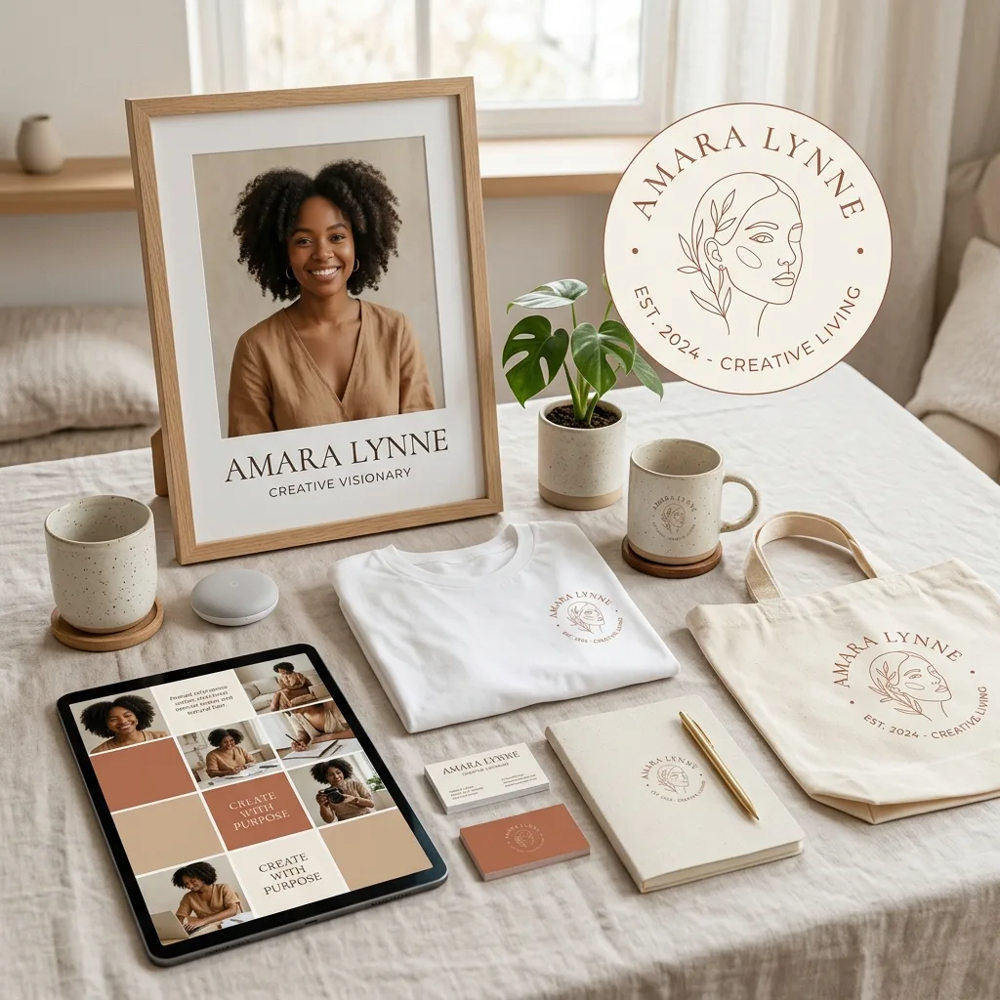

**#9 · Product &amp; Brand Prompt · <code>Vinano Image Pro</code>**

<details>
<summary>Show prompt</summary>

```
A clean, modern personal branding mockup featuring a cohesive visual identity for a female creator or entrepreneur. The scene includes a refined minimalist brand kit displayed on a soft neutral background: a framed portrait elegant typography, a circular logo a hand-drawn line-art face illustration, and branded merchandise such as a white t-shirt, tote bag, and ceramic mug printed the same logo. A grid-style social media layout showcases portrait photography, behind-the-scenes content, quotes, and solid color brand tiles in warm beige, cream, and muted terracotta tones. Google Gemini The overall aesthetic is creative, modern, and minimal, soft natural lighting, premium lifestyle photography, balanced composition, Scandinavian-inspired design, high-end branding presentation, editorial feel, and consistent typography. Ideal for a personal brand, content creator, or lifestyle entrepreneur identity showcase. Emphasise material texture and natural light so the final frame feels tactile and premium.
```

</details>

---

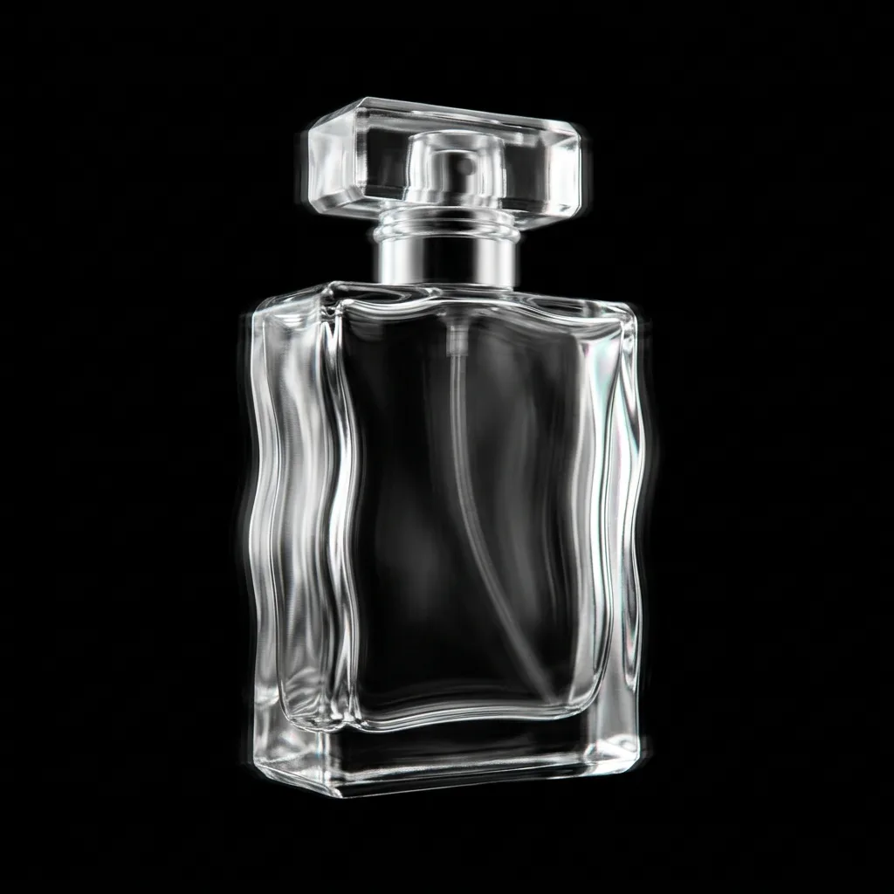

**#10 · Product &amp; Brand Prompt · <code>Vinano Image Pro</code>**

<details>
<summary>Show prompt</summary>

```
{
"project_name": "Distorted_Luxury_Motion",

"USER_CUSTOMIZATION": {
"product_description": "PRODUCT HERE"
},
"settings": {
"style": "Avant-garde luxury product photography, abstract distortion, dreamlike etherealism, monochromatic subtle color accents.",
"aspect_ratio": "4:5",
"camera_angle": "Camera positioned low, looking up at the product which stands perfectly vertical and upright"
},
"prompt_construction": {
"MAIN_SUBJECT": {
"subject": "{{USER_CUSTOMIZATION.product_description}}",
"presentation": "The product stands perfectly vertical and upright, completely isolated. It is the sole object in the frame. The product is rendered surreal, fluid distortion effects along its edges, appearing semi-solid as if vibrating or viewed through heat haze. The core form remains recognizable. No additional materials, fabrics, liquids, or extensions are added to the product."
},
"VISUAL_EFFECTS": {
"distortion": "Heavy 'scanline' or 'refraction' distortion effects applied only to the product itself. The edges and contours are wavy, rippled, and stretched, similar to looking through heat haze or warped glass. The distortion warps the product's silhouette.",
"blur_and_smudge": "Motion blur and gaussian blur soften details, creating a 'smudged' painterly look. Light appears to drag and streak across the product's form only.",
"ghosting": "Subtle vibratory ghosting on the product's edges only, reinforcing the feeling of movement.",
"color_treatment": "Predominantly monochromatic silver, black, and grey tones. Subtle iridescent color notes (cyan, magenta) appear only within the distortion effects and highlights on the product's edges."
},
"LIGHTING_AND_COLOR": {
"background": "MANDATORY: Pure solid black background, hex code #000000, RGB (0,0,0). The entire background must be uniformly black no gradients, no grey tones, no white, no other colors. Absolute flat black darkness zero variation.",
"background_restrictions": "The background has zero atmospheric effects: no glow, no light rays, no light beams, no light streaks, no halos, no fog, no mist, no haze, no gradients, no vignettes, no ambient light bleeding. The black remains pure, flat, and completely untouched by any lighting effects.",
"product_lighting": "Strict high-contrast chiaroscuro lighting on the product only. Bright, blown-out highlights on the rim and ridges create sharp contrast against deep shadows. These highlights have subtle, clean iridescent quality (cyan, magenta, silver) contained within the product's edges only. Light does not escape or radiate beyond the product's boundaries.",
"light_source": "Single key light source illuminating only the product. The light ends at the product's edges and does not extend into the background. No fill light, no background lights, no secondary light sources, no light spill into the void, no rays, no beams, no streaks."
},
"COMPOSITION": {
"perspective": "Camera positioned below eye level, angled slightly upward. The product stands perfectly vertical - perpendicular to the ground plane - in the center of frame.",
"positioning": "The product is suspended and floating in the void. It has no base, no ground surface beneath it, no support structure. It exists isolated in empty space.",
"framing": "The product is completely within the frame all edges visible. It must never be cropped or cut off by the canvas edges. No frames or borders around the image.",
"isolation": "Only the product exists in frame. No contextual environment, no surfaces, no additional objects, no props, no added materials."
},
"NEGATIVE_CONSTRAINTS": ["white background",
"grey background",
"colored background",
"gradient background",
"light background",
"any background color other than pure black #000000",
"light rays",
"light beams",
"light streaks shooting across background",
"diagonal light streaks",
"radial light beams",
"volumetric light rays",
"god rays",
"sunbeams",
"light shafts",
"studio light streaks",
"tilted product",
"laying down",
"horizontal orientation",
"diagonal angle",
"dutch angle",
"product rotation",
"ground surface",
"floor",
"base",
"platform",
"pedestal",
"reflections on ground",
"pooling liquid",
"melting onto surface",
"fabric draping",
"cloth extensions",
"liquid extensions",
"additional materials attached to product",
"background glow",
"atmospheric haze in background",
"light halos in void",
"background lighting effects",
"chromatic aberration in background",
"light spill into black areas",
"ambient background illumination",
"background vignette",
"background gradient",
"background fog",
"background mist",
"extra light sources",
"fill light",
"rim light on background",
"multiple products",
"double exposure",
"added glass objects",
"water droplets",
"other objects",
"props",
"contextual environment",
"frames",
"borders",
"product cut off by edges",
"cropped product",
"extreme low angle",
"extreme perspective distortion",
"sharp focus",
"perfect clarity",
"static image",
"flat lighting",
"warm color palette",
"saturated colors",
"vibrant colors",
"complex background",
"realistic rendering",
"eye-level view",
"high angle view",
"straight horizon lines",
"clean edges",
"no distortion",
"matte finish",
"natural daylight",
"softbox lighting",
"bokeh",
"film grain",
"commercial catalog look",
"studio setup visible",
"photography equipment visible"],
}
}

Emphasise material texture and natural light so the final frame feels tactile and premium.
```

</details>

---

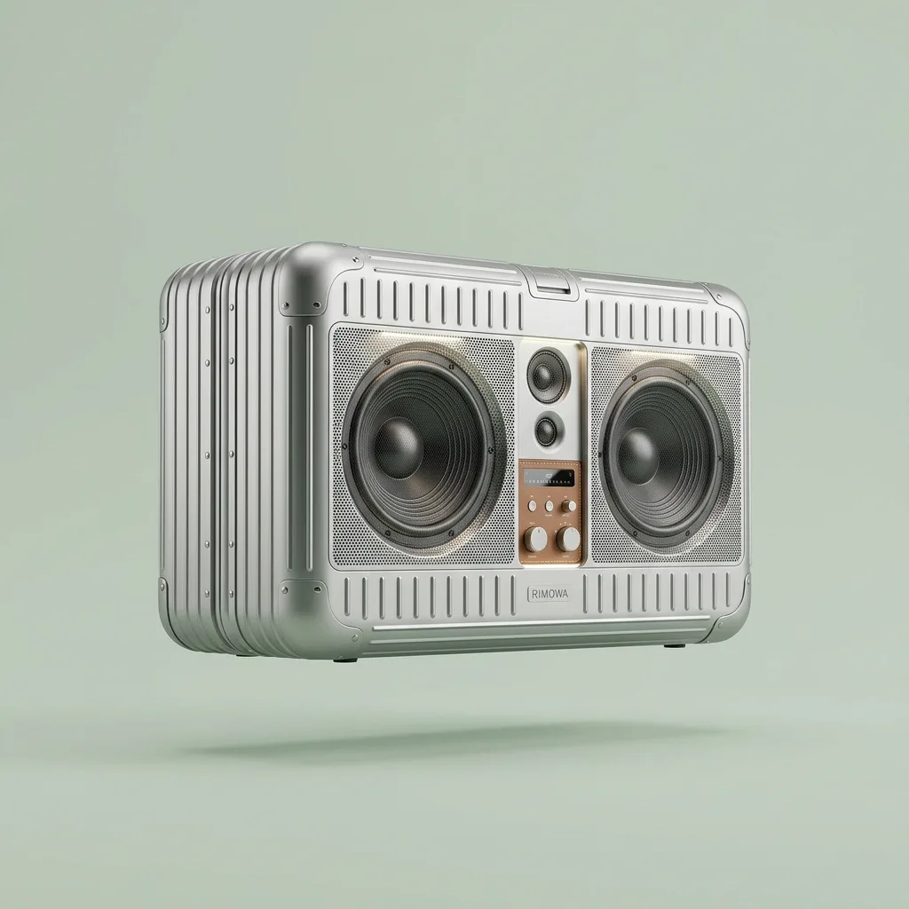

**#11 · Product &amp; Brand Prompt · <code>Vinano Image Pro</code>**

<details>
<summary>Show prompt</summary>

```
[BRAND NAME] design language, object reimagined as an unexpected flagship product of the brand for the next decade. Crafted from signature materials and textures. Distinctive aesthetics, iconic form factor, embodiment of brand philosophy, high-end industrial design.

COMPOSITION & STAGING:

The object is floating suspended in mid-air within the studio space (anti-gravity effect). It is positioned strictly dead center in the frame.

Negative Space: There is a wide, generous margin of empty space (air) surrounding the object on all sides.
Framing: The object is fully contained within the image boundaries absolutely no cropping.

PHOTOGRAPHY:

Professional product photography, soft volumetric lighting, clean light pastel background, ultra-detailed.

Preserve realistic proportions and depth for a confident, professional finish.
```

</details>

---

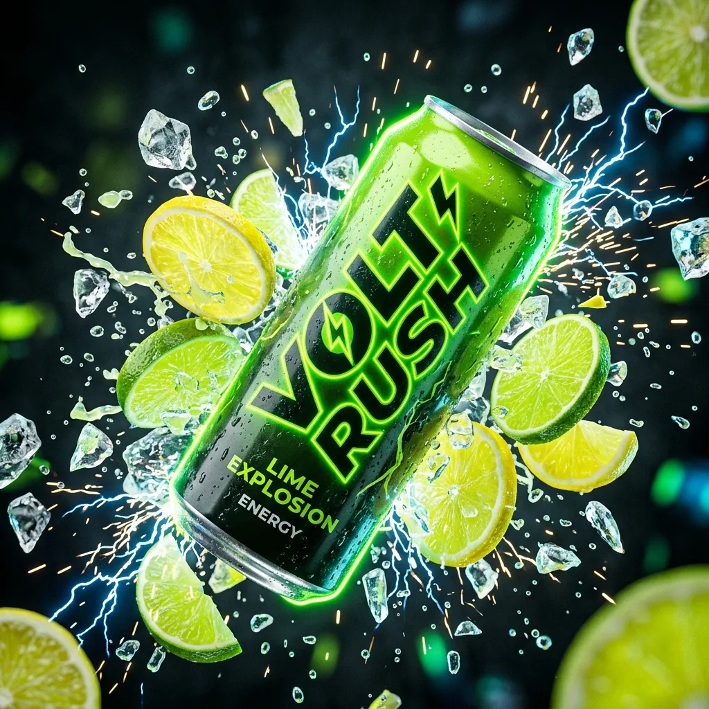

**#12 · Product &amp; Brand Prompt · <code>Vinano Image Pro</code>**

<details>
<summary>Show prompt</summary>

```
Ultra-cinematic product photography of a neon-green energy drink can labeled “VOLT RUSH”, tilted at a sharp diagonal, bursting through glowing citrus slices and electric sparks. Frozen splashes of lime juice and ice shards suspended mid-air, micro droplets visible. High-contrast studio lighting green neon rim lights, dark background, glossy aluminum texture, shallow depth of field, true-to-life photorealistic, 8K, premium ad style. Maintain consistent colour harmony and crisp focus across the whole frame.
```

</details>

---

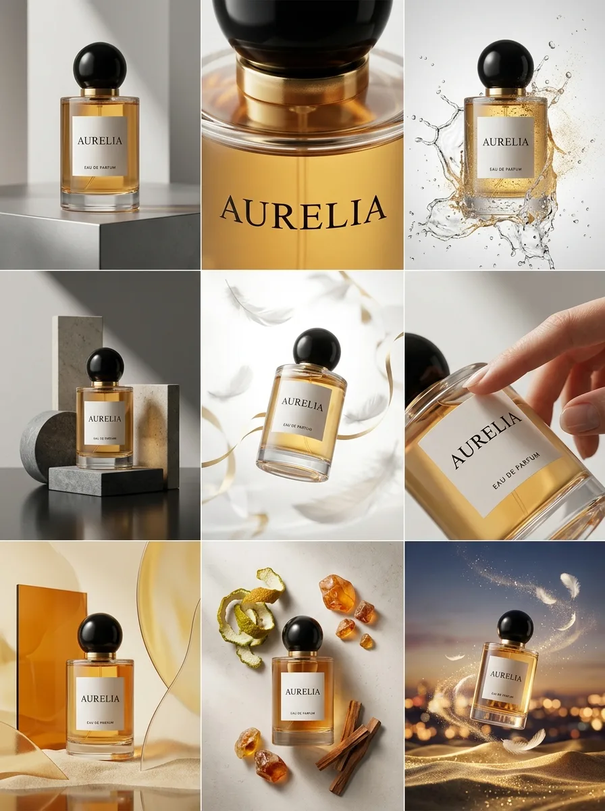

**#13 · Product &amp; Brand Prompt · <code>Vinano Image Pro</code>**

<details>
<summary>Show prompt</summary>

```
为高端商业营销活动创建3×3网格，3:4纵横比，以上传产品为中心主体。

每帧呈现独特视觉概念，同时保持九张图像中产品的完美一致性。

网格概念（每格一个）：

1. 标志性英雄静物画，构图大胆

2. 极端微距细节，突显材质与纹理

3. 动感液体或粒子与产品互动

4. 极简雕塑排列，抽象形态

5. 浮动元素，暗示轻盈与创新

6. 感官特写，强调触感与真实感

7. 色彩驱动概念场景，灵感源自产品调色板

8. 成分或组件抽象化（非字面意思，象征性）

9. 超现实优雅融合，结合写实与想象

视觉规则：
产品形状、比例、标签、字体、色彩、品牌必须100%准确

无扭曲、变形或重新设计

产品与背景清晰分离

灯光与风格：
柔和可控的摄影棚灯光

细微高光，真实阴影

高动态范围，超锐焦点

编辑奢侈广告美学

高端感官营销外观

总体感觉：
现代、精致、视觉连贯

高端商业活动

适用于品牌网站、社交网格及数字广告牌

超现实、电影感、精致、志在高远

在保证细节的同时保持版式克制、留白得当。
```

</details>

---

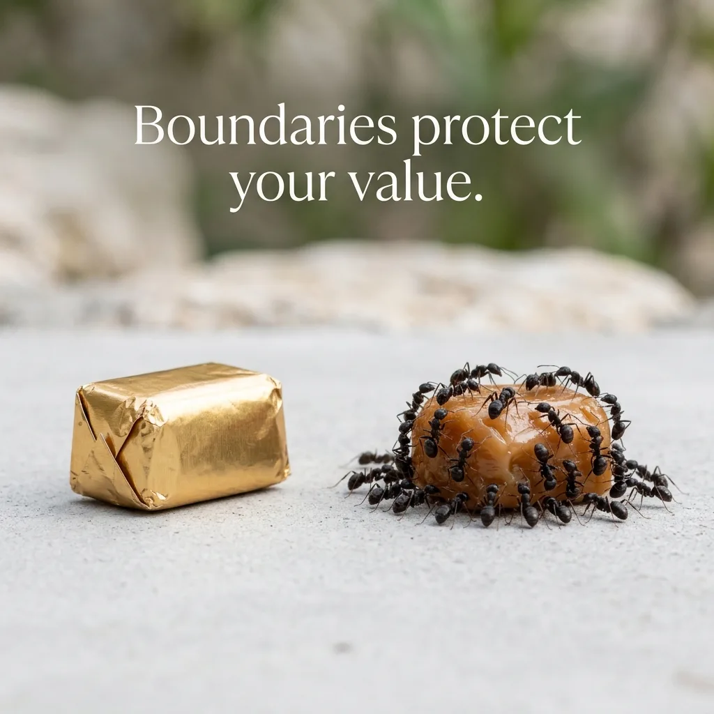

**#14 · Product &amp; Brand Prompt · <code>Vinano Image Pro</code>**

<details>
<summary>Show prompt</summary>

```
{
 "style": "cinematic, symbolic, minimal, realistic",
 "aspect_ratio": "9:16",
 "scenes": [{
 "scene_number": 1,
 "description": "A quiet outdoor setting a clean surface under soft natural light. Two identical toffees are placed side by side.",
 "camera": "slow zoom-in",
 "mood": "calm, neutral"
 },
 {
 "scene_number": 2,
 "description": "One toffee is neatly wrapped in shiny paper. The other toffee is unwrapped, fully exposed.",
 "camera": "static close-up",
 "mood": "contrast, anticipation"
 },
 {
 "scene_number": 3,
 "description": "Ants begin to appear and slowly crawl toward the unwrapped toffee, completely ignoring the wrapped one.",
 "camera": "macro shot, slow motion",
 "mood": "uneasy, revealing"
 },
 {
 "scene_number": 4,
 "description": "More ants gather around the unwrapped toffee, covering it, while the wrapped toffee remains untouched and protected.",
 "camera": "top-down shot",
 "mood": "warning, realization"
 },
 {
 "scene_number": 5,
 "description": "Text fades in on screen as the ants swarm the unwrapped toffee.",
 "text_overlay": "When you are too open, you can be used.",
 "camera": "gentle fade",
 "mood": "reflective"
 },
 {
 "scene_number": 6,
 "description": "Final frame focuses on the wrapped toffee standing alone, clean and intact.",
 "text_overlay": "Boundaries protect your value.",
 "camera": "slow zoom-out",
 "mood": "empowering, calm"
 }],
 "audio": {
 "background_music": "soft ambient piano",
 "sound_effects": "subtle nature ambience"
 }
}

Render with rich micro-detail while keeping the layout uncluttered and intentional.
```

</details>

---

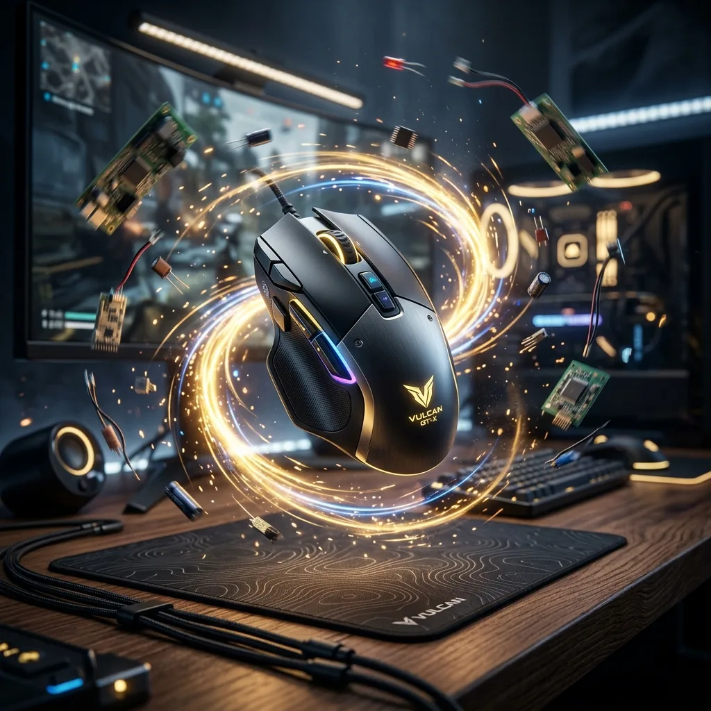

**#15 · Product &amp; Brand Prompt · <code>Vinano Image Pro</code>**

<details>
<summary>Show prompt</summary>

```
Ultra-realistic gaming mouse floating above a desk, surrounded by glowing golden energy rings and flying electronic components, dramatic filmic, cinematic lighting, futuristic tech aesthetic, detailed mousepad and cables on wooden desk, sparks and particles in the air, high-speed motion effect, premium product advertising, hyper-detailed textures, depth of field, 8K, studio lighting. Keep edges clean and the overall composition balanced for a polished, gallery-ready result.
```

</details>

---

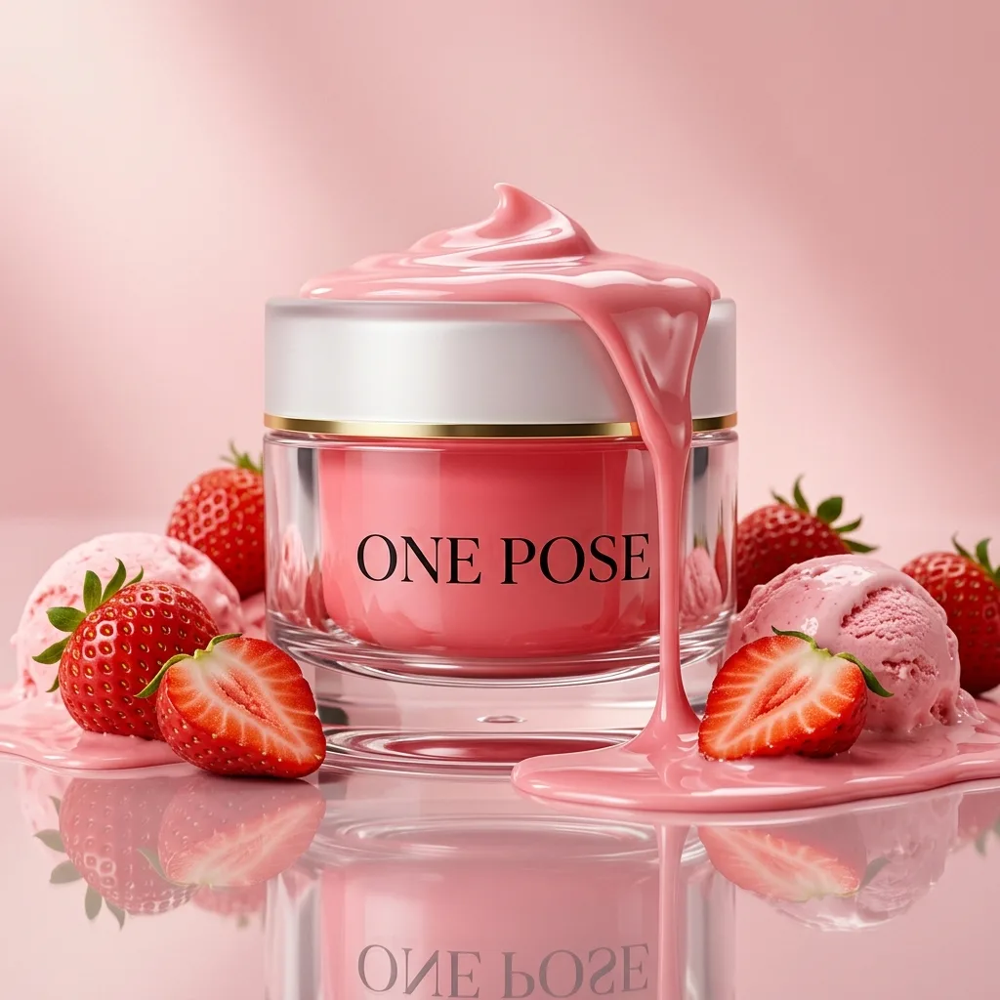

**#16 · Product &amp; Brand Prompt · <code>Vinano Image Pro</code>**

<details>
<summary>Show prompt</summary>

```
Ultra-realistic luxury skincare product photography featuring a glass cosmetic jar labeled “ONE POSE” placed at the center of a glossy reflective surface. The jar contains a vibrant strawberry-pink cream a soft gradient fading into a frosted white lid, and a smooth swirl of creamy pink product melting over the top and dripping down the sides of the jar like glossy dessert glaze. Surrounding the product are fresh ripe strawberries and halved strawberries visible seeds and juicy texture, arranged naturally around the base. Soft scoops of strawberry ice cream sit beside the fruit, slightly melting and blending into a glossy pink cream puddle that spreads across the surface. The background is a soft pastel pink studio gradient that enhances the strawberry tones. Premium studio lighting from above and the side creates crisp reflections on the glass jar, soft highlights on the melting cream and ice cream texture, and gentle shadows beneath the product. The composition feels indulgent and dessert-inspired while maintaining a clean luxury cosmetic advertising aesthetic, hyper-realistic textures, shallow depth of field, filmic, cinematic lighting, ultra-detailed 8K product photography. Preserve realistic proportions and depth for a confident, professional finish.
```

</details>

---

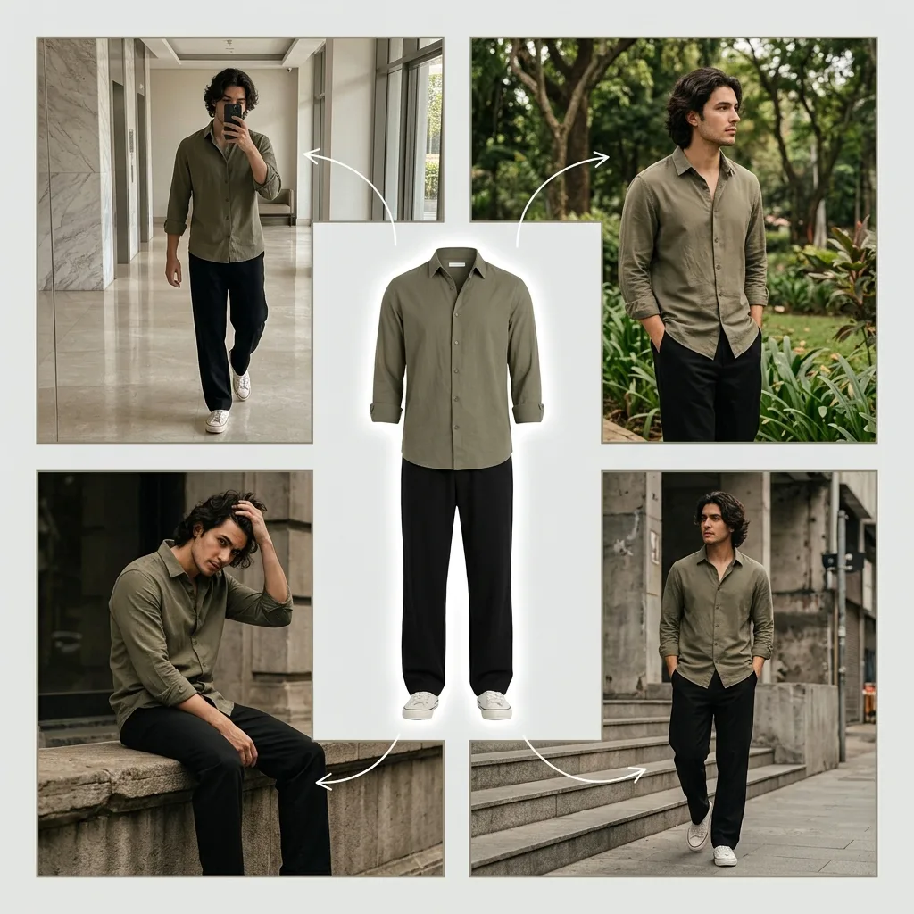

**#17 · Product &amp; Brand Prompt · <code>Vinano Image Pro</code>**

<details>
<summary>Show prompt</summary>

```
A stylish young man medium-length wavy dark hair and a clean face, wearing a muted olive green button-up shirt sleeves slightly rolled up, paired loose fit black straight pants and white sneakers. The outfit looks minimal, modern, and aesthetic.
Create a fashion collage layout 5 sections:
Center: a clean cutout of the outfit (olive shirt + black pants) placed vertically, slightly floating, a soft white outline glow around it.
Around the center: four different lifestyle shots of the same man wearing the outfit.
Top left: indoor mirror selfie in a modern lobby marble walls and shiny floor, holding phone covering face, relaxed walking pose.
Top right: outdoor greenery setting plants and trees, walking pose hands in pockets, looking sideways.
Bottom left: sitting pose on a bench or ledge, slightly leaning forward, one hand in hair, moody lighting.
Bottom right: urban street or stairs background concrete textures, walking casually hands in pockets.
Add minimal white curved arrows pointing from each lifestyle image toward the center outfit.
Lighting: soft natural light, slightly warm tone, cinematic shadows, Instagram aesthetic.
Color palette: neutral tones, olive green, black, white, soft greys.
Style: clean, minimal, high-end fashion lookbook, Pinterest / Instagram aesthetic.
Camera: 35mm lens, shallow depth of field, sharp subject focus.
Quality: ultra realistic, high resolution, 4K, detailed fabric texture.

Keep edges clean and the overall composition balanced for a polished, gallery-ready result.
```

</details>

---

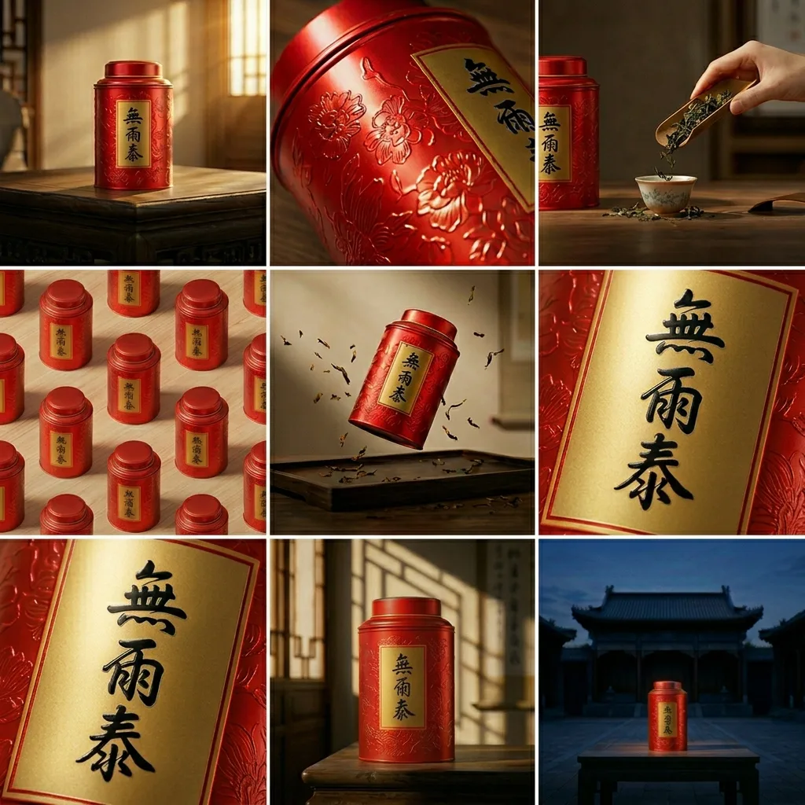

**#18 · Product &amp; Brand Prompt · <code>Vinano Image Pro</code>**

<details>
<summary>Show prompt</summary>

```
A clean 3×3 storyboard grid nine equal-sized panels and an overall 4:5 aspect ratio.
Use the reference image as the base product reference. Keep the same product, packaging design, branding, materials, colors, proportions and overall identity across all nine panels exactly as the reference. The product must remain clearly recognizable in every frame. The label, logo and proportions must stay exactly the same.
This storyboard is a high-end designer mockup presentation for a branding portfolio. The focus is on form, composition, materiality and visual rhythm rather than realism or lifestyle narrative. The overall look should feel curated, editorial and design-driven.
FRAME 1 (The Icon): Center-composed hero shot of the red tea tin on an antique dark walnut table, bathed in warm, golden afternoon sun.
FRAME 2 (The Tactile): Extreme close-up on the glossy red metal surface showing the embossed gold floral texture catching the light.
FRAME 3 (The Environment): The canister placed on a wooden shelf in a blurred traditional Chinese study calligraphy brushes in the background.
FRAME 4 (The Interaction): An elegant hand pouring dry tea leaves near the base of the tin, emphasizing the ritual.
FRAME 5 (The Matrix): An isometric grid of multiple red tins arranged on a wooden surface, creating a pattern of red and gold.
FRAME 6 (The Gravity): The red canister floating gently above a wooden tray, surrounded by drifting dried tea leaves.
FRAME 7 (The Signature): Macro detail focusing strictly on the black Chinese calligraphy "Wu Yu Tai" against the gold background.
FRAME 8 (The Statement): Artistic high-contrast shot shadows of window lattice (geometric patterns) cast across the red tin.
FRAME 9 (The Horizon): Wide cinematic shot of the tin placed on a low table in a grand, dimly lit traditional courtyard at dusk.
CAMERA & STYLE:
ultra-detailed, high-fidelity studio imagery a real camera look. Different camera angles and framings across frames. Controlled depth of field, precise lighting, accurate materials and reflections. Lighting logic, color palette, mood and visual language must remain consistent across all nine panels as one cohesive series.
OUTPUT:
A clean 3×3 grid no borders, no text, no captions and no watermarks.

Render with rich micro-detail while keeping the layout uncluttered and intentional.
```

</details>

---

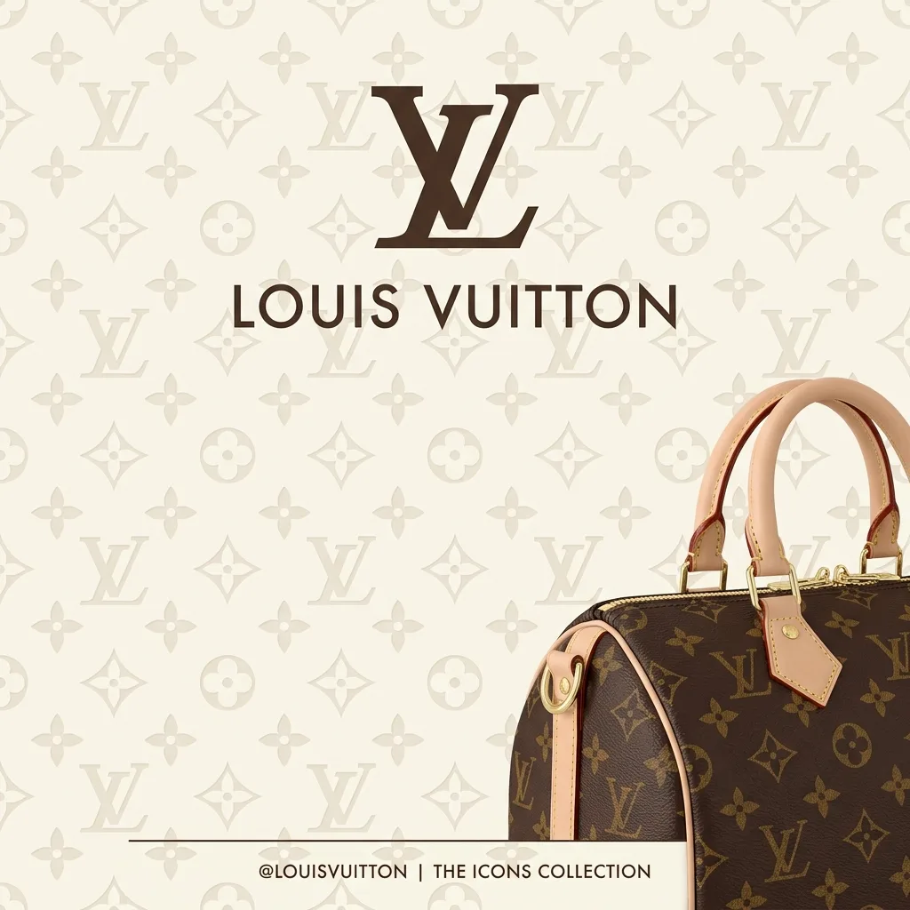

**#19 · Product &amp; Brand Prompt · <code>Vinano Image Pro</code>**

<details>
<summary>Show prompt</summary>

```
[BRAND NAME] + [PRODUCT]

Act as a Senior Luxury Fashion Art Director and Studio Photographer specializing in high-end product key visuals for flagship campaigns, e-commerce editorials, and mobile-first brand content.

PHASE 1: FORMAT & CANVAS
Vertical format, 9:16 aspect ratio. Canvas background: a single flat field of warm off-white — not pure white, not grey. Target tone: soft ivory cream (#F4EFE6 equivalent), uniform and completely shadowless
 across the entire background plane.
Autonomously determine [BRAND NAME]'s signature background tone — if the brand has a recognized house color for its packaging, tissue paper, or lookbook backgrounds, shift the canvas toward that specific off-white or neutral. The result must feel like an official brand document, not a generic studio.

PHASE 2: BACKGROUND PATTERN (WATERMARK LAYER)

Autonomously identify [BRAND NAME]'s iconic surface pattern, monogram, or archival motif — examples: a house monogram, toile print, geometric logo repeat, heritage emblem, or signature textile pattern.
Render this pattern across the entire background canvas as a ghost watermark: same tone as the background but a slight value shift (approximately 8–12% darker
or lighter than the base). The pattern must be large in scale — individual motifs spanning 15–25% of canvas width. Opacity: 10–18% maximum. No hard edges. The pattern should feel embossed or tone-on-tone woven, not printed. It must recede behind all other elements.

PHASE 3: LOGO PLACEMENT

Autonomously reproduce [BRAND NAME]'s official logo complete fidelity — correct letterforms, proportions, secondary marks (emblems, crowns, stars, monogram icons).
Place the logo centered horizontally in the upper third of the frame (top 30% of canvas). Scale: the logo should span approximately 40–50% of canvas width — prominent but not overwhelming.
Logo rendering: flat 2D, no extrusion, no chrome. Color: autonomously apply [BRAND NAME]'s official logo colorway — the exact brand-standard color(s) used on official packaging and website. If the brand uses a two-tone logo (icon + wordmark in different colors), preserve that hierarchy precisely.
Directly below the main logo mark, place the full [BRAND NAME] wordmark in spaced capital letters — clean, geometric sans-serif, tracking: +200 to +300,
same brand color, optical size approximately 60% of logo height. No decorative elements between logo and wordmark.

PHASE 4: PRODUCT PLACEMENT

Render [PRODUCT] as a true-to-life photorealistic studio object maximum material fidelity:
— Leather: visible grain, pore structure, stitching thread texture, realistic edge paint.
— Hardware: gold or silver metal micro-reflections, not flat.
— Canvas/fabric: woven fiber detail, not smooth CG.
— All brand-specific surface patterns on the product must be accurate and legible.
Placement: the product enters the frame from the bottom-right corner at a natural 25–35 degree angle, as if casually placed or mid-motion. The product is cropped — only 60–75% of the object is visible
within the frame. The crop should feel intentional and editorial, not accidental. The product occupies the lower 55–65% of the canvas.
The product must feel physically present in the space — not floating. Cast an extremely soft, barely visible contact shadow (opacity 8–12%) on the canvas beneath the nearest edge. No hard drop shadows.

PHASE 5: LIGHTING

Lighting: simulated large north-facing studio window light. Soft, directional, shadowless on the background. Color temperature: 5500–6000K (neutral daylight, slightly cool).
Key light: large softbox equivalent from upper-left, filling the entire product surface evenly
minimal contrast ratio (1.2:1 to 1.5:1 max).
Fill light: large bounce from right side, eliminating all harsh shadows. No rim light. No dramatic contrast. The lighting philosophy is: "the product sells itself — light only reveals, never performs."
Global Illumination enabled for subtle inter-reflections between product surfaces. No specular hotspots on leather — only on metal hardware.

PHASE 6: TYPOGRAPHY & FINISHING

Bottom of frame: a thin horizontal rule line (1px, brand color, 80% canvas width, centered). Below the rule: a single line of micro-copy — a social handle, collection name, or campaign label — in the same clean sans-serif, lowercase or small-caps, minimal tracking. Autonomously generate a contextually appropriate label for [BRAND NAME].

TECH SPECS

Render engine: true-to-life photorealistic CGI, Keyshot / Octane product visualization aesthetic. Resolution: 9:16, ultra-high detail.
Depth of Field: f/16 equivalent — everything in sharp focus. Zero bokeh. Tack-sharp edges on all product details.Tone mapping: clean, true-to-life. No filmic crush. No vignette. No grain. Color grade: neutral, faithful to real product color. Slight warmth in the ivory background only. No AI-plastic normals on leather or fabric. Microscopic surface imperfection maps required. No reflections on background. No environmental reflections — studio only. Mood reference: Louis Vuitton / Bottega Veneta / Celine official e-commerce and campaign photography standard. Clean enough to be used as a press image.

Maintain consistent colour harmony and crisp focus across the whole frame.
```

</details>

---

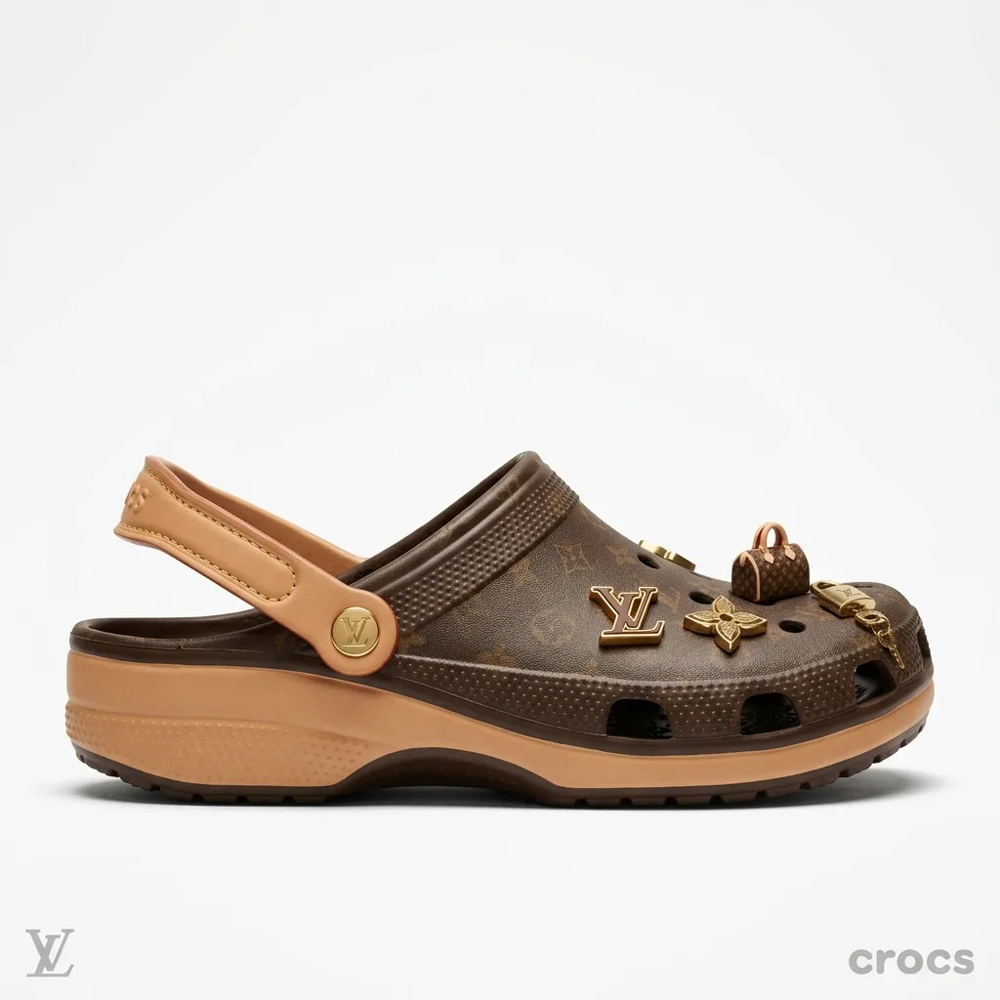

**#20 · Product &amp; Brand Prompt · <code>Vinano Image Pro</code>**

<details>
<summary>Show prompt</summary>

```
[Louis Vuitton]. Act as a World-Class Footwear Designer and Product Photographer creating a high-end "Crocs Collaboration" campaign image.

1. THE SUBJECT (CUSTOMIZED CROCS CLOG):

Generate a true-to-life photorealistic, high-end customized Crocs Classic Clog inspired by the visual identity of [BRAND NAME].

View: The shoe is positioned in a Strict Side Profile View (facing right), exactly like a product profile shot. It must look grounded and substantial.

Color Blocking: Apply [BRAND NAME]'s official color palette intelligently:

Body: The main foam upper is the brand's Primary Color.

Sole/Strap: Use the Secondary/Accent colors for the thick rubber sole unit and the heel strap to create contrast.

Custom Jibbitz (Charms): The shoe is decorated 3-4 premium-quality 3D Jibbitz charms plugged into the ventilation holes. These charms must be iconic symbols or products associated [BRAND NAME] (e.g., if "Starbucks" -> a tiny frappuccino cup and logo; if "Nike" -> a 3D swoosh).

2. THE BACKGROUND ():

The background is a Pure White Studio Space (#FFFFFF).

3. LIGHTING & MATERIALITY (EDITORIAL QUALITY):

Lighting: Ultra-realistic High-Key Studio Lighting. Use a large softbox from the top-left to create smooth, glossy highlights on the rubber curves of the Crocs. The lighting is bright, neutral, and expensive.

Texture: The material must look like real Croslite foam resin—matte subtle specular highlights on the edges. The Jibbitz charms should look like hard glossy plastic or rubber.

Shadows: A sharp, realistic contact shadow under the shoe to ground it on the white floor.

4. BRANDING & LAYOUT (UI ELEMENTS):

Bottom Left Corner: Place a small, discrete, Monochrome Light Grey Logo of [BRAND NAME].

Bottom Right Corner: Place a small, discrete, Monochrome Light Grey "Crocs" Logo.

TECH SPECS:

Macro product photography, Phase One camera, 100mm lens, razor-sharp focus, 8k resolution, uncompressed, commercial look.

Maintain consistent colour harmony and crisp focus across the whole frame.
```

</details>

---

## Food & Drink

_Showing 20 of 190 — see [`prompts/prompts.json`](prompts/prompts.json) for all._

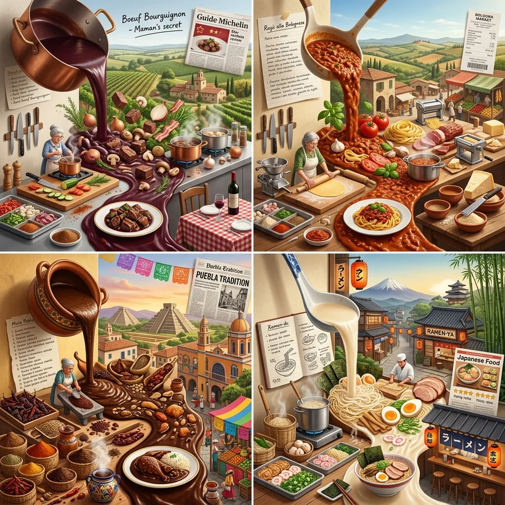

**#1 · Food &amp; Drink Prompt · <code>Vinano Image Pro</code>**

<details>
<summary>Show prompt</summary>

```
2x2 grid, do this for 4 famous cuisines: function dish(AA){
<instruction>
Input A is a Famous Dish / Culinary Tradition / Signature Dessert / Regional Specialty.

Analyze:
- ingredient hierarchy, cooking method, plating logic
- origin region, historical story, ritual or social context
- flavor architecture translated into visual composition
- symbolic ingredients, cookware, and dining environment
- chef or tradition lineage

Goal:
A "sauce pour environment."
A giant ladle, piping bag, or sauce boat is pouring the primary sauce, cream, glaze, broth, or puree onto a table.
The flowing edible medium rises into a detailed 3D world of the dish: ingredients, preparation stages, origin landscape, and plated final form merging together.

Rules:
- the poured substance must remain recognizably edible while forming the scene
- include knives, cutting board, handwritten recipe notes, ingredient trays, steam, spice dust, region-appropriate tools
- include a tiny chef or grandmother figure preparing a miniature version nearby
- include a food critic headline, market receipt, or origin-story clipping
- semantically infer cuisine-specific vessels, table culture, garnish logic, and environment
- no random food pile; composition must reveal flavor structure and culinary history
- lighting: appetizing natural kitchen light rich edible texture

Output:
ONE image, 4:5, culinary-process diorama aesthetic
</instruction>

Output:
2x2 grid, each grid a different dish(AA) output
}

Preserve realistic proportions and depth for a confident, professional finish.
```

</details>

---

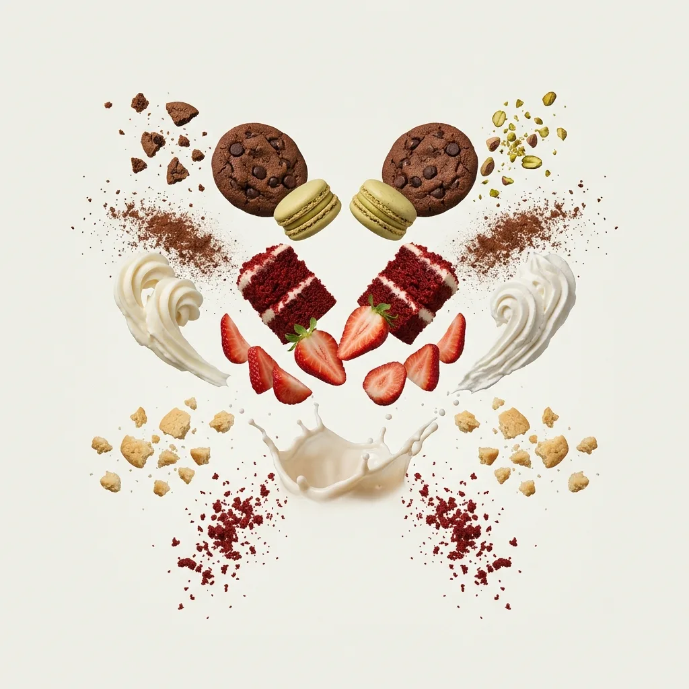

**#2 · Food &amp; Drink Prompt · <code>Vinano Image v2</code>**

<details>
<summary>Show prompt</summary>

```
{
 "production_manifest": {
 "metadata": {
 "series_id": "CIN-FOOD-2025",
 "aspect_ratio": "9:16",
 "resolution_target": "8k_uhd"
 },
 "technical_stack": {
 "hardware": {
 "camera": "ARRI Alexa 65",
 "lens_profile": "Large format cinematic prime"
 },
 "film_emulation": {
 "stock": "Kodak Portra 400",
 "characteristics": ["Fine grain", "Natural skin tones", "Warm highlights"]
 },
 "lighting_rig": {
 "style": "Cinematic soft glow",
 "atmosphere": "Timeless indoor",
 "diffusion": "High"
 }
 },
 "artistic_direction": {
 "visionary_style": "Greta Gerwig",
 "composition_rule": "Graphic centered symmetry",
 "physics_engine": "Suspended animation / Zero gravity",
 "background_specification": "Flat off-white / Studio bone"
 },
 "variant_registry": [{
 "id": "VAR-001",
 "flavor_profile": "Dark Chocolate Chip & Oat",
 "tonal_emotion": "Playful, cheeky yet chic",
 "ingredients": {
 "primary_solids": ["Dark chocolate chip cookies"],
 "fluid_fx": ["Oat milk splash"],
 "debris": ["Cookie crumbs"]
 }
 },
 {
 "id": "VAR-002",
 "flavor_profile": "Red Velvet",
 "tonal_emotion": "Bold, playful chic",
 "ingredients": {
 "primary_solids": ["Red velvet cake pieces"],
 "fluid_fx": ["Cream cheese frosting swirls"],
 "debris": ["Cocoa dust", "Fine red cake crumbs"]
 }
 },
 {
 "id": "VAR-003",
 "flavor_profile": "Pistachio Macaron",
 "tonal_emotion": "Refined, playful chic",
 "ingredients": {
 "primary_solids": ["Pistachio macarons"],
 "fluid_fx": ["Cream filling swirls"],
 "debris": ["Crushed pistachio nuts"]
 }
 },
 {
 "id": "VAR-004",
 "flavor_profile": "Strawberry Shortcake",
 "tonal_emotion": "Sweet, playful yet chic",
 "ingredients": {
 "primary_solids": ["Fresh strawberry slices"],
 "fluid_fx": ["Whipped cream swirls"],
 "debris": ["Shortcake biscuit crumbs"]
 }
 }]
 }
}

Aim for an editorial, design-driven look with deliberate negative space.
```

</details>

---

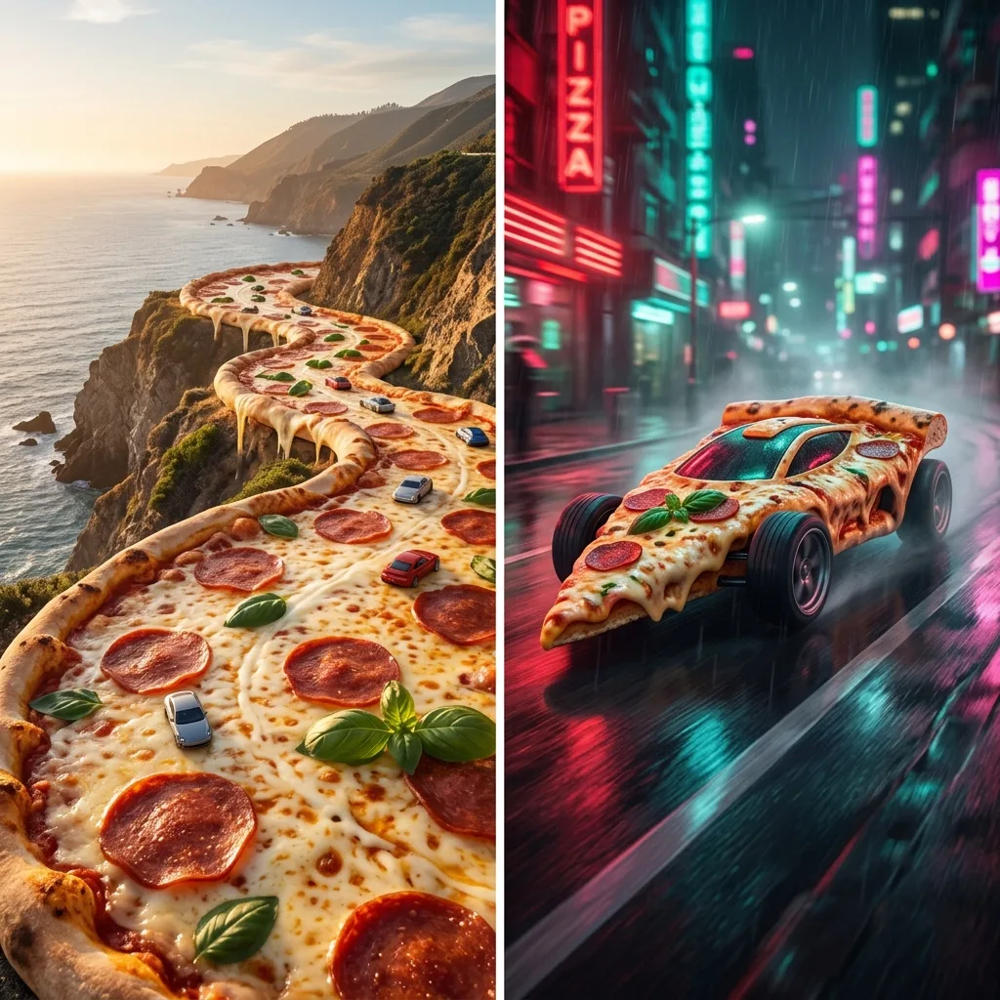

**#3 · Food &amp; Drink Prompt · <code>Vinano Image v2</code>**

<details>
<summary>Show prompt</summary>

```
{
 "Objective": "Create a surreal, hyper-detailed fantasy world where pizza becomes an integral part of landscapes and technology",
 "Concept": "Imaginative surrealism blending true-to-life photorealistic food textures cinematic fantasy environments",
 "Scenes": [{
 "SceneName": "Pizza Coastline Mountain Road",
 "SceneDescription": {
 "Environment": "Dramatic coastal cliffs overlooking the ocean",
 "PrimaryStructure": "A giant pepperoni pizza forming a winding mountain road",
 "WorldIntegration": {
 "Cheese": "Melted cheese forming the roadway surface",
 "Toppings": "Pepperoni slices and basil leaves acting as traffic islands and terrain features"
 },
 "ScaleElements": {
 "Vehicles": "Tiny cars driving across the pizza road",
 "ScaleContrast": "Massive pizza landscape versus miniature vehicles"
 }
 },
 "LightingAndMood": {
 "TimeOfDay": "Golden hour",
 "Lighting": "Warm coastal sunlight long shadows",
 "Mood": "Whimsical, epic, playful wonder"
 },
 "Composition": {
 "Camera": "Cinematic wide-angle view",
 "Perspective": "Elevated, sweeping landscape shot",
 "DepthOfField": "Moderate depth foreground and background clarity"
 }
 },
 {
 "SceneName": "Pizza Futuristic Car",
 "SceneDescription": {
 "Environment": "Rainy neon-lit cyberpunk city street at night",
 "PrimarySubject": "A pizza slice transformed into a futuristic car",
 "DesignDetails": {
 "Body": "Pizza crust and melted cheese forming aerodynamic shape",
 "Toppings": "Pepperoni and basil integrated into vehicle design",
 "Wheels": "Realistic rubber tires attached to the pizza vehicle"
 },
 "Motion": "Speeding through the street dynamic motion blur"
 },
 "LightingAndMood": {
 "TimeOfDay": "Night",
 "Lighting": "Moody cyberpunk neon lights in red, teal, and magenta",
 "Atmosphere": "Rain, mist, reflections on wet asphalt",
 "Mood": "Energetic, futuristic, playful surrealism"
 },
 "Composition": {
 "Camera": "Low-angle wide shot",
 "Perspective": "Dynamic chase-style framing",
 "DepthOfField": "Shallow depth of field background bokeh"
 }
 }],
 "ArtDirection": {
 "Style": "Playful yet true-to-life photorealistic surrealism",
 "TextureQuality": {
 "Food": "Ultra-realistic pizza textures, visible oil sheen, stretchy melted cheese",
 "Environment": "High-detail rocks, asphalt, rain droplets, reflections"
 },
 "RealismBalance": "true-to-life photorealistic materials combined impossible scale and concepts"
 },
 "VisualStyle": {
 "Resolution": "8K ultra-high detail",
 "ColorGrading": "Cinematic contrast warm coastal tones and cool neon city tones",
 "Depth": "Strong sense of scale and dimensionality"
 },
 "Mood": {
 "OverallTone": "Imaginative, whimsical, cinematic",
 "EmotionalFeel": "Playful awe and creative wonder"
 },
 "NegativePrompt": ["flat lighting",
 "cartoon-only style",
 "low detail textures",
 "plastic food",
 "blurry focus",
 "dull colors"],
 "ResponseFormat": {
 "Type": "Two-scene cinematic illustration or render",
 "OutputOptions": ["Split composition",
 "Diptych",
 "Two separate images"],
 "AspectRatio": "16:9"
 }
}

Aim for an editorial, design-driven look with deliberate negative space.
```

</details>

---

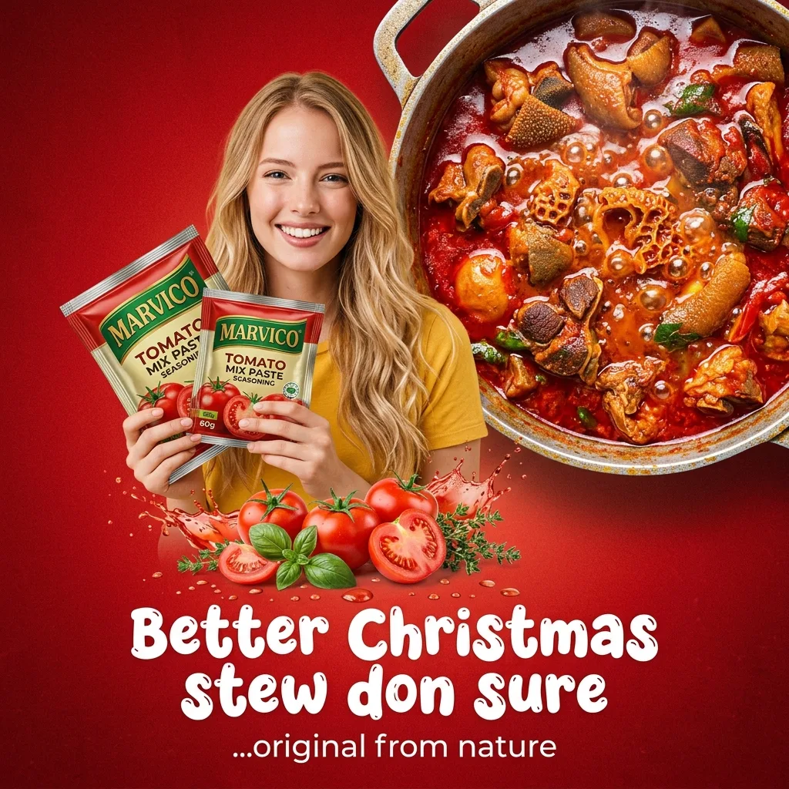

**#4 · Food &amp; Drink Prompt · <code>Vinano Image Pro</code>**

<details>
<summary>Show prompt</summary>

```
{
 "subject": {
 "primary": "Two foil sachets of Marvico Tomato Mix Paste seasoning tilted diagonally",
 "secondary": "A rustic metal pot filled rich, bubbling red Nigerian-style tomato stew containing assorted meats and tripe",
 "details": ["Vibrant red tomato sauce consistency",
 "Fresh whole tomato splash at the bottom foreground",
 "Sachets feature green and gold 'MARVICO' branding realistic tomato illustrations",
 "A cheerful young Western blonde woman long hair, wearing a casual bright outfit, holding the sachets and smiling at the camera"]
 },
 "composition": {
 "layout": "Dynamic vertical advertisement",
 "focal_point": "Product sachets held by the girl in the center-left, overlapping a large pot of stew in the top-right",
 "background": "Solid textured red gradient a subtle grainy paper effect",
 "perspective": "Eye-level a slight Dutch angle for energy"
 },
 "typography": {
 "main_text": "Better Christmas stew don sure",
 "sub_text": "...original from nature",
 "font_style": "Bold, playful white bubble script for main text; refined minimalist lowercase sans-serif for sub-text",
 "placement": "Centered at the bottom over the red background"
 },
 "color_palette": {
 "dominant": ["Crimson Red", "Deep Scarlet"],
 "accents": ["Forest Green", "Metallic Gold", "Bright White"],
 "lighting": "Studio lighting high contrast to make the red sauce look glossy and appetizing"
 },
 "style_descriptors": ["Commercial food photography",
 "West African culinary aesthetic",
 "High-definition textures",
 "Vibrant and warm color grading",
 "Professional product placement",
 "Lifestyle advertising a relatable model"],
 "technical_settings": {
 "aspect_ratio": "4:5",
 "sharpness": "High",
 "texture": "Subtle film grain on the background"
 }
}

Aim for an editorial, design-driven look with deliberate negative space.
```

</details>

---

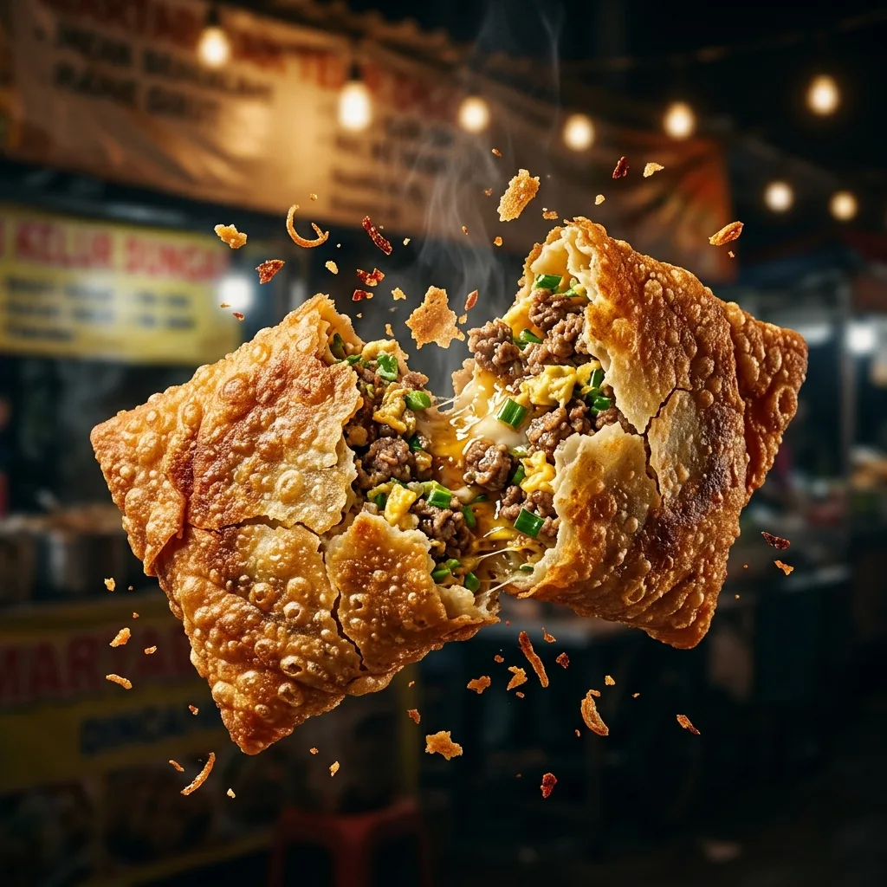

**#5 · Food &amp; Drink Prompt · <code>Vinano Image Pro</code>**

<details>
<summary>Show prompt</summary>

```
Macro food photography of a crispy martabak telur tearing open mid-air, thin golden wrapper shattering a crack, hot filling of minced beef, scallions, and egg bursting outward. Flecks of fried onion and pepper suspended in motion, steam visible, glossy oil sheen catching the light. Warm Indonesian street-stall lighting, tungsten + charcoal warmth, dramatic rim light, ultra high texture detail (bubbled wrapper, layered interior).Editorial food shot, shallow depth of field, bokeh of night market signage, Nikon Z9 look, 105mm macro, fast shutter freeze, hyper-real crumbs. --ar 3:4" Aim for an editorial, design-driven look with deliberate negative space.
```

</details>

---

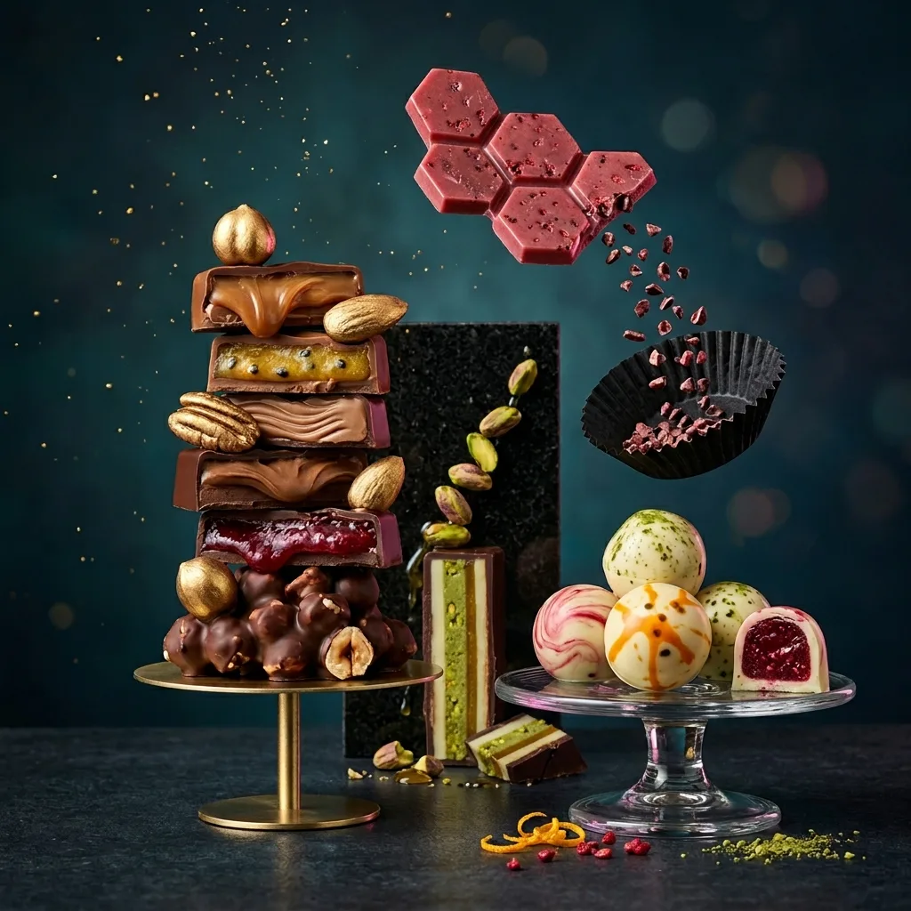

**#6 · Food &amp; Drink Prompt · <code>Vinano Image v2</code>**

<details>
<summary>Show prompt</summary>

```
{
"style": "ultra-realistic food photography, luxury editorial, macro-detail, natural textures",
 "images": [{
 "id": "image_1",
 "subject": "assorted praline tower",
 "composition": "staggered vertical tower, center frame, loose organic stacking",
 "details": {
 "fillings": ["hazelnut chunks irregularly clumped at base",
 "raspberry gel naturally puddled",
 "salted caramel realistic flow lines",
 "coffee ganache smooth wave texture",
 "passionfruit filling visible pulp specks"],
 "accent": "one unique metallic gold nut per filling type placed at layer transitions",
 "stand": "brushed gold stand subtle reflections"
 },
 "lighting": {
 "type": "dramatic side lighting",
 "angle": "35 degrees left",
 "effects": "authentic filling refractions, layered shadow play"
 },
 "background": "teal-to-navy gradient suspended gold motes",
 "mood": "luxurious, indulgent, artisanal depth"
 },
 {
 "id": "image_2",
 "subject": "ruby chocolate tablet",
 "composition": "floating hexagonal segments above black textured paper liner",
 "details": {
 "surface": "hand-tempered imperfections, translucent ruby pink",
 "inclusions": "embedded fruit flecks visible through chocolate",
 "motion": "ruby cacao nibs falling in gravity-realistic arc from one segment"
 },
 "lighting": {
 "key": "top-down at 12 o'clock",
 "rim": "soft pink rim light at 3 o'clock",
 "effects": "authentic shadows, enhanced translucency"
 },
 "background": "black-to-warm pink radial gradient subtle sparkle specks",
 "mood": "modern, vibrant, floating tension"
 },
 {
 "id": "image_3",
 "subject": "white chocolate bonbons",
 "composition": "organic cluster on clear glass stand",
 "details": {
 "marbling": ["central bonbon irregular orange passionfruit veins",
 "surrounding bonbons pink raspberry swirls",
 "green matcha flecks varied density"],
 "cutaway": "one bonbon sliced vertically showing gel core real fruit speckles",
 "props": "dried fruit flecks scattered below (orange zest curls, raspberry seeds)"
 },
 "lighting": {
 "key": "soft high-key front light at 10 degrees",
 "rim": "rear rim light at 35 degrees",
 "effects": "enhanced marbling contrast and glass refractions"
 },
 "background": "soft taupe fruit-toned bokeh",
 "mood": "elegant, fresh, handcrafted"
 },
 {
 "id": "image_5",
 "subject": "dark chocolate pistachio bar",
 "composition": "vertical bar centered on polished black granite slab",
 "details": {
 "cross_section": "precision side cut revealing layered pistachio filling",
 "filling": "whole roasted green pistachios suspended in smooth white chocolate matrix",
 "binding": "subtle golden honey swirl",
 "break": "front broken segment clean snap and visible pistachio pieces",
 "props": "whole roasted pistachios arranged in ascending curve, honey drips nearby"
 },
 "lighting": {
 "key": "soft spotlight from top-left at 45 degrees",
 "rim": "warm side rim light from right at 30 degrees",
 "highlight": "single pinpoint highlight on largest pistachio"
 },
 "background": "dark espresso brown gradient floating pistachio shell dust particles",
 "mood": "rich, bold, premium indulgence"
 }]
}

Aim for an editorial, design-driven look with deliberate negative space.
```

</details>

---

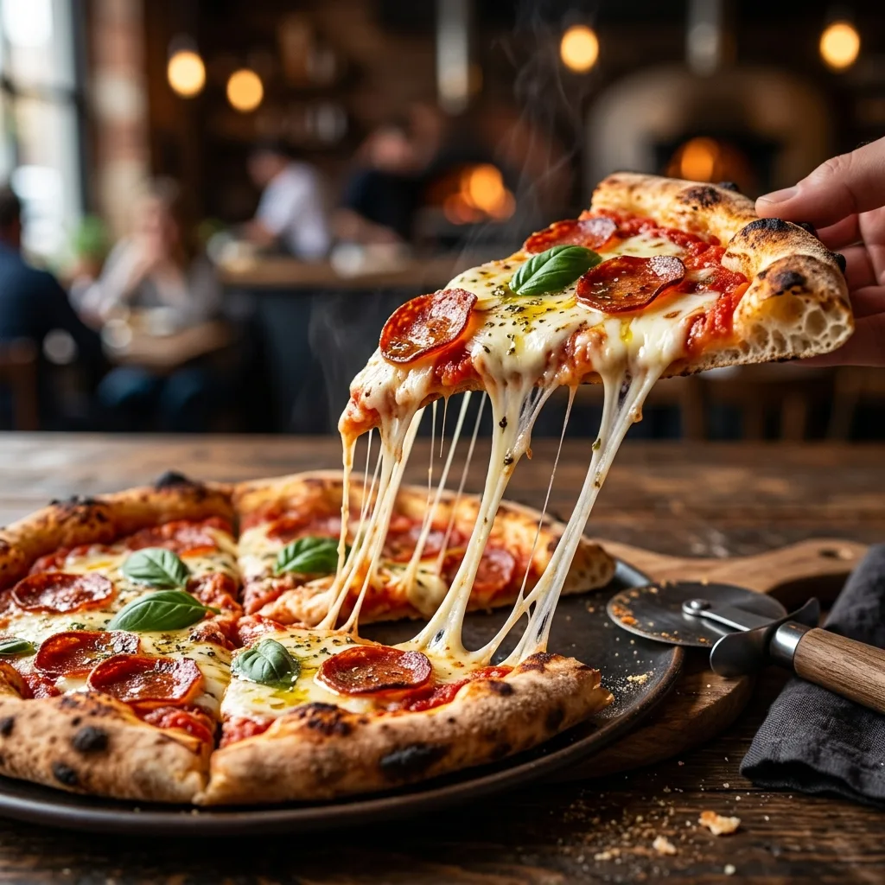

**#7 · Food &amp; Drink Prompt · <code>Vinano Image Pro</code>**

<details>
<summary>Show prompt</summary>

```
{
 "content_goal":
 "viral food photography post",
 "image_type":
"professional food photography",
 "food_concept": {
 "item":
"pizza slice",
 "style":
"premium artisan pizza",
 "serving_state":
"freshly lifted slice cheese pull",
 "temperature_feel":
"hot, freshly baked"
 },
 "visual_style": {
 "aesthetic": "cinematic food editorial",
 "vibe": "crave-worthy, indulgent, luxurious",
 "realism": "ultra-realistic"
 },
 "composition": {
 "framing": "close-up macro partial pizza visible",
 "angle": "45-degree side angle",
 "focus_point": "cheese stretch and toppings",
 "depth_of_field": "shallow background blur"
 },
 "pizza_details": {
 "crust": "golden-brown, crispy edges soft interior",
 "cheese": "melted mozzarella long stretchy pull",
 "sauce": "rich red tomato sauce",
 "toppings": ["pepperoni slices",
 "fresh basil leaves",
 "olive oil glaze"],
 "texture": "glossy cheese, crisp crust, juicy toppings"
 },
 "lighting": {
 "type": "soft directional studio lighting",
 "direction": "side light for texture definition",
 "highlight": "cheese shine and crust detail",
 "shadow": "soft natural shadows"
 },
 "color_palette": {
 "primary_colors": ["cheese yellow",
 "tomato red",
 "golden brown"],
 "contrast_level": "medium-high",
 "mood": "warm, appetizing, mouth-watering"
 },
 "environment": {
 "surface": "rustic wooden table or marble slab",
 "background": "dark blurred restaurant or kitchen",
 "props": ["pizza cutter",
 "linen napkin",
 "wooden board"]
 },
 "camera_details": {
 "lens": "macro or 50mm food lens",
 "focus": "extreme sharpness on slice",
 "resolution": "high-end commercial quality",
 "noise": "none"
 },
 "sensory_impact": {
 "visual_effect": "cheese pull in motion",
 "viewer_reaction": "instant craving",
 "emotional_trigger": "comfort food desire"
 },
 "quality_control": {
 "food_realism": "authentic pizza texture",
 "ai_artifacts": "none",
 "professional_finish": "restaurant advertisement grade"
 },
 "intended_use": {
 "primary": "viral food post on X",
 "secondary": "restaurant promo, food brand content"
 }
}

Emphasise material texture and natural light so the final frame feels tactile and premium.
```

</details>

---

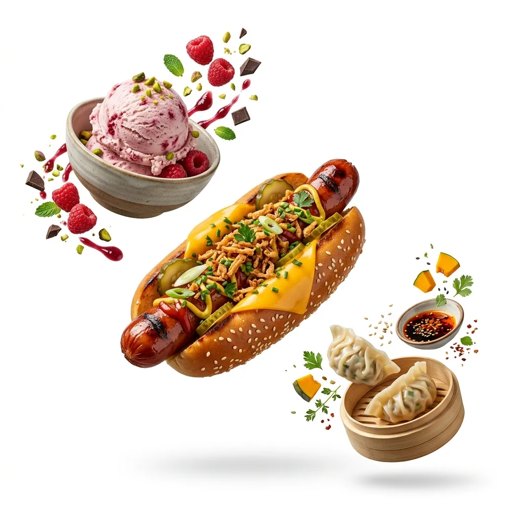

**#8 · Food &amp; Drink Prompt · <code>Vinano Image v2</code>**

<details>
<summary>Show prompt</summary>

```
{
 "image_prompt": {
 "main_concept": "High-end commercial food photography a floating composition (food levitation effect).",
 "composition": {
 "arrangement": "Hero food item suspended in mid-air complementary ingredients orbiting in perfect balance",
 "background": "Pure white background",
 "shadows": "Soft shadows beneath the suspended food"
 },
 "subject_variations": [{
 "item": "Creamy raspberry ice cream",
 "details": "Pistachio crumbs, chocolate chunks, mint leaves, berry drizzle"
 },
 {
 "item": "Gourmet hotdog",
 "details": "Glossy sausage, toasted bun, melted cheese, pickles, crispy onions, herbs, sauce"
 },
 {
 "item": "Handmade dumplings",
 "details": "Visible filling, fresh herbs, spices, pumpkin pieces, dipping sauce"
 }],
 "lighting_and_color": {
 "type": "Studio lighting",
 "highlights": "Clean highlights",
 "color_accuracy": "Natural color accuracy, realistic depth"
 },
 "technical_specs": {
 "style": "refined minimalist luxury aesthetic, modern advertising style, commercial product photography",
 "focus": "Ultra-sharp focus on textures, crisp edges",
 "quality": "Hyper-realistic details, high resolution, 8K quality"
 }
 }
}

Preserve realistic proportions and depth for a confident, professional finish.
```

</details>

---

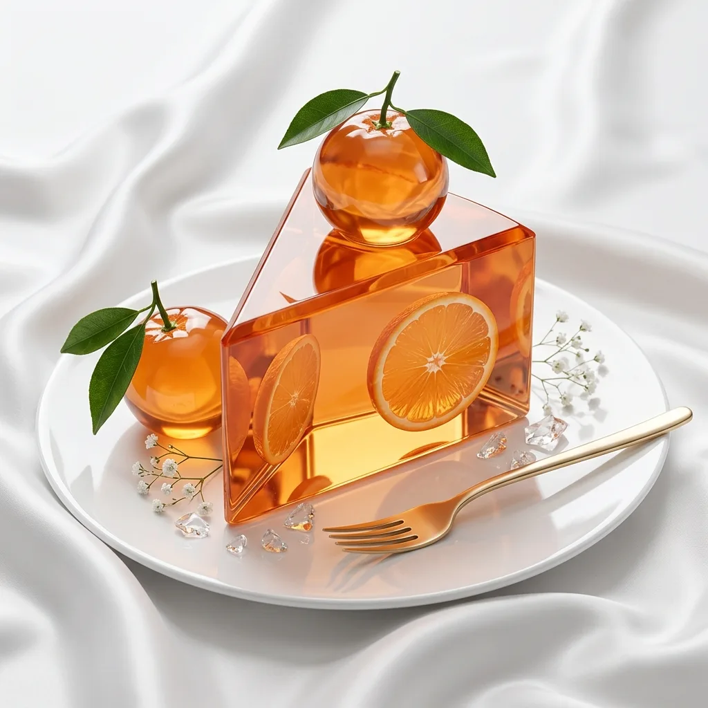

**#9 · Food &amp; Drink Prompt · <code>Vinano Image Pro</code>**

<details>
<summary>Show prompt</summary>

```
Create a luxury fashion-editorial still life of a sharp triangular prism cake slice made of hard crystal-clear glass-like material, the featured fruit being [orange], a single unified candy-glass color tone while preserving the fruit’s original natural hue and form logic, explicitly excluding stems and leaves from recoloring so they retain natural green, the transparent glass cake has polished edges, elegant refraction, crisp highlights and internal reflections identical to solid crystal, inside the cake thick full-bodied seedless fruit cross-sections appear as pure clear glass perfectly smooth seamless surfaces, one whole fruit in mirror-polished translucent crystal-glass candy style sits on top and another rests beside it, all fruit instances sharing identical color tone and material finish except leaves, arranged on a glossy white ceramic plate clear crystal shards, a champagne-gold metallic fork and minimal baby’s-breath accents against softly draped white silk fabric, composed balanced proportions and refined negative space, lit soft diffused high-end editorial lighting that preserves candy-like color richness and material clarity, hyper-realistic, ultra-detailed, premium aesthetic, no text, no typography, no logo, no watermark, no graphic elements, exclude rough texture, matte surface, cube, square or round cake, ice cube, acrylic or resin block, cloudy transparency, people, hands, faces Keep edges clean and the overall composition balanced for a polished, gallery-ready result.
```

</details>

---

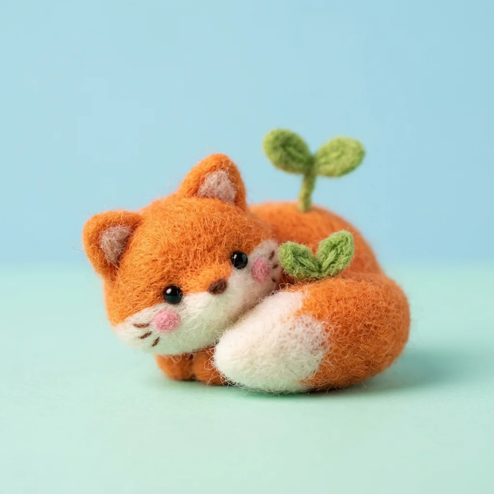

**#10 · Food &amp; Drink Prompt · <code>Vinano Image v2</code>**

<details>
<summary>Show prompt</summary>

```
{
 "prompt": "A realistic, needle-felted sculpture of a product from a photo, captured in a high-detail macro studio shot a whimsical aesthetic.",
 "subject": {
 "type": "Needle-felted sculpture",
 "based_on": "User-provided product photograph",
 "material": "Soft wool felt",
 "attributes": ["Fluffy textures",
 "Hand-felted details",
 "Soft edges",
 "Cozy appearance",
 "3D look"]
 },
 "photography": {
 "shot_type": "Studio shot",
 "focus": "Macro focus",
 "detail_level": "High detail"
 },
 "lighting": {
 "type": "Soft, diffused lighting",
 "mood": "Warm and gentle"
 },
 "setting": {
 "background": "Minimal, solid pastel color"
 },
 "aesthetics": {
 "overall_style": "Whimsical and charming"
 },
 "parameters": {
 "aspect_ratio": "4:5"
 }
}

Aim for an editorial, design-driven look with deliberate negative space.
```

</details>

---

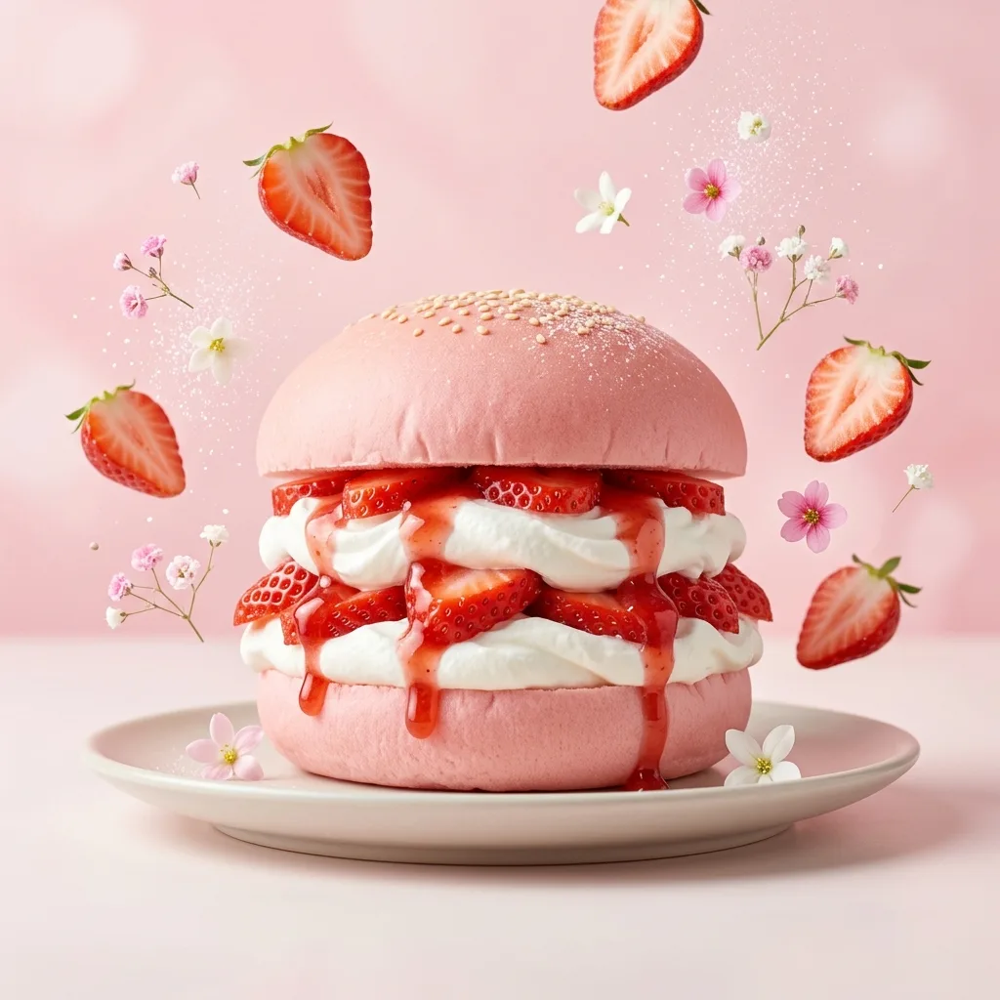

**#11 · Food &amp; Drink Prompt · <code>Vinano Image v2</code>**

<details>
<summary>Show prompt</summary>

```
A hyper-realistic {FRUIT} dessert burger, centered composition, soft pastel {FRUIT_COLOR} color palette. Fluffy {FRUIT_COLOR} burger buns smooth matte texture and light sesame seeds on top. Layers of fresh sliced {FRUIT} and airy white whipped cream inside, glossy {FRUIT} sauce dripping naturally. Floating {FRUIT} slices and tiny flowers surrounding the burger. Minimal {FRUIT_COLOR} gradient background, soft studio lighting, luxury food advertising style, ultra clean, high detail, shallow depth of field. Keep edges clean and the overall composition balanced for a polished, gallery-ready result.
```

</details>

---

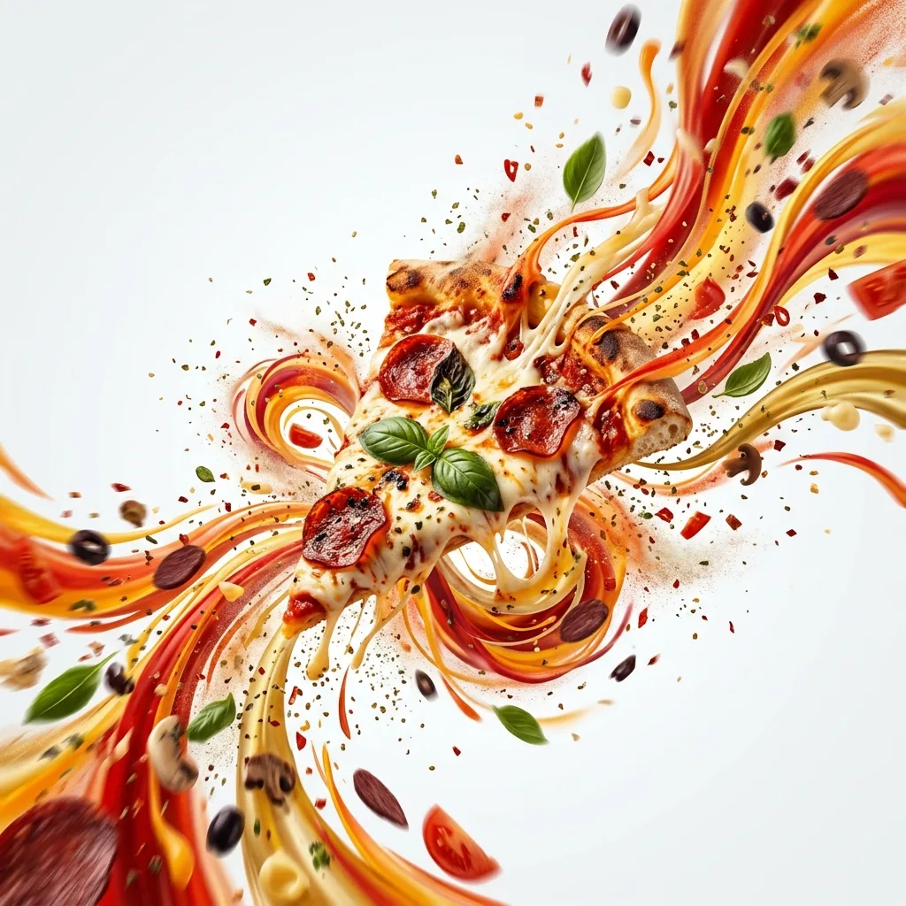

**#12 · Food &amp; Drink Prompt · <code>Vinano Image v2</code>**

<details>
<summary>Show prompt</summary>

```
Dynamic flavor wave composition of [FOOD], colorful energy ribbons, mist, and motion streaks bursting outward to represent taste intensity. Ingredient silhouettes embedded within the waves. Clean minimal white background, high-key studio lighting. Ultra-real textures, cinematic motion blur, premium commercial food photography, 8K resolution. Aim for an editorial, design-driven look with deliberate negative space.
```

</details>

---

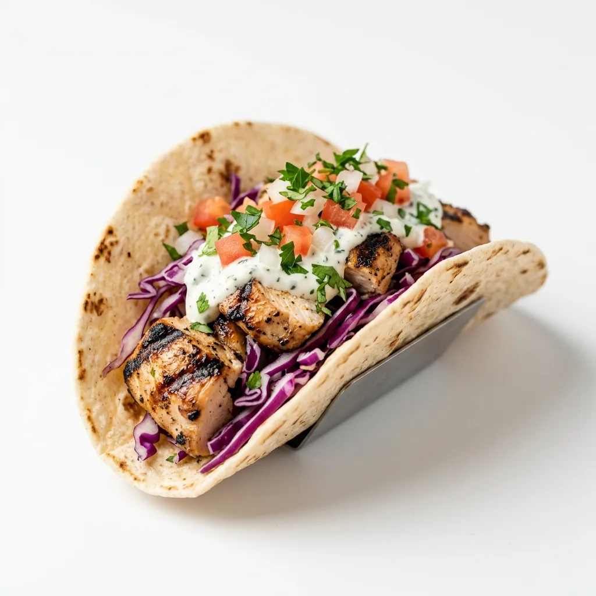

**#13 · Food &amp; Drink Prompt · <code>Vinano Image v2</code>**

<details>
<summary>Show prompt</summary>

```
A premium-quality, professional product photograph of a grilled chicken taco filled juicy grilled chicken pieces visible char marks, fresh shredded red cabbage, and creamy white sauce topped small diced tomatoes, onions, and parsley garnish, all placed inside a soft wheat taco tortilla. The taco looks fresh, flavorful, and well-filled visible textures and vibrant ingredients. refined minimalist style, shot against a pure solid white background soft, natural shadows. 8K resolution, ultra-sharp focus, clean and modern food photography aesthetic. Maintain consistent colour harmony and crisp focus across the whole frame.
```

</details>

---

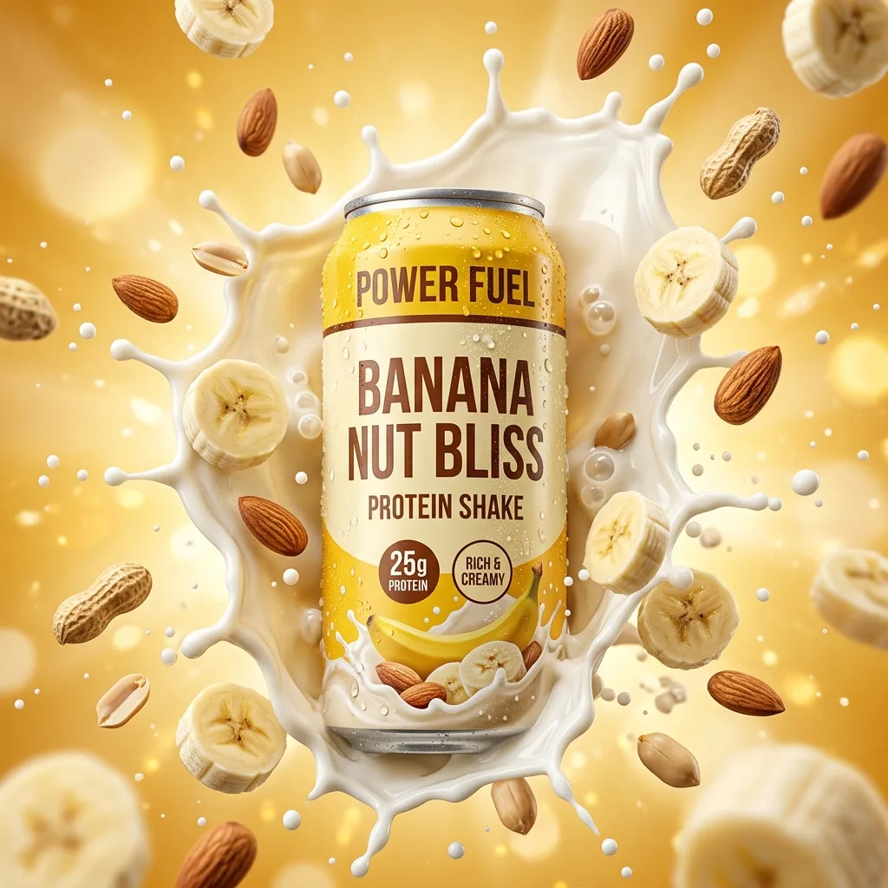

**#14 · Food &amp; Drink Prompt · <code>Vinano Image v2</code>**

<details>
<summary>Show prompt</summary>

```
Hyper-realistic product advertisement of a protein shake can yellow and cream design, surrounded by floating banana slices, almonds, and peanuts, dynamic milk splash bursting around the can, glossy condensation droplets on surface, vibrant warm yellow background, high-speed splash photography, ultra-detailed textures, commercial food photography style, dramatic lighting, 8K. Keep edges clean and the overall composition balanced for a polished, gallery-ready result.
```

</details>

---

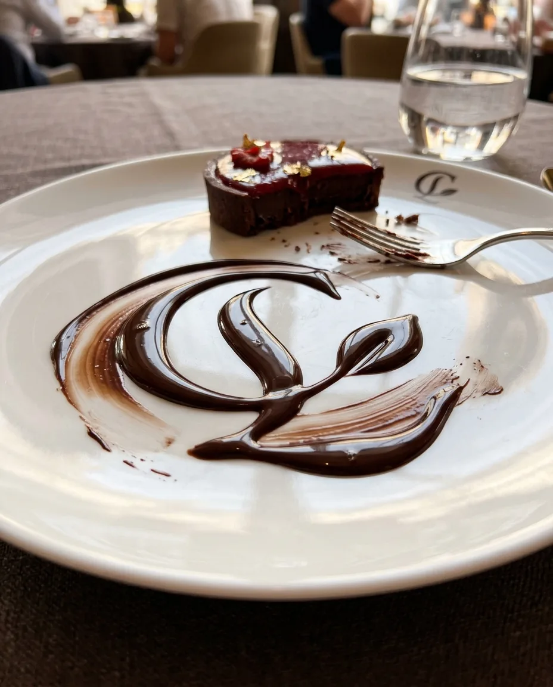

**#15 · Food &amp; Drink Prompt · <code>Vinano Image v2</code>**

<details>
<summary>Show prompt</summary>

```
Transform the uploaded logo into a realistic dessert scene where the logo silhouette is formed naturally by melted chocolate spread across a plate, while the plate and dessert presentation are also subtly designed around the same logo as a brand identity.The logo must keep its exact shape and proportions, appearing both as a clean branded element (engraved or printed on the plate) and as a naturally melted chocolate formation created through real fluid behavior.

Material details:
Rich dark chocolate high viscosity and glossy reflective surface.
Thicker areas forming smooth pools, thinner areas creating soft fading edges.
Visible chocolate streaks where it has been dragged or spread naturally.
Subtle ripples and surface tension curves, occasional small air bubbles.

Physics behavior:
Chocolate should behave realistically — slow flow, rounded edges, gravity pulling it into thicker pools.
Slight directional flow suggesting it was poured or spread.
Variations in thickness depending on how it settled on the plate.
Natural imperfections — no perfectly sharp lines.

Surface interaction:
Ceramic or porcelain dessert plate subtle gloss finish.
Plate includes a minimal branded logo (engraved, embossed, or printed).
Chocolate partially overlaps or interacts the plate’s logo design for realism.
Small chocolate smears or residue near edges.

Environment & atmosphere:
Fine dining or café dessert setting.
Partially eaten dessert (cake, pastry, or mousse) nearby.
Subtle crumbs, fork marks, and realistic usage details.
Refined but not overly staged.

Lighting:
Soft warm lighting (restaurant or café ambiance).
Highlights reflecting on chocolate surface.
Gentle shadows adding depth to textures.

Camera & composition:
Slightly angled top-down macro shot.
Logo clearly visible through chocolate formation.
Balanced composition showing both dessert and branding.

Format:
Aspect ratio: STRICT 4:5 vertical.
No text overlays.

Style:
Hyper-real food photography.
Luxury dessert aesthetic natural fluid realism.
Brand integrated into environment.

Render with rich micro-detail while keeping the layout uncluttered and intentional.
```

</details>

---

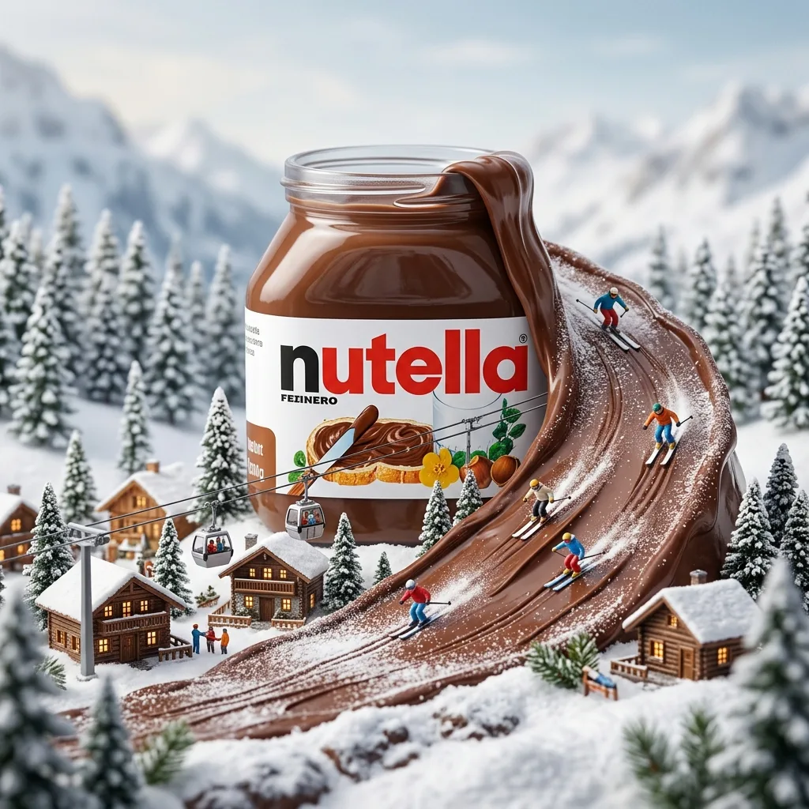

**#16 · Food &amp; Drink Prompt · <code>Vinano Image v2</code>**

<details>
<summary>Show prompt</summary>

```
{
 "cinematic miniature winter world built around a giant Nutella jar, thick chocolate hazelnut spread flowing out forming a glossy mountain ski slope, tiny skiers skiing down the chocolate hill covered light snow powder, miniature alpine village wooden cabins and pine trees, ski lift small gondolas carrying people, snowy forest background and distant mountains, soft winter lighting, ultra realistic textures of melting chocolate and snow, macro tilt shift photography, fantasy food landscape, commercial food advertising style, highly detailed, 8k",
 "negative_prompt": "blurry, low resolution, distorted jar, incorrect logo, messy composition, unrealistic proportions, extra limbs, duplicate people",
 "aspect_ratio": "4:5",
 "style": "ultra realistic macro photography",
 "lighting": "soft cinematic winter daylight",
 "camera": "macro lens, tilt shift effect",
 "quality": "high detail, 8k"
}

Maintain consistent colour harmony and crisp focus across the whole frame.
```

</details>

---

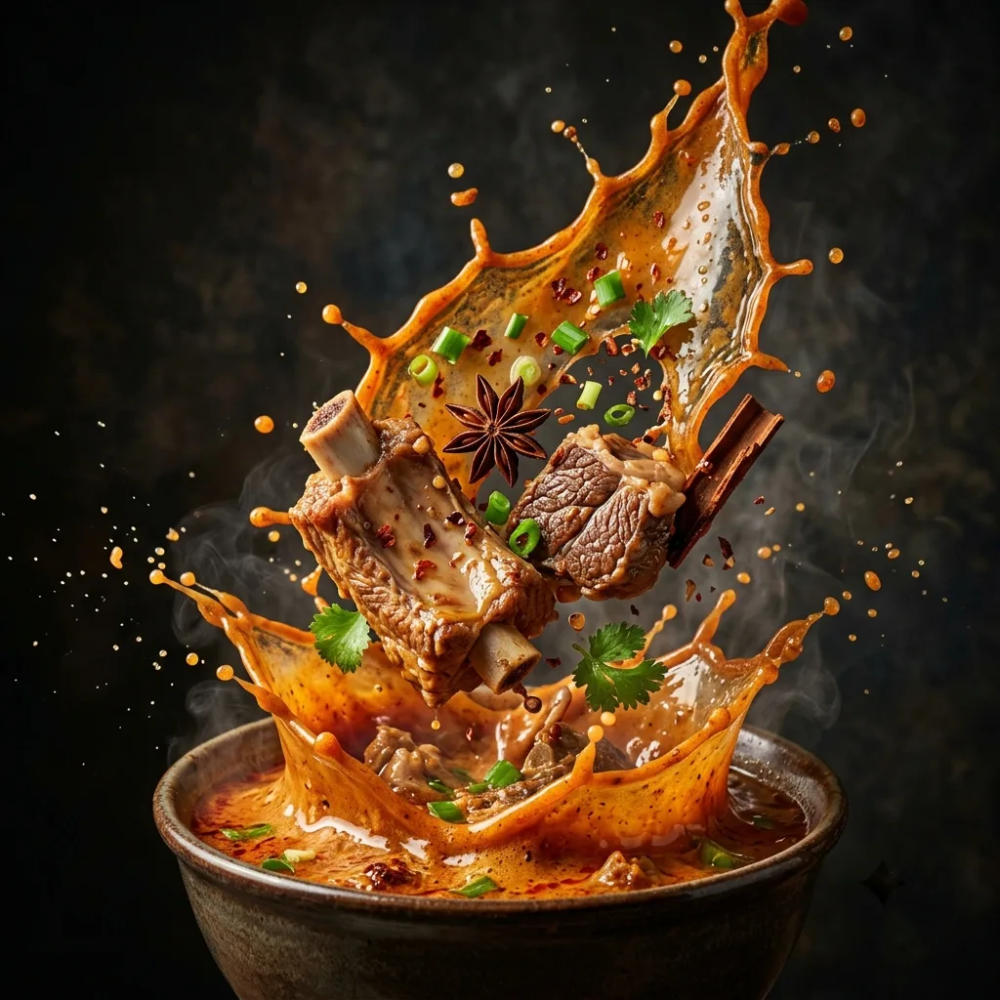

**#17 · Food &amp; Drink Prompt · <code>Vinano Image v2</code>**

<details>
<summary>Show prompt</summary>

```
Ultra-realistic cinematic food photography of a bowl of rich spicy meat soup exploding upward in a dynamic splash, tender bone-in meat pieces floating mid-air creamy curry broth forming swirling liquid ribbons, star anise, cinnamon sticks, green onions, and spices suspended in motion, dramatic dark studio background, high-speed splash capture, macro texture detail on meat and broth, steam rising, shallow depth of field, vibrant warm colors, gourmet food advertising style, hyper-detailed liquid physics, 8K, perfect composition. Aim for an editorial, design-driven look with deliberate negative space.
```

</details>

---

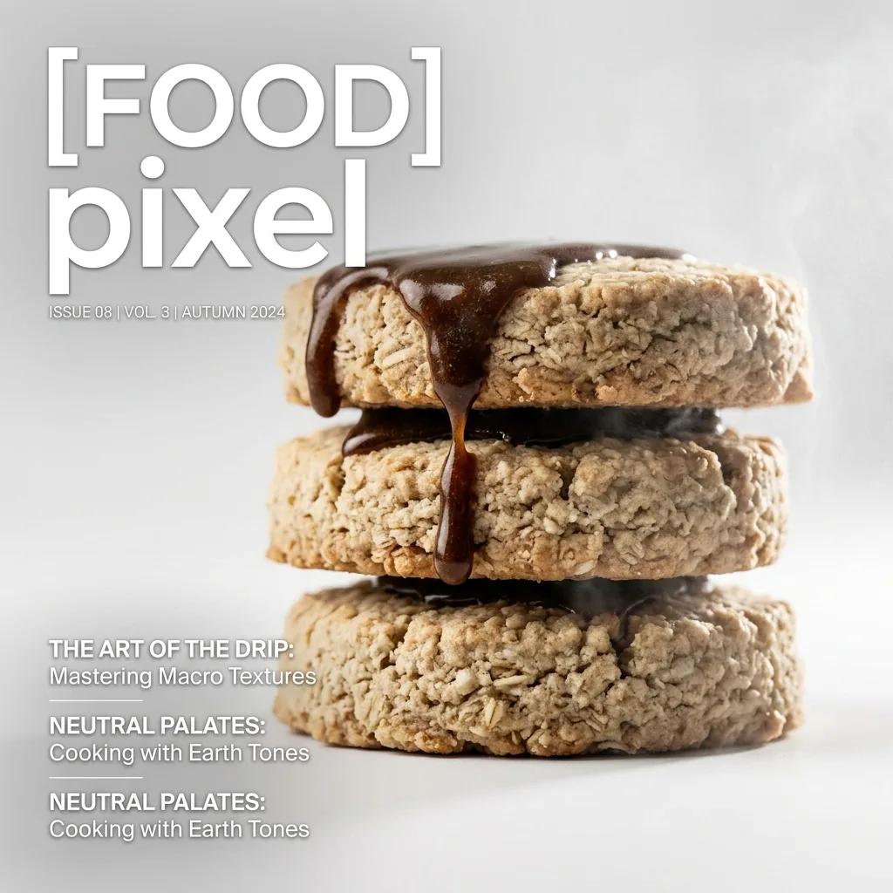

**#18 · Food &amp; Drink Prompt · <code>Vinano Image Pro</code>**

<details>
<summary>Show prompt</summary>

```
a stack of three [FOOD ITEM] [LIQUID] dripping down, on a white background, food photography, magazine cover "[FOOD] pixel", macro shot, studio lighting, nikon z6 ii, volumetric lighting, neutral tones. Maintain consistent colour harmony and crisp focus across the whole frame.
```

</details>

---

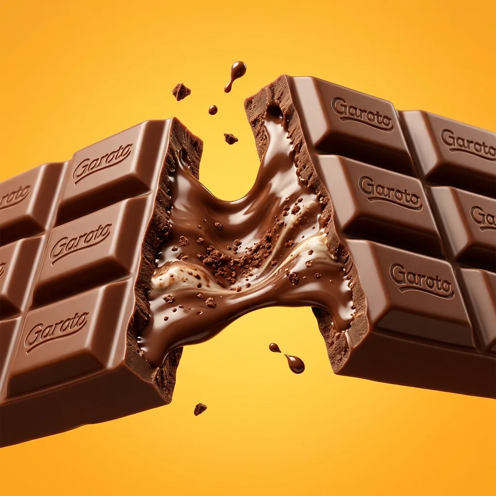

**#19 · Food &amp; Drink Prompt · <code>Vinano Image v2</code>**

<details>
<summary>Show prompt</summary>

```
Use the uploaded product image as reference. Create an ultra-realistic commercial image of a Garoto chocolate bar. Show a broken bar melted chocolate texture, visible cocoa details and rich gloss. Add subtle chocolate splashes and floating crumbs. Clean studio setup, vibrant colored background, bold advertising style for social media. 8K ultra realistic, high sharpness, high contrast, professional lighting realistic shadows and highlights, no text, no watermark, no blur, no distortion, no low quality, no cartoonish style Keep edges clean and the overall composition balanced for a polished, gallery-ready result.
```

</details>

---

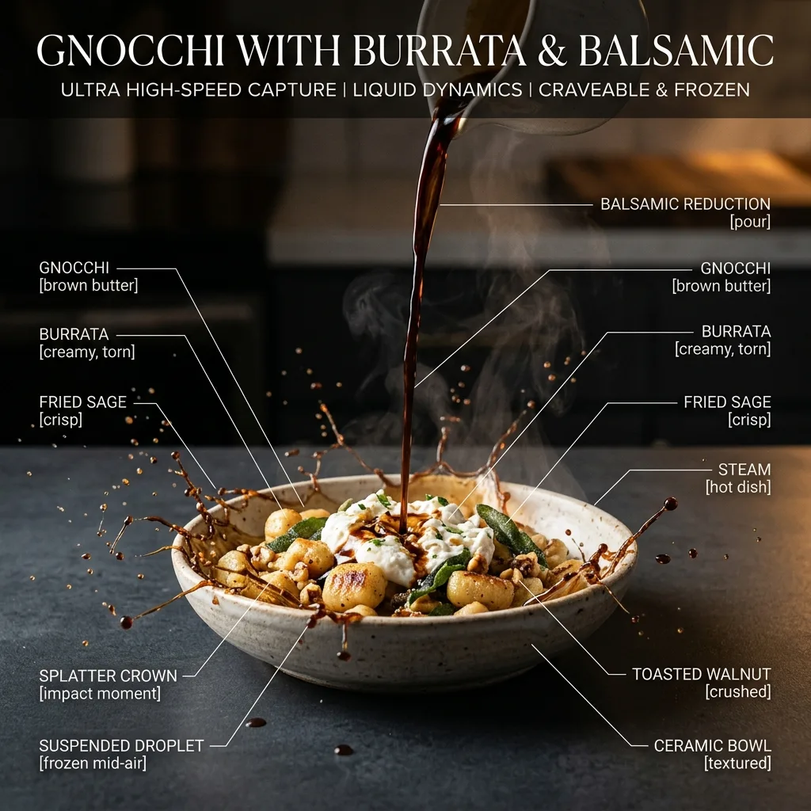

**#20 · Food &amp; Drink Prompt · <code>Vinano Image Pro</code>**

<details>
<summary>Show prompt</summary>

```
[DISH] at the precise moment of a dramatic [LIQUID] pour in ultra high-speed photography, liquid cascade frozen mid-fall in perfect clarity. Hero [DISH] center on matte [COLOR] surface, [LIQUID] pouring from above in one cinematic ribbon catching warm single-source light, splitting and branching into suspended droplets and threads as it hits the surface. Splatter crown frozen at moment of impact, droplets suspended in perfect arcs. Every surface texture hyperreal: glistening, steaming, sauce pooling in slow motion. Each element labeled ultra-thin lines in clean uppercase: "[INGREDIENT] [descriptor]". Dish name in elegant editorial typography: "[DISH NAME]". Subtitle: "[TAGLINE]". Mood: Albert Watson food photography meets Harold Edgerton fluid dynamics meets Michelin-star editorial. 4K, tack sharp every thread and droplet, warm single-source light, extraordinary and craveable. Preserve realistic proportions and depth for a confident, professional finish.
```

</details>

---

## Poster Design

_Showing 20 of 241 — see [`prompts/prompts.json`](prompts/prompts.json) for all._


**#1 · Poster Design Prompt · <code>Vinano Image Pro</code>**

<details>
<summary>Show prompt</summary>

```
整张图里展示 6 个独立手举牌，每个手举牌都完整可见，彼此分开，不要重叠，不要合并成一个大牌，采用清晰的 2列×3行 排布，整体留白舒服，白色底干净整洁，突出每个手举牌本身。每个案例都是单独一张图，不要把多个案例合并在一起。

整体风格要求：参考高完成度商业促销手举牌物料风格，画面要有成熟商业感、原创性和较强细节，不要做得简陋，不要过于扁平，不要像幼儿园贴纸。每个手举牌都必须有明显的多层结构：厚白外描边、彩色异形主底板、内层高光描边、轻微立体感、适度投影、局部渐变、丰富但不杂乱的 3D 小图标、大字主信息、辅助小标签。整体要像真实可制作的 KT板 / PVC 异形手举牌，边缘完整，结构稳固，适合刀模切割，也适合被人手拿拍照。

整套配色围绕【主色调】展开，并搭配【辅助色】和【点缀色】，整体要醒目、统一、有活动氛围。不要只有单一颜色，也不要太素。图标元素围绕【行业/场景关键词】展开，可以加入【图标元素1】、【图标元素2】、【图标元素3】、【图标元素4】、【图标元素5】等，增强活动感和成品感。

请生成以下 6 个独立手举牌文案，并让每个文案都有更合适的异形轮廓和图标配置：
1.【文案1】
2.【文案2】
3.【文案3】
4.【文案4】
5.【文案5】
6.【文案6】

要求这 6 个手举牌造型有变化，不要六个都长得一样。请灵活使用：气泡框、对话框、爆炸框、箭头框、圆角标签框、优惠券框、产品造型框、闪电框等不同异形轮廓，但整套仍然保持统一系列感。字体必须是粗体中文促销字标风格，主信息清晰醒目，适合远距离识别；如果文案里有数字、折扣、价格、件数、赠品等利益点，这些数字和关键词必须明显放大，作为视觉中心。

重点强调：整套图要像【适用场景】里真实会用到的一套手举牌物料方案，既有拍照打卡感，也有促销传播感和商业落地感。避免：过于扁平、过于简陋、儿童贴纸感、六个都是同一种云朵框、图标太少、没有层次、没有商业活动感、文字太弱、像普通电子贴片而不像实体手举牌。

最终输出要求：高清、白底、竖版 9:16、单张图片内展示 6 个独立手举牌、细节丰富、原创性强、好看且适合后续参考制作。

在保证细节的同时保持版式克制、留白得当。
```

</details>

---

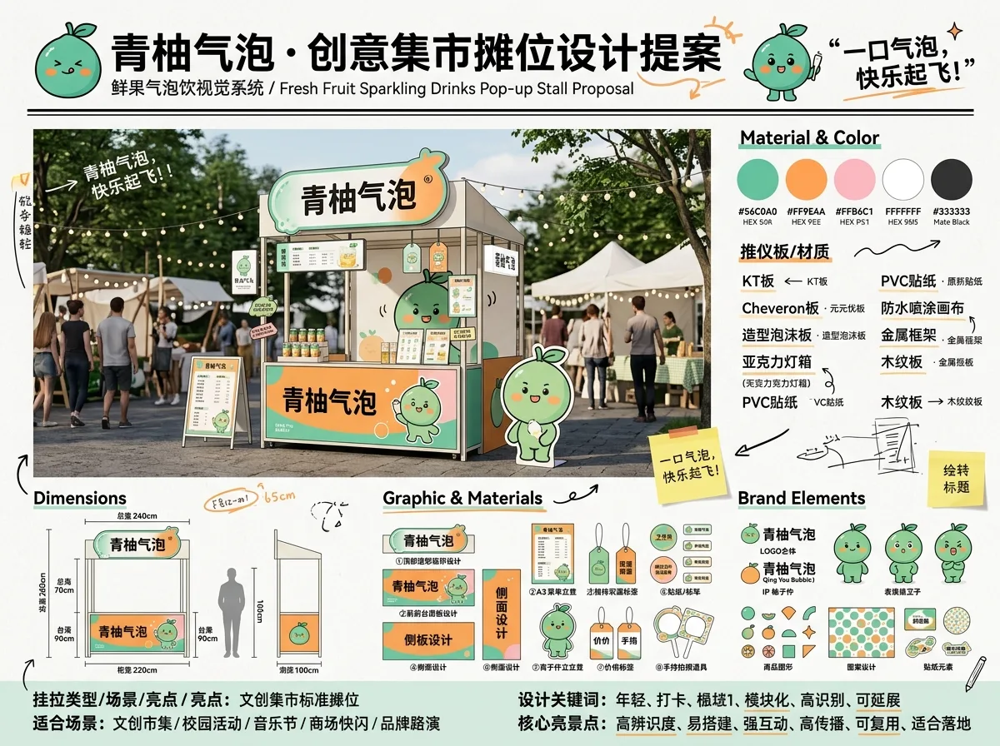

**#2 · Poster Design Prompt · <code>Vinano Image Pro</code>**

<details>
<summary>Show prompt</summary>

```
请根据以下用户输入，生成一张横版 4:3 的《创意集市摊位设计提案板 / Creative Market Stall Proposal Board》。

这不是单纯的摊位效果图，而是一张完整的品牌出摊视觉提案图，需要同时呈现：摊位实景渲染、物料展开、尺寸示意、配色材质、品牌元素、IP形象、使用场景和核心亮点。

【用户输入】
品牌名：【填写品牌名】
摊位主题：【填写主题，例如鲜果气泡饮 / 章鱼小丸子 / 甜品冰品 / 文创手作】
主营产品：【填写具体产品】
目标人群：【年轻人 / 学生 / 女性消费者 / 亲子家庭 / 文创市集人群等】
整体风格：【清爽活力 / 街头热食 / 梦幻甜美 / 文艺手作 / 复古可爱 / 高饱和潮流等】
主色调：【填写主色】
辅助色：【填写辅助色】
IP形象：【填写IP设定，例如青柚精灵 / 小丸子研究员 / 云朵精灵 / 邮差小狗】
核心口号：【填写一句短口号】
使用场景：【文创市集 / 美食市集 / 校园活动 / 音乐节 / 商场快闪 / 品牌路演】

【整体画面要求】
画面比例为横版 4:3。
整体是一张专业的摊位设计提案板，采用高信息量但清晰有序的版式。
画面需要有明显的设计感、提案感和商业落地感，不要像普通广告海报，也不要像单纯效果图。

整体视觉应融合：
1. 写实摊位渲染效果图
2. 平面物料展开图
3. 简化尺寸结构图
4. 品牌视觉系统展示
5. 手绘批注、箭头、圈注、marker 标记
6. 淡淡的纸张纹理或设计稿纹理背景

整体风格参考当代年轻人喜欢的文创集市、美食集市、快闪摊位、品牌市集摊位。
需要新潮、好拍照、适合打卡传播，同时看起来真实可搭建、可落地执行。

【版式结构】
整张图应包含以下板块：

1. 顶部标题区
- 大标题：【品牌名】· 创意集市摊位设计提案
- 副标题：【主题品类】视觉系统 / Pop-up Stall Proposal
- 标题字体要有设计感，不能太普通
- 可以加入少量手绘符号、品牌图形、IP小头像或短口号

2. 主视觉效果区
- 左侧或画面核心区域放一张最大的摊位写实渲染图
- 场景为真实文创集市 / 户外市集 / 美食集市 / 商场快闪 / 校园活动等
- 需要有背景人流、帐篷、树木、灯串、摊位氛围，但人物不要喧宾夺主
- 摊位必须是“文创集市标准摊位”，不是三轮车、不是餐车
- 摊位结构包括：顶部异形招牌、前台围板、侧边围板、菜单立牌、挂牌、产品陈列、IP立牌、打卡装置、灯光或装饰物
- 主视觉要写实、清晰、有真实搭建感

3. 物料展开区 / Graphic & Materials
展示这套摊位涉及的主要物料设计，采用平铺设计稿方式呈现：
- 顶部招牌
- 前台围板
- 侧边围板
- 菜单立牌 A3
- 挂牌 / 双面吊牌
- 贴纸 / 小标识
- 吉祥物立牌
- 价格标签
- 手持打卡牌
每个物料旁边可以有简短编号和中文标签，排版要整洁，有设计提案感。

4. 尺寸示意区 / Dimensions
展示摊位的简化正视图和侧视图。
加入可信的尺寸标注，例如：
- 总宽度 240cm
- 总高度 260cm
- 柜体宽度 220cm
- 操作台高度 90cm
- 顶部招牌高度 70cm
- 侧面深度 60-120cm
尺寸不需要像 CAD 一样精确，但要看起来专业、合理、可落地。
可以加入人物比例剪影作为参照。

5. 配色 / 材质区 / Color & Material
展示 4-5 个色块，并标注色彩名称和近似 HEX 色值。
展示推荐材质，例如：
- KT板
- 雪弗板
- 泡沫板异形切割
- 亚克力灯箱
- PVC贴纸
- 防水喷绘布
- 金属框架
- 木纹板 / 布旗 / 灯串等
材质展示要像设计提案板，不要过于杂乱。

6. 品牌元素区 / Brand Elements
展示完整品牌视觉系统：
- Logo组合
- IP吉祥物
- 吉祥物表情包
- 辅助图形
- 产品图标
- 底纹 / 延展图案
- 小贴纸元素
这一块要体现品牌可延展性，而不是只做一个摊位外观。

7. 摊位类型区 / Stall Type
明确写出：
A. 文创集市标准摊位（本方案主推）
说明适用场景：
文创市集 / 美食市集 / 校园活动 / 音乐节 / 商场快闪 / 品牌路演
说明特点：
模块化搭建、运输方便、视觉醒目、适合拍照打卡、物料可复用。

注意：本图只展示“文创集市标准摊位”，不要展示三轮车流动摊位。

8. 使用场景 / 设计关键词 / 核心亮点
底部可以加入小型信息栏：
- 使用场景：文创市集、校园活动、音乐节、商场快闪、品牌路演
- 设计关键词：年轻、打卡、社交、模块化、高识别、可延展
- 核心亮点：高辨识度、易搭建、强互动、高传播、可复用、适合商业落地

【视觉风格要求】
整体画面要明亮、有冲击力，避免颜色太淡、太灰、太暗。
提高对比度，主色要更饱和，标题和重点信息要清晰有力。
背景可以使用淡淡的纸张纹理、印刷纹理、设计稿纹理或浅色图案，但不能抢主体。
版式要专业、整洁、有层次，像设计师给客户做的完整摊位提案板。
可以加入少量手绘箭头、圈注、便利贴感批注、marker笔记，增强提案氛围。

中文文字要简洁，不要塞太多长句。
主标题、板块标题、口号、标签尽量清晰准确。
所有品牌名、口号、IP和物料文字都必须原创，不要复制任何参考图里的品牌、标语或具体文字。

【最终效果】
生成一张完整、专业、年轻化、高完成度的创意集市摊位设计提案板。
它应该看起来像一个小品牌从 0 到 1 的出摊视觉系统方案：
既有真实摊位落地效果，又有物料设计、尺寸说明、品牌系统和商业应用场景。

强调材质质感与自然光影，让画面更具高级真实感。
```

</details>

---

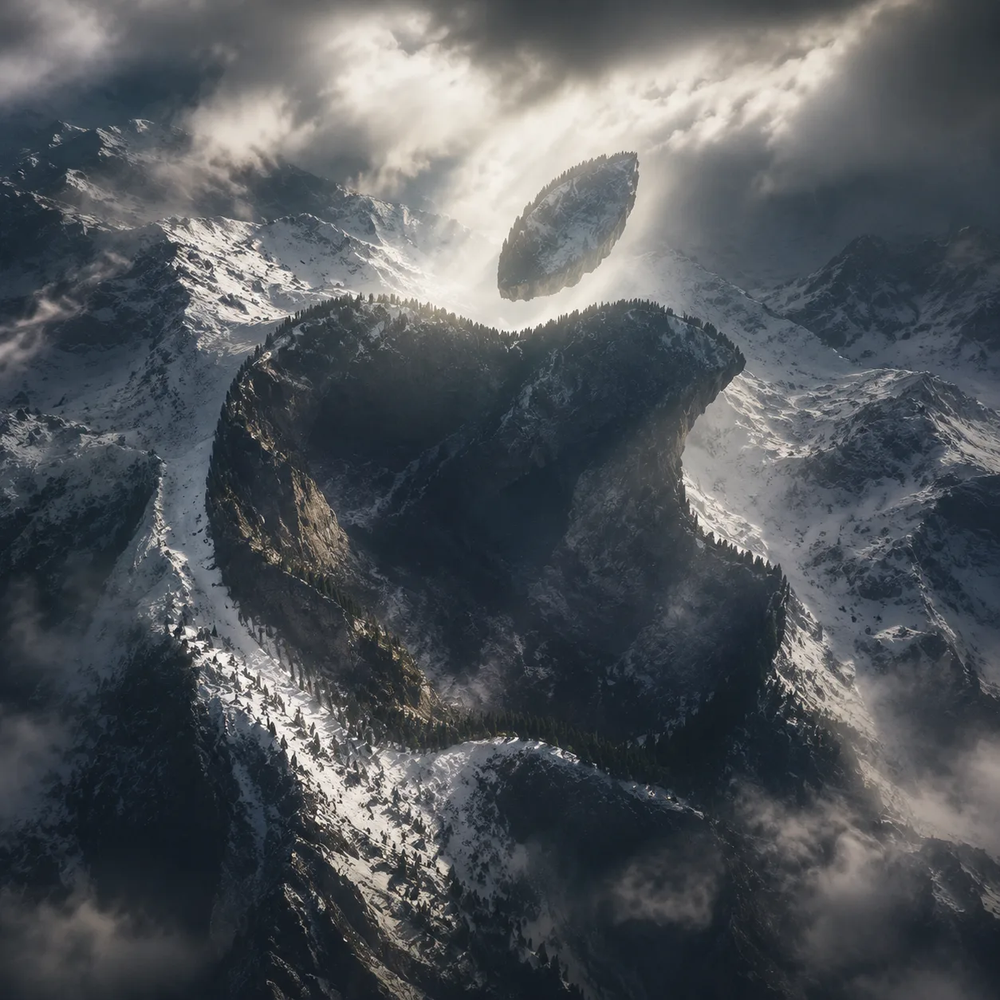

**#3 · Poster Design Prompt · <code>Vinano Studio</code>**

<details>
<summary>Show prompt</summary>

```
<instruction>
 1. Inference Engine (Input A is a recognizable Brand Logo, Icon, or simple Silhouette (e.g., The Apple Logo, Nike Swoosh, Batman Symbol, A Heart).
Input B is a vast Natural Landscape (e.g., Snowy Mountains, Dense Jungle, Sand Dunes, Ocean Coastline).
Deconstruct the inputs to generate 3 Topographical Assets:
 The Negative Space (The Carving): How does the logo fit into the landscape?
 (e.g., The main body of the Apple logo is carved out of a snowy mountain peak).
 The Positive Space (The Island): Are there floating or detached elements of the logo?
 (e.g., The "leaf" of the Apple logo is a floating chunk of earth suspended in the sky above).
 The Texture (The Biome): What materials make up the shape?
 (e.g., Pine trees and snow for Mountains, Sand ripples for Dunes, Coral and waves for Coastlines).

 2. Container
Goal: "Subliminal Advertising" Landscape Photography.
 The Perspective: A wide, sweeping Aerial Drone Shot. The landscape stretches out vast and majestic, dominating the frame.
 The Atmosphere: Dramatic, moody weather. Heavy, swirling clouds, mist, or fog rolling through the valleys.

 3. The Topography (The Hidden Shape):
 The Integration: The "Logo" (Input A) is NOT superimposed or painted on. It is formed entirely by the physical geometry of the terrain.
 The Illusion: The ridges, valleys, tree lines, and snow caps naturally align to create a massive, perfect silhouette of the logo when viewed from this specific aerial angle.
 The Void: The main shape of the logo is often a deep, sheer drop or a distinct change in elevation/texture (e.g., a dark pine forest shaped like an apple cut into a white snowy mountain).
 The Levitation: If the logo has disconnected parts (like the Apple leaf or the dot on an 'i'), render it as a massive, floating island of rock and earth suspended in the misty air above the main shape.

 4. Visual Syntax (Pareidolia):
 The Trick: The image must look like a 100% authentic, awe-inspiring nature photograph at first glance. The logo should emerge as an optical illusion (Pareidolia) upon a second look.
 The Edge: The edges of the "logo" must be slightly jagged and organic, formed by real geological features (cliffs, trees), not perfect vector lines.

 5. Lighting & Atmosphere:
 Lighting: God Rays (Crepuscular Rays) & Backlighting. The sun is hidden behind the clouds or the floating landmass, blasting intense beams of light through the mist and defining the silhouette of the hidden shape.
 Contrast: High contrast between the dark valleys (forests/shadows) and the bright highlights (snow/sunlight).
 Vibe: Cinematic, majestic, and subtly surreal.

 Output: ONE image, 1:1 Aspect Ratio, National Geographic Aerial Photography, "Hidden Image" aesthetic, true-to-life photorealistic.
</instruction>

2. <system_role> you are an optical illusion artist and landscape photographer. </system_role> <illusion_topology> render a vast, true-to-life photorealistic {natural_environment}. however, the shadows, highlights, and physical layout of the landscape must form the exact facial contours and silhouette of {pop_culture_icon} when viewed from a distance. - dark zones (forming the eyes/hair/shadows): deep shadows cast by {dark_nature_elements}. - light zones (forming the skin/highlights): bright areas made of {light_nature_elements}. </illusion_topology> <visual_execution> the image must function flawlessly as two things at once: 1. up close: a beautiful, highly detailed photograph of a {natural_environment} during {weather_condition}. 2. zoomed out: a clear portrait of {pop_culture_icon}. ensure the blending is organic. do not use digital fade overlays. the rocks/trees themselves must form the face. </visual_execution>

Aim for an editorial, design-driven look with deliberate negative space.
```

</details>

---

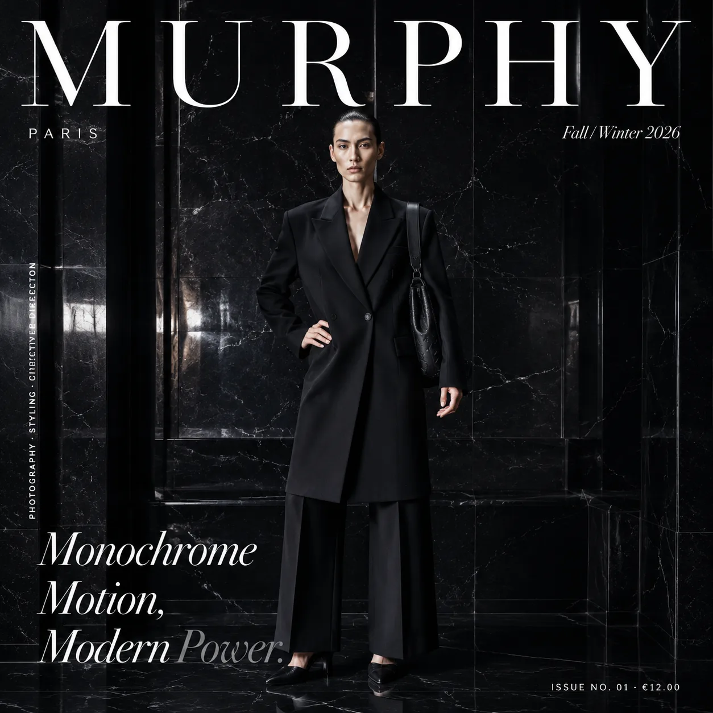

**#4 · Poster Design Prompt · <code>Vinano Studio</code>**

<details>
<summary>Show prompt</summary>

```
Murphy magazine fashion editorial photograph. Androgynous model early 30s, sharp bone structure, flawless skin, hair slicked back, neutral composed expression, standing perfectly straight full body centered against a massive polished black marble architectural facade — reflective stone, towering vertical panels, subtle veining, high-gloss luxury surface. Wearing an immaculate oversized black double-breasted long coat single button fastened, black wide-leg trousers razor sharp centre crease, black leather pointed toe mule, one sculptural black leather architectural bag on left shoulder, designer Louis Vuitton. Left hand on hip, right arm hanging, chin slightly raised, looking directly into lens complete calm authority. High-gloss filmic, cinematic lighting controlled studio key light from left, cool monochrome highlights carving sharp reflections across coat and marble surface, face precisely sculpted high contrast shadow and highlight. Background: deep black marble fills entire frame zero sky visible — tonal black on black ultra luxury.

Typography overlaid exactly as Murphy magazine cover: top center — “MURPHY” in massive modern serif 90px white, letter-spaced 20px. Below masthead left — “PARIS” in 8px Josefin Sans tracked white caps. Top right — “Fall / Winter 2026” in 9px italic Cormorant Garamond white. Bottom left — editorial headline in stacked Playfair Display italic: “Monochrome” line 1, “Motion,” line 2, “Modern Power.” line 3 — 52px white, “Power.” in metallic silver. Bottom right — “Issue No. 01 · €12.00” in 8px tracked Josefin Sans white. Left edge vertical — “Photography · Styling · Creative Direction” in 7px white caps rotated 90 degrees.

Shot on Hasselblad H6D-400C, 85mm, shallow DOF, glossy marble bokeh, HDR, Murphy high-gloss fashion editorial cover, 4:5 portrait

Keep edges clean and the overall composition balanced for a polished, gallery-ready result.
```

</details>

---

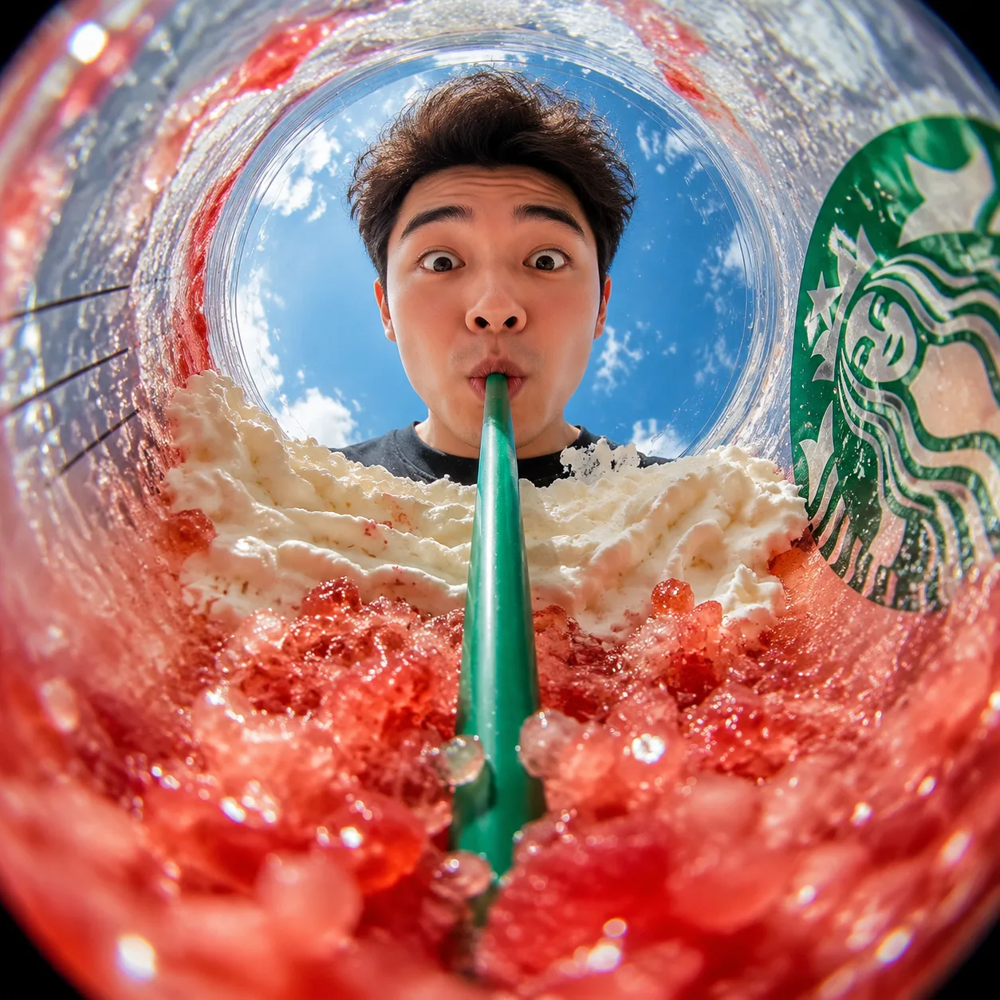

**#5 · Poster Design Prompt · <code>Vinano Studio</code>**

<details>
<summary>Show prompt</summary>

```
{
 "prompt": "View from inside a Starbucks strawberry frappuccino cup looking up, fisheye lens extreme distortion, worm's eye perspective, crushed strawberry ice macro foreground glistening bokeh highlights, one single continuous green straw passing through the entire frame from top to bottom connecting lips to ice, person peering down from above through cup opening wide-eyed excited expression lips pursed on straw top, whipped cream layer, Starbucks logo visible on cup wall, clear blue sky background through opening, high saturation red strawberry vs green straw complementary colors, bright summer daylight, hyper-realistic commercial photography",
 "negative_prompt": "two straws, double straw, multiple straws, broken straw, separated straw, disconnected straw, flat lay, normal perspective, dull colors, deformed face, low saturation, ugly, extra limbs, woman, girl, female",
 "character_reference": {
 "upload": true,
 "control_weight": 0.95,
 "description": "maintain face and identity from reference image, male person, front-facing, slightly downward gaze, wide-eyed excited expression, lips pursed on straw"
 },
 "parameters": {
 "aspect_ratio": "9:16",
 "style_strength": 0.9,
 "composition_reference": "inside-cup fisheye upward shot, face centered in cup opening, single straw runs continuously from person lips down through whipped cream into crushed ice"
 }
}

Render with rich micro-detail while keeping the layout uncluttered and intentional.
```

</details>

---

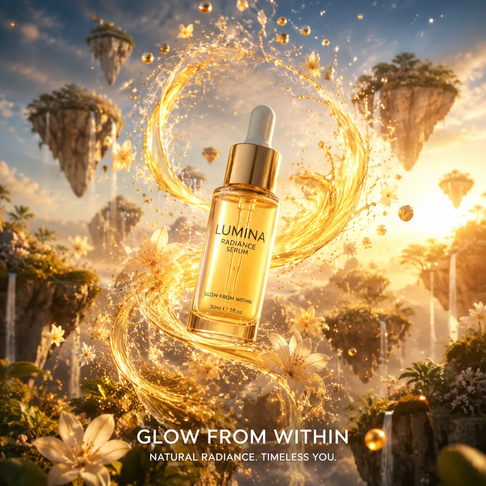

**#6 · Poster Design Prompt · <code>Vinano Studio</code>**

<details>
<summary>Show prompt</summary>

```
High-end 3D advertising poster for [INSERT PRODUCT NAME]. A realistic [INSERT PRODUCT DESCRIPTION] is floating in the center of a magical fantasy landscape. The product is surrounded by a dynamic swirling vortex of [INSERT LIQUID OR ELEMENT] mixed glowing magical sparkles and floating [INSERT INGREDIENTS]. Background features surreal floating islands made of [INSERT MATERIAL] hovering over a [INSERT LANDSCAPE]. Hyper-realistic CGI render, Octane render, bright filmic, cinematic lighting, magical atmosphere. At the bottom center, bold white typography text reads "[INSERT YOUR TAGLINE HERE]". Advertising photography style, 8k resolution --ar 2:3 --v 6.0 Render with rich micro-detail while keeping the layout uncluttered and intentional.
```

</details>

---

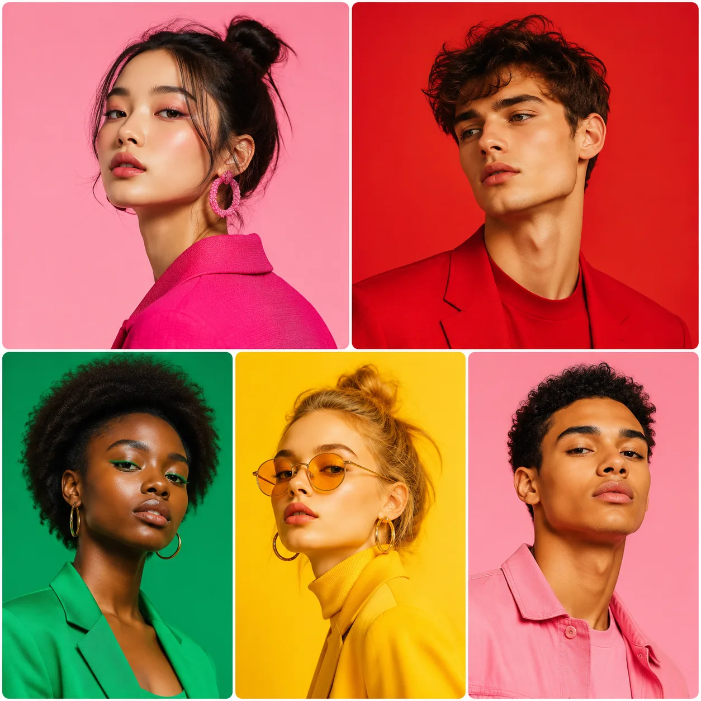

**#7 · Poster Design Prompt · <code>Vinano Studio</code>**

<details>
<summary>Show prompt</summary>

```
5 panel colorful portrait collage, fashion models, monochrome backgrounds (pink, red, green, yellow), vibrant studio lighting, modern editorial style, rounded grid layout, high contrast, minimal shadows Preserve realistic proportions and depth for a confident, professional finish.
```

</details>

---

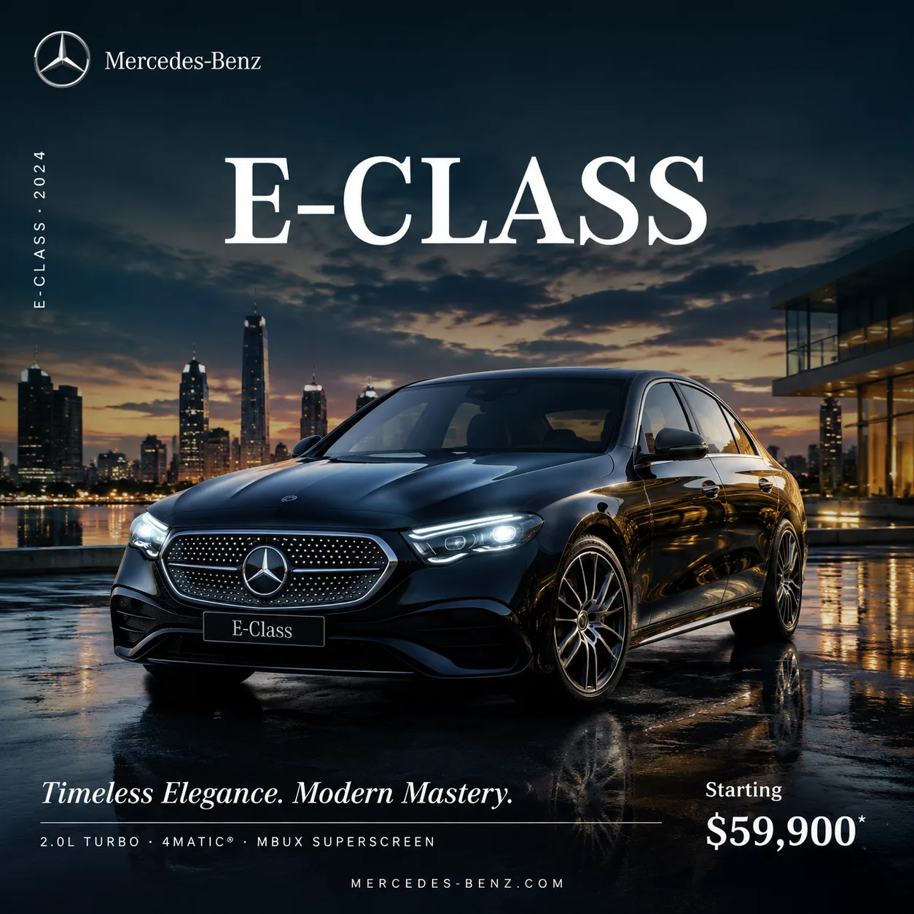

**#8 · Poster Design Prompt · <code>Vinano Studio</code>**

<details>
<summary>Show prompt</summary>

```
Hyper-realistic professional automotive commercial ad poster. [BRAND] [MODEL] in [COLOR] parked at a perfect 3/4 front angle on [SURFACE]. Background: [ENVIRONMENT]. [WEATHER/ATMOSPHERE]. The car hyper-detailed — every panel line sharp, all lights on and glowing, [SIGNATURE DESIGN DETAIL] catching [LIGHT SOURCE], alloy wheels clean and sharp, car reflection visible on [SURFACE] below. [ATMOSPHERE DETAIL — mist / dust / rain / stars].
Typography: top left — [BRAND] logo white. Center — “[MODEL NAME]” in large bold white. Bottom left — “[HEADLINE TAGLINE]” in italic serif white. Below — “[ENGINE · FEATURE · FEATURE]” in 8px tracked caps white. Bottom right — “Starting [PRICE]*” white. Thin horizontal rule separating tagline from specs. Bottom center — “[BRAND WEBSITE]” 7px tracked caps. Left edge vertical — “[MODEL · YEAR]” 7px white rotated 90 degrees.
Lighting: [MAIN LIGHT SOURCE], strong specular on car panels, all brand lights illuminated, [MOOD LIGHT — warm amber / cold blue / golden sunrise / storm dramatic]. Mood: [MOOD]. Shot on ARRI Alexa Mini LF, 50mm anamorphic, shallow DOF, HDR, professional automotive ad campaign poster, 4:5 portrait.

Preserve realistic proportions and depth for a confident, professional finish.
```

</details>

---

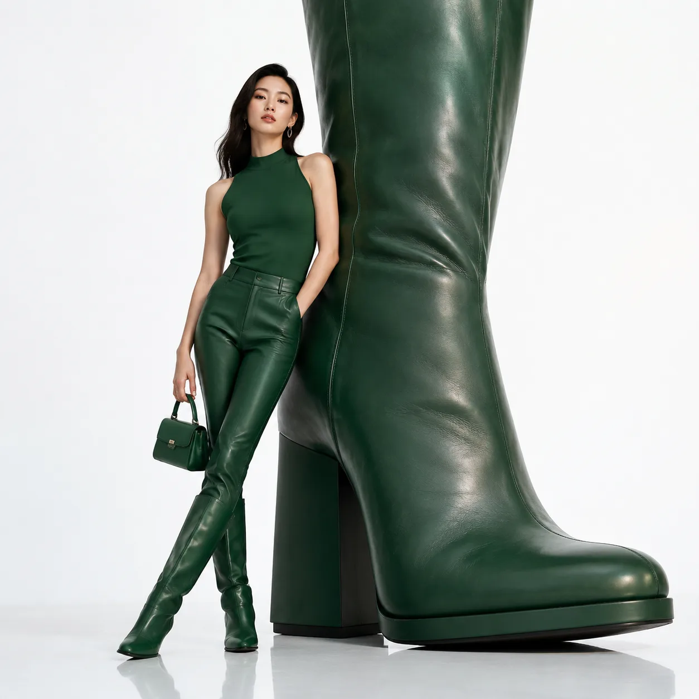

**#9 · Poster Design Prompt · <code>Vinano Studio</code>**

<details>
<summary>Show prompt</summary>

```
{
 "style": "high-fashion editorial, refined minimalist surrealism",
 "subject": "a confident woman leaning casually against an oversized green leather boot sculpture",
 "pose": "relaxed yet powerful stance, body slightly angled, one arm holding a small handbag",
 "outfit": {
 "top": "emerald green fitted sleeveless top",
 "bottom": "matching green leather pants",
 "footwear": "knee-high green leather boots",
 "accessories": "small structured green handbag"
 },
 "composition": {
 "scale": "dramatic contrast between human figure and oversized object",
 "framing": "full body shot, centered subject negative space",
 "background": "pure white seamless studio backdrop",
 "floor": "glossy white reflective surface"
 },
 "lighting": {
 "type": "soft studio lighting",
 "mood": "clean, premium, editorial",
 "shadows": "subtle, natural, controlled"
 },
 "color_palette": "monochromatic green tones neutral white",
 "camera": {
 "angle": "eye-level",
 "lens": "85mm fashion lens",
 "depth_of_field": "sharp focus on subject, smooth background"
 },
 "vibe": "luxury fashion campaign, modern, confident, surreal elegance",
 "quality": "ultra-high resolution, crisp details, magazine-ready"
}

Emphasise material texture and natural light so the final frame feels tactile and premium.
```

</details>

---

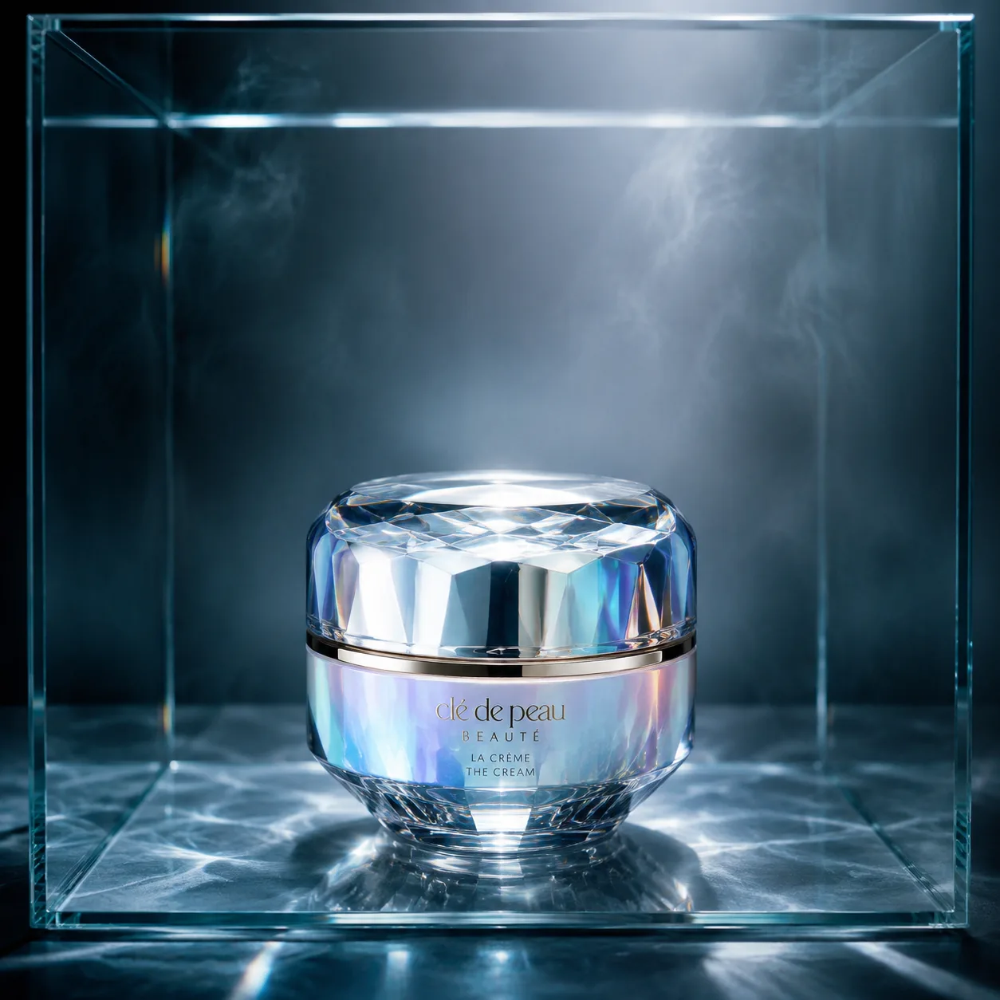

**#10 · Poster Design Prompt · <code>Vinano Studio</code>**

<details>
<summary>Show prompt</summary>

```
[product], futuristic high-end ad, transparent glass cube enclosure, caustic light patterns on surface, minimal composition, cool studio lighting, subtle fog, sharp reflections, ultra-realistic, macro product photography, 100mm lens look, f/8, 8k, 1:1 Preserve realistic proportions and depth for a confident, professional finish.
```

</details>

---

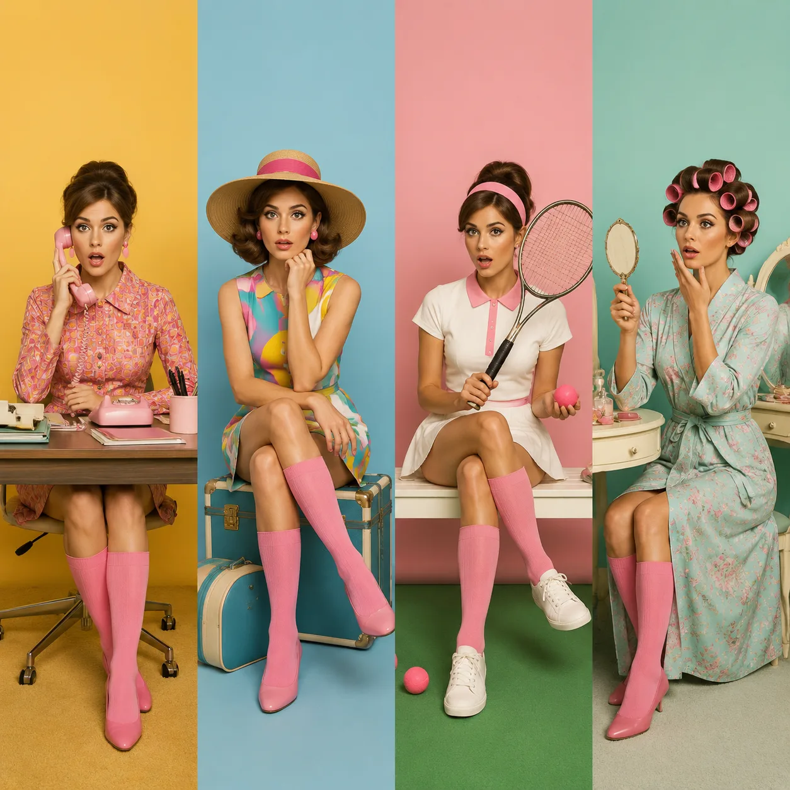

**#11 · Poster Design Prompt · <code>Vinano Studio</code>**

<details>
<summary>Show prompt</summary>

```
A retro-inspired studio photoshoot featuring a young woman styled in four different personas, arranged in a horizontal split-panel composition. Each panel has a bold pastel background in contrasting colors (yellow, blue, pink, mint). The same woman appears in each panel wearing vintage 1960s fashion bright patterns, pink knee-high socks, and expressive makeup.
Panel 1 (Office theme): She sits behind a desk office props like folders, a rotary phone, and stationery, wearing a patterned dress and looking surprised while holding the phone.
Panel 2 (Travel theme): She wears a wide-brim hat and colorful outfit, sitting a vintage suitcase and travel accessories, posing elegantly.
Panel 3 (Sports theme): She wears a sporty retro outfit, holding a tennis racket and ball, sitting casually playful energy.
Panel 4 (Home theme): She wears a robe hair rollers, holding a hand mirror, sitting at a vanity table beauty items.
Each panel is cleanly divided, perfectly symmetrical, consistent lighting and camera angle. Bright, soft studio lighting, high fashion editorial style, ultra-sharp, vibrant colors, minimal shadows, no text, no logos, no labels, no watermarks.
Style: vintage pop art, Wes Anderson symmetry, fashion editorial photography, pastel color blocking, high resolution, 8k, crisp composition.

Emphasise material texture and natural light so the final frame feels tactile and premium.
```

</details>

---

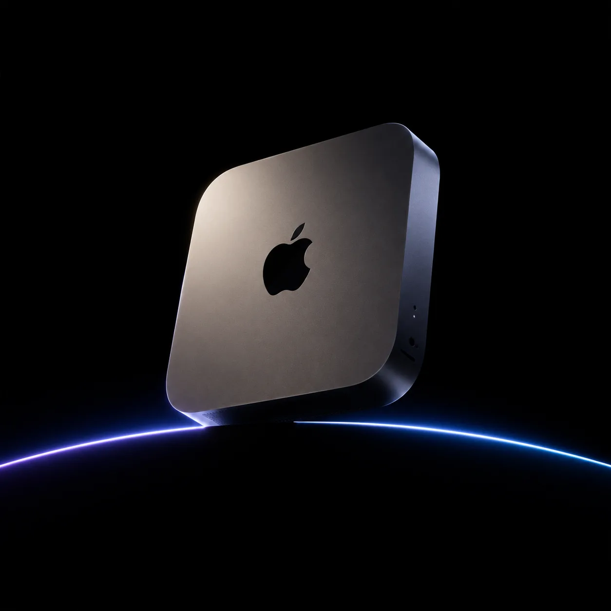

**#12 · Poster Design Prompt · <code>Vinano Studio</code>**

<details>
<summary>Show prompt</summary>

```
{
 "project_name": "Premium_Dark_Horizon_Product_Reveal",
 "USER_CUSTOMIZATION": {
 "INSTRUCTIONS": "Replace 'current_setting' the product you want to render. The system will AUTOMATICALLY position it in a specific, fixed pose: tilted back its bottom-front tip touching the horizon edge.",
 "product": {
 "current_setting": "Mac Mini",
 "description": "The product will be rendered a dark, metallic, highly detailed finish."
 }
 },
 "settings": {
 "style": "Cinematic, high-contrast product photography in a dark environment. Ultra-sharp focus, rich color grading.",
 "aspect_ratio": "4:5"
 },
 "prompt_construction": {
 "MAIN_SUBJECT": {
 "subject": "The [product from USER_CUSTOMIZATION] is perfectly centered.",
 "appearance": "It has a premium, dark silver/chrome-like finish, looking solid and incredibly sharp. There is an ever-so-slight, subtle warmth mixed into the reflections on the metallic surfaces, giving it depth.",
 "pose_and_contact": "CRITICAL: The product is tilted back dramatically, away from the viewer towards the top of the frame. Its bottom-front tip or edge is PRECISELY touching the sharp center edge of the horizon arc. It must NOT float above the arc. This pose prominently displays the main surface (e.g., laptop lid logo, phone screen/back, watch face)."
 },
 "HORIZON_ARC": {
 "description": "A single, clean, massive, dark horizon line arcs across the entire width of the screen from left to right. It is NOT a complete sphere, glowing ball, or circle, but the very edge of a dark planet-like surface.",
 "light_profile": "The edge itself is defined by a thin, sharp, soft-glow blue light. The light is thinnest and sharpest (purplish-blue) in the bottom-left, widening slightly to a brighter, soft white-blue rim on the right before fading. It must NOT reveal the spherical form of the surface below; the area below the arc must remain pitch black.",
 "reflection_effect": "CRITICAL: There are ABSOLUTELY NO reflections of the product on the horizon surface. The surface is dark and matte."
 },
 "LIGHTING_AND_BACKGROUND": {
 "background": "Pure, absolute black negative space. There are NO visible light rays, gradients, starfields, halos, or any other light shapes above or around the product.",
 "key_lighting": "A strong key light from the TOP-LEFT sculpts the product, emphasizing its form and the logo/main feature. It does NOT create visible rays.",
 "rim_lighting": "A distinct rim light from the BACK-LEFT separates the product from the dark background.",
 "fill_lighting": "A soft fill light from the BOTTOM-RIGHT opens up the shadows slightly.",
 "color_cast": "All lighting is dominated by deep, rich blues, consistent the horizon arc."
 },
 "COMPOSITION_AND_FRAMING": {
 "framing": "The product is perfectly centered. The camera distance is fixed, ensuring the product is large and dominant but NEVER cut off.",
 "perspective": "A sharp, eye-level perspective relative to the product's center, looking slightly down towards the horizon."
 }
 },
 "NEGATIVE_CONSTRAINTS": ["visible light rays",
 "glow or light source in the top left corner",
 "product floating above the arc",
 "product not touching the arc edge",
 "product lying flat",
 "visible sphere or glowing orb form below the arc",
 "halos or circular lights above the product",
 "harsh light glows",
 "reflections of the product on the horizon",
 "background other than pure black",
 "product cut off by frame edge",
 "upside-down or downward curve",
 "squiggly arc"],
 "FULL_PROMPT_STRING": "A cinematic product photograph of [product from USER_CUSTOMIZATION] a dark, sharp, silver/chrome finish and subtle warmth. The product is perfectly centered, tilted back dramatically its bottom-front tip precisely touching the sharp center edge of a single, massive, dark horizon arc that spans the frame. This arc is a thin, sharp, soft-glow blue light, purplish-blue in the bottom-left, widening to a soft white-blue rim on the right, before fading to pitch black. The area below the arc is absolute black. There are NO reflections on the horizon. The background is pure, light-ray-free, halo-free black negative space. There is NO glow or light source in the top left corner. Key light from the top-left, rim light from the back-left, and soft fill from the bottom-right create a dramatic, volumetric, blue-dominated lighting scheme. The product is never cut off. 8k resolution, highly detailed."
}

Emphasise material texture and natural light so the final frame feels tactile and premium.
```

</details>

---

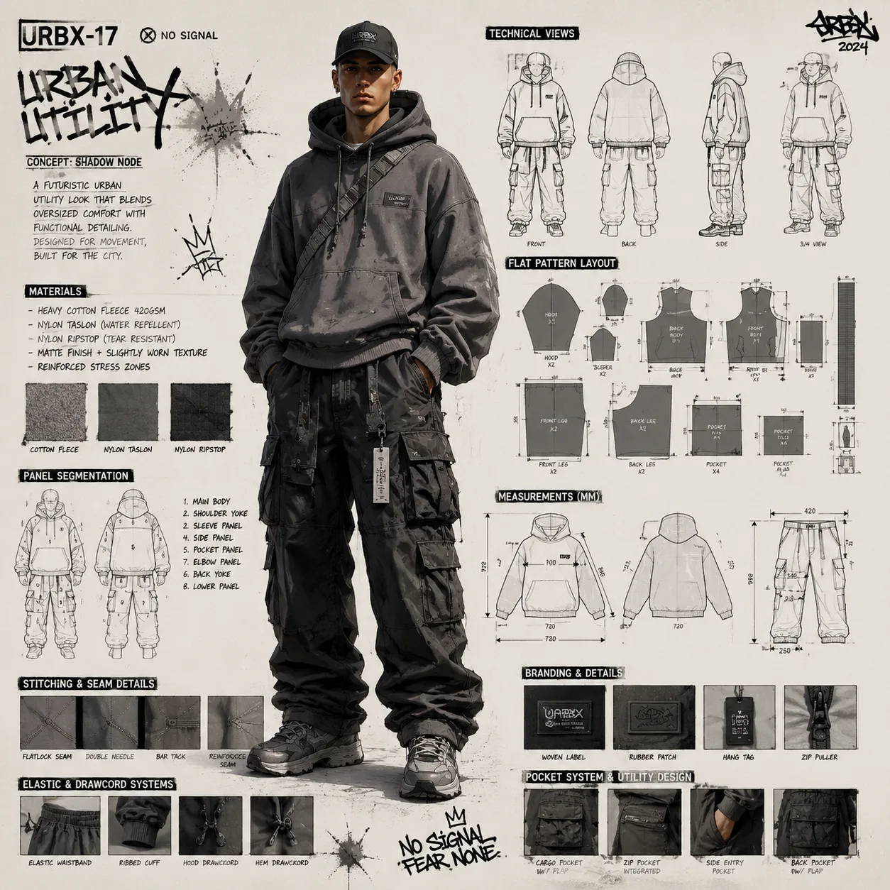

**#13 · Poster Design Prompt · <code>Vinano Studio</code>**

<details>
<summary>Show prompt</summary>

```
the attached image, create a professional industrial fashion design illustration sheet for a high-end streetwear outfit.
A centered heroic full-body 3D render of a modern urban look (oversized hoodie, cargo pants, sneakers), realistic fabric physics, detailed stitching, and layered textiles. Soft studio lighting subtle shadows and premium editorial finish.
Surround technical views:
Front, back, side, 3/4 perspective
Flat lay pattern layout
Include sketches:
Panel segmentation (oversized cuts)
Stitching and seam details
Elastic waistband, cuffs, drawstrings
Measurement arrows in millimeters
Materials (handwritten notes):
Heavy cotton fleece, nylon, ripstop
Matte + slightly worn textures
Reinforced stress zones
Extras:
Street branding placement (logos, tags, patches)
Pocket systems and utility design
Style: Clean sketchbook + graffiti undertone, realistic + pencil hybrid, ultra-detailed.

Keep edges clean and the overall composition balanced for a polished, gallery-ready result.
```

</details>

---

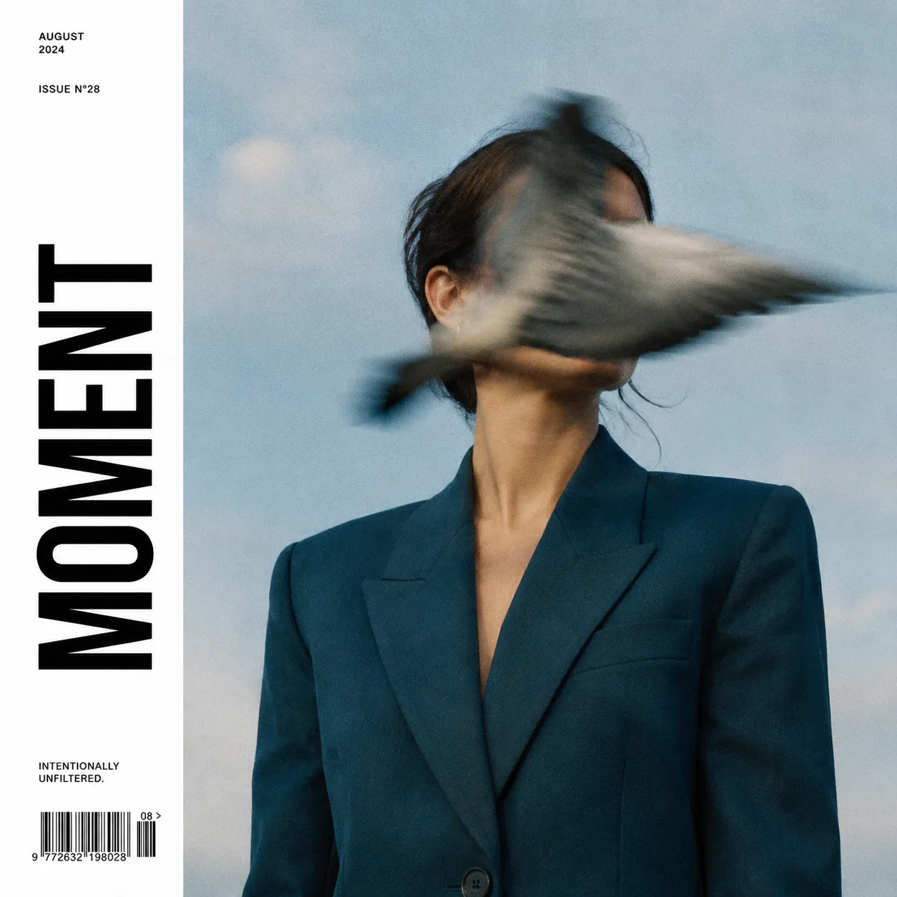

**#14 · Poster Design Prompt · <code>Vinano Studio</code>**

<details>
<summary>Show prompt</summary>

```
Editorial photography, a woman wearing a structured deep teal blazer standing against a pale blue sky. A bird in heavy motion blur is flying across her face, obscuring her features, surrealist style. High-grain paper texture, cinematic soft, diffused lighting, refined minimalist composition. Magazine cover aesthetic a clean white vertical sidebar on the left containing bold black typography. Muted cool tones, artistic blur, 35mm film aesthetic, avant-garde fashion vibe Preserve realistic proportions and depth for a confident, professional finish.
```

</details>

---

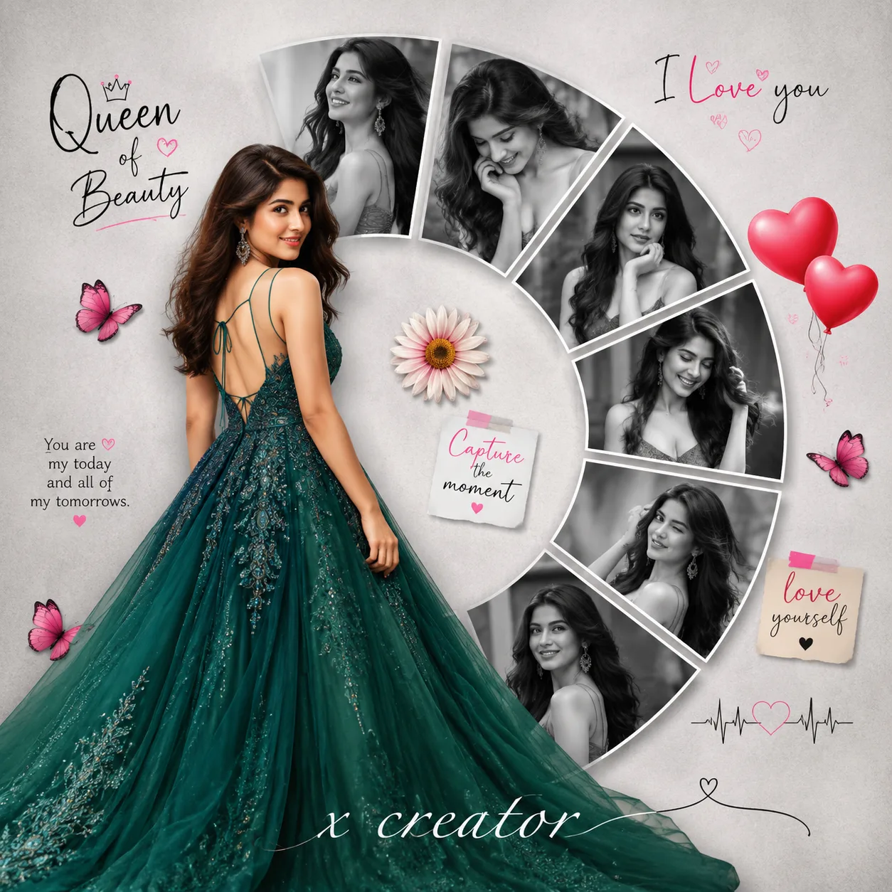

**#15 · Poster Design Prompt · <code>Vinano Studio</code>**

<details>
<summary>Show prompt</summary>

```
A creative romantic digital photo collage featuring a young handsome woman in a peacock green frock. The main subject is a full-body cutout placed slightly left, turned back and smiling over her shoulder, wearing a peacock green embellished rich frock. Behind and around her is a semi-circular collage of multiple black-and-white portrait shots of the same woman, each in different expressions and poses, arranged in curved segments. The background is a soft light grey textured surface a minimal aesthetic.Decorative elements include pink butterflies, a floral daisy near the center, red heart balloons, and cute love-themed stickers Handwritten-style text elements like “Queen of Beauty,” “I Love you,” and “Capture the moment” are scattered around. A small heartbeat line a heart icon is included. At the bottom, the name “x creator” appears in elegant cursive typography. Soft shadows, smooth cutout blending, high-end Photoshop manipulation, romantic mood, pastel tones. Aim for an editorial, design-driven look with deliberate negative space.
```

</details>

---

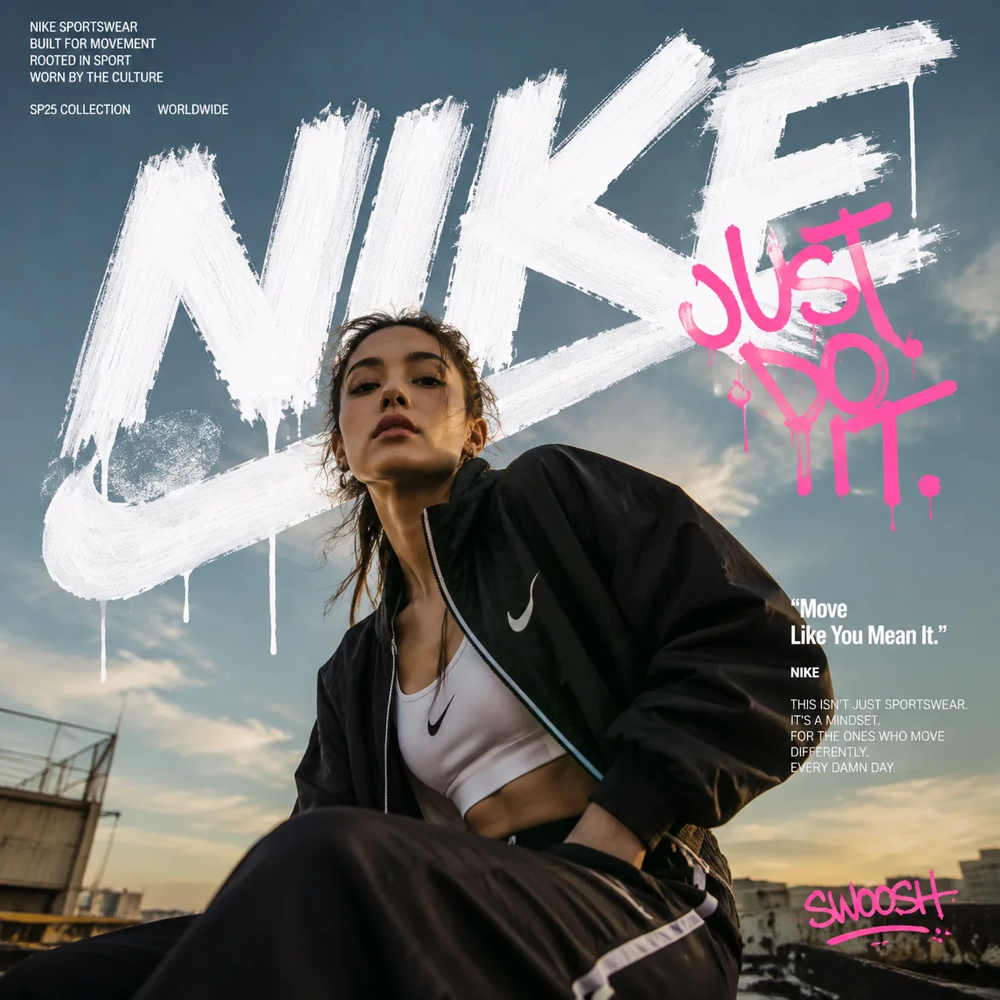

**#16 · Poster Design Prompt · <code>Vinano Studio</code>**

<details>
<summary>Show prompt</summary>

```
[BRAND NAME]

Act as a Senior Street Culture Art Director and Editorial Designer specializing in authentic underground magazine covers and campaign posters that feel documentary rather than commercial. Your reference universe: Thrasher Magazine, i-D, The Face, Dazed — raw, real, typographically bold.

BRAND INTELLIGENCE SYSTEM

Before executing, resolve: (1) HERO SUBJECT — identify the most authentic human archetype or iconic product moment associated [BRAND NAME]'s world. Autonomously determine what this looks like based purely on the brand's identity — a person interacting the brand's hero product in their most natural environment, or the hero product itself as the sole subject if no human archetype is more powerful. The subject must feel like it belongs to this brand's specific world — not borrowed from another brand's cultural universe. Never default to skateboarding, skating, or street sport unless [BRAND NAME] is specifically and primarily a skate brand, (2) ENVIRONMENT — the most iconic real-world location context for [BRAND NAME]'s subject — not a studio, always a real place atmosphere: a rooftop, a street, a race track, a kitchen, a parking lot, a coastline, a salon, a garage, a runway, (3) BRAND WORDMARK STYLE — identify how [BRAND NAME]'s name would look rendered as a rough hand-painted or chalk brushstroke headline — the texture and character of the lettering must feel native to the brand's specific subculture and communication style, (4) NEON ACCENT COLOR — identify one single neon or highly saturated accent color that feels culturally connected to [BRAND NAME]'s world — this will be used exclusively for the graffiti tag overlay and nowhere else, (5) QUOTE LINE — autonomously generate a short authentic-sounding quote or phrase in [BRAND NAME]'s voice — 4–6 words, raw and real, not corporate, not generic.

PHASE 1: PHOTOGRAPHY BASE

The entire image is built on a real location photograph — not a studio shot, not a white background, not a cyclorama. The environment resolved in the brand intelligence system is the setting. Natural or available light only — no softboxes, no controlled studio lighting. The light should feel like it was taken at golden hour, overcast day, or in existing ambient conditions. Camera angle: dynamic and committed — low angle looking up for power, or a dramatic dutch tilt for tension, never flat eye-level. The subject is captured at peak energy — the single most alive frame of the action or moment. The photograph fills the entire canvas edge to edge no padding. Color grade: slightly pushed contrast, natural colors preserved, filmic grain, not over-processed. This photograph must feel like it was taken by a photographer who was actually there — not staged, not art directed to death.

PHASE 2: BRAND LOGO BRUSHSTROKE — CRITICAL

Autonomously identify [BRAND NAME]'s primary icon mark or logo symbol — the exact recognizable shape that represents this brand visually. Render this logo mark as a large hand-painted brushstroke version — as if a skilled street artist took a wide brush loaded paint and painted the logo freehand on a wall. The shape must be immediately recognizable as [BRAND NAME]'s actual logo geometry — correct proportions, correct silhouette, correct internal details — but executed in a loose, gestural, brush-painted style visible bristle marks, paint drips, slightly uneven edges, and areas where the paint is thinner and the surface shows through. This is not a clean vector trace — it is a human hand interpreting a logo a brush. Size: enormous — spanning 70–85% of canvas width, occupying the upper third of the canvas. Color: white or off-white paint — reading clearly against the photograph behind it. The brushstroke logo sits on top of the photograph as an overlay natural paint transparency in the thinner areas.

PHASE 3: GRAFFITI TAG OVERLAY

One single graffiti element in the NEON ACCENT COLOR resolved in the brand intelligence system. This element is a loose hand-drawn tag, throw-up, or marker scrawl — a secondary word, a symbol, an abstract mark, or a stylized brand-relevant word. It sits on top of everything — over the photograph, over the wordmark, over any other element — as if added last and spontaneously, like someone tagged the poster after it was printed. Placement: partially overlapping the brand wordmark in the upper portion of the image additional marks or drips extending into the mid-section of the canvas. The neon accent color is used nowhere else in the entire composition — this element owns that color exclusively. The graffiti mark adds rawness and authenticity — it breaks the polish and makes the whole thing feel real.

PHASE 4: TYPOGRAPHY SYSTEM

Four distinct text zones — all small, all restrained, creating an editorial layout grid around the large wordmark and photograph. UPPER LEFT BLOCK: 3–4 lines of very small all-caps or mixed case body text describing [BRAND NAME]'s campaign, collection, or brand context — autonomously generate relevant editorial copy in [BRAND NAME]'s voice. This block sits in the top-left corner, justified left, at footnote scale. TWO LABEL LINES: directly below the upper left block — a campaign name or season on the left, a short descriptor on the right — both in small caps, same scale as body text. RIGHT MID BLOCK: the QUOTE LINE resolved in the brand intelligence system rendered in quotation marks in the right-center area, slightly larger than body text but still small relative to the wordmark. Below the quote: [BRAND NAME] in small caps as attribution. Below that: 3–4 lines of small body copy [BRAND NAME]'s campaign message — autonomously generate relevant content. LOWER RIGHT DETAIL: a small secondary graffiti-style tag or signature mark in the neon accent color — smaller than the main graffiti element, positioned lower right as a finishing mark.

PHASE 5: OVERALL COMPOSITION

The visual hierarchy reads in this exact order: (1) the photograph and its energy — the eye enters through the action or subject, (2) the massive brushstroke wordmark — confirms the brand, (3) the neon graffiti tag — adds rawness and surprise, (4) the typography blocks — rewards closer reading. The composition must feel like a real magazine cover or a poster wheat-pasted on a wall — not a social media graphic, not a clean digital mockup. Every element has a reason to exist. Nothing is decorative. The rawness is the design.

TECH SPECS

Photography: real location, natural light, peak moment, filmic color grade visible grain. Wordmark: textured brushstroke or chalk — never clean vector. Graffiti: one neon accent color only, hand-drawn quality, sits on top of all layers. Typography: small, editorial, restrained — maximum 4 text blocks. Color palette: natural photograph tones plus one neon accent color only — no additional colors introduced anywhere. No geometric shapes, no illustrated elements, no icons, no additional graphic overlays beyond what is specified. The graphic language is exclusively photography plus typography plus one graffiti accent. Mood: a poster designed by someone who actually lives in this brand's world — not an agency, not a committee, one person a strong point of view and complete conviction.

PHOTOGRAPHY TONE — CRITICAL: the subject must be clean, sharp, and well-lit despite the raw editorial aesthetic. Raw and authentic refers to the composition style and location — NOT to dirt, sweat, mud, or degraded appearance of the subject. The person or product must look aspirational and desirable. No dirt. No sweat. No mud. No torn clothing. No gritty degraded appearance. Editorial rawness means honest and unposed — not physically dirty.

Keep edges clean and the overall composition balanced for a polished, gallery-ready result.
```

</details>

---

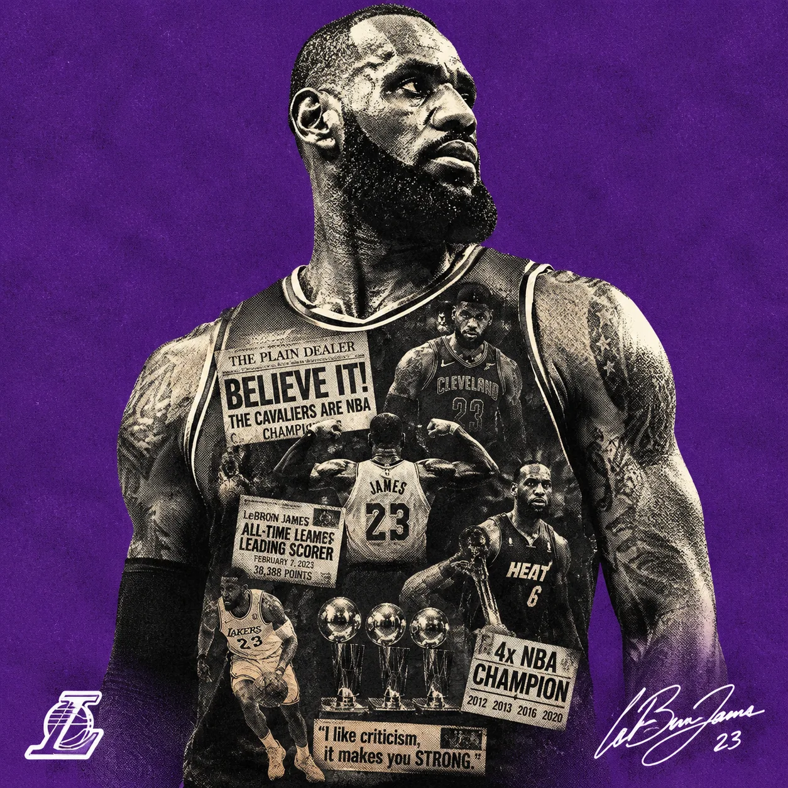

**#17 · Poster Design Prompt · <code>Vinano Studio</code>**

<details>
<summary>Show prompt</summary>

```
[Lebron James]. Act as a graphic designer specializing in "Modern Vintage" sports and music memorabilia posters.
1. COLOR LOGIC (AUTONOMOUS):
Analyze the Subject: Instantly identify the single most iconic color associated [PERSON / CHARACTER NAME] (e.g., if Michael Jordan -> Chicago Red; if Prince -> Purple; if Spotify CEO -> Vibrant Green).
The Background: Fill the entire background this Solid, Vibrant Brand Color.
Texture: Apply a visible Heavy Film Grain overlay to the solid color to kill the digital perfection.
2. CENTRAL COMPOSITION (NARRATIVE SILHOUETTE):
The Container: Place a massive, high-contrast Black & White Cut-Out Photo of [PERSON / CHARACTER NAME] in the center. It can slightly breach the top or side borders (dynamic cropping).
The "Montage" Fill (CRITICAL): The interior of the subject's clothing or body shadows is NOT solid black. It is filled a Complex Monochrome Collage.
Collage Content: Inside the silhouette, layer smaller, high-contrast photos representing key career milestones, newspaper headlines, famous poses, or relevant machinery/tools associated them.
Visual Effect: This creates a "Double Exposure" effect where the hero's shape tells their story.
3. PRINT AESTHETIC (HALFTONE & NEWSPAPER):
Halftone Effect: Apply a distinct "Coarse Halftone Dot Pattern" (Newsprint Screen effect) to the entire central figure and collage. The dots should be visible, creating that retro 90s zine/newspaper aesthetic.
Contrast: The image must be strictly Duotone or Tritone (Background Color + Black Ink + White Paper negative space). No full-color photos.
4. FOOTER ELEMENTS (BRANDING):
Bottom Left (Logo): Place a specific Logo or Icon relevant to the subject (e.g., team logo, company logo, or personal symbol).
Size: Small and discrete (approx 15% of width).
Color: High contrast to the background (White or Black).
Bottom Right (Signature): Place the subject's Autograph/Signature.
Logic: If the signature is public domain, simulate the real one. If fictional, generate a believable handwritten script signature.
Color: Same contrast color as the logo.
OUTPUT:
A raw, textured, vintage-style poster design.

Keep edges clean and the overall composition balanced for a polished, gallery-ready result.
```

</details>

---

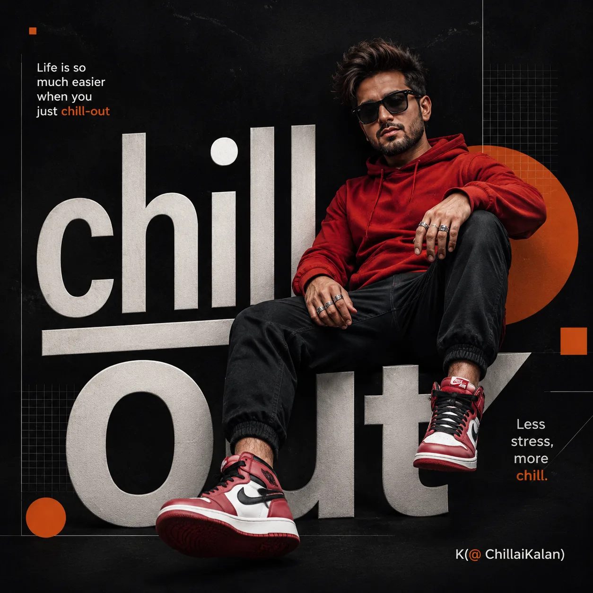

**#18 · Poster Design Prompt · <code>Vinano Studio</code>**

<details>
<summary>Show prompt</summary>

```
Create a hyper-realistic 8K UHD cinematic poster portrait of a man inspired by the reference image, a similar hairstyle, facial structure, and body build while maintaining a natural realistic look. Shot as if captured on a 35mm lens, f/1.8, sharp focus, creamy bokeh, cinematic color grading, and detailed DSLR skin texture.

Design a modern graphic poster titled “Chill-out.” The man wears a red hoodie, black cuffed joggers, red and white Air Jordan high-top sneakers, dark sunglasses, and silver rings. He sits in a relaxed reclined pose leaning against oversized typography, one leg bent and the other slightly extended toward the viewer. His body angles right while his face turns toward the camera in a confident three-quarter view.

Background is matte textured black. Large bold white sans-serif text “chill” and “out” forms a bench-like structure, “chill” underlined. Add orange circles, squares, thin white grid lines, and phrases: “Life is so much easier when you just chill-out” and “Less stress, more chill.”

Bottom-right watermark: K(@ ChillaiKalan),

Emphasise material texture and natural light so the final frame feels tactile and premium.
```

</details>

---

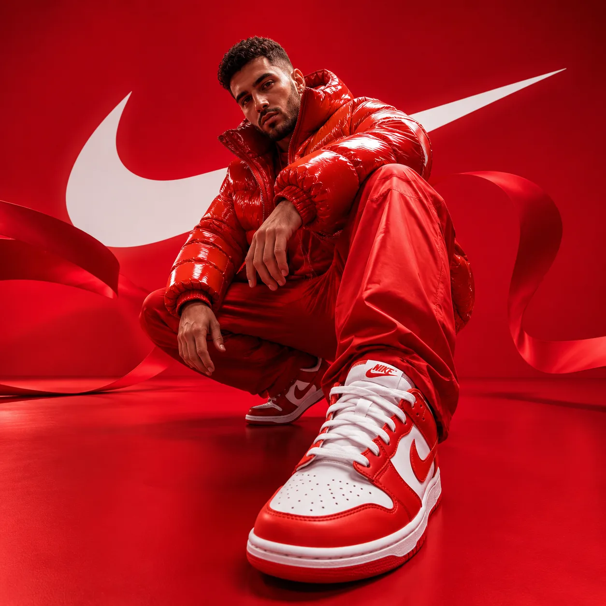

**#19 · Poster Design Prompt · <code>Vinano Studio</code>**

<details>
<summary>Show prompt</summary>

```
A MAN LIGHT-MEDIUM SKIN, SHORT DARK CURLY HAIR A FADE HAIRCUT,BROWN EYES,
AND A WELL-GROOMED SHORT BEARD, WEARING A GLOSSY OVERSIZED RED PUFFER JACKET AND
LOOSE RED PANTS WHITE AND RED NIKE SNEAKERS, CROUCHING LOW ONE KNEE UP AND
ONE LEG FORWARD, LEFT ARM RESTING CASUALLY OVER THE RAISED KNEE AND RIGHT HAND
RELAXED NEAR THE OTHER LEG, BODY ANGLED SLIGHTLY TO THE SIDE WHILE HEAD TILTS
FORWARD LOOKING DIRECTLY AT THE CAMERA A CONFIDENT EXPRESSION, ULTRA WIDE-ANGLE
LOW PERSPECTIVE SHOT EMPHASIZING THE FRONT SNEAKER APPEARING LARGE AND DOMINANT IN
THE FOREGROUND, SET IN A FULLY RED ENVIRONMENT SMOOTH FLOOR AND BACKDROP
FEATURING LARGE WHITE NIKE SWOOSH LOGOS BEHIND AND FLOWING RIBBON-LIKE RED SHAPES
AROUND, HYPER-REALISTIC PHOTOGRAPHY, EXTREMELY SHARP DETAILS ON FABRIC SHINE AND
SNEAKER TEXTURE, DRAMATIC STUDIO LIGHTING STRONG HIGHLIGHTS AND SOFT SHADOWS
SATURATED MONOCHROMATIC RED COLOR PALETTE WHITE ACCENTS, MODERN STREETWEAR
CAMPAIGN STYLE, NO BLUR, NO DISTORTION, NO EXTRA LIMBS, NO ARTIFACTS

Aim for an editorial, design-driven look with deliberate negative space.
```

</details>

---

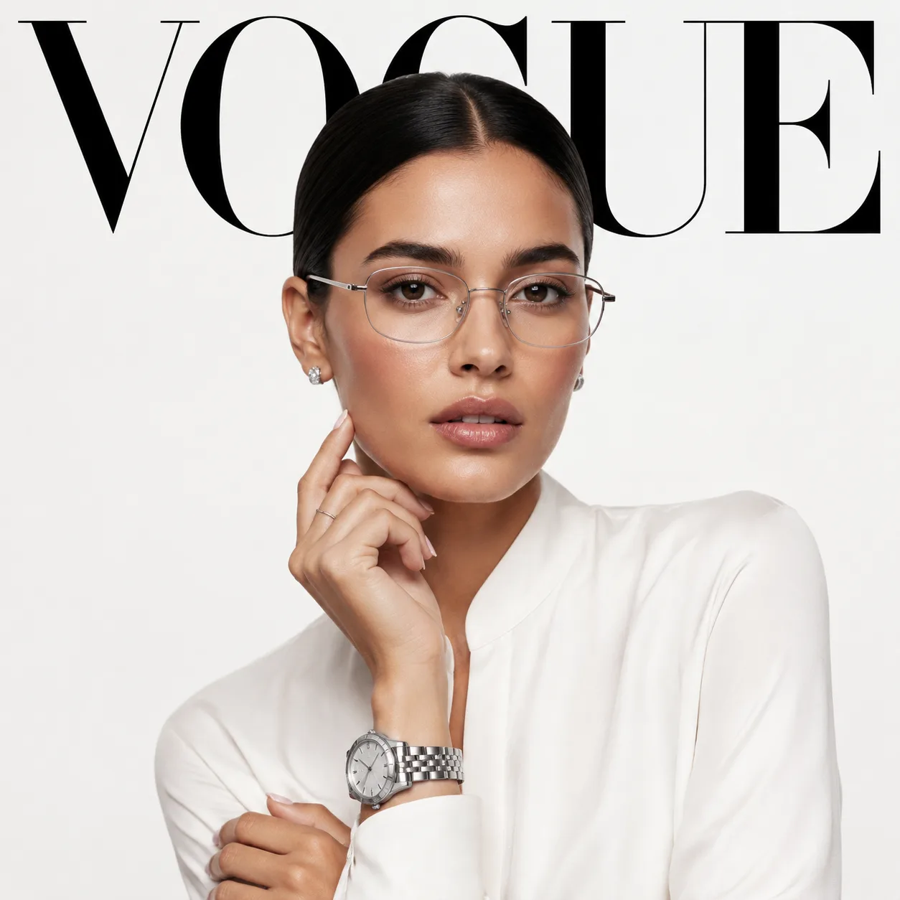

**#20 · Poster Design Prompt · <code>Vinano Studio</code>**

<details>
<summary>Show prompt</summary>

```
A high-definition, professional fashion editorial photograph of a sophisticated woman a sleek, center-parted bun. She is wearing elegant, thin-rimmed silver glasses and a refined minimalist white long-sleeved silk blouse. She is posed gracefully her hands near her face and chest, showcasing a luxury silver watch. The background is a clean, bright white bold, high-contrast black serif typography reading 'VOGUE' at the top. Studio lighting, soft skin texture, sharp focus on the eyes, 8k resolution, shot on a 85mm lens for a flattering portrait compression."
​Tips for Customizing the Result:
​The Model: If you want a different look, change "sophisticated woman" to specific features like "freckles," "dark curly hair," or "refined minimalist makeup."
​The Brand: You can swap "VOGUE" for any other magazine title or leave it blank for a clean fashion portrait.
​The Jewelry: Adjust the metal (e.g., "gold watch," "rose gold frames") to change the color palette of the image.

Keep edges clean and the overall composition balanced for a polished, gallery-ready result.
```

</details>

---

## UI & Graphic

_Showing 20 of 176 — see [`prompts/prompts.json`](prompts/prompts.json) for all._

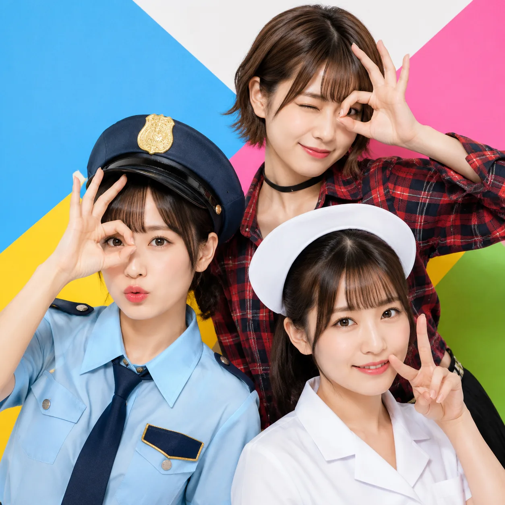

**#1 · UI &amp; Graphic Prompt · <code>Vinano Studio</code>**

<details>
<summary>Show prompt</summary>

```
High-resolution Japanese commercial advertisement style photo, three young women posing against a clean white background bold geometric color blocks (blue, pink, yellow, green) arranged diagonally.
Top right: woman short brown hair wearing a red and black plaid shirt and black choker, winking and making an “OK” hand gesture over one eye.

Left: woman in a light blue police uniform cap, making an “OK” gesture near her eye a playful expression.

Bottom right: woman dressed as a nurse in a white outfit and cap, making a peace (V) sign a cute expression.
Bright studio lighting, soft shadows, vibrant colors, sharp focus, clean commercial composition, modern Japanese advertising aesthetic, playful and energetic mood, ultra-detailed, crisp skin tones.
No text, no logos, no typography anywhere in the image.

Render with rich micro-detail while keeping the layout uncluttered and intentional.
```

</details>

---

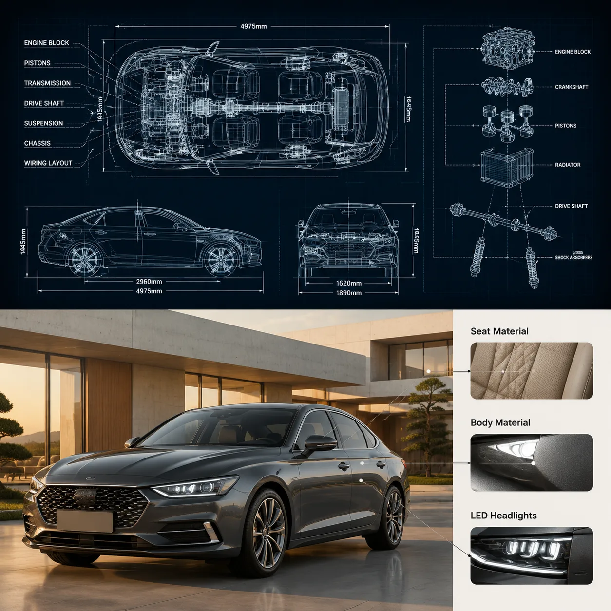

**#2 · UI &amp; Graphic Prompt · <code>Vinano Studio</code>**

<details>
<summary>Show prompt</summary>

```
{
 "objective": "Create a premium split composition showing a detailed automotive blueprint (top) and a perfectly matching real-world car material breakdown (bottom), a carefully designed high-end background",
 "aspect_ratio": "3:4",
 "composition": {
 "layout": "vertical_split",
 "split_ratio": "50:50",
 "alignment": "precise, centered",
 "continuity_rule": "bottom car must EXACTLY match blueprint geometry, proportions, and design"
 },

 "top_section": {
 "type": "engineering_blueprint",
 "style": "ultra-detailed CAD drawing",
 "background": {
 "color": "#0b1d2a",
 "texture": "subtle grid lines",
 "vignette": "very slight edge darkening"
 },
 "linework": {
 "color": "white faint cyan glow",
 "thickness_variation": "technical precision",
 "sharpness": "very crisp"
 },
 "views": {
 "top_view": "dominant center",
 "side_view": "bottom left",
 "front_view": "bottom right"
 },
 "technical_elements": {
 "dimension_lines": true,
 "units": "mm",
 "arrows": "thin CAD arrows",
 "labels": ["ENGINE BLOCK",
 "PISTONS",
 "TRANSMISSION",
 "DRIVE SHAFT",
 "SUSPENSION",
 "CHASSIS",
 "WIRING LAYOUT"],
 "exploded_diagram": {
 "position": "top right",
 "components": ["engine block",
 "crankshaft",
 "pistons",
 "radiator",
 "drive shaft",
 "shock absorbers"],
 "connection_lines": "dashed white"
 }
 },
 "detail_level": "engineering-grade, extremely dense"
 },

 "bottom_section": {
 "type": "real_product + material_breakdown",
 "layout": "car_left_material_panel_right",

 "environment": {
 "type": "luxury architectural setting",
 "design_intent": "background must feel intentional, premium, and editorial — not random",

 "scene": {
 "location": "modern refined minimalist luxury house exterior",
 "architecture": ["clean concrete walls",
 "large floor-to-ceiling glass panels",
 "subtle wood accents",
 "sharp geometric lines"],
 "ground": "smooth concrete driveway slight reflection",
 "background_elements": ["minimal landscaping (bonsai-style trees or trimmed bushes)",
 "no clutter",
 "balanced negative space"]
 },

 "lighting": {
 "time": "golden hour (soft warm sunlight)",
 "direction": "side lighting to enhance car shape",
 "shadows": "soft and elongated",
 "reflections": "physically accurate on car paint"
 },

 "depth": {
 "depth_of_field": "moderate",
 "background_blur": "slight cinematic blur",
 "focus_priority": "car remains razor sharp"
 }
 },

 "car_render": {
 "style": "true-to-life photorealistic automotive photography",
 "camera": {
 "angle": "3/4 front angle",
 "height": "slightly low for hero perspective",
 "lens": "35mm",
 "framing": "car occupies left 60% of bottom section"
 },
 "constraints": ["exact match to blueprint",
 "no added design features",
 "realistic proportions only"]
 },

 "material_panel": {
 "position": "right side",
 "style": "Apple-style product breakdown",
 "background": "soft off-white panel subtle shadow separation",
 "layout": "vertical stack spacing",

 "items": [{
 "title": "Seat Material",
 "visual": "macro close-up of seat texture",
 "material": "premium leather or fabric",
 "lighting": "soft diffused",
 "annotation": "thin line pointing to interior seat"
 },
 {
 "title": "Body Material",
 "visual": "close-up of painted metal reflections",
 "material": "coated aluminum / steel",
 "annotation": "points to car exterior panel"
 },
 {
 "title": "LED Headlights",
 "visual": "detailed glowing LED headlight close-up",
 "material": "modern LED system",
 "annotation": "points to front headlight"
 }],

 "typography": {
 "font": "modern sans-serif",
 "style": "clean, minimal",
 "hierarchy": "clear titles + small labels"
 }
 }
 },

 "style": {
 "fusion": ["engineering blueprint",
 "luxury automotive ad",
 "product design presentation"],
 "quality": "ultra high-end",
 "finish": "polished, editorial-grade"
 },

 "negative_constraints": ["no mismatch between blueprint and car",
 "no messy or cluttered background",
 "no unrealistic reflections",
 "no over-saturated colors",
 "no random environments",
 "no extra parts not in blueprint"],

 "render_settings": {
 "sharpness": "high",
 "dynamic_range": "wide",
 "color_grading": "natural cinematic",
 "noise": "minimal"
 }
}

Maintain consistent colour harmony and crisp focus across the whole frame.
```

</details>

---

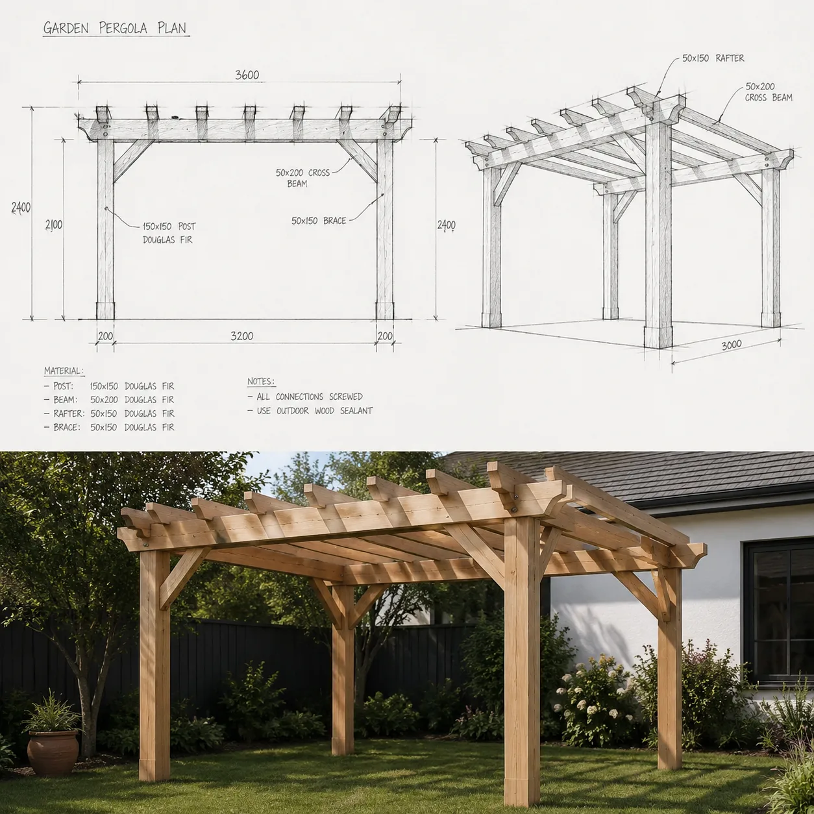

**#3 · UI &amp; Graphic Prompt · <code>Vinano Studio</code>**

<details>
<summary>Show prompt</summary>

```
Pergola Blueprint Prompt: Hand-drawn architectural pencil sketch of a wooden garden pergola on white paper. Front and slight side elevation view clear proportions.

Construction lines, dimensions and handwritten notes visible. Wooden posts and cross beams precisely drafted. Professional but hand-sketched technical style. Clean white background.

Finished Pergola: Fully built wooden pergola in a real garden, matching the exact structure and proportions from the sketch. Viewed from a low front corner perspective at eye level, showing depth and the full beam structure instead of a flat elevation. Natural wood texture realistic joints and connections. Installed on grass surrounding plants. Soft daylight grounded shadows. true-to-life photorealistic architectural visualization.

Render with rich micro-detail while keeping the layout uncluttered and intentional.
```

</details>

---

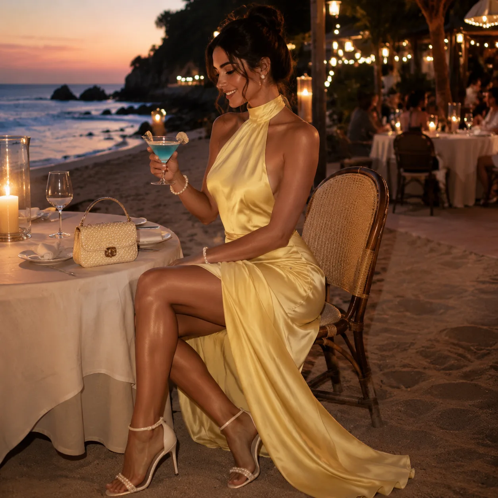

**#4 · UI &amp; Graphic Prompt · <code>Vinano Studio</code>**

<details>
<summary>Show prompt</summary>

```
{
 "generation_request": {
 "meta_data": {
 "tool": "",
 "task_type": "luxury_fashion_moodboard_editorial",
 "language": "en",
 "priority": "highest",
 "version": "v2.5_DAY1_YELLOW_HALTER_SATIN_MINIMAL_ITEMS_GOLD_TEXT"
 },
 "input": {
 "mode": "image_to_image",
 "reference_image_usage": "high",
 "notes": "Use the uploaded reference only as a layout and visual styling guide. Create a clean, elegant luxury fashion moodboard the editorial feeling: soft ivory background, large refined 'DAY 1' title at the top, one pinned seaside restaurant photo, one hero yellow satin halter-neck evening dress an open back, and only a minimal number of supporting elements. Show only one pair of pearl-white heels, only one matching luxury evening bag, only one jewelry item, and only one sea-inspired martini cocktail. Do not include extra accessories, extra bags, extra shoes, or extra jewelry. The composition must feel minimal, expensive, balanced, and professionally art directed, strong hierarchy and generous negative space. The dress should be the main focal point, a sleek modern silhouette, fluid satin drape, and premium fashion-house finish. The seaside restaurant photo should show an upscale evening dinner setup directly on the sand, candlelight and romantic luxury atmosphere. The cocktail should be one elegant sea-inspired martini ocean-blue or sea-glass tones. Add one short motivational quote near the bottom in a refined handwritten or script style. All visible typography, including the 'DAY 1' title and the quote, should be rendered in elegant metallic gold tones a luxurious editorial finish."
 },
 "output_settings": {
 "aspect_ratio": "4:5",
 "orientation": "portrait",
 "resolution_target": "ultra_high_res",
 "num_images": 1,
 "render_style": "luxury_editorial_collage_realism",
 "sharpness": "ultra_crisp",
 "grain": "subtle_print_texture",
 "dynamic_range": "soft_high_end",
 "color_grade": "sunset_gold_pearl_coastal_luxury"
 },
 "layout": {
 "background": "soft warm ivory or premium matte neutral tone",
 "composition": "large DAY 1 title at the top, one pinned seaside photo, one central hero dress, one pair of shoes, one bag, one jewelry item, one cocktail, one short quote",
 "design_feel": "minimal luxury editorial board balanced spacing and no clutter"
 },
 "fashion_story": {
 "hero_dress": "yellow satin halter-neck backless evening dress, sleek modern silhouette, elegant drape, luxurious reflections",
 "shoes": "one pair of pearl-white heels delicate pearl-thread detailing",
 "bag": "one small luxury evening bag in pearl white, ivory, champagne, or soft gold tone",
 "jewelry": "one elegant pearl bracelet or one refined pearl jewelry piece only"
 },
 "lifestyle_element": {
 "date_setting": "luxury beachside evening restaurant directly on the sand, candlelight, elegant table setting, romantic atmosphere",
 "cocktail": "one sea-inspired martini ocean-toned blue-green color and premium garnish"
 },
 "text_element": {
 "title": "DAY 1",
 "title_style": "large elegant editorial serif in metallic gold",
 "quote_examples": ["Softness can still make an entrance.",
 "Choose the night that feels like you.",
 "Elegance is how you arrive."],
 "quote_style": "one short refined handwritten or script quote in metallic gold",
 "instruction": "use only one short quote"
 },
 "must_have": ["reference-inspired clean luxury layout",
 "large DAY 1 title in gold",
 "yellow satin halter-neck backless dress",
 "one pair of pearl-white heels",
 "one matching luxury bag",
 "one jewelry item only",
 "one sea-inspired martini",
 "one seaside dinner photo",
 "one short motivational quote in gold",
 "minimal elegant composition"],
 "negative_prompt": ["extra bag",
 "extra shoes",
 "extra jewelry",
 "extra accessories",
 "too many objects",
 "messy collage",
 "cheap styling",
 "too much text",
 "wrong dress color",
 "flat uninspired layout",
 "cartoon",
 "low detail",
 "logo",
 "watermark"]
 }
}
Prompt(right):
{
 "generation_request": {
 "meta_data": {
 "tool": "",
 "task_type": "reference_locked_fashion_editorial_scene",
 "language": "en",
 "priority": "highest",
 "version": "v1.1_REFERENCE_WOMAN_IN_DAY1_LOOK_MORE_NATURAL"
 },
 "references": {
 "reference_image_style": {
 "source": "UPLOAD_MOODBOARD_IMAGE",
 "purpose": "OUTFIT_ACCESSORIES_STYLING_SCENE_GUIDE",
 "strict_lock": false,
 "preserve_palette": true,
 "preserve_vibe": true,
 "preserve_outfit_details": true,
 "preserve_accessories": true,
 "preserve_scene_direction": true,
 "affect_face": false
 },
 "reference_image_face": {
 "source": "UPLOAD_WOMAN_REFERENCE_IMAGE",
 "purpose": "FACE_IDENTITY_LOCK",
 "strict_lock": true,
 "face_similarity_priority": "MAX",
 "identity_lock_strength": 0.97,
 "no_identity_blending": true,
 "no_age_shift": true,
 "preserve_skin_texture": true
 }
 },
 "input": {
 "mode": "image_to_image",
 "notes": "Use the uploaded woman reference as the identity base. Dress her in a look closely matching the moodboard: yellow satin halter-neck backless evening dress, pearl-white heels, matching luxury evening bag, and minimal pearl jewelry. Do not make the woman look overly perfect, mannequin-like, or artificial. She must feel like a real elegant woman photographed during a luxury seaside dinner, not a fashion doll. Keep natural skin texture, subtle facial asymmetry, believable posture, relaxed shoulders, real body weight, and candid human presence. Show her seated at a luxury beachside restaurant directly on the sand during evening golden hour into night, naturally holding or reaching for a sea-inspired martini cocktail. The dress, shoes, bag, and jewelry should remain clearly visible and strongly matched to the moodboard, but the overall image should feel lived-in, cinematic, and natural rather than overly staged."
 },
 "output_settings": {
 "aspect_ratio": "4:5",
 "orientation": "portrait",
 "resolution_target": "ultra_high_res",
 "num_images": 1,
 "render_style": "natural_luxury_realism",
 "sharpness": "clean_natural",
 "grain": "subtle_film",
 "dynamic_range": "soft_high_end",
 "color_grade": "sunset_gold_pearl_coastal_natural"
 },
 "scene": {
 "environment": "luxury beachside restaurant directly on the sand at evening golden hour fading into night",
 "details": "candlelit table, elegant place setting, warm ambient lights, sea view, refined romantic atmosphere",
 "pose": "woman seated naturally, slightly turned, relaxed and elegant, interacting casually the cocktail, not stiff, not overly posed",
 "mood": "romantic, upscale, warm, feminine, cinematic, believable"
 },
 "subject": {
 "identity": "uploaded woman reference strong but natural resemblance",
 "outfit": "yellow satin halter-neck backless evening dress closely matching the moodboard",
 "shoes": "pearl-white heels clearly visible",
 "bag": "matching evening bag clearly visible",
 "jewelry": "minimal pearl jewelry",
 "beauty": "natural luxury beauty, realistic skin texture, soft evening glam, human and believable"
 },
 "camera": {
 "framing": "three-quarter seated fashion portrait wide enough to show shoes, bag, and dress shape",
 "angle": "natural editorial angle, slightly observational rather than overly staged",
 "focus": "sharp on face, dress texture, shoes, bag, cocktail, and table details",
 "depth_of_field": "soft cinematic background separation"
 },
 "lighting": {
 "type": "natural luxury evening lighting",
 "quality": "warm sunset and candlelit ambience soft fill, realistic facial shadows, elegant satin highlights, no overexposure",
 "skin_rendering": "realistic skin texture, no plastic effect, no beauty filter look"
 },
 "must_have": ["realistic human presence",
 "natural face",
 "no mannequin look",
 "strong resemblance to uploaded woman",
 "yellow satin halter dress",
 "visible pearl-white heels",
 "visible matching bag",
 "minimal pearl jewelry",
 "luxury seaside date setting",
 "sea-inspired martini",
 "photoreal quality"],
 "negative_prompt": ["mannequin look",
 "fashion doll look",
 "plastic skin",
 "over-smoothed face",
 "beauty filter",
 "stiff pose",
 "unnatural symmetry",
 "different outfit",
 "different shoes",
 "different bag",
 "identity mismatch",
 "blurry face",
 "bad anatomy",
 "extra fingers",
 "deformed hands",
 "cartoon",
 "logo",
 "watermark",
 "text"]
 }
}

Maintain consistent colour harmony and crisp focus across the whole frame.
```

</details>

---

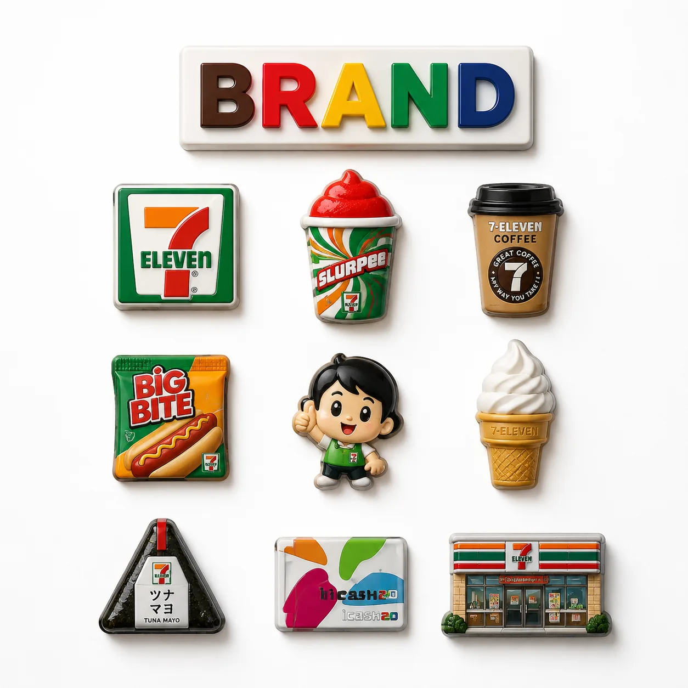

**#5 · UI &amp; Graphic Prompt · <code>Vinano Studio</code>**

<details>
<summary>Show prompt</summary>

```
A flat-lay collection of exactly 9 hyper-realistic 3D resin fridge magnets arranged on a bright pure white surface in a clean 3x3 grid, themed around [BRAND]. At the very top center, a wide rectangular text magnet spells "BRAND" in bold 3D block letters in the brand's signature colors. Below it, 9 magnets in a clean 3x3 grid: the official logo badge, the most iconic hero product, a secondary iconic product, a third iconic product or packaging, a brand mascot or character chibi, a fifth iconic item, a sixth iconic item, a seventh iconic item, and the brand's storefront or headquarters building facade. Each magnet is small, neatly spaced generous white space between them, slightly raised a soft drop shadow beneath. Bright white background, warm studio lighting from above, true-to-life photorealistic product render, top-down flat-lay angle, 4:5 aspect ratio Aim for an editorial, design-driven look with deliberate negative space.
```

</details>

---

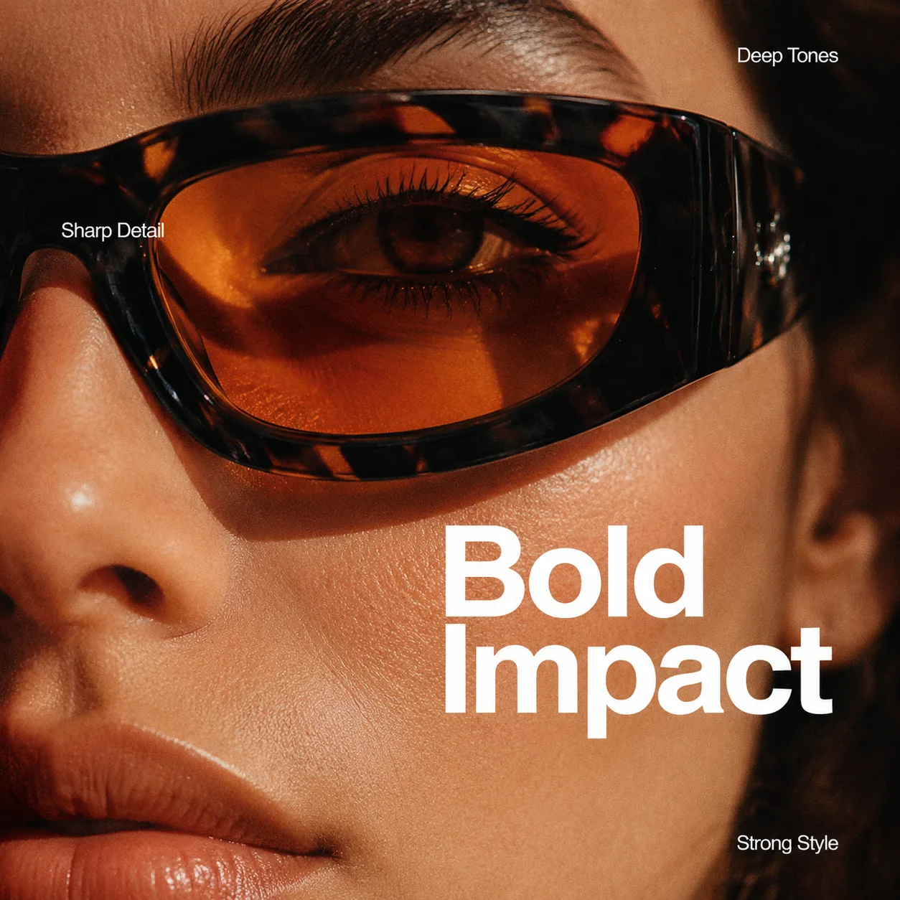

**#6 · UI &amp; Graphic Prompt · <code>Vinano Studio</code>**

<details>
<summary>Show prompt</summary>

```
An extreme close-up, high-fashion editorial portrait focusing on the right side of a person's face. The composition is a tight crop showing the bridge of the nose, a portion of the lips, and a single eye peering through sunglasses. The shot is characterized by a heavy, cinematic film grain and a warm, sophisticated studio atmosphere.
Eyewear: Large-frame, wrap-around sunglasses made of high-gloss dark tortoiseshell acetate (mottled black and deep mahogany). The lenses are a vibrant, translucent amber-orange, allowing the eye and eyelashes behind the lens to remain visible but color-tinted.
Person: A person smooth skin showing natural texture and fine pores. The lighting is soft-side lighting from the right, creating a gentle shadow on the left side of the nose and a subtle highlight on the cheekbone and lower lip.
Typography: Bold, white, geometric sans-serif text reading "Bold Impact" is overlaid on the lower-right cheek. Three smaller, delicate labels are scattered: "Deep Tones" (top right), "Sharp Detail" (on the left lens), and "Strong Style" (bottom right).
Color Palette: A rich mix of skin tones (#E8A88A), burnt orange (#B8541C), and deep espresso (#1A0D0B), contrasted crisp white text (#FFFFFF).
Lighting: Warm studio lighting a soft-focus depth of field. The background consists of out-of-focus hair and skin, keeping all attention on the eye and the texture of the acetate frames.
Atmosphere: Premium, editorial fashion magazine aesthetic; high-contrast but soft transitions.

Emphasise material texture and natural light so the final frame feels tactile and premium.
```

</details>

---

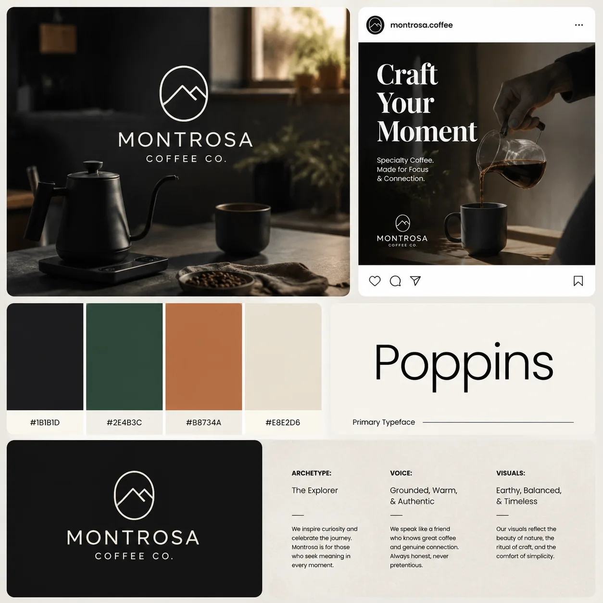

**#7 · UI &amp; Graphic Prompt · <code>Vinano Studio</code>**

<details>
<summary>Show prompt</summary>

```
[BRAND NAME]
({INDUSTRY}).

Act as a Lead Brand Designer creating a comprehensive "Brand Identity System" presentation (Bento-Grid Layout).

**THE TASK:**
Generate a single, high-resolution bento-grid board containing **6 distinct modules** that define the visual identity for [BRAND NAME].

---

**PHASE 1: VISUAL STRATEGY (AUTONOMOUS)**
1. **Analyze the Brand:** Determine the archetype and visual vibe.
2. **Define the Palette:** Select 4 distinct colors.
3. **Select Typography:** Choose ONE specific Google Font (Serif, Sans-Serif, or Display) relevant to the industry.

**PHASE 2: THE LAYOUT (6-MODULE GRID)**
The image must be a clean, gap-separated grid featuring these specific blocks:

* **Block 1 (The Hero):** A high-end **Key Visual** photography showing the product/service in context. filmic, cinematic lighting, true-to-life photorealistic. Overlay the brand logo in white.
* **Block 2 (Social Media):** A mockup of an **Instagram Post**. It features a bold headline the brand font and a lifestyle image.
* **Block 3 (The Palette & HEX):** A clean design block displaying **4 Vertical Color Swatches**.
 * *Crucial Detail:* Inside or below each color swatch, simulate distinct text looking like **HEX Codes** (e.g., "#1A2B3C").
* **Block 4 (Typography Spec):** A refined minimalist block dedicated to the **Brand Font**.
 * *CRITICAL CONSTRAINT:* Do NOT show the alphabet (Aa Bb Cc).
 * *The Content:* The block must display ONLY the **Name of the Font** (e.g., "Montserrat", "Lato", "Oswald") written in large, crisp characters that specific font style. This acts as the visual specimen.
 * *Subtext:* Tiny text at the bottom reading "Primary Typeface".
* **Block 5 (The Logo):** A solid background block featuring the **Final Logo** (clean, vector style, NO construction lines/grids). refined minimalist and iconic.
* **Block 6 (Brand DNA):** A text-heavy "Manifesto Card". It simulates a layout three short paragraphs titled:
 * **ARCHETYPE:** (e.g., "The Innovator")
 * **VOICE:** (e.g., "Confident, Direct")
 * **VISUALS:** (e.g., "Cinematic, High-Contrast")

**PHASE 3: AESTHETIC & FINISH**
* **Style:** Behance Trend / Awwwards Winner.
* **Quality:** 8k resolution, razor-sharp vector graphics mixed high-end photography.
* **Lighting:** Soft studio lighting across the whole grid to make it look like a cohesive presentation board.

Emphasise material texture and natural light so the final frame feels tactile and premium.
```

</details>

---

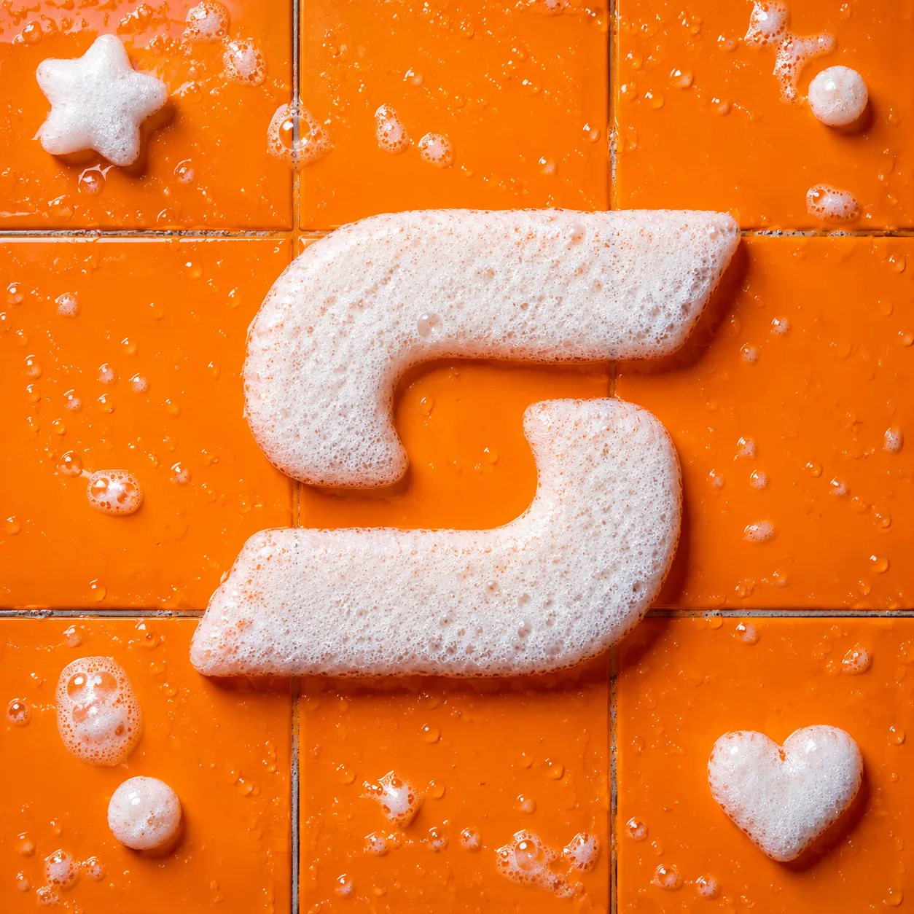

**#8 · UI &amp; Graphic Prompt · <code>Vinano Studio</code>**

<details>
<summary>Show prompt</summary>

```
Create a soap foam sculpture in the exact shape of the uploaded logo, made entirely of white soap bubbles and foam realistic bubble textures. Place it on wet bathroom tiles in the brand’s signature color (match the color from the uploaded logo). Top-down view, centered composition. The tiles should be glossy and wet water droplets scattered across the surface. Add smaller foam bubbles and soap suds around the main logo shape. Grout lines visible between tiles. Additional small foam shapes in corners. Product photography style, clean and vibrant lighting. Aim for an editorial, design-driven look with deliberate negative space.
```

</details>

---

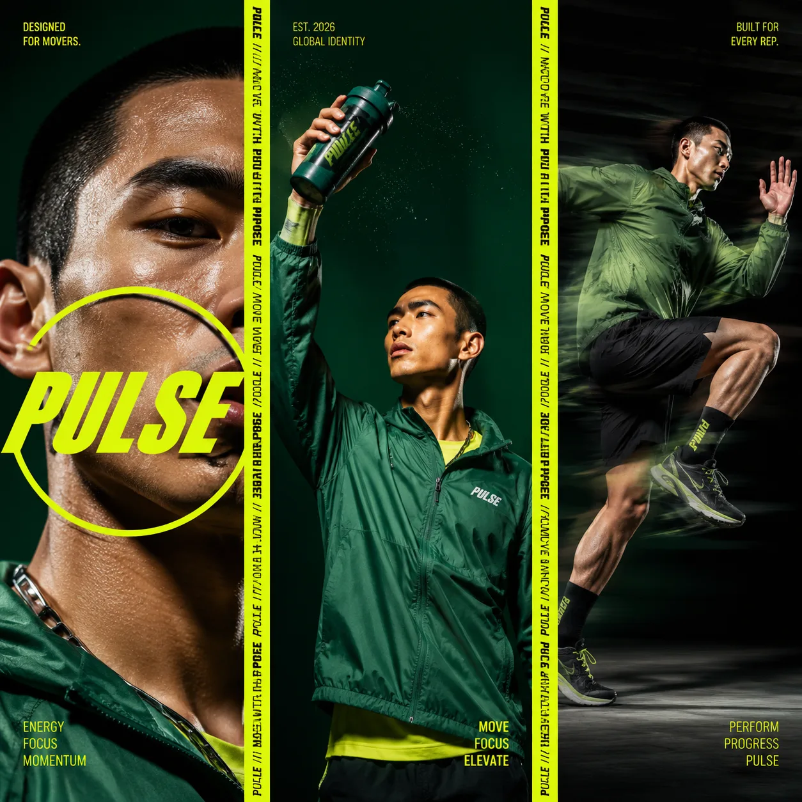

**#9 · UI &amp; Graphic Prompt · <code>Vinano Studio</code>**

<details>
<summary>Show prompt</summary>

```
[BRAND NAME]. Act as a Senior AI Visual Strategist & Creative Director.
Goal: Generate a high-motion triptych editorial where every visual element (color, text, props) is a direct semantic derivative of the brand name.
PHASE 1: SEMANTIC BRAND ANALYSIS (AUTONOMOUS)
[INSTRUCTIONS FOR]:
Core Identity: Analyze "[BRAND NAME]". Define its industry, soul, and "vibe" (e.g., Kinetic, Organic, Brutalist, Ethereal).
Color Psychology: Select a triadic palette based on brand associations:
 - BACKGROUND: The "Mood" color (e.g., Deep Forest for 'GAIA', Neon Amber for 'FUSE').
 - ACCENTS/TYPOGRAPHY: The "Energy" color. Must have high contrast/readability against the background.
 - APPAREL: The "Statement" color. Completes the brand's visual signature.
Copywriting: Generate 2-3 short, punchy slogans or keywords that resonate the brand's mission to be used as background micro-text.
PHASE 2: COMPOSITION (THE DYNAMIC TRIPTYCH)
Layout: A single horizontal image split into three vertical editorial panels.
- PANEL 1 (The Portrait): Extreme close-up. Bold [BRAND NAME] wordmark inside a geometric frame (circle or rectangle) overlapping the model's face or neck.
- PANEL 2 (The Elevate): Medium shot. A model (gender determined by brand target audience) holds a primary brand-representative object above their head in a triumphant or symbolic gesture.
- PANEL 3 (The Kinetic): Full-body shot. High-speed motion blur or an aggressive "power pose" interacting the brand's core element.
PHASE 3: GRAPHIC OVERLAYS & TEXTURES
- Main Typography: Large, slanted (italic) heavy sans-serif in [ACCENT COLOR].
- Dynamic Ribbons: Vertical yellow or contrast tapes crossing the panels repeating text: "[BRAND NAME] // [ASSOCIATED KEYWORD] // [BRAND NAME]".
- Micro-Copy: Scattered small text in corners like "DESIGNED FOR [TARGET AUDIENCE]" or "EST. 2026 // GLOBAL IDENTITY".
PHASE 4: LIGHTING & ESTHETIC STANDARDS
- High-End Editorial (Vogue/Hypebeast style).
- Global Illumination crisp, sharp edges.
- Realistic skin textures (pores, subtle sweat/shine) and high-fidelity fabric weaves.
- No "AI-plastic" artifacts.
PHASE 5: TECH SPECS
8K Resolution. Render: Octane. Subtle film grain. Ray-traced reflections on eyes and surfaces.

Preserve realistic proportions and depth for a confident, professional finish.
```

</details>

---

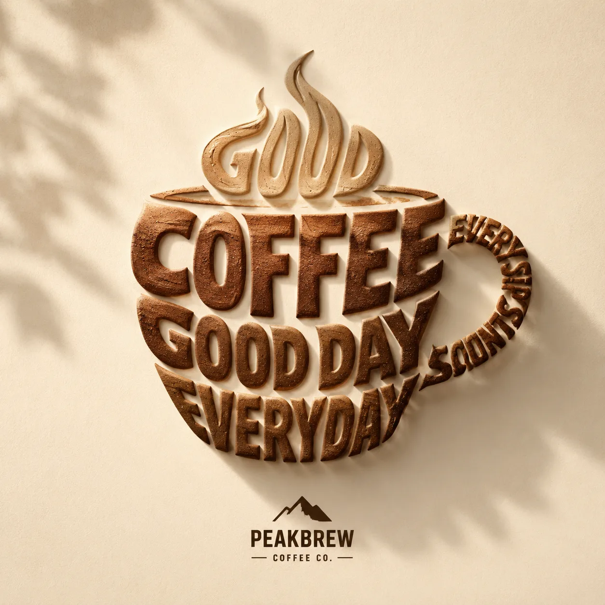

**#10 · UI &amp; Graphic Prompt · <code>Vinano Studio</code>**

<details>
<summary>Show prompt</summary>

```
Create a typographic illustration shaped like a [OBJECT], where the text [BRAND SLOGAN] forms the shape — bold and playful lettering style that fills the entire silhouette — letters adapt fluidly to the curves and contours of the [OBJECT] — [COLOR 1, COLOR 2] [BACKGROUND COLOR] background that enhances the focus on the main shape — include [BRAND] logo positioned below the [OBJECT] — vector-style, clean, high resolution, 1080x1080 pixels, square format. Emphasise material texture and natural light so the final frame feels tactile and premium.
```

</details>

---

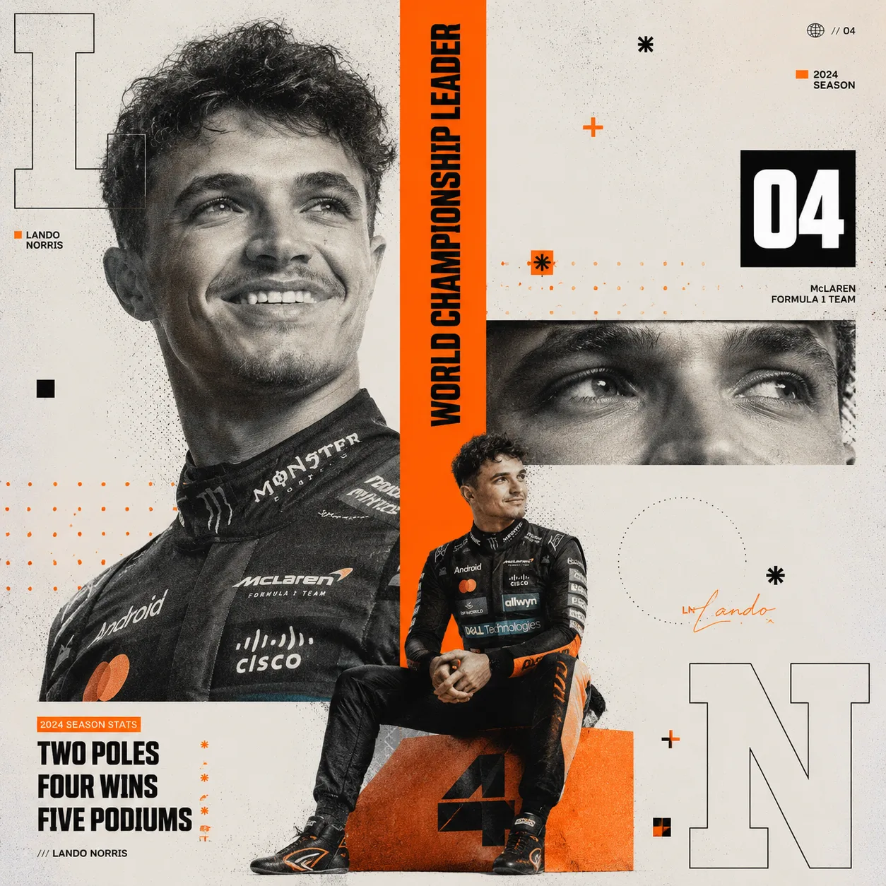

**#11 · UI &amp; Graphic Prompt · <code>Vinano Studio</code>**

<details>
<summary>Show prompt</summary>

```
[PERSONE]. Act as a Senior Editorial Designer and Graphic Artist.
Goal: Generate a complex, multi-layered Swiss-style collage poster for [PERSONE].
PHASE 1: SEMANTIC INTELLIGENCE (AUTONOMOUS)
[INSTRUCTIONS]:
Analyze "[PERSONE]". Determine their primary field (e.g., Elite Sports, Cyber-Engineering, Cinema, History).
Select an "Iconic Accent Color" based on their identity (e.g., Racing Orange for a driver, Neon Cyan for a hacker, Crimson for a hero).
Generate 3 key statistics or milestones (e.g., "7 TITLES", "98% ACCURACY") and a short professional title.
PHASE 2: COMPOSITIONAL STRUCTURE (THE GRID)
The image is a single vertical composition overlapping geometric frames and segments:
- MAIN SUBJECT (Top Left): A large, high-grain grayscale or color portrait of [PERSONE], smiling or looking confident.
- DETAIL SHOT (Center Right): A zoomed-in, cropped rectangle showing only the eyes or a specific detail of [PERSONE].
- FULL BODY SHOT (Bottom Center): [PERSONE] sitting on a geometric box or podium in a relaxed but powerful pose.
- BACKGROUND: Light gray a heavy, tactile film grain/noise texture.
PHASE 3: GRAPHIC ELEMENTS & TYPOGRAPHY
- Initials: Large, outlined capital letters of the first and last name placed in opposite corners.
- Vertical Ribbon: A solid color strip the text "WORLD CHAMPIONSHIP LEADER" or a relevant title running vertically through the center.
- Data Blocks:
 - A specific number (ID or rank) in a bold sans-serif block.
 - A "Statistics" block in the bottom-left corner 3 lines of text (e.g., "TWO POLES / FOUR WINS / FIVE PODIUMS").
- Accents: Scatter orange and black squares, dotted circles, and small asterisks throughout the grid for visual complexity.
PHASE 4: LIGHTING & TEXTURE
- Texture: High-contrast, gritty, and grainy. The overall image should look like a printed high-end magazine or a vintage poster.
- Lighting: Professional studio lighting on the subjects, but processed a "risograph" or "halftone" feel.
PHASE 5: TECH SPECS
8K Resolution. Swiss Modernism aesthetic. Flat vector shapes combined hyper-realistic photography.

Aim for an editorial, design-driven look with deliberate negative space.
```

</details>

---

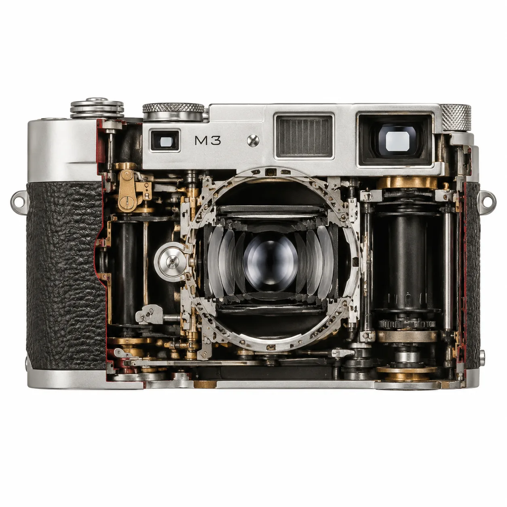

**#12 · UI &amp; Graphic Prompt · <code>Vinano Studio</code>**

<details>
<summary>Show prompt</summary>

```
product design, [object], cross-section cutaway view, internal anatomy revealed,
white background, museum specimen aesthetic, scientific illustration style

Emphasise material texture and natural light so the final frame feels tactile and premium.
```

</details>

---

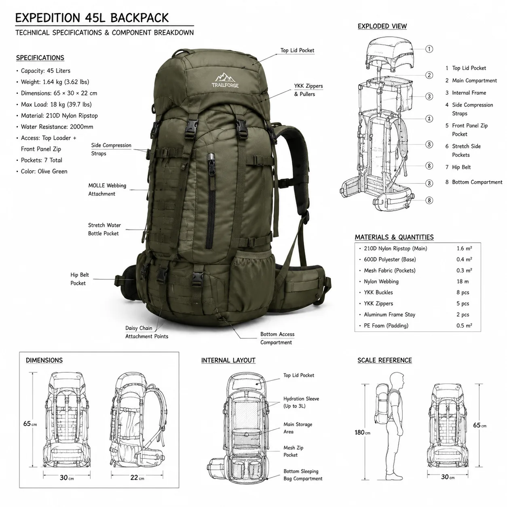

**#13 · UI &amp; Graphic Prompt · <code>Vinano Studio</code>**

<details>
<summary>Show prompt</summary>

```
Create an infographic image of [OBJECT], combining a realistic photograph or true-to-life photorealistic render of the object technical annotation overlays placed directly on top. Use black ink–style line drawings and text (technical pen / architectural sketch look) on a pure white studio background. Include: •Key component labels •Internal cutaway or exploded-view outlines (where relevant) •Measurements, dimensions, and scale markers •Material callouts and quantities Preserve realistic proportions and depth for a confident, professional finish.
```

</details>

---

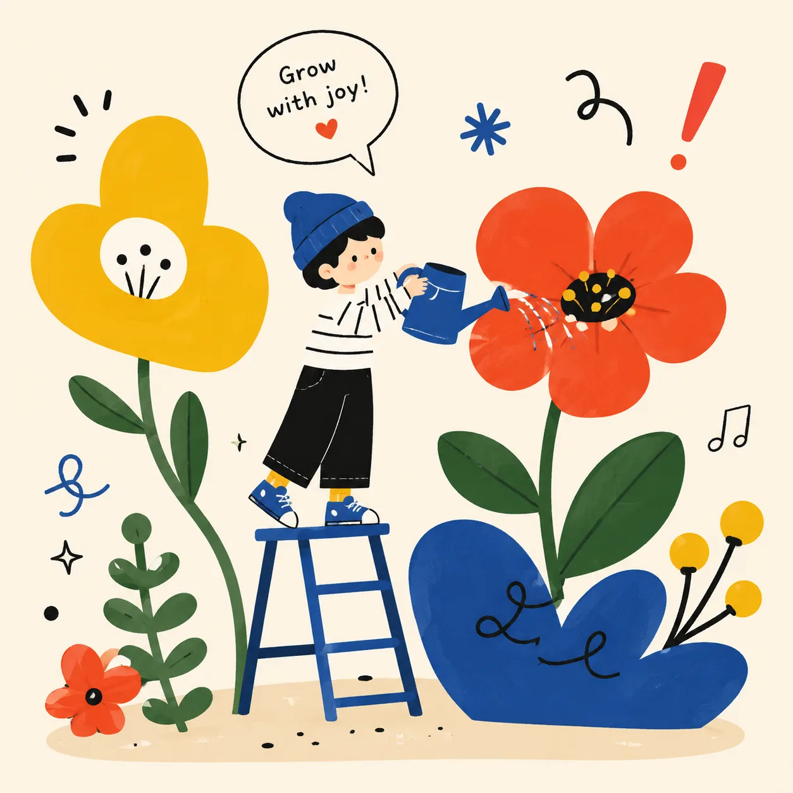

**#14 · UI &amp; Graphic Prompt · <code>Vinano Studio</code>**

<details>
<summary>Show prompt</summary>

```
Create a whimsical, playful illustration featuring [CHARACTER / SUBJECT] as the central focus.
The character is drawn simplified features, a small rounded head, and minimal facial detail, wearing [HEADWEAR / CLOTHING DESCRIPTION].

They are positioned among oversized abstract shapes and organic elements such as [FLORAL / SYMBOLIC OBJECTS], creating a sense of imaginative scale. The character is interacting [OBJECT / ACTION], adding narrative interest.

Decorative graphic elements like [SYMBOLS: exclamation points, speech bubbles, scribbles, notes, etc.] float around the subject to enhance expression and energy.

Use clean, simple linework and a limited color palette of [PRIMARY COLORS], keeping the illustration bold and cohesive. The background is a soft neutral tone such as beige or off-white. The overall style is modern, flat, and illustrative, a lively, creative, and slightly abstract atmosphere.

Preserve realistic proportions and depth for a confident, professional finish.
```

</details>

---

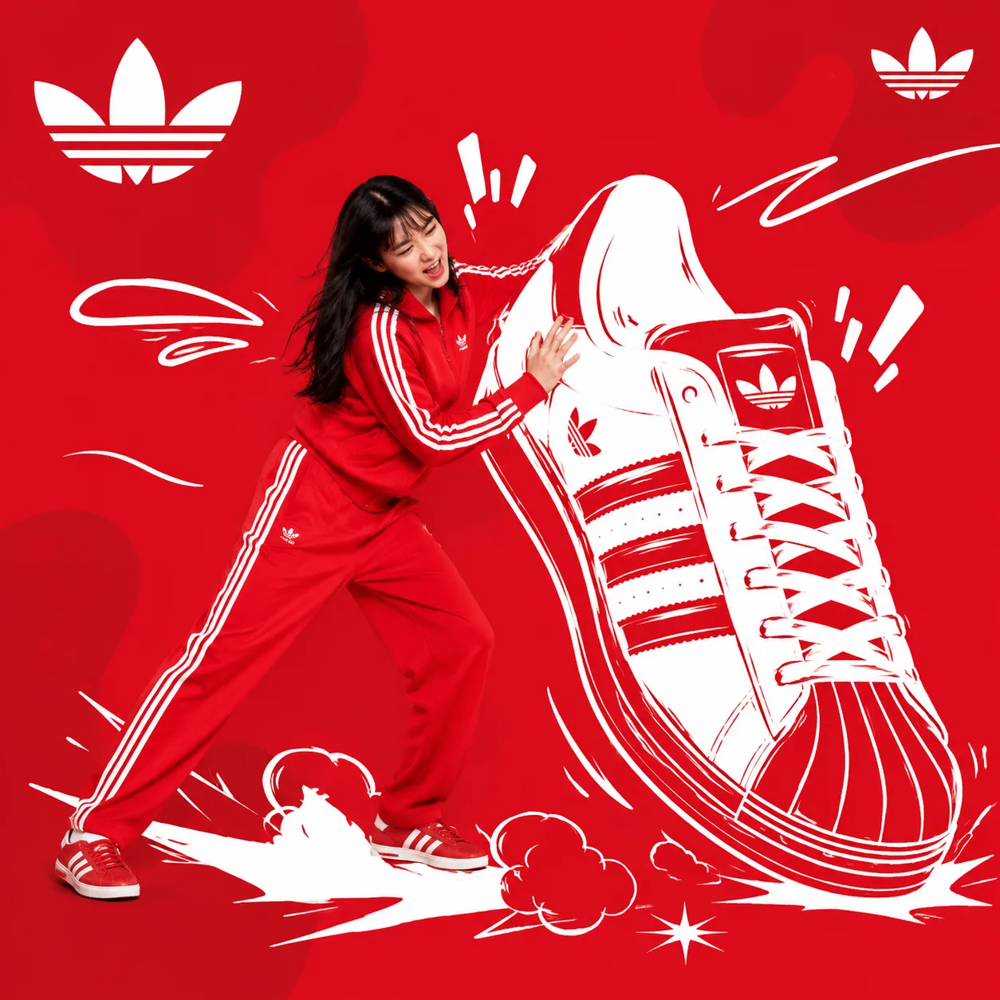

**#15 · UI &amp; Graphic Prompt · <code>Vinano Studio</code>**

<details>
<summary>Show prompt</summary>

```
[BRAND NAME] + [HERO COLOR]

Act as a Mixed-Media Campaign Art Director. Your specialty: combining studio photography cutouts hand-drawn 2D illustration where the real human and the drawn object physically interact — touching, holding, standing on, leaning against, or the illustrated element as if it truly exists in their space.

PHASE 1: CANVAS & COLOR SYSTEM

Format: 1:1 square canvas. Base: single flat saturated color [HERO COLOR]. No gradients. No texture. Pure chromatic field.
Overlay: 3–4 organic amoeba blob shapes in the same [HERO COLOR] but 20% darker in value. Smooth edges, irregular silhouettes, scattered asymmetrically. Some bleeding off-frame.
Hand-painted feel, clean execution.

PHASE 2: AUTONOMOUS OBJECT SELECTION

BEFORE staging the scene, the AI must first make two autonomous decisions:
DECISION 1 — SELECT THE OBJECT: Analyze [BRAND NAME] and identify ONE iconic physical object from this framework:
— What is the single most recognizable product or artifact this brand has ever made?
— What object do fans of this brand collect, use daily, or photograph?
— What prop has defined this brand's visual identity across decades?
Do NOT choose animals. Do NOT choose logos. Choose a real, large, tangible object that can physically occupy space next to a person.
DECISION 2 — SELECT THE INTERACTION: Based on the chosen object, determine the most natural and visually dynamic way the real model can directly interact the drawn object.
Interaction must be:
✓ Physical and direct — hands touching, feet on, body leaning, arms around
✓ Immediately readable — the relationship between person and object is understood in under 2 seconds
✓ Scaled correctly — the object must be large enough to interact at human scale
✓ Active, not passive — the model is DOING something the object, not just standing next to it
INTERACTION TYPE EXAMPLES (AI selects the most brand-appropriate):
· HOLDING: model's real hands grip the illustrated object — cup, camera, trophy, bottle, bag
· WEARING/: model's real body wears or uses the object — sitting on a chair, wearing an illustrated hat, holding an illustrated product to their face
· STANDING ON: model's real feet are planted on top of the illustrated object — skateboard, surfboard, podium, giant sneaker
· RIDING/LEANING: model's real body leans against or drapes over the illustrated object — car hood, shopping cart, giant product silhouette
· EMERGING FROM: model appears to step out of or through the illustrated object — bursting through a giant sneaker box, rising from an illustrated cup

PHASE 3: STAGING THE SCENE

Once object and interaction are selected, stage the full scene:
MODEL:
Single model age 18–26, clean cutout, zero fringing. Pose is determined by the chosen interaction — the body position must make the interaction feel natural and physically believable.
Wardrobe: [BRAND NAME]'s most iconic apparel in [HERO COLOR] monochromatic palette.
ILLUSTRATED OBJECT: Pure white (#FFFFFF) flat 2D illustration. Brush-pen marker line quality, 3–5px weight. Slightly imperfect organic edges — hand-drawn feel, not vector-perfect. NO shading. NO gradients. Flat white fill only.

SCALE RULE — CRITICAL: The illustrated object must be LARGE. Minimum size: 40% of canvas height. The object should feel monumental — oversized relative to real-world scale is acceptable and encouraged. A coffee cup can be waist-height. A sneaker can be as tall as the model. Large scale = better readability = stronger visual impact.
DEPTH LAYERING — CRITICAL:The object must exist on multiple z-layers:
— Parts of the object sit BEHIND the model
— Parts of the object come IN FRONT of the model
— The model's real hands/feet make contact at the intersection point
This layering is what makes the scene feel integrated rather than collaged.
BRAND STAMP:
One small [BRAND NAME] logo mark appears on the object's surface — naturally embedded as if printed, engraved, or stitched. Rendered in [HERO COLOR] darker variant. Subtle, not dominant.

PHASE 4: SUPPORTING ILLUSTRATION SYSTEM

All supporting elements: white, flat, brush-pen line style. Same visual language as the hero object.
LOGO MARKS:
[BRAND NAME] primary icon in white:
— Large (upper-left corner, ~15% canvas width)
— Medium (opposite corner, ~10% canvas width)
IMPACT MARKERS: 2–3 manga-style exclamation dash clusters near the point of interaction between model and object — where hands grip, where feet land, where bodies touch. This emphasizes the physical connection.
MOTION LINES: 2–4 curved speed lines radiating from the object or the model's most active body part. Taper at ends. Cross behind and in front of the model for depth.

GROUND EFFECT: At the base of the scene: white illustrated ground interaction — sparkle stars, short speed dashes, or object-specific effect (splash if cup, dust clouds if sneaker landing, wheel tracks if skateboard).
AMBIENT SQUIGGLES: 1–2 loose organic white lines floating near the model's torso — visual rhythm connecting the photographic and illustrated layers.

PHASE 5: LIGHTING

Studio strobe, high-key, even and clean. 5500K neutral. No dramatic shadows on model. Soft contact shadow at model's feet (opacity 15%). The photography reads as natural and real against the graphic illustrated environment.

TECH SPECS

Aesthetic: mixed media — real photograph integrated hand-drawn 2D illustration. Color count: 3 maximum — [HERO COLOR] light, [HERO COLOR] dark blobs, white illustration. Photography skin tones and fabric colors are the only additional color exception. Illustration style: Y2K comic energy, Japanese streetwear magazine, brush marker. Composition: asymmetric and dynamic. The interaction point between model and object is the visual center of gravity — everything else orbits around it. No text. No wordmarks. Logo icon only. Mood: the model is not posing the object — the model is IN THE MIDDLE of it. Caught mid-action. Alive.

Aim for an editorial, design-driven look with deliberate negative space.
```

</details>

---

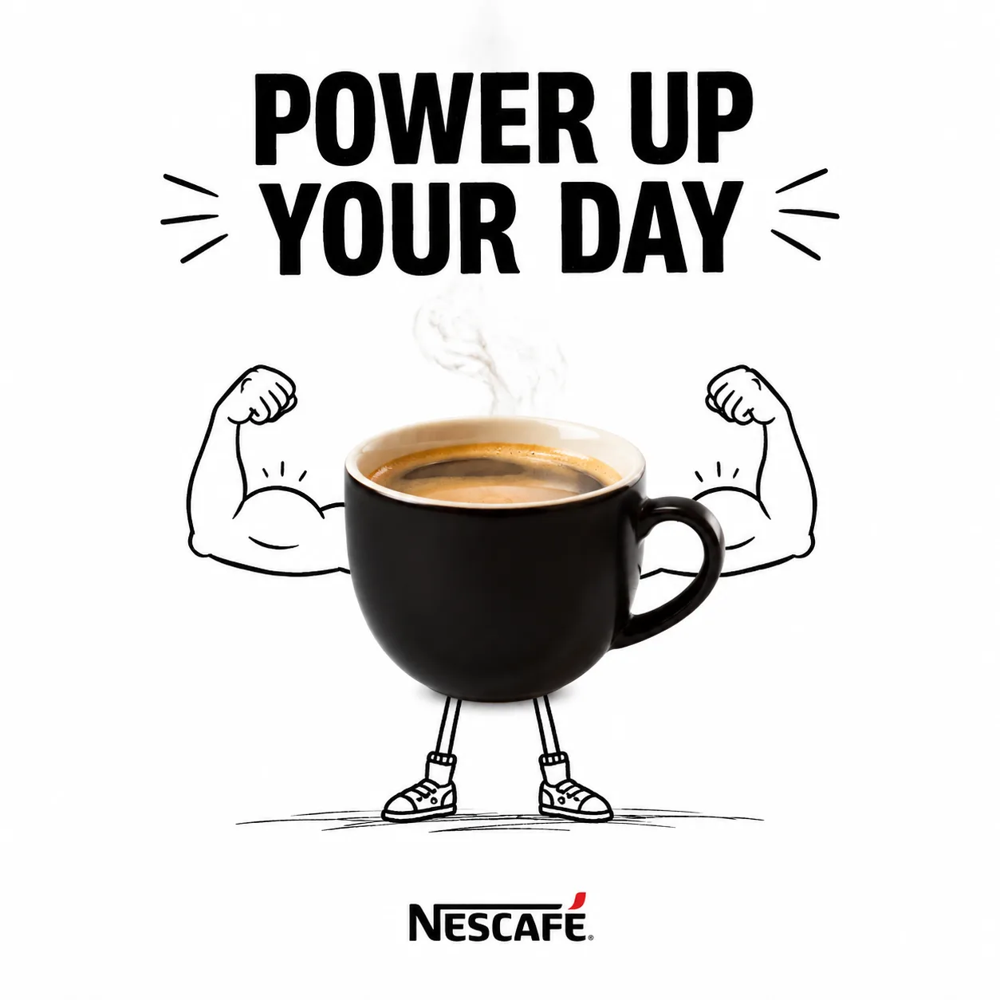

**#16 · UI &amp; Graphic Prompt · <code>Vinano Studio</code>**

<details>
<summary>Show prompt</summary>

```
A refined minimalist and creative advertisement set on a pure white background. A real photographic [Real Object] is integrated into a simple hand-drawn black ink doodle loose, playful lines. The [Doodle Concept] interacts directly and cleverly the real object, making the object part of the illustrated scene. Include bold uppercase black “[Ad Copy]” text at the top. Place the official [Brand Logo] clearly centered at the bottom. Clean layout, high contrast between realistic object and flat doodle drawing, lots of negative space, smart visual metaphor, print-ready poster design Render with rich micro-detail while keeping the layout uncluttered and intentional.
```

</details>

---


**#17 · UI &amp; Graphic Prompt · <code>Vinano Studio</code>**

<details>
<summary>Show prompt</summary>

```
style_preset: "Zodiac Astrology VTuber Logo Aesthetics (Celestial Ver.)"
global_settings:
 vibe: "Mystical, celestial, cosmic wisdom, divination, stargazing"
 background: "Pure white background (for isolation)"
 rendering:
 - "Elegant, celestial vector-style finish"
 - "Deep midnight blue and shining gold palette"
 - "Thin elegant layered outlines star accents"
 - "Glowing star effects and celestial glow"
drawing_rules:
 line_quality: "Thin, elegant curves constellation line art accents."
 character_design:
 - "Integrated constellation and tarot motifs woven into the letters"
 - "Custom stylized font: elegant, celestial shapes star dot accents"
 typography_style:
 - "Main Title: Large, stylized Japanese constellation dot patterns"
 - "Subtitle: Smaller English text in an elegant celestial font"
 ornament_rule:
 - "Strictly follow the 'ornaments_selection' provided in the USER INPUT SECTION"
 - "Distribute ornaments to create a 'celestial reading' visual impact"
visual_parameters:
 color_palette:
 primary: "Deep midnight blue and shining gold gradient"
 secondary: "Thin gold inner border + Midnight blue outer stroke"
 accents: "Constellation lines, zodiac symbols, and star glow"

# ----------------------------------------------------------
# USER INPUT SECTION (下記を自由に編集してね)
# ----------------------------------------------------------
request:
 input_text: "星読み" # ← ここを好きな名前に変更
 subtitle: "Astrology" # ← 小さく表示したい文字
 motif_concept: "星座図とタロットカード" # ← ここを好きな動物やモノに変更

 custom_colors: "ミッドナイトブルーとシャイニングゴールド" # ← 好きな色を指定

 ornaments_selection:
 - "星座線 (Zodiac constellation lines)"
 - "タロットカード (Tarot card borders)"
 - "三日月 (Crescent moon)"
 - "太陽 (Radiant sun)"
 - "魔法陣 (Mystical magic circle)"

Aim for an editorial, design-driven look with deliberate negative space.
```

</details>

---


**#18 · UI &amp; Graphic Prompt · <code>Vinano Studio</code>**

<details>
<summary>Show prompt</summary>

```
Create a clean high-contrast vector mascot icon in Notion-style artwork based on [person description]. Show only the head in a 3/4 view. Use very thick bold black outer outlines and slightly thinner inner detail lines. Flat monochrome fill. Simplify facial features into strong geometric shapes while preserving recognizable traits such as bald head or hairstyle, beard shape, glasses shape, eyebrows, and smile. Expression should be friendly and slightly exaggerated. Teeth are simplified into clean flat blocks. pure white background. Modern startup mascot logo aesthetic, clean SVG vector look, crisp edges, black and white only, high contrast, symmetrical balance, square composition, 1:1 aspect ratio Preserve realistic proportions and depth for a confident, professional finish.
```

</details>

---

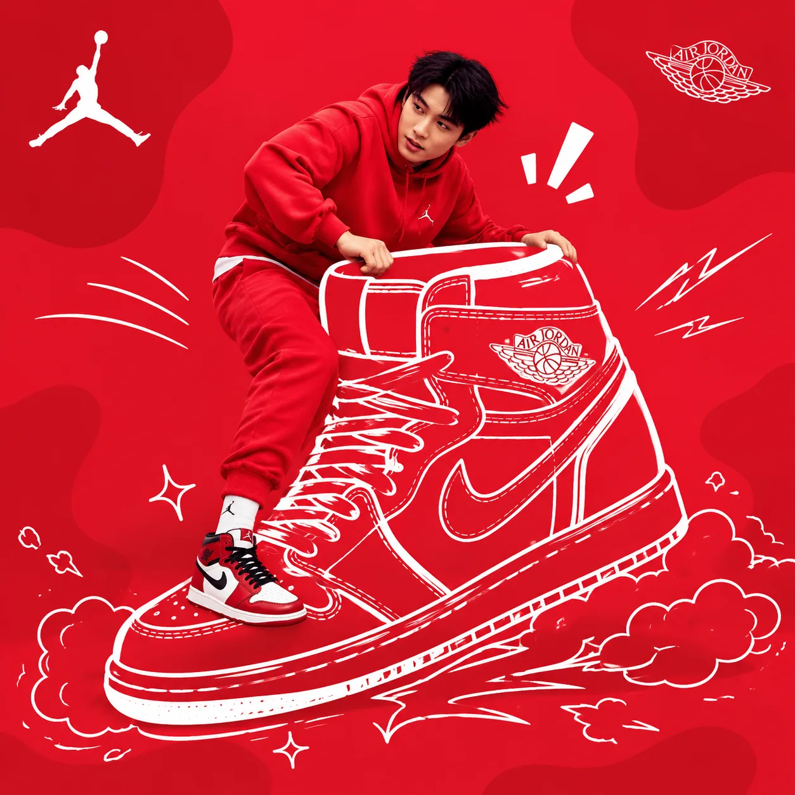

**#19 · UI &amp; Graphic Prompt · <code>Vinano Studio</code>**

<details>
<summary>Show prompt</summary>

```
[BRAND NAME] + [HERO COLOR]

Act as a Mixed-Media Campaign Art Director. Your specialty: combining studio photography cutouts hand-drawn 2D illustration where the real human and the drawn object physically interact — touching, holding, standing on, leaning against, or the illustrated element as if it truly exists in their space.

PHASE 1: CANVAS & COLOR SYSTEM

Format: 1:1 square canvas. Base: single flat saturated color [HERO COLOR]. No gradients. No texture. Pure chromatic field.
Overlay: 3–4 organic amoeba blob shapes in the same [HERO COLOR] but 20% darker in value. Smooth edges, irregular silhouettes, scattered asymmetrically. Some bleeding off-frame.
Hand-painted feel, clean execution.

PHASE 2: AUTONOMOUS OBJECT SELECTION

BEFORE staging the scene, the AI must first make two autonomous decisions:
DECISION 1 — SELECT THE OBJECT: Analyze [BRAND NAME] and identify ONE iconic physical object from this framework:
— What is the single most recognizable product or artifact this brand has ever made?
— What object do fans of this brand collect, use daily, or photograph?
— What prop has defined this brand's visual identity across decades?
Do NOT choose animals. Do NOT choose logos. Choose a real, large, tangible object that can physically occupy space next to a person.
DECISION 2 — SELECT THE INTERACTION: Based on the chosen object, determine the most natural and visually dynamic way the real model can directly interact the drawn object.
Interaction must be:
✓ Physical and direct — hands touching, feet on, body leaning, arms around
✓ Immediately readable — the relationship between person and object is understood in under 2 seconds
✓ Scaled correctly — the object must be large enough to interact at human scale
✓ Active, not passive — the model is DOING something the object, not just standing next to it
INTERACTION TYPE EXAMPLES (AI selects the most brand-appropriate):
· HOLDING: model's real hands grip the illustrated object — cup, camera, trophy, bottle, bag
· WEARING/: model's real body wears or uses the object — sitting on a chair, wearing an illustrated hat, holding an illustrated product to their face
· STANDING ON: model's real feet are planted on top of the illustrated object — skateboard, surfboard, podium, giant sneaker
· RIDING/LEANING: model's real body leans against or drapes over the illustrated object — car hood, shopping cart, giant product silhouette
· EMERGING FROM: model appears to step out of or through the illustrated object — bursting through a giant sneaker box, rising from an illustrated cup

PHASE 3: STAGING THE SCENE

Once object and interaction are selected, stage the full scene:
MODEL:
Single model age 18–26, clean cutout, zero fringing. Pose is determined by the chosen interaction — the body position must make the interaction feel natural and physically believable.
Wardrobe: [BRAND NAME]'s most iconic apparel in [HERO COLOR] monochromatic palette.
ILLUSTRATED OBJECT: Pure white (#FFFFFF) flat 2D illustration. Brush-pen marker line quality, 3–5px weight. Slightly imperfect organic edges — hand-drawn feel, not vector-perfect. NO shading. NO gradients. Flat white fill only.

SCALE RULE — CRITICAL: The illustrated object must be LARGE. Minimum size: 40% of canvas height. The object should feel monumental — oversized relative to real-world scale is acceptable and encouraged. A coffee cup can be waist-height. A sneaker can be as tall as the model. Large scale = better readability = stronger visual impact.
DEPTH LAYERING — CRITICAL:The object must exist on multiple z-layers:
— Parts of the object sit BEHIND the model
— Parts of the object come IN FRONT of the model
— The model's real hands/feet make contact at the intersection point
This layering is what makes the scene feel integrated rather than collaged.
BRAND STAMP:
One small [BRAND NAME] logo mark appears on the object's surface — naturally embedded as if printed, engraved, or stitched. Rendered in [HERO COLOR] darker variant. Subtle, not dominant.

PHASE 4: SUPPORTING ILLUSTRATION SYSTEM

All supporting elements: white, flat, brush-pen line style. Same visual language as the hero object.
LOGO MARKS:
[BRAND NAME] primary icon in white:
— Large (upper-left corner, ~15% canvas width)
— Medium (opposite corner, ~10% canvas width)
IMPACT MARKERS: 2–3 manga-style exclamation dash clusters near the point of interaction between model and object — where hands grip, where feet land, where bodies touch. This emphasizes the physical connection.
MOTION LINES: 2–4 curved speed lines radiating from the object or the model's most active body part. Taper at ends. Cross behind and in front of the model for depth.

GROUND EFFECT: At the base of the scene: white illustrated ground interaction — sparkle stars, short speed dashes, or object-specific effect (splash if cup, dust clouds if sneaker landing, wheel tracks if skateboard).
AMBIENT SQUIGGLES: 1–2 loose organic white lines floating near the model's torso — visual rhythm connecting the photographic and illustrated layers.

PHASE 5: LIGHTING

Studio strobe, high-key, even and clean. 5500K neutral. No dramatic shadows on model. Soft contact shadow at model's feet (opacity 15%). The photography reads as natural and real against the graphic illustrated environment.

TECH SPECS

Aesthetic: mixed media — real photograph integrated hand-drawn 2D illustration. Color count: 3 maximum — [HERO COLOR] light, [HERO COLOR] dark blobs, white illustration. Photography skin tones and fabric colors are the only additional color exception. Illustration style: Y2K comic energy, Japanese streetwear magazine, brush marker. Composition: asymmetric and dynamic. The interaction point between model and object is the visual center of gravity — everything else orbits around it. No text. No wordmarks. Logo icon only. Mood: the model is not posing the object — the model is IN THE MIDDLE of it. Caught mid-action. Alive.

Maintain consistent colour harmony and crisp focus across the whole frame.
```

</details>

---

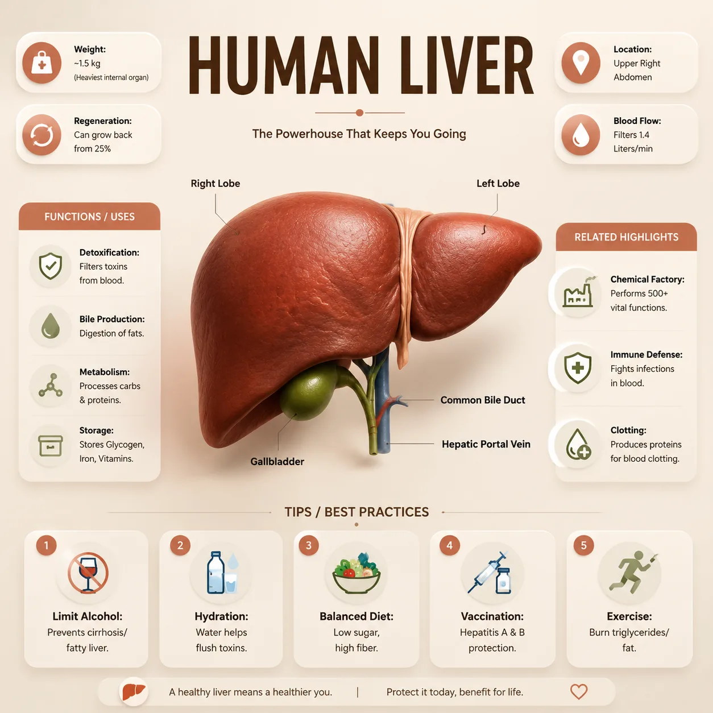

**#20 · UI &amp; Graphic Prompt · <code>Vinano Studio</code>**

<details>
<summary>Show prompt</summary>

```
Ultra-clean modern editorial infographic poster (1080x1080), premium magazine layout meets lifestyle photography/illustration.

**TITLE:**
Large, bold sans-serif text at top center: "HUMAN LIVER"

**CENTRAL VISUAL:**
A realistic, high-fidelity 3D illustration of the Human Liver (showing Right/Left lobes and Gallbladder). Color palette: Terracotta, deep brownish-red, and soft coral, set against a clean soft beige/off-white background. Lighting is studio-soft.

**LAYOUT SECTIONS (Matching the reference):**

* **Section 1 - Quick Facts (Top Left/Right floating bubbles):**
 * "Weight: ~1.5 kg (Heaviest internal organ)"
 * "Regeneration: Can grow back from 25%"
 * "Location: Upper Right Abdomen"
 * "Blood Flow: Filters 1.4 Liters/min"

* **Section 2 - Core Parts / Systems (Labels pointing to central organ):**
 * Right Lobe
 * Left Lobe
 * Gallbladder (Greenish sac underneath)
 * Common Bile Duct
 * Hepatic Portal Vein

* **Section 4 - Functions / Uses (Left side list minimal icons):**
 * **Detoxification:** Filters toxins from blood.
 * **Bile Production:** Digestion of fats.
 * **Metabolism:** Processes carbs & proteins.
 * **Storage:** Stores Glycogen, Iron, Vitamins.

* **Section 5 - Related Highlights (Right side list minimal icons):**
 * **Chemical Factory:** Performs 500+ vital functions.
 * **Immune Defense:** Fights infections in blood.
 * **Clotting:** Produces proteins for blood clotting.

* **Section 6 - Tips / Best Practices (Bottom row, card style icons):**
 1. **Limit Alcohol:** Prevents cirrhosis/fatty liver.
 2. **Hydration:** Water helps flush toxins.
 3. **Balanced Diet:** Low sugar, high fiber.
 4. **Vaccination:** Hepatitis A & B protection.
 5. **Exercise:** Burn triglycerides/fat.

**STYLE:**
Glassmorphism effects on text boxes, soft drop shadows, medical accuracy mixed high-end graphic design aesthetics.

Emphasise material texture and natural light so the final frame feels tactile and premium.
```

</details>

---

## License

Prompts and metadata are released under [CC BY 4.0](LICENSE). Images are generated with [vinano.ai](https://vinano.ai).
