# Awesome Image & Video Prompts — Updating
[](https://vinano.ai)   

A continuously-updated, **original** collection of image & video prompts.

- Every prompt is refined in-house — not a verbatim copy of any third-party list.
- Every preview image is **regenerated with [vinano.ai](https://vinano.ai)**.
- Machine-readable data lives in [`prompts/prompts.json`](prompts/prompts.json).
- System prompts for building your own generator: [EN](prompts/system-prompt-en.md) · [中文](prompts/system-prompt-zh.md).

> 中文版本见 [README.zh-CN.md](README.zh-CN.md)。

**2026 prompts** across 6 categories. Last updated: 2026-06-25.

## Categories
- [Photography](#photography) — 630
- [Illustration & 3D](#illustration--3d) — 409
- [Product & Brand](#product--brand) — 380
- [Food & Drink](#food--drink) — 190
- [Poster Design](#poster-design) — 241
- [UI & Graphic](#ui--graphic) — 176

> Note: the gallery below shows previews already regenerated with vinano.ai. The full set of prompts is in `prompts/prompts.json`; run `python3 scripts/generate_images.py` to render the rest.

## Photography

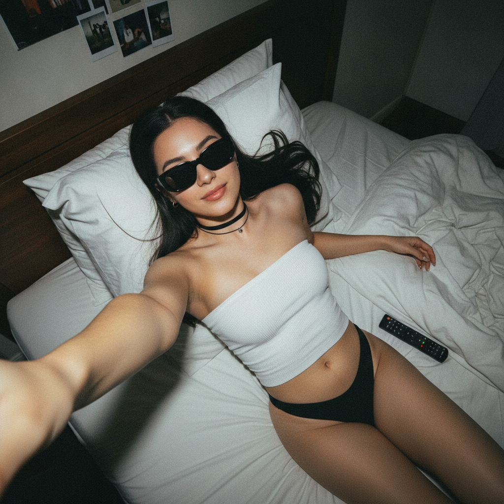

**#1 · Photography Prompt · <code>Vinano Image</code>**

<details>
<summary>Show prompt</summary>

```
{
  "image_generation_parameters": {
    "aspect_ratio": "9:16",
    "subject_description": {
      "character": "A stunning young woman long, sleek dark hair fanned out across white pillows. She has a soft, confident smile and is wearing stylish black rectangular sunglasses.",
      "apparel": "She is wearing a white ribbed-knit tube top that shows detailed fabric texture and a pair of refined minimalist black bikini bottoms.",
      "accessories": "A delicate thin black choker necklace a tiny pendant is visible on her neck. Her nails are manicured a light, neutral polish.",
      "pose": "Lying flat on her back on a bed, viewed from a high-angle 'selfie' perspective. Her right arm is extended toward the camera, creating a sense of depth. Her legs are slightly bent at the knees, resting on the bed."
    },
    "environment_and_composition": {
      "setting": "A dimly lit bedroom at night. The bed has rumpled white cotton sheets and soft pillows that catch the light and shadow.",
      "background_elements": "In the soft-focus background, a dark wooden bed frame and several posters/polaroids are pinned to a dimly lit wall, adding a personal, lived-in atmosphere.",
      "foreground_objects": "A black television remote control lies on the white sheets next to her leg, adding to the casual, candid nature of the shot."
    },
    "technical_style": {
      "lighting": "Harsh direct flash photography style, reminiscent of a late-night smartphone capture. This creates high contrast, bright highlights on the skin and clothing, and deep, sharp shadows behind the subject.",
      "camera_settings": "Shot on a high-end mobile camera, f/1.8 aperture for slight background blur, high ISO resulting in a subtle, aesthetic film grain.",
      "image_quality": "Ultra-true-to-life photorealistic, 8k resolution, highly detailed skin pores, visible fabric fibers, cinematic composition, hyper-detailed textures, RAW photo quality."
    },
    "negative_prompt": "cartoon, drawing, anime, low quality, distorted face, extra fingers, deformed hands, blurry, low resolution, watermark, text, signature, bright daylight, overhead ceiling light."
  }
}

Aim for an editorial, design-driven look with deliberate negative space.
```

</details>

---

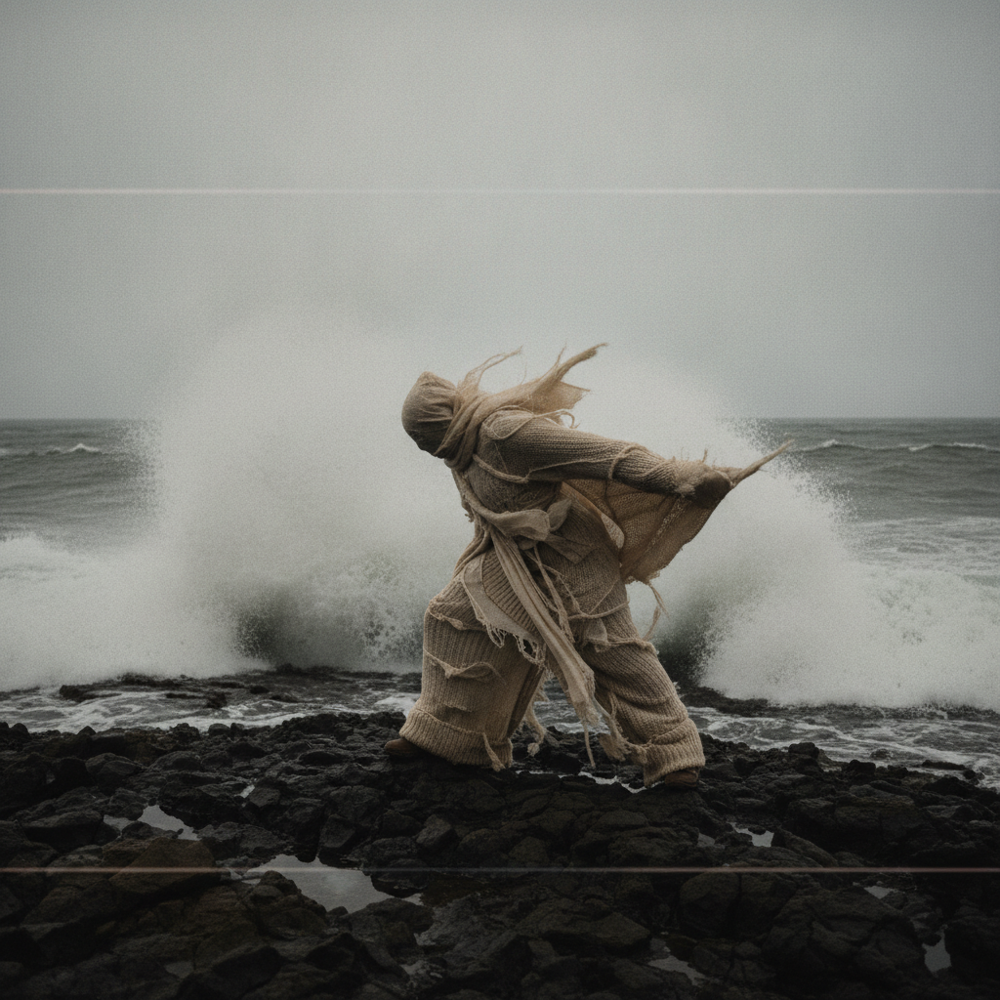

**#2 · Photography Prompt · <code>Vinano Image</code>**

<details>
<summary>Show prompt</summary>

```
Sometimes I want to stay alone away from the Chaos of City life

The Realism by gemini mpt 👇

Wide shot, subject acts as an anchor against a raging wind. Standing on a jagged black rock coastline, waves crashing behind in a gray blur. The subject leans forward against the gale. Outfit is a massive, shapeless layers of raw beige wool and distressed knitwear, creating a silhouette that looks like a eroding sculpture. Lighting is overcast, flat, and moody. Desaturated palette, muted earth tones, sharp texture on the fabric, cinematic anamorphic lens.

Negative Prompt: Sunny beach, vacation vibes, swimsuit, smiling, blue sky, vibrant colors, calm water, generic travel photography, face distortion.

Maintain consistent colour harmony and crisp focus across the whole frame.
```

</details>

---

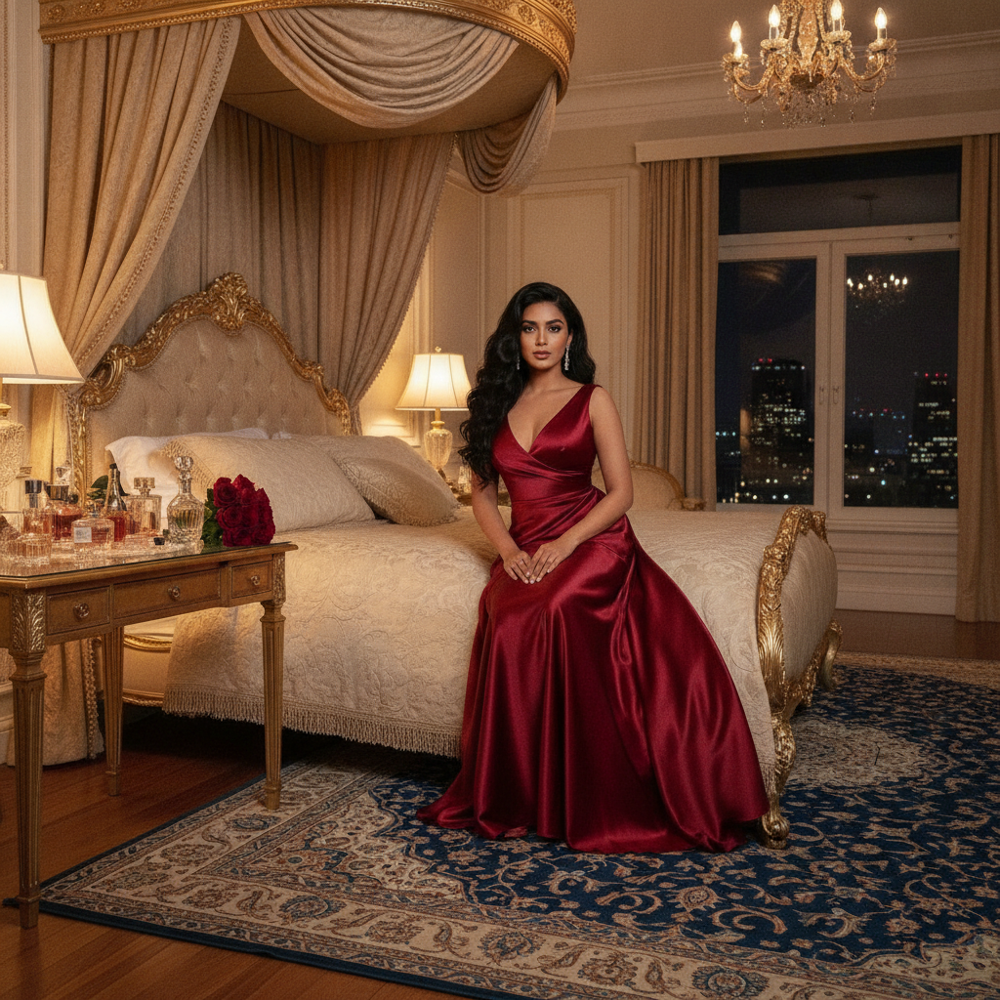

**#3 · Photography Prompt · <code>Vinano Image</code>**

<details>
<summary>Show prompt</summary>

```
Good Afternoon X Fam ♥️

Ana de Armas
Sydney Sweeney
Sadie Sink
Indian Lady

Gemini Presenting

Prompt:-

{
 "subject": {
 "person": "Ek sundar mahila jiske lambe, ghane, aur wavy kaale baal hain.",
 "expression": "Shaant aur pur-aitmaad (confident) expression, aankhen seedhe camera ki taraf.",
 "clothing": "Ek luxurious deep red silk ya satin ka sleeveless evening gown, jisme v-neckline hai.",
 "pose": "Bed par ek taraf jhuk kar (reclining) leti hui hai, haath aaram se aage ki taraf rakha hua."
 },
 "setting": {
 "location": "Ek bohot hi bada aur luxurious classic-style bedroom.",
 "furniture": [{
 "item": "Canopy bed",
 "details": "Sone ka (gold) ornate headboard aur upar ek bada beige fabric ka canopy drape."
 },
 {
 "item": "Dressing table",
 "details": "Gold-trimmed vanity table jiske upar perfumes, crystal bottles, aur laal gulab ka guldasta rakha hai."
 },
 {
 "item": "Rug",
 "details": "Zameen par ek intricate blue aur gold pattern wala traditional Persian ya Oriental rug."
 }],
 "lighting": "Warm aur soft, diffused lighting. Ek chandelier upar hai aur bed ke side mein ek elegant lamp jal raha hai.",
 "background": "Khidki se bahar shehar ki raushni (city skyline at night) dikhayi de rahi hai."
 },
 "aesthetic": {
 "color_palette": ["Deep Red", "Gold", "Cream", "Royal Blue", "Emerald Green"],
 "mood": "Opulent, elegant, sophisticated aur cozy.",
 "photography_style": "High-end fashion photography, sharp focus on the subject, soft bokeh in the background."
 }
}

Maintain consistent colour harmony and crisp focus across the whole frame.
```

</details>

---

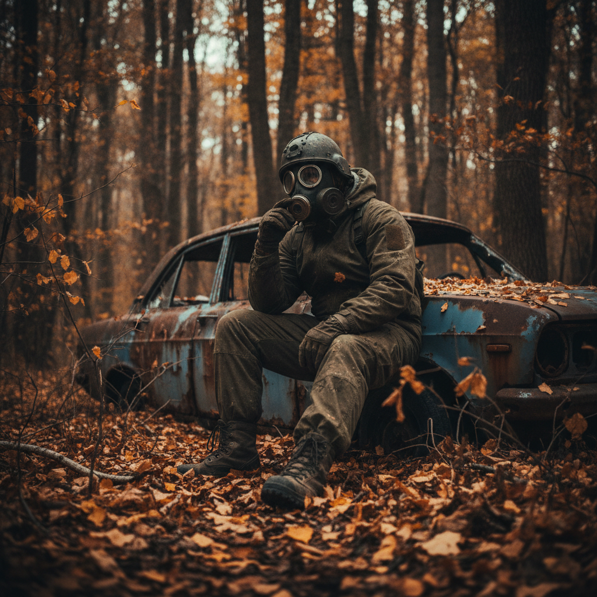

**#4 · Photography Prompt · <code>Vinano Image</code>**

<details>
<summary>Show prompt</summary>

```
A cinematic, ultra realistic post apocalyptic scene of a lone survivor sitting on the forest ground, leaning against an abandoned, rusted old car broken windows and peeling paint. The survivor is wearing a dark olive green hooded protective suit visible fabric folds and dirt stains, heavy boots, gloves, and a full face gas mask round glass lenses and dual side filters. The survivor is sitting knees bent, one hand near the mask as if thinking, body slightly slouched, giving a feeling of exhaustion and solitude.
The environment is a dense, overgrown forest in late autumn, dry orange, brown, and golden leaves covering the ground and hanging on thin branches. The background trees are tall and thin dark trunks, softly blurred by shallow depth of field. Small plants, twigs, and fallen leaves fill the foreground creating a natural frame.
Color palette is muted and cinematic: deep olive greens, rusty browns, burnt orange leaves, dark greys, faded blue metal on the car, and soft warm highlights mixed cool shadow tones. Lighting is soft and diffused, as if coming from an overcast sky, gentle warm light touching the leaves and the subject, and cooler shadows in the background. Slight film grain, cinematic contrast, moody and atmospheric tone.
Camera is low angle, medium full body shot, subject placed slightly off center, 35mm lens look, shallow depth of field, realistic textures, high detail, soft background blur, subtle vignette. The atmosphere feels quiet, abandoned, melancholic, and tense, like the world has ended and nature is slowly taking over.

Emphasise material texture and natural light so the final frame feels tactile and premium.
```

</details>

---

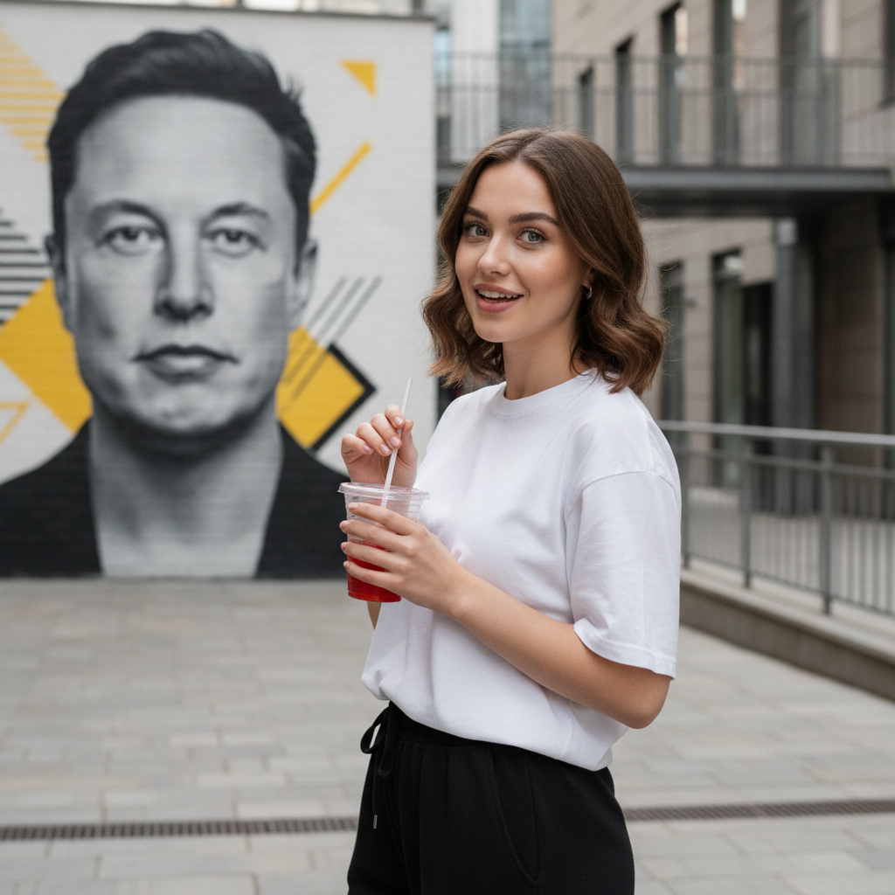

**#5 · Photography Prompt · <code>Vinano Image</code>**

<details>
<summary>Show prompt</summary>

```
Gemini

Prompt:

{ "image_type": "photograph", "genre": "urban lifestyle portrait", "composition": { "framing": "three-quarter body portrait", "angle": "eye-level, straight-on", "orientation": "portrait", "subject_placement": "subject positioned slightly right of center", "background_balance": "large-scale mural occupying left background", "visual_hierarchy": "foreground subject emphasized against graphic mural backdrop" }, "subject": { "count": 1, "gender_presentation": "female-presenting", "age_range": "young adult", "facial_features": { "skin_tone": "light, neutral", "complexion": "smooth natural texture", "eyes": "light-colored", "eyebrows": "full, softly shaped", "nose": "straight, proportional", "lips": "natural pink, smiling teeth slightly visible" }, "hair": { "color": "medium brown", "length": "shoulder-length", "style": "loose waves", "part": "center part" }, "expression": "playful, cheerful", "gaze": "directed toward camera", "pose": { "stance": "relaxed, casual", "hands": "one hand holding a drink cup, other supporting straw" }, "accessories": ["clear plastic cup lid and straw"], "clothing": { "top": "oversized t-shirt", "color": "White", "bottom": "black lounge pants", "fit": "loose, relaxed streetwear", "style": "casual, modern" } }, "lighting": { "type": "natural daylight", "direction": "diffuse frontal light", "quality": "soft, even", "shadows": "minimal, low contrast", "highlights": "subtle highlights on face and hair" }, "color_palette":#AmulProteinWPL { "dominant_colors": ["white", "gray", "yellow"], "accent_colors": ["cherry beverage", "black mural outlines"], "overall_tone": "urban, contemporary, playful" }, "background": { "setting": "outdoor urban space", "environment": "city courtyard or alley", "elements": ["large monochrome mural portrait of Elon Musk yellow graphic accents", "modern building facades", "metal railing", "stone or concrete pavement"], "style": "street art–influenced", "depth_of_field": "deep, background clearly visible" }, "technical_details": { "camera_type": "smartphone camera", "focal_length_equivalent": "standard wide lens", "sharpness": "high overall sharpness", "noise": "low", "dynamic_range": "balanced highlights and shadows", "white_balance": "neutral" }, "artistic_style": { "aesthetic": "urban lifestyle, social media–ready", "retouching": "minimal, natural appearance", "mood": "fun, relaxed, youthful", "contrast": "moderate strong graphic background" }, "typography": { "presence": false } }

Aim for an editorial, design-driven look with deliberate negative space.
```

</details>

---

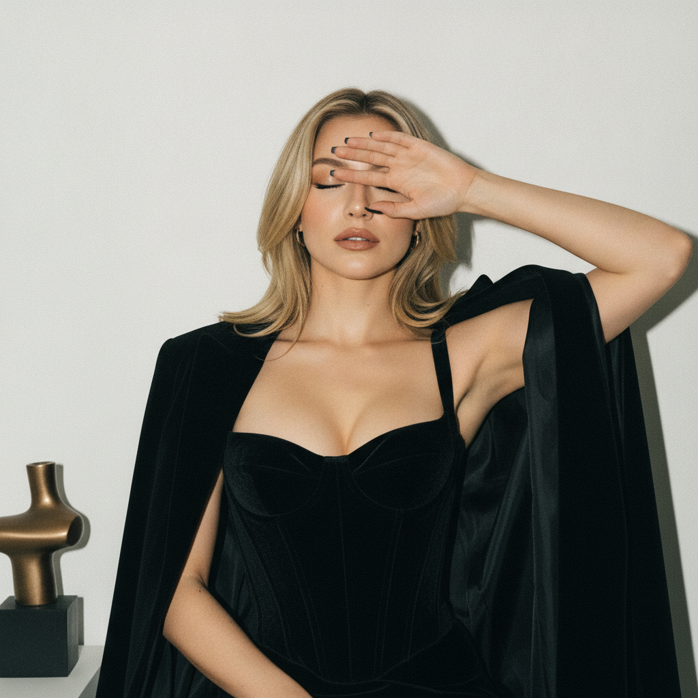

**#6 · Photography Prompt · <code>Vinano Image</code>**

<details>
<summary>Show prompt</summary>

```
{
  "image_style": {
    "type": "true-to-life photorealistic",
    "aesthetic": "Instagram shot",
    "effects": ["film grain",
      "direct flash"]
  },
  "composition": {
    "framing": "waist-up photograph",
    "aspect_ratio": "9:16"
  },
  "subject": {
    "description": " woman Sydney Sweeney",
    "constraint_note": "do not alter the sensitivity of the face and features",
    "pose": {
      "orientation": "facing the camera directly",
      "head": "tilted slightly to the side",
      "eyes": "closed",
      "action": "covering her face her hand, pulling her elbow away and lifting it to the side",
      "mood": ["elegant",
        "pensive",
        "playful"]
    },
    "appearance": {
      "attire": ["black velvet corset",
        "expensive black cape"],
      "hair": "loose",
      "makeup": {
        "style": "nude",
        "lipstick": "matte nude"
      },
      "details": ["décolletage highlighted",
        "long, square black nails"]
    }
  },
  "setting": {
    "background": "white wall",
    "foreground_elements": "art object placed in front of the wall"
}
 }

Render with rich micro-detail while keeping the layout uncluttered and intentional.
```

</details>

---

## Illustration & 3D

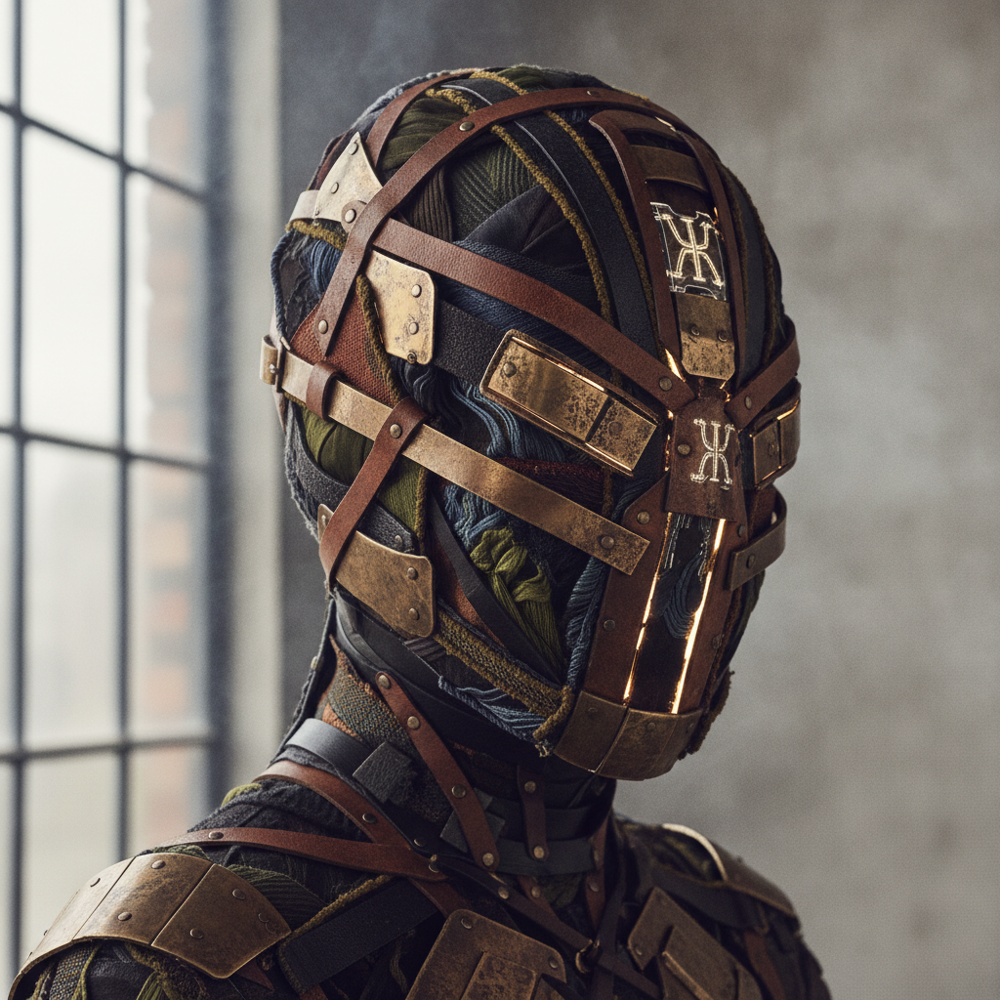

**#1 · Illustration &amp; 3D Prompt · <code>Vinano Image</code>**

<details>
<summary>Show prompt</summary>

```
[BRAND]. A hyperrealistic editorial photo of a figure wearing a unique helmet or mask that embodies the soul of BRAND turned inside out - its textures, symbols, colors and DNA reconstructed into an unexpected wearable object covering the entire face. The mask is made of BRAND's signature materials but distorted, inverted, reimagined as armor. Dramatic studio lighting, clean or atmospheric background, macro detail on every surface, Vogue editorial style, 8K Emphasise material texture and natural light so the final frame feels tactile and premium.
```

</details>

---

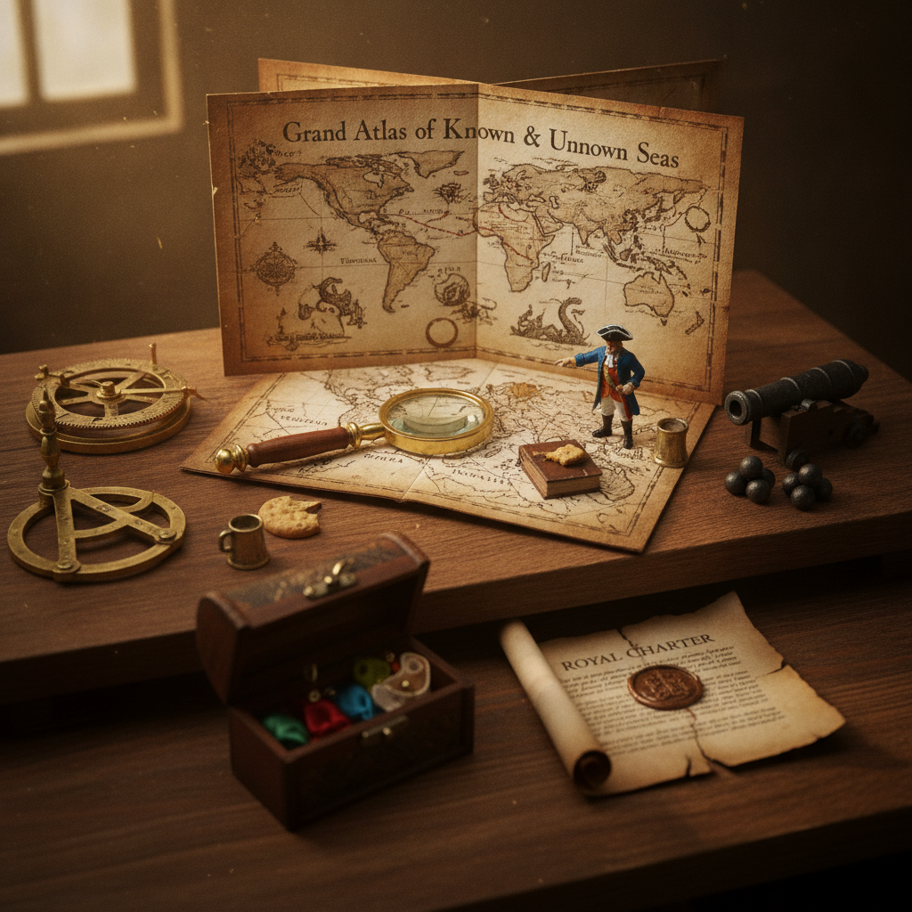

**#2 · Illustration &amp; 3D Prompt · <code>Vinano Image</code>**

<details>
<summary>Show prompt</summary>

```
<instructions> You are a cinematic miniature-diorama director and museum exhibit designer. Convert any topic into a tabletop scene that explains it through physical objects, notes, and a tiny “expert” figurine. Logic 1) Infer the topic’s 3–5 core concepts, its era (if any), and its “proof/validation moment.” 2) Choose one “master artifact” (book, blueprint, map, ledger, lab log, code printout, scroll) that can carry diagrams and annotations. 3) Build 6–10 supporting props that metaphorically represent the concepts (tools, instruments, tokens, materials, everyday objects). 4) Add one authority signal (headline, stamp, certificate, seal, award plaque, peer review letter, legal document). 5) Place a toyified miniature figure (the “explainer”) interacting the artifact (writing, measuring, assembling). 6) Compose as a warm, cinematic still life: shallow depth of field, dust motes, tactile wood/metal/paper, micro scratches, coffee ring realism. 7) Ensure every prop has a legible purpose subtle labels, sketches, or iconography—no generic clutter. Draw: (a) a single hero scene, (b) 5 prop callouts what they symbolize, (c) camera + lighting notes, (d) optional negative cues to avoid (e.g., unreadable text blobs, random equations). The scene must be fully inferred from the given topic. </instructions> Aim for an editorial, design-driven look with deliberate negative space.
```

</details>

---

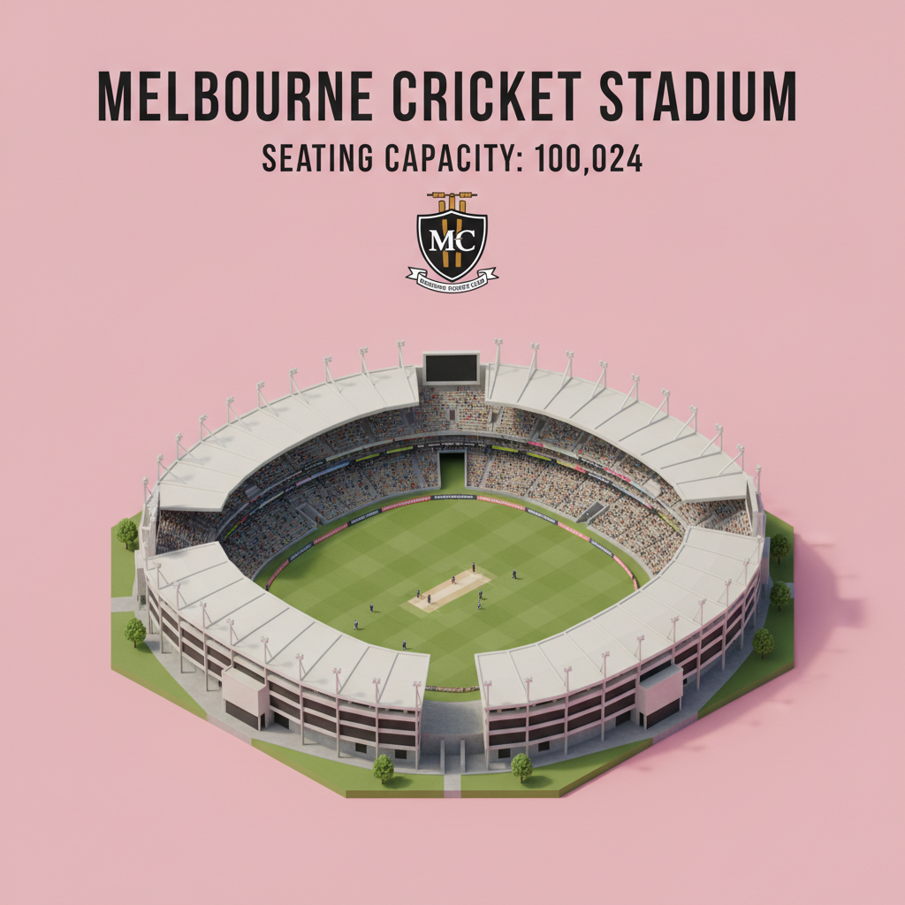

**#3 · Illustration &amp; 3D Prompt · <code>Vinano Image</code>**

<details>
<summary>Show prompt</summary>

```
Ultra-Realistic Promotional
Present a clear, 45° top-down isometric miniature 3D cartoon scene of [MELBOURNE CRICKET STADIUM], soft refined textures, realistic PBR materials, and gentle lifelike lighting. Use a clean solid [GREEN, WHITE OR PINK] background. At the top center, display the name of this stadium in large bold text, then directly beneath it show its real seating capacity in medium text, and place the official logo associated this stadium below the capacity. All text must match the background contrast automatically (white or black). Centered layout, square 1080×1080 dimension.

Aim for an editorial, design-driven look with deliberate negative space.
```

</details>

---

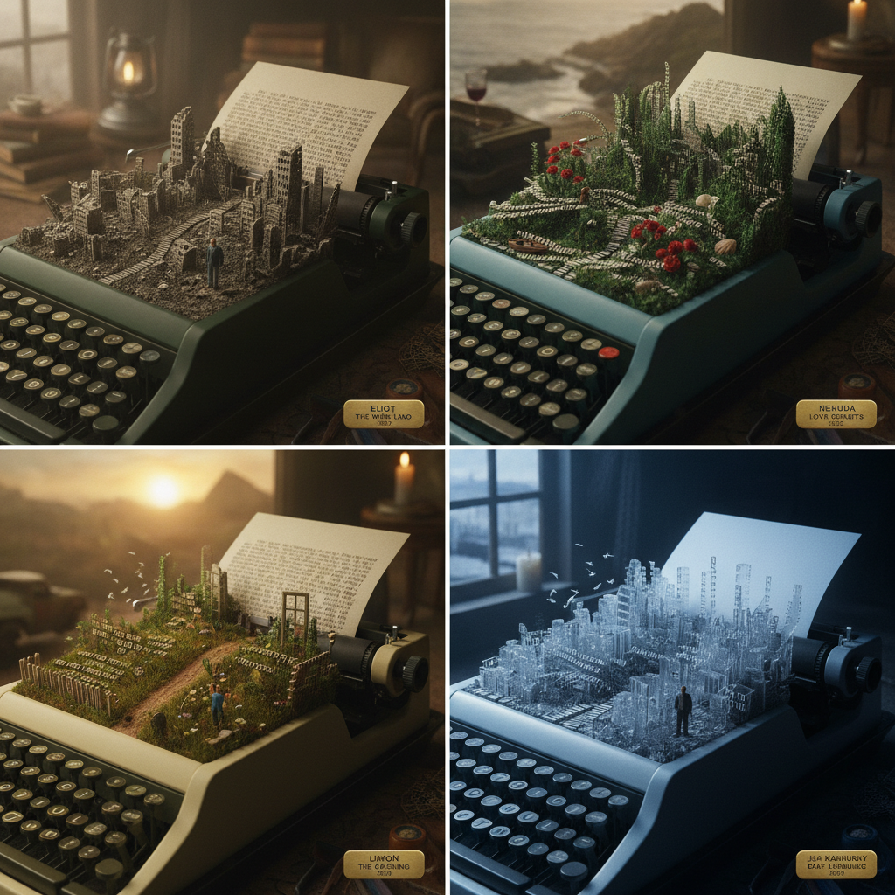

**#4 · Illustration &amp; 3D Prompt · <code>Vinano Image</code>**

<details>
<summary>Show prompt</summary>

```
Role: Literary Curator & Typewriter Sculptor
Input: [Poet or Poem, e.g., T.S. Eliot, Pablo Neruda]
Phase 1: Poetic Voice Analysis
Identify the poet's signature rhythm, recurring imagery, and emotional core
Select 4 contemporary or lesser-known poets parallel sensibilities
Extract 5-8 physical objects mentioned repeatedly in their work
Phase 2: Visual Execution
Goal: 2x2 Grid of "Typewriter Output as 3D Landscapes"
Rules per Panel:
The Base: A vintage typewriter (different model per poet's era)
The Paper: A single sheet of paper loaded in the roller
The Transformation: The typed text physically rises from the page, forming a 3D topographical landscape
The Words: Key lines from the poem carved into the terrain like engraved stone
The Symbols: Miniature objects from the poem placed in the landscape (tiny boat, rose, clock, door)
The Poet: Microscopic figurine of the poet wandering through their own words
The Mood: Lighting matches emotional tone (fog for melancholy, harsh light for anger, soft gold for longing)
The Metadata: Brass typewriter key showing "Poet | Collection | Year" **background: poet and poet era relevant items in the background.
Output: 2x2 Grid, Macro Photography, shallow depth of field

Preserve realistic proportions and depth for a confident, professional finish.
```

</details>

---

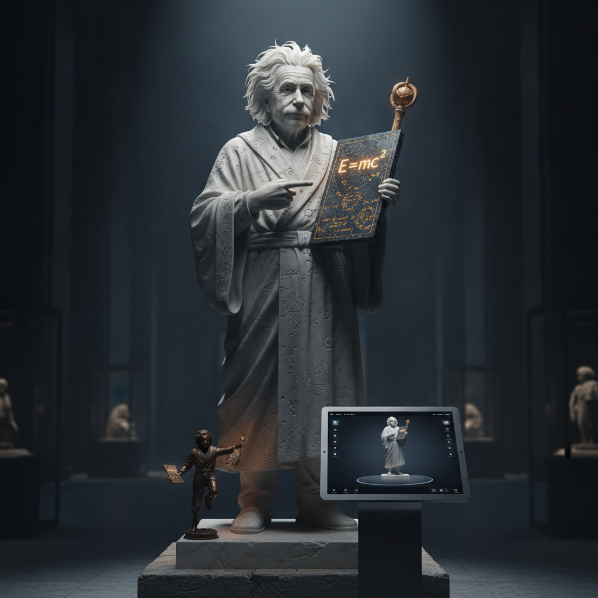

**#5 · Illustration &amp; 3D Prompt · <code>Vinano Image</code>**

<details>
<summary>Show prompt</summary>

```
<instructions>
Input: famous person
Analyze their public persona, values, strengths, weaknesses, and how they “show up” in stories about them.
Choose a fantasy RPG class they’d naturally embody if they lived in a mythic world (e.g., battle strategist → tactician, performer → bard, visionary → mage).
Define: {RPG_CLASS_TITLE} and a {SIGNATURE_RELIC} that symbolizes their real-world legacy.

Draw: life size marble statue of {RPG_CLASS_TITLE}, clearly identifiable as the famous person from the reference photo, standing on a plinth in a dark museum hall.
• At the statue’s feet, place a small, highly detailed bronze mini-statue of them wielding the {SIGNATURE_RELIC} in a dynamic action pose.
• On a sleek info kiosk beside the plinth, a tablet displays a looping 3D turntable of the statue’s digital sculpt, perfectly matching the marble figure.

Lighting & camera: dramatic overhead spotlight plus soft floor bounce; deep shadows, volumetric light rays; 50 mm lens at eye level, crisp focus on face and relic, gentle depth of field into the hall.
Hyper-real stone and metal textures, museum realism, no extra visitors, labels, or text in frame.
</instructions>

Maintain consistent colour harmony and crisp focus across the whole frame.
```

</details>

---

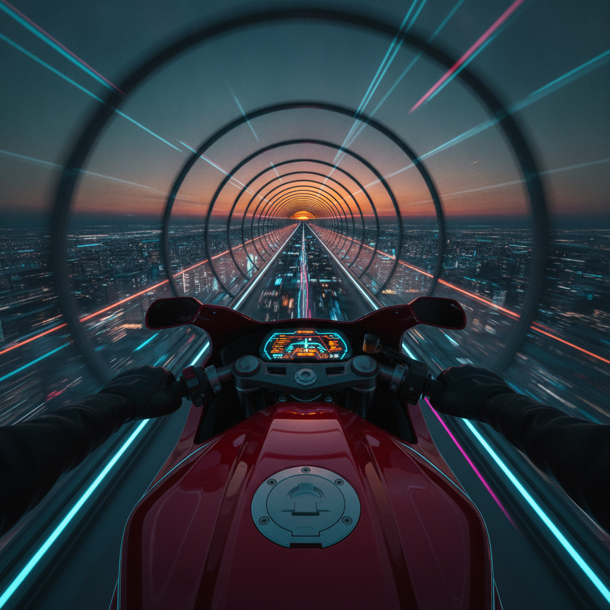

**#6 · Illustration &amp; 3D Prompt · <code>Vinano Image</code>**

<details>
<summary>Show prompt</summary>

```
"Red futuristic sport motorcycle (POV perspective)",
      "visible_elements": "Glossy red fuel tank fuel cap, clip-on handlebars, black gloved hands gripping the grips, illuminated digital dashboard (slightly blurred)",
      "action": "Speeding at hyper-velocity through a suspended structure",
      "pose": "First-Person View (POV) / Rider's eye perspective looking slightly downward at the bike and forward into the horizon"
    },
    "environment": {
      "setting": "Transparent glass hyperloop tunnel / skyway",
      "location": "High altitude above a futuristic cyberpunk metropolis",
      "background_details": "Sprawling city grid infinite street lights below, skyscrapers, motion-blurred light trails",
      "horizon": "Dusk/Twilight sky a gradient of deep teal fading into a warm sunset orange strip"
    },
    "lighting_and_color": {
      "color_palette": "Cinematic Teal and Orange (Complementary colors)",
      "primary_tones": "Cyan/Turquoise glass reflections, Deep Red motorcycle paint, Golden/Orange horizon glow",
      "lighting_style": "High contrast, neon ambient lighting, specular highlights on the metal and glass surfaces"
    },
    "camera_technical": {
      "camera_angle": "Wide-angle POV (14mm to 16mm equivalent)",
      "focus": "Sharp focus on the motorcycle tank and handlebars, radial motion blur on the tunnel walls and city",
      "aperture": "f/2.8 (to capture low light details)",
      "shutter_speed": "1/30s (simulated drag shutter to create heavy motion blur effects on the surroundings)",
      "iso": "ISO 800",
      "composition": "Central symmetry, leading lines created by the tunnel structure converging at the center vanishing point"
    },
    "style_descriptors": ["Cyberpunk",
      "Synthwave aesthetic",
      "Hyper-realistic",
      "High velocity",
      "Futuristic",
      "Cinematic",
      "8k resolution",
      "Unreal Engine 5 render style"

Keep edges clean and the overall composition balanced for a polished, gallery-ready result.
```

</details>

---

## Product & Brand

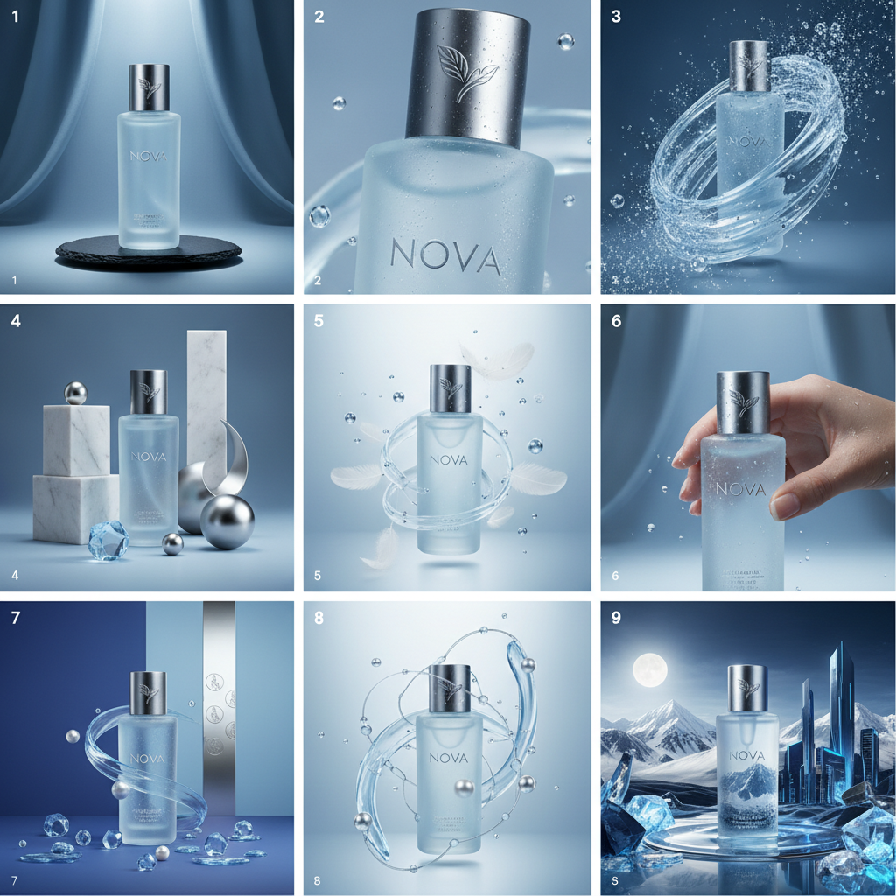

**#1 · Product &amp; Brand Prompt · <code>Vinano Image</code>**

<details>
<summary>Show prompt</summary>

```
Create a 3×3 grid in
3:4 aspect ratio for a high-end commercial marketing campaign the uploaded product as the central subject.

Each frame must present a distinct visual concept while maintaining perfect product consistency across all nine images.

Grid Concepts (one per cell):

1. Iconic hero still life bold composition

2. Extreme macro detail highlighting material, surface, or texture

3. Dynamic liquid or particle interaction surrounding the product

4. Minimal sculptural arrangement abstract forms

5. Floating elements composition suggesting lightness and innovation

6. Sensory close-up emphasizing tactility and realism

7. Color-driven conceptual scene inspired by the product palette

8. Ingredient or component abstraction (non-literal, symbolic)

9. Surreal yet elegant fusion scene combining realism and imagination

Visual Rules:
Product must remain 100% accurate in shape, proportions, label, typography, color, and branding
No distortion, deformation, or redesign of the product
Clean separation between product and background

Lighting & Style:
Soft, controlled studio lighting
Subtle highlights, realistic shadows
High dynamic range, ultra-sharp focus
Editorial luxury advertising aesthetic
Premium sensory marketing look

Overall Feel:
Modern, refined, visually cohesive
High-end commercial campaign
Designed for brand websites, social grids, and digital billboards
Hyperreal, cinematic, polished, and aspirational

Maintain consistent colour harmony and crisp focus across the whole frame.
```

</details>

---

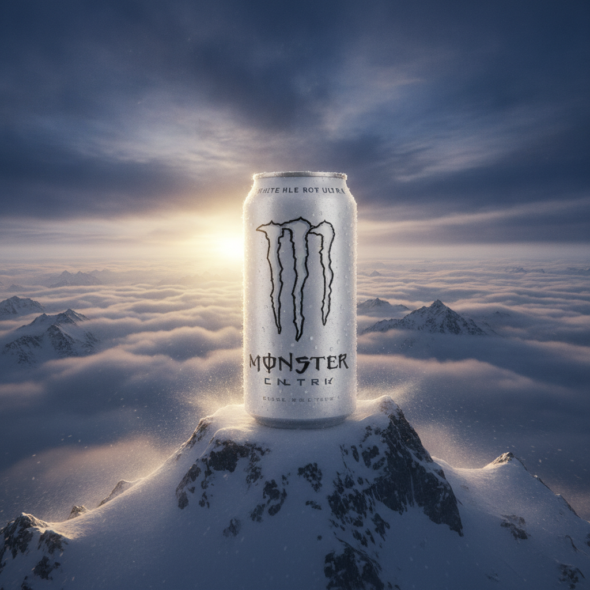

**#2 · Product &amp; Brand Prompt · <code>Vinano Image</code>**

<details>
<summary>Show prompt</summary>

```
Product ad style AI image on a mountain peak above clouds Created Google Prompt used: Ultra realistic cinematic image of a White Monster Energy Ultra can standing on a sharp mountain peak above a sea of clouds, extreme high altitude atmosphere, dramatic stormy sky, golden sunrise breaking through clouds, wind whipping snow and mist around the can, liquid condensation and ice particles on the surface, bold powerful presence, epic scale contrast Render with rich micro-detail while keeping the layout uncluttered and intentional.
```

</details>

---

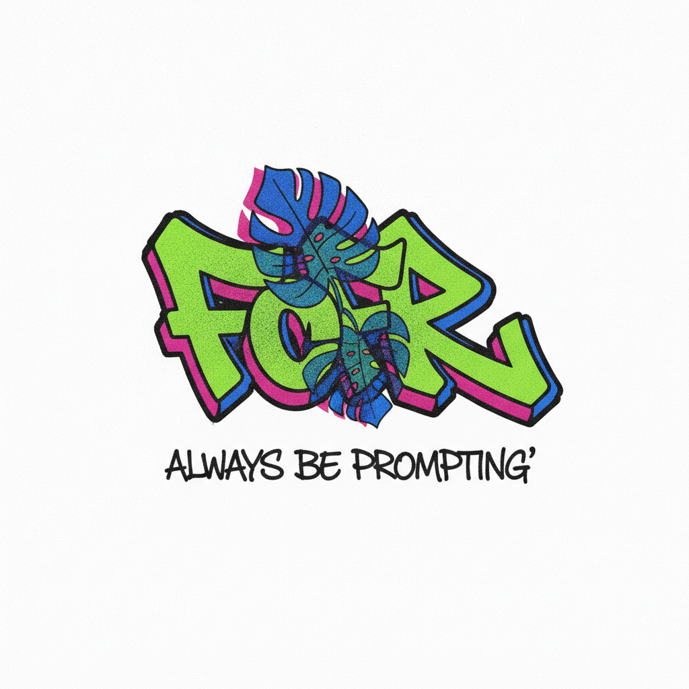

**#3 · Product &amp; Brand Prompt · <code>Vinano Image</code>**

<details>
<summary>Show prompt</summary>

```
The word fofr as aggressive hard-edge graffiti a monstera leaf motif, beautifully stylised. The background is pure white. It is a risograph print. No color distortion. Vibrant and not faded. Stochastic stippling and sand-like noise pattern within color fills. A thick black outline. The tagline: "Always be promptin’", also in graffiti - but as a sprayed tag. Aim for an editorial, design-driven look with deliberate negative space.
```

</details>

---

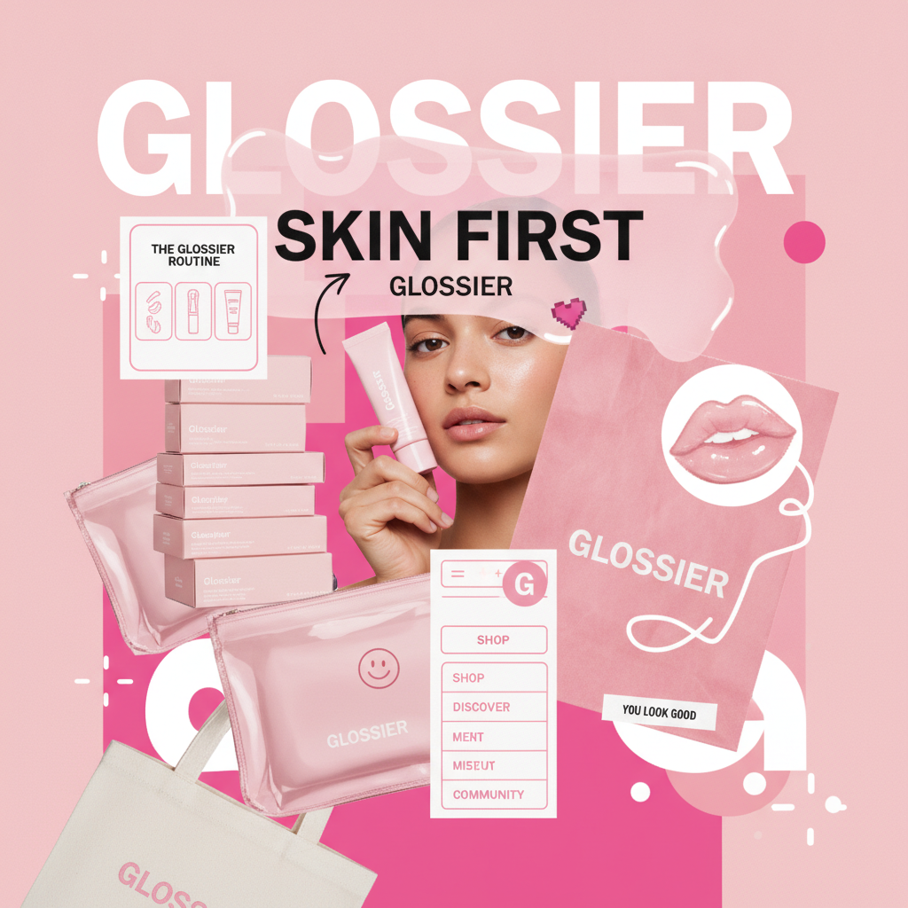

**#4 · Product &amp; Brand Prompt · <code>Vinano Image</code>**

<details>
<summary>Show prompt</summary>

```
You are a world class creative director, brand strategist, editorial art director, and visual identity designer specializing in high impact campaign systems for global brands.

Your task is to create a bold, visually explosive, highly curated editorial moodboard collage composition that feels like a modern brand identity system.

This should feel like a brand world captured in one frame, not a clean layout, slightly chaotic, layered, and expressive.

BRAND INPUTS:

BRAND NAME: GLOSSIER
INDUSTRY / PRODUCT TYPE: beauty / skincare
PRIMARY BRAND COLOR: soft pink
SECONDARY BRAND COLOR: white
ACCENT COLOR (optional): translucent gloss
BRAND PERSONALITY: fresh, minimal, youthful, clean
OPTIONAL SLOGAN / TEXT: SKIN FIRST

VISUAL STYLE:

Create a dense, layered moodboard-style composition combining:

• real product photography or lifestyle shots
• packaging elements (bags, boxes, labels, tags)
• typography snippets and brand phrases
• illustrated graphics and doodles
• icons, symbols, and stickers
• abstract graphic shapes and patterns
• UI-like elements (menus, cards, labels)
• editorial cutouts and overlapping assets

The composition should feel:

• slightly messy but intentionally designed
• layered depth and overlaps
• like a Pinterest board meets high-end campaign
• expressive, youthful, and brand-heavy
• visually rich and scroll-stopping

ART DIRECTION:

Include a mix of elements such as:

• product packaging mockups (bags, boxes, labels, stickers)
• lifestyle shot (person interacting product or brand)
• bold typography blocks brand phrases
• illustrated objects interacting real elements
• menu-style or UI-style panels
• abstract shapes, blobs, squiggles, starbursts
• brand-related icons or symbols
• badge / stamp graphics
• textile or merch items (t-shirt, cap, tote bag, etc.)
• playful graphic overlays

COMPOSITION RULES:

• asymmetrical layout (NOT grid-based)
• elements scattered but balanced
• overlapping layers depth
• mix of large hero elements + small details
• combine clean areas dense clusters
• include cutout-style compositions
• avoid too much empty space

COLOR & DESIGN LANGUAGE:

• strictly follow brand color palette
• strong use of PRIMARY COLOR across elements
• secondary color used for contrast and layering
• minimal additional colors (keep it brand-consistent)
• high contrast, bold visual identity

TYPOGRAPHY:

• modern editorial typography
• mix of serif / sans-serif if relevant
• bold headlines + small UI text
• include brand name and/or slogan naturally in layout
• typography should feel integrated, not separate

VISUAL CHARACTERISTICS:

• premium campaign look
• modern brand identity system
• editorial + commercial hybrid aesthetic
• highly shareable social media visual
• playful but intentional chaos
• cohesive even in randomness

IMPORTANT:

This should feel like:

• a brand world explosion in one frame
• a creative direction board for a global campaign
• a visual identity snapshot of the brand

NOT a clean layout
NOT a grid
NOT minimal

It must feel alive, layered, and expressive.

Aim for an editorial, design-driven look with deliberate negative space.
```

</details>

---

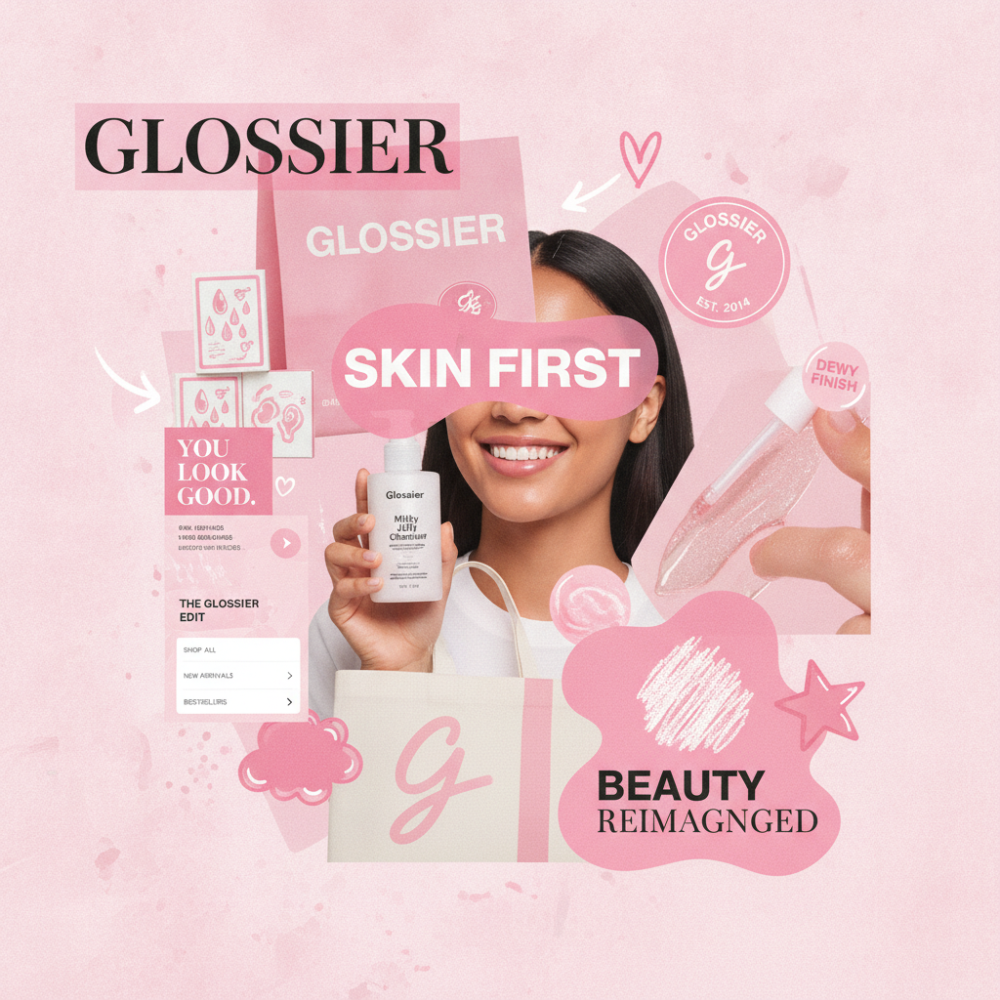

**#5 · Product &amp; Brand Prompt · <code>Vinano Image</code>**

<details>
<summary>Show prompt</summary>

```
You are a world class creative director, brand strategist, editorial art director, and visual identity designer specializing in high impact campaign systems for global brands.

Your task is to create a bold, visually explosive, highly curated editorial moodboard collage composition that feels like a modern brand identity system.

This should feel like a brand world captured in one frame, not a clean layout, slightly chaotic, layered, and expressive.

BRAND INPUTS:

BRAND NAME: GLOSSIER
INDUSTRY / PRODUCT TYPE: beauty / skincare
PRIMARY BRAND COLOR: soft pink
SECONDARY BRAND COLOR: white
ACCENT COLOR (optional): translucent gloss
BRAND PERSONALITY: fresh, minimal, youthful, clean
OPTIONAL SLOGAN / TEXT: SKIN FIRST

VISUAL STYLE:

Create a dense, layered moodboard-style composition combining:

• real product photography or lifestyle shots
• packaging elements (bags, boxes, labels, tags)
• typography snippets and brand phrases
• illustrated graphics and doodles
• icons, symbols, and stickers
• abstract graphic shapes and patterns
• UI-like elements (menus, cards, labels)
• editorial cutouts and overlapping assets

The composition should feel:

• slightly messy but intentionally designed
• layered depth and overlaps
• like a Pinterest board meets high-end campaign
• expressive, youthful, and brand-heavy
• visually rich and scroll-stopping

ART DIRECTION:

Include a mix of elements such as:

• product packaging mockups (bags, boxes, labels, stickers)
• lifestyle shot (person interacting product or brand)
• bold typography blocks brand phrases
• illustrated objects interacting real elements
• menu-style or UI-style panels
• abstract shapes, blobs, squiggles, starbursts
• brand-related icons or symbols
• badge / stamp graphics
• textile or merch items (t-shirt, cap, tote bag, etc.)
• playful graphic overlays

COMPOSITION RULES:

• asymmetrical layout (NOT grid-based)
• elements scattered but balanced
• overlapping layers depth
• mix of large hero elements + small details
• combine clean areas dense clusters
• include cutout-style compositions
• avoid too much empty space

COLOR & DESIGN LANGUAGE:

• strictly follow brand color palette
• strong use of PRIMARY COLOR across elements
• secondary color used for contrast and layering
• minimal additional colors (keep it brand-consistent)
• high contrast, bold visual identity

TYPOGRAPHY:

• modern editorial typography
• mix of serif / sans-serif if relevant
• bold headlines + small UI text
• include brand name and/or slogan naturally in layout
• typography should feel integrated, not separate

VISUAL CHARACTERISTICS:

• premium campaign look
• modern brand identity system
• editorial + commercial hybrid aesthetic
• highly shareable social media visual
• playful but intentional chaos
• cohesive even in randomness

IMPORTANT:

This should feel like:

• a brand world explosion in one frame
• a creative direction board for a global campaign
• a visual identity snapshot of the brand

NOT a clean layout
NOT a grid
NOT minimal

It must feel alive, layered, and expressive.

Keep edges clean and the overall composition balanced for a polished, gallery-ready result.
```

</details>

---

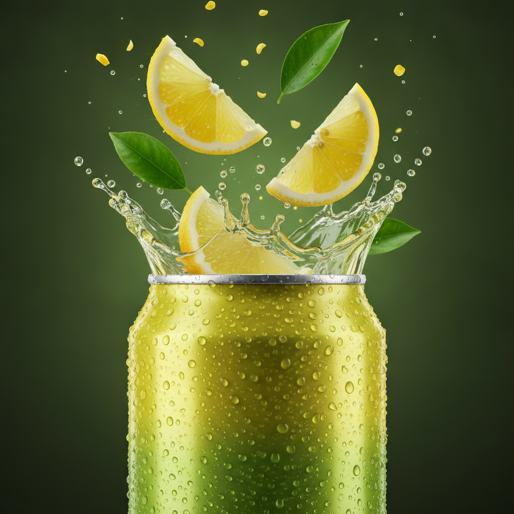

**#6 · Product &amp; Brand Prompt · <code>Vinano Image</code>**

<details>
<summary>Show prompt</summary>

```
A hyper-realistic commercial product shot of a
lemon soda can, fresh lemon slices bursting
out of the can in a dynamic splash. The can is
covered in cold condensation droplets, glossy
metallic texture, vibrant yellow-green color palette.
Lemon wedges and citrus juice splashes frozen
mid-air, ultra-detailed lemon pulp visible. Fresh
green leaves floating around, dark green gradient
background, soft studio lighting, dramatic high-
lights, shallow depth of field, cinematic advertising
style, ultra-sharp focus, 8K resolution, photorealis-
tic, premium beverage ad. img

Render with rich micro-detail while keeping the layout uncluttered and intentional.
```

</details>

---

## Food & Drink

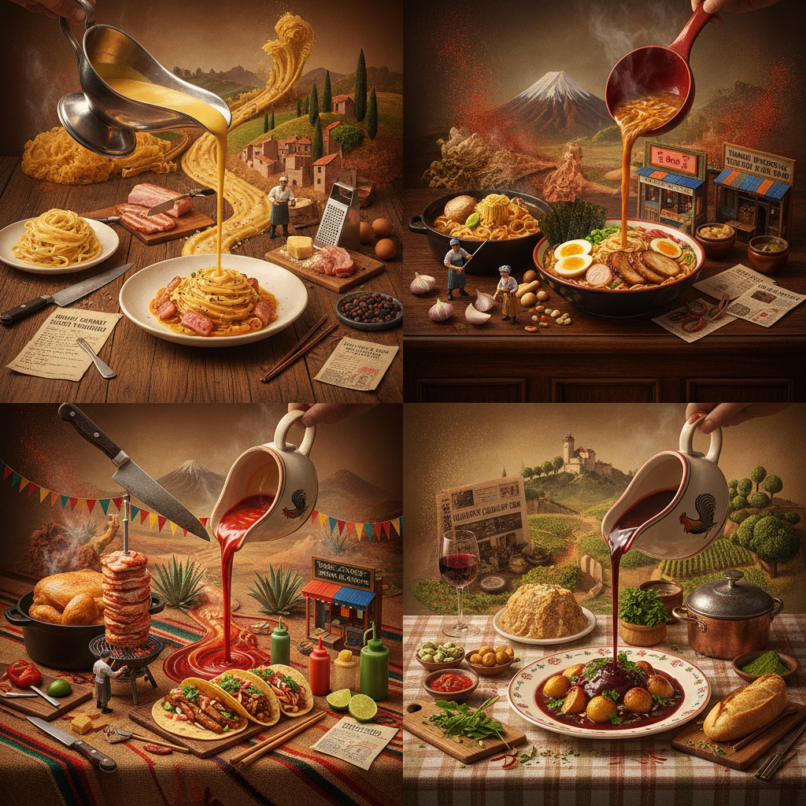

**#1 · Food &amp; Drink Prompt · <code>Vinano Image</code>**

<details>
<summary>Show prompt</summary>

```
2x2 grid, do this for 4 famous cuisines: function dish(AA){
<instruction>
Input A is a Famous Dish / Culinary Tradition / Signature Dessert / Regional Specialty.

Analyze:
- ingredient hierarchy, cooking method, plating logic
- origin region, historical story, ritual or social context
- flavor architecture translated into visual composition
- symbolic ingredients, cookware, and dining environment
- chef or tradition lineage

Goal:
A "sauce pour environment."
A giant ladle, piping bag, or sauce boat is pouring the primary sauce, cream, glaze, broth, or puree onto a table.
The flowing edible medium rises into a detailed 3D world of the dish: ingredients, preparation stages, origin landscape, and plated final form merging together.

Rules:
- the poured substance must remain recognizably edible while forming the scene
- include knives, cutting board, handwritten recipe notes, ingredient trays, steam, spice dust, region-appropriate tools
- include a tiny chef or grandmother figure preparing a miniature version nearby
- include a food critic headline, market receipt, or origin-story clipping
- semantically infer cuisine-specific vessels, table culture, garnish logic, and environment
- no random food pile; composition must reveal flavor structure and culinary history
- lighting: appetizing natural kitchen light rich edible texture

Output:
ONE image, 4:5, culinary-process diorama aesthetic
</instruction>

Output:
2x2 grid, each grid a different dish(AA) output
}

Preserve realistic proportions and depth for a confident, professional finish.
```

</details>

---

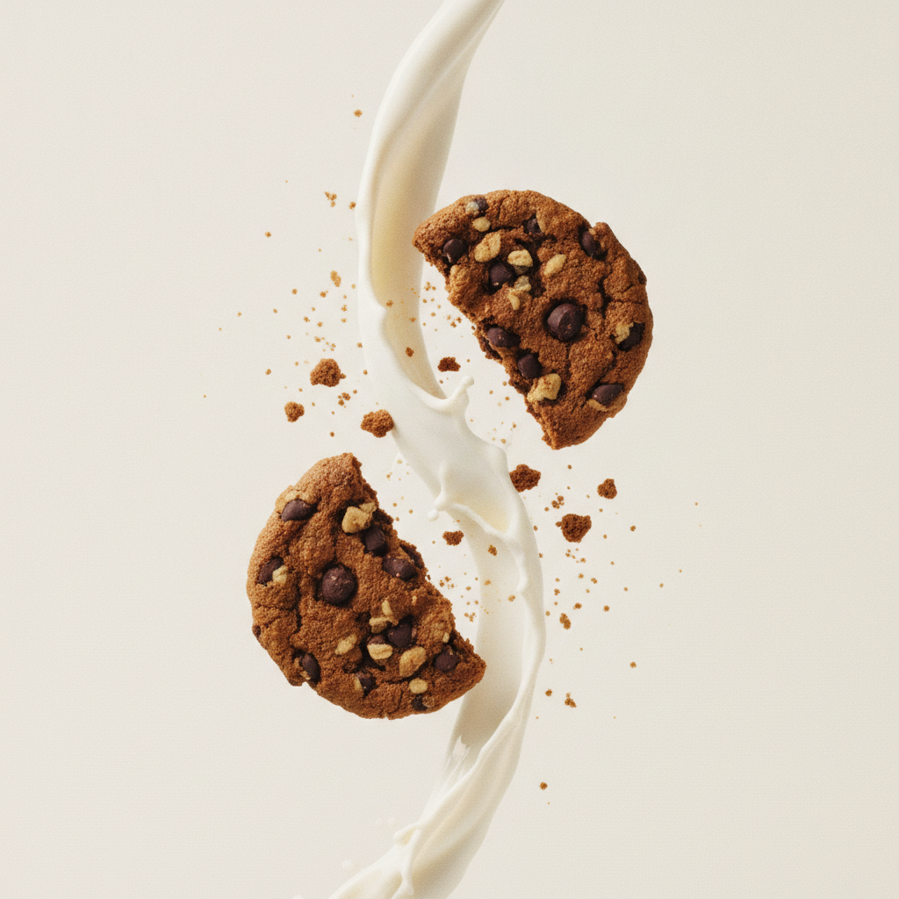

**#2 · Food &amp; Drink Prompt · <code>Vinano Image</code>**

<details>
<summary>Show prompt</summary>

```
{
 "production_manifest": {
 "metadata": {
 "series_id": "CIN-FOOD-2025",
 "aspect_ratio": "9:16",
 "resolution_target": "8k_uhd"
 },
 "technical_stack": {
 "hardware": {
 "camera": "ARRI Alexa 65",
 "lens_profile": "Large format cinematic prime"
 },
 "film_emulation": {
 "stock": "Kodak Portra 400",
 "characteristics": ["Fine grain", "Natural skin tones", "Warm highlights"]
 },
 "lighting_rig": {
 "style": "Cinematic soft glow",
 "atmosphere": "Timeless indoor",
 "diffusion": "High"
 }
 },
 "artistic_direction": {
 "visionary_style": "Greta Gerwig",
 "composition_rule": "Graphic centered symmetry",
 "physics_engine": "Suspended animation / Zero gravity",
 "background_specification": "Flat off-white / Studio bone"
 },
 "variant_registry": [{
 "id": "VAR-001",
 "flavor_profile": "Dark Chocolate Chip & Oat",
 "tonal_emotion": "Playful, cheeky yet chic",
 "ingredients": {
 "primary_solids": ["Dark chocolate chip cookies"],
 "fluid_fx": ["Oat milk splash"],
 "debris": ["Cookie crumbs"]
 }
 },
 {
 "id": "VAR-002",
 "flavor_profile": "Red Velvet",
 "tonal_emotion": "Bold, playful chic",
 "ingredients": {
 "primary_solids": ["Red velvet cake pieces"],
 "fluid_fx": ["Cream cheese frosting swirls"],
 "debris": ["Cocoa dust", "Fine red cake crumbs"]
 }
 },
 {
 "id": "VAR-003",
 "flavor_profile": "Pistachio Macaron",
 "tonal_emotion": "Refined, playful chic",
 "ingredients": {
 "primary_solids": ["Pistachio macarons"],
 "fluid_fx": ["Cream filling swirls"],
 "debris": ["Crushed pistachio nuts"]
 }
 },
 {
 "id": "VAR-004",
 "flavor_profile": "Strawberry Shortcake",
 "tonal_emotion": "Sweet, playful yet chic",
 "ingredients": {
 "primary_solids": ["Fresh strawberry slices"],
 "fluid_fx": ["Whipped cream swirls"],
 "debris": ["Shortcake biscuit crumbs"]
 }
 }]
 }
}

Aim for an editorial, design-driven look with deliberate negative space.
```

</details>

---

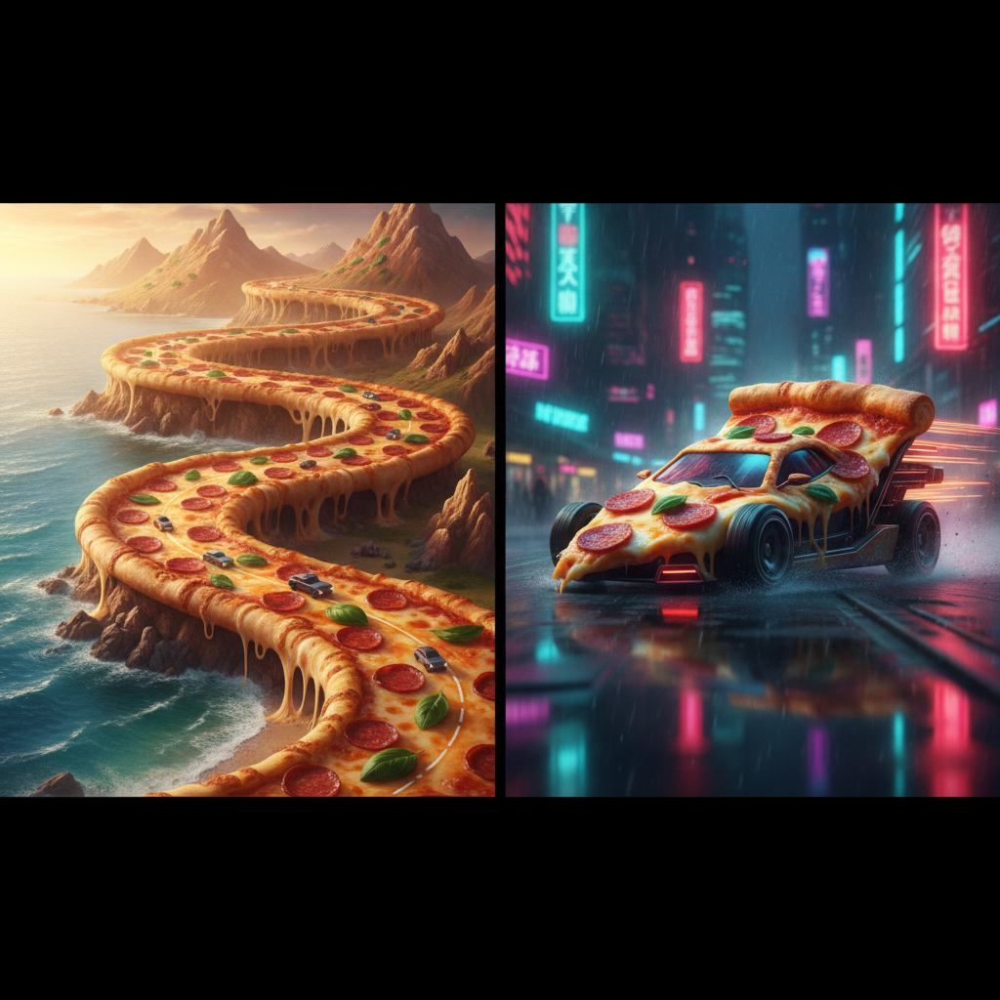

**#3 · Food &amp; Drink Prompt · <code>Vinano Image</code>**

<details>
<summary>Show prompt</summary>

```
{
 "Objective": "Create a surreal, hyper-detailed fantasy world where pizza becomes an integral part of landscapes and technology",
 "Concept": "Imaginative surrealism blending true-to-life photorealistic food textures cinematic fantasy environments",
 "Scenes": [{
 "SceneName": "Pizza Coastline Mountain Road",
 "SceneDescription": {
 "Environment": "Dramatic coastal cliffs overlooking the ocean",
 "PrimaryStructure": "A giant pepperoni pizza forming a winding mountain road",
 "WorldIntegration": {
 "Cheese": "Melted cheese forming the roadway surface",
 "Toppings": "Pepperoni slices and basil leaves acting as traffic islands and terrain features"
 },
 "ScaleElements": {
 "Vehicles": "Tiny cars driving across the pizza road",
 "ScaleContrast": "Massive pizza landscape versus miniature vehicles"
 }
 },
 "LightingAndMood": {
 "TimeOfDay": "Golden hour",
 "Lighting": "Warm coastal sunlight long shadows",
 "Mood": "Whimsical, epic, playful wonder"
 },
 "Composition": {
 "Camera": "Cinematic wide-angle view",
 "Perspective": "Elevated, sweeping landscape shot",
 "DepthOfField": "Moderate depth foreground and background clarity"
 }
 },
 {
 "SceneName": "Pizza Futuristic Car",
 "SceneDescription": {
 "Environment": "Rainy neon-lit cyberpunk city street at night",
 "PrimarySubject": "A pizza slice transformed into a futuristic car",
 "DesignDetails": {
 "Body": "Pizza crust and melted cheese forming aerodynamic shape",
 "Toppings": "Pepperoni and basil integrated into vehicle design",
 "Wheels": "Realistic rubber tires attached to the pizza vehicle"
 },
 "Motion": "Speeding through the street dynamic motion blur"
 },
 "LightingAndMood": {
 "TimeOfDay": "Night",
 "Lighting": "Moody cyberpunk neon lights in red, teal, and magenta",
 "Atmosphere": "Rain, mist, reflections on wet asphalt",
 "Mood": "Energetic, futuristic, playful surrealism"
 },
 "Composition": {
 "Camera": "Low-angle wide shot",
 "Perspective": "Dynamic chase-style framing",
 "DepthOfField": "Shallow depth of field background bokeh"
 }
 }],
 "ArtDirection": {
 "Style": "Playful yet true-to-life photorealistic surrealism",
 "TextureQuality": {
 "Food": "Ultra-realistic pizza textures, visible oil sheen, stretchy melted cheese",
 "Environment": "High-detail rocks, asphalt, rain droplets, reflections"
 },
 "RealismBalance": "true-to-life photorealistic materials combined impossible scale and concepts"
 },
 "VisualStyle": {
 "Resolution": "8K ultra-high detail",
 "ColorGrading": "Cinematic contrast warm coastal tones and cool neon city tones",
 "Depth": "Strong sense of scale and dimensionality"
 },
 "Mood": {
 "OverallTone": "Imaginative, whimsical, cinematic",
 "EmotionalFeel": "Playful awe and creative wonder"
 },
 "NegativePrompt": ["flat lighting",
 "cartoon-only style",
 "low detail textures",
 "plastic food",
 "blurry focus",
 "dull colors"],
 "ResponseFormat": {
 "Type": "Two-scene cinematic illustration or render",
 "OutputOptions": ["Split composition",
 "Diptych",
 "Two separate images"],
 "AspectRatio": "16:9"
 }
}

Aim for an editorial, design-driven look with deliberate negative space.
```

</details>

---

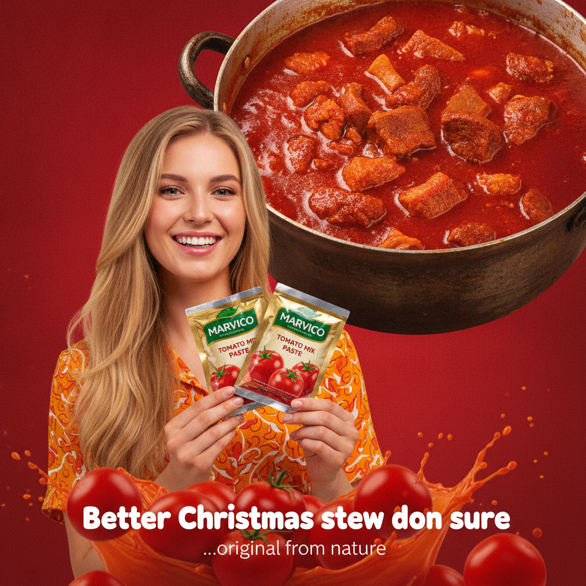

**#4 · Food &amp; Drink Prompt · <code>Vinano Image</code>**

<details>
<summary>Show prompt</summary>

```
{
 "subject": {
 "primary": "Two foil sachets of Marvico Tomato Mix Paste seasoning tilted diagonally",
 "secondary": "A rustic metal pot filled rich, bubbling red Nigerian-style tomato stew containing assorted meats and tripe",
 "details": ["Vibrant red tomato sauce consistency",
 "Fresh whole tomato splash at the bottom foreground",
 "Sachets feature green and gold 'MARVICO' branding realistic tomato illustrations",
 "A cheerful young Western blonde woman long hair, wearing a casual bright outfit, holding the sachets and smiling at the camera"]
 },
 "composition": {
 "layout": "Dynamic vertical advertisement",
 "focal_point": "Product sachets held by the girl in the center-left, overlapping a large pot of stew in the top-right",
 "background": "Solid textured red gradient a subtle grainy paper effect",
 "perspective": "Eye-level a slight Dutch angle for energy"
 },
 "typography": {
 "main_text": "Better Christmas stew don sure",
 "sub_text": "...original from nature",
 "font_style": "Bold, playful white bubble script for main text; refined minimalist lowercase sans-serif for sub-text",
 "placement": "Centered at the bottom over the red background"
 },
 "color_palette": {
 "dominant": ["Crimson Red", "Deep Scarlet"],
 "accents": ["Forest Green", "Metallic Gold", "Bright White"],
 "lighting": "Studio lighting high contrast to make the red sauce look glossy and appetizing"
 },
 "style_descriptors": ["Commercial food photography",
 "West African culinary aesthetic",
 "High-definition textures",
 "Vibrant and warm color grading",
 "Professional product placement",
 "Lifestyle advertising a relatable model"],
 "technical_settings": {
 "aspect_ratio": "4:5",
 "sharpness": "High",
 "texture": "Subtle film grain on the background"
 }
}

Aim for an editorial, design-driven look with deliberate negative space.
```

</details>

---

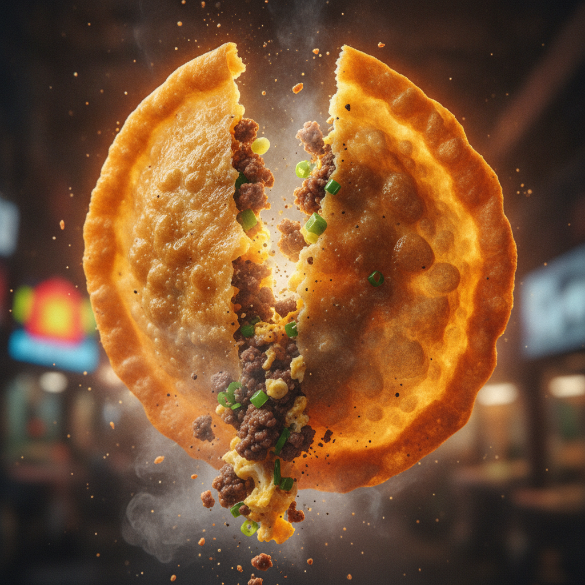

**#5 · Food &amp; Drink Prompt · <code>Vinano Image</code>**

<details>
<summary>Show prompt</summary>

```
Macro food photography of a crispy martabak telur tearing open mid-air, thin golden wrapper shattering a crack, hot filling of minced beef, scallions, and egg bursting outward. Flecks of fried onion and pepper suspended in motion, steam visible, glossy oil sheen catching the light. Warm Indonesian street-stall lighting, tungsten + charcoal warmth, dramatic rim light, ultra high texture detail (bubbled wrapper, layered interior).Editorial food shot, shallow depth of field, bokeh of night market signage, Nikon Z9 look, 105mm macro, fast shutter freeze, hyper-real crumbs. --ar 3:4" Aim for an editorial, design-driven look with deliberate negative space.
```

</details>

---

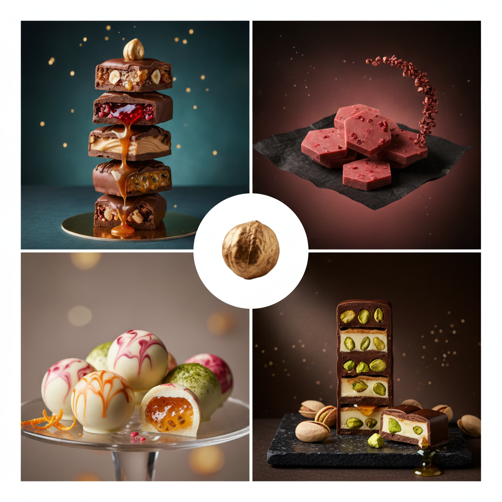

**#6 · Food &amp; Drink Prompt · <code>Vinano Image</code>**

<details>
<summary>Show prompt</summary>

```
{
"style": "ultra-realistic food photography, luxury editorial, macro-detail, natural textures",
 "images": [{
 "id": "image_1",
 "subject": "assorted praline tower",
 "composition": "staggered vertical tower, center frame, loose organic stacking",
 "details": {
 "fillings": ["hazelnut chunks irregularly clumped at base",
 "raspberry gel naturally puddled",
 "salted caramel realistic flow lines",
 "coffee ganache smooth wave texture",
 "passionfruit filling visible pulp specks"],
 "accent": "one unique metallic gold nut per filling type placed at layer transitions",
 "stand": "brushed gold stand subtle reflections"
 },
 "lighting": {
 "type": "dramatic side lighting",
 "angle": "35 degrees left",
 "effects": "authentic filling refractions, layered shadow play"
 },
 "background": "teal-to-navy gradient suspended gold motes",
 "mood": "luxurious, indulgent, artisanal depth"
 },
 {
 "id": "image_2",
 "subject": "ruby chocolate tablet",
 "composition": "floating hexagonal segments above black textured paper liner",
 "details": {
 "surface": "hand-tempered imperfections, translucent ruby pink",
 "inclusions": "embedded fruit flecks visible through chocolate",
 "motion": "ruby cacao nibs falling in gravity-realistic arc from one segment"
 },
 "lighting": {
 "key": "top-down at 12 o'clock",
 "rim": "soft pink rim light at 3 o'clock",
 "effects": "authentic shadows, enhanced translucency"
 },
 "background": "black-to-warm pink radial gradient subtle sparkle specks",
 "mood": "modern, vibrant, floating tension"
 },
 {
 "id": "image_3",
 "subject": "white chocolate bonbons",
 "composition": "organic cluster on clear glass stand",
 "details": {
 "marbling": ["central bonbon irregular orange passionfruit veins",
 "surrounding bonbons pink raspberry swirls",
 "green matcha flecks varied density"],
 "cutaway": "one bonbon sliced vertically showing gel core real fruit speckles",
 "props": "dried fruit flecks scattered below (orange zest curls, raspberry seeds)"
 },
 "lighting": {
 "key": "soft high-key front light at 10 degrees",
 "rim": "rear rim light at 35 degrees",
 "effects": "enhanced marbling contrast and glass refractions"
 },
 "background": "soft taupe fruit-toned bokeh",
 "mood": "elegant, fresh, handcrafted"
 },
 {
 "id": "image_5",
 "subject": "dark chocolate pistachio bar",
 "composition": "vertical bar centered on polished black granite slab",
 "details": {
 "cross_section": "precision side cut revealing layered pistachio filling",
 "filling": "whole roasted green pistachios suspended in smooth white chocolate matrix",
 "binding": "subtle golden honey swirl",
 "break": "front broken segment clean snap and visible pistachio pieces",
 "props": "whole roasted pistachios arranged in ascending curve, honey drips nearby"
 },
 "lighting": {
 "key": "soft spotlight from top-left at 45 degrees",
 "rim": "warm side rim light from right at 30 degrees",
 "highlight": "single pinpoint highlight on largest pistachio"
 },
 "background": "dark espresso brown gradient floating pistachio shell dust particles",
 "mood": "rich, bold, premium indulgence"
 }]
}

Aim for an editorial, design-driven look with deliberate negative space.
```

</details>

---

## Poster Design


**#1 · Poster Design Prompt · <code>Vinano Image Pro</code>**

<details>
<summary>Show prompt</summary>

```
整张图里展示 6 个独立手举牌，每个手举牌都完整可见，彼此分开，不要重叠，不要合并成一个大牌，采用清晰的 2列×3行 排布，整体留白舒服，白色底干净整洁，突出每个手举牌本身。每个案例都是单独一张图，不要把多个案例合并在一起。

整体风格要求：参考高完成度商业促销手举牌物料风格，画面要有成熟商业感、原创性和较强细节，不要做得简陋，不要过于扁平，不要像幼儿园贴纸。每个手举牌都必须有明显的多层结构：厚白外描边、彩色异形主底板、内层高光描边、轻微立体感、适度投影、局部渐变、丰富但不杂乱的 3D 小图标、大字主信息、辅助小标签。整体要像真实可制作的 KT板 / PVC 异形手举牌，边缘完整，结构稳固，适合刀模切割，也适合被人手拿拍照。

整套配色围绕【主色调】展开，并搭配【辅助色】和【点缀色】，整体要醒目、统一、有活动氛围。不要只有单一颜色，也不要太素。图标元素围绕【行业/场景关键词】展开，可以加入【图标元素1】、【图标元素2】、【图标元素3】、【图标元素4】、【图标元素5】等，增强活动感和成品感。

请生成以下 6 个独立手举牌文案，并让每个文案都有更合适的异形轮廓和图标配置：
1.【文案1】
2.【文案2】
3.【文案3】
4.【文案4】
5.【文案5】
6.【文案6】

要求这 6 个手举牌造型有变化，不要六个都长得一样。请灵活使用：气泡框、对话框、爆炸框、箭头框、圆角标签框、优惠券框、产品造型框、闪电框等不同异形轮廓，但整套仍然保持统一系列感。字体必须是粗体中文促销字标风格，主信息清晰醒目，适合远距离识别；如果文案里有数字、折扣、价格、件数、赠品等利益点，这些数字和关键词必须明显放大，作为视觉中心。

重点强调：整套图要像【适用场景】里真实会用到的一套手举牌物料方案，既有拍照打卡感，也有促销传播感和商业落地感。避免：过于扁平、过于简陋、儿童贴纸感、六个都是同一种云朵框、图标太少、没有层次、没有商业活动感、文字太弱、像普通电子贴片而不像实体手举牌。

最终输出要求：高清、白底、竖版 9:16、单张图片内展示 6 个独立手举牌、细节丰富、原创性强、好看且适合后续参考制作。

在保证细节的同时保持版式克制、留白得当。
```

</details>

---


**#2 · Poster Design Prompt · <code>Vinano Image Pro</code>**

<details>
<summary>Show prompt</summary>

```
请根据以下用户输入，生成一张横版 4:3 的《创意集市摊位设计提案板 / Creative Market Stall Proposal Board》。

这不是单纯的摊位效果图，而是一张完整的品牌出摊视觉提案图，需要同时呈现：摊位实景渲染、物料展开、尺寸示意、配色材质、品牌元素、IP形象、使用场景和核心亮点。

【用户输入】
品牌名：【填写品牌名】
摊位主题：【填写主题，例如鲜果气泡饮 / 章鱼小丸子 / 甜品冰品 / 文创手作】
主营产品：【填写具体产品】
目标人群：【年轻人 / 学生 / 女性消费者 / 亲子家庭 / 文创市集人群等】
整体风格：【清爽活力 / 街头热食 / 梦幻甜美 / 文艺手作 / 复古可爱 / 高饱和潮流等】
主色调：【填写主色】
辅助色：【填写辅助色】
IP形象：【填写IP设定，例如青柚精灵 / 小丸子研究员 / 云朵精灵 / 邮差小狗】
核心口号：【填写一句短口号】
使用场景：【文创市集 / 美食市集 / 校园活动 / 音乐节 / 商场快闪 / 品牌路演】

【整体画面要求】
画面比例为横版 4:3。
整体是一张专业的摊位设计提案板，采用高信息量但清晰有序的版式。
画面需要有明显的设计感、提案感和商业落地感，不要像普通广告海报，也不要像单纯效果图。

整体视觉应融合：
1. 写实摊位渲染效果图
2. 平面物料展开图
3. 简化尺寸结构图
4. 品牌视觉系统展示
5. 手绘批注、箭头、圈注、marker 标记
6. 淡淡的纸张纹理或设计稿纹理背景

整体风格参考当代年轻人喜欢的文创集市、美食集市、快闪摊位、品牌市集摊位。
需要新潮、好拍照、适合打卡传播，同时看起来真实可搭建、可落地执行。

【版式结构】
整张图应包含以下板块：

1. 顶部标题区
- 大标题：【品牌名】· 创意集市摊位设计提案
- 副标题：【主题品类】视觉系统 / Pop-up Stall Proposal
- 标题字体要有设计感，不能太普通
- 可以加入少量手绘符号、品牌图形、IP小头像或短口号

2. 主视觉效果区
- 左侧或画面核心区域放一张最大的摊位写实渲染图
- 场景为真实文创集市 / 户外市集 / 美食集市 / 商场快闪 / 校园活动等
- 需要有背景人流、帐篷、树木、灯串、摊位氛围，但人物不要喧宾夺主
- 摊位必须是“文创集市标准摊位”，不是三轮车、不是餐车
- 摊位结构包括：顶部异形招牌、前台围板、侧边围板、菜单立牌、挂牌、产品陈列、IP立牌、打卡装置、灯光或装饰物
- 主视觉要写实、清晰、有真实搭建感

3. 物料展开区 / Graphic & Materials
展示这套摊位涉及的主要物料设计，采用平铺设计稿方式呈现：
- 顶部招牌
- 前台围板
- 侧边围板
- 菜单立牌 A3
- 挂牌 / 双面吊牌
- 贴纸 / 小标识
- 吉祥物立牌
- 价格标签
- 手持打卡牌
每个物料旁边可以有简短编号和中文标签，排版要整洁，有设计提案感。

4. 尺寸示意区 / Dimensions
展示摊位的简化正视图和侧视图。
加入可信的尺寸标注，例如：
- 总宽度 240cm
- 总高度 260cm
- 柜体宽度 220cm
- 操作台高度 90cm
- 顶部招牌高度 70cm
- 侧面深度 60-120cm
尺寸不需要像 CAD 一样精确，但要看起来专业、合理、可落地。
可以加入人物比例剪影作为参照。

5. 配色 / 材质区 / Color & Material
展示 4-5 个色块，并标注色彩名称和近似 HEX 色值。
展示推荐材质，例如：
- KT板
- 雪弗板
- 泡沫板异形切割
- 亚克力灯箱
- PVC贴纸
- 防水喷绘布
- 金属框架
- 木纹板 / 布旗 / 灯串等
材质展示要像设计提案板，不要过于杂乱。

6. 品牌元素区 / Brand Elements
展示完整品牌视觉系统：
- Logo组合
- IP吉祥物
- 吉祥物表情包
- 辅助图形
- 产品图标
- 底纹 / 延展图案
- 小贴纸元素
这一块要体现品牌可延展性，而不是只做一个摊位外观。

7. 摊位类型区 / Stall Type
明确写出：
A. 文创集市标准摊位（本方案主推）
说明适用场景：
文创市集 / 美食市集 / 校园活动 / 音乐节 / 商场快闪 / 品牌路演
说明特点：
模块化搭建、运输方便、视觉醒目、适合拍照打卡、物料可复用。

注意：本图只展示“文创集市标准摊位”，不要展示三轮车流动摊位。

8. 使用场景 / 设计关键词 / 核心亮点
底部可以加入小型信息栏：
- 使用场景：文创市集、校园活动、音乐节、商场快闪、品牌路演
- 设计关键词：年轻、打卡、社交、模块化、高识别、可延展
- 核心亮点：高辨识度、易搭建、强互动、高传播、可复用、适合商业落地

【视觉风格要求】
整体画面要明亮、有冲击力，避免颜色太淡、太灰、太暗。
提高对比度，主色要更饱和，标题和重点信息要清晰有力。
背景可以使用淡淡的纸张纹理、印刷纹理、设计稿纹理或浅色图案，但不能抢主体。
版式要专业、整洁、有层次，像设计师给客户做的完整摊位提案板。
可以加入少量手绘箭头、圈注、便利贴感批注、marker笔记，增强提案氛围。

中文文字要简洁，不要塞太多长句。
主标题、板块标题、口号、标签尽量清晰准确。
所有品牌名、口号、IP和物料文字都必须原创，不要复制任何参考图里的品牌、标语或具体文字。

【最终效果】
生成一张完整、专业、年轻化、高完成度的创意集市摊位设计提案板。
它应该看起来像一个小品牌从 0 到 1 的出摊视觉系统方案：
既有真实摊位落地效果，又有物料设计、尺寸说明、品牌系统和商业应用场景。

强调材质质感与自然光影，让画面更具高级真实感。
```

</details>

---

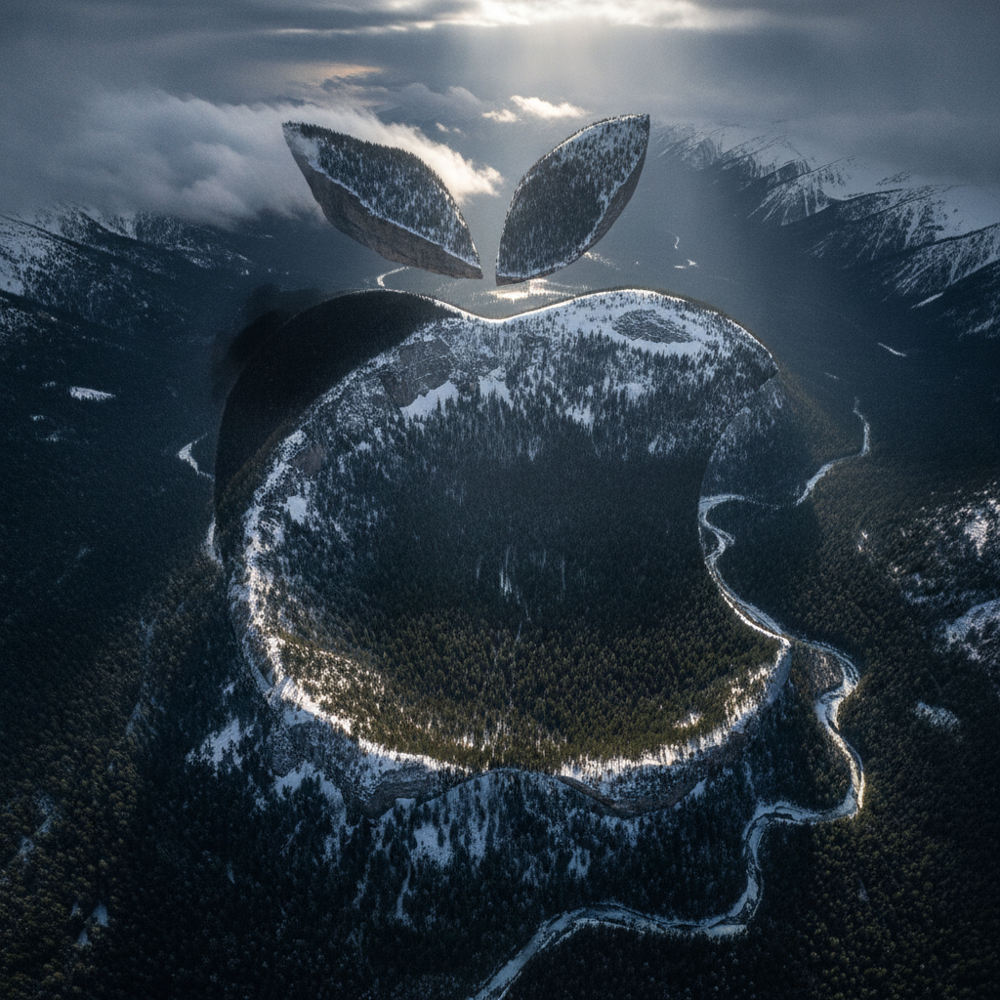

**#3 · Poster Design Prompt · <code>Vinano Image</code>**

<details>
<summary>Show prompt</summary>

```
<instruction>
 1. Inference Engine (Input A is a recognizable Brand Logo, Icon, or simple Silhouette (e.g., The Apple Logo, Nike Swoosh, Batman Symbol, A Heart).
Input B is a vast Natural Landscape (e.g., Snowy Mountains, Dense Jungle, Sand Dunes, Ocean Coastline).
Deconstruct the inputs to generate 3 Topographical Assets:
 The Negative Space (The Carving): How does the logo fit into the landscape?
 (e.g., The main body of the Apple logo is carved out of a snowy mountain peak).
 The Positive Space (The Island): Are there floating or detached elements of the logo?
 (e.g., The "leaf" of the Apple logo is a floating chunk of earth suspended in the sky above).
 The Texture (The Biome): What materials make up the shape?
 (e.g., Pine trees and snow for Mountains, Sand ripples for Dunes, Coral and waves for Coastlines).

 2. Container
Goal: "Subliminal Advertising" Landscape Photography.
 The Perspective: A wide, sweeping Aerial Drone Shot. The landscape stretches out vast and majestic, dominating the frame.
 The Atmosphere: Dramatic, moody weather. Heavy, swirling clouds, mist, or fog rolling through the valleys.

 3. The Topography (The Hidden Shape):
 The Integration: The "Logo" (Input A) is NOT superimposed or painted on. It is formed entirely by the physical geometry of the terrain.
 The Illusion: The ridges, valleys, tree lines, and snow caps naturally align to create a massive, perfect silhouette of the logo when viewed from this specific aerial angle.
 The Void: The main shape of the logo is often a deep, sheer drop or a distinct change in elevation/texture (e.g., a dark pine forest shaped like an apple cut into a white snowy mountain).
 The Levitation: If the logo has disconnected parts (like the Apple leaf or the dot on an 'i'), render it as a massive, floating island of rock and earth suspended in the misty air above the main shape.

 4. Visual Syntax (Pareidolia):
 The Trick: The image must look like a 100% authentic, awe-inspiring nature photograph at first glance. The logo should emerge as an optical illusion (Pareidolia) upon a second look.
 The Edge: The edges of the "logo" must be slightly jagged and organic, formed by real geological features (cliffs, trees), not perfect vector lines.

 5. Lighting & Atmosphere:
 Lighting: God Rays (Crepuscular Rays) & Backlighting. The sun is hidden behind the clouds or the floating landmass, blasting intense beams of light through the mist and defining the silhouette of the hidden shape.
 Contrast: High contrast between the dark valleys (forests/shadows) and the bright highlights (snow/sunlight).
 Vibe: Cinematic, majestic, and subtly surreal.

 Output: ONE image, 1:1 Aspect Ratio, National Geographic Aerial Photography, "Hidden Image" aesthetic, true-to-life photorealistic.
</instruction>

2. <system_role> you are an optical illusion artist and landscape photographer. </system_role> <illusion_topology> render a vast, true-to-life photorealistic {natural_environment}. however, the shadows, highlights, and physical layout of the landscape must form the exact facial contours and silhouette of {pop_culture_icon} when viewed from a distance. - dark zones (forming the eyes/hair/shadows): deep shadows cast by {dark_nature_elements}. - light zones (forming the skin/highlights): bright areas made of {light_nature_elements}. </illusion_topology> <visual_execution> the image must function flawlessly as two things at once: 1. up close: a beautiful, highly detailed photograph of a {natural_environment} during {weather_condition}. 2. zoomed out: a clear portrait of {pop_culture_icon}. ensure the blending is organic. do not use digital fade overlays. the rocks/trees themselves must form the face. </visual_execution>

Aim for an editorial, design-driven look with deliberate negative space.
```

</details>

---

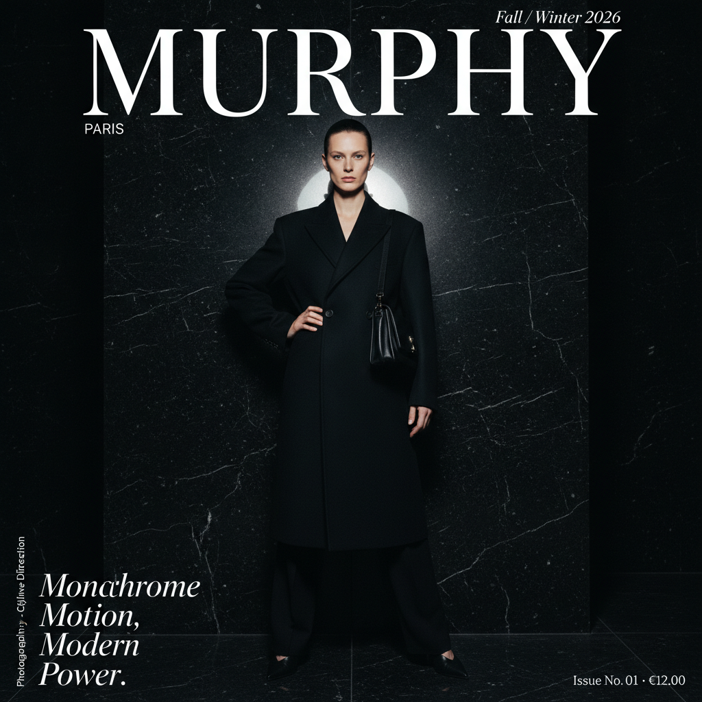

**#4 · Poster Design Prompt · <code>Vinano Image</code>**

<details>
<summary>Show prompt</summary>

```
Murphy magazine fashion editorial photograph. Androgynous model early 30s, sharp bone structure, flawless skin, hair slicked back, neutral composed expression, standing perfectly straight full body centered against a massive polished black marble architectural facade — reflective stone, towering vertical panels, subtle veining, high-gloss luxury surface. Wearing an immaculate oversized black double-breasted long coat single button fastened, black wide-leg trousers razor sharp centre crease, black leather pointed toe mule, one sculptural black leather architectural bag on left shoulder, designer Louis Vuitton. Left hand on hip, right arm hanging, chin slightly raised, looking directly into lens complete calm authority. High-gloss filmic, cinematic lighting controlled studio key light from left, cool monochrome highlights carving sharp reflections across coat and marble surface, face precisely sculpted high contrast shadow and highlight. Background: deep black marble fills entire frame zero sky visible — tonal black on black ultra luxury.

Typography overlaid exactly as Murphy magazine cover: top center — “MURPHY” in massive modern serif 90px white, letter-spaced 20px. Below masthead left — “PARIS” in 8px Josefin Sans tracked white caps. Top right — “Fall / Winter 2026” in 9px italic Cormorant Garamond white. Bottom left — editorial headline in stacked Playfair Display italic: “Monochrome” line 1, “Motion,” line 2, “Modern Power.” line 3 — 52px white, “Power.” in metallic silver. Bottom right — “Issue No. 01 · €12.00” in 8px tracked Josefin Sans white. Left edge vertical — “Photography · Styling · Creative Direction” in 7px white caps rotated 90 degrees.

Shot on Hasselblad H6D-400C, 85mm, shallow DOF, glossy marble bokeh, HDR, Murphy high-gloss fashion editorial cover, 4:5 portrait

Keep edges clean and the overall composition balanced for a polished, gallery-ready result.
```

</details>

---

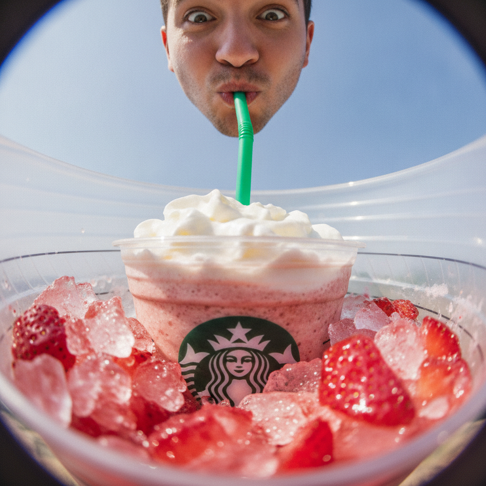

**#5 · Poster Design Prompt · <code>Vinano Image</code>**

<details>
<summary>Show prompt</summary>

```
{
 "prompt": "View from inside a Starbucks strawberry frappuccino cup looking up, fisheye lens extreme distortion, worm's eye perspective, crushed strawberry ice macro foreground glistening bokeh highlights, one single continuous green straw passing through the entire frame from top to bottom connecting lips to ice, person peering down from above through cup opening wide-eyed excited expression lips pursed on straw top, whipped cream layer, Starbucks logo visible on cup wall, clear blue sky background through opening, high saturation red strawberry vs green straw complementary colors, bright summer daylight, hyper-realistic commercial photography",
 "negative_prompt": "two straws, double straw, multiple straws, broken straw, separated straw, disconnected straw, flat lay, normal perspective, dull colors, deformed face, low saturation, ugly, extra limbs, woman, girl, female",
 "character_reference": {
 "upload": true,
 "control_weight": 0.95,
 "description": "maintain face and identity from reference image, male person, front-facing, slightly downward gaze, wide-eyed excited expression, lips pursed on straw"
 },
 "parameters": {
 "aspect_ratio": "9:16",
 "style_strength": 0.9,
 "composition_reference": "inside-cup fisheye upward shot, face centered in cup opening, single straw runs continuously from person lips down through whipped cream into crushed ice"
 }
}

Render with rich micro-detail while keeping the layout uncluttered and intentional.
```

</details>

---

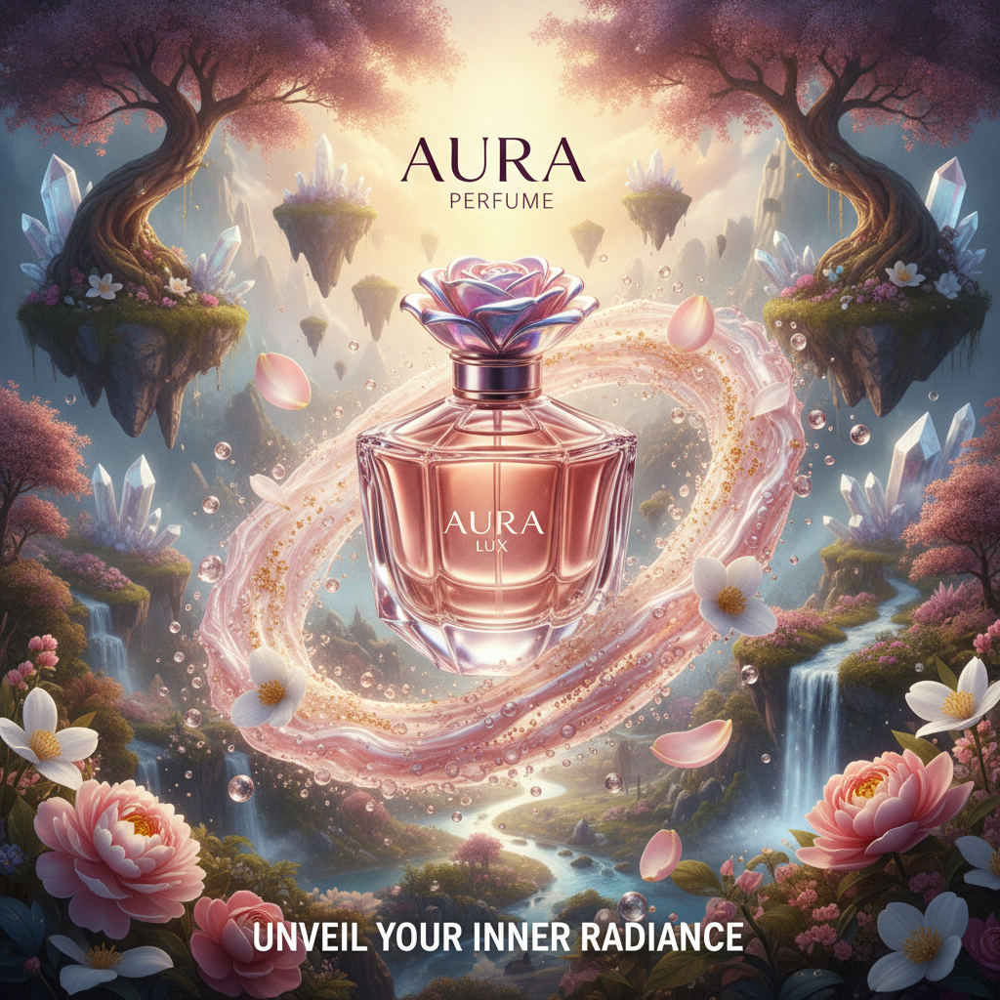

**#6 · Poster Design Prompt · <code>Vinano Image</code>**

<details>
<summary>Show prompt</summary>

```
High-end 3D advertising poster for [INSERT PRODUCT NAME]. A realistic [INSERT PRODUCT DESCRIPTION] is floating in the center of a magical fantasy landscape. The product is surrounded by a dynamic swirling vortex of [INSERT LIQUID OR ELEMENT] mixed glowing magical sparkles and floating [INSERT INGREDIENTS]. Background features surreal floating islands made of [INSERT MATERIAL] hovering over a [INSERT LANDSCAPE]. Hyper-realistic CGI render, Octane render, bright filmic, cinematic lighting, magical atmosphere. At the bottom center, bold white typography text reads "[INSERT YOUR TAGLINE HERE]". Advertising photography style, 8k resolution --ar 2:3 --v 6.0 Render with rich micro-detail while keeping the layout uncluttered and intentional.
```

</details>

---

## UI & Graphic


**#1 · UI &amp; Graphic Prompt · <code>Vinano Image</code>**

<details>
<summary>Show prompt</summary>

```
High-resolution Japanese commercial advertisement style photo, three young women posing against a clean white background bold geometric color blocks (blue, pink, yellow, green) arranged diagonally.
Top right: woman short brown hair wearing a red and black plaid shirt and black choker, winking and making an “OK” hand gesture over one eye.

Left: woman in a light blue police uniform cap, making an “OK” gesture near her eye a playful expression.

Bottom right: woman dressed as a nurse in a white outfit and cap, making a peace (V) sign a cute expression.
Bright studio lighting, soft shadows, vibrant colors, sharp focus, clean commercial composition, modern Japanese advertising aesthetic, playful and energetic mood, ultra-detailed, crisp skin tones.
No text, no logos, no typography anywhere in the image.

Render with rich micro-detail while keeping the layout uncluttered and intentional.
```

</details>

---

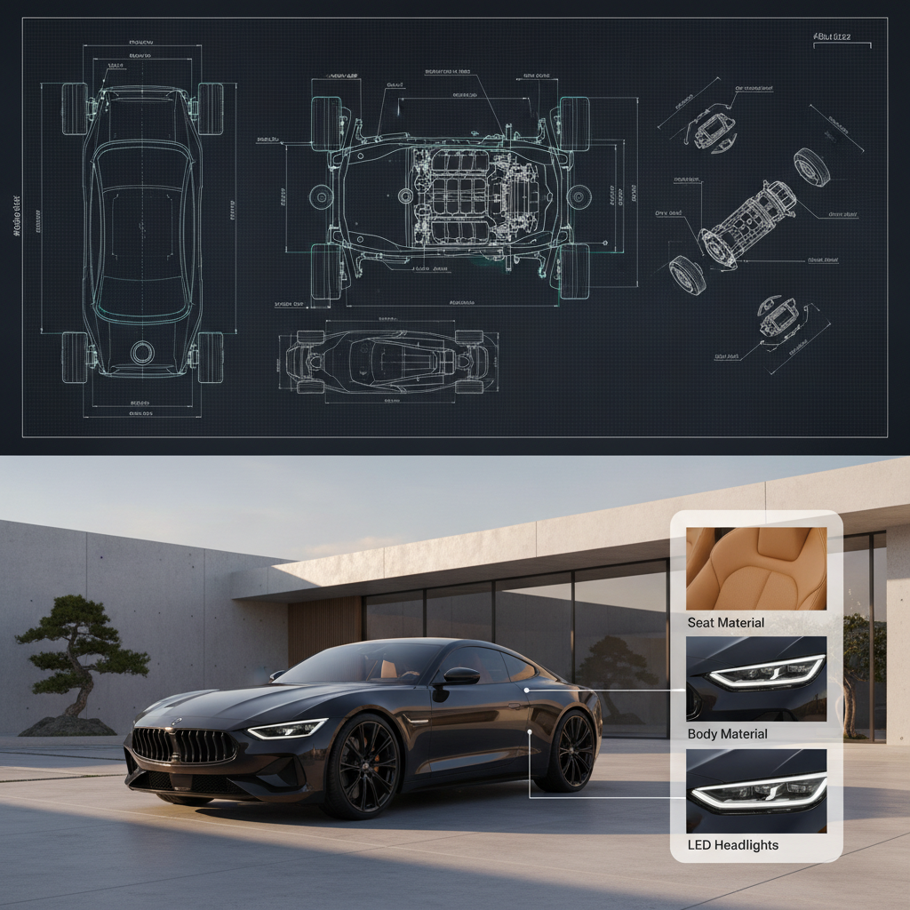

**#2 · UI &amp; Graphic Prompt · <code>Vinano Image</code>**

<details>
<summary>Show prompt</summary>

```
{
 "objective": "Create a premium split composition showing a detailed automotive blueprint (top) and a perfectly matching real-world car material breakdown (bottom), a carefully designed high-end background",
 "aspect_ratio": "3:4",
 "composition": {
 "layout": "vertical_split",
 "split_ratio": "50:50",
 "alignment": "precise, centered",
 "continuity_rule": "bottom car must EXACTLY match blueprint geometry, proportions, and design"
 },

 "top_section": {
 "type": "engineering_blueprint",
 "style": "ultra-detailed CAD drawing",
 "background": {
 "color": "#0b1d2a",
 "texture": "subtle grid lines",
 "vignette": "very slight edge darkening"
 },
 "linework": {
 "color": "white faint cyan glow",
 "thickness_variation": "technical precision",
 "sharpness": "very crisp"
 },
 "views": {
 "top_view": "dominant center",
 "side_view": "bottom left",
 "front_view": "bottom right"
 },
 "technical_elements": {
 "dimension_lines": true,
 "units": "mm",
 "arrows": "thin CAD arrows",
 "labels": ["ENGINE BLOCK",
 "PISTONS",
 "TRANSMISSION",
 "DRIVE SHAFT",
 "SUSPENSION",
 "CHASSIS",
 "WIRING LAYOUT"],
 "exploded_diagram": {
 "position": "top right",
 "components": ["engine block",
 "crankshaft",
 "pistons",
 "radiator",
 "drive shaft",
 "shock absorbers"],
 "connection_lines": "dashed white"
 }
 },
 "detail_level": "engineering-grade, extremely dense"
 },

 "bottom_section": {
 "type": "real_product + material_breakdown",
 "layout": "car_left_material_panel_right",

 "environment": {
 "type": "luxury architectural setting",
 "design_intent": "background must feel intentional, premium, and editorial — not random",

 "scene": {
 "location": "modern refined minimalist luxury house exterior",
 "architecture": ["clean concrete walls",
 "large floor-to-ceiling glass panels",
 "subtle wood accents",
 "sharp geometric lines"],
 "ground": "smooth concrete driveway slight reflection",
 "background_elements": ["minimal landscaping (bonsai-style trees or trimmed bushes)",
 "no clutter",
 "balanced negative space"]
 },

 "lighting": {
 "time": "golden hour (soft warm sunlight)",
 "direction": "side lighting to enhance car shape",
 "shadows": "soft and elongated",
 "reflections": "physically accurate on car paint"
 },

 "depth": {
 "depth_of_field": "moderate",
 "background_blur": "slight cinematic blur",
 "focus_priority": "car remains razor sharp"
 }
 },

 "car_render": {
 "style": "true-to-life photorealistic automotive photography",
 "camera": {
 "angle": "3/4 front angle",
 "height": "slightly low for hero perspective",
 "lens": "35mm",
 "framing": "car occupies left 60% of bottom section"
 },
 "constraints": ["exact match to blueprint",
 "no added design features",
 "realistic proportions only"]
 },

 "material_panel": {
 "position": "right side",
 "style": "Apple-style product breakdown",
 "background": "soft off-white panel subtle shadow separation",
 "layout": "vertical stack spacing",

 "items": [{
 "title": "Seat Material",
 "visual": "macro close-up of seat texture",
 "material": "premium leather or fabric",
 "lighting": "soft diffused",
 "annotation": "thin line pointing to interior seat"
 },
 {
 "title": "Body Material",
 "visual": "close-up of painted metal reflections",
 "material": "coated aluminum / steel",
 "annotation": "points to car exterior panel"
 },
 {
 "title": "LED Headlights",
 "visual": "detailed glowing LED headlight close-up",
 "material": "modern LED system",
 "annotation": "points to front headlight"
 }],

 "typography": {
 "font": "modern sans-serif",
 "style": "clean, minimal",
 "hierarchy": "clear titles + small labels"
 }
 }
 },

 "style": {
 "fusion": ["engineering blueprint",
 "luxury automotive ad",
 "product design presentation"],
 "quality": "ultra high-end",
 "finish": "polished, editorial-grade"
 },

 "negative_constraints": ["no mismatch between blueprint and car",
 "no messy or cluttered background",
 "no unrealistic reflections",
 "no over-saturated colors",
 "no random environments",
 "no extra parts not in blueprint"],

 "render_settings": {
 "sharpness": "high",
 "dynamic_range": "wide",
 "color_grading": "natural cinematic",
 "noise": "minimal"
 }
}

Maintain consistent colour harmony and crisp focus across the whole frame.
```

</details>

---

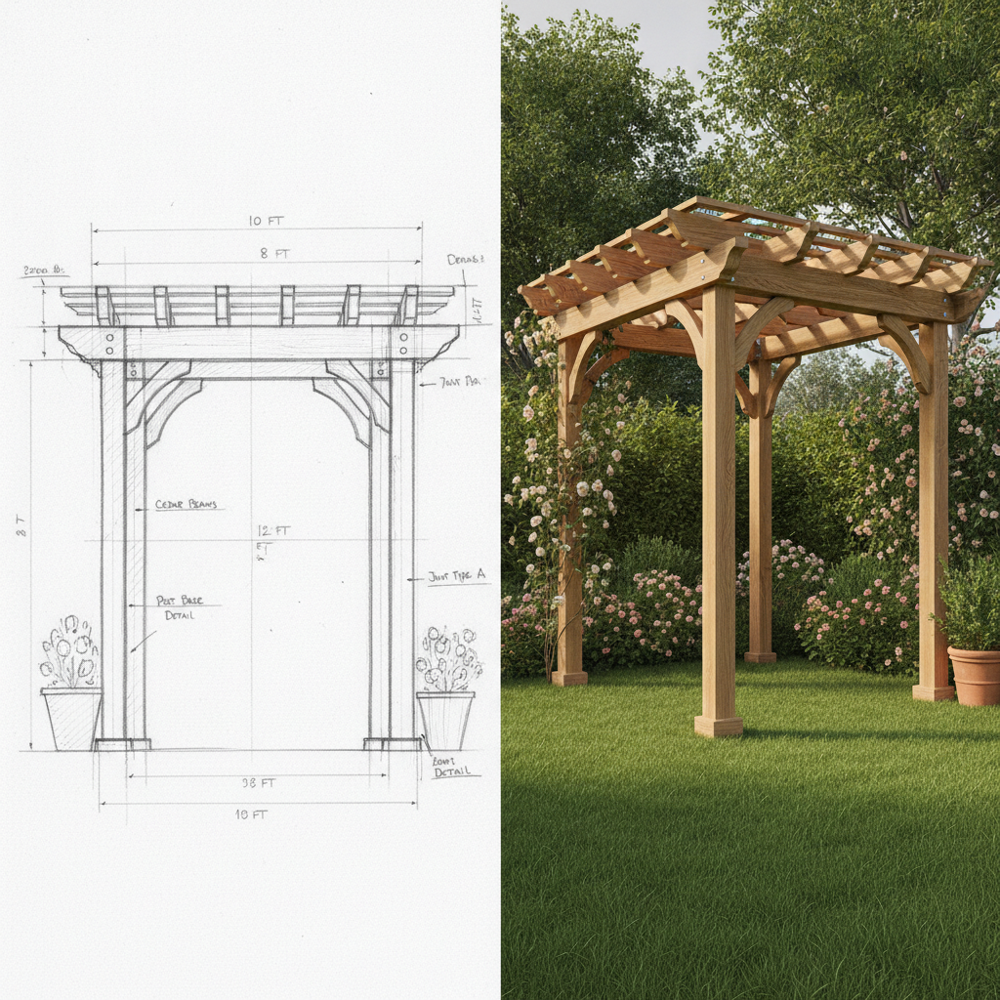

**#3 · UI &amp; Graphic Prompt · <code>Vinano Image</code>**

<details>
<summary>Show prompt</summary>

```
Pergola Blueprint Prompt: Hand-drawn architectural pencil sketch of a wooden garden pergola on white paper. Front and slight side elevation view clear proportions.

Construction lines, dimensions and handwritten notes visible. Wooden posts and cross beams precisely drafted. Professional but hand-sketched technical style. Clean white background.

Finished Pergola: Fully built wooden pergola in a real garden, matching the exact structure and proportions from the sketch. Viewed from a low front corner perspective at eye level, showing depth and the full beam structure instead of a flat elevation. Natural wood texture realistic joints and connections. Installed on grass surrounding plants. Soft daylight grounded shadows. true-to-life photorealistic architectural visualization.

Render with rich micro-detail while keeping the layout uncluttered and intentional.
```

</details>

---

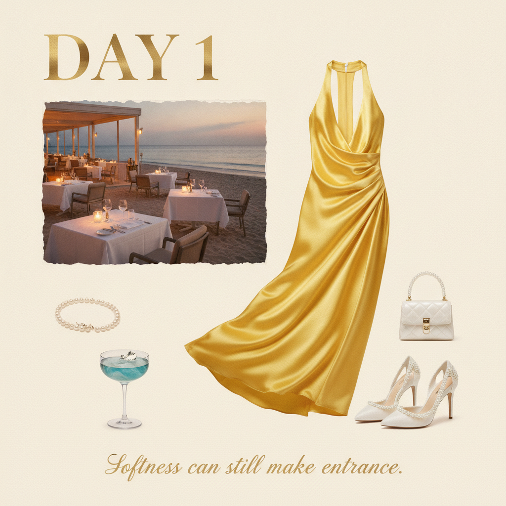

**#4 · UI &amp; Graphic Prompt · <code>Vinano Image</code>**

<details>
<summary>Show prompt</summary>

```
{
 "generation_request": {
 "meta_data": {
 "tool": "",
 "task_type": "luxury_fashion_moodboard_editorial",
 "language": "en",
 "priority": "highest",
 "version": "v2.5_DAY1_YELLOW_HALTER_SATIN_MINIMAL_ITEMS_GOLD_TEXT"
 },
 "input": {
 "mode": "image_to_image",
 "reference_image_usage": "high",
 "notes": "Use the uploaded reference only as a layout and visual styling guide. Create a clean, elegant luxury fashion moodboard the editorial feeling: soft ivory background, large refined 'DAY 1' title at the top, one pinned seaside restaurant photo, one hero yellow satin halter-neck evening dress an open back, and only a minimal number of supporting elements. Show only one pair of pearl-white heels, only one matching luxury evening bag, only one jewelry item, and only one sea-inspired martini cocktail. Do not include extra accessories, extra bags, extra shoes, or extra jewelry. The composition must feel minimal, expensive, balanced, and professionally art directed, strong hierarchy and generous negative space. The dress should be the main focal point, a sleek modern silhouette, fluid satin drape, and premium fashion-house finish. The seaside restaurant photo should show an upscale evening dinner setup directly on the sand, candlelight and romantic luxury atmosphere. The cocktail should be one elegant sea-inspired martini ocean-blue or sea-glass tones. Add one short motivational quote near the bottom in a refined handwritten or script style. All visible typography, including the 'DAY 1' title and the quote, should be rendered in elegant metallic gold tones a luxurious editorial finish."
 },
 "output_settings": {
 "aspect_ratio": "4:5",
 "orientation": "portrait",
 "resolution_target": "ultra_high_res",
 "num_images": 1,
 "render_style": "luxury_editorial_collage_realism",
 "sharpness": "ultra_crisp",
 "grain": "subtle_print_texture",
 "dynamic_range": "soft_high_end",
 "color_grade": "sunset_gold_pearl_coastal_luxury"
 },
 "layout": {
 "background": "soft warm ivory or premium matte neutral tone",
 "composition": "large DAY 1 title at the top, one pinned seaside photo, one central hero dress, one pair of shoes, one bag, one jewelry item, one cocktail, one short quote",
 "design_feel": "minimal luxury editorial board balanced spacing and no clutter"
 },
 "fashion_story": {
 "hero_dress": "yellow satin halter-neck backless evening dress, sleek modern silhouette, elegant drape, luxurious reflections",
 "shoes": "one pair of pearl-white heels delicate pearl-thread detailing",
 "bag": "one small luxury evening bag in pearl white, ivory, champagne, or soft gold tone",
 "jewelry": "one elegant pearl bracelet or one refined pearl jewelry piece only"
 },
 "lifestyle_element": {
 "date_setting": "luxury beachside evening restaurant directly on the sand, candlelight, elegant table setting, romantic atmosphere",
 "cocktail": "one sea-inspired martini ocean-toned blue-green color and premium garnish"
 },
 "text_element": {
 "title": "DAY 1",
 "title_style": "large elegant editorial serif in metallic gold",
 "quote_examples": ["Softness can still make an entrance.",
 "Choose the night that feels like you.",
 "Elegance is how you arrive."],
 "quote_style": "one short refined handwritten or script quote in metallic gold",
 "instruction": "use only one short quote"
 },
 "must_have": ["reference-inspired clean luxury layout",
 "large DAY 1 title in gold",
 "yellow satin halter-neck backless dress",
 "one pair of pearl-white heels",
 "one matching luxury bag",
 "one jewelry item only",
 "one sea-inspired martini",
 "one seaside dinner photo",
 "one short motivational quote in gold",
 "minimal elegant composition"],
 "negative_prompt": ["extra bag",
 "extra shoes",
 "extra jewelry",
 "extra accessories",
 "too many objects",
 "messy collage",
 "cheap styling",
 "too much text",
 "wrong dress color",
 "flat uninspired layout",
 "cartoon",
 "low detail",
 "logo",
 "watermark"]
 }
}
Prompt(right):
{
 "generation_request": {
 "meta_data": {
 "tool": "",
 "task_type": "reference_locked_fashion_editorial_scene",
 "language": "en",
 "priority": "highest",
 "version": "v1.1_REFERENCE_WOMAN_IN_DAY1_LOOK_MORE_NATURAL"
 },
 "references": {
 "reference_image_style": {
 "source": "UPLOAD_MOODBOARD_IMAGE",
 "purpose": "OUTFIT_ACCESSORIES_STYLING_SCENE_GUIDE",
 "strict_lock": false,
 "preserve_palette": true,
 "preserve_vibe": true,
 "preserve_outfit_details": true,
 "preserve_accessories": true,
 "preserve_scene_direction": true,
 "affect_face": false
 },
 "reference_image_face": {
 "source": "UPLOAD_WOMAN_REFERENCE_IMAGE",
 "purpose": "FACE_IDENTITY_LOCK",
 "strict_lock": true,
 "face_similarity_priority": "MAX",
 "identity_lock_strength": 0.97,
 "no_identity_blending": true,
 "no_age_shift": true,
 "preserve_skin_texture": true
 }
 },
 "input": {
 "mode": "image_to_image",
 "notes": "Use the uploaded woman reference as the identity base. Dress her in a look closely matching the moodboard: yellow satin halter-neck backless evening dress, pearl-white heels, matching luxury evening bag, and minimal pearl jewelry. Do not make the woman look overly perfect, mannequin-like, or artificial. She must feel like a real elegant woman photographed during a luxury seaside dinner, not a fashion doll. Keep natural skin texture, subtle facial asymmetry, believable posture, relaxed shoulders, real body weight, and candid human presence. Show her seated at a luxury beachside restaurant directly on the sand during evening golden hour into night, naturally holding or reaching for a sea-inspired martini cocktail. The dress, shoes, bag, and jewelry should remain clearly visible and strongly matched to the moodboard, but the overall image should feel lived-in, cinematic, and natural rather than overly staged."
 },
 "output_settings": {
 "aspect_ratio": "4:5",
 "orientation": "portrait",
 "resolution_target": "ultra_high_res",
 "num_images": 1,
 "render_style": "natural_luxury_realism",
 "sharpness": "clean_natural",
 "grain": "subtle_film",
 "dynamic_range": "soft_high_end",
 "color_grade": "sunset_gold_pearl_coastal_natural"
 },
 "scene": {
 "environment": "luxury beachside restaurant directly on the sand at evening golden hour fading into night",
 "details": "candlelit table, elegant place setting, warm ambient lights, sea view, refined romantic atmosphere",
 "pose": "woman seated naturally, slightly turned, relaxed and elegant, interacting casually the cocktail, not stiff, not overly posed",
 "mood": "romantic, upscale, warm, feminine, cinematic, believable"
 },
 "subject": {
 "identity": "uploaded woman reference strong but natural resemblance",
 "outfit": "yellow satin halter-neck backless evening dress closely matching the moodboard",
 "shoes": "pearl-white heels clearly visible",
 "bag": "matching evening bag clearly visible",
 "jewelry": "minimal pearl jewelry",
 "beauty": "natural luxury beauty, realistic skin texture, soft evening glam, human and believable"
 },
 "camera": {
 "framing": "three-quarter seated fashion portrait wide enough to show shoes, bag, and dress shape",
 "angle": "natural editorial angle, slightly observational rather than overly staged",
 "focus": "sharp on face, dress texture, shoes, bag, cocktail, and table details",
 "depth_of_field": "soft cinematic background separation"
 },
 "lighting": {
 "type": "natural luxury evening lighting",
 "quality": "warm sunset and candlelit ambience soft fill, realistic facial shadows, elegant satin highlights, no overexposure",
 "skin_rendering": "realistic skin texture, no plastic effect, no beauty filter look"
 },
 "must_have": ["realistic human presence",
 "natural face",
 "no mannequin look",
 "strong resemblance to uploaded woman",
 "yellow satin halter dress",
 "visible pearl-white heels",
 "visible matching bag",
 "minimal pearl jewelry",
 "luxury seaside date setting",
 "sea-inspired martini",
 "photoreal quality"],
 "negative_prompt": ["mannequin look",
 "fashion doll look",
 "plastic skin",
 "over-smoothed face",
 "beauty filter",
 "stiff pose",
 "unnatural symmetry",
 "different outfit",
 "different shoes",
 "different bag",
 "identity mismatch",
 "blurry face",
 "bad anatomy",
 "extra fingers",
 "deformed hands",
 "cartoon",
 "logo",
 "watermark",
 "text"]
 }
}

Maintain consistent colour harmony and crisp focus across the whole frame.
```

</details>

---

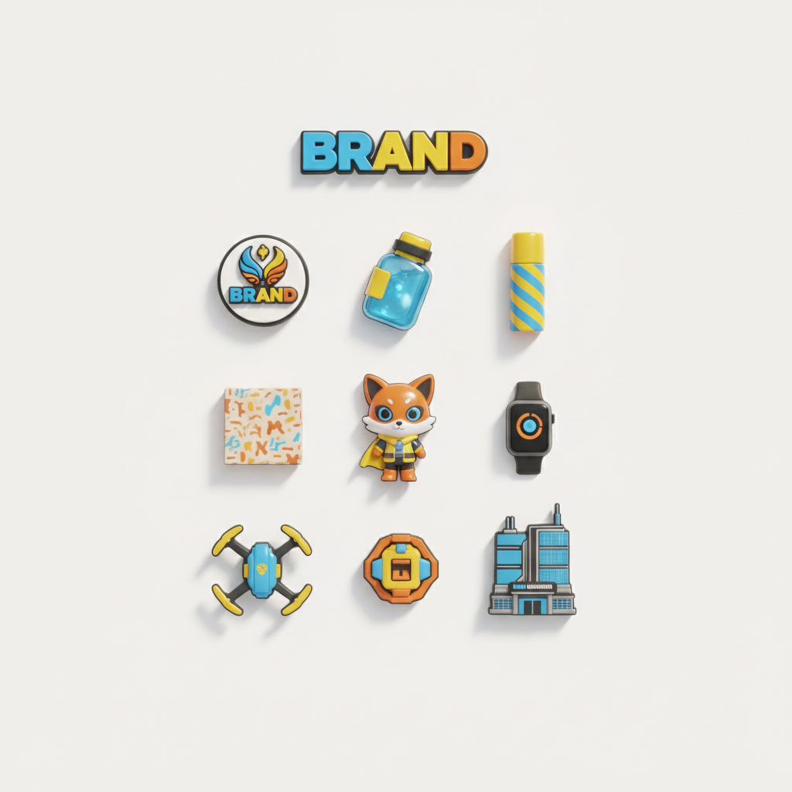

**#5 · UI &amp; Graphic Prompt · <code>Vinano Image</code>**

<details>
<summary>Show prompt</summary>

```
A flat-lay collection of exactly 9 hyper-realistic 3D resin fridge magnets arranged on a bright pure white surface in a clean 3x3 grid, themed around [BRAND]. At the very top center, a wide rectangular text magnet spells "BRAND" in bold 3D block letters in the brand's signature colors. Below it, 9 magnets in a clean 3x3 grid: the official logo badge, the most iconic hero product, a secondary iconic product, a third iconic product or packaging, a brand mascot or character chibi, a fifth iconic item, a sixth iconic item, a seventh iconic item, and the brand's storefront or headquarters building facade. Each magnet is small, neatly spaced generous white space between them, slightly raised a soft drop shadow beneath. Bright white background, warm studio lighting from above, true-to-life photorealistic product render, top-down flat-lay angle, 4:5 aspect ratio Aim for an editorial, design-driven look with deliberate negative space.
```

</details>

---

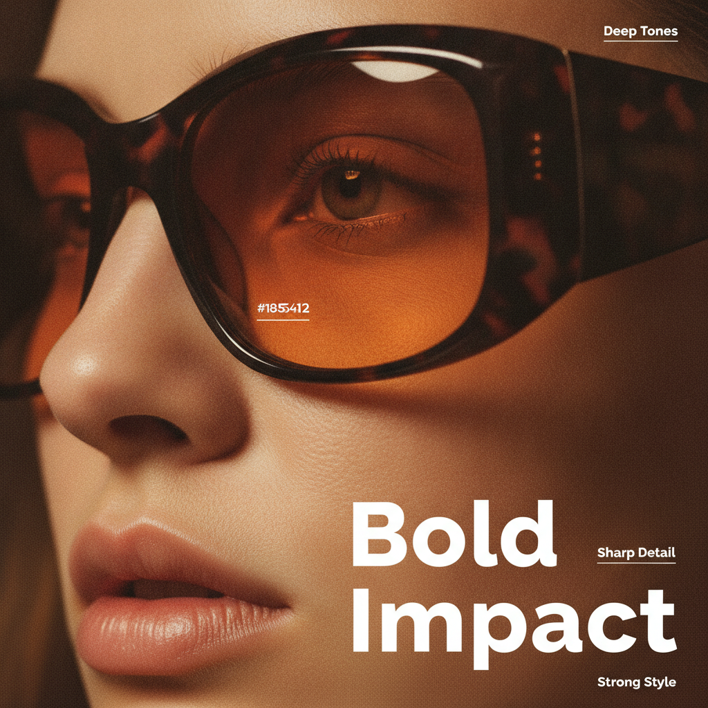

**#6 · UI &amp; Graphic Prompt · <code>Vinano Image</code>**

<details>
<summary>Show prompt</summary>

```
An extreme close-up, high-fashion editorial portrait focusing on the right side of a person's face. The composition is a tight crop showing the bridge of the nose, a portion of the lips, and a single eye peering through sunglasses. The shot is characterized by a heavy, cinematic film grain and a warm, sophisticated studio atmosphere.
Eyewear: Large-frame, wrap-around sunglasses made of high-gloss dark tortoiseshell acetate (mottled black and deep mahogany). The lenses are a vibrant, translucent amber-orange, allowing the eye and eyelashes behind the lens to remain visible but color-tinted.
Person: A person smooth skin showing natural texture and fine pores. The lighting is soft-side lighting from the right, creating a gentle shadow on the left side of the nose and a subtle highlight on the cheekbone and lower lip.
Typography: Bold, white, geometric sans-serif text reading "Bold Impact" is overlaid on the lower-right cheek. Three smaller, delicate labels are scattered: "Deep Tones" (top right), "Sharp Detail" (on the left lens), and "Strong Style" (bottom right).
Color Palette: A rich mix of skin tones (#E8A88A), burnt orange (#B8541C), and deep espresso (#1A0D0B), contrasted crisp white text (#FFFFFF).
Lighting: Warm studio lighting a soft-focus depth of field. The background consists of out-of-focus hair and skin, keeping all attention on the eye and the texture of the acetate frames.
Atmosphere: Premium, editorial fashion magazine aesthetic; high-contrast but soft transitions.

Emphasise material texture and natural light so the final frame feels tactile and premium.
```

</details>

---

## License

Prompts and metadata are released under [CC BY 4.0](LICENSE). Images are generated with [vinano.ai](https://vinano.ai).
