# Food & Drink — full gallery

[← Back to README](../README.md) · [`prompts.json`](../prompts/prompts.json) · **190** prompts · page 2 / 2

[← Prev](./food-drink.md) — [1](./food-drink.md) · **2**

---

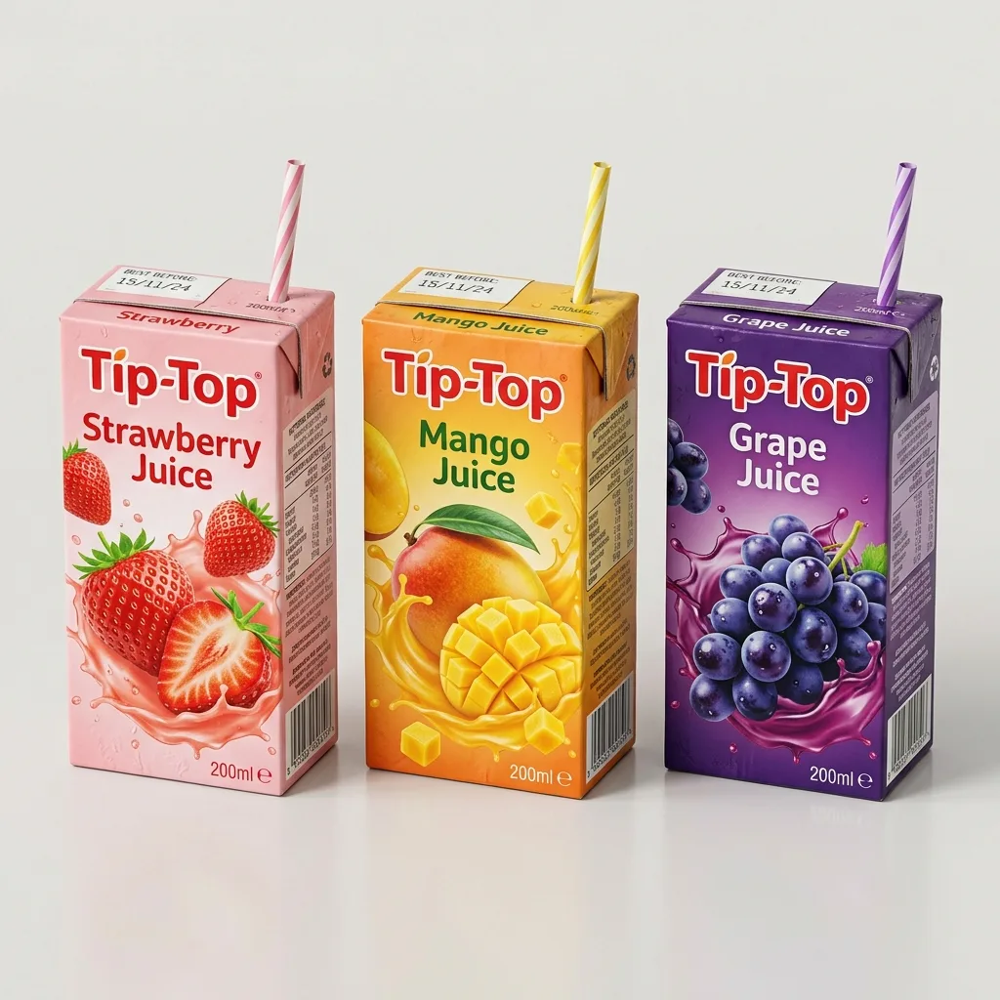

**#101 · Food &amp; Drink Prompt · <code>Vinano Image v2</code>**

<details>
<summary>Show prompt</summary>

```
{
 "juice_boxes": [{
 "id": 1,
 "product": {
 "brand": "Tip-Top",
 "flavor": "Strawberry",
 "image": {
 "description": "strawberry juice ripe strawberries",
 "background": {
 "color": "fresh pastel pink",
 "elements": ["strawberry halves",
 "juice splashes",
 "dynamic swirling around the pack"]
 }
 }
 },
 "design": {
 "style": {
 "detail": "premium-quality detail",
 "texture": "commercial-grade photorealism"
 },
 "aspect_ratio": "2:3"
 }
 },
 {
 "id": 2,
 "product": {
 "brand": "Tip-Top",
 "flavor": "Mango",
 "image": {
 "description": "mango juice ripe golden mangoes",
 "background": {
 "color": "tropical orange-yellow gradient",
 "elements": ["mango cubes",
 "swirling juice streams",
 "energetic and appetizing scene"]
 }
 }
 },
 "design": {
 "style": {
 "texture": "ultra-realistic packaging material texture"
 },
 "aspect_ratio": "2:3"
 }
 },
 {
 "id": 3,
 "product": {
 "brand": "Tip-Top",
 "flavor": "Grape",
 "image": {
 "description": "grape juice purple grapes",
 "background": {
 "color": "deep purple gradient",
 "elements": ["grape bunches",
 "glossy juice splashes",
 "surrounding the carton"]
 }
 }
 },
 "design": {
 "style": {
 "tone": "elegant",
 "mood": "lively commercial promotion style"
 },
 "aspect_ratio": "2:3"
 }
 }]
}

Render with rich micro-detail while keeping the layout uncluttered and intentional.
```

</details>

---

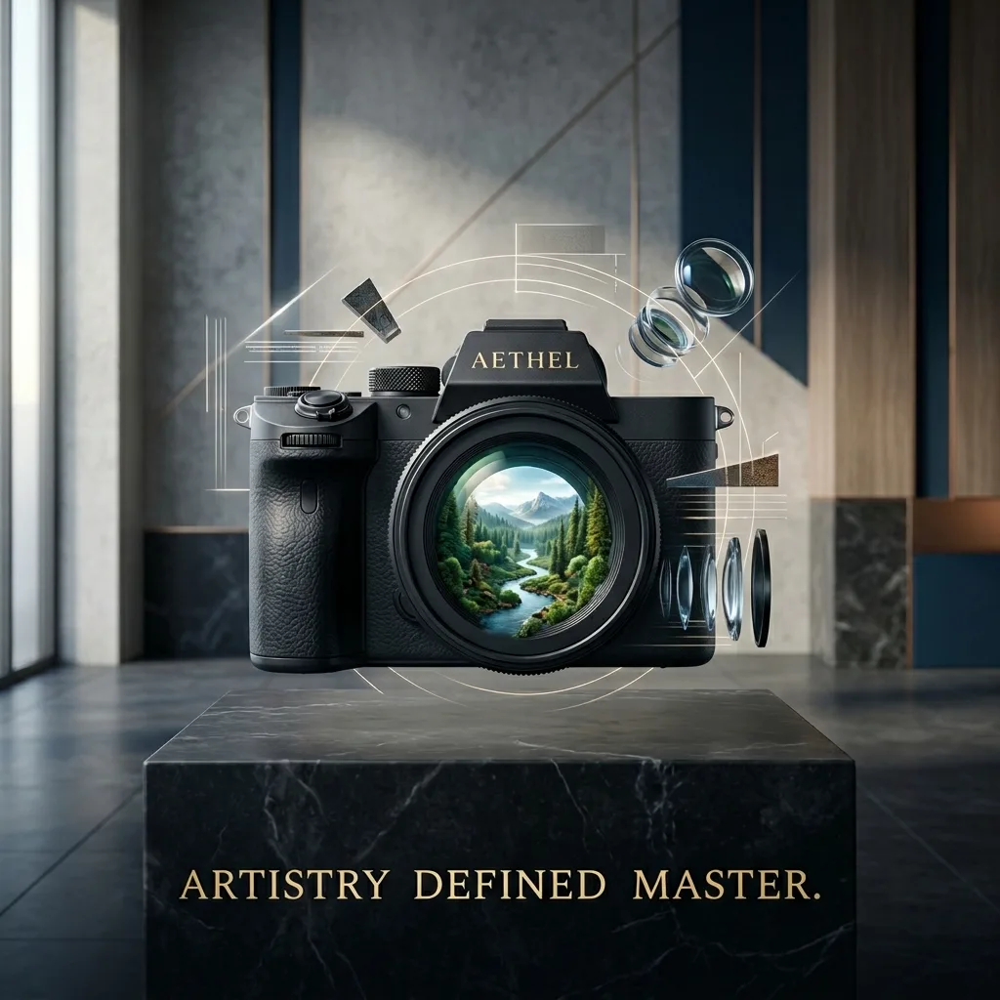

**#102 · Food &amp; Drink Prompt · <code>Vinano Image Pro</code>**

<details>
<summary>Show prompt</summary>

```
Create a realistic yet surreal creative advertisement for [PRODUCT NAME] in the [PRODUCT CATEGORY] space. The product must be the hero, centered in the frame, and visually “formed” in a smart way that automatically reflects the brand’s spirit and identity.

Use a clean, cohesive background that matches the brand’s color palette, soft filmic, cinematic lighting, ultra-realistic premium materials, precise shadows, and a high-end editorial composition.

Add one innovative surreal touch directly tied to the product’s nature—creative but not exaggerated.

Integrate the real official product logo elegantly and seamlessly within the composition, and generate a short, powerful 3-word English slogan automatically that fits the product type and brand tone.

Ultra-premium quality, perfectly balanced framing, strong realism, luxury style—no extra text beyond the logo and the 3-word English slogan.

Maintain consistent colour harmony and crisp focus across the whole frame.
```

</details>

---

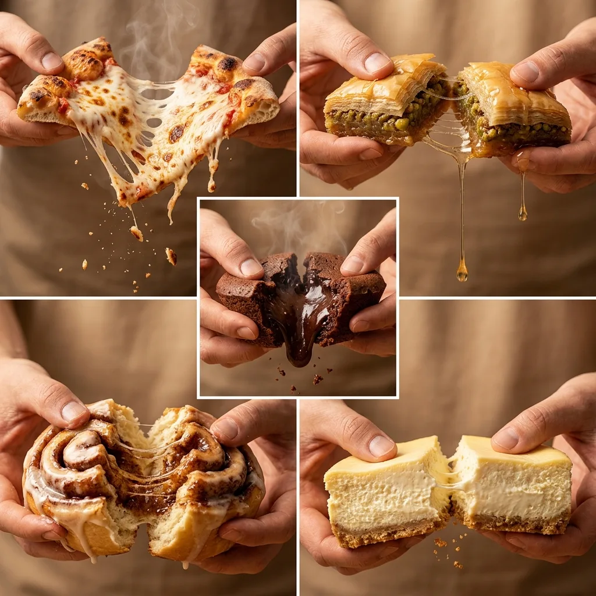

**#103 · Food &amp; Drink Prompt · <code>Vinano Image v2</code>**

<details>
<summary>Show prompt</summary>

```
{
 "aspect_ratio": "3:4",
 "render_mode": "raw",
 "series": [{
 "index": "1/5",
 "prompt": "two hands pulling apart a hot freshly baked pizza slice, long elastic mozzarella cheese stretch between the slice and the pie, blistered crust edges, steam rising, crumbs falling mid-air, warm cinematic light, ultra high-detail food action photography",
 "category": "cheese pull",
 "lighting": "warm cinematic oven light",
 "detail_level": "ultra-detailed"
 },
 {
 "index": "2/5",
 "prompt": "two hands pulling apart a syrup-soaked baklava piece, thin crispy phyllo layers cracking, rich pistachio filling visible, thick honey syrup stretching and dripping mid-air, golden warm light, cinematic dessert action photography",
 "category": "syrup & crunch",
 "lighting": "golden warm light",
 "detail_level": "ultra-detailed"
 },
 {
 "index": "3/5",
 "prompt": "two hands breaking a molten chocolate lava cake in half, glossy dark chocolate flowing out from the center, steam rising gently, crumbs suspended mid-air, soft warm spotlight, cinematic dessert action photography",
 "category": "molten chocolate",
 "lighting": "soft warm spotlight",
 "detail_level": "ultra-detailed"
 },
 {
 "index": "4/5",
 "prompt": "two hands tearing a glazed cinnamon roll apart, sticky cinnamon sugar filling stretching in glossy strands, icing dripping slowly, fluffy dough texture visible, cozy warm bakery light, high-detail cinematic food photography",
 "category": "sticky pull",
 "lighting": "warm bakery light",
 "detail_level": "ultra-detailed"
 },
 {
 "index": "5/5",
 "prompt": "two hands splitting a classic New York-style cheesecake slice, ultra-creamy interior slowly separating, crumbly biscuit base breaking apart, subtle cream stretch, soft studio warm light, cinematic high-detail dessert photography",
 "category": "creamy separation",
 "lighting": "soft warm studio light",
 "detail_level": "ultra-detailed"
 }]
}

Maintain consistent colour harmony and crisp focus across the whole frame.
```

</details>

---

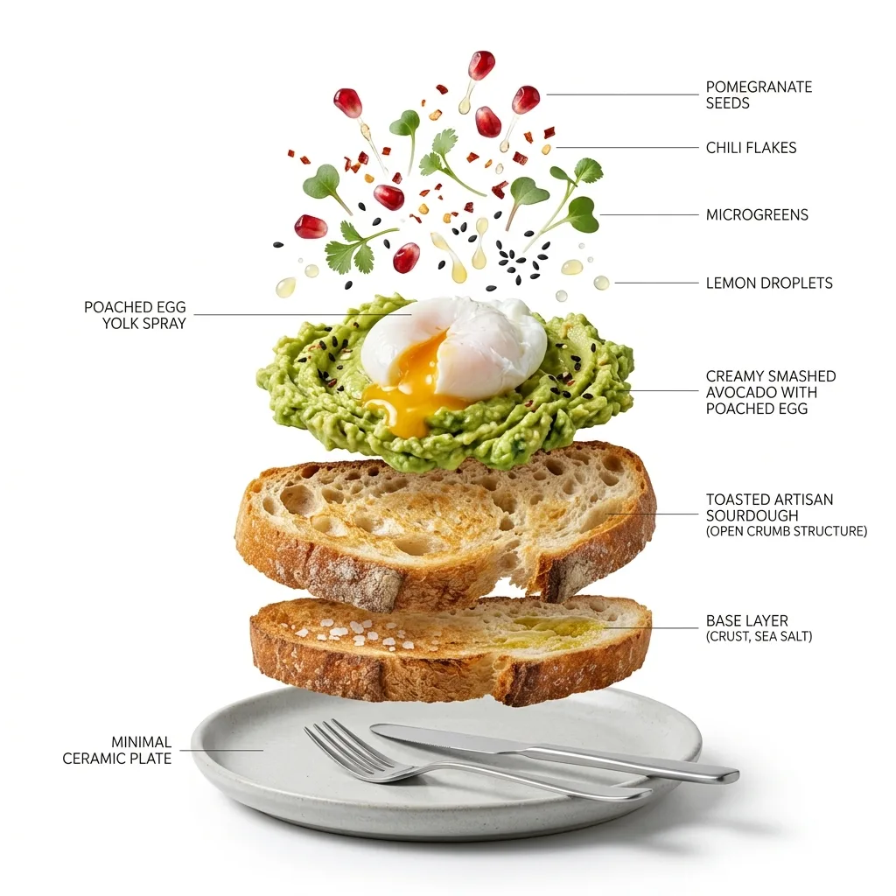

**#104 · Food &amp; Drink Prompt · <code>Vinano Image Pro</code>**

<details>
<summary>Show prompt</summary>

```
Create a hyper-realistic exploded vertical infographic composition of [FOOD].
At the top, characteristic particles, droplets, or garnishes associated the food, frozen mid-air.
Below it, the primary surface or topping layer rich texture and realistic material detail.
Underneath, the core ingredient layer showing structure, depth, and natural variation.
Below that, the supporting base or interior layer, slightly separated to reveal construction.
At the bottom, a minimal plate, bowl, cup, or base appropriate to the food’s presentation.
Pure white background, soft studio lighting, subtle shadows beneath each floating element, ultra-sharp focus, DSLR macro photography, clean infographic text labels thin pointer lines, premium editorial food photography aesthetic, 8K quality.

Aim for an editorial, design-driven look with deliberate negative space.
```

</details>

---

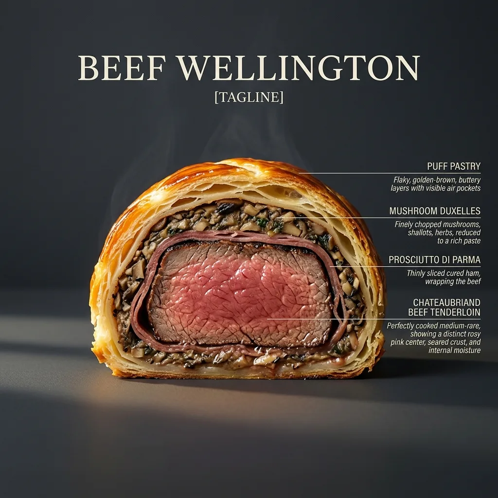

**#105 · Food &amp; Drink Prompt · <code>Vinano Image Pro</code>**

<details>
<summary>Show prompt</summary>

```
Perfect cinematic cross-section cut through [DISH], sliced cleanly down the center revealing every internal layer in full detail. The cut face is facing the camera straight-on, like a geological diagram of flavor. Each visible layer is labeled a thin horizontal line extending to the right — uppercase sans-serif "[INGREDIENT NAME]" italic descriptor below. Background: flat matte [COLOR]. Lighting: dramatic side light from left casting long shadows, single warm spotlight on the cut face. Every texture hyperreal — visible moisture, air pockets, char, glaze, and steam. Mood: architectural food photography meets scientific illustration. Dish name "[DISH NAME]" in large elegant type at top. Subtitle: "[TAGLINE]". 4K, tack sharp, Style ref: Wes Anderson symmetry meets Michelin-star kitchen. Preserve realistic proportions and depth for a confident, professional finish.
```

</details>

---

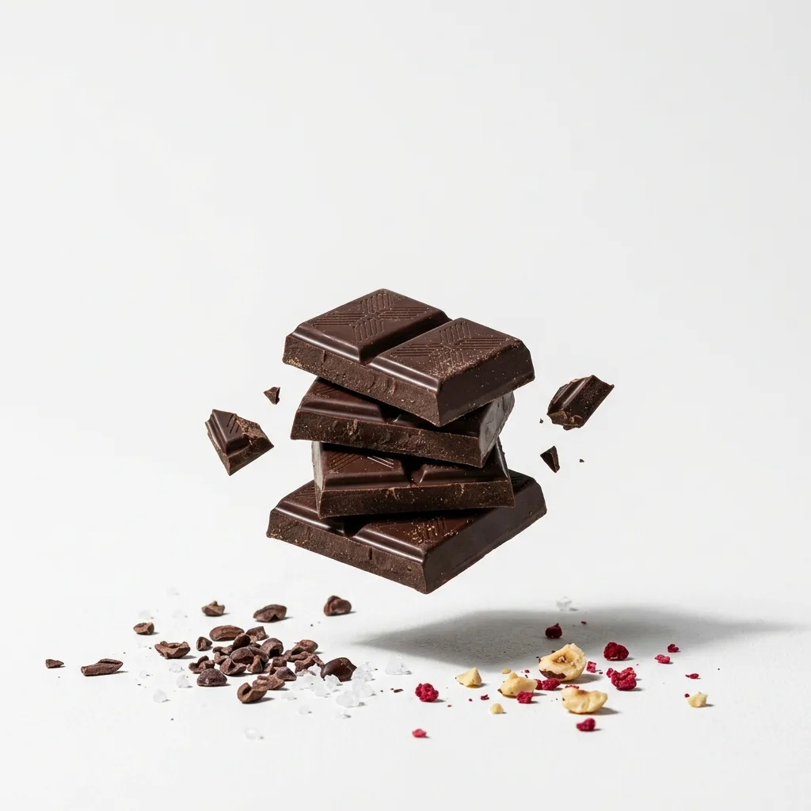

**#106 · Food &amp; Drink Prompt · <code>Vinano Image v2</code>**

<details>
<summary>Show prompt</summary>

```
[subject], premium food advertising, white seamless background, high key studio lighting, floating stacked composition, levitating pieces, [ingredient_bits] scattered, clean minimal layout, crisp soft shadow on surface, ultra realistic, macro product photography, 100mm lens look, f/8 sharp focus, subtle texture detail, editorial commercial, 8k Aim for an editorial, design-driven look with deliberate negative space.
```

</details>

---

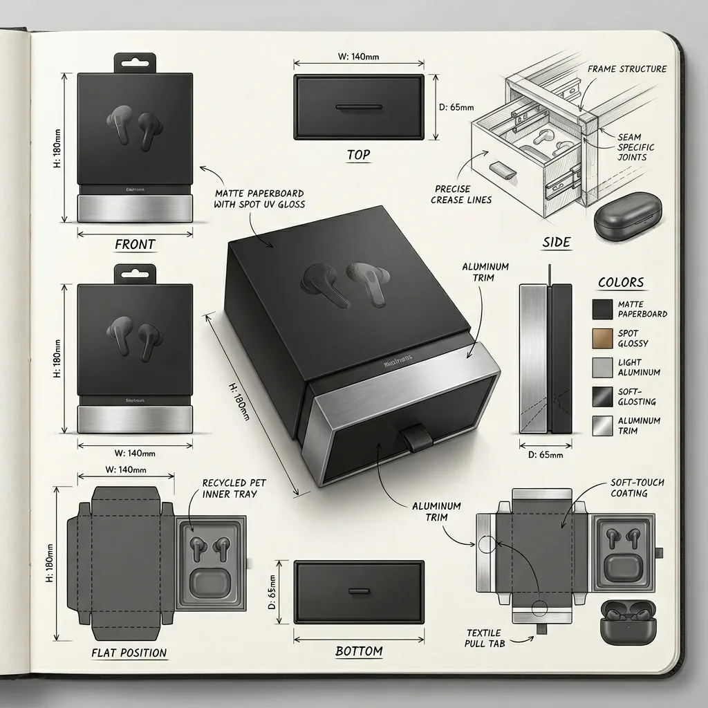

**#107 · Food &amp; Drink Prompt · <code>Vinano Image v2</code>**

<details>
<summary>Show prompt</summary>

```
the attached image, create an illustration sheet of professional industrial design packaging for the package (PACKAGE TYPE). A centered heroic 3D rendering realistic materials, soft studio lighting and commercial quality finishes. Surrounded by technical views: front, side, top, bottom, oblique perspective and flat position. Include sketches of the frame structure, crease lines, seam details, and size arrows in millimeters. Show materials and finishes (matte, glossy print, plastic, paper, glass, etc.) in handwritten annotations. Add color swatches, realistic product illustrations, and subtle shadows. Clean sketchbook background, realistic rendering + pencil sketch style, modern design design, ultra-detailed, portfolio ready. Emphasise material texture and natural light so the final frame feels tactile and premium.
```

</details>

---

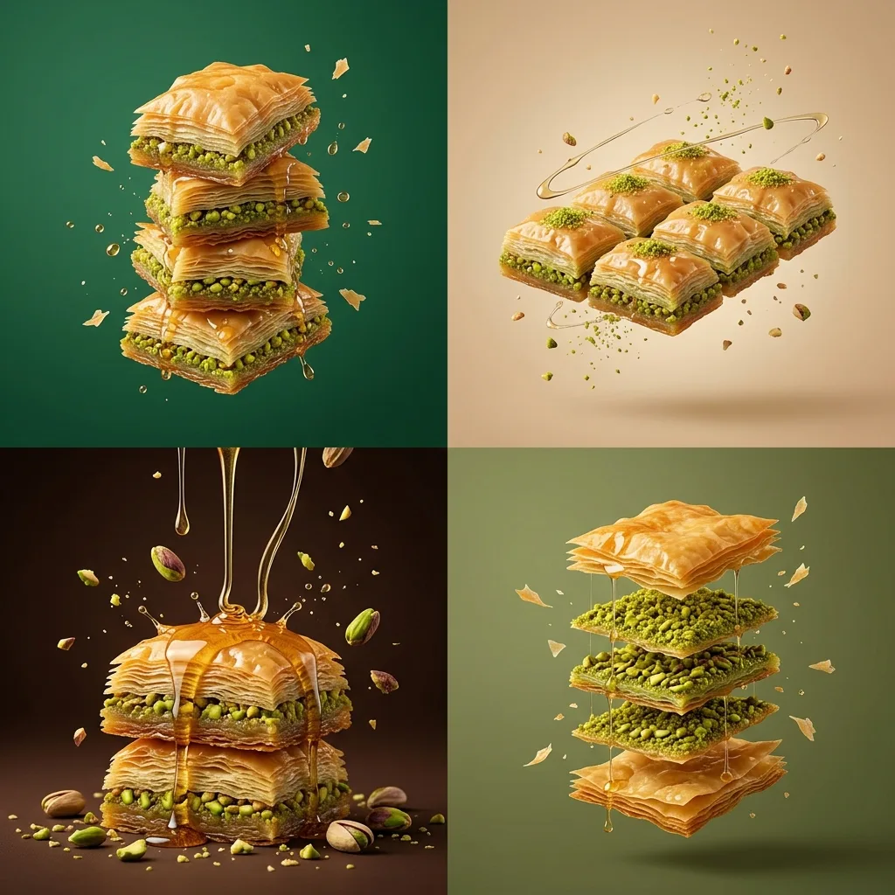

**#108 · Food &amp; Drink Prompt · <code>Vinano Image v2</code>**

<details>
<summary>Show prompt</summary>

```
{
 "resolution": "8K UHD",
 "aspect_ratio": "3:4",
 "image_style": "hyper-realistic commercial dessert photography",
 "global_settings": {
 "quality": "Ultra-high detail, razor-sharp focus, luxury dessert clarity",
 "lighting": "Controlled studio lighting emphasizing texture, layers, and syrup highlights",
 "motion": "Frozen mid-air elements subtle gravity realism",
 "background_style": "Solid or smooth gradient background, color varies per module",
 "camera": "High-speed photography look, shallow to medium depth of field",
 "post_processing": "Rich contrast, warm tones, natural shine, no artificial glow"
 },
 "modules": { "module_1_classic_baklava_stack_explosion": {
 "scene_description": "A dramatic stack of classic pistachio baklava flying syrup droplets",
 "baklava": {
 "type": "Traditional pistachio baklava",
 "layers": "Ultra-thin phyllo layers clearly visible",
 "cut": "Diamond-shaped pieces",
 "position": "Stacked and floating mid-air"
 },
 "details": {
 "nuts": "Finely ground bright green pistachios between layers",
 "syrup": "Golden sugar syrup glistening on edges"
 },
 "motion_effects": {
 "syrup": "Small syrup droplets splashing outward",
 "crumbs": "Tiny phyllo flakes suspended in air"
 },
 "background": {
 "color": "Deep emerald green",
 "texture": "Smooth, seamless"
 }
 }, "module_2_minimal_baklava_plate_floating": {
 "scene_description": "refined minimalist premium baklava presentation controlled floating crumbs",
 "baklava": {
 "type": "Single-layer pistachio baklava pieces",
 "arrangement": "Neatly aligned rectangular cuts",
 "surface": "Glossy light syrup sheen"
 },
 "accent_elements": {
 "nuts": "Crushed pistachio dust lightly floating",
 "syrup": "Thin syrup drizzle frozen mid-air"
 },
 "motion_effects": {
 "particles": "Subtle floating crumbs and nut dust"
 },
 "background": {
 "color": "Warm beige",
 "gradient": "Very soft tonal gradient"
 }
 }, "module_3_baklava_syrup_pour_drama": {
 "scene_description": "Cinematic syrup pour over baklava stack",
 "baklava": {
 "type": "Thick stacked baklava slices",
 "texture": "Highly detailed crispy layers"
 },
 "additional_elements": {
 "syrup": {
 "state": "Thick golden syrup pouring from above",
 "motion": "Frozen in elegant flowing strands"
 },
 "nuts": ["Whole pistachio kernels",
 "Crushed pistachio fragments"]
 },
 "motion_effects": {
 "splashes": "Micro syrup splashes on impact points",
 "particles": "Floating nut fragments"
 },
 "background": {
 "color": "Dark chocolate brown",
 "tone": "High contrast, luxury feel"
 }
 }, "module_4_modern_baklava_floating_composition": {
 "scene_description": "Modern deconstructed baklava composition in mid-air",
 "elements": {
 "phyllo": "Crispy golden phyllo sheets floating separately",
 "nuts": "Pistachio layers suspended between sheets",
 "syrup": "Glossy syrup threads connecting elements"
 },
 "motion_effects": {
 "flakes": "Ultra-fine pastry flakes suspended",
 "drops": "Minimal syrup droplets"
 },
 "background": {
 "color": "Muted olive green",
 "texture": "Smooth, seamless"
 }
 }
 },
 "negative_prompt": ["text",
 "logos",
 "branding",
 "hands",
 "people",
 "utensils",
 "plates",
 "tables",
 "cartoon style",
 "excessive syrup pooling",
 "burnt pastry",
 "overexposure",
 "artificial glow",
 "low detail textures"]
}

Render with rich micro-detail while keeping the layout uncluttered and intentional.
```

</details>

---

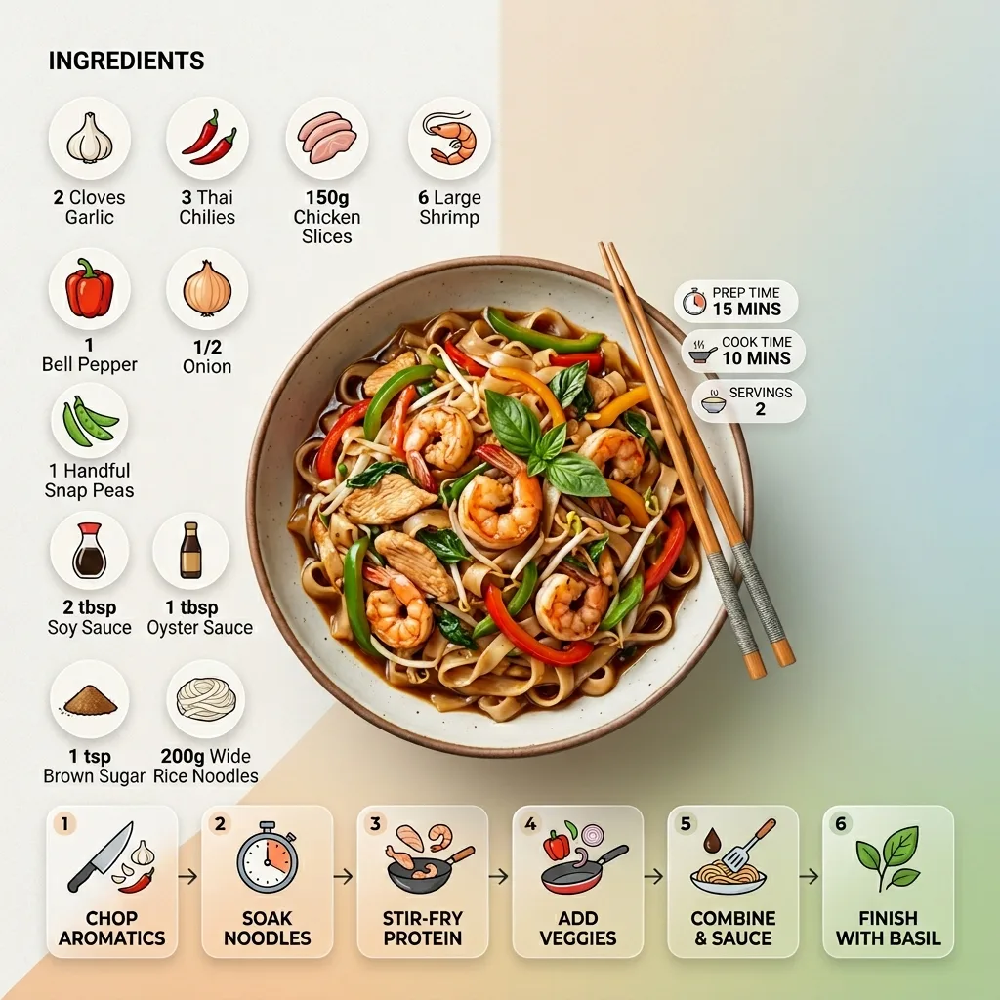

**#109 · Food &amp; Drink Prompt · <code>Vinano Image Pro</code>**

<details>
<summary>Show prompt</summary>

```
Ultra-clean modern recipe infographic. Showcase Noodles in a visually appealing finished form—sliced, plated, or portioned—floating slightly in perspective or angled view. Arrange ingredients, steps, and tips around the dish in a dynamic editorial layout, not restricted to top-down. Ingredients Section: Include icons or mini illustrations for each ingredient quantities. Arrange them in clusters, lists, or circular flows connected visually to the dish. Steps Section: Show preparation steps numbered panels, arrows, or lines, forming a logical flow around the main dish. Include small cooking icons (knife, pan, oven, timer) where helpful. Additional Info (optional): Total calories, prep/cook time, servings, spice level—displayed as clean bubbles or badges near the dish. Visual Style: Editorial infographic meets lifestyle food photography. Vibrant, natural food colors, subtle drop shadows, clean vector icons, modern typography, soft gradients or glassmorphism for step panels. Accent colors can highlight key info (calories, prep time). Composition Guidelines: Finished meal as hero visual (perspective or angled) Ingredients and steps flow dynamically around the dish Clear visual hierarchy: dish > steps > ingredients > optional stats Enough negative space to keep design airy and readable Lighting & Background: Soft, natural studio lighting, minimal textured or gradient background for premium editorial feel. Output: 1080×1080, ultra-crisp, social-feed optimized, no watermark.” Aim for an editorial, design-driven look with deliberate negative space.
```

</details>

---

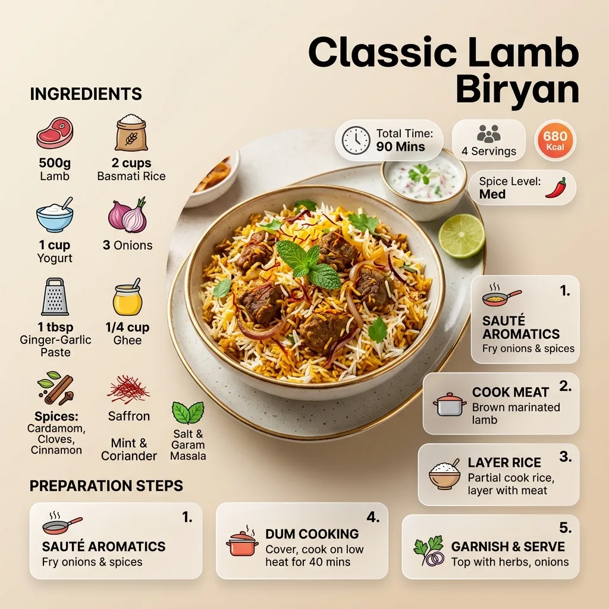

**#110 · Food &amp; Drink Prompt · <code>Vinano Image Pro</code>**

<details>
<summary>Show prompt</summary>

```
Ultra-clean modern recipe infographic. Showcase briyani in a visually appealing finished form—sliced, plated, or portioned—floating slightly in perspective or angled view. Arrange ingredients, steps, and tips around the dish in a dynamic editorial layout, not restricted to top-down. Ingredients Section: Include icons or mini illustrations for each ingredient quantities. Arrange them in clusters, lists, or circular flows connected visually to the dish. Steps Section: Show preparation steps numbered panels, arrows, or lines, forming a logical flow around the main dish. Include small cooking icons (knife, pan, oven, timer) where helpful. Additional Info (optional): Total calories, prep/cook time, servings, spice level—displayed as clean bubbles or badges near the dish. Visual Style: Editorial infographic meets lifestyle food photography. Vibrant, natural food colors, subtle drop shadows, clean vector icons, modern typography, soft gradients or glassmorphism for step panels. Accent colors can highlight key info (calories, prep time). Composition Guidelines: Finished meal as hero visual (perspective or angled) Ingredients and steps flow dynamically around the dish Clear visual hierarchy: dish > steps > ingredients > optional stats Enough negative space to keep design airy and readable Lighting & Background: Soft, natural studio lighting, minimal textured or gradient background for premium editorial feel. Output: 1080×1080, ultra-crisp, social-feed optimized, no watermark. Keep edges clean and the overall composition balanced for a polished, gallery-ready result.
```

</details>

---

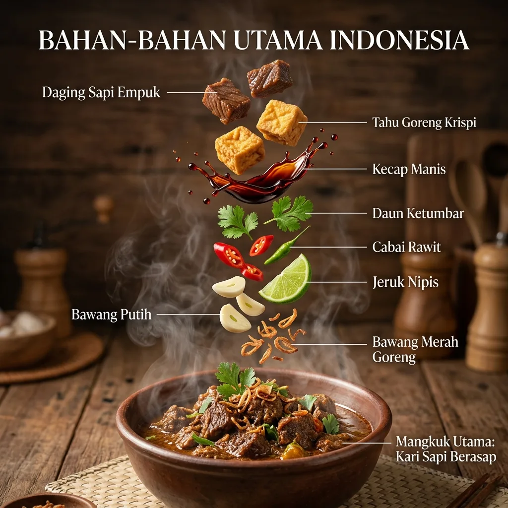

**#111 · Food &amp; Drink Prompt · <code>Vinano Image Pro</code>**

<details>
<summary>Show prompt</summary>

```
{
 "image_prompt": {
 "type": "Hyper-realistic food infographic",
 "subject": {
 "cuisine": "Indonesian",
 "base_element": "Traditional bowl steaming hot dish at the bottom",
 "levitating_ingredients": ["Juicy meat",
 "Crispy tofu",
 "Glossy sauce splashes",
 "Fresh herbs",
 "Chilies",
 "Lime",
 "Garlic",
 "Fried shallots"]
 },
 "composition": {
 "layout": "Clean vertical composition",
 "arrangement": "Realistic gravity-defying/floating elements",
 "background": "Rustic wooden surface",
 "visual_hierarchy": "Bowl anchored at bottom, ingredients rising vertically"
 },
 "graphic_design_elements": {
 "labels": "Clear Indonesian text",
 "lines": "Thin white pointing lines",
 "style": "Editorial infographic layout, professional food magazine style"
 },
 "lighting_and_mood": {
 "lighting": "Cinematic studio lighting",
 "color_palette": "Warm tones",
 "effects": "Dramatic steam, motion-frozen ingredients"
 },
 "technical_specs": {
 "camera_settings": "Shallow depth of field, sharp focus, DSLR look",
 "details": "Ultra-detailed textures",
 "resolution": "8K ultra-realistic"
 }
 }
}

Preserve realistic proportions and depth for a confident, professional finish.
```

</details>

---

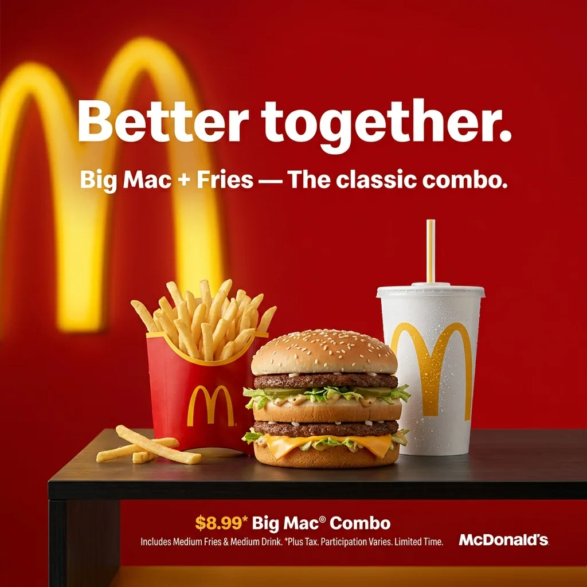

**#112 · Food &amp; Drink Prompt · <code>Vinano Image Pro</code>**

<details>
<summary>Show prompt</summary>

```
Create a clean, premium-quality McDonald’s advertisement.
Use a bold red brand color yellow brand accents.
Show a Big Mac, fries, and a drink in a realistic, appetizing style.
Include the golden arches in the background.
Add bold white headline text: “Better together.”
Include smaller text: “Big Mac + Fries — The classic combo.”
Add price and minimal product details at the bottom.
Keep the layout simple, balanced, and premium strong brand consistency.

Aim for an editorial, design-driven look with deliberate negative space.
```

</details>

---

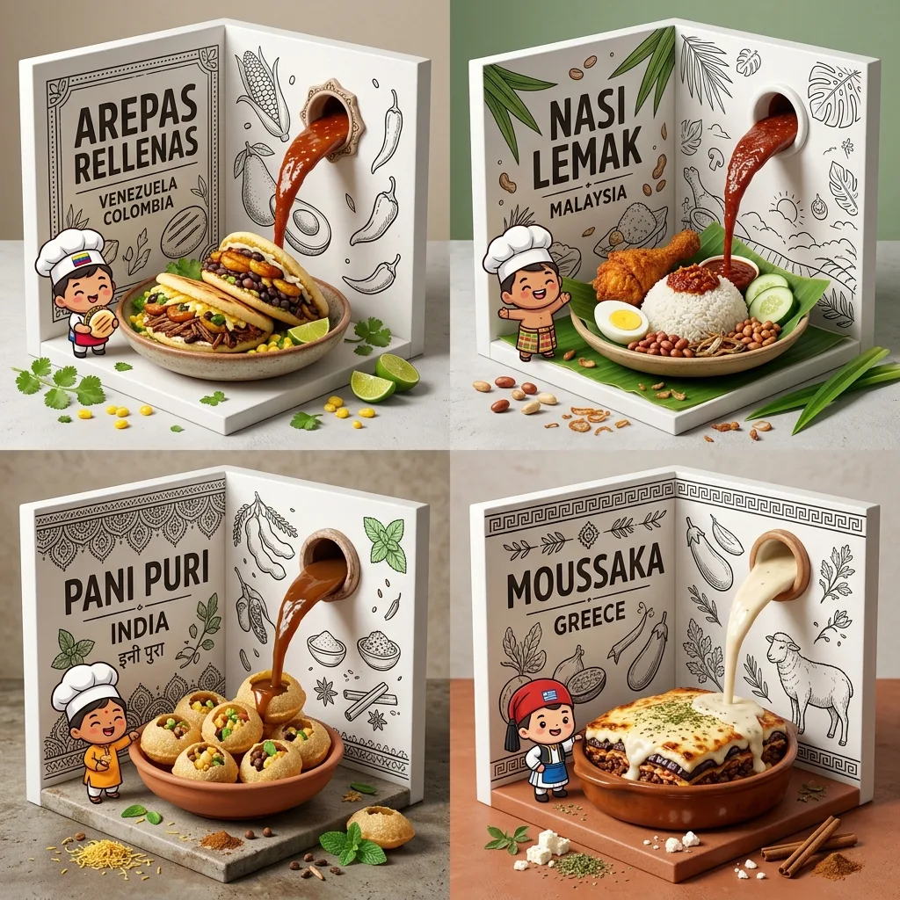

**#113 · Food &amp; Drink Prompt · <code>Vinano Image Pro</code>**

<details>
<summary>Show prompt</summary>

```
2x2 grid, do this for 4 hidden gem international foods select * from popup_recipe_visualizer where recipe_target = '[dish_name]' and structural_base = 'l-shaped_open_box_white_interior' and wall_layer_2d = (select line_art, typography, botanical_drawings from ingredient_inference_db where dish = '[dish_name]') and foreground_layer_3d = array['bowl_of_completed_[dish_name]', 'kawaii_chibi_mascot_interacting_with_food', 'scattered_3d_garnishes_on_floor'] and dynamic_action = 'thick_glossy_sauce_pouring_from_2d_wall_hole_into_3d_bowl' and render_engine = 'octane_render_soft_studio_lighting'; Emphasise material texture and natural light so the final frame feels tactile and premium.
```

</details>

---

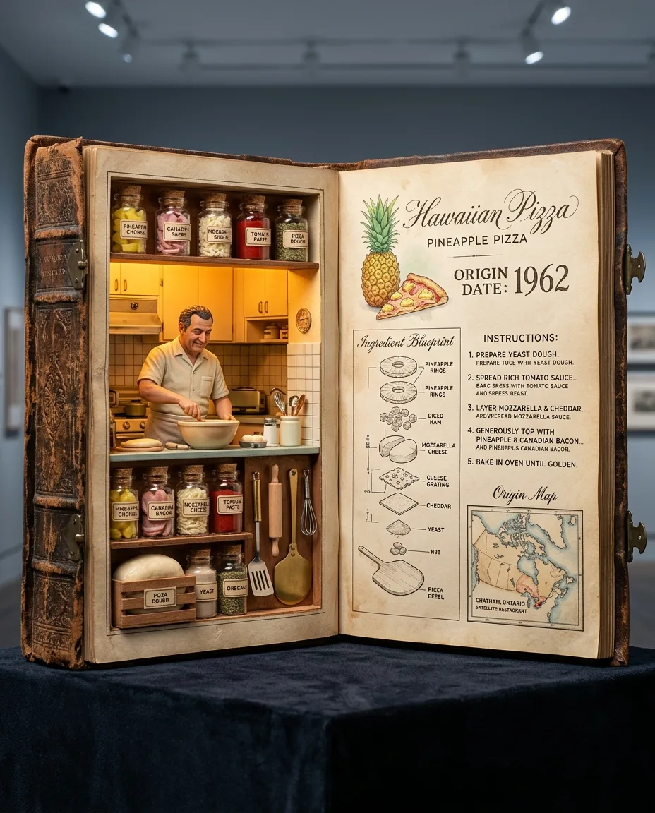

**#114 · Food &amp; Drink Prompt · <code>Vinano Image Pro</code>**

<details>
<summary>Show prompt</summary>

```
Do this for Pineapple Pizza: <instruction>
Input A: user uploads an image or shares name of dish

Logic Identify the historical inventor (e.g., Raffaele Esposito or Henri Charpentier) and the exact year of origin.

Task: A hyper-realistic 4:5 macro photograph of an oversized, open antique culinary codex resting on a dark velvet museum plinth.

Left Page (The Living Diorama):
The left side of the book is hollowed out like a secret compartment. Inside is a breathtaking 3D miniature scene. A highly detailed figurine of the dish’s inventor is captured mid-motion in a period-accurate kitchen. Around them are microscopic versions of the 10-15 key ingredients, each in its own tiny hand-blown glass vial or micro-wooden crate. Include miniature brass cooking tools specific to the era. The scene is lit from within the "pages" by a warm, magical amber glow.

Right Page (The Technical Recipe):
The right page is flat, aged parchment featuring elegant, faded Spencerian calligraphy and hand-painted watercolor illustrations.
1. Top: The dish name in both English and its native language, the bold "Origin Date."
2. Middle: A vertical "Ingredient Blueprint" hyper-detailed sketches of each raw component.
3. Bottom: A small, detailed "Origin Map" showing the specific city of birth, styled like a 19th-century cartographic inset.
4. Text: Visible, legible recipe steps written in ink that looks slightly raised on the paper.

Style:
Museum specimen photography. 85mm macro lens. The lighting should be a mix of cool gallery spotlights and the warm "internal" glow of the book's diorama. Extreme texture on the weathered leather binding and the tooth of the paper.
Output: ONE image, 4:5 aspect ratio.
</instruction>

Preserve realistic proportions and depth for a confident, professional finish.
```

</details>

---

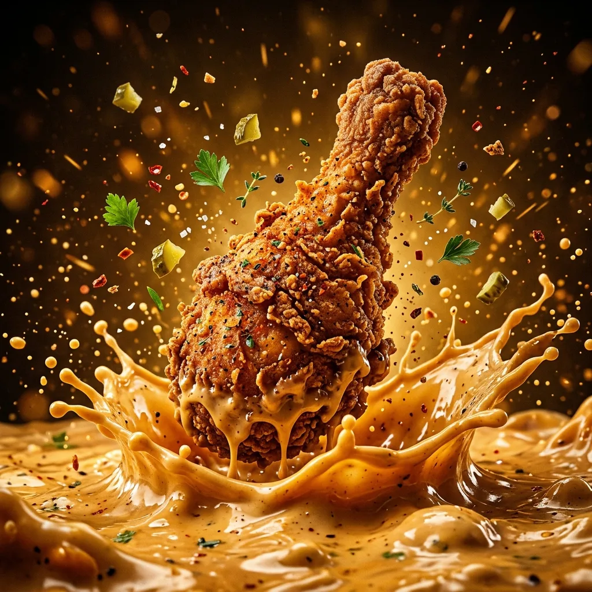

**#115 · Food &amp; Drink Prompt · <code>Vinano Image v2</code>**

<details>
<summary>Show prompt</summary>

```
Epic 8K cinematic fantasy food scene: a colossal crispy fried chicken leg rising like a legendary artifact through a tidal explosion of molten creamy sauce. Sauce behaves like liquid clouds, forming waves and splashes in mid-air. Pickle chunks, herb leaves, and seasoning particles float like asteroids in a food universe. Extreme macro texture on the crust—cracks, bubbles, and crunch visible. Powerful dramatic lighting deep shadows and glowing highlights. Vibrant golden-yellow background cinematic depth and atmospheric particles. Hyper-realistic yet mythic, bold surreal advertising masterpiece. Aim for an editorial, design-driven look with deliberate negative space.
```

</details>

---

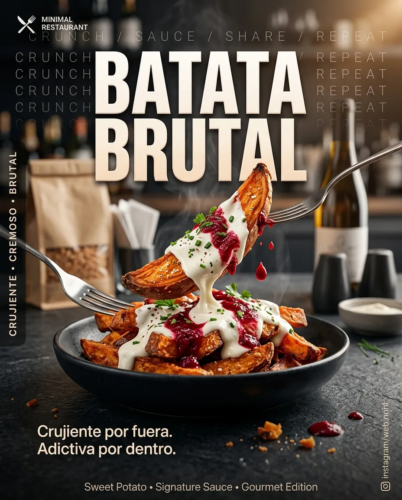

**#116 · Food &amp; Drink Prompt · <code>Vinano Image v2</code>**

<details>
<summary>Show prompt</summary>

```
FORMATO:
Póster social premium 4:5 vertical para Instagram, ultra alta resolución, 8K, nitidez extrema, calidad publicitaria, aspecto gourmet editorial, composición impactante y moderna

⸻

ESCENA / FONDO:

Bar gastronómico moderno y elegante, ambiente urbano sofisticado, mesa de piedra oscura con textura premium, profundidad cinematográfica

Entorno:

* Superficie de mármol negro con reflejos suaves y elegantes
* Fondo desenfocado con ambiente de restaurante moderno
* Sutil presencia de botellas, servilletas y barra de fondo
* Bokeh cálido y elegante, sin distraer del plato
* Estética de restaurante trendy de ciudad

Atmósfera:

* Ambiente acogedor y premium
* Sensación de comida recién servida
* Ligero vapor saliendo del plato
* Energía social, experiencia compartida
* Estilo casual-lujo gastronómico

Iluminación:

* Luz principal cálida lateral superior derecha
* Luz de relleno suave para resaltar texturas
* Brillos naturales en la salsa cremosa
* Contraste elegante entre sombras profundas y luces cálidas
* Reflejos delicados sobre la batata caramelizada

Paleta de color:

* Dominante: negro piedra, gris carbón, marrón tostado
* Acentos: naranja batata, blanco crema, rojo remolacha/frutos rojos
* Toques verdes frescos de hierbas

⸻

PRODUCTO (HERO SHOT):

Plato protagonista de batatas fritas crujientes servidas en vajilla artesanal negra, cubiertas con crema blanca abundante, salsa roja intensa y hierbas frescas

Acción:

* Batatas elevándose ligeramente en el aire para efecto dinámico
* Una batata principal en foco absoluto con textura crujiente visible
* Salsa cremosa cayendo lentamente en movimiento
* Gotas de salsa roja suspendidas en el aire
* Sensación irresistible y adictiva

Interacción:

* Dos tenedores entrando desde los laterales, capturando comida
* Representa deseo, compartir y experiencia real
* Movimiento natural y espontáneo

Detalle de texturas:

* Exterior crujiente y caramelizado de la batata
* Interior suave y cremoso
* Salsa blanca espesa y brillante
* Salsa roja vibrante con intensidad visual
* Microdetalles de sal, especias y cebollino fresco

⸻

ELEMENTOS SECUNDARIOS:

Fondo superior:

* Bolsa kraft desenfocada
* Botella elegante fuera de foco
* Vajilla minimalista moderna

Primer plano:

* Tenedores metálicos con brillo sutil
* Migas pequeñas y gotas de salsa para realismo

⸻

TIPOGRAFÍA:

TITULAR PRINCIPAL:

“BATATA BRUTAL”

Estilo:

* Tipografía sans serif ultra bold condensada
* Moderna, premium, agresiva visualmente
* Kerning ajustado
* Impacto publicitario

Color:

* Blanco roto con ligero degradado cálido

Efectos:

* Sombra suave
* Relieve sutil
* Ligero glow premium

Ubicación:

* Centro superior, integrado con el plato

⸻

SUBTÍTULO:

Crujiente por fuera.
Adictiva por dentro.

Estilo:

* Sans serif bold limpia
* Elegante y minimalista

Color:

* Blanco al 85% opacidad

Ubicación:

* Parte inferior izquierda

⸻

CAPA TIPOGRÁFICA DE FONDO:

CRUNCH / SAUCE / SHARE / REPEAT

Estilo:

* Mayúsculas finas
* Tracking amplio
* Repetición modular

Color:

* Gris claro al 15%

Función:

* Textura visual sin distraer

⸻

BRANDING:

Parte superior izquierda:

Logo minimalista del restaurante o marca

Parte inferior:

Sweet Potato • Signature Sauce • Gourmet Edition

Esquina inferior derecha:

Instagram / web minimalista

Banda lateral vertical:

CRUJIENTE • CREMOSO • BRUTAL

⸻

CÁMARA:

Lente:

50mm gastronómico cinematográfico

Ángulo:

Picado suave de 45 grados con presencia heroica

Profundidad de campo:

* Enfoque extremo en batata central
* Fondo con caída progresiva cremosa

Sensación:

Fotografía real de campaña premium Michelin casual food

⸻

POSTPRODUCCIÓN:

* Contraste alto pero elegante
* Nitidez localizada solo en comida
* Glow suave en salsas
* Color grading cálido premium
* Sombras profundas sofisticadas
* Micro film grain 2%
* Texturas hiperrealistas
* Detalle extremo en comida
* Acabado de anuncio internacional

Emphasise material texture and natural light so the final frame feels tactile and premium.
```

</details>

---

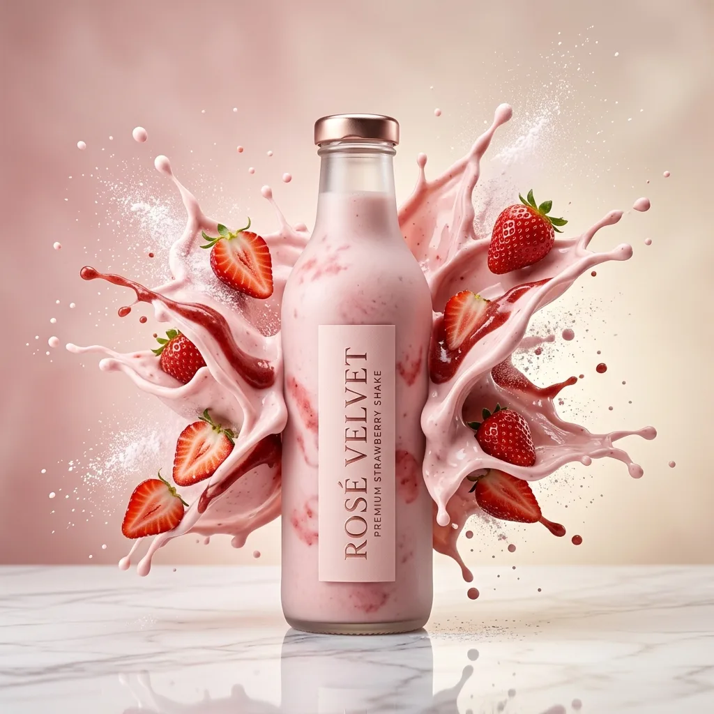

**#117 · Food &amp; Drink Prompt · <code>Vinano Image Pro</code>**

<details>
<summary>Show prompt</summary>

```
{
 "master_prompt": {
 "scene_type": "high-speed commercial luxury shake photography",
 "product": {
 "type": "elegant frosted glass bottle filled velvety strawberry shake",
 "brand_name": "ROSÉ VELVET",
 "label_design": "refined minimalist vertical blush label embossed rose-gold serif typography",
 "liquid_color": "creamy pastel pink natural strawberry swirls"
 },
 "composition": {
 "action": "dynamic high-velocity creamy splash explosion",
 "surrounding_elements": ["sculptural waves of thick strawberry shake splashing outward",
 "silky ribbons of strawberry puree suspended mid-air",
 "floating fresh strawberry halves visible seeds and juicy texture",
 "soft dusting of powdered sugar diffusing delicately",
 "fine droplets of creamy pink mist catching the light"],
 "placement": "centered hero bottle a crisp reflection on a polished white marble surface"
 },
 "lighting": {
 "style": "luxury glossy studio product lighting",
 "effects": ["sharp rim lighting to define bottle silhouette",
 "brilliant highlights on creamy splashes and glossy strawberry surfaces",
 "soft rosy glow in the background for warmth and elegance"]
 },
 "color_palette": {
 "background": "smooth gradient of blush pink fading into soft champagne ivory",
 "accents": "fresh strawberry red, rose gold, and creamy vanilla tones"
 },
 "technical_specs": {
 "camera": "macro lens, eye-level angle",
 "shutter": "ultra-fast freeze-motion capture",
 "depth_of_field": "shallow focus on the label, gentle blur on dynamic splash elements",
 "quality": "8K resolution, ultra-true-to-life photorealistic texture"
 }
 }
}

Preserve realistic proportions and depth for a confident, professional finish.
```

</details>

---

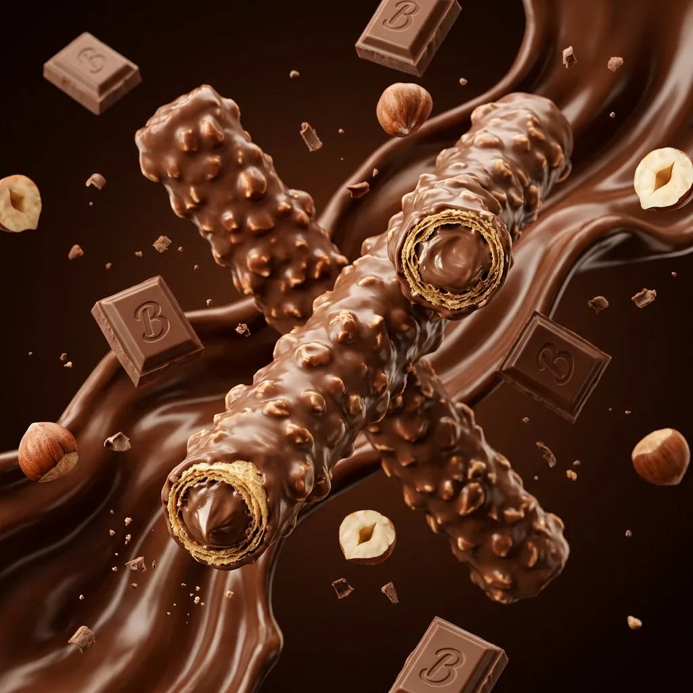

**#118 · Food &amp; Drink Prompt · <code>Vinano Image v2</code>**

<details>
<summary>Show prompt</summary>

```
{
 "ENVIRONMENT": {
 "Background": "Gradient(Dark_Warm_Brown)",
 "Atmospheric_FX": ["Floating_Particles", "Depth_Blur", "Cinematic_Bokeh"],
 "Lighting": {
 "Type": "Directional_Studio_Warmer",
 "Highlights": "Specular_Glossy_Reflections",
 "Shadow_Softness": "High"
 }
 },

 "CORE_ASSETS": {
 "Primary_Subject": "Wafer_Rolls",
 "Physics": "Zero_Gravity_Diagonal_X_Composition",
 "Material_Properties": {
 "Outer": "Milk_Chocolate_Coating",
 "Surface_Texture": "Irregular_Nut_Clusters_Embedded",
 "Interior_Cross_Section": {
 "Structure": "Crispy_Hollow_Wafer",
 "Core": "Silky_Chocolate_Cream_Filling"
 }
 }
 },

 "PARTICLE_SYSTEMS": [{
 "Object": "Chocolate_Blocks",
 "Detail": "Rectangular_Embossed_Letter_B",
 "State": "Floating"
 },
 {
 "Object": "Hazelnuts",
 "State": "Halved_and_Fragmented",
 "Distribution": "Random_Orbit"
 }],

 "FLUID_DYNAMICS": {
 "Element": "Chocolate_Splash",
 "Behavior": "Dynamic_Backdrop_Flow",
 "Viscosity": "Thick_Glossy"
 },

 "RENDER_OUTPUT": {
 "Resolution": "8K_UHD",
 "Aspect_Ratio": "3:4",
 "Quality_Flags": ["Hyper_Realistic", "Sharp_Foreground", "Indulgent_Mood"]
 }
}

Emphasise material texture and natural light so the final frame feels tactile and premium.
```

</details>

---

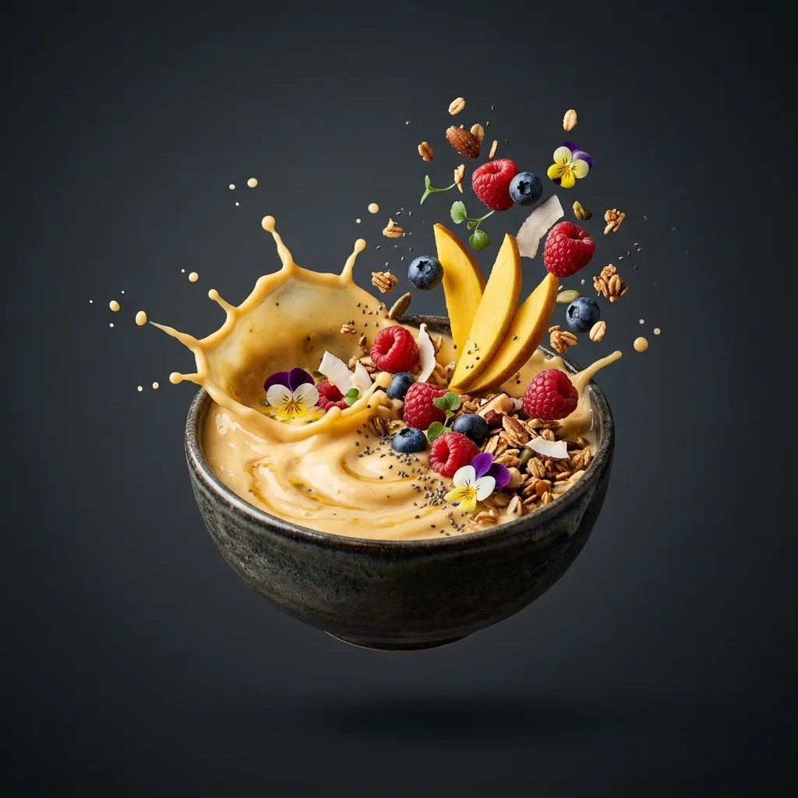

**#119 · Food &amp; Drink Prompt · <code>Vinano Image v2</code>**

<details>
<summary>Show prompt</summary>

```
Ultra-premium cinematic food photography, 8K UHD, 3:4 aspect ratio.
A high-end studio composition featuring a single floating bowl as the hero subject, captured in a high-speed moment ingredients suspended mid-air. The image conveys controlled energy, freshness, and indulgence.
Lighting is soft, directional, and studio-grade, sculpting textures clean highlights and natural shadows. Depth of field is shallow-to-medium, isolating the subject while maintaining dimensional realism.
Colors are rich yet natural, balanced contrast and refined saturation. No artificial glow or exaggerated effects.
The background is a seamless solid or smooth gradient, carefully chosen to complement the ingredients and enhance visual separation.
The bowl is centered, weightless, and dominant. Liquids form elegant arcs and droplets; solid ingredients float naturally believable physics. Textures are hyper-realistic — creamy bases show organic swirls, crunchy elements appear crisp, herbs look fresh and vibrant.
Shot a luxury commercial food advertising aesthetic — modern, clean, minimal, bold, and premium.

Preserve realistic proportions and depth for a confident, professional finish.
```

</details>

---

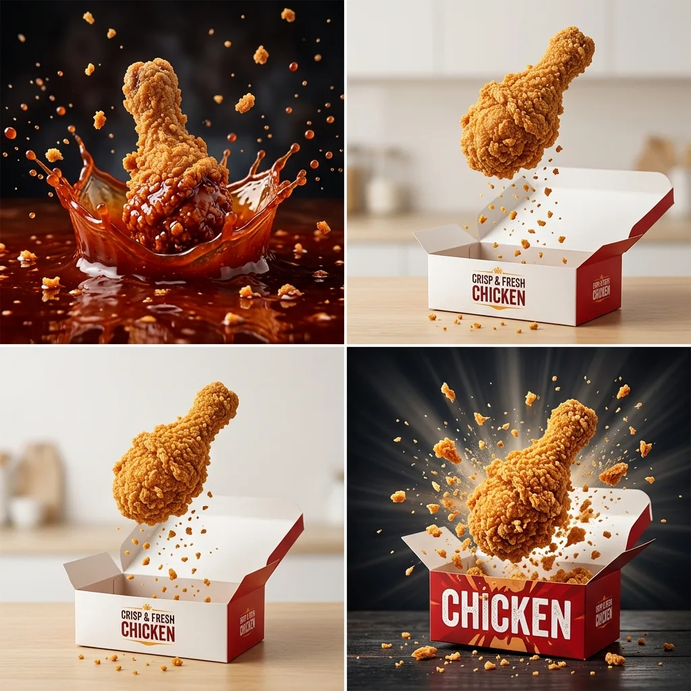

**#120 · Food &amp; Drink Prompt · <code>Vinano Image v2</code>**

<details>
<summary>Show prompt</summary>

```
{
 "project": {
 "title": "Hyper-Visual Fried Chicken Action Series",
 "output_quality": "8K Ultra-HD",
 "aspect_ratio": "2:3",
 "style_intent": "High-end commercial food photography",
 "consistency_rule": "Each module shares structure but maintains unique visual dynamics"
 },

 "global_camera_and_rendering": {
 "camera_perspective": "Close-up to extreme macro",
 "focus_behavior": "Crisp subject focus controlled depth falloff",
 "shutter_effect": "High-speed freeze-frame",
 "texture_priority": "Ultra-detailed crispy breading and crumbs",
 "color_profile": "Warm golden browns, deep reds, high contrast",
 "lighting_quality": "Studio-grade directional lighting rim highlights",
 "rendering_clarity": "No blur, no softness, no painterly effects"
 },

 "negative_prompt": ["motion blur",
 "plastic textures",
 "smooth or waxy food",
 "flat lighting",
 "low detail crumbs",
 "muddy colors",
 "overexposed highlights",
 "cartoon style",
 "unrealistic food physics",
 "oil fog",
 "text artifacts"],

 "modules": {

 "module_1_image_1_style": {
 "scene_type": "Liquid impact action shot",
 "subject": "Single fried chicken drumstick",
 "positioning": "Centered, upright",
 "action": "Drumstick impacting or emerging from liquid splash",
 "liquid_properties": {
 "color": "Deep red-brown",
 "viscosity": "Thick, glossy",
 "behavior": "High splash crown upward droplets"
 },
 "particle_details": {
 "crumbs": "Small to medium golden crumbs suspended mid-air",
 "distribution": "Surrounding the subject evenly"
 },
 "lighting": {
 "key_light": "Strong frontal light emphasizing texture",
 "rim_light": "Subtle edge highlights on liquid and crust"
 },
 "background": "Dark, nearly black, softly blurred",
 "surface_reflections": "Glossy reflections visible in liquid surface",
 "mood": "Intense, dramatic, high-impact"
 },

 "module_2_image_2_style": {
 "scene_type": "Mid-air food reveal",
 "subject": "Single fried chicken drumstick",
 "action": "Drumstick suspended above an open food box",
 "crumb_motion": "Crumbs falling downward from drumstick",
 "container": {
 "type": "Cardboard food box",
 "color": "White exterior red interior accents",
 "state": "Open lid, visible interior"
 },
 "lighting": {
 "style": "Soft studio light",
 "effect": "Even illumination gentle highlights"
 },
 "background": {
 "tone": "Bright, light neutral",
 "depth": "Shallow depth of field, softly blurred"
 },
 "texture_visibility": "Highly defined crunchy coating",
 "mood": "Clean, fresh, appetizing, modern"
 },

 "module_3_image_3_style": {
 "scene_type": "Explosive reveal action shot",
 "subject": "Single fried chicken drumstick",
 "action": "Drumstick bursting upward from food box",
 "explosion_elements": {
 "crumbs": "Large and small fragments radiating outward",
 "direction": "Radial burst from center"
 },
 "lighting": {
 "backlight": "Strong radial backlight creating light rays",
 "contrast": "High contrast between subject and background"
 },
 "container": {
 "type": "Cardboard food box",
 "color": "Red and white",
 "text_visibility": "Visible word 'CHICKEN' on front"
 },
 "background": "Dark bright light rays emanating behind subject",
 "surface": "Dark tabletop scattered crumbs",
 "mood": "Energetic, bold, cinematic"
 }

Preserve realistic proportions and depth for a confident, professional finish.
```

</details>

---

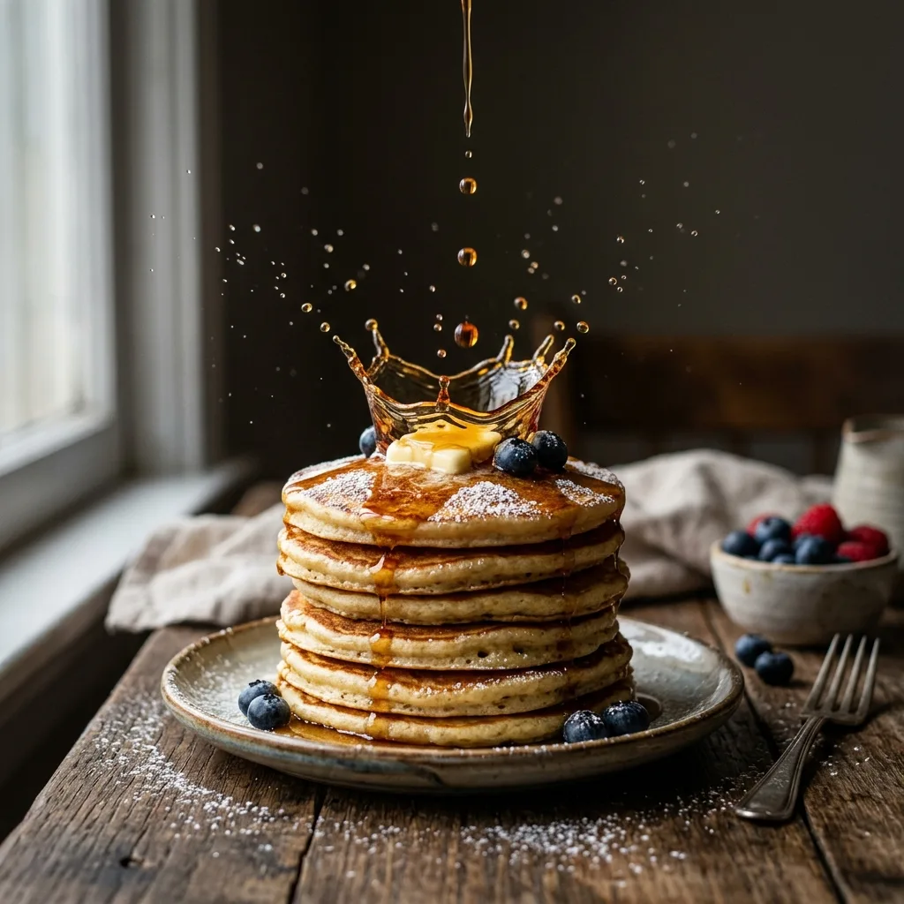

**#121 · Food &amp; Drink Prompt · <code>Vinano Image v2</code>**

<details>
<summary>Show prompt</summary>

```
Advertising-style food photography of a stack of pancakes arranged on a rustic table, maple syrup droplets floating above in mid-air and a splash of syrup frozen in motion. High-resolution photo manipulation selective soft focus, clean negative space for text, dramatic lighting, and crisp detail. --ar 3:2 --v 7 Render with rich micro-detail while keeping the layout uncluttered and intentional.
```

</details>

---

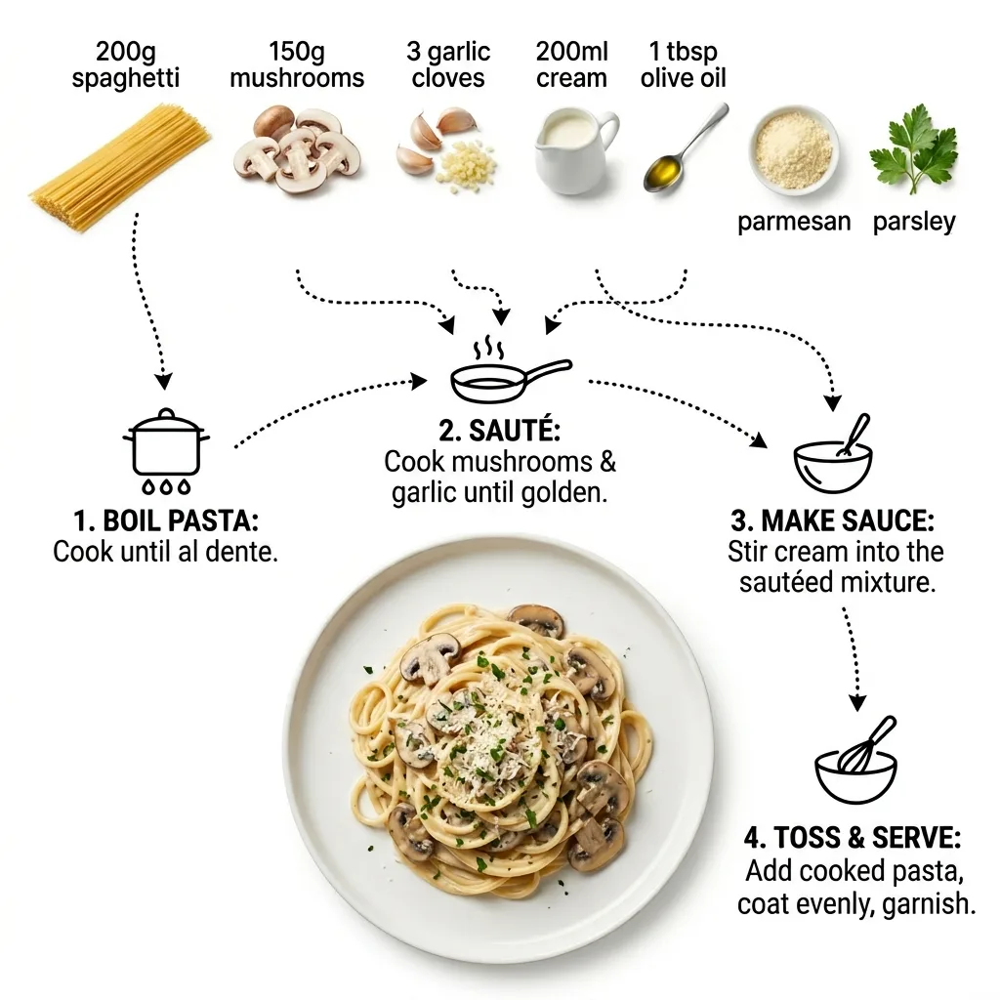

**#122 · Food &amp; Drink Prompt · <code>Vinano Image Pro</code>**

<details>
<summary>Show prompt</summary>

```
Create step-by-step recipe infographic for creamy garlic mushroom pasta, top-down view, minimal style on white background, ingredient photos labeled: "200g spaghetti", "150g mushrooms", "3 garlic cloves", "200ml cream", "1 tbsp olive oil", "parmesan", "parsley", dotted lines showing process steps icons (boiling pot, sauté pan, mixing), final plated pasta shot at the bottom Render with rich micro-detail while keeping the layout uncluttered and intentional.
```

</details>

---

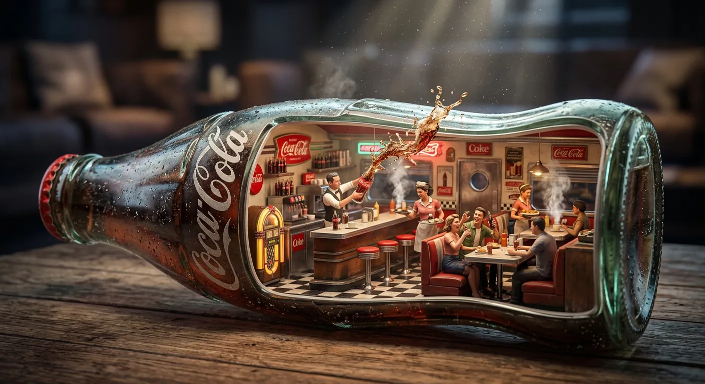

**#123 · Food &amp; Drink Prompt · <code>Vinano Image Pro</code>**

<details>
<summary>Show prompt</summary>

```
Ultra-realistic 3D miniature diorama of a [BRAND NAME] environment built inside a giant [ICONIC OBJECT OF BRAND], shown in a clean cross-section or partially cut-open view revealing a detailed interior world.

Inside the structure, a fully detailed miniature [brand-specific environment: store / café / restaurant / showroom] exists, realistic human activity such as staff working, customers interacting, and natural storytelling moments.

The [object] acts as both container and environment, its materials and elements integrated into the architecture (e.g., layers, textures, surfaces forming terrain and structure).

Add dynamic storytelling elements: objects or particles suspended mid-air, subtle motion frozen in time (liquid splashes, falling elements, steam, crumbs, etc.).

Include volumetric atmosphere such as steam, fog, or light rays interacting particles in the air to enhance cinematic depth.

Surfaces must be hyper-realistic micro details: imperfections, condensation, reflections, dust, oil sheen, texture variations depending on the material.

Lighting should follow a cinematic high-end advertising style, strong contrast between warm and cool tones, soft rim lighting outlining the subject, and natural light direction enhancing depth and realism.

Composition: slightly angled hero shot, clear cross-section visibility, centered subject, minimal but cinematic background soft bokeh.

Shot on a macro lens, shallow depth of field, creamy bokeh background, ultra-detailed textures, 8K resolution, filmic color grading, luxury commercial photography style.

Preserve realistic proportions and depth for a confident, professional finish.
```

</details>

---

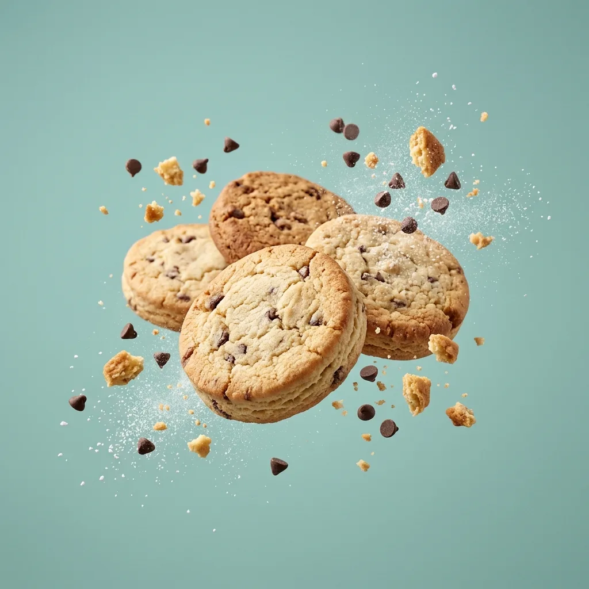

**#124 · Food &amp; Drink Prompt · <code>Vinano Image Pro</code>**

<details>
<summary>Show prompt</summary>

```
{
 "global_settings": {
 "resolution": "8K ultra-high-definition",
 "aspect_ratio": "3:4 vertical",
 "render_style": "true-to-life photorealistic high-end biscuit photography",
 "quality": "luxury advertising standard",
 "clarity": "ultra-sharp visible fine textures",
 "grain": "zero",
 "visual_artifacts": "none",
 "depth_of_field": "selective focus soft background falloff",
 "motion_capture": "ingredients suspended in mid-air",
 "background_style": "clean monochrome studio backdrop"
 },

 "subject": {
 "main_food": "assorted biscuit-style cookies",
 "quantity": 4,
 "appearance": ["uniform baked biscuits refined edges",
 "lightly toasted surface subtle cracks",
 "visible chocolate bits and butter layers",
 "dry-crisp texture typical of premium biscuits",
 "precise handcrafted finish"],
 "branding_rules": ["no typography",
 "no logos",
 "no imprints",
 "no decorative marks",
 "no symbols"]
 },

 "secondary_elements": {
 "ingredients_floating": ["mini chocolate chips",
 "biscuit crumbs",
 "powdered sugar dust"],
 "motion_style": "controlled burst natural spread",
 "distribution": "organic scatter surrounding the biscuits",
 "particle_detail": "high-speed frozen motion layered depth"
 },

 "composition": {
 "camera_angle": "slightly elevated three-quarter angle",
 "framing": "central hero focus visual breathing space",
 "spacing": "ample negative space for premium feel",
 "focus_priority": "foreground biscuit in extreme sharp focus"
 },

 "lighting": {
 "type": "studio-grade filmic, cinematic lighting",
 "key_light": "soft diffused directional light",
 "fill_light": "low-intensity fill to reveal surface detail",
 "rim_light": "delicate edge glow for separation",
 "shadows": "smooth and realistic gentle falloff"
 },

 "color_palette": {
 "background_color": "muted pastel teal",
 "biscuit_tones": "light golden beige and toasted browns",
 "accent_colors": "deep cocoa browns, soft sugar whites",
 "contrast": "strong subject isolation from background"
 },

 "photography_style": {
 "genre": "premium biscuit advertising",
 "mood": "clean, refined, indulgent",
 "cleanliness": "immaculate studio finish",
 "post_processing": "subtle professional retouching, natural tones"
 },

 "exclusions": ["text",
 "branding",
 "watermarks",
 "hands",
 "serving ware",
 "props",
 "wrappers",
 "environmental elements",
 "illustration",
 "cartoon rendering"]
}

Aim for an editorial, design-driven look with deliberate negative space.
```

</details>

---

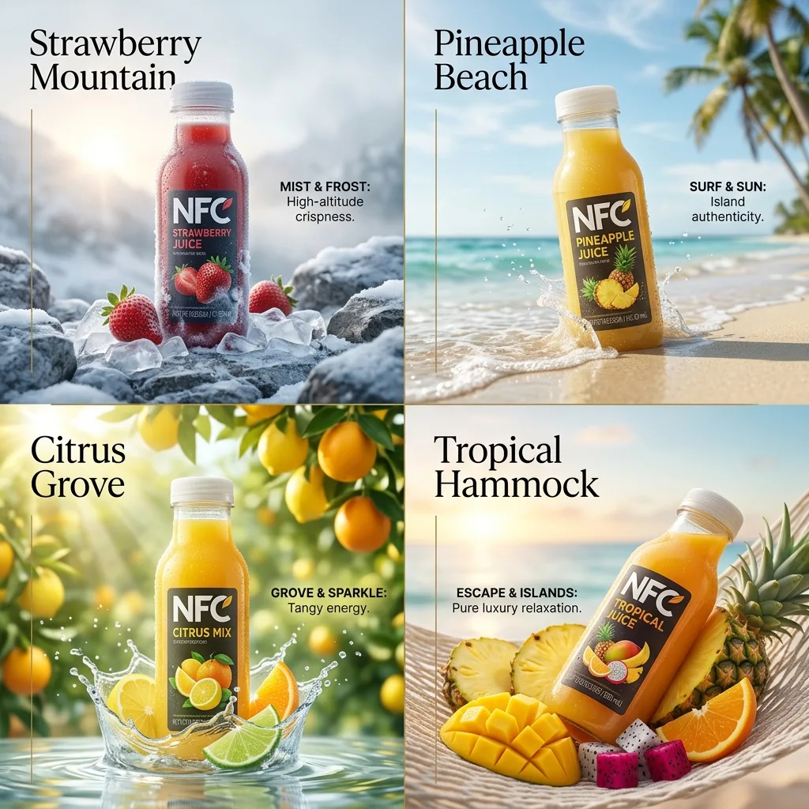

**#125 · Food &amp; Drink Prompt · <code>Vinano Image v2</code>**

<details>
<summary>Show prompt</summary>

```
[{
 "id": "pineapple_beach_v2",
 "type": "true-to-life photorealistic advertising shot",
 "subject": {
 "item": "pineapple juice bottle",
 "label_text": "NFC Pineapple Juice",
 "pose": "slightly tilted forward"
 },
 "environment": {
 "location": "tropical beach",
 "ground": "sunlit wet tropical sand",
 "background_elements": ["gently swaying palm trees",
 "clear turquoise ocean soft waves",
 "bright blue sky thin clouds"],
 "interactions": "a small wave splashes lightly against the bottle base"
 },
 "surrounding_elements": ["fresh pineapple slices visible texture",
 "sparkling seawater droplets in mid-air"],
 "lighting": {
 "description": "golden sunlight",
 "effects": "soft reflections on glass bottle"
 }
 },

 {
 "id": "strawberry_mountain_v2",
 "type": "true-to-life photorealistic advertising shot",
 "subject": {
 "item": "strawberry juice bottle",
 "label_text": "NFC Strawberry Juice",
 "details": "heavy condensation frost accents"
 },
 "environment": {
 "location": "high-altitude mountains",
 "ground": "icy rocks light snow patches",
 "atmosphere": "crisp cold air drifting mist"
 },
 "surrounding_elements": ["fresh strawberries partially resting on ice"],
 "lighting": {
 "description": "soft sunrise light cutting through fog",
 "effects": "subtle glow around the bottle"
 },
 "style_descriptors": ["cinematic macro shot",
 "ultra high detail",
 "cold-meets-warm contrast",
 "deep red highlights",
 "fresh and premium feel",
 "hyper-realistic surface details"],
 "parameters": "--ar 9:16 --stylize 250"
 },

 {
 "id": "citrus_grove_v2",
 "type": "true-to-life photorealistic advertising shot",
 "subject": {
 "item": "citrus blend juice bottle",
 "label_text": "NFC Citrus Mix",
 "pose": "centered upright"
 },
 "environment": {
 "location": "lush citrus grove",
 "background_elements": ["sunlit yellow and orange fruits hanging above",
 "soft green leaves framing the bottle"]
 },
 "action_elements": {
 "description": "fresh splash of clear water rising around the base",
 "items": ["thin lemon slices",
 "juicy lime wedges",
 "bright orange segments"]
 },
 "lighting": {
 "description": "sun rays filtering through leaves",
 "tone": "vibrant citrus warmth"
 },
 "parameters": "--ar 9:16 --stylize 250"
 },

 {
 "id": "tropical_hammock_v2",
 "type": "true-to-life photorealistic advertising shot",
 "subject": {
 "item": "tropical mixed Nestle juice bottle",
 "label_text": "NFC Tropical Juice",
 "pose": "relaxed tilt as if resting"
 },
 "environment": {
 "location": "sunlit hammock between palm trees",
 "background": "soft-focus ocean horizon glowing sunlight"
 },
 "surrounding_elements": ["fresh pineapple slices",
 "ripe mango slices",
 "orange wedges",
 "dragonfruit cubes"],
 "mood_and_style": {
 "atmosphere": "luxury vacation vibe",
 "colors": "rich tropical saturation",
 "lighting": "warm cinematic highlights soft shadows"
 },
 "parameters": "--ar 9:16 --stylize 250"
 }]

Aim for an editorial, design-driven look with deliberate negative space.
```

</details>

---

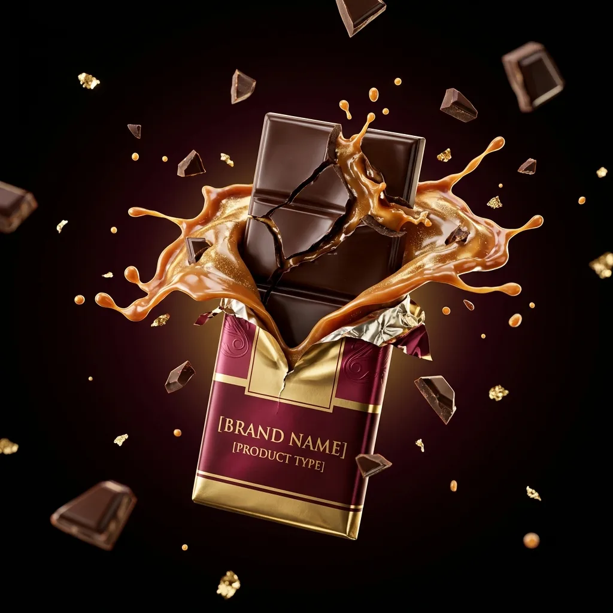

**#126 · Food &amp; Drink Prompt · <code>Vinano Image v2</code>**

<details>
<summary>Show prompt</summary>

```
A premium [BRAND NAME] [PRODUCT TYPE] centered in the frame, iconic [BRAND COLOR / PACKAGING STYLE] packaging partially unwrapped, emerging from darkness like a legendary luxury artifact, rich [PRODUCT MATERIAL – chocolate / cream / liquid / filling] cracking open and transforming in slow motion, surreal transformation in progress, [CORE INGREDIENT / FLAVOR ELEMENT] flowing, melting, or bursting outward in cinematic waves, fragments and droplets levitating in zero gravity, slow-motion splash frozen mid-air, ultra-detailed glossy textures, realistic material physics, rich highlights and reflections, dramatic cinematic rim lighting, deep shadows, luxury advertising aesthetic, dreamlike surreal atmosphere, hyper-real product photography blended fantasy, macro depth of field, clean dark background subtle [BRAND COLOR] glow, product dominant and razor-sharp, brand name clearly visible on packaging, no extra text, no watermark, no extra logos, 8K ultra-HD, HDR, global illumination, unreal engine style, viral commercial look, high contrast, premium composition Maintain consistent colour harmony and crisp focus across the whole frame.
```

</details>

---

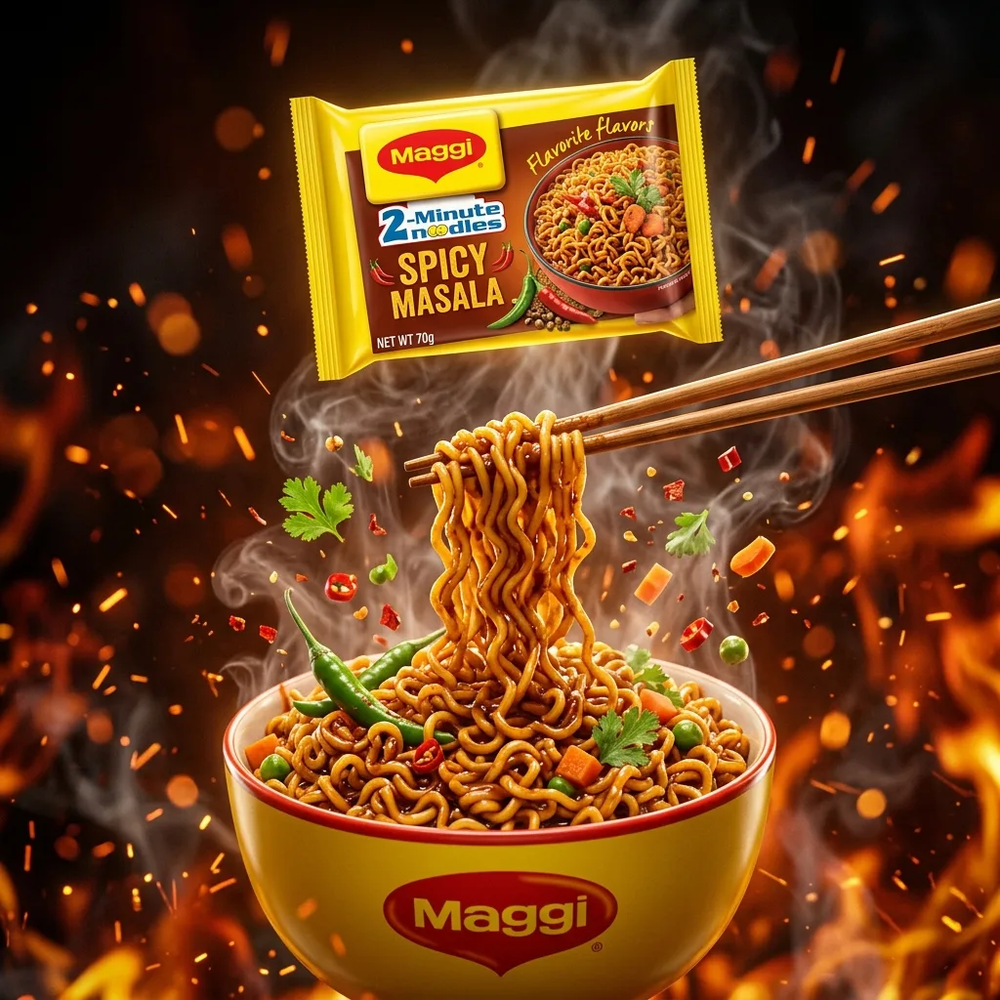

**#127 · Food &amp; Drink Prompt · <code>Vinano Image v2</code>**

<details>
<summary>Show prompt</summary>

```
Ultra-high-resolution 8K cinematic commercial food advertisement of **[BRAND NAME] instant noodles**, vertical 3:4 aspect ratio.

A bold hero composition featuring the **[BRAND NAME] noodle packet** floating in the upper frame, front-facing and perfectly lit, crisp edges, realistic packaging texture, and clear branding. Below it, a steaming bowl branded **[BRAND NAME]**, filled glossy, curly noodles lifted dramatically mid-air chopsticks, noodles stretching naturally under gravity.

Noodles appear richly coated in **[FLAVOR / SAUCE TYPE]**, visible ingredients such as **[VEGETABLES / CHILIES / GARNISH]** suspended mid-air around the bowl. Steam rises dynamically, interacting floating spice particles and food fragments.

Background is a **completely new cinematic environment** (not copied from reference), abstract and high-energy, filled swirling flames, sparks, embers, smoke, and motion blur, creating depth and intensity while keeping the food in sharp focus.

Lighting is premium studio filmic, cinematic lighting:
warm golden key light, soft fill light, strong rim light outlining the packet and noodles, high contrast glowing highlights and deep shadows.

Color palette dominated by **[PRIMARY BRAND COLORS]**, enhanced warm orange-gold food tones and contrasting greens from vegetables. Hyper-realistic textures on noodles, sauce, packaging, and bowl.

Shallow depth of field, dramatic bokeh in background, extreme sharpness on hero elements, true-to-life photorealistic yet stylized for advertising impact.

Mood: bold, energetic, spicy, indulgent, mouth-watering, premium commercial look.

No people, no clutter, no copied backgrounds. Designed for high-impact food advertising, posters, and social media hero visuals.

[BRAND NAME] → Maggi
[FLAVOR / SAUCE TYPE] → spicy masala
[PRIMARY BRAND COLORS] → yellow and red

Preserve realistic proportions and depth for a confident, professional finish.
```

</details>

---

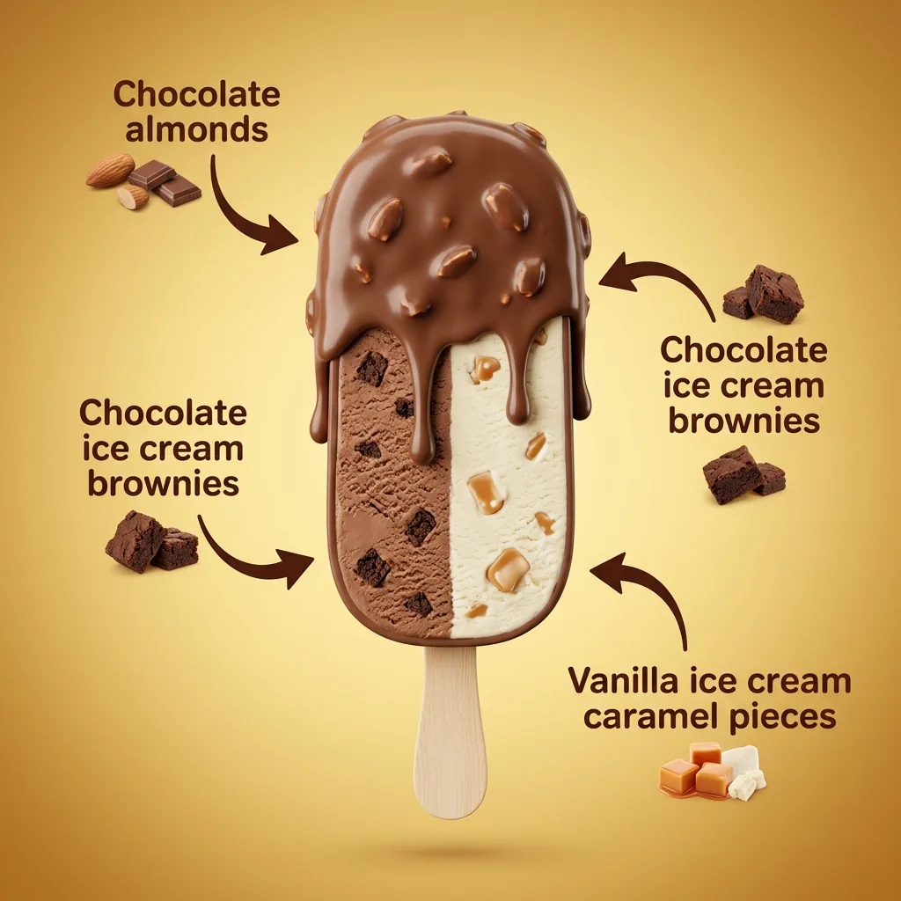

**#128 · Food &amp; Drink Prompt · <code>Vinano Image v2</code>**

<details>
<summary>Show prompt</summary>

```
{
 "resolution": "8K",
 "aspect_ratio": "3:4",
 "image_type": "true-to-life photorealistic commercial product render",
 "scene_description": {
 "main_subject": "A vertically centered ice cream bar on a wooden stick",
 "orientation": "upright, front-facing, slightly elevated perspective",
 "composition": "single product centered surrounding ingredient callouts and curved arrows"
 },
 "background": {
 "color": "warm golden-yellow gradient",
 "texture": "smooth, matte, evenly lit",
 "lighting_falloff": "subtle vignette, darker towards edges"
 },
 "lighting": {
 "type": "studio lighting",
 "key_light": "soft frontal light highlighting chocolate gloss",
 "fill_light": "balanced fill to preserve texture detail",
 "specular_highlights": "visible on melted chocolate coating",
 "shadows": "soft shadow beneath ice cream stick"
 },
 "ice_cream_bar": {
 "shape": "rounded rectangular bar",
 "surface": "smooth visible embedded inclusions",
 "layers": [{
 "layer_position": "top coating",
 "material": "milk chocolate",
 "state": "melted and dripping",
 "texture": "glossy, thick, fluid",
 "details": ["multiple chocolate drips flowing downward",
 "irregular almond pieces embedded in coating",
 "rounded drip edges gravity pull"]
 },
 {
 "layer_position": "left interior",
 "material": "chocolate ice cream",
 "texture": "dense, creamy",
 "details": ["small dark brownie chunks evenly dispersed",
 "matte finish compared to outer chocolate"]
 },
 {
 "layer_position": "right interior",
 "material": "vanilla ice cream",
 "texture": "smooth and creamy",
 "details": ["visible caramel pieces",
 "light beige caramel chunks rounded edges"]
 }]
 },
 "stick": {
 "material": "light natural wood",
 "texture": "smooth subtle grain",
 "shape": "rounded edges, flat profile",
 "visibility": "fully visible below ice cream bar"
 },
 "ingredient_callouts": {
 "style": {
 "arrows": "curved, thick, dark brown",
 "text_color": "dark brown",
 "font_style": "clean sans-serif",
 "layout": "balanced around product"
 },
 "labels": [{
 "text": "Chocolate almonds",
 "position": "top-left",
 "visual_aid": ["whole almonds",
 "small chocolate squares"]
 },
 {
 "text": "Chocolate ice cream brownies",
 "position": "left-middle",
 "visual_aid": ["brownie chunks"]
 },
 {
 "text": "Chocolate ice cream brownies",
 "position": "right-middle",
 "visual_aid": ["brownie chunks"]
 },
 {
 "text": "Vanilla ice cream caramel pieces",
 "position": "bottom-right",
 "visual_aid": ["caramel cubes",
 "white vanilla pieces"]
 }]
 },
 "color_palette": {
 "primary_colors": ["milk chocolate brown",
 "golden yellow",
 "cream white"],
 "secondary_colors": ["dark brownie brown",
 "light caramel orange",
 "almond beige"]
 },
 "render_quality": {
 "sharpness": "extreme micro-detail visibility",
 "texture_fidelity": "high realism",
 "noise": "none",
 "depth_of_field": "moderate, product fully in focus"
 },
 "style_tags": ["luxury dessert advertising",
 "hyper-realistic food photography",
 "commercial product render",
 "clean studio composition"]
}

Keep edges clean and the overall composition balanced for a polished, gallery-ready result.
```

</details>

---

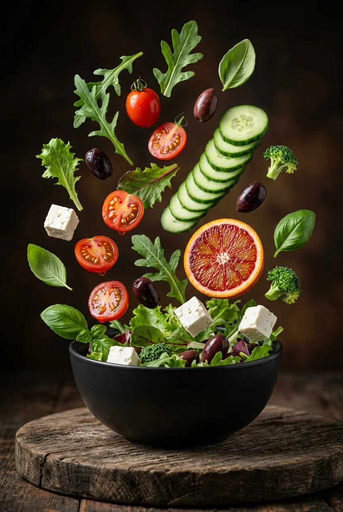

**#129 · Food &amp; Drink Prompt · <code>Vinano Image v2</code>**

<details>
<summary>Show prompt</summary>

```
{
 "global_settings": {
 "resolution": "8K ultra high definition",
 "aspect_ratio": "2:3 vertical",
 "style": "hyper-realistic AI-edited food photography",
 "clarity": "extreme sharpness, micro-texture visibility",
 "motion": "frozen action suspended ingredients",
 "lighting_quality": "studio-grade, high-contrast, cinematic",
 "background_separation": "strong subject isolation clean depth"
 },

 "module_1_image_1_style": {
 "scene_description": "A dynamic salad explosion emerging from a matte black bowl placed on a round wooden surface. Ingredients are mid-air, scattered upward and outward.",
 "ingredients_visible": ["green lettuce leaves",
 "cherry tomatoes (whole and sliced)",
 "cucumber slices arranged in a curved stack",
 "black olives",
 "white cheese cubes",
 "orange citrus slice",
 "small broccoli florets",
 "fresh green basil leaves"],
 "motion_details": {
 "ingredients":

Render with rich micro-detail while keeping the layout uncluttered and intentional.
```

</details>

---

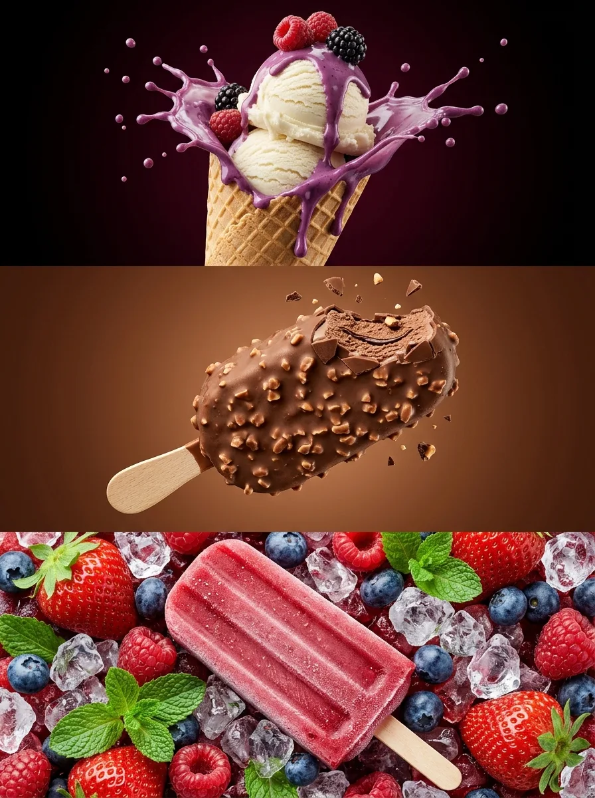

**#130 · Food &amp; Drink Prompt · <code>Vinano Image Pro</code>**

<details>
<summary>Show prompt</summary>

```
{
"master_prompt": {
"global_settings": {
"resolution": "8K ultra high definition",
"aspect_ratio": "3:4 vertical",
"image_quality": "extreme sharpness, high dynamic range, professional studio lighting",
"style": "AI-edited hyperreal food photography",
"focus": "crisp textures, frozen motion, liquid dynamics, surface details",
"background_quality": "clean, controlled, noise-free"
},

"module_1": {
 "identity": "Image 1 – Ice Cream Cone Purple Splash",
 "subject": {
 "main_object": "waffle cone ice cream",
 "cone": "light brown waffle cone diamond grid texture, matte finish",
 "ice_cream_scoops": [{
 "color": "off-white / vanilla",
 "texture": "creamy visible scoop ridges"
 },
 {
 "color": "off-white / vanilla",
 "texture": "slightly uneven surface, melting edges"
 }],
 "toppings": ["raspberries",
 "blackberries"],
 "sauce": {
 "color": "glossy purple",
 "behavior": "thick liquid splashing outward and downward",
 "coverage": "dripping over scoops and cone"
 }
 },
 "motion": {
 "action": "frozen splash moment",
 "details": "liquid droplets suspended mid-air, see-through splash edges"
 },
 "background": {
 "color": "deep dark maroon / black",
 "style": "studio backdrop subtle gradient"
 },
 "lighting": {
 "type": "high-contrast studio lighting",
 "effects": "specular highlights on sauce and ice cream, shadow depth under cone"
 }
},

"module_2": {
 "identity": "Image 2 – Chocolate Ice Cream Bar Bite",
 "subject": {
 "main_object": "chocolate-coated ice cream bar on wooden stick",
 "coating": {
 "exploded_view": false,
 "surface": "milk chocolate coating embedded nut pieces",
 "texture": "rough, uneven, crunchy appearance"
 },
 "bite_detail": {
 "location": "top edge",
 "interior_layers": ["chocolate ice cream",
 "thin darker chocolate layer"],
 "edges": "jagged bite marks"
 },
 "stick": {
 "material": "light wood",
 "finish": "smooth, rounded end"
 }
 },
 "motion": {
 "elements": "small chocolate fragments floating in air",
 "behavior": "scattered outward from the bar"
 },
 "background": {
 "color": "warm brown gradient",
 "style": "clean studio environment"
 },
 "lighting": {
 "type": "directional studio lighting",
 "effects": "strong highlights on chocolate bumps, soft shadows"
 }
},

"module_3": {
 "identity": "Image 3 –Purple Berry Popsicle Fruits",
 "subject": {
 "main_object": "rectangular red popsicle",
 "surface": {
 "texture": "frosted, icy crystals visible",
 "shape": "rounded corners, vertical grooves"
 },
 "stick": {
 "material": "light wooden stick",
 "visible": true
 },
 "surroundings": ["whole strawberries green tops",
 "blueberries",
 "raspberries",
 "mint leaves",
 "crushed ice pieces"]
 },
 "color_palette": ["bright red",
 "deep blue",
 "fresh green",
 "clear ice"],
 "background": {
 "composition": "entire frame filled fruits and ice",
 "style": "top-down macro food arrangement"
 },
 "lighting": {
 "type": "even bright lighting",
 "effects": "wet shine on fruit skins, crystalline ice reflections"
 }
},

Keep edges clean and the overall composition balanced for a polished, gallery-ready result.
```

</details>

---

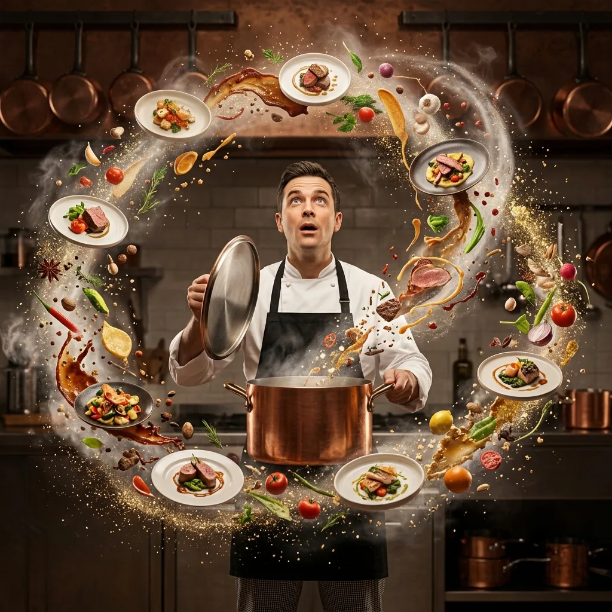

**#131 · Food &amp; Drink Prompt · <code>Vinano Image v2</code>**

<details>
<summary>Show prompt</summary>

```
A hyper-realistic, high-speed commercial photograph featuring a man uploaded face as reference in a chef's jacket, apron, and checkered trousers. He stands in a rustic, high-end kitchen, lifting the lid off a large, steaming copper pot a look of pure amazement. From the pot, a literal galaxy of gourmet food explodes upwards and outwards in suspended animation: whole roasted spices, vibrant vegetables, splashes of rich sauces, floating plates of intricately plated fine dining dishes,and swirling clouds of aromatic steam filled golden glitter. The ingredients form spiral nebulae around him. The background is a warm, blurred professional kitchen copper cookware hanging. The lighting is warm, cinematic, and focused, highlighting the textures of the flying food macro-level detail. Shot a fast shutter speed to freeze motion, 8k resolution, Octane Render culinary aesthetic. 100% use my real face. Maintain consistent colour harmony and crisp focus across the whole frame.
```

</details>

---

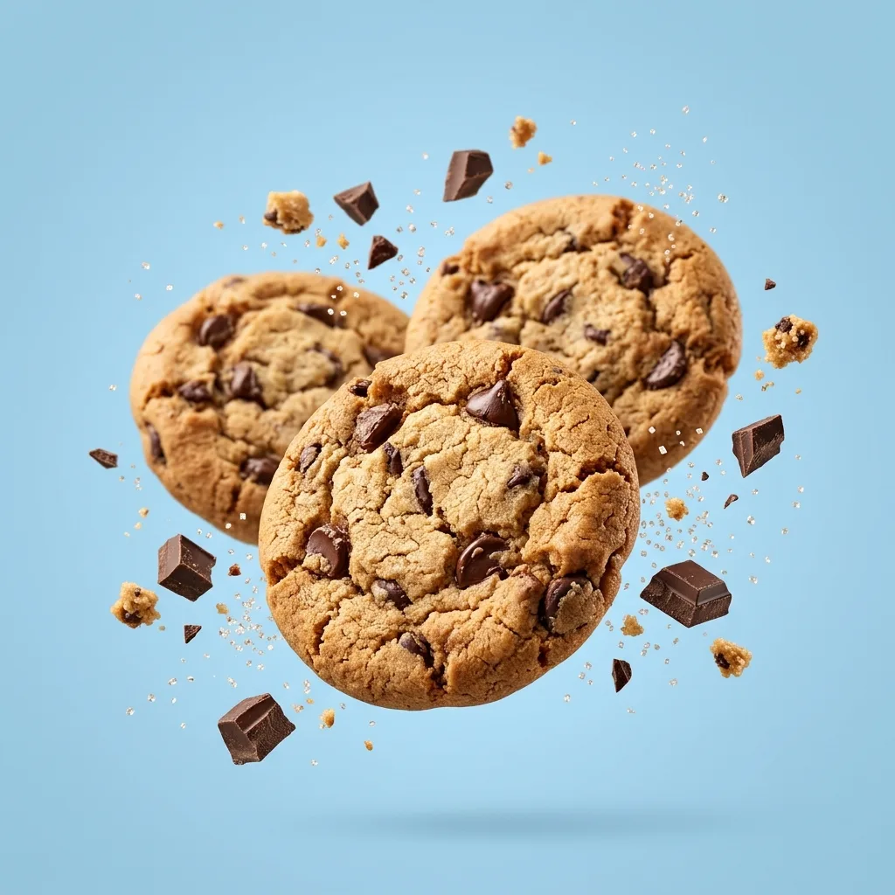

**#132 · Food &amp; Drink Prompt · <code>Vinano Image v2</code>**

<details>
<summary>Show prompt</summary>

```
{
 "global_settings": {
 "resolution": "8K ultra-high-definition",
 "aspect_ratio": "3:4 vertical",
 "render_style": "hyper-realistic commercial food photography",
 "quality": "premium advertising grade",
 "sharpness": "extreme micro-detail, crisp edges",
 "noise": "none",
 "artifacts": "none",
 "depth_of_field": "shallow, subject-focused",
 "motion": "frozen mid-air ingredients",
 "background_style": "solid single-color studio backdrop"
 },

 "subject": {
 "main_food": "chocolate chip cookies",
 "quantity": 3,
 "appearance": ["golden-brown freshly baked cookies",
 "soft cracked surface",
 "visible melted chocolate chips",
 "slightly crisp edges",
 "natural handmade texture"],
 "branding_rules": ["no text",
 "no logo",
 "no embossing",
 "no patterns",
 "no symbols"]
 },

 "secondary_elements": {
 "ingredients_flying": ["dark chocolate chunks",
 "cookie crumbs",
 "fine sugar crystals"],
 "motion_style": "dynamic floating explosion",
 "distribution": "balanced around the cookies, natural randomness",
 "particle_detail": "sharp, frozen motion depth separation"
 },

 "composition": {
 "camera_angle": "slightly low angle",
 "framing": "center-weighted hero composition",
 "spacing": "clean negative space around subject",
 "focus_priority": "front cookie in razor-sharp focus"
 },

 "lighting": {
 "type": "professional studio lighting",
 "key_light": "soft directional key light",
 "fill_light": "gentle fill for texture clarity",
 "rim_light": "subtle rim highlight for separation",
 "shadows": "soft and natural, no harsh contrast"
 },

 "color_palette": {
 "background_color": "pastel blue",
 "cookie_tones": "warm golden browns",
 "accent_colors": "rich chocolate browns, crystal sugar whites",
 "contrast": "high subject-background separation"
 },

 "photography_style": {
 "genre": "luxury food advertising",
 "mood": "fresh, indulgent, premium",
 "cleanliness": "spotless studio look",
 "post_processing": "minimal, natural, high-end retouching"
 },

 "exclusions": ["text",
 "logos",
 "watermarks",
 "hands",
 "plates",
 "props",
 "packaging",
 "background objects",
 "cartoon style",
 "illustration style"]
}

Maintain consistent colour harmony and crisp focus across the whole frame.
```

</details>

---

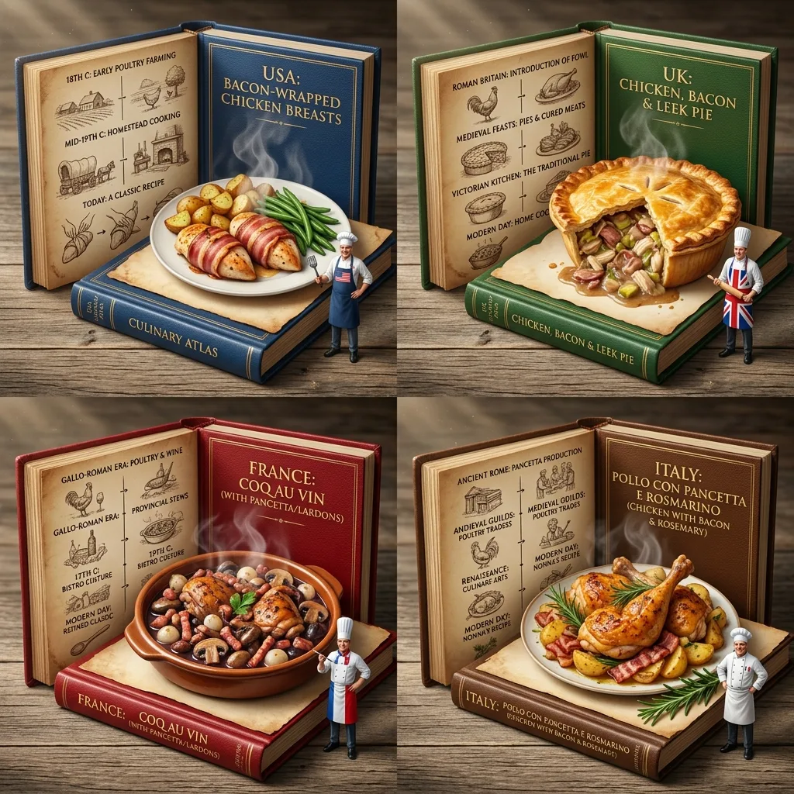

**#133 · Food &amp; Drink Prompt · <code>Vinano Image Pro</code>**

<details>
<summary>Show prompt</summary>

```
<instruction>
Inputs: Ingredients = [User Choice, e.g., Chicken, Bacon]

Step 1: Global Analysis
Analyze the ingredients.
Select 4 Distinct Countries a famous dish these ingredients

Goal: A "Culinary Atlas" Grid showing 4 different cultural variations of the ingredients.

Layout Rule:
Output Format: A 2x2 Grid.
Content per Panel: Each of the 4 panels must show a Single Open Book Spread for that specific country.

Inside Each Panel (The Book Spread Rule):
Left Page (The History): 2D Vintage Sepia Sketches. A visual timeline or illustrated recipe of the dish (e.g., "1850 -> 1920 -> Today"). Flat, ink-drawn style.
Right Page (The Reality): 3D Pop-up Diorama. The finished, steaming meal emerges physically from the page. A tiny miniature chef from that country is standing on the page next to the massive food.
Consistency: All 4 books should look like part of the same series, but different cultural contents.

Lighting: Cinematic top-down lighting, highlighting the depth difference between the flat left page and the 3D right page.
Output: 2x2 Grid, High Definition, Macro Detail.
</instruction>

Emphasise material texture and natural light so the final frame feels tactile and premium.
```

</details>

---

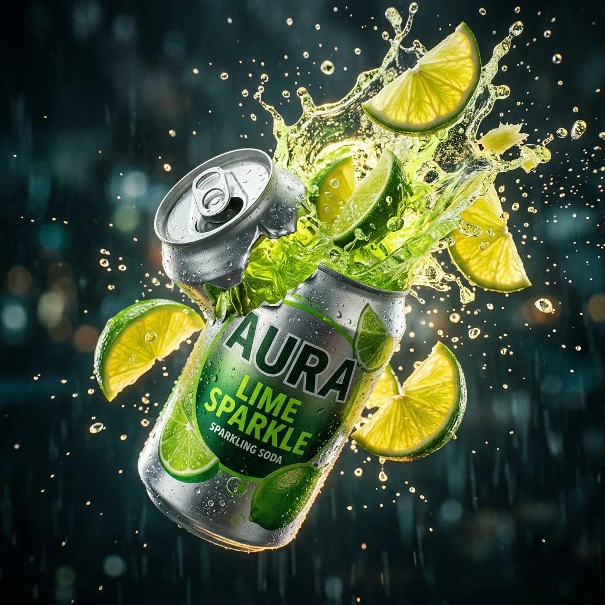

**#134 · Food &amp; Drink Prompt · <code>Vinano Image v2</code>**

<details>
<summary>Show prompt</summary>

```
- Ultra-cinematic beverage advertising shot of a sparkling lime soda can, captured from a low three-quarter angle the camera positioned slightly below the product for a heroic, powerful perspective; the can appears partially torn open as vivid lime wedges explode outward in slow motion, frozen mid-air high-energy splashes of neon-green liquid and micro droplets; intense backlighting makes the citrus flesh glow translucently while sharp rim light outlines Keep edges clean and the overall composition balanced for a polished, gallery-ready result.
```

</details>

---

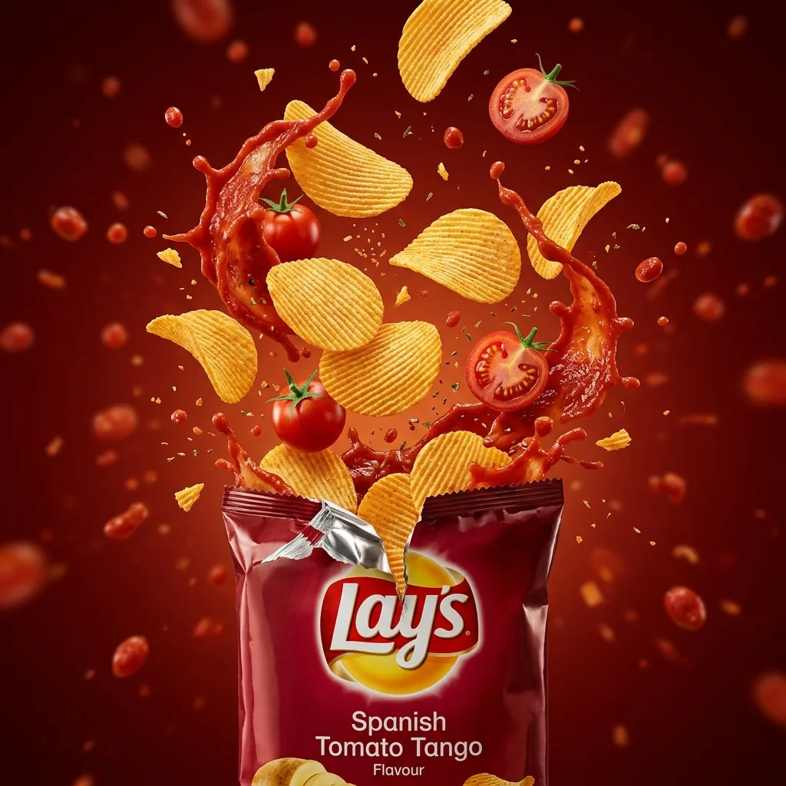

**#135 · Food &amp; Drink Prompt · <code>Vinano Image v2</code>**

<details>
<summary>Show prompt</summary>

```
{
 "prompt_name": "Lays_Spanish_Tomato_Tango_Explosion",
 "description": "Ultra-realistic commercial food photography showing a red Lay’s snack packet torn open from the top, positioned at the bottom center of the frame. Golden ridged potato chips are explosively bursting upward in frozen mid-air motion. Thick red tomato sauce splashes dynamically around the chips, forming arcs and droplets. Fresh whole tomatoes and halved tomatoes visible seeds are flying around. Small crispy crumbs and seasoning particles are suspended in the air. The Lay’s logo is clearly visible on the packet, readable text: 'Spanish Tomato Tango Flavour'. The packet surface is glossy and reflective realistic wrinkles. Background is a deep red gradient filled floating sauce droplets and particles, creating intense energy.",
 "lighting": "Dramatic warm studio lighting strong highlights, deep shadows, and high contrast",
 "color_palette": ["deep red", "tomato red", "golden yellow", "dark orange"],
 "motion": "High-energy explosive upward motion frozen splashes and flying fragments",
 "focus": "Ultra-sharp focus on chips, sauce splashes, and packet branding",
 "texture_detail": "Highly detailed ridged chip texture, glossy liquid splashes, realistic foil reflections",
 "style": "Premium FMCG commercial advertising, cinematic realism",
 "resolution": "8K",
 "aspect_ratio": "3:4"
}

Maintain consistent colour harmony and crisp focus across the whole frame.
```

</details>

---

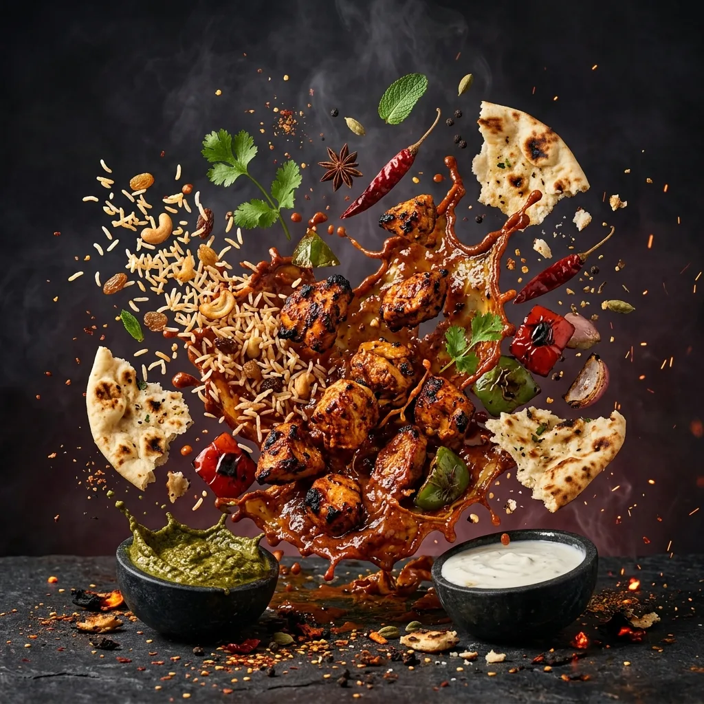

**#136 · Food &amp; Drink Prompt · <code>Vinano Image v2</code>**

<details>
<summary>Show prompt</summary>

```
{
 "image_type": "Hyper-realistic cinematic food photography",
 "resolution": "8K",
 "aspect_ratio": "3:4",
 "camera": {
 "shot_type": "Hero shot",
 "angle": "Slightly low-angle central focus",
 "focus": "Ultra-sharp foreground controlled depth of field",
 "motion_capture": "Frozen mid-air action splash dynamics"
 },
 "lighting": {
 "style": "Cinematic studio lighting",
 "highlights": "Strong specular highlights emphasizing oil, glaze, and moisture",
 "shadows": "Deep, dramatic shadows for contrast and depth",
 "rim_light": "Visible edge lighting outlining food elements",
 "ambient": "Low-key lighting environment"
 },
 "background": {
 "color": "Dark charcoal to deep maroon tones",
 "texture": "Smoky, atmospheric backdrop",
 "elements": ["Rising steam",
 "Spice-infused smoke",
 "Floating embers and sparks"]
 },
 "primary_subjects": [{
 "item": "Cooked food pieces",
 "position": "Suspended mid-air",
 "surface_detail": "Charred edges, textured crust, glossy coating",
 "motion": "Erupting upward dynamic splash behavior"
 }],
 "secondary_elements": [{
 "item": "Sauce or gravy",
 "state": "Thick and glossy",
 "motion": "Explosive splash visible droplets and arcs",
 "detail": "Oil separation visible as shimmering droplets"
 },
 {
 "item": "Herbs",
 "types": ["Fresh coriander leaves",
 "Mint leaves"],
 "motion": "Scattered and floating naturally"
 },
 {
 "item": "Spices",
 "types": ["Whole dried red chilies",
 "Whole spices (clearly visible star-shaped and pod-like forms)",
 "Crushed spice particles"],
 "behavior": "Suspended mid-air, dispersed unevenly"
 },
 {
 "item": "Vegetables",
 "types": ["Bell peppers (green and red)",
 "Onion chunks"],
 "cut": "Large rustic chunks",
 "surface": "Light char and gloss"
 }],
 "supporting_food_items": [{
 "item": "Rice grains",
 "detail": "Individual grains clearly visible, mid-air dispersion",
 "motion": "Erupting outward spices"
 },
 {
 "item": "Nuts and dry fruits",
 "types": ["Cashews",
 "Raisins"],
 "position": "Mixed rice and floating"
 },
 {
 "item": "Flatbread pieces",
 "detail": "Torn edges, soft interior texture, char marks visible",
 "motion": "Suspended mid-air crumbs"
 }],
 "condiments": [{
 "item": "Green chutney",
 "texture": "Thick, coarse",
 "motion": "Upward splash from a bowl",
 "container": "Dark stone bowl matte finish"
 },
 {
 "item": "White yogurt-based sauce",
 "texture": "Smooth and creamy",
 "container": "Dark stone bowl"
 }],
 "surface_environment": {
 "base": "Dark textured surface",
 "elements": ["Scattered spice flakes",
 "Burnt crumbs",
 "Small glowing embers",
 "Charcoal-like stones"]
 },
 "color_palette": ["Deep reds",
 "Burnt orange",
 "Charcoal black",
 "Smoky maroon",
 "Herb green",
 "Creamy white highlights"],
 "mood": "Bold, intense, premium, cinematic, high-impact food commercial aesthetic",
 "realism_level": "Extreme hyper-realism tactile textures and moisture detail",
 "post_processing": {
 "contrast": "High",
 "clarity": "Very high",
 "sharpening": "Selective sharpening on food textures",
 "noise": "Minimal",
 "color_grading": "Warm highlights deep shadows"
 }
}

Keep edges clean and the overall composition balanced for a polished, gallery-ready result.
```

</details>

---

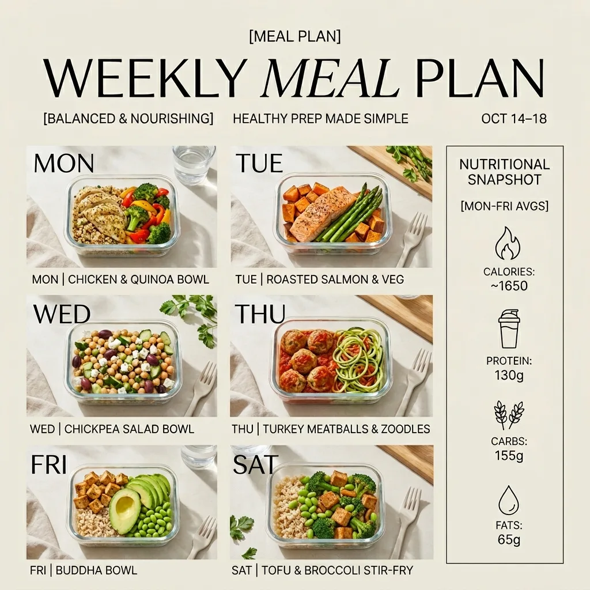

**#137 · Food &amp; Drink Prompt · <code>Vinano Image Pro</code>**

<details>
<summary>Show prompt</summary>

```
Clean & appetizing meal prep layouts

Design a refined minimalist healthy meal prep poster for [MEAL PLAN], clean containers, colorful balanced ingredients, calorie/macros panel, weekly layout, soft pastel background, bright natural light, wellness brand typography, crisp shadows, modern Instagram design.

Aim for an editorial, design-driven look with deliberate negative space.
```

</details>

---

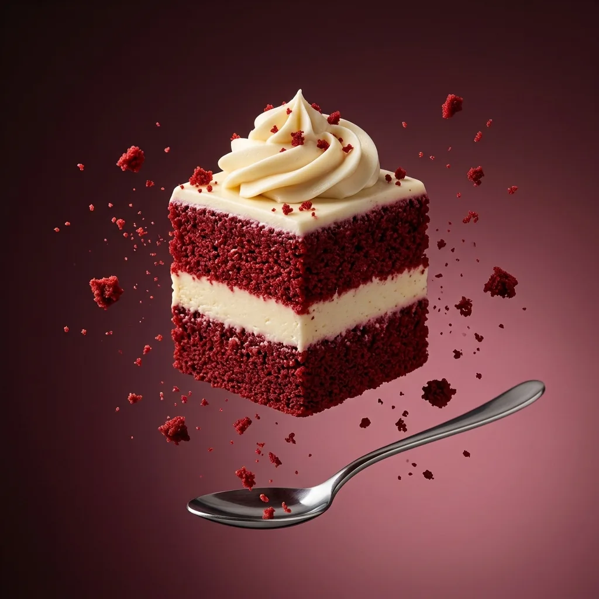

**#138 · Food &amp; Drink Prompt · <code>Vinano Image v2</code>**

<details>
<summary>Show prompt</summary>

```
{
 "image_type": "high-detail food photography, AI-edited surreal composition",
 "resolution": "8K ultra-high-definition",
 "aspect_ratio": "3:4",
 "main_subject": {
 "object": "single cube-shaped red velvet cake piece",
 "position": "floating in mid-air",
 "orientation": "slightly angled, front face visible, top frosting facing upward",
 "texture": {
 "cake": "fine, dense crumb texture visible granules",
 "frosting": "smooth, creamy, thick layer soft ridges"
 }
 },
 "cake_details": {
 "layers": [{
 "type": "red velvet sponge",
 "color": "deep red",
 "count": 2
 },
 {
 "type": "cream filling",
 "color": "pale off-white",
 "count": 1,
 "position": "center layer"
 }],
 "top_frosting": {
 "style": "swirled frosting peak",
 "color": "off-white / cream",
 "surface_detail": "soft curved piping lines",
 "toppings": "small red velvet crumbs scattered on top"
 }
 },
 "motion_elements": {
 "crumbs": {
 "presence": true,
 "distribution": "scattered around the cake in mid-air",
 "size_variation": "fine dust to small chunks",
 "motion": "frozen mid-flight"
 }
 },
 "secondary_object": {
 "object": "metal spoon",
 "material": "polished stainless steel",
 "position": "below the cake",
 "orientation": "slightly tilted upward",
 "reflection": "subtle reflections visible on spoon surface",
 "interaction": "crumbs falling toward spoon"
 },
 "lighting": {
 "style": "studio lighting",
 "direction": "soft directional light from upper side",
 "highlights": "gentle highlights on frosting and spoon",
 "shadows": "soft shadows, no harsh edges",
 "contrast": "moderate contrast emphasizing texture"
 },
 "background": {
 "color_palette": ["dark maroon",
 "deep burgundy",
 "muted pink gradient"],
 "style": "smooth gradient backdrop",
 "depth": "shallow depth of field",
 "noise": "clean, minimal grain"
 },
 "color_profile": {
 "dominant_colors": ["deep red",
 "cream white",
 "dark maroon"],
 "saturation": "rich but controlled",
 "tone": "luxurious and dramatic"
 },
 "composition": {
 "framing": "centered subject vertical emphasis",
 "visual_balance": "cake centered, spoon offset below",
 "negative_space": "ample empty space around subject"
 },
 "style_tags": ["hyper-realistic",
 "AI-edited look",
 "surreal food photography",
 "freeze-motion effect",
 "premium dessert aesthetic"],
 "camera_simulation": {
 "focus": "sharp focus on cake",
 "background_blur": "smooth bokeh-like gradient",
 "angle": "eye-level to slightly low angle"
 },
 "post_processing": {
 "clarity": "high",
 "sharpness": "very high",
 "color_grading": "cinematic dessert tones",
 "artifacts": "none visible"
 }
}

Maintain consistent colour harmony and crisp focus across the whole frame.
```

</details>

---

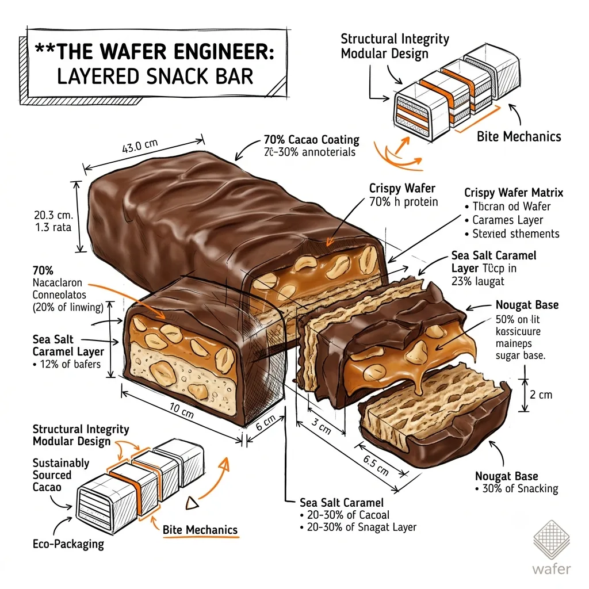

**#139 · Food &amp; Drink Prompt · <code>Vinano Image Pro</code>**

<details>
<summary>Show prompt</summary>

```
Create a branded technical infographic of a [SNACK], combining a realistic photograph or photoreal render of the product technical annotation overlays placed directly on top. Use black ink–style line drawings strategic [BRAND COLOR] accents (architectural sketch look) on a pure white studio background, including:
• Key component labels
• Internal cross-section showing structure, layering, or internal design
• Measurements, dimensions, and specifications
• Material callouts composition and quantities
• Arrows indicating function for primary features and structural integrity
• Simple schematic or sectional diagram showing key mechanical or design elements
• Sustainability callouts
Title placement: Inside a hand-drawn technical annotation box accent border reading the product name in bold font, positioned in upper corner.
Style & layout rules:
• The realistic product remains clearly visible
• Annotations feel sketched, technical, and architectural
• Accents used for highlight (20-30% of linework), black for primary technical lines (70-80%)
• crisp composition balanced negative space
• Educational, food-engineering vibe premium branding
• Include subtle brand logo mark in corner
Visual style: Minimal technical illustration aesthetic, black linework accents over realistic imagery, precise but slightly hand-drawn feel.
Color palette: White background, black annotation lines/text, [BRAND COLOR] for accents and key callouts only.
Output: 1080×1080, ultra-crisp, social-feed optimized, no watermark

Emphasise material texture and natural light so the final frame feels tactile and premium.
```

</details>

---

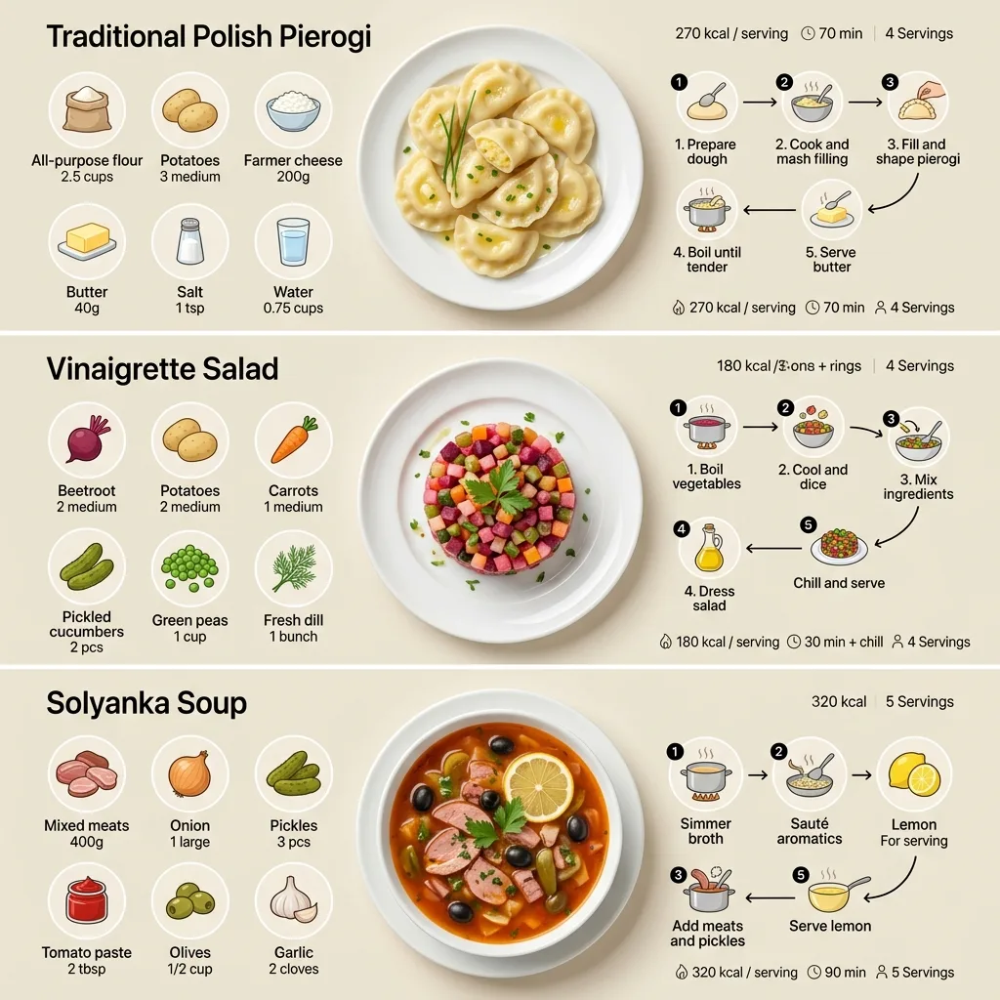

**#140 · Food &amp; Drink Prompt · <code>Vinano Image Pro</code>**

<details>
<summary>Show prompt</summary>

```
{
 "style": "refined minimalist modern recipe infographic",
 "visual_aesthetic": {
 "photography_style": "Top-down / 3-quarter angle food photography",
 "design_language": "Scandinavian, editorial cookbook layout",
 "background": "Soft neutral beige / cream",
 "lighting": "Soft diffused light gentle shadows",
 "detail_level": "Ultra-realistic, ultra-sharp, 8K resolution"
 },
 "layout": {
 "composition": "Finished dish centered on a white ceramic plate or bowl",
 "elements": ["Floating ingredient icons in soft circular frames",
 "Clean vector-style ingredient illustrations",
 "Clear ingredient labels quantities",
 "Curved step-by-step flow numbered cooking icons"],
 "typography": "High readability, modern sans-serif",
 "spacing": "Balanced, airy, uncluttered"
 },
 "recipes": [{
 "dish_name": "Traditional Polish Pierogi",
 "dish_presentation": "Golden boiled dumplings filled potato and cheese, lightly buttered and garnished fresh chives",
 "ingredients": [{ "name": "All-purpose flour", "quantity": "2.5 cups" },
 { "name": "Potatoes", "quantity": "3 medium" },
 { "name": "Farmer cheese", "quantity": "200g" },
 { "name": "Onion", "quantity": "1 medium" },
 { "name": "Butter", "quantity": "40g" },
 { "name": "Salt", "quantity": "1 tsp" },
 { "name": "Water", "quantity": "0.75 cups" }],
 "steps": ["Prepare dough",
 "Cook and mash filling",
 "Fill and shape pierogi",
 "Boil until tender",
 "Serve butter"],
 "meta": {
 "calories": "270 kcal / serving",
 "time": "70 min",
 "servings": 4
 }
 },
 {
 "dish_name": "Vinaigrette Salad",
 "dish_presentation": "Colorful diced vegetables mixed light dressing, neatly molded and topped fresh herbs",
 "ingredients": [{ "name": "Beetroot", "quantity": "2 medium" },
 { "name": "Potatoes", "quantity": "2 medium" },
 { "name": "Carrots", "quantity": "1 medium" },
 { "name": "Pickled cucumbers", "quantity": "2 pcs" },
 { "name": "Green peas", "quantity": "1 cup" },
 { "name": "Sunflower oil", "quantity": "2 tbsp" },
 { "name": "Fresh dill", "quantity": "1 bunch" }],
 "steps": ["Boil vegetables",
 "Cool and dice",
 "Mix ingredients",
 "Dress salad",
 "Chill and serve"],
 "meta": {
 "calories": "180 kcal / serving",
 "time": "30 min + chill",
 "servings": 4
 }
 },
 {
 "dish_name": "Solyanka Soup",
 "dish_presentation": "Rich hearty soup sliced meats, olives, lemon, and herbs, served steaming in a ceramic bowl",
 "ingredients": [{ "name": "Mixed meats", "quantity": "400g" },
 { "name": "Onion", "quantity": "1 large" },
 { "name": "Pickles", "quantity": "3 pcs" },
 { "name": "Tomato paste", "quantity": "2 tbsp" },
 { "name": "Olives", "quantity": "1/2 cup" },
 { "name": "Garlic", "quantity": "2 cloves" },
 { "name": "Bay leaf", "quantity": "1 pc" },
 { "name": "Lemon", "quantity": "For serving" }],
 "steps": ["Simmer broth",
 "Sauté aromatics",
 "Add meats and pickles",
 "Season and simmer",
 "Serve lemon"],
 "meta": {
 "calories": "320 kcal / serving",
 "time": "90 min",
 "servings": 5
 }
 }]
}

Maintain consistent colour harmony and crisp focus across the whole frame.
```

</details>

---

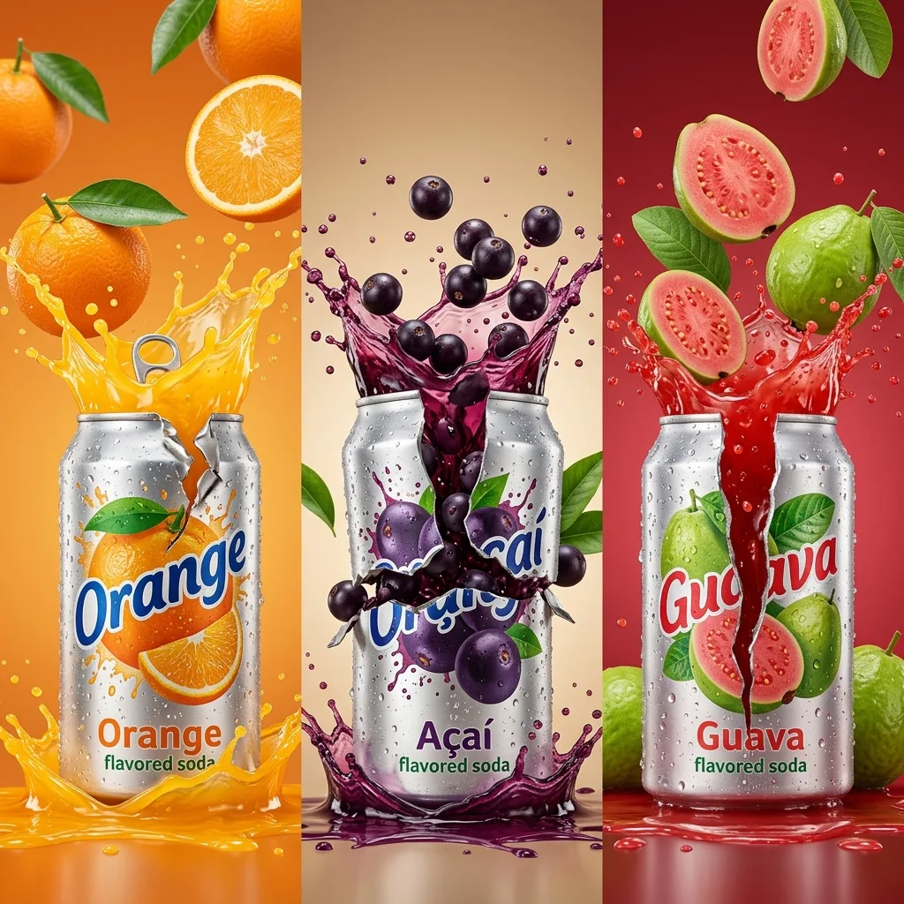

**#141 · Food &amp; Drink Prompt · <code>Vinano Image v2</code>**

<details>
<summary>Show prompt</summary>

```
{
 "global_settings": {
 "resolution": "8K UHD",
 "aspect_ratio": "3:4",
 "image_type": "AI-edited hyper-realistic commercial product photography",
 "camera": {
 "focus": "ultra-sharp center focus",
 "depth_of_field": "shallow DOF soft background falloff",
 "angle": "straight-on frontal view",
 "lens": "macro-commercial lens look"
 },
 "lighting": {
 "style": "studio lighting",
 "key_light": "strong frontal soft light",
 "rim_light": "subtle edge highlights on fruits and splashes",
 "reflections": "specular highlights on liquid droplets and metal can"
 },
 "textures": ["highly detailed aluminum can surface",
 "realistic liquid physics",
 "sharp fruit skin texture",
 "visible condensation droplets"],
 "quality_flags": ["extreme detail",
 "true-to-life photorealistic",
 "AI-enhanced clarity",
 "no motion blur",
 "clean background"]
 },

 "Module_1_Image_1_Style_Orange": {
 "subject": "Orange flavored soda can",
 "can_details": {
 "material": "metal aluminum",
 "condition": "top torn open jagged sharp cracks",
 "crack_position": "irregular split at the top rim, metal bent outward",
 "surface": "covered water droplets and condensation"
 },
 "fruit_elements": {
 "whole_oranges": "multiple whole oranges floating behind and above the can",
 "orange_slice": "one visible half-cut orange slice near the top center",
 "leaves": "green citrus leaves attached to some oranges"
 },
 "liquid_effects": {
 "splash_color": "bright orange liquid",
 "motion": "liquid bursting upward and outward from inside the can",
 "droplets": "numerous suspended droplets frozen mid-air",
 "base_splash": "orange liquid pooling and splashing at the bottom"
 },
 "background": {
 "color": "solid warm orange",
 "gradient": "slight tonal variation, no patterns"
 }
 },

 "Module_2_Image_2_Style_Acai": {
 "subject": "Açaí flavored soda can",
 "can_details": {
 "material": "metal aluminum",
 "condition": "can split horizontally into two broken sections",
 "cracks": "jagged tearing edges visible sharp metal folds",
 "surface": "covered condensation droplets"
 },
 "fruit_elements": {
 "acai_berries": "multiple dark purple berries erupting from inside the can",
 "berry_motion": "berries floating upward and outward",
 "leaves": "few green leaves visible on sides"
 },
 "liquid_effects": {
 "splash_color": "deep purple liquid",
 "motion": "explosive splash radiating outward",
 "droplets": "fine droplets suspended in air"
 },
 "background": {
 "color": "warm beige to light brown gradient",
 "tone": "soft neutral backdrop"
 }
 },

 "Module_3_Image_3_Style_Goiaba_Guava": {
 "subject": "Guava flavored soda can",
 "can_details": {
 "material": "metal aluminum",
 "condition": "vertical split down the center of the can",
 "cracks": "uneven torn edges exposing inside",
 "surface": "visible water droplets and moisture"
 },
 "fruit_elements": {
 "guava_halves": "multiple guava halves pink interiors",
 "whole_guavas": "several whole green guavas around the can",
 "leaves": "green guava leaves scattered"
 },
 "liquid_effects": {
 "splash_color": "red guava juice",
 "motion": "juice bursting upward and sideways",
 "droplets": "dense red droplets suspended mid-air"
 },
 "background": {
 "color": "solid deep red",
 "tone": "high contrast fruit and liquid"
 }
 }

Preserve realistic proportions and depth for a confident, professional finish.
```

</details>

---

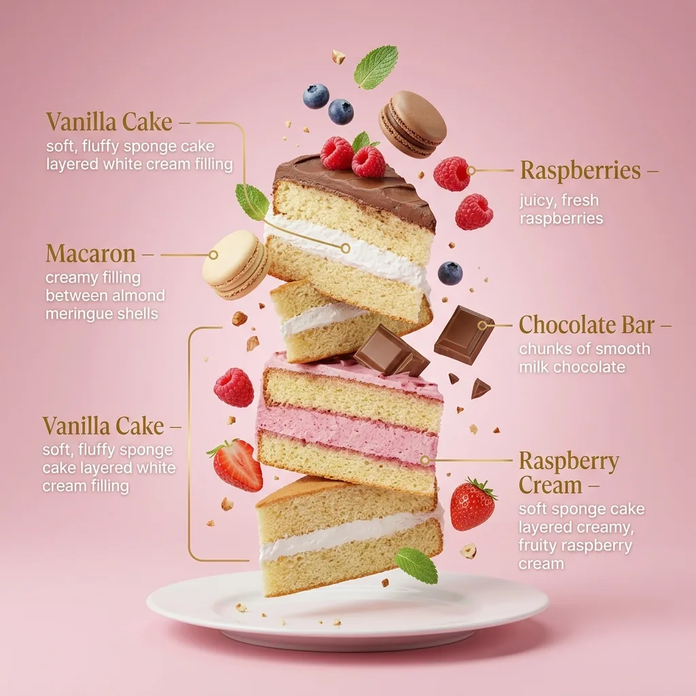

**#142 · Food &amp; Drink Prompt · <code>Vinano Image Pro</code>**

<details>
<summary>Show prompt</summary>

```
{
"global_settings": {
"resolution": "8K ultra high definition",
"aspect_ratio": "3:4",
"camera_style": "studio food photography filmic, cinematic lighting",
"depth_of_field": "shallow depth of field, sharp subject, soft background",
"lighting": "soft directional key light, subtle rim light, controlled highlights",
"style": "hyper-realistic food illustration editorial infographic overlays",
"composition_rules": ["no zoom",
"no crop",
"center-weighted vertical composition",
"floating elements frozen in motion"],
"text_design": {
"ingredient_name_color": "metallic gold",
"ingredient_description_color": "pure white",
"font_style": "elegant serif for titles, clean sans-serif for descriptions",
"indicator_lines": "long, thin, smooth golden lines rounded corners"
}
},

"module_1_image_1_style": {
"scene_description": "A vertical stack of assorted cake slices floating above a white ceramic plate against a soft pink gradient background.",
"background": {
"color": "soft pastel pink",
"texture": "smooth gradient",
"lighting": "even, studio-lit, no harsh shadows"
},
"main_subjects": ["multiple layered sponge cake slices",
"white whipped cream layers",
"raspberry cream layer",
"chocolate cream topping"],
"visible_ingredients": ["vanilla sponge cake",
"whipped cream",
"raspberries",
"blueberries",
"strawberries",
"macarons (vanilla and chocolate)",
"chocolate bar pieces",
"mint leaves",
"small nut fragments"],
"motion_elements": ["floating fruits",
"floating macarons",
"crumbs suspended in air"],
"text_labels": ["Vanilla Cake – soft, fluffy sponge cake layered white cream filling",
"Macaron – creamy filling between almond meringue shells",
"Raspberries – juicy, fresh raspberries",
"Chocolate Bar – chunks of smooth milk chocolate",
"Raspberry Cream – soft sponge cake layered creamy, fruity raspberry cream"]
},

Emphasise material texture and natural light so the final frame feels tactile and premium.
```

</details>

---

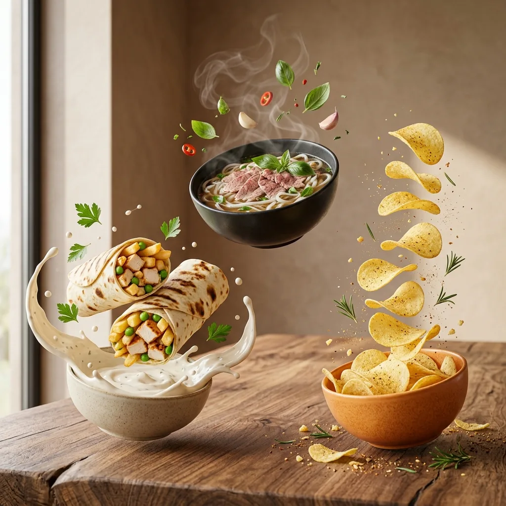

**#143 · Food &amp; Drink Prompt · <code>Vinano Image v2</code>**

<details>
<summary>Show prompt</summary>

```
{
 "global_settings": {
 "resolution": "8K",
 "aspect_ratio": "3:4",
 "image_quality": "ultra-high definition",
 "sharpness": "extreme",
 "lighting_quality": "studio-grade filmic, cinematic lighting",
 "render_style": "hyper-realistic AI-edited food photography",
 "noise": "none",
 "text_or_logos": "none",
 "focus": "tack-sharp foreground controlled depth"
 },

 "Module_1_Image_1_Style": {
 "subject": "two grilled tortilla wraps",
 "composition": {
 "main_action": "wraps floating above a bowl of sauce",
 "orientation": "one wrap stacked diagonally over another",
 "perspective": "slightly low-angle, centered composition"
 },
 "food_details": {
 "wrap_texture": "lightly grilled tortilla golden brown char spots",
 "filling_visible": ["diced cooked chicken",
 "golden french fries",
 "green peas"],
 "sauce": {
 "type": "thick creamy white sauce",
 "motion": "large splash forming curved arcs",
 "bowl_material": "ceramic",
 "bowl_color": "light beige"
 }
 },
 "motion_elements": ["suspended sauce droplets",
 "floating parsley leaves"],
 "background": {
 "color": "dark warm brown gradient",
 "texture": "smooth, studio backdrop"
 },
 "surface": "wooden tabletop visible at bottom",
 "mood": "dynamic, indulgent, dramatic food motion"
 },

 "Module_2_Image_2_Style": {
 "subject": "potato chips in a bowl",
 "composition": {
 "main_action": "chips flying upward above the bowl",
 "distribution": "evenly spaced mid-air chips forming a vertical cascade",
 "camera_position": "eye-level close-up"
 },
 "food_details": {
 "chips_texture": "thin, crispy, lightly curved",
 "chips_color": "golden yellow seasoning speckles",
 "bowl": {
 "material": "ceramic",
 "color": "warm orange",
 "fill_state": "bowl partially filled chips"
 }
 },
 "seasoning_elements": ["fine spice dust",
 "small crumbs",
 "rosemary sprigs floating"],
 "background": {
 "color": "warm orange gradient",
 "lighting": "soft diffused highlights on chips"
 },
 "ground_details": ["scattered crumbs",
 "spice particles",
 "rosemary pieces"],
 "mood": "energetic, crunchy, commercial snack photography"
 },

 "Module_3_Image_3_Style": {
 "subject": "beef noodle soup in a bowl",
 "composition": {
 "main_action": "bowl floating in mid-air",
 "camera_angle": "slightly elevated front angle",
 "framing": "centered wide negative space"
 },
 "food_details": {
 "bowl_color": "dark matte black",
 "broth": "clear brown liquid",
 "noodles": "white flat noodles",
 "protein": "thin slices of raw or lightly cooked beef",
 "herbs": ["green basil leaves"]
 },
 "floating_elements": ["basil leaves",
 "chili slices",
 "garlic cloves",
 "herb fragments"],
 "steam": {
 "visibility": "clearly visible",
 "shape": "soft swirling trails",
 "opacity": "semi-transparent"
 },
 "background": {
 "color": "soft teal gradient",
 "texture": "clean studio backdrop"
 },
 "mood": "fresh, aromatic, premium culinary presentation"
 },

Emphasise material texture and natural light so the final frame feels tactile and premium.
```

</details>

---

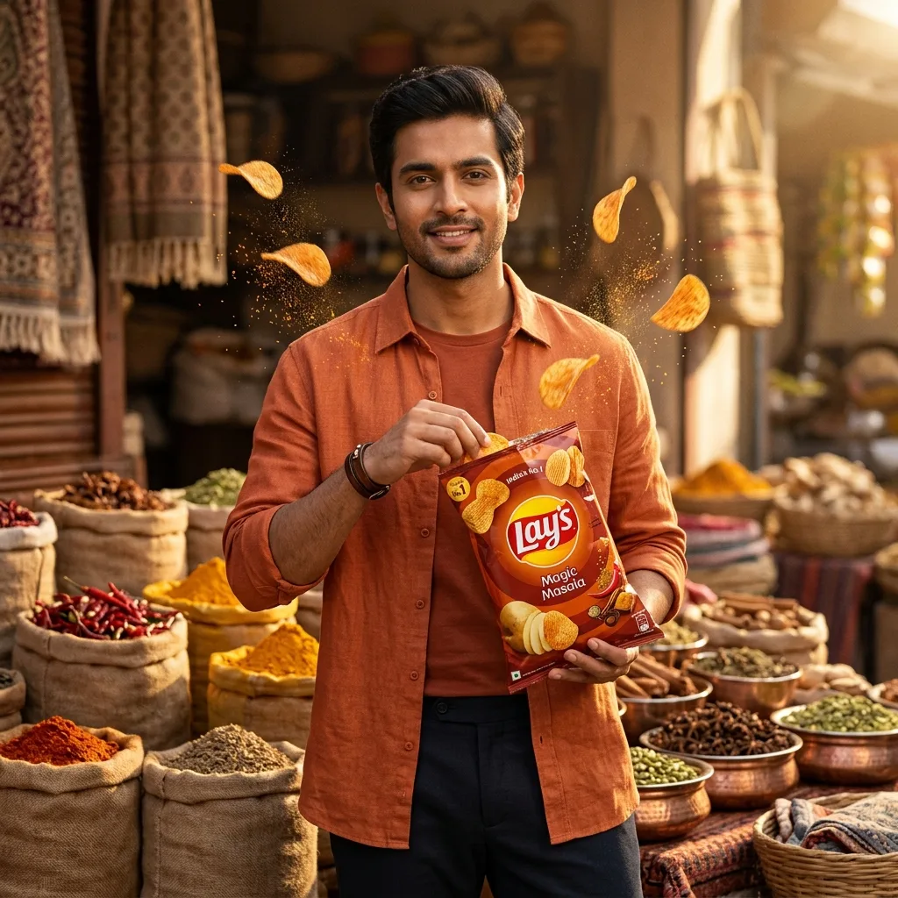

**#144 · Food &amp; Drink Prompt · <code>Vinano Image Pro</code>**

<details>
<summary>Show prompt</summary>

```
A cinematic, ultra-realistic advertising shot of a man holding a Lay’s [FLAVOR NAME] chips packet in his hand.
The packet color, branding, and typography are perfectly accurate to Lay’s official design.
The man’s outfit color, texture, and style match the packet theme (same color palette and mood), modern and stylish, premium fashion look.
His pose is confident and natural, hand clearly gripping the Lay’s packet in the foreground.
Background environment matches the flavor theme

spices, ingredients, atmosphere, and lighting inspired by the flavor (for example: fiery spices for masala, fresh greens for sour cream, smoky tones for barbecue).

Chips are flying in slow motion around the scene realistic motion blur and seasoning particles in the air.

Dramatic golden-hour lighting, cinematic depth of field, sharp focus on the packet, soft background bokeh.

Hyper-realistic textures, commercial food photography, high contrast, rich colors,

ultra-detailed, 8K quality, professional brand advertisement

style

Emphasise material texture and natural light so the final frame feels tactile and premium.
```

</details>

---

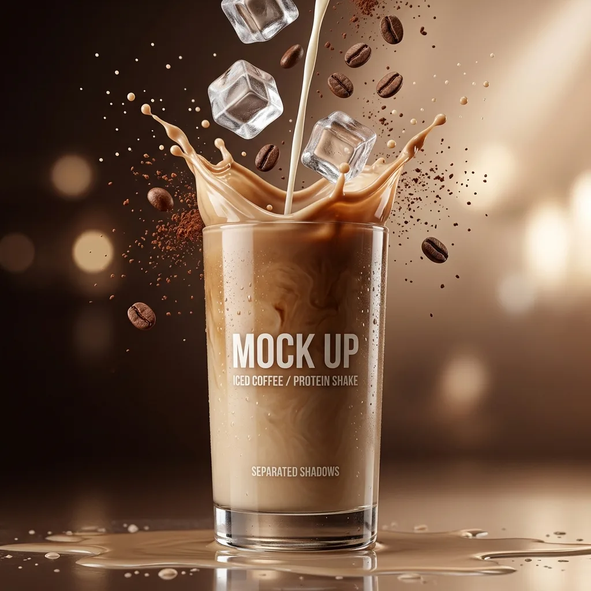

**#145 · Food &amp; Drink Prompt · <code>Vinano Image v2</code>**

<details>
<summary>Show prompt</summary>

```
{
 "master_prompt": {
 "global_settings": {
 "resolution": "8K ultra-high-definition",
 "aspect_ratio": "3:4 vertical",
 "style": "hyper-realistic AI-edited commercial beverage photography",
 "sharpness": "extreme clarity, micro-detail visibility",
 "lighting_quality": "cinematic studio lighting controlled highlights and shadows",
 "motion_freeze": "high-speed capture, frozen liquid splashes and particles",
 "noise": "none",
 "artifacts": "none"
 },

 "module_1_glass_beverage_style": {
 "subject": {
 "type": "transparent glass",
 "glass_style": "tall cylindrical glass thick base",
 "surface_details": "cold condensation droplets on outer glass surface",
 "fill_level": "80 percent full",
 "label_text_visible": ["mock up",
 "iced coffee / protein shake",
 "SEPARATED SHADOWS"]
 },

 "liquid_and_layers": {
 "beverage_type": "iced latte or chocolate protein shake",
 "liquid_color": "rich coffee brown or creamy cocoa",
 "layering": "soft milk-to-coffee gradient subtle swirls",
 "texture": "smooth, thick, glossy, realistic viscosity"
 },

 "motion_and_splash": {
 "action": "liquid splash erupting from inside the glass",
 "splash_behavior": "curved arcs rising above rim suspended droplets",
 "droplet_detail": "micro droplets frozen mid-air sharp definition"
 },

 "floating_elements": {
 "ice_cubes": "large clear ice cubes rotating in mid-air",
 "coffee_beans_or_cocoa": "roasted coffee beans or cocoa powder particles floating",
 "cream_stream": "thin stream of milk or cream pouring into glass"
 },

 "pose_and_camera": {
 "position": "centered hero composition",
 "angle": "three-quarter close-up",
 "camera_feel": "slightly low angle for premium, powerful presence"
 },

 "background": {
 "color_palette": "deep espresso brown fading into warm beige highlights",
 "bokeh": "soft cinematic bokeh lights warm glow",
 "atmosphere": "luxurious, indulgent, high-end café mood"
 },

 "surface_and_reflection": {
 "base": "wet reflective surface subtle liquid pooling",
 "shadow_style": "clean, soft separated shadow beneath glass",
 "reflection_quality": "controlled highlights along glass edges"
 }
 }
 }
}

Render with rich micro-detail while keeping the layout uncluttered and intentional.
```

</details>

---

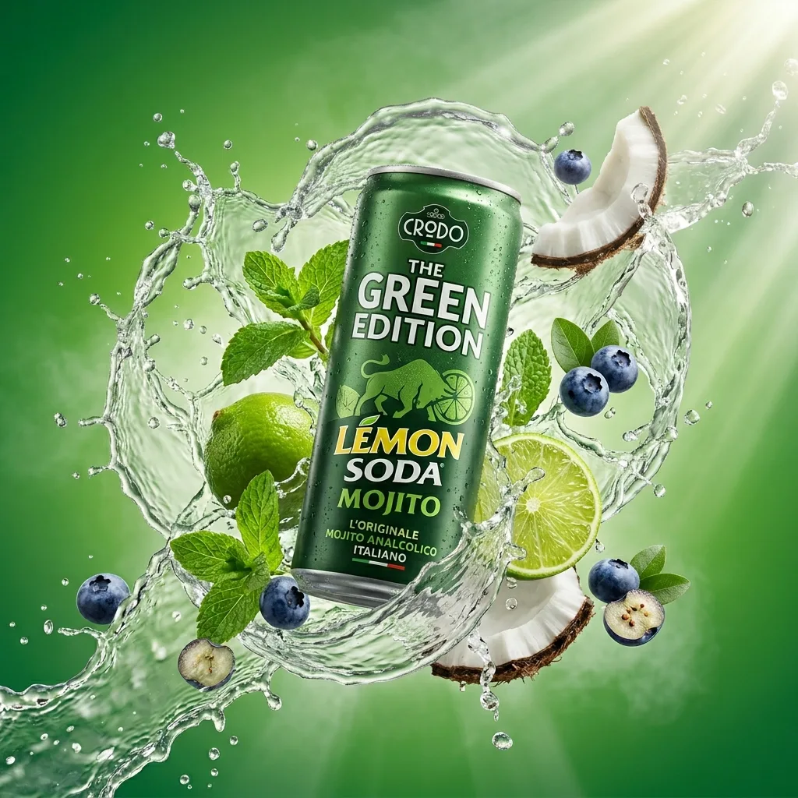

**#146 · Food &amp; Drink Prompt · <code>Vinano Image v2</code>**

<details>
<summary>Show prompt</summary>

```
{
 "global_settings": {
 "resolution": "8K ultra high definition",
 "aspect_ratio": "3:4",
 "quality": "hyper-realistic commercial product photography",
 "focus": "sharp foreground, controlled depth of field",
 "lighting_style": "cinematic studio lighting volumetric light rays",
 "motion": "frozen action splash photography",
 "render_style": "AI-edited, ultra-detailed, advertising-grade"
 },

 "module_1_purple_acai_style": {
 "primary_subject": {
 "object": "slim aluminum energy drink can",
 "orientation": "slightly tilted clockwise, floating mid-air",
 "surface": "matte metallic purple fine water droplets",
 "branding": {
 "text_visible": ["THE PURPLE EDITION", "Açaí Berry", "ENERGY DRINK"],
 "graphics": "stylized bull illustration in white"
 }
 },
 "background": {
 "color": "deep purple gradient",
 "lighting": "bright diagonal light rays from upper right",
 "atmosphere": "misty fine water particles"
 },
 "surrounding_elements": {
 "fruits": [{
 "type": "blueberries",
 "state": ["whole", "one halved"],
 "texture": "glossy skin, visible pulp on cut fruit"
 }],
 "leaves": "small green leaves attached to berries",
 "liquid": "clear water splashes forming arcs around can"
 },
 "motion_details": {
 "water": "dynamic splash trails frozen mid-air",
 "droplets": "micro droplets suspended around subject"
 },
 "color_palette": ["purple", "violet", "deep blue", "white", "fresh green"]
 },

 "module_2_white_coconut_berry_style": {
 "primary_subject": {
 "object": "slim aluminum energy drink can",
 "orientation": "slightly tilted counter-clockwise, floating",
 "surface": "white metallic finish condensation droplets",
 "branding": {
 "text_visible": ["THE WHITE EDITION", "Coconut & Berry", "ENERGY DRINK"],
 "graphics": "bull illustration in gray"
 }
 },
 "background": {
 "color": "sky blue gradient",
 "lighting": "strong sunlight beams from upper right",
 "atmosphere": "clean, airy, refreshing"
 },
 "surrounding_elements": {
 "fruits": [{
 "type": "blueberries",
 "state": "whole",
 "texture": "smooth, reflective skin"
 },
 {
 "type": "coconut",
 "state": "broken slices",
 "texture": "white flesh dark brown shell"
 }

 "ice": {
 "form": "transparent ice cubes",
 "detail": "sharp edges, internal cracks visible"
 },
 "liquid": "clear water splashes"
 },
 "motion_details": {
 "water": "curved splash paths wrapping around can",
 "ice": "suspended mid-air subtle rotation"
 },
 "color_palette": ["white", "light blue", "cyan", "natural brown", "cool gray"]

 "module_3_green_lemon_mojito_style": {
 "primary_subject": {
 "object": "tall soda can",
 "orientation": "tilted slightly clockwise, floating",
 "surface": "dark green metallic body lighter green label",
 "branding": {
 "text_visible": ["LEMON SODA", "MOJITO", "L’ORIGINALE MOJITO ANALCOLICO ITALIANO"],
 "logo": "CRODO emblem at top
 "background": {
 "color": "vibrant green gradient",
 "lighting": "intense sun flare from upper right"
 },
 "surrounding_elements": {
 "fruits": [{
 "type": "lime",
 "state": ["whole", "sliced wedge"],
 "texture": "visible citrus pulp, glossy rind"
 }],
 "leaves": "fresh mint leaves visible veins",
 "liquid": "sparkling water splashes"
 },
 "motion_details": {
 "water": "explosive splash bursts around can",
 "droplets": "dense spray of fine droplets"
 },
 "color_palette": ["lime green", "dark green", "yellow-green", "white"]
 }

Aim for an editorial, design-driven look with deliberate negative space.
```

</details>

---

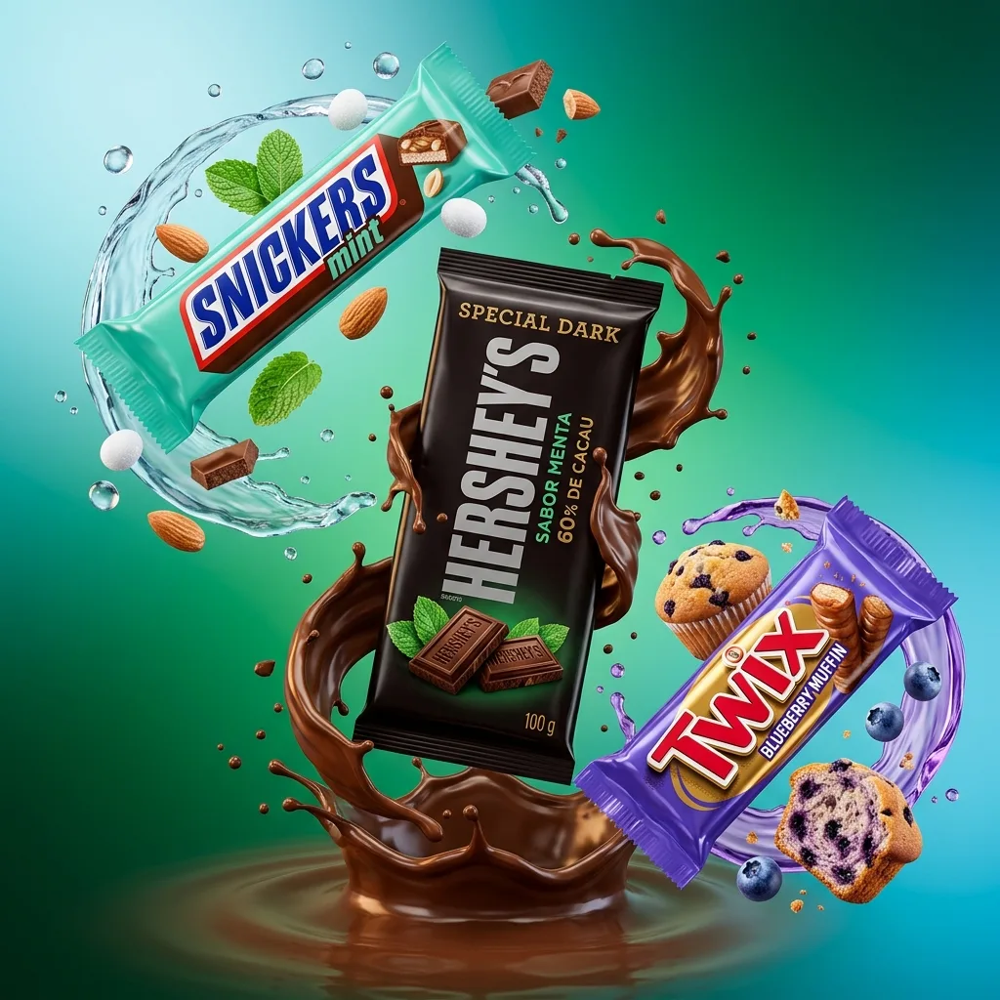

**#147 · Food &amp; Drink Prompt · <code>Vinano Image v2</code>**

<details>
<summary>Show prompt</summary>

```
{
 "global_settings": {
 "resolution": "8K",
 "quality": "ultra-high",
 "render_style": "hyperrealistic commercial CGI",
 "lighting": "studio-grade, high-contrast, glossy highlights",
 "focus": "extreme sharpness, macro-level texture visibility",
 "color_depth": "rich, saturated, clean gradients",
 "noise": "none",
 "artifacts": "none"
 },

 "Module_1_Image_1_Style": {
 "subject": {
 "primary_object": "Snickers mint chocolate bar in turquoise wrapper",
 "pose": "diagonally tilted, floating mid-air",
 "orientation": "top-left to bottom-right angle",
 "visibility": "full front-facing packaging visible"
 },
 "packaging_details": {
 "colors": ["turquoise", "brown", "white", "blue"],
 "text_visible": ["SNICKERS", "SNICKES", " mint"],
 "surface": "glossy plastic wrapper subtle creases",
 "product_image": "chocolate bar segment printed on wrapper"
 },
 "ingredients_visible": ["fresh mint leaves",
 "whole almonds",
 "white sugar-like spherical candies",
 "chocolate bar pieces"],
 "motion_elements": {
 "liquid": "clear water splash forming a curved arc around the bar",
 "droplets": "floating water bubbles and droplets suspended in air"
 },
 "background": {
 "color": "light aqua blue",
 "texture": "smooth gradient",
 "depth": "foreground and background elements clearly separated"
 },
 "lighting": {
 "key_light": "bright frontal studio light",
 "rim_light": "cool highlights on water edges",
 "reflections": "strong specular highlights on wrapper and liquid"
 }
 },

 "Module_2_Image_2_Style": {
 "subject": {
 "primary_object": "Hershey’s Special Dark chocolate mint packaging",
 "pose": "upright, centered, slightly elevated",
 "orientation": "front-facing, symmetrical composition"
 },
 "packaging_details": {
 "colors": ["black", "green", "yellow"],
 "text_visible": ["SPECIAL DARK",
 "HERSHEY’S",
 "SABOR MENTA",
 "60% DE CACAU",
 "100 g"],
 "surface": "matte-black wrapper glossy highlights"
 },
 "ingredients_visible": ["mint leaves",
 "embossed Hershey’s chocolate squares"],
 "motion_elements": {
 "liquid": "thick molten chocolate splashes wrapping around the package",
 "droplets": "small chocolate particles suspended mid-air"
 },
 "background": {
 "color": "deep green gradient",
 "base_surface": "liquid chocolate pool beneath the package"
 },
 "lighting": {
 "key_light": "warm directional light",
 "accent_light": "golden highlights on chocolate splashes",
 "contrast": "high contrast between dark wrapper and green background"
 }
 },

 "Module_3_Image_3_Style": {
 "subject": {
 "primary_object": "Twix Blueberry Muffin packaged snack",
 "pose": "slightly tilted, floating above background",
 "orientation": "front-facing angled depth"
 },
 "packaging_details": {
 "colors": ["purple", "gold", "white"],
 "text_visible": ["TWIX", "BLUEBERRY MUFFIN"],
 "surface": "glossy purple plastic wrapper"
 },
 "food_elements": ["blueberry muffin",
 "sliced muffin revealing purple interior",
 "whole blueberries"],
 "motion_elements": {
 "liquid": "purple splash forming circular motion behind the product",
 "particles": "crumbs and droplets suspended in air"
 },
 "background": {
 "color": "turquoise-blue",
 "texture": "clean gradient high saturation"
 },
 "lighting": {
 "key_light": "bright neutral studio light",
 "rim_light": "purple-tinted highlights on splash edges",
 "detail_visibility": "crumb texture and muffin pores clearly visible"
 }
 },

Preserve realistic proportions and depth for a confident, professional finish.
```

</details>

---

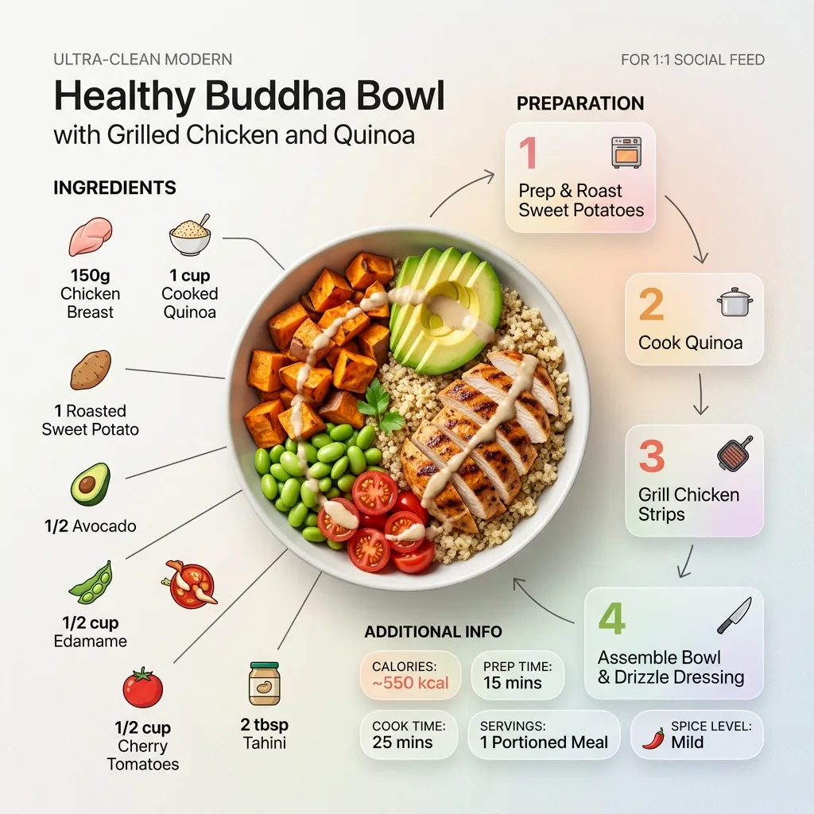

**#148 · Food &amp; Drink Prompt · <code>Vinano Image Pro</code>**

<details>
<summary>Show prompt</summary>

```
Ultra-clean modern recipe infographic. Showcase [FOOD] in a visually appealing finished form—sliced, plated, or portioned—floating slightly in perspective or angled view. Arrange ingredients, steps, and tips around the dish in a dynamic editorial layout, not restricted to top-down. Ingredients Section: Include icons or mini illustrations for each ingredient quantities. Arrange them in clusters, lists, or circular flows connected visually to the dish. Steps Section: Show preparation steps numbered panels, arrows, or lines, forming a logical flow around the main dish. Include small cooking icons (knife, pan, oven, timer) where helpful. Additional Info (optional): Total calories, prep/cook time, servings, spice level—displayed as clean bubbles or badges near the dish. Visual Style: Editorial infographic meets lifestyle food photography. Vibrant, natural food colors, subtle drop shadows, clean vector icons, modern typography, soft gradients or glassmorphism for step panels. Accent colors can highlight key info (calories, prep time). Composition Guidelines: Finished meal as hero visual (perspective or angled) Ingredients and steps flow dynamically around the dish Clear visual hierarchy: dish > steps > ingredients > optional stats Enough negative space to keep design airy and readable Lighting & Background: Soft, natural studio lighting, minimal textured or gradient background for premium editorial feel. Output: 1080×1080, ultra-crisp, social-feed optimized, no watermark Render with rich micro-detail while keeping the layout uncluttered and intentional.
```

</details>

---

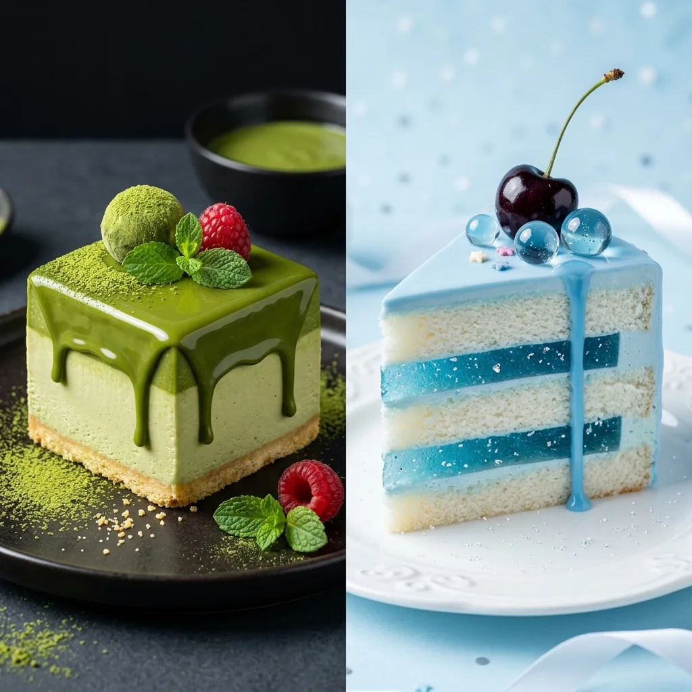

**#149 · Food &amp; Drink Prompt · <code>Vinano Image v2</code>**

<details>
<summary>Show prompt</summary>

```
{
 "global_settings": {
 "resolution": "8K UHD",
 "quality": "ultra-high",
 "render_style": "AI-edited hyper-realistic food photography",
 "sharpness": "extreme micro-detail",
 "noise": "none",
 "compression": "lossless",
 "lighting_quality": "studio-controlled, cinematic",
 "color_accuracy": "true-to-image",
 "focus": "selective shallow depth of field",
 "texture_emphasis": "maximum"
 },

 "camera_profile": {
 "camera_type": "full-frame DSLR / mirrorless equivalent",
 "lens": "macro prime",
 "focal_length": "85mm–105mm",
 "aperture": "f/2.8",
 "iso": "low ISO",
 "shutter": "studio synchronized",
 "white_balance": "neutral, image-matched"
 },

 "module_1_image_1_style": {
 "subject": "square matcha cheesecake slice",
 "composition": {
 "orientation": "portrait",
 "angle": "three-quarter front view",
 "placement": "centered on dark ceramic plate",
 "crop": "tight food-focused crop"
 },
 "layers": {
 "top_layer": "glossy matcha glaze visible drip trails",
 "middle_layer": "smooth pale-green cheesecake body",
 "bottom_layer": "thin golden biscuit crust"
 },
 "surface_details": {
 "glaze": "highly reflective, thick, slow-dripping matcha glaze",
 "powder": "matcha powder dusted on top and plate",
 "crumbs": "fine crumbs near base"
 },
 "garnish": {
 "top": ["round green confection", "fresh mint leaves", "single raspberry"],
 "plate": ["extra raspberry", "mint leaves", "matcha powder"]
 },
 "background": {
 "color": "dark charcoal / black",
 "elements": ["black bowl containing green sauce"],
 "blur": "strong background blur"
 },
 "lighting": {
 "key_light": "soft directional from upper left",
 "highlights": "strong specular highlights on glaze",
 "shadows": "soft, natural falloff"
 },
 "mood": "luxurious, modern, minimal, gourmet"
 },

 "module_2_image_2_style": {
 "subject": "blue and white layered cake slice",
 "composition": {
 "orientation": "portrait",
 "angle": "slightly elevated front angle",
 "placement": "centered on white decorative plate"
 },
 "layers": {
 "cake_layers": "soft white sponge layers",
 "filling_layers": "translucent blue jelly layers sparkle",
 "top_layer": "smooth pastel blue glaze"
 },
 "surface_details": {
 "drip": "single vertical glossy blue drip down front",
 "sparkle": "tiny reflective particles embedded in jelly",
 "top_decor": "glass-like blue spheres"
 },
 "garnish": {
 "top": ["dark glossy cherry long stem", "three transparent blue spheres", "tiny star-shaped sprinkles"],
 "plate": ["subtle sugar-like sparkles"]
 },
 "background": {
 "color": "light icy blue",
 "effect": "soft bokeh dots",
 "props": ["white ribbon partially visible"]
 },
 "lighting": {
 "key_light": "soft frontal light",
 "fill": "even illumination",
 "highlights": "glass reflections on spheres"
 },
 "mood": "dreamy, delicate, whimsical, clean"
 },

Preserve realistic proportions and depth for a confident, professional finish.
```

</details>

---

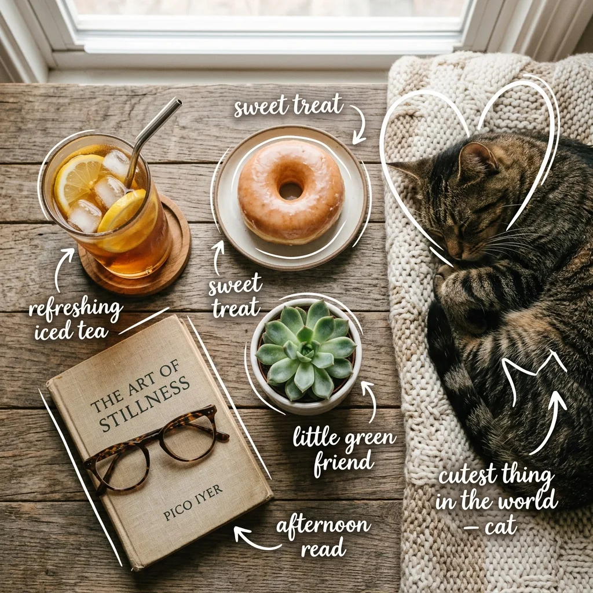

**#150 · Food &amp; Drink Prompt · <code>Vinano Image v2</code>**

<details>
<summary>Show prompt</summary>

```
Top-down flat lay on a rustic wooden table, cozy aesthetic, soft natural light. A glass of iced tea lemon slices and ice cubes, a glazed donut, a small succulent plant in a white pot, a vintage book, and eyeglasses. A sleeping tabby cat curled on a blanket at the edge. White hand-drawn doodle outlines and arrows around each object playful handwritten labels like “refreshing iced tea,” “sweet treat,” “little green friend,” “afternoon read,” and “cutest thing in the world – cat.” Warm tones, minimal shadows, lifestyle photography, high detail, Instagram aesthetic. Keep edges clean and the overall composition balanced for a polished, gallery-ready result.
```

</details>

---

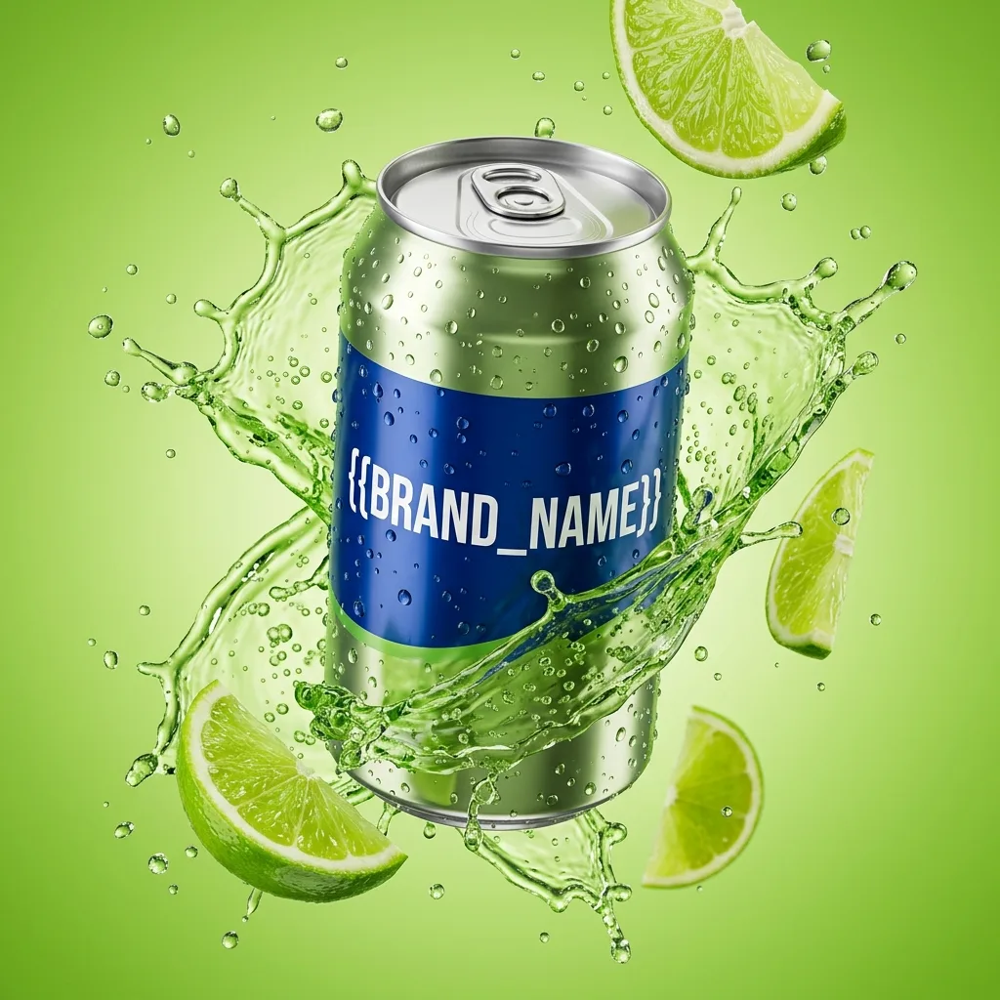

**#151 · Food &amp; Drink Prompt · <code>Vinano Image v2</code>**

<details>
<summary>Show prompt</summary>

```
{
 "resolution": "8K",
 "style": "hyper-realistic commercial product photography",
 "composition": {
 "subject": "carbonated beverage can",
 "position": "center frame, floating mid-air",
 "orientation": "slightly tilted vertical",
 "framing": "tight hero shot"
 },
 "can_details": {
 "material": "metallic aluminum",
 "top_bottom": "silver visible pull tab",
 "surface": "glossy condensation droplets",
 "label": {
 "text": "{{BRAND_NAME}}",
 "font": "bold uppercase sans-serif",
 "color": "white",
 "background_band": "deep blue",
 "placement": "wrapped around center of can"
 }
 },
 "liquid_effects": {
 "color": "bright green",
 "type": "carbonated liquid splash",
 "motion": "frozen mid-explosion",
 "details": ["semi-transparent fluid",
 "fine droplets suspended in air",
 "dynamic curved splash arcs",
 "visible carbonation bubbles"]
 },
 "fruit_elements": {
 "type": "sliced fruit",
 "motion": "floating around the can",
 "texture": "fresh, juicy, glossy"
 },
 "lighting": {
 "type": "studio lighting",
 "highlights": "strong reflections",
 "shadows": "soft"
 },
 "background": {
 "color": "smooth gradient matching liquid tone",
 "environment": "clean studio backdrop"
 },
 "render_quality": {
 "sharpness": "ultra-sharp",
 "contrast": "high",
 "realism": "true-to-life photorealistic"
 }
}

Keep edges clean and the overall composition balanced for a polished, gallery-ready result.
```

</details>

---

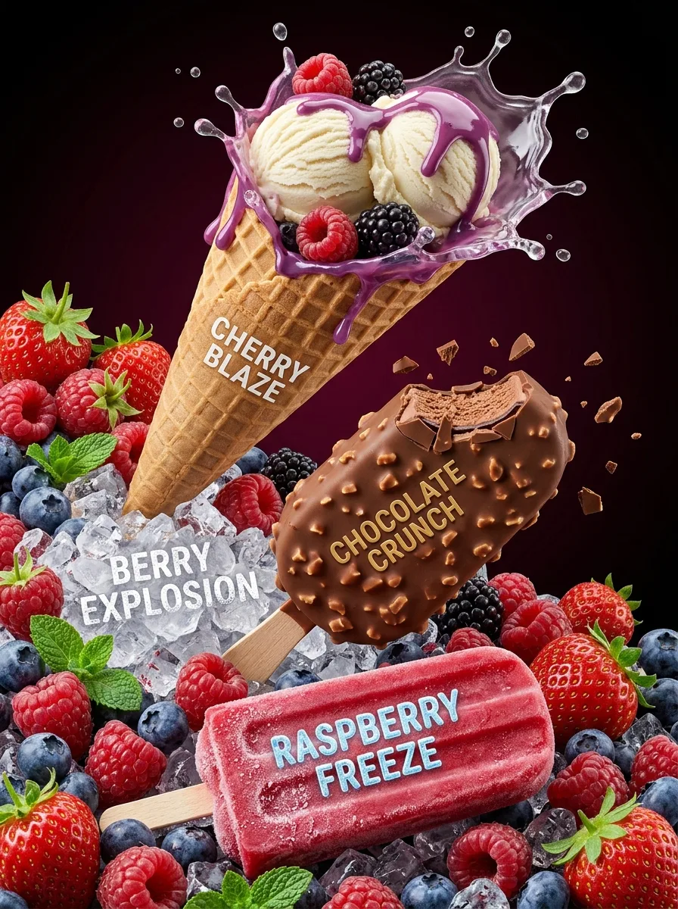

**#152 · Food &amp; Drink Prompt · <code>Vinano Image Pro</code>**

<details>
<summary>Show prompt</summary>

```
{
 "master_prompt": {
 "global_settings": {
 "resolution": "8K ultra high definition",
 "aspect_ratio": "3:4 vertical",
 "image_quality": "extreme sharpness, high dynamic range, professional studio lighting",
 "style": "AI-edited hyperreal food photography",
 "focus": "crisp textures, frozen motion, liquid dynamics, surface details",
 "background_quality": "clean, controlled, noise-free"
 },

 "module_1": {
 "identity": "Image 1 – Ice Cream Cone Purple Splash",
 "subject": {
 "main_object": "waffle cone ice cream",
 "cone": "light brown waffle cone diamond grid texture, matte finish",
 "ice_cream_scoops": [{
 "color": "off-white / vanilla",
 "texture": "creamy visible scoop ridges"
 },
 {
 "color": "off-white / vanilla",
 "texture": "slightly uneven surface, melting edges"
 }],
 "toppings": ["raspberries",
 "blackberries"],
 "sauce": {
 "color": "glossy purple",
 "behavior": "thick liquid splashing outward and downward",
 "coverage": "dripping over scoops and cone"
 }
 },
 "motion": {
 "action": "frozen splash moment",
 "details": "liquid droplets suspended mid-air, see-through splash edges"
 },
 "background": {
 "color": "deep dark maroon / black",
 "style": "studio backdrop subtle gradient"
 },
 "lighting": {
 "type": "high-contrast studio lighting",
 "effects": "specular highlights on sauce and ice cream, shadow depth under cone"
 }
 },

 "module_2": {
 "identity": "Image 2 – Chocolate Ice Cream Bar Bite",
 "subject": {
 "main_object": "chocolate-coated ice cream bar on wooden stick",
 "coating": {
 "exploded_view": false,
 "surface": "milk chocolate coating embedded nut pieces",
 "texture": "rough, uneven, crunchy appearance"
 },
 "bite_detail": {
 "location": "top edge",
 "interior_layers": ["chocolate ice cream",
 "thin darker chocolate layer"],
 "edges": "jagged bite marks"
 },
 "stick": {
 "material": "light wood",
 "finish": "smooth, rounded end"
 }
 },
 "motion": {
 "elements": "small chocolate fragments floating in air",
 "behavior": "scattered outward from the bar"
 },
 "background": {
 "color": "warm brown gradient",
 "style": "clean studio environment"
 },
 "lighting": {
 "type": "directional studio lighting",
 "effects": "strong highlights on chocolate bumps, soft shadows"
 }
 },

 "module_3": {
 "identity": "Image 3 – Red Berry Popsicle Fruits",
 "subject": {
 "main_object": "rectangular red popsicle",
 "surface": {
 "texture": "frosted, icy crystals visible",
 "shape": "rounded corners, vertical grooves"
 },
 "stick": {
 "material": "light wooden stick",
 "visible": true
 },
 "surroundings": ["whole strawberries green tops",
 "blueberries",
 "raspberries",
 "mint leaves",
 "crushed ice pieces"]
 },
 "color_palette": ["bright red",
 "deep blue",
 "fresh green",
 "clear ice"],
 "background": {
 "composition": "entire frame filled fruits and ice",
 "style": "top-down macro food arrangement"
 },
 "lighting": {
 "type": "even bright lighting",
 "effects": "wet shine on fruit skins, crystalline ice reflections"
 }
 },

Emphasise material texture and natural light so the final frame feels tactile and premium.
```

</details>

---

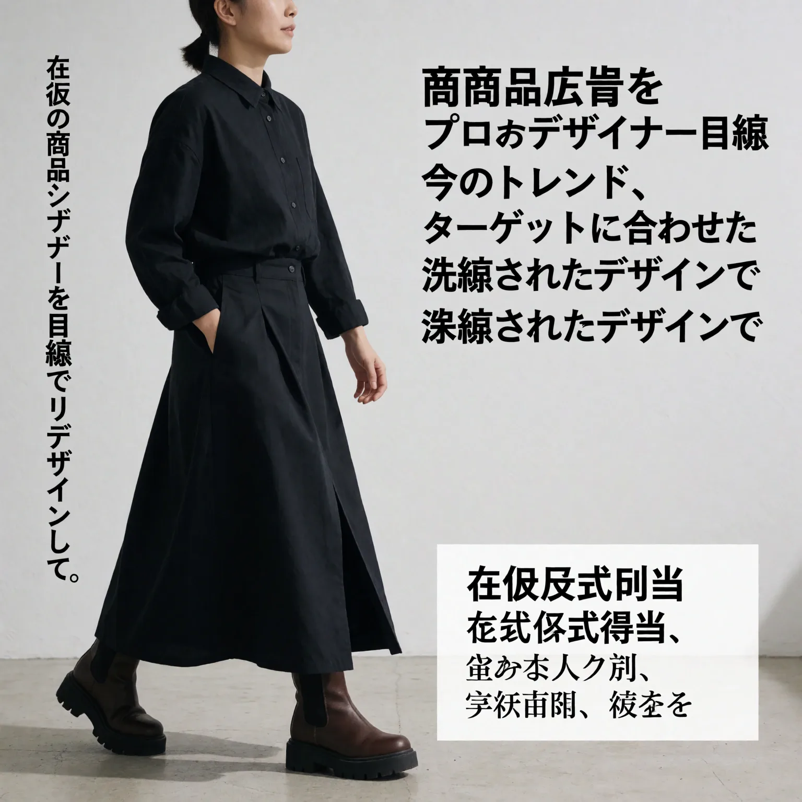

**#153 · Food &amp; Drink Prompt · <code>Vinano Flash</code>**

<details>
<summary>Show prompt</summary>

```
この商品広告をプロのデザイナー目線でリデザインして。
今のトレンド、ターゲットに合わせた洗練されたデザインで。

在保证细节的同时保持版式克制、留白得当。
```

</details>

---

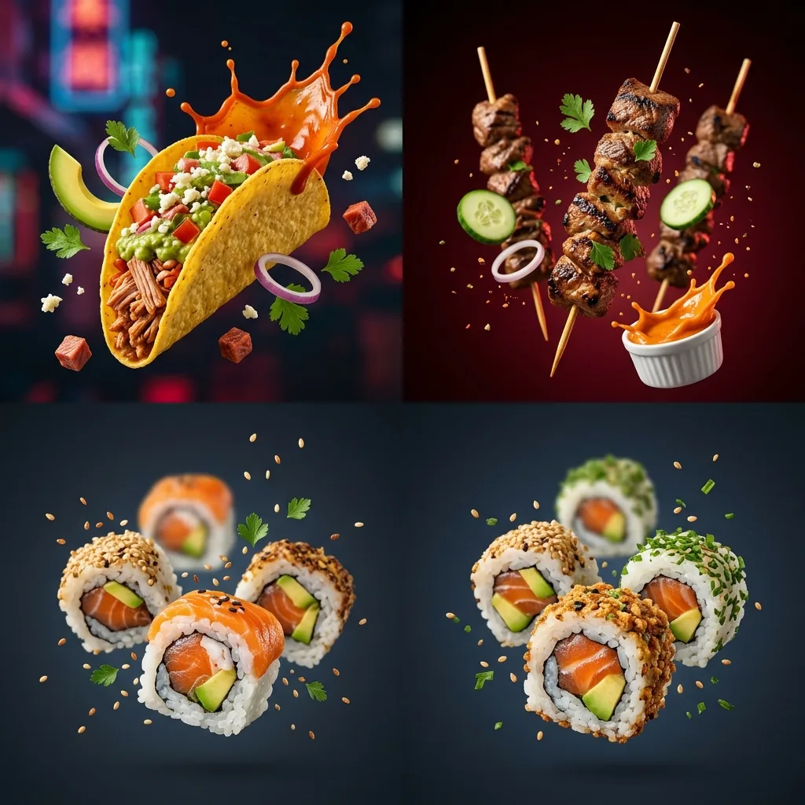

**#154 · Food &amp; Drink Prompt · <code>Vinano Image v2</code>**

<details>
<summary>Show prompt</summary>

```
{
 "global_settings": {
 "resolution": "8K ultra high definition",
 "aspect_ratio": "2:3 vertical",
 "image_type": "AI-edited cinematic food photography",
 "detail_level": "extreme micro-detail, sharp focus, clean edges",
 "style_constraint": "enhanced realism, minimal alteration from original composition"
 },

 "module_1_image_1_style": {
 "subject": "single hard-shell taco",
 "composition": {
 "orientation": "diagonal, floating in mid-air",
 "foreground_focus": "taco shell and filling",
 "motion": "ingredients suspended, sauce splash frozen mid-air"
 },
 "visible_elements": {
 "shell": "golden yellow hard taco shell crisp texture",
 "filling": ["shredded cooked meat visible fibers",
 "green sauce layered on top",
 "small red diced pieces",
 "white crumbled cheese"],
 "floating_garnish": ["avocado slices",
 "purple onion rings",
 "green herb leaves",
 "small reddish-brown meat cubes",
 "tiny white crumbs"],
 "liquid": "orange-red sauce splash erupting upward behind taco"
 },
 "lighting": {
 "type": "high-contrast studio lighting",
 "highlights": "glossy reflections on sauce and meat",
 "background_lights": "soft circular bokeh in warm and cool tones"
 },
 "background": {
 "color": "dark neon-like blurred lights",
 "depth": "strong depth of field, background fully defocused"
 }
 },

 "module_2_image_2_style": {
 "subject": "three grilled meat skewers",
 "composition": {
 "orientation": "vertical skewers, slightly angled",
 "foreground_focus": "center skewer",
 "motion": "ingredients and sauce suspended"
 },
 "visible_elements": {
 "skewers": "wooden sticks pointed ends",
 "meat": "chunked grilled meat char marks and uneven texture",
 "garnish": "small green herb leaves attached to meat",
 "floating_items": ["round cucumber slices",
 "thin onion rings"],
 "sauce": {
 "container": "small white ramekin",
 "action": "thick orange sauce splashing upward from bowl"
 },
 "particles": "tiny spice or crumb particles scattered in air"
 },
 "lighting": {
 "type": "dramatic directional lighting",
 "highlights": "strong sheen on meat surface",
 "contrast": "deep shadows"
 },
 "background": {
 "color": "solid deep red",
 "texture": "soft grain floating particles"
 }
 },

 "module_3_image_3_style": {
 "subject": "four sushi rolls",
 "composition": {
 "orientation": "floating cluster",
 "spacing": "uneven depth, some closer, some blurred behind",
 "motion": "sesame seeds and herbs suspended"
 },
 "visible_elements": {
 "sushi_structure": {
 "outer_layer": "white rice",
 "inner_layer": "dark seaweed",
 "fillings": ["orange fish slice",
 "green avocado"]
 },
 "toppings": ["toasted sesame seeds",
 "brown crunchy coating",
 "finely chopped green herbs"],
 "particles": ["sesame seeds",
 "small green herb pieces"]
 },
 "lighting": {
 "type": "soft but crisp studio lighting",
 "focus": "front sushi pieces sharp, rear slightly blurred"
 },
 "background": {
 "color": "dark blue-grey",
 "depth": "clean bokeh-free backdrop floating particles"
 }
 },
 "post_processing": {
 "clarity": "ultra-sharp",
 "noise": "minimal",
 "color_balance": "rich but natural",
 "ai_signature": "clean AI-edited look without exaggeration"
 }
}

Aim for an editorial, design-driven look with deliberate negative space.
```

</details>

---

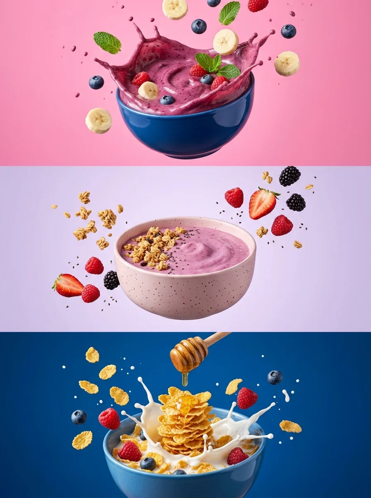

**#155 · Food &amp; Drink Prompt · <code>Vinano Image v2</code>**

<details>
<summary>Show prompt</summary>

```
{
 "resolution": "8K UHD",
 "aspect_ratio": "3:4",
 "image_style": "hyper-realistic commercial food photography",
 "global_settings": {
 "quality": "Ultra-high detail, sharp focus, studio-grade clarity",
 "lighting": "Soft but controlled studio lighting visible highlights and splash definition",
 "motion": "Frozen mid-air action, ingredients suspended",
 "background_style": "Solid or smooth gradient background, color varies per module",
 "camera": "High-speed photography look, shallow to medium depth of field",
 "post_processing": "Balanced contrast, natural saturation, no artificial glow"
 },

 "modules": {

 "module_1_berry_smoothie_explosion": {
 "scene_description": "A vibrant smoothie bowl exploding fruit and liquid splashes",
 "bowl": {
 "color": "Deep blue ceramic bowl",
 "finish": "Glossy",
 "position": "Centered, floating mid-air"
 },
 "base_contents": {
 "type": "Thick berry smoothie",
 "color": "Deep purple-magenta",
 "texture": "Creamy visible swirl marks"
 },
 "ingredients": {
 "fruits": ["Banana slices (round, pale yellow)",
 "Blueberries (whole, dark blue)",
 "Raspberries (whole, red)"],
 "herbs": ["Fresh mint leaves (bright green)"]
 },
 "motion_effects": {
 "liquid": "Berry smoothie splashing upward and outward",
 "particles": "Small droplets suspended in air"
 },
 "background": {
 "color": "Bright pink",
 "texture": "Smooth, seamless"
 }
 },

 "module_2_minimal_pink_smoothie_bowl": {
 "scene_description": "refined minimalist floating smoothie bowl granola and berries",
 "bowl": {
 "color": "Light pink ceramic bowl dark speckles",
 "finish": "Matte",
 "position": "Floating centrally"
 },
 "base_contents": {
 "type": "Smoothie",
 "color": "Soft pink purple undertones",
 "texture": "Thick and smooth"
 },
 "toppings": {
 "granola": "Golden-brown oat clusters",
 "seeds": "Small black seeds scattered",
 "fruits": ["Strawberries (halved)",
 "Raspberries (whole)",
 "Blackberries (whole)"]
 },
 "motion_effects": {
 "ingredients": "Granola flakes, seeds, and berries floating gently"
 },
 "background": {
 "color": "Pastel lavender",
 "gradient": "Subtle, soft gradient"
 }
 },

 "module_3_cereal_milk_honey_splash": {
 "scene_description": "Dynamic cereal stack milk splash and honey drizzle",
 "bowl": {
 "color": "Blue ceramic bowl",
 "finish": "Glossy",
 "position": "Centered, resting visually but surrounded by motion"
 },
 "contents": {
 "cereal": "Golden cornflakes stacked vertically",
 "milk": "White milk splashing and dripping over flakes",
 "fruits": ["Raspberries",
 "Blueberries"]
 },
 "additional_elements": {
 "honey": {
 "source": "Wooden honey dipper",
 "state": "Honey dripping mid-air"
 }
 },
 "motion_effects": {
 "splashes": "Milk splashes frozen in dramatic arcs",
 "particles": "Floating flakes and droplets"
 },
 "background": {
 "color": "Deep blue",
 "tone": "High contrast"
 }
 },
}

Emphasise material texture and natural light so the final frame feels tactile and premium.
```

</details>

---

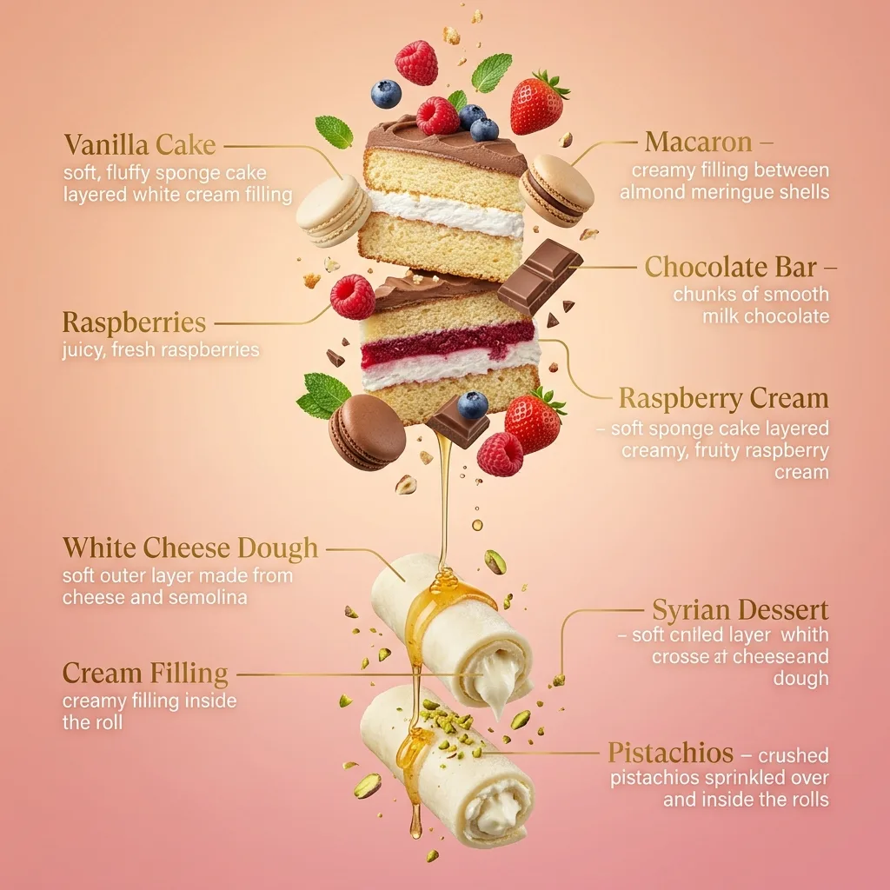

**#156 · Food &amp; Drink Prompt · <code>Vinano Image Pro</code>**

<details>
<summary>Show prompt</summary>

```
{
 "global_settings": {
 "resolution": "8K ultra high definition",
 "aspect_ratio": "3:4",
 "camera_style": "studio food photography filmic, cinematic lighting",
 "depth_of_field": "shallow depth of field, sharp subject, soft background",
 "lighting": "soft directional key light, subtle rim light, controlled highlights",
 "style": "hyper-realistic food illustration editorial infographic overlays",
 "composition_rules": ["no zoom",
 "no crop",
 "center-weighted vertical composition",
 "floating elements frozen in motion"],
 "text_design": {
 "ingredient_name_color": "metallic gold",
 "ingredient_description_color": "pure white",
 "font_style": "elegant serif for titles, clean sans-serif for descriptions",
 "indicator_lines": "long, thin, smooth golden lines rounded corners"
 }
 },

 "module_1_image_1_style": {
 "scene_description": "A vertical stack of assorted cake slices floating above a white ceramic plate against a soft pink gradient background.",
 "background": {
 "color": "soft pastel pink",
 "texture": "smooth gradient",
 "lighting": "even, studio-lit, no harsh shadows"
 },
 "main_subjects": ["multiple layered sponge cake slices",
 "white whipped cream layers",
 "raspberry cream layer",
 "chocolate cream topping"],
 "visible_ingredients": ["vanilla sponge cake",
 "whipped cream",
 "raspberries",
 "blueberries",
 "strawberries",
 "macarons (vanilla and chocolate)",
 "chocolate bar pieces",
 "mint leaves",
 "small nut fragments"],
 "motion_elements": ["floating fruits",
 "floating macarons",
 "crumbs suspended in air"],
 "text_labels": ["Vanilla Cake – soft, fluffy sponge cake layered white cream filling",
 "Macaron – creamy filling between almond meringue shells",
 "Raspberries – juicy, fresh raspberries",
 "Chocolate Bar – chunks of smooth milk chocolate",
 "Raspberry Cream – soft sponge cake layered creamy, fruity raspberry cream"]
 },

 "module_2_image_2_style": {
 "scene_description": "Rolled Syrian dessert presented vertically syrup pouring from above, placed in a warm, rustic kitchen environment.",
 "background": {
 "environment": "traditional kitchen",
 "elements": ["warm lantern light",
 "wooden surfaces",
 "brass and copper utensils"],
 "lighting": "warm ambient lighting soft highlights"
 },
 "main_subjects": ["rolled white dessert dough",
 "cream filling spilling out",
 "golden syrup stream"],
 "visible_ingredients": ["white cheese dough",
 "cream filling",
 "pistachios",
 "sugar syrup"],
 "motion_elements": ["syrup dripping vertically",
 "pistachio crumbs falling"],
 "text_labels": ["White Cheese Dough – soft outer layer made from cheese and semolina",
 "Cream Filling – creamy filling inside the roll",
 "Pistachios – crushed pistachios sprinkled over and inside the rolls"]
 }

Aim for an editorial, design-driven look with deliberate negative space.
```

</details>

---

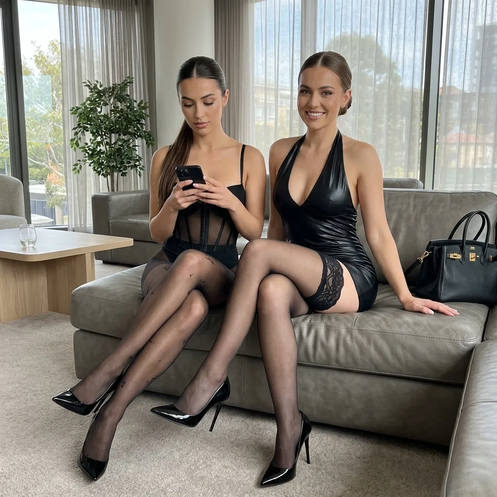

**#157 · Realistic, Ai Art · <code>Vinano Image Pro</code>**

> Keywords: realistic, AI art, AI prompt, text to image

<details>
<summary>Show prompt</summary>

```
{ "subject": { "description": "Two stylish young adult women sitting close together on a gray leather sectional sofa in a modern lounge, dressed in sleek black going-out outfits and sheer stockings; left woman looks down at a smartphone a cool, composed expression while the right woman smiles warmly at the camera.", "mirror_rules": "Not a mirror selfie; no mirror artifacts, no mirrored text, no reflection distortions.", "age": "mid-20s", "expression": { "eyes": { "look": "left woman focused on phone screen; right woman engaging the viewer", "energy": "left: calm and aloof; right: bright and inviting", "direction": "left: downward to phone; right: toward camera" }, "mouth": { "position": "left: relaxed closed lips; right: gentle smile showing teeth slightly", "energy": "left: neutral; right: friendly and confident" }, "overall": "a candid pre-night-out moment captured in daylight, contrasting glamorous styling quiet, real-life ease" }, "face": { "preserve_original": true, "makeup": "polished glam makeup: defined brows, eyeliner, soft contour, muted nude lips; right woman slightly brighter lip tone" }, "hair": { "color": "left: dark brown/black; right: light brown/blonde", "style": "left: sleek long ponytail; right: neat updo/low bun a center part", "effect": "smooth, glossy hair tidy edges, no flyaways emphasized" }, "body": { "frame": "slim, model-like proportions for both", "waist": "defined waistlines emphasized by fitted outfits", "chest": "structured neckline on the left; deep V halter neckline on the right", "legs": "long legs extended forward, knees slightly angled, legs crossed/overlapped for an elegant seated pose", "skin": { "visible_areas": "faces, shoulders, arms, upper thighs, knees, lower legs through sheer stockings", "tone": "light to light-medium warm tone", "texture": "skin looks smooth and well-moisturized; stockings add a soft, silky friction texture over the legs", "lighting_effect": "diffused daylight wraps softly, gentle highlight on cheekbones and shoulders, minimal harsh shadow" } }, "pose": { "position": "both seated on the sofa near the edge, close together", "base": "left hand holding a black smartphone; right arm relaxed hand resting near the left woman's knee/thigh area", "overall": "intimate, composed lounge pose slightly angled torsos and forward-pointed heels" }, "clothing": { "top": { "type": "left: black corset-style bodysuit structured seams and sheer cutout panels; right: black glossy halter mini dress deep V neckline", "color": "black", "details": "left: sculpted bust cups, vertical boning lines, semi-sheer geometric panels; right: smooth shiny fabric, clean minimal seams", "effect": "high-contrast fashion silhouette, elegant and upscale rather than playful" }, "bottom": { "type": "left: sheer black pantyhose subtle small lettering print; right: sheer black thigh-high stockings wide lace top band", "color": "black", "details": "both wearing pointed-toe stiletto heels a glossy finish and metallic-looking toe accents", "effect": "legs appear elongated, refined nightlife styling" } } }, "accessories": { "jewelry": "right woman: small hoop or stud earrings and a thin bracelet; minimal jewelry overall", "device": "black smartphone in the left woman's hand", "prop": "black handbag placed on the sofa to the right side of the frame" }, "photography": { "camera_style": "realistic smartphone photo, high-end social media lifestyle aesthetic", "angle": "eye-level to slightly above, subtle tilt, candid framing", "shot_type": "medium full shot capturing both women seated from head to heels", "aspect_ratio": "4:5 vertical", "texture": "clean sharp details mild phone compression, soft natural skin rendering, subtle noise in shadows", "lighting": "soft diffused daylight through sheer curtains, gentle back/side light from large windows, natural ambient fill, no harsh flash", "depth_of_field": "moderate depth of field, subjects crisp, background slightly softened" }, "background": { "setting": "modern indoor lounge or upscale apartment living area floor-to-ceiling windows", "wall_color": "neutral grays and warm wood tones", "elements": ["gray leather sectional sofa", "sheer curtains visible vertical texture", "large window panes outdoor water/greenery view", "potted leafy plant on the left", "light wood square coffee table", "soft neutral carpet"], "atmosphere": "quiet, upscale, daytime calm a hint of pre-evening anticipation", "lighting": "window-lit scene, curtain-filtered highlights, gentle reflections on leather and glossy fabric" }, "the_vibe": { "energy": "soft confidence, poised and intimate", "mood": "daylight serenity meets nightlife glam", "aesthetic": "modern luxury, social-media realism, clean minimal interior", "authenticity": "a real candid moment: one checking messages, one acknowledging the camera", "intimacy": "close seating, relaxed touch, shared frame like a private memory", "story": "they Emphasise material texture and natural light so the final frame feels tactile and premium.
```

</details>

---

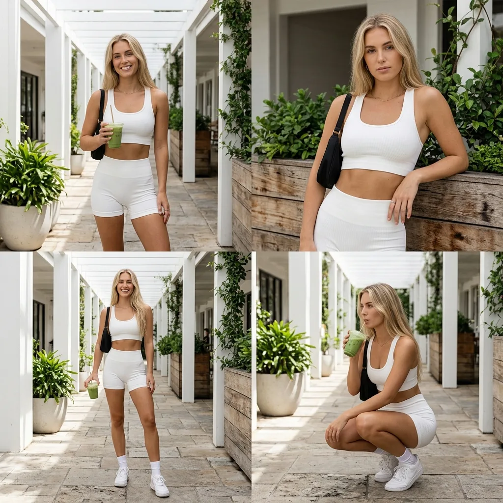

**#158 · Portrait, Ai Art · <code>Vinano Image Pro</code>**

> Keywords: portrait, AI art, AI prompt, text to image

<details>
<summary>Show prompt</summary>

```
{
 "type": "image_set",
 "style": "lifestyle fashion photography, clean and aesthetic",
 "layout": {
 "format": "2x2 grid collage",
 "orientation": "portrait images combined"
 },
 "scene": {
 "setting": "outdoor café walkway",
 "environment": {
 "architecture": "white modern building pergola",
 "surroundings": "lush green plants and vines",
 "ground": "stone tile flooring",
 "lighting": "natural daylight soft shadows"
 }
 },
 "subject": {
 "count": 1,
 "appearance": {
 "hair": {
 "color": "blonde",
 "style": "long, loose"
 },
 "expression_range": ["relaxed", "confident", "smiling", "neutral"]
 },
 "clothing": {
 "outfit": "white athletic set",
 "top": "cropped sports bra",
 "bottom": "high-waisted shorts",
 "footwear": "white sneakers crew socks",
 "accessories": ["black shoulder bag", "minimal jewelry"]
 }
 },
 "activity": {
 "action": "holding and drinking a green beverage",
 "drink": "green iced drink in clear cup straw"
 },
 "poses": ["standing casually", "leaning against planter", "smiling while standing", "crouching drink"],
 "composition": {
 "focus": "subject centered in each frame",
 "depth": "clear subject separation from background",
 "balance": "consistent framing across all four images"
 },
 "color_palette": {
 "dominant_colors": ["white", "green", "beige"],
 "accent_colors": ["black", "natural skin tones"]
 },
 "overall_tone": "fresh, healthy, stylish, summer lifestyle"
}

Emphasise material texture and natural light so the final frame feels tactile and premium.
```

</details>

---

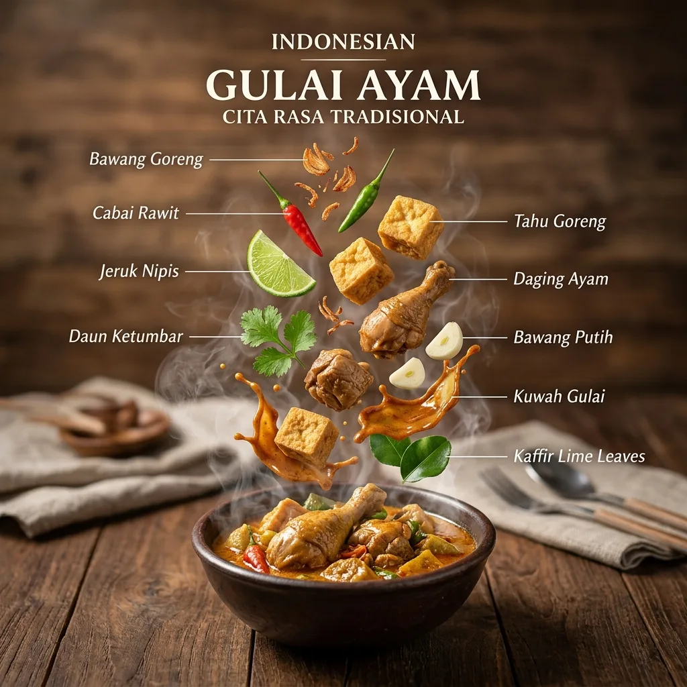

**#159 · Realistic, Cinematic · <code>Vinano Image Pro</code>**

> Keywords: realistic, cinematic, infographic, AI art, AI prompt, text to image

<details>
<summary>Show prompt</summary>

```
{
 "image_prompt": {
 "type": "Hyper-realistic food infographic",
 "subject": {
 "cuisine": "Indonesian",
 "base_element": "Traditional bowl steaming hot dish at the bottom",
 "levitating_ingredients": ["Juicy meat",
 "Crispy tofu",
 "Glossy sauce splashes",
 "Fresh herbs",
 "Chilies",
 "Lime",
 "Garlic",
 "Fried shallots"]
 },
 "composition": {
 "layout": "Clean vertical composition",
 "arrangement": "Realistic gravity-defying/floating elements",
 "background": "Rustic wooden surface",
 "visual_hierarchy": "Bowl anchored at bottom, ingredients rising vertically"
 },
 "graphic_design_elements": {
 "labels": "Clear Indonesian text",
 "lines": "Thin white pointing lines",
 "style": "Editorial infographic layout, professional food magazine style"
 },
 "lighting_and_mood": {
 "lighting": "Cinematic studio lighting",
 "color_palette": "Warm tones",
 "effects": "Dramatic steam, motion-frozen ingredients"
 },
 "technical_specs": {
 "camera_settings": "Shallow depth of field, sharp focus, DSLR look",
 "details": "Ultra-detailed textures",
 "resolution": "8K ultra-realistic"
 }
 }
}

Keep edges clean and the overall composition balanced for a polished, gallery-ready result.
```

</details>

---

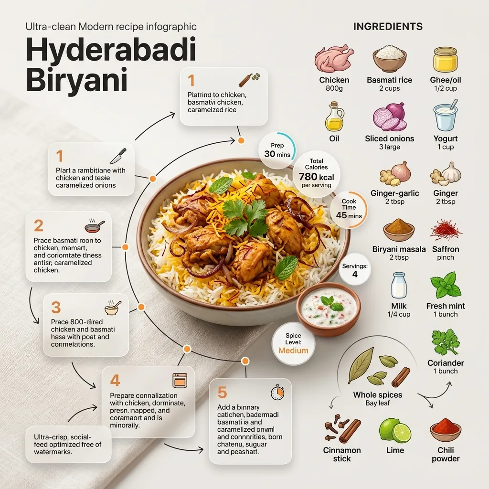

**#160 · Food Photography, Infographic · <code>Vinano Image Pro</code>**

> Keywords: food photography, infographic, AI art, AI prompt, text to image

<details>
<summary>Show prompt</summary>

```
Ultra-clean modern recipe infographic. Showcase briyani in a visually appealing finished form—sliced, plated, or portioned—floating slightly in perspective or angled view. Arrange ingredients, steps, and tips around the dish in a dynamic editorial layout, not restricted to top-down. Ingredients Section: Include icons or mini illustrations for each ingredient quantities. Arrange them in clusters, lists, or circular flows connected visually to the dish. Steps Section: Show preparation steps numbered panels, arrows, or lines, forming a logical flow around the main dish. Include small cooking icons (knife, pan, oven, timer) where helpful. Additional Info (optional): Total calories, prep/cook time, servings, spice level—displayed as clean bubbles or badges near the dish. Visual Style: Editorial infographic meets lifestyle food photography. Vibrant, natural food colors, subtle drop shadows, clean vector icons, modern typography, soft gradients or glassmorphism for step panels. Accent colors can highlight key info (calories, prep time). Composition Guidelines: Finished meal as hero visual (perspective or angled) Ingredients and steps flow dynamically around the dish Clear visual hierarchy: dish > steps > ingredients > optional stats Enough negative space to keep design airy and readable Lighting & Background: Soft, natural studio lighting, minimal textured or gradient background for premium editorial feel. Output: 1080×1080, ultra-crisp, social-feed optimized, no watermark. Preserve realistic proportions and depth for a confident, professional finish.
```

</details>

---

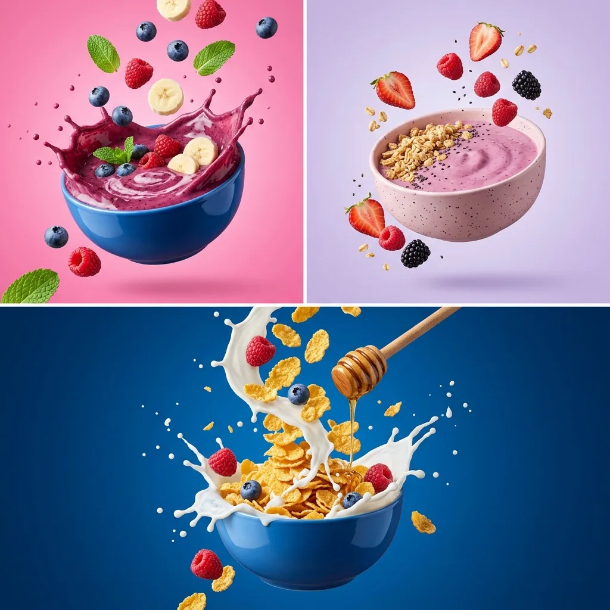

**#161 · Realistic, Food Photography · <code>Vinano Image v2</code>**

> Keywords: realistic, food photography, minimalist, AI art, AI prompt, text to image

<details>
<summary>Show prompt</summary>

```
{
 "resolution": "8K UHD",
 "aspect_ratio": "3:4",
 "image_style": "hyper-realistic commercial food photography",
 "global_settings": {
 "quality": "Ultra-high detail, sharp focus, studio-grade clarity",
 "lighting": "Soft but controlled studio lighting visible highlights and splash definition",
 "motion": "Frozen mid-air action, ingredients suspended",
 "background_style": "Solid or smooth gradient background, color varies per module",
 "camera": "High-speed photography look, shallow to medium depth of field",
 "post_processing": "Balanced contrast, natural saturation, no artificial glow"
 },

 "modules": {

 "module_1_berry_smoothie_explosion": {
 "scene_description": "A vibrant smoothie bowl exploding fruit and liquid splashes",
 "bowl": {
 "color": "Deep blue ceramic bowl",
 "finish": "Glossy",
 "position": "Centered, floating mid-air"
 },
 "base_contents": {
 "type": "Thick berry smoothie",
 "color": "Deep purple-magenta",
 "texture": "Creamy visible swirl marks"
 },
 "ingredients": {
 "fruits": ["Banana slices (round, pale yellow)",
 "Blueberries (whole, dark blue)",
 "Raspberries (whole, red)"],
 "herbs": ["Fresh mint leaves (bright green)"]
 },
 "motion_effects": {
 "liquid": "Berry smoothie splashing upward and outward",
 "particles": "Small droplets suspended in air"
 },
 "background": {
 "color": "Bright pink",
 "texture": "Smooth, seamless"
 }
 },

 "module_2_minimal_pink_smoothie_bowl": {
 "scene_description": "refined minimalist floating smoothie bowl granola and berries",
 "bowl": {
 "color": "Light pink ceramic bowl dark speckles",
 "finish": "Matte",
 "position": "Floating centrally"
 },
 "base_contents": {
 "type": "Smoothie",
 "color": "Soft pink purple undertones",
 "texture": "Thick and smooth"
 },
 "toppings": {
 "granola": "Golden-brown oat clusters",
 "seeds": "Small black seeds scattered",
 "fruits": ["Strawberries (halved)",
 "Raspberries (whole)",
 "Blackberries (whole)"]
 },
 "motion_effects": {
 "ingredients": "Granola flakes, seeds, and berries floating gently"
 },
 "background": {
 "color": "Pastel lavender",
 "gradient": "Subtle, soft gradient"
 }
 },

 "module_3_cereal_milk_honey_splash": {
 "scene_description": "Dynamic cereal stack milk splash and honey drizzle",
 "bowl": {
 "color": "Blue ceramic bowl",
 "finish": "Glossy",
 "position": "Centered, resting visually but surrounded by motion"
 },
 "contents": {
 "cereal": "Golden cornflakes stacked vertically",
 "milk": "White milk splashing and dripping over flakes",
 "fruits": ["Raspberries",
 "Blueberries"]
 },
 "additional_elements": {
 "honey": {
 "source": "Wooden honey dipper",
 "state": "Honey dripping mid-air"
 }
 },
 "motion_effects": {
 "splashes": "Milk splashes frozen in dramatic arcs",
 "particles": "Floating flakes and droplets"
 },
 "background": {
 "color": "Deep blue",
 "tone": "High contrast"
 }
 },
}

Keep edges clean and the overall composition balanced for a polished, gallery-ready result.
```

</details>

---

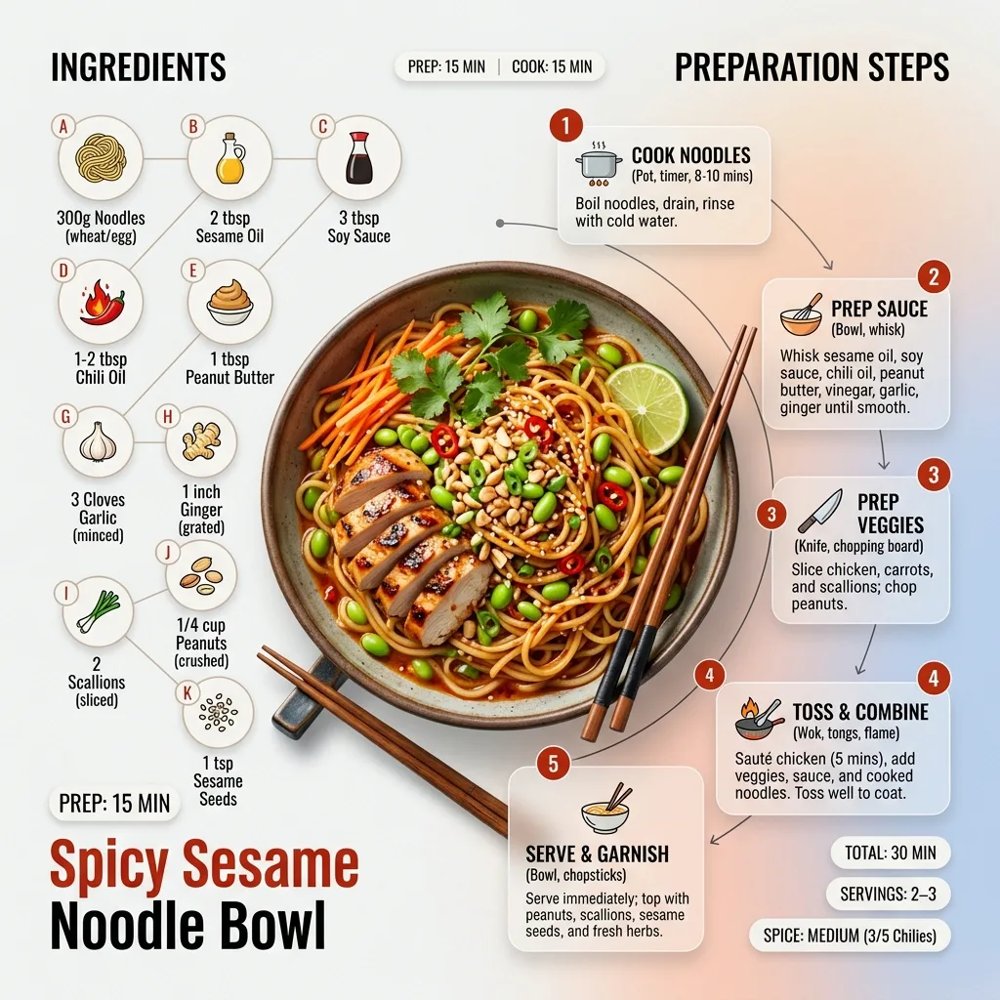

**#162 · Food Photography, Infographic · <code>Vinano Image Pro</code>**

> Keywords: food photography, infographic, AI art, AI prompt, text to image

<details>
<summary>Show prompt</summary>

```
Ultra-clean modern recipe infographic. Showcase Noodles in a visually appealing finished form—sliced, plated, or portioned—floating slightly in perspective or angled view. Arrange ingredients, steps, and tips around the dish in a dynamic editorial layout, not restricted to top-down. Ingredients Section: Include icons or mini illustrations for each ingredient quantities. Arrange them in clusters, lists, or circular flows connected visually to the dish. Steps Section: Show preparation steps numbered panels, arrows, or lines, forming a logical flow around the main dish. Include small cooking icons (knife, pan, oven, timer) where helpful. Additional Info (optional): Total calories, prep/cook time, servings, spice level—displayed as clean bubbles or badges near the dish. Visual Style: Editorial infographic meets lifestyle food photography. Vibrant, natural food colors, subtle drop shadows, clean vector icons, modern typography, soft gradients or glassmorphism for step panels. Accent colors can highlight key info (calories, prep time). Composition Guidelines: Finished meal as hero visual (perspective or angled) Ingredients and steps flow dynamically around the dish Clear visual hierarchy: dish > steps > ingredients > optional stats Enough negative space to keep design airy and readable Lighting & Background: Soft, natural studio lighting, minimal textured or gradient background for premium editorial feel. Output: 1080×1080, ultra-crisp, social-feed optimized, no watermark.” Aim for an editorial, design-driven look with deliberate negative space.
```

</details>

---

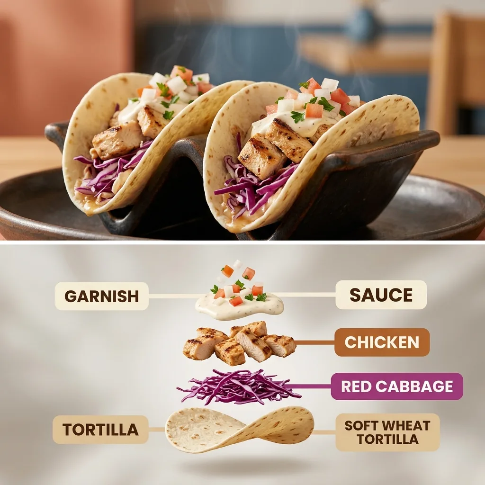

**#163 · Cinematic, Ai Art · <code>Vinano Image Pro</code>**

> Keywords: cinematic, AI art, AI prompt, text to image

<details>
<summary>Show prompt</summary>

```
A high-end commercial food photograph of the same two tacos from the reference image, preserving their exact structure, fillings, proportions, and arrangement. The camera angle is slightly adjusted to a more flattering three-quarter close-up, enhancing depth and appetite appeal without altering the tacos themselves. Soft filmic, cinematic lighting highlights the textures of the tortillas and fillings, subtle steam and natural sheen to emphasize freshness. The background is replaced a clean, modern, out-of-focus setting in warm complementary tones that enhance the food without distracting from it. Shallow depth of field, crisp focus on the tacos, rich contrast, natural colors, and premium restaurant advertising quality. No added or removed ingredients, refined composition, lighting, and environment.

Image 2: Exploded-view commercial visualization of the taco from the image, presented as premium recipe-style breakdown.

The taco is deconstructed into four visible ingredients, matching the original taco precisely in composition, color, and texture. No additional ingredients.

The ingredients are separated and arranged in a clean vertical stack, evenly spaced from bottom to top, floating in place precise alignment and symmetry.

Ingredient order (bottom → top):

Soft wheat taco tortilla

Shredded red cabbage

Grilled chicken pieces

Sauce garnish (topped a small mixed garnish of diced onion, tomato, and parsley, approximately 5–6 small cubes total, lightly mixed, placed naturally on top)

Each ingredient is visually distinct and clearly readable in shape and texture.

Annotation design requirements:

– Large, bold sans-serif font, high legibility at feed scale

– Each annotation placed inside a solid or softly rounded rectangular color block

– Background color of each block corresponds subtly to the ingredient color (tomato red, lettuce green, meat warm brown, sauce white/cream, pita beige)

– High contrast text (dark on light, light on dark)

– Thick, clean connector lines pointing clearly to each ingredient

– No transparency that reduces readability

– Annotations must visually dominate over background without covering ingredients

Background is soft, neutral, and atmospheric, subtle depth and gentle gradients, inspired by premium food advertising.

Overall style is clean, modern, and appetizing, commercial-ready without technical or schematic feel.

No extra elements, no substitutions, no reinterpretation of ingredients.

Aim for an editorial, design-driven look with deliberate negative space.
```

</details>

---


**#164 · Realistic, Cinematic · <code>Vinano Image Pro</code>**

> Keywords: realistic, cinematic, minimalist, AI art, AI prompt, text to image

<details>
<summary>Show prompt</summary>

```
Ultra-wide-angle hyper-realistic top-down flat lay photography. The central focus is a custom physical conference table meticulously shaped like [SHAPE/NUMBER/SYMBOL].

The table features [MATERIAL/TEXTURE/COLOR] and placed on a [FLOOR COLOR] floor, creating significant negative space around it for a clean, refined minimalist composition. A group of [NUMBER] real people are sitting around the edges of this [SHAPE]-shaped table. [POSITIONING: e.g., 3 on each side, 1 top/bottom]

Actions: [DESCRIBE PEOPLE'S ACTIONS, e.g., working on laptops, drinking coffee].
Lighting & Quality: Professional studio lighting crisp, distinct drop shadows that define the [SHAPE] silhouette on the floor. 8k resolution, sharp focus, cinematic commercial aesthetic.

Emphasise material texture and natural light so the final frame feels tactile and premium.
```

</details>

---

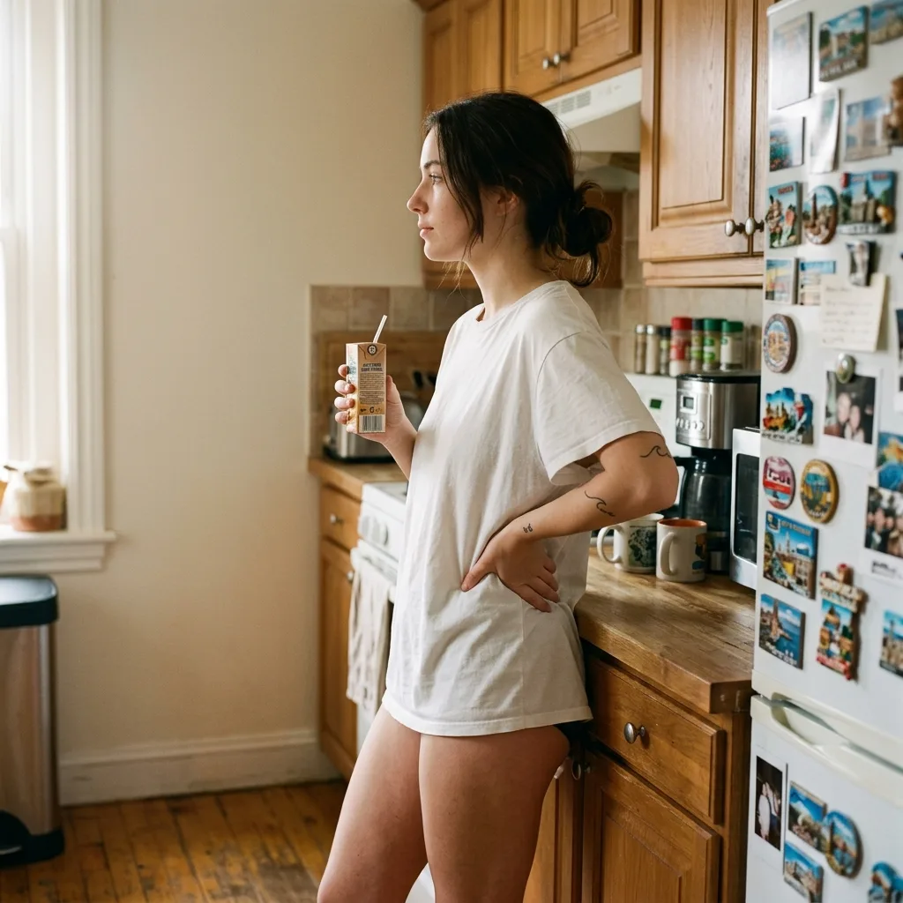

**#165 · Realistic, Ai Art · <code>Vinano Image Pro</code>**

> Keywords: realistic, AI art, AI prompt, text to image

<details>
<summary>Show prompt</summary>

```
{
 "type": "image_generation_prompt",
 "style": "true-to-life photorealistic, lifestyle photography",
 "sexualization": "none",
 "description": {
 "subject": "A young woman standing casually in a home kitchen, seen in side profile",
 "pose": "Relaxed posture, one hand resting on her hip while the other holds a small drink carton a straw",
 "expression": "Neutral, thoughtful, slightly distant gaze looking forward",
 "appearance": {
 "hair": "Dark hair tied in a loose low bun natural strands framing the face",
 "clothing": "Oversized white t-shirt worn casually, simple underwear partially visible due to the relaxed fit of the shirt",
 "tattoos": "Small, minimal black-ink tattoos on the forearm, subtle and understated"
 }
 },
 "environment": {
 "location": "A modest, lived-in home kitchen",
 "details": "Wooden cabinets, countertop appliances, a refrigerator covered colorful magnets and souvenirs",
 "lighting": "Soft natural daylight coming from a window, warm and slightly muted",
 "atmosphere": "Quiet, everyday domestic moment"
 },
 "camera": {
 "angle": "Side profile view",
 "framing": "Medium shot capturing the subject from mid-thigh to head",
 "lens": "35mm lifestyle lens",
 "depth_of_field": "Moderate, background softly in focus to preserve environmental context"
 },
 "image_quality": {
 "realism": "High",
 "texture_detail": "Natural fabric folds, skin texture, and kitchen surface details visible",
 "grain": "Light natural film grain for an authentic look"
 },
 "mood": "Calm, intimate, documentary-style",
 "constraints": ["Non-sexualized, everyday realism",
 "Focus on natural lifestyle and atmosphere",
 "No exaggerated poses or expressions",
 "Candid, slice-of-life aesthetic"]
}

Aim for an editorial, design-driven look with deliberate negative space.
```

</details>

---

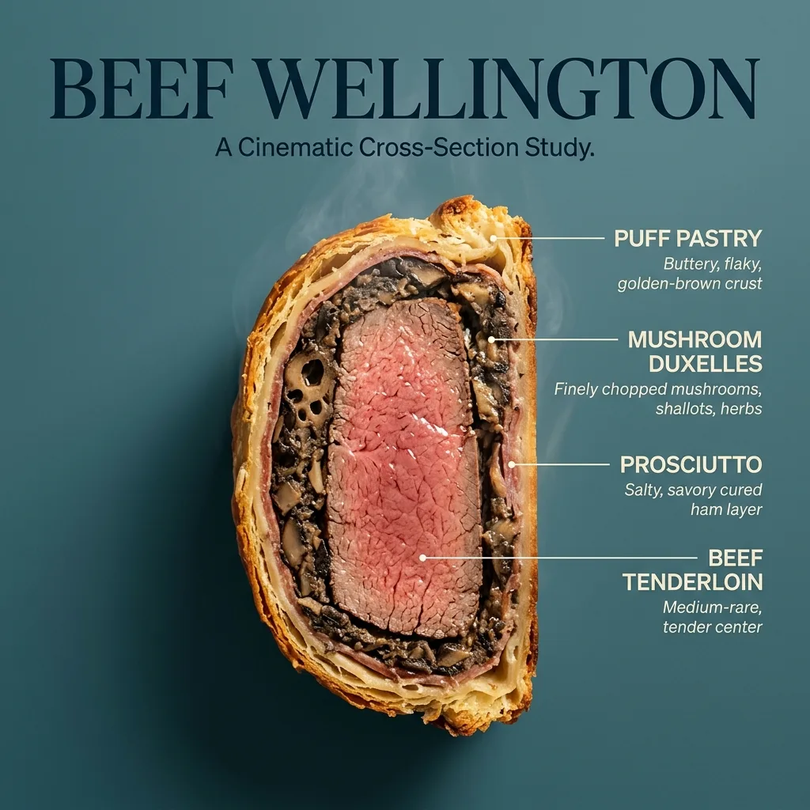

**#166 · Food Photography, Cinematic · <code>Vinano Image Pro</code>**

> Keywords: food photography, cinematic, AI art, AI prompt, text to image

<details>
<summary>Show prompt</summary>

```
Perfect cinematic cross-section cut through [DISH], sliced cleanly down the center revealing every internal layer in full detail. The cut face is facing the camera straight-on, like a geological diagram of flavor. Each visible layer is labeled a thin horizontal line extending to the right — uppercase sans-serif "[INGREDIENT NAME]" italic descriptor below. Background: flat matte [COLOR]. Lighting: dramatic side light from left casting long shadows, single warm spotlight on the cut face. Every texture hyperreal — visible moisture, air pockets, char, glaze, and steam. Mood: architectural food photography meets scientific illustration. Dish name "[DISH NAME]" in large elegant type at top. Subtitle: "[TAGLINE]". 4K, tack sharp, Style ref: Wes Anderson symmetry meets Michelin-star kitchen. Maintain consistent colour harmony and crisp focus across the whole frame.
```

</details>

---

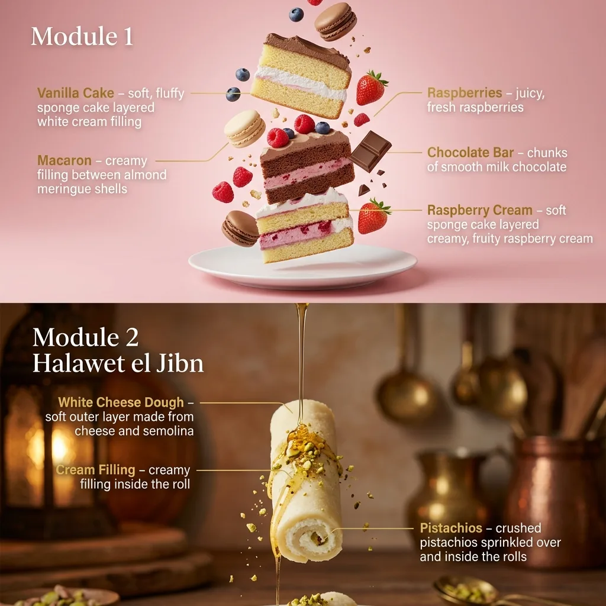

**#167 · Realistic, Food Photography · <code>Vinano Image Pro</code>**

> Keywords: realistic, food photography, cinematic, infographic, AI art, AI prompt

<details>
<summary>Show prompt</summary>

```
{
 "global_settings": {
 "resolution": "8K ultra high definition",
 "aspect_ratio": "3:4",
 "camera_style": "studio food photography filmic, cinematic lighting",
 "depth_of_field": "shallow depth of field, sharp subject, soft background",
 "lighting": "soft directional key light, subtle rim light, controlled highlights",
 "style": "hyper-realistic food illustration editorial infographic overlays",
 "composition_rules": ["no zoom",
 "no crop",
 "center-weighted vertical composition",
 "floating elements frozen in motion"],
 "text_design": {
 "ingredient_name_color": "metallic gold",
 "ingredient_description_color": "pure white",
 "font_style": "elegant serif for titles, clean sans-serif for descriptions",
 "indicator_lines": "long, thin, smooth golden lines rounded corners"
 }
 },

 "module_1_image_1_style": {
 "scene_description": "A vertical stack of assorted cake slices floating above a white ceramic plate against a soft pink gradient background.",
 "background": {
 "color": "soft pastel pink",
 "texture": "smooth gradient",
 "lighting": "even, studio-lit, no harsh shadows"
 },
 "main_subjects": ["multiple layered sponge cake slices",
 "white whipped cream layers",
 "raspberry cream layer",
 "chocolate cream topping"],
 "visible_ingredients": ["vanilla sponge cake",
 "whipped cream",
 "raspberries",
 "blueberries",
 "strawberries",
 "macarons (vanilla and chocolate)",
 "chocolate bar pieces",
 "mint leaves",
 "small nut fragments"],
 "motion_elements": ["floating fruits",
 "floating macarons",
 "crumbs suspended in air"],
 "text_labels": ["Vanilla Cake – soft, fluffy sponge cake layered white cream filling",
 "Macaron – creamy filling between almond meringue shells",
 "Raspberries – juicy, fresh raspberries",
 "Chocolate Bar – chunks of smooth milk chocolate",
 "Raspberry Cream – soft sponge cake layered creamy, fruity raspberry cream"]
 },

 "module_2_image_2_style": {
 "scene_description": "Rolled Syrian dessert presented vertically syrup pouring from above, placed in a warm, rustic kitchen environment.",
 "background": {
 "environment": "traditional kitchen",
 "elements": ["warm lantern light",
 "wooden surfaces",
 "brass and copper utensils"],
 "lighting": "warm ambient lighting soft highlights"
 },
 "main_subjects": ["rolled white dessert dough",
 "cream filling spilling out",
 "golden syrup stream"],
 "visible_ingredients": ["white cheese dough",
 "cream filling",
 "pistachios",
 "sugar syrup"],
 "motion_elements": ["syrup dripping vertically",
 "pistachio crumbs falling"],
 "text_labels": ["White Cheese Dough – soft outer layer made from cheese and semolina",
 "Cream Filling – creamy filling inside the roll",
 "Pistachios – crushed pistachios sprinkled over and inside the rolls"]
 }

Aim for an editorial, design-driven look with deliberate negative space.
```

</details>

---

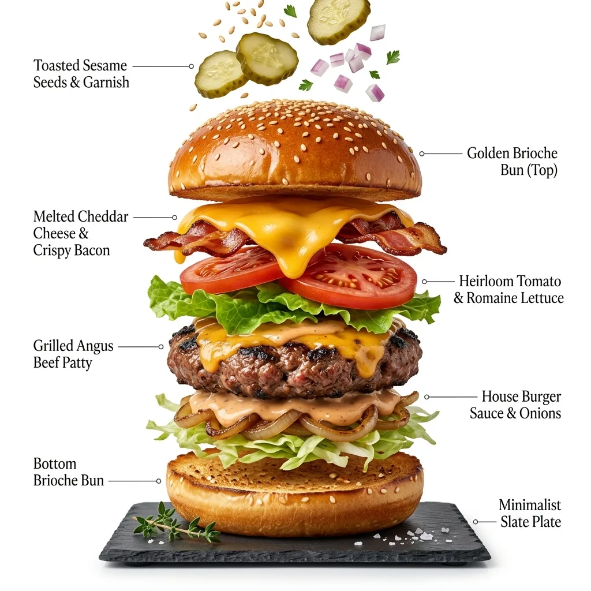

**#168 · Realistic, Food Photography · <code>Vinano Image Pro</code>**

> Keywords: realistic, food photography, character, infographic, AI art, AI prompt

<details>
<summary>Show prompt</summary>

```
Create a hyper-realistic exploded vertical infographic composition of [FOOD].
At the top, characteristic particles, droplets, or garnishes associated the food, frozen mid-air.
Below it, the primary surface or topping layer rich texture and realistic material detail.
Underneath, the core ingredient layer showing structure, depth, and natural variation.
Below that, the supporting base or interior layer, slightly separated to reveal construction.
At the bottom, a minimal plate, bowl, cup, or base appropriate to the food’s presentation.
Pure white background, soft studio lighting, subtle shadows beneath each floating element, ultra-sharp focus, DSLR macro photography, clean infographic text labels thin pointer lines, premium editorial food photography aesthetic, 8K quality.

Render with rich micro-detail while keeping the layout uncluttered and intentional.
```

</details>

---

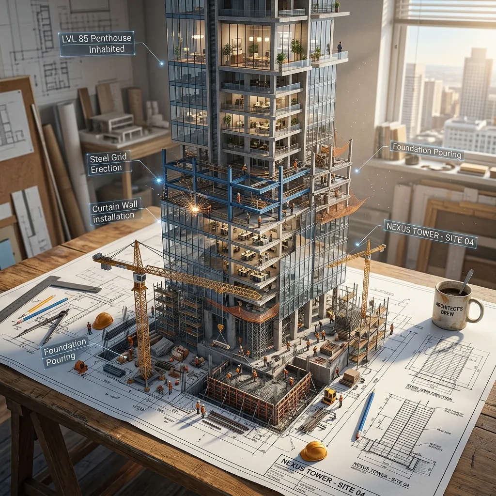

**#169 · Realistic, Ai Art · <code>Vinano Image Pro</code>**

> Keywords: realistic, AI art, AI prompt, text to image

<details>
<summary>Show prompt</summary>

```
Epic 3D scene: a massive architectural blueprint of [BUILDING/STRUCTURE] pinned to a drafting table, its ink lines rising off the paper into fully realized construction. Blue lines become steel beams mid-weld, floor plans inflate into furnished rooms, elevation drawings push outward into facades working windows. Construction phases coexist simultaneously: foundation being poured in one corner while the penthouse is already inhabited in another. Tiny workers, cranes, and scaffolding swarm the rising structure. The flat drawing and the living building merge at impossible angles. Technical annotations float as dimensional signage. Architect's coffee cup sits at the edge, casting shadow across unbuilt sections. Extreme scale contrast, construction dust catching afternoon light, 8K, true-to-life photorealistic. Render with rich micro-detail while keeping the layout uncluttered and intentional.
```

</details>

---

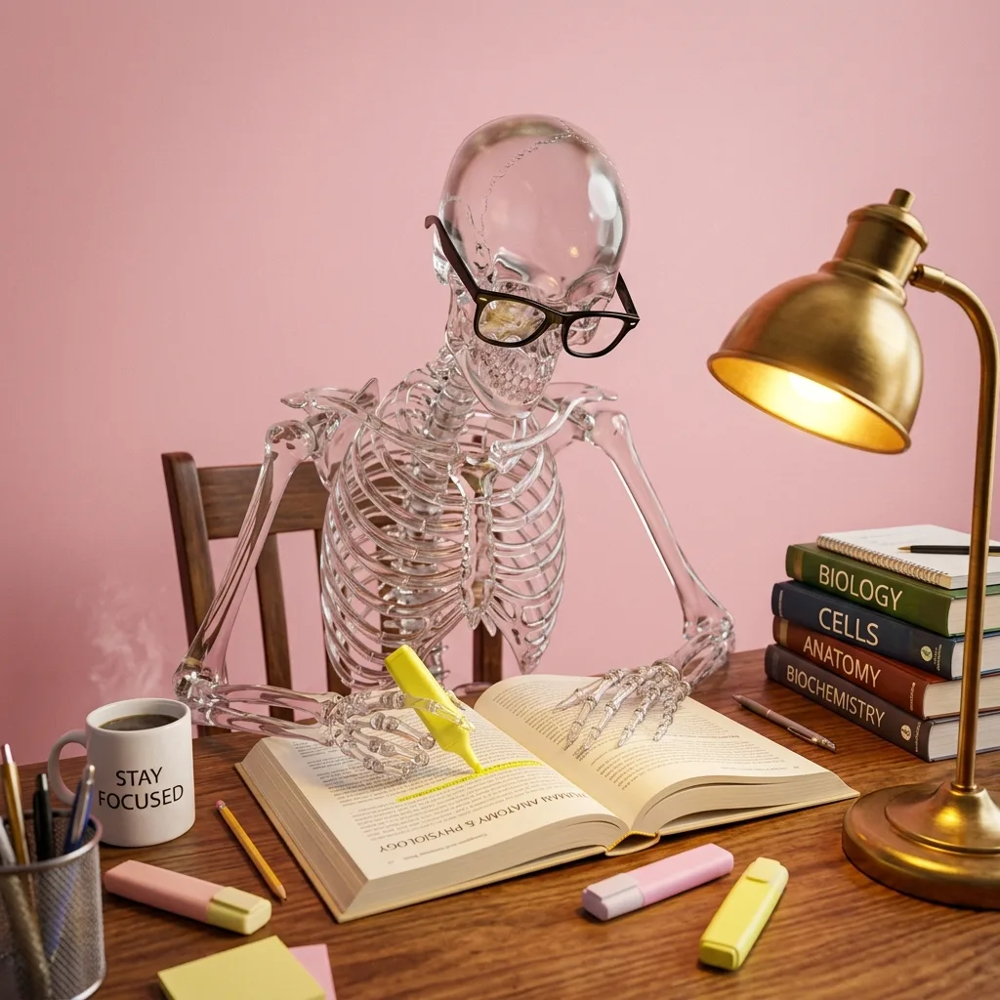

**#170 · Ai Art, Ai Prompt · <code>Vinano Image Pro</code>**

> Keywords: AI art, AI prompt, text to image

<details>
<summary>Show prompt</summary>

```
Create a premium-quality stylized 3D render of a clear, translucent glass skeleton wearing black-rimmed glasses sitting at a wooden desk. The skeleton MUST be looking down at an open textbook and holding a yellow highlighter, actively highlighting a line of text. The scene MUST feature a warm gold desk lamp on the right side casting a cozy, yellow light that creates glossy reflections on the skeleton's surface. The desk is cluttered a white coffee mug, a stack of hardcover books on the right, and scattered pens and pastel pink and yellow highlighters. The background MUST be a solid, soft pink wall. The overall aesthetic should be warm, studious, and visually soft. Do not include any text overlays or watermarks. Emphasise material texture and natural light so the final frame feels tactile and premium.
```

</details>

---

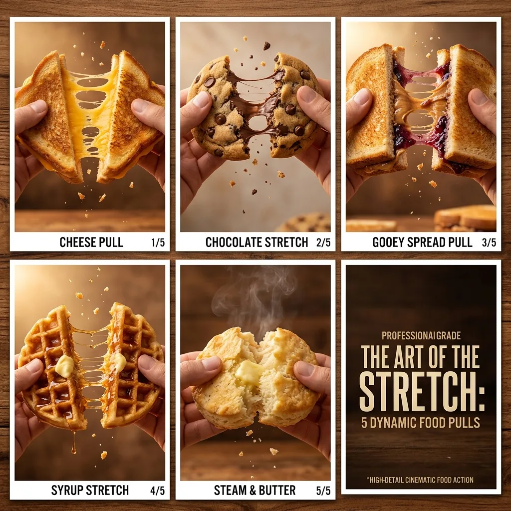

**#171 · Cinematic, Ai Art · <code>Vinano Image Pro</code>**

> Keywords: cinematic, AI art, AI prompt, text to image

<details>
<summary>Show prompt</summary>

```
{
 "model": " / Gemini-style",
 "aspect_ratio": "3:4",
 "render_mode": "raw",
 "series": [{
 "index": "1/5",
 "prompt": "two hands pulling apart a grilled cheese sandwich, strands of melted cheddar stretching dramatically between the halves, toasted bread edges crisp and golden, crumbs falling mid-air, warm cozy light, cinematic food action photography",
 "category": "cheese pull",
 "lighting": "warm cozy cinematic light",
 "detail_level": "high-detail"
 },
 {
 "index": "2/5",
 "prompt": "two hands breaking a warm chocolate chip cookie in half, melted chocolate strands stretching between the pieces, crumbs falling mid-air, cozy warm light, high-detail food action photography",
 "category": "chocolate stretch",
 "lighting": "soft cozy warm light",
 "detail_level": "high-detail"
 },
 {
 "index": "3/5",
 "prompt": "two hands splitting a peanut butter and jelly sandwich in half, thick peanut butter and jam stretching in gooey strands, toasted bread edges crisp, crumbs falling mid-air, warm cozy backlight, high-detail food action photography",
 "category": "gooey spread pull",
 "lighting": "warm backlight",
 "detail_level": "high-detail"
 },
 {
 "index": "4/5",
 "prompt": "two hands tearing a syrup-soaked Belgian waffle, caramel strands stretching between pieces, crumbs and syrup droplets suspended mid-air, golden hour backlight, cozy cinematic food action photography",
 "category": "syrup stretch",
 "lighting": "golden hour backlight",
 "detail_level": "ultra-detailed"
 },
 {
 "index": "5/5",
 "prompt": "two hands breaking a southern-style buttery biscuit in half, hot steam rising, melted butter pooling inside the cracks, crumbs falling mid-air, warm country kitchen light, cinematic high-detail food action photography",
 "category": "steam & butter",
 "lighting": "warm kitchen light",
 "detail_level": "ultra-detailed"
 }]
}

Preserve realistic proportions and depth for a confident, professional finish.
```

</details>

---

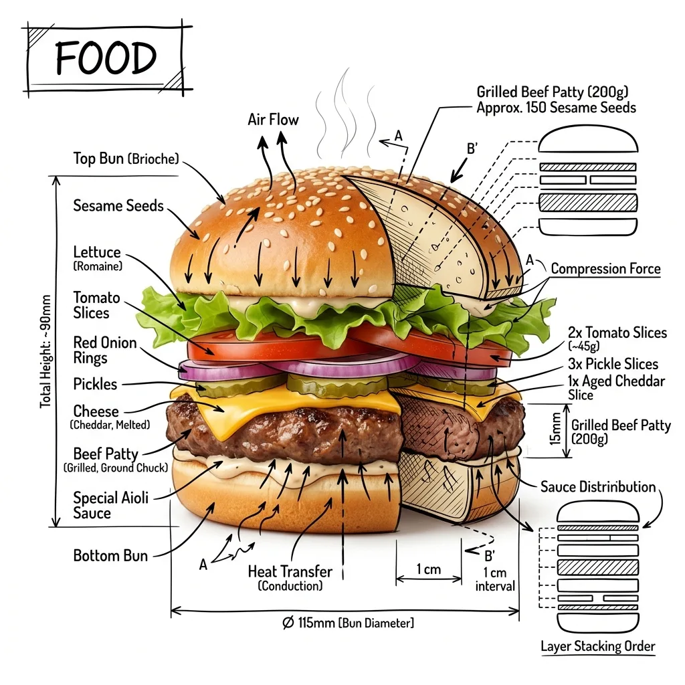

**#172 · Realistic, Infographic · <code>Vinano Image Pro</code>**

> Keywords: realistic, infographic, AI art, AI prompt, text to image

<details>
<summary>Show prompt</summary>

```
Create an infographic image of [FOOD], combining a realistic photograph or photoreal render of the object technical annotation overlays placed directly on top.

Use black ink–style line drawings and text (technical pen / architectural sketch look) on a pure white studio background, including:
•Key component labels
•Internal cutaway or exploded-view outlines
•Measurements, dimensions, and scale markers
•Material callouts and quantities
•Arrows indicating function, force, or flow (air, sound, power, pressure)
•Simple schematic or sectional diagrams where relevant

Place the title “FOOD” inside a hand-drawn technical annotation box in one corner.

Style & layout rules:
•The real object remains clearly visible beneath the annotations
•Annotations feel sketched, technical, and architectural
•crisp composition balanced negative space
•Educational, museum-exhibit / engineering-manual vibe

Visual style:
Minimal technical illustration aesthetic, black linework over realistic imagery, precise but slightly hand-drawn feel.

Color palette:
White background, black annotation lines and text only. No colors.

Output:
1080×1080, ultra-crisp, social-feed optimized, no watermark.

Aim for an editorial, design-driven look with deliberate negative space.
```

</details>

---

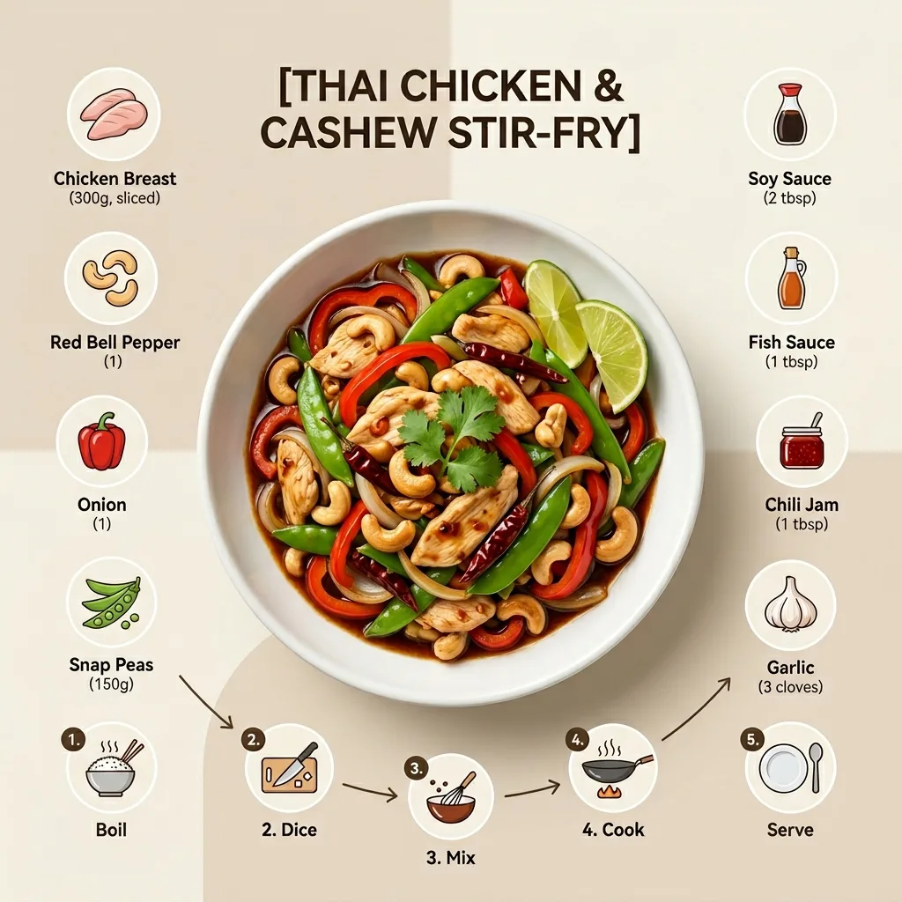

**#173 · Realistic, Food Photography · <code>Vinano Image Pro</code>**

> Keywords: realistic, food photography, minimalist, infographic, AI art, AI prompt

<details>
<summary>Show prompt</summary>

```
refined minimalist modern recipe infographic featuring [DISH NAME], presented in a clean top-down / 3-quarter food photography style. The finished dish is centered on a white ceramic plate or bowl, beautifully plated and ultra-realistic. Surrounding the dish are floating ingredient icons soft circular frames and clean vector-style illustrations, each labeled ingredient names and quantities. A curved step-by-step flow simple numbered icons shows the cooking process (boil, dice, mix, cook, serve). Soft neutral background (beige / cream), gentle shadows, balanced spacing, Scandinavian design aesthetic, editorial cookbook layout, high readability typography, subtle gradients, professional food styling, ultra-sharp details, 8K resolution. Emphasise material texture and natural light so the final frame feels tactile and premium.
```

</details>

---

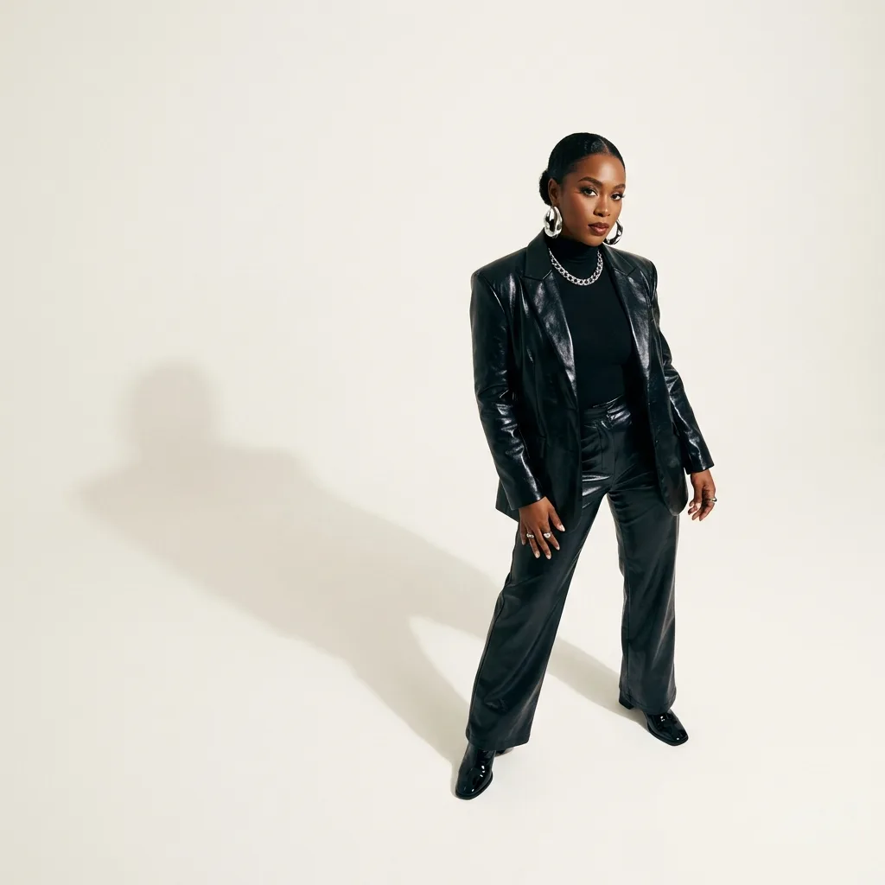

**#174 · Minimalist, Ai Art · <code>Vinano Image Pro</code>**

> Keywords: minimalist, AI art, AI prompt, text to image

<details>
<summary>Show prompt</summary>

```
A [subject] photographed from a 35-degree overhead angle, standing alone in an off-white studio void, a confident pose and clean silhouette. Stylised proportions, sleek fashion styling, reflective textures, bold accessories, soft studio light, single beauty-dish flash casting crisp shadows, subtle Kodak Portra-inspired grain, candid editorial energy, refined minimalist composition, sharp detail, premium studio photography Maintain consistent colour harmony and crisp focus across the whole frame.
```

</details>

---

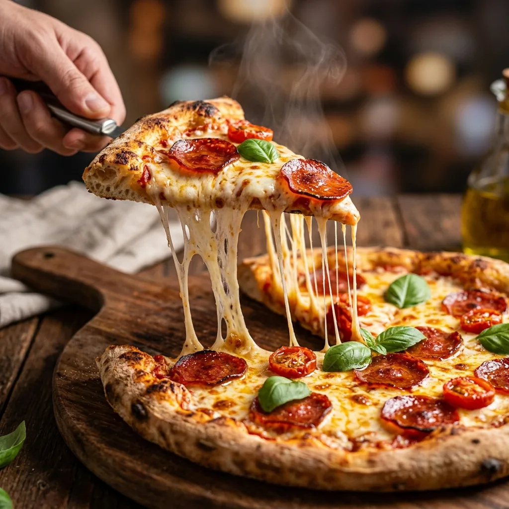

**#175 · Realistic, Cinematic · <code>Vinano Image Pro</code>**

> Keywords: realistic, cinematic, AI art, AI prompt, text to image

<details>
<summary>Show prompt</summary>

```
A hyper-realistic, cinematic close-up of a freshly baked pepperoni pizza slice being lifted from the pie, long, dramatic cheese pulls stretching down in silky strands.
Golden, slightly charred crust visible texture, bubbling mozzarella, glossy pepperoni slices, fresh basil leaves on top, and juicy cherry tomatoes scattered across the pizza.
Soft steam rising from the hot slice, creating a warm, mouth-watering atmosphere.
Shot on a DSLR, 50mm lens, shallow depth of field, sharp focus on the cheese stretch, background softly blurred.
Warm studio lighting natural highlights, rich colors, realistic shadows, premium food-advertisement look.

Preserve realistic proportions and depth for a confident, professional finish.
```

</details>

---

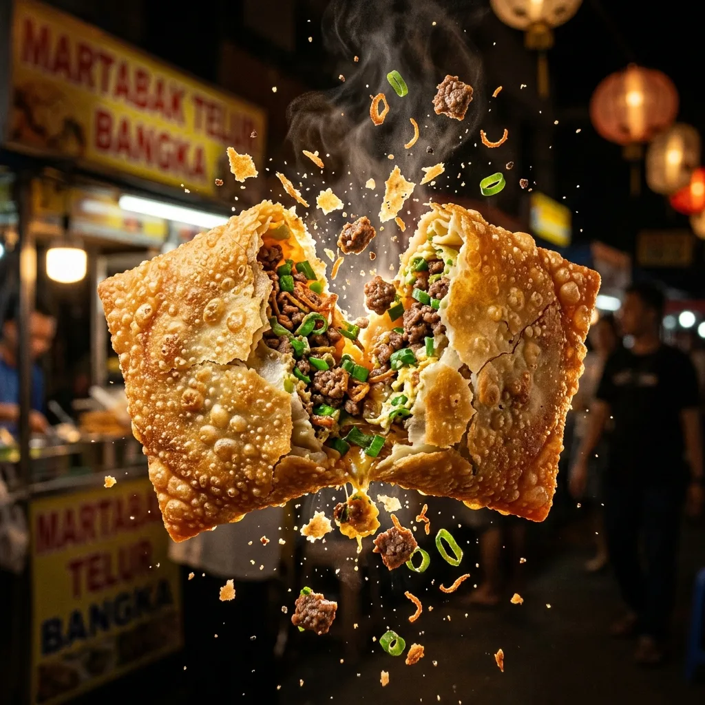

**#176 · Food Photography, Ai Art · <code>Vinano Image Pro</code>**

> Keywords: food photography, AI art, AI prompt, text to image

<details>
<summary>Show prompt</summary>

```
"Macro food photography of a crispy martabak telur tearing open mid-air, thin golden wrapper shattering a crack, hot filling of minced beef, scallions, and egg bursting outward. Flecks of fried onion and pepper suspended in motion, steam visible, glossy oil sheen catching the light. Warm Indonesian street-stall lighting, tungsten + charcoal warmth, dramatic rim light, ultra high texture detail (bubbled wrapper, layered interior).Editorial food shot, shallow depth of field, bokeh of night market signage, Nikon Z9 look, 105mm macro, fast shutter freeze, hyper-real crumbs. --ar 3:4" Render with rich micro-detail while keeping the layout uncluttered and intentional.
```

</details>

---

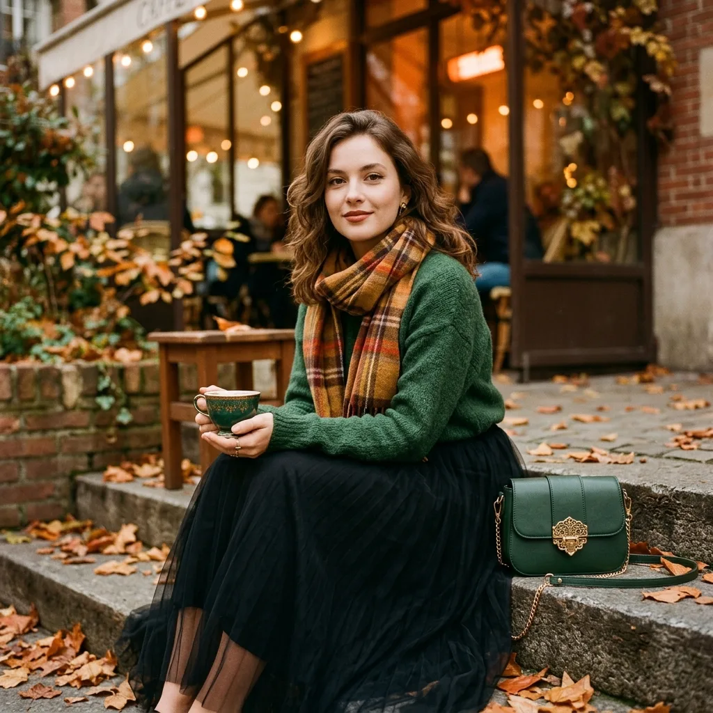

**#177 · Realistic, Portrait · <code>Vinano Image Pro</code>**

> Keywords: realistic, portrait, cinematic, vintage, AI art, AI prompt

<details>
<summary>Show prompt</summary>

```
Aesthetic 1970s-inspired fashion portrait of a stylish young woman sitting on outdoor cafe steps, holding a premium ornate green coffee cup gold rim detailing, gazing softly at the camera. Her hair is styled in soft loose strands framing her face vintage makeup, matte red lips, and subtle eyeliner. She is wearing a cozy forest green premium knit sweater paired a long flowing black tutu skirt. A warm vintage plaid scarf in earthy brown, burnt orange, and muted red tones is wrapped loosely around her neck. A premium dark green leather crossbody bag a gold filigree clasp and chain strap is placed beside her. Autumn street café setting scattered fallen leaves and warm amber café lights glowing behind glass windows. 1970s film tone, warm grainy texture, muted earthy color palette, cinematic atmosphere, shallow depth of field, soft natural lighting, analog film look, fashion editorial photography, ultra-realistic, high detail, 85mm lens, f/1.8, vintage aesthetic, dreamy mood. Render with rich micro-detail while keeping the layout uncluttered and intentional.
```

</details>

---

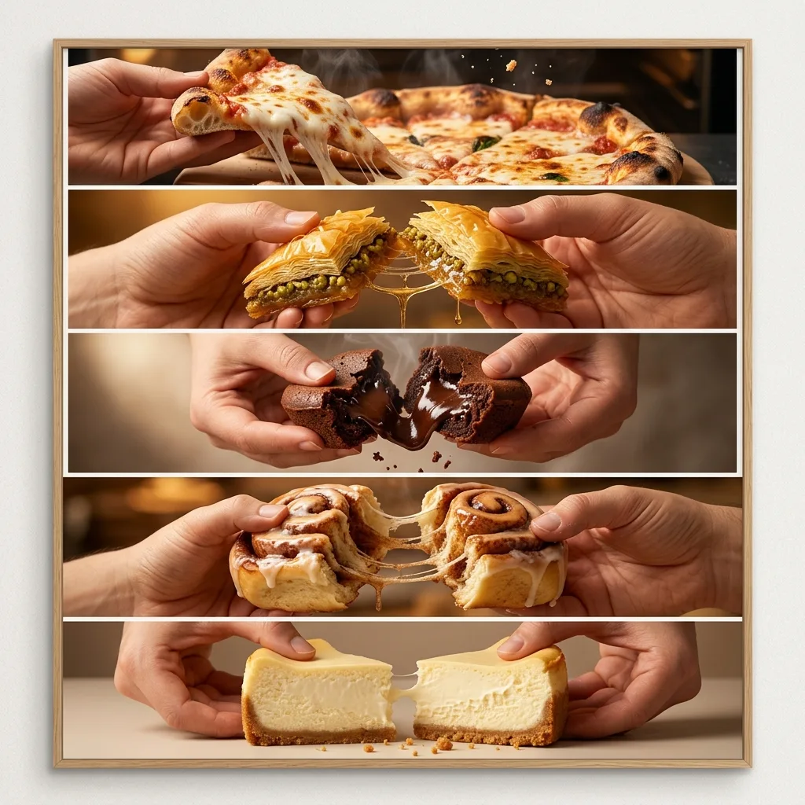

**#178 · Food Photography, Cinematic · <code>Vinano Image Pro</code>**

> Keywords: food photography, cinematic, AI art, AI prompt, text to image

<details>
<summary>Show prompt</summary>

```
{
 "aspect_ratio": "3:4",
 "render_mode": "raw",
 "series": [{
 "index": "1/5",
 "prompt": "two hands pulling apart a hot freshly baked pizza slice, long elastic mozzarella cheese stretch between the slice and the pie, blistered crust edges, steam rising, crumbs falling mid-air, warm cinematic light, ultra high-detail food action photography",
 "category": "cheese pull",
 "lighting": "warm cinematic oven light",
 "detail_level": "ultra-detailed"
 },
 {
 "index": "2/5",
 "prompt": "two hands pulling apart a syrup-soaked baklava piece, thin crispy phyllo layers cracking, rich pistachio filling visible, thick honey syrup stretching and dripping mid-air, golden warm light, cinematic dessert action photography",
 "category": "syrup & crunch",
 "lighting": "golden warm light",
 "detail_level": "ultra-detailed"
 },
 {
 "index": "3/5",
 "prompt": "two hands breaking a molten chocolate lava cake in half, glossy dark chocolate flowing out from the center, steam rising gently, crumbs suspended mid-air, soft warm spotlight, cinematic dessert action photography",
 "category": "molten chocolate",
 "lighting": "soft warm spotlight",
 "detail_level": "ultra-detailed"
 },
 {
 "index": "4/5",
 "prompt": "two hands tearing a glazed cinnamon roll apart, sticky cinnamon sugar filling stretching in glossy strands, icing dripping slowly, fluffy dough texture visible, cozy warm bakery light, high-detail cinematic food photography",
 "category": "sticky pull",
 "lighting": "warm bakery light",
 "detail_level": "ultra-detailed"
 },
 {
 "index": "5/5",
 "prompt": "two hands splitting a classic New York-style cheesecake slice, ultra-creamy interior slowly separating, crumbly biscuit base breaking apart, subtle cream stretch, soft studio warm light, cinematic high-detail dessert photography",
 "category": "creamy separation",
 "lighting": "soft warm studio light",
 "detail_level": "ultra-detailed"
 }]
}

Keep edges clean and the overall composition balanced for a polished, gallery-ready result.
```

</details>

---

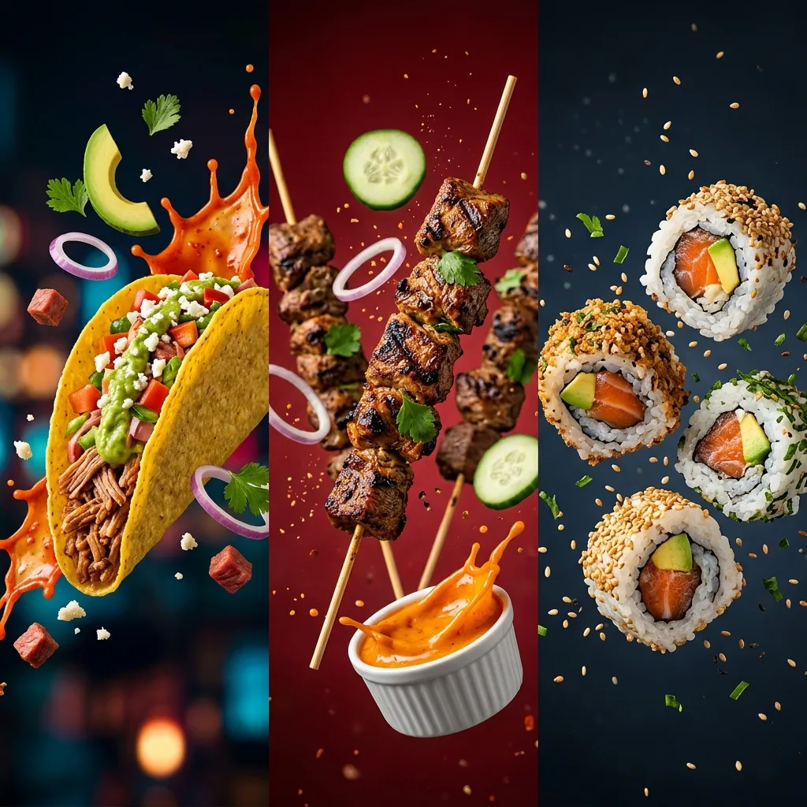

**#179 · Food Photography, Cinematic · <code>Vinano Image v2</code>**

> Keywords: food photography, cinematic, AI art, AI prompt, text to image

<details>
<summary>Show prompt</summary>

```
{
 "global_settings": {
 "resolution": "8K ultra high definition",
 "aspect_ratio": "2:3 vertical",
 "image_type": "AI-edited cinematic food photography",
 "detail_level": "extreme micro-detail, sharp focus, clean edges",
 "style_constraint": "enhanced realism, minimal alteration from original composition"
 },

 "module_1_image_1_style": {
 "subject": "single hard-shell taco",
 "composition": {
 "orientation": "diagonal, floating in mid-air",
 "foreground_focus": "taco shell and filling",
 "motion": "ingredients suspended, sauce splash frozen mid-air"
 },
 "visible_elements": {
 "shell": "golden yellow hard taco shell crisp texture",
 "filling": ["shredded cooked meat visible fibers",
 "green sauce layered on top",
 "small red diced pieces",
 "white crumbled cheese"],
 "floating_garnish": ["avocado slices",
 "purple onion rings",
 "green herb leaves",
 "small reddish-brown meat cubes",
 "tiny white crumbs"],
 "liquid": "orange-red sauce splash erupting upward behind taco"
 },
 "lighting": {
 "type": "high-contrast studio lighting",
 "highlights": "glossy reflections on sauce and meat",
 "background_lights": "soft circular bokeh in warm and cool tones"
 },
 "background": {
 "color": "dark neon-like blurred lights",
 "depth": "strong depth of field, background fully defocused"
 }
 },

 "module_2_image_2_style": {
 "subject": "three grilled meat skewers",
 "composition": {
 "orientation": "vertical skewers, slightly angled",
 "foreground_focus": "center skewer",
 "motion": "ingredients and sauce suspended"
 },
 "visible_elements": {
 "skewers": "wooden sticks pointed ends",
 "meat": "chunked grilled meat char marks and uneven texture",
 "garnish": "small green herb leaves attached to meat",
 "floating_items": ["round cucumber slices",
 "thin onion rings"],
 "sauce": {
 "container": "small white ramekin",
 "action": "thick orange sauce splashing upward from bowl"
 },
 "particles": "tiny spice or crumb particles scattered in air"
 },
 "lighting": {
 "type": "dramatic directional lighting",
 "highlights": "strong sheen on meat surface",
 "contrast": "deep shadows"
 },
 "background": {
 "color": "solid deep red",
 "texture": "soft grain floating particles"
 }
 },

 "module_3_image_3_style": {
 "subject": "four sushi rolls",
 "composition": {
 "orientation": "floating cluster",
 "spacing": "uneven depth, some closer, some blurred behind",
 "motion": "sesame seeds and herbs suspended"
 },
 "visible_elements": {
 "sushi_structure": {
 "outer_layer": "white rice",
 "inner_layer": "dark seaweed",
 "fillings": ["orange fish slice",
 "green avocado"]
 },
 "toppings": ["toasted sesame seeds",
 "brown crunchy coating",
 "finely chopped green herbs"],
 "particles": ["sesame seeds",
 "small green herb pieces"]
 },
 "lighting": {
 "type": "soft but crisp studio lighting",
 "focus": "front sushi pieces sharp, rear slightly blurred"
 },
 "background": {
 "color": "dark blue-grey",
 "depth": "clean bokeh-free backdrop floating particles"
 }
 },
 "post_processing": {
 "clarity": "ultra-sharp",
 "noise": "minimal",
 "color_balance": "rich but natural",
 "ai_signature": "clean AI-edited look without exaggeration"
 }
}

Maintain consistent colour harmony and crisp focus across the whole frame.
```

</details>

---

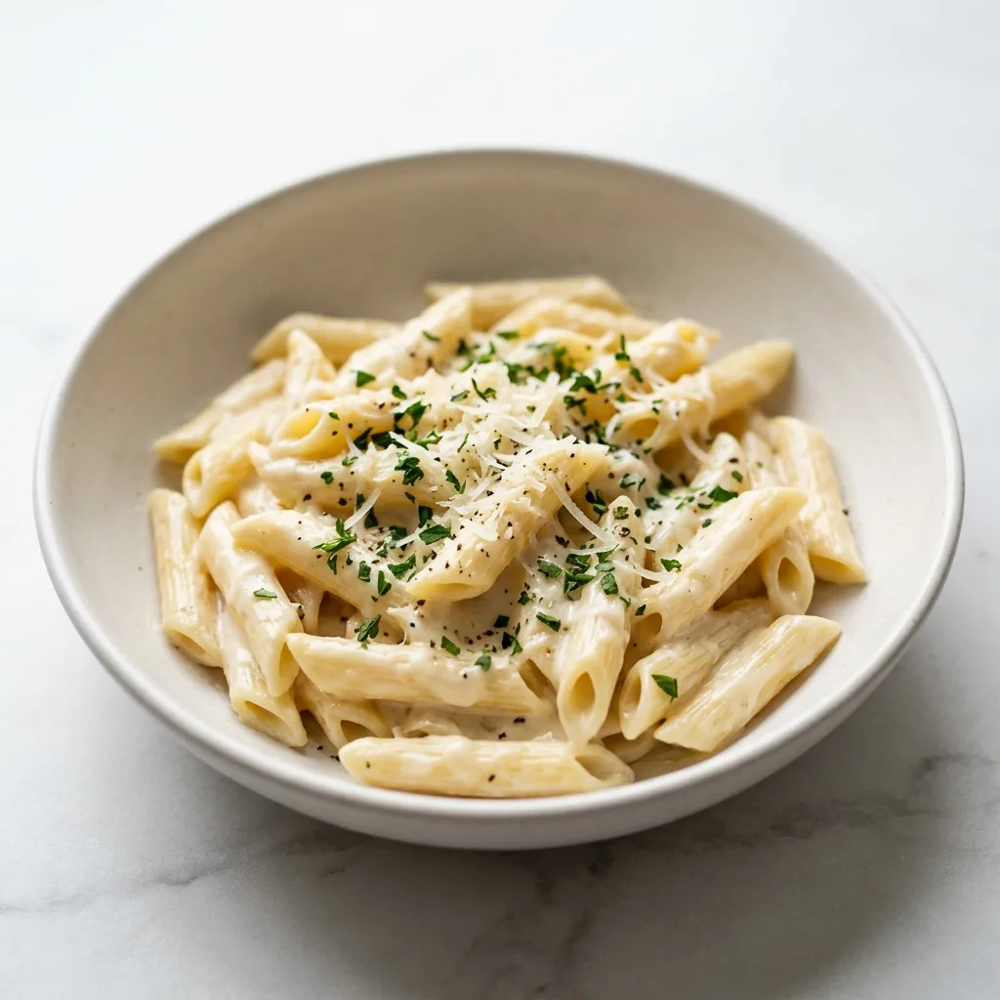

**#180 · Realistic, Food Photography · <code>Vinano Image Pro</code>**

> Keywords: realistic, food photography, AI art, AI prompt, text to image

<details>
<summary>Show prompt</summary>

```
Ultra-realistic food photography of a prepared creamy white sauce penne pasta served in a minimal ceramic bowl. Perfectly cooked penne coated evenly in rich, glossy cream sauce, topped freshly grated parmesan cheese and finely chopped green herbs. Clean white studio background, soft diffused lighting, gentle shadows under the bowl, natural highlights on the sauce, realistic texture and thickness. Centered composition, shallow depth of field, premium restaurant-style presentation, high-detail food styling, 8K quality, sharp focus, no text, no labels, no hands, no props, no watermark. Render with rich micro-detail while keeping the layout uncluttered and intentional.
```

</details>

---

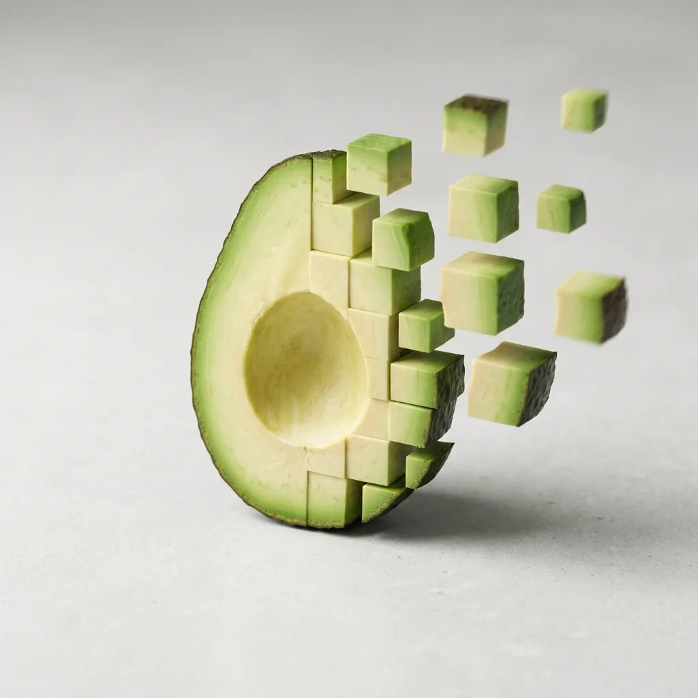

**#181 · Realistic, Cinematic · <code>Vinano Image v2</code>**

> Keywords: realistic, cinematic, minimalist, AI art, AI prompt, text to image

<details>
<summary>Show prompt</summary>

```
refined minimalist food photograph, [1080x1080] – a single [FOOD] rests on a light, matte surface and is captured mid-transformation into a 3D pixelized form: one half remains intact while the other organically fragments into large, floating cubes that drift outward, each cube revealing the object’s texture, ingredients, and colors. Studio lighting soft, realistic shadows, shallow depth of field, tasteful perspective and composition, hyperrealistic detail, stylish geometric abstraction, subtle motion blur on the cubes, high resolution, cinematic close-up. Maintain consistent colour harmony and crisp focus across the whole frame.
```

</details>

---

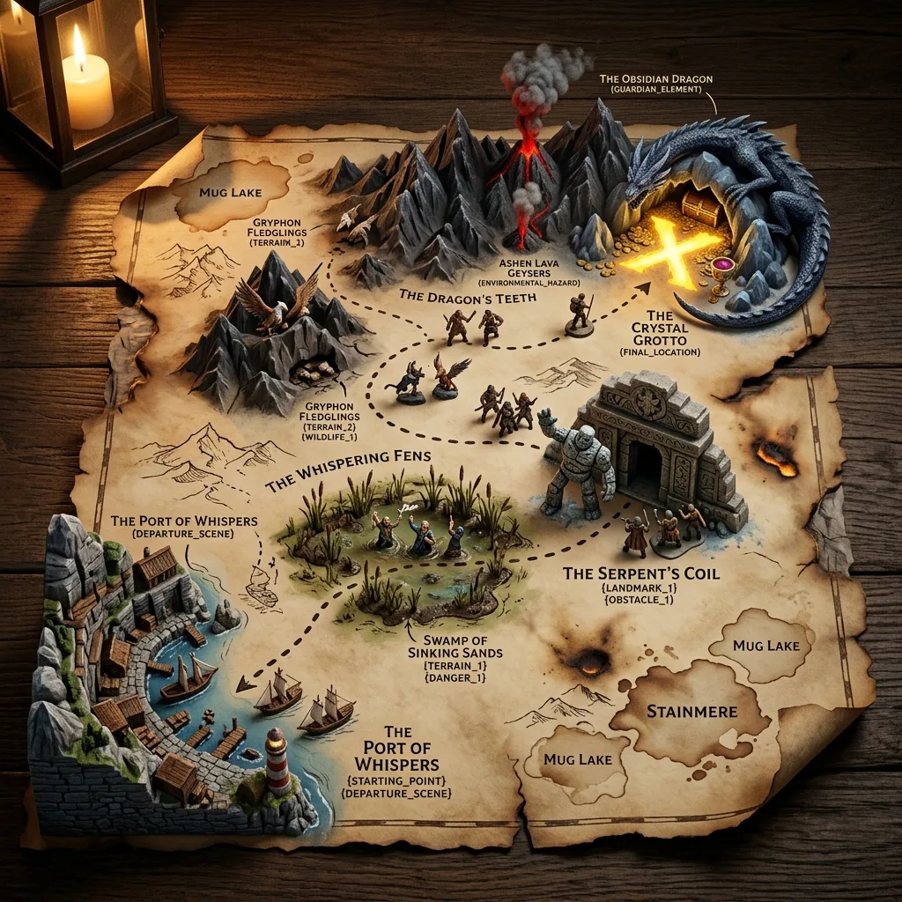

**#182 · Ai Art, Ai Prompt · <code>Vinano Image Pro</code>**

> Keywords: AI art, AI prompt, text to image

<details>
<summary>Show prompt</summary>

```
A hand-drawn treasure map on aged parchment, the adventure erupting into three-dimensional quest. {STARTING_POINT} rises at the map's edge {DEPARTURE_SCENE}, the dotted path becomes an actual trail traversing {TERRAIN_1} {DANGER_1}, passing {LANDMARK_1} where {OBSTACLE_1} awaits. {TERRAIN_2} features {WILDLIFE_1} and {ENVIRONMENTAL_HAZARD}. The X marking the spot glows beneath {FINAL_LOCATION}, treasure partially visible, {GUARDIAN_ELEMENT} protecting it. Miniature expedition party frozen mid-journey at various points along the route. Torn edges of the map become cliffs. Coffee stains become lakes. Burn marks become scorched earth from battles past. Candlelight flicker, adventure novel lighting, 8K, the map as the story it promises. Render with rich micro-detail while keeping the layout uncluttered and intentional.
```

</details>

---

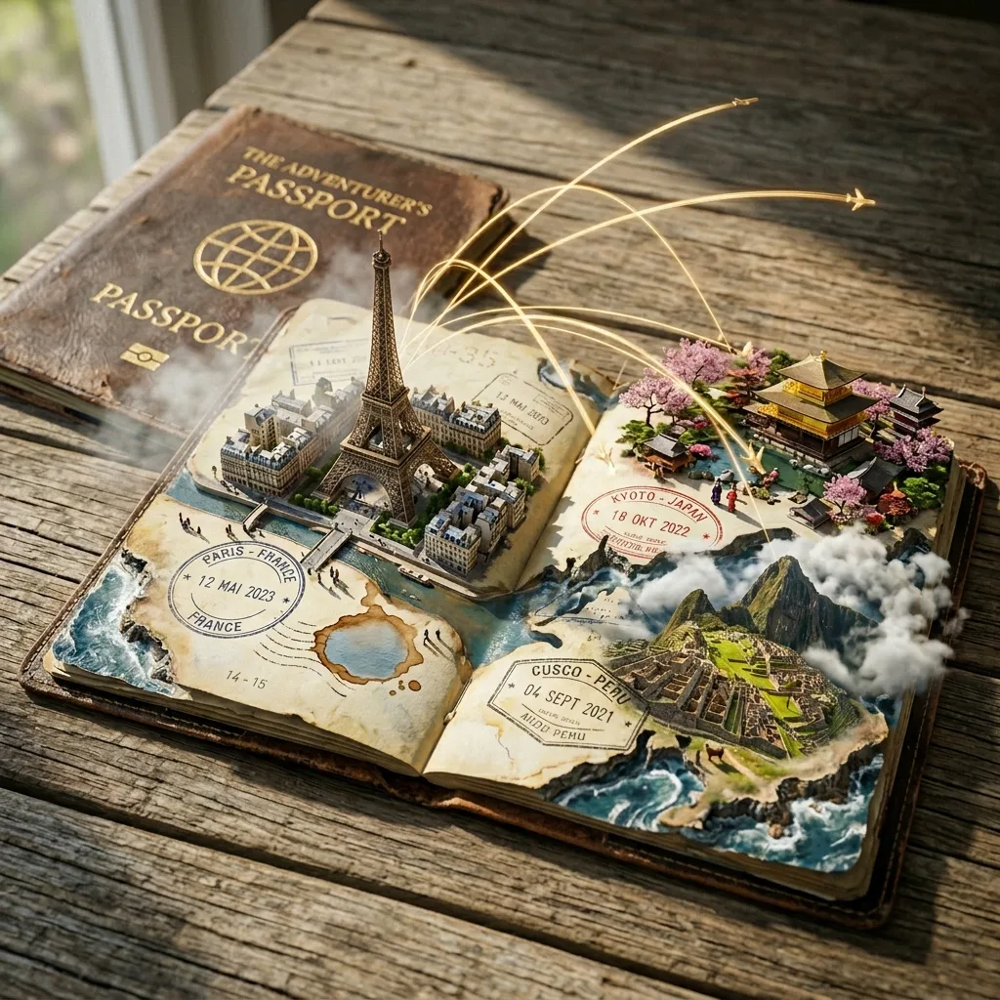

**#183 · Cinematic, Ai Art · <code>Vinano Image Pro</code>**

> Keywords: cinematic, AI art, AI prompt, text to image

<details>
<summary>Show prompt</summary>

```
Epic 3D scene: a weathered passport lies open, its visa stamps erupting into the destinations they represent. Each ink impression becomes a portal—[CITY 1] rises in miniature from one stamp [DETAIL 1], [CITY 2] pushes through another [DETAIL 2], [CITY 3] manifests [DETAIL 3]. [LANDMARK 1], [LANDMARK 2], and [LANDMARK 3] stand at different scales across the pages. Flight paths arc overhead as glowing golden trajectories weaving between all the worlds.
Coffee stains become lakes. Worn edges erode into coastlines. [ATMOSPHERIC ELEMENT 1] drifts from one destination while [ATMOSPHERIC ELEMENT 2] swirls near another.
Dramatic raking light, tilt-shift depth of field, 8K, UE5, filmic, cinematic lighting. The bureaucratic document transformed into a living archive of adventures.

Emphasise material texture and natural light so the final frame feels tactile and premium.
```

</details>

---

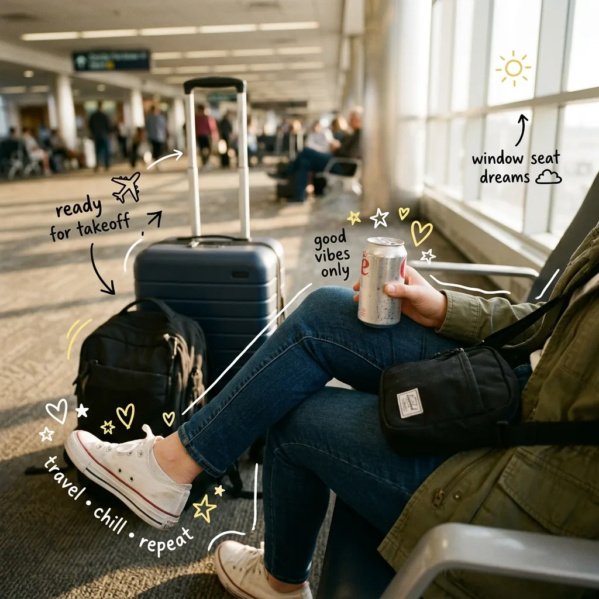

**#184 · Realistic, Cinematic · <code>Vinano Image v2</code>**

> Keywords: realistic, cinematic, AI art, AI prompt, text to image

<details>
<summary>Show prompt</summary>

```
POV travel photography of a person sitting at an airport and inside an airplane, casual outfit jeans and sneakers, small crossbody bag on lap, holding a drink can, warm golden sunlight streaming through windows. Scene 1: airport waiting area luggage (suitcase and backpack), cinematic composition, cozy travel vibe. Scene 2: airplane seat view looking down at legs and tray area, window light casting soft shadows. Add playful hand-drawn doodles and annotations around objects (bags, drink, shoes, seat) including arrows, hearts, stars, clouds, and handwritten notes like “window seat dreams”, “ready for takeoff”, “good vibes only”, “travel • chill • repeat”. White and yellow sketch-style overlays, scrapbook aesthetic, soft warm color grading, shallow depth of field, ultra-realistic, Instagram story style, cinematic lifestyle photography, 4K Render with rich micro-detail while keeping the layout uncluttered and intentional.
```

</details>

---

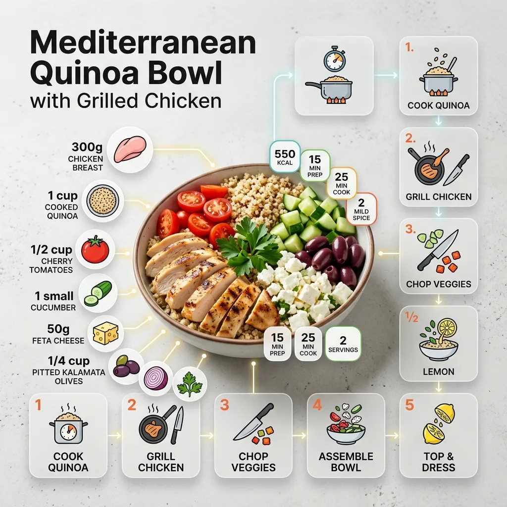

**#185 · Food Photography, Infographic · <code>Vinano Image Pro</code>**

> Keywords: food photography, infographic, AI art, AI prompt, text to image

<details>
<summary>Show prompt</summary>

```
Ultra-clean modern recipe infographic.

Showcase [FOOD] in a visually appealing finished form—sliced, plated, or portioned—floating slightly in perspective or angled view.

Arrange ingredients, steps, and tips around the dish in a dynamic editorial layout, not restricted to top-down.

Ingredients Section:

Include icons or mini illustrations for each ingredient quantities. Arrange them in clusters, lists, or circular flows connected visually to the dish.

Steps Section:

Show preparation steps numbered panels, arrows, or lines, forming a logical flow around the main dish. Include small cooking icons (knife, pan, oven, timer) where helpful.

Additional Info (optional):

Total calories, prep/cook time, servings, spice level—displayed as clean bubbles or badges near the dish.

Visual Style:

Editorial infographic meets lifestyle food photography. Vibrant, natural food colors, subtle drop shadows, clean vector icons, modern typography, soft gradients or glassmorphism for step panels. Accent colors can highlight key info (calories, prep time).

Composition Guidelines:

Finished meal as hero visual (perspective or angled). Ingredients and steps flow dynamically around the dish. Clear visual hierarchy: dish > steps > ingredients > optional stats. Enough negative space to keep design airy and readable.

Lighting & Background:

Soft, natural studio lighting. Minimal textured or gradient background for premium editorial feel.

Output:

1080×1080, ultra-crisp, social-feed optimized, no watermark

Maintain consistent colour harmony and crisp focus across the whole frame.
```

</details>

---

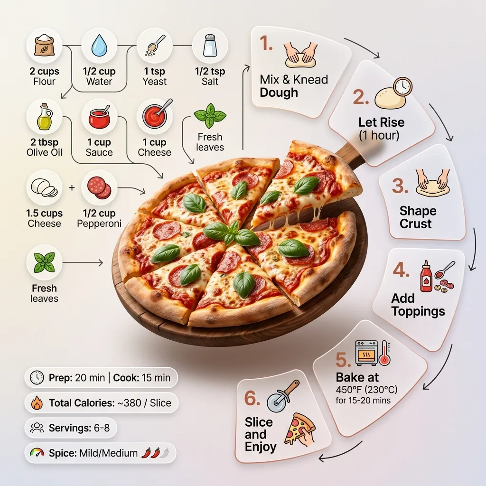

**#186 · Food Photography, Infographic · <code>Vinano Image Pro</code>**

> Keywords: food photography, infographic, AI art, AI prompt, text to image

<details>
<summary>Show prompt</summary>

```
Ultra-clean modern recipe infographic. Showcase Pizza in a visually appealing finished form—sliced, plated, or portioned—floating slightly in perspective or angled view. Arrange ingredients, steps, and tips around the dish in a dynamic editorial layout, not restricted to top-down. Ingredients Section: Include icons or mini illustrations for each ingredient quantities. Arrange them in clusters, lists, or circular flows connected visually to the dish. Steps Section: Show preparation steps numbered panels, arrows, or lines, forming a logical flow around the main dish. Include small cooking icons (knife, pan, oven, timer) where helpful. Additional Info (optional): Total calories, prep/cook time, servings, spice level—displayed as clean bubbles or badges near the dish. Visual Style: Editorial infographic meets lifestyle food photography. Vibrant, natural food colors, subtle drop shadows, clean vector icons, modern typography, soft gradients or glassmorphism for step panels. Accent colors can highlight key info (calories, prep time). Composition Guidelines: Finished meal as hero visual (perspective or angled) Ingredients and steps flow dynamically around the dish Clear visual hierarchy: dish > steps > ingredients > optional stats Enough negative space to keep design airy and readable Lighting & Background: Soft, natural studio lighting, minimal textured or gradient background for premium editorial feel. Output: 1080×1080, ultra-crisp, social-feed optimized, no watermark.” Preserve realistic proportions and depth for a confident, professional finish.
```

</details>

---

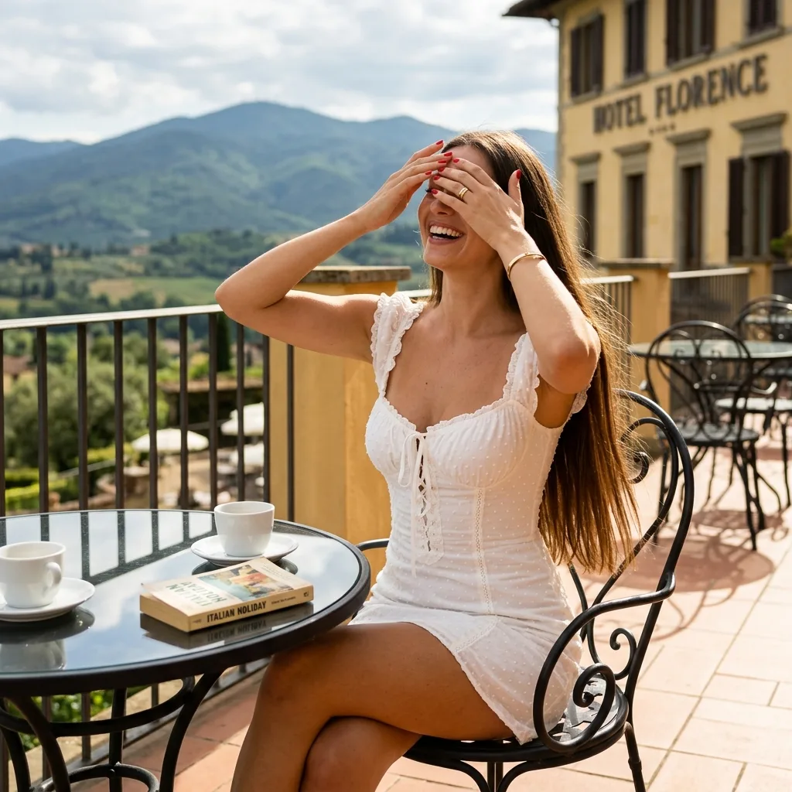

**#187 · Realistic, Portrait · <code>Vinano Image Pro</code>**

> Keywords: realistic, portrait, landscape, vintage, AI art, AI prompt

<details>
<summary>Show prompt</summary>

```
{
 "prompt_type": "Ultra true-to-life photorealistic Image Generation",
 "subject": {
 "description": "Young woman long, straight dark brown hair cascading down her back",
 "skin_tone": "Sun-kissed, glowing complexion",
 "features": "Side profile visible, smiling/laughing expression, hands raised covering eyes/face playfully",
 "details": "Red manicured fingernails, subtle jewelry including a ring on the left hand and a thin bracelet"
 },
 "fashion_and_styling": {
 "outfit": "White, vintage-inspired corset-style mini dress Swiss dot texture",
 "garment_details": "Sweetheart neckline, ruffled cap sleeves, front lace-up ribbon detailing, fitted bodice, ruffled hem, slightly sheer fabric",
 "aesthetic": "Coquette, cottagecore, soft feminine luxury, summer vacation style"
 },
 "pose_and_action": {
 "pose": "Seated elegantly on a chair, body angled slightly away from the camera",
 "gesture": "Both hands raised to shield eyes from the sun or in a candid moment of laughter, head tilted back slightly",
 "interaction": "Relaxed posture sitting at a cafe table"
 },
 "environment": {
 "setting": "Outdoor luxury hotel terrace or cafe balcony overlooking a scenic landscape",
 "background_elements": "Historic yellow building 'HOTEL FLORENCE' signage, lush green mountains in the distance, cloudy blue sky, vintage globe street lamps",
 "foreground_elements": "Round glass-top table, black wrought-iron garden chairs",
 "props": "Two white ceramic coffee cups on saucers, a paperback book lying on the table"
 },
 "lighting": {
 "type": "Natural bright daylight, afternoon sun",
 "quality": "High contrast, casting sharp shadows on the table, backlighting on hair creating a halo effect, sun-drenched atmosphere",
 "direction": "Side/Front lighting illuminating the subject"
 },
 "mood_and_atmosphere": {
 "vibe": "Joyful, candid, luxurious, carefree, Italian summer holiday",
 "emotion": "Happiness, relaxation, playfulness"
 },
 "technical_camera_details": {
 "quality": "8k resolution, RAW photo, hyper-realistic, highly detailed texture",
 "camera_simulation": "DSLR, 85mm portrait lens",
 "aperture": "f/2.8 (shallow depth of field to blur the background mountains and hotel)",
 "shutter_speed": "1/500s (to freeze the candid movement)",
 "iso": "100 (clean, noise-free image)",
 "color_grading": "Vibrant, natural colors slightly warm tones, clear whites"
 }
}

Preserve realistic proportions and depth for a confident, professional finish.
```

</details>

---

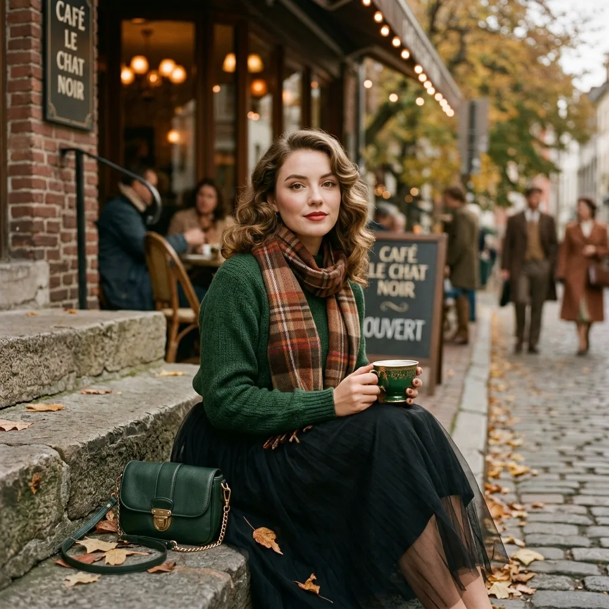

**#188 · Realistic, Portrait · <code>Vinano Image Pro</code>**

> Keywords: realistic, portrait, cinematic, vintage, AI art, AI prompt

<details>
<summary>Show prompt</summary>

```
A cinematic 1970s-inspired fashion portrait of a graceful young woman seated on worn stone steps outside a cozy street café. She holds an ornate deep-green ceramic coffee cup delicate gold rim accents, gently resting it in her hands as she gazes softly toward the camera calm confidence. Her expression feels serene, thoughtful, and timeless.
Her hair falls in soft, natural waves loose strands framing her face, styled in a classic vintage manner. Makeup reflects 1970s elegance: matte crimson-red lips, subtle winged eyeliner, warm-toned blush, and softly defined brows. She wears a luxurious forest-green knitted sweater a relaxed fit, paired a flowing black tulle skirt that moves lightly the air.
A warm plaid scarf in earthy browns, burnt orange, and muted reds is draped casually around her neck. Beside her rests a premium dark-green leather crossbody bag gold filigree hardware and a delicate chain strap.
The background features an autumn café street scattered fallen leaves, glowing amber lights behind glass windows, and a soft urban stillness. Shot an 85mm lens at f/1.8, shallow depth of field, warm analog film grain, muted earthy palette, dreamy cinematic mood, ultra-realistic fashion editorial photography inspired by classic 1970s film aesthetics.

Emphasise material texture and natural light so the final frame feels tactile and premium.
```

</details>

---

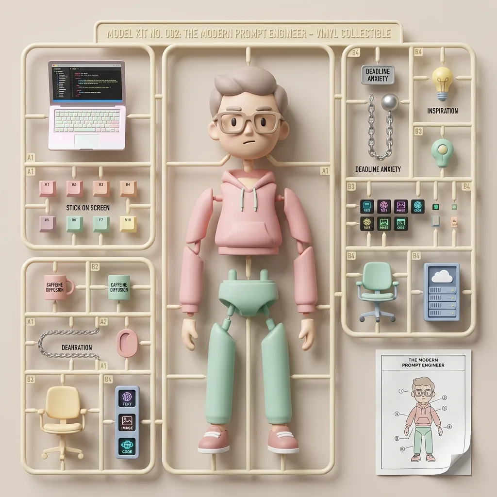

**#189 · Ai Art, Ai Prompt · <code>Vinano Image Pro</code>**

> Keywords: AI art, AI prompt, text to image

<details>
<summary>Show prompt</summary>

```
2x2 grid16:9 INPUT = [Profession Or Concept] (e.g., "The Modern Prompt Engineer", "Robot engineer", "The Creative Process", "Nikola Tesla") DECODE_PHENOMENON: - Infer the tools, mental states, and environment of the INPUT. - Translate these into physical, modular accessories. VISUAL_SYSTEM: TOY_KIT_EXPLODED_VIEW (Kaws/PopMart vinyl designer toy::3) + (Gundam runner sprue kit layout::4) + (Pastel Wes Anderson color palette::2) LAYOUT: 16:9. A flat-lay arrangement. The main figure representing the INPUT lies disassembled on a plastic runner frame. Around it, perfectly organized in molded plastic cavities, are its inferred "accessories" (e.g., tiny glowing screens, coffee cups, weighted chains for anxiety, etc.). EXECUTION: Everything must look like pristine, injection-molded matte and gloss vinyl. Include a small, elegant paper instruction manual folded in the corner. Flawless studio overhead lighting, satisfying geometric spacing, highly tactile. Aim for an editorial, design-driven look with deliberate negative space.
```

</details>

---

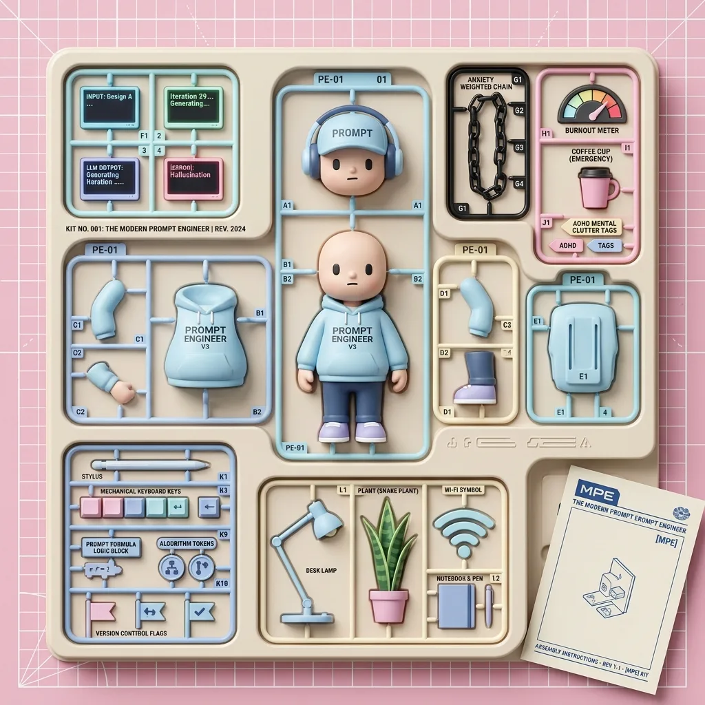

**#190 · Ai Art, Ai Prompt · <code>Vinano Image Pro</code>**

> Keywords: AI art, AI prompt, text to image

<details>
<summary>Show prompt</summary>

```
2x2 grid16:9 INPUT = [Profession Or Concept] (e.g., "The Modern Prompt Engineer", "Robot engineer", "The Creative Process", "Nikola Tesla") DECODE_PHENOMENON: - Infer the tools, mental states, and environment of the INPUT. - Translate these into physical, modular accessories. VISUAL_SYSTEM: TOY_KIT_EXPLODED_VIEW (Kaws/PopMart vinyl designer toy::3) + (Gundam runner sprue kit layout::4) + (Pastel Wes Anderson color palette::2) LAYOUT: 16:9. A flat-lay arrangement. The main figure representing the INPUT lies disassembled on a plastic runner frame. Around it, perfectly organized in molded plastic cavities, are its inferred "accessories" (e.g., tiny glowing screens, coffee cups, weighted chains for anxiety, etc.). EXECUTION: Everything must look like pristine, injection-molded matte and gloss vinyl. Include a small, elegant paper instruction manual folded in the corner. Flawless studio overhead lighting, satisfying geometric spacing, highly tactile. Preserve realistic proportions and depth for a confident, professional finish.
```

</details>

---
