# Food & Drink — full gallery

[← Back to README](../README.md) · [`prompts.json`](../prompts/prompts.json) · **190** prompts · page 1 / 2

**1** · [2](./food-drink-2.md) — [Next →](./food-drink-2.md)

---


**#1 · Food &amp; Drink Prompt · <code>Vinano Image Pro</code>**

<details>
<summary>Show prompt</summary>

```
2x2 grid, do this for 4 famous cuisines: function dish(AA){
<instruction>
Input A is a Famous Dish / Culinary Tradition / Signature Dessert / Regional Specialty.

Analyze:
- ingredient hierarchy, cooking method, plating logic
- origin region, historical story, ritual or social context
- flavor architecture translated into visual composition
- symbolic ingredients, cookware, and dining environment
- chef or tradition lineage

Goal:
A "sauce pour environment."
A giant ladle, piping bag, or sauce boat is pouring the primary sauce, cream, glaze, broth, or puree onto a table.
The flowing edible medium rises into a detailed 3D world of the dish: ingredients, preparation stages, origin landscape, and plated final form merging together.

Rules:
- the poured substance must remain recognizably edible while forming the scene
- include knives, cutting board, handwritten recipe notes, ingredient trays, steam, spice dust, region-appropriate tools
- include a tiny chef or grandmother figure preparing a miniature version nearby
- include a food critic headline, market receipt, or origin-story clipping
- semantically infer cuisine-specific vessels, table culture, garnish logic, and environment
- no random food pile; composition must reveal flavor structure and culinary history
- lighting: appetizing natural kitchen light rich edible texture

Output:
ONE image, 4:5, culinary-process diorama aesthetic
</instruction>

Output:
2x2 grid, each grid a different dish(AA) output
}

Preserve realistic proportions and depth for a confident, professional finish.
```

</details>

---


**#2 · Food &amp; Drink Prompt · <code>Vinano Image v2</code>**

<details>
<summary>Show prompt</summary>

```
{
 "production_manifest": {
 "metadata": {
 "series_id": "CIN-FOOD-2025",
 "aspect_ratio": "9:16",
 "resolution_target": "8k_uhd"
 },
 "technical_stack": {
 "hardware": {
 "camera": "ARRI Alexa 65",
 "lens_profile": "Large format cinematic prime"
 },
 "film_emulation": {
 "stock": "Kodak Portra 400",
 "characteristics": ["Fine grain", "Natural skin tones", "Warm highlights"]
 },
 "lighting_rig": {
 "style": "Cinematic soft glow",
 "atmosphere": "Timeless indoor",
 "diffusion": "High"
 }
 },
 "artistic_direction": {
 "visionary_style": "Greta Gerwig",
 "composition_rule": "Graphic centered symmetry",
 "physics_engine": "Suspended animation / Zero gravity",
 "background_specification": "Flat off-white / Studio bone"
 },
 "variant_registry": [{
 "id": "VAR-001",
 "flavor_profile": "Dark Chocolate Chip & Oat",
 "tonal_emotion": "Playful, cheeky yet chic",
 "ingredients": {
 "primary_solids": ["Dark chocolate chip cookies"],
 "fluid_fx": ["Oat milk splash"],
 "debris": ["Cookie crumbs"]
 }
 },
 {
 "id": "VAR-002",
 "flavor_profile": "Red Velvet",
 "tonal_emotion": "Bold, playful chic",
 "ingredients": {
 "primary_solids": ["Red velvet cake pieces"],
 "fluid_fx": ["Cream cheese frosting swirls"],
 "debris": ["Cocoa dust", "Fine red cake crumbs"]
 }
 },
 {
 "id": "VAR-003",
 "flavor_profile": "Pistachio Macaron",
 "tonal_emotion": "Refined, playful chic",
 "ingredients": {
 "primary_solids": ["Pistachio macarons"],
 "fluid_fx": ["Cream filling swirls"],
 "debris": ["Crushed pistachio nuts"]
 }
 },
 {
 "id": "VAR-004",
 "flavor_profile": "Strawberry Shortcake",
 "tonal_emotion": "Sweet, playful yet chic",
 "ingredients": {
 "primary_solids": ["Fresh strawberry slices"],
 "fluid_fx": ["Whipped cream swirls"],
 "debris": ["Shortcake biscuit crumbs"]
 }
 }]
 }
}

Aim for an editorial, design-driven look with deliberate negative space.
```

</details>

---


**#3 · Food &amp; Drink Prompt · <code>Vinano Image v2</code>**

<details>
<summary>Show prompt</summary>

```
{
 "Objective": "Create a surreal, hyper-detailed fantasy world where pizza becomes an integral part of landscapes and technology",
 "Concept": "Imaginative surrealism blending true-to-life photorealistic food textures cinematic fantasy environments",
 "Scenes": [{
 "SceneName": "Pizza Coastline Mountain Road",
 "SceneDescription": {
 "Environment": "Dramatic coastal cliffs overlooking the ocean",
 "PrimaryStructure": "A giant pepperoni pizza forming a winding mountain road",
 "WorldIntegration": {
 "Cheese": "Melted cheese forming the roadway surface",
 "Toppings": "Pepperoni slices and basil leaves acting as traffic islands and terrain features"
 },
 "ScaleElements": {
 "Vehicles": "Tiny cars driving across the pizza road",
 "ScaleContrast": "Massive pizza landscape versus miniature vehicles"
 }
 },
 "LightingAndMood": {
 "TimeOfDay": "Golden hour",
 "Lighting": "Warm coastal sunlight long shadows",
 "Mood": "Whimsical, epic, playful wonder"
 },
 "Composition": {
 "Camera": "Cinematic wide-angle view",
 "Perspective": "Elevated, sweeping landscape shot",
 "DepthOfField": "Moderate depth foreground and background clarity"
 }
 },
 {
 "SceneName": "Pizza Futuristic Car",
 "SceneDescription": {
 "Environment": "Rainy neon-lit cyberpunk city street at night",
 "PrimarySubject": "A pizza slice transformed into a futuristic car",
 "DesignDetails": {
 "Body": "Pizza crust and melted cheese forming aerodynamic shape",
 "Toppings": "Pepperoni and basil integrated into vehicle design",
 "Wheels": "Realistic rubber tires attached to the pizza vehicle"
 },
 "Motion": "Speeding through the street dynamic motion blur"
 },
 "LightingAndMood": {
 "TimeOfDay": "Night",
 "Lighting": "Moody cyberpunk neon lights in red, teal, and magenta",
 "Atmosphere": "Rain, mist, reflections on wet asphalt",
 "Mood": "Energetic, futuristic, playful surrealism"
 },
 "Composition": {
 "Camera": "Low-angle wide shot",
 "Perspective": "Dynamic chase-style framing",
 "DepthOfField": "Shallow depth of field background bokeh"
 }
 }],
 "ArtDirection": {
 "Style": "Playful yet true-to-life photorealistic surrealism",
 "TextureQuality": {
 "Food": "Ultra-realistic pizza textures, visible oil sheen, stretchy melted cheese",
 "Environment": "High-detail rocks, asphalt, rain droplets, reflections"
 },
 "RealismBalance": "true-to-life photorealistic materials combined impossible scale and concepts"
 },
 "VisualStyle": {
 "Resolution": "8K ultra-high detail",
 "ColorGrading": "Cinematic contrast warm coastal tones and cool neon city tones",
 "Depth": "Strong sense of scale and dimensionality"
 },
 "Mood": {
 "OverallTone": "Imaginative, whimsical, cinematic",
 "EmotionalFeel": "Playful awe and creative wonder"
 },
 "NegativePrompt": ["flat lighting",
 "cartoon-only style",
 "low detail textures",
 "plastic food",
 "blurry focus",
 "dull colors"],
 "ResponseFormat": {
 "Type": "Two-scene cinematic illustration or render",
 "OutputOptions": ["Split composition",
 "Diptych",
 "Two separate images"],
 "AspectRatio": "16:9"
 }
}

Aim for an editorial, design-driven look with deliberate negative space.
```

</details>

---


**#4 · Food &amp; Drink Prompt · <code>Vinano Image Pro</code>**

<details>
<summary>Show prompt</summary>

```
{
 "subject": {
 "primary": "Two foil sachets of Marvico Tomato Mix Paste seasoning tilted diagonally",
 "secondary": "A rustic metal pot filled rich, bubbling red Nigerian-style tomato stew containing assorted meats and tripe",
 "details": ["Vibrant red tomato sauce consistency",
 "Fresh whole tomato splash at the bottom foreground",
 "Sachets feature green and gold 'MARVICO' branding realistic tomato illustrations",
 "A cheerful young Western blonde woman long hair, wearing a casual bright outfit, holding the sachets and smiling at the camera"]
 },
 "composition": {
 "layout": "Dynamic vertical advertisement",
 "focal_point": "Product sachets held by the girl in the center-left, overlapping a large pot of stew in the top-right",
 "background": "Solid textured red gradient a subtle grainy paper effect",
 "perspective": "Eye-level a slight Dutch angle for energy"
 },
 "typography": {
 "main_text": "Better Christmas stew don sure",
 "sub_text": "...original from nature",
 "font_style": "Bold, playful white bubble script for main text; refined minimalist lowercase sans-serif for sub-text",
 "placement": "Centered at the bottom over the red background"
 },
 "color_palette": {
 "dominant": ["Crimson Red", "Deep Scarlet"],
 "accents": ["Forest Green", "Metallic Gold", "Bright White"],
 "lighting": "Studio lighting high contrast to make the red sauce look glossy and appetizing"
 },
 "style_descriptors": ["Commercial food photography",
 "West African culinary aesthetic",
 "High-definition textures",
 "Vibrant and warm color grading",
 "Professional product placement",
 "Lifestyle advertising a relatable model"],
 "technical_settings": {
 "aspect_ratio": "4:5",
 "sharpness": "High",
 "texture": "Subtle film grain on the background"
 }
}

Aim for an editorial, design-driven look with deliberate negative space.
```

</details>

---


**#5 · Food &amp; Drink Prompt · <code>Vinano Image Pro</code>**

<details>
<summary>Show prompt</summary>

```
Macro food photography of a crispy martabak telur tearing open mid-air, thin golden wrapper shattering a crack, hot filling of minced beef, scallions, and egg bursting outward. Flecks of fried onion and pepper suspended in motion, steam visible, glossy oil sheen catching the light. Warm Indonesian street-stall lighting, tungsten + charcoal warmth, dramatic rim light, ultra high texture detail (bubbled wrapper, layered interior).Editorial food shot, shallow depth of field, bokeh of night market signage, Nikon Z9 look, 105mm macro, fast shutter freeze, hyper-real crumbs. --ar 3:4" Aim for an editorial, design-driven look with deliberate negative space.
```

</details>

---


**#6 · Food &amp; Drink Prompt · <code>Vinano Image v2</code>**

<details>
<summary>Show prompt</summary>

```
{
"style": "ultra-realistic food photography, luxury editorial, macro-detail, natural textures",
 "images": [{
 "id": "image_1",
 "subject": "assorted praline tower",
 "composition": "staggered vertical tower, center frame, loose organic stacking",
 "details": {
 "fillings": ["hazelnut chunks irregularly clumped at base",
 "raspberry gel naturally puddled",
 "salted caramel realistic flow lines",
 "coffee ganache smooth wave texture",
 "passionfruit filling visible pulp specks"],
 "accent": "one unique metallic gold nut per filling type placed at layer transitions",
 "stand": "brushed gold stand subtle reflections"
 },
 "lighting": {
 "type": "dramatic side lighting",
 "angle": "35 degrees left",
 "effects": "authentic filling refractions, layered shadow play"
 },
 "background": "teal-to-navy gradient suspended gold motes",
 "mood": "luxurious, indulgent, artisanal depth"
 },
 {
 "id": "image_2",
 "subject": "ruby chocolate tablet",
 "composition": "floating hexagonal segments above black textured paper liner",
 "details": {
 "surface": "hand-tempered imperfections, translucent ruby pink",
 "inclusions": "embedded fruit flecks visible through chocolate",
 "motion": "ruby cacao nibs falling in gravity-realistic arc from one segment"
 },
 "lighting": {
 "key": "top-down at 12 o'clock",
 "rim": "soft pink rim light at 3 o'clock",
 "effects": "authentic shadows, enhanced translucency"
 },
 "background": "black-to-warm pink radial gradient subtle sparkle specks",
 "mood": "modern, vibrant, floating tension"
 },
 {
 "id": "image_3",
 "subject": "white chocolate bonbons",
 "composition": "organic cluster on clear glass stand",
 "details": {
 "marbling": ["central bonbon irregular orange passionfruit veins",
 "surrounding bonbons pink raspberry swirls",
 "green matcha flecks varied density"],
 "cutaway": "one bonbon sliced vertically showing gel core real fruit speckles",
 "props": "dried fruit flecks scattered below (orange zest curls, raspberry seeds)"
 },
 "lighting": {
 "key": "soft high-key front light at 10 degrees",
 "rim": "rear rim light at 35 degrees",
 "effects": "enhanced marbling contrast and glass refractions"
 },
 "background": "soft taupe fruit-toned bokeh",
 "mood": "elegant, fresh, handcrafted"
 },
 {
 "id": "image_5",
 "subject": "dark chocolate pistachio bar",
 "composition": "vertical bar centered on polished black granite slab",
 "details": {
 "cross_section": "precision side cut revealing layered pistachio filling",
 "filling": "whole roasted green pistachios suspended in smooth white chocolate matrix",
 "binding": "subtle golden honey swirl",
 "break": "front broken segment clean snap and visible pistachio pieces",
 "props": "whole roasted pistachios arranged in ascending curve, honey drips nearby"
 },
 "lighting": {
 "key": "soft spotlight from top-left at 45 degrees",
 "rim": "warm side rim light from right at 30 degrees",
 "highlight": "single pinpoint highlight on largest pistachio"
 },
 "background": "dark espresso brown gradient floating pistachio shell dust particles",
 "mood": "rich, bold, premium indulgence"
 }]
}

Aim for an editorial, design-driven look with deliberate negative space.
```

</details>

---


**#7 · Food &amp; Drink Prompt · <code>Vinano Image Pro</code>**

<details>
<summary>Show prompt</summary>

```
{
 "content_goal":
 "viral food photography post",
 "image_type":
"professional food photography",
 "food_concept": {
 "item":
"pizza slice",
 "style":
"premium artisan pizza",
 "serving_state":
"freshly lifted slice cheese pull",
 "temperature_feel":
"hot, freshly baked"
 },
 "visual_style": {
 "aesthetic": "cinematic food editorial",
 "vibe": "crave-worthy, indulgent, luxurious",
 "realism": "ultra-realistic"
 },
 "composition": {
 "framing": "close-up macro partial pizza visible",
 "angle": "45-degree side angle",
 "focus_point": "cheese stretch and toppings",
 "depth_of_field": "shallow background blur"
 },
 "pizza_details": {
 "crust": "golden-brown, crispy edges soft interior",
 "cheese": "melted mozzarella long stretchy pull",
 "sauce": "rich red tomato sauce",
 "toppings": ["pepperoni slices",
 "fresh basil leaves",
 "olive oil glaze"],
 "texture": "glossy cheese, crisp crust, juicy toppings"
 },
 "lighting": {
 "type": "soft directional studio lighting",
 "direction": "side light for texture definition",
 "highlight": "cheese shine and crust detail",
 "shadow": "soft natural shadows"
 },
 "color_palette": {
 "primary_colors": ["cheese yellow",
 "tomato red",
 "golden brown"],
 "contrast_level": "medium-high",
 "mood": "warm, appetizing, mouth-watering"
 },
 "environment": {
 "surface": "rustic wooden table or marble slab",
 "background": "dark blurred restaurant or kitchen",
 "props": ["pizza cutter",
 "linen napkin",
 "wooden board"]
 },
 "camera_details": {
 "lens": "macro or 50mm food lens",
 "focus": "extreme sharpness on slice",
 "resolution": "high-end commercial quality",
 "noise": "none"
 },
 "sensory_impact": {
 "visual_effect": "cheese pull in motion",
 "viewer_reaction": "instant craving",
 "emotional_trigger": "comfort food desire"
 },
 "quality_control": {
 "food_realism": "authentic pizza texture",
 "ai_artifacts": "none",
 "professional_finish": "restaurant advertisement grade"
 },
 "intended_use": {
 "primary": "viral food post on X",
 "secondary": "restaurant promo, food brand content"
 }
}

Emphasise material texture and natural light so the final frame feels tactile and premium.
```

</details>

---


**#8 · Food &amp; Drink Prompt · <code>Vinano Image v2</code>**

<details>
<summary>Show prompt</summary>

```
{
 "image_prompt": {
 "main_concept": "High-end commercial food photography a floating composition (food levitation effect).",
 "composition": {
 "arrangement": "Hero food item suspended in mid-air complementary ingredients orbiting in perfect balance",
 "background": "Pure white background",
 "shadows": "Soft shadows beneath the suspended food"
 },
 "subject_variations": [{
 "item": "Creamy raspberry ice cream",
 "details": "Pistachio crumbs, chocolate chunks, mint leaves, berry drizzle"
 },
 {
 "item": "Gourmet hotdog",
 "details": "Glossy sausage, toasted bun, melted cheese, pickles, crispy onions, herbs, sauce"
 },
 {
 "item": "Handmade dumplings",
 "details": "Visible filling, fresh herbs, spices, pumpkin pieces, dipping sauce"
 }],
 "lighting_and_color": {
 "type": "Studio lighting",
 "highlights": "Clean highlights",
 "color_accuracy": "Natural color accuracy, realistic depth"
 },
 "technical_specs": {
 "style": "refined minimalist luxury aesthetic, modern advertising style, commercial product photography",
 "focus": "Ultra-sharp focus on textures, crisp edges",
 "quality": "Hyper-realistic details, high resolution, 8K quality"
 }
 }
}

Preserve realistic proportions and depth for a confident, professional finish.
```

</details>

---


**#9 · Food &amp; Drink Prompt · <code>Vinano Image Pro</code>**

<details>
<summary>Show prompt</summary>

```
Create a luxury fashion-editorial still life of a sharp triangular prism cake slice made of hard crystal-clear glass-like material, the featured fruit being [orange], a single unified candy-glass color tone while preserving the fruit’s original natural hue and form logic, explicitly excluding stems and leaves from recoloring so they retain natural green, the transparent glass cake has polished edges, elegant refraction, crisp highlights and internal reflections identical to solid crystal, inside the cake thick full-bodied seedless fruit cross-sections appear as pure clear glass perfectly smooth seamless surfaces, one whole fruit in mirror-polished translucent crystal-glass candy style sits on top and another rests beside it, all fruit instances sharing identical color tone and material finish except leaves, arranged on a glossy white ceramic plate clear crystal shards, a champagne-gold metallic fork and minimal baby’s-breath accents against softly draped white silk fabric, composed balanced proportions and refined negative space, lit soft diffused high-end editorial lighting that preserves candy-like color richness and material clarity, hyper-realistic, ultra-detailed, premium aesthetic, no text, no typography, no logo, no watermark, no graphic elements, exclude rough texture, matte surface, cube, square or round cake, ice cube, acrylic or resin block, cloudy transparency, people, hands, faces Keep edges clean and the overall composition balanced for a polished, gallery-ready result.
```

</details>

---


**#10 · Food &amp; Drink Prompt · <code>Vinano Image v2</code>**

<details>
<summary>Show prompt</summary>

```
{
 "prompt": "A realistic, needle-felted sculpture of a product from a photo, captured in a high-detail macro studio shot a whimsical aesthetic.",
 "subject": {
 "type": "Needle-felted sculpture",
 "based_on": "User-provided product photograph",
 "material": "Soft wool felt",
 "attributes": ["Fluffy textures",
 "Hand-felted details",
 "Soft edges",
 "Cozy appearance",
 "3D look"]
 },
 "photography": {
 "shot_type": "Studio shot",
 "focus": "Macro focus",
 "detail_level": "High detail"
 },
 "lighting": {
 "type": "Soft, diffused lighting",
 "mood": "Warm and gentle"
 },
 "setting": {
 "background": "Minimal, solid pastel color"
 },
 "aesthetics": {
 "overall_style": "Whimsical and charming"
 },
 "parameters": {
 "aspect_ratio": "4:5"
 }
}

Aim for an editorial, design-driven look with deliberate negative space.
```

</details>

---


**#11 · Food &amp; Drink Prompt · <code>Vinano Image v2</code>**

<details>
<summary>Show prompt</summary>

```
A hyper-realistic {FRUIT} dessert burger, centered composition, soft pastel {FRUIT_COLOR} color palette. Fluffy {FRUIT_COLOR} burger buns smooth matte texture and light sesame seeds on top. Layers of fresh sliced {FRUIT} and airy white whipped cream inside, glossy {FRUIT} sauce dripping naturally. Floating {FRUIT} slices and tiny flowers surrounding the burger. Minimal {FRUIT_COLOR} gradient background, soft studio lighting, luxury food advertising style, ultra clean, high detail, shallow depth of field. Keep edges clean and the overall composition balanced for a polished, gallery-ready result.
```

</details>

---


**#12 · Food &amp; Drink Prompt · <code>Vinano Image v2</code>**

<details>
<summary>Show prompt</summary>

```
Dynamic flavor wave composition of [FOOD], colorful energy ribbons, mist, and motion streaks bursting outward to represent taste intensity. Ingredient silhouettes embedded within the waves. Clean minimal white background, high-key studio lighting. Ultra-real textures, cinematic motion blur, premium commercial food photography, 8K resolution. Aim for an editorial, design-driven look with deliberate negative space.
```

</details>

---


**#13 · Food &amp; Drink Prompt · <code>Vinano Image v2</code>**

<details>
<summary>Show prompt</summary>

```
A premium-quality, professional product photograph of a grilled chicken taco filled juicy grilled chicken pieces visible char marks, fresh shredded red cabbage, and creamy white sauce topped small diced tomatoes, onions, and parsley garnish, all placed inside a soft wheat taco tortilla. The taco looks fresh, flavorful, and well-filled visible textures and vibrant ingredients. refined minimalist style, shot against a pure solid white background soft, natural shadows. 8K resolution, ultra-sharp focus, clean and modern food photography aesthetic. Maintain consistent colour harmony and crisp focus across the whole frame.
```

</details>

---


**#14 · Food &amp; Drink Prompt · <code>Vinano Image v2</code>**

<details>
<summary>Show prompt</summary>

```
Hyper-realistic product advertisement of a protein shake can yellow and cream design, surrounded by floating banana slices, almonds, and peanuts, dynamic milk splash bursting around the can, glossy condensation droplets on surface, vibrant warm yellow background, high-speed splash photography, ultra-detailed textures, commercial food photography style, dramatic lighting, 8K. Keep edges clean and the overall composition balanced for a polished, gallery-ready result.
```

</details>

---


**#15 · Food &amp; Drink Prompt · <code>Vinano Image v2</code>**

<details>
<summary>Show prompt</summary>

```
Transform the uploaded logo into a realistic dessert scene where the logo silhouette is formed naturally by melted chocolate spread across a plate, while the plate and dessert presentation are also subtly designed around the same logo as a brand identity.The logo must keep its exact shape and proportions, appearing both as a clean branded element (engraved or printed on the plate) and as a naturally melted chocolate formation created through real fluid behavior.

Material details:
Rich dark chocolate high viscosity and glossy reflective surface.
Thicker areas forming smooth pools, thinner areas creating soft fading edges.
Visible chocolate streaks where it has been dragged or spread naturally.
Subtle ripples and surface tension curves, occasional small air bubbles.

Physics behavior:
Chocolate should behave realistically — slow flow, rounded edges, gravity pulling it into thicker pools.
Slight directional flow suggesting it was poured or spread.
Variations in thickness depending on how it settled on the plate.
Natural imperfections — no perfectly sharp lines.

Surface interaction:
Ceramic or porcelain dessert plate subtle gloss finish.
Plate includes a minimal branded logo (engraved, embossed, or printed).
Chocolate partially overlaps or interacts the plate’s logo design for realism.
Small chocolate smears or residue near edges.

Environment & atmosphere:
Fine dining or café dessert setting.
Partially eaten dessert (cake, pastry, or mousse) nearby.
Subtle crumbs, fork marks, and realistic usage details.
Refined but not overly staged.

Lighting:
Soft warm lighting (restaurant or café ambiance).
Highlights reflecting on chocolate surface.
Gentle shadows adding depth to textures.

Camera & composition:
Slightly angled top-down macro shot.
Logo clearly visible through chocolate formation.
Balanced composition showing both dessert and branding.

Format:
Aspect ratio: STRICT 4:5 vertical.
No text overlays.

Style:
Hyper-real food photography.
Luxury dessert aesthetic natural fluid realism.
Brand integrated into environment.

Render with rich micro-detail while keeping the layout uncluttered and intentional.
```

</details>

---


**#16 · Food &amp; Drink Prompt · <code>Vinano Image v2</code>**

<details>
<summary>Show prompt</summary>

```
{
 "cinematic miniature winter world built around a giant Nutella jar, thick chocolate hazelnut spread flowing out forming a glossy mountain ski slope, tiny skiers skiing down the chocolate hill covered light snow powder, miniature alpine village wooden cabins and pine trees, ski lift small gondolas carrying people, snowy forest background and distant mountains, soft winter lighting, ultra realistic textures of melting chocolate and snow, macro tilt shift photography, fantasy food landscape, commercial food advertising style, highly detailed, 8k",
 "negative_prompt": "blurry, low resolution, distorted jar, incorrect logo, messy composition, unrealistic proportions, extra limbs, duplicate people",
 "aspect_ratio": "4:5",
 "style": "ultra realistic macro photography",
 "lighting": "soft cinematic winter daylight",
 "camera": "macro lens, tilt shift effect",
 "quality": "high detail, 8k"
}

Maintain consistent colour harmony and crisp focus across the whole frame.
```

</details>

---


**#17 · Food &amp; Drink Prompt · <code>Vinano Image v2</code>**

<details>
<summary>Show prompt</summary>

```
Ultra-realistic cinematic food photography of a bowl of rich spicy meat soup exploding upward in a dynamic splash, tender bone-in meat pieces floating mid-air creamy curry broth forming swirling liquid ribbons, star anise, cinnamon sticks, green onions, and spices suspended in motion, dramatic dark studio background, high-speed splash capture, macro texture detail on meat and broth, steam rising, shallow depth of field, vibrant warm colors, gourmet food advertising style, hyper-detailed liquid physics, 8K, perfect composition. Aim for an editorial, design-driven look with deliberate negative space.
```

</details>

---


**#18 · Food &amp; Drink Prompt · <code>Vinano Image Pro</code>**

<details>
<summary>Show prompt</summary>

```
a stack of three [FOOD ITEM] [LIQUID] dripping down, on a white background, food photography, magazine cover "[FOOD] pixel", macro shot, studio lighting, nikon z6 ii, volumetric lighting, neutral tones. Maintain consistent colour harmony and crisp focus across the whole frame.
```

</details>

---


**#19 · Food &amp; Drink Prompt · <code>Vinano Image v2</code>**

<details>
<summary>Show prompt</summary>

```
Use the uploaded product image as reference. Create an ultra-realistic commercial image of a Garoto chocolate bar. Show a broken bar melted chocolate texture, visible cocoa details and rich gloss. Add subtle chocolate splashes and floating crumbs. Clean studio setup, vibrant colored background, bold advertising style for social media. 8K ultra realistic, high sharpness, high contrast, professional lighting realistic shadows and highlights, no text, no watermark, no blur, no distortion, no low quality, no cartoonish style Keep edges clean and the overall composition balanced for a polished, gallery-ready result.
```

</details>

---


**#20 · Food &amp; Drink Prompt · <code>Vinano Image Pro</code>**

<details>
<summary>Show prompt</summary>

```
[DISH] at the precise moment of a dramatic [LIQUID] pour in ultra high-speed photography, liquid cascade frozen mid-fall in perfect clarity. Hero [DISH] center on matte [COLOR] surface, [LIQUID] pouring from above in one cinematic ribbon catching warm single-source light, splitting and branching into suspended droplets and threads as it hits the surface. Splatter crown frozen at moment of impact, droplets suspended in perfect arcs. Every surface texture hyperreal: glistening, steaming, sauce pooling in slow motion. Each element labeled ultra-thin lines in clean uppercase: "[INGREDIENT] [descriptor]". Dish name in elegant editorial typography: "[DISH NAME]". Subtitle: "[TAGLINE]". Mood: Albert Watson food photography meets Harold Edgerton fluid dynamics meets Michelin-star editorial. 4K, tack sharp every thread and droplet, warm single-source light, extraordinary and craveable. Preserve realistic proportions and depth for a confident, professional finish.
```

</details>

---

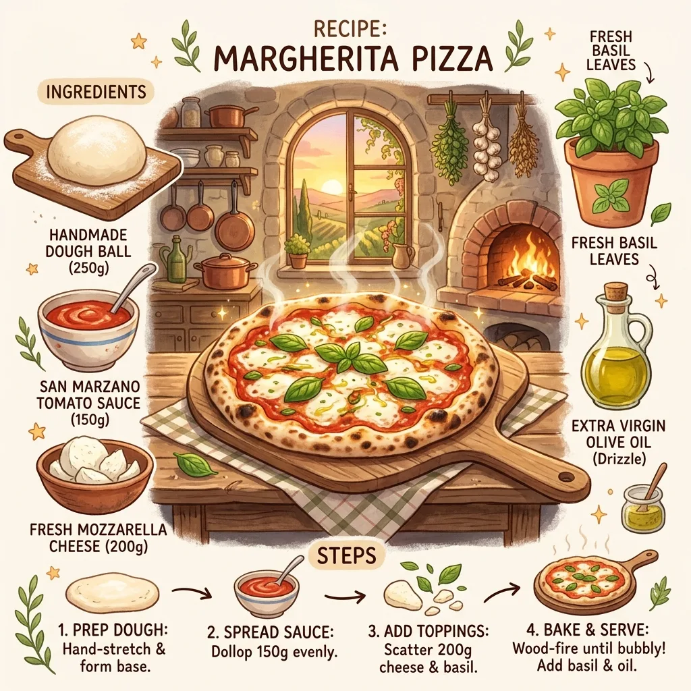

**#21 · Food &amp; Drink Prompt · <code>Vinano Image Pro</code>**

<details>
<summary>Show prompt</summary>

```
margherita pizza recipe infographic, Studio Ghibli inspired illustration, traditional Italian kitchen setting, warm golden sunset light, whole pizza in center bubbling cheese, ingredients illustrated around in cute containers, dough ball, tomato sauce 150g, mozzarella 200g, fresh basil leaves, olive oil drizzle, handwritten notebook style labels, soft pastel tones, painterly textures, gentle steam and magical glow, whimsical cozy feeling, clean organized layout, readable text, high detail Aim for an editorial, design-driven look with deliberate negative space.
```

</details>

---

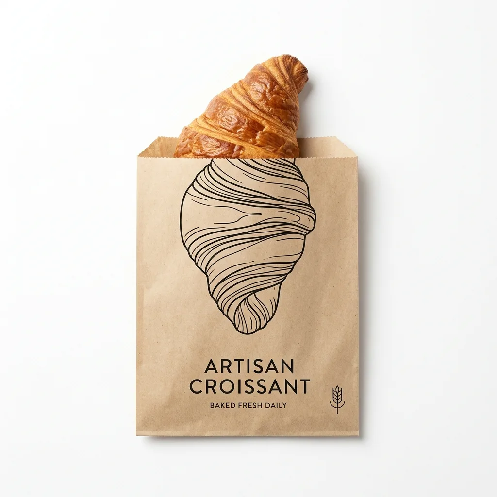

**#22 · Food &amp; Drink Prompt · <code>Vinano Image v2</code>**

<details>
<summary>Show prompt</summary>

```
minimal studio shot on pure white background, real [Food Name] emerging from a paper packaging, the visible part outside the packaging is fully true-to-life photorealistic, the continuation of the same food is drawn as a clean black line illustration printed directly on the surface of the packaging, perfectly aligned the real food shape, the illustration stays strictly on the packaging material, not floating, not extending into the background, seamless transition between real and printed illustration, modern minimal branding, top-down composition, soft shadows. Maintain consistent colour harmony and crisp focus across the whole frame.
```

</details>

---

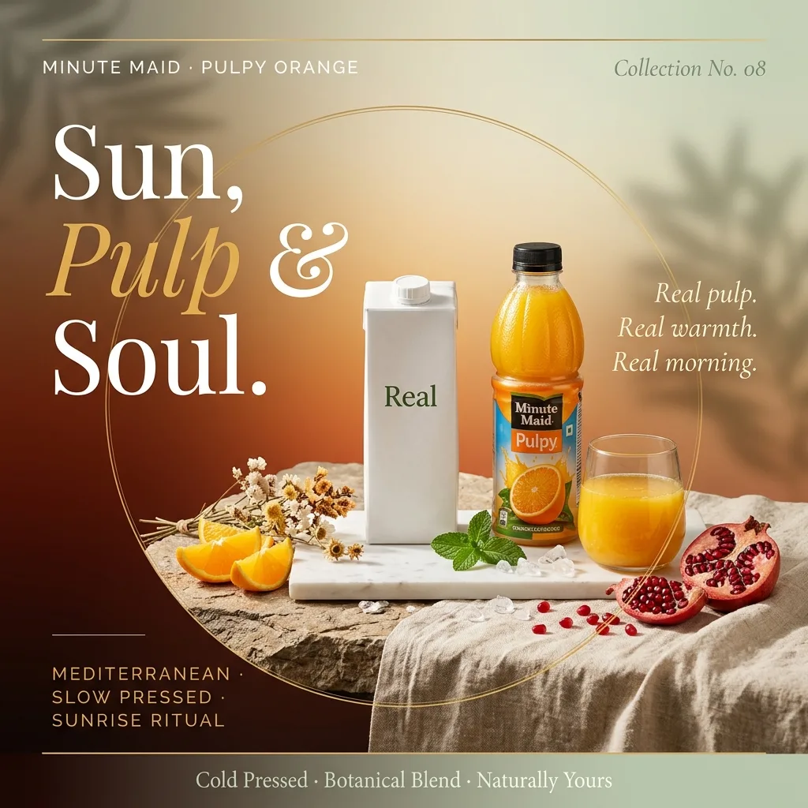

**#23 · Food &amp; Drink Prompt · <code>Vinano Image Pro</code>**

<details>
<summary>Show prompt</summary>

```
High-end cinematic campaign poster. A Minute Maid Pulpy orange bottle positioned off-center right on a sun-bleached linen draped over rough coastal stone. Surrounding: a heavy ceramic glass half-filled pulpy orange juice, fresh orange wedges, dried wildflowers. Background: deep terracotta darkness bleeding to warm amber glow at top — Mediterranean late afternoon atmosphere. Two thin horizontal gold rule lines framing the upper and lower composition.
Typography overlaid: left-aligned Playfair Display headline “Sun,” on first line, italic amber “Pulp &” second line, “Soul.” third line — stacked at 64–72px, white and gold alternating. Right-aligned italic Cormorant Garamond subtext “Real pulp. Real warmth. Real morning.” in warm cream. Bottom left spaced caps “MEDITERRANEAN · SLOW PRESSED · SUNRISE RITUAL” in faint amber. Top left eyebrow “MINUTE MAID · PULPY ORANGE” in tracked caps.
Lighting: natural diffused window light left-frame, warm terracotta fill, golden pulp glow through glass. Mood: slow coastal morning, honest premium warmth. Shot on ARRI Alexa 35, 75mm prime, shallow DOF, terracotta-ivory bokeh, HDR, lifestyle brunch campaign poster, 4:5 portrait.

High-end refined minimalist campaign poster. A clean Real fruit juice carton standing perfectly centered on cool white Italian marble, surrounded by split pomegranates showing jewel-red seeds, a fresh mint sprig, and scattered ice chips. Background: warm ivory-to-pale-sage gradient, soft botanical shadow suggestion of leaves at edges. Large thin circular frame element surrounding the bottle — elegant geometric restraint.
Typography overlaid: large light-weight Cormorant Garamond serif headline “Quietly” then italic bold “Brilliant.” stacked left-aligned in deep forest green, generous line spacing. Small Josefin Sans ultra-tracked subtext “NO DRAMA · JUST FRUIT” below in sage. Thin horizontal divider line. Footer italic “Cold pressed · Botanical blend · Naturally yours” in light sage. Top right “Collection No. 08” in delicate italic grey-green.
Lighting: soft cool overhead diffused studio light, clean marble reflection, zero drama. Mood: refined wellness luxury, botanical calm. Shot on Sony VENICE 2, 90mm macro, ultra-shallow DOF, sage bokeh, HDR, lifestyle wellness poster, 4:5 portrait

Aim for an editorial, design-driven look with deliberate negative space.
```

</details>

---

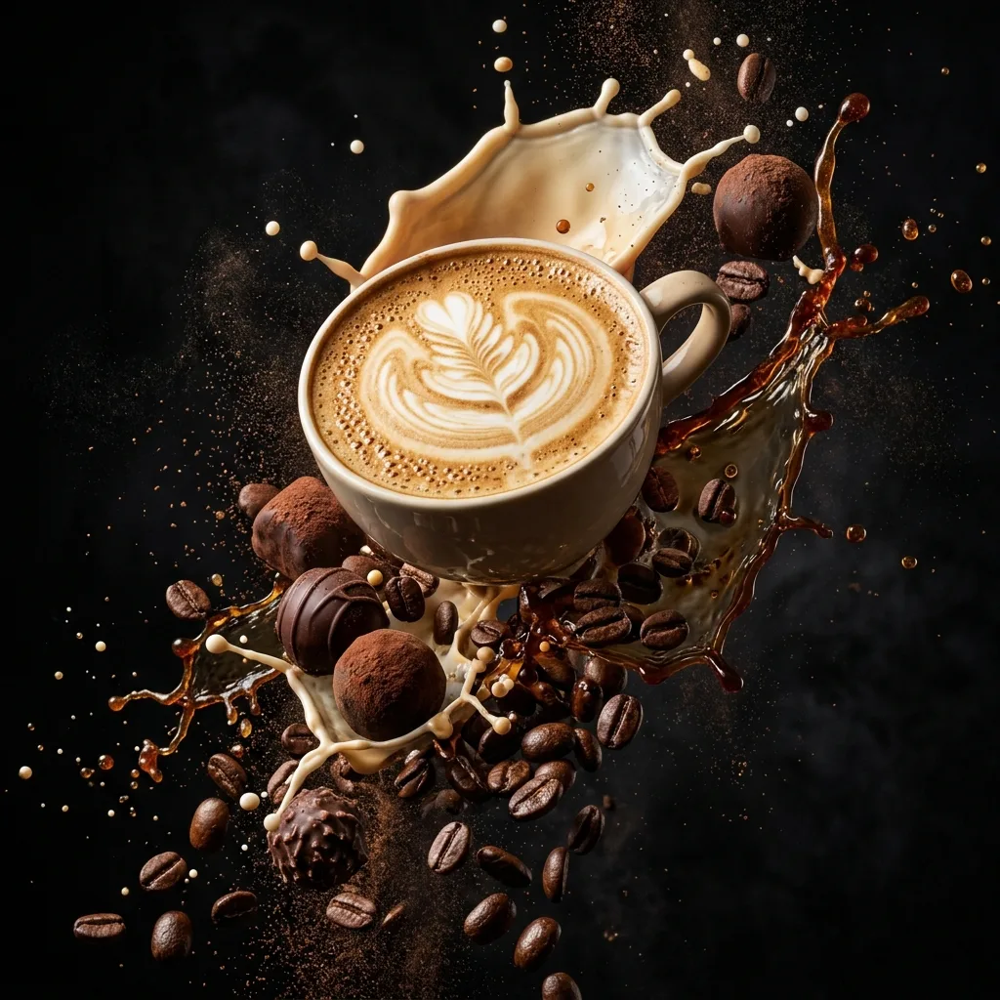

**#24 · Food &amp; Drink Prompt · <code>Vinano Image v2</code>**

<details>
<summary>Show prompt</summary>

```
Ultra-cinematic vertical composition of coffee elements suspended in mid-air cascading roasted coffee beans, chocolate bonbons, swirling latte art in a mid-air coffee cup, splashes of milk and espresso frozen in motion, fine coffee grounds dusting through the air captured rich brown and cream color tones.
Hyper-detailed textures glossy liquid surfaces, crema bubbles, and matte bean textures, lit dramatic high-contrast studio lighting against a deep, velvety black background. Cinematic depth of field, splash photography aesthetic, premium café advertising style. Shot a virtual Nikon D850, 105mm macro lens, aperture f/4.0, crisp editorial clarity.

Render with rich micro-detail while keeping the layout uncluttered and intentional.
```

</details>

---

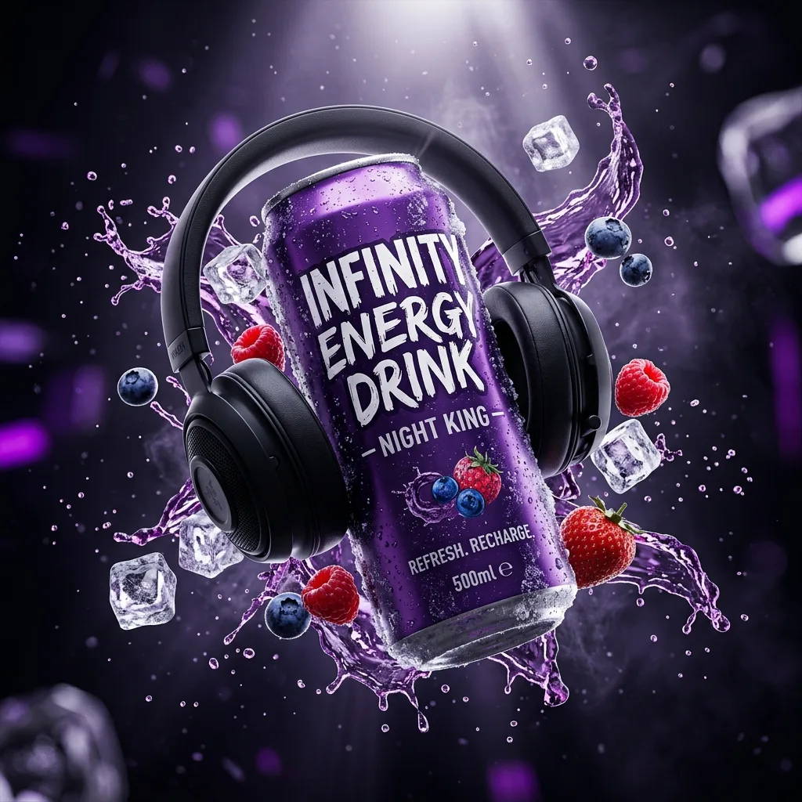

**#25 · Food &amp; Drink Prompt · <code>Vinano Image Pro</code>**

<details>
<summary>Show prompt</summary>

```
Ultra-cinematic product photography of a purple energy drink can labeled “INFINITY ENERGY DRINK – NIGHT KING” in bold white typography, floating mid-air at a dynamic three-quarter angle, wrapped sleek black over-ear headphones; explosive liquid arcs and splashes frozen in time around the can, crystal-clear ice cubes and glossy berries (raspberries, blueberries, strawberries) suspended in motion, tiny droplets and mist filling the scene; dramatic high-contrast studio lighting a powerful top key light, sharp rim lights tracing the can edges, and deep shadows for a dark, premium mood; monochromatic purple color palette luminous highlights and metallic reflections, subtle neon glow accents; shallow depth of field isolating the can as the hero subject, hyper-detailed condensation on the aluminum surface, macro texture on fruit and water; volumetric light rays, floating particles, high-speed splash photography aesthetic, true-to-life photorealistic, ultra-detailed, 8K, luxury advertising style, sharp focus, no watermark. Preserve realistic proportions and depth for a confident, professional finish.
```

</details>

---

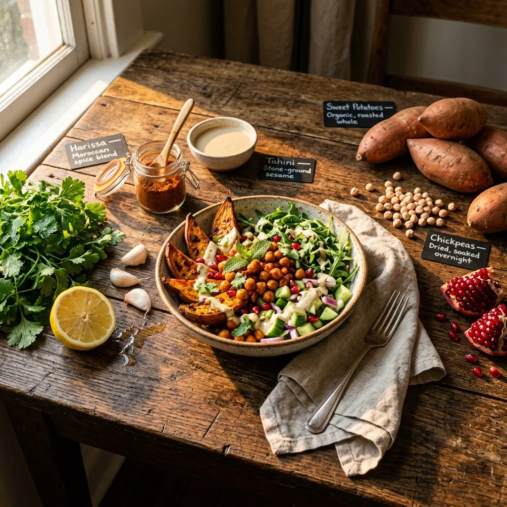

**#26 · Food &amp; Drink Prompt · <code>Vinano Image Pro</code>**

<details>
<summary>Show prompt</summary>

```
[DISH] styled on a weathered [MATERIAL] surface, shot in pure golden hour light streaming from one side, casting long warm shadows. Hero dish center, surrounded by its raw ingredients casually scattered artistic intention, whole vegetables, fresh herbs, open spice jars, linen cloth, wooden spoon. Every surface texture hyperreal: wood grain, condensation droplets, herb oil sheen, char marks. Ingredient labels as small handwritten-style chalk or ink tags resting beside each item: "[INGREDIENT] — [origin, preparation]". Dish name in warm hand-lettered typography: "[DISH NAME]". Subtitle: "[TAGLINE]". Mood: Ottolenghi cookbook meets Italian farmhouse meets Sunday farmers market. Warm golden tones, long shadows, film grain, extraordinary and craveable. Render with rich micro-detail while keeping the layout uncluttered and intentional.
```

</details>

---

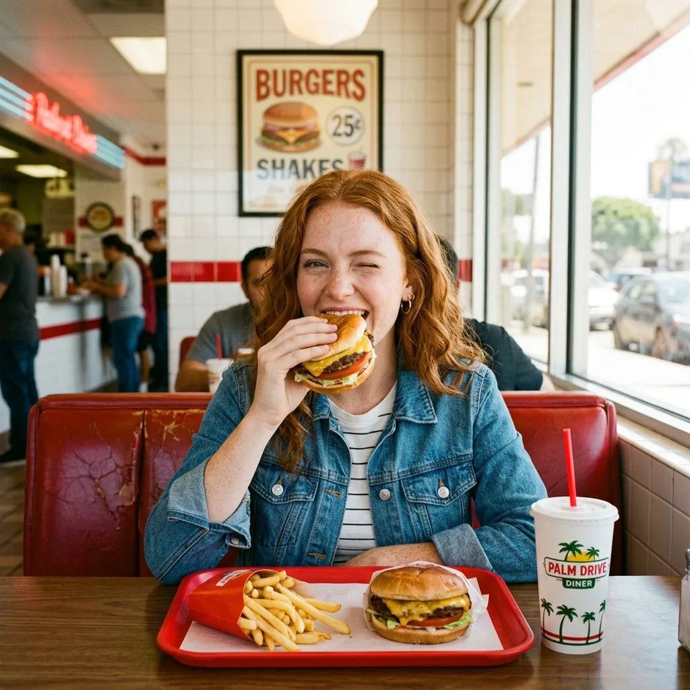

**#27 · Food &amp; Drink Prompt · <code>Vinano Image v2</code>**

<details>
<summary>Show prompt</summary>

```
{
 "prompt": "A young red-haired woman sitting inside a bright retro-style fast food restaurant, eating a cheeseburger. She is seated in a red vinyl booth by a large window sunlight streaming in. She is winking while taking a bite of the burger. On the table in front of her is a red tray holding a burger, French fries, and a soft drink in a white cup red palm tree graphics. The restaurant interior features white tiled walls red accents and a framed picture on the wall. The lighting is warm and natural, creating a casual, candid atmosphere.",
 "style": "true-to-life photorealistic",
 "lighting": "natural sunlight, warm tones",
 "camera_angle": "eye-level, centered composition",
 "environment": "retro American fast food diner",
 "mood": "playful and casual",
 "details": "sharp focus, high resolution, realistic skin texture, vibrant colors"
}

Keep edges clean and the overall composition balanced for a polished, gallery-ready result.
```

</details>

---

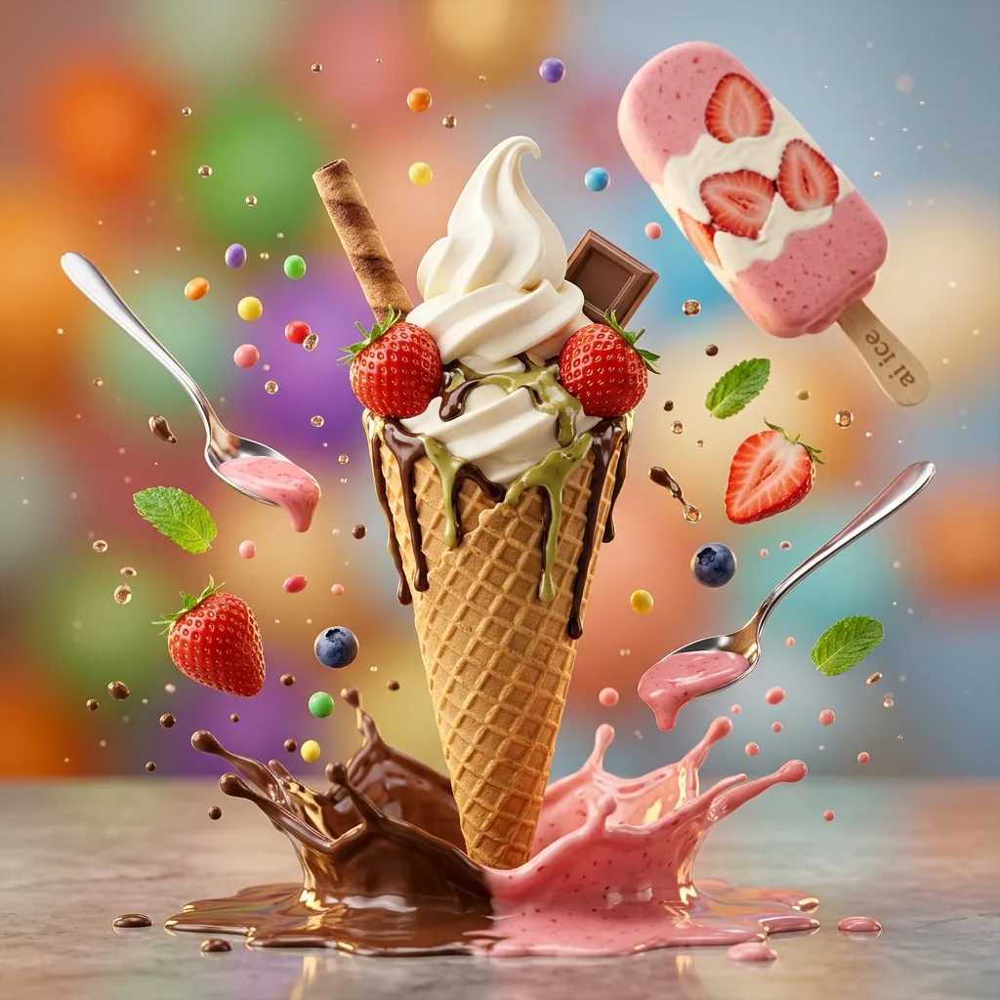

**#28 · Food &amp; Drink Prompt · <code>Vinano Image Pro</code>**

<details>
<summary>Show prompt</summary>

```
{
 "master_prompt": {
 "global_settings": {
 "resolution": "8K",
 "aspect_ratio": "3:4",
 "render_style": "hyper-realistic AI-generated food photography",
 "focus": "extreme detail, sharp textures, dynamic motion, filmic, cinematic lighting",
 "depth_of_field": "shallow foreground focus",
 "noise": "none",
 "artifacts": "none"
 },

 "Module_1_Image_Style": {
 "subject": "Single ice cream cone standing upright",
 "ice_cream": {
 "top": "vanilla soft-serve swirl",
 "toppings": ["two whole strawberries",
 "one chocolate wafer roll",
 "one chocolate square partially embedded"],
 "sauces": ["dark chocolate sauce dripping",
 "green pistachio-like glaze dripping"]
 },
 "cone": {
 "type": "waffle cone",
 "texture": "crisp grid pattern",
 "condition": "sauce dripping down the cone and pooling at the base"
 },
 "motion_elements": {
 "floating": ["small colorful candy spheres",
 "liquid droplets suspended mid-air"],
 "splashes": "sauce splashes around cone base"
 },
 "background": {
 "style": "soft bokeh",
 "colors": ["orange",
 "green",
 "purple",
 "gold"],
 "lighting": "warm, cinematic, high contrast"
 }
 },

 "Module_2_Image_Style": {
 "subject": "Strawberry ice cream bar on wooden stick, tilted diagonally",
 "ice_cream": {
 "base": "pink strawberry ice cream",
 "top_layer": "white cream layer",
 "toppings": ["sliced strawberries embedded",
 "whole strawberries floating"]
 },
 "stick": {
 "material": "wood",
 "text": "ai ice",
 "orientation": "visible, centered"
 },
 "motion_elements": {
 "liquid": "cream and strawberry liquid splashing outward",
 "floating_objects": ["metal spoons pink liquid",
 "whole strawberries",
 "mint leaves",
 "droplets"]
 },
 "background": {
 "style": "soft gradient bokeh particles",
 "colors": ["peach",
 "blue",
 "cream"],
 "lighting": "bright highlights soft shadows"
 }
 },

 "Module_3_Image_Style": {
 "subject": "Spherical scoop composition of strawberry and vanilla ice cream",
 "ice_cream": {
 "layers": ["pink strawberry scoop",
 "white vanilla scoop"],
 "embedded_elements": ["halved strawberries",
 "whole strawberries"]
 },
 "motion_elements": {
 "liquid": "pink strawberry liquid splashing and dripping downward",
 "floating_objects": ["blueberries",
 "strawberries",
 "liquid droplets"],
 "utensils": "metal spoons suspended mid-air liquid"
 },
 "surface_detail": {
 "texture": "smooth ice cream visible melting edges",
 "droplets": "high-gloss liquid beads"
 },
 "background": {
 "style": "cool-toned blur",
 "colors": ["light blue",
 "gray"],
 "lighting": "clean studio lighting specular highlights"
 }
 }

Maintain consistent colour harmony and crisp focus across the whole frame.
```

</details>

---

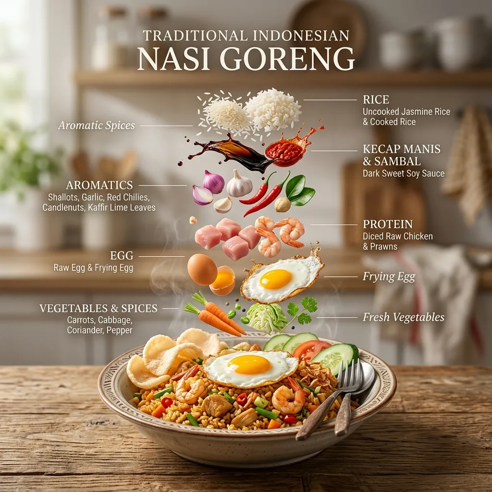

**#29 · Food &amp; Drink Prompt · <code>Vinano Image Pro</code>**

<details>
<summary>Show prompt</summary>

```
Ultra-realistic cinematic food photography of a traditional Indonesian dish, presented as a floating ingredients infographic. The finished dish sits at the bottom in a ceramic bowl on a wooden surface. Above it, key ingredients float in mid-air in a clean vertical layout, each clearly separated and visually balanced. Thin refined minimalist pointer lines connect ingredients to elegant readable labels. Natural textures, hyper-detailed food surfaces, glossy sauces, steam rising gently, high-speed splash effects frozen in motion. Soft studio lighting mixed natural daylight, shallow depth of field, premium editorial food poster style, commercial advertising quality, ultra-sharp focus, 8K resolution, realistic shadows, clean background. Render with rich micro-detail while keeping the layout uncluttered and intentional.
```

</details>

---

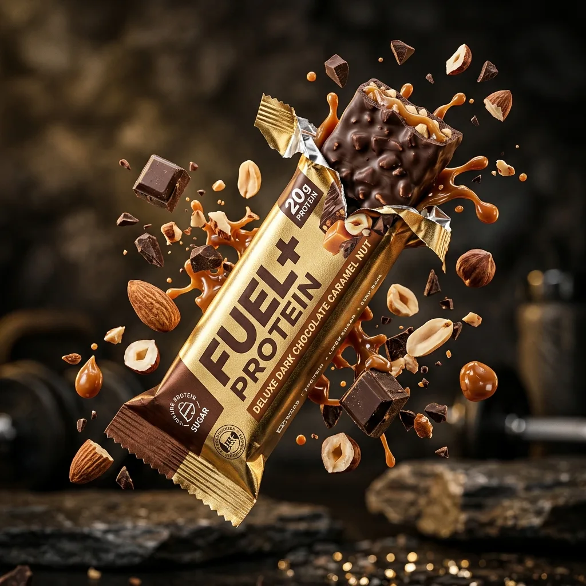

**#30 · Food &amp; Drink Prompt · <code>Vinano Image v2</code>**

<details>
<summary>Show prompt</summary>

```
Ultra-cinematic product photography of a premium protein bar wrapped in metallic packaging, floating at a dynamic angle; explosive chocolate chunks, caramel drips, and nut fragments frozen mid-air; high-speed splash and crumble effect, dramatic studio lighting sharp highlights; rich brown and gold palette, ultra-detailed textures, shallow depth of field, true-to-life photorealistic, 8K, fitness luxury advertising. Emphasise material texture and natural light so the final frame feels tactile and premium.
```

</details>

---

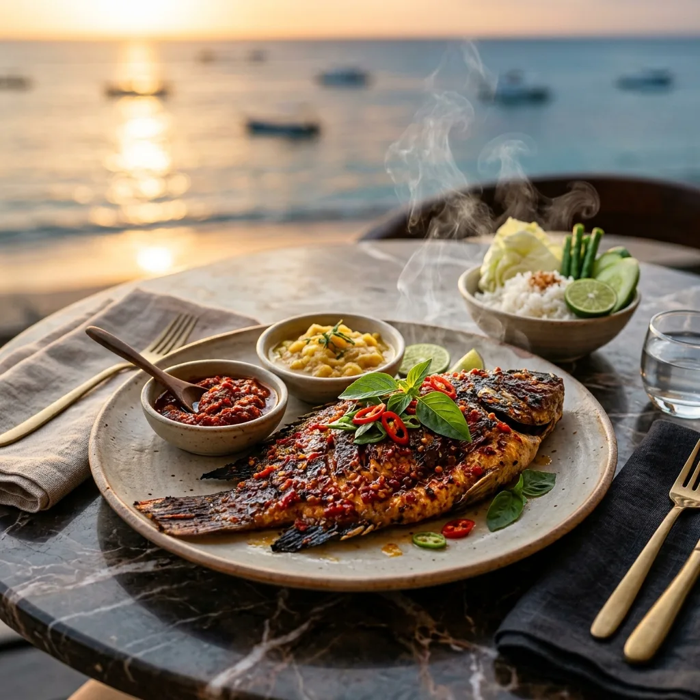

**#31 · Food &amp; Drink Prompt · <code>Vinano Image v2</code>**

<details>
<summary>Show prompt</summary>

```
Luxury cinematic food photography of traditional Indonesian “Seruit Lampung” — beautifully grilled fish fillet glazed chili sambal, garnished red chili slices, fresh basil, and lime wedges. Served on an elegant ceramic plate a small bowl of sambal and a side of golden mashed condiment. Visible steam rising from the hot dish. Background shows a refined coastal sunset ambiance soft bokeh reflections on water, warm golden-hour lighting. Shot on a polished marble table surface. Fine-dining restaurant atmosphere, shallow depth of field, dramatic food styling, ultra-realistic, 85mm lens, f/2.0, rich contrast, 8K resolution. Elegant editorial food magazine style. Keep edges clean and the overall composition balanced for a polished, gallery-ready result.
```

</details>

---

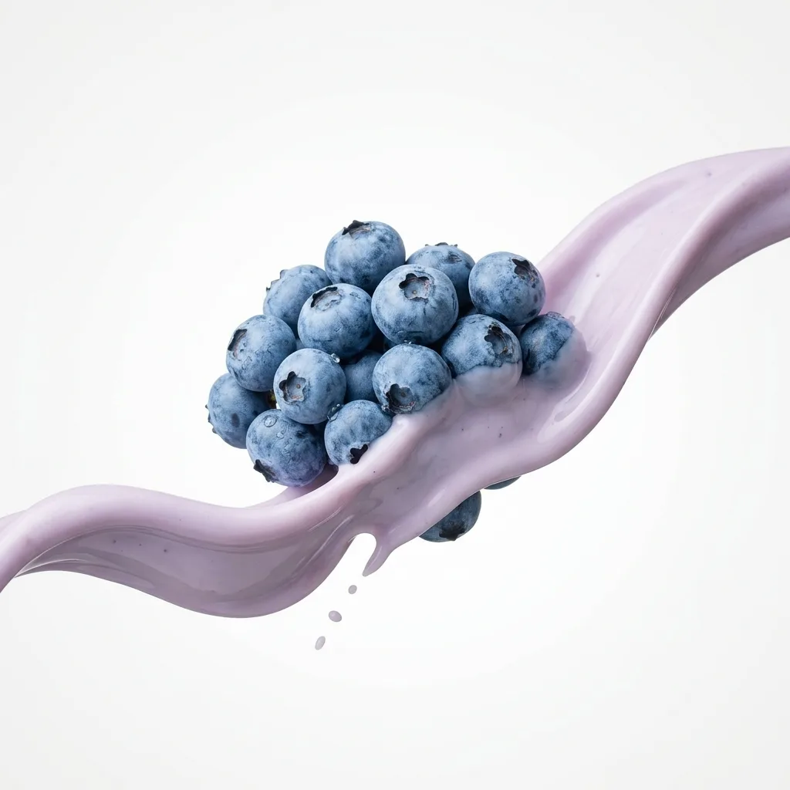

**#32 · Food &amp; Drink Prompt · <code>Vinano Image v2</code>**

<details>
<summary>Show prompt</summary>

```
A high-speed studio photograph of a cluster of fresh blueberries suspended midair, softly wrapped by a gentle flow of pale blueberry yogurt, smooth and restrained liquid motion, minimal splash, thick and creamy texture, elegant curved yogurt flow hugging the berries, very few small droplets, calm fluid dynamics, true-to-life photorealistic macro food photography, ultra-realistic texture, professional studio lighting, soft diffuse highlights, pure white background, isolated object, clean cutout, no CGI, no 3D render, no illustration Aim for an editorial, design-driven look with deliberate negative space.
```

</details>

---

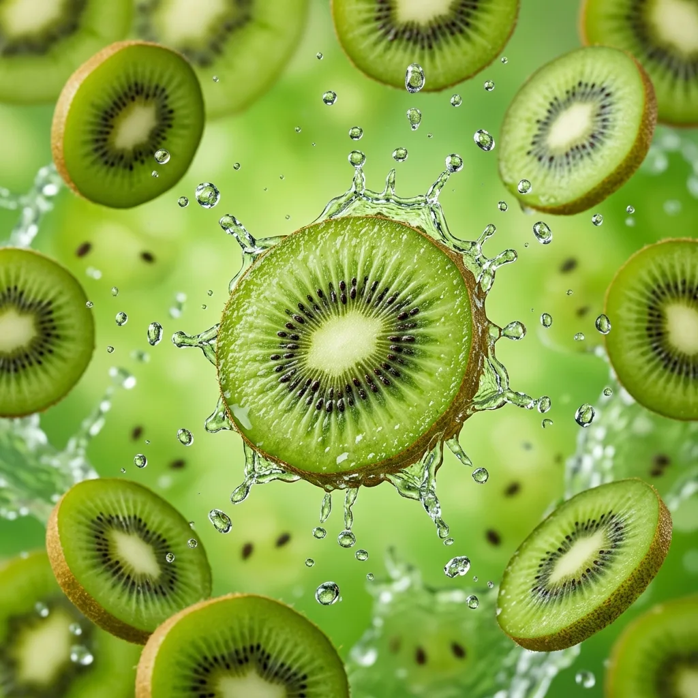

**#33 · Food &amp; Drink Prompt · <code>Vinano Image v2</code>**

<details>
<summary>Show prompt</summary>

```
A hyper-realistic image of a sliced kiwi splashing in a spray of water droplets suspended in the air. Fresh kiwi slices, dynamically arranged in a floating composition, create a smooth green background. The smooth green gradient creates a fresh, bright, and juicy aesthetic. Studio lighting, soft shadows, high detail, macro photography of objects, an emphasis on texture and reflections. Ultra-realistic rendering, 8K, sharp focus, rich green tones. --ar 9:16 --raw Emphasise material texture and natural light so the final frame feels tactile and premium.
```

</details>

---

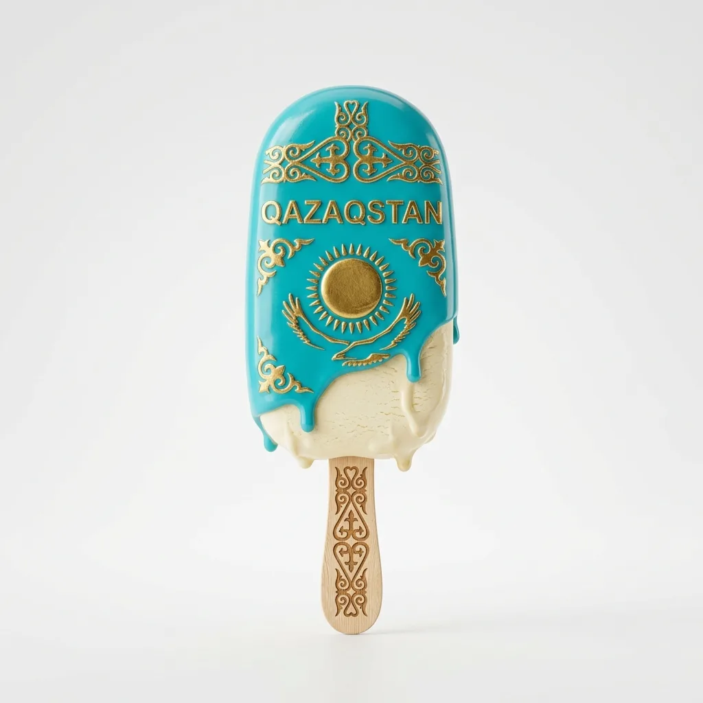

**#34 · Food &amp; Drink Prompt · <code>Vinano Image v2</code>**

<details>
<summary>Show prompt</summary>

```
A refined minimalist, ultra-realistic product shot of a premium ice cream bar inspired by Kazakhstan. The popsicle is coated in glossy turquoise icing elegant gold ornamental patterns and the word “QAZAQSTAN” embossed in metallic gold, featuring a golden sun-and-eagle motif. The lower half reveals creamy vanilla ice cream smooth texture and subtle melting drips. Wooden stick engraved traditional Kazakh patterns. Clean white studio background, soft diffused lighting, sharp focus, luxury food branding aesthetic, high-detail textures, modern cultural fusion design, 8K quality. Keep edges clean and the overall composition balanced for a polished, gallery-ready result.
```

</details>

---

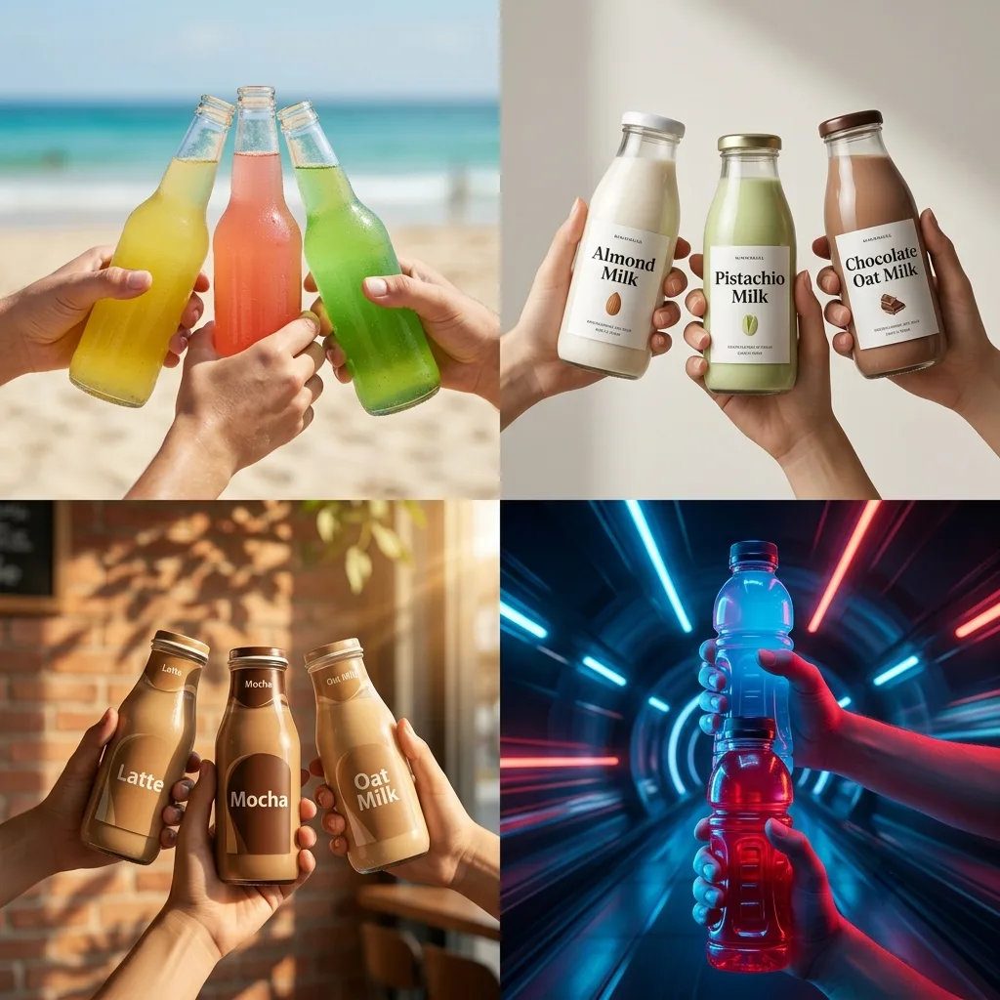

**#35 · Food &amp; Drink Prompt · <code>Vinano Image v2</code>**

<details>
<summary>Show prompt</summary>

```
on Gemini app.

Prompt:
Three hands holding colorful glass soda bottles (lemon, grapefruit, lime) clinking together, bright sunny outdoor setting, soft beach/pool background blur, natural light, condensation on bottles, lifestyle photography, vibrant colors, shallow depth of field, candid joyful mood, commercial beverage ad, ultra-realistic, 8K.
IMAGE 2
Three hands holding refined minimalist glass bottles labeled almond milk, pistachio milk, chocolate oat milk, clean neutral background, soft studio lighting, modern branding, centered composition, smooth shadows, aesthetic product photography, high detail, muted tones, premium look, 8K.
IMAGE 3
Three hands holding iced coffee bottles (latte, mocha, oat milk), warm golden hour sunlight, cafe interior background, soft shadows of leaves on wall, cozy atmosphere, realistic reflections, lifestyle product shot, cinematic warm tones, shallow depth of field, 8K.
IMAGE 4
Three hands holding glowing sports drink bottles stacked vertically, neon blue and red lighting, futuristic tunnel background, motion blur streaks, cyberpunk aesthetic, dramatic lighting, high contrast, dynamic composition, glossy bottles, ultra-realistic, 8K.

Preserve realistic proportions and depth for a confident, professional finish.
```

</details>

---

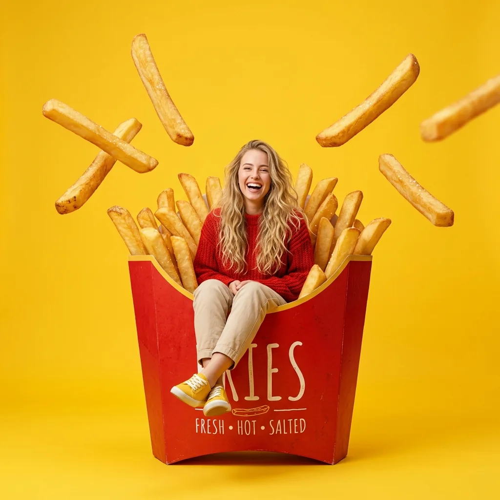

**#36 · Food &amp; Drink Prompt · <code>Vinano Image v2</code>**

<details>
<summary>Show prompt</summary>

```
{
 "prompt": "young western woman long blonde hair sitting playfully inside a giant red french fry carton, surrounded by oversized golden-brown fries, some fries floating in the air, she is wearing a textured red sweater and beige trousers yellow sneakers, cheerful expression, bright yellow studio background, surreal commercial photography style, high saturation, sharp focus, crisp composition, 8k resolution, professional lighting",
 "negative_prompt": "low quality, blurry, distorted face, bad anatomy, extra limbs, dull colors, messy background, text, watermark, grainy, realistic size fries",
 "aspect_ratio": "3:4",
 "style": "surreal commercial photography",
 "lighting": "vibrant studio lighting soft shadows",
 "camera": "eye-level medium shot, 50mm lens",
 "quality_tags": "masterpiece, ultra-detailed, high-end commercial aesthetic"
}

Aim for an editorial, design-driven look with deliberate negative space.
```

</details>

---

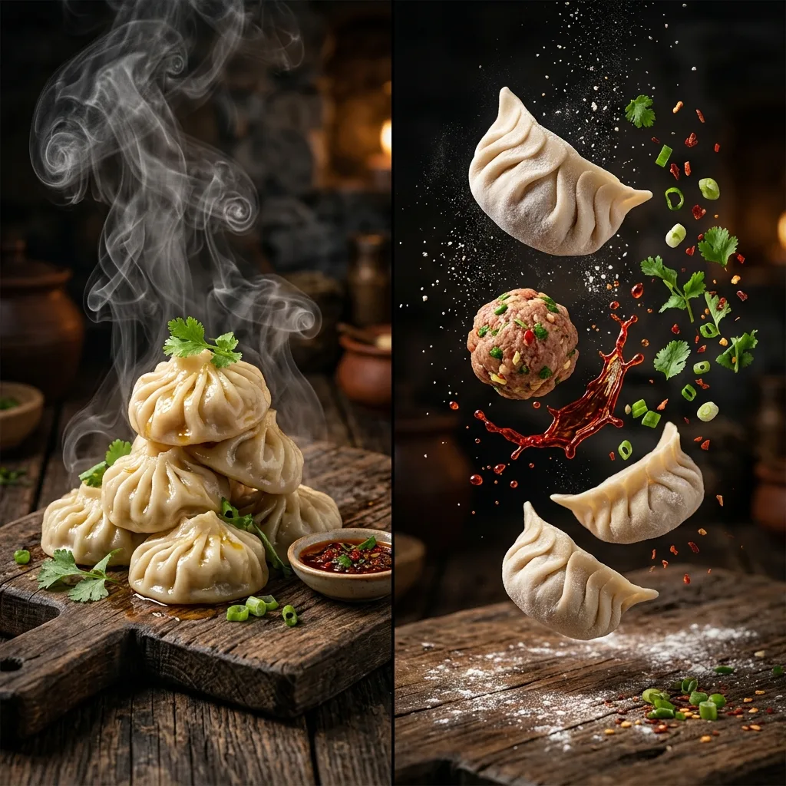

**#37 · Food &amp; Drink Prompt · <code>Vinano Image Pro</code>**

<details>
<summary>Show prompt</summary>

```
{
The Cinematic Momo Duo
Subject & Scene
 * Finished Dish: Freshly steamed dumplings (momos) stacked on a rustic wooden board.
 * The Details: Glossy dough delicate handmade pleats, a light sheen of oil, and thick dramatic steam rising.
 * Exploded View: A side-by-side or split scene showing the "deconstructed" momo. Floating dumpling wrappers, balls of spiced minced filling, and scattered fresh herbs.
Motion & Action
 * Frozen in Time: Flour particles suspended mid-air, motion-frozen spices, and a dramatic slow-motion splash effect.
 * Atmosphere: Wispy, swirling steam and falling herb leaves.
Setting & Background
 * Environment: A dark, moody, rustic kitchen.
 * Surface: A weathered, textured wooden cutting board grains and cracks visible.
Lighting & Color
 * Style: Cinematic studio lighting.
 * Palette: Warm, inviting tones high contrast and deep shadows for a professional editorial look.
Technical Specs
 * Camera: Macro photography, 8K resolution, hyper-detailed textures.
 * Focus: Shallow depth of field (blurred background) sharp, crisp focus on the ingredients.

Keep edges clean and the overall composition balanced for a polished, gallery-ready result.
```

</details>

---

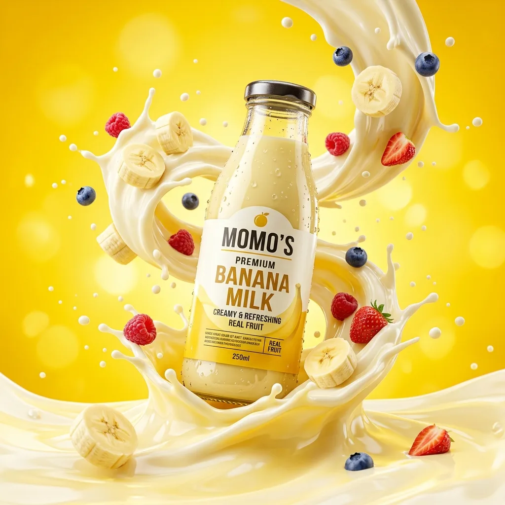

**#38 · Food &amp; Drink Prompt · <code>Vinano Image v2</code>**

<details>
<summary>Show prompt</summary>

```
Premium banana milk drink bottle surrounded by swirling milk splash, floating bananas and berries, dynamic liquid motion, creamy textures, bright yellow background, high-speed splash photography, glossy product lighting, ultra-realistic, commercial food ad style, sharp focus, 8K. Preserve realistic proportions and depth for a confident, professional finish.
```

</details>

---

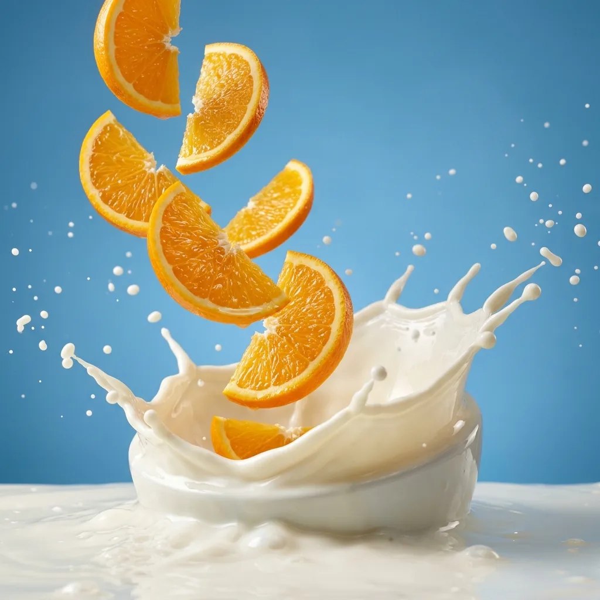

**#39 · Food &amp; Drink Prompt · <code>Vinano Image v2</code>**

<details>
<summary>Show prompt</summary>

```
{
"subject": {
 "primary": "Vibrant orange slices",
 "action": "Falling through the air toward rising milk",
 "secondary": "Thick, glossy white milk splash forming arcs and crown-like curves",
 "details": "Milk droplets frozen mid-air creamy texture"
 },
 "environment": {
 "background": "Clean blue studio backdrop",
 "lighting": "Cinematic soft studio lighting dramatic highlights and shadows"
 },
 "visual_style": {
 "genre": "Ultra-realistic commercial splash photography",
 "textures": "High-detail creamy milk and fresh citrus pulp",
 "motion": "Frozen action, high-speed capture",
 "depth_of_field": "Shallow depth of field"
 },
 "camera": {
 "lens": "85mm macro",
 "framing": "Wide composition",
 "focus": "Sharp focus on splash and fruit"
 },
 "composition": {
 "aspect_ratio": "3:4",
 "color_palette": ["Vibrant Orange", "Pure White", "Clean Blue"]
 },
 "quality": {
 "detail_level": "Ultra-high detail",
 "rendering": "true-to-life photorealistic"
 },
 "profile": "9ewnbdc"
}

Keep edges clean and the overall composition balanced for a polished, gallery-ready result.
```

</details>

---

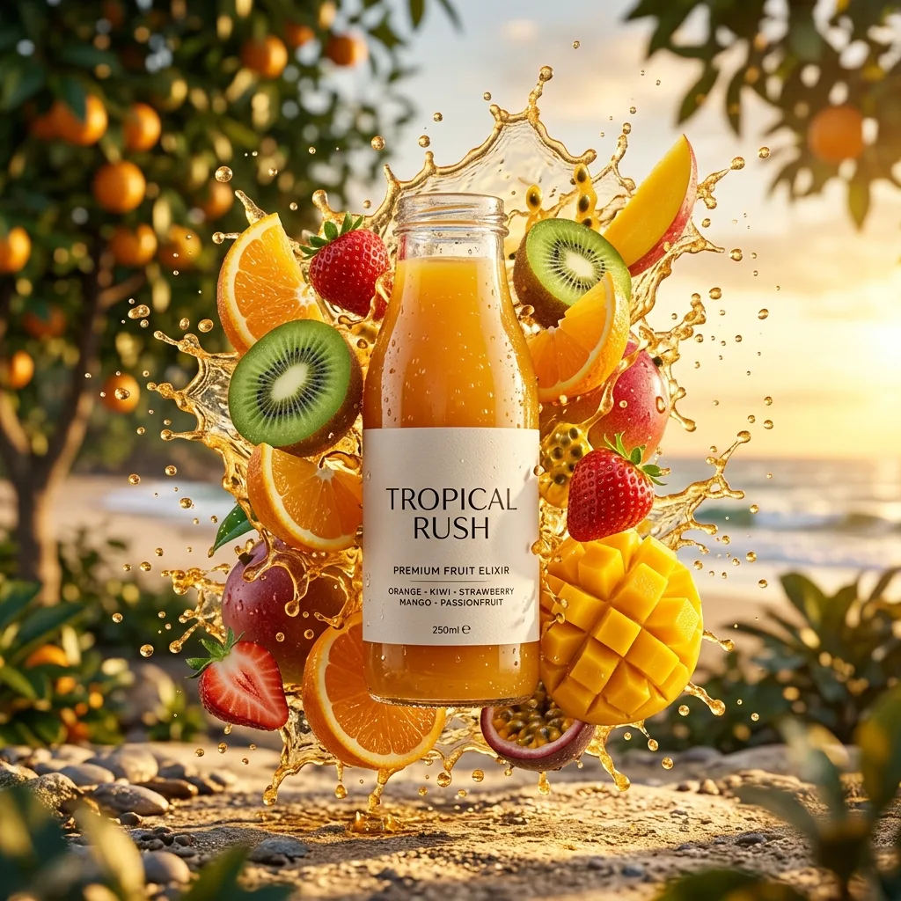

**#40 · Food &amp; Drink Prompt · <code>Vinano Image v2</code>**

<details>
<summary>Show prompt</summary>

```
Ultra-realistic product ad of a premium fruit drink bottle, dynamic liquid splash frozen mid-air, fresh fruits (orange, kiwi, strawberry, mango, passionfruit) exploding around the bottle, cinematic golden sunlight, outdoor orchard/beach setting, shallow depth of field, vibrant colors, glossy reflections, high-speed photography style, hyper-detailed liquid physics, clean branding label, 8K, commercial advertising, perfect composition. Render with rich micro-detail while keeping the layout uncluttered and intentional.
```

</details>

---

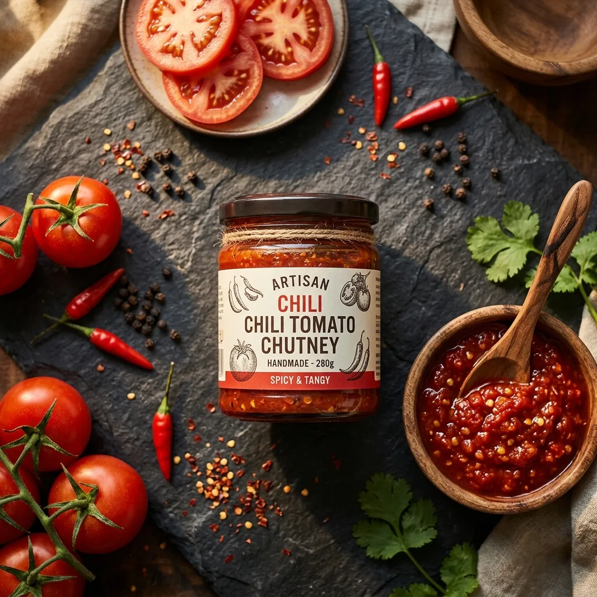

**#41 · Food &amp; Drink Prompt · <code>Vinano Image v2</code>**

<details>
<summary>Show prompt</summary>

```
Top-down premium food photography of a glass jar of chili tomato chutney placed on a dark stone slab, surrounded by fresh red tomatoes, sliced tomatoes, red chili peppers, black peppercorns, and a small wooden bowl chutney and spoon. Warm earthy background, soft directional lighting, rich shadows, high contrast, minimal styling, commercial product shoot, ultra-detailed, 4K. Preserve realistic proportions and depth for a confident, professional finish.
```

</details>

---

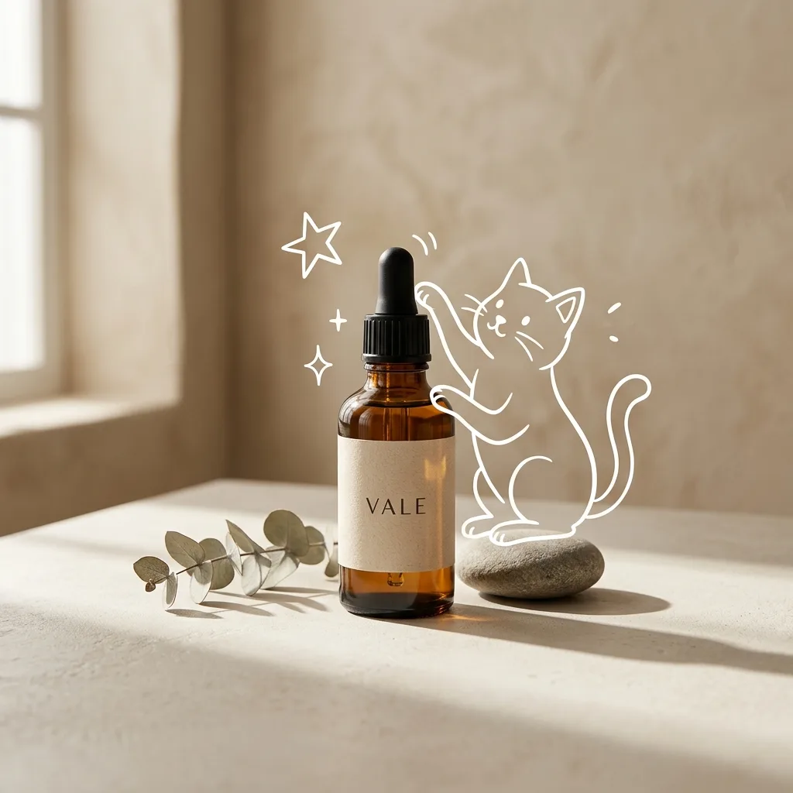

**#42 · Food &amp; Drink Prompt · <code>Vinano Image v2</code>**

<details>
<summary>Show prompt</summary>

```
[product setup],create refined minimalist product photo, clean warm studio scene, textured beige wall background, soft directional sunlight creating long shadows, simple tabletop surface, product arranged in a playful concept composition, hand drawn white line doodle overlay of [character] interacting the product, mixed media look combining real photography and sketch illustration, high end branding feel, shallow depth of field, ultra realistic, no extra text, no watermark, 8k, 1:1 Keep edges clean and the overall composition balanced for a polished, gallery-ready result.
```

</details>

---

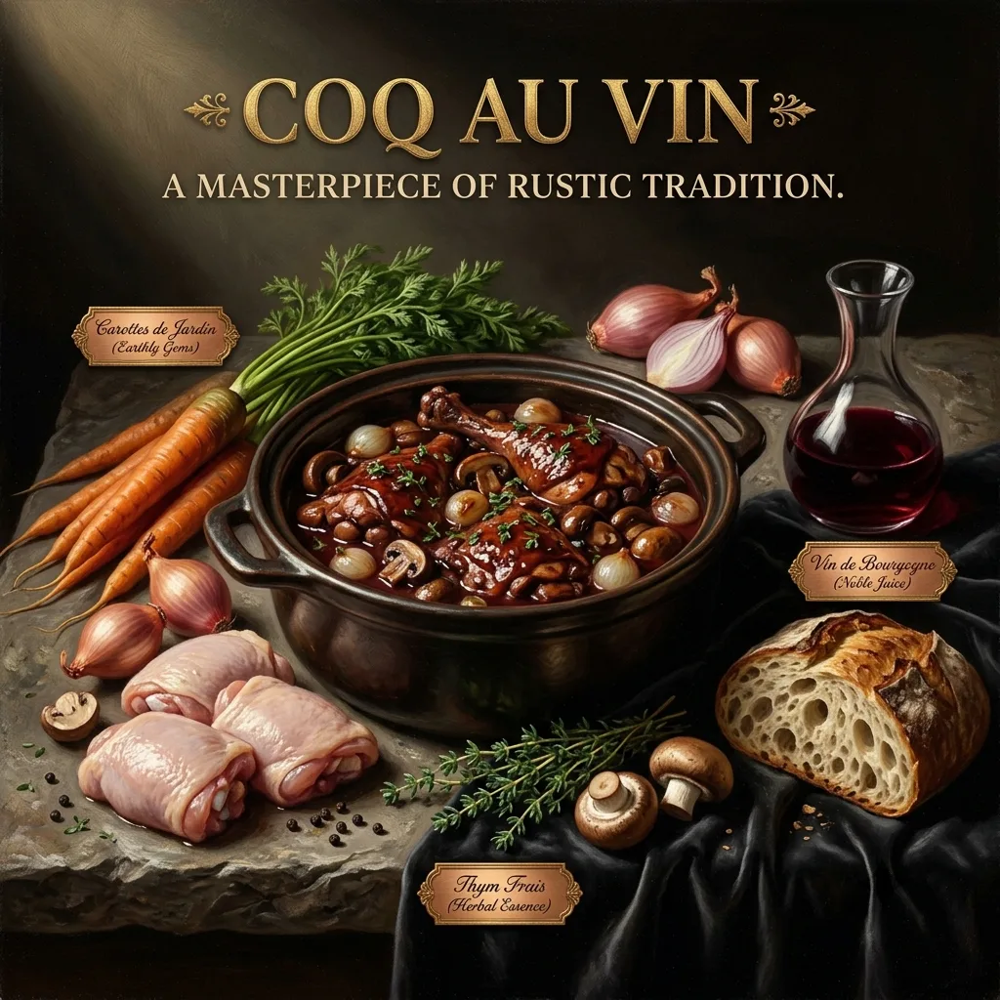

**#43 · Food &amp; Drink Prompt · <code>Vinano Image Pro</code>**

<details>
<summary>Show prompt</summary>

```
[DISH] painted a Dutch Golden Age or Italian Renaissance still life, hyperrealistic oil painting aesthetic dramatic chiaroscuro lighting. Hero dish at center on a dark velvet or stone surface, surrounded by its ingredients arranged in a baroque composition. Single dramatic light source from upper left illuminating every texture painterly depth: glistening proteins, translucent sauces, jewel-bright vegetables, crusty bread, scattered herbs. Each ingredient labeled a small elegant gold cartouche, ornate bordered label in copperplate: "[INGREDIENT] [poetic Latin or French descriptor]". Dish name in ornate gilt typography at top: "[DISH NAME]". Subtitle: "[TAGLINE]". Mood: Caravaggio meets Rembrandt meets the world's most craveable food photograph. Deep rich shadows, jewel-tone colors, extraordinary museum-quality, craveable. Emphasise material texture and natural light so the final frame feels tactile and premium.
```

</details>

---

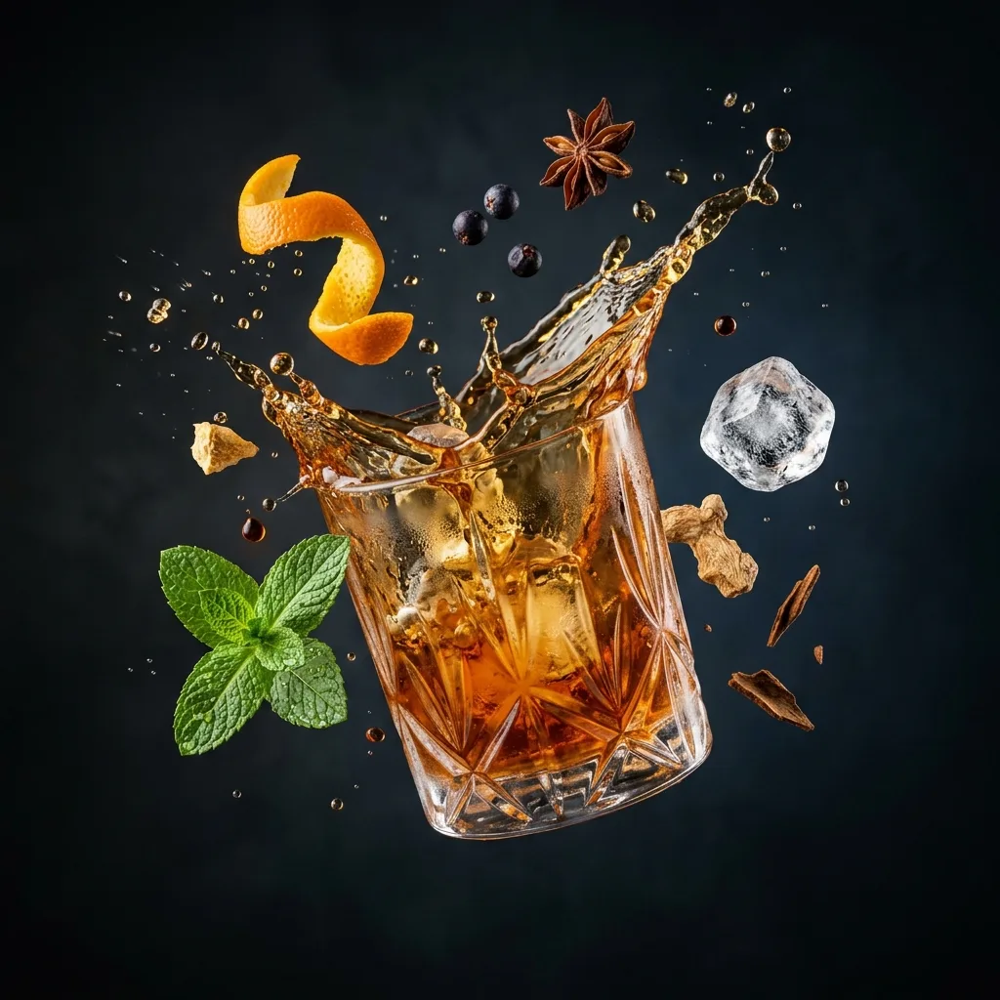

**#44 · Food &amp; Drink Prompt · <code>Vinano Image v2</code>**

<details>
<summary>Show prompt</summary>

```
Hyper-realistic food photography, ultra high-definition, dynamic floating ingredients and liquids, ingredients suspended in mid-air, 
motion captured in high-speed freeze, dramatic cinematic studio lighting, dark moody background subtle gradient, extreme sharpness and fine textures, 
strong contrast highlighting food, splashes, crumbs, sauces, and liquids flying around, central hero composition ample negative space, 
clean luxury advertising style, no text, no logos, no props, 
realistic shadows and reflections, ultra-detailed, true-to-life photorealistic, 8K. {image of a cocktail}

Maintain consistent colour harmony and crisp focus across the whole frame.
```

</details>

---

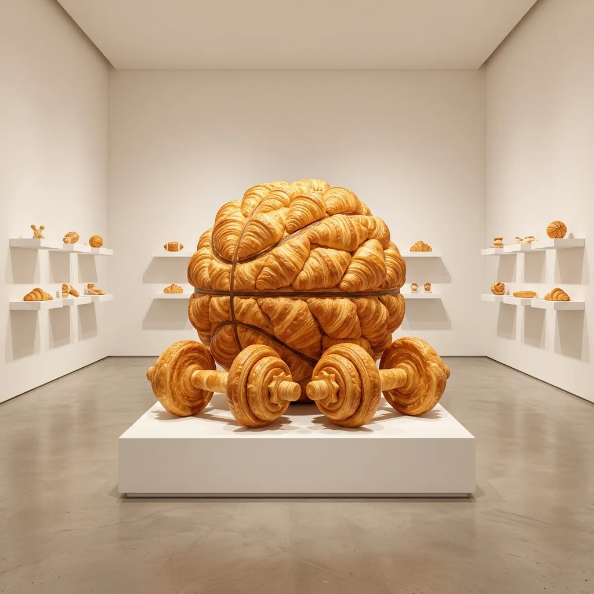

**#45 · Food &amp; Drink Prompt · <code>Vinano Image v2</code>**

<details>
<summary>Show prompt</summary>

```
{
 "scene": "refined minimalist white contemporary art gallery",
 "environment": {
 "floor": "smooth concrete floor",
 "lighting": "soft warm museum lighting",
 "atmosphere": "clean, surreal, high-end contemporary museum aesthetic"
 },
 "main_subject": {
 "description": "Oversized sports equipment sculpture made entirely from croissants",
 "material": "hyper-realistic golden flaky croissant pastry",
 "sports_equipment_options": ["boxing gloves",
 "dumbbells",
 "basketballs",
 "kettlebells",
 "barbell"],
 "placement": "center of the gallery on white pedestal",
 "scale": "oversized, dominant focal point"
 },
 "secondary_elements": {
 "floating_shelves": "white floating shelves on walls",
 "miniature_objects": "tiny pastry-based sports objects and croissant sculptures",
 "arrangement": "evenly spaced, gallery-style display"
 },
 "visual_style": {
 "texture_detail": "ultra-realistic pastry layers, crisp flaky edges, buttery sheen",
 "color_palette": "white, warm gold, soft beige",
 "composition": "symmetrical, minimal, museum exhibition layout"
 },
 "photography": {
 "style": "professional photography",
 "camera": "high-resolution, sharp focus",
 "depth_of_field": "subtle depth, gallery clarity",
 "quality": "ultra-detailed, premium art photography"
 }
}

Render with rich micro-detail while keeping the layout uncluttered and intentional.
```

</details>

---


**#46 · Food &amp; Drink Prompt · <code>Vinano Image</code>**

<details>
<summary>Show prompt</summary>

```
{
 t && (e.push(l), s(l, "return"), t = false, n2 = true, r.length = 0);
 } };
})()),dehydratedQueryClient:$R[28]={mutations:$R[29]=[],queries:$R[30]=[$R[31]={dehydratedAt:1782270841973,state:$R[32]={data:$R[13],dataUpdateCount:1,dataUpdatedAt:1782270841973,error:null,errorUpdateCount:0,errorUpdatedAt:0,fetchFailureCount:0,fetchFailureReason:null,fetchMeta:null,isInvalidated:!1,status:"success",fetchStatus:"idle"},queryKey:$R[33]=["imagePromptDetail",893],queryHash:"[\"imagePromptDetail\",893]"}]}}})($R["tsr"]);document.currentScript.remove()

Maintain consistent colour harmony and crisp focus across the whole frame.
```

</details>

---

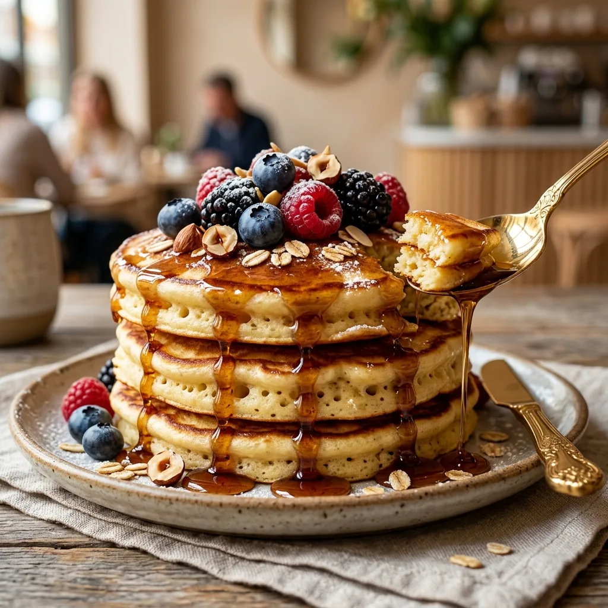

**#47 · Food &amp; Drink Prompt · <code>Vinano Image v2</code>**

<details>
<summary>Show prompt</summary>

```
Ultra-luxury food commercial of a stack of thick, fluffy American pancakes perfectly golden-brown edges. Pure maple syrup cascades slowly down the sides in glossy, slow-motion streams, highlighting every drip. Pancakes topped fresh mixed berries (blueberries, raspberries, blackberries), scattered roasted hazelnuts and almonds, and crunchy oat flakes. Cinematic close-up shots rich warm morning light, soft beige bokeh background, hyper-detailed textures emphasizing fluffiness and glossiness. Luxury golden ornate spoon takes a delicate bite, syrup stretching realistically. Smooth camera moves circling and slightly top-down over the stack, emphasizing elegance and indulgence. Minimalistic, high-end plating, cinematic depth of field, extremely appetizing, mouthwatering, trending food photography aesthetic, ultra-realistic 8K detail, professional ad-style video. Include subtle background soft music or ambient café sounds for premium feel. Preserve realistic proportions and depth for a confident, professional finish.
```

</details>

---

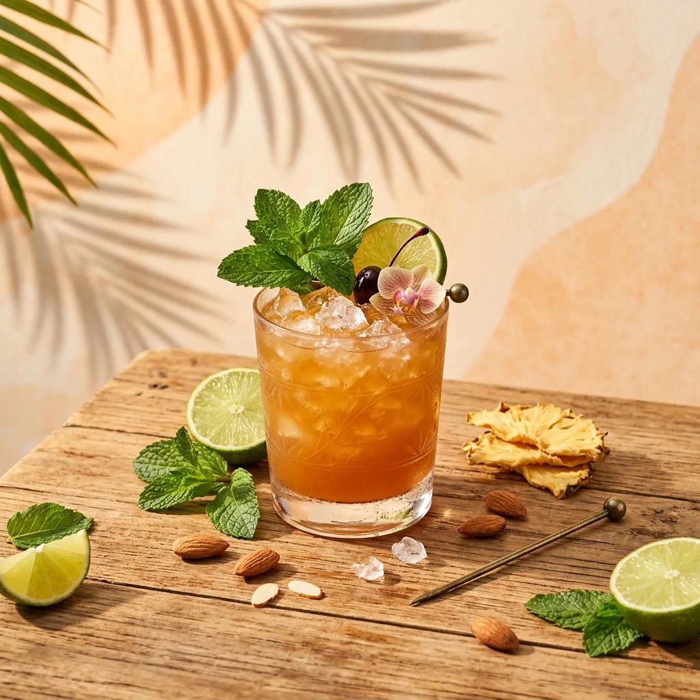

**#48 · Food &amp; Drink Prompt · <code>Vinano Image v2</code>**

<details>
<summary>Show prompt</summary>

```
A high-end studio photograph of a [YOUR COCKTAIL], shot from a high-angle slightly top-down perspective. The drink is served in its appropriate traditional glass an elegant design and professional garnish. Artfully scattered around the base of the glass are fresh fruits and ingredients associated the cocktail recipe. The scene features a warm, summery atmosphere a light orange-tinted background. Artistic soft shadows of tropical palm leaves are cast across the frame, creating a vacation vibe. Realistic condensation on the glass, soft golden hour lighting, 8k resolution, professional food photography, sharp focus, clean and sophisticated composition. Aim for an editorial, design-driven look with deliberate negative space.
```

</details>

---

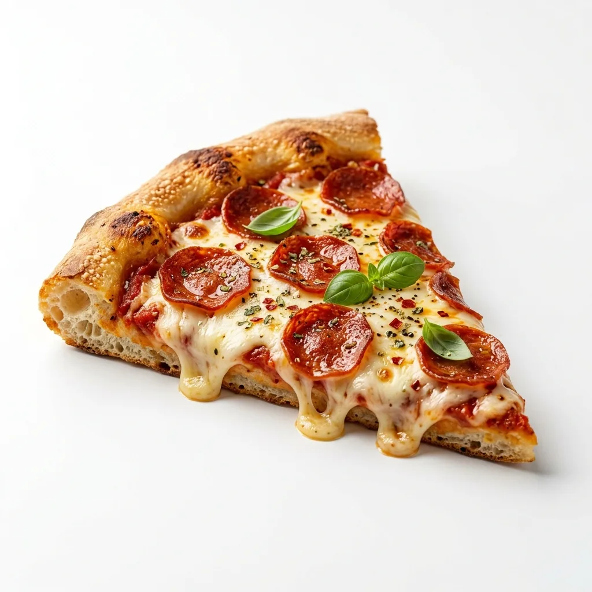

**#49 · Food &amp; Drink Prompt · <code>Vinano Image v2</code>**

<details>
<summary>Show prompt</summary>

```
- Ultra-realistic prepared pepperoni pizza slice, fully assembled, gooey melted mozzarella cheese stretching and dripping over the edges, crispy pepperoni slices on top, rich tomato sauce beneath, thick golden baked crust, fresh basil leaves and light seasoning floating subtly above, clean pure white background, professional commercial food photography lighting, soft natural shadows under the slice, sharp focus, extreme texture detail, glossy cheese, crunchy crust surface, studio shot, minimal composition, no text, no labels, no hands, premium food advertisement style, 8K resolution, ultra-detailed, hyper-realistic. Preserve realistic proportions and depth for a confident, professional finish.
```

</details>

---

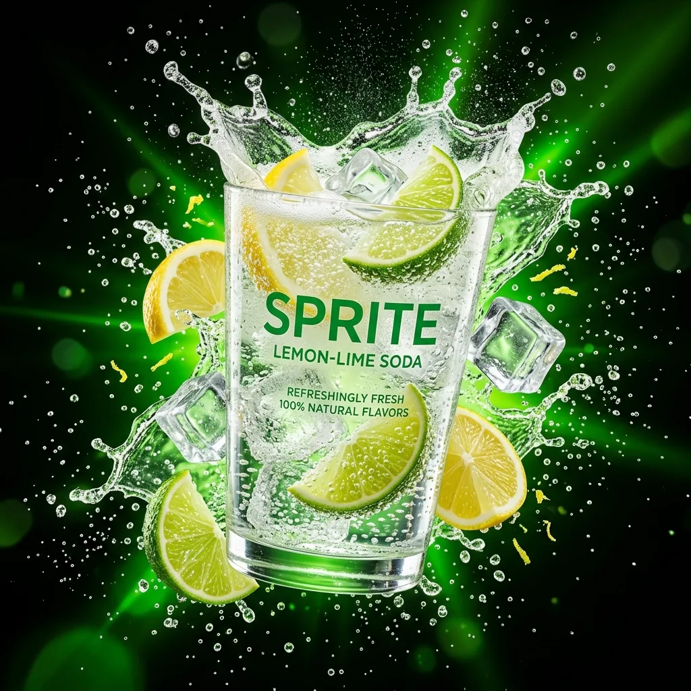

**#50 · Food &amp; Drink Prompt · <code>Vinano Image v2</code>**

<details>
<summary>Show prompt</summary>

```
A transparent cup filled fresh Sprite lemon soda floating in the air, surrounded by sparkling lemon-lime soda splashes, bright ice cubes, and tiny carbonation bubbles bursting around the drink. The cup features green minimal text design, giving a fresh and clean brand look. Hyper-realistic beverage product photography professional studio lighting, crisp texture details, macro clarity as if shot Sony A7s. Black and neon green background highlighting freshness --stylize 250 Preserve realistic proportions and depth for a confident, professional finish.
```

</details>

---

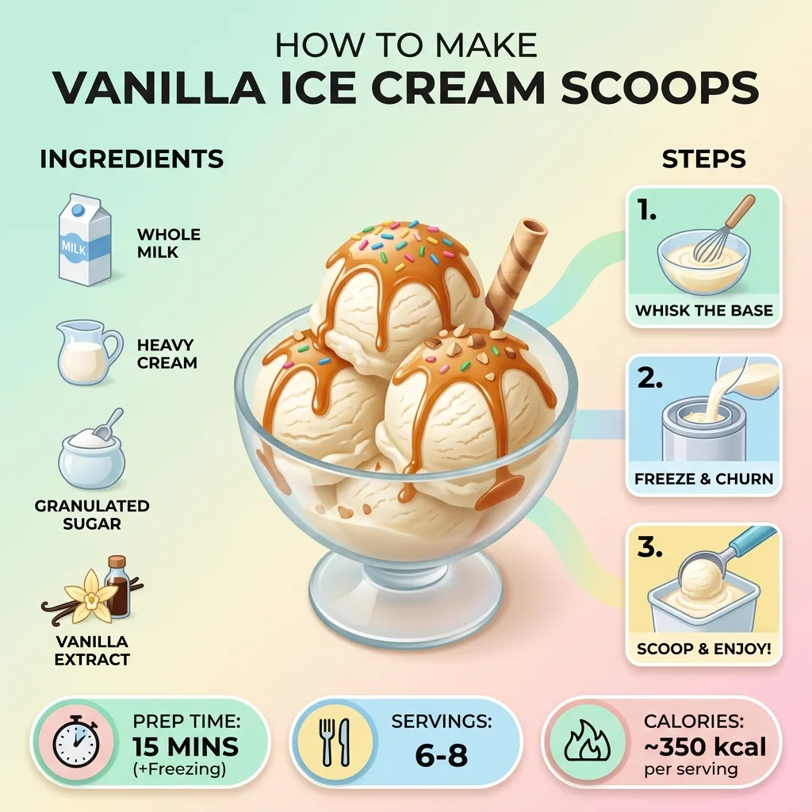

**#51 · Food &amp; Drink Prompt · <code>Vinano Image Pro</code>**

<details>
<summary>Show prompt</summary>

```
Ultra-clean modern recipe infographic. Showcase Vanilla Ice Cream Scoops syrup and toppings in angled perspective.

Ingredients Section: Icons for milk, cream, sugar, vanilla.

Steps Section: Mixing base, freezing, scooping shown numbered panels.

Additional Info: Calories, prep time, servings displayed in badges.

Visual Style: Dessert infographic pastel colors, soft gradients, modern typography.

Composition Guidelines: Ice cream scoops as hero visual ingredients and steps around it.

Lighting & Background: Soft dessert-style lighting minimal background.

Output: 1080×1080, ultra-crisp, social-feed optimized, no watermark.

Preserve realistic proportions and depth for a confident, professional finish.
```

</details>

---

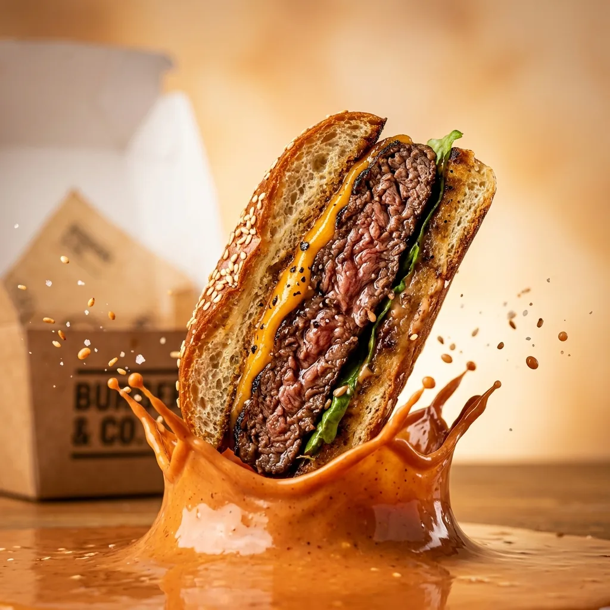

**#52 · Food &amp; Drink Prompt · <code>Vinano Image v2</code>**

<details>
<summary>Show prompt</summary>

```
{
 "project": {
 "title": "Hyper-Visual Burger Macro Series",
 "version": "2.0_Structured_High_Speed",
 "target_aesthetic": "High-end Commercial Advertising"
 },
 "technical_foundation": {
 "camera_hardware": {
 "body": "Nikon D850",
 "lens": "105mm f/2.8 Micro-Nikkor",
 "settings": "High-speed shutter, deep depth of field, ISO 100"
 },
 "global_image_specs": {
 "aspect_ratio": "2:3",
 "resolution": "8K Ultra-HD",
 "lighting_style": "Studio high-key rim-light accents",
 "color_profile": "Vibrant, high-saturation golden browns, reds, and greens"
 }
 },
 "scene_manifest": [{
 "scene_id": "01_THE_SAUCE_CROWN",
 "composition": {
 "focus": "Macro interaction",
 "subject": "Juicy burger slice (beef patty cross-section bun edge)",
 "action": "Vertical plunge into glossy burger sauce"
 },
 "physics_elements": {
 "liquid": "Thick, creamy signature burger sauce",
 "splash_shape": "Symmetrical dynamic crown",
 "particles": "Suspended sauce droplets, sesame seeds, and salt flakes"
 },
 "texture_details": ["Seared beef fibers",
 "Juicy meat sheen",
 "Toasted bun crumb texture"]
 },
 {
 "scene_id": "02_THE_LAYER_SWING",
 "composition": {
 "focus": "Dynamic movement",
 "subject": "Burger slice in motion",
 "environment": "Open burger box context"
 },
 "physics_elements": {
 "motion": "Angular swing trajectory",
 "particles": "Pepper flakes, salt crystals, and lettuce shreds",
 "background": "Soft-focus bright studio"
 },
 "lighting": "Balanced shadow/highlight contrast for rich 3D depth"
 },
 {
 "scene_id": "03_THE_HERO_STACK",
 "composition": {
 "focus": "Action-packed layout",
 "subject": "Upward ejecting burger slice",
 "branding": "Open branded burger box beneath"
 },
 "lighting_effects": {
 "primary": "Radial spotlight burst behind subject",
 "secondary": "Fill light emphasizing juicy meat and bun texture"
 },
 "particle_vfx": "Explosive trail of sauce droplets, crumbs, and sesame seeds"
 },
 {
 "scene_id": "04_THE_JUICE_BURST",
 "composition": {
 "focus": "Extreme macro freeze-frame",
 "subject": "Burger slice juice release",
 "action": "Mid-air compression and release of meat juices"
 },
 "environment_vfx": {
 "background": "Warm amber-to-cream high-contrast gradient",
 "atmosphere": "Fine mist of steam and seasoning particles",
 "shimmer": "Backlit glints on melted fat, sauce, and bun surface"
 }
 }],
 "negative_parameters": ["motion blur",
 "plastic or artificial food textures",
 "low-resolution noise",
 "muddy colors",
 "overexposed highlights",
 "unrealistic food physics"]
}

Aim for an editorial, design-driven look with deliberate negative space.
```

</details>

---

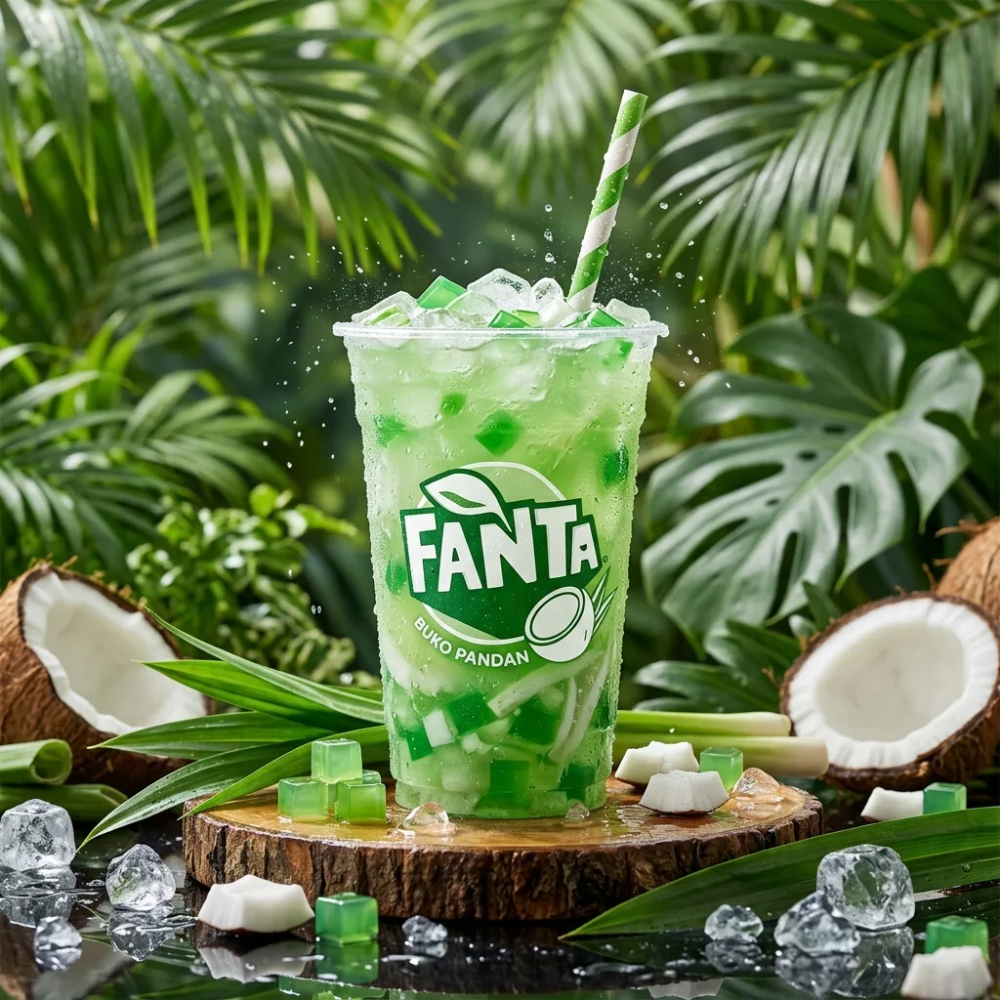

**#53 · Food &amp; Drink Prompt · <code>Vinano Image v2</code>**

<details>
<summary>Show prompt</summary>

```
Ultra-realistic commercial product photography of a cold green tropical drink in a transparent plastic cup Fanta Buko Pandan branding, crushed ice inside, condensation droplets on the cup, green striped paper straw, surrounded by floating ice cubes and pandan jelly cubes, coconut pieces and pandan leaves around the base, drink placed on a small wooden platform, reflective wet surface scattered ice, tropical jungle leaves background, vibrant green color palette, refreshing summer beverage advertisement, dramatic studio lighting, shallow depth of field, macro details, high-speed splash photography, 8k ultra detailed, professional advertising shot.
Optional parameters
•Aspect ratio: --ar 1:1
•Style: --style raw
•Quality: --q 2

Prompt:

Premium advertising photo of Fanta Buko Pandan tropical beverage, tall clear cup filled icy green pandan coconut drink, condensation droplets on the cup, white straw, surrounded by crystal ice cubes and pandan jelly cubes, fresh coconut halves and pandan stalks on table, placed on a wooden display stand, glossy reflective surface, lush tropical leaf background soft bokeh, vibrant green tones, filmic, cinematic lighting, hyper-realistic food photography, commercial beverage campaign style, ultra sharp details, 8k resolution, shallow depth of field.
Optional parameters
•Aspect ratio: --ar 1:1
•Lighting: studio softbox lighting
•Style keywords: true-to-life photorealistic, beverage advertising, macro texture

Keep edges clean and the overall composition balanced for a polished, gallery-ready result.
```

</details>

---


**#54 · Food &amp; Drink Prompt · <code>Vinano Image</code>**

<details>
<summary>Show prompt</summary>

```
{
 t && (e.push(l), s(l, "return"), t = false, n2 = true, r.length = 0);
 } };
})()),dehydratedQueryClient:$R[28]={mutations:$R[29]=[],queries:$R[30]=[$R[31]={dehydratedAt:1782271140146,state:$R[32]={data:$R[13],dataUpdateCount:1,dataUpdatedAt:1782271140146,error:null,errorUpdateCount:0,errorUpdatedAt:0,fetchFailureCount:0,fetchFailureReason:null,fetchMeta:null,isInvalidated:!1,status:"success",fetchStatus:"idle"},queryKey:$R[33]=["imagePromptDetail",785],queryHash:"[\"imagePromptDetail\",785]"}]}}})($R["tsr"]);document.currentScript.remove()

Maintain consistent colour harmony and crisp focus across the whole frame.
```

</details>

---

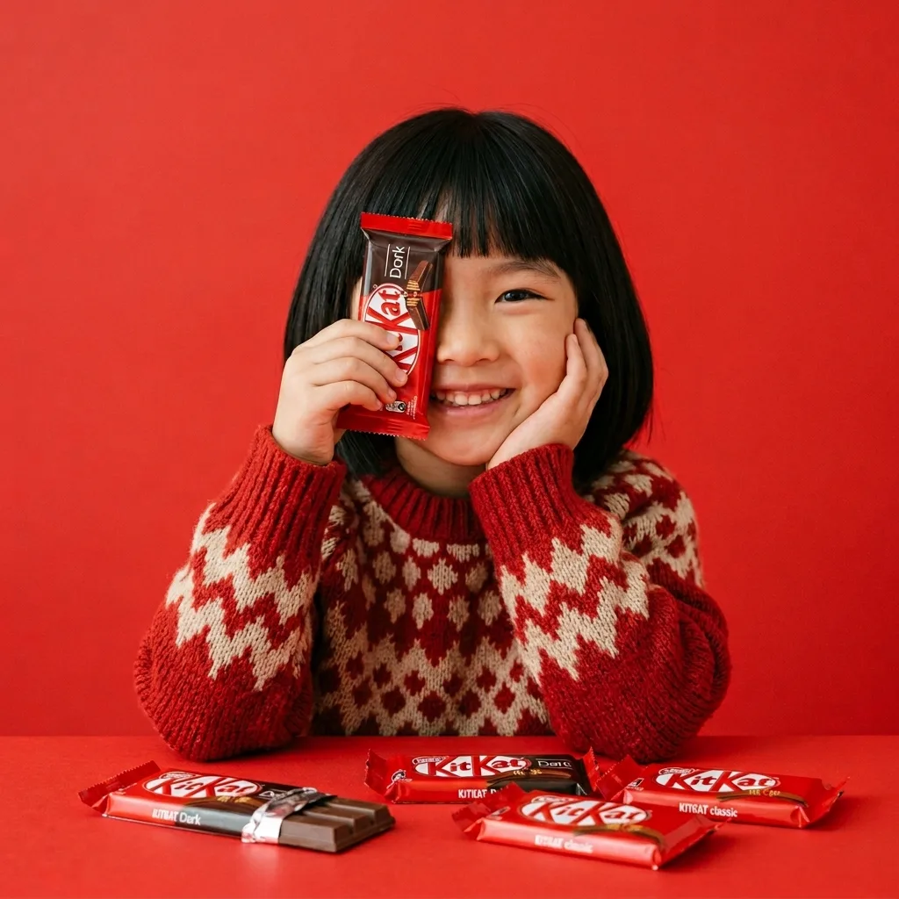

**#55 · Food &amp; Drink Prompt · <code>Vinano Image v2</code>**

<details>
<summary>Show prompt</summary>

```
A cute young girl short black hair and bangs smiling while holding a red KitKat Dark chocolate bar covering one eye, resting her cheek on her hand, wearing a cozy red and beige patterned winter sweater. The background and table are solid bright red. Several KitKat chocolate bars are placed on the table in front of her. Soft studio lighting, vibrant colors, commercial food advertisement style, ultra-realistic photography, sharp focus, high detail, 50mm lens, shallow depth of field, professional product photography, centered composition. Keep edges clean and the overall composition balanced for a polished, gallery-ready result.
```

</details>

---

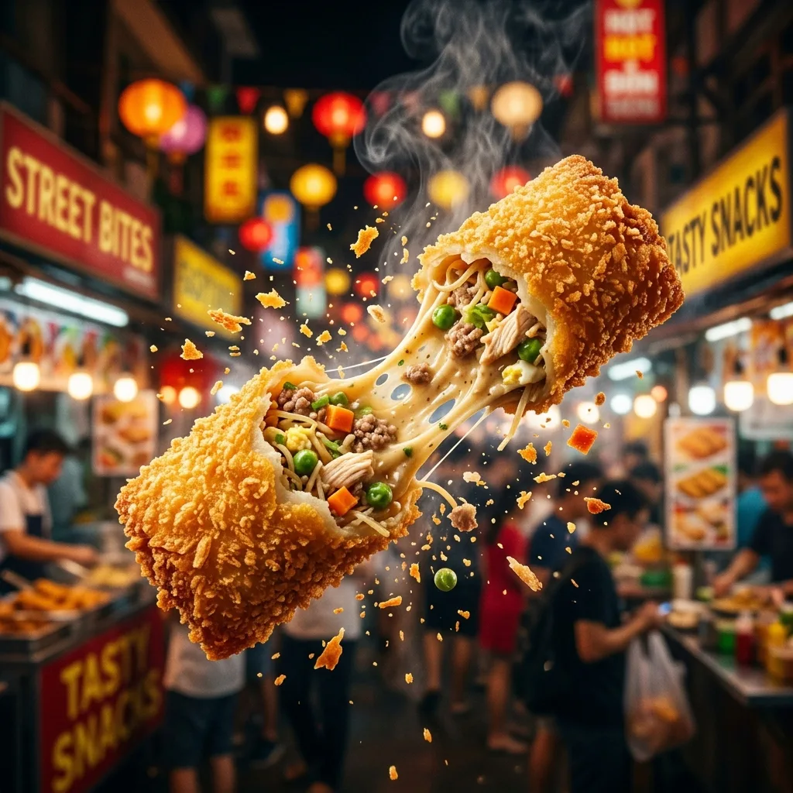

**#56 · Food &amp; Drink Prompt · <code>Vinano Image v2</code>**

<details>
<summary>Show prompt</summary>

```
Ultra-realistic high-speed food photography of a crispy golden fried snack breaking apart mid-air, creamy savory filling stretching between the halves, visible chunks of chicken, peas, carrots, minced meat, noodles, or egg inside. Crumbs and flakes flying in slow motion, hot steam rising, dramatic food explosion effect. Shot in a vibrant night street market environment warm bokeh lights, blurred food stalls in the background. Shallow depth of field, 85mm lens, f/1.8, ultra-sharp focus on texture, crunchy coating detail, dynamic motion capture, commercial food photography, filmic, cinematic lighting, HDR, 8K resolution, hyper-detailed, masterpiece quality. Maintain consistent colour harmony and crisp focus across the whole frame.
```

</details>

---

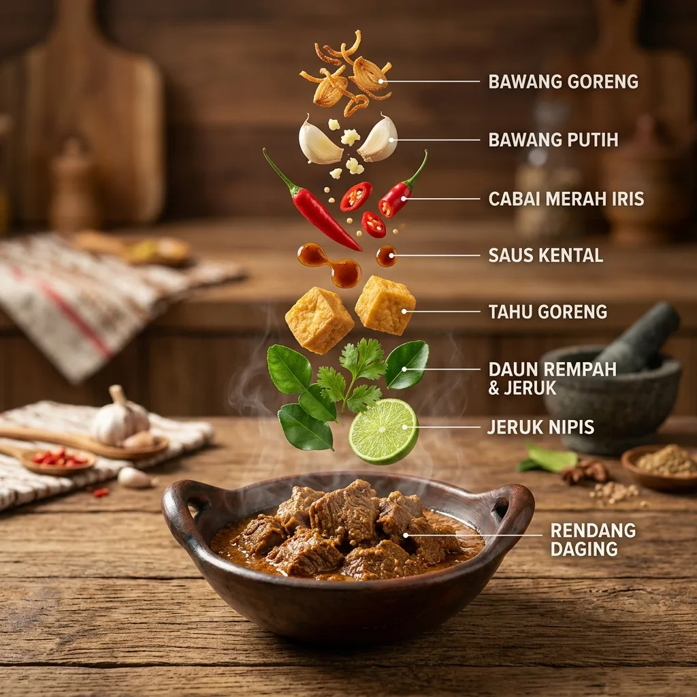

**#57 · Food &amp; Drink Prompt · <code>Vinano Image Pro</code>**

<details>
<summary>Show prompt</summary>

```
{
 "image_prompt": {
 "type": "Ultra-realistic culinary infographic",
 "subject": {
 "cuisine": "Indonesian",
 "base_element": "A traditional serving bowl holding a steaming hot dish",
 "levitating_ingredients": ["Tender meat pieces",
 "Golden crispy tofu",
 "Rich sauce droplets in mid-air",
 "Fresh green herbs",
 "Red chilies",
 "Sliced lime",
 "Crushed garlic",
 "Crispy fried shallots"]
 },
 "composition": {
 "layout": "Minimal, vertically stacked layout",
 "arrangement": "Ingredients floating naturally as if suspended in motion",
 "background": "Textured rustic wooden tabletop",
 "visual_hierarchy": "The bowl remains grounded at the base, ingredients ascending above it"
 },
 "graphic_design_elements": {
 "labels": "Clean Indonesian-language annotations",
 "lines": "Fine white connector lines",
 "style": "High-end editorial food infographic, magazine-quality design"
 },
 "lighting_and_mood": {
 "lighting": "Controlled cinematic studio lighting",
 "color_palette": "Warm, appetizing color tones",
 "effects": "Visible steam and frozen-action food elements"
 },
 "technical_specs": {
 "camera_settings": "Shallow depth of field crisp focal detail, DSLR-style capture",
 "details": "Extremely detailed surface textures",
 "resolution": "8K, true-to-life photorealistic finish"
 }
 }
}

Maintain consistent colour harmony and crisp focus across the whole frame.
```

</details>

---

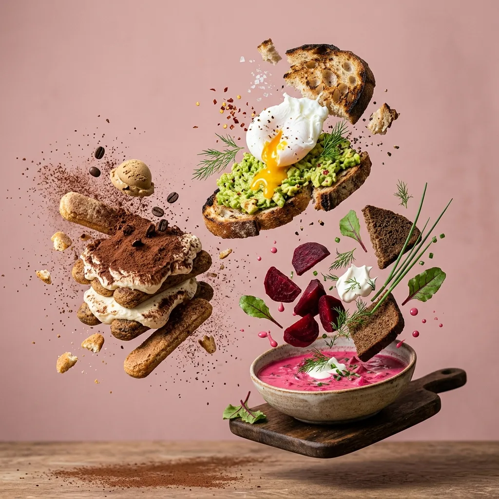

**#58 · Food &amp; Drink Prompt · <code>Vinano Image v2</code>**

<details>
<summary>Show prompt</summary>

```
Professional studio food photography series featuring deconstructed dishes in high-speed levitation. Against a seamless dusty pink background soft, diffused studio lighting, ingredients float and explode dynamically. Subjects include a hovering stack of tiramisu components (gelato, ladyfingers, mascarpone, coffee beans), borscht ingredients (beets, rye bread, herbs) suspended above a ceramic bowl of soup on a wooden board, and sourdough toast mashed avocado and a runny poached egg separating in mid-air. Capture fine details like flying crumbs, spice particles, herbs, and liquid droplets sharp focus and a shallow depth of field. A soft shadow is cast beneath the main floating elements. Emphasise material texture and natural light so the final frame feels tactile and premium.
```

</details>

---

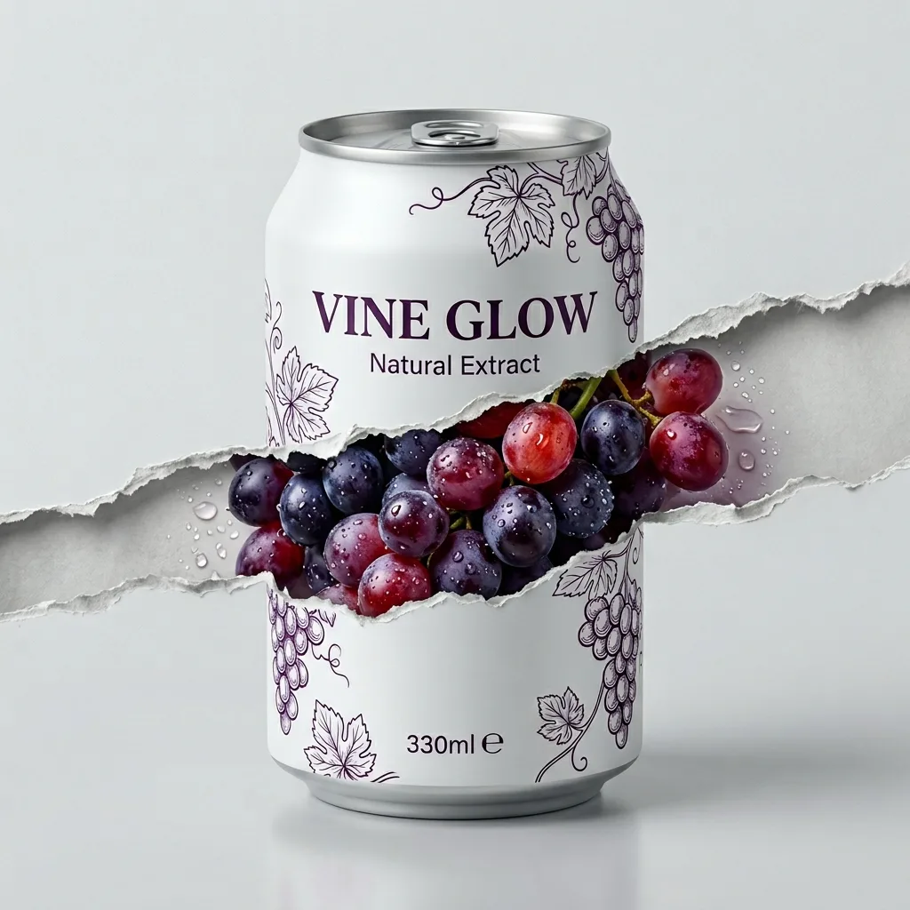

**#59 · Food &amp; Drink Prompt · <code>Vinano Image v2</code>**

<details>
<summary>Show prompt</summary>

```
Grape Can – “Vine Glow”

refined minimalist product photography of a 330ml aluminum can labeled “VINE GLOW – Natural Extract”, centered on a clean light grey background. The can features elegant purple vine line art. A realistic horizontal torn paper effect cuts across the middle of the can and background, revealing fresh red and purple grapes inside water droplets and glossy texture. Soft studio lighting, high detail, sharp focus, commercial advertising style, modern packaging design, symmetrical composition, ultra-realistic, 8k resolution.

Maintain consistent colour harmony and crisp focus across the whole frame.
```

</details>

---

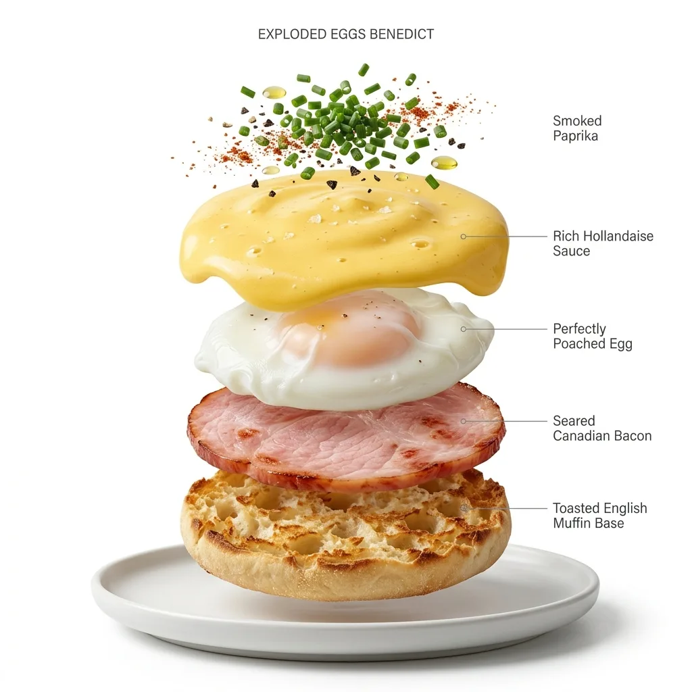

**#60 · Food &amp; Drink Prompt · <code>Vinano Image Pro</code>**

<details>
<summary>Show prompt</summary>

```
Create a hyper-realistic exploded vertical infographic composition of [FOOD].
At the top, characteristic particles, droplets, or garnishes associated the food, frozen mid-air.
Below it, the primary surface or topping layer rich texture and realistic material detail.
Underneath, the core ingredient layer showing structure, depth, and natural variation.
Below that, the supporting base or interior layer, slightly separated to reveal construction.
At the bottom, a minimal plate, bowl, cup, or base appropriate to the food’s presentation.
Pure white background, soft studio lighting, subtle shadows beneath each floating element, ultra-sharp focus, DSLR macro photography, clean infographic text labels thin pointer lines, premium editorial food photography aesthetic, 8K quality.

Emphasise material texture and natural light so the final frame feels tactile and premium.
```

</details>

---

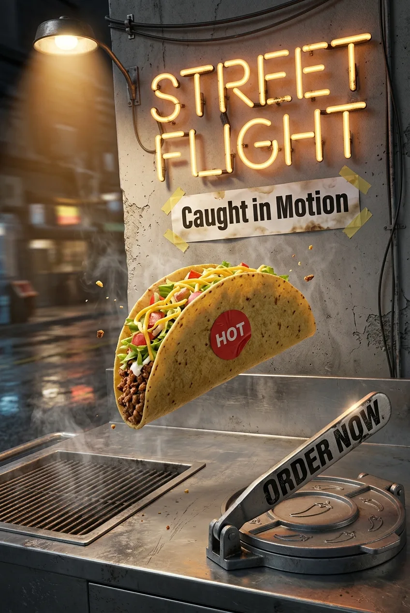

**#61 · Food &amp; Drink Prompt · <code>Vinano Image Pro</code>**

<details>
<summary>Show prompt</summary>

```
Generate a '2:3' hyper-realistic, high-resolution poster featuring the attached taco image. Adjust its perspective if needed to match the scene’s perspective and blend naturally into the composition.

COMPOSITION:
Capture a dynamic freeze-frame moment of a taco mid-flip during a street-side catch, shot from a Dutch tilted low three-quarter angle that exaggerates motion and urgency. The camera is positioned slightly below the taco, angled upward, the taco large and dominant dead-center in the frame, sharply in focus, suspended just above a scarred stainless-steel street cart counter. A single harsh overhead streetlamp mounted top left casts a focused cone of warm light, carving crisp highlights and deep shadows that emphasize motion blur in the background while keeping the taco tack-sharp. The atmosphere is alive subtle steam rising from the cart grill at bottom left, faint oil smoke drifting upward, and tiny airborne crumbs frozen mid-air. The tone is clean, appetizing, cinematic, and urban. The food-signature prop is a custom round taco press stamped geometric chili patterns, resting closed on the counter in the lower right foreground beneath the airborne taco, its metal edges catching the lamp’s glare. The story-signature prop is a battered transit-station flip-clock timer mounted on the back wall at top right, showing '19 03' on split flip panels, implying split-second timing and street rhythm. Wet pavement reflections shimmer in the blurred background, grounding the scene in a late-night street setting. Keep visible wiring and cables subtly running along the wall toward the neon and props, a faint magenta/purple spill mixing into the neon glow on the wall and paper.

HEADER: 'STREET FLIGHT'
The header is physically formed from bent single neon tubing (no double tubes). Neon tubes are made of reflective glass neon gas inside, mounted on a chipped concrete wall in the upper center background behind the taco. The neon tubes glow 'warm amber', uneven brightness, faint buzzing, and soot-darkened mounting brackets. The header is stacked on two lines: 'STREET' above 'FLIGHT'. The letters cast soft neon spill and distorted shadows across the wall’s cracked surface, minimal grime dulling parts of the glow, and thin black power cables feeding into the neon from the right.

TAGLINE: 'Caught in Motion'
The tagline is printed in bold condensed sans-serif on a narrow strip of grease-stained receipt paper taped directly beneath the neon header four translucent yellow tape pieces. The paper sags slightly at the center, edges curled and darkened by oil, catching a softer secondary glow from the neon above a faint magenta/purple tint in the spill.

CALL TO ACTION: 'ORDER NOW'
The cta is integrated into the taco press hardware in the foreground as on an angled metal bar/handle element, reading as bold, worn black lettering slight chipping and grease settled into the letter edges, plus a hard specular highlight running along the metal.

STICKER: 'HOT'
A small circular red vinyl sticker is physically adhered directly to the taco shell, perfectly centered, slight white highlights. The sticker conforms to the taco curvature, shows tiny wrinkles under the adhesive, and tiny air pockets are trapped beneath the adhesive to reflect realism.

Emphasise material texture and natural light so the final frame feels tactile and premium.
```

</details>

---

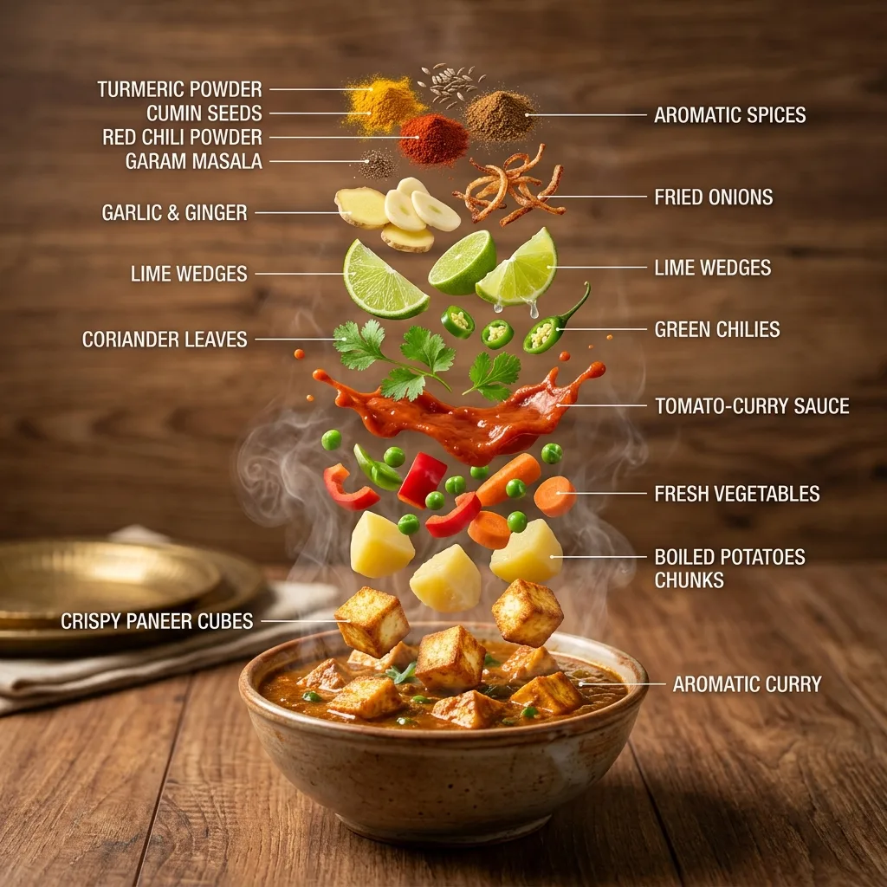

**#62 · Food &amp; Drink Prompt · <code>Vinano Image Pro</code>**

<details>
<summary>Show prompt</summary>

```
{
 "image_prompt": {
 "type": "Hyper-realistic editorial food infographic",
 "subject": {
 "cuisine": "Authentic Indian Vegetarian",
 "base_element": "Traditional rustic bowl filled steaming, freshly cooked curry at the bottom, rich and aromatic",
 "levitating_ingredients": ["Golden, crispy paneer cubes",
 "Soft boiled potato chunks",
 "Glazed tomato-curry sauce splashes suspended mid-air",
 "Vibrant fresh coriander leaves",
 "Sliced green chilies",
 "Lime wedges",
 "Thin slices of garlic and ginger",
 "Crunchy fried onions",
 "Colorful vegetables: red bell peppers, green peas, orange carrots",
 "Sprinkle of aromatic spices: turmeric, cumin seeds, red chili powder, garam masala"]
 },
 "composition": {
 "layout": "Clean vertical infographic composition",
 "arrangement": "Realistic gravity-defying floating ingredients, layered for visual hierarchy",
 "background": "Warm rustic wooden tabletop or traditional Indian brass plate",
 "visual_hierarchy": "Bowl anchored at the bottom, ingredients rising vertically natural spacing, creating depth and focus on main dish"
 },
 "graphic_design_elements": {
 "labels": "Sharp, clear English text annotations for each ingredient",
 "lines": "Delicate thin white pointer lines connecting floating ingredients to labels",
 "style": "Professional editorial food magazine infographic, visually educational, vibrant and appetizing"
 },
 "lighting_and_mood": {
 "lighting": "Cinematic studio lighting warm highlights and soft shadows, enhancing textures",
 "color_palette": "Rich, vibrant warm tones to highlight spices, vegetables, and curry",
 "effects": "Visible rising steam, motion-frozen mid-air ingredients, slight reflections and glistening sauce for mouth-watering effect"
 },
 "technical_specs": {
 "camera_settings": "Shallow depth of field, ultra-sharp focus on foreground elements, DSLR cinematic lens effect",
 "details": "Ultra-detailed textures on paneer, vegetables, spices, and sauce; realistic steam and glossy highlights",
 "resolution": "8K ultra-realistic, suitable for high-end digital display, print, or magazine cover"
 }
 }
}

Preserve realistic proportions and depth for a confident, professional finish.
```

</details>

---

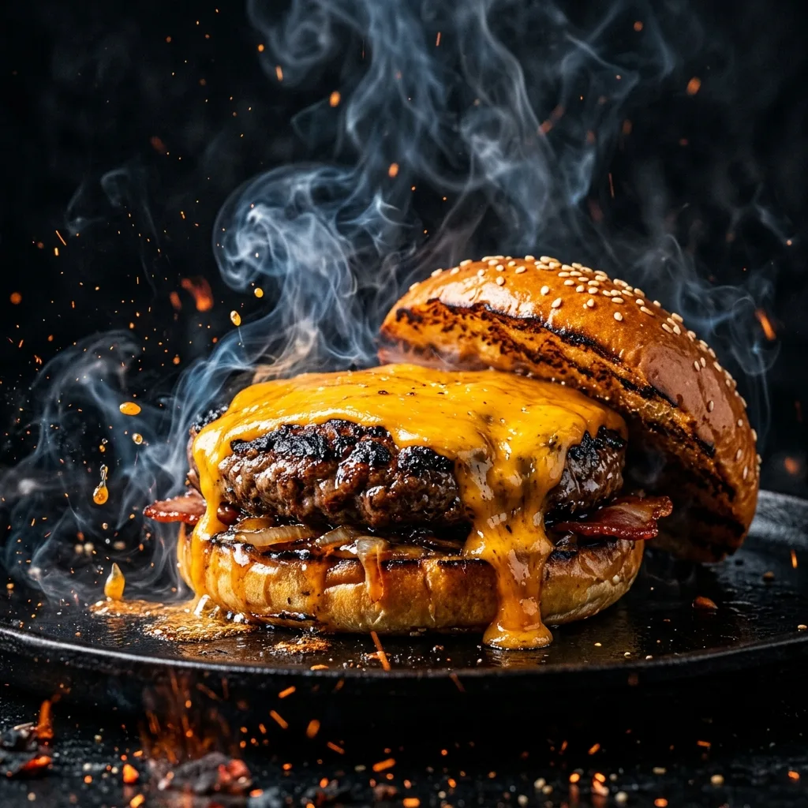

**#63 · Food &amp; Drink Prompt · <code>Vinano Image v2</code>**

<details>
<summary>Show prompt</summary>

```
A hyper-realistic, cinematic close-up of a sizzling gourmet cheeseburger. The thick, juicy beef patty features a heavy, glossy char and is blanketed in vibrant orange cheddar cheese that melts and oozes down the sides in thick, viscous streams over a toasted brioche bun. The atmosphere is dramatic and smoky, thick wisps of white and blue steam swirling upwards, surrounded by floating bright orange sparks, glowing embers, and frozen droplets of grease suspended in the air. The lighting is high-contrast and dramatic against a deep black background, emphasizing the glistening textures. Shot a macro lens, shallow depth of field, and 8k resolution commercial food photography style. Aim for an editorial, design-driven look with deliberate negative space.
```

</details>

---

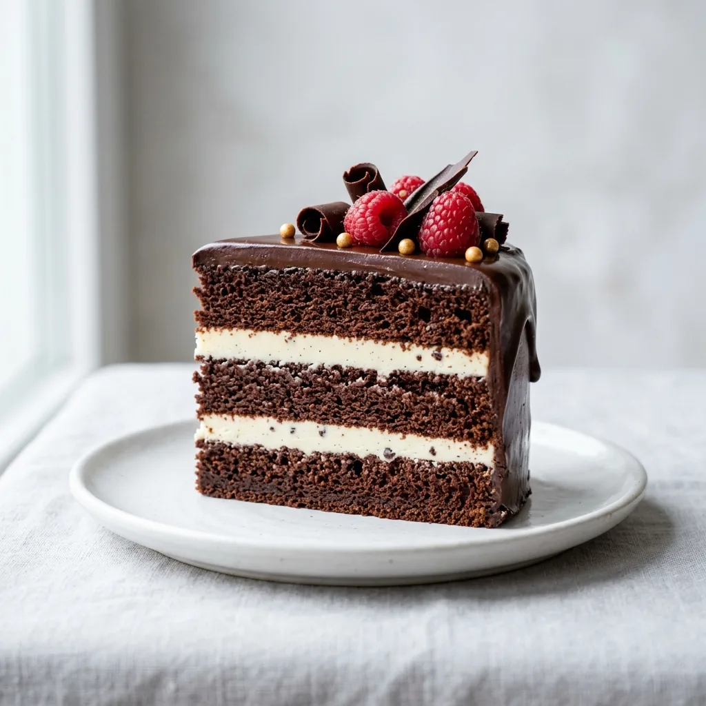

**#64 · Food &amp; Drink Prompt · <code>Vinano Image v2</code>**

<details>
<summary>Show prompt</summary>

```
Ultra-realistic premium food photography of a layered chocolate cake on a white plate, centered composition, three thick moist chocolate sponge layers a smooth white cream filling in the middle, topped glossy rich chocolate ganache frosting, decorated fresh raspberries, dark chocolate curls, shards, and small gold sugar pearls, clean minimal light grey studio background, soft diffused professional lighting, gentle natural shadows, ultra-sharp texture detail showing porous sponge and creamy layers, high-end bakery advertising style, shallow depth of field, macro food photography look, true-to-life photorealistic, 8K resolution, elegant dessert presentation, no text, no watermark
Negative prompt:
blurry, low resolution, cartoon style, CGI look, artificial textures, messy composition, oversaturated colors, harsh shadows, noise, watermark, text, extra objects, distorted cake shape.

Keep edges clean and the overall composition balanced for a polished, gallery-ready result.
```

</details>

---

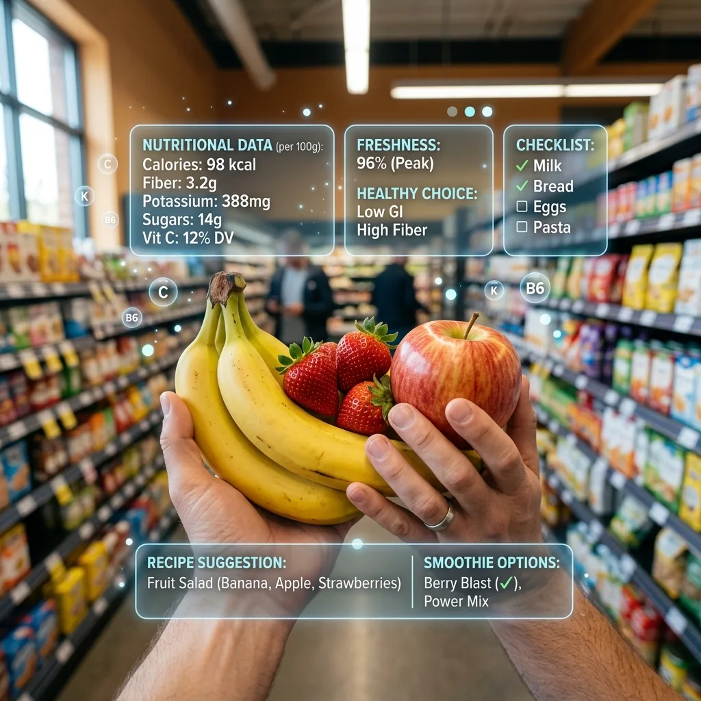

**#65 · Food &amp; Drink Prompt · <code>Vinano Image Pro</code>**

<details>
<summary>Show prompt</summary>

```
{
 "image_prompt": {
 "viewpoint": "Realistic first-person view (FPV)",
 "action": "Person holding fresh fruit in their hands",
 "subject_variations": ["Banana",
 "Strawberries",
 "Apple"],
 "environment": {
 "location": "Modern supermarket aisle",
 "background": "Blurred grocery shelves",
 "lighting": "Bright commercial lighting"
 },
 "augmented_reality_hud": {
 "overlay_style": "Clean sci-fi interface, soft glow, glass-like UI elements",
 "data_display": ["Nutritional data (calories, vitamins, fiber, sugars, potassium)",
 "Freshness percentage",
 "Health indicators"],
 "ui_panels": ["Checklist items (milk, bread, eggs, pasta)",
 "Recipe suggestions",
 "Smoothie options",
 "Vitamin icons"],
 "visual_effects": "Subtle light particles, depth-aware AR placement"
 },
 "technical_specs": {
 "style": "Ultra-realistic photography blended futuristic AR technology",
 "aesthetic": "Modern health-tech",
 "focus": "Sharp focus on hands and fruit, shallow depth of field",
 "resolution": "8K",
 "realism": "Cinematic realism"
 }
 }
}

Emphasise material texture and natural light so the final frame feels tactile and premium.
```

</details>

---

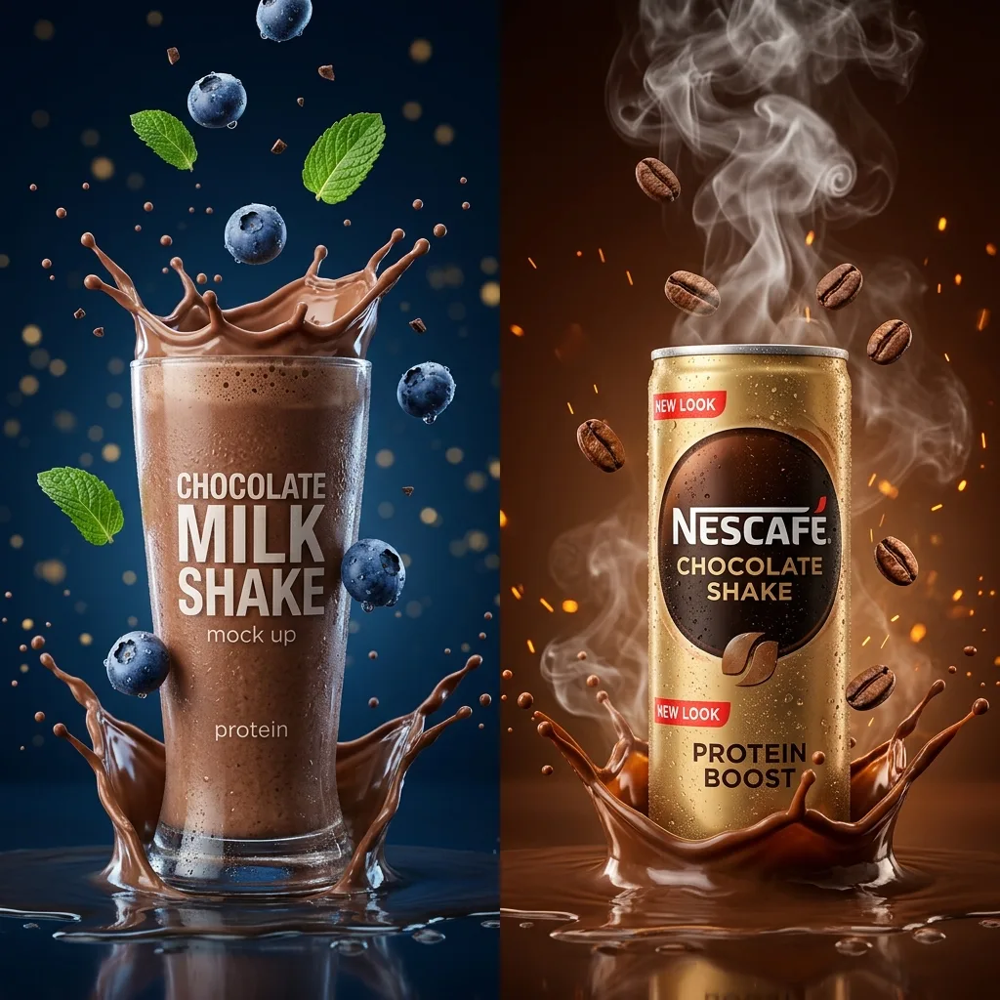

**#66 · Food &amp; Drink Prompt · <code>Vinano Image v2</code>**

<details>
<summary>Show prompt</summary>

```
{
 "master_prompt": {
 "global_settings": {
 "style": "Hyper-realistic commercial product photography",
 "layout": "Vertical split-screen, two distinct modules",
 "resolution": "8K UHD, filmic, cinematic lighting",
 "details": "Extreme clarity, frozen motion splashes, micro-condensation"
 },
 "module_1_left": {
 "subject": {
 "type": "Clear tall glass of thick chocolate milkshake",
 "details": "Frothy texture, visible condensation on glass",
 "text_on_glass": ["CHOCOLATE MILK SHAKE", "mock up", "protein"]
 },
 "action": "Dynamic chocolate liquid splash erupting from the base and top",
 "floating_elements": ["Whole blueberries water droplets",
 "Fresh green mint leaves",
 "Tiny chocolate particles suspended in air"],
 "background": {
 "color": "Deep dark blue soft golden bokeh particles",
 "lighting": "Cool moonlight-style rim lighting"
 }
 },
 "module_2_right": {
 "subject": {
 "type": "Slim gold metallic Nescafé can",
 "details": "Heavy condensation, matte gold finish",
 "text_on_can": ["NESCAFÉ", "CHOCOLATE SHAKE", "NEW LOOK", "PROTEIN BOOST"]
 },
 "action": "Explosive chocolate liquid crown splash at the base",
 "floating_elements": ["Roasted coffee beans",
 "Swirling thick white steam/smoke rising from the top",
 "Glowing amber embers and sparks"],
 "background": {
 "color": "Warm chocolate brown to dark amber gradient",
 "atmosphere": "Moody, intense, and smoky"
 }
 },
 "surface_details": {
 "base": "Reflective dark wet surface liquid pooling",
 "shadows": "Soft separated realistic shadows"
 }
 }
}

Maintain consistent colour harmony and crisp focus across the whole frame.
```

</details>

---

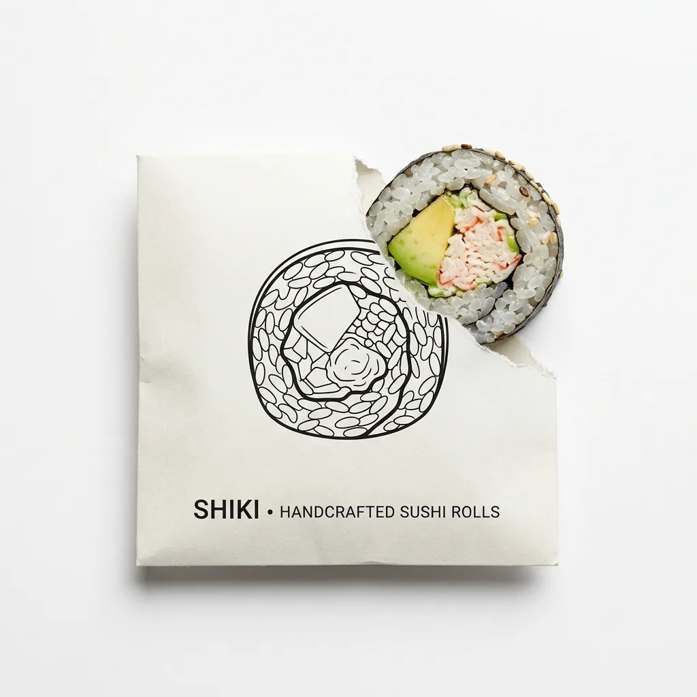

**#67 · Food &amp; Drink Prompt · <code>Vinano Image v2</code>**

<details>
<summary>Show prompt</summary>

```
minimal studio shot on pure white background, real [Food Name] emerging from a paper packaging, the visible part outside the packaging is fully true-to-life photorealistic, the continuation of the same food is drawn as a clean black line illustration printed directly on the surface of the packaging, perfectly aligned the real food shape, the illustration stays strictly on the packaging material, not floating, not extending into the background, seamless transition between real and printed illustration, modern minimal branding, top-down composition, soft shadows Keep edges clean and the overall composition balanced for a polished, gallery-ready result.
```

</details>

---

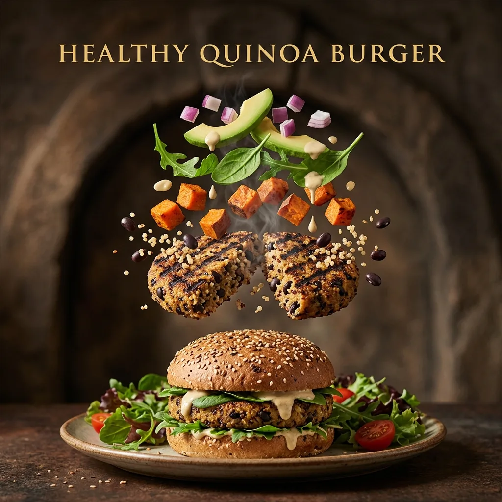

**#68 · Food &amp; Drink Prompt · <code>Vinano Image Pro</code>**

<details>
<summary>Show prompt</summary>

```
{
"presentation": "Deconstructed exploded view floating in mid-air above a finished burger on a plate",
 "burger_paddy": "Grilled quinoa and black bean patty visible char marks, split in half steam rising",
 "floating_ingredients": ["Grains of cooked quinoa",
 "Whole black beans",
 "Roasted sweet potato cubes",
 "Fresh spinach and arugula leaves",
 "Slices of ripe avocado",
 "Drips of creamy tahini-lemon dressing",
 "Diced red onion"],
 "plated_item": "A complete burger on a seeded whole-grain bun fresh greens and dressing, served on a ceramic plate a side salad"
 },
 "style": {
 "aesthetic": "Professional commercial food photography",
 "lighting": "Warm, cinematic, moody lighting soft highlights on the textures of the food",
 "background": "Dark, rustic, textured stone or clay oven-like background a shallow depth of field (bokeh)",
 "color_palette": "Earthy tones, deep browns, vibrant greens, and warm oranges"
 },
 "composition": {
 "angle": "Eye-level, straight-on shot",
 "dynamic_elements": "Floating gravity-defying arrangement, wisps of steam, droplets of sauce",
 "text_overlay_optional": "Clean gold serif typography at the top reading 'HEALTHY QUINOA BURGER'"
 },
 "technical_specs": {
 "focus": "Sharp focus on the floating patty and ingredients",
 "lens": "Macro lens for high detail texture on grains and vegetables",
 "quality": "8k resolution, true-to-life photorealistic, commercial advertising quality"
 }
}

Render with rich micro-detail while keeping the layout uncluttered and intentional.
```

</details>

---

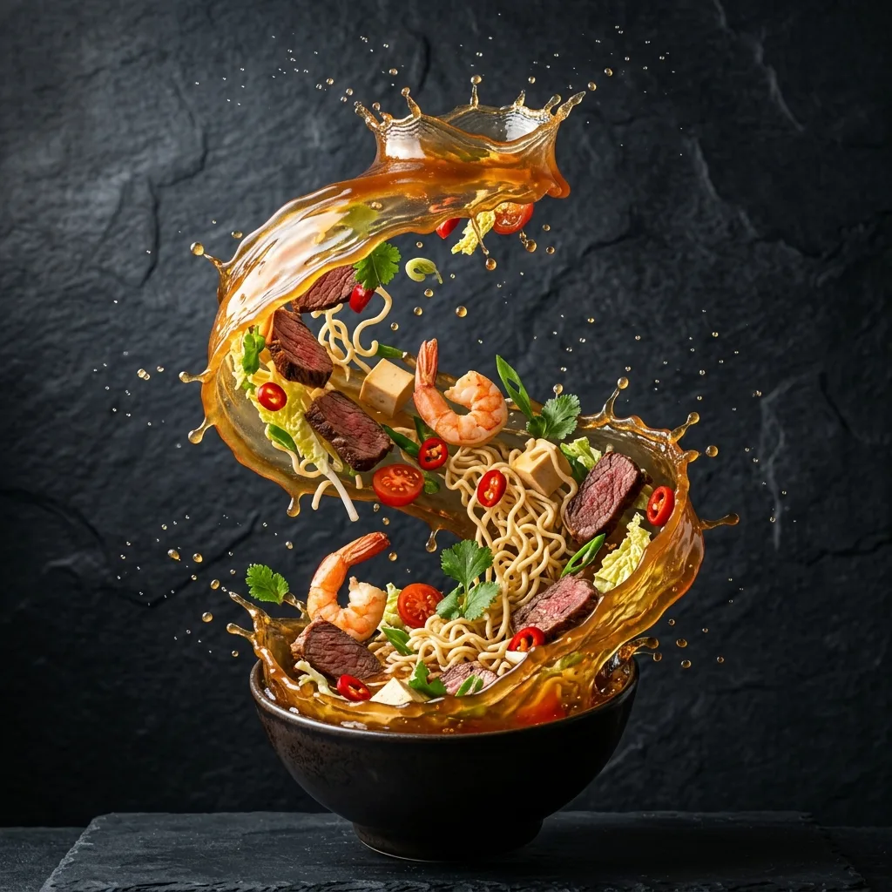

**#69 · Food &amp; Drink Prompt · <code>Vinano Image v2</code>**

<details>
<summary>Show prompt</summary>

```
{
 "image_prompt": {
 "subject": "Rich Asian soup",
 "action": "Ingredients exploding upward in mid-air, swirling spiral splash of broth forming a dynamic ribbon shape, liquid splash crown",
 "ingredients": ["Floating beef slices",
 "Shrimp",
 "Noodles",
 "Tofu cubes",
 "Chili",
 "Herbs",
 "Tomatoes",
 "Cabbage"],
 "environment": "Dramatic dark textured background",
 "lighting": "Studio lighting, strong rim light, glossy broth reflections, cinematic contrast",
 "photography_style": "Ultra-realistic food photography, high-speed photography, frozen motion, hyper realistic",
 "camera_settings": {
 "lens": "85mm",
 "aperture": "f/4",
 "focus": "Sharp focus, macro clarity",
 "resolution": "8K"
 }
 }
}

Preserve realistic proportions and depth for a confident, professional finish.
```

</details>

---

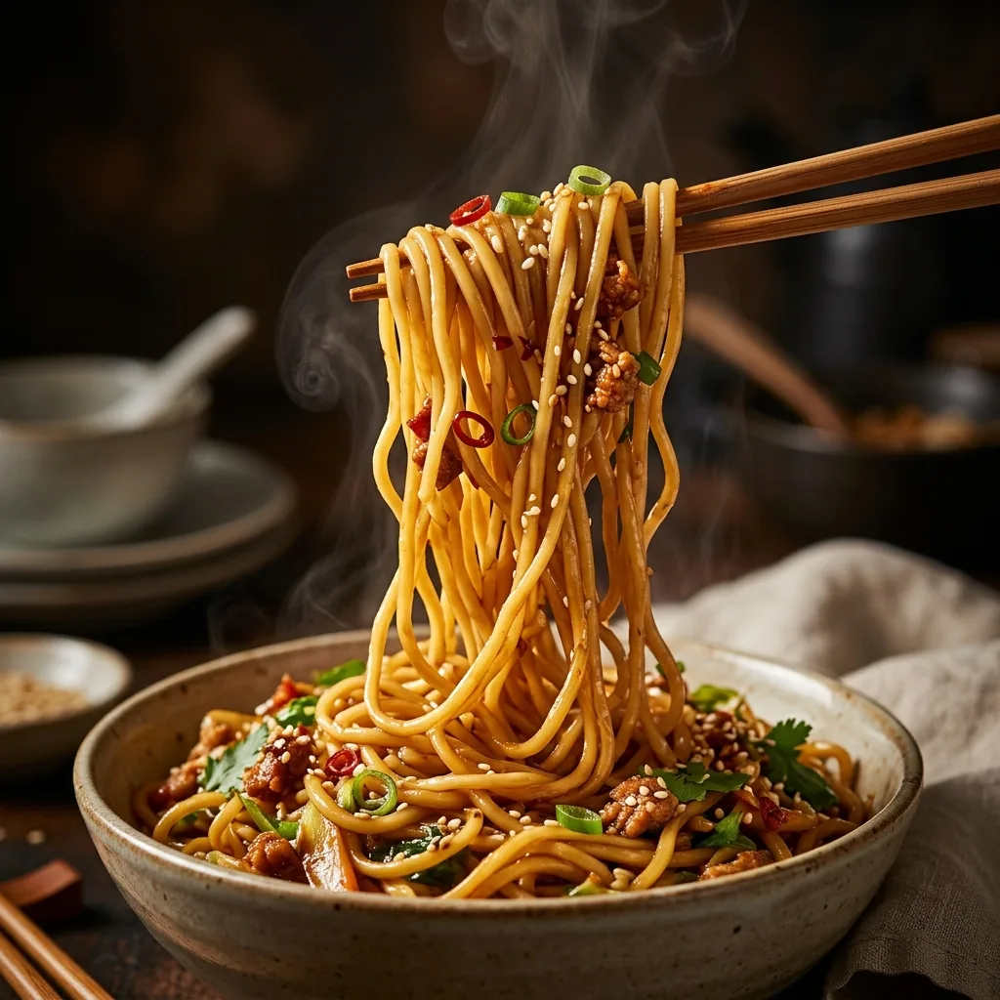

**#70 · Food &amp; Drink Prompt · <code>Vinano Image v2</code>**

<details>
<summary>Show prompt</summary>

```
{
 "content_goal": "viral food visual high appetite appeal",
 "image_type": "ultra-true-to-life photorealistic food photography",
 "visual_style": {
 "aesthetic": "cinematic food editorial, premium street-food style",
 "vibe": "steamy, savory, irresistible",
 "realism": "high-end commercial food realism"
 },
 "composition": {
 "framing": "close-up or medium close-up",
 "camera_angle": "45-degree or slightly top-front angle",
 "subject_position": "centered hero bowl or lifted noodles",
 "perspective": "depth-rich strong foreground emphasis"
 },
 "subject": {
 "description": "freshly prepared noodles captured at peak texture",
 "presentation": "chopsticks or fork lifting noodles mid-air",
 "details": "long glossy strands visible sauce coating",
 "ingredients": "vegetables, protein, herbs, sesame seeds"
 },
 "texture_details": {
 "noodles": "silky, elastic strands sauce cling",
 "sauce": "rich, glossy, evenly coated",
 "steam": "visible rising steam for freshness",
 "garnish": "spring onions, chili flakes, sesame"
 },
 "styling": {
 "bowl": "ceramic or rustic bowl",
 "props": "chopsticks, linen napkin, subtle tableware",
 "messiness": "controlled, appetizing chaos"
 },
 "lighting": {
 "type": "warm directional food lighting",
 "quality": "soft yet contrast-rich",
 "direction": "side or top-side light",
 "highlight_focus": "noodle gloss and steam",
 "shadow_style": "soft shadows for depth"
 },
 "color_palette": {
 "primary": ["golden brown", "soy sauce tones", "warm amber"],
 "accent": ["chili red", "herb green"],
 "mood": "cozy, savory, indulgent"
 },
 "environment": {
 "location": "street-food stall, modern kitchen, or studio setup",
 "background": "dark or softly blurred background",
 "atmosphere": "warm, comforting, flavorful"
 },
 "camera_details": {
 "camera_type": "professional DSLR or mirrorless simulation",
 "lens": "85mm or macro food lens",
 "focus": "tack-sharp on lifted noodles",
 "depth_of_field": "shallow background blur",
 "resolution": "advertising-grade clarity"
 },
 "quality_control": {
 "food_realism": "hyper-real texture without plastic look",
 "steam_accuracy": "natural steam physics",
 "ai_artifacts": "none",
 "professional_finish": "commercial food photography quality"
 },
 "overall_mood": "comforting, rich, mouth-watering",
 "intended_use": {
 "primary": "viral food post on X",
 "secondary": "restaurant branding, food editorial, ads"
 }
}

Aim for an editorial, design-driven look with deliberate negative space.
```

</details>

---

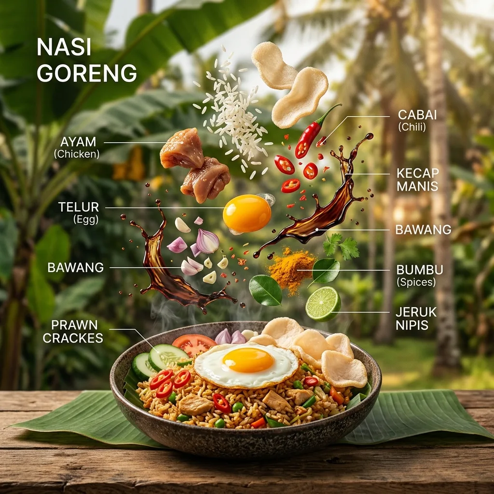

**#71 · Food &amp; Drink Prompt · <code>Vinano Image Pro</code>**

<details>
<summary>Show prompt</summary>

```
Ultra-realistic cinematic food photography of a traditional Indonesian dish, presented as a floating ingredients composition. Main dish placed at the bottom in a rustic ceramic bowl or banana leaf plate. Key ingredients suspended in mid-air above the dish, perfectly separated and labeled clean refined minimalist typography and thin pointer lines. Dynamic splashes of sauce and spices frozen in motion, high-speed food photography. Natural tropical setting banana leaves, palm trees, warm sunlight, shallow depth of field. Hyper-detailed textures, glossy sauces, steam and smoke effects, editorial food poster style, premium commercial quality, 8K resolution, soft filmic, cinematic lighting, realistic shadows, depth and realism. Aim for an editorial, design-driven look with deliberate negative space.
```

</details>

---

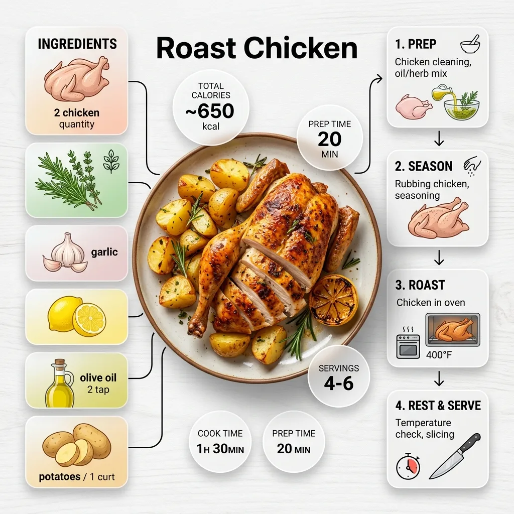

**#72 · Food &amp; Drink Prompt · <code>Vinano Image Pro</code>**

<details>
<summary>Show prompt</summary>

```
Ultra-clean modern recipe infographic. Showcase Roast chicken in a visually appealing finished form—sliced, plated, or portioned—floating slightly in perspective or angled view. Arrange ingredients, steps, and tips around the dish in a dynamic editorial layout, not restricted to top-down. Ingredients Section: Include icons or mini illustrations for each ingredient quantities. Arrange them in clusters, lists, or circular flows connected visually to the dish. Steps Section: Show preparation steps numbered panels, arrows, or lines, forming a logical flow around the main dish. Include small cooking icons (knife, pan, oven, timer) where helpful. Additional Info (optional): Total calories, prep/cook time, servings, spice level—displayed as clean bubbles or badges near the dish. Visual Style: Editorial infographic meets lifestyle food photography. Vibrant, natural food colors, subtle drop shadows, clean vector icons, modern typography, soft gradients or glassmorphism for step panels. Accent colors can highlight key info (calories, prep time). Composition Guidelines: Finished meal as hero visual (perspective or angled) Ingredients and steps flow dynamically around the dish Clear visual hierarchy: dish > steps > ingredients > optional stats Enough negative space to keep design airy and readable Lighting & Background: Soft, natural studio lighting, minimal textured or gradient background for premium editorial feel. Output: 1080×1080, ultra-crisp, social-feed optimized, no watermark.” Emphasise material texture and natural light so the final frame feels tactile and premium.
```

</details>

---

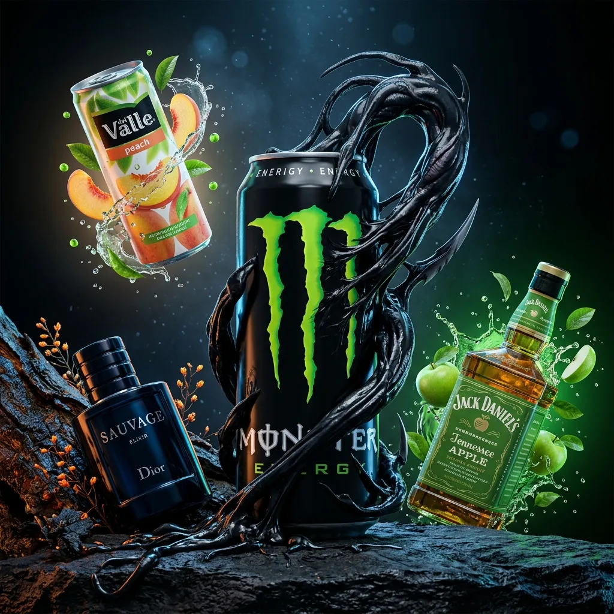

**#73 · Food &amp; Drink Prompt · <code>Vinano Image v2</code>**

<details>
<summary>Show prompt</summary>

```
Cinematic ultra-high-end product photography of an official Monster Energy drink can a standard vertical black aluminum energy drink can featuring the iconic neon
reen claw logo of Monster Energy - standing on a dark, rough, textured surface. The can is being engulfed and seemingly possessed by a thick, glossy, jet-black symbiotic liquid inspired by the organic alien symbiote from the 2018 film Venom, directed by Ruben Fleischer. The viscous substance behaves like a living entity - muscular,predatory, and semi-sentient— forming elongated, sinewy tendrils that stretch
upward and wrap tightly around the can as if claiming it. The texture must closely resemble Venom's cinematic symbiote: dense, oily, hyper-glossy, elastic, visible surface tension, micro ripples, sharp blade-like protrusions, and subtle vein-like striations. It should feel alive, aggressive, and biomechanical _ not random liquid splashes.The black symbiote appears to be merging the Monster can's aluminum surface crawling over it, partially fusing into the metal, as if infecting or possessing the product. Some tendrils anchor to the ground while others rise dynamically into the air, creating tension and controlled chaos. The green claw logo remains clearly visible and becomes the focal contrast element against the dark mass. Camera angle: dramatic low-angle hero shot, slightly tilted (Dutch angle) for cinematicintensity, captured a macro cinema lens at close range. Shallow depth of field, razor-sharp focus on the logo and the liquid interaction, extreme macro detail. Lighting: moody, high-contrast lighting strong cold blue rim light sculpting the wet reflective contours of the symbiote and enhancing the metallic sheen of the blackaluminum can. Subtle green light spill from the neon logo reflecting onto nearbyglossy tendrils. Deep shadows controlled specular highlights for a premium cinematic look.Atmosphere: floating micro-particles, dust, and fine mist suspended in the air,catching the rim light to create depth. Subtle volumetric haze and cinematic diffusion.Background: deep dark void faint cool blue bokeh and minimal gradient separation, reinforcing a mysterious, powerful, almost supernatural atmosphere. Ultra-realistic, true-to-life photorealistic, hyper-detailed textures, HDR, 8K resolution, cinematic color grading, dramatic tension, premium commercial advertising aesthetic.

IMAGE 2
premium-quality commercial photograph of a
sleek,thin aluminum Del Valle peach juice
can suspended diagonally in a dynamic,
gravity-defying composition. The scene
conveys a sense of freshness, featuring hyper-realistic slices of juicy peaches and vibrant green leaves spiraling around the can along splashes of crystal-clear water and delicate droplets. The lighting is bright and airy, creating a soft, refreshing glow throughout the image. The color palette consists of warm peach tones, soft corals and vibrant greens on a refined minimalist back ground a peach-toned gradient and shallow depth of field, showing blurred peaches in the background. Commercial aesthetic, macro detail, refreshing and vibrant atmosphere.

IMAGE 3
A close-up product photograph of a dark
blue glass bottle for "SAUVAGE ELIXIR Dior" perfume, nestled within dark, textured,wet-looking tree bark and small dried botanical sprigs glowing orange tips. Thelighting is low
moody warm
orange and deep blue highlights across the wet wood and the glossy bottle. The background is dark and natural.

IMAGE 4
A dynamic, high-speed photograph cap-
tures a bottle of Jack Daniel's Tennessee
Apple whiskey, its signature green
label and square glass shape, splashing of
green liquid. Water droplets and fresh green
apples leaves explode outwards
around the bottle. The scene is illuminated
by vibrant green light from background,
highlighting the texture of the glass, liquid,
and fruit against a dark green, gradient
background green and black green
ratio 4:5

Preserve realistic proportions and depth for a confident, professional finish.
```

</details>

---

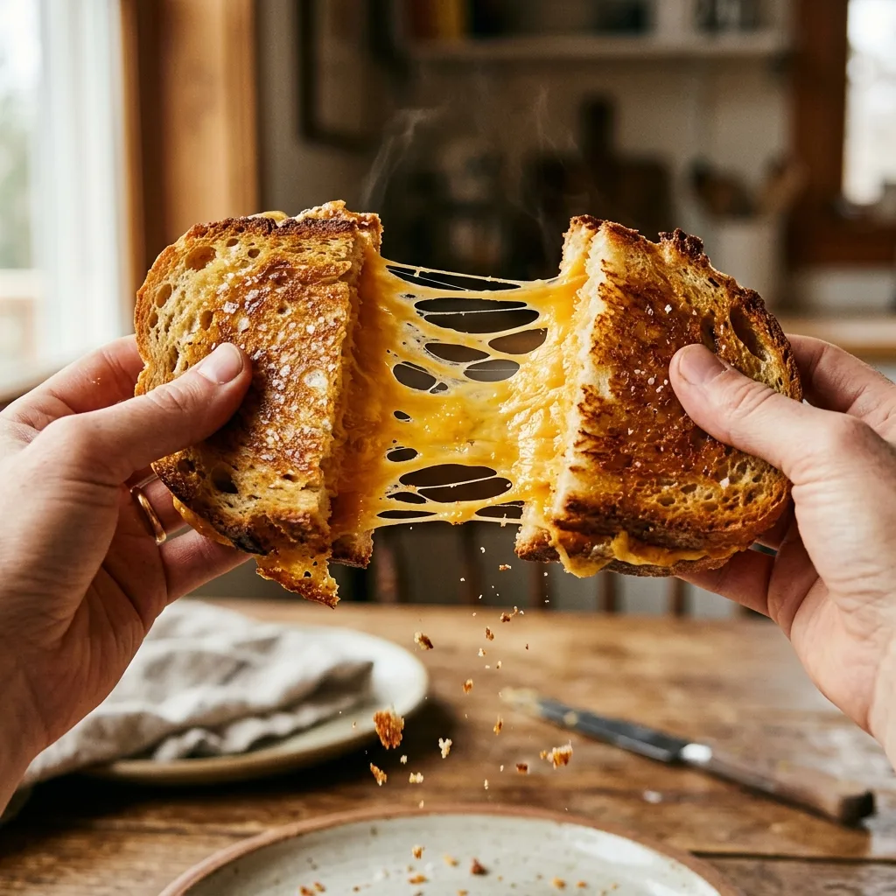

**#74 · Food &amp; Drink Prompt · <code>Vinano Image v2</code>**

<details>
<summary>Show prompt</summary>

```
two hands pulling apart a grilled cheese sandwich, strands of melted cheddar stretching dramatically between the halves, toasted bread edges crisp and golden, crumbs falling mid-air, warm cozy light, cinematic food action photography Emphasise material texture and natural light so the final frame feels tactile and premium.
```

</details>

---

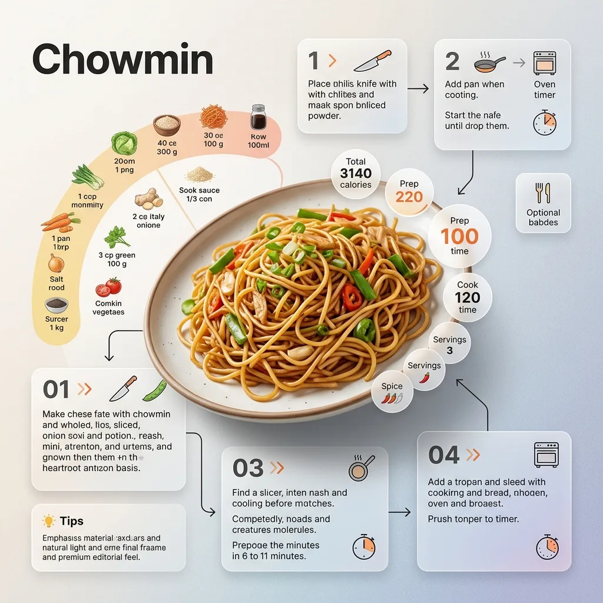

**#75 · Food &amp; Drink Prompt · <code>Vinano Image Pro</code>**

<details>
<summary>Show prompt</summary>

```
Ultra-clean modern recipe infographic. Showcase chowmin in a visually appealing finished form sliced, plated, or portioned floating slightly in perspective or angled view. Arrange ingredients, steps, and tips around the dish in a dynamic editorial layout, not restricted to top-down. Ingredients Section: Include icons or mini illustrations for each ingredient quantities. Arrange them in clusters, lists, or circular flows connected visually to the dish. Steps Section: Show preparation steps numbered panels, arrows, or lines, forming a logical flow around the main dish. Include small cooking icons (knife, pan, oven, timer) where helpful. Additional Info (optional): Total calories, prep/cook time, servings, spice level—displayed as clean bubbles or badges near the dish. Visual Style: Editorial infographic meets lifestyle food photography. Vibrant, natural food colors, subtle drop shadows, clean vector icons, modern typography, soft gradients or glassmorphism for step panels. Accent colors can highlight key info (calories, prep time). Composition Guidelines: Finished meal as hero visual (perspective or angled) Ingredients and steps flow dynamically around the dish Clear visual hierarchy: dish > steps > ingredients > optional stats Enough negative space to keep design airy and readable Lighting & Background: Soft, natural studio lighting, minimal textured or gradient background for premium editorial feel. Output: 1080×1080, ultra-crisp, social-feed optimized, no watermark. Emphasise material texture and natural light so the final frame feels tactile and premium.
```

</details>

---

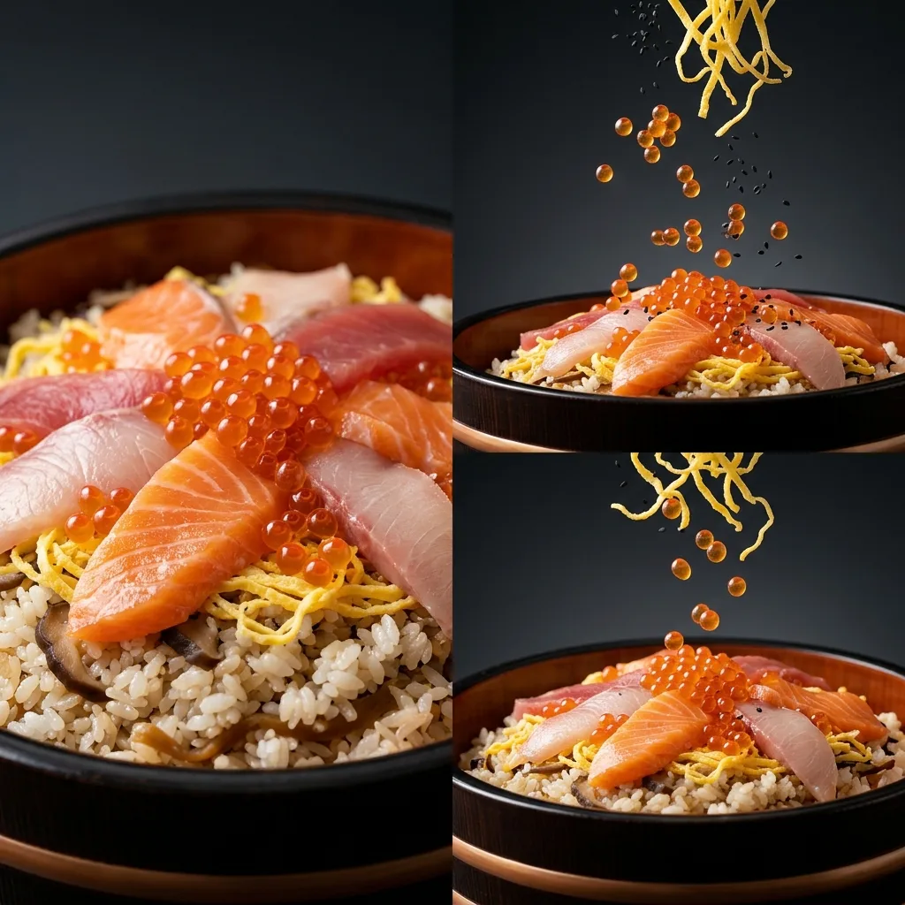

**#76 · Food &amp; Drink Prompt · <code>Vinano Image v2</code>**

<details>
<summary>Show prompt</summary>

```
Ultra-premium-quality, hyper-realistic commercial food photography of [COUNTRY FOOD NAME], rendered in 8K detail a (4:3 or 3:4) aspect ratio.

The food is shown in multiple premium visual variations, each highlighting texture, layers, and freshness in a cinematic way.

Food details:
– Authentic [COUNTRY] cuisine presentation
– Clearly visible layers, fillings, or structure specific to [FOOD TYPE]
– Rich, natural colors and realistic textures

Motion & drama:
– Subtle mid-air elements (crumbs, ingredients, sauce, or spices)
– Natural gravity realism, frozen motion
– No mess, clean and controlled composition

Lighting & camera:
– Controlled studio lighting emphasizing texture and shine
– High-speed photography look
– Shallow to medium depth of field

Background:
– Solid or soft gradient background in [BACKGROUND COLOR]
– Clean, seamless, distraction-free

Style & finish:
– Luxury food advertising aesthetic
– Rich contrast, warm natural tones
– Ultra-sharp focus, no artificial glow

Negative prompt:
Text, logos, branding, hands, people, utensils, plates, tables, cartoon style, burnt food, overexposure, low-detail textures, artificial shine.

Preserve realistic proportions and depth for a confident, professional finish.
```

</details>

---

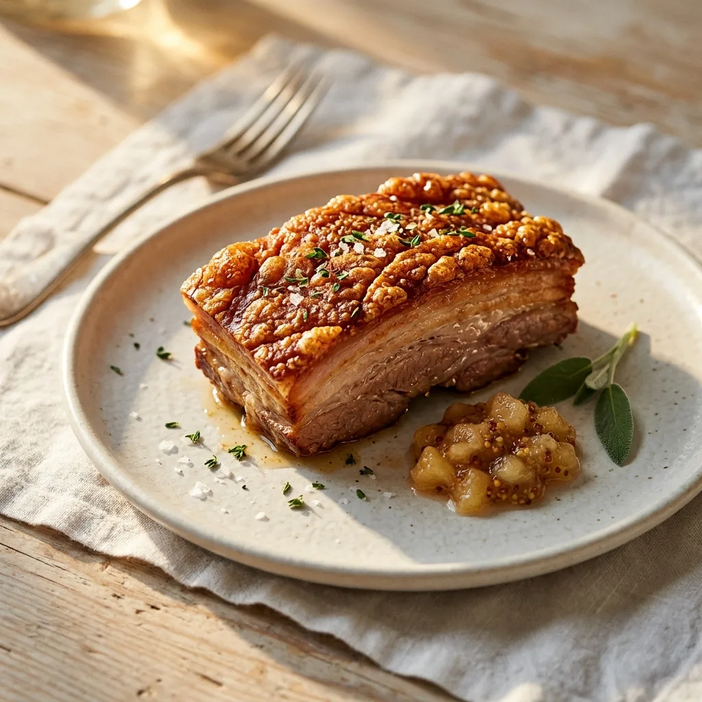

**#77 · Food &amp; Drink Prompt · <code>Vinano Image v2</code>**

<details>
<summary>Show prompt</summary>

```
“Luxury golden-hour styled hero shot of [FOOD] bathed in warm directional sunlight. Long soft shadows, glowing highlights, natural lens flares. Minimal white set subtle texture. Editorial lifestyle food photography aesthetic, rich color depth, atmospheric warmth, ultra-realistic detail, premium ad quality, 8K resolution.” Emphasise material texture and natural light so the final frame feels tactile and premium.
```

</details>

---

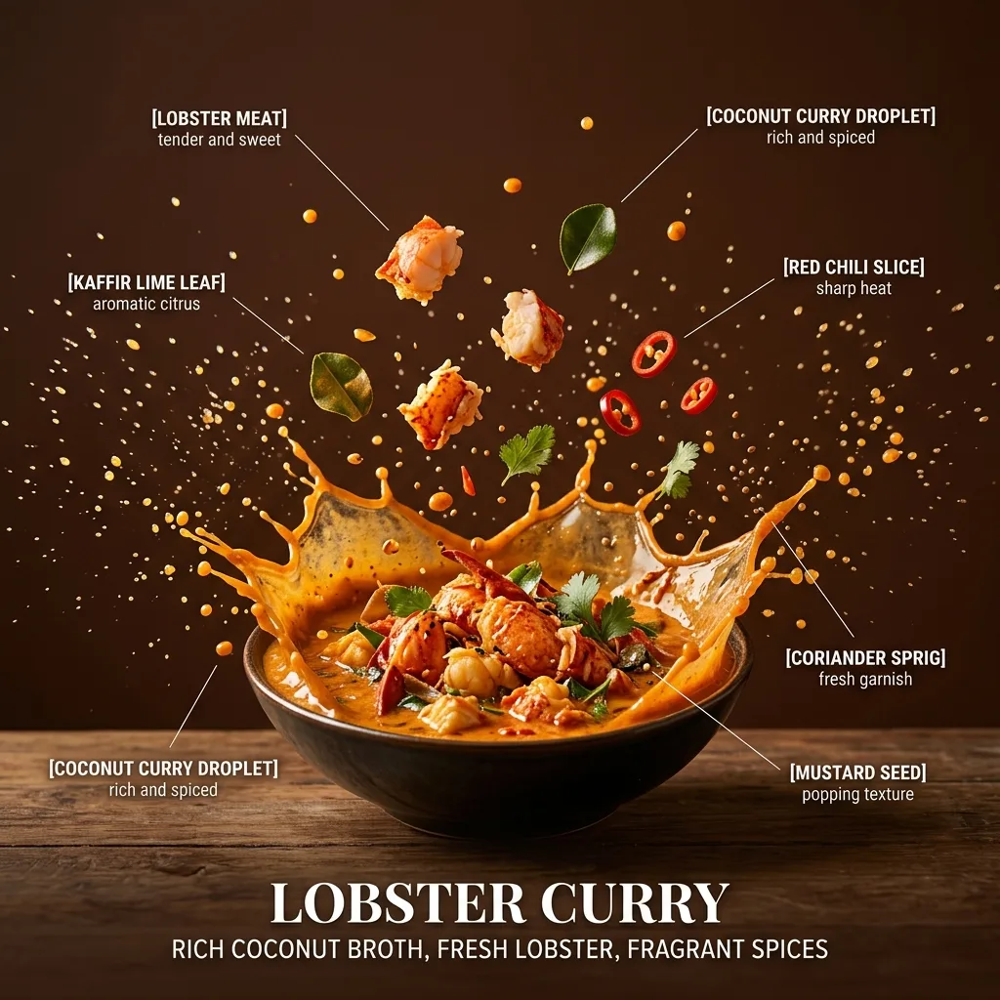

**#78 · Food &amp; Drink Prompt · <code>Vinano Image Pro</code>**

<details>
<summary>Show prompt</summary>

```
[DISH] captured at the exact millisecond of a dramatic liquid explosion, high-speed photography frozen in time, every droplet suspended mid-air razor precision. Hero [DISH] at center perfectly intact and hyperreal, surrounded by an orchestrated explosion of its own sauce, broth, or glaze erupting outward in every direction. Droplets catching dramatic single-source warm light like liquid diamonds. Each floating ingredient or droplet labeled ultra-thin lines in clean uppercase: "[INGREDIENT] [descriptor]". Dish name in bold editorial typography: "[DISH NAME]". Subtitle: "[TAGLINE]". Pure [COLOR] background. Mood: Harold Edgerton high-speed photography meets Michelin-star food editorial. 4K, tack sharp every droplet, extraordinary and craveable.

Check ALTs for ideas 👇

Preserve realistic proportions and depth for a confident, professional finish.
```

</details>

---

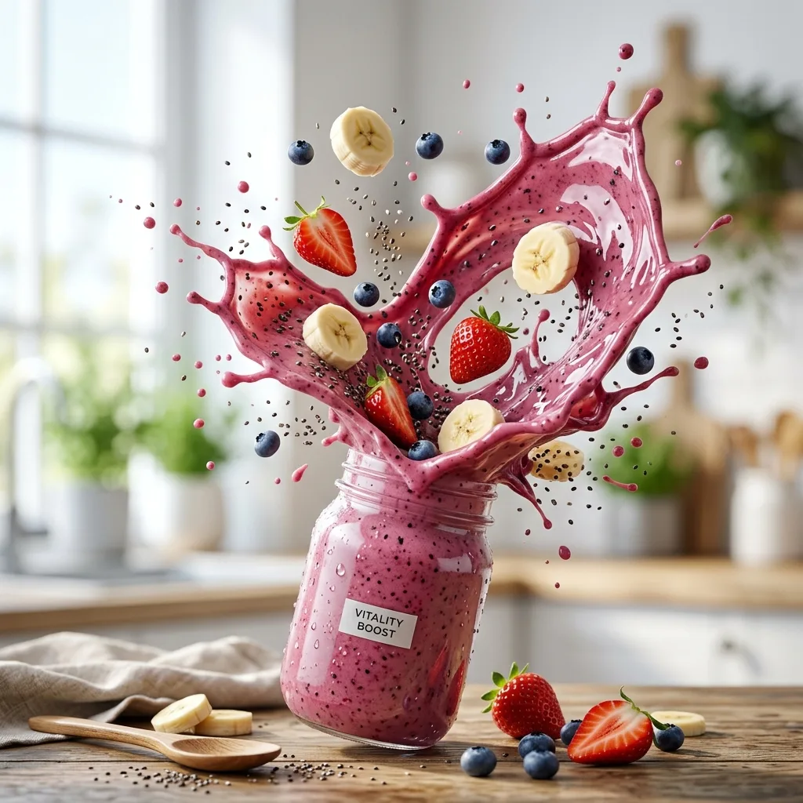

**#79 · Food &amp; Drink Prompt · <code>Vinano Image v2</code>**

<details>
<summary>Show prompt</summary>

```
Ultra-realistic smoothie explosion, banana slices, strawberry pieces, blueberry splash, chia seeds, liquid swirl frozen mid-air, bright studio lighting, glossy liquid texture, premium health drink ad style, shallow depth, ultra sharp, frozen motion, cinematic 8K realism --ar 2:3 --v 6 --style raw Preserve realistic proportions and depth for a confident, professional finish.
```

</details>

---

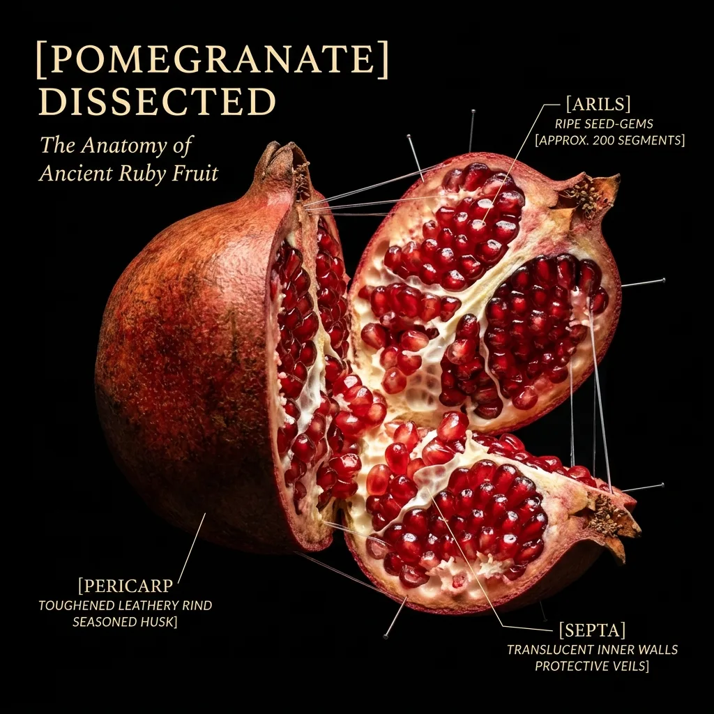

**#80 · Food &amp; Drink Prompt · <code>Vinano Image v2</code>**

<details>
<summary>Show prompt</summary>

```
[NATURAL OBJECT] dissected as if by a master naturalist who found it in the wild. Split and pinned open like a specimen, but lit as if Caravaggio worked for National Geographic.
Every internal structure glowing its own material truth. Cross-section so sharp it feels violent. Interior so beautiful it feels sacred. The full object present, one half intact, one half opened to its core, every layer at the resolution of obsession.
Background: pure black velvet. The object floats in it like something precious and dangerous.
Labels pressed close, handwritten-weight serif, never floating: "[STRUCTURE]" / "[MATERIAL TRUTH]" / "[AGE OR SCALE]"
"[OBJECT] DISSECTED" title in warm ivory caps, upper left. "[One line that makes you lean closer]" italic beneath.
Mood: Audubon illustration meets Caravaggio meets the most beautiful science photograph ever taken. 4K, specimen lighting, extraordinary interior detail, nothing clinical, everything alive.

Maintain consistent colour harmony and crisp focus across the whole frame.
```

</details>

---

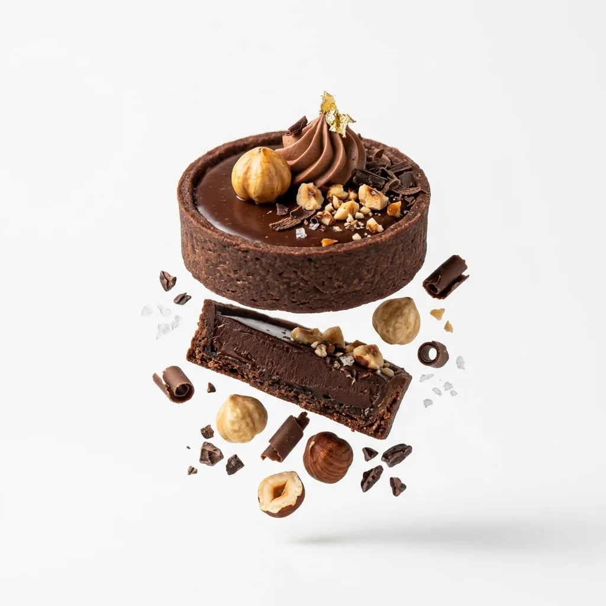

**#81 · Food &amp; Drink Prompt · <code>Vinano Image v2</code>**

<details>
<summary>Show prompt</summary>

```
[subject], premium food advertising, white seamless background, high key studio lighting, floating stacked composition, levitating pieces, [ingredient_bits] scattered, clean minimal layout, crisp soft shadow on surface, ultra realistic, macro product photography, 100mm lens look, f/8 sharp focus, subtle texture detail, editorial commercial, 8k Preserve realistic proportions and depth for a confident, professional finish.
```

</details>

---

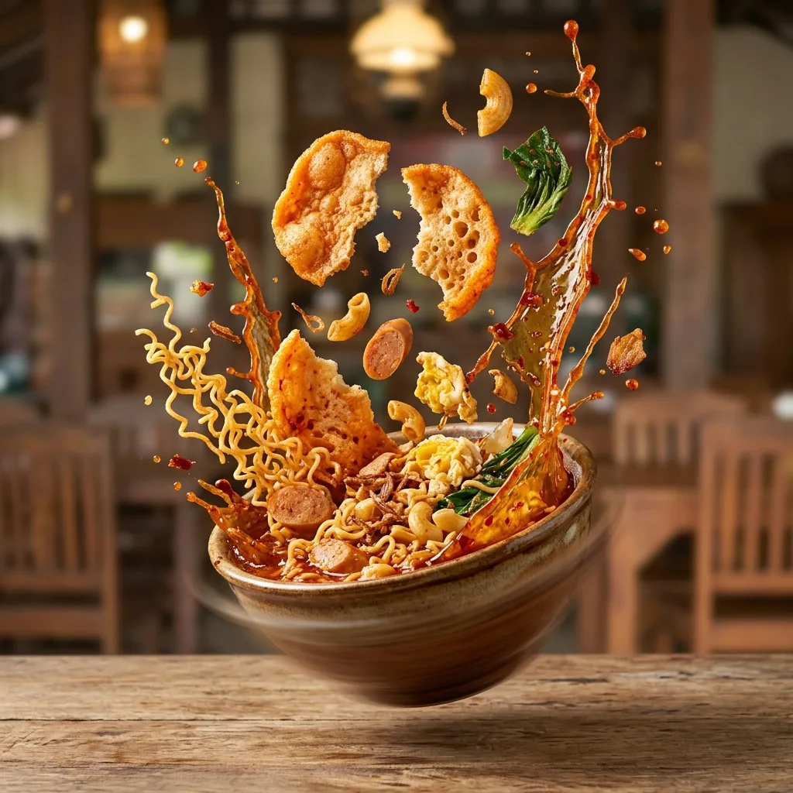

**#82 · Food &amp; Drink Prompt · <code>Vinano Image v2</code>**

<details>
<summary>Show prompt</summary>

```
Use uploaded photo as absolute main reference. Preserve Seblak kuah identity, ingredients, textures, and proportions; do not add anything not present.
Intact ceramic bowl rises in a smooth swirling twirl motion; slight controlled tilt, stable anchor.
Destroy ONLY the FOOD: crackers/kerupuk tear and split revealing bubbly porous texture; toppings (as in reference) separate naturally; spicy broth stretches

Maintain consistent colour harmony and crisp focus across the whole frame.
```

</details>

---

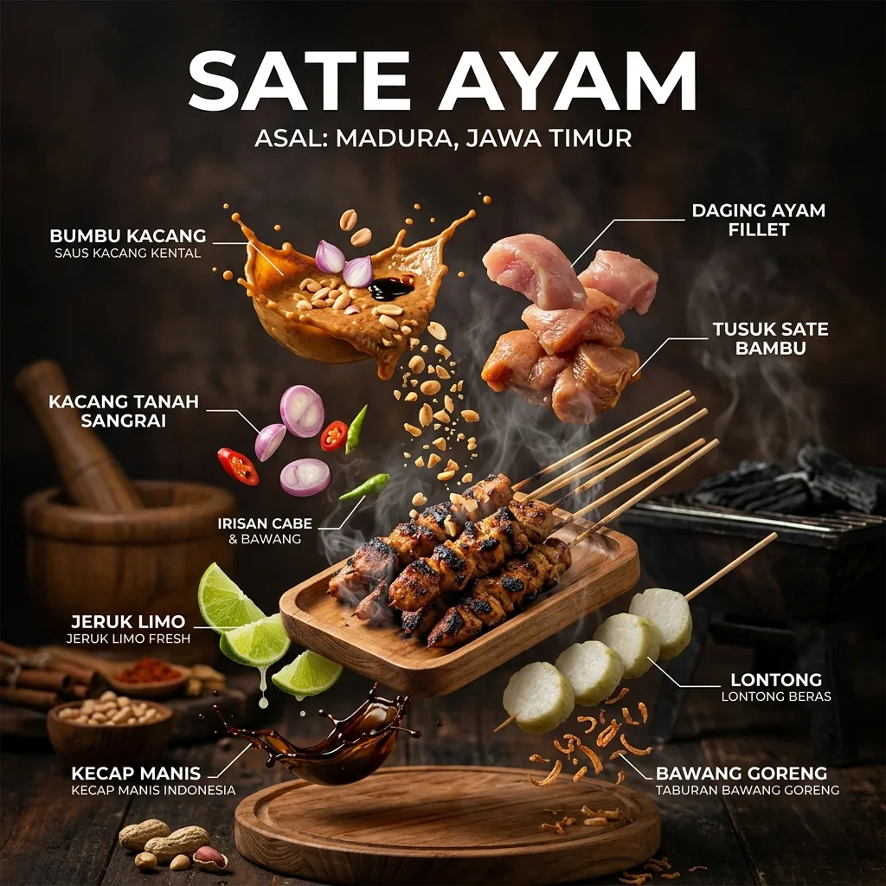

**#83 · Food &amp; Drink Prompt · <code>Vinano Image Pro</code>**

<details>
<summary>Show prompt</summary>

```
A hyper-realistic Indonesian food infographic poster dramatic floating ingredients. Vertical composition, bold title text at the top showing the dish name and origin (ASAL). Ingredients levitating in mid-air clean white label lines and Indonesian text. Cinematic food photography style, ultra-detailed textures, glossy sauces, charred meat, fresh vegetables, steam and smoke effects. Strong contrast lighting, editorial layout, modern typography, professional food magazine look, motion-frozen splashes, realistic shadows, studio lighting, shallow depth of field, 8K ultra-realistic, DSLR quality. Keep edges clean and the overall composition balanced for a polished, gallery-ready result.
```

</details>

---

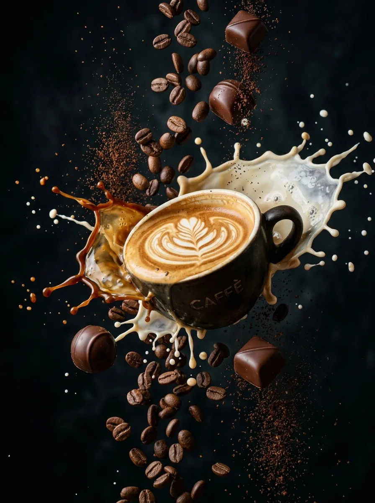

**#84 · Food &amp; Drink Prompt · <code>Vinano Image v2</code>**

<details>
<summary>Show prompt</summary>

```
{
 "composition": {
 "orientation": "vertical",
 "style": "ultra-cinematic",
 "scene_type": "mid-air suspended elements",
 "depth_of_field": "cinematic shallow depth"
 },
 "subject": {
 "main_elements": ["cascading roasted coffee beans",
 "floating chocolate bonbons",
 "mid-air coffee cup swirling latte art",
 "splashes of milk frozen in motion",
 "splashes of espresso frozen in motion",
 "fine coffee grounds dusting through the air"],
 "motion_state": "frozen action splash photography"
 },
 "color_palette": {
 "primary_colors": ["rich coffee brown",
 "warm cream",
 "espresso black"],
 "background": "deep velvety black"
 },
 "lighting": {
 "type": "dramatic high-contrast studio lighting",
 "highlights": "glossy reflections on liquids",
 "shadows": "deep cinematic shadows"
 },
 "texture_detail": {
 "liquids": ["glossy milk splashes",
 "glossy espresso splashes",
 "crema bubbles micro-detail"],
 "solids": ["matte roasted coffee beans",
 "smooth chocolate bonbon surfaces",
 "fine granular coffee grounds"]
 },
 "photography_style": {
 "genre": "premium café advertising",
 "aesthetic": "editorial splash photography",
 "clarity": "crisp ultra-detailed"
 },
 "camera": {
 "camera_model": "Nikon D850 (virtual)",
 "lens": "105mm macro",
 "aperture": "f/4.0",
 "focus": "sharp subject focus background falloff"
 },
 "render_quality": {
 "detail_level": "hyper-detailed",
 "realism": "true-to-life photorealistic",
 "finish": "high-end commercial output"
 }
}

Emphasise material texture and natural light so the final frame feels tactile and premium.
```

</details>

---

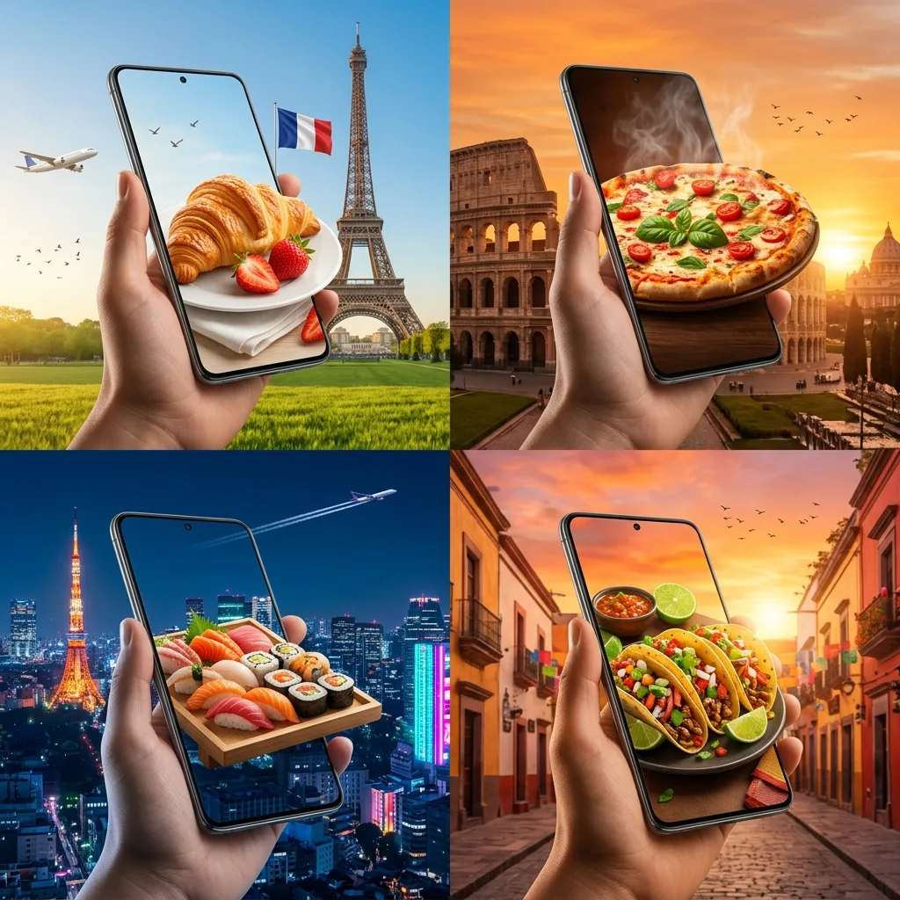

**#85 · Food &amp; Drink Prompt · <code>Vinano Image Pro</code>**

<details>
<summary>Show prompt</summary>

```
{
 "Create a hyper-realistic tourism advertisement collage in a single 1:1 image divided into a 2x2 grid. Each section shows a hand holding a sleek, ultra-thin smartphone in portrait orientation, slightly tilted to create a strong 3D portal effect where iconic national food emerges out of the phone screen into the real world. Consistent hand, phone design, and lighting style across all four panels.",
 "layout": {
 "type": "grid",
 "rows": 2,
 "columns": 2,
 "aspect_ratio": "1:1"
 },
 "scenes": [{
 "position": "top-left",
 "country": "France",
 "text": "France",
 "food": "Golden buttery croissant on a white plate strawberries",
 "background": "Eiffel Tower, green fields, bright blue sky",
 "elements": ["flying birds", "commercial airplane", "French flag"],
 "lighting": "warm natural daylight",
 "mood": "fresh, elegant, classic"
 },
 {
 "position": "top-right",
 "country": "Italy",
 "text": "Italy",
 "food": "Hot Italian pizza basil leaves and visible steam",
 "background": "Colosseum, Rome skyline at sunset",
 "elements": ["orange sky", "flying birds"],
 "lighting": "golden sunset light",
 "mood": "warm, passionate, flavorful"
 },
 {
 "position": "bottom-left",
 "country": "Japan",
 "text": "Japan",
 "food": "Assorted sushi and sashimi platter on wooden tray",
 "background": "Tokyo skyline at night Tokyo Tower and neon lights",
 "elements": ["airplane trail", "city glow"],
 "lighting": "cool night lighting neon highlights",
 "mood": "modern, clean, refined"
 },
 {
 "position": "bottom-right",
 "country": "Mexico",
 "text": "Mexico",
 "food": "Colorful street tacos lime and salsa",
 "background": "Colonial Mexican street warm sunset tones",
 "elements": ["birds flying", "festive atmosphere"],
 "lighting": "warm cinematic sunset",
 "mood": "vibrant, festive, energetic"
 }],
 "style": {
 "realism": "ultra-true-to-life photorealistic",
 "lighting": "cinematic",
 "depth": "strong depth of field and realistic shadows",
 "colors": "vibrant but natural tourism-ad palette",
 "quality": "4K ultra-sharp"
 },
 "constraints": {
 "no_watermark": true,
 "no_brand_logos": true,
 "no_extra_text": true,
 "clean_composition": true
 }
}

Render with rich micro-detail while keeping the layout uncluttered and intentional.
```

</details>

---

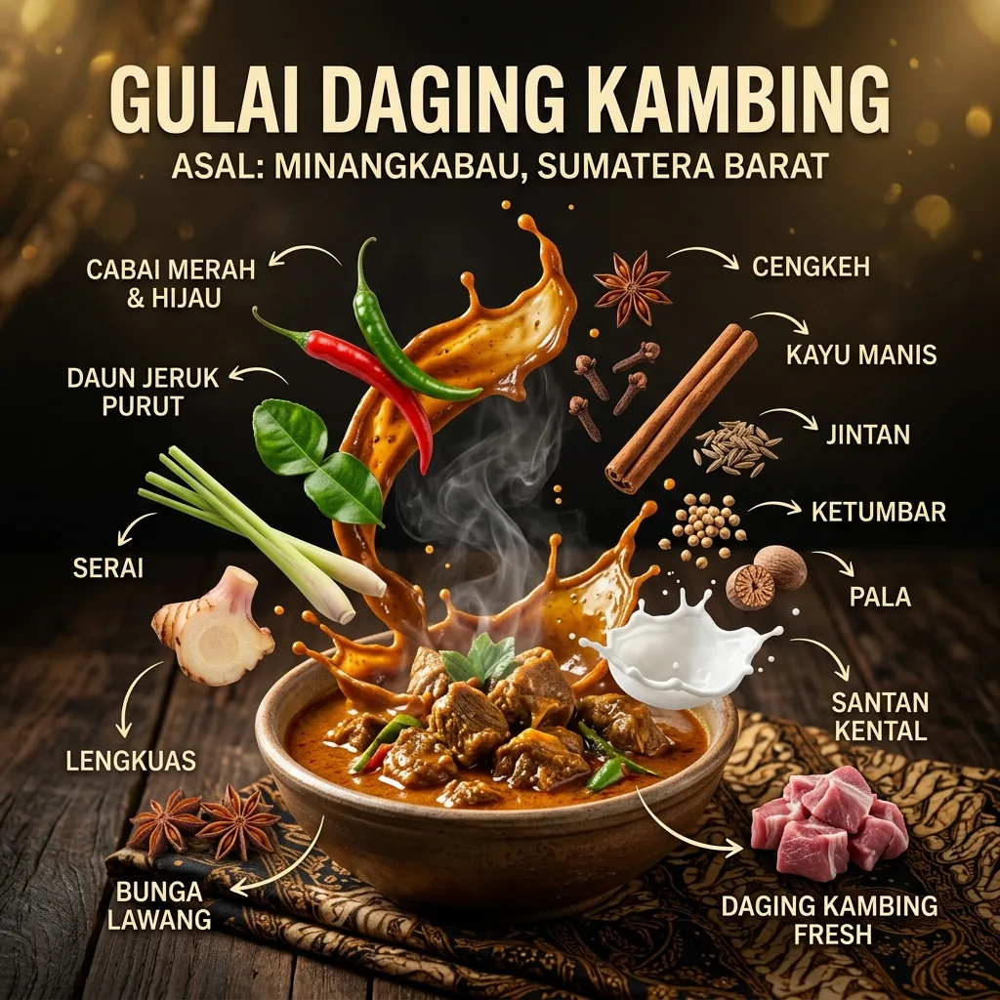

**#86 · Food &amp; Drink Prompt · <code>Vinano Image Pro</code>**

<details>
<summary>Show prompt</summary>

```
{
 "image_prompt": {
 "type": "Ultra-realistic Indonesian traditional food infographic poster",
 "layout_and_composition": {
 "orientation": "Vertical composition",
 "style": "Modern culinary infographic design, editorial layout",
 "background": "Dramatic but clean background"
 },
 "typography_elements": {
 "headline": {
 "position": "Top",
 "style": "Bold text showing dish name and origin (ASAL)"
 },
 "labels": {
 "style": "Clean Indonesian typography",
 "connectors": "Curved label arrows pointing to ingredients"
 }
 },
 "visual_content": {
 "main_action": "Cinematic floating ingredients suspended in mid-air",
 "details": ["Glossy curry splash",
 "Fresh herbs",
 "Spices",
 "Steam rising from the bowl"],
 "textures": "Hyper-detailed, glossy, appetizing"
 },
 "lighting_and_atmosphere": {
 "lighting_style": "Rich golden lighting, studio lighting",
 "mood": "Professional, appetizing, high-end"
 },
 "technical_specs": {
 "quality": "8K ultra-realistic, DSLR quality",
 "focus": "Shallow depth of field",
 "style": "Professional food photography"
 }
 }
}

Keep edges clean and the overall composition balanced for a polished, gallery-ready result.
```

</details>

---

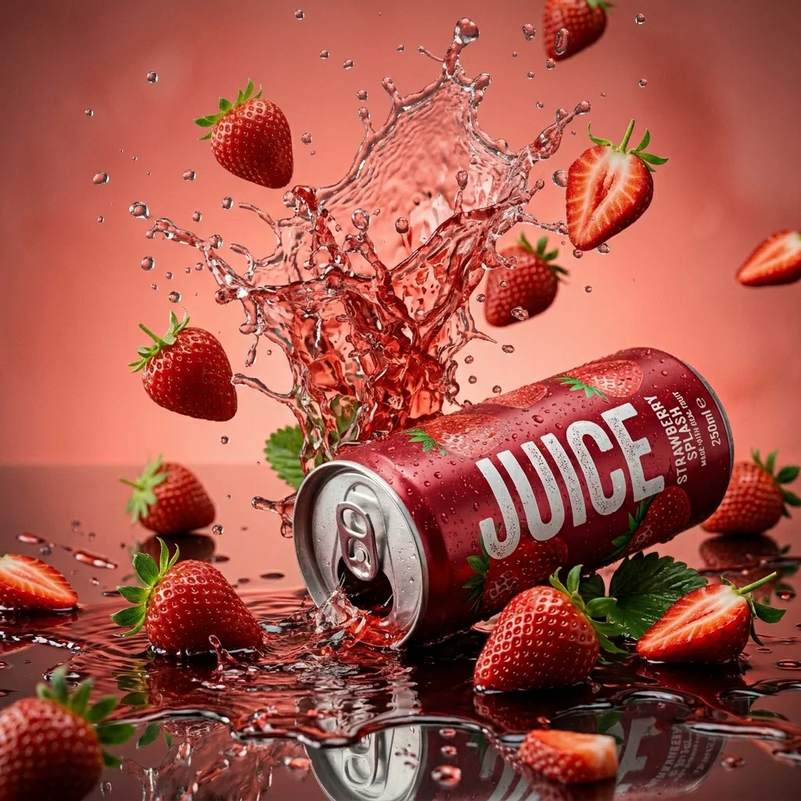

**#87 · Food &amp; Drink Prompt · <code>Vinano Image Pro</code>**

<details>
<summary>Show prompt</summary>

```
Ultra-realistic cinematic beverage product photography of a vibrant red aluminum juice can captured from a dramatic top-down three-quarter angle, the can lying diagonally on its side as if just knocked over, the opening facing toward the camera and a burst of clear liquid splashing outward in a sweeping arc across the frame; the can features bold white “Juice” typography and strawberry illustrations, partially wet condensation and splash residue; glossy liquid spreads across a reflective surface below, forming dynamic ripples and elongated reflections that lead the eye through the composition; fresh ripe strawberries—whole, sliced, and halved—are scattered asymmetrically around the can, some resting in the liquid pool, others frozen mid-air as if tossed, varying scale and depth for cinematic layering; background is a smooth coral-to-rose gradient studio backdrop viewed at an angle, enhancing depth and motion; lighting is dramatic filmic, cinematic lighting a strong side key light creating sharp highlights on the can rim and liquid splash, rim lighting separating strawberries from the background, and deep soft shadows adding contrast and mood; color palette is bold and saturated strawberry red, crimson liquid, fresh green leaves, and warm pink tones; composition is dynamic and off-center diagonal energy, shallow depth of field isolating the can while foreground splashes remain crisp and background elements softly fall off; mood is energetic, high-impact, and cinematic, evoking premium blockbuster-style beverage advertising hyper-realistic fluid dynamics, ultra-detailed textures, dramatic contrast, and 8K ultra-high-definition realism. Keep edges clean and the overall composition balanced for a polished, gallery-ready result.
```

</details>

---

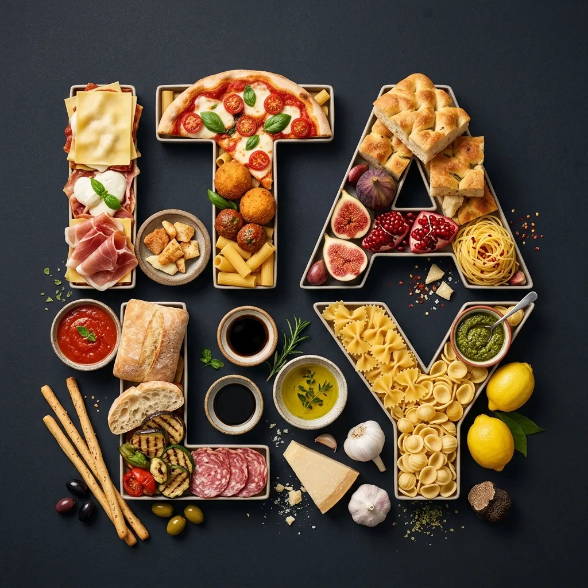

**#88 · Food &amp; Drink Prompt · <code>Vinano Image Pro</code>**

<details>
<summary>Show prompt</summary>

```
A premium-quality digital illustration of the word [COUNTRY NAME] spelled in bold, uppercase letters. The typography is sculptural and dimensional, each letter subtly overlapping or stacked to enhance depth and visual flow. Set against a rich, dark-toned background that complements the palette of the ingredients.

Each letter is intricately filled iconic traditional foods from [COUNTRY], such as [SIGNATURE BREADS / FRUITS / SPICES / DISH ELEMENTS], carefully arranged to follow the contours of the typography. Small bowls of [TRADITIONAL SAUCES / CONDIMENTS] and scattered ingredients are integrated naturally within the composition.

The food elements are styled in an art-directed, editorial manner – balanced, textured, and visually rich – gentle overlaps for realism. Soft, diffused lighting enhances natural textures and depth, creating a warm, appetizing, premium aesthetic.

Ultra-detailed, crisp composition, food-photography-inspired digital illustration, high contrast, refined visual storytelling.

Aim for an editorial, design-driven look with deliberate negative space.
```

</details>

---

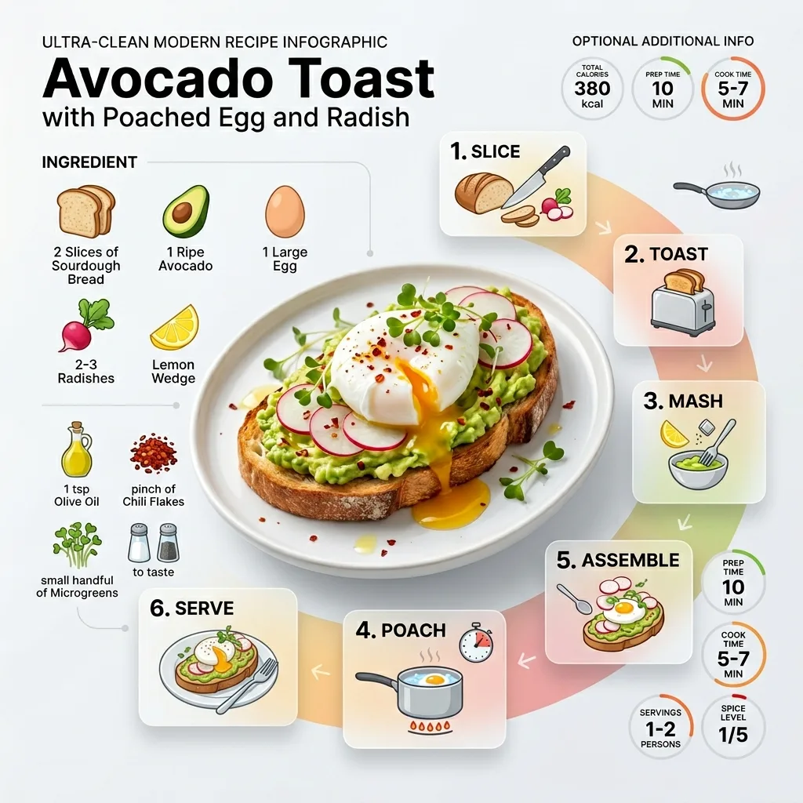

**#89 · Food &amp; Drink Prompt · <code>Vinano Image Pro</code>**

<details>
<summary>Show prompt</summary>

```
Ultra-clean modern recipe infographic.

Showcase [FOOD] in a visually appealing finished form—sliced, plated, or portioned—floating slightly in perspective or angled view.

Arrange ingredients, steps, and tips around the dish in a dynamic editorial layout, not restricted to top-down.

Ingredients Section:

Include icons or mini illustrations for each ingredient quantities. Arrange them in clusters, lists, or circular flows connected visually to the dish.

Steps Section:

Show preparation steps numbered panels, arrows, or lines, forming a logical flow around the main dish. Include small cooking icons (knife, pan, oven, timer) where helpful.

Additional Info (optional):

Total calories, prep/cook time, servings, spice level—displayed as clean bubbles or badges near the dish.

Visual Style:

Editorial infographic meets lifestyle food photography. Vibrant, natural food colors, subtle drop shadows, clean vector icons, modern typography, soft gradients or glassmorphism for step panels. Accent colors can highlight key info (calories, prep time).

Composition Guidelines:

Finished meal as hero visual (perspective or angled). Ingredients and steps flow dynamically around the dish. Clear visual hierarchy: dish > steps > ingredients > optional stats. Enough negative space to keep design airy and readable.

Lighting & Background:

Soft, natural studio lighting. Minimal textured or gradient background for premium editorial feel.

Output:

1080×1080, ultra-crisp, social-feed optimized, no watermark

Aim for an editorial, design-driven look with deliberate negative space.
```

</details>

---

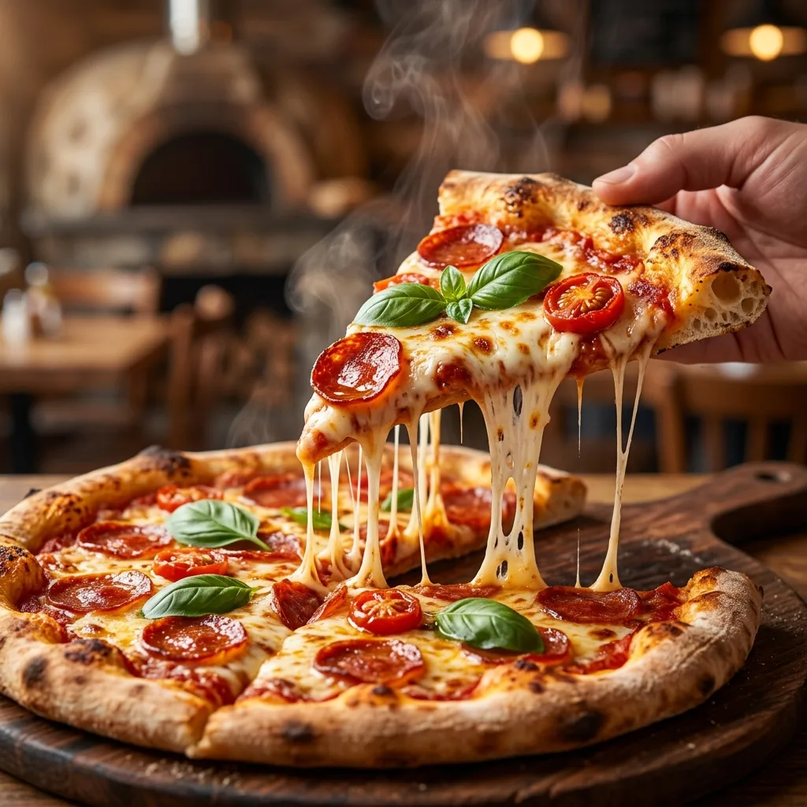

**#90 · Food &amp; Drink Prompt · <code>Vinano Image v2</code>**

<details>
<summary>Show prompt</summary>

```
A hyper-realistic, cinematic close-up of a freshly baked pepperoni pizza slice being lifted from the pie, long, dramatic cheese pulls stretching down in silky strands.
Golden, slightly charred crust visible texture, bubbling mozzarella, glossy pepperoni slices, fresh basil leaves on top, and juicy cherry tomatoes scattered across the pizza.
Soft steam rising from the hot slice, creating a warm, mouth-watering atmosphere.
Shot on a DSLR, 50mm lens, shallow depth of field, sharp focus on the cheese stretch, background softly blurred.
Warm studio lighting natural highlights, rich colors, realistic shadows, premium food-advertisement look.

Maintain consistent colour harmony and crisp focus across the whole frame.
```

</details>

---

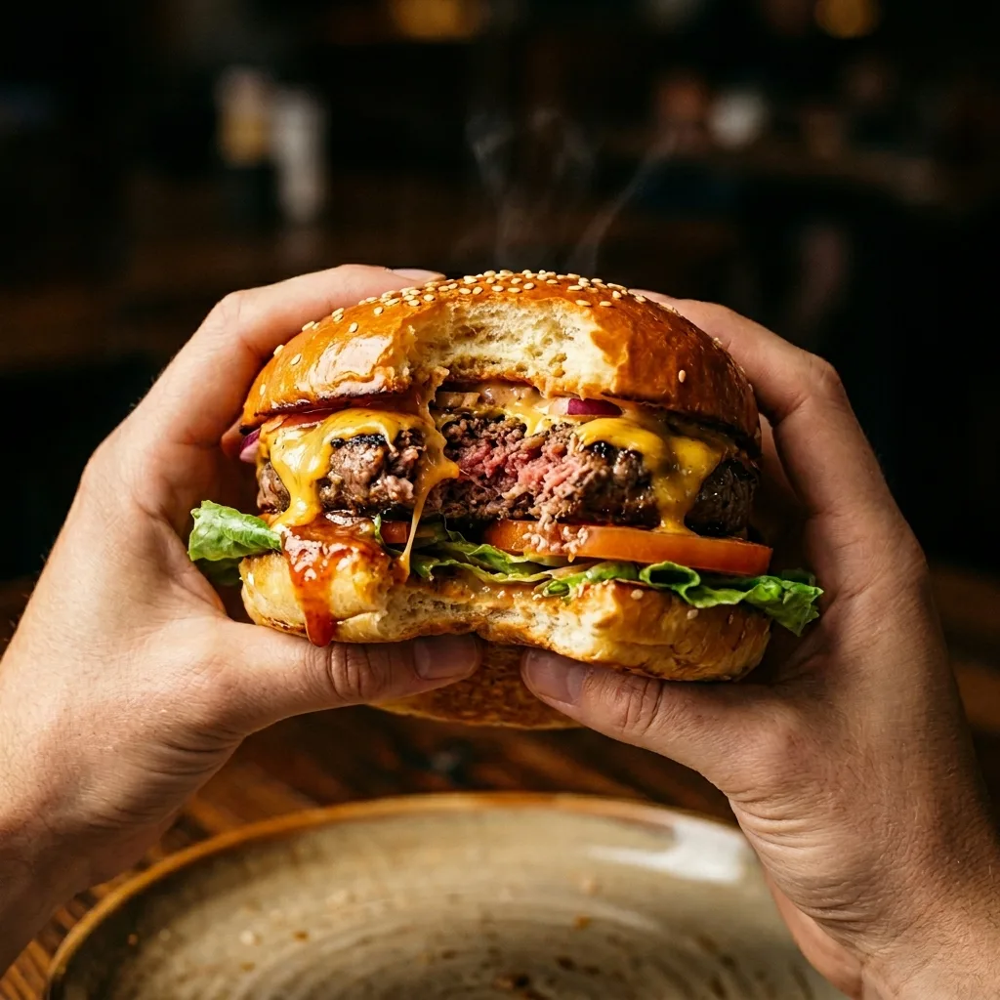

**#91 · Food &amp; Drink Prompt · <code>Vinano Image v2</code>**

<details>
<summary>Show prompt</summary>

```
{
 "content_goal": "viral food visual extreme craving appeal",
 "image_type": "ultra-true-to-life photorealistic food action photography",
 "visual_style": {
 "aesthetic": "cinematic food editorial, hyper-real",
 "vibe": "juicy, indulgent, irresistible",
 "realism": "high-end commercial food realism"
 },
 "composition": {
 "framing": "tight close-up or medium close-up",
 "camera_angle": "slightly low or front-facing",
 "subject_position": "centered hero bite moment",
 "perspective": "depth-rich strong foreground focus"
 },
 "subject": {
 "description": "large gourmet burger captured mid-bite",
 "bite_action": "visible bite mark compressed layers",
 "ingredients": "juicy beef patty, melted cheese, fresh lettuce, tomato, sauce drip",
 "details": "cheese stretch, sauce gloss, steam rising"
 },
 "texture_details": {
 "bun": "soft toasted bun sesame seeds",
 "patty": "juicy visible meat fibers",
 "cheese": "melted, glossy, stretching",
 "sauce": "thick, dripping naturally"
 },
 "human_element": {
 "hands": "realistic hands holding burger",
 "bite_mark": "natural teeth impression",
 "skin_detail": "natural skin texture, clean nails"
 },
 "lighting": {
 "type": "dramatic food lighting",
 "quality": "warm, directional, high-contrast",
 "direction": "side or top-side light emphasizing gloss",
 "highlight_focus": "cheese melt and sauce texture",
 "shadow_style": "deep but controlled shadows"
 },
 "color_palette": {
 "primary": ["golden brown", "cheese yellow", "deep red"],
 "accent": ["lettuce green"],
 "mood": "rich, bold, indulgent"
 },
 "environment": {
 "location": "burger joint, café, or studio food setup",
 "background": "dark, blurred background to isolate burger",
 "atmosphere": "warm, indulgent, street-food luxury"
 },
 "camera_details": {
 "camera_type": "professional DSLR / mirrorless simulation",
 "lens": "85mm or macro food lens",
 "focus": "tack-sharp on bite area",
 "depth_of_field": "shallow for dramatic bokeh",
 "resolution": "advertising-grade clarity"
 },
 "quality_control": {
 "food_realism": "hyper-real textures, no plastic look",
 "bite_accuracy": "natural compression of ingredients",
 "ai_artifacts": "none",
 "professional_finish": "commercial food photography quality"
 },
 "overall_mood": "mouth-watering, bold, indulgent",
 "intended_use": {
 "primary": "viral food post on X",
 "secondary": "restaurant branding, food editorial, ads"
 }
}

Aim for an editorial, design-driven look with deliberate negative space.
```

</details>

---

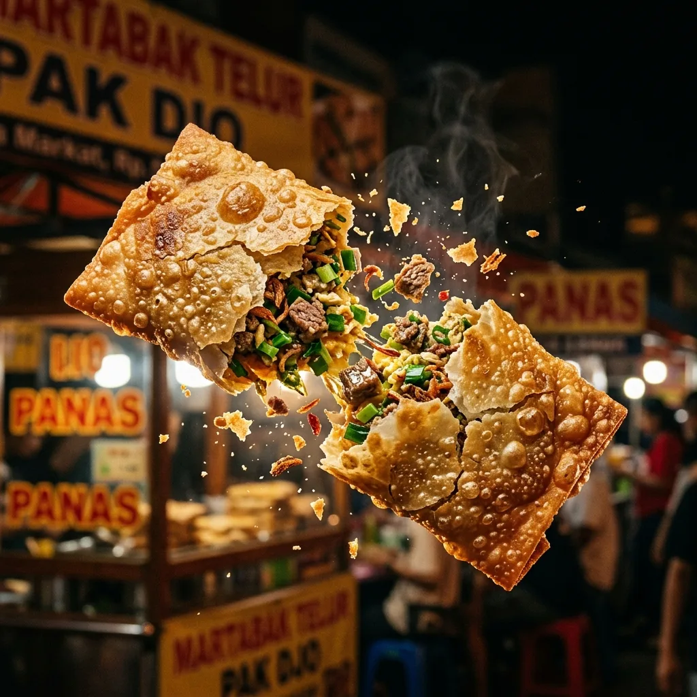

**#92 · Food &amp; Drink Prompt · <code>Vinano Image Pro</code>**

<details>
<summary>Show prompt</summary>

```
"Macro food photography of a crispy martabak telur tearing open mid-air, thin golden wrapper shattering a crack, hot filling of minced beef, scallions, and egg bursting outward. Flecks of fried onion and pepper suspended in motion, steam visible, glossy oil sheen catching the light. Warm Indonesian street-stall lighting, tungsten + charcoal warmth, dramatic rim light, ultra high texture detail (bubbled wrapper, layered interior).Editorial food shot, shallow depth of field, bokeh of night market signage, Nikon Z9 look, 105mm macro, fast shutter freeze, hyper-real crumbs. --ar 3:4" Aim for an editorial, design-driven look with deliberate negative space.
```

</details>

---

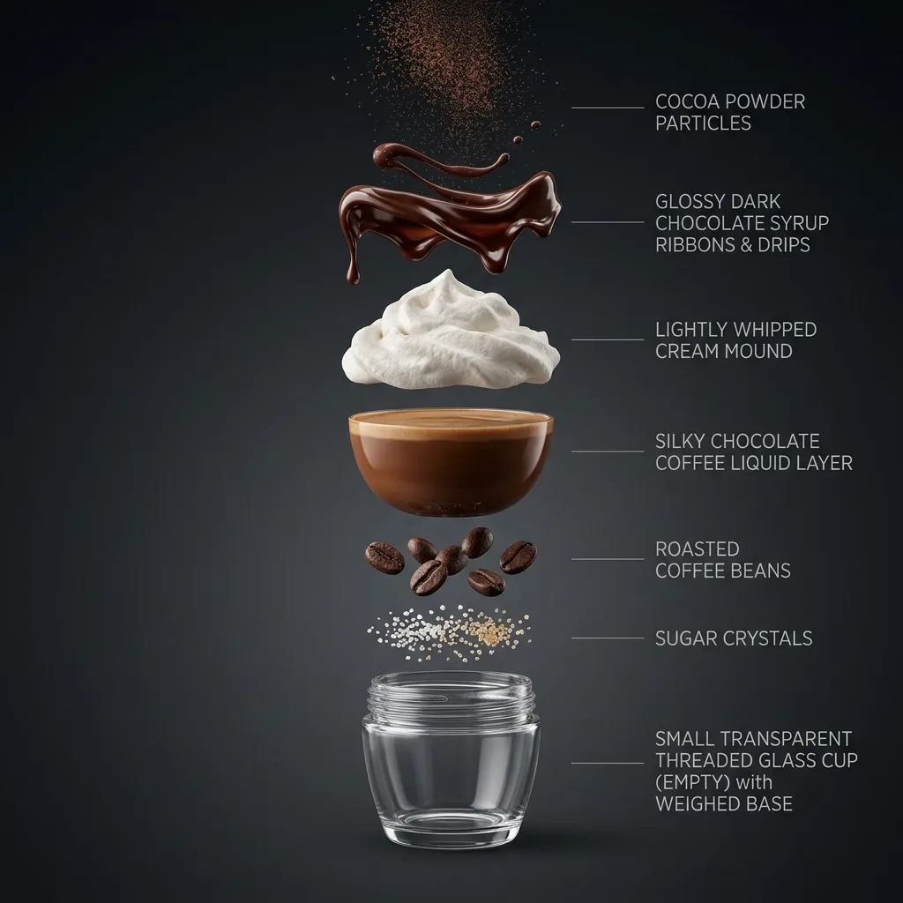

**#93 · Food &amp; Drink Prompt · <code>Vinano Image v2</code>**

<details>
<summary>Show prompt</summary>

```
{
“subject”: “巧克力咖啡饮品的超写实垂直爆炸分解图”,
“layout”: “中心垂直对齐，各组件独立悬浮且间距清晰”,
“layers”: [{
“component”: “可可粉微粒”,
“position”: “顶部”
},
{
“component”: “光泽深色巧克力酱丝带与滴落状”,
“position”: “独立层”
},
{
“component”: “轻盈的打发奶油堆”,
“position”: “独立层”
},
{
“component”: “丝滑的巧克力咖啡液态层”,
“position”: “独立层”
},
{
“component”: “烘焙咖啡豆”,
“position”: “独立层”
},
{
“component”: “糖晶体”,
“position”: “独立层”
},
{
“component”: “带配重底座的小型透明螺纹玻璃杯（空杯）”,
“position”: “底部”
}],
“background”: “高级深色背景：干净的影棚背景，近黑色的石墨色至木炭色渐变，柔和且平滑”,
“lighting_and_style”: {
“lighting”: “柔和且受控的影棚光，每层下方有清晰的分层阴影”,
“detail”: “超锐利微距写实主义，右侧极简细指示线与英文标签”,
“category”: “高端产品信息图”,
“resolution”: “8K”
}
}

追求杂志编辑式的设计感，刻意安排留白与视觉重心。
```

</details>

---

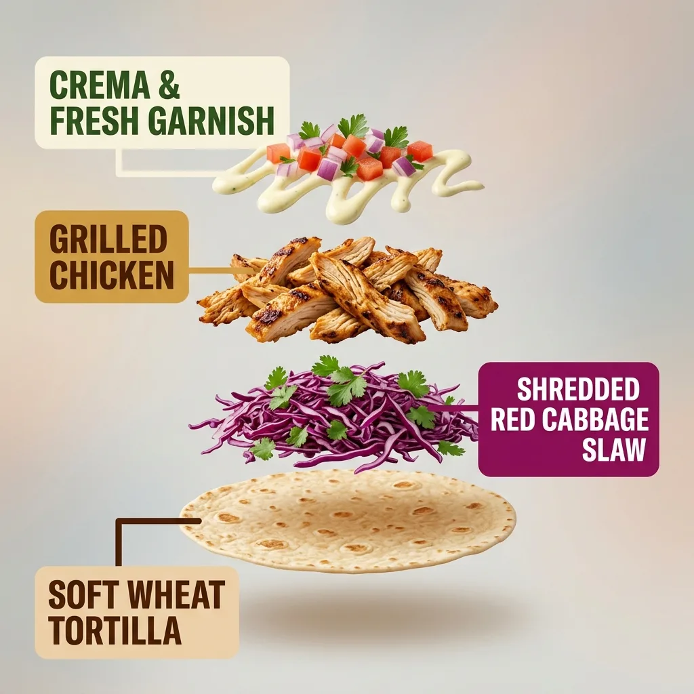

**#94 · Food &amp; Drink Prompt · <code>Vinano Image Pro</code>**

<details>
<summary>Show prompt</summary>

```
A high-end commercial food photograph of the same two tacos from the reference image, preserving their exact structure, fillings, proportions, and arrangement. The camera angle is slightly adjusted to a more flattering three-quarter close-up, enhancing depth and appetite appeal without altering the tacos themselves. Soft filmic, cinematic lighting highlights the textures of the tortillas and fillings, subtle steam and natural sheen to emphasize freshness. The background is replaced a clean, modern, out-of-focus setting in warm complementary tones that enhance the food without distracting from it. Shallow depth of field, crisp focus on the tacos, rich contrast, natural colors, and premium restaurant advertising quality. No added or removed ingredients, refined composition, lighting, and environment.

Image 2: Exploded-view commercial visualization of the taco from the image, presented as premium recipe-style breakdown.

The taco is deconstructed into four visible ingredients, matching the original taco precisely in composition, color, and texture. No additional ingredients.

The ingredients are separated and arranged in a clean vertical stack, evenly spaced from bottom to top, floating in place precise alignment and symmetry.

Ingredient order (bottom → top):

Soft wheat taco tortilla

Shredded red cabbage

Grilled chicken pieces

Sauce garnish (topped a small mixed garnish of diced onion, tomato, and parsley, approximately 5–6 small cubes total, lightly mixed, placed naturally on top)

Each ingredient is visually distinct and clearly readable in shape and texture.

Annotation design requirements:

– Large, bold sans-serif font, high legibility at feed scale

– Each annotation placed inside a solid or softly rounded rectangular color block

– Background color of each block corresponds subtly to the ingredient color (tomato red, lettuce green, meat warm brown, sauce white/cream, pita beige)

– High contrast text (dark on light, light on dark)

– Thick, clean connector lines pointing clearly to each ingredient

– No transparency that reduces readability

– Annotations must visually dominate over background without covering ingredients

Background is soft, neutral, and atmospheric, subtle depth and gentle gradients, inspired by premium food advertising.

Overall style is clean, modern, and appetizing, commercial-ready without technical or schematic feel.

No extra elements, no substitutions, no reinterpretation of ingredients.

Render with rich micro-detail while keeping the layout uncluttered and intentional.
```

</details>

---

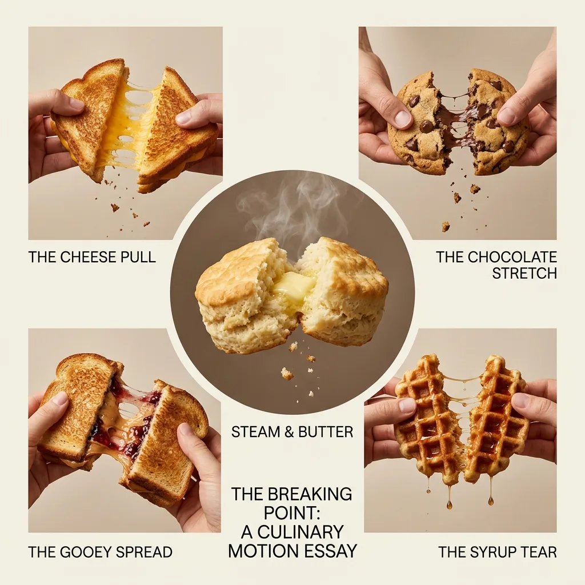

**#95 · Food &amp; Drink Prompt · <code>Vinano Image v2</code>**

<details>
<summary>Show prompt</summary>

```
{
 "model": " / Gemini-style",
 "aspect_ratio": "3:4",
 "render_mode": "raw",
 "series": [{
 "index": "1/5",
 "prompt": "two hands pulling apart a grilled cheese sandwich, strands of melted cheddar stretching dramatically between the halves, toasted bread edges crisp and golden, crumbs falling mid-air, warm cozy light, cinematic food action photography",
 "category": "cheese pull",
 "lighting": "warm cozy cinematic light",
 "detail_level": "high-detail"
 },
 {
 "index": "2/5",
 "prompt": "two hands breaking a warm chocolate chip cookie in half, melted chocolate strands stretching between the pieces, crumbs falling mid-air, cozy warm light, high-detail food action photography",
 "category": "chocolate stretch",
 "lighting": "soft cozy warm light",
 "detail_level": "high-detail"
 },
 {
 "index": "3/5",
 "prompt": "two hands splitting a peanut butter and jelly sandwich in half, thick peanut butter and jam stretching in gooey strands, toasted bread edges crisp, crumbs falling mid-air, warm cozy backlight, high-detail food action photography",
 "category": "gooey spread pull",
 "lighting": "warm backlight",
 "detail_level": "high-detail"
 },
 {
 "index": "4/5",
 "prompt": "two hands tearing a syrup-soaked Belgian waffle, caramel strands stretching between pieces, crumbs and syrup droplets suspended mid-air, golden hour backlight, cozy cinematic food action photography",
 "category": "syrup stretch",
 "lighting": "golden hour backlight",
 "detail_level": "ultra-detailed"
 },
 {
 "index": "5/5",
 "prompt": "two hands breaking a southern-style buttery biscuit in half, hot steam rising, melted butter pooling inside the cracks, crumbs falling mid-air, warm country kitchen light, cinematic high-detail food action photography",
 "category": "steam & butter",
 "lighting": "warm kitchen light",
 "detail_level": "ultra-detailed"
 }]
}

Aim for an editorial, design-driven look with deliberate negative space.
```

</details>

---

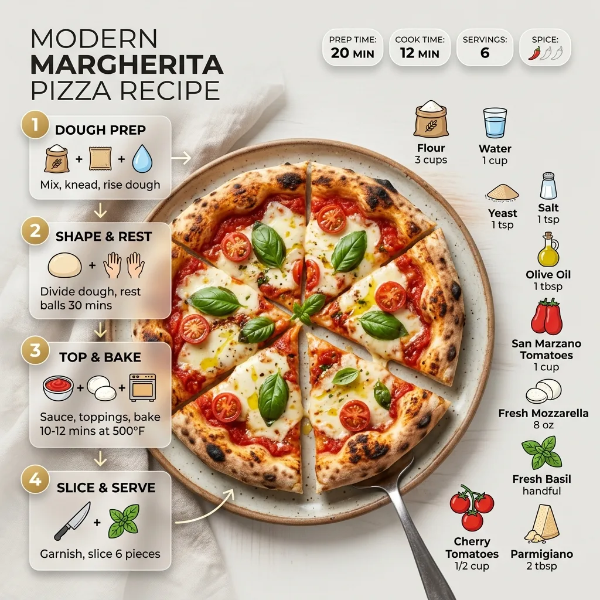

**#96 · Food &amp; Drink Prompt · <code>Vinano Image Pro</code>**

<details>
<summary>Show prompt</summary>

```
Ultra-clean modern recipe infographic. Showcase Pizza in a visually appealing finished form—sliced, plated, or portioned—floating slightly in perspective or angled view. Arrange ingredients, steps, and tips around the dish in a dynamic editorial layout, not restricted to top-down. Ingredients Section: Include icons or mini illustrations for each ingredient quantities. Arrange them in clusters, lists, or circular flows connected visually to the dish. Steps Section: Show preparation steps numbered panels, arrows, or lines, forming a logical flow around the main dish. Include small cooking icons (knife, pan, oven, timer) where helpful. Additional Info (optional): Total calories, prep/cook time, servings, spice level—displayed as clean bubbles or badges near the dish. Visual Style: Editorial infographic meets lifestyle food photography. Vibrant, natural food colors, subtle drop shadows, clean vector icons, modern typography, soft gradients or glassmorphism for step panels. Accent colors can highlight key info (calories, prep time). Composition Guidelines: Finished meal as hero visual (perspective or angled) Ingredients and steps flow dynamically around the dish Clear visual hierarchy: dish > steps > ingredients > optional stats Enough negative space to keep design airy and readable Lighting & Background: Soft, natural studio lighting, minimal textured or gradient background for premium editorial feel. Output: 1080×1080, ultra-crisp, social-feed optimized, no watermark.” Aim for an editorial, design-driven look with deliberate negative space.
```

</details>

---

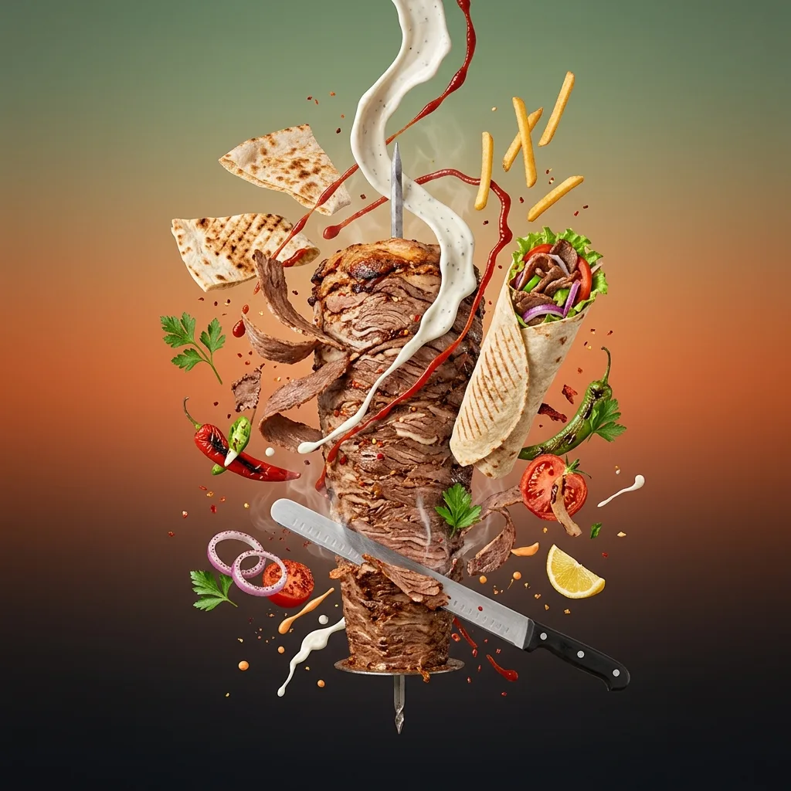

**#97 · Food &amp; Drink Prompt · <code>Vinano Image v2</code>**

<details>
<summary>Show prompt</summary>

```
{
 "resolution": "8K UHD",
 "aspect_ratio": "3:4",
 "image_style": "hyper-realistic commercial food photography",
 "global_settings": {
 "quality": "Ultra-high detail, razor-sharp focus, premium street food clarity",
 "lighting": "Controlled studio lighting emphasizing meat texture, char marks, and sauce glistening",
 "motion": "Frozen mid-air elements subtle gravity realism",
 "background_style": "Solid or smooth gradient background, color varies per module",
 "camera": "High-speed photography look, shallow to medium depth of field",
 "post_processing": "Rich contrast, warm savory tones, natural shine, appetizing color grading"
 },
 "modules": {

 "module_1_classic_doner_slice_explosion": {
 "scene_description": "A dramatic vertical döner stack flying meat slices and sauce droplets",
 "doner": {
 "type": "Traditional Turkish döner kebab slices",
 "texture": "Thinly sliced beef and lamb mix visible char marks",
 "cut": "Paper-thin ribbons",
 "position": "Stacked vertically and floating mid-air"
 },
 "details": {
 "char_marks": "Dark caramelized edges grill stripes",
 "fat_marbling": "Glistening fat streaks between meat layers",
 "seasoning": "Visible spice particles on meat surface"
 },
 "motion_effects": {
 "meat_slices": "Individual döner slices spiraling outward",
 "sauce": "White garlic sauce and red chili sauce droplets splashing",
 "herbs": "Fresh parsley leaves floating in air"
 },
 "background": {
 "color": "Deep crimson red",
 "texture": "Smooth, seamless"
 }
 },

 "module_2_minimal_doner_durum_floating": {
 "scene_description": "refined minimalist premium döner dürüm presentation controlled floating ingredients",
 "doner": {
 "type": "Perfectly wrapped dürüm (wrap) cross-section",
 "arrangement": "Single dürüm cut in half, floating vertically",
 "surface": "Lightly toasted lavash bread golden char marks"
 },
 "accent_elements": {
 "filling": "Layered döner meat, lettuce, tomatoes, onions visible in cross-section",
 "sauce": "White garlic yogurt sauce drizzling elegantly",
 "vegetables": "Fresh red tomato slices, crisp lettuce, purple onion rings"
 },
 "motion_effects": {
 "particles": "Subtle floating spice particles and herb fragments",
 "drops": "Sauce droplets frozen mid-fall"
 },
 "background": {
 "color": "Warm terracotta orange",
 "gradient": "Very soft tonal gradient"
 }
 },

 "module_3_doner_sauce_pour_drama": {
 "scene_description": "Cinematic sauce pour over döner meat pile",
 "doner": {
 "type": "Mountain of freshly sliced döner meat",
 "texture": "Highly detailed crispy edges and tender interior"
 },
 "additional_elements": {
 "sauces": {
 "white_sauce": {
 "state": "Thick creamy garlic yogurt sauce pouring from above",
 "motion": "Frozen in elegant flowing ribbon"
 },
 "red_sauce": {
 "state": "Spicy red chili sauce drizzling alongside",
 "motion": "Thin crimson streams intertwining white sauce"
 }
 },
 "vegetables": ["Sliced tomatoes",
 "Chopped lettuce",
 "Thinly sliced onions",
 "Fresh parsley sprigs"]
 },
 "motion_effects": {
 "splashes": "Micro sauce splashes on meat surface",
 "particles": "Floating spice particles and herb fragments",
 "steam": "Subtle heat vapor rising from meat"
 },
 "background": {
 "color": "Dark charcoal black",
 "tone": "High contrast, premium street food aesthetic"
 }
 },

 "module_4_modern_doner_deconstructed_composition": {
 "scene_description": "Modern deconstructed döner composition in mid-air",
 "elements": {
 "bread": "Pieces of toasted lavash bread floating separately",
 "meat": "Individual döner slices suspended at different angles",
 "vegetables": "Tomato slices, lettuce leaves, onion rings floating between layers",
 "sauces": "Glossy sauce ribbons connecting elements artistically"
 },
 "motion_effects": {
 "particles": "Ultra-fine spice dust suspended in air",
 "drops": "Scattered sauce droplets frozen in motion",
 "steam": "Minimal heat waves rising from meat"
 },
 "background": {
 "color": "Muted sage green",
 "texture": "Smooth, seamless"
 }
 },

 "module_5_rotating_doner_spit_close_up": {
 "scene_description": "Extreme close-up of döner meat on vertical spit knife slice frozen in time",
 "doner_spit": {
 "type": "Vertical döner tower on rotating spit",
 "texture": "Layers of seasoned meat charred outer crust",
 "detail": "Visible spices, fat marbling, and grill marks"
 },
 "action_elements": {
 "knife": "Large döner knife mid-slice through meat",
 "meat_slice": "Fresh slice falling away from spit",
 "shavings": "Meat shavings and crispy bits floating"
 },
 "motion_effects": {
 "particles": "Charred bits and seasoning particles in air",
 "steam": "Heat vapor wisps rising from fresh cut"
 },
 "background": {
 "color": "Rich golden amber",
 "texture": "Smooth gradient"
 }
 },

 "module_6_doner_plate_overhead_explosion": {
 "scene_description": "Overhead shot of döner plate ingredients exploding upward",
 "composition": {
 "base": "Thin lavash bread pieces on bottom",
 "center": "Pile of döner meat slices",
 "explosion": "All ingredients bursting upward in circular pattern"
 },
 "flying_elements": ["Döner meat slices spiraling",
 "French fries launching upward",
 "Grilled peppers and tomatoes",
 "Fresh parsley and sumac",
 "Sauce droplets spraying",
 "Lemon wedges"],
 "motion_effects": {
 "height_variation": "Elements at different heights creating depth",
 "rotation": "Some elements rotating while airborne"
 },
 "background": {
 "color": "Deep burgundy red",
 "style": "Vignette effect focusing on center"
 }
 }

 },
 "negative_prompt": ["text",
 "logos",
 "branding",
 "hands",
 "people",
 "utensils beyond döner knife",
 "full plates visible",
 "tables",
 "restaurant interior",
 "cartoon style",
 "raw meat",
 "excessive grease pooling",
 "burnt or overcooked appearance",
 "overexposure",
 "artificial glow",
 "low detail textures",
 "unappetizing colors",
 "plastic-looking food"]
}

Aim for an editorial, design-driven look with deliberate negative space.
```

</details>

---

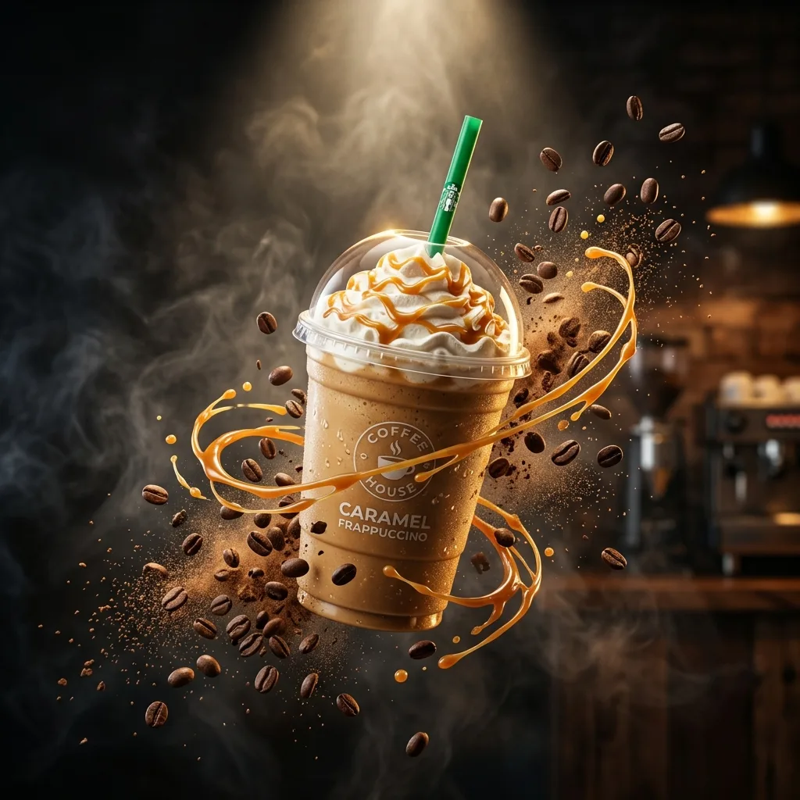

**#98 · Food &amp; Drink Prompt · <code>Vinano Image v2</code>**

<details>
<summary>Show prompt</summary>

```
Ultra-realistic commercial product photography of a caramel frappuccino in a clear plastic cup dome lid and green straw, topped whipped cream and caramel drizzle, floating mid-air. Coffee beans exploding around the cup fine coffee powder dust particles suspended in the air, dynamic caramel splash trails swirling around the drink. Dark smoky background dramatic spotlight from above, warm golden rim lighting, high contrast, sharp focus, macro details, cinematic depth of field, hyper-detailed texture, premium beverage advertisement, 8K resolution. Preserve realistic proportions and depth for a confident, professional finish.
```

</details>

---

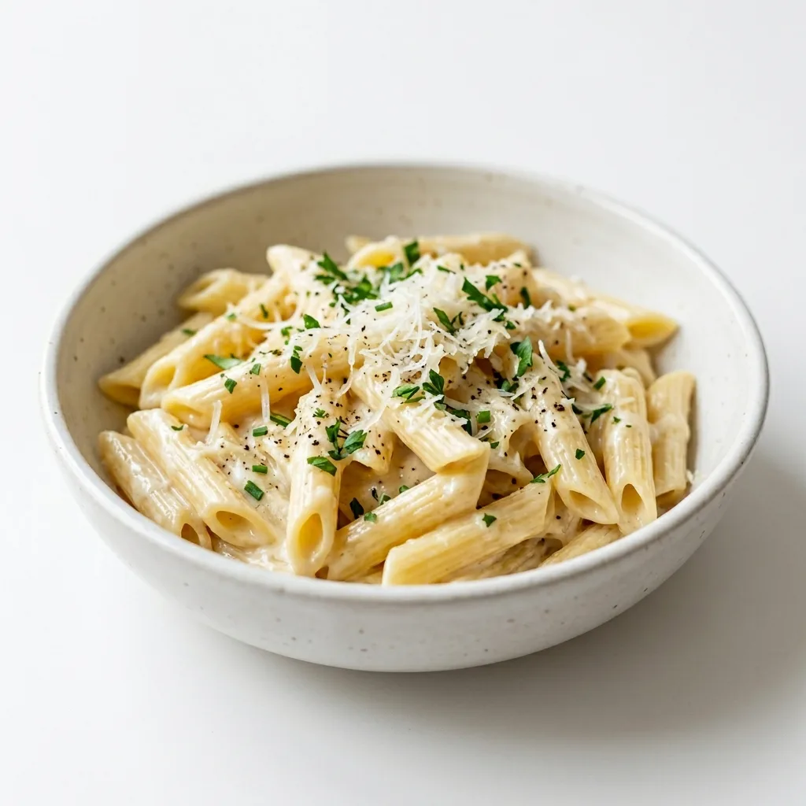

**#99 · Food &amp; Drink Prompt · <code>Vinano Image v2</code>**

<details>
<summary>Show prompt</summary>

```
Ultra-realistic food photography of a prepared creamy white sauce penne pasta served in a minimal ceramic bowl. Perfectly cooked penne coated evenly in rich, glossy cream sauce, topped freshly grated parmesan cheese and finely chopped green herbs. Clean white studio background, soft diffused lighting, gentle shadows under the bowl, natural highlights on the sauce, realistic texture and thickness. Centered composition, shallow depth of field, premium restaurant-style presentation, high-detail food styling, 8K quality, sharp focus, no text, no labels, no hands, no props, no watermark. Keep edges clean and the overall composition balanced for a polished, gallery-ready result.
```

</details>

---

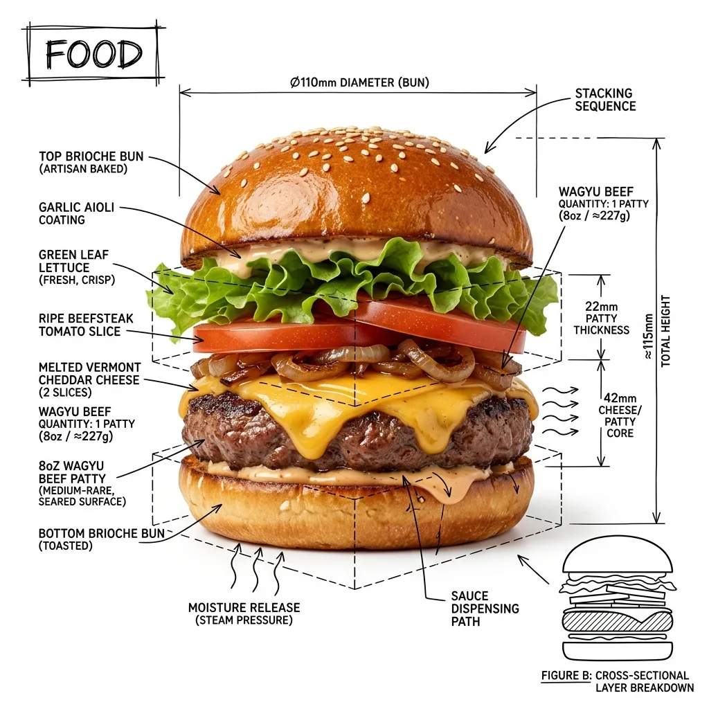

**#100 · Food &amp; Drink Prompt · <code>Vinano Image Pro</code>**

<details>
<summary>Show prompt</summary>

```
Create an infographic image of [FOOD], combining a realistic photograph or photoreal render of the object technical annotation overlays placed directly on top.

Use black ink–style line drawings and text (technical pen / architectural sketch look) on a pure white studio background, including:
•Key component labels
•Internal cutaway or exploded-view outlines
•Measurements, dimensions, and scale markers
•Material callouts and quantities
•Arrows indicating function, force, or flow (air, sound, power, pressure)
•Simple schematic or sectional diagrams where relevant

Place the title “FOOD” inside a hand-drawn technical annotation box in one corner.

Style & layout rules:
•The real object remains clearly visible beneath the annotations
•Annotations feel sketched, technical, and architectural
•crisp composition balanced negative space
•Educational, museum-exhibit / engineering-manual vibe

Visual style:
Minimal technical illustration aesthetic, black linework over realistic imagery, precise but slightly hand-drawn feel.

Color palette:
White background, black annotation lines and text only. No colors.

Output:
1080×1080, ultra-crisp, social-feed optimized, no watermark.

Render with rich micro-detail while keeping the layout uncluttered and intentional.
```

</details>

---

[Next page →](./food-drink-2.md)
