# Illustration & 3D — full gallery

[← Back to README](../README.md) · [`prompts.json`](../prompts/prompts.json) · **409** prompts · page 2 / 5

[← Prev](./illustration-3d.md) — [1](./illustration-3d.md) · **2** · [3](./illustration-3d-3.md) · [4](./illustration-3d-4.md) · [5](./illustration-3d-5.md) — [Next →](./illustration-3d-3.md)

---

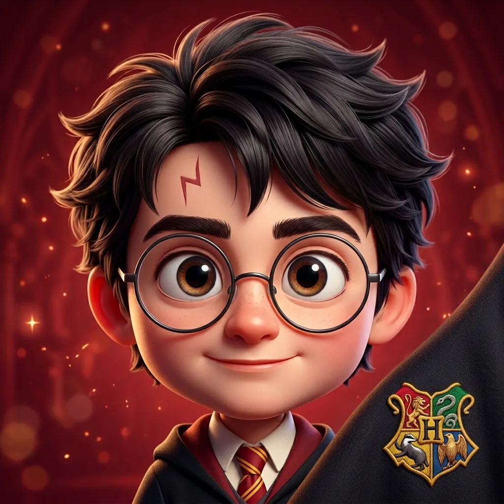

**#101 · Illustration &amp; 3D Prompt · <code>Vinano Image Pro</code>**

<details>
<summary>Show prompt</summary>

```
premium-quality stylized 3D CGI big-head cartoon render of Harry Potter, square profile picture composition, oversized head and small shoulders in a playful Pixar-style caricature. Head and facial features exaggerated while keeping him instantly recognizable: messy dark hair, round glasses, lightning-shaped scar on the forehead, curious and brave expression. Portrait framing focused on the large head a small portion of the shoulders visible, wearing Hogwarts robe collar and tie. Smooth polished materials, glossy animated film shading refined Pixar-style character rendering. Soft filmic, cinematic lighting creating gentle highlights on the glasses. refined minimalist bright magical red background inspired by Hogwarts colors, crisp composition optimized for social media profile pictures, ultra-detailed, no text, no watermark. Keep edges clean and the overall composition balanced for a polished, gallery-ready result.
```

</details>

---

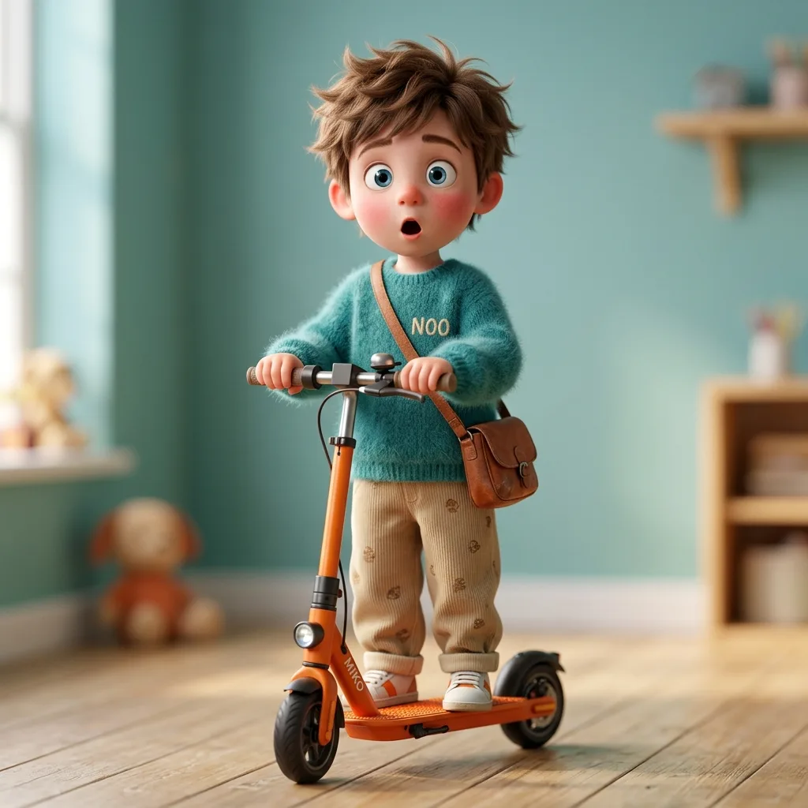

**#102 · Illustration &amp; 3D Prompt · <code>Vinano Image v2</code>**

<details>
<summary>Show prompt</summary>

```
3D Pixar-style animated child character, cute young boy messy brown hair and big expressive blue eyes, surprised open-mouth expression, soft round face, wearing a fuzzy teal sweater small “noo” text on chest, loose beige patterned pants, white sneakers, small brown crossbody bag, standing on an orange electric scooter, minimal teal studio background, soft, diffused lighting, ultra-detailed textures (fabric fuzz, skin, hair), cinematic depth of field, vibrant colors, highly polished render, octane render, 4k Emphasise material texture and natural light so the final frame feels tactile and premium.
```

</details>

---

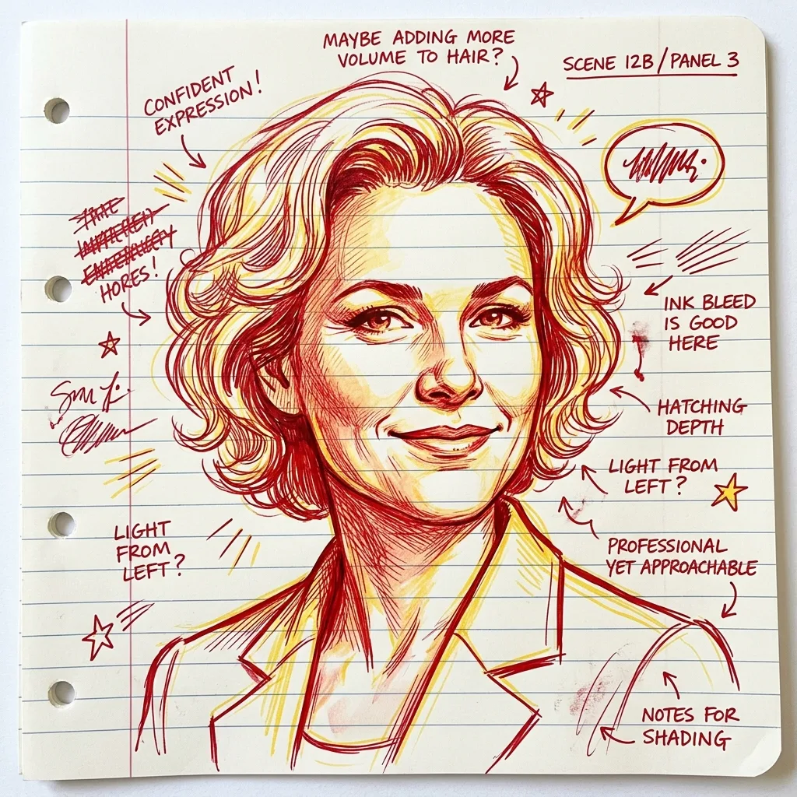

**#103 · Illustration &amp; 3D Prompt · <code>Vinano Image v2</code>**

<details>
<summary>Show prompt</summary>

```
Use the image I sent. Create a hand-drawn portrait illustration red and yellow pen on notebook paper, inspired by comic book drawings and annotations. Maintain a complete likeness to the subject, expressive lines, spontaneous gestures, sharp and bright outlines, handwritten annotations around the edges, and a realistic texture of the pen strokes. AR 3:4 Preserve realistic proportions and depth for a confident, professional finish.
```

</details>

---

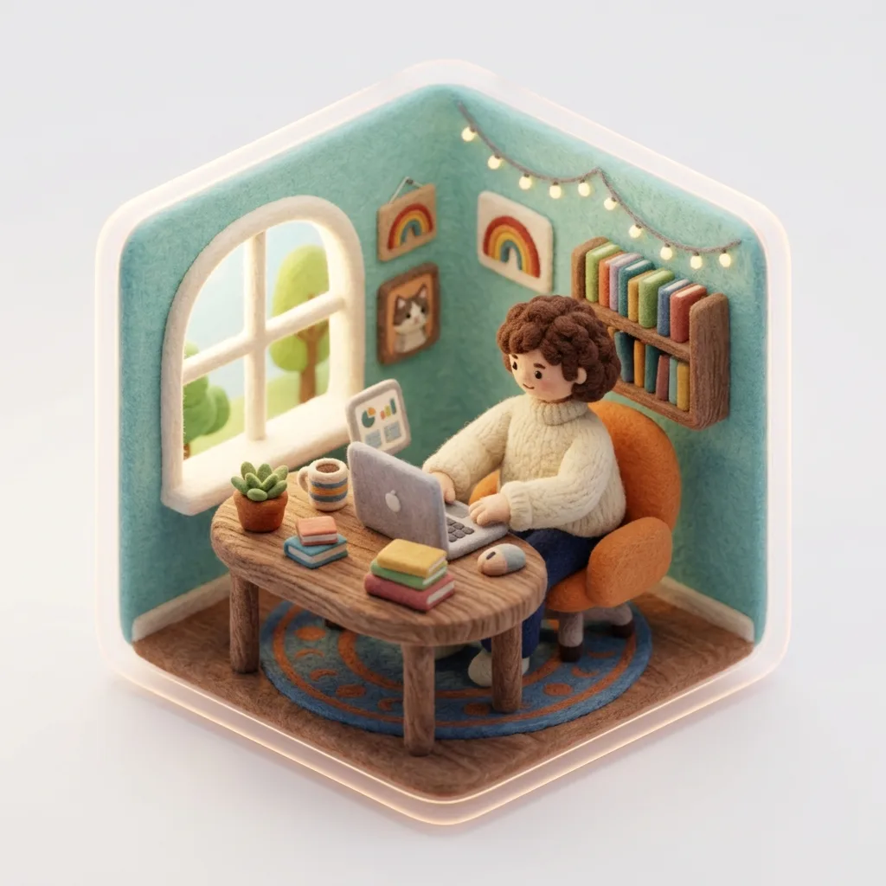

**#104 · Illustration &amp; 3D Prompt · <code>Vinano Image Pro</code>**

<details>
<summary>Show prompt</summary>

```
Generate a 3D isometric diorama illustration of [CHARACTER] working from home at a desk a laptop and a window. Handmade felt appearance rounded polished shapes, enclosed in a hexagonal rounded cube frame. The room decor, colours, furniture, wall art, and accessories are all instantly recognisable to [CHARACTER] — reflecting their signature style, iconic items, outfit, and personality. Warm soft, diffused lighting, clean white background, 1080x1080, true-to-life photorealistic quality. No text labels or signs on the base. Emphasise material texture and natural light so the final frame feels tactile and premium.
```

</details>

---

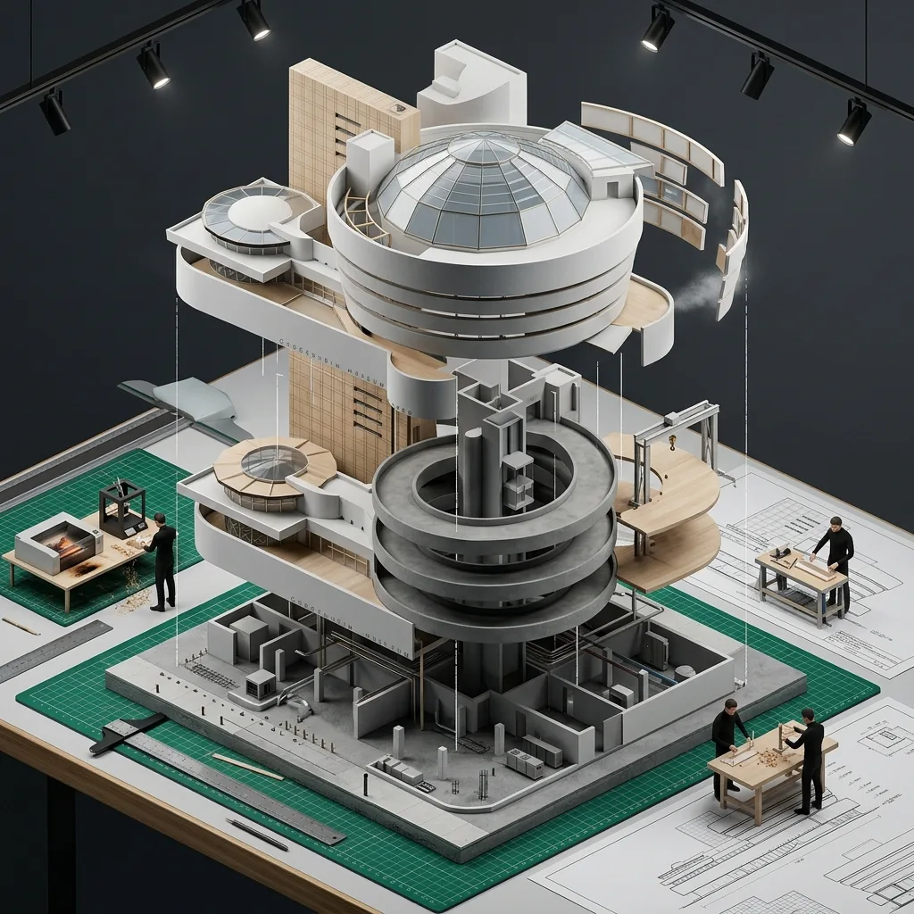

**#105 · Illustration &amp; 3D Prompt · <code>Vinano Image Pro</code>**

<details>
<summary>Show prompt</summary>

```
Input Variable: [Any Famous Building - Guggenheim, Burj Khalifa, Sydney Opera House, etc.]
System Instruction:
Generate a hyper-realistic, isometric 3D "Exploded View" diorama showing the Input Building deconstructed into its structural systems an architectural model-making crew assembling a scale version.
1. Semantic Engineering Analysis:

Layer 1 (The Skin): Exterior facade panels, windows, cladding, roofing, entrance canopy
Layer 2 (The Structure): Steel framework, floor plates, columns, beams, elevator shafts, stairwells, mechanical systems
Layer 3 (The Foundation): Basement levels, support pillars, utility conduits, HVAC units, individual rivets/bolts, rebar cages

2. Container:

Surface: Architect's drafting table cutting mats and T-squares
Layout: Building layers stacked vertically showing ground-up construction sequence
Connections: White architectural section lines showing structural load paths and circulation
Additional Elements: Blueprint sheets, scale rulers, material samples, elevation drawings

3. Micro-Narrative:

CRITICAL: This is meta - tiny workers building a model that's being built by tiny workers. Recursive scale concept.
Workers: 1:87 scale model makers in black turtlenecks (architect stereotype)
Equipment: Laser cutters, 3D printers, basswood cutting stations, acrylic gluing rigs, miniature cranes positioning floor plates
Interaction: Architects cutting foam core, assembling balsa wood frames, installing tiny windows, spray painting facades, arranging scale furniture

4. Visual Syntax & Material Physics:

Materials: Basswood grain, clear acrylic sheets, white foam core, brass rod framework, museum board textures
Lighting: Architecture studio track lighting creating dramatic model shadows
Special Effects: Glue strands, wood shavings, spray paint mist, laser cutter burn marks
Output: Elevated three-quarter view, architectural presentation, 1:1 ratio, 8K, Archdaily model photography aesthetic

Aim for an editorial, design-driven look with deliberate negative space.
```

</details>

---

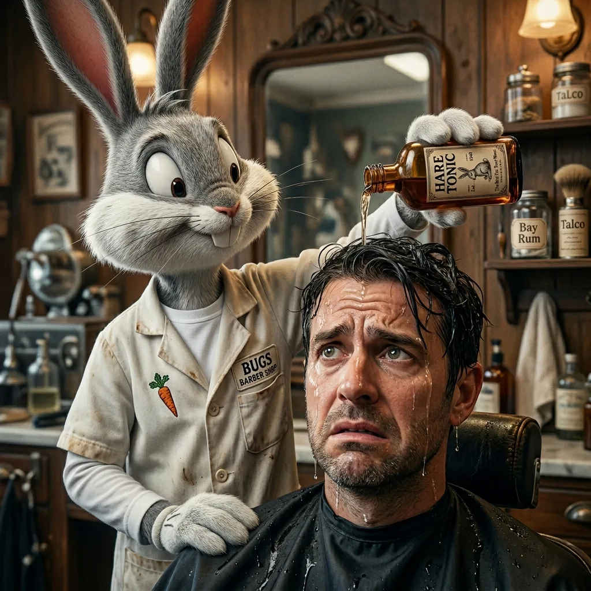

**#106 · Illustration &amp; 3D Prompt · <code>Vinano Image v2</code>**

<details>
<summary>Show prompt</summary>

```
Cinematic 8k hyper-realistic close-up shot. A 3D realistic Bugs Bunny, faithful to his classic design but detailed fur texture, wearing a white barber uniform. He is holding a bottle labeled "HARE TONIC" and pouring liquid onto the head of a sitting man. Man [photos reference hair] has a worried and nervous expression, water dripping down his face. Vintage barbershop background a mirror. Dynamic lighting, high detail, true-to-life photorealistic rendering style Preserve realistic proportions and depth for a confident, professional finish.
```

</details>

---

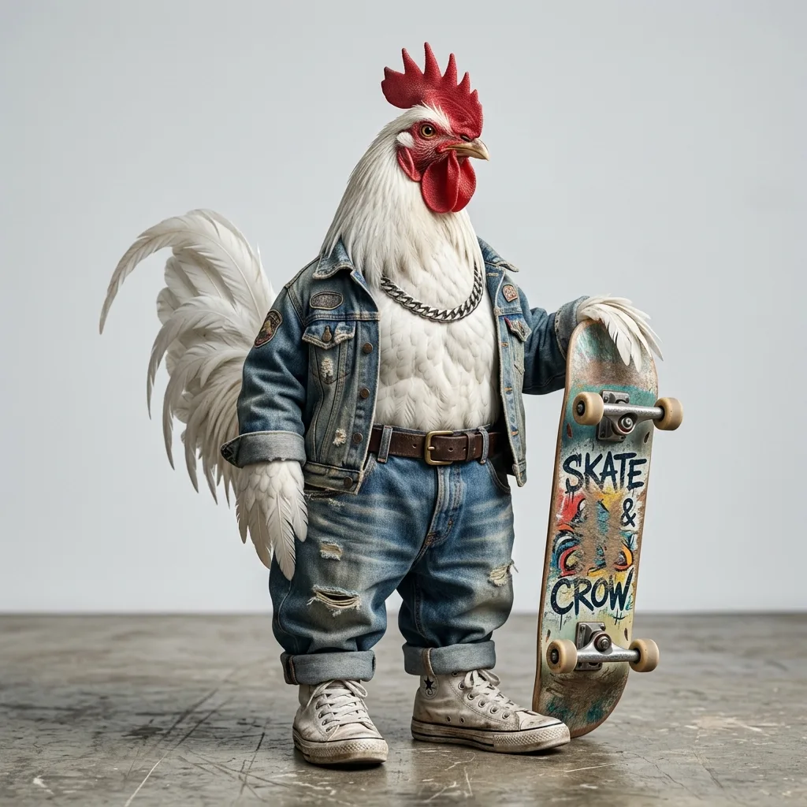

**#107 · Illustration &amp; 3D Prompt · <code>Vinano Image v2</code>**

<details>
<summary>Show prompt</summary>

```
Ultra-realistic studio portrait of an anthropomorphic rooster styled like a street skater. A confident white rooster a red comb and wattles stands upright like a human, full body visible, facing slightly to the side. The rooster is wearing oversized vintage blue denim jeans a loose, baggy fit, a faded denim jacket hanging off the shoulders, and a thick silver chain necklace around its neck. A brown leather belt is fastened tightly around the waist.
The rooster is holding a worn skateboard vertically one wing, resting it on the floor. The skateboard has scratched trucks, beige wheels, and a distressed, colorful deck. On its feet are chunky white high-top sneakers visible wear and realistic fabric texture.
Highly detailed feathers realistic texture and volume, sharp focus on the rooster’s face and clothing. Studio lighting soft shadows, clean white/neutral background, fashion editorial style. Cinematic realism, humorous yet stylish vibe, perfect balance between realism and surreal character design. Ultra-high resolution, hyper-detailed materials (denim fabric, leather belt, metal chain, feathers), shallow depth of field, professional photography look.

Aim for an editorial, design-driven look with deliberate negative space.
```

</details>

---

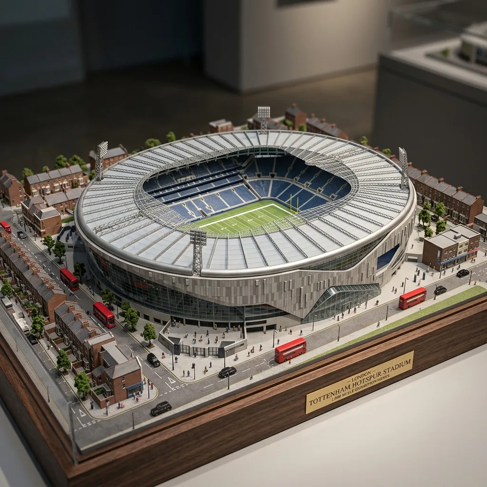

**#108 · Illustration &amp; 3D Prompt · <code>Vinano Image Pro</code>**

<details>
<summary>Show prompt</summary>

```
Ultra-detailed large-scale miniature diorama of [STADIUM NAME] in [CITY] presented as a premium museum-quality desktop exhibition model.
True architectural scale model craftsmanship extreme fine detail.
[STADIUM NAME] fully visible and centered in the composition: iconic roof structure, exterior facade details, floodlight towers rising dramatically, the entire stadium accurately represented from ground level to roof.
Surrounding miniature [CITY] city blocks: small local-style residential buildings, grid street layout, tiny trees lining the sidewalks, mini cars and pedestrians for scale realism.
Ground textures: stone pavements, micro streetlights, tiny fan plazas and entrance gates surrounding the stadium.
Materials: realistic miniature concrete and steel texture, matte architectural model surfaces, precise structural detailing, museum-grade craftsmanship.
Display base: elegant rectangular exhibition base, subtle engraved metal plate reading “[CITY] – [STADIUM NAME]”.
Lighting: soft museum spotlighting from above, gentle shadows enhancing the structural details, clean studio environment.
Camera: slightly elevated macro architectural photography angle, tilt-shift miniature aesthetic, center extremely sharp slight edge depth falloff.
Ultra realistic collectible stadium model, 8K resolution, luxury museum exhibition presentation.
Aspect ratio 4:5 vertical

Emphasise material texture and natural light so the final frame feels tactile and premium.
```

</details>

---

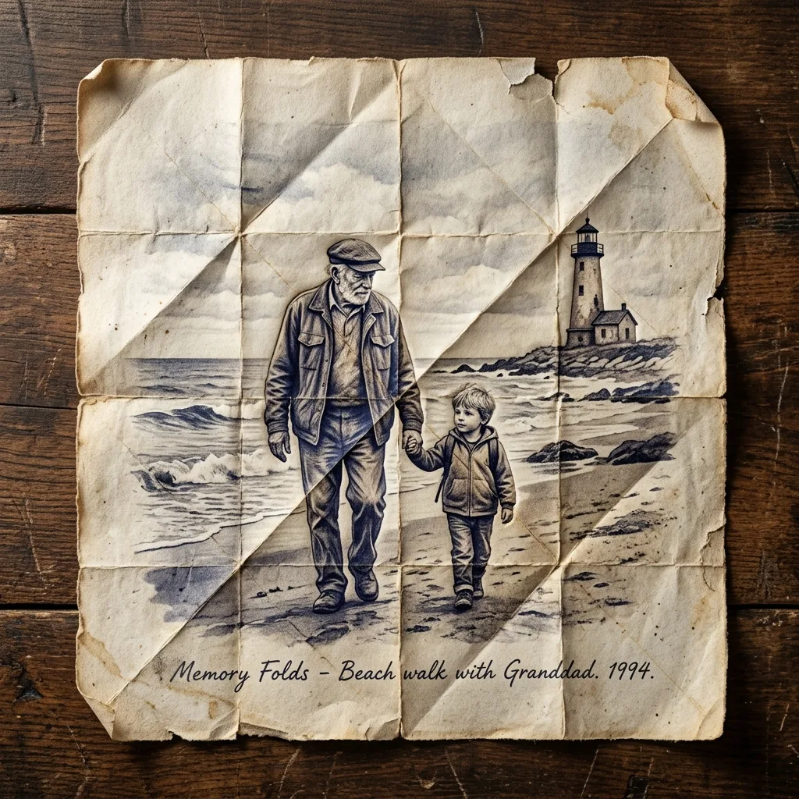

**#109 · Illustration &amp; 3D Prompt · <code>Vinano Image v2</code>**

<details>
<summary>Show prompt</summary>

```
8K Ultra-Realistic Promotional
Design a hyper-realistic close-up image of a folded sheet of aged paper. Within the paper’s creases and surfaces, depict a [SCENE OR MEMORY] emerging naturally from the folds, like sculpted origami.
The environment and figures (if present) appear embossed or printed directly into the paper, wrinkles, grain, and ink textures to build the illusion. Include subtle shadows, curled edges, torn corners, and ink fading to enhance realism.
Set the paper on a neutral tabletop soft directional light from one side, casting gentle shadows and enhancing dimensional depth.
true-to-life photorealistic, emotional storytelling, handcrafted visual illusion, 8K ultra-detail, and image size 4 5.

Maintain consistent colour harmony and crisp focus across the whole frame.
```

</details>

---

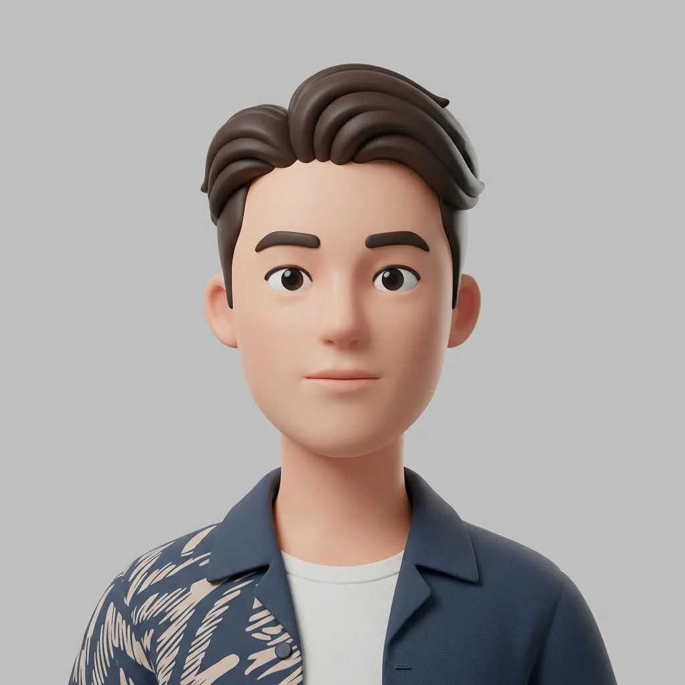

**#110 · Illustration &amp; 3D Prompt · <code>Vinano Image v2</code>**

<details>
<summary>Show prompt</summary>

```
Use a user-uploaded image as the source and convert the person into a stylized 3D character while preserving identity, facial structure, pose, hairstyle, clothing, and overall composition exactly as shown in the photo. The result should clearly resemble the real person.

The visual style is a stylized 3D character a soft minimal cartoon 3D aesthetic, inspired by Pixar-like visuals but more minimal, toy-figure renders, and clean product-style character design. The balance should favor stylization over realism without changing the person’s real-world appearance.

Skin should appear as smooth matte plastic a soft, uniform texture and gentle subsurface scattering. Facial features should remain faithful to the original image while being simplified in form. The expression should stay neutral and natural to the source photo.

Lighting should be clean and controlled, similar to a studio softbox setup, very soft shadows, low contrast, and subtle highlights. The background should be a solid [BACKGROUND COLOR] no gradient.

The camera should feel front-facing a medium close-up framing, similar to a 50mm lens, no distortion. Output quality should be high resolution clean edges, no noise, strong style consistency, and a clearly non-true-to-life photorealistic finish.

Preserve realistic proportions and depth for a confident, professional finish.
```

</details>

---

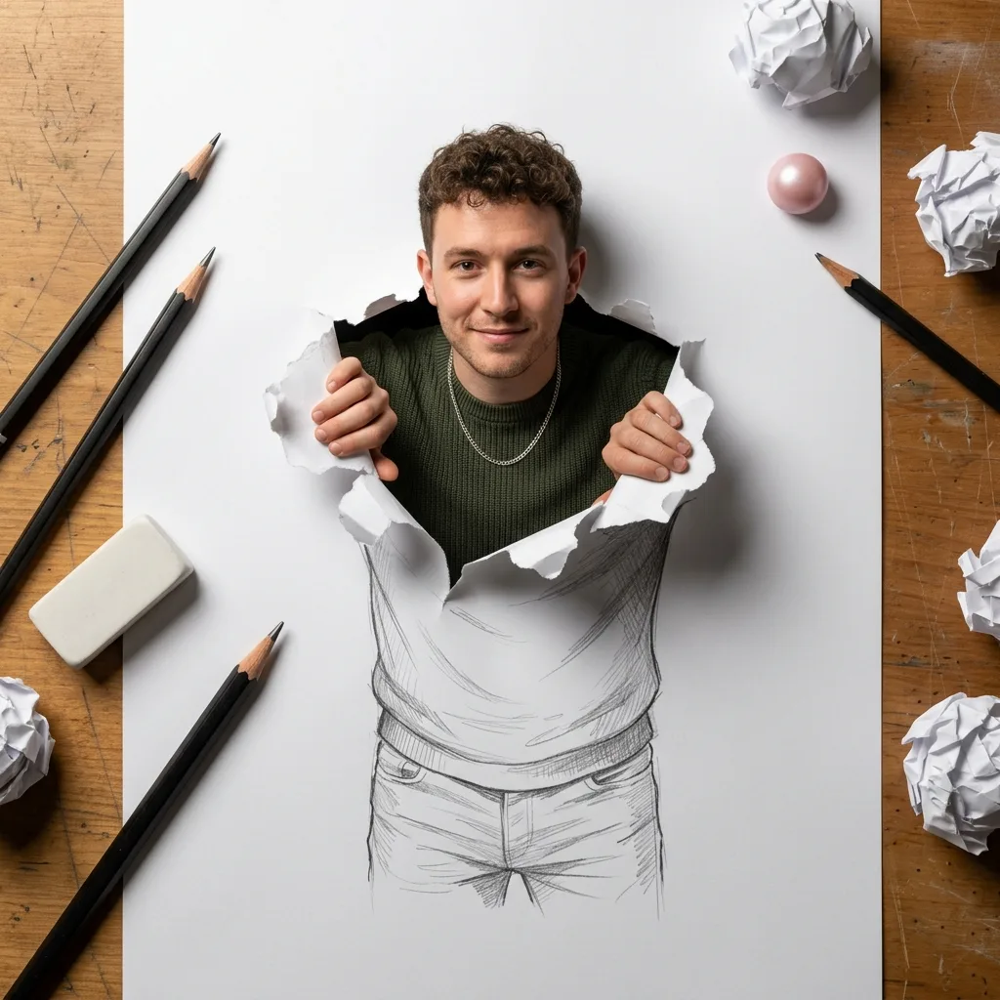

**#111 · Illustration &amp; 3D Prompt · <code>Vinano Image v2</code>**

<details>
<summary>Show prompt</summary>

```
A stunning Trompe L’oeil 3D composition, where the subject— an uploaded face as reference—appears to physically tear through a clean white drawing paper and emerge from a graphite sketch into the real world. The subject’s upper body is fully rendered in hyper-realistic color and texture, wearing the same clothes from the uploaded image, while the lower body remains a 2D pencil sketch on paper. Shot from an aerial (top-down) perspective a 24mm lens to capture the entire drawing desk environment, including oversized pencils and erasers scattered around. The lighting is a blend of flat studio light for the paper area and dramatic side lighting volumetric effects for the emerging 3D figure, casting realistic shadows that fall back onto the sketch area. 8K resolution, ray tracing, and advanced shading techniques are used to blur the boundary between illustration and reality in this extraordinary surrealist piece. Maintain consistent colour harmony and crisp focus across the whole frame.
```

</details>

---

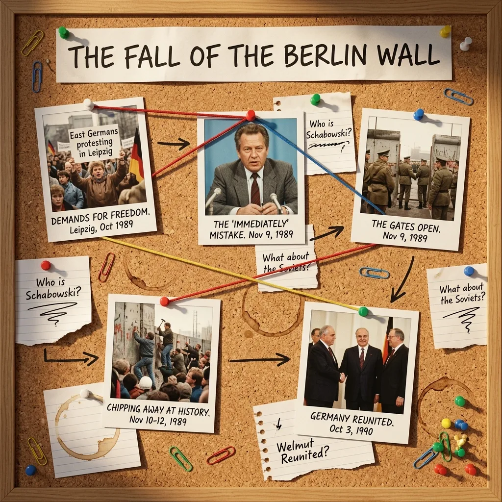

**#112 · Illustration &amp; 3D Prompt · <code>Vinano Image v2</code>**

<details>
<summary>Show prompt</summary>

```
1080x1080 cork-board layout telling the story of [HISTORICAL MOMENT]. At the very top of the board, include a pinned paper label the title: "HISTORICAL MOMENT" in large handwritten letters. Below it, arrange 5–6 Polaroid photos pinned across the board in a loose chronological path. Each Polaroid shows a key moment from the story a short handwritten caption beneath it. Connect characters and events colored strings (red, blue, yellow). Warm nostalgic lighting, soft shadows. Include realistic details: coffee cup rings, paper clips, torn notes, arrows, scribbled hints, and thumbtacks. Vintage, textured, cozy detective-board aesthetic. Highly readable, high contrast, everything framed clearly for 1080x1080 Emphasise material texture and natural light so the final frame feels tactile and premium.
```

</details>

---

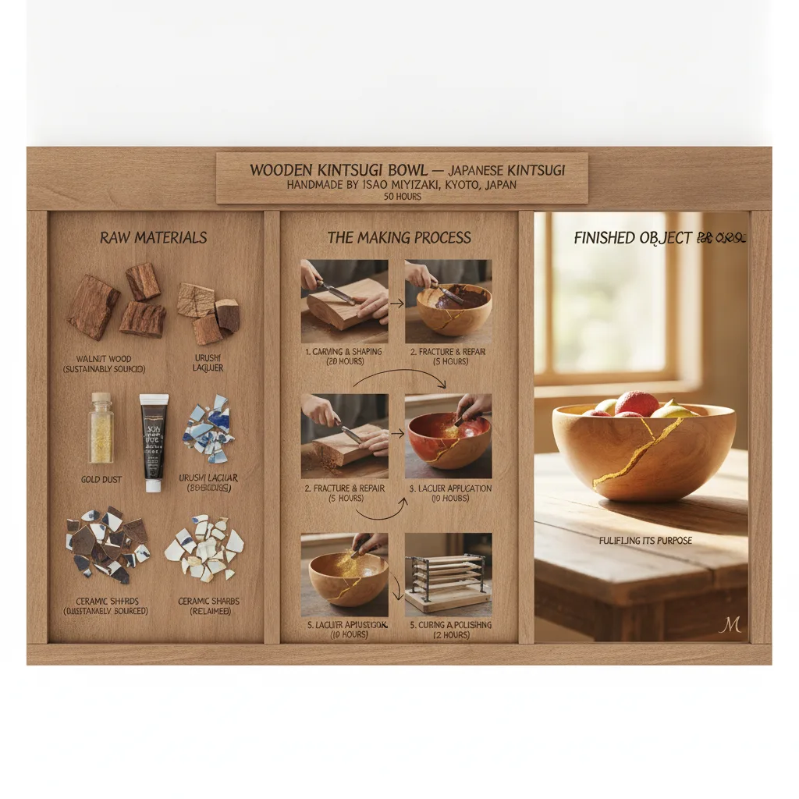

**#113 · Illustration &amp; 3D Prompt · <code>Vinano Image</code>**

<details>
<summary>Show prompt</summary>

```
An artisan's method board for [HANDMADE OBJECT] — [TECHNIQUE / TRADITION / ORIGIN]. Left section: raw materials in unprocessed state, sourced and labeled, the transformation yet to begin. Center section: the making documented in sequential stages, hands visible throughout, tools identified, key decision points annotated, time invested at each phase noted. Right section: the finished object in use context, bearing the maker's mark, fulfilling its purpose, the hours invisible but embedded. Visual style transitions from raw material earth tones through workshop warmth to lifestyle context natural light. Title block reading "[OBJECT NAME] — HANDMADE BY [MAKER], [LOCATION], [HOURS] HOURS". Maintain consistent colour harmony and crisp focus across the whole frame.
```

</details>

---

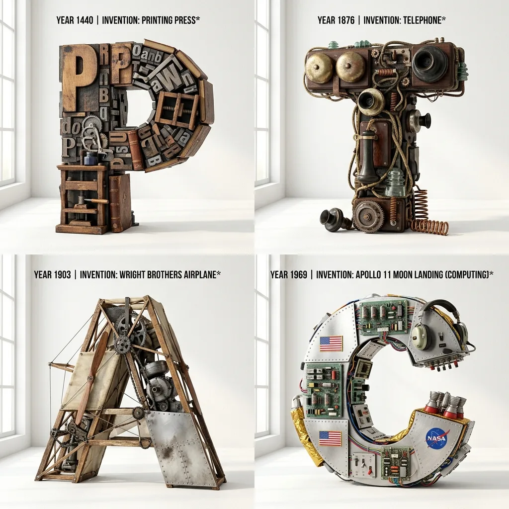

**#114 · Illustration &amp; 3D Prompt · <code>Vinano Image Pro</code>**

<details>
<summary>Show prompt</summary>

```
2x2 grid, do this for 4 important years in history and their most important inventions { Anchor: `[Letter/Number]:: [Era/Theme (e.g., 1980s Retro Tech / Victorian Steampunk)]::4`
 Morphology: `3D Typographic sculpture of [Letter/Number], character shape defined by a dense pile of [Era/Theme] objects, chaotic but legible assemblage, graphic design asset::3`
 Material Physics: `Textures of [Era/Theme] objects (plastic, rust, wood), occlusion between stacked items, realistic scale of constituent parts forming the glyph::3`
 Illumination: `Three-point studio lighting, softbox overhead, clean background for isolation::2`
 Render Stack: `Cinema 4D render, isometric or front-facing, ambient occlusion, 8k, Adobe Substance material suite::1`
 Negative: `[Illegible, flat font, 2D, handwriting, paper, messy background, floating objects]:: -1`}

Emphasise material texture and natural light so the final frame feels tactile and premium.
```

</details>

---

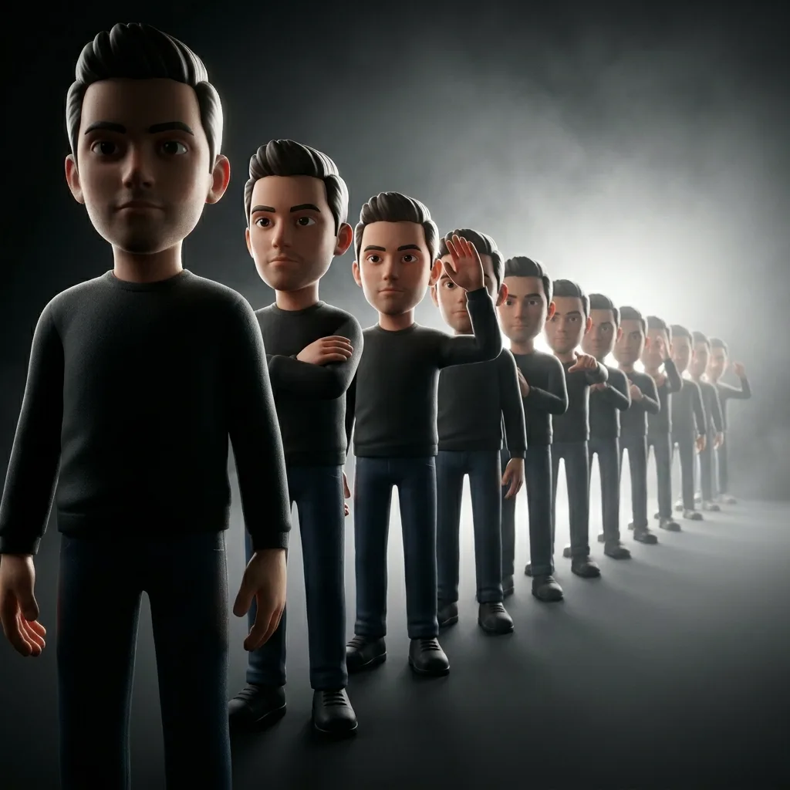

**#115 · Illustration &amp; 3D Prompt · <code>Vinano Image v2</code>**

<details>
<summary>Show prompt</summary>

```
A detailed, collectible-style 3D render of a linear procession of twelve identical figures, viewed in a dynamic diagonal 3/4 perspective down the line.

The figures are arranged on a dark, gradient studio floor a progressively shallower depth of field, making the furthest characters less detailed.
Specific Pose Sequence:

The procession must follow a distinct sequence of poses along the line:
The first and closest figure stands arms at their sides.

The second figure stands arms crossed over their chest.

The third figure stands one hand raised in a salute or wave.

The subsequent receding figures doing different poses.
Lighting and Atmosphere:

The scene features dramatic, atmospheric backlighting from a powerful source behind the furthest characters, creating a bright halo and deep rim-lighting, combined a strong, texturing haze or fog. Dramatic, focused front-side lighting illuminates the features of the nearest character. The background fades to complete shadow.
Fixed Elements:

The overall style is a high-end, textured, 3D vinyl toy aesthetic.
Camera:

Low-to-medium camera angle looking down the diagonal line.
Camera & Framing Refinement (CRITICAL):

Shot a close-range 28–35mm lens to introduce natural perspective compression without distortion.

The camera is positioned slightly below chest level of the first figure and very close to it, creating strong foreground dominance.
The first figure occupies approximately 65–75% of the frame height and must be tightly cropped at knee level. The feet of the first figure must NOT be visible.

The head of the first figure sits very close to the top edge of the frame minimal breathing room. The figure should feel slightly too large for the frame, as if it cannot fully fit inside.
Subsequent figures progressively reveal more of their full bodies as they recede into depth.
The diagonal line of figures must start large in the foreground (left side of frame) and recede tightly into the background (right side), each figure overlapping slightly the next.

The camera is not centered to the line. It is offset to the left, looking across the figures, not directly along them.
Spacing between figures compresses progressively toward the background, enhancing depth and scale illusion.

No wide empty gaps between characters. The line must feel dense and continuous.
2D to 3D Translation (ONLY if input is 2D artwork):

If the uploaded reference is 2D (illustration, anime, flat graphic, cel-shaded), convert it into a fully realized 3D cinematic form while preserving exact identity fidelity.
• Maintain exact head shape, eye design, spacing, and proportions

• Preserve original stylization, do NOT add realism that alters design language

• Translate linework into subtle surface geometry or shading transitions

• Keep original colors, expressed through physically believable materials

• Convert flat shading into controlled cinematic light falloff
The result must feel physically real, not redesigned.
ar 1:1

Aim for an editorial, design-driven look with deliberate negative space.
```

</details>

---

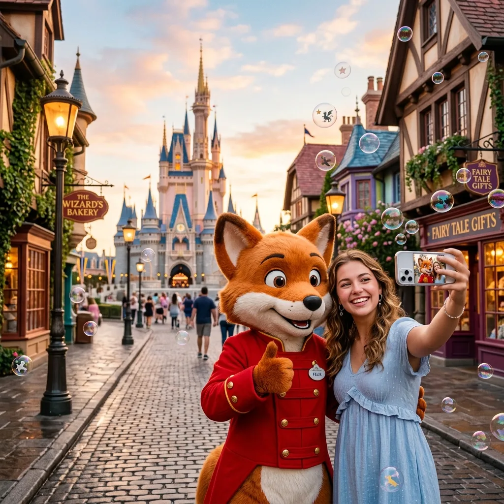

**#116 · Illustration &amp; 3D Prompt · <code>Vinano Image v2</code>**

<details>
<summary>Show prompt</summary>

```
{
 "Objective": "Create a joyful, cinematic fantasy photograph set in a magical fairytale theme park"
 "Type": "Young woman",
 "Pose": "Taking a selfie at arm’s length",
 "Expression": "Warm, joyful smile",
 "Clothing": "Light blue dress",
 "Action": "Holding a smartphone, facing the camera"
 },
 "SecondarySubject": {
 "Type": "Anthropomorphic fox mascot",
 "Appearance": "Cute, friendly fox character",
 "Clothing": "Red jacket",
 "Pose": "Standing beside the woman, giving a thumbs-up",
 "Emotion": "Playful and welcoming"
 }
 },
 "SceneDescription": {
 "Location": "Magical fairytale theme park",
 "Foreground": "Woman and fox mascot posing for a selfie",
 "Background": {
 "Landmark": "Grand fairytale castle at the end of the street",
 "Street": "Charming cobblestone road",
 "Architecture": "Classic European-style buildings",
 "LightingElements": "Glowing vintage street lamps"
 },
 "AtmosphericDetails": {
 "FloatingElements": "Soap bubbles drifting through the air",
 "MagicalAccents": "Some bubbles contain tiny whimsical silhouettes",
 "Mood": "Whimsical, joyful, storybook magic"
 }
 },
 "LightingAndMood": {
 "TimeOfDay": "Golden hour",
 "LightingStyle": "Warm highlights gentle shadows",
 "Sky": "Soft pastel tones",
 "OverallMood": "Dreamy, uplifting, cinematic fantasy realism"
 },
 "PhotographyStyle": {
 "Genre": "Theme park photography",
 "Composition": "Cinematic framing strong depth",
 "DepthOfField": "Shallow depth of field",
 "DetailLevel": "Ultra-detailed textures",
 "ColorGrading": "Vibrant yet soft, pastel-enhanced",
 "Resolution": "High resolution, sharp focus on subjects"
 },
 "ArtDirection": {
 "Style": "Dreamy fantasy realism",
 "VisualTone": "Joyful, magical, immersive",
 "RealismBalance": "true-to-life photorealistic subtle fantasy elements"
 },
 "NegativePrompt": ["dark mood",
 "horror",
 "low resolution",
 "blurry faces",
 "harsh shadows",
 "oversaturated colors",
 "distorted anatomy",
 "uncanny characters"],
 "ResponseFormat": {
 "Type": "Single image",
 "Orientation": "Portrait",
 "AspectRatio": "2:3"
 }
}

Aim for an editorial, design-driven look with deliberate negative space.
```

</details>

---

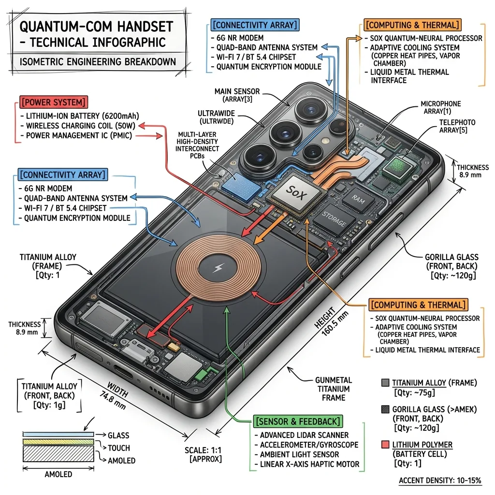

**#117 · Illustration &amp; 3D Prompt · <code>Vinano Image Pro</code>**

<details>
<summary>Show prompt</summary>

```
Create a technical infographic of [OBJECT] a 45-degree isometric 3D perspective showing the device slightly tilted to reveal depth and dimension.
Combine a realistic photoreal render black ink technical annotations on pure white background. Include:
Key component labels color-coded callout boxes
Internal component visibility through transparent/cutaway sections
Measurements, dimensions, and precise scale markers
Material callouts and quantities
Color-coded arrows for function/flow: RED (power/battery), BLUE (data/connectivity), ORANGE (thermal/processor), GREEN (sensors/haptics)
Simple schematics or cross-sectional diagrams where relevant

Place “OBJECT” title in a hand-drawn technical box (top-left corner).
Style: Black linework (technical pen/architectural), sketched but precise. Object remains clearly visible. Educational museum-exhibit vibe. crisp composition, balanced negative space.
Perspective: Isometric 3D angle—tilted to show depth, dimension, and internal architecture dramatically. Like a professional product teardown or engineering manual.
Colors: ~10-15% accent density. Black dominant. White background.
Output: 1080×1080, ultra-crisp, social-feed optimized.

Emphasise material texture and natural light so the final frame feels tactile and premium.
```

</details>

---

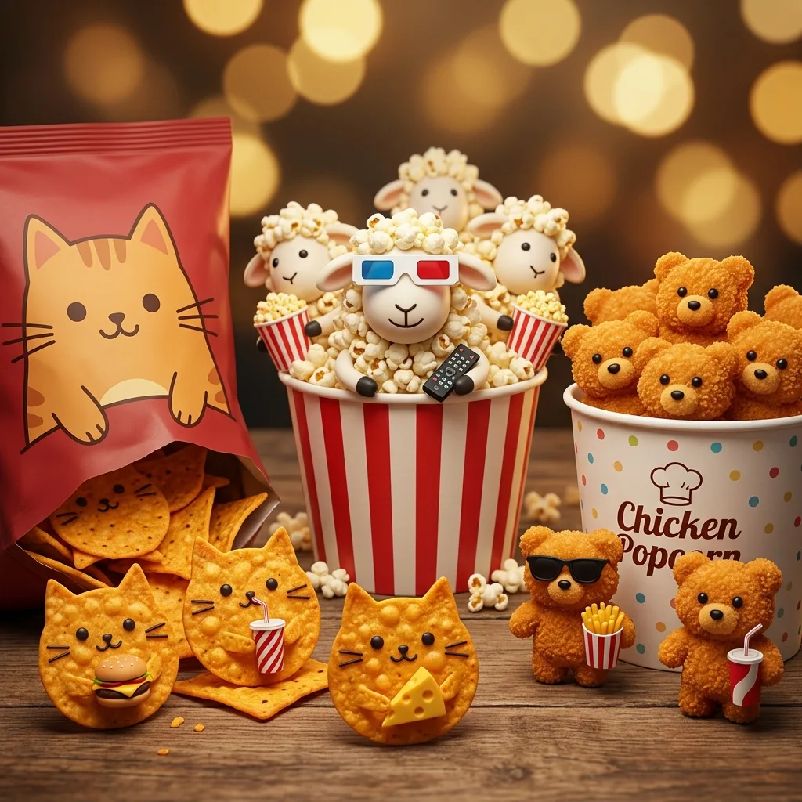

**#118 · Illustration &amp; 3D Prompt · <code>Vinano Image v2</code>**

<details>
<summary>Show prompt</summary>

```
{
 "global_settings": {
 "resolution": "8K ultra high definition",
 "aspect_ratio": "3:4 vertical",
 "image_quality": "extreme detail, ultra sharp focus",
 "lighting_style": "warm filmic, cinematic lighting golden bokeh background",
 "depth_of_field": "shallow depth of field, strong subject separation",
 "render_style": "AI-edited, hyper-detailed, true-to-life photorealistic stylized realism",
 "color_grading": "warm tones, golden highlights, soft shadows",
 "background": "out-of-focus golden circular bokeh lights"
 },

 "Module_1_Image_1_Style": {
 "subject": "Cat-shaped tortilla chips",
 "primary_container": {
 "type": "red paper snack bag",
 "design": "large illustrated cartoon cat on front",
 "graphics": "simple facial features, soft pastel tones",
 "material": "matte paper texture"
 },
 "chip_details": {
 "shape": "cat heads pointed ears",
 "color": "golden-orange fried texture",
 "surface": "crispy, bubbled, slightly uneven",
 "facial_features": {
 "eyes": "small black circular dots",
 "mouth": "simple curved line",
 "whiskers": "thin dark lines"
 }
 },
 "poses_and_interactions": {
 "one_chip": "holding a miniature cheeseburger",
 "one_chip": "holding a red-and-white striped soda cup straw",
 "one_chip": "holding a triangular cheese slice",
 "foreground_chips": "sitting outside the bag on surface"
 },
 "composition": {
 "camera_angle": "slightly above eye level",
 "framing": "tight vertical framing",
 "focus": "sharp on chips, blurred background"
 }
 },

 "Module_2_Image_2_Style": {
 "subject": "Sheep-shaped popcorn figures",
 "primary_container": {
 "type": "classic popcorn bucket",
 "design": "red and white vertical stripes",
 "material": "cardboard soft matte finish"
 },
 "sheep_details": {
 "body": "made entirely of popcorn kernels",
 "head": "smooth white rounded face",
 "ears": "small rounded ears pale yellow inner tone",
 "eyes": "tiny black dots",
 "mouth": "thin curved smile line"
 },
 "poses_and_accessories": {
 "one_sheep": "wearing red-blue 3D glasses",
 "one_sheep": "holding a small popcorn bucket",
 "one_sheep": "holding a black TV remote",
 "multiple_sheep": "peeking from behind popcorn pile"
 },
 "composition": {
 "layering": "sheep stacked and clustered",
 "foreground": "extra popcorn scattered around base",
 "focus": "central sheep in sharp focus"
 }
 },

 "Module_3_Image_3_Style": {
 "subject": "Bear-shaped chicken popcorn nuggets",
 "primary_container": {
 "type": "white popcorn-style bucket",
 "branding": "text reads 'Chicken Popcorn'",
 "graphics": "simple chef hat icon above text",
 "decoration": "small colored polka dots"
 },
 "nugget_details": {
 "shape": "teddy bear silhouettes",
 "color": "golden-brown fried coating",
 "texture": "crunchy breaded surface",
 "facial_features": {
 "eyes": "small black beads",
 "nose": "rounded black nose",
 "mouth": "tiny dark line"
 }
 },
 "poses_and_accessories": {
 "one_nugget": "wearing black sunglasses",
 "one_nugget": "holding fries in red-striped cup",
 "one_nugget": "holding soda cup straw",
 "foreground_nuggets": "standing outside bucket"
 },
 "composition": {
 "camera_distance": "medium close-up",
 "bucket_position": "centered vertically",
 "lighting": "warm highlights emphasizing texture''

Maintain consistent colour harmony and crisp focus across the whole frame.
```

</details>

---

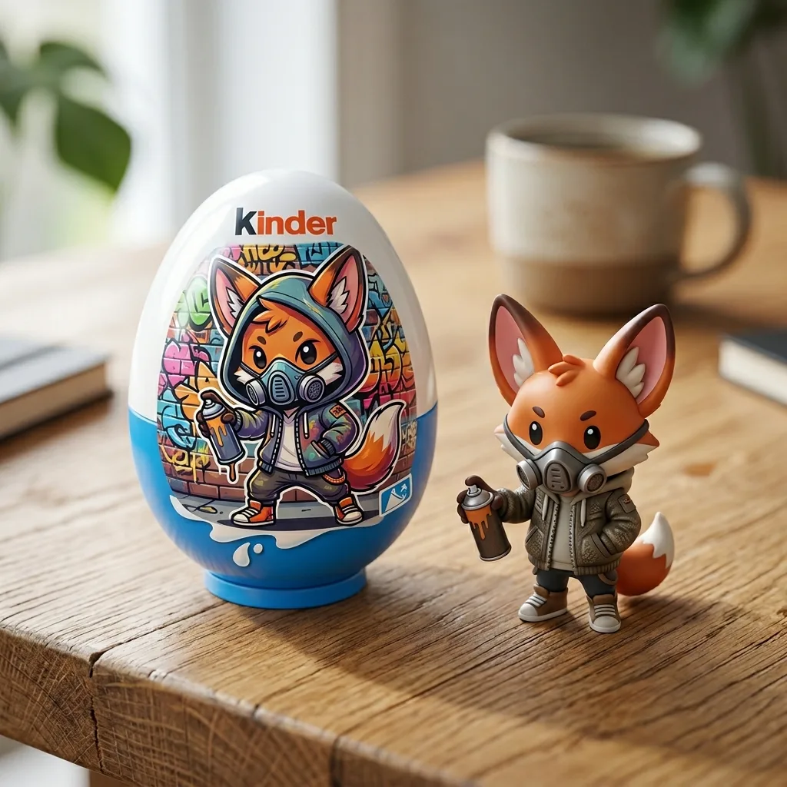

**#119 · Illustration &amp; 3D Prompt · <code>Vinano Image v2</code>**

<details>
<summary>Show prompt</summary>

```
A hyper-realistic product photo of a Kinder Joy surprise egg sitting on a wooden table. The egg packaging features a chibi/cartoon-style illustration of [image Uploaded] posed against a graffiti brick wall background. Next to the egg sits a small detailed collectible figurine of [image Uploaded] in the same chibi art style shown on the packaging. Soft natural lighting, shallow depth of field, true-to-life photorealistic quality. Aim for an editorial, design-driven look with deliberate negative space.
```

</details>

---

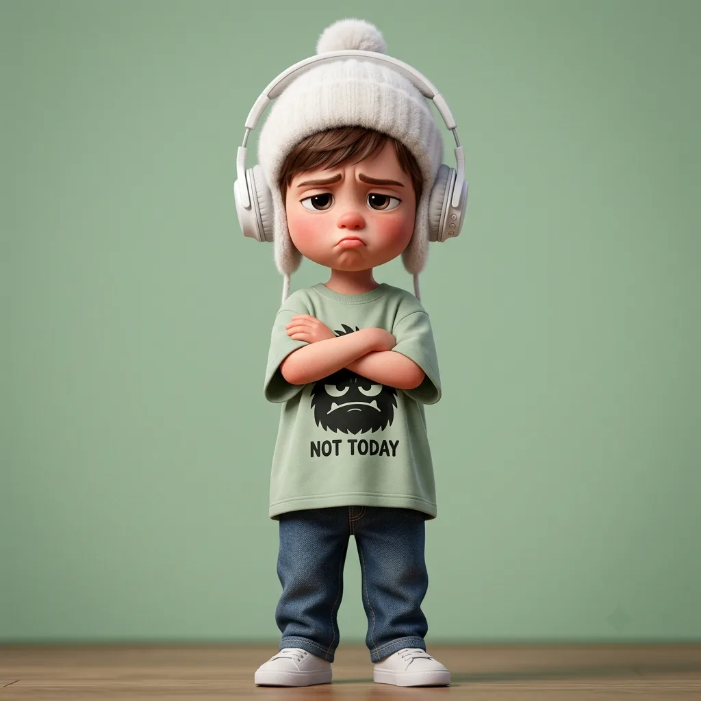

**#120 · Illustration &amp; 3D Prompt · <code>Vinano Image v2</code>**

<details>
<summary>Show prompt</summary>

```
A stylized 3D cartoon character of a young boy big expressive eyes and a slightly sad, pouty expression, standing against a solid pastel green background. He is wearing a soft white fuzzy beanie ear flaps and matching white over-ear headphones. His hair is short, brown, and slightly messy, peeking out from under the cap. He wears an oversized light green t-shirt a bold black graphic on the front, and his arms are crossed in a bored or annoyed pose. The lighting is soft, diffused studio lighting smooth shadows, giving a clean aesthetic. Ultra-detailed, premium-quality 3D render, Pixar-style, soft textures, shallow depth of field, centered composition, minimal background, vibrant but soft color palette.

Negative prompt (optional):
blurry, low quality, extra limbs, distorted face, harsh shadows, cluttered background, text artifacts, watermark

Emphasise material texture and natural light so the final frame feels tactile and premium.
```

</details>

---

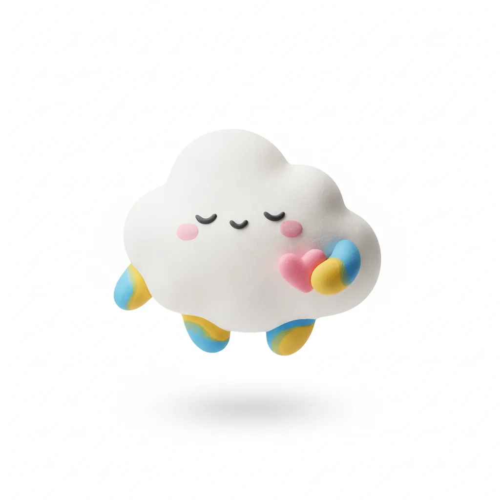

**#121 · Illustration &amp; 3D Prompt · <code>Vinano Image</code>**

<details>
<summary>Show prompt</summary>

```
Cute 3D render of a [subject], matte surface, kneaded clay icon style, simple stylized design, [doing action], [emotion or mood], rounded proportions, soft sculpted details, playful body language, vibrant [color1], [color2], and [color3] accents, clean white background, minimal composition, soft ambient lighting, subtle shadow, charming character design, high-resolution, polished toy-like aesthetic Aim for an editorial, design-driven look with deliberate negative space.
```

</details>

---

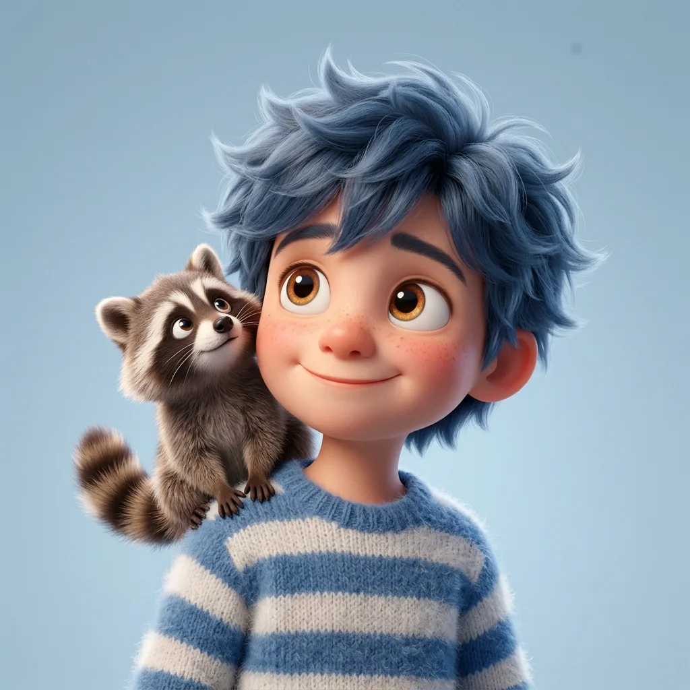

**#122 · Illustration &amp; 3D Prompt · <code>Vinano Image v2</code>**

<details>
<summary>Show prompt</summary>

```
Cute stylized 3D animated boy messy fluffy blue hair and big expressive eyes, soft freckles on face, wearing a fuzzy blue striped sweater, small adorable raccoon sitting on his shoulder, looking upward a gentle smile, Pixar-style character design, soft studio lighting, pastel blue background, ultra-detailed fur and fabric texture, cinematic portrait composition, premium-quality 3D render, 8K. Aim for an editorial, design-driven look with deliberate negative space.
```

</details>

---

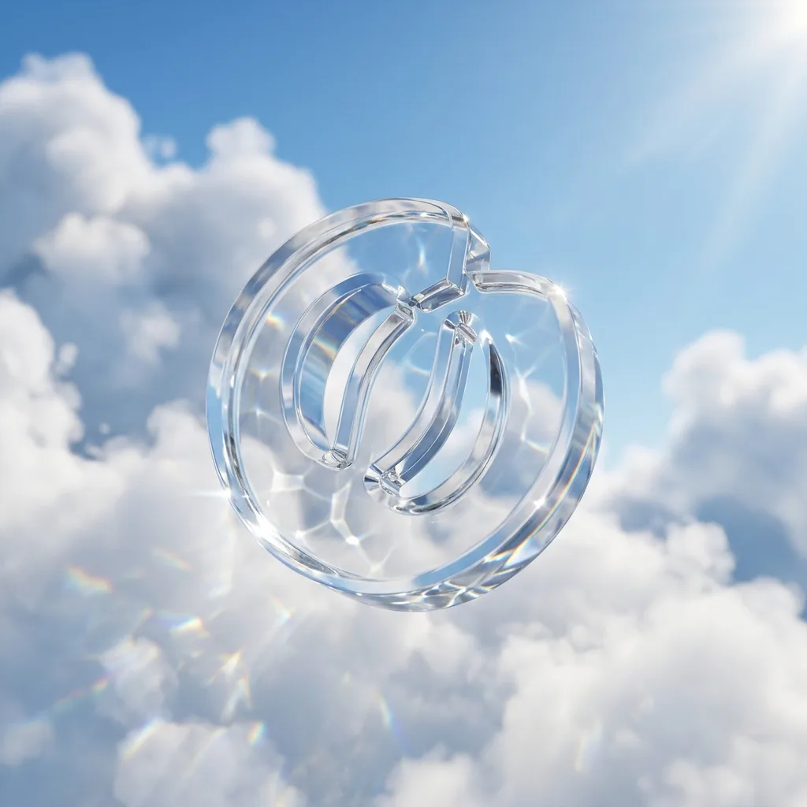

**#123 · Illustration &amp; 3D Prompt · <code>Vinano Image v2</code>**

<details>
<summary>Show prompt</summary>

```
A premium 3D stylized version of attached logo, rendered as thick, translucent crystal glass high refraction. The object is floating amidst fluffy, realistic white cumulus clouds against a bright, clear blue sky. Soft natural sunlight creates bright caustic reflections and rainbow dispersion within the glass. Ethereal, airy, and highly polished 3D aesthetic Emphasise material texture and natural light so the final frame feels tactile and premium.
```

</details>

---

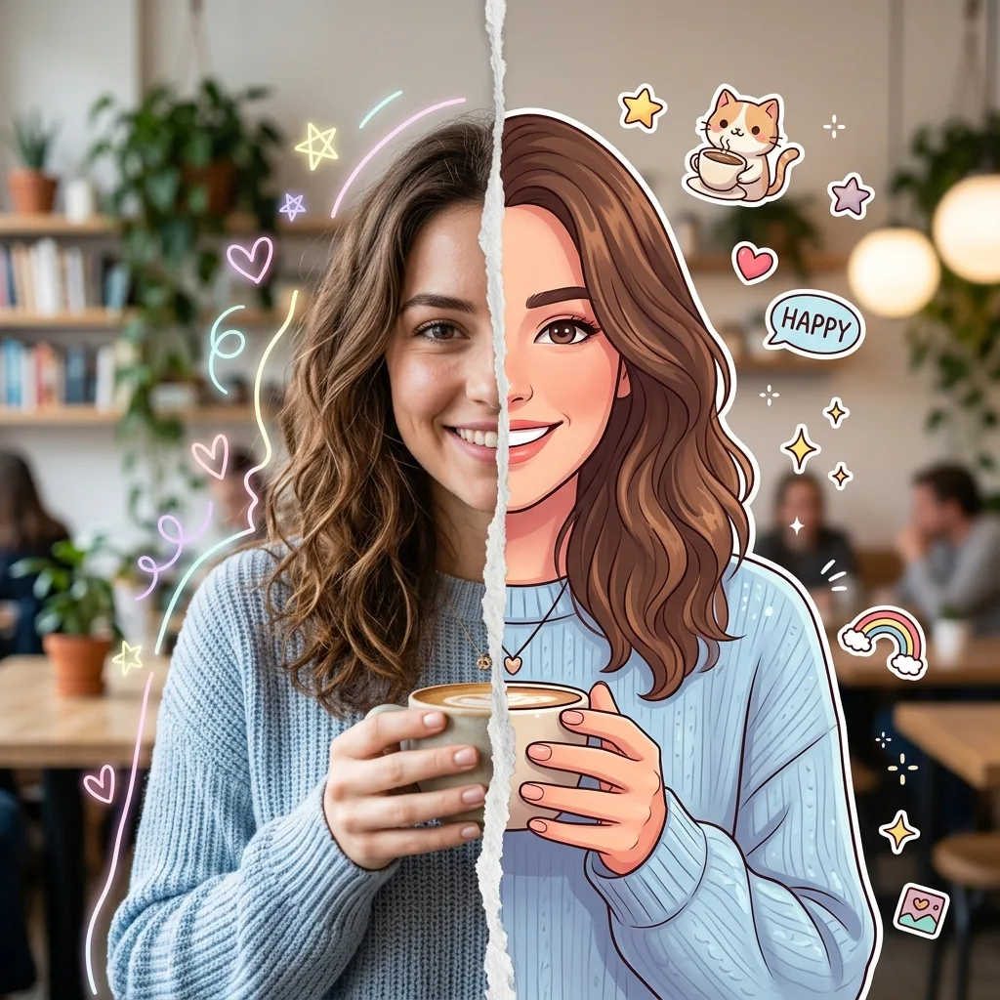

**#124 · Illustration &amp; 3D Prompt · <code>Vinano Image v2</code>**

<details>
<summary>Show prompt</summary>

```
High-detail 8K split-style composition where the subject is divided vertically into two halves.
LEFT SIDE:
Keep the original photo fully realistic. Preserve natural lighting, textures, and fine details. Slightly enhance sharpness and clarity. Add subtle hand-drawn doodle outlines (soft pastel or neon lines) around the subject for a creative aura.
RIGHT SIDE:
Transform the same subject into a stylized cartoon/digital illustration. Maintain the exact same pose, angle, and facial expression. Use clean lineart, soft shading, and pastel or vibrant colors in a modern cute style (chibi / semi-realistic). Add small decorative elements like sticker-style doodles, cute icons, or mini characters floating around.
BACKGROUND (IMPORTANT):
Keep the ORIGINAL background unchanged on BOTH sides. Do not replace, redraw, or stylize the background. Maintain consistency across the entire image.
CENTER DIVISION:
Add a vertical torn-paper or glitch-style transition separating the realistic and illustrated halves.
STYLE:
modern digital art, crisp composition, soft, diffused lighting, aesthetically pleasing, social media style
QUALITY: 8K resolution, ultra-detailed.

Aim for an editorial, design-driven look with deliberate negative space.
```

</details>

---

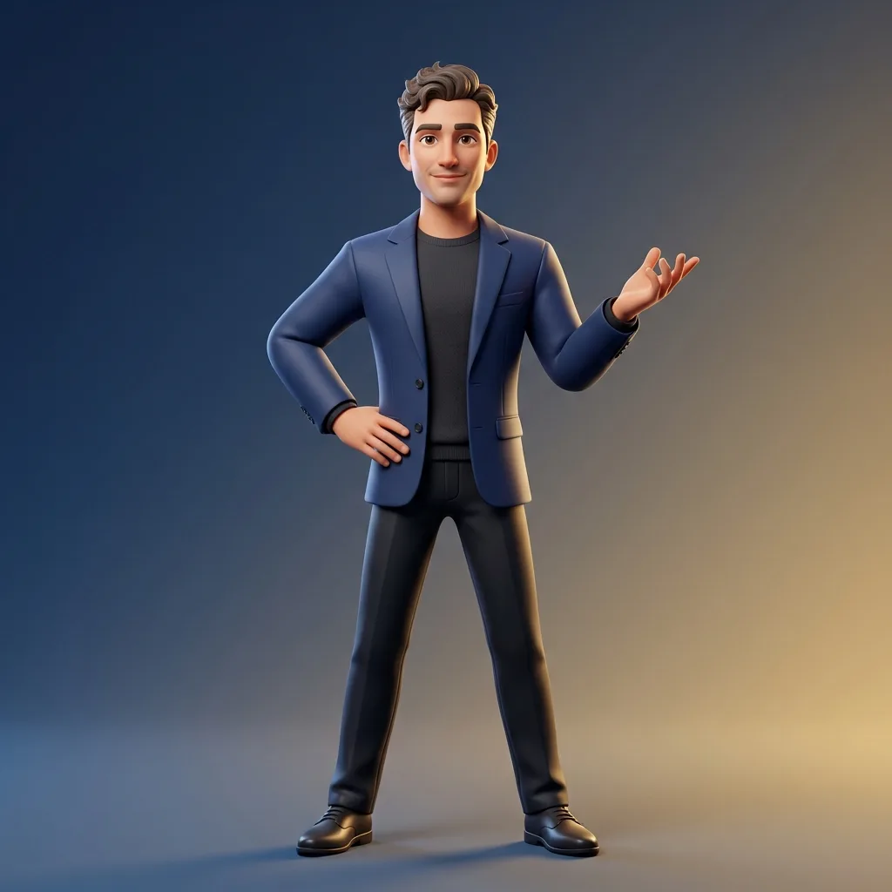

**#125 · Illustration &amp; 3D Prompt · <code>Vinano Image v2</code>**

<details>
<summary>Show prompt</summary>

```
Transform the referenced person into a premium stylized 3D animated character, full body hero shot, standing confidently in the exact center of the frame. Preserve the exact identity and key facial details as closely as possible, including face shape, eyes, nose, mouth, hairstyle, skin tone, and expression, without redesigning the face. Use soft rounded geometry, smooth polished materials, subtle glossy shading, and a modern premium 3D animation style. The pose must feel dynamic, charismatic, and heroic, not stiff. Let the arms and hands naturally perform an expressive gesture that best suits the character’s body shape, personality, and visual balance, chosen intelligently for the most flattering and appealing result. Keep the full body fully visible while the character still feels close, clear, and strongly present to the camera. Use a clean solid background or a soft gradient [BACKGROUND COLOR]. Studio-quality lighting, soft grounded shadow, strong subject separation, clean premium composition, ultra refined, highly detailed, no props, no text, no logos, no watermark Maintain consistent colour harmony and crisp focus across the whole frame.
```

</details>

---

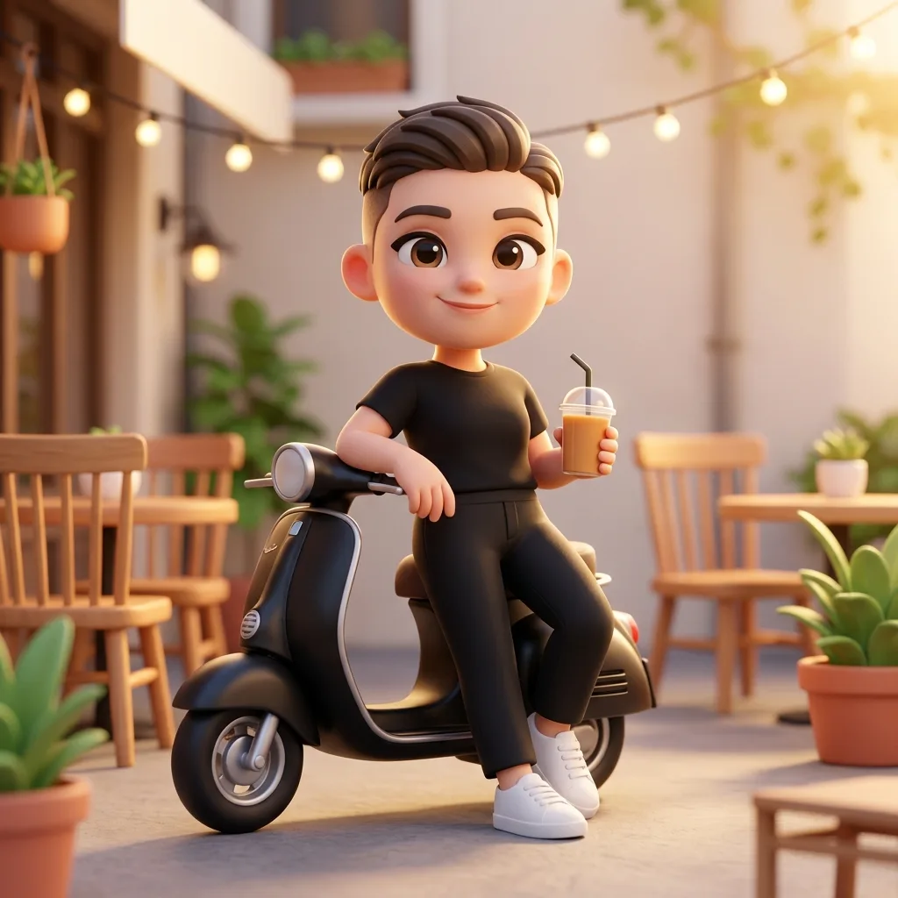

**#126 · Illustration &amp; 3D Prompt · <code>Vinano Image v2</code>**

<details>
<summary>Show prompt</summary>

```
A cute 3D chibi-style character of the uploaded image leaning against a parked mini chibi scooter, wearing a clean monochrome outfit a t-shirt, straight-fit pants, and refined minimalist sneakers, holding a takeaway juice cup a relaxed confident smile, big head and expressive eyes, modern fade haircut, set in a cozy café courtyard wooden chairs, warm golden sunlight, soft depth of field, pastel color palette, smooth rounded proportions, subtle texture detailing, global illumination gentle rim light, soft natural shadows, playful yet premium Pixar-quality 3D render, toy-like finish, Google Gemini cinematic but cozy mood, ultra-clean high-detail output, Instagram-ready composition, square aspect ratio 1:1 Aim for an editorial, design-driven look with deliberate negative space.
```

</details>

---

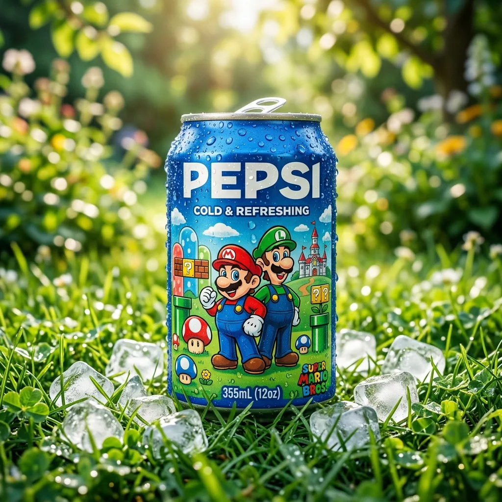

**#127 · Illustration &amp; 3D Prompt · <code>Vinano Image v2</code>**

<details>
<summary>Show prompt</summary>

```
Ultra-realistic product photography of a chilled blue Pepsi can placed upright on fresh green grass, covered cold water droplets and condensation. Ice cubes scattered around the base. The can features a vibrant, colorful illustration of Mario and Luigi standing together in a whimsical mushroom kingdom scene red and blue mushrooms, green pipes, question blocks, and a castle in the background. Bright, cheerful, cartoon-style artwork printed on the can.

Shot outdoors in natural daylight a soft, blurred garden background (bokeh effect), bright green foliage and sunlight filtering through trees. Shallow depth of field, macro detail, high contrast, vivid colors, sharp focus on the can, cinematic product lighting, summer refreshment mood, commercial advertising style, ultra-detailed, 8K quality, true-to-life photorealistic, centered composition, vertical framing.

Preserve realistic proportions and depth for a confident, professional finish.
```

</details>

---

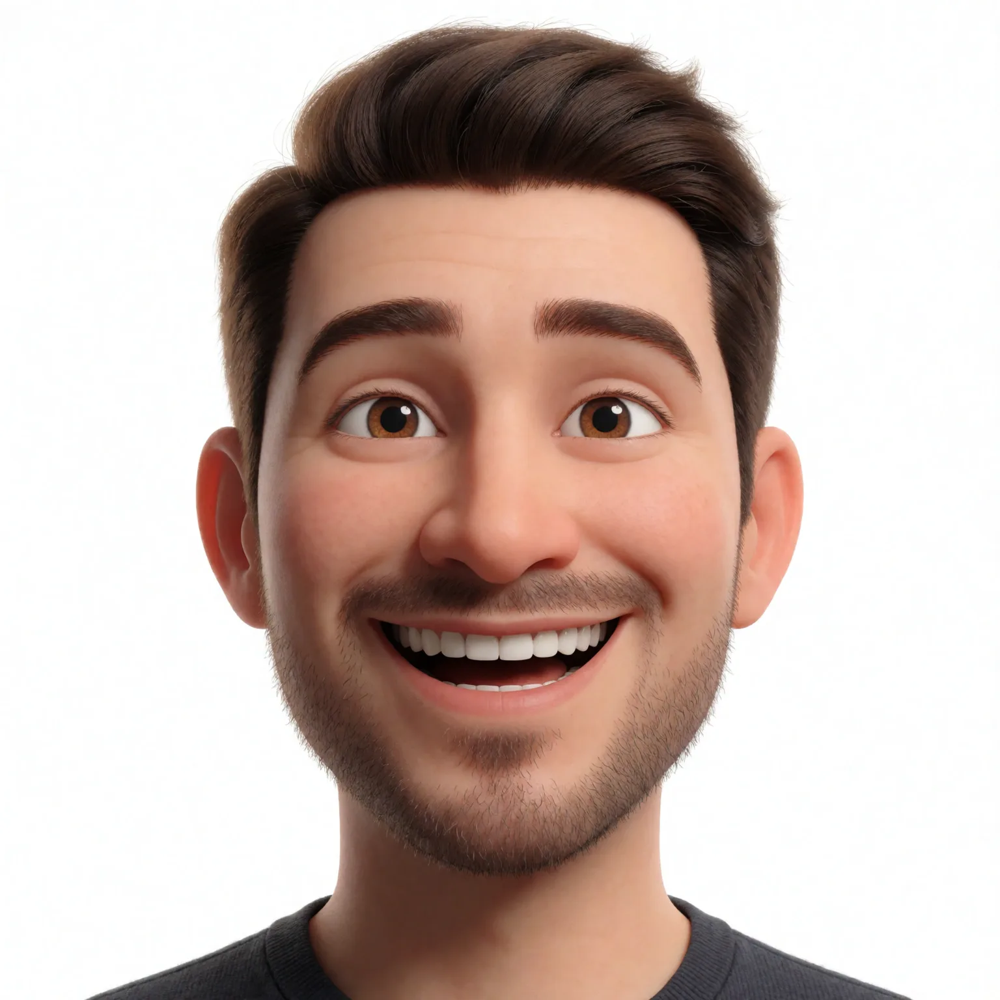

**#128 · Illustration &amp; 3D Prompt · <code>Vinano Flash</code>**

<details>
<summary>Show prompt</summary>

```
3D avatar of a man, a happy face on a white background, no necks. Conceptual playlist style digital art Pixar quality aesthetics Preserve realistic proportions and depth for a confident, professional finish.
```

</details>

---

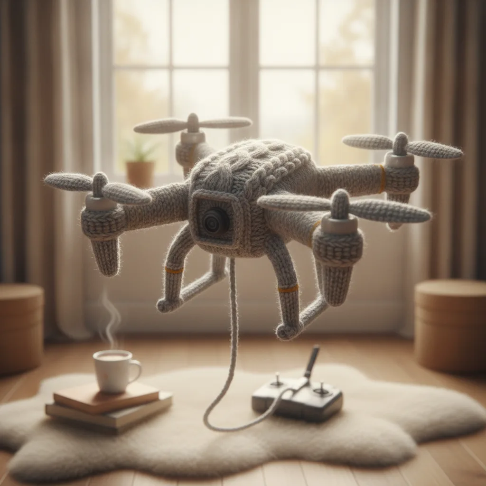

**#129 · Illustration &amp; 3D Prompt · <code>Vinano Image</code>**

<details>
<summary>Show prompt</summary>

```
An [OBJECT] rendered as if entirely hand-knitted from chunky wool yarn, impossibly functional-looking despite being soft craft. Visible stitches, cable knit patterns on grip areas, ribbing where flexibility is needed, yarn ends neatly tucked. Positioned against a cozy lifestyle backdrop or clean wool-texture studio. Scandinavian hygge meets industrial design. Warm soft, diffused lighting emphasizing the yarn texture, the handmade quality, the absurd coziness of machinery. Sharp focus on stitch detail, warm saturated fiber colors, lifestyle product aesthetic, ultra-high resolution, the hard made soft. Maintain consistent colour harmony and crisp focus across the whole frame.
```

</details>

---

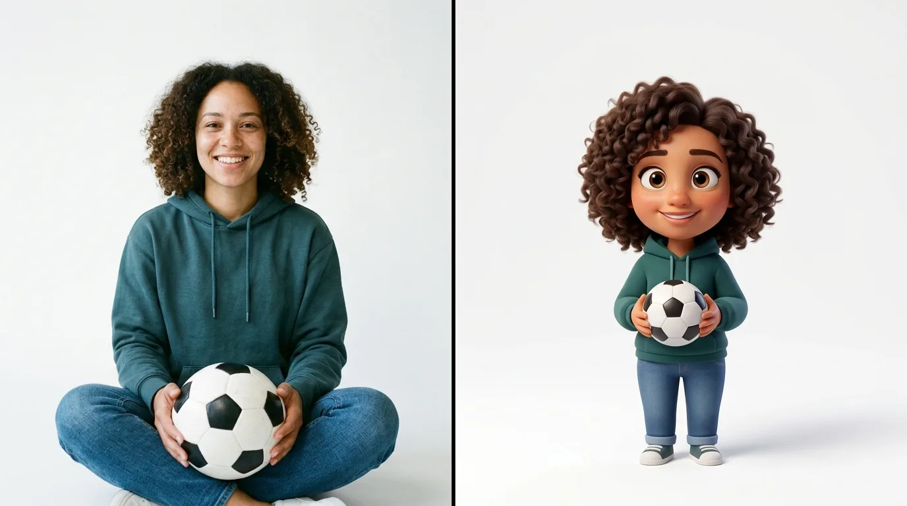

**#130 · Illustration &amp; 3D Prompt · <code>Vinano Image Pro</code>**

<details>
<summary>Show prompt</summary>

```
Split composition portrait. PRIMARY SUBJECT (The Real Human - STRICT LIKENESS): On the left, a raw, hyper-realistic photograph of the person from the reference image. CRITICAL: The AI must preserve the exact facial geometry, bone structure, specific imperfections, and skin texture of the source image. Do not beautify or alter the face. This is a documentary-style portrait of the specific individual provided. The subject is wearing the outfit from the visual reference. Pose: Sitting cross-legged on the floor, facing forward, an authentic smile. SECONDARY SUBJECT (The Miniature): On the right, a tiny, cute 3D Pixar-style animated character, standing or sitting next to the human. This character is a stylized caricature of the human, wearing a matching miniature outfit. SETTING: Seamless pure white studio background. Soft filmic, cinematic lighting. 8k resolution, uncropped. --iw 2 make them both hold a soccer ball Keep edges clean and the overall composition balanced for a polished, gallery-ready result.
```

</details>

---

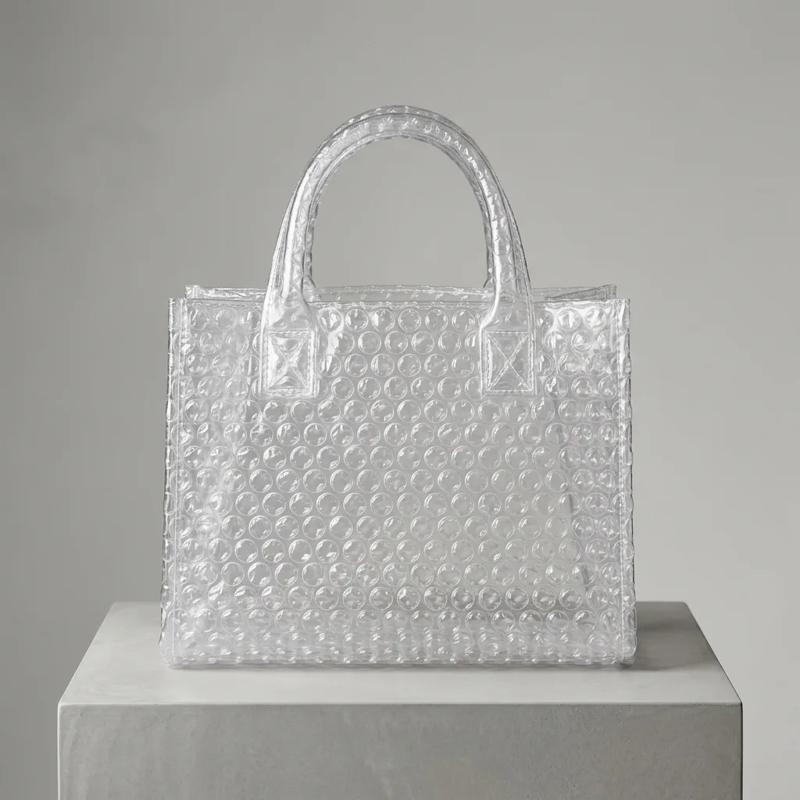

**#131 · Illustration &amp; 3D Prompt · <code>Vinano Image v2</code>**

<details>
<summary>Show prompt</summary>

```
{
 "prompt": "A studio shot of a transparent bubble wrap fashion elegant [ITEM], empty nothing inside. The material is clear, glossy, and highly detailed, capturing the texture of inflated bubbles. refined minimalist composition, high-fashion editorial style, soft diffused studio lighting, neutral background, ultra-clean aesthetic, true-to-life photorealistic rendering, sharp focus.",
 "style": {
 "lighting": "soft diffused studio lighting",
 "background": "neutral seamless backdrop",
 "mood": "modern, refined minimalist, elegant",
 "quality": "ultra-detailed, true-to-life photorealistic",
 "material": "transparent bubble wrap"
 }
}

Maintain consistent colour harmony and crisp focus across the whole frame.
```

</details>

---

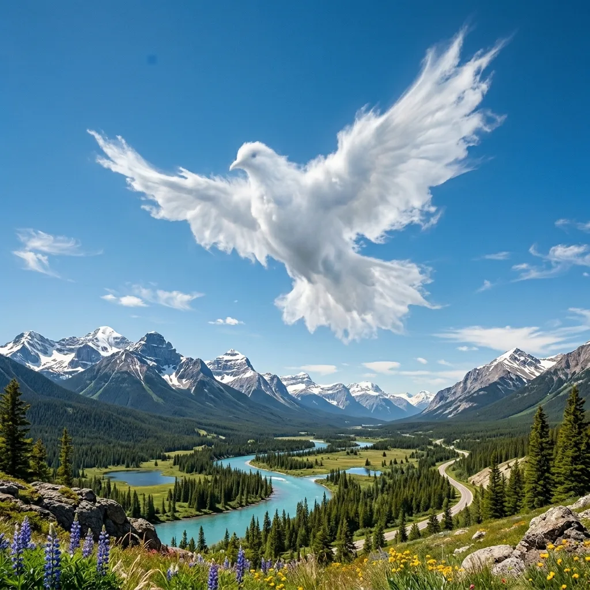

**#132 · Illustration &amp; 3D Prompt · <code>Vinano Image v2</code>**

<details>
<summary>Show prompt</summary>

```
Create an ultra-realistic sky scene where soft, natural cloud formations organically assemble into the clear silhouette of a [OBJECT]. The cloud shape appears high in a vibrant blue sky, naturally floating above a recognizable nature below.

The composition is square (1080×1080), the cloud formation occupying the upper portion of the frame while the landscape grounds the scene beneath it. Lighting is crisp and daylight-bright, sunlit highlights on the clouds that enhance depth, softness, and realism.

The overall mood should feel calm, optimistic, and visually striking, rich color saturation and a clean, peaceful atmosphere.

Keep edges clean and the overall composition balanced for a polished, gallery-ready result.
```

</details>

---

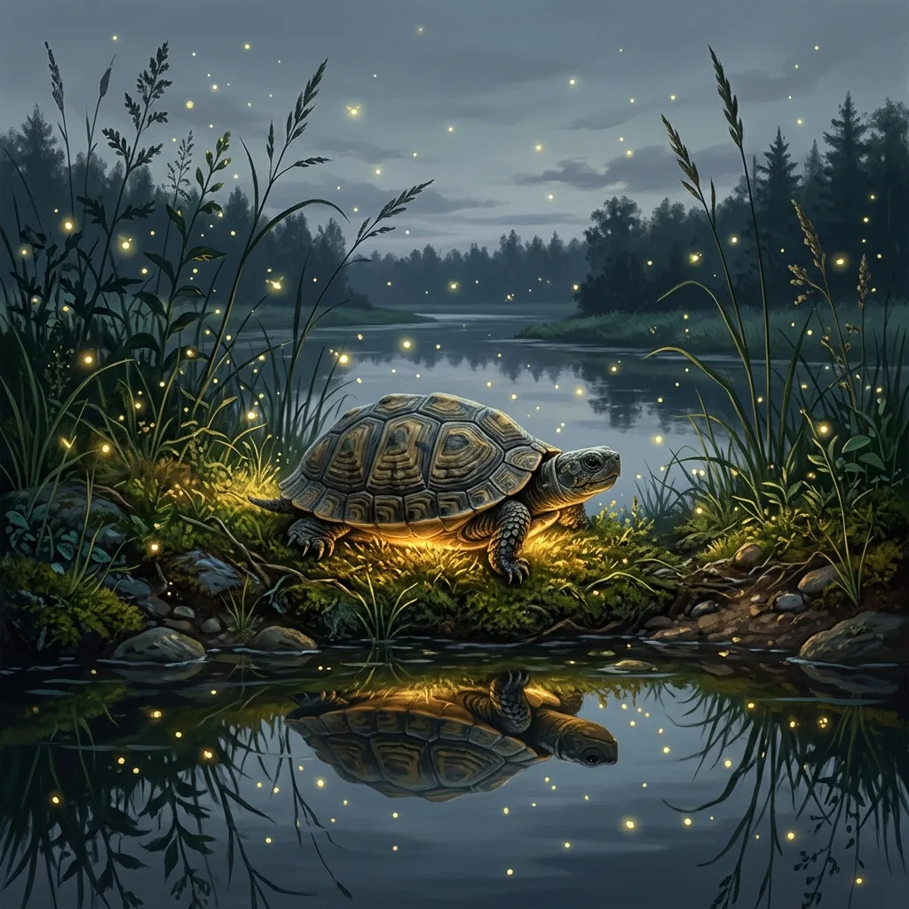

**#133 · Illustration &amp; 3D Prompt · <code>Vinano Image v2</code>**

<details>
<summary>Show prompt</summary>

```
A digital fantasy illustration of a small turtle resting on a grassy riverbank at twilight. The turtle has a detailed, textured shell a soft, warm golden glow emanating from underneath its body, casting light onto the surrounding mossy earth. The scene is filled magical, floating fireflies or glowing pollen particles that sparkle in the dim, atmospheric light. The turtle's reflection is clearly visible in the calm, still water below. Tall, slender blades of grass rise beside the turtle, silhouetted against a serene, muted gray-blue background. The overall mood is peaceful, ethereal, and cinematic, high detail and soft, dreamlike lighting. Maintain consistent colour harmony and crisp focus across the whole frame.
```

</details>

---

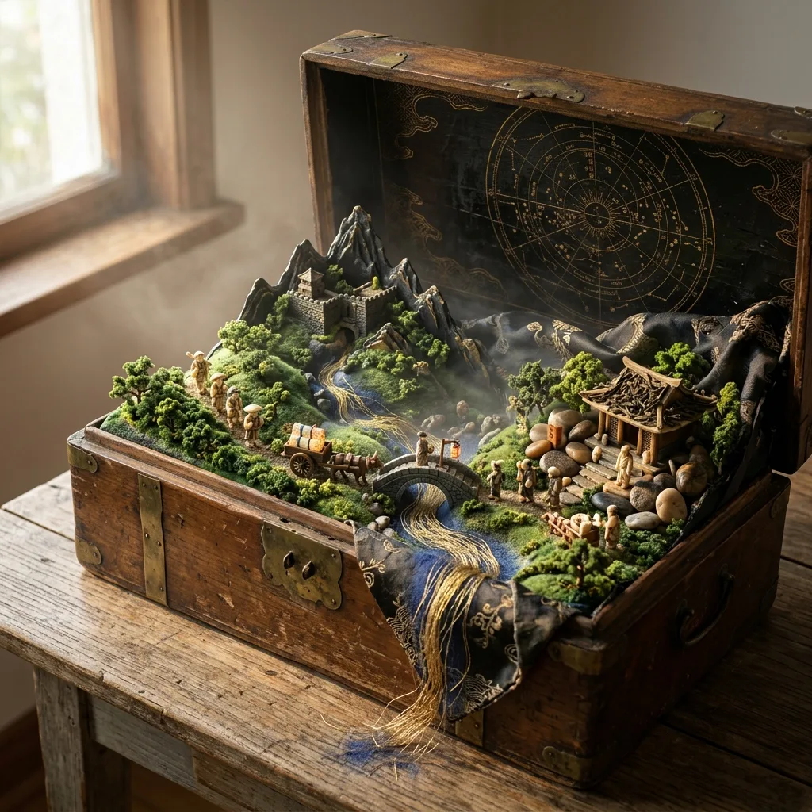

**#134 · Illustration &amp; 3D Prompt · <code>Vinano Image v2</code>**

<details>
<summary>Show prompt</summary>

```
A [AGE / ERA] [CONTAINER / OBJECT] associated [CULTURE / CONTEXT], partially opened to reveal its contents transforming into a living landscape.
The material inside unfolds as a miniature world: [MATERIAL 1] becomes [GEOGRAPHIC FEATURE], [MATERIAL 2] forms [TERRAIN / STRUCTURE], [FINE DETAILS] flow like [NATURAL ELEMENTS].
Tiny [FIGURES / ENTITIES] inhabit the scene, moving through the terrain as part of a [JOURNEY / SYSTEM / ACTIVITY]. [CREATURES / VEHICLES] carry [SYMBOLIC LOADS] across [LANDMARKS].
A [SHELTER / HUB / ARCHITECTURE] constructed from [UNEXPECTED MATERIAL] serves as a gathering point. The interior surface of the object becomes a [SKY / MAP / COSMIC PATTERN] used for guidance or meaning.
The entire scene is unified by [ATMOSPHERIC ELEMENT] and [TEXTURAL DETAIL], evoking [ABSTRACT THEME / EMOTION].
Cinematic macro perspective, handcrafted realism, surreal scale contrast, warm directional lighting, tactile materials, poetic world-building.

Emphasise material texture and natural light so the final frame feels tactile and premium.
```

</details>

---

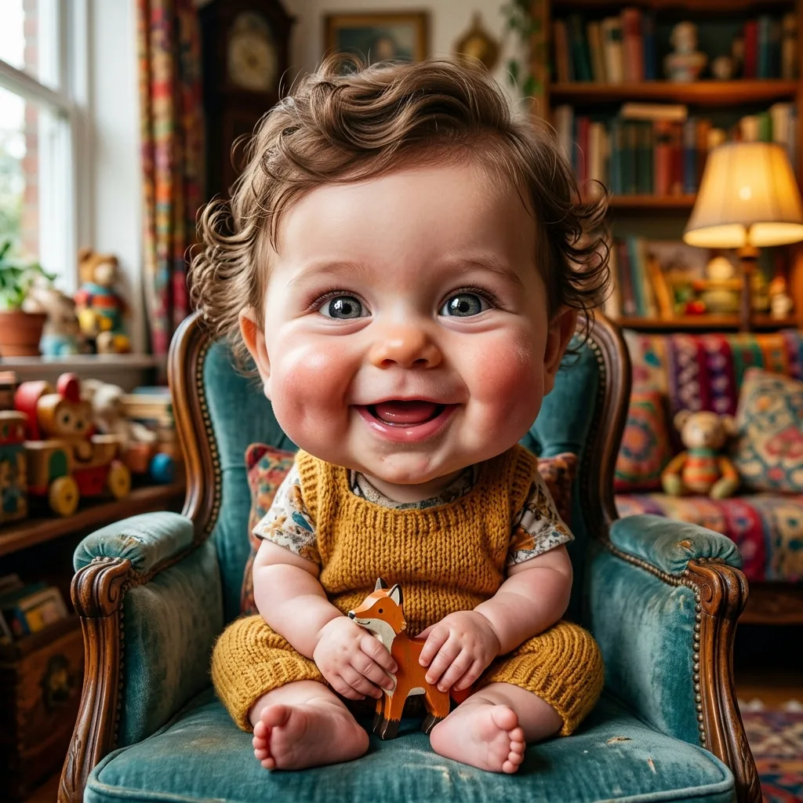

**#135 · Illustration &amp; 3D Prompt · <code>Vinano Image v2</code>**

<details>
<summary>Show prompt</summary>

```
Hyperrealistic baby @ image in a caricature style, exaggerated facial features, finely detailed skin texture, meticulously styled hair, filmic, cinematic lighting, vibrant color grading, dynamic shadows and highlights, whimsical atmosphere, rendered photo-real depth and rich composition Keep edges clean and the overall composition balanced for a polished, gallery-ready result.
```

</details>

---

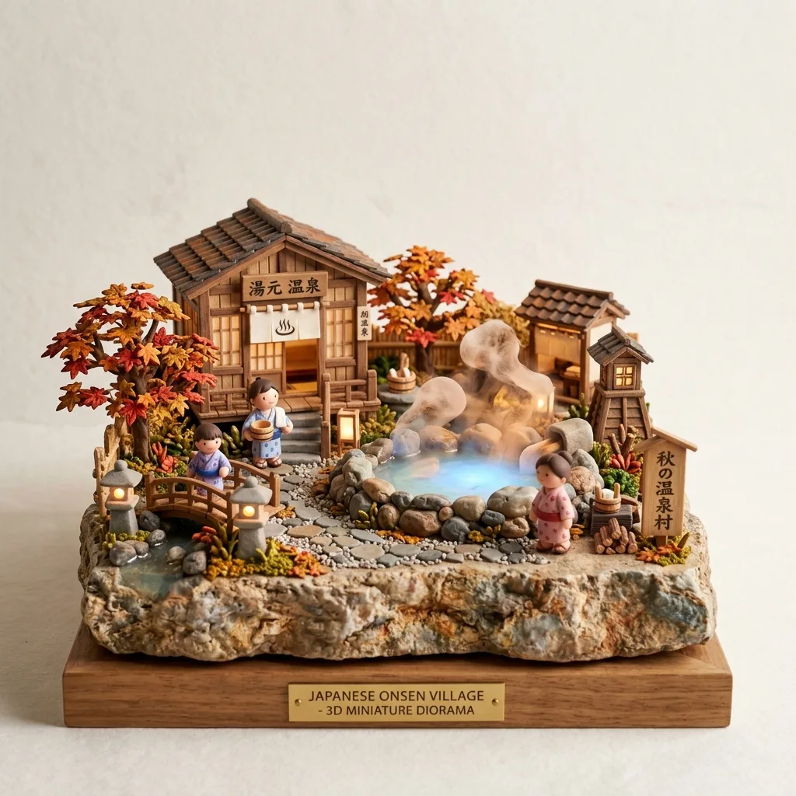

**#136 · Illustration &amp; 3D Prompt · <code>Vinano Image Pro</code>**

<details>
<summary>Show prompt</summary>

```
3D miniature scene, a [JAPANESE ONSEN VILLAGE] [wooden bathhouses, steam rising from natural hot springs, stone lanterns, maple trees in autumn color, guests in tiny yukata robes carrying wooden buckets], presented as a small platform diorama. The platform is carved from natural hot spring rock mineral deposits. Side view, cute clay style, miniature diorama, soft rendered lighting effects, warm steam diffusing the light, light background. Aim for an editorial, design-driven look with deliberate negative space.
```

</details>

---

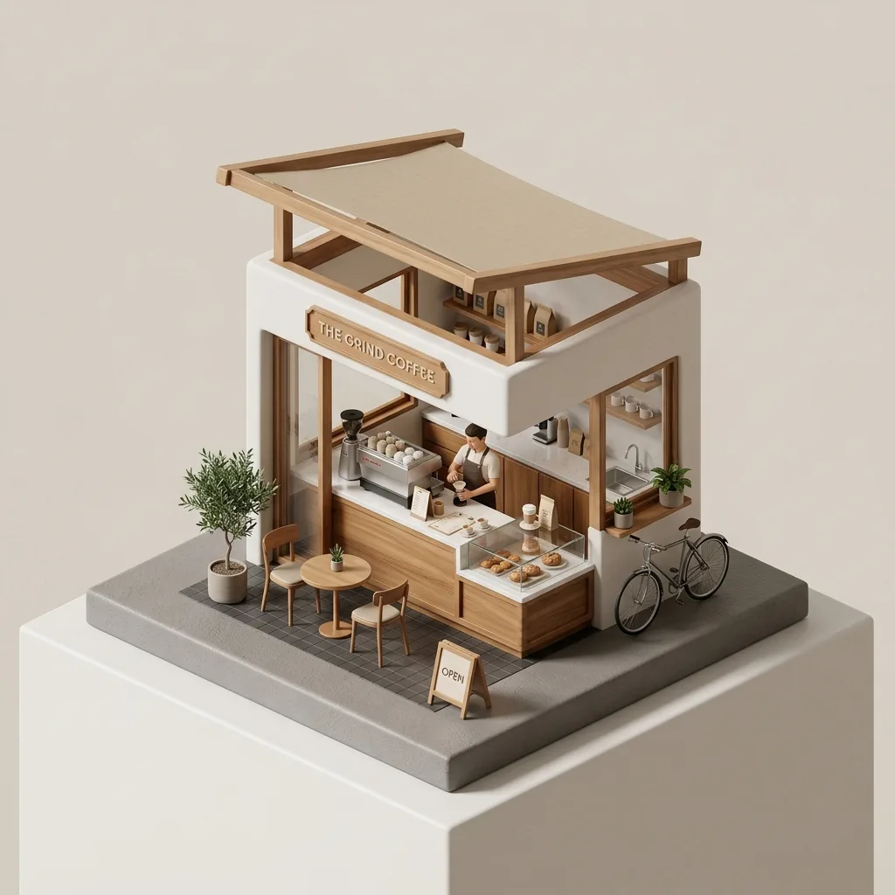

**#137 · Illustration &amp; 3D Prompt · <code>Vinano Image Pro</code>**

<details>
<summary>Show prompt</summary>

```
A clean, minimal 3D isometric diorama of a [URBAN RETAIL TYPE], featuring a [MAIN COUNTER / DISPLAY OBJECT] placed on a [GROUND / PLATFORM TYPE], simple [CANOPY / ROOF STRUCTURE], subtle [SIGNAGE TYPE], smooth [SURFACE MATERIAL], soft studio lighting, realistic materials, rounded edges, miniature architectural model style, high detail, neutral background. Keep edges clean and the overall composition balanced for a polished, gallery-ready result.
```

</details>

---

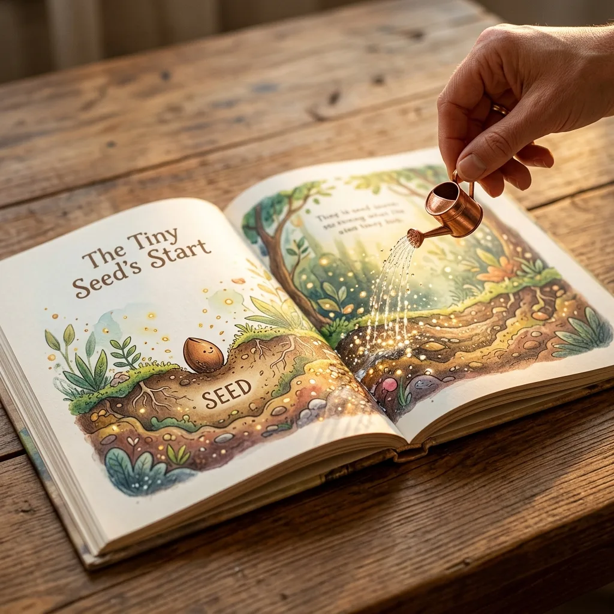

**#138 · Illustration &amp; 3D Prompt · <code>Vinano Image v2</code>**

<details>
<summary>Show prompt</summary>

```
{
 "prompt": "An open children’s picture book rests on a wooden table, showing a whimsical illustration of a small brown seed in cartoon soil. A realistic human hand pours water from a tiny can, a sparkling stream. Warm golden light, magical mood, overhead close-up, true-to-life photorealistic, 4K.",
 "style": "true-to-life photorealistic",
 "lighting": "warm golden",
 "mood": "magical",
 "perspective": "overhead close-up",
 "resolution": "4K",
 "elements": [{
 "type": "book",
 "description": "children’s picture book open on wooden table"
 },
 {
 "type": "illustration",
 "description": "whimsical small brown seed in cartoon soil"
 },
 {
 "type": "hand",
 "description": "realistic human hand pouring water from tiny can"
 },
 {
 "type": "water",
 "description": "sparkling stream"
 }]
}

Aim for an editorial, design-driven look with deliberate negative space.
```

</details>

---

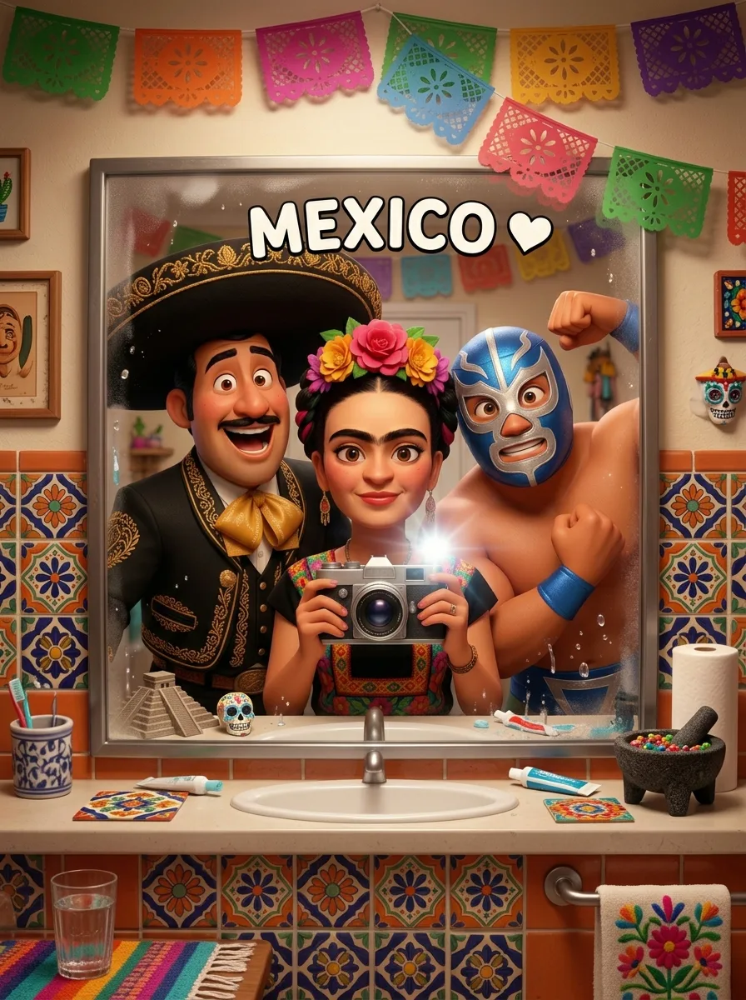

**#139 · Illustration &amp; 3D Prompt · <code>Vinano Image Pro</code>**

<details>
<summary>Show prompt</summary>

```
premium-quality stylized 3D CGI Pixar-style render, vertical 3:4 composition, three most iconic and recognizable cultural figures from [COUNTRY] captured as a chaotic and joyful bathroom mirror selfie; the most visually striking figure holds the large vintage camera up toward the mirror in their most authentic traditional costume, the remaining figures squeezed tightly into the frame each wearing their most iconic outfit and showing their most signature expression or pose; everyone crammed together filling the entire mirror frame faces large and close to the camera, tightly packed no empty space, chaotic crowded energy; facial proportions gently stylized in Disney/Pixar animation style expressive eyes while faithfully preserving each character's most authentic cultural costume and recognizable traits; the bathroom mirror has realistic toothpaste splatters and water droplets; the reflection shows bold black Pixar-style lettering reading "[COUNTRY]❤️"; the bathroom background is styled to match the cultural identity of [COUNTRY] authentic thematic props, traditional decorations and iconic landmark easter eggs placed naturally around the scene; lighting combines soft ambient bathroom lighting a bright camera flash reflecting in the mirror; warm Pixar-style color grading, ultra-detailed 4K render, no watermark Keep edges clean and the overall composition balanced for a polished, gallery-ready result.
```

</details>

---

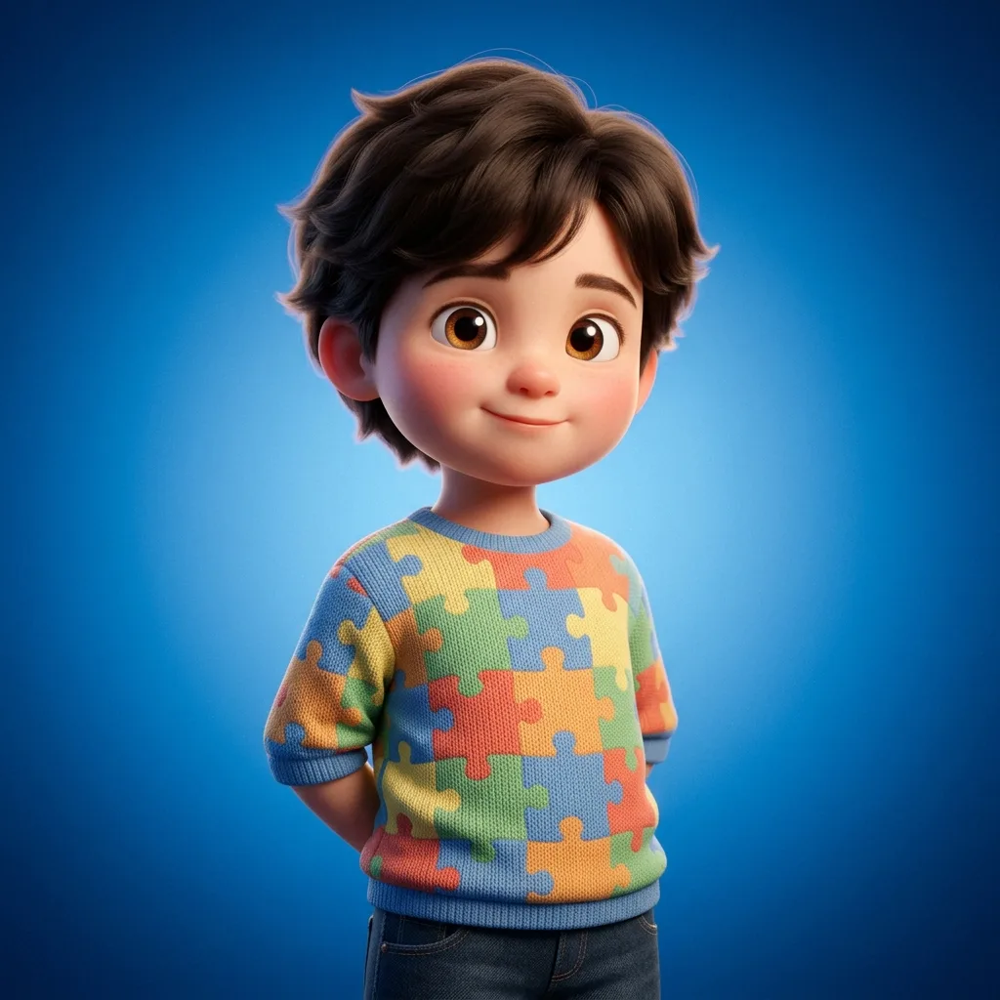

**#140 · Illustration &amp; 3D Prompt · <code>Vinano Image v2</code>**

<details>
<summary>Show prompt</summary>

```
soft, round face
fuller cheeks
small chin
slightly larger, expressive eyes (but still identity-consistent)
no beard, no sharp jawline, no adult features
Expression should be innocent, warm, and slightly playful, a gentle smile and direct eye contact.
Body proportions should be cute and childlike (small, slightly chubby body, slightly larger head).

Pose: relaxed standing hands behind the back, a subtle natural tilt in head and shoulders to avoid stiffness.
Hair should match the reference but appear soft, slightly voluminous, and naturally styled, not overly sharp or artificial.
Skin should be soft and stylized, subtle subsurface scattering (SSS) for a warm glow, matte finish (no plastic shine), and gentle natural blush on cheeks.
The character wears a half sleeves cotton sweater a puzzle pattern, where:

colors are soft but lively and slightly vibrant
not oversaturated and not washed out
The fabric shows a realistic knit texture and soft folds
Lighting should be soft and cinematic:

key light from upper-left
gentle fill light
subtle rim light on hair
Background should be a rich blue gradient, brighter behind the subject and darker toward the edges, smooth depth (not flat).
Output should be:

1:1 aspect ratio
mid-length framing (head to waist)
high-detail, clean 3D render
film-quality finish (not toy-like, not overly realistic)

Aim for an editorial, design-driven look with deliberate negative space.
```

</details>

---

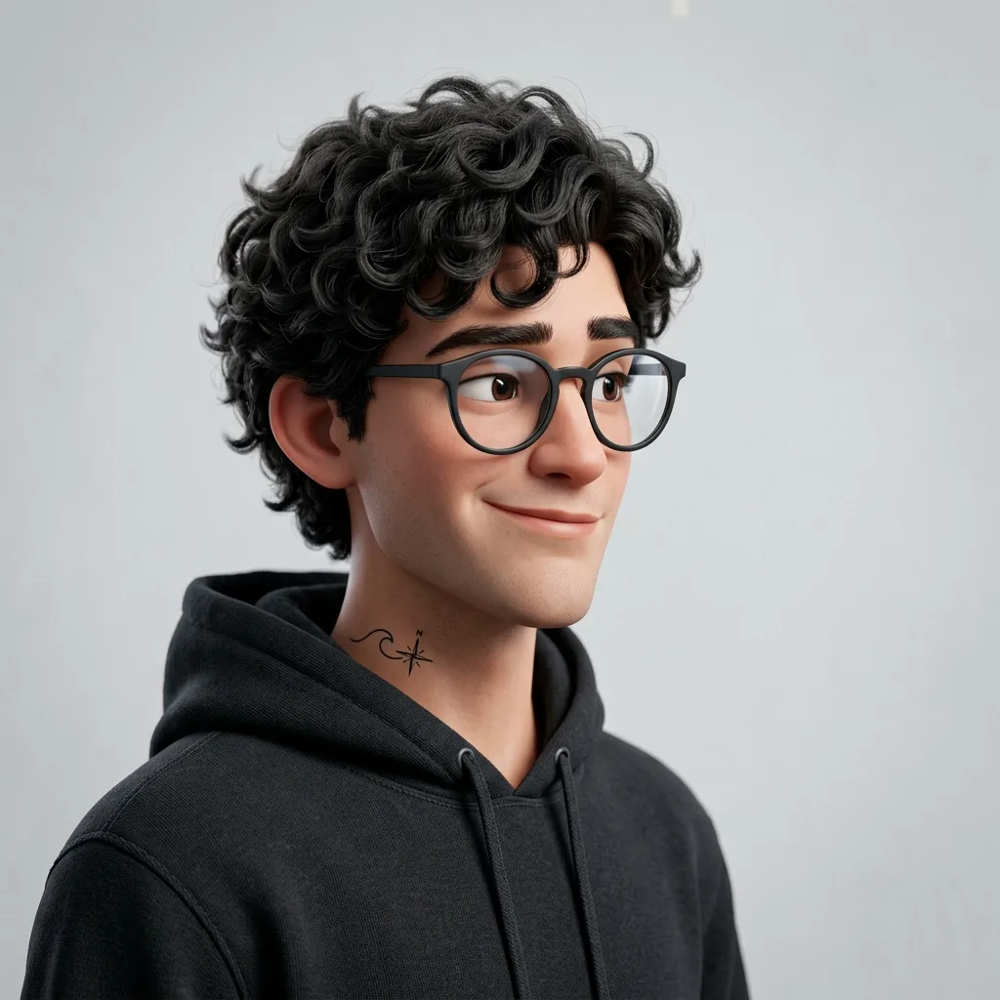

**#141 · Illustration &amp; 3D Prompt · <code>Vinano Image v2</code>**

<details>
<summary>Show prompt</summary>

```
3D stylized character portrait of a young man, curly dark hair, wearing black round glasses and a dark hoodie, subtle smirk expression while looking sideways, small tattoo on the neck, smooth skin, highly detailed Pixar-style character design, soft studio lighting, clean light gray background, ultra-sharp, cinematic render, high detail, modern animated film style. Aim for an editorial, design-driven look with deliberate negative space.
```

</details>

---

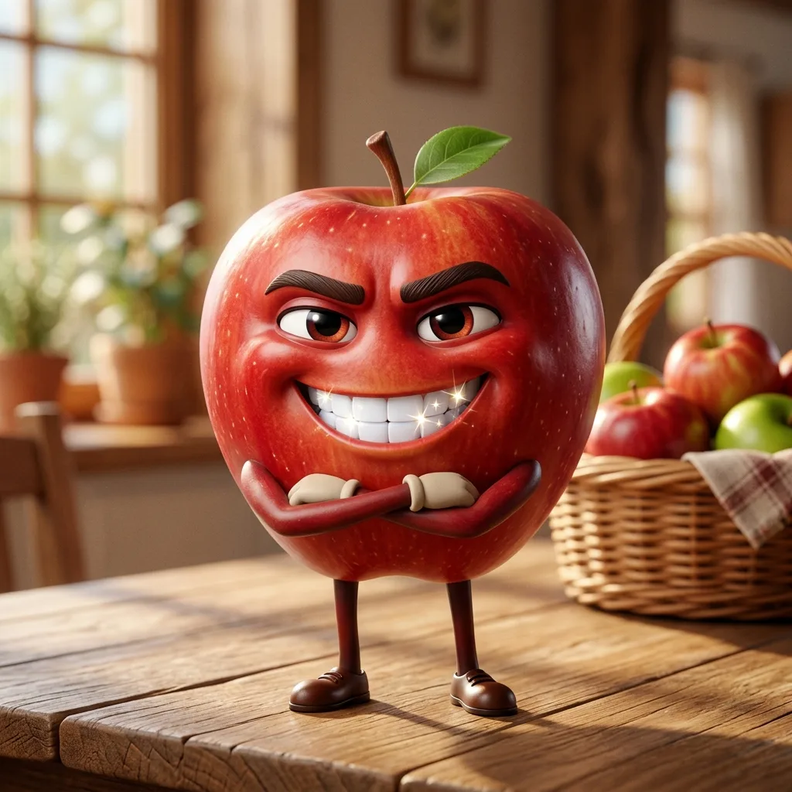

**#142 · Illustration &amp; 3D Prompt · <code>Vinano Image v2</code>**

<details>
<summary>Show prompt</summary>

```
A Pixar-style 3D animated character of a single red apple. Handsome male character sharp confident eyes, thick stylish eyebrows, and a wide charismatic grin showing bright white sparkling teeth. Smooth slightly glossy red skin texture subtle highlights and natural gradients. The apple has small cartoon arms and legs, standing upright arms crossed in a proud hero-like pose.

Teeth are shiny and perfectly white small sparkle effects. In the background, a basket of apples is slightly blurred. The character is standing on a wooden dining table near a sunny window in a cozy modern home. Vibrant colors, filmic, cinematic lighting, soft shadows, high-fidelity textures, ultra-detailed, 8k.

Render with rich micro-detail while keeping the layout uncluttered and intentional.
```

</details>

---

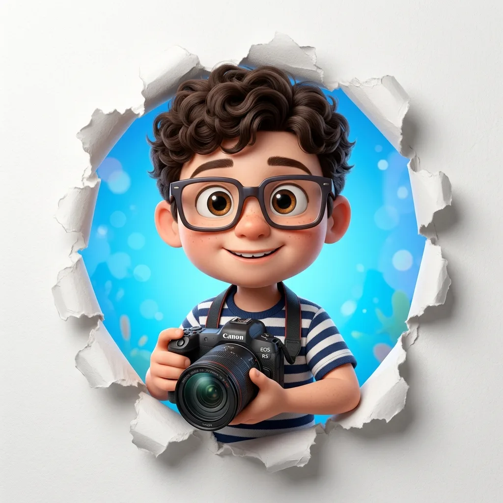

**#143 · Illustration &amp; 3D Prompt · <code>Vinano Image v2</code>**

<details>
<summary>Show prompt</summary>

```
A cute stylized 3D cartoon character (boy/girl) big expressive eyes, soft smooth skin, and round facial features, wearing glasses and a casual striped t-shirt, holding a professional DSLR camera. The character is emerging through a torn paper hole in a clean white wall, realistic ripped paper edges and depth. Behind the hole is a bright blue gradient background, creating contrast. The character is smiling directly at the viewer, vibrant and friendly mood, Pixar-style rendering, ultra-detailed textures, soft studio lighting, high realism, 8K resolution. Maintain consistent colour harmony and crisp focus across the whole frame.
```

</details>

---

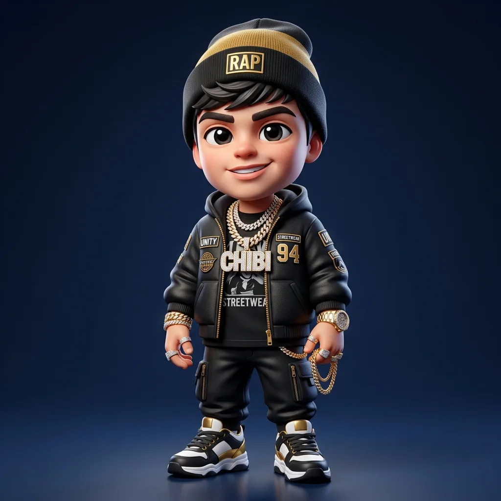

**#144 · Illustration &amp; 3D Prompt · <code>Vinano Image v2</code>**

<details>
<summary>Show prompt</summary>

```
Maintaining the facial features of all creatures…
chibi styled 3d, wearing rapper outfit style, babyoversized head and small body (chibi proportions), preserving the person’s recognizable facial features and likeness. Stylized
realistic but cartoonish, smooth textures, expressive face, big eyes. Full-body character wearing typical streetwear clothing and accessories, including diamond chains. premium-quality 3D lighting, vibrant colors, playful proportions, style. Clean DARK BLUE background, studio lighting, sharp focus.

Keep edges clean and the overall composition balanced for a polished, gallery-ready result.
```

</details>

---

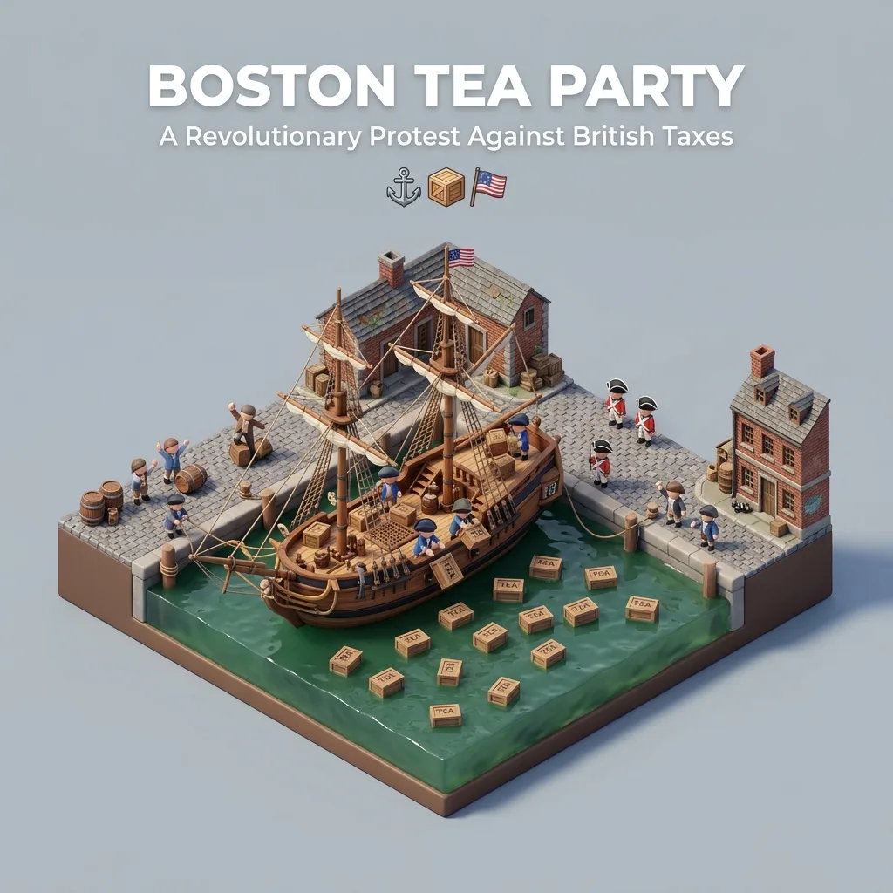

**#145 · Illustration &amp; 3D Prompt · <code>Vinano Image Pro</code>**

<details>
<summary>Show prompt</summary>

```
Present a clear, 45° top-down isometric miniature 3D cartoon scene of the historical event “EVENT”, featuring its most iconic moment: [DESCRIPTION]. Use soft refined textures, realistic PBR materials, and gentle lifelike lighting.
Create a small raised diorama-style base that includes the most recognizable elements of this moment, along tiny stylized characters if needed (no facial details).
Use a clean solid [BACKGROUND COLOR] background.

At the top-center, display “EVENT” in large bold text, directly beneath it show a short descriptive subtitle in medium text, and place a small official symbol or simplified icon below the subtitle.
All text must automatically match the background contrast (white or black).

Composition: perfectly centered layout, square 1080x1080, ultra-clean, high-clarity diorama aesthetic.

Emphasise material texture and natural light so the final frame feels tactile and premium.
```

</details>

---

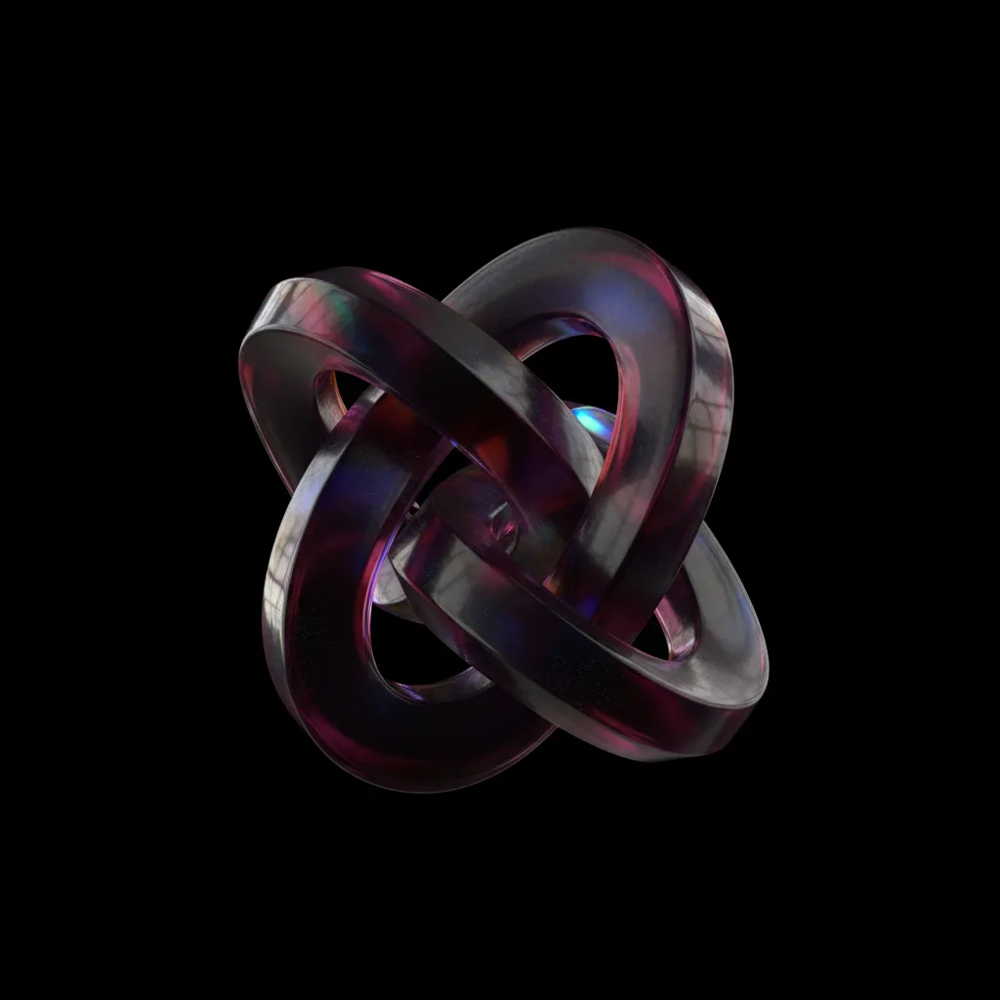

**#146 · Illustration &amp; 3D Prompt · <code>Vinano Image</code>**

<details>
<summary>Show prompt</summary>

```
{
 "ultra_high_fidelity_request": {
 "subject": "[PRODUCT]",
 "framing": {
 "position": "Strictly centered and levitating",
 "boundary": "Full product visibility, zero cropping, isolated in 3D space",
 "background": "Solid pure black hex #000000"
 },
 "optical_effects": {
 "iridescence": "Extremely brilliant spectral iridescence, vivid neon oil-slick gradients",
 "volumetric": "Internal volumetric lighting, ethereal inner glow, light scattering within the material",
 "refraction": "High-index caustic light refraction, prismatic color splitting at the edges",
 "luminosity": "Super-saturated holographic highlights, intense electric blues and deep magentas"
 },
 "material_finish": {
 "texture": "Ultra-glossy liquid-smooth finish",
 "base": "Deep translucent obsidian glass infinite depth",
 "reflections": "Crisp ray-traced mirror reflections of an invisible light source"
 },
 "negative_constraints": ["No platforms", "No floor", "No light boxes", "No softboxes",
 "No props", "No text", "No shadows on surfaces", "No pedestals"]
 }
}

Emphasise material texture and natural light so the final frame feels tactile and premium.
```

</details>

---

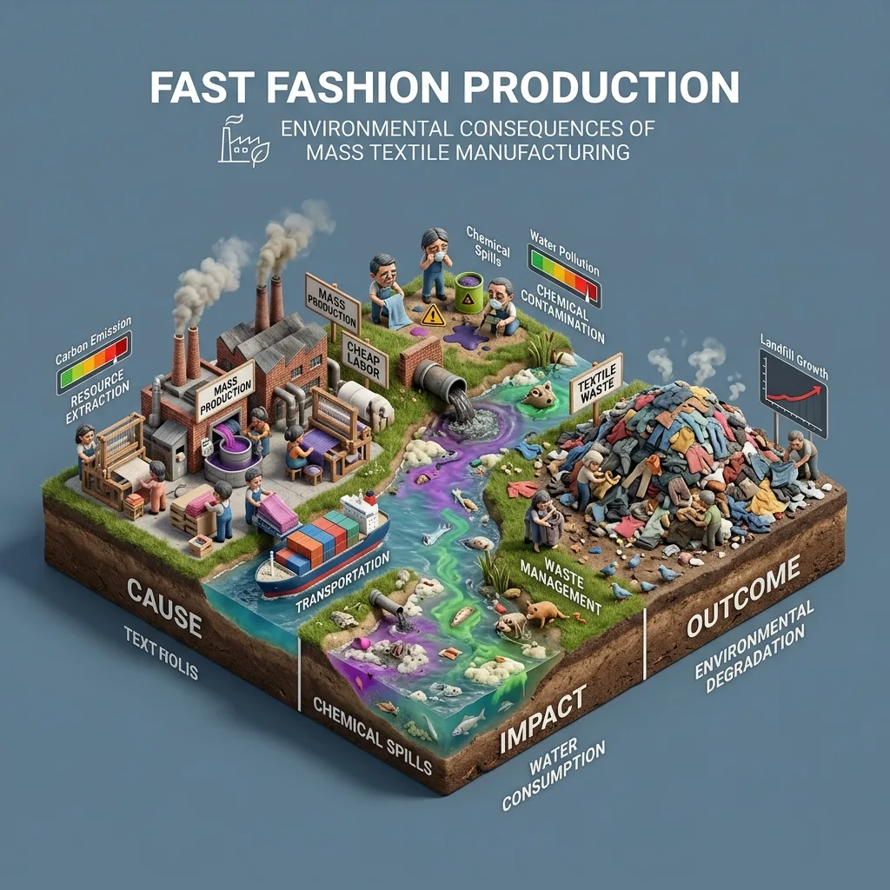

**#147 · Illustration &amp; 3D Prompt · <code>Vinano Image Pro</code>**

<details>
<summary>Show prompt</summary>

```
“Build an isometric miniature 3D diorama explaining the environmental impact of [ACTIVITY OR PRODUCT].

Viewpoint stays near 45° from above.
Textures look realistic and balanced. Lighting feels soft and clear. The raised base splits into cause, impact, and outcome sections. Include visual indicators like meters, symbols, or levels.

Tiny stylized figures represent people, wildlife, or infrastructure. Figures have heavy facial details.

Background remains solid [BACKGROUND COLOR].
Top center text reads [TOPIC NAME] in bold.

Subtitle states the key impact in one line. A minimal environment icon appears below. Text switches between white or black for contrast.”

Render with rich micro-detail while keeping the layout uncluttered and intentional.
```

</details>

---

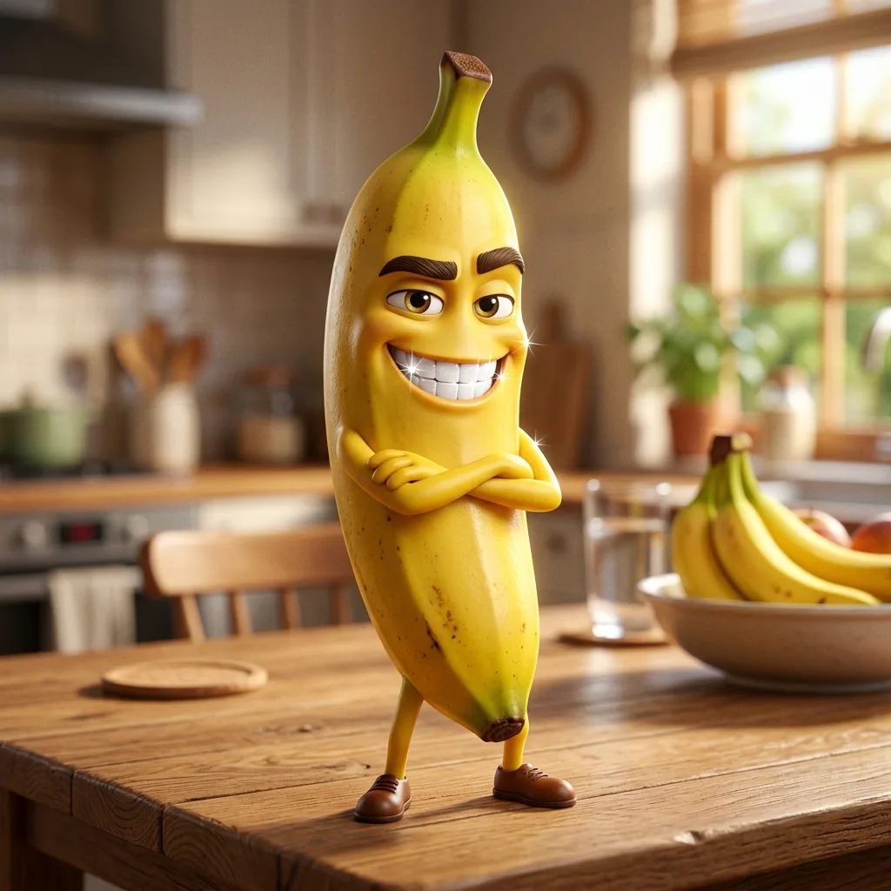

**#148 · Illustration &amp; 3D Prompt · <code>Vinano Image v2</code>**

<details>
<summary>Show prompt</summary>

```
A Pixar-style 3D animated character of a single banana. Handsome male character sharp confident eyes, thick stylish eyebrows, and a wide charismatic grin showing bright white sparkling teeth. Smooth slightly glossy yellow peel texture subtle highlights. The banana has small cartoon arms and legs, standing upright arms crossed in a proud hero-like pose. Teeth are shiny and perfectly white small sparkle effects. In the background, a bunch of bananas is slightly blurred.The character is standing on a wooden dining table near a sunny window in a cozy modern home. Vibrant colors, filmic, cinematic lighting, soft shadows, high-fidelity textures, ultra-detailed. Render with rich micro-detail while keeping the layout uncluttered and intentional.
```

</details>

---

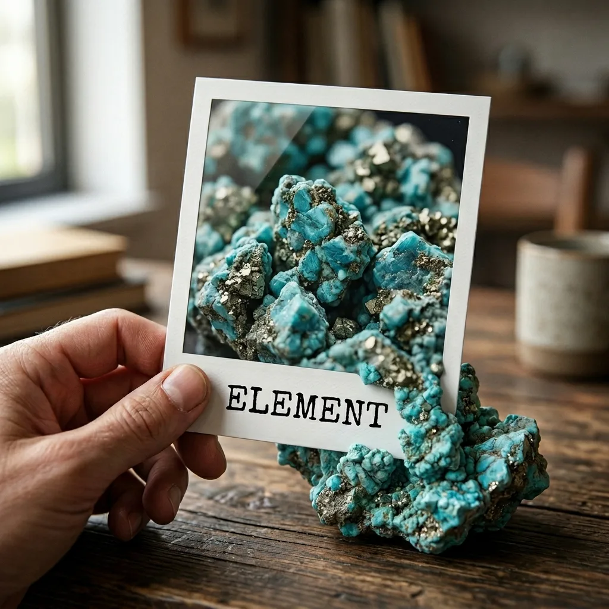

**#149 · Illustration &amp; 3D Prompt · <code>Vinano Image v2</code>**

<details>
<summary>Show prompt</summary>

```
A hyper-realistic 3D photo concept showing a hand holding a square polaroid photo labeled “ELEMENT”. Inside the photo, there’s a close-up of [ELEMENT], and it flows seamlessly out of the photo frame into the real world, naturally interacting the surface below. The text “ELEMENT” appears printed cleanly on the white border of the photo. Realistic filmic, cinematic lighting, ultra-detailed textures, artistic composition, 1080x1080 square format. Preserve realistic proportions and depth for a confident, professional finish.
```

</details>

---


**#150 · Illustration &amp; 3D Prompt · <code>Vinano Image v2</code>**

<details>
<summary>Show prompt</summary>

```
Generate a hyper-realistic digital illustration of a cake meticulously stylized to resemble a [LOGO] resting on a pristine white table. Show it partially bitten to reveal multiple delicious layers (sponge, frosting, crumbs) and shatter the illusion. Capture the moment of surprise intricate details in the bite mark. Use a slightly overhead angle to emphasize the contrast between the realistic outer shell and the cake interior. Illuminate the scene soft, diffused lighting to enhance textures and cast subtle shadows for depth. Keep the background minimal and bright to focus on the deceptive dessert. Employ a vibrant, playful palette for the cake layers against the object-mimicking exterior. Render in a true-to-life photorealistic style whimsical undertones, making the reveal both visually convincing and appetizing. Render with rich micro-detail while keeping the layout uncluttered and intentional.
```

</details>

---

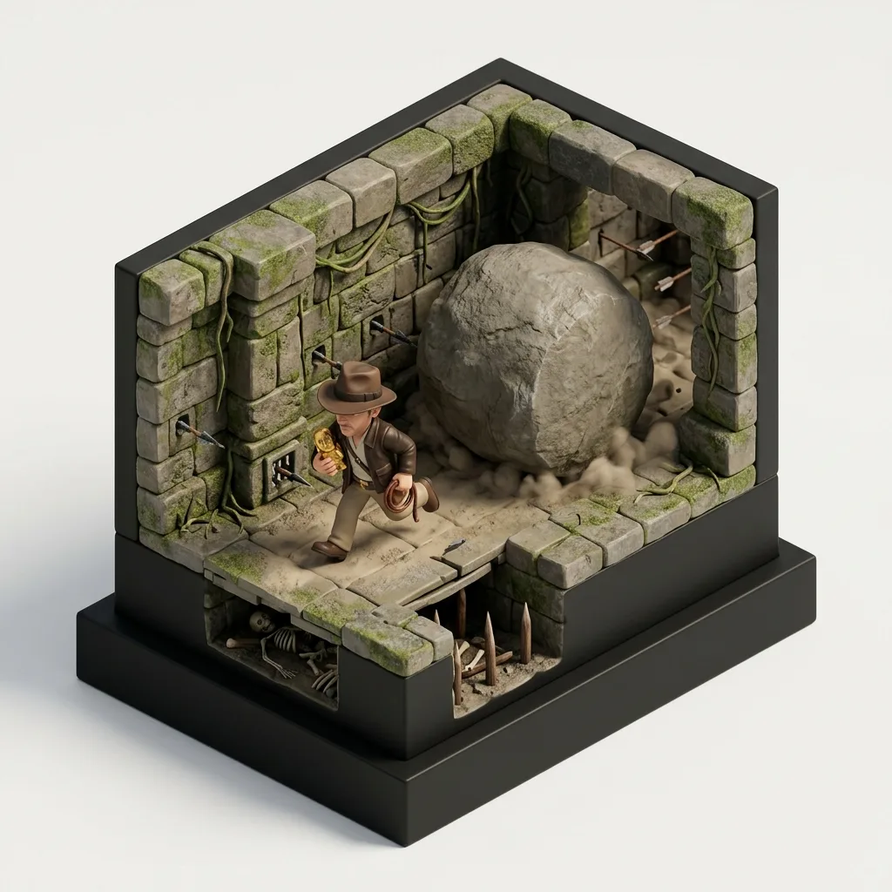

**#151 · Illustration &amp; 3D Prompt · <code>Vinano Image Pro</code>**

<details>
<summary>Show prompt</summary>

```
Stylized, ultra high-fidelity 3D isometric miniature diorama, 35–40° isometric view, palm-sized collectible scale, ultra-clean geometry realistic micro-detail, soft studio lighting from top-left, gentle ambient occlusion, subtle soft shadows, neutral color grading, museum-quality product render, displayed on a simple matte rectangular base, seamless all-white background, 1080x1080. [MOVIE SCENE]. Emphasise material texture and natural light so the final frame feels tactile and premium.
```

</details>

---

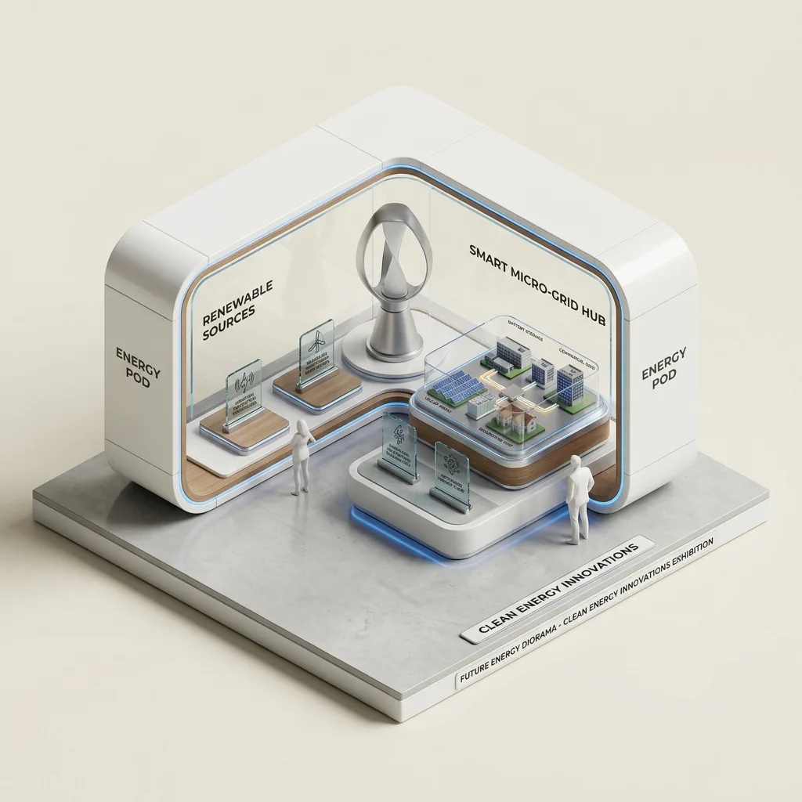

**#152 · Illustration &amp; 3D Prompt · <code>Vinano Image Pro</code>**

<details>
<summary>Show prompt</summary>

```
A clean, minimal 3D isometric diorama of a [EXHIBITION TYPE], featuring [DISPLAY OBJECTS] arranged within a [POD STRUCTURE], subtle lighting accents, smooth floor surfaces, soft studio lighting, realistic materials, rounded edges, miniature architectural model style, high detail, neutral background. Preserve realistic proportions and depth for a confident, professional finish.
```

</details>

---

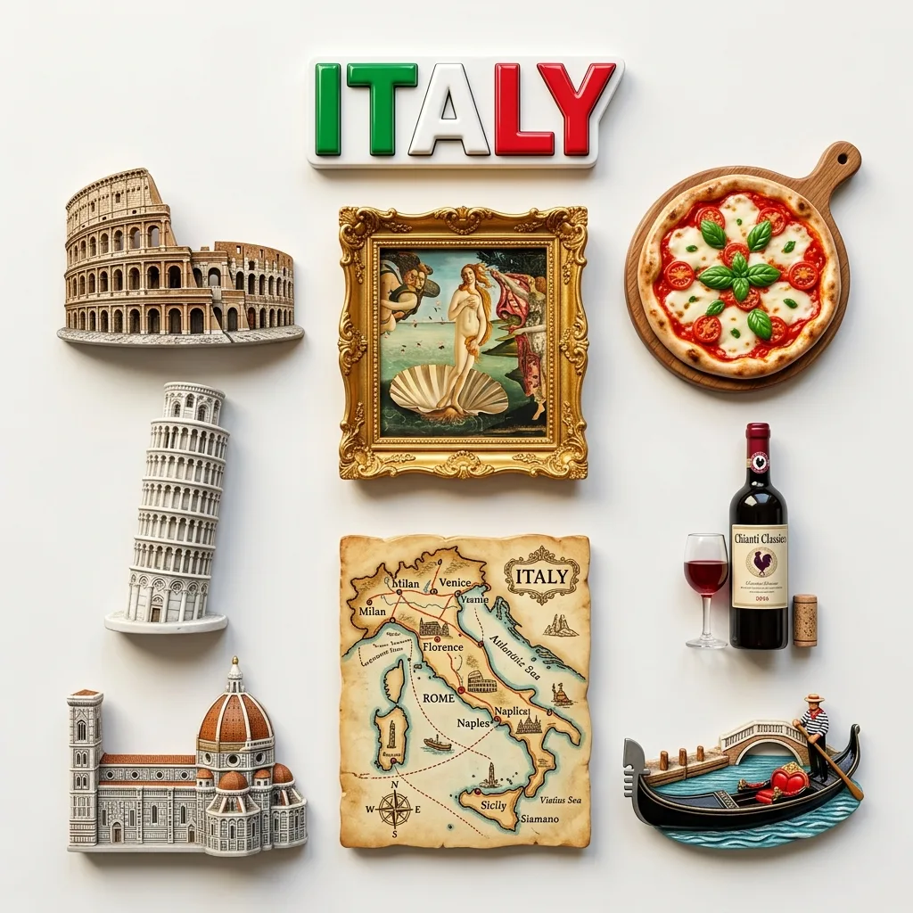

**#153 · Illustration &amp; 3D Prompt · <code>Vinano Image Pro</code>**

<details>
<summary>Show prompt</summary>

```
A flat-lay collection of exactly 9 hyper-realistic 3D resin fridge magnets arranged on a plain matte white surface, themed around [COUNTRY]. At the very top center, a wide rectangular text magnet spells "COUNTRY" in bold 3D block letters colored in the nation's flag colors. Below it, 8 magnets are arranged in a loose 3-column grid: 3 iconic architectural landmarks as highly detailed sculpted miniature reliefs (cathedrals, towers, castles, monuments), 1 famous painting or portrait reproduced inside a gold ornate picture frame magnet, 1 traditional food dish and 1 drink (wine bottle + glass, or beer stein, etc.) as glossy ceramic sculpted magnets, 1 illustrated vintage-style map magnet of the country city markers, and 1 additional cultural symbol or landmark. Each magnet has a slightly raised 3D sculpted look soft drop shadows on the white surface beneath. Warm studio lighting from above, true-to-life photorealistic product render, perfectly clean white background, top-down flat-lay angle, 4:5 aspect ratio Render with rich micro-detail while keeping the layout uncluttered and intentional.
```

</details>

---

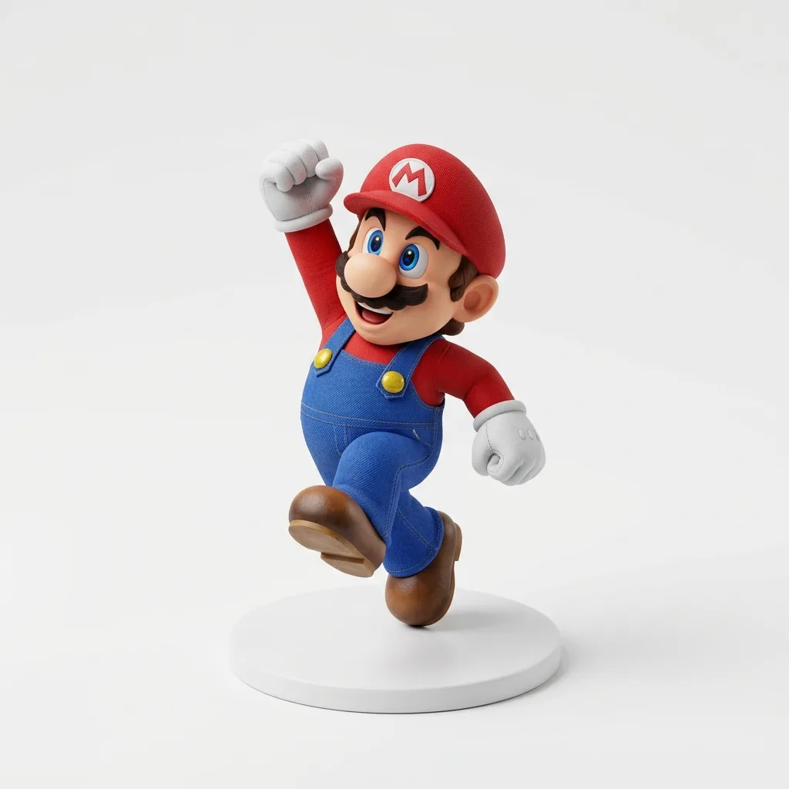

**#154 · Illustration &amp; 3D Prompt · <code>Vinano Image Pro</code>**

<details>
<summary>Show prompt</summary>

```
Miniature, full-body, isometric, ultra-realistic figurine of [CHARACTER], wearing their most iconic outfit and colors, in a signature pose or action, instantly recognizable silhouette and expression, clean white studio background, minimal composition, soft realistic shadows, filmic, cinematic lighting, hyper-detailed textures, 4K quality Keep edges clean and the overall composition balanced for a polished, gallery-ready result.
```

</details>

---

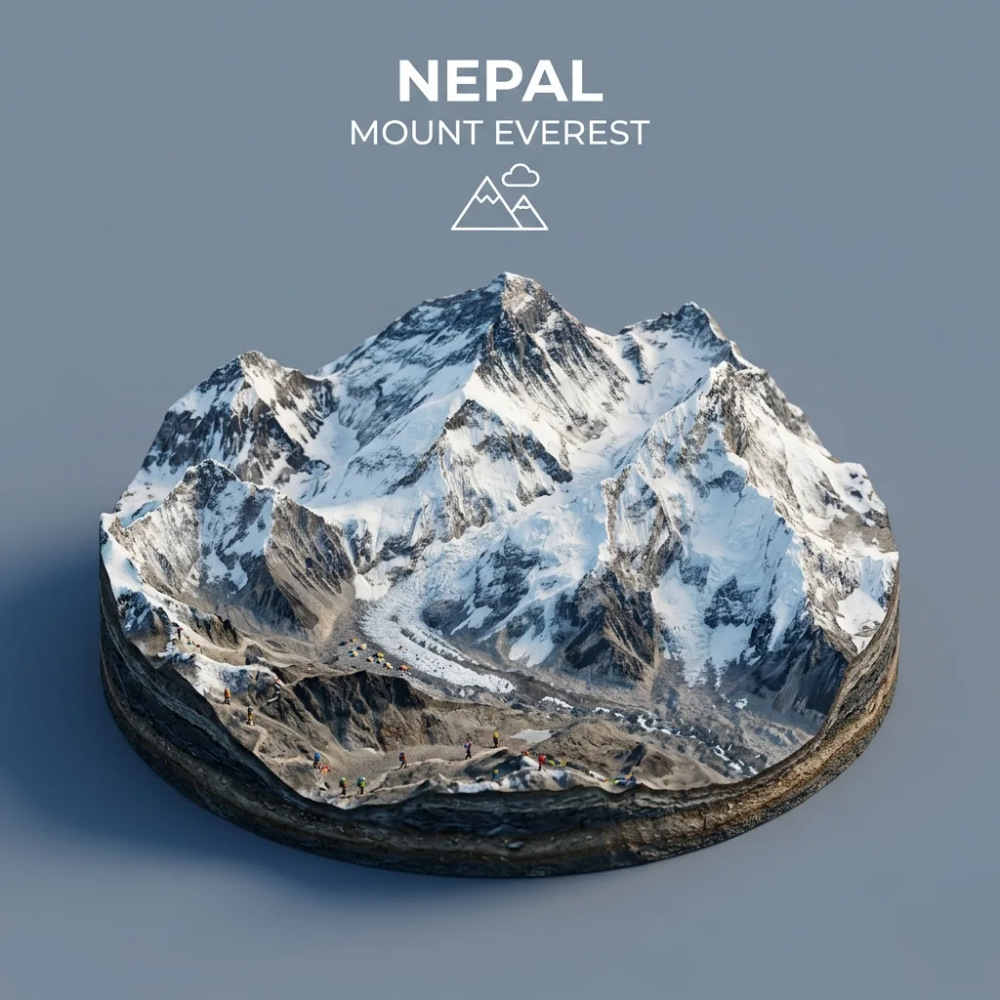

**#155 · Illustration &amp; 3D Prompt · <code>Vinano Image Pro</code>**

<details>
<summary>Show prompt</summary>

```
Create an isometric miniature 3D diorama highlighting the natural landmark [NATURAL WONDER] from [COUNTRY NAME/PLANET].

Use a 40–45° top-down view. Textures look organic and realistic PBR materials. Lighting feels soft and atmospheric.

The raised base shows terrain layers, vegetation, and surrounding geography. Add tiny stylized explorers or wildlife no facial details.

Background remains solid [BACKGROUND COLOR].

Top center text displays [COUNTRY NAME] in bold.
Second line shows [NATURAL WONDER]. Place a minimal nature icon below. Text automatically adapts for contrast.

Emphasise material texture and natural light so the final frame feels tactile and premium.
```

</details>

---

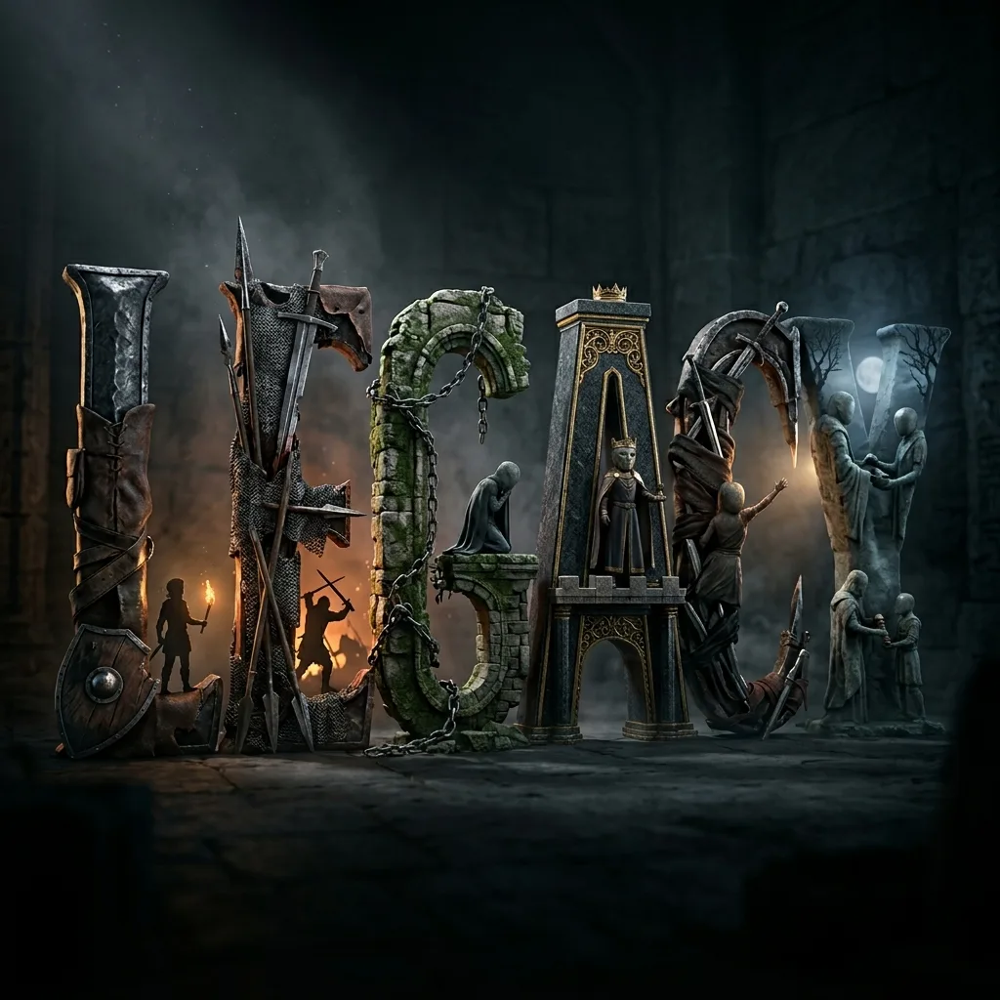

**#156 · Illustration &amp; 3D Prompt · <code>Vinano Image Pro</code>**

<details>
<summary>Show prompt</summary>

```
Create a cinematic 3D typographic composition spelling [WORD / NAME], where each letter is sculpted from the personality, environment, and emotional arc of [CHARACTER / STORY].

Letters are formed clothing textures, symbolic props, architecture, and lighting motifs tied to different moments of the narrative.

No literal faces — identity is conveyed through silhouettes, posture, materials, and atmosphere. Use premium metallic or stone materials subtle wear.

Dark cinematic background, dramatic rim lighting, deep shadows, ultra-realistic render, film-title quality.

Emphasise material texture and natural light so the final frame feels tactile and premium.
```

</details>

---

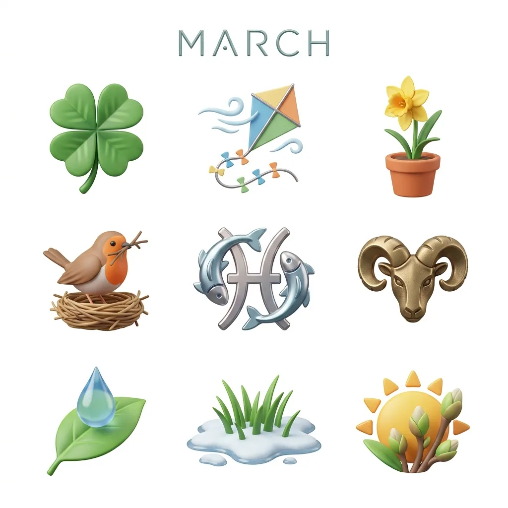

**#157 · Illustration &amp; 3D Prompt · <code>Vinano Image Pro</code>**

<details>
<summary>Show prompt</summary>

```
Create a collection of icons representing [Month] through objects, symbols, and moods.
They belong together as a single cohesive theme.
The background is pure white.

Place the month name “[MONTH]” at the top center of the image as a minimal, balanced title, aligned symmetrically above the grid and visually integrated the overall design.

Icons are rendered in a colorful yet calm 3D style, season-appropriate textures and atmospheric lighting that reflect the essence of [MONTH].

Maintain consistent proportions, materials, and visual language across all icons and the title.

Maintain consistent colour harmony and crisp focus across the whole frame.
```

</details>

---

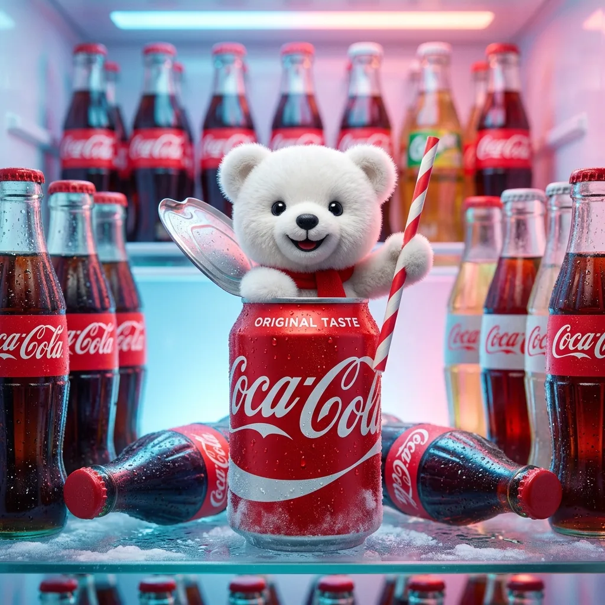

**#158 · Illustration &amp; 3D Prompt · <code>Vinano Image v2</code>**

<details>
<summary>Show prompt</summary>

```
A cute, cinematic brand fantasy scene featuring a fluffy white teddy bear mascot emerging from a chilled soda Coca-Cola can, holding a colorful striped straw.

The can is placed inside a glowing refrigerator filled neatly stacked glass soda bottles. Soft neon lighting, pastel reflections, condensation droplets on metal, playful yet premium advertising style. Shallow depth of field, ultra-detailed fur texture, glossy highlights, vibrant red-and-white color pal-ette, whimsical mood, Pixar-level realism, stu-dio-quality lighting, high contrast, square composi-tion, 1080×1080, ultra-HD, commercial brand photog-raphy.

Render with rich micro-detail while keeping the layout uncluttered and intentional.
```

</details>

---

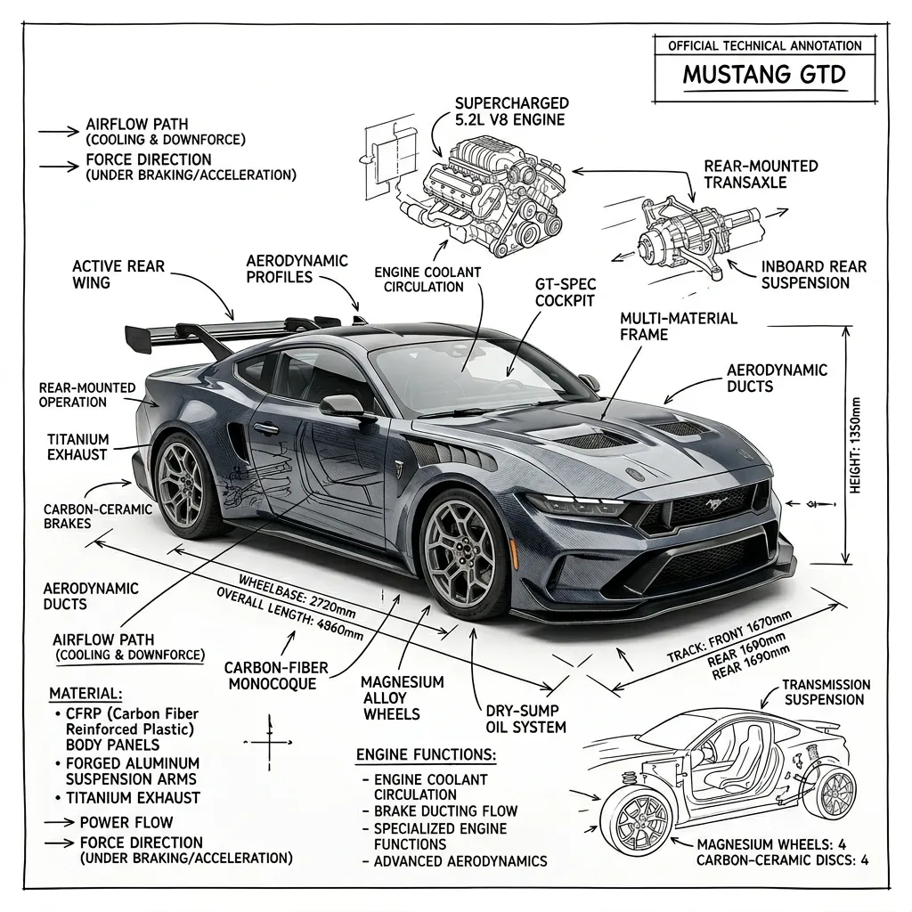

**#159 · Illustration &amp; 3D Prompt · <code>Vinano Image Pro</code>**

<details>
<summary>Show prompt</summary>

```
Create an infographic image of Mustang GTD combining a realistic photograph or true-to-life photorealistic render of the object technical annotation overlays placed directly on top.

Use black ink–style line drawings and text (blue Mustang GTD) on a pure white studio background.

Include:
•Key component labels
•Internal cutaway or exploded-view outlines (where relevant)
•Measurements, dimensions, and scale markers
•Material callouts and quantities
•Arrows indicating function, force, or flow (all the functions that comes bugatti Chiron)
•Simple schematic or sectional diagrams where applicable

Place the title Mustang GTD inside a real technical annotation box in one corner.

Style & layout rules:
•The real object remains clearly visible beneath the annotations(no annotation on the real object)
•Annotations look hand-sketched, technical, and architectural
•crisp composition balanced negative space
•Educational, museum-exhibit / engineering-manual vibe

Visual style:
Minimal technical illustration aesthetic.
Black linework layered over realistic imagery.
Precise but slightly hand-drawn feel.

Color palette:
Pure white background.
Black annotation lines and text only.
No colors.

Output:
1080 × 1080 resolution
Ultra-crisp
Social-feed optimized
No watermark

Render with rich micro-detail while keeping the layout uncluttered and intentional.
```

</details>

---

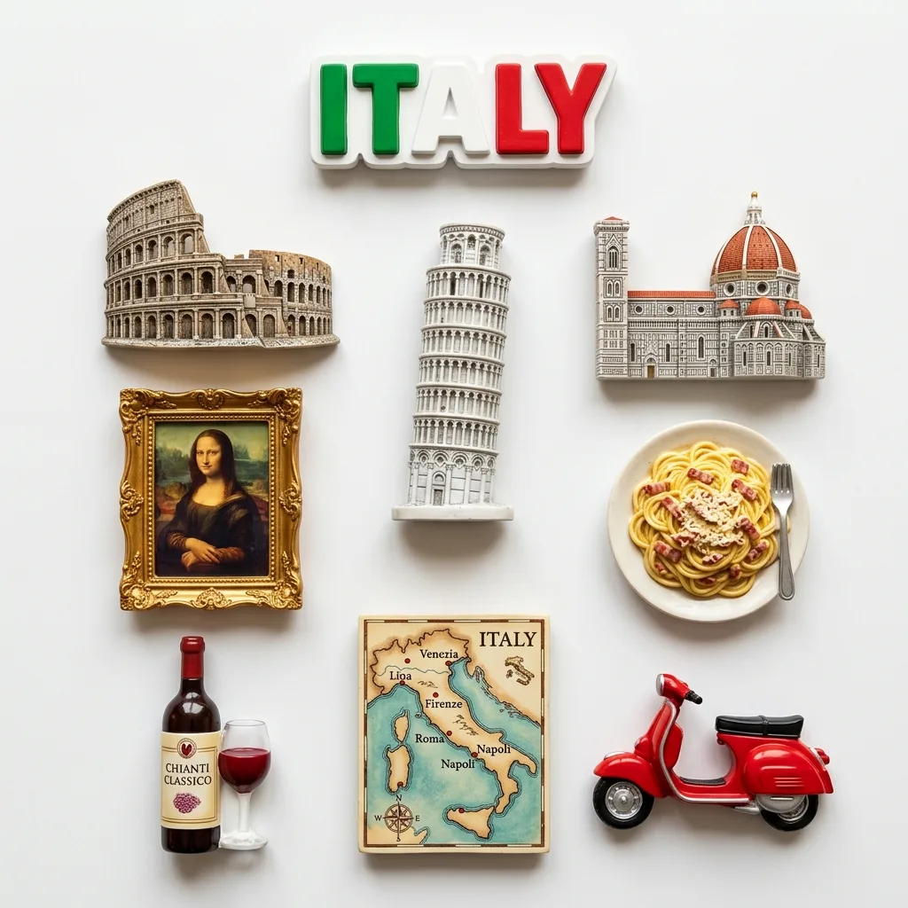

**#160 · Illustration &amp; 3D Prompt · <code>Vinano Image Pro</code>**

<details>
<summary>Show prompt</summary>

```
A flat-lay collection of exactly 9 hyper-realistic 3D resin fridge magnets arranged on a plain matte white surface, themed around [COUNTRY]. At the very top center, a wide rectangular text magnet spells "COUNTRY" in bold 3D block letters colored in the nation's flag colors. Below it, 8 magnets are arranged in a loose 3-column grid: 3 iconic architectural landmarks as highly detailed sculpted miniature reliefs (cathedrals, towers, castles, monuments), 1 famous painting or portrait reproduced inside a gold ornate picture frame magnet, 1 traditional food dish and 1 drink (wine bottle + glass, or beer stein, etc.) as glossy ceramic sculpted magnets, 1 illustrated vintage-style map magnet of the country city markers, and 1 additional cultural symbol or landmark. Each magnet has a slightly raised 3D sculpted look soft drop shadows on the white surface beneath. Warm studio lighting from above, true-to-life photorealistic product render, perfectly clean white background, top-down flat-lay angle, 4:5 aspect ratio. Maintain consistent colour harmony and crisp focus across the whole frame.
```

</details>

---

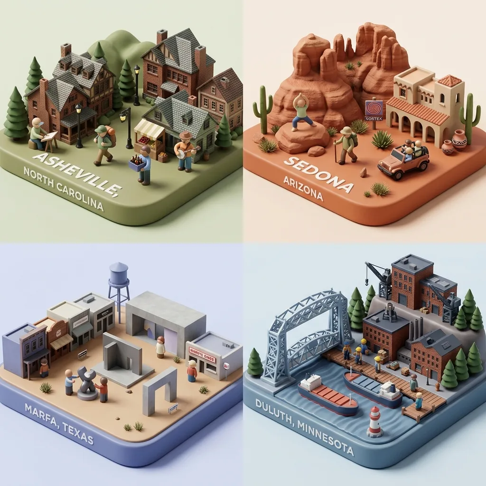

**#161 · Illustration &amp; 3D Prompt · <code>Vinano Image Pro</code>**

<details>
<summary>Show prompt</summary>

```
<instructions>
Role: You are a Lead 3D Artist at a premium collectible company
Input Variable: [INSERT COUNTRY]
System Instruction:
Generate a 2x2 Grid of High-Fidelity Designer Vinyl dioramas.
Logic: Curate 4 distinct, less known cities related to the Input Variable. Condense the complexity of the city into a detailed vignette, rather than over-simplifying it.
1. The Toy Physics (The "Premium" Rule):
Geometry: High-Fidelity Vinyl. Maintain the specific architectural silhouette of the region (e.g., if the city has pagodas, keep the tiers; if it has domes, keep the arches).
Detailing: Use "Intricate Softness." Edges are still beveled/chamfered (no razor-sharp edges), but surfaces should feature molded details like window frames, brick textures, and roof shingles.
Density: The scene should feel "lived-in" and dense. Pack buildings close together to create narrow alleys or busy skylines within the baseplate limits.
Material: Premium Matte Vinyl slight subsurface scattering. It should look expensive and substantial.
2. Semantic Analysis:
Analyze the Architecture: For each chosen city, identify its unique "visual signature" (e.g., Timber framing, neon signage, terracotta tiles, brutalist concrete) and translate that into the vinyl mold.
Analyze the Geography: If the city is coastal, mold waves into the base. If it is mountainous, stack the buildings vertically.
3. Container:
The Base: Thick, rounded-square baseplate.
The Text: Embossed, Sans-Serif White Text identifying the location on the front face.
Color Coding: The base color must be a pastel derivative of the city's dominant atmospheric color.
4. Narrative:
Population: Increase figure count to 3-4 tiny "peg" people per scene interacting the environment.
Props: Include specific regional props (e.g., vending machines, street lamps, market stalls) to add scale and clutter.
5. Render Settings:
Lighting: Bright, soft Global Illumination. Ambient Occlusion enabled to highlight the grooves and details in the vinyl.
Palette: Rich & Muted. Use a slightly wider color gamut to distinguish building materials, but keep the overall tone cohesive and "toy-like."
Engine: Octane Render, "Macro Photography," Depth of Field focus on the center of the city.
Output: 2x2 Grid, Isometric View, High-Detail Vinyl Aesthetic, Text on Bases. </instructions>

Render with rich micro-detail while keeping the layout uncluttered and intentional.
```

</details>

---

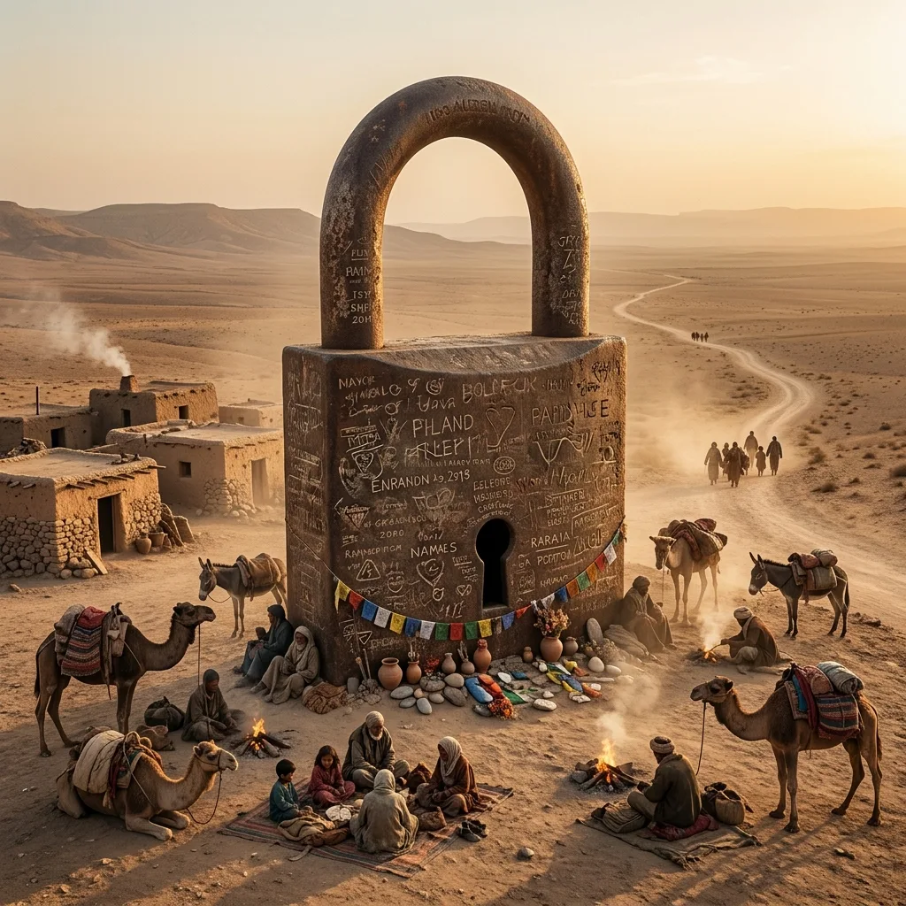

**#162 · Illustration &amp; 3D Prompt · <code>Vinano Image v2</code>**

<details>
<summary>Show prompt</summary>

```
A [ORDINARY OBJECT] as a landmark on an epic journey, tiny [TRAVELERS] resting in its shadow after crossing vast distances visible behind them. Caravans, pack animals, exhausted families. The object marks the halfway point, or the border, or the promised destination. Graffiti and carvings from generations of previous travelers cover its surfaces. Offerings left at its base. Some travelers stay, building permanent settlement. Others push on. Golden hour lighting, dust from the journey still settling, the mundane as waypoint. Render with rich micro-detail while keeping the layout uncluttered and intentional.
```

</details>

---

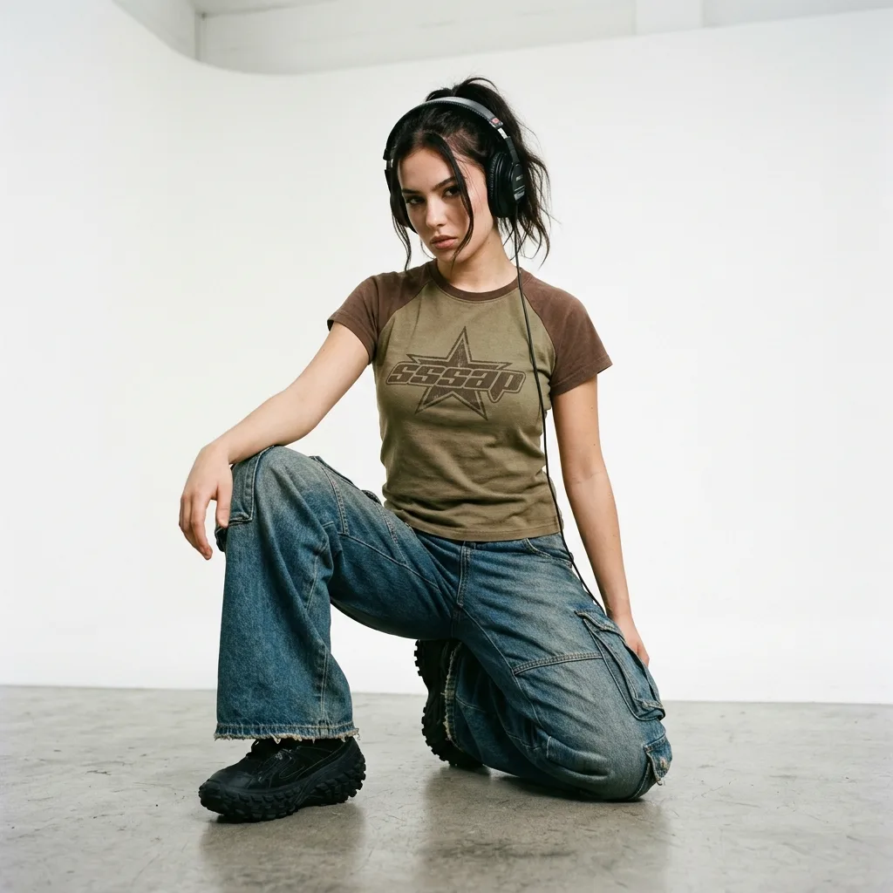

**#163 · Illustration &amp; 3D Prompt · <code>Vinano Image v2</code>**

<details>
<summary>Show prompt</summary>

```
She kneels in a pristine white studio, shot from a low mid angle a slight upward tilt that emphasizes quiet dominance. She wears a Y2K inspired brown and olive raglan tee a worn retro star logo reading sssap, paired oversized distressed wide leg denim cargos and chunky black streetwear shoes. Her messy ponytail and loose strands frame a sharp, defiant gaze, softened by large black wired headphones adding a cyber edge. Soft diffused studio lighting reveals fabric texture and subtle shadows, while her provocative yet controlled expression channels indie sleaze mixed Harajuku editorial rebellion. Render with rich micro-detail while keeping the layout uncluttered and intentional.
```

</details>

---

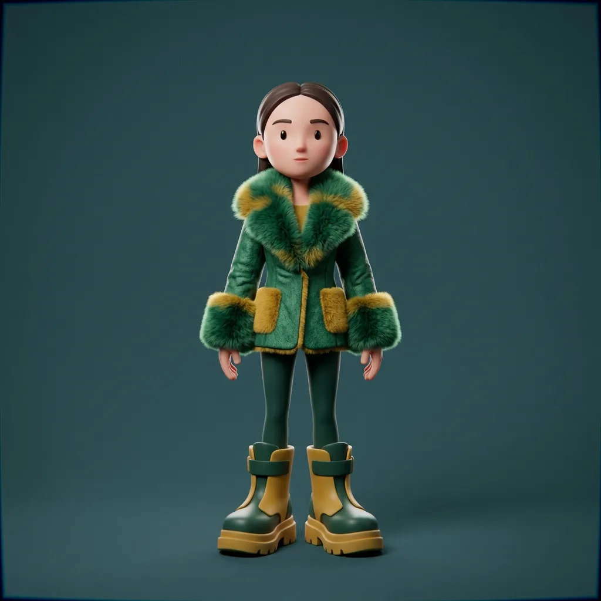

**#164 · Illustration &amp; 3D Prompt · <code>Vinano Image v2</code>**

<details>
<summary>Show prompt</summary>

```
{
 "renderEngine": "Blender Cycles / Unreal Engine 5 Lumen",
 "baseStyle": "Stylized 3D CGI character — Pixar meets high-fashion editorial",
 "proportions": "Slightly enlarged head (1.3x natural), compact torso, simplified facial features, exaggerated chunky feet/shoes",
 "skinShader": "Subsurface scattering physically-based roughness, no pores, smooth cartoon-like finish",
 "clothingPhysics": "Marvelous Designer simulation baked in, wrinkle maps, fabric-specific material shaders",
 "furTech": "XGen or Ornatrix volumetric fur for faux-fur pieces, physics-simulated",
 "resolution": "8192x8192px minimum, 300DPI",
 "backgroundStyle": "Solid flat color, no gradient, no texture — studio seamless backdrop",
 "lightingRig": "Three-point studio: key (45° front-top), fill (opposite side soft), rim (back edge definition)",
 "cameraLens": "35-50mm equivalent, slight vignette, no fisheye",
 "postProcessing": "Subtle chromatic aberration on edges, mild film grain 2%, slight color grade"
}

Keep edges clean and the overall composition balanced for a polished, gallery-ready result.
```

</details>

---

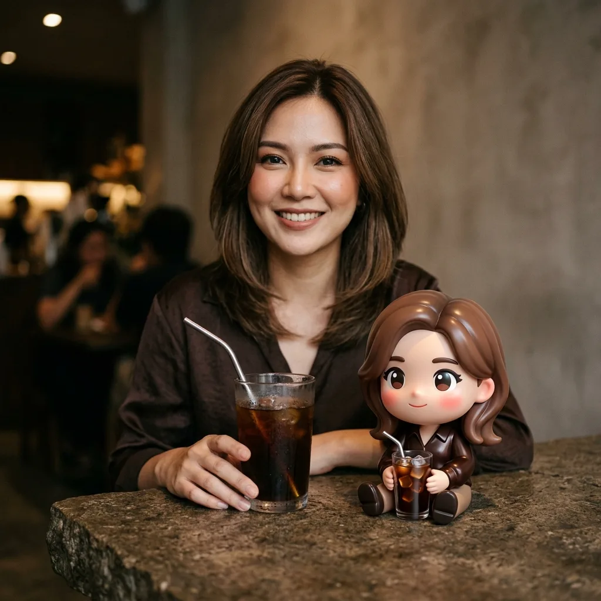

**#165 · Illustration &amp; 3D Prompt · <code>Vinano Image v2</code>**

<details>
<summary>Show prompt</summary>

```
A cinematic studio portrait of a woman seated at a textured stone table against a muted warm gray background. She wears a dark brown satin blouse, subtle evening makeup, and softly layered shoulder-length hair. In front of her is a glass of cold brew coffee ice and a metal straw. Placed beside it is a glossy 3D chibi figurine of the same woman, a big rounded head, expressive eyes, soft blush cheeks, and simplified facial features, holding a miniature cold brew glass. The chibi has a premium-quality collectible toy look gentle reflections. Intimate evening café vibe, moody soft, diffused lighting, shallow depth of field, realistic human combined stylized 3D character, cinematic and cozy, 1:1 aspect ratio. Render with rich micro-detail while keeping the layout uncluttered and intentional.
```

</details>

---

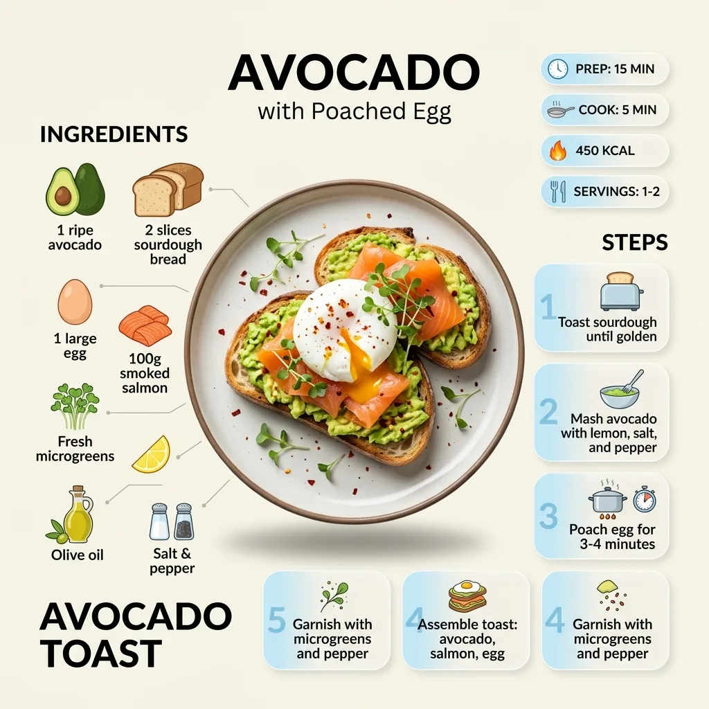

**#166 · Illustration &amp; 3D Prompt · <code>Vinano Image Pro</code>**

<details>
<summary>Show prompt</summary>

```
Ultra-clean modern recipe infographic. Showcase [FOOD] in a visually appealing finished form—sliced, plated, or portioned—floating slightly in perspective or angled view. Arrange ingredients, steps, and tips around the dish in a dynamic editorial layout, not restricted to top-down. Ingredients Section: Include icons or mini illustrations for each ingredient quantities. Arrange them in clusters, lists, or circular flows connected visually to the dish. Steps Section: Show preparation steps numbered panels, arrows, or lines, forming a logical flow around the main dish. Include small cooking icons (knife, pan, oven, timer) where helpful. Additional Info (optional): Total calories, prep/cook time, servings, spice level—displayed as clean bubbles or badges near the dish. Visual Style: Editorial infographic meets lifestyle food photography. Vibrant, natural food colors, subtle drop shadows, clean vector icons, modern typography, soft gradients or glassmorphism for step panels. Accent colors can highlight key info (calories, prep time). Composition Guidelines: Finished meal as hero visual (perspective or angled) Ingredients and steps flow dynamically around the dish Clear visual hierarchy: dish > steps > ingredients > optional stats Enough negative space to keep design airy and readable Lighting & Background: Soft, natural studio lighting, minimal textured or gradient background for premium editorial feel. Output: 1080×1080, ultra-crisp, social-feed optimized, no watermark Keep edges clean and the overall composition balanced for a polished, gallery-ready result.
```

</details>

---

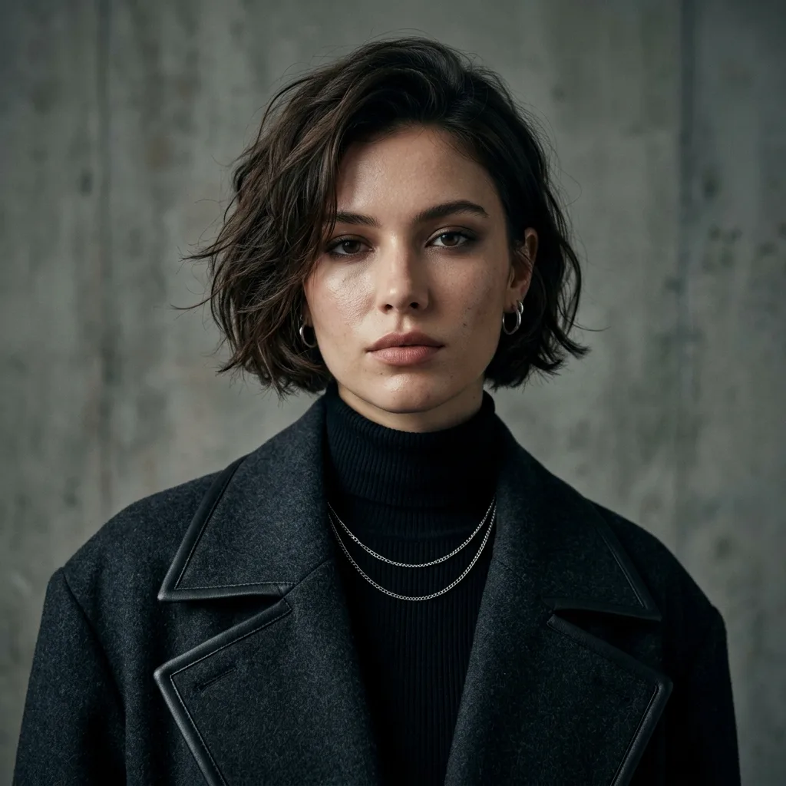

**#167 · Illustration &amp; 3D Prompt · <code>Vinano Image v2</code>**

<details>
<summary>Show prompt</summary>

```
convert anime characters into realistic human portraits Convert character into a true-to-life photorealistic live-action portrait / fashion editorial photograph, modern cinematic style, high-fashion grade, punchy but natural contrast, refined filmic color science, subtle halation and lens bloom, controlled highlights, soft roll-off, realistic skin pores and texture, lifelike hair strands, premium fabric/material rendering, studio-quality lighting natural depth, preserve the original camera framing and composition exactly, no text, no logo. Preserve realistic proportions and depth for a confident, professional finish.
```

</details>

---

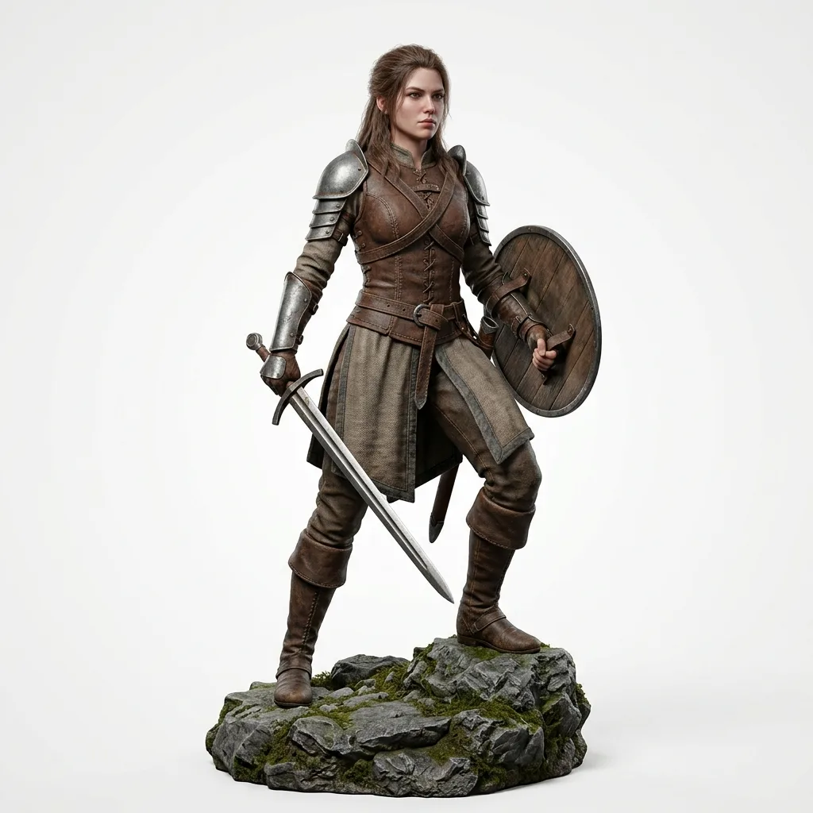

**#168 · Illustration &amp; 3D Prompt · <code>Vinano Image v2</code>**

<details>
<summary>Show prompt</summary>

```
Convert to hyper-realistic 3D CGI collectible figurine render. Physically-based rendering, octane render quality. Preserve the original character design, pose, and outfit exactly. Transform all surfaces into real-world materials: fabric visible weave and drape, metal wear, scratches and oxidation, synthetic matte skin. Pure white studio background, clean seamless white backdrop, soft diffused lighting subtle rim light. No cel shading, no toon rendering. High-end statue/collectible photography aesthetic. Ultra detailed, 8K. Fix and reconstruct all hands and fingers correct anatomy: natural finger count, proper joint articulation, realistic proportions, no fused or melted digits. Remove all 2D artifacts, compression glitches, and inconsistencies. Ensure full anatomical coherence across the entire figure: symmetrical features, clean silhouette, no floating elements, no distorted limbs, no duplicated body parts. Hyper-detailed hair simulation: individual strand rendering, realistic hair clumping, natural flow and gravity, visible scalp at roots, micro flyaways, SSS translucency on hair tips. Every surface pushed to maximum realism: pore-level skin texture, fabric fiber micro-detail, specular highlights on every material, depth in shadows Keep edges clean and the overall composition balanced for a polished, gallery-ready result.
```

</details>

---

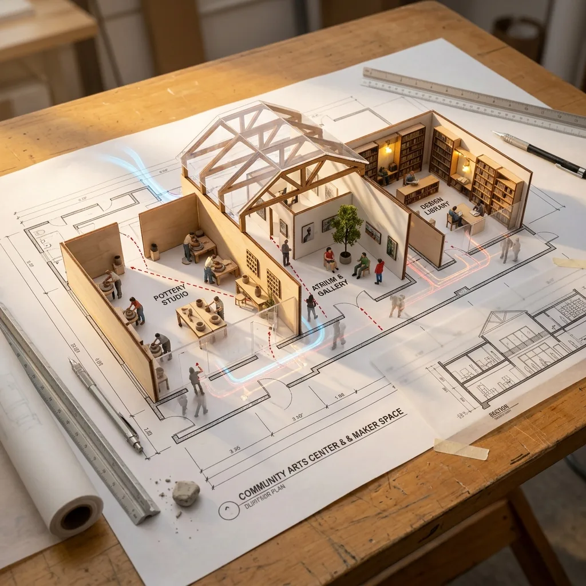

**#169 · Illustration &amp; 3D Prompt · <code>Vinano Image v2</code>**

<details>
<summary>Show prompt</summary>

```
An architectural floor plan of {BUILDING_TYPE} spread across a drafting table, the spaces rising into inhabitable miniature. {ROOM_1} emerges {FURNITURE_1} and {ACTIVITY_1} in progress, {ROOM_2} rises {DESIGN_ELEMENT} and {HUMAN_MOMENT}, {ROOM_3} pushes up {DETAIL_1} and {LIGHTING_1}. Walls exist as both lines and actual partitions simultaneously. Sight lines marked on the plan become actual views between spaces. The mechanical systems in the plan—HVAC, plumbing, electrical—pulse invisible function. Human circulation patterns appear as ghosted movement trails. Architectural scale figures become actual tiny inhabitants living their tiny lives. Section cuts reveal vertical relationships. The architect's tools surround: scales, pencils, trace paper. Golden design studio light, the plan as promise and proof, 8K, architecture as life container. Preserve realistic proportions and depth for a confident, professional finish.
```

</details>

---

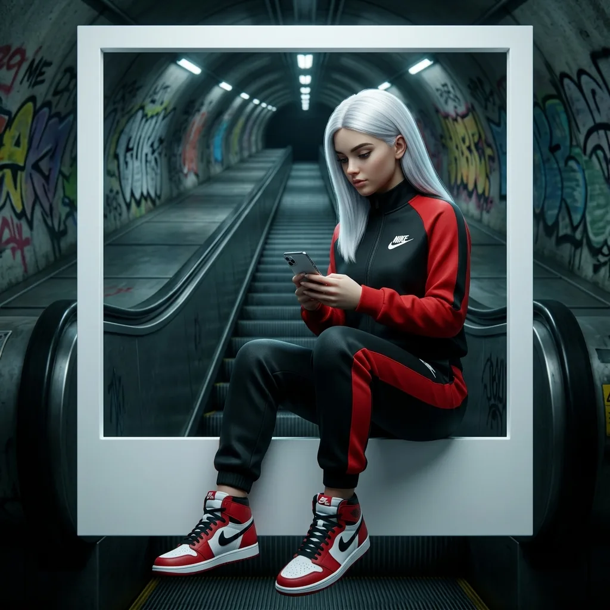

**#170 · Illustration &amp; 3D Prompt · <code>Vinano Image v2</code>**

<details>
<summary>Show prompt</summary>

```
A high-definition, realistic 3D social media profile picture style. The image features the young English girl sleek, straight white hair and a clear, detailed face. She is wearing a coordinated Nike brand outfit consisting of a premium black and red Nike tracksuit a visible swoosh logo. On her feet are classic red, white, and black Nike Air Jordan sneakers. She is sitting on the edge of a white Instagram-style frame, her legs and one sneaker 'popping out' of the bottom of the frame for a 3D effect. The background inside the frame shows her sitting on a long, perspective-heavy escalator in a dark, gritty subway tunnel filled colorful graffiti. She is looking down at a smartphone in her hands. The lighting is cinematic, highlighting her white hair and the textures of the Nike fabric." Preserve realistic proportions and depth for a confident, professional finish.
```

</details>

---

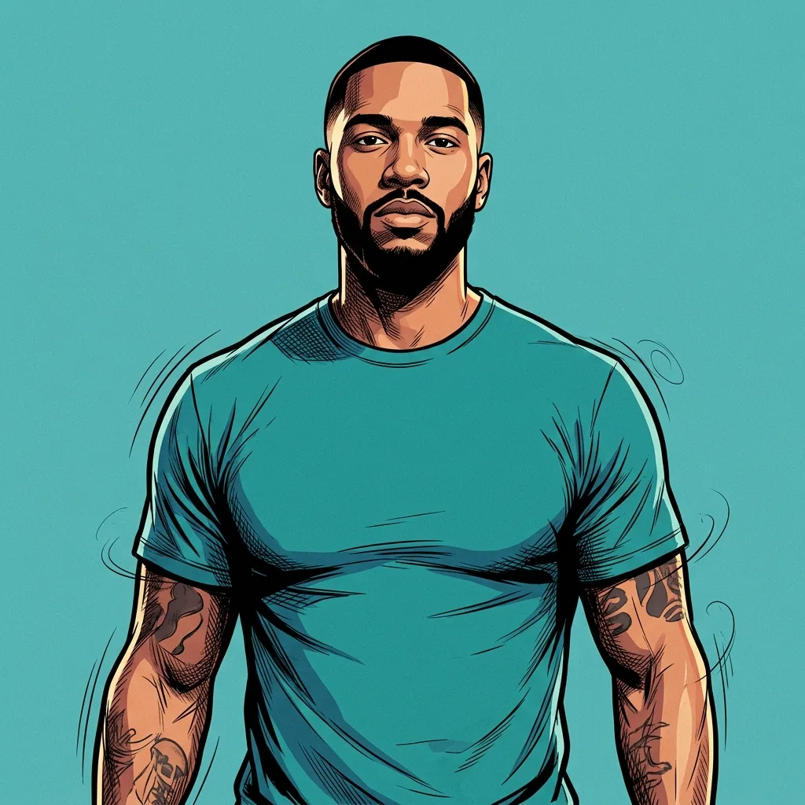

**#171 · Illustration &amp; 3D Prompt · <code>Vinano Image Pro</code>**

<details>
<summary>Show prompt</summary>

```
Create a high-contrast digital comic-style illustration of [PERSON] based strictly on the provided reference image.
STRICT IDENTITY LOCK:
∙Preserve exact facial bone structure
∙Preserve exact skin tone
∙Preserve beard density and shape (if applicable)
∙Preserve tattoo placement and design (if visible)
∙Do NOT stylize, redesign, beautify, exaggerate, or cartoonify the face
∙The person must remain clearly recognizable
POSE:
Upper-body focused composition.
Keep the pose exactly the same as in the reference image.
STYLE:
∙Bold black ink outlines
∙Strong dynamic line variation
∙Clean comic-book contouring
∙Cross-hatching shading technique (visible hand-drawn hatch lines)
∙No soft airbrush shading
∙No smooth gradient blending
∙Hard shadow planes
∙Graphic novel illustration style
COLOR SYSTEM:
∙Flat saturated color blocks
∙High contrast between light and shadow
∙No true-to-life photorealistic rendering
∙No painterly brush strokes
∙Slight warm skin highlights
∙Clothing colors must match the reference image exactly
TEXTURE:
∙Subtle paper grain texture
∙Ink illustration feel
∙Hand-drawn motion lines around arms and shoulders
BACKGROUND:
∙Solid flat background color complementary to the subject’s outfit or chosen palette
∙No environment
∙No depth blur
∙Minimalistic
∙Slight grain texture allowed
ENERGY DETAILS:
∙Hand-drawn motion lines indicating movement
∙Subtle sketch swirls around the subject
∙Dynamic comic vibration lines
LIGHTING:
∙Strong directional light from upper side
∙Hard comic-style shadow edges
∙Deep contrast under arms and jawline
∙Defined muscle contour shadows
COMPOSITION:
∙Vertical 4:5 ratio (Instagram optimized)
∙Subject centered
∙Upper torso dominant
∙Clean negative space around figure
QUALITY:
∙High resolution
∙Clean line clarity
∙Sharp edges
∙No blur
∙No AI artifact distortion

Render with rich micro-detail while keeping the layout uncluttered and intentional.
```

</details>

---


**#172 · Illustration &amp; 3D Prompt · <code>Vinano Image Pro</code>**

<details>
<summary>Show prompt</summary>

```
Create a 3D isometric miniature diorama showcasing the productivity system [SYSTEM NAME]. Angle remains between 35–45°. Materials feel modern and structured realistic PBR textures.

Lighting is soft but focused. The raised base is divided into functional zones such as planning, execution, tracking, and review. Use connecting paths or arrows to show workflow.

Tiny stylized professionals interact desks, boards, or devices. heavy facial details.
Background remains solid [BACKGROUND COLOR].

Top center shows [SYSTEM NAME] in bold. Below it add a short benefit-focused subtitle. Place a minimal productivity icon underneath. Text automatically adapts.”

Emphasise material texture and natural light so the final frame feels tactile and premium.
```

</details>

---

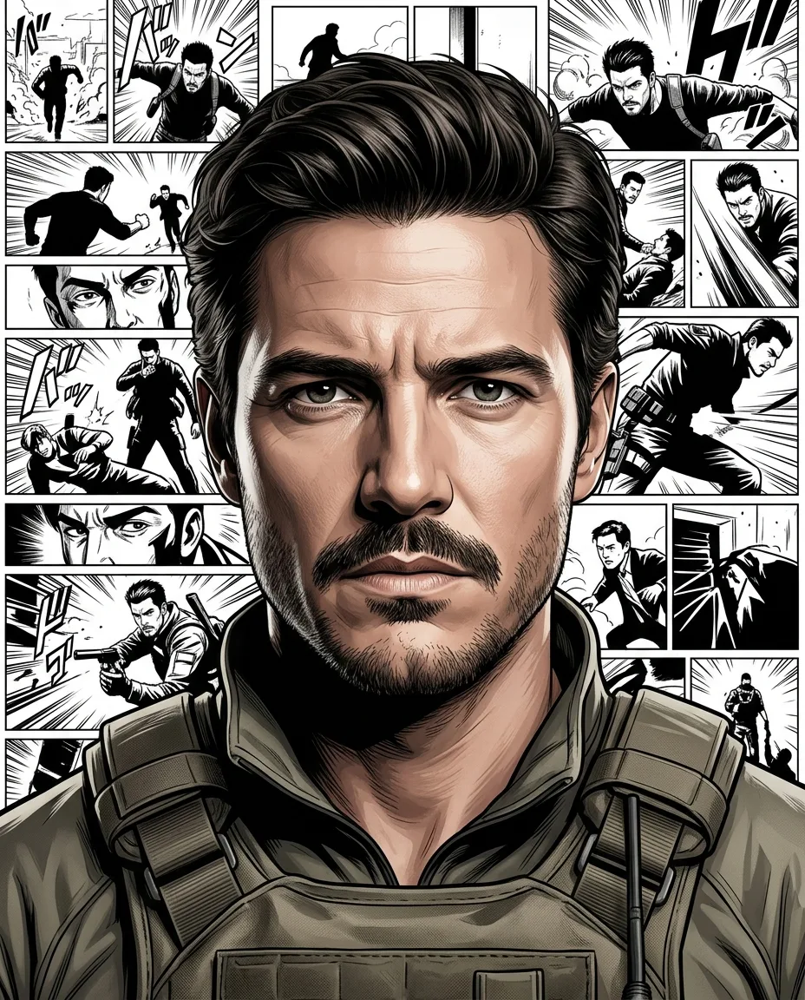

**#173 · Illustration &amp; 3D Prompt · <code>Vinano Image Pro</code>**

<details>
<summary>Show prompt</summary>

```
Create an image in 4:5 ratio, hyper-realistic aesthetics applied to a premium cartoon/cinematographic manga style, combining extreme realism high-impact illustrated visual language.

The face must be identical to that of the photo sent in 103%, maintaining absolute tidelity the original tactical identity: bone structure, skull shape, proportions, intense expression, eyebrows, eyes, nose, mouth, jaw, mustache, hair and capillary volume.

No aesthetic change, identity change, artificial smoothing or stylization that mischaracterizes the face.

Male character reference pose. Stroke style inspired by high-level realistic cartoon, well-defined volumes, deep shadows and clean finish.

costume: referenced image, realistic fabric texture, natural folds and precise lighting.

Background composed of black and white comic panels, organized in multiple narrative frames, creating depth, visual context and sensation of an expanded universe. The panels should look like action scenes and graphic narrative, varied perspective and dynamic composition.

Professional filmic, cinematic lighting, soft front main light and dramatic contrast, precise face enhancements, controlled shadows, subtle depth of field, extreme sharpness, visible microdetails, premium rendering finish.

Maximum quality, high-budget editorial illustration appearance, full focus on the face, strong visual impact, Realism 333%, no readable texts, no watermarks, no distortions, no artifacts.

Preserve realistic proportions and depth for a confident, professional finish.
```

</details>

---

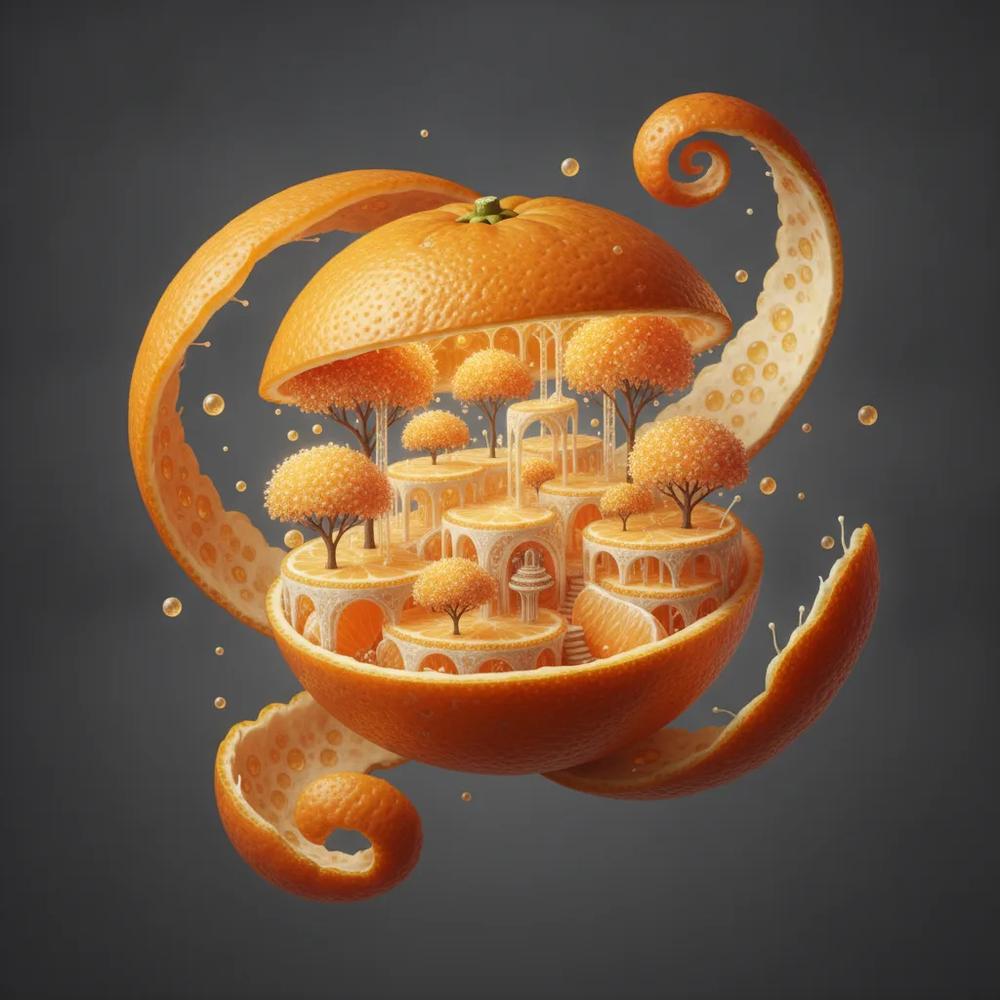

**#174 · Illustration &amp; 3D Prompt · <code>Vinano Image</code>**

<details>
<summary>Show prompt</summary>

```
A single [OBJECT] suspended in space, frozen mid-peel as its outer skin curls away in ribbons. Beneath the surface exists a fully realized [INNER WORLD / SYSTEM] constructed entirely from the object's native material. The peeled layers themselves contain [EMBEDDED DETAILS / CROSS-SECTIONS / HIDDEN NARRATIVES] visible in their curl. Interior reveals [ORGANIC STRUCTURES / MECHANICAL SYSTEMS / ARCHITECTURAL SPACES] growing denser toward the core. Hyper-detailed 3D rendering botanical illustration precision. Material continuity maintained throughout, [FIBER TEXTURES, MEMBRANE TRANSLUCENCY, CELLULAR PATTERNS] visible at macro scale. Palette restricted to [NATURAL MATERIAL GRADIENTS FROM SURFACE TO CORE]. Isolated object, soft directional lighting, museum-grade presentation. The peel tells one story, the interior tells another. Ultra-high resolution, scientific romanticism, collector-print quality. Aim for an editorial, design-driven look with deliberate negative space.
```

</details>

---

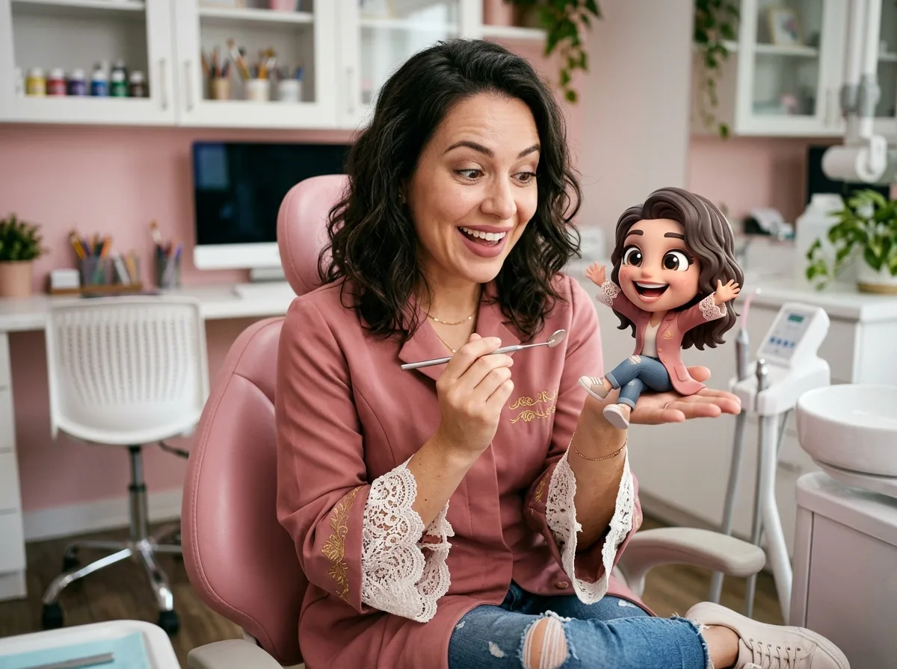

**#175 · Illustration &amp; 3D Prompt · <code>Vinano Image Pro</code>**

<details>
<summary>Show prompt</summary>

```
ME AND MY LITTLE 3D CHIBI IN THE OFFICE

Ultra-realistic cinematic portrait of an adult person, the face fully visible, natural human skin texture pores and subtle imperfections, and realistic hair strands. The real person is seated in a dental chair in a pink dental office, holding a small 3D miniature of themselves, delicately sitting crossed legs in a relaxed pose on the palm of one hand. 4:3 horizontal ratio. Features dental office attire a rose-colored coat and holding a dental mirror in hand.

The real person looks at the miniature clear surprise and slight amusement, raised eyebrows, a soft smile, and expressive eyes. The facial expression appears spontaneous and authentic. The miniature closely resembles the real person in facial structure, hairstyle, and clothing, but rendered in a soft, premium-quality 3D chibi style. The miniature has a funny and exaggerated facial expression, lively eyes, and playful moving arms and legs. The stylization is clean and modern, not like a toy, doll, or artificial figure.

Both characters wear matching outfits: medium distressed jeans, rose-colored coat 3/4 bell sleeves finished lace on cuffs and hems, embroidered white lace and golden center details, and light white sneakers. Hair according to reference. Makeup: luminous and well-defined skin, light rosy blush, intense eyeshadow in neutral tones, black mascara on eyelashes, and matte pink lips. The scale difference between the realistic woman and the 3D chibi figure is obvious and visually amusing.

The background is a realistic office scene white cabinets containing painting and creative items, a white desk, and a plastic swivel chair, slight blur and strong depth of field. Professional filmic, cinematic lighting clear separation of objects, soft highlights on the skin, and subtle rim light around both figures.

Ultra-detailed textures for the real person. Clean 3D textures a realistic style for the miniature. Balanced between realism and humor. No surreal distortions.

Keep edges clean and the overall composition balanced for a polished, gallery-ready result.
```

</details>

---

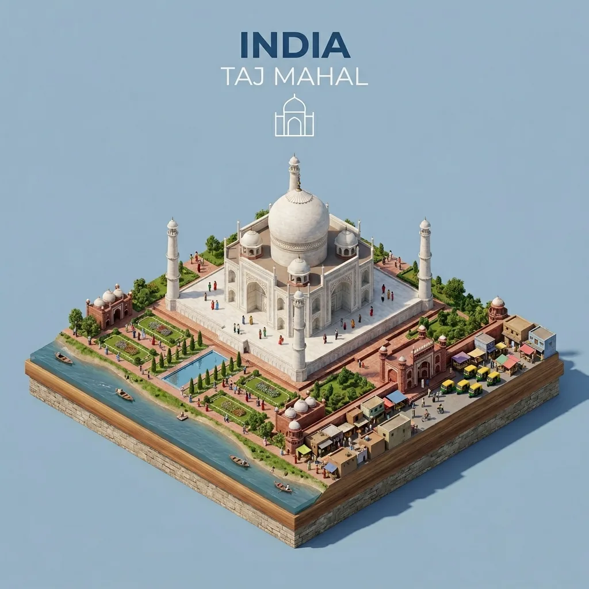

**#176 · Illustration &amp; 3D Prompt · <code>Vinano Image Pro</code>**

<details>
<summary>Show prompt</summary>

```
\Create an isometric miniature 3D diorama representing the iconic architecture of [COUNTRY NAME] through [FAMOUS STRUCTURE]. Use a 45° top-down view.

Apply clean soft textures and realistic PBR materials.
Lighting feels balanced and natural. The raised base includes nearby streets, landscape features, and cultural details linked to the structure. Add tiny stylized locals and visitors heavy facial details.

Background stays solid [BACKGROUND COLOR]. Top center text shows [COUNTRY NAME] in bold. Second line shows [STRUCTURE NAME]. Place a minimal architecture icon below. Text color adjusts for contrast.

Preserve realistic proportions and depth for a confident, professional finish.
```

</details>

---

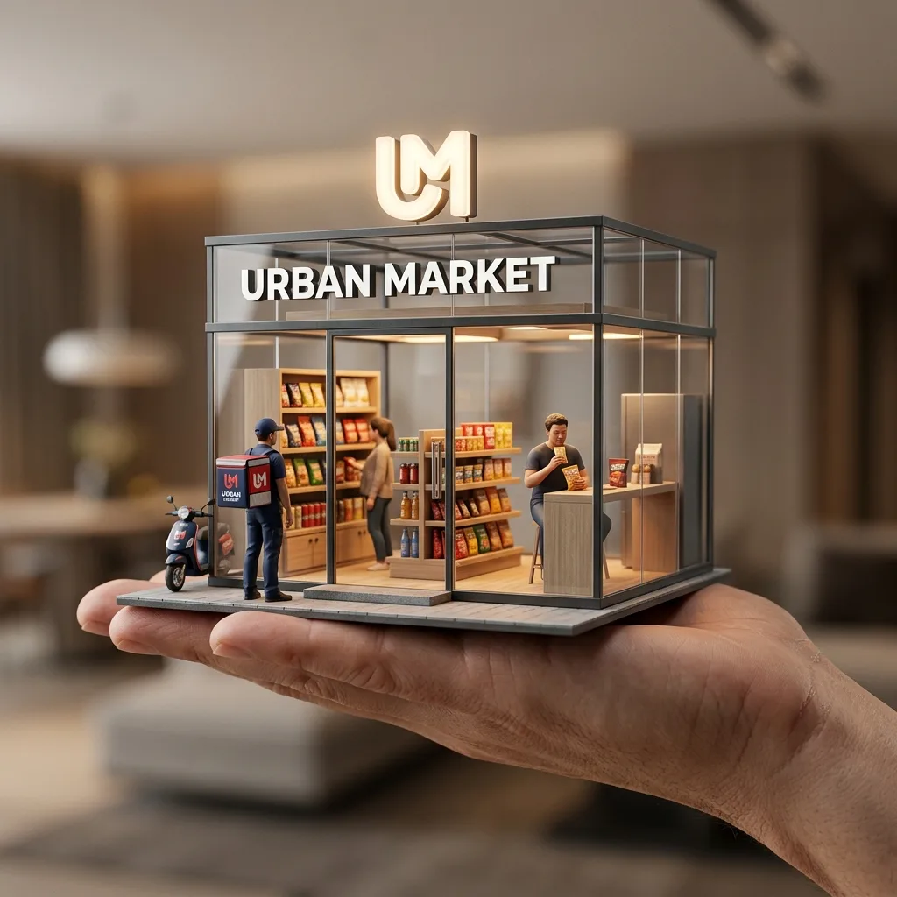

**#177 · Illustration &amp; 3D Prompt · <code>Vinano Image v2</code>**

<details>
<summary>Show prompt</summary>

```
An ultra-realistic miniature [YOUR BRAND] showroom balanced on a human palm, designed transparent glass walls. Inside, tiny lifelike figures are enjoying [PRODUCTS]. On the rooftop, a glowing 3D logo shines brightly, while the front facade displays the brand name in a bold, recognizable typeface. Outside the showroom, a miniature delivery person is standing a branded delivery bag strapped to their back, ready to deliver orders.The showroom’s interior is styled like a cozy retail outlet, miniature products and branding details on display. Lighting is cinematic warm tones, crisp details, and natural shadows. Captured in professional product photography style, the scene conveys a vibrant, iconic, and instantly recognizable atmosphere. 1080x1080 dimension. Aim for an editorial, design-driven look with deliberate negative space.
```

</details>

---

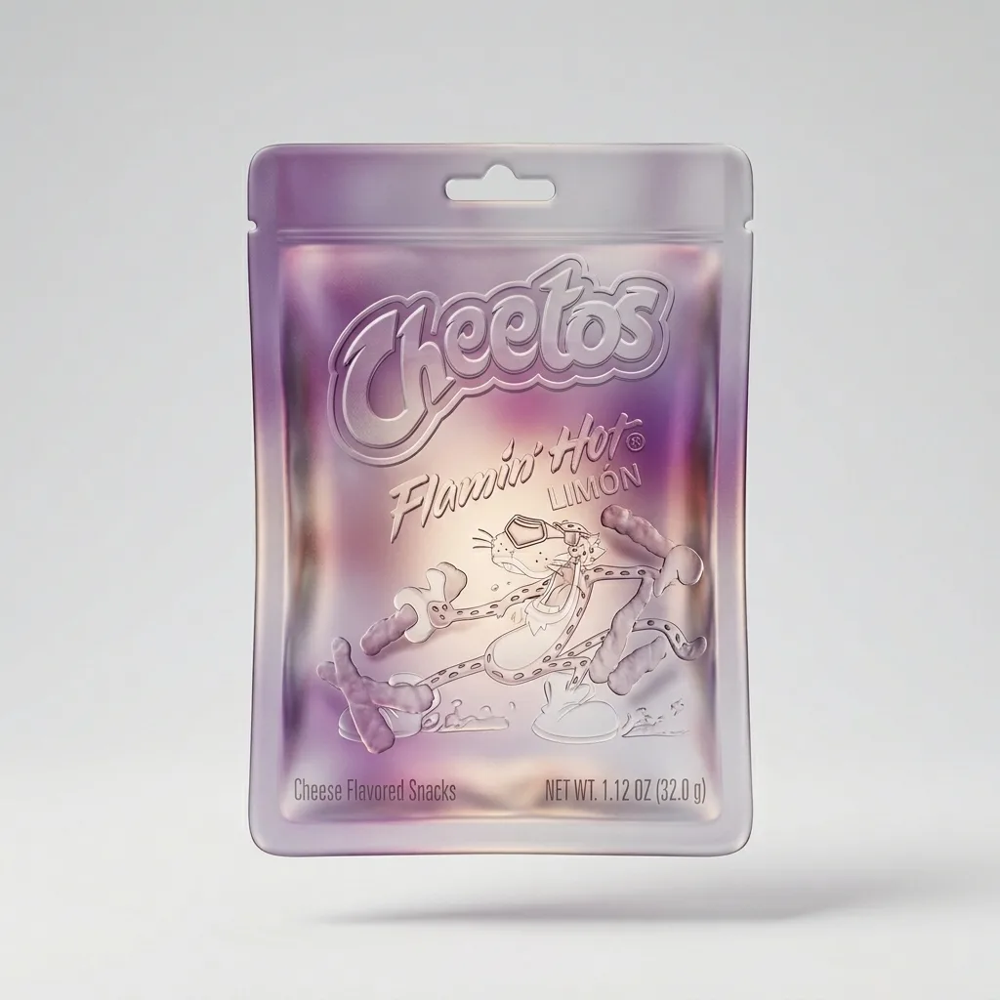

**#178 · Illustration &amp; 3D Prompt · <code>Vinano Image v2</code>**

<details>
<summary>Show prompt</summary>

```
A hyper-detailed 3D frosted translucent glass version of the attached product packaging, maintaining accurate proportions and original colors, semi-transparent material realistic refraction and soft internal glow, smooth softened corners, subtle surface texture, embossed branding details integrated into the glass, centered on a light gray background, floating gently a soft shadow below, natural studio lighting, clean minimal layout, high-end product visualization style Keep edges clean and the overall composition balanced for a polished, gallery-ready result.
```

</details>

---


**#179 · Illustration &amp; 3D Prompt · <code>Vinano Image v2</code>**

<details>
<summary>Show prompt</summary>

```
A surreal, high-resolution conceptual image depicting the transition from winter to spring. In the center, a large, realistic metal zipper is unzipped on a snow-covered landscape, revealing a vibrant, lush meadow of green grass and blooming pink spring flowers underneath. The surrounding area is a winter forest frost-covered trees and deep snow. The sky above is a magical blend of day and night, featuring a bright, radiant sun lens flares on the left and a deep blue twilight sky filled sparkling stars on the right. The lighting is cinematic, highlighting the contrast between the cold, icy texture of the snow and the warm, lively colors of the spring meadow. Aim for an editorial, design-driven look with deliberate negative space.
```

</details>

---

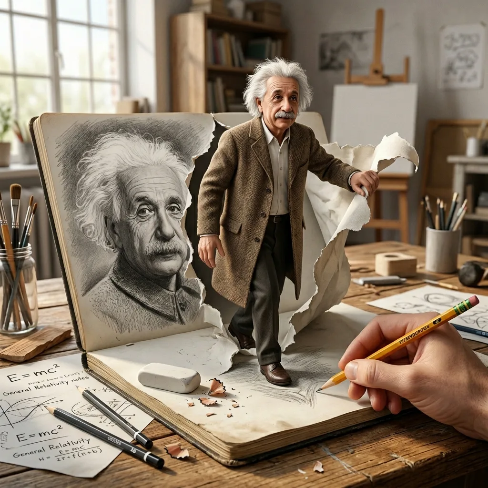

**#180 · Illustration &amp; 3D Prompt · <code>Vinano Image v2</code>**

<details>
<summary>Show prompt</summary>

```
Hyper-realistic 3D illustration of Albert Einstein emerging from the pages of a sketchbook drawing, blending a graphite illustration a lifelike 3D figure. Einstein has his iconic wild white hair, thick moustache, and thoughtful expression, wearing a classic brown tweed coat and white shirt.

The open sketchbook lies on a worn wooden artist desk inside a sunlit studio. The pages display a detailed graphite drawing of Albert Einstein, but the paper is dramatically torn and curling outward where Einstein pushes through, transitioning from a flat pencil drawing into a fully rendered 3D figure stepping into reality.

One of Einstein’s hands grips the torn edge of the paper while his other arm extends naturally outside the sketchbook, resting on the wooden desk as if stabilizing himself after stepping out of the drawing. His face shows curiosity and wonder, as if discovering the real world.

A realistic human hand holding a traditional yellow wooden pencil appears in the foreground near the drawing, suggesting the artist has just finished sketching him moments before he came alive.

Around the desk are pencil shavings, a large white eraser, graphite pencils, scattered sketches, paintbrushes, and glass jars filled art tools. Warm sunlight from a large window illuminates the studio, casting soft shadows and highlighting the textures of paper fibers, graphite shading, wood grain, and skin details. Ultra-realistic rendering, filmic, cinematic lighting, high resolution, extremely detailed.

Render with rich micro-detail while keeping the layout uncluttered and intentional.
```

</details>

---

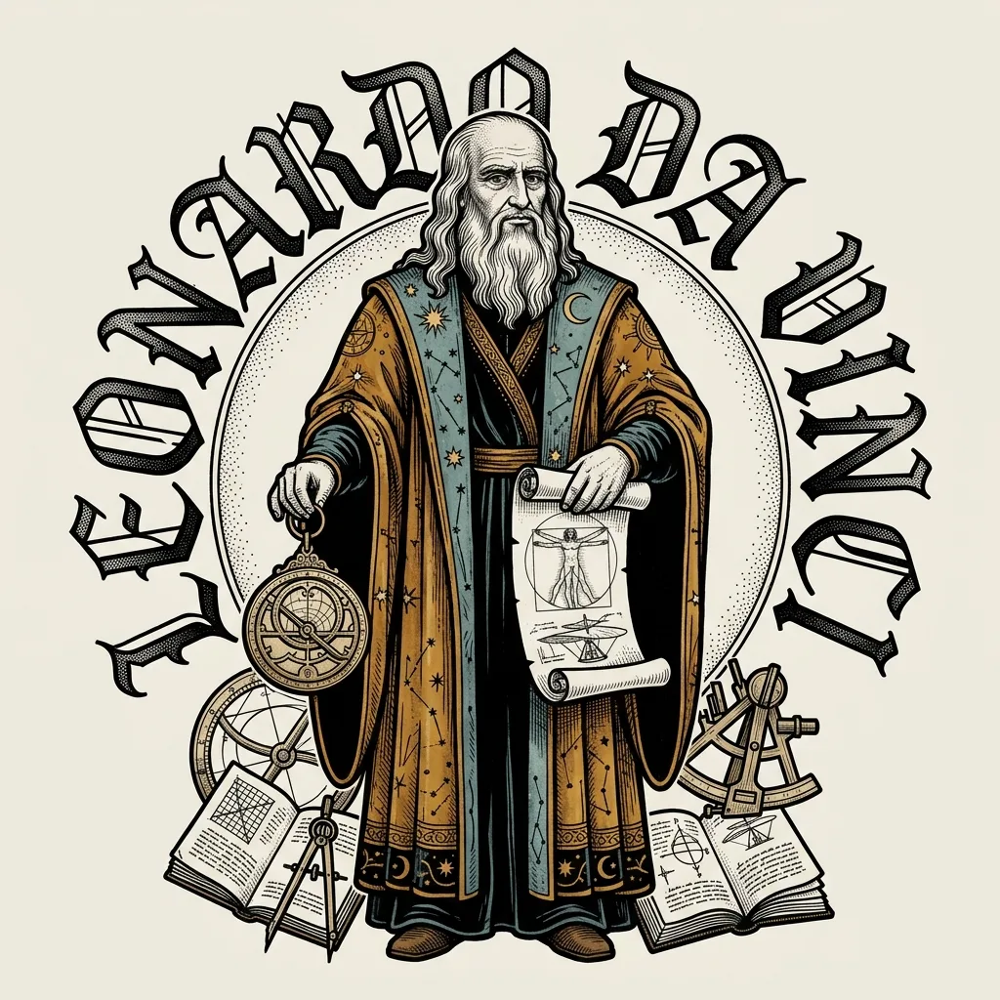

**#181 · Illustration &amp; 3D Prompt · <code>Vinano Image Pro</code>**

<details>
<summary>Show prompt</summary>

```
[PERSONE]. Act as a Creative Director and Master of Visual Metaphor.

PHASE 1: DYNAMIC ARCHETYPE LOGIC.

Autonomously analyze the core essence of [PERSONE] and assign them a "High-Status Sovereign" role:

- If the character is a scientist/intellectual: Depict as a "Grand Archivist" in heavy velvet robes celestial instruments.

- If the character is a rebel/anti-hero: Depict as a "Wasteland Prophet" in deconstructed, layered streetwear and scavenged textures.

- If the character is royalty/leader: Depict as a "Divine Monarch" in stiff, ornamental ceremonial attire.

- Maintain the stoic, iconographic pose from the reference.

PHASE 2: ART STYLE & INK (THE REFERENCE LOOK).

Strictly follow the "Neo-Traditional Etching" style.

- Bold black ink outlines, intricate cross-hatching, and stippling for shadows.

- Color Palette: Deep Ochre, Faded Teal, Jet Black, and Bone White background.

PHASE 3: DYNAMIC TYPOGRAPHY.

- The massive Gothic/Blackletter halo behind the subject MUST explicitly spell out the name "[PERSONE]".

- The font style should adapt to the archetype (e.g., sharp and aggressive for rebels, elegant and structured for scholars).

TECH SPECS:

2D flat illustration, white background, ink-bleed effects, high contrast, sharp line-work.

Emphasise material texture and natural light so the final frame feels tactile and premium.
```

</details>

---

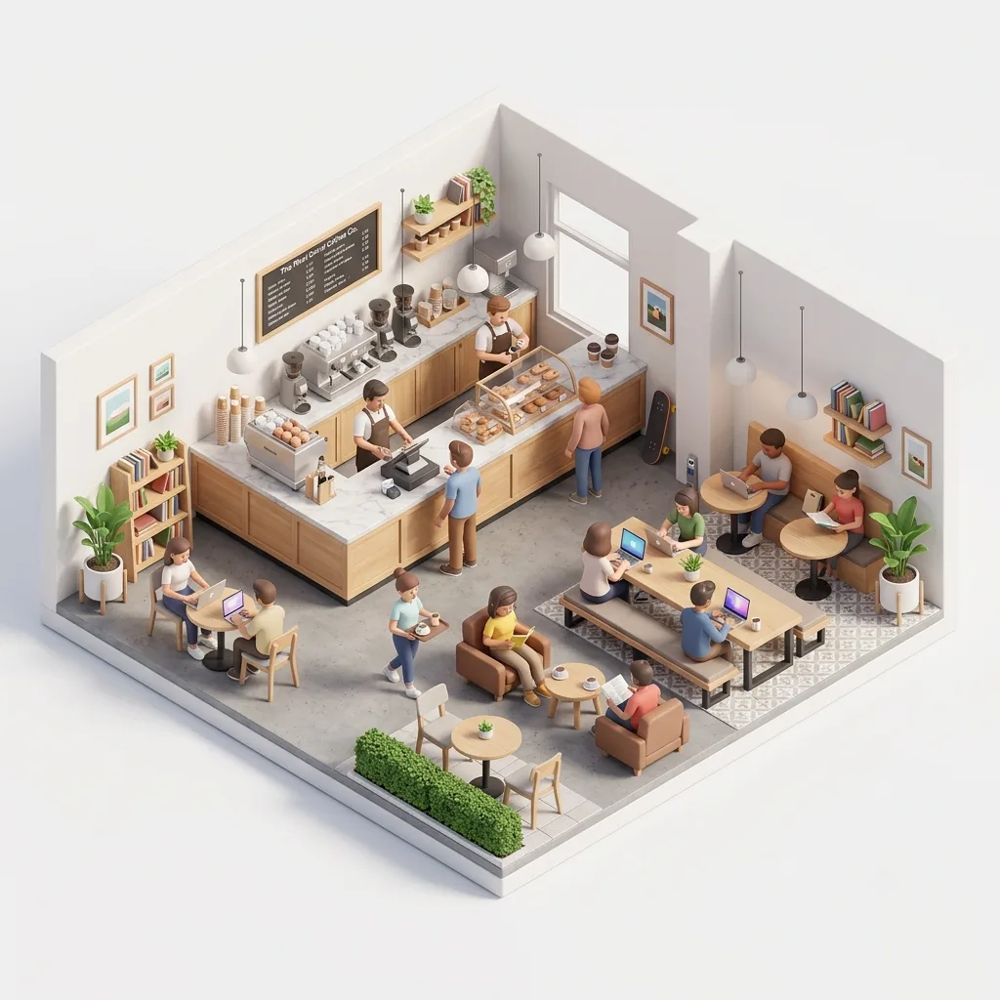

**#182 · Illustration &amp; 3D Prompt · <code>Vinano Image Pro</code>**

<details>
<summary>Show prompt</summary>

```
Create a 45° top-down isometric miniature 3D diorama of [SCENE], including all key objects and tiny stylized people interacting naturally the environment.

Composition:
•Include all relevant props, furniture, or items that make the scene recognizable.
•Tiny characters can sit, stand, walk, or interact objects as appropriate.
•Soft realistic lighting, gentle shadows, subtle textures, minimal background.
•Maintain consistent scale, camera angle, perspective, and style.

Visual style: clean, editorial Apple-UI aesthetic, bright yet soft colors, ultra-crisp 3D textures.
Background: solid color Crisp White
Output: 1080×1080, ultra-crisp, social-feed optimized, no watermark.

Preserve realistic proportions and depth for a confident, professional finish.
```

</details>

---

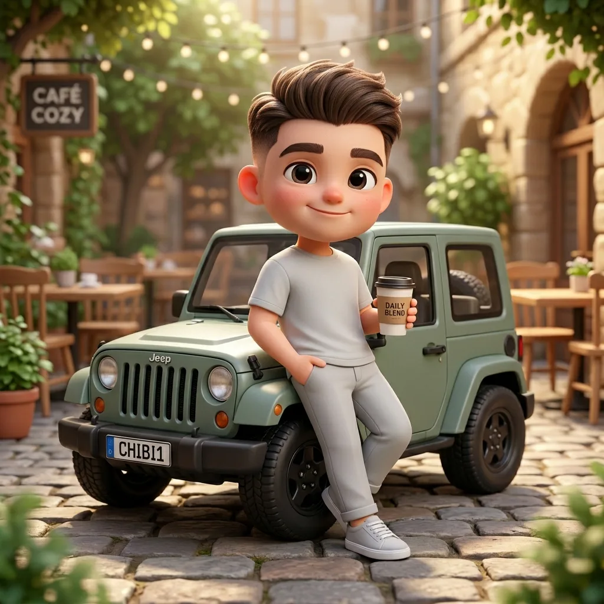

**#183 · Illustration &amp; 3D Prompt · <code>Vinano Image v2</code>**

<details>
<summary>Show prompt</summary>

```
A cute 3D chibi-style character leaning against a parked mini chibi Jeep, wearing a clean monochrome outfit: plain t-shirt, straight-fit pants, and refined minimalist sneakers. Holding a takeaway coffee cup, relaxed confident smile. Big head, expressive eyes, modern fade haircut. Cozy café courtyard wooden chairs, warm sunlight, soft depth of field, Pixar-quality 3D render, playful yet premium aesthetic, square aspect rat Keep edges clean and the overall composition balanced for a polished, gallery-ready result.
```

</details>

---

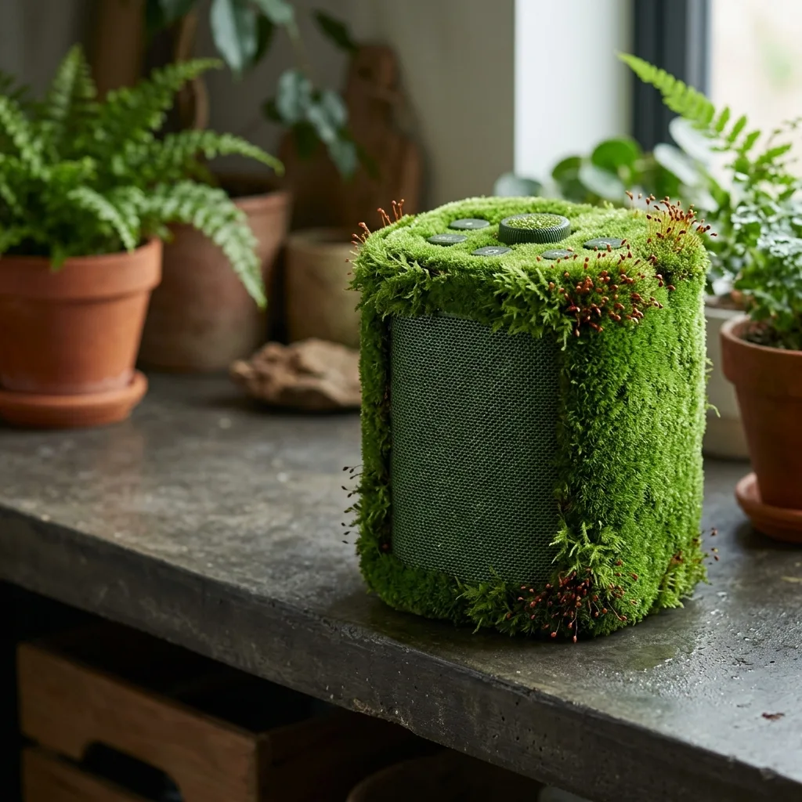

**#184 · Illustration &amp; 3D Prompt · <code>Vinano Image v2</code>**

<details>
<summary>Show prompt</summary>

```
A [PRODUCT] rendered as if entirely grown from living moss, perfectly maintaining product form while being undeniably alive and soft. Different moss varieties create texture variation: smooth cushion moss for flat surfaces, feathery fern moss for details, tiny fruiting bodies as accent points. Damp, verdant, breathing. Positioned in a botanical studio setting or against dark earth tones. Biophilic design meets product photography. Soft natural lighting emphasizing the life, the moisture, the green depth. Sharp focus, saturated natural greens, wellness brand aesthetic, ultra-high resolution, the manufactured made living. Aim for an editorial, design-driven look with deliberate negative space.
```

</details>

---

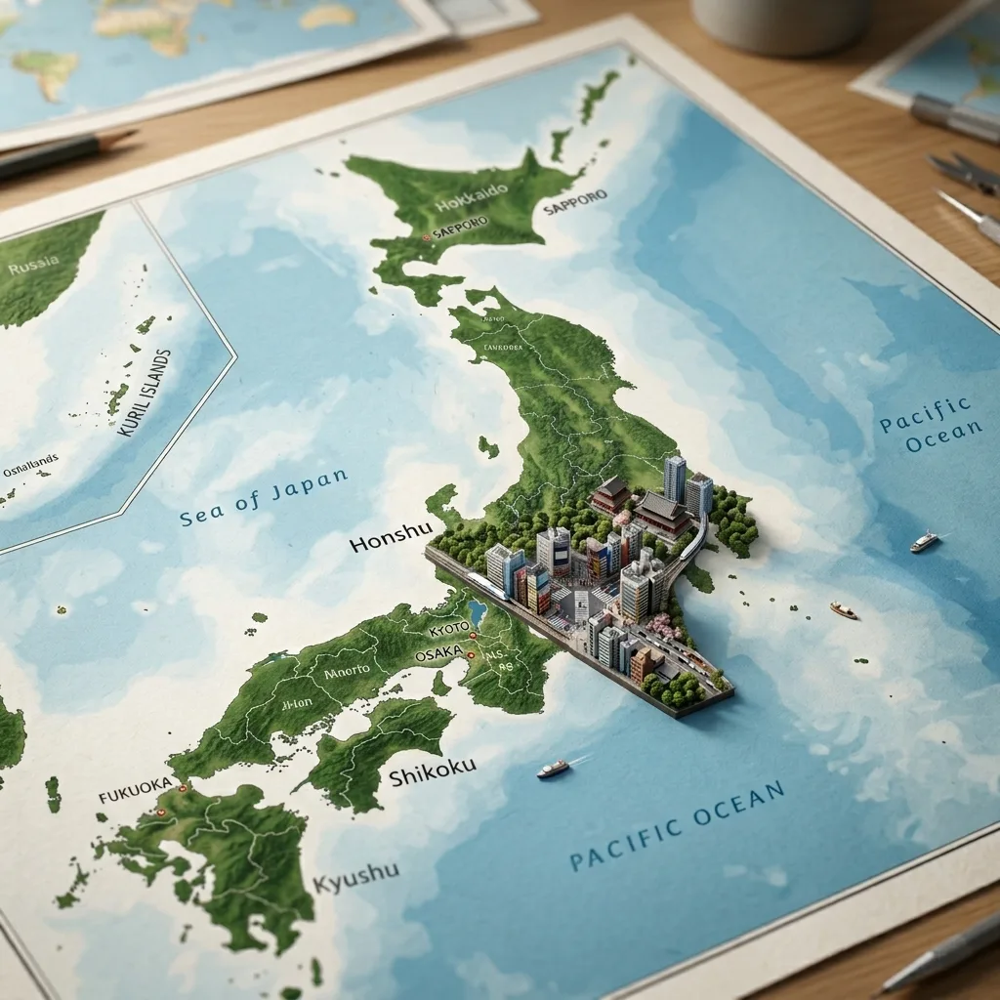

**#185 · Illustration &amp; 3D Prompt · <code>Vinano Image Pro</code>**

<details>
<summary>Show prompt</summary>

```
Ultra-realistic top-down geographic map precise cartographic accuracy, clearly defining the true geographic context of [COUNTRY].

From the exact real-world coordinates of [CITY], a highly detailed miniature 3D diorama rises organically from the map surface, perfectly aligned its true location.

The diorama features iconic architecture, signature natural landmarks, and authentic cultural elements of the city, seamlessly integrated into the map as if sculpted from it.

Physically accurate materials, realistic surface textures, and true-to-scale proportions.

Shallow depth of field macro-lens realism, subtle atmospheric perspective.

Soft neutral studio lighting controlled shadows to enhance depth and realism.

Cinematic composition, premium architectural-model photography style.

Ultra-sharp detail, high dynamic range, true-to-life photorealistic finish.
Square 1:1 format, realistic scale, museum-quality visual output.

Emphasise material texture and natural light so the final frame feels tactile and premium.
```

</details>

---

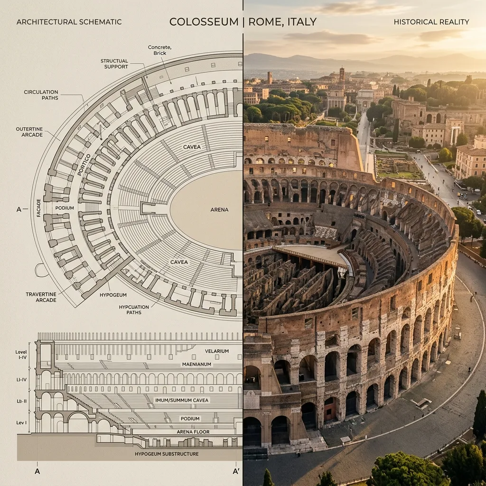

**#186 · Illustration &amp; 3D Prompt · <code>Vinano Image Pro</code>**

<details>
<summary>Show prompt</summary>

```
Split composition image, left and right halves clearly divided in 16:9 widescreen format.
Left Half:
Highly detailed architectural floor plan and cross-section illustration of [LANDMARK] in a modern refined minimalist style. Top-down view showing main structural layout, internal divisions, circulation paths, key chambers or spaces labels. Material callouts, structural support systems, and architectural details clearly marked. Neutral beige and warm gray color palette, clean linework, soft shadows, subtle textures. Professional architectural-presentation style. Include detailed cross-sectional diagram showing vertical layers and internal structure. Blueprint aesthetic technical accuracy and labeled sections.
Right Half:
Ultra-realistic aerial exterior photograph of [LANDMARK] captured from above and to the side (elevated isometric perspective, not straight overhead). Shows the complete structure authentic weathered textures, aged materials, surrounding landscape, dramatic golden-hour sunlight creating sharp shadows, atmospheric haze suggesting historical significance. The perspective reveals both external grandeur and internal scale simultaneously. Warm golden-light lighting, realistic patina and wear patterns, authentic architectural proportions. Feels like an aerial photograph capturing the monument’s true majesty and scale.
Both halves align visually, clearly showing architectural engineering blueprint vs. the actual monumental structure in its archaeological or historical reality.
Style & Mood:
•Architectural blueprint visualization meets historical aerial photography
•Engineering precision and historical significance
•Educational, museum-exhibit presentation
•Engineering schematic-to-reality comparison
•Grandeur emphasizing scale and architectural sophistication
Lighting & Color:
•Left: Flat, even lighting, neutral blueprint tones, technical aesthetic
•Right: Golden-hour natural light, dramatic shadows, warm tones, atmospheric depth
•Consistent warm palette between both halves
Camera & Technical Details:
•Left: Top-down orthographic + detailed cross-sectional architectural view labeled sections
•Right: Elevated aerial perspective (45-degree isometric angle), capturing full structure from above-and-to-the-side
•High resolution, sharp architectural details on left; true-to-life photorealistic weathered textures on right
Negative Prompt:
Cartoon style, low detail, cluttered composition, modern elements, unrealistic proportions, harsh lighting, exaggerated colors, text overlays, watermarks, CGI look, sterile rendering, straight-down overhead view, no atmospheric quality, overly pristine condition.

Maintain consistent colour harmony and crisp focus across the whole frame.
```

</details>

---

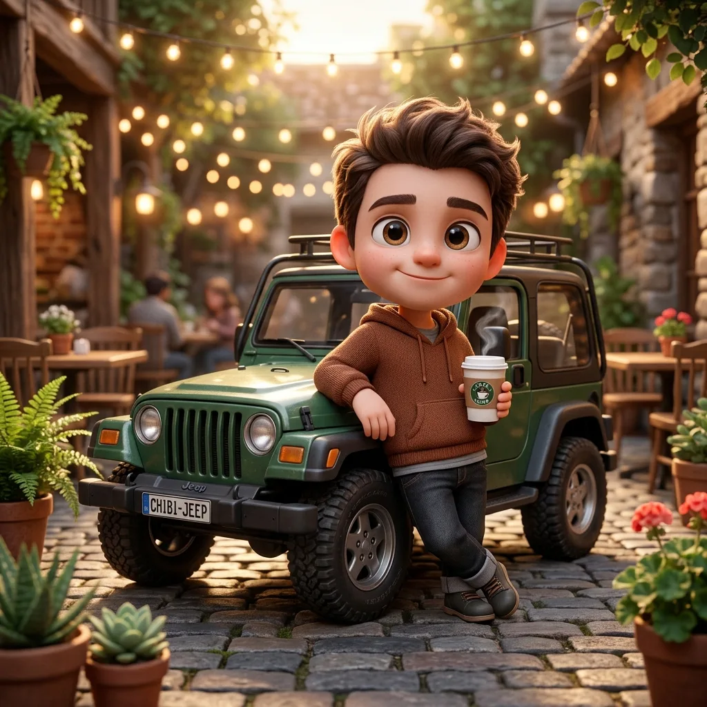

**#187 · Illustration &amp; 3D Prompt · <code>Vinano Image v2</code>**

<details>
<summary>Show prompt</summary>

```
Ultra-detailed 3D chibi-style character a big head and expressive eyes, cute proportions, smooth stylized skin, friendly smile. The character is casually leaning against a small green off-road Jeep, holding a takeaway coffee cup. Cozy outdoor café courtyard setting wooden tables, potted plants, warm string lights in the background. Soft golden-hour lighting, shallow depth of field, cinematic bokeh. premium-quality Pixar-style 3D render, vibrant colors, clean textures, adorable yet realistic character design, professional character illustration, 8K render. Preserve realistic proportions and depth for a confident, professional finish.
```

</details>

---

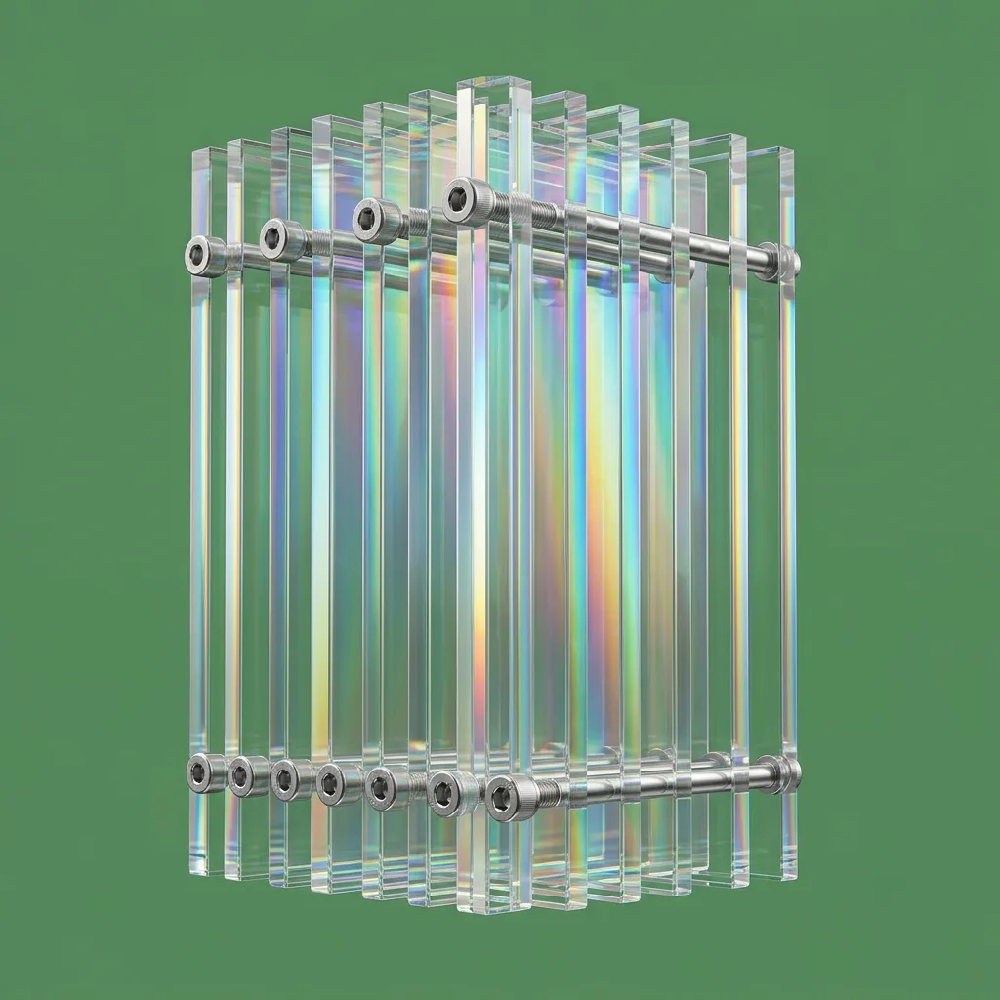

**#188 · Illustration &amp; 3D Prompt · <code>Vinano Image Pro</code>**

<details>
<summary>Show prompt</summary>

```
{
 "request": {
 "product": "[PRODUCT HERE]",
 "background_color": "#59925C",
 "style": "prismatic_industrial_minimalism",
 "visual_elements": {
 "structure": "multiple separate vertical acrylic layers forming the product silhouette — each layer is a distinct flat panel visible air gaps between them, like slices of the product spaced apart",
 "material": "high-clarity glass rainbow prismatic iridescent tint",
 "hardware": "stainless steel through-bolts visible internal Allen hexagonal socket heads — bolts pass through all layers front to back, holding them together visible spacing",
 "orientation": "strictly upright vertical placement, full object visibility",
 "lighting": "dispersive spectral highlights and sharp caustics"
 },
 "composition": {
 "frame": "wide shot, no cropping, centered full-product view",
 "camera_angle": "eye-level studio perspective, slightly angled to reveal gaps between layers",
 "depth_of_field": "deep enough to maintain focus on hardware details",
 "background": "seamless solid #59925C background no floor, surface, pedestal, platform, table, shadow ground, or horizon line — the product floats against a uniform single-color field",
 "grounding": "no visible ground plane, no reflective surface beneath the product"
 },
 "rendering_details": {
 "transparency": "multi-layered refraction thin-film interference",
 "finish": "polished edges subtle holographic light dispersion",
 "hardware_detail": "macro-precision on hex-head bolt sockets",
 "layer_direction": "every glass/acrylic layer is strictly vertical — no horizontal slabs, curved shells, or molded forms",
 "layer_separation": "each glass panel must be visibly separated clear air gaps — not fused or touching — bolts are the only element connecting the layers"
 }
 }
}

Emphasise material texture and natural light so the final frame feels tactile and premium.
```

</details>

---

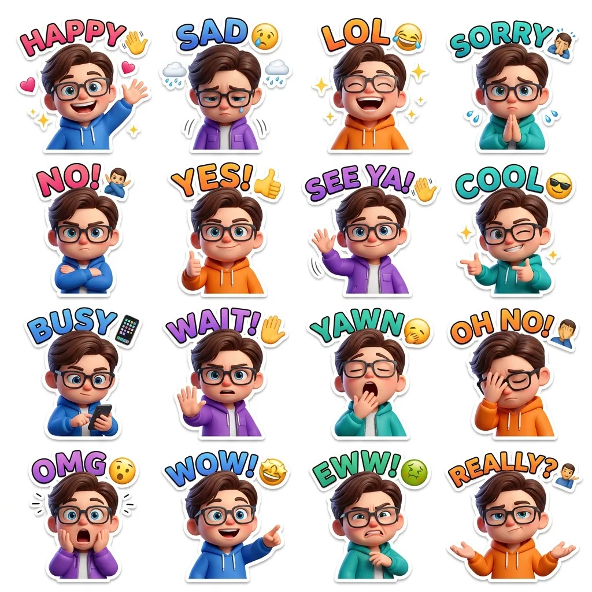

**#189 · Illustration &amp; 3D Prompt · <code>Vinano Image Pro</code>**

<details>
<summary>Show prompt</summary>

```
{
 "task": "premium_animated_sticker_pack",
 "ref_image": "use_only_uploaded_identity_preserve_all_features",
 "format": { "grid": "4x4", "count": 16, "aspect": "2:3", "spacing": "clean", "alignment": "perfect", "bg": "white" },
 "style": {
 "character": "chibi_65_70_head_dynamic_pose_rounded_expressive",
 "render": "high_end_3D_pixar_quality",
 "outline": "white_stroke"
 },
 "clothing": {
 "type": "modern_streetwear",
 "items": ["hoodies","jackets"],
 "colors": ["blue","purple","orange","teal"],
 "variation": "slight_consistent"
 },
 "text": {
 "placement": "top",
 "style": "bold_curved_gradient",
 "effects": ["white_outline","shadow","emoji"]
 },
 "stickers": [["HAPPY","wave"], ["SAD","down"], ["LOL","laugh"], ["SORRY","hands_together"],
 ["NO!","cross_arms"], ["YES!","thumbs_up"], ["SEE YA!","bye"], ["COOL","finger_guns"],
 ["BUSY","phone"], ["WAIT!","stop"], ["YAWN","sleepy"], ["OH NO!","facepalm"],
 ["OMG","shock"], ["WOW!","point"], ["EWW!","disgust"], ["REALLY?","shrug"]],
 "lighting": "soft_studio_rim_light_bright_clean",
 "extras": ["sparkles","hearts","sweat","motion_lines"],
 "consistency": "same_identity_face_glasses_grooming_quality_proportions",
 "negative": "no_mismatch_no_identity_change_no_realistic_body_no_stiff_no_dull_no_overlap_no_bad_hands_no_blur_no_low_quality_no_inconsistent_no_watermark"
}

Preserve realistic proportions and depth for a confident, professional finish.
```

</details>

---

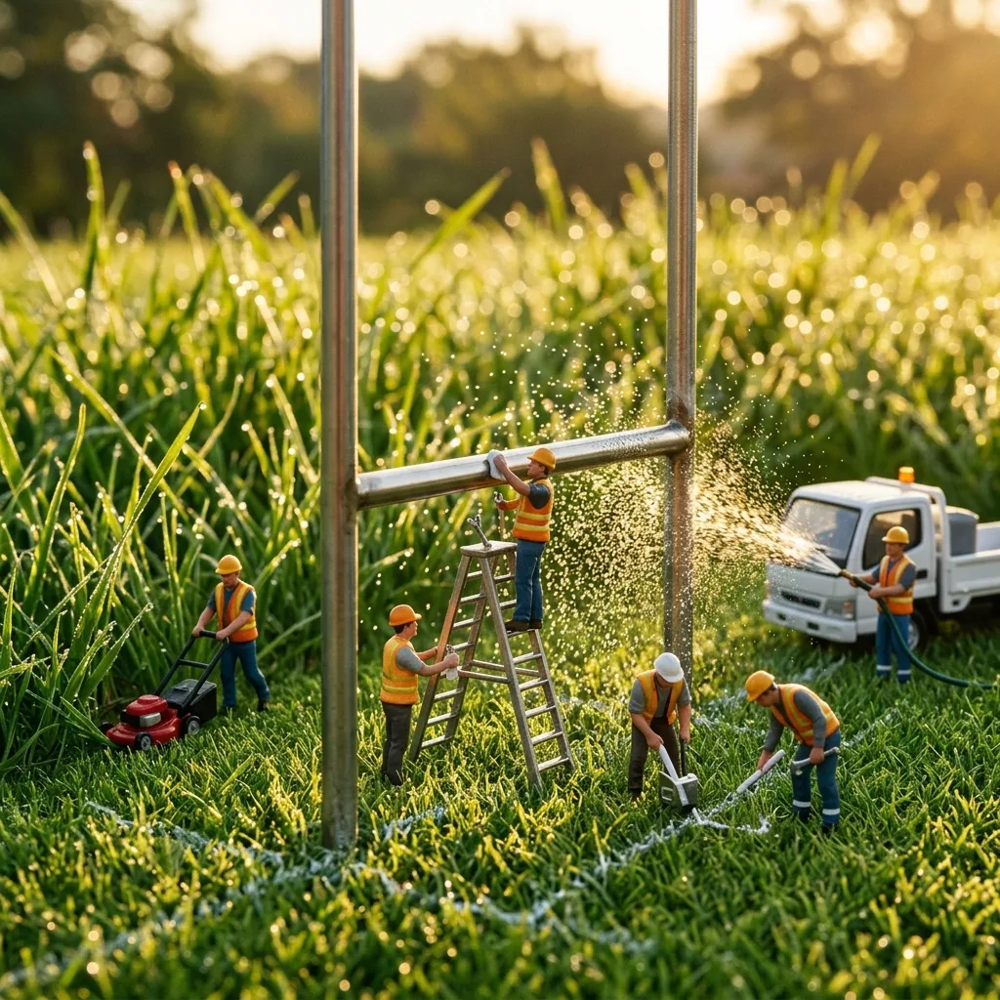

**#190 · Illustration &amp; 3D Prompt · <code>Vinano Image Pro</code>**

<details>
<summary>Show prompt</summary>

```
{
 "prompt": "Ultra-realistic macro photography of miniature construction workers working inside a lush green grass field at golden hour. Tiny workers wearing safety helmets and reflective orange-yellow vests are installing and cleaning a large metallic rugby goal post structure emerging from the grass. One worker is spraying water from a hose connected to a small white utility truck parked in the background, visible water droplets sparkling in sunlight. Another worker is pushing a small lawn mower trimming grass. Two workers are standing on metal ladders adjusting and polishing the horizontal bar of the goal post. Additional workers are cleaning grass lines tools, creating white chalk field markings across the grass. Dew drops on grass blades glowing soft bokeh in background. Extremely shallow depth of field, filmic, cinematic lighting, warm natural sunlight, high detail textures, realistic metal reflections, soft background blur, tilt-shift effect, 8K resolution, professional macro lens photography, hyper-realistic miniature diorama style.",
 "negative_prompt": "blurry, low resolution, cartoon style, CGI look, unrealistic proportions, oversaturated colors, harsh shadows, distorted anatomy, messy composition, noisy image, watermark, text, logo",
 "settings": {
 "resolution": "1024x1024",
 "lighting": "golden hour natural sunlight",
 "camera": "macro lens 100mm",
 "depth_of_field": "very shallow",
 "style": "true-to-life photorealistic miniature diorama",
 "quality": "ultra high detail",
 "aspect_ratio": "1:1"
 }
}

Emphasise material texture and natural light so the final frame feels tactile and premium.
```

</details>

---

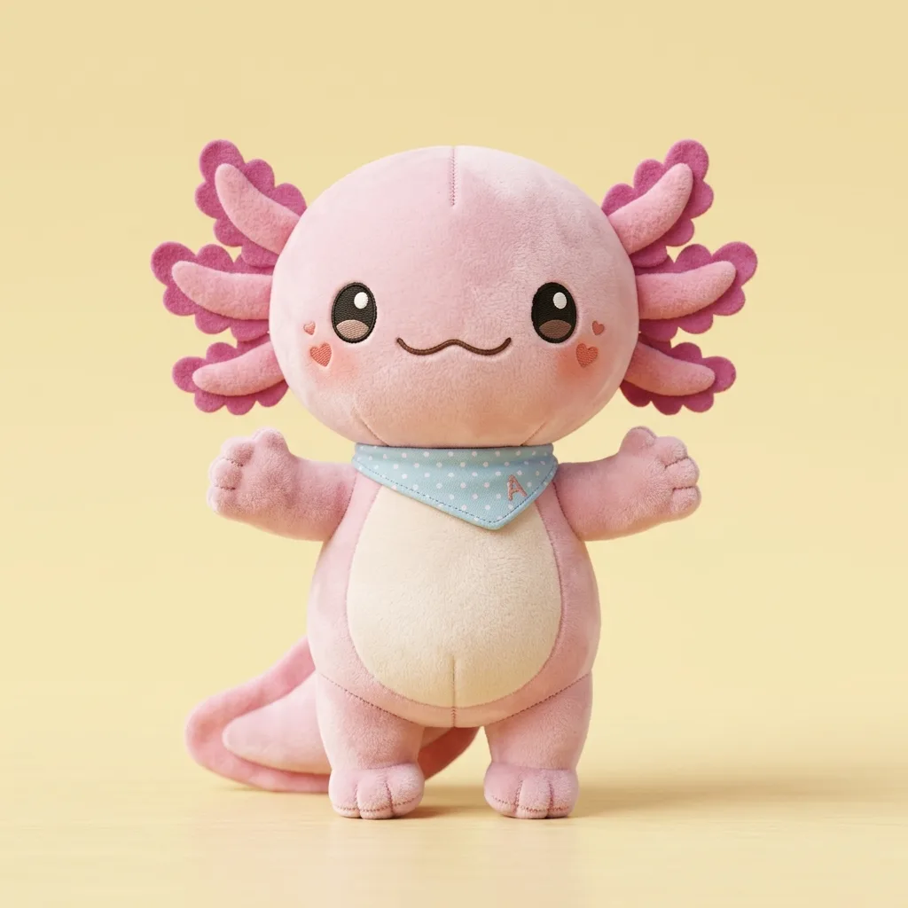

**#191 · Illustration &amp; 3D Prompt · <code>Vinano Image v2</code>**

<details>
<summary>Show prompt</summary>

```
A cute full-body [SUBJECT] plush toy, plush doll art, stylized 3D character design, soft pastel colors, velvety fabric texture, rounded cartoon proportions, refined minimalist details, clean front-facing composition, centered on a light yellow background, playful kawaii aesthetic, soft studio lighting, subtle shadows, adorable collectible feel, high-resolution render Preserve realistic proportions and depth for a confident, professional finish.
```

</details>

---

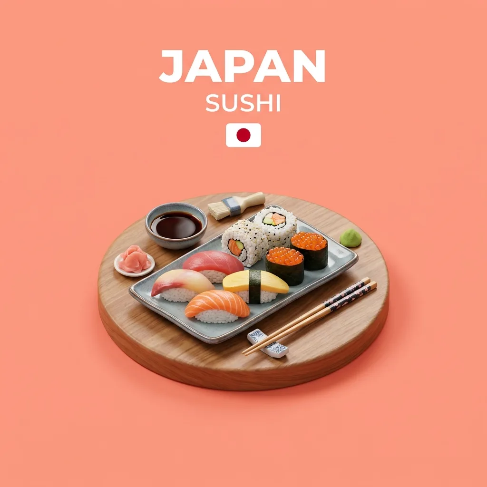

**#192 · Illustration &amp; 3D Prompt · <code>Vinano Image Pro</code>**

<details>
<summary>Show prompt</summary>

```
Present a clear, 45° top-down isometric miniature 3D cartoon scene of [COUNTRY]’s signature dish: [FOOD], soft refined textures, realistic PBR materials, and gentle lifelike lighting.
Create a small raised diorama-style base showcasing the dish in a highly recognizable presentation, simple complementary elements (plate, table surface, or minimal garnish).
Use a clean solid [COLOR] background.

At the top-center, display [COUNTRY] in large bold text, directly beneath it show [FOOD] in medium text, and place a small simplified national icon or flag below the subtext.
All text must automatically match the background contrast (white or black).

Composition: perfectly centered layout, square 1080x1080, ultra-clean, high-clarity miniature diorama aesthetic.”

Aim for an editorial, design-driven look with deliberate negative space.
```

</details>

---

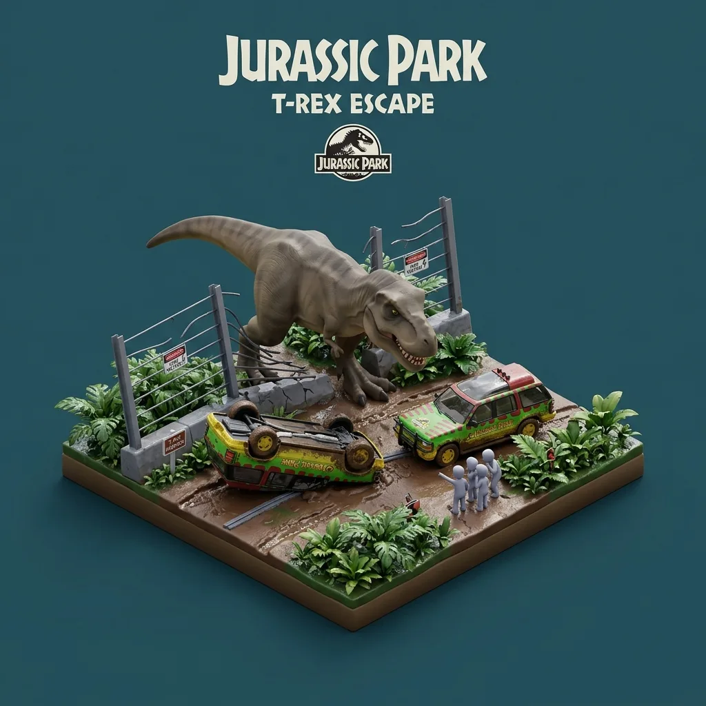

**#193 · Illustration &amp; 3D Prompt · <code>Vinano Image Pro</code>**

<details>
<summary>Show prompt</summary>

```
Present a clear, 45° top-down isometric miniature 3D cartoon scene of the iconic scene [SCENE NAME] from [MOVIE/SHOW], soft refined textures, realistic PBR materials, and gentle lifelike lighting.
Create a small raised diorama-style base that includes the most recognizable elements of this scene, along tiny stylized characters if needed (no facial details).
Use a clean solid [BACKGROUND COLOR] background.

At the top-center, display “MOVIE/SHOW” in large bold text, directly beneath it show [SCENE NAME] in medium text, and place the official logo associated [MOVIE/SHOW] below the subtext.
All text must automatically match the background contrast (white or black).

Composition: perfectly centered layout, square 1080x1080, ultra-clean, high-clarity diorama aesthetic.

Emphasise material texture and natural light so the final frame feels tactile and premium.
```

</details>

---

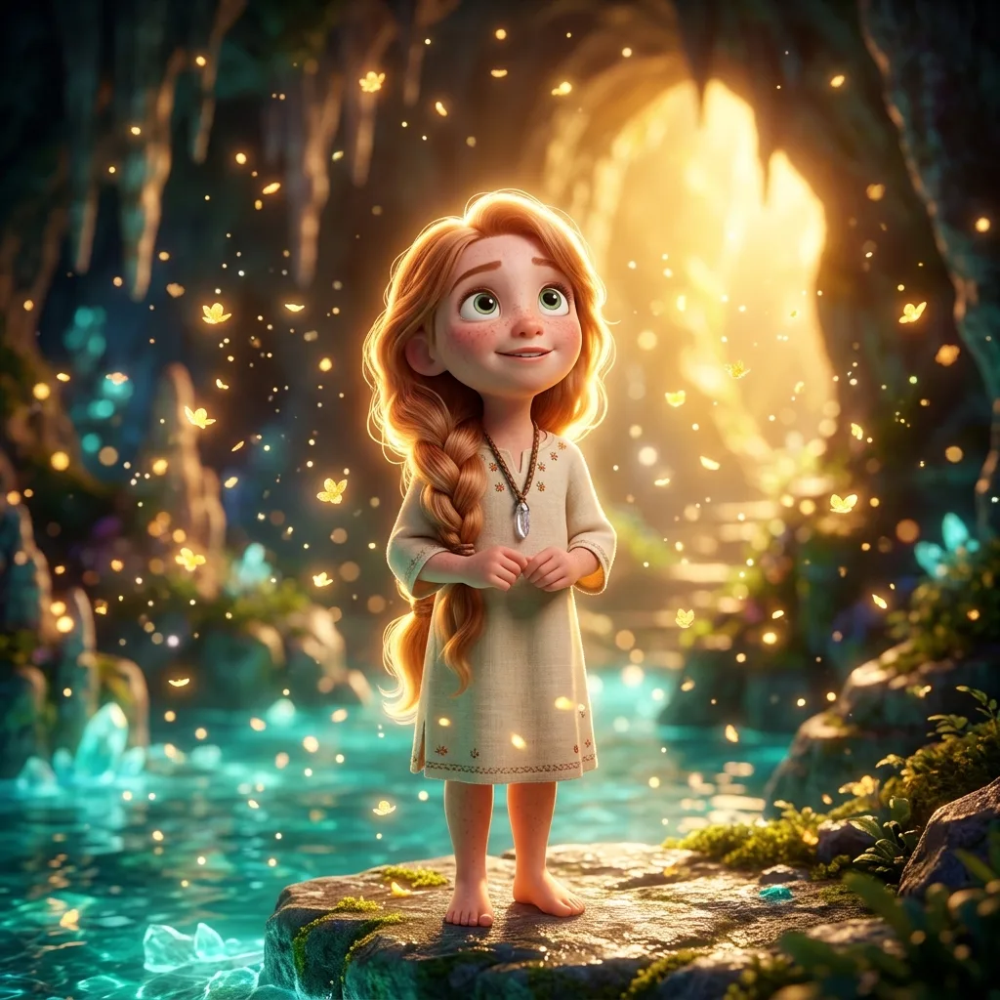

**#194 · Illustration &amp; 3D Prompt · <code>Vinano Image v2</code>**

<details>
<summary>Show prompt</summary>

```
A dreamy, cinematic 3D animated girl big expressive eyes and soft freckles, warm golden backlighting, long wavy strawberry-blonde hair in a loose braid glowing in the sunlight, standing inside a magical cave turquoise water, surrounded by floating glowing golden flower petals and light particles, soft bokeh background, gentle smile looking upward in wonder, warm pastel color palette, volumetric lighting, shallow depth of field, ultra-detailed, premium quality, pixar / disney inspired style, fantasy atmosphere, soft focus, glowing rim light, cinematic composition, 8k, highly detailed, whimsical, ethereal lighting. Render with rich micro-detail while keeping the layout uncluttered and intentional.
```

</details>

---

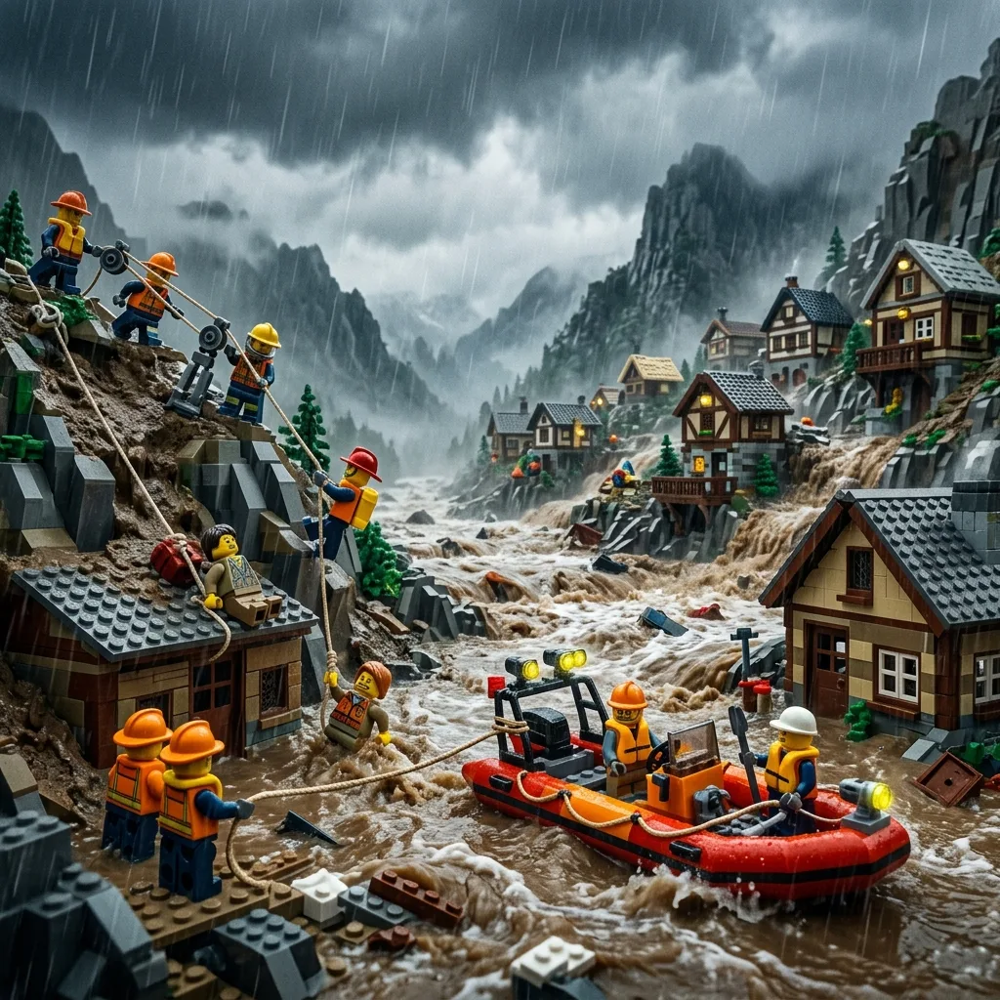

**#195 · Illustration &amp; 3D Prompt · <code>Vinano Image v2</code>**

<details>
<summary>Show prompt</summary>

```
LEGO mountain flood rescue scene, torrential rain causing river overflow in a LEGO mountain village, rescue boats and ropes used by LEGO firefighters, houses perched on slopes surrounded by muddy floodwater, misty mountains in background, dramatic filmic, cinematic lighting, intense LEGO disaster realism --ar 3:4 Maintain consistent colour harmony and crisp focus across the whole frame.
```

</details>

---

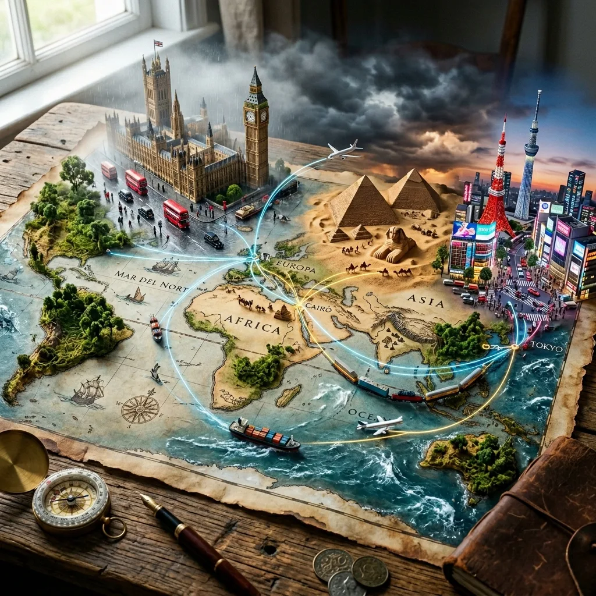

**#196 · Illustration &amp; 3D Prompt · <code>Vinano Image Pro</code>**

<details>
<summary>Show prompt</summary>

```
A weathered {MAP_TYPE} map spread across {SURFACE}, bursting true-to-life photorealistic miniature worlds erupting from marked locations. {CITY_1} explodes from {CONTINENT} as a living diorama—{LANDMARK_1} towers above {STREET_SCENE}, surrounded by {ATMOSPHERIC_EFFECT} and {MOVING_ELEMENT}. {CITY_2} rises from {CONTINENT} {LANDMARK_2} emerging through {WEATHER_DRAMA}, tiny {LOCAL_ACTIVITY} frozen mid-motion. {CITY_3} materializes from {CONTINENT} where {LANDMARK_3} pierces through {LIGHTING_EFFECT}, {CULTURAL_DETAIL} spilling across miniature streets. Connecting routes glow as {VISUAL_ELEMENT}—miniature {VEHICLE_TYPE} suspended impossibly between worlds. The map's surface transitions from flat parchment to living terrain: oceans become actual churning water {WATER_DETAIL}, deserts shimmer real heat haze, forests sprout miniature trees. Each city exists in its own time: {LIGHTING_CONDITION_1} bathes one, {LIGHTING_CONDITION_2} illuminates another, {LIGHTING_CONDITION_3} glows over the third. {FOREGROUND_OBJECTS} scatter around the map edges. {PHOTOGRAPHY_STYLE}, {COLOR_PALETTE}, extreme depth of field, 8K, {ERA_AESTHETIC} meets magical realism. Emphasise material texture and natural light so the final frame feels tactile and premium.
```

</details>

---

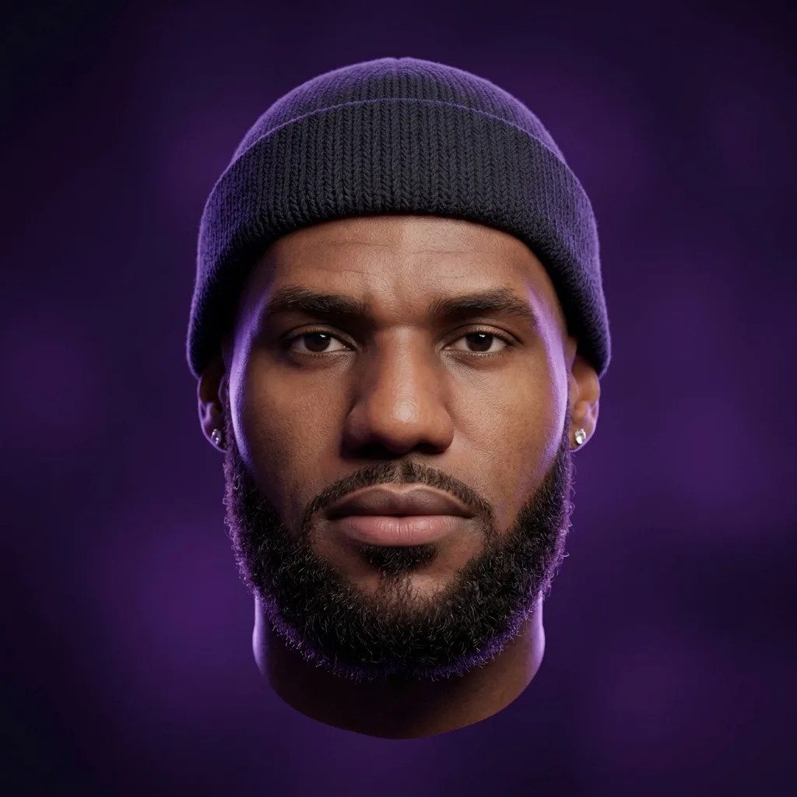

**#197 · Illustration &amp; 3D Prompt · <code>Vinano Image Pro</code>**

<details>
<summary>Show prompt</summary>

```
Ultra-detailed stylized 3D portrait the provided reference photo lebron james as the exact facial base.
Preserve the person perfectly — identical face shape, bone structure, jawline, eyes, nose, lips, skin tone, marks, freckles, expression and proportions.
DO NOT modify facial identity in any way.
Convert ONLY into high-end stylized 3D realism.
Head & elements:
Floating head only (no neck, no shoulders, no body)
Keep EXACTLY whatever the person has on their head in the reference image — same hairstyle, same hair length and texture, same hat, cap, sunglasses, glasses, headphones or any accessory. Do not remove or add anything.
Skin refinement:
Natural smooth skin (not plastic).Visible realistic micro-texture and pores. Subtle subsurface scattering for natural light diffusion. Soft highlights on cheekbones, nose bridge and tip.Balanced realistic shadows for depth
Hair & accessories (if present in reference):
Ultra-realistic volumetric strands.Natural shine and soft rim reflections. Perfectly preserved shape and position
Lighting:
Strong cinematic purple ambient background. Soft frontal key light evenly illuminating the face. Subtle rim light separating head from background. Gentle under-chin shadow for depth. Smooth light gradients, no harsh contrast
Rendering style:
Premium Pixar-quality stylized realism. Clean smooth shading. Global illumination. Soft bloom on highlights. Ultra sharp edgesNoise-free professional CGI
Camera & quality:
Centered portrait composition. Shallow depth of field illusion. Ultra high resolution. Cinematic look
Rules:
Respect reference face 100%.Respect all head accessories and hair exactly. Only convert to stylized 3D. No exaggeration. No cartoon distortion. No facial changes

Maintain consistent colour harmony and crisp focus across the whole frame.
```

</details>

---

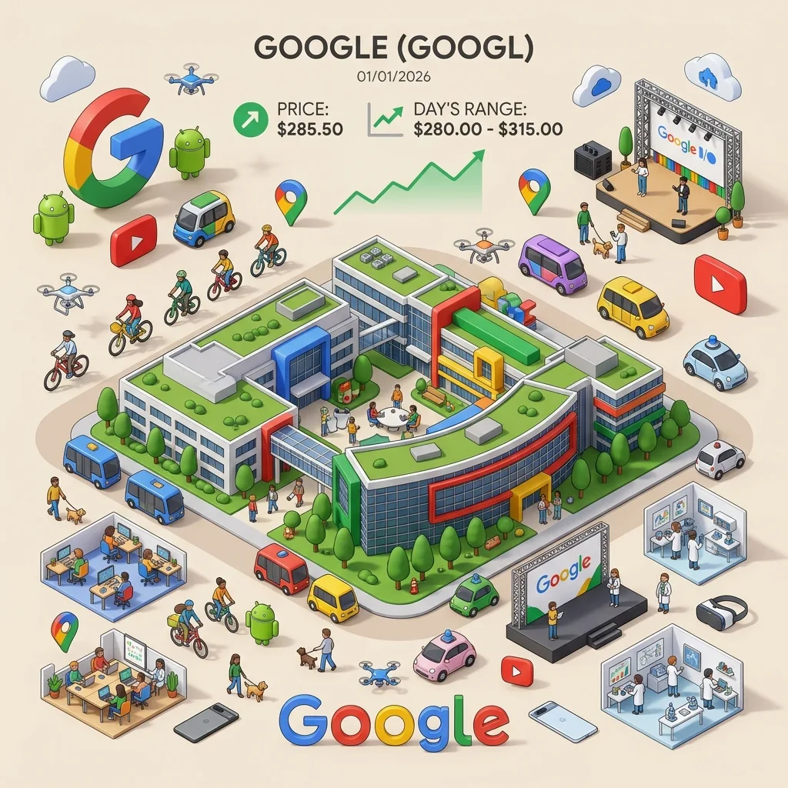

**#198 · Illustration &amp; 3D Prompt · <code>Vinano Image v2</code>**

<details>
<summary>Show prompt</summary>

```
8k Ultra-Realistic Promotional
Create an exquisite miniature 3D cartoon-style scene of the user-specified company, viewed from a 45° top down perspective, the company’s most iconic building or campus at the center, surrounded by proportionally scaled product icons, cartoon figures, vehicles, and playful elements representing everyday activities. Render in Cinema 4D refined, smoothly rounded modeling, rich PBR textures, gentle lifelike lighting, and soft shadows for a warm, polished feel, a clean solid-color background.
Integrate accurate real-time stock market data for the specified date into a minimalistic layout, displaying the company name or stock ticker at the top center in large text, the date in extra-small text, and the stock price range in medium text clear trend icons and charts, all in the user-specified language and without text backgrounds, subtly overlapping the scene if needed.
Very important: verify stock data accuracy for the given company/ticker and date before generation; if unavailable, notify the user and stop.
Parameters: aspect ratio (user input, default 1:1), date (user input/current), company/ticker (user input).
Example: Company – Google, Date – 01/01/2026.

Keep edges clean and the overall composition balanced for a polished, gallery-ready result.
```

</details>

---

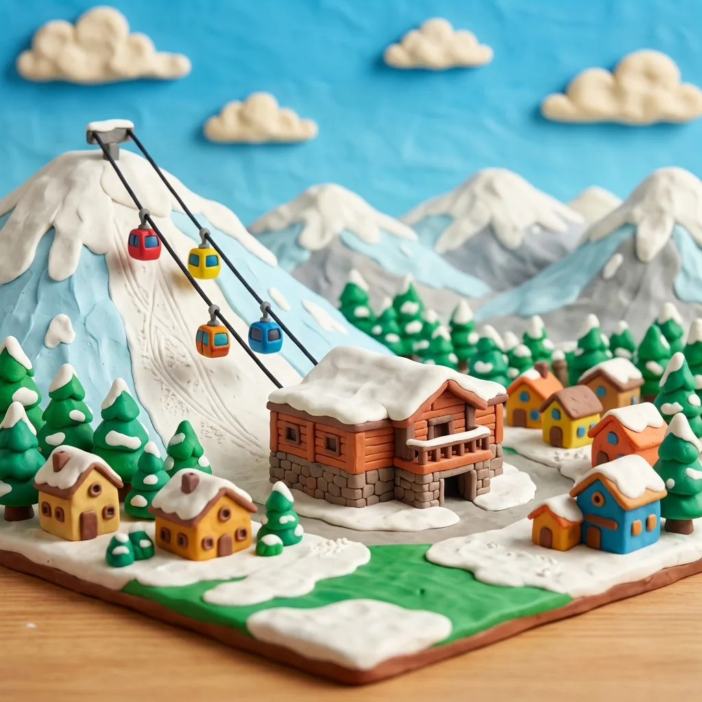

**#199 · Illustration &amp; 3D Prompt · <code>Vinano Image Pro</code>**

<details>
<summary>Show prompt</summary>

```
8k Ultra-Realistic Promotional
Generate a whimsical miniature world featuring [KASHMIR SNOWFALL LAND MARK NAME] crafted entirely from colorful modeling clay. Every element buildings, trees, waterways, and urban features should appear hand sculpted visible fingerprints and organic clay textures. Use a playful, childlike style vibrant colors: bright azure sky, puffy cream clouds, emerald trees, and buildings in warm yellows, oranges, reds, and blues.
The handmade quality should be evident in every surface and gentle curve. Capture from a wide perspective showcasing the entire miniature landscape in a harmonious, joyful composition. Include no text, words, or signage only sculptural clay elements that define the location through recognizable architectural features. 1080x1080 dimension.

Preserve realistic proportions and depth for a confident, professional finish.
```

</details>

---

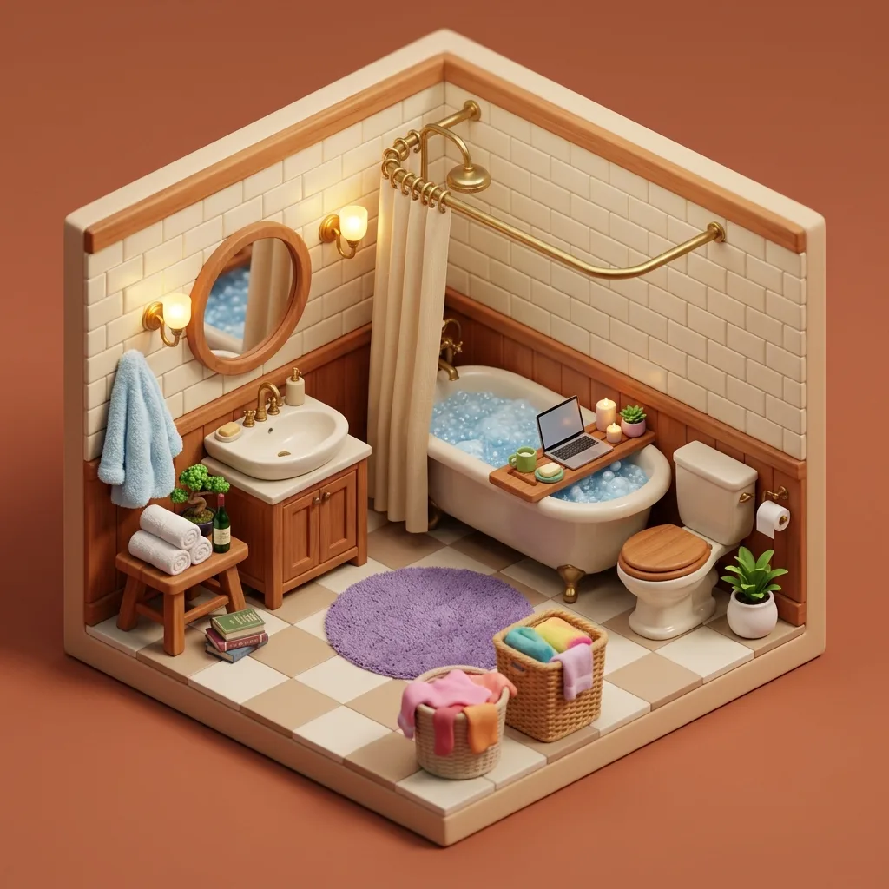

**#200 · Illustration &amp; 3D Prompt · <code>Vinano Image Pro</code>**

<details>
<summary>Show prompt</summary>

```
{
 "prompt": "cute cozy isometric 3D miniature bathroom diorama, warm cozy aesthetic, detailed tiny room corner view, warm terracotta and beige color palette, small japanese-style bathroom scene, cream ceramic subway tiles warm wooden trim, vintage clawfoot bathtub filled blue bubbly foam, wooden bath tray across tub open laptop, green mug, soap, candles, small potted plant, golden brass curved shower rod beige shower curtain, round wooden mirror, white porcelain sink wooden vanity cabinet, brass faucet, toilet wooden seat, small wooden stool rolled white towels and books, green wine bottle, tiny bonsai plant, wall mounted gold sconces warm glowing bulbs, light blue fluffy towel hanging on wall hook, laundry basket pink and orange clothes, wicker laundry hamper full of colorful towels, round plush purple bath mat, checkered beige-white floor tiles, small potted plant in white pot, cozy warm lighting, soft shadows, extremely detailed miniature dollhouse style, warm inviting atmosphere, soft bokeh, ken follett miniature aesthetic, tilt-shift effect, 8k, hyperdetailed, trending on artstation",
 "negative_prompt": "blurry, low quality, realistic scale, huge objects, people, human figures, text, watermark, logo, overexposed, underexposed, modern chrome, cold blue lighting, hospital style, empty room, cartoon, anime, 2D, sketch, painting, drawing",
 "aspect_ratio": "4:3",
 "style": "miniature diorama, isometric, cozy interior, warm tones, detailed product photography",
 "lighting": "soft warm golden hour lighting, cozy ambient glow, practical light sources from sconces",
 "camera_angle": "isometric 45 degree corner view, looking down into the room corner, miniature photography style",
 "quality_tags": "masterpiece, best quality, ultra detailed, 8k, sharp focus, intricate details",
 "additional_weights": {
 "miniature": 1.3,
 "diorama": 1.4,
 "isometric": 1.35,
 "cozy": 1.25,
 "warm lighting": 1.2,
 "detailed textures": 1.3
 }
}

Maintain consistent colour harmony and crisp focus across the whole frame.
```

</details>

---

[Next page →](./illustration-3d-3.md)
