# Illustration & 3D — full gallery

[← Back to README](../README.md) · [`prompts.json`](../prompts/prompts.json) · **409** prompts · page 3 / 5

[← Prev](./illustration-3d-2.md) — [1](./illustration-3d.md) · [2](./illustration-3d-2.md) · **3** · [4](./illustration-3d-4.md) · [5](./illustration-3d-5.md) — [Next →](./illustration-3d-4.md)

---

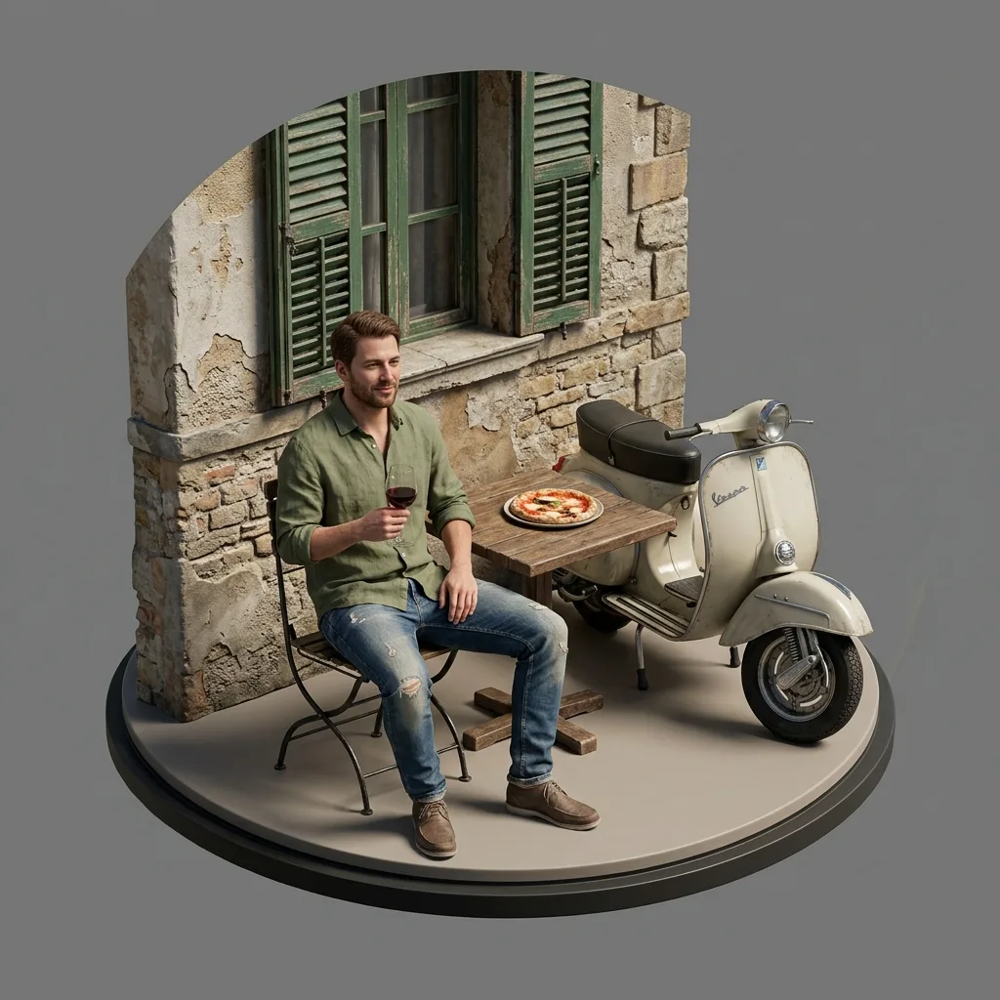

**#201 · Illustration &amp; 3D Prompt · <code>Vinano Image Pro</code>**

<details>
<summary>Show prompt</summary>

```
Concept: A hyper-realistic 3D isometric view of a [INSERT LOCATION] scene on a circular base.
Subject (Visuals): A full-body, realistic human [INSERT DESCRIPTION].
* Texture Rule: The subject must have "Living Human Skin" texture (subsurface scattering, pores, natural imperfections).
* Important: He is NOT a toy/doll. He looks like a real person inserted into the scene.
* Pose: [INSERT POSE, e.g., Sitting naturally].

Composition & Scale (Crucial):
* Camera: Isometric wide shot (Full view). ensure the entire circular base, the subject, and all props are visible within the frame.
* Proportions: PERFECT RELATIVE SCALE. The props (e.g., scooter, table etc.) must be the correct size relative to the human. Do not make the human giant or the props tiny.

Environment: A realistic section of a [INSERT WALL/BUILDING] behind the subject.
* Material: Real weathered textures (brick, cement, wood), not painted model textures.

Props:
* [INSERT PROP 1, e.g., Vintage Vespa] (Real metal and chrome texture).
* [INSERT PROP 2, e.g., Pizza and Wine] (Real food texture).
* *Note:* Ensure all props are present and grounded on the base.

Technical Specs: Unreal Engine 5 render style, 8k resolution, global illumination, raytracing, sharp focus on the entire scene (deep depth of field), solid neutral grey background.

Negative Prompt: Toy, plastic, doll, action figure, clay, resin, shallow depth of field (blur), close-up, cropped, distorted proportions, giant head, cartoonish, missing limbs, unfinished.

Keep edges clean and the overall composition balanced for a polished, gallery-ready result.
```

</details>

---

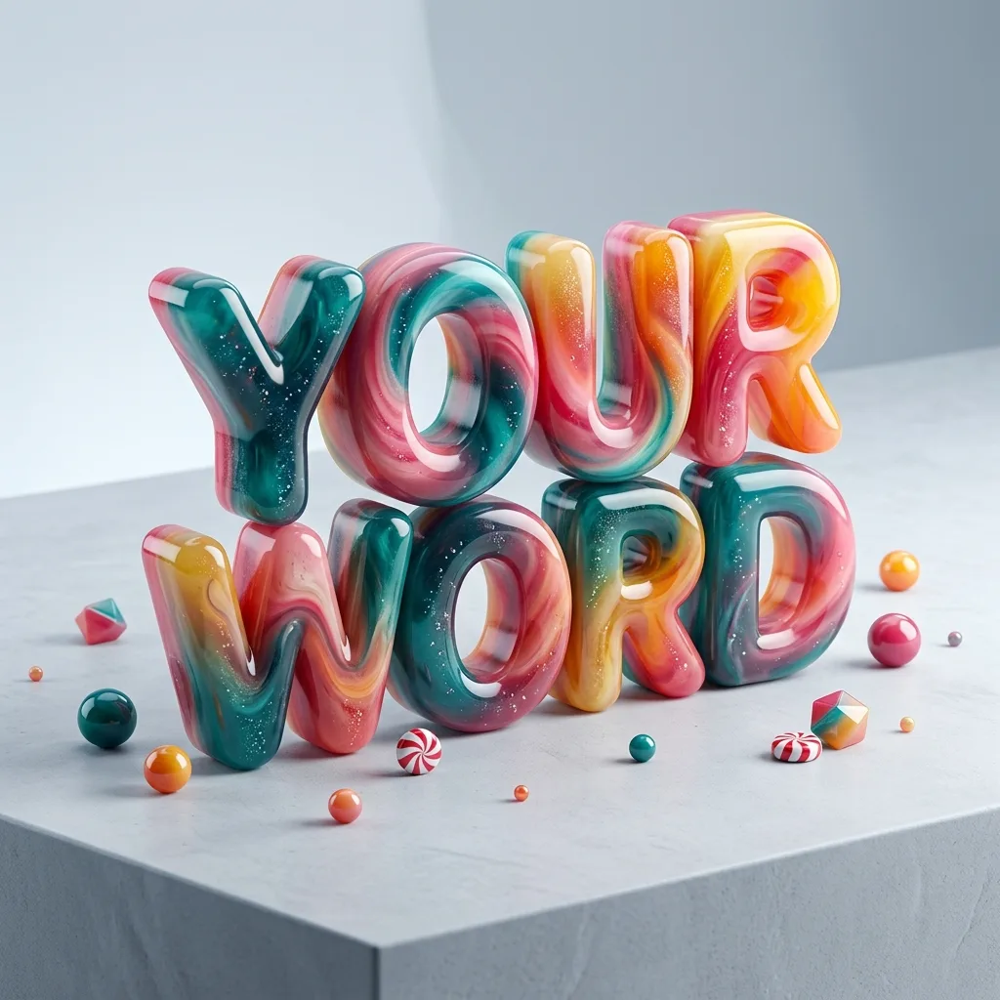

**#202 · Illustration &amp; 3D Prompt · <code>Vinano Image v2</code>**

<details>
<summary>Show prompt</summary>

```
A smooth, ultra-realistic 3D render of the word [YOUR WORD] shaped like a delicious candy — style adapts based on word — surrounded by a minimal candy world — high-Kelvin lighting — cinematic ray tracing — soft shadows — glossy details — hyper-real textures — square format Aim for an editorial, design-driven look with deliberate negative space.
```

</details>

---

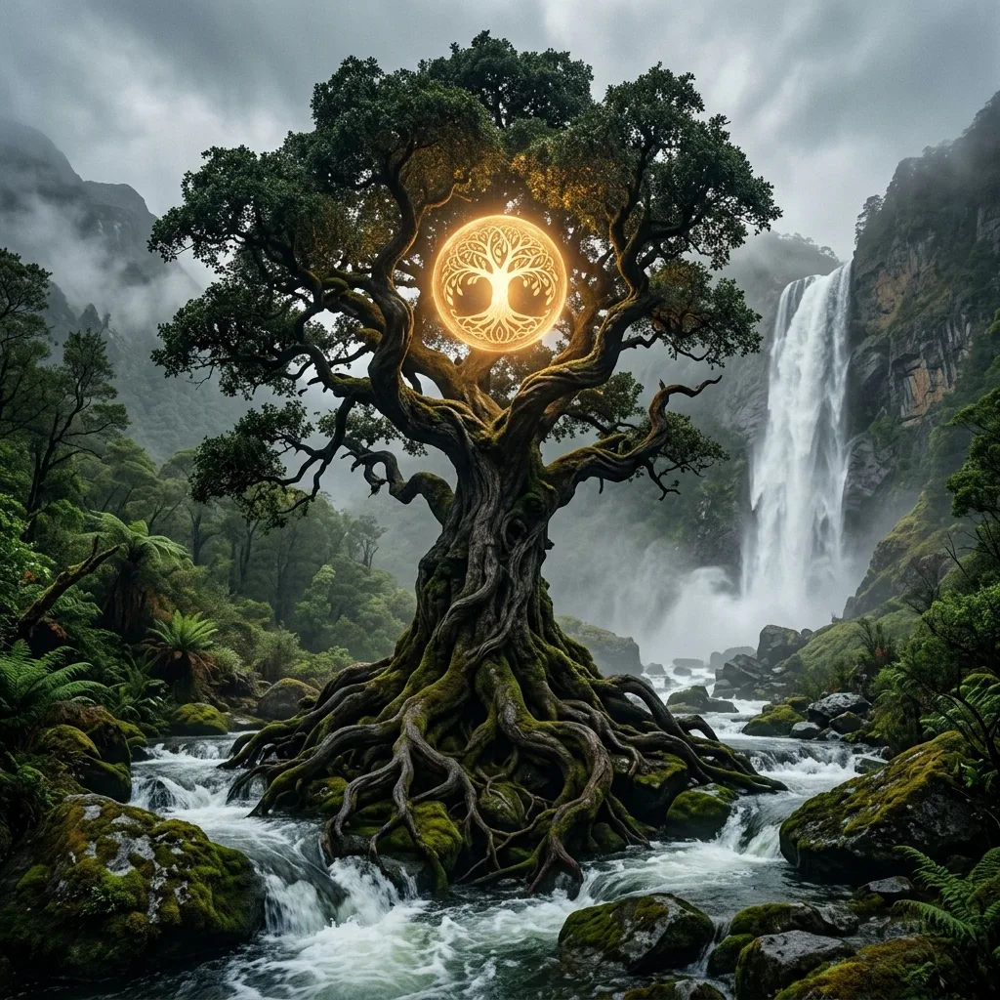

**#203 · Illustration &amp; 3D Prompt · <code>Vinano Image v2</code>**

<details>
<summary>Show prompt</summary>

```
A majestic, ancient gnarled tree thick, twisting roots sits at the center of a lush, mystical landscape, its roots anchoring into a vibrant, foaming stream flowing over moss-covered rocks. Suspended within the dense, dark green canopy of the tree is a radiant, glowing golden orb containing a detailed, ethereal silhouette of a tree of life. In the background, a massive, towering waterfall cascades down a rugged, misty cliffside into the river below. The scene is illuminated by the soft, warm light emanating from the golden orb, contrasting the moody, overcast sky and the deep, rich greens of the surrounding forest. true-to-life photorealistic, filmic, cinematic lighting, high fantasy art style, intricate textures on the bark and water, 8k resolution. Keep edges clean and the overall composition balanced for a polished, gallery-ready result.
```

</details>

---

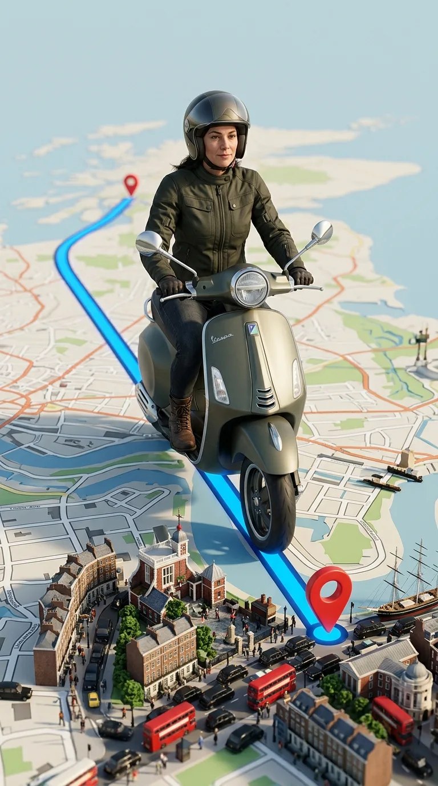

**#204 · Illustration &amp; 3D Prompt · <code>Vinano Image Pro</code>**

<details>
<summary>Show prompt</summary>

```
Use the same face from the reference image without changing facial features
Vertical (4:5 or 9:16) surreal 3D scene featuring a true-to-life photorealistic character generated strictly from the attached reference image (accurate facial likeness, skin texture, age, proportions).

Front-facing view, camera slightly above eye level, the character riding her own scooter/motorbike directly on top of the blue GPS route line itself, moving forward toward a red destination pin.
The character wears culturally accurate clothing inspired by [west], realistic fabric behavior and riding posture.
Below, a stylized GPS-style city map of [United Kingdom] fills the scene. A chaos zone at [Greenwich] shows dense miniature cars, people, buildings, trees, and urban clutter concentrated near the destination.
Natural daylight, cinematic shadows, sharp focus on the character, and subtle depth of field on the map.

High-end concept-art quality combining photoreal human + stylized miniature city.

Preserve realistic proportions and depth for a confident, professional finish.
```

</details>

---

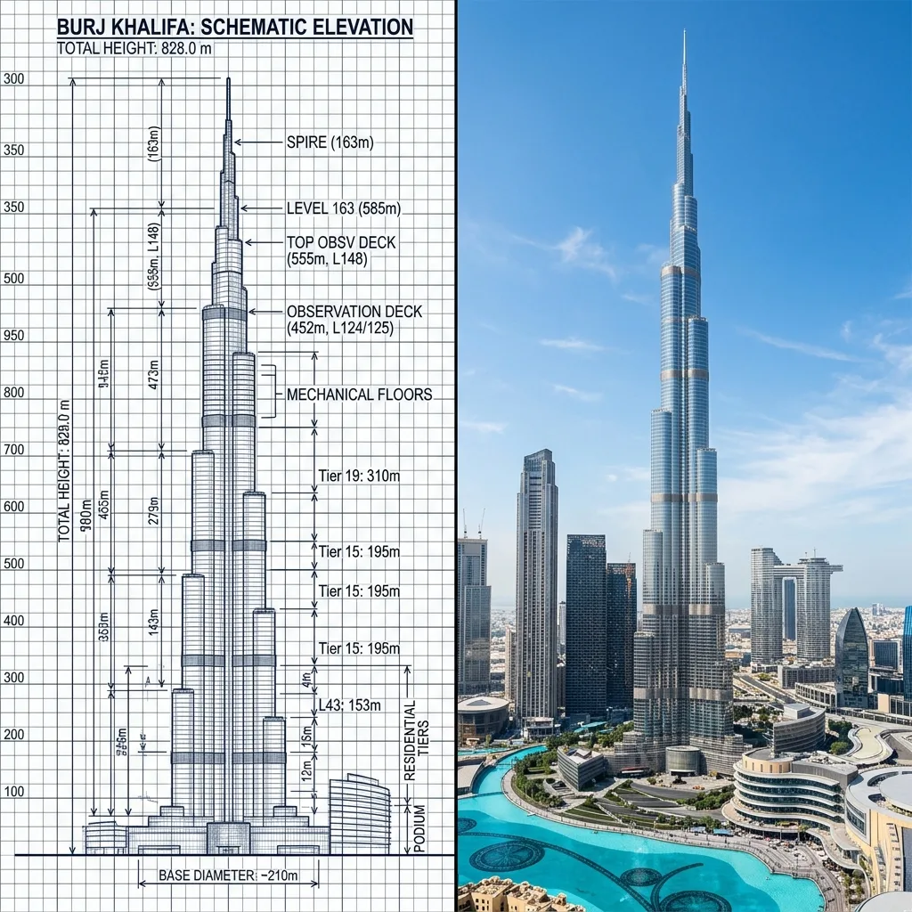

**#205 · Illustration &amp; 3D Prompt · <code>Vinano Image Pro</code>**

<details>
<summary>Show prompt</summary>

```
{
 "objective": "Create a side-by-side comparison image featuring a technical sketch and real photograph of the Burj Khalifa",
 "image_specifications": {
 "style": "Mixed media (Technical drawing + Real photograph)",
 "layout": "Horizontal split - Left side: Sketch measurements, Right side: Real photo",
 "aspect_ratio": "3:2"
 },
 "left_side": {
 "content_type": "Technical sketch of the Burj Khalifa",
 "features": ["Detailed architectural lines showing tiered setbacks",
 "Numerical height and width measurements",
 "Elevation labels for different tower sections",
 "Side and front elevation views (top-down projection if space allows)"],
 "text_annotations": {
 "units": "Metric (meters)",
 "language": "English",
 "font_style": "Blueprint or engineering-style typography"
 },
 "positioning": "Take up the left half of the image"
 },
 "right_side": {
 "content_type": "High-resolution real photo of the Burj Khalifa",
 "features": ["Full view of the tower from base to spire",
 "Natural daylight clear sky",
 "Color image Dubai skyline or Downtown Dubai context"],
 "positioning": "Take up the right half of the image"
 },
 "visual_elements": {
 "border_division": "Vertical line or subtle transition between left (sketch) and right (photo)",
 "color_palette": {
 "left": "Monochrome or blueprint blue for sketch",
 "right": "Natural realistic colors"
 }
 },
 "output_format": {
 "type": "Image",
 "use_case": ["Educational poster", "Architectural comparison", "Engineering visualization", "Tourism visual aid"],
 "high_resolution": true
 }
}

Render with rich micro-detail while keeping the layout uncluttered and intentional.
```

</details>

---

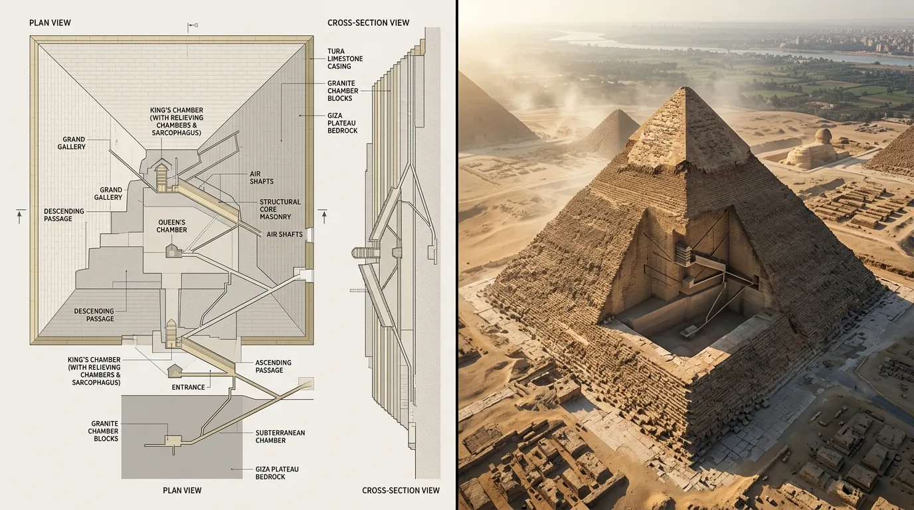

**#206 · Illustration &amp; 3D Prompt · <code>Vinano Image Pro</code>**

<details>
<summary>Show prompt</summary>

```
Split composition image, left and right halves clearly divided in 16:9 widescreen format.
Left Half:
Highly detailed architectural floor plan and cross-section illustration of [LANDMARK] in a modern refined minimalist style. Top-down view showing main structural layout, internal divisions, circulation paths, key chambers or spaces labels. Material callouts, structural support systems, and architectural details clearly marked. Neutral beige and warm gray color palette, clean linework, soft shadows, subtle textures. Professional architectural-presentation style. Include detailed cross-sectional diagram showing vertical layers and internal structure. Blueprint aesthetic technical accuracy and labeled sections.
Right Half:
Ultra-realistic aerial exterior photograph of [LANDMARK] captured from above and to the side (elevated isometric perspective, not straight overhead). Shows the complete structure authentic weathered textures, aged materials, surrounding landscape, dramatic golden-hour sunlight creating sharp shadows, atmospheric haze suggesting historical significance. The perspective reveals both external grandeur and internal scale simultaneously. Warm golden-light lighting, realistic patina and wear patterns, authentic architectural proportions. Feels like an aerial photograph capturing the monument’s true majesty and scale.
Both halves align visually, clearly showing architectural engineering blueprint vs. the actual monumental structure in its archaeological or historical reality.
Style & Mood:
•Architectural blueprint visualization meets historical aerial photography
•Engineering precision and historical significance
•Educational, museum-exhibit presentation
•Engineering schematic-to-reality comparison
•Grandeur emphasizing scale and architectural sophistication
Lighting & Color:
•Left: Flat, even lighting, neutral blueprint tones, technical aesthetic
•Right: Golden-hour natural light, dramatic shadows, warm tones, atmospheric depth
•Consistent warm palette between both halves
Camera & Technical Details:
•Left: Top-down orthographic + detailed cross-sectional architectural view labeled sections
•Right: Elevated aerial perspective (45-degree isometric angle), capturing full structure from above-and-to-the-side
•High resolution, sharp architectural details on left; true-to-life photorealistic weathered textures on right
Negative Prompt:
Cartoon style, low detail, cluttered composition, modern elements, unrealistic proportions, harsh lighting, exaggerated colors, text overlays, watermarks, CGI look, sterile rendering, straight-down overhead view, no atmospheric quality, overly pristine condition

Maintain consistent colour harmony and crisp focus across the whole frame.
```

</details>

---

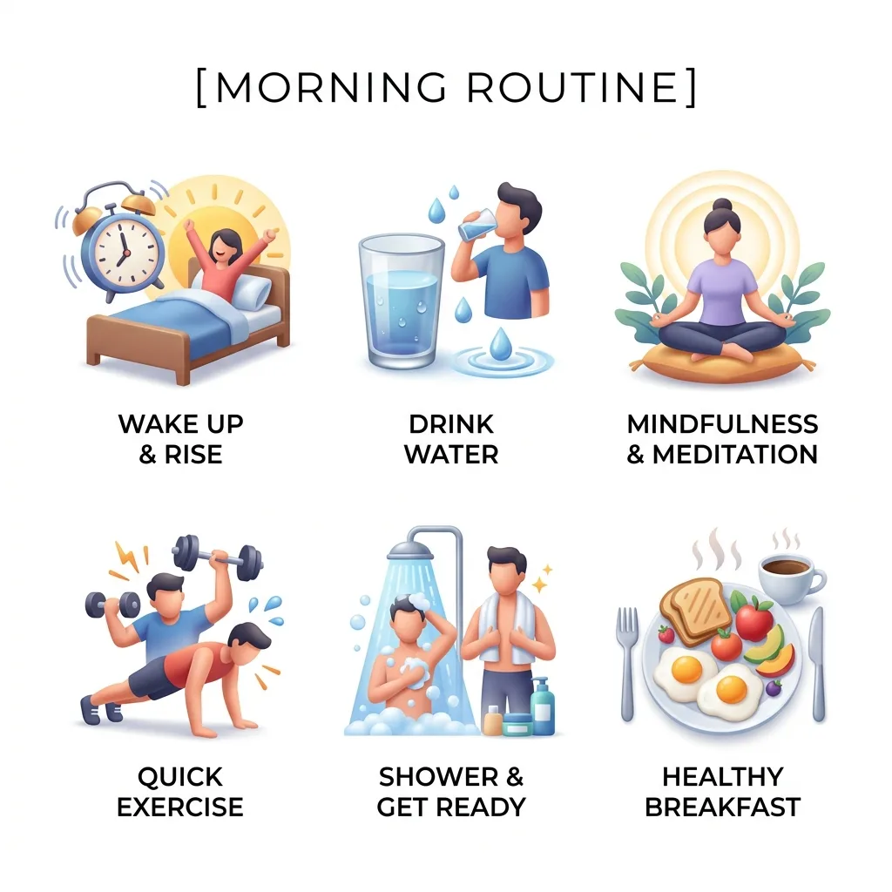

**#207 · Illustration &amp; 3D Prompt · <code>Vinano Image Pro</code>**

<details>
<summary>Show prompt</summary>

```
Create a collection of icons representing [ROUTINE / PROCESS / HABITS], each icon depicting one specific routine step and clearly labeled by name.

They belong together as a single cohesive theme. The background is pure white.

Place the title “[ROUTINE NAME]” at the top center of the image, aligned symmetrically above the grid, a clean, minimal typography style that complements the icon design without overpowering it.
Icons are rendered in a friendly, modern 3D style, featuring smooth gradients and soft shadows.

Maintain consistent proportions, color harmony, materials, and typography across all icons and labels so the set feels unified and easy to read.

Preserve realistic proportions and depth for a confident, professional finish.
```

</details>

---


**#208 · Illustration &amp; 3D Prompt · <code>Vinano Image v2</code>**

<details>
<summary>Show prompt</summary>

```
A mini chibi version of the character in the uploaded image, a big head and small body, sitting on an open left palm for realistic scale. A right hand gently pressing its cheek an index finger. The character looks annoyed and pouty — puffed cheeks, slightly frowning, squinting eyes. Ultra-detailed chibi style, soft pastel colors, smooth texture, clean lighting, shallow depth of field, strong focus on facial expression and hand interaction, vertical composition 4:5 ratio.​​​​​​​​​​​​​​​​ Preserve realistic proportions and depth for a confident, professional finish.
```

</details>

---

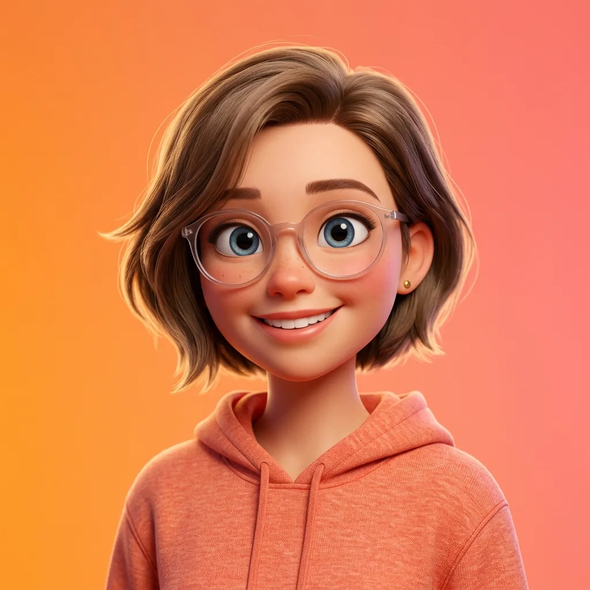

**#209 · Illustration &amp; 3D Prompt · <code>Vinano Image v2</code>**

<details>
<summary>Show prompt</summary>

```
A stylized Pixar-style 3D portrait of a young person smooth skin, large expressive blue eyes, soft facial features, wearing round transparent glasses, modern hairstyle (short styled hair / soft bob cut), casual outfit (hoodie or minimal sweater), slight head tilt and warm smile, friendly and approachable expression, ultra-clean character design, vibrant orange-to-pink gradient background, soft studio lighting subtle rim light, cinematic depth of field, ultra-detailed, 8K render, octane render style. Aim for an editorial, design-driven look with deliberate negative space.
```

</details>

---

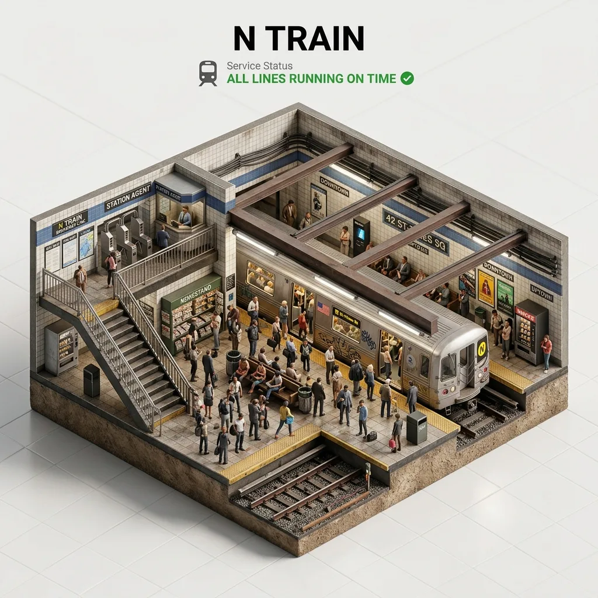

**#210 · Illustration &amp; 3D Prompt · <code>Vinano Image Pro</code>**

<details>
<summary>Show prompt</summary>

```
8K Ultra-Realistic Promotional
Present a clear, 45° top-down isometric miniature 3D scene of the [SUBWAY SYSTEM / LINE NAME]. The scene includes stylized diorama elements such as platforms, miniature trains, stairwells, signage, tiled walls, vending machines, and people waiting.
Use soft, refined textures, realistic PBR materials, and lifelike lighting subtle shadows to enhance dimensional clarity.
At the top center, place the title “[LINE NAME]” in bold sans-serif text. Below it, add a train icon followed by “Service Status” (small text) and “[STATUS MESSAGE]” red medium text for delays or green for on-time service.
Use a soft, solid tile white background for clarity. Clean, centered, editorial infographic style.
Square format 1080×1080, ultra-detailed 3D render, miniature realism, 8K look, image size 1: 1

Render with rich micro-detail while keeping the layout uncluttered and intentional.
```

</details>

---

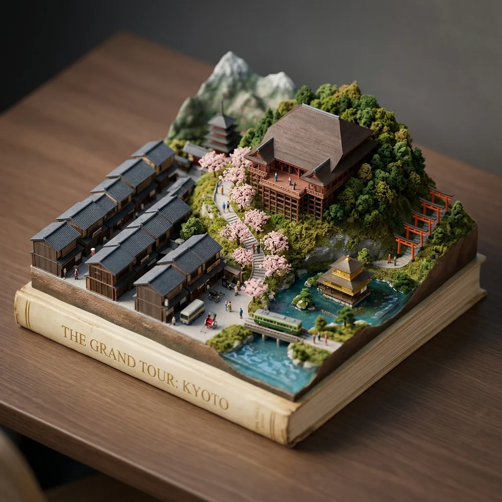

**#211 · Illustration &amp; 3D Prompt · <code>Vinano Image Pro</code>**

<details>
<summary>Show prompt</summary>

```
Create a stylized miniature 3D diorama viewed from a 45-degree angled perspective, emphasizing careful scale, clean geometry, and fine craftsmanship.

A [OBJECT] serves as the central base of the composition. From within or above this object, a miniature interpretation of [LOCATION NAME] emerges naturally, forming a compact, self-contained world.

The scene highlights recognizable landmarks, terrain features, or symbolic structures associated [LOCATION NAME], arranged harmoniously and rendered precise detail.

Miniature roads, paths, or environmental elements flow through the scene, tiny vehicles, figures, or subtle motion cues adding realism and life.

Use filmic, cinematic lighting, soft highlights, and selective depth-of-field blur to create a magical, dreamlike atmosphere.

Balance playful isometric styling realistic materials and lighting, achieving a polished, premium diorama look.

Highly detailed, cohesive composition an 8K cinematic finish, refined miniature-world aesthetic.

Maintain consistent colour harmony and crisp focus across the whole frame.
```

</details>

---

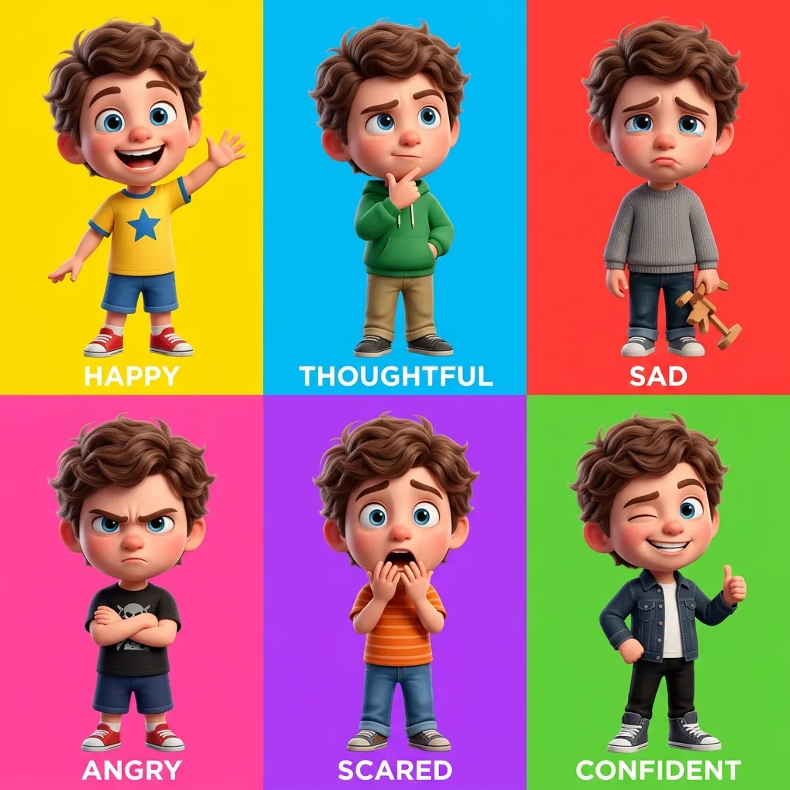

**#212 · Illustration &amp; 3D Prompt · <code>Vinano Image Pro</code>**

<details>
<summary>Show prompt</summary>

```
A 3D Pixar-style animated young male character showcased in a 6-panel grid layout, each panel featuring a different facial expression and outfit. Bright solid color backgrounds (yellow, blue, red, pink, purple, green). The character has soft brown wavy hair, expressive large eyes, smooth skin, and stylized cartoon proportions. Maintain consistent colour harmony and crisp focus across the whole frame.
```

</details>

---

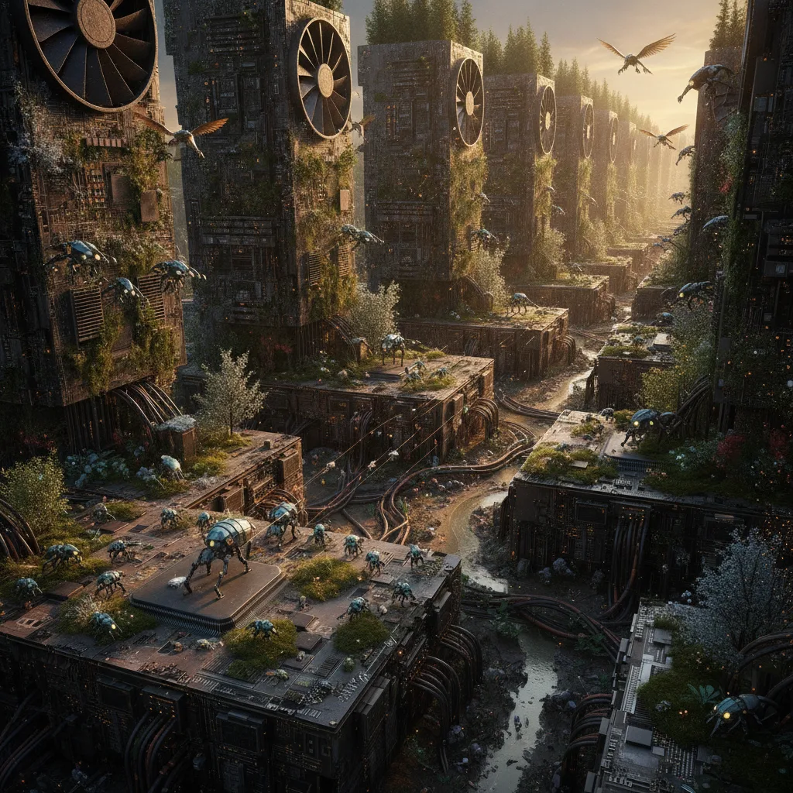

**#213 · Illustration &amp; 3D Prompt · <code>Vinano Image</code>**

<details>
<summary>Show prompt</summary>

```
A colossal [OBJECT] reimagined as a complete natural biome. Tiny [WILDLIFE] has evolved to inhabit every niche the object provides. Predators hunt across its surfaces, herbivores graze in its cavities, birds nest in its heights, insects swarm its crevices. Food chains have formed around the object's geometry. Migration patterns follow its contours. Seasonal changes affect different zones. The object's materials have weathered into naturalistic terrain while remaining recognizable. Documentary aesthetic, golden wildlife lighting, the manufactured as wilderness. Render with rich micro-detail while keeping the layout uncluttered and intentional.
```

</details>

---

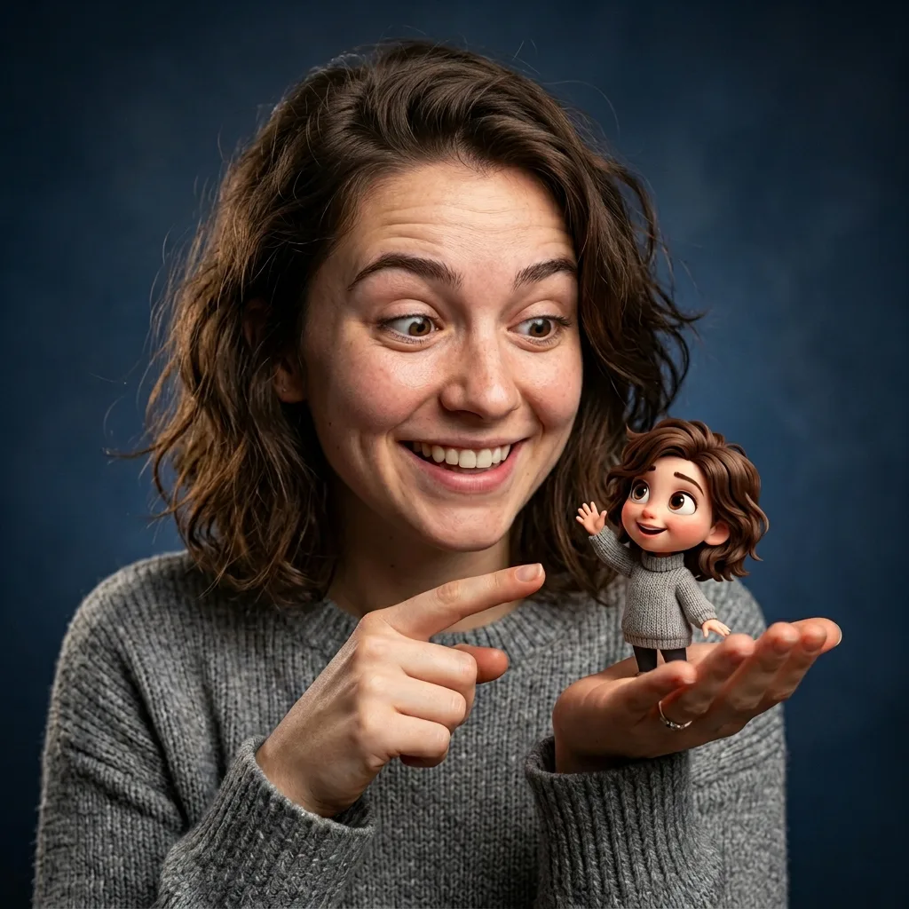

**#214 · Illustration &amp; 3D Prompt · <code>Vinano Image v2</code>**

<details>
<summary>Show prompt</summary>

```
{
 "Objective": "Create a studio portrait blending a real human a tiny Pixar-style 3D cartoon version of themselves in a playful, whimsical interaction",
 "PersonaDetails": {
 "PrimarySubject": {
 "Type": "Real human",
 "Wardrobe": "Casual grey sweater or t-shirt",
 "Expression": "Surprised and delighted",
 "Pose": "Holding a tiny character in one hand and pointing at it the other",
 "Skin": "true-to-life photorealistic skin texture natural detail"
 },
 "SecondarySubject": {
 "Type": "Tiny 3D cartoon version of the human",
 "Scale": "Miniature, resting in the human’s hand",
 "Style": "Pixar-style 3D character",
 "Proportions": "Exaggerated cute proportions rounded features",
 "FacialFeatures": {
 "Eyes": "Large, expressive",
 "Expression": "Friendly, playful"
 },
 "Consistency": "Matching hairstyle and outfit of the real human"
 }
 },
 "Composition": {
 "Framing": "Medium close-up studio portrait",
 "InteractionFocus": "Clear visual relationship between human and miniature character",
 "DepthOfField": "Shallow depth of field",
 "Focus": "Ultra-sharp focus on both faces"
 },
 "LightingAndBackground": {
 "LightingStyle": "Soft cinematic studio lighting",
 "LightQuality": "Smooth highlights gentle shadow falloff",
 "Background": "Dark blue gradient studio backdrop",
 "Separation": "Subtle rim light for subject-background separation"
 },
 "ArtDirection": {
 "StyleFusion": ["true-to-life photorealistic human portrait photography",
 "premium-quality Pixar-style 3D character rendering"],
 "Integration": "Seamless blending between real and 3D elements",
 "DetailLevel": "Ultra-detailed textures on skin, fabric, and 3D materials"
 },
 "MoodAndTone": {
 "Mood": "Whimsical, fun, lighthearted",
 "Energy": "Playful surprise and delight"
 },
 "PhotographyStyle": {
 "Genre": "Professional studio portrait photography",
 "CameraLook": "High-end cinematic realism",
 "ImageQuality": "High resolution, clean and sharp"
 },
 "NegativePrompt": ["uncanny valley",
 "cartoon human",
 "low-quality 3D",
 "harsh lighting",
 "oversaturated colors",
 "blurry focus",
 "flat composition"],
 "ResponseFormat": {
 "Type": "Single image",
 "Orientation": "Portrait",
 "AspectRatio": "2:3"
 }
}

Render with rich micro-detail while keeping the layout uncluttered and intentional.
```

</details>

---

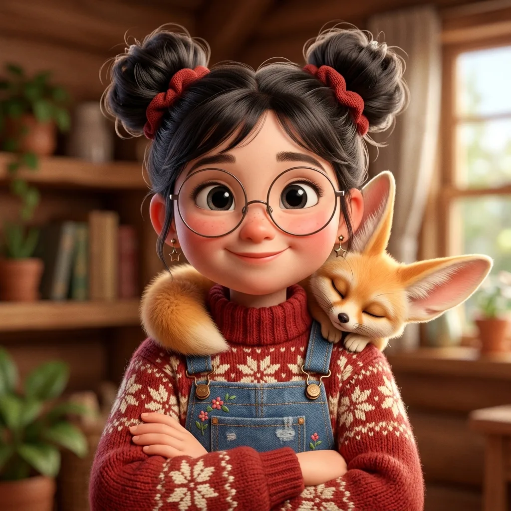

**#215 · Illustration &amp; 3D Prompt · <code>Vinano Image v2</code>**

<details>
<summary>Show prompt</summary>

```
A cute 3D Pixar-style character portrait of a little girl big expressive eyes and round glasses, soft smooth skin, and slightly rosy cheeks. She has dark hair styled into two messy space buns tied red scrunchies. She is wearing a cozy red knitted sweater white winter patterns and blue denim overalls small fabric details and light wear. Her arms are crossed casually. A small adorable fennec fox huge ears and sleepy eyes is resting on her shoulder, leaning against her neck affectionately. Keep edges clean and the overall composition balanced for a polished, gallery-ready result.
```

</details>

---

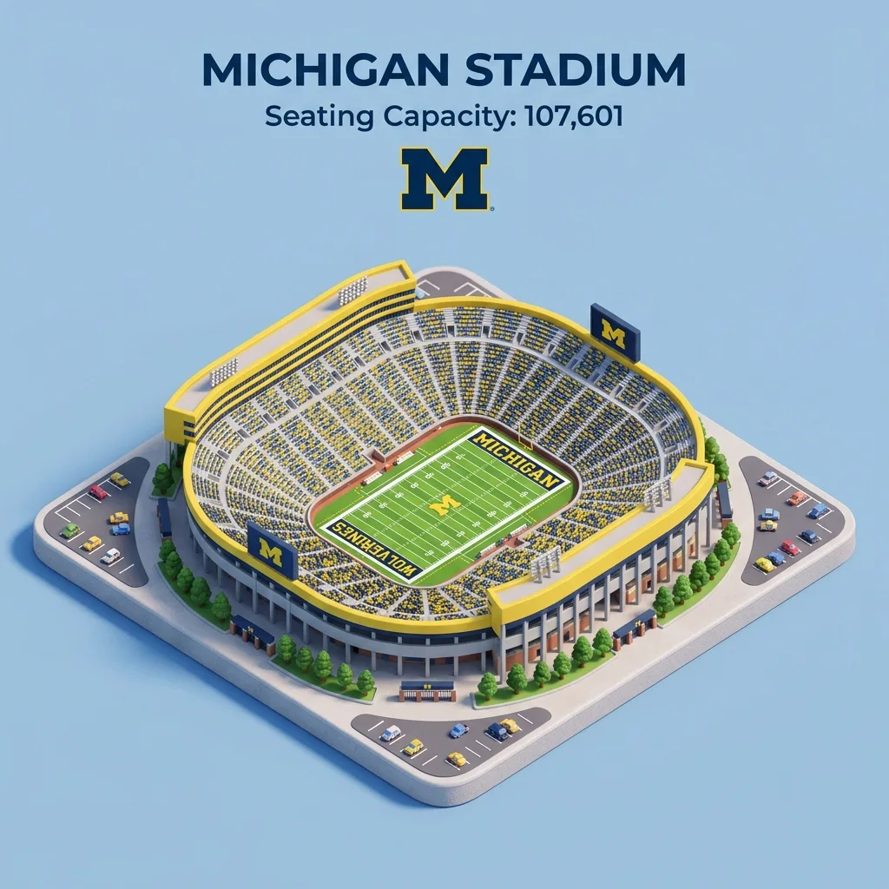

**#216 · Illustration &amp; 3D Prompt · <code>Vinano Image Pro</code>**

<details>
<summary>Show prompt</summary>

```
Present a clear, 45° top-down isometric miniature 3D cartoon scene of [STADIUM], soft refined textures, realistic PBR materials, and gentle lifelike lighting. Use a clean solid [COLOR] background. At the top-center, display the name of this stadium in large bold text, then directly beneath it show its real seating capacity in medium text, and place the official logo associated this stadium below the capacity. All text must match the background contrast automatically (white or black). Centered layout Preserve realistic proportions and depth for a confident, professional finish.
```

</details>

---

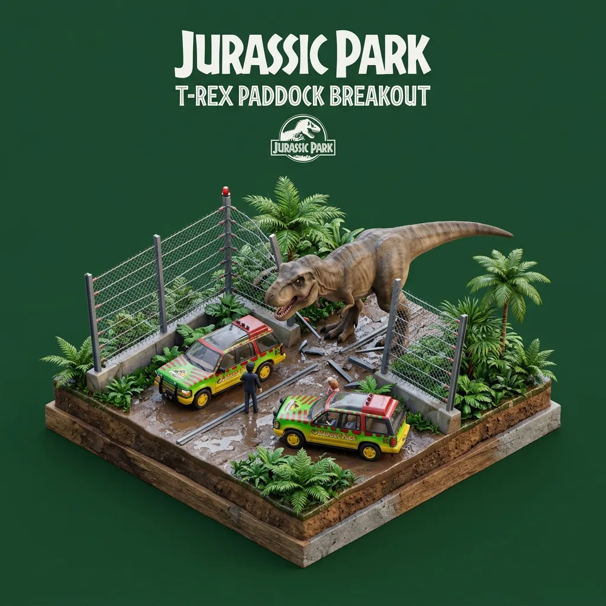

**#217 · Illustration &amp; 3D Prompt · <code>Vinano Image Pro</code>**

<details>
<summary>Show prompt</summary>

```
Present a clear, 45° top-down isometric miniature 3D cartoon scene of the iconic scene [SCENE NAME] from [MOVIE/SHOW], soft refined textures, realistic PBR materials, and gentle lifelike lighting.
Create a small raised diorama-style base that includes the most recognizable elements of this scene, along tiny stylized characters if needed (no facial details).
Use a clean solid [BACKGROUND COLOR] background.

At the top-center, display [MOVIE/SHOW] in large bold text, directly beneath it show [SCENE NAME] in medium text, and place the official logo associated [MOVIE/SHOW] below the subtext.
All text must automatically match the background contrast (white or black).

Composition: perfectly centered layout, square 1080x1080, ultra-clean, high-clarity diorama aesthetic.

Maintain consistent colour harmony and crisp focus across the whole frame.
```

</details>

---

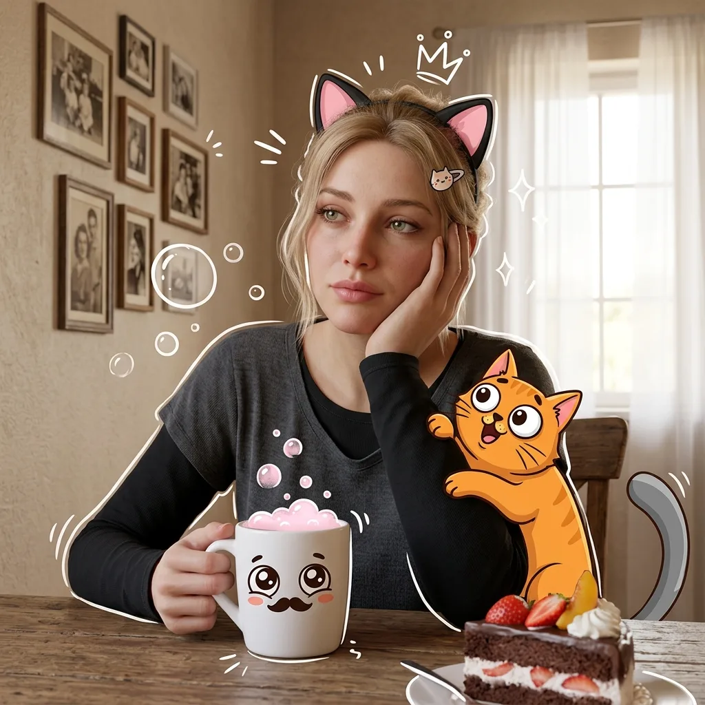

**#218 · Illustration &amp; 3D Prompt · <code>Vinano Image v2</code>**

<details>
<summary>Show prompt</summary>

```
{
 "title": "Whimsical Cozy Portrait",
 "input_image": "[UPLOAD YOUR IMAGE]",
 "description": "Transform the uploaded image into a 64K DSLR-quality ultra-hyperrealistic cozy, whimsical mixed-media portrait combining realistic photography playful cartoon illustrations.",
 "subject": {
 "person": {
 "appearance": {
 "hair": "blonde, loosely tied soft strands framing the face",
 "eyes": "light green",
 "makeup": "natural",
 "top": "dark grey layered over black long-sleeve shirt",
 "expression": "resting cheek gently on one hand, dreamy and slightly tired",
 "accessories": ["black-and-pink cat ears",
 "small cute hair clip"]
 },
 "pose": "sitting at a wooden table, holding a white ceramic mug in one hand"
 },
 "animated_elements": [{
 "type": "cartoon_cat",
 "color": "bright orange",
 "expression": "excited, curious",
 "action": "climbing up her arm",
 "features": "exaggerated big eyes, expressive paws"
 },
 {
 "type": "cartoon_tail",
 "color": "grey",
 "position": "right side, partially out of frame"
 }]
 },
 "props": {
 "mug": {
 "color": "white",
 "illustration": "cute cartoon face big expressive eyes and small mustache",
 "drink": "pink foam bubbles rising from the top"
 },
 "dessert": {
 "type": "chocolate cake",
 "toppings": ["whipped cream", "sliced strawberries", "peach slice"]
 }
 },
 "environment": {
 "room": {
 "walls": "beige textured",
 "lighting": "soft daylight streaming through window sheer white curtains",
 "decor": "vintage framed photographs in casual gallery arrangement",
 "atmosphere": "warm, cozy, intimate"
 }
 },
 "illustration_effects": {
 "style": ["hand-drawn cartoon overlays",
 "white doodle-style accents: bubbles, playful lines, sparkles, hand-drawn crown",
 "soft white illustrated outlines around woman and objects"]
 },
 "composition": {
 "aspect_ratio": ["1:1", "4:5 vertical"],
 "depth_of_field": "shallow",
 "mood": ["cozy", "cute", "whimsical", "soft", "playful", "warm"]
 },
 "rendering": {
 "technique": ["Octane render", "Ultra-hyperrealistic", "Unreal Engine 5"],
 "details": "ultra-detailed, high-resolution, soft natural lighting, warm tones, Instagram-worthy",
 "texture_contrast": "realistic textures (skin, fabric, wood, wall) vs smooth vector-style illustrations"
 }
}

Emphasise material texture and natural light so the final frame feels tactile and premium.
```

</details>

---

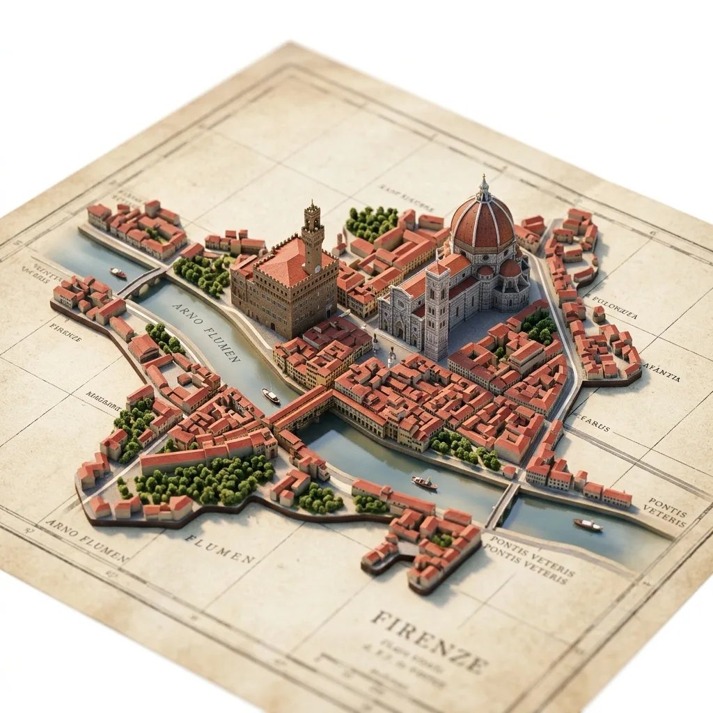

**#219 · Illustration &amp; 3D Prompt · <code>Vinano Image Pro</code>**

<details>
<summary>Show prompt</summary>

```
{
"description": "Create a highly detailed, true-to-life photorealistic miniature diorama style isometric map of [CITY/LOCATION] placed on a vintage textured paper map.",
 "perspective": {
 "type": "isometric",
 "angle": "45 degree top down",
 "look": "macro photography tilt-shift miniature effect"
 },
 "geography": {
 "shape": "follows real geographic shape of [CITY/LOCATION]",
 "landmarks": {
 "oversized": true,
 "dominant": true,
 "primary_focus": "monuments",
 "secondary_elements": "smaller and simplified"
 },
 "architecture": "ultra detailed miniature",
 "roads": "selective",
 "greenery": true,
 "water_bodies": true,
 "terrain": true,
 "materials": ["stone", "wood", "concrete", "glass", "foliage"]
 },
 "lighting": {
 "type": "soft cinematic daylight",
 "effects": ["natural shadows", "warm highlights", "subtle atmospheric depth"]
 },
 "water": {
 "rivers": true,
 "coastlines": true,
 "depth_gradients": "smooth",
 "reflections": "gentle"
 },
 "map_base": {
 "type": "old world cartographic paper",
 "features": ["visible grid lines", "paper grain", "printed place names"]
 },
 "focus": {
 "sharp_on_landmarks": true,
 "edge_falloff": "gentle"
 },
 "quality": {
 "museum_quality": true,
 "handcrafted_diorama_realism": true,
 "ultra_high_resolution": true
 },
 "background": {
 "color": "clean pure white",
 "restrictions": ["no floating text", "no logos", "no watermarks", "no futuristic or cartoon elements"]
 },
 "aspect_ratio": "4:5"
}

Render with rich micro-detail while keeping the layout uncluttered and intentional.
```

</details>

---

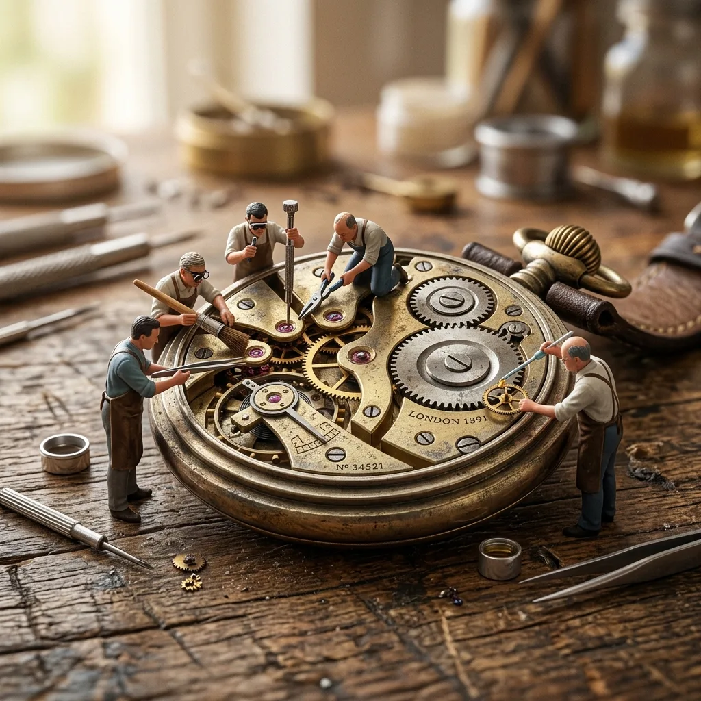

**#220 · Illustration &amp; 3D Prompt · <code>Vinano Image v2</code>**

<details>
<summary>Show prompt</summary>

```
{
 "prompt": "Ultra-realistic macro scene depicting tiny restoration workers collaboratively repairing an antique pocket watch. Several figures delicately clean intricate brass gears fine brushes, while others stabilize the open watch casing and hold miniature components in place. The pocket watch lies on a textured natural surface, such as weathered wood or stone, emphasizing age and history. The scene symbolizes time, patience, craftsmanship, and teamwork.",
 "style": {
 "photography_type": "Macro photography",
 "realism": "Ultra-realistic",
 "mood": "Emotional and cinematic",
 "lighting": "Soft, warm, directional lighting gentle highlights and natural shadows",
 "depth_of_field": "Shallow depth of field sharp focus on foreground details and smooth background bokeh"
 },
 "composition": {
 "shot_type": "Close-up macro",
 "angle": "Slightly elevated perspective",
 "focus": "Extreme detail on gears, tools, and figurines’ interactions",
 "framing": "Pocket watch centered workers distributed naturally across the mechanism"
 },
 "textures_and_details": {
 "materials": "Aged metal, polished brass gears, worn leather strap, natural surface grain",
 "details": "Visible dust particles, subtle scratches, fingerprints, and mechanical wear"
 },
 "atmosphere": {
 "tone": "Warm, nostalgic, hopeful",
 "symbolism": "Restoration of time through collective effort and care"
 },
 "render_settings": {
 "aspect_ratio": "4:5",
 "quality": 2,
 "resolution": "High-resolution",
 "style_precision": "Professional studio-level composition"
 }
}

Emphasise material texture and natural light so the final frame feels tactile and premium.
```

</details>

---

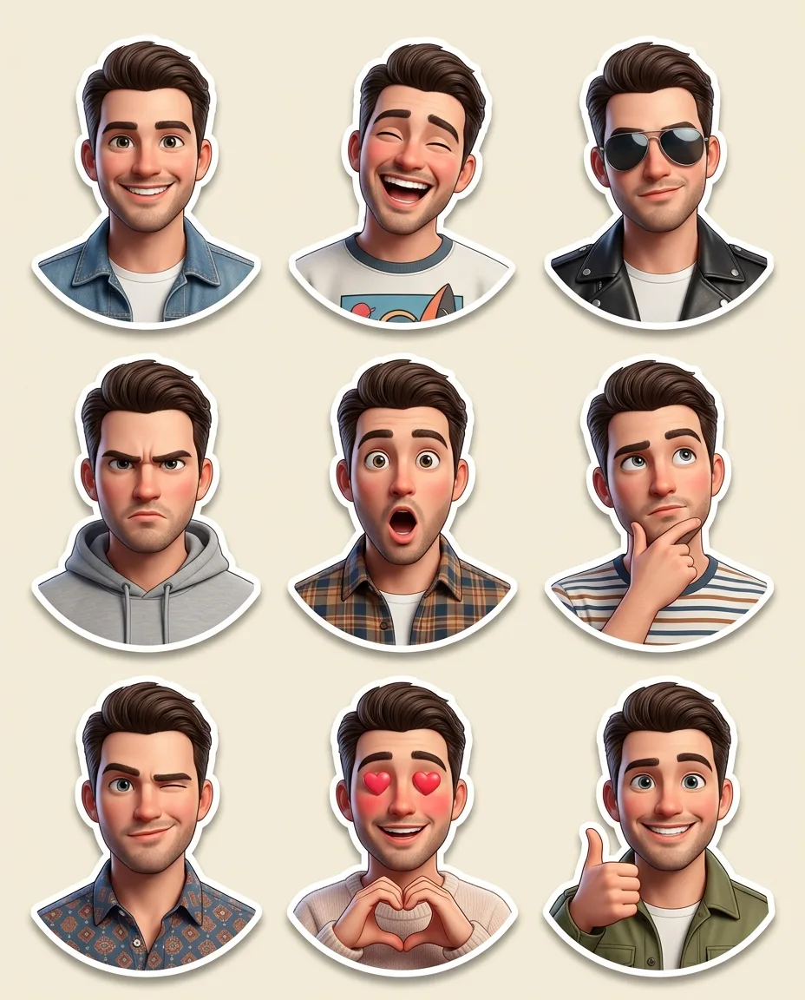

**#221 · Illustration &amp; 3D Prompt · <code>Vinano Image Pro</code>**

<details>
<summary>Show prompt</summary>

```
Create a premium Pixar-style 3D character sticker set that is clearly recognizable as the same person. Use the uploaded image as the ONLY facial reference.
Output Requirements:
3×3 grid layout (9 stickers total)
Final aspect ratio: 4:5
Ultra high resolution (8K)
Clean cream background
Each sticker is separated clear spacing
Add a subtle drop shadow under each sticker for depth
Character Identity (VERY IMPORTANT):
MUST preserve exact facial structure, hairstyle, grooming details, and unique features from the uploaded image
Maintain high likeness accuracy
Do NOT over beautify or alter identity beyond recognition
Style:
Pixar-style 3D animation
Glossy, high-end rendering
Soft global illumination
Smooth shading
High-detail facial textures
Framing:
All stickers must be head and shoulders (portrait close-up) only
No full-body or mid-body shots allowed
Focus tightly on face and upper shoulders to emphasize expressions
Outfit:
Modern casual and slightly stylized clothing
Each sticker must have a different outfit (no repetition at all)
Clean, minimal, and visually appealing for sticker use
Expressions & Poses (9 variations):
1. Happy smile
2. Laughing
3. Cool (sunglasses)
4. Angry/serious
5. Surprised
6. Thinking
7. Wink
8. Love (heart eyes and heart gesture)
9. Thumbs up
Sticker Design:
Bold, clean outline
Slightly exaggerated cartoon proportions
Strong emphasis on facial expressions
Optimized for digital sticker platforms
Each sticker must have a smooth rounded bottom cutout (semi-curved base)
No text
Lighting:
Soft studio lighting
Subtle rim light for depth and separation
Goal:
Create a highly engaging, cute, and expressive sticker pack that feels premium and collectable.

Render with rich micro-detail while keeping the layout uncluttered and intentional.
```

</details>

---

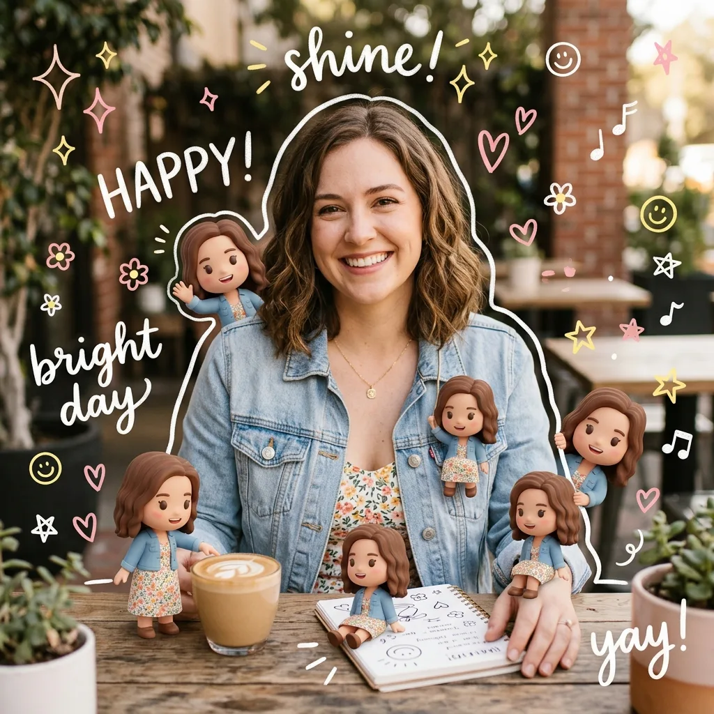

**#222 · Illustration &amp; 3D Prompt · <code>Vinano Image v2</code>**

<details>
<summary>Show prompt</summary>

```
Surrounding the realistic main subject are multiple cute, 3D-style chibi miniatures of the same person, identical facial features, hairstyle, body proportions, and outfit. 
The chibi figures are naturally distributed around the subject, interacting playfully her or nearby elements in a charming, non-intrusive way.

Overlay the image vibrant, hand-drawn doodle effects: soft white outlines around the subject, playful sparkles, doodle hearts, tiny flowers, smiley icons, and floating white handwritten phrases like "shine", "bright day", and "happy".

The style seamlessly blends hyper-realistic photography colorful, soft cartoon illustrations.
Keep the original face, body shape, and proportions of the main subject unchanged. aspect ratio 2:3

Aim for an editorial, design-driven look with deliberate negative space.
```

</details>

---

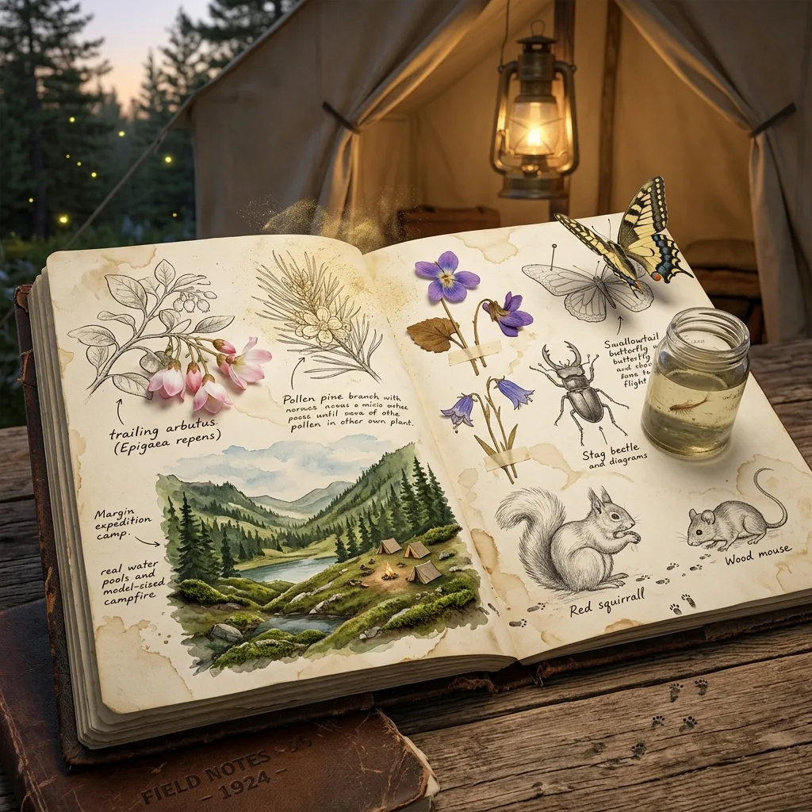

**#223 · Illustration &amp; 3D Prompt · <code>Vinano Image v2</code>**

<details>
<summary>Show prompt</summary>

```
Epic 3D scene: a weathered field journal lies open on a naturalist's camp table, its pages erupting into the ecosystems they document. Hand-drawn botanical illustrations push upward into living specimens: [PLANT 1] unfurls actual petals, [PLANT 2] releases pollen that drifts across the spread. Pinned insect diagrams detach and take flight. Watercolor landscapes inflate into traversable terrain. Margin notes become tiny expedition camps. Pressed flowers resurrect in time-lapse bloom. A specimen jar on the page contains an actual swimming creature. Field sketches of [ANIMAL] step off the paper, leaving graphite footprints. Coffee-stained pages become amber pools. Canvas tent visible beyond, lantern light mixing fireflies, the smell of pine and old paper, 8K, true-to-life photorealistic documentary aesthetic Maintain consistent colour harmony and crisp focus across the whole frame.
```

</details>

---

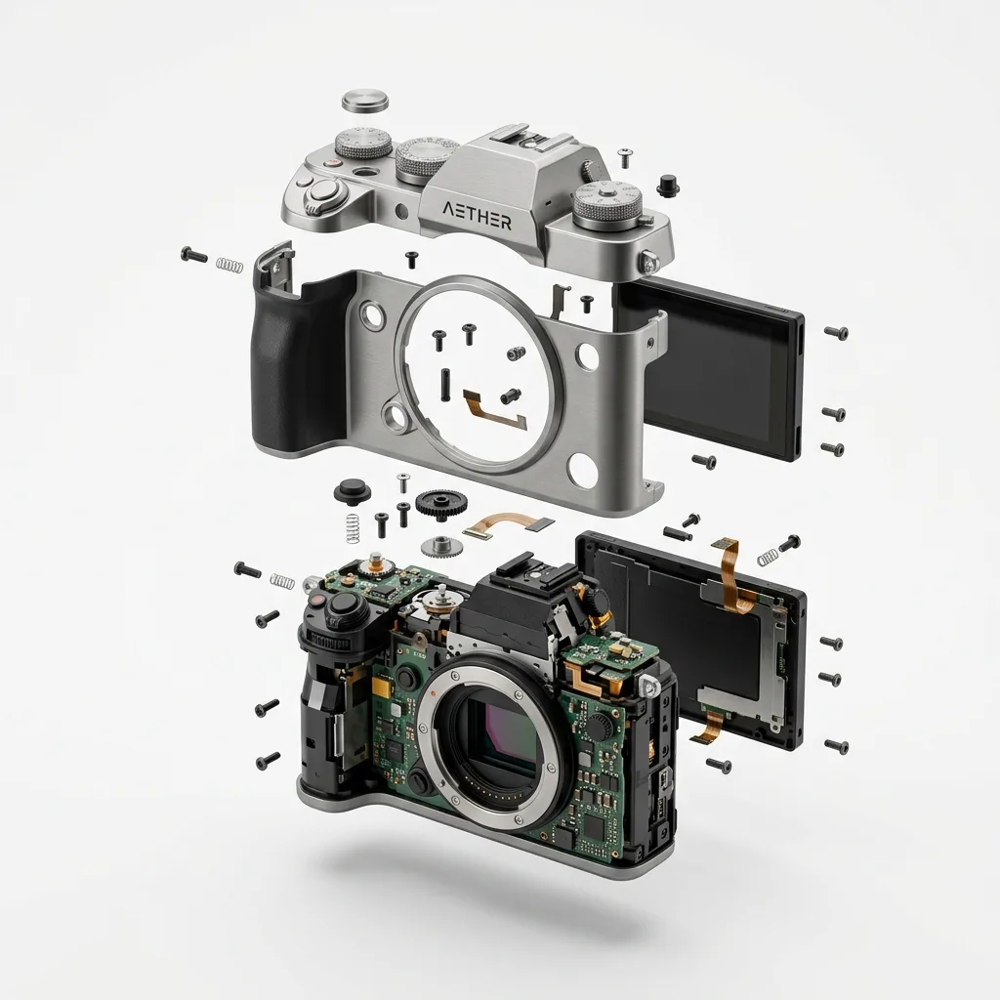

**#224 · Illustration &amp; 3D Prompt · <code>Vinano Image Pro</code>**

<details>
<summary>Show prompt</summary>

```
[PRODUCT], high-end product advertising, white seamless background, exploded view inner mechanics revealed, outer shell hovering above core, micro screws and components suspended, perfect alignment guides implied, crisp soft shadow, ultra realistic, macro product photography, 100mm lens look, f/8, 8k Keep edges clean and the overall composition balanced for a polished, gallery-ready result.
```

</details>

---

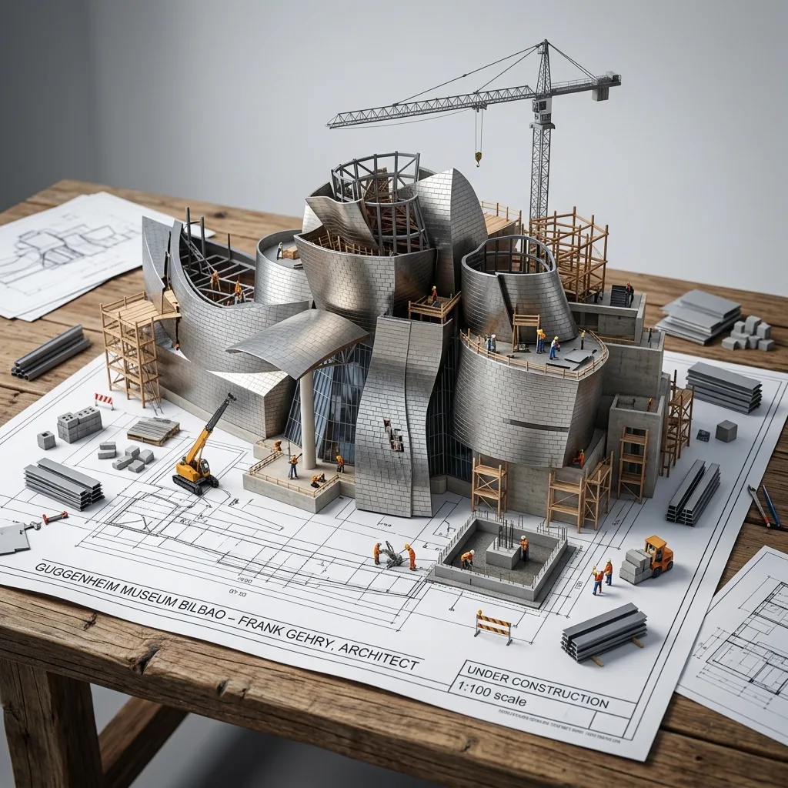

**#225 · Illustration &amp; 3D Prompt · <code>Vinano Image Pro</code>**

<details>
<summary>Show prompt</summary>

```
An architectural blueprint of [BUILDING_NAME] placed on a {SURFACE}, a true-to-life photorealistic miniature under-construction version of [BUILDING_NAME] emerging from it — [STRUCTURAL_ELEMENT_1], [STRUCTURAL_ELEMENT_2], [STRUCTURAL_ELEMENT_3], [CONSTRUCTION_DETAIL], {WORKER_SCENE}, {MATERIAL_ELEMENT}, and {EXTRA_DETAIL}. All elements grow from the blueprint like a 3D architectural diorama, steel beams rising from the drawn lines, scaffolding threading through the paper. Studio soft, diffused lighting, cinematic depth Emphasise material texture and natural light so the final frame feels tactile and premium.
```

</details>

---

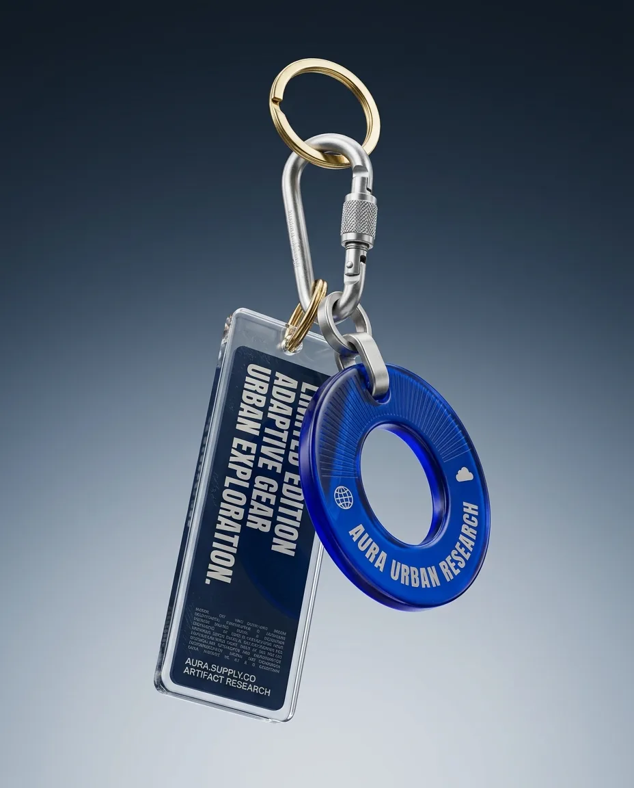

**#226 · Illustration &amp; 3D Prompt · <code>Vinano Image Pro</code>**

<details>
<summary>Show prompt</summary>

```
[BRAND NAME]
Act as a High-End CGI Product Photographer and 3D Render Artist
specializing in streetwear merch and limited-edition collectibles.

PHASE 1: CONCEPT & OBJECT

Create a true-to-life photorealistic CGI product shot of a premium keychain set
suspended in mid-air against a neutral gradient studio background.
The keychain set consists of THREE elements connected to a single
polished silver carabiner clip a gold-plated split ring:

ELEMENT 1 — ACRYLIC TAG:

A rectangular acrylic charm (approx. 4:9 ratio, rounded corners, 3mm thick).
Layered construction: clear gloss acrylic front panel over a [BRAND NAME]-colored
background insert. The background insert carries bold, condensed all-caps
typography — autonomously generate a short poetic or brand-relevant phrase
(4–8 words) that matches [BRAND NAME]'s tone of voice, set in a heavy
condensed grotesque typeface (Bebas Neue / Impact / custom bold). Include
[BRAND NAME]'s URL or tagline in small print at the bottom of the insert.
Micro-printed fine text fills the lower third as a design texture element.

ELEMENT 2 — OVAL MEDALLION CHARM:

A die-cut oval hoop/ring shape (donut silhouette, 40mm diameter) made from
tinted translucent acrylic or resin. Autonomously determine the iconic
brand color of [BRAND NAME] and apply it as the tint (deep saturated,
jewel-tone translucency — e.g., gold, cobalt, emerald, crimson).
The [BRAND NAME] wordmark is engraved or UV-printed in bold all-caps
along the inner curve of the ring. Add 1–2 small iconographic symbols
(logo mark, globe icon, cloud glyph) laser-engraved onto the face.
Subtle radial sun-ray pattern embossed on the surface.

ELEMENT 3 — HARDWARE:

Silver anodized aluminum carabiner knurled locking barrel.
Gold-plated brass split ring (key ring loop) at the top.
All metal surfaces show micro-scratches and machining marks —
no perfect CGI plastic. Industrial precision aesthetic.

PHASE 2: MATERIAL & TEXTURE

Render all acrylic elements full Ray Tracing and Subsurface
Scattering — light must visibly pass through the tinted acrylic
creating internal glow. Apply Fresnel reflection on acrylic edges.
Surface imperfections: hairline scratches, micro-dust particles,
smudge traces on the clear panel (subtle, editorial-level — not dirty).
Metal: PBR metallic workflow — anisotropic specular highlights on
the carabiner barrel, brushed finish on the ring.
Typography on acrylic must appear screen-printed or UV spot-coated —
slight ink texture, not floating.

PHASE 3: COMPOSITION & STAGING

Levitation shot: the entire keychain set hangs suspended from the
top of frame, centered a 10–15 degree rotation to the right
(showing dimensionality). Nothing touches a surface — pure float.
Camera angle: slightly below eye-level looking up at ~5 degrees,
portrait orientation (4:5 ratio).
Depth of Field: focus plane centered on the oval medallion,
acrylic tag in sharp secondary focus, top hardware micro
bokeh blur. Aperture equivalent: f/4.0.
Negative space: generous — object occupies 55% of frame.

PHASE 4: LIGHTING

Primary: large octabox soft key light, positioned top-right at
45 degrees — creates clean specular bloom on acrylic edges.
Secondary: subtle rim light from bottom-left, cool temperature
(5500K), separates the object from background.
Background: seamless gradient cyclorama — dark steel blue (#1a2535)
at top transitioning to pale silver-grey (#d0d8e0) at bottom.
No hard shadows cast. Global Illumination active.
Chromatic Aberration: micro-level, visible only on acrylic edges
(adds realism, prevents CGI-plastic look).
No lens flare. No neon. No HDR overblown highlights.

TECH SPECS

Render engine: Octane Render or Blender Cycles (path-traced)
Resolution: 4096 x 5120px (4:5 portrait)
Samples: 4096 minimum
Color profile: Adobe RGB, D65 white point
Post-processing: subtle film grain overlay (ISO 400 equivalent),
+5 clarity, -10 highlights, neutral color grade
Output mood: High-end streetwear lookbook / limited drop product page
Style references: Kith accessories, Highsnobiety product editorial,
Fragment Design merch photography
NEGATIVE: No white studio infinity cove. No flat lay. No hand holding
the product. No fake bokeh blur filters. No AI plastic sheen.
No floating text outside the object.

Aim for an editorial, design-driven look with deliberate negative space.
```

</details>

---

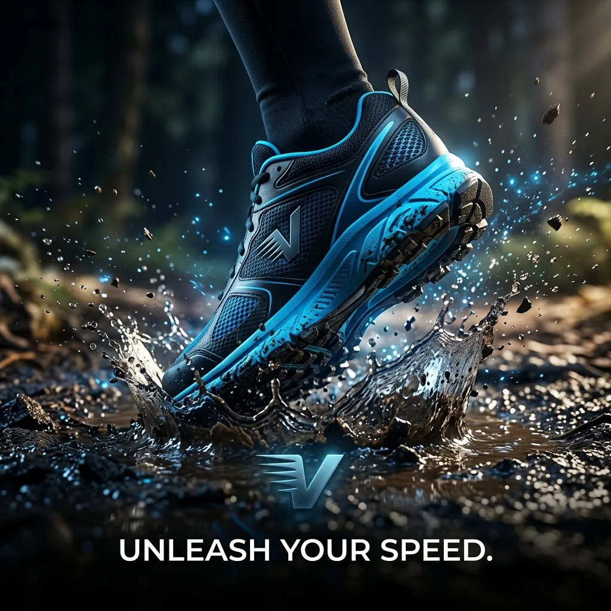

**#227 · Illustration &amp; 3D Prompt · <code>Vinano Image Pro</code>**

<details>
<summary>Show prompt</summary>

```
Cinematic 3D action-packed advertisement for [INSERT PRODUCT/BRAND HERE], captured in an intense mid-motion moment dramatic studio lighting, dynamic particle effects, and high-impact slow-motion energy. Ultra-hyperrealistic rendering, razor-sharp details, glossy commercial finish, atmospheric depth, and powerful contrast. Viral-ready composition the brand logo seamlessly integrated into the scene and a sleek, modern slogan positioned cleanly beneath. High-end blockbuster commercial aesthetic Preserve realistic proportions and depth for a confident, professional finish.
```

</details>

---

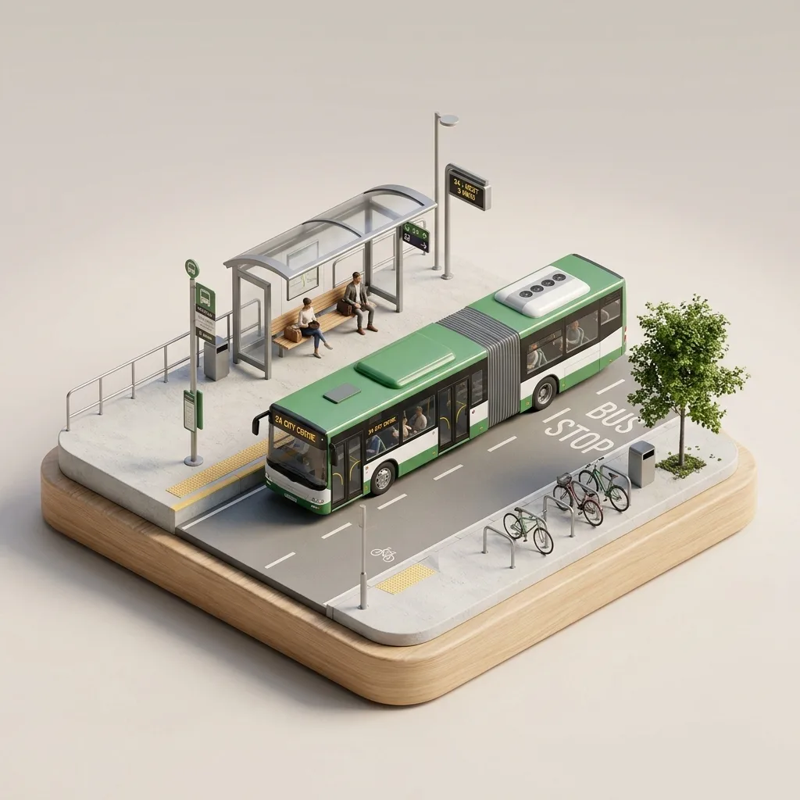

**#228 · Illustration &amp; 3D Prompt · <code>Vinano Image Pro</code>**

<details>
<summary>Show prompt</summary>

```
A clean, minimal 3D isometric diorama of a [CITY TRANSPORT TYPE] stop, featuring a [VEHICLE] paused at a [PLATFORM TYPE], simple [SHELTER / CANOPY], subtle wayfinding signs, smooth concrete surfaces, soft studio lighting, realistic materials, rounded edges, miniature architectural model style, high detail, neutral background. Render with rich micro-detail while keeping the layout uncluttered and intentional.
```

</details>

---

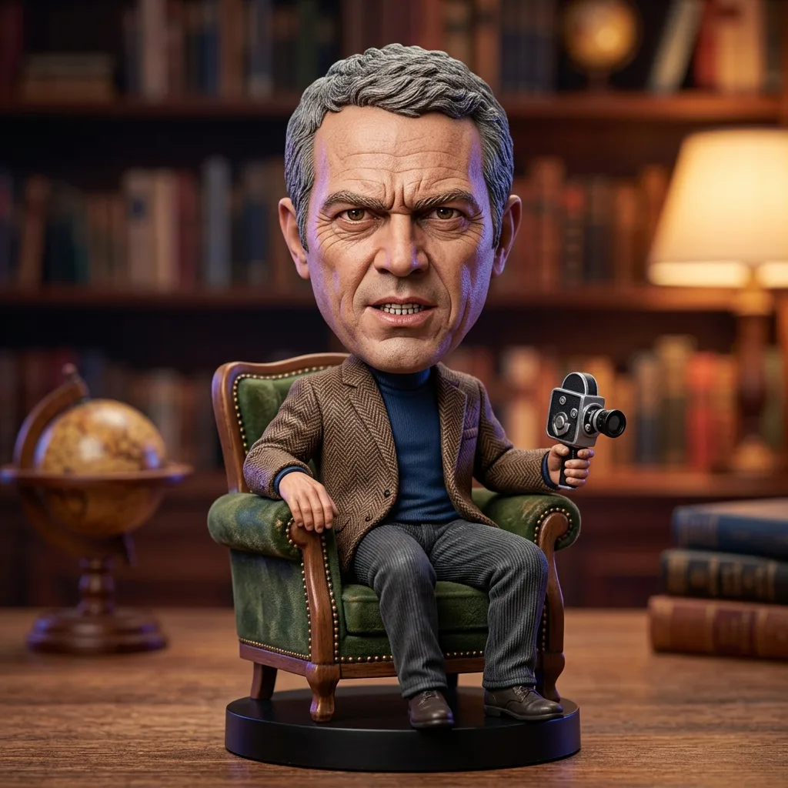

**#229 · Illustration &amp; 3D Prompt · <code>Vinano Image v2</code>**

<details>
<summary>Show prompt</summary>

```
Highly detailed caricature figurine of [SUBJECT] as a cute but intense bobblehead-style collectible statue, exaggerated oversized head hyper-realistic facial features, deep wrinkles, fierce intense expression, slightly open mouth showing teeth, sitting relaxed in a vintage armchair, wearing [OUTFIT], dramatic colorful studio lighting, [BACKGROUND], modern collectible toy photography style, sharp focus, cinematic depth of field, extremely intricate sculpting details, realistic skin texture, professional product photography, 8k quality Keep edges clean and the overall composition balanced for a polished, gallery-ready result.
```

</details>

---


**#230 · Illustration &amp; 3D Prompt · <code>Vinano Flash</code>**

<details>
<summary>Show prompt</summary>

```
使用以 #f6f4f0 为主背景，#2d6dc3 为主蓝色，同时也包含一些橙色元素，制作了一张山水远景风景画。 保持配色统一、主体清晰，细节丰富但不杂乱。
```

</details>

---

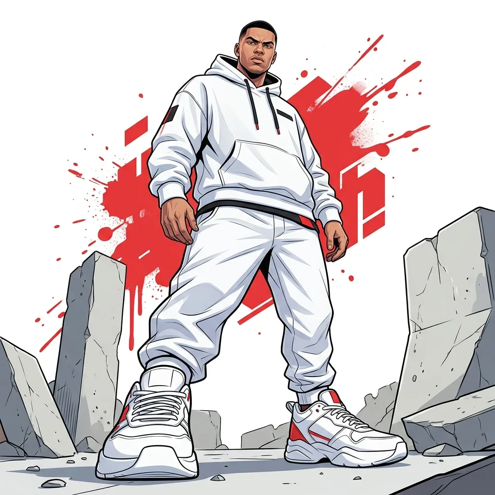

**#231 · Illustration &amp; 3D Prompt · <code>Vinano Image Pro</code>**

<details>
<summary>Show prompt</summary>

```
A dynamic full-body urban illustration of a man (use the exact face from the provided reference image, ensuring high facial accuracy and identity preservation). He wears an oversized white hoodie subtle black and red accents, paired loose white track pants and bold, eye-catching white sneakers.
The character has a sharp, confident gaze directed forward, conveying intensity and self-assurance. The composition is captured from a dramatic low-angle perspective, emphasizing power and dominance. His stance is strong and grounded, exaggerated perspective on the sneakers in the foreground for added depth.
Surrounding him are fragmented concrete elements and subtle debris, suggesting an urban, gritty environment. The background is a clean white canvas featuring bold red paint splashes and abstract geometric shapes, creating a modern street-art aesthetic.
The visual style combines crisp, clean line art vibrant flat colors and soft cel shading for depth and dimension. The rendering should feel like a high-end urban illustration or stylized editorial artwork.
Lighting is bright, even, and diffused across the entire scene, minimizing harsh shadows while maximizing clarity and detail.
Ultra-detailed, sharp focus, 8K resolution, vertical composition

Aim for an editorial, design-driven look with deliberate negative space.
```

</details>

---

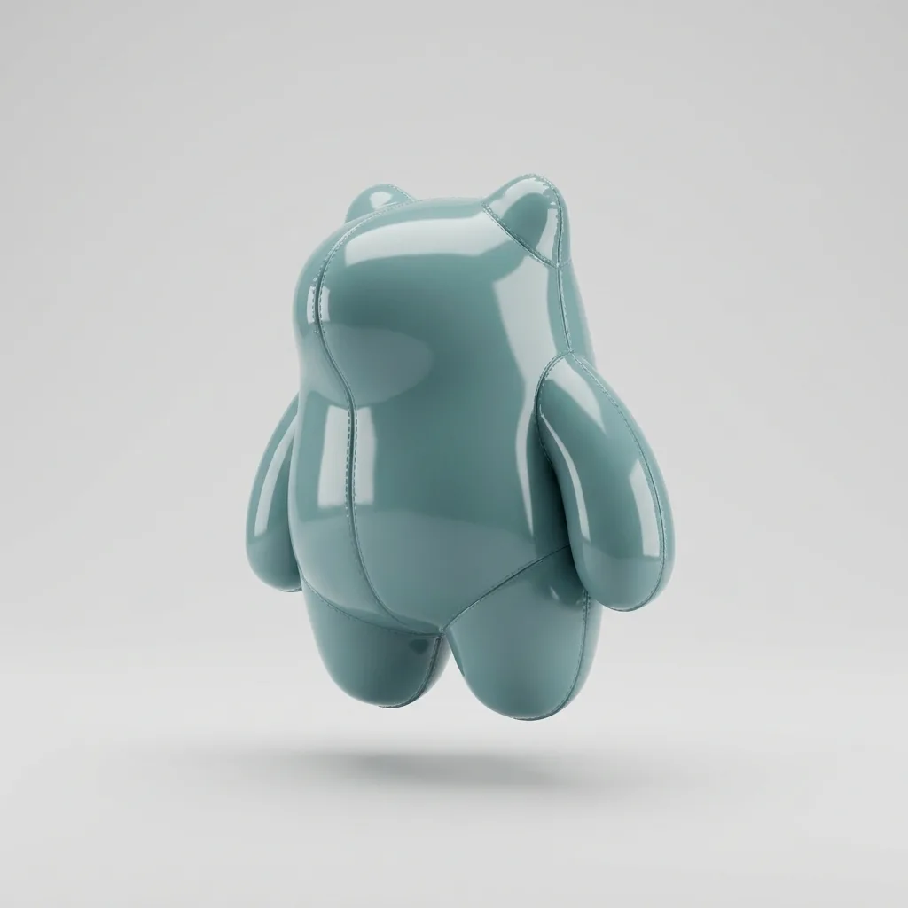

**#232 · Illustration &amp; 3D Prompt · <code>Vinano Image Pro</code>**

<details>
<summary>Show prompt</summary>

```
[SUBJECT], made of smooth inflated glossy vinyl plastic, ultra-realistic 3D render, soft pillowy contours subtle stitched panel seams, slightly rounded toy-like proportions, highly polished surface strong specular highlights, realistic material depth, soft studio lighting creating gentle shadows and clean reflections, floating slightly above a plain light gray background, minimal composition, designer collectible aesthetic, premium art toy finish, high detail, centered composition, 1:1 aspect ratio. Aim for an editorial, design-driven look with deliberate negative space.
```

</details>

---

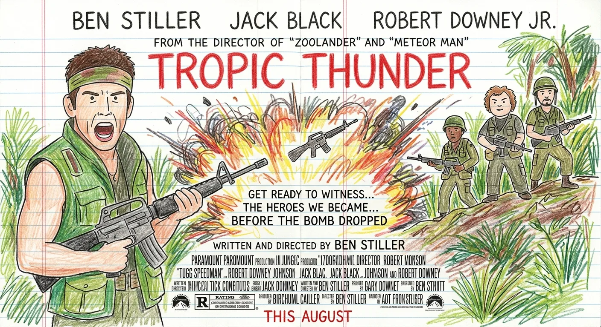

**#233 · Illustration &amp; 3D Prompt · <code>Vinano Image Pro</code>**

<details>
<summary>Show prompt</summary>

```
Transform this movie poster into a child’s crayon drawing on lined notebook paper. Every compositional element, character pose, typography, color palette, and layout is preserved exactly as the original — only the art style has changed. Drawn in colored pencil and crayon wobbly unsteady lines, uneven coloring that goes slightly outside the lines, basic facial features, simplified anatomy. Background filled heavy crayon scribble strokes. Lined notebook paper visible underneath, including the red margin line. Text redrawn in shaky hand-lettered crayon matching the original font placement. Flat scan of the drawing, slight paper texture. Emphasise material texture and natural light so the final frame feels tactile and premium.
```

</details>

---

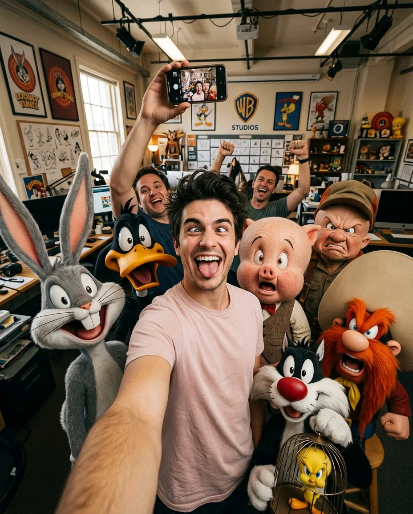

**#234 · Illustration &amp; 3D Prompt · <code>Vinano Image v2</code>**

<details>
<summary>Show prompt</summary>

```
Ultra-realistic 4:5 vertical format ultra wide angle 13mm selfie of me Bugs Bunny, Daffy Duck, Porky Pig, Elmer Fudd, Yosemite Sam, Tweety, Sylvester in my studio. I am wearing pale pink t-shirt. We're all making silly, exaggerated faces. High camera angle. Extreme wide lense no fish-eye distortion. Realistic, live action characters no cartoon, filmic, cinematic lighting, all realistic characters integrated stylized realism. Preserve realistic proportions and depth for a confident, professional finish.
```

</details>

---

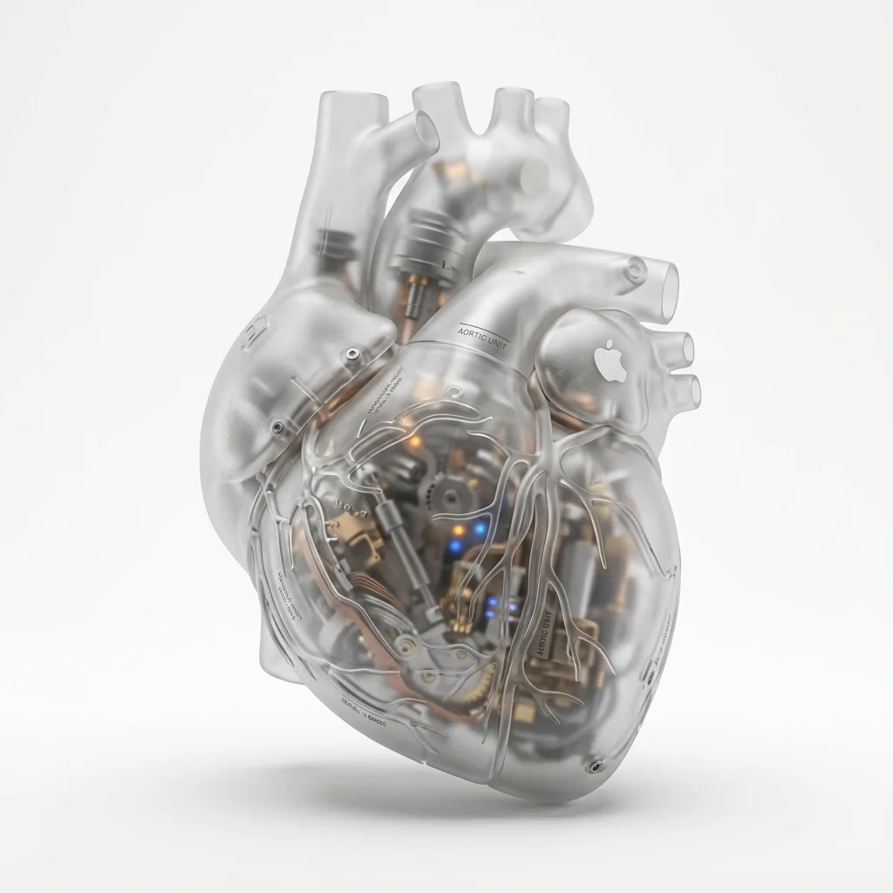

**#235 · Illustration &amp; 3D Prompt · <code>Vinano Image v2</code>**

<details>
<summary>Show prompt</summary>

```
A hyper-realistic 3D anatomical human [organ] made from semi-translucent frosted polycarbonate a milky matte finish, softly diffusing light. Industrial injection-molded detailing, subtle micro-texture, and rounded edges precision seams. Inside, intricate mechanical components replace organic tissue, micro gears, pistons, circuitry, and engineered chambers visible but softly blurred through the shell. A subtle white Apple logo is naturally embedded on the surface, minimal and not overly obvious. Soft diffused studio lighting, realistic plastic refraction, subtle shadow beneath, centered composition, pure white background, ultra-detailed futuristic biomechanical render, 1:1 aspect ratio. Render with rich micro-detail while keeping the layout uncluttered and intentional.
```

</details>

---

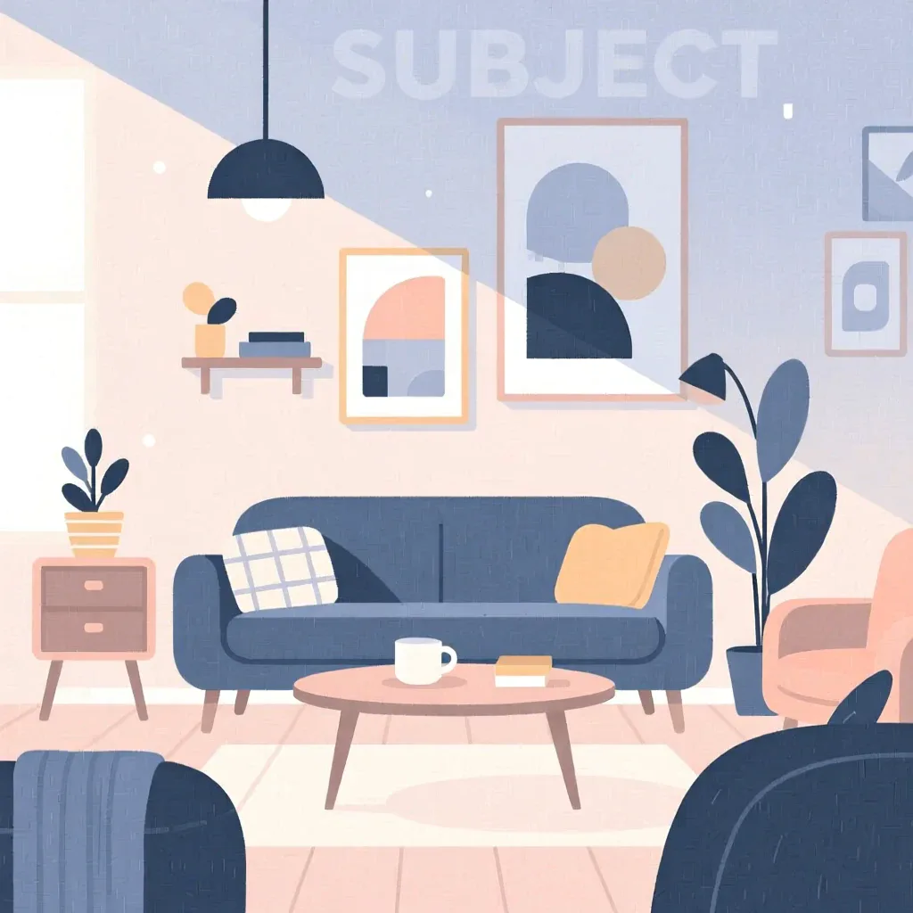

**#236 · Illustration &amp; 3D Prompt · <code>Vinano Flash</code>**

<details>
<summary>Show prompt</summary>

```
Scandinavian-style minimal illustration of [SUBJECT], muted pastel palette, flat design, soft gradients, cozy yet modern aesthetic, clean shapes, lifestyle illustration feel. Maintain consistent colour harmony and crisp focus across the whole frame.
```

</details>

---

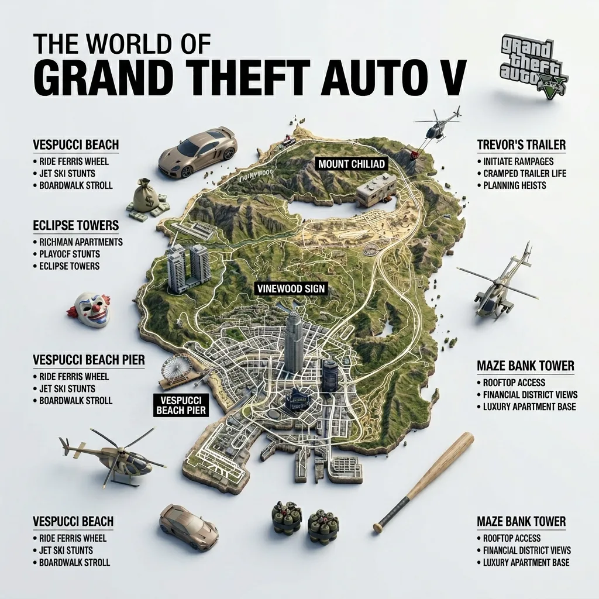

**#237 · Illustration &amp; 3D Prompt · <code>Vinano Image Pro</code>**

<details>
<summary>Show prompt</summary>

```
A hyper-realistic 3D game guide infographic poster for [GAME]. The in-game world of [GAME] is rendered as a raised, textured terrain map floating on a clean light gray surface — the map shape and landscape must reflect the actual geography and visual aesthetic of [GAME] (urban, western, fantasy, island etc). Iconic in-game locations from [GAME] are placed as miniature 3D sculpted models at their correct in-game positions across the map — each one highly detailed, true-to-life photorealistic and instantly recognizable to fans. Roads or paths connect key locations as white lines across the terrain. Around the map, floating 3D decorative props and items iconic to [GAME] are scattered on the light gray surface. The official logo of [GAME] is shown as a small detailed object in the upper right corner. Each major location has a bold black label on the map, and beside the map, each location has a neat checklist of its most iconic moments or activities associated that place, in clean sans-serif typography. A large bold title at the top reads: “THE WORLD OF GAME” in black uppercase typography [GAME] in heavy bold. The overall aesthetic is premium editorial — soft studio lighting, true-to-life photorealistic 3D render, white/light gray background, clean layout, 4:5 aspect ratio Render with rich micro-detail while keeping the layout uncluttered and intentional.
```

</details>

---

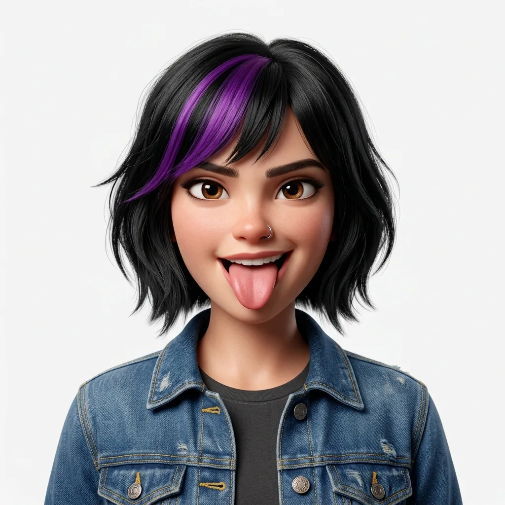

**#238 · Illustration &amp; 3D Prompt · <code>Vinano Image Pro</code>**

<details>
<summary>Show prompt</summary>

```
Create a head-and-shoulders Pixar-style 3D avatar of an edgy person based on the reference image a black bob, purple hair streak, and a small nose ring. She has a defiant, playful expression, sticking her tongue out wide, confident eyes while wearing a classic denim jacket. Isolated on a seamless white background, the render features flawless 3D skin and soft filmic, cinematic lighting for a clean, refined minimalist aesthetic. Render with rich micro-detail while keeping the layout uncluttered and intentional.
```

</details>

---

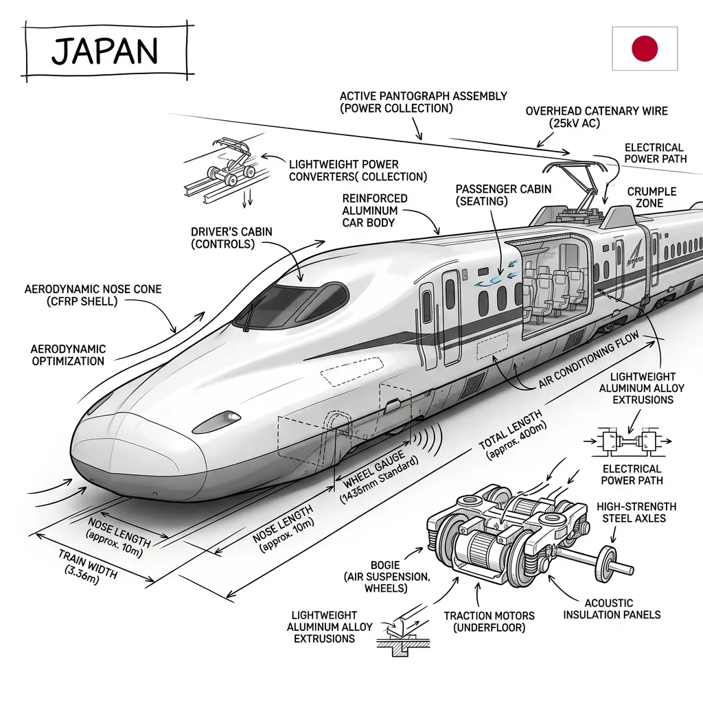

**#239 · Illustration &amp; 3D Prompt · <code>Vinano Image Pro</code>**

<details>
<summary>Show prompt</summary>

```
Create an infographic image of [COUNTRY], combining a realistic photograph or photoreal render of the object technical annotation overlays placed directly on top.

Use black ink–style line drawings and text (technical pen / architectural sketch look) on a pure white studio background, including:
•Key component labels
•Internal cutaway or exploded-view outlines
•Measurements, dimensions, and scale markers
•Material callouts and quantities
•Arrows indicating function, force, or flow (air, sound, power, pressure)
•Simple schematic or sectional diagrams where relevant
Include a small flag of the country in the top right corner.

Place the title [COUNTRY] inside a hand-drawn technical annotation box in one corner.

Style & layout rules:
•The real object remains clearly visible beneath the annotations
•Annotations feel sketched, technical, and architectural
•crisp composition balanced negative space
•Educational, museum-exhibit / engineering-manual vibe

Visual style:
Minimal technical illustration aesthetic, black linework over realistic imagery, precise but slightly hand-drawn feel.

Color palette:
White background, black annotation lines and text only. No colors.

Output:
1080×1080, ultra-crisp, social-feed optimized, no watermark.

Aim for an editorial, design-driven look with deliberate negative space.
```

</details>

---

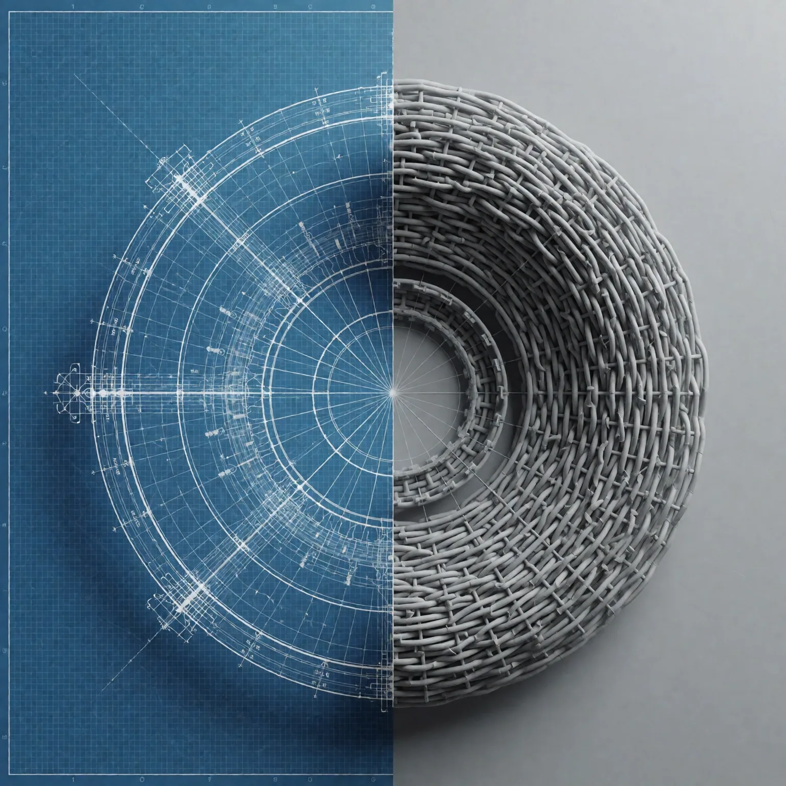

**#240 · Illustration &amp; 3D Prompt · <code>Vinano Flash</code>**

<details>
<summary>Show prompt</summary>

```
A [subject] split vertically down the center, left half as a [adjective] technical blueprint, right half as a [adjective] 3D render, the seam between them glitching where both realities collide. Preserve realistic proportions and depth for a confident, professional finish.
```

</details>

---

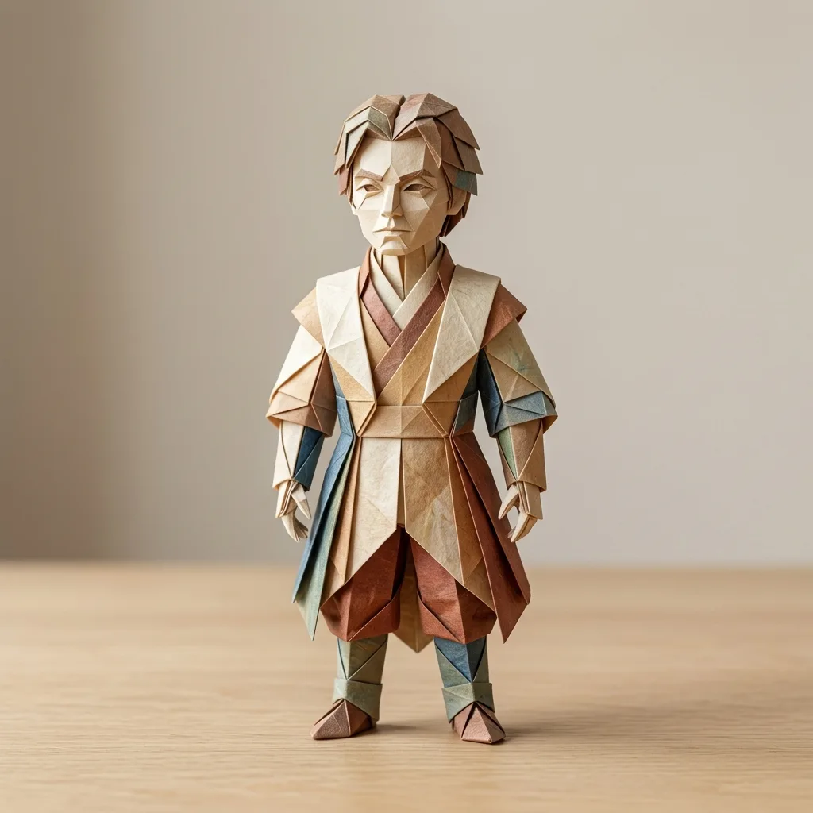

**#241 · Illustration &amp; 3D Prompt · <code>Vinano Image v2</code>**

<details>
<summary>Show prompt</summary>

```
A hyper-detailed, origami-style version of a person, folded from premium-quality paper crisp, clean edges and a realistic paper texture. Intricate geometric folds capture the character’s iconic shape and expressions. Use the same color palette as the reference photo (no black). Place it on a clean studio surface soft, natural shadows. A refined minimalist collectible art aesthetic; ultra-true-to-life photorealistic; 8k, 1080×1080 square. Aim for an editorial, design-driven look with deliberate negative space.
```

</details>

---

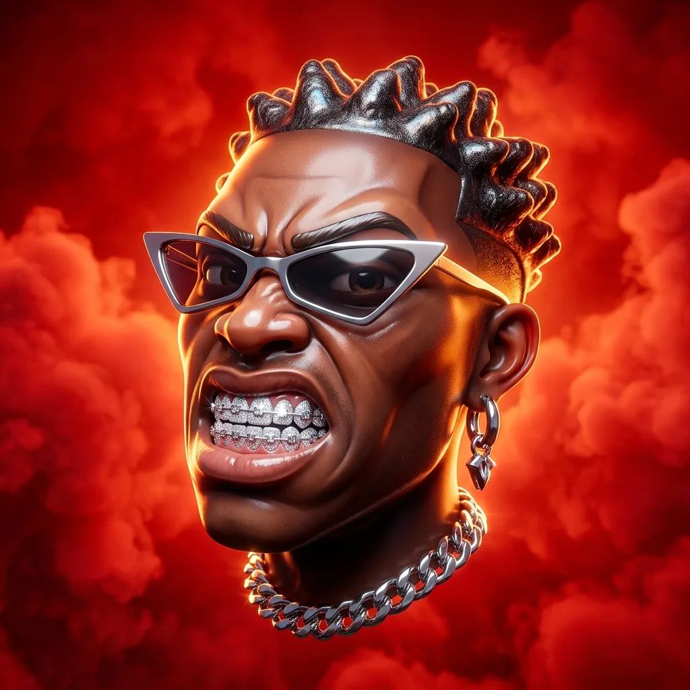

**#242 · Illustration &amp; 3D Prompt · <code>Vinano Image v2</code>**

<details>
<summary>Show prompt</summary>

```
A hyper-stylized, dynamic 3D head portrait floats against a vivid red background soft volumetric clouds and seamless shading. Only the cartoonish 3D head appears, no neck visible, and facial features closely matching the reference photo. The head is tilted and fills approximately 80% of the frame. The character displays a fierce, aggressive expression a wide snarl, revealing teeth adorned diamond-studded braces. Sharp, angular silver sunglasses pointed frames fit the face precisely. Additional accessories include chrome earrings and a chunky silver chain necklace. Lighting is bold and metallic, combining strong rim lights from above and behind a luminous frontal fill that sculpts facial contours and creates glossy skin highlights. The overall look features over-the-top glossy realism, exaggerated proportions, intense reflections, and a futuristic, high-energy aesthetic partial overlap of elements to enhance depth and dramatic presence. Hyper-detailed 3D forms add vibrant, cinematic intensity and visual impact. Aspect ratio 4:5 Keep edges clean and the overall composition balanced for a polished, gallery-ready result.
```

</details>

---

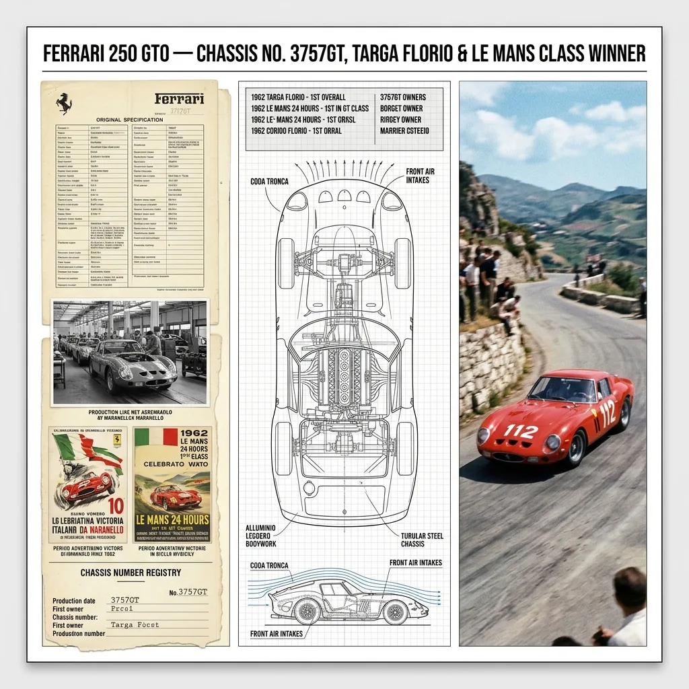

**#243 · Illustration &amp; 3D Prompt · <code>Vinano Image v2</code>**

<details>
<summary>Show prompt</summary>

```
A marque historian's documentation board for [VEHICLE] — [MODEL / VARIANT / YEAR]. Left section: factory documentation including original specification sheet, production line photographs, period advertising, and chassis number registry. Center section: technical illustration showing powertrain in phantom view, suspension geometry, aerodynamic annotations, and material callouts, surrounded by period racing results or ownership provenance. Right section: the vehicle in its defining environment, whether racing circuit, mountain pass, or boulevard, captured period-appropriate color grading and motion. Visual style transitions from archival document cream through engineering-drawing precision to saturated automotive photography. Title block reading "[VEHICLE NAME] — CHASSIS NO. [NUMBER], [PROVENANCE SUMMARY]". Keep edges clean and the overall composition balanced for a polished, gallery-ready result.
```

</details>

---

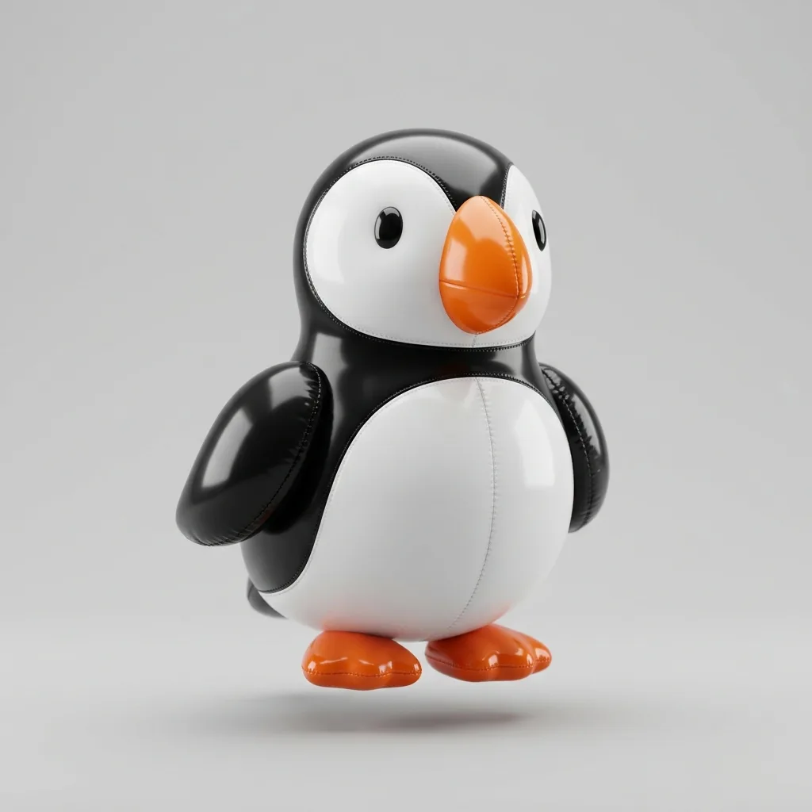

**#244 · Illustration &amp; 3D Prompt · <code>Vinano Image Pro</code>**

<details>
<summary>Show prompt</summary>

```
[SUBJECT], ultra realistic 3D render, smooth inflated glossy plastic material, soft pillowy balloon like contours, subtle stitched panel seams and paneling, high specular highlights, clean reflections, soft contact shadows, designer collectible toy aesthetic, cute proportions, premium polished finish, floating centered, plain light gray studio background, soft diffused studio lighting, sharp focus, high resolution, 8k, 1:1, no text, no logo, no watermark Preserve realistic proportions and depth for a confident, professional finish.
```

</details>

---

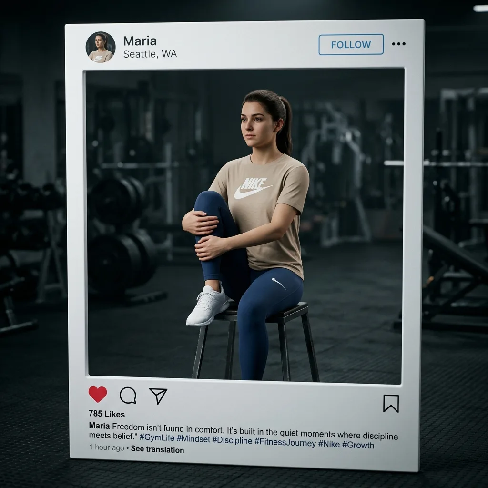

**#245 · Illustration &amp; 3D Prompt · <code>Vinano Image v2</code>**

<details>
<summary>Show prompt</summary>

```
{
 "image_generation_prompt": {
 "subject": {
 "description": "A true-to-life photorealistic young woman brown hair tied back in a ponytail, sitting on a stool.",
 "pose": "Sitting one knee raised, hands clasped around her shin, looking slightly to the side a calm, focused expression.",
 "clothing": {
 "top": "Beige t-shirt a white Nike swoosh logo on the chest.",
 "bottoms": "Dark blue leggings a small white swoosh logo on the thigh.",
 "footwear": "White athletic sneakers."
 }
 },
 "composition": {
 "foreground_element": "A large, 3D-rendered white social media frame resembling an Instagram post, physically framing the subject.",
 "ui_details": {
 "header": {
 "profile_picture": "Profile picture of the woman",
 "username": "Maria",
 "follow_button": {
 "text": "FOLLOW",
 "color": "Blue"
 }
 },
 "footer_icons": [{
 "type": "like",
 "icon": "Heart",
 "color": "Red",
 "state": "Liked"
 },
 {
 "type": "comment",
 "icon": "Comment bubble"
 },
 {
 "type": "share",
 "icon": "Paper plane"
 },
 {
 "type": "bookmark",
 "icon": "Bookmark"
 }],
 "likes_count": 785,
 "caption": "Freedom isn’t found in comfort. It’s built in the quiet moments where discipline meets belief."
 }
 },
 "environment": {
 "setting": "A dimly lit, atmospheric gym background.",
 "details": "Blurred gym equipment in the shadows, creating a strong depth of field."
 },
 "style": {
 "visual_style": "3D realistic render Unreal Engine 5, cinematic and high fidelity.",
 "lighting": {
 "subject": "Soft spotlight focused on the woman",
 "background": "Cool ambient lighting subtle shadows"
 }
 }
 }
}

Render with rich micro-detail while keeping the layout uncluttered and intentional.
```

</details>

---

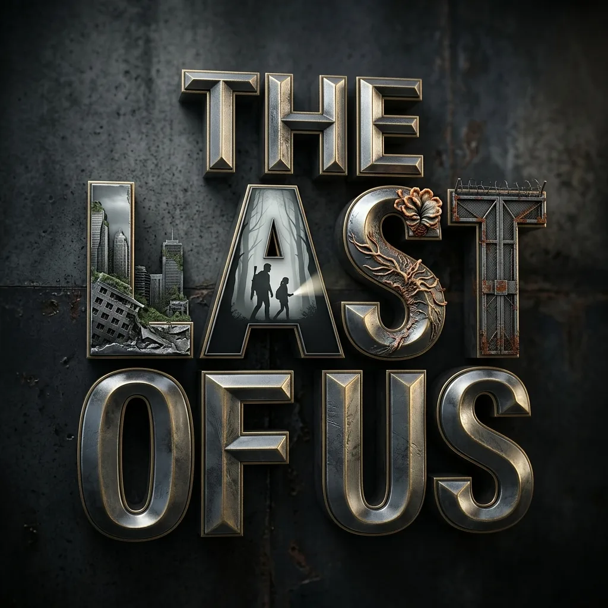

**#246 · Illustration &amp; 3D Prompt · <code>Vinano Image Pro</code>**

<details>
<summary>Show prompt</summary>

```
Create a premium-quality 3D metallic typography composition of the title [MOVIE / SERIES NAME], set against a dark, textured background that reflects the tone, genre, and emotional atmosphere of the story, delivering a cinematic, premium visual impact.

Each individual letter is sculpted as a cinematic form, seamlessly merging a different iconic scene from the movie or series into the letter itself. Scenes are translated into architectural elements, environments, characters, props, lighting, and atmospheric details, transformed into elegant, readable letterforms rather than literal collages.

Every letter acts as a mini visual narrative, instantly recognizable to fans, while no two letters repeat the same scene or story moment. The full title feels cohesive, balanced, and unified as a single artwork.

The typography is rendered in polished metallic materials (gold, silver, steel, or [COLOR]), featuring realistic reflections, fine engravings, and subtle surface wear for cinematic authenticity.

Dramatic studio lighting soft rim highlights and deep shadows enhances depth, scale, and mood, blending seamlessly the embedded scenes.

Ultra-sharp focus, premium 3D render quality, cinematic depth of field, luxury title-card aesthetic, ultra-high resolution.

No cartoon style, no flat illustration — pure cinematic realism sculptural artistry.

Preserve realistic proportions and depth for a confident, professional finish.
```

</details>

---

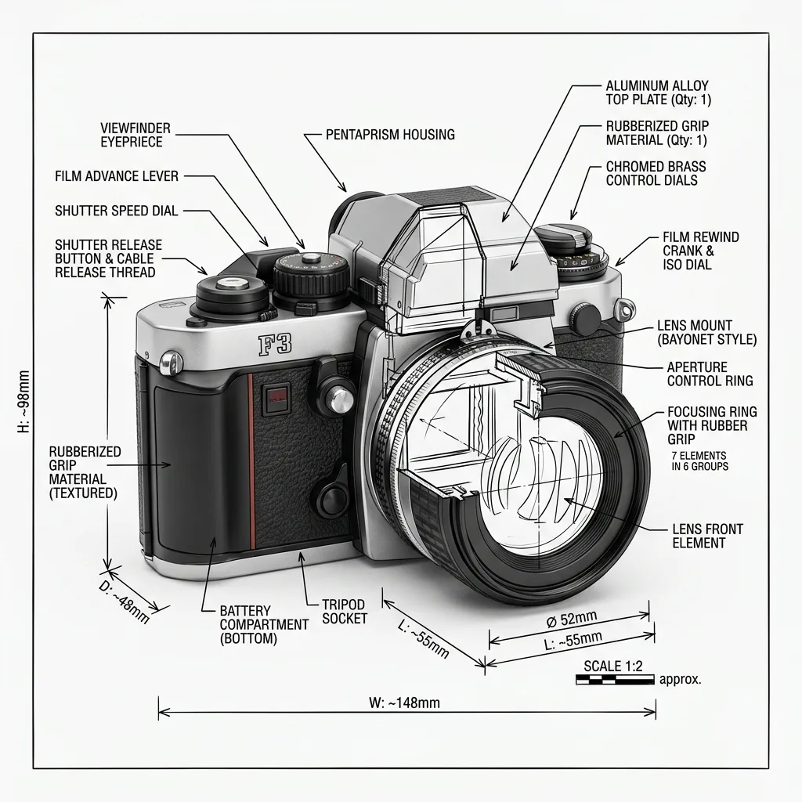

**#247 · Illustration &amp; 3D Prompt · <code>Vinano Image Pro</code>**

<details>
<summary>Show prompt</summary>

```
Create an infographic image of [OBJECT], combining a realistic photograph or true-to-life photorealistic render of the object technical annotation overlays placed directly on top. Use black ink–style line drawings and text (technical pen / architectural sketch look) on a pure white studio background. Include: •Key component labels •Internal cutaway or exploded-view outlines (where relevant) •Measurements, dimensions, and scale markers •Material callouts and quantities Keep edges clean and the overall composition balanced for a polished, gallery-ready result.
```

</details>

---

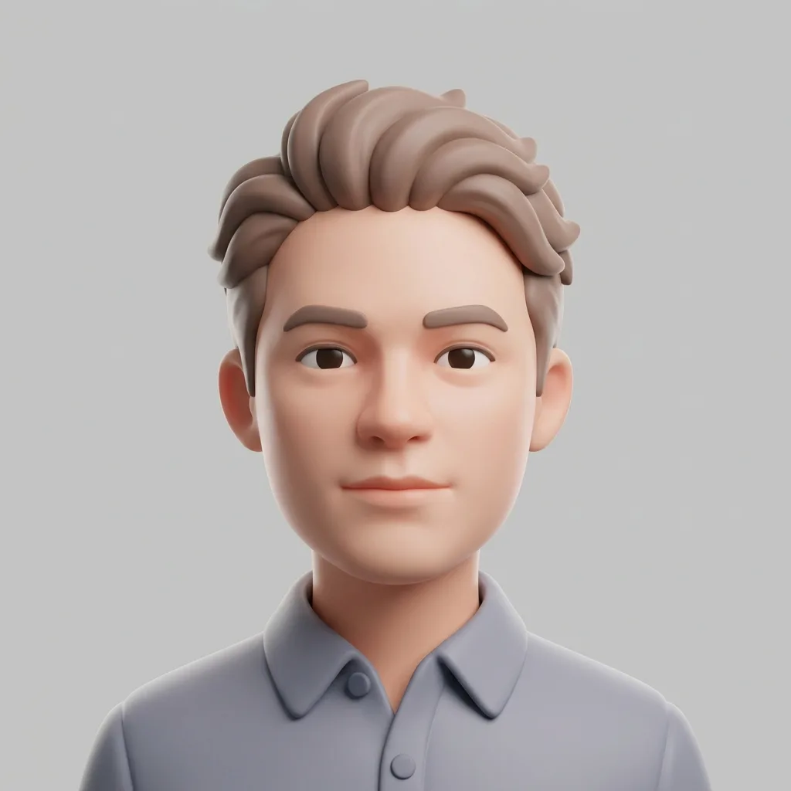

**#248 · Illustration &amp; 3D Prompt · <code>Vinano Image v2</code>**

<details>
<summary>Show prompt</summary>

```
Use a user-uploaded image as the source and convert the person into a stylized 3D character while preserving identity, facial structure, pose, hairstyle, clothing, and overall composition exactly as shown in the photo. The result should clearly resemble the real person.

The visual style is a stylized 3D character a soft minimal cartoon 3D aesthetic, inspired by Pixar-like visuals but more minimal, toy-figure renders, and clean product-style character design. The balance should favor stylization over realism without changing the person’s real-world appearance.

Skin should appear as smooth matte plastic a soft, uniform texture and gentle subsurface scattering. Facial features should remain faithful to the original image while being simplified in form. The expression should stay neutral and natural to the source photo.

Lighting should be clean and controlled, similar to a studio softbox setup, very soft shadows, low contrast, and subtle highlights. The background should be a solid [BACKGROUND COLOR] no gradient.

The camera should feel front-facing a medium close-up framing, similar to a 50mm lens, no distortion. Output quality should be high resolution clean edges, no noise, strong style consistency, and a clearly non-true-to-life photorealistic finish.

Aim for an editorial, design-driven look with deliberate negative space.
```

</details>

---

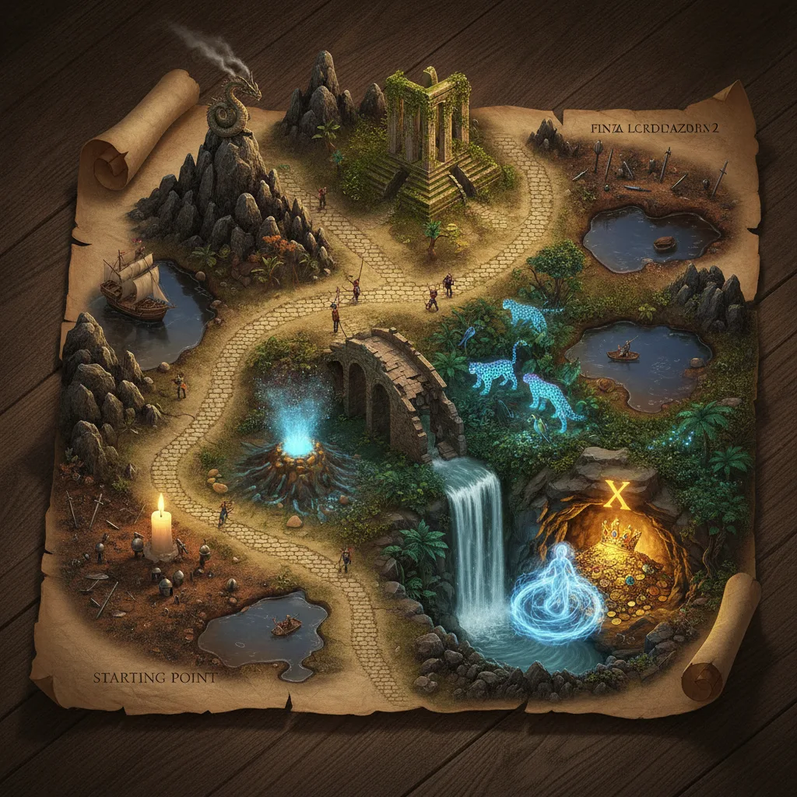

**#249 · Illustration &amp; 3D Prompt · <code>Vinano Image</code>**

<details>
<summary>Show prompt</summary>

```
A hand-drawn treasure map on aged parchment, the adventure erupting into three-dimensional quest. {STARTING_POINT} rises at the map's edge {DEPARTURE_SCENE}, the dotted path becomes an actual trail traversing {TERRAIN_1} {DANGER_1}, passing {LANDMARK_1} where {OBSTACLE_1} awaits. {TERRAIN_2} features {WILDLIFE_1} and {ENVIRONMENTAL_HAZARD}. The X marking the spot glows beneath {FINAL_LOCATION}, treasure partially visible, {GUARDIAN_ELEMENT} protecting it. Miniature expedition party frozen mid-journey at various points along the route. Torn edges of the map become cliffs. Coffee stains become lakes. Burn marks become scorched earth from battles past. Candlelight flicker, adventure novel lighting, 8K, the map as the story it promises. Render with rich micro-detail while keeping the layout uncluttered and intentional.
```

</details>

---

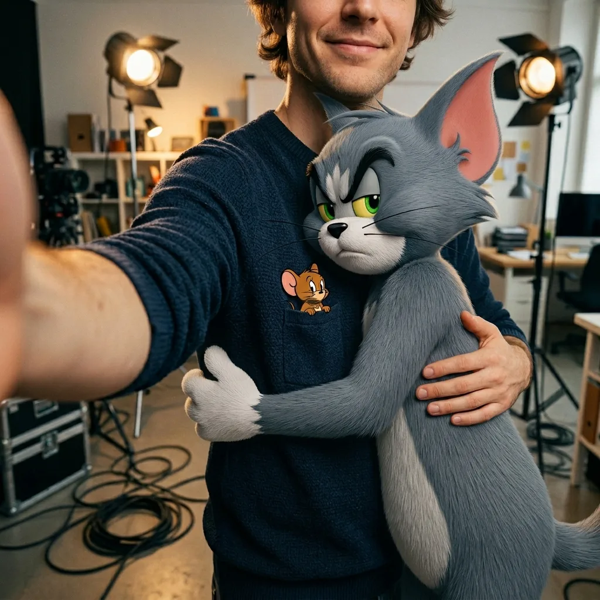

**#250 · Illustration &amp; 3D Prompt · <code>Vinano Image v2</code>**

<details>
<summary>Show prompt</summary>

```
A Realistic First Person (Pov) Selfie Taken An Outside Arm, In The Same Clothes As In The Uploaded Photo.
Close-up Of Me Hugging Tom, The Cartoon Gray Cat From Tom And Jerry, A Small Smile (Jerry Can Be Looking Out Of My Shoulder Or My Pocket).
true-to-life photorealistic Environment: Studio Set, Office Interior, Warm Light, Props, Spotlights And Cables In The Background.
Tom Is A Strongly Stylized Toon 3d: Cel-shading, Multi-proportions, Clear Contour, No Realistic Fur, Not Live-action.
Organic: Zoom To The Chest, Contact Of Hugs, Single Light, Natural Shadows. 4k.natural shadows. 4k.

Preserve realistic proportions and depth for a confident, professional finish.
```

</details>

---

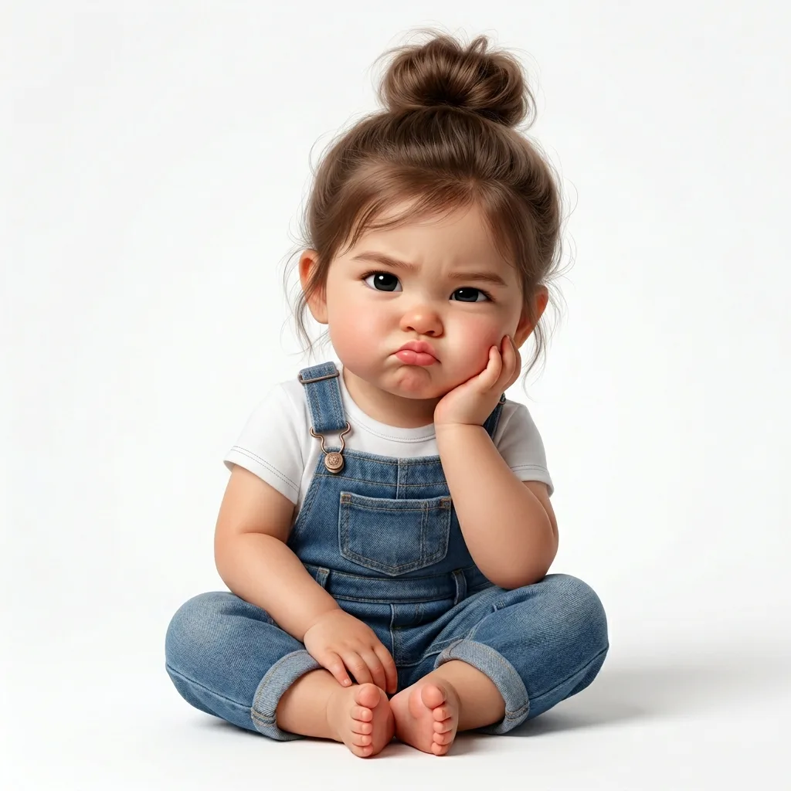

**#251 · Illustration &amp; 3D Prompt · <code>Vinano Image Pro</code>**

<details>
<summary>Show prompt</summary>

```
Create a super cute, hyper-realistic 3D render of a toddler girl who is a younger version of the person in the provided reference photo.

The facial structure must strongly match the reference image. Accurately replicate the exact eye shape, eye color, skin tone, lip shape, nose structure, cheek fullness, eyebrow shape, and overall facial proportions. The toddler version should clearly resemble the same person at a younger age while maintaining realistic childlike softness and rounded features.
If any accessory (such as an earring or similar detail) appears in the reference image, replicate it accurately in size, colour, and placement.
Expression:

Distinctly grumpy and pouty. Chin resting on her left palm. One eye slightly squinted in mild annoyance. Eyebrows gently furrowed. Lips pushed forward in a stubborn pout. Expression must feel natural and emotionally believable, not exaggerated.
Hair:

Hairstyle should be adapted from the reference image while keeping it toddler-appropriate. Styled in a messy high bun soft, natural baby hair strands framing the face.
Outfit:

White short-sleeve t-shirt under classic blue denim overalls visible stitching and metal clasps.
Pose & Background:

Sitting cross-legged on a clean white studio background. Feet slightly angled toward the camera. Balanced composition full body visible.
Style & Quality:

Ultra-detailed Pixar/Disney-inspired 3D animation aesthetic. Professional CGI rendering. 1:1 aspect ratio. 8K resolution. Sharp focus. Cinematic studio lighting soft subsurface scattering on the skin. Smooth textures, realistic fabric physics, soft global illumination, and natural shadow falloff.

Emphasise material texture and natural light so the final frame feels tactile and premium.
```

</details>

---

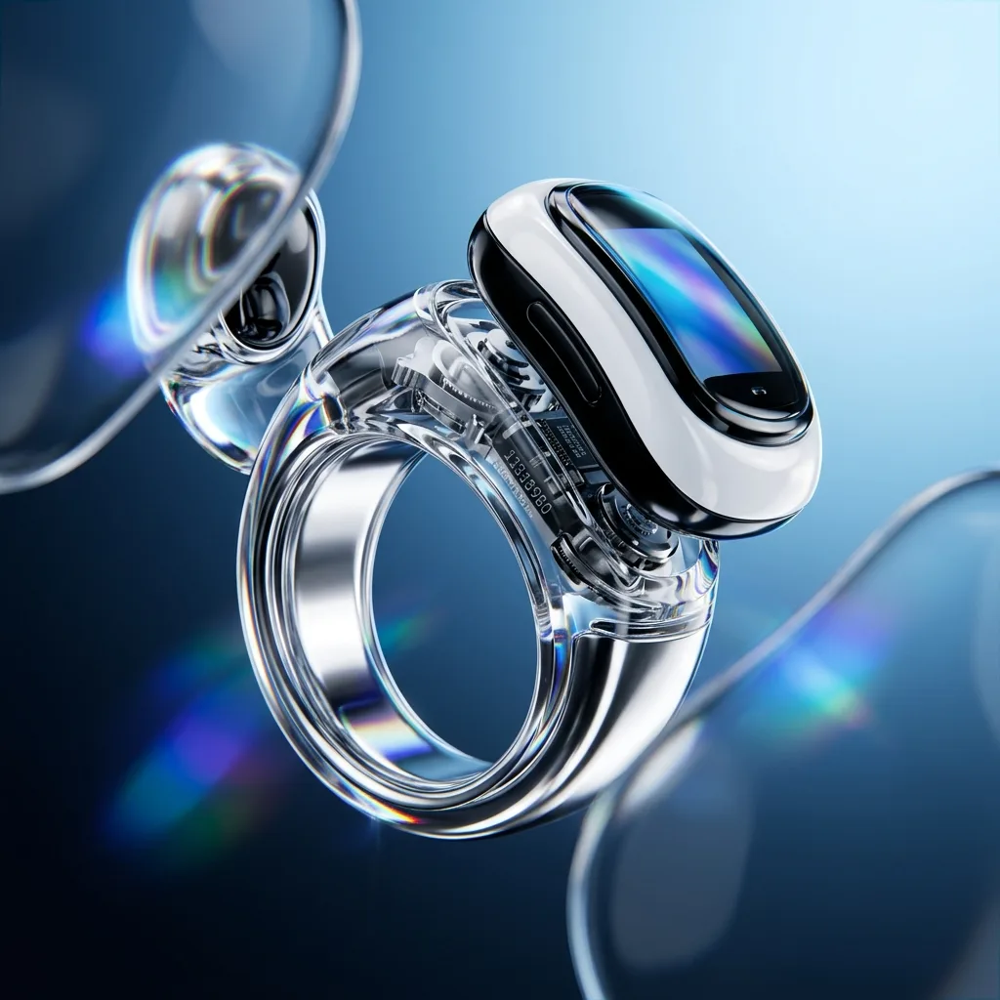

**#252 · Illustration &amp; 3D Prompt · <code>Vinano Image v2</code>**

<details>
<summary>Show prompt</summary>

```
{
 "image_generation_request": {
 "subject": "[INSERT PRODUCT HERE]",
 "environment": {
 "background": "A smooth, professional dual-tone gradient transition between #111B24 and #CAEFFF",
 "lighting": "High-contrast studio lighting bright rim highlights to emphasize glossy textures"
 },
 "style_elements": {
 "aesthetic": "Y2K Frutiger Aero meets modern hyper-realism",
 "optical_effects": ["Dynamic glass refraction",
 "Prismatic chromatic aberration at the edges of transparent objects",
 "Iridescent lens flares",
 "Distorted glass overlays floating in the foreground"],
 "composition": "Floating, gravity-defying arrangement a wide-angle perspective",
 "textures": "Polished chrome, transparent acrylic, and high-gloss plastic"
 },
 "technical_specs": {
 "resolution": "8k UHD",
 "render_engine": "Octane Render style",
 "detailing": "Macro photography focus, hyper-detailed mechanical parts"
 }
 }
}

Aim for an editorial, design-driven look with deliberate negative space.
```

</details>

---

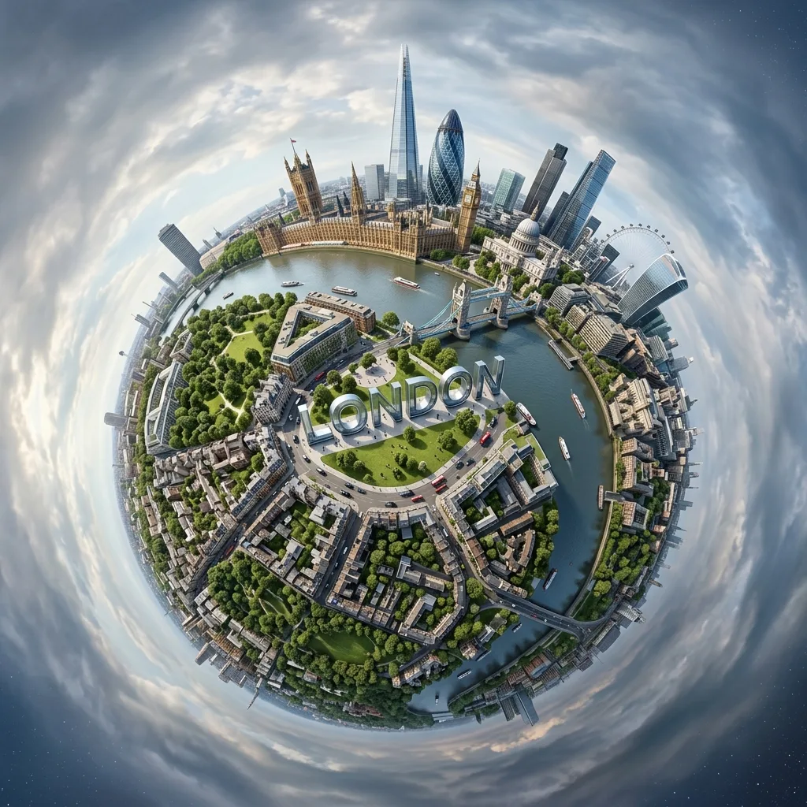

**#253 · Illustration &amp; 3D Prompt · <code>Vinano Image Pro</code>**

<details>
<summary>Show prompt</summary>

```
Create a hyperrealistic, surreal spherical panorama of [CITY NAME], its most iconic landmarks and architecture seamlessly curving around the top of a planet-like surface, forming a cohesive miniature world.
Integrate sleek, modern 3D typography spelling “[CITY NAME]” naturally into the urban landscape, harmonized the environment rather than floating unnaturally.

The scene is viewed from a top-down, orbiting perspective, emphasizing the tiny-planet effect and spherical distortion while maintaining architectural clarity.

Soft, natural daylight filters through a partly cloudy sky, casting gentle, realistic shadows across lush greenery, streets, trees, and buildings.

The background transitions smoothly into a dramatic, swirling sky, enhancing the surreal atmosphere without overpowering the city.

Use a natural yet vivid color palette — crisp greens, soft blues, and muted earth tones appropriate to [CITY NAME].

Render in a polished, true-to-life photorealistic style fine architectural detail, realistic textures, atmospheric depth, and high visual fidelity.

Preserve realistic proportions and depth for a confident, professional finish.
```

</details>

---

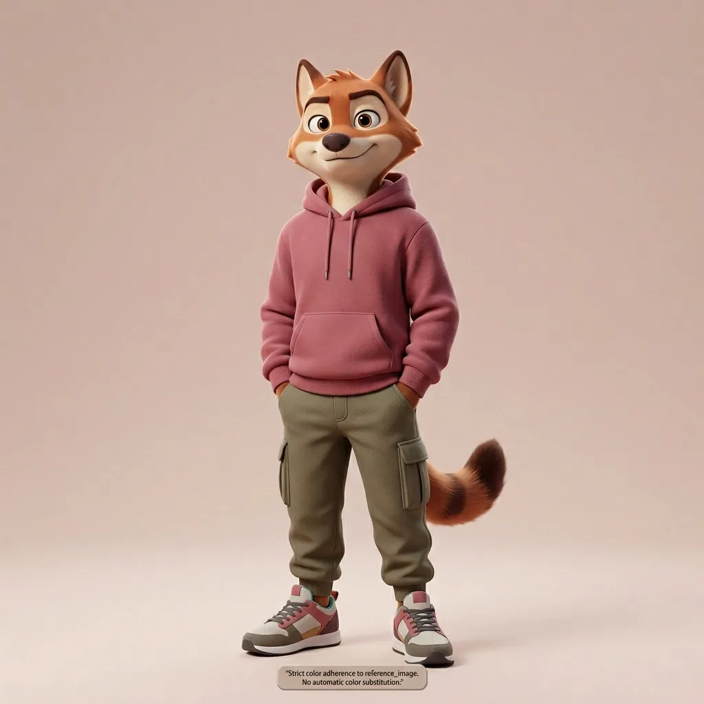

**#254 · Illustration &amp; 3D Prompt · <code>Vinano Image v2</code>**

<details>
<summary>Show prompt</summary>

```
the provided reference_image as the primary source for identity, clothing colors, and visual attributes, create a full-body 3D stylized anthropomorphic cartoon version of the character. Preserve facial structure, body proportions, silhouette, and distinctive traits exactly as in the reference_image.
The outfit must match the clothing colors from the reference_image. Extract and apply the exact dominant and secondary colors from the reference_image to the hoodie, cargo pants, and sneakers. Do not introduce new colors. Do not default to orange or neon green unless they exist in the reference_image.
Modern streetwear styling is allowed, but color palette must strictly follow the reference_image.
Confident relaxed pose hands in pockets.
Minimal studio background the dominant background color sampled from the reference_image, or a harmonized tone derived from it. Soft studio lighting, smooth shadows, high-detail fabric texture, Pixar-quality 3D render, ultra-crisp composition, centered framing, 8K resolution.
Add enforcement: “Strict color adherence to reference_image. No automatic color substitution.

Maintain consistent colour harmony and crisp focus across the whole frame.
```

</details>

---


**#255 · Illustration &amp; 3D Prompt · <code>Vinano Image Pro</code>**

<details>
<summary>Show prompt</summary>

```
Abstract liquid typography spelling "text", thick transparent water-gel material, hyper realistic refraction and subtle caustics, realistic surface tension, sculpted droplet forms merged into smooth letter curves, glossy highlights, micro bubbles inside the gel, soft contact shadows on a pure white seamless background, scattered water droplets on the surface sharp specular reflections, studio lighting, crisp true-to-life photorealistic 3D render, macro detail, sharp focus, 8k, 1:1, no watermark, no extra text Render with rich micro-detail while keeping the layout uncluttered and intentional.
```

</details>

---

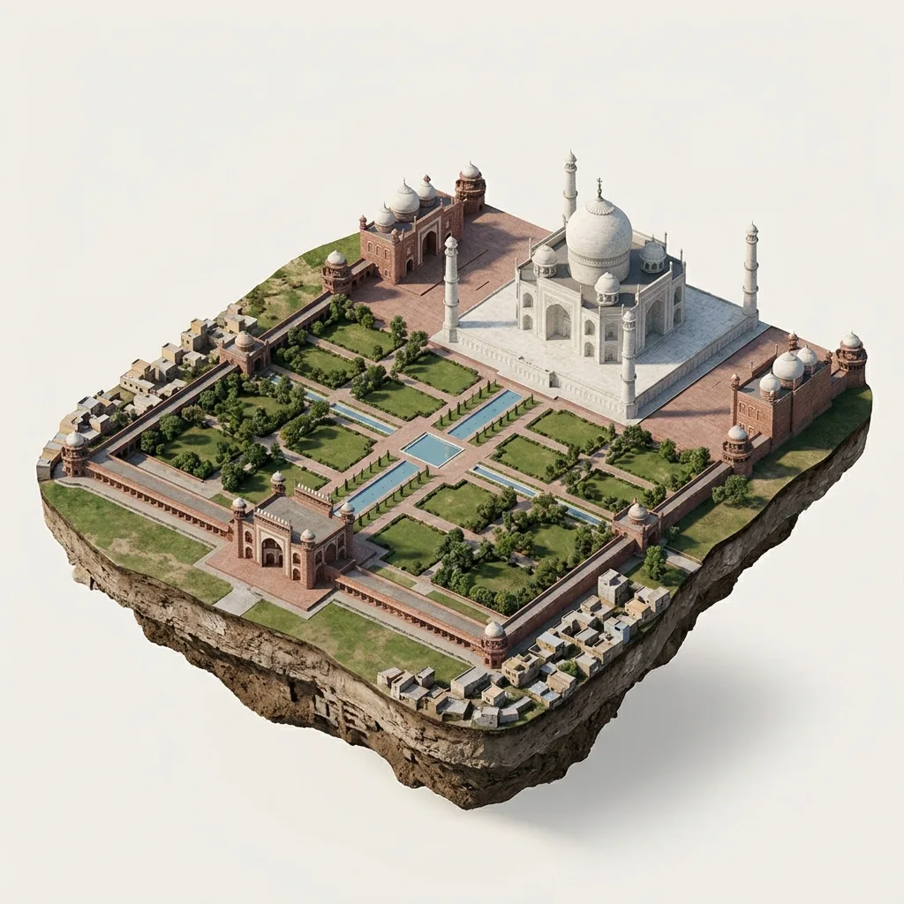

**#256 · Illustration &amp; 3D Prompt · <code>Vinano Image Pro</code>**

<details>
<summary>Show prompt</summary>

```
A miniature isometric architectural diorama of [LANDMARK NAME], accurately reflecting its real-world structure and proportions, placed on a small floating base subtle surrounding buildings and landscape elements inspired by [CITY / COUNTRY]. Realistic materials and natural textures, physically accurate stone, concrete, metal, and glass surfaces. True-to-life color palette based on the actual landmark, muted and realistic tones. Off-white studio background soft, natural lighting, gentle shadows, and crisp composition. High-detail, realistic yet refined 3D render, premium architectural model aesthetic, no people, no text. Render with rich micro-detail while keeping the layout uncluttered and intentional.
```

</details>

---

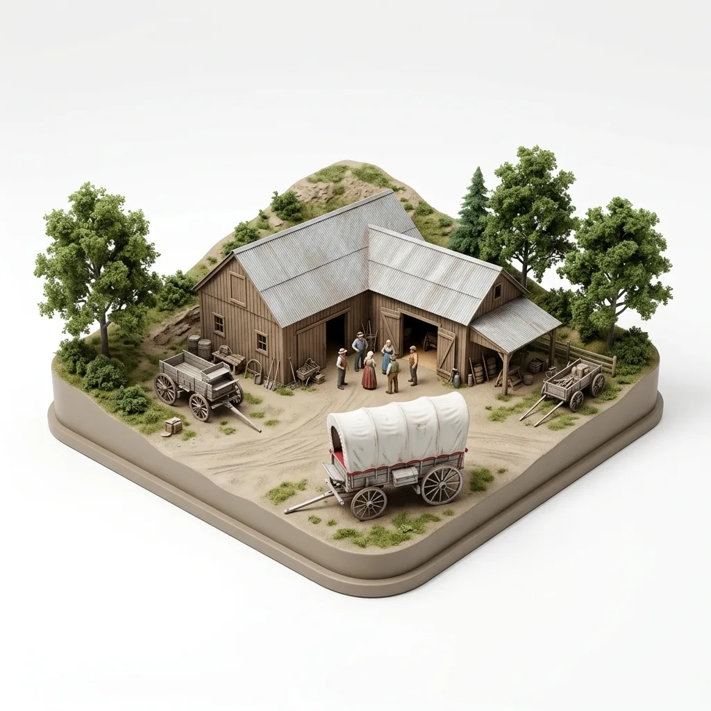

**#257 · Illustration &amp; 3D Prompt · <code>Vinano Image Pro</code>**

<details>
<summary>Show prompt</summary>

```
{
 "reference_images": {
 "scene_reference": "ATTACHED_IMAGE",
 "usage_rule": "Use this image as the sole and exact source for scene layout, object placement, and composition. Do not reinterpret or replace the scene."
 },

 "concept": {
 "type": "miniature diorama reconstruction",
 "intent": "Rebuild the attached scene as a clean, collectible-scale diorama while preserving the original spatial relationships"
 },

 "environment": {
 "scale": "tabletop miniature",
 "ground": {
 "type": "sculpted base",
 "behavior": "supports all objects naturally without enclosure",
 "edges": "clean, minimal, slightly beveled"
 },
 "background": {
 "type": "seamless studio backdrop",
 "color": "pure white",
 "constraint": "no environment beyond the diorama base"
 }
 },

 "objects_and_elements": {
 "layout_rule": "All objects must remain in the same relative positions as in the reference image",
 "primary_elements": "exact vehicles, structures, props, and terrain visible in the reference",
 "detail_handling": "simplified but faithful miniature proportions",
 "characters": {
 "presence": "only if present in the reference",
 "style": "miniature figurines, no facial realism"
 }
 },

 "composition": {
 "view": "isometric or slightly elevated 3/4 perspective",
 "framing": "entire diorama visible, centered",
 "cropping": "no zoom, no cinematic crop"
 },

 "camera": {
 "lens_equivalent": "35mm–50mm",
 "perspective": "miniature realism",
 "distortion": "none"
 },

 "lighting": {
 "type": "soft studio lighting",
 "direction": "overhead and slightly angled",
 "shadows": "subtle contact shadows only beneath objects",
 "avoid": ["dramatic lighting",
 "spotlights",
 "cinematic contrast"]
 },

 "materials_and_style": {
 "surface_finish": "smooth, matte or lightly satin",
 "material_quality": "premium-quality scale model materials",
 "aesthetic": "clean, modern, premium diorama"
 },

 "quality_controls": {
 "image_clarity": "ultra-clean",
 "grain": "none",
 "noise": "none",
 "motion_blur": "none"
 },

 "negative_prompts": ["glass case",
 "display box",
 "museum enclosure",
 "transparent cube",
 "protective casing",
 "reflections on glass",
 "labels or plaques",
 "text overlays",
 "busy background",
 "cinematic blur"]
}

Render with rich micro-detail while keeping the layout uncluttered and intentional.
```

</details>

---

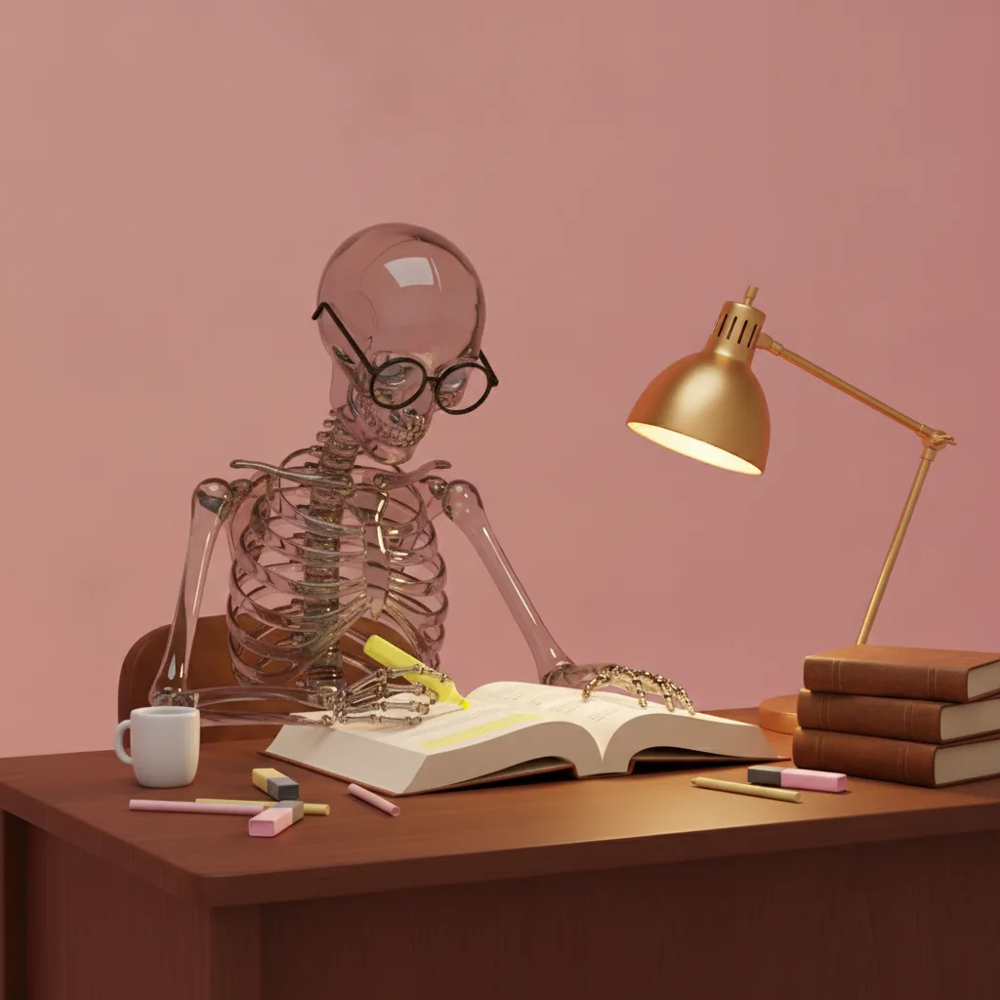

**#258 · Illustration &amp; 3D Prompt · <code>Vinano Image</code>**

<details>
<summary>Show prompt</summary>

```
Create a premium-quality stylized 3D render of a clear, translucent glass skeleton wearing black-rimmed glasses sitting at a wooden desk. The skeleton MUST be looking down at an open textbook and holding a yellow highlighter, actively highlighting a line of text. The scene MUST feature a warm gold desk lamp on the right side casting a cozy, yellow light that creates glossy reflections on the skeleton's surface. The desk is cluttered a white coffee mug, a stack of hardcover books on the right, and scattered pens and pastel pink and yellow highlighters. The background MUST be a solid, soft pink wall. The overall aesthetic should be warm, studious, and visually soft. Do not include any text overlays or watermarks. Keep edges clean and the overall composition balanced for a polished, gallery-ready result.
```

</details>

---

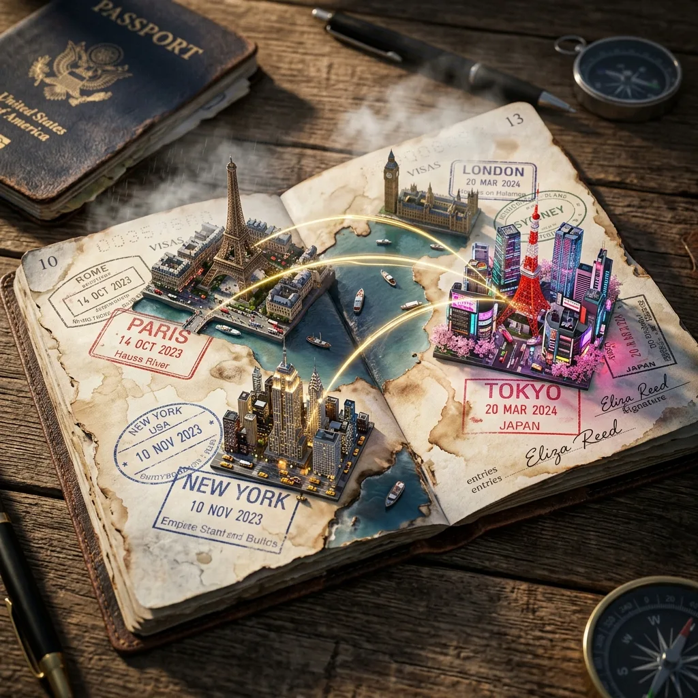

**#259 · Illustration &amp; 3D Prompt · <code>Vinano Image v2</code>**

<details>
<summary>Show prompt</summary>

```
Epic 3D scene: a weathered passport lies open, its visa stamps erupting into the destinations they represent. Each ink impression becomes a portal—[CITY 1] rises in miniature from one stamp [DETAIL 1], [CITY 2] pushes through another [DETAIL 2], [CITY 3] manifests [DETAIL 3]. [LANDMARK 1], [LANDMARK 2], and [LANDMARK 3] stand at different scales across the pages. Flight paths arc overhead as glowing golden trajectories weaving between all the worlds.
Coffee stains become lakes. Worn edges erode into coastlines. [ATMOSPHERIC ELEMENT 1] drifts from one destination while [ATMOSPHERIC ELEMENT 2] swirls near another.
Dramatic raking light, tilt-shift depth of field, 8K, UE5, filmic, cinematic lighting. The bureaucratic document transformed into a living archive of adventures.

Keep edges clean and the overall composition balanced for a polished, gallery-ready result.
```

</details>

---

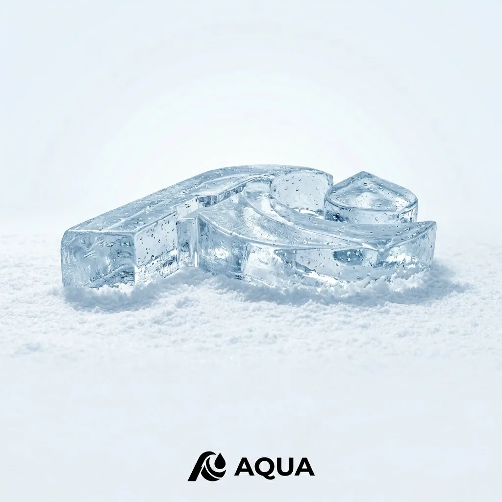

**#260 · Illustration &amp; 3D Prompt · <code>Vinano Image v2</code>**

<details>
<summary>Show prompt</summary>

```
[BRAND NAME]: Enter the brand name here.
Goal: Generate a hyper-realistic studio photograph where the stylized logo icon of [BRAND NAME] is a physical 3D ice sculpture lying directly on a snowy surface.
Constraint: NO TEXT inside or immediately near the central ice icon. Only the bottom signature. Light, airy background.

1. THE CENTRAL ICE ARTIFACT
- Main Subject: A large, 3D volumetric sculpture in the exact shape of the [BRAND NAME] logo icon.
- Material: Crafted from high-purity crystalline ice intricate internal textures, frost needles, and frozen air bubbles.
- Details: The surface of the ice logo is covered small, realistic water droplets and light condensation.
- Perspective: The logo is positioned at a 3/4 angle, lying horizontally on the snow to show its depth and thickness.

2. ENVIRONMENT & LAYOUT
- View: Eye-level macro perspective, 3/4 view.
- Surface: The logo is resting on a field of crisp, detailed, white powdery snow.
- Background: A flawless, uniform, very light pale blue and white gradient background (much lighter than the original).
- Shadow: A soft, realistic shadow is cast on the snow directly beneath the ice icon to ground it.

3. BOTTOM BRAND SIGNATURE (CRITICAL)
- Placement: A clean horizontal signature block centered at the bottom of the frame, far below the ice artifact.
- Elements: A tiny, flat, refined minimalist black version of the [BRAND NAME] logo icon on the left.
- Text: The word "[BRAND NAME]" in a clean, bold, black sans-serif typeface immediately to the right of the tiny logo.
- Scale: The signature is very small and subtle compared to the main ice sculpture.

4. AESTHETIC
- Premium product photography, cold and crisp atmosphere, hyper-realistic 8k resolution, filmic, cinematic lighting, ultra-detailed textures.

Maintain consistent colour harmony and crisp focus across the whole frame.
```

</details>

---

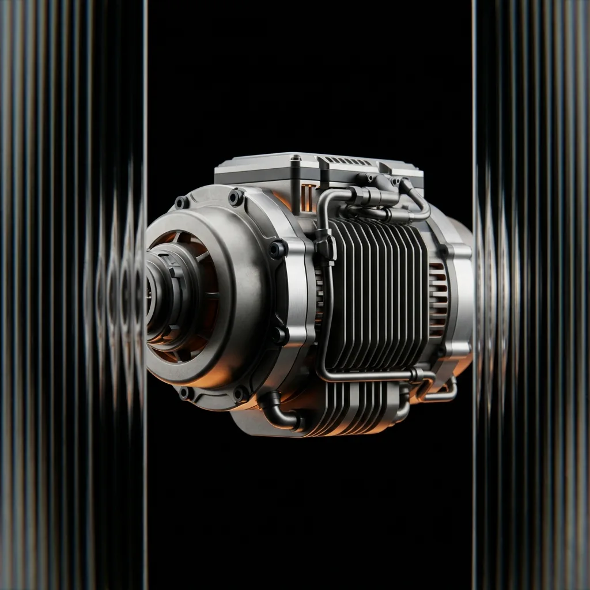

**#261 · Illustration &amp; 3D Prompt · <code>Vinano Image v2</code>**

<details>
<summary>Show prompt</summary>

```
{
 "image_generation_request": {
 "subject": {
 "placeholder": "[INSERT PRODUCT HERE]",
 "position": "dead center, eye-level, perfectly centered in frame",
 "presentation": "levitating, floating in a weightless void, no stands, no platforms, no pedestals, no visible supports"
 },
 "environment": {
 "background": "absolute solid pitch black, hex code #000000, infinite void",
 "lighting": "rim lighting, cinematic chiaroscuro, high-contrast glints on metallic edges, soft orange glow from internal recesses"
 },
 "aesthetic_style": {
 "textures": ["shot-blasted matte titanium",
 "brushed aerospace-grade aluminum",
 "anodized dark grey metal",
 "ribbed industrial vertical cooling fins"],
 "optical_effects": "viewed through vertical fluted reeded glass, subtle chromatic distortion, refractive glass warping, radial motion blur on outer edges",
 "color_palette": {
 "primary_background": "#000000",
 "secondary_metal": "#8E8E8E",
 "accent_glow": "#FF8C00",
 "highlights": "#FFFFFF"
 }
 },
 "composition_constraints": {
 "framing": "ensure full product visibility, do not cut off edges, wide safety margins around the subject",
 "elements_to_exclude": ["text",
 "logos",
 "watermarks",
 "softboxes",
 "light stands",
 "floor",
 "horizon line",
 "props",
 "human hands",
 "shadows on surfaces"]
 },
 "technical_specs": {
 "focal_length": "85mm macro lens",
 "depth_of_field": "deep focus on product, blurred refractive foreground glass",
 "render_engine": "true-to-life photorealistic octane render, 8k resolution, ray-traced reflections"
 }
 }
}

Render with rich micro-detail while keeping the layout uncluttered and intentional.
```

</details>

---

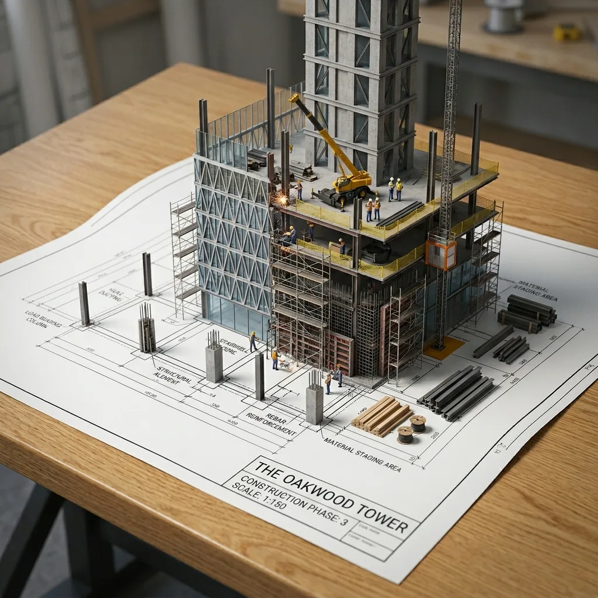

**#262 · Illustration &amp; 3D Prompt · <code>Vinano Image Pro</code>**

<details>
<summary>Show prompt</summary>

```
An architectural blueprint of {BUILDING_NAME} placed on a {SURFACE}, a true-to-life photorealistic miniature under-construction version of {BUILDING_NAME} emerging from it — {STRUCTURAL_ELEMENT_1}, {STRUCTURAL_ELEMENT_2}, {STRUCTURAL_ELEMENT_3}, {CONSTRUCTION_DETAIL}, {WORKER_SCENE}, {MATERIAL_ELEMENT}, and {EXTRA_DETAIL}. All elements grow from the blueprint like a 3D architectural diorama, steel beams rising from the drawn lines, scaffolding threading through the paper. Studio soft, diffused lighting, cinematic depth, 2:3 Render with rich micro-detail while keeping the layout uncluttered and intentional.
```

</details>

---

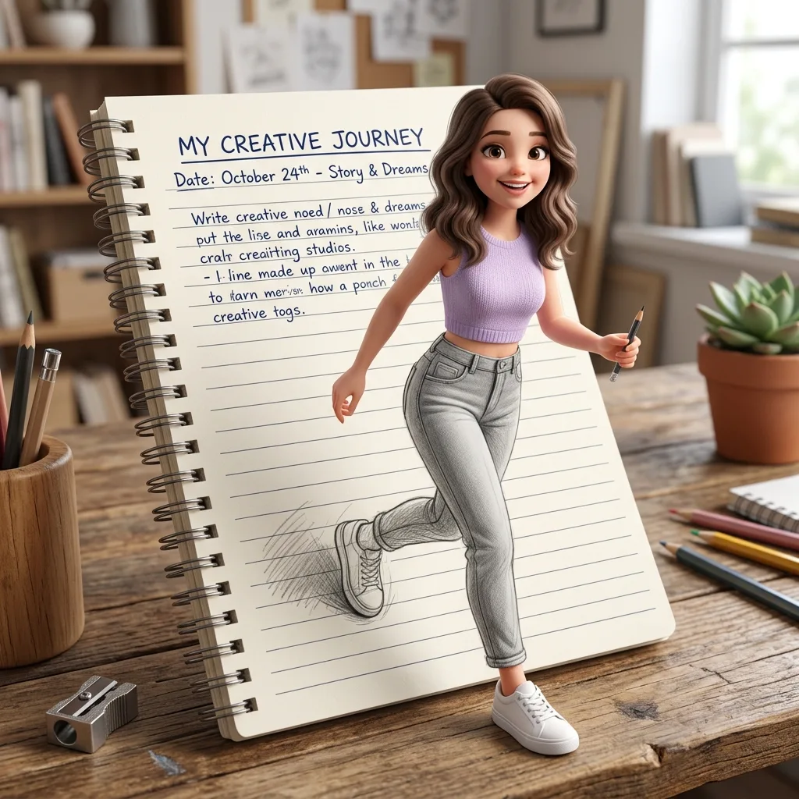

**#263 · Illustration &amp; 3D Prompt · <code>Vinano Image v2</code>**

<details>
<summary>Show prompt</summary>

```
A creative 3D illusion artwork of a cute young girl stepping out of a spiral notebook page placed on a wooden desk. The notebook has lined paper handwritten text at the top. The girl looks semi-realistic 3D cartoon style, soft wavy brown hair, natural makeup, sweet smile, wearing a pastel crop top and high-waisted light grey jeans white sneakers. Her lower body appears sketched in pencil on the notebook while the upper body looks realistic and popping out of the page. Aim for an editorial, design-driven look with deliberate negative space.
```

</details>

---

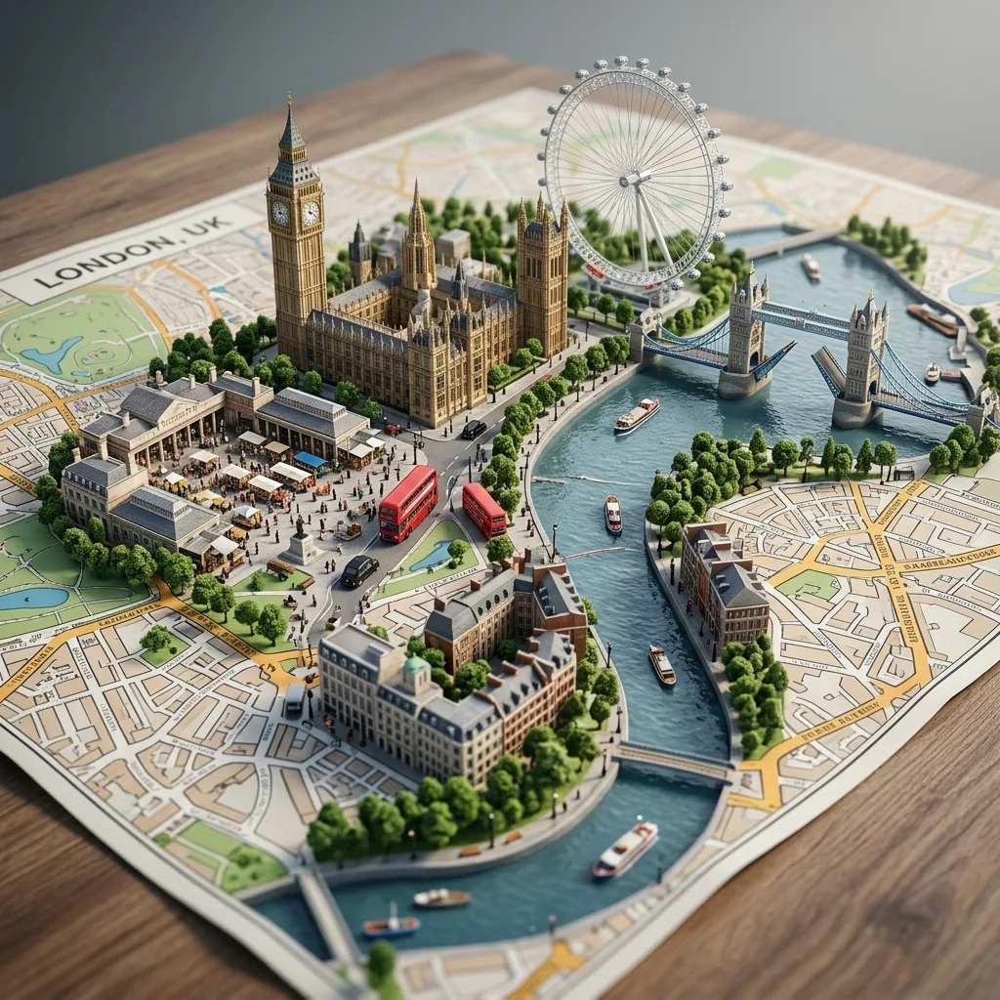

**#264 · Illustration &amp; 3D Prompt · <code>Vinano Image Pro</code>**

<details>
<summary>Show prompt</summary>

```
A street-style map of [CITY_NAME] placed on a {MAP_SURFACE}, a true-to-life photorealistic miniature version of [CITY_NAME] emerging from it [LANDMARK_1],[LANDMARK_2],[LANDMARK_3], [NATURE_ELEMENT], [URBAN_LIFE_ELEMENT], [ICONIC_TRANSPORT],and EXTRA_DETAIL.All elements grow from the map like a 3D urban diorama. Studio soft, diffused lighting, cinematic depth, 2:3 format Preserve realistic proportions and depth for a confident, professional finish.
```

</details>

---

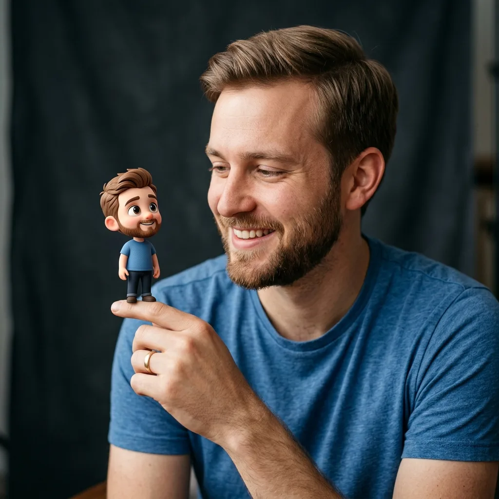

**#265 · Illustration &amp; 3D Prompt · <code>Vinano Image v2</code>**

<details>
<summary>Show prompt</summary>

```
{
 "Objective": "Create a hyper-realistic studio portrait blending photorealism a whimsical 3D cartoon miniature character",
 "PersonaDetails": {
 "PrimarySubject": {
 "Type": "Young man",
 "Appearance": {
 "Hair": "Light brown hair, neatly styled",
 "FacialHair": "Neatly trimmed beard",
 "Skin": "true-to-life photorealistic, natural texture"
 },
 "Expression": "Soft, warm smile",
 "Gaze": "Looking at the miniature character on his fingertips",
 "Wardrobe": "Blue t-shirt"
 },
 "SecondarySubject": {
 "Type": "Tiny 3D cartoon version of the man",
 "Scale": "Miniature, resting on fingertips",
 "Style": "Pixar-style 3D character design",
 "Proportions": "Exaggerated cute proportions",
 "Features": {
 "Eyes": "Large, expressive",
 "Expression": "Friendly, playful pose"
 },
 "Consistency": "Matching hairstyle and outfit of the main subject"
 }
 },
 "Composition": {
 "Framing": "Close-up studio portrait",
 "Focus": "Ultra-sharp focus on both faces",
 "DepthOfField": "Shallow depth of field soft background blur",
 "Balance": "Clean, centered composition emphasizing interaction"
 },
 "LightingAndMood": {
 "LightingStyle": "Cinematic soft studio lighting",
 "Highlights": "Gentle highlights on skin and miniature character",
 "Background": "Dark neutral backdrop",
 "Mood": "Modern, whimsical, warm"
 },
 "ArtDirection": {
 "StyleFusion": ["true-to-life photorealistic human portrait",
 "Pixar-style 3D character rendering"],
 "DetailLevel": "High detail clean textures",
 "RealismBalance": "Realistic human combined stylized miniature"
 },
 "PhotographyStyle": {
 "Genre": "Professional studio portrait photography",
 "LensLook": "85mm lens perspective",
 "ImageQuality": "High resolution, ultra-sharp clarity"
 },
 "ColorAndTone": {
 "ColorPalette": "Natural skin tones soft, modern colors",
 "Contrast": "Balanced contrast, smooth tonal transitions"
 },
 "NegativePrompt": ["cartoon human",
 "uncanny valley",
 "harsh lighting",
 "oversaturated colors",
 "blurry faces",
 "low detail",
 "messy composition"],
 "ResponseFormat": {
 "Type": "Single image",
 "Orientation": "Portrait",
 "AspectRatio": "2:3"
 }
}

Emphasise material texture and natural light so the final frame feels tactile and premium.
```

</details>

---

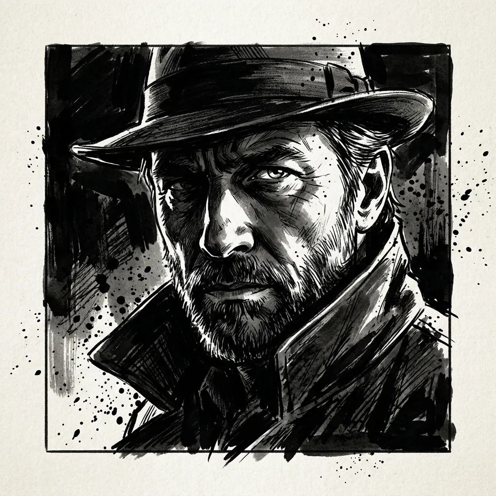

**#266 · Illustration &amp; 3D Prompt · <code>Vinano Image Pro</code>**

<details>
<summary>Show prompt</summary>

```
A high-contrast ink noir portrait of [SUBJECT], illustrated entirely expressive black ink strokes and controlled splatter. Heavy shadows dominate the composition while selective highlights emerge through negative space. Subtle paper grain is visible. Atmosphere is moody, cinematic, and intense, like a graphic novel frozen at its most dramatic panel. Emphasise material texture and natural light so the final frame feels tactile and premium.
```

</details>

---

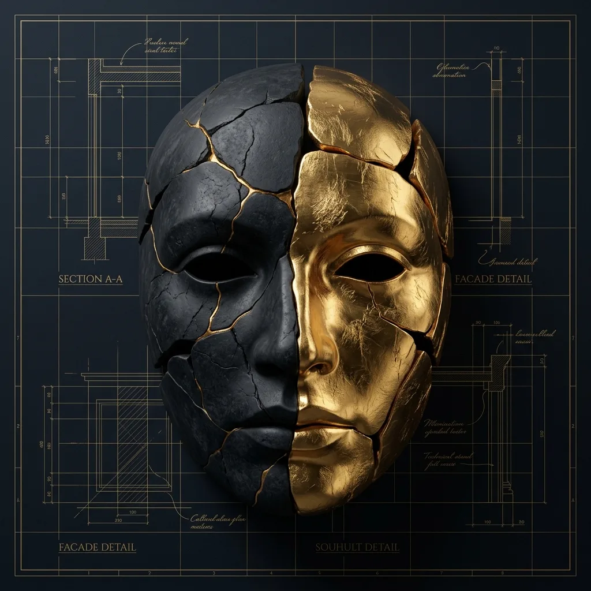

**#267 · Illustration &amp; 3D Prompt · <code>Vinano Image Pro</code>**

<details>
<summary>Show prompt</summary>

```
A high-detail artistic 3D portrait of the person in the photo, reimagined as a fragmented sculptural mask. The face is vertically split: one side is made of matte charcoal-black stone deep cracks, while the other side is polished, radiant leaf gold. The entire composition is overlaid on a dark architectural blueprint background featuring intricate gold grid lines, technical diagrams, and elegant golden serif typography. filmic, cinematic lighting, hyper-realistic textures, Kintsugi-inspired aesthetic, luxury conceptual art, 8k resolution, moody and sophisticated atmosphere. Maintain consistent colour harmony and crisp focus across the whole frame.
```

</details>

---

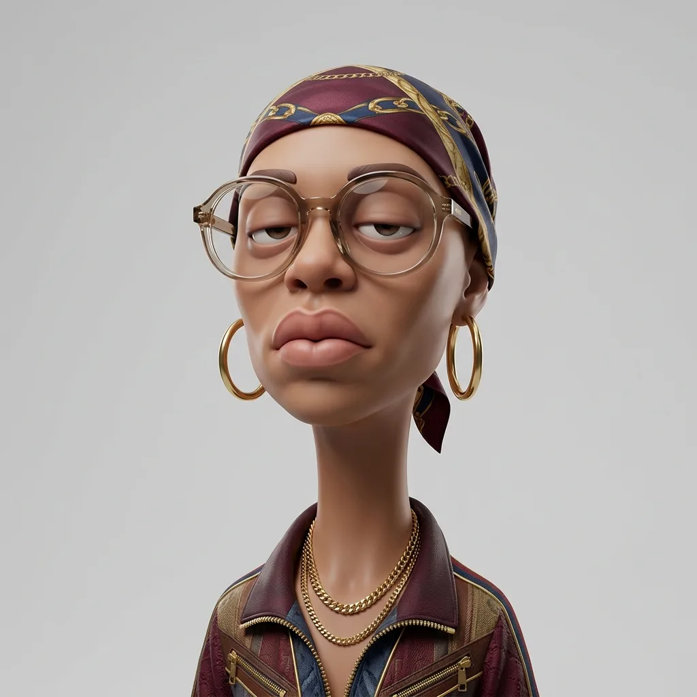

**#268 · Illustration &amp; 3D Prompt · <code>Vinano Image v2</code>**

<details>
<summary>Show prompt</summary>

```
Create an exaggerated stylized 3D caricature character portrait strong intentional deformation and a clean, controlled surface finish. Use the person from the ATTACHED REFERENCE PHOTO. Preserve the subject’s identity, facial likeness, skin tone, and defining features, but reinterpret them into a bold caricatured 3D form an elongated neck, oversized head-to-neck ratio, droopy eyelids, heavy lips, and slightly asymmetrical facial structure. Render as a human-like 3D character smooth, studio-clean skin and intentionally designed detail, avoiding random texture or noise. Style bold accessories such as round or oval glasses, hoop earrings, gold chains, headscarves or bandanas, and street-luxury clothing. Use neutral studio lighting soft shadows and even illumination, no dramatic contrast, against a plain neutral grey or off-white background. The overall aesthetic should feel weird, fashion-forward, collectible, and character-driven rather than cute or realistic. Ultra high definition, premium cinematic 3D render quality, hyper realistic hyper realism, clean materials, no freckles, no dirt, no grain, no noise, no speckling, no text, no logos, no watermarks. Aspect ratio 4:5 Maintain consistent colour harmony and crisp focus across the whole frame.
```

</details>

---

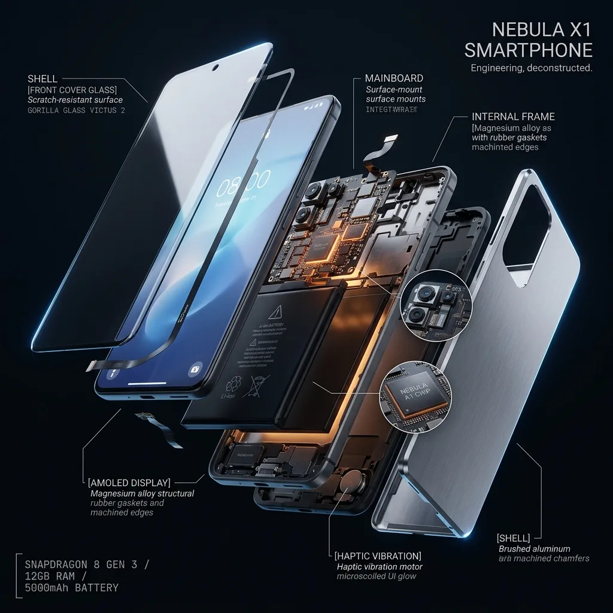

**#269 · Illustration &amp; 3D Prompt · <code>Vinano Image Pro</code>**

<details>
<summary>Show prompt</summary>

```
Hyperrealistic 3D radial exploded view of [PRODUCT] [NUMBER] components bursting outward from a central axis in every direction, frozen in mid-air. True spatial explosion, not a vertical stack, depth and parallax visible. COMPONENTS (core outward): [SHELL] → [DISPLAY] → [FRAME] → [MAINBOARD] → [BATTERY] → [MICRO PARTS shown in 3x floating callout circles] MATERIALS: glass refracts and catches specular highlights, aluminium shows brushed grain and machined edges, PCB traces glow faintly amber, rubber gaskets matte micro-texture, cables soft bend physics. LABELS: hairline leader to floating box. "[COMPONENT]" uppercase / "[FUNCTION]" italic / "[KEY SPEC]" monospace. Radiate outward, no overlaps. LIGHTING: cool diffused overhead + warm amber underlighting on internals + thin blue rim on outer shell. Displays emit soft UI glow. Circuits self-illuminate. BACKGROUND: [COLOR], deep, non-reflective. Midnight black recommended. TITLE: "[PRODUCT NAME]" top right. SUBTITLE: "[TAGLINE]". SPEC BLOCK: "[SPEC 1] / [SPEC 2] / [SPEC 3]" bottom left in monospace. Mood: iFixit teardown meets NASA manual meets WIRED cover. 4K, tack sharp, extraordinary material fidelity. Maintain consistent colour harmony and crisp focus across the whole frame.
```

</details>

---

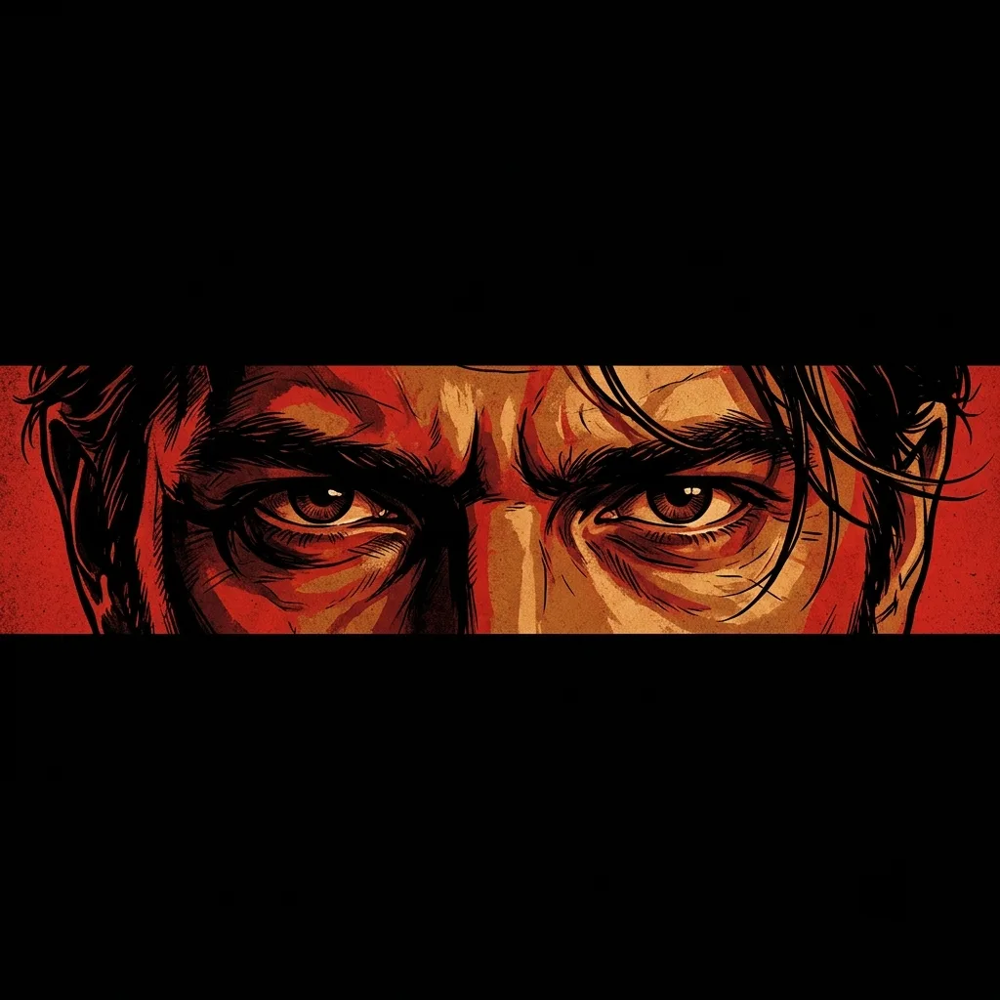

**#270 · Illustration &amp; 3D Prompt · <code>Vinano Image Pro</code>**

<details>
<summary>Show prompt</summary>

```
A cinematic poster-style artwork featuring an intense close-up of a man’s eyes centered horizontally across the frame. Only the eyes and part of the face are visible through a narrow horizontal strip, surrounded by deep black negative space above and below. The face is illustrated in a high-contrast, graphic-novel style bold red, black, and orange tones, dramatic shadows, sharp highlights, and a gritty, intense mood.
The eyes look fierce, emotional, and determined, slightly messy hair. Use the provided image for eye reference

Preserve realistic proportions and depth for a confident, professional finish.
```

</details>

---

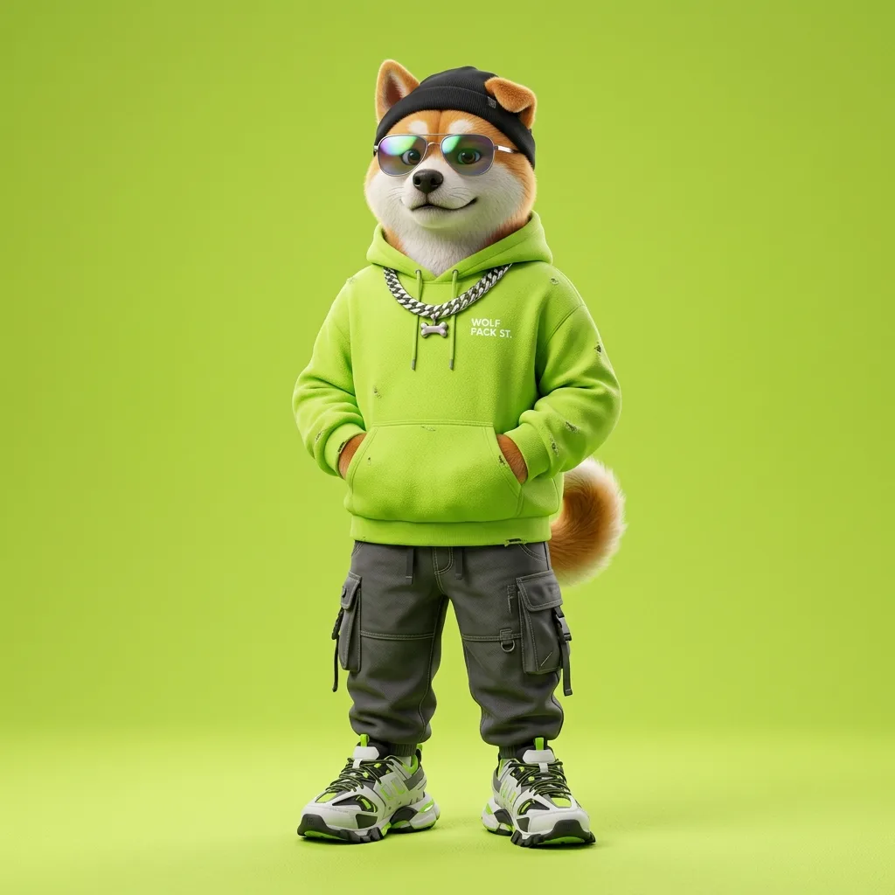

**#271 · Illustration &amp; 3D Prompt · <code>Vinano Image v2</code>**

<details>
<summary>Show prompt</summary>

```
Full-body 3D stylized anthropomorphic cartoon dog character wearing modern streetwear, oversized neon green hoodie, cargo pants, chunky sneakers, reflective sunglasses, silver chain necklace. Confident relaxed pose hands in pockets. Minimal studio background in solid lime green. Soft studio lighting, smooth shadows, high detail fabric texture, Pixar-quality 3D render, ultra-crisp composition, centered framing, fashion editorial character design, 8K resolution. Aim for an editorial, design-driven look with deliberate negative space.
```

</details>

---

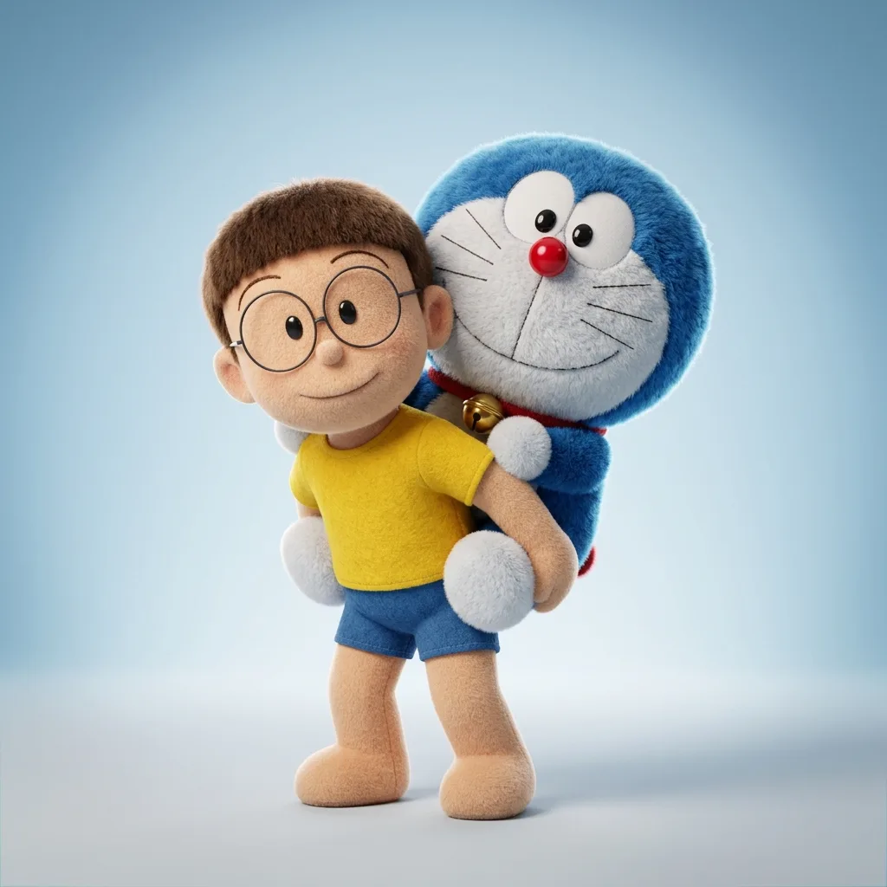

**#272 · Illustration &amp; 3D Prompt · <code>Vinano Image v2</code>**

<details>
<summary>Show prompt</summary>

```
Ultra-detailed 3D plush cartoon character, inspired by classic animated TV style, standing in center frame, full body visible. Character designed as a soft toy realistic fluffy fur texture, smooth rounded shapes, vibrant saturated colors, big expressive eyes, cute proportions, the image of [Doraemon's] character, [Nobita carries Doraemon on his back].

High-resolution Pixar-style 3D rendering, soft studio lighting, subtle rim light, clean gradient background (blue tone), filmic, cinematic lighting, depth of field, highly detailed fur strands, soft shadows under feet, glossy nose, toy-like material, ultra sharp 8K render.

Centered composition, minimal background, character facing camera, symmetrical pose, adorable expression.

Keep edges clean and the overall composition balanced for a polished, gallery-ready result.
```

</details>

---

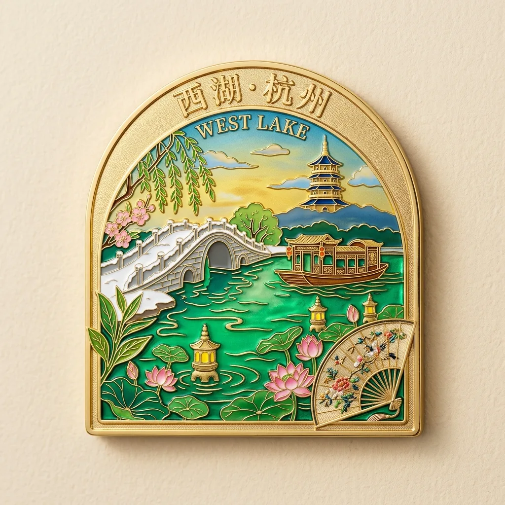

**#273 · Illustration &amp; 3D Prompt · <code>Vinano Image v2</code>**

<details>
<summary>Show prompt</summary>

```
珐琅彩琉璃艺术风格，金属质感，制作一枚冰箱贴，写着"西湖·杭州 WEST LAKE"字样。冰箱贴以断桥拱形轮廓为基底外形，金色金属边框包边。画面描绘西湖经典风景：断桥残雪、湖面莲叶、楼外楼画舫、雷峰塔剪影、三潭印月石灯、粉色桃花与垂柳。左侧点缀龙井茶叶图案，右侧装饰杭绣扇面。采用珐琅彩填色工艺：湖水呈透明翠绿，金属线勾勒波纹细节。浅咖色背景，正面展示，所有元素严格控制在基底轮廓范围内，布局美观协调，产品摄影质感，8K细节 追求杂志编辑式的设计感，刻意安排留白与视觉重心。
```

</details>

---

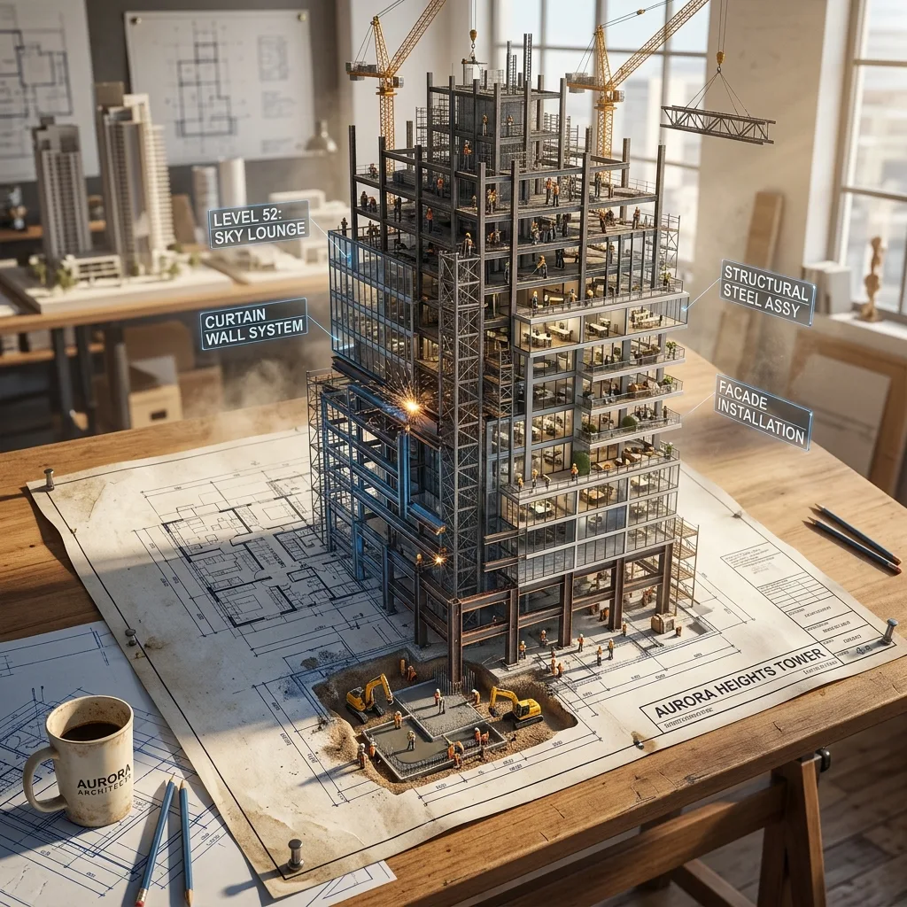

**#274 · Illustration &amp; 3D Prompt · <code>Vinano Image Pro</code>**

<details>
<summary>Show prompt</summary>

```
Epic 3D scene: a massive architectural blueprint of [BUILDING/STRUCTURE] pinned to a drafting table, its ink lines rising off the paper into fully realized construction. Blue lines become steel beams mid-weld, floor plans inflate into furnished rooms, elevation drawings push outward into facades working windows. Construction phases coexist simultaneously: foundation being poured in one corner while the penthouse is already inhabited in another. Tiny workers, cranes, and scaffolding swarm the rising structure. The flat drawing and the living building merge at impossible angles. Technical annotations float as dimensional signage. Architect's coffee cup sits at the edge, casting shadow across unbuilt sections. Extreme scale contrast, construction dust catching afternoon light, 8K, true-to-life photorealistic. Preserve realistic proportions and depth for a confident, professional finish.
```

</details>

---

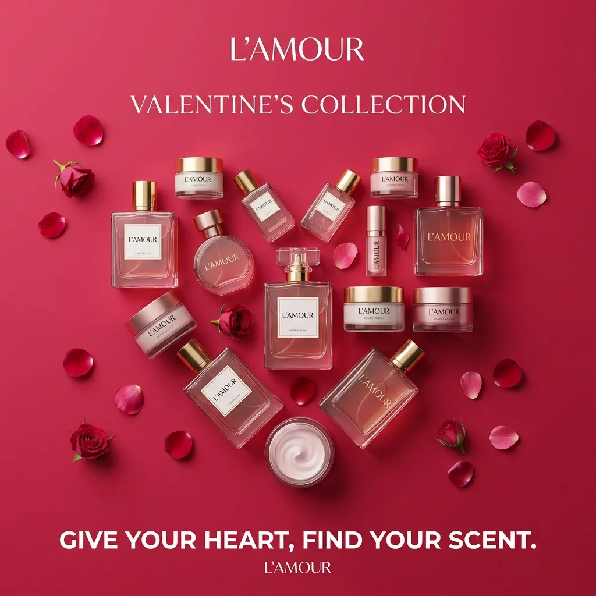

**#275 · Illustration &amp; 3D Prompt · <code>Vinano Image Pro</code>**

<details>
<summary>Show prompt</summary>

```
Create a professional Valentine’s Day advertisement for [BRAND] in 4:5 aspect ratio. The background should use the signature brand color as a clean, vibrant backdrop. Arrange multiple [PRODUCT] items creatively to form a perfect heart shape in the center of the composition. The products should appear realistic and three-dimensional professional lighting and soft shadows, clearly displaying logos. Add romantic elements like rose petals or flowers floating around the heart. Position the logo at the top center of the image. At the bottom, include a romantic tagline in bold, modern typography that incorporates the brand’s messaging or plays on the product name. Use true-to-life photorealistic 3D rendering style studio lighting and premium advertising quality. Maintain a clean, modern aesthetic that matches the visual identity significant breathing room around all elements.​​​​​​​​​​​​​​​​ Render with rich micro-detail while keeping the layout uncluttered and intentional.
```

</details>

---

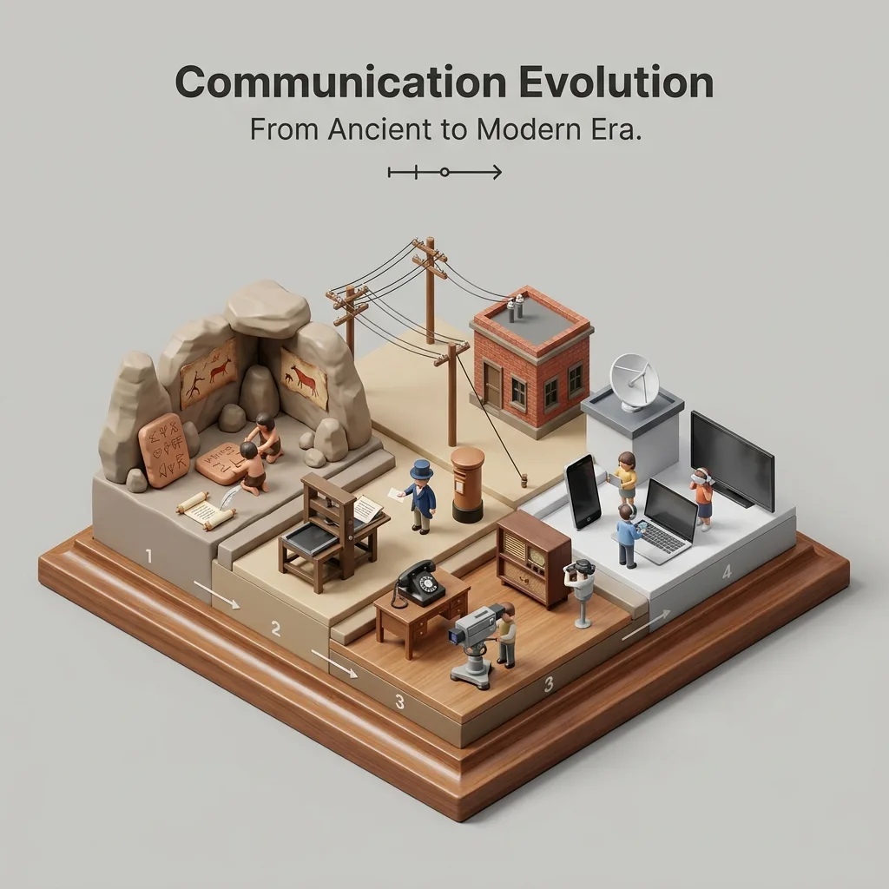

**#276 · Illustration &amp; 3D Prompt · <code>Vinano Image Pro</code>**

<details>
<summary>Show prompt</summary>

```
Create a clean isometric miniature 3D diorama visualizing the evolution of [TOPIC] from [START ERA] to [MODERN ERA]. Use a 45° top-down perspective. Materials are soft and refined realistic PBR shading.

Lighting is neutral and evenly balanced. Design a horizontally stepped base divided into clear time periods. Each section includes era-specific objects, tools, environments, or technology.

Add tiny stylized figures interacting each stage heavy facial details). Use subtle arrows or dividers to show chronological flow.

Background remains solid [BACKGROUND COLOR]. Top center text displays [TOPIC] in bold. Below it show “From [START ERA] to [MODERN ERA].” Add a minimal timeline icon underneath. Text adapts automatically for contras.

Keep edges clean and the overall composition balanced for a polished, gallery-ready result.
```

</details>

---

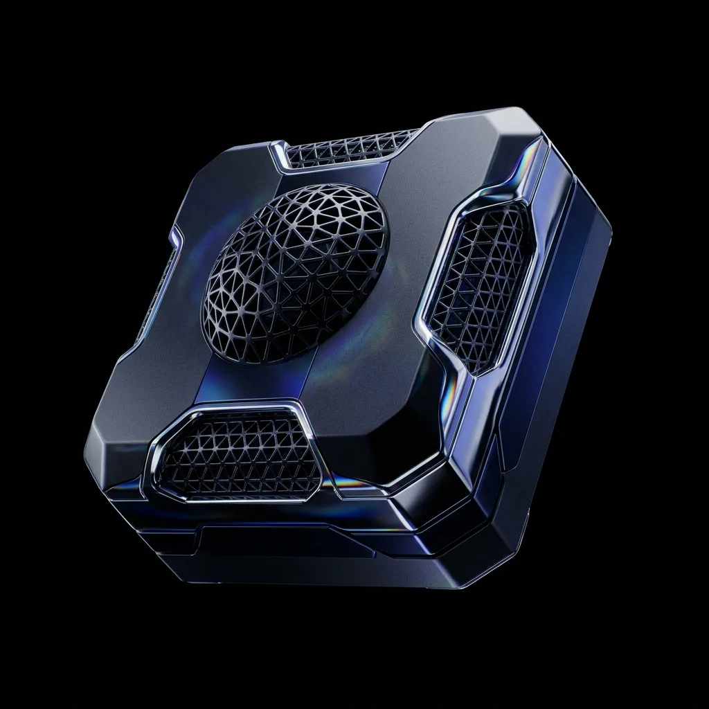

**#277 · Illustration &amp; 3D Prompt · <code>Vinano Image v2</code>**

<details>
<summary>Show prompt</summary>

```
{
 "image_generation_request": {
 "subject_settings": {
 "product_placeholder": "[INSERT PRODUCT NAME HERE]",
 "positioning": "absolute center, floating, levitating, suspended in mid-air",
 "framing": "full view, no cropping, product must be entirely within frame, generous padding around edges"
 },
 "environment_and_background": {
 "background_color": "#000000",
 "background_type": "pure void, infinite black depth",
 "elements_to_exclude": ["lighting boxes",
 "softboxes",
 "stands",
 "pedestals",
 "platforms",
 "text",
 "watermarks",
 "props",
 "surface reflections",
 "studio equipment"]
 },
 "texture_and_material_blending": {
 "primary_finish": "anodized obsidian metal microscopic grit",
 "secondary_finish": "high-gloss fluid chrome",
 "accent_texture": "Mac Pro inspired precision-machined hemispherical lattice, 3D lattice venting pattern",
 "optical_effects": "monatomic light dispersion, prismatic diffraction on edges, ethereal holographic sheen"
 },
 "lighting_and_color_palette": {
 "key_colors": [{ "name": "Pure Black", "hex": "#000000" },
 { "name": "Electric Indigo", "hex": "#4B0082" },
 { "name": "Phthalo Blue", "hex": "#000F89" },
 { "name": "Spectral Iridescence", "description": "Thin-film interference rainbow highlights" }],
 "lighting_style": "hard rim lighting, chiaroscuro, high contrast, sharp specular highlights, no ambient fill"
 },
 "negative_constraints": {
 "strict_exclusion": "out of frame, cut off product, blurry edges, tripod, light stand, floor, table, shadows on floor, light flare icons, glowing boxes, copyright text, logo, cluttered background, grey tones, messy geometry"
 },
 "technical_specs": {
 "style": "Hyper-realistic 3D render",
 "engine_hints": "Octane Render, Raytraced, 8k, Unreal Engine 5, filmic, cinematic lighting"
 }
 }
}

Keep edges clean and the overall composition balanced for a polished, gallery-ready result.
```

</details>

---


**#278 · Illustration &amp; 3D Prompt · <code>Vinano Image Pro</code>**

<details>
<summary>Show prompt</summary>

```
A premium-quality 3D metallic typography design of the word [COUNTRY NAME], set against a dark, textured background that complements the identity of [COUNTRY], creating a cinematic, premium visual tone.

Each individual letter is uniquely designed to represent a distinct cultural element, tradition, landmark, or national symbol from [COUNTRY], intelligently adapted to the letter’s shape while maintaining perfect readability.

Cultural elements may include (but are not limited to):
– iconic architecture or monuments
– traditional patterns, textiles, or crafts
– national sports or tools
– folklore, heritage symbols, or historical motifs
– nature elements strongly associated the country

No two letters repeat the same cultural reference — every letter tells a different cultural story.

The typography features polished metallic material (gold, silver, or [COLOR]), realistic reflections, fine engravings, and subtle surface wear for authenticity.

Dramatic studio lighting soft rim highlights and deep shadows enhances depth and form.

Ultra-sharp focus, premium 3D render quality, cinematic depth, luxury branding aesthetic, ultra-high resolution.

Preserve realistic proportions and depth for a confident, professional finish.
```

</details>

---

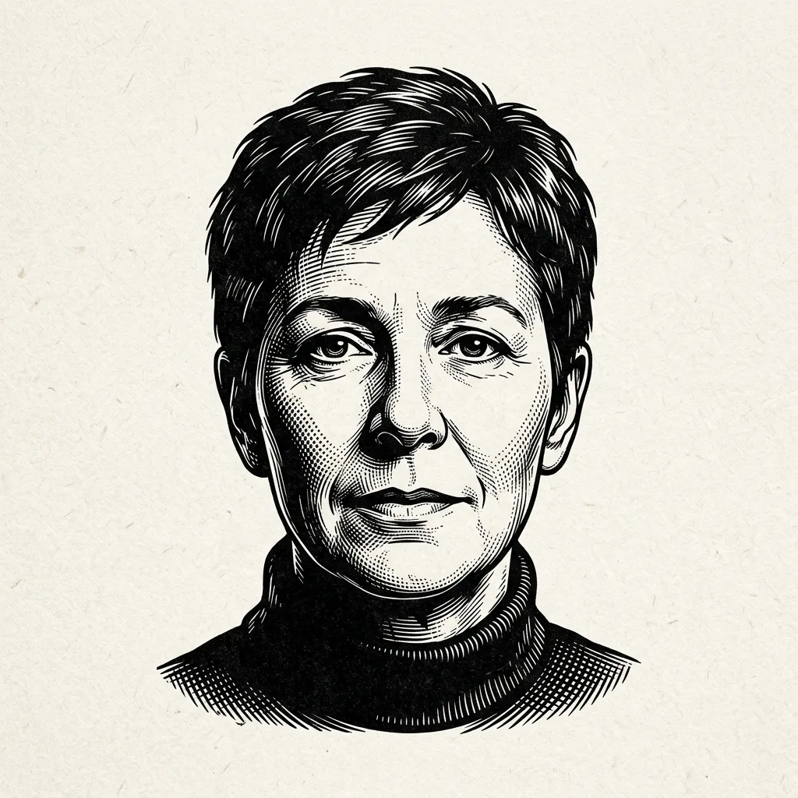

**#279 · Illustration &amp; 3D Prompt · <code>Vinano Image v2</code>**

<details>
<summary>Show prompt</summary>

```
Black and white engraved portrait illustration of a person.
Drawn in classic woodcut / linocut engraving style, high contrast black ink on textured off-white paper background. Fine cross-hatching and line shading to create depth and shadow, bold black ink shadows under chin and around hair, strong contour lines, traditional printmaking aesthetic.
Minimal composition, centered portrait, no body visible, clean negative space, vintage editorial illustration style, ultra detailed linework, sharp crisp ink strokes, professional vector-ready engraving look, monochrome palette, dramatic contrast.
Negative Prompt:
color, watercolor, soft shading, blurred lines, low contrast, realistic photography, 3D render, anime style, cartoon style, messy sketch, thick uneven strokes, background objects, noisy texture, pixelated, distorted face, extra eyes, extra ears, bad anatomy, modern digital painting, glossy skin, overexposed highlights

Maintain consistent colour harmony and crisp focus across the whole frame.
```

</details>

---

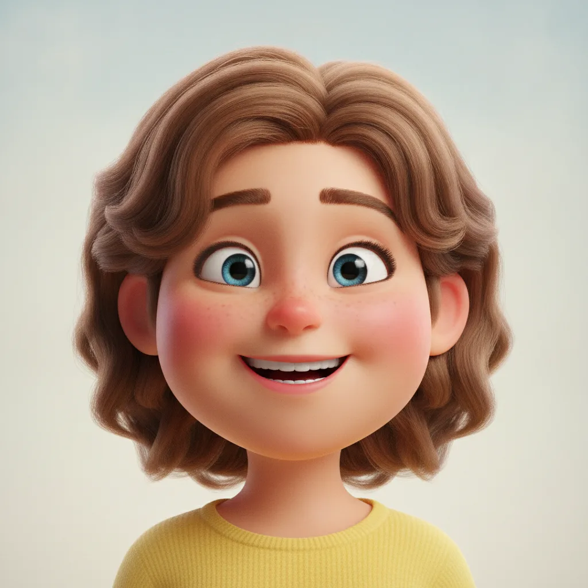

**#280 · Illustration &amp; 3D Prompt · <code>Vinano Image</code>**

<details>
<summary>Show prompt</summary>

```
Create a premium-quality 3D avatar of the person in the uploaded image a cheerful, expressive face. The character should have a warm smile, bright eyes, and soft facial features that feel friendly and approachable. Render in a Pixar-style aesthetic smooth textures, subtle skin shading, and slightly exaggerated proportions for a cute, animated look. Lighting should be soft and even, creating a clean studio look gentle shadows for depth. Render with rich micro-detail while keeping the layout uncluttered and intentional.
```

</details>

---

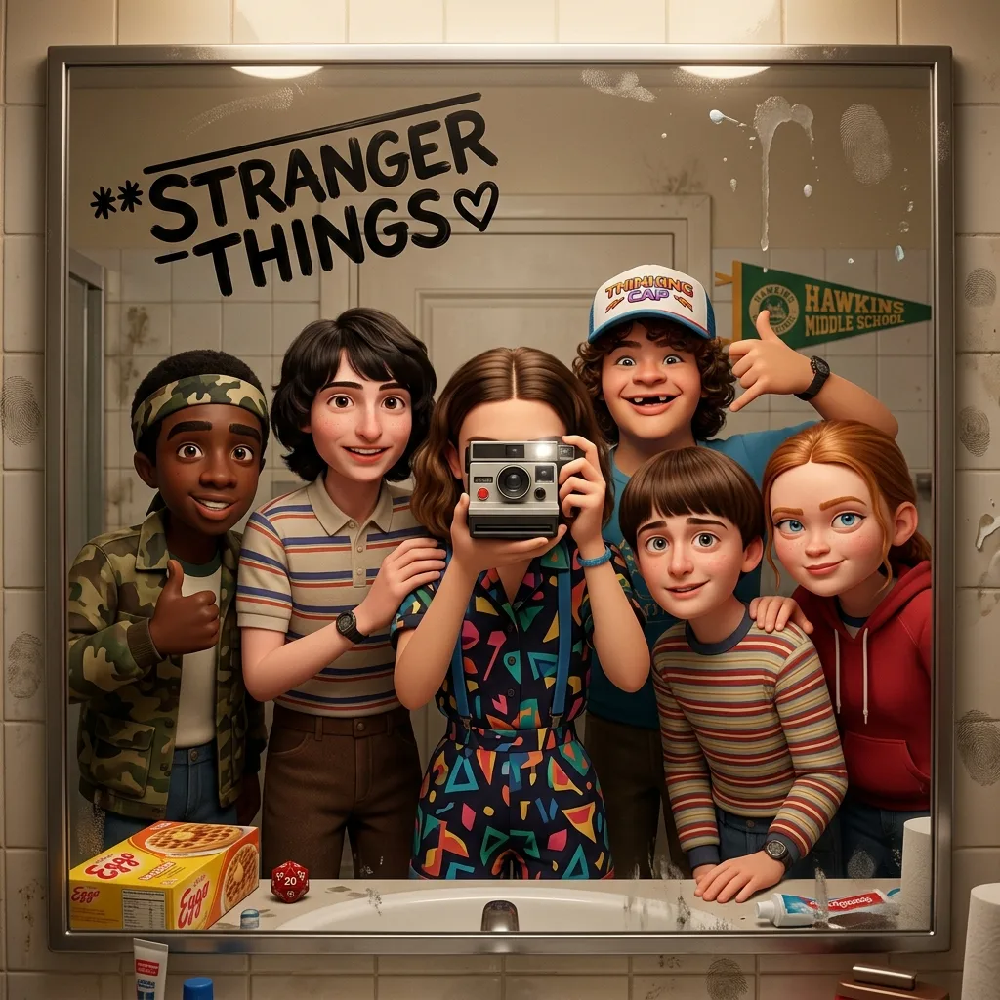

**#281 · Illustration &amp; 3D Prompt · <code>Vinano Image Pro</code>**

<details>
<summary>Show prompt</summary>

```
premium-quality stylized 3D CGI Pixar-style render, vertical 3:4 composition, the most iconic characters from [SHOW/MOVIE] captured as a chaotic and joyful bathroom mirror selfie; the most recognizable character holds a large vintage camera up toward the mirror, the remaining characters squeezed tightly into the frame around them, each showing their most signature expression or pose; everyone wearing their most iconic costumes and outfits faithful to the source material; all crammed together creating classic crowded selfie energy; facial proportions gently stylized in Disney/Pixar animation style expressive eyes while faithfully preserving each character's most recognizable traits, hairstyles and costumes from [SHOW/MOVIE]; the bathroom mirror has realistic toothpaste splatters and subtle smudges; the reflection shows bold black Pixar-style lettering reading "[SHOW/MOVIE]❤️"; the bathroom background is styled to match the world of [SHOW/MOVIE] thematic props and easter eggs relevant to [SHOW/MOVIE] placed naturally around the scene; lighting combines soft ambient bathroom lighting a bright camera flash reflecting in the mirror creating gentle specular highlights; warm Pixar-style color grading faithful to the visual tone of [SHOW/MOVIE], smooth highlight rolloff, refined Disney/Pixar cinematic character shading, ultra-detailed 4K render, no watermark Emphasise material texture and natural light so the final frame feels tactile and premium.
```

</details>

---

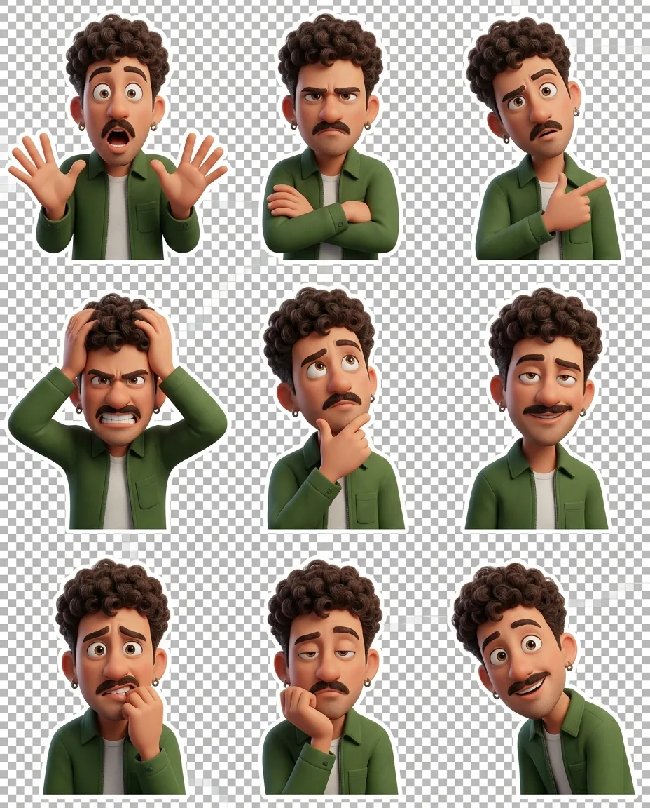

**#282 · Illustration &amp; 3D Prompt · <code>Vinano Image Pro</code>**

<details>
<summary>Show prompt</summary>

```
the uploaded selfie as the ONLY and exclusive face reference, generate a Pixar-style 3D character sticker set. The character must be clearly recognizable as the person from the selfie. Create a neat 3×3 grid collage (nine stickers total). Final aspect ratio is strictly 4:5. Each cell shows a distinct pose and facial expression. Style and tone: Pixar-style 3D animation a meme-oriented feel. Exaggerated, slightly absurd emotions, playful overacting.

Highly readable expressions at small sizes, expressive eyes, eyebrows, and mouth. Subtle hand gestures where appropriate. Background and output: Fully transparent background (PNG). No backdrop, no background shadows. No text, captions, logos, or UI elements. Stickers must be ready for direct use in messengers. Consistency: Same hairstyle, clothing, colors, and character proportions across all nine stickers. Only facial expression and pose change.

Clean, polished 3D sticker look. Emotions (one per sticker, 3×3 grid): Surprised, Annoyed, Confused, Frustrated, Thoughtful, Sarcastic, Worried, Bored, Curious.

Preserve realistic proportions and depth for a confident, professional finish.
```

</details>

---

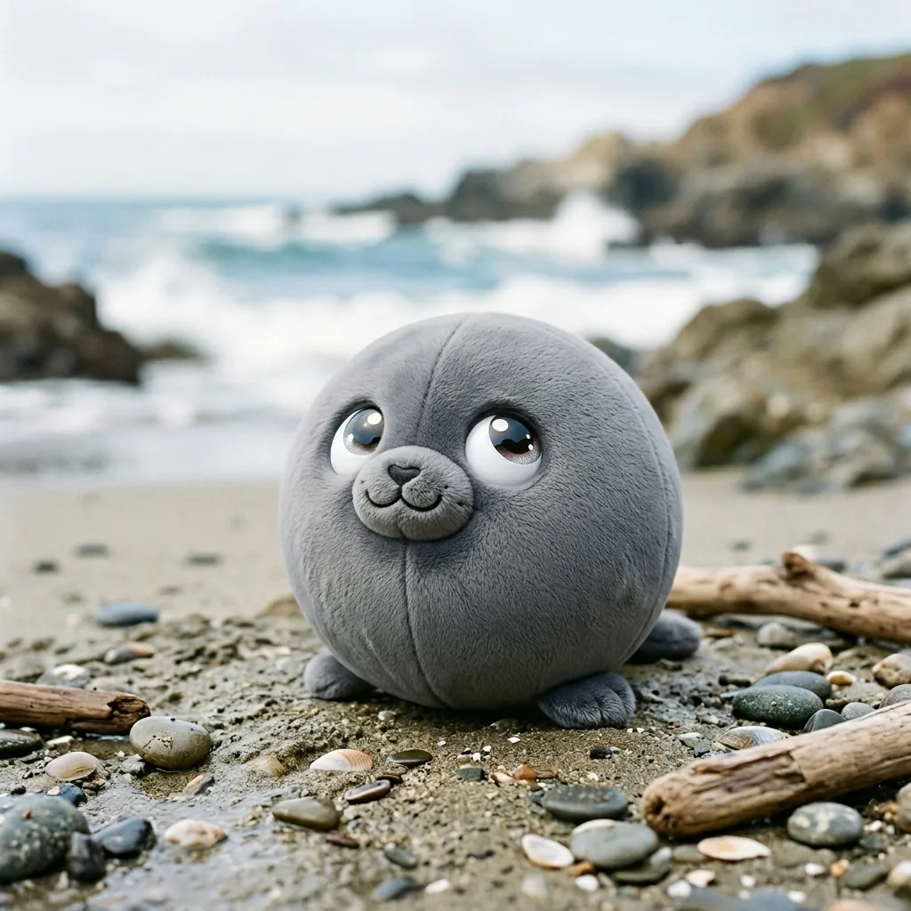

**#283 · Illustration &amp; 3D Prompt · <code>Vinano Image v2</code>**

<details>
<summary>Show prompt</summary>

```
Make a photo of a cute ball-shaped version of a [animal], big adorable over-sized eyes, it has no head, instead its face is part of the ball, its head and body are one. They are in their usual habitat. Must be almost spherical and cartoonishly cute. Its eyes are looking up in the most adorable cheeky fashion. Aim for an editorial, design-driven look with deliberate negative space.
```

</details>

---

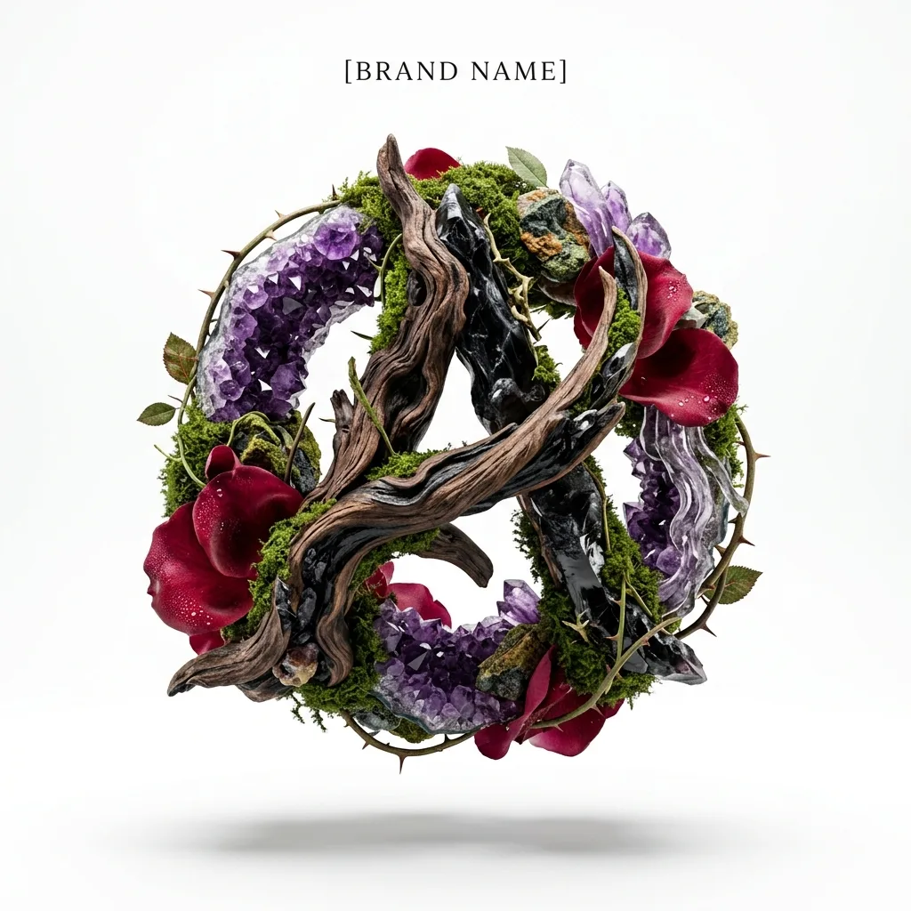

**#284 · Illustration &amp; 3D Prompt · <code>Vinano Image Pro</code>**

<details>
<summary>Show prompt</summary>

```
[BRAND NAME]. Act as a Master of Material Science and World-Class 3D Visualizer.
PHASE 1: DYNAMIC ELEMENTAL RECONSTRUCTION.
The central subject is the iconic logo of [BRAND NAME], physically constructed from ANY raw natural element.
CRITICAL: This includes, but is not limited to, botanical elements (flowers, rose petals, thorns, gnarled wood, moss, leaves) and geological/elemental materials (obsidian, crystals, flowing water, ice, volcanic rock).
The logo must be medium-sized, levitating, and rotated at a dynamic 3D angle (3/4 view) to showcase its volume.
PHASE 2: HYPER-TACTILE TEXTURE & REALISM.
The goal is "Sensory Realism" — the viewer should feel they can touch the object.
- If BOTANICAL: Render microscopic cellular structures on petals, dew droplets refraction, and the velvety fuzz on stems.
- If MINERAL: Render micro-pores, crystalline inclusions, and razor-sharp edges.
Include subtle "imperfections" like dust particles or organic irregularities to break the CG look and achieve 100% photorealism.
PHASE 3: COMPOSITION, LIGHTING & BRANDING.
- ENVIRONMENT: A pure, clinical, solid white background for a High-Key commercial look.
- TYPOGRAPHY: At the top of the frame, place a very small, refined minimalist [BRAND NAME] text logo in black.
- LIGHTING: Precise studio setup sharp specular highlights (glints) and a soft, realistic contact shadow on the white floor below to ground the levitating object.
TECH SPECS:
Extreme Macro photography, 100mm lens, f/8, Ray Tracing (Path Tracing), Subsurface Scattering for light depth, 8k resolution, Unreal Engine 5.4 / Octane Render aesthetic.

Maintain consistent colour harmony and crisp focus across the whole frame.
```

</details>

---

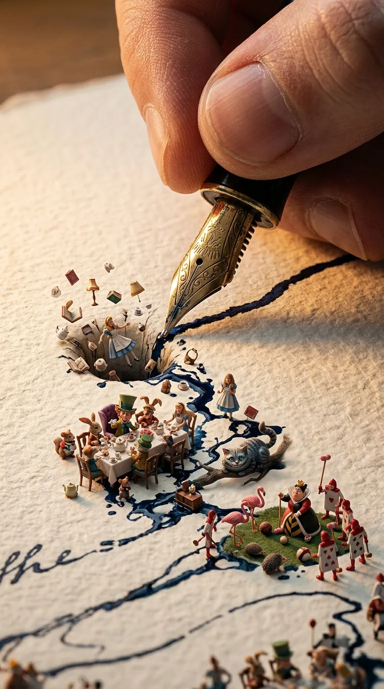

**#285 · Illustration &amp; 3D Prompt · <code>Vinano Image v2</code>**

<details>
<summary>Show prompt</summary>

```
A colossal hand gripping an enormous vintage fountain pen, captured in vertical portrait format (9:16), writing on endless textured paper that fills the frame. Where the ink flows, the story of [BOOK_NAME] bursts into vivid life — [iconic characters, key objects, and signature scenes from [BOOK_NAME] emerging as tiny miniature figures on the paper, each no larger than a fingernail, ultra-miniature scale]. The miniature world cascades downward across the page as the pen moves, characters frozen mid-story, ink still wet at the edges where they emerge. Extreme close-up of the enormous pen nib touching paper, ink bleeding into fiber, fingertips visible skin texture. Warm amber and soft golden light raking across the paper surface, deep shadows, cinematic depth of field, magical realism, hyper-detailed, true-to-life photorealistic, 8K, --ar 9:16 Emphasise material texture and natural light so the final frame feels tactile and premium.
```

</details>

---

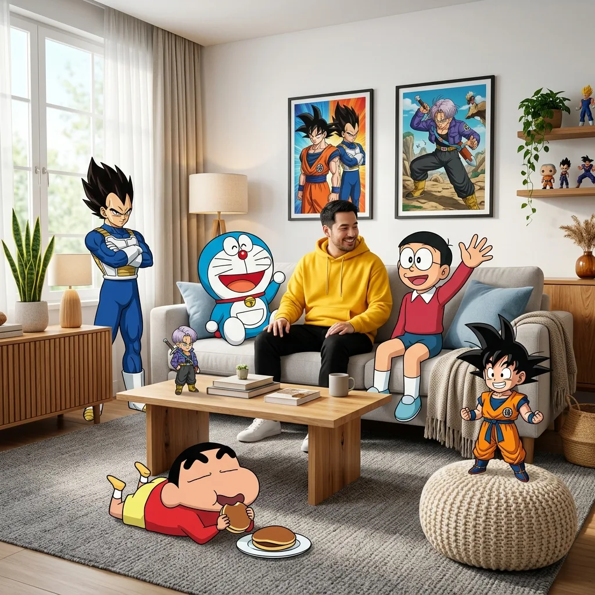

**#286 · Illustration &amp; 3D Prompt · <code>Vinano Image v2</code>**

<details>
<summary>Show prompt</summary>

```
- A high-fidelity, wide-angle interior shot captures a surreal, mixed-media composition within a modern living room. It features a man resembling the face in the reference photo— an uploaded face as a reference—wearing a bright yellow hoodie and black pants, sitting centrally on a plush light gray sofa. The scene seamlessly blends true-to-life photorealistic 3D environments cel-shaded 2D anime and cartoon characters interacting directly the physical space.

On the right side of the subject on the sofa, Nobita sits casually waving his hand, while on the left side, Doraemon leans casually on a pillow. Behind the sofa, two framed posters hang on the white wall—one featuring Son Goku and Vegeta, and the other featuring Trunks in a dynamic anime style. In the foreground, Shinchan lies relaxed on a textured gray carpet near a plate of dorayaki, while a chibi version of Son Goku stands triumphantly on a cream-colored knit pouf. On the left side of the room, Vegeta stands tall on a grooved wooden side table in a confident pose, while a miniature version of Trunks is near the wooden coffee table in the center, as if observing the scene a curious expression.

Soft natural light streams in from the left side through sheer curtains, creating subtle volumetric lighting that accentuates the texture of the blanket, the wood grain of the tiered table, and the leaves of the snake plant in the corner of the room. The entire scene is rendered in 8K resolution sharp focus, vivid colors, and a dreamy, cinematic, and playful aesthetic blending between the real world and the anime world, no AI visible.

Maintain consistent colour harmony and crisp focus across the whole frame.
```

</details>

---

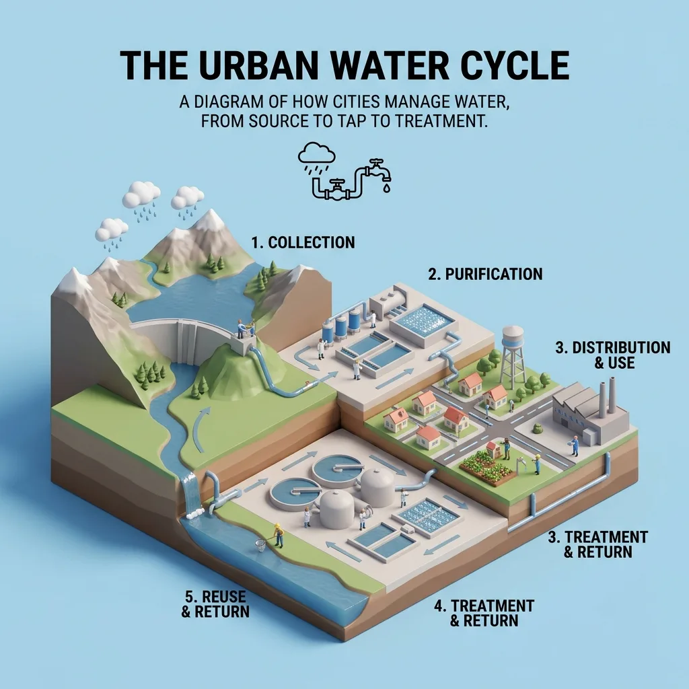

**#287 · Illustration &amp; 3D Prompt · <code>Vinano Image Pro</code>**

<details>
<summary>Show prompt</summary>

```
Create a clear, 45° top-down isometric miniature 3D educational diorama explaining [PROCESS / CONCEPT].

Use soft refined textures, realistic PBR materials, and gentle lifelike lighting.

Build a stepped or layered diorama base showing each stage of the process subtle arrows or paths.

Include tiny stylized figures interacting each stage (no facial details).

Use a clean solid [BACKGROUND COLOR] background.
At the top-center, display [PROCESS NAME] in large bold text, directly beneath it show a short explanation subtitle, and place a minimal symbolic icon below.

All text must automatically match the background contrast (white or black).

Preserve realistic proportions and depth for a confident, professional finish.
```

</details>

---

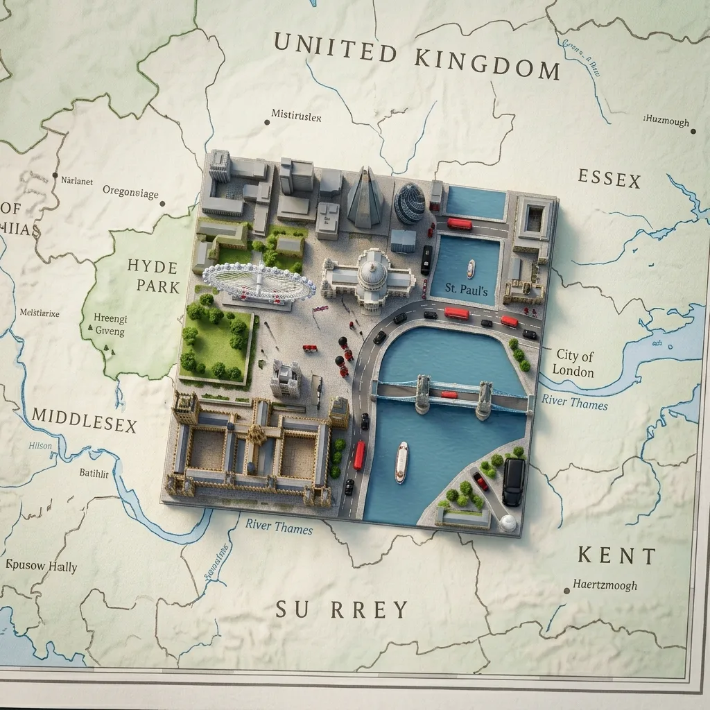

**#288 · Illustration &amp; 3D Prompt · <code>Vinano Image Pro</code>**

<details>
<summary>Show prompt</summary>

```
A realistic, highly detailed geographic map viewed from above, accurately representing the region where [COUNTRY] is located. Rising from the map is a miniature 3D diorama of [CITY], precisely positioned at its real geographic location. The diorama features iconic architecture, natural landmarks, and cultural elements seamlessly emerging from the map surface. Ultra-realistic materials, fine textures, and depth of field. Soft studio lighting subtle shadows, cinematic composition, premium macro photography style. Square 1:1 format, high detail, realistic scale. Keep edges clean and the overall composition balanced for a polished, gallery-ready result.
```

</details>

---

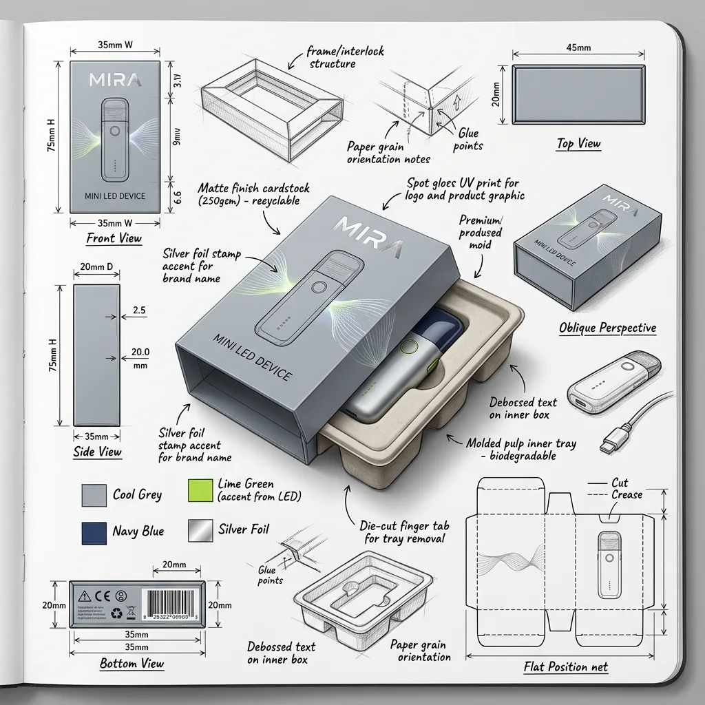

**#289 · Illustration &amp; 3D Prompt · <code>Vinano Image v2</code>**

<details>
<summary>Show prompt</summary>

```
the attached image, create an illustration sheet of professional industrial design packaging for the package (PACKAGE TYPE). A centered heroic 3D rendering realistic materials, soft studio lighting and commercial quality finishes. Surrounded by technical views: front, side, top, bottom, oblique perspective and flat position. Include sketches of the frame structure, crease lines, seam details, and size arrows in millimeters. Show materials and finishes (matte, glossy print, plastic, paper, glass, etc.) in handwritten annotations. Add color swatches, realistic product illustrations, and subtle shadows. Clean sketchbook background, realistic rendering + pencil sketch style, modern design design, ultra-detailed, portfolio ready. Render with rich micro-detail while keeping the layout uncluttered and intentional.
```

</details>

---

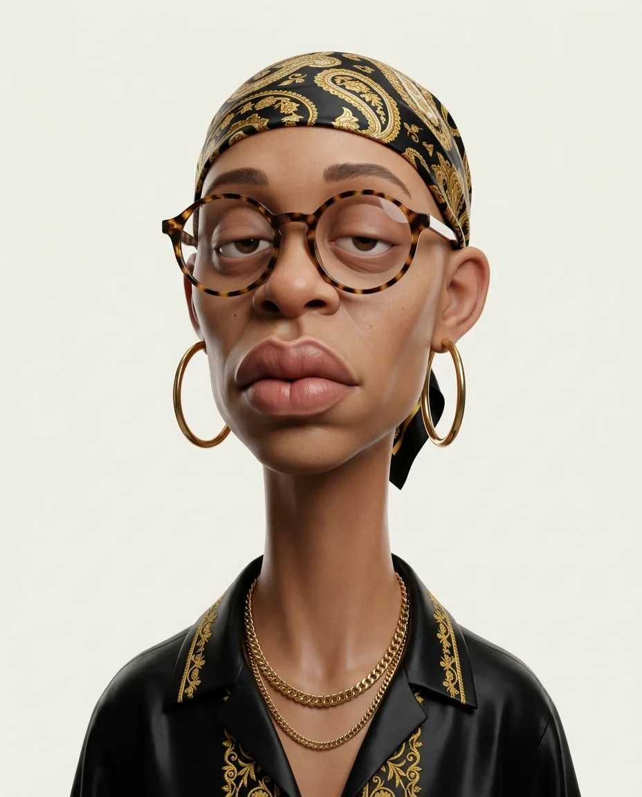

**#290 · Illustration &amp; 3D Prompt · <code>Vinano Image v2</code>**

<details>
<summary>Show prompt</summary>

```
Create an exaggerated stylized 3D caricature character portrait strong intentional deformation and a clean, controlled surface finish. Use the person from the ATTACHED REFERENCE PHOTO. Preserve the subject’s identity, facial likeness, skin tone, and defining features, but reinterpret them into a bold caricatured 3D form an elongated neck, oversized head-to-neck ratio, droopy eyelids, heavy lips, and slightly asymmetrical facial structure.Render as a human-like 3D character smooth, studio-clean skin and intentionally designed detail, avoiding random texture or noise. Style bold accessories such as round or oval glasses, hoop earrings, gold chains, headscarves or bandanas, and street-luxury clothing.

Use neutral studio lighting soft shadows and even illumination, no dramatic contrast, against a plain neutral grey or off-white background. The overall aesthetic should feel weird, fashion-forward, collectible, and character-driven rather than cute or realistic.

Ultra high definition, premium cinematic 3D render quality, hyper-realistic hyper realism, clean materials, no freckles, no dirt, no grain, no noise, no speckling, no text, no logos, no watermarks.

Aspect ratio 4:5.

Emphasise material texture and natural light so the final frame feels tactile and premium.
```

</details>

---

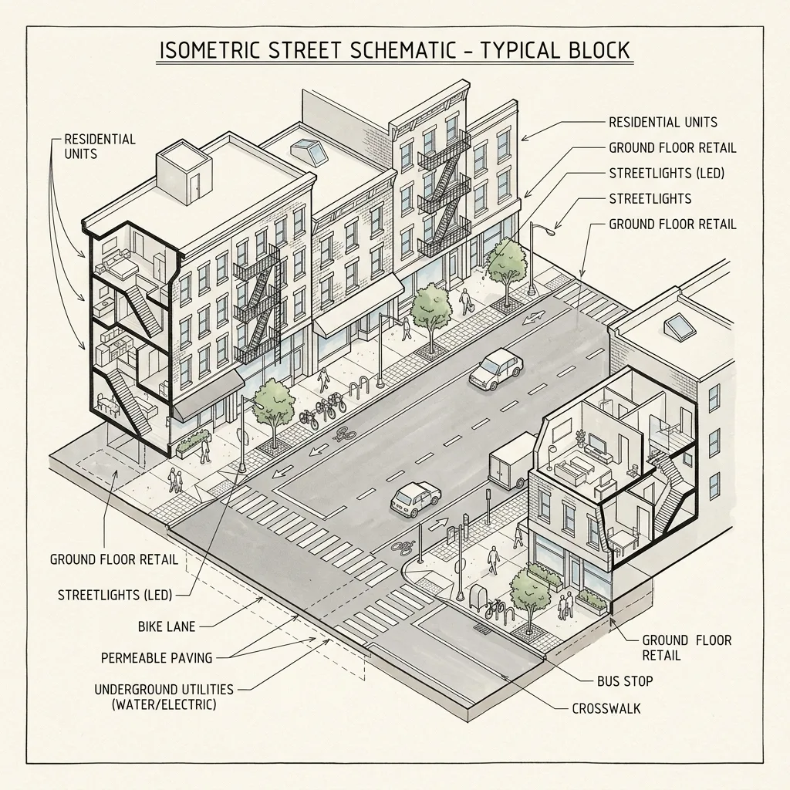

**#291 · Illustration &amp; 3D Prompt · <code>Vinano Image Pro</code>**

<details>
<summary>Show prompt</summary>

```
[Create a hand drawn isometric schematic diagram of this street] Keep edges clean and the overall composition balanced for a polished, gallery-ready result.
```

</details>

---

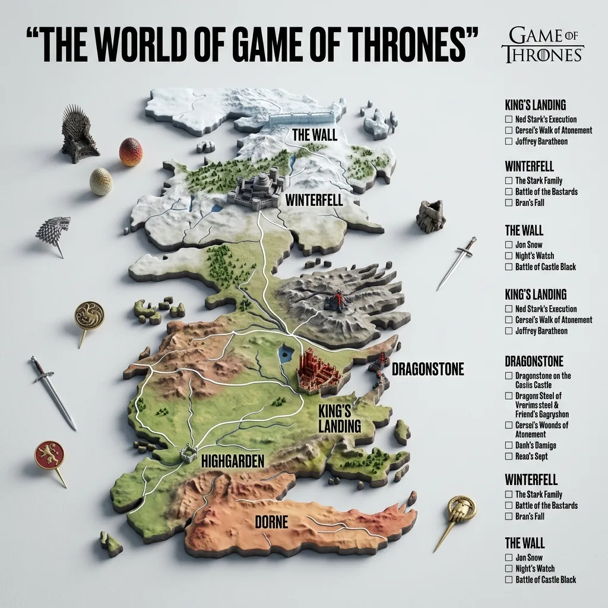

**#292 · Illustration &amp; 3D Prompt · <code>Vinano Image Pro</code>**

<details>
<summary>Show prompt</summary>

```
A hyper-realistic 3D world guide infographic poster for [SHOW]. The fictional world of [SHOW] is rendered as a raised, textured terrain map floating on a clean light gray surface — the map shape and landscape must reflect the actual geography and visual aesthetic of [SHOW] (fantasy kingdoms, post-apocalyptic cities, island archipelagos, ninja villages etc). Iconic locations from [SHOW] are placed as miniature 3D sculpted models at their correct canonical positions across the map — each one highly detailed, true-to-life photorealistic and instantly recognizable to fans. Roads or paths connect key locations as white lines across the terrain. Around the map, floating 3D decorative props and iconic items from [SHOW] are scattered on the light gray surface. The official logo of [SHOW] is shown in the upper right corner. Each major location has a bold black label on the map, and beside the map, each location has a neat checklist of its most iconic characters or moments associated that place, in clean sans-serif typography. A large bold title at the top reads: “THE WORLD OF SHOW” in black uppercase typography [SHOW] in heavy bold. The overall aesthetic is premium editorial — soft studio lighting, true-to-life photorealistic 3D render, white/light gray background, clean layout, 4:5 aspect ratio. Aim for an editorial, design-driven look with deliberate negative space.
```

</details>

---

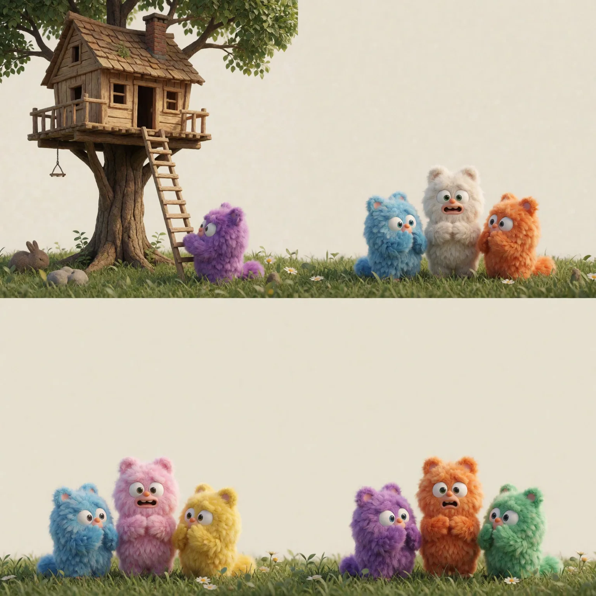

**#293 · Illustration &amp; 3D Prompt · <code>Vinano Flash</code>**

<details>
<summary>Show prompt</summary>

```
Create a funny 4-part story featuring 3 fluffy creatures building a treehouse. The story has emotional highs and lows and ends in a happy moment. Maintain consistent identity across the 3 characters. Generate 4 images in 16:9 format, one at a time. Aim for an editorial, design-driven look with deliberate negative space.
```

</details>

---

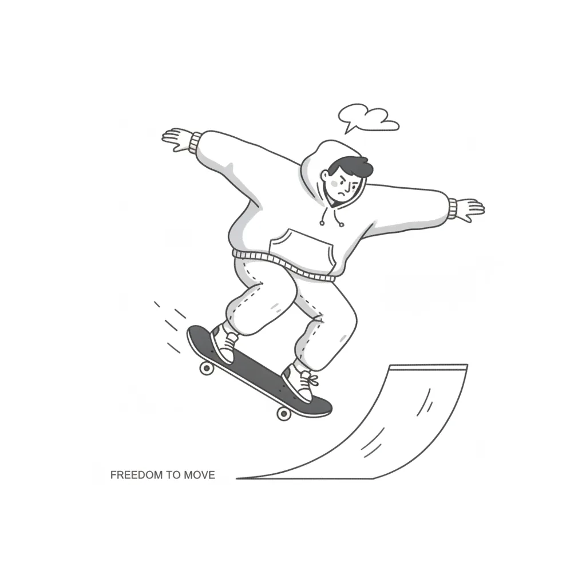

**#294 · Illustration &amp; 3D Prompt · <code>Vinano Image</code>**

<details>
<summary>Show prompt</summary>

```
A simple black-and-white illustration of a [subject] in [outfit], [doing action], a [facial expression] expression, in a Notion-style refined minimalist editorial aesthetic, clean line art, flat monochrome design, simple shapes, subtle hand-drawn feel, minimal detail, expressive posture, clean white background, neat modern layout, soft playful character style Maintain consistent colour harmony and crisp focus across the whole frame.
```

</details>

---

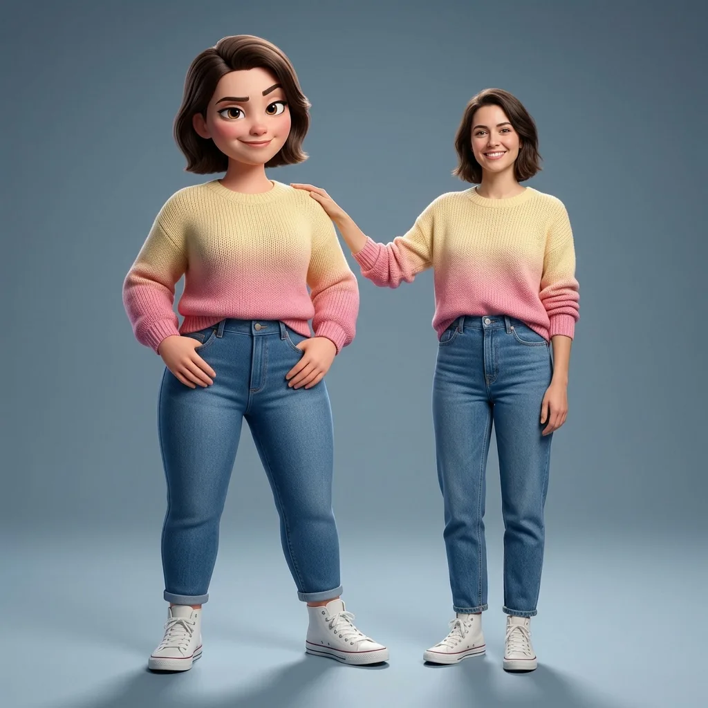

**#295 · Illustration &amp; 3D Prompt · <code>Vinano Image Pro</code>**

<details>
<summary>Show prompt</summary>

```
Ultra-premium-quality hyper-realistic photo featuring a real human and a giant 3D Pixar-style version of THE SAME person — both strictly based on the uploaded reference image. The real person and the Pixar character must have identical facial structure, hairstyle, facial expression, body proportions, height, and clothing.
Both are wearing a knitted sweater a gradient from light yellow to pink, high-waisted blue jeans, and white high-top sneakers.
The pose must exactly match the reference: the real person stands relaxed a friendly smile, their hand naturally resting on the shoulder of the Pixar character. The Pixar version stands slightly wider, arms confidently positioned near the pockets, a playful sly smirk, one raised eyebrow, and expressive Pixar-style eyes.
The Pixar character should be proportionally larger, but anatomically identical to the real person. The facial expression, head tilt, posture, and body language must precisely replicate the reference image.
Clean gray-blue studio background, soft even studio lighting, realistic shadows, crisp fabric texture, smooth Pixar-style skin shading, cinematic sharpness.
DO NOT change the pose, reaction, clothing, or proportions. Strict adherence to the reference.

Emphasise material texture and natural light so the final frame feels tactile and premium.
```

</details>

---

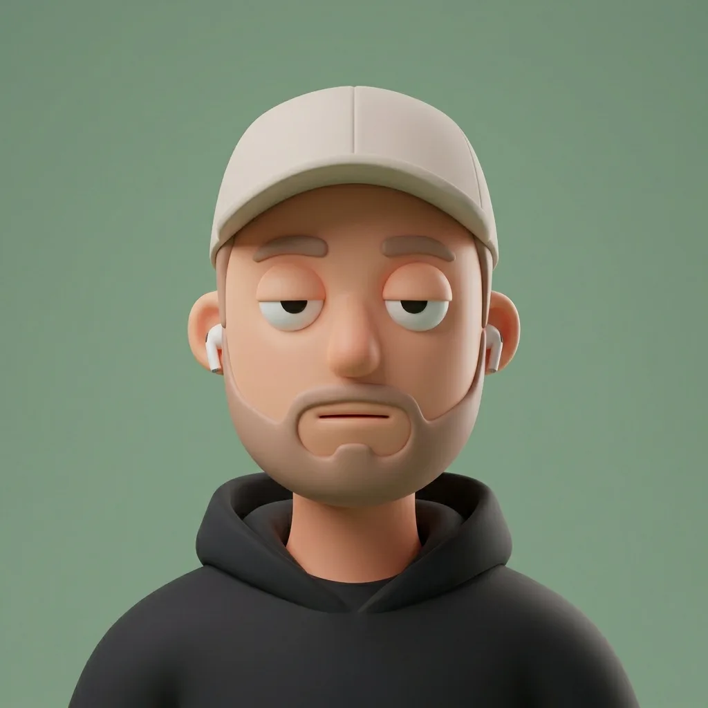

**#296 · Illustration &amp; 3D Prompt · <code>Vinano Image v2</code>**

<details>
<summary>Show prompt</summary>

```
{
 "task": "image_style_transfer_3d_character",
 "input": {
 "source_image": "USER_UPLOADED_IMAGE",
 "preserve_identity": true,
 "preserve_pose": true,
 "preserve_composition": true
 },
 "style_reference": {
 "render_style": "stylized_3d_character",
 "aesthetic": "soft_minimal_cartoon_3d",
 "inspiration": ["pixar_like_but_more_minimal",
 "toy_figure_render",
 "clean_product_character_design"]
 },
 "character_design": {
 "skin": {
 "material": "smooth_matte_plastic",
 "texture": "soft_uniform",
 "subsurface_scattering": "gentle"
 },
 "facial_features": {
 "eyes": "half_closed_bored_expression",
 "eyelids": "heavy",
 "nose": "rounded_simplified",
 "mouth": "flat_neutral",
 "ears": "simplified_rounded"
 },
 "emotion": "unimpressed_calm_bored"
 },
 "clothing": {
 "style": "minimal_streetwear",
 "details": "no_logos_no_patterns",
 "fabric": "soft_matte"
 },
 "accessories": {
 "headwear": "simple_baseball_cap_optional",
 "ear_accessories": "wireless_earbuds_optional"
 },
 "lighting": {
 "setup": "studio_softbox",
 "shadows": "very_soft",
 "contrast": "low",
 "highlights": "subtle"
 },
 "background": {
 "type": "solid_color",
 "color_palette": ["muted_green",
 "pastel_tone"],
 "gradient": "none"
 },
 "camera": {
 "angle": "front_facing",
 "framing": "medium_close_up",
 "lens": "50mm_equivalent",
 "distortion": "none"
 },
 "render_quality": {
 "resolution": "high",
 "edges": "clean",
 "noise": "none",
 "realism_balance": "stylized_over_realistic"
 },
 "output": {
 "consistency": "high",
 "style_strength": "strong",
 "photorealism": false
 }
}

Aim for an editorial, design-driven look with deliberate negative space.
```

</details>

---

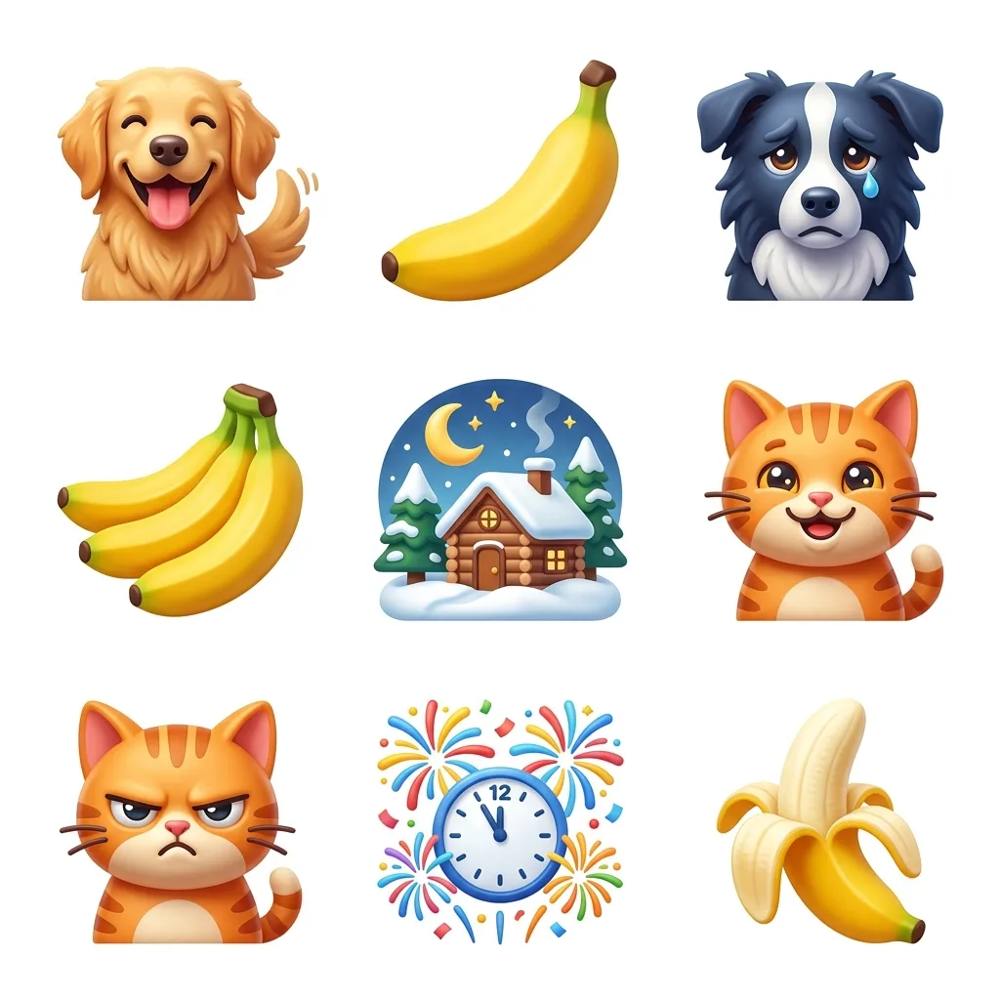

**#297 · Illustration &amp; 3D Prompt · <code>Vinano Image Pro</code>**

<details>
<summary>Show prompt</summary>

```
Create a collection of icons representing [a theme], they belong together as a single theme. Put them in a 3x3 grid. The background is white. Make the icons in a colorful and tactile 3D style. No text.

- dogs different emotions
- bananas
- January
- the same cat in different emotions

Maintain consistent colour harmony and crisp focus across the whole frame.
```

</details>

---

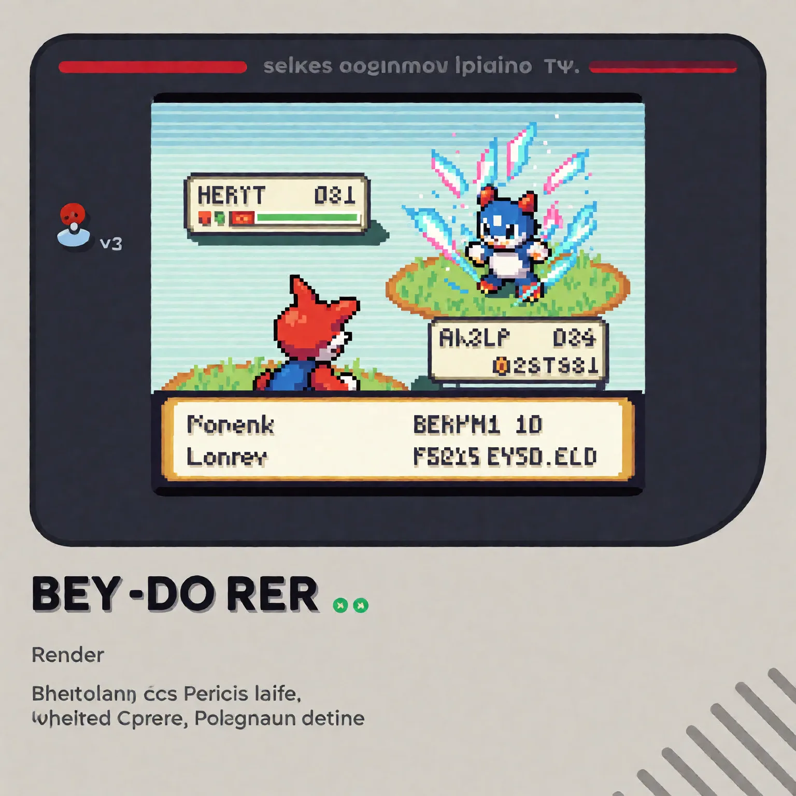

**#298 · Illustration &amp; 3D Prompt · <code>Vinano Flash</code>**

<details>
<summary>Show prompt</summary>

```
inspired by a classic pokemon gameboy screenshot but it's highly detailed beautiful pixel art, include cool effects from moves used, modern minimal ui Render with rich micro-detail while keeping the layout uncluttered and intentional.
```

</details>

---

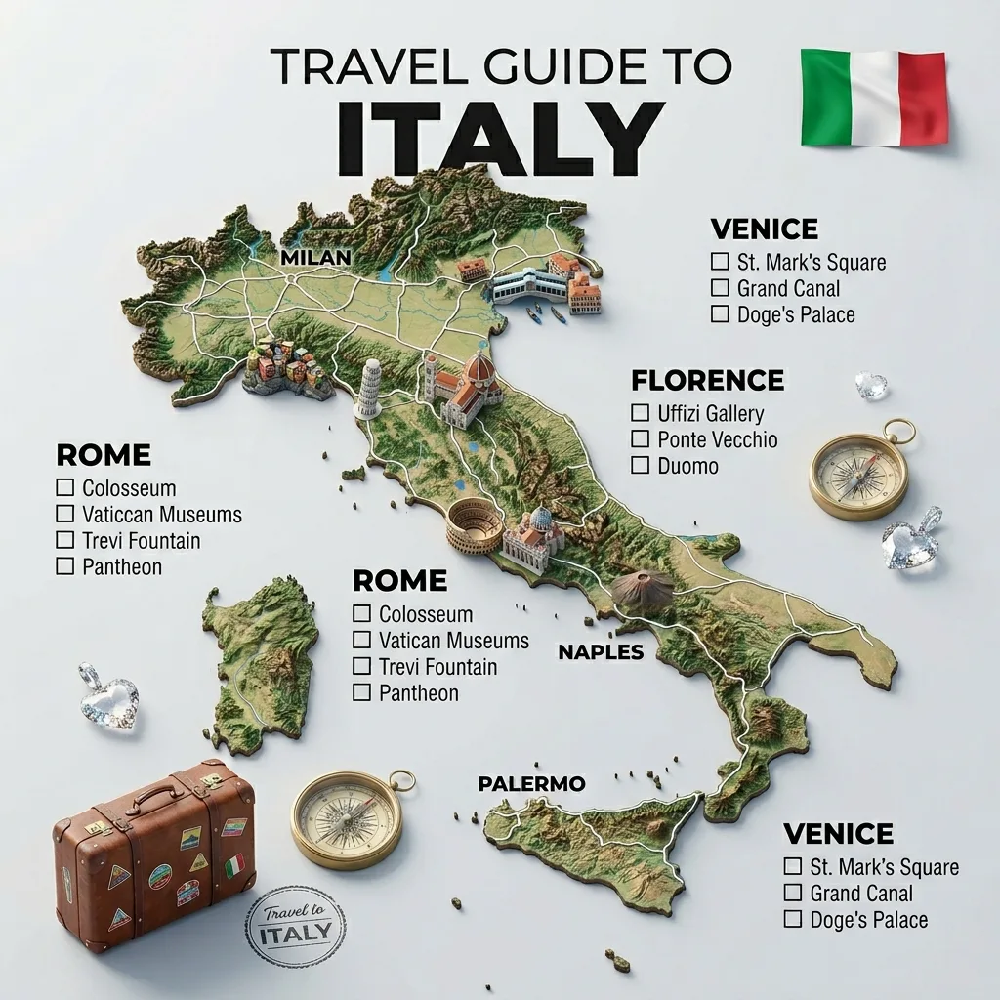

**#299 · Illustration &amp; 3D Prompt · <code>Vinano Image Pro</code>**

<details>
<summary>Show prompt</summary>

```
A hyper-realistic 3D travel guide infographic poster for [COUNTRY]. The country shape is rendered as a raised, textured terrain map floating on a clean light gray surface. Iconic landmarks are placed as miniature 3D sculpted models at their correct geographic locations across the map — each one highly detailed and true-to-life photorealistic. Roads or railway lines connect key cities as white paths across the terrain. Around the map, floating 3D decorative props related to travel are scattered: a vintage leather suitcase travel stickers, a compass rose, crystal heart charms, and a postage stamp seal reading “Travel to COUNTRY.” The national flag of [COUNTRY] is shown as a small realistic folded flag in the upper right corner. Each major city has a bold black label on the map, and beside the map, each city has a neat checklist of its top attractions in clean sans-serif typography. A large bold title at the top reads: “TRAVEL GUIDE TO “COUNTRY”” in black uppercase typography the word [COUNTRY] in heavy bold. The overall aesthetic is premium editorial travel content — soft studio lighting, true-to-life photorealistic 3D render, white/light gray background, clean layout. Render with rich micro-detail while keeping the layout uncluttered and intentional.
```

</details>

---

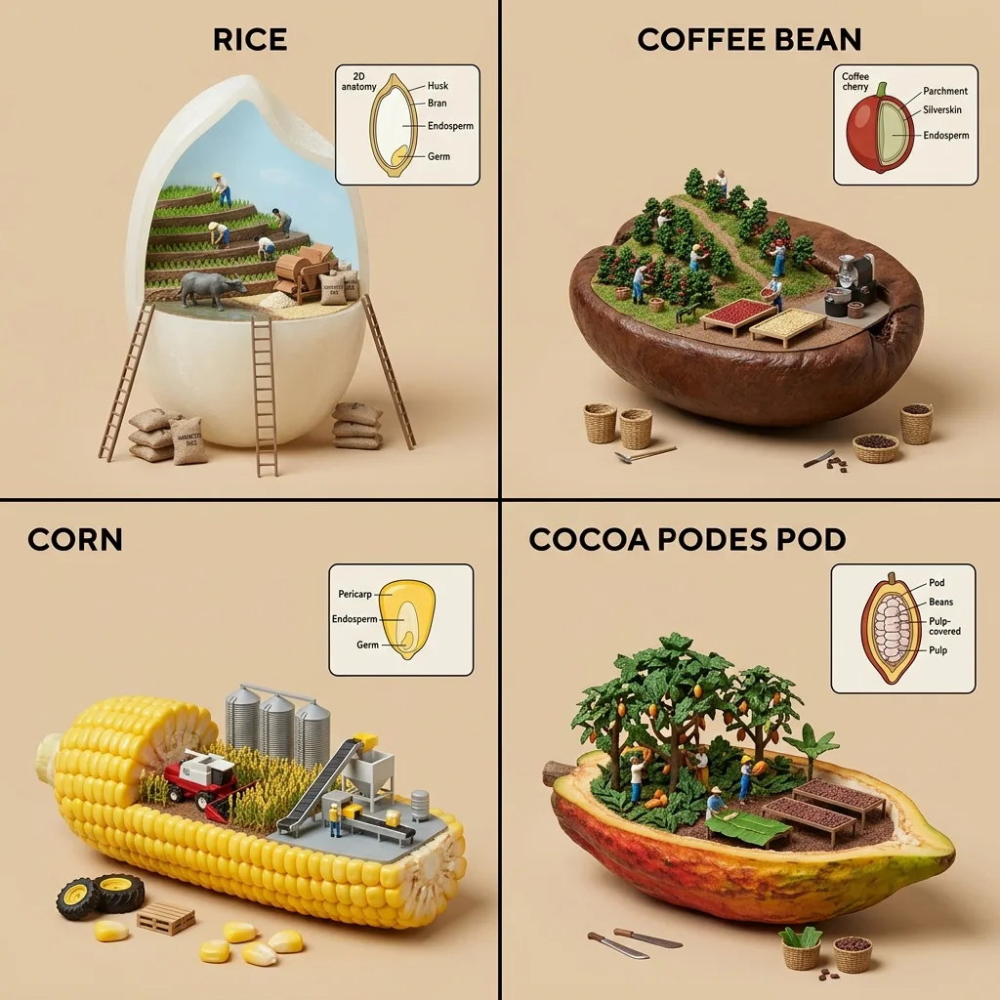

**#300 · Illustration &amp; 3D Prompt · <code>Vinano Image Pro</code>**

<details>
<summary>Show prompt</summary>

```
2x2 grid, do this for 4 common ingredients (like rice, diamond): render_target = (giant_sliced_open_[product_name] * 2.0) + (inferred_harvesting_and_processing_diorama_inside * 1.8) + (miniature_1:87_scale_plastic_workers * 1.5) + (floating_2d_anatomy_diagram_box_top_right * 2.0) + (tiny_ladders_and_sacks_exterior * 1.0) + (clean_beige_studio_background * 1.2) - (life_size_humans / 2.0) - (cluttered_background / 2.0) - (3d_rendered_ui_box) Preserve realistic proportions and depth for a confident, professional finish.
```

</details>

---

[Next page →](./illustration-3d-4.md)
