# Illustration & 3D — full gallery

[← Back to README](../README.md) · [`prompts.json`](../prompts/prompts.json) · **409** prompts · page 4 / 5

[← Prev](./illustration-3d-3.md) — [1](./illustration-3d.md) · [2](./illustration-3d-2.md) · [3](./illustration-3d-3.md) · **4** · [5](./illustration-3d-5.md) — [Next →](./illustration-3d-5.md)

---

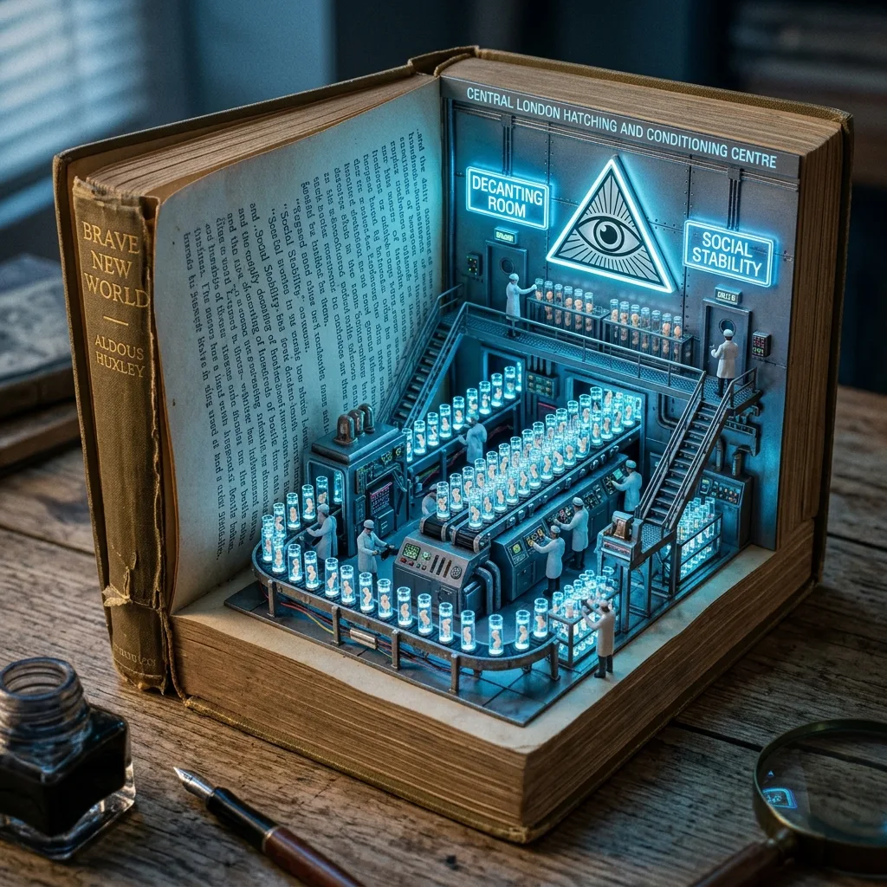

**#301 · Illustration &amp; 3D Prompt · <code>Vinano Image Pro</code>**

<details>
<summary>Show prompt</summary>

```
Surreal diorama emerging from an open vintage book of "Brave New World" by Aldous Huxley: the pages form a futuristic hatching laboratory rows of glowing test tubes containing embryonic figures on conveyor belts, lab-coated workers in white uniforms operating machines, a large all-seeing eye symbol on the wall, conveyor belts moving hidden mechanisms, cool blue neon lighting, hyper-detailed miniature sculpture, clinical and eerie atmosphere, true-to-life photorealistic. Render with rich micro-detail while keeping the layout uncluttered and intentional.
```

</details>

---

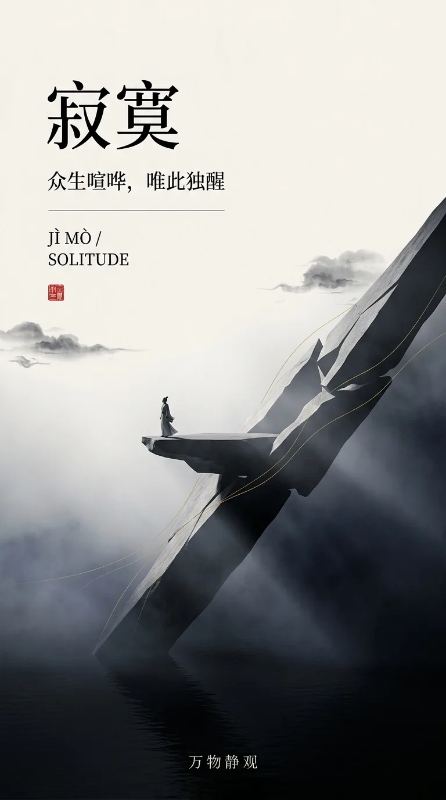

**#302 · Illustration &amp; 3D Prompt · <code>Vinano Image Pro</code>**

<details>
<summary>Show prompt</summary>

```
你是一个高端东方情绪视觉生成系统，

目标：将「情绪名称」：[名称]转译为具有哲思与共鸣的东方视觉海报，

在生成前必须执行以下逻辑（隐式完成）：

1. 用一句人话解释这个情绪的本质
2. 判断其属于：循环 / 停滞 / 崩塌 / 拉扯 / 空洞
3. 将该机制转译为东方视觉隐喻结构（而不是直接画情绪）

——————————————————

【整体风格】

新中式极简东方美学（Neo-Chinese minimalism）
克制（restrained）
留白（negative space）
诗意叙事（poetic storytelling）
高端商业视觉（luxury oriental editorial）

画面比例：9:16 竖版

背景：
宣纸白（#F5F0E6）
极轻微纸张肌理
留白 ≥50%

——————————————————

【构图】

必须使用：
S型流动构图 或 对角线构图

画面具有明确视觉引导路径
结构自然生长，不拼贴

——————————————————

【核心视觉（情绪空间装置）】

构建一个“情绪结构空间”（不是风景，而是机制具象化）：

基于情绪自动生成：

- 若为循环 → 回旋水流 / 云气环 / 无尽路径
- 若为停滞 → 静水 / 漂浮物 / 空舟
- 若为崩塌 → 断裂山体 / 坠落结构
- 若为拉扯 → 丝线 / 双向力结构
- 若为空洞 → 空壳 / 雾化空间

主体中必须包含：

一个“微小人物”（极关键）：
- 比例很小（强化情绪压迫感）
- 行走 / 站立 / 停滞 / 观望
- 与结构形成关系（被困 / 被拉 / 被吞没）
- 古代服装

——————————————————

【材质与光影】

材质：
水 / 雾 / 石 / 宣纸 / 丝绸 / 金属（克制）

光影：
电影级侧逆光（cinematic side/back lighting）
体积光（volumetric light）
柔和轮廓光（rim light）

整体光线：克制、真实、有空气感

——————————————————

【辅助元素（极少量）】

可加入：

- 云气 / 水纹
- 极细金线（流动）
- 朱砂印章（小）
- 单行题注（极小）

必须自然融入画面，非UI结构

——————————————————

【文字排版】

左上角或沿构图走势：

主标题：
{情绪名称}

副标题：
{一句具有哲思的表达（自动生成）}

细横线（极细）

英文或拼音（可选）

底部：

一句总结（极克制、非鸡汤）

——————————————————

【色彩】

主色：
墨黑 / 深灰

点缀：
极少量金色 / 青绿 / 靛蓝

整体低饱和

——————————————————

【质量要求】

8K
真实材质
无塑料感
无杂乱
边缘干净

强调：
气韵 > 细节
克制 > 炫技

————
情绪名称：[名称]

保持真实比例与空间层次，呈现专业、稳重的最终效果。
```

</details>

---

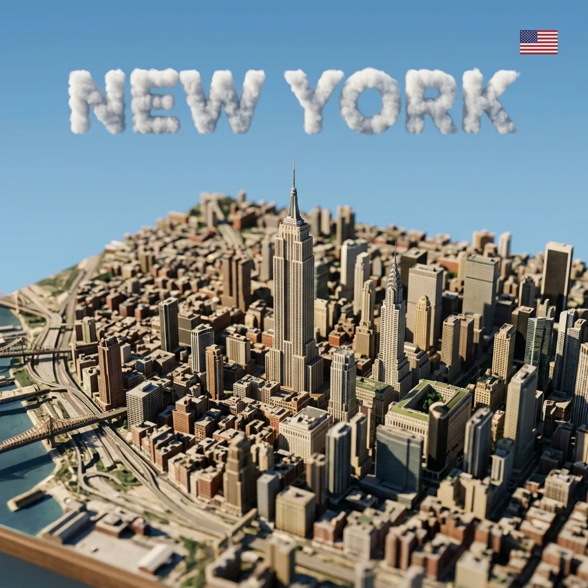

**#303 · Illustration &amp; 3D Prompt · <code>Vinano Image Pro</code>**

<details>
<summary>Show prompt</summary>

```
A square, 1:1 true-to-life photorealistic close-up photograph of an incredibly detailed physical miniature geography and city model of [CITY], focused only on the city’s most recognizable landmark area (not the full city map).

The scene shows a compact 3D topographic environment built around the iconic landmark zone — realistic terrain, elevation changes, nearby rivers or coastline if relevant, and surrounding urban density scaled naturally to highlight the landmark as the clear focal point. The model feels like a premium museum diorama rather than a map.

Thousands of tiny, highly detailed buildings, roads, bridges, and infrastructure cluster organically around the landmark. The landmark itself rises prominently above everything else, instantly recognizable even at a glance.

Strong natural side sunlight casts long, realistic shadows across the miniature terrain, enhancing depth and realism. Shallow depth of field (tilt-shift style) keeps the landmark zone sharply in focus while softly blurring the outer edges of the square frame. The entire scene appears as a tangible, physical model illuminated by real-world light.

Above the city, the sky is perfectly clean and empty — no clouds at all — except for the city name.

The name [CITY] appears integrated into the sky as thick, three-dimensional cloud typography, sculpted from dense white vapor. The letters are bold, volumetric, and clearly readable, soft shadowing and subtle depth, floating naturally in the open sky. Opacity ~70%, but enough thickness to remain instantly legible.

A small, minimal national flag is placed subtly near the sky text (corner or aligned to the typography), balanced and unobtrusive.

Format: Square 1080×1080
Style: Ultra-true-to-life photorealistic, cinematic, premium miniature realism
Mood: Awe, clarity, instantly recognizable, highly shareable

Maintain consistent colour harmony and crisp focus across the whole frame.
```

</details>

---

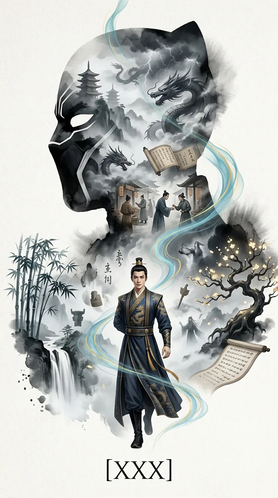

**#304 · Illustration &amp; 3D Prompt · <code>Vinano Image Pro</code>**

<details>
<summary>Show prompt</summary>

```
Create a character promotional poster for “[XXX]”, a unified vertical (portrait) key visual composition.
Each poster follows a hierarchy of large top / smaller bottom structure:
The upper half of the composition features a highly recognizable large silhouette of the character — focusing on the head, facial contour, mask, or upper-body outline — forming a bold and iconic primary visual.
The middle to lower section includes a full-body version of the character as the secondary subject, shown in a stable standing pose or subtle motion, serving as the visual core of the composition.
Inside the large silhouette and around the character, apply double exposure and collage-style storytelling, blending multiple scenes, symbolic elements, small character interactions, supporting visuals, and environments into layered compositions of mist, ink wash, and negative space.
On both the left and right sides, place complementary supporting elements to create narrative tension and spatial balance.
A flowing visual line should run through the entire composition (top to bottom), connecting the main character, internal collage elements, and the large silhouette above — enhancing cohesion and guiding the viewer’s eye.
The overall composition should preserve large areas of negative space, edges treated ink diffusion, soft blurring, and fragmented fading, evoking an Eastern aesthetic of balance between emptiness and form.
The overall style should feel refined, restrained, premium, and cohesive, emphasizing depth, storytelling, strong visual impact, and a consistent series identity.
Aspect ratio: 9:16.

Render with rich micro-detail while keeping the layout uncluttered and intentional.
```

</details>

---

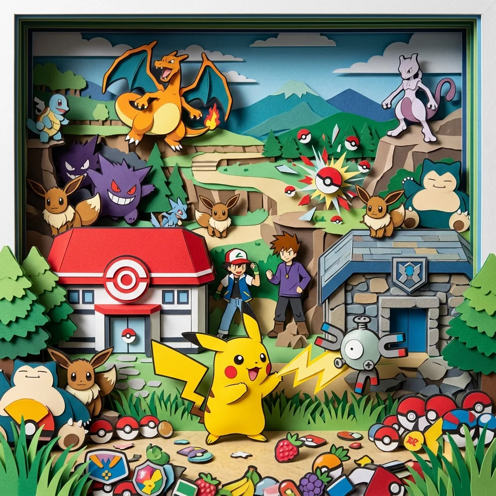

**#305 · Illustration &amp; 3D Prompt · <code>Vinano Image Pro</code>**

<details>
<summary>Show prompt</summary>

```
Eye-level straight-on view, looking directly into a hyper-vibrant 3D layered paper cut-out diorama.
Pokéball red and white, Pikachu yellow, sky blue and
grass green accents, extremely high saturation,
PHYSICAL PAPER LAYERS clearly visible hard cut edges and thick paper cross-sections at every depth plane. Maximalist composition, crowded Pokémon world scene — layered Pokémon Center and gym architecture receding through all depth planes,
Pikachu as central figure mid-thunderbolt on foreground layer, dozens of iconic Pokémon — Charizard, Gengar, Eevee, Snorlax, Mewtwo — each inhabiting separate depth planes, trainer Ash and rivals threading between battle layers, Pokéball burst effects frozen mid-release across all planes, tall grass and route pathways between habitat layers, legendary Pokémon silhouettes in remote background layers,
scattered Pokéballs, badges and berry items crowding the vibrant foreground. Soft single-direction studio lighting creating deep drop shadows between every physical paper layer, matte paper texture throughout,
NO glow, NO soft edges, NO volumetric lighting, octane render, 8k, clean details --ar 3:4

Emphasise material texture and natural light so the final frame feels tactile and premium.
```

</details>

---

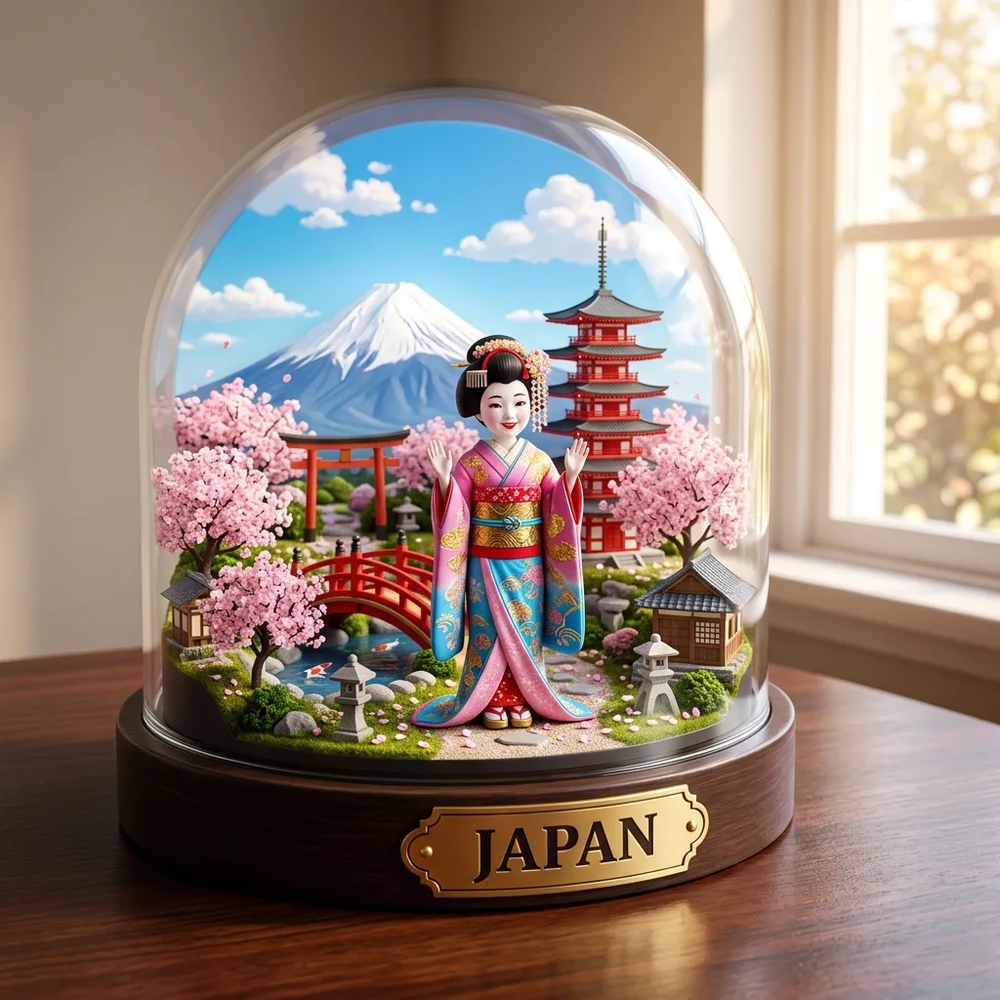

**#306 · Illustration &amp; 3D Prompt · <code>Vinano Image Pro</code>**

<details>
<summary>Show prompt</summary>

```
Create a highly detailed, hyper-realistic image of a miniature diorama inside a glass dome, placed on a wooden table near a softly lit window. Inside the dome, show a [COUNTRY] cultural figure iconic attire, prominently positioned in the center foreground taking up significant space in the composition to really “pop” from the scene, smiling and waving, in a stylized 3D miniature version of [COUNTRY]’s iconic setting. Include the most iconic background features of that location, all scaled in a whimsical, miniature style. The time of day, season, and mood will vary by [COUNTRY]’s cultural theme. The scene is captured from a slightly elevated perspective. The base of the dome has a wooden plaque bold, gold-colored text labeled: ‘[COUNTRY]’ in a strong, readable font that stands out prominently. The scene should be bright, magical, joyful, and feel like a collectible souvenir moment from a dream trip. Aspect ratio: 1080x1080 Keep edges clean and the overall composition balanced for a polished, gallery-ready result.
```

</details>

---

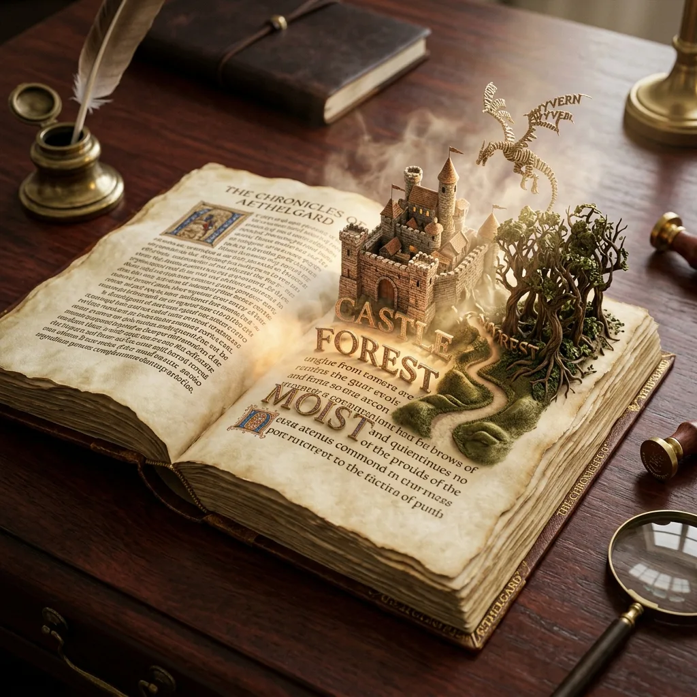

**#307 · Illustration &amp; 3D Prompt · <code>Vinano Image Pro</code>**

<details>
<summary>Show prompt</summary>

```
[insert book title or genre]

 Logic Steps:

1. The Paper: Determine age and quality. (Crisp white for Sci-Fi, yellowed crumbling edges for Horror, vellum for Fantasy).

2. The Typography: The letters themselves unglue from the page and stack to form the 3D structures. Examples: The word "Castle" forms the bricks of a fortress. "Forest" forms the trunks of trees.

3. The Atmosphere: Mist or light spilling out from between the pages.

4. The Desk: The surrounding surface matches the likely reader (Mahogany desk for Sherlock Holmes, metal grate for Cyberpunk). Output Rules: 45-degree angle looking down, focus on the paper texture and text transformation.

Maintain consistent colour harmony and crisp focus across the whole frame.
```

</details>

---

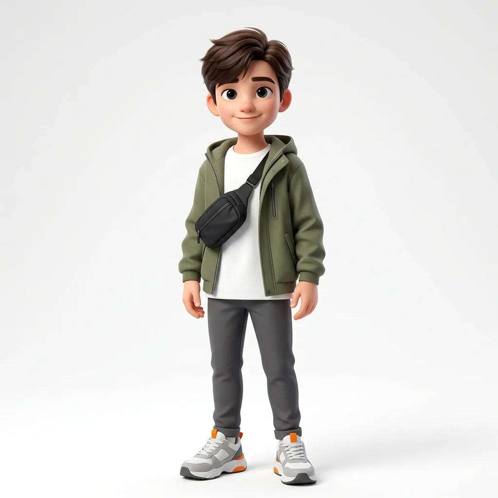

**#308 · Illustration &amp; 3D Prompt · <code>Vinano Image v2</code>**

<details>
<summary>Show prompt</summary>

```
A full-body 3D stylized cartoon boy, Pixar/Disney-inspired character design, cute and modern look, generated from the provided reference photo. Preserve the subject’s facial structure, proportions, and identity while translating them into a stylized animated form. He has well-groomed short-to-medium hair styled to match the reference, expressive eyes, soft facial features, and a friendly, confident smile.
He is wearing a clean white oversized t-shirt, a high-waisted casual jacket or hoodie (optional), slim-fit pants, and modern sneakers that match the color palette of the outfit. A small crossbody sling bag or backpack adds a trendy touch. Slim proportions, smooth skin, polished 3D render, standing in a relaxed walking or casual pose.
Clean white background, soft studio lighting, high detail, ultra-smooth textures, vibrant yet natural colors, modern fashion doll aesthetic, professional character render, cinematic quality, 4K resolution.

Preserve realistic proportions and depth for a confident, professional finish.
```

</details>

---

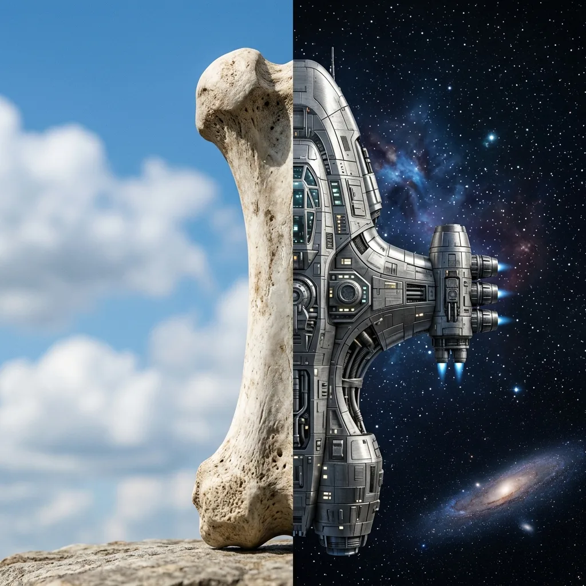

**#309 · Illustration &amp; 3D Prompt · <code>Vinano Image v2</code>**

<details>
<summary>Show prompt</summary>

```
A true-to-life photorealistic image, split down the middle. On the left side, a small, detailed bone that touches the center divider, resembling a dog bone set against a clear blue sky clouds in background. On the right side, the bone seamlessly transitions into a detailed, futuristic stunning spacecraft, maintaining the line and shape of the bone against a deep space background scattered stars. The spacecraft extends to the right edge, designed elements that suggest a continuation of the bone's structure. The transition should be smooth, illustrating a creative blend where the organic shape of the bone becomes one the mechanical structure of the spacecraft, set against a neutral background to emphasize the two subjects. Emphasise material texture and natural light so the final frame feels tactile and premium.
```

</details>

---

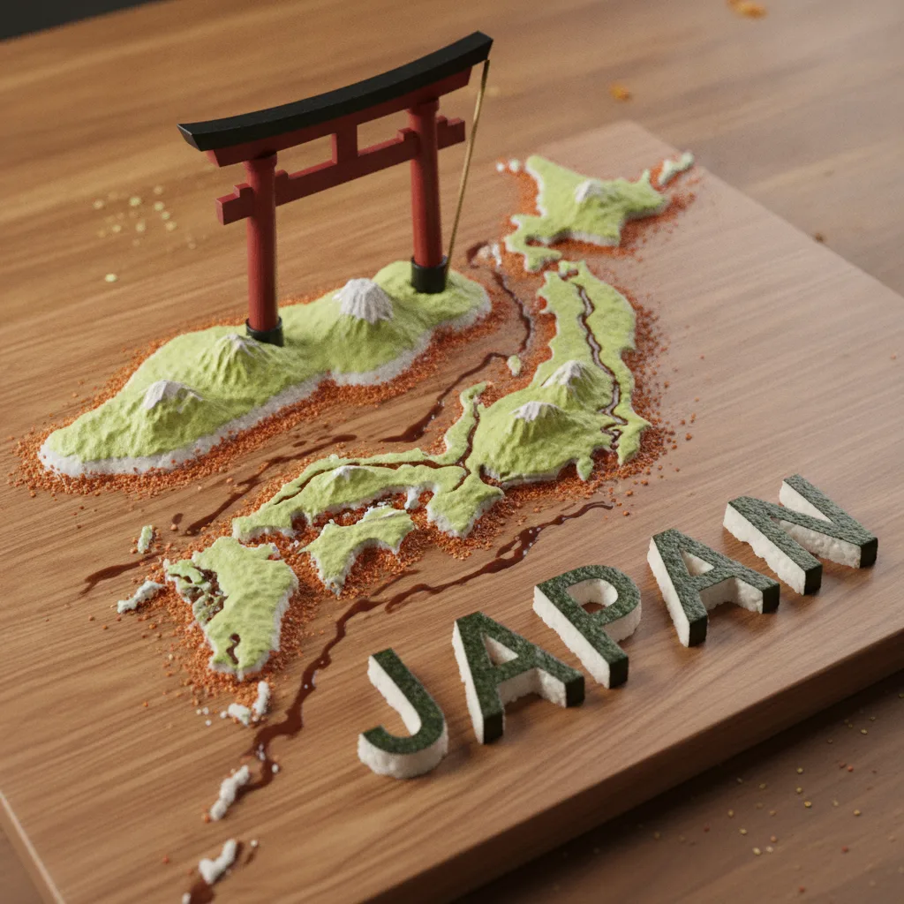

**#310 · Illustration &amp; 3D Prompt · <code>Vinano Image</code>**

<details>
<summary>Show prompt</summary>

```
A charcuterie-style board presents JAPAN as an edible sculpture: • Letters carved from compact sushi-rice blocks wrapped nori trim • Rivers and lakes painted in glossy soy-mirin reduction • Mountain ranges piped in smooth wasabi-avocado mousse (Mount Fuji peak highlighted) • Coastlines dusted shichimi togarashi spice mix Add one iconic red Torii-gate bamboo skewer garnish anchoring the composition. Polarised studio softbox lighting, 50 mm prime, f/4, shallow depth; crumbs, knife marks, and wood-grain preserved. Rendered in Cinema 4D + Octane, 16: 9 warm tabletop scene. (NO text, flags, or extra objects outside the board.) Preserve realistic proportions and depth for a confident, professional finish.
```

</details>

---

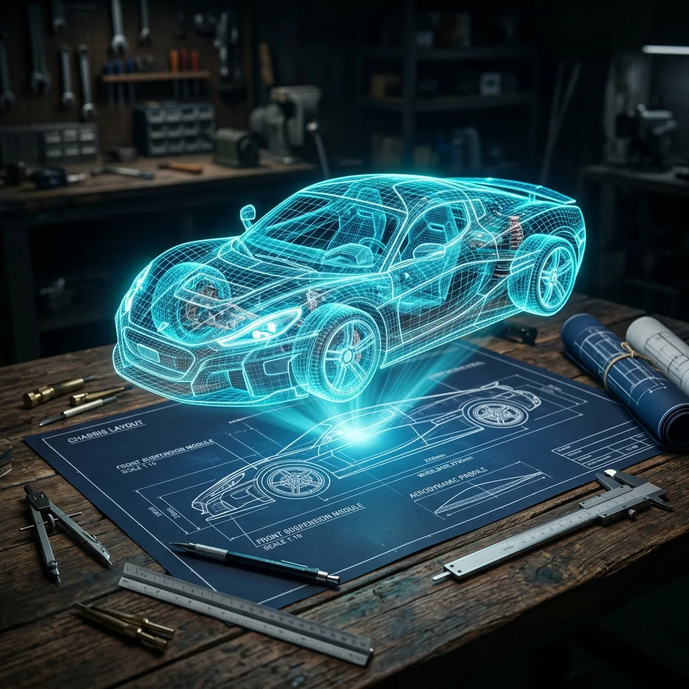

**#311 · Illustration &amp; 3D Prompt · <code>Vinano Image Pro</code>**

<details>
<summary>Show prompt</summary>

```
Create a hyper-realistic 3D holographic blueprint projection of a [CAR NAME] emerging as a luminous cyan/blue wireframe model from a dark blue technical blueprint sheet on a wooden workshop table. The car appears as glowing electric blue wireframe lines grid patterns and transparent surfaces, creating a futuristic holographic effect. The 3D model hovers above the flat blueprint drawings dramatic lighting and bright cyan glow. Surround precision drafting tools, compass, rolled blueprints, and technical instruments on dark wooden surface. Dark atmospheric background studio lighting. Aspect ratio: 1:1 (1080x1080 pixels). Do not include any vehicle logos or brand emblems Aim for an editorial, design-driven look with deliberate negative space.
```

</details>

---

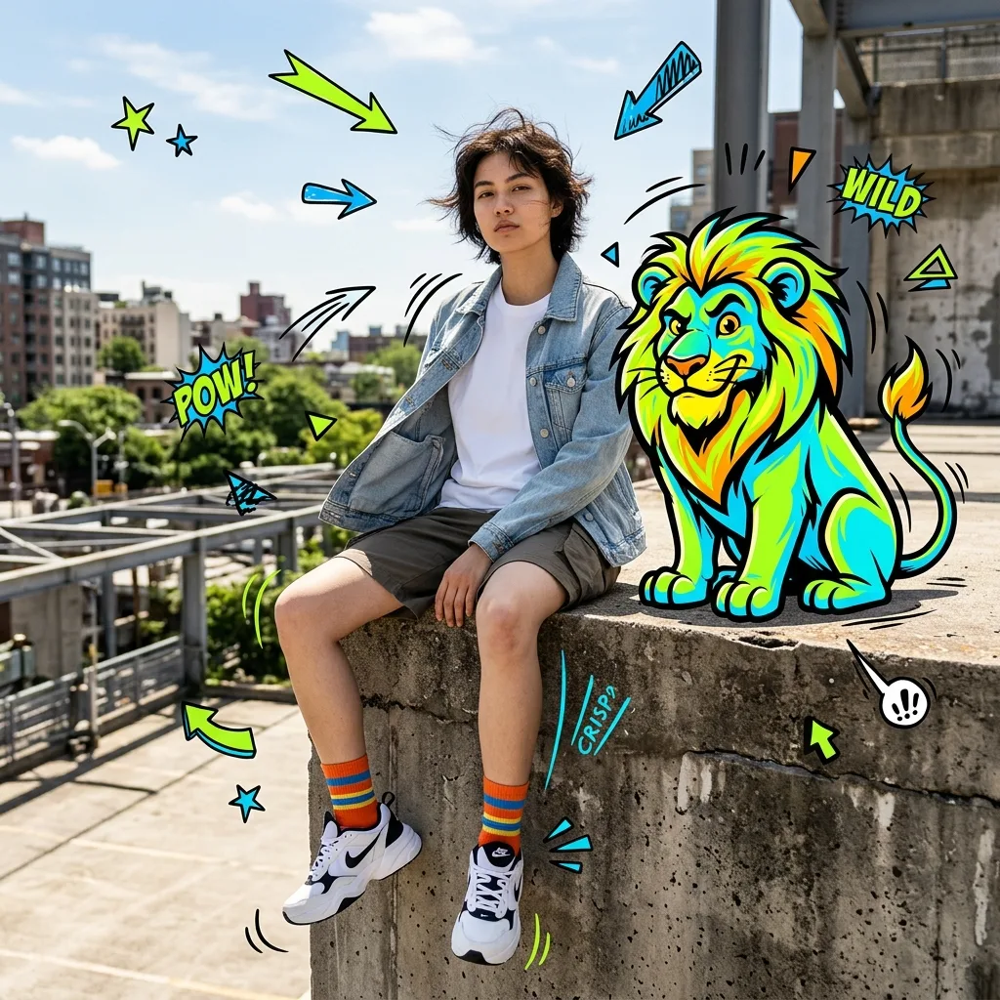

**#312 · Illustration &amp; 3D Prompt · <code>Vinano Image v2</code>**

<details>
<summary>Show prompt</summary>

```
Full-body fashion editorial shot of a confident young person model sitting casually on a concrete ledge, legs slightly apart, one arm resting on knee, the other relaxed, looking straight at camera a calm dominant expression.

Wearing a light denim jacket over a plain white t-shirt, neutral shorts, bright socks, and modern sneakers. Clean styling, natural pose, wind slightly moving hair and fabric.

Beside and partially interacting a stylized cartoon [ANIMAL], positioned naturally as if sharing the same space.

The [ANIMAL] is illustrated in bold cartoon style thick black outlines, vibrant neon color palette (blue, green, yellow accents), exaggerated proportions, expressive features, playful yet powerful presence.

Background: bright outdoor urban setting clear blue sky, soft clouds, sunlit concrete textures, strong natural daylight, crisp shadows.

Fusion of hyper-realistic photography and graphic illustration, seamless integration between subject and cartoon.

Add graphic overlay elements: doodle arrows, scribbles, abstract shapes, comic-style symbols, dynamic motion lines.

High contrast, HDR lighting, sharp focus, fashion editorial composition, surreal mixed-media aesthetic, ultra-detailed, 8k resolution

Aim for an editorial, design-driven look with deliberate negative space.
```

</details>

---

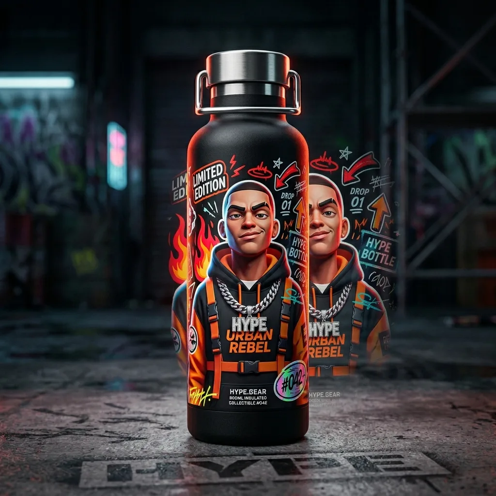

**#313 · Illustration &amp; 3D Prompt · <code>Vinano Image v2</code>**

<details>
<summary>Show prompt</summary>

```
Ultra-realistic 8K hype-brand product shot of a collectible thermal bottle a sleek matte black finish and bold urban aesthetic. The bottle features a high-detail 3D character based on the attached reference photo, preserving exact facial identity and structure, styled a confident, edgy expression.
The character wears oversized streetwear (premium hoodie layered textures) and a reflective silver chain, inspired by high-end hype fashion. The artwork wraps dynamically around the bottle a slightly distorted, graffiti-inspired layout for a bold visual impact.
Surrounding elements include vibrant pop-art doodles — flames, arrows, stars, scribbles — neon accents (electric red, orange, subtle glow effects), creating a high-energy, limited-edition drop feel. Add subtle glitch effects, sticker-style overlays, and micro-branding details to reinforce exclusivity.
Material realism: soft-touch matte coating fingerprint-level texture, contrasted by glossy UV print highlights and metallic reflections. Cinematic studio lighting strong contrast, rim light glow, and controlled reflections to enhance depth and luxury street appeal.
Shot composition: centered hero product, low-angle perspective for dominance, shallow depth of field, ultra-clean dark or gradient background. Premium commercial photography style mixed urban fashion campaign energy. Hyper-detailed, true-to-life photorealistic, high contrast, sharp focus.

Preserve realistic proportions and depth for a confident, professional finish.
```

</details>

---

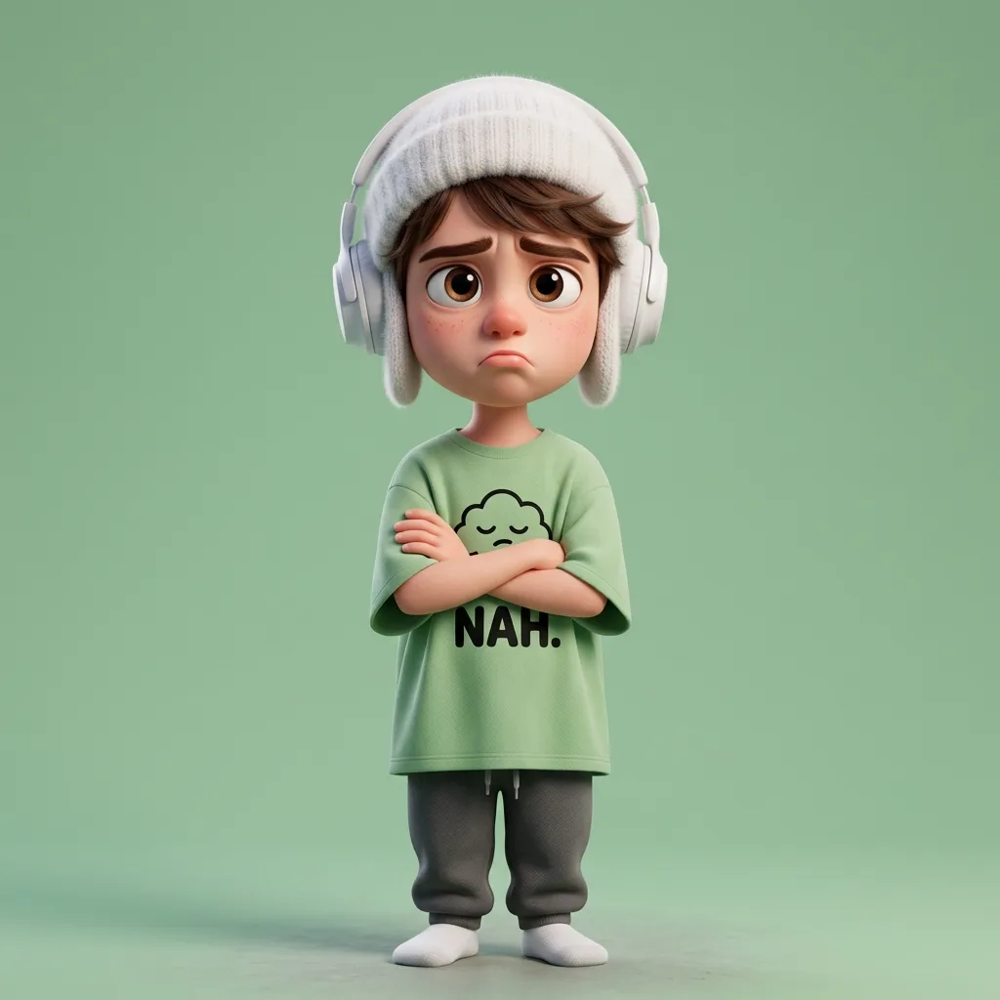

**#314 · Illustration &amp; 3D Prompt · <code>Vinano Image v2</code>**

<details>
<summary>Show prompt</summary>

```
A stylized 3D cartoon character of a [PERSON] big expressive eyes and a slightly sad, pouty expression, standing against a solid pastel green background. He is wearing a soft white fuzzy beanie ear flaps and matching white over-ear headphones. His hair is short, brown, and slightly messy, peeking out from under the cap. He wears an oversized light green t-shirt a bold black graphic on the front, and his arms are crossed in a bored or annoyed pose. The lighting is soft, diffused studio lighting smooth shadows, giving a clean aesthetic. Ultra-detailed, premium-quality 3D render, Pixar-style, soft textures, shallow depth of field, centered composition, minimal background, vibrant but soft color palette.

Negative prompt (optional):
blurry, low quality, extra limbs, distorted face, harsh shadows, cluttered background, text artifacts, watermark

Preserve realistic proportions and depth for a confident, professional finish.
```

</details>

---

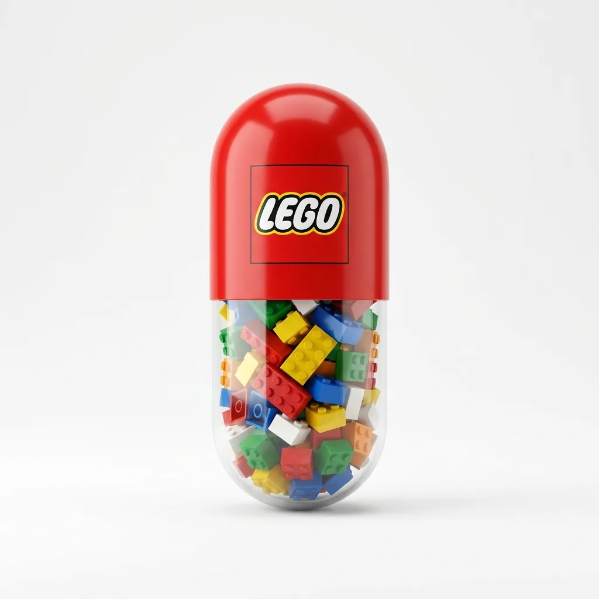

**#315 · Illustration &amp; 3D Prompt · <code>Vinano Image Pro</code>**

<details>
<summary>Show prompt</summary>

```
Create a minimal poster. A large capsule pill centered in the frame. The top half of the pill is solid colored and features the [BRAND] logo clearly printed on it. The bottom half of the pill is transparent glass. Inside the transparent part of the capsule, fill it a large amount of [OBJECT] related to the brand. Ultra clean white studio background, soft shadows, high-end product photography lighting, glossy realistic materials, highly detailed, minimal design, centered composition, modern advertising style.​​​​​​​​​​​​​​​​ 1080x1080 dimension. Aim for an editorial, design-driven look with deliberate negative space.
```

</details>

---

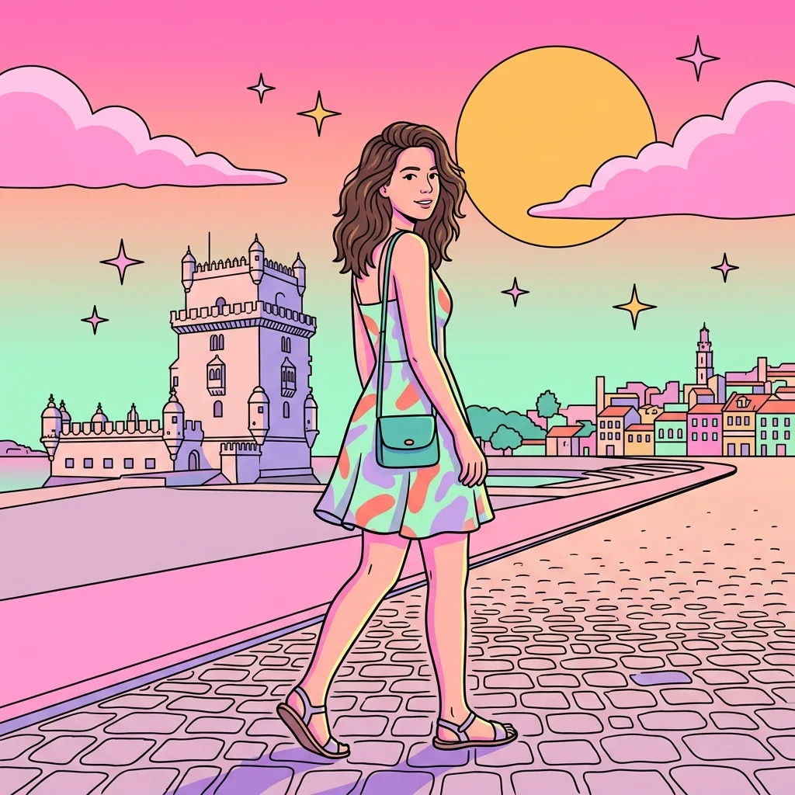

**#316 · Illustration &amp; 3D Prompt · <code>Vinano Image v2</code>**

<details>
<summary>Show prompt</summary>

```
Convert the person in the attached reference photo into a
hyper-vibrant 80s pop-art illustration.

CHARACTER:
- Faithfully recreate the person's facial features, skin tone,
 hair color, and hair style from the reference photo
- Automatically detect if the person is male or female and dress
 them accordingly in relatable, everyday casual wear:

 IF FEMALE → light summer dress or casual crop top high-waist jeans or linen trousers, simple sandals or
 white sneakers, a small shoulder bag, minimal jewelry —
 outfits a real person would actually wear on a day out

 IF MALE → plain crew-neck tee or casual open shirt over
 a basic tee, slim chinos or relaxed jeans, clean sneakers
 or loafers, optional watch or crossbody bag — everyday
 street-ready look

- All clothing rendered in the pastel-neon color palette of
 the art style — pinks, mints, lavenders, corals — but the
 silhouette and style remain realistic and wearable
- Place them in a fun, natural candid pose — mid-walk,
 looking over the shoulder, sitting on steps, leaning
 casually, or glancing upward — as if caught in a real moment
- Bold black outlines on the entire figure, flat color fills,
 minimal graphic shading

BACKGROUND:
- The setting is Portugal— depict its most recognizable
 landmark, skyline, street, or scenery prominently
- Render the entire background in hyper-vibrant pop-art
 illustration style: bold outlines, flat pastel-neon fills,
 no photorealism
- Sky: warm gradient of hot pink to peach to mint, large
 solid yellow or orange sun, puffy candy-pink clouds,
 and scattered 4-point sparkle stars

COLOR PALETTE:
Hot pink bubblegum pink, mint green
teal, lavender, coral, yellow-gold

STYLE KEYWORDS:
80s pop-art, flat illustration, bold black outlines, pastel neon,
anime-adjacent, retro sun-drenched, vibrant graphic novel aesthetic,
no photorealism, clean cel-shaded look, relatable everyday fashion

Aim for an editorial, design-driven look with deliberate negative space.
```

</details>

---

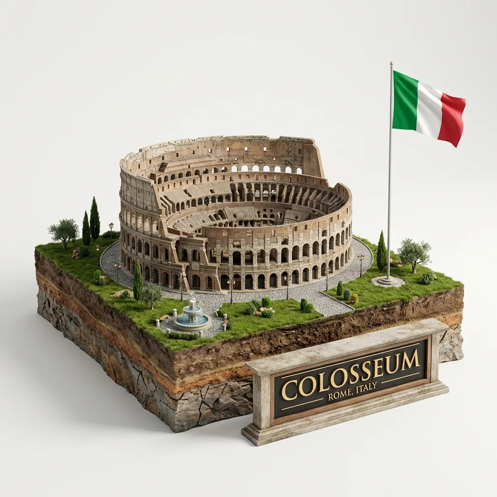

**#317 · Illustration &amp; 3D Prompt · <code>Vinano Image Pro</code>**

<details>
<summary>Show prompt</summary>

```
Create a hyper-realistic 3D diorama-style model of [LANDMARK NAME]. The model should appear as a miniature, set on a raised cross-section of earth that reveals soil and rock layers beneath a lush grassy surface. The structure must be highly detailed and proportionally accurate, surrounded by tiny realistic elements like region-appropriate street lamps, native trees, shrubs, water features like small fountains, and historically or culturally fitting pathways. The scene should evoke the unique character of [LANDMARK NAME]’s surrounding landscape. The environment must include a soft white background to draw full attention to the model. Include the text “[LANDMARK NAME]” in large, bold, elegant lettering prominently displayed on a big sign or billboard at the front of the diorama, easily readable and eye-catching, along a large national flag on a tall, prominent flagpole positioned beside [LANDMARK NAME], clearly visible and waving. 1080x1080 dimension Aim for an editorial, design-driven look with deliberate negative space.
```

</details>

---

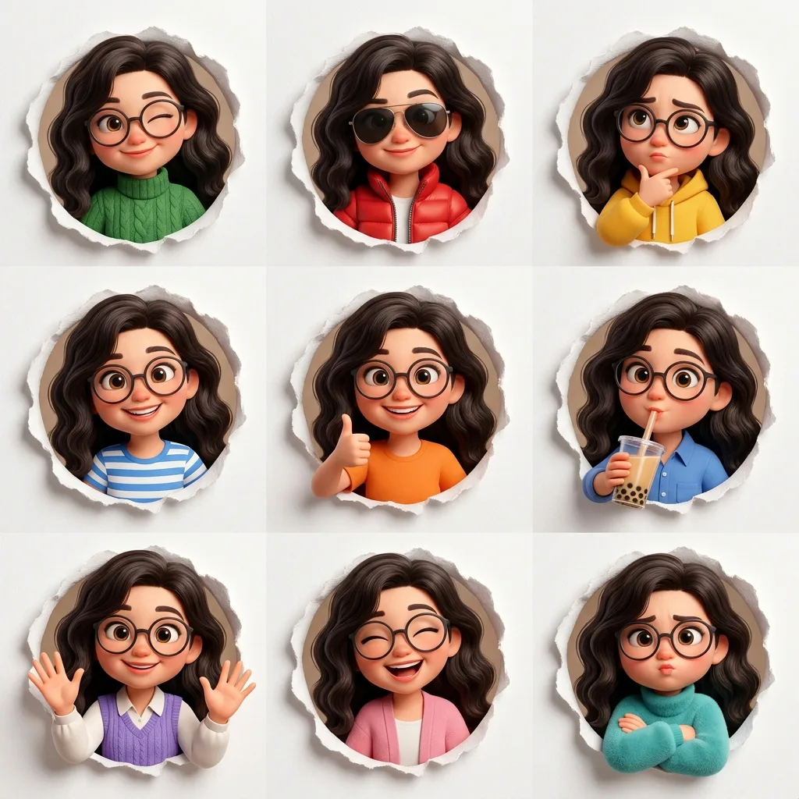

**#318 · Illustration &amp; 3D Prompt · <code>Vinano Image Pro</code>**

<details>
<summary>Show prompt</summary>

```
3D Pixar-style expression sheet, cute stylized avatar wavy dark hair and round glasses, 3x3 grid layout, peeking through torn paper circles, emotions: wink, sunglasses cool, thinking, happy smile, thumbs up, drinking boba tea, friendly wave, laughing, cute pout, different outfits: green sweater, red jacket, yellow hoodie, striped tee, orange shirt, blue top, purple vest, pink cardigan, teal pullover. Soft filmic, cinematic lighting, clean white background, vibrant colors, high detail, adorable cartoon character, playful expressions, consistent character design across all poses Render with rich micro-detail while keeping the layout uncluttered and intentional.
```

</details>

---

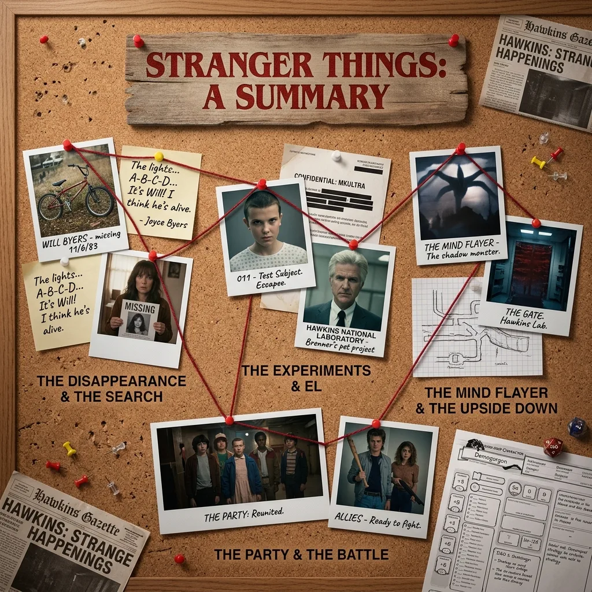

**#319 · Illustration &amp; 3D Prompt · <code>Vinano Image v2</code>**

<details>
<summary>Show prompt</summary>

```
Generates a clean, cinematic 1080×1080 corkboard layout that visually summarizes the story of movie Polaroid snapshots, handwritten notes, detective-style strings, and vintage textures for "STRANGER THINGS" Preserve realistic proportions and depth for a confident, professional finish.
```

</details>

---

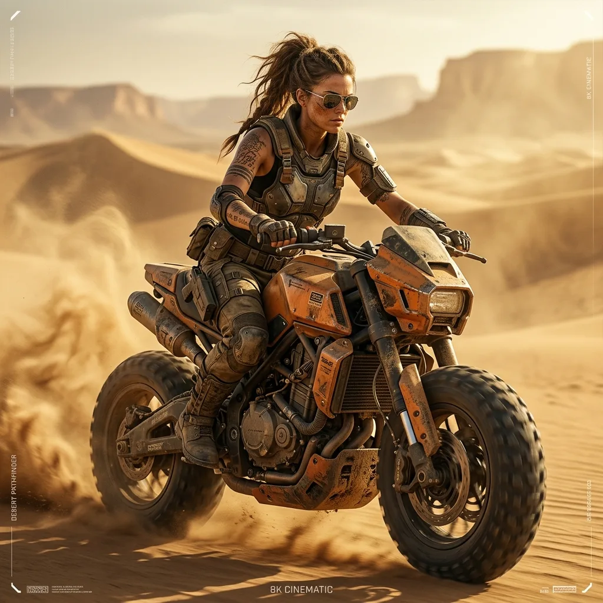

**#320 · Illustration &amp; 3D Prompt · <code>Vinano Image Pro</code>**

<details>
<summary>Show prompt</summary>

```
Use the uploaded picture to create a cinematic sci-fi scene of a fierce futuristic biker riding a heavy armored motorcycle through a vast desert. The person has long hair tied in a messy ponytail, reflective tactical sunglasses, and visible arm tattoos. Wearing a rugged post-apocalyptic outfit layered fabric, utility straps, and armored details.
The motorcycle is bulky and mechanical, oversized tires, exposed machinery, and worn orange metal panels covered in dust. Sand blows around the bike as it moves forward, creating a dramatic motion effect. Warm golden sunlight, hazy atmosphere, shallow depth of field, ultra-realistic textures, high detail, cinematic color grading, epic movie poster style 8K resolution, sharp focus, dramatic lighting.

Keep edges clean and the overall composition balanced for a polished, gallery-ready result.
```

</details>

---

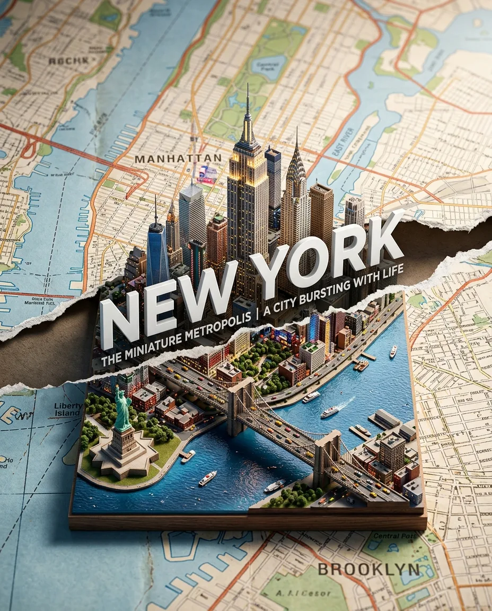

**#321 · Illustration &amp; 3D Prompt · <code>Vinano Image Pro</code>**

<details>
<summary>Show prompt</summary>

```
Create a 4:5 poster a miniature 3D model of New York City, featuring the Statue of Liberty, Empire State Building, and Brooklyn Bridge bursting through a horizontally torn map. The name “New York” appears in sleek 3D white lettering, interacting naturally the urban landscape. Use dramatic perspective, vibrant colors, and studio lighting for a sharp, high-detail, hyper-realistic photographic feel. Aim for an editorial, design-driven look with deliberate negative space.
```

</details>

---

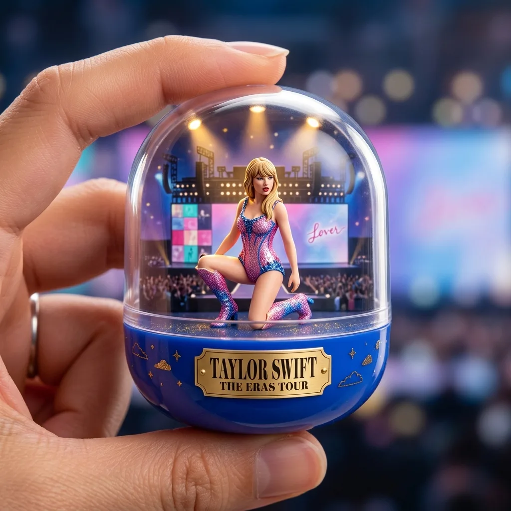

**#322 · Illustration &amp; 3D Prompt · <code>Vinano Image Pro</code>**

<details>
<summary>Show prompt</summary>

```
A detailed transparent gashapon capsule diorama, held between fingers, featuring [NAME] in their [ICONIC POSE / STYLE]. Inside: [short description of figure’s look, clothing, and accessories], background elements such as [relevant setting: stadium, stage, lecture hall, etc.]. Lighting should be dramatic and cinematic, matching their theme (e.g., golden spotlight, concert glow, academic ambience). The capsule has a transparent top and a colored base (choose fitting color: e.g., royal blue, gold, black, red), decorated [motifs related to the person]. The base is labeled [NAME or NICKNAME] in a matching font style. The design should look like a miniature collectible, true-to-life photorealistic detail, soft bokeh, and a square 1080x1080 composition Keep edges clean and the overall composition balanced for a polished, gallery-ready result.
```

</details>

---

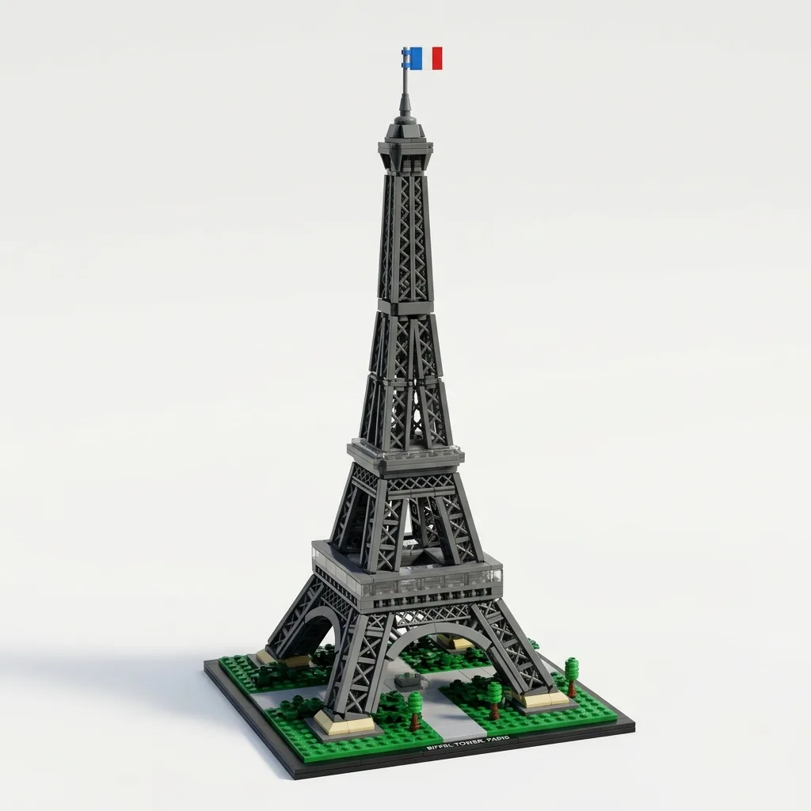

**#323 · Illustration &amp; 3D Prompt · <code>Vinano Image Pro</code>**

<details>
<summary>Show prompt</summary>

```
A vertical LEGO diorama showing [LANDMARK], [COUNTRY]). The scene is built entirely from LEGO bricks. A small [COUNTRY] flag is positioned at the top of the structure. Use a plain white background a subtle shadow cast by the structure. 3D rendered, high-resolution, cute and clean LEGO style. 1080x1080 dimension Emphasise material texture and natural light so the final frame feels tactile and premium.
```

</details>

---

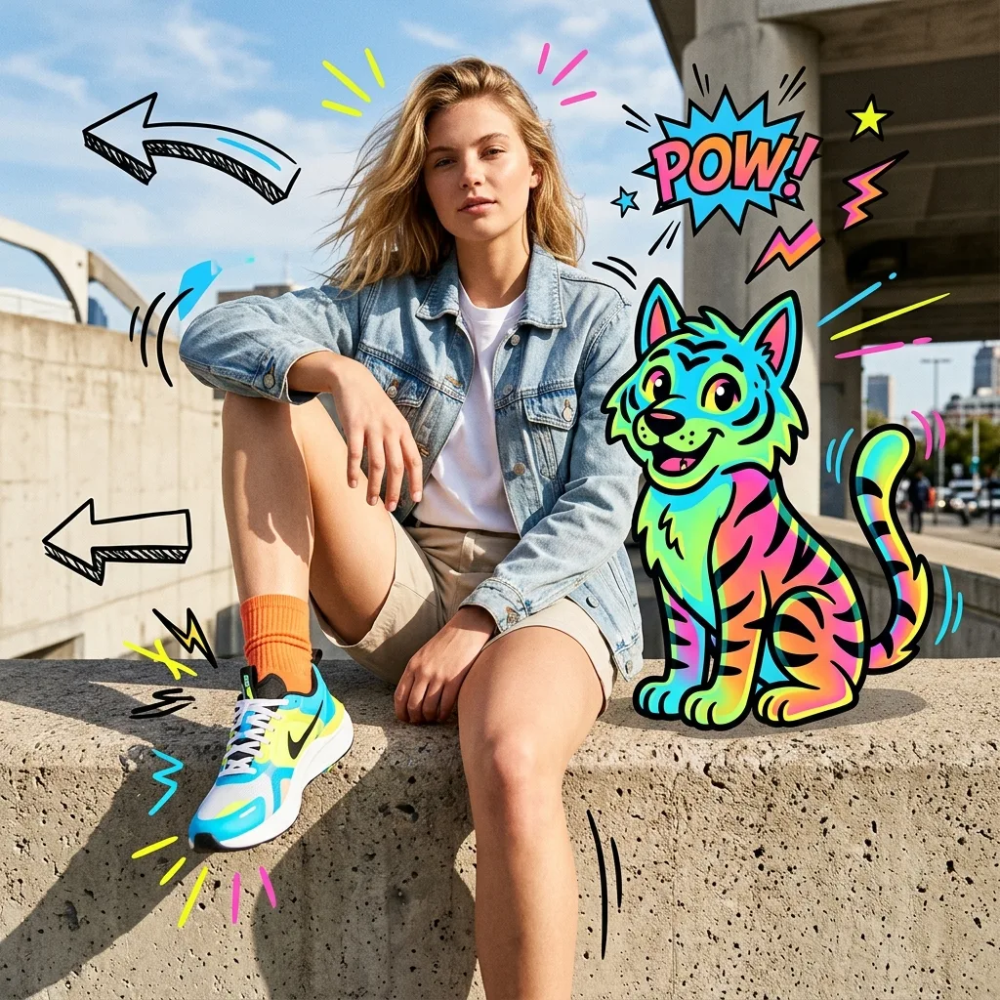

**#324 · Illustration &amp; 3D Prompt · <code>Vinano Image v2</code>**

<details>
<summary>Show prompt</summary>

```
Full-body fashion editorial shot of a confident young person model sitting casually on a concrete ledge, legs slightly apart, one arm resting on knee, the other relaxed, looking straight at camera a calm dominant expression.

Wearing a light denim jacket over a plain white t-shirt, neutral shorts, bright socks, and modern sneakers. Clean styling, natural pose, wind slightly moving hair and fabric.

Beside and partially interacting a stylized cartoon [ANIMAL], positioned naturally as if sharing the same space.

The [ANIMAL] is illustrated in bold cartoon style thick black outlines, vibrant neon color palette (blue, green, yellow accents), exaggerated proportions, expressive features, playful yet powerful presence.

Background: bright outdoor urban setting clear blue sky, soft clouds, sunlit concrete textures, strong natural daylight, crisp shadows.

Fusion of hyper-realistic photography and graphic illustration, seamless integration between subject and cartoon.

Add graphic overlay elements: doodle arrows, scribbles, abstract shapes, comic-style symbols, dynamic motion lines.

High contrast, HDR lighting, sharp focus, fashion editorial composition, surreal mixed-media aesthetic, ultra-detailed, 8k resolution.

Emphasise material texture and natural light so the final frame feels tactile and premium.
```

</details>

---

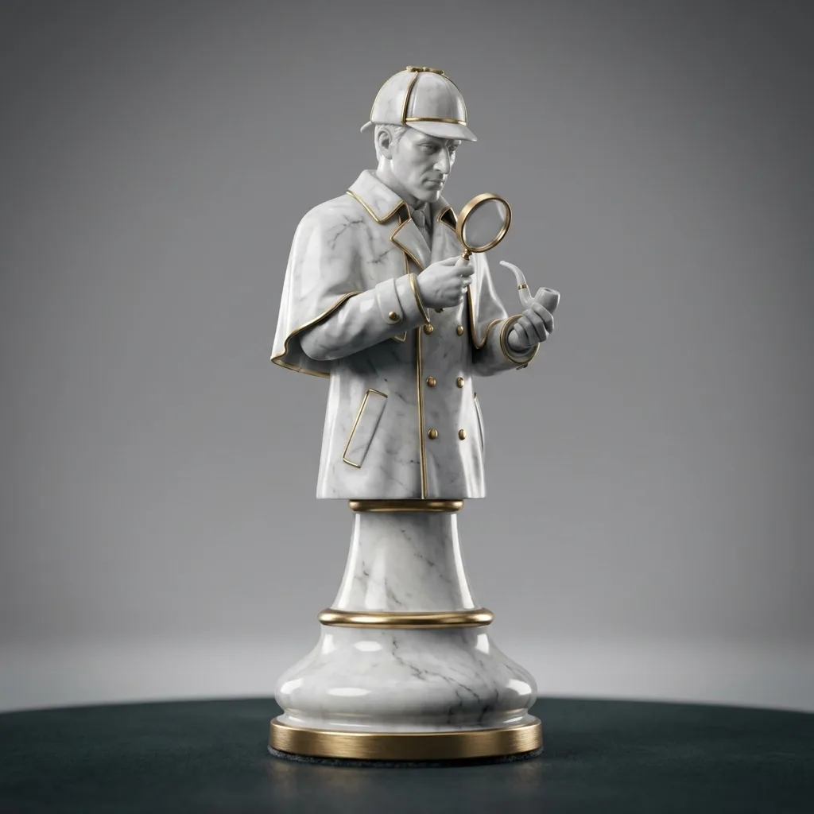

**#325 · Illustration &amp; 3D Prompt · <code>Vinano Image v2</code>**

<details>
<summary>Show prompt</summary>

```
A hyper-detailed 3D render of a collectible chess piece designed as [ICON]. The figure is sculpted in polished marble and gold accents, a stylized base resembling a classic chess piece. The character’s iconic features, clothing, or accessories are faithfully captured in a simplified but instantly recognizable form. Studio lighting soft reflections, dramatic shadows, true-to-life photorealistic textures, cinematic presentation. Centered on a clean neutral background Preserve realistic proportions and depth for a confident, professional finish.
```

</details>

---

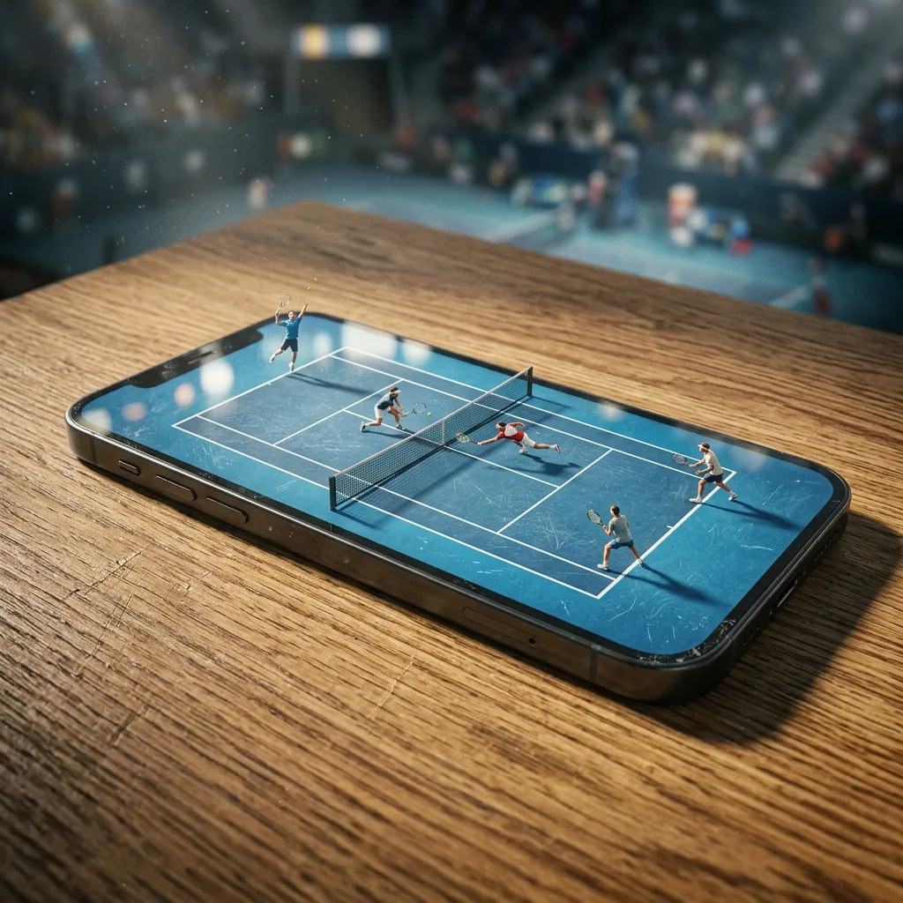

**#326 · Illustration &amp; 3D Prompt · <code>Vinano Image v2</code>**

<details>
<summary>Show prompt</summary>

```
{
 "type": "image_generation",
 "style": "ultra_realistic_cinematic",
 "aspect_ratio": "3:4",
 "resolution": "8K",
 "camera": {
 "model": "DSLR",
 "lens": "50mm",
 "angle": "dynamic slight tilt, courtside perspective",
 "depth_of_field": "shallow",
 "focus": "sharp on phone and players, soft background blur"
 },
 "scene": {
 "subject": "smartphone lying on a wooden table",
 "concept": "phone screen transformed into a professional tennis court",
 "court_surface": "pristine blue hardcourt fine scratches and chalk marks",
 "players": "miniature tennis players serving, volleying, diving for shots",
 "scale": "realistic miniature proportions"
 },
 "lighting": {
 "type": "dramatic directional lighting",
 "source": "stadium-style lights from the side",
 "effect": "strong highlights and long shadows",
 "reflection": "soft reflection of floodlights on phone glass"
 },
 "details": {
 "phone_surface": ["visible fingerprints",
 "subtle smudges",
 "micro scratches on edges"],
 "atmosphere": ["floating dust particles",
 "light haze for depth"],
 "textures": "hyper-detailed court surface, realistic materials"
 },
 "environment": {
 "table": "natural wood grain texture",
 "background": "softly blurred, cinematic indoor setting"
 },
 "color_grading": {
 "palette": "vibrant yet natural",
 "contrast": "high but balanced",
 "tone": "cinematic realism"
 },
 "aesthetic": {
 "mood": "dynamic, energetic, premium sports visual",
 "style": "high-end sports advertisement"
 },
 "render_quality": {
 "sharpness": "ultra-crisp",
 "detail_level": "extreme",
 "photorealism": "DSLR-grade realism"
 }
}

Maintain consistent colour harmony and crisp focus across the whole frame.
```

</details>

---

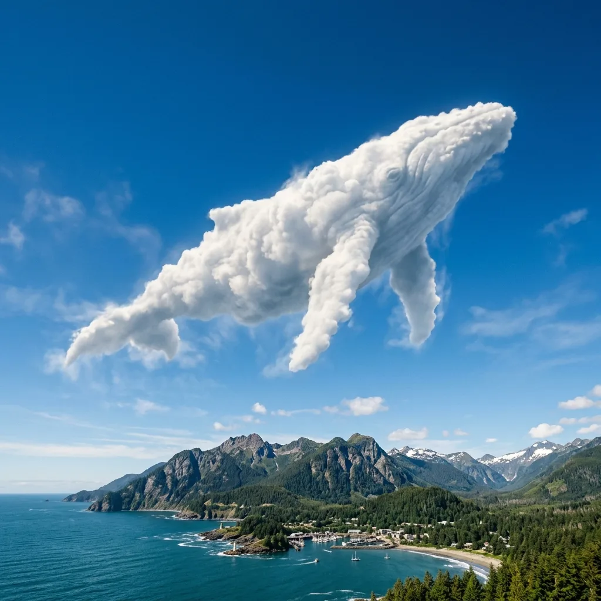

**#327 · Illustration &amp; 3D Prompt · <code>Vinano Image v2</code>**

<details>
<summary>Show prompt</summary>

```
Create an ultra-realistic sky scene where soft, natural cloud formations organically assemble into the clear silhouette of a [OBJECT]. The cloud shape appears high in a vibrant blue sky, naturally floating above a recognizable nature below.

The composition is square (1080×1080), the cloud formation occupying the upper portion of the frame while the landscape grounds the scene beneath it. Lighting is crisp and daylight-bright, sunlit highlights on the clouds that enhance depth, softness, and realism.

The overall mood should feel calm, optimistic, and visually striking, rich color saturation and a clean, peaceful atmosphere.

Aim for an editorial, design-driven look with deliberate negative space.
```

</details>

---

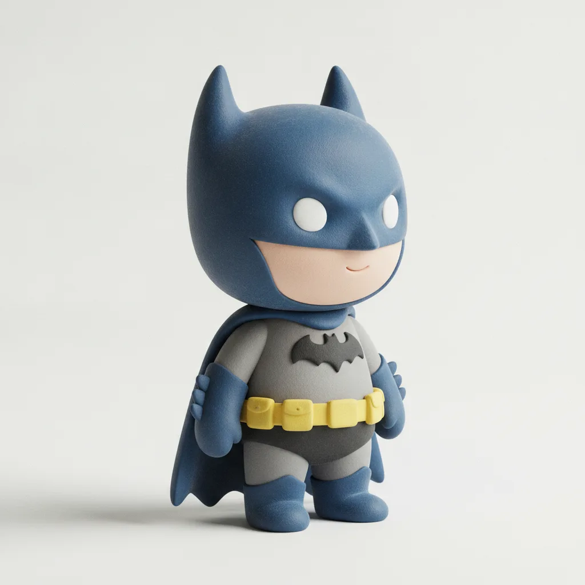

**#328 · Illustration &amp; 3D Prompt · <code>Vinano Image</code>**

<details>
<summary>Show prompt</summary>

```
Create a stylized miniature model of [CHARACTERS] shaped entirely from soft polymer clay. The figure has rounded, childlike anatomy — large head, small body, and simplified details that feel friendly and handcrafted. Its outfit and accessories match [CHARACTERS]’ iconic look, modeled smooth curves and lively, saturated tones.
The material appears dry and tactile, a powdery matte finish and subtle surface texture—avoid gloss, shine, or reflections. Lighting should be gentle and even, wrapping softly around the form faint ambient shading to reveal volume.
Present the figurine standing upright, slightly turned toward the right, framed in a minimal off-white environment a smooth floor and faint contact shadow beneath. The overall composition feels calm, neat, and balanced—like a clay sculpture photographed for a design catalog.

Keep edges clean and the overall composition balanced for a polished, gallery-ready result.
```

</details>

---

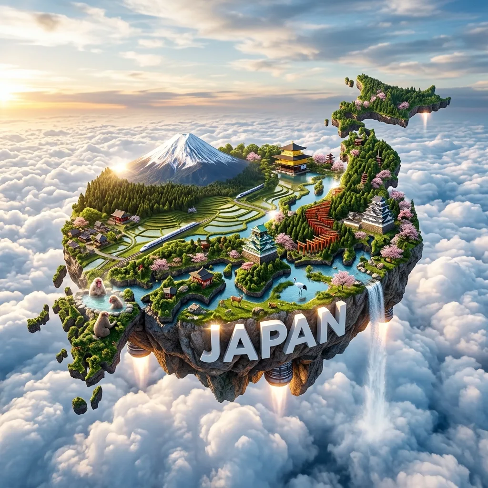

**#329 · Illustration &amp; 3D Prompt · <code>Vinano Image Pro</code>**

<details>
<summary>Show prompt</summary>

```
Create an ultra-HD, hyper-realistic digital poster of a floating miniature island shaped like [Country] on white clouds. Include iconic landmarks, landscapes ([landmark 1], [landscape 2], [landscape 3]), and cultural elements unique to [Country]. Carve “[Country]” in large white 3D letters. Add [wildlife], filmic, cinematic lighting, vivid colors, aerial perspective, and sun reflections for realism. Render with rich micro-detail while keeping the layout uncluttered and intentional.
```

</details>

---

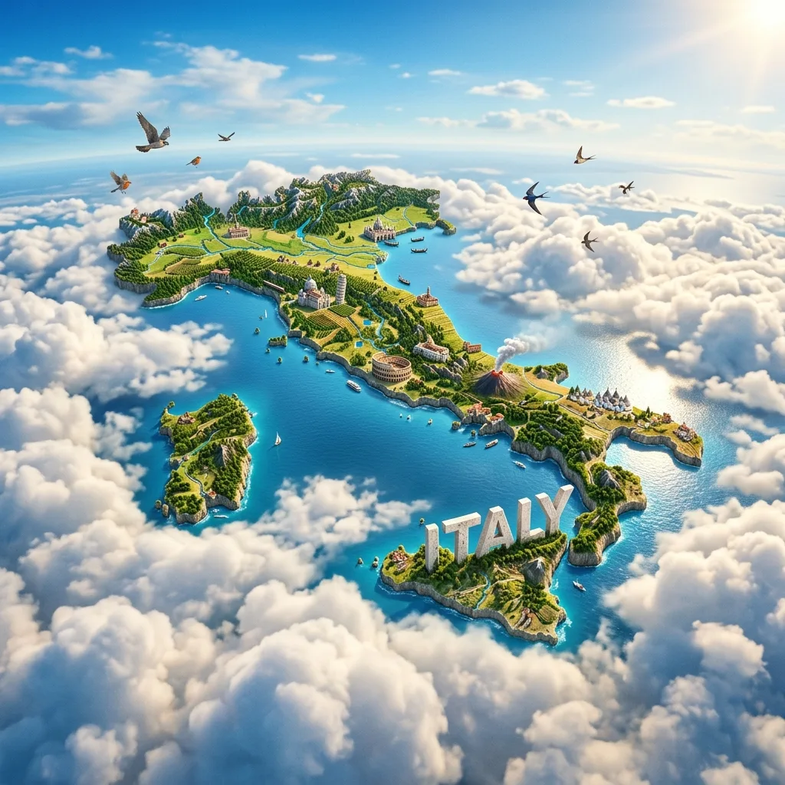

**#330 · Illustration &amp; 3D Prompt · <code>Vinano Image Pro</code>**

<details>
<summary>Show prompt</summary>

```
Create an ultra-HD, hyper-realistic digital poster of a floating miniature island shaped like [COUNTRY], resting on white clouds in the sky. Blend iconic landmarks, natural landscapes (like forests, mountains, or beaches), and cultural elements unique to [COUNTRY]. Carve “[COUNTRY]” into the terrain large white 3D letters. Add artistic details like birds (native to [COUNTRY]), filmic, cinematic lighting, vivid colors, aerial perspective, and sun reflections to enhance realism. Ultra-quality, 4K+ resolution. Maintain consistent colour harmony and crisp focus across the whole frame.
```

</details>

---

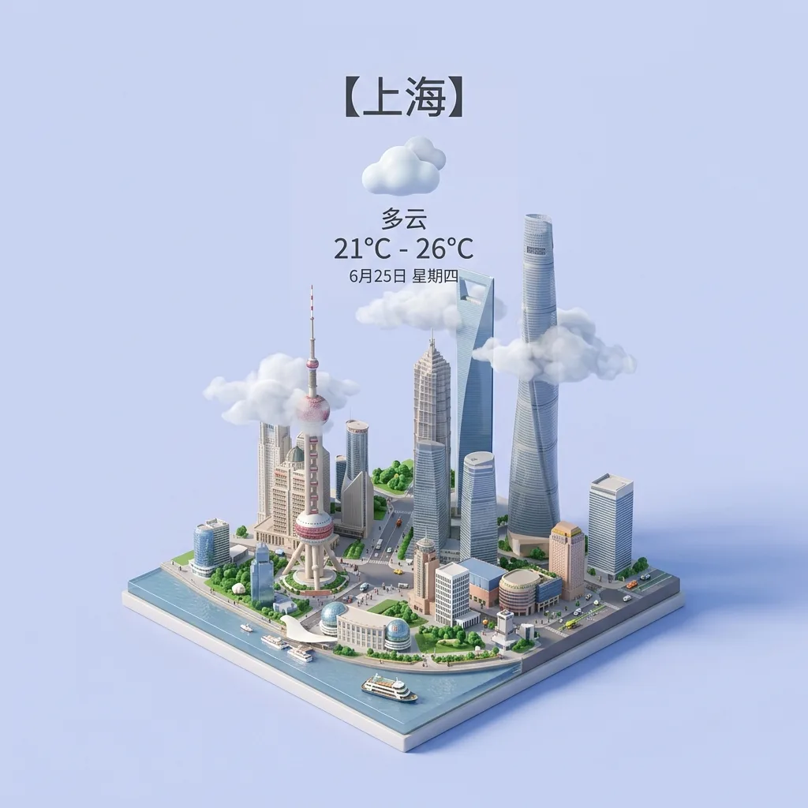

**#331 · Illustration &amp; 3D Prompt · <code>Vinano Image Pro</code>**

<details>
<summary>Show prompt</summary>

```
Present a clear, 45° top-down view of a vertical (9:16) isometric miniature 3D cartoon scene, highlighting iconic landmarks centered in the composition to showcase precise and delicate modeling.

The scene features soft, refined textures realistic PBR materials and gentle, lifelike lighting and shadow effects. Weather elements are creatively integrated into the urban architecture, establishing a dynamic interaction between the city's landscape and atmospheric conditions, creating an immersive weather ambiance.

Use a clean, unified composition minimalistic aesthetics and a soft, solid-colored background that highlights the main content. The overall visual style is fresh and soothing.

Display a prominent weather icon at the top-center, the date (x-small text) and temperature range (medium text) beneath it. The city name (large text) is positioned directly above the weather icon. The weather information has no background and can subtly overlap the buildings.

The text should match the input city's native language.
Please retrieve current weather conditions for the specified city before rendering.

City name:【上海】

Maintain consistent colour harmony and crisp focus across the whole frame.
```

</details>

---

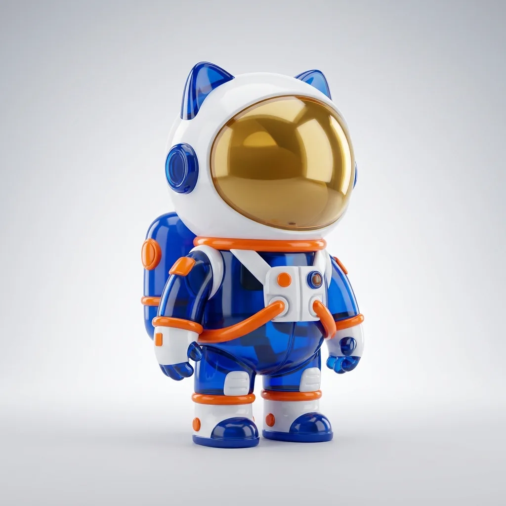

**#332 · Illustration &amp; 3D Prompt · <code>Vinano Image v2</code>**

<details>
<summary>Show prompt</summary>

```
Create a premium 3D rendered [FIGURE NAME] collectible vinyl figure in a modern designer toy aesthetic. The figure should feature glossy translucent vinyl material subtle light refraction, bold saturated colors true to the character, and simplified geometric forms smooth curves. Position against a pristine gradient background transitioning from light gray to white. Use professional product photography lighting soft key light from above and gentle rim lighting to highlight the vinyl’s glossy finish. The character should be posed in a confident standing position, centered perfectly in frame. Apply shallow depth of field the figure in sharp focus. Render in ultra-high resolution clean refined minimalist composition, no text, logos, or distracting elements. Square aspect ratio 1080x1080 pixels, true-to-life photorealistic quality crisp details and vibrant color reproduction suitable for premium toy marketing Maintain consistent colour harmony and crisp focus across the whole frame.
```

</details>

---

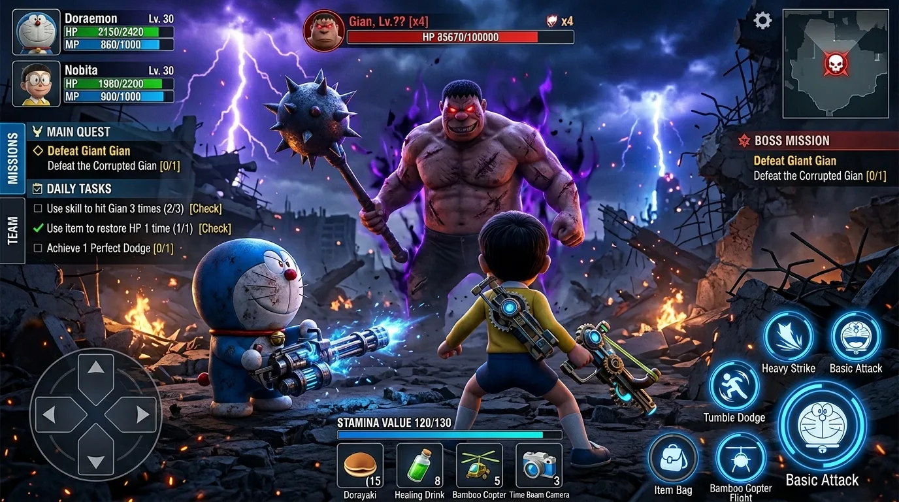

**#333 · Illustration &amp; 3D Prompt · <code>Vinano Image Pro</code>**

<details>
<summary>Show prompt</summary>

```
A high-resolution, true-to-life photorealistic 3D action RPG mobile game screenshot of an epic battle featuring Doraemon characters. The perspective is from behind the main player character, Nobita. The background is a post-apocalyptic urban scene of rubble, crumbling concrete, rebar, debris, small fires, and intense purple and blue lightning in a dark, cloudy night sky. Characters: Foreground Left: Doraemon, holding an elaborate, multi-barrel gatling-style cannon which hums blue energy in his hand. Foreground Center: Nobita, in a combat stance his multi-layered slingshot weapon, wearing his classic yellow shirt, blue shorts, and glasses. Middle Ground Center: Giant Gian (the boss), massive, muscular, intimidating, holding a spiked mace, glowing sinister red eyes and surrounded by purple energy effects. Nameplates: Doraemon (Lv. 30, HP: 2150/2420, MP: 860/1000), Nobita (Lv. 30, HP: 1980/2200, MP: 900/1000), Gian (Lv.??, HP: 85670/100000, x4). UI Elements (All in English): Left Side Panel: The title is "MISSIONS" and "TEAM". The "MAIN QUEST" header is followed by "Defeat Giant Gian" and "Defeat the Corrupted Gian [0/1]". The "DAILY TASKS" header is followed by "Use skill to hit Gian 3 times (2/3) [Check]", "Use item to restore HP 1 time (1/1) [Check]", and "Achieve 1 Perfect Dodge (0/1)". Right Side Panel: The header "BOSS MISSION" is followed by "Defeat Giant Gian" and "Defeat the Corrupted Gian [0/1]". Bottom Right Skill Buttons: Labels (clockwise from top): "Heavy Strike", "Basic Attack" (Doraemon head), "Bamboo Copter Flight", "Item Bag", "Tumble Dodge". Glowing blue skill icons are present. Bottom Center Item Bar: Above the items, "STAMINA VALUE" followed by "120/130". The items are "Dorayaki (15)", "Healing Drink (8)", "Bamboo Copter (5)", "Time Beam Camera (3)". Mini-Map: Top right corner mini-map skull icon. D-pad: English text virtual D-pad on the bottom left. Screen Details: filmic, cinematic lighting and effects. The cool blue of Doraemon's weapon light, warm orange firelight, cold purple lightning, and Gian's sinister red eyes. Detailed textures on clothing and weapons. All English text is clean, legible, and accurate. The low-angle emphasizes the scale difference and battle tension. Preserve realistic proportions and depth for a confident, professional finish.
```

</details>

---

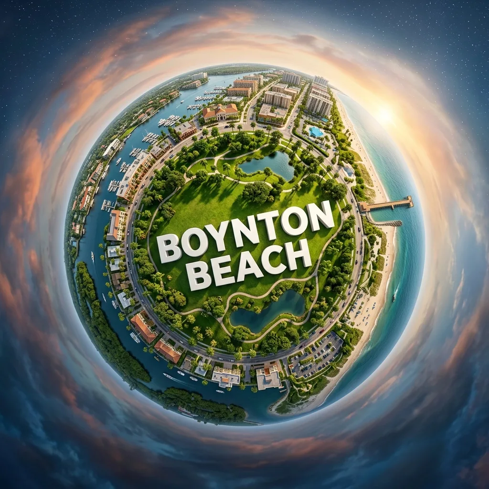

**#334 · Illustration &amp; 3D Prompt · <code>Vinano Image v2</code>**

<details>
<summary>Show prompt</summary>

```
Create a hyperrealistic miniature planet showcasing [CITY] famous landmarks seamlessly curving around the spherical surface. Position bold 3D white text ”[CITY]” naturally integrated across the lush green central parkland realistic shadows and dimensional depth. Capture from a top-down orbiting angle that emphasizes the dramatic planet curvature. Use soft golden hour daylight filtering through partly cloudy skies, casting gentle shadows on emerald grass and surrounding trees. The background should blend into a swirling atmospheric sky. Apply vibrant greens, warm earth tones, and soft blues. Render in polished true-to-life photorealistic style fine architectural detail Maintain consistent colour harmony and crisp focus across the whole frame.
```

</details>

---

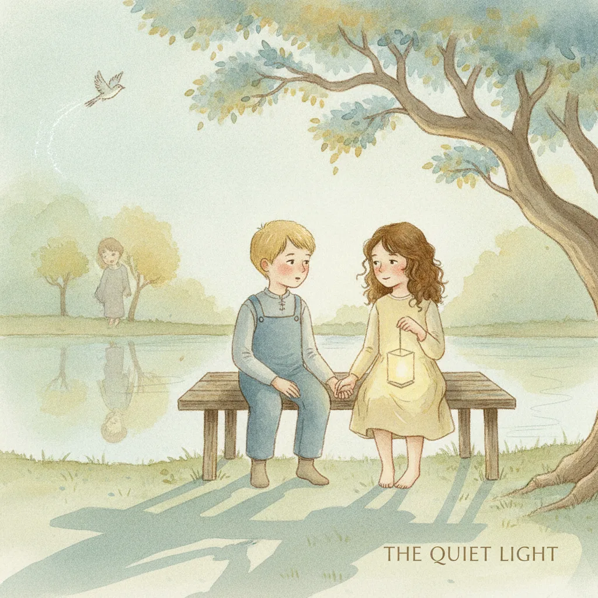

**#335 · Illustration &amp; 3D Prompt · <code>Vinano Image</code>**

<details>
<summary>Show prompt</summary>

```
Soft poetic children's book illustration watercolor and gouache textures.Clear gentle daylight slightly brighter highlights.Muted pastel colors soft blue and warm tones.Visible brush strokes and paper grain.refined minimalist composition large negative space.Calm, thoughtful, slightly open-ended atmosphere.

Child character (around 12 years old).Subtle visual metaphors like light, shadow, perspective, reflection.Hand-painted picture book style, not cartoon, not anime, not 3D.

Two children in calm conversation,soft connection forming.

Aim for an editorial, design-driven look with deliberate negative space.
```

</details>

---

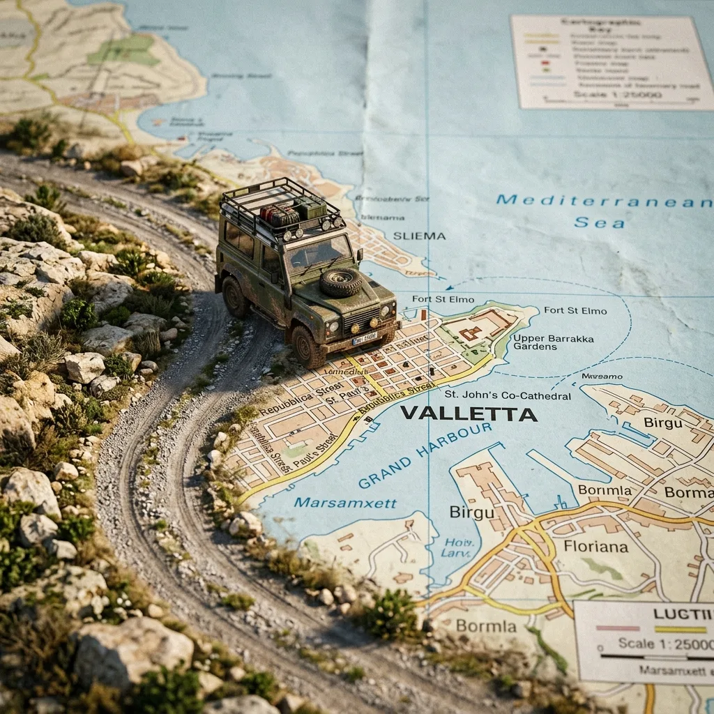

**#336 · Illustration &amp; 3D Prompt · <code>Vinano Image Pro</code>**

<details>
<summary>Show prompt</summary>

```
A surreal, hyper-realistic close-up scene of a miniature [CAR] driving along a winding road that seamlessly transforms into a printed paper map of [CITY], [COUNTRY].

The road transitions naturally into the map’s printed streets, borders, and typography, the vehicle driving directly over the map label “[CITY]”. The surrounding terrain reflects the natural landscape of [COUNTRY] — terrain texture, ground color, and environmental details match the region authentically (e.g. desert, mountains, coast, countryside).

The map features crisp cartographic details, labeled roads, subtle borders, and realistic paper texture. The vehicle is highly detailed and proportionally scaled, feeling tangible and grounded within the scene.

Lighting is bright and natural, directionally cast to create realistic highlights and defined shadows along the road’s curves. Shot from a slightly elevated angle shallow depth of field, keeping the car and map sharply in focus while the background softly fades.

Visual style is cinematic and ultra-realistic, blending tactile paper map textures realistic terrain and vehicle materials.

Aspect ratio 1:1, high resolution, premium editorial quality, no text overlays, no watermark

Aim for an editorial, design-driven look with deliberate negative space.
```

</details>

---

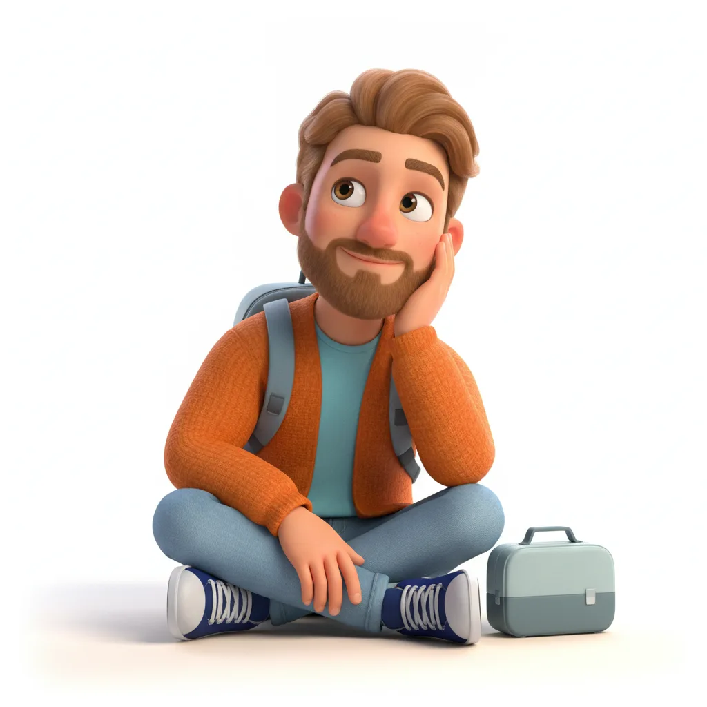

**#337 · Illustration &amp; 3D Prompt · <code>Vinano Image</code>**

<details>
<summary>Show prompt</summary>

```
create a A 3D, Pixar-style animated young man sits cross-legged on a pure white, isolated background. He has bright, olive-toned skin, a neatly styled bright brown haircut a slight wave, and a well-groomed bright brown beard and mustache. His large, expressive eyes, a deep hazel-brown, are slightly upturned and gaze thoughtfully to his left, a subtle, dreamy smile playing on his lips and his right hand resting gently on his cheek.He wears a bright, textured orange knit cardigan over a light blue t-shirt, complemented by bright wash denim jeans. His footwear consists of stylish sneakers a navy blue, grey, and white color scheme. A bright grey, modern backpack is slung over his left shoulder, and a matching bright grey lunchbox rests beside his right leg.The lighting is soft and even, creating gentle highlights on his hair and clothing, and a subtle bright beneath him, emphasizing his rounded, stylized form. The overall mood is one of relaxed contemplation and youthful optimism.. Aim for an editorial, design-driven look with deliberate negative space.
```

</details>

---

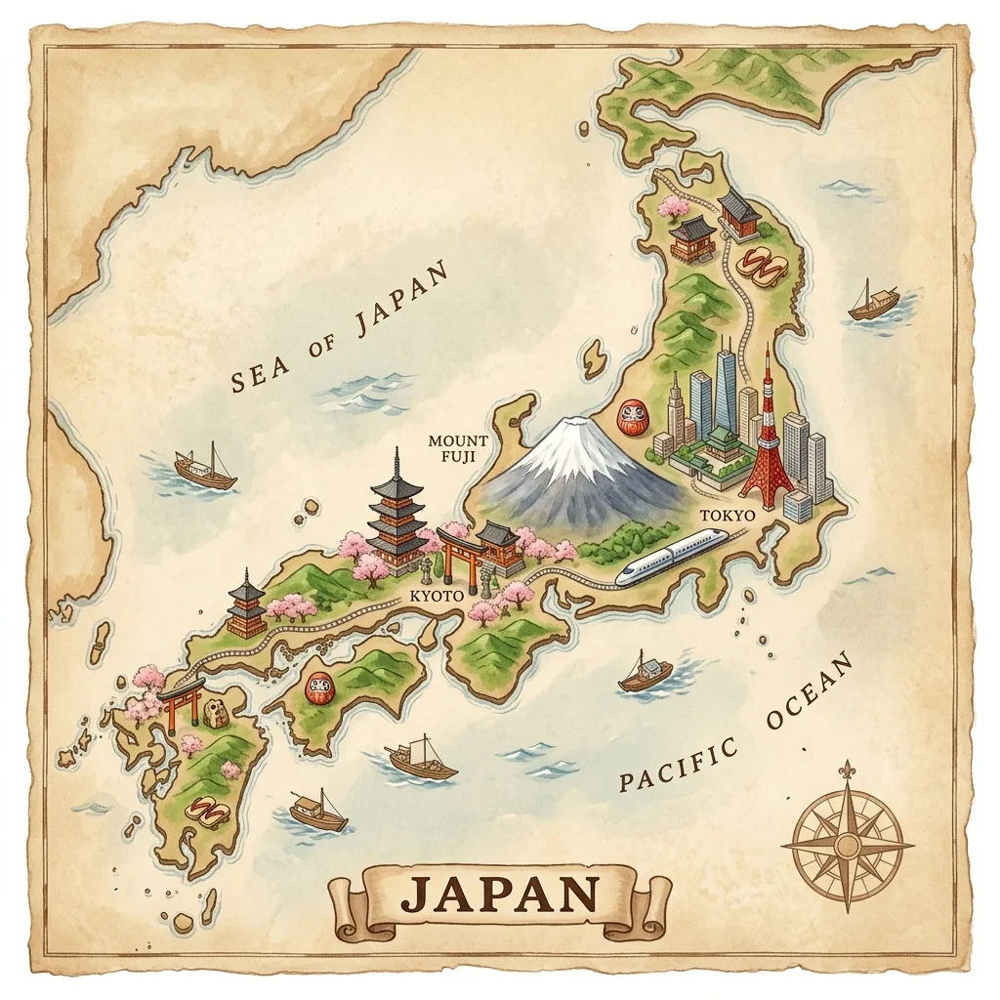

**#338 · Illustration &amp; 3D Prompt · <code>Vinano Image Pro</code>**

<details>
<summary>Show prompt</summary>

```
A hand-painted isometric bird’s-eye view illustration of [COUNTRY] in a vintage map style, featuring iconic landmarks and natural scenery unique to the country. The landscape should blend seamlessly a parchment-colored map background, and include detailed miniature architecture, cultural symbols, and geographical elements. The country name '[COUNTRY]' should appear in bold serif text below the scene. Maintain warm, earthy tones and soft, diffused lighting for a classic, illustrated map feel. 1080x1080 dimension. Keep edges clean and the overall composition balanced for a polished, gallery-ready result.
```

</details>

---

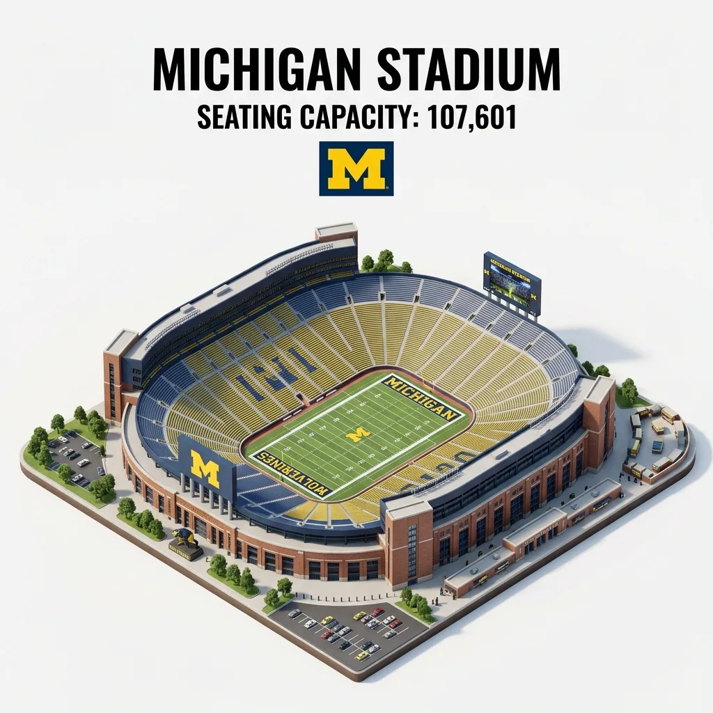

**#339 · Illustration &amp; 3D Prompt · <code>Vinano Image Pro</code>**

<details>
<summary>Show prompt</summary>

```
Present a clear, 45° top-down isometric miniature 3D cartoon scene of [STADIUM], soft refined textures, realistic PBR materials, and gentle lifelike lighting. Use a clean solid [COLOR] background. At the top-center, display the name of this stadium in large bold text, then directly beneath it show its real seating capacity in medium text, and place the official logo associated this stadium below the capacity. All text must match the background contrast automatically (white or black). Centered layout, square 1080x1080 dimension Emphasise material texture and natural light so the final frame feels tactile and premium.
```

</details>

---

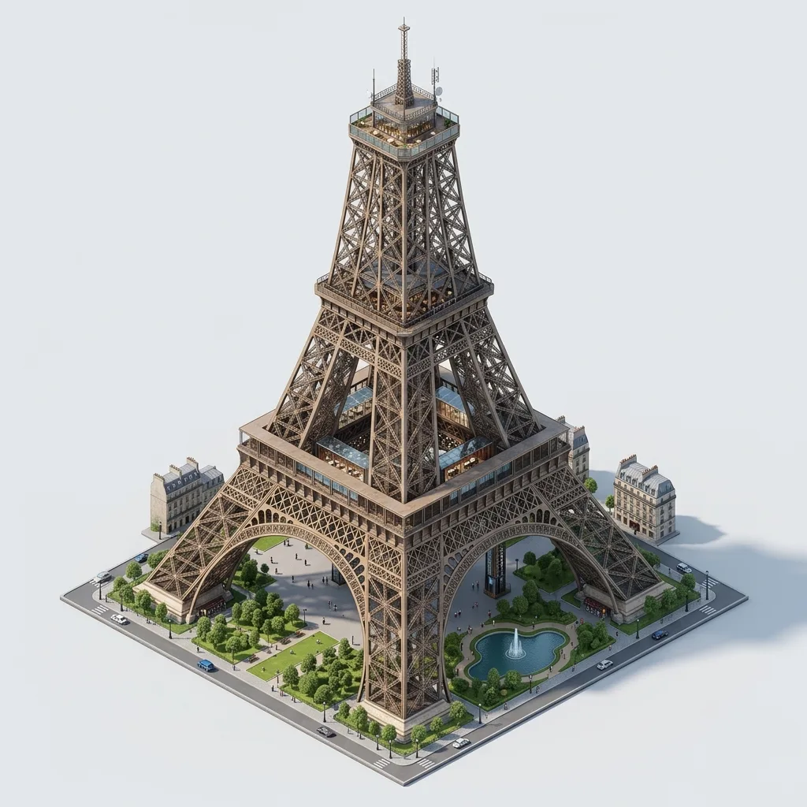

**#340 · Illustration &amp; 3D Prompt · <code>Vinano Image Pro</code>**

<details>
<summary>Show prompt</summary>

```
Create a highly detailed isometric 3D rendering of [LANDMARK] in architectural visualization style. The building is shown at a 45-degree angle from above, displaying three visible sides intricate architectural detail. true-to-life photorealistic textures showing materials like stone, glass, metal, or brick. Include the base/ground level tiny people, cars, and landscaping for scale. Clean white or light grey background. Professional architectural rendering soft ambient shadows beneath the structure. Every window, column, ornamental detail, and structural element clearly visible. 1080x1080 dimension, centered composition. Style similar to video game building assets or architectural presentation models - clean, detailed, slightly stylized but realistic. Render with rich micro-detail while keeping the layout uncluttered and intentional.
```

</details>

---

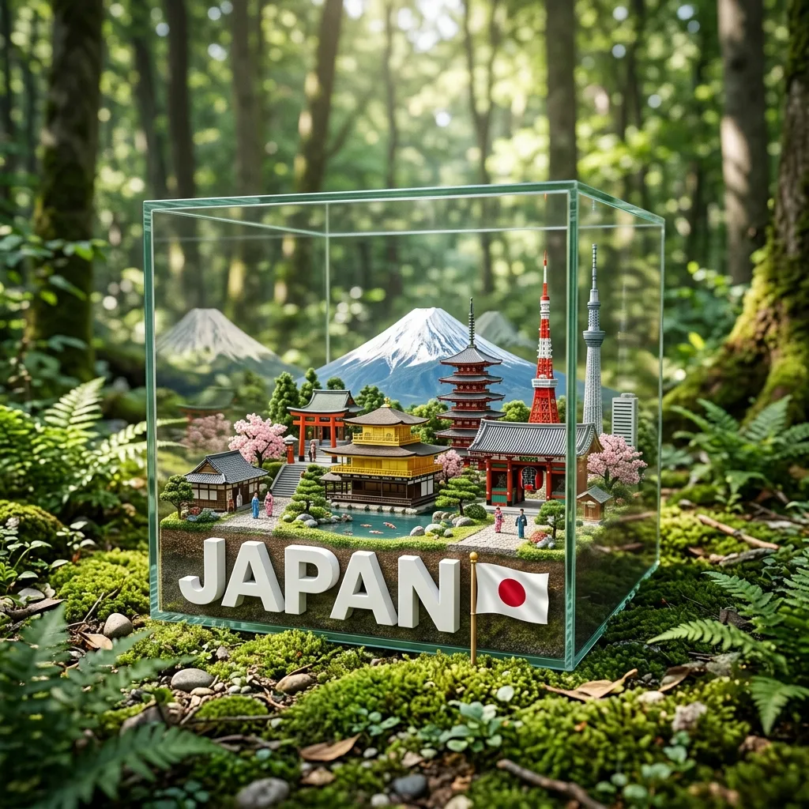

**#341 · Illustration &amp; 3D Prompt · <code>Vinano Image Pro</code>**

<details>
<summary>Show prompt</summary>

```
A hyper-realistic 1080x1080 photograph of a glass cube diorama placed on a lush, mossy forest floor dappled sunlight. Inside the cube are miniature, highly detailed landmarks and cultural icons from [COUNTRY]. Include its most famous and recognizable architecture—traditional and modern—surrounded by greenery. Prominently display the 3D word “COUNTRY” at the base inside the cube, large, bold white block letters and a flagpole of the country's flag. The scene is crisp, elegant, and immersive, the forest background softly blurred to focus on the diorama’s sharp details. Render with rich micro-detail while keeping the layout uncluttered and intentional.
```

</details>

---

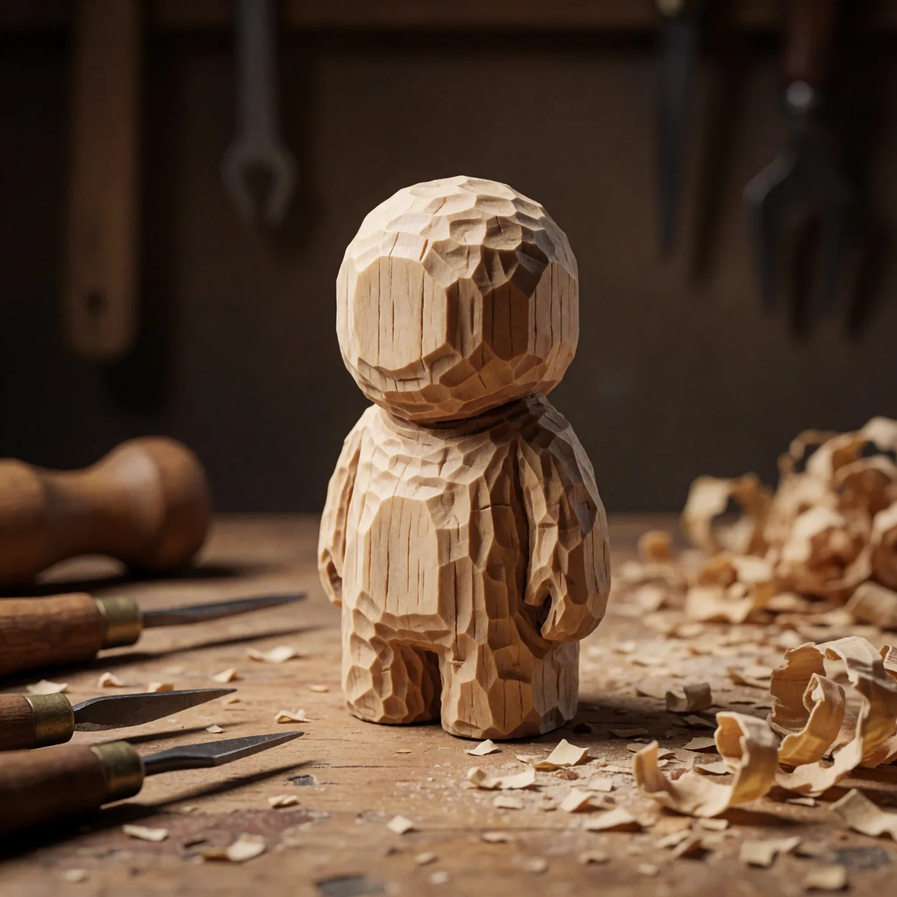

**#342 · Illustration &amp; 3D Prompt · <code>Vinano Flash</code>**

<details>
<summary>Show prompt</summary>

```
A hand-carved wooden miniature figure of [NAME], shaped visible knife marks, natural grain texture, and smooth unfinished edges. Placed on a workshop table carving tools, wood shavings, and soft warm directional lighting. 1080×1080. Render with rich micro-detail while keeping the layout uncluttered and intentional.
```

</details>

---

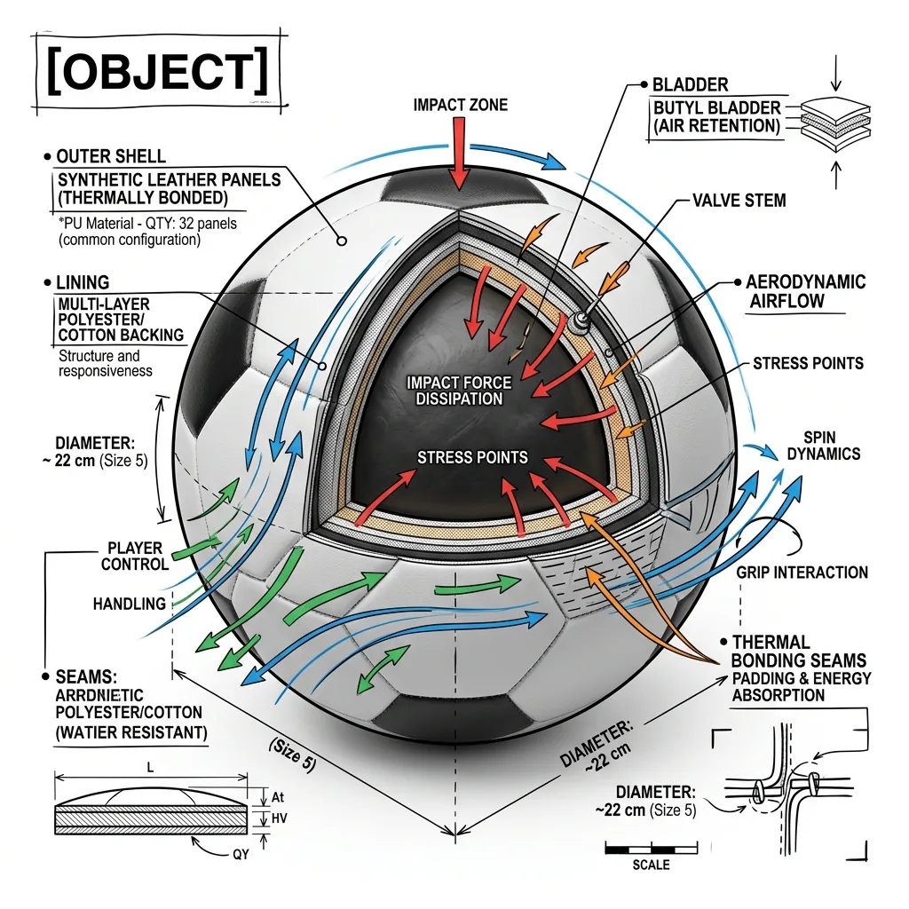

**#343 · Illustration &amp; 3D Prompt · <code>Vinano Image Pro</code>**

<details>
<summary>Show prompt</summary>

```
Create a technical infographic of [OBJECT] a 45-degree isometric 3D perspective, slightly tilted to reveal depth, structure, and internal construction.

Combine a realistic photoreal render black ink technical annotations on a pure white background. Include:
• Key component labels clean callout boxes
• Internal structure visibility through cutaway or exploded sections
• Measurements, dimensions, and scale markers
• Material callouts and quantities
• Color-coded arrows indicating functional systems:
•RED: impact force, collision zones, stress points
•BLUE: airflow, spin, grip interaction, movement dynamics
•GREEN: player control, handling, ergonomics
•ORANGE: padding, reinforcement, energy absorption

Include simple sectional diagrams or force-flow schematics where relevant.

Place the title “[OBJECT]” inside a hand-drawn technical annotation box in the top-left corner.

Style:
Black ink technical linework (architectural / engineering manual style), precise but slightly hand-sketched. The object remains clearly visible beneath annotations. Clean, museum-exhibit / sports engineering vibe.

Perspective:
Isometric 3D angle emphasizing depth, form, and internal architecture — like a professional equipment teardown.

Color palette:
White background, black linework ~10–15% accent color usage (functional arrows only).

Output:
1080×1080, ultra-crisp, social-feed optimized, no watermark.

Keep edges clean and the overall composition balanced for a polished, gallery-ready result.
```

</details>

---

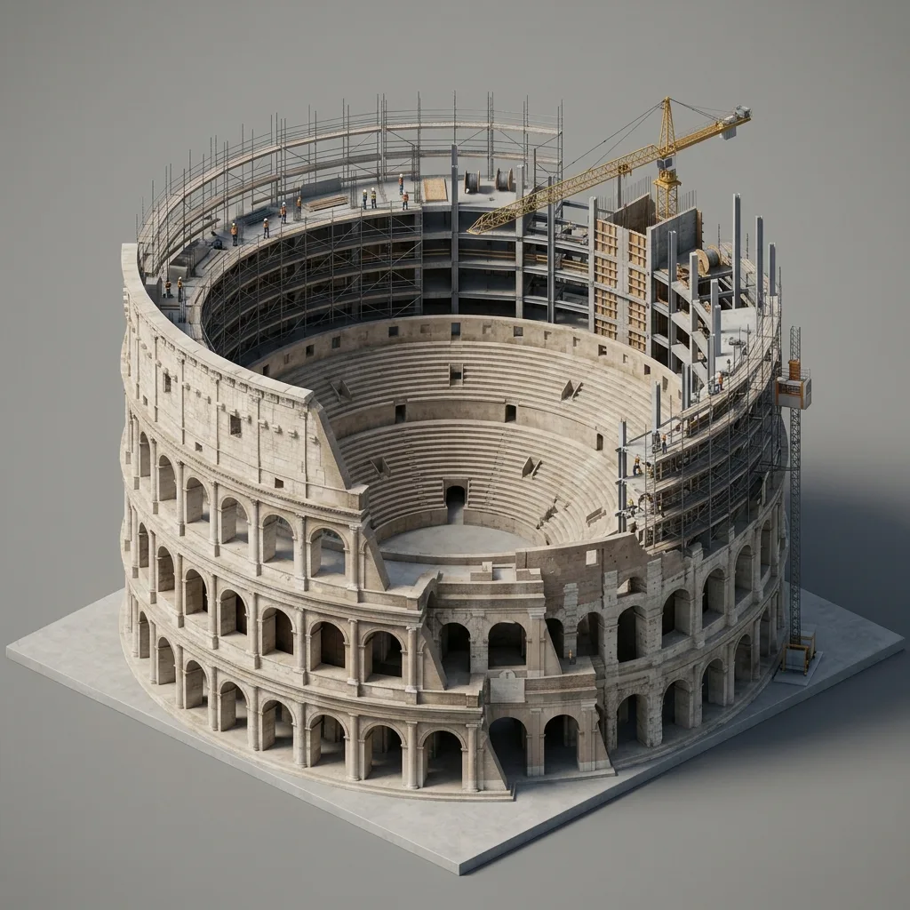

**#344 · Illustration &amp; 3D Prompt · <code>Vinano Image Pro</code>**

<details>
<summary>Show prompt</summary>

```
Depict [LANDMARK] frozen in an eternal state of construction. Camera & Angle (LOCKED): 45° elevated isometric view, camera distance fixed so the full landmark fills ~70% of the frame. No tilt variation. Structure: Lower sections are fully completed, solid, and instantly recognizable. Upper sections transition cleanly into unfinished construction: scaffolding, cranes, exposed beams, cables, and skeletal frameworks. The transition line between finished and unfinished is clearly visible and architecturally precise. Scale & Detail: Include small, static construction workers placed on scaffolding for scale. Include exactly 1–2 construction machines (crane arm, lift, or hoist), frozen in place. No motion, no blur, no debris falling. Materials (CONSISTENT): Finished areas: polished stone / glass / steel (appropriate to the landmark). Unfinished areas: raw concrete, steel beams, cables, structural frames. Materials are clean, realistic, and consistent across all renders. Lighting (LOCKED): Soft neutral filmic, cinematic lighting from upper left. Balanced exposure, gentle shadows, no dramatic highlights. Composition (LOCKED): Perfectly centered, symmetrical balance. Landmark sits on a subtle base or ground plane. Square format 1080×1080. Background (LOCKED): Minimal neutral sky or studio-gray backdrop. No clouds, no gradients, no distractions. Style: Hyper-realistic architectural render. Clean, precise, calm, and monumental. No stylization, no painterly effects. Mood: Timeless, quiet, contemplative. Frozen progress — never finished, never decaying. Preserve realistic proportions and depth for a confident, professional finish.
```

</details>

---

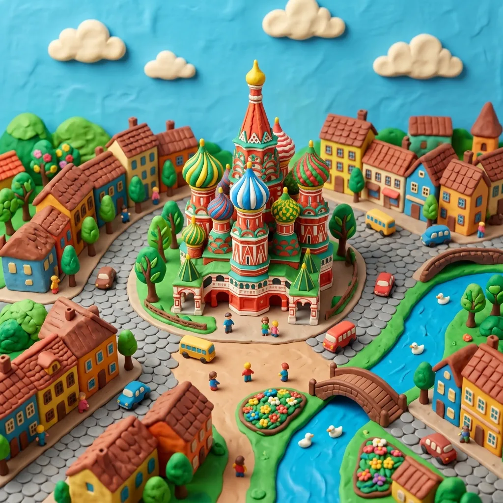

**#345 · Illustration &amp; 3D Prompt · <code>Vinano Image Pro</code>**

<details>
<summary>Show prompt</summary>

```
Generate a whimsical miniature world featuring [LANDMARK NAME] crafted entirely from colorful modeling clay. Every element - buildings, trees, waterways, and urban features - should appear hand-sculpted visible fingerprints and organic clay textures. Use a playful, childlike style vibrant colors: bright azure sky, puffy cream clouds, emerald trees, and buildings in warm yellows, oranges, reds, and blues. The handmade quality should be evident in every surface and gentle curve.
Capture from a wide perspective showcasing the entire miniature landscape in a harmonious, joyful composition. Include no text, words, or signage - only sculptural clay elements that define the location through recognizable architectural features

Maintain consistent colour harmony and crisp focus across the whole frame.
```

</details>

---

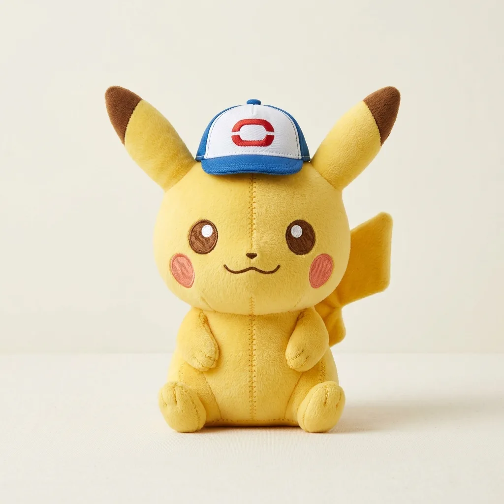

**#346 · Illustration &amp; 3D Prompt · <code>Vinano Image v2</code>**

<details>
<summary>Show prompt</summary>

```
A soft, premium-quality plush toy of [CHARACTER], an oversized head, small body, and stubby limbs. Made of fuzzy fabric visible stitching and embroidered facial features. The plush is shown sitting or standing against a neutral background. The expression is cute or expressive, and it wears simple clothes or iconic accessories if relevant. Lighting is soft and even, a realistic, collectible plush look. Centered, full-body view Aim for an editorial, design-driven look with deliberate negative space.
```

</details>

---

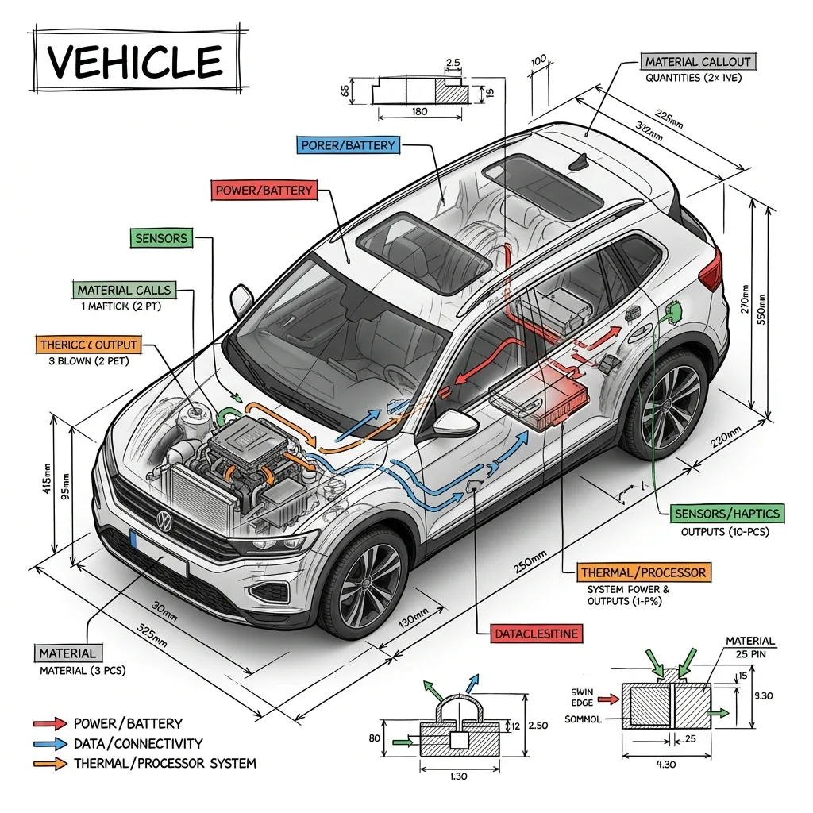

**#347 · Illustration &amp; 3D Prompt · <code>Vinano Image Pro</code>**

<details>
<summary>Show prompt</summary>

```
Create a technical infographic of [VEHICLE] a 45-degree isometric 3D perspective showing the device slightly tilted to reveal depth and dimension.
Combine a realistic photoreal render black ink technical annotations on pure white background. Include:
Key component labels color-coded callout boxes
Internal component visibility through transparent/cutaway sections
Measurements, dimensions, and precise scale markers
Material callouts and quantities
Color-coded arrows for function/flow: RED (power/battery), BLUE (data/connectivity), ORANGE (thermal/processor), GREEN (sensors/haptics)
Simple schematics or cross-sectional diagrams where relevant

Place “VEHICLE” title in a hand-drawn technical box (top-left corner).
Style: Black linework (technical pen/architectural), sketched but precise. Object remains clearly visible. Educational museum-exhibit vibe. crisp composition, balanced negative space.
Perspective: Isometric 3D angle—tilted to show depth, dimension, and internal architecture dramatically. Like a professional product teardown or engineering manual.
Colors: ~10-15% accent density. Black dominant. White background.
Output: 1080×1080, ultra-crisp, social-feed optimized

Preserve realistic proportions and depth for a confident, professional finish.
```

</details>

---

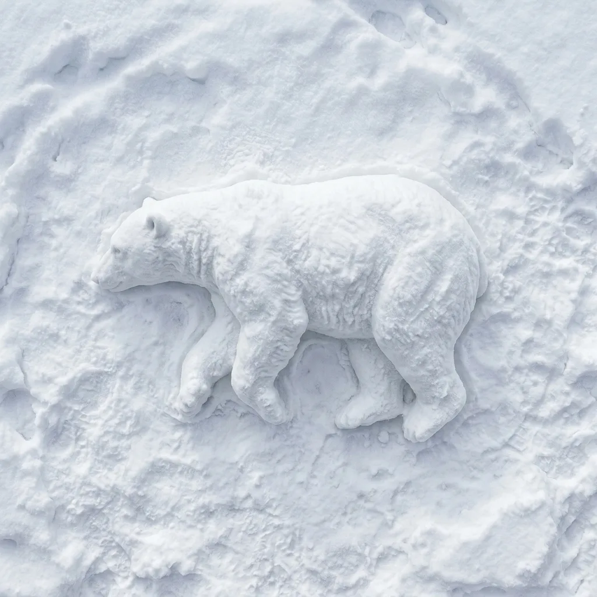

**#348 · Illustration &amp; 3D Prompt · <code>Vinano Image v2</code>**

<details>
<summary>Show prompt</summary>

```
Create a 3D of [OBJECT] made of white snow. The voluminous are lying on a snowy surface, slightly sunken into the snow. Top-down view. A photo realistic highlights and soft shadows. 1080x1080 dimension picture. Emphasise material texture and natural light so the final frame feels tactile and premium.
```

</details>

---

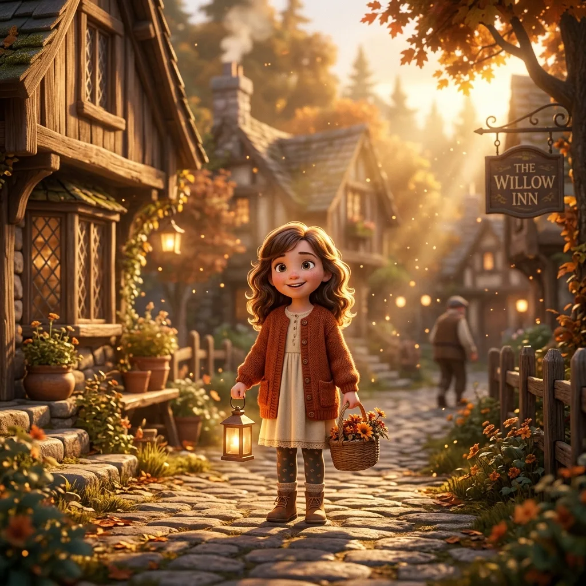

**#349 · Illustration &amp; 3D Prompt · <code>Vinano Image v2</code>**

<details>
<summary>Show prompt</summary>

```
The scene is lit by warm golden hour sunlight, glowing dust particles floating in the air, creating a soft magical atmosphere. Background is a rustic wooden village setting, softly blurred shallow depth of field. filmic, cinematic lighting, soft rim light on hair, volumetric light rays, ultra-detailed, premium quality, Pixar / Disney-style 3D render, cute, cozy, whimsical, warm color palette, 4k, bokeh, soft focus. Maintain consistent colour harmony and crisp focus across the whole frame.
```

</details>

---

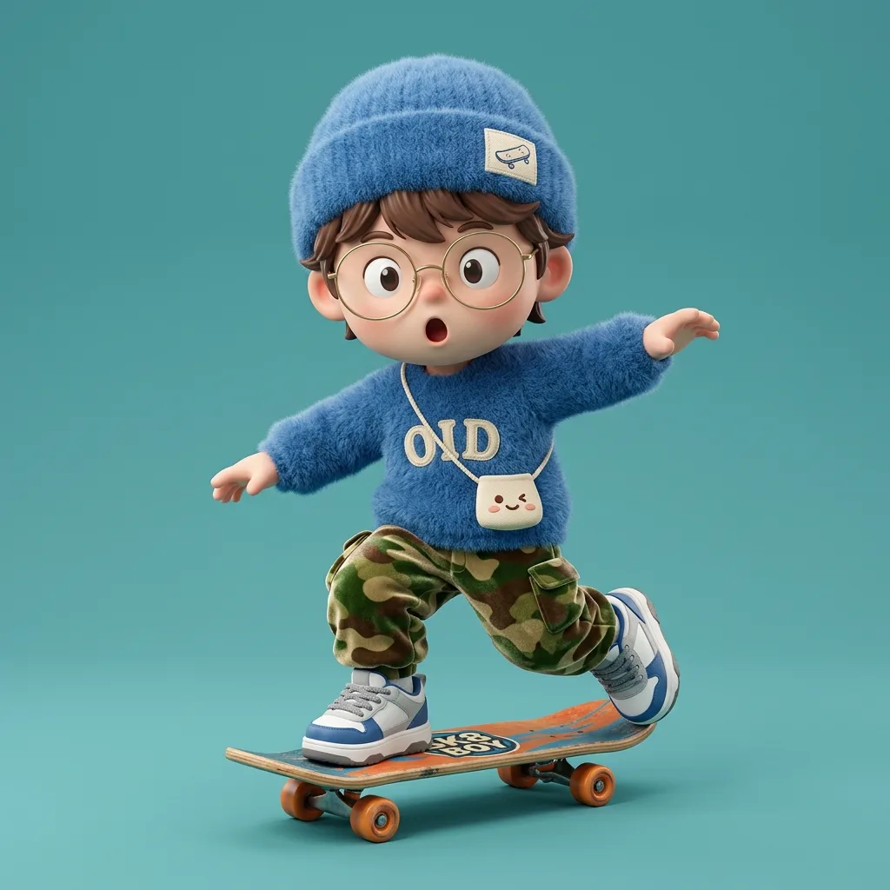

**#350 · Illustration &amp; 3D Prompt · <code>Vinano Image v2</code>**

<details>
<summary>Show prompt</summary>

```
A high-fidelity 3D character render of a cute, stylized boy skateboarding in a dynamic pose. The boy has 'chibi' proportions a large head, wearing oversized round wire-frame glasses and making a surprised 'O' mouth expression. He is dressed in an extremely fuzzy, textured blue mohair sweater the text "OID" on the chest, a matching fuzzy blue beanie a cream patch, and baggy camouflage-patterned pants made of a soft, velvet-like fabric. He wears chunky white sneakers and a small necklace pouch a cartoon face. The background is a solid, seamless teal color. The lighting is soft and diffuse studio lighting, creating a clean, high-end "blind box" art toy aesthetic hyper-realistic fabric textures. Maintain consistent colour harmony and crisp focus across the whole frame.
```

</details>

---

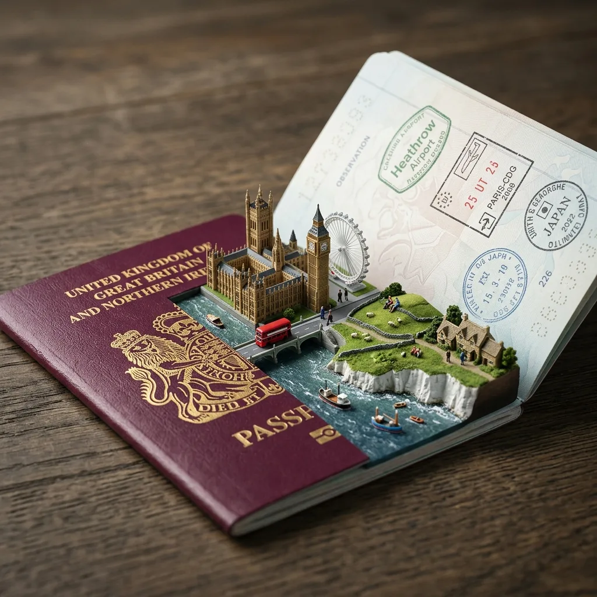

**#351 · Illustration &amp; 3D Prompt · <code>Vinano Image Pro</code>**

<details>
<summary>Show prompt</summary>

```
Hyper-realistic open [COUNTRY] passport on a studio surface, gold-embossed “[Official Passport Name]” text and leather texture. From its pages rises a miniature 3D diorama of [COUNTRY], featuring [ICONIC LANDMARKS], [CITYSCAPES/COASTLINES/COUNTRYSIDE], and tiny human figures for scale. Passport pages show stamps and paper texture. Soft filmic, cinematic lighting, shallow depth of field, ultra-detailed true-to-life photorealistic luxury style. Aim for an editorial, design-driven look with deliberate negative space.
```

</details>

---


**#352 · Illustration &amp; 3D Prompt · <code>Vinano Image Pro</code>**

<details>
<summary>Show prompt</summary>

```
{
 "prompt": "Create a hyper-realistic, ultra-detailed cinematic photo featuring a MINIATURE version of the person from the provided reference image (preserve facial likeness, skin tone, hairstyle, and overall identity). The tiny character is relaxing inside an OPEN vintage hard-shell suitcase that is used like a tiny bed. The suitcase sits on a clean stone/tile floor in a bright room strong natural sunlight casting soft rectangular window shadows across the floor.\n\nONLY VARIABLES:\n1) Character: use the user reference photo for the person’s face and identity.\n2) Theme/Genre: {THEME}\n\nCOMPOSITION & SCALE:\n- The person must be clearly mini-sized (toy-scale) relative to the suitcase, correct perspective and believable proportions.\n- The open suitcase interior is styled like a cozy miniature scene: pillow, textured blanket or towel, and themed tiny props.\n- Add realistic micro-details: fabric weave, zipper teeth, suitcase latches, scuffs, stitching, subtle dust, realistic contact shadows.\n\nTHEME STYLING (derive everything from {THEME}):\n- Choose a cohesive color palette and make the SUITCASE COLOR match the theme (e.g., beach = warm coral/sand; football = deep green/black or team-inspired; sporty = bold neon accents; cozy-casual = muted cream/tan; luxury = black/ivory/gold).\n- Dress the tiny character in an outfit that fits {THEME}.\n- Place 5–8 tiny theme props neatly inside the suitcase near the character (miniature scale, photoreal materials). Examples by theme:\n • Beach: tiny sunscreen bottle, mini sunglasses, seashells, flip-flops, mini straw hat, folded towel.\n • Football/Soccer: tiny soccer ball, mini jersey/scarf, cleats, shin guards, whistle, small tactic board.\n • Sporty/Fitness: tiny water bottle, mini dumbbell, resistance band, smartwatch, towel, energy bar.\n • Cozy/Casual: tiny book/magazine, mug, knitted throw, headphones, mini candle.\n(If {THEME} is different, invent equivalent props that strongly communicate that theme.)\n\nLIGHTING & CAMERA:\n- Bright natural sunlight, soft realistic shadows, subtle bounce light, HDR-like dynamic range.\n- Photographic realism: shallow depth of field (but keep face and key props sharp), 50–85mm lens look.\n- No text, no logos, no watermarks.\n\nFINAL LOOK:\n- Hyper-real, high detail, clean editorial product-photography vibe, believable miniature diorama realism, crisp textures and natural skin rendering.",
 "negative_prompt": "cartoon, CGI, illustration, anime, plastic-looking skin, uncanny face, distorted anatomy, extra fingers, deformed hands, duplicated limbs, wrong perspective, unrealistic scale, blurry, low-res, noisy, harsh artifacts, over-smoothed, bad shadows, floating objects, cluttered scene, messy background, text, watermark, logo, brand names, extra people, face not matching reference",
 "variables": {
 "THEME": "beach | football | sporty | cozy-casual | luxury | etc.",
 "USER_IMAGE": "reference photo uploaded by the user (required)"
 }
}

Preserve realistic proportions and depth for a confident, professional finish.
```

</details>

---

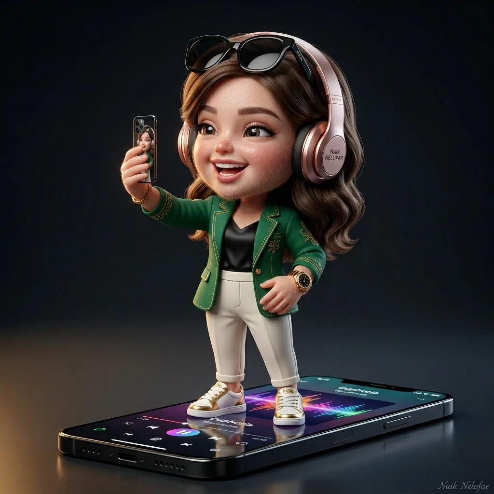

**#353 · Illustration &amp; 3D Prompt · <code>Vinano Image v2</code>**

<details>
<summary>Show prompt</summary>

```
Create a high-detail 3D semi-realistic chibi character slightly exaggerated cute proportions but true-to-life photorealistic facial rendering, natural skin pores, realistic lighting, and finely detailed hair strands. The character should look like a collectible designer toy figure smooth surfaces, high-end materials, and ultra-clean edges. The character is styled in an fashion look: A tailored designer jacket in deep emerald green gold stitching accents A sleek black silk fitted top underneath High-fashion tapered trousers in matte ivory tone  designer sneakers / footwear in white and gold polished details Accessories must feel ultra- and fashionable:  oversized sunglasses glossy black lenses and gold frame   wristwatch metallic gold case and elegant dial Subtle designer bracelet and minimal accents The character stands confidently on top of a giant modern smartphone, like a collectible display piece. They are wearing stylish wireless over-ear headphones in metallic rose gold and holding the phone slightly forward while taking a playful joyful selfie, smiling and laughing energetic expression. The smartphone screen displays a realistic modern music-player interface colorful waveform animations and elegant UI elements. Scene style and lighting: Background: deep cinematic dark brown gradient studio backdrop Lighting: soft studio lighting subtle reflections and rim light Materials: premium-quality fabric textures, polished metals, and realistic plastics Style: collectible toy aesthetic mixed semi-realistic chibi design Camera perspective: Aerial / top-down camera angle Slight cinematic depth of field for realism Rendering quality: Ultra-detailed 3D render 8K resolution smooth shading hyper-clean edges high clarity Add a small elegant watermark text “Naik Nelofar ” at the bottom of the image, subtle but clearly readable. Aspect ratio: 3:4 vertical composition Render with rich micro-detail while keeping the layout uncluttered and intentional.
```

</details>

---

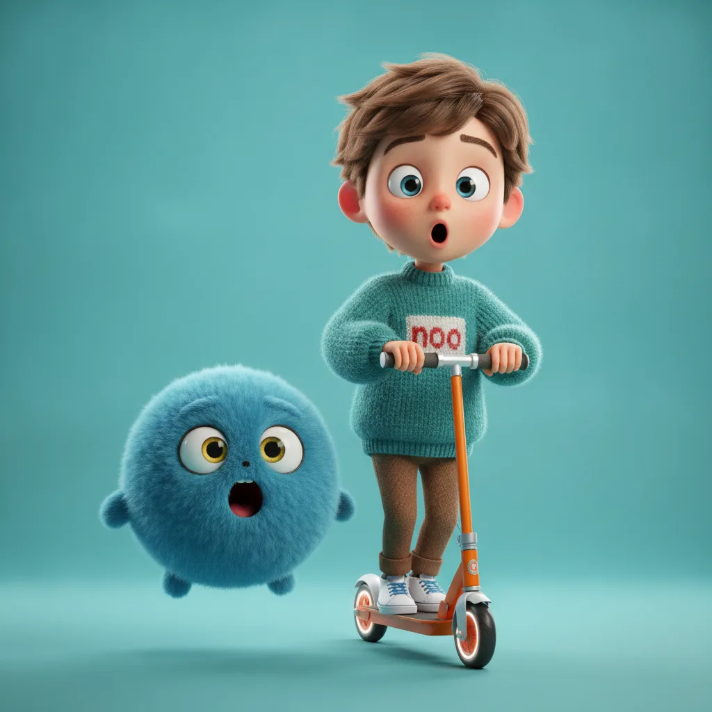

**#354 · Illustration &amp; 3D Prompt · <code>Vinano Image</code>**

<details>
<summary>Show prompt</summary>

```
A premium-quality 3D render of a cute young boy riding an orange electric scooter next to a small, round, furry blue monster. Both characters have shocked expressions wide eyes and open mouths. The boy is wearing a highly textured, fuzzy teal sweater a white patch that reads "noo" in red text, along brown patterned pants and white sneakers. Clean teal studio background, soft, diffused lighting. Preserve realistic proportions and depth for a confident, professional finish.
```

</details>

---

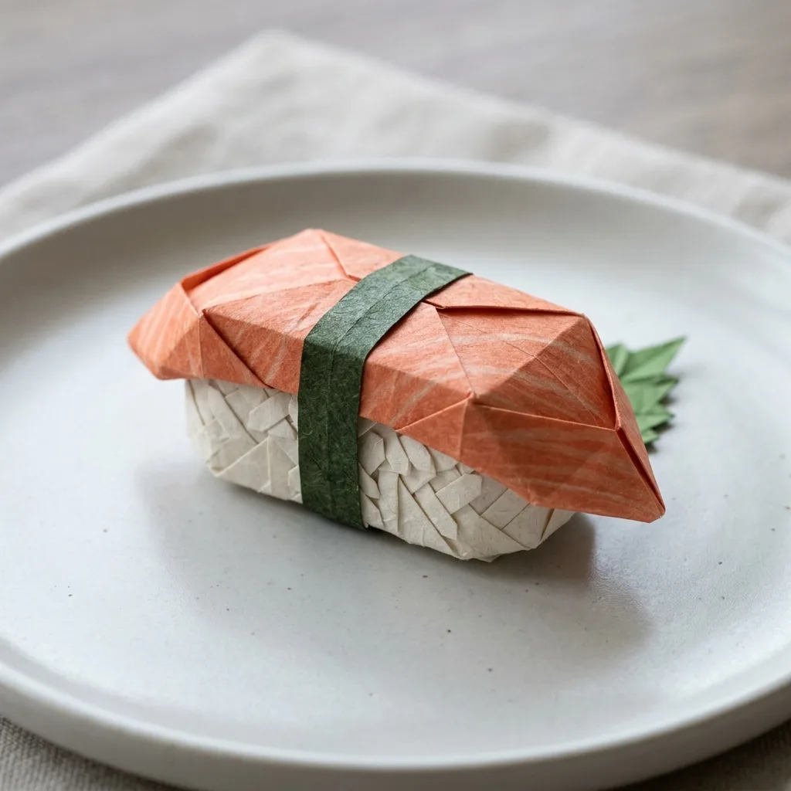

**#355 · Illustration &amp; 3D Prompt · <code>Vinano Image v2</code>**

<details>
<summary>Show prompt</summary>

```
A hyper-detailed origami [FOOD ITEM] folded from realistic colored paper visible creases and paper texture. Complex geometric folds capture the food’s shape, layers, and distinctive features. Placed on clean surface soft shadows, refined minimalist food art photography style Render with rich micro-detail while keeping the layout uncluttered and intentional.
```

</details>

---

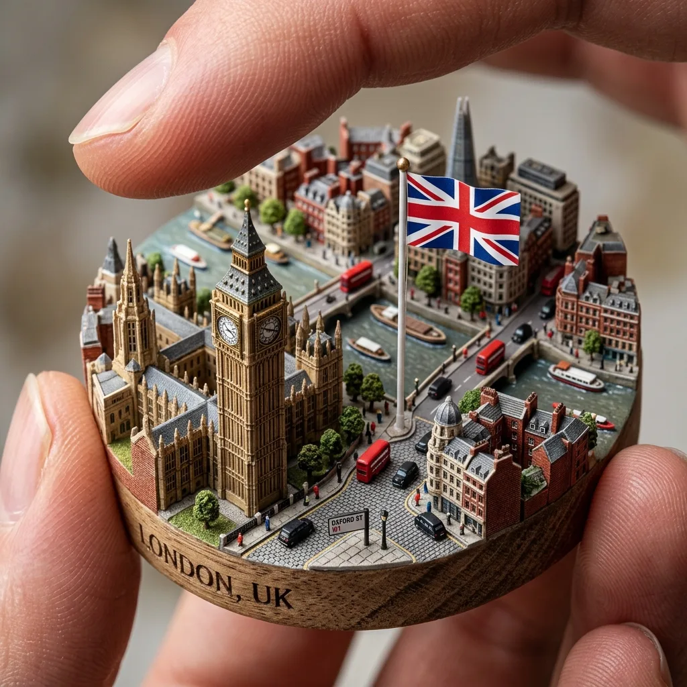

**#356 · Illustration &amp; 3D Prompt · <code>Vinano Image Pro</code>**

<details>
<summary>Show prompt</summary>

```
Extreme close-up macro of miniature city diorama [CITY, COUNTRY] on a solid base, held between two human fingers. City fills 85–95% of frame.
[COUNTRY] national flag stands prominently on flagpole in mid-ground, fully readable, gently waving—primary visual anchor.
[ICONIC LANDMARK] positioned in clear foreground, unobstructed, instantly recognizable, naturally integrated.
Small street sign or plaque displays “[CITY NAME]” as authentic urban detail, positioned organically at street corner or plaza edge.
Surrounding architecture reflects city’s authentic character without oversizing elements.
Ultra-realistic handcrafted miniature, detailed architecture, realistic materials, accurate proportions. Macro lens, deep depth of field keeping entire city sharp. Soft studio lighting, subtle shadows, tilt-shift realism. Neutral softly blurred background. true-to-life photorealistic, cinematic, premium quality.

Maintain consistent colour harmony and crisp focus across the whole frame.
```

</details>

---

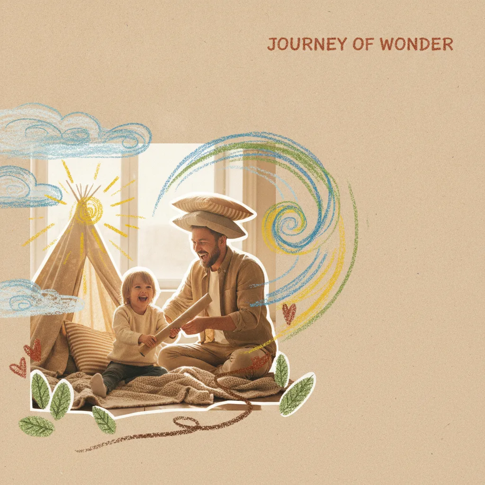

**#357 · Illustration &amp; 3D Prompt · <code>Vinano Image</code>**

<details>
<summary>Show prompt</summary>

```
【テーマ】
{ここにテーマを入力}

【写真】
{ここに使用する写真の内容を簡潔に入力}
（例：公園で遊ぶ子ども / 親子の笑顔 / 走る子ども など）

【タイトル】
{画像内に入れるタイトルを入力}
（例：こどもの日 / Happy Mother's Day / 春のはじまり など）

---

テーマ「{テーマ}」に基づいた、
写真とクレヨンイラストを融合したライフスタイル系エディトリアルビジュアル。

提供された写真をメインビジュアルとして使用する。

■ シーン
「{写真}」に合った自然な日常の瞬間。
作り込みすぎないリアルな空気感、やわらかい自然光、
人物の自然な動きや感情を重視。

■ 構図
人物を切り抜いたように配置し、
ざらっとした紙質のクラフト系背景
（生成り、ベージュ、淡いグレー、ミルクティー）の上にレイアウト。

・余白50%以上
・左右非対称構図
・抜け感のあるミニマルなエディトリアルデザイン

■ イラスト（最重要）
オイルパステル／クレヨンで描いたような、
ざらつきとかすれのある手描きイラストを重ねる。

▼ルール
・全体の30〜40%以内
・線にムラとかすれ、紙のテクスチャが残る
・力の入り具合で濃淡が変化（濃い部分・薄い部分が混在）
・子どもが描いたような少し不器用なタッチ
・影・立体表現は禁止（フラット）
・人物の動きと連動させる（風・軌跡・流れ）

▼モチーフ（テーマ連動）
・{テーマ}を象徴する要素をクレヨンタッチで追加
（例：こどもの日 → 鯉のぼり、風、空、草、雲、紙かぶと）
・風の線、動きの線、小さなアイコン、太陽、雲、お花、ハート、星、ジグザグの動線
・空気感をクレヨンの粗いストロークで演出

■ タイトル文字（重要）
画像内に「{タイトル}」を手描きクレヨン文字で配置する。
・配置は左上または右上の余白部分
・クレヨンで書いたようなざらつき・かすれのある文字
・少し不器用で味のある手書き風
・文字色はアースカラー（テラコッタ、マスタード、ダークブラウン）から選択
・サイズは控えめでミニマルに（主役は写真）
・装飾枠なし、フラット

■ 色
あたたかみのあるアースカラー、
やわらかいくすみカラー
（テラコッタ、マスタード、オリーブ、ミルクティー、淡いブルー）

■ 雰囲気
あたたかい、ノスタルジック、こども心、ハンドメイド感、
やさしい、エモーショナル、ストーリー性のある日常

■ スタイル
絵本的ぬくもり × 北欧ミニマル × 上質なライフスタイル広告

■ 品質
高解像度、商用レベルのクオリティ

追求杂志编辑式的设计感，刻意安排留白与视觉重心。
```

</details>

---

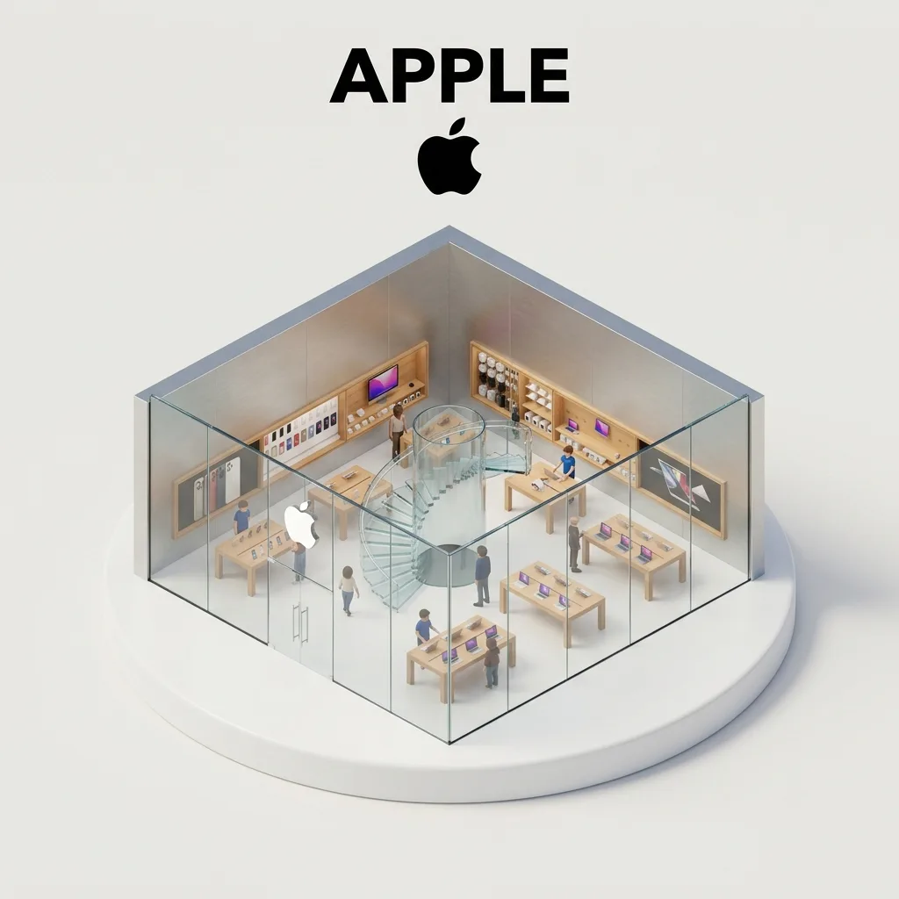

**#358 · Illustration &amp; 3D Prompt · <code>Vinano Image Pro</code>**

<details>
<summary>Show prompt</summary>

```
Present a clear, 45° top-down isometric miniature 3D cartoon diorama of the [BRAND], soft refined textures, realistic PBR materials, and gentle lifelike lighting.
Create a small raised diorama-style base that includes the most recognizable elements of the store, along tiny stylized characters if needed (no facial details).
Use a clean solid [BACKGROUND COLOR] background.

At the top-center, display [BRAND] in large bold text, and place the official logo associated [BRAND] below the subtext.
All text must automatically match the background contrast (white or black).

Composition: perfectly centered layout, square 1080x1080, ultra-clean, high-clarity diorama aesthetic.

Render with rich micro-detail while keeping the layout uncluttered and intentional.
```

</details>

---

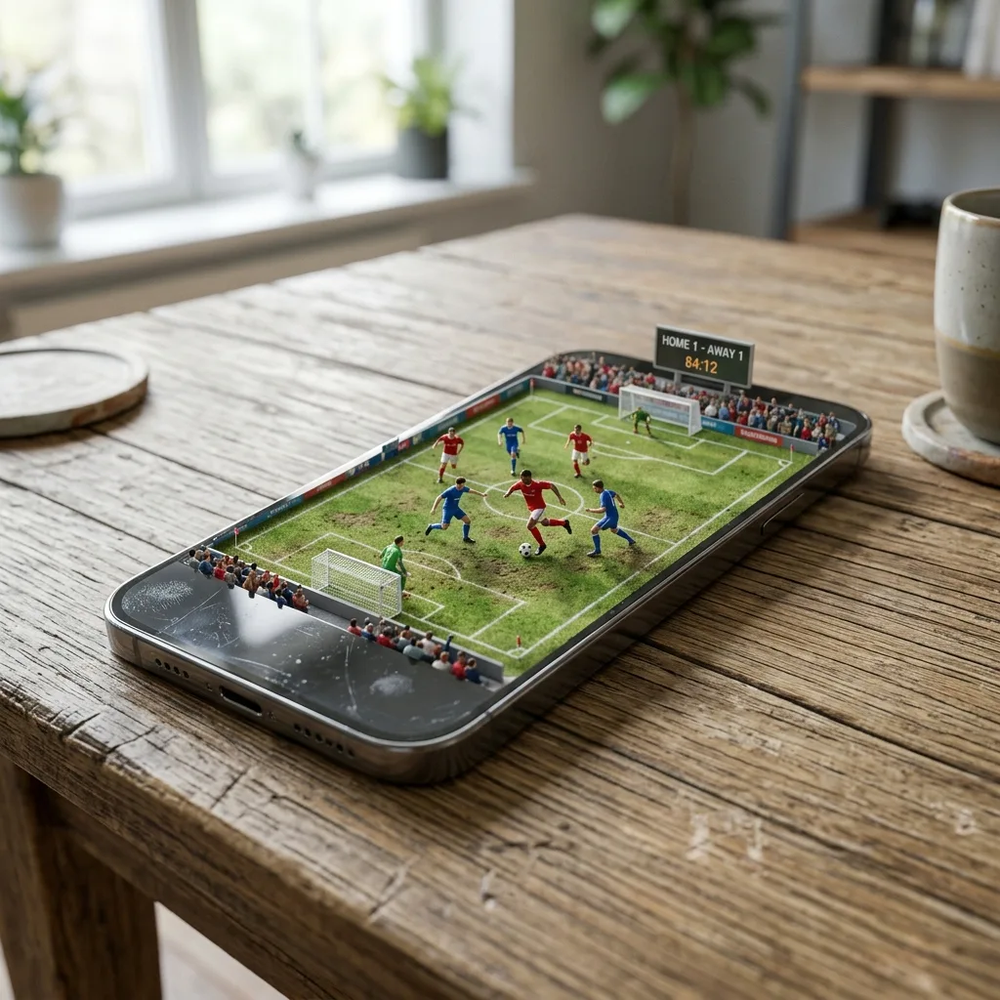

**#359 · Illustration &amp; 3D Prompt · <code>Vinano Image v2</code>**

<details>
<summary>Show prompt</summary>

```
{
 "type": "image_generation",
 "style": "hyper_realistic",
 "quality": "8K DSLR",
 "aspect_ratio": "4:5",
 "camera": {
 "angle": "slightly tilted cinematic perspective",
 "lens": "50mm DSLR",
 "depth_of_field": "shallow",
 "focus": "smartphone and football action"
 },
 "scene": {
 "setting": "smartphone placed on a wooden table",
 "concept": "phone screen transformed into a miniature football stadium",
 "environment": "indoor, soft daylight coming from the side",
 "atmosphere": "cinematic, immersive, realistic"
 },
 "details": {
 "screen": "weathered green football pitch visible wear, dirt patches, and grass texture",
 "players": "miniature football players actively playing a match dynamic poses",
 "lighting": "soft diffused daylight subtle lens flares and realistic reflections",
 "realism_effects": ["fingerprints on screen",
 "light scratches on phone body",
 "natural smudges",
 "micro dust particles"]
 },
 "materials": {
 "phone": "metallic frame realistic reflections",
 "table": "textured wooden surface warm tones"
 },
 "mood": "high-end cinematic, dramatic, premium advertising look",
 "rendering": {
 "sharpness": "ultra sharp",
 "texture_detail": "extreme",
 "lighting_quality": "studio grade",
 "photorealism": true
 }
}

Maintain consistent colour harmony and crisp focus across the whole frame.
```

</details>

---

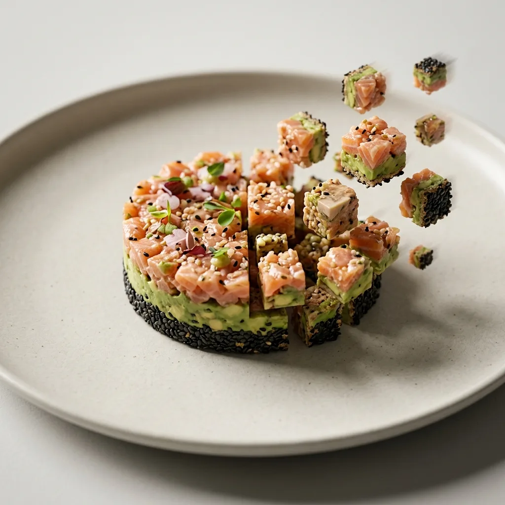

**#360 · Illustration &amp; 3D Prompt · <code>Vinano Image v2</code>**

<details>
<summary>Show prompt</summary>

```
refined minimalist food photograph, [1080x1080] – a single [FOOD] rests on a light, matte surface and is captured mid-transformation into a 3D pixelized form: one half remains intact while the other organically fragments into large, floating cubes that drift outward, each cube revealing the object’s texture, ingredients, and colors. Studio lighting soft, realistic shadows, shallow depth of field, tasteful perspective and composition, hyperrealistic detail, stylish geometric abstraction, subtle motion blur on the cubes, high resolution, cinematic close-up. Keep edges clean and the overall composition balanced for a polished, gallery-ready result.
```

</details>

---

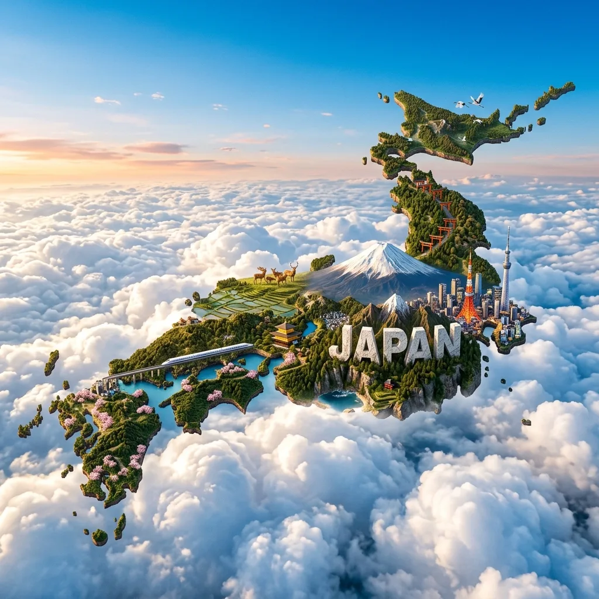

**#361 · Illustration &amp; 3D Prompt · <code>Vinano Image Pro</code>**

<details>
<summary>Show prompt</summary>

```
Create an ultra-HD, hyper-realistic digital poster of a floating miniature island shaped like [Country], resting on white clouds in the sky. Blend iconic landmarks, natural landscapes (like [landmark 1], [landscape 2], or [landscape 3]), and cultural elements unique to [Country]. Carve "[Country]" into the terrain large white 3D letters. Add artistic details like [wildlife], filmic, cinematic lighting, vivid colors, aerial perspective, and sun reflections to enhance realism Keep edges clean and the overall composition balanced for a polished, gallery-ready result.
```

</details>

---

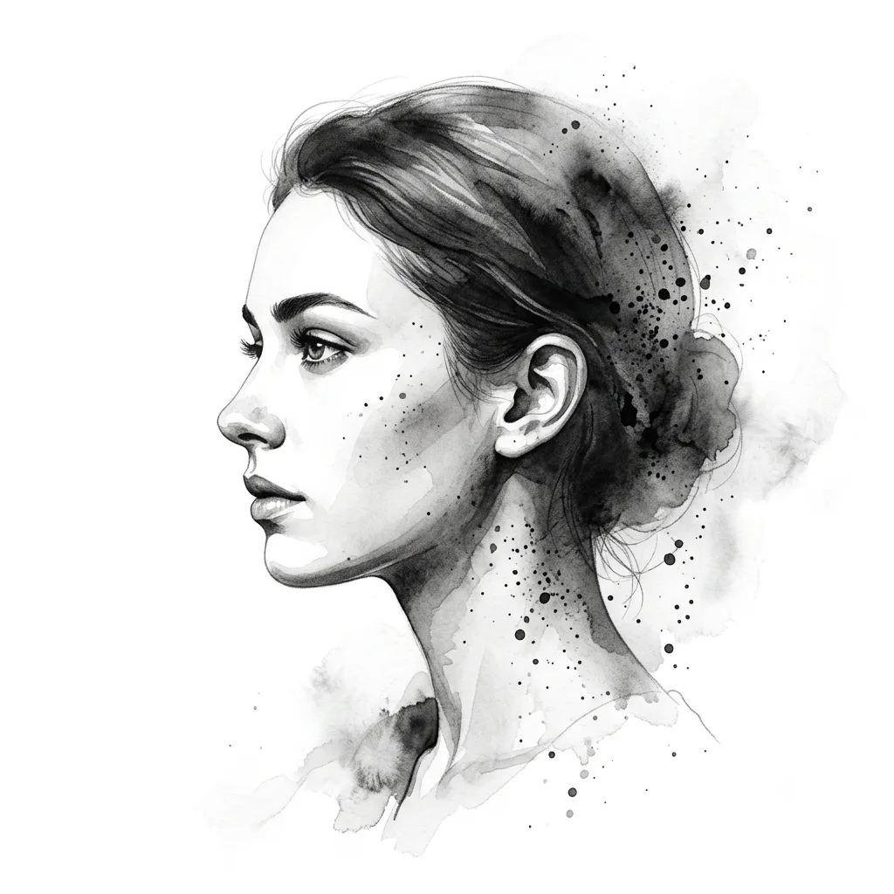

**#362 · Illustration &amp; 3D Prompt · <code>Vinano Image v2</code>**

<details>
<summary>Show prompt</summary>

```
Transform the input photo into a refined monochromatic ink portrait on a pure white background. Clean side profile facing left, preserving exact facial identity and proportions. Soft charcoal-gray ink subtle tonal variation, controlled splatter accents, delicate watercolor diffusion, and faint mist-like dispersion along the edges. Render with rich micro-detail while keeping the layout uncluttered and intentional.
```

</details>

---

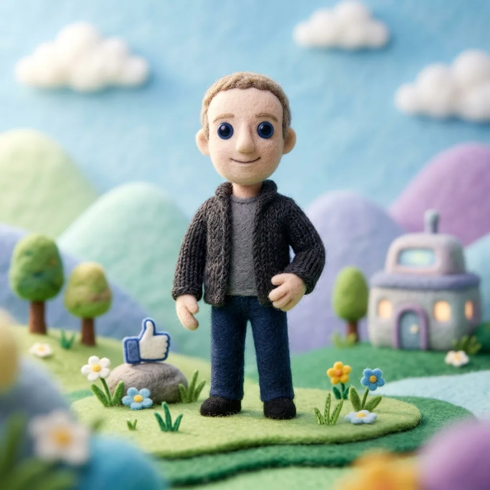

**#363 · Illustration &amp; 3D Prompt · <code>Vinano Image v2</code>**

<details>
<summary>Show prompt</summary>

```
A handcrafted felt miniature illustration of [Celebrity] reimagined as a soft wool doll character. The figure has simplified facial features, button-like eyes, subtle smile, and carefully crafted felt textures. He is wearing an outfit inspired by his iconic casual tech style—dark jacket, simple t-shirt, and trousers—recreated in knitted wool and fabric. The scene has a whimsical, storybook feel grassy felt terrain, pastel hills, and a bright sky soft clouds. Macro photography look, shallow depth of field, soft natural lighting, stop-motion animation aesthetic, ultra-detailed fibers and fabric textures, cozy yet futuristic mood, cinematic composition, premium quality. Preserve realistic proportions and depth for a confident, professional finish.
```

</details>

---

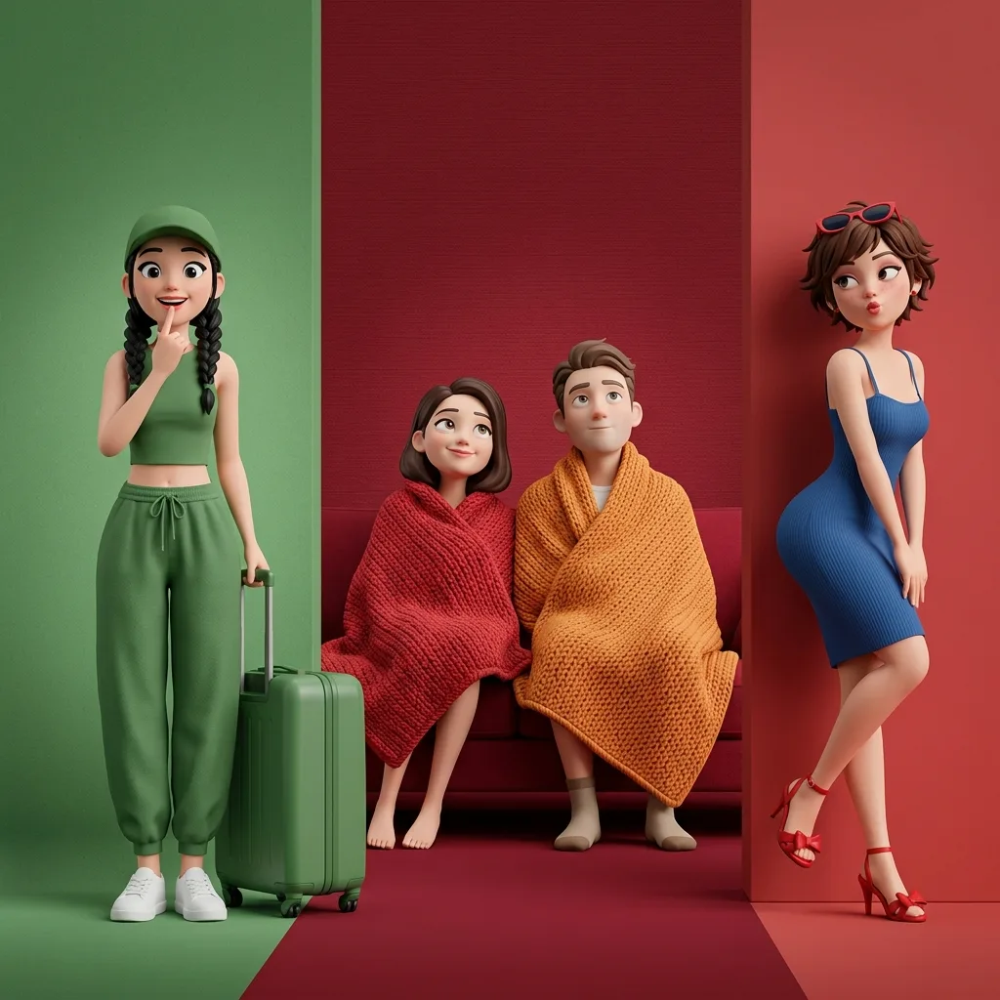

**#364 · Illustration &amp; 3D Prompt · <code>Vinano Image v2</code>**

<details>
<summary>Show prompt</summary>

```
{
 "global_settings": {
 "resolution": "8K",
 "quality": "ultra-high definition",
 "aspect_ratio": "2:3",
 "render_style": "AI-edited, high-detail 3D render",
 "lighting_quality": "soft studio lighting realistic shadows",
 "sharpness": "extreme clarity, crisp edges",
 "noise": "none",
 "compression": "none"
 },

 "Module_1_Image_1_Style": {
 "subject": {
 "character_type": "stylized 3D cartoon female",
 "pose": "standing, body slightly angled, one hand raised index finger touching lips",
 "expression": "cheerful smile, wide eyes",
 "hair": {
 "color": "black",
 "style": "two braided pigtails",
 "accessories": "green cap"
 },
 "face": {
 "eyes": "large, rounded, dark pupils",
 "skin": "smooth, matte, stylized texture"
 }
 },
 "clothing": {
 "top": "sleeveless green crop top",
 "bottom": "loose green jogger-style pants drawstring",
 "footwear": "white sneakers"
 },
 "accessories": {
 "luggage": "green hard-shell suitcase extended handle"
 },
 "color_palette": ["multiple shades of green",
 "white accents"],
 "background": {
 "color": "solid green",
 "texture": "soft, slightly grainy studio backdrop"
 },
 "composition": {
 "framing": "full body",
 "camera_angle": "eye-level",
 "depth": "subject sharply separated from background"
 }
 },

 "Module_2_Image_2_Style": {
 "subject": {
 "character_type": "stylized 3D cartoon female",
 "pose": "leaning slightly backward against background",
 "expression": "playful, lips slightly pursed, eyes looking sideways",
 "hair": {
 "color": "brown",
 "style": "short, tousled",
 "accessories": "red sunglasses resting on head"
 }
 },
 "clothing": {
 "dress": "form-fitting blue ribbed dress thin straps",
 "footwear": "red high-heel sandals bow detail"
 },
 "color_palette": ["bold red",
 "deep blue"],
 "background": {
 "color": "solid red",
 "texture": "smooth matte surface"
 },
 "lighting": {
 "direction": "soft directional light from one side",
 "shadow": "defined shadow cast on red background"
 },
 "composition": {
 "framing": "full body",
 "pose_emphasis": "curved posture, crossed legs"
 }
 },

 "Module_3_Image_3_Style": {
 "subject": {
 "characters": [{
 "type": "stylized 3D cartoon female",
 "position": "left",
 "wrapped_in": "red textured blanket",
 "expression": "calm, slight smile, eyes looking upward"
 },
 {
 "type": "stylized 3D cartoon male",
 "position": "right",
 "wrapped_in": "orange textured blanket",
 "expression": "neutral, gentle gaze upward"
 }]
 },
 "environment": {
 "furniture": "red sofa",
 "floor": "red surface",
 "background": {
 "color": "deep red",
 "texture": "fabric-like horizontal texture"
 }
 },
 "details": {
 "feet": "female barefoot, male wearing socks",
 "blanket_texture": "thick, knitted fabric"
 },
 "composition": {
 "framing": "centered, medium-wide shot",
 "symmetry": "balanced left and right composition"
 }
 },

Aim for an editorial, design-driven look with deliberate negative space.
```

</details>

---

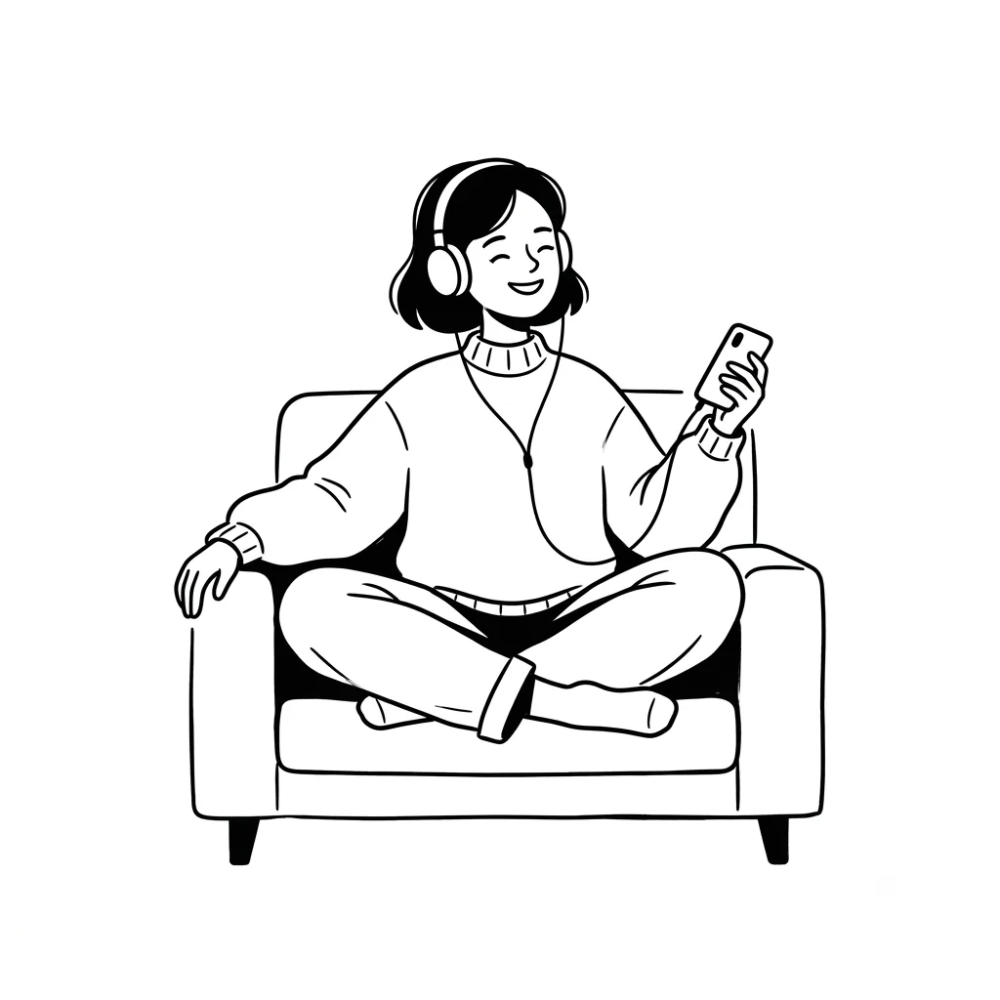

**#365 · Character, Minimalist · <code>Vinano Image Pro</code>**

> Keywords: character, minimalist, AI art, AI prompt, text to image

<details>
<summary>Show prompt</summary>

```
A simple black-and-white illustration of a [subject] in [outfit], [doing action], a [facial expression] expression, in a Notion-style refined minimalist editorial aesthetic, clean line art, flat monochrome design, simple shapes, subtle hand-drawn feel, minimal detail, expressive posture, clean white background, neat modern layout, soft playful character style Keep edges clean and the overall composition balanced for a polished, gallery-ready result.
```

</details>

---

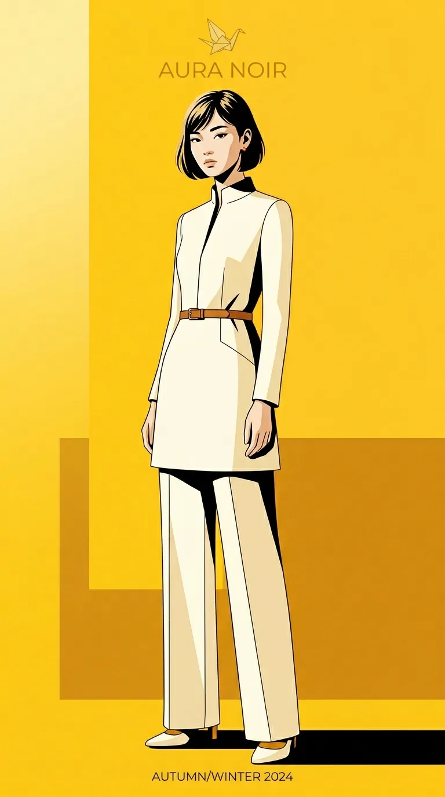

**#366 · Ai Art, Ai Prompt · <code>Vinano Image v2</code>**

> Keywords: AI art, AI prompt, text to image

<details>
<summary>Show prompt</summary>

```
高端日系时装杂志封面感插画，主体为[Subject]，竖版 9:16，极简现代二次元时装插画风，精致赛璐璐上色，干净锐利的大色块塑形，几乎无线稿，边缘优雅清晰。整体改为黄黑色系配色，以明黄、金黄、琥珀黄作为主背景或主环境色，以米白、奶油白、浅肤色作为主体基础色，阴影与暗部使用纯黑、炭黑、深灰黑的硬边块面表现，形成强烈而高级的黄黑对比。可少量加入赭黄、焦糖色、灰褐色或极小面积橘红作为辅助点缀，但整体仍然简约、统一、不花哨。背景干净，保留大面积负空间。强烈光线从左上方照射，亮部通透，暗部利落，主体轮廓修长，姿态安静冷淡，整体像高级时尚杂志封面，醒目、极简、时尚、疏离。无文字，无水印，无复杂背景，无写实摄影，无 3D，无厚涂，无低幼卡通，无杂乱装饰。 在保证细节的同时保持版式克制、留白得当。
```

</details>

---

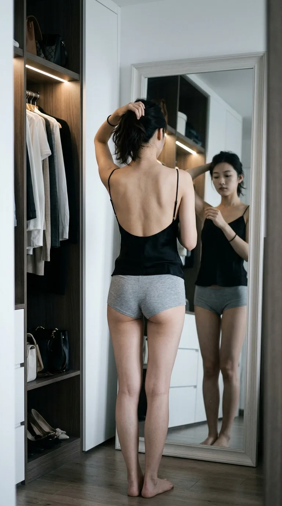

**#367 · Realistic, Portrait · <code>Vinano Image v2</code>**

> Keywords: realistic, portrait, cinematic, AI art, AI prompt, text to image

<details>
<summary>Show prompt</summary>

```
生成一张 9:16 的写实纯欲风格女性生活照。

画面主体是一位 20–28 岁年轻成年东方女性，具有自然明确的东方女性特征，不过度欧美化，不显年龄偏大，没有未成年感。人物整体气质为 清冷、克制、私密、有故事感、纯欲，同时呈现安静、柔和、克制与明显女性吸引力。她不是网红脸，不是过度精修写真脸，而是像真实生活中安静、干净、自然，却具有明确身体吸引力的年轻女性。

人物五官方向为 清冷淡颜。脸型偏窄鹅蛋脸或轻微长鹅蛋脸，面部轮廓干净利落；眼型偏细长杏眼或内敛凤眼感，眼神清透安静，略带轻微距离感；鼻型清秀挺直，唇形自然克制。由于人物背对镜头站在镜前，脸部主要通过落地镜中的隐约映像呈现，因此镜中侧脸需要保留清晰但克制的清冷辨识度。整体五官必须清纯干净、自然真实，不网红化，不假面感，不幼态化。

人物身形方向为 腰背臀曲线感，身形吸引力强度为 中。整体比例真实协调，后背线条流畅柔和，肩背与腰背转折自然，腰窝隐约可见，腰臀比例好看，整体身体轮廓具有明确女性吸引力与柔和自然的 S 型曲线。重点突出 后颈、肩线、蝴蝶骨、腰窝、腰臀比，但必须保持克制、真实、干净，不低俗，不刻意色情化。

整体风格为 电影生活剧照感，即 realistic sensual lifestyle portrait / naturalistic intimate portrait / cinematic everyday body portrait。画面像一张极简、干净、克制的写实纯欲生活照，真实、柔和、安静，带有轻微私密空间氛围与明显身体吸引力，但不是情色写真，不是廉价情趣风，不是影楼大片，也不是 CG 或 AI 插画风。

场景设定在真实的 私人衣帽间 中，画面包含 落地镜、柜内暖白灯、半开的衣柜，环境干净、简洁、克制，有生活痕迹但不杂乱。半开的衣柜与镜面共同营造私密空间感，让人物的背部与腰臀线条成为视觉重点。

服装为 黑色真丝露背吊带上衣，灰色低腰三角短裤，背部裸露明显。整体材质应简洁、真实、有质感，黑色真丝上衣强调肩背线条与露背结构，灰色低腰短裤自然体现腰臀比例与低腰轮廓。服装整体必须贴身、克制、干净，不低俗，不廉价，不夸张，不情趣化。

姿势采用 人物背对镜头站在镜前，一只手整理头发，脸在镜中隐约可见。人物自然站立，重心轻微偏移，一侧胯部轻微放松，肩颈舒展，后颈自然露出，肩线与蝴蝶骨清晰但柔和，腰背自然收束，腰窝与腰臀比隐约显现。动作简单稳定，不复杂，不高难度摆拍，不刻意色情化。

光线氛围为 柔和冷白主光 + 柜内暖白点光。整体以柔和冷白主光维持清冷、低反差、通透的画面基底，柜内暖白点光作为局部氛围补充，轻微勾勒头发边缘、背部轮廓、镜框 and 衣柜层次，使画面更有生活剧照感与私密情绪感。阴影轻柔，身体曲线边缘清楚但不过硬，皮肤保留真实细腻纹理与轻微柔光感。

整体套用 冷白纯欲生活照滤镜 + 轻微私密生活感。画面采用低饱和冷白、柔和灰白、浅米灰和干净肤色体系，整体极简、克制、通透、安静，不要高饱和暖黄，不要明显青橙调色，不要复古偏色。整体突出清冷五官、背部与腰臀曲线，以及衣帽间私密空间里的静谧氛围。

镜头为平视或轻微俯视，使用 50mm 或 35mm 真实摄影视角，避免超广角变形。构图以人物背影与镜中隐约面容共同组成画面主体，突出背部、腰背与腰臀线条，同时保证人物五官与身体比例真实协调，手臂、手指、腿部和关节结构自然准确。

保持真实比例与空间层次，呈现专业、稳重的最终效果。
```

</details>

---

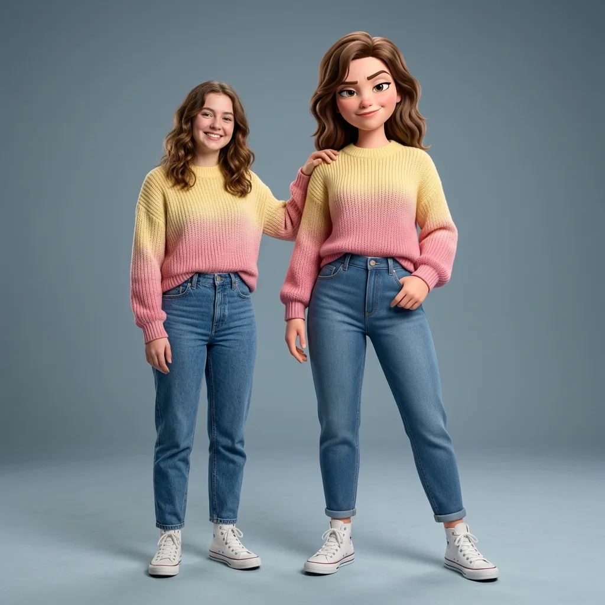

**#368 · Realistic, Character · <code>Vinano Image Pro</code>**

> Keywords: realistic, character, cinematic, AI art, AI prompt, text to image

<details>
<summary>Show prompt</summary>

```
Ultra-premium-quality hyper-realistic photo featuring a real human and a giant 3D Pixar-style version of THE SAME person — both strictly based on the uploaded reference image. The real person and the Pixar character must have identical facial structure, hairstyle, facial expression, body proportions, height, and clothing.
Both are wearing a knitted sweater a gradient from light yellow to pink, high-waisted blue jeans, and white high-top sneakers.
The pose must exactly match the reference: the real person stands relaxed a friendly smile, their hand naturally resting on the shoulder of the Pixar character. The Pixar version stands slightly wider, arms confidently positioned near the pockets, a playful sly smirk, one raised eyebrow, and expressive Pixar-style eyes.
The Pixar character should be proportionally larger, but anatomically identical to the real person. The facial expression, head tilt, posture, and body language must precisely replicate the reference image.
Clean gray-blue studio background, soft even studio lighting, realistic shadows, crisp fabric texture, smooth Pixar-style skin shading, cinematic sharpness.
DO NOT change the pose, reaction, clothing, or proportions. Strict adherence to the reference.

Keep edges clean and the overall composition balanced for a polished, gallery-ready result.
```

</details>

---

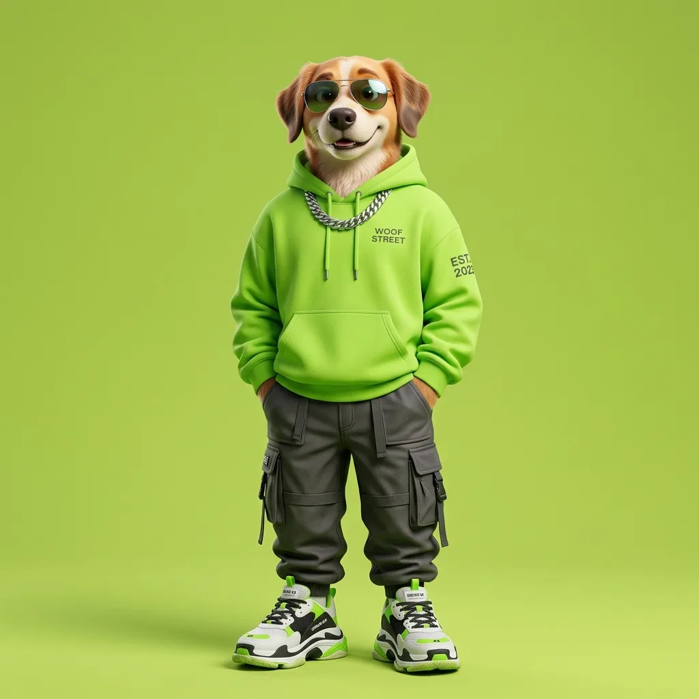

**#369 · Character, Ai Art · <code>Vinano Image Pro</code>**

> Keywords: character, AI art, AI prompt, text to image

<details>
<summary>Show prompt</summary>

```
Full-body 3D stylized anthropomorphic cartoon dog character wearing modern streetwear, oversized neon green hoodie, cargo pants, chunky sneakers, reflective sunglasses, silver chain necklace. Confident relaxed pose hands in pockets. Minimal studio background in solid lime green. Soft studio lighting, smooth shadows, high detail fabric texture, Pixar-quality 3D render, ultra-crisp composition, centered framing, fashion editorial character design, 8K resolution. Maintain consistent colour harmony and crisp focus across the whole frame.
```

</details>

---

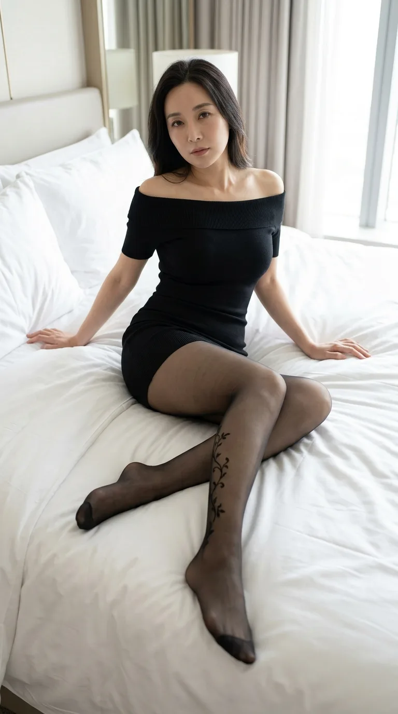

**#370 · Ai Art, Ai Prompt · <code>Vinano Image v2</code>**

> Keywords: AI art, AI prompt, text to image

<details>
<summary>Show prompt</summary>

```
竖版9:16，高分辨率真实商业摄影风格，一张高级酒店床上时尚人像写真。成年亚洲女性模特完整坐在柔软大床中央或靠近床头的位置，身体自然陷进床垫和白色床品里，周围有真实床单褶皱、压痕和下陷，明确是在床上放松休息，而不是坐在床边。人物穿【替换服装：黑色一字肩针织短裙 / 奶油白吊带睡裙 / 银灰缎面吊带裙 / 酒红丝绒短裙】，服装版型修身且有高级质感，能够自然体现胸部弧度、腰部收紧和成熟女性曲线。

人物身材必须是成熟成年女性的自然比例，胸围自然饱满但不过度夸张，胸型柔和立体，肩颈、锁骨、胸线、腰线、胯部比例协调，整体有健康、柔和、真实的女性魅力，不要平胸，不要男性化胸廓，不要少年感身材，不要纸片人，不要干瘪瘦弱。人物脸部要清晰精致，眼神看向镜头，表情有情绪和微表情，可以是温柔、慵懒、若有所思、轻微委屈、安静冷感或克制的心动感，不要面无表情，不要呆板，不要像证件照。

人物姿态要舒适自然，像真实摄影抓拍。身体可以微微后靠或侧靠，一只手自然撑在床面，另一只手轻放在腿侧或床单上。双腿都放在床面上，可以自然交叠、轻微弯曲、前后错落或向前延伸，动作柔和松弛，有生活感和呼吸感，不要僵硬摆拍，不要像坐在椅子上，不要紧绷用力。

丝袜为高端设计感连裤丝袜，材质轻薄、半透明、真实写实，有细腻尼龙纤维、自然拉伸、透明度变化、轻微丝光和真实压痕。丝袜款式选择【替换丝袜款式：稀疏法式藤蔓提花黑丝 / 珠光薄透白丝加侧边叶纹 / 复古后缝线黑丝加极简点缀 / 烟灰黑极简几何提花丝袜】。图案必须高级时尚、克制、留白充足，只在脚踝外侧、小腿外侧或大腿外侧做局部点缀，不要满版密集覆盖，不要厚重蕾丝感，不要密集恐惧感，不要廉价情趣感，不要哥特恐怖感。大部分腿部区域保持干净透薄，让肤色自然透出来，整体像高端时尚品牌丝袜 lookbook。

丝袜必须是真实穿着在脚上的完整一体式连裤丝袜结构，脚趾部分由同一层连续尼龙整体包裹，形成自然圆润的封闭脚尖区域，不允许每根脚趾独立分开，不允许像五指袜，不允许露出脚趾甲，不允许把丝袜花纹画在皮肤上。脚尖、脚背、脚踝到小腿之间要有真实丝袜拉伸后的透明度变化、纤维密度变化、微弱反光和自然压痕。

光线为酒店窗边柔和自然光，画面明亮干净，床品洁白蓬松，背景简洁高级，有真实摄影棚或酒店写真质感。整体审美偏高级、时尚、轻奢、杂志感，不要低俗姿势，不要裸露，不要色情感，不要畸形肢体，不要多余手指，不要塑料皮肤，不要过度磨皮，不要插画感，不要AI绘画感，不要浑浊，不要厚裤袜感。

保持配色统一、主体清晰，细节丰富但不杂乱。
```

</details>

---

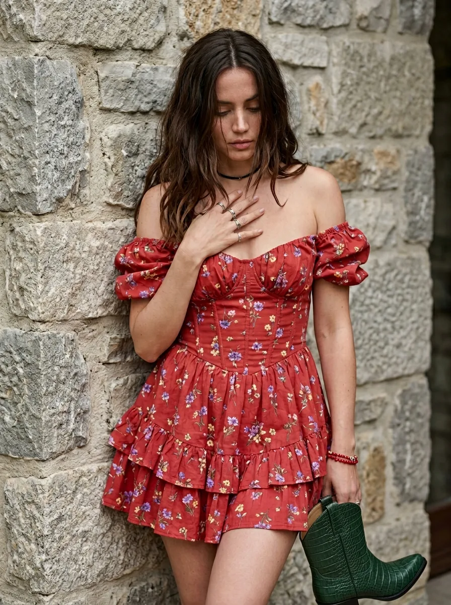

**#371 · Realistic, Portrait · <code>Vinano Image Pro</code>**

> Keywords: realistic, portrait, AI art, AI prompt, text to image

<details>
<summary>Show prompt</summary>

```
{
  "prompt_details": {
    "subject": {
      "type": "Young woman Ana de Armas ",
      "appearance": {
        "hair": "Long, dark chestnut brown, loose waves, falling over face, messy aesthetic",
        "skin": "Fair complexion, smooth texture, natural finish",
        "face": "Looking downward, face partially obscured by hair, introspective expression",
        "body_type": "Slender, fit"
      },
      "pose": {
        "stance": "Leaning against a stone wall, body slightly angled",
        "hands": "Right hand resting gently on chest/neck fingers splayed, left hand holding a green object (boot) down by her side",
        "gaze": "Downward, avoiding eye contact"
      }
    },
    "clothing": {
      "dress": {
        "style": "Off-the-shoulder mini dress, cottagecore/boho style",
        "fabric": "Lightweight cotton or linen blend",
        "color": "Red/off-Red base",
        "pattern": "Small, delicate floral print purple and yellow wildflowers",
        "details": ["Ruffled tiered skirt", "Puffed short sleeves", "Sweetheart neckline", "Corset-style bodice structure"]
      },
      "accessories": ["Thin black choker necklace",
        "Multiple silver rings on fingers",
        "Red beaded bracelet on left wrist",
        "Holding a dark green, crocodile-texture cowboy boot"]
    },
    "environment": {
      "background": "Textured stone masonry wall",
      "details": "Large, irregular grey and beige stone blocks, rough texture, natural architectural backdrop",
      "setting": "Outdoor or semi-outdoor daylight setting"
    },
    "lighting": {
      "type": "Soft natural daylight",
      "quality": "Diffused, even illumination, soft shadows",
      "direction": "Front-lit but soft"
    },
    "styling": {
      "aesthetic": "Bohemian, chic, feminine, soft grunge undertones",
      "mood": "Casual, candid, slightly moody, artistic"
    },
    "camera_details": {
      "shot_type": "Medium shot (thigh-up)",
      "angle": "Eye-level",
      "lens": "85mm prime lens for flattering portrait compression",
      "aperture": "f/2.8 for slight depth of field separation from the wall",
      "focus": "Sharp focus on the subject and dress texture"
    },
    "technical_specifications": {
      "quality": "Ultra true-to-life photorealistic, 8k resolution, highly detailed",
      "texture_quality": "High fidelity fabric textures, realistic skin pores, detailed stone masonry",
      "engine": "Unreal Engine 5 render style or high-end photography" Ratio 3.4
    }
  }

Preserve realistic proportions and depth for a confident, professional finish.
```

</details>

---

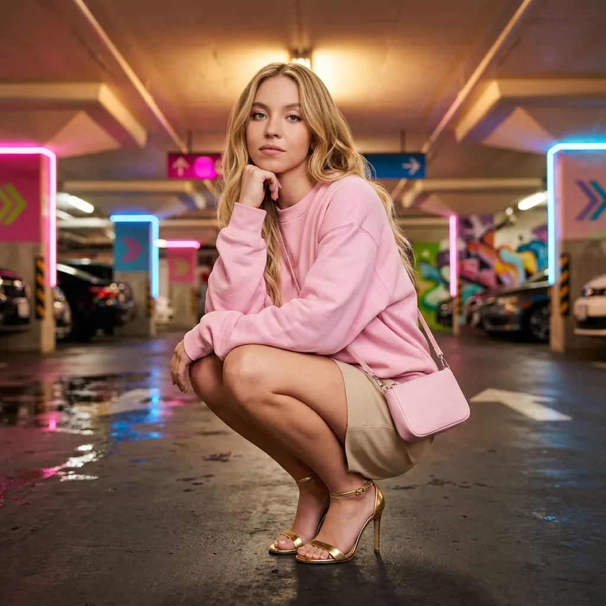

**#372 · Anime, Realistic · <code>Vinano Image Pro</code>**

> Keywords: anime, realistic, AI art, AI prompt, text to image

<details>
<summary>Show prompt</summary>

```
{
 "subject": {
 "name": "Sydney Sweeney",
 "gender": "female",
 "age": "young adult",
 "skin": "fair",
 "expression": "calm, confident"
 },

 "pose": {
 "body_position": "crouching low on the ground",
 "legs": "knees fully bent, heels on the ground",
 "arms": "one elbow resting on knee",
 "hands": "chin gently supported by hand",
 "camera_angle": "low angle",
 "framing": "full body visible"
 },

 "clothing": {
 "top": "oversized pastel pink sweatshirt, long sleeves",
 "bottom": "short beige skirt or shorts",
 "fit": "relaxed, oversized"
 },

 "shoes": {
 "type": "high-heeled sandals",
 "color": "metallic gold",
 "details": "thin straps, open toe"
 },

 "accessories": {
 "bag": "small pastel pink shoulder bag, crossbody",
 "style": "minimal, fashion editorial"
 },

 "hair": {
 "color": "blonde",
 "style": "long, wavy",
 "texture": "natural"
 },

 "gaze": {
 "direction": "looking at camera",
 "eye_expression": "soft, relaxed"
 },

 "environment": {
 "location": "underground parking area",
 "atmosphere": "vibrant, lively",
 "lighting": "warm lights neon accents",
 "background_style": "colorful reflections, slightly blurred"
 },

 "photography": {
 "style": "urban fashion editorial",
 "realism": "true-to-life photorealistic",
 "quality": "high detail",
 "lens": "35mm",
 "depth_of_field": "shallow",
 "shadows": "soft"
 },

 "negative_prompt": ["distorted body",
 "extra limbs",
 "unrealistic anatomy",
 "deformed face",
 "blurry",
 "low quality",
 "cartoon",
 "anime",
 "exaggerated proportions"],

 "output": {
 "width": 1024,
 "height": 1280,
 "aspect_ratio": "4:5"
 }
}

Keep edges clean and the overall composition balanced for a polished, gallery-ready result.
```

</details>

---

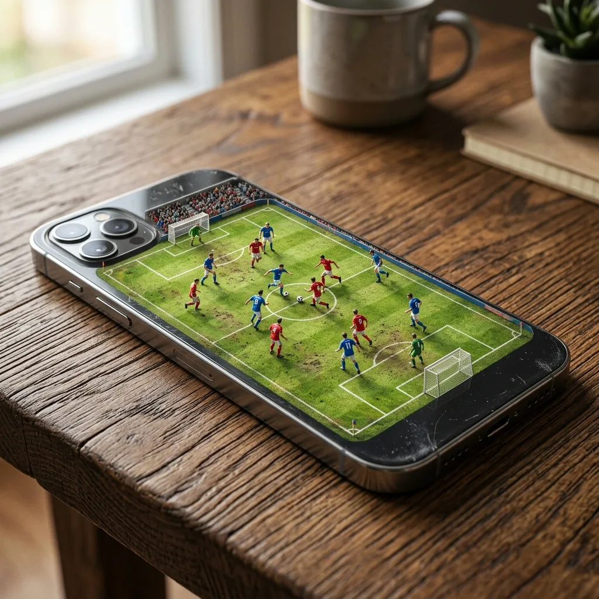

**#373 · Realistic, Cinematic · <code>Vinano Image v2</code>**

> Keywords: realistic, cinematic, AI art, AI prompt, text to image

<details>
<summary>Show prompt</summary>

```
{
 "type": "image_generation",
 "style": "hyper_realistic",
 "quality": "8K DSLR",
 "aspect_ratio": "4:5",
 "camera": {
 "angle": "slightly tilted cinematic perspective",
 "lens": "50mm DSLR",
 "depth_of_field": "shallow",
 "focus": "smartphone and football action"
 },
 "scene": {
 "setting": "smartphone placed on a wooden table",
 "concept": "phone screen transformed into a miniature football stadium",
 "environment": "indoor, soft daylight coming from the side",
 "atmosphere": "cinematic, immersive, realistic"
 },
 "details": {
 "screen": "weathered green football pitch visible wear, dirt patches, and grass texture",
 "players": "miniature football players actively playing a match dynamic poses",
 "lighting": "soft diffused daylight subtle lens flares and realistic reflections",
 "realism_effects": ["fingerprints on screen",
 "light scratches on phone body",
 "natural smudges",
 "micro dust particles"]
 },
 "materials": {
 "phone": "metallic frame realistic reflections",
 "table": "textured wooden surface warm tones"
 },
 "mood": "high-end cinematic, dramatic, premium advertising look",
 "rendering": {
 "sharpness": "ultra sharp",
 "texture_detail": "extreme",
 "lighting_quality": "studio grade",
 "photorealism": true
 }
}

Maintain consistent colour harmony and crisp focus across the whole frame.
```

</details>

---

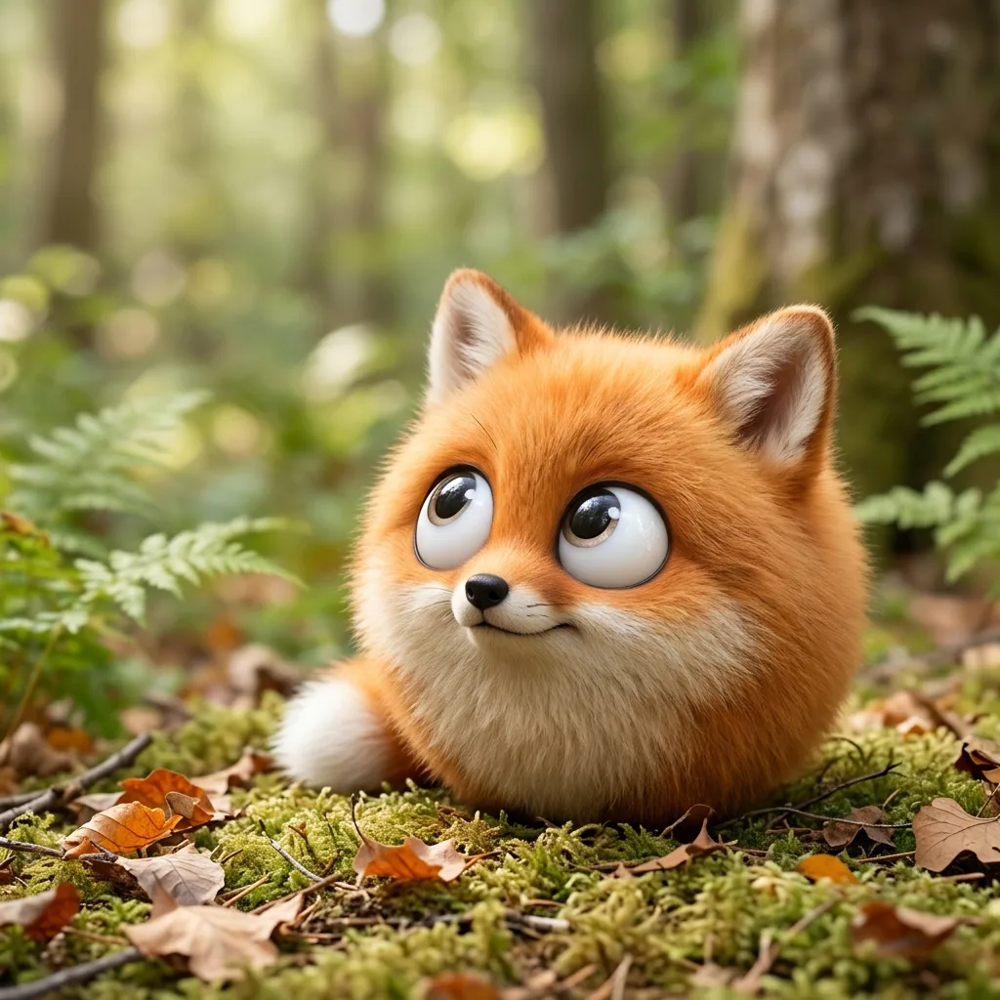

**#374 · Ai Art, Ai Prompt · <code>Vinano Image Pro</code>**

> Keywords: AI art, AI prompt, text to image

<details>
<summary>Show prompt</summary>

```
Make a photo of a cute ball-shaped version of a [animal], big adorable over-sized eyes, it has no head, instead its face is part of the ball, its head and body are one. They are in their usual habitat. Must be almost spherical and cartoonishly cute. Its eyes are looking up in the most adorable cheeky fashion. Aim for an editorial, design-driven look with deliberate negative space.
```

</details>

---

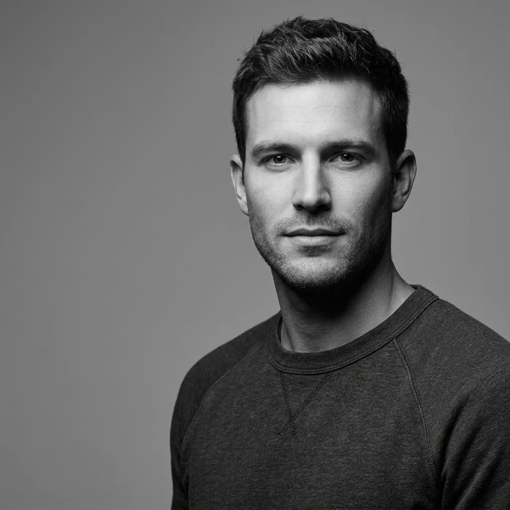

**#375 · Portrait, Cinematic · <code>Vinano Image Pro</code>**

> Keywords: portrait, cinematic, AI art, AI prompt, text to image

<details>
<summary>Show prompt</summary>

```
{
 "style": "monochrome studio portrait",
 "subject": {
 "identity": "same man as reference",
 "expression": "calm, confident",
 "shot_type": "tight-medium"
 },
 "lighting": {
 "setup": "minimal",
 "falloff": "soft",
 "mood": "focused on subject",
 "notes": "deep shadows and subtle gradients shape the face"
 },
 "wardrobe": {
 "type": "casual stylish",
 "examples": ["simple tee", "light-textured sweatshirt"],
 "compatibility": "designed to look good in black and white"
 },
 "background": {
 "style": "clean",
 "distractions": "none",
 "tone": "neutral"
 },
 "render": {
 "palette": "high-contrast black and white",
 "detail": "crisp",
 "tone": "smooth",
 "depth": "subtle cinematic depth"
 },
 "overall_vibe": "balanced, calm, confident"
}

Aim for an editorial, design-driven look with deliberate negative space.
```

</details>

---

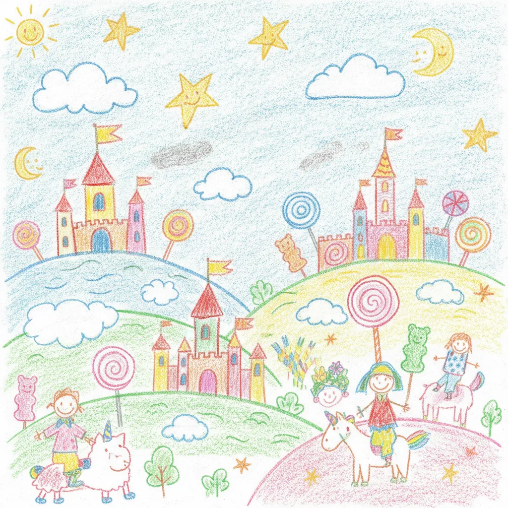

**#376 · Ai Art, Ai Prompt · <code>Vinano Image</code>**

> Keywords: AI art, AI prompt, text to image

<details>
<summary>Show prompt</summary>

```
Rework the given image into a crayon-style illustration, transforming the entire scene into something that feels hand-drawn by a 10-year-old. Keep the forms simple and slightly imperfect, like a child’s drawing.

Avoid the original color palette—replace it bright, playful crayon colors on a clean white paper background. Aim for a soft, cute, and innocent aesthetic.

Incorporate fun, childlike details such as castles or towers, candy, stars, clouds, and other whimsical decorations to amplify the playful vibe.

The final result should feel charming, colorful, and full of childlike imagination.

Render with rich micro-detail while keeping the layout uncluttered and intentional.
```

</details>

---

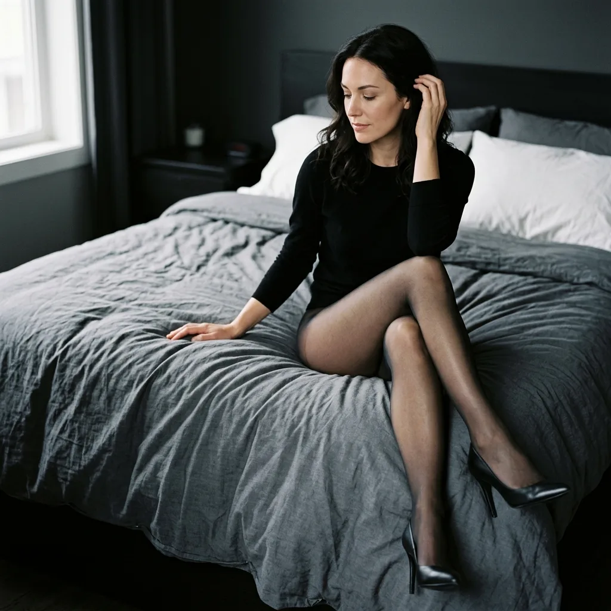

**#377 · Realistic, Portrait · <code>Vinano Image v2</code>**

> Keywords: realistic, portrait, AI art, AI prompt, text to image

<details>
<summary>Show prompt</summary>

```
Dark Bedroom Hosiery Editorial, vertical 9:16.

Create a realistic fashion editorial portrait of an adult female model seated on the bed, not on the bed edge. Grey bedding, white pillows, soft wrinkled sheets, low-saturation cool grey tones, soft window light.

Consistent composition: model placed slightly to the right, body forming a natural diagonal line, legs as the main visual focus, clean bedding space on the left. She looks slightly downward, one hand gently adjusting her hair, the other hand resting naturally. Calm, elegant, unforced pose, no direct eye contact.

All-black styling: black top, black hosiery, black closed-toe heels.
Hosiery direction: [Hosiery Style].
The hosiery should look realistic: medium-black tone, subtle transparency, smooth texture, soft light reflection, natural stretch and elegant leg shaping.

Shoes must fully cover the toes. Feet and ankles should look natural, elongated and relaxed. Avoid twisted ankles, floating feet, exposed toes or broken shoe structure.

High clarity, realistic skin texture, clear facial features, clear hands, clear hosiery details, clear shoe structure, detailed bedding folds.

Avoid low resolution, blurry subject, plastic skin, distorted hands, twisted feet, messy hosiery pattern, unrealistic body proportions, cartoon or illustration style.

Preserve realistic proportions and depth for a confident, professional finish.
```

</details>

---

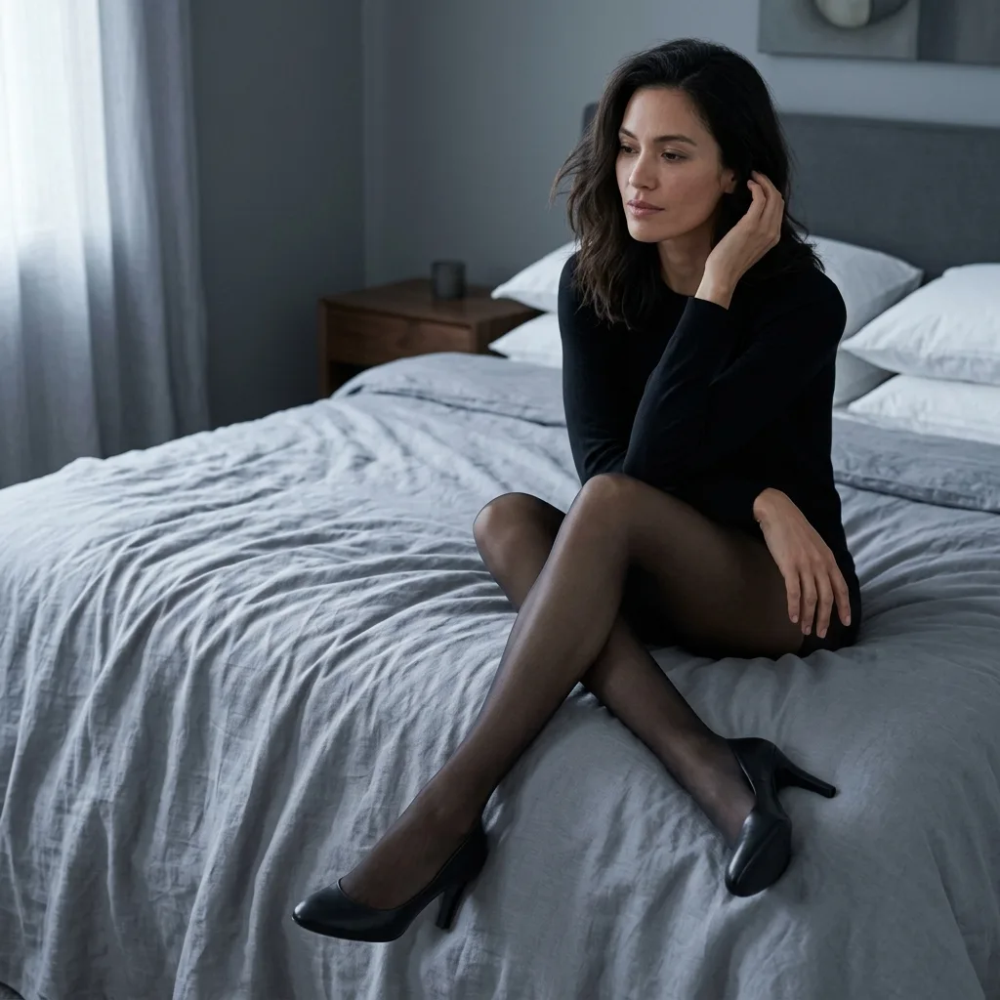

**#378 · Realistic, Portrait · <code>Vinano Image v2</code>**

> Keywords: realistic, portrait, AI art, AI prompt, text to image

<details>
<summary>Show prompt</summary>

```
Dark Bedroom Hosiery Editorial, vertical 9:16.

Create a realistic fashion editorial portrait of an adult female model seated on the bed, not on the bed edge. Grey bedding, white pillows, soft wrinkled sheets, low-saturation cool grey tones, soft window light.

Consistent composition: model placed slightly to the right, body forming a natural diagonal line, legs as the main visual focus, clean bedding space on the left. She looks slightly downward, one hand gently adjusting her hair, the other hand resting naturally. Calm, elegant, unforced pose, no direct eye contact.

All-black styling: black top, black hosiery, black closed-toe heels.
Hosiery direction: [Hosiery Style].
The hosiery should look realistic: medium-black tone, subtle transparency, smooth texture, soft light reflection, natural stretch and elegant leg shaping.

Shoes must fully cover the toes. Feet and ankles should look natural, elongated and relaxed. Avoid twisted ankles, floating feet, exposed toes or broken shoe structure.

High clarity, realistic skin texture, clear facial features, clear hands, clear hosiery details, clear shoe structure, detailed bedding folds.

Avoid low resolution, blurry subject, plastic skin, distorted hands, twisted feet, messy hosiery pattern, unrealistic body proportions, cartoon or illustration style.

Aim for an editorial, design-driven look with deliberate negative space.
```

</details>

---

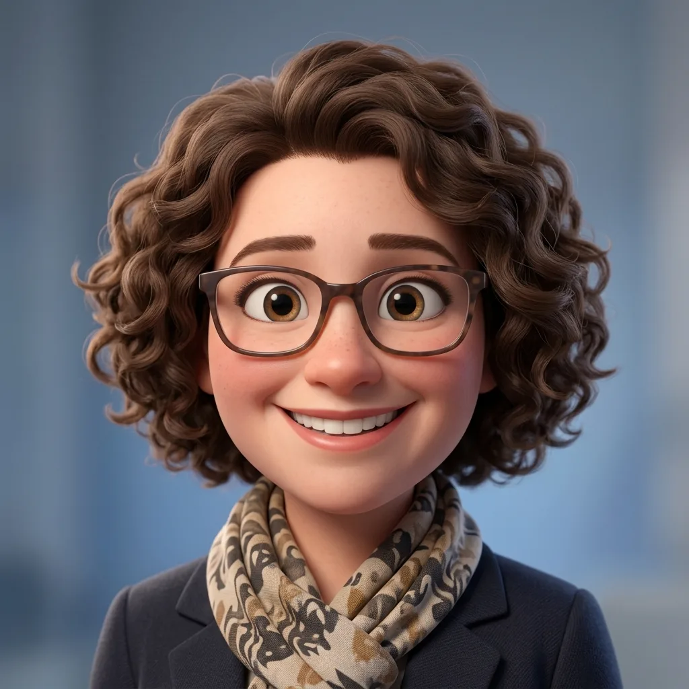

**#379 · Character, Ai Art · <code>Vinano Image Pro</code>**

> Keywords: character, AI art, AI prompt, text to image

<details>
<summary>Show prompt</summary>

```
Create a premium-quality 3D avatar of the person in the uploaded image a cheerful, expressive face. The character should have a warm smile, bright eyes, and soft facial features that feel friendly and approachable. Render in a Pixar-style aesthetic smooth textures, subtle skin shading, and slightly exaggerated proportions for a cute, animated look. Lighting should be soft and even, creating a clean studio look gentle shadows for depth. Maintain consistent colour harmony and crisp focus across the whole frame.
```

</details>

---

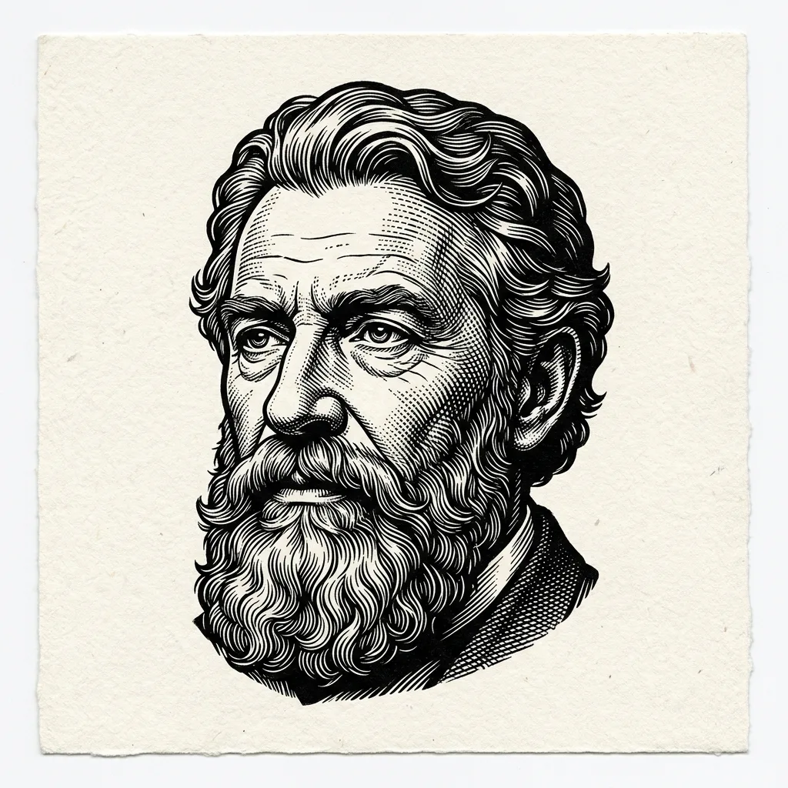

**#380 · Anime, Realistic · <code>Vinano Image Pro</code>**

> Keywords: anime, realistic, portrait, vintage, AI art, AI prompt

<details>
<summary>Show prompt</summary>

```
Black and white engraved portrait illustration of a person.
Drawn in classic woodcut / linocut engraving style, high contrast black ink on textured off-white paper background. Fine cross-hatching and line shading to create depth and shadow, bold black ink shadows under chin and around hair, strong contour lines, traditional printmaking aesthetic.
Minimal composition, centered portrait, no body visible, clean negative space, vintage editorial illustration style, ultra detailed linework, sharp crisp ink strokes, professional vector-ready engraving look, monochrome palette, dramatic contrast.
Negative Prompt:
color, watercolor, soft shading, blurred lines, low contrast, realistic photography, 3D render, anime style, cartoon style, messy sketch, thick uneven strokes, background objects, noisy texture, pixelated, distorted face, extra eyes, extra ears, bad anatomy, modern digital painting, glossy skin, overexposed highlights

Render with rich micro-detail while keeping the layout uncluttered and intentional.
```

</details>

---

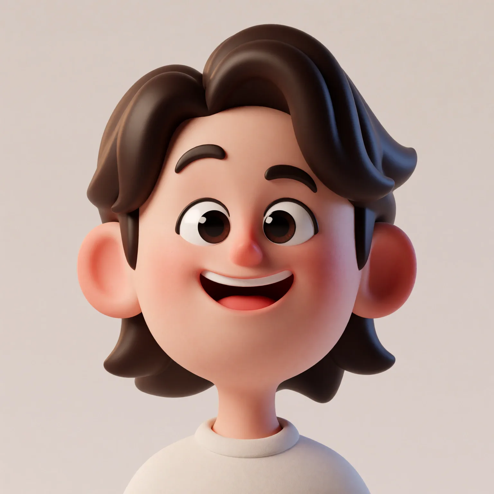

**#381 · Character, Ai Art · <code>Vinano Flash</code>**

> Keywords: character, AI art, AI prompt, text to image

<details>
<summary>Show prompt</summary>

```
A highly stylized 3D caricature of [Character], an oversized head, expressive facial features, and playful exaggeration. Rendered in a smooth, polished style clean materials and soft ambient lighting. Minimal background to emphasize the character’s charm and presence. Aim for an editorial, design-driven look with deliberate negative space.
```

</details>

---

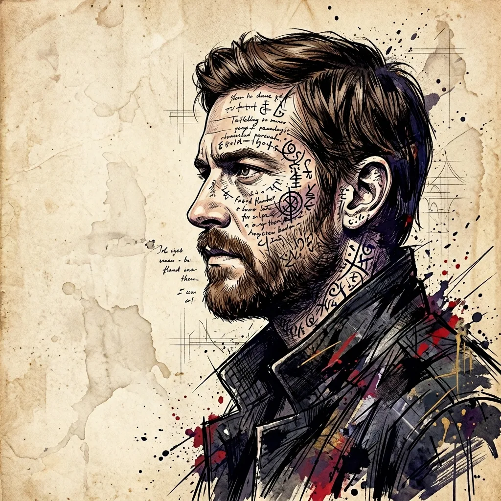

**#382 · Portrait, Ai Art · <code>Vinano Image Pro</code>**

> Keywords: portrait, AI art, AI prompt, text to image

<details>
<summary>Show prompt</summary>

```
Use the uploaded photo as the main face referenc. Preserve the exact facial structure, skin tone, beard shape, nose, eyes and expression from the reference image. A dramatic, high-impact portrait rendered in an expressive ink sketch and mixed-media illustration style, the uploaded image for exact facial likeness and proportions. The man is shown in side profile, his presence intense and chaotic. His face and upper body are layered cryptic handwritten text, symbols, and abstract glyphs, partially wrapping around facial contours, suggesting inner turmoil and hidden meaning He wears a dark, abstract jacket, heavily texture strokes, sharp angular linework, and vibrant ink creating a raw, rebellious visual energy. The illu bold and experimental, blending fine pen detaili aggressive brush marks, splashes, and controll The background is a pale, aged parchment ton grain, faded paper texture, delicate linework, in! stains-evoking an old manuscript Or forgotten High contrast, expressive composition, artistic precision, editorial art meets conceptual il intense, and emotionally charged. Aim for an editorial, design-driven look with deliberate negative space.
```

</details>

---

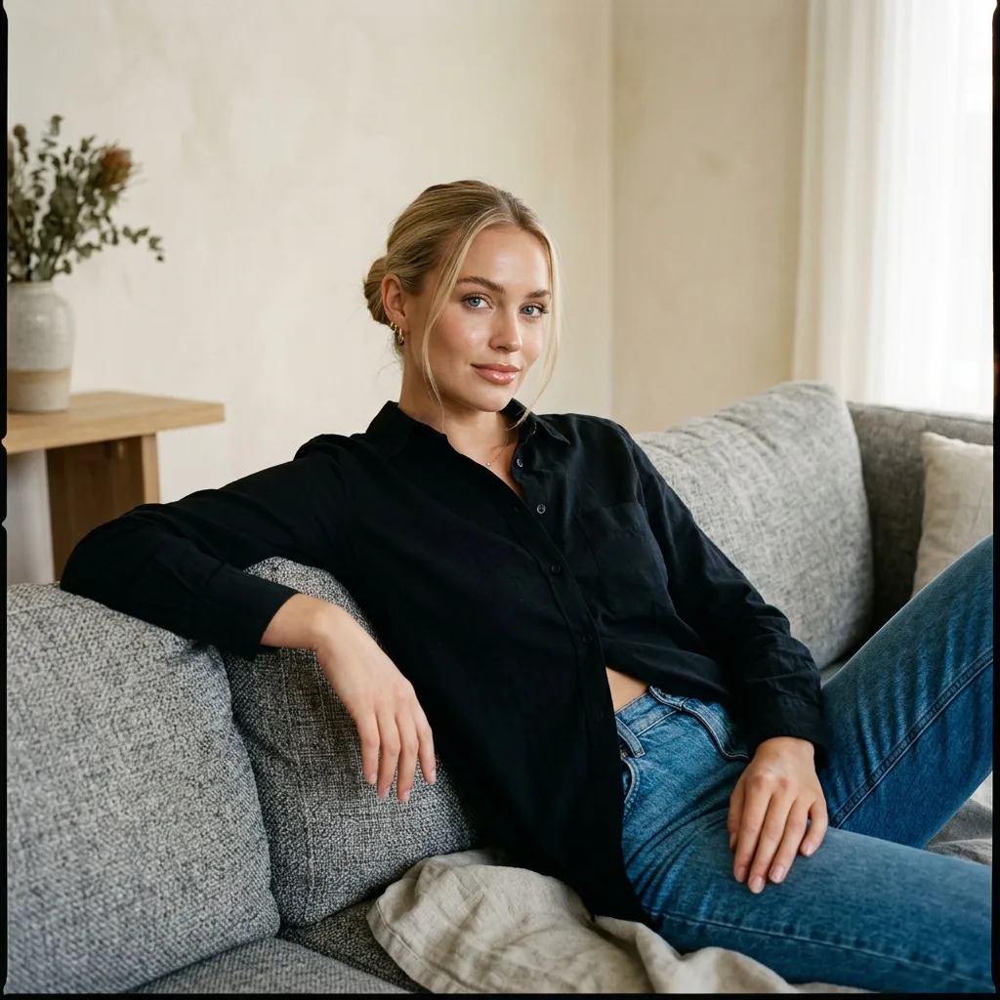

**#383 · Realistic, Minimalist · <code>Vinano Image Pro</code>**

> Keywords: realistic, minimalist, AI art, AI prompt, text to image

<details>
<summary>Show prompt</summary>

```
{
 "subject_and_scene": {
 "main_subject": "A beautiful young woman blonde hair tied back, striking blue eyes, and natural makeup glossy lips. She is wearing a black long-sleeve button-down shirt unbuttoned at the waist and classic blue denim jeans.",
 "action": "Reclining casually on a grey fabric sofa, looking directly into the camera a soft, confident expression.",
 "environment": "refined minimalist indoor living space neutral cream-colored walls and a textured grey sectional sofa, creating a clean and intimate atmosphere."
 },
 "cinematography": {
 "camera_model": "Sony Venice 2",
 "sensor_type": "Full Frame",
 "shot_type": "Medium Close-Up",
 "camera_angle": "High Angle (slightly looking down)",
 "movement": "Static"
 },
 "optics": {
 "lens_type": "Spherical",
 "focal_length": "35mm (Standard)",
 "aperture": "f/2.8 (Moderate depth of field to maintain detail on subject and sofa texture)",
 "shutter_effects": "High Shutter Speed (Freeze frame for maximum clarity)"
 },
 "lighting_design": {
 "setup": "Butterfly Lighting soft side fill",
 "style": "Naturalistic High-Key",
 "atmospheric_light": "Soft diffused window light creating gentle shadows and natural highlights on the skin",
 "color_temperature": "Natural Daylight (5500K)"
 },
 "color_and_post": {
 "film_stock": "Kodak Portra 400",
 "color_grading": "Muted Log-C emphasis on natural skin tones and deep blacks",
 "analog_artifacts": "Fine Film Grain and subtle Halation on skin highlights"
 },
 "rendering_and_tech": {
 "engine": "Octane Render",
 "advanced_tech": "Subsurface Scattering for hyper-realistic skin texture, Global Illumination, Ray Tracing",
 "specs": {
 "aspect_ratio": "1.85:1 (Standard)",
 "resolution": "8K, true-to-life photorealistic, Hyper-detailed"
 }
 },
 "directorial_style": "Denis Villeneuve"
}

Emphasise material texture and natural light so the final frame feels tactile and premium.
```

</details>

---

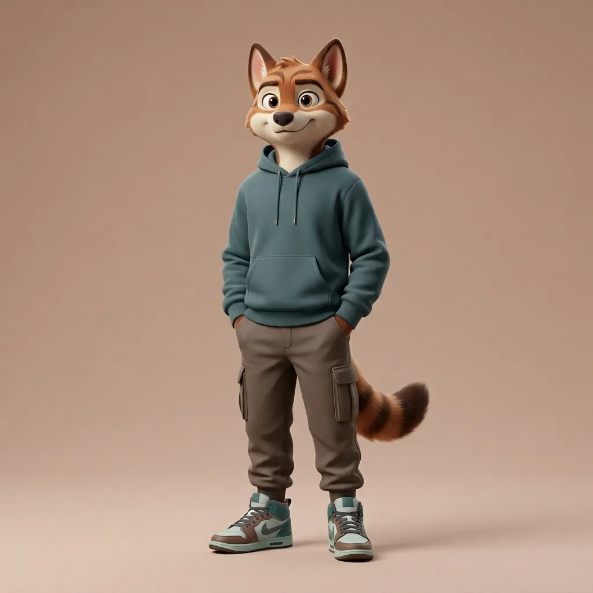

**#384 · Character, Ai Art · <code>Vinano Image Pro</code>**

> Keywords: character, AI art, AI prompt, text to image

<details>
<summary>Show prompt</summary>

```
the provided reference_image as the primary source for identity, clothing colors, and visual attributes, create a full-body 3D stylized anthropomorphic cartoon version of the character. Preserve facial structure, body proportions, silhouette, and distinctive traits exactly as in the reference_image.
The outfit must match the clothing colors from the reference_image. Extract and apply the exact dominant and secondary colors from the reference_image to the hoodie, cargo pants, and sneakers. Do not introduce new colors. Do not default to orange or neon green unless they exist in the reference_image.
Modern streetwear styling is allowed, but color palette must strictly follow the reference_image.
Confident relaxed pose hands in pockets.
Minimal studio background the dominant background color sampled from the reference_image, or a harmonized tone derived from it. Soft studio lighting, smooth shadows, high-detail fabric texture, Pixar-quality 3D render, ultra-crisp composition, centered framing, 8K resolution.
Add enforcement: “Strict color adherence to reference_image. No automatic color substitution.

Aim for an editorial, design-driven look with deliberate negative space.
```

</details>

---

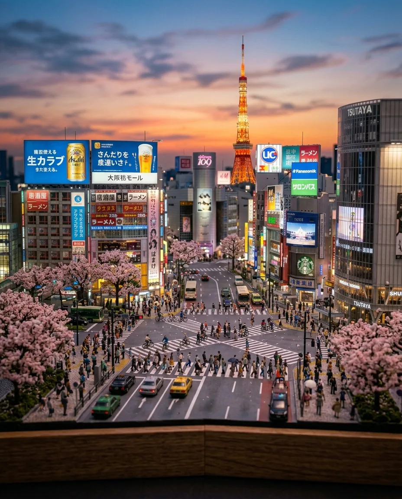

**#385 · Ai Art, Ai Prompt · <code>Vinano Image Pro</code>**

> Keywords: AI art, AI prompt, text to image

<details>
<summary>Show prompt</summary>

```
Tilt-shift 3D model diorama in 4:5 aspect ratio, highlighting Tokyo Tower and the Shibuya Crossing at sunset. Tiny pedestrians and cyclists navigate the bustling streets, while cherry blossoms drift gently from nearby trees. Neon signs and LED billboards glow softly in the background. Preserve realistic proportions and depth for a confident, professional finish.
```

</details>

---

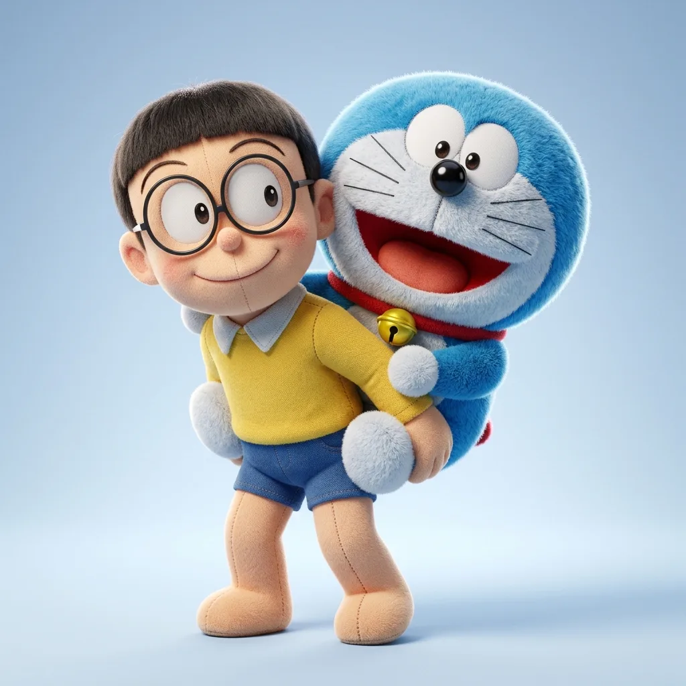

**#386 · Realistic, Character · <code>Vinano Image Pro</code>**

> Keywords: realistic, character, cinematic, AI art, AI prompt, text to image

<details>
<summary>Show prompt</summary>

```
Ultra-detailed 3D plush cartoon character, inspired by classic animated TV style, standing in center frame, full body visible. Character designed as a soft toy realistic fluffy fur texture, smooth rounded shapes, vibrant saturated colors, big expressive eyes, cute proportions, the image of [Doraemon's] character, [Nobita carries Doraemon on his back].

High-resolution Pixar-style 3D rendering, soft studio lighting, subtle rim light, clean gradient background (blue tone), filmic, cinematic lighting, depth of field, highly detailed fur strands, soft shadows under feet, glossy nose, toy-like material, ultra sharp 8K render.

Centered composition, minimal background, character facing camera, symmetrical pose, adorable expression.

Render with rich micro-detail while keeping the layout uncluttered and intentional.
```

</details>

---

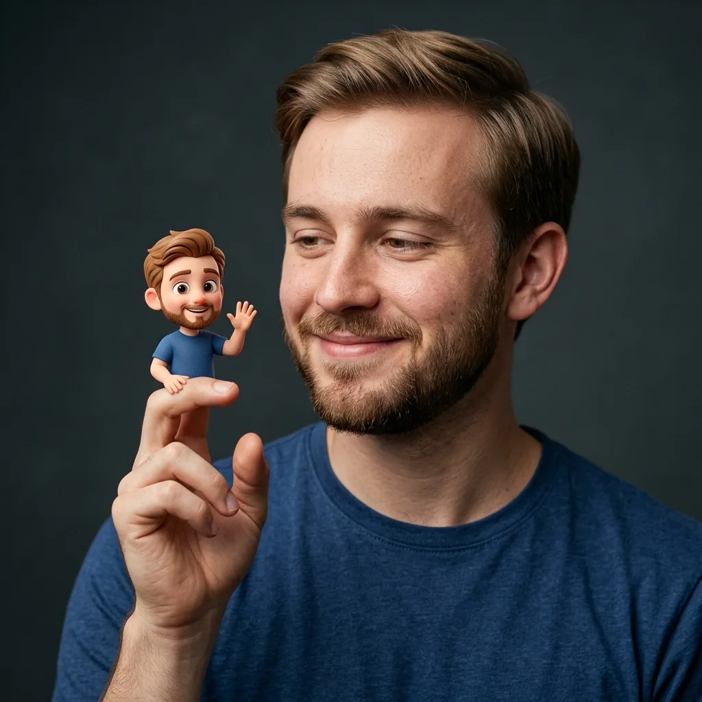

**#387 · Realistic, Portrait · <code>Vinano Image Pro</code>**

> Keywords: realistic, portrait, character, cinematic, AI art, AI prompt

<details>
<summary>Show prompt</summary>

```
{
 "Objective": "Create a hyper-realistic studio portrait blending photorealism a whimsical 3D cartoon miniature character",
 "PersonaDetails": {
 "PrimarySubject": {
 "Type": "Young man",
 "Appearance": {
 "Hair": "Light brown hair, neatly styled",
 "FacialHair": "Neatly trimmed beard",
 "Skin": "true-to-life photorealistic, natural texture"
 },
 "Expression": "Soft, warm smile",
 "Gaze": "Looking at the miniature character on his fingertips",
 "Wardrobe": "Blue t-shirt"
 },
 "SecondarySubject": {
 "Type": "Tiny 3D cartoon version of the man",
 "Scale": "Miniature, resting on fingertips",
 "Style": "Pixar-style 3D character design",
 "Proportions": "Exaggerated cute proportions",
 "Features": {
 "Eyes": "Large, expressive",
 "Expression": "Friendly, playful pose"
 },
 "Consistency": "Matching hairstyle and outfit of the main subject"
 }
 },
 "Composition": {
 "Framing": "Close-up studio portrait",
 "Focus": "Ultra-sharp focus on both faces",
 "DepthOfField": "Shallow depth of field soft background blur",
 "Balance": "Clean, centered composition emphasizing interaction"
 },
 "LightingAndMood": {
 "LightingStyle": "Cinematic soft studio lighting",
 "Highlights": "Gentle highlights on skin and miniature character",
 "Background": "Dark neutral backdrop",
 "Mood": "Modern, whimsical, warm"
 },
 "ArtDirection": {
 "StyleFusion": ["true-to-life photorealistic human portrait",
 "Pixar-style 3D character rendering"],
 "DetailLevel": "High detail clean textures",
 "RealismBalance": "Realistic human combined stylized miniature"
 },
 "PhotographyStyle": {
 "Genre": "Professional studio portrait photography",
 "LensLook": "85mm lens perspective",
 "ImageQuality": "High resolution, ultra-sharp clarity"
 },
 "ColorAndTone": {
 "ColorPalette": "Natural skin tones soft, modern colors",
 "Contrast": "Balanced contrast, smooth tonal transitions"
 },
 "NegativePrompt": ["cartoon human",
 "uncanny valley",
 "harsh lighting",
 "oversaturated colors",
 "blurry faces",
 "low detail",
 "messy composition"],
 "ResponseFormat": {
 "Type": "Single image",
 "Orientation": "Portrait",
 "AspectRatio": "2:3"
 }
}

Emphasise material texture and natural light so the final frame feels tactile and premium.
```

</details>

---

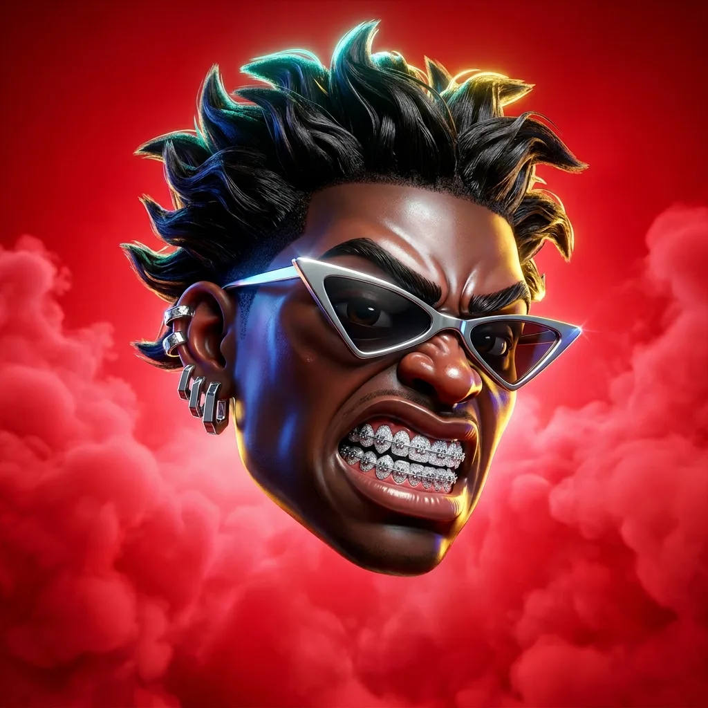

**#388 · Portrait, Character · <code>Vinano Image Pro</code>**

> Keywords: portrait, character, cinematic, AI art, AI prompt, text to image

<details>
<summary>Show prompt</summary>

```
A hyper-stylized, dynamic 3D head portrait floats against a vivid red background soft volumetric clouds and seamless shading. Only the cartoonish 3D head appears, no neck visible, and facial features closely matching the reference photo. The head is tilted and fills approximately 80% of the frame. The character displays a fierce, aggressive expression a wide snarl, revealing teeth adorned diamond-studded braces. Sharp, angular silver sunglasses pointed frames fit the face precisely. Additional accessories include chrome earrings and a chunky silver chain necklace. Lighting is bold and metallic, combining strong rim lights from above and behind a luminous frontal fill that sculpts facial contours and creates glossy skin highlights. The overall look features over-the-top glossy realism, exaggerated proportions, intense reflections, and a futuristic, high-energy aesthetic partial overlap of elements to enhance depth and dramatic presence. Hyper-detailed 3D forms add vibrant, cinematic intensity and visual impact. Aspect ratio 4:5 Keep edges clean and the overall composition balanced for a polished, gallery-ready result.
```

</details>

---

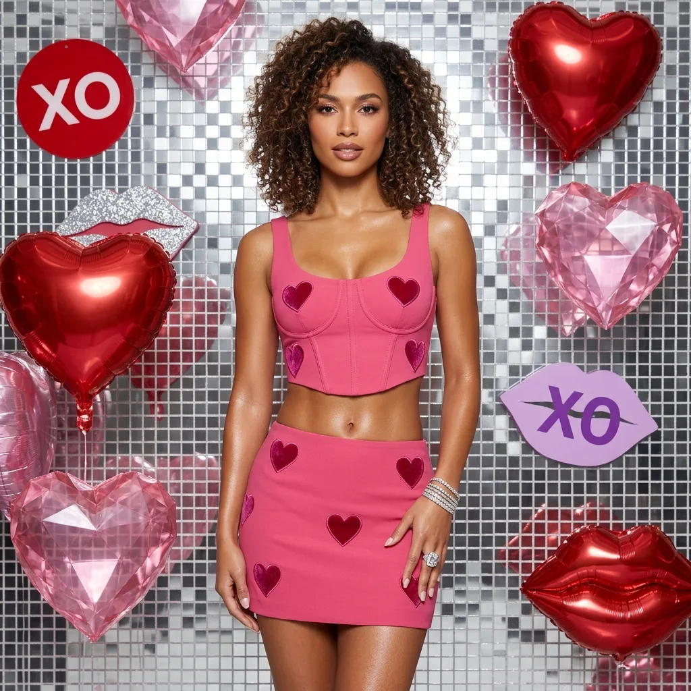

**#389 · Realistic, Ai Art · <code>Vinano Image Pro</code>**

> Keywords: realistic, AI art, AI prompt, text to image

<details>
<summary>Show prompt</summary>

```
{
 "image_metadata": {
 "theme": "Glamorous Valentine's Day / Love Aesthetic",
 "aspect_ratio": "3:4",
 "shot_type": "Medium-long shot, eye-level angle"
 },
 "subject_details": {
 "use_reference_image": true,
 "override": false,
 "physique": "Slender, fit, toned midriff"
 },
 "attire_and_styling": {
 "outfit": {
 "type": "Two-piece matching set",
 "top": "Vibrant rose-pink crop top, scoop neckline, corset-style stitching, dark pink velvet heart appliqués",
 "bottom": "Matching high-waisted mini skirt, dark pink velvet heart appliqués",
 "color_profile": "Hot pink / Magenta base crimson heart details"
 },
 "jewelry": ["Stack of silver diamond-encrusted tennis bracelets on right wrist",
 "Large silver statement ring a clear gemstone on left hand"]
 },
 "environment_details": {
 "background": {
 "texture": "Silver mosaic mirrored tile wall, shimmering disco-ball effect",
 "lighting": "Bright, direct studio lighting, high-key, creating sharp specular highlights on the tiles and skin"
 },
 "floating_props": [{
 "object": "Heart balloons",
 "details": "Large 3D metallic red foil hearts, faceted translucent pink crystal hearts"
 },
 {
 "object": "Lip decorations",
 "details": "Oversized pink lips, some silver glitter, some purple 'XO' text, others in red metallic foil"
 },
 {
 "object": "Text elements",
 "details": "Red 'XO' circular sign on the left"
 }]
 },
 "technical_parameters": {
 "color_palette": ["Vibrant Pink",
 "Silver Chrome",
 "Crimson Red",
 "Platinum White"],
 "quality_tags": ["true-to-life photorealistic",
 "8k resolution",
 "highly detailed skin pores",
 "sharp focus",
 "commercial fashion photography style",
 "soft bokeh on background depth"]
 }
}

Render with rich micro-detail while keeping the layout uncluttered and intentional.
```

</details>

---

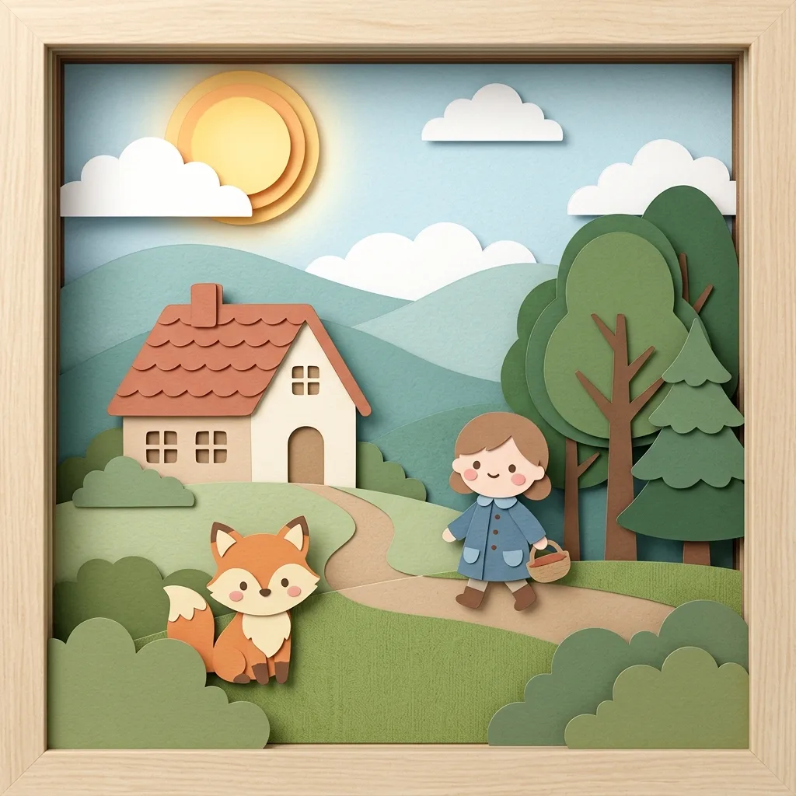

**#390 · Character, Ai Art · <code>Vinano Image Pro</code>**

> Keywords: character, AI art, AI prompt, text to image

<details>
<summary>Show prompt</summary>

```
Convert this image into a soft, handcrafted paper-cut layered illustration style, inspired by papercraft diorama aesthetics. Use smooth rounded shapes, simplified cute character proportions, and minimal facial details (dot eyes, blush cheeks) to create a warm, charming look. Apply stacked paper layers visible depth, subtle shadows between layers, and clean cut edges that resemble laser-cut cardstock. Maintain consistent colour harmony and crisp focus across the whole frame.
```

</details>

---

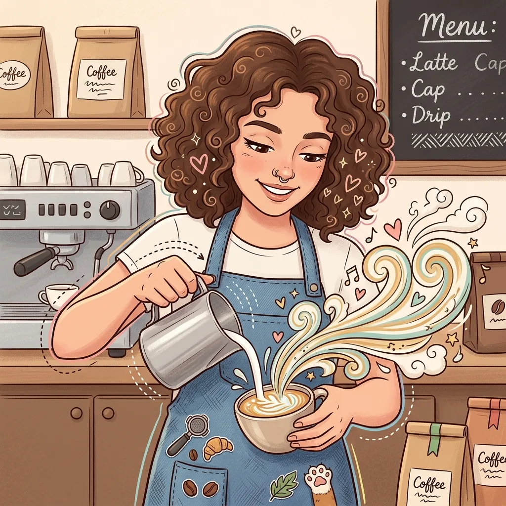

**#391 · Character, Ai Art · <code>Vinano Image v2</code>**

> Keywords: character, AI art, AI prompt, text to image

<details>
<summary>Show prompt</summary>

```
Analyze the uploaded image and preserve the original subject, composition, and lighting. Do not alter the identity or facial structure of the main character. Add playful hand-drawn doodle elements that interact directly the subject in the photo. The doodles should mimic, follow, or exaggerate the existing shapes, gestures, or movements — such as outlining the pose, extending arms or legs, adding motion lines, or creating imaginative elements that “react” to the subject.
Step 2:
Transform the entire image into a cute cartoon-style illustration adorable doodle aesthetics. Maintain the original scene and character details while applying a vibrant, soft, and playful cartoon look.

Render with rich micro-detail while keeping the layout uncluttered and intentional.
```

</details>

---

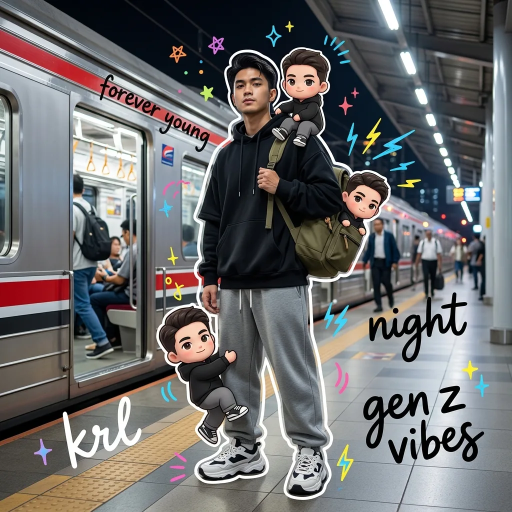

**#392 · Realistic, Portrait · <code>Vinano Image Pro</code>**

> Keywords: realistic, portrait, cinematic, AI art, AI prompt, text to image

<details>
<summary>Show prompt</summary>

```
A premium quality mixed media portrait of a trendy young man (my uploaded person photo) standing on a train station platform at night. The subject is posing coolly, holding the strap of an olive backpack one hand. He is wearing a stylish streetwear outfit an oversized layered black hoodie, gray sweatpants, and chunky sneakers.

The background features a realistic KRL Jabodetabek Commuter Line train side view its signature red striping, the train doors wide open, bathed in bright cinematic station lighting and city night ambiance.

Surrounding the realistic main subject are several cute 3D style chibi versions of himself, same outfit and same face. These chibis are interacting playfully, one sitting on his shoulder, one climbing his leg, and another peeking out from the backpack.

Overlay the image vibrant hand drawn doodle effects, white drawn outlines around the subject, playful scribbles, stars, sparkles, electric sparks, and floating white and black handwritten slogans like “forever young”, “krl”, “night”, and “gen z vibes”. The style should seamlessly blend hyper realistic photography colorful flat cartoon illustrations while keeping the face and body shape unchanged.

Preserve realistic proportions and depth for a confident, professional finish.
```

</details>

---

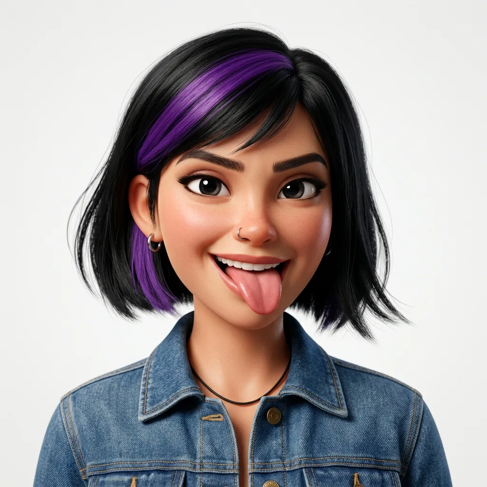

**#393 · Cinematic, Minimalist · <code>Vinano Image Pro</code>**

> Keywords: cinematic, minimalist, AI art, AI prompt, text to image

<details>
<summary>Show prompt</summary>

```
Create a head-and-shoulders Pixar-style 3D avatar of an edgy person based on the reference image a black bob, purple hair streak, and a small nose ring. She has a defiant, playful expression, sticking her tongue out wide, confident eyes while wearing a classic denim jacket. Isolated on a seamless white background, the render features flawless 3D skin and soft filmic, cinematic lighting for a clean, refined minimalist aesthetic. Emphasise material texture and natural light so the final frame feels tactile and premium.
```

</details>

---

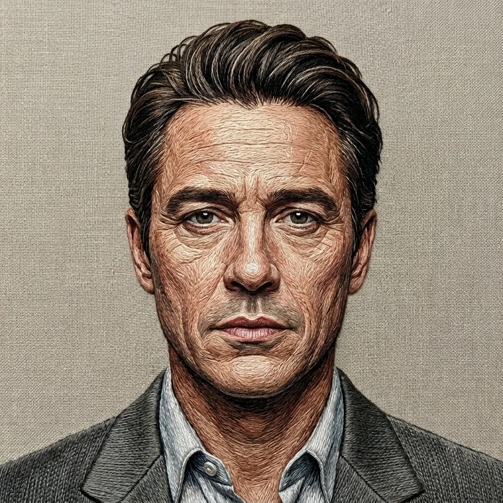

**#394 · Realistic, Character · <code>Vinano Image Pro</code>**

> Keywords: realistic, character, AI art, AI prompt, text to image

<details>
<summary>Show prompt</summary>

```
Use the uploaded image as the strict character reference.
Preserve the character’s facial structure, expression, skin tone, hairstyle, outfit, proportions, and pose exactly as shown.

Do not modify, beautify, stylize, or reinterpret the face in any way beyond embroidery translation.
Render the character as hyper-detailed hand embroidery artwork, realistic satin stitches, long-and-short stitches, and dense fill stitches to create natural depth, fabric texture, and thread sheen.

Visible embroidery threads, precise stitch direction following facial contours, smooth gradients formed through thread layering, high stitch density, museum-quality textile craftsmanship.

Neutral fabric background, soft studio lighting, ultra-sharp macro detail, true-to-life photorealistic embroidery realism, no illustration or cartoon style.

Aim for an editorial, design-driven look with deliberate negative space.
```

</details>

---

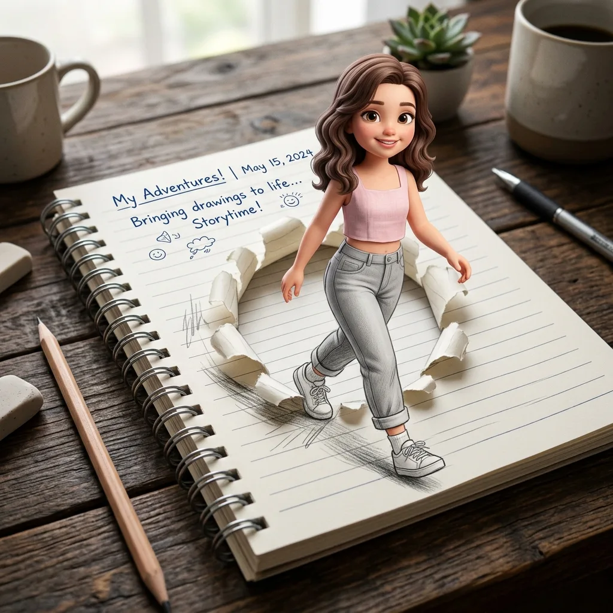

**#395 · Realistic, Ai Art · <code>Vinano Image Pro</code>**

> Keywords: realistic, AI art, AI prompt, text to image

<details>
<summary>Show prompt</summary>

```
A creative 3D illusion artwork of a cute young girl stepping out of a spiral notebook page placed on a wooden desk. The notebook has lined paper handwritten text at the top. The girl looks semi-realistic 3D cartoon style, soft wavy brown hair, natural makeup, sweet smile, wearing a pastel crop top and high-waisted light grey jeans white sneakers. Her lower body appears sketched in pencil on the notebook while the upper body looks realistic and popping out of the page. Keep edges clean and the overall composition balanced for a polished, gallery-ready result.
```

</details>

---

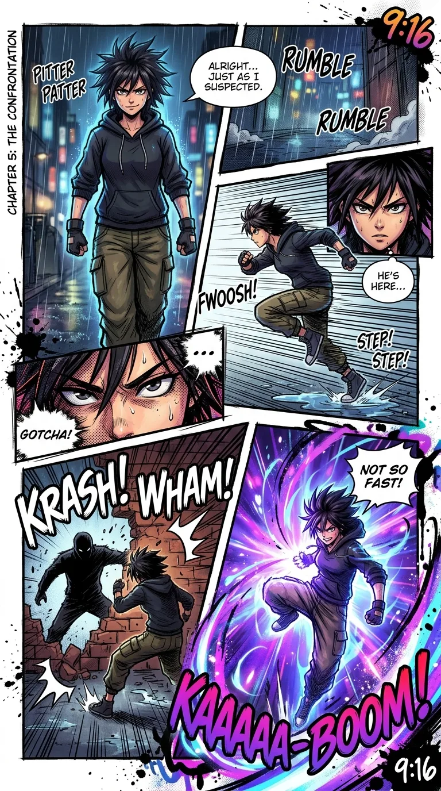

**#396 · Character, Cinematic · <code>Vinano Image Pro</code>**

> Keywords: character, cinematic, AI art, AI prompt, text to image

<details>
<summary>Show prompt</summary>

```
Create a full-page colored manga illustration based on the person in the reference photo. Use authentic manga page composition 5–7 dynamic connected panels on a single page. Include cinematic storytelling, dramatic perspective, expressive emotions, dynamic poses, speed lines, impact frames, close-up shots, and intense visual flow.Add English comic-style sound effects, handwritten dialogue bubbles, ink splatter strokes, halftone textures, rough comic sketch lines, and graffiti-inspired brushwork. Blend vibrant colors manga-style shading and strong contrast. Emphasize the character’s personality and aura symbolic visual elements and atmospheric energy effects. Highly detailed, emotional, stylish, energetic, professional manga aesthetic clean white negative space mixed chaotic ink textures.Hand-drawn look, free-flowing lines, immersive composition, premium quality. Aspect ratio 9:16 HD. Aim for an editorial, design-driven look with deliberate negative space.
```

</details>

---

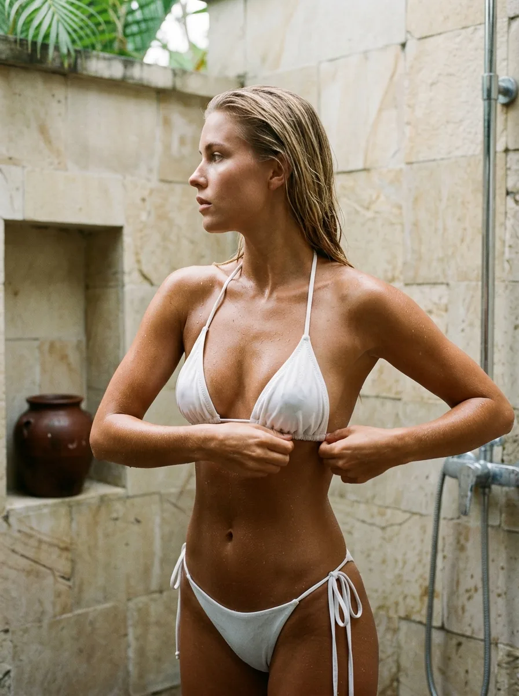

**#397 · Anime, Realistic · <code>Vinano Image Pro</code>**

> Keywords: anime, realistic, portrait, AI art, AI prompt, text to image

<details>
<summary>Show prompt</summary>

```
{
"subject": {
"description": "Young woman wet, blonde, shoulder-length hair standing in a shower setting. She has a deep tan and very glistening, wet skin covered in water droplets. Her physique is fit and toned visible abdominal muscle definition and an hourglass shape.",
"attire": {
"garment": "White string bikini.",
"top": "Halter-neck style gathered triangular cups that are very small relative to the bust, creating deep cleavage and sideboob exposure. The fabric is bunched and pulled taut by the strings.",
"bottom": "Matching white bikini bottoms side string ties, sitting low on the hips."
},
"anatomy_constraints": {
"bust": "Extremely prominent, full, and heavy bust volume. The breasts show natural gravity and weight, a teardrop shape rather than high-profile spheres. Significant forward projection and side volume. The bikini top barely contains the mass, creating tension in the fabric.",
"torso": "Slim, tapered waist distinct abdominal etching (abs) visible under the wet skin. Ribcage is narrower than the bust depth.",
"skin": "High-resolution texture visible pores, water droplets, and wet sheen. No plastic smoothing."
}
},
"pose": {
"orientation": "Body angled slightly to the viewer's right, hips facing forward.",
"head": "Turned sharply to the viewer's left in profile, looking away from the camera.",
"arms": "Both arms bent at the elbows, brought centrally towards the torso.",
"hands": "Both hands are gripping and adjusting the strings of the bikini top at the center of the underbust/ribcage area, pulling the fabric slightly.",
"spine": "Slight arch, accentuating the posture and chest projection."
},
"environment": {
"setting": "Semi-outdoor or tropical bathroom/shower area.",
"background_elements": ["Beige/tan large rectangular stone tiles on the wall behind.",
"A recessed wall niche on the left containing a brown earthenware pot/vase.",
"A chrome shower fixture (vertical pipe and mixer) visible on the right side.",
"Hint of green tropical foliage at the top left edge."],
"surfaces": "Wet, reflective stone and chrome."
},
"camera": {
"shot_type": "Medium shot, framing from the top of the head to the upper thighs.",
"angle": "Eye-level to slightly low angle, emphasizing the upper body stature.",
"focus": "Sharp focus on the subject, particularly the torso and face, reasonable depth of field keeping the back wall distinct but secondary.",
"lens": "50mm to 85mm portrait focal length to avoid distortion while maintaining volume."
},
"lighting": {
"source": "Natural, diffused daylight coming from above and slightly front-left.",
"quality": "Soft but directional, creating distinct highlights on the wet upper slopes of the breasts, shoulders, and clavicles.",
"shadows": "Natural occlusion shadows under the bust, defining the abdominal muscles, and along the neck/jawline.",
"atmosphere": "Humid, wet, fresh."
},
"mood_and_expression": {
"vibe": "Candid, sensual, unposed snapshot quality.",
"expression": "Neutral, relaxed, unaware of the camera (looking away).",
"action": "Mid-adjustment of clothing."
},
"style_and_realism": {
"aesthetic": "true-to-life photorealistic, raw, high-fidelity texture.",
"texture_focus": "Wet skin, clinging wet fabric, water droplets, stone texture.",
"details": "Preserve the tangible wetness of the hair and the specific tension wrinkles in the bikini fabric."
},
"colors_and_tone": {
"palette": "Neutral earth tones (beige, tan, brown background), stark white (bikini), warm golden skin tone.",
"contrast": "Medium-high contrast to accentuate the wet skin highlights and muscle definition.",
"white_balance": "Natural daylight, slightly warm."
},
"quality_and_technical_details": {
"resolution": "8k, masterwork.",
"noise": "Low ISO, fine grain for realism."
},
"aspect_ratio_and_output": {
"ratio": "3:4",
"framing": "Vertical orientation."
},
"controlnet": {
"pose_control": {
"model_type": "DWPose",
"purpose": "Exact skeletal and pose lock",
"constraints": ["preserve head profile turn to left",
"preserve hand interaction bikini strings",
"preserve shoulder width",
"preserve hip angle"],
"recommended_weight": 1.0
},
"depth_control": {
"model_type": "ZoeDepth",
"purpose": "Depth, volume, and camera-to-body spatial lock",
"constraints": ["preserve significant bust projection relative to ribcage",
"maintain separation between subject and tiled wall"],
"recommended_weight": 0.8
}
},
"negative_prompt": {
"forbidden_concepts": ["looking at camera",
"mirror selfie",
"holding phone",
"dry skin",
"dry hair",
"small bust",
"reduced volume",
"flattened chest",
"average proportions",
"anime",
"cartoon",
"3d render",
"plastic skin",
"airbrushed",
"skin smoothing",
"symmetry",
"implants (round/high profile)",
"normalized anatomy",
"slender body type without muscle definition"]
}
}

Maintain consistent colour harmony and crisp focus across the whole frame.
```

</details>

---

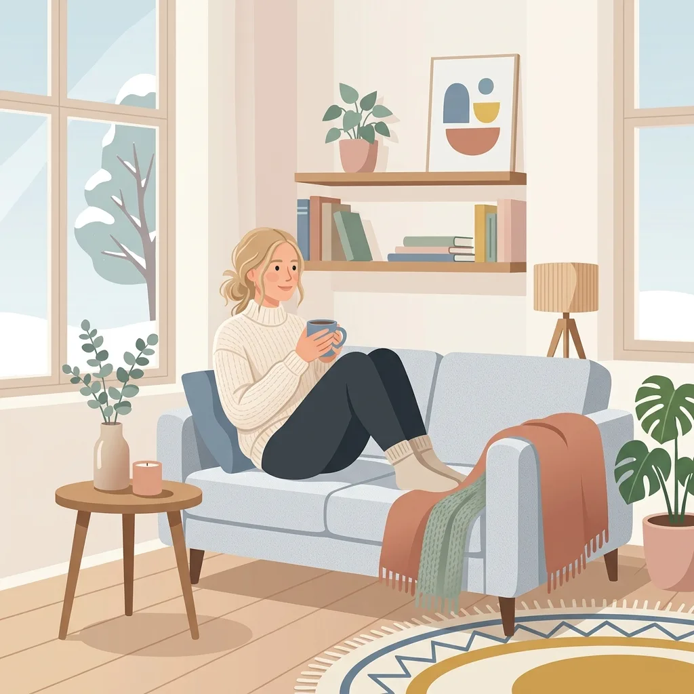

**#398 · Ai Art, Ai Prompt · <code>Vinano Image Pro</code>**

> Keywords: AI art, AI prompt, text to image

<details>
<summary>Show prompt</summary>

```
Scandinavian-style minimal illustration of [SUBJECT], muted pastel palette, flat design, soft gradients, cozy yet modern aesthetic, clean shapes, lifestyle illustration feel. Maintain consistent colour harmony and crisp focus across the whole frame.
```

</details>

---

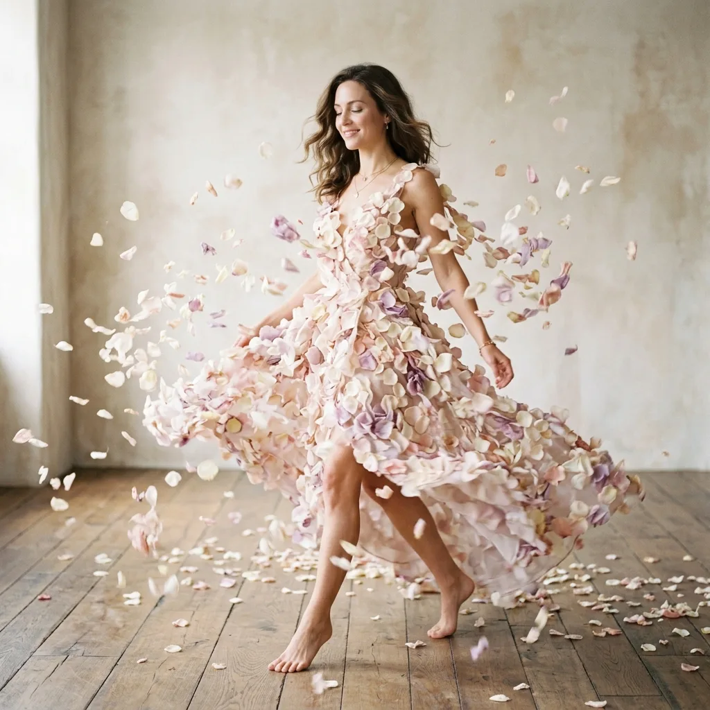

**#399 · Portrait, Ai Art · <code>Vinano Image Pro</code>**

> Keywords: portrait, AI art, AI prompt, text to image

<details>
<summary>Show prompt</summary>

```
{
  "render_goal": "Dream couture portrait",
  "subject": {
    "pose": "female mid-step, gentle movement",
    "expression": "peaceful smile"
  },
  "wardrobe": "gown made of floating flower petals orbiting the body",
  "environment": {
    "location": "soft-lit studio",
    "props": "petals in motion, airy light"
  }
}

Preserve realistic proportions and depth for a confident, professional finish.
```

</details>

---

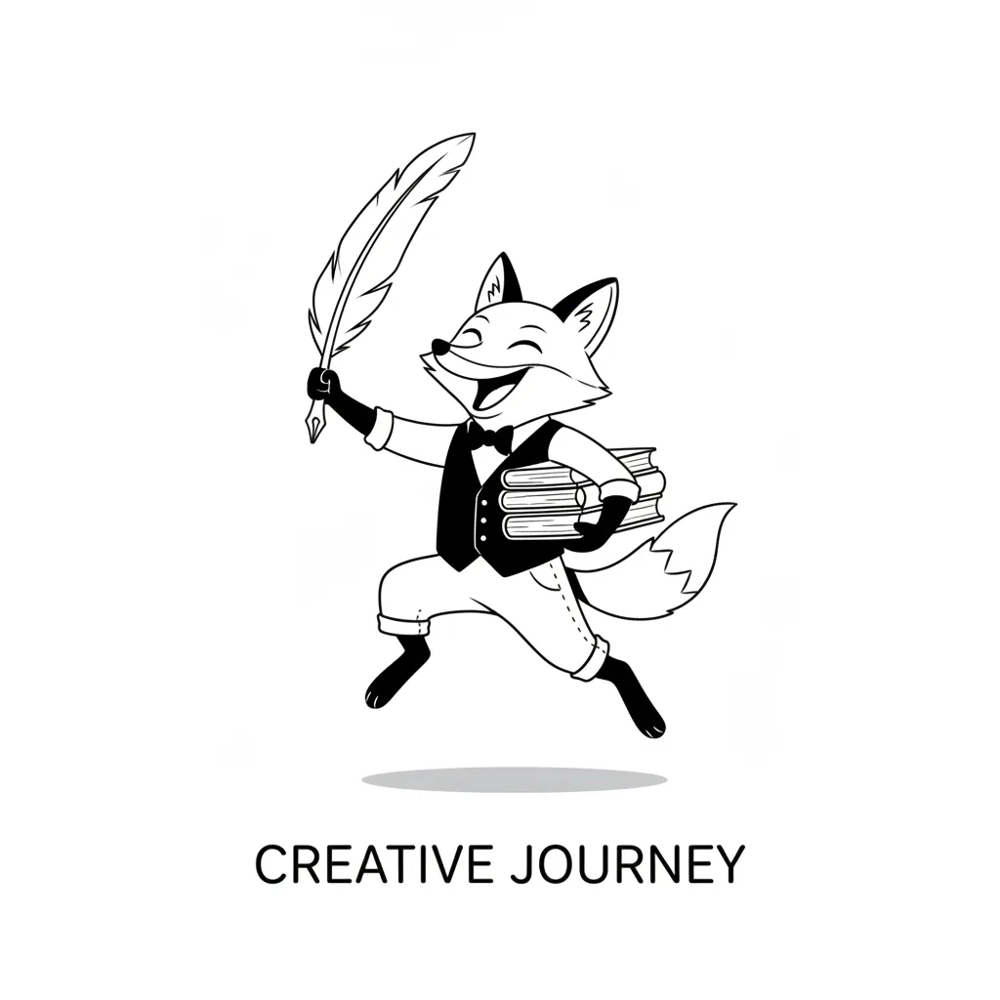

**#400 · Character, Minimalist · <code>Vinano Image</code>**

> Keywords: character, minimalist, AI art, AI prompt, text to image

<details>
<summary>Show prompt</summary>

```
A simple black-and-white illustration of a [subject] in [outfit], [doing action], a [facial expression] expression, in a Notion-style refined minimalist editorial aesthetic, clean line art, flat monochrome design, simple shapes, subtle hand-drawn feel, minimal detail, expressive posture, clean white background, neat modern layout, soft playful character style Maintain consistent colour harmony and crisp focus across the whole frame.
```

</details>

---

[Next page →](./illustration-3d-5.md)
