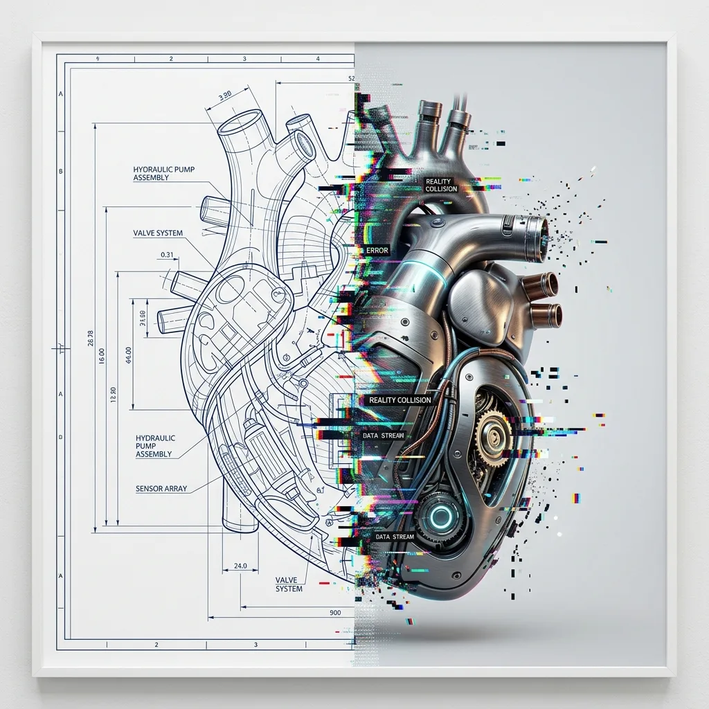
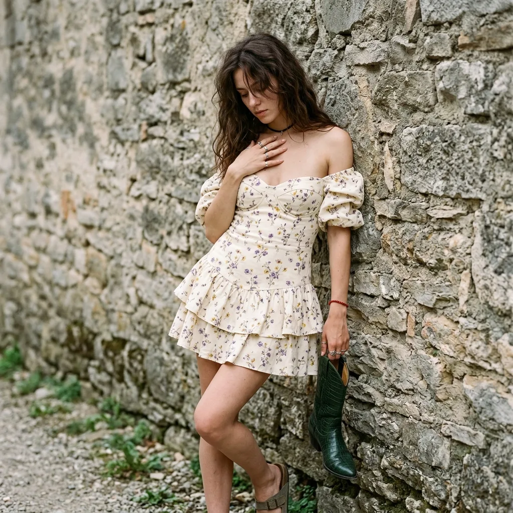
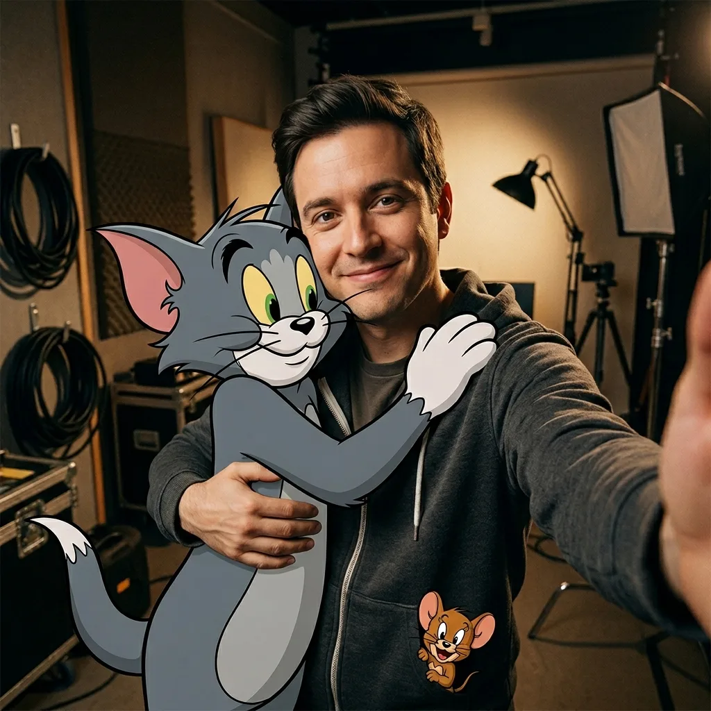
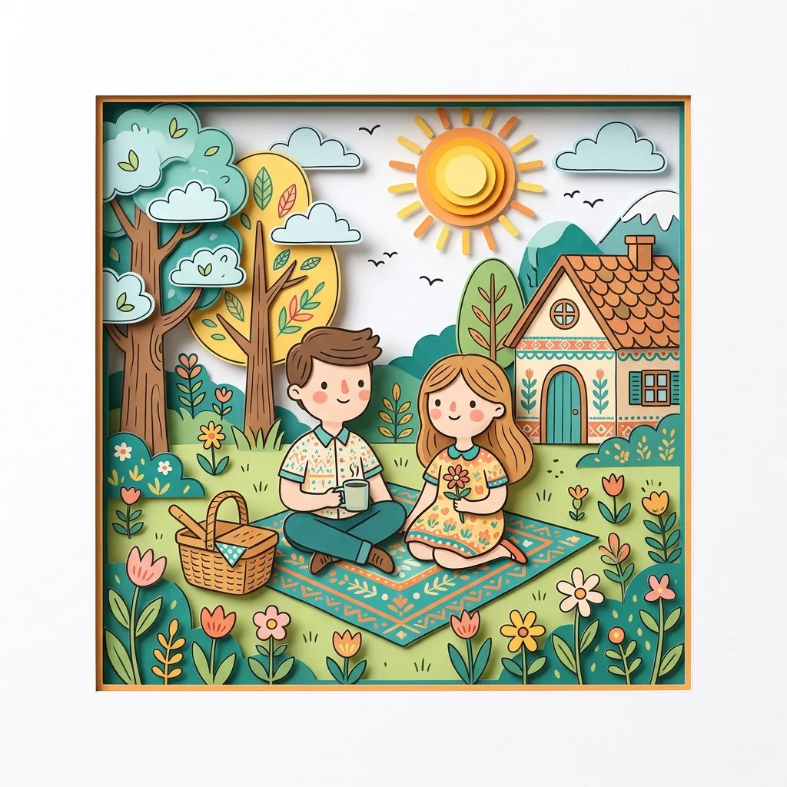
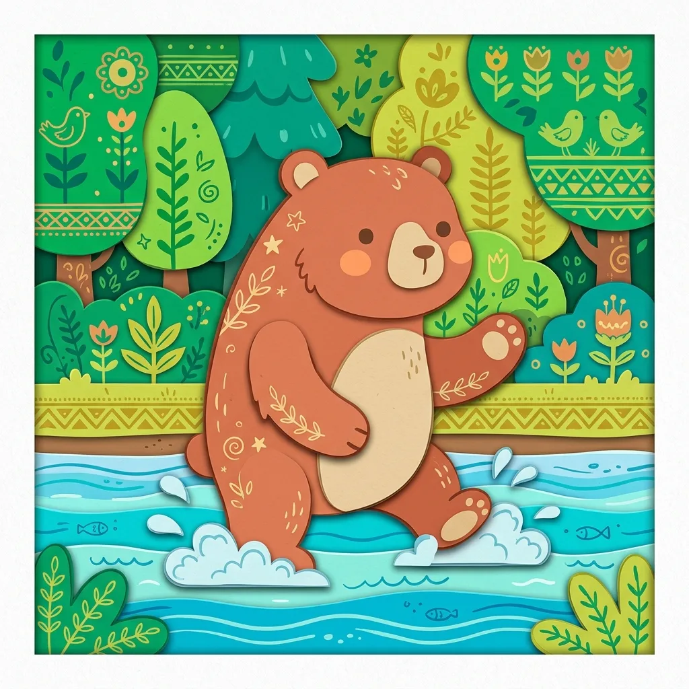
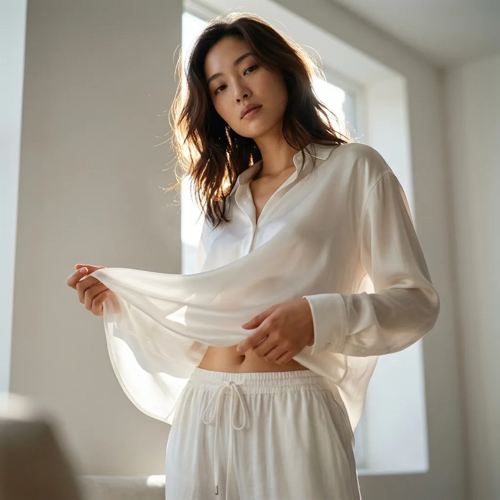
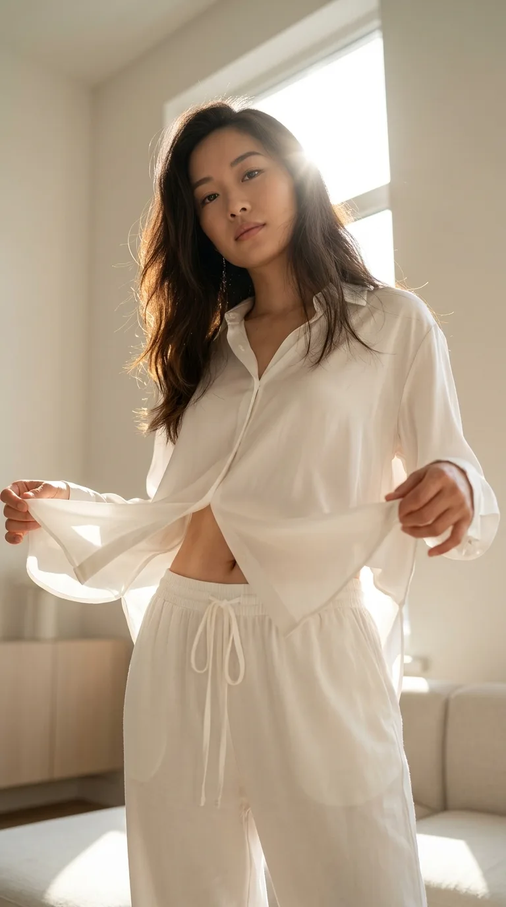
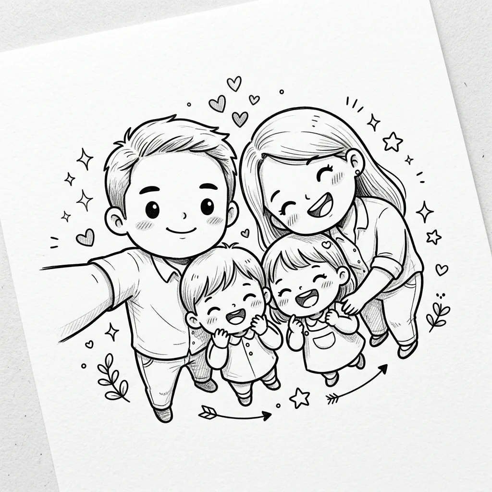
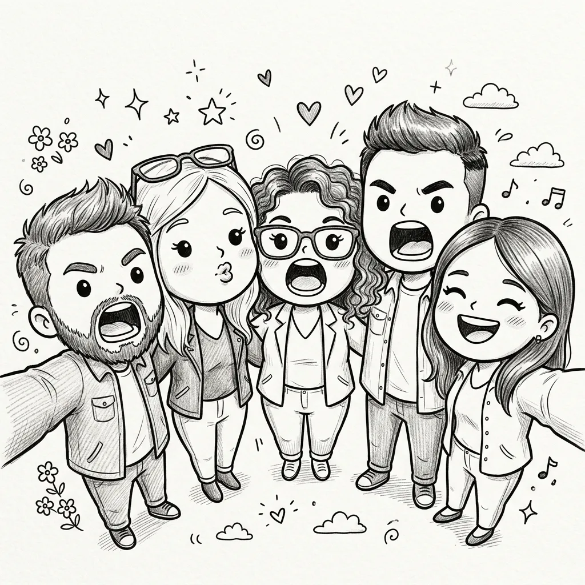

# Illustration & 3D — full gallery

[← Back to README](../README.md) · [`prompts.json`](../prompts/prompts.json) · **409** prompts · page 5 / 5

[← Prev](./illustration-3d-4.md) — [1](./illustration-3d.md) · [2](./illustration-3d-2.md) · [3](./illustration-3d-3.md) · [4](./illustration-3d-4.md) · **5**

---



**#401 · Ai Art, Ai Prompt · <code>Vinano Image Pro</code>**

> Keywords: AI art, AI prompt, text to image

<details>
<summary>Show prompt</summary>

```
A [subject] split vertically down the center, left half as a [adjective] technical blueprint, right half as a [adjective] 3D render, the seam between them glitching where both realities collide. Keep edges clean and the overall composition balanced for a polished, gallery-ready result.
```

</details>

---



**#402 · Realistic, Portrait · <code>Vinano Image Pro</code>**

> Keywords: realistic, portrait, AI art, AI prompt, text to image

<details>
<summary>Show prompt</summary>

```
{
 "prompt_details": {
 "subject": {
 "type": "Young woman",
 "appearance": {
 "hair": "Long, dark chestnut brown, loose waves, falling over face, messy aesthetic",
 "skin": "Fair complexion, smooth texture, natural finish",
 "face": "Looking downward, face partially obscured by hair, introspective expression",
 "body_type": "Slender, fit"
 },
 "pose": {
 "stance": "Leaning against a stone wall, body slightly angled",
 "hands": "Right hand resting gently on chest/neck fingers splayed, left hand holding a green object (boot) down by her side",
 "gaze": "Downward, avoiding eye contact"
 }
 },
 "clothing": {
 "dress": {
 "style": "Off-the-shoulder mini dress, cottagecore/boho style",
 "fabric": "Lightweight cotton or linen blend",
 "color": "Cream/off-white base",
 "pattern": "Small, delicate floral print purple and yellow wildflowers",
 "details": ["Ruffled tiered skirt", "Puffed short sleeves", "Sweetheart neckline", "Corset-style bodice structure"]
 },
 "accessories": ["Thin black choker necklace",
 "Multiple silver rings on fingers",
 "Red beaded bracelet on left wrist",
 "Holding a dark green, crocodile-texture cowboy boot"]
 },
 "environment": {
 "background": "Textured stone masonry wall",
 "details": "Large, irregular grey and beige stone blocks, rough texture, natural architectural backdrop",
 "setting": "Outdoor or semi-outdoor daylight setting"
 },
 "lighting": {
 "type": "Soft natural daylight",
 "quality": "Diffused, even illumination, soft shadows",
 "direction": "Front-lit but soft"
 },
 "styling": {
 "aesthetic": "Bohemian, chic, feminine, soft grunge undertones",
 "mood": "Casual, candid, slightly moody, artistic"
 },
 "camera_details": {
 "shot_type": "Medium shot (thigh-up)",
 "angle": "Eye-level",
 "lens": "85mm prime lens for flattering portrait compression",
 "aperture": "f/2.8 for slight depth of field separation from the wall",
 "focus": "Sharp focus on the subject and dress texture"
 },
 "technical_specifications": {
 "quality": "Ultra true-to-life photorealistic, 8k resolution, highly detailed",
 "texture_quality": "High fidelity fabric textures, realistic skin pores, detailed stone masonry",
 "engine": "Unreal Engine 5 render style or high-end photography"
 }
 }
}

Render with rich micro-detail while keeping the layout uncluttered and intentional.
```

</details>

---



**#403 · Realistic, Ai Art · <code>Vinano Image Pro</code>**

> Keywords: realistic, AI art, AI prompt, text to image

<details>
<summary>Show prompt</summary>

```
A Realistic First Person (Pov) Selfie Taken An Outside Arm, In The Same Clothes As In The Uploaded Photo.
Close-up Of Me Hugging Tom, The Cartoon Gray Cat From Tom And Jerry, A Small Smile (Jerry Can Be Looking Out Of My Shoulder Or My Pocket).
true-to-life photorealistic Environment: Studio Set, Office Interior, Warm Light, Props, Spotlights And Cables In The Background.
Tom Is A Strongly Stylized Toon 3d: Cel-shading, Multi-proportions, Clear Contour, No Realistic Fur, Not Live-action.
Organic: Zoom To The Chest, Contact Of Hugs, Single Light, Natural Shadows. 4k.natural shadows. 4k.

Emphasise material texture and natural light so the final frame feels tactile and premium.
```

</details>

---



**#404 · Ai Art, Ai Prompt · <code>Vinano Image Pro</code>**

> Keywords: AI art, AI prompt, text to image

<details>
<summary>Show prompt</summary>

```
Reimagine the entire image as one cohesive Decorative Folk Flat Illustration blended a soft handcrafted paper-cut layered style, inspired by charming papercraft diorama aesthetics. Preserve the original subject, composition, and overall mood, but simplify every element into clean flat forms, bold rounded shapes, and cute childlike proportions. Add playful doodle accents, decorative folk patterns, slightly uneven handmade outlines, and minimal facial details such as dot eyes and soft blush cheeks.

Use a vivid, cheerful color palette that feels fresh and different from the original image, while keeping the final artwork warm, sweet, innocent, whimsical, and storybook-like. Create the feeling of layered cardstock stacked paper depth, clean cut edges, subtle shadows between layers, and gentle paper-crafted imperfections, as if the scene were carefully cut, colored, and assembled on clean white paper. The result should look cute, handcrafted, playful, and visually unified, a polished yet charming handmade folk-art papercraft finish.

Aim for an editorial, design-driven look with deliberate negative space.
```

</details>

---



**#405 · Ai Art, Ai Prompt · <code>Vinano Image Pro</code>**

> Keywords: AI art, AI prompt, text to image

<details>
<summary>Show prompt</summary>

```
Reimagine the entire image as one cohesive Decorative Folk Flat Illustration blended a soft handcrafted paper-cut layered style, inspired by charming papercraft diorama aesthetics. Preserve the original subject, composition, and overall mood, but simplify every element into clean flat forms, bold rounded shapes, and cute childlike proportions. Add playful doodle accents, decorative folk patterns, slightly uneven handmade outlines, and minimal facial details such as dot eyes and soft blush cheeks.

Use a vivid, cheerful color palette that feels fresh and different from the original image, while keeping the final artwork warm, sweet, innocent, whimsical, and storybook-like. Create the feeling of layered cardstock stacked paper depth, clean cut edges, subtle shadows between layers, and gentle paper-crafted imperfections, as if the scene were carefully cut, colored, and assembled on clean white paper. The result should look cute, handcrafted, playful, and visually unified, a polished yet charming handmade folk-art papercraft finish.

Preserve realistic proportions and depth for a confident, professional finish.
```

</details>

---



**#406 · Ai Art, Ai Prompt · <code>Vinano Image v2</code>**

> Keywords: AI art, AI prompt, text to image

<details>
<summary>Show prompt</summary>

```
【主体与状态】
成年东亚裔女性，二十岁出头，气质自然优雅，带有高端时尚编辑类人像的成熟感。她站在窗边明亮室内，低头望向镜头，眼神平静、柔和，略带克制的魅惑感。姿态放松而得体，双手轻轻提起并展开白色真丝衬衫的下摆，让布料在身前形成自然流动的弧线。整体呈现私密、安静、时尚但不露骨的摄影氛围。

【外貌与穿搭】
面容自然精致，肌肤柔软清透，保留真实皮肤纹理与细腻质感。妆容清淡自然，五官干净柔和。深棕色长发略带蓬松感，在逆光中呈现细腻发丝层次与柔亮轮廓光。穿着宽松的白色真丝衬衫，而不是针织上衣；衬衫面料轻盈、柔软、带有高级光泽，阳光穿透时呈现柔和半透明感、细褶与飘逸质感。下身搭配宽松的白色抽绳家居长裤，整体干净、舒适、克制。

【环境】
窗边的极简明亮现代室内空间，浅色墙面，干净通透，陈设简约。早晨或午后的自然阳光洒满房间，空间氛围宁静、温暖、安详。背景不过度复杂，突出人物、真丝面料与阳光质感。

【构图要求】
竖屏9:16构图，极低角度仰拍视角，机位约在腰部高度，镜头向上拍摄她的面部与躯干。人物面部位于画面上方附近，躯干与白色真丝衬衫占据前景主体。腹部隐约可见，布料在双手之间被轻微拉展，形成流动而自然的弧线。画面具有低角度透视感、私密感与时尚编辑类构图张力。

【相机/技术参数】
超写实摄影质感，4K高分辨率，真实色彩调校，自然肌肤纹理清晰，发丝细节、真丝光泽、柔软细褶与半透明材质表现准确。镜头具有低角度透视效果，主体清晰，背景略带柔和虚化。整体画面精致、通透、真实，不应呈现明显 AI 感。

【氛围/光线】
强烈自然阳光从她身后上方的窗户倾泻而入，形成明亮逆光与耀眼光束。光线在肌肤、白色真丝衬衫和室内空间中产生斑驳光影。发丝边缘带有辉光般的轮廓光，暖调高光柔和明亮，阴影轻盈细腻。整体氛围通透、温暖、安静，带有电影级阳光质感。

【风格】
超写实时尚摄影，高端编辑类美学，电影化自然光人像。整体优雅、感性、克制而不露骨，强调真实质感、柔和光影、自然姿态与奢华真丝面料表现。

【细节强调】
强调白色真丝衬衫而非针织上衣；面料应宽松、轻盈、带光泽，具有柔软细褶、飘逸感与阳光下的半透明质感。强调低角度仰拍透视、双手轻轻提起衬衫下摆、布料形成流动弧线、腹部隐约可见、明亮逆光、发丝轮廓光、极简窗边室内与温暖宁静氛围。主体必须明确为成年女性。

【避免】
未成年感，针织上衣，厚重面料，廉价布料质感，过度暴露，色情化，姿势僵硬，夸张表情，低清晰度，脸部变形，手指异常，多余肢体，过度磨皮，塑料皮肤，过曝死白，高反差阴影，背景杂乱，棚拍感过强，AI感明显，卡通风格，油画风格，虚假材质，构图过满。

强调材质质感与自然光影，让画面更具高级真实感。
```

</details>

---



**#407 · Ai Art, Ai Prompt · <code>Vinano Image v2</code>**

> Keywords: AI art, AI prompt, text to image

<details>
<summary>Show prompt</summary>

```
【主体与状态】
成年东亚裔女性，二十岁出头，气质自然优雅，带有高端时尚编辑类人像的成熟感。她站在窗边明亮室内，低头望向镜头，眼神平静、柔和，略带克制的魅惑感。姿态放松而得体，双手轻轻提起并展开白色真丝衬衫的下摆，让布料在身前形成自然流动的弧线。整体呈现私密、安静、时尚但不露骨的摄影氛围。

【外貌与穿搭】
面容自然精致，肌肤柔软清透，保留真实皮肤纹理与细腻质感。妆容清淡自然，五官干净柔和。深棕色长发略带蓬松感，在逆光中呈现细腻发丝层次与柔亮轮廓光。穿着宽松的白色真丝衬衫，而不是针织上衣；衬衫面料轻盈、柔软、带有高级光泽，阳光穿透时呈现柔和半透明感、细褶与飘逸质感。下身搭配宽松的白色抽绳家居长裤，整体干净、舒适、克制。

【环境】
窗边的极简明亮现代室内空间，浅色墙面，干净通透，陈设简约。早晨或午后的自然阳光洒满房间，空间氛围宁静、温暖、安详。背景不过度复杂，突出人物、真丝面料与阳光质感。

【构图要求】
竖屏9:16构图，极低角度仰拍视角，机位约在腰部高度，镜头向上拍摄她的面部与躯干。人物面部位于画面上方附近，躯干与白色真丝衬衫占据前景主体。腹部隐约可见，布料在双手之间被轻微拉展，形成流动而自然的弧线。画面具有低角度透视感、私密感与时尚编辑类构图张力。

【相机/技术参数】
超写实摄影质感，4K高分辨率，真实色彩调校，自然肌肤纹理清晰，发丝细节、真丝光泽、柔软细褶与半透明材质表现准确。镜头具有低角度透视效果，主体清晰，背景略带柔和虚化。整体画面精致、通透、真实，不应呈现明显 AI 感。

【氛围/光线】
强烈自然阳光从她身后上方的窗户倾泻而入，形成明亮逆光与耀眼光束。光线在肌肤、白色真丝衬衫和室内空间中产生斑驳光影。发丝边缘带有辉光般的轮廓光，暖调高光柔和明亮，阴影轻盈细腻。整体氛围通透、温暖、安静，带有电影级阳光质感。

【风格】
超写实时尚摄影，高端编辑类美学，电影化自然光人像。整体优雅、感性、克制而不露骨，强调真实质感、柔和光影、自然姿态与奢华真丝面料表现。

【细节强调】
强调白色真丝衬衫而非针织上衣；面料应宽松、轻盈、带光泽，具有柔软细褶、飘逸感与阳光下的半透明质感。强调低角度仰拍透视、双手轻轻提起衬衫下摆、布料形成流动弧线、腹部隐约可见、明亮逆光、发丝轮廓光、极简窗边室内与温暖宁静氛围。主体必须明确为成年女性。

【避免】
未成年感，针织上衣，厚重面料，廉价布料质感，过度暴露，色情化，姿势僵硬，夸张表情，低清晰度，脸部变形，手指异常，多余肢体，过度磨皮，塑料皮肤，过曝死白，高反差阴影，背景杂乱，棚拍感过强，AI感明显，卡通风格，油画风格，虚假材质，构图过满。

整体保持边缘干净、构图均衡，呈现可直接使用的精致成品感。
```

</details>

---



**#408 · Character, Minimalist · <code>Vinano Image v2</code>**

> Keywords: character, minimalist, AI art, AI prompt, text to image

<details>
<summary>Show prompt</summary>

```
Turn the uploaded photo into a cute black-and-white hand-drawn doodle illustration. Preserve the exact people, poses, expressions, clothing, and composition while transforming everyone into adorable chibi cartoon characters oversized heads, tiny bodies, round eyes, simple facial features, and playful proportions. Use clean black ink sketch lines on a plain white background, subtle pencil-style hatching, whimsical doodle details, tiny hearts, sparkles, and cute decorative elements floating around the characters. Maintain the family/group interaction and joyful mood. refined minimalist manga-inspired line art, cozy scrapbook aesthetic, kawaii character design, children's storybook illustration, charming hand-sketched texture, expressive faces, simple monochrome palette, highly detailed ink drawing, cute sticker-pack style, adorable and heartwarming atmosphere, top-down selfie perspective, masterpiece quality. Emphasise material texture and natural light so the final frame feels tactile and premium.
```

</details>

---



**#409 · Character, Minimalist · <code>Vinano Image v2</code>**

> Keywords: character, minimalist, AI art, AI prompt, text to image

<details>
<summary>Show prompt</summary>

```
Turn the uploaded photo into a cute black-and-white hand-drawn doodle illustration. Preserve the exact people, poses, expressions, clothing, and composition while transforming everyone into adorable chibi cartoon characters oversized heads, tiny bodies, round eyes, simple facial features, and playful proportions. Use clean black ink sketch lines on a plain white background, subtle pencil-style hatching, whimsical doodle details, tiny hearts, sparkles, and cute decorative elements floating around the characters. Maintain the family/group interaction and joyful mood. refined minimalist manga-inspired line art, cozy scrapbook aesthetic, kawaii character design, children's storybook illustration, charming hand-sketched texture, expressive faces, simple monochrome palette, highly detailed ink drawing, cute sticker-pack style, adorable and heartwarming atmosphere, top-down selfie perspective, masterpiece quality. Emphasise material texture and natural light so the final frame feels tactile and premium.
```

</details>

---
