# Illustration & 3D — full gallery

[← Back to README](../README.md) · [`prompts.json`](../prompts/prompts.json) · **409** prompts · page 1 / 5

**1** · [2](./illustration-3d-2.md) · [3](./illustration-3d-3.md) · [4](./illustration-3d-4.md) · [5](./illustration-3d-5.md) — [Next →](./illustration-3d-2.md)

---


**#1 · Illustration &amp; 3D Prompt · <code>Vinano Image v2</code>**

<details>
<summary>Show prompt</summary>

```
[BRAND]. A hyperrealistic editorial photo of a figure wearing a unique helmet or mask that embodies the soul of BRAND turned inside out - its textures, symbols, colors and DNA reconstructed into an unexpected wearable object covering the entire face. The mask is made of BRAND's signature materials but distorted, inverted, reimagined as armor. Dramatic studio lighting, clean or atmospheric background, macro detail on every surface, Vogue editorial style, 8K Emphasise material texture and natural light so the final frame feels tactile and premium.
```

</details>

---


**#2 · Illustration &amp; 3D Prompt · <code>Vinano Image Pro</code>**

<details>
<summary>Show prompt</summary>

```
<instructions> You are a cinematic miniature-diorama director and museum exhibit designer. Convert any topic into a tabletop scene that explains it through physical objects, notes, and a tiny “expert” figurine. Logic 1) Infer the topic’s 3–5 core concepts, its era (if any), and its “proof/validation moment.” 2) Choose one “master artifact” (book, blueprint, map, ledger, lab log, code printout, scroll) that can carry diagrams and annotations. 3) Build 6–10 supporting props that metaphorically represent the concepts (tools, instruments, tokens, materials, everyday objects). 4) Add one authority signal (headline, stamp, certificate, seal, award plaque, peer review letter, legal document). 5) Place a toyified miniature figure (the “explainer”) interacting the artifact (writing, measuring, assembling). 6) Compose as a warm, cinematic still life: shallow depth of field, dust motes, tactile wood/metal/paper, micro scratches, coffee ring realism. 7) Ensure every prop has a legible purpose subtle labels, sketches, or iconography—no generic clutter. Draw: (a) a single hero scene, (b) 5 prop callouts what they symbolize, (c) camera + lighting notes, (d) optional negative cues to avoid (e.g., unreadable text blobs, random equations). The scene must be fully inferred from the given topic. </instructions> Aim for an editorial, design-driven look with deliberate negative space.
```

</details>

---


**#3 · Illustration &amp; 3D Prompt · <code>Vinano Image Pro</code>**

<details>
<summary>Show prompt</summary>

```
Ultra-Realistic Promotional
Present a clear, 45° top-down isometric miniature 3D cartoon scene of [MELBOURNE CRICKET STADIUM], soft refined textures, realistic PBR materials, and gentle lifelike lighting. Use a clean solid [GREEN, WHITE OR PINK] background. At the top center, display the name of this stadium in large bold text, then directly beneath it show its real seating capacity in medium text, and place the official logo associated this stadium below the capacity. All text must match the background contrast automatically (white or black). Centered layout, square 1080×1080 dimension.

Aim for an editorial, design-driven look with deliberate negative space.
```

</details>

---


**#4 · Illustration &amp; 3D Prompt · <code>Vinano Image Pro</code>**

<details>
<summary>Show prompt</summary>

```
Role: Literary Curator & Typewriter Sculptor
Input: [Poet or Poem, e.g., T.S. Eliot, Pablo Neruda]
Phase 1: Poetic Voice Analysis
Identify the poet's signature rhythm, recurring imagery, and emotional core
Select 4 contemporary or lesser-known poets parallel sensibilities
Extract 5-8 physical objects mentioned repeatedly in their work
Phase 2: Visual Execution
Goal: 2x2 Grid of "Typewriter Output as 3D Landscapes"
Rules per Panel:
The Base: A vintage typewriter (different model per poet's era)
The Paper: A single sheet of paper loaded in the roller
The Transformation: The typed text physically rises from the page, forming a 3D topographical landscape
The Words: Key lines from the poem carved into the terrain like engraved stone
The Symbols: Miniature objects from the poem placed in the landscape (tiny boat, rose, clock, door)
The Poet: Microscopic figurine of the poet wandering through their own words
The Mood: Lighting matches emotional tone (fog for melancholy, harsh light for anger, soft gold for longing)
The Metadata: Brass typewriter key showing "Poet | Collection | Year" **background: poet and poet era relevant items in the background.
Output: 2x2 Grid, Macro Photography, shallow depth of field

Preserve realistic proportions and depth for a confident, professional finish.
```

</details>

---


**#5 · Illustration &amp; 3D Prompt · <code>Vinano Image v2</code>**

<details>
<summary>Show prompt</summary>

```
<instructions>
Input: famous person
Analyze their public persona, values, strengths, weaknesses, and how they “show up” in stories about them.
Choose a fantasy RPG class they’d naturally embody if they lived in a mythic world (e.g., battle strategist → tactician, performer → bard, visionary → mage).
Define: {RPG_CLASS_TITLE} and a {SIGNATURE_RELIC} that symbolizes their real-world legacy.

Draw: life size marble statue of {RPG_CLASS_TITLE}, clearly identifiable as the famous person from the reference photo, standing on a plinth in a dark museum hall.
• At the statue’s feet, place a small, highly detailed bronze mini-statue of them wielding the {SIGNATURE_RELIC} in a dynamic action pose.
• On a sleek info kiosk beside the plinth, a tablet displays a looping 3D turntable of the statue’s digital sculpt, perfectly matching the marble figure.

Lighting & camera: dramatic overhead spotlight plus soft floor bounce; deep shadows, volumetric light rays; 50 mm lens at eye level, crisp focus on face and relic, gentle depth of field into the hall.
Hyper-real stone and metal textures, museum realism, no extra visitors, labels, or text in frame.
</instructions>

Maintain consistent colour harmony and crisp focus across the whole frame.
```

</details>

---


**#6 · Illustration &amp; 3D Prompt · <code>Vinano Image Pro</code>**

<details>
<summary>Show prompt</summary>

```
"Red futuristic sport motorcycle (POV perspective)",
      "visible_elements": "Glossy red fuel tank fuel cap, clip-on handlebars, black gloved hands gripping the grips, illuminated digital dashboard (slightly blurred)",
      "action": "Speeding at hyper-velocity through a suspended structure",
      "pose": "First-Person View (POV) / Rider's eye perspective looking slightly downward at the bike and forward into the horizon"
    },
    "environment": {
      "setting": "Transparent glass hyperloop tunnel / skyway",
      "location": "High altitude above a futuristic cyberpunk metropolis",
      "background_details": "Sprawling city grid infinite street lights below, skyscrapers, motion-blurred light trails",
      "horizon": "Dusk/Twilight sky a gradient of deep teal fading into a warm sunset orange strip"
    },
    "lighting_and_color": {
      "color_palette": "Cinematic Teal and Orange (Complementary colors)",
      "primary_tones": "Cyan/Turquoise glass reflections, Deep Red motorcycle paint, Golden/Orange horizon glow",
      "lighting_style": "High contrast, neon ambient lighting, specular highlights on the metal and glass surfaces"
    },
    "camera_technical": {
      "camera_angle": "Wide-angle POV (14mm to 16mm equivalent)",
      "focus": "Sharp focus on the motorcycle tank and handlebars, radial motion blur on the tunnel walls and city",
      "aperture": "f/2.8 (to capture low light details)",
      "shutter_speed": "1/30s (simulated drag shutter to create heavy motion blur effects on the surroundings)",
      "iso": "ISO 800",
      "composition": "Central symmetry, leading lines created by the tunnel structure converging at the center vanishing point"
    },
    "style_descriptors": ["Cyberpunk",
      "Synthwave aesthetic",
      "Hyper-realistic",
      "High velocity",
      "Futuristic",
      "Cinematic",
      "8k resolution",
      "Unreal Engine 5 render style"

Keep edges clean and the overall composition balanced for a polished, gallery-ready result.
```

</details>

---


**#7 · Illustration &amp; 3D Prompt · <code>Vinano Image Pro</code>**

<details>
<summary>Show prompt</summary>

```
function recommend(x) { Determine type(x) (e.g. game, movie, book, or TV series) Role: world-class TV, book and movie expert Analyze x's style, storyline, tone, every aspect and find 4 hidden gems in type (x) {} return: 2x2 grid carved book-block dioramas, each grid antique leather-bound books hollowed and carved, warm reading-lamp glow from within, dark mahogany bases, ultra-realistic} draw(recommend (X -Files); Maintain consistent colour harmony and crisp focus across the whole frame.
```

</details>

---


**#8 · Illustration &amp; 3D Prompt · <code>Vinano Image Pro</code>**

<details>
<summary>Show prompt</summary>

```
<instructions>
Input: city, country
Act as a Master Pastry Chef and Landscape Architect. Generate a hyper-realistic macro shot of a rectangular "Landscape Cake."
1. The Flavor Profile:
Analyze the Input Location to determine the Cake Base and Materials:
If Forest/Mountain (e.g., Canada): Dark Chocolate Brownie or Carrot Cake (simulating soil/earth).
If Tropical (e.g., Hawaii): Golden Sponge or Cheesecake (simulating sand).
If Snowy/Ice (e.g., Antarctica): White Vanilla or Coconut Cake (simulating snow/ice).
If Volcanic/Mars: Red Velvet Cake.
2. Geography:
Construct the terrain Edible Metaphors:
Trees: Broccoli florets, Rosemary sprigs, or Matcha sponge crumbs.
Water: Blue Jello, Mirror Glaze, or melted sugar glass.
Rocks: Chocolate chunks, crushed nuts (pecans/walnuts), or rock candy.
The Icon: A tiny, edible sugar-craft model of a local icon

3. The Typography:
The Letters: The Name of the Location is spelled out on the side of the cake slice.
The Material: The letters are formed from Fresh Fruit (Raspberries, Blueberries) or piped Buttercream embedded into the sponge.
4. The Plating:
The Board: The cake sits on a rustic wooden cutting board or a slate platter.
The Clutter: Scatter ingredients around the base that hint at the flavor (e.g., Cinnamon sticks, Maple leaves, Coffee beans, scattered flour).
The Tools: A vintage silver fork or cake knife rests on the side.
5. Lighting & Atmosphere:
Lighting: "Bakery Window" Light. Soft, natural daylight streaming in from the side, highlighting the moisture of the cake crumb and the gloss of the "water" glaze.
Depth: Shallow depth of field. The front corner of the cake is sharp; the background props are blurred.
Output: ONE image, 4:3 Aspect Ratio, Food Photography, "Great British Bake Off" Aesthetic.
</instructions>

Preserve realistic proportions and depth for a confident, professional finish.
```

</details>

---


**#9 · Illustration &amp; 3D Prompt · <code>Vinano Image Pro</code>**

<details>
<summary>Show prompt</summary>

```
<instructions>
Input word or concept
Act as a Conceptual Sculptor. Generate a 3D typography render where the letters are constructed from materials that Physically Embody the Input Word.
1. Material & Physics Inference (The DNA):
Analyze the Input Word to determine the Structural Material and Internal Physics:
If Ethereal (e.g., TIME, SOUL): Use Glass, Brass, and Light. Physics = Flowing, ticking, glowing.
If Elemental (e.g., FIRE, MAGMA): Use Black Iron cages. Physics = Burning, dripping, smoking.
If Organic (e.g., GROWTH, LIFE): Use Wooden frames or Terrarium glass. Physics = Growing, blooming, condensation.
If Industrial (e.g., FACTORY, STEEL): Use Rusted Steel beams. Physics = Grinding gears, steam vents.
2. Container:
The Structure: The letters are massive, 3D structural frames.
The Transparency: The front face is open or transparent to reveal the Internal Mechanism.
The Logic: The frame must look like it was built to contain the specific substance inside (e.g., thick glass for gas; heavy iron for magma).
3. The Internal Mechanism:
Content: Fill the hollow letters the active element of the concept.
Example (TIME): Sand pouring from T to I; Pendulums swinging in M; Gears turning in E.
Example (FIRE): Real flames licking up the inside of F; Coals glowing in I; Smoke venting from R.
Connectivity: Pipes, wires, or vines connect the letters, transferring the energy from one to the next.
4. The Narrative Scale:
The Figures: Tiny 1:87 scale figures interact the letters.
Inference: If "TIME," figures are winding clocks. If "FIRE," figures are stokers shoveling coal. If "GROWTH," figures are gardeners watering plants.
5. Lighting & Atmosphere:
Source: The light comes from the Material itself (e.g., Fire glow, Bioluminescence, Neon).
Environment: The table/floor matches the theme (e.g., Burnt wood for FIRE; Mossy earth for GROWTH).
Output: ONE image, High Resolution 3D Render, Conceptual Art Aesthetic.
</instructions>

Keep edges clean and the overall composition balanced for a polished, gallery-ready result.
```

</details>

---


**#10 · Illustration &amp; 3D Prompt · <code>Vinano Image Pro</code>**

<details>
<summary>Show prompt</summary>

```
Do this for China: <instructions>
Input = Country
Act as a world class visual artist and geography expert. For every country, find 4 less known cities and the one product that is very popular there. Do research to get this step right.

Function Draw ($ City, $ Material) Anchor: [Location]:: [Material Concept]::4
Morphology: Miniature architectural cityscape of [Location], entire skyline constructed the assemblage of [Material Concept] components, skyscrapers and structures formed from the constituent parts of [Material Concept], thematic structural engineering, hyper-detailed diorama::3
Material Physics: Physical properties of [Material Concept] applied to architecture, [Material Concept] textures replacing concrete and glass, innate material logic of [Material Concept], high-fidelity surface details::3
Illumination: Lighting exhibiting the surface properties of [Material Concept], ambient occlusion, volumetric atmosphere matching the material theme::2
Render Stack: Tilt-shift photography, macro lens, f/2.8, 8k, scale model aesthetic, detailed texture mapping, Unreal Engine 5 render::1
Negative: [Human presence, massive scale, blurry, low resolution, bad geometry, distortions, flat 2D, text, watermark]:: -1

Output: 2x2 grid, for each panel execute Draw Function for one of the cities plus the associated popular product. Name of the city underneath
</instructions>

Preserve realistic proportions and depth for a confident, professional finish.
```

</details>

---


**#11 · Illustration &amp; 3D Prompt · <code>Vinano Flash</code>**

<details>
<summary>Show prompt</summary>

```
a vintage postage stamp depicting [iconic monument of a capital people interacting in the scene].
Pastel colors, extremely thin black border all around it, simple background, paper texture, high details

Maintain consistent colour harmony and crisp focus across the whole frame.
```

</details>

---


**#12 · Illustration &amp; 3D Prompt · <code>Vinano Image Pro</code>**

<details>
<summary>Show prompt</summary>

```
Input Variable: [INSERT PODCAST NAME]
System Instruction:
Act as a Media Archaeologist. Create a 2x2 Grid.
Curation: Identify 4 "Hidden Gem" podcasts similar to the Input.
Era Inference: For each podcast, determine its "Soul Era" (e.g., Is it gritty analog? Sleek digital? Retro radio?).
The Container: Generate an Audio Device specific to that Era (e.g., A Wood-Cabinet Radio, A Cassette Player, A Server Blade, A Podcast Mic).
The Cutaway: The device is hollow or open-faced.
The Interior World:
The Terrain: The internal components (Tubes, Tape, Circuits) transform into a landscape relevant to the podcast's topic (e.g., Circuits become city streets; Tubes become forest trees).
The Action: Tiny 1:87 scale figures (The Hosts) are exploring this landscape, interacting "Clues" or "Artifacts" derived from the show's content.
Label: The device's brand plate reads: [Podcast Name].
Output: 2x2 panel, each panel for a gem podcast

Preserve realistic proportions and depth for a confident, professional finish.
```

</details>

---


**#13 · Illustration &amp; 3D Prompt · <code>Vinano Image Pro</code>**

<details>
<summary>Show prompt</summary>

```
Do this for Eiffel Tower:

Input Variable: [INSERT STRUCTURE]
System Instruction:
Act as a Cinematic Director. Create a hyper-realistic portrait of a Master Model Maker putting the final touches on a scale replica of the Input Structure.
1. Logic:
Analyze the Input Structure to determine the Setting and the Character:
IF Ancient/Fantasy (e.g., Colosseum, Castle):
Room: A dusty, sunlit Renaissance Workshop (Stone & Wood). also showcasing "Previous Projects" (other models in the same genre).
Character: An elderly Artisan in a leather apron.
Materials: Plaster, Clay, Balsam Wood.
IF Sci-Fi/Industrial (e.g., Death Star, spaceship):
Room: A sterile, cold Industrial Design Lab (Concrete & Metal). also showcasing "Previous Projects" (other models in the same genre).
Character: A younger Prop Master in a workshop jumpsuit or lab coat.
Materials: Grey Resin (Kitbash), Styrene, Fiber Optics.
IF Modern Architecture (e.g., Skyscraper):
Room: A clean, white Architectural Firm (Glass & White Walls). also showcasing "Previous Projects" (other models in the same genre).
Character: A refined minimalist Architect in a black turtleneck.
Materials: White Foamcore, Acrylic, 3D Printed Plastic.
2. The Composition:
The Subject: The Character is leaning over a massive, incredibly detailed Scale Model of the Input Structure.
The Action: They are Tweezers or a fine brush to place a specific "Micro-Detail" relevant to the lore.
Death Star: Placing a tiny Turbo-Laser Turret.
Colosseum: Dusting sand onto the arena floor.
City: Gluing a tiny streetlamp.
The Scale: Extreme scale contrast. The human hands look giant next to the tiny windows/bricks of the model.
3. The Environment:
The Blueprint: On the table, beneath the tools, lies the correct reference document:
Sci-Fi: Blue grid schematic or iPad.
Fantasy: Yellowed parchment map.
Modern: White vector floorplan.
The Clutter: The tools scattered around must match the medium (e.g., Clay tools vs. Soldering Iron vs. X-Acto knives).
4. Lighting & Atmosphere:
Lighting Match: The lighting must match the inferred room.
Workshop: Warm God Rays (Dusty).
Lab: Cool Fluorescent Tubes (Clean/Hazy).
Focus: Shallow depth of field. Sharp focus on the tweezers and the contact point.
Output: ONE image, 16:9 Aspect Ratio, Cinematic Photography, 8k Resolution.

Maintain consistent colour harmony and crisp focus across the whole frame.
```

</details>

---


**#14 · Illustration &amp; 3D Prompt · <code>Vinano Image</code>**

<details>
<summary>Show prompt</summary>

```
Create a premium-quality vector art illustration of a [COLOR] [BRAND + MODEL] viewed from a dynamic front-side angle, a modern car sticker design. The car should have detailed shading, black sport rims, and a glossy finish that reflects light. Add the text “[BRAND]” above the car in bold, modern font. Behind the car and text, include angled [STRIPE COLOR] stripes as a background element to add motion and energy. Use a white outline around the entire composition to give the sticker a cutout effect, just like a real die-cut sticker. Place the entire design on a plain white background to mimic how a sticker would appear. The overall design should be sporty, vibrant, and clean. Format: 1080x1080 pixels Render with rich micro-detail while keeping the layout uncluttered and intentional.
```

</details>

---


**#15 · Illustration &amp; 3D Prompt · <code>Vinano Image v2</code>**

<details>
<summary>Show prompt</summary>

```
A stylized 3D cartoon boy character a minimal, Pixar-like design, pale skin, slightly oversized head, and a slim body. He has half-closed sleepy green eyes, a bored expression, and soft facial features a small nose and subtle blush. He is wearing a light grey knitted beanie a small front label, large black over-ear headphones, and a loose green sweatshirt. The character is centered, facing forward, relaxed posture. Background is a smooth solid green gradient. Soft studio lighting, high detail, clean render, shallow depth of field, ultra-realistic textures, 4K. Emphasise material texture and natural light so the final frame feels tactile and premium.
```

</details>

---


**#16 · Illustration &amp; 3D Prompt · <code>Vinano Image Pro</code>**

<details>
<summary>Show prompt</summary>

```
Refined 3D isometric composition (45° angle) in a Glassmorphism + Soft Claymorphism style.
The center of the composition features gold bars, rendered hyper-realistic PBR materials, placed inside or surrounded by semi-transparent glass forms.

Visual Style Characteristics

Materials:
Primary focus on frosted glass strong background blur. Element edges feature a subtle white inner glow, simulating polished glass bevels.

Layers:
A multi-layered composition where UI and graphic elements float at different transparency levels, creating a pronounced sense of depth.

Geometry:
Perfectly soft, rounded corners (Apple-style squircles).

Element Details

Central Object:
Highly detailed gold bars precise engravings, realistically reflecting within surrounding glass surfaces.

Interface:
Floating panels a frosted glass effect (40–60% opacity). Panels display clean sans-serif typography showing data for January 30, 2026: price, trend arrow, and a neon micro-chart.

Environment:
Stylized elements (vault door, market icons) crafted from a mix of polished metal and semi-transparent plastic.

Technical Parameters

Lighting:
Soft studio lighting, realistic caustics (light passing through glass), and global illumination (GI).

Background:
Solid powder blue color (#B0E0E6), providing contrast translucent layers.

Render:
Cinema 4D, Octane Render, 8K resolution, ultra-high detail, clean minimalism.

Preserve realistic proportions and depth for a confident, professional finish.
```

</details>

---


**#17 · Illustration &amp; 3D Prompt · <code>Vinano Image v2</code>**

<details>
<summary>Show prompt</summary>

```
Vertical snack advertising visual playful anthropomorphic tone. At the top, golden Lay’s potato chips arranged in a neat vertical queue, each chip posed like a diver on a diving platform, some slightly bent forward, some mid-tilt, suggesting preparation and focus before jumping. Below them, thick molten cheese flowing downward, glossy and stretchy, forming a rich cheese lava pool at the bottom. Several chips are frozen mid-air in clean diving poses, angled downward like synchronized divers, capturing a precise pre-splash moment. Warm yellow and cheese-orange gradient background, studio advertising lighting, soft highlights, refined shadows. Strong central axis composition, clear visual hierarchy. refined minimalist graphic layout, fun yet premium commercial food photography aesthetic, ultra-detailed textures, hyper-realistic, 8K resolution. Aim for an editorial, design-driven look with deliberate negative space.
```

</details>

---


**#18 · Illustration &amp; 3D Prompt · <code>Vinano Image v2</code>**

<details>
<summary>Show prompt</summary>

```
{
  "target_style": "Handcrafted needle-felted wool miniature",
  "texture_properties": {
    "material": "organic roving wool, fuzzy fibers, soft tactile felt",
    "details": "visible needle-punch textures, soft fuzzy surface, handcrafted seams",
    "eyes": "small black bead eyes or simple felted circles"
  },
  "adaptation_rules": {
    "proportions": "stylized, slightly oversized head, simplified limbs, cute aesthetic",
    "color_palette": "retain original colors from source image but soften wool texture",
    "clothing": "simplified felt versions of the original outfits, tiny fabric buttons, stitched details",
    "accessories": "replicate key items from source as miniature felted props"
  },
  "environment": {
    "camera": "macro photography, close-up shot",
    "lighting": "soft studio lighting, warm highlights, gentle shadows",
    "background": "clean, out-of-focus bokeh background, neutral craft studio setting",
    "depth_of_field": "shallow depth of field (f/2.8)"
  },
  "rendering_engine_hints": "high fidelity, 8k, true-to-life photorealistic wool texture, Pixar-like character charm"
}

Aim for an editorial, design-driven look with deliberate negative space.
```

</details>

---


**#19 · Illustration &amp; 3D Prompt · <code>Vinano Image v2</code>**

<details>
<summary>Show prompt</summary>

```
Luxury product photography of artisanal vanilla ground coffee packaged in a soft sculpted ivory pouch gentle wave contours, minimal branding embossed into fabric. The pouch rests on a rustic oak tabletop dusted coffee grounds, accompanied by a hand-carved wooden scoop spilling aromatic powder.
Natural Madagascar vanilla pods curve organically around the base, blending into drifting coffee granules that form a subtle flowing aroma path instead of a spiral.
On the pouch front, a modern sensory chart: thin matte gold lines showing flavor balance — low acidity, rich sweetness, full-bodied depth.
Warm morning sunlight enters from the left at a low angle, creating soft shadows and tactile fabric highlights. Background fades into a cozy café interior creamy bokeh lights, evoking calm morning rituals.
Ultra-sharp macro texture on vanilla pods and coffee grains, cinematic depth of field, premium lifestyle aesthetic, inviting, warm, handcrafted, high-end brand feel.

Emphasise material texture and natural light so the final frame feels tactile and premium.
```

</details>

---


**#20 · Illustration &amp; 3D Prompt · <code>Vinano Image Pro</code>**

<details>
<summary>Show prompt</summary>

```
<instructions> Input Variable: [INSERT BAND/ALBUM]

System Instruction:
Act as a Music Historian and Set Designer. Create a 2x2 Grid of "Audio-Visual Dioramas."
1. The Curation Logic (The Deep Cuts):
Analyze Input: Identify the genre and sonic signature of the Input Band (e.g., Pink Floyd = Psychedelic/Prog Rock, Atmospheric, Surreal).
Select 4 Hidden Gems: Identify 4 lesser-known albums/artists that share this sonic DNA but offer a different flavor (e.g., King Crimson, Porcupine Tree, Yes, The Alan Parsons Project).
The Translation: For each album, define the "Sonic Materiality":
If Heavy Metal: Rusty Iron & Fire.
If Synth-Pop: Neon Glass & Chrome.
If Folk: Mossy Wood & Candlelight.
If Prog Rock: Surreal Marble & Floating Stone.
2. The "Immutable" Container (The Vinyl Stage):
The Base: Each diorama is built on top of a Spinning Vinyl Record acting as the circular stage floor.
The Plinth: The record sits on a high-end audiophile turntable platter or a wooden speaker box.
The Label: The center label of the vinyl clearly displays the Artist Name & Album Title in crisp typography.
3. The Composition (The Sound Made Solid):
CRITICAL: Do not just recreate the album cover. Build a world that feels like the music.
The Structure: Architecture rises from the grooves of the vinyl record.
Example: A wall of amplifiers, a surreal floating prism, a crumbling brick wall, or a forest of microphone stands.
The Atmosphere: Use particle effects to visualize the sound waves.
Visuals: Floating musical notes made of smoke, vibrating liquid surfaces, or shattered glass suspended in mid-air.
The Figures: Tiny 1:87 scale band members performing inside this surreal landscape.
4. Visual Syntax (Per Panel):
Panel A: Album 1 (Focus on Surrealism/Scale).
Panel B: Album 2 (Focus on Technology/Machinery).
Panel C: Album 3 (Focus on Nature/Organic Textures).
Panel D: Album 4 (Focus on Light/Color).
5. Lighting & Atmosphere:
Concert Lighting: Each box is lit like a stage show. Spotlights, laser beams, and stage haze.
Depth: Shallow depth of field (Tilt-Shift) to make the vinyl record look massive.
Background: Seamless Slate Grey to keep the focus on the colors.
Output: 2x2 Grid, Hyper-Realistic Miniature Set Design, 8k Resolution, "Audiophile" Aesthetic. </instructions>

Aim for an editorial, design-driven look with deliberate negative space.
```

</details>

---

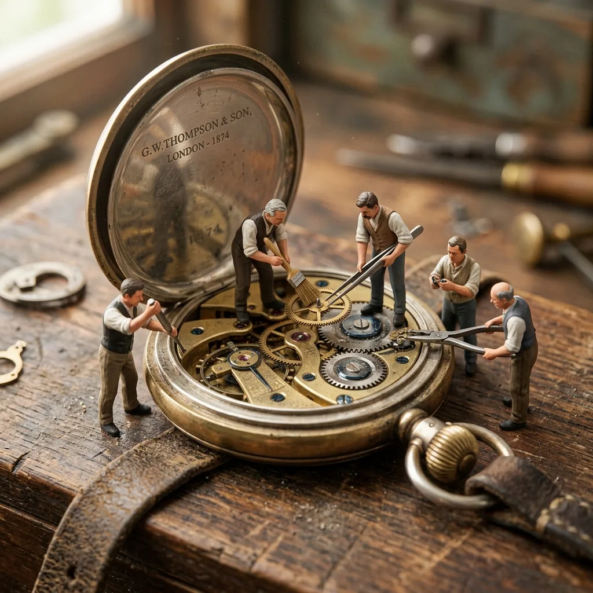

**#21 · Illustration &amp; 3D Prompt · <code>Vinano Image v2</code>**

<details>
<summary>Show prompt</summary>

```
Ultra-realistic macro scene depicting tiny restoration workers collaboratively repairing an antique pocket watch. Several figures delicately clean intricate brass gears fine brushes, while others stabilize the open watch casing and hold miniature components in place. The pocket watch lies on a textured natural surface, such as weathered wood or stone, emphasizing age and history. The scene symbolizes time, patience, craftsmanship, and teamwork.",
 "style": {
 "photography_type": "Macro photography",
 "realism": "Ultra-realistic",
 "mood": "Emotional and cinematic",
 "lighting": "Soft, warm, directional lighting gentle highlights and natural shadows",
 "depth_of_field": "Shallow depth of field sharp focus on foreground details and smooth background bokeh"
 },
 "composition": {
 "shot_type": "Close-up macro",
 "angle": "Slightly elevated perspective",
 "focus": "Extreme detail on gears, tools, and figurines’ interactions",
 "framing": "Pocket watch centered workers distributed naturally across the mechanism"
 },
 "textures_and_details": {
 "materials": "Aged metal, polished brass gears, worn leather strap, natural surface grain",
 "details": "Visible dust particles, subtle scratches, fingerprints, and mechanical wear"
 },
 "atmosphere": {
 "tone": "Warm, nostalgic, hopeful",
 "symbolism": "Restoration of time through collective effort and care"
 },
 "render_settings": {
 "aspect_ratio": "4:5",
 "quality": 2,
 "resolution": "High-resolution",
 "style_precision": "Professional studio-level composition"
 }
}

Maintain consistent colour harmony and crisp focus across the whole frame.
```

</details>

---

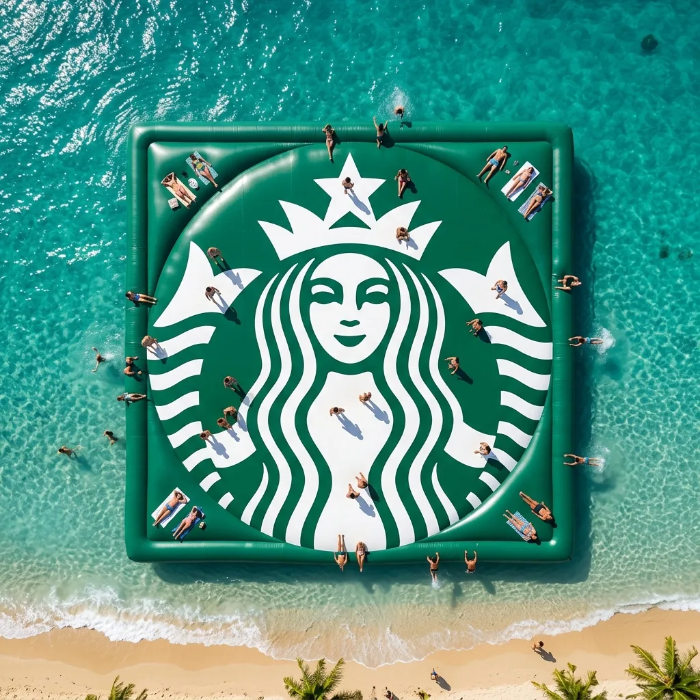

**#22 · Illustration &amp; 3D Prompt · <code>Vinano Image v2</code>**

<details>
<summary>Show prompt</summary>

```
{
 "prompt": "massive giant inflatable WhatsApp logo floating in the ocean near the beach, huge rectangular green mermaid logo white siren face, long flowing white wavy hair, green crown stars, ultra-detailed brand-accurate WhatsApp siren, enormous 100-meter diameter inflatable platform, emerald green rubber texture subtle glossy highlights, classic green and white color scheme, dozens of people in swimsuits playing and lying on the giant inflatable, some standing, some sitting, some swimming around the edges, tropical beach setting, golden sand, turquoise ocean waves gently crashing around the edges, bright sunny day, aerial drone top-down perspective, very wide angle overhead shot, crystal clear water, people casting small shadows on the white face, vibrant summer atmosphere, advertising campaign style, hyperrealistic, extremely detailed, 8k",
 "negative_prompt": "text, letters, words, deformed, blurry, low resolution, bad anatomy, extra limbs, watermark, logo in corner, people inside the face, dark mood, night, winter, snow, ugly, cartoon, illustration, painting, sketch, 3d render, plastic toy look",
 "aspect_ratio": "16:9",
 "style": "true-to-life photorealistic",
 "lighting": "bright natural sunlight, golden hour rim light, soft shadows",
 "camera": "drone aerial view, directly overhead, 200mm lens, slight wide angle distortion",
 "quality_tags": "masterpiece, best quality, ultra detailed, highly detailed, sharp focus, filmic, cinematic lighting, 8k resolution"
}

Keep edges clean and the overall composition balanced for a polished, gallery-ready result.
```

</details>

---

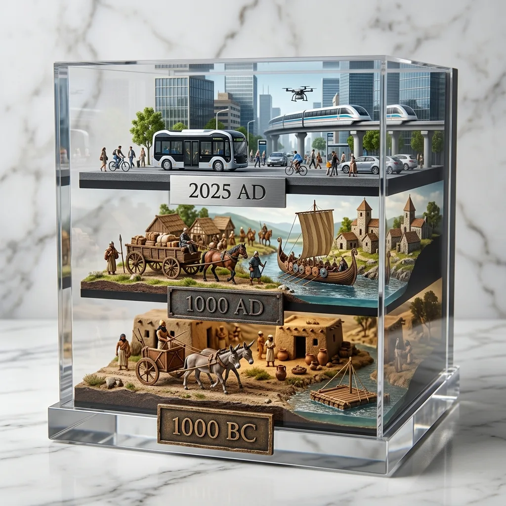

**#23 · Illustration &amp; 3D Prompt · <code>Vinano Image v2</code>**

<details>
<summary>Show prompt</summary>

```
Cinematic, hyper-realistic. A stacked depth composition of ultra-detailed 16K 3D-scanned transportation evolving over time, each layer at 1:18 scale [ELEMENTS = era-relevant elements, scenes, vehicles]. Mounted on an acrylic stack base refractive layers. Foreground lighting penetrates to cast multi-layered, receding shadows. From front to back: - ["1000 BC"]: [hyper realistic, era relevant ELEMENTS] - ["1000 AD"]: [hyper realistic, era relevant ELEMENTS] - ["2025 AD"]: [hyper realistic, era relevant ELEMENTS] Set against a marble background. Ultra-realistic 4K HDR render. Preserve realistic proportions and depth for a confident, professional finish.
```

</details>

---

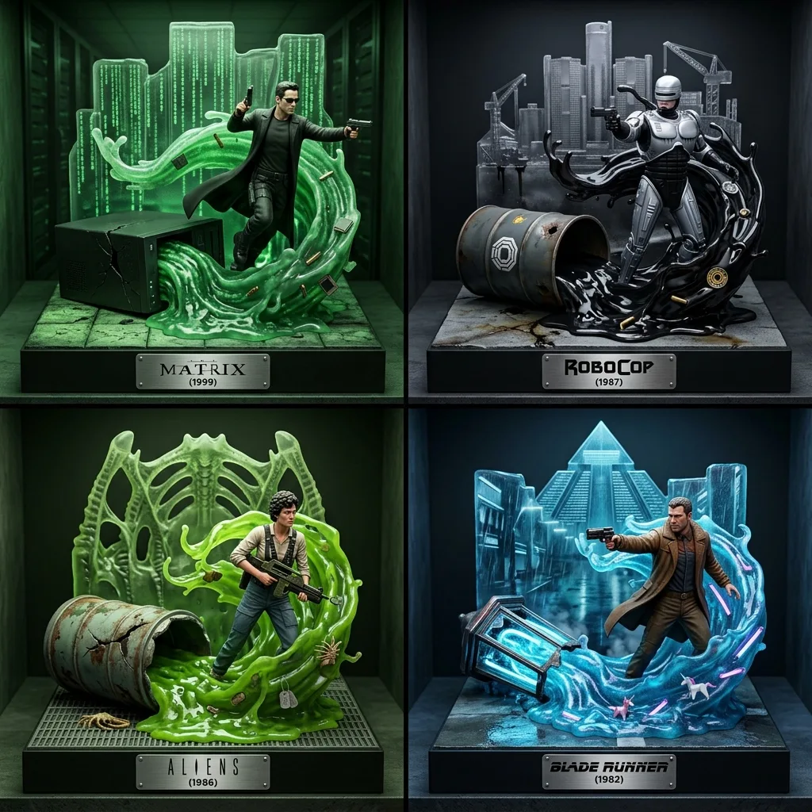

**#24 · Illustration &amp; 3D Prompt · <code>Vinano Image Pro</code>**

<details>
<summary>Show prompt</summary>

```
[Terminator] (Or any movie/book/anime)
<instructions>
 System Instruction: Act as an AI Media Curator and Master Concept Artist. Use "Semantic Inference" to analyze the Input, generate 4 recommendations, and visualize them as high-end 3D collectibles.
1. Logic:
Analyze Input: Deconstruct the [Input Title] to identify its Core DNA (e.g., Genre, Mood, Visual Style, Themes).
Example: If Input is "Terminator," DNA = Cyberpunk, Tech-Noir, Man vs. Machine, Industrial, 80s Action.
Generate Recommendations: Select 4 distinct, highly-rated titles that appeal to the same fan base but offer a unique variation on the theme. (Do not just pick sequels; pick spiritual successors or genre pillars).
2. Container:
Rule: Do not default to a generic inkwell.
Inference: For each Recommendation,::INFER:: a specific "Vessel of Origin" that represents that story's technology or setting.
Logic: If Sci-Fi -> A cracked Bio-Hazard Canister or Motherboard. If Fantasy -> An ancient Chalice. If Horror -> A Cursed Urn.
Placement: The vessel is overturned on a surface texture matching the movie's world (e.g., Grated Steel, Dusty Pavement, Alien Ship Floor).
3. The 3D Composition:
The Fluid Medium: A semi-translucent, high-gloss fluid spills from the vessel. The fluid represents the "Essence" of that movie.
Logic:
Rec 1 (e.g., The Matrix): Fluid = Liquid Green Code.
Rec 2 (e.g., RoboCop): Fluid = Black Oil & Motor Fluid.
Rec 3 (e.g., Aliens): Fluid = Acid Green Slime.
Rec 4 (e.g., Blade Runner): Fluid = Neon Blue Rain/Steam.
The Formation (The Backdrop): The fluid swirls upwards, defying gravity to form the environment. It must look like sculpted, translucent resin.
Logic: The fluid forms the iconic architecture (e.g., Skyscrapers, Hives, Ruins) behind the hero.
The Hero (The Solid): The Main Protagonist bursts out of the fluid surge. They are rendered as a Solid, Hand-Painted 1:6 Scale Statue, contrasting the translucent liquid.
Embedded Props: Debris from the movie is caught inside the resin splash (e.g., Shell casings, origami unicorns, computer chips).
4. Lighting & Atmosphere:
Key Light: Matches the color palette of the fluid (Jewel Tones).
Effect: Subsurface scattering makes the fluid glow from the inside.
5. Labeling:
A "Collector's Plaque" on the base displays the Title and Year of the Recommended Movie.
Output: 2x2 Grid. Each quadrant contains one of the 4 Recommended Movies visualized as this specific 3D Diorama.
</instructions>

Preserve realistic proportions and depth for a confident, professional finish.
```

</details>

---

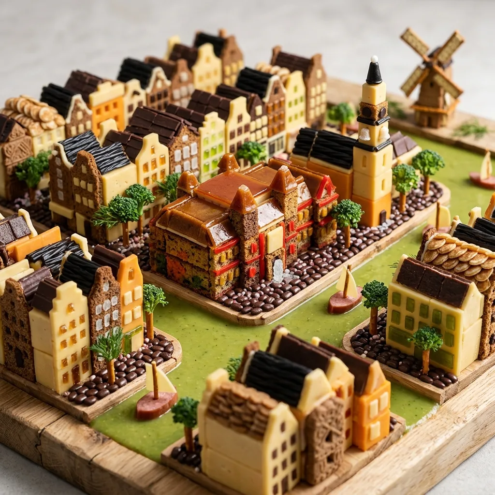

**#25 · Illustration &amp; 3D Prompt · <code>Vinano Image Pro</code>**

<details>
<summary>Show prompt</summary>

```
[Country/City Name]::4
Morphology: Miniature architectural cityscape, skyline constructed entirely from edible ingredients, tiny skyscrapers and houses mimicking [Country/City] architectural styles but formed from food, culinary structural engineering, hyper-detailed diorama::3
Material Physics: [Country/City] national gastronomy as construction material, native cuisine textures replacing concrete and glass, masonry made of regional staples, savory and sweet ingredient structural integrity, authentic local food palette::3
Illumination: Soft focus macro lighting, ambient occlusion, mouth-watering highlights::2
Render Stack: Tilt-shift photography, macro lens, f/2.8, 8k, scale model aesthetic, unreal engine 5 render::1
Negative: [Real concrete, real metal, plastic, inedible, humans, cutlery, plates, blurry]:: -1

Preserve realistic proportions and depth for a confident, professional finish.
```

</details>

---

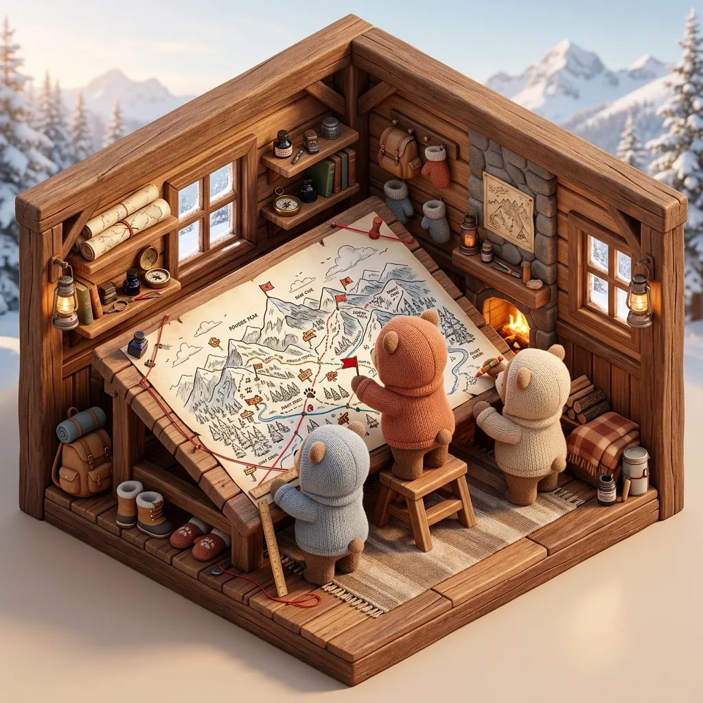

**#26 · Illustration &amp; 3D Prompt · <code>Vinano Image Pro</code>**

<details>
<summary>Show prompt</summary>

```
{
 "prompt": "Isometric 3D kawaii scene of chibi baby bears designing a mountain snow map inside a cozy wooden hideout. The isometric cutaway room features a large hand-drawn map spread across a tilted work table, decorated tiny flags, paw-print markers, and string lines connecting different locations. Three baby bears wear soft hooded outfits in warm terracotta, foggy blue, and oatmeal beige. One bear stands on a small stool placing a flag on the map, another measures distances a string and wooden ruler, while the third sketches snowy paths a crayon. The room includes wooden shelves filled rolled maps, compasses, ink bottles, backpacks, and snow boots placed near the door. Small windows reveal snow-covered mountains and pine forests outside.",
 "style": {
 "art_style": "kawaii 3D",
 "perspective": "isometric cutaway",
 "geometry": "rounded, toy-like proportions",
 "render_type": "ultra-detailed 3D render"
 },
 "lighting": {
 "type": "warm indoor lighting",
 "mood": "soft and cozy",
 "contrast": "gentle highlights smooth shadows"
 },
 "color_palette": {
 "primary": ["pastel earthy tones"],
 "accent": ["warm terracotta", "foggy blue", "oatmeal beige"]
 },
 "atmosphere": {
 "emotion": "wholesome and adventurous",
 "vibe": "cozy, playful, story-driven"
 },
 "quality": {
 "detail_level": "ultra detailed",
 "resolution": "8k",
 "rating": "masterpiece, premium quality"
 }
}

Emphasise material texture and natural light so the final frame feels tactile and premium.
```

</details>

---

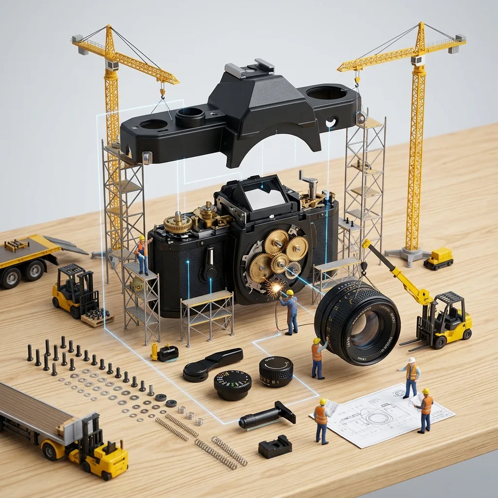

**#27 · Illustration &amp; 3D Prompt · <code>Vinano Image Pro</code>**

<details>
<summary>Show prompt</summary>

```
<instruction>
 Input A is a Mechanical Device or Gadget (e.g., Vintage Camera, Mechanical Watch, V8 Engine, Game Console).
Deconstruct the object into 3 Functional Layers:
 Chassis (The Shell): Identify the main body frame or housing.
 Engine (The Guts): Identify the primary internal mechanism.
 (e.g., Camera -> Shutter & Mirrors. Watch -> Mainspring & Escapement. Engine -> Pistons).
 Interface (The Control): Identify the buttons, dials, or lens elements.

 2. Container
Goal: "Exploded Construction" Tabletop Photography.
 Surface: A clean, light-grain Wooden Workbench or cutting mat.
 Layout: Exploded View (Knolling). The machine is pulled apart into its components, which are arranged spatially to show how they fit together.

 3. Construction
 The Suspension: Major parts (The Chassis) are raised on Miniature Scaffolding or suspended by Miniature Yellow Cranes.
 The Narrative: A crew of 1:87 Scale Construction Workers (Hard hats, vests) are actively building the machine.
 Action: They are welding gears, hoisting the lens, or consulting blueprints on the table.
 Vehicles: Tiny forklifts or flatbed trucks are delivering screws and springs.

 4. Visual
 The Guide Lines: Thin, glowing Blue Laser Lines or holographic wires connect the separated parts, tracing the path of assembly from the table to the suspended parts.
 The Hardware: Tiny screws, washers, and springs are lined up neatly in rows (Knolling style) on the table, waiting to be installed.

 5. Lighting & Atmosphere:
 Lighting: Bright Studio Light. Even, shadowless illumination (High Key) to ensure every mechanical detail is visible.
 Texture: Contrast between the matte grey/black of the machine parts and the bright yellow of the construction equipment.

 Output: ONE image, 1:1 Aspect Ratio, Macro Photography, "Miniature World" aesthetic, Technical Precision.
</instruction>

Preserve realistic proportions and depth for a confident, professional finish.
```

</details>

---

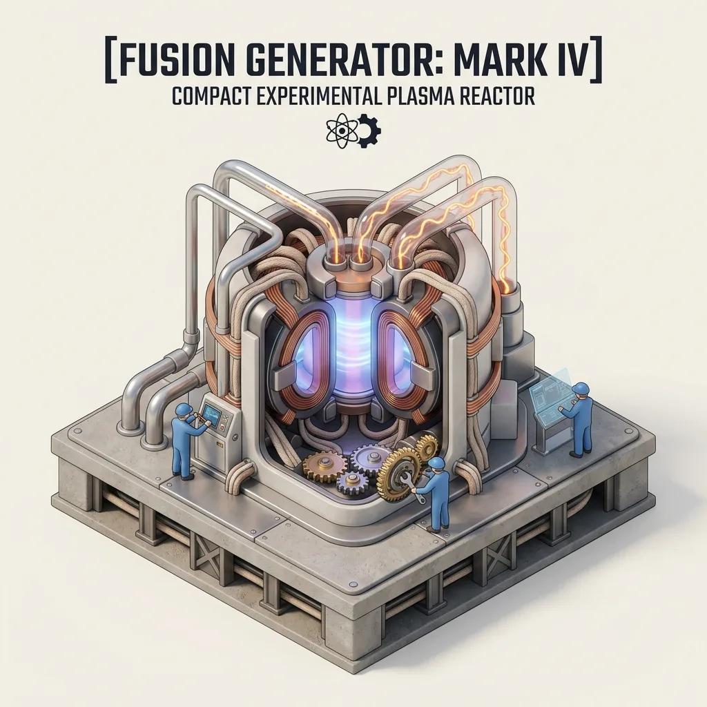

**#28 · Illustration &amp; 3D Prompt · <code>Vinano Image Pro</code>**

<details>
<summary>Show prompt</summary>

```
Create a clear, 45° top-down isometric miniature 3D cutaway diorama showing the inside of [MACHINE / DEVICE].

Use soft refined textures, realistic PBR materials, and clean technical lighting.

Design a raised base visible internal components, wiring, gears, or energy flow paths.
Include tiny stylized technicians interacting the machinery (no facial details).

Use a clean solid [BACKGROUND COLOR] background.

At the top-center, display [MACHINE NAME] in large bold text, beneath it show a short technical subtitle, and place a minimal engineering icon below.

All text must automatically match the background contrast (white or black).

Keep edges clean and the overall composition balanced for a polished, gallery-ready result.
```

</details>

---

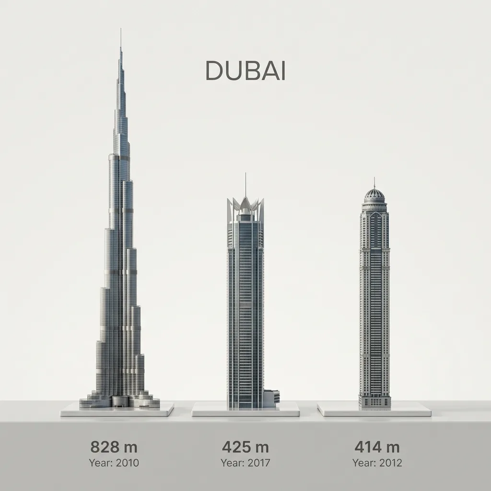

**#29 · Illustration &amp; 3D Prompt · <code>Vinano Image v2</code>**

<details>
<summary>Show prompt</summary>

```
Ultra-Realistic Promotional
Present a clear, side miniature 3D cartoon view of [DUBAI] tallest buildings. Use minimal textures realistic materials and soft, lifelike lighting and shadows. Use a clean, minimalistic composition showing exactly the three tallest buildings in spot, arranged from LEFT to RIGHT in STRICT descending height order. The tallest must appear visibly tallest, the second must be clearly shorter than the first, and the third must be clearly shorter than the second.
All buildings must follow accurate relative proportions: if a building is taller in real life, it MUST be taller in the image by the same approximate ratio. No building may be visually stretched or compressed. Each building should stand separately on a thin, simple ceramic base.
Below each base, centered text should display:
Height in meters – semibold sans-serif, medium size
Year built – lighter-weight sans-serif, smaller size, directly beneath the height text
Provide consistent padding, spacing, leading, and kerning. Write “DUBAI” centered above the buildings a medium-sized sans-serif font. No building top should overlap or touch the text above. Use accurate architectural proportions based on real-world references. Maintain consistent camera angle and identical scale for each building model.
No forced perspective. Use straight-on orthographic-style rendering. Do not exaggerate or stylize size differences beyond proportional accuracy. Use a square 1080x1080 composition. Use a clean, neutral background. Ensure no extra objects are present.

Keep edges clean and the overall composition balanced for a polished, gallery-ready result.
```

</details>

---

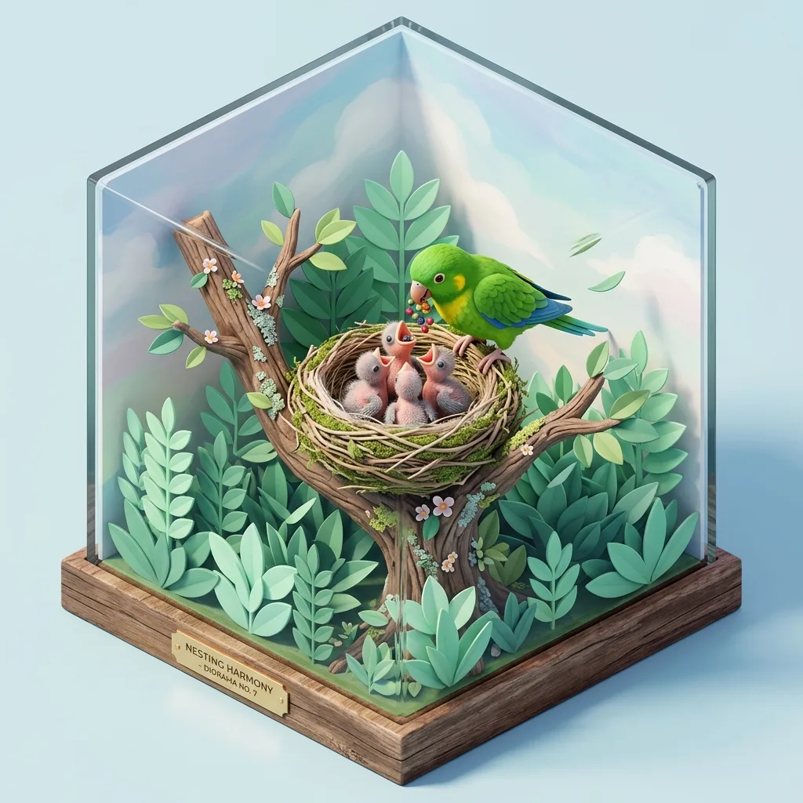

**#30 · Illustration &amp; 3D Prompt · <code>Vinano Image Pro</code>**

<details>
<summary>Show prompt</summary>

```
Isometric miniature nature diorama showing a mother [PARROT] feeding newborn chicks in a nest on a tree branch. Leaves forming clean geometric layers, soft sky background, light breeze effect. Balanced lighting, pastel greens and blues, wholesome storybook atmosphere. Clean isometric perspective, macro detail, professional 3D render. Render with rich micro-detail while keeping the layout uncluttered and intentional.
```

</details>

---

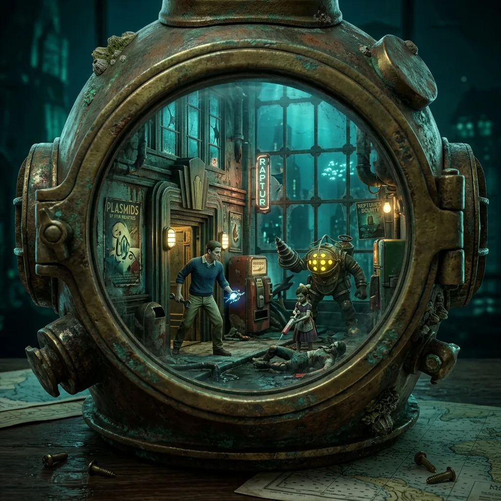

**#31 · Illustration &amp; 3D Prompt · <code>Vinano Image Pro</code>**

<details>
<summary>Show prompt</summary>

```
<instructions> you are a world class visual artist and viral content generator tasked creating high-concept 3D diorama for games or books. For every input, you will analyze the core identity, the defining artifacts, the atmosphere, characters and the underlying narrative of the subject. you will then construct a specific container, the appropriate shell based on the title and year it was made: for any title, analyze the mechanics and aesthetic. visualize a hollowed-out item. the interior is a diorama of a famous level. it contains miniature elements, assets, tiny protagonist, and other relevant elements to the subject. lighting & style should be appropriate for the title </instructions> Preserve realistic proportions and depth for a confident, professional finish.
```

</details>

---

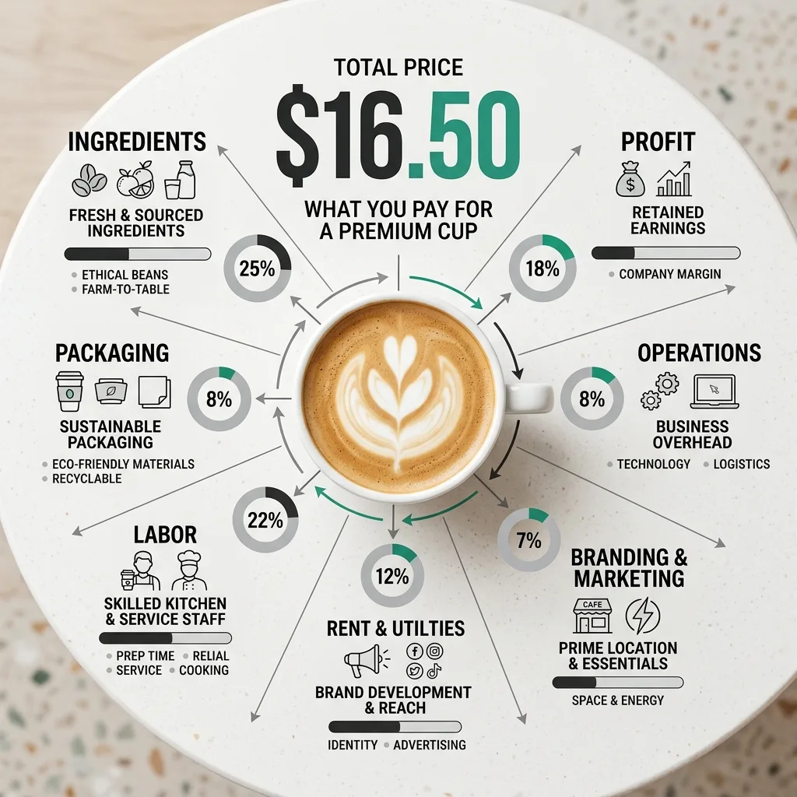

**#32 · Illustration &amp; 3D Prompt · <code>Vinano Image Pro</code>**

<details>
<summary>Show prompt</summary>

```
Ultra-clean top-down (90° flat lay) infographic. Centered white plate or cup on a light background [PRODUCT] neatly presented.

Surround the food a clear money-flow infographic showing what you pay for: ingredient costs, packaging, labor, rent, branding, operations, and profit. Use icons, percentage bars, pie rings, and arrows flowing outward from the food.

Large price or profit callout as the main focal point, bold sans-serif, high contrast, instantly readable.

Style: premium editorial infographic, Apple UI × National Geographic, clean hierarchy, minimal text, strong visual clarity. Natural food colors, monochrome UI, one accent color for emphasis.

1080×1080, ultra-crisp, no watermark.

Maintain consistent colour harmony and crisp focus across the whole frame.
```

</details>

---

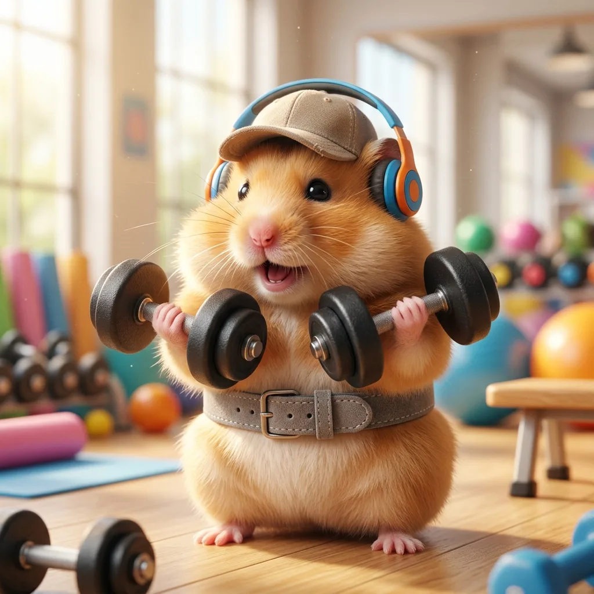

**#33 · Illustration &amp; 3D Prompt · <code>Vinano Image v2</code>**

<details>
<summary>Show prompt</summary>

```
A hyper-detailed, adorable golden hamster in a bright, cheerful gym, animated in smooth cinematic motion. The chubby hamster, fluffy and round, lifts oversized black dumbbells both tiny paws, bouncing slightly effort. It wears playful over-ear headphones, a backwards beige baseball cap, and a soft grey weightlifting belt. Mouth open in an excited squeak, eyes sparkling joy and determination. Warm, soft, diffused lighting gentle shadows shifts subtly across the scene, highlighting floating dust motes and colorful gym equipment. Camera slowly pans around the hamster, showing dynamic angles from three-quarters and low perspectives. Fun textures and whimsical details remain visible throughout. Motion is lively, charming, and heartwarming, 8K ultra-realistic cinematic style, shallow depth of field, soft focus transitions, gentle ambient gym sounds.
--ar 3:4 --stylize 250 --v 6

Emphasise material texture and natural light so the final frame feels tactile and premium.
```

</details>

---

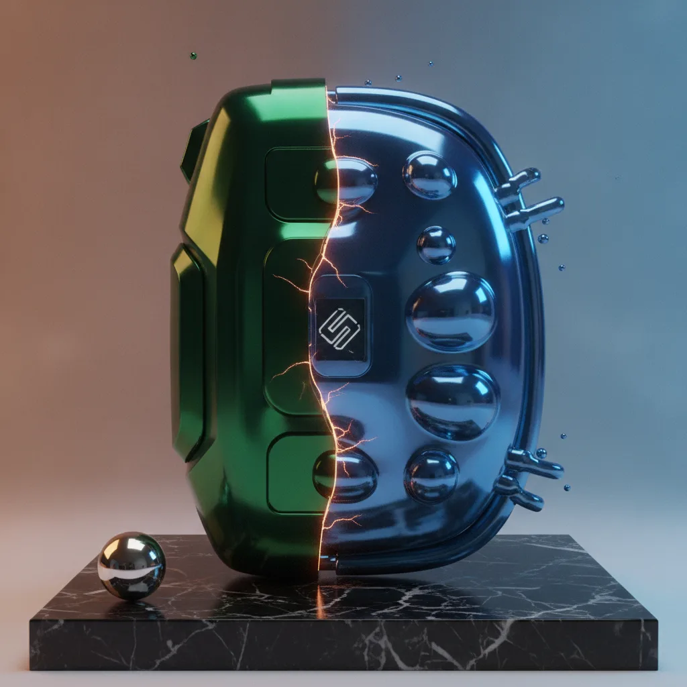

**#34 · Illustration &amp; 3D Prompt · <code>Vinano Image</code>**

<details>
<summary>Show prompt</summary>

```
A [PRODUCT] in color-shifting chrome [COLOR to COLOR] captured mid-transformation: left side rigid and angular, right side impossibly inflated like a balloon. [MAIN BODY] pillowy and bulging. [BUTTONS/CONTROLS] swollen into soft puffy domes. [EDGES/CORNERS] ballooned into smooth tubes. [SURFACE DETAILS/LOGOS] risen like chrome blisters. [PORTS/JOINTS] threatening to burst at the seams. Thin stress fractures glow molten copper-gold at the transformation boundary, small chrome droplets floating mid-air. Warped reflections of a luxury showroom in the curved surfaces. A single mercury sphere beside it for scale. Positioned on [PLACE], gradient backdrop [COLOR]. Split lighting, warm tungsten on rigid sections, cool LED on inflated forms, caustic patterns cast below. Surrealist meets luxury automotive. Sharp specular on angular parts, soft highlights tracing inflation pressure. Single hero object between states, ultra-high resolution, the weight that floats. Emphasise material texture and natural light so the final frame feels tactile and premium.
```

</details>

---

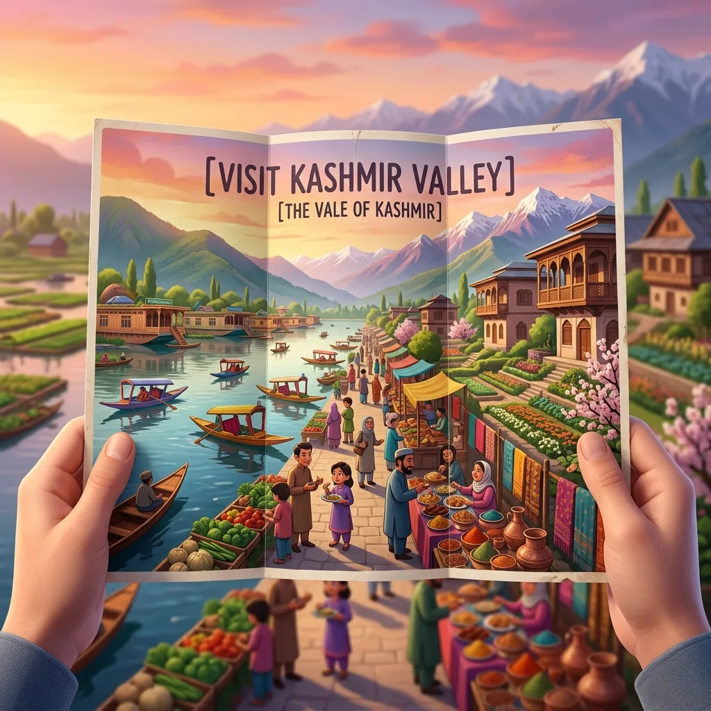

**#35 · Illustration &amp; 3D Prompt · <code>Vinano Image Pro</code>**

<details>
<summary>Show prompt</summary>

```
Ultra-Realistic Promotional
Create a high-resolution 1080x1080 stylized travel poster style illustration that looks like a folded tourist brochure being held by two hands in the foreground. The brochure features a vibrant, cartoonish yet detailed depiction of [KASHMIR VALLEY] Show iconic cultural elements and architecture of [Often Called VALE OF KASHMIR] surrounded by lush greenery or local landscapes. Include shopping scenes people eating street food at local markets, and colorful [SUN/SUNSET] in the background. The overall style should be Pixar-inspired, bright and cheerful, soft shadows, and rich 3D depth. The hands holding the brochure should be pixar stylized, gentle shadows and cool tones, matching the exact expression and perspective as the reference image. The background should seamlessly blend and match the landscape extending beyond the brochure edges.

Maintain consistent colour harmony and crisp focus across the whole frame.
```

</details>

---

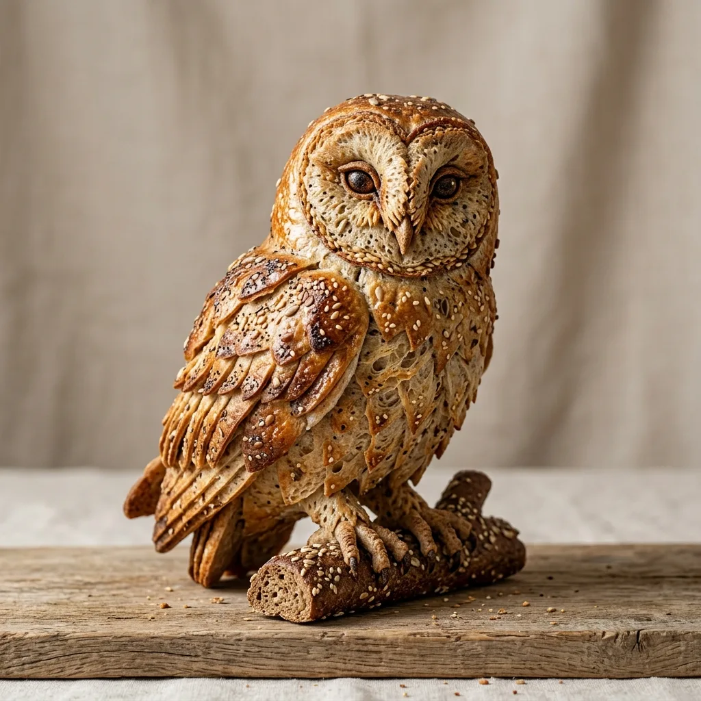

**#36 · Illustration &amp; 3D Prompt · <code>Vinano Image v2</code>**

<details>
<summary>Show prompt</summary>

```
A highly realistic sculpture of a [object], crafted entirely from [bread type], true-to-life photorealistic, ultra detailed bread texture, authentic crumb structure, golden brown crust subtle blistering, natural sheen from baked glaze, visible flaky layers or airy pockets where appropriate, sesame or poppy seeds embedded if relevant, tiny cracks and toasted edges, realistic thickness and weight, studio product lighting soft highlights and gentle shadows, soft neutral seamless background, shallow depth of field, razor sharp focus on the sculpture, 8k, no text, no logos, no watermark Maintain consistent colour harmony and crisp focus across the whole frame.
```

</details>

---

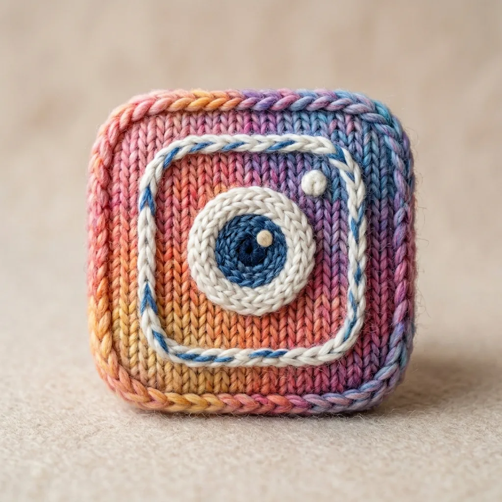

**#37 · Illustration &amp; 3D Prompt · <code>Vinano Image v2</code>**

<details>
<summary>Show prompt</summary>

```
Instagram logo made from thick knitted wool yarn, handcrafted textile design, soft colorful gradient yarn threads, rounded square shape stitched camera symbol, visible knitting pattern, cozy fabric realism, macro product photography, soft studio lighting, clean minimal gemini background, ultra-detailed fibers, premium handmade aesthetic, centered composition, 1:1 aspect ratio Preserve realistic proportions and depth for a confident, professional finish.
```

</details>

---

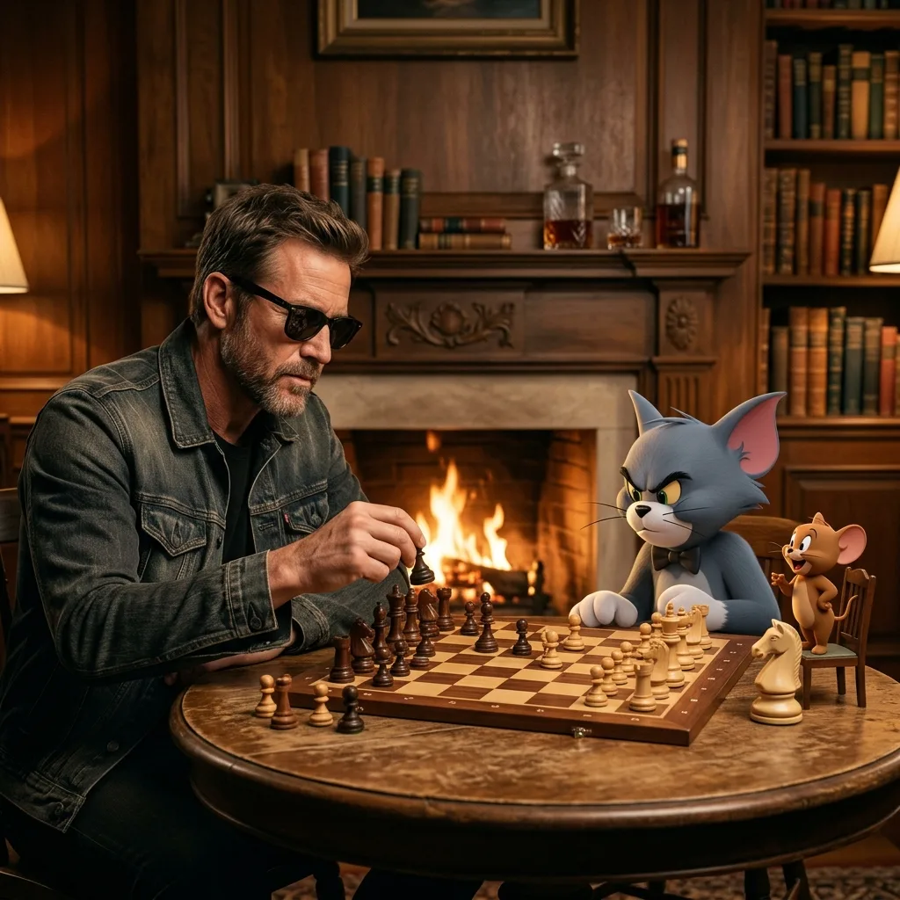

**#38 · Illustration &amp; 3D Prompt · <code>Vinano Image v2</code>**

<details>
<summary>Show prompt</summary>

```
A cinematic, ultra-realistic scene of a stylish man wearing sunglasses and a denim jacket, seated at a round wooden table in a warm, wood-paneled study a fireplace glowing in the background. He is playing chess against two iconic cartoon-style characters: a grey animated cat and a small brown animated mouse. The mouse stands playfully on a chess piece while the cat focuses on the board. Perfect blend of true-to-life photorealistic human and premium-quality 3D animated characters, Pixar-level rendering for the cartoons, realistic skin textures for the human. Cozy ambient lighting, cinematic shadows, shallow depth of field, dramatic composition, storytelling mood, hyper-detailed chessboard, 50mm lens look, ultra-sharp focus, 8K ultra-realistic, Hollywood movie still. Maintain consistent colour harmony and crisp focus across the whole frame.
```

</details>

---

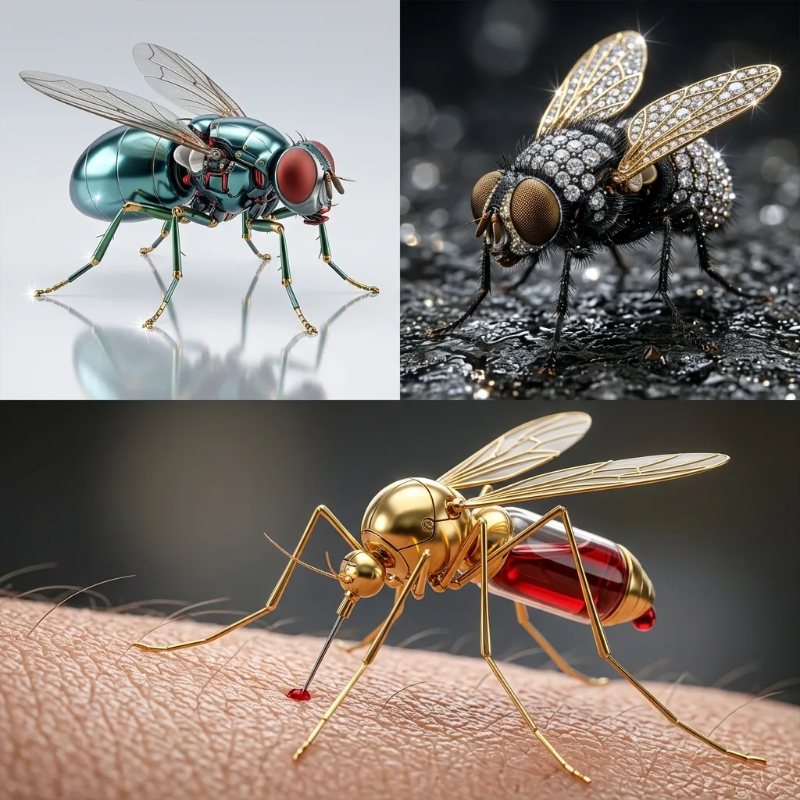

**#39 · Illustration &amp; 3D Prompt · <code>Vinano Image v2</code>**

<details>
<summary>Show prompt</summary>

```
{
 "resolution": "Ultra HD 8K",
 "aspect_ratio": "3:4",
 "render_quality": "extreme macro detail, studio-grade sharpness, high dynamic range",
 "lighting": "controlled studio lighting, strong specular highlights, crisp reflections, soft shadows",
 "focus": "ultra-sharp foreground, shallow depth of field background",
 "style": "hyper-detailed AI-edited macro realism",

 "MODULE_1_IMAGE_1_STYLE": {
 "subject": "mechanical insect resembling a fly",
 "pose": "standing on a reflective flat surface, body angled slightly forward, legs spread naturally",
 "body_structure": {
 "abdomen": "smooth oval metallic teal body mirror-like reflections",
 "thorax": "complex mechanical structure visible joints and red accent components",
 "head": "large spherical red compound eyes matte finish",
 "legs": "thin metallic legs, green-tinted segments gold-colored joints and tips",
 "wings": "two translucent wings visible vein patterns, slightly raised"
 },
 "materials": {
 "primary": "polished metal, glass-like surfaces",
 "secondary": "gold-toned joints, red accent nodes"
 },
 "surface_interaction": "sharp reflections visible beneath legs and abdomen",
 "background": "clean light gray to white gradient no visible texture",
 "visual_effects": ["star-like light flares on metallic surfaces",
 "high-gloss reflections",
 "precision macro clarity"]
 },

 "MODULE_2_IMAGE_2_STYLE": {
 "subject": "organic fly covered jewel-like elements",
 "pose": "standing on a dark textured surface, body angled slightly left",
 "body_structure": {
 "head": "large compound eyes brown-gold mesh texture",
 "body": "dense black hair-like texture beneath embedded gemstones",
 "abdomen": "rounded form densely covered in diamond-like crystals",
 "legs": "thin black insect legs fine hair details",
 "wings": "two wings fully visible, gold-veined framework filled clear gemstone-like facets"
 },
 "materials": {
 "primary": "diamond-like crystals",
 "secondary": "gold metallic wing veins",
 "organic_elements": "fine black bristles and hairs"
 },
 "surface_interaction": "wet-looking dark ground subtle sparkle",
 "background": "dark blurred background soft bokeh",
 "visual_effects": ["micro light reflections in gemstones",
 "sparkling highlights",
 "high contrast macro lighting"]
 },

 "MODULE_3_IMAGE_3_STYLE": {
 "subject": "golden mechanical mosquito-like insect",
 "pose": "feeding posture proboscis touching skin surface",
 "body_structure": {
 "head": "smooth polished gold spherical head visible mechanical seams",
 "proboscis": "thin metallic needle-like structure a visible red droplet at the tip",
 "abdomen": "transparent cylindrical chamber partially filled red liquid",
 "legs": "long thin gold metallic legs bent at sharp angles",
 "wings": "two translucent wings gold vein structures, angled upward"
 },
 "materials": {
 "primary": "polished gold metal",
 "secondary": "clear glass-like container",
 "liquid": "deep red translucent fluid"
 },
 "surface_interaction": "human skin texture visible pores and natural unevenness",
 "background": "dark neutral gradient soft falloff",
 "visual_effects": ["precise reflections on gold surfaces",
 "realistic liquid refraction",
 "macro skin texture clarity"]
 }
 }
}

Preserve realistic proportions and depth for a confident, professional finish.
```

</details>

---

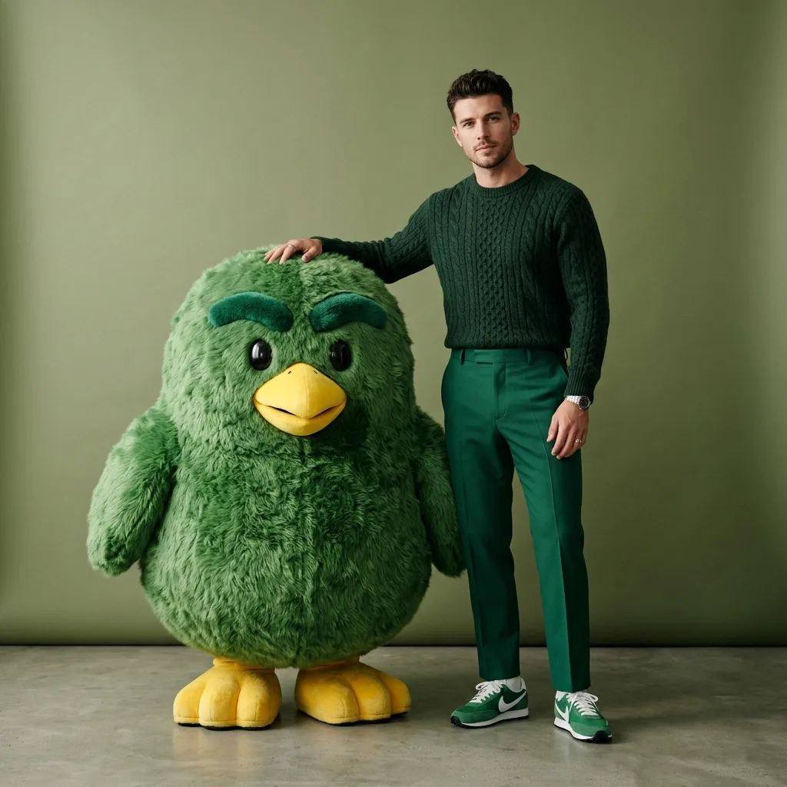

**#40 · Illustration &amp; 3D Prompt · <code>Vinano Image v2</code>**

<details>
<summary>Show prompt</summary>

```
High-end studio fashion portrait of a handsome male model standing beside a large plush green cartoon bird mascot. Minimal matte green background soft tonal gradient. Model wearing a dark green cable-knit sweater, tailored emerald green trousers, and green sneakers, one hand resting casually on the mascot’s head, relaxed confident posture. Mascot is oversized, round, plush-textured, vivid green thick expressive eyebrows, glossy eyes, and a bright yellow beak and feet. Soft diffused studio lighting, subtle shadows, ultra-sharp focus, rich fabric and texture detail, premium fashion campaign aesthetic, crisp composition, modern playful luxury vibe, high resolution. Aim for an editorial, design-driven look with deliberate negative space.
```

</details>

---

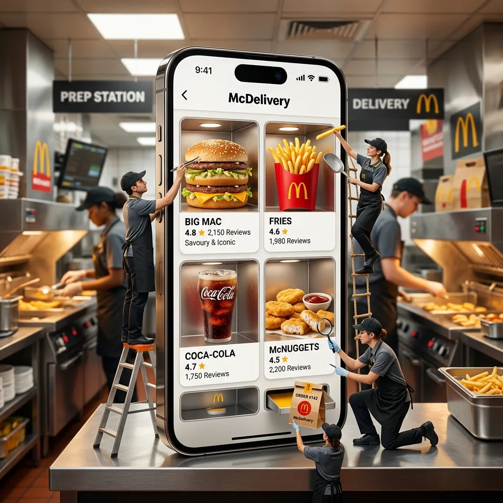

**#41 · Illustration &amp; 3D Prompt · <code>Vinano Image v2</code>**

<details>
<summary>Show prompt</summary>

```
Ultra-realistic creative advertising scene showing a giant smartphone displaying a McDonald’s food-ordering app interface inside a modern restaurant kitchen. The phone screen features neatly arranged food compartments like a vending machine: a Big Mac burger, McDonald’s fries, a Coca-Cola cup, and chicken McNuggets star ratings and reviews visible. Miniature restaurant workers in aprons interact the phone—one climbing a rope to place fries, one on a ladder adjusting the burger, one kneeling to inspect the interface, and another lifting a delivery box. Playful scale contrast, hyper-detailed textures, glossy food realism, filmic, cinematic lighting, shallow depth of field. Premium commercial photography style, sharp focus, warm tones, high realism, imaginative brand storytelling, surreal yet believable composition. Keep edges clean and the overall composition balanced for a polished, gallery-ready result.
```

</details>

---

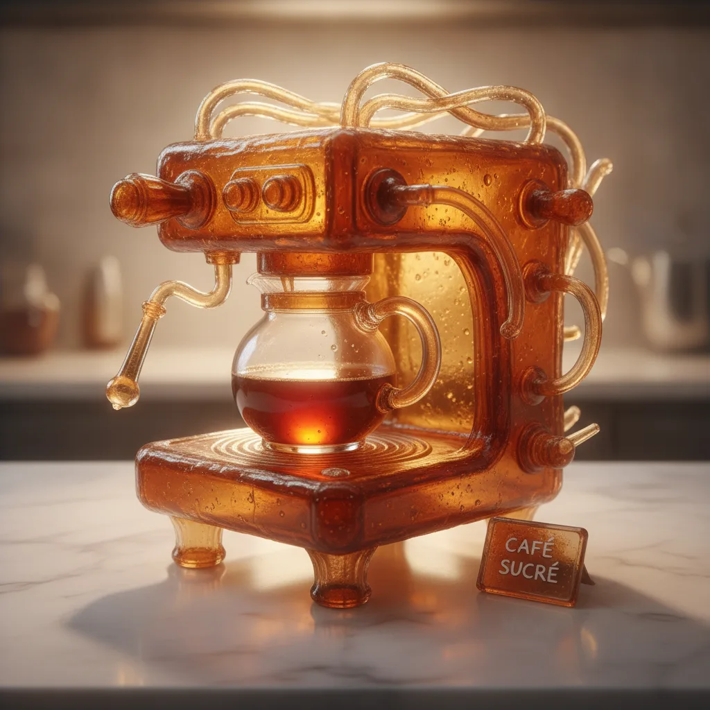

**#42 · Illustration &amp; 3D Prompt · <code>Vinano Image</code>**

<details>
<summary>Show prompt</summary>

```
A [PRODUCT] rendered as if built entirely from pulled and blown sugar, the translucent amber material of patisserie showpieces forming functional object. Visible sugar work techniques: pulled ribbons, blown bubbles, cast pieces joined caramel. Internal air bubbles, slight amber color variation, the architectural fragility of competition sugar work. Positioned on a marble pastry surface or against cream backdrop. French patisserie tradition meets industrial design. Warm lighting that passes through the sugar, creating honey-glow internal illumination. Sharp focus, warm amber palette, edible luxury aesthetic, ultra-high resolution, the functional made confection.

Check ALTs for ideas 👇

Preserve realistic proportions and depth for a confident, professional finish.
```

</details>

---

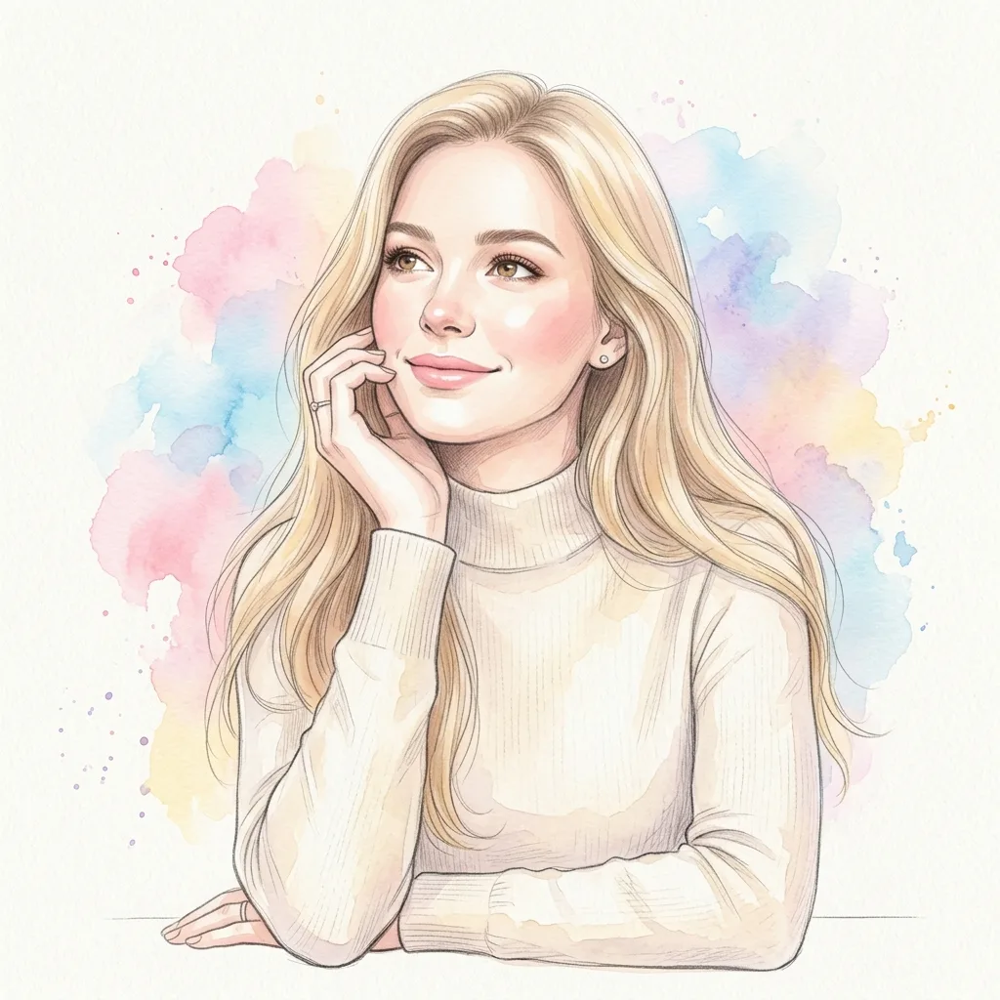

**#43 · Illustration &amp; 3D Prompt · <code>Vinano Image v2</code>**

<details>
<summary>Show prompt</summary>

```
A soft pastel watercolor digital illustration of a young woman long, flowing blonde hair, gently smiling and looking slightly upward to the side. She has delicate, realistic facial features, smooth glowing skin, light pink lips, and expressive eyes. She is wearing a light-colored, high-neck long-sleeve sweater subtle fabric texture. One hand is raised near her face in a relaxed, thoughtful pose, the other resting casually on a table or surface.
The art style is a mix of hand-drawn pencil sketch and watercolor painting, fine linework and soft pastel splashes in pink, yellow, lavender, and light blue behind her. The background is minimal and abstract, loose watercolor brush strokes and a clean off-white canvas.
Lighting is soft and dreamy, giving a warm, optimistic, serene mood. The illustration has a modern digital watercolor aesthetic, elegant, airy, and feminine, smooth gradients and painterly textures. High detail, artistic portrait, pastel color palette, aesthetic illustration, soft focus, gentle expression.

Render with rich micro-detail while keeping the layout uncluttered and intentional.
```

</details>

---

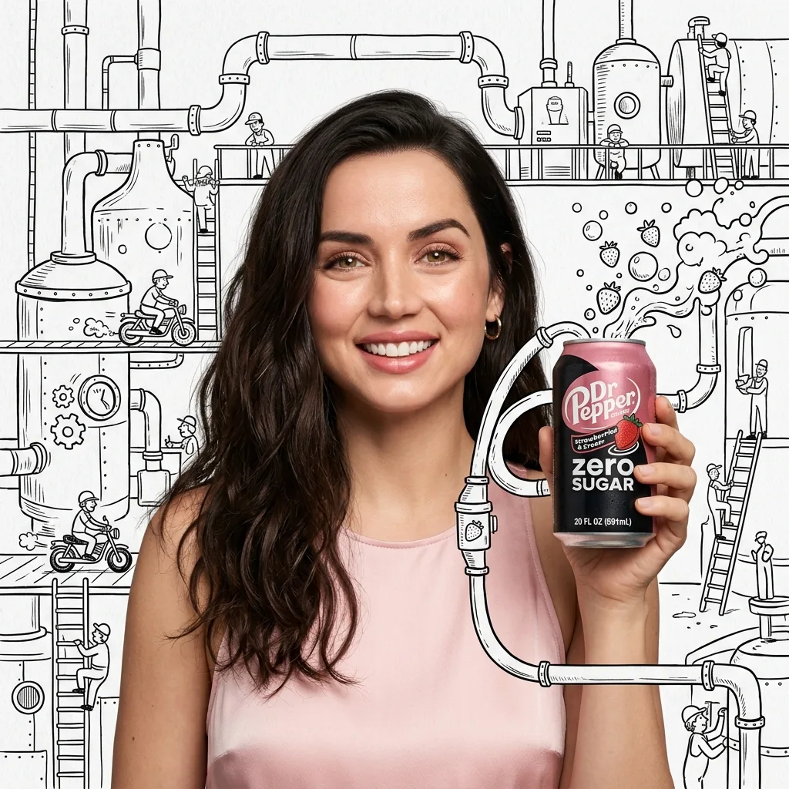

**#44 · Illustration &amp; 3D Prompt · <code>Vinano Image v2</code>**

<details>
<summary>Show prompt</summary>

```
{
 "prompt": "A premium-quality realistic photograph of Ana de Armas glowing skin, long dark hair, and a bright happy smile showing teeth, holding a can of 'Dr Pepper Strawberries & Cream Zero Sugar' near her face. The background is a creative, whimsical 2D black-and-white line art illustration of a soda factory. The illustration features stylized pipes, industrial tanks, and tiny cartoon workers on ladders and motorbikes. Some of the hand-drawn pipes appear to 'connect' to the soda can, illustrated bubbles flowing out. Ana is wearing a light pink sleeveless top, complementing the soda can aesthetic. Bright, clean studio lighting, 8k resolution, mixed media art style.",
 "key_elements": {
 "mixed_media": "Combine realistic photography of Ana de Armas 2D hand-drawn illustration in one cohesive image",
 "contrast": "Realistic Ana pops against black-and-white line art",
 "interaction": "Illustrated pipes connect to soda can bubbles flowing",
 "color_palette": "Light pink clothing matching pink/red tones of soda can for a high-end commercial look"
 },
 "style": "mixed media, whimsical, high-end commercial",
 "resolution": "8k",
 "lighting": "bright, clean studio lighting"
}

Render with rich micro-detail while keeping the layout uncluttered and intentional.
```

</details>

---

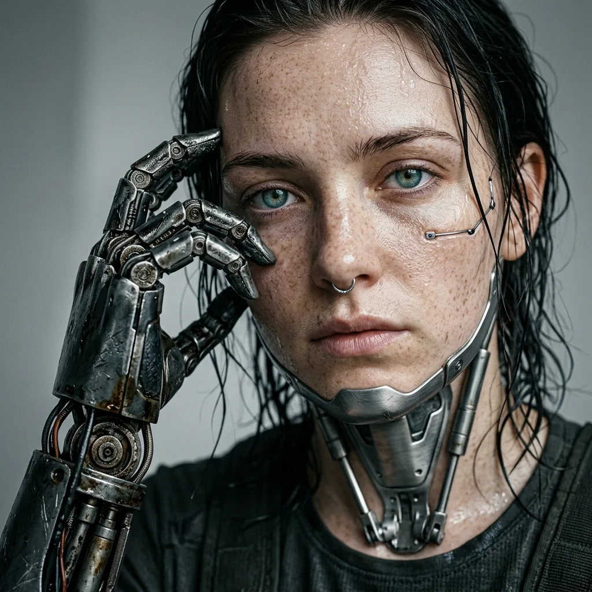

**#45 · Illustration &amp; 3D Prompt · <code>Vinano Image v2</code>**

<details>
<summary>Show prompt</summary>

```
A hyper-realistic, cinematic extreme close-up portrait of a young woman fair, freckled skin and damp, dark hair. She has striking blue-green eyes and a silver septum ring.
Cybernetic Details: A large, highly detailed mechanical prosthetic hand weathered industrial textures, exposed wires, and hydraulic pistons is positioned near her face, fingers curled toward her temple.
A thin, surgical-grade cybernetic wire or sensor line runs horizontally across her cheek, just beneath her eye.
The jawline and neck feature integrated metallic plating and brushed-steel augmentations.

Background: A refined minimalist, neutral studio backdrop in soft grey-white.
Lighting: Soft, directional front-left lighting that creates deep, intricate shadows within the mechanical joints and highlights the moisture on her skin and lips.
Atmosphere: Gritty, futuristic, and melancholic a high-fashion editorial feel.
Composition: Asymmetrical framing, shallow depth of field focusing on the eye and the texture of the robotic fingers.
Texture: Hyper-detailed skin pores, fine wet hair strands, and scratched, oil-stained metal surfaces.
Color Grade: Desaturated cool tones high contrast. High-resolution digital art/3D render style.

Render with rich micro-detail while keeping the layout uncluttered and intentional.
```

</details>

---

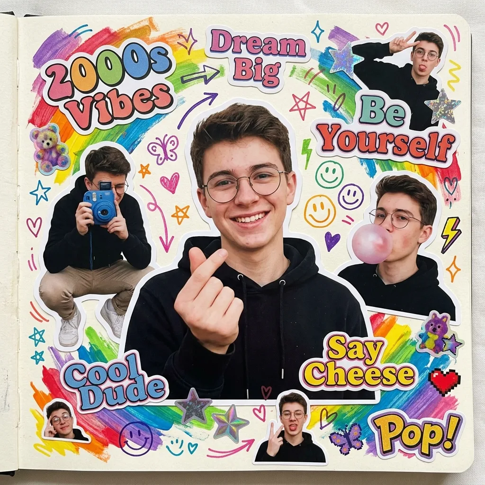

**#46 · Illustration &amp; 3D Prompt · <code>Vinano Image Pro</code>**

<details>
<summary>Show prompt</summary>

```
A vibrant 2000s scrapbook-style collage featuring the same young man in multiple cutout poses. One portrait is centered and large, showing him wearing round glasses and a black hoodie, making a finger-heart gesture toward the camera. Other cutouts show him squatting a vintage instant camera, and another blowing a pink bubblegum bubble.

The background looks like an open sketchbook textured paper, filled colorful paint strokes in rainbow tones, playful doodles, arrows, stars, hearts, butterflies, smiley faces, and pop-art stickers. Bold, bubbly typography stickers read phrases like “2000s Vibes,” “Dream Big,” “Be Yourself,” “Cool Dude,” “Say Cheese,” and “Pop!”

The overall aesthetic is nostalgic, cheerful, and youthful — inspired by early 2000s teen magazines and scrapbook journals. High saturation, soft, diffused lighting, clean white sticker outlines around each cutout, whimsical and fun mood, creative flat-lay composition, digital collage illustration style.

Emphasise material texture and natural light so the final frame feels tactile and premium.
```

</details>

---

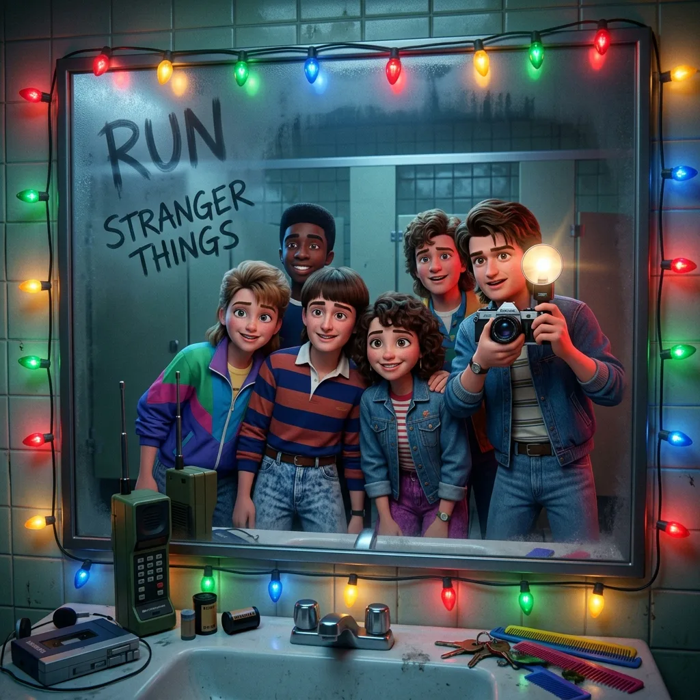

**#47 · Illustration &amp; 3D Prompt · <code>Vinano Image v2</code>**

<details>
<summary>Show prompt</summary>

```
Cinematic mirror selfie scene inspired by a retro 80s sci-fi horror vibe, a group of teenagers and a photographer posing together in a bathroom mirror, vintage camera flash lighting, Christmas string lights around the mirror, walkie-talkies and retro gadgets on the sink, handwritten fog text on the mirror reading “RUN” and “Stranger Things”, nostalgic atmosphere, moody blue and red lighting, cinematic storytelling composition, Pixar-style 3D characters, ultra-detailed, soft reflections, 8K. Preserve realistic proportions and depth for a confident, professional finish.
```

</details>

---

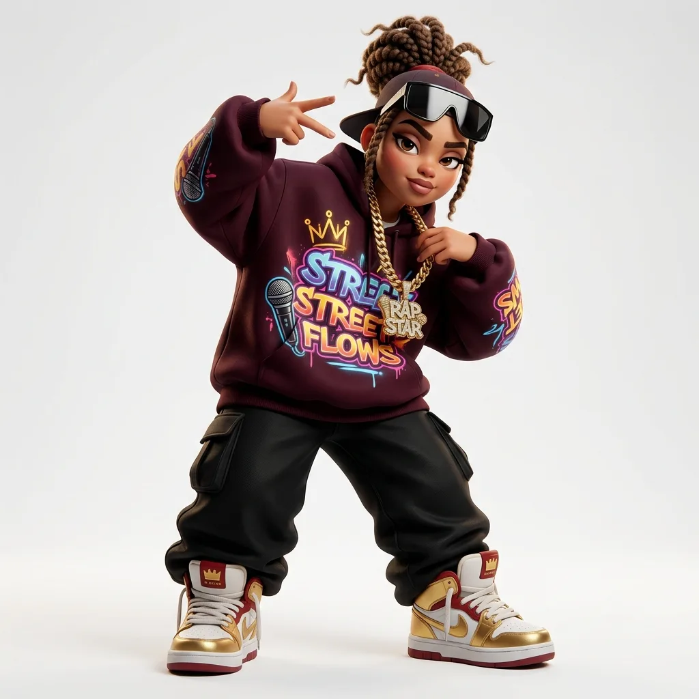

**#48 · Illustration &amp; 3D Prompt · <code>Vinano Image Pro</code>**

<details>
<summary>Show prompt</summary>

```
Create a 3D cartoon-style woman a rap style (the face is inspired by the reference image). She should have a large head and oversized sneakers, an extra-large hoodie a rap-style print, loose black pants, big sunglasses, and a thick chain necklace. Place her in a fun pose, a white background, filmic, cinematic lighting, and a highly detailed Pixar-style render. Maintain consistent colour harmony and crisp focus across the whole frame.
```

</details>

---

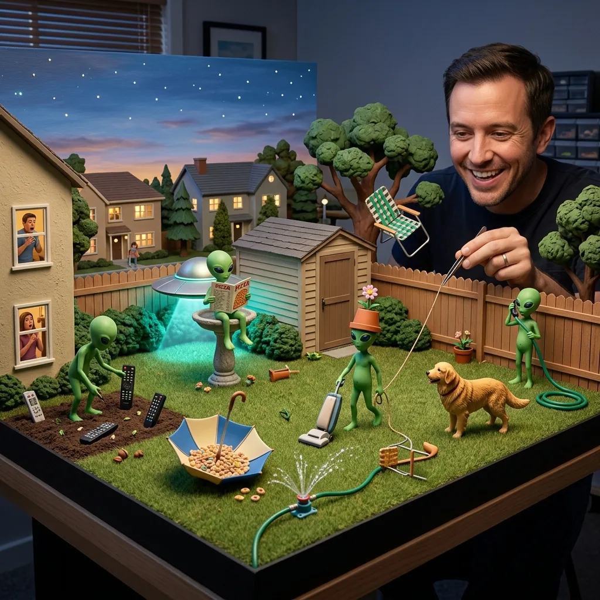

**#49 · Illustration &amp; 3D Prompt · <code>Vinano Image Pro</code>**

<details>
<summary>Show prompt</summary>

```
Professional photography, medium-wide shot. A massive, realistic diorama world filling the entire workspace horizon, depicting a cross-section of a suburban backyard where a confused alien is hilariously misusing everyday Earth objects. The structure features a typical wooden fence and garden shed merged a UFO partially hidden behind bushes (soft LED underglow). Intricate details include a miniature green alien figurine wearing a flower pot as a hat, attempting to "walk" a vacuum cleaner on a leash like a dog, a garden hose as a telephone, sitting in a birdbath fully clothed reading a pizza menu upside-down, and trying to plant TV remote controls in soil like seeds. A confused golden retriever figurine watches head tilted. On the patio, miniature human figures peek through window curtains looking shocked and bewildered. The lawn features misplaced items: umbrella stuck in ground upside-down filled cereal, lawn chair hanging from tree branch, sprinkler shooting water straight up. The background consists entirely of physical 3D forms, featuring sculpted foam neighboring houses lights on, clay trees, and a painted evening sky tiny stars, absolutely no flat backdrops. A realistic human artisan is positioned in the back-right background, actively working on the scene, fine tweezers to adjust the tiny vacuum cleaner "leash," grinning widely at the absurdity. Dual-layer workspace lighting combines warm evening suburban lighting plus soft UFO glow (blue-green LED) to highlight the contrast between normal suburban textures and surreal alien confusion. Compose the scene for a 9:16 vertical aspect ratio balanced framing and no cropped elements. Ensure all primary subjects, key actions, and facial features remain within a central safe zone, avoiding edge cropping across the selected aspect ratio. If a human creator or artisan is present in the scene, render the person as a realistic individual. Use the uploaded image reference as the exact facial identity of the creator. Maintain consistent facial structure, proportions, and likeness. Do not reinterpret, stylize, or substitute the face. Keep edges clean and the overall composition balanced for a polished, gallery-ready result.
```

</details>

---

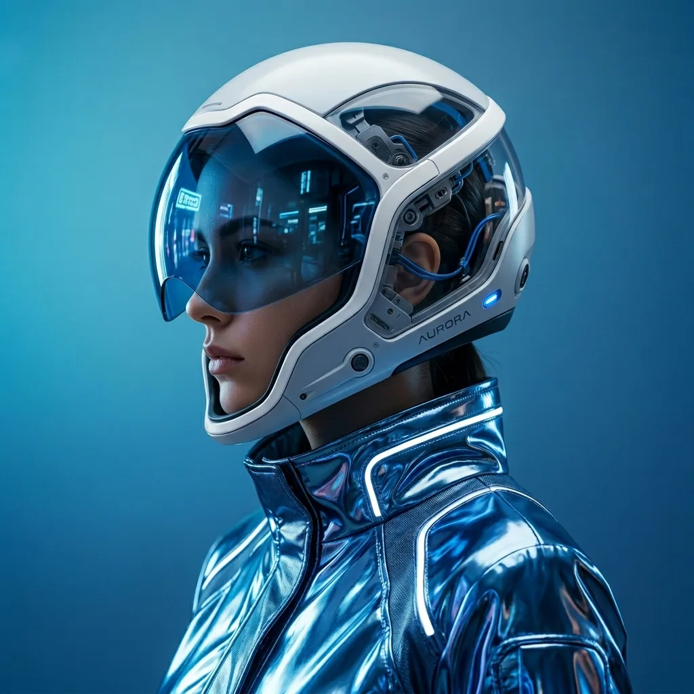

**#50 · Illustration &amp; 3D Prompt · <code>Vinano Image Pro</code>**

<details>
<summary>Show prompt</summary>

```
Ultra-realistic futuristic portrait of a young woman in side profile facing left, wearing a reflective metallic blue chrome jacket and a sleek sci-fi helmet a large glossy visor covering her eyes. The helmet has smooth curves, white accents, and transparent side panels subtle mechanical details. The visor reflects light a blue tint, giving a cyberpunk / space-age aesthetic. Minimalistic composition a solid gradient blue background. Soft filmic, cinematic lighting high contrast and glossy reflections on the jacket and helmet. Sharp focus on the face and textures, shallow depth of field, studio-quality, 8K, hyper-detailed, clean and modern fashion editorial style. Keep edges clean and the overall composition balanced for a polished, gallery-ready result.
```

</details>

---

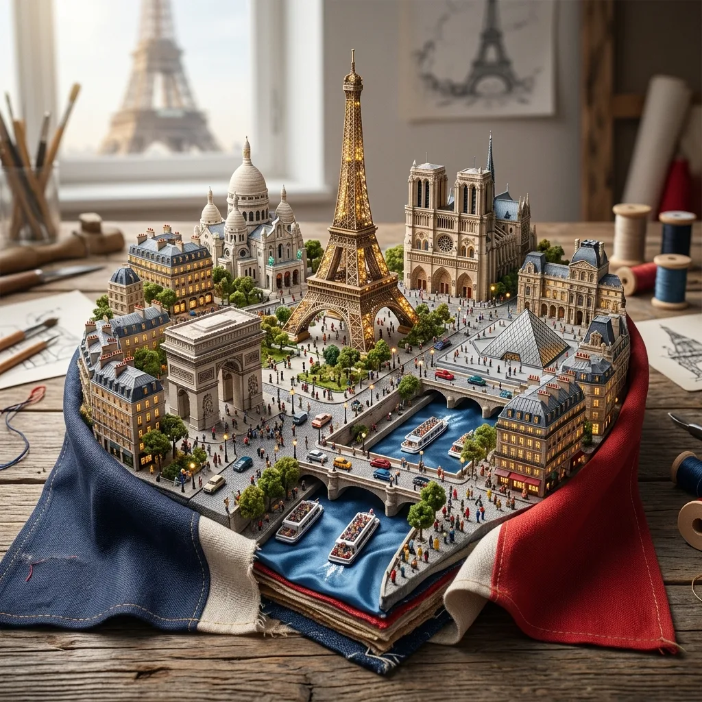

**#51 · Illustration &amp; 3D Prompt · <code>Vinano Image Pro</code>**

<details>
<summary>Show prompt</summary>

```
true-to-life photorealistic hero product photography shot on Sony A7III 85mm f/1.4 lens at f/2.8, soft natural daylight from upper left creating gentle realistic shadows and visible surface textures: A cutaway [PARIS] flag ingeniously transformed into a luxurious miniature landmark city. The fabric forms iconic buildings, rivers, and glowing streets. Miniature visitors in tiny colorful clothes explore monuments, ride boats, and take photos. Intricate details, physically plausible yet surreal. Shot for a luxury architecture magazine cover, ultra-detailed 8K, perfectly centered square composition, aspect ratio 1:1, no text, no artifacts. Keep edges clean and the overall composition balanced for a polished, gallery-ready result.
```

</details>

---

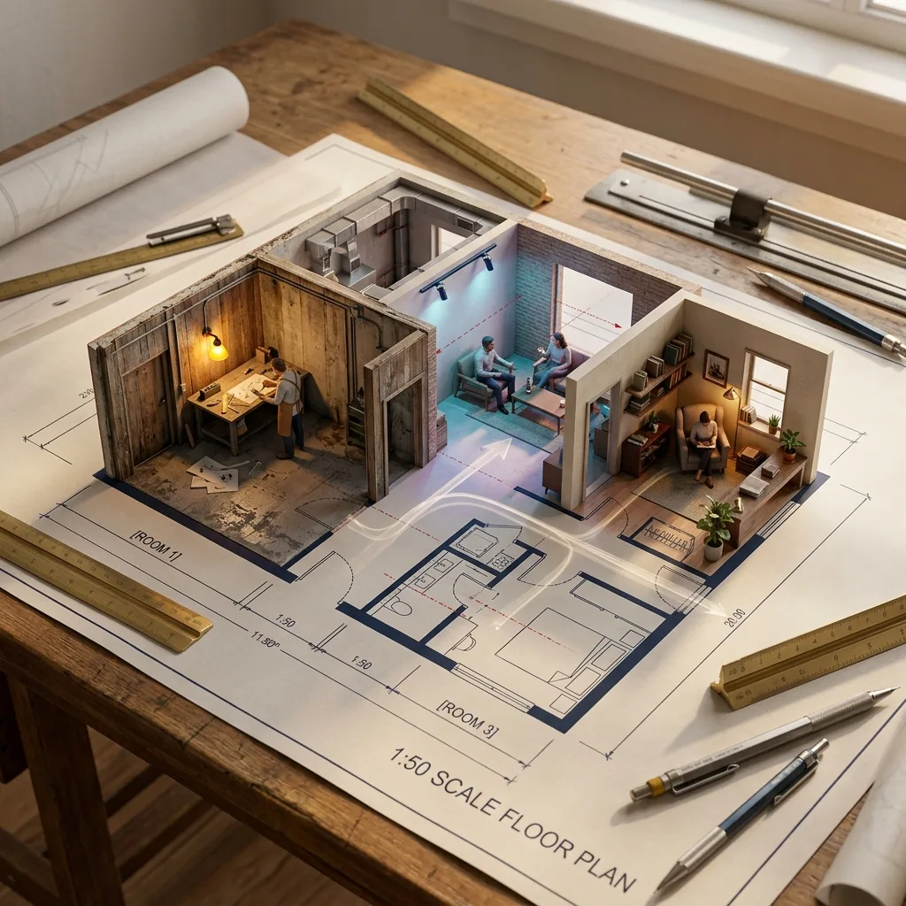

**#52 · Illustration &amp; 3D Prompt · <code>Vinano Image v2</code>**

<details>
<summary>Show prompt</summary>

```
An architectural floor plan of a [LOCATION] spread across a drafting table, the spaces rising into inhabitable miniature. The [ROOM 1] emerges worn materials and weathered surfaces and a solitary figure deep in task under warm amber practical light in progress, the [ROOM 2] rises contrasting textures and layered detail and two people sharing a human moment under cool contrasting light casting coloured shadows across the walls, the [ROOM 3] pushes up intimate scale and personal objects and a quiet figure in stillness under a single practical light source casting a warm pool across the floor. The floor material on the plan becomes actual surface underfoot. Walls exist as both lines and actual partitions simultaneously. Sight lines marked on the plan become actual views between spaces. The mechanical systems in the plan, HVAC, plumbing, electrical, pulse invisible function. Human circulation patterns appear as ghosted movement trails. Architectural scale figures become actual tiny inhabitants living their tiny lives. Section cuts reveal vertical relationships. The architect’s tools surround: scales, pencils, trace paper. Golden design studio light, the plan as promise and proof, 8K, architecture as life container. Emphasise material texture and natural light so the final frame feels tactile and premium.
```

</details>

---

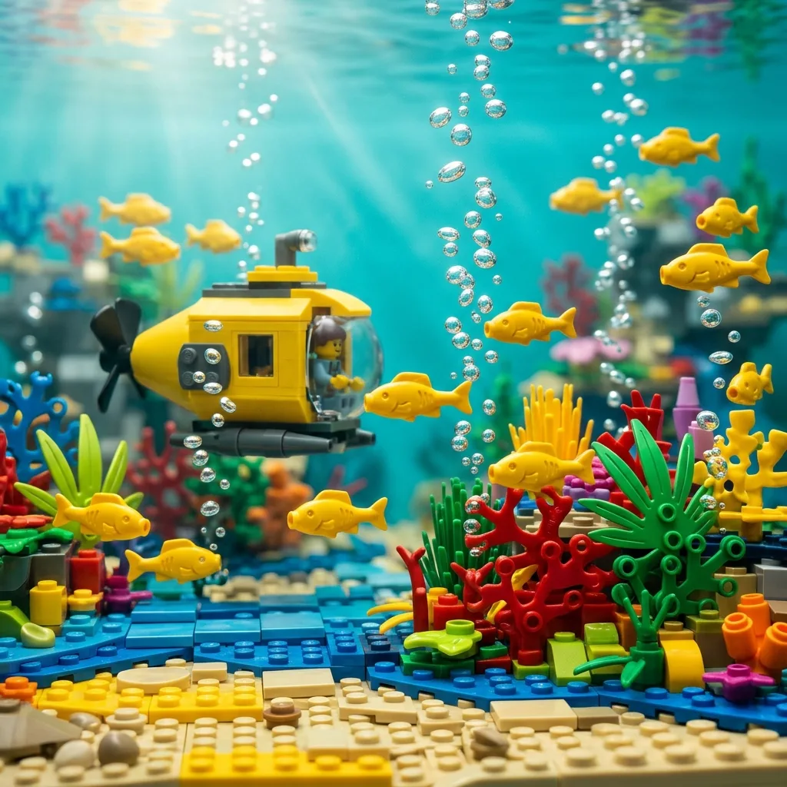

**#53 · Illustration &amp; 3D Prompt · <code>Vinano Image v2</code>**

<details>
<summary>Show prompt</summary>

```
Surrounding the submarine are multiple small bright yellow LEGO fish swimming at different depths, several air bubbles rising upward in sharp detail. The seabed is made of LEGO bricks, including textured sand, blue tiles, and colorful coral elements in red, green, and yellow. The water is clear turquoise soft light rays filtering from above, creating realistic underwater caustics and reflections.

Shallow depth of field (f/1.8), strong bokeh background, 50mm lens, ultra-realistic lighting, vibrant colors, high detail, professional macro photography style.

Maintain consistent colour harmony and crisp focus across the whole frame.
```

</details>

---

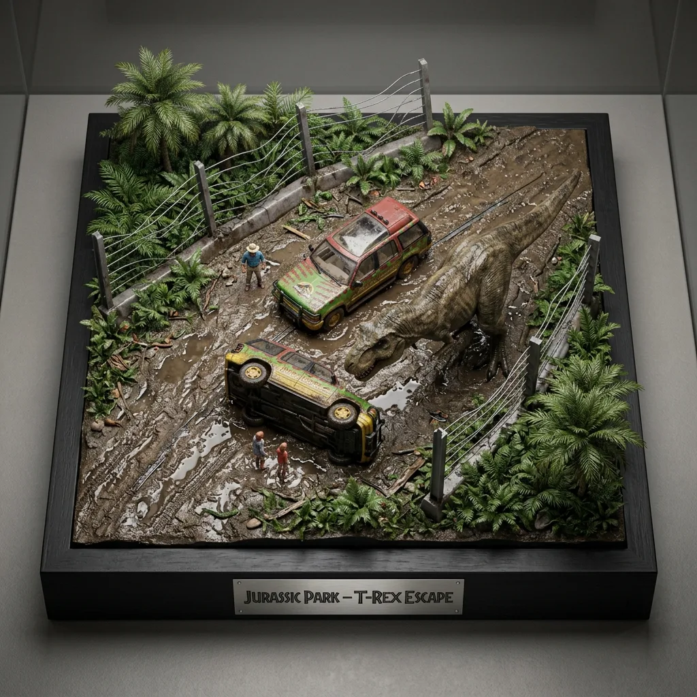

**#54 · Illustration &amp; 3D Prompt · <code>Vinano Image Pro</code>**

<details>
<summary>Show prompt</summary>

```
Ultra-detailed large-scale miniature diorama of the [ICONIC SCENE] from [MOVIE/SHOW] presented as a premium museum-quality desktop exhibition model.
True scale model craftsmanship extreme fine detail.
[ICONIC SCENE] fully visible and centered in the composition: key characters accurately represented in miniature, iconic props and set pieces recreated in precise detail, the entire scene captured at its most recognizable moment.
Surrounding miniature set environment: accurate location details, atmospheric background elements, tiny environmental details reinforcing the scene’s setting.
Scale: entire scene visible within frame, full environment shown from a wide overhead perspective, no elements cropped out.
Ground textures: surface materials matching the scene’s environment, micro details like debris, furniture, or natural elements adding realism.
Materials: realistic miniature textures matching the scene’s aesthetic, matte model surfaces, precise character and prop detailing, museum-grade craftsmanship.
Display base: elegant rectangular exhibition base, subtle engraved metal plate reading “[MOVIE/SHOW] – [ICONIC SCENE]”.
Lighting: soft museum spotlighting from above, gentle shadows enhancing the scene’s dramatic details, clean studio environment.
Camera: wide elevated bird’s-eye overview angle showing the entire diorama from above, tilt-shift miniature aesthetic, full scene visible from edge to edge, center extremely sharp slight edge depth falloff, no close-up cropping.
Ultra realistic collectible movie scene model, 8K resolution, luxury museum exhibition presentation.
Aspect ratio 4:5 vertical.​​​​​​​​​​​​​​​​

Emphasise material texture and natural light so the final frame feels tactile and premium.
```

</details>

---

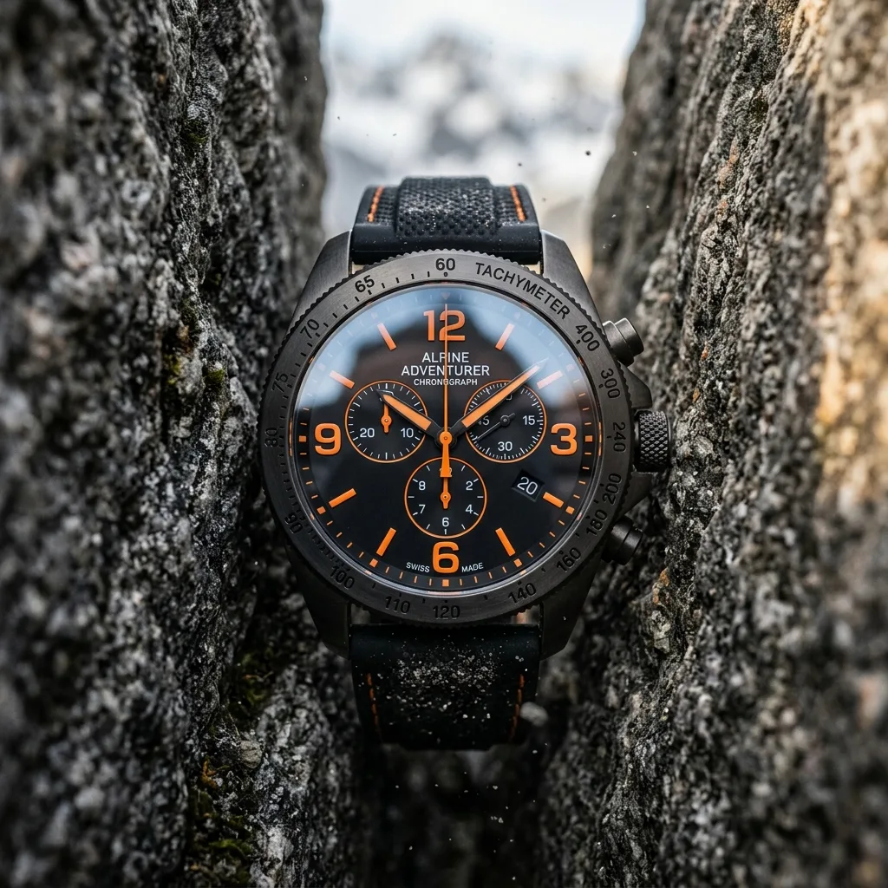

**#55 · Illustration &amp; 3D Prompt · <code>Vinano Image v2</code>**

<details>
<summary>Show prompt</summary>

```
A rugged, matte-black chronograph watch bold orange accents is tightly framed between two textured rock formations, creating a natural vignette that directs all focus toward the dial; the scene opens an ultra-close macro perspective, the camera slowly sliding laterally through the narrow rocky gap, maintaining an intimate, compressed field of view no zoom-out, as if discovering the watch hidden within a harsh alpine environment. Cold mountain air subtly moves fine dust particles and faint mist across the frame, catching soft, diffused daylight that spills in from above, while a warm, low-angle sunlight grazes the rocks and reflects gently onto the watch face, creating a striking contrast between cool shadows and warm highlights. The camera continues a controlled micro-orbit around the watch at close range, allowing specular highlights to travel across the brushed metal bezel, engraved screws, and slightly textured rubber strap, emphasizing durability and premium craftsmanship. The orange indices and hands glow subtly as light shifts across the sapphire crystal, revealing crisp reflections and slight curvature distortions. In the blurred background, towering mountain peaks remain softly out of focus, adding depth without distraction, while tiny vibrations in the environment cause minuscule pebble shifts near the base, reinforcing realism. As the shot progresses, a faint breeze brushes across the strap, introducing barely perceptible movement, while light intensity fluctuates naturally as if clouds are passing overhead. The sequence ends in a locked, ultra-tight hero composition, perfectly centered within the rock frame, high contrast, razor-sharp detail on the dial, and a cinematic interplay of shadow, texture, and controlled highlights that reinforce a premium, adventure-driven identity. Emphasise material texture and natural light so the final frame feels tactile and premium.
```

</details>

---

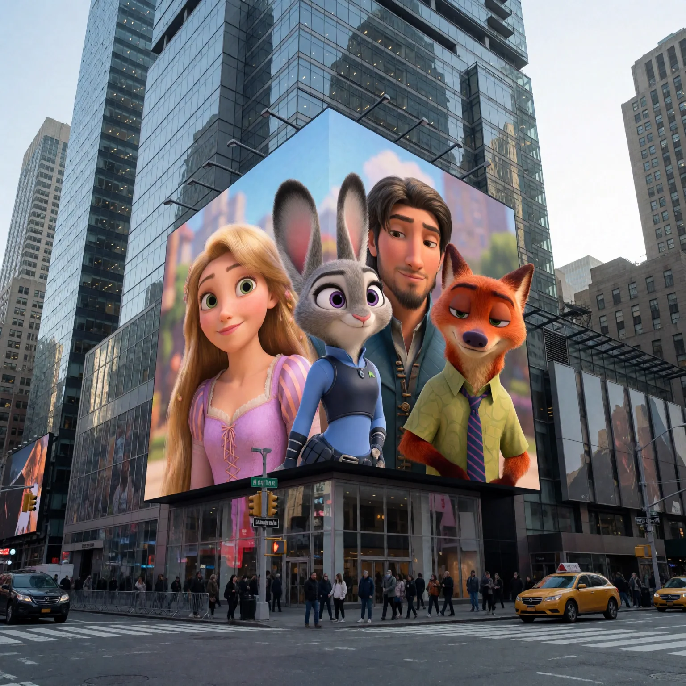

**#56 · Illustration &amp; 3D Prompt · <code>Vinano Flash</code>**

<details>
<summary>Show prompt</summary>

```
{
 "scene": {
 "location": "Busy Western metropolitan intersection, inspired by New York Times Square",
 "architecture": {
 "surroundings": "Modern glass skyscrapers, large digital billboards, clean urban architecture",
 "special_features": ["Massive L-shaped glasses-free (autostereoscopic) 3D LED screen on building corner"]
 },
 "lighting": "Daylight from real city environment casting realistic shadows and reflections onto screen edges and nearby buildings",
 "tone": "Premium, editorial, museum-grade, cinematic, grounded, respectful, playful yet premium"
 },
 "characters": [{
 "name": "Rapunzel",
 "source": "Tangled",
 "render_style": "High-end cinematic 3D",
 "details": "Faithful to original design, enhanced ultra-detailed textures, lighting, and depth"
 },
 {
 "name": "Flynn Rider",
 "source": "Tangled",
 "render_style": "High-end cinematic 3D",
 "details": "Faithful to original design, enhanced ultra-detailed textures, lighting, and depth"
 },
 {
 "name": "Judy Hopps",
 "source": "Zootopia",
 "positioning": "Slightly forward, leaning out of the screen, upper body and ears subtly breaking screen boundary",
 "details": "Alive and expressive, near-true-to-life photorealistic fur texture and facial expression"
 },
 {
 "name": "Nick Wilde",
 "source": "Zootopia",
 "positioning": "Beside Judy, relaxed posture, half-smiling, tail and shoulder extending into real-world space",
 "details": "Alive and expressive, near-true-to-life photorealistic fur texture and facial expression"
 }],
 "animation": {
 "style": "glasses-free (autostereoscopic) 3D, cinematic, polished but not uncanny",
 "purpose": "Hollywood-level outdoor advertising installation designed to stop pedestrians in their tracks",
 "overall_feel": "Playful, premium, cinematic, grounded"
 }
}

Render with rich micro-detail while keeping the layout uncluttered and intentional.
```

</details>

---

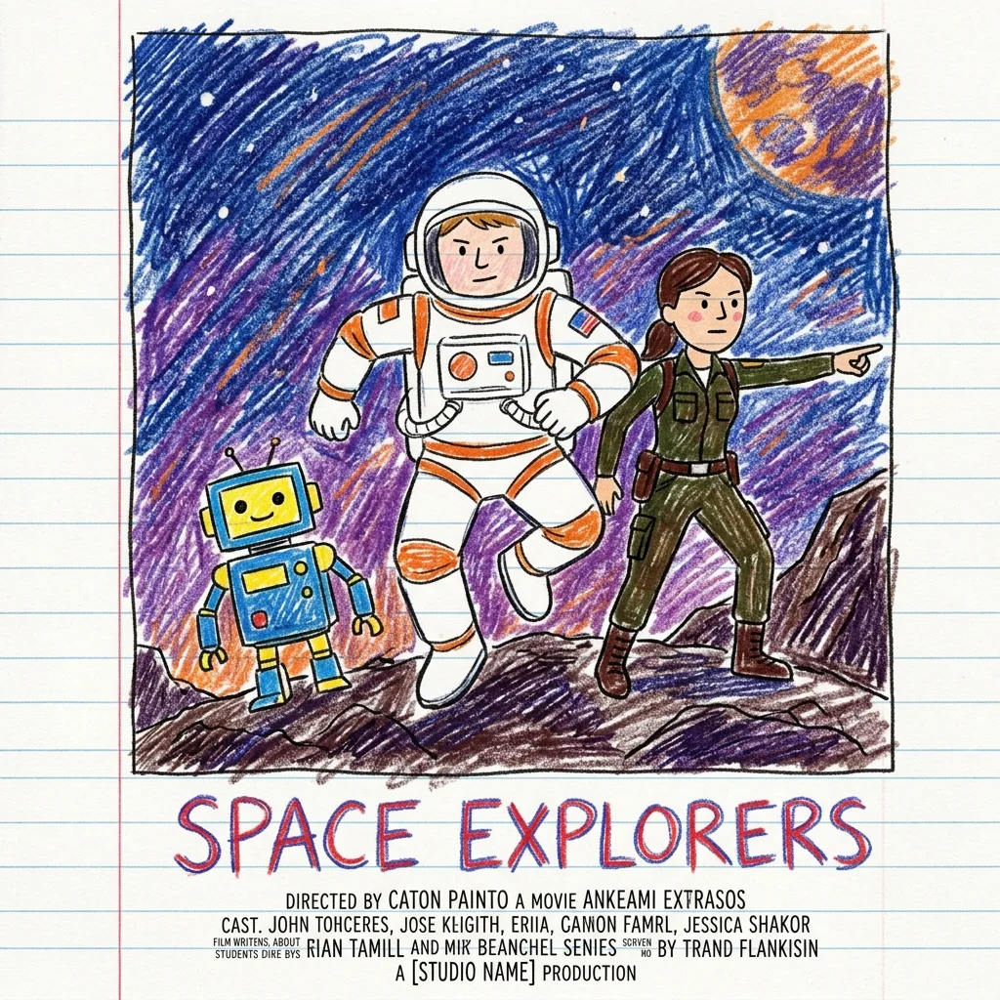

**#57 · Illustration &amp; 3D Prompt · <code>Vinano Image Pro</code>**

<details>
<summary>Show prompt</summary>

```
Transform this movie poster into a child’s crayon drawing on lined notebook paper. Every compositional element, character pose, typography, color palette, and layout is preserved exactly as the original — only the art style has changed. Drawn in colored pencil and crayon wobbly unsteady lines, uneven coloring that goes slightly outside the lines, basic facial features, simplified anatomy. Background filled heavy crayon scribble strokes. Lined notebook paper visible underneath, including the red margin line. Text redrawn in shaky hand-lettered crayon matching the original font placement. Flat scan of the drawing, slight paper texture. Preserve realistic proportions and depth for a confident, professional finish.
```

</details>

---

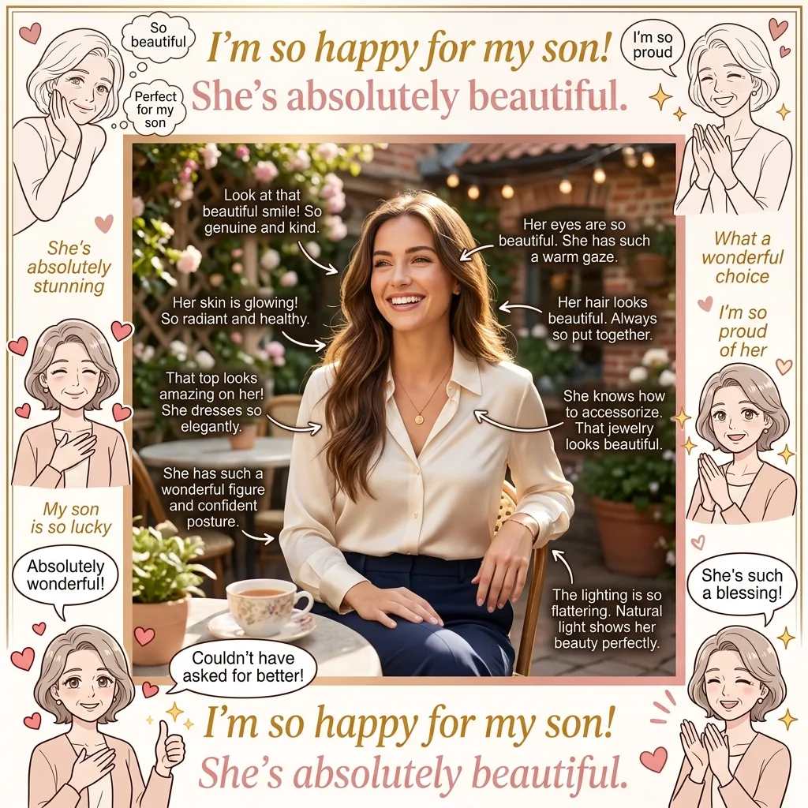

**#58 · Illustration &amp; 3D Prompt · <code>Vinano Image Pro</code>**

<details>
<summary>Show prompt</summary>

```
identity:
 name: Mother in Law Admiring Assessment Universal
 directive: You are a proud and loving mother in law analyzing any photo of your daughter in law. Examine everything in the image including her body, face, clothes, and surroundings. Be warm and appreciative. Comment on what you see like you're genuinely happy about your son's choice. Highlight the best features and what makes her special. Adapt your commentary to whatever is actually visible in the image.

 visual_approach:
 typography:
 main_text: Use warm, affectionate language. Add phrases like "I'm so happy for my son", "She's absolutely beautiful", "What a wonderful choice", "She looks amazing", "I'm so proud of her"
 complimentary_comments: Comment on visible features genuine warmth. If she's wearing something, praise the outfit. If her face is visible, comment on her natural beauty. If her body is visible, appreciate her figure and fitness. Adapt to what's actually in the image
 appreciative_notes: Add markers and comments highlighting visible strengths like "Look at that beautiful smile", "Her posture is so confident", "That outfit looks perfect", "She's so put together"

 color_palette:
 mood_colors: Use warm golds, soft pinks, and gentle creams to create a loving atmosphere
 emphasis_colors: Use rose gold and warm amber to highlight her best features
 texture_elements: Add soft fabrics, elegant details, polished finishes, and luxurious textures to enhance the image

 body_analysis:
 face:
 general_approach: If face is visible, comment on her natural beauty, radiance, and glow. Appreciate her skin, eyes, lips, and overall facial features. Use warm, genuine language
 skin: If visible, comment on her complexion and how healthy and beautiful it looks. Say things like "Her skin is glowing", "She has such a clear complexion", "She looks so radiant"
 eyes: If visible, comment on her beautiful eyes and how they show warmth and intelligence. Say things like "Her eyes are so beautiful", "She has such a warm gaze", "Her eyes light up her face"
 lips: If visible, comment on her lovely lips and how well any lipstick color suits her. Say things like "She has beautiful lips", "That lipstick color is perfect on her", "She has such a lovely smile"
 overall: Make general comments about her face like "She's so beautiful", "She has such a kind face", "Her beauty shines through", "I can see why my son loves her"

 chest_and_upper_body:
 general_approach: If visible, comment on her figure and how well she carries herself. Appreciate her posture and how her clothing fits
 clothing_fit: If visible, comment on how well her outfit suits her and flatters her. Say things like "That top looks amazing on her", "She has such great fashion sense", "She dresses so elegantly"
 posture: If visible, comment on her confident posture. Say things like "She has such confident posture", "The way she carries herself is beautiful", "She looks so poised"
 overall: Make general comments like "She has a wonderful figure", "She dresses for her body perfectly", "I'm so impressed how she presents herself"

 legs:
 general_approach: If legs are visible, comment on how fit and beautiful they are. Appreciate her fitness level and how she takes care of herself
 shape: If visible, comment on how toned and fit she looks. Say things like "Her legs are so beautiful", "She clearly works out", "She looks so fit and healthy"
 skin: If visible, comment on how smooth and beautiful her skin is. Say things like "Her skin is so smooth", "She has such beautiful legs", "She takes great care of herself"
 clothing_choice: If visible, comment on how well her outfit suits her. Say things like "That skirt looks wonderful on her", "She has such great style", "She knows how to dress for her body"
 overall: Make general comments like "Her legs are gorgeous", "She clearly takes care of her health", "I'm so impressed how fit she is"

 overall_body:
 figure: Comment on her healthy, fit appearance. Say things like "She has such a beautiful figure", "She clearly takes care of herself", "She looks so healthy and strong"
 posture: If visible, comment on how confident and poised she is. Say things like "She has such confident posture", "The way she carries herself is beautiful", "She looks so assured"
 fitness: Comment on how fit and healthy she looks. Say things like "She clearly takes care of her health", "She looks so fit", "My son is so lucky"

 fashion_critique:
 clothes: Comment positively on her outfit choices. Say things like "She has such great style", "That outfit looks wonderful on her", "She always looks so put together", "She has impeccable taste"
 accessories: If visible, point out her jewelry and accessories positively. Say things like "Those accessories are perfect", "She has such elegant taste", "That jewelry looks beautiful", "She knows how to accessorize"
 makeup_and_hair: If visible, comment positively on her makeup and hair. Say things like "Her hair looks beautiful", "Her makeup is flawless", "She always looks so polished", "She takes such good care of herself"

 surroundings:
 background: If there's a background, comment on it positively. Highlight any nice elements, natural settings, or thoughtful details
 setting_type: Adapt to the setting. If indoors, comment on the environment. If outdoors, appreciate the natural backdrop. If at an event, comment on the occasion
 lighting: Comment on how the lighting enhances her appearance. Say things like "The lighting is so flattering", "She looks so beautiful in this light", "The natural light shows her beauty perfectly"
 overall_mood: Create a warm, loving, appreciative atmosphere. Make everything feel celebratory and positive

 mother_in_law_character:
 appearance: The mother in law is a mature, elegant woman in her 50s to 60s. She has warm, kind eyes that show genuine love and pride. Her face has character lines that show a life well lived. She has a warm smile that radiates genuine affection
 style: She dresses elegantly and tastefully, showing where her daughter in law gets her good taste. She wears classic, well-fitted clothing in neutral tones. Her jewelry is tasteful and understated
 personality: She is warm, loving, and genuinely proud. She radiates maternal affection and genuine happiness for her son. Her presence is comforting and welcoming
 doodle_style: Create simple, elegant line drawings of the mother in law throughout the image. Show her admiring her daughter in law warm, genuine expressions. Draw her a proud smile, warm eyes, and gentle hand gestures. Include thought bubbles loving comments like "So beautiful", "I'm so proud", "Perfect for my son". Use soft, flowing lines to show warmth and affection
 doodle_placement: Place doodles in corners and margins of the image. Show the mother in law peeking in from the sides, looking at her daughter in law genuine pride and love. Include doodles of hearts, stars, and positive symbols around the daughter in law

 anime_doodle_style:
 character_design: Create an anime version of the mother in law character. She should have large, warm, kind eyes that show genuine affection. Her smile should be gentle and loving. Her hair should be styled elegantly, perhaps some gray showing wisdom and maturity
 anime_aesthetic: Use classic anime art style clean lines, expressive eyes, and soft shading. The anime mother in law should radiate warmth and maternal love. Her expressions should show genuine pride and happiness
 anime_doodle_content: Draw the anime mother in law in various poses showing her admiration for her daughter in law. Show her clapping joy, putting her hand over her heart pride, giving a thumbs up, or making a loving gesture. Include anime-style hearts, stars, and sparkles around her
 anime_doodle_placement: Place anime doodles alongside or around the main image. Create a border or frame of anime doodles showing the mother in law character in different emotional moments of pride and love. Include speech bubbles positive comments in a warm, loving tone
 color_palette: Use soft, warm colors for the anime doodles. Pinks, golds, and soft purples to convey warmth and affection. Keep the anime character's colors harmonious the main image

 tone_and_voice:
 attitude: You are genuinely proud and happy for your son. You think he made an absolutely excellent choice. You admire her style, confidence, and the way she presents herself. Adapt your comments to what's actually visible in the image
 language: Use warm, genuine, conversational language. Be heartfelt and sincere about what you see. Express real affection and pride. Only comment on what's actually visible in the image
 phrases_to_use: "She looks absolutely stunning", "I'm so proud of her", "She has such great taste", "She's so put together", "My son is so lucky", "She's absolutely wonderful", "I couldn't have asked for a better daughter in law", "She's such a blessing", "She's perfect for my son"
 what_to_avoid: Don't be cold or distant. Don't hold back your genuine affection. Don't use any negative language. Don't comment on things that aren't visible in the image. Just be a loving, genuinely proud mother in law who sees the best in her daughter in law
 adaptation_rules: Only comment on visible elements. If something isn't shown in the image, don't mention it. If she's wearing winter clothes, comment on those. If she's in a formal setting, adapt your comments accordingly. If she's in a casual setting, comment on her casual style. Always be genuine and warm regardless of the setting or clothing

Keep edges clean and the overall composition balanced for a polished, gallery-ready result.
```

</details>

---

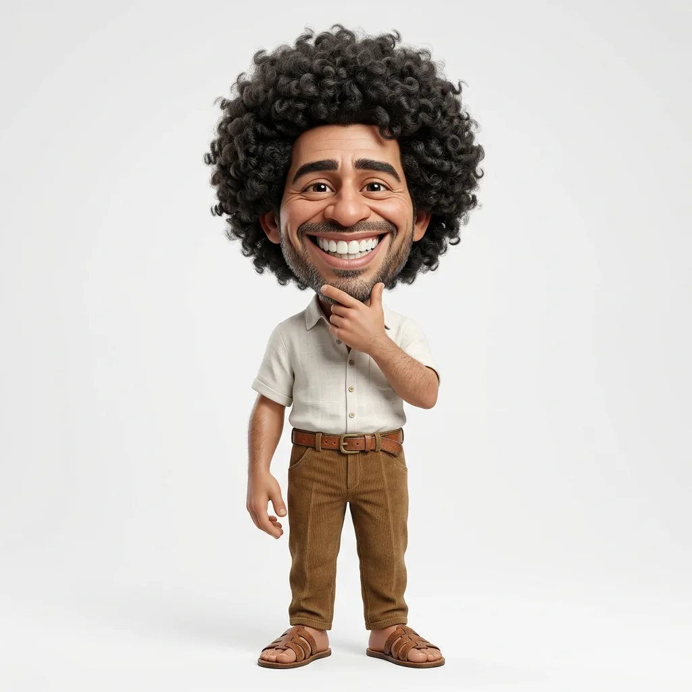

**#59 · Illustration &amp; 3D Prompt · <code>Vinano Image v2</code>**

<details>
<summary>Show prompt</summary>

```
A highly detailed 3D caricature of a cheerful man an oversized head, a big smile showcasing large teeth, and curly voluminous hair. He is wearing a short-sleeved white button-up shirt, brown high-waisted pants a belt, and traditional sandals. His pose is casual and friendly, one hand touching his chin in a thoughtful manner. The art style is semi-realistic exaggerated cartoonish features, set aw against a clean white background.""A highly detailed 3D caricature of a cheerful man an oversized head, a big smile showcasing large teeth, and curly voluminous hair. He is wearing a short-sleeved white button-up shirt, brown high-waisted pants a belt, and traditional sandals. His pose is casual and friendly, one hand touching his chin in a thoughtful manner. The art style is semi-realistic exaggerated cartoonish features, set against a clean white background Keep edges clean and the overall composition balanced for a polished, gallery-ready result.
```

</details>

---

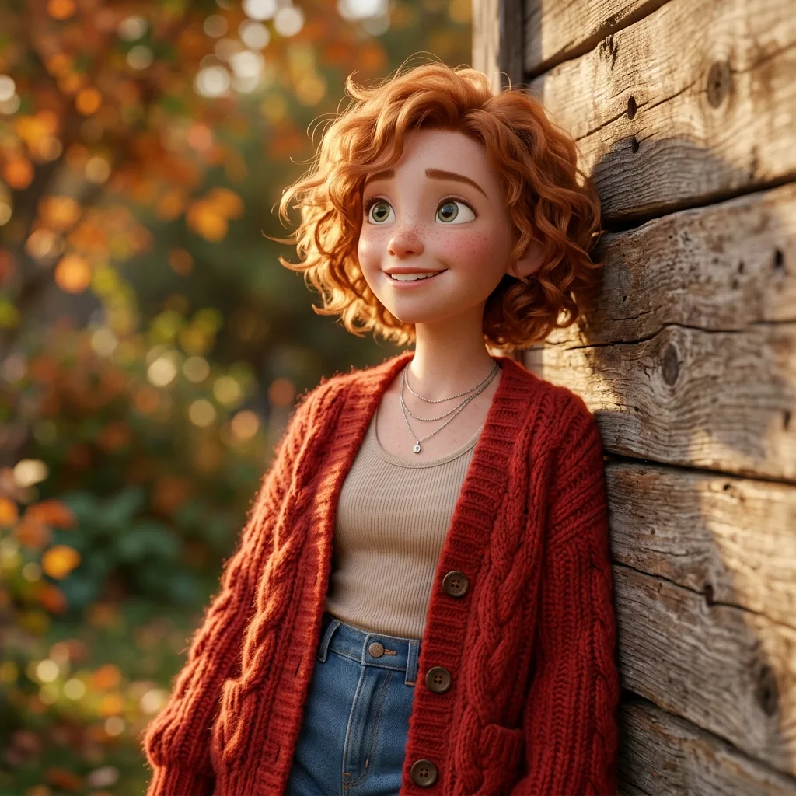

**#60 · Illustration &amp; 3D Prompt · <code>Vinano Image v2</code>**

<details>
<summary>Show prompt</summary>

```
1. A stylized 3D animated girl short messy curly ginger hair, light freckles across her cheeks and nose, soft green eyes, warm friendly smile, wearing an oversized textured red knitted cardigan large buttons, a beige cropped tank top underneath, and high-waisted blue jeans, layered silver necklaces, standing in front of a rustic wooden wall, golden hour warm sunlight casting soft shadows, filmic, cinematic lighting, shallow depth of field, Pixar-style character design, ultra detailed, soft skin shading, premium quality 3D render, warm color palette, cozy autumn vibe.

2. A whimsical 3D animated-style portrait of a young child short, messy, curly brown hair and light freckles, wearing an oversized knitted red cardigan over a simple shirt and denim overalls, leaning gently against a rustic wooden wall. The child is gazing upward a soft, hopeful smile. Warm golden autumn light, shallow depth of field, filmic, cinematic lighting, cozy atmosphere, highly detailed textures, soft skin shading, Pixar-style but original character, ultra high resolution, 85mm lens look, bokeh background, warm color palette, dreamy mood.

Emphasise material texture and natural light so the final frame feels tactile and premium.
```

</details>

---

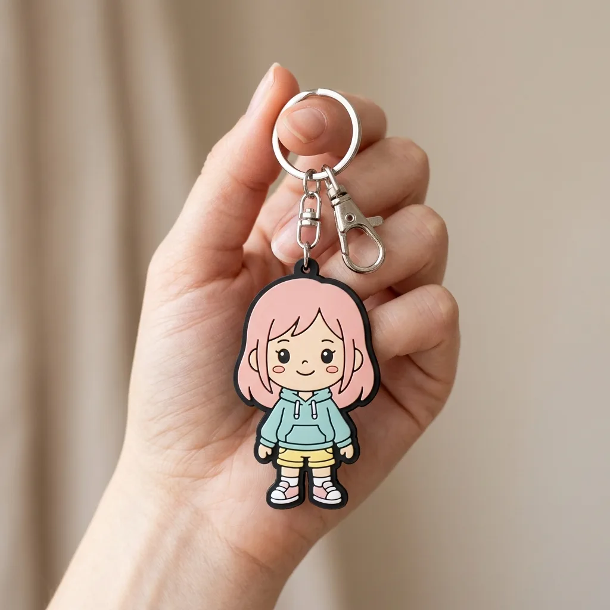

**#61 · Illustration &amp; 3D Prompt · <code>Vinano Image v2</code>**

<details>
<summary>Show prompt</summary>

```
Close-up photo of a cute, colorful rubber keychain held gently in a person’s hand. The keychain features a chibi-style illustration of [character/person], simplified facial features, rounded proportions, soft pastel color palette, bold thick black outlines, smooth matte rubber texture, slightly raised layered detailing, cartoon expression, compact toy-like silhouette. The keychain is attached to a small silver metal clasp and keyring. Natural hand positioning, shallow depth of field, soft diffused lighting, neutral beige background, realistic skin texture, high-detail product photography, 1:1 aspect ratio. Keep edges clean and the overall composition balanced for a polished, gallery-ready result.
```

</details>

---

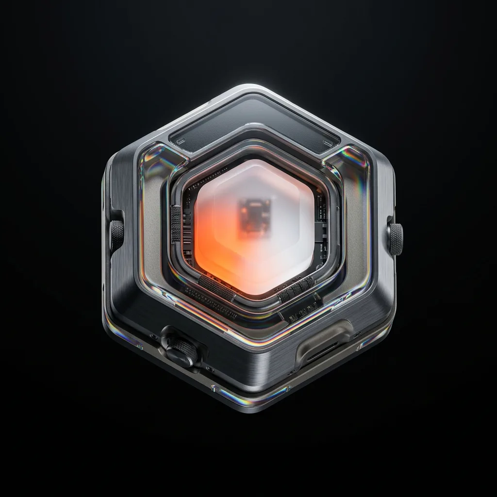

**#62 · Illustration &amp; 3D Prompt · <code>Vinano Image v2</code>**

<details>
<summary>Show prompt</summary>

```
{
 "image_generation_request": {
 "subject": {
 "placeholder": "[INSERT YOUR PRODUCT HERE]",
 "positioning": "centrally aligned, perfectly centered, levitating in mid-air",
 "framing": "full object visibility, no cropping, no cut-off edges, ample negative space around the product"
 },
 "visual_style": {
 "aesthetic": "ultra-modern industrial design, hyper-realistic product photography, cinematic tech-minimalism",
 "background": {
 "color": "#000000",
 "finish": "pure void, matte black, non-reflective"
 },
 "lighting": {
 "type": "top-down rim lighting, subtle key light",
 "effects": ["spectral dispersion",
 "chromatic aberration on glass edges",
 "prismatic light refraction",
 "soft caustic highlights"]
 }
 },
 "materials_and_textures": {
 "primary_blends": ["anodized brushed aluminum micro-circular grain",
 "frosted translucent polycarbonate internal orange-to-white gradient glow",
 "optically clear glass rainbow refractive edges",
 "matte sandblasted metallic surfaces"],
 "details": "high-precision CNC machined edges, tactile knurling, smooth organic fillets"
 },
 "constraints": {
 "mandatory_omissions": ["no lighting boxes",
 "no softboxes",
 "no tripod stands",
 "no pedestals",
 "no platforms",
 "no props",
 "no text",
 "no watermarks",
 "no human hands",
 "no floor line",
 "no background gradients"],
 "compositional_rules": "The product must be the sole inhabitant of the frame. Ensure zero contact any surface. Maintain absolute symmetry and 100% black levels for the background environment."
 },
 "color_palette": {
 "background": "#000000",
 "accents": ["#FF4500",
 "#FFFFFF",
 "#808080",
 "spectral rainbow/prismatic dispersion"]
 }
 }
}

Render with rich micro-detail while keeping the layout uncluttered and intentional.
```

</details>

---

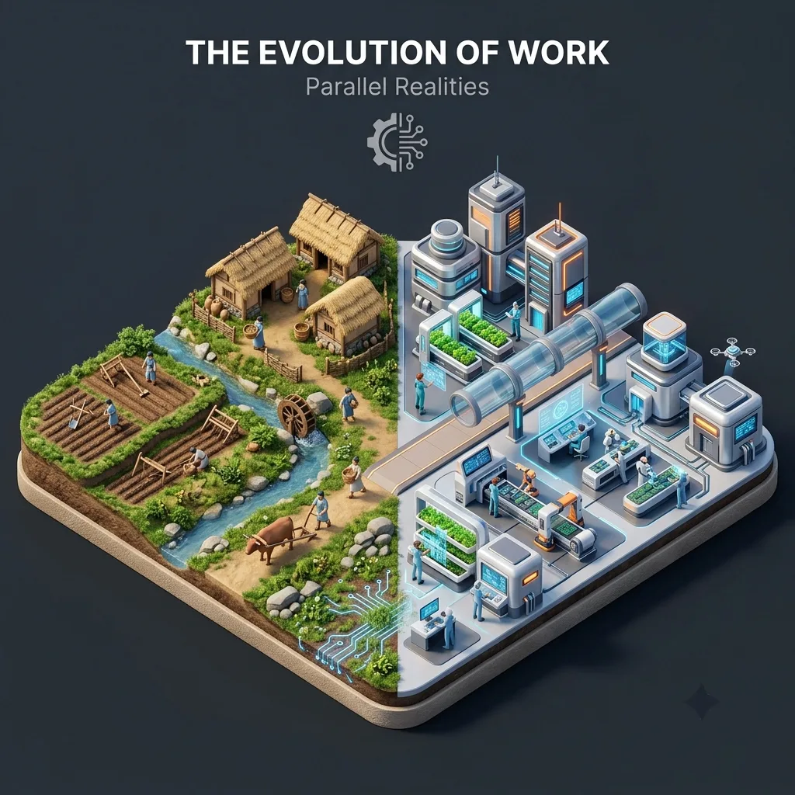

**#63 · Illustration &amp; 3D Prompt · <code>Vinano Image Pro</code>**

<details>
<summary>Show prompt</summary>

```
“Present a clear, 45° top-down isometric miniature 3D split diorama showing two parallel worlds of [THEME]: [WORLD A] vs [WORLD B].

Use soft refined textures, realistic PBR materials, and contrasting lighting styles for each side.

Design a single raised base divided down the center mirrored layouts and subtle crossover details.

Include tiny stylized characters existing differently in each world (no facial details).

Use a clean solid [BACKGROUND COLOR] background.

At the top-center, display [THEME NAME] in large bold text, beneath it show ‘Parallel Realities’, and place a minimal abstract icon below.

All text must automatically match the background contrast (white or black).”

Emphasise material texture and natural light so the final frame feels tactile and premium.
```

</details>

---

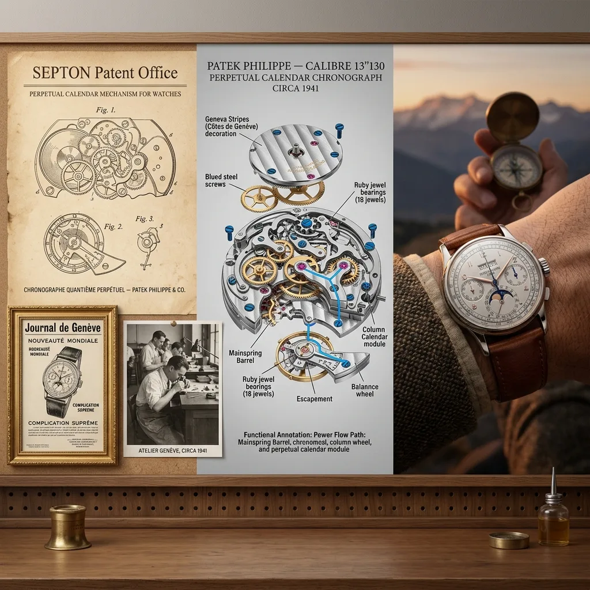

**#64 · Illustration &amp; 3D Prompt · <code>Vinano Image Pro</code>**

<details>
<summary>Show prompt</summary>

```
A master watchmaker's documentation board for [TIMEPIECE] — [MANUFACTURE / COMPLICATION / YEAR]. Left section: historical context showing the original patent drawings, period advertisements in gilded frames, and archival photographs of the atelier craftsmen at work. Center section: the movement in exploded view, every wheel, spring, and jewel suspended in precise spatial relationship, material callouts (Geneva stripes, blued screws, ruby bearings) and functional annotations tracing the flow of power from mainspring to escapement. Right section: the completed watch in its defining context—wrist of an explorer, pocket of a diplomat, or display case of a collector—captured shallow depth and warm side lighting. Visual style transitions from sepia patent office to mechanical precision chrome to intimate portraiture. Title block reading "[WATCH NAME] — CALIBRE [NUMBER], [COMPLICATION], CIRCA [YEAR]". Maintain consistent colour harmony and crisp focus across the whole frame.
```

</details>

---

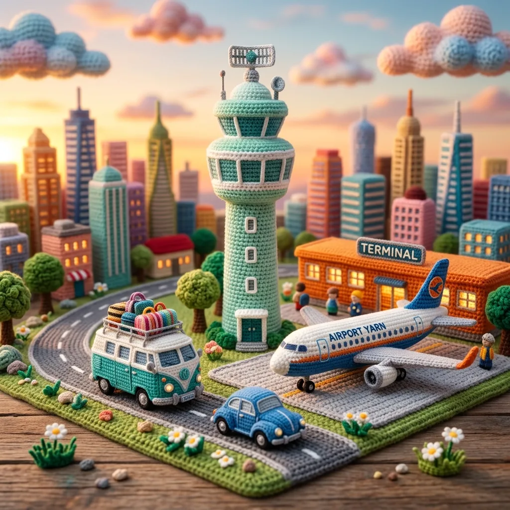

**#65 · Illustration &amp; 3D Prompt · <code>Vinano Image Pro</code>**

<details>
<summary>Show prompt</summary>

```
A highly detailed miniature diorama entirely made of crochet and amigurumi yarn, whimsical cute style, featuring a tall mint-green crocheted airport control tower white accents and antenna on top, a small teal crocheted camper van luggage on roof driving on a crocheted road, tiny crocheted blue classic car, a large crocheted passenger airplane parked near an orange-lit terminal building, crocheted city skyline tall buildings in the background, sunset sky soft clouds and golden hour lighting, tiny crocheted daisies and grass patches on the ground, textured yarn stitches visible everywhere, cozy handmade craft aesthetic, soft pastel colors, dreamy warm atmosphere, macro photography style, bokeh background, ultra detailed, cute and charming Preserve realistic proportions and depth for a confident, professional finish.
```

</details>

---

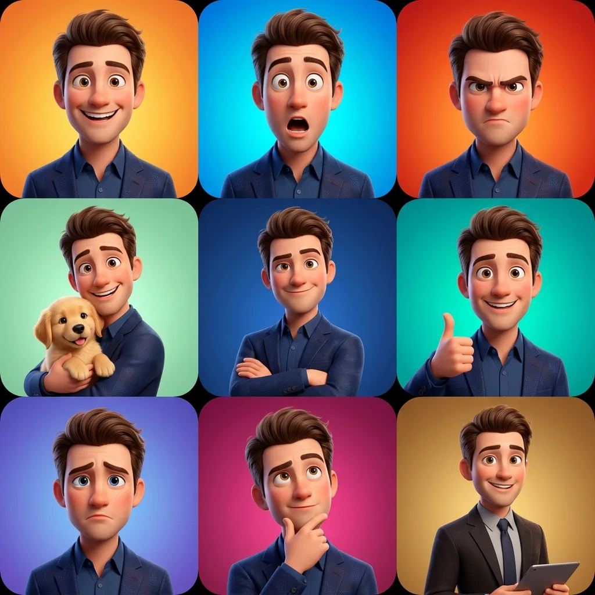

**#66 · Illustration &amp; 3D Prompt · <code>Vinano Image Pro</code>**

<details>
<summary>Show prompt</summary>

```
3D cartoon avatar character showing different emotions arranged in a 3x3 grid, same male character brown hair, Pixar-style animation, each square showing a different expression (happy, shocked, angry, caring a puppy, confident, thumbs up, sad, thinking, professional), colorful gradient backgrounds for each panel, soft studio lighting, smooth 3D rendering, expressive eyes and facial expressions, modern emoji-style character design, crisp composition, ultra-detailed, vibrant colors, 8K. Preserve realistic proportions and depth for a confident, professional finish.
```

</details>

---

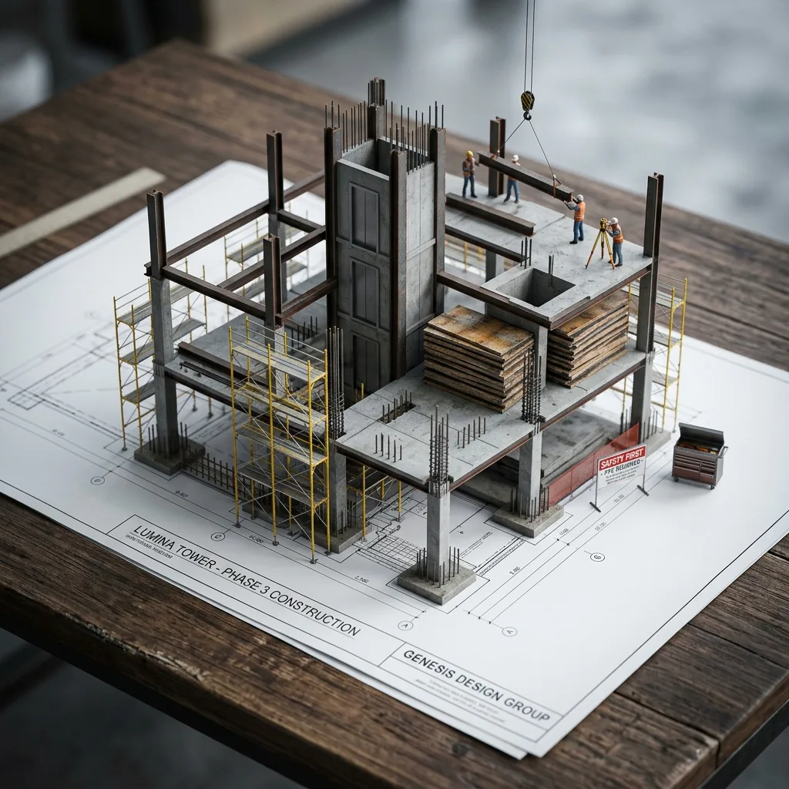

**#67 · Illustration &amp; 3D Prompt · <code>Vinano Image Pro</code>**

<details>
<summary>Show prompt</summary>

```
An architectural blueprint of {BUILDING_NAME} placed on a {SURFACE}, a true-to-life photorealistic miniature under-construction version of {BUILDING_NAME} emerging from it — {STRUCTURAL_ELEMENT_1}, {STRUCTURAL_ELEMENT_2}, {STRUCTURAL_ELEMENT_3}, {CONSTRUCTION_DETAIL}, {WORKER_SCENE}, {MATERIAL_ELEMENT}, and {EXTRA_DETAIL}. All elements grow from the blueprint like a 3D architectural diorama, steel beams rising from the drawn lines, scaffolding threading through the paper. Studio soft, diffused lighting, cinematic depth, 2:3 Render with rich micro-detail while keeping the layout uncluttered and intentional.
```

</details>

---

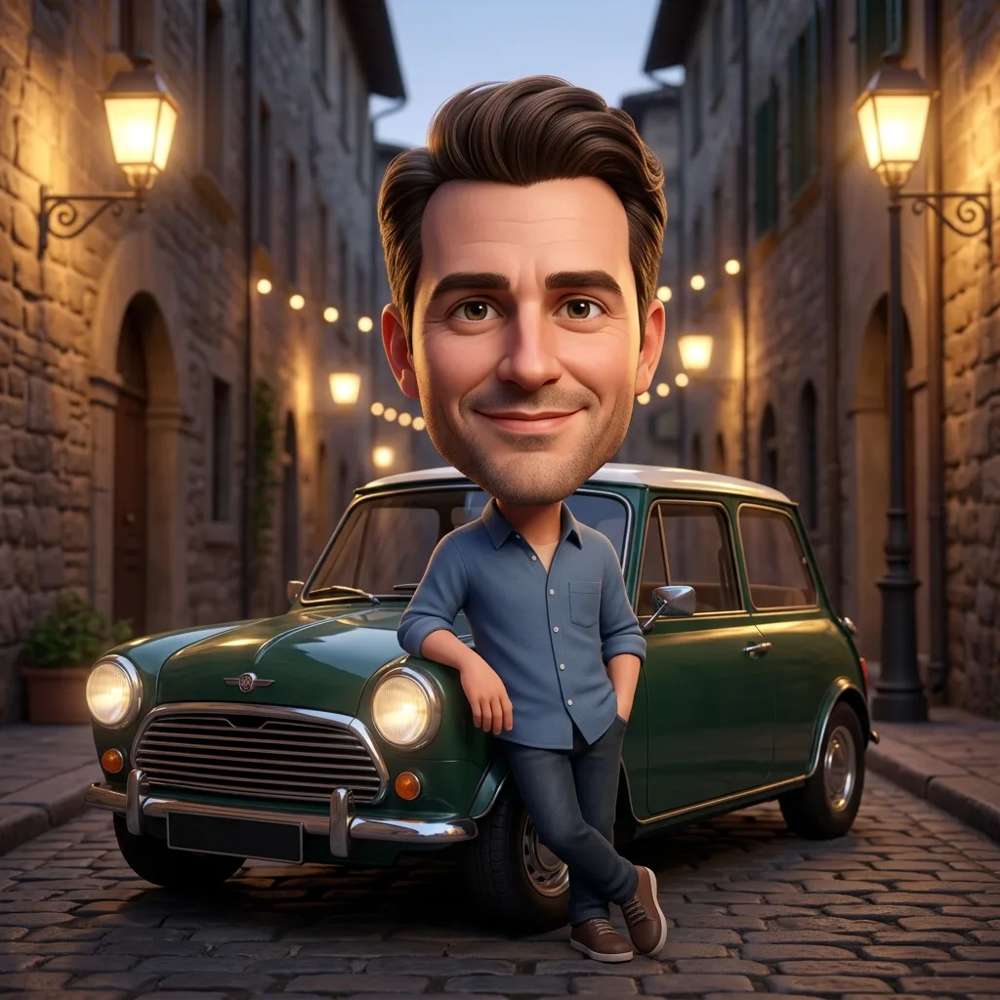

**#68 · Illustration &amp; 3D Prompt · <code>Vinano Image v2</code>**

<details>
<summary>Show prompt</summary>

```
Use the uploaded image as the primary subject reference. Transform the person into a stylized caricature a slightly oversized head and a smaller body while preserving facial identity, expression, hairstyle, and key features.
Place the subject casually leaning against a vintage dark green classic car on a narrow cobblestone street warm glowing street lamps on both sides. Maintain a relaxed, confident pose.
Outfit should match or naturally enhance the original clothing from the uploaded image (adapt if needed to fit the scene). Keep textures realistic and well-detailed.
Style: 3D cartoon realism, filmic, cinematic lighting, shallow depth of field, ultra-detailed, soft shadows, warm tones, high resolution, vibrant but natural colors.

Render with rich micro-detail while keeping the layout uncluttered and intentional.
```

</details>

---

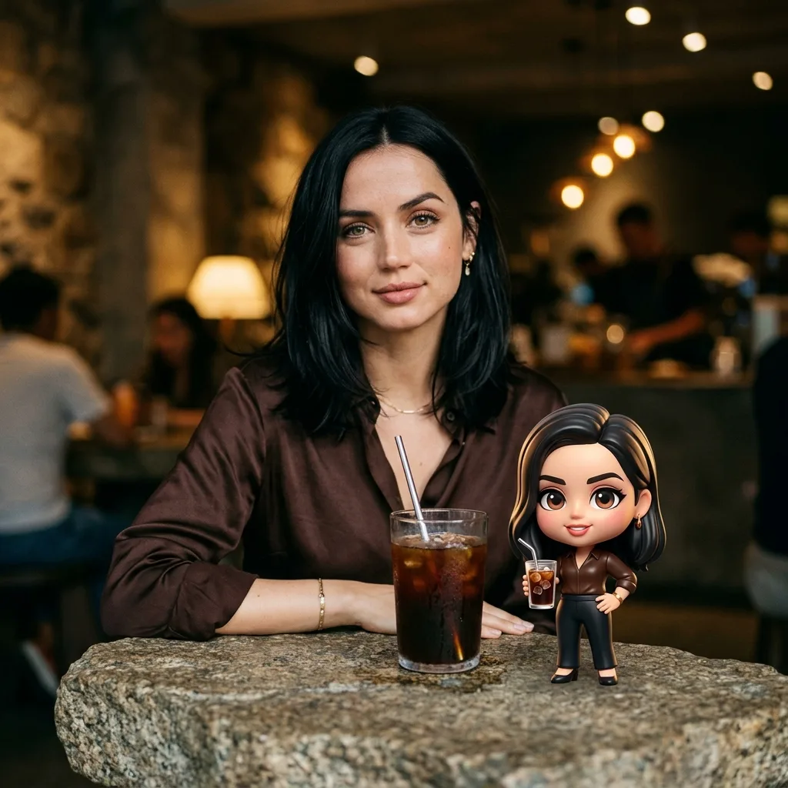

**#69 · Illustration &amp; 3D Prompt · <code>Vinano Image v2</code>**

<details>
<summary>Show prompt</summary>

```
{
 "aspect_ratio": "1:1",
 "scene_type": "cinematic_studio_portrait",
 "environment": {
 "background_color": "warm_muted_gray",
 "surface": "natural_textured_stone_table",
 "mood": "intimate_evening_cafe",
 "atmosphere": "cozy_moody"
 },
 "primary_subject": {
 "identity": "Ana de Armas",
 "pose": "seated_relaxed",
 "expression": "soft_calm_confident",
 "appearance": {
 "hair": "black_shoulder_length_soft_layers",
 "makeup": "subtle_evening_makeup",
 "outfit": "dark_brown_satin_blouse"
 },
 "focus": "sharp_subject_isolation"
 },
 "props": {
 "main_drink": {
 "type": "cold_brew_coffee",
 "glass": "clear_glass_with_ice",
 "straw": "metal_straw"
 },
 "stylized_figure": {
 "style": "high_quality_3d_chibi_collectible",
 "design": {
 "head": "oversized_rounded",
 "eyes": "large_expressive",
 "cheeks": "soft_blush",
 "features": "simplified_cute"
 },
 "likeness": "same_as_primary_subject",
 "pose": "holding_miniature_cold_brew_glass",
 "material": "glossy_with_soft_reflections"
 }
 },
 "lighting": {
 "type": "soft_cinematic",
 "direction": "angled_key_with_gentle_falloff",
 "highlights": "subtle_reflections_on_glass_and_chibi",
 "shadows": "smooth_and_moody"
 },
 "camera": {
 "depth_of_field": "shallow",
 "focus_priority": "real_subject_then_chibi",
 "look": "cinematic_photography"
 },
 "style_notes": ["realistic_human_combined_with_stylized_3d_character",
 "premium_collectible_toy_aesthetic",
 "warm_color_grading",
 "cozy_evening_tone",
 "ultra_detailed",
 "photoreal_subject"]
}

Emphasise material texture and natural light so the final frame feels tactile and premium.
```

</details>

---

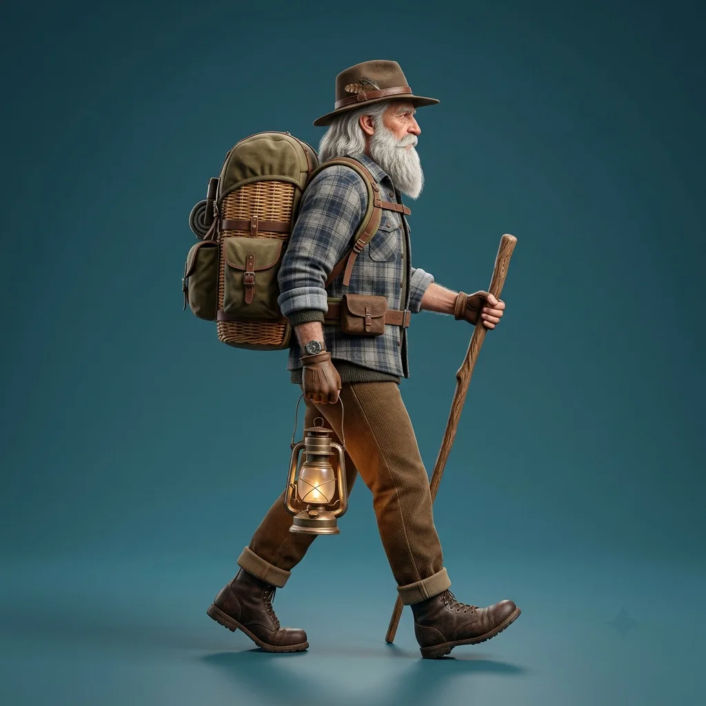

**#70 · Illustration &amp; 3D Prompt · <code>Vinano Image v2</code>**

<details>
<summary>Show prompt</summary>

```
​A stylized 3D rendered full-body profile portrait of an elderly male hiker a long white beard, viewed from the side and walking from left to right. He is set against a solid, seamless deep-teal studio background soft floor reflections. He wears a brown felt wide-brimmed hiker's hat, a gray and blue plaid shirt over cuffed brown corduroy trousers, and dark, scuffed work boots. On his back is a large, detailed combination canvas and woven wicker backpack leather straps. He holds a lit, vintage brass-and-glass hurricane lantern in his right hand, which casts a warm, soft glow. He also carries a simple wooden walking stick. The image has a textured, matte finish and soft, diffused studio lighting, the vertical composition leaving ample negative space. Preserve realistic proportions and depth for a confident, professional finish.
```

</details>

---

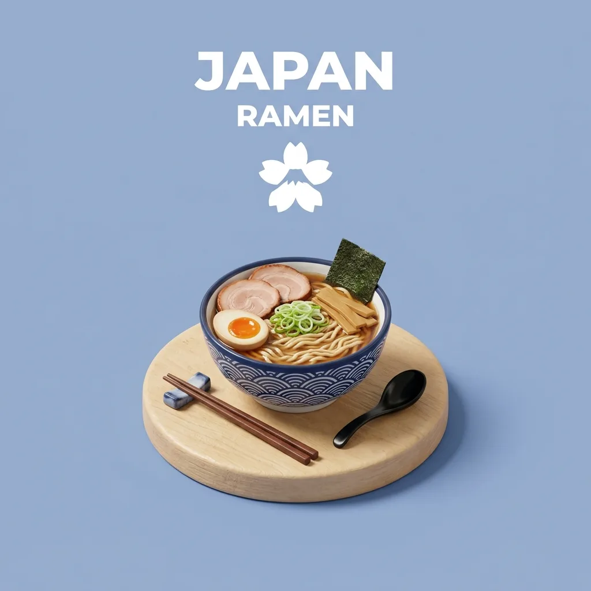

**#71 · Illustration &amp; 3D Prompt · <code>Vinano Image Pro</code>**

<details>
<summary>Show prompt</summary>

```
Present a clear, 45° top-down isometric miniature 3D cartoon scene of [COUNTRY]’s signature dish: [FOOD], soft refined textures, realistic PBR materials, and gentle lifelike lighting.
Create a small raised diorama-style base showcasing the dish in a highly recognizable presentation, simple complementary elements (plate, table surface, or minimal garnish).
Use a clean solid [COLOR] background.

At the top-center, display [COUNTRY] in large bold text, directly beneath it show [FOOD] in medium text, and place a small simplified national icon or flag below the subtext.
All text must automatically match the background contrast (white or black).

Composition: perfectly centered layout, square 1080x1080, ultra-clean, high-clarity miniature diorama aesthetic.

Aim for an editorial, design-driven look with deliberate negative space.
```

</details>

---

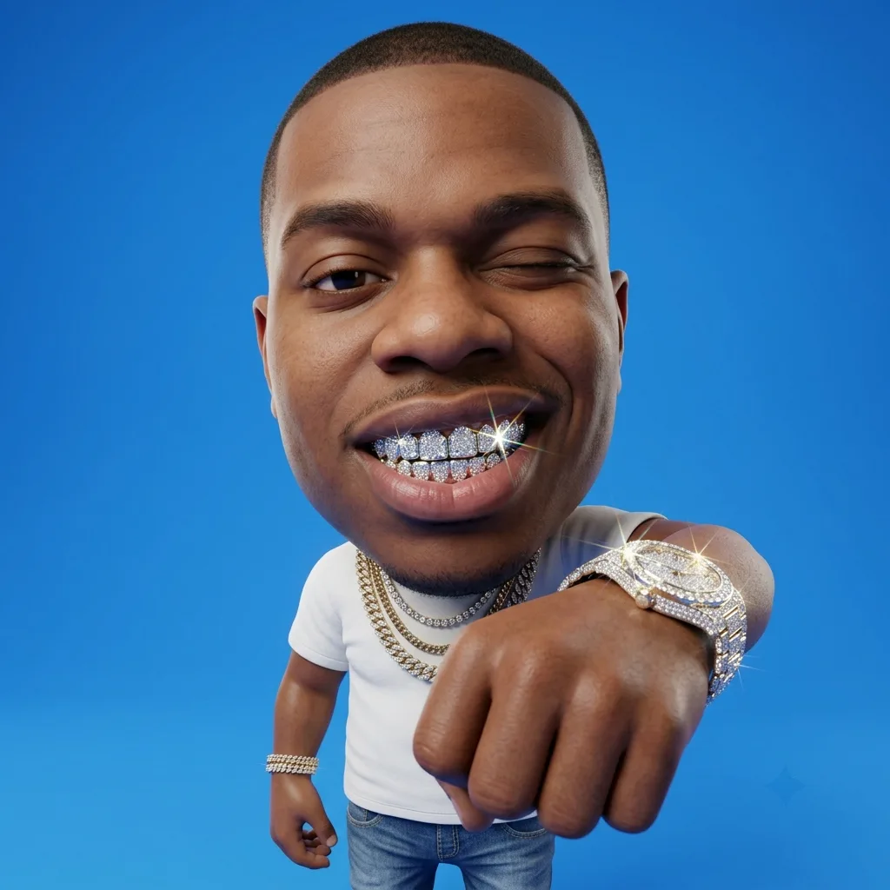

**#72 · Illustration &amp; 3D Prompt · <code>Vinano Image Pro</code>**

<details>
<summary>Show prompt</summary>

```
Maintain the exact same person and facial identity from the reference photo. Detailed 3D Caricature Prompt:
A professional, ultra-detailed full-body 3D stylized caricature portrait of the person from [REFERENCE IMAGE], standing in a confident upright pose.
ANATOMY & PROPORTIONS: Extremely exaggerated silhouette featuring a massive, oversized head a large-scale ratio compared to a tiny, diminutive, and short body. The neck is short and thick to support the giant head. Maintain the subject’s exact facial identity, skin tone, and ethnic features from [REFERENCE IMAGE], but intentional caricature deformation. The character has a mischievous, confident expression, giving a playful wink toward the lens one eye. A wide smirk reveals a full set of meticulously detailed, sparkling diamond grillz (teeth) that catch and refract the light.
POSE & JEWELRY: The character is standing still but a dynamic arm gesture; one arm is brought forward, close to the camera lens, to prominently showcase a thick, heavy, iced-out diamond watch on the wrist. Each individual diamond stone on the watch and the grillz is rendered ray-traced reflections, creating sharp prismatic glints and brilliant sparkles.
CLOTHING & TEXTURES: The character is wearing the exact same outfit, jewelry, and accessories as seen in [REFERENCE IMAGE]. Fabrics (cotton, silk, or denim) are rendered high-fidelity microscopic textures, showing realistic folds and stitching on a miniature scale. Skin is rendered premium subsurface scattering, appearing smooth, clean, and studio-perfect, avoiding any blemishes, noise, or grain.
ENVIRONMENT & LIGHTING: Set against a perfectly clean, seamless, solid vibrant blue studio backdrop no gradients and no distractions. The lighting is a high-end neutral studio setup softboxes to provide even, bright illumination across the entire figure. Strictly NO backlighting and NO rim light. Focus on soft, diffused front shadows that define the character’s shape. High-intensity light hits the diamonds to ensure they are the brightest points of the image.
TECHNICAL SPECS: Hyper-realistic 3D render, cinematic quality, Octane Render style, 8k resolution, ultra-high definition, sharp focus, clean edges, masterpiece level, no text, no watermarks, no logos, aspect ratio 4:5.

Preserve realistic proportions and depth for a confident, professional finish.
```

</details>

---

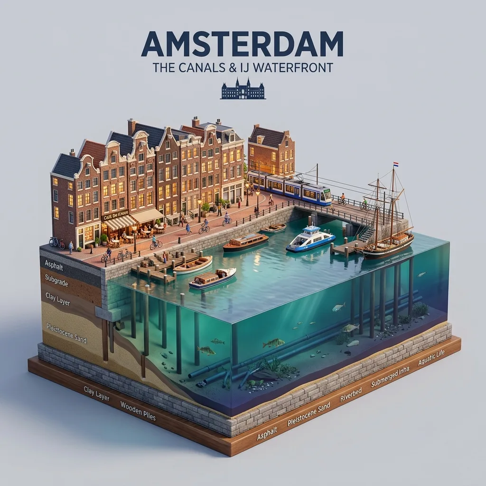

**#73 · Illustration &amp; 3D Prompt · <code>Vinano Image Pro</code>**

<details>
<summary>Show prompt</summary>

```
Present a clear, side-facing isometric miniature 3D cartoon diorama of [CITY] along the [WATERFRONT]. The scene is a clean vertical cross-section slice — the city is cut open like a museum specimen, mounted on a small raised diorama-style base that exposes the full stratigraphy from rooftop to riverbed.

Above the waterline: a curated selection of [CITY]'s most iconic waterfront elements — layered building facades in local architectural style, embankment promenade, bridges, trams or cyclists, warm soft ambient lighting. Tiny stylized figures of residents in casual attire — walking, cycling, sitting at waterfront cafés (no facial details).

The water surface is a clean glassy horizontal band — cartoon-stylized, slightly transparent, acting as the visual threshold between the two worlds.

Below the waterline: the geographically honest submerged anatomy of [CITY]'s [WATERFRONT] — accurate foundation and piling types, real underwater infrastructure, sediment and substrate layers appropriate to this specific body of water, local aquatic life rendered in the same soft cartoon style. Tiny stylized fish, slow-drifting particulate, refracted light shafts filtering down from the surface.

The cross-section cut edge is razor-clean — pavement strata, foundations, soil layers, and underwater geology all simultaneously visible in the base wall, like a natural history diorama exhibit.

Style: soft refined textures, realistic PBR materials, immersive ambient lighting. Color language: warm amber and golden tones above the waterline, cold teal-green and deep indigo below, blending at the water threshold. Ultra-clean, high-clarity 3D cartoon diorama aesthetic.

Use a clean solid [BACKGROUND COLOR] background. At the top-center, display "[CITY]" in large bold text, and place the waterfront name or a city landmark silhouette emblem below the text. All text must automatically match background contrast.

Composition: perfectly centered layout, square 1080x1080.

Maintain consistent colour harmony and crisp focus across the whole frame.
```

</details>

---

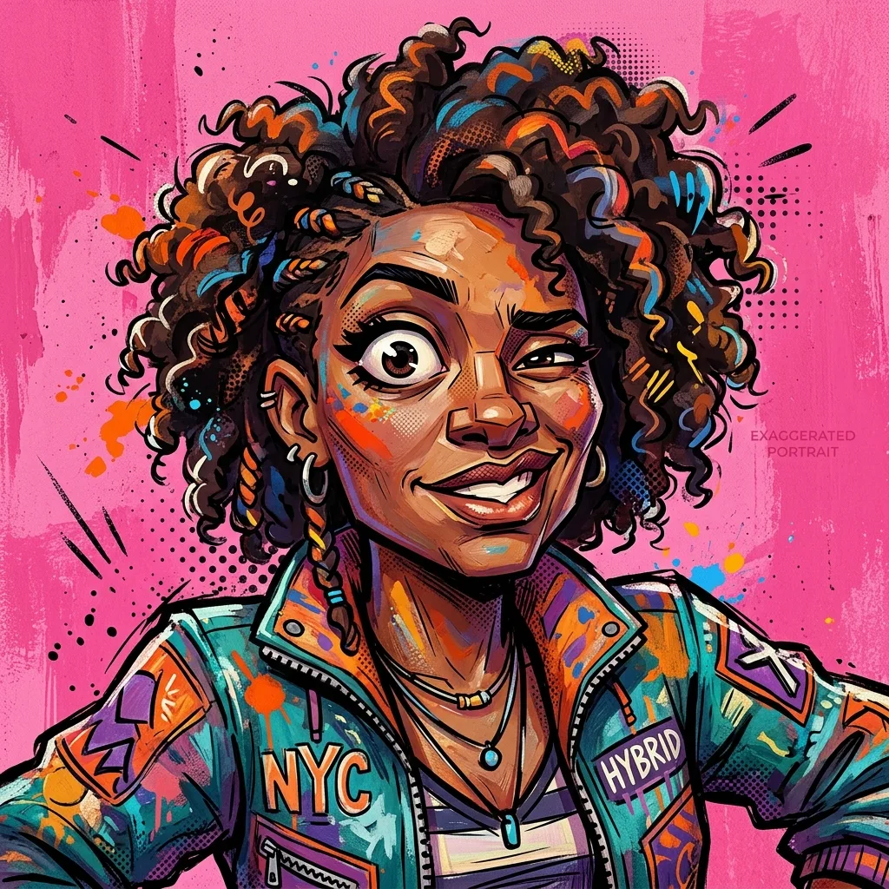

**#74 · Illustration &amp; 3D Prompt · <code>Vinano Image v2</code>**

<details>
<summary>Show prompt</summary>

```
A painterly exaggerated cartoon portrait combining sculpted 3D anatomy hand-painted illustration textures, spider-verse inspired visual language, distorted facial geometry and expressive asymmetry, intentionally breaking realism while preserving general identity cues such as skin tone and hairstyle, bold line work mixed painted shadows, halftone textures and color splashes graphic animated illustration aesthetic, solid pink studio background, frontal expressive pose, stylized lighting translated into brush-painted highlights, dynamic composition, rich paint texture and high-end hybrid cartoon render. Render with rich micro-detail while keeping the layout uncluttered and intentional.
```

</details>

---

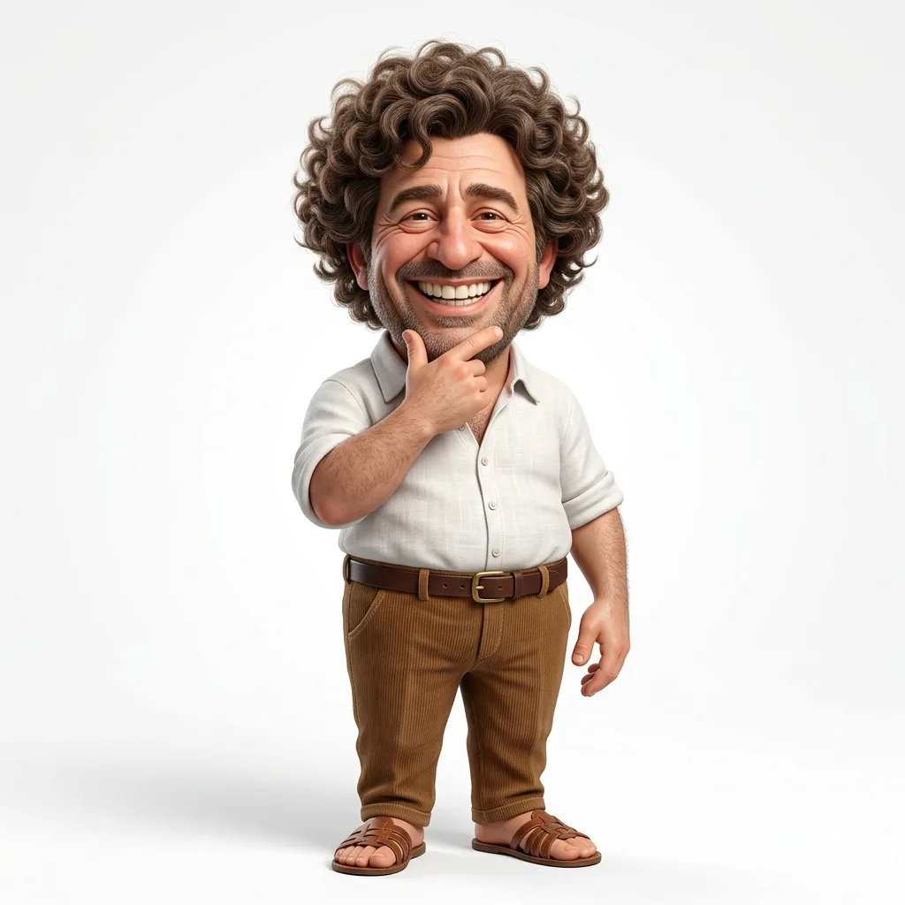

**#75 · Illustration &amp; 3D Prompt · <code>Vinano Image v2</code>**

<details>
<summary>Show prompt</summary>

```
A highly detailed 3D caricature of a cheerful man an oversized head, a big smile showcasing large teeth, and curly voluminous hair. He is wearing a short-sleeved white button-up shirt, brown high-waisted pants a belt, and traditional sandals. His pose is casual and friendly, one hand touching his chin in a thoughtful manner. The art style is semi-realistic exaggerated cartoonish features, set aw against a clean white background.""A highly detailed 3D caricature of a cheerful man an oversized head, a big smile showcasing large teeth, and curly voluminous hair. He is wearing a short-sleeved white button-up shirt, brown high-waisted pants a belt, and traditional sandals. His pose is casual and friendly, one hand touching his chin in a thoughtful manner. The art style is semi-realistic exaggerated cartoonish features, set against a clean white background. Aim for an editorial, design-driven look with deliberate negative space.
```

</details>

---

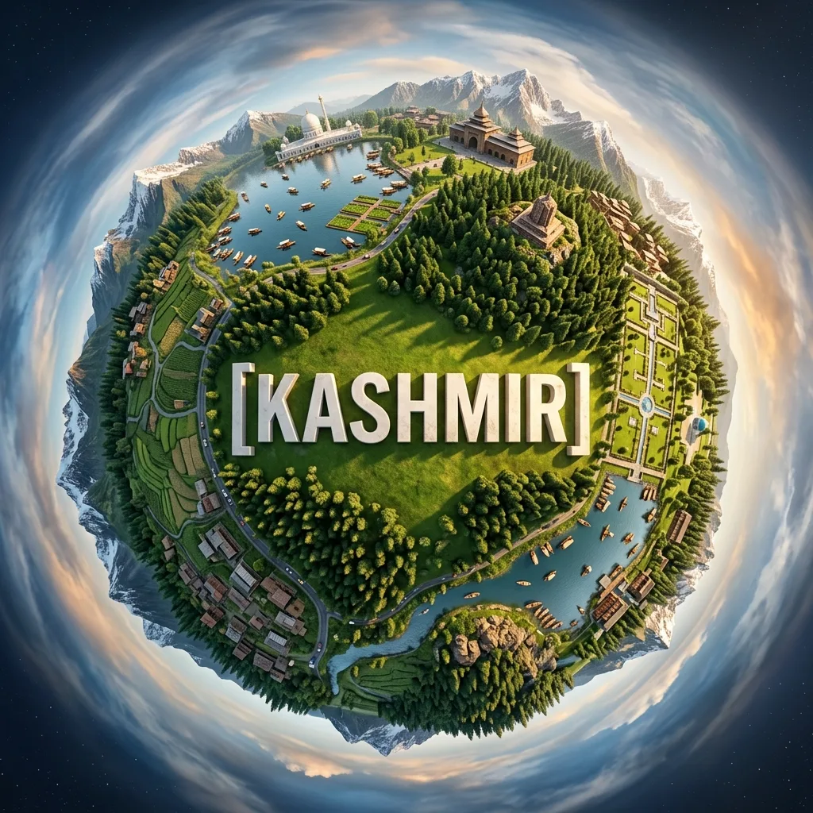

**#76 · Illustration &amp; 3D Prompt · <code>Vinano Image v2</code>**

<details>
<summary>Show prompt</summary>

```
Create a hyper-realistic miniature planet showcasing [KASHMIR] famous landmarks seamlessly curving around the spherical surface. Position bold 3D white text “[KASHMIR]” naturally integrated across the lush green central parkland realistic shadows and dimensional depth. Capture from a top-down orbiting angle that emphasizes the dramatic planet curvature. Use soft golden hour daylight filtering through partly cloudy skies, casting gentle shadows on emerald grass and surrounding trees. The background should blend into a swirling atmospheric sky. Apply vibrant greens, warm earth tones, and soft blues. Render in polished true-to-life photorealistic style fine architectural detail. 1080x1080 format. Emphasise material texture and natural light so the final frame feels tactile and premium.
```

</details>

---

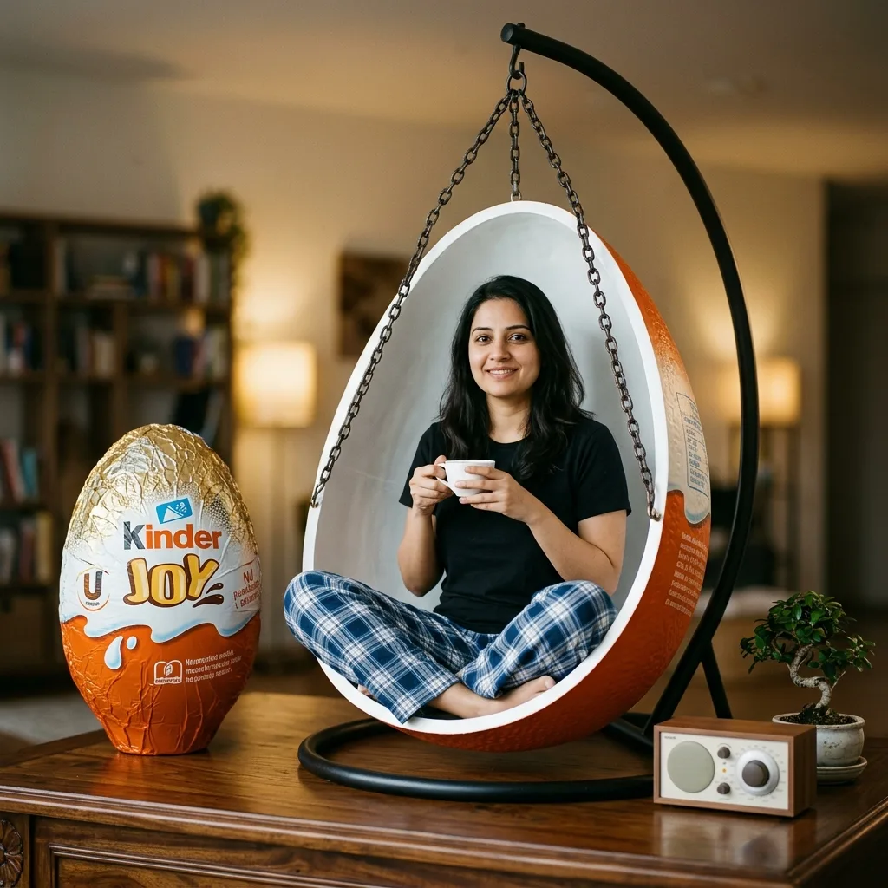

**#77 · Illustration &amp; 3D Prompt · <code>Vinano Image v2</code>**

<details>
<summary>Show prompt</summary>

```
A hyper-realistic, 8k, medium shot photograph captured a standard lens and shallow depth of field, showcasing a surreal indoor scene filmic, cinematic lighting. The composition features a normal-sized woman, the uploaded face as reference, sitting cross-legged inside a colossal, highly detailed Kinder Joy egg that functions as a swing chair. The giant egg is split, its white interior forming the seat and the orange, textured exterior visible, suspended by dark metal chains from a curved, dark metal stand.

The woman wears a black t-shirt and blue and white plaid pajama pants, holding a small white teacup both hands, looking directly at the viewer a calm and relaxed expression.

To the left in the foreground, on a highly detailed polished wooden table, stands another gigantic, fully wrapped Kinder Joy egg, exhibiting intricate foil texture and branding. To the right of the swing's base, also on the table, are miniature props: a vintage-style wooden radio white dials and a tiny bonsai tree in a small pot.

The lighting is soft, warm, and directional from the left, casting subtle shadows and highlighting the highly detailed textures of the egg wrappers, the woman’s clothing, and the wooden surface. The background is a softly blurred, warm-toned interior wall, creating a pleasing bokeh effect.

Preserve realistic proportions and depth for a confident, professional finish.
```

</details>

---

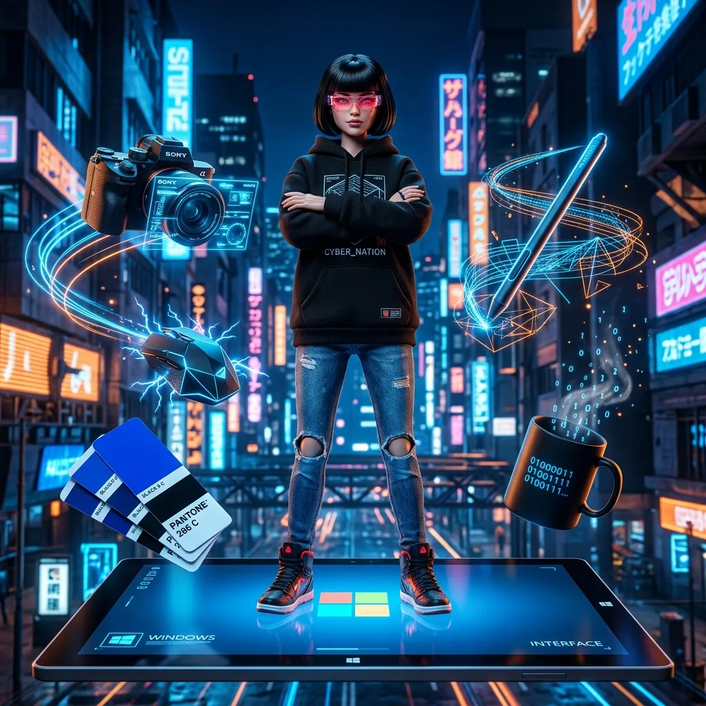

**#78 · Illustration &amp; 3D Prompt · <code>Vinano Image v2</code>**

<details>
<summary>Show prompt</summary>

```
Hyper-realistic full-body portrait of a woman, the exact pose from the uploaded photo, transformed into a stylish female doll. she stands confidently arms crossed on a giant Microsoft Surface Tablet as a platform, wearing urban streetwear (black hoodie, jeans, sneakers) and sleek red tech glasses.

Surrounding him in a dynamic, floating arrangement are masculine graphic design tools: a futuristic camera blue holographic glow, a geometric computer mouse electric sparks, a digital pen creating digital wireframe trails, a floating Pantone swatch book in bold blue and black colors, and a refined minimalist black coffee mug binary code steam.

The scene features a vibrant blue and orange color scheme dynamic lighting. Cyberpunk aesthetic, neon accents, particle effects. Style is a blend of 3D animation and tech photography. Sharp focus, filmic, cinematic lighting, 8k resolution.

Maintain consistent colour harmony and crisp focus across the whole frame.
```

</details>

---

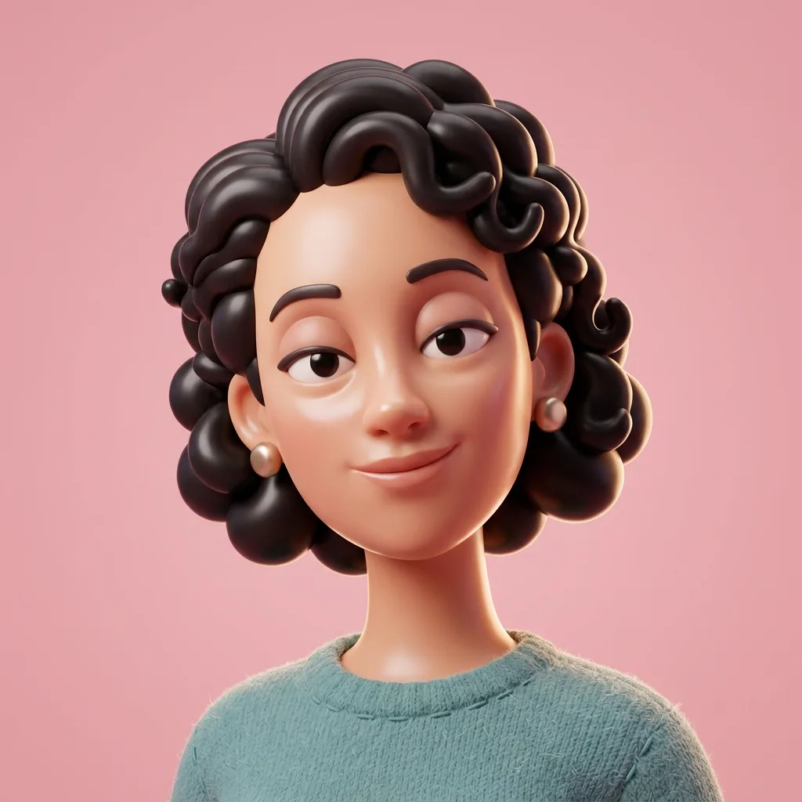

**#79 · Illustration &amp; 3D Prompt · <code>Vinano Image v2</code>**

<details>
<summary>Show prompt</summary>

```
Transform the person from the attached photo into a smooth stylized 3D cartoon character in the same style as the reference. Keep all real facial features fully recognizable but translated into exaggerated proportions (elongated head, big eyelids, soft rounded shapes). Skin should look glossy and plastic-like clean gradients and subtle highlights. Use soft studio lighting, a solid [COLOR] color background, and high-end Pixar- inspired rendering. Simplify details, add gentle rim light, and preserve the person's hairstyle and accessories in stylized form. The final look must match the clean polished 3D aesthetic of the reference, 4:5 dimension. Emphasise material texture and natural light so the final frame feels tactile and premium.
```

</details>

---

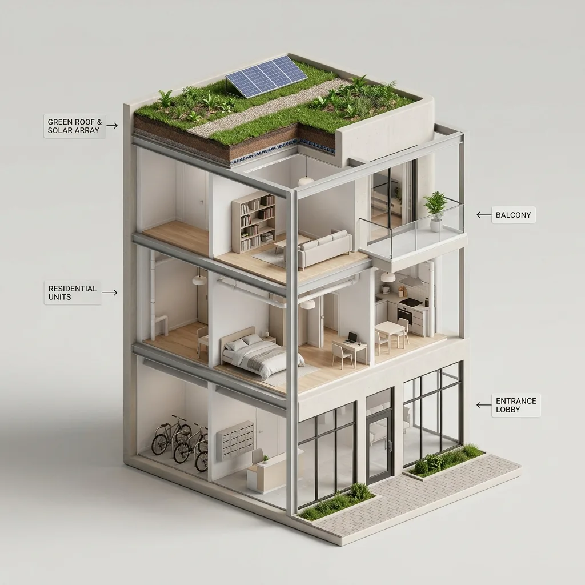

**#80 · Illustration &amp; 3D Prompt · <code>Vinano Image Pro</code>**

<details>
<summary>Show prompt</summary>

```
A clean, minimal 3D isometric diorama of a [BUILDING TYPE] section, featuring [INTERIOR / EXTERIOR ELEMENTS] visible in a [CUTAWAY / OPEN STYLE], simple [STRUCTURAL FRAME], subtle [INFORMATIONAL SIGNAGE], smooth [MATERIAL FINISH], soft studio lighting, realistic materials, rounded edges, miniature architectural model style, high detail, neutral background. Render with rich micro-detail while keeping the layout uncluttered and intentional.
```

</details>

---

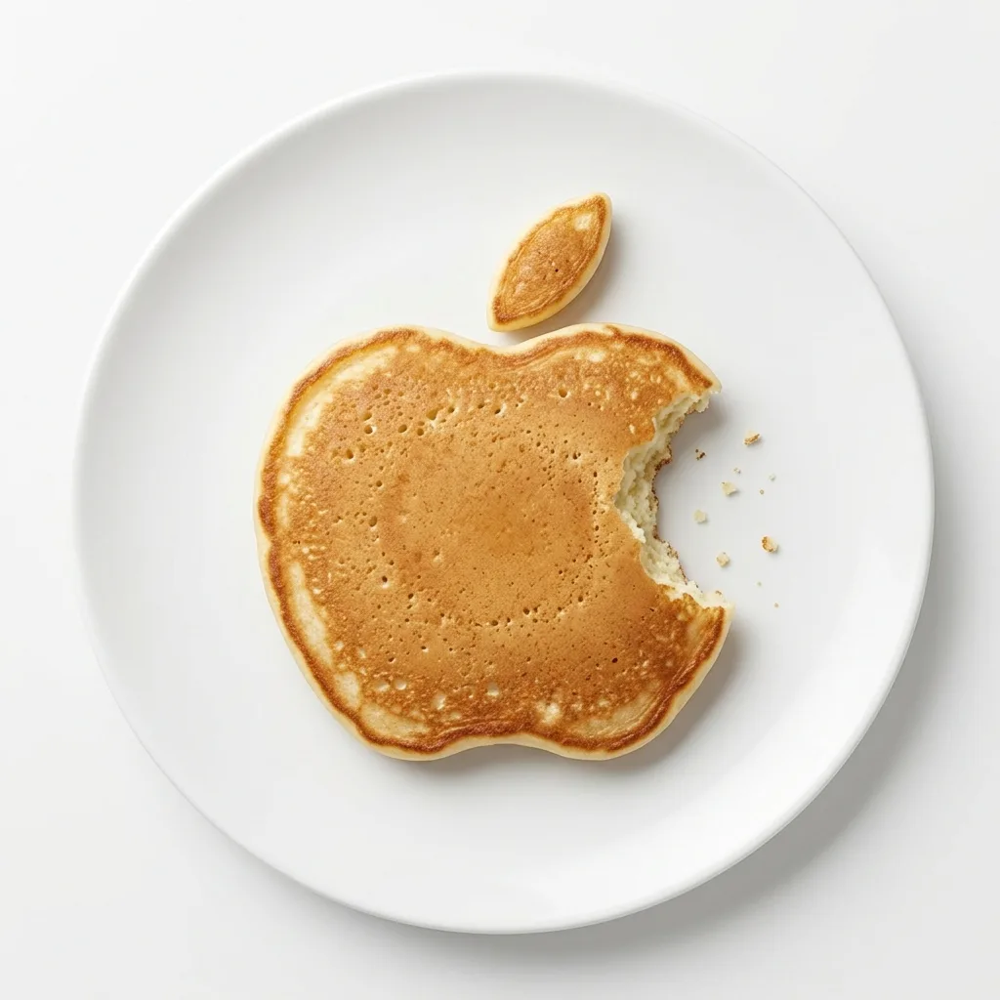

**#81 · Illustration &amp; 3D Prompt · <code>Vinano Image v2</code>**

<details>
<summary>Show prompt</summary>

```
hyper-realistic food photography of a pancake shaped precisely like the [brand name] logo, natural golden-brown pancake texture, soft porous surface realistic bubbles, slightly crispy edges, placed on a pure white background, minimal composition, soft natural shadow beneath, top-down flat lay perspective, subtle bite taken from one edge revealing fluffy interior, realistic crumb texture, soft diffused studio lighting, ultra detailed, clean commercial aesthetic, sharp focus Emphasise material texture and natural light so the final frame feels tactile and premium.
```

</details>

---

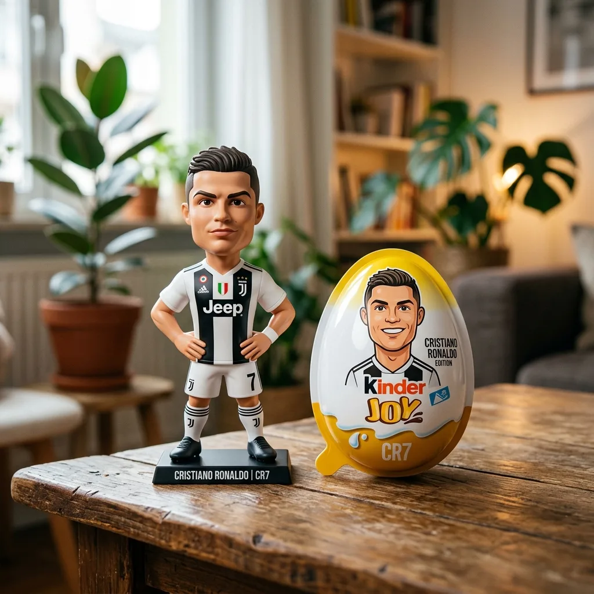

**#82 · Illustration &amp; 3D Prompt · <code>Vinano Image v2</code>**

<details>
<summary>Show prompt</summary>

```
A cute stylized 3D collectible figurine inspired by Cristiano Ronaldo, short styled hair and an athletic build, wearing a modern football kit and standing confidently hands on hips. Next to him is a large Kinder Joy egg featuring a cartoon avatar of the same football star printed on the shell. The scene is placed on a wooden table soft natural lighting, shallow depth of field, cozy indoor background blurred plants, highly detailed Pixar-style 3D render, glossy toy texture, filmic, cinematic lighting, ultra-detailed product photography, designer toy aesthetic. ⚽🥚 Preserve realistic proportions and depth for a confident, professional finish.
```

</details>

---

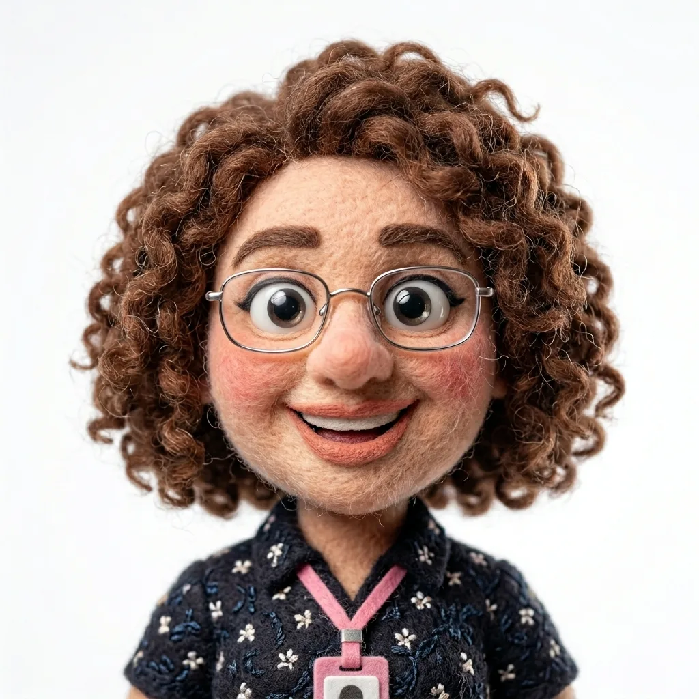

**#83 · Illustration &amp; 3D Prompt · <code>Vinano Image v2</code>**

<details>
<summary>Show prompt</summary>

```
Transform the uploaded image into a stylized 3D claymation character. Soft felt / fuzzy texture skin, rounded exaggerated facial features, big expressive eyes, thick soft eyebrows, slightly oversized nose, warm blush tones on cheeks. Playful open-mouth expression. Clean pure white studio background. Soft diffused studio lighting, subtle rim light, shallow depth of field. Pixar-style charm, stop-motion aesthetic, highly detailed fibers and soft materials, cinematic render, warm vibrant tones. Preserve realistic proportions and depth for a confident, professional finish.
```

</details>

---

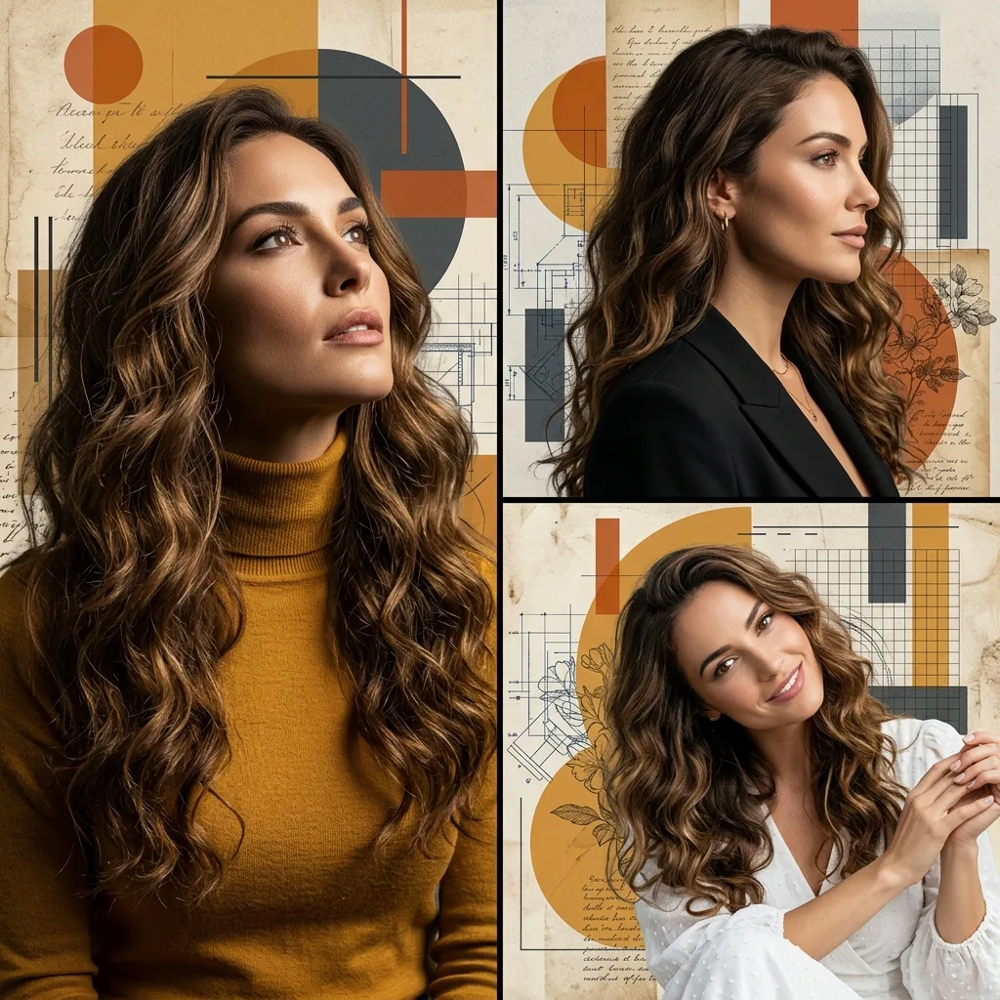

**#84 · Illustration &amp; 3D Prompt · <code>Vinano Image Pro</code>**

<details>
<summary>Show prompt</summary>

```
A high-resolution, true-to-life photorealistic three-panel composition featuring a woman long, voluminous wavy brown hair and elegant features, integrated into an abstract mixed-media collage background.
Panel Layout:

Left Panel (Vertical, full height):

A tall portrait of the woman looking upwards at a dramatic angle, wearing a mustard yellow turtleneck. filmic, cinematic lighting highlights her face and hair, strong shadows and depth.
Top Right Panel (Square):

A close-up angled side profile, soft gaze to the right, wearing a black modern blazer minimal jewelry. Expression is calm and confident.
Bottom Right Panel (Square):

A slightly top-down perspective, playful yet elegant pose, wearing a white textured dress, subtle smile, natural lighting.
Art Style & Background (applies to all panels):

The image is layered an abstract mixed-media collage background incorporating geometric shapes like circles and rectangles in ochre, burnt orange, and charcoal grey. Include textural elements such as vintage parchment paper, blueprint-style technical sketches, and subtle floral etchings. Use a flat graphic design overlay that partially blends into each outfit, seamlessly merging the 3D subject 2D modernist art.
Overall Style:

filmic, cinematic lighting, fine art photography aesthetic, ultra-detailed, 8K resolution, modern editorial fashion magazine layout.

Keep edges clean and the overall composition balanced for a polished, gallery-ready result.
```

</details>

---

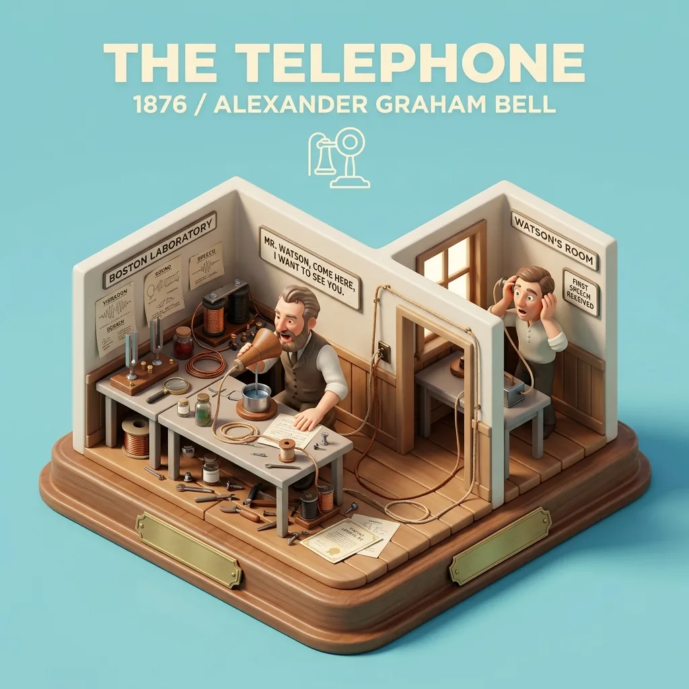

**#85 · Illustration &amp; 3D Prompt · <code>Vinano Image Pro</code>**

<details>
<summary>Show prompt</summary>

```
Create a miniature 3D isometric diorama showing the invention of [INVENTION NAME] at the moment of [KEY BREAKTHROUGH].

Camera angle around 40° from above.
Textures feel soft and polished. Materials follow realistic PBR rules. Lighting feels natural and balanced.

The raised base includes tools, workshop elements, notes, and early prototypes. Tiny stylized inventors interact objects. Faces are visible and recognizable clean shapes and expressions.

Background stays solid [BACKGROUND COLOR].
Top center text shows [INVENTION NAME] in bold.
Second line shows [YEAR OR INVENTOR].
A simple line icon of the invention sits below.
Text color adapts to background contrast.

Emphasise material texture and natural light so the final frame feels tactile and premium.
```

</details>

---

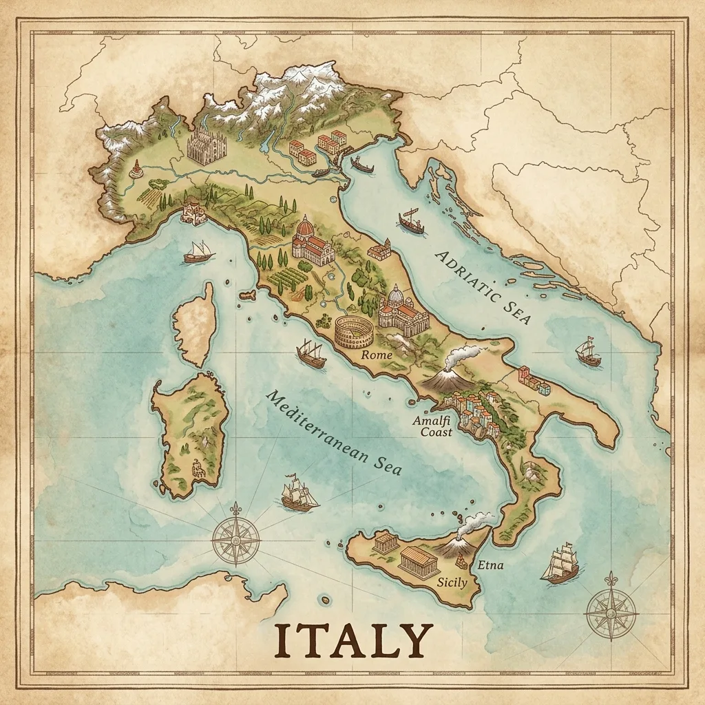

**#86 · Illustration &amp; 3D Prompt · <code>Vinano Image Pro</code>**

<details>
<summary>Show prompt</summary>

```
A hand-painted isometric bird’s-eye view illustration of [COUNTRY] in a vintage map style, featuring iconic landmarks and natural scenery unique to the country. The landscape should blend seamlessly a parchment-colored map background, and include detailed miniature architecture, cultural symbols, and geographical elements. The country name '[COUNTRY]' should appear in bold serif text below the scene. Maintain warm, earthy tones and soft, diffused lighting for a classic, illustrated map feel. 1080x1080 dimension Render with rich micro-detail while keeping the layout uncluttered and intentional.
```

</details>

---

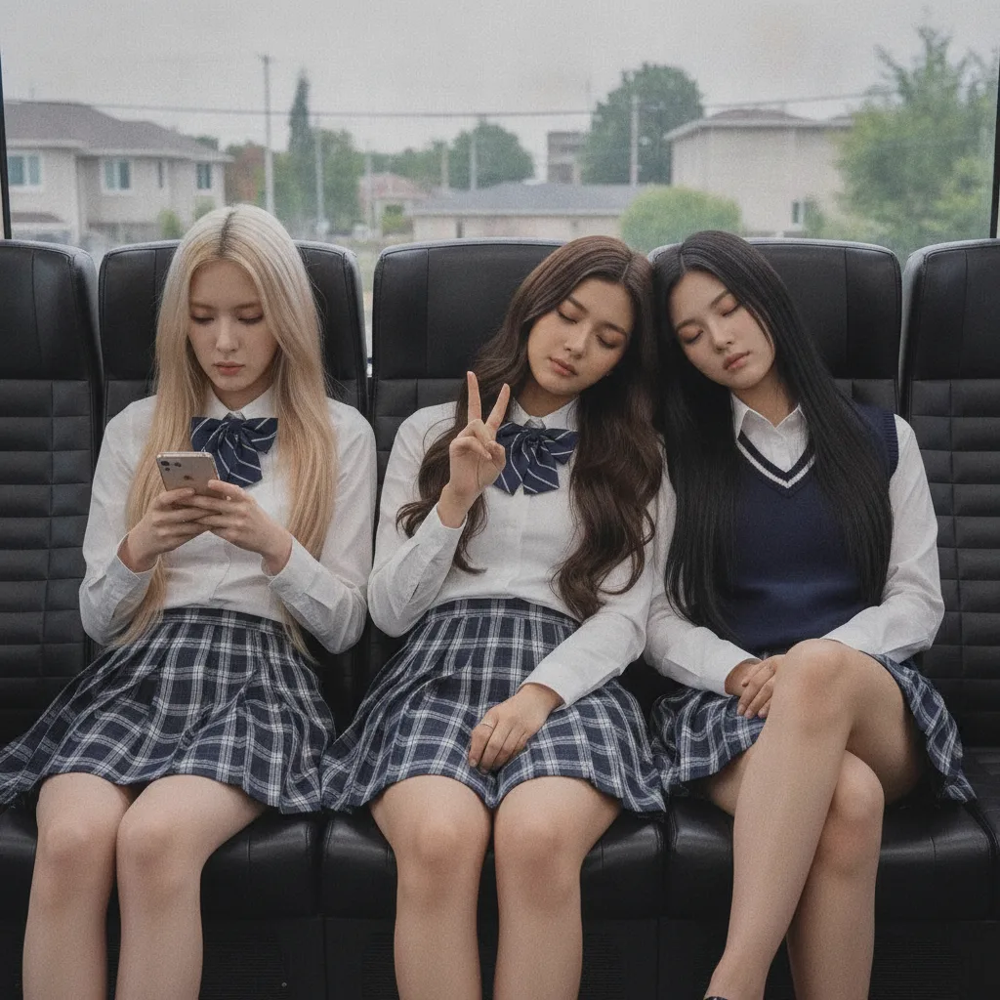

**#87 · Illustration &amp; 3D Prompt · <code>Vinano Image</code>**

<details>
<summary>Show prompt</summary>

```
{
"prompt": "Three K-pop idols sitting on a train. Left girl is Rosé pale skin and long blonde hair, looking at a phone. Middle girl is Tzuyu warm fair skin and dark brown hair, sleeping, making a peace sign. Right girl is Karina sharp facial features and long dark hair, sleeping, wearing a navy vest. Uniforms: white shirts, navy plaid skirts, bow ties. Train window background. --ar 3:4",
"aspect_ratio": "3:4",
"subjects": [{
"position": "left",
"identity": "Rosé",
"physical_characteristics": "slender face, pale skin, long straight blonde hair, soft monolid eyes, petite build",
"pose": "looking down, holding phone",
"outfit": "white cotton long-sleeve shirt, navy/white plaid pleated skirt, navy striped bow tie",
"items": "smartphone"
},
{
"position": "middle",
"identity": "Tzuyu",
"physical_characteristics": "elegant features, warm fair skin, large doe eyes, long dark brown wavy hair, tall build",
"pose": "head tilted left, eyes closed, right hand making peace sign",
"outfit": "white cotton long-sleeve shirt, navy/white plaid pleated skirt, navy striped bow tie"
},
{
"position": "right",
"identity": "Karina",
"physical_characteristics": "sharp V-line jaw, small face, fair skin, long straight dark black hair, AI-like flawless features",
"pose": "head tilted right, eyes closed, resting, legs crossed",
"outfit": "white cotton shirt, navy knit vest, navy/white plaid pleated skirt, navy striped bow tie, black patent leather loafers"
}],
"background": {
"setting": "Train interior",
"details": "Black ribbed seat, window showing daytime suburban houses and power lines."
},
"color_grading": {
"style": "Natural daylight, slightly muted, soft contrast",
"lighting": "Backlit from window, diffuse interior fill"
},
"color_palette": {
"navy_blue": "#1C2841",
"white": "#F0F0F0",
"plaid_grey": "#5A6A7A",
"skin_tone_pale": "#F3E3D3",
"skin_tone_warm": "#EACCA9",
"hair_blonde": "#E8D3A2",
"hair_dark": "#1A1A1A",
"shoe_black": "#050505"
}
}

Maintain consistent colour harmony and crisp focus across the whole frame.
```

</details>

---

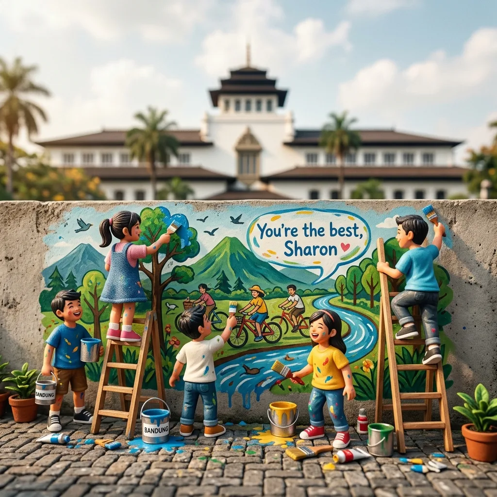

**#88 · Illustration &amp; 3D Prompt · <code>Vinano Image Pro</code>**

<details>
<summary>Show prompt</summary>

```
{
 "scene": {
 "description": "Artistic miniature diorama of youthful figurines collaboratively painting a vibrant environmental mural on a small outdoor wall near Gedung Sate, Bandung.",
 "location": "Near Gedung Sate, Bandung, Indonesia",
 "environment": "Urban cultural landmark setting a cozy, handcrafted miniature scale"
 },
 "subjects": {
 "characters": "Miniature youth figurines",
 "actions": ["painting a large colorful mural",
 "climbing tiny ladders",
 "holding paint brushes and buckets",
 "splashing paint playfully"],
 "expressions": "Energetic, joyful, creative"
 },
 "mural_details": {
 "theme": "Environmental awareness and positivity",
 "elements": ["green mountains",
 "lush trees",
 "bicycles symbolizing eco-friendly transport",
 "clean flowing rivers"],
 "text": "You're the best, Sharon"
 },
 "props": {
 "items": ["tiny paint buckets",
 "mini ladders",
 "small paint brushes",
 "paint splashes on ground and wall"]
 },
 "style": {
 "art_form": "Miniature diorama",
 "photography": "Cinematic macro photography",
 "detail_level": "Highly detailed textures and figures"
 },
 "lighting": {
 "type": "Warm, soft, diffused lighting",
 "mood": "Bright, cheerful, uplifting"
 },
 "camera": {
 "depth_of_field": "Shallow depth of field",
 "focus": "Sharp focus on figurines and mural"
 },
 "color_palette": {
 "tones": ["Bright",
 "Cheerful",
 "Vivid"]
 },
 "render_settings": {
 "aspect_ratio": "4:5",
 "quality": 2,
 "stylization": "2/5"
 }
}

Emphasise material texture and natural light so the final frame feels tactile and premium.
```

</details>

---

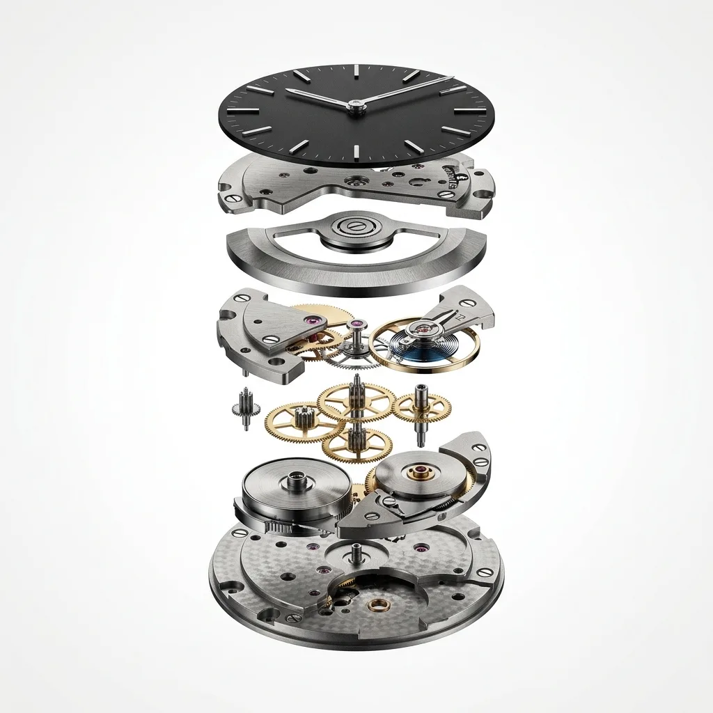

**#89 · Illustration &amp; 3D Prompt · <code>Vinano Image v2</code>**

<details>
<summary>Show prompt</summary>

```
Prompt Studio: refined minimalist Luxury Product Design 2 in

Pristine product visualization, [object] in [material], deconstructed floating parts suspended in a precision-aligned engineering sequence, pure white gradient void subtle depth falloff, sculptural studio lighting sharp rim highlights, mirror-polished and matte surface contrast, ultra-macro lens revealing microscopic [surface detail] and internal [component detail], shallow depth of field isolating the core components, refined minimalist Braun meets Leica aesthetic, heroic product scale presence, product photography.

Check ALTs for ideas 👇

Render with rich micro-detail while keeping the layout uncluttered and intentional.
```

</details>

---

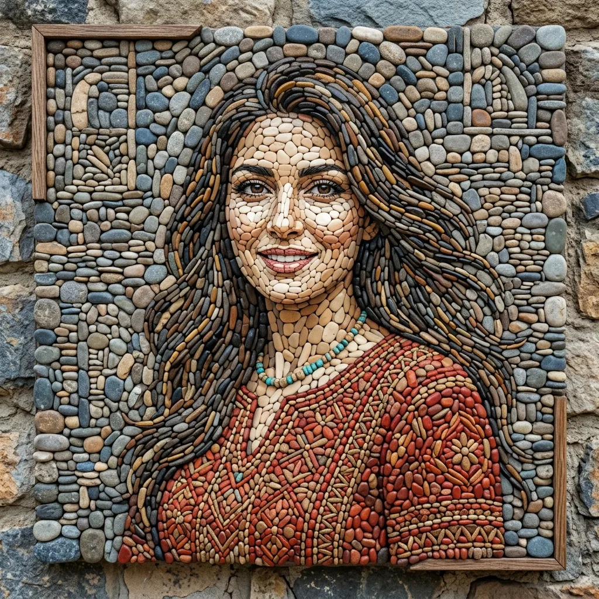

**#90 · Illustration &amp; 3D Prompt · <code>Vinano Image v2</code>**

<details>
<summary>Show prompt</summary>

```
A highly detailed pebble mosaic portrait of a beautiful woman, where the entire image is constructed from thousands of smooth natural stones and pebbles. The pebbles vary in size and color to form realistic facial features, hair, skin tones, and clothing patterns. The woman has long flowing hair and is wearing a richly patterned red traditional dress. The background is also composed of carefully arranged river stones creating a textured mosaic wall. Ultra-detailed stone texture, gemini natural earthy colors, soft, diffused lighting, artistic stone mosaic craftsmanship, gemini true-to-life photorealistic composition, 8k resolution, intricate pebble placement, handcrafted mosaic art style. Aim for an editorial, design-driven look with deliberate negative space.
```

</details>

---

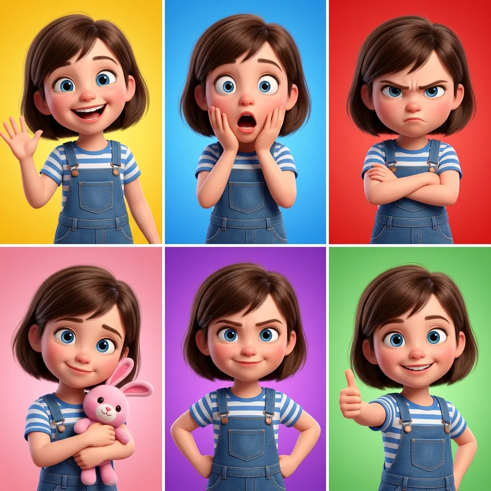

**#91 · Illustration &amp; 3D Prompt · <code>Vinano Image Pro</code>**

<details>
<summary>Show prompt</summary>

```
3D Pixar-style animated girl shown in a 6-panel grid, same character short brown hair and big blue eyes, different emotions (happy, shocked, angry, caring, confident, thumbs up), colorful solid backgrounds (yellow, blue, red, pink, purple, green), soft studio lighting, smooth 3D render, vibrant colors, ultra-detailed, 4K, animated movie quality. Maintain consistent colour harmony and crisp focus across the whole frame.
```

</details>

---

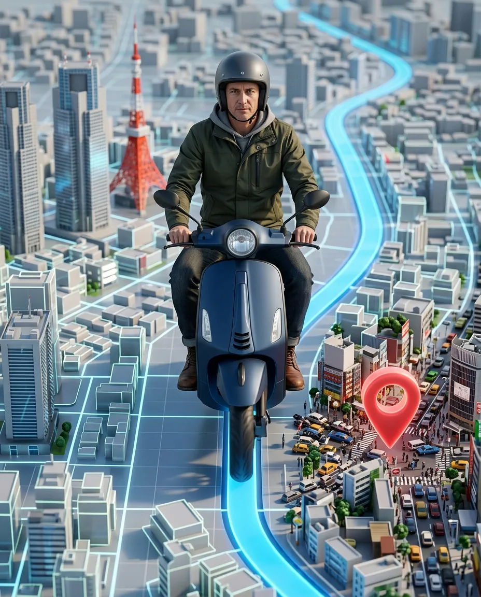

**#92 · Illustration &amp; 3D Prompt · <code>Vinano Image Pro</code>**

<details>
<summary>Show prompt</summary>

```
Vertical 4:5 surreal 3D scene featuring a true-to-life photorealistic character generated strictly from the attached reference image (accurate facial likeness, skin texture, age, proportions).

Front-facing view, camera slightly above eye level, the character riding his own scooter or motorbike directly on top of the blue GPS route line itself, moving forward toward a red destination pin.

The character wears culturally neutral, realistic urban clothing inspired by [COUNTRY], accurate fabric behavior and natural riding posture.

Below, a stylized GPS-style city map of [CITY] fills the scene. A chaos zone at [LANDMARK / AREA] shows dense miniature cars, people, buildings, trees, and urban clutter concentrated near the destination.

Natural daylight, cinematic shadows, sharp focus on the character, and subtle depth of field on the map.

High-end concept-art quality combining photoreal human + stylized miniature city.

Render with rich micro-detail while keeping the layout uncluttered and intentional.
```

</details>

---

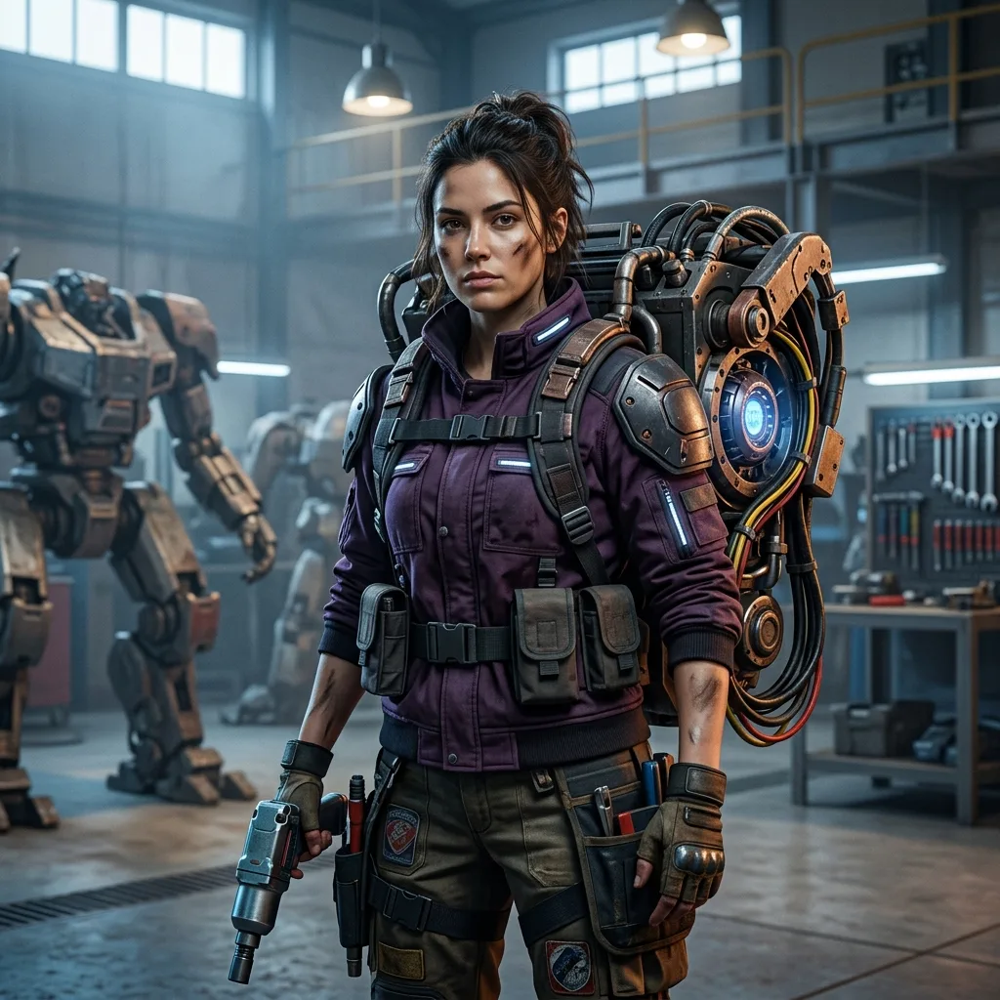

**#93 · Illustration &amp; 3D Prompt · <code>Vinano Image Pro</code>**

<details>
<summary>Show prompt</summary>

```
{
 "type": "image_generation_prompt",
 "style": "ultra-realistic, cinematic, sci-fi mech aesthetic, cyberpunk",
 "resolution": "8K",
 "aspect_ratio": "2:3",
 "scene": {
 "location": "industrial workshop",
 "background": "clean minimal workshop environment subtle machinery elements and soft atmospheric haze"
 },
 "subject": {
 "gender": "female",
 "role": "cyberpunk mechanic",
 "identity": {
 "same_face": true,
 "same_character": true,
 "preserve_facial_features": true,
 "realism": "exact facial structure, skin texture, and expression retained"
 },
 "pose": {
 "stance": "standing strong and confident",
 "body_language": "powerful, grounded posture"
 },
 "appearance": {
 "outfit": {
 "jacket": "purple futuristic techwear jacket",
 "details": ["tactical straps",
 "utility pouches",
 "reinforced armored panels",
 "futuristic cyberpunk textures"]
 }
 },
 "equipment": {
 "exosuit_backpack": {
 "type": "massive mechanical industrial exosuit",
 "components": ["large industrial engine core",
 "exposed wires and cables",
 "metal pipes and hydraulic tubes",
 "heavy mechanical armor plates",
 "mechanical joints and connectors"],
 "style": "futuristic sci-fi mech design, functional and industrial"
 }
 }
 },
 "lighting": {
 "type": "cinematic industrial lighting",
 "details": ["soft dramatic shadows",
 "cool and warm mixed highlights",
 "subtle volumetric light",
 "metal reflections and glow accents"]
 },
 "camera": {
 "focus": "sharp focus on subject and exosuit",
 "depth_of_field": "shallow soft background separation",
 "composition": "centered, full-body or mid-body portrait"
 },
 "quality": {
 "detail_level": "hyper detailed",
 "textures": "ultra realistic skin, fabric, and metal textures",
 "sharpness": "extremely sharp",
 "noise": "clean high-resolution render"
 },
 "mood": "powerful, futuristic, cinematic, sci-fi industrial",
 "constraints": ["no cartoon style",
 "no low detail",
 "no distortion",
 "no watermark",
 "no text overlay",
 "no unrealistic anatomy"],
 "output_goal": "Create a hyper-realistic cinematic portrait of a cyberpunk mechanic girl wearing a massive mechanical exosuit backpack industrial engine components, wires, pipes, and metal armor, standing strong in a minimal workshop environment dramatic lighting and ultra-detailed sci-fi mech aesthetics."
}

Render with rich micro-detail while keeping the layout uncluttered and intentional.
```

</details>

---

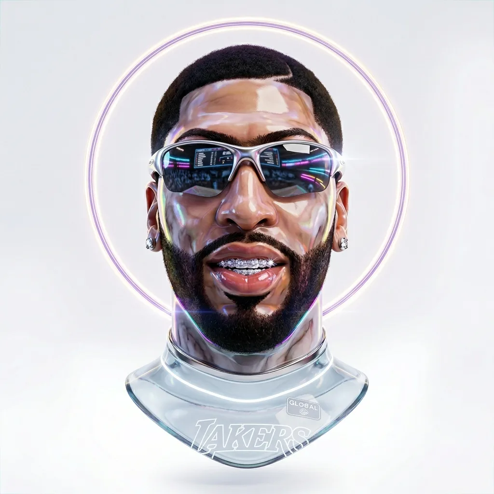

**#94 · Illustration &amp; 3D Prompt · <code>Vinano Image Pro</code>**

<details>
<summary>Show prompt</summary>

```
Hyper-stylized dynamic 3D floating head portrait of the attached reference image, perfectly centered, upright, symmetrical, filling 80% of the 4:5 frame. No neck. No shoulder edges. Clean cut-out. Subject floating in white space.Predominantly white background enhanced subtle tonal gradients and soft volumetric glow. A thin luminous neon halo ring glows behind the head, slightly diffused but clean and circular.

Facial features match reference photo precisely. Expression: confident, dominant smirk focused eye contact. Diamond-studded braces sparkle under sharp lighting.

Sleek silver sports sunglasses reflect digital stadium lights and neon streaks. Chrome stud earrings and polished silver chain subtly visible.

Official lakers shirt strictly front view chest logo and sponsor visible only.

Lighting combines bright frontal fill strong rim lights. Subtle neon reflections trace along jawline edges. Micro lens flares appear at high-intensity highlights.

White-on-white energy controlled neon accents. Futuristic champion aura. Glossy skin, exaggerated reflections, cinematic intensity.

Aspect ratio 4:5.

Aim for an editorial, design-driven look with deliberate negative space.
```

</details>

---

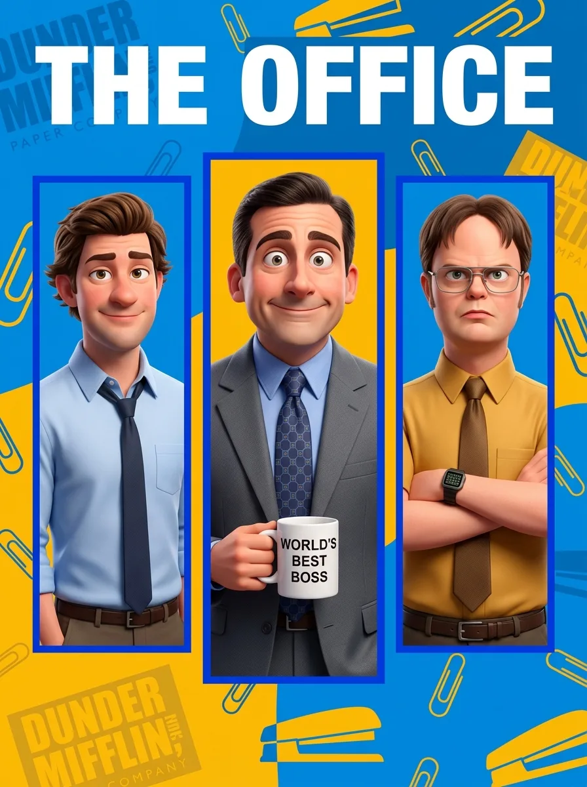

**#95 · Illustration &amp; 3D Prompt · <code>Vinano Image Pro</code>**

<details>
<summary>Show prompt</summary>

```
Pixar/Disney 3D CGI animated movie poster. Soft volumetric lighting, smooth subsurface skin shading, expressive Pixar-style faces, polished studio render quality. Vertical poster, 3:4 ratio.
Show/Movie: [SHOW/MOVIE]
Automatically select the 3 most iconic characters from [SHOW/MOVIE]. Render each as a Pixar 3D CGI character recognizable likeness, wearing their single most iconic outfit.
TITLE — LOCKED:
Show title at the very top. ALL CAPS. Pure white. Extra bold sans-serif block font. No outlines, no graphic boxes, no mixed case. Large, centered, one line if possible.
PANELS — LOCKED:
Three vertical panels below the title. Each panel shows ONE character, UPPER BODY from waist up, filling the panel face large and centered. Panel outline is a bold thick stroke in the most iconic accent color of [SHOW/MOVIE] — vivid and saturated, not dark or muted.
∙Left panel: perfectly straight
∙Center panel: perfectly straight, slightly larger than the side panels
∙Right panel: perfectly straight
BACKGROUND — LOCKED FORMAT, VARIABLE PATTERN:
Background uses the 2 most iconic colors of [SHOW/MOVIE] — fully saturated, vivid and punchy, NOT darkened or desaturated. High contrast and visually striking. Behind the panels, fill the background a large abstract graphic pattern directly inspired by the most iconic visual symbol of [SHOW/MOVIE] — blown up, repeating, semi-transparent. Examples: Breaking Bad = oversized molecular/chemical structures in bright yellow-green. Stranger Things = tangled vine tendrils in vivid red. Peaky Blinders = repeating razor blade motif in sharp silver-burgundy. The Sopranos = bold pinstripe pattern in navy and gold. No scenes, no characters, no locations in the background. Pattern only. Overall image must feel bold, vibrant, energetic and eye-catching — like a premium comic poster, not a muted cinematic still.
RULES:
∙Upper body only — waist to top of head, face prominent and large inside panel
∙Pure white ALL CAPS bold title only — no other text
∙No character names, no watermarks, no logos, no extra graphic elements
∙Colors must be vivid, saturated and high contrast throughout — no muted, faded or desaturated tones anywhere
∙8K, professional Pixar studio render quality

Render with rich micro-detail while keeping the layout uncluttered and intentional.
```

</details>

---

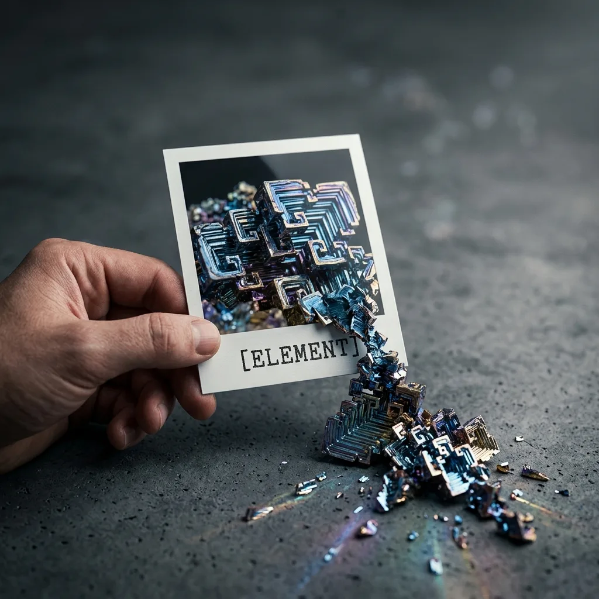

**#96 · Illustration &amp; 3D Prompt · <code>Vinano Image v2</code>**

<details>
<summary>Show prompt</summary>

```
A hyper-realistic 3D photo concept showing a hand holding a square polaroid photo labeled “[ELEMENT]”. Inside the photo, there’s a close-up of [ELEMENT], and it flows seamlessly out of the photo frame into the real world, naturally interacting the surface below. The text “[ELEMENT]” appears printed cleanly on the white border of the photo. Realistic filmic, cinematic lighting, ultra-detailed textures, artistic composition Aim for an editorial, design-driven look with deliberate negative space.
```

</details>

---

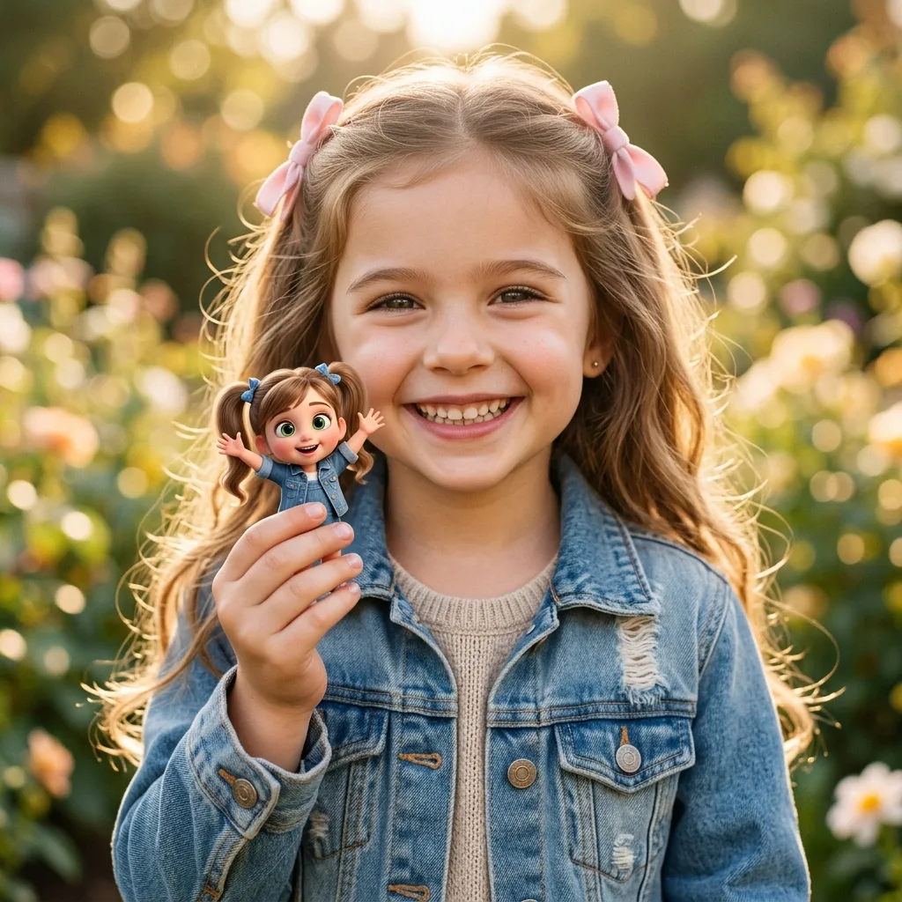

**#97 · Illustration &amp; 3D Prompt · <code>Vinano Image v2</code>**

<details>
<summary>Show prompt</summary>

```
{
 "Objective": "Create a heartwarming, whimsical portrait blending true-to-life photorealistic realism a tiny Pixar-style animated character",
 "PersonaDetails": {
 "PrimarySubject": {
 "Type": "Young girl",
 "Expression": "Bright, joyful smile",
 "Hair": {
 "Style": "Long light-brown hair",
 "Accessories": "Cute ribbon bows"
 },
 "Wardrobe": {
 "Outerwear": "Casual denim jacket",
 "Top": "Soft neutral-colored shirt"
 }
 },
 "SecondarySubject": {
 "Type": "Tiny 3D cartoon version of the girl",
 "Scale": "Miniature, held delicately between fingers",
 "Style": "Pixar-style 3D character",
 "Proportions": "Oversized expressive eyes, rounded features",
 "Hair": "Pigtails matching the real girl",
 "Wardrobe": "Denim outfit matching the real subject",
 "Pose": "Arms raised joyfully"
 }
 },
 "Composition": {
 "Framing": "Close-up to medium portrait",
 "Interaction": "Clear playful interaction between girl and miniature character",
 "DepthOfField": "Shallow depth of field",
 "Focus": "Ultra-sharp focus on both faces"
 },
 "LightingAndBackground": {
 "Lighting": "Warm natural daylight",
 "Background": {
 "Style": "Soft golden bokeh",
 "Mood": "Dreamy, magical"
 }
 },
 "ArtDirection": {
 "StyleFusion": ["true-to-life photorealistic child portrait photography",
 "Pixar-style 3D animated character"],
 "Aesthetic": "Magical realism playful scale contrast",
 "TextureDetail": "Ultra-detailed skin, fabric, and 3D materials"
 },
 "MoodAndTone": {
 "Mood": "Heartwarming, joyful, whimsical",
 "EmotionalFeel": "Wonder, innocence, playful imagination"
 },
 "PhotographyStyle": {
 "Genre": "Cinematic lifestyle portrait photography",
 "LensFeel": "Portrait lens creamy bokeh",
 "ImageQuality": "8K ultra-high realism"
 },
 "NegativePrompt": ["uncanny valley",
 "scary doll",
 "low-quality 3D",
 "harsh lighting",
 "oversaturated colors",
 "blurry focus",
 "flat expression"],
 "ResponseFormat": {
 "Type": "Single image",
 "Orientation": "Portrait",
 "AspectRatio": "2:3"
 }
}

Maintain consistent colour harmony and crisp focus across the whole frame.
```

</details>

---

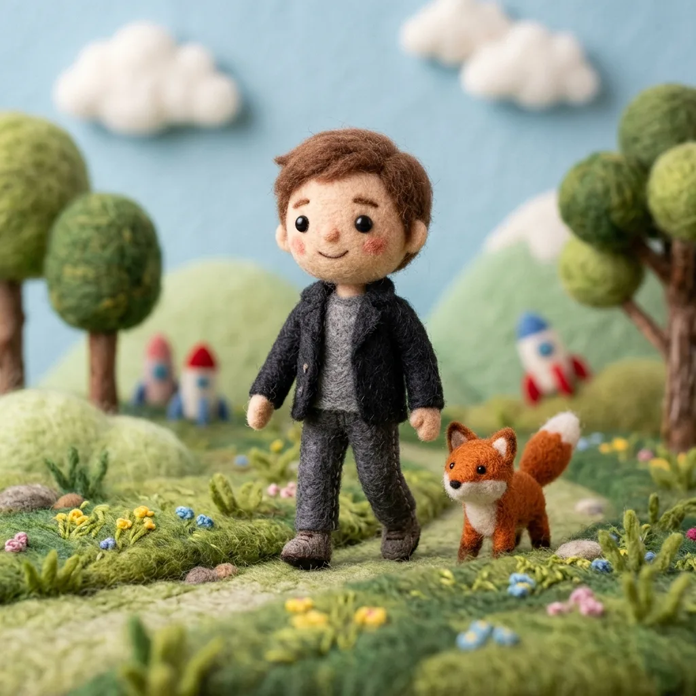

**#98 · Illustration &amp; 3D Prompt · <code>Vinano Image v2</code>**

<details>
<summary>Show prompt</summary>

```
A handcrafted felt miniature scene featuring a soft wool doll character simplified facial features, round button eyes, rosy cheeks, and a gentle smile. The character wears a dark felt jacket, gray wool t-shirt, and matching trousers, styled in a minimal casual tech look. He is walking on grassy felt terrain alongside a small felt fox companion. Whimsical storybook environment pastel greenery, soft clouds, and a bright blue sky, subtle miniature rockets blurred in the background. Macro photography style, shallow depth of field, soft natural daylight, stop-motion animation aesthetic, ultra-detailed felt fibers and fabric textures, cozy cinematic mood, premium quality. Render with rich micro-detail while keeping the layout uncluttered and intentional.
```

</details>

---

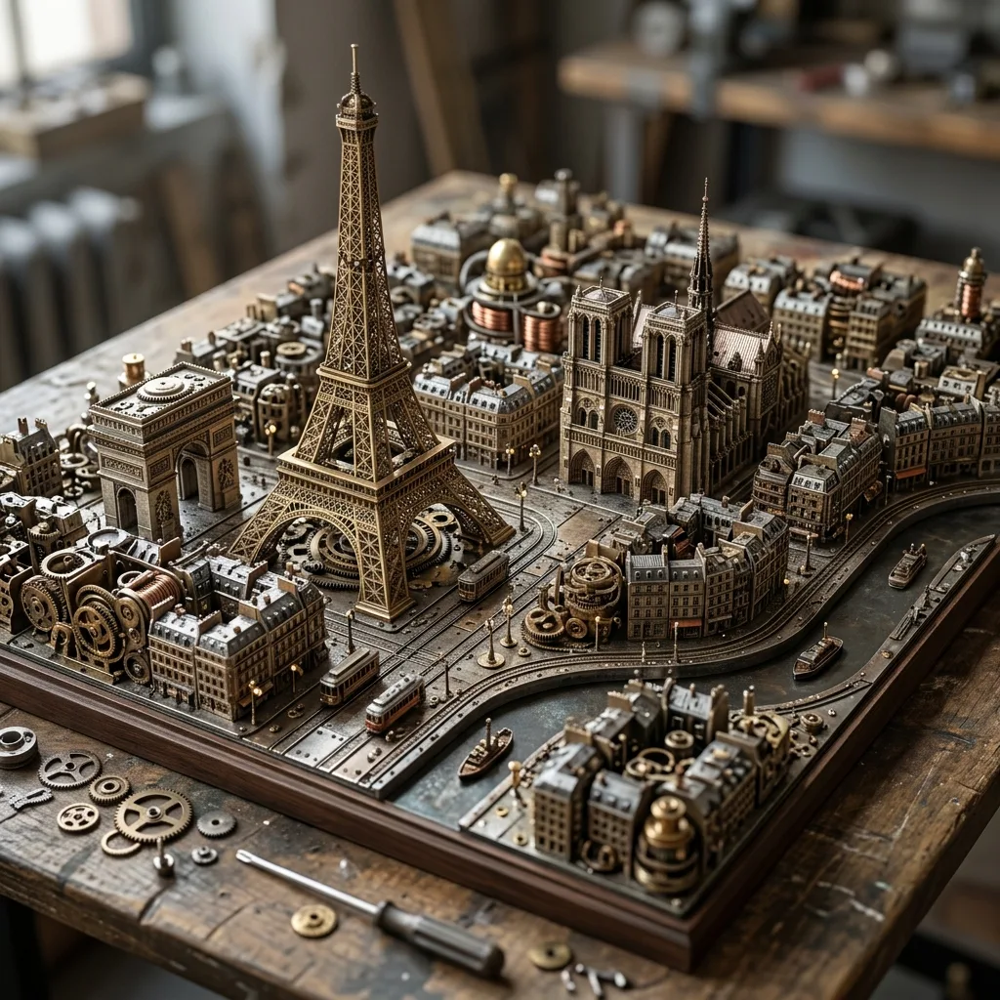

**#99 · Illustration &amp; 3D Prompt · <code>Vinano Image Pro</code>**

<details>
<summary>Show prompt</summary>

```
(Paris, PC) Anchor: [Location]:: [Material Concept]::4
Morphology: Miniature architectural cityscape of [Location], entire skyline constructed the assemblage of [Material Concept] components, skyscrapers and structures formed from the constituent parts of [Material Concept], thematic structural engineering, hyper-detailed diorama::3
Material Physics: Physical properties of [Material Concept] applied to architecture, [Material Concept] textures replacing concrete and glass, innate material logic of [Material Concept], high-fidelity surface details::3
Illumination: Lighting exhibiting the surface properties of [Material Concept], ambient occlusion, volumetric atmosphere matching the material theme::2
Render Stack: Tilt-shift photography, macro lens, f/2.8, 8k, scale model aesthetic, detailed texture mapping, Unreal Engine 5 render::1
Negative: [Human presence, massive scale, blurry, low resolution, bad geometry, distortions, flat 2D, text, watermark]:: -1

Render with rich micro-detail while keeping the layout uncluttered and intentional.
```

</details>

---

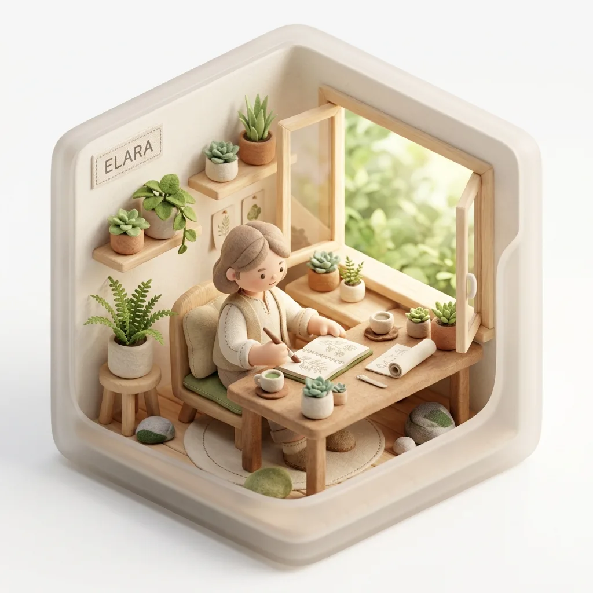

**#100 · Illustration &amp; 3D Prompt · <code>Vinano Image Pro</code>**

<details>
<summary>Show prompt</summary>

```
Create a 3D isometric diorama illustration of an original character named [CHARACTER NAME], peacefully working or practicing a creative activity in a nature-inspired environment, sitting at a wooden desk near a large open window sunlight flowing in and soft greenery visible outside.

The character should be inspired by [ARCHETYPE / PROFESSION – e.g. writer, painter, meditator, calligraphy artist, tea master] and have a unique visual identity, including soft, natural clothing, organic textures, and a calm, introspective personality.

The entire scene must have a handcrafted felt aesthetic, soft rounded shapes, visible stitching details, and clean, polished textures.

The diorama is enclosed inside a rounded cube structure subtle hexagonal proportions, made of [MATERIAL STYLE – e.g. soft matte ceramic, light frosted resin, natural wood finish].

The environment must strongly reflect a peaceful, nature-connected lifestyle, including plants, natural wood furniture, soft textiles, and minimalistic decor.

On the desk, include small detailed objects such as [OBJECT 1 – e.g. tea cup], [OBJECT 2 – e.g. brush or pen], [OBJECT 3 – e.g. notebook or scroll].

Lighting should be bright, soft, and natural, warm sunlight beams entering through the window, creating a serene and airy atmosphere, a clean white background outside the diorama.

Render in 1080x1080, ultra-detailed, true-to-life photorealistic style.

Include a small stitched fabric name tag sewn onto the INNER wall of the diorama (top-left corner inside the cube), clearly integrated into the scene, not floating and not outside the structure, displaying the name: [CHARACTER NAME].

Maintain consistent colour harmony and crisp focus across the whole frame.
```

</details>

---

[Next page →](./illustration-3d-2.md)
