# Photography — full gallery

[← Back to README](../README.md) · [`prompts.json`](../prompts/prompts.json) · **630** prompts · page 2 / 7

[← Prev](./photography.md) — [1](./photography.md) · **2** · [3](./photography-3.md) · [4](./photography-4.md) · [5](./photography-5.md) · [6](./photography-6.md) · [7](./photography-7.md) — [Next →](./photography-3.md)

---

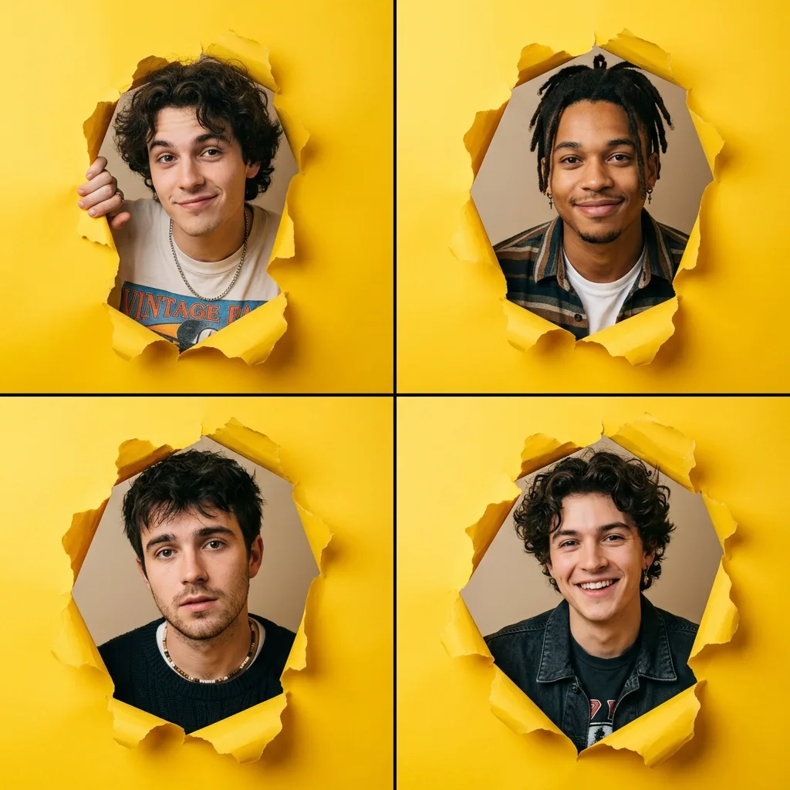

**#101 · Photography Prompt · <code>Vinano Image Pro</code>**

<details>
<summary>Show prompt</summary>

```
A high-resolution 2x2 grid collage of four individual portraits. In each square, a different young man peeks through a jagged, ripped hole in bright yellow seamless paper. The subjects have a 1990s indie-pop aesthetic diverse hairstyles, including messy curls and dreadlocks. The lighting is soft and even, typical of a professional studio photoshoot. The color palette is dominated by the vibrant yellow paper against a neutral beige background visible through the tears. Cinematic quality, sharp focus, 8k resolution, editorial photography style.
Key Elements Breakdown
If you want to tweak the result, here are the specific descriptors that make this style work:

Composition: 2x2 grid collage, quad split screen, peeking through a hole.
Main Prop: torn yellow construction paper, jagged ripped edges, seamless paper background.
Subject Style: Gen Z fashion, indie band aesthetic, 90s grunge-lite, youthful expressive faces.
Technical Specs: flat lighting, low depth of field, clean studio photography, vibrant saturation.

Maintain consistent colour harmony and crisp focus across the whole frame.
```

</details>

---

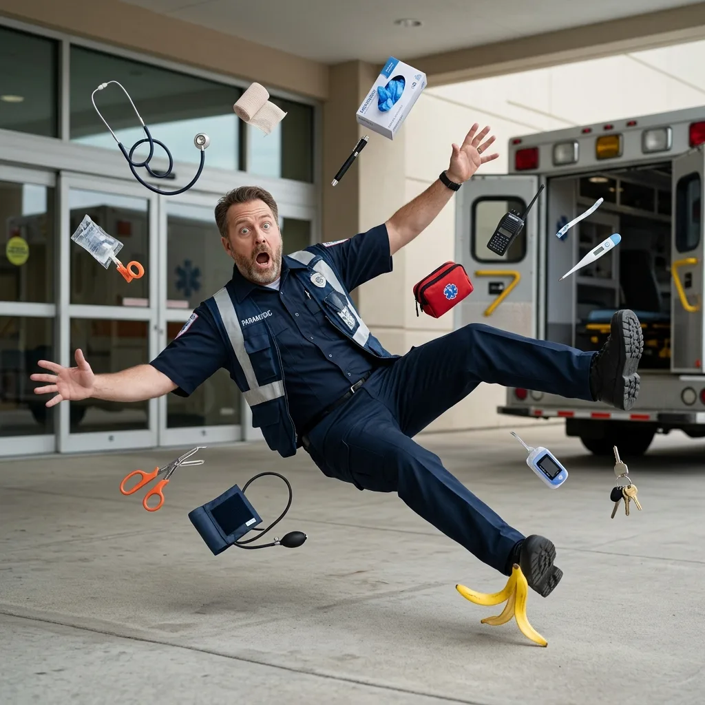

**#102 · Photography Prompt · <code>Vinano Image v2</code>**

<details>
<summary>Show prompt</summary>

```
8K Ultra true-to-life photorealistic cinematic freeze-frame of a {PROFESSION} slipping on a banana peel, mid-air fall exaggerated shock expression, arms and legs extended. Preserve identity exactly. 10–15 clear {PROFESSION}-related objects floating naturally clean spacing. Realistic environment matching the profession. Eye-level, full-body, natural lighting, realistic shadows. Style: cinematic, meme-like, controlled chaos. Avoid distortion, clutter, unrelated objects, bad lighting. Emphasise material texture and natural light so the final frame feels tactile and premium.
```

</details>

---

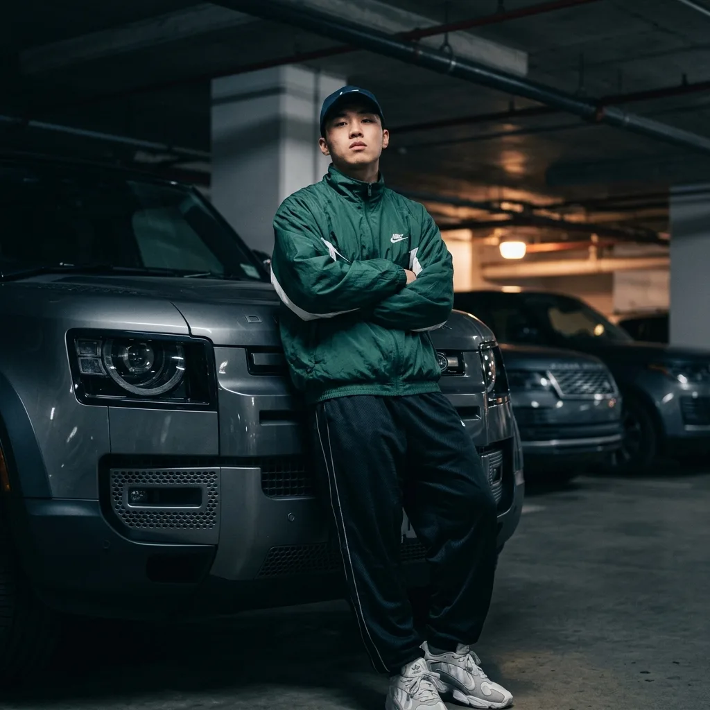

**#103 · Photography Prompt · <code>Vinano Image v2</code>**

<details>
<summary>Show prompt</summary>

```
Hyper-realistic low-angle closeup front shot of a young man use image uploaded leaning against a Land Rover Defender in a dim basement garage.

Wearing oversized Nike wind cheater, baggy basketball pants, Adidas chunky sneakers, basketball cap. Hands crossed, attitude gaze. Luxury SUVs softly blurred cinematic bokeh, shallow depth of field, strong subject separation, and 8K cinematic color grading.

Aim for an editorial, design-driven look with deliberate negative space.
```

</details>

---

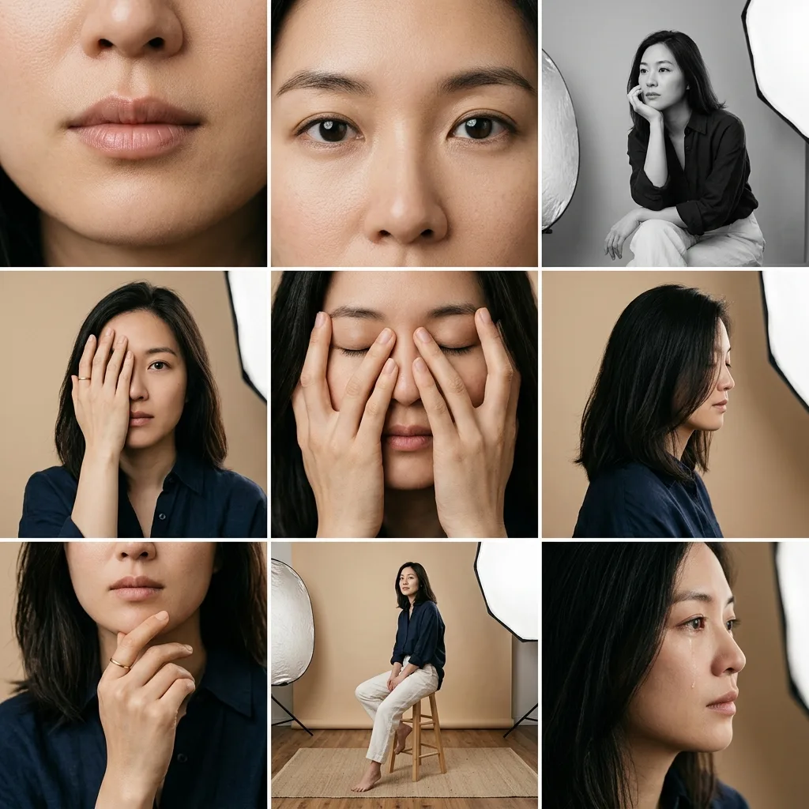

**#104 · Photography Prompt · <code>Vinano Image Pro</code>**

<details>
<summary>Show prompt</summary>

```
在柔和米色的工作室内，构建3x3精细编辑照片网格

角色穿深蓝轻薄衬衫，米白长裤，赤脚展现原始质感

灯光设计：
前右大面积柔光，左侧银反光板，顶部微弱轮廓光。

9组精细镜头构图：
1.85mm f/1.8极致唇部特写
2.眼睛对镜特写
3.黑白下巴支撑肖像
4.半遮半露肖像
5.手覆面部特写
6.发丝遮眼构图
7.手部触下巴细节
8.半身侧坐姿势
9.带泪水的侧脸电影感

追求杂志编辑式的设计感，刻意安排留白与视觉重心。
```

</details>

---

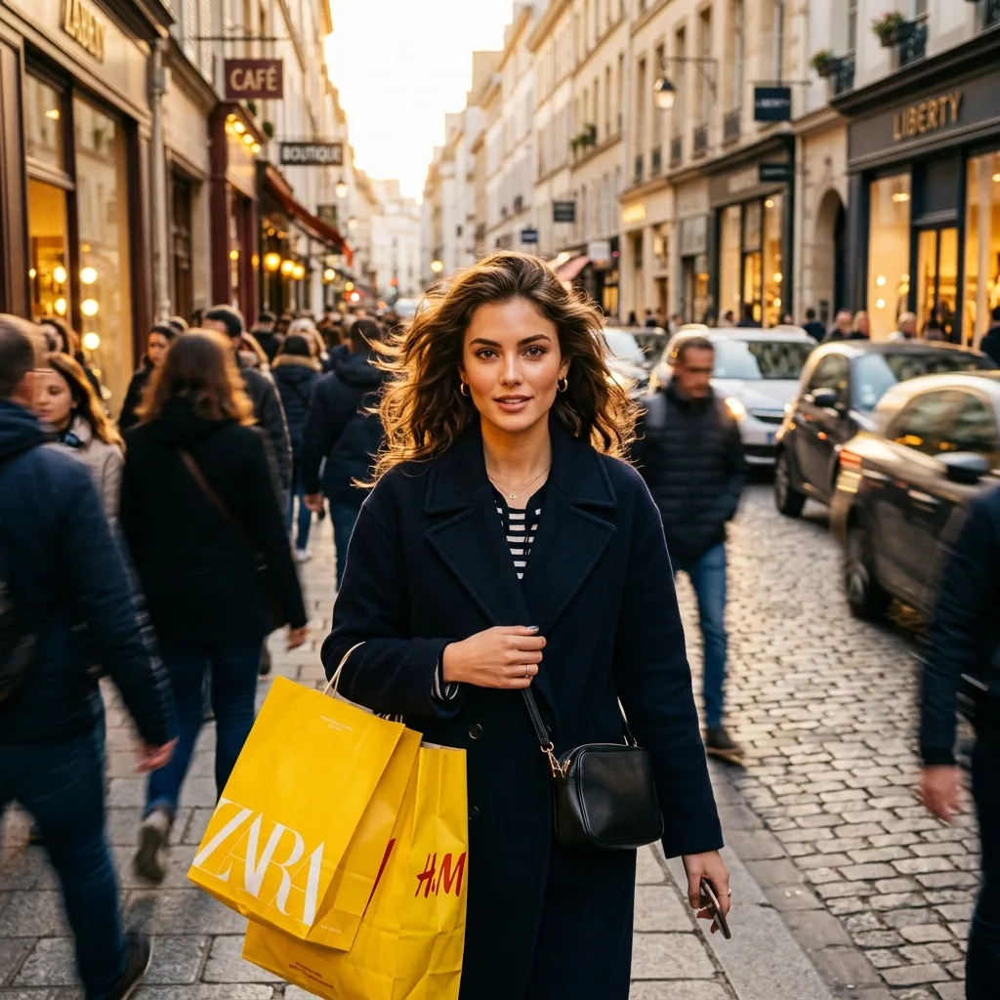

**#105 · Photography Prompt · <code>Vinano Image v2</code>**

<details>
<summary>Show prompt</summary>

```
Cinematic street portrait of a young woman walking through a busy shopping street at golden hour, holding bright yellow shopping bags, wind-blown wavy hair, soft natural makeup, intense eye contact camera, shot from a slightly low angle close-up, dynamic motion blur in the background crowd, sharp focus on face, warm sunlight casting dramatic highlights and shadows, urban European architecture, shallow depth of field, 35mm lens, f/1.8, high contrast, rich warm tones, editorial fashion photography style, ultra-realistic, 8k. Preserve realistic proportions and depth for a confident, professional finish.
```

</details>

---

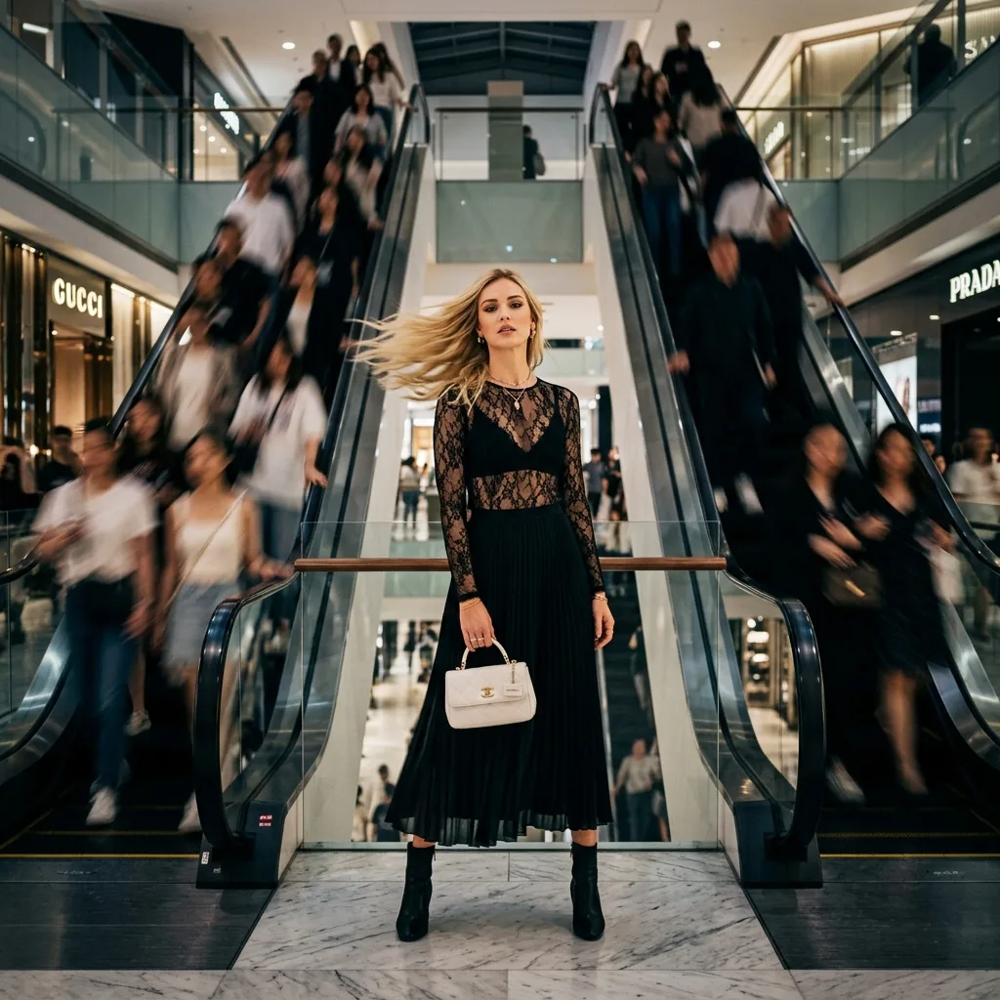

**#106 · Photography Prompt · <code>Vinano Image v2</code>**

<details>
<summary>Show prompt</summary>

```
Ultra-realistic cinematic fashion photograph of a stylish blonde woman standing confidently between two moving escalators inside a luxury shopping mall, wearing a sheer black lace long-sleeve top and flowing skirt, holding a small white designer handbag, her hair dramatically blowing sideways as if caught in motion, blurred crowd moving up and down the escalators creating dynamic motion streaks around her, she remains sharp and perfectly focused in the center, dramatic fashion editorial lighting, shallow depth of field, high contrast, Vogue magazine style, motion blur photography, symmetrical escalator composition, luxury mall interior, 85mm lens, f/1.8, ultra detailed, film grain, cinematic color grading. Aim for an editorial, design-driven look with deliberate negative space.
```

</details>

---

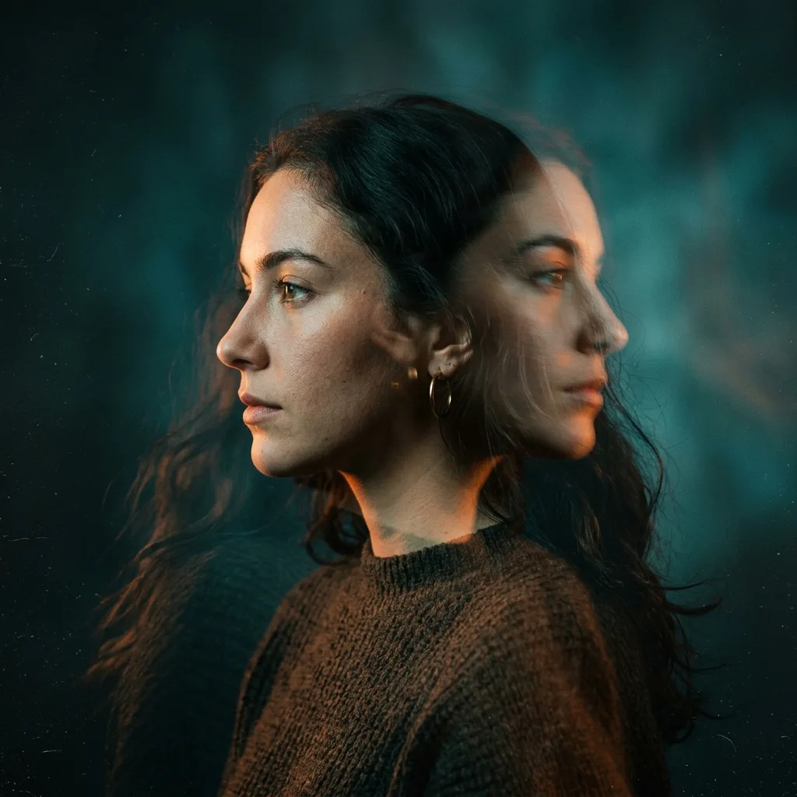

**#107 · Photography Prompt · <code>Vinano Image v2</code>**

<details>
<summary>Show prompt</summary>

```
Cinematic double exposure portrait of a woman in side profile, two overlapping faces slightly offset, teal and orange moody lighting, soft motion blur, dark minimal background, high contrast, studio photography, dreamy atmosphere, ultra-realistic skin texture, shallow depth of field, 85mm lens, dramatic fine art portrait, volumetric lighting. 🎨 Emphasise material texture and natural light so the final frame feels tactile and premium.
```

</details>

---

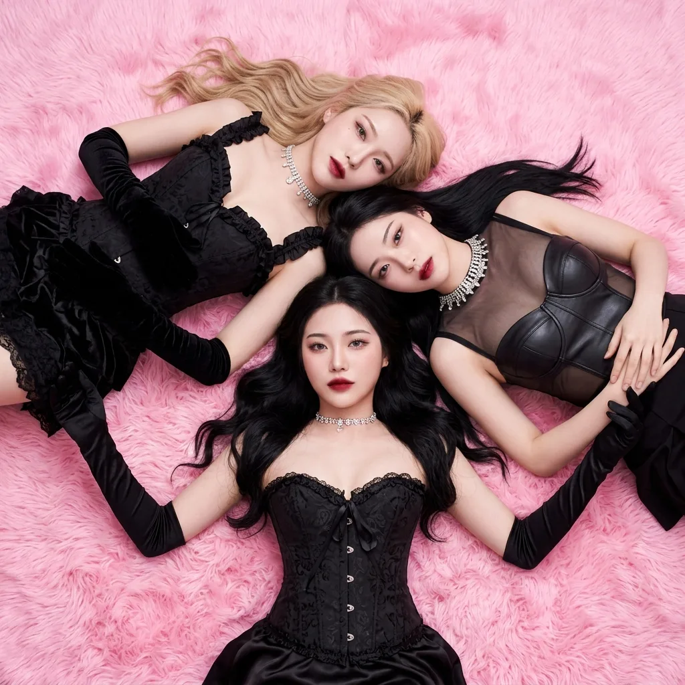

**#108 · Photography Prompt · <code>Vinano Image Pro</code>**

<details>
<summary>Show prompt</summary>

```
{
 "scene_description": "Three young women lying down on a textured surface. The bodies are intertwined in a triangular composition.",
 "background": "Plush, high-pile bright pink faux fur rug or fabric.",
 "subject_details": {
 "demographics": "Three young Asian women (K-pop idol aesthetic), pale skin tones.",
 "styling_theme": "Gothic Lolita / Dark Coquette / Black on Pink.",
 "makeup": "Consistent across all three: dark red gradient lips, soft smoky eye makeup, defined brows.",
 "subject_1_top": {
 "position": "Lying horizontally at the top.",
 "hair": "Blonde, long wavy hair.",
 "outfit": "Black corset top ruffled straps, black velvet opera gloves, crystal choker necklace."
 },
 "subject_2_middle_right": {
 "position": "Lying diagonally below Subject 1, head resting near Subject 1's shoulder.",
 "hair": "Black, long straight hair.",
 "outfit": "Black leather/latex bustier top sheer mesh panel, crystal collar necklace."
 },
 "subject_3_bottom_center": {
 "position": "Lying vertically in the foreground, head resting near Subject 2's chest.",
 "hair": "Black, long wavy hair.",
 "outfit": "Black brocade corset lace trim, black opera gloves, black satin skirt, crystal choker.",
 "pose": "Arms extended upwards and outwards, framing the composition."
 }
 },
 "exact_pose_anatomical": {
 "viewpoint": "Bird's-eye view (Directly overhead).",
 "heads": "All three faces are angled upwards towards the camera lens.",
 "eyes": "Direct eye contact from all subjects.",
 "limbs": "Arms are positioned to create leading lines; Subject 3's gloved arms reach up towards the other two."
 },
 "camera_technical_values": {
 "angle": "90-degree Top Down.",
 "focal_length": "50mm (Standard lens to capture the group without wide-angle distortion).",
 "aperture": "f/5.6 (To ensure all three faces, which are on slightly different planes, are in sharp focus).",
 "shutter_speed": "1/125s (Studio setting).",
 "iso": "ISO 100 (Clean image quality).",
 "framing": "Tight framing, filling the canvas the subjects and the pink texture."
 },
 "lighting_setup": {
 "type": "Soft Studio Lighting (Beauty Dish or Softbox).",
 "direction": "Frontal/Overhead (relative to the camera).",
 "quality": "Even, shadowless illumination on the faces ('Butterfly lighting').",
 "contrast": "High contrast between the jet-black outfits and the bright pink background/pale skin.",
 "highlights": "Soft specular highlights on the black leather and latex textures."
 }
}

Preserve realistic proportions and depth for a confident, professional finish.
```

</details>

---

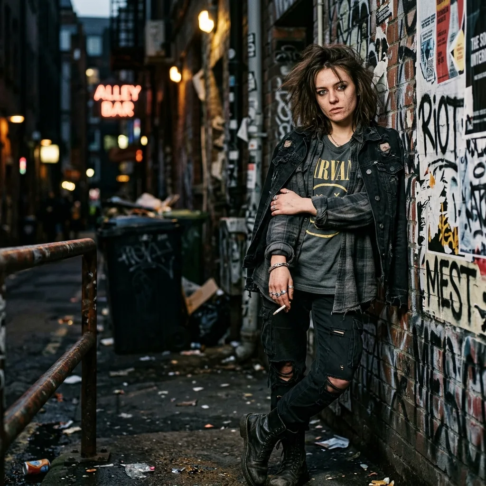

**#109 · Photography Prompt · <code>Vinano Image v2</code>**

<details>
<summary>Show prompt</summary>

```
A high-detail photograph of a defiant woman posing nonchalantly. She has a messy aesthetic, wearing oversized grunge clothing. The background is a cluttered, dimly lit urban environment. Technical details: 85mm focal length, sharp focus on eyes, filmic, cinematic lighting, true-to-life photorealistic textures, 8k resolution, gritty atmosphere Preserve realistic proportions and depth for a confident, professional finish.
```

</details>

---

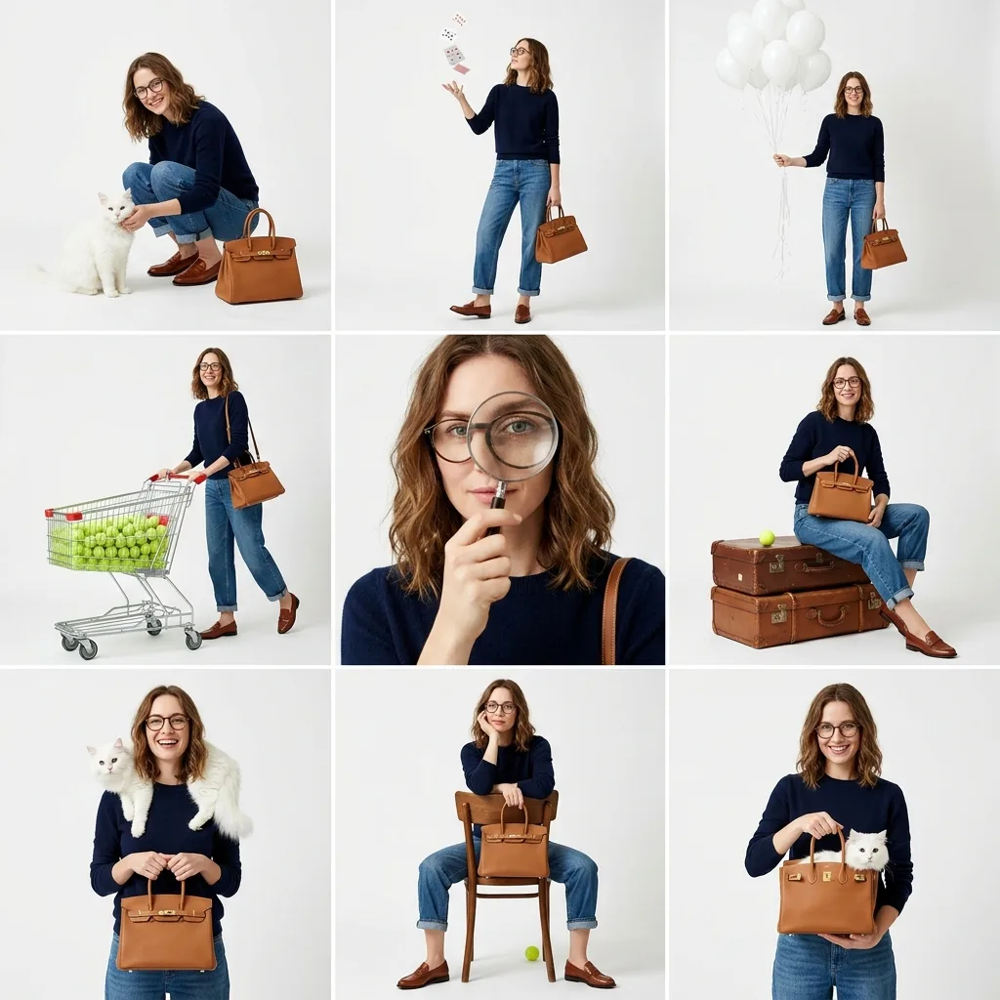

**#110 · Photography Prompt · <code>Vinano Image Pro</code>**

<details>
<summary>Show prompt</summary>

```
studio fashion collage, 3x3 grid layout, same subject repeated in different poses across all panels, clean seamless white background, soft diffused studio lighting, refined minimalist aesthetic, playful editorial storytelling
subject styled in smart casual outfit (navy sweater, relaxed denim, glasses, polished shoes), holding and interacting a structured luxury handbag as the central prop, quirky narrative scenes in each frame:
top row — crouching and interacting a white cat beside handbag, tossing playing cards mid-air while holding bag, standing holding a bunch of white balloons
middle row — pushing a shopping cart filled bright tennis balls, close-up portrait a magnifying glass toward camera, sitting on stacked vintage suitcases holding handbag a tennis ball
bottom row — standing cat draped over shoulders holding bag, sitting backwards on a wooden chair tennis ball under chair, standing pose cat sitting inside handbag
consistent styling across all frames, balanced composition, symmetrical spacing, editorial grid layout, subtle humor and surreal elements, crisp sharp focus, high fashion campaign vibe, true-to-life photorealistic, ultra clean shadows, 50mm lens look, f2.0

Preserve realistic proportions and depth for a confident, professional finish.
```

</details>

---

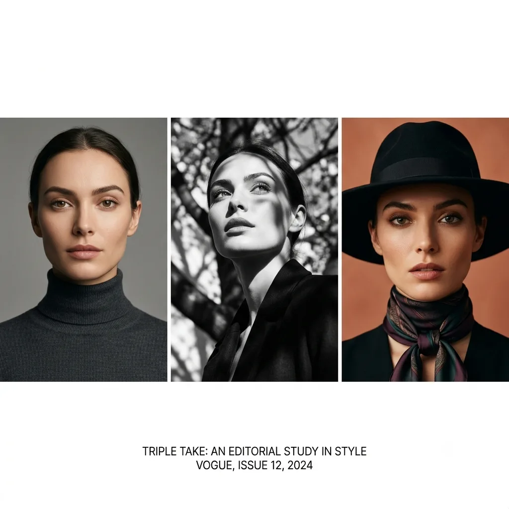

**#111 · Photography Prompt · <code>Vinano Image Pro</code>**

<details>
<summary>Show prompt</summary>

```
{
 "type": "image_generation_prompt",
 "style": "ultra-realistic editorial fashion photography, Vogue-style",
 "resolution": "8K HDR",
 "aspect_ratio": "3:1",
 "composition": {
 "layout": "3x1 horizontal grid",
 "description": "three-panel editorial portrait composition featuring the same person in different artistic styles",
 "symmetry": "balanced spacing and clean alignment across all panels"
 },
 "identity_preservation": {
 "gender": "female",
 "use_reference_image": true,
 "strict_identity_lock": true,
 "notes": "Maintain the exact facial features, skin tone, hair type, and natural proportions from the uploaded reference photo."
 },
 "panels": [{
 "position": "left",
 "style": "studio portrait",
 "environment": {
 "background": "neutral refined minimalist studio backdrop"
 },
 "lighting": "soft studio lighting cinematic face illumination",
 "clothing": "refined minimalist black or neutral turtleneck",
 "expression": "calm and confident",
 "focus": "sharp focus on the face shallow depth of field",
 "color_grading": "magazine-quality tones"
 },
 {
 "position": "center",
 "style": "black and white artistic portrait",
 "environment": {
 "location": "outdoor setting",
 "background": "tree shadows and natural light patterns"
 },
 "camera_angle": "dynamic upward angle",
 "lighting": "natural sunlight creating dramatic contrast",
 "expression": "elegant and dramatic",
 "color_mode": "monochrome black and white",
 "focus": "high detail on facial structure and hair"
 },
 {
 "position": "right",
 "style": "fashion close-up",
 "environment": {
 "background": "soft warm-toned backdrop"
 },
 "accessories": ["wide fashionable hat or elegant scarf"],
 "lighting": "soft warm lighting enhancing facial features",
 "details": "delicate fabric textures and sharp detail on eyes and skin",
 "expression": "stylish, confident, slightly intense"
 }],
 "visual_style": {
 "aesthetic": "high-end fashion editorial",
 "lighting": "filmic, cinematic lighting across panels",
 "depth_of_field": "shallow",
 "textures": "true-to-life photorealistic skin and fabric textures",
 "color_transition": "smooth transitions between frames",
 "finish": "glossy magazine look"
 },
 "constraints": ["no facial alterations",
 "no cartoon style",
 "no distortions",
 "no watermark",
 "no text overlays"],
 "output_goal": "Create a cohesive 3x1 editorial portrait grid of the same woman in three distinct fashion photography styles ultra-realistic detail and filmic, cinematic lighting."
}

Keep edges clean and the overall composition balanced for a polished, gallery-ready result.
```

</details>

---

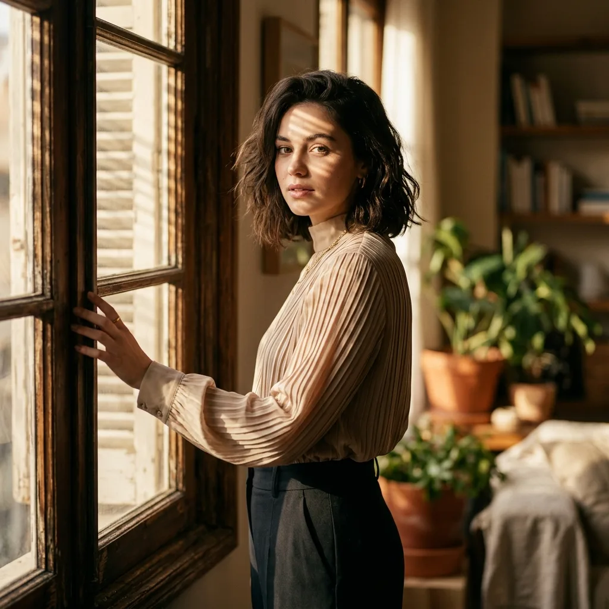

**#112 · Photography Prompt · <code>Vinano Image v2</code>**

<details>
<summary>Show prompt</summary>

```
A high-fashion editorial portrait of a young woman standing by a large, rustic wooden window. She is captured in a candid, over-the-shoulder gaze, looking directly into the camera a soft, natural expression. One hand is gently resting on the window frame.

​Lighting & Atmosphere:

The scene is defined by golden hour sunlight streaming through the window, creating a dramatic "blind shadow" or shutter-effect across her face and blouse. The lighting is warm and high-contrast, a hazy, ethereal atmosphere that emphasizes a quiet, "Film Noir" mood in a modern setting.

​Wardrobe & Style:

She is wearing a translucent, pleated silk chiffon blouse in a muted champagne tone. The fabric is light and airy, catching the backlighting to create a soft glow. Her hair is styled in a tousled, effortless bob natural texture.

​Technical Specifications:

​Lens: Shot on 85mm f/1.4 for a shallow depth of field.

​Focus: Sharp focus on the eyes a creamy, soft bokeh background featuring indoor plants and warm interior tones.

​Quality: 8K resolution, cinematic color grading, fine grain, professional photography.

Aim for an editorial, design-driven look with deliberate negative space.
```

</details>

---

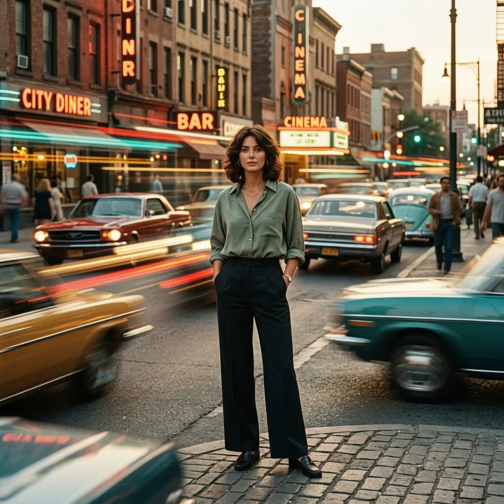

**#113 · Photography Prompt · <code>Vinano Image v2</code>**

<details>
<summary>Show prompt</summary>

```
{
 "image_generation_prompt": {
 "subject": {
 "description": "Stylish woman",
 "expression": "calm and confident",
 "pose": "standing still, hands in pockets",
 "attire": {
 "top": "loose sage-green button-up shirt, tucked in",
 "bottom": "high-waisted dark trousers"
 }
 },
 "scene_dynamics": {
 "action": "vintage cars rushing past at high speed",
 "effect": "dramatic motion blur trails, long-exposure photography effect, dynamic motion contrast"
 },
 "environment": {
 "setting": "Street portrait",
 "atmosphere": "nostalgic, busy but focused"
 },
 "lighting_and_color": {
 "lighting": "warm golden-hour lighting",
 "color_palette": "muted retro palette",
 "accents": "reds, teals, and yellows streaking across the frame"
 },
 "technical_specifications": {
 "focus": "strong subject isolation, sharp focus on the woman, shallow depth of field",
 "style": "cinematic realism, editorial fashion mood, nostalgic 1970s film look",
 "texture": "soft grain, ultra-detailed",
 "resolution": "high resolution"
 }
 }
}

Preserve realistic proportions and depth for a confident, professional finish.
```

</details>

---

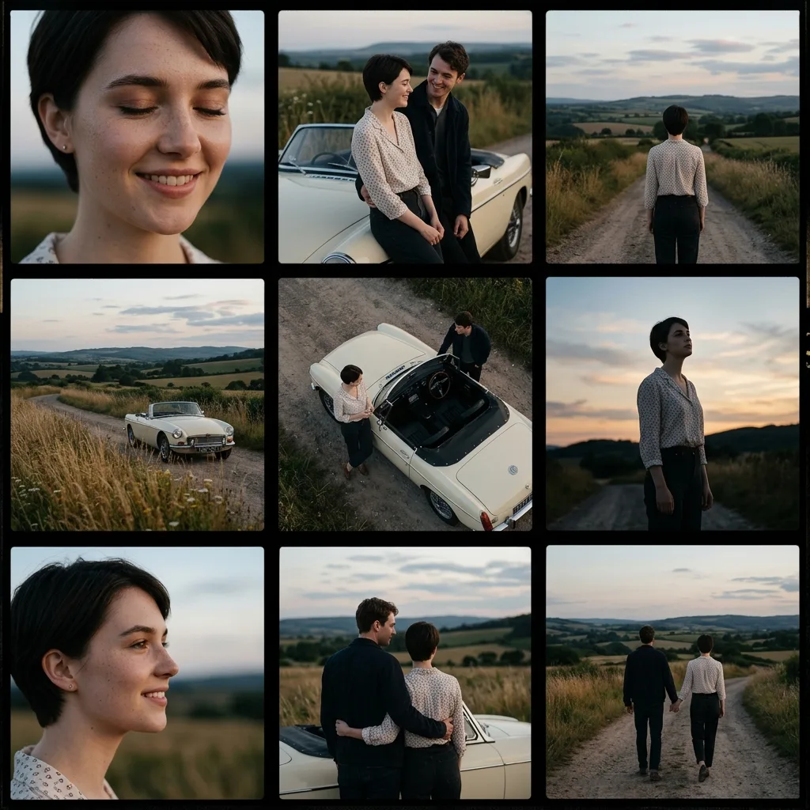

**#114 · Photography Prompt · <code>Vinano Image Pro</code>**

<details>
<summary>Show prompt</summary>

```
A cinematic 3×3 grid of film-still frames featuring the same couple during a quiet countryside road stop at dusk. A young woman short dark hair wearing a light patterned blouse stands beside a cream vintage convertible on a rural dirt road, open fields and rolling hills stretching into the distance. Each frame here shows a distinct cinematic angle: extreme close-up of her face natural skin texture, intimate medium shot of the couple leaning on the car, back view of the woman facing the landscape, wide establishing shot the car in tall grass, high-angle top-down shot of the couple beside the convertible, dramatic low-angle portrait against the sky, clean side profile close-up, three-quarter rear view of the couple near the car, and a full back view of them walking away hand in hand down the road. Soft natural dusk lighting, muted earthy tones, realistic colors, shallow depth of field, subtle film grain, consistent facial features across all frames, emotional cinematic mood, professional cinematography reference sheet style, ultra-realistic photography. Emphasise material texture and natural light so the final frame feels tactile and premium.
```

</details>

---

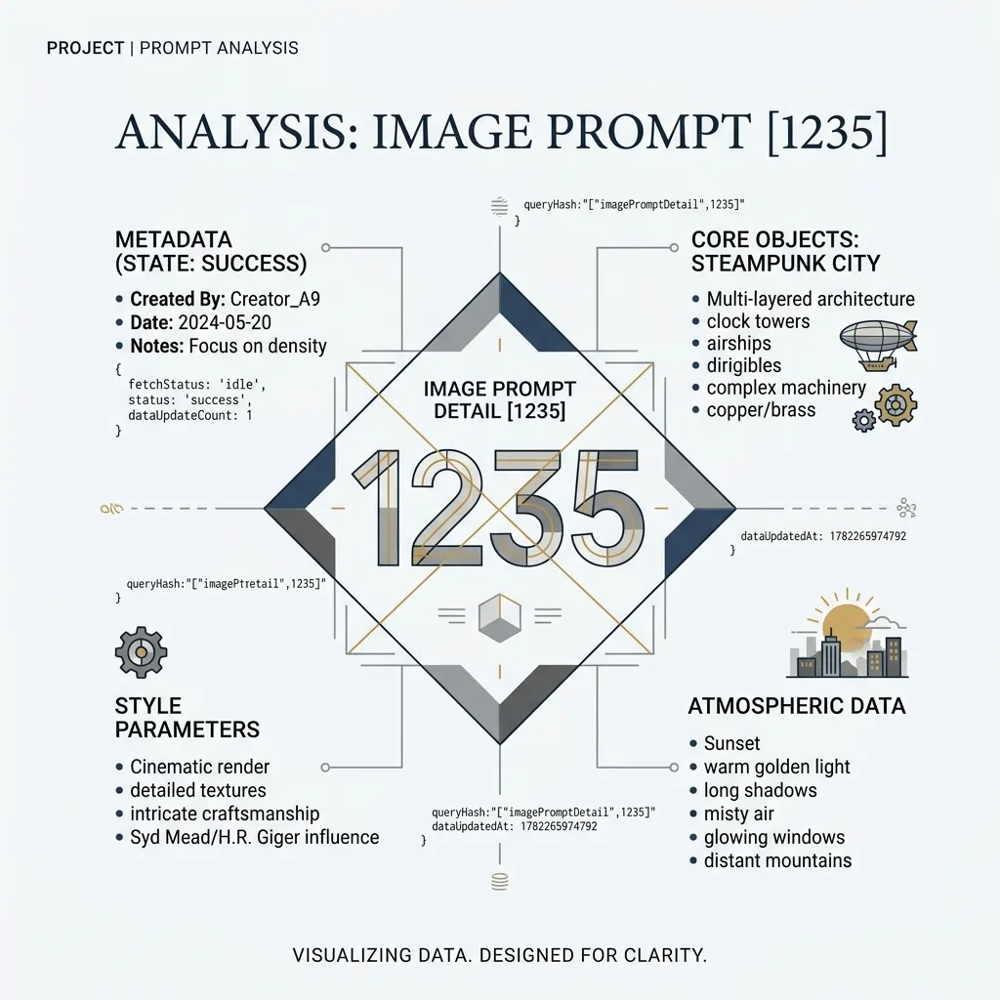

**#115 · Photography Prompt · <code>Vinano Image v2</code>**

<details>
<summary>Show prompt</summary>

```
{
 t && (e.push(l), s(l, "return"), t = false, n2 = true, r.length = 0);
 } };
})()),dehydratedQueryClient:$R[28]={mutations:$R[29]=[],queries:$R[30]=[$R[31]={dehydratedAt:1782265974792,state:$R[32]={data:$R[13],dataUpdateCount:1,dataUpdatedAt:1782265974792,error:null,errorUpdateCount:0,errorUpdatedAt:0,fetchFailureCount:0,fetchFailureReason:null,fetchMeta:null,isInvalidated:!1,status:"success",fetchStatus:"idle"},queryKey:$R[33]=["imagePromptDetail",1235],queryHash:"[\"imagePromptDetail\",1235]"}]}}})($R["tsr"]);document.currentScript.remove()

Aim for an editorial, design-driven look with deliberate negative space.
```

</details>

---

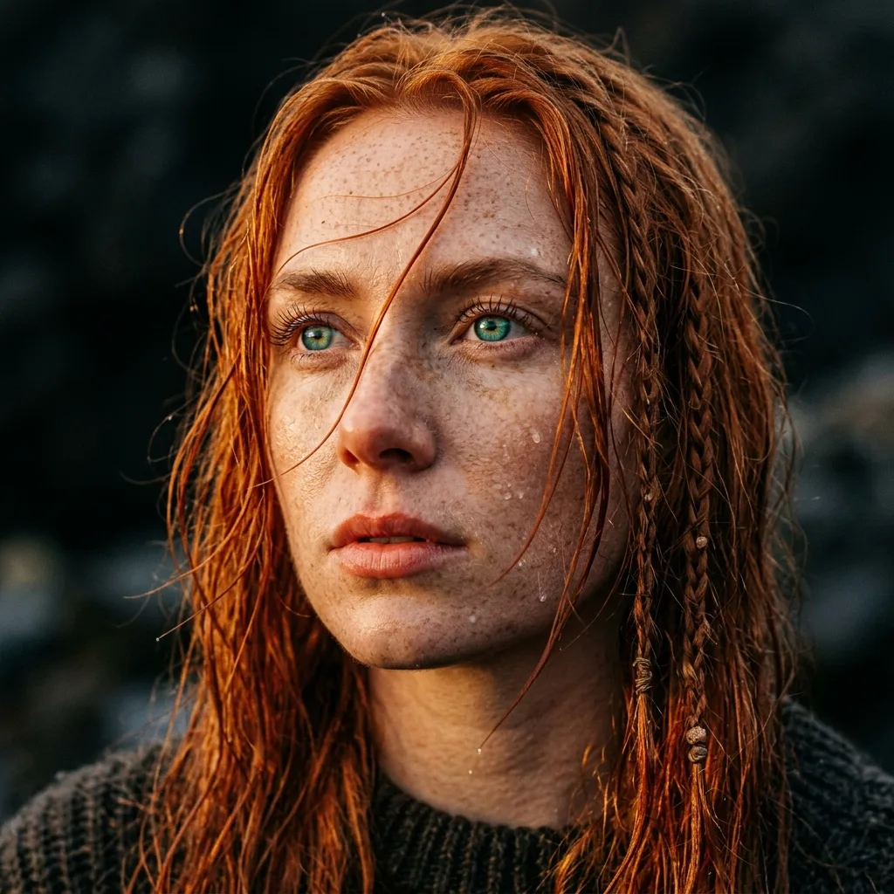

**#116 · Photography Prompt · <code>Vinano Image v2</code>**

<details>
<summary>Show prompt</summary>

```
the uploaded image as the only reference. create an ultra-true-to-life photorealistic cinematic close-up portrait of a young woman vivid red hair and piercing blue-green eyes. Her hair is slightly wet and blown across her face, delicate braids woven through the strands. Tiny water droplets and natural skin texture glisten across her freckles and cheeks, illuminated by warm dramatic lighting against a dark background.She looks slightly upward a calm, intense expression, capturing a moment of quiet strength. Emphasize hyper-real skin detail, freckles, wet hair strands, reflective water droplets, and luminous eyes. Shallow depth of field, dramatic contrast, moody filmic, cinematic lighting, intimate portrait composition, ultra-detailed textures, 8k photorealism. Preserve realistic proportions and depth for a confident, professional finish.
```

</details>

---

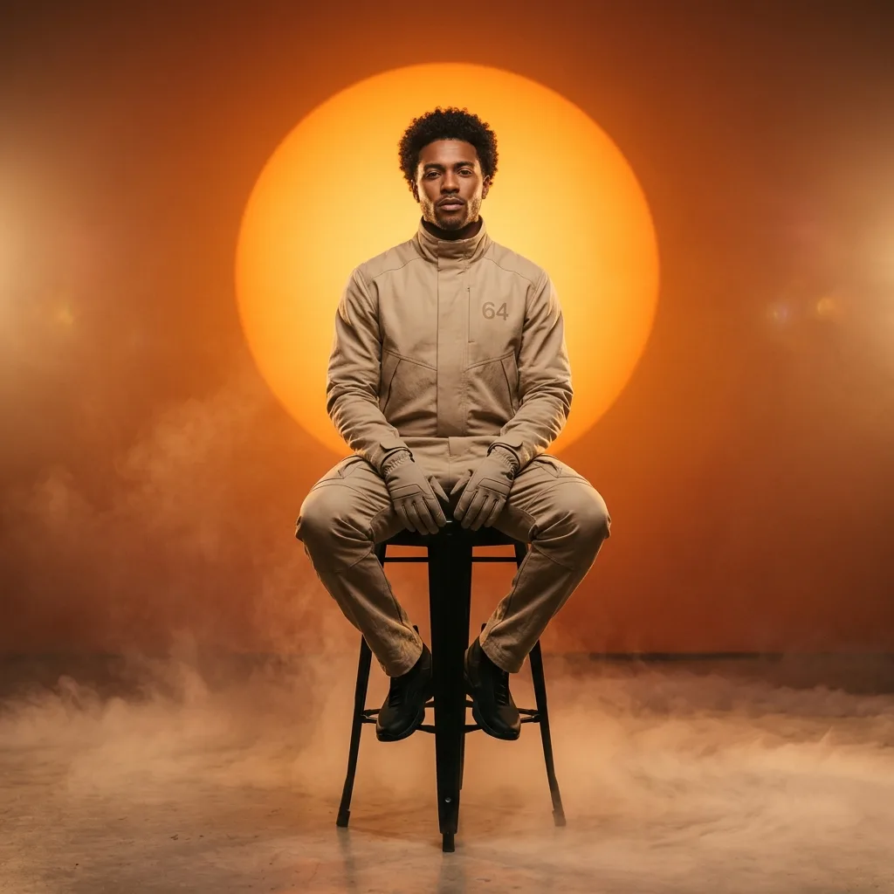

**#117 · Photography Prompt · <code>Vinano Image Pro</code>**

<details>
<summary>Show prompt</summary>

```
A man short curly hair and light facial hair sitting on a tall black stool, centered composition, wearing a monochrome beige outfit gloves and the number "64" on the chest, refined minimalist futuristic fashion, dramatic studio lighting, huge glowing orange sun behind him, warm orange gradient background, cinematic atmosphere, soft fog around the floor, symmetrical framing, editorial fashion photography, ultra detailed, sharp focus, volumetric lighting, studio shot, 85mm lens, high contrast, modern album cover style Preserve realistic proportions and depth for a confident, professional finish.
```

</details>

---

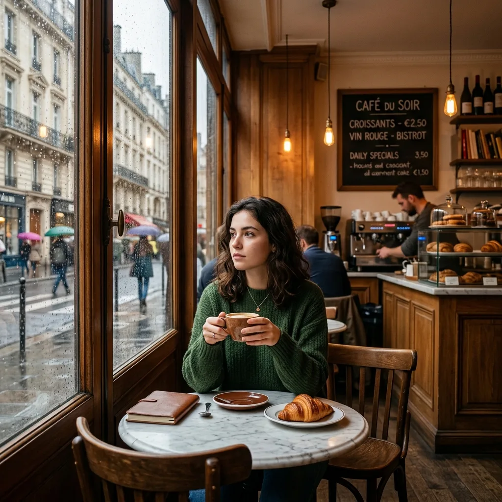

**#118 · Photography Prompt · <code>Vinano Image Pro</code>**

<details>
<summary>Show prompt</summary>

```
Cinematic photo of a young woman sitting alone in a cozy Parisian café on a rainy day, holding a cup of coffee and looking out a large window raindrops on the glass. Warm vintage café interior wooden walls, hanging Edison bulbs, marble table, croissants and coffee machine visible in the background. A chalkboard menu reading “Café du Soir, Croissants, Vin Rouge.” Soft natural window light mixed warm indoor lighting, shallow depth of field, street umbrellas and classic European buildings outside. Moody, cozy atmosphere, realistic photography, 50mm lens, high detail, cinematic color grading, lifestyle photography, ultra-realistic, 4k. Keep edges clean and the overall composition balanced for a polished, gallery-ready result.
```

</details>

---

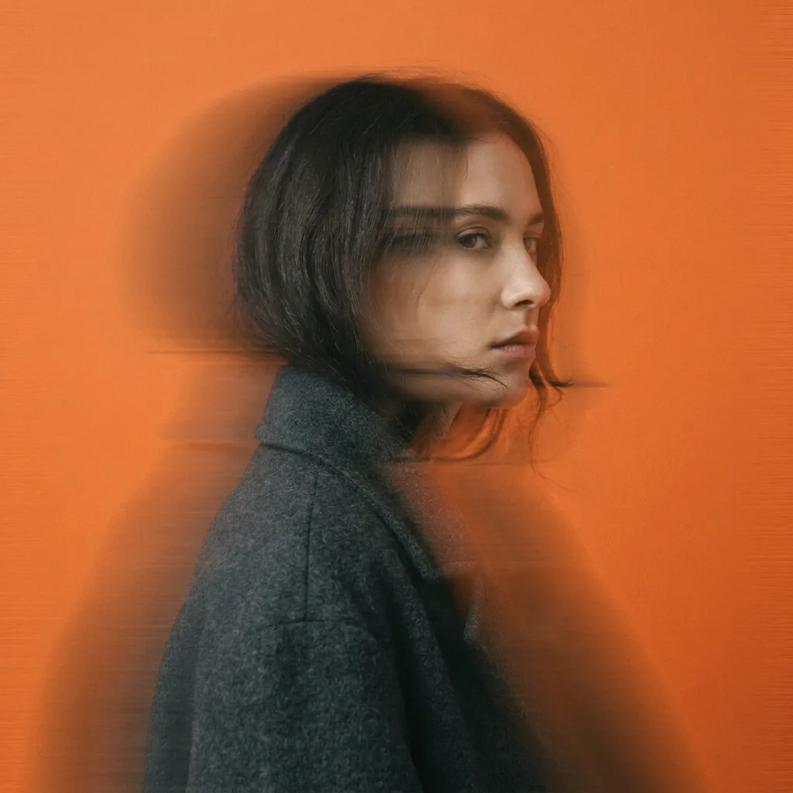

**#119 · Photography Prompt · <code>Vinano Image v2</code>**

<details>
<summary>Show prompt</summary>

```
A panning studio portrait of a mysterious female figure captured in side profile, her head subtly turned forward as motion blur streaks softly through her hair and jawline. She wears a matte charcoal wool coat softened edges, standing against a solid Pantone 137 C orange background that fills the frame entirely. The image features intentional horizontal motion blur from a slow shutter pan, preserving facial structure while allowing peripheral smearing. Soft studio lighting diffused highlights, low contrast, and lifted blacks creates a faded analog film look fine grain and muted saturation. Shot on a full-frame camera a 50mm lens at f/2.8, ISO 200, shutter speed 1/15s, vertical orientation, tight portrait framing, shallow depth of field. The mood is cinematic, introspective, and modern editorial visual language aligned 032c and A24 aesthetics. Emphasise material texture and natural light so the final frame feels tactile and premium.
```

</details>

---

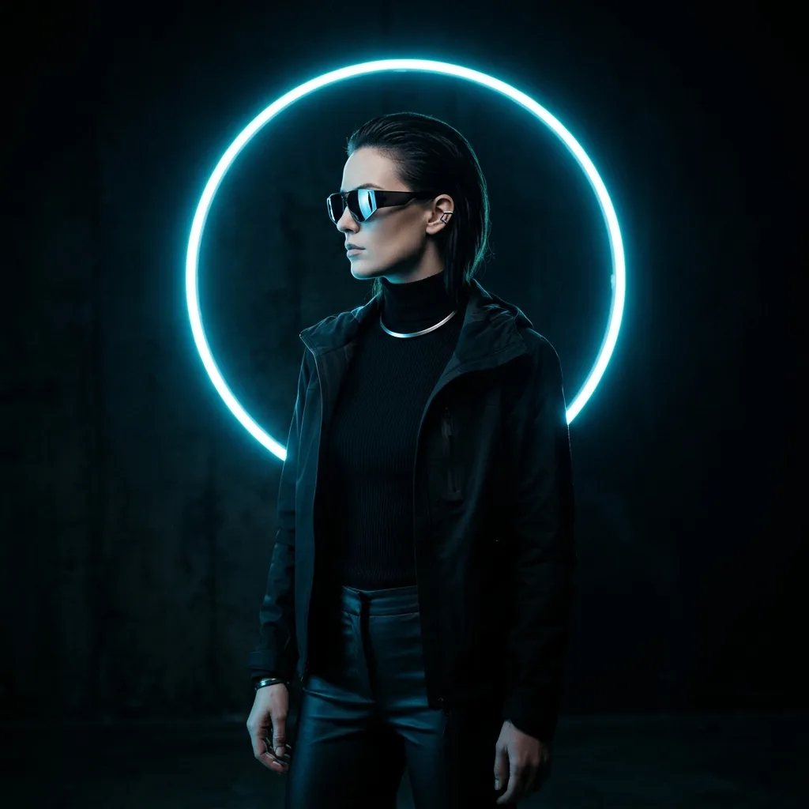

**#120 · Photography Prompt · <code>Vinano Image v2</code>**

<details>
<summary>Show prompt</summary>

```
captured in a dark studio environment a strong refined minimalist and futuristic aesthetic. The subject is posed in three-quarter profile, wearing dark clothing such as a black turtleneck and metallic accessories, reflective sunglasses that catch the ambient light. A circular neon light positioned directly behind the subject creates a luminous halo effect, producing precise rim highlights along the head and shoulders. The lighting is cool and monochromatic, primarily in icy blue tones (-6500K), casting subtle reflections and soft gradients across the matte tex-tures. The background is a deep black (approx. HEX #020509), allowing the neon ring's cyan glow (approx. Maintain consistent colour harmony and crisp focus across the whole frame.
```

</details>

---

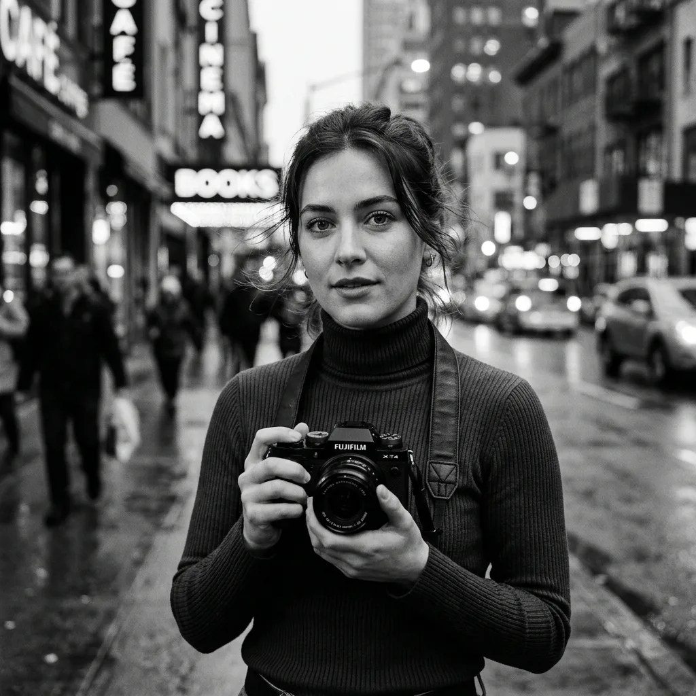

**#121 · Photography Prompt · <code>Vinano Image v2</code>**

<details>
<summary>Show prompt</summary>

```
A cinematic black-and-white street portrait of a young woman photographer standing in a city street, holding a mirrorless camera both hands. She has soft natural makeup, sharp expressive eyes, and loosely tied dark hair wisps framing her face. She wears a black turtleneck sweater and a camera strap around her neck. The background is an urban street blurred pedestrians and lights creating creamy bokeh. Shallow depth of field, 85mm lens look, natural soft light, high contrast monochrome tones, realistic skin texture, candid moment, moody documentary photography style, ultra-detailed, film grain, timeless aesthetic. Preserve realistic proportions and depth for a confident, professional finish.
```

</details>

---


**#122 · Photography Prompt · <code>Vinano Image v2</code>**

<details>
<summary>Show prompt</summary>

```
A hyper-detailed cinematic portrait of a human face use selected image for face reference in side profile, looking upward a calm and powerful expression, the entire subject illuminated in deep electric blue light, water splashes and liquid energy wrapping around the head and shoulders, high contrast, dramatic lighting, ultra-realistic skin texture, fine pores visible, sharp focus, 8K resolution, volumetric lighting, dark blue background, futuristic, ethereal, emotional, digital art, photorealism, high detail. Keep edges clean and the overall composition balanced for a polished, gallery-ready result.
```

</details>

---

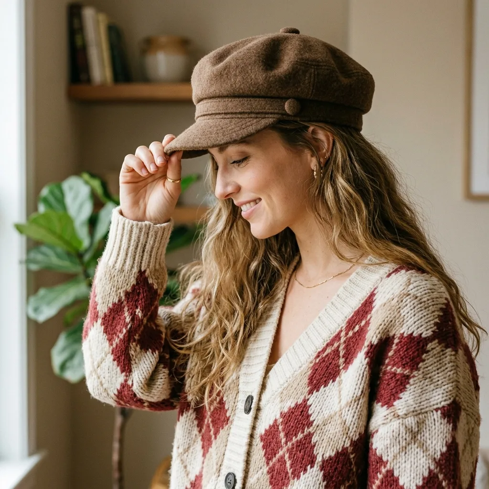

**#123 · Photography Prompt · <code>Vinano Image v2</code>**

<details>
<summary>Show prompt</summary>

```
A warm, cozy, and premium-quality portrait of a young woman long, wavy blonde-brown hair, captured in a soft side profile. She is smiling gently and looking downward, her left hand delicately adjusting the brim of a classic brown wool baker boy cap. The cap features a thick, felted texture a small button nub on top. She is wearing an oversized, chunky knit V-neck cardigan a bold argyle-style diamond pattern in cream and a muted, deep red. The cardigan features large, visible buttons and a thick ribbed texture along the neckline and cuffs. The background is a soft-focus, neutral beige wall the blurred green leaves of a plant visible on the far left edge. The lighting is soft and natural, coming from the side to highlight the delicate features of her face and the intricate textures of the knitwear and wool hat. The overall aesthetic is autumnal, serene, and tactile. Render with rich micro-detail while keeping the layout uncluttered and intentional.
```

</details>

---

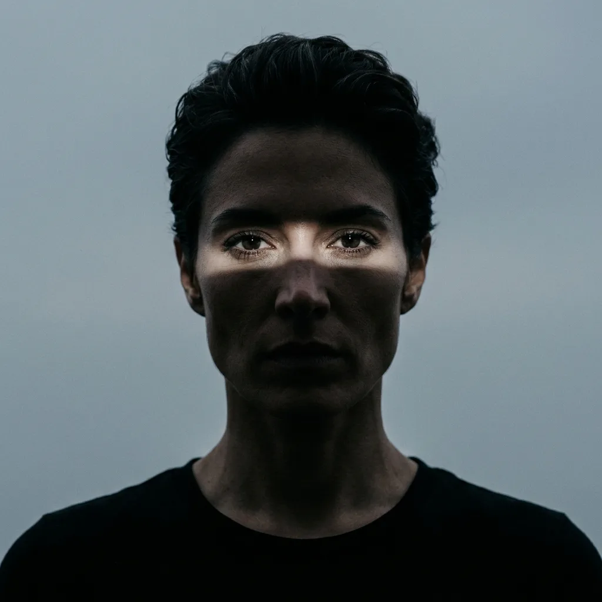

**#124 · Photography Prompt · <code>Vinano Image Pro</code>**

<details>
<summary>Show prompt</summary>

```
Close-up portrait of a woman (Same face as reference image)looking directly at the camera. Her face and neck are mostly obscured by deep shadow. A single, narrow horizontal band of light cuts across her face, illuminating only her eyes and the bridge of his nose. He has a strong, defined jawline and short, textured hair. She is wearing a simple black shirt. The background is a plain, overcast grayish-blue sky. Dramatic, high-contrast lighting creates a moody, cinematic atmosphere. Keep edges clean and the overall composition balanced for a polished, gallery-ready result.
```

</details>

---

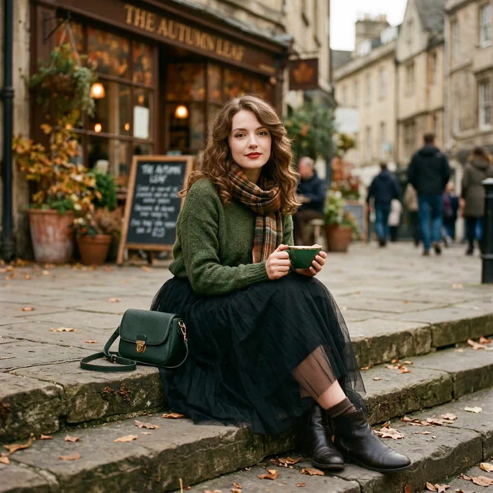

**#125 · Photography Prompt · <code>Vinano Image v2</code>**

<details>
<summary>Show prompt</summary>

```
A cinematic 1970s-inspired fashion portrait of a young woman seated on worn stone steps outside a cozy street café. She holds a deep-green ceramic coffee cup gold rim accents, resting it gently in her hands, gazing softly at the camera calm, timeless confidence.

Her hair falls in natural waves loose strands framing her face, styled vintage 1970s elegance. Makeup is classic: matte crimson lips, subtle winged eyeliner, warm blush, and softly defined brows. She wears a relaxed forest-green knitted sweater paired a flowing black tulle skirt, complemented by a warm plaid scarf in earthy tones. A dark-green leather crossbody bag gold details sits beside her.

The background shows an autumn street scene fallen leaves, amber-lit café windows, and a quiet, serene urban atmosphere. Shot an 85mm lens at f/1.8, the image features shallow depth of field, warm analog film grain, muted earthy colors, and a dreamy, cinematic fashion editorial feel inspired by 1970s film aesthetics.

Emphasise material texture and natural light so the final frame feels tactile and premium.
```

</details>

---

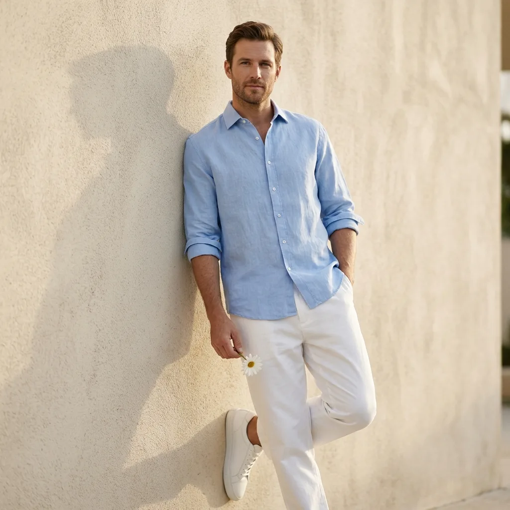

**#126 · Photography Prompt · <code>Vinano Image Pro</code>**

<details>
<summary>Show prompt</summary>

```
{
 "prompt": " the uploaded reference image of a 30-year-old adult, generate a highly realistic cinematic fashion editorial photoshoot. The person is leaning casually against a beige textured wall, body slightly angled, one shoulder resting on the wall, conveying relaxed confidence.\n\nOutfit: a loose pastel blue button-down shirt casually rolled-up sleeves, tailored white relaxed-fit trousers, and clean refined minimalist white or blue-white sneakers. Styling is modern, elegant, and effortless.\n\nPose & expression: stylish adult pose natural posture — one hand in pocket, the other holding a small white daisy flower. Facial expression is calm, confident, and self-assured, a soft editorial gaze.\n\nLighting & atmosphere: warm natural sunlight streaming from the side, creating soft highlights and gentle shadows on the wall and face. Sunlit, airy mood cinematic depth.\n\nVisual style: high-end fashion editorial aesthetic, natural skin texture, crisp fabric details, refined neutral color palette.\n\nCamera & quality: professional fashion photography, shallow depth of field, cinematic framing, ultra-realistic 8K quality.\n\nOverall feel: modern, minimal, sunlit lifestyle fashion campaign.",
 "style": "cinematic, high-end adult fashion editorial",
 "lighting": "warm natural sunlight, soft shadows",
 "background": "minimal beige wall, sunlit texture",
 "quality": "ultra-realistic, 8K, ultra-sharp",
 "camera": "professional fashion photography, shallow depth of field",
 "mood": "clean, modern, confident, relaxed"
}

Emphasise material texture and natural light so the final frame feels tactile and premium.
```

</details>

---

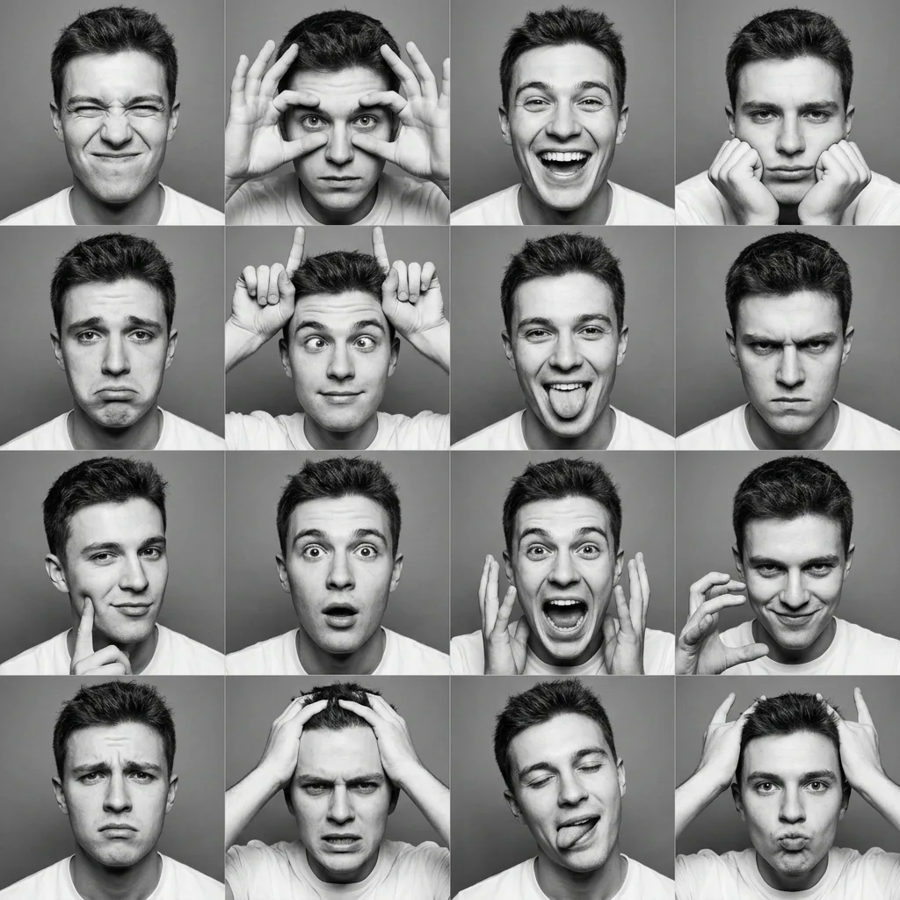

**#127 · Photography Prompt · <code>Vinano Image Pro</code>**

<details>
<summary>Show prompt</summary>

```
{
 "generation_request": {
 "meta_data": {
 "task_type": "black_and_white_photobooth_expression_grid_4x4",
 "language": "en",
 "priority": "highest",
 "version": "v1.0_BW_PHOTOBOOTH_EXPRESSIONS_4X4"
 },
 "input": {
 "mode": "image_to_image",
 "reference_image_usage": "very_high",
 "preserve_identity": true,
 "preserve_facial_features": true,
 "preserve_hairstyle": true,
 "notes": "Use the reference as the primary anchor. Create a black-and-white photobooth-style expression grid. Keep the same young man identity and hair. Each panel should show a different facial expression. Minimal background, direct photobooth flash look, natural skin texture."
 },
 "output": {
 "aspect_ratio": "1:1",
 "resolution": "ultra_high",
 "num_images": 1,
 "layout": {
 "type": "grid",
 "rows": 4,
 "cols": 4,
 "gutter": "thin",
 "panel_consistency": "high"
 },
 "sharpness": "crisp_photobooth",
 "grain": "subtle_analog_bw"
 },
 "scene": {
 "concept": "classic photobooth contact sheet expressive faces",
 "environment": "plain neutral backdrop, no props",
 "lighting": {
 "style": "direct photobooth flash",
 "key_light": "front flash, slightly hard but flattering",
 "shadows": "soft short shadows behind subject",
 "avoid": "cinematic side light, dramatic backgrounds"
 },
 "camera": {
 "lens": "50mm",
 "distance": "tight head-and-shoulders framing",
 "focus": "eyes sharp in every panel"
 }
 },
 "subject": {
 "type": "young man",
 "wardrobe": "simple casual photobooth look, plain t shirt or hoodie no logos",
 "hair": "keep same hairstyle across all panels",
 "facial_hair": "natural if present, keep consistent",
 "anatomy_rules": "correct facial proportions, no warped eyes or mouth"
 },
 "expression_set": {
 "panel_01": "scrunched smile, eyes squeezed slightly",
 "panel_02": "intense stare fingers framing eyes",
 "panel_03": "big laugh, mouth open, joyful",
 "panel_04": "bored unimpressed face, chin resting in hands",
 "panel_05": "sad pout, emotional expression",
 "panel_06": "goofy face both hands making small horns above head",
 "panel_07": "playful tongue out cheeky grin",
 "panel_08": "angry glare eyebrows down",
 "panel_09": "confident playful look, hand touching cheek",
 "panel_10": "surprised wide eyes, mouth slightly open",
 "panel_11": "fake scream excited shout, hands near face",
 "panel_12": "mischievous grin claw-like hand pose",
 "panel_13": "confused frown lips pressed",
 "panel_14": "dramatic frustrated expression, hands on head",
 "panel_15": "tongue out eyes closed, playful mood",
 "panel_16": "duck face small devil horns gesture"
 },
 "style": {
 "color": "pure black and white",
 "contrast": "medium_high",
 "background": "flat gray",
 "finish": "slight photobooth grain, clean edges"
 },
 "quality_control": {
 "identity_lock": "strict",
 "hands_priority": "high",
 "avoid": ["extra fingers",
 "missing fingers",
 "deformed hands",
 "warped face",
 "uneven eyes",
 "melted mouth",
 "plastic skin",
 "text",
 "watermark",
 "logo"]
 },
 "negative_prompt": ["color",
 "sepia",
 "overly filmic, cinematic lighting",
 "beauty retouch plastic skin",
 "low resolution",
 "blur",
 "distorted anatomy"]
 }
}

Emphasise material texture and natural light so the final frame feels tactile and premium.
```

</details>

---

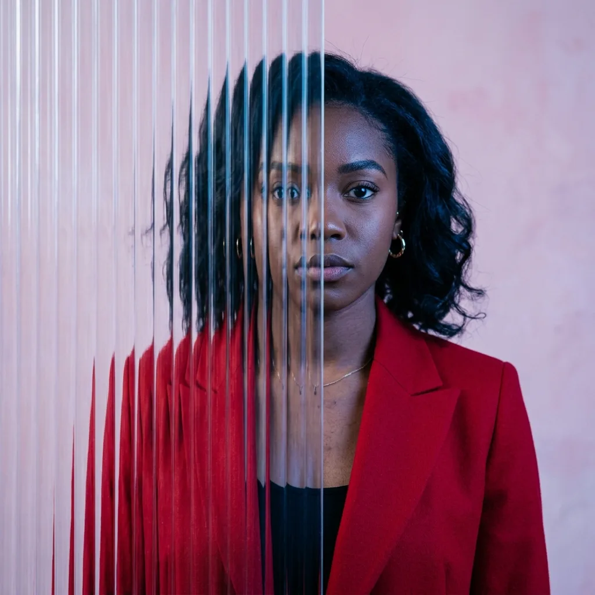

**#128 · Photography Prompt · <code>Vinano Image Pro</code>**

<details>
<summary>Show prompt</summary>

```
A striking editorial portrait photograph of a person wearing a red blazer, shot against a soft light pink studio background. The left half of the face and body is partially obscured by multiple overlapping vertical strips of tall narrow reeded ribbed frosted glass panels, creating a realistic distortion and refraction effect where the features appear blurred, shifted, and fragmented behind the glass. The right side of the face is clearly visible sharp detail. Dramatic cool-toned studio lighting a blue-purple color grade overall. The glass strips run vertically from top to bottom of the frame, covering approximately the left 40 to 50 percent of the image. Serious neutral facial expression. High-fashion editorial style, true-to-life photorealistic, no text, no watermark, no overlays, crisp composition. Vertical portrait orientation, 3:4 ratio. Preserve realistic proportions and depth for a confident, professional finish.
```

</details>

---

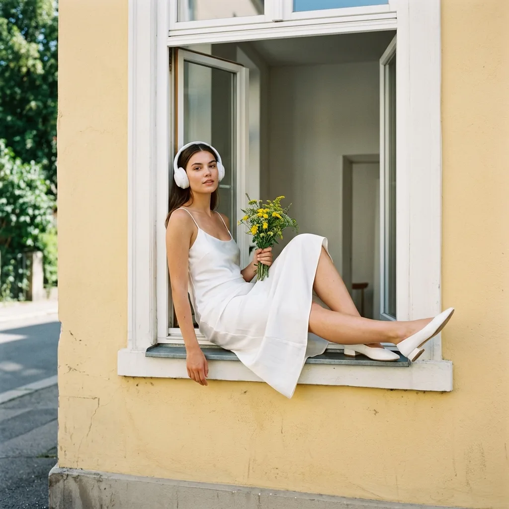

**#129 · Photography Prompt · <code>Vinano Image v2</code>**

<details>
<summary>Show prompt</summary>

```
{
 "generation_request": {
 "meta_data": {
 "tool": "",
 "task_type": "photoreal_fashion_editorial_window_pose",
 "version": "v1.0_YELLOW_HOUSE_WINDOW_GIRL_WHITE_SATIN",
 "priority": "highest"
 },

 "references": {
 "reference_image_1": {
 "source": "UPLOAD_REFERENCE_IMAGE",
 "purpose": "POSE_AND_COMPOSITION_LOCK",
 "strict_lock": true,
 "match_reference_priority": "MAX",
 "preserve_window_frame": true,
 "preserve_leg_position": true,
 "preserve_body_angle": true,
 "preserve_camera_distance": true,
 "no_style_drift": true
 },
 "reference_image_2": {
 "source": "UPLOAD_FACE_REFERENCE (OPTIONAL)",
 "purpose": "FACE_IDENTITY_LOCK",
 "strict_lock": true,
 "face_similarity_priority": "MAX",
 "no_identity_blending": true,
 "no_beautify": true,
 "no_age_shift": true,
 "preserve_skin_texture": true,
 "preserve_facial_proportions": true
 }
 },

 "creative_direction": {
 "concept": "A playful, editorial fashion moment: a young woman sitting casually inside an open window of a yellow house, one leg lifted outward, captured as a clean, modern lifestyle photograph.",
 "mood": "fresh, carefree, stylish, youthful",
 "style_keywords": "European street style, playful femininity, minimal editorial"
 },

 "scene": {
 "location": "residential exterior",
 "architecture": {
 "house_color": "soft warm yellow facade",
 "window": "simple rectangular window white interior walls",
 "background": "clean, uncluttered, sunlit wall"
 },
 "time": "midday",
 "lighting": "direct natural sunlight, crisp shadows"
 },

 "subject": {
 "gender": "female",
 "pose": {
 "position": "sitting inside the window frame",
 "legs": "one leg extended outward and raised, the other relaxed",
 "arms": "one arm hanging freely outside the window"
 },
 "expression": "neutral to calm, relaxed confidence",
 "gaze": "looking forward or slightly to the side"
 },

 "wardrobe": {
 "dress": {
 "type": "white satin slip dress",
 "style": "thin straps, minimal, fluid fabric",
 "length": "midi",
 "finish": "soft satin sheen"
 },
 "headphones": {
 "type": "over-ear",
 "color": "pure white",
 "style": "clean, modern, minimal"
 },
 "shoes": {
 "type": "flat or low-heel shoes",
 "color": "white",
 "style": "simple, elegant"
 }
 },

 "accessories": {
 "flowers": {
 "type": "fresh yellow flowers",
 "placement": "held loosely in one hand",
 "look": "natural, slightly wild bouquet"
 }
 },

 "photography": {
 "camera_style": "fashion editorial street photography",
 "lens": "35mm",
 "framing": "centered subject, full body within window frame",
 "depth_of_field": "moderate, background sharp",
 "color_grade": "warm yellows, clean whites, natural skin tones"
 },

 "output_settings": {
 "aspect_ratio": "4:5",
 "orientation": "portrait",
 "resolution_target": "ultra_high_res",
 "render_style": "ultra_photoreal_editorial",
 "sharpness": "clean_and_crisp",
 "dynamic_range": "natural_not_hdr",
 "no_text": true,
 "no_watermark": true,
 "no_logo": true
 },

 "quality_controls": {
 "anatomy": {
 "no_deformed_limbs": true,
 "no_extra_fingers": true
 },
 "fabric": {
 "satin_reads_real": true
 },
 "coherence": {
 "wardrobe_consistent": true,
 "pose_identical_to_reference": true
 }
 },

 "negative_prompt": ["patterned dress",
 "dark or black clothing",
 "headphones not white",
 "boots or dark shoes",
 "busy background",
 "cartoon, illustration, anime",
 "HDR, oversharpening",
 "text, watermark, logo",
 "deformed anatomy"]
 }
}

Maintain consistent colour harmony and crisp focus across the whole frame.
```

</details>

---

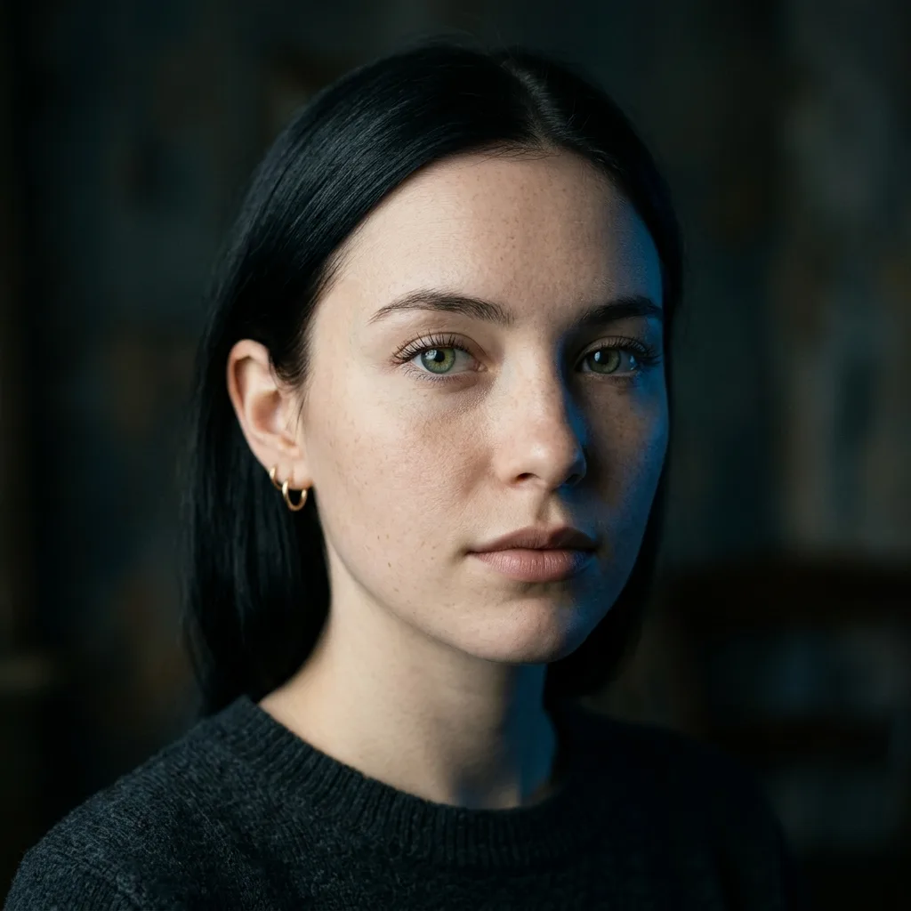

**#130 · Photography Prompt · <code>Vinano Image v2</code>**

<details>
<summary>Show prompt</summary>

```
Ultra-realistic close-up portrait of a young woman fair skin and subtle freckles, green eyes, and natural full lips, dark straight hair tucked behind the ear, wearing small gold hoop earrings. Dramatic split lighting across the face — one half illuminated soft natural light, the other half in deep shadow cool blue tones. High detail skin texture, sharp focus on eyes and eyelashes, minimal makeup, filmic, cinematic lighting, moody atmosphere, shallow depth of field, 85mm lens, f/1.8, true-to-life photorealistic, editorial beauty photography. Render with rich micro-detail while keeping the layout uncluttered and intentional.
```

</details>

---

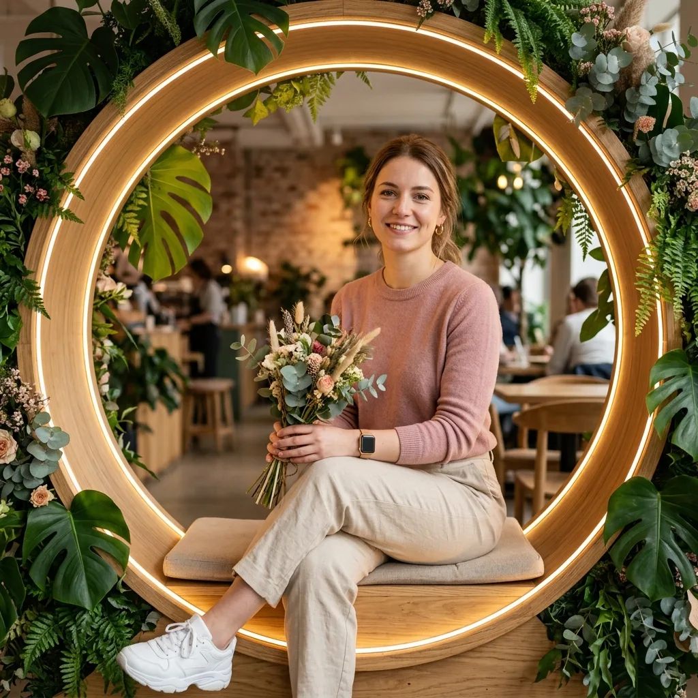

**#131 · Photography Prompt · <code>Vinano Image v2</code>**

<details>
<summary>Show prompt</summary>

```
Create an ultra-realistic, high-end lifestyle portrait of one adult subject, captured in a calm, elegant, modern café environment. The subject is seated casually inside a circular wooden frame embedded warm LED rim lighting, surrounded by lush green foliage and soft floral decor. The pose is relaxed and natural: one leg crossed over the other, body slightly angled, shoulders relaxed, hands resting naturally while holding a small bouquet of fresh flowers. Overall mood is warm, clean, elegant, youthful, and approachable — pure realism only. No stylization, no fantasy, no cinematic exaggeration.

Maintain 100% facial accuracy: exact bone structure, eye shape, eyelid fold, eyebrow shape, nose bridge and tip, lip shape, jawline, chin, cheek volume, hairline, and facial proportions

Identity must remain perfectly consistent from all angles (front, 3/4, side, seated pose, slight head tilt)

No face blending, no beautification, no symmetry correction

No AI face drift

Preserve real skin texture: pores, fine lines, natural imperfections

Expression: soft, natural smile, relaxed and genuine

Soft pastel long-sleeve knit top (dusty pink / muted rose tone)

High-waisted, straight-fit beige or cream trousers

Clean white chunky sneakers

Minimal accessories only (simple earrings, smartwatch or minimal wrist accessory)

Hair neatly styled, natural, pulled back or softly tied

Natural makeup: realistic skin tones, no heavy retouching

Modern café or lifestyle studio interior

Circular wooden structure embedded warm LED light ring

Green plants and floral arrangements integrated into the frame

Soft bokeh background warm ambient lighting

Clean, uncluttered setting depth and realism

Full-body or 3/4 body vertical portrait

Eye-level camera angle

50mm–85mm lens look

Natural perspective, no distortion

Subject centered within the circular frame

Shallow depth of field, background softly blurred

Soft, warm, diffused lighting

LED rim light gently outlining the circular frame

Even facial illumination natural shadow falloff

No harsh highlights, no blown whites

Realistic skin reflections and depth

Negative prompt:

No stylization

No cinematic color grading

No beauty filters

No smooth or plastic skin

No exaggerated proportions

No painterly or illustrated look

No artificial glow

No face morphing or identity shift

Ultra-true-to-life photorealistic

Editorial lifestyle photography quality

Natural colors, true-to-life skin tones

Identity remains unchanged and accurate from every angle

Emphasise material texture and natural light so the final frame feels tactile and premium.
```

</details>

---

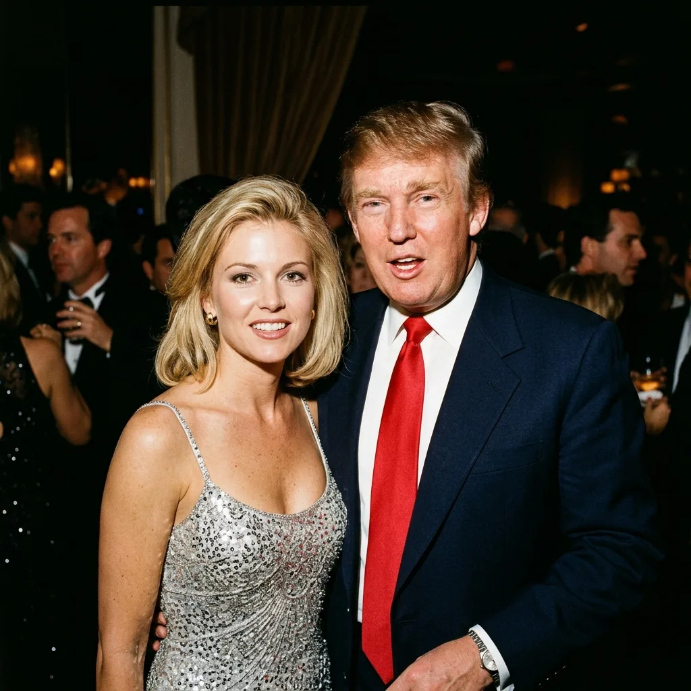

**#132 · Photography Prompt · <code>Vinano Image Pro</code>**

<details>
<summary>Show prompt</summary>

```
{
 "lighting": {
 "mood": "Candid, slightly harsh evening lighting",
 "type": "On-camera flash",
 "shadows": "Strong shadows visible, especially on the woman's neck and behind the subjects",
 "direction": "Frontal lighting",
 "intensity": "Harsh, creating highlights on faces and the dress"
 },
 "background": {
 "setting": "Likely an indoor evening event or party",
 "elements": "Faint, indistinct shapes of other people or objects in the distance",
 "description": "Extremely dark and underexposed due to flash",
 "depth_of_field": "Shallow, background is completely blurred"
 },
 "typography": {
 "details": "No visible text or logos",
 "present": "None"
 },
 "composition": {
 "angle": "Slightly from the right, eye-level",
 "focus": "Sharp focus on the two subjects, particularly their faces",
 "framing": "Tight framing on the couple",
 "shot_type": "Medium shot",
 "orientation": "Portrait",
 "positioning": "Woman on the left, man on the right, standing closely together"
 },
 "color_profile": {
 "palette": "Dark suit, bright red tie, silver sparkling dress, warm skin tones, dark background",
 "contrast": "High contrast due to flash",
 "saturation": "Moderate saturation",
 "color_grading": "Typical 1990s flash photography, slightly warm hues",
 "dominant_colors": ["#000000",
 "#FFFFFF",
 "#C0C0C0",
 "#FF0000"]
 },
 "technical_specs": {
 "grain": "Visible film grain",
 "source": "Photograph, likely film from the 1990s",
 "sharpness": "Relatively sharp on subjects, background is blurry and dark",
 "resolution": "Medium resolution scan",
 "aspect_ratio": "Approx. 9:16 (square)"
 },
 "subject_analysis": {
 "man": {
 "hair": "Blonde, brushed back",
 "attire": "Dark navy suit, white collared shirt, bright red tie",
 "identity": "Donald Trump (younger)",
 "position": "Right side of the frame",
 "expression": "Mouth open, possibly speaking or grimacing"
 },
 "woman": {
 "hair": "Shoulder-length blonde hair",
 "attire": "Silver, sparkling, spaghetti-strap dress",
 "jewelry": "Small earring visible on left ear",
 "identity": "Blonde woman (possibly Kara Young)",
 "position": "Left side of the frame",
 "expression": "Looking directly at camera, slightly open mouth"
 }
 },
 "artistic_elements": {
 "mood": "Slightly awkward, caught-in-the-moment",
 "style": "Candid celebrity snapshot",
 "texture": "Prominent texture of the woman's sparkling silver dress",
 "expression": "Man is speaking or grimacing, woman is looking directly at the camera a slightly open mouth",
 "compositional_balance": "Balanced, the two subjects occupying the majority of the frame"
 },
 "generation_parameters": {
 "prompt": "A candid photograph from the 1990s of Donald Trump in a dark suit and red tie, standing next to a blonde woman in a silver sparkling dress. Both are looking at the camera, Trump's mouth open. The image is taken an on-camera flash at an evening event, a very dark background.",
 "style_tags": ["1990s photography",
 "flash photography",
 "candid snapshot",
 "celebrity photo"],
 "negative_prompt": "modern photography, digital look, bright background, perfectly posed, studio lighting"
 }
}

Emphasise material texture and natural light so the final frame feels tactile and premium.
```

</details>

---

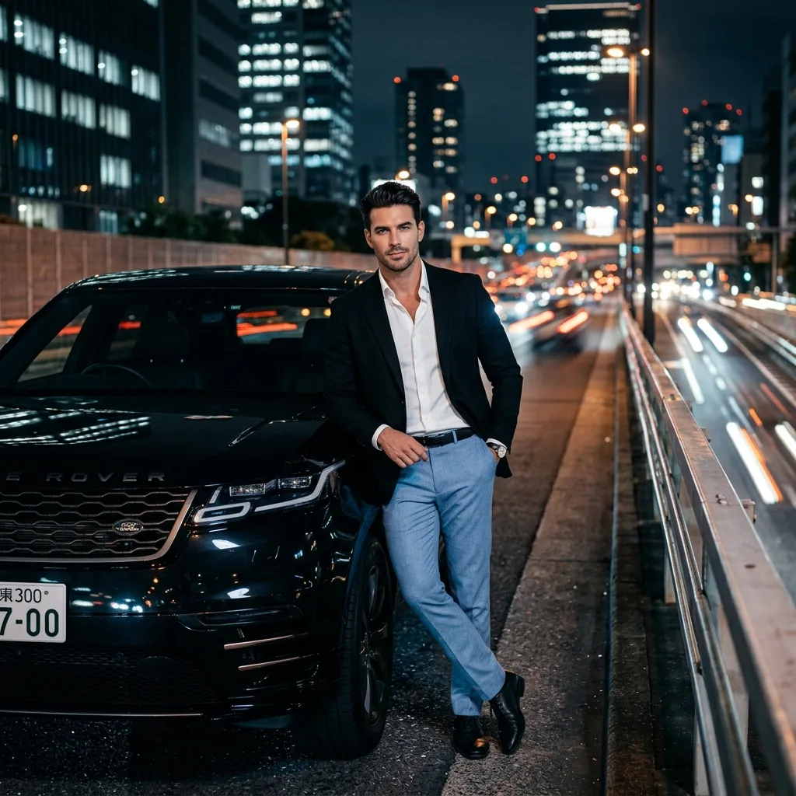

**#133 · Photography Prompt · <code>Vinano Image v2</code>**

<details>
<summary>Show prompt</summary>

```
A cinematic night-time urban portrait of a confident, handsome man leaning against a black luxury SUV on a modern city highway. He is wearing a black blazer over a white unbuttoned dress shirt and light blue tailored trousers, one hand in his pocket, the other resting on the car. Clean haircut, light stubble, sharp masculine features. Skyscrapers glowing windows in the background, streetlights creating bokeh, long light trails from passing traffic. Moody, high-contrast lighting, shallow depth of field, professional fashion photography, ultra-realistic, 85mm lens, f/1.8, cinematic color grading, luxury lifestyle aesthetic. Keep edges clean and the overall composition balanced for a polished, gallery-ready result.
```

</details>

---

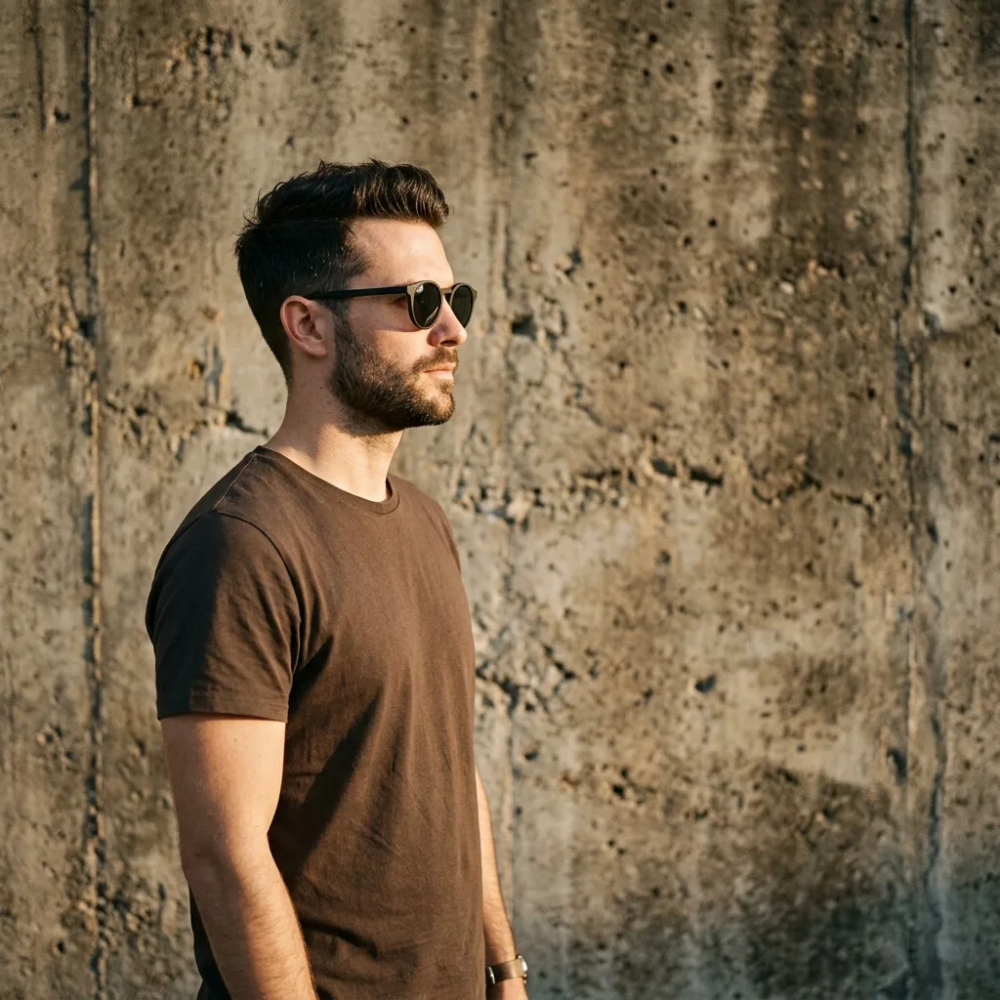

**#134 · Photography Prompt · <code>Vinano Image v2</code>**

<details>
<summary>Show prompt</summary>

```
A cinematic portrait of a handsome man a short styled haircut and trimmed beard, wearing a plain brown t-shirt and round black sunglasses, standing in side profile against a textured concrete wall, warm golden-hour sunlight, shallow depth of field, muted earthy tones, natural light, sharp focus, modern fashion photography, 35mm lens, high detail, realistic. Aim for an editorial, design-driven look with deliberate negative space.
```

</details>

---

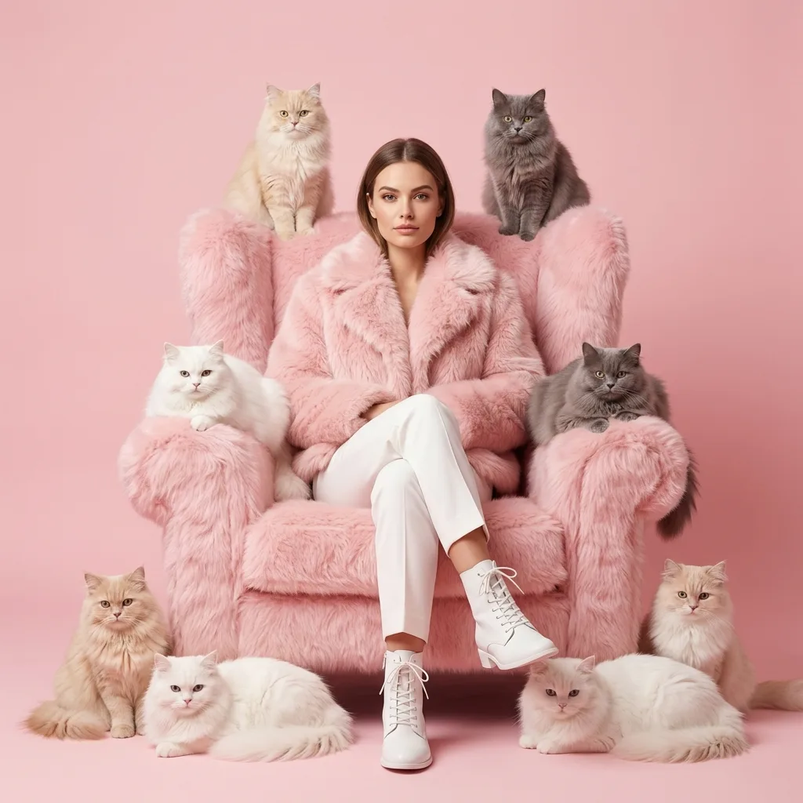

**#135 · Photography Prompt · <code>Vinano Image v2</code>**

<details>
<summary>Show prompt</summary>

```
the uploaded picture as the only reference and without changing the face, create a fashion editorial portrait of a woman sitting confidently in a plush oversized pink faux-fur armchair against a soft pastel pink background; she wears a fluffy pink jacket, white trousers and white lace-up boots, seated legs crossed and a calm confident expression; surrounded symmetrically by multiple fluffy long-haired cats in cream, gray and white tones perched on the chair arms, backrest and floor around her; highly stylized monochromatic pink aesthetic, soft studio lighting, clean background, luxurious textures in fur fabric and cat fur, centered composition, fashion magazine style, high detail, shallow depth of field, ultra-sharp textures, high dynamic range, 8k ultra-photorealism, masterpiece quality. Keep edges clean and the overall composition balanced for a polished, gallery-ready result.
```

</details>

---

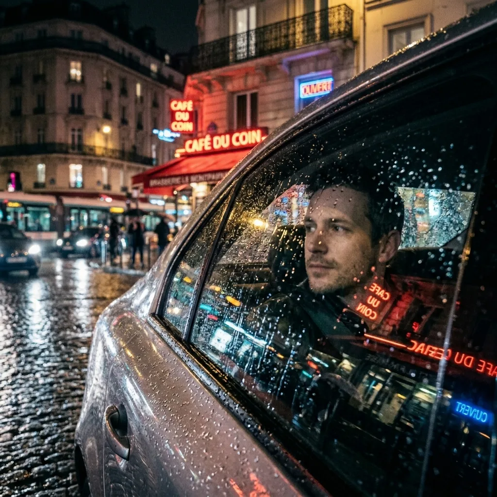

**#136 · Photography Prompt · <code>Vinano Image v2</code>**

<details>
<summary>Show prompt</summary>

```
A low-angle, cinematic close-up shot looking through a rain-slicked car window. Inside the car, a contemplative man short dark hair and slight stubble is visible, looking out toward the city. The focus is sharp on the water droplets clinging to the glass, while the man and the background are slightly softer.
​Setting & Atmosphere: A bustling European city street at night during a rainstorm. The atmosphere is melancholic yet cozy. In the reflection of the car door and window, blurred city lights, glowing neon shop signs (blues and reds), and the outlines of historical architecture are visible.
​Lighting & Color: * Lighting: Naturalistic night lighting provided by street lamps and neon signs, creating a cool blue and teal base warm orange and red highlights.
​Reflections: Complex reflections of wet pavement and passing cars on the dark metallic surface of the vehicle.
​Technical Specs: 35mm lens, f/1.8 aperture for shallow depth of field, high contrast, moody film grain, hyper-realistic textures, shot on Sony A7R IV style.

Preserve realistic proportions and depth for a confident, professional finish.
```

</details>

---


**#137 · Photography Prompt · <code>Vinano Image v2</code>**

<details>
<summary>Show prompt</summary>

```
the reference picture, create A stylish man sitting on a luxurious vintage red velvet sofa, wearing black silk shirt, sunglasses, confi-dently holding a cheetah adorned filmic, cinematic lighting, dollars are spread on sofa too and there are two guards on back side in blur bg, luxury life-style, dramatic atmosphere." 100% Real Face 8K Resolution Maintain consistent colour harmony and crisp focus across the whole frame.
```

</details>

---

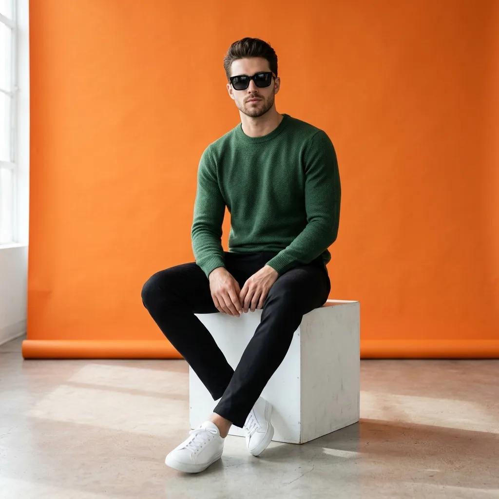

**#138 · Photography Prompt · <code>Vinano Image v2</code>**

<details>
<summary>Show prompt</summary>

```
A stylish male model sitting on a white cube in a refined minimalist studio a vibrant orange background. He is wearing a fitted green knit sweater, black pants, and white sneakers, paired black sunglasses for a modern, confident look. The model sits relaxed hands resting together, facing the camera. Soft directional lighting creates subtle shadows on the floor and background, adding depth and a premium fashion editorial feel. crisp composition, centered framing, smooth backdrop, high contrast colors, sharp details, professional studio photography, ultra-realistic, 8K. Preserve realistic proportions and depth for a confident, professional finish.
```

</details>

---

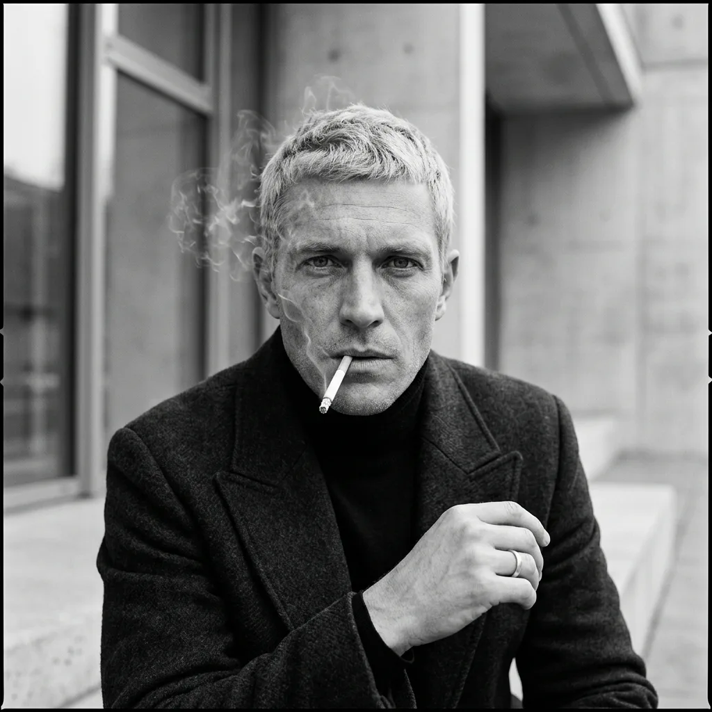

**#139 · Photography Prompt · <code>Vinano Image v2</code>**

<details>
<summary>Show prompt</summary>

```
Ultra-realistic fashion black and white portrait of a man short light hair, wearing a dark tailored coat and a black turtleneck. They hold a cigarette between their lips as soft smoke curls around their face. Extremely detailed natural skin texture visible pores, fine lines, realistic contrast and tonal range. lifelike matte highlights. Subtle film grain, soft diffused lighting, refined minimalist background. High-fashion editorial mood, sharp details, expressive gaze, dramatic monochrome aesthetic, Hasselblad X2D, 30mm lens, strong contrast, daylight, fashion composition, architectural elements, editorial clarity medium format -p cz2pqao Keep edges clean and the overall composition balanced for a polished, gallery-ready result.
```

</details>

---

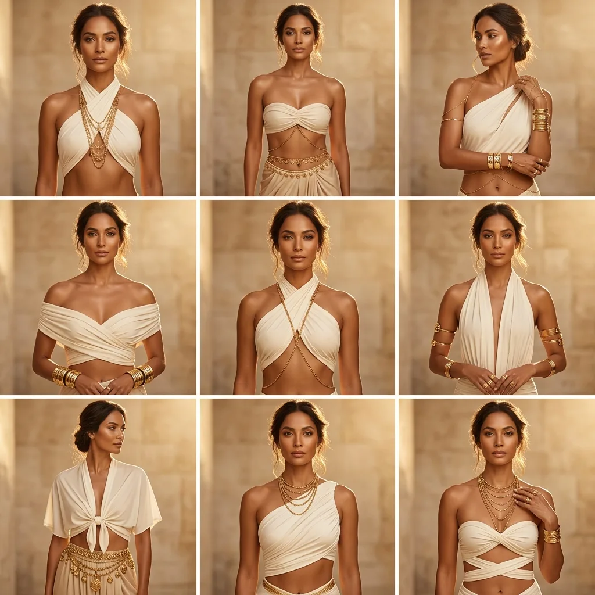

**#140 · Photography Prompt · <code>Vinano Image Pro</code>**

<details>
<summary>Show prompt</summary>

```
{
 "generation_request": {
 "meta_data": {
 "tool": "",
 "task_type": "fashion_variation_grid_9panel",
 "language": "en",
 "priority": "highest",
 "version": "v1.0_GOLDEN_GODDESS_JEWELRY_9GRID"
 },
 "input": {
 "mode": "text_to_image",
 "notes": "Create a 3x3 high-fashion goddess editorial grid featuring the same elegant woman luxurious gold body jewelry and draped styling."
 },
 "output_settings": {
 "aspect_ratio": "4:5",
 "orientation": "portrait",
 "resolution_target": "ultra_high_res",
 "num_images": 1,
 "layout": {
 "type": "grid",
 "rows": 3,
 "cols": 3,
 "gutter": "thin",
 "outer_border": "none",
 "panel_consistency": "very_high"
 },
 "render_style": "golden_goddess_editorial",
 "sharpness": "editorial_crisp",
 "grain": "subtle_clean"
 },
 "scene": {
 "environment": "warm sand-toned luxury studio subtle stone texture",
 "lighting": "golden diffused light bronzed highlights on skin and jewelry",
 "mood": "divine, radiant, regal, sensual"
 },
 "subject": {
 "description": "same elegant adult woman across all 9 panels",
 "face": "same identity in all panels, calm regal expression",
 "skin": "sunlit bronzed luminous skin texture",
 "hair": "soft dark hair styled loosely back glowing face-framing strands",
 "makeup": "gold-bronze eyelids, subtle liner, luminous skin, glossy nude lips",
 "expression": "serene, elevated, goddess-like"
 },
 "wardrobe": {
 "top": "soft ivory or sand draped wrap tops goddess-inspired constructions",
 "bottom": "flowing low-rise draped bottoms",
 "accessories": "dramatic gold cuff bracelets, layered gold body chains, gold waist jewelry, delicate rings",
 "styling": "ancient goddess meets modern couture"
 },
 "composition_rules": {
 "face_visibility": "mandatory in all 9 panels",
 "framing": "mid-length to upper-thigh framing",
 "identity_consistency": "same woman in every panel"
 },
 "panel_design": {
 "panel_1": "front portrait crossed halter drape and gold chest jewelry",
 "panel_2": "front portrait bandeau drape and gold waist chain",
 "panel_3": "three-quarter portrait one-shoulder drape and layered gold accessories",
 "panel_4": "front portrait off-shoulder draped wrap and stacked gold cuffs",
 "panel_5": "front portrait sculptural crossed neckline and gold body chain",
 "panel_6": "front portrait elongated halter drape and arm jewelry",
 "panel_7": "three-quarter portrait tied-front drape and ornate waist chain",
 "panel_8": "front portrait diagonal wrapped bust and gold accents",
 "panel_9": "front portrait bandeau and crisscross waist drape, hand touching collarbone"
 },
 "camera": {
 "lens": "85mm portrait lens",
 "style": "luxury goddess fashion photography",
 "depth_of_field": "shallow",
 "angle": "eye-level"
 },
 "quality_control": {
 "identity_consistency": "maximum",
 "panel_consistency": "very_high",
 "face_priority": "absolute",
 "anatomy_accuracy": "maximum",
 "hands_priority": "very_high",
 "jewelry_integrity": "very_high",
 "fabric_realism": "high"
 },
 "negative_prompt": ["cheap costume jewelry",
 "different woman",
 "extra fingers",
 "missing fingers",
 "warped anatomy",
 "plastic skin",
 "text",
 "watermark",
 "logo"]
 }
}

Keep edges clean and the overall composition balanced for a polished, gallery-ready result.
```

</details>

---

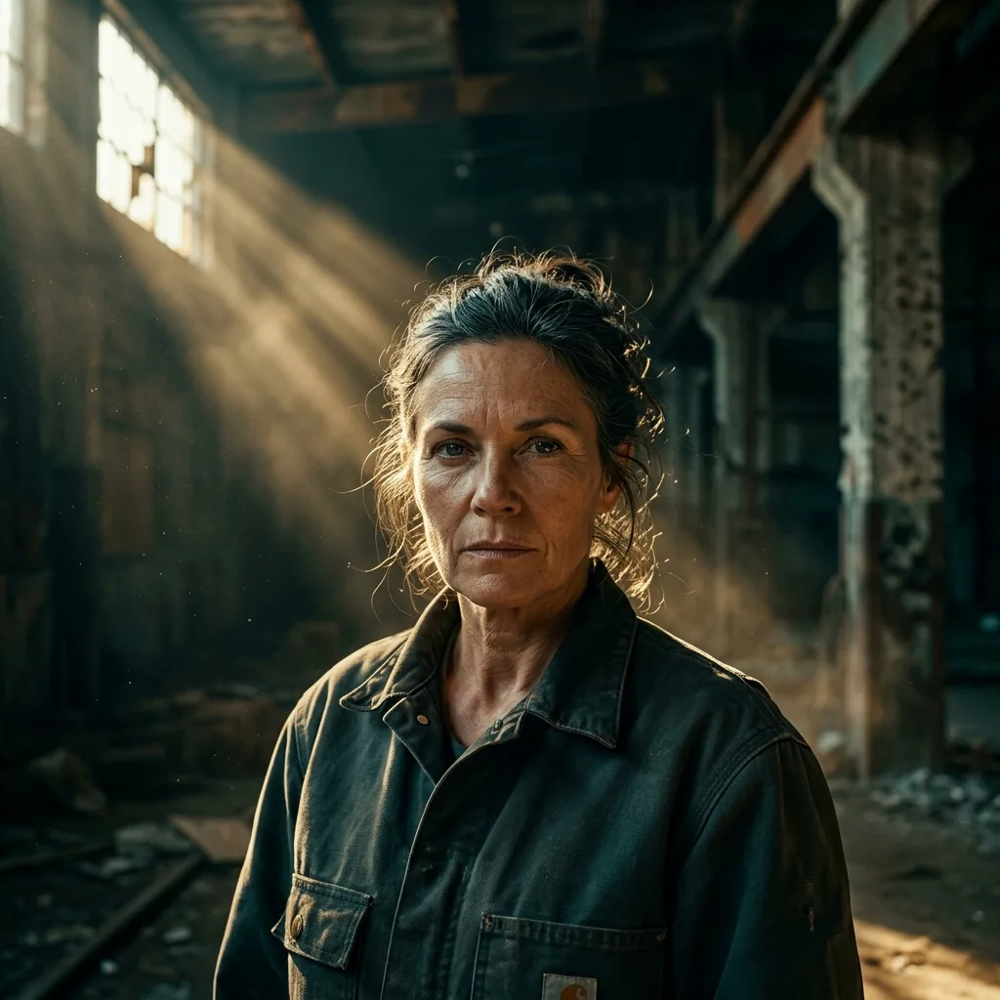

**#141 · Photography Prompt · <code>Vinano Image v2</code>**

<details>
<summary>Show prompt</summary>

```
Portrait of [your description], face illuminated by dramatic cinematic volumetric god rays, intense shafts of golden light beams cutting through dusty abandoned warehouse, sunlight streaming through broken high windows and cracked roof, floating dust particles and haze making light visible, strong rim light and backlighting, moody high-contrast atmosphere, industrial concrete pillars and rusted metal in background, film still, epic filmic, cinematic lighting, volumetric fog, god rays, atmospheric depth, ultra-detailed skin texture, shallow depth of field, shot on 35mm Arri Alexa, cinematic color grade, teal shadows and warm golden highlights --ar 3:4 --stylize 250 --v 6 --q 2 Preserve realistic proportions and depth for a confident, professional finish.
```

</details>

---

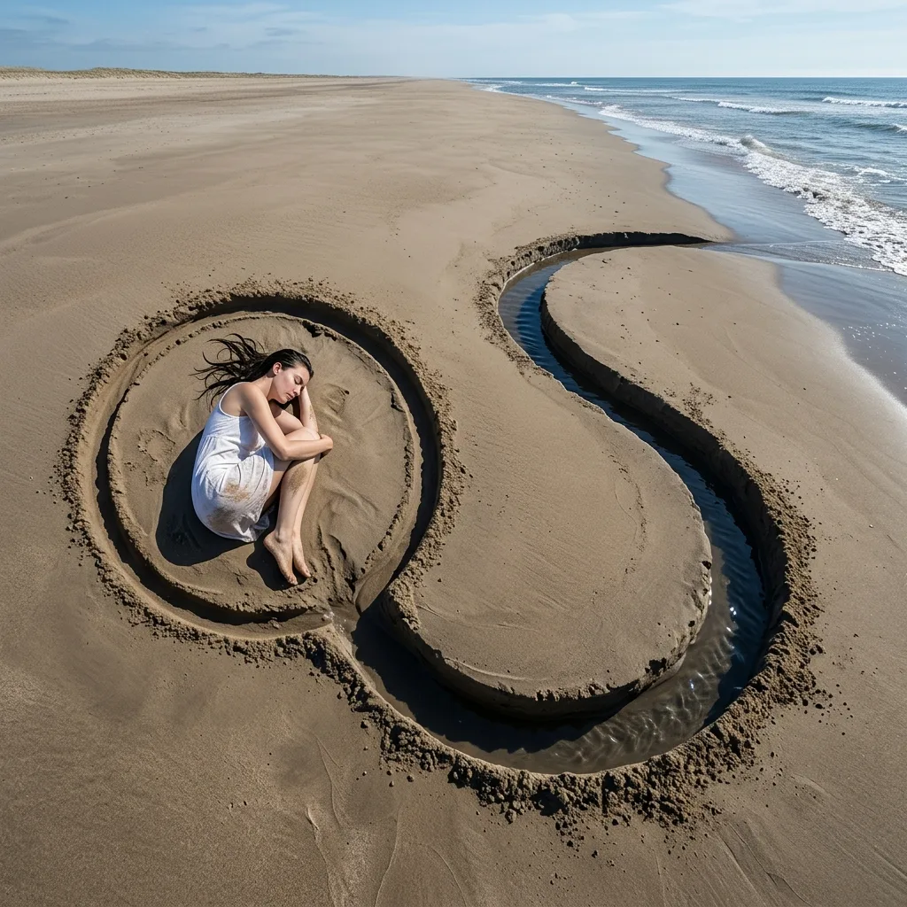

**#142 · Photography Prompt · <code>Vinano Image v2</code>**

<details>
<summary>Show prompt</summary>

```
{
 "intent": {
 "summary": "Land-art photography of a woman connected to the sea a specific water-filled trench in the sand, matching a provided schematic diagram.",
 "strategy": "Structural Precision: Defining the 'line' as a dug channel to prevent chaotic water flow."
 },
 "frame": {
 "aspect_ratio": "3:2",
 "shot_size": "Wide Shot (WS)",
 "orientation": "Landscape",
 "composition_guide": "Diagrammatic Layout: Woman on left, Sea on right, connected by a sinuous line."
 },
 "subject": {
 "subject_type": "Human",
 "identity_summary": "Female figure acting as the anchor for a sand-art installation.",
 "visual_signature": {
 "facial_signature": {
 "face_shape": "Soft",
 "eye_details": "Closed",
 "nose_details": "Natural",
 "lip_details": "Relaxed",
 "cheek_and_jaw": "Relaxed",
 "unique_features": "Wet hair"
 },
 "body_signature": {
 "build": "Slender",
 "proportions": "Natural",
 "skin_tone_and_texture": "Natural, sand-dusted",
 "height_estimation_cm": 165,
 "unique_markings": "None"
 }
 },
 "pose_and_action": {
 "description": "Lying in a tight fetal position inside a sand circle.",
 "body_position": "Curled on side, knees tucked high.",
 "limb_positions": "Arms tucked in, hugging knees.",
 "hand_gestures": "Hands folded near face/knees.",
 "facial_expression": "Peaceful, sleeping.",
 "gaze_direction": "Eyes closed."
 },
 "inventory": {
 "wardrobe": "White dress, wet and clinging to the body.",
 "accessories": "None.",
 "held_objects": "None.",
 "hair_style": "Dark, wet, splayed out on the sand."
 }
 },
 "environment": {
 "setting_type": "Outdoor",
 "location_description": "Flat sandy beach specific sand-art markings.",
 "time_of_day": "Daytime",
 "weather_conditions": "Clear",
 "background_elements": "The beach features a deep, hand-dug trench snaking from the sea to the woman's belly. This trench is filled sea water but distinct from the surrounding dry sand. A separate circular groove surrounds the woman."
 },
 "lighting": {
 "global_illumination": "Natural Sunlight",
 "primary_source": "Sun",
 "direction": "Top-down",
 "shadow_quality": "Sharp shadows inside the dug sand trenches to emphasize depth.",
 "color_temperature": "Daylight (5500k)"
 },
 "camera": {
 "angle": "Bird's Eye View",
 "lens_type": "35mm Wide Angle",
 "focal_length_mm": 35,
 "aperture": "f/8 (Deep focus to keep the entire sand drawing sharp)"
 },
 "post_processing": {
 "art_medium": "Photography",
 "style_modifiers": "Land Art, Conceptual, National Geographic",
 "color_grade": "Natural tones, high contrast between water in the trench and the sand.",
 "rendering_engine": "N/A",
 "quality_boosters": "8k, sharp focus, hyper-realistic water texture"
 },
 "negative": {
 "artifact_suppression": "waves washing over subject, messy water, flooding, broken lines, chaotic splash, surfing",
 "subject_excludes": "standing, dry sand, rocks"
 }
}

Render with rich micro-detail while keeping the layout uncluttered and intentional.
```

</details>

---

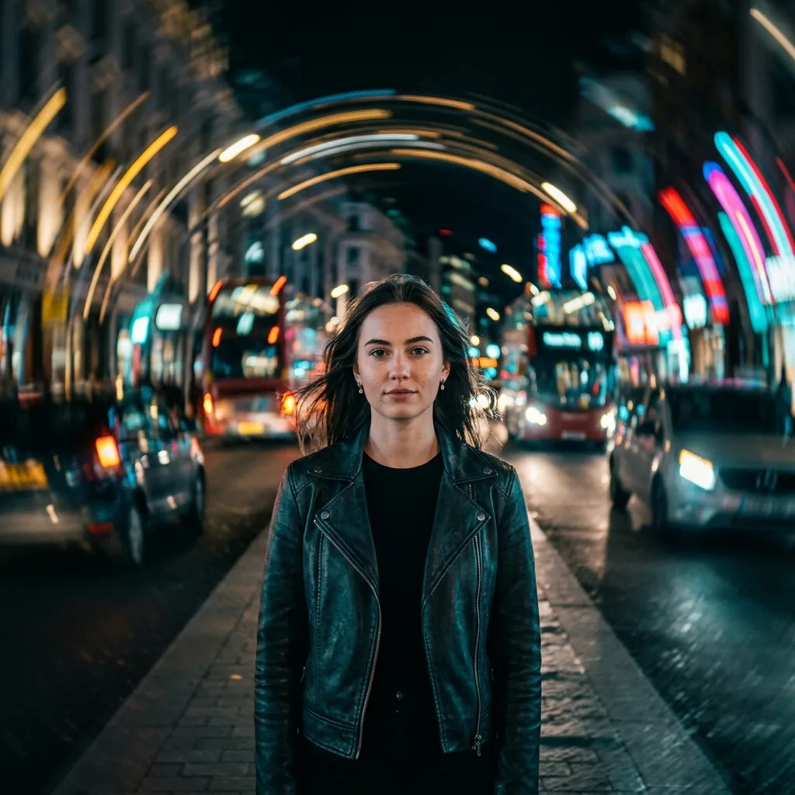

**#143 · Photography Prompt · <code>Vinano Image v2</code>**

<details>
<summary>Show prompt</summary>

```
cinematic portrait of a young woman standing perfectly still as the city around her spirals in circular motion blur, streaks of headlights and neon lights orbiting her body like gravity pulling the world inward, dramatic teal and orange cinematic color grading, wind moving strands of hair, calm expression contrasting chaotic motion, shallow depth of field, shot on a 50mm lens, realistic skin texture, atmospheric night lighting, vertical composition Maintain consistent colour harmony and crisp focus across the whole frame.
```

</details>

---

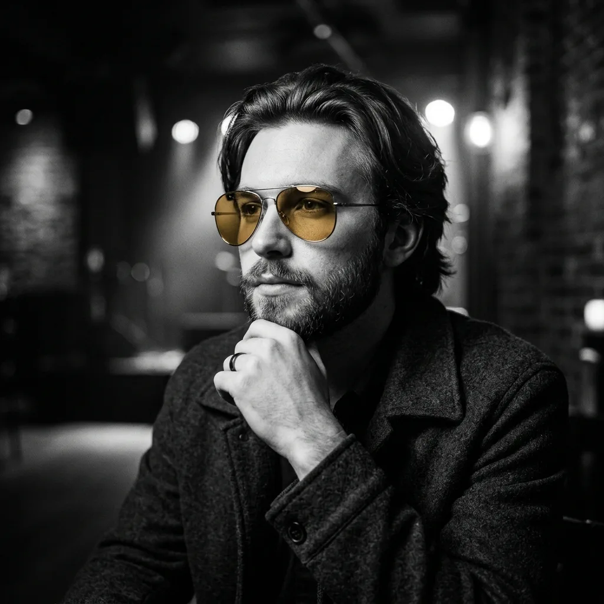

**#144 · Photography Prompt · <code>Vinano Image v2</code>**

<details>
<summary>Show prompt</summary>

```
{
 "Objective": "Create a dramatic black-and-white cinematic portrait a classic film-noir mood and selective color emphasis",
 "PersonaDetails": {
 "Subject": {
 "Type": "Young man",
 "Hair": "Medium-length, naturally styled",
 "FacialHair": "Well-groomed beard",
 "Pose": "Thoughtful pose one hand resting near the chin",
 "Expression": "Introspective, confident, composed",
 "Wardrobe": "Dark jacket",
 "Accessories": {
 "Sunglasses": {
 "Type": "Stylish aviator sunglasses",
 "LensColor": "Warm amber/yellow-tinted lenses",
 "SpecialTreatment": "Only colored element in an otherwise monochrome image"
 }
 }
 }
 },
 "Composition": {
 "Framing": "Close-up to mid-close portrait",
 "Angle": "Eye-level, slightly cinematic framing",
 "DepthOfField": "Shallow depth of field",
 "Focus": "Sharp focus on facial features and sunglasses"
 },
 "LightingAndAtmosphere": {
 "LightingStyle": "Strong cinematic backlighting",
 "Effects": ["Glowing bokeh lights in the background",
 "Studio or stage-light appearance"],
 "Contrast": "High contrast deep blacks and bright highlights",
 "Mood": "Moody, dramatic, contemplative"
 },
 "ArtDirection": {
 "Style": "Classic film-noir photography",
 "ColorTreatment": {
 "Base": "Black-and-white",
 "Accent": "Selective color on amber/yellow lenses"
 },
 "TextureDetail": "Ultra-detailed skin, hair, and fabric textures",
 "Aesthetic": "Elegant, timeless, cinematic"
 },
 "PhotographyStyle": {
 "Genre": "Professional cinematic portrait photography",
 "ImageQuality": "Ultra-high resolution, crisp detail",
 "Finish": "Refined, editorial, gallery-worthy"
 },
 "Mood": {
 "Tone": "Serious, reflective, stylish",
 "EmotionalFeel": "Quiet intensity and classic masculinity"
 },
 "NegativePrompt": ["full color image",
 "flat lighting",
 "low contrast",
 "modern casual snapshot",
 "oversharpening",
 "plastic skin",
 "cartoon",
 "anime"],
 "ResponseFormat": {
 "Type": "Single image",
 "Orientation": "Portrait",
 "AspectRatio": "2:3"
 }
}

Render with rich micro-detail while keeping the layout uncluttered and intentional.
```

</details>

---

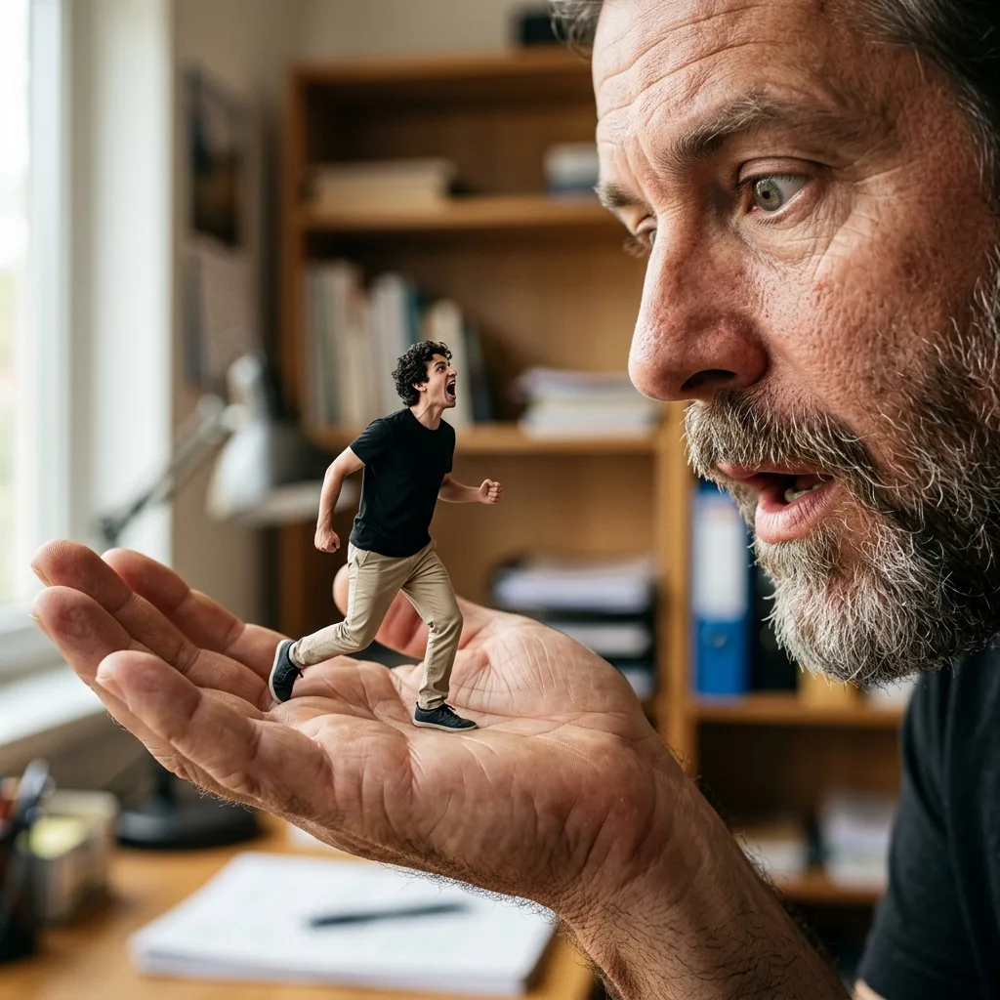

**#145 · Photography Prompt · <code>Vinano Image v2</code>**

<details>
<summary>Show prompt</summary>

```
A hyper-realistic, 8k, high-fidelity photograph captured a wide-angle lens and shallow depth of field, creating a dramatic forced perspective. The composition features a colossal human face and hand on the right side, filling the frame, the hand extended palm-up towards the left. The giant person, a full beard and mustache, has their mouth slightly agape in an expression of surprise or speech, looking down towards their palm. On the palm of this giant hand stands a miniature person, appearing tiny in comparison, wearing a black short-sleeved t-shirt and light khaki pants, dark curly hair. This miniature figure is captured mid-action, arms slightly bent and legs in a dynamic, running or reacting pose, also an open mouth as if shouting or speaking. The background is an extremely blurred, warm-toned indoor setting, suggesting an office or study hints of wooden shelves and a blue binder, providing a soft bokeh effect. filmic, cinematic lighting illuminates the scene soft, warm light, highlighting the highly detailed texture of the skin, hair, and clothing, while maintaining a natural, diffused quality. The character's face for both the giant and the miniature person is: uploaded face as reference. Maintain consistent colour harmony and crisp focus across the whole frame.
```

</details>

---

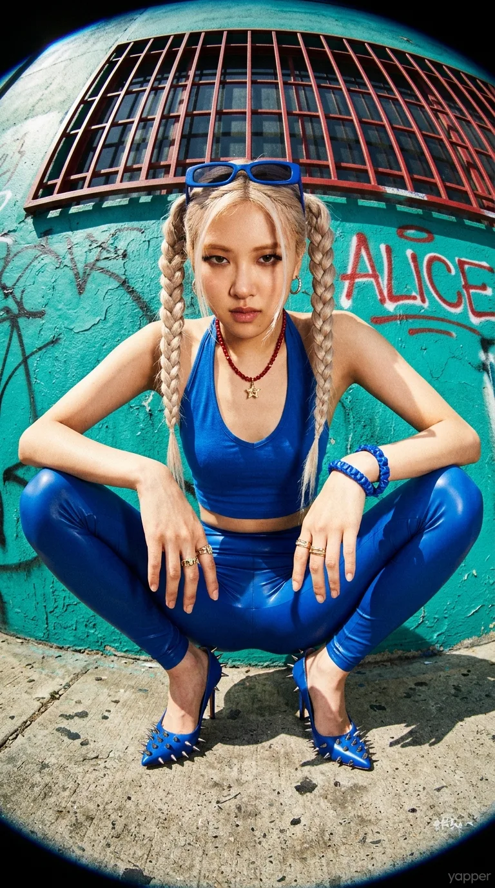

**#146 · Photography Prompt · <code>Vinano Image v2</code>**

<details>
<summary>Show prompt</summary>

```
Generate a highly detailed, true-to-life photorealistic 8K streetwear fashion portrait of Rosé of Blackpink, who is dominating about 90% of the frame. The shot is taken from a low angle a close-up perspective, a wide-angle lens heavy fisheye distortion to simulate a photo taken on a modern smartphone. She has her signature bleached blonde hair in thick pigtail braids, pale porcelain skin, and a confident expression. She is in a low, crouched squat position on the floor, balancing on the spiked high heels and both hands are placed flat on her thighs, leaning slightly forward, and looking directly at the camera. Cobalt-framed rectangular retro sunglasses slightly away from her eyes both hands. She is wearing a cobalt blue cotton halter crop top, tight cobalt blue latex leggings, and cobalt blue high heels. Her accessories include a ruby bead necklace a gold star pendant, silver hoop earrings, gold rings, and a cobalt blue bracelet a raised texture. The outdoor setting features a vibrant, textured teal wall behind her a graffiti written 'Alice' and a red metal grate above. The scene is lit by intense, direct daytime sunlight, creating hard shadows and high contrast. A small "yapper" watermark is in the bottom right corner. Aspect ratio 9:16. Aim for an editorial, design-driven look with deliberate negative space.
```

</details>

---

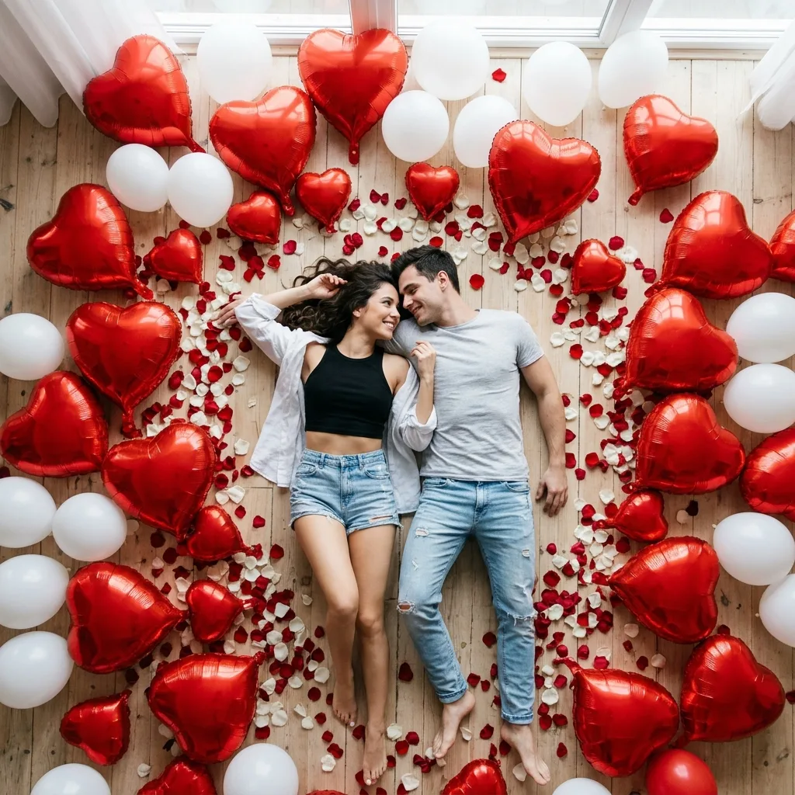

**#147 · Photography Prompt · <code>Vinano Image v2</code>**

<details>
<summary>Show prompt</summary>

```
A hyper-realistic 8k high-angle overhead shot, captured a wide-angle lens, presents a romantic scene of a couple lying on a light-colored wooden floor. The lighting is soft and natural, possibly from a window, creating gentle highlights on the balloons and subtle shadows on the floor, contributing to a cinematic atmosphere. The female subject, uploaded face as reference, is positioned on her back, wearing a black crop top, light blue denim shorts, and a white unbuttoned shirt draped over her. Her left arm is bent her hand near her head, and her right arm is gently extended towards the male. The male subject, uploaded face as reference, is also on his back, wearing a light grey t-shirt and light blue distressed denim jeans. His left arm is bent, hand near the female's head, and his right arm is relaxed. They are lying close together, heads touching, looking into each other's eyes soft, affectionate smiles. The entire floor around and between them is densely decorated a multitude of shiny red heart-shaped foil balloons of varying sizes, interspersed several white round latex balloons, and countless small red and white rose petals, creating a highly detailed texture and vibrant color contrast against the light wood. The composition is a full-body shot, showcasing the couple and the extensive, immersive decorations. Preserve realistic proportions and depth for a confident, professional finish.
```

</details>

---

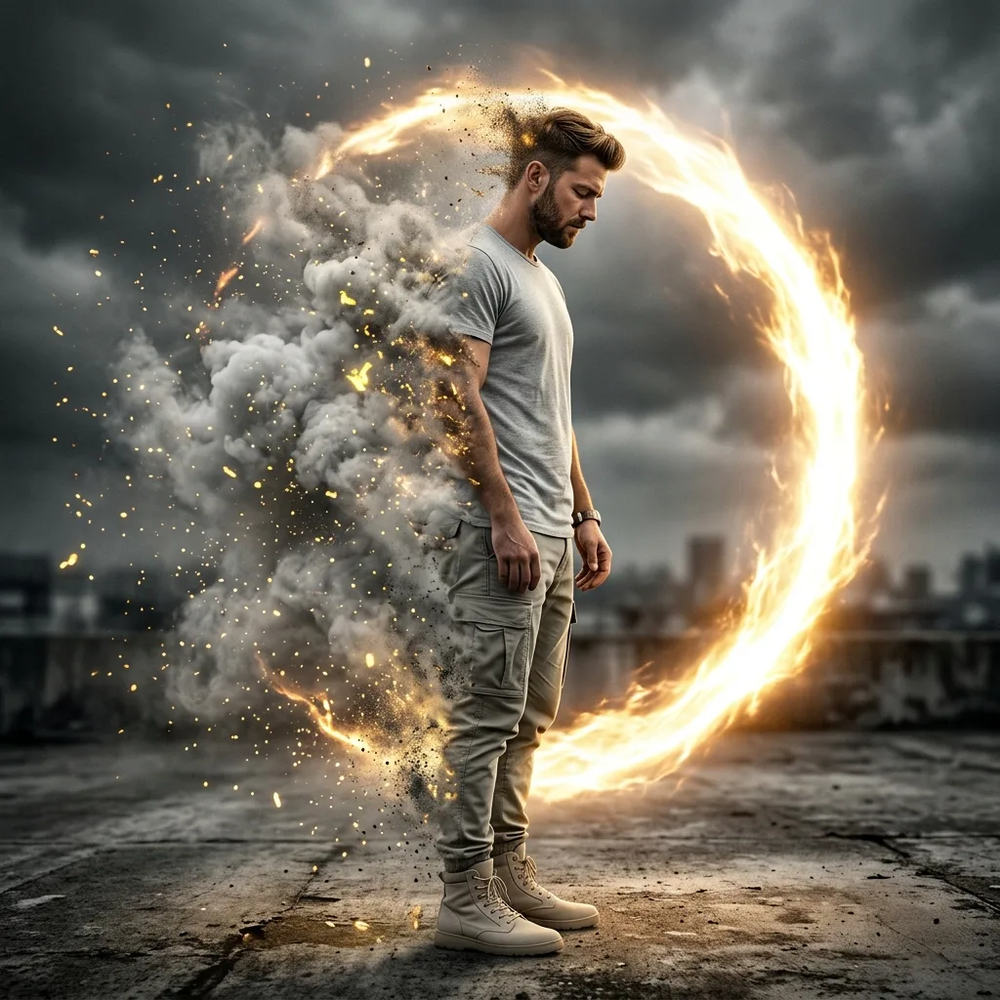

**#148 · Photography Prompt · <code>Vinano Image v2</code>**

<details>
<summary>Show prompt</summary>

```
Create an ultra-realistic, cinematic 8K image high-contrast dramatic lighting and a photo-real digital painting aesthetic-use face reference exactly. The man is shown in a full-body side profile facing right, his face and hairstyle copied perfectly no alterations He wears modern casual streetwear; a light grey crewneck t-shirt, light neutral cargo pants, light-colored high-top boots, and a watch on his left wrist. His posture is slightly slumped, head bowed, eyes looking downward, hands relaxed at his sides, conveying deep introspection and sorrow. Nearly half of his body is dissolving into extremely thick, cloud-like grey smoke filled glowing yellow dust particles. His left arm, shoulder, torso, legs, and part of his hair become transparent as they break into luminous particles, suggesting active disintegration Behind and partially surrounding him is a massive glowing crescent (C-shaped) energy aura, emitting fiery golden-white plasma light. This aura acts as a powerful rim and backlight, highlighting the smoke, dust, and silhouette. The setting is minimal and stark: a concrete or desolate paved surface meeting a heavily overcast sky. The color palette is nearly monochrome greys and whites, contrasted by intense amber-gold glow, Shallow depth of field, glow/bloom lighting, particle dispersion, cinematic composition, emotional and dramatic atmosphere. Maintain consistent colour harmony and crisp focus across the whole frame.
```

</details>

---

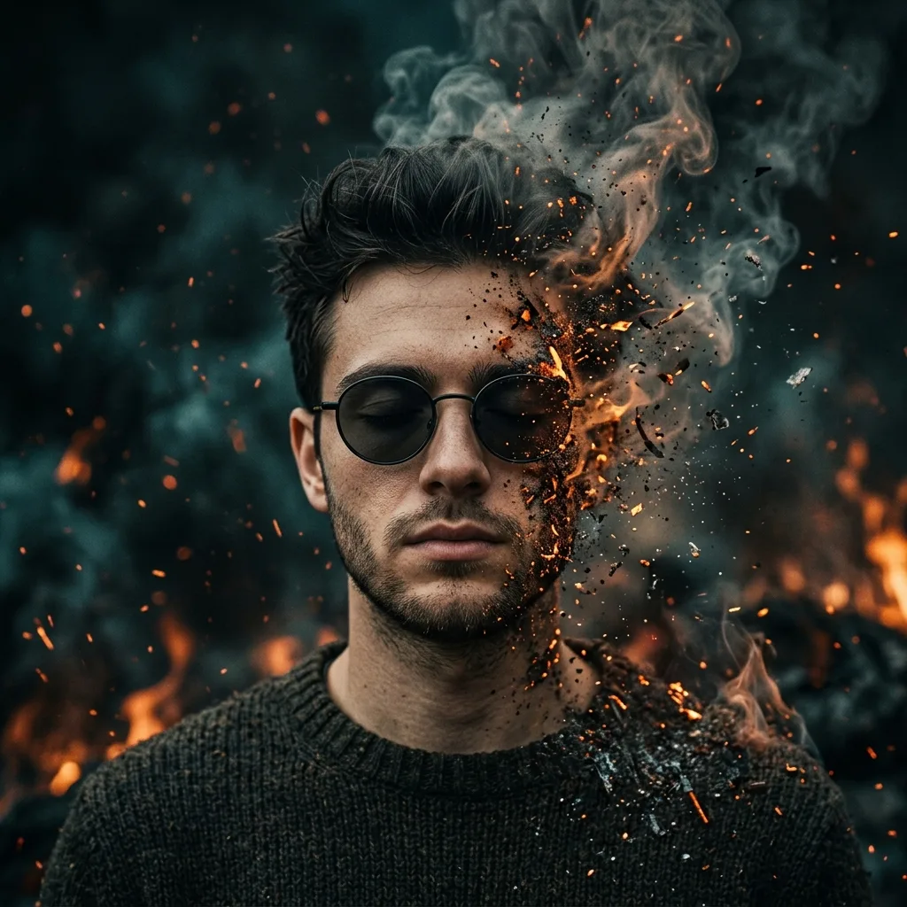

**#149 · Photography Prompt · <code>Vinano Image v2</code>**

<details>
<summary>Show prompt</summary>

```
A surreal cinematic portrait of a young man oval sunglasses, eyes closed, calm expression, standing against a dark firey moody background. The right side of his face is disintegrating into smoke, ash, and glowing embers, as if slowly burning away into the air. Fine particles, sparks, and debris float upward, blending seamlessly into thick swirling smoke above his head. Dramatic low-key lighting, high contrast, ultra-detailed skin texture, true-to-life photorealistic, shallow depth of field, 85mm lens, dark teal and charcoal color palette, emotional and introspective mood, ultra high resolution, masterpiece, volumetric smoke, cinematic composition. Emphasise material texture and natural light so the final frame feels tactile and premium.
```

</details>

---

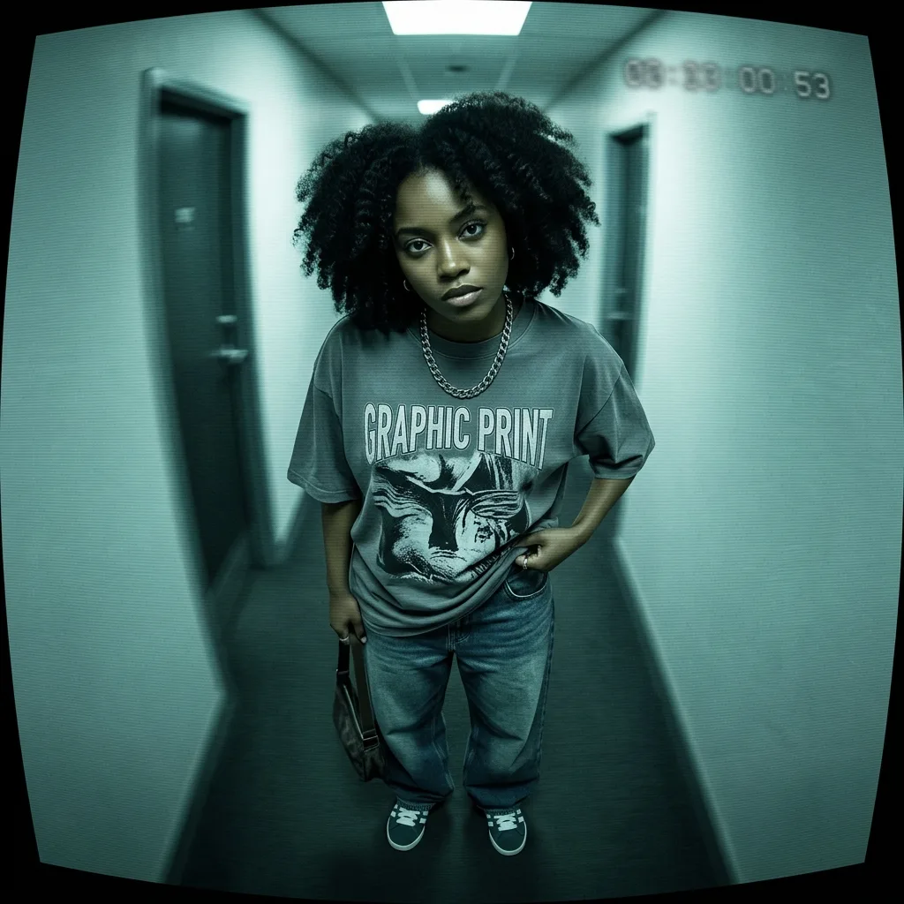

**#150 · Photography Prompt · <code>Vinano Image v2</code>**

<details>
<summary>Show prompt</summary>

```
Use uploaded selfie as ONLY face reference; preserve exact likeness/age/hair and natural skin texture; no beautification, no face mixing. Ultra-realistic CCTV/security camera still frame in a building hallway: ceiling corner mount view (high angle 60-70° top-down), wide 2.8-3.6mm fisheye barrel distortion, edge warping. Subject centered under the camera, looking up directly into lens a cool unbothered expression, one hand adjusting the waistband, the other holding a bag strap or hanging relaxed. Outfit (strict, unisex): oversized graphic print T-shirt (generic print, no readable text/logos), wide baggy jeans, Adidas Campus sneakers (recognizable silhouette), chunky chain necklace. CCTV look: low-light greenish/blue tint, interlaced scanlines, H.264 block compression, mild noise, slight motion smear on background only, timestamp/HUD present but blurred/unreadable (no readable text), vignetting, ceiling light glare. Face is the sharpest point. 3:4 Maintain consistent colour harmony and crisp focus across the whole frame.
```

</details>

---

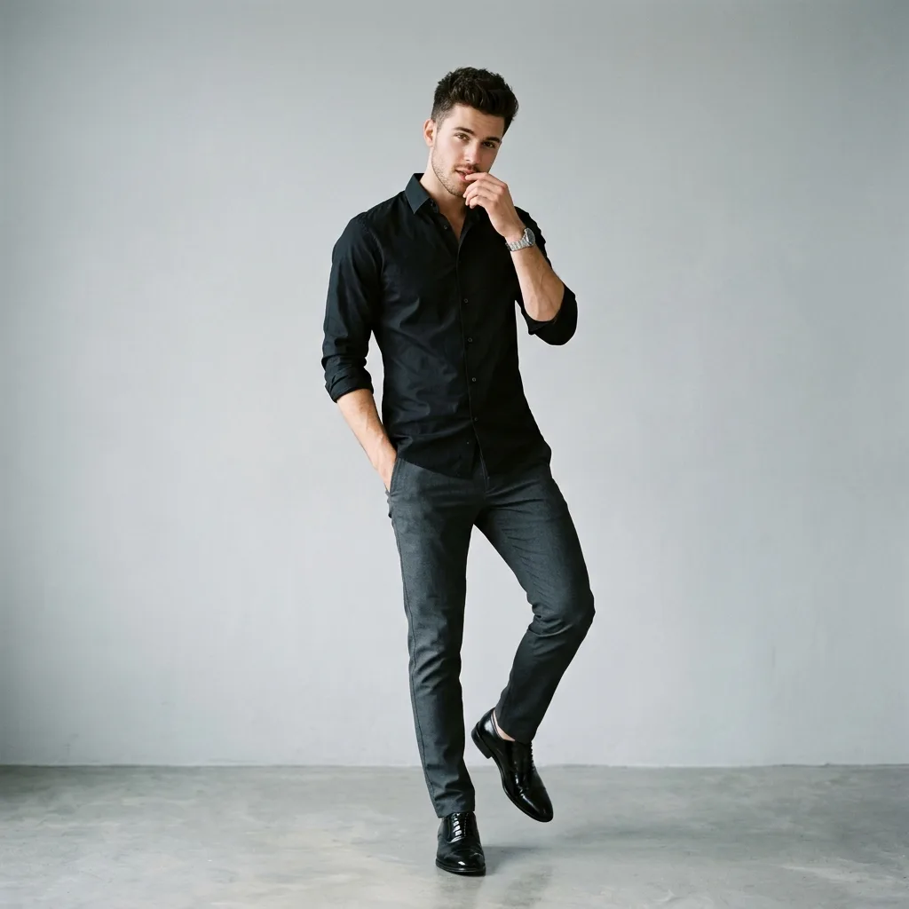

**#151 · Photography Prompt · <code>Vinano Image v2</code>**

<details>
<summary>Show prompt</summary>

```
Full-body portrait of a stylish young man standing against a plain light gray background, wearing a fitted black button-up shirt sleeves rolled up, dark gray slim-fit trousers, and black polished dress shoes. He is posing casually one hand in his pocket and the other hand near his mouth, slightly lifting one leg. The lighting is soft and even, highlighting his natural features, a clean refined minimalist studio aesthetic. Realistic proportions, high-detail, sharp focus, fashion photography style. Aim for an editorial, design-driven look with deliberate negative space.
```

</details>

---

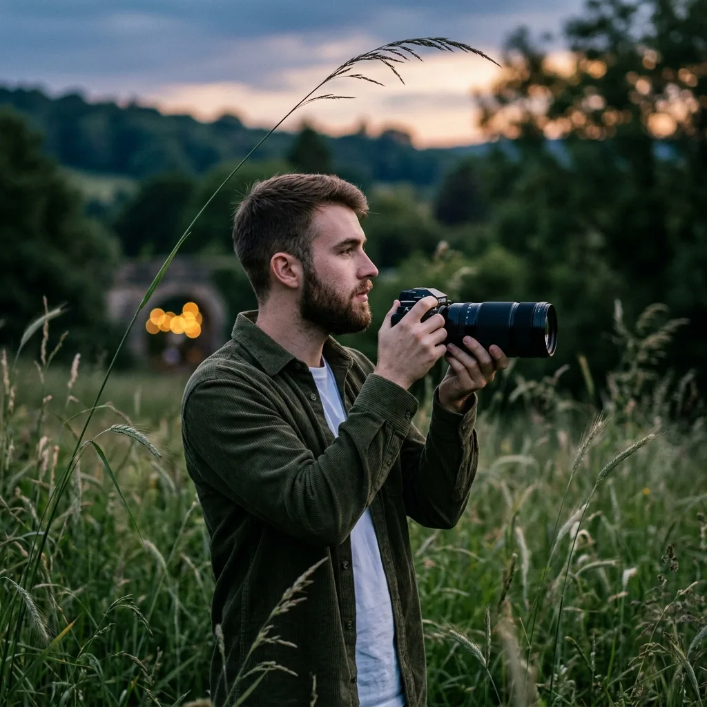

**#152 · Photography Prompt · <code>Vinano Image v2</code>**

<details>
<summary>Show prompt</summary>

```
Cinematic medium shot of a young man a trimmed beard and short brown hair, standing upright in a lush meadow at
twilight. He is captured in profile, looking toward the right, holding a professional black mirrorless camera a long
telephoto lens to his eye level. He wears an olive green corduroy button-down shirt over a plain white t-shirt. The man's chest below the area is hidden inside the grass. The foreground features
tall, sharp blades of grass and soft, out-of-focus wheat stalks creating a natural frame. The foreground is filled tall, deeply blurred wispy wild grasses, one very prominent blade
starting near the camera and arcing high above and across his head, creating a strong layer of depth. The background is a
masterclass in bokeh: deep moody blues and greens of distant rolling hills and trees, a soft motion blur effect on the foliage Large, warm golden bokeh light orbs glow softly in the distance
near a blurred stone archway. High-end photography, 85mm lens, f/1.8, moody atmosphere, sharp focus on the subject a creamy, cinematic background. ar 4:5

Preserve realistic proportions and depth for a confident, professional finish.
```

</details>

---

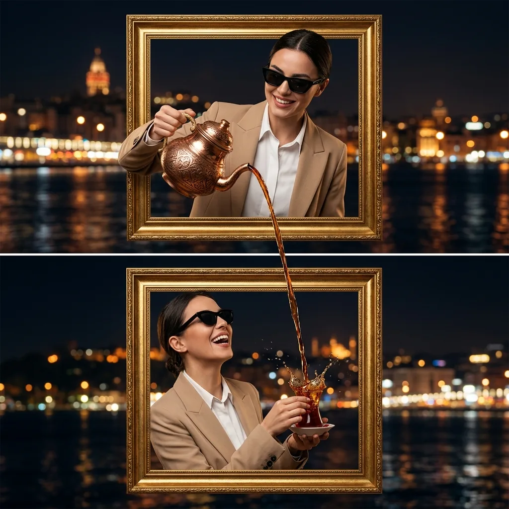

**#153 · Photography Prompt · <code>Vinano Image v2</code>**

<details>
<summary>Show prompt</summary>

```
Ultra-realistic cinematic two-frame composition. In the top golden vintage frame, an elegant stylish woman wearing a beige blazer, white shirt, and black sunglasses smiles while pouring tea from an ornate engraved copper teapot outward from the frame. The tea flows smoothly out of the frame into the lower frame. In the bottom golden frame, the same woman tilts her head back slightly a joyful expression, holding a traditional Turkish tea glass as the tea splashes dramatically into it mid-air. Nighttime city skyline warm glowing lights and water reflections in the background, shallow depth of field, dramatic lighting, high detail, surreal perspective illusion where the liquid connects both frames, cinematic photography, ultra realistic, 8k. Keep edges clean and the overall composition balanced for a polished, gallery-ready result.
```

</details>

---

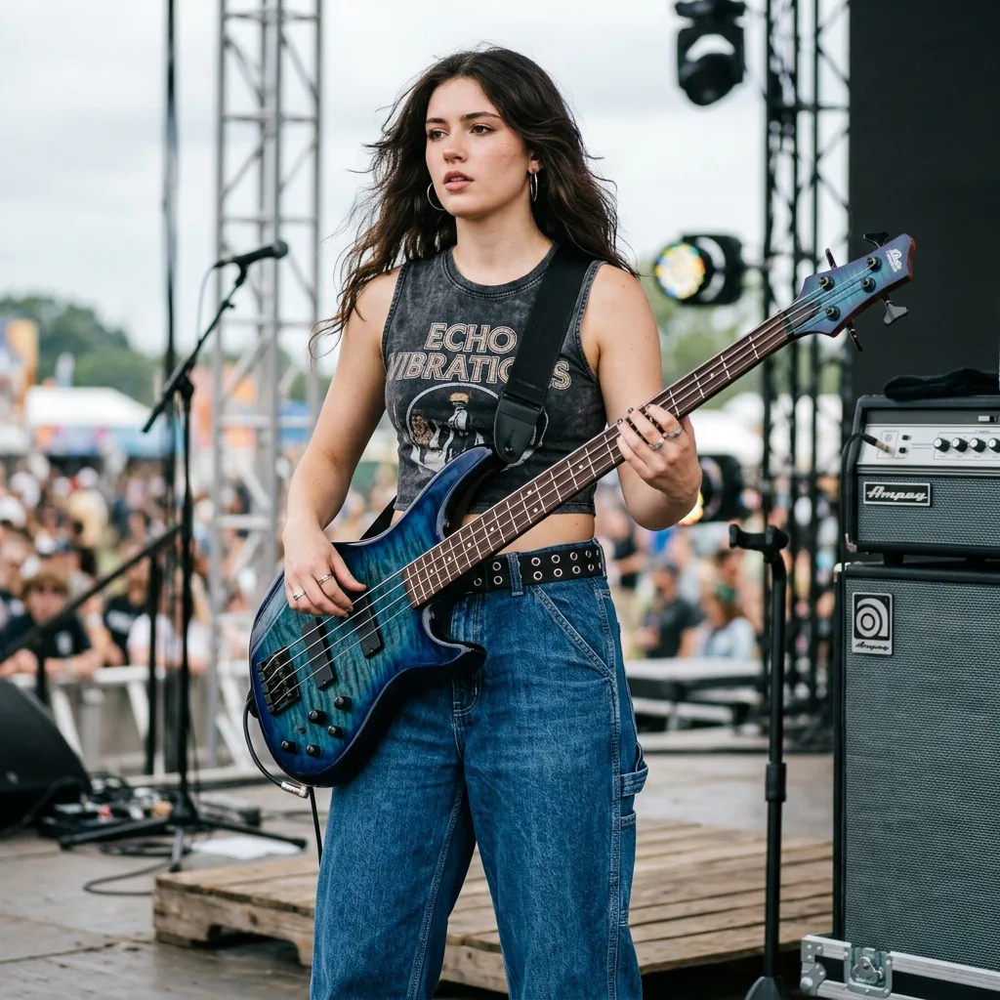

**#154 · Photography Prompt · <code>Vinano Image v2</code>**

<details>
<summary>Show prompt</summary>

```
{
 "image_generation_prompt": {
 "subject": {
 "main": "young female musician bass guitarist performing live on an outdoor stage",
 "appearance": "long dark wavy layered hair blowing slightly in wind, fair skin, intense focused facial expression, natural makeup, silver hoop earrings",
 "pose": "standing confidently holding a bass guitar, fingers plucking strings, looking slightly off-camera to the left"
 },
 "attire": {
 "top": "sleeveless dark grey acid-wash graphic crop top vintage band aesthetic",
 "bottoms": "loose fit wide-leg blue denim carpenter jeans large pockets",
 "accessories": "black leather belt double row silver grommets, wide black guitar strap"
 },
 "instrument": {
 "type": "modern electric bass guitar",
 "details": "deep blue burst finish visible wood grain texture (quilted maple top), black hardware, long guitar neck, intricate fretboard details"
 },
 "environment": {
 "setting": "daytime outdoor concert stage, open air festival vibe",
 "background_elements": "blurred stage truss structures, black bass amplifier stack metal grille, microphone stand on the left, overcast bright sky"
 },
 "technical_style": {
 "quality": "ultra realistic, 8k uhd, hdr, masterwork, sharp focus, high fidelity textures",
 "lighting": "natural diffuse daylight, soft shadows, filmic, cinematic lighting",
 "camera": "telephoto lens, depth of field, bokeh background, portrait photography"
 }
 },
 "parameters": {
 "aspect_ratio": "9:16",
 "orientation": "vertical long",
 "resolution": "highest possible"
 }
}

Emphasise material texture and natural light so the final frame feels tactile and premium.
```

</details>

---

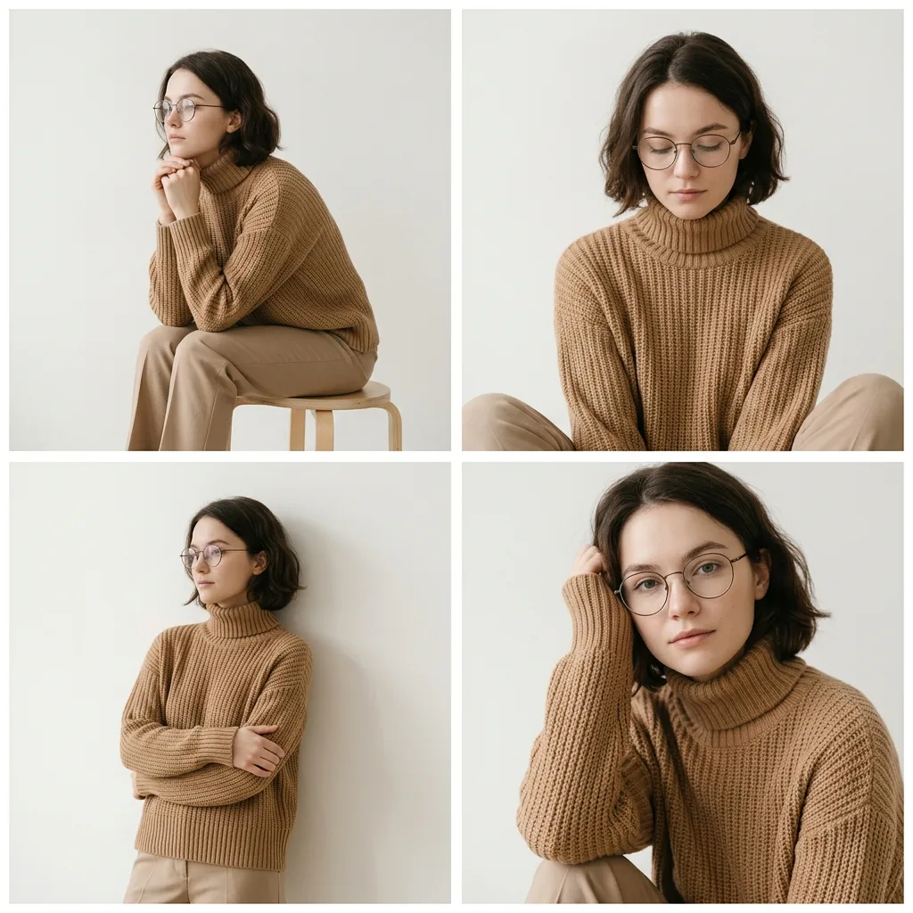

**#155 · Photography Prompt · <code>Vinano Image v2</code>**

<details>
<summary>Show prompt</summary>

```
{
 "Objective": "Create a refined minimalist fashion studio portrait series a calm, Scandinavian editorial mood",
 "PersonaDetails": {
 "Subject": {
 "Type": "Young woman",
 "Hair": "Short, softly waved dark-brown hair",
 "Accessories": "Thin round eyeglasses",
 "Expression": "Calm, introspective",
 "Skin": "Natural skin texture minimal retouching"
 }
 },
 "Wardrobe": {
 "Top": "Chunky camel-colored knit turtleneck sweater",
 "Bottom": "Beige trousers",
 "Style": "Timeless autumn fashion"
 },
 "SceneDescription": {
 "Environment": "refined minimalist studio",
 "Background": "Neutral off-white backdrop",
 "OverallFeel": "Clean, airy, understated"
 },
 "PortraitSeries": {
 "SeriesType": "Four-image set",
 "Poses": [{
 "Description": "Seated pose hands gently clasped under the chin",
 "Mood": "Quiet, reflective"
 },
 {
 "Description": "Front-facing portrait eyes lowered",
 "Mood": "Soft, contemplative"
 },
 {
 "Description": "Three-quarter side profile arms crossed",
 "Mood": "Poised, thoughtful"
 },
 {
 "Description": "Close-up portrait sweater sleeve raised near the face",
 "Mood": "Intimate, tactile"
 }]
 },
 "Composition": {
 "Framing": "Varied framing from close-up to mid-length",
 "NegativeSpace": "Generous, balanced negative space",
 "DepthOfField": "Shallow depth of field for gentle separation"
 },
 "LightingAndColor": {
 "Lighting": "Soft, diffused studio lighting",
 "Highlights": "Subtle, natural highlights",
 "ColorPalette": "Muted warm neutrals (camel, beige, off-white)"
 },
 "ArtDirection": {
 "Style": "Scandinavian editorial photography",
 "Aesthetic": "refined minimalist, timeless, understated luxury",
 "TextureEmphasis": "Knit fabric and natural skin detail"
 },
 "PhotographyStyle": {
 "Genre": "Professional fashion studio photography",
 "RealismLevel": "High realism restrained processing",
 "Finish": "Clean, modern, magazine-ready"
 },
 "Mood": {
 "Tone": "Calm, introspective, serene",
 "SeasonalFeel": "Autumn warmth and quiet elegance"
 },
 "NegativePrompt": ["busy background",
 "harsh lighting",
 "bold colors",
 "heavy makeup",
 "over-retouching",
 "glossy fashion look",
 "street photography"],
 "ResponseFormat": {
 "Type": "Portrait series",
 "ImageCount": 4,
 "Orientation": "Portrait",
 "AspectRatio": "2:3"
 }
}

Maintain consistent colour harmony and crisp focus across the whole frame.
```

</details>

---

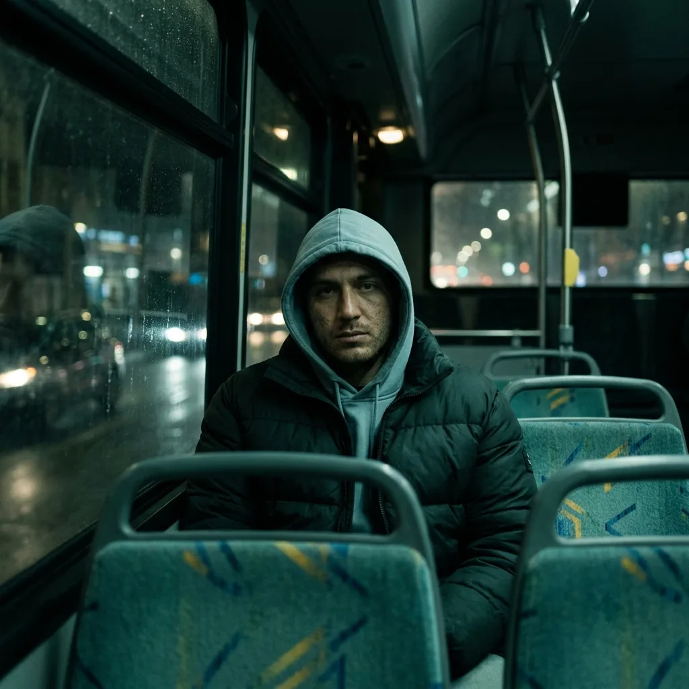

**#156 · Photography Prompt · <code>Vinano Image v2</code>**

<details>
<summary>Show prompt</summary>

```
Create A deeply atmospheric and cinematic interior shot, captured from a slightly low-angle perspective, looks forward from an empty seat in a dimly lit bus. The primary subject is this man seated a few rows ahead, looking directly back at the camera a subtle, intense gaze. He wears a dark, puffy winter jacket and has the hood of a light blue-grey hoodie pulled up over his head, partially obscuring his face and casting his eyes in shadow, adding a sense of mystery. The overall color grading is cool and desaturated, dominated by deep teal, dark blues, and muted greens, lending a melancholic or introspective mood. The interior of the bus is sparsely lit, artificial lights casting soft, localized glows and deep shadows. The seats in the foreground, upholstered in a faded teal fabric abstract yellow patterns, are in soft focus, guiding the eye towards the subject. Through the windows, blurred reflections of the city lights and exterior environment are visible, creating a sense of movement and urban isolation. The man's skin tone (take reference from the image) is rendered natural texture, visible through the cool-toned lighting. The lighting emphasizes the contours of his face and the folds of his clothing, creating a sense of depth and realism within the muted palette. This shot would likely use a relatively slow shutter speed (e.g., 1/60th or 1/30th of a second) and a moderately wide aperture (e.g., f/2.8-f/4) to capture the low light and atmospheric blur. Aim for an editorial, design-driven look with deliberate negative space.
```

</details>

---

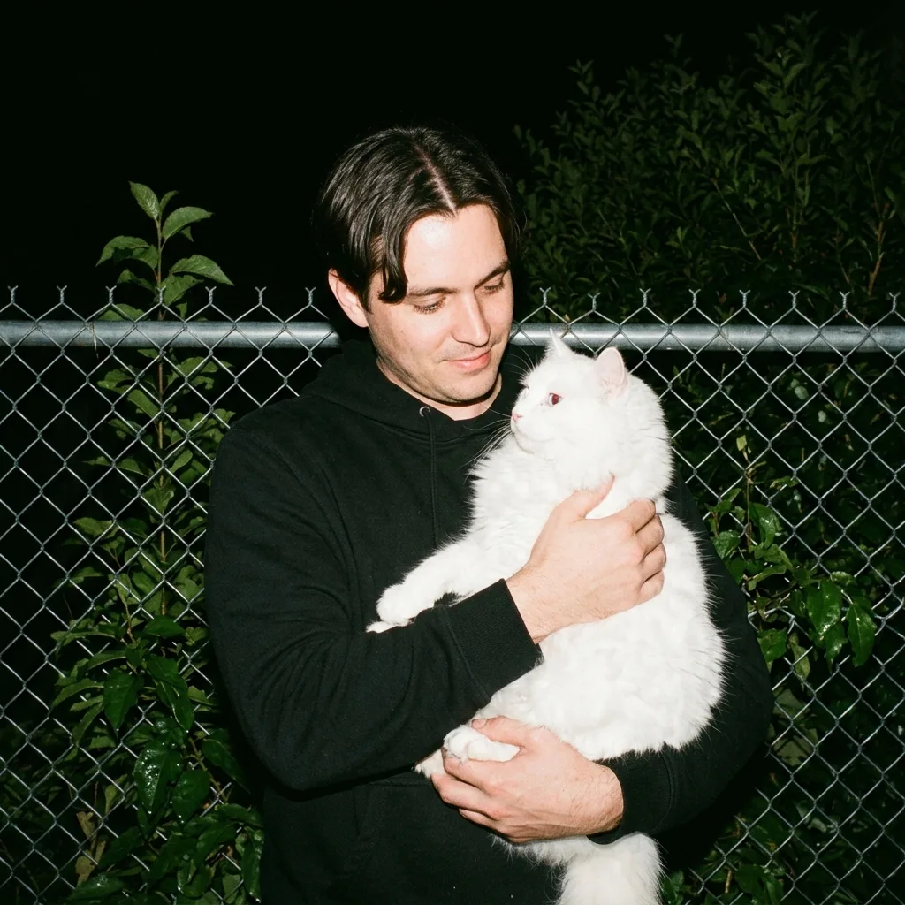

**#157 · Photography Prompt · <code>Vinano Image v2</code>**

<details>
<summary>Show prompt</summary>

```
A raw, candid smartphone-style photo taken at night a soft bright, direct camera flash, use my face on this image, featuring a man middle-parted dark hair and a soft, gentle expression looking affectionately at a large, fluffy white cat that he is holding in his arms. The man is wearing a plain black hoodie, and the cat is looking back at him, creating a heartwarming moment. The background consists of a metal chain-link fence some dark green leafy plants visible behind it, all set against a pitch-black night sky. The lighting has a nostalgic, slightly grainy 2010s digital camera aesthetic high contrast, sharp shadows, and a natural, unpolished vibe. Render with rich micro-detail while keeping the layout uncluttered and intentional.
```

</details>

---

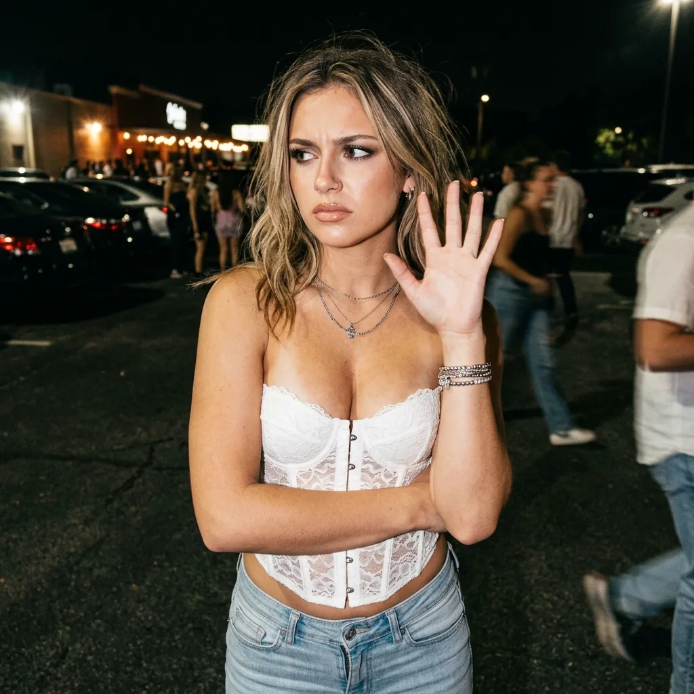

**#158 · Photography Prompt · <code>Vinano Image Pro</code>**

<details>
<summary>Show prompt</summary>

```
{
 "image_request": {
 "subject": "Woman",
 "setting": {
 "location": "Parking lot outside a party venue",
 "time_of_day": "Nighttime",
 "lighting": "Direct flash photography slight motion blur"
 },
 "woman_details": {
 "hair": {
 "description": "Maintains the original length, color, and volume exactly as shown in the reference image",
 "style": "Unchanged from the provided image"
 },
 "facial_features": "Identical to the reference image no modifications",
 "makeup": {
 "lips": "Subtle glossy finish",
 "general": "Clearly visible makeup"
 },
 "pose": {
 "main_body": "Arms crossed, positioned very close to the camera",
 "hands": "One hand lifted near the face, suggesting an attempt to shield from the camera"
 },
 "expression": "Unfocused and distracted"
 },
 "attire": {
 "top": "White strapless lace corset featuring front hook or clasp closures",
 "bottom": "Light-wash denim low-rise skinny jeans",
 "accessories": {
 "bag": "White shoulder bag",
 "jewelry": ["Necklace (kept on)",
 "Bracelet (kept on)"]
 }
 },
 "style_keywords": ["Night-out party vibe",
 "Y2K aesthetic",
 "Trendy fashion"],
 "camera_perspective": {
 "distance": "Extremely close range",
 "framing": "Tight close-up",
 "angle": "Straight-on, front-facing"
 },
 "image_specifications": {
 "dimensions": "1200 x 1200 pixels"
 },
 "additional_notes": "Image appears to be captured casually by a friend."
 }
}

Emphasise material texture and natural light so the final frame feels tactile and premium.
```

</details>

---

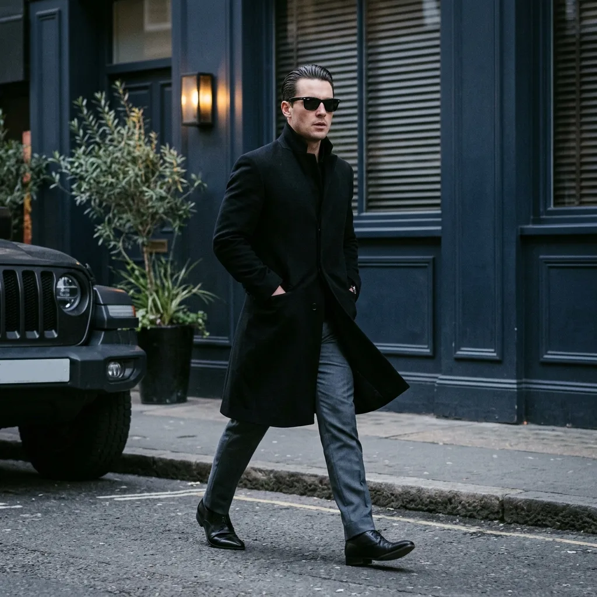

**#159 · Photography Prompt · <code>Vinano Image Pro</code>**

<details>
<summary>Show prompt</summary>

```
{
"metadata": {
"image_type": "photograph",
"primary_purpose": "editorial"
},
"composition": {
"rule_applied": "rule of thirds",
"aspect_ratio": "2:3",
"layout": "layered",
"focal_points": ["Subject's face and sunglasses",
"Flowing silhouette of the black overcoat"],
"visual_hierarchy": "Eye starts at the subject's face/sunglasses, travels down the sweeping lines of the black coat to the stride of the grey trousers, then moves back to register the black vehicle and architectural background",
"balance": "asymmetric"
},
"color_profile": {
"dominant_colors": [{
"color": "Deep Black",
"hex": "#111111",
"percentage": "45%",
"role": "primary subject clothing and vehicle"
},
{
"color": "Slate Grey",
"hex": "#5A5D60",
"percentage": "20%",
"role": "trousers and street surface"
},
{
"color": "Navy Blue",
"hex": "#1C2331",
"percentage": "25%",
"role": "background building facade"
},
{
"color": "Warm Amber",
"hex": "#ECAE62",
"percentage": "2%",
"role": "accent light from sconce"
}],
"color_palette": "monochromatic cool bias and a warm accent",
"temperature": "cool",
"saturation": "desaturated",
"contrast": "medium contrast"
},
"lighting": {
"type": "mixed",
"source_count": "multiple sources",
"direction": "diffused from above",
"directionality": "diffused",
"quality": "soft light",
"intensity": "moody",
"contrast_ratio": "medium contrast",
"mood": "dramatic",
"shadows": {
"type": "soft gradual edges",
"density": "gray",
"placement": "under vehicle, beneath subject's coat, under jawline",
"length": "short"
},
"highlights": {
"treatment": "subtle",
"placement": "reflections on sunglasses, leather shoes, car bumper, and subtle sheen on cheekbone"
},
"ambient_fill": "present",
"light_temperature": "cool (blue) a localized warm (golden) practical light"
},
"technical_specs": {
"medium": "digital photography",
"style": "realistic",
"texture": "smooth",
"sharpness": "slightly soft",
"grain": "film grain",
"depth_of_field": "medium",
"perspective": "straight on"
},
"artistic_elements": {
"genre": "street",
"influences": ["Paparazzi street style photography",
"High fashion editorial candid shots"],
"mood": "sophisticated",
"atmosphere": "Cinematic, moody urban transit a cool, detached, fashionable energy",
"visual_style": "clean"
},
"typography": {
"present": false,
"fonts": [],
"placement": "none",
"integration": "none"
},
"subject_analysis": {
"primary_subject": "A stylish adult male walking briskly in a tailored black overcoat and sunglasses",
"positioning": "center",
"scale": "full",
"interaction": "isolated",
"facial_expression": {
"mouth": "parted slightly open",
"smile_intensity": "no smile",
"eyes": "hidden by sunglasses, appearing to look straightforward",
"eyebrows": "neutral",
"overall_emotion": "serious",
"authenticity": "candid"
},
"hands_and_gestures": {
"left_hand": "hidden entirely inside the left pocket of the overcoat",
"right_hand": "hidden entirely inside the right pocket of the overcoat",
"finger_positions": "not visible",
"finger_interlacing": "none",
"hand_tension": "relaxed",
"interaction": "resting in pockets",
"naturalness": "organic casual gesture"
},
"body_positioning": {
"posture": "walking",
"angle": "facing slightly left of camera in mid-stride",
"weight_distribution": "shifted onto the front right leg",
"shoulders": "level"
},
"hair_analysis": {
"length": "medium-short, approximately 3-4 inches on top, reaching just past the nape of the neck in the back",
"style_name": "slicked back undercut or taper",
"texture": "straight but highly styled, wet-look texture visible comb tracks",
"imperfections": "some slight flyaway strands visible at the very back edge near the collar, natural separation of hair clumps from product wear",
"part_location": "no distinct part, pushed straight back",
"styling_state": "heavy product use, likely a high-hold pomade or gel giving a glossy, structured hold",
"volume": "low volume, sleek and close to the scalp"
}
},
"background": {
"setting_type": "outdoor urban street",
"spatial_depth": "medium",
"elements_detailed": [{
"item": "Black Jeep Wrangler (grill, bumper, front tire)",
"position": "left and directly behind subject",
"distance": "midground",
"size": "medium",
"condition": "worn",
"specific_features": "matte black plastic bumper, dirty tire treads, distinct round headlight casing outline"
},
{
"item": "Potted plant (thin-leafed shrub/small tree, possibly oleander or olive)",
"position": "left mid-upper quadrant",
"distance": "background",
"size": "small",
"condition": "thriving",
"specific_features": "housed in a dark planter, thin sprawling branches, small pale green leaves"
},
{
"item": "Wall sconce / lantern",
"position": "top left quadrant",
"distance": "background",
"size": "small",
"condition": "pristine",
"specific_features": "black metal housing, classic trapezoidal shape, emitting warm yellow light"
}],
"wall_surface": {
"material": "painted wood/masonry facade",
"surface_treatment": "smooth paint architectural paneling and molding",
"texture": "perfectly smooth",
"finish": "matte",
"color": "dark navy blue",
"color_variation": "uniform",
"features": "clean, horizontal routed lines, framed window closed horizontal blinds",
"wear_indicators": "pristine"
},
"floor_surface": {
"material": "asphalt street and concrete curb",
"color": "medium slate grey",
"pattern": "solid slight urban texture/grit"
},
"objects_catalog": "Subject's black overcoat, subject's grey trousers, subject's black leather pointed shoes, subject's black wayfarer sunglasses, black Jeep Wrangler (partial), potted plant, wall sconce, architectural building facade.",
"background_treatment": "slightly blurred to separate subject"
},
"generation_parameters": {
"prompts": ["A candid paparazzi-style street photography shot of a handsome man walking briskly down an overcast city street. He has slicked-back dark hair, wearing classic black sunglasses, a long flowing black tailored overcoat, and relaxed grey trousers. Both hands are tucked casually into his coat pockets. In the background, there is a black Jeep parked, and a dark navy blue building facade classic molding and an illuminated warm wall sconce. Shot on 85mm lens, slight film grain, desaturated cool tones, cinematic moody lighting, fashion editorial vibe.",
"A low-angle fashion street style tracking shot of a male model in mid-stride. He wears a heavy black wool trench coat, wide-leg grey dress pants, and dark wayfarer sunglasses. Wet-look slicked back hair. He walks past a dark SUV on a grey asphalt street. The background features a deep blue storefront a glowing vintage street lamp. Soft overcast lighting, muted color palette, sharp focus on the subject a slightly soft background."],
"keywords": ["street style",
"menswear",
"candid photography",
"black overcoat",
"urban fashion"],
"technical_settings": "Camera: DSLR or Mirrorless, Lens: 85mm or 105mm, Aperture: f/2.8 or f/4 to achieve medium depth of field, Shutter Speed: 1/500s or faster to freeze walking motion, ISO: 400-800 for overcast lighting and slight grain.",
"post_processing": "Desaturated color grade pulling down greens and warm tones (except for the localized lamp light), crushed blacks for a matte shadow look, added subtle film grain, slight vignette, cool temperature overall white balance shift."
}
}

Preserve realistic proportions and depth for a confident, professional finish.
```

</details>

---


**#160 · Photography Prompt · <code>Vinano Image v2</code>**

<details>
<summary>Show prompt</summary>

```
Cinematic ultra-realistic close-up of a man taking a billiards shot, captured in a tense, mid-focus moment as he leans low toward the cue ball. His eyes are locked sharply on the aim, expression steady and confident, while his supporting hand rests firmly on the green felt, guiding the cue precision. He wears a crisp white shirt rolled sleeves and slightly open buttons, giving a relaxed yet intensely focused vibe. His hair is neatly tied back, and his clear-framed glasses catch warm reflections from overhead lights. The background is softly blurred, filled atmospheric golden highlights, adding depth, drama, and a competitive mood to the scene.

use face reference exactly

Preserve realistic proportions and depth for a confident, professional finish.
```

</details>

---


**#161 · Photography Prompt · <code>Vinano Image Pro</code>**

<details>
<summary>Show prompt</summary>

```
{
 "prompt": " the uploaded reference image, generate a highly realistic full-body portrait of the SAME person 100% identical facial structure, skin tone, facial proportions, and overall identity. Do NOT alter the face in any way.\n\nA proud South Indian woman celebrating the Thaipongal festival, standing gracefully in a traditional rural Tamil village courtyard at sunrise. She is wearing an elegant traditional silk saree (Kanjivaram-style) in rich festive colors a gold zari border, draped authentically. A matching blouse complements the saree. Her hair is neatly styled in a traditional manner, adorned fresh jasmine flowers (mallipoo). A subtle sandalwood or kumkum tilak is visible on her forehead. She holds a long brown leafy sugarcane stalk gently in one hand.\n\nIn the foreground, a decorated clay Pongal pot is boiling over on a wood-fired brick stove, rice frothing out, symbolizing prosperity. Beside the stove are tied brown sugarcane stalks, fresh turmeric plants, bananas, and intricate colorful kolam (rangoli) designs drawn on the ground.\n\nThe background features a rustic mud house a thatched roof, decorated mango-leaf torans, marigold flower garlands, and hanging clay oil lamps. Warm golden sunrise light fills the scene, soft smoke rising from firewood, creating a joyful and auspicious festive atmosphere.\n\nUltra-realistic filmic, cinematic lighting, shallow depth of field, natural South Indian skin texture, authentic Tamil rural aesthetic, 8K ultra-detailed quality, vertical composition, cultural accuracy, festive mood.",
 "style": "cinematic realism, South Indian traditional portrait",
 "lighting": "warm golden sunrise light, soft cinematic glow",
 "environment": "traditional Tamil rural village courtyard",
 "camera": "professional portrait photography, shallow depth of field",
 "quality": "ultra-realistic, 8K, highly detailed",
 "composition": "full-body, vertical frame",
 "constraints": "face must remain 100% identical to the uploaded reference image absolutely no facial modification"
}

Aim for an editorial, design-driven look with deliberate negative space.
```

</details>

---

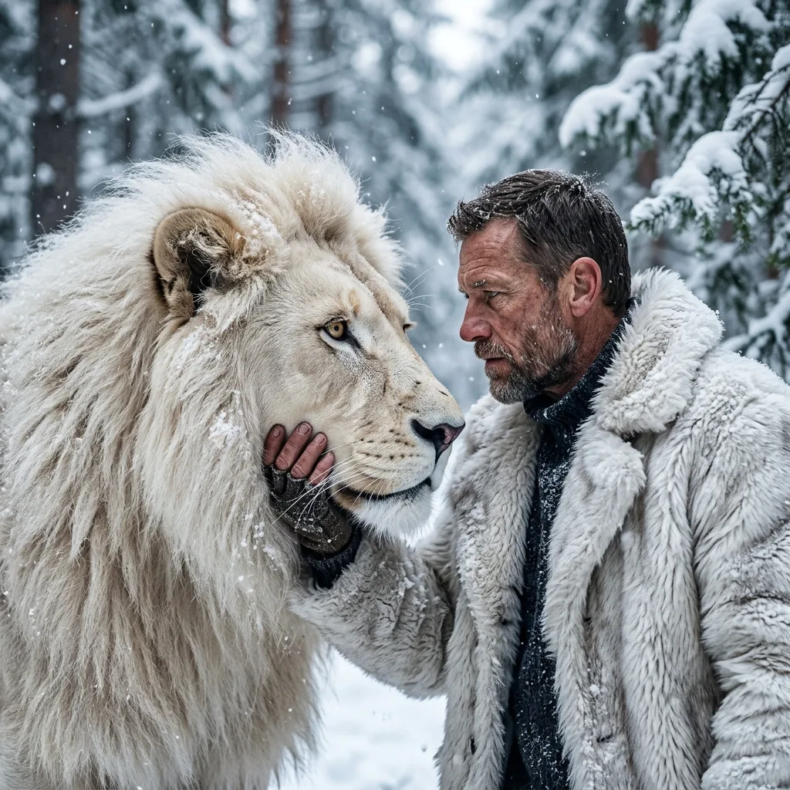

**#162 · Photography Prompt · <code>Vinano Image v2</code>**

<details>
<summary>Show prompt</summary>

```
A cinematic ultra-realistic portrait of a man standing face-to-face a majestic white lion in a snowy forest. The man is wearing a luxurious white fur coat, gently holding the lion’s face one hand, conveying trust, power, and calm dominance. Soft snowfall surrounds them, frosted pine trees blurred in the background. Dramatic natural lighting, shallow depth of field, sharp focus on facial details and fur texture. Cold winter color grading, soft whites and muted grays. Hyper-detailed fur, realistic skin texture, emotional eye contact. Shot on a high-end DSLR, 85mm lens, f/1.8, cinematic composition, true-to-life photorealistic, 8K quality. Preserve realistic proportions and depth for a confident, professional finish.
```

</details>

---

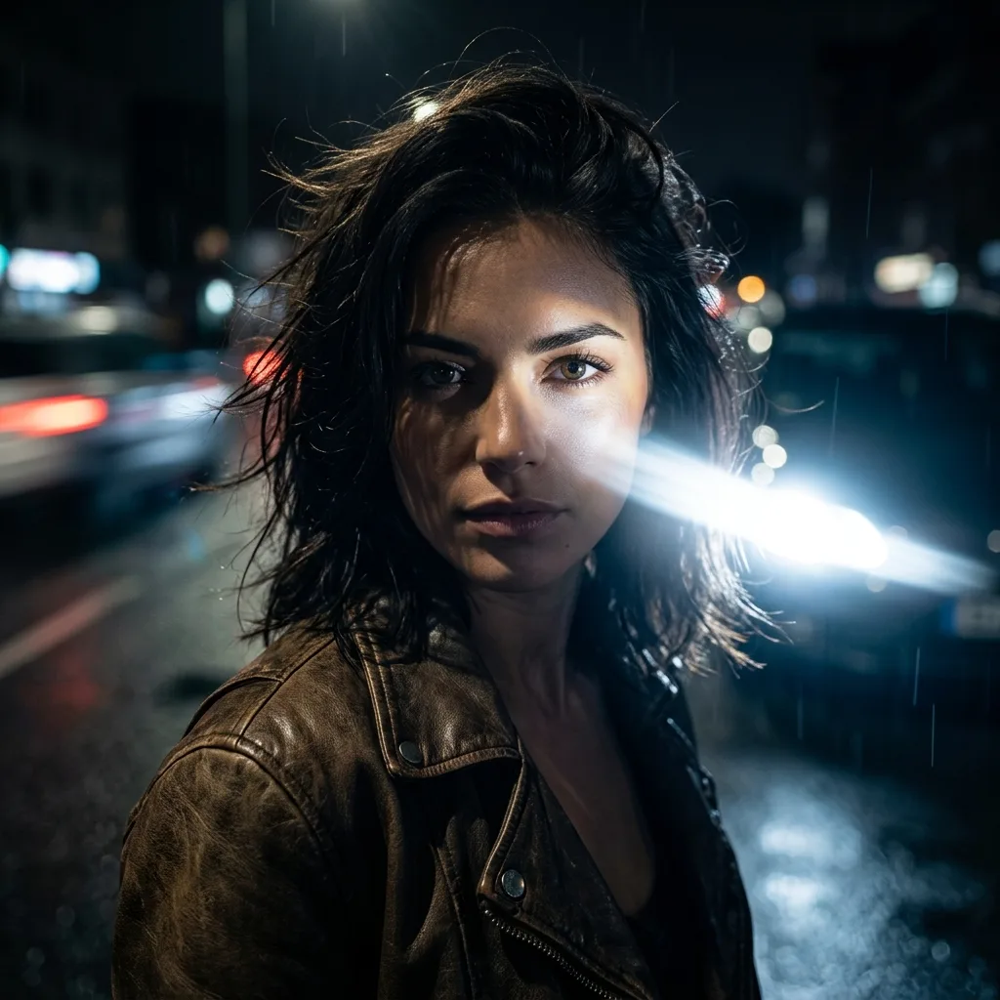

**#163 · Photography Prompt · <code>Vinano Image v2</code>**

<details>
<summary>Show prompt</summary>

```
Ultra-realistic portrait of a woman (from uploaded image), messy hair slightly windswept, wearing a worn leather jacket. Bright white car light sweeping across the face from one side to the other, freezing a moment of illumination while the rest fades into shadow. Night street environment, cinematic motion feel. Preserve realistic proportions and depth for a confident, professional finish.
```

</details>

---

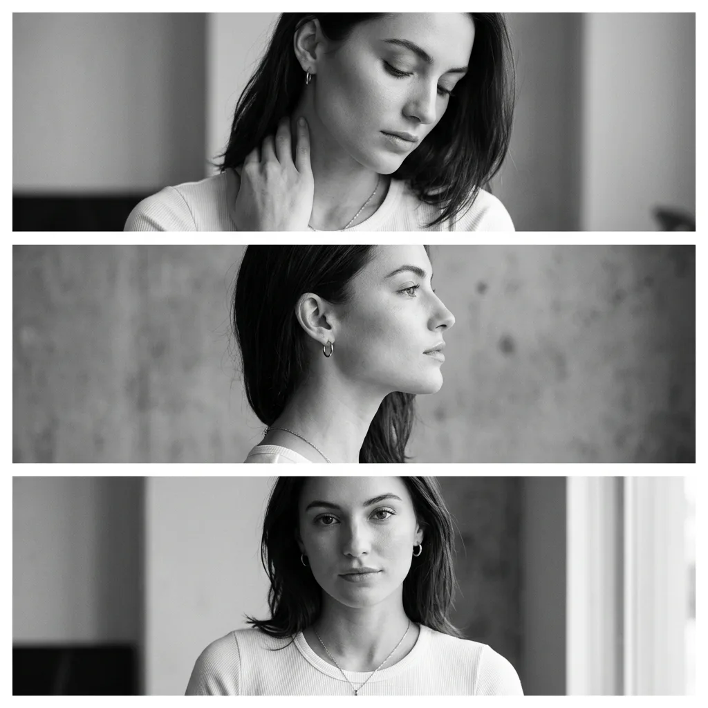

**#164 · Photography Prompt · <code>Vinano Image v2</code>**

<details>
<summary>Show prompt</summary>

```
Preserve the face, proportions, and external features of the model as in the reference. A refined minimalist monochrome fashion editorial triptych featuring three stacked cinematic frames. The subject is a young woman medium-length dark hair, natural makeup, and elegant features.

Frame 1: Emotional and introspective, looking downward a hand gently near the collarbone, highlighting cheekbones and bone structure soft Rembrandt lighting.
Frame 2: A crisp profile shot emphasizing the nose, lips, and graceful jawline, gaze directed slightly upward for a poised, confident look.
Frame 3: A frontal, thoughtful portrait relaxed shoulders and direct eye contact, conveying quiet strength and elegance.
The composition is clean and modern, a fitted white top and delicate gold jewelry for visual continuity. Commercial magazine quality, shot on a high-end mirrorless camera, authentic skin texture, soft bokeh, and cinematic sophistication. Feminine elegance and contemporary fashion sensibility.

Emphasise material texture and natural light so the final frame feels tactile and premium.
```

</details>

---

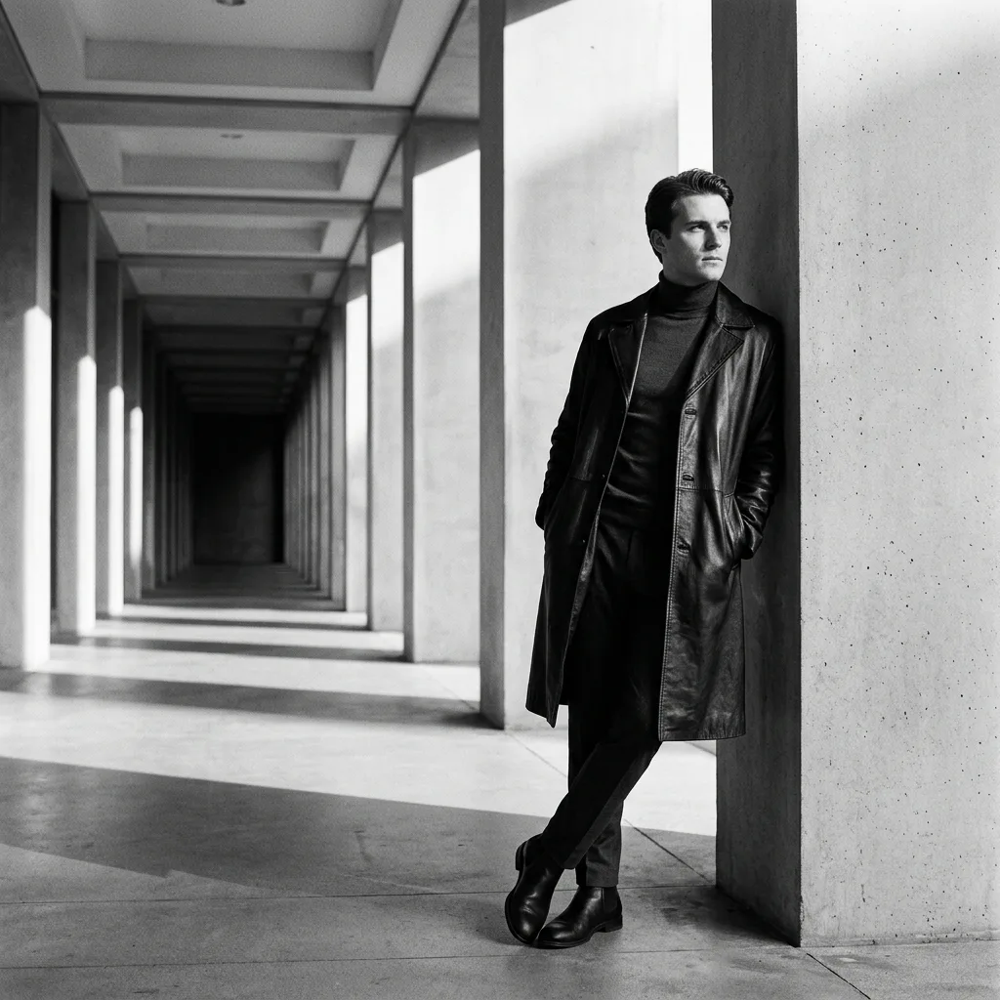

**#165 · Photography Prompt · <code>Vinano Image Pro</code>**

<details>
<summary>Show prompt</summary>

```
{
"metadata": {
"image_type": "photograph",
"primary_purpose": "editorial/portrait"
},
"composition": {
"rule_applied": "rule of thirds and one-point perspective",
"aspect_ratio": "2:3",
"layout": "asymmetric single subject deep environmental context",
"focal_points": ["Subject's brightly lit face on the right",
"The deep vanishing point of the colonnade on the left"],
"visual_hierarchy": "Eye starts at the subject's face on the right due to contrast, travels down his dark silhouette, then follows the repeating diagonal lines of the pillars to the deep vanishing point on the far left.",
"balance": "asymmetric - the heavy, dark mass of the subject in the right foreground is balanced by the repeating, high-contrast structural elements receding into the deep background on the left"
},
"color_profile": {
"dominant_colors": [{
"color": "Black",
"hex": "#0a0a0a",
"percentage": "45%",
"role": "primary subject clothing and deep architectural shadows"
},
{
"color": "Light Gray",
"hex": "#c8c8c8",
"percentage": "35%",
"role": "illuminated faces of the concrete pillars and floor"
},
{
"color": "Mid Gray",
"hex": "#6e6e6e",
"percentage": "20%",
"role": "shadow transitions and ambient background"
}],
"color_palette": "monochromatic",
"temperature": "neutral",
"saturation": "black and white",
"contrast": "high contrast"
},
"lighting": {
"type": "natural window/archway light",
"source_count": "multiple sources - repeating archways on the left acting as large softboxes",
"direction": "90-degree side",
"directionality": "highly directional",
"quality": "soft light on the subject, hard geometric light on the architecture",
"intensity": "moody/high-key architectural highlights low-key subject shadows",
"contrast_ratio": "high contrast (dramatic shadows)",
"mood": "dramatic/mysterious/sophisticated",
"shadows": {
"type": "harsh defined edges on structural elements, soft gradual edges on the subject's face",
"density": "deep black",
"placement": "cast across the floor, interior of the walkway, and the right side of the subject",
"length": "long - horizontal shadow projection across the corridor floor"
},
"highlights": {
"treatment": "preserved",
"placement": "on the left-facing planes of the pillars, the floor near the openings, and the subject's left cheek and nose"
},
"ambient_fill": "absent",
"light_temperature": "neutral"
},
"technical_specs": {
"medium": "digital photography",
"style": "realistic/editorial",
"texture": "smooth to slightly grainy",
"sharpness": "tack sharp on subject natural lens fall-off in deep background",
"grain": "film grain - moderate level",
"depth_of_field": "deep - the subject is isolated by contrast, but the background architecture retains recognizable structure deep into the frame",
"perspective": "straight on at eye level strong one-point vanishing perspective"
},
"artistic_elements": {
"genre": "portrait/editorial",
"influences": ["Cinematic noir photography",
"Classic street and fashion photography",
"Brutalist architectural photography"],
"mood": "sophisticated/dramatic/contemplative",
"atmosphere": "A quiet, isolated, and highly structured urban moment a cinematic and slightly mysterious edge.",
"visual_style": "structured/geometric/clean"
},
"typography": {
"present": false,
"fonts": [],
"placement": "",
"integration": ""
},
"subject_analysis": {
"primary_subject": "Young Caucasian male wearing a dark turtleneck, long dark leather or heavy cotton trench coat, dark trousers, and dark Chelsea boots.",
"positioning": "right rule of thirds placement, anchoring the foreground",
"scale": "full body/environmental",
"interaction": "interacting environment - leaning against architecture",
"facial_expression": {
"mouth": "neutral",
"smile_intensity": "no smile",
"eyes": "looking away to the right, out of frame",
"eyebrows": "relaxed",
"overall_emotion": "serious/contemplative/guarded",
"authenticity": "posed/editorial"
},
"hands_and_gestures": {
"left_hand": "hidden inside coat pocket",
"right_hand": "hidden inside coat pocket",
"finger_positions": "not visible",
"finger_interlacing": "none",
"hand_tension": "relaxed",
"interaction": "resting inside pockets, pulling the coat slightly back",
"naturalness": "deliberately posed but mimicking organic casual posture"
},
"body_positioning": {
"posture": "standing/leaning - left shoulder resting against the stone pillar",
"angle": "profile to 45 degree turn facing right",
"weight_distribution": "leaning right, resting weight on the pillar and left leg, right leg crossed over loosely",
"shoulders": "tilted due to the lean, left shoulder engaged the wall"
}
},
"background": {
"setting_type": "outdoor/semi-enclosed architectural colonnade or covered walkway",
"spatial_depth": "deep - extreme vanishing point creating many layered planes of pillars",
"elements_detailed": [{
"item": "Square architectural pillar 1 (foreground)",
"position": "right",
"distance": "foreground",
"size": "dominant",
"condition": "pristine/weathered",
"specific_features": "Smooth concrete or stone facing, acts as the structural prop for the subject"
},
{
"item": "Repeating architectural pillars (background)",
"position": "left",
"distance": "midground to deep background",
"size": "medium to small receding",
"condition": "pristine/weathered",
"specific_features": "Creating a rhythmic geometric pattern of light and shadow"
},
{
"item": "Ceiling coffers/beams",
"position": "top left",
"distance": "midground",
"size": "medium",
"condition": "pristine",
"specific_features": "Recessed rectangular ceiling details catching directional light"
}],
"wall_surface": {
"material": "concrete/stone paneling",
"surface_treatment": "smooth slight porous texture, finished architectural panels",
"texture": "slightly textured/matte",
"finish": "matte",
"color": "Neutral light gray to mid gray (in grayscale)",
"color_variation": "gradient due to strong lighting fall-off",
"features": "clean, visible horizontal and vertical panel seams/joints indicating modular construction",
"wear_indicators": "pristine institutional/civic architecture"
},
"floor_surface": {
"material": "concrete/stone",
"color": "Mid gray to dark gray in shadows",
"pattern": "solid subtle smooth texture"
},
"objects_catalog": "Repeating concrete/stone structural pillars, paneled ceiling structure, solid paved floor",
"background_treatment": "sharp transitions into deep shadow, geometric, high contrast"
},
"generation_parameters": {
"prompts": ["A cinematic black and white fashion editorial photograph of a young handsome man wavy textured dark hair, wearing a black turtleneck and a long unbuttoned black leather trench coat. He is leaning his left shoulder against a large smooth concrete pillar in an endless architectural colonnade. He has both hands in his coat pockets, right leg crossed casually over the left. He is looking off-camera to the right a serious, contemplative expression. The setting features strong one-point perspective repeating archways receding deeply to the left. Highly directional, high-contrast natural light entering from the left, casting harsh geometric shadows on the concrete floor and walls, but providing soft dramatic light on the man's face. Shot on 35mm film, tack sharp subject, moody, sophisticated, striking geometry.",
"B&W photography, full body portrait of a man in a dark overcoat leaning on a structural column. Deep one-point perspective corridor on the left. High contrast, directional side lighting, distinct shadows, brutalist concrete architecture, moody, editorial fashion style."],
"keywords": ["black and white",
"editorial",
"trench coat",
"colonnade",
"one-point perspective",
"high contrast",
"chiaroscuro",
"cinematic",
"leaning",
"geometric shadows"],
"technical_settings": "Camera: Full frame DSLR or 35mm film camera. Lens: 35mm to 50mm for natural perspective. Aperture: f/5.6 to f/8 to maintain focus on the subject while keeping the deep background structurally defined but slightly softer. Shutter speed: 1/250s or faster to prevent motion blur. ISO: 100-400 for clean shadows or natural film grain.",
"post_processing": "Black and white conversion high contrast S-curve, deep crushed blacks, preserved highlights on the skin and structural edges, enhanced clarity on the concrete textures, and subtle film grain overlay."
}
}

Render with rich micro-detail while keeping the layout uncluttered and intentional.
```

</details>

---

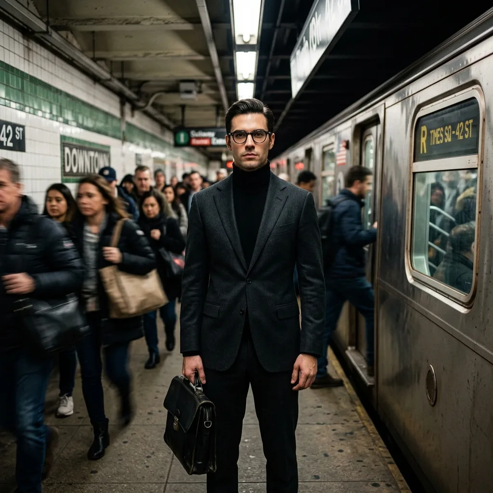

**#166 · Photography Prompt · <code>Vinano Image v2</code>**

<details>
<summary>Show prompt</summary>

```
Cinematic portrait of a stylish man standing on a busy subway platform, wearing a dark tailored suit and black turtleneck round glasses, serious confident expression, commuters rushing past creating motion blur around him, subway train beside the platform metallic reflections, urban underground atmosphere, dramatic fluorescent subway lighting, shallow depth of field, subject sharply in focus while the crowd is blurred, modern thriller movie scene aesthetic, ultra-realistic photography, 85mm lens, high detail, 8K Render with rich micro-detail while keeping the layout uncluttered and intentional.
```

</details>

---

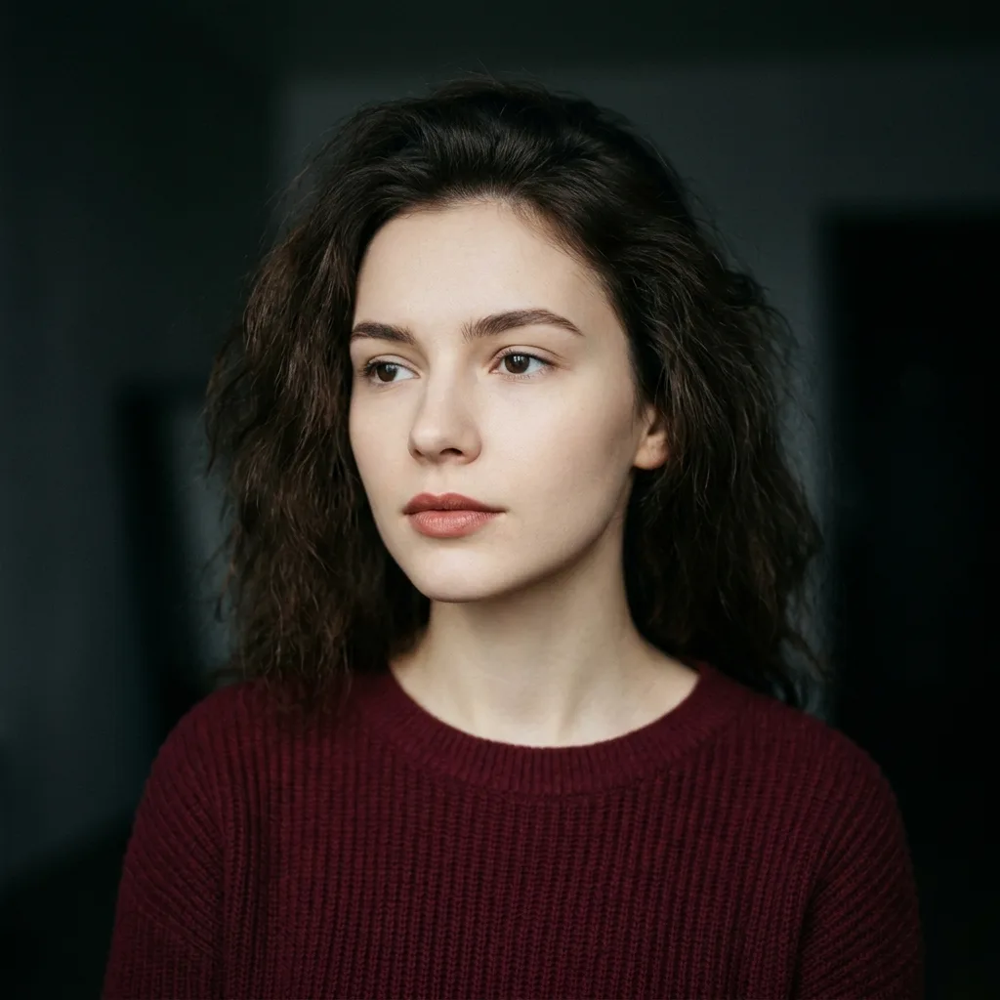

**#167 · Photography Prompt · <code>Vinano Image v2</code>**

<details>
<summary>Show prompt</summary>

```
Create a melancholic and cinematic portrait photography. A young woman clear, fair skin and light makeup. Warm, natural lip color. Deep brown hair a fluffy texture. A calm and confident expression. Wearing a wine-red top to showcase elegance. A dark, refined minimalist background fading to black. Soft, diffused front lighting, gentle shadows, subtle film grain, organic color grading, shallow depth of field, and high-end editing texture. Use the facial features of the reference subject without any alterations. Emphasise material texture and natural light so the final frame feels tactile and premium.
```

</details>

---

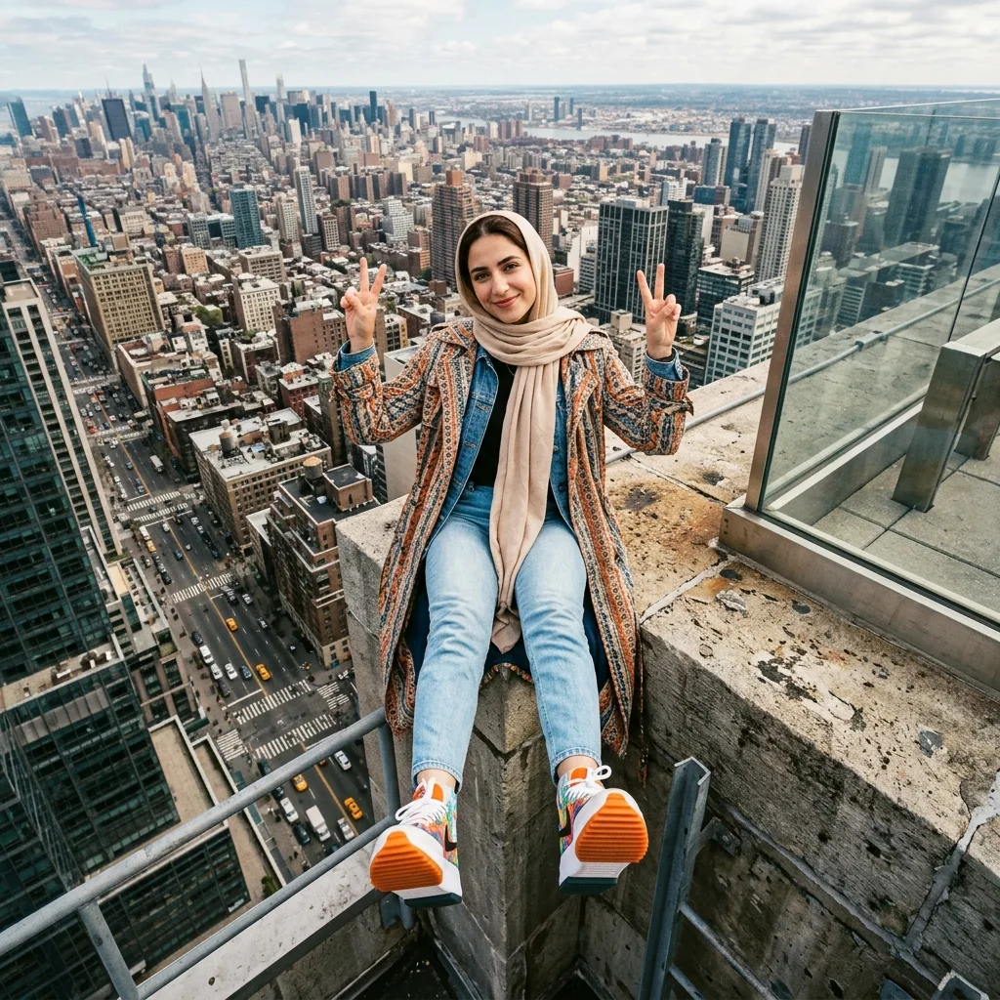

**#168 · Photography Prompt · <code>Vinano Image v2</code>**

<details>
<summary>Show prompt</summary>

```
{
 "image_generation": {
 "subject": {
 "description": "young woman sitting at the edge of a skyscraper rooftop a dramatic city view below",
 "pose": "sitting legs extended toward the camera, both hands raised making peace signs",
 "expression": "playful confident smile",
 "gaze": "looking directly at the camera"
 },
 "appearance": {
 "hair": {
 "color": "dark brown",
 "style": "covered a light beige headscarf flowing in the wind"
 },
 "skin": {
 "tone": "fair natural skin tone",
 "texture": "smooth realistic skin"
 },
 "makeup": "light natural makeup"
 },
 "outfit": {
 "outerwear": "long patterned coat",
 "inner_layer": "black top denim jacket",
 "bottom": "light blue jeans",
 "footwear": "colorful sneakers orange soles"
 },
 "environment": {
 "setting": "urban city high-rise rooftop",
 "background_elements": ["busy city street far below",
 "cars and taxis on the road",
 "tall buildings on both sides",
 "glass rooftop surface"],
 "time_of_day": "daytime"
 },
 "lighting": {
 "type": "natural daylight",
 "direction": "soft overhead light",
 "effect": "bright urban lighting balanced shadows"
 },
 "camera": {
 "angle": "extreme high angle / top-down perspective",
 "framing": "full body exaggerated perspective",
 "lens": "wide-angle lens",
 "depth_of_field": "deep focus showing detailed city below"
 },
 "aesthetic": {
 "style": "urban lifestyle photography",
 "vibe": "adventurous bold city energy",
 "color_palette": "vibrant city tones pops of orange and blue"
 },
 "effects": {
 "grading": "cinematic vibrant color grading",
 "sharpness": "high detail slight depth exaggeration"
 },
 "quality": {
 "resolution": "high resolution",
 "render": "true-to-life photorealistic",
 "details": "sharp textures strong perspective depth"
 }
 }
}

Emphasise material texture and natural light so the final frame feels tactile and premium.
```

</details>

---


**#169 · Photography Prompt · <code>Vinano Image Pro</code>**

<details>
<summary>Show prompt</summary>

```
{
 "Objective": "Create a stylish, cinematic birthday-themed studio portrait a modern celebratory poster aesthetic",
 "PersonaDetails": {
 "Subject": {
 "Type": "Young man",
 "Pose": "Sitting casually on the floor",
 "Expression": "Confident, friendly smile",
 "Gaze": "Looking directly at the camera",
 "Accessories": ["Glasses",
 "Wristwatch"]
 }
 },
 "Wardrobe": {
 "Top": "Dark grey sweater",
 "Bottom": "Black trousers",
 "Footwear": "Black leather boots",
 "Style": "Clean, modern, understated"
 },
 "SceneDescription": {
 "Environment": "Studio setting",
 "Background": {
 "Color": "Deep purple",
 "Details": "Subtle glowing particles floating in the background"
 }
 },
 "GraphicElements": {
 "Typography": {
 "Text": "Happy Birthday",
 "Style": "Neon typography",
 "Color": "Soft purple and white glow",
 "Placement": "Top corner of the composition"
 },
 "FloatingFrames": {
 "Description": "Multiple framed portrait snapshots of the same person",
 "Variations": ["Different poses and moods",
 "Film negative–style frames",
 "Neon-outlined light frames"],
 "Arrangement": "Floating around the subject balanced spacing"
 }
 },
 "Composition": {
 "Framing": "Medium full-body portrait",
 "Layout": "Centered subject surrounding floating elements",
 "Balance": "Clean, poster-style composition",
 "DepthOfField": "Shallow depth of field layered depth"
 },
 "LightingAndColor": {
 "LightingStyle": "Cinematic studio lighting",
 "RimLight": "Soft purple rim light for edge separation",
 "Contrast": "High contrast controlled highlights",
 "ColorPalette": ["Deep purple",
 "Black",
 "Soft white highlights"]
 },
 "ArtDirection": {
 "Style": "Modern celebratory poster",
 "Aesthetic": "Stylish, cinematic, social-media–ready",
 "DetailLevel": "Ultra-detailed textures and crisp edges",
 "RealismLevel": "true-to-life photorealistic graphic design overlays"
 },
 "PhotographyStyle": {
 "Genre": "Professional studio portrait photography",
 "Finish": "High-end, polished, digital poster look",
 "Resolution": "Ultra-high resolution, sharp focus"
 },
 "Mood": {
 "Tone": "Celebratory, confident, modern",
 "Energy": "Positive, stylish, personal"
 },
 "NegativePrompt": ["messy composition",
 "low resolution",
 "flat lighting",
 "oversaturated neon",
 "cartoon style",
 "blurry text",
 "cluttered background"],
 "ResponseFormat": {
 "Type": "Single composite image",
 "Orientation": "Portrait",
 "AspectRatio": "4:5",
 "UseCase": ["Social media post",
 "Birthday poster",
 "Digital celebration graphic"]
 }
}

Keep edges clean and the overall composition balanced for a polished, gallery-ready result.
```

</details>

---

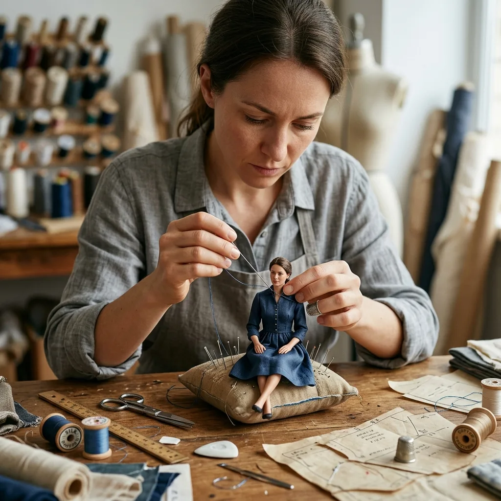

**#170 · Photography Prompt · <code>Vinano Image v2</code>**

<details>
<summary>Show prompt</summary>

```
A cinematic fashion studio scene of a woman hand-sewing a miniature dress worn by a tiny version of herself seated on a pin cushion.
She uses a fine needle and silk thread, concentrating intensely as fabric tension is adjusted.
The miniature garment features perfectly scaled seams, buttons, and lifelike fabric weight in it.
Workbench filled miniature scissors, chalk, rulers, pattern papers, and thread reels.
Warm filmic, cinematic lighting reveals textile grain, skin pores, and metal reflections.
Macro depth of field, fashion editorial composition, ultra-photoreal realism, 8K quality.

Style: cinematic miniature tailoring realism, no cartoon, no CGI

Maintain consistent colour harmony and crisp focus across the whole frame.
```

</details>

---


**#171 · Photography Prompt · <code>Vinano Image v2</code>**

<details>
<summary>Show prompt</summary>

```
Ultra-realistic cinematic fashion portrait of a stylish woman wearing oversized black cat-eye sunglasses, soft warm golden sunlight, hazy foreground blur creating dreamy depth, shallow depth of field, glowing skin, natural makeup, glossy nude lips, loose messy updo hairstyle soft strands falling, black high-neck outfit, luxury editorial vibe, shot through translucent fabric for soft diffusion, 85mm lens, f/1.8, creamy bokeh, golden hour lighting, warm beige color grading, high detail, true-to-life photorealistic, Vogue style photography, soft focus edges, elegant and minimal background Emphasise material texture and natural light so the final frame feels tactile and premium.
```

</details>

---

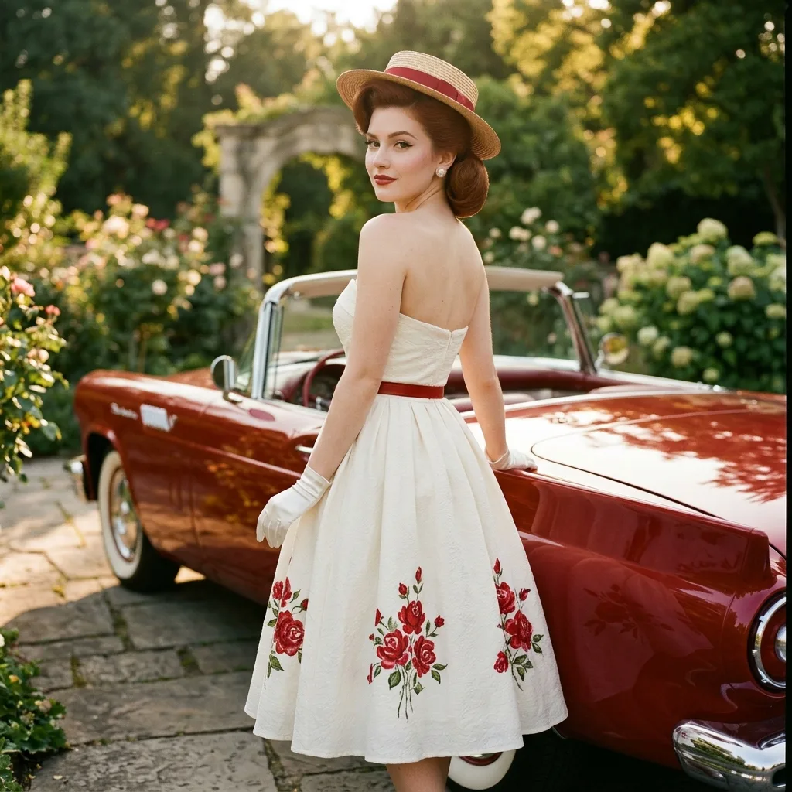

**#172 · Photography Prompt · <code>Vinano Image v2</code>**

<details>
<summary>Show prompt</summary>

```
A cinematic vintage fashion portrait of a graceful young woman in a 1950s aesthetic, standing beside a classic convertible car. She is captured from a three-quarter back angle, looking over her shoulder a soft, confident gaze. She wears an elegant ivory strapless dress a fitted bodice and a flowing skirt adorned hand-painted red rose floral patterns near the hem. A thin red belt cinches her waist. Her hair is styled in a voluminous retro updo, auburn/red tones, topped a straw boater hat featuring a red ribbon. She wears white satin gloves and delicate pearl earrings. Makeup is refined and timeless: winged eyeliner, soft blush, and deep red lipstick. The scene is bathed in warm golden-hour sunlight creamy bokeh in the background, outdoor garden setting. Ultra-detailed, true-to-life photorealistic, shallow depth of field, filmic, cinematic lighting, luxury fashion editorial style, 8K quality. Render with rich micro-detail while keeping the layout uncluttered and intentional.
```

</details>

---

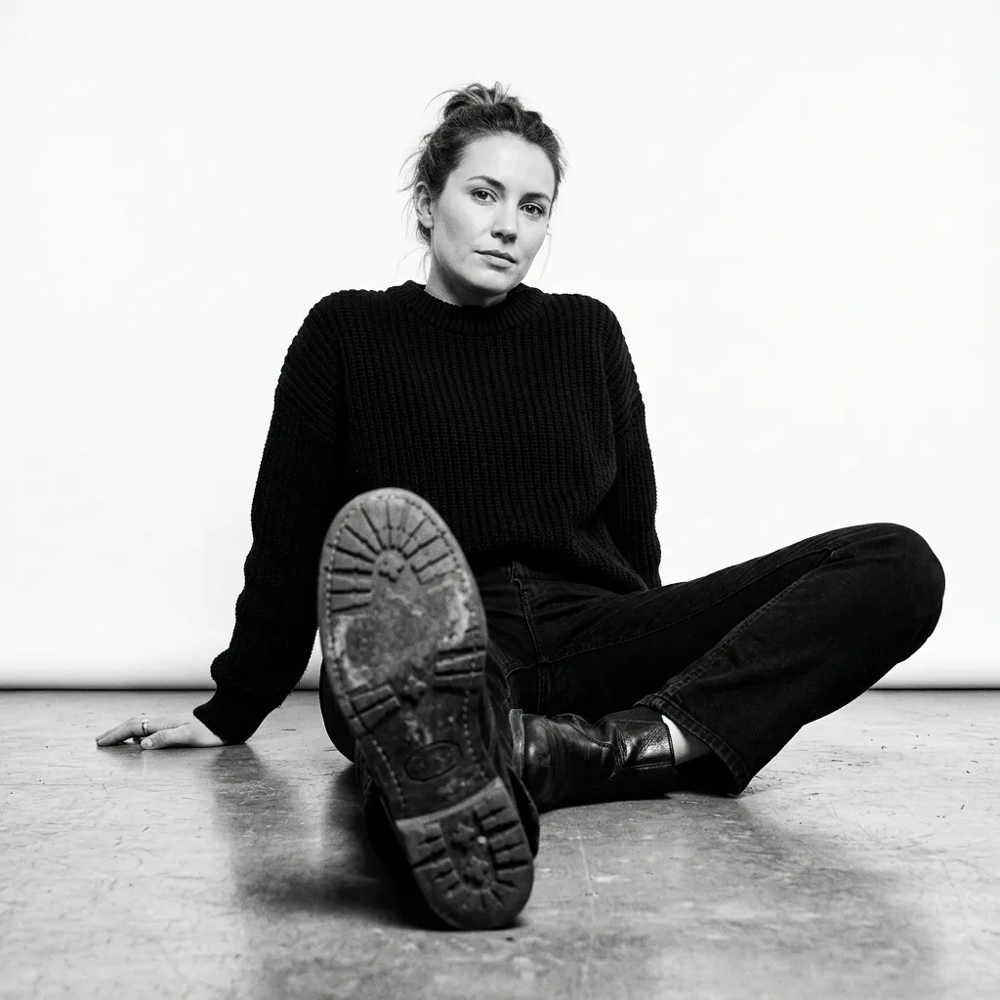

**#173 · Photography Prompt · <code>Vinano Image v2</code>**

<details>
<summary>Show prompt</summary>

```
High-contrast black-and-white studio photo of a woman seated on the floor wearing a black sweater, black trousers, and black leather ankle boots. Legs are bent and open toward the camera, one boot sole prominently facing the lens. Upper body slightly reclined, calm expression. Clean white background, dramatic low-angle composition. Don’t change the face. (Use the attached image) Emphasise material texture and natural light so the final frame feels tactile and premium.
```

</details>

---

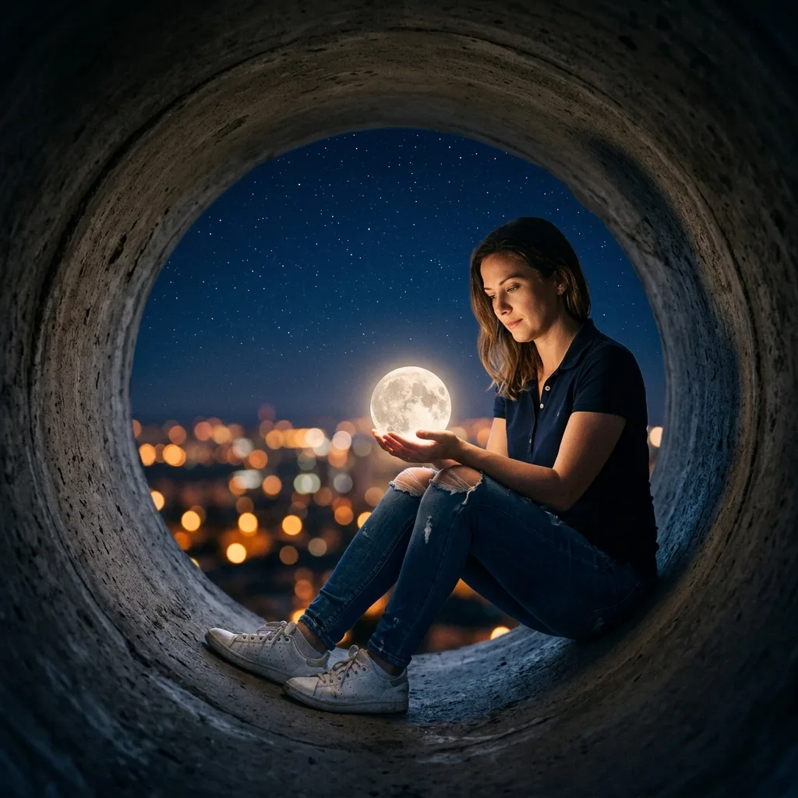

**#174 · Photography Prompt · <code>Vinano Image v2</code>**

<details>
<summary>Show prompt</summary>

```
Hyper-realistic surreal photography of a woman sitting inside a massive, rough concrete pipe, featuring the uploaded face as reference. She wears a dark polo shirt, ripped jeans, and white sneakers, a calm and thoughtful expression. She is gently holding a glowing, miniature full moon in her cupped hands. The surreal moon casts a warm, magical rim light across her face and body. The camera is positioned from inside the pipe, creating a natural circular frame around her. In the background, a starry night sky is visible along a deeply blurred cityscape filled warm orange bokeh lights. Shot a 50mm lens, shallow depth of field, high contrast, blending cool night tones the ethereal glow of the moon in her hands. Emphasise material texture and natural light so the final frame feels tactile and premium.
```

</details>

---

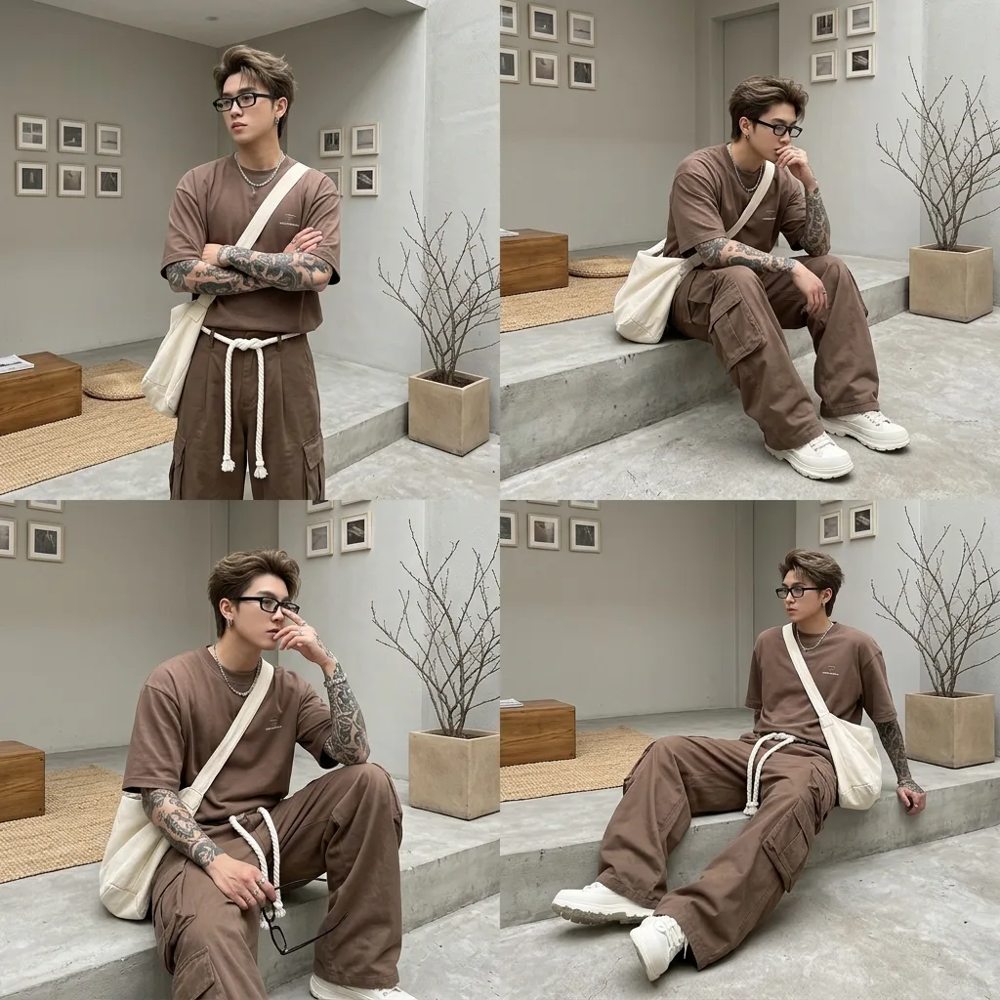

**#175 · Photography Prompt · <code>Vinano Image Pro</code>**

<details>
<summary>Show prompt</summary>

```
Transform this image [UPLOAD YOU'RE IMAGE] into a 64K DSLR shot resolution of A four-panel fashion collage featuring the same subject styled in a cohesive earth-tone, refined minimalist streetwear aesthetic, photographed in a calm, modern concrete courtyard or interior patio space. The environment is muted and serene, light gray walls, raw cement flooring, and subtle natural decor elements that enhance the understated mood. The subject (sameface as the uploaded image) is a athletic build, androgynous-presenting young adult stylish volume hairs and cool, introspective expression. They wear thin black rectangular glasses, silver jewelry (necklace and earrings), and have intricate black-and-gray tattoo sleeves covering the forearms and hands.

Outfit & Styling:-

Oversized brown T-shirt a small minimal chest graphic or letter Extremely baggy brown cargo pants large utility pockets and heavy drapeThick white rope belt tied loosely, hanging dramatically at the waist Chunky white sneakers a bold sole Large off-white canvas shoulder bag worn crossbody, adding texture and contrast The color palette is warm and neutral: browns, taupe, beige, off-white, and soft gray.

Poses Across the Panels:-

Standing arms crossed, relaxed but confident

Sitting on a concrete step, leaning forward in a contemplative pose Seated casually one leg bent, holding

glasses or touching the faceA laid-back pose emphasizing the oversized silhouette and layered textures Background & Props:-

refined minimalist decor including a woven straw mat, a wooden box, and a potted branch arrangement in a square planter Small framed wall art arranged in a clean

grid

Soft natural daylight diffused shadows, no harsh highlights Mood & Aesthetic:- The overall vibe is quiet luxury meets Japanese-inspired minimal streetwear, blending modern fashion, utilitarian design, and calmeditorial styling. The image feels like a fashion lookbook or lifestyle editorial, emphasis on silhouette, texture, and effortless cool.

Style Keywords:- refined minimalist streetwear, neutral tones, oversized fashion, utilitarian cargo pants, androgynous style, editorial fashion collage, modern zen aesthetic, Japanese-inspired fashion, muted color palette.

Keep edges clean and the overall composition balanced for a polished, gallery-ready result.
```

</details>

---

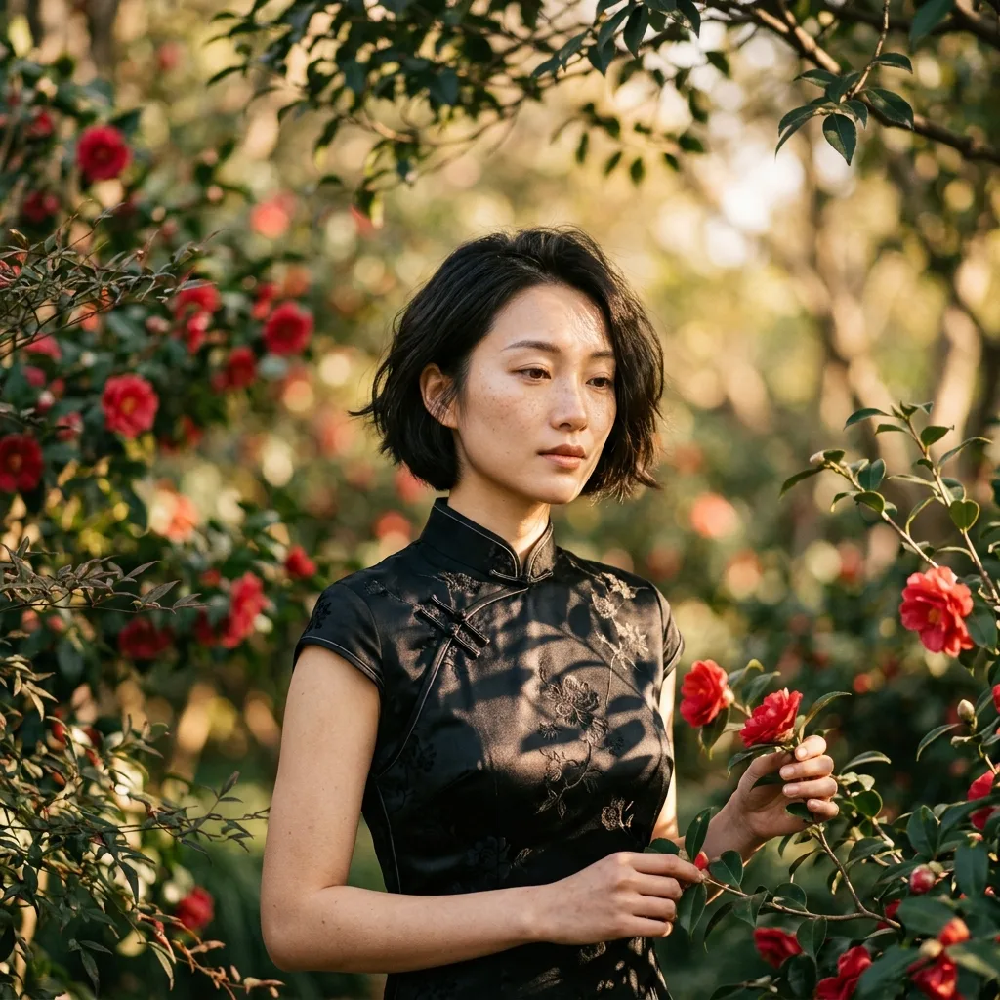

**#176 · Photography Prompt · <code>Vinano Image v2</code>**

<details>
<summary>Show prompt</summary>

```
Artistic portrait of an elegant Asian woman wearing a black silk cheongsam (qipao), standing among red camellia flowers and delicate branches, soft natural sunlight filtering through leaves creating beautiful shadow patterns across her face, short slightly messy bob haircut, natural freckles and minimal makeup, calm thoughtful expression, cinematic shallow depth of field, dreamy garden atmosphere, warm golden hour lighting, soft bokeh background, fine art photography style, ultra-realistic skin texture, high detail, 85mm lens, 8K. Preserve realistic proportions and depth for a confident, professional finish.
```

</details>

---

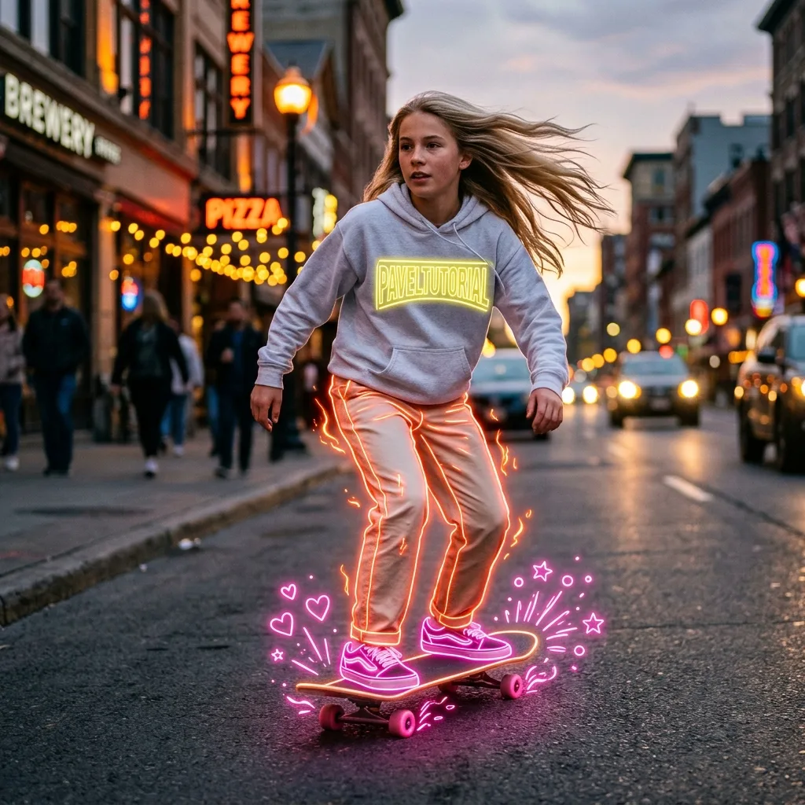

**#177 · Photography Prompt · <code>Vinano Image v2</code>**

<details>
<summary>Show prompt</summary>

```
A HYPER-REALISTIC, 8K, MEDIUM SHOT CAPTURED A WIDE-ANGLE LENS FROM A SLIGHTLY LOW ANGLE SHOWCASING A YOUNG PERSON IN A DYNAMIC, MID-ACTION POSE ON A SKATEBOARD, RIDING DOWN AN URBAN STREET AT DUSK. THE SUBJECT, UPLOADED FACE AS REFERENCE, HAS LONG, LIGHT-COLORED HAIR FLOWING DYNAMICALLY TO THEIR RIGHT, INDICATING MOTION. THEY ARE WEARING A LIGHT GREY OR OFF-WHITE HOODIE FEATURING A PROMINENT, BRIGHT YELLOW HEON OUTLINE GRAPHIC THAT SPELLS "PAVELTUTORIAL ACROSS THE CHEST. THEIR LEGS ARE CLAD IN LIGHT BROWN OR BEIGE PANTS, INTRICATELY OUTLINED A VIBRANT ORANGE-RED NEON GLOW THAT ALSO EMITS SMALL, FLICKERING NEON WISPS AROUND THEM, SUGGESTING ENERGY. THEIR FEET ARE ADORNED BRIGHT PINK NEON-OUTLINED SNEAKERS, WHICH MATCH THE GLOWING PINK OUTLINE OF THE SKATEBOARD DECK BENEATH THEM. AROUND THE SKATEBOARD AND THE SUBJECT'S FEET, THERE ARE WHIMSICAL, GLOWING PINK NEON HEARTS AND STARBURSTS, ADDING A SURREAL, ENERGETIC TOUCH. THE BACKGROUND IS AN URBAN STREET SCENE, RENDERED A SHALLOW DEPTH OF FIELD, CREATING A BEAUTIFUL BOKEH EFFECT OF WARM, OUT-OF-FOCUS ORANGE AND YELLOW STRING LIGHTS STRUNG ACROSS BUILDINGS, SUGGESTING A FESTIVE OR LIVELY ATMOSPHERE. SILHOUETTES OF BLURRED PEDESTRIANS CAN BE SEEN IN THE DISTANCE. THE OVERALL LIGHTING IS CINEMATIC, A SOFT GOLDEN HOUR GLOW FROM THE BACKGROUND CONTRASTING THE VIBRANT. VOLUMETRIC NEON LIGHTING EMANATING FROM THE SUBJECT AND THEIR ACCESSORIES, CREATING HIGHLY

DETAILED TEXTURES AND A CAPTIVATING VISUAL.

Maintain consistent colour harmony and crisp focus across the whole frame.
```

</details>

---


**#178 · Photography Prompt · <code>Vinano Image Pro</code>**

<details>
<summary>Show prompt</summary>

```
true-to-life photorealistic editorial portrait of a smiling woman the exact same face from the reference image. She wears oversized black sunglasses orange lenses and small gold earrings. Slightly leaning forward in a close wide-angle perspective, a playful, mischievous expression and subtle smirk. Clean blue studio background soft gradient. Bright soft, diffused lighting gentle contrast, sharp focus, minimal high-fashion mood. Preserve realistic proportions and depth for a confident, professional finish.
```

</details>

---


**#179 · Photography Prompt · <code>Vinano Image v2</code>**

<details>
<summary>Show prompt</summary>

```
Concept & Mood

Intimate lifestyle–fashion editorial quiet masculine warmth and thoughtful calm.
Soft, cozy atmosphere reminiscent of a private winter afternoon spent reading indoors.
Emotional restraint gentle confidence — reflective, composed, subtly romantic without performance.
Feels like a real, candid moment captured naturally, not posed or styled for effect.

---

Subject & Anatomy

Adult man realistic proportions and natural build.
Relaxed posture subtle asymmetry — body leaning forward slightly, one arm resting on the table, head supported by the hand.
Natural weight distribution through the elbow and forearm resting on the surface.
No tension in the shoulders or neck, posture feels unforced and comfortable.

---

Pose & Perspective

Seated at a wooden table indoors.
Head gently tilted, cheek resting against the palm of the hand.
Other arm relaxed and folded near an open book on the table.
Camera positioned at eye level, slightly off-center, creating an intimate, conversational perspective.
Framing is mid-close portrait, focusing on face, hands, and upper torso.

---

Face & Expression

Soft, calm expression a subtle, knowing half-smile.
Eyes relaxed and warm, making gentle eye contact the camera.
Brows natural and expressive, conveying ease and quiet confidence rather than performance.
Facial hair neatly groomed realistic density and texture.

---

Skin (Key Focus)

Highly realistic skin texture featuring:

visible pores

natural tonal variation

subtle under-eye texture

realistic beard shadow and transitions
Skin appears alive and tactile.
No smoothing, no beauty retouching, no artificial glow or plastic finish.

---

Hair & Grooming

Medium-length dark hair natural volume and movement.
Softly tousled slight wave, imperfect strands falling naturally across the forehead.
Hair density realistic, not styled or over-defined.
Beard neatly trimmed, edges soft and organic, not sharply sculpted.

---

Wardrobe & Styling

Cozy red knit sweater small white heart motifs.
Fabric appears thick and warm,:

visible knit texture

realistic folds and stretch around elbows and shoulders

natural drape and compression at contact points
Sweater reads as casual, intimate, and personal — not fashion-staged.

---

Environment & Props

Simple indoor setting a wooden table surface.
An open book placed naturally in front of the subject, pages slightly curved and imperfect.
Background softly blurred, suggesting a quiet home or café interior.
No distracting elements, environment supports calm and intimacy.

---

Lighting

Soft natural window light only.
Light falls gently across the face, creating smooth highlight-to-shadow transitions.
Warm, diffused illumination no harsh shadows.
No artificial lighting, no flash, no studio feel.

---

Camera & Optics

Photographer mindset.
Full-frame look a 50–55mm perspective.
Shallow depth of field — face and eyes in sharp focus, background softly blurred.
Natural optical falloff subtle softness, not clinical sharpness.

---

Color & Film Feel

Warm, restrained color palette:

deep knit red

natural skin tones

warm wood browns

soft neutral background hues
Film-inspired tonality similar to Portra-style color science:
soft contrast, gentle highlights, realistic skin color retention.
No HDR, no heavy grading, no oversaturation.

---

Style & Realism

Cinematic realism emotional subtlety.
Feels like a real lifestyle or fashion editorial captured on natural light.
Quiet, confident, intimate — grounded in reality.
No exaggeration, no fantasy elements.

---

Technical

Aspect ratio: 3:4
High resolution, ultra-true-to-life photorealistic detail
Natural grain structure
Shallow depth of field
No text, no logos, no watermarks

Keep edges clean and the overall composition balanced for a polished, gallery-ready result.
```

</details>

---

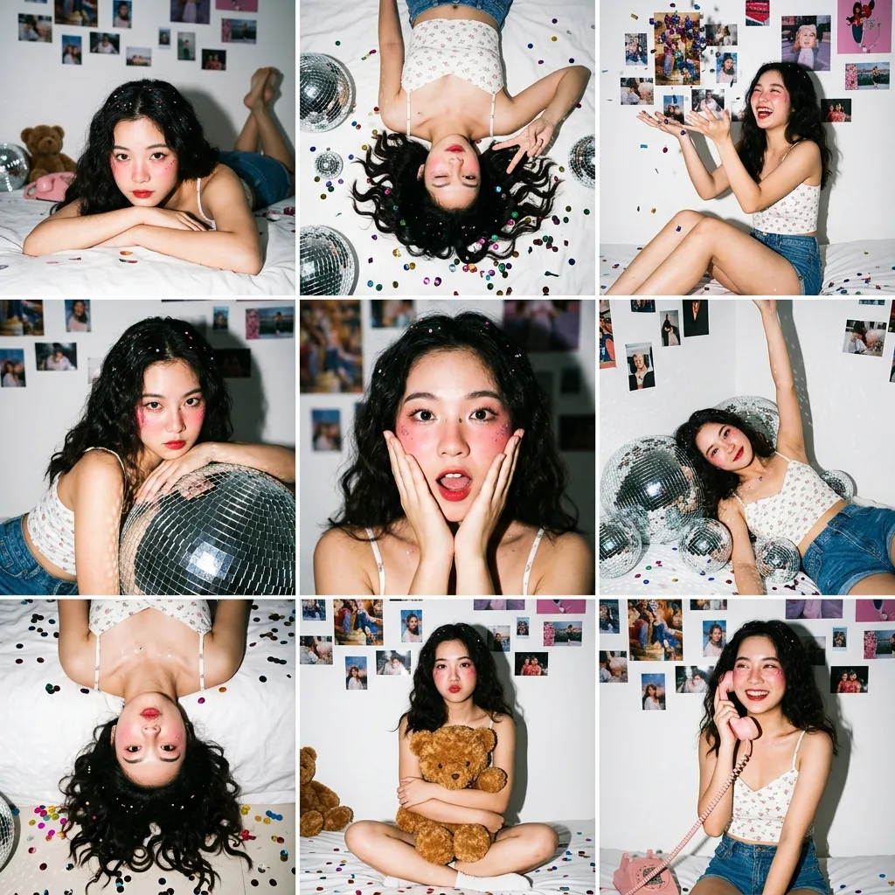

**#180 · Photography Prompt · <code>Vinano Image Pro</code>**

<details>
<summary>Show prompt</summary>

```
{
 "model": " (Gemini)",
 "prompt": {
 "layout": {
 "type": "3x3 照片拼贴 / 九宫格",
 "description": "9 张竖版人像照片以正方形网格排列",
 "consistency": "9 个画面中为同一人物、同一服装、同一光线条件"
 },
 "aesthetic_style": {
 "theme": "Z 世代居家派对 / 少女闺房写真",
 "lighting_technique": "机顶直闪（硬光）",
 "visuals": "高对比度、清晰锐利阴影、混乱有趣的氛围、鲜艳色彩、白色背景"
 },
 "subject_details": {
 "appearance": "年轻亚洲女性，肤色白皙，深色长卷发，发量蓬松",
 "outfit": "白色碎花吊带上衣，蓝色牛仔短裤",
 "makeup": "浓重粉色腮红（Igari 醉酒妆风格），红色唇妆，脸颊带亮片"
 },
 "environment_and_props": {
 "background": "贴有照片的白色墙面，白色床单",
 "decor": ["银色迪斯科球（多种尺寸）",
 "五彩金属亮片纸散落",
 "棕色泰迪熊",
 "粉色复古有线电话"]
 },
 "panel_pose_breakdown": {
 "1_top_left": "俯卧趴着，下巴放在交叉的手臂上，看向镜头，头发上有亮片",
 "2_top_center": "俯拍视角仰躺，眨一只眼，比 V 手势，头发向四周散开",
 "3_top_right": "侧坐，双膝弯曲，大笑抓拍，向空中抛洒亮片",
 "4_middle_left": "上半身倚靠在大型银色迪斯科球上，目光强烈直视镜头",
 "5_middle_center": "近景特写，双手贴在脸颊，惊讶或害羞表情，亮片粘在脸上",
 "6_middle_right": "躺在迪斯科球之间，一只手向上伸向天花板或镜头",
 "7_bottom_left": "倒置视角（头部在画面下方），俏皮表情，头发自然垂落",
 "8_bottom_center": "盘腿坐姿，紧紧抱着棕色泰迪熊，微微嘟嘴",
 "9_bottom_right": "坐直，手持粉色复古电话听筒贴在耳边，侧头像在听八卦"
 },
 "camera_technical_values": {
 "focal_length": "35mm",
 "aperture": "f/5.6",

在保证细节的同时保持版式克制、留白得当。
```

</details>

---

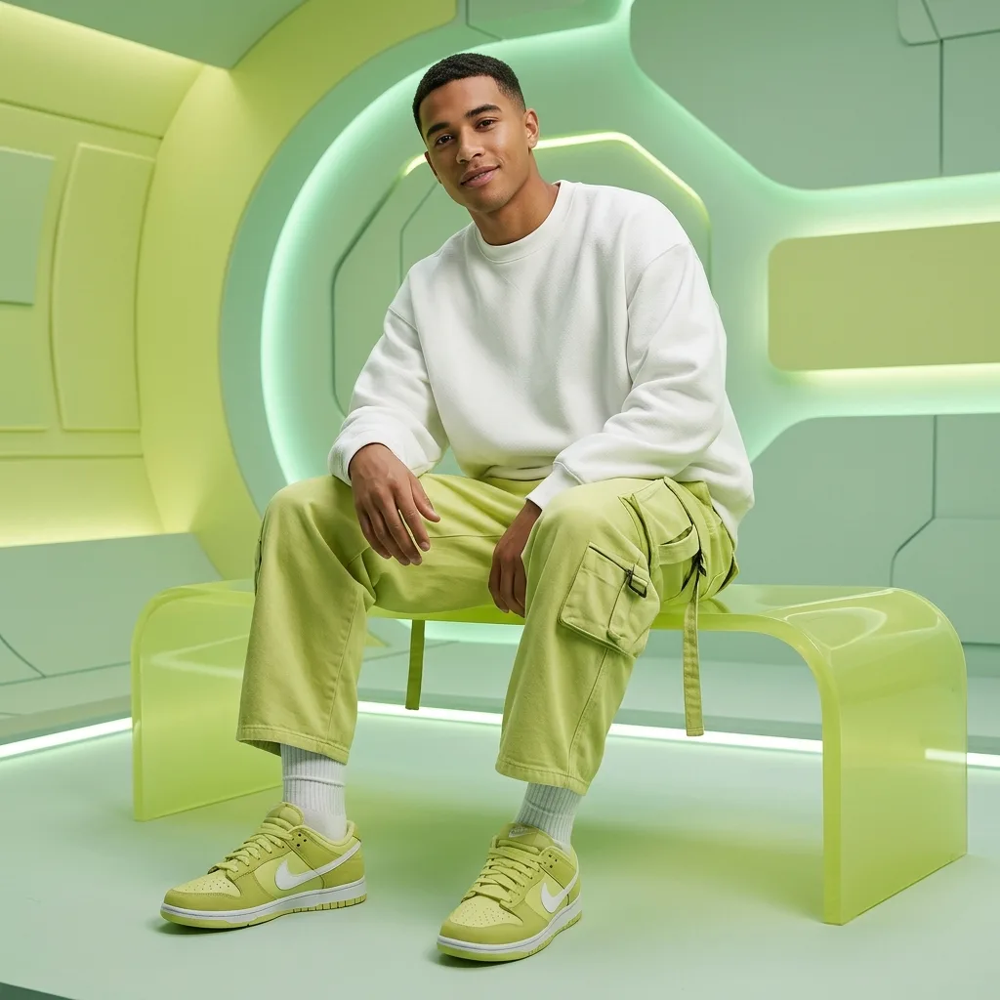

**#181 · Photography Prompt · <code>Vinano Image v2</code>**

<details>
<summary>Show prompt</summary>

```
A young man a slight smile see the uploaded picture as reference for the face wearing outfit: oversized white sweatshirt, lemon green oversized combat jean, styled footwear: lemon green neutral Nike sneakers and white ribbed socks. Environment: futuristic lemon green-tone studio background. Lighting: soft cinematic glow highlighting skin and fabric textures. Style: fashion editorial x futuristic. Model seats on lemon green bench elegantly a relaxed posture. Maintain consistent colour harmony and crisp focus across the whole frame.
```

</details>

---

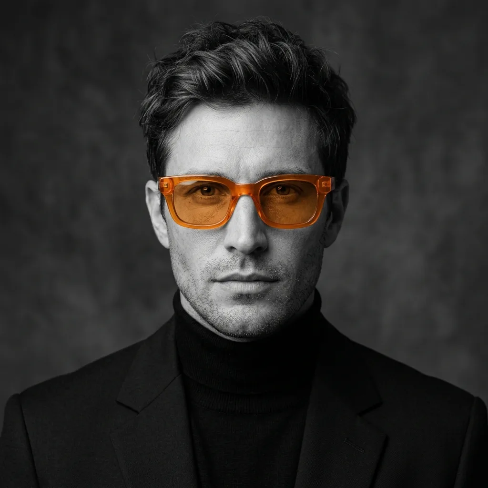

**#182 · Photography Prompt · <code>Vinano Image v2</code>**

<details>
<summary>Show prompt</summary>

```
A close-up studio portrait of me, masculine features, textured messy hair neatly styled.
I wear a black tailored blazer sharp structure and clean lines, layered over a black high-neck turtleneck, embodying a refined minimalist and contemporary fashion style.
The man is wearing bold translucent orange acetate sunglasses, rectangular frame slightly rounded edges, glossy finish, amber/orange tinted lenses, and fashion-forward and statement eyewear. Color concept: selective color photography - monochrome black and white image only the sunglasses in vibrant orange color, creating strong contrast and visual focus.
Expression: calm, confident, serious gaze, looking straight into the camera.
Lighting: soft studio lighting from the front subtle side shadows, even skin tones, greath detai,l facial texture, and cinematic contrast. Camera settings:
- Lens: 85mm portrait lens
- Aperture: f/2.0
- ISO: 100
- Shutter speed: 1/125
- High resolution, ultra-sharp focus on face Style: editorial fashion portrait, luxury menswear, realistic skin texture, non-Al look, professional studio photography.

Keep edges clean and the overall composition balanced for a polished, gallery-ready result.
```

</details>

---

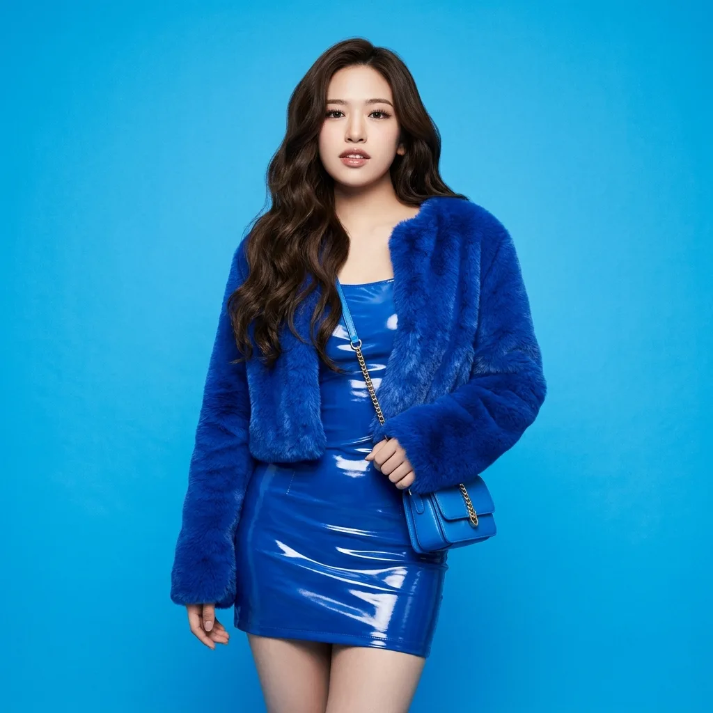

**#183 · Photography Prompt · <code>Vinano Image v2</code>**

<details>
<summary>Show prompt</summary>

```
{
"prompt": "ultra-detailed fashion portrait of a beautiful young Korean woman, exactly matching An Yujin from IVE, tall athletic elegant figure, standing confidently in a vibrant all-blue studio, wearing a tight glossy blue patent latex bodycon mini dress that hugs every curve, shiny reflective blue vinyl material, deep cobalt blue color, sleeveless square neckline, short length above mid-thigh, layered a luxurious fluffy soft blue faux fur cropped jacket fuzzy long fur texture, open front, long voluminous dark brown hair perfect loose Hollywood waves cascading down to waist, charismatic deep eyes, full glossy nude-pink lips, dramatic makeup long lashes, sharp eyeliner, flawless glowing fair skin, confident seductive expression, slight head tilt, holding a small structured hot blue designer crossbody purse gold chain strap, bright even baby blue background, soft professional studio lighting, high fashion editorial style, hyper-realistic, ultra sharp details, 8k resolution, true-to-life photorealistic skin texture, intricate fur details, reflective latex shine, azurecore aesthetic, maximalist blue glamour, shot on Canon EOS R5, 85mm lens, f/1.8, cinematic color grading",
"negative_prompt": "low quality, blurry, deformed, ugly, extra limbs, bad anatomy, poorly drawn face, bad proportions, watermark, text, logo, cropped, out of frame, skinny, thin body, small chest, flat figure, realistic clothing texture instead of latex, muted colors, dark background, green skin, male",
"parameters": {
"aspect_ratio": "9:16",
"style": "true-to-life photorealistic fashion photography",
"lighting": "soft studio lighting subtle rim light",
"quality_tags": "masterpiece, best quality, ultra detailed, highly detailed, sharp focus",
"sampler": "DPM++ 2M Karras or Euler a",
"steps": 35,
"cfg_scale": 7.5,
"seed": -1
},
"model_recommendations": [" dev",
"Realistic Vision V6.0",
"Juggernaut XL",
"Photon",
""]
}

Preserve realistic proportions and depth for a confident, professional finish.
```

</details>

---

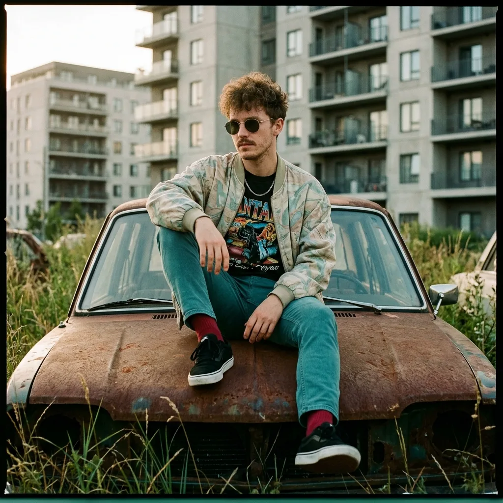

**#184 · Photography Prompt · <code>Vinano Image v2</code>**

<details>
<summary>Show prompt</summary>

```
{
"composition": {
"framing": "centered subject symmetrical balance",
"perspective": "eye-level, slight downward tilt",
"crop": "vertical portrait orientation, full body seated pose",
"depth_of_field": "moderate, subject sharp softly detailed background",
"leading_elements": "rusted car edges and hood frame the subject"
},
"subject": {
"type": "human",
"pose": "sitting casually on the hood of an abandoned car, one leg bent, one leg hanging",
"expression": "relaxed, confident, contemplative",
"gaze": "looking slightly downward and to the side",
"hair": "short, curly, tousled",
"facial_hair": "light mustache and stubble",
"accessories": ["round sunglasses",
"necklace"]
},
"clothing": {
"outerwear": "patterned bomber jacket muted pastel tones",
"top": "graphic t-shirt colorful print",
"pants": "teal slim-fit jeans, slightly cropped",
"footwear": "black sneakers white soles and red socks"
},
"environment": {
"setting": "urban outdoor area",
"foreground": "overgrown grass and weeds",
"primary_object": "abandoned, heavily rusted vintage car",
"background": "modern apartment buildings balconies",
"contrast": "decay versus modern urban living"
},
"color_palette": {
"dominant_colors": ["rust red",
"teal",
"muted green",
"beige",
"brown"],
"accent_colors": ["red",
"yellow",
"black"],
"color_temperature": "warm teal-green shadows",
"grading_style": "cinematic, desaturated highlights, rich shadows"
},
"lighting": {
"type": "natural light",
"time_of_day": "late afternoon or golden hour",
"direction": "side-lit soft shadows",
"contrast": "medium contrast",
"highlights": "soft and warm on skin and metal surfaces"
},
"technical_details": {
"camera_type": "DSLR or mirrorless",
"lens_estimate": "35mm–50mm prime",
"aperture_estimate": "f/2.8–f/4",
"iso_estimate": "ISO 200–400",
"shutter_speed_estimate": "1/200–1/400",
"focus": "sharp on subject, slightly softer background"
},
"artistic_style": {
"genre": "urban lifestyle portrait",
"mood": "nostalgic, gritty, stylish",
"influences": ["street photography",
"cinematic editorial fashion"],
"texture": "visible grain, emphasis on rust and fabric detail"
},
"post_processing": {
"grain": "moderate film grain",
"sharpening": "selective sharpening on subject",
"contrast_curve": "soft highlights lifted blacks",
"vignette": "subtle vignette around edges"
},
"background_details": {
"architecture": "concrete apartment blocks repetitive windows",
"color": "neutral beige and gray tones",
"blur_level": "light background separation without heavy bokeh"
},
"overall_aesthetic": {
"theme": "urban decay meets modern fashion",
"visual_story": "individuality and style emerging from neglected environments",
"use_case": ["editorial fashion",
"UGC influencer content",
"cinematic portrait reference"]
}
}

Preserve realistic proportions and depth for a confident, professional finish.
```

</details>

---


**#185 · Photography Prompt · <code>Vinano Image v2</code>**

<details>
<summary>Show prompt</summary>

```
A cinematic side-profile portrait of a young woman standing in a grocery store aisle, carefully looking at a shelf filled wine bottles. She has her hair tied in a loose messy bun and wears a simple dark outfit. The environment is softly lit warm indoor lighting, creating a cozy, realistic atmosphere. The shelves are filled neatly arranged bottles, while other shoppers appear blurred in the background. Shallow depth of field strong foreground and background blur, creamy bokeh lights, natural skin tones, documentary-style photography, candid moment, 50mm lens, f/1.8, ultra-realistic detail, cinematic color grading, 8K. Emphasise material texture and natural light so the final frame feels tactile and premium.
```

</details>

---

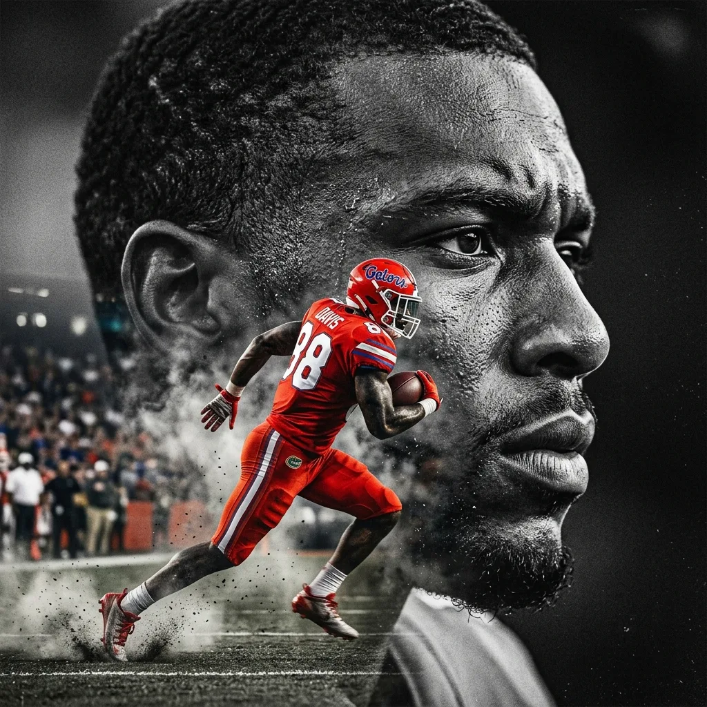

**#186 · Photography Prompt · <code>Vinano Image Pro</code>**

<details>
<summary>Show prompt</summary>

```
A dramatic double exposure portrait of a professional football player, large side-profile face in black and white intense expression, combined a smaller full-body action shot of the same player running in a red jersey, dynamic motion, dust and smoke particles blending the layers, high contrast lighting, textured grain, minimal clean background, editorial sports poster style, ultra-detailed, sharp focus, cinematic composition, 8K resolution. Preserve realistic proportions and depth for a confident, professional finish.
```

</details>

---

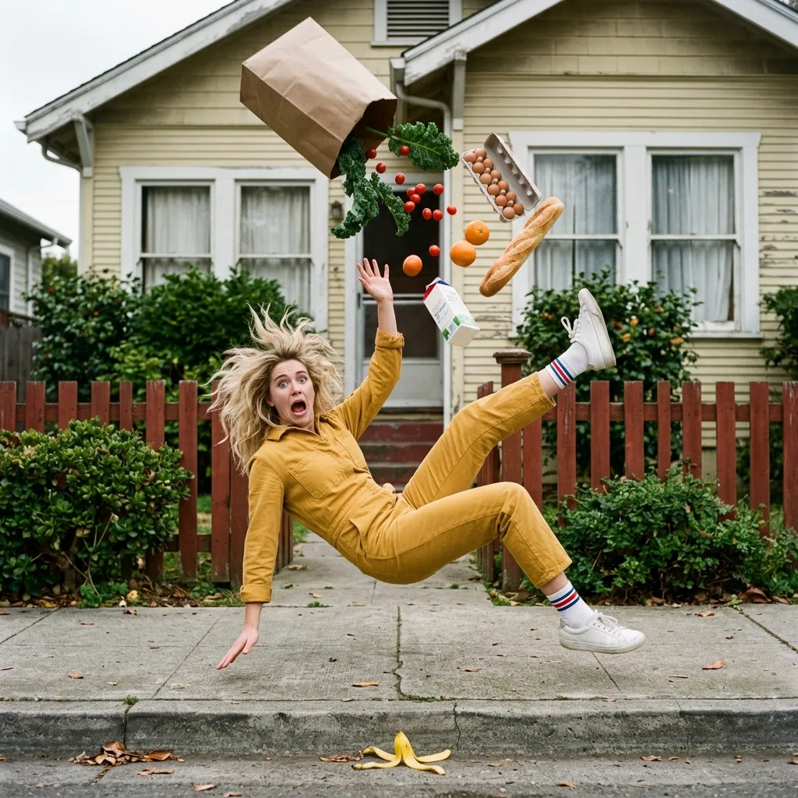

**#187 · Photography Prompt · <code>Vinano Image v2</code>**

<details>
<summary>Show prompt</summary>

```
{
"style": "cinematic realism, surreal moment frozen in time",
"scene": "a suburban street in front of an old slightly worn house muted yellow walls, white window frames, and a red wooden fence, overcast daylight soft diffused lighting",
"subject": {
"type": "young woman",
"appearance": "blonde hair mid-motion, slightly messy, expressive shocked face wide eyes and open mouth",
"outfit": "mustard yellow jumpsuit, white socks stripes, white sneakers",
"pose": "falling backward in mid-air, body tilted diagonally, one leg raised high, arms flailing for balance",
"emotion": "surprised, chaotic, comedic panic"
},
"action": "a grocery bag has exploded mid-air, items floating above her as if gravity paused for a split second",
"objects": {
"floating_items": ["brown paper grocery bag",
"kale leaves",
"cherry tomatoes",
"oranges",
"egg carton",
"baguette bread",
"milk carton"],
"ground_element": "a banana peel on the sidewalk directly below her, implying the cause of the fall"
},
"environment": {
"foreground": "concrete sidewalk subtle cracks and dirt",
"midground": "red wooden fence",
"background": "vintage suburban house slightly weathered texture, curtains visible in windows, greenery on the sides"
},
"camera": {
"angle": "low angle, slightly tilted upward to enhance the floating effect",
"lens": "35mm cinematic lens",
"focus": "sharp focus on subject, slight depth of field blur on background",
"framing": "subject centered floating objects forming a loose arc above"
},
"lighting": {
"type": "natural overcast daylight",
"quality": "soft shadows, diffused light, realistic skin tones",
"direction": "top-front lighting"
},
"motion": {
"effect": "frozen action, subtle motion blur on hair and some objects for realism",
"physics": "objects distributed unevenly slight randomness, realistic gravity interruption feel"
},
"color_palette": "muted cinematic tones mustard yellow as the dominant accent, soft greens and reds for contrast",
"mood": "quirky, unexpected, slightly absurd but grounded in realism",
"details": {
"textures": "visible fabric folds, realistic food textures, worn paint on house, concrete grain",
"imperfections": "slight asymmetry in object placement, natural facial tension, non-perfect alignment"
},
"quality": {
"resolution": "high detail, 4k",
"rendering": "true-to-life photorealistic, minimal AI artifacts, natural skin texture (no plastic look)"
}
}

Aim for an editorial, design-driven look with deliberate negative space.
```

</details>

---


**#188 · Photography Prompt · <code>Vinano Image Pro</code>**

<details>
<summary>Show prompt</summary>

```
Ultra-detailed studio product render of a LEGO Technic style vehicle model based precisely on the next uploaded reference photo. The LEGO build must replicate the real vehicle’s exact shape, proportions, bodylines, color scheme, headlights, grille design, wheels, and overall silhouette while constructed entirely from realistic LEGO Technic pieces and panels.
The vehicle is displayed in a clean professional product photography studio setup, placed on a smooth matte surface. Behind the car stands a large LEGO Technic product box, slightly blurred but clearly recognizable as a premium building kit package.
The vehicle features aggressive widebody styling, large sport wheels, low stance, detailed front splitter, and a roof rack cargo box built from LEGO elements, maintaining the same design style as the reference vehicle.
In front of the vehicle on the table are organized LEGO Technic components and tools, including small tires, axles, connectors, battery modules, rods, mechanical pieces, scissors, and miniature assembly tools, arranged neatly like a build kit.
Lighting is soft cinematic studio lighting subtle reflections on the LEGO plastic surfaces, ultra-sharp details, shallow depth of field, realistic shadows, premium commercial product photography style.
Composition: hero angle slightly from the front side, emphasizing the vehicle's shape and mechanical LEGO structure.
Hyper-realistic materials, crisp textures, ultra detailed LEGO plastic surface, ray-traced reflections.
8K resolution, ultra sharp, true-to-life photorealistic render, filmic, cinematic lighting, professional product shot
Aspect Ratio 9:16

Keep edges clean and the overall composition balanced for a polished, gallery-ready result.
```

</details>

---

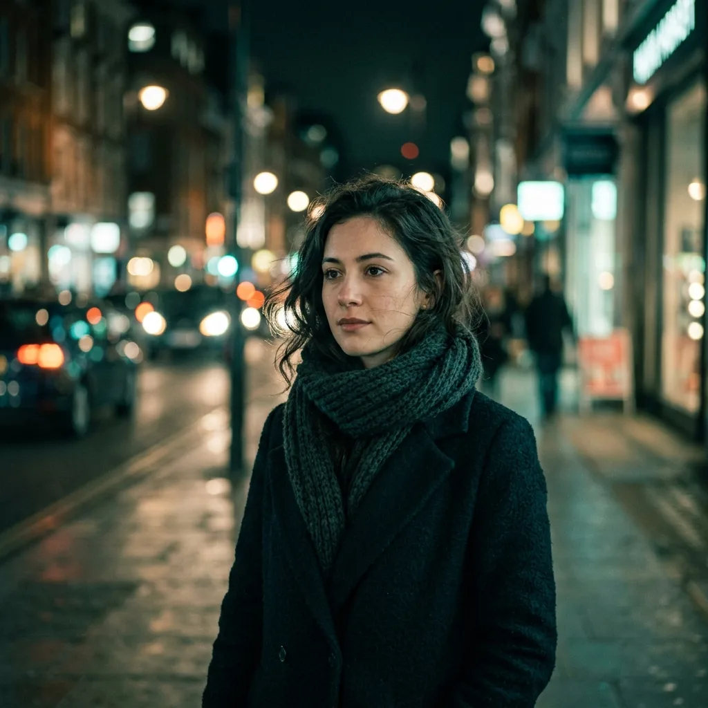

**#189 · Photography Prompt · <code>Vinano Image v2</code>**

<details>
<summary>Show prompt</summary>

```
A cinematic night-time portrait of a young woman standing outdoors, softly lit by ambient city lights. She wears a dark elegant coat a thick wool scarf wrapped around her neck. Loose strands of hair gently blown by the wind frame her face. Moody teal-green color grading, soft filmic, cinematic lighting, shallow depth of field, creamy bokeh city lights glowing in the background. Calm, introspective expression, natural skin texture, subtle makeup, film-like softness, atmospheric and emotional tone. Shot on a fast lens (85mm f/1.4 look), ultra-realistic photography, high detail, low noise, 8K quality. Keep edges clean and the overall composition balanced for a polished, gallery-ready result.
```

</details>

---

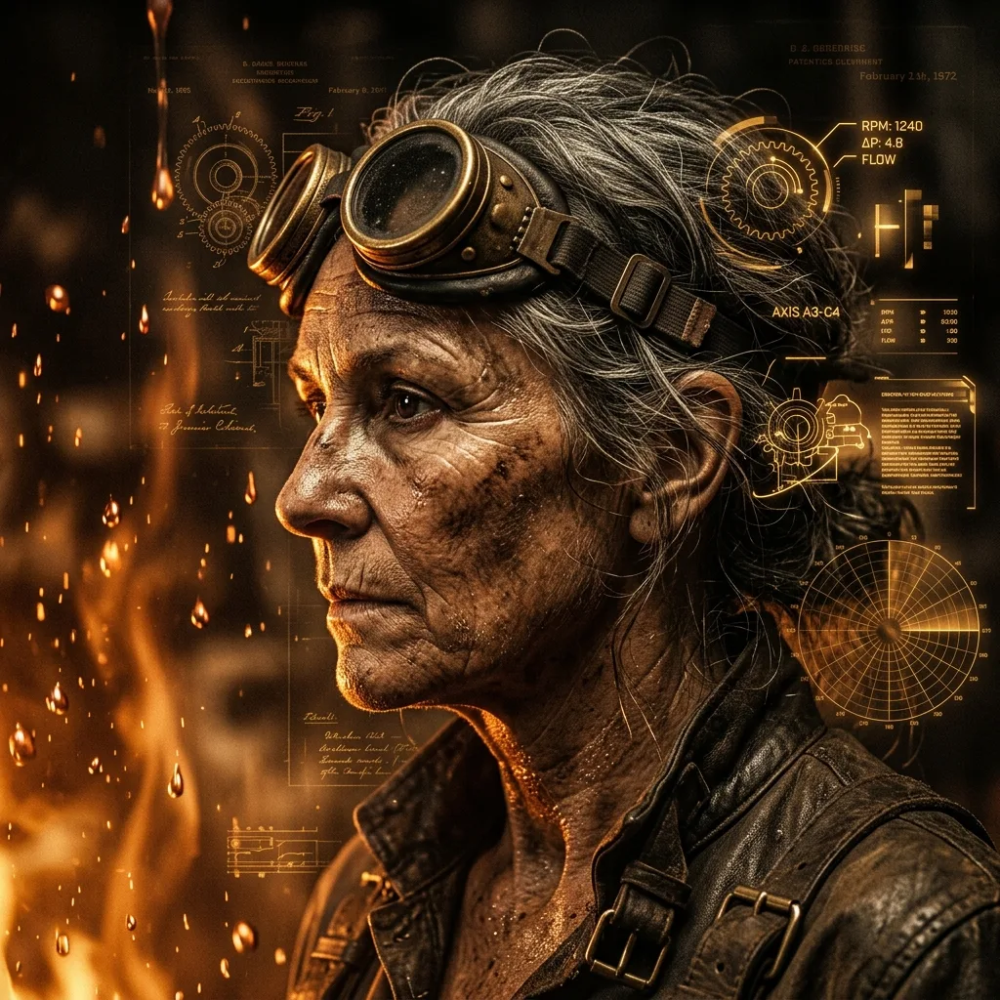

**#190 · Photography Prompt · <code>Vinano Image v2</code>**

<details>
<summary>Show prompt</summary>

```
A cinematic close-up profile of a weathered women a salt-and-pepper face, wearing brass-rimmed aviator goggles pushed up. Low-key lighting a heavy amber glow; thick molten copper droplets and incandescent heat waves shimmering in the air. Dark, soot-stained background layered vintage patent blueprints, floating golden gear-ratio calculations, and radial HUD overlays. High contrast, grit-textured skin, hyper-realistic sweat beads, heavy industrial atmosphere, cinematic sepia grading, 8K, epic digital concept art.. Render with rich micro-detail while keeping the layout uncluttered and intentional.
```

</details>

---


**#191 · Photography Prompt · <code>Vinano Image v2</code>**

<details>
<summary>Show prompt</summary>

```
Use the reference photo to create a realistic female character, soft smile, a fun and natural expression, without changing the facial structure or features, keeping it as realistic as possible.
Hair: Same as in the reference photo, natural movement and shine.
Outfit: Modern, stylish casual clothing.
Scene: Set in a cute pink office, showing her being creative. Around her, include mini chibi versions of herself doing funny actions (drinking coffee from a cup, pulling her hair, making silly faces, lying on her stomach on the desk drawing in a notebook). Add doodles and emojis, and include a matching phrase.
Lighting & Format: Natural light, aspect ratio 1080:1350 (4:5).

Aim for an editorial, design-driven look with deliberate negative space.
```

</details>

---

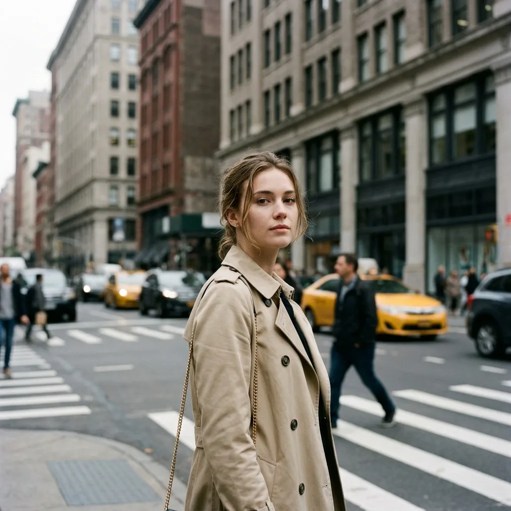

**#192 · Photography Prompt · <code>Vinano Image v2</code>**

<details>
<summary>Show prompt</summary>

```
{
 "Objective": "Create a realistic candid street photograph cinematic documentary realism",
 "PersonaDetails": {
 "Subject": {
 "Type": "Young woman",
 "Pose": "Standing at a city crosswalk, captured mid-turn",
 "Gaze": "Looking directly toward the camera",
 "Expression": "Calm, introspective, slightly distant",
 "Hair": "Loosely tied back soft strands framing the face",
 "Wardrobe": {
 "Outerwear": "Beige trench coat",
 "Accessories": "Thin gold chain shoulder bag"
 }
 }
 },
 "SceneDescription": {
 "Location": "Busy urban crosswalk",
 "BackgroundElements": ["Pedestrians in motion",
 "Yellow taxis",
 "Tall city buildings"],
 "Motion": "Subtle background movement suggesting city life"
 },
 "Composition": {
 "Framing": "Waist-up candid framing",
 "Moment": "Unposed, spontaneous mid-turn capture",
 "DepthOfField": "Shallow depth of field",
 "Focus": "Ultra-sharp subject background motion blur"
 },
 "LightingAndColor": {
 "Lighting": "Natural overcast daylight",
 "ColorPalette": "Muted neutral tones",
 "Bokeh": "Soft cinematic bokeh"
 },
 "PhotographyStyle": {
 "Genre": "Street photography",
 "Aesthetic": "Documentary-style realism",
 "LensLook": "85mm lens perspective",
 "DetailLevel": "High detail, true-to-life photorealistic textures"
 },
 "Mood": {
 "Tone": "Quiet, reflective, urban",
 "Atmosphere": "Authentic, lived-in city moment"
 },
 "ArtDirection": {
 "Style": "true-to-life photorealistic",
 "RealismLevel": "True-to-life, candid capture",
 "Processing": "Minimal, natural post-processing"
 },
 "NegativePrompt": ["posed look",
 "fashion editorial",
 "studio lighting",
 "oversaturated colors",
 "heavy retouching",
 "cartoon",
 "anime",
 "blurry subject"],
 "ResponseFormat": {
 "Type": "Single image",
 "Orientation": "Portrait",
 "AspectRatio": "2:3"
 }
}

Preserve realistic proportions and depth for a confident, professional finish.
```

</details>

---

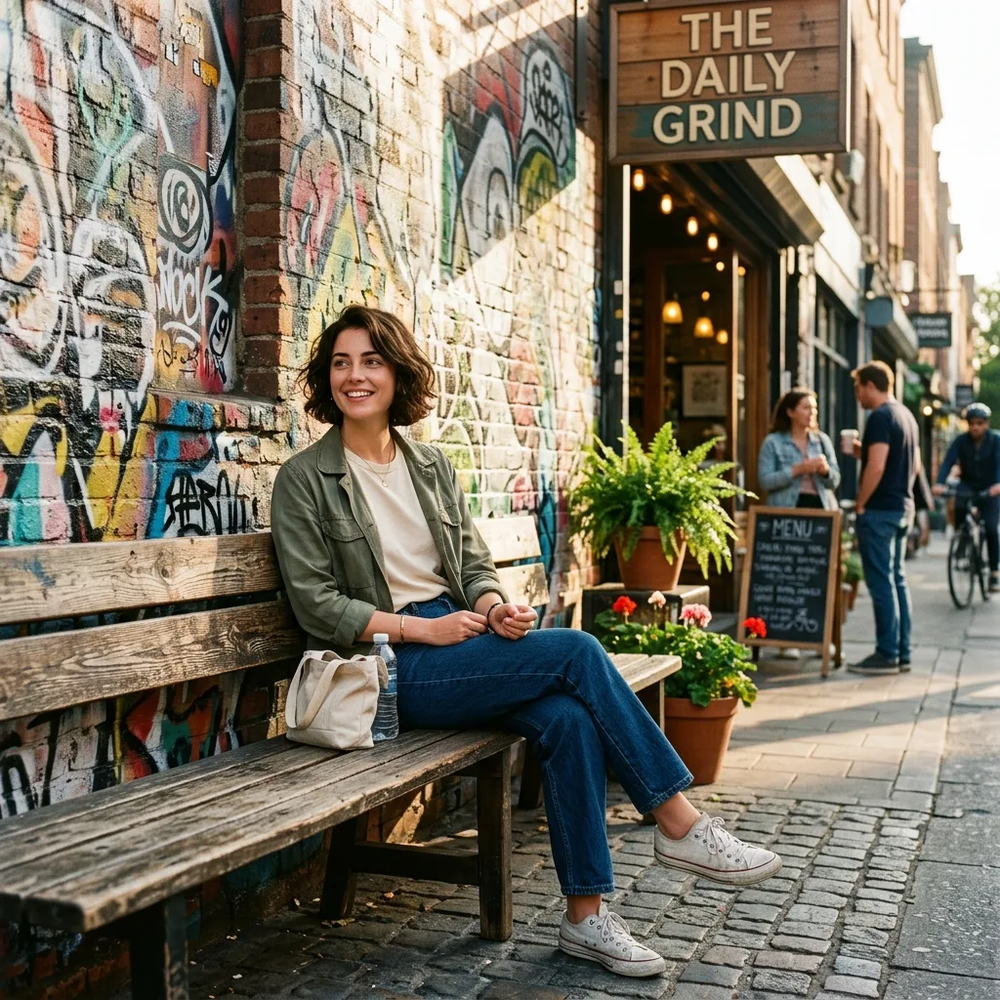

**#193 · Photography Prompt · <code>Vinano Image v2</code>**

<details>
<summary>Show prompt</summary>

```
Cinematic realistic street scene, beautiful young woman short wavy bob haircut, natural hourglass body shape correct human proportions, sitting relaxed on a wooden bench in front of a small restaurant, graffiti wall behind her, late afternoon side sunlight strong shadows. Casual urban outfit: inner t-shirt a light open outer jacket, relaxed denim pants, sneakers. Soft cinematic color grading, shallow depth of field, ultra-detailed, true-to-life photorealistic Keep edges clean and the overall composition balanced for a polished, gallery-ready result.
```

</details>

---


**#194 · Photography Prompt · <code>Vinano Image v2</code>**

<details>
<summary>Show prompt</summary>

```
{
 "task": "temporal_motion_echo_portrait_effect",
 "input": {
 "source_image": "USER_UPLOADED_IMAGE",
 "preserve_identity": true,
 "preserve_pose": true,
 "preserve_outfit": true,
 "preserve_composition": true
 },
 "output": {
 "type": "single_image",
 "resolution": "ultra_high_resolution",
 "detail_preservation": "high",
 "ai_artifacts": "none"
 },
 "effect_design": {
 "core_effect": "motion_echo_time_displacement",
 "echo_direction": "horizontal",
 "echo_behavior": {
 "center_subject": "sharp_and_fully_in_focus",
 "echo_layers": "multiple_time_offset_duplicates",
 "blur_progression": "increasing_blur_with_distance_from_center",
 "opacity_falloff": "soft_fade_outward",
 "alignment": "perfectly_registered_with_original_subject"
 },
 "motion_style": {
 "type": "temporal_smear",
 "speed_feel": "slow_motion_time_stretch",
 "distortion": "none"
 }
 },
 "visual_style": {
 "background": {
 "treatment": "smooth_minimal_gradient",
 "blur": "subtle",
 "color_continuity": "match_original_background"
 },
 "lighting": {
 "preserve_original_lighting": true,
 "contrast": "controlled",
 "highlights": "soft",
 "shadows": "clean"
 },
 "color": {
 "grade": "cinematic_muted",
 "saturation": "natural",
 "skin_tones": "accurate"
 }
 },
 "restrictions": {
 "no_new_elements": true,
 "no_pose_change": true,
 "no_face_warping": true,
 "no_outfit_modification": true,
 "no_background_replacement": true
 }
}

Preserve realistic proportions and depth for a confident, professional finish.
```

</details>

---

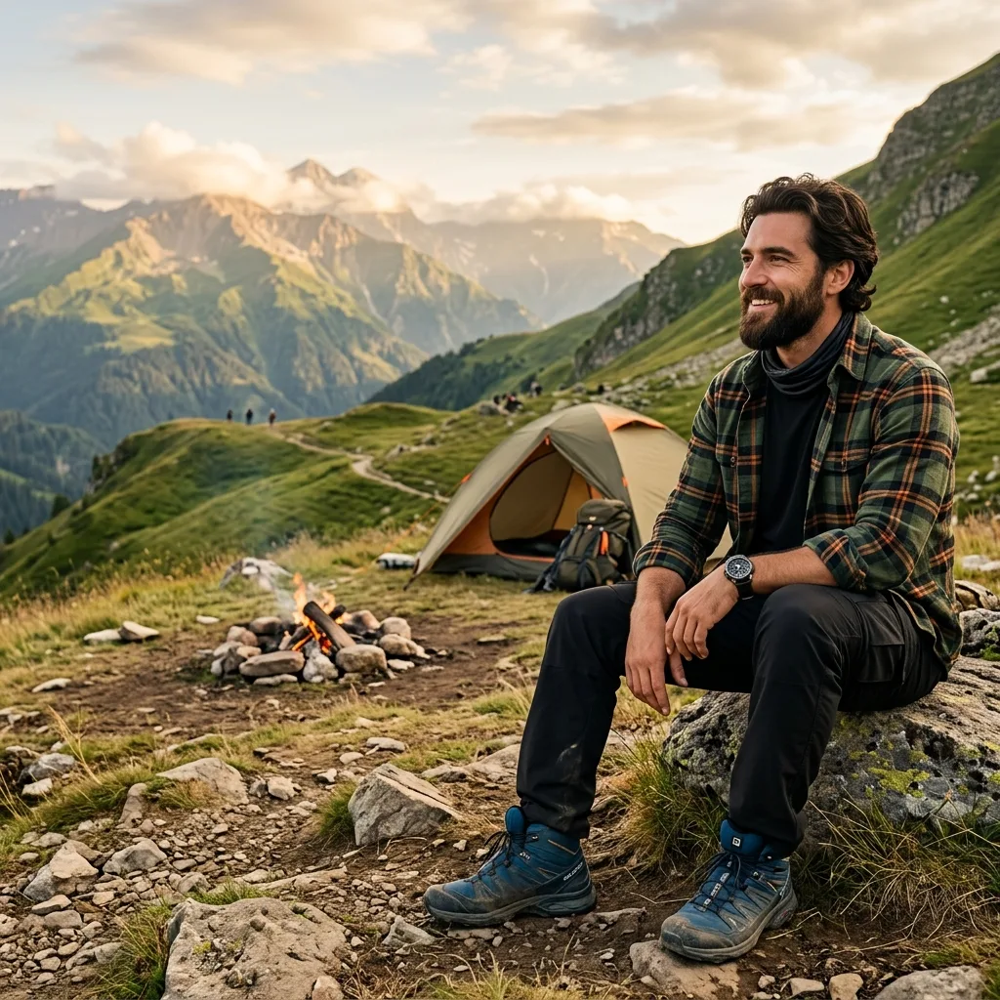

**#195 · Photography Prompt · <code>Vinano Image v2</code>**

<details>
<summary>Show prompt</summary>

```
{
 "prompt_details": {
 "subject": {
 "description": "Handsome male trekker, dark wavy hair (no cap), full beard, rugged appearance",
 "expression": "Relaxed, calm, enjoying the nature",
 "clothing": "Green check flannel shirt layered over a black T-shirt, black cargo trekking pants, blue hiking boots, wristwatch, neck gaiter"
 },
 "environment": {
 "location": "Mountain campsite",
 "elements": "Pitched camping tent in background, lush green hills, rocky ground, perhaps a small campfire",
 "time_of_day": "Golden hour or soft afternoon light"
 },
 "style": {
 "type": "Hyper-realistic outdoor photography",
 "quality": "8k resolution, filmic, cinematic lighting, sharp focus, detailed texture",
 "camera_angle": "Eye-level or slightly low angle"
 }
 },
 "full_prompt_text": "A handsome male trekker sitting comfortably at a mountain campsite, no cap, showing dark wavy hair and a beard. He is wearing a green check shirt over a black t-shirt, black cargo pants, and blue hiking boots. A camping tent is visible in the background amidst lush green mountains. Soft natural lighting, realistic skin texture, cinematic outdoor adventure style, 8k resolution."
}

Aim for an editorial, design-driven look with deliberate negative space.
```

</details>

---

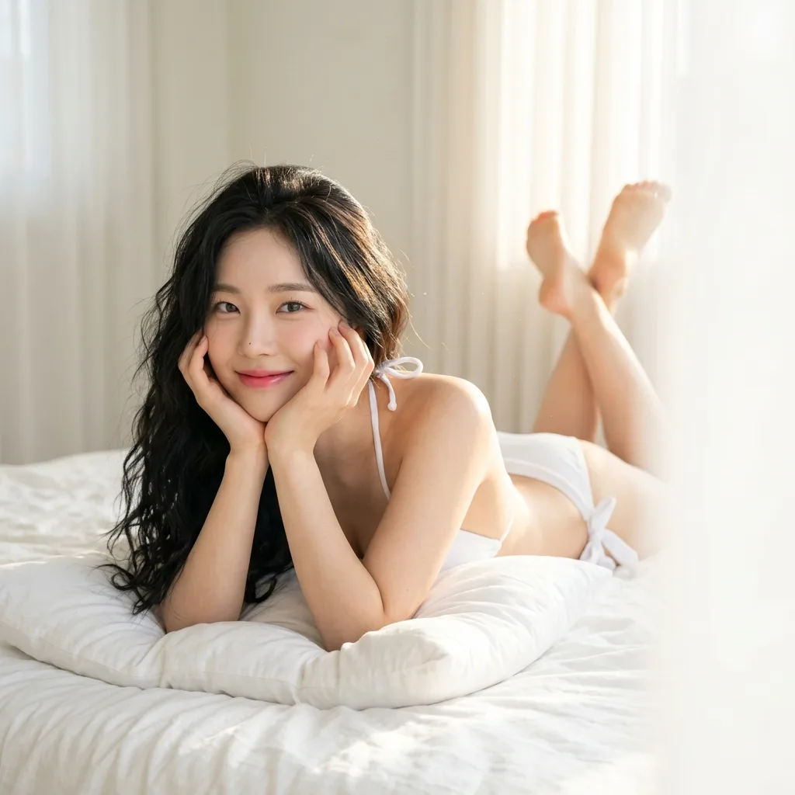

**#196 · Photography Prompt · <code>Vinano Image v2</code>**

<details>
<summary>Show prompt</summary>

```
(Masterpiece, Best Quality, 8K UHD, RAW photo), true-to-life photorealistic portrait,
 the exact same beautiful Korean female k-pop idol every time,
 innocent baby face, straight eyebrows, big doe eyes aegyosal,
 gradient glossy pink lips, light blush,
 messy long black wavy hair fanning out across the white pillow,
 sun-kissed highlights on select strands,

 Layer 2: white string bikini top, tied at back of neck,
 Layer 5 white string bikini bottom side bows,
 bare legs slightly bent at the knees, feet crossed in the air,
 lying on her stomach on a white bed,
 propped up on elbows, chin resting on hands,
 legs lazily crossed and kicked up behind her,
 shoulders relaxed and open,
 natural effortless sensual pose, maximum breathing space in composition,
 looking back over her shoulder at the camera,
 playful smile, eyes bright and inviting,
 expression: carefree, natural beauty, innocent allure,
 relaxed brow, slight head tilt,

 white bed soft rumpled linen sheets,
 one white pillow beneath her elbows,
 sheer white curtains morning light pouring through,
 large overexposed white background area on the right side,
 strong negative space for breathing room,
 dreamy hazy soft-focus atmosphere,

 golden morning sunlight from the right side through sheer curtains,
 warm light illuminating her face and upper body,
 soft shadows, high-key overall,
 dust motes floating in light beams,
 gentle hair backlight creating angelic glow,

 Canon R5, 50mm f/1.4,
 eye-level intimate POV,
 moderate depth of field, soft bokeh on background,
 sharp focus on eyes and face,

 airy, luminous, dreamy morning atmosphere,
 youthful sensuality, effortless beauty,

 ultra-detailed skin, realistic hair strands, fabric texture,
 8K resolution, true-to-life photorealistic, no artifacts, no watermark

Keep edges clean and the overall composition balanced for a polished, gallery-ready result.
```

</details>

---

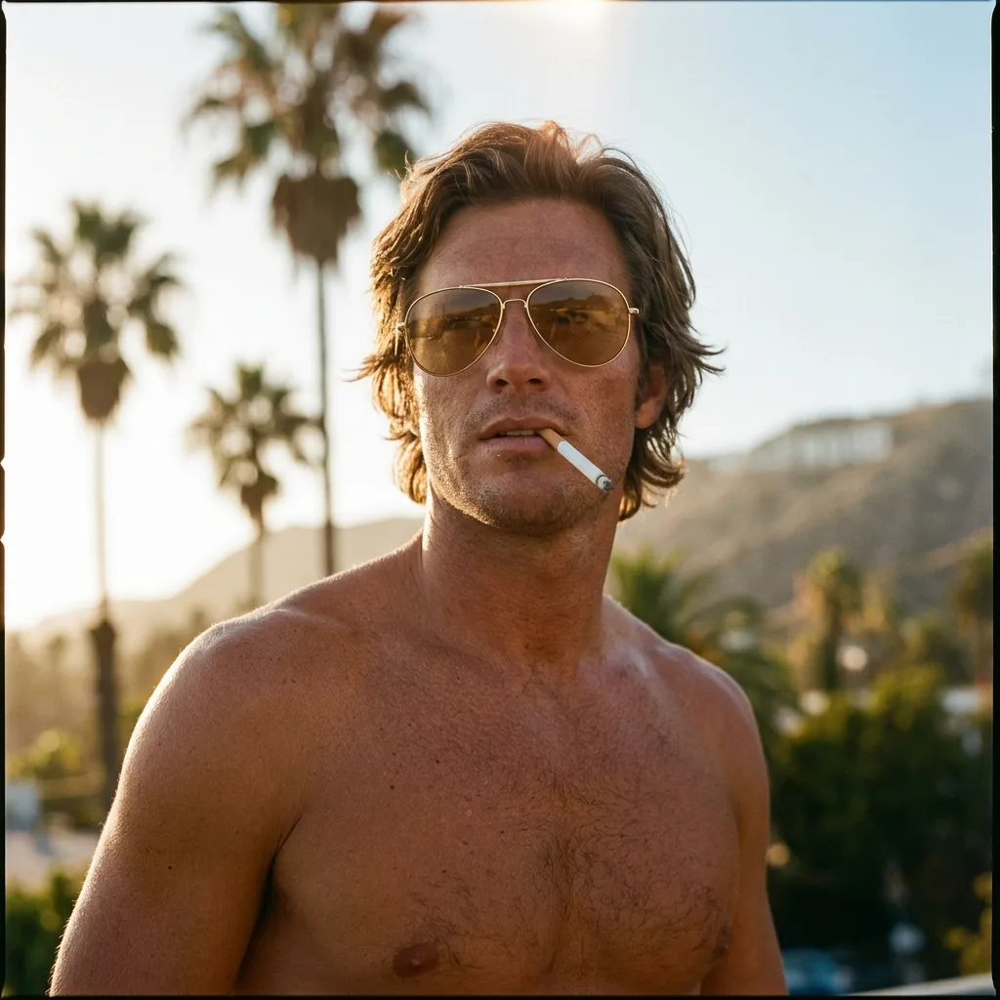

**#197 · Photography Prompt · <code>Vinano Image v2</code>**

<details>
<summary>Show prompt</summary>

```
Shirtless male subject, hyper-realistic skin texture, deep tan, 1970s Hollywood aesthetic, vintage gold-rimmed aviator sunglasses amber tint, unlit cigarette held in mouth, masculine ruggedness, medium close-up, low-angle perspective, background of blurred palm trees and hazy Los Angeles hillside, high-key natural sunlight, warm tungsten glow, golden hour color grading, shot on 35mm film, Arriflex 35 BL, 50mm T1.3, heavy film grain, authentic Kodak Portra 400 stock, slight lens flare, sun-bleached highlights, retro film-still style, directed by Quentin Tarantino Preserve realistic proportions and depth for a confident, professional finish.
```

</details>

---

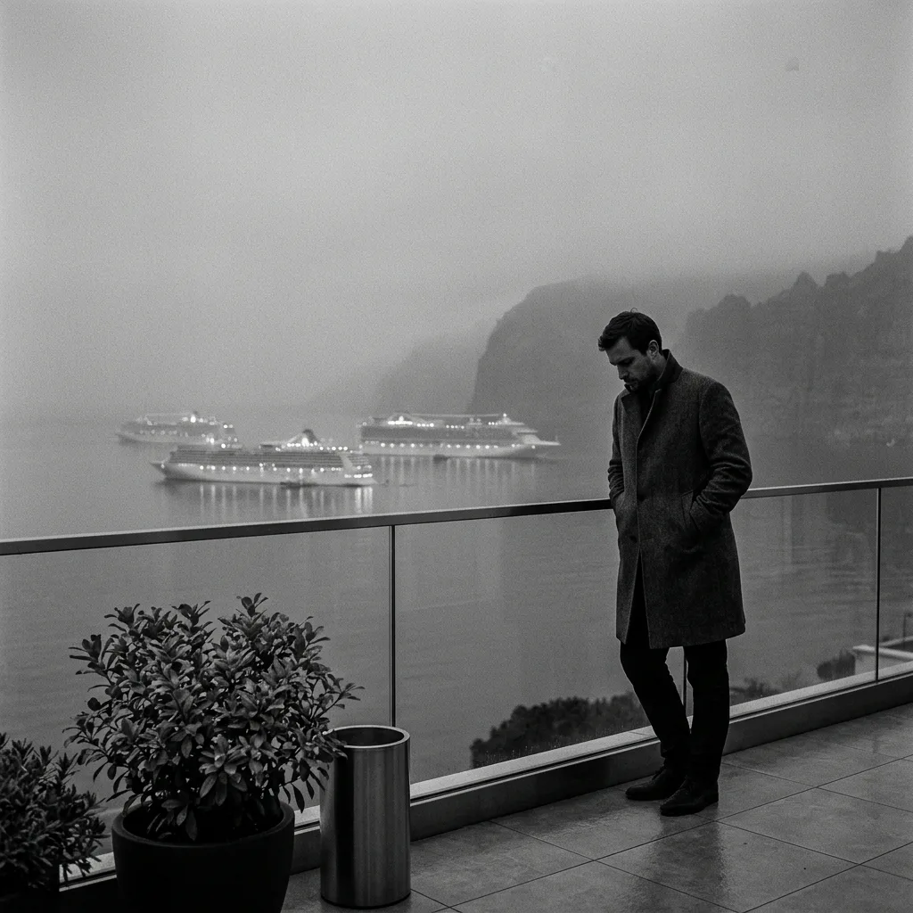

**#198 · Photography Prompt · <code>Vinano Image Pro</code>**

<details>
<summary>Show prompt</summary>

```
{
"metadata": {
"image_type": "photograph",
"primary_purpose": "editorial"
},
"composition": {
"rule_applied": "rule of thirds",
"aspect_ratio": "1:1",
"layout": "layered",
"focal_points": ["Man in dark overcoat standing on the right side of the frame",
"Illuminated cruise ships floating in the misty bay"],
"visual_hierarchy": "Eye starts on the dark, high-contrast figure of the man on the right, follows his downward gaze, then moves left across the glass railing to the textured plant, and finally drifts up to the illuminated ships and hazy mountains in the background",
"balance": "asymmetric"
},
"color_profile": {
"dominant_colors": [{
"color": "Black",
"hex": "#0D0D0D",
"percentage": "25",
"role": "primary subject and foreground silhouettes"
},
{
"color": "Mid Gray",
"hex": "#808080",
"percentage": "45",
"role": "background bay, sky, and mountains"
},
{
"color": "Light Gray",
"hex": "#D3D3D3",
"percentage": "30",
"role": "fog, sky highlights, and water reflections"
}],
"color_palette": "monochromatic",
"temperature": "cool",
"saturation": "black and white",
"contrast": "high contrast"
},
"lighting": {
"type": "natural window",
"source_count": "single source",
"direction": "diffused from above",
"directionality": "diffused",
"quality": "soft light",
"intensity": "moody",
"contrast_ratio": "high contrast (dramatic shadows)",
"mood": "mysterious",
"shadows": {
"type": "soft gradual edges",
"density": "deep black",
"placement": "under subject, obscuring facial details and coat folds",
"length": "short"
},
"highlights": {
"treatment": "subtle",
"placement": "on the water surface, ship lights, and plant leaves"
},
"ambient_fill": "present",
"light_temperature": "neutral"
},
"technical_specs": {
"medium": "digital photography",
"style": "realistic",
"texture": "grainy",
"sharpness": "slightly soft",
"grain": "film grain",
"depth_of_field": "deep",
"perspective": "straight on"
},
"artistic_elements": {
"genre": "portrait",
"influences": ["Cinematic noir",
"Melancholic travel photography"],
"mood": "calm",
"atmosphere": "Quiet, contemplative, slightly melancholic morning or evening heavy atmospheric mist",
"visual_style": "minimal"
},
"typography": {
"present": false,
"fonts": [],
"placement": "none",
"integration": "subtle"
},
"subject_analysis": {
"primary_subject": "A man wearing a long dark overcoat and dress shoes, looking downward in thought",
"positioning": "right",
"scale": "environmental",
"interaction": "interacting environment",
"facial_expression": {
"mouth": "closed smile",
"smile_intensity": "no smile",
"eyes": "looking away",
"eyebrows": "neutral",
"overall_emotion": "serious",
"authenticity": "candid"
},
"hands_and_gestures": {
"left_hand": "in pocket",
"right_hand": "in pocket",
"finger_positions": "relaxed",
"finger_interlacing": "none",
"hand_tension": "relaxed",
"interaction": "resting inside coat pockets",
"naturalness": "organic casual gesture"
},
"body_positioning": {
"posture": "leaning",
"angle": "45 degree turn",
"weight_distribution": "leaning right",
"shoulders": "relaxed"
}
},
"background": {
"setting_type": "outdoor",
"spatial_depth": "deep",
"elements_detailed": [{
"item": "Glass balcony railing metal handrail",
"position": "center",
"distance": "midground",
"size": "dominant",
"condition": "pristine",
"specific_features": "Transparent panels running horizontally across the frame"
},
{
"item": "Potted leafy shrub",
"position": "bottom left",
"distance": "foreground",
"size": "medium",
"condition": "thriving",
"specific_features": "Dense, small leaves catching subtle highlight reflections"
},
{
"item": "Smooth cylindrical planter pot",
"position": "bottom right",
"distance": "foreground",
"size": "small",
"condition": "pristine",
"specific_features": "refined minimalist matte finish, containing another plant"
},
{
"item": "Illuminated cruise ships",
"position": "center",
"distance": "background",
"size": "small",
"condition": "pristine",
"specific_features": "Bright deck lights piercing through the fog"
},
{
"item": "Coastal mountains/hills",
"position": "top",
"distance": "background",
"size": "dominant",
"condition": "weathered",
"specific_features": "Silhouetted and hazy due to thick atmospheric fog"
}],
"wall_surface": {
"material": "glass and metal",
"surface_treatment": "smooth",
"texture": "perfectly smooth",
"finish": "glossy",
"color": "transparent gray reflections",
"color_variation": "gradient",
"features": "clean, modern architectural lines",
"wear_indicators": "pristine"
},
"floor_surface": {
"material": "tile",
"color": "mid-gray",
"pattern": "solid rectangular panels distinct grout lines"
},
"objects_catalog": "Glass railing (midground horizontal), large leafy potted plant (bottom left foreground), sleek light-colored planter pot (bottom right foreground), three illuminated cruise ships (background bay), distant coastal town buildings (background right)",
"background_treatment": "gradient"
},
"generation_parameters": {
"prompts": ["Cinematic black and white photograph of a man in a dark overcoat leaning against a modern glass balcony railing. He is positioned on the right, looking down thoughtfully his hands in his pockets. In the background, a moody, fog-covered bay large illuminated cruise ships and hazy mountains. Deep atmospheric perspective, film grain, soft diffused lighting, melancholic mood.",
"A moody monochromatic shot from a high-end coastal balcony. A silhouetted male figure stands resting against the glass barrier. Dense fog over a calm sea, dotted the glowing lights of several distant ships. Potted plants frame the bottom corners. Melancholic, refined minimalist, rich gray tones, Leica photography style."],
"keywords": ["black and white",
"moody",
"fog",
"overcoat",
"balcony",
"cruise ships",
"cinematic",
"contemplative"],
"technical_settings": "ISO 400, f/5.6 to maintain background visibility while keeping subject sharp, shutter speed 1/125s, shot on a medium focal length (e.g., 50mm).",
"post_processing": "Converted to monochrome, contrast adjusted to create a strong silhouette for the subject while maintaining soft midtones in the foggy background, added subtle film grain for texture."
}
}

Aim for an editorial, design-driven look with deliberate negative space.
```

</details>

---

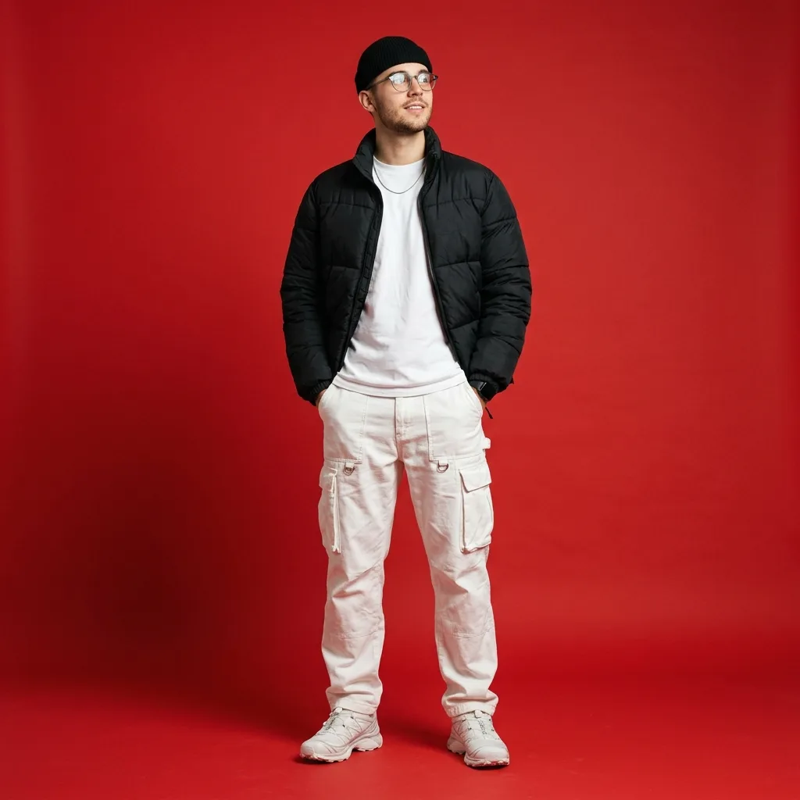

**#199 · Photography Prompt · <code>Vinano Image v2</code>**

<details>
<summary>Show prompt</summary>

```
Ultra-realistic full-body studio fashion portrait of a stylish young man standing confidently, looking slightly upward. He wears a black puffer jacket, white t-shirt, loose white cargo pants, and chunky white sneakers. Accessories include round clear glasses and a black knit beanie. Hands in pockets, relaxed confident posture. Clean seamless solid red studio background. Soft professional studio lighting, sharp clothing texture, editorial fashion photography. Keep edges clean and the overall composition balanced for a polished, gallery-ready result.
```

</details>

---

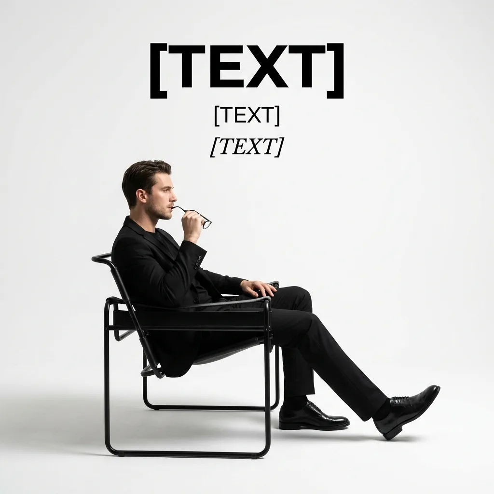

**#200 · Photography Prompt · <code>Vinano Image v2</code>**

<details>
<summary>Show prompt</summary>

```
A refined minimalist studio photograph fashion ad. At the top center, the bold sans-serif text "[TEXT]" is positioned above the smaller sans-serif text "[TEXT]", which is above the italic script text "[TEXT]". Below the text, a man in a black suit, black t-shirt, and polished black dress shoes sits in profile, facing left. He is seated in a modern chair a black leather seat and backrest suspended on a tubular black metal frame. His right leg is extended, and he holds a pair of glasses in his right hand near his mouth. The background and floor are a seamless, stark white studio space soft, diffused lighting that casts grounded shadows beneath the man and chair. Emphasise material texture and natural light so the final frame feels tactile and premium.
```

</details>

---

[Next page →](./photography-3.md)
