# Photography — full gallery

[← Back to README](../README.md) · [`prompts.json`](../prompts/prompts.json) · **630** prompts · page 3 / 7

[← Prev](./photography-2.md) — [1](./photography.md) · [2](./photography-2.md) · **3** · [4](./photography-4.md) · [5](./photography-5.md) · [6](./photography-6.md) · [7](./photography-7.md) — [Next →](./photography-4.md)

---

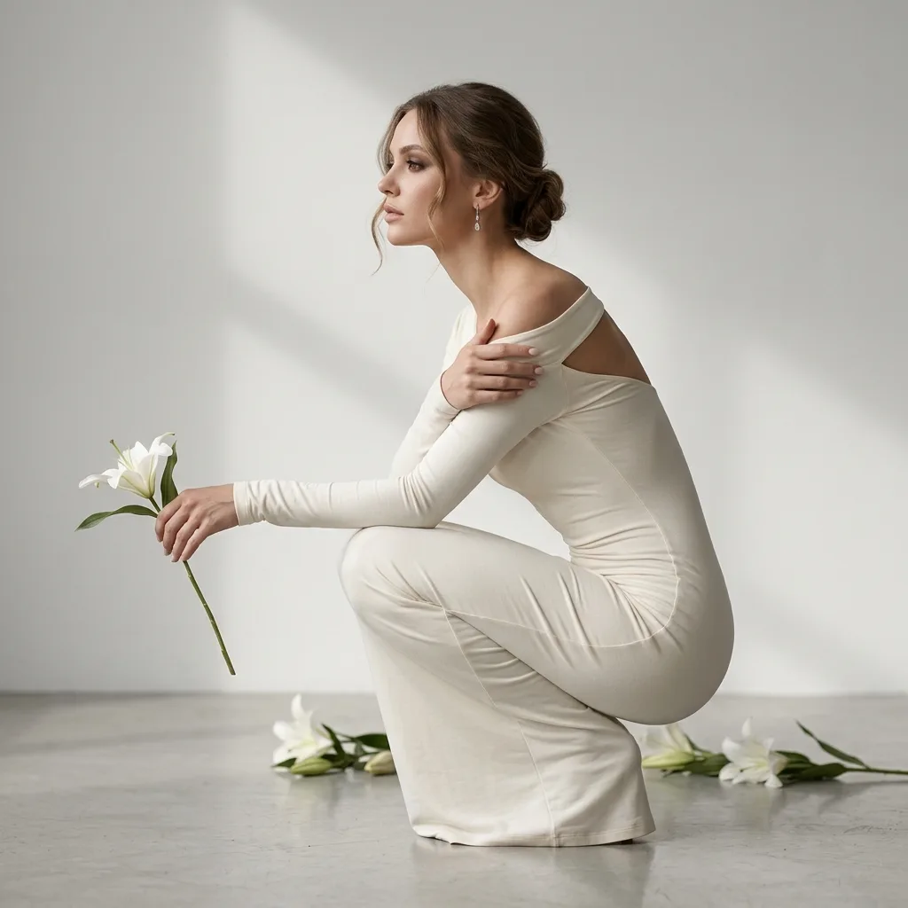

**#201 · Photography Prompt · <code>Vinano Image Pro</code>**

<details>
<summary>Show prompt</summary>

```
Role: high-end fashion editorial photographer shooting a luxury refined minimalist studio campaign, ultra-realistic photography
Subject: use the attached face photo as the exact facial identity (100% identity preservation, anatomical precision, original proportions, natural skin texture, no AI beautification, no facial reshaping), seamlessly replace the model's face from the reference image the attached face, perfect alignment of jawline, cheekbones, eye spacing, nose structure, skin tone matching and lighting consistency, no visible blending artifacts
Body Adjustment: slightly slimmer silhouette, more refined waistline, subtly leaner arms and thighs, elegant elongated body proportions, natural anatomy preserved (no distortion), realistic bone structure and muscle definition
Pose & Composition (match reference exactly): deep squat pose, body in full side profile, torso leaning slightly forward, one arm wrapped across chest holding opposite shoulder, other arm extended forward holding a single white lily, head lifted slightly upward, lips relaxed (natural neutral expression, no pursed lips, no blowing expression), elegant elongated neck posture, full body visible within frame, minimalistic light grey seamless studio background, soft diagonal shadow on background and floor
Outfit (exact replication): cream/off-white fitted long-sleeve dress, asymmetrical off-shoulder neckline, exposed upper back and shoulders, soft stretch fabric tightly fitted to body, natural fabric tension and realistic fold compression at knees and waist, floor-length hem, no necklace, delicate drop earrings, clean natural manicure
Hair (match styling exactly): low textured bun, soft loose face-framing tendrils, elegant romantic styling, natural volume, subtle shine
Makeup (exact replication): neutral glam makeup, matte skin soft highlight, subtle contour, defined brows, soft brown smoky eye, nude lips (relaxed natural shape, not puckered), refined editorial finish
Props (must match exactly): single white lily held in extended hand, additional lilies placed on floor behind, realistic botanical detail, accurate leaf texture, natural stem structure, correct shadow interaction floor
Lighting & Realism: professional studio lighting, soft directional key light from left side, smooth shadow gradient, high dynamic range, ultra high resolution, sharp focus on eyes, realistic skin pores, accurate fabric physics natural stretch and compression, realistic floor reflections, no plastic skin, no oversmoothing
Camera: full-frame camera, 85mm lens, shallow depth of field, luxury fashion editorial color grading, clean neutral tones
Negative prompt: low resolution, distorted face, incorrect anatomy, exaggerated thinness, unhealthy body proportions, asymmetry errors, extra limbs, warped hands, artificial skin texture, over-smoothed skin, wrong dress style, different color dress, added jewelry, incorrect flowers, wrong pose, different background, harsh lighting, blurry eyes, visible face merge artifacts, AI look, cartoonish rendering, oversaturated colors.

Aim for an editorial, design-driven look with deliberate negative space.
```

</details>

---

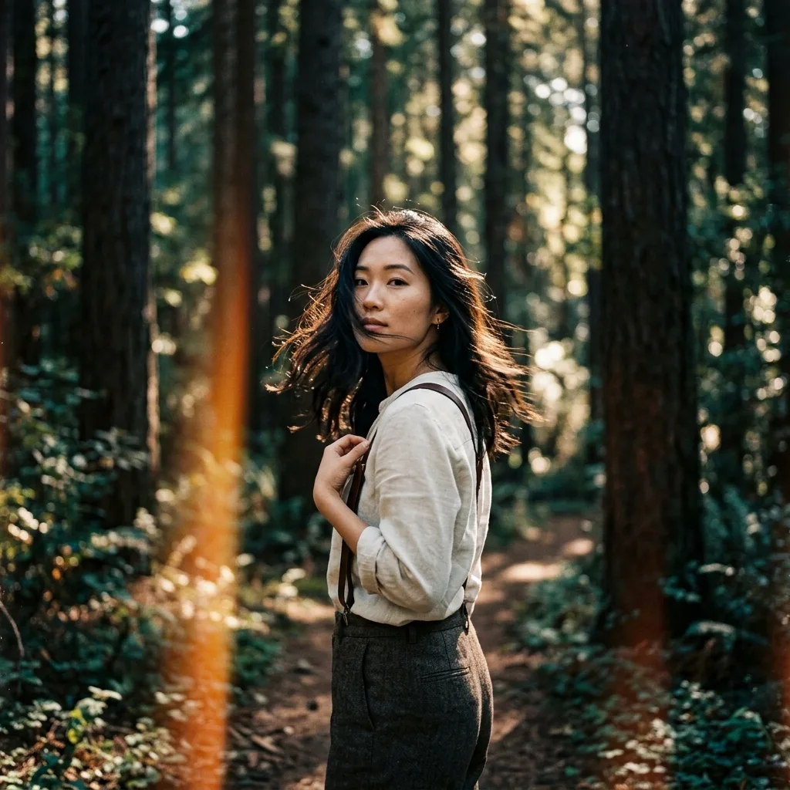

**#202 · Photography Prompt · <code>Vinano Image v2</code>**

<details>
<summary>Show prompt</summary>

```
A cinematic portrait of an Asian woman standing in a quiet forest, captured in a spontaneous moment as she turns her head slightly back toward the camera. Soft sunlight filters through tall trees, creating dramatic patches of light and shadow across her face and body. A distinct vertical light leak streak cuts through the frame, adding a striking analog imperfection. Her hair moves gently in the breeze, loose strands catching the light, adding natural motion and softness. She wears a simple light-colored blouse layered dark suspenders, creating a subtle contrast against the deep forest tones. Her expression is calm, slightly distant, and introspective, her eyes softly meeting the camera. The background is filled blurred tree trunks and glowing bokeh highlights, creating depth and atmosphere. The color grading features rich teal shadows and warm orange highlights, giving a cinematic teal-and-orange contrast. The image has a strong analog film aesthetic visible grain, soft haze, slight blur, and light distortion. Imperfect framing, natural light flare, and film burn elements enhance the nostalgic 35mm film look. Cinematic film still, dreamy and moody atmosphere, poetic forest setting, high detail, hd quality. Preserve realistic proportions and depth for a confident, professional finish.
```

</details>

---

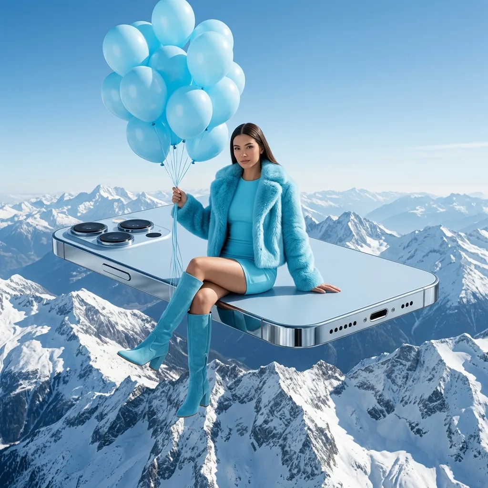

**#203 · Photography Prompt · <code>Vinano Image v2</code>**

<details>
<summary>Show prompt</summary>

```
A surreal, high-concept masterpiece featuring “uploaded face as reference” seated casually on the edge of a colossal, floating smartphone suspended high above a snow-capped mountain range. The subject is dressed in a monochromatic cyan ensemble, wearing a fitted mini dress, a plush faux-fur jacket, and knee-high suede boots, while holding a large cluster of matching light-blue helium balloons.

The giant smartphone, resembling a high-end device a triple-lens camera array and metallic silver edges, floats horizontally, displaying realistic charging ports and speaker grills. Bright, crisp daylight casts sharp shadows on the phone’s surface, highlighting the texture of the fur and the sleek glass.

The background is a breathtaking aerial vista of jagged, snowy alpine peaks under a clear blue sky, rendered in 8K resolution hyper-realistic textures, deep depth of field, and a commercial photography aesthetic.

Aim for an editorial, design-driven look with deliberate negative space.
```

</details>

---

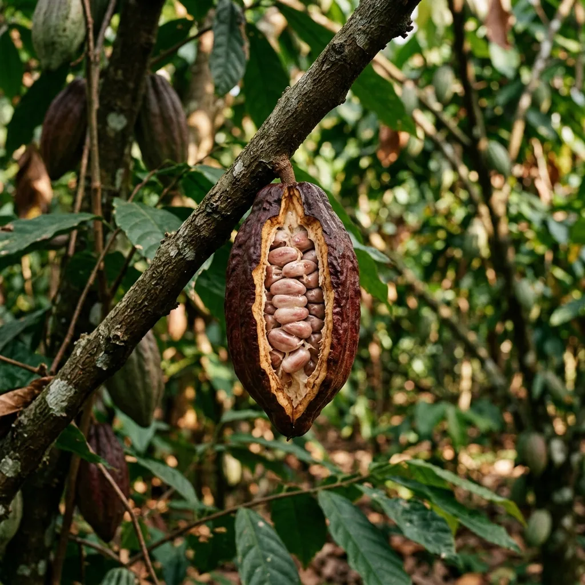

**#204 · Photography Prompt · <code>Vinano Image v2</code>**

<details>
<summary>Show prompt</summary>

```
premium-quality realistic commercial shot of a cocoa plantation in landscape orientation, cocoa tree as background, one cocoa pod partially split open on the branch in the center, fresh cocoa beans clearly visible inside fibrous natural texture, slight irregular opening, surrounding pods and leaves softly out of focus, rich earthy brown and green tones, warm natural daylight soft directional highlights, shallow depth of field, premium agricultural realism, no text, no people, no branding. Keep edges clean and the overall composition balanced for a polished, gallery-ready result.
```

</details>

---

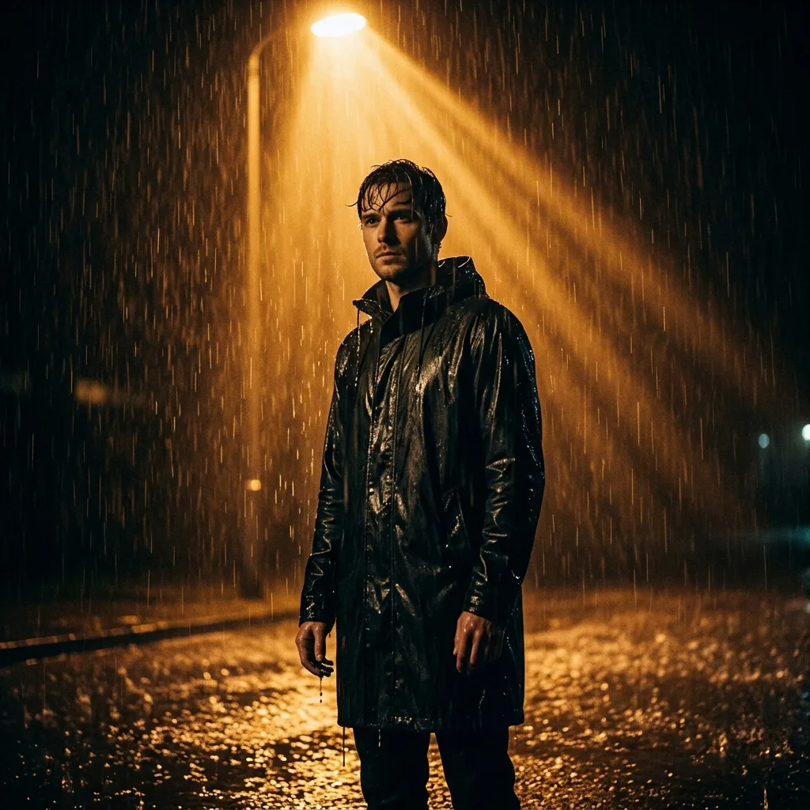

**#205 · Photography Prompt · <code>Vinano Image v2</code>**

<details>
<summary>Show prompt</summary>

```
Create a highly cinematic, realistic photo of a person the face from the uploaded image. The person is standing alone under a single streetlight at night in heavy rain. The rain is pouring down dramatically, visible droplets and water splashing on the ground. The streetlight casts a strong golden glow, lighting only the person while the surroundings fade into darkness. The ground is wet and reflective, creating beautiful reflections of the light. The camera angle is slightly low and centered, giving a powerful, movie-like look. The person is wearing a dark stylish outfit like a long coat or jacket, water dripping from clothes and hair. Their expression is calm and intense. filmic, cinematic lighting, dramatic contrast, volumetric light rays through rain, ultra realistic photography, Hollywood movie scene, high detail, atmospheric depth. Preserve realistic proportions and depth for a confident, professional finish.
```

</details>

---

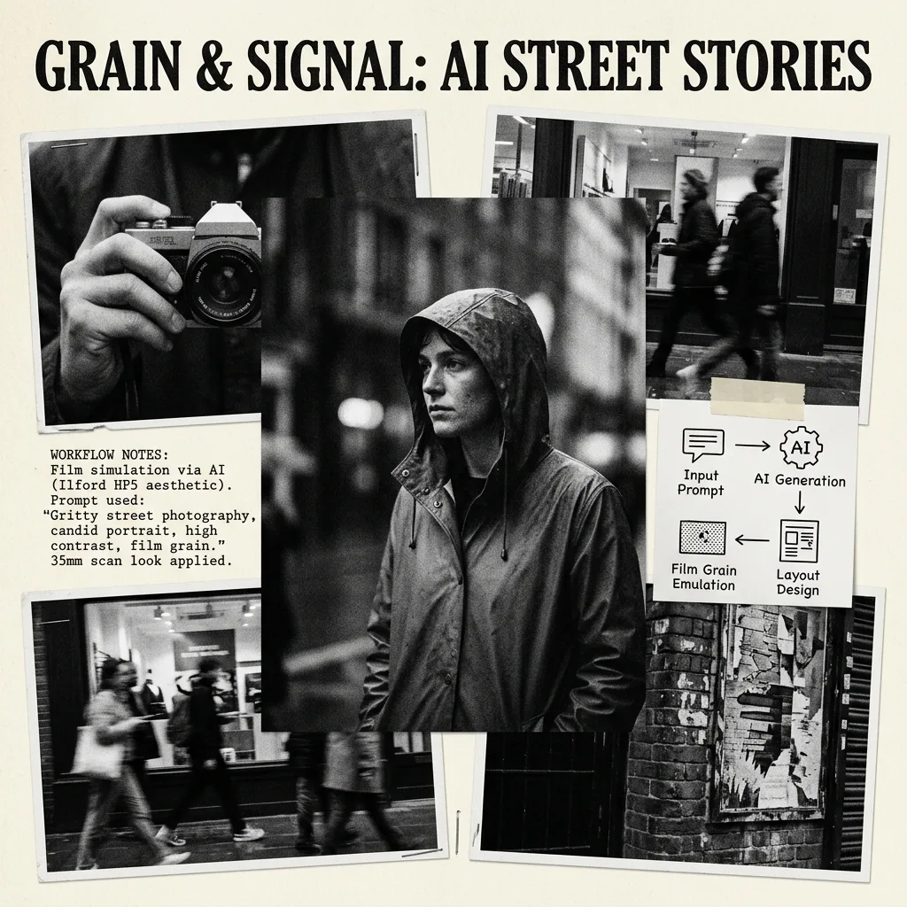

**#206 · Photography Prompt · <code>Vinano Image Pro</code>**

<details>
<summary>Show prompt</summary>

```
unlimited, AI photo collage, vintage film look, black and white editorial, cinematic, analog photography aesthetic, collage, film grain texture, Ilford HP5 style, moody portrait lighting, street photography vibe, retro zine layout, AI photography workflow, prompt sharing, generative art prompts, editorial collage design Maintain consistent colour harmony and crisp focus across the whole frame.
```

</details>

---

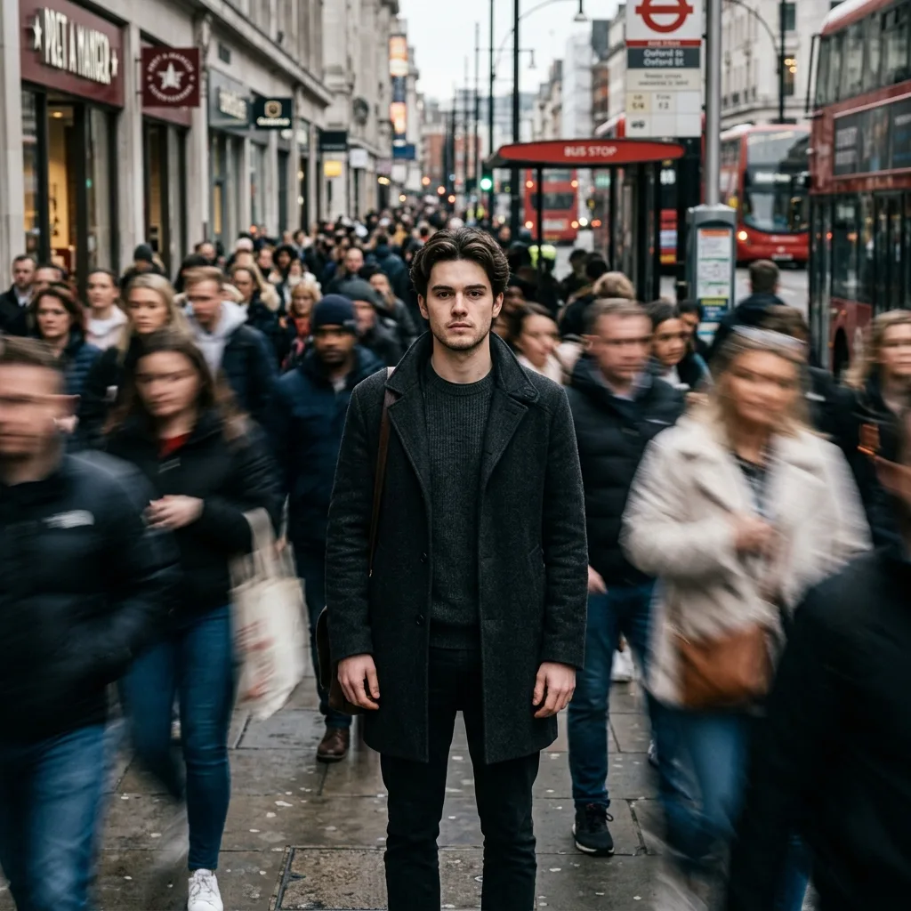

**#207 · Photography Prompt · <code>Vinano Image v2</code>**

<details>
<summary>Show prompt</summary>

```
A cinematic portrait of a young man standing still in the middle of a busy crowd, sharp focus on the subject while people around him are heavily motion blurred, creating a dynamic sense of movement. The subject has a calm, serious expression, wearing a dark coat over a minimal outfit. Shot in a crowded urban environment, natural soft, diffused lighting, shallow depth of field, center composition. Long exposure effect streaking motion blur surrounding the subject, ultra-realistic, 8K, high detail, cinematic color grading. Emphasise material texture and natural light so the final frame feels tactile and premium.
```

</details>

---

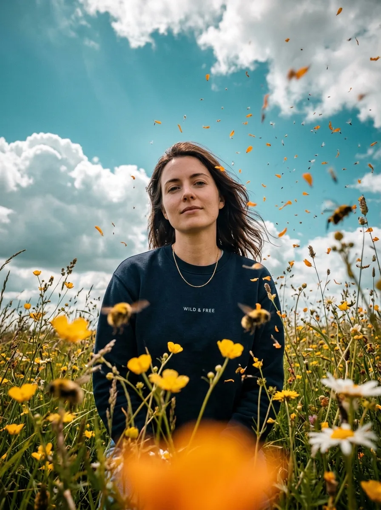

**#208 · Photography Prompt · <code>Vinano Image v2</code>**

<details>
<summary>Show prompt</summary>

```
true-to-life photorealistic cinematic photo, 3:4 vertical frame, shooting from a very low point of grass/flowers (worm's-eye view) on a wide-angle lens-24-28mm. In the center of the frame, chest-deep, is a 25-year-old young woman fair skin and dark brown hair, wearing a dark blue/black sweatshirt a small white inscription on the chest, and a thin chain around his neck. The pose is calm, the body is slightly

turned to the right, the head looks straight at the viewer and is raised; the focus is on the upper body. Foreground: large blurred yellow bees, yellow flowers and green stems, strong sideways, one large warm orange glare/spot at the bottom of the frame. Middle ground: around the model there are wild plants and flowers, some of the stems are sharp, some are in a soft blur.

Background/sky: a large turquoise-blue open sky large white cumulus clouds on the left and above. There are a lot of small orange petals/seeds/leaves in the air above and around the model, as if they were picked up by the wind; they are at different distances and partially blurred (motion blur + shallow DOF), creating the effect of "floating particles".

Lighting: natural daylight, the sun is high / slightly behind on the left; soft contour illumination of hair and shoulders, sun is on accents + cool sky, light teal-orange grading, moderate vignette.

Parameters/style: shallow depth of field, foreground bokeh, crisp subject, cinematic, ultra realistic, high detail, natural film look, slight haze, no text overlays, no logos, no watermark.

Negative promt: illustration, CGI, cartoon, plastic skin, overexposure, strong noise, dirty background, superfluous people, buildings, wires, large readable inscriptions on clothes, artifacts, deformity of arms/shoulders.

Render with rich micro-detail while keeping the layout uncluttered and intentional.
```

</details>

---

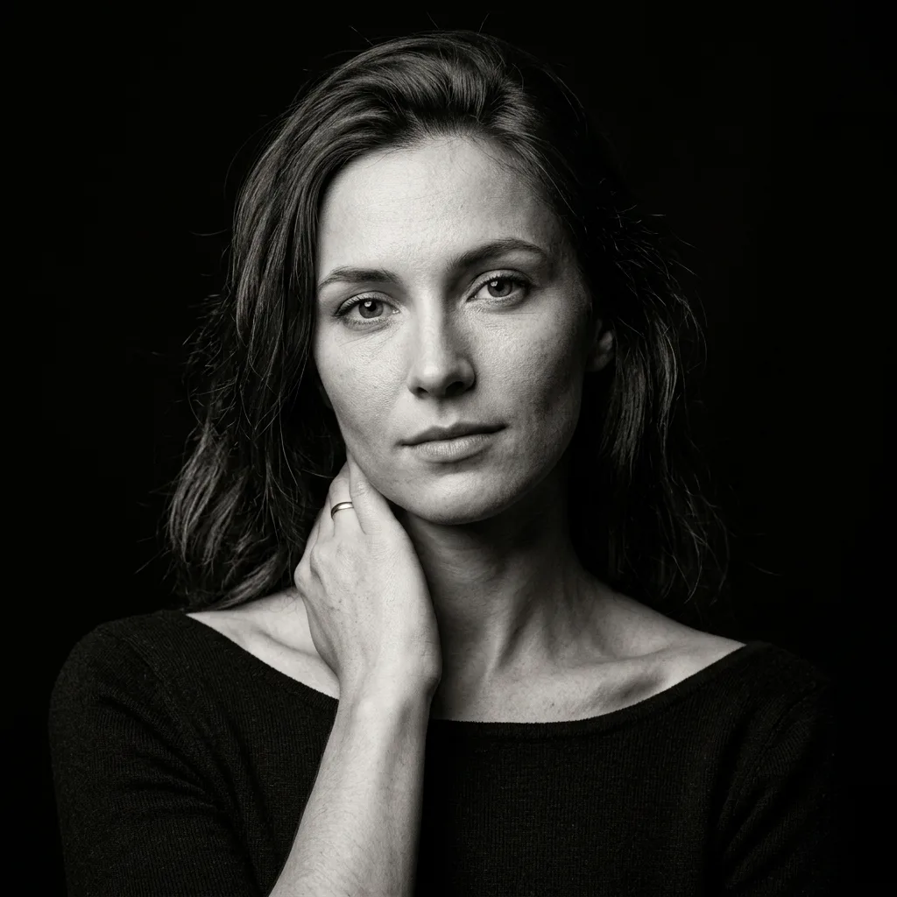

**#209 · Photography Prompt · <code>Vinano Image v2</code>**

<details>
<summary>Show prompt</summary>

```
{
"prompt": "High-contrast monochromatic studio portrait of a European woman around 25 years old. She has natural facial proportions, delicate cheekbones, expressive eyes, and realistic skin texture visible pores and fine detail. Her expression is calm, elegant, and confident, looking softly toward the camera. She is posed gracefully one hand lightly touching her neck and shoulders slightly angled. She is wearing a simple elegant black dress that softly frames her collarbones and shoulders. Hair is natural and softly styled visible strand detail. Use minimal modern studio lighting a single focused key light slightly above eye level, creating soft sculpted highlights on the face and subtle shadows for depth. Background is pure black, clean and textureless. Composition is a tight head-and-shoulders portrait sharp focus on the eyes and shallow depth of field. Style: cinematic fine-art monochrome photography, modern editorial studio aesthetic, ultra-realistic, high contrast, 8K resolution, sharp micro-details."
}

Emphasise material texture and natural light so the final frame feels tactile and premium.
```

</details>

---


**#210 · Photography Prompt · <code>Vinano Image v2</code>**

<details>
<summary>Show prompt</summary>

```
Ultra-realistic cinematic medium close-up portrait of the reference person, slightly turned to the side while looking toward the camera. Wearing a black turtleneck and dark jacket, modern and refined minimalist fashion style. Deep blue background a smooth gradient, combined contrasting magenta and blue lighting. Strong blue light coming from one side and magenta light from the opposite side, both colors reflecting clearly on the face and skin, creating a dramatic color contrast. High-end editorial lighting, sharp focus, realistic skin texture, cinematic mood, shallow depth of field. Aim for an editorial, design-driven look with deliberate negative space.
```

</details>

---

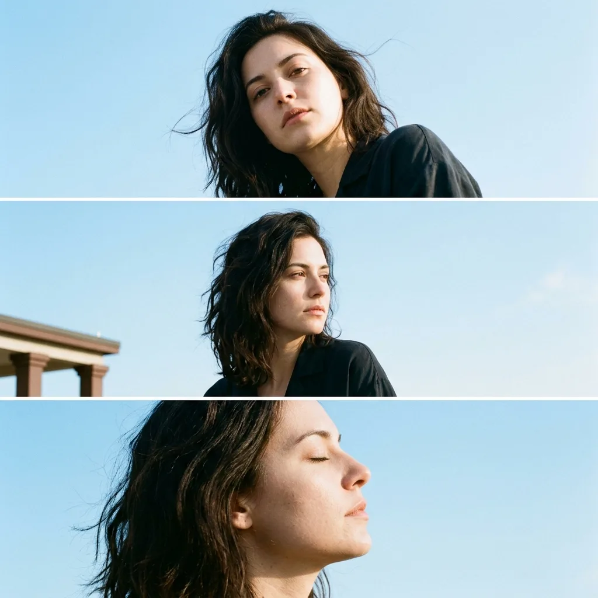

**#211 · Photography Prompt · <code>Vinano Image Pro</code>**

<details>
<summary>Show prompt</summary>

```
{
 "type": "image_generation_prompt",
 "format": "triptych",
 "aspect_ratio": "vertical, three stacked panels",
 "identity_preservation": {
 "use_original_image_reference": true,
 "strict_identity_lock": true,
 "face_changes_allowed": false,
 "clothing_changes_allowed": false,
 "notes": "Maintain 100% original facial structure, proportions, moles, eyes, nose, mouth, skin texture, hairstyle, and original clothing exactly as in the reference image."
 },
 "subject": {
 "gender": "female",
 "appearance": {
 "hair": {
 "style": "dark, tousled hair",
 "details": "natural movement a few strands lifted by breeze"
 },
 "expression_style": "natural, candid, introspective"
 }
 },
 "composition": {
 "layout": "three vertically stacked photographs (triptych)",
 "background": "bright, clear blue sky",
 "setting": "outdoor, rooftop-like environment"
 },
 "panels": {
 "top_panel": {
 "camera_angle": "low angle",
 "pose": "looking down toward the camera",
 "expression": "direct, slightly pensive gaze",
 "lighting": "bright sunlight illuminating one side of face and shoulder soft shadows"
 },
 "middle_panel": {
 "camera_angle": "eye-level to slightly low",
 "pose": "head turned away, gazing to the right",
 "expression": "thoughtful, distant",
 "environment_detail": "small portion of brown columned roof visible in lower left",
 "composition_note": "subject slightly off-center emphasizing open sky"
 },
 "bottom_panel": {
 "camera_angle": "close-up profile",
 "pose": "eyes closed, head slightly tilted back",
 "expression": "calm, reflective",
 "lighting": "sunlight accentuating facial and neck contours"
 }
 },
 "camera": {
 "type": "35mm film camera aesthetic",
 "lens_aperture": "f/1.8–f/2.8",
 "focus": "sharp focus on face shallow depth of field",
 "grain": "visible natural film grain"
 },
 "lighting": {
 "source": "natural daylight",
 "time_of_day": "afternoon",
 "quality": "soft, diffused sunlight",
 "direction": "front and side lighting",
 "artificial_light": "none"
 },
 "color_and_style": {
 "palette": ["vivid blue sky",
 "warm natural skin tones"],
 "style": "editorial portrait analog film aesthetic",
 "atmosphere": "calm, airy, serene, nostalgic",
 "contrast": "subtle",
 "saturation": "natural slight enhancement"
 },
 "quality": {
 "realism": "high",
 "detail": "natural skin texture, realistic lighting",
 "imperfections": "preserved"
 },
 "constraints": ["No facial alterations",
 "No clothing changes",
 "No artificial lighting",
 "No digital beauty filters",
 "No CGI or illustration",
 "No text or watermarks"],
 "output_goal": "Create a serene, film-like triptych portrait of the same woman against a clear blue sky, preserving her exact identity, clothing, and natural expressions an airy editorial and analog aesthetic."
}

Render with rich micro-detail while keeping the layout uncluttered and intentional.
```

</details>

---

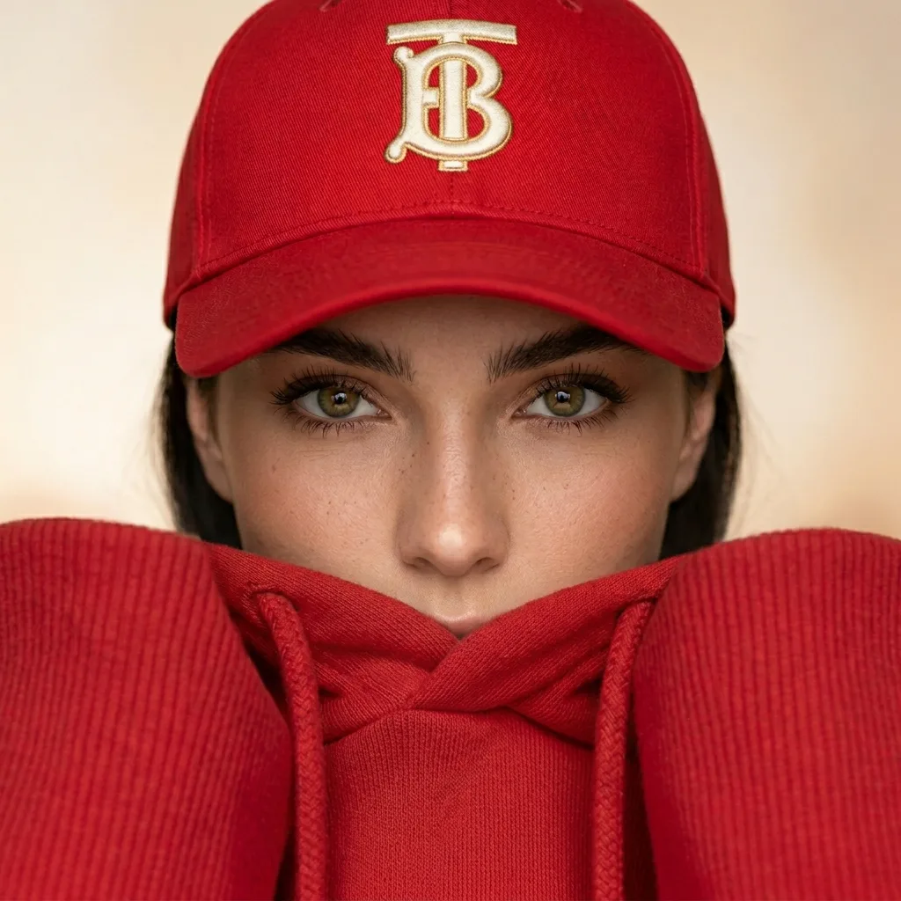

**#212 · Photography Prompt · <code>Vinano Image v2</code>**

<details>
<summary>Show prompt</summary>

```
Ultra-realistic fashion beauty crop of a female model wearing the reference red baseball cap and matching red hoodie. Framing: Tight portrait crop from nose to forehead, cap and eyes filling the frame. Focus: The embroidered logo perfectly centered above the model’s eyes, stitching detail and thread depth clearly visible. Pose: Model gripping the hoodie collar softly both hands, creating subtle fabric folds. Lighting: Soft frontal studio light faint shadow sculpting on cheekbones and under the cap. Background: Minimal warm studio backdrop, ivory-to-beige gradient. Mood: Bold, confident, fashion-house campaign energy. Finish: Ultra-sharp fabric detail, cinematic realism, shallow depth of field, no text, no branding overlays. Keep edges clean and the overall composition balanced for a polished, gallery-ready result.
```

</details>

---


**#213 · Photography Prompt · <code>Vinano Image v2</code>**

<details>
<summary>Show prompt</summary>

```
Cinematic portrait of a confident football player sitting on a dark armchair, tropical jungle leaves surrounding him, dramatic low-key lighting, black background, moody atmosphere, wearing a cream Brazil football jersey green accents, athletic build and trimmed beard, tattoos on arms, relaxed powerful pose arms resting on chair, studio photography, ultra realistic, sharp focus, high contrast, depth of field, editorial sports photoshoot, 85mm lens, dark luxury aesthetic, 8k. Render with rich micro-detail while keeping the layout uncluttered and intentional.
```

</details>

---

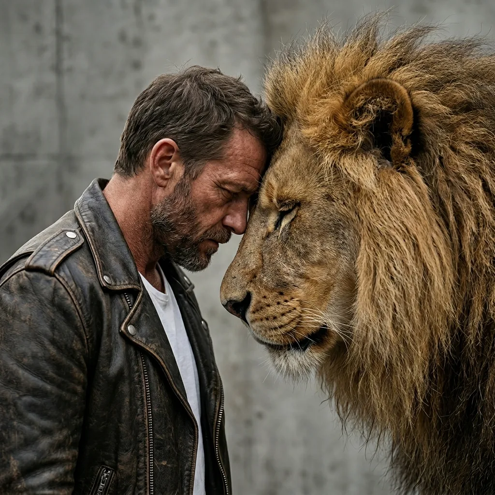

**#214 · Photography Prompt · <code>Vinano Image Pro</code>**

<details>
<summary>Show prompt</summary>

```
A gritty, intense portrait of a man, a friend of real lion, captured in a raw, hyper-realistic style. The background is a textured, neutral concrete wall, keeping the environment simple and industrial. Lighting is soft and diffuse, provided by a large octagon softbox, mimicking overcast daylight. The camera is a Canon EOS R5 an 85mm f/1.2 lens. The subject, the [face from reference image], is forehead-to-forehead the lion, displaying a deep bond. He wears a distressed leather motorcycle jacket and a white t-shirt, embracing a classic rebel aesthetic. The 8K image captures the pores on his skin and the coarse individual hairs of the lion's mane. The HDR aesthetic ensures vibrant colors and deep shadows, making the image feel three-dimensional and alive. Keep edges clean and the overall composition balanced for a polished, gallery-ready result.
```

</details>

---

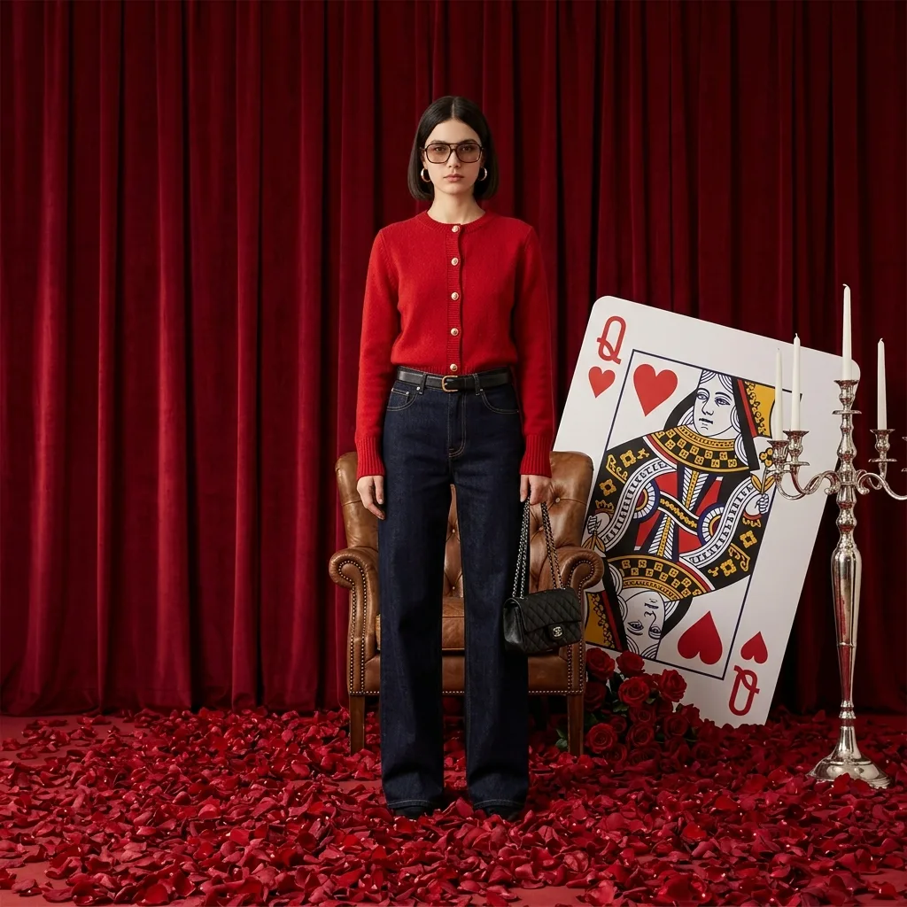

**#215 · Photography Prompt · <code>Vinano Image v2</code>**

<details>
<summary>Show prompt</summary>

```
{
  "meta": {
    "image_quality": "High",
    "image_type": "Studio Photography",
    "resolution_estimation": "1024x1280",
    "file_characteristics": {
      "compression_artifacts": "Low",
      "noise_level": "None",
      "lens_type_estimation": "Standard Prime (approx. 50mm)"
    }
  },
  "global_context": {
    "scene_description": "A fashion editorial shot featuring a woman in a red cardigan and dark jeans standing in a surreal Alice in Wonderland-themed studio. The floor is covered in a thick layer of red rose petals. Behind her sits a vintage leather armchair and a giant 'Queen of Hearts' playing card leaned against red velvet curtains. A silver candelabra white candles stands to the right.",
    "environment_type": "Studio",
    "time_of_day": "N/A (Indoor Artificial)",
    "weather_atmosphere": "Theatrical, Romantic, Surreal",
    "lighting": {
      "source": "Studio Softboxes",
      "direction": "Frontal-left (45-degree angle)",
      "quality": "Soft",
      "color_temperature": "Warm Neutral (~3200K - 4000K)"
    },
    "color_palette": {
      "dominant_hex_estimates": ["#8B0000",
        "#E31B23",
        "#1A1B2E",
        "#FFFFFF"],
      "accent_colors": ["#C5A059",
        "#000000"],
      "contrast_level": "High"
    }
  },
  "composition": {
    "camera_angle": "Eye-level",
    "framing": "Full-body shot",
    "depth_of_field": "Medium (background elements slightly soft but legible)",
    "focal_point": "The woman in the red cardigan",
    "symmetry_type": "None",
    "rule_of_thirds_alignment": "Subject is centered horizontally; eyes align the upper third line."
  },
  "objects": [{
      "id": "obj_001",
      "label": "Female Model",
      "category": "Person",
      "location": {
        "relative_position": "Center",
        "bounding_box_percentage": {
          "x": 25.0,
          "y": 14.0,
          "width": 30.0,
          "height": 70.0
        }
      },
      "dimensions_relative": "Large",
      "distance_from_camera": "Near",
      "pose_orientation": "Standing upright, slightly turned to the left, looking directly at camera.",
      "material": "Skin, hair, fabric",
      "surface_properties": {
        "texture": "Smooth skin, soft knit, denim",
        "reflectivity": "Low",
        "micro_details": "Dark bob haircut, gold hoop earrings, tinted glasses.",
        "wear_state": "Pristine"
      },
      "color_details": {
        "base_color_hex": "#E31B23",
        "secondary_colors": ["#1A1B2E"],
        "gradient_or_pattern": "Solid colors"
      },
      "interaction_with_light": {
        "shadow_casting": "Soft shadow cast to the right and onto the floor petals",
        "highlight_zones": "Left side of face and cardigan shoulder",
        "translucency": "None"
      },
      "relationships": [{
          "type": "wearing",
          "target_object_id": "obj_002"
        },
        {
          "type": "holding",
          "target_object_id": "obj_004"
        }]
    },
    {
      "id": "obj_002",
      "label": "Red Cardigan",
      "category": "Clothing",
      "location": {
        "relative_position": "Upper Center",
        "bounding_box_percentage": {
          "x": 26.0,
          "y": 24.0,
          "width": 25.0,
          "height": 26.0
        }
      },
      "dimensions_relative": "Medium",
      "distance_from_camera": "Near",
      "pose_orientation": "Buttoned at the top, open at the bottom",
      "material": "Knitted wool/cashmere",
      "surface_properties": {
        "texture": "Ribbed cuffs and hem, fine knit body",
        "reflectivity": "None",
        "micro_details": "Four visible gold-tone circular buttons",
        "wear_state": "New"
      },
      "color_details": {
        "base_color_hex": "#E31B23",
        "secondary_colors": ["#C5A059"],
        "gradient_or_pattern": "Solid"
      },
      "interaction_with_light": {
        "shadow_casting": "Folds create soft internal shadows",
        "highlight_zones": "Upper shoulders and sleeve edges"
      }
    },
    {
      "id": "obj_003",
      "label": "Wide-leg Jeans",
      "category": "Clothing",
      "location": {
        "relative_position": "Lower Center",
        "bounding_box_percentage": {
          "x": 29.0,
          "y": 41.0,
          "width": 26.0,
          "height": 42.0
        }
      },
      "dimensions_relative": "Medium-Large",
      "distance_from_camera": "Near",
      "pose_orientation": "Straight vertical hang",
      "material": "Denim",
      "surface_properties": {
        "texture": "Coarse weave, visible center crease/seam",
        "reflectivity": "None",
        "micro_details": "Contrast stitching, black belt gold buckle",
        "wear_state": "New"
      },
      "color_details": {
        "base_color_hex": "#1A1B2E",
        "secondary_colors": ["#C5A059"],
        "gradient_or_pattern": "Dark indigo wash"
      }
    },
    {
      "id": "obj_004",
      "label": "Handbag",
      "category": "Accessory",
      "location": {
        "relative_position": "Center-Right (Model's hand)",
        "bounding_box_percentage": {
          "x": 37.0,
          "y": 62.0,
          "width": 15.0,
          "height": 10.0
        }
      },
      "dimensions_relative": "Small",
      "distance_from_camera": "Near",
      "pose_orientation": "Held by chain strap",
      "material": "Leather, Metal",
      "surface_properties": {
        "texture": "Embossed/quilted paisley-like pattern",
        "reflectivity": "Medium (chain and leather sheen)",
        "micro_details": "Silver-tone chain link strap",
        "wear_state": "New"
      },
      "color_details": {
        "base_color_hex": "#000000",
        "secondary_colors": ["#C0C0C0"]
      }
    },
    {
      "id": "obj_005",
      "label": "Queen of Hearts Card",
      "category": "Prop",
      "location": {
        "relative_position": "Mid-Right",
        "bounding_box_percentage": {
          "x": 58.0,
          "y": 35.0,
          "width": 30.0,
          "height": 40.0
        }
      },
      "dimensions_relative": "Large",
      "distance_from_camera": "Mid",
      "pose_orientation": "Leaning against background at a 45-degree angle",
      "material": "Cardboard/Foamcore",
      "surface_properties": {
        "texture": "Matte",
        "reflectivity": "Low",
        "micro_details": "Stylized 'Q' and heart icons in corners",
        "wear_state": "Pristine"
      },
      "color_details": {
        "base_color_hex": "#FFFFFF",
        "secondary_colors": ["#E31B23"]
      },
      "text_content": {
        "raw_text": "Q",
        "font_style": "Serif",
        "font_weight": "Bold",
        "text_case": "Uppercase",
        "alignment": "Corner-aligned",
        "color_hex": "#E31B23"
      }
    },
    {
      "id": "obj_006",
      "label": "Candelabra",
      "category": "Furniture/Prop",
      "location": {
        "relative_position": "Far Right",
        "bounding_box_percentage": {
          "x": 81.0,
          "y": 29.0,
          "width": 18.0,
          "height": 45.0
        }
      },
      "dimensions_relative": "Medium",
      "distance_from_camera": "Mid",
      "pose_orientation": "Standing vertical",
      "material": "Silver Metal, Wax",
      "surface_properties": {
        "texture": "Polished/Metallic",
        "reflectivity": "High",
        "micro_details": "Ornate curved arms, three visible white tapered candles (unlit)",
        "wear_state": "New"
      },
      "color_details": {
        "base_color_hex": "#C0C0C0",
        "secondary_colors": ["#FFFFFF"]
      }
    },
    {
      "id": "obj_007",
      "label": "Rose Petals",
      "category": "Decor",
      "location": {
        "relative_position": "Bottom / Floor",
        "bounding_box_percentage": {
          "x": 0.0,
          "y": 72.0,
          "width": 100.0,
          "height": 28.0
        }
      },
      "dimensions_relative": "Large (as a group)",
      "distance_from_camera": "Near to Mid",
      "pose_orientation": "Scattered randomly",
      "material": "Organic / Silk",
      "surface_properties": {
        "texture": "Velvety/Soft",
        "reflectivity": "Low",
        "micro_details": "Varying shades of red, slight curling at edges",
        "wear_state": "Fresh"
      },
      "color_details": {
        "base_color_hex": "#8B0000",
        "secondary_colors": ["#E31B23"]
      }
    }],
  "background_details": {
    "texture": "Velvet Drapes",
    "patterns": "Vertical heavy folds/pleats",
    "lighting_behavior": "Absorbs light in deep folds, soft sheen on raised edges",
    "additional_elements": ["Vintage brown leather tufted armchair (partially obscured)",
      "Large cluster of red roses near the base of the card"]
  },
  "foreground_elements": {
    "particles": "None",
    "artifacts": "Slight floor-level haze where light meets petals"
  },
  "reconstruction_notes": {
    "mandatory_elements_for_recreation": "Red knit cardigan gold buttons, dark wide-leg denim, floor covered in red rose petals, oversized Queen of Hearts card, red velvet curtain backdrop.",
    "sensitivity_factors": "The specific saturation of the red (cardigan must match curtains and petals), the height of the petal layer (must feel thick/carpeting), and the theatrical studio lighting.",
    "ambiguities": "The exact texture of the handbag's embossing is complex; the model's footwear is almost entirely hidden by the wide-leg jeans and petals."
  }
}

Keep edges clean and the overall composition balanced for a polished, gallery-ready result.
```

</details>

---

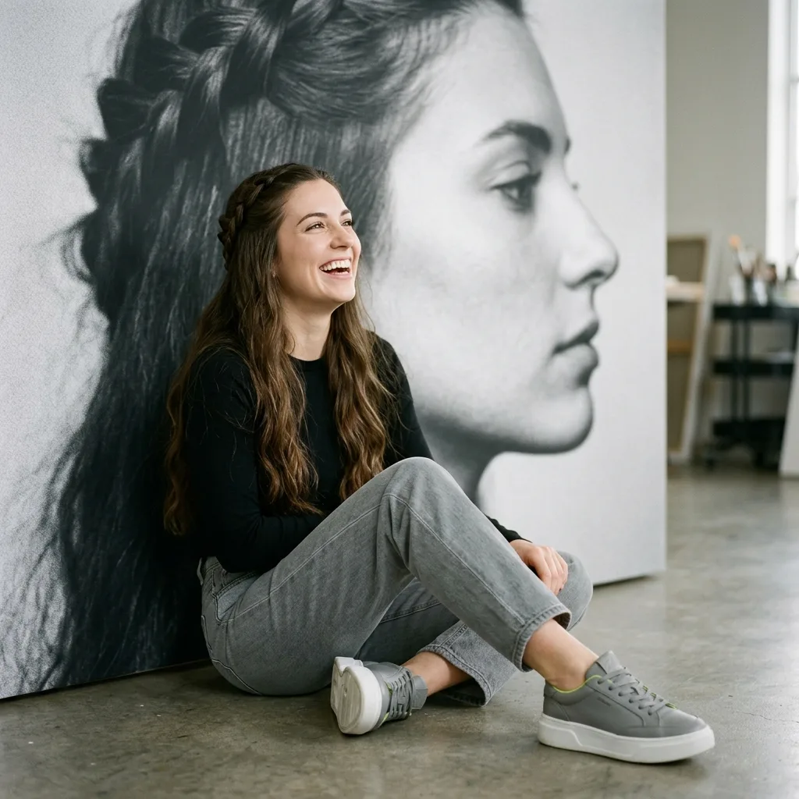

**#216 · Photography Prompt · <code>Vinano Image v2</code>**

<details>
<summary>Show prompt</summary>

```
the provided photos, create a highly detailed, professional, hyperrealistic art portrait, keeping the face intact. The woman sits elegantly on the floor, wearing a modern black top, soft, loose gray jeans, and chunky, fashionable gray sneakers. She has long, wavy, waist-length hair, half of which is braided. She has a laughing expression, and her gaze is directed upward.

The background should be an artistic monochrome composition (black and white) depicting a soft close-up from the side of the same face in profile

Maintain consistent colour harmony and crisp focus across the whole frame.
```

</details>

---

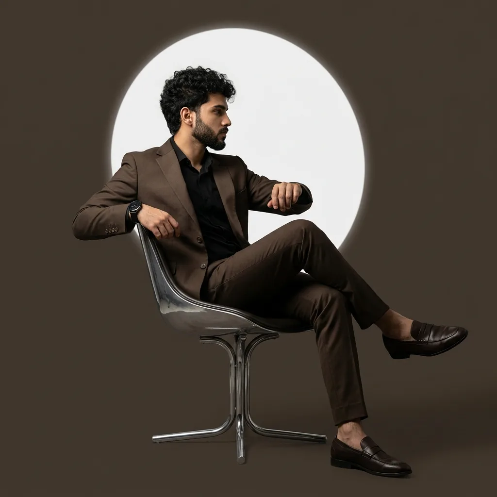

**#217 · Photography Prompt · <code>Vinano Image v2</code>**

<details>
<summary>Show prompt</summary>

```
Use The Uploaded Reference Photo As The Model For The Face, Hairstyle, And Beard, Keeping Them Exactly As In The Reference. Render A Cinematic Studio Portrait Of A Young Man A Sporty Body Sitting Casually On A Futuristic, Minimalistic, Designer Chair, Legs Crossed. Outfit: Brown Suit (#483c32 Jacket And Pants), Black Shirt Under The Jacket, Dark Brown Loafers, Black Oneplus Watch 346mm On Left Wrist. Background: Solid #483c32 A Large White Circle Behind The Head, Filled And Slightly Glowing. Lighting: Bright Soft Studio Light, Producing Sharp Shadows And Moody Atmosphere. Pose: Relaxed, Slightly Leaning, One Hand On The Chair's Backrest, Face Turned To The Side. Ultra-detailed, Photo Realistic, Cinematic Contrast, Fabric Texture Emphasized. Ensure The Hairstyle, Beard, And Face Remain Exactly As In The Uploaded Reference Photo. Aim for an editorial, design-driven look with deliberate negative space.
```

</details>

---

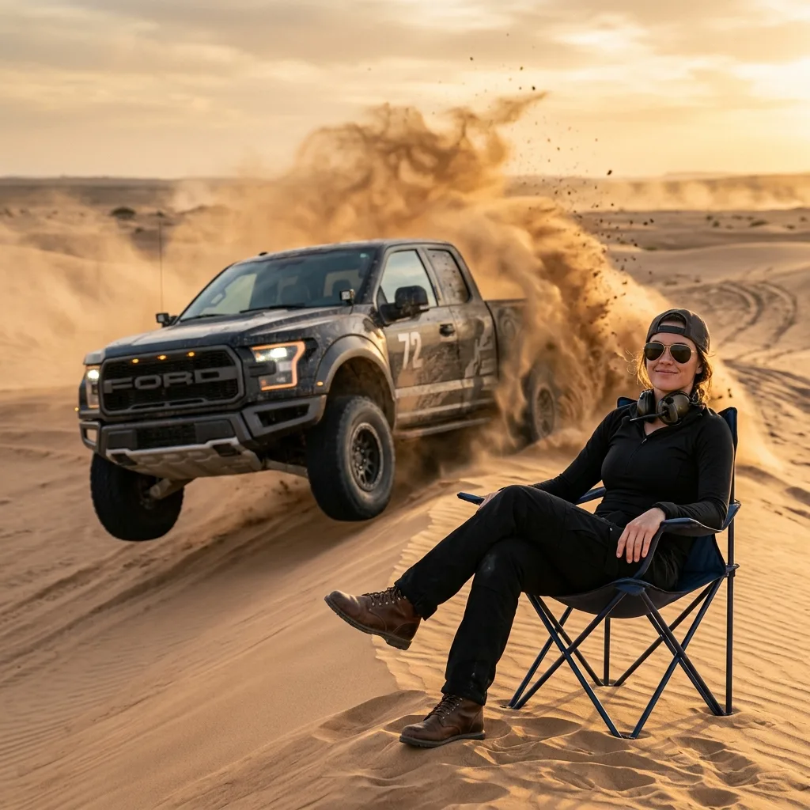

**#218 · Photography Prompt · <code>Vinano Image Pro</code>**

<details>
<summary>Show prompt</summary>

```
{
 "type": "image_generation_prompt",
 "language": "English",
 "aspect_ratio": "9:16",
 "style": "cinematic, ultra-realistic, high-speed action photography",
 "identity_preservation": {
 "use_reference_image": true,
 "strict_identity_lock": true,
 "notes": "Do not change face, hair, or facial features. Preserve the exact facial identity, hairstyle, proportions, and expression from the reference image."
 },
 "subject": {
 "gender": "female",
 "position_in_frame": "foreground, right side",
 "pose": {
 "seating": "sitting in a small folding camping chair on top of a sand dune",
 "legs": "crossed casually",
 "posture": "leaning back comfortably"
 },
 "expression": "confident, playful, relaxed a subtle smile",
 "appearance": {
 "outfit": {
 "clothing": "black outfit (top and pants)",
 "boots": "brown boots",
 "headwear": "dark baseball cap",
 "accessories": ["sunglasses",
 "headset microphone"]
 }
 }
 },
 "secondary_subject": {
 "vehicle": {
 "type": "powerful off-road pickup truck",
 "style_reference": "Ford Raptor–style",
 "action": "driving aggressively at full speed over the sand dune",
 "motion_state": "slightly airborne",
 "effects": ["dramatic explosion of sand and dust",
 "visible motion blur emphasizing speed"],
 "position_in_frame": "background, slightly left and centered"
 }
 },
 "environment": {
 "location": "desert sand dunes",
 "time_of_day": "golden hour",
 "atmosphere": "warm, cinematic, dramatic contrast between calm and chaos"
 },
 "lighting": {
 "type": "natural golden hour sunlight",
 "quality": "soft and warm",
 "effects": ["gentle highlights on flying sand particles",
 "soft shadows",
 "cinematic teal and orange color balance"]
 },
 "camera": {
 "angle": "low, cinematic angle",
 "lens": "telephoto ~85mm",
 "depth_of_field": "shallow",
 "focus": {
 "foreground": "woman in sharp focus",
 "background": "truck slightly motion-blurred"
 }
 },
 "color_grading": {
 "palette": ["warm beige sand",
 "muted sky tones",
 "subtle teal and orange accents"],
 "style": "filmic, natural, HDR"
 },
 "quality": {
 "resolution": "8K",
 "detail_level": "ultra-high",
 "texture": "realistic sand, fabric, skin, and dust textures",
 "grain": "subtle film grain",
 "rendering": "true-to-life photorealistic, no CGI look"
 },
 "constraints": ["No cartoon or illustrated style",
 "No artificial sharpening",
 "No exaggerated effects",
 "Maintain natural skin tones",
 "Do not alter facial identity"],
 "output_goal": "Create a cinematic, ultra-realistic desert action image featuring a calm, confident woman seated in the foreground while a powerful off-road truck explodes through the dunes behind her, emphasizing contrast, motion, and cinematic storytelling."
}

Render with rich micro-detail while keeping the layout uncluttered and intentional.
```

</details>

---

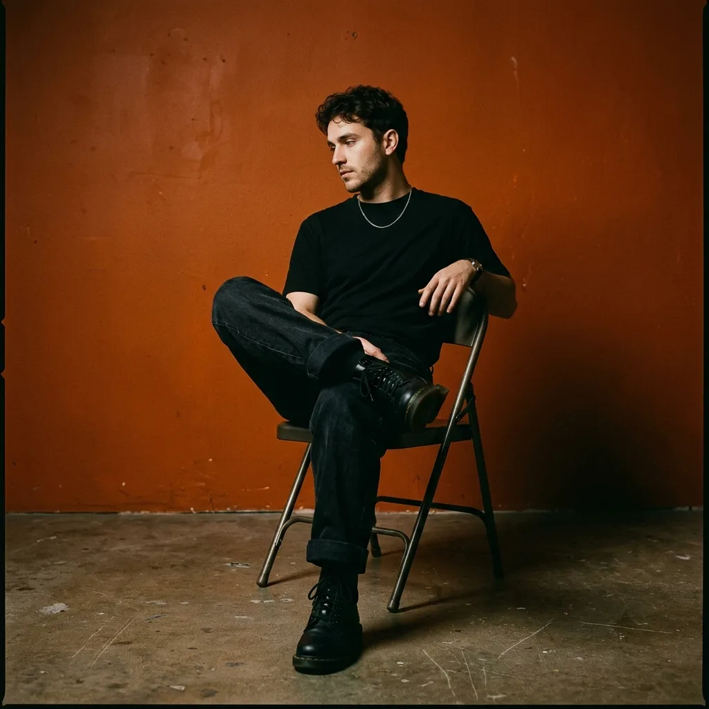

**#219 · Photography Prompt · <code>Vinano Image v2</code>**

<details>
<summary>Show prompt</summary>

```
Use model (the person in the image) you create a dark orange studio photo featuring a young man sitting casually on a metal folding chair his legs cross. He's wearing a denim black baggy jeans, black t-shirt and black boots. The lightning is soft and minimal, producing sharp shadows and a moody atmosphere. His pose is relaxed, slightly leaning one hand on the chair's backrest, his face turn to the side and modern aesthetic. Render with rich micro-detail while keeping the layout uncluttered and intentional.
```

</details>

---

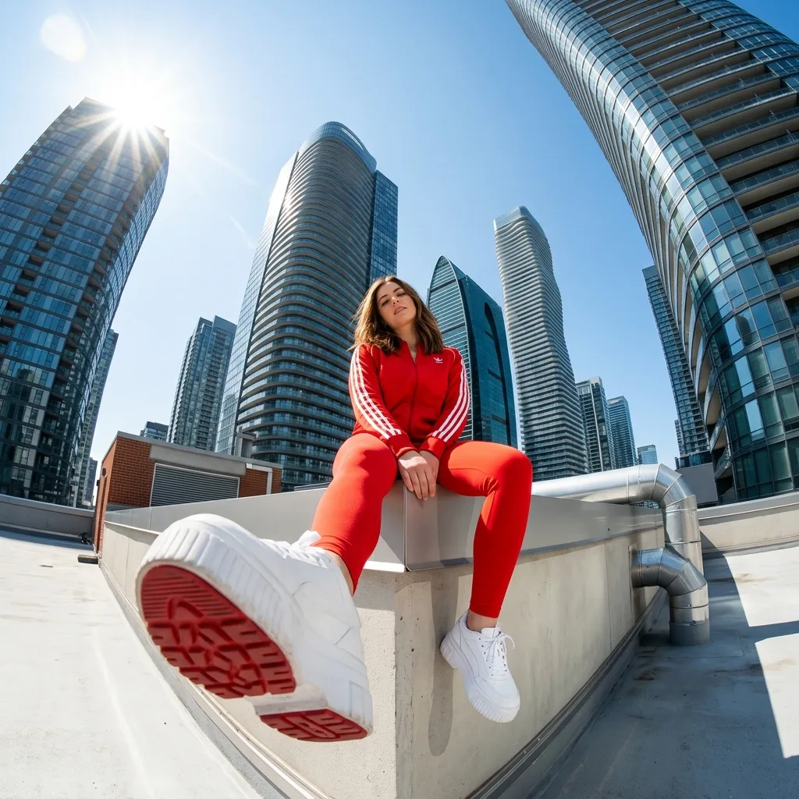

**#220 · Photography Prompt · <code>Vinano Image v2</code>**

<details>
<summary>Show prompt</summary>

```
"scene_description": {
 "location": "Urban rooftop or high vantage point a backdrop of towering glass skyscrapers and sleek modern architecture",
 "vibe": "Energetic, youthful, urban streetwear, dynamic and slightly distorted perspective",
 "lighting": "Bright daylight, harsh sunlight creating a sunburst/lens flare in the upper left, high contrast shadows on the sleek surfaces, vibrant colors",
 "camera_settings": "Ultra-wide angle or Fisheye lens (approx 8mm-12mm), extreme low angle (worm's-eye view), forced perspective, deep depth of field, sharp focus from shoe sole to skyline, close up full body shot of the woman"
 },
 "primary_subjects": [{
 "character": "Young woman shoulder-length brown hair",
 "role": "Streetwear model / Urban explorer",
 "action": "Sitting casually on the corner of a modern refined minimalist ledge or platform, looking down at the camera a confident, relaxed expression. One leg is extended forward towards the lens creating extreme foreshortening, maintaining the same pose as before",
 "details": "Bright red track jacket white stripes on sleeves, Bright Red fitted leggings, massive white chunky platform sneakers a distinct red tread pattern on the sole (shoe is the dominant foreground element)"
 }],
 "environment_details": {
 "crowd": "None",
 "architecture": "Curved modern glass skyscrapers surrounding the subject, smooth light concrete or metallic ledge in the foreground instead of a red brick wall, clean modern textures",
 "fidelity": "High-resolution photography, realistic texture on the sneaker leather and modern materials, lens distortion effect on the buildings"
 }
}

Keep edges clean and the overall composition balanced for a polished, gallery-ready result.
```

</details>

---

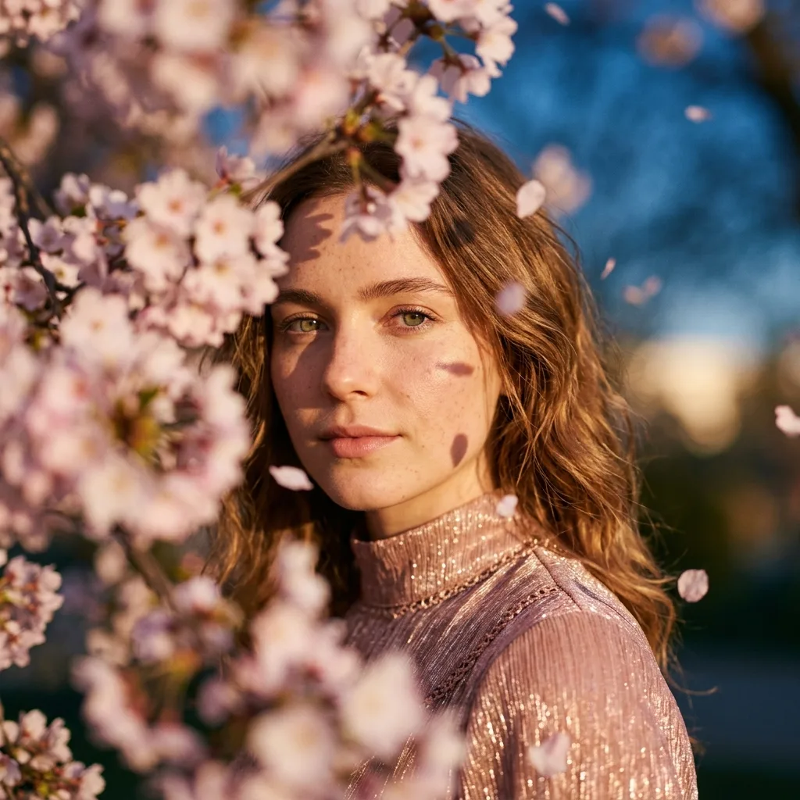

**#221 · Photography Prompt · <code>Vinano Image v2</code>**

<details>
<summary>Show prompt</summary>

```
{
 "image_prompt": {
 "main_description": "Poetic cinematic close-up portrait of a young woman partially obscured by soft pink blossoms and petals in the foreground.",
 "subject_details": {
 "appearance": "Young woman, expressive green eyes, calm introspective expression, natural beauty",
 "skin_texture": "Ultra-realistic skin texture",
 "apparel": "Shimmering rose-gold high-neck dress that catches warm sunlight"
 },
 "composition_and_framing": {
 "framing": "Close-up, face in sharp focus through gaps in the flowers",
 "foreground": "Soft pink blossoms and petals, soft blur",
 "background": "Deep blue sky, creamy bokeh",
 "depth": "Shallow depth of field"
 },
 "lighting_and_color": {
 "lighting_source": "Golden-hour lighting",
 "effects": "Delicate shadows of petals across skin, dress catching sunlight",
 "palette": "Pastel pinks, warm peach tones, rose-gold, deep blue"
 },
 "atmosphere_and_style": {
 "mood": "Romantic spring atmosphere, ethereal, poetic",
 "style": "Editorial fashion photography",
 "grading": "Cinematic color grading"
 },
 "technical_specs": {
 "quality": "8K resolution, high detail",
 "visuals": "Ultra-realistic"
 }
 }
}

Keep edges clean and the overall composition balanced for a polished, gallery-ready result.
```

</details>

---

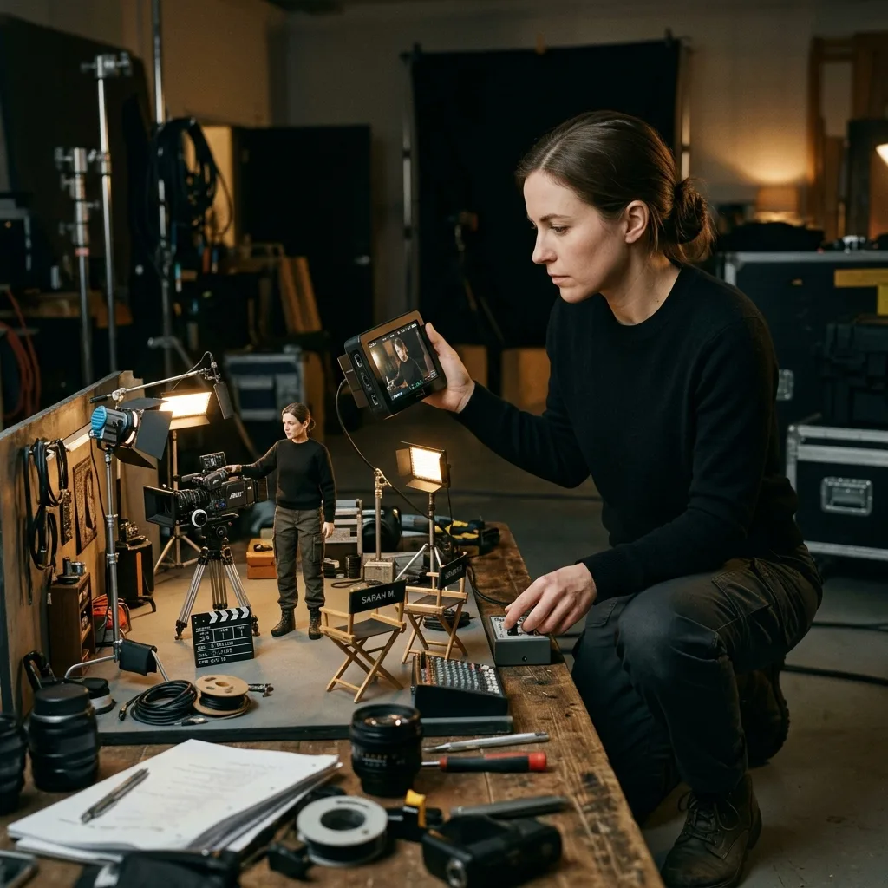

**#222 · Photography Prompt · <code>Vinano Image v2</code>**

<details>
<summary>Show prompt</summary>

```
Ultra-realistic cinematic studio scene of a woman supervising a miniature behind-the-scenes film set starring her tiny self.

She checks a miniature monitor while the small figure stands near scaled lighting rigs.

Both versions share identical facial features, body language, and clothing.

Mini director chairs, cables, clapperboards, and lenses fill the studio space.

Low-key filmic, cinematic lighting emphasizes realism and depth.

Render with rich micro-detail while keeping the layout uncluttered and intentional.
```

</details>

---

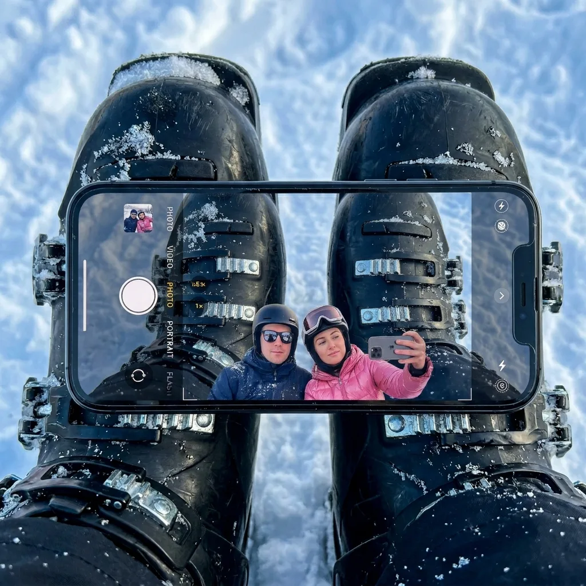

**#223 · Photography Prompt · <code>Vinano Image v2</code>**

<details>
<summary>Show prompt</summary>

```
Create a hyper-realistic winter scene in a vertical 3:4 aspect ratio cinematic realism and natural detail. The foreground features compacted snow subtle ice sparkle, cool blue shadows, and cold ambient light. A smartphone is placed perfectly horizontally across black ski boots, stable and centered, visible smudges, micro-reflections, edge highlights, and slight screen glare. The iPhone camera Ul is clearly visible, including icons and the shutter button, reinforcing an authentic, unedited iPhone capture. On the phone screen, Subject 1 and Subject 2 are seated closely together on the snow, framed from a low angle so only their upper bodies are visible, creating an intimate mirror-selfie-style composition. Subject 2 sits slightly forward, holding the phone at arm's length the phone back visible, wearing a glossy pink puffer jacket realistic quilting, natural folds, helmet, and goggles; her face is fully clear and visible a relaxed, confident expression. Subject 1 sits directly beside her, shoulders nearly touching, wearing a neutral ski jacket light snow dusting, a helmet, and dark sunglasses reflecting the snowy environment: his face is also fully clear and visible, a calm, relaxed posture. The background within the screen shows a snowy slope and distant ski-area elements softened by realistic depth and atmospheric haze. Lighting blends cool winter tones warm sunlight reflections, producing natural shadows, lifelike highlights, and subtle imperfections. The final image must feel HD, realistic, candid, and cinematic, both subjects facial features preserved exactly and remaining 1000% identical to the uploaded images. Render with rich micro-detail while keeping the layout uncluttered and intentional.
```

</details>

---

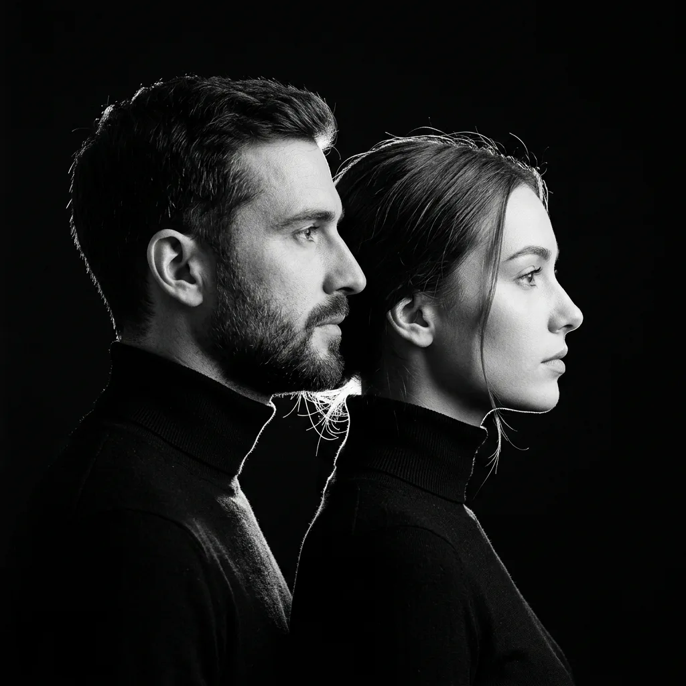

**#224 · Photography Prompt · <code>Vinano Image v2</code>**

<details>
<summary>Show prompt</summary>

```
A refined minimalist black and white cinematic portrait featuring two individuals (male and female) in strict side profile, both facing the same direction calm, introspective expressions, wearing elegant black turtlenecks. The scene is set against a pure black background dramatic rim lighting outlining their facial contours and hair strands. High contrast lighting creates deep shadows and soft highlights, emphasizing sharp facial structure and texture. Fine art editorial photography style, ultra-realistic, crisp composition, subtle film grain, 8K resolution. Keep edges clean and the overall composition balanced for a polished, gallery-ready result.
```

</details>

---


**#225 · Photography Prompt · <code>Vinano Image v2</code>**

<details>
<summary>Show prompt</summary>

```
Ultra-realistic lifestyle beverage advertisement featuring a chilled bottle of “UNIK – Jaggery & Natural Tigernut Drink.” The bottle stands on a clean marble or gym countertop surrounded by natural ingredients such as tigernuts, almonds, coconut slices, and dates. A smooth splash of creamy tigernut milk flows upward behind the bottle while ice cubes scatter around it. The bottle is covered condensation droplets indicating cold freshness. The background features a bright modern fitness studio soft natural lighting and blurred gym equipment. The composition communicates energy, health, and natural nutrition. High-end commercial beverage photography, macro details, shallow depth of field, ultra-realistic textures, true-to-life photorealistic lighting, clean advertising style, 8K resolution. Preserve realistic proportions and depth for a confident, professional finish.
```

</details>

---

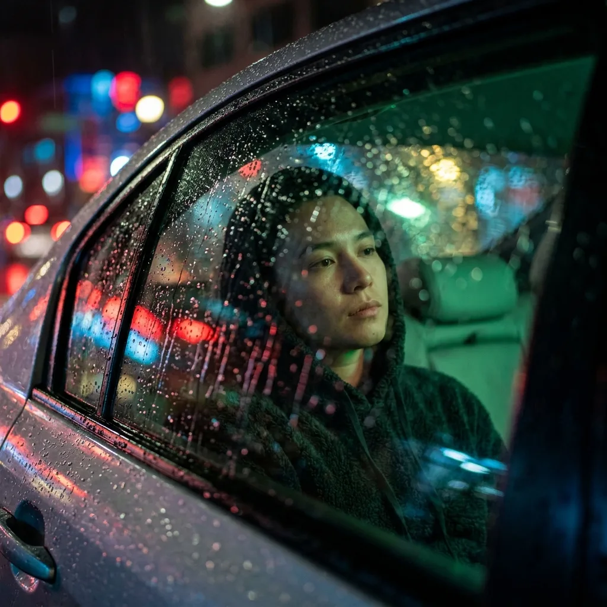

**#226 · Photography Prompt · <code>Vinano Image v2</code>**

<details>
<summary>Show prompt</summary>

```
Create a highly cinematic and realistic photo of a person the face from the uploaded image. The person is sitting inside a car at night, looking out through a rain-covered window. The camera is positioned outside the car, capturing the person through the wet glass. Raindrops and streaks of water are clearly visible on the window, reflections of city lights, neon signs, and passing cars blending into the glass. The person’s face is softly lit by ambient street lights and subtle interior car lighting, creating a moody and emotional expression. The background outside is blurred colorful bokeh lights (red, blue, yellow), giving a deep cinematic feel. The person is wearing a modern outfit like a hoodie or jacket. The mood feels introspective and film-like. Ultra realistic photography, shallow depth of field, dramatic lighting, reflections, rain texture, Hollywood movie scene composition, high detail. Render with rich micro-detail while keeping the layout uncluttered and intentional.
```

</details>

---


**#227 · Photography Prompt · <code>Vinano Image v2</code>**

<details>
<summary>Show prompt</summary>

```
The soft touch.

 on Gemini

Prompt

{
 "product_photography_prompt": {
 "subject": "Hands holding a shampoo bottle lather.",
 "hands": {
 "description": "A person's hands natural skin tone.",
 "action": "One hand holds the bottle, the other is cupped to catch foam.",
 "condition": "Covered in thick, white, bubbly soap lather."
 },
 "bottle": {
 "type": "Pump bottle.",
 "material": "Matte white plastic.",
 "dispenser": "Light blue pump.",
 "contents": "White shampoo, visible as foam."
 },
 "label": {
 "color": "White",
 "text_color": "Black",
 "logo": "Circular 'WAATAL' inside.",
 "main_text": "Hydrate SHAMPOO (script and bold font).",
 "sub_text": "Super Hydrating Shampoo. For All Hair Types. Australia. 500ml."
 },
 "foam": {
 "texture": "Thick, rich, bubbly lather.",
 "color": "White",
 "location": "Covering hands, bottle neck, and dispenser."
 },
 "background": {
 "color": "Solid soft light blue.",
 "texture": "Seamless, smooth studio background."
 },
 "lighting": {
 "type": "Soft, diffused studio lighting.",
 "direction": "Even illumination, highlighting foam texture and hands."
 },
 "style": {
 "type": "Clean, refined minimalist product photography.",
 "shot": "Close-up.",
 "focus": "Sharp focus on hands, bottle, and foam.",
 "mood": "Fresh, clean, natural."
 }
 }
}

Aim for an editorial, design-driven look with deliberate negative space.
```

</details>

---

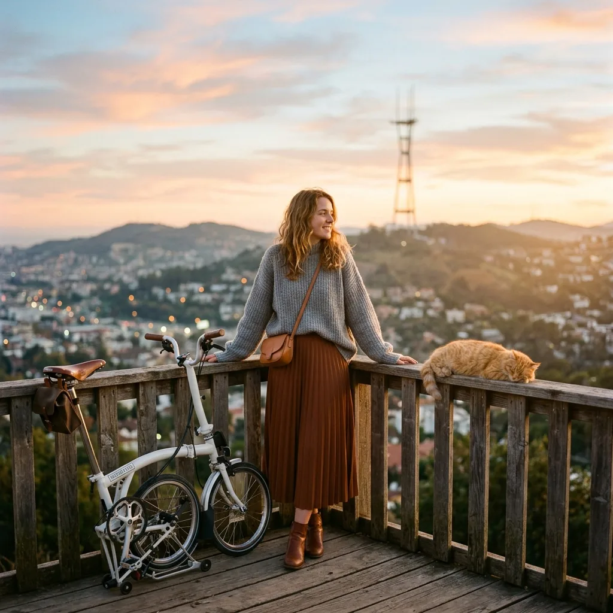

**#228 · Photography Prompt · <code>Vinano Image v2</code>**

<details>
<summary>Show prompt</summary>

```
A cinematic golden-hour photograph of a young woman standing on a wooden viewpoint balcony overlooking a city, leaning casually against the railing. She wears an oversized grey knitted sweater, a long brown skirt, and brown ankle boots, a small leather crossbody bag. A white folding bicycle rests beside her, and an orange cat sleeps peacefully on the wooden railing next to her. In the background, soft-focus hills a tall communication tower rise above the city. Warm sunset light, pastel sky gentle clouds, shallow depth of field, calm and dreamy mood, realistic photography, high detail, natural colors, 35mm lens, soft bokeh. Preserve realistic proportions and depth for a confident, professional finish.
```

</details>

---

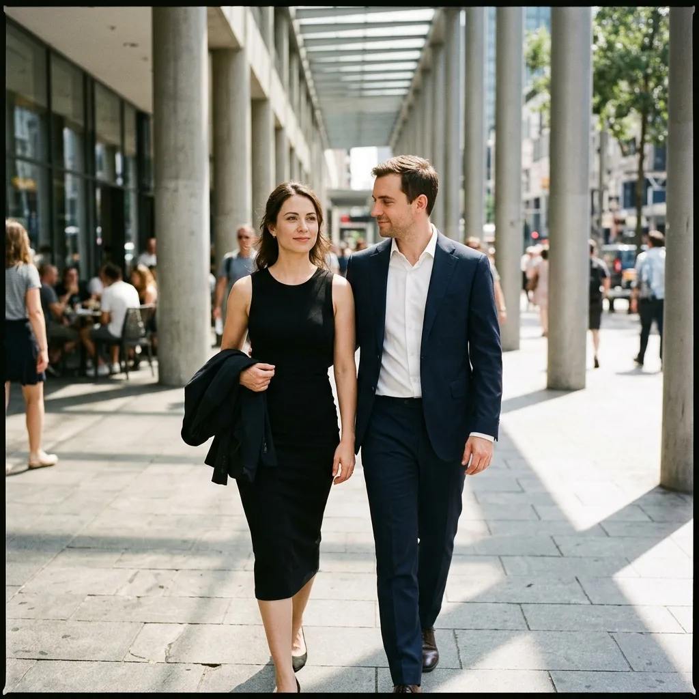

**#229 · Photography Prompt · <code>Vinano Image v2</code>**

<details>
<summary>Show prompt</summary>

```
A cinematic candid medium shot portrait of a man and a woman walking side by side along a bright urban walkway, framed from the waist up. They move closely together, their shoulders nearly aligned, creating an intimate yet understated connection. The woman wears a fitted black dress, holding a jacket loosely over her arm, her posture relaxed and elegant. The man walks beside her in a tailored suit, his head slightly turned toward her a soft, attentive expression, while she looks ahead a calm and composed demeanor, a faint hint of a smile forming. The moment feels natural and unspoken, filled quiet tension and subtle attraction. Strong midday sunlight casts sharp highlights and deep shadows across their faces and clothing, creating a high-contrast, slightly overexposed look. The background features a softly blurred urban corridor repeating columns and architectural lines. The image has a strong analog film aesthetic visible grain, slight blur, color distortion, and nostalgic texture. Colors feel slightly faded warm, muted tones. Imperfect framing, subtle motion softness, and natural light flare create the feeling of a fleeting moment captured on 35mm film. Cinematic film still, dreamy and poetic mood, intimate and quiet romantic energy, vintage street photography, lo-fi aesthetic, high detail, hd quality. Maintain consistent colour harmony and crisp focus across the whole frame.
```

</details>

---

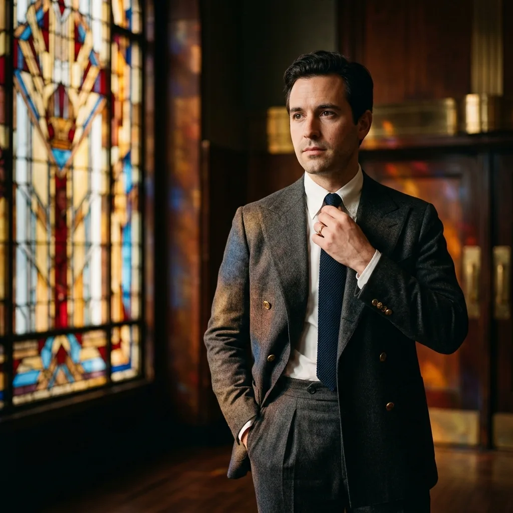

**#230 · Photography Prompt · <code>Vinano Image v2</code>**

<details>
<summary>Show prompt</summary>

```
Shot on a Hasselblad 907X 50C an XCD 90mm f/2.5 lens, aperture f/2.8 shallow depth of field emphasizes the precision fit of the suit while the background dissolves into painterly color patches; captured in 16-bit RAW high dynamic range and soft film grain to preserve wool texture and the glow of colored light without "harsh" digital sharpness. Frame a tight portrait cropped to mid-chest, at eye level, a slight three-quarter turn; the model is offset from center so the stained-glass pattern reads in the negative space. The pose is calm and composed: shoulders open, posture confident but without tension; one hand neatly adjusts the tie knot or collar line, the other is in the trouser pocket, slightly opening the jacket and revealing the layered styling. Expression restrained and thoughtful; the gaze passes just past the lens, as if distant music is playing. Outfit a man in a suit a retro accent: a structured double-breasted wool blazer sharp lapels, high-waisted pleated trousers, a white shirt and narrow tie, polished Oxfords, and a minimal pocket square. Location a retro Art Deco hall dark wood, brass, and a tall stained-glass window projecting jewel-like geometry onto the suit and background. Light warm practical fill from one side and colored stained-glass light from the other, cinematic contrast, "stained-glass" shadows. Result -retro editorial: graphic, refined, expensive, and timeless Render with rich micro-detail while keeping the layout uncluttered and intentional.
```

</details>

---

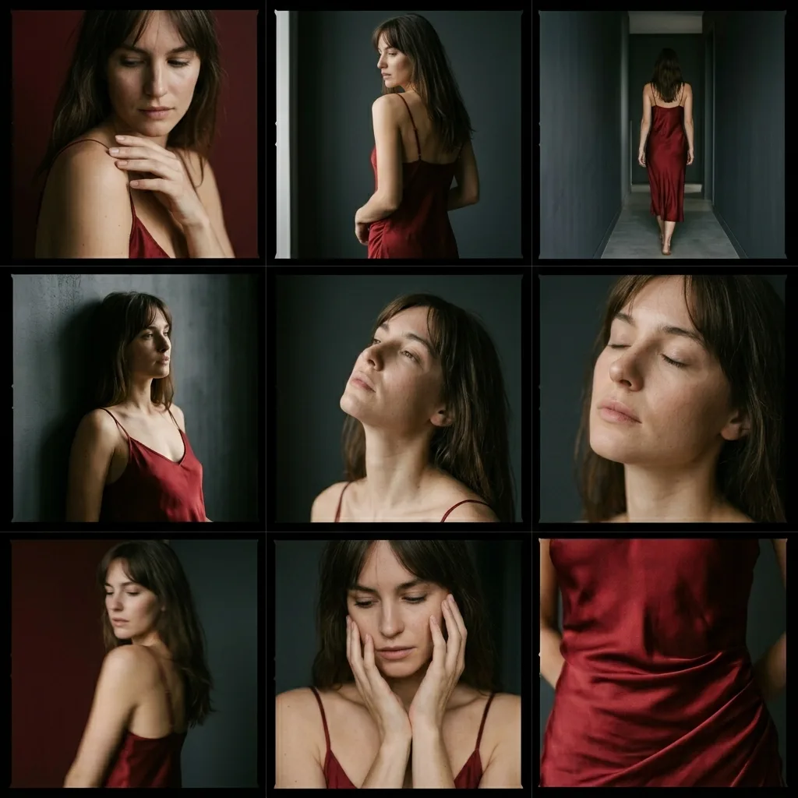

**#231 · Photography Prompt · <code>Vinano Image Pro</code>**

<details>
<summary>Show prompt</summary>

```
{
 "generation_request": {
 "meta_data": {
 "tool": "",
 "task_type": "photoreal_cinematic_fashion_contact_sheet",
 "version": "v1.0_RED_DRESS_INTIMATE_EDITORIAL_3x3_NO_TEXT",
 "priority": "highest"
 },

 "references": {
 "reference_image_1": {
 "source": "UPLOAD_REFERENCE_IMAGE (OPTIONAL)",
 "purpose": "FACE_IDENTITY_LOCK",
 "strict_lock": true,
 "face_similarity_priority": "MAX",
 "no_identity_blending": true,
 "no_beautify": true,
 "preserve_skin_texture": true,
 "preserve_facial_proportions": true
 }
 },

 "output_settings": {
 "aspect_ratio": "1:1",
 "resolution_target": "ultra_high_res",
 "render_style": "cinematic_fashion_editorial",
 "sharpness": "soft_cinematic_focus",
 "film_grain": "subtle_analog_35mm",
 "dynamic_range": "natural_not_hdr",
 "color_grade": "muted_warm_reds_dark_neutrals",
 "skin_rendering": "real_skin_microtexture_no_plastic"
 },

 "layout": {
 "type": "contact_sheet",
 "grid": "3x3",
 "spacing": "thin_clean_dividers",
 "panel_consistency": "same_subject_same_outfit_same_scene",
 "no_text_overlay": true
 },

 "camera": {
 "camera_type": "full_frame_cinema_camera",
 "lens": "50mm_and_85mm_mix",
 "aperture": "f1.8",
 "depth_of_field": "shallow",
 "focus_behavior": "eyes_priority_some_frames_soft_motion",
 "processing": "no_ai_sharpening_no_hdr"
 },

 "lighting": {
 "type": "low_key_cinematic_indoor_light",
 "source": "window_light_side_falloff",
 "contrast": "medium_to_low",
 "shadows": "soft_deep",
 "highlights": "controlled_skin_specular"
 },

 "wardrobe_and_styling": {
 "dress": "deep_red_silk_satin_slip_dress",
 "fabric_behavior": "fluid_realistic_drape_soft_specular",
 "straps": "thin_delicate",
 "overall_style": "intimate_high_fashion_editorial"
 },

 "hair_and_makeup": {
 "hair": "natural_loose_with_soft_bangs",
 "movement": "subtle_natural_motion",
 "makeup_style": "soft_editorial",
 "eyes": "natural_smoky_low_contrast",
 "lips": "muted_rose_nude",
 "skin_finish": "natural_luminous_real"
 },

 "posing_and_storytelling": {
 "poses": ["close_up_shoulder_touch",
 "mid_body_turning_away",
 "full_body_walking_away",
 "leaning_against_wall",
 "head_tilted_back_emotional",
 "eyes_closed_intimate",
 "soft_motion_blur_moment",
 "hands_touching_face",
 "dress_detail_closeup"],
 "emotion": "introspective_sensual_vulnerable",
 "movement": "slow_natural_unposed"
 },

 "background": {
 "environment": "dark_interior_gallery_or_room",
 "colors": ["deep_red",
 "charcoal_gray",
 "dark_green"],
 "texture": "matte_walls_soft_reflections",
 "distractions": "none"
 },

 "creative_prompt": {
 "scene_summary": "A cinematic 3x3 fashion contact sheet capturing an intimate, emotional editorial story of a woman in a deep red satin dress. Each frame feels like a quiet moment from an arthouse film — soft focus, natural movement, emotional restraint, and sensual minimalism.",
 "aesthetic": "arthouse_fashion_editorial",
 "mood": "quiet_intimate_cinematic"
 },

 "negative_prompt": ["text",
 "typography",
 "logo",
 "brand_name",
 "watermark",
 "poster_design",
 "magazine_layout",
 "beauty_filter",
 "plastic_skin",
 "over_smoothing",
 "cgi",
 "anime",
 "cartoon",
 "ai_artifacts",
 "extra_people",
 "distorted_body",
 "bad_hands",
 "extra_fingers",
 "over_sharpened"]
 }
}

Emphasise material texture and natural light so the final frame feels tactile and premium.
```

</details>

---


**#232 · Photography Prompt · <code>Vinano Image v2</code>**

<details>
<summary>Show prompt</summary>

```
Cinematic portrait of a handsome young man short styled hair and a trimmed beard, wearing thin metal aviator glasses, softly illuminated by a glowing golden circular halo behind his head. Warm amber lighting, dramatic low-key background, shallow depth of field, hyper-realistic skin texture, subtle reflections in the glasses, moody and futuristic aesthetic, studio photography, 85mm lens look, ultra-detailed, high contrast, dark minimal background, symmetrical composition, elegant and modern tone. Keep edges clean and the overall composition balanced for a polished, gallery-ready result.
```

</details>

---

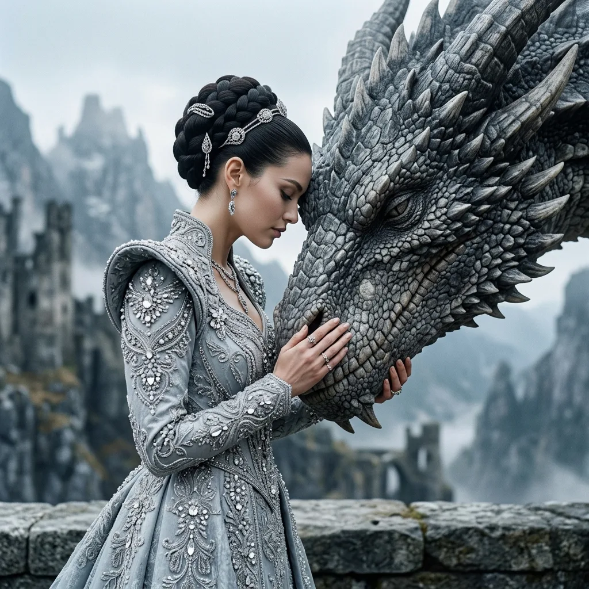

**#233 · Photography Prompt · <code>Vinano Image v2</code>**

<details>
<summary>Show prompt</summary>

```
Luxury fashion editorial portrait of a woman standing beside a majestic dragon, her forehead gently resting against its scaled head. She wears an elaborate ice-gray couture gown intricate embroidery, crystal embellishments, and structured shoulders, evoking regal power and quiet intimacy. Hair styled in a sleek braided updo, adorned refined statement jewelry. Cinematic fantasy realism, emotional stillness, mythic elegance. Cold, muted color palette of silver, stone, and ash tones. Soft natural overcast light, subtle highlights on textures of fabric and dragon scales. Shallow depth of field, ultra-detailed realism, high-end editorial aesthetic, epic yet intimate mood, medium format photography look, Vogue-level fantasy couture, no text. Render with rich micro-detail while keeping the layout uncluttered and intentional.
```

</details>

---

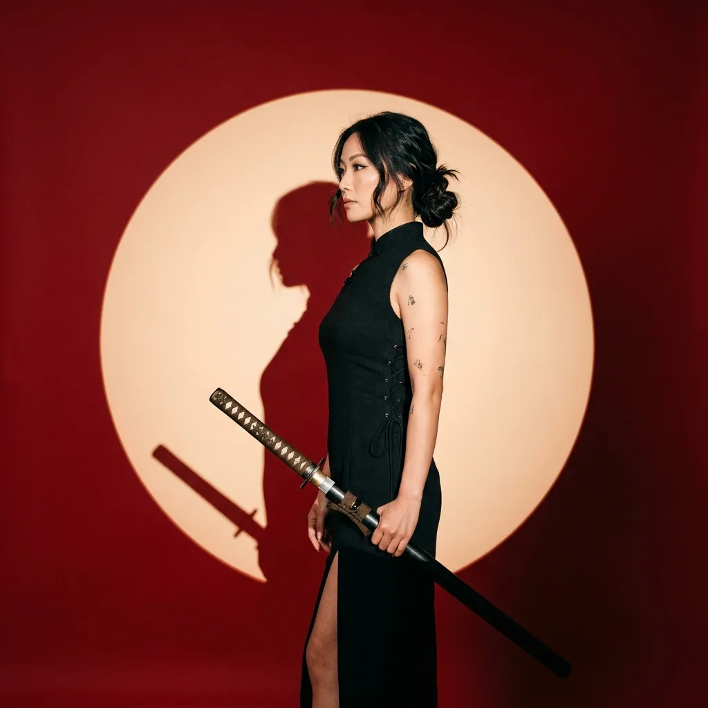

**#234 · Photography Prompt · <code>Vinano Image v2</code>**

<details>
<summary>Show prompt</summary>

```
{
 "generation_request": {
 "meta_data": {
 "task_type": "photoreal_editorial_spotlight_disk_fashion_portrait",
 "language": "en",
 "priority": "highest",
 "version": "v1.0_RED_BACKDROP_CIRCLE_SPOTLIGHT_KATANA_EDITORIAL"
 },
 "output": {
 "aspect_ratio": "4:5",
 "resolution": "high",
 "num_images": 4
 },
 "scene": {
 "concept": "minimal graphic studio portrait a circular spotlight disk and crisp shadow silhouette",
 "environment": "deep red seamless background, no props, no clutter",
 "composition": "3/4 body or full-body, side profile; subject placed slightly right of center; large circular spotlight disk behind subject"
 },
 "subject": {
 "person": "adult woman",
 "wardrobe": {
 "dress": "fitted black cheongsam-inspired dress, high slit, lace-up side detailing, matte fabric subtle texture"
 },
 "hair_makeup": {
 "hair": "messy low bun, a few loose strands framing face",
 "makeup": "soft glam, defined eyeliner, natural lips, realistic skin texture"
 },
 "details": {
 "tattoos": "subtle small tattoos on upper arm, realistic ink"
 },
 "pose": "side profile stance, shoulders relaxed, one hand resting near hip, holding a katana angled downward in a safe, non-aggressive pose",
 "expression": "calm, composed, editorial"
 },
 "props": {
 "katana": {
 "style": "realistic katana correct proportions, simple handle wrap, subtle metal sheen",
 "handling_notes": "safe grip, blade angled down, no threatening gesture"
 }
 },
 "lighting": {
 "style": "single hard key light + spotlight gobo/disk",
 "notes": "create a large circular warm spotlight disk (cream/peach) on the red background; crisp hard-edged shadow silhouette of subject visible on the disk; high contrast; minimal fill"
 },
 "camera": {
 "shot": "editorial studio fashion portrait",
 "lens_mm": 50,
 "aperture": 2.8,
 "focus": "sharp on face, dress texture, and sword handle; background smooth",
 "quality_tags": "ultra-detailed, clean edges, subtle film grain"
 },
 "color_grade": {
 "palette": "deep red background + warm cream spotlight disk + neutral skin + black wardrobe",
 "contrast": "high",
 "tone": "cinematic editorial, smooth highlight rolloff"
 },
 "negative_prompt": "text, logo, watermark, frame, border, clutter, softbox lighting, flat lighting, blur, lowres, plastic skin, over-smoothing, extra fingers, deformed hands, incorrect katana geometry, gore, blood, violence"
 }
}

Preserve realistic proportions and depth for a confident, professional finish.
```

</details>

---

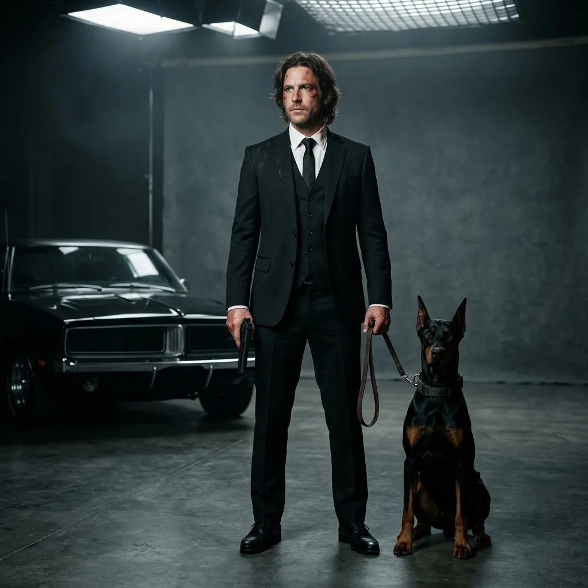

**#235 · Photography Prompt · <code>Vinano Image v2</code>**

<details>
<summary>Show prompt</summary>

```
Full body cinematic shot of the person in the uploaded image as a hitman in a tailored black suit and tie standing in an empty studio space beside a muscular Doberman dog on a leash. The man has a bruised face blood marks, messy shoulder-length hair, and a calm but intense expression. He is holding a pistol in one hand. Behind them is a vintage black muscle car chrome rims partially visible in soft shadow. refined minimalist grey background, dramatic studio lighting from above creating soft reflections on the glossy floor. Ultra realistic skin texture, cinematic depth of field, sharp focus, subtle fog in the background, moody atmosphere, 85mm lens look, volumetric light, film still from a neo-noir action movie, high dynamic range, true-to-life photorealistic, 8k, symmetrical composition. 3:4 aspect ratio. Maintain consistent colour harmony and crisp focus across the whole frame.
```

</details>

---


**#236 · Photography Prompt · <code>Vinano Image v2</code>**

<details>
<summary>Show prompt</summary>

```
2 on

Prompt:
Ultra-realistic premium product advertisement of a cappuccino coffee bottle, centered composition, surrounded by dynamic liquid splashes of coffee and milk forming elegant swirling shapes in mid-air. Dramatic environments blending elements of fire, lava, ice shards, marble textures, and dark studio backgrounds.
Hyper-detailed liquid physics, droplets frozen in motion, filmic, cinematic lighting high contrast, glowing highlights, and volumetric light. Coffee splashes mixed creamy textures, energetic explosion effects, sparks, smoke, and mist.
Luxury branding style, glossy reflections on bottle, sharp label details, rich brown and gold color palette, macro photography, shallow depth of field, 85mm lens, commercial advertising style, studio + fantasy hybrid scene, ultra-detailed, 8K resolution.

Preserve realistic proportions and depth for a confident, professional finish.
```

</details>

---

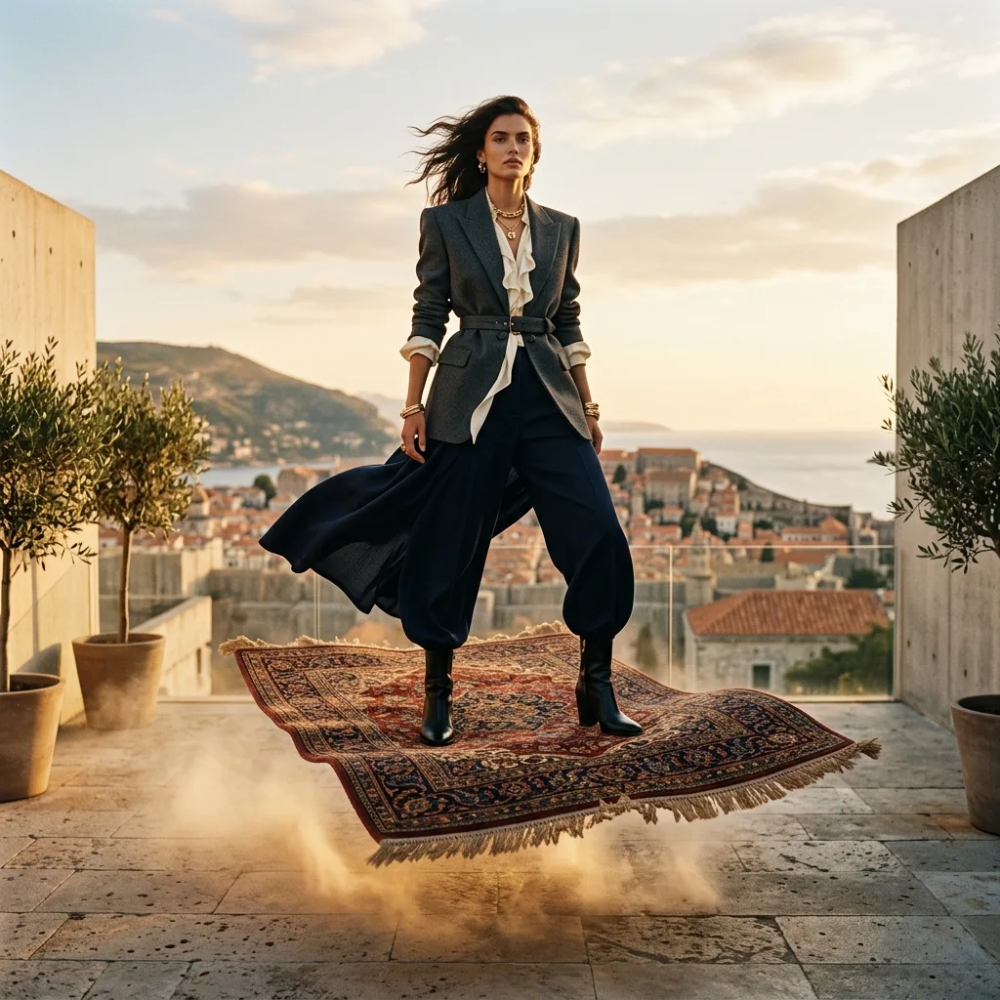

**#237 · Photography Prompt · <code>Vinano Image v2</code>**

<details>
<summary>Show prompt</summary>

```
{
 "options": {
 "gender": ["man", "woman"]
 },
 "prompt": "A high-fashion editorial shot of a [GENDER] model sitting or standing on a flying magic carpet during takeoff. The model is wearing a sophisticated, layered outfit featuring the structured silhouettes and premium textures typical of luxury brands like Celine, Balenciaga, Ralph Lauren, Givenchy, and Zegna. The clothes billow elegantly in the wind. The carpet is ornate and detailed, kicking up a subtle dust cloud as it ascends from a sun-drenched, refined minimalist architectural terrace. The lighting is cinematic and warm, highlighting the motion and the luxurious fabrics. Low angle perspective focusing entirely on the subject and the scene."
}

Maintain consistent colour harmony and crisp focus across the whole frame.
```

</details>

---

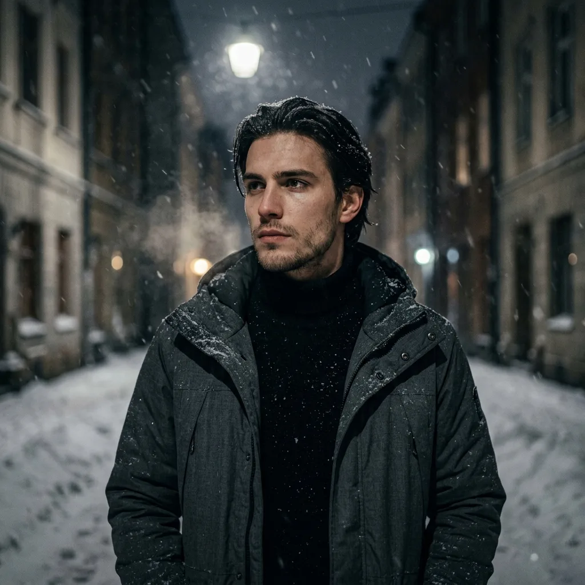

**#238 · Photography Prompt · <code>Vinano Image v2</code>**

<details>
<summary>Show prompt</summary>

```
Ultra realistic cinematic portrait of a young man sharp masculine features and light stubble, snow dusted hair slightly longer and pushed back, calm but intense eyes looking slightly away from the camera, wearing a charcoal hooded winter jacket layered over a black turtleneck, standing in a deserted snowy street at night, heavy snowfall swirling around him, snowflakes catching light mid air, cold breath visible, dim ambient street lighting a single overhead lamp casting soft shadows, background filled snow covered buildings and faint fog, low key lighting cool blue tones, subtle rim light separating the subject from the background, medium close up framing, 50mm lens look, shallow depth of field, cinematic contrast, realistic skin texture, film grain, moody atmosphere, loneliness, quiet strength, winter noir aesthetic, professional photography realism. Render with rich micro-detail while keeping the layout uncluttered and intentional.
```

</details>

---

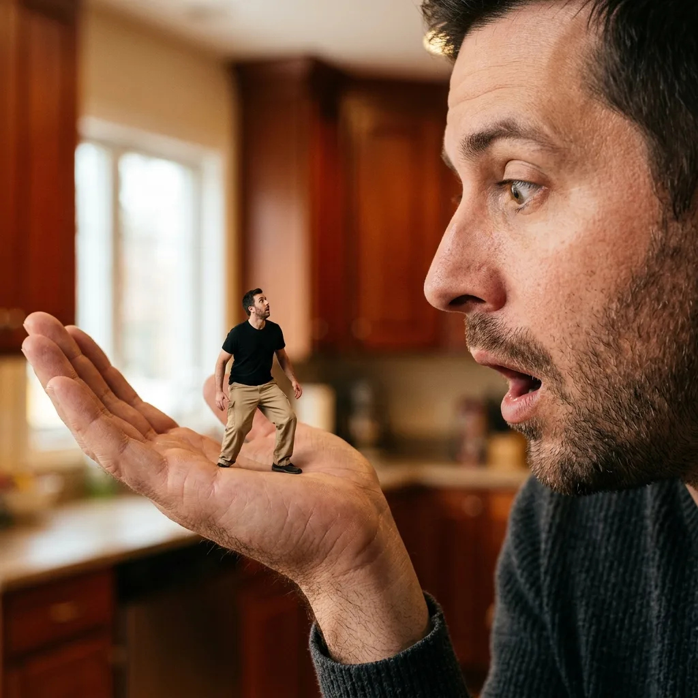

**#239 · Photography Prompt · <code>Vinano Image v2</code>**

<details>
<summary>Show prompt</summary>

```
A hyper-realistic, surreal composite shot utilizing forced perspective to create a dramatic scale difference, featuring an extreme close-up profile view on the right side of a man uploaded face as reference, his expression one of slack-jawed astonishment mouth slightly agape as he gazes downward. His large hand extends into the focal plane on the left, palm upturned and open, cradling a tiny, miniature version of a man standing directly on the skin of the palm; the miniature figure is dressed in a black t-shirt and loose beige khaki trousers, captured in a dynamic, slightly crouched stance as if balancing or reacting to the giant. The cinematography employs a shallow depth of field an 85mm portrait lens, keeping the giant's profile and the miniature figure in sharp focus while rendering the background—a warm-toned domestic interior reddish-brown wooden cabinetry and vague blue shapes—into a creamy, soft bokeh. The lighting is warm and naturalistic, suggestive of indoor tungsten sources, highlighting the skin texture, facial hair, and subsurface scattering on the giant's face, rendered in 8k resolution the fidelity of an Octane Render, emphasizing the absurdity and realism of the "shrunk" subject matter.

Man should be fully visible

Preserve realistic proportions and depth for a confident, professional finish.
```

</details>

---

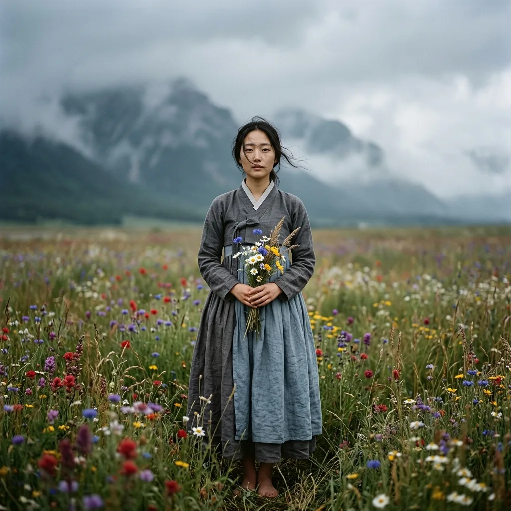

**#240 · Photography Prompt · <code>Vinano Image v2</code>**

<details>
<summary>Show prompt</summary>

```
Ultra-realistic cinematic portrait of a young East Asian woman standing alone in a vast wildflower meadow. She is centered in the frame, facing the camera directly a calm, introspective expression. She wears a traditional Korean hanbok in muted charcoal gray and soft blue tones, natural fabric texture and subtle folds. Her dark hair is loosely tied back a few strands gently blown across her face by the wind.

She holds a small hand-picked bouquet of wildflowers—white daisies, blue cornflowers, and dry grass stems—clasped softly in both hands at waist level. The meadow is filled colorful wildflowers (reds, whites, blues, purples) stretching into the distance.

In the background, a large mist-covered mountain rises softly out of focus, partially obscured by low clouds and fog, creating a moody, atmospheric depth. Overcast sky soft diffused natural light, cool color palette, muted contrast, cinematic realism.

Shallow depth of field, sharp focus on subject, creamy background bokeh. Natural skin texture, realistic facial details, no makeup look. Fine art photography style, emotional, poetic, timeless. Shot on a full-frame camera, 85mm lens, f/1.8, ultra-high resolution, true-to-life photorealistic, no text, no watermark.

Aim for an editorial, design-driven look with deliberate negative space.
```

</details>

---

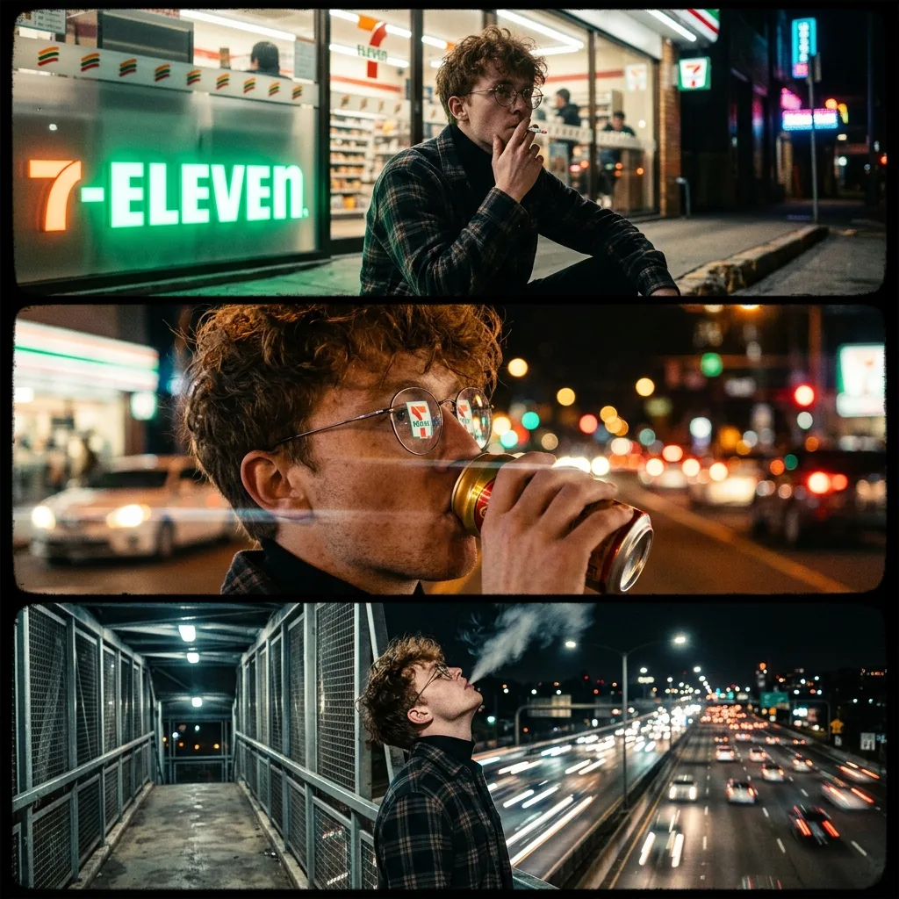

**#241 · Photography Prompt · <code>Vinano Image Pro</code>**

<details>
<summary>Show prompt</summary>

```
A vertical triptych of three cinematic, night-time urban photographs featuring a young man messy, curly reddish-brown hair and thin, round wire-frame glasses.
Top Panel: The man is seated in front of a 7-Eleven storefront. He wears a dark plaid flannel shirt over a black turtleneck. He is captured in a candid moment, holding a lit cigarette to his lips. To the left, there's a vibrant green neon sign. The lighting is dominated by a cool, fluorescent green glow and the warm interior light of the convenience store.
Middle Panel: An extreme close-up profile shot. He is drinking from a gold-and-red metallic beverage can. His glasses catch a sharp, vivid reflection of the 7-Eleven logo and orange-red street lights. A subtle lens flare streaks horizontally across his face. The background is a soft, warm bokeh of city lights and traffic signals.
Bottom Panel: The man stands on a pedestrian overpass overlooking a busy highway. He has his head tilted back, exhaling a thick wisp of white smoke into the night air. Below him, the blurred streaks of white headlights and red taillights create a sense of motion. The overpass structure is lit cool-toned industrial lamps, contrasting his warm skin tones.
Style: 35mm film aesthetic, cinematic grain, shallow depth of field, high contrast, urban noir mood.

Preserve realistic proportions and depth for a confident, professional finish.
```

</details>

---

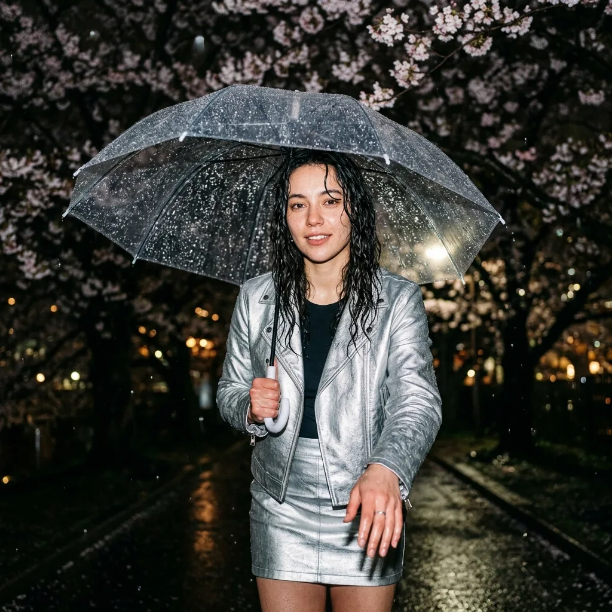

**#242 · Photography Prompt · <code>Vinano Image v2</code>**

<details>
<summary>Show prompt</summary>

```
{
 "prompt": "High-resolution nighttime editorial portrait shot on-camera flash. A young woman standing outdoors at night under blooming cherry blossom trees, holding a transparent clear umbrella covered in raindrops. Her hair is wet and slightly wavy, framing her face naturally. She wears a brown leather jacket a matching skirt, styled minimal and modern. One hand reaches slightly toward the camera, creating depth and intimacy. Strong flash lighting a dark background, rain droplets frozen in motion, cinematic contrast, shallow depth of field, fashion editorial vibe, realistic skin tones, sharp focus. No text, no watermark.",
 "style": "fashion editorial, cinematic, modern",
 "camera": {
 "shot_type": "portrait",
 "lighting": "on-camera flash",
 "depth_of_field": "shallow"
 },
 "lighting": {
 "type": "strong flash",
 "environment": "nighttime",
 "effect": ["high contrast", "frozen raindrops"]
 },
 "environment": {
 "location": "outdoor nighttime setting",
 "elements": ["cherry blossom trees", "rain", "dark background"]
 },
 "wardrobe": {
 "outfit": ["Silver leather jacket", "matching skirt"],
 "style": "minimal, modern"
 },
 "mood": ["intimate", "cinematic", "editorial"],
 "quality": ["high-resolution", "sharp focus", "realistic skin tones"],
 "constraints": ["no text", "no watermark"]
}

Emphasise material texture and natural light so the final frame feels tactile and premium.
```

</details>

---

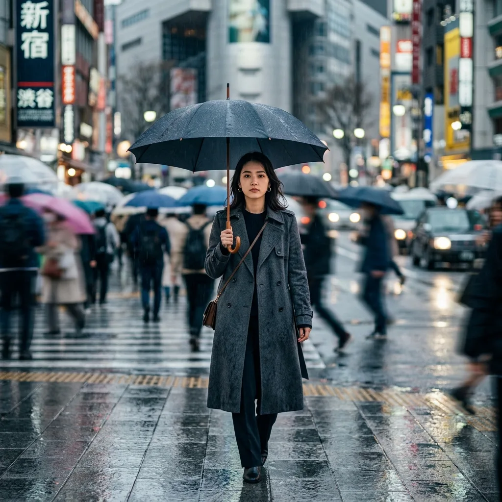

**#243 · Photography Prompt · <code>Vinano Image v2</code>**

<details>
<summary>Show prompt</summary>

```
{
 "render_goal": "Ultra-cinematic, hyper-realistic rainy street portrait shallow depth of field",
 "scene": {
 "location": "busy city street",
 "weather": "steady rain, wet reflective roads, soft mist in the air",
 "time": "overcast daytime",
 "atmosphere": "moody, cinematic, emotionally rich"
 },
 "subject": {
 "identity": "girl identical to the reference",
 "action": "walking forward through a crowded street while holding an umbrella",
 "pose": "natural walking posture, relaxed shoulders",
 "expression": "calm, confident, slightly intense",
 "eye_direction": "looking directly at the camera from a distance",
 "outfit": {
 "style": "elegant, modern, attractive",
 "fit": "well-tailored, flattering silhouette",
 "fabric_behavior": "slightly affected by rain, realistic wet textures"
 }
 },
 "composition": {
 "camera_distance": "medium to long shot",
 "framing": "subject centered balanced negative space",
 "angle": "eye-level, cinematic street photography",
 "focus": "razor-sharp focus on the girl only",
 "depth_of_field": "extremely shallow"
 },
 "background": {
 "crowd": "dense crowd walking in all directions",
 "motion": "crowd fully blurred motion blur",
 "detail_level": "faces and bodies indistinguishable",
 "separation": "strong subject-background isolation"
 },
 "lighting": {
 "type": "soft diffused natural light",
 "highlights": "subtle rain highlights and reflections",
 "color_tone": "cool cinematic color grading slight contrast"
 },
 "visual_style": {
 "look": "cinematic street photography",
 "realism": "ultra-realistic skin, fabric, and rain physics",
 "quality": "8K detail, high dynamic range",
 "post_processing": "film-like contrast, subtle grain, no oversharpening"
 },
 "constraints": {
 "accuracy": "match reference pose, framing, mood, and focus precisely",
 "avoid": ["cartoon look",
 "overexposed highlights",
 "extra subjects in focus",
 "stylized or fantasy elements"]
 }
}

Keep edges clean and the overall composition balanced for a polished, gallery-ready result.
```

</details>

---

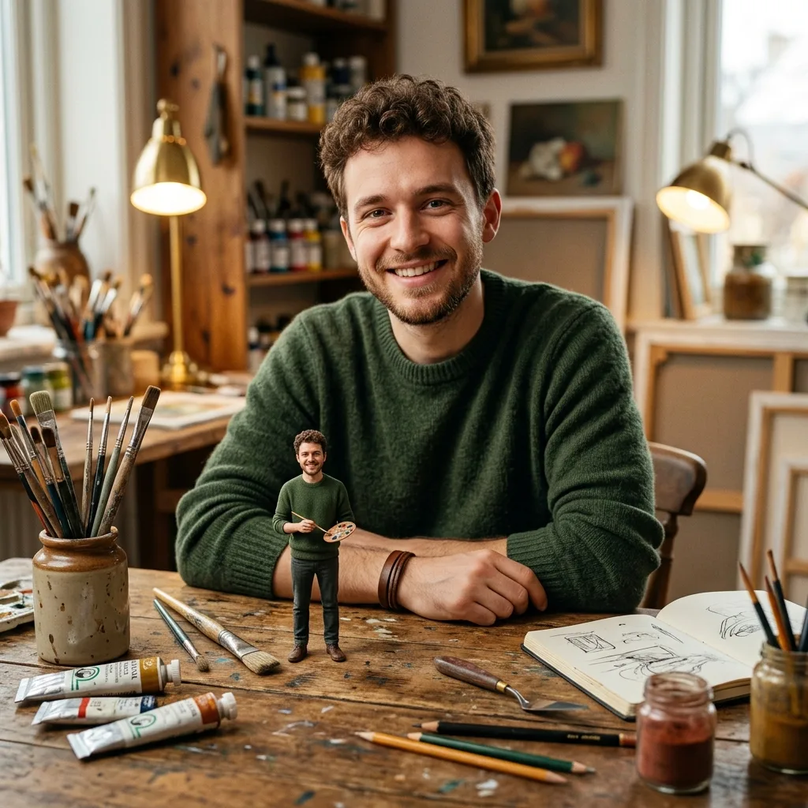

**#244 · Photography Prompt · <code>Vinano Image v2</code>**

<details>
<summary>Show prompt</summary>

```
Ultra-realistic cinematic portrait of a young man sitting at a wooden desk in a cozy art studio, smiling warmly at the camera, a tiny miniature version of himself standing on the table in front of him, perfectly detailed like a small figurine, surrounded by paint brushes, sketches, and art tools, warm ambient lighting from a desk lamp, shallow depth of field, soft bokeh background, creative storytelling composition, scale contrast illusion, hyper-detailed textures, 50mm lens, true-to-life photorealistic, 8K. Emphasise material texture and natural light so the final frame feels tactile and premium.
```

</details>

---

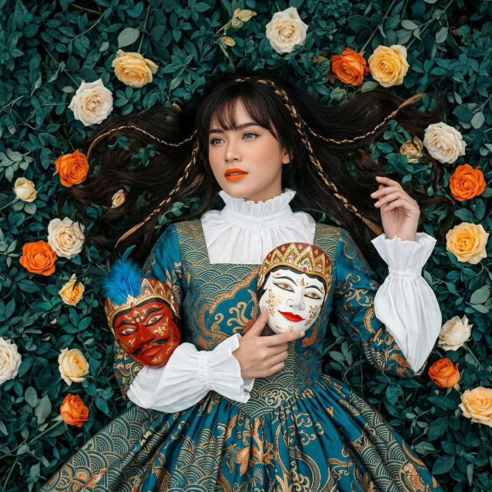

**#245 · Photography Prompt · <code>Vinano Image v2</code>**

<details>
<summary>Show prompt</summary>

```
{
 "subject": {
 "hair": {
 "length": "long",
 "color": "dark",
 "style": "flowing, face-framing",
 "bangs": true,
 "accents": {
 "type": "braided",
 "color": "gold"
 }
 },
 "eyes": {
 "color": "light blue",
 "expression": "serene",
 "gaze": "direct"
 },
 "lips": {
 "color": "vibrant orange"
 }
 },

 "attire": {
 "gown": {
 "style": "opulent historical-inspired",
 "main_color": "rich teal-blue",
 "collar": "high ruffled white",
 "sleeves": "voluminous white gathered cuffs",
 "fabric": {
 "pattern": "Indonesian batik + Ukiyo-e wave motifs",
 "pattern_colors": ["gold", "subtle orange"],
 "detail": "intricate"
 }
 }
 },

 "props": {
 "right_hand_mask": {
 "origin": "Indonesian Javanese wayang-inspired",
 "base_color": "white",
 "lips": "red",
 "expression": "happy",
 "decoration": "gold patterns"
 },
 "left_arm_mask": {
 "origin": "Indonesian traditional",
 "base_color": "red",
 "expression": "angry",
 "decoration": "gold patterns",
 "feather_accent": "blue"
 }
 },

 "pose": {
 "composition": "contrapposto",
 "orientation": "slightly facing left",
 "posture": "lying languidly",
 "framing": "centered"
 },

 "shot": {
 "type": "top-down overhead medium shot",
 "focus": "centered on the woman"
 },

 "background": {
 "foliage": {
 "color": "dark teal-green",
 "density": "dense"
 },
 "flowers": [{ "type": "rose", "color": "cream" },
 { "type": "rose", "color": "pale yellow" },
 { "type": "rose", "color": "vibrant orange" }]
 },

 "lighting": {
 "type": "soft diffused",
 "highlights": "gentle",
 "shadows": "soft"
 },

 "palette": ["teal", "orange", "cream", "white", "gold"],

 "style": {
 "mood": "rich and luxurious",
 "detail_level": "high",
 "textures": "ornate and rich",
 "cultural_respect": true
 },

 "camera": {
 "angle": "overhead",
 "shot_size": "medium",
 "depth_of_field": "shallow",
 "crop": "centered"
 },

 "output": {
 "format": "image-edit-prompt"
 }
}

Emphasise material texture and natural light so the final frame feels tactile and premium.
```

</details>

---

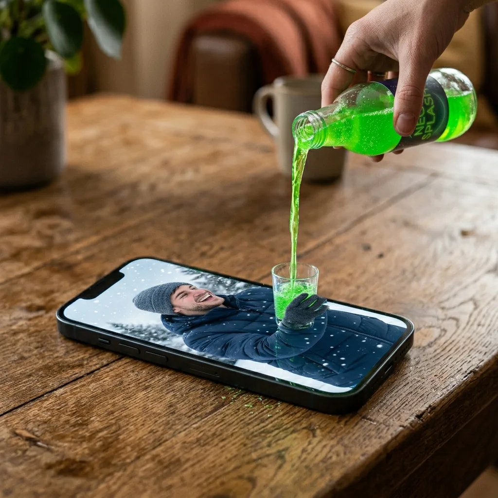

**#246 · Photography Prompt · <code>Vinano Image v2</code>**

<details>
<summary>Show prompt</summary>

```
A hyper-realistic surreal photograph of a modern smartphone lying flat on a wooden table, its screen acting as a portal between two worlds. From inside the phone screen, a smiling young man dressed in winter clothing—puffer jacket, knit beanie, gloves—extends his hands outward into the real world, holding a clear glass. From outside the phone, a real human hand pours a bright neon-green carbonated drink into the glass, liquid splashes frozen mid-air as it crosses the boundary between the digital screen and reality. Snowflakes drift inside the phone screen while the real environment remains warm and minimal. Gemini Ultra-detailed textures, filmic, cinematic lighting, shallow depth of field, true-to-life photorealistic surrealism, high-resolution editorial photography. Maintain consistent colour harmony and crisp focus across the whole frame.
```

</details>

---

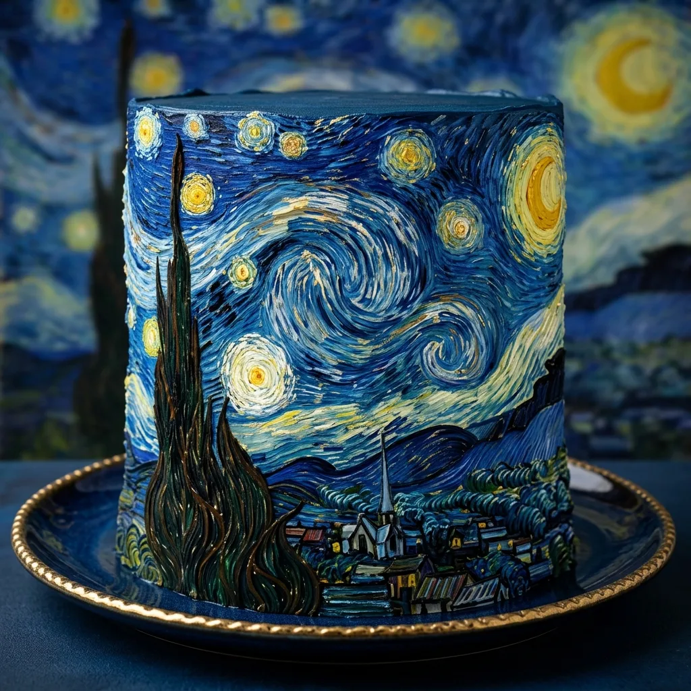

**#247 · Photography Prompt · <code>Vinano Image v2</code>**

<details>
<summary>Show prompt</summary>

```
[cake type], hyper realistic food photography, cake decorated to recreate the famous painting [painting name] buttercream brushstrokes, thick textured piping, impasto frosting swirls, edible gold leaf highlights, color palette matched to the artwork, small painted fondant details, cake on an elegant plate, background set inspired by the same painting, studio lighting soft shadows, shallow depth of field, ultra detailed, premium patisserie advertising, no text, no watermark, 8k, 1:1 Render with rich micro-detail while keeping the layout uncluttered and intentional.
```

</details>

---

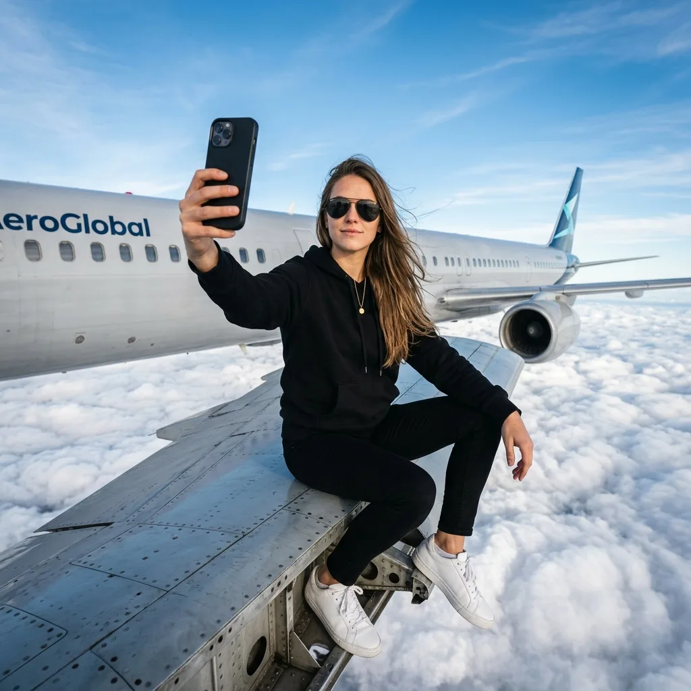

**#248 · Photography Prompt · <code>Vinano Image v2</code>**

<details>
<summary>Show prompt</summary>

```
{
 "image_generation": {
 "subject": {
 "description": "stylish young woman sitting on an airplane wing high above the clouds",
 "pose": "seated casually on the airplane wing, one hand extended forward as if taking a selfie, relaxed but confident posture",
 "expression": "calm, confident, composed",
 "gaze": "looking toward the camera a cool, self-assured expression"
 },
 "appearance": {
 "hair": {
 "style": "long, natural, slightly flowing in the wind",
 "look": "casual and effortless"
 },
 "accessories": ["dark sunglasses",
 "minimal jewelry"],
 "vibe": "adventurous, bold, modern"
 },
 "outfit": {
 "style": "sporty casual",
 "details": "black hoodie, black fitted pants, clean white sneakers"
 },
 "environment": {
 "setting": "high above the clouds on an airplane wing",
 "sky": "clear blue sky soft clouds below",
 "atmosphere": "open, airy, dramatic aerial view"
 },
 "lighting": {
 "type": "natural sunlight",
 "style": "bright and cinematic",
 "direction": "side lighting from the sun",
 "quality": "crisp highlights soft shadows"
 },
 "camera": {
 "angle": "wide selfie-style perspective from a slightly elevated angle",
 "lens": "ultra wide-angle",
 "depth_of_field": "deep focus capturing both subject and vast sky background",
 "composition": "dynamic, adventurous framing emphasizing height and openness"
 },
 "aesthetic": {
 "style": "cinematic adventure photography",
 "vibe": "bold, fearless, modern, travel lifestyle",
 "color_grading": "clean cinematic tones natural blues and soft contrast"
 },
 "quality": {
 "realism": "true-to-life photorealistic",
 "detail": "high detail",
 "resolution": "high resolution",
 "finish": "professional, crisp, ultra-realistic"
 }
 }
}

Keep edges clean and the overall composition balanced for a polished, gallery-ready result.
```

</details>

---

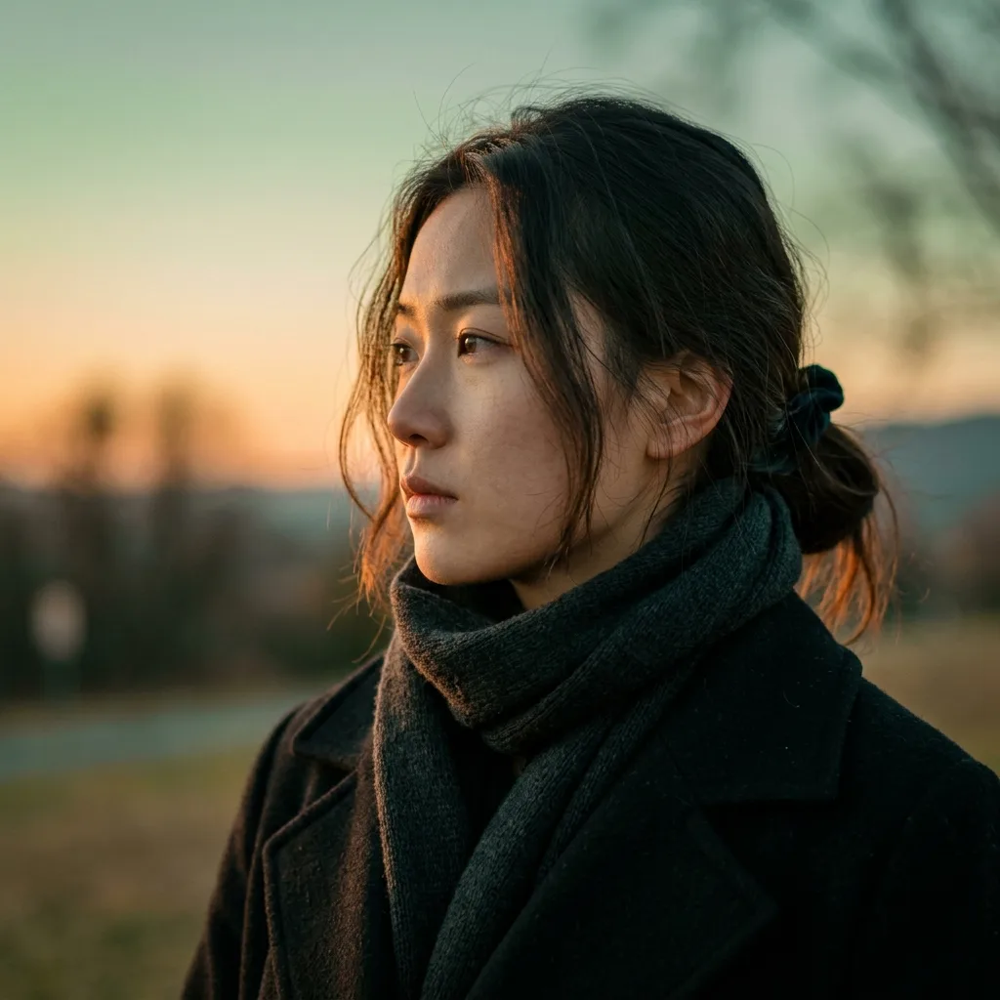

**#249 · Photography Prompt · <code>Vinano Image v2</code>**

<details>
<summary>Show prompt</summary>

```
true-to-life photorealistic cinematic portrait of a young East Asian woman standing outdoors at sunset, side-profile close-up, looking thoughtfully into the distance. Soft golden hour lighting illuminating one side of her face, warm orange and teal color grading. She wears a black coat and dark scarf, hair loosely tied back soft natural strands around her face. Natural skin texture, realistic facial details, minimal makeup. Shallow depth of field blurred landscape background, smooth bokeh, dramatic atmospheric mood, soft gradient sky transitioning from warm orange to cool green tones. Shot on 85mm lens, f/1.8, ultra-realistic, high dynamic range, cinematic composition, moody, film still aesthetic. Maintain consistent colour harmony and crisp focus across the whole frame.
```

</details>

---

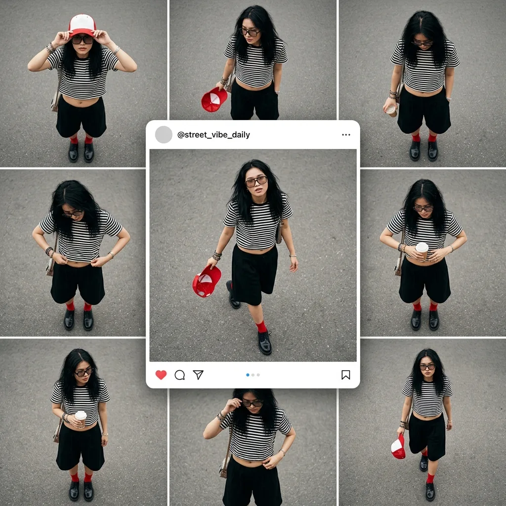

**#250 · Photography Prompt · <code>Vinano Image Pro</code>**

<details>
<summary>Show prompt</summary>

```
{
 "request_type": "image_generation_prompt",
 "source_material": {
 "input_required": true,
 "description": "User uploaded image for face reference."
 },
 "technical_specs": {
 "resolution": "64K DSLR shot resolution",
 "aspect_ratio": "9:16",
 "render_engines": ["Octane Render",
 "Unreal Engine 5"],
 "realism_level": "High-resolution realism"
 },
 "composition": {
 "perspective": "High-angle, top-down view",
 "layout_style": "Modern social media grid (Instagram feed concept)",
 "layout_structure": {
 "central_element": "Larger, framed highlighted post",
 "surrounding_elements": "Clean grid pattern formed by smaller images"
 },
 "content_type": "Dynamic, urban street-style photo collage",
 "ui_overlay": {
 "enabled": true,
 "style": "Minimal social media interface mimicry",
 "elements": ["White rounded rectangles showing a username",
 "Subtle heart icons",
 "Minimal interaction indicators"]
 }
 },
 "subject": {
 "identity": {
 "description": "Young woman",
 "facial_reference": "Same face as the uploaded image"
 },
 "appearance": {
 "hair": "Long black hair, worn loose and slightly messy",
 "vibe": "Confident, edgy, effortlessly cool"
 },
 "clothing": {
 "top": "Black-and-white horizontal striped cropped T-shirt",
 "bottom": "Loose black knee-length shorts",
 "footwear": {
 "shoes": "Polished black leather shoes",
 "socks": "Bright red socks"
 },
 "eyewear": "Oversized tinted sunglasses"
 },
 "accessories": {
 "headwear": {
 "item": "Red-and-white baseball cap",
 "usage": "Sometimes worn, sometimes held in hand"
 },
 "bag": "Small shoulder bag",
 "jewelry": "Stacked bracelets",
 "other": "Takeaway drink cup"
 },
 "actions_and_poses": {
 "style": "Candid moments captured in motion, not posed",
 "examples": ["Walking along the street",
 "Walking mid-step",
 "Adjusting cap",
 "Looking up toward camera",
 "Fixing bag",
 "Holding drink"],
 "narrative_effect": "Natural lifestyle storytelling, varying poses across frames"
 }
 },
 "environment": {
 "setting": "Asphalt city street",
 "ground_surface": "Textured gray asphalt, minimal and uncluttered",
 "role": "Neutral backdrop emphasizing fashion and movement"
 },
 "lighting_and_color": {
 "lighting_type": "Natural daylight soft shadows",
 "photographic_feel": "Realistic street photography",
 "color_palette": {
 "base": "Muted and urban tones",
 "contrast_accents": ["Bright red socks", "Red-and-white cap"]
 }
 },
 "style_and_mood": {
 "overall_mood": "Candid, contemporary, effortlessly cool",
 "aesthetic_blend": ["Fashion photography",
 "Street culture",
 "Social media aesthetics"],
 "keywords": ["Urban street photography",
 "Top-down perspective",
 "Instagram grid layout",
 "Candid lifestyle shots",
 "Street fashion",
 "Casual cool aesthetic",
 "Muted city tones",
 "Social media UI overlay",
 "Natural light",
 "Modern editorial style"]
 }
}

Preserve realistic proportions and depth for a confident, professional finish.
```

</details>

---


**#251 · Photography Prompt · <code>Vinano Image v2</code>**

<details>
<summary>Show prompt</summary>

```
Generate an image of a man in the uploaded image in which the entire scene is layered heavy, horizontal motion-blur streaks in shades of teal, yellow, and white, creating a "speed-light" effect. These colorful blurs must appear both behind the man and superimposed over his body and face, behaving like reflections on a glass mirror. A medium shot of a man standing perfectly still in the center of a frame, looking down at a red smartphone held both hands. He is wearing a white t-shirt under a translucent, light gray windbreaker jacket and a dark wristwatch. The background is a chaotic, vibrant blur of horizontal light trails in colors of neon blue, orange, yellow, and white, suggesting a high-speed train or city traffic. Crucially, these colorful motion-blurred light streaks pass both behind and directly over the man's body, appearing semi-transparent as they overlap his torso and arms, creating a double-exposure effect. The man's face and hair are in sharp focus, showing a calm expression, contrasting the high-speed motion of the environment. filmic, cinematic lighting, hyper-realistic, 8k resolution. Render with rich micro-detail while keeping the layout uncluttered and intentional.
```

</details>

---

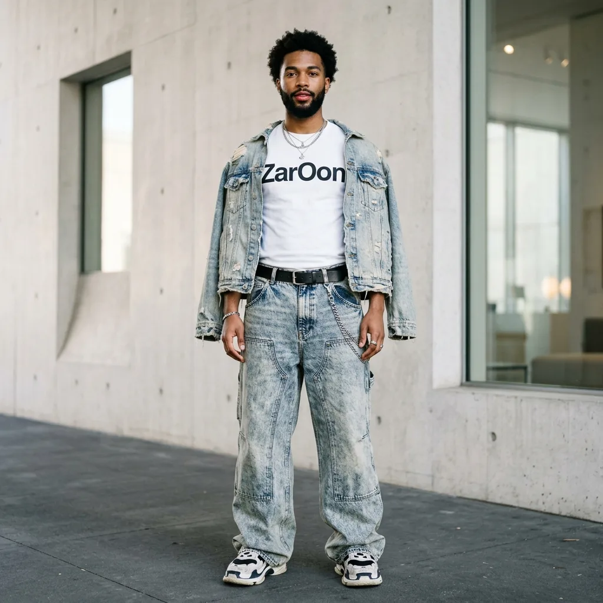

**#252 · Photography Prompt · <code>Vinano Image v2</code>**

<details>
<summary>Show prompt</summary>

```
Beard. Makeup is minimal and natural, emphasizing clear skin and subtle lip color. The outfit is contemporary high-fashion streetwear a Y2K and avant-garde influence. The model wears an oversized, light-wash distressed denim jacket draped loosely over the shoulders, layered over a white graphic T-shirt bold black text reading "ZarOon". The jeans are extremely oversized, low-rise, acid-wash denim exaggerated wide legs, heavy structure, decorative. Keep edges clean and the overall composition balanced for a polished, gallery-ready result.
```

</details>

---

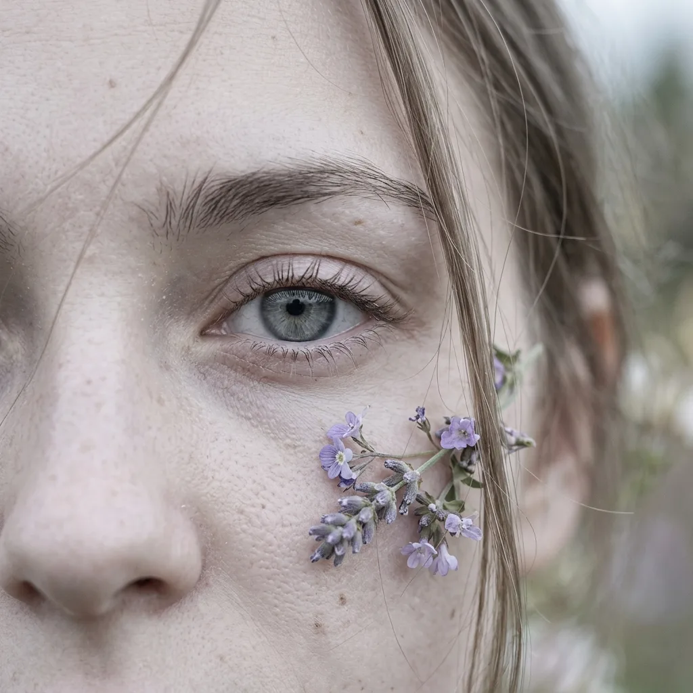

**#253 · Photography Prompt · <code>Vinano Image Pro</code>**

<details>
<summary>Show prompt</summary>

```
Utilize exclusively and obligatorily the uploaded reference photos as the primary and authoritative source for the model’s face, facial structure, proportions, skin tone, real skin texture, and the exact natural characteristics of her hair.
Do not idealize, beautify, alter, rejuvenate, slim the face, smooth the skin, or modify any real features.
Do not remove or change freckles, pores, fine lines, or natural imperfections.The appearance must match the reference images exactly, absolute fidelity.
Create a hyper-realistic, ethereal macro Fine Art portrait photograph, captured a Leica APO-Macro-Elmarit-R 100mm f/2.8, full-frame.
An extreme close-up of a young woman’s face pale skin, fully respecting the real physiognomy of the model as shown in the reference photos.
Skin texture is ultra-detailed and completely natural, clearly visible pores and no artificial smoothing.
One crystal-clear, melancholic eye is in perfect critical focus, displaying natural micro-contrast characteristic of Leica optics.
Long, natural eyelashes.
Lips slightly parted, in a natural pale pink tone, no excessive or artificial makeup.
Delicate wildflowers in soft lilac and muted purple tones rest gently on the cheek and intertwine loose, naturally imperfect hair strands, exactly following the real hair pattern seen in the reference images.
Some flowers appear softly out of focus in the foreground, creating organic depth and layered composition.
Soft, cool, diffused natural light, as on an overcast day.
No harsh shadows, no artificial lighting.
A serene, fragile, poetic, and subtly melancholic atmosphere.
Macro photography an extremely shallow depth of field, edges and background melting into a creamy, smooth bokeh.
Absolute critical focus on the iris and the true skin texture.
Desaturated color palette, cool pastel tones — soft gray, beige, and lilac.
Fine Art aesthetic, authentic Leica optical fidelity, true photographic appearance.
Ultra-high resolution 8K, no AI-generated look.

Preserve realistic proportions and depth for a confident, professional finish.
```

</details>

---

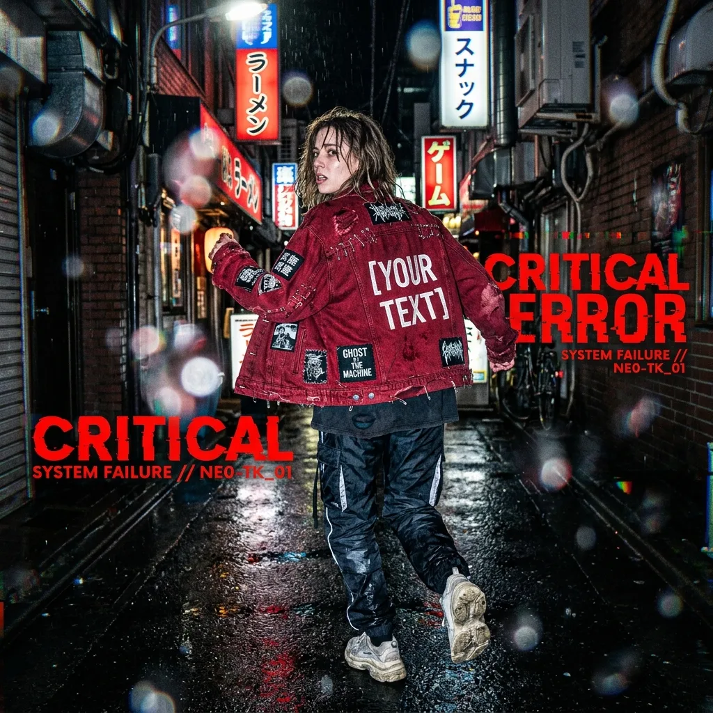

**#254 · Photography Prompt · <code>Vinano Image v2</code>**

<details>
<summary>Show prompt</summary>

```
A raw, candid street-style shot of reference running through a rain-soaked Neo-Tokyo alleyway, glancing over her shoulder. She is wearing an oversized "Crimson Red" distressed denim jacket safety pins and patches, the [YOUR TEXT] branding is embroidered in white on the back. Underneath, a torn band tee. Raindrops on the camera lens create natural distortion. The background is blurred red neon signs reflecting on wet asphalt. The image is heavily processed "Critical Error" red text overlays and glitch artifacts. Style: Flash photography, high contrast, adrenaline rush. Aim for an editorial, design-driven look with deliberate negative space.
```

</details>

---

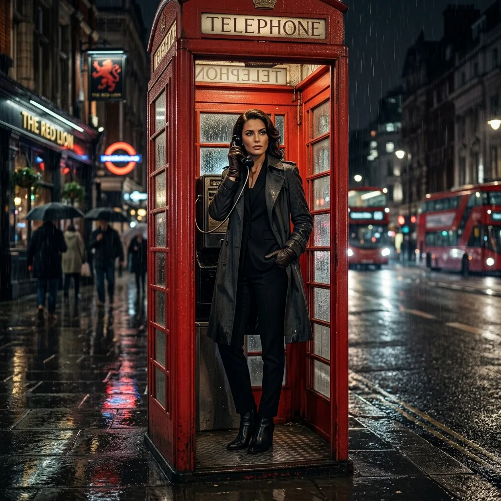

**#255 · Photography Prompt · <code>Vinano Image Pro</code>**

<details>
<summary>Show prompt</summary>

```
{
 "type": "image_generation_prompt",
 "style": "ultra-true-to-life photorealistic, cinematic, high-end fashion editorial",
 "aspect_ratio": "1:1",
 "resolution": "high resolution, maximum realism",
 "scene": {
 "time": "night",
 "weather": "rainy",
 "location": "urban London street"
 },
 "environment": {
 "primary_setting": "inside a classic red British telephone booth",
 "ground": "wet pavement reflecting city lights",
 "atmosphere": ["visible raindrops under soft street lighting",
 "subtle fog in the background",
 "blurred headlights",
 "cinematic bokeh lights"]
 },
 "subject": {
 "gender": "female",
 "appearance": {
 "physique": "fit, elegant, confident presence",
 "expression": "serious, confident, charismatic",
 "pose": {
 "full_body_visible": true,
 "stance": "standing inside the telephone booth",
 "right_hand": "holding the old-fashioned phone receiver",
 "left_hand": "casually inside coat pocket"
 }
 },
 "clothing": {
 "outfit": "tailored black suit",
 "outerwear": "long dark trench coat slightly wet from rain",
 "style": "elegant, cinematic, fashion editorial"
 }
 },
 "lighting": {
 "type": "moody cinematic street lighting",
 "effects": ["dramatic contrast",
 "realistic rain reflections on glass panels",
 "soft highlights on wet surfaces",
 "natural reflections from city lights"]
 },
 "camera": {
 "framing": "full-body shot from head to toe",
 "composition": "centered subject inside telephone booth",
 "focus": "sharp focus on subject, soft blur in background",
 "style": "cinematic photography"
 },
 "mood": {
 "tone": "dark, elegant, cinematic",
 "aesthetic": "high-end fashion editorial urban atmosphere"
 },
 "constraints": ["no cartoon or illustration",
 "no unrealistic lighting",
 "no distortion",
 "no watermark",
 "no text"],
 "output_goal": "Create an ultra-true-to-life photorealistic cinematic night scene of a confident woman standing inside a classic red British telephone booth in rainy London, dramatic lighting, realistic reflections, and a high-end fashion editorial aesthetic."
}

Keep edges clean and the overall composition balanced for a polished, gallery-ready result.
```

</details>

---

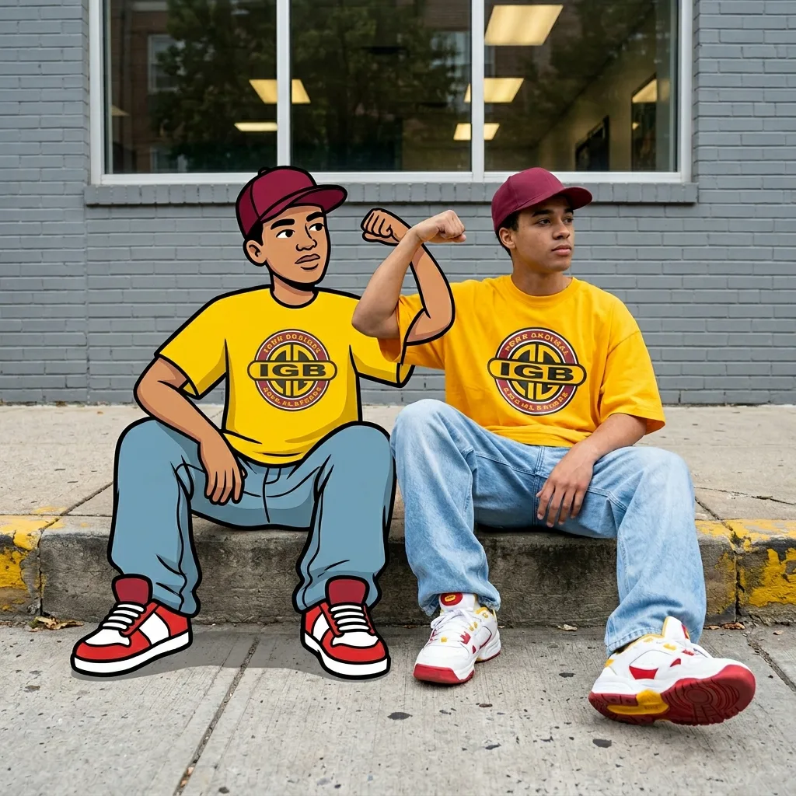

**#256 · Photography Prompt · <code>Vinano Image Pro</code>**

<details>
<summary>Show prompt</summary>

```
Transform this image [Upload Your Image] into a 64K DSLR shot resolution of A creative mixed-reality street portrait featuring a real young man (same face as the uploaded image) sitting on concrete steps beside his illustrated cartoon counterpart. The scene is set outdoors against a gray brick wall a large window above, reflecting trees and indoor lighting, giving an urban neighborhood feel. The sidewalk and steps have worn yellow paint along the edges, adding texture and realism.
On the right sits the real person, a young man (same face as the uploaded image) dressed in early-2000s hip-hop streetwear. He wears an oversized bright yellow graphic T-shirt a bold circular logo, loose light-blue baggy jeans, white & red chunky sneakers yellow detailing, and a maroon baseball cap worn forward. He poses casually, seated legs extended, one arm flexed at the elbow as if showing strength or confidence, looking off to the side a calm, cool expression.
On the left sits his cartoon illustrated version of himself (same face as the uploaded image) perfectly matching his outfit, pose, and proportions. The cartoon character is drawn in a flat, bold, graphic style thick black outlines, simplified facial features, and vibrant colors. The illustrated figure mirrors the real person’s posture and clothing exactly same, including the oversized shirt, baggy jeans, red & white sneakers, and maroon cap. The cartoon arm connects visually the real person’s arm, creating a playful illusion of interaction between illustration and reality. The illustration style resembles hand-drawn street art or animated hip-hop character design, seamlessly integrated into the photograph accurate scale, alignment, and grounding. The contrast between realistic textures (concrete, brick, denim fabric) and the clean, flat cartoon shading creates a striking visual effect. Lighting is natural daylight, evenly illuminating both the real and illustrated subjects. The overall mood is cool, nostalgic, playful, and creative, blending street fashion, urban culture, and cartoon art into a cohesive mixed-media composition. Style & Mood Keywords: Mixed media photography, real person cartoon twin, urban street portrait, hip-hop fashion, Y2K streetwear, bold graphic illustration, cartoon realism blend, playful surrealism, nostalgic urban culture, high-resolution detail, creative storytelling. Octane render & Unreal Engine 5.

Aim for an editorial, design-driven look with deliberate negative space.
```

</details>

---

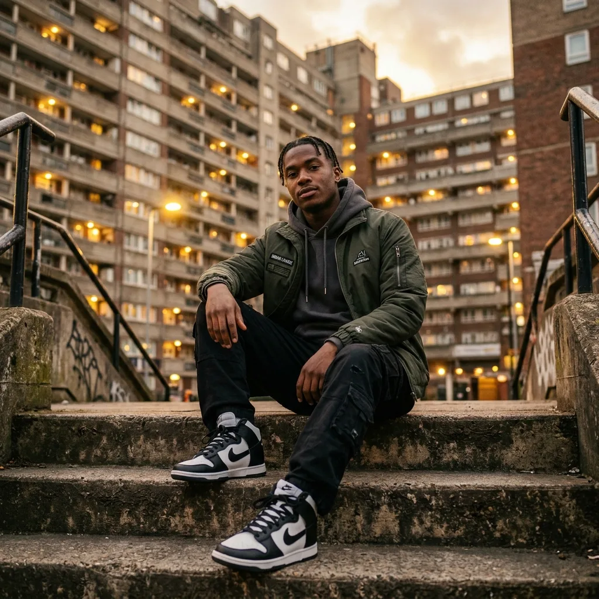

**#257 · Photography Prompt · <code>Vinano Image v2</code>**

<details>
<summary>Show prompt</summary>

```
A stylish young man sitting confidently on raw concrete steps inside a dense urban housing complex during golden hour. He wears a hooded sweatshirt layered under a premium streetwear jacket minimal embroidered patches, relaxed cargo pants, and bold high-top sneakers. Shot from a low, slightly wide angle to enhance dominance and attitude. Warm golden sunlight from the setting sun and street lamps creates long shadows, glowing highlights on the face, and cinematic depth. Tall apartment buildings softly lit windows fill the background. Ultra-realistic DSLR look, shallow depth of field, crisp fabric textures, natural skin tones, subtle film grain, Instagram-trending urban vibe, 4K quality. Preserve realistic proportions and depth for a confident, professional finish.
```

</details>

---

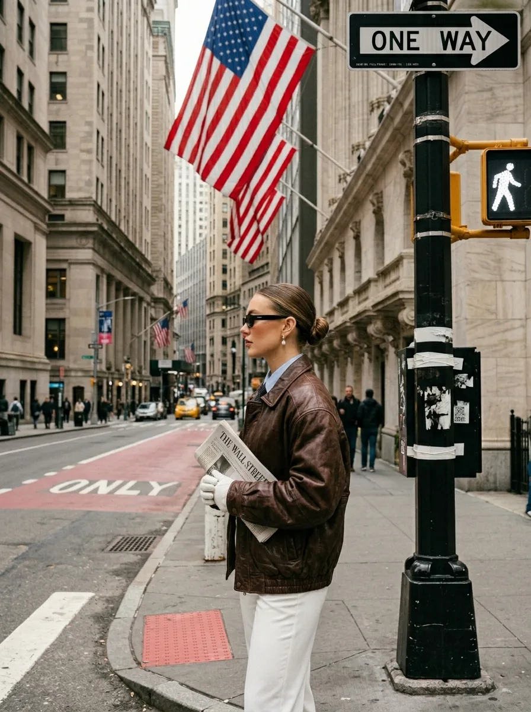

**#258 · Photography Prompt · <code>Vinano Image Pro</code>**

<details>
<summary>Show prompt</summary>

```
Ultra-realistic street fashion editorial photograph in New York City / Wall Street area, shot in vertical 3:4 (1152×1536). A stylish woman stands in the lower-right foreground on a wide concrete sidewalk at a street corner, posed in left-facing profile (body angled left, head slightly forward), calm confident expression. She wears large black rectangular sunglasses, pearl drop earrings, hair sleek center-part pulled into a low bun, subtle makeup warm blush and muted lipstick. Outfit: oversized chocolate-brown leather bomber jacket pronounced shoulders and glossy creases, layered over a light blue collared shirt and a dark necktie. Hands in front holding a folded newspaper: “THE WALL STREET” clearly visible across the top of the paper. She wears white gloves and high-waisted white pants (clean, structured).

Environment / Street Elements (Must match):

A tall black metal street pole dominates the right side foreground, wrapped white tape bands and small worn stickers; at the top right there’s a black-and-white “ONE WAY” sign (arrow pointing right). Just left of the pole is a yellow/orange pedestrian traffic signal the white walking figure illuminated. Above and behind, multiple large American flags hang from the stone building façade, the nearest flag filling the upper center-left area visible red-and-white stripes and blue field. Background is a canyon of tall buildings: left side is an older light beige stone building rectangular windows, vent-like panels, and dark trim at the base; right side shows modern tall buildings and a long street receding into the distance. On the roadway to the right is a pinkish-red lane (bus/bike lane feel) textured sidewalk corner and a small red tactile paving patch near the pole base. Far background includes tiny pedestrians and cars along the street; everything is sharp enough to read the scene but remains secondary to the subject.

Composition / Perspective:

Wide-angle street perspective strong vertical lines; the camera is at rough chest height aimed slightly upward so the signal, flags, and signs tower above the subject. Subject is framed from mid-thigh up, placed bottom-right, leaving large negative space of architecture and street signage above. Maintain exact spacing: pole near right edge, pedestrian signal centered above subject, flags hanging upper-left, street depth vanishing toward upper-right background.

Lighting / Color / Texture:

Overcast daylight soft shadows, neutral highlights. Warm, slightly desaturated film look (beige stone tones, muted browns), subtle contrast, gentle lifted blacks. Add fine film grain and slight texture like a candid editorial street shot. Natural skin texture, realistic leather sheen and folds, realistic newspaper paper texture.

Camera / Lens / Settings (Emulation):

Full-frame look, 24–28mm wide lens, documentary/editorial street style, moderate depth of field (subject crisp, background slightly softer but still readable). Slight vintage/film-grade color science.

Hard Rules (No deviations):

Do not change the pose, outfit layers (brown leather jacket + blue shirt + tie), sunglasses shape, pearl earrings, bun hairstyle, white gloves, white pants, the “THE WALL STREET” newspaper text, the “ONE WAY” sign, the walking man icon, the American flags, or the exact NYC street-corner composition. No extra props, no extra people in foreground, no cropping changes, no stylization beyond realistic film/editorial grain.

Negative Prompt (Strict):

no illustration, no CGI look, no anime, no painterly texture, no extra typography overlays, no added logos, no changed signs, no different newspaper title, no different flag placement, no blur on main subject, no heavy HDR, no neon colors, no beauty-plastic skin, no distorted hands, no warped buildings, no random lens flares.

Keep edges clean and the overall composition balanced for a polished, gallery-ready result.
```

</details>

---

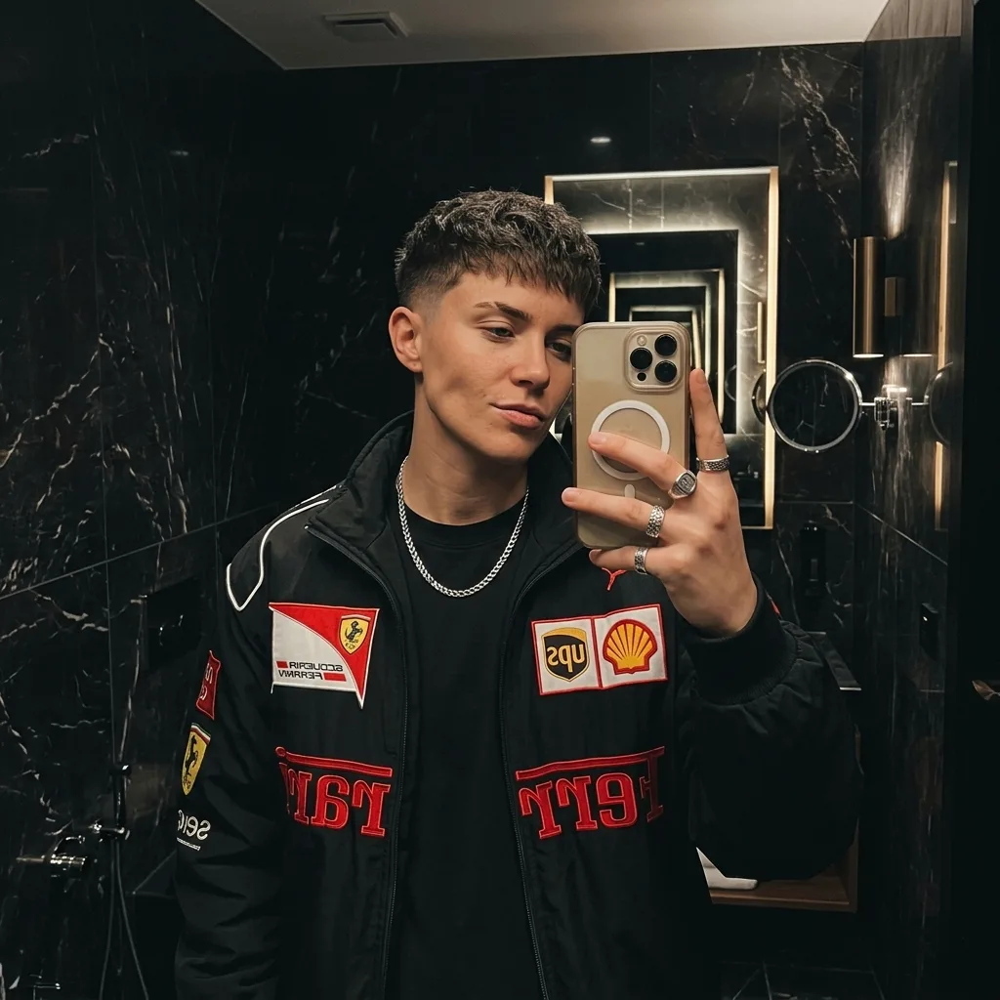

**#259 · Photography Prompt · <code>Vinano Image Pro</code>**

<details>
<summary>Show prompt</summary>

```
Create a hyper-realistic mirror selfie of me (use my face from the uploaded selfie) wearing the same black Ferrari racing jacket red and yellow patches, black t-shirt underneath, silver rings, and chain.
I'm holding a phone a beige
MagSafe case, posing in a dimly lit
modern bathroom dark marble
walls. The lighting is soft and moody
capturing the same hairstyle, pose,
and reflection angle as in the
reference image - stylish, confident
cinematic vibe. Add a moody filter.

Maintain consistent colour harmony and crisp focus across the whole frame.
```

</details>

---

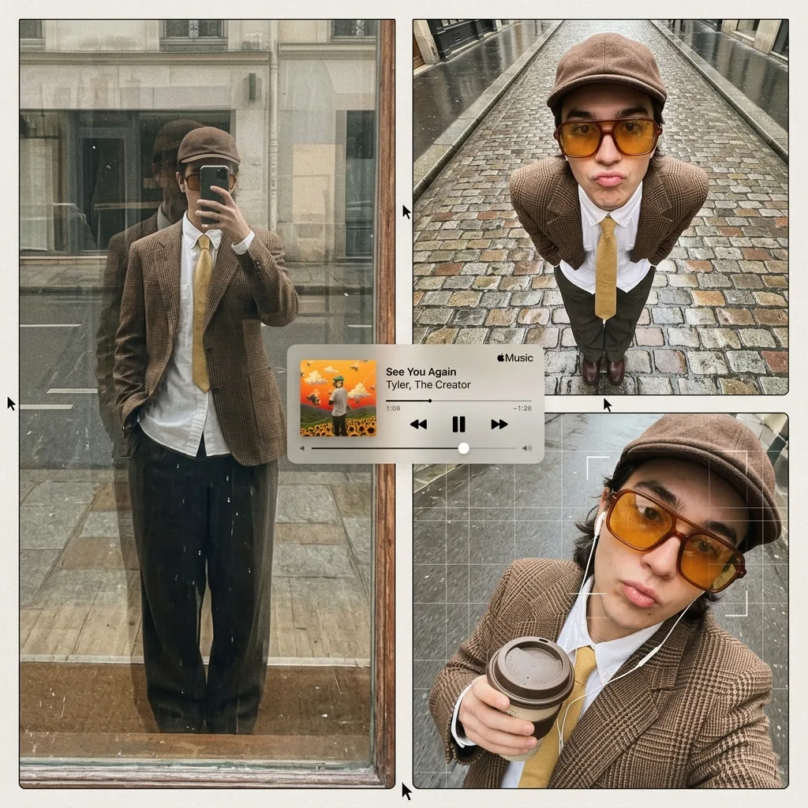

**#260 · Photography Prompt · <code>Vinano Image Pro</code>**

<details>
<summary>Show prompt</summary>

```
An editorial poster-style multi-panel collage presents Subject[person in the image] across three asymmetric photographic frames, unified by a muted-brown urban streetwear aesthetic and a retro analog-digital fusion mood. The top-left frame captures a reflective window shot where the subject holds a phone in front of their face, dressed in a brown plaid blazer layered over a white button-up shirt, a yellow tie, loose dark trousers, and a brown cap; the reflective surface introduces layered ghosting, faint architectural overlays, and a subtly stretched full-body silhouette shaped by the curvature of the glass.

The top-right frame shifts into a close-range, downward-angled ultra-wide portrait taken on a cobblestone street, where the subject leans forward hands in pockets and lips exaggeratedly pouting, wearing the same outfit now paired oversized amber-tinted rectangular sunglasses, while the cobblestones warp and radiate outward due to lens perspective distortion.

The bottom-right frame becomes an intimate overhead selfie the subject holding a drink, still in the same wardrobe but now wired earphones, the amber sunglasses dominating the frame under soft overcast lighting, enhanced by faint digital-grid overlays and a minimal square facial-bounding graphic.

Floating across the middle section of the poster is a translucent iOS-style Apple Music mini-player displaying "See You Again" by Tyler, The Creator, featuring artwork, timeline, and playback controls without shadows, contributing to the minimal Ul aesthetic alongside subtle cursor-like frame lines and rectangular highlights around the collage edges.

The overall palette emphasizes warm ambers, washed neutrals, soft greys, reflective textures, wool plaid patterning, polished leather, and stone pavement, all rendered realistic lighting and natural distortion patterns while avoiding stickers, extra subjects, wardrobe changes, incorrect Ul icons, neon color shifts, or any futuristic sci-fi elements.

Render with rich micro-detail while keeping the layout uncluttered and intentional.
```

</details>

---

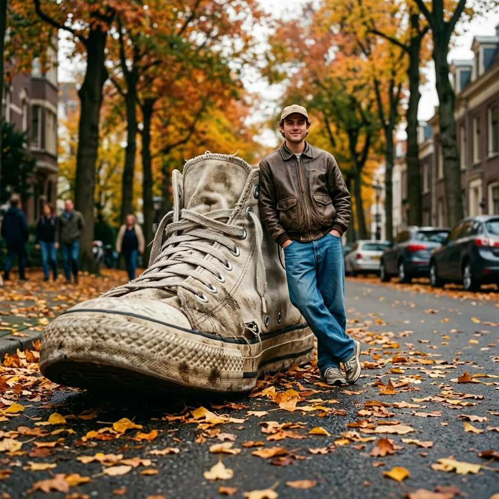

**#261 · Photography Prompt · <code>Vinano Image v2</code>**

<details>
<summary>Show prompt</summary>

```
A cinematic forced-perspective street photography scene where a giant worn-out sneaker appears enormous in the foreground, towering over a casually dressed young man leaning against it. The man wears a brown leather jacket, loose blue jeans, sneakers, and a beige cap, standing confidently hands in pockets. Autumn atmosphere yellow and orange leaves scattered on the road, talltrees fall foliage in the background, parked car slightly blurred. Ultra-realistic textures on the shoe sole, visible dirt and fabric wear. Shot from a very low angle to exaggerate scale, shallow depth of field, natural daylight, soft cinematic color grading, realistic shadows, high detail, 8K resolution, professional photography, surreal yet believable forced perspective illusion. Preserve realistic proportions and depth for a confident, professional finish.
```

</details>

---

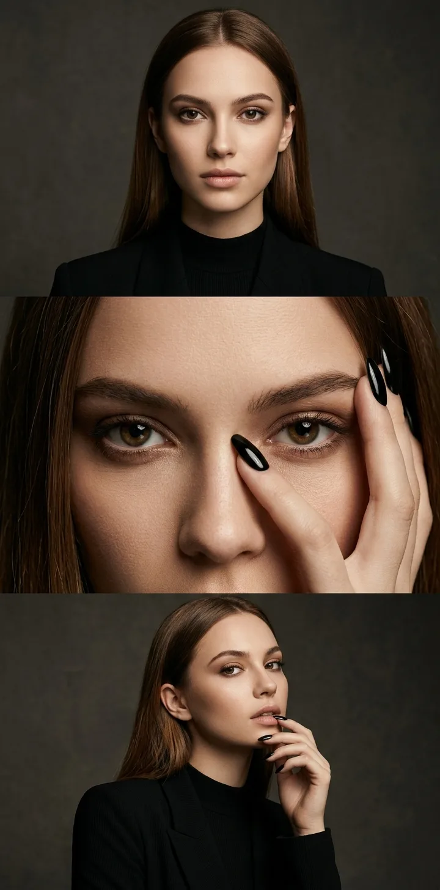

**#262 · Photography Prompt · <code>Vinano Image v2</code>**

<details>
<summary>Show prompt</summary>

```
{
 "Objective": "Create a high-fashion editorial studio portrait presented as a vertical triptych cinematic luxury aesthetics",
 "PersonaDetails": {
 "Subject": {
 "Type": "Young woman",
 "Hair": "Long, sleek chestnut-brown hair",
 "Makeup": {
 "Style": "Natural, flawless skin",
 "Emphasis": "Eyes subtly enhanced for intensity"
 },
 "Wardrobe": "refined minimalist black outfit",
 "OverallPresence": "Calm, confident, refined"
 }
 },
 "TriptychComposition": {
 "Layout": "Vertical triptych (three stacked frames)",
 "TopFrame": {
 "Framing": "Centered head-and-shoulders portrait",
 "Pose": "Straight-on, symmetrical composition",
 "Expression": "Calm, confident",
 "Focus": "Balanced facial proportions and elegance"
 },
 "MiddleFrame": {
 "Framing": "Extreme close-up of the eyes",
 "Focus": "Eyes in razor-sharp focus",
 "PoseDetail": "Hand partially covering the face",
 "Accessories": "Long, glossy black nails prominently visible",
 "Mood": "Intimate, intense, editorial"
 },
 "BottomFrame": {
 "Framing": "Three-quarter portrait",
 "Pose": "Hand posed elegantly near the lips",
 "Expression": "Subtle, poised, fashion-forward",
 "Focus": "Gesture, styling, and body language"
 }
 },
 "LightingAndAtmosphere": {
 "LightingStyle": "Dramatic directional studio lighting",
 "LightQuality": "Soft shadows sculpted highlights",
 "Contrast": "Cinematic, high contrast",
 "Background": "Neutral dark studio backdrop"
 },
 "ArtDirection": {
 "Style": "Luxury beauty campaign",
 "Aesthetic": "Vogue-style high-fashion editorial",
 "SkinRendering": "Flawless yet natural skin texture",
 "DetailLevel": "Ultra-detailed refined realism"
 },
 "PhotographyStyle": {
 "Genre": "High-fashion editorial studio photography",
 "CompositionFeel": "Clean, bold, graphic",
 "ImageQuality": "High resolution, premium commercial finish"
 },
 "Mood": {
 "Tone": "Elegant, powerful, modern",
 "Energy": "Confident, controlled, luxurious"
 },
 "NegativePrompt": ["casual fashion",
 "street photography",
 "overly dramatic makeup",
 "soft focus eyes",
 "busy background",
 "oversaturated colors",
 "low contrast",
 "plastic skin"],
 "ResponseFormat": {
 "Type": "Single composite image",
 "Layout": "Vertical triptych",
 "Orientation": "Portrait",
 "AspectRatio": "1:2"
 }
}

Emphasise material texture and natural light so the final frame feels tactile and premium.
```

</details>

---

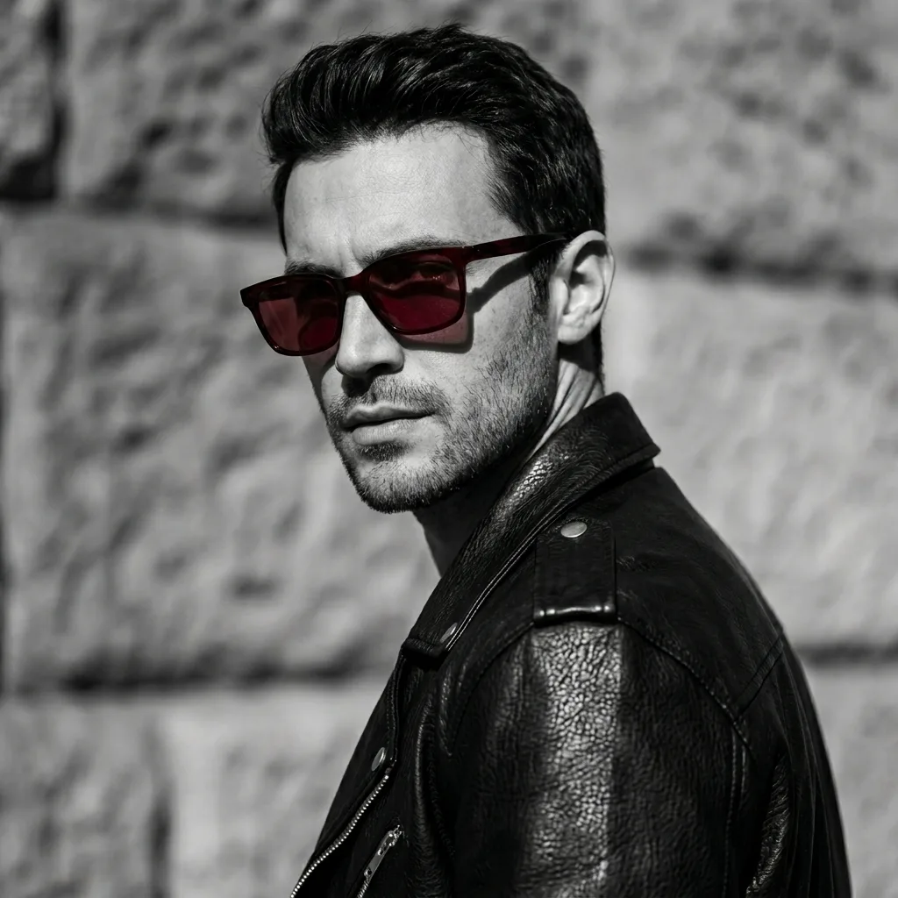

**#263 · Photography Prompt · <code>Vinano Image Pro</code>**

<details>
<summary>Show prompt</summary>

```
Use 100% of the uploaded reference image for the exact face, identity, and facial structure — do not alter facial features. A high-contrast black-and-white fashion portrait of a handsome young man in his late 20s black hair and a well-groomed black beard, looking over his shoulder toward the camera. He wears a stylish black leather jacket visible grain texture and modern rectangular sunglasses deep red-tinted lenses. Emphasise material texture and natural light so the final frame feels tactile and premium.
```

</details>

---

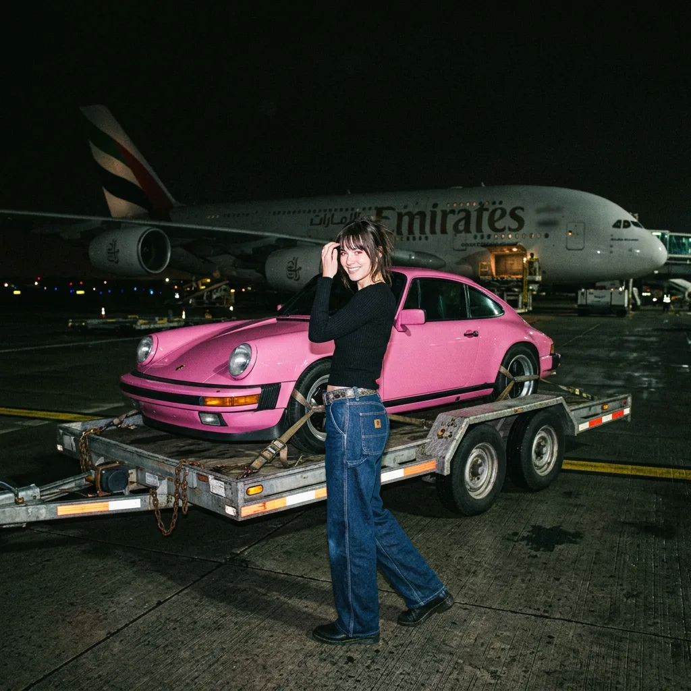

**#264 · Photography Prompt · <code>Vinano Image v2</code>**

<details>
<summary>Show prompt</summary>

```
A gritty, handheld iPhone photo taken at night on an airport tarmac harsh direct on-camera flash. Imperfect, slightly crooked framing, like a spon-taneous snap. In the foreground, the woman stands beside a pink Porsche 911 on a flatbed trailer, mid-coy gesture, body angled three-quarters, one hand near her face. She wears wide Carhartt-style jeans and a fitted top, straight bangs framing her face flirty, casual, unplanned. In the background, a huge Emirates Airbus A380 looms in darkness, barely visible beyond flash falloff, cargo door open. Blown highlights on her, hard shadows on concrete, the plane mostly swallowed by night. Render with rich micro-detail while keeping the layout uncluttered and intentional.
```

</details>

---


**#265 · Photography Prompt · <code>Vinano Image v2</code>**

<details>
<summary>Show prompt</summary>

```
A small chili plant glossy green leaves and one tiny white flower bud forming, emerging from dark damp soil. Light rain falling gently, droplets visible mid-air. Ground-level camera angle, intense macro detail on leaf veins and wet soil granules. Soft daylight warm evening tones, natural reflections on wet surfaces. Background garden softly blurred circular bokeh highlights. Backlit leaves subtle translucency. Shot on 100mm macro lens, shallow depth of field, f/2.8 Maintain consistent colour harmony and crisp focus across the whole frame.
```

</details>

---


**#266 · Photography Prompt · <code>Vinano Image v2</code>**

<details>
<summary>Show prompt</summary>

```
{
 "image_generation": {
 "subject": {
 "description": "young woman enjoying a calm self-care moment",
 "expression": "relaxed, thoughtful, peaceful",
 "face": "natural facial features a gray clay face mask applied evenly",
 "skin": "natural skin tone, soft texture"
 },
 "hair": {
 "style": "hair wrapped in a white towel turban",
 "appearance": "clean, spa-style look"
 },
 "outfit": {
 "clothing": "white bathrobe",
 "style": "minimal, cozy, spa aesthetic",
 "accessories": "small gold hoop earrings, delicate gold necklace"
 },
 "pose": {
 "hands": "one hand holding a ceramic mug, other hand lightly touching the side of the head",
 "posture": "upright, relaxed stance"
 },
 "props": {
 "mug": "white ceramic mug a cute cat design",
 "theme": "morning relaxation, wellness routine"
 },
 "environment": {
 "setting": "bright indoor space near a window",
 "background": "soft white wall natural window light and leafy green houseplant",
 "mood": "calm, fresh, minimal"
 },
 "lighting": {
 "type": "natural sunlight",
 "direction": "side-lit through a window",
 "effect": "soft shadows, warm highlights"
 },
 "camera": {
 "style": "lifestyle photography",
 "angle": "medium close-up",
 "focus": "sharp focus on subject, softly blurred background",
 "quality": "high-resolution, true-to-life photorealistic"
 },
 "aesthetic": {
 "theme": "self-care, wellness, morning routine",
 "color_palette": "soft whites, neutral tones, natural greens",
 "vibe": "clean, peaceful, luxurious yet minimal"
 }
 }
}

Aim for an editorial, design-driven look with deliberate negative space.
```

</details>

---

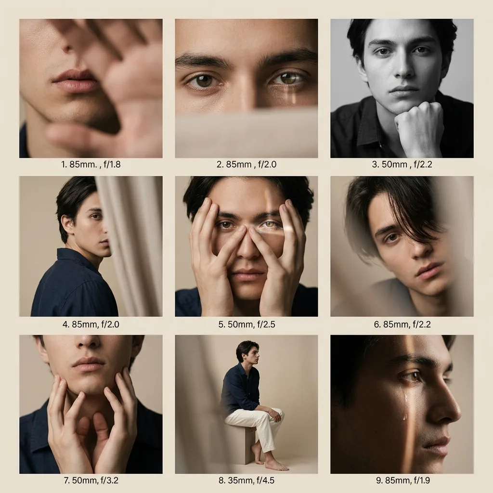

**#267 · Photography Prompt · <code>Vinano Image Pro</code>**

<details>
<summary>Show prompt</summary>

```
Editorial 3x3 photo grid in a clean soft beige studio. Character (matches reference 100%) wearing lightweight dark navy shirt, ivory trousers, barefoot for raw simplicity. Lighting: large diffused key light directly front-right, silver reflector left, subtle rim from top. Shots to include: 1. extreme close-up of lips + cheekbone blurred hand partially covering (85mm, f/1.8, razor-thin DOF); 2. tight crop on eyes looking into lens reflection of light strip visible (85mm, f/2.0); 3. black & white close portrait resting chin on fist, face filling frame (50mm, f/2.2); 4. over-shoulder shot, blurred foreground fabric curtain framing half face (85mm, f/2.0); 5. very close frontal hands overlapping face, light streak across eyes (50mm, f/2.5); 6. tight angled portrait showing hair falling into eyes, soft-focus background (85mm, f/2.2); 7. crop of hands touching jawline, eyes cropped out (50mm, f/3.2, detail-focused); 8. half-body seated sideways on low cube, head turned sharply away, blurred foreground (35mm, f/ 4.5); 9. intense close-up of profile single tear-like water droplet, cinematic light slice across (85mm, f/ 1.9). Angles: mostly tight headshots slight high/low tilts, maintaining variation. Capture RAW, professional muted grade, smooth tonal contrast, subtle cinematic grain. Mood: intimate, introspective, character-led editorial minimalism delicate use of fabric as prop. Render with rich micro-detail while keeping the layout uncluttered and intentional.
```

</details>

---

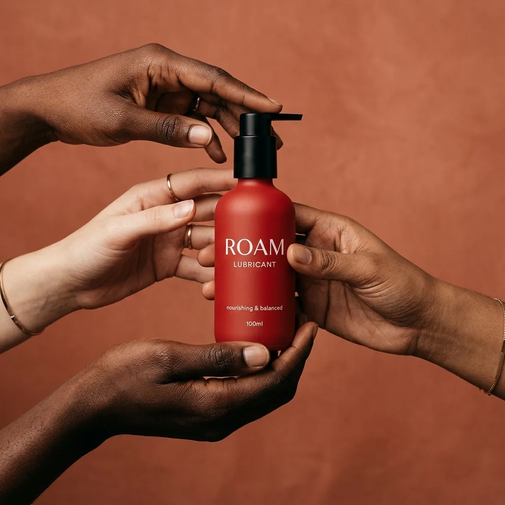

**#268 · Photography Prompt · <code>Vinano Image v2</code>**

<details>
<summary>Show prompt</summary>

```
refined minimalist product photography of a matte red pump bottle labeled ‘ROAM lubricant’, held by multiple diverse hands different skin tones, arranged elegantly around the bottle. Soft studio lighting, warm monochromatic terracotta background, smooth shadows, luxury skincare aesthetic, high-end commercial style, sharp focus, centered composition, clean and modern branding, glossy finish on bottle, subtle reflections, editorial beauty shot, 4k resolution. Aim for an editorial, design-driven look with deliberate negative space.
```

</details>

---

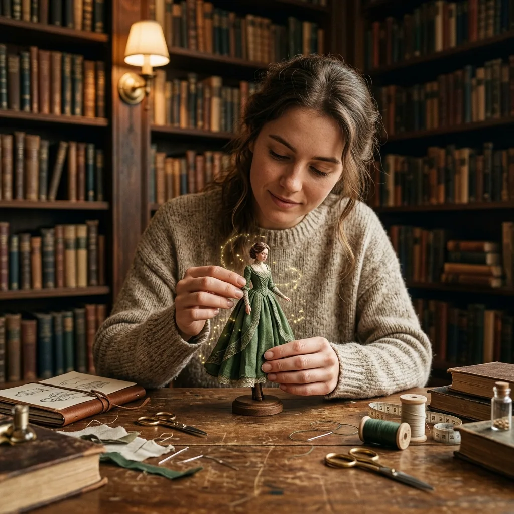

**#269 · Photography Prompt · <code>Vinano Image v2</code>**

<details>
<summary>Show prompt</summary>

```
A hyper-realistic cinematic scene of a young woman sitting at a wooden desk in a vintage library filled old books. She is delicately holding and adjusting a tiny miniature version of herself standing on the table. The miniature woman wears an elegant flowing green dress fine fabric details and subtle glowing particles around her. The larger woman looks focused and gentle, as if crafting or designing the tiny figure. Soft warm lighting from vintage wall lamps creates a cozy atmosphere, sewing tools like scissors, threads, measuring tape, and fabric pieces scattered on the desk. Shallow depth of field, ultra-detailed, 8K, realistic skin textures, soft shadows, magical realism, cinematic composition. Emphasise material texture and natural light so the final frame feels tactile and premium.
```

</details>

---

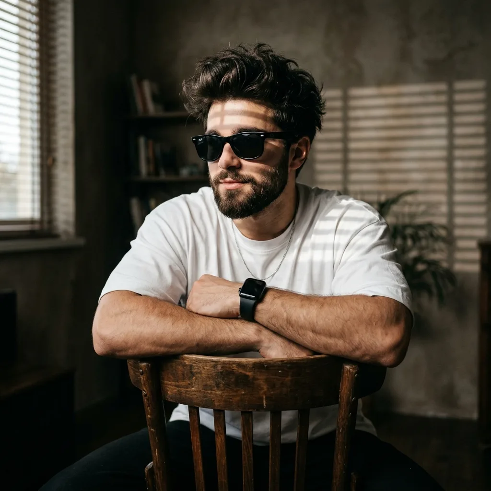

**#270 · Photography Prompt · <code>Vinano Image v2</code>**

<details>
<summary>Show prompt</summary>

```
A high-resolution, cinematic portrait of a young man messy, voluminous dark hair and a well-groomed beard. He is wearing classic black wayfarer-style sunglasses and a clean, oversized white t-shirt. The man is seated backward on a vintage dark wood chair, resting his muscular, crossed forearms comfortably along the top of the curved backrest. On his left wrist, he wears a sleek black smartwatch a rectangular face.

The scene is defined by dramatic, high-contrast lighting filtered through Venetian blinds, casting sharp, rhythmic horizontal shadow bars across his face, torso, and the textured, warm-grey plaster wall in the background. The atmosphere is moody and serene, a shallow depth of field that keeps the focus sharp on the man’s expression and the texture of his hair, while the lower portion of the chair and his black trousers softly blur into the foreground. The color palette is neutral and sophisticated, dominated by crisp whites, deep blacks, and warm earthy wood tones.

Preserve realistic proportions and depth for a confident, professional finish.
```

</details>

---

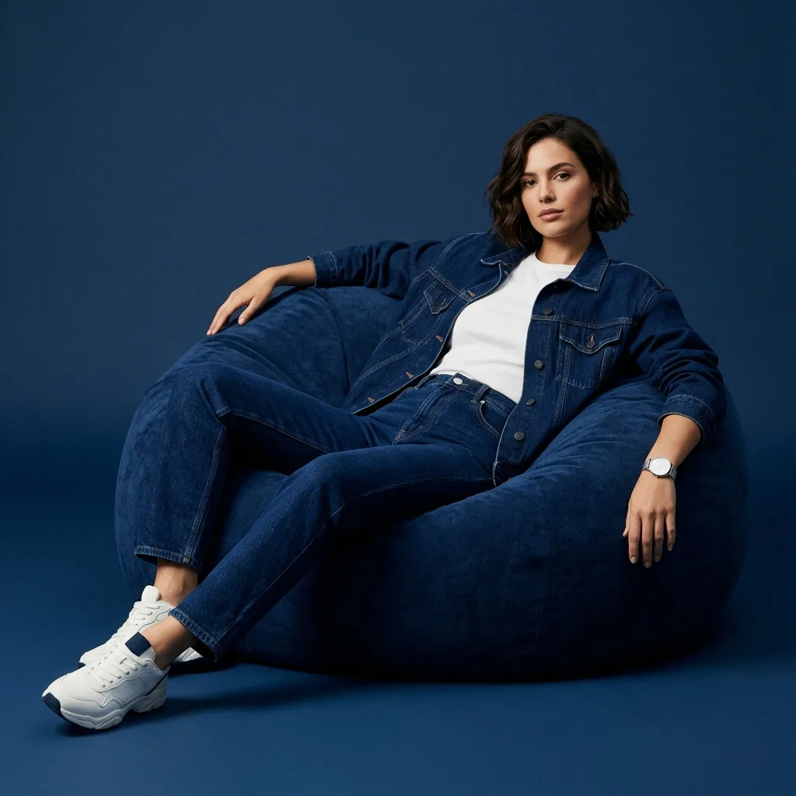

**#271 · Photography Prompt · <code>Vinano Image v2</code>**

<details>
<summary>Show prompt</summary>

```
Hyper-realistic cinematic full-body fashion photoshoot of the uploaded woman (age 26, 5'5"), exact face and hairstyle from the uploaded image, perfectly styled. Leaning back confidently on a deep navy-blue bean bag, one arm resting on the edge of the bag, legs slightly apart, projecting calm confidence and poise. Wearing a bold all-navy look: navy blue denim jacket over a fitted white T-shirt, navy blue denim jeans, chunky sneakers, and a sleek silver watch. Solid navy-blue background, professional studio lighting, sharp focus, high fashion editorial aesthetic. provide four more photos. Aim for an editorial, design-driven look with deliberate negative space.
```

</details>

---

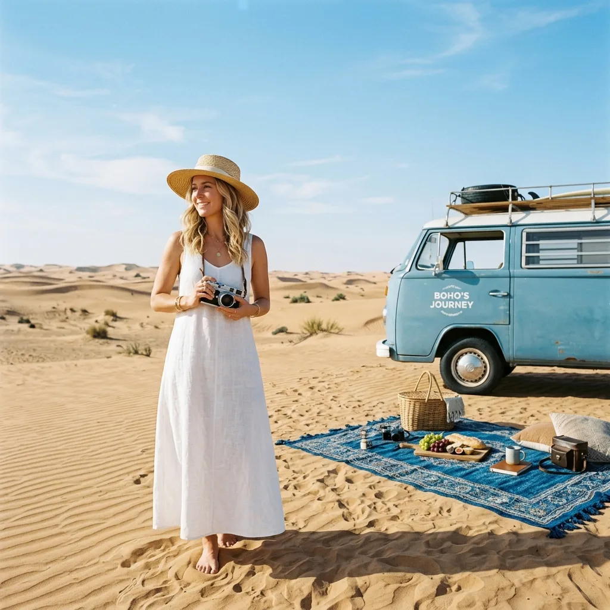

**#272 · Photography Prompt · <code>Vinano Image v2</code>**

<details>
<summary>Show prompt</summary>

```
A wide shot of a woman in an airy white linen maxi dress and a wide-brimmed straw hat, standing in a vast, sun-drenched desert. She holds a vintage camera, smiling softly. Behind her, a classic light blue camper van is parked next to a picnic spread on a blue blanket. Soft ripples in the sand and a clear blue sky create a peaceful, bohemian travel aesthetic. Render with rich micro-detail while keeping the layout uncluttered and intentional.
```

</details>

---

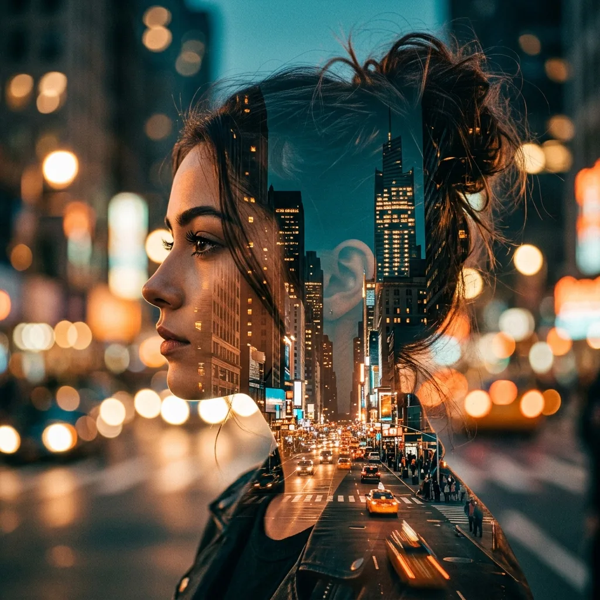

**#273 · Photography Prompt · <code>Vinano Image v2</code>**

<details>
<summary>Show prompt</summary>

```
A cinematic double exposure portrait of a young woman hollywood actress in profile, her hair in a messy bun, overlaid a busy city street scene tall buildings, warm orange and teal tones, soft bokeh lights in the background, high detail, realistic lighting, vertical composition, true-to-life photorealistic style. Maintain consistent colour harmony and crisp focus across the whole frame.
```

</details>

---

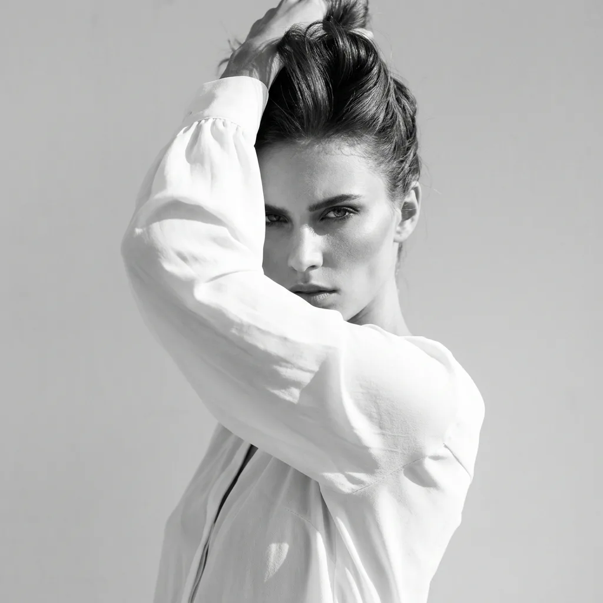

**#274 · Photography Prompt · <code>Vinano Image v2</code>**

<details>
<summary>Show prompt</summary>

```
Use the attached image of the model as facial reference and physical features. Black and white high-fashion editorial portrait of uploaded person, wearing a loose white blouse. She poses one arm raised, partially covering her face while holding her hair up, creating a dramatic and artistic composition. Her gaze is intense and captivating, directed toward the camera, exuding a strong, enigmatic aura. Background: refined minimalist plain wall sharp natural daylight casting defined shadows, adding depth and contrast. Lighting: harsh natural sunlight, high-contrast setup highlighting facial contours, sharp cheekbones, and texture of the hair and fabric. Pose: bold and expressive, arm lifted framing the face, emphasizing raw emotion and editorial style. Camera: eye-level angle, close-up framing focusing on facial expression, texture, and dramatic shadow play. Captured a Canon EOS R5 full-frame DSLR, 85mm f/1.8 lens for crisp detail, tonal depth, and fine grain. Style: high-fashion editorial in monochrome. Maintain consistent colour harmony and crisp focus across the whole frame.
```

</details>

---

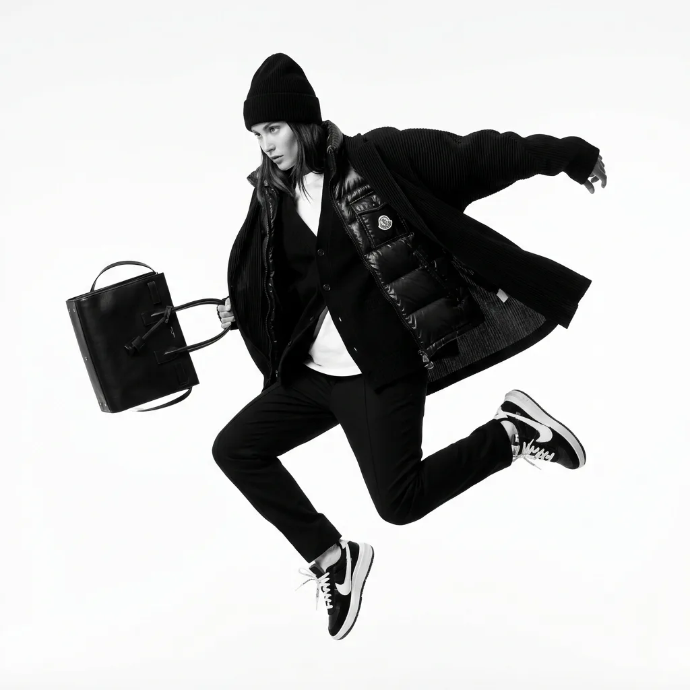

**#275 · Photography Prompt · <code>Vinano Image Pro</code>**

<details>
<summary>Show prompt</summary>

```
{
 "subject_gender_placeholder": "[CHOOSE: woman]",
 "aesthetic_lodestar": "cinematic luxury hypebeast editorial, strictly monochrome, shadowless stasis, deep rich blacks, single-frame photograph",
 "composition": {
 "frame": "refined minimalist controlled studio, clinical stark clarity, extremely dynamic camera angles capturing the action from aggressive low or high perspectives. No grid layouts, solitary subject focus.",
 "background": "pure, seamless, blown-out white infinite void, completely free of floor or wall shadows",
 "focus": "razor-sharp deep focus across the entire subject in motion"
 },
 "subject_action": {
 "pose": "impossible, gravity-defying airborne contortions and explosive mid-air leaps, frozen at the absolute peak of movement extreme bodily tension",
 "energy": "maximum athletic tension meets high-fashion structure, controlled chaos suspended in time, creating sculptural, almost unbelievable silhouettes against the void"
 },
 "wardrobe_styling": {
 "vibe": "creative street fashion x avant-garde tailoring, non-provocative, clean and impactful silhouettes varied layering",
 "garment_variations": ["Open cardigan sweaters layered over premium t-shirts",
 "Oversized knitwear and structured lounger sweaters",
 "Technical bomber jackets or varsity jackets",
 "Japanese refined minimalist silhouettes (unstructured, flowing, layered)",
 "Premium denim jackets and jeans styles",
 "Japanese Americana wear and styles",
 "Moncler puffer jackets",
 "Statement structured outerwear (as previously defined)"],
 "brands_reference": ["Supreme", "Fear of God", "Maison Margiela", "Martine Rose", "UMBRO", "Aimé Leon Dore", "RHUDE", "Maison Kitsuné", "NikeLab", "Moncler", "Issey Miyake"],
 "accessories": {
 "general": "scarves, neck bandanas, paisley bandanas hanging from pockets (used sparingly when sensible)",
 "womens_specific": "Avant-Garde style bags, Saint Laurent structured totes or crossbodies, designer baseball caps, trucker caps, premium wool beanies (applied only if subject is woman)"
 "details": "only apply head gear objects on the subject's head, nowhere else"
 },
 "key_details": "focus on singular statement outfits without excessive bulk, oversized cuts contrasting sharp tailoring, prominent branding, varied fabric weights rendered through pure texture without shadow"
 },
 "footwear_focus": {
 "models": ["Nike SB Dunk", "Off-White™ x Nike deconstructed models", "Converse Chuck 70 premium high-top", "Vans Vault Slip-On", “Adidas Samba”, “New Balance 327”, “ASICS Onitsuka Tiger Sneakers”],
 "details": "the only object on the subject's feet, highly visible and pristine, forming the anchor point of the dynamic motion"
 },
 "visual_color_treatment": {
 "base_spectrum": "pure, uncompromising black and white ultra-deep, rich black tones",
 "blend_mode": "cohesive fusion of extreme textural contrasts and shadowless spectral lighting",
 "palette_components": {
 "rich_matte_black": "pure light-absorbing wools, denim, and heavy cottons, vantablack-like density, crushing blacks for maximum depth rendered solely through surface texture",
 "high_sheen_monochrome": "polished leather, reflective technical nylon, glossy polymers catching pure white specular highlights without casting shadows",
 "monochrome_solarization": "ghostly spectral edge-lighting, inverted luminance highlights defining folds and outlines, stark, hyper-contrasted glowing edges"
 }
 },
 "lighting_dynamics": "flat, high-key, omnidirectional diffused studio lighting. Zero cast shadows on subjects, floor, or background. Form and depth are flattened, relying entirely on the stark contrast between glossy surfaces, crushed rich blacks, and the glowing solarized edge contours for definition."
}

Maintain consistent colour harmony and crisp focus across the whole frame.
```

</details>

---

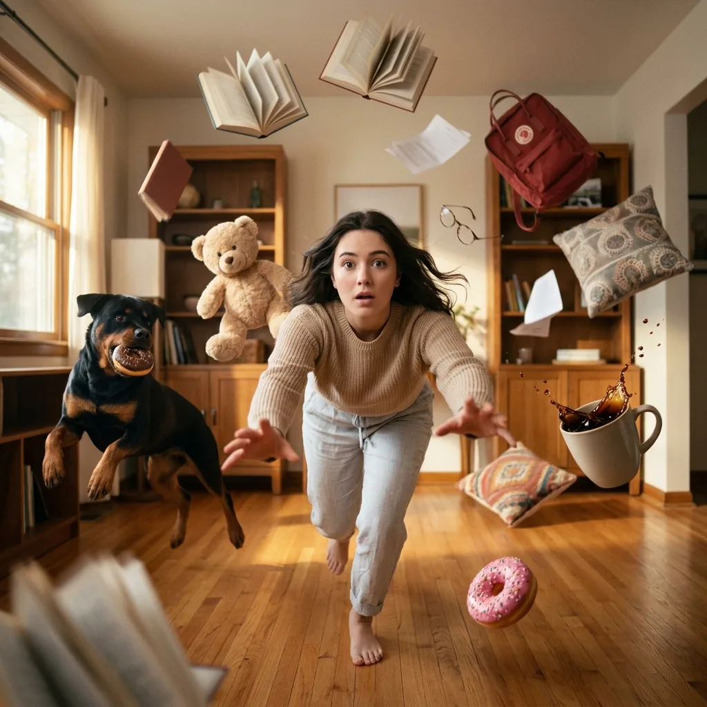

**#276 · Photography Prompt · <code>Vinano Image v2</code>**

<details>
<summary>Show prompt</summary>

```
Cinematic surreal scene of a young woman falling forward through a swirling vortex of everyday objects inside a cozy room, arms reaching toward the camera as if trying to regain balance. Around her, objects float in chaotic slow motion: an excited Rottweiler dog mid-jump holding a donut, a soft teddy bear drifting weightlessly, open books pages flipping in the air, scattered papers, a red backpack, eyeglasses spinning, pillows floating, a leather wallet, and a mug of coffee splashing dramatically liquid suspended in mid-air. A pink frosted donut tumbles near the floor while sunlight streams through a window casting soft shadows. The woman wears a casual beige sweater and light pants, barefoot, hair slightly flowing from motion. Ultra-realistic filmic, cinematic lighting, dynamic motion blur, shallow depth of field, high detail, dramatic perspective, 35mm lens, surreal storytelling atmosphere, studio-quality photography, 8K. Keep edges clean and the overall composition balanced for a polished, gallery-ready result.
```

</details>

---

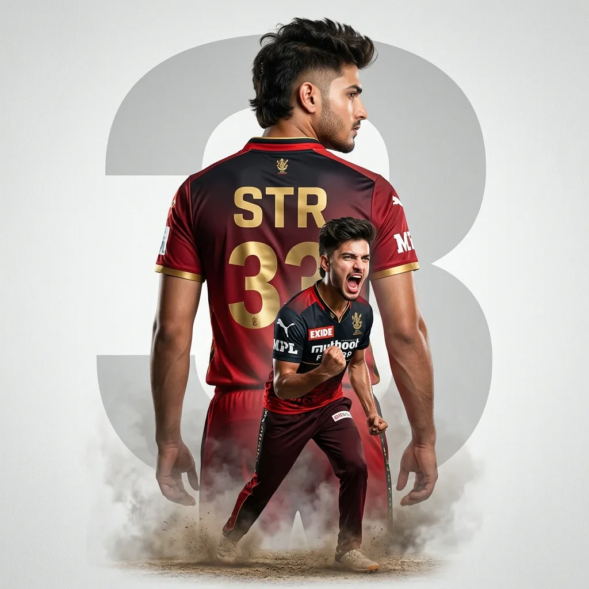

**#277 · Photography Prompt · <code>Vinano Image Pro</code>**

<details>
<summary>Show prompt</summary>

```
An ultra-realistic cinematic cricket poster featuring a young Indian male cricketer the uploaded reference face exactly (100% facial accuracy). He has a fair-whitish glass skin tone, soft red lips, sharp jawline, light stubble beard, and a voluminous slightly messy fade mullet hairstyle natural texture. The composition is a triple-layer cinematic layout on a clean, textured light-grey studio background, a large, softly embedded “77” subtly visible behind the subject. Primary dominant pose (upper background): The cricketer is shown from the back, standing tall and confident, wearing an official Chennai Super Kings (CSK) jersey in bright yellow blue accents. Bold blue typography on the jersey reads “VIJAY” the number “77” below it. His athletic physique is emphasized, shoulders squared, as he slightly turns his head over the shoulder, revealing an intense, fearless side profile. Foreground action pose (half body): A powerful celebration moment captures him mid-roar, mouth open in victory, right fist clenched and arm flexed. He wears the complete CSK match kit, including yellow-blue trousers, and ground texture. The CSK logo and sponsor details appear authentic and sharp. Sweat highlights on the skin add realism, cinematic rim lighting separating the face from the background. Atmosphere & lighting: Premium cinematic studio lighting balanced highlights and shadows enhances fabric folds, muscle definition, and facial contours. Subtle smoke and dust effects rise from the base, adding intensity without obscuring details. No blur, no distortion. Camera & quality: DSLR photography look, 85mm lens feel, shallow depth where needed, ultra-sharp focus, realistic proportions, professional color grading rich yellow, blue, and gold tones. true-to-life photorealistic, 8K resolution, vertical poster composition, IPL magazine-cover style. No cartoon look, no extra limbs, no facial alteration, no watermark.

RCB:

An ultra-realistic cinematic cricket poster featuring a young Indian male cricketer the uploaded reference face exactly (100% facial accuracy). He has a fair-whitish glass skin tone, soft red lips, sharp jawline, light stubble beard, and a voluminous slightly messy fade mullet hairstyle natural texture.
The composition is a triple-layer cinematic layout on a clean, textured light-grey studio background, a large, softly embedded “3” subtly visible behind the subject.
Primary dominant pose (upper background):
The cricketer is shown from the back, standing tall and confident, wearing an official Royal Challengers Bangalore (RCB) jersey in deep red and black gold accents. Bold golden typography on the jersey reads “STR” the number “33” below it. His athletic physique is emphasized, shoulders squared, as he slightly turns his head over the shoulder, revealing an intense, fearless side profile.
Foreground action pose (half body):
A powerful celebration moment captures him mid-roar, mouth open in victory, right fist clenched and arm flexed. He wears the complete RCB match kit, including black-red trousers, and ground texture. The RCB logo and sponsor details appear authentic and sharp.
Sweat highlights on the skin add realism, cinematic rim lighting separating the face from the background.
Atmosphere & lighting:
Premium cinematic studio lighting balanced highlights and shadows enhances fabric folds, muscle definition, and facial contours. Subtle smoke and dust effects rise from the base, adding intensity without obscuring details. No blur, no distortion.
Camera & quality:
DSLR photography look, 85mm lens feel, shallow depth where needed, ultra-sharp focus, realistic proportions, professional color grading rich reds, blacks, and gold tones.
true-to-life photorealistic, 8K resolution, vertical poster composition, IPL magazine-cover style.
No cartoon look, no extra limbs, no facial alteration, no watermark.

Emphasise material texture and natural light so the final frame feels tactile and premium.
```

</details>

---

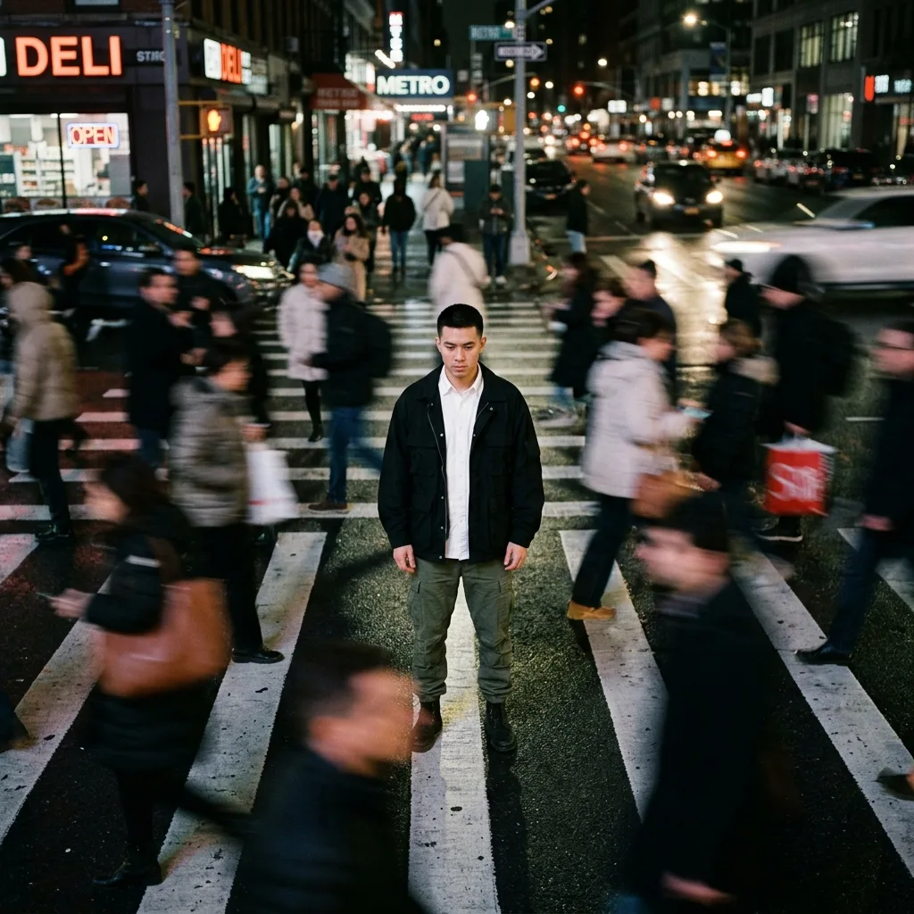

**#278 · Photography Prompt · <code>Vinano Image v2</code>**

<details>
<summary>Show prompt</summary>

```
Cinematic street photography capturing a moment in motion a crowd blur effect. Overhead portrait of me standing still on a crosswalk, wearing a white button-up shirt, black oversized jacket, and olive green cargo pants. Motion-blurred crowd rushes past. Moody city lighting, 35mm film aesthetic, shallow depth of field, sharp focus on my portrait, showcasing an artistic and timeless style. Aim for an editorial, design-driven look with deliberate negative space.
```

</details>

---

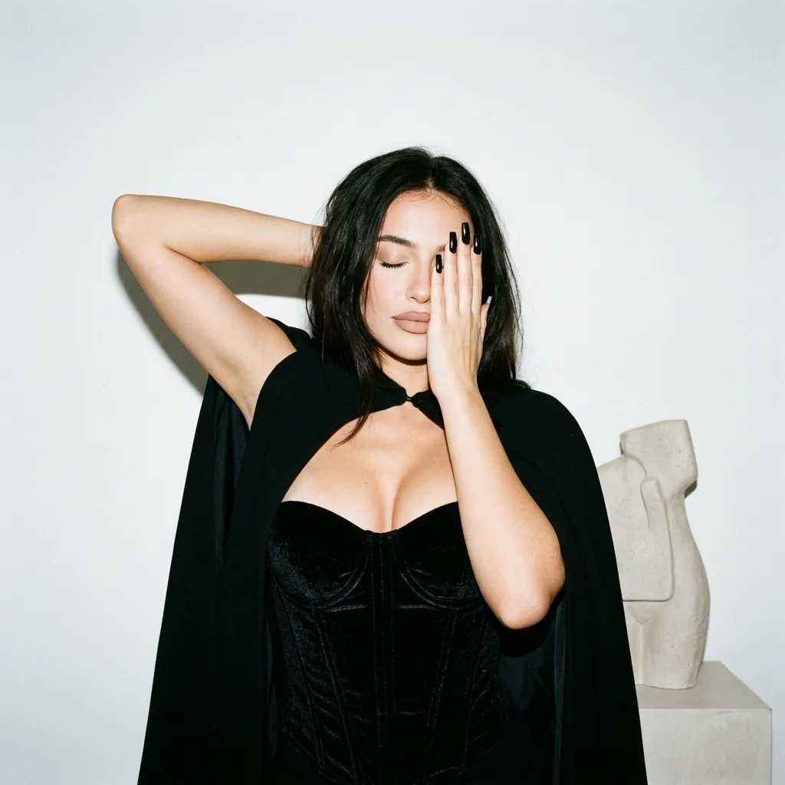

**#279 · Photography Prompt · <code>Vinano Image v2</code>**

<details>
<summary>Show prompt</summary>

```
{
 "image_style": {
 "type": "true-to-life photorealistic",
 "aesthetic": "Instagram shot",
 "effects": ["film grain",
 "direct flash"]
 },
 "composition": {
 "framing": "waist-up photograph",
 "aspect_ratio": "9:16"
 },
 "subject": {
 "description": "young woman",
 "constraint_note": "do not alter the sensitivity of the face and features",
 "pose": {
 "orientation": "facing the camera directly",
 "head": "tilted slightly to the side",
 "eyes": "closed",
 "action": "covering her face her hand, pulling her elbow away and lifting it to the side",
 "mood": ["elegant",
 "pensive",
 "playful"]
 },
 "appearance": {
 "attire": ["black velvet corset",
 "expensive black cape"],
 "hair": "loose",
 "makeup": {
 "style": "nude",
 "lipstick": "matte nude"
 },
 "details": ["décolletage highlighted",
 "long, square black nails"]
 }
 },
 "setting": {
 "background": "white wall",
 "foreground_elements": "art object placed in front of the wall"
 }
}

Maintain consistent colour harmony and crisp focus across the whole frame.
```

</details>

---

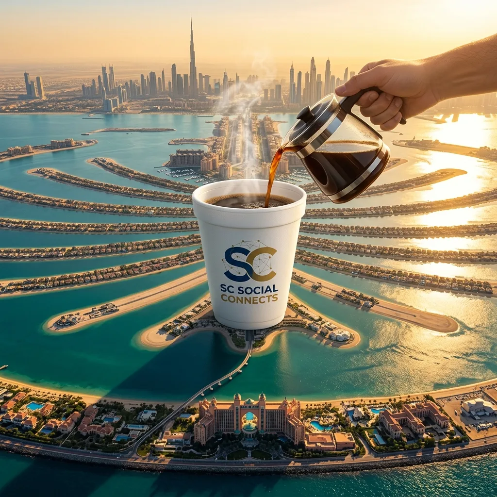

**#280 · Photography Prompt · <code>Vinano Image v2</code>**

<details>
<summary>Show prompt</summary>

```
An aerial photograph captures a surreal scene where a giant white foam cup, branded the 'SC Social Connects' logo from image_8.png, is placed on the central trunk of the Palm Jumeirah in Dubai. A hand holds a glass and metal coffee pot, pouring steaming coffee into the oversized cup. The Palm's fronds, marina, and Dubai's skyline are bathed in warm, golden sunset light, long shadows and reflections on the water. Maintain consistent colour harmony and crisp focus across the whole frame.
```

</details>

---

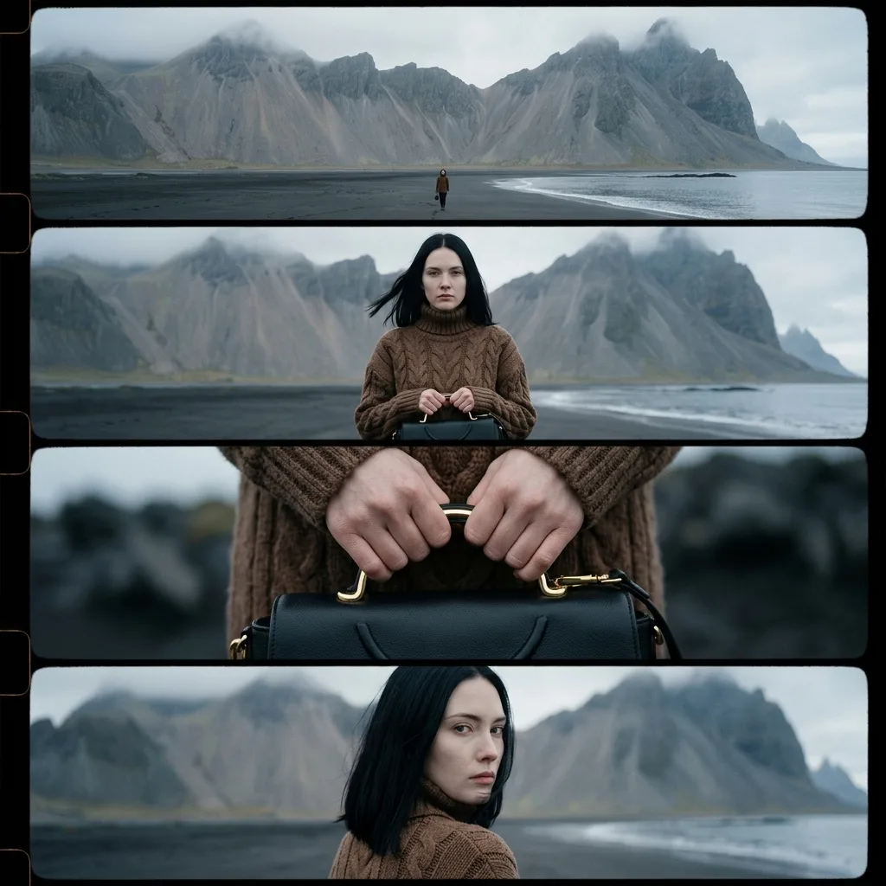

**#281 · Photography Prompt · <code>Vinano Image v2</code>**

<details>
<summary>Show prompt</summary>

```
A vertical cinematic editorial image composed of four horizontal film frames stacked vertically within a portrait (4:5) format. Cold Nordic coastline black sand beach, calm ocean water, and massive jagged gray mountains in the background covered mist and low clouds. Overcast sky, soft diffused daylight, desaturated cool tones.

Frame 1 (top):
Wide landscape shot of a lone woman walking along the shoreline, very small in frame, mountains dominating the scene, strong negative space, flat horizon.
Frame 2:
Medium frontal shot of the same woman standing still, centered. Pale skin, straight black shoulder-length hair moving slightly in wind, neutral serious expression. Wearing a brown cable-knit turtleneck sweater dress. Holding a black leather handbag.
Frame 3:
Extreme close-up of both hands gripping a structured black leather handbag a curved gold metal handle. Sleeves visible, background heavily blurred.
Frame 4 (bottom):
Over-the-shoulder portrait as she turns her head back toward the camera, sharp eyes, calm intense expression, mountains softly blurred behind.

Ultra-realistic photography, cinematic film still, editorial fashion look, natural skin texture, no glam lighting, shallow depth of field, muted Nordic color grading, realistic proportions, 35mm lens feel, cold atmosphere.

Keep edges clean and the overall composition balanced for a polished, gallery-ready result.
```

</details>

---

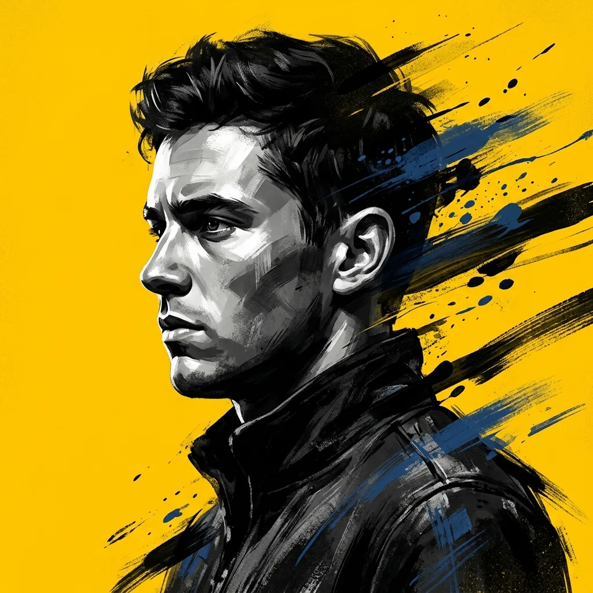

**#282 · Photography Prompt · <code>Vinano Image Pro</code>**

<details>
<summary>Show prompt</summary>

```
A bold, high contrast digital portrait of a young man in side profile, facing left. The style is expressive and painterly, dynamic brush strokes and paint splashes flowing from the head and shoulders, creating a sense of motion and energy. Strong black shadows define the face, sharp highlights for depth and drama. The background is a solid vibrant yellow, minimal and striking. Accents of deep blue and black paint strokes wrap around the subject, giving a modern street art and sports poster feel. filmic, cinematic lighting, high detail, gritty texture, confident and focused expression, contemporary illustration style, ultra sharp, poster quality. Maintain consistent colour harmony and crisp focus across the whole frame.
```

</details>

---

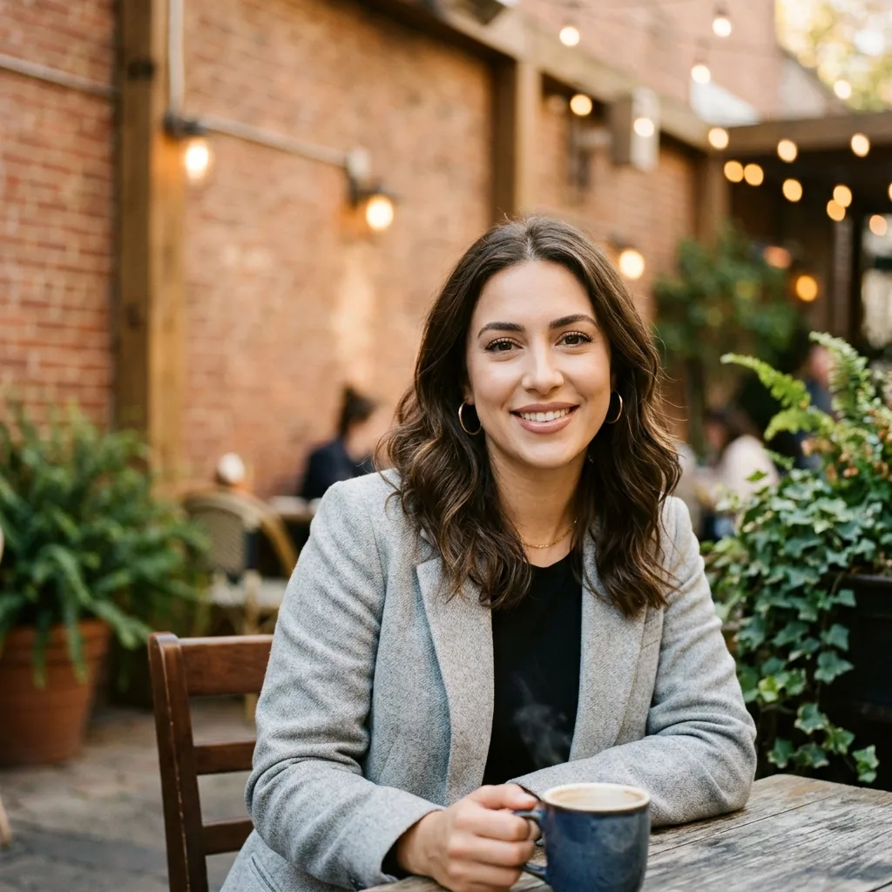

**#283 · Photography Prompt · <code>Vinano Image v2</code>**

<details>
<summary>Show prompt</summary>

```
{ "image_type": "photograph", "genre": "casual lifestyle portrait", "orientation": "portrait", "composition": { "framing": "medium close-up", "camera_angle": "eye-level", "subject_position": "centered slight right bias", "crop": "head and upper torso visible", "depth_of_field": "shallow, softly blurred background", "perspective": "natural human-eye perspective" }, "subject": { "count": 1, "gender_presentation": "female-presenting", "age_range": "young adult", "pose": "seated, relaxed posture", "expression": "soft smile, calm and approachable", "gaze": "directly at camera", "skin_tone": "light to medium warm complexion", "facial_features": { "face_shape": "oval", "eyes": "large, dark-colored", "eyebrows": "full, well-defined", "lips": "medium-full subtle gloss", "makeup": "natural glam; defined eyelashes, eyeliner, even complexion, soft blush, neutral lip color" }, "hair": { "color": "dark brown", "length": "long", "texture": "wavy", "part": "slightly off-center", "styling": "loose, natural waves" }, "accessories": ["medium-sized gold hoop earrings"], "clothing": { "outerwear": "light gray coat or blazer", "innerwear": "black top", "style": "casual-chic" } }, "environment": { "setting": "outdoor café or courtyard", "background_elements": ["brick wall", "wooden beams", "warm wall-mounted lights", "potted green plants", "outdoor seating"], "location_type": "urban, cozy, semi-enclosed outdoor space", "time_of_day": "late afternoon or early evening" }, "lighting": { "type": "natural ambient warm artificial accents", "direction": "front and slightly above", "quality": "soft, diffused", "shadows": "minimal, gentle facial contouring", "color_temperature": "warm-neutral" }, "color_palette": { "dominant_colors": ["warm browns", "brick red", "gray", "black", "natural green"], "overall_tone": "warm and inviting", "contrast": "moderate" }, "technical_details": { "camera_style": "smartphone or mirrorless camera", "lens_effect": "background blur resembling wide aperture", "sharpness": "high on subject, soft background", "noise": "minimal", "resolution": "high" }, "artistic_style": { "mood": "intimate, relaxed, friendly", "aesthetic": "modern lifestyle photography", "post_processing": "light color correction, subtle skin smoothing, enhanced warmth" }, "props": ["cup held near bottom frame (partially visible)"], "background_blur": { "type": "bokeh", "intensity": "medium" } } Aim for an editorial, design-driven look with deliberate negative space.
```

</details>

---

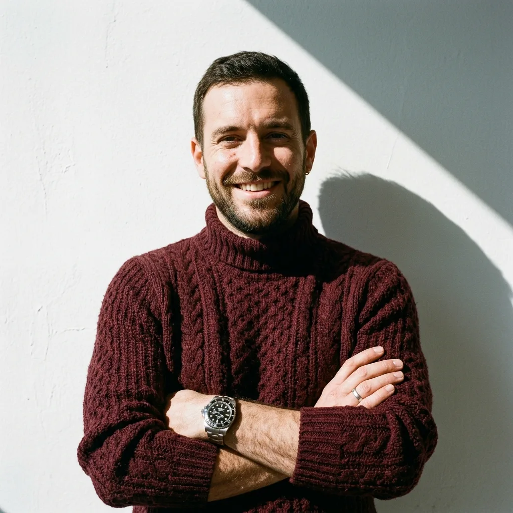

**#284 · Photography Prompt · <code>Vinano Image v2</code>**

<details>
<summary>Show prompt</summary>

```
A man smiling and posing his arms crossed, wearing a maroon knitted high-collar sweater, a high-end Rolex watch visible on his wrist. The background is a clean white wall harsh sunlight creating a sharp shadow diagonal on the wall, studio portrait. Emphasise material texture and natural light so the final frame feels tactile and premium.
```

</details>

---

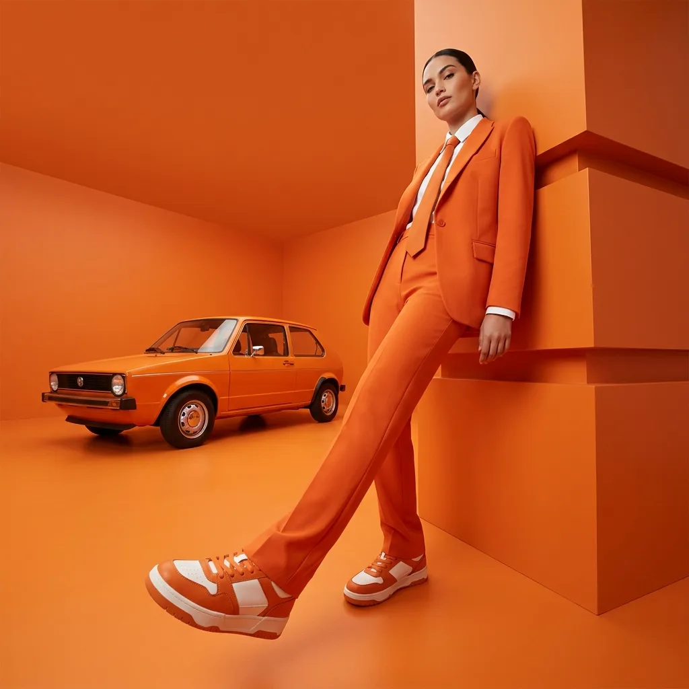

**#285 · Photography Prompt · <code>Vinano Image v2</code>**

<details>
<summary>Show prompt</summary>

```
High-fashion editorial photography of a woman the uploaded face as reference, leaning casually against a geometric orange wall her right leg extended forward. She wears a tailored bright orange suit, matching tie, crisp white shirt, and chunky orange sneakers. Her styling is sleek and confident, a modern, polished look. The environment is a surreal, refined minimalist room seamless orange surfaces, featuring a vintage orange hatchback parked mid-ground left. Captured from a low-angle a 24mm wide-angle lens for strong forced perspective, emphasizing the foreground sneaker a deep depth of field. Soft, diffused studio lighting casts clean shadows, enhancing the vibrant, highly saturated monochromatic orange palette sharp white accents, contrasting matte suit fabrics against smooth leather shoes and the glossy finish of the car. Maintain consistent colour harmony and crisp focus across the whole frame.
```

</details>

---

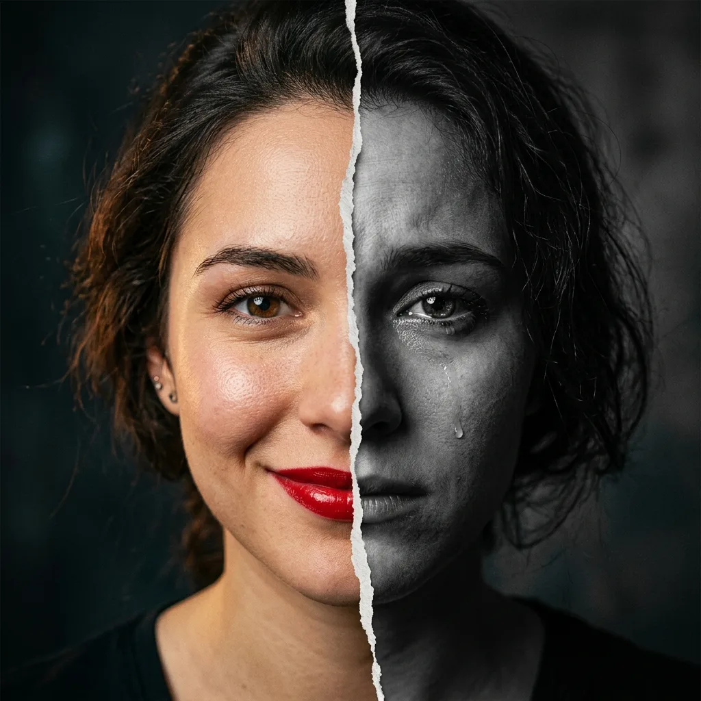

**#286 · Photography Prompt · <code>Vinano Image v2</code>**

<details>
<summary>Show prompt</summary>

```
​A high-resolution conceptual portrait of a woman’s face vertically split down the middle by a jagged, torn paper edge. The left side is in vibrant color, featuring a warm smile, glowing skin, and bold red lipstick. The right side is in dramatic black and white, showing a somber expression a single tear rolling down her cheek. Dark, moody background, filmic, cinematic lighting, sharp focus on the eyes, hyper-realistic textures. Maintain consistent colour harmony and crisp focus across the whole frame.
```

</details>

---

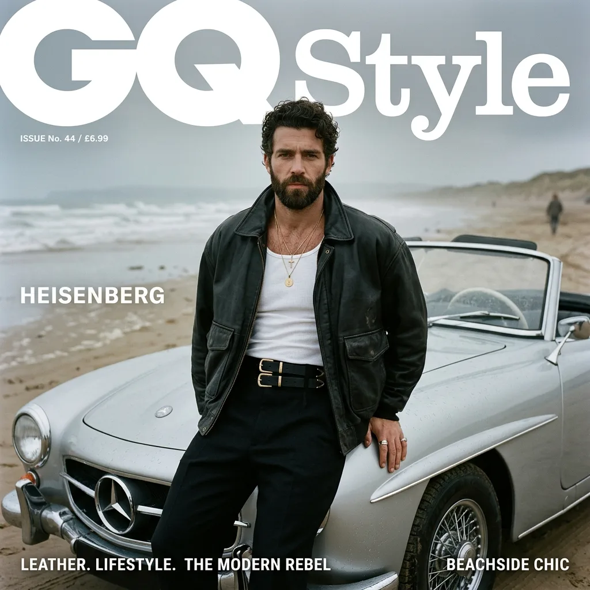

**#287 · Photography Prompt · <code>Vinano Image Pro</code>**

<details>
<summary>Show prompt</summary>

```
A cinematic fashion editorial portrait of male model for a GQ Style magazine cover. He is leaning against the hood of a vintage 1960s silver convertible on a hazy, overcast beach.

Subject & Pose: A male model a well-groomed dark beard and messy, curly dark hair. He is looking directly at the camera an intense, neutral expression. He is wearing a heavy, oversized black leather bomber jacket large utility pockets, worn open over a white ribbed tank top and high-waisted black trousers double-buckle belt detailing. Two thin gold necklaces small pendants hang mid-chest.

Setting & Composition: Outdoor beach setting a very shallow depth of field. The background shows a desaturated, sandy shore and a pale, misty sky a soft horizon line. The car is a polished metallic silver, reflecting the flat light of the sky. The camera angle is at eye-level, framing the subject from the waist up.

Lighting & Color: Soft, diffused daylight a moody, cinematic color grade. The palette is dominated by muted earth tones, blacks, and silvers. High-end film grain is visible throughout.

Typography (Overlay): Large, bold white "GQ Style" logo across the top in a classic serif font. Smaller white sans-serif text on the mid-left reads "HEISENBERG"

Preserve realistic proportions and depth for a confident, professional finish.
```

</details>

---


**#288 · Photography Prompt · <code>Vinano Image Pro</code>**

<details>
<summary>Show prompt</summary>

```
{
 "style": "cinematic realism, high-end editorial photography",
 "subject": {
 "type": "woman",
 "age_range": "mid-20s",
 "pose": "seated sideways on a bench, holding an open book, head turned slightly off-camera",
 "expression": "calm, reflective, distant gaze",
 "wardrobe": "deep black velvet wrap dress, soft texture, natural styling",
 "hair": "long, dark, loose waves, natural volume",
 "makeup": "minimal, realistic skin texture, no plastic smoothing"
 },
 "environment": {
 "location": "sunlit library loft",
 "details": "tall glass windows, wooden shelves filled books, warm interior tones, dust particles visible in air",
 "time_of_day": "golden hour",
 "atmosphere": "quiet, intimate, intellectual"
 },
 "lighting": {
 "type": "strong golden hour backlight",
 "direction": "side-back window light",
 "effects": "natural lens flare, light streaks across frame, soft bloom on highlights, volumetric rays",
 "contrast": "medium-high warm highlights and soft shadow falloff"
 },
 "camera": {
 "shot_type": "medium portrait",
 "angle": "slightly low eye-level",
 "lens": "85mm full-frame",
 "aperture": "f1.8",
 "depth_of_field": "shallow, subject sharp, background creamy blur",
 "focus": "eyes and face plane"
 },
 "color_grading": {
 "palette": "warm amber and honey tones soft neutral shadows",
 "look": "film-like, subtle grain, cinematic dynamic range"
 },
 "composition": {
 "framing": "rule of thirds, subject right-weighted",
 "foreground": "soft blurred flare and book edge",
 "background": "window grid lines and shelves as leading lines",
 "motion": "still subject, drifting light particles"
 },
 "quality": {
 "resolution": "8k",
 "texture": "natural skin detail, realistic fabric texture",
 "rendering": "true-to-life photorealistic, no over-sharpening, no CGI gloss"
 }
}

Maintain consistent colour harmony and crisp focus across the whole frame.
```

</details>

---

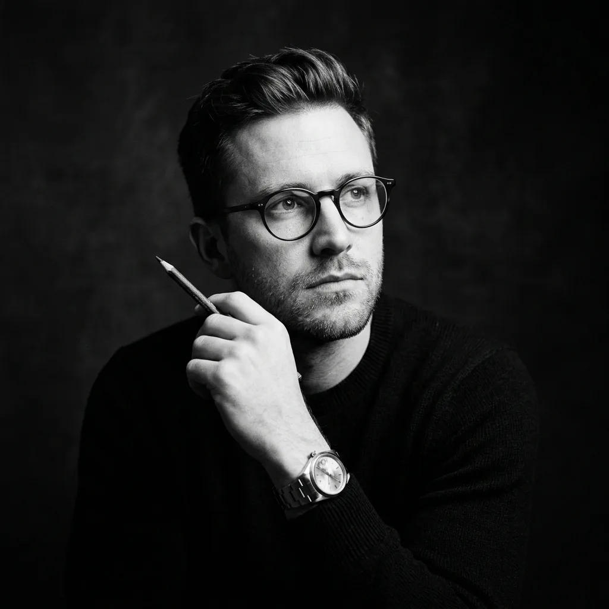

**#289 · Photography Prompt · <code>Vinano Image v2</code>**

<details>
<summary>Show prompt</summary>

```
A dramatic black and white studio portrait of a thoughtful man short styled hair, light stubble beard, and round eyeglasses, wearing a simple black sweater and a metal wristwatch, holding a pencil near his face, looking slightly upward and to the side, soft Rembrandt lighting from the left, deep shadows, high contrast, dark background, shallow depth of field, cinematic mood, ultra detailed, sharp focus, 85mm lens, f/1.8, professional photography, editorial portrait, minimalistic, moody, fine art photography Preserve realistic proportions and depth for a confident, professional finish.
```

</details>

---

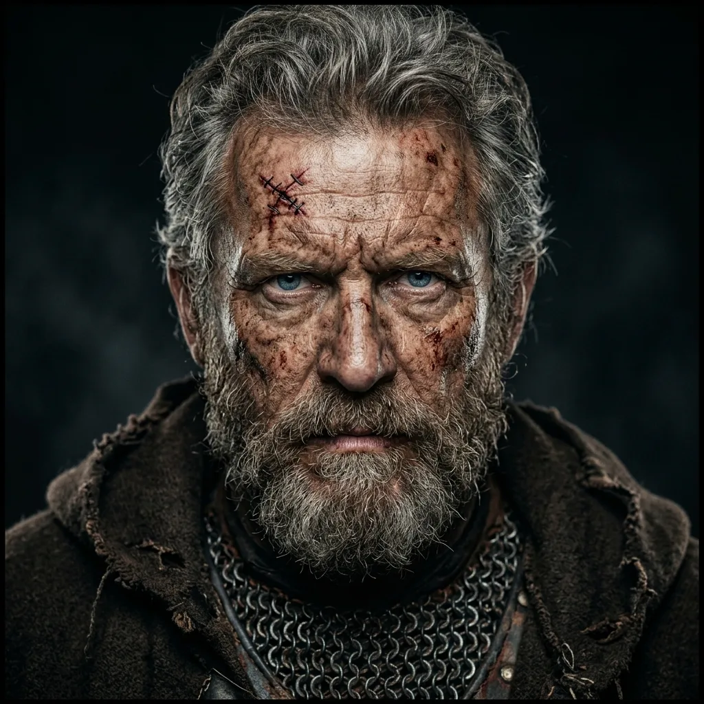

**#290 · Photography Prompt · <code>Vinano Image Pro</code>**

<details>
<summary>Show prompt</summary>

```
A hyper-realistic, cinematic close-up portrait of a battle-hardened, elderly medieval warrior, facing slightly downward but locking eyes the camera through piercing, cold steel-blue eyes full of intensity and defiance. His weathered, deeply wrinkled, sun-damaged skin shows countless scars, cuts, and dried blood stains, including a fresh stitched wound in an X shape on his forehead. His thick, unruly, salt-and-pepper beard and mustache frame his square, rugged jawline; his short, coarse grey hair is matted sweat and dirt. Every pore, wrinkle, and skin imperfection is rendered extreme detail. His nose is strong and slightly crooked, ears scarred and weathered from countless battles. His expression is stern, menacing, full of wisdom and pain, furrowed brows and tightly compressed lips. His body is wrapped in a distressed, heavy brown wool cloak frayed edges, partially covering dark medieval chainmail armor metallic textures

reflecting subtle highlights. The background is dark and moody, pure black a soft atmospheric haze to isolate the subject. Cinematic studio

lighting: single soft key light from the upper camera-left casting dramatic shadows across the face, subtle fill light from below to slightly illuminate the lower facial structure, creating extreme contrast and depth. Slight rim light touches the shoulders and beard edges for separation. Shot a Canon EOS R5 + RF 85mm f/1.2 lens at f/1.2 for ultra-shallow depth of field, sharp razor focus only on the eyes, soft fall-off on beard and shoulders. ISO 100, shutter speed 1/250s.

Color palette: desaturated earth tones, deep browns, muted greys, blood reds, steel blacks. Cinematic color grading: teal and orange tones balanced for dramatic mood, heavy filmic shadows, subtle fine-grain texture for realism. The image feels raw, emotional, like a poster frame from an epic dark fantasy film. --ar 3:4 --v 6.1 --style raw-quality 2 --stylize 50

Keep edges clean and the overall composition balanced for a polished, gallery-ready result.
```

</details>

---


**#291 · Photography Prompt · <code>Vinano Image Pro</code>**

<details>
<summary>Show prompt</summary>

```
Ultra-realistic cinematic football poster elite Premier League key featuring me intense competitive energy, a dramatic dual-composition layout where a large ultra-detailed hero close-up of the player's face appears in
the background mouth open in a powerful shout, veins slightly visible,
sweat on skin, realistic pores and sharp facial definition, keare slightly turned
and syres focused forward aggressive determination, while in the
foreground the same player appears full body in dynamic football action
such as striking the ball, sprinting or preparing a pass, athletic posture,
natural movement, realistic muscle tension and subtle motion blur on the limbs,
both portraits matching perfectly in identity, face and proportions. The player's
uniComi must be of manchester united, respecting the exact style palette, thop-
edities, elements and posture hyper-realistic football kit texture.

Aim for an editorial, design-driven look with deliberate negative space.
```

</details>

---

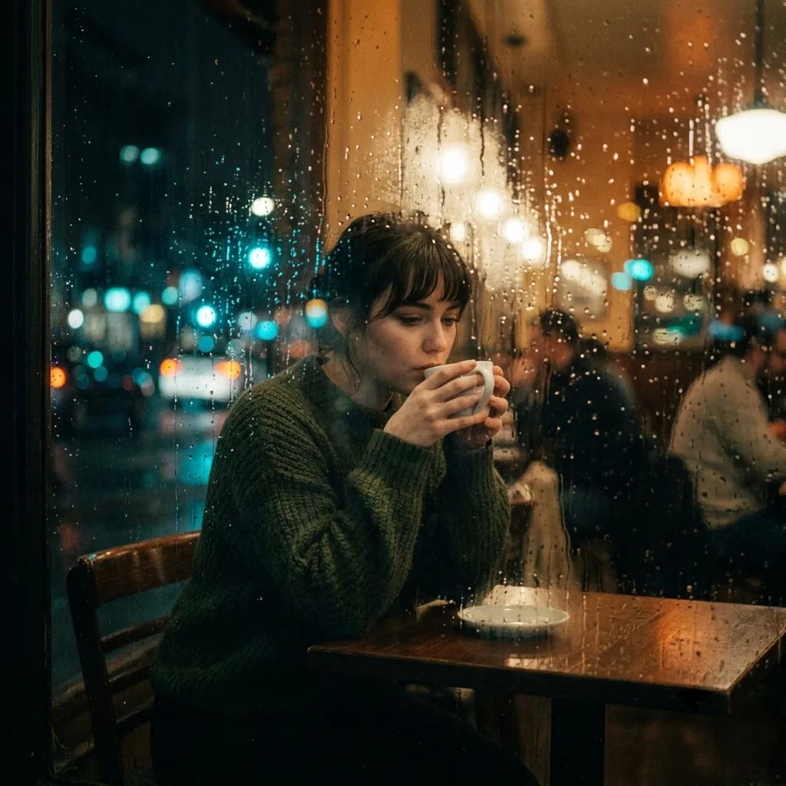

**#292 · Photography Prompt · <code>Vinano Image v2</code>**

<details>
<summary>Show prompt</summary>

```
A cinematic, moody photograph of a young woman sitting inside a café at night, seen through a rain-covered window. Raindrops and condensation blur the glass, creating a dreamy, nostalgic atmosphere. She has soft features, dark hair bangs, and is holding a small white ceramic mug close to her face, sipping a warm drink. Warm interior light contrasts cool teal and blue city lights outside. Shallow depth of field, soft focus, film grain, muted colors, melancholic mood, intimate composition, reflective glass, bokeh lights in the background, realistic photography, 35mm film look, low light, cinematic color grading. Keep edges clean and the overall composition balanced for a polished, gallery-ready result.
```

</details>

---

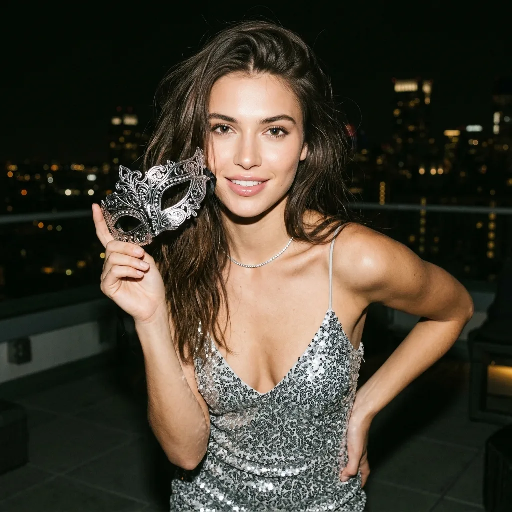

**#293 · Photography Prompt · <code>Vinano Image v2</code>**

<details>
<summary>Show prompt</summary>

```
{
 "prompt_configuration": {
 "type": "Ultra true-to-life photorealistic Editorial Portrait",
 "aspect_ratio": "3:4",
 "style_model": "Raw Flash Photography"
 },
 "prompt_structure": {
 "subject_description": {
 "identity": "Exceptionally beautiful young woman, early 20s, magnetic screen presence, effortless confidence.",
 "hair": "Long, thick dark brown hair soft volume, slightly tousled, framing the face and falling forward over both shoulders.",
 "face": "Striking symmetrical face, large expressive eyes intense eye contact, relaxed brows, soft glossy lips slightly parted, natural confident smile.",
 "pose": "Standing very close to the camera a subtle forward lean from the waist. Shoulders gently rolled back and chest naturally lifted. Chin slightly lowered while eyes look straight into the lens for strong intimacy. Right hand raised near cheek level, clearly holding an ornate Venetian masquerade mask angled outward and fully visible. Left hand resting at the hip to accentuate curves."
 },
 "attire_and_accessories": {
 "outfit": "Silver sequin dress thin straps and a deep, elegant neckline that naturally frames cleavage without exaggeration. Fabric catches flash light intense sparkle.",
 "accessories": ["Ornate silver-and-black Venetian masquerade mask detailed filigree, held in the right hand.",
 "Minimal diamond necklace sitting just above the neckline."]
 },
 "environment_and_atmosphere": {
 "setting": "Luxury rooftop or balcony at night.",
 "background": "Very dark, softly blurred city lights no distractions.",
 "lighting": "Direct flash placed slightly above eye level, sculpting the eyes, cheekbones, collarbones, neckline, and mask crisp highlights and clean shadows."
 },
 "technical_specifications": {
 "image_quality": "8K UHD, ultra-true-to-life photorealistic, raw fashion photography.",
 "camera_style": "35mm editorial lens, paparazzi flash aesthetic, cinematic realism.",
 "focus": "Tack-sharp focus on eyes and mask, shallow depth of field.",
 "texture": "Natural skin texture realistic pores, high-detail sequin reflections, sharply defined mask details, natural hair strands."
 }
 }
}

Keep edges clean and the overall composition balanced for a polished, gallery-ready result.
```

</details>

---

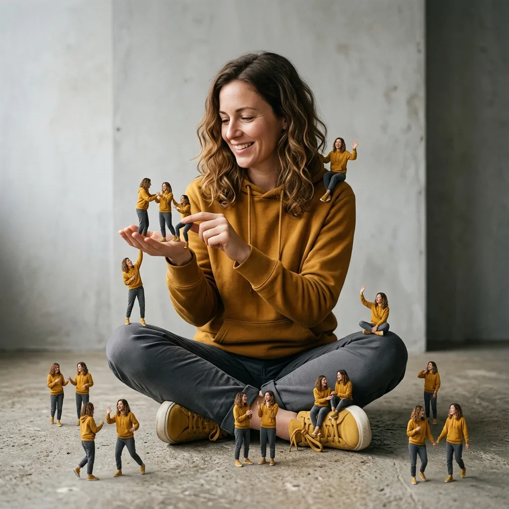

**#294 · Photography Prompt · <code>Vinano Image v2</code>**

<details>
<summary>Show prompt</summary>

```
A creative surreal image of a woman sitting on the ground, wearing a dark yellow hoodie, gray pants, and yellow shoes, surrounded by several miniature versions of himself.

Multiple smaller versions stand on his hands, shoulders, and around him on the ground, interacting playfully the larger version.

The background is a clean, simple light gray to dark gray tone.

The lighting is soft and cinematic, realistic shadows and depth of field.

Emphasise material texture and natural light so the final frame feels tactile and premium.
```

</details>

---

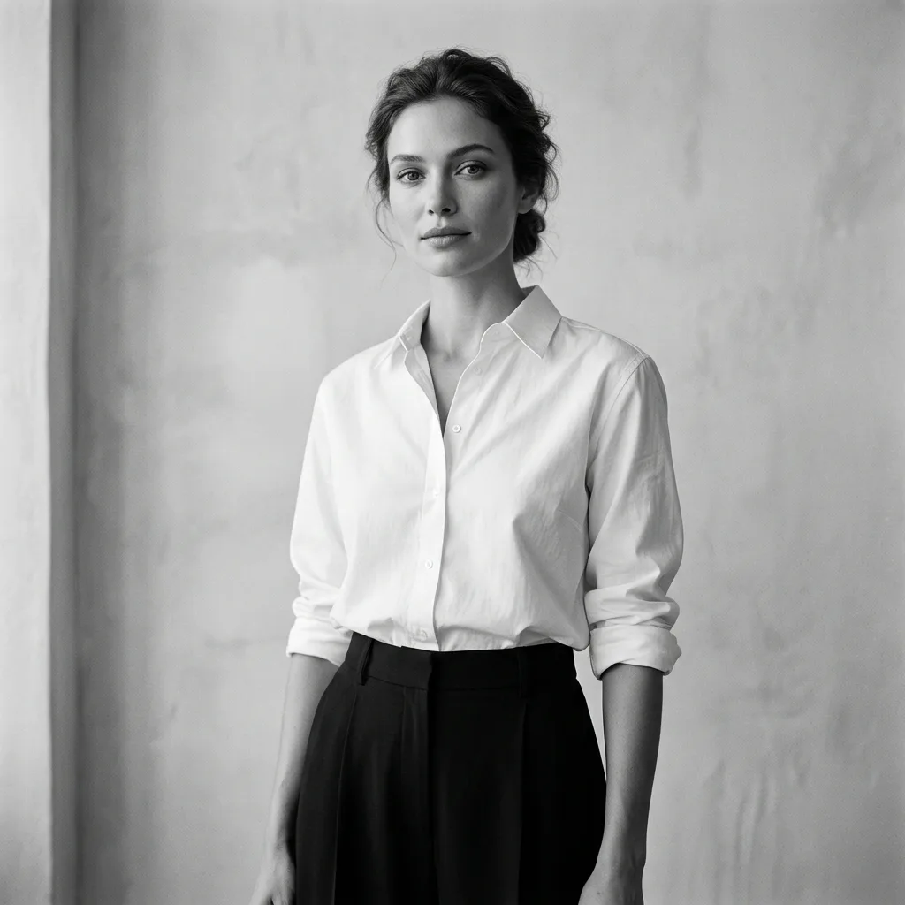

**#295 · Photography Prompt · <code>Vinano Image Pro</code>**

<details>
<summary>Show prompt</summary>

```
{
 "prompt": "Use the uploaded reference image STRICTLY to preserve the same woman’s face, identity, facial structure, proportions, and natural expression 100% accuracy. No facial alteration, beautification, or identity change.\n\nCreate an ultra-realistic black-and-white soft editorial fashion portrait of an elegant woman in a refined minimalist setting. The composition feels intimate, calm, and timeless, inspired by classic Vogue and Harper’s Bazaar monochrome editorials.\n\nPose & Expression:\nShe stands or leans gently against a neutral textured wall, body slightly angled. Posture is relaxed yet poised. Her expression is serene, introspective, and confident — soft eyes, relaxed lips, no exaggerated emotion. She may gaze slightly away from the camera or directly into the lens quiet intensity.\n\nOutfit & Styling:\nShe wears a refined, minimal outfit — a softly tailored white or ivory shirt/blouse clean lines, paired elegant neutral trousers or a flowing skirt. Fabric textures remain visible and natural, emphasizing realism. No logos, no loud fashion statements — pure quiet luxury.\n\nHair & Makeup:\nHair is styled naturally — loose soft waves, a low bun, or a simple pulled-back look realistic texture. Makeup is minimal editorial: natural skin, subtle highlights, light contour, soft lashes, and neutral lips. No glamour, no heavy styling.\n\nLighting & Mood:\nSoft directional lighting creates gentle highlights and smooth shadows across the face and clothing. Contrast is controlled and elegant, preserving fine skin texture and fabric detail. Lighting feels organic, editorial, and emotionally calm.\n\nBlack & White Treatment:\nClassic monochrome grading rich blacks, soft whites, and smooth mid-tones. Film-inspired tonal range subtle grain for authenticity. No harsh contrast, no crushed shadows.\n\nVisual Style:\nHigh-end fashion editorial photography, timeless black-and-white aesthetic, understated luxury, emotional softness, and artistic restraint.\n\nCamera & Quality:\nProfessional editorial photography, shallow depth of field, cinematic framing, ultra-realistic 8K resolution, sharp subject focus soft background separation.\n\nOverall Feel:\nQuiet confidence, feminine strength, timeless elegance — a refined black-and-white editorial portrait.",

 "style": "black-and-white soft editorial, cinematic realism",
 "lighting": "soft directional light, gentle shadows",
 "color_grade": "classic monochrome, film-inspired tones",
 "background": "minimal neutral textured wall",
 "quality": "ultra-realistic, 8K, editorial detail",
 "camera": "professional fashion photography, shallow depth of field",
 "mood": "calm, timeless, elegant, introspective"
}

Maintain consistent colour harmony and crisp focus across the whole frame.
```

</details>

---


**#296 · Photography Prompt · <code>Vinano Image v2</code>**

<details>
<summary>Show prompt</summary>

```
ROLE & AESTHETIC:
You are a world-class editorial portrait photographer specializing in dramatic, colorful studio lighting. Your task is to create a powerful, dynamic portrait a “heroic” feel.
IDENTITY ANCHOR (CRITICAL STRICT CONSTRAINT):
Source: Use the person from the ATTACHED REFERENCE PHOTO.
Preservation: You must keep their exact facial features, skin tone, hairstyle, and natural likeness perfectly unchanged.
Universal Application: Apply the lighting and angle to the subject regardless of gender.
WARDROBE & STYLING:
Attire: A premium Black Pique Polo Shirt
Texture: Visible cotton pique mesh texture
Fit: Fitted and sharp
Color: Deep matte black (to contrast the bright background)
Expression: Serious, intense, focused. The subject is looking off-camera into the space above, not directly at the lens.
SCENE & COMPOSITION:
Background: A vibrant, solid orange-red backdrop. It should feature smooth, intense color gradients without any patterns, creating a “hot” atmosphere.
Camera Angle (CRITICAL): Low-angle shot (looking up at the subject). This perspective should make the subject look powerful and dominant.
Framing: Medium close-up (focus on face and shoulders).
LIGHTING (DRAMATIC & COLORFUL):
Palette: Dominated by vibrant orange and deep red hues.
Key Light: Strong, directional lighting that casts deep, dramatic shadows on the face (chiaroscuro effect), emphasizing facial structure.
Rim Light: A strong, dramatic edge light (or color cast) that separates the subject’s shoulders and head from the intensely lit background.
Mood: Mysterious, intense, high-contrast studio aesthetic.
TECHNICAL QUALITY:
Style: true-to-life photorealistic, highly detailed.
Texture: Sharp focus on the face, contrasting the smooth gradients of the background.
Skin: Retain natural pores and texture.

Render with rich micro-detail while keeping the layout uncluttered and intentional.
```

</details>

---

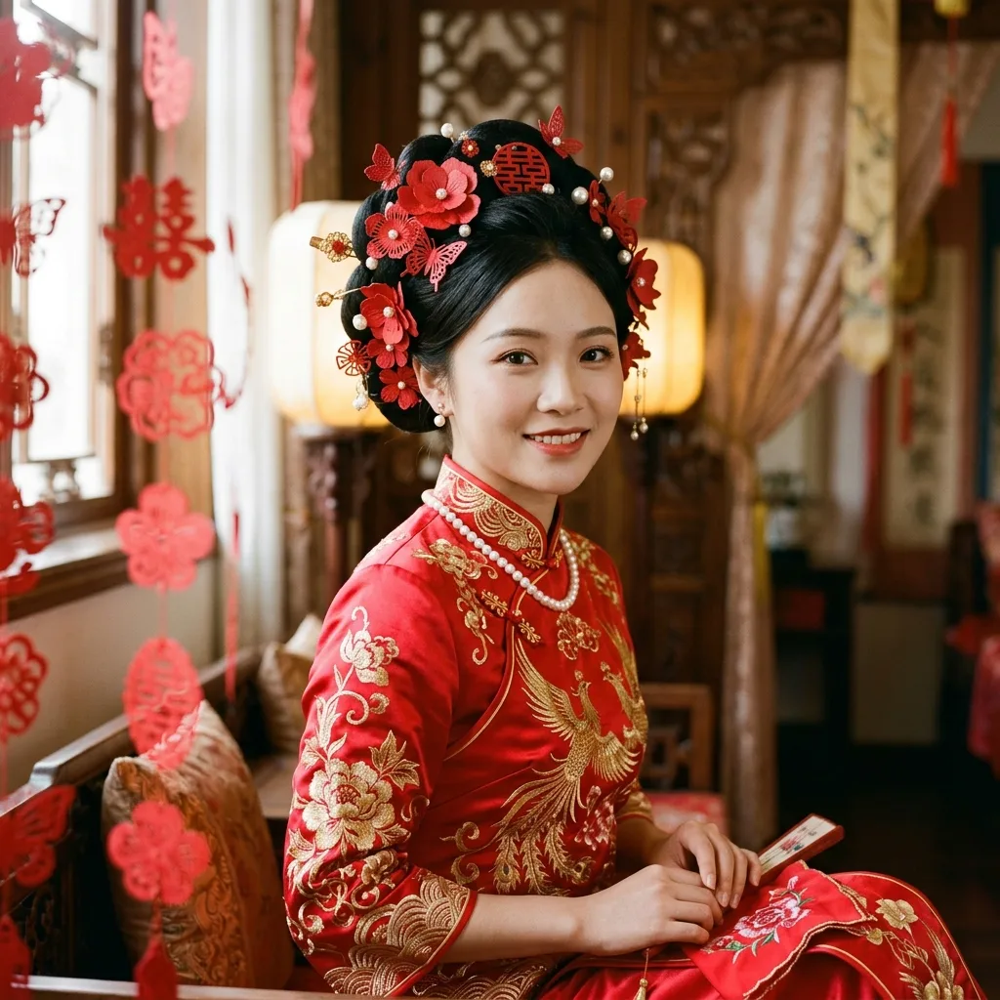

**#297 · Photography Prompt · <code>Vinano Image v2</code>**

<details>
<summary>Show prompt</summary>

```
1. 宏观风格与媒介
- 核心媒介: Photography
- 美学流派: Traditional Chinese bridal portrait

2. 主体与IP身份
- 核心主体: Woman updo hairstyle adorned red paper-cut flowers and butterflies, wearing red traditional attire and pearl jewelry
- IP/名人锁定: None

3. 世界逻辑与物理
- 物理法则: Realistic human proportion
- 空间构成: Eye-level perspective, close-up portrait paper-cut decorative foreground

4. 数据与信息层
- 文本提取: None
- 品牌与符号: None

5. 材质与纹理
- 核心材质: Red satin cheongsam, red paper-cut ornaments, white glossy pearls, small white pearl earring
- 触感细节: Smooth satin texture, delicate paper-cut texture, glossy pearl surface

6. 光影与氛围
- 光照模型: Soft side lighting, soft shadows
- 整体氛围: Warm, elegant, traditional Chinese festive atmosphere

7. 技术参数
- 镜头与渲染: 50mm lens
- 构图指令: --ar 4:5

Emphasise material texture and natural light so the final frame feels tactile and premium.
```

</details>

---

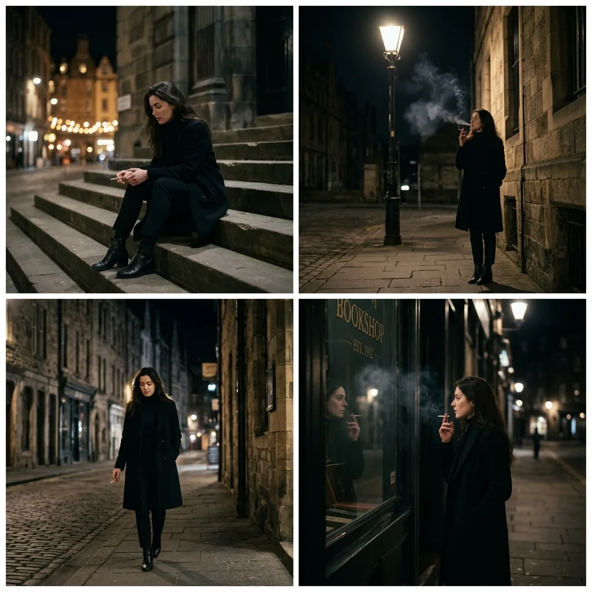

**#298 · Photography Prompt · <code>Vinano Image Pro</code>**

<details>
<summary>Show prompt</summary>

```
A cinematic 4-panel photo collage showing a quiet, introspective city walk smoking as a character detail.
• Frame 1: Sitting briefly on wide stone stairs, cigarette lit, city lights behind
• Frame 2: Standing still under a warm streetlamp, slow smoke drifting upward
• Frame 3: Walking past old European buildings, cigarette between fingers
• Frame 4: Pausing near a closed shop window, reflection visible smoke haze
Consistent outfit — refined minimalist black outfit, ankle boots. Low-key lighting, soft bokeh, cinematic shadows, film-still realism, editorial mood, 1:1 aspect ratio.

Keep edges clean and the overall composition balanced for a polished, gallery-ready result.
```

</details>

---

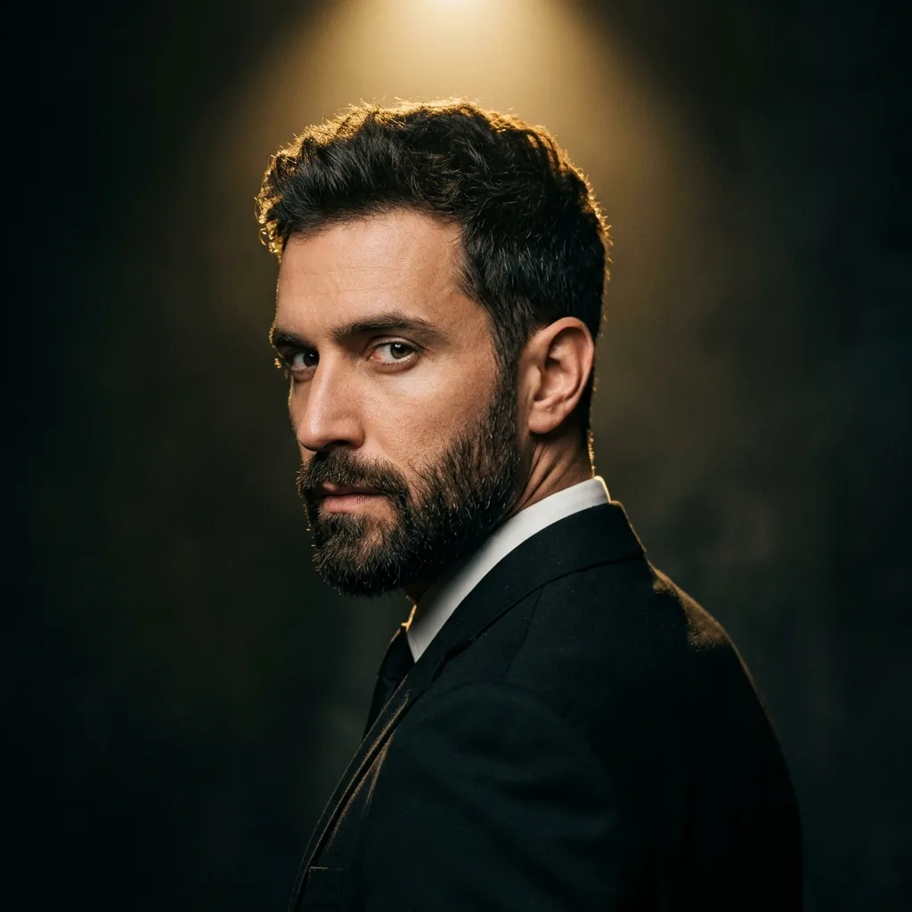

**#299 · Photography Prompt · <code>Vinano Image v2</code>**

<details>
<summary>Show prompt</summary>

```
Ultra-realistic cinematic portrait of a stylish man in a black suit, captured from behind his head turned over his shoulder, giving a sharp, intense look toward the camera. Short textured hair subtle highlights, well-groomed beard. Dramatic spotlight from above creating a warm golden halo effect on his hair and face, fading into a dark background. Strong chiaroscuro lighting deep shadows and soft highlights. Aim for an editorial, design-driven look with deliberate negative space.
```

</details>

---

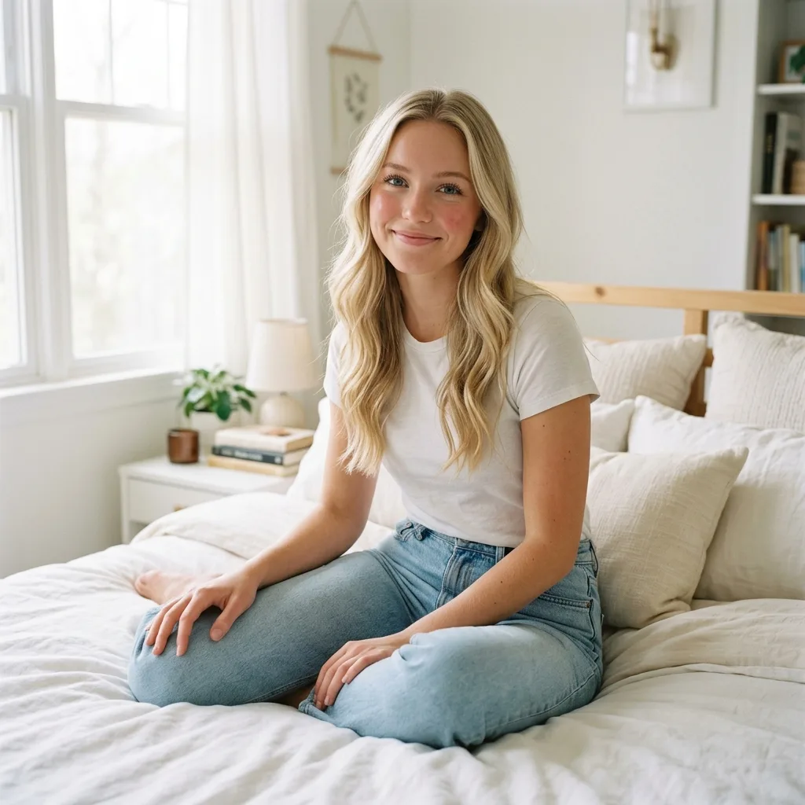

**#300 · Photography Prompt · <code>Vinano Image v2</code>**

<details>
<summary>Show prompt</summary>

```
Cute, innocent young adult blonde woman sitting comfortably on a neatly made bed, relaxed natural posture legs gently bent, shoulders soft and at ease. Long, soft, flowing blonde hair styled in loose natural waves, silky texture, subtle shine, a few delicate strands framing her face. Clear blue eyes a gentle sparkle, long natural lashes, delicate eyebrows, smooth fair complexion a soft healthy glow, subtle blush on cheeks, light pink lips, minimal natural makeup enhancing her youthful features. Calm, sweet, peaceful expression conveying warmth and innocence.

Wearing a clean white short-sleeve cotton shirt, lightweight fabric, neatly tied at the waist natural folds and creases, paired light-wash high-waisted jeans, casual fit, realistic denim texture, visible stitching and seams, effortlessly stylish yet simple.

Bright, cozy bedroom interior filled soft natural light, white and cream color palette, minimal modern decor, neatly arranged pillows, soft linen bedsheets, light wooden bed frame and furniture, a large window nearby sheer curtains gently diffusing the sunlight. Warm morning or late-afternoon sunlight streaming in, creating soft highlights on her hair and skin, gentle shadows for depth, peaceful and intimate atmosphere, calm lifestyle mood.

true-to-life photorealistic, ultra-high detail, hyper-detailed skin texture visible natural pores and softness, realistic hair strands depth and volume, accurate fabric textures, lifelike color tones. Shot on Canon DSLR, 50mm f/1.8 lens, shallow depth of field, creamy natural bokeh background, sharp focus on eyes and face, natural lighting only, no artificial flash. Soft cinematic yet true-to-life color grading, lifestyle editorial photography style, clean balanced composition, vertical framing, realistic perspective, professional photography quality.
--ar 3:4 --stylize 250 --v 6 --q 2

Maintain consistent colour harmony and crisp focus across the whole frame.
```

</details>

---

[Next page →](./photography-4.md)
