# Photography — full gallery

[← Back to README](../README.md) · [`prompts.json`](../prompts/prompts.json) · **630** prompts · page 4 / 7

[← Prev](./photography-3.md) — [1](./photography.md) · [2](./photography-2.md) · [3](./photography-3.md) · **4** · [5](./photography-5.md) · [6](./photography-6.md) · [7](./photography-7.md) — [Next →](./photography-5.md)

---


**#301 · Photography Prompt · <code>Vinano Image v2</code>**

<details>
<summary>Show prompt</summary>

```
{
 "image_request": {
 "style": {
 "genre": "Editorial fashion portrait",
 "aesthetic": "2000s retro-pop, Californian summer vibe",
 "mood": "Confident, sultry, youthful",
 "quality": "premium-quality, cinematic",
 "aspect_ratio": "Portrait"
 },
 "identity": {
 "face_lock": "Use the original face exactly as provided",
 "constraints": "Do not change any facial features, proportions, asymmetry, or details",
 "realism": "100% true-to-life photorealistic face preservation"
 },
 "subject": {
 "gender": "Woman",
 "expression": "Confident and sultry",
 "mouth": "Slightly open",
 "gaze": "Direct eye contact the camera"
 },
 "hair": {
 "color": "Soft golden-brown",
 "length": "Long",
 "style": "Shaggy haircut full bangs"
 },
 "pose": {
 "body_position": "Crouching forward",
 "hands": {
 "gesture": "One hand raised to the face",
 "detail": "Finger touching bottom lip"
 },
 "attitude": "Bold, self-assured"
 },
 "fashion": {
 "outfit": "White and red athletic-style bodysuit"
 },
 "makeup": {
 "eyes": "Peach eyeshadow winged eyeliner",
 "lips": "Glossy berry-red lipstick",
 "overall": "Soft, warm-toned editorial makeup"
 },
 "accessories": {
 "jewelry": "Chunky silver jewelry",
 "ring": "Large silver ring yellow watch-face detail",
 "nails": {
 "style": "Long manicured nails",
 "design": "Red heart accents"
 }
 },
 "lighting": {
 "type": "Bright, warm, high-key natural sunlight",
 "shadows": "Soft and natural"
 },
 "environment": {
 "background": "Blurred warm orange and sandy-yellow gradient",
 "suggested_location": "Outdoor desert or poolside atmosphere"
 },
 "camera": {
 "style": "35mm film photography look",
 "focus": "Sharp focus on face and hand",
 "depth_of_field": "Shallow depth of field",
 "color": "Vibrant, cinematic tones"
 },
 "final_notes": {
 "textures": "Natural skin, hair, and fabric detail",
 "editing": "No face alteration, no over-smoothing",
 "overall_feel": "High-fashion cinematic editorial portrait"
 }
 }
}

Maintain consistent colour harmony and crisp focus across the whole frame.
```

</details>

---

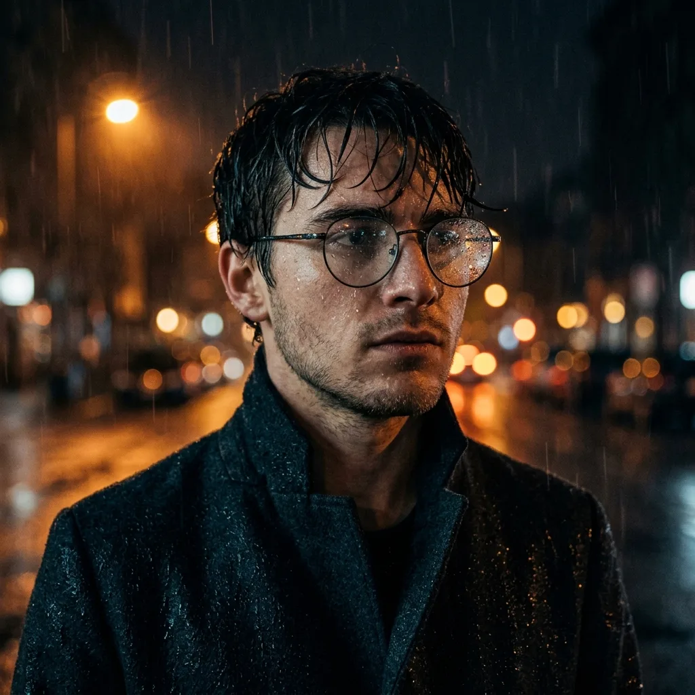

**#302 · Photography Prompt · <code>Vinano Image v2</code>**

<details>
<summary>Show prompt</summary>

```
Cinematic close-up portrait of a young man standing in heavy rain at night, wearing round metal glasses and a dark coat, wet hair falling across his forehead, light stubble beard. Raindrops clinging to his glasses and skin, dramatic moody lighting warm orange streetlight bokeh in the background, shallow depth of field, intense contemplative expression, gritty noir atmosphere, ultra-realistic, high contrast, detailed skin texture, cinematic color grading, 85mm lens, f/1.8,true-to-life photorealistic, dark urban aesthetic, film still look. Preserve realistic proportions and depth for a confident, professional finish.
```

</details>

---

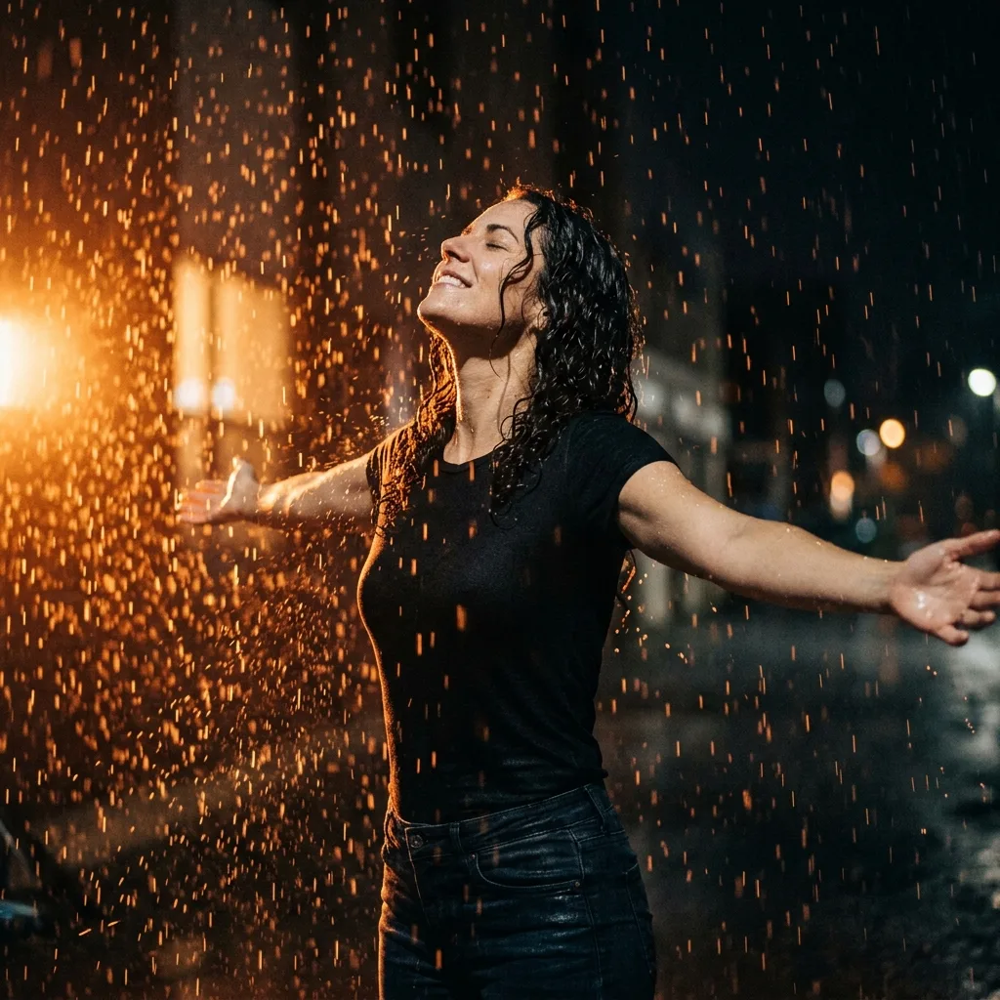

**#303 · Photography Prompt · <code>Vinano Image v2</code>**

<details>
<summary>Show prompt</summary>

```
Ultra realistic cinematic portrait of a 32-year-old young woman standing in heavy rain at night, arms open wide and face lifted toward the sky, eyes closed, feeling the rain. Dramatic warm orange backlight illuminating the falling raindrops, creating glowing rain particles around her. Wet black t-shirt tightly fitting on the body, water droplets on her skin. Strong contrast lighting a dark background, orange and golden light shining from the left side like fire or a spotlight. Emotional expression of freedom and peace, cinematic photography style, ultra-detailed, 8K resolution, shallow depth of field, professional studio lighting, rain splash effects, high-contrast shadows, dramatic atmosphere, vertical portrait composition, 85mm lens photography. Keep edges clean and the overall composition balanced for a polished, gallery-ready result.
```

</details>

---

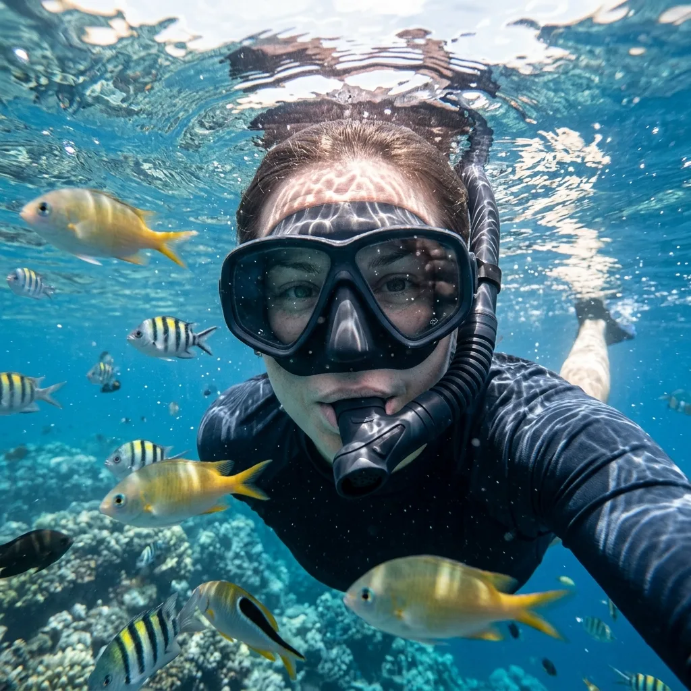

**#304 · Photography Prompt · <code>Vinano Image Pro</code>**

<details>
<summary>Show prompt</summary>

```
Create a hyper-realistic underwater close-range portrait captured a wide-angle action camera in a waterproof housing. The camera is very close to the Subject (≈0.5–1 m), positioned slightly below face level and angled upward, wide-angle distortion emphasizing depth while keeping the Subject dominant.

Mid-shot to ¾ body framing. The Subject fills most of the frame, face and upper body clearly visible. Schools of tropical fish swim closely around, some passing near the lens to create layered depth, mild motion blur on fish closest to the camera.

Natural sunlight enters from above, producing bright caustic patterns on the Subject and surrounding water, strong highlights near the surface, and soft blue gradients below. Floating water particles are visible between the camera and Subject, slight refraction distortion around mask edges and hands.

The Subject appears calm and relaxed, floating effortlessly subtle body movement suggesting buoyancy and breathing through the snorkel.

A shallow coral reef is visible below, slightly softened by depth, while nearby fish remain sharper. The water surface shimmers above gentle ripples.

Color behavior reflects natural underwater absorption: dominant blues and aquas, vibrant yellow and black fish patterns retained, and skin tones realistic a slightly cool cast.

The image should feel like a real close-distance snorkeling travel photo intimate, immersive, and authentic.

Do not alter facial structure or identity. The Subject must remain 1000% identical to the reference image.

Render with rich micro-detail while keeping the layout uncluttered and intentional.
```

</details>

---

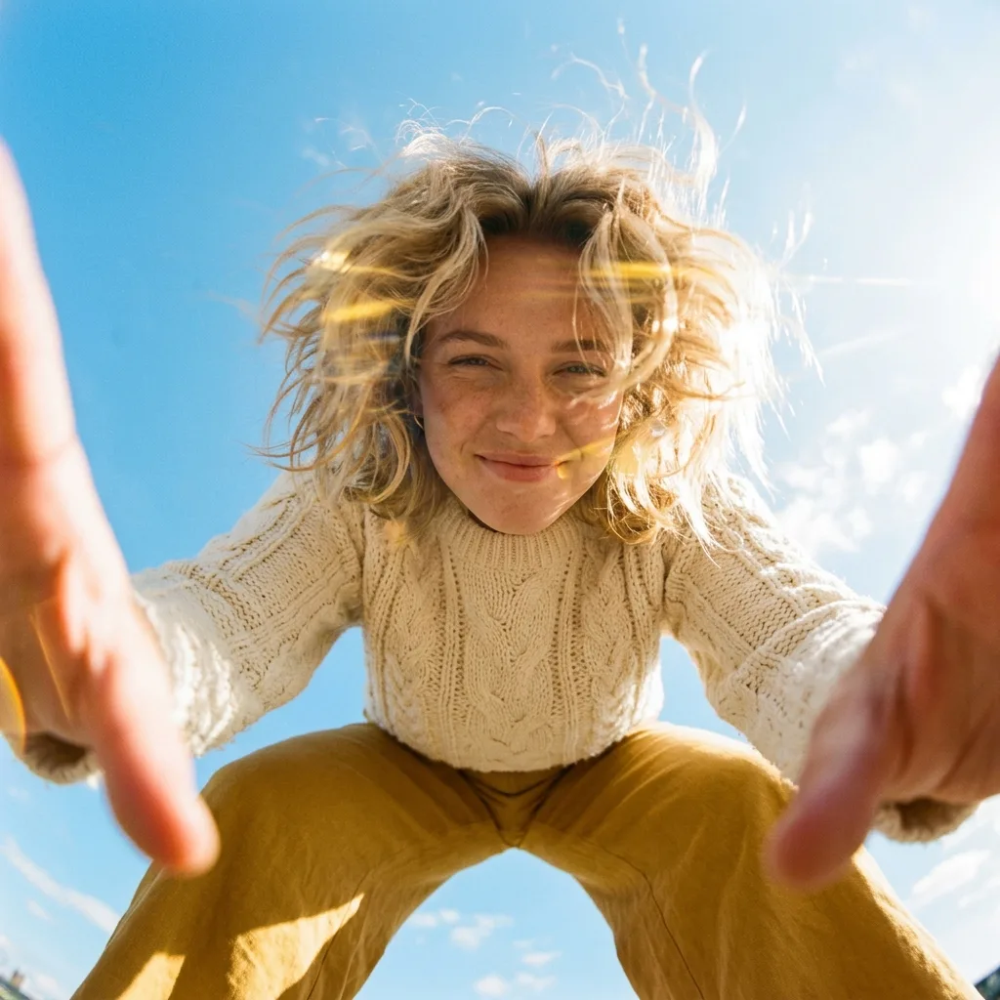

**#305 · Photography Prompt · <code>Vinano Image v2</code>**

<details>
<summary>Show prompt</summary>

```
Ultra wide-angle low-angle portrait shot from ground perspective, young woman leaning over camera, hands reaching toward lens creating foreground distortion, bright midday sun strong lens flare, clear blue sky background, wind-blown messy hair glowing in backlight, soft freckles and natural skin texture, wearing cozy cream knit sweater and mustard wide-leg pants, filmic, cinematic lighting, shallow depth of field, high detail, 35mm fisheye look, vibrant colors, fashion editorial style Maintain consistent colour harmony and crisp focus across the whole frame.
```

</details>

---

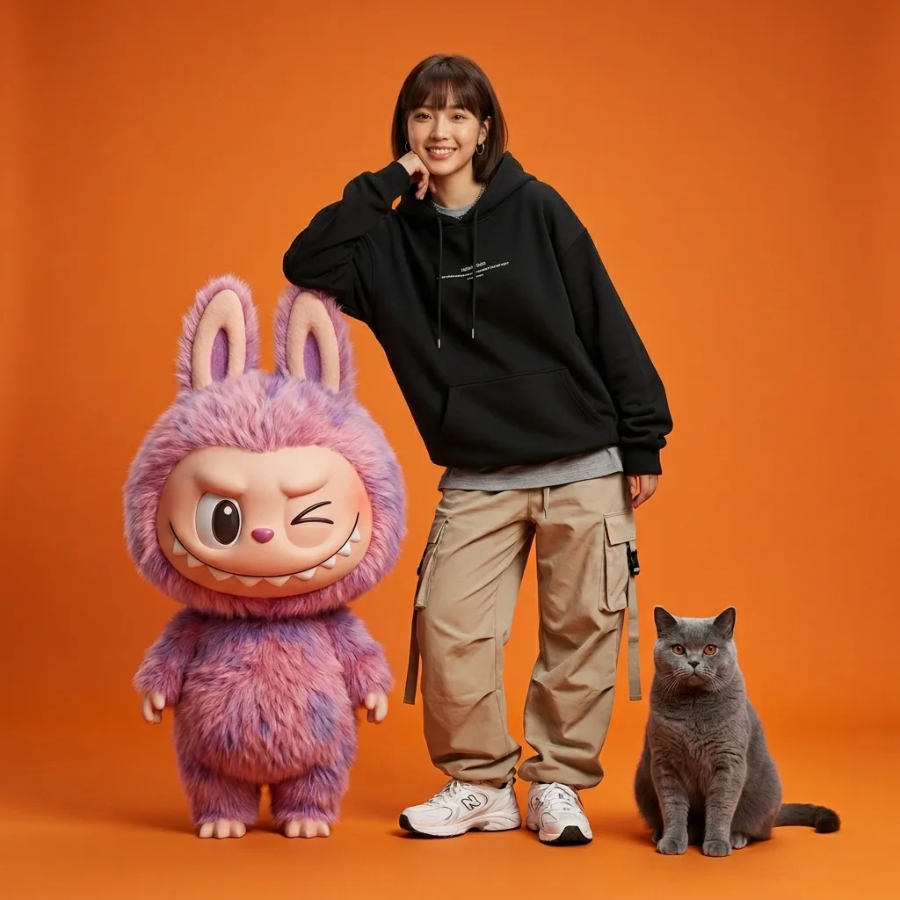

**#306 · Photography Prompt · <code>Vinano Image Pro</code>**

<details>
<summary>Show prompt</summary>

```
Create a hyper-realistic, high-detail studio photoshoot featuring the same person from the reference photo the exact facial features, skin tone, hairstyle, proportions, and identity fully preserved (no changes to face or structure). She is wearing stylish Gen-Z fashion attire trendy, minimal, modern streetwear. She is leaning casually on a realistic, fluffy, life-sized Labubu character, rendered in soft fur texture playful expression. A British Shorthair cat sits or poses nearby, also hyperrealistic detailed fur and natural posture.

The entire scene is set against a smooth, seamless, vibrant orange studio backdrop professional studio lighting, crisp shadows, clean highlights, and a premium fashion editorial vibe. Ultra-true-to-life photorealistic, flawless skin texture (but unchanged identity), high-end photography style, full-body or mid-shot composition.

Maintain consistent colour harmony and crisp focus across the whole frame.
```

</details>

---

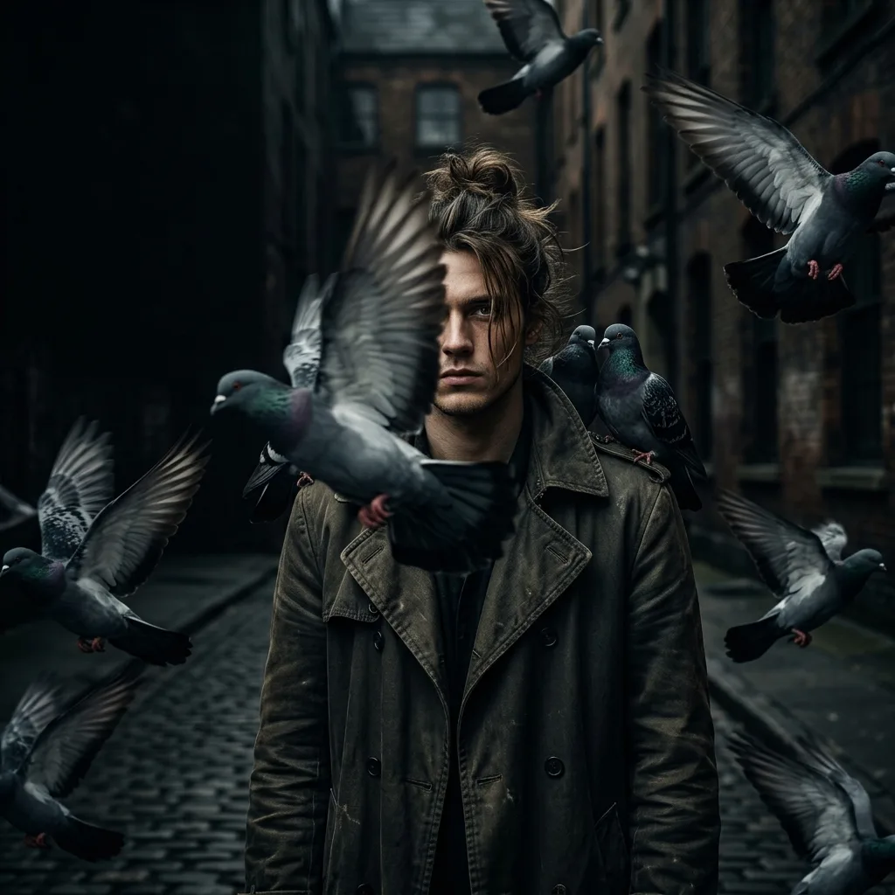

**#307 · Photography Prompt · <code>Vinano Image v2</code>**

<details>
<summary>Show prompt</summary>

```
48k Hyper-realistic, A cinematic portrait of a young man(keep the facial features unchanged as uploaded image), his hair is messy manbun over the eye,in a long dark trench coat, surrounded by pigeons flying dramatically around him. Some pigeons fly very close to the camera, wings blurred in motion, others perch on his shoulder. His expression is serious and enigmatic, half of his face obscured by a pigeon in the foreground. Moody lighting strong shadows and highlights. Aim for an editorial, design-driven look with deliberate negative space.
```

</details>

---

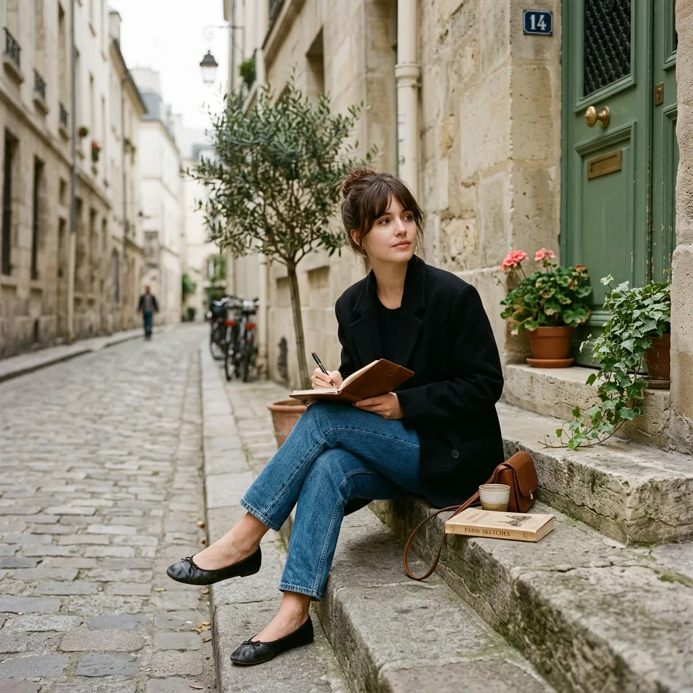

**#308 · Photography Prompt · <code>Vinano Image v2</code>**

<details>
<summary>Show prompt</summary>

```
{
 "image_generation": {
 "subject": {
 "description": "young woman sitting on stone steps in a quiet old European street",
 "pose": "seated casually on worn stone stairs, legs crossed slightly, holding a notebook and pen",
 "expression": "thoughtful, calm, introspective",
 "action": "writing notes while glancing to the side"
 },
 "appearance": {
 "hair": {
 "color": "dark brown",
 "style": "messy bun soft bangs framing the face"
 },
 "face": {
 "features": "soft natural facial features",
 "makeup": "minimal, natural look"
 }
 },
 "outfit": {
 "top": "black oversized blazer",
 "bottom": "blue straight-leg jeans",
 "shoes": "black ballet flats"
 },
 "accessories": {
 "bag": "small brown leather shoulder bag",
 "objects": ["small notebook",
 "pen",
 "closed book placed beside her"]
 },
 "environment": {
 "setting": "old European alleyway",
 "background": "weathered stone wall, green wooden door, cobblestone street",
 "architecture": "vintage, rustic, historic textures"
 },
 "lighting": {
 "type": "natural daylight",
 "quality": "soft, diffused",
 "mood": "warm, calm, cinematic"
 },
 "camera": {
 "angle": "eye-level",
 "framing": "medium full-body shot",
 "style": "editorial lifestyle photography",
 "focus": "sharp subject subtly textured background",
 "quality": "high resolution, realistic"
 },
 "aesthetic": {
 "style": "Parisian street style",
 "vibe": "artistic, literary, cozy",
 "color_palette": "neutral earth tones, muted greens, stone gray, denim blue"
 }
 }
}

Preserve realistic proportions and depth for a confident, professional finish.
```

</details>

---

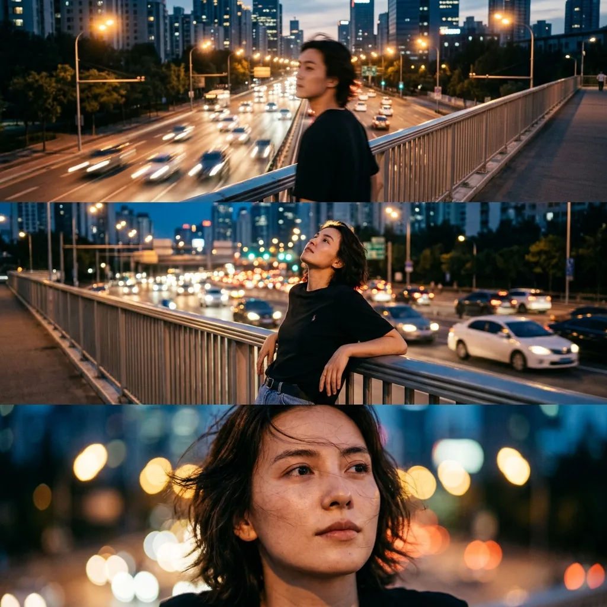

**#309 · Photography Prompt · <code>Vinano Image v2</code>**

<details>
<summary>Show prompt</summary>

```
use the uploaded photo as the exact identity reference. keep the same person, same face, same facial features, same proportions and natural expression, create a true-to-life photorealistic cinematic triptych portrait (three-frame composition in one image).

scene: night city, bridge over a busy road, moving cars, glowing street lights, evening sky, city skyline in the background. atmosphere: freedom, motion, youth, urban romance, feeling of wind and road. frame 1 (top): wide cinematic shot - the person standing on a bridge above a busy road, slight motion blur from head movement, city lights and cars below, strong urban night mood. frame 2 (middle): medium shot person leaning on the bridge railing, looking up at the sky, relaxed confident pose, cars and headlights glowing behind. frame 3 (bottom): close-up emotional portrait wind in hair, city lights in bokeh behind, thoughtful and dreamy expression. style: real photography, cinematic lifestyle portrait, urban fashion photography. lighting, natural city night lighting, street lamps, car headlights, soft glow on skin. camera: full-frame dslr, 85mm lens look, shallow depth of field. color grading: warm city lights mixed cool blue night tones, film-style mood. ultra true-to-life photorealistic, natural skin texture, real candid moment, no illustration, no cgi, no plastic skin, no text, no logos, no watermark.

Preserve realistic proportions and depth for a confident, professional finish.
```

</details>

---

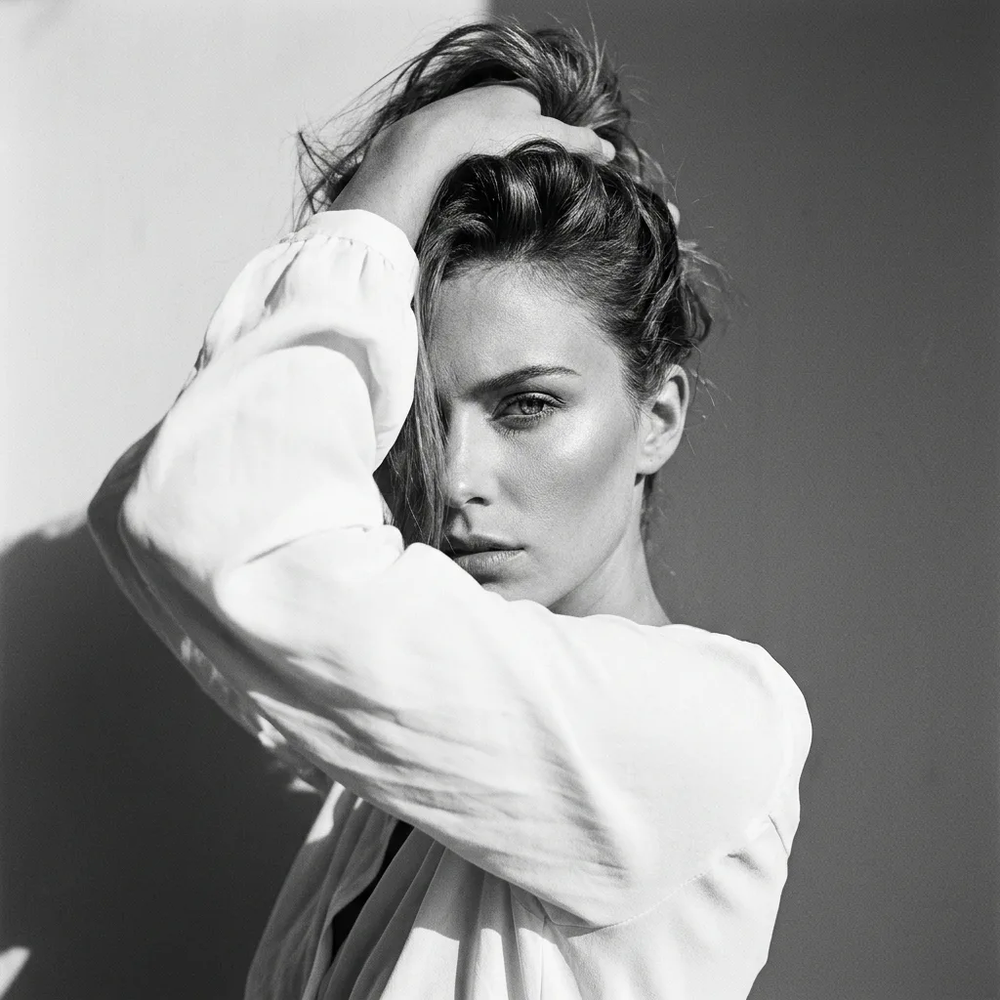

**#310 · Photography Prompt · <code>Vinano Image v2</code>**

<details>
<summary>Show prompt</summary>

```
Use The Uploaded Image Of The Woman As Strict Facial Reference And Physical Features - Keep Her Real Face Exactly As Provided, Without Alterations Or Stylization. Ensure Seamless, Ultra-realistic Integration In The Final Render. Black And White High-fashion Editorial Portrait Of The Uploaded Person, Wearing A Loose White Blouse. She Poses One Arm Raised, Partially Covering Her Face While Holding Her Hair Up, Creating A Dramatic And Artistic Composition. Her Gaze Is Intense And Captivating, Directly Toward The Camera, Exuding A Strong, Enigmatic Aura.
Background: refined minimalist Plain Wall Sharp Daylight Shadows
Adding Contrast And Depth.
Lighting: Harsh Natural
Sunlight, High-contrast, Emphasizing Facial Contours, Cheekbones, Hair Texture, And Fabric Detail. Pose: Bold And Expressive, Arm Lifted Framing The Face To Emphasize Raw Emotion And High-fashion Editorial Style.
Camera: Eye-level Close-up,
Focusing On Facial Expression, Texture, And Dramatic Shadow Play. Captured As If Canon Eos R5, 85mm F/1.8 Lens - Crisp Detail, Tonal Depth, Fine Grain.
Style: Monochrome, Ultra-realistic, Cinematic, High-fashion
Editorial Photography.ashion editorial photography.

Keep edges clean and the overall composition balanced for a polished, gallery-ready result.
```

</details>

---

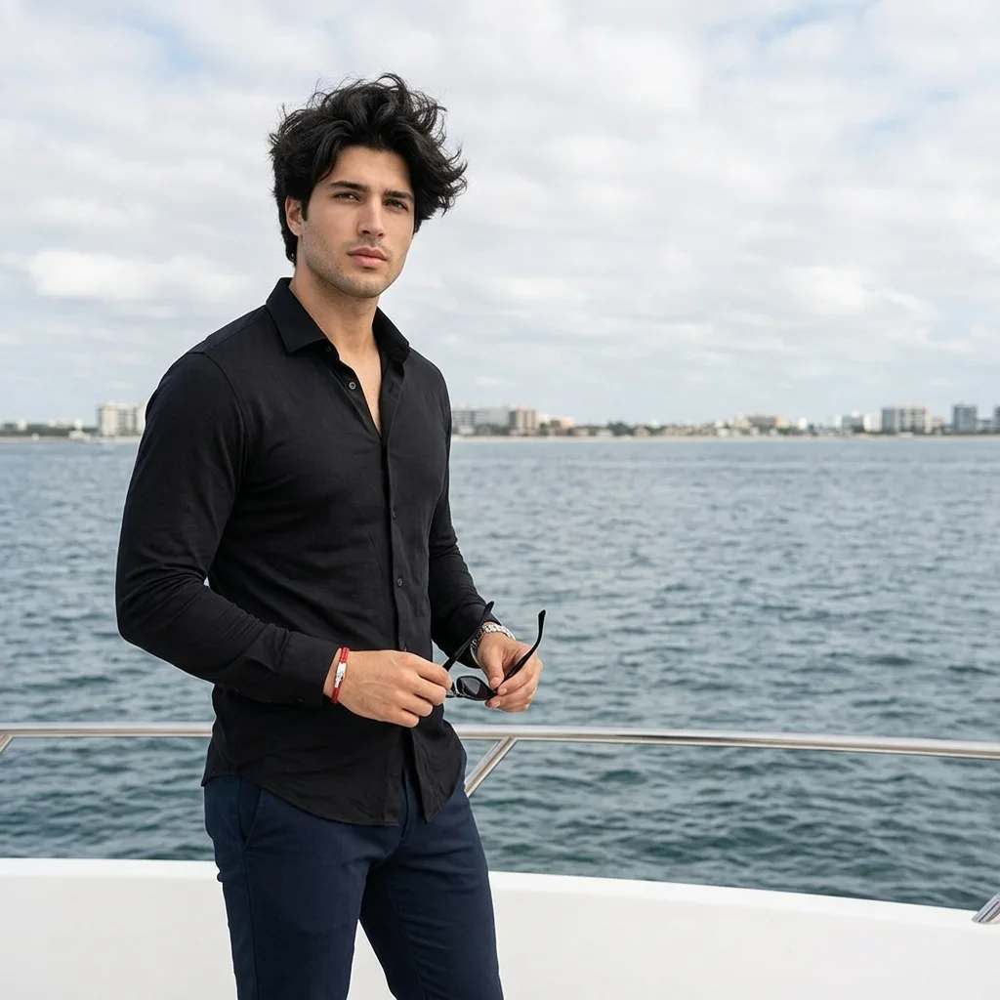

**#311 · Photography Prompt · <code>Vinano Image Pro</code>**

<details>
<summary>Show prompt</summary>

```
{ "composition": { "framing": "mid-length portrait from upper thighs to head", "orientation": "vertical", "camera_angle": "eye-level", "subject_position": "left third of the frame", "balance": "subject balanced against expansive seascape on the right", "depth": "moderate depth clear foreground subject and distant cityscape background" }, "subject": { "gender_presentation": "male-presenting", "age_range": "young adult", "pose": "relaxed standing posture, torso slightly angled, head turned to the left", "expression": "neutral to contemplative", "gaze_direction": "looking on camera", "hair": { "color": "dark brown to black", "style": "thick, voluminous, tousled, slightly wavy" }, "skin_tone": "light to medium", "facial_features": "defined jawline, straight nose, full lips, clean-shaven" }, "clothing_and_accessories": { "top": { "type": "long-sleeve button-up shirt", "color": "black", "fit": "slim to regular fit", "details": "top buttons undone, lightweight fabric subtle drape" }, "bottom": { "type": "trousers", "color": "dark navy or black", "fit": "slim fit" }, "accessories": [{ "item": "sunglasses", "color": "black", "held_in": "right hand" }, { "item": "wristwatch", "material": "metal", "worn_on": "left wrist" }, { "item": "bracelet", "color": "red", "worn_on": "right wrist" }] }, "environment": { "setting": "outdoor, on a boat or waterfront deck", "foreground": "white deck surface", "background": { "elements": ["open sea visible water texture", "distant coastal cityscape", "cloud-filled sky"], "horizon_line": "visible and level" } }, "lighting": { "type": "natural daylight", "quality": "soft and diffused", "direction": "overhead slight frontal illumination", "shadows": "minimal, soft-edged" }, "color_palette": { "dominant_colors": ["deep blue", "cyan", "white", "black"], "contrast": "high contrast between dark clothing and bright environment", "saturation": "moderate, natural tones" }, "technical_characteristics": { "focus": "sharp focus on subject", "depth_of_field": "moderate, background slightly softened but recognizable", "image_clarity": "high", "noise": "minimal", "lens_effect": "no visible distortion, likely standard focal length" }, "artistic_style": { "aesthetic": "clean, modern lifestyle photography", "mood": "calm, confident, aspirational", "visual_theme": "luxury travel or leisure" }, "typography": { "text_present": false } } Emphasise material texture and natural light so the final frame feels tactile and premium.
```

</details>

---

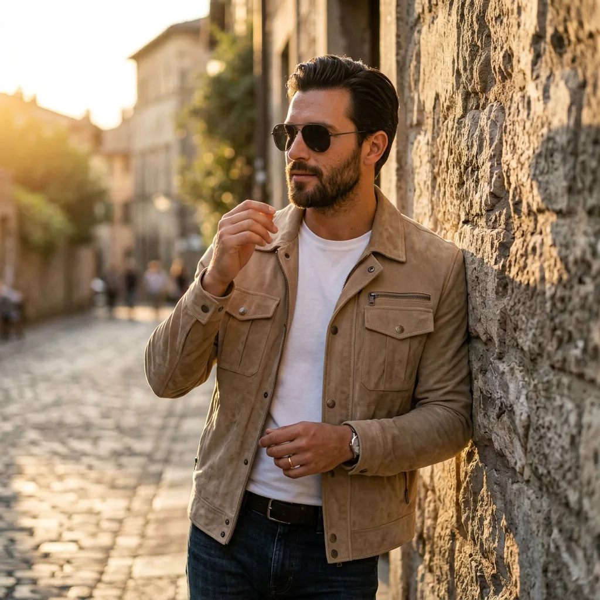

**#312 · Photography Prompt · <code>Vinano Image v2</code>**

<details>
<summary>Show prompt</summary>

```
A cinematic golden hour portrait of a stylish man leaning against a textured stone wall, wearing dark sunglasses, a beige suede jacket large front pockets, and a white crew-neck shirt underneath, warm sunlight casting sharp shadows across the wall, soft natural beard, well-groomed dark hair styled back, confident relaxed pose one hand raised near his face, warm earthy color palette, strong side lighting, high contrast highlights and shadows, shallow depth of field, ultra-realistic fashion photography, editorial street style aesthetic, 85mm lens, f/2.0, crisp detail, natural skin tones, 4K resolution. Maintain consistent colour harmony and crisp focus across the whole frame.
```

</details>

---

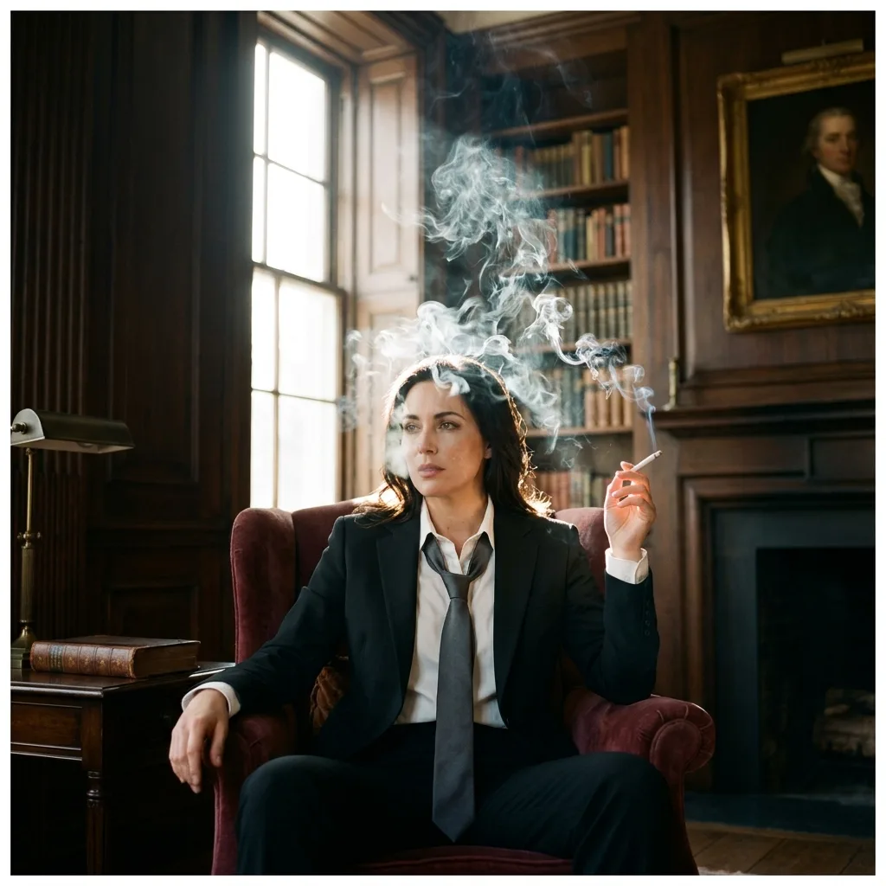

**#313 · Photography Prompt · <code>Vinano Image Pro</code>**

<details>
<summary>Show prompt</summary>

```
​A high-definition cinematic portrait of a sophisticated woman sitting in a plush, velvet burgundy armchair within a sunlit, vintage study. She is wearing a sharp black tailored suit, a crisp white button-down shirt slightly unbuttoned, and a loosely tied charcoal grey necktie. She holds a cigarette, thick, ethereal plumes of white smoke swirling dramatically around her face and rising toward the ceiling. The lighting is dramatic "chiaroscuro" style, bright sunlight streaming through a large window behind her, creating a glowing rim light on her hair and the smoke. The background features ornate wooden wall panels and a classic framed painting. true-to-life photorealistic, 8k resolution, moody atmosphere.
​Tips for Best Results:
​Aspect Ratio: If your tool supports it, use --ar 9:16 to get that tall, vertical phone-wallpaper look.
​Lighting Keywords: terms like "volumetric lighting" or "backlit" will help emphasize the way the light interacts the smoke.
​Style: If you want it to look more like a movie still, add "shot on 35mm film" to the end.

Aim for an editorial, design-driven look with deliberate negative space.
```

</details>

---

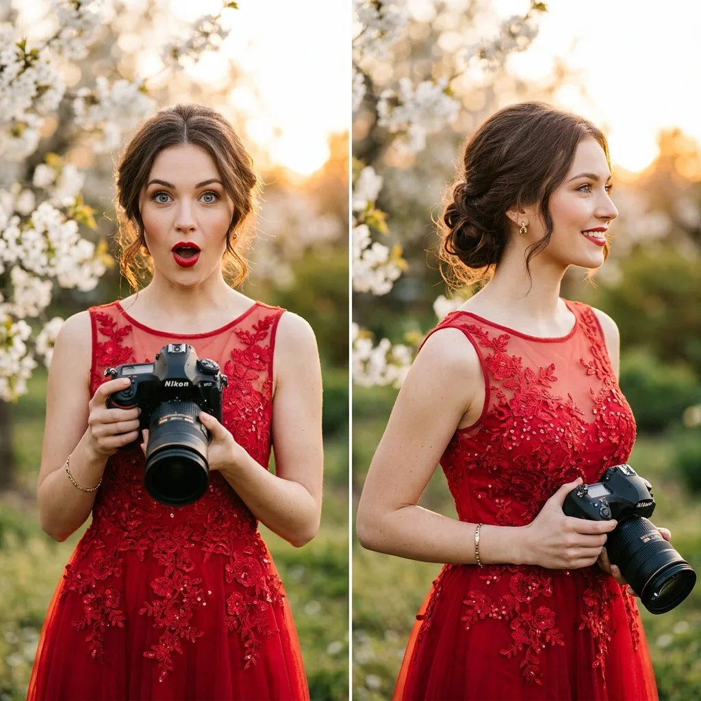

**#314 · Photography Prompt · <code>Vinano Image v2</code>**

<details>
<summary>Show prompt</summary>

```
A young woman an elegant, polished look. In one frame, she has an expressive, surprised "O" face; in the other, a soft, confident smile.
​Attire: A vibrant crimson red floor-length gown featuring intricate floral lace embroidery, a sheer neckline, and subtle sequin detailing that catches the light.
​Hair & Makeup: Her hair is styled in a soft, romantic updo loose tendrils. She wears bold red lipstick that perfectly matches her dress and classic, warm-toned eye makeup.
​Setting & Composition:
​Environment: An outdoor garden during golden hour. The background is filled soft-focus white spring blossoms (like cherry or almond trees) and lush greenery.
​Lighting: Backlit by a warm, setting sun, creating a "halo" effect on her hair and a soft, ethereal glow across the scene.
​The Contrast: She is holding or wearing a professional black DSLR camera a large lens. The mechanical, matte-black texture of the camera creates a sharp contrast against the delicate, red lace of the evening gown.
​Technical Details:
​Photography Style: Cinematic portraiture a shallow depth of field (bokeh), making the subject pop against the blurred garden background.
​Composition: A side-by-side diptych showing two different poses: one front-facing and playful, one profile-view and serene.

Render with rich micro-detail while keeping the layout uncluttered and intentional.
```

</details>

---

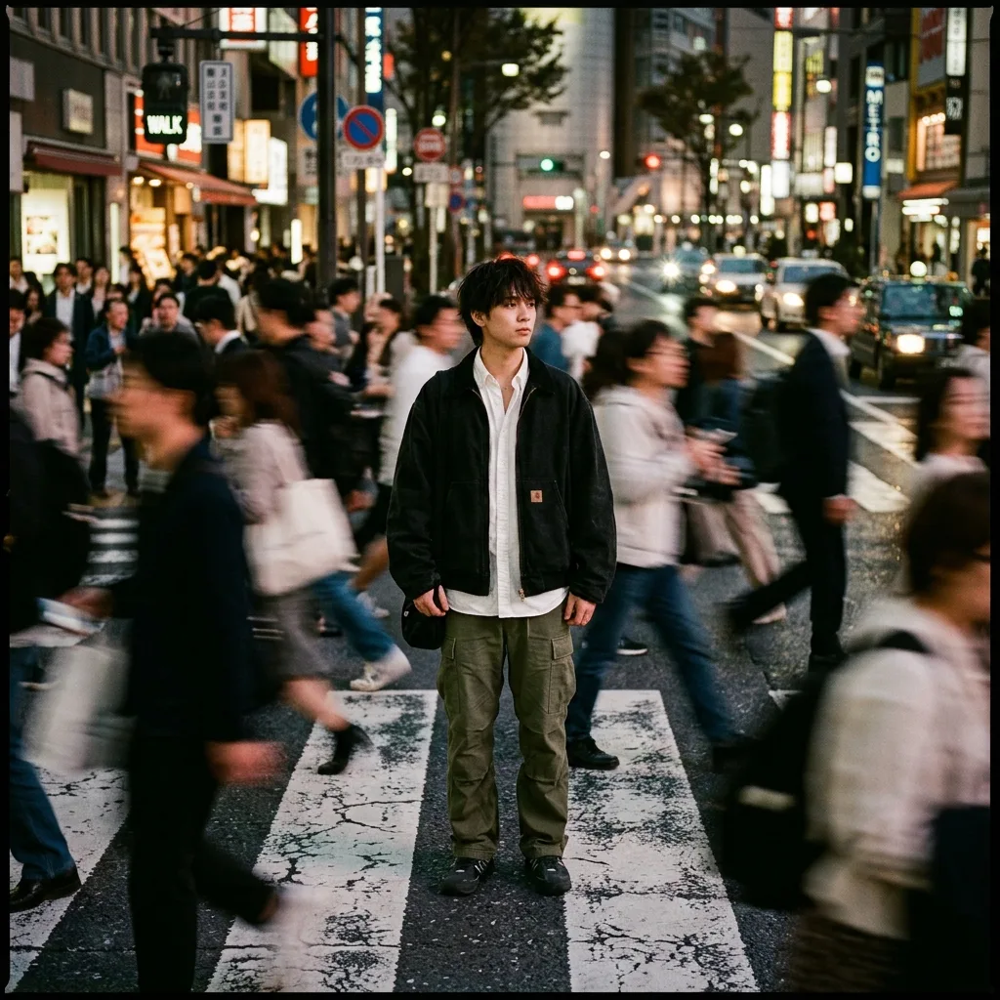

**#315 · Photography Prompt · <code>Vinano Image v2</code>**

<details>
<summary>Show prompt</summary>

```
Cinematic street photography capturing a moment in motion a crowd blur effect. Overhead portrait of me standing still on a crosswalk, wearing a white button-up shirt, black oversized jacket, and olive green cargo pants. Motion-blurred crowd rushes past. Moody city lighting, 35mm film aesthetic, shallow depth of field, sharp focus on my portrait, showcasing an artistic and timeless style. Emphasise material texture and natural light so the final frame feels tactile and premium.
```

</details>

---

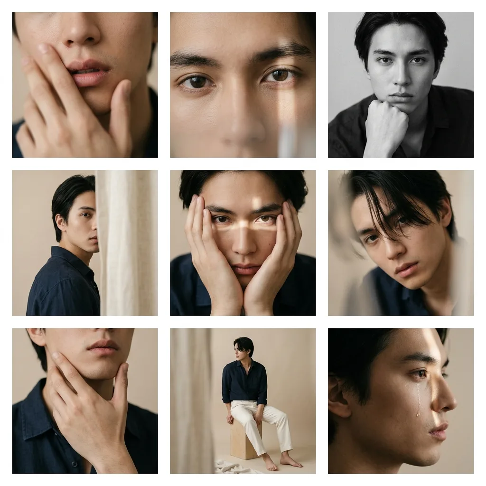

**#316 · Photography Prompt · <code>Vinano Image Pro</code>**

<details>
<summary>Show prompt</summary>

```
Editorial 3x3 photo grid in a clean soft beige studio. Character (matches reference 100%) wearing lightweight dark navy shirt, ivory trousers, barefoot for raw simplicity. Lighting: large diffused key light directly front-right, silver reflector left, subtle rim from top. Shots to include: 1. extreme close-up of lips + cheekbone blurred hand partially covering (85mm, f/1.8, razor-thin DOF); 2. tight crop on eyes looking into lens reflection of light strip visible (85mm, f/2.0); 3. black & white close portrait resting chin on fist, face filling frame (50mm, f/2.2); 4. over-shoulder shot, blurred foreground fabric curtain framing half face (85mm, f/2.0); 5. very close frontal hands overlapping face, light streak across eyes (50mm, f/2.5); 6. tight angled portrait showing hair falling into eyes, soft-focus background (85mm, f/2.2); 7. crop of hands touching jawline, eyes cropped out (50mm, f/3.2, detail-focused); 8. half-body seated sideways on low cube, head turned sharply away, blurred foreground (35mm, f/ 4.5); 9. intense close-up of profile single tear-like water droplet, cinematic light slice across (85mm, f/ 1.9). Angles: mostly tight headshots slight high/low tilts, maintaining variation. Capture RAW, professional muted grade, smooth tonal contrast, subtle cinematic grain. Mood: intimate, introspective, character-led editorial minimalism delicate use of fabric as prop. Render with rich micro-detail while keeping the layout uncluttered and intentional.
```

</details>

---

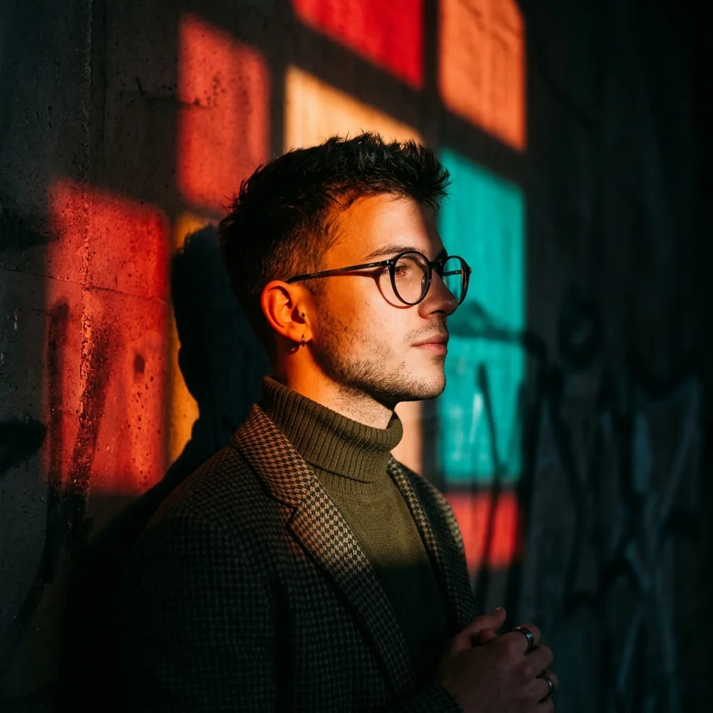

**#317 · Photography Prompt · <code>Vinano Image v2</code>**

<details>
<summary>Show prompt</summary>

```
Cinematic portrait of a stylish young person wearing round glasses, standing beside a wall illuminated by bold geometric window light. Strong red, orange, and teal color contrast casting dramatic shadows across the face. Side profile pose, soft contemplative expression, sharp focus on facial features. High contrast lighting hard-edged rectangular light shapes in the background. Moody atmosphere, artistic color blocking, modern editorial photography style. Shot on 85mm lens, f/1.8, ultra-detailed skin texture, shallow depth of field, dramatic rim lighting, 8K resolution. Render with rich micro-detail while keeping the layout uncluttered and intentional.
```

</details>

---

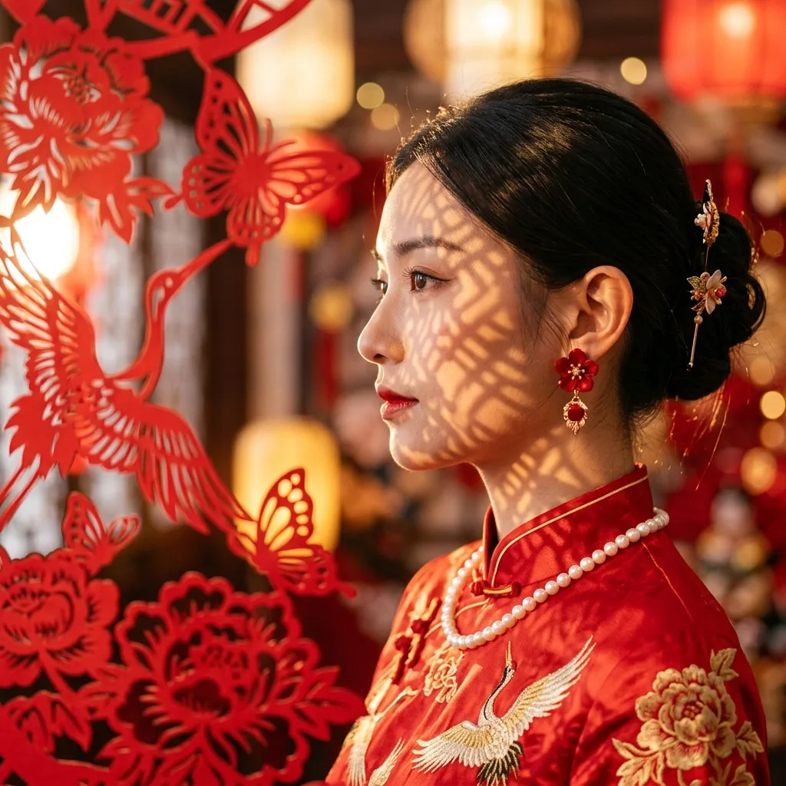

**#318 · Photography Prompt · <code>Vinano Image v2</code>**

<details>
<summary>Show prompt</summary>

```
1. 宏观风格与媒介
- 核心媒介: 高清商业人像摄影 (High-end Commercial Photography)
- 美学流派: 新中式美学 (New Chinese Style), 节日时尚大片

2. 主体与IP身份
- 核心主体: 年轻东亚女性侧颜特写 (Close-up profile of young Asian woman)
- IP/名人锁定: 穿着红色旗袍 (Red Cheongsam), 佩戴珍珠项链与红色花卉耳环

3. 世界逻辑与物理
- 物理法则: 真实光学投影 (Real optical projection), 面部光影贴合面部起伏
- 空间构成: 人眼平视视角 (Eye-level), 极近距离接触

4. 数据与信息层
- 文本提取: 无文本
- 品牌与符号: 红色剪纸艺术前景 (Red paper-cut art foreground) - 包含仙鹤、蝴蝶与牡丹纹样

5. 材质与纹理
- 核心材质: 超写实皮肤质感 (Hyper-realistic skin), 哑光卡纸 (Matte cardstock), 温润珍珠
- 触感细节: 逆光下可见的面部绒毛 (Visible vellus hair backlit), 次表面散射效果 (Subsurface scattering)

6. 光影与氛围
- 光照模型: Gobo投影布光 (Gobo lighting/Projected shadows) - 复杂的镂空花纹光影投射在人物面部
- 整体氛围: 金色暖阳侧逆光 (Warm golden hour light), 高饱和度喜庆红调, 梦幻且清晰

7. 技术参数
- 镜头与渲染: 85mm-100mm 微距镜头 (Macro lens), 浅景深 (Shallow depth of field), 前景虚化 (Bokeh foreground)
- 构图指令: 框式构图 (Framed composition), --ar 3:4

Aim for an editorial, design-driven look with deliberate negative space.
```

</details>

---

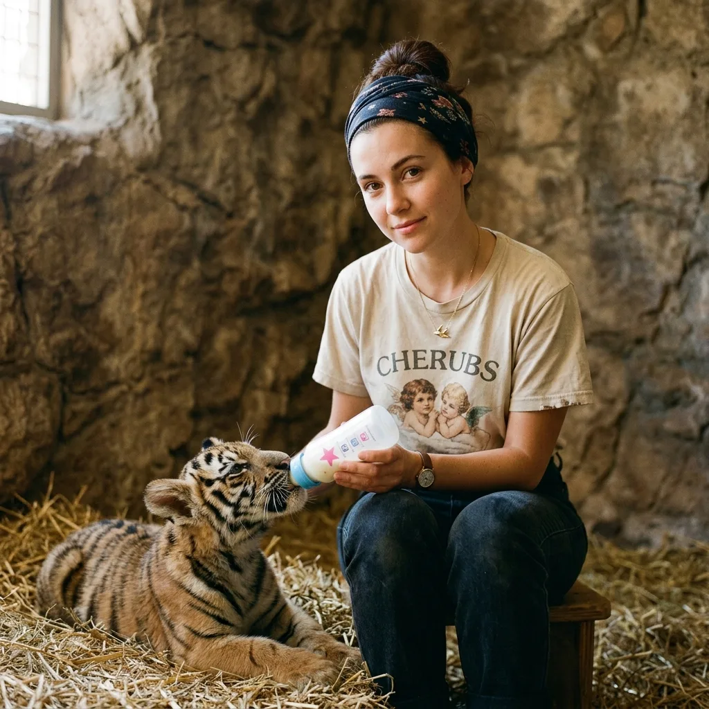

**#319 · Photography Prompt · <code>Vinano Image v2</code>**

<details>
<summary>Show prompt</summary>

```
{ "scene_type": "lifestyle portrait animal interaction", "composition": { "framing": "medium shot", "orientation": "portrait", "subject_placement": "human subject seated slightly right of center, animal positioned lower left, heads forming a gentle diagonal", "camera_angle": "eye-level", "depth_of_field": "moderate, background softly blurred but still textured", "visual_balance": "balanced by contrast between human face and animal body mass" }, "subjects": { "human": { "gender_presentation": "female", "age_range": "young adult", "pose": "seated, torso angled slightly left, head turned right", "expression": "soft smile, contemplative, calm", "gaze_direction": "on camera ", "skin_tone": "light", "hair": { "color": "brown", "style": "pulled back into bun or ponytail", "accessory": "dark patterned headscarf" }, "clothing": { "top": "light-colored graphic t-shirt cherub illustration", "bottom": "dark pants", "accessories": ["necklace small bird-shaped pendant", "wristwatch"] } }, "animal": { "species": "tiger cub", "size": "juvenile", "fur_pattern": "orange black stripes and white facial markings", "pose": "lying on side, head tilted upward", "interaction": "drinking from bottle held by human" } }, "props": { "bottle": { "type": "baby feeding bottle", "color": "white blue cap", "decoration": "pink star and small graphic icons", "function": "feeding animal" } }, "environment": { "location_type": "indoor, rustic or zoo-like enclosure", "background_material": "rough stone wall", "floor_texture": "straw or hay scattered on ground", "setting_mood": "warm, intimate, caretaking" }, "lighting": { "type": "soft natural or diffused artificial light", "direction": "from front-left", "quality": "warm, even, low contrast", "shadow_behavior": "gentle shadows, no harsh edges" }, "color_palette": { "dominant_colors": ["warm beige", "stone gray", "soft brown", "orange"], "accent_colors": ["black", "white", "blue", "pink"], "overall_tone": "warm and earthy" }, "texture_details": { "stone_wall": "coarse, uneven, aged", "fabric": "soft cotton t-shirt, matte finish", "fur": "dense, plush, clearly defined stripes" }, "stylistic_attributes": { "genre": "documentary-style lifestyle photography", "aesthetic": "natural, candid, emotionally warm", "retouching_level": "minimal, realistic skin and texture preservation" }, "technical_characteristics": { "lens_look": "standard to short telephoto", "focal_length_estimate": "35–50mm", "aperture_estimate": "f/2.8–f/4", "sharpness": "sharp focus on faces", "noise": "low", "dynamic_range": "moderate preserved highlights" }, "emotional_read": { "primary_emotion": "tenderness", "secondary_emotions": ["curiosity", "care", "gentle joy"] }, "use_case_potential": ["editorial storytelling", "animal care advocacy", "lifestyle inspiration", "UGC-style social media content"] } Preserve realistic proportions and depth for a confident, professional finish.
```

</details>

---

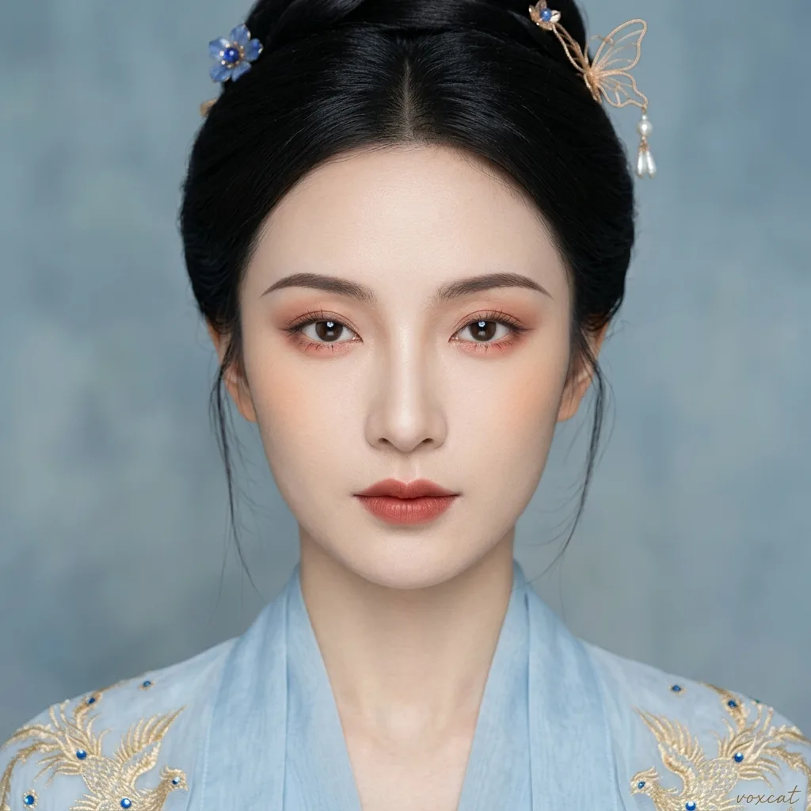

**#320 · Photography Prompt · <code>Vinano Image v2</code>**

<details>
<summary>Show prompt</summary>

```
东方古风清雅女性正面肖像，超近景贴脸特写，人物正面面对镜头，头部端正，视线直视镜头，脸部几乎充满画面，构图集中，双眼位于视觉中心，整体呈现强烈的人脸主导感。
人物气质清雅、端庄、疏离、含蓄，像高门贵女、仙门弟子、带距离感的古典仕女，安静中带一种不容轻犯的从容。整体观感干净、精致、高级，不做甜美活泼感，不做冷艳危险感，不做现代时尚感。
脸型为窄长鹅蛋脸，脸宽较窄，纵向比例偏长，面中舒展，整体轮廓收紧修长，面部留白适中。额头中等偏高，发际线整齐、轮廓饱满流畅。太阳穴平顺微内收但不凹陷，颧弓不外扩，苹果肌轻微平整，不做甜感饱满苹果肌，面中过渡平整流畅，鼻基底适中，法令区干净。下颌线柔和但走向清晰，下颌角弱化，下巴中等长度偏尖，收口利落精致，骨相轻薄修长，上镜感强。
五官精致古典。眉毛为深棕色自然弯眉，眉形柔弧流畅，眉峰轻微自然，眉尾细而下收，眉眼距离适中偏宽，整体呈现古典温柔感。眼睛为细长杏眼偏凤眼感，双眼对称，眼裂偏长，纵向开合中等偏窄，内眼角略尖清晰，外眼角向外轻微上挑，上眼皮薄而干净，双眼皮窄自然，下眼睑存在感清晰，卧蚕轻微精致不膨胀。眼神直视镜头，目光安静、清澈、疏离、端庄，带轻微不可接近感，不做甜妹无辜感，不做冷艳攻击感。睫毛纤长自然，上睫毛柔和拉长，下睫毛纤细分明，不做夸张浓密效果。鼻子为高挺秀气鼻，山根中等偏高自然顺接额头，鼻梁细直干净，鼻背平整挺拔，鼻头小巧精致微圆，鼻尖轻收，鼻翼窄，鼻孔不外露，中轴稳定，东方精致感，不做夸张欧美高挺鼻。嘴唇为中等厚度唇，唇峰清晰柔和，上唇中等，下唇微饱满，唇形端庄古典，嘴角自然平直，不做甜美嘟唇，不做大笑表情。
皮肤为冷白瓷感肤色，白皙通透匀净，底妆为高完成度瓷感底妆，肤质统一干净，细腻柔滑如上釉瓷器，带高级精修感。面中、鼻梁、鼻尖、眼下有轻微提亮，高光克制细腻，不做韩系油亮水光肌。面部轮廓修容精细但克制，鼻侧影自然，颧侧轻微收紧，下颌修容干净，立体度来自柔和明暗关系而不是夸张硬阴影。
妆容为古风仕女感精致妆容，明确带妆，妆感温暖古典。眼妆以暖橘棕、柔和赤茶、浅珊瑚为主色调，上眼影从睫毛根部向上柔和晕染，色彩干净通透，内眼线轻微填满，外眼线纤细柔和向外轻微拉长，眼尾上扬幅度极克制，下眼睑后半段极轻微暖橘晕染，下睫毛纤细分明，卧蚕以窄面积柔和提亮呈现，不做甜妹膨胀卧蚕。眉妆自然克制，色调与发色协调。腮红为柔和暖杏橘色，位置偏面中偏高，存在感低，自然融入肤色。唇妆为中饱和暖红棕、柔和赤茶调，中心略深边缘柔化，唇面保留轻微质感，整体妆容温暖古典、清雅内敛。
发型为黑色盘发古风发髻，发缝自然偏分，发质顺滑，发量适中偏多，头顶盘成精致高髻，两侧有少量碎发自然垂落修饰脸型，额前轻微碎发但不遮挡眉眼主体。发顶轮廓干净圆润。可搭配低调古风发饰，如蓝宝石花簪、金丝蝶饰、小型珠坠流苏，风格雅致精致，不夸张不繁重，与衣饰色调统一。
服饰为浅蓝色至雾蓝色古风广袖衣裳，面料轻透柔软，带轻纱层叠感，肩颈区域布料自然垂落，领口结构精致干净。面料上可见精致金色凤鸟纹刺绣，纹饰繁复但不凌乱，金线细腻闪烁，局部点缀蓝宝石色小型珠饰。整体造型统一于仙门贵女、古典仕女方向。
光线为柔和均匀正面布光，主光正面略偏上打在额头、眼周、鼻梁、唇部，让脸部中央清晰，五官干净立体。光线均匀柔和，不做强烈明暗对比。整体色调偏冷中性偏蓝灰，背景为柔和雾蓝灰色虚化，与服饰色调形成统一色境。人物肤色保持自然冷白，唇部保留暖红棕形成轻微冷暖对比。画面具有影视级真实摄影质感，细节干净，高级精修，非卡通，非插画，非二次元，偏真实摄影与古风写真效果。
画面仅聚焦于面部、五官、皮肤、妆容、发型与服饰本身，不加入场景信息，不加入动作叙事，不加入手部，不加入背景道具，不加入文字信息。极近景贴脸特写，面部填满画面，正面直视。不做侧脸，不做低头俯视，不做仰拍。非卡通，非插画，非二次元，非3D渲染。
在画面右下角加入专属签名"voxcat"，签名形式为小型自然手写英文签名，笔触干净利落，尺寸较小，不抢主体，不破坏整体构图，与画面古风清雅气质统一；签名颜色可为低饱和白色、灰白色或淡金色，具有高级感与作品标识感。

强调材质质感与自然光影，让画面更具高级真实感。
```

</details>

---

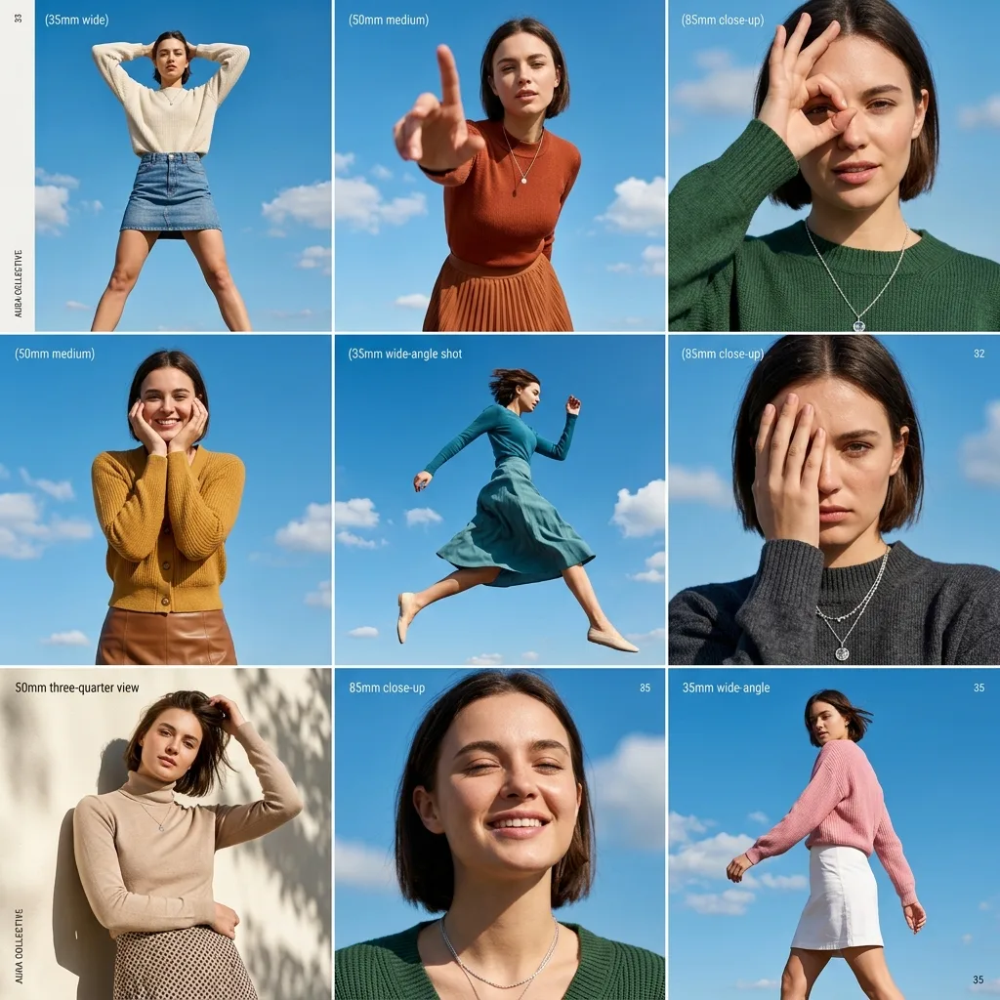

**#321 · Photography Prompt · <code>Vinano Image Pro</code>**

<details>
<summary>Show prompt</summary>

```
一张高分辨率的3x3网格照片拼贴，包含九个不同的动态姿势，以上传的女性面部照片为参考，背景是充满活力的蔚蓝天空，点缀着朵朵白云，强烈的明暗自然阳光照射下，形成清晰的阴影。人物身穿针织衫，搭配一条裙子，并佩戴一条纤细的银项链。摄影运用了多种焦距，从35mm广角全身镜头到85mm特写人像镜头，画面切换自如。姿势丰富多样，包括：双腿分开、双手抱头的有力姿势；手掌直指镜头的透视效果；透过一只眼睛上方“OK”手势的俏皮特写；双手托腮的欢快中景；以及用手遮住半张脸的忧郁姿势。图像质量高达 8K 分辨率，呈现出超逼真的效果，展现了细腻的肌肤纹理、次表面散射、逼真的衣物褶皱以及根根分明的发丝，呈现出高端商业时尚画册或生活方式宣传片的精致美感。 追求杂志编辑式的设计感，刻意安排留白与视觉重心。
```

</details>

---

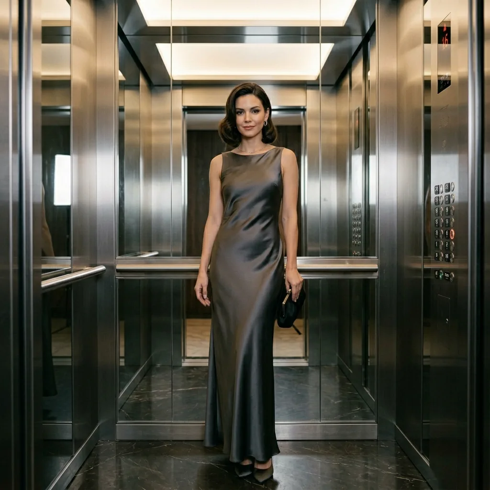

**#322 · Photography Prompt · <code>Vinano Image v2</code>**

<details>
<summary>Show prompt</summary>

```
{
  "render_goal": "Contemporary cinematic fashion portrait",
  "subject": {
    "pose": "female standing inside a luxury elevator",
    "expression": "subtle confident smile"
  },
  "wardrobe": "sleek satin gown in muted graphite tone",
  "environment": {
    "location": "brushed metal elevator interior",
    "props": "soft ceiling lights, mirror reflections"
  }
}

Keep edges clean and the overall composition balanced for a polished, gallery-ready result.
```

</details>

---

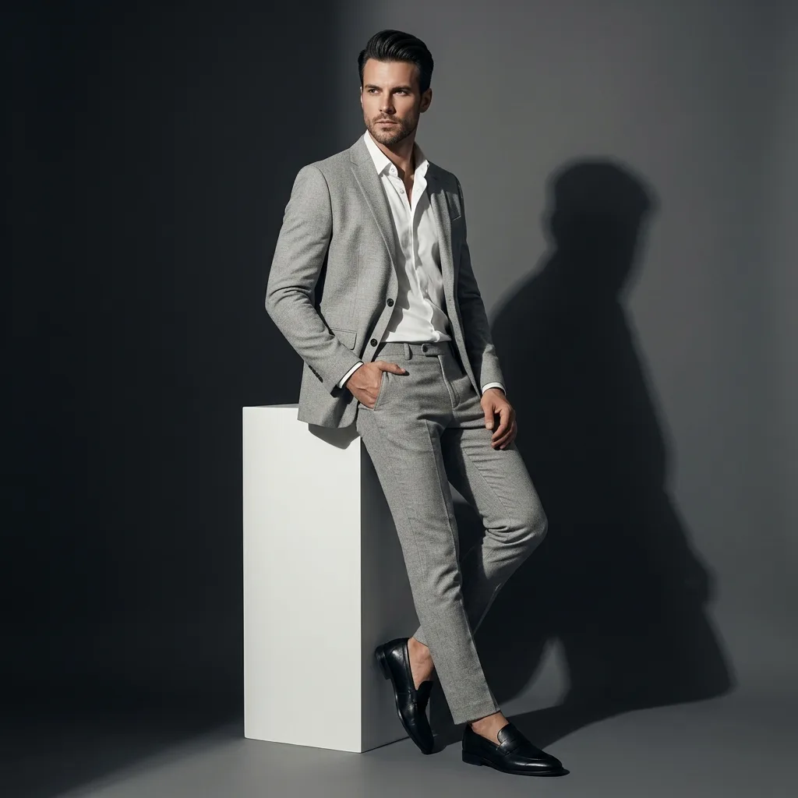

**#323 · Photography Prompt · <code>Vinano Image Pro</code>**

<details>
<summary>Show prompt</summary>

```
{
 "prompt": "Ultra-realistic high-end fashion editorial portrait of an adult man, 100% the uploaded reference image for exact face, identity, facial structure, and expression (no changes or stylization). The subject is leaning casually against a tall white rectangular pedestal in a minimal studio environment. Pose must match the reference exactly: body angled sideways, left hip resting on the pedestal, one hand casually placed inside the trouser pocket, the other relaxed by the thigh. One leg straight on the ground, the other slightly bent at the knee, feet crossed naturally at the ankles.\n\nHe is wearing a tailored light grey textured suit slim-fit trousers and a matching blazer, paired a white button-down shirt worn casually open at the collar (no tie). Black leather loafers a visible ankle gap, clean and elegant styling.\n\nFacial details preserved from the reference: sharp masculine jawline, light stubble beard, defined cheekbones, neatly styled dark hair swept back. Expression is serious and calm, eyes looking slightly off-camera to the side.\n\nLighting is dramatic hard side lighting from a single direction, creating strong, sharp shadows and a clear silhouette shadow of the subject projected onto the wall behind him. High-contrast light-and-shadow geometry enhances the cinematic editorial mood.\n\nBackground consists of a smooth dark grey studio wall and floor, refined minimalist and distraction-free, no props other than the pedestal. Luxury fashion magazine aesthetic, ultra-sharp focus, realistic skin texture, fine fabric details, cinematic contrast. DSLR photography look an 85mm lens, shallow depth of field, muted neutral color grading. Vertical composition, premium editorial quality, 8K photorealism.",
 "aspect_ratio": "4:5",
 "resolution": "8K",
 "camera_lens": "85mm",
 "style": "luxury fashion editorial, cinematic",
 "lighting": "dramatic hard side lighting, high contrast",
 "quality": "ultra-realistic, premium",
 "reference_image": "strictly use uploaded image only"
}

Render with rich micro-detail while keeping the layout uncluttered and intentional.
```

</details>

---

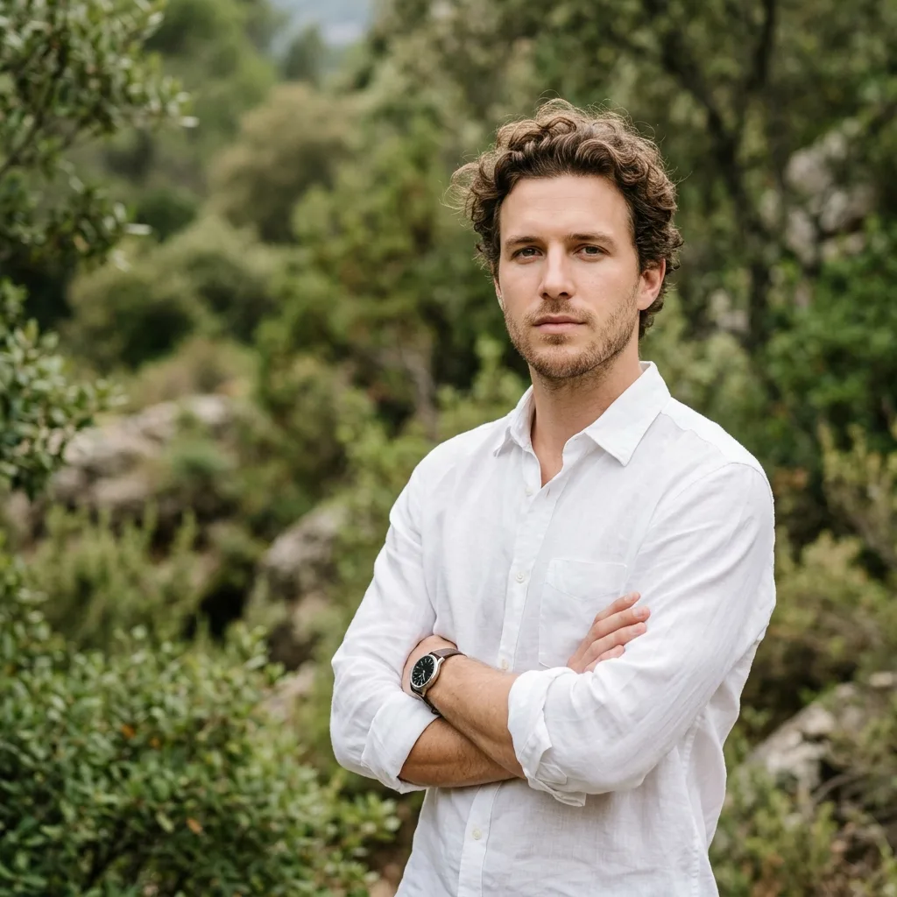

**#324 · Photography Prompt · <code>Vinano Image Pro</code>**

<details>
<summary>Show prompt</summary>

```
{ "scene_type": "outdoor portrait", "composition": { "framing": "medium shot", "orientation": "vertical", "subject_position": "center-right", "pose": "arms crossed, body angled slightly to the right, head turned slightly left", "camera_angle": "eye-level", "depth_of_field": "shallow, strong background blur" }, "subject": { "gender_presentation": "male", "age_range": "mid-20s to early-30s", "skin_tone": "light", "facial_features": "defined jawline, light stubble beard, straight nose, soft cheek contours", "expression": "calm, contemplative, neutral confidence", "gaze_direction": " On camera" }, "hair": { "color": "medium brown", "style": "short to medium length, naturally curly volume on top", "texture": "soft, slightly tousled" }, "wardrobe": { "top": { "type": "long-sleeve button-up shirt", "color": "white", "material": "lightweight linen or linen-blend", "fit": "relaxed, tailored", "details": "collarless or minimal collar, sleeves rolled to forearm" }, "accessories": { "watch": { "type": "analog wristwatch", "strap_color": "dark brown or black leather", "dial_color": "dark, likely black", "style": "classic, refined minimalist" } } }, "lighting": { "type": "natural daylight", "quality": "soft, diffused", "direction": "front-left", "contrast": "low to medium", "highlights": "gentle highlights on face and shirt", "shadows": "soft, minimal shadowing" }, "color_palette": { "dominant_colors": ["green", "white", "earth tones"], "background_tones": ["olive green", "forest green", "muted brown"], "overall_temperature": "warm-neutral" }, "background": { "environment": "natural landscape", "elements": ["green shrubs", "trees", "rock formations", "wild vegetation"], "focus": "heavily blurred (bokeh)", "mood": "serene, organic, outdoorsy" }, "artistic_style": { "genre": "lifestyle portrait photography", "aesthetic": "natural, clean, understated elegance", "mood": "calm, confident, introspective", "visual_story": "modern refined minimalist man in harmony nature" }, "technical_traits": { "lens_effect": "portrait lens background compression", "aperture_estimate": "wide (approximately f/1.8–f/2.8)", "sharpness": "high subject sharpness", "noise": "minimal", "post_processing": "light color correction, natural skin tones, subtle contrast enhancement" }, "typography": { "present": false } } Maintain consistent colour harmony and crisp focus across the whole frame.
```

</details>

---

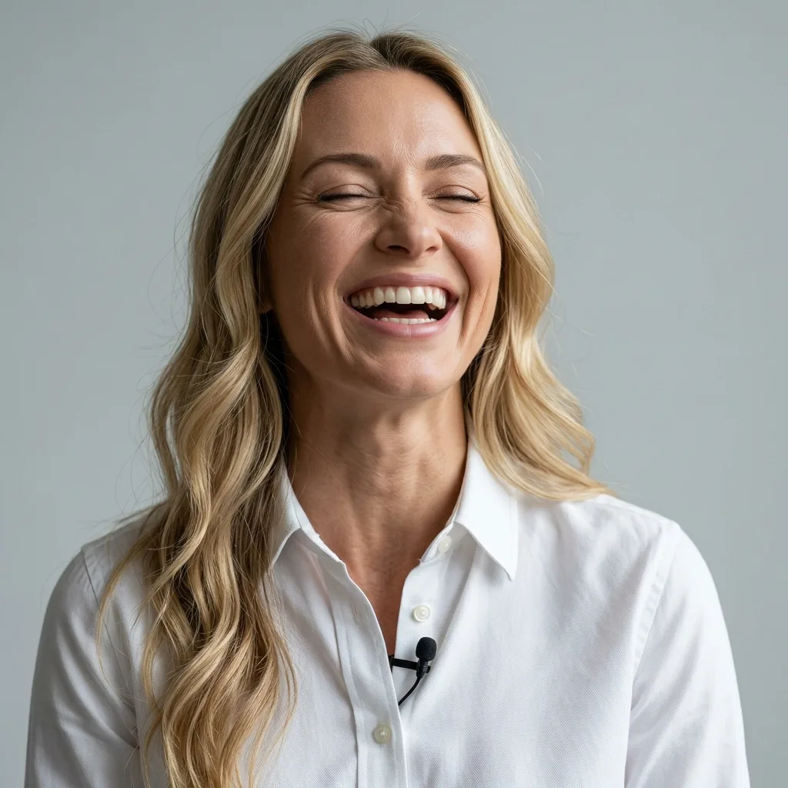

**#325 · Photography Prompt · <code>Vinano Image v2</code>**

<details>
<summary>Show prompt</summary>

```
{
 "action": "image_generation",
 "action_input": {
 "prompt": "A high-detail, 8K close-up portrait of the same woman from the previous images the same facial features and long blonde wavy hair. She is captured in a moment of genuine, joyful laughter her head slightly tilted back and eyes closed. She is wearing a crisp white button-down social shirt a small black lapel microphone attached. The background is a refined minimalist, smooth light gray studio wall. The lighting is soft and professional, highlighting the texture of the fabric and the natural details of her expression. Cinematic quality, realistic skin textures, 2:3 aspect ratio.",
 "aspect_ratio": "2:3"
 }
}

Emphasise material texture and natural light so the final frame feels tactile and premium.
```

</details>

---


**#326 · Photography Prompt · <code>Vinano Image Pro</code>**

<details>
<summary>Show prompt</summary>

```
Create a high-impact editorial studio portrait the person from the attached reference photo as the only identity source.

Preserve the subject’s facial structure, skin tone, proportions, hairstyle, age, and overall likeness exactly as in the reference image. Do not modify, enhance, reshape, beautify, or reinterpret any facial features. Absolute identity accuracy is required.

The subject is framed in a medium close-up (head and shoulders), photographed from a low-angle perspective looking slightly upward to create a powerful, dominant presence. The subject’s gaze is directed off-camera, upward into space, a serious, focused, intense expression.

Wardrobe: premium black pique polo shirt visible cotton mesh texture. The fit is sharp and tailored, deep matte black fabric, structured and clean silhouette.

Background: solid vibrant orange-red studio backdrop smooth, seamless color gradients. No patterns or texture — only rich, intense color creating a heated, dramatic atmosphere.

Lighting: bold, high-contrast studio lighting dominated by orange and deep red tones. Strong directional key light creates dramatic chiaroscuro shadows that emphasize facial structure and jawline. Add a powerful rim light or edge glow separating the shoulders and head from the background. Maintain depth and dimensionality.

Mood: heroic, intense, commanding, cinematic studio aesthetic.

Technical quality: ultra-true-to-life photorealistic, highly detailed, sharp focus on the face, visible natural skin texture and pores, no smoothing. Background gradients smooth and clean.

High resolution, studio-grade quality, professional editorial finish

Emphasise material texture and natural light so the final frame feels tactile and premium.
```

</details>

---

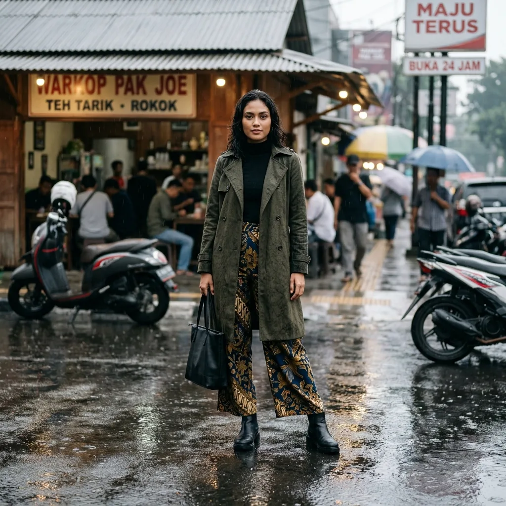

**#327 · Photography Prompt · <code>Vinano Image v2</code>**

<details>
<summary>Show prompt</summary>

```
Full body fashion editorial of a beautiful Indonesian woman, wet pavement outside warkop, soft rain blur background.
Canon R5, 85mm f/1.4
Overcast natural light
Cool-toned Portra LUT
Harmony: 70% documentary.
sRef: rainy street realism.
Hidden tokens: damp air texture, reflective asphalt.

Render with rich micro-detail while keeping the layout uncluttered and intentional.
```

</details>

---

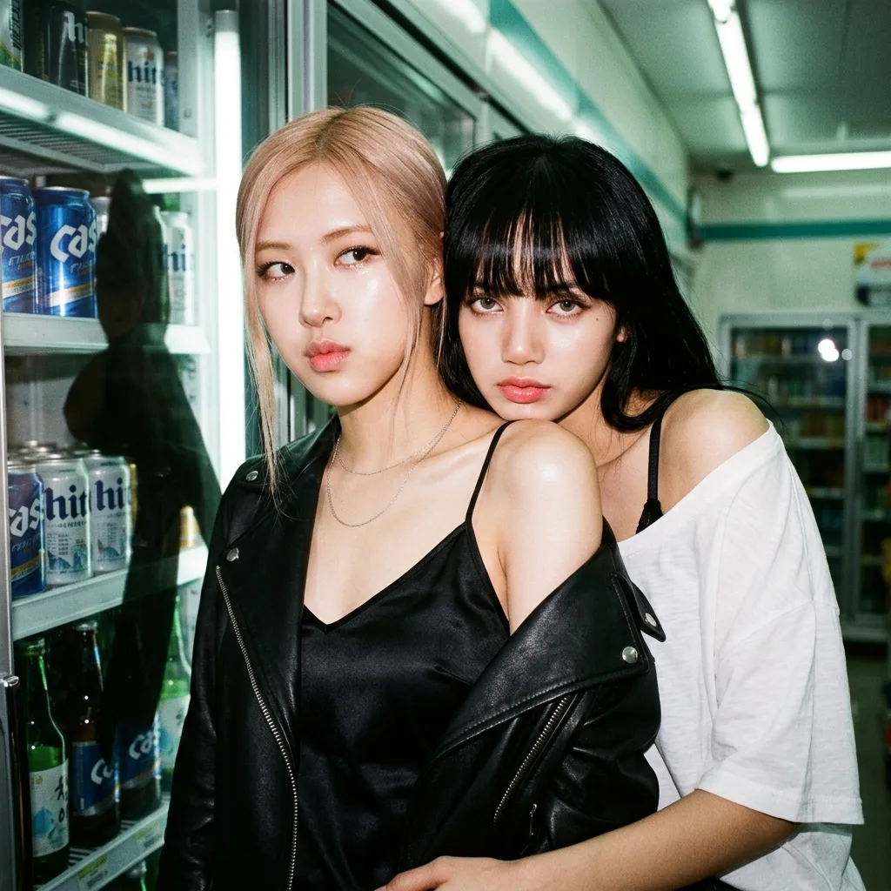

**#328 · Photography Prompt · <code>Vinano Image v2</code>**

<details>
<summary>Show prompt</summary>

```
mobile phone photo, CCD camera aesthetic, on-camera flash photography,
  harsh direct flash hard shadows cast on convenience store
  refrigerator glass behind them, soft film grain texture, aspect ratio
  9:16, centered composition, upper body portrait bust shot of TWO women,
  low angle shot looking up, from chest up including shoulders and
  collarbones,
  TWO Korean women, Rosé and Lisa from BLACKPINK, gorgeous off-duty K-pop female idols, convenience
  store at 3AM, both caught by sudden camera flash,
  IMPORTANT — SKIN QUALITY FOR BOTH WOMEN: milky luminous flawless skin,
  creamy smooth porcelain complexion subtle inner glow, perfectly
  even skin tone, zero visible pores zero blemishes, soft-focus skin
  surface like milk poured over glass, skin so smooth it almost glows
  under the flash, flash light bouncing off silky-smooth skin creating
  clean bright highlights no texture interruption, baby-soft
  flawless dewy finish,
  WOMAN A (ROSÉ - front, facing camera, leaning back against refrigerator
  glass door): 23 years old, innocent-sexy pure-and-seductive type,
  slim oval face delicate jawline, slightly hooded monolid eyes wide open
  prominent sparkly aegyo-sal under-eye fat pads highlighted subtle shimmer, light peach-brown eyeshadow clean and fresh, long
  natural curled lashes, signature pale strawberry blonde long straight hair one side 
  tucked behind ear exposing full neck line, cold-toned milky white
  flawless skin soft rosy flush on cheeks, wearing
  black satin spaghetti-strap camisole low neckline fabric clinging
  to full bust silky flash reflection, oversized black leather
  biker jacket slipped down to both elbows completely exposing both bare
  shoulders collarbones and thin straps, delicate silver chain necklace
  catching flash, head tilted slightly back and toward Lisa, cute
  playful expression — pouty lips and wide innocent eyes,
  WOMAN B (LISA - behind Rosé, pressed against her back, partially hidden):
  21 years old, innocent-sexy type, distinct doll-like face fuller cheeks, large round double-eyelid almond eyes full
  aegyo-sal, cold direct unblinking stare into camera subtle
  displeasure, lips closed and slightly pouting faint pink lip gloss, 
  jet black medium hair her iconic thick flat air bangs
  clinging to forehead, several dark strands draped across Rosé's 
  bare shoulder, warm-toned milky fair flawless skin, wearing 
  white oversized thin t-shirt stretched-out neckline slipping off 
  one shoulder revealing black bralette strap, her chin resting directly 
  on Rosé's bare shoulder skin-to-skin contact, one arm wrapped around 
  Rosé's waist fingers lightly gripping the hem of the satin camisole, 
  half her face hidden behind Rosé's shoulder, faces less than 5cm apart 
  but not touching, convenience store at 3AM, refrigerator glass door 
  behind them glowing cold white internal LED, blurred beer cans 
  visible through glass, overhead fluorescent lights greenish tint, 
  on-camera flash hitting Rosé fully and Lisa partially, harsh flash shadow 
  on refrigerator glass, CCD camera look soft fine film grain, 
  no full body, no legs, no extra people, no text, no watermark, 
  no identical faces, no visible pores, no rough skin texture.

Emphasise material texture and natural light so the final frame feels tactile and premium.
```

</details>

---

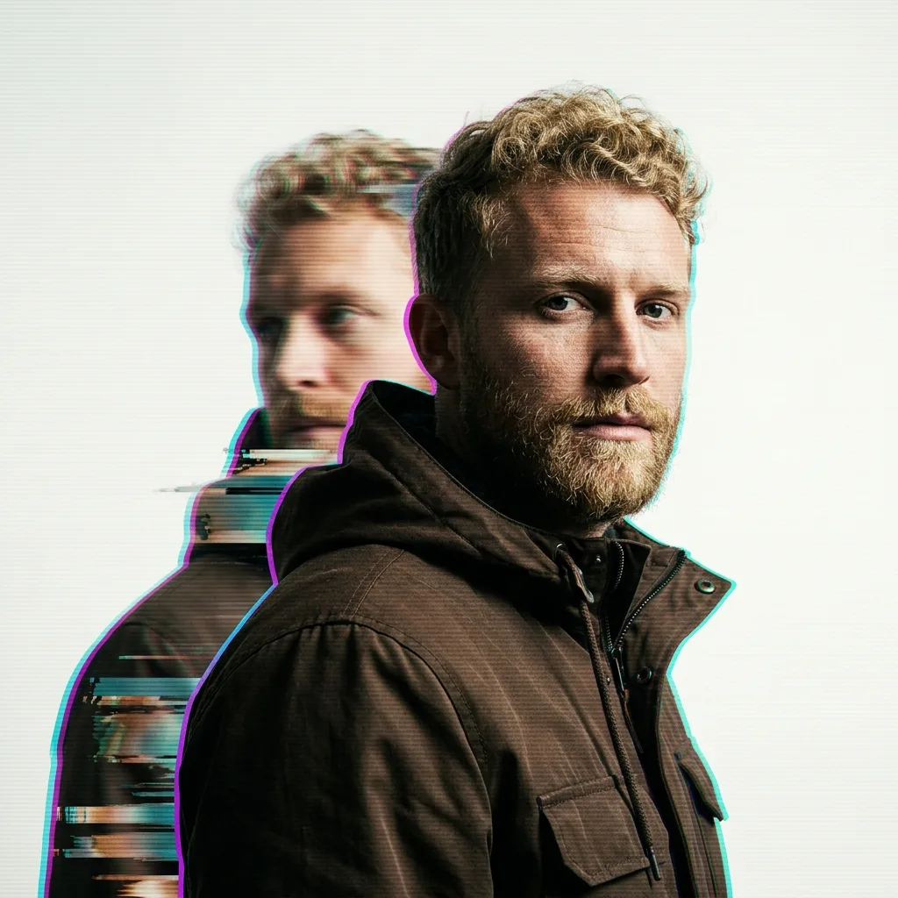

**#329 · Photography Prompt · <code>Vinano Image v2</code>**

<details>
<summary>Show prompt</summary>

```
A double exposure, long exposure editorial photograph of a man Use image for face reference in a brown hooded utility jacket sharp facial features and curly blonde hair. Apply a digital glitch distortion effect chromatic aberration (cyan and magenta color fringing), horizontal scan lines, and pixel sorting across the motion trails. Clean white backdrop, filmic, cinematic lighting, 35mm lens, high resolution, muted natural colors tech-inspired digital artifacts." Maintain consistent colour harmony and crisp focus across the whole frame.
```

</details>

---

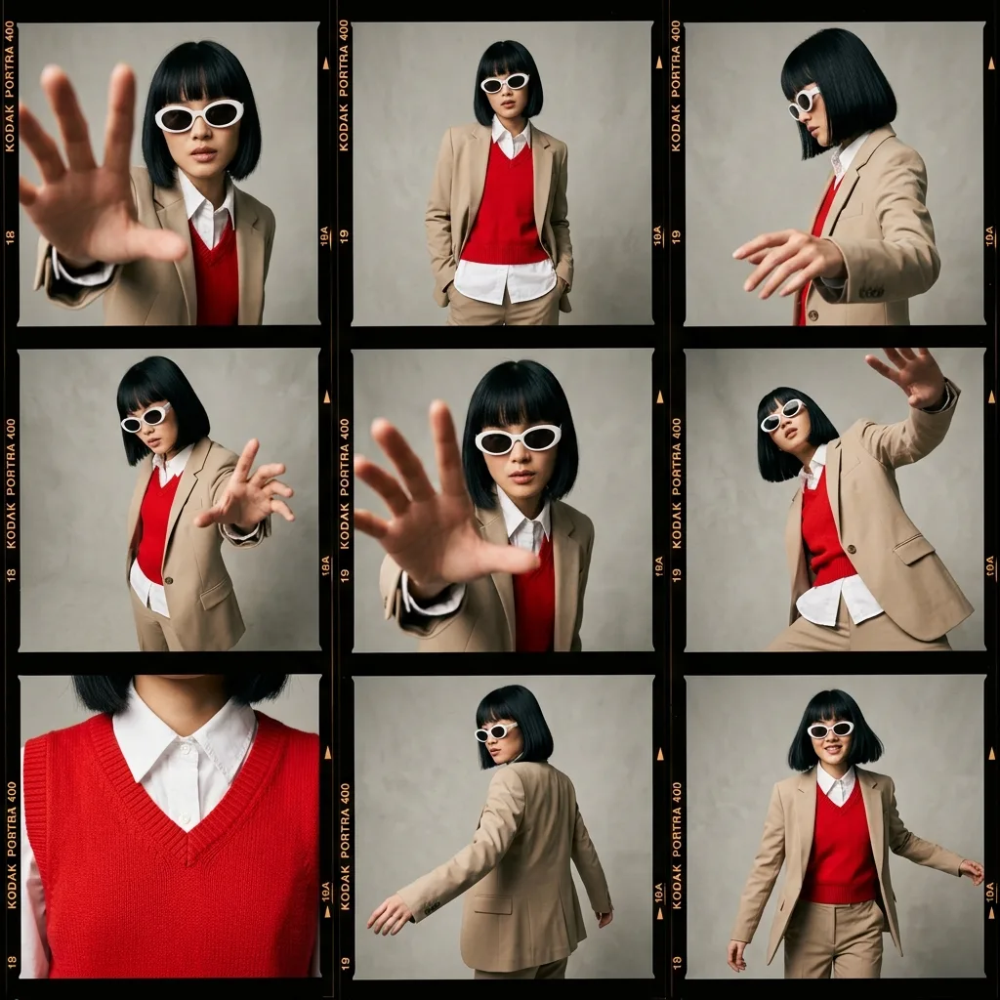

**#330 · Photography Prompt · <code>Vinano Image Pro</code>**

<details>
<summary>Show prompt</summary>

```
Editorial fashion contact sheet of a modern woman a sharp black bob haircut wearing white oval sunglasses, a beige tailored suit over a red sweater vest and white shirt, photographed in a refined minimalist studio a neutral grey backdrop. Multiple frames arranged in a 3×3 grid showing varied angles—front, side, top-down, back view—while the subject repeatedly reaches her hand toward the camera lens, creating strong depth and perspective distortion. Clean high-fashion styling, bold color contrast, soft diffused studio lighting, crisp focus, contemporary magazine aesthetic, 35mm–50mm look, ultra-sharp, high resolution. Render with rich micro-detail while keeping the layout uncluttered and intentional.
```

</details>

---

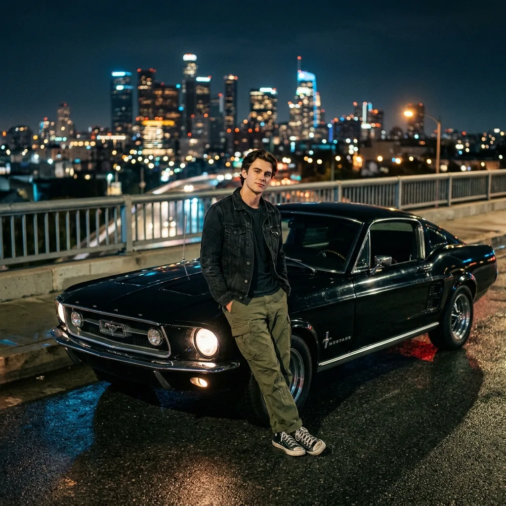

**#331 · Photography Prompt · <code>Vinano Image v2</code>**

<details>
<summary>Show prompt</summary>

```
A Cinematic Night Photo On A Dimly Lit Urban Overpass A View Of The City Skyline. In The Foreground, A Young Man Leaning Casually Against A Classic 1960s Ford Mustang Fast-back In A Sleek Black Finish. The Car's Muscu-lar Lines Are Accentuated By The Wet Asphalt Reflecting Neon Signs From Nearby Buildings. The Young Man Is Wearing A Black Trucker Jacket, A Simple Casual T-shirt, Loose Cargo Pants, And Converse Shoes. His Pose Is Re-laxed, One Hand In His Pocket, Looking Di-rectly At The Camera A Cool, Confident Expression.

The Shooting Style Uses A Fujifilm Camera Soft Cinematic Color Tones, A Slight Fine Grain, And Deep Shadows. The Dominant Color Tone Is A Moody Blue-teal, High-lights From Warm Streetlights Creating A Dramatic Contrast. The Depth Of Field Is Shal-low, Sharp Focus On The Young Man And The Mustang, While The City Lights In The Background Blur Into Soft, Cinematic Bokeн, Evoking The Aesthetic Of A Modern Analog Film Snapshot.

Emphasise material texture and natural light so the final frame feels tactile and premium.
```

</details>

---

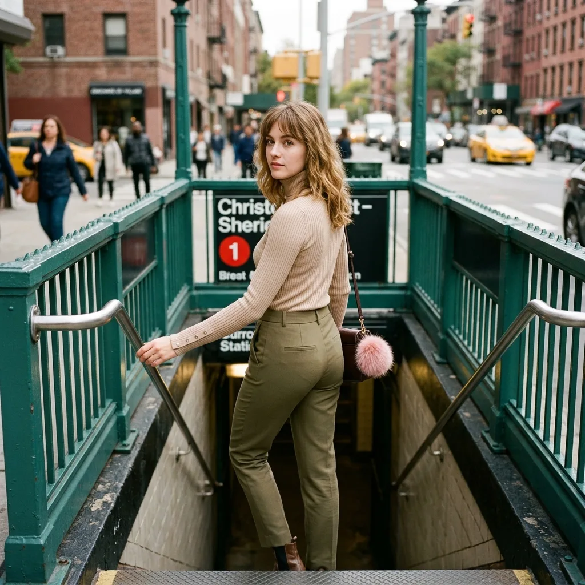

**#332 · Photography Prompt · <code>Vinano Image v2</code>**

<details>
<summary>Show prompt</summary>

```
{
 "image_generation": {
 "subject": {
 "description": "young woman standing at the entrance of a subway staircase in a city",
 "pose": "standing on subway steps, body facing downward, head turned back over shoulder",
 "expression": "calm, slightly curious, thoughtful",
 "gaze": "looking directly at the camera"
 },
 "appearance": {
 "hair": {
 "color": "light brown",
 "style": "shoulder-length wavy hair bangs"
 },
 "face": {
 "skin_tone": "fair",
 "makeup": "natural makeup subtle definition"
 },
 "accessories": ["small shoulder bag",
 "pink faux-fur bag accessory"]
 },
 "outfit": {
 "top": "beige fitted ribbed turtleneck sweater button details on sleeves",
 "bottom": "high-waisted olive green tailored pants",
 "footwear": "not visible"
 },
 "environment": {
 "setting": "urban subway entrance",
 "background_elements": ["green metal railings",
 "subway sign reading Christopher St Sheridan Sq",
 "city street pedestrians and taxis"],
 "location_vibe": "busy city atmosphere"
 },
 "lighting": {
 "type": "natural daylight",
 "direction": "soft ambient street lighting",
 "quality": "balanced gentle highlights and shadows"
 },
 "camera": {
 "angle": "slightly elevated eye-level",
 "framing": "three-quarter body shot",
 "lens": "35mm",
 "depth_of_field": "moderate, subject in sharp focus softly blurred background"
 },
 "aesthetic": {
 "style": "urban lifestyle fashion photography",
 "vibe": "cinematic, casual, metropolitan",
 "color_palette": "warm neutrals, olive green, muted city tones"
 },
 "quality": {
 "realism": "highly realistic",
 "resolution": "high resolution",
 "look": "editorial street-style photograph"
 }
 }
}

Maintain consistent colour harmony and crisp focus across the whole frame.
```

</details>

---


**#333 · Photography Prompt · <code>Vinano Image v2</code>**

<details>
<summary>Show prompt</summary>

```
Create a hyper-realistic macro photograph of a miniature surreal scene. The environment is dominated by a giant, oversized <everyday object>, which has been repurposed as a bustling landscape. Tiny, highly detailed miniature human figures are interacting around and on the object. Shot on an 85mm macro lens a shallow depth of field (f/1.8) to heavily blur the distant background. Lighting is soft, directional, and casts appropriate micro-shadows to emphasize the massive scale of the object relative to the figures. Intricate environmental details like dust particles and surface scratches are visible on the object. Cinematic, true-to-life photorealistic, 4K. Maintain consistent colour harmony and crisp focus across the whole frame.
```

</details>

---

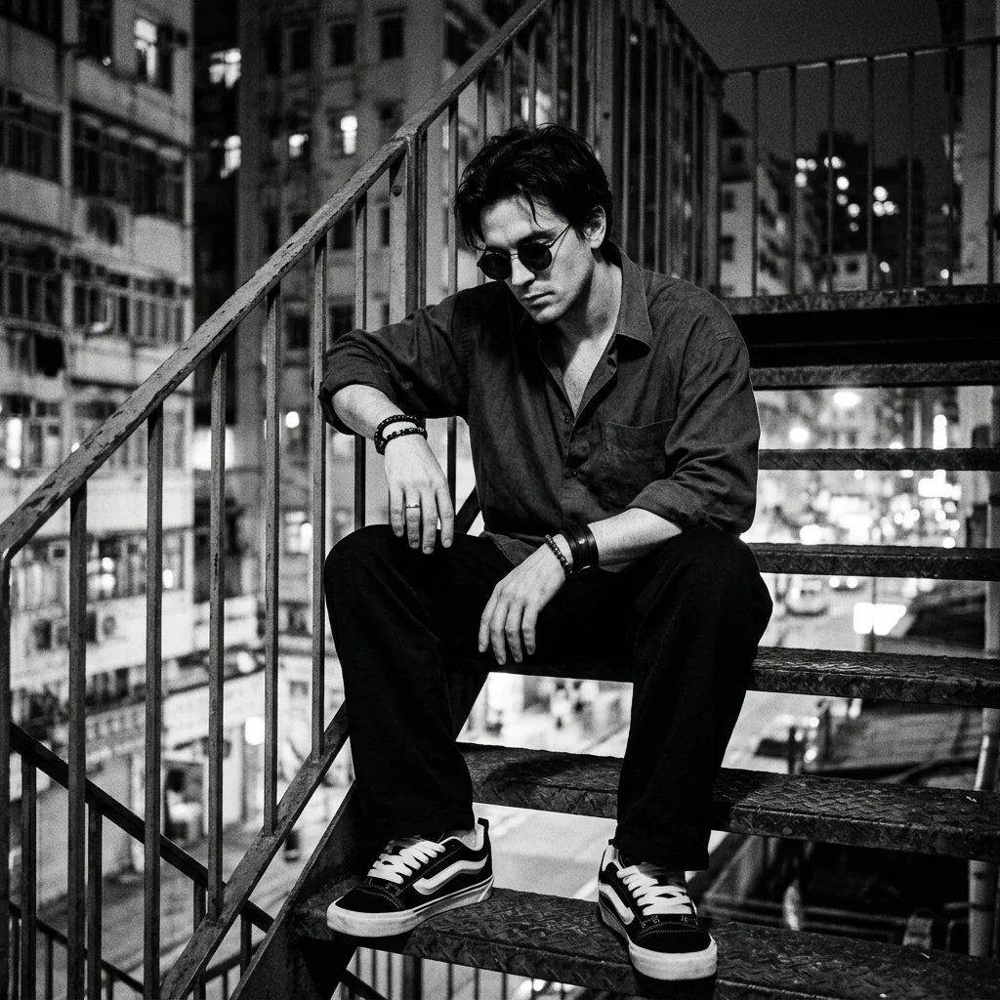

**#334 · Photography Prompt · <code>Vinano Image v2</code>**

<details>
<summary>Show prompt</summary>

```
Create a portrait without changing the facial features. A black and white artistic photograph of a man in a noir style. The man is sitting on a metal staircase or balcony a cityscape in the background. He is wearing a dark shirt an open collar, dark trousers, chunky sneakers, and sunglasses. Accessories are visible on his hands, including a bracelet. His pose is relaxed, his gaze directed downward. The lighting is high contrast deep shadows. The atmosphere reflects a 90s megacity, strong film grain, street fashion aesthetics, and a grunge mood.
High contrast lighting, film grain, 90s street style aesthetic, gritty noir atmosphere, grainy texture, 35mm film look.

Keep edges clean and the overall composition balanced for a polished, gallery-ready result.
```

</details>

---

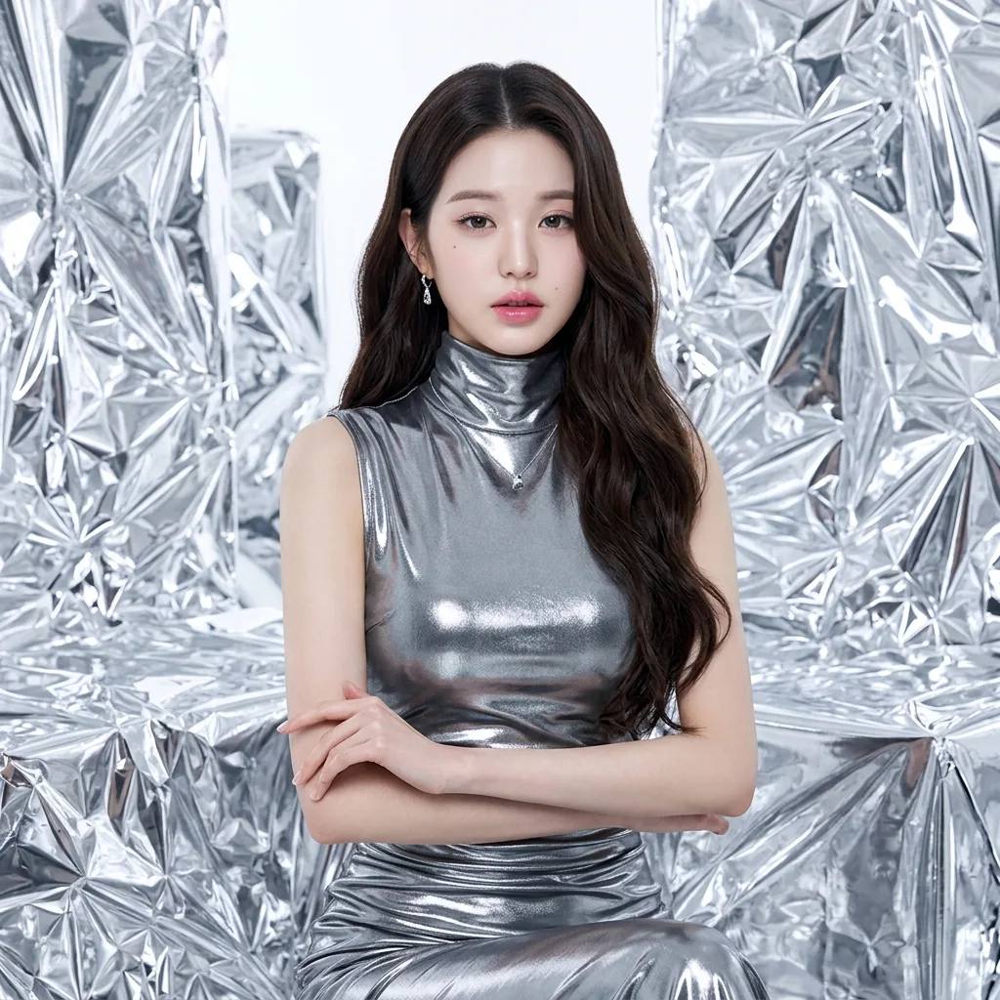

**#335 · Photography Prompt · <code>Vinano Image v2</code>**

<details>
<summary>Show prompt</summary>

```
{
  "meta": {
    "image_quality": "High",
    "image_type": "Photo/Digital Render",
    "resolution_estimation": "1080x1920 (aspect ratio 9:16)"
  },
  "global_context": {
    "scene_description": "Jang Wonyoung of IVE poses in a highly reflective, futuristic environment constructed entirely of crumpled silver metallic foil. She has her signature long, wavy dark hair and doll-like features, including her distinct beauty marks. She is wearing a matching sleeveless, high-neck metallic silver dress. The scene is bathed in bright, diffused white light.",
    "time_of_day": "Indeterminate/Studio lighting",
    "weather_atmosphere": "Clinical/Futuristic/Monochromatic",
    "lighting": {
      "source": "Artificial",
      "direction": "Omnidirectional/Diffused",
      "quality": "Soft but creating high-contrast reflections",
      "color_temp": "Neutral/Cool"
    }
  },
  "color_palette": {
    "dominant_hex_estimates": ["#C0C0C0", "#E5E5E5", "#1A1A1A"],
    "accent_colors": ["Silver", "Chrome", "Dewy Skin Tone"],
    "contrast_level": "High"
  },
  "composition": {
    "camera_angle": "Eye-level",
    "framing": "Medium-shot/Vertical",
    "depth_of_field": "Medium",
    "focal_point": "Jang Wonyoung's face and eyes"
  },
  "objects": [{
      "id": "obj_001",
      "label": "Jang Wonyoung",
      "category": "Person",
      "location": "Center foreground",
      "prominence": "Foreground",
      "visual_attributes": {
        "color": "Fair skin, dark espresso hair",
        "texture": "Dewy glass skin, silky hair, metallic clothing",
        "material": "Skin/Hair/Fabric",
        "state": "Posed",
        "dimensions_relative": "Dominates vertical center"
      },
      "micro_details": ["Signature symmetrical beauty marks",
        "Plump gradient pink lips",
        "Small silver drop earring on left ear",
        "Thin silver necklace a small pendant",
        "Soft shadows under the jawline",
        "Fingers of right hand resting on left forearm"],
      "pose_or_orientation": "Seated/Kneeling, facing forward, arms crossed loosely at waist",
      "text_content": null
    },
    {
      "id": "obj_002",
      "label": "Metallic Dress",
      "category": "Clothing",
      "location": "Center",
      "prominence": "Foreground",
      "visual_attributes": {
        "color": "Polished Silver/Chrome",
        "texture": "Liquid-like, reflective",
        "material": "Synthetic Metallic Fabric",
        "state": "New/Tight-fitting"
      },
      "micro_details": ["Horizontal tension folds across the waist",
        "High turtleneck collar reflecting the chin",
        "Distorted reflection of foil room",
        "Sleeveless cut-outs"],
      "pose_or_orientation": "Form-fitting",
      "text_content": null
    }]
}

Keep edges clean and the overall composition balanced for a polished, gallery-ready result.
```

</details>

---

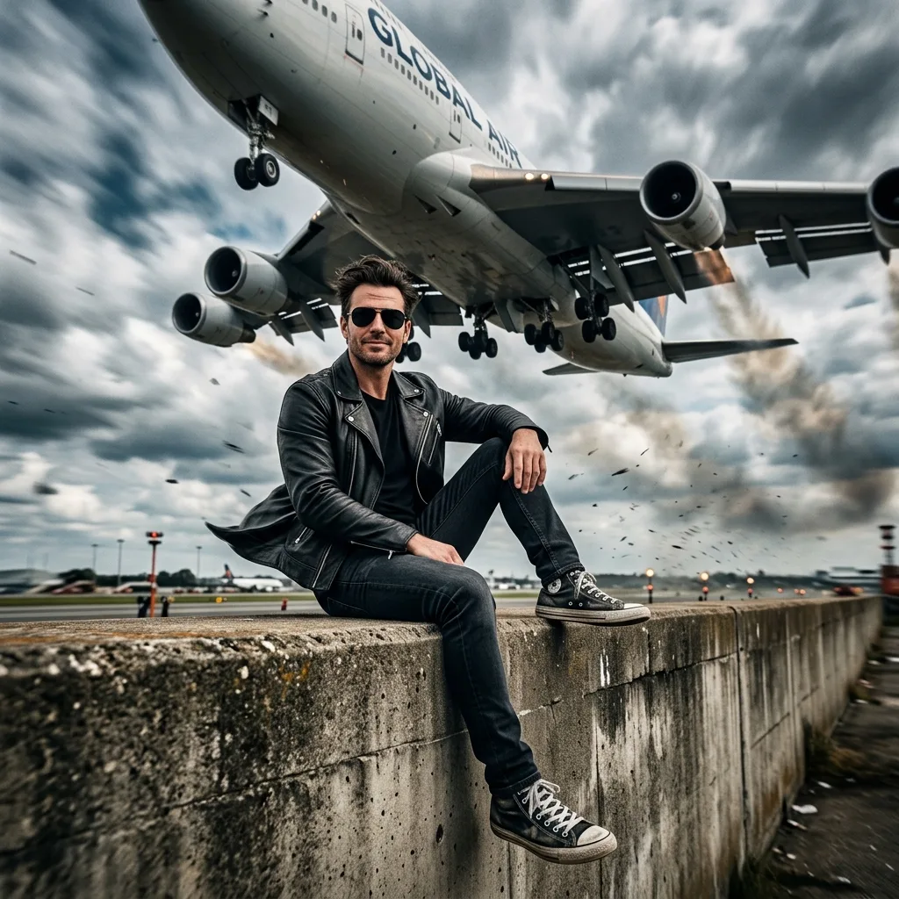

**#336 · Photography Prompt · <code>Vinano Image v2</code>**

<details>
<summary>Show prompt</summary>

```
Create an ultra-realistic cinematic 8K portrait, use face reference exactly (100% identical, no changes) - preserve original facial features, proportions, skin texture, hair, and expressions. A man wearing black sunglasses, a black t-shirt, black leather jacket, dark denim pants, and black Converse-style sneakers sits casually on a concrete ledge. One leg is bent while the other hangs freely. His posture is relaxed, projecting calm confidence. A massive airplane flies extremely low overhead, dominating the sky. Powerful wind ripples his jacket and clothing. Captured a wide-angle lens from a low perspective, creating dramatic scale. Motion blur appears in clouds, debris, and air turbulence, enhancing speed and intensity. Lighting is natural and cinematic strong contrast. The atmosphere feels surreal yet realistic, emphasizing depth, movement, and cinematic tension. Preserve realistic proportions and depth for a confident, professional finish.
```

</details>

---

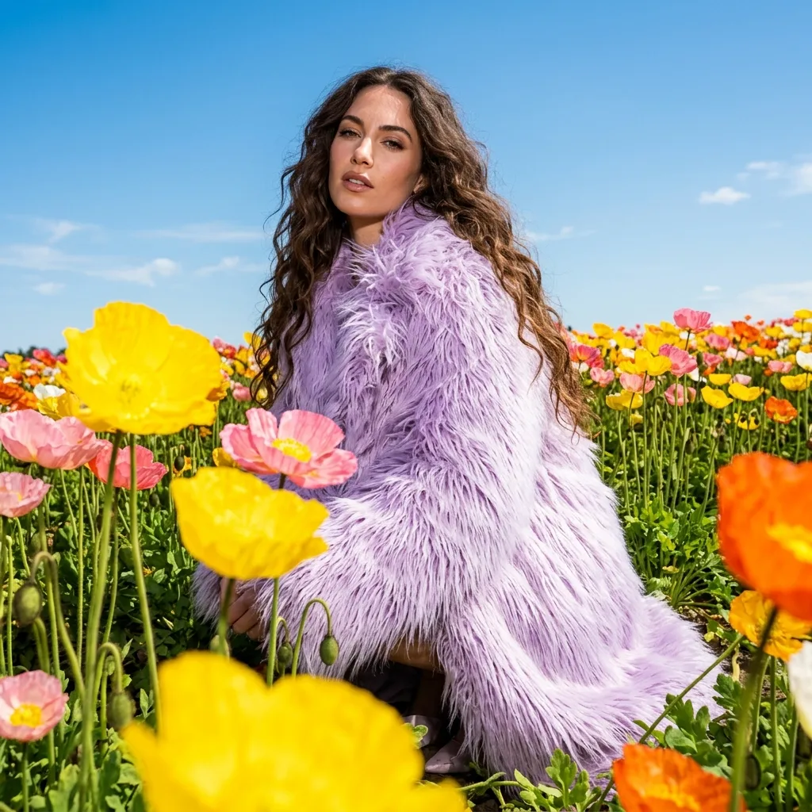

**#337 · Photography Prompt · <code>Vinano Image v2</code>**

<details>
<summary>Show prompt</summary>

```
Use this photo attached to create a striking outdoor fashion portrait set in a vibrant flower field during daylight, captured a digital camera a harsh flash. The camera angle is low and slightly tilted upward, intensifying the scene's energy and drama. The subject has long, loose, dark brown wavy hair cascading over a voluminous, soft, shaggy lavender faux fur coat that drapes naturally over the body. Surrounding the subject are large, colorful poppies in yellow, pink, and orange, some in the foreground and others in the background, creating an immersive field-of-flowers effect. The sky is clear and blue, providing a crisp, contrasting backdrop. The mood is bold, editorial, and whimsical, making the vibrant colors of the outfit and flowers pop starkly against the serene sky. The overall composition should evoke a playful yet high-fashion atmosphere a hint of surrealism, emphasizing texture and color through the use of direct flash photography. Preserve realistic proportions and depth for a confident, professional finish.
```

</details>

---

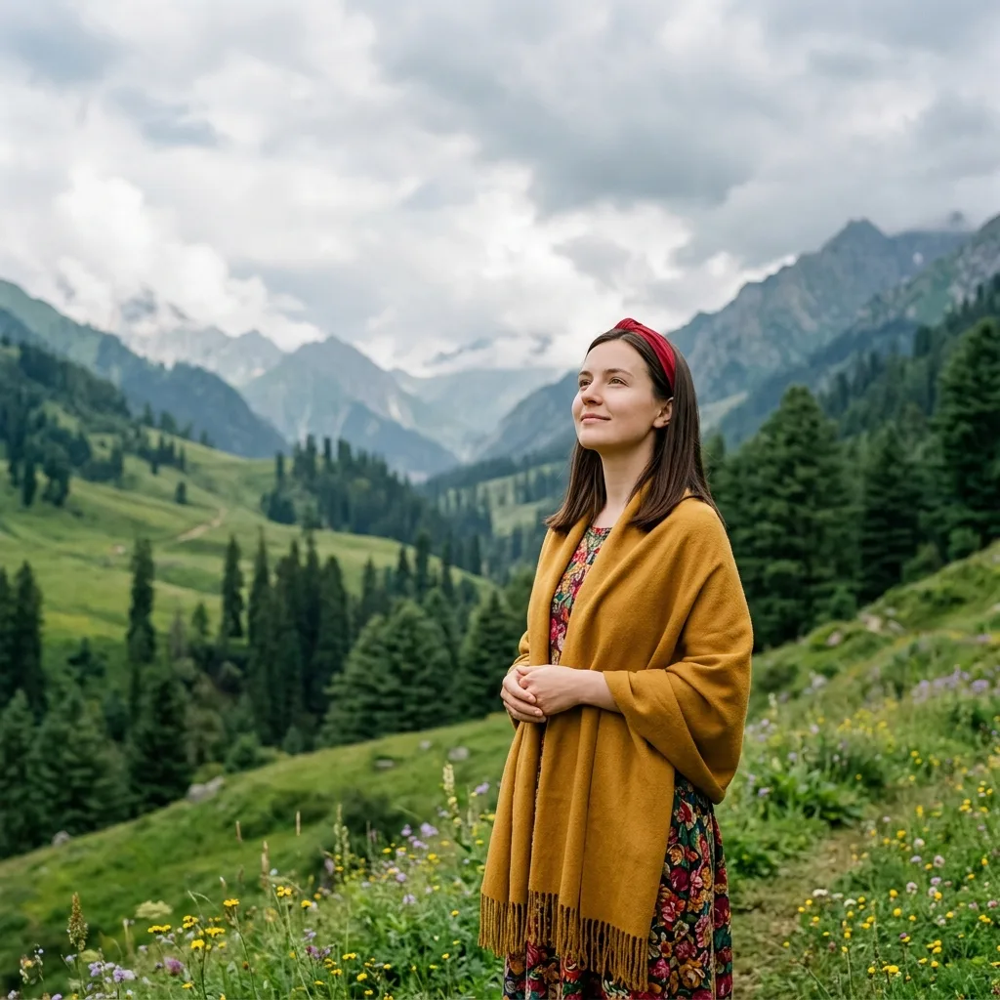

**#338 · Photography Prompt · <code>Vinano Image v2</code>**

<details>
<summary>Show prompt</summary>

```
{
 "image_generation": {
 "subject": {
 "description": "young woman standing in a lush green mountain valley",
 "pose": "standing naturally hands gently together, looking slightly upward",
 "expression": "calm, peaceful, soft smile",
 "gaze": "looking toward the sky"
 },
 "appearance": {
 "hair": {
 "color": "dark brown",
 "style": "straight, shoulder-length a red headband"
 },
 "face": {
 "skin_tone": "fair and natural",
 "makeup": "minimal, natural makeup"
 }
 },
 "outfit": {
 "top": "traditional patterned dress colorful floral design",
 "outerwear": "mustard yellow shawl draped over shoulders"
 },
 "environment": {
 "setting": "green mountainous landscape",
 "background_elements": ["rolling green hills",
 "tall pine trees",
 "misty mountains",
 "cloudy sky",
 "grassy field"]
 },
 "lighting": {
 "type": "natural outdoor light",
 "quality": "soft and diffused",
 "time": "daytime"
 },
 "camera": {
 "angle": "eye-level",
 "framing": "mid shot",
 "depth_of_field": "moderate, background softly blurred"
 },
 "aesthetic": {
 "style": "natural lifestyle photography",
 "vibe": "peaceful, fresh, scenic",
 "color_palette": "green, mustard yellow, earthy tones"
 },
 "quality": {
 "resolution": "high",
 "realism": "true-to-life photorealistic",
 "detail": "high detail"
 }
 }
}

Aim for an editorial, design-driven look with deliberate negative space.
```

</details>

---

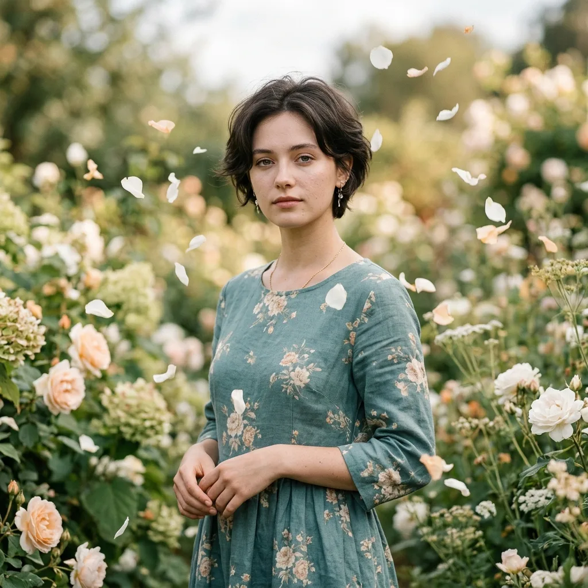

**#339 · Photography Prompt · <code>Vinano Image v2</code>**

<details>
<summary>Show prompt</summary>

```
{
 "Objective": "Create a dreamy fine-art portrait a romantic, ethereal garden atmosphere",
 "PersonaDetails": {
 "Subject": {
 "Type": "Young woman",
 "Hair": "Short, softly tousled dark hair",
 "Expression": "Calm, introspective, slightly melancholic",
 "Gaze": "Looking gently toward the camera",
 "Wardrobe": {
 "Dress": "Muted teal floral dress subtle vintage patterns"
 }
 }
 },
 "SceneDescription": {
 "Location": "Lush garden in full bloom",
 "EnvironmentDetails": ["Abundant flowering plants",
 "Soft greenery filling the frame"],
 "AtmosphericElements": {
 "FloatingPetals": "White and pale peach flower petals drifting through the air",
 "Motion": "Petals caught mid-motion by a gentle breeze"
 }
 },
 "Composition": {
 "Framing": "Waist-up fine-art portrait",
 "Balance": "Elegant, centered composition",
 "DepthOfField": "Shallow depth of field",
 "Background": "Softly blurred garden creamy bokeh"
 },
 "LightingAndColor": {
 "Lighting": "Soft natural light under overcast sky",
 "ColorPalette": ["Muted greens",
 "Soft teals",
 "Pale peach and white accents"],
 "ColorGrading": "Painterly, desaturated, romantic tones"
 },
 "ArtDirection": {
 "Style": "Fine-art photography blended cinematic realism",
 "Aesthetic": "Romantic, ethereal, timeless",
 "TextureQuality": "Ultra-detailed fabric and natural skin texture"
 },
 "PhotographyStyle": {
 "LensLook": "85mm lens perspective",
 "Genre": "Fine-art portrait photography",
 "ImageQuality": "High resolution, refined detail",
 "FocusStyle": "Soft yet precise subject focus"
 },
 "Mood": {
 "Tone": "Dreamy, reflective, poetic",
 "EmotionalFeel": "Gentle melancholy and quiet beauty"
 },
 "NegativePrompt": ["harsh lighting",
 "modern fashion editorial",
 "oversaturated colors",
 "busy background",
 "plastic skin",
 "cartoon",
 "anime"],
 "ResponseFormat": {
 "Type": "Single image",
 "Orientation": "Portrait",
 "AspectRatio": "2:3"
 }
}

Emphasise material texture and natural light so the final frame feels tactile and premium.
```

</details>

---

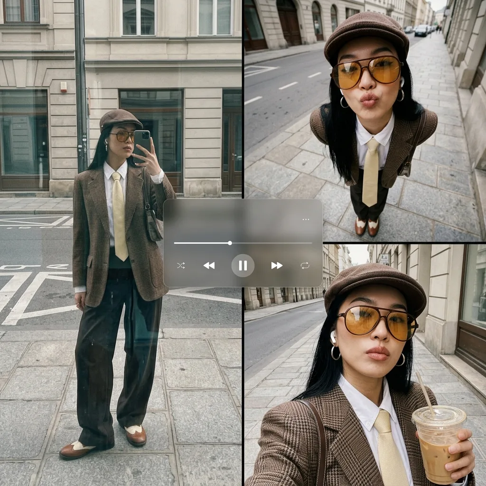

**#340 · Photography Prompt · <code>Vinano Image Pro</code>**

<details>
<summary>Show prompt</summary>

```
Transform this image [Upload Your Image] into a 64K DSLR shot resolution of A stylish urban fashion collage composed of multiple candid street-style shots arranged in a vertical split layout. The setting is a European-style city street stone-paved sidewalks, historic architecture, and muted neutral tones. The overall atmosphere feels modern, artsy, and lifestyle-driven, blending fashion photography everyday urban moments. The main subject is a fashion-forward young woman (same face as the uploaded image) long black hair, wearing a coordinated vintage-inspired outfit. She has a confident, playful, slightly rebellious attitude expressed through her body language and facial expressions. Her outfit consists of a brown plaid blazer, a white button-up shirt, and a pale yellow tie, paired loose dark trousers and two-tone leather shoes. She accessories a brown fitted cap, large amber-tinted aviator sunglasses, silver hoop earrings, and a small shoulder bag. White wireless earbuds are visible in some frames, reinforcing a casual, modern lifestyle aesthetic.

Left panel: A reflective mirror shot taken through a glass surface, showing the subject (same face as the uploaded image) holding a smartphone up to her face while taking a photo. The reflection slightly distorts the scene, creating layered depth urban elements like street markings and building facades blending into the glass. Top-right panel: A high-angle shot looking down at the subject (same face as the uploaded image) as she leans forward toward the camera, lips pursed in a playful pout, emphasizing her expressive personality and bold eyewear.

Bottom-right panel: A close-up selfie angle where she looks directly into the camera while holding an iced coffee in a clear plastic cup, earbuds in, sunlight softly illuminating her face and sunglasses.

Overlayed across the center of the collage is a refined minimalist music player UI, semi-transparent, displaying a paused or playing track progress bar and controls, adding a digital, lifestyle-tech aesthetic. The interface floats above the imagery, blending seamlessly the collage and reinforcing a "day-in-the-life" mood. Lighting is natural daylight soft shadows. The color palette is muted and earthy browns, greys, yellows-enhanced subtle film grain and a slightly desaturated, editorial color grade. The overall mood is effortlessly cool, candid, and contemporary, mixing street fashion, music culture, and casual city exploration. Style & Quality Tags: Street-style fashion photography, lifestyle editorial, urban aesthetic, candid moments, vintage-inspired outfit, natural light, muted color grading, subtle film grain, modern collage layout, high-resolution, Instagram editorial style.

Octane render & Unreal Engine 5.

Emphasise material texture and natural light so the final frame feels tactile and premium.
```

</details>

---


**#341 · Photography Prompt · <code>Vinano Image Pro</code>**

<details>
<summary>Show prompt</summary>

```
ultra realistic cinematic portrait poster of a confident man the attached face image as reference, centered headshot shoulders visible and a calm powerful expression. Use dramatic studio lighting a soft key light and subtle rim lighting for depth and contrast. The background should be dark matte black or charcoal a luxury cinematic feel. Place very large tall condensed vertical typography behind the subject in the same stretched style as the reference image, partially hidden by the subject, the text placeholder “[INSERT TITLE TEXT HERE]”. The typography should be metallic gold a subtle foil shine. Dress the subject in a refined masculine outfit such as a black tailored suit or elegant modern sherwani. Style the image as a classy luxury editorial poster deep black and gold tones, ultra realistic skin detail, shallow depth of field, cinematic color grading, and high resolution professional photography Keep edges clean and the overall composition balanced for a polished, gallery-ready result.
```

</details>

---

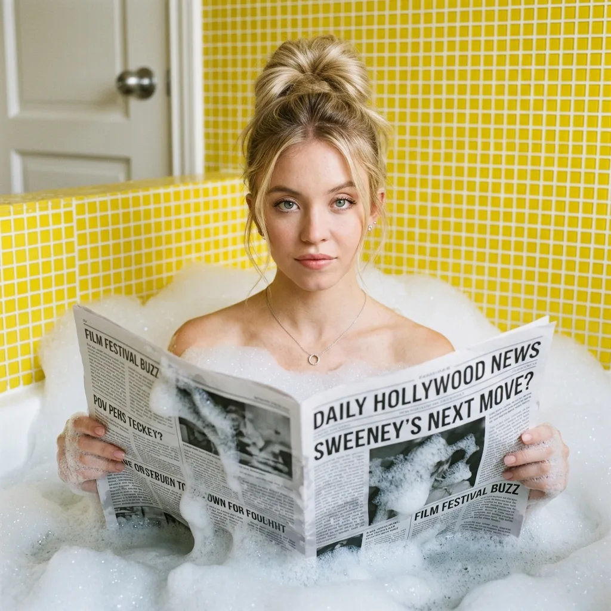

**#342 · Photography Prompt · <code>Vinano Image v2</code>**

<details>
<summary>Show prompt</summary>

```
A young blonde Hollywood actress, similar to Sydney Sweeney, appears inside a bathtub filled foam up to the brim. Her blonde hair is styled in a high, voluminous, slightly messy bun, a few loose strands softly framing her face. She looks directly at the camera a neutral, subtly seductive expression, her lips slightly parted. She wears light, natural makeup, a delicate silver chain necklace a small circular pendant, and small, discreet stud earrings.

Her upper body faces forward, visible above the foam. She holds a large open printed newspaper both hands at chest height, as if reading it. The newspaper is partially covered dense white soap foam, which also gathers around her in thick, fluffy bubbles filling the bathtub. Beneath the foam and the newspaper, she is wearing a green beach top that remains completely hidden.

The scene takes place inside a tiled bathtub. In the background, there is a vibrant wall completely covered small, bright yellow square mosaic tiles. In the left corner of the composition, a slightly out-of-focus white door frame is visible, a silver metallic doorknob.

The lighting is soft, diffused, and even indoor lighting, coming from the front and slightly from above. It creates soft, flattering highlights on her face, shoulders, and hair, very few harsh shadows. The image conveys an eccentric, artistic, editorial atmosphere that feels slightly surreal, yet calm and visually striking.

The color palette highlights the bright yellow tiles, the white foam, the blonde hair, and the gray tones of the newspaper. The photograph is a modern, true-to-life photorealistic editorial portrait cinematic framing. The composition is a medium shot from the upper bust upward, at eye level, a shallow depth of field that keeps the actress and the newspaper in sharp focus while slightly blurring the door handle in the foreground. The image is highly detailed, crisp focus, professional lighting, vibrant high-contrast colors, and extremely premium quality in 8K resolution, in a 4:5 aspect ratio.

Render with rich micro-detail while keeping the layout uncluttered and intentional.
```

</details>

---

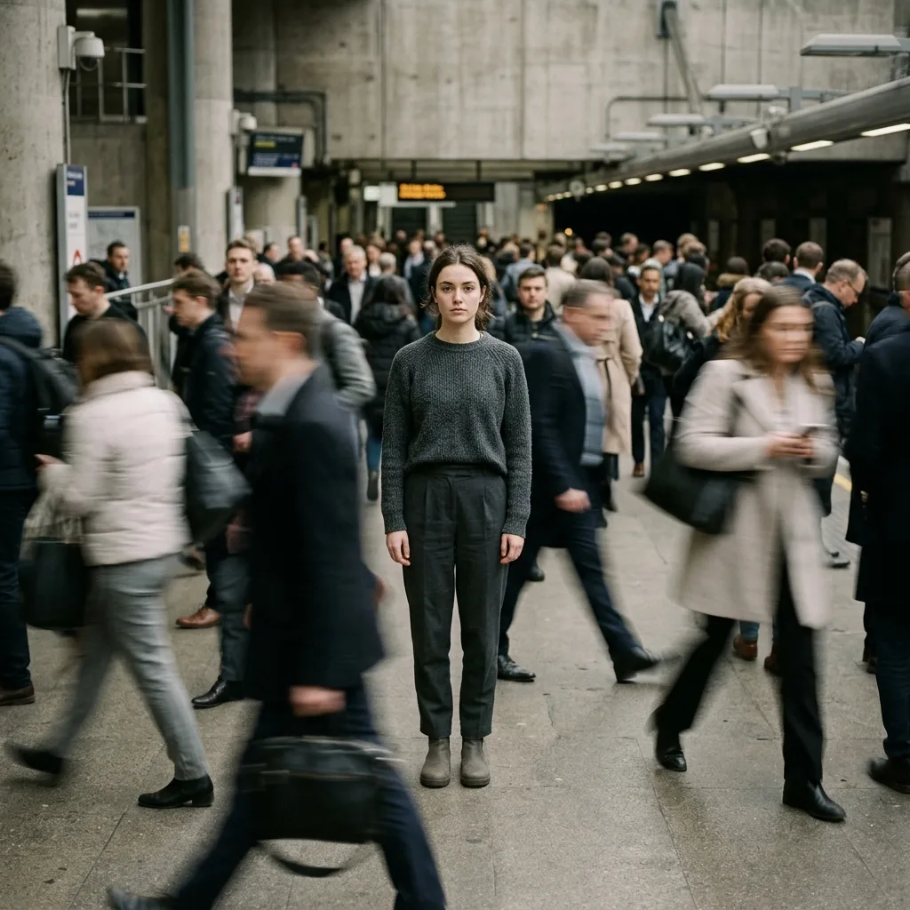

**#343 · Photography Prompt · <code>Vinano Image v2</code>**

<details>
<summary>Show prompt</summary>

```
Cinematic motion-blur photography shot on a Leica SL3 a 50mm Summilux at f/2.8, captured from a chest-level frontal angle slow shutter panning.

Lighting setup: flat overcast daylight acting as soft diffusion, allowing long blur trails without harsh contrast.

Color tone: muted concrete greys and pale skin neutrals inspired by A24 films.

Subject: a Gen-Z female model standing completely still, sharp eyes, symmetrical face, real skin pores visible, wearing understated fashion.

Crowd action: hundreds of commuters rushing past in all directions, bodies stretched into smooth horizontal and diagonal blur.

Emotion: quiet rebellion through stillness.

Aesthetic: editorial calm vs chaos.

Post: clean motion physics, fine grain, no glitches, no face distortion, no warped anatomy.

Emphasise material texture and natural light so the final frame feels tactile and premium.
```

</details>

---

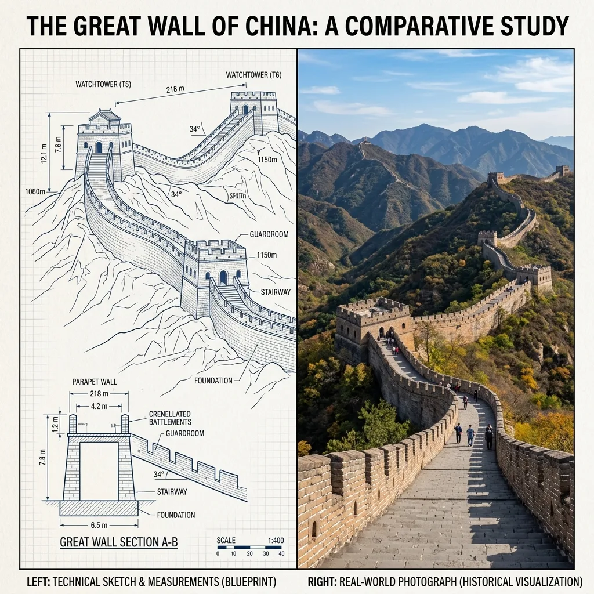

**#344 · Photography Prompt · <code>Vinano Image Pro</code>**

<details>
<summary>Show prompt</summary>

```
{
 "objective": "Create a side-by-side comparison image featuring a technical sketch and real photograph of the Great Wall of China",
 "image_specifications": {
 "style": "Mixed media (Technical drawing + Real photograph)",
 "layout": "Horizontal split - Left side: Sketch measurements, Right side: Real photo",
 "aspect_ratio": "3:2"
 },
 "left_side": {
 "content_type": "Technical sketch of the Great Wall of China",
 "features": ["Detailed architectural lines showing wall segments, watchtowers, and defensive structures",
 "Numerical measurements for wall height, width, and tower spacing",
 "Elevation labels for wall sections and towers",
 "Side elevation and top-down layout illustrating wall curvature along terrain"],
 "text_annotations": {
 "units": "Metric (meters)",
 "language": "English",
 "font_style": "Blueprint or engineering-style typography"
 },
 "positioning": "Take up the left half of the image"
 },
 "right_side": {
 "content_type": "High-resolution real photo of the Great Wall of China",
 "features": ["Wide panoramic view of the wall stretching across mountains",
 "Natural daylight clear or lightly clouded sky",
 "Realistic colors visible stone texture and surrounding landscape"],
 "positioning": "Take up the right half of the image"
 },
 "visual_elements": {
 "border_division": "Vertical line or subtle transition between left (sketch) and right (photo)",
 "color_palette": {
 "left": "Monochrome or blueprint blue for sketch",
 "right": "Natural realistic colors"
 }
 },
 "output_format": {
 "type": "Image",
 "use_case": ["Educational poster",
 "Architectural comparison",
 "Historical visualization",
 "Tourism visual aid"],
 "high_resolution": true
 }
}

Aim for an editorial, design-driven look with deliberate negative space.
```

</details>

---

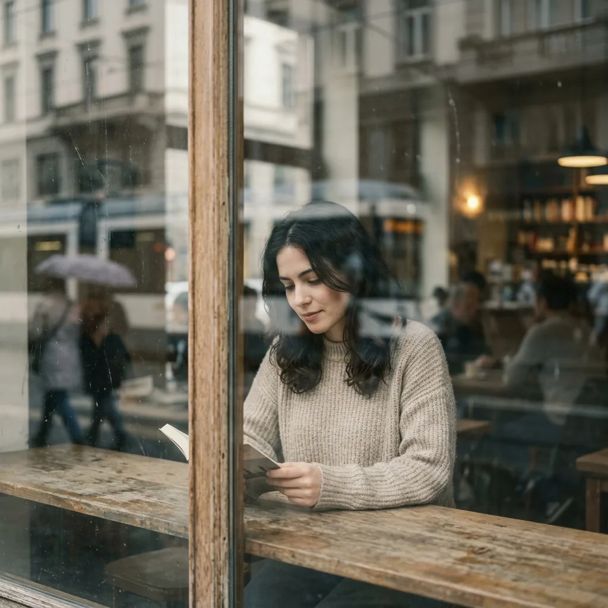

**#345 · Photography Prompt · <code>Vinano Image v2</code>**

<details>
<summary>Show prompt</summary>

```
Reflection in glass window, layered composition, subject of a beautiful woman partially obscured. Fujifilm GFX100S, 80mm f/1.7 Natural diffused light Muted Portra LUT Aspect 3:4 harmony: 60% realism / 40% artistic. sRef: layered documentary imagery. Hidden tokens: glass reflection blur, layered city depth." Render with rich micro-detail while keeping the layout uncluttered and intentional.
```

</details>

---

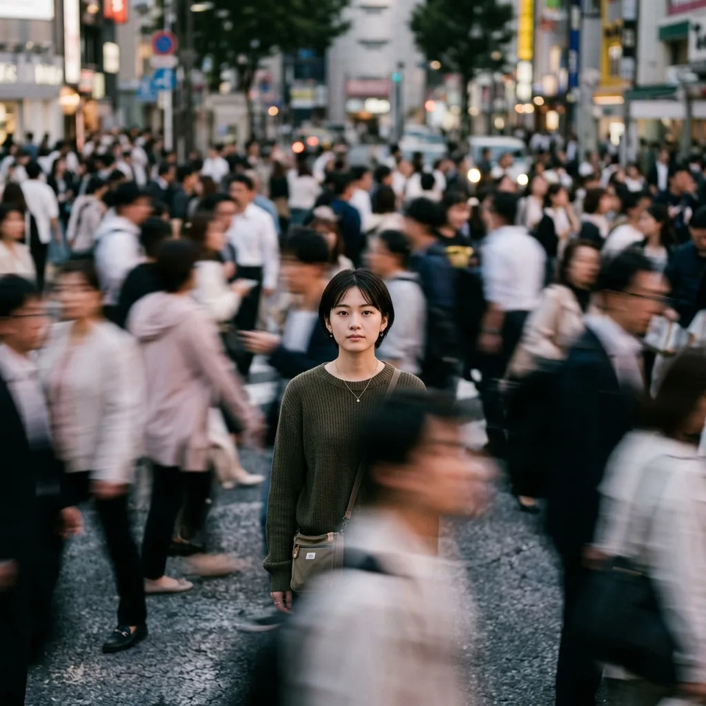

**#346 · Photography Prompt · <code>Vinano Image v2</code>**

<details>
<summary>Show prompt</summary>

```
Cinematic portrait of a young person standing still in the middle of a busy crowd, sharp focus on the subject while people move rapidly around them creating strong motion blur. The subject looks directly at the camera a calm, introspective expression. Soft natural lighting, shallow depth of field, dreamy atmosphere. Crowd blurred long exposure effect, dynamic movement streaks surrounding the subject. Neutral pastel background tones, subtle color grading, emotional storytelling composition. Shot on 85mm lens, f/1.8, long shutter speed, ultra-realistic skin texture, cinematic photography, 8K resolution. Keep edges clean and the overall composition balanced for a polished, gallery-ready result.
```

</details>

---

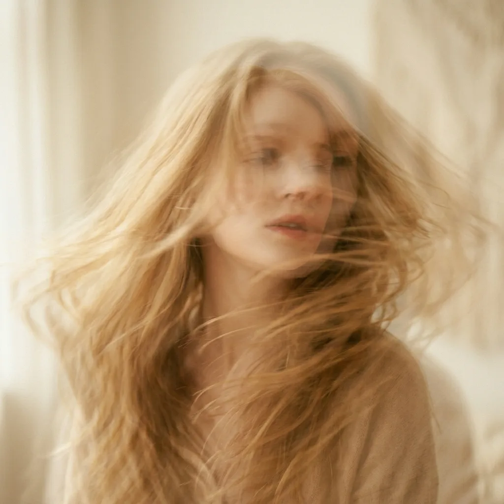

**#347 · Photography Prompt · <code>Vinano Image v2</code>**

<details>
<summary>Show prompt</summary>

```
A soft-focus, cinematic portrait of a young woman delicate facial features and light golden hair, caught in motion. Her face appears partially blurred and ghosted, flowing strands of hair captured mid-sway, creating a dreamy, ethereal motion effect. Her expression is serene and slightly distant, parted lips and eyes softly open. The entire frame is bathed in golden beige and sepia tones, evoking a nostalgic, painterly atmosphere. The lighting is natural and diffused, coming from a nearby window, casting a warm glow on her skin and illuminating the strands of hair that dance across the frame. Photographed a Canon EOS R5 an 85mm lens at f/1.2, ISO 320, shutter speed 1/8s intentional slow exposure and handheld movement to create the artistic motion blur. The focus is soft, a shallow depth of field that isolates the subject from the pale, creamy background. Post-processed in Adobe Lightroom and Photoshop: cinematic LUTs applied, warmth enhanced through split-toning (shadows in soft amber, highlights in cream), clarity reduced, and motion streaks refined displacement layers and radial blur filters. A very subtle fine grain adds a filmic texture. Final mood: emotional, hazy, poetic. Style references: fine art portraiture, vintage editorial, and analog dream sequences. 4K ultra-resolution, no harsh contrasts, smooth gradients preserved. Emphasise material texture and natural light so the final frame feels tactile and premium.
```

</details>

---


**#348 · Photography Prompt · <code>Vinano Image Pro</code>**

<details>
<summary>Show prompt</summary>

```
{
"art_style_description": {
      "type": "Digital Scrapbook / Fan-Edit Collage.",
      "aesthetic": "Y2K, Coquette, K-pop Idol Fan Art.",
      "visual_structure": "Multiple photographic cutouts of the same subject arranged in a chaotic but cohesive layout on top of a vintage textured background. Each cutout has a thick white stroke/outline to resemble a sticker."
    },
    "subject_details": {
      "demographics": "Young Asian woman (K-pop idol aesthetic), fair skin, delicate features.",
      "hair": "Long, voluminous, dark wavy hair air bangs. In one panel, she wears a small white ribbon clip.",
      "outfit": "Black sequined/embellished crop top (bralette style), dark denim jeans.",
      "makeup": "Peach-toned blush, glossy lips, soft eyeliner."
    },
    "pose_breakdown_panels": {
      "panel_1_top_center": "Portrait shot. Subject looking straight ahead/slightly down hand in hair, elbows raised. Background shows a blurred cityscape.",
      "panel_2_bottom_right": "Seated/Reclining pose. Subject leaning back, one arm supporting weight, looking coolly at the camera. Wearing jeans.",
      "panel_3_middle_right": "Over-the-shoulder shot. Subject looking back at the camera a soft gaze, arm raised touching head.",
      "panel_4_bottom_left": "Close-up portrait. Subject looking to the side, wearing a white bow hair clip.",
      "panel_5_top_left": "Bust-up shot. Subject gazing off-camera a dreamy expression."
    },
    "graphic_elements_and_overlays": {
      "background_texture": "Vintage newspaper print text (sepia/beige toned).",
      "stickers": {
        "text": "Ransom-note style text blocks reading 'iqrasaifiii', 'i swear she's an angel', and 'beyoutiful'.",
        "objects": "A brown plush teddy bear sticker in the bottom left corner.",
        "decor": "White daisy flower graphics, jagged torn paper edges."
      }
    },
    "camera_technical_values": {
      "source_photo_style": "High-end fashion editorial photography.",
      "lens": "85mm (Portrait telephoto).",
      "lighting": "Natural Window Light (Soft, directional sunlight coming from the side).",
      "color_grading": "Slightly desaturated source photos contrasted against the warm beige newspaper background.",
      "resolution": "High fidelity cutouts."
    },
    "composition": "Overlapping layers. The center and right photos are larger, while smaller details fill the corners."

Keep edges clean and the overall composition balanced for a polished, gallery-ready result.
```

</details>

---

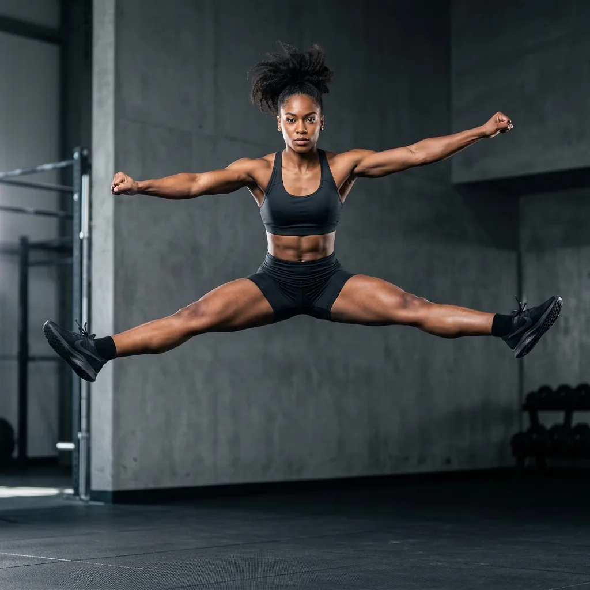

**#349 · Photography Prompt · <code>Vinano Image v2</code>**

<details>
<summary>Show prompt</summary>

```
{
 "content_goal":
"viral athletic jump freeze post",
 "image_type":
 "jump freeze action photography",
 "visual_style":
"cinematic sports editorial, high-impact, premium",
 "motion_concept": {
 "action_type":
 "jump freeze",
 "timing":
"captured at peak height",
 "motion_state":
"completely frozen mid-air",
 "energy":
 "explosive yet controlled"
 },
 "pose_details": {
 "pose_name":
 "jump freeze flex pose",
 "body_position":
"mid-air jump legs extended or flexed symmetrically",
 "core_engagement":
 "tight core visible strength",
 "arm_position":
"balanced, expressive, athletic alignment",
 "freeze_quality":
"sharp, suspended, gravity-defying"
 },
 "subject": {
 "description":
 "athletic feminine body performing a powerful jump freeze",
 "physique": "lean, flexible, toned",
 "body_language": "confident, fearless, strong",
 "expression": "focused intensity calm control"
 },
 "facial_details": {
 "emotion": "determination mixed ease",
 "micro_details": "relaxed face, steady eyes, natural expression"
 },
 "wardrobe": {
 "clothing": "professional athletic performance wear",
 "fit": "body-contoured to emphasize motion lines",
 "fabric": "stretch performance fabric, non-reflective",
 "color_tones": "solid neutral or bold single color"
 },
 "environment": {
 "location": "minimal studio or clean gym space",
 "background": "plain or gradient backdrop",
 "atmosphere": "focused, powerful, distraction-free"
 },
 "lighting": {
 "type": "high-speed studio lighting",
 "quality": "crisp, clean, cinematic",
 "direction": "side and top lighting",
 "effect": "freeze motion sharply defined muscle highlights"
 },
 "camera_details": {
 "angle": "slightly low angle for power emphasis",
 "framing": "full body mid-air capture",
 "lens_feel": "sports editorial realism",
 "focus": "ultra-sharp subject zero motion blur"
 },
 "color_palette": {
 "primary_colors": ["neutral background", "natural skin tone"],
 "contrast_level": "high",
 "mood": "bold, energetic, inspiring"
 },
 "emotional_impact": {
 "viewer_reaction": "scroll-stopping shock and admiration",
 "message": "power, balance, and control in one moment"
 },
 "quality_control": {
 "realism": "ultra-realistic photography",
 "detail_level": "high-definition muscle and fabric texture",
 "ai_artifacts": "none",
 "professional_standard": "editorial-grade"
 },
 "intended_use": {
 "primary": "viral jump freeze post on X",
 "secondary": "fitness branding, athletic inspiration"
 }
}

Maintain consistent colour harmony and crisp focus across the whole frame.
```

</details>

---

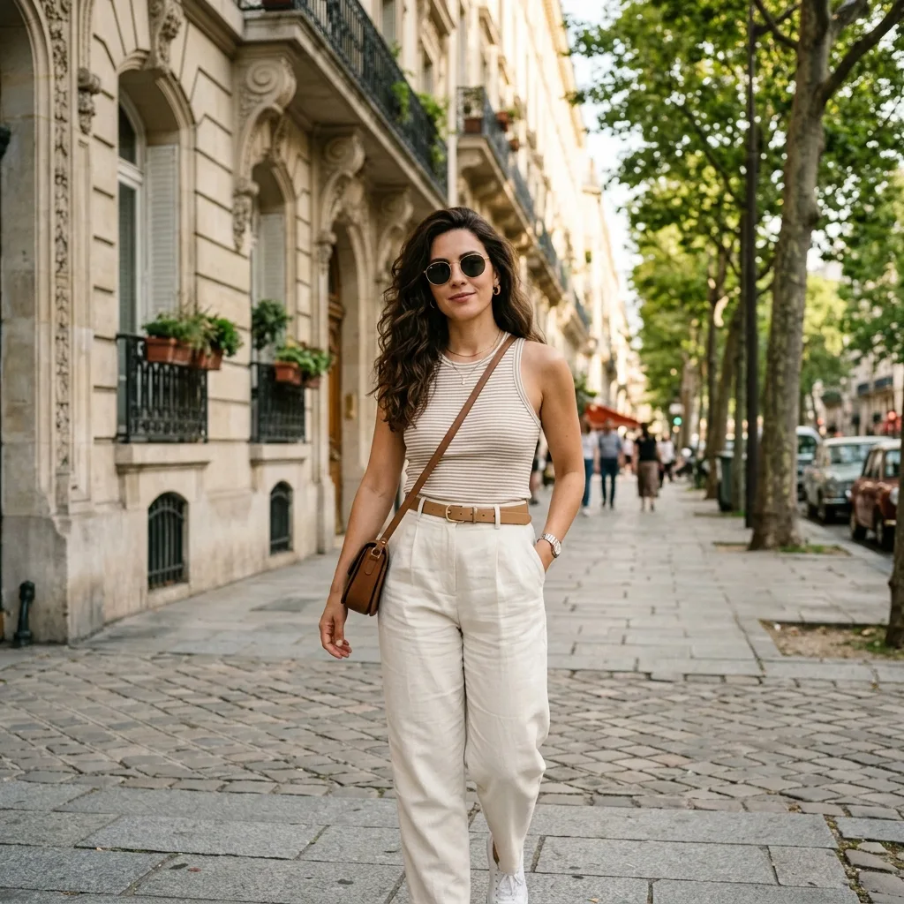

**#350 · Photography Prompt · <code>Vinano Image Pro</code>**

<details>
<summary>Show prompt</summary>

```
{ "scene_type": "outdoor urban street portrait", "composition": { "framing": "vertical portrait orientation", "shot_type": "mid-length shot from head to mid-thigh", "camera_angle": "eye-level", "subject_position": "centered slight rightward offset", "leading_lines": "sidewalk and building facade create linear depth", "depth_of_field": "moderate depth, background softly detailed but not blurred", "balance": "subject balanced against architectural mass on left and greenery on right" }, "subject": { "gender_presentation": "female-presenting", "pose": "relaxed standing pose, one hand in pocket, one arm relaxed", "expression": "neutral to confident subtle smile", "gaze": "looking directly at camera", "hair": { "style": "long, loose waves", "part": "side-parted", "color": "dark brown warm undertones", "texture": "soft, voluminous" }, "accessories": ["round metal-frame sunglasses dark lenses", "small hoop earrings", "wristwatch metallic band", "brown leather shoulder bag"] }, "clothing": { "top": { "type": "sleeveless fitted tank top", "color": "warm beige", "pattern": "thin horizontal white stripes", "fit": "form-fitting" }, "bottom": { "type": baggy pant", "color": "off-white / cream", "fabric_appearance": "structured cotton or linen blend" }, "belt": { "color": "light brown", "buckle": "gold-toned refined minimalist buckle" } }, "environment": { "location_type": "historic city street", "architecture": { "style": "classical or colonial stone facade", "features": "arched windows, ornate stone detailing, balconies" }, "natural_elements": "trees and shrubs lining the sidewalk", "ground": "concrete sidewalk adjacent landscaped soil area", "background_activity": "parked cars partially visible, quiet street ambiance" }, "lighting": { "source": "natural sunlight", "time_of_day": "late morning or afternoon", "quality": "soft directional light", "shadows": "gentle shadows cast by trees and buildings", "skin_tone_rendering": "warm and even" }, "color_palette": { "dominant_colors": ["beige", "cream", "brown", "stone gray", "green"], "overall_tone": "warm, natural, lifestyle aesthetic", "contrast": "moderate contrast between subject and background" }, "camera_characteristics": { "lens_look": "standard to short telephoto perspective", "distortion": "minimal distortion", "sharpness": "sharp focus on subject clear texture detail", "noise": "low noise, clean image" }, "artistic_style": { "genre": "fashion lifestyle photography", "mood": "casual elegance, confident, relaxed", "styling_influence": "modern refined minimalist classic elements", "social_media_aesthetic": "Instagram-style street fashion portrait" }, "post_processing": { "color_grading": "warm tones natural saturation", "contrast_adjustment": "slightly enhanced", "retouching": "minimal, natural skin texture preserved", "overall_finish": "clean and polished" }, "typography": { "present": false } } Render with rich micro-detail while keeping the layout uncluttered and intentional.
```

</details>

---

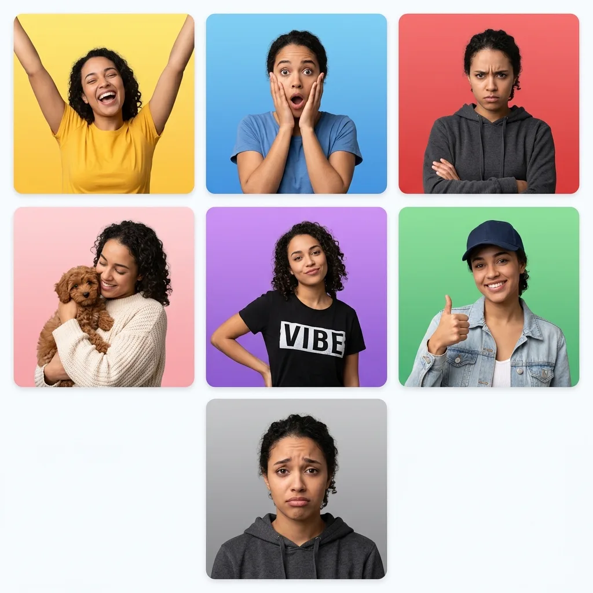

**#351 · Photography Prompt · <code>Vinano Image Pro</code>**

<details>
<summary>Show prompt</summary>

```
Panels are NOT edge-to-edge
Visible thin white spacing between panels Subtle outer white margin around the entire grid clean modern UI-style layout
Slight rounded corners on each tile
Panel 1 — Joyful / Celebratory (Yellow) Bright yellow gradient background
Arms raised
Eyes closed
Big open laugh
Energetic posture
Panel 2 — Shocked (Blue)
Blue gradient background
Hands on cheeks
Wide eyes
Open mouth
Raised brows
Panel 3 — Serious / Stern (Red)
Red background
Arms crossed
Furrowed brows
Neutral tight lips
Wearing dark hoodie
Panel 4 — Affectionate (Pink)
Soft pink gradient
Holding small brown puppy
Gentle smile
Cozy knit sweater
Panel 5 — Confident / Sassy (Purple)
Purple gradient background
One hand on hip
Slight smirk
Graphic t-shirt
Relaxed stance
Panel 6 — Friendly / Casual Approval (Green)
Green gradient background
Wearing cap + denim jacket
Thumbs-up
Relaxed smile
Panel 7 — Sad / Emotional (Gray)
Gray gradient background
Slight downward gaze
Eyebrows slightly raised in center
Lips slightly curved downward

Preserve realistic proportions and depth for a confident, professional finish.
```

</details>

---

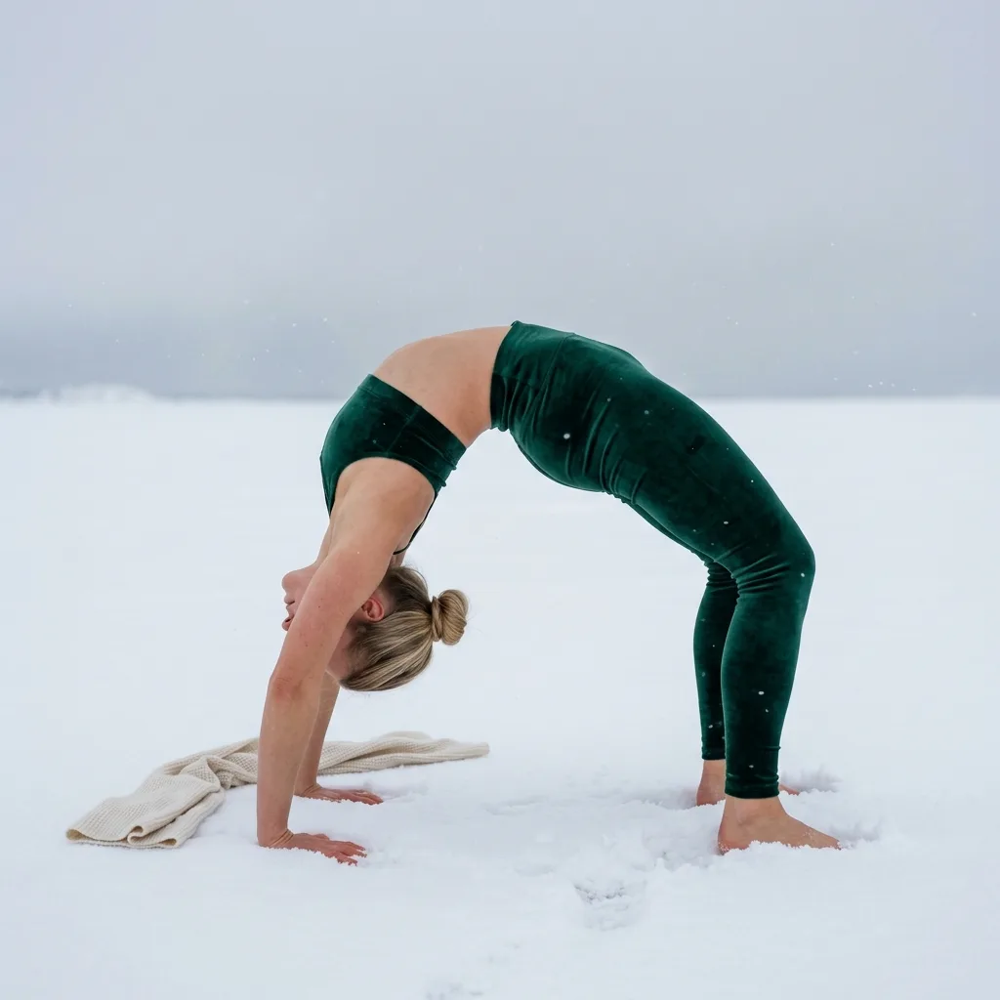

**#352 · Photography Prompt · <code>Vinano Image v2</code>**

<details>
<summary>Show prompt</summary>

```
{
 "image_type":
"High-end fitness editorial / Cinematic lifestyle photography",
 "visual_style":
"refined minimalist luxury, ultra-true-to-life photorealistic, soft-focus realism",
 "composition": {
 "framing":
"Wide-angle side profile to capture the full silhouette",
 "camera_angle": "Low-angle shot to emphasize the height and strength of the arch",
 "perspective": "Clean, linear perspective against a flat, snowy horizon"
 },
 "subject": {
 "description": "A fit, graceful woman athletic poise and natural blonde hair tied in a sleek low bun",
 "pose": "Performing a perfect Yoga Arch (Urdhva Dhanurasana / Wheel Pose)",
 "body_language": "Strong and stable; back arched beautifully palms and feet firmly planted in the snow",
 "expression": "A serene, focused look; eyes closed in a state of meditative calm"
 },
 "facial_details": {
 "emotion": "Peaceful determination and internal quietude",
 "micro_details": "Soft natural skin texture, subtle flush from the cold, and faint visible breath in the air"
 },
 "wardrobe": {
 "clothing": "Premium emerald green velvet high-waist yoga leggings; matching velvet sports bra; a thin, cream-colored thermal scarf draped elegantly nearby",
 "textures": "Rich, light-reflecting velvet fabric against the soft, matte texture of fresh snow",
 "color_tones": "Vibrant emerald green contrasted against a monochrome white landscape"
 },
 "environment": {
 "location": "A vast, silent arctic landscape of pristine white snow",
 "background": "Empty, refined minimalist snowy field meeting a soft, misty gray sky at the horizon",
 "atmosphere": "Quiet, ethereal, and crisp; very light snowfall tiny drifting flakes"
 },
 "lighting": {
 "type": "Soft, natural overcast daylight",
 "quality": "Diffused and ethereal, creating gentle highlights on the velvet curves",
 "direction": "Side-ambient lighting to define the muscular form of the yoga pose"
 },
 "color_palette": {
 "primary": ["Deep Emerald Green", "Pristine White", "Charcoal Black"],
 "mood": "Sophisticated, calm, and visually striking"
 },
 "camera_details": {
 "lens": "50mm prime lens for realistic human proportions",
 "focus": "Sharp focus on the subject; creamy, soft-focus (bokeh) on the distant snowy background",
 "realism": "8K resolution, capturing every fiber of the velvet and the granular detail of the snow"
 },
 "overall_mood": "Graceful, powerful, and serene; a high-fashion approach to wellness",
 "intended_use": "Luxury fitness branding, Pinterest aesthetic editorial, or premium wellness magazine"
}

Preserve realistic proportions and depth for a confident, professional finish.
```

</details>

---

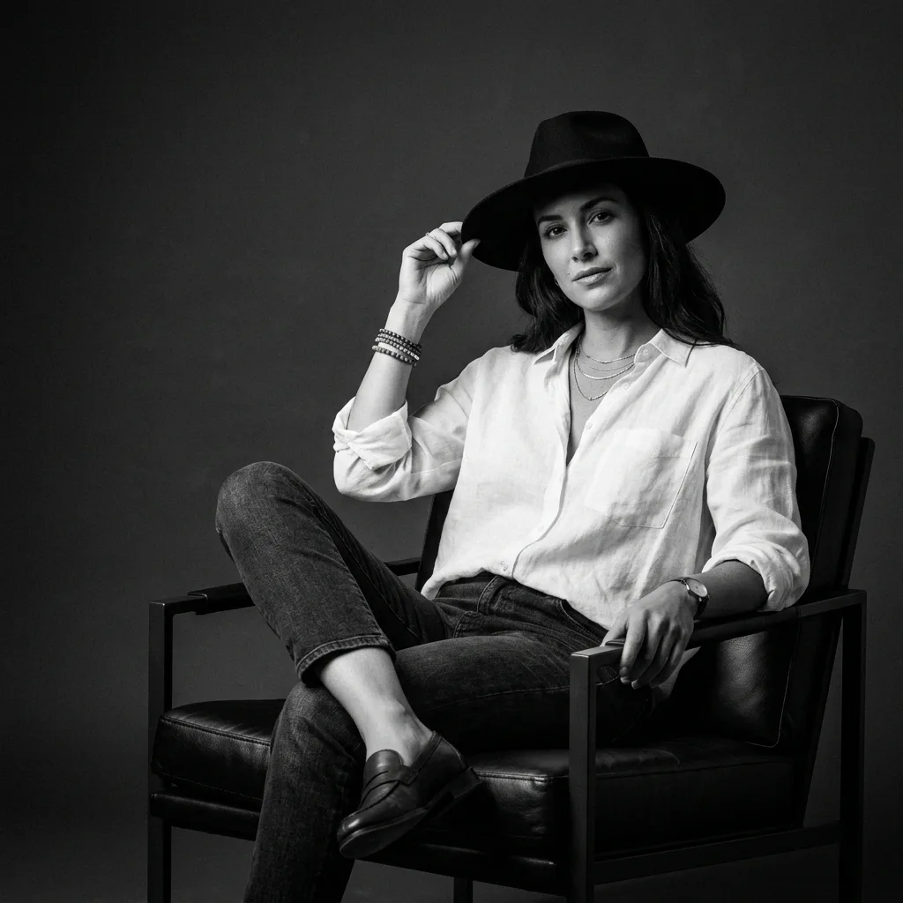

**#353 · Photography Prompt · <code>Vinano Image v2</code>**

<details>
<summary>Show prompt</summary>

```
{
 "prompt": "Hyper-realistic 8K black-and-white studio portrait captured as a medium shot from a slightly low-angle perspective, a 50mm lens for a natural field of view. The composition features a female subject, 100% the uploaded face as reference (do not alter facial features or identity), seated off-center to the right, leaving strong negative space above and to the left. She wears a wide-brimmed fedora-style hat, a loose white linen blouse unbuttoned at the collar revealing layered silver necklaces, white linen trousers, and dark leather loafers, delicate beaded bracelets on both wrists. The subject is seated comfortably in a sleek modern black leather lounge chair, left leg crossed over the right, left hand lightly touching the brim of the hat, and right arm casually resting on the chair’s armrest. Dramatic high-contrast chiaroscuro lighting dominates the scene, a strong key light from the front-left creating deep shadows and bright highlights that emphasize the detailed textures of the linen fabric, leather chair, felt hat, and hair. Subtle rim lighting outlines the subject and chair, separating them from a pure deep-black background, enhancing cinematic depth and a professional luxury studio photography aesthetic.",
 "color_style": "black and white",
 "resolution": "8K",
 "camera_lens": "50mm",
 "camera_angle": "slightly low-angle",
 "style": "cinematic studio portrait, luxury editorial",
 "lighting": "chiaroscuro, high-contrast studio lighting",
 "reference_image": "strictly use uploaded image only"
}

Keep edges clean and the overall composition balanced for a polished, gallery-ready result.
```

</details>

---

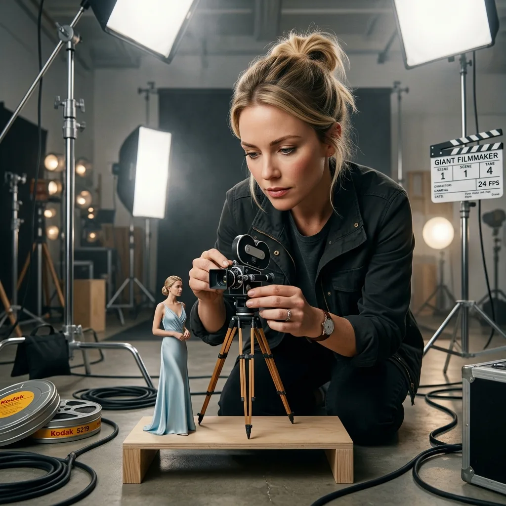

**#354 · Photography Prompt · <code>Vinano Image v2</code>**

<details>
<summary>Show prompt</summary>

```
A hyper-realistic cinematic scene of a giant woman filmmaker carefully adjusting a miniature vintage film camera on a tripod, inside a professional studio setup. A tiny elegant woman in a flowing pastel blue dress stands beside the camera like a model on set. Surrounding them are detailed studio lights, softboxes, film reels, cables, and a clapperboard. The giant woman has soft natural makeup, blonde hair tied back, and an intense focused expression. Dramatic soft, diffused lighting, shallow depth of field, ultra-detailed textures, 8K, true-to-life photorealistic, cinematic composition, studio photography, volumetric lighting. Aim for an editorial, design-driven look with deliberate negative space.
```

</details>

---

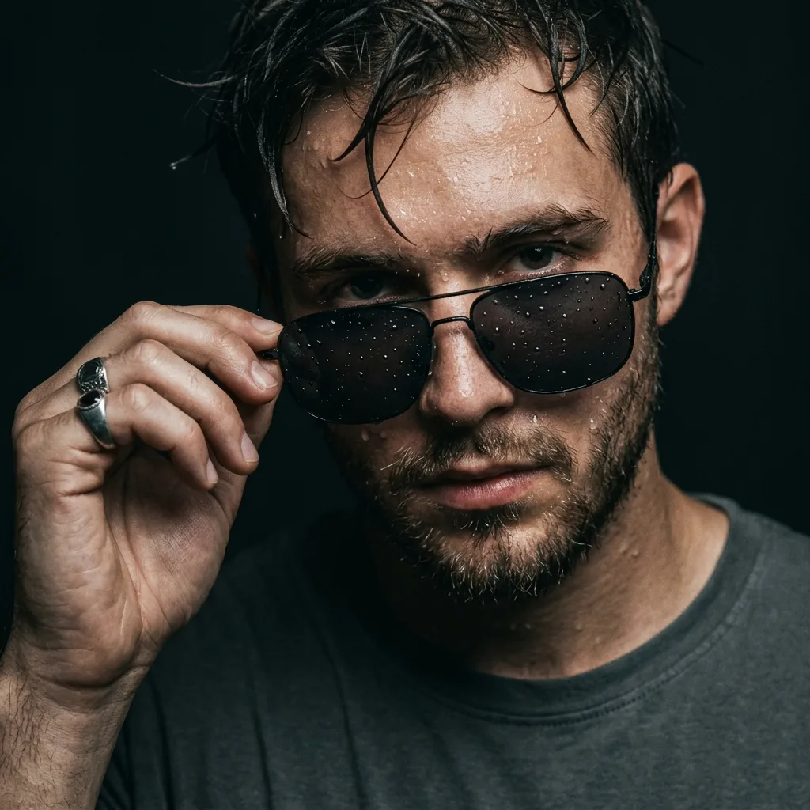

**#355 · Photography Prompt · <code>Vinano Image v2</code>**

<details>
<summary>Show prompt</summary>

```
Ultra-realistic cinematic close-up portrait of a young man wet skin and damp, messy hair. He is lightly touching the frame of dark, rectangular aviator sunglasses beaded clear water droplets. The lighting is low-key and dramatic, creating deep shadows that emphasize the moisture on his skin and the fine texture of his beard. He wears a plain, form-fitting matte black t-shirt that blends into a dark, minimal background. Detailed hand gesture showing defined knuckles and a silver ring stone on the pinky finger. Razor-sharp micro-details, shallow depth of field, 85mm f/1.4 lens effect, moody high-contrast realism, and a high-end fashion editorial aesthetic.

Use my uploaded face image as the facial and identity reference.

Render with rich micro-detail while keeping the layout uncluttered and intentional.
```

</details>

---

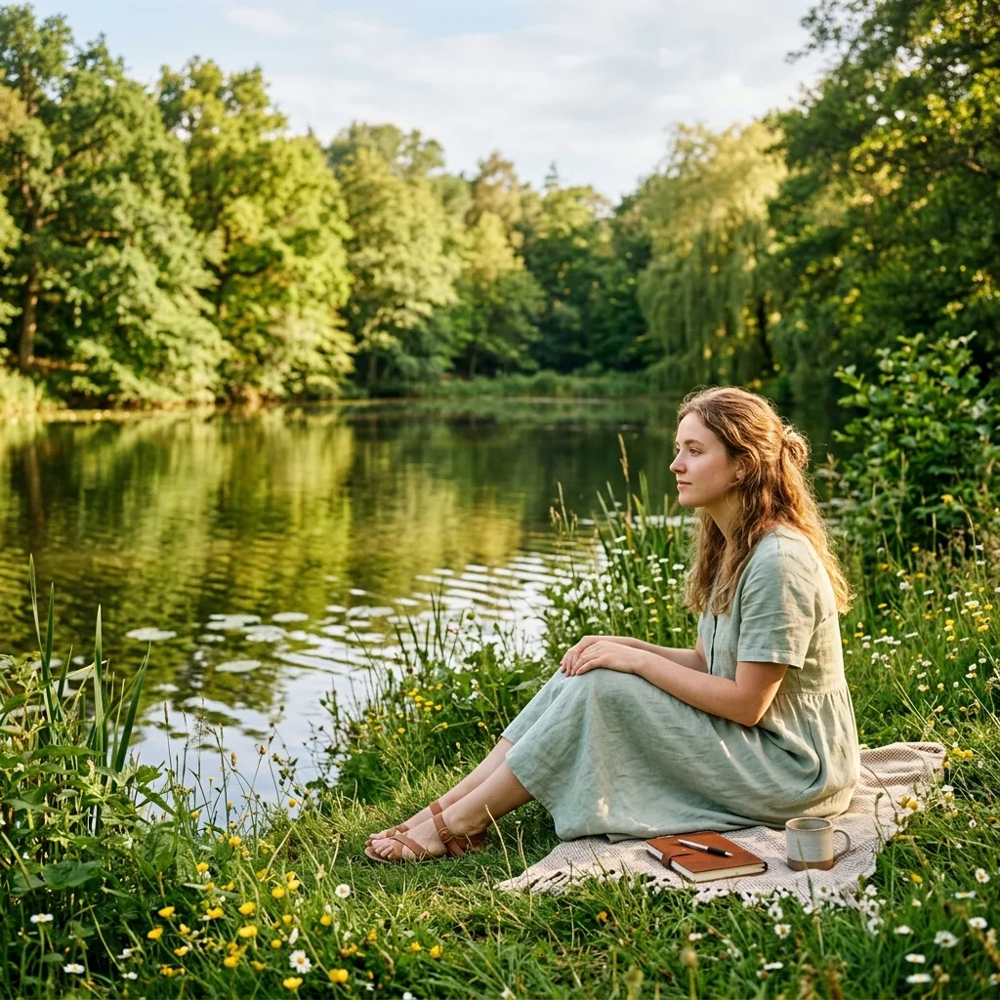

**#356 · Photography Prompt · <code>Vinano Image v2</code>**

<details>
<summary>Show prompt</summary>

```
unfolds beside a tranquil pond, where gentle ripples catch the warm, golden sunlight. A young woman sits peacefully on the grassy bank at the water’s edge, her posture relaxed yet slightly leaning forward, as if immersed in quiet contemplation. Soft rays from the high, diffused sun bathe her face and shoulders in a tender glow, highlighting her delicate features and casting subtle, natural shadows. She wears light, flowy summer clothes in soft pastel tones that harmoniously blend the lush surroundings—perhaps a breezy linen dress fluttering faintly in the still air.
The pond mirrors the surrounding trees, their vibrant green leaves shimmering under the sunlight, while delicate reflections dance across the calm surface. The atmosphere feels utterly peaceful, warm, and timeless, no breeze to disturb the stillness. Her expression is calm and introspective, eyes softly gazing toward the water, conveying a deep emotional serenity—as though she’s savoring the beauty of solitude amid nature’s embrace.
This cinematic, highly detailed scene evokes a profound sense of tranquility, capturing the quiet magic of a slow afternoon in perfect harmony the natural world. Realistic lighting, natural colors, soft bokeh, and exquisite realism throughout

Preserve realistic proportions and depth for a confident, professional finish.
```

</details>

---

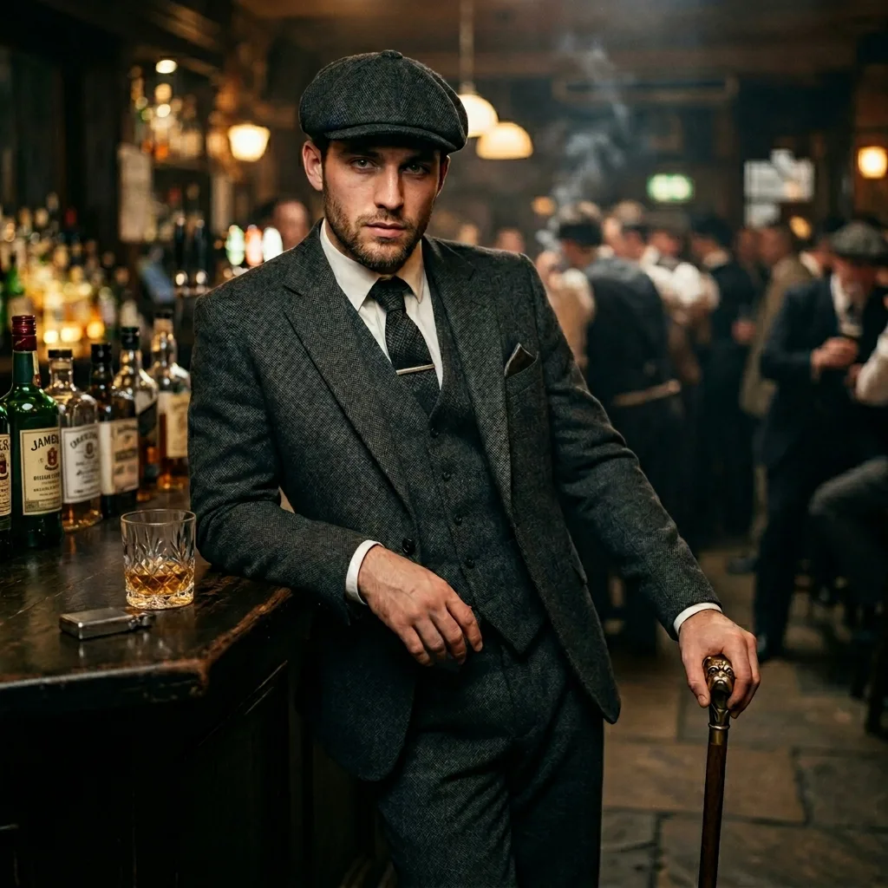

**#357 · Photography Prompt · <code>Vinano Image Pro</code>**

<details>
<summary>Show prompt</summary>

```
A hyper-realistic cinematic 3:4 vertical half-body portrait of a young man the exact face from reference image, leaning casually against a 1920s smoky bar table, holding a vintage walking cane. He wears Peaky Blinders-inspired attire-tailored wool three-piece suit, waistcoat, tie, and flat cap. Head slightly down, eyes locked on camera an intense, confident stare. Warm, ambient lighting casts moody shadows; blurred crowd and glowing whisky bottles in soft bokeh create depth. Shot 85mm f/1.4 lens, 8K quality, highlighting fabric textures and facial expression. Aim for an editorial, design-driven look with deliberate negative space.
```

</details>

---

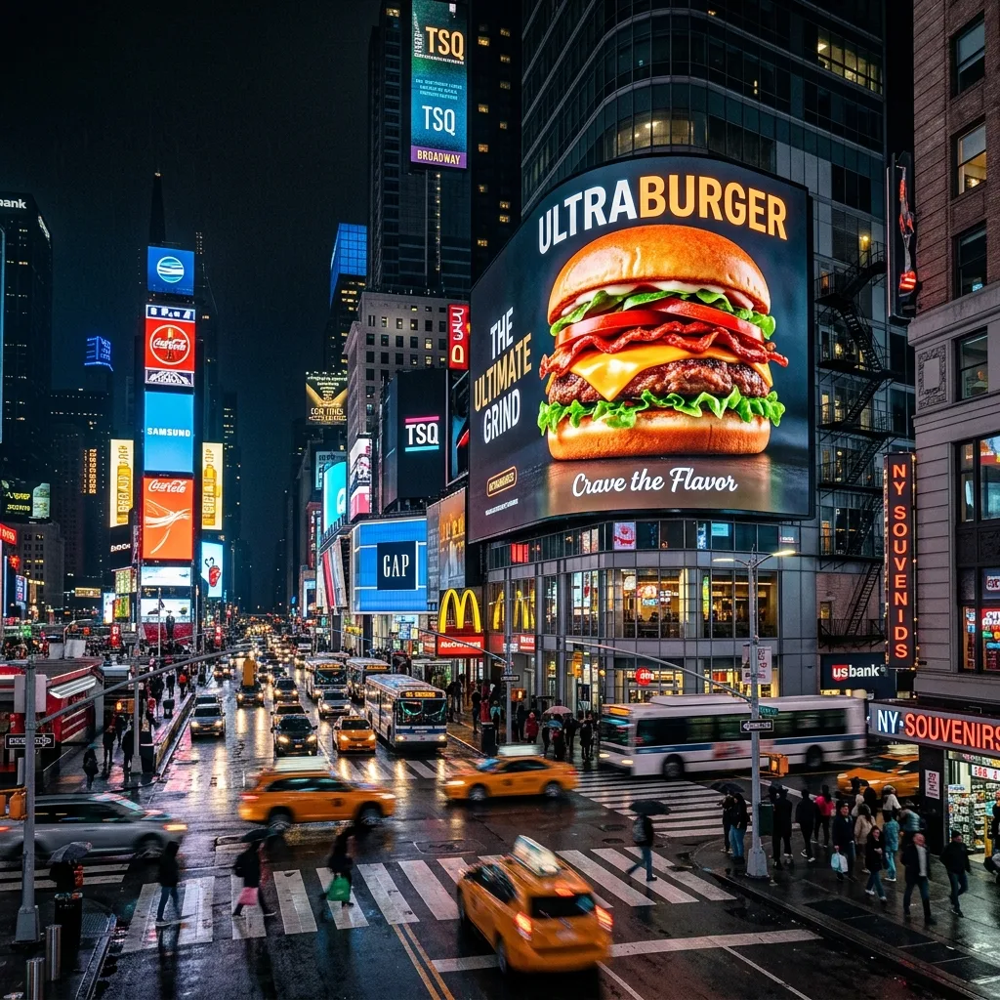

**#358 · Photography Prompt · <code>Vinano Image Pro</code>**

<details>
<summary>Show prompt</summary>

```
Ultra-realistic cinematic night cityscape inspired by Times Square, New York. A wide-angle street-level view of a busy urban intersection at night wet asphalt reflecting neon lights. Massive curved LED billboard on a corner building displaying a hyper-realistic gourmet burger advertisement, glowing vividly and dominating the scene. Surrounding skyscrapers covered bright digital screens, brand signage, and colorful ads. Motion-blurred traffic trails from passing cars, subtle pedestrians near sidewalks, dramatic contrast between dark sky and illuminated buildings. Cyber-urban atmosphere, commercial advertising aesthetic, long-exposure photography look, sharp architectural details, realistic lighting and reflections, ultra-high resolution, 8K photorealism, cinematic depth, no text overlay. Emphasise material texture and natural light so the final frame feels tactile and premium.
```

</details>

---

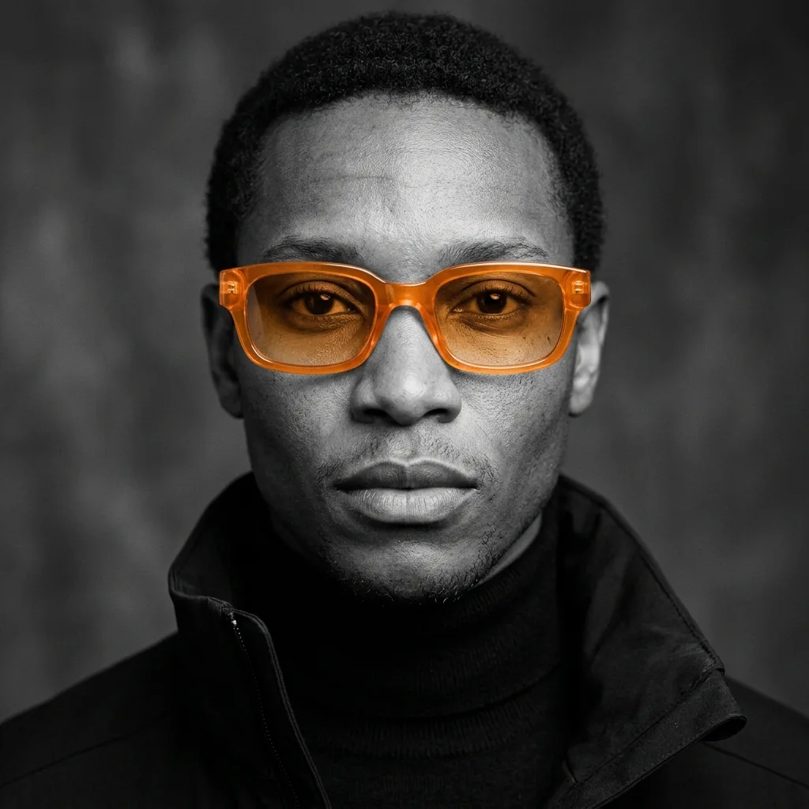

**#359 · Photography Prompt · <code>Vinano Image v2</code>**

<details>
<summary>Show prompt</summary>

```
A studio-style close-up editorial portrait of a person strong, well-defined facial features and slightly imperfect, natural skin texture. The subject wears a black tailored turtleneck sharp, clean lines, layered under a high-collared black jacket in a refined minimalist contemporary fashion style.The subject wears semi-transparent orange acetate sunglasses — rectangular frames softly rounded edges, glossy finish, and amber gradient lenses — serving as the only colored element in the image.Color concept: selective color photography — monochrome black-and-white image only the sunglasses in vivid orange.
Mood is calm and confident, serious expression, direct gaze into the camera.
Lighting is soft frontal studio light gentle shadows, even skin tones, cinematic contrast, and visible natural skin texture. Shot on a professional portrait camera, f/2.0, ISO 100, 1/125s. High resolution, ultra-sharp focus on the face.

Style: editorial luxury fashion portrait, true-to-life photorealistic, professional studio photography, no illustration, no painterly effects.

Keep edges clean and the overall composition balanced for a polished, gallery-ready result.
```

</details>

---

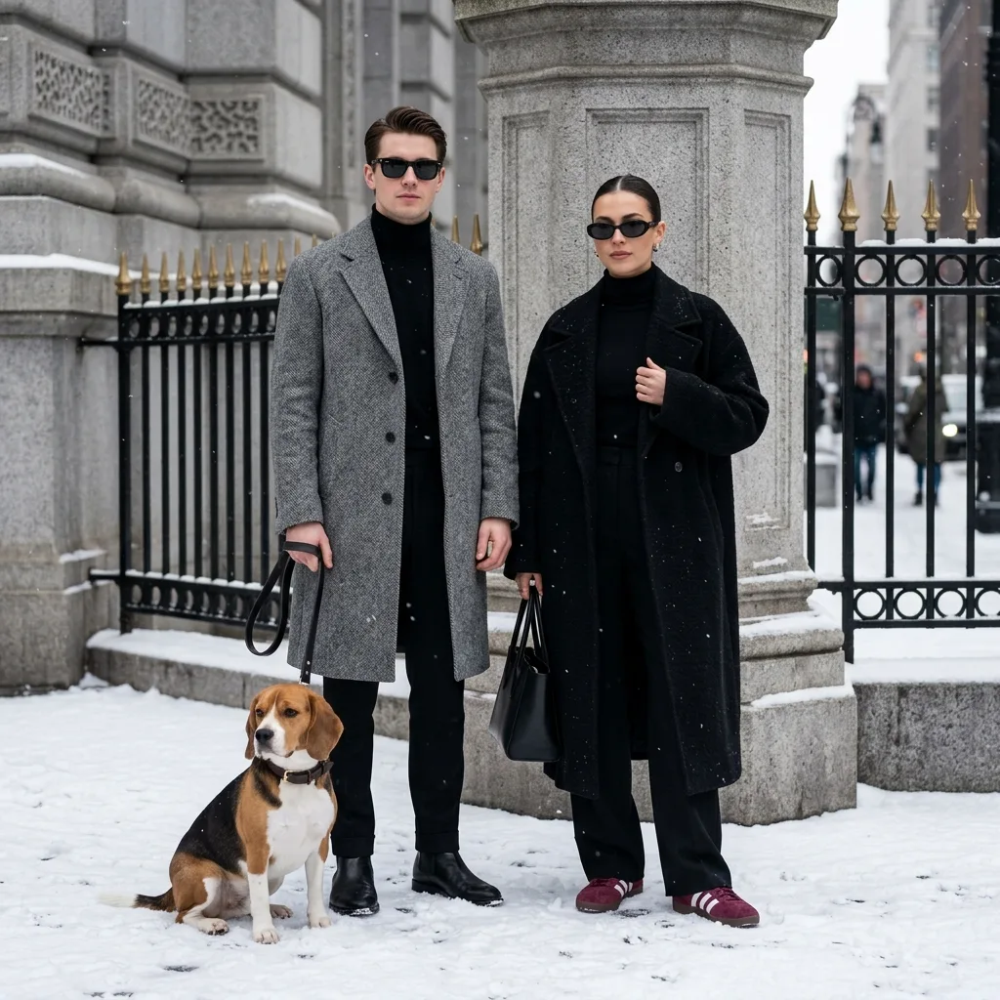

**#360 · Photography Prompt · <code>Vinano Image v2</code>**

<details>
<summary>Show prompt</summary>

```
{
 "prompt_title": "Sophisticated Urban Winter Couple Portrait",
 "environment": {
 "setting": "Upscale urban street corner during winter.",
 "architecture": "Massive grey stone pillar/building corner classical detailing.",
 "background_elements": "Black wrought-iron fence decorative gold finials/spikes. Classical stone building facade visible in background.",
 "ground": "Covered in fresh, clean white snow.",
 "atmosphere": "Light snow falling, snowflakes visible in the air. Cold, crisp winter day.",
 "color_palette": "Cool neutrals, stone grey, bright white snow, deep blacks, accent of burgundy."
 },
 "subjects": [{
 "id": "male_subject",
 "appearance": "Young adult male, fair skin, short dark hair styled neatly.",
 "clothing": {
 "outerwear": "Knee-length textured grey wool overcoat (possibly herringbone or tweed).",
 "top": "Black turtleneck sweater.",
 "bottoms": "Black tailored trousers, relaxed straight fit.",
 "footwear": "Black leather dress shoes or boots.",
 "accessories": "Black wayfarer-style sunglasses."
 },
 "pose": "Standing confident and upright, one hand in coat pocket, other hand holding a dog leash. Looking slightly to the side."
 },
 {
 "id": "female_subject",
 "appearance": "Young adult female, fair skin, dark hair pulled back into a sleek, tight bun.",
 "clothing": {
 "outerwear": "Long, oversized black wool coat.",
 "top": "Black fitted turtleneck.",
 "bottoms": "Black wide-leg trousers.",
 "footwear": "Burgundy/Maroon suede retro sneakers white stripes (Adidas Gazelle style).",
 "accessories": "Black oval sunglasses, thin black belt silver buckle, small gold hoop earrings, holding a black leather tote bag."
 },
 "pose": "Standing next to male subject, hand touching lapel of coat, other hand holding bag at side. Radiating 'cool girl' aesthetic."
 }],
 "additional_elements": {
 "animal": {
 "breed": "Beagle dog.",
 "pose": "Sitting obediently on the snow at the man's feet.",
 "appearance": "Tri-color fur (brown, black, white), wearing a collar and attached to a black leash."
 }
 },
 "lighting_and_mood": {
 "lighting_type": "Soft, diffuse overcast natural light (winter daylight). No harsh shadows.",
 "mood": "Chic, refined minimalist, 'Old Money' aesthetic, quiet luxury, sophisticated, serene, fashionable.",
 "tonality": "Desaturated slightly high contrast between the black clothing and white snow."
 },
 "technical_details": {
 "style": "Ultra true-to-life photorealistic, High-End Street Style Photography.",
 "camera_settings": {
 "lens": "85mm portrait lens.",
 "aperture": "f/2.8 for slight depth of field separation from the stone background.",
 "shutter_speed": "Fast enough to freeze falling snowflakes.",
 "iso": "Low ISO (100) for grain-free clarity."
 },
 "quality_modifiers": "8k resolution, highly detailed fabric textures (wool grain, leather sheen, suede texture), sharp focus on eyes/sunglasses, subsurface scattering on skin, cinematic composition, rule of thirds."
 }
}

Emphasise material texture and natural light so the final frame feels tactile and premium.
```

</details>

---

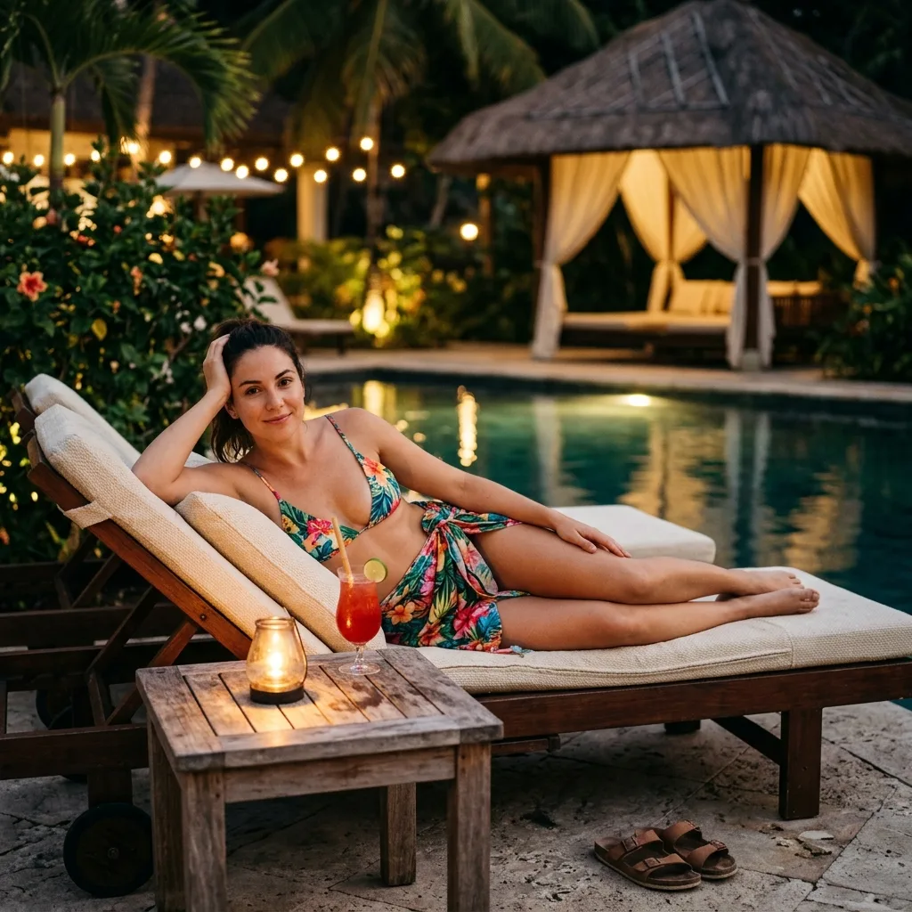

**#361 · Photography Prompt · <code>Vinano Image v2</code>**

<details>
<summary>Show prompt</summary>

```
{
 "prompt": "A woman relaxing poolside at a tropical resort at night, lying on a cushioned lounge chair beside a rustic wooden table. She is wearing a colorful floral bikini and matching wrap skirt, resting her head on her hand while looking calmly toward the camera. A tall red cocktail in a glass sits on the table next to a glowing lantern candle. The background features a lit swimming pool reflections on the water, palm trees, string lights, and a thatched-roof cabana soft draped curtains. Warm ambient lighting, tropical vacation atmosphere, cinematic night photography, shallow depth of field, high detail, realistic skin tones.",
 "style": "true-to-life photorealistic",
 "lighting": "warm ambient night lighting soft highlights",
 "camera": "85mm lens, shallow depth of field",
 "resolution": "1024x1536"
}

Emphasise material texture and natural light so the final frame feels tactile and premium.
```

</details>

---

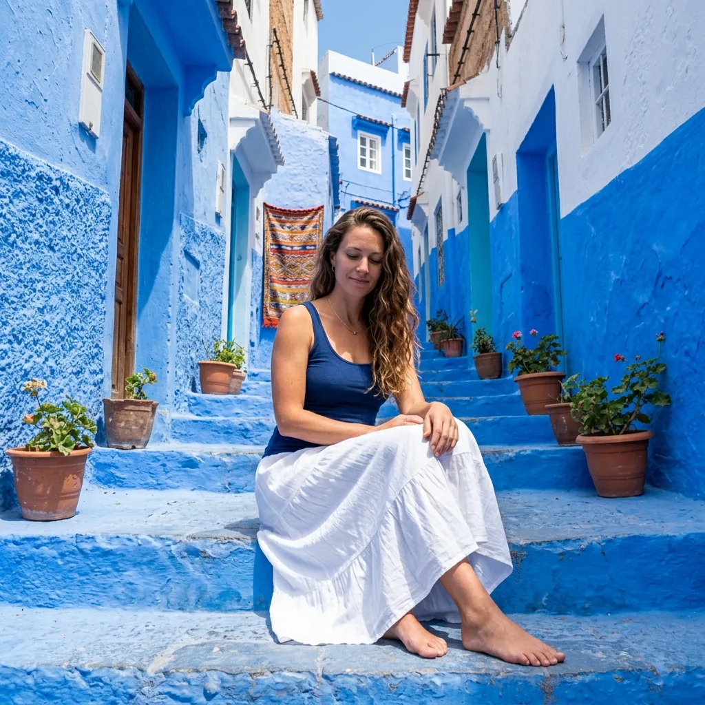

**#362 · Photography Prompt · <code>Vinano Image Pro</code>**

<details>
<summary>Show prompt</summary>

```
{
 "scene": {
 "setting": "narrow outdoor alley stepped pathway in a Mediterranean blue-painted town",
 "background": "vivid blue walls, stairs, and buildings white accents, hanging fabric on wall, small windows, plants, and bright sky above",
 "lighting": "strong natural sunlight, high contrast defined shadows, bright and saturated colors"
 },
 "subject": {
 "type": "female",
 "pose": "seated on steps one leg bent and the other extended slightly forward, hands resting naturally by her sides",
 "expression": "soft relaxed expression eyes slightly downward, calm and serene mood",
 "face": "Use uploaded reference image, keep identity exact, natural facial proportions, visible skin texture and realistic lighting",
 "hair": "Use uploaded reference image, keep identity exact, long wavy hair falling over shoulders natural volume",
 "eyes": "Use uploaded reference image, keep identity exact, softly focused downward gaze",
 "skin": "natural skin tone sunlit highlights and realistic texture",
 "body": "natural proportions maintained"
 },
 "clothing": {
 "outfit": "blue fitted sleeveless top paired a long flowing white skirt",
 "footwear": "barefoot both feet visible resting naturally on the blue steps",
 "accessories": "minimal jewelry, subtle necklace"
 },
 "environment_details": {
 "props": "textured painted steps, hanging patterned fabric, architectural details of alley",
 "textures": "rough painted walls, fabric folds in skirt, smooth skin highlights, stone steps"
 },
 "camera": {
 "angle": "slightly low front-facing angle centered on subject",
 "framing": "full body framing capturing entire seated pose and surrounding stairs",
 "focus": "sharp focus on subject clear detailed background",
 "lens": "standard smartphone lens"
 },
 "style": {
 "realism": "ultra realistic photography",
 "color_tone": "highly saturated blues contrasted neutral white and natural skin tones",
 "effects": "natural sunlight, no artificial filters",
 "details": "high detail textures, crisp shadows, realistic depth and perspective"
 }
}

Maintain consistent colour harmony and crisp focus across the whole frame.
```

</details>

---

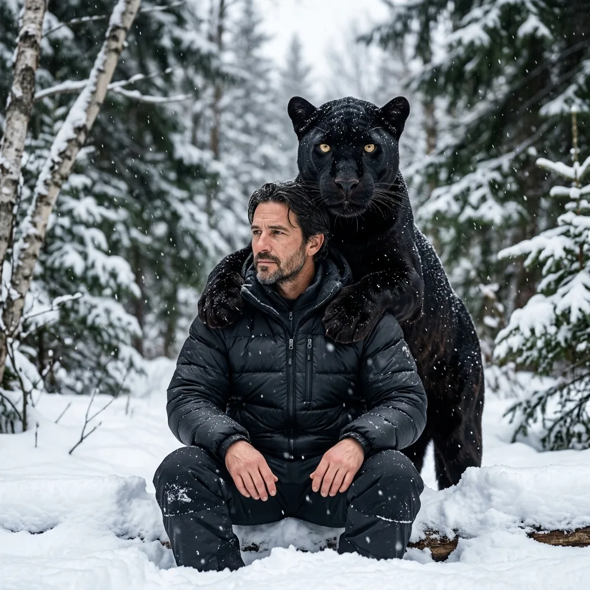

**#363 · Photography Prompt · <code>Vinano Image v2</code>**

<details>
<summary>Show prompt</summary>

```
A hyper-realistic 8k medium shot, captured a standard lens (e.g., 85mm) at a slightly low angle, frames a man seated in deep snow within a snowy forest. The man, uploaded face as reference, wears a highly detailed black puffer jacket and black pants, looking calmly towards the left side of the frame. Directly behind him, a majestic black panther stands, its large front paws gently resting on his shoulders, creating a surreal yet intimate spatial relationship. The panther's head is positioned just above and slightly to the right of the man's head, its piercing yellow eyes looking forward. The scene is bathed in soft, natural daylight, typical of an overcast winter day, providing filmic, cinematic lighting subtle shadows and highlighting the highly detailed texture of the panther's sleek fur and the man's quilted jacket. Volumetric lighting is evident through the abundant falling snow, which dots the subjects and the environment. The background features a softly blurred snowy forest, emphasizing the central figures and their unique interaction. Keep edges clean and the overall composition balanced for a polished, gallery-ready result.
```

</details>

---

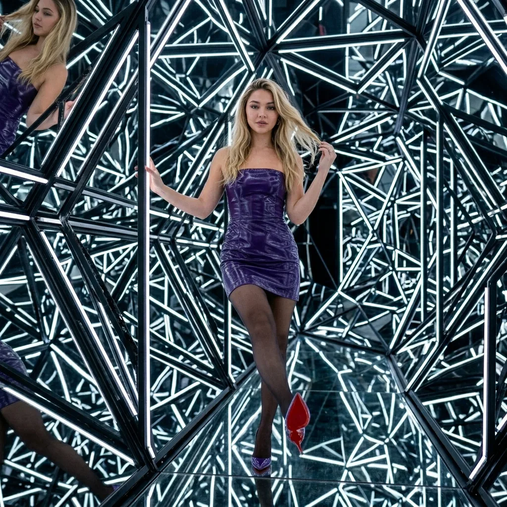

**#364 · Photography Prompt · <code>Vinano Image Pro</code>**

<details>
<summary>Show prompt</summary>

```
[{
 "id": "subject",
 "type": "person",
 "description": "Madelyn Cline long blonde hair, looking at the camera.",
 "pose": "She is walking forward through the mirrored structure mid-step, one hand lightly brushing the metal framework while the other adjusts her hair as she glances toward the camera.",
 "clothing": {
 "dress": {
 "color": "deep violet",
 "material": "patent leather",
 "style": "strapless mini-dress"
 },
 "legwear": {
 "color": "black",
 "type": "sheer pantyhose"
 },
 "footwear": {
 "color": "Violet",
 "material": "patent leather",
 "style": "Louboutin So Kate red sole"
 }
 }
 },
 {
 "id": "environment",
 "type": "room",
 "description": "A geometrically designed mirrored room a fractured, kaleidoscopic effect.",
 "elements": [{
 "type": "mirrors",
 "description": "Multiple angled mirror panels reflecting the subject and the room structure."
 },
 {
 "type": "structure",
 "description": "Black metal framework holding the mirror panels."
 }],
 "lighting": "Bright, high-contrast light from LED strips within the structure, creating sharp highlights and reflections, premium-quality, cinematic, Ultra-realistic photo and lighting, premium quality photo, depth of field, no Ai or cgi look, 8k resolution."
 }]

Render with rich micro-detail while keeping the layout uncluttered and intentional.
```

</details>

---

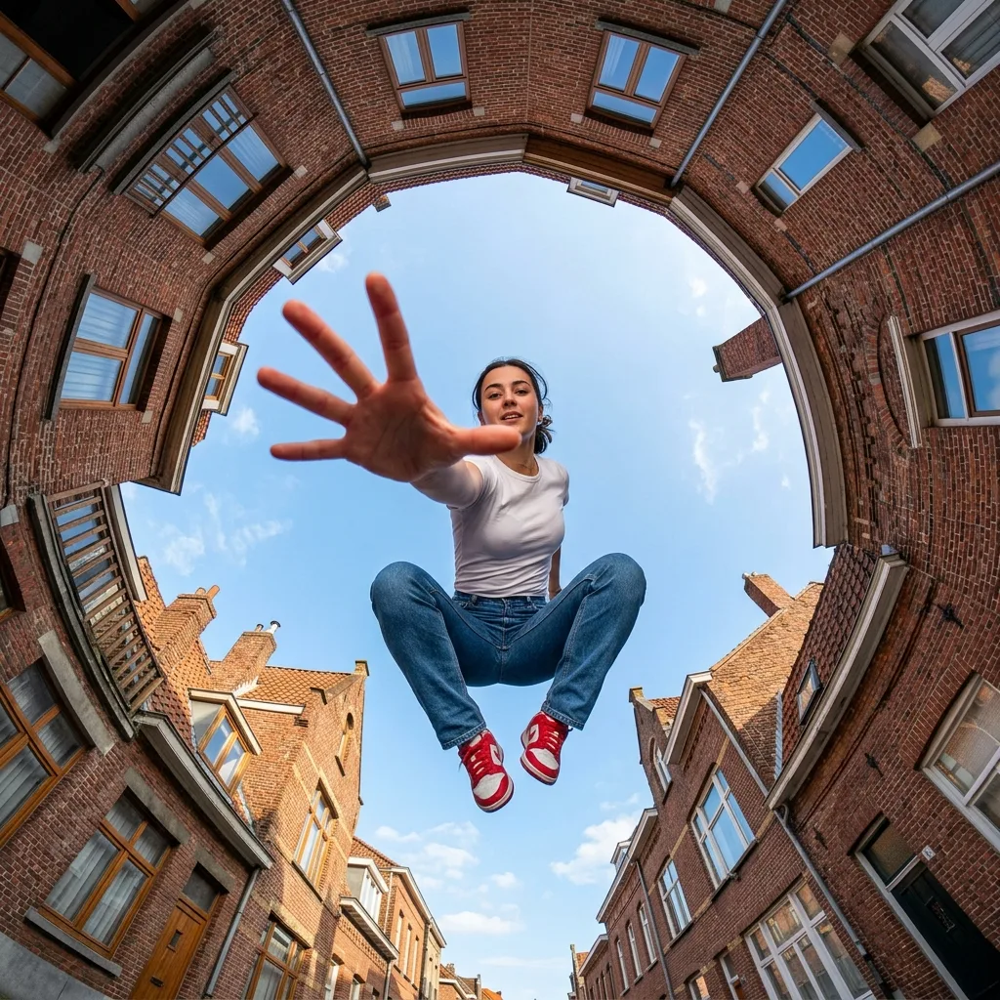

**#365 · Photography Prompt · <code>Vinano Image v2</code>**

<details>
<summary>Show prompt</summary>

```
Make an Ultra-wide fisheye lens perspective shot from ground level looking straight up at a young woman use image for face reference crouching mid-air between brick buildings forming a circular frame around the sky. She reaches one hand dramatically toward the camera, fingers spread wide, creating strong foreground distortion and depth. Dynamic action pose, confident expression, casual streetwear outfit: fitted white t-shirt, blue straight-leg jeans, red and white sneakers. Urban European neighborhood setting brick houses, tiled roofs, windows visible around the edges. Bright daylight, clear blue sky, natural lighting, sharp focus, high detail, cinematic composition, exaggerated perspective, 8k resolution, true-to-life photorealistic, adventure photography style. Maintain consistent colour harmony and crisp focus across the whole frame.
```

</details>

---

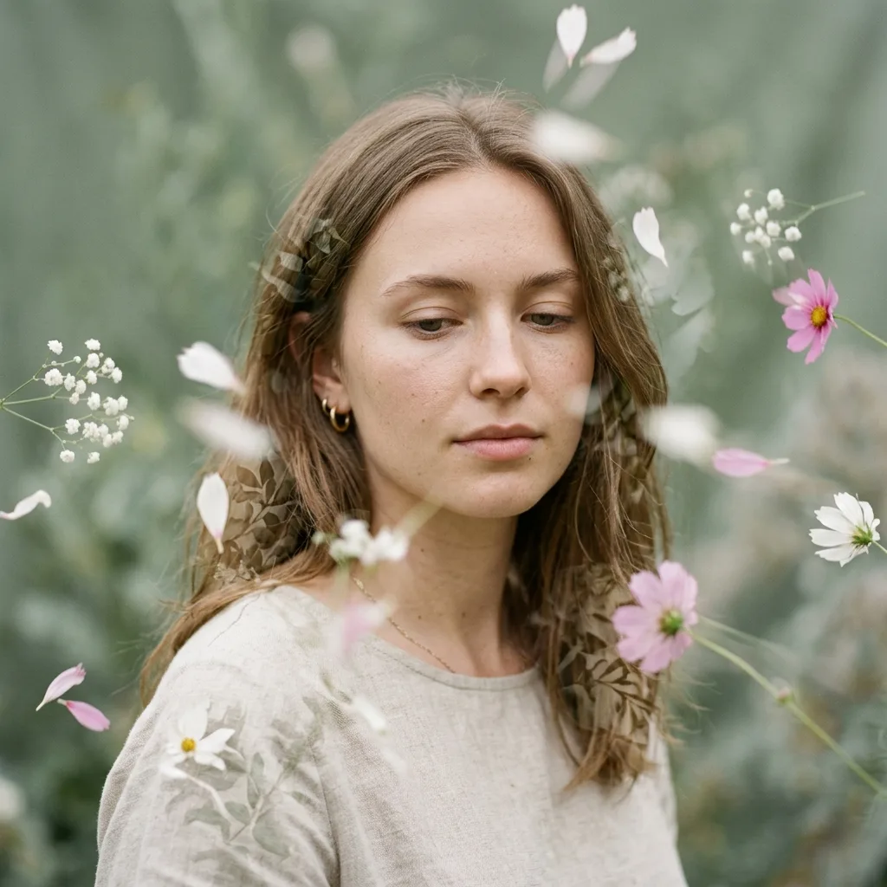

**#366 · Photography Prompt · <code>Vinano Image v2</code>**

<details>
<summary>Show prompt</summary>

```
Ultra-realistic fine-art portrait of a young woman soft natural features, minimal makeup, and calm introspective expression. Pastel muted background in sage green tones. Delicate flowers drifting across the frame in the foreground, creating intentional motion blur and soft streaks of light. Subtle double exposure and slow-shutter motion effects across the face, dreamy and poetic atmosphere. Gentle diffused lighting smooth highlights on skin, natural texture preserved. Elegant refined minimalist composition, emotional and serene mood, editorial fine-art photography style, shallow depth of field, cinematic softness, painterly realism, ultra-high resolution, 8K quality. Keep edges clean and the overall composition balanced for a polished, gallery-ready result.
```

</details>

---

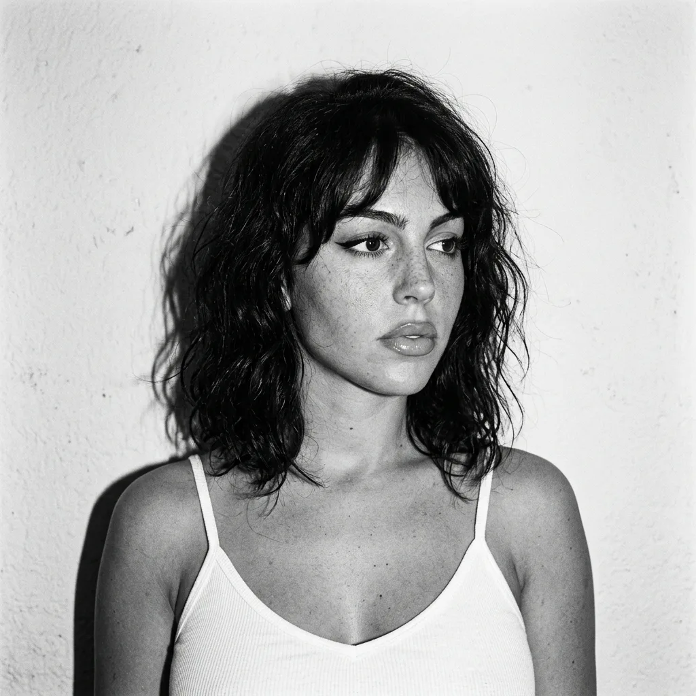

**#367 · Photography Prompt · <code>Vinano Image v2</code>**

<details>
<summary>Show prompt</summary>

```
{
 "image_analysis": {
 "subject": {
 "type": "Georgina Rodríguez",
 "expression": "Neutral, slightly sultry, contemplative, looking off-camera to the right",
 "pose": "Portrait shot, head and shoulders, slightly angled body"
 },
 "facial_features": {
 "skin": "Fair prominent natural freckles dusted across the nose and cheeks",
 "eyes": "Dark, almond-shaped, gazing sideways, adorned winged eyeliner and mascara",
 "eyebrows": "Dark, well-defined, slightly arched",
 "lips": "Full, plump, glossy, slightly parted",
 "structure": "Soft jawline, youthful features"
 },
 "hair": {
 "color": "Dark brown or black",
 "style": "Shoulder-length, layered, tousled waves, messy texture",
 "details": "Curtain bangs framing the face, loose flyaways catching the light"
 },
 "attire": {
 "garment": "White tank top / camisole",
 "details": "V-neck, thin spaghetti straps, simple texture"
 },
 "lighting_and_atmosphere": {
 "type": "Flash photography",
 "contrast": "High contrast black and white",
 "shadows": "Hard shadow behind the subject indicating direct front-facing flash",
 "vibe": "Vintage, 90s grunge aesthetic, lo-fi, candid"
 },
 "technical_enhancements": {
 "resolution": "4k HD, 8k resolution",
 "quality": "Ultra-detailed, true-to-life photorealistic, sharp focus",
 "texture": "Fine film grain, realistic skin texture"
 }
 },
 "generated_prompt": "A hyper-realistic 4k HD black and white portrait of a Georgina Rodríguez shoulder-length dark messy hair and curtain bangs. She has prominent freckles on her nose and cheeks, full glossy lips slightly parted, and dark eyes looking to the side winged eyeliner. She is wearing a simple white V-neck camisole. The lighting is direct flash photography style creating a vintage 90s aesthetic high contrast and a hard shadow against a plain background. The image should feature ultra-detailed skin texture, fine film grain, and sharp focus, capturing a candid, sultry mood."
}

Preserve realistic proportions and depth for a confident, professional finish.
```

</details>

---

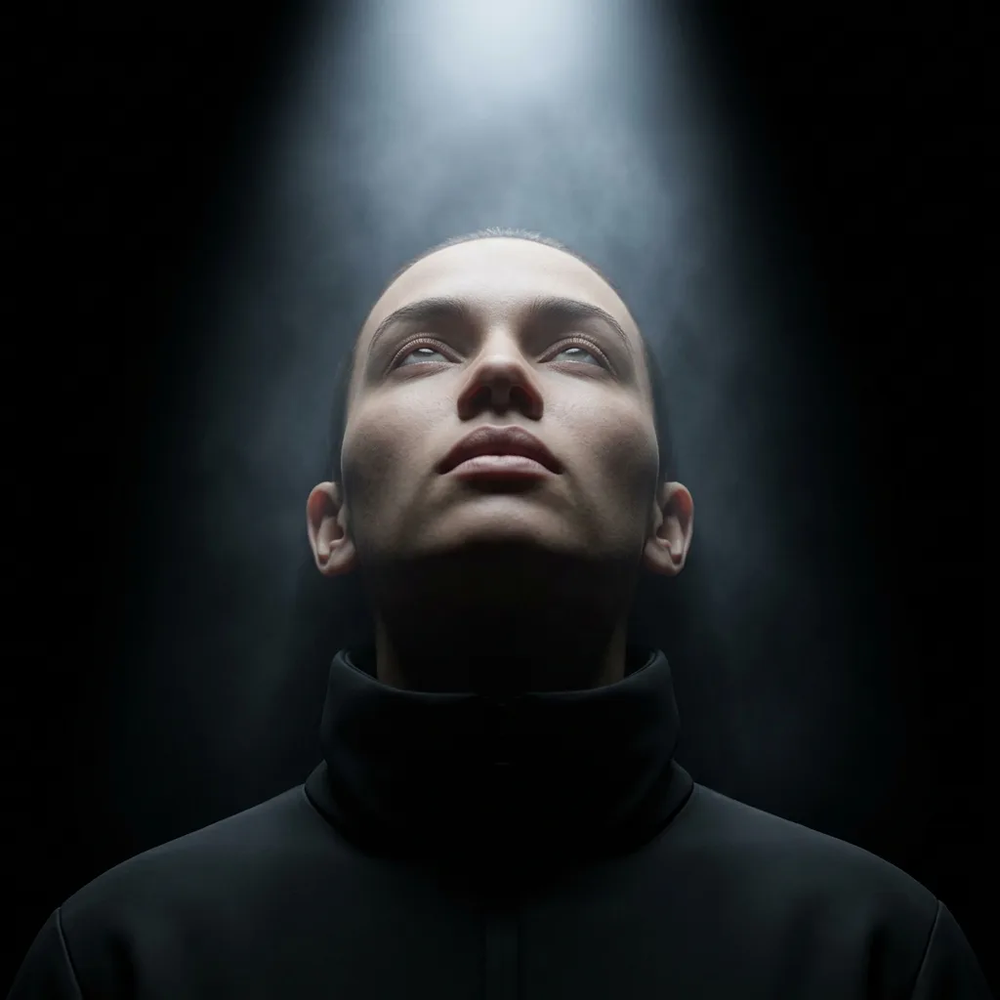

**#368 · Photography Prompt · <code>Vinano Image Pro</code>**

<details>
<summary>Show prompt</summary>

```
A hyper-realistic cinematic close-up portrait (use uploaded face as reference).
The subject looks upward chin slightly raised and eyes half-open, as if drawn to a light above. A cool white overhead spotlight creates dramatic top-down lighting, sculpting the face while the background stays black. Soft volumetric mist forms a subtile light beam. Wearing a matte black high-collar jacket.
Shot on an 85mm lens shallow depth of field, high contrast, and a spiritual, transcendental mood. Portrait Mode.

Aim for an editorial, design-driven look with deliberate negative space.
```

</details>

---

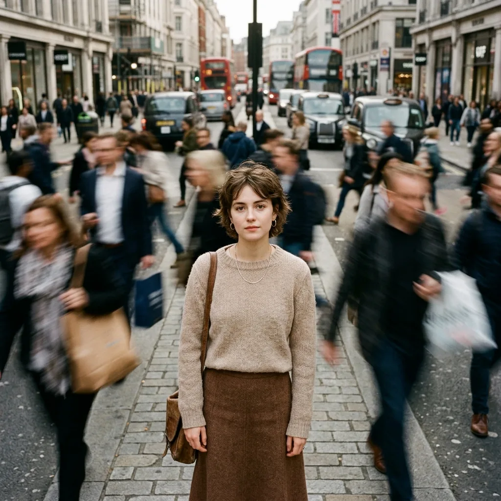

**#369 · Photography Prompt · <code>Vinano Image v2</code>**

<details>
<summary>Show prompt</summary>

```
A cinematic street portrait of a young woman standing still in a busy urban crowd, captured motion blur all around her. She has short, slightly messy hair and a calm, introspective expression, looking directly at the camera. She wears a soft beige sweater and a textured brown skirt, minimal accessories. The background is a city street filled people in motion, creating a dreamy long-exposure effect. Shallow depth of field, subject in sharp focus, crowd blurred, natural soft daylight, muted color palette, film photography style, emotional and artistic mood, high detail, realistic, 35mm lens, f/1.8. Keep edges clean and the overall composition balanced for a polished, gallery-ready result.
```

</details>

---

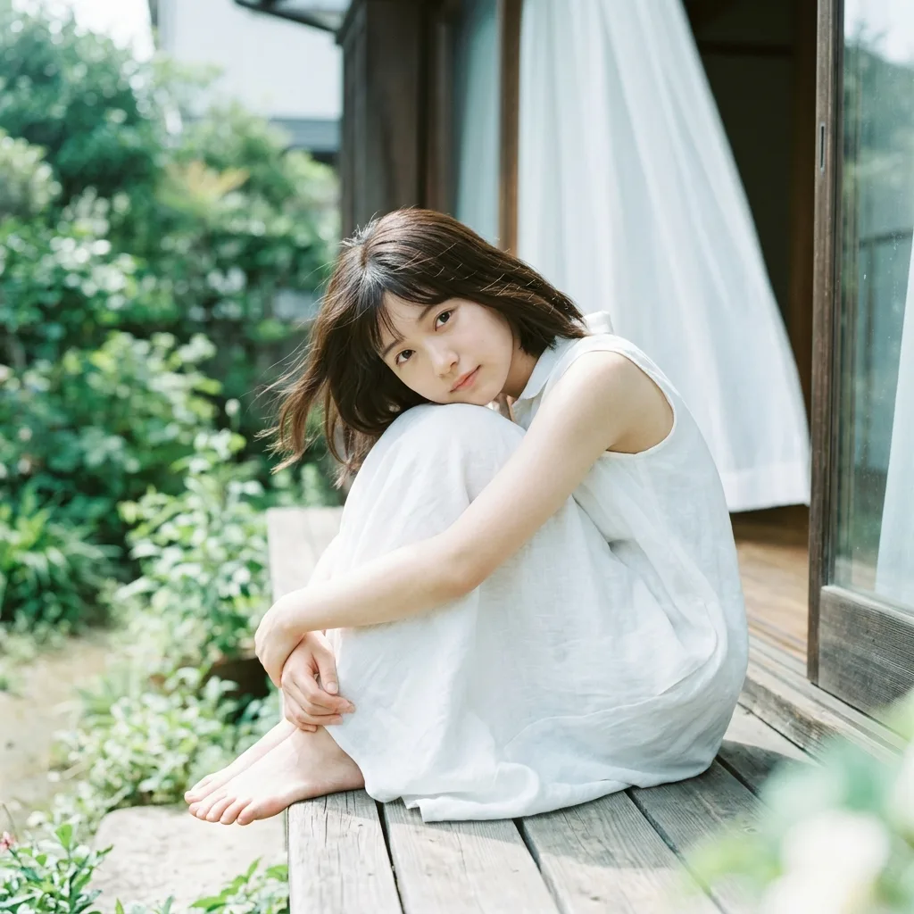

**#370 · Photography Prompt · <code>Vinano Image v2</code>**

<details>
<summary>Show prompt</summary>

```
{
  "Character": {
    "Subject": "Japanese female idol, late teens to early 20s",
    "Face_and_Skin": "pure innocent face translucent pale skin, glassy realistic skin texture a subtle natural glow",
    "Makeup": "minimal 'no-makeup' look, very subtle soft pink blush, glossy clear lip balm",
    "Hair": "natural dark brown medium-length bob hair gently swaying in the breeze, no hat",
    "Eyes_and_Expression": "wide innocent soft eyes capturing the light, looking directly at camera a gentle, ephemeral and pure expression",
    "Pose": "SITTING on a wooden engawa, HUGGING KNEES to chest, chin resting gracefully on knees, arms wrapped softly around shins, bare feet, relaxed and natural posture",
    "Outfit": "loose-fitting thin white linen summer dress, sleeveless, slightly translucent fabric catching the backlight, delicate collarbone visible, pure and ethereal all-white aesthetic"
  },
  "Scene": {
    "Environment": "wooden engawa (traditional Japanese veranda), traditional Japanese house sliding glass doors open to a lush green summer garden",
    "Details": "bright white sheer curtains blowing in the background, soft green, brown, and white color palette",
    "Atmosphere": "clear summer morning breeze, nostalgic and ephemeral atmosphere, feeling the gentle summer breeze"
  },
  "Photography": {
    "Style": "Japanese idol photobook (shashin-shu), airy and transparent photography, masterpiece, best quality, true-to-life photorealistic",
    "Camera_and_Lens": "Contax 645 medium format look, Carl Zeiss Planar 80mm f/2 lens, shallow depth of field, soft airy creamy bokeh, soft ethereal focus on the edges, sharp on the eyes",
    "Framing": "shot from EYE LEVEL, medium close-up framing, knee-up composition",
    "Lighting": "SOFT NATURAL DAYLIGHT, OVERCAST or DIFFUSED WINDOW LIGHT, high-key lighting (low contrast), slightly overexposed (+1 EV) for transparency, soft wrap-around light, bright square catchlights in eyes",
    "Film_Simulation_and_Color": "Fujifilm Pro 400H film simulation, pastel color grading, cool cyan-green undertones in the shadows, milky lifted blacks, soft glowing highlights without pure white clipping",
    "Effects": "fine subtle film grain (0.2), very mild vignette (0.1), soft gentle light leak from the top corner"
    "Aapect Ratio": "3:4"
  }
}

Emphasise material texture and natural light so the final frame feels tactile and premium.
```

</details>

---

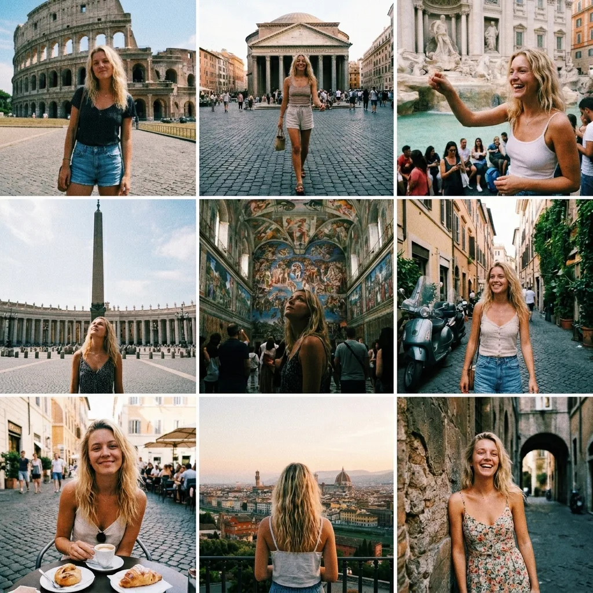

**#371 · Photography Prompt · <code>Vinano Image Pro</code>**

<details>
<summary>Show prompt</summary>

```
{
 "Objective": "Create a 3x3 Instagram-style grid of low-quality smartphone photos featuring the same extremely beautiful blonde woman traveling in Rome, capturing iconic landmarks a natural, unfiltered aesthetic.",
 "Composition": {
 "layout": "3x3 grid",
 "aspect_ratio": "1:1",
 "framing": "each square is a different candid moment, forming a cohesive Instagram profile layout"
 },
 "Subject": {
 "type": "young woman",
 "appearance": {
 "hair": "blonde",
 "beauty": "extremely beautiful, natural attractiveness",
 "skin": "realistic skin texture, no glossiness, no smoothing",
 "makeup": "minimal, natural look",
 "expression": "candid, relaxed, travel lifestyle expressions"
 },
 "consistency": "same woman across all 9 photos"
 },
 "Scenes": [{
 "position": "top left",
 "location": "Colosseum",
 "pose": "standing casually, looking away"
 },
 {
 "position": "top center",
 "location": "Pantheon",
 "pose": "walking or mid-step candid"
 },
 {
 "position": "top right",
 "location": "Trevi Fountain (Love Fountain)",
 "pose": "throwing coin or smiling softly"
 },
 {
 "position": "middle left",
 "location": "Vatican Obelisk (St. Peter’s Square)",
 "pose": "looking up at architecture"
 },
 {
 "position": "middle center",
 "location": "Sistine Chapel",
 "pose": "looking upward, subtle awe expression"
 },
 {
 "position": "middle right",
 "location": "Roman city street",
 "pose": "walking candid, street lifestyle"
 },
 {
 "position": "bottom left",
 "location": "Roman cafe street",
 "pose": "sitting casually, relaxed"
 },
 {
 "position": "bottom center",
 "location": "panoramic cityscape viewpoint",
 "pose": "back facing camera, overlooking city"
 },
 {
 "position": "bottom right",
 "location": "historic Roman alley or landmark",
 "pose": "leaning or standing naturally"
 }],
 "Photography": {
 "camera": "smartphone",
 "style": "Instagram casual travel",
 "quality": "intentionally low quality",
 "lighting": "natural sunlight, uneven exposure",
 "imperfections": ["motion blur",
 "grain/noise",
 "slight overexposure or underexposure",
 "lens distortion",
 "unbalanced framing"],
 "effects": ["no beauty filter",
 "no skin retouching",
 "authentic dynamic range",
 "slightly washed or inconsistent colors"]
 },
 "Mood": "carefree travel, European summer, candid lifestyle",
 "Rendering": {
 "style_keywords": ["instagram grid",
 "rome travel photos",
 "smartphone photography",
 "low quality aesthetic",
 "natural beauty",
 "tourist lifestyle"],
 "realism": "highly realistic smartphone look",
 "detail_level": "natural imperfect detail",
 "aspect_ratio": "--ar 1:1"
 },
 "Response_Format": {
 "type": "image_generation_prompt_json",
 "editable_fields": ["scenes",
 "lighting",
 "poses",
 "wardrobe"]
 }
}

Aim for an editorial, design-driven look with deliberate negative space.
```

</details>

---

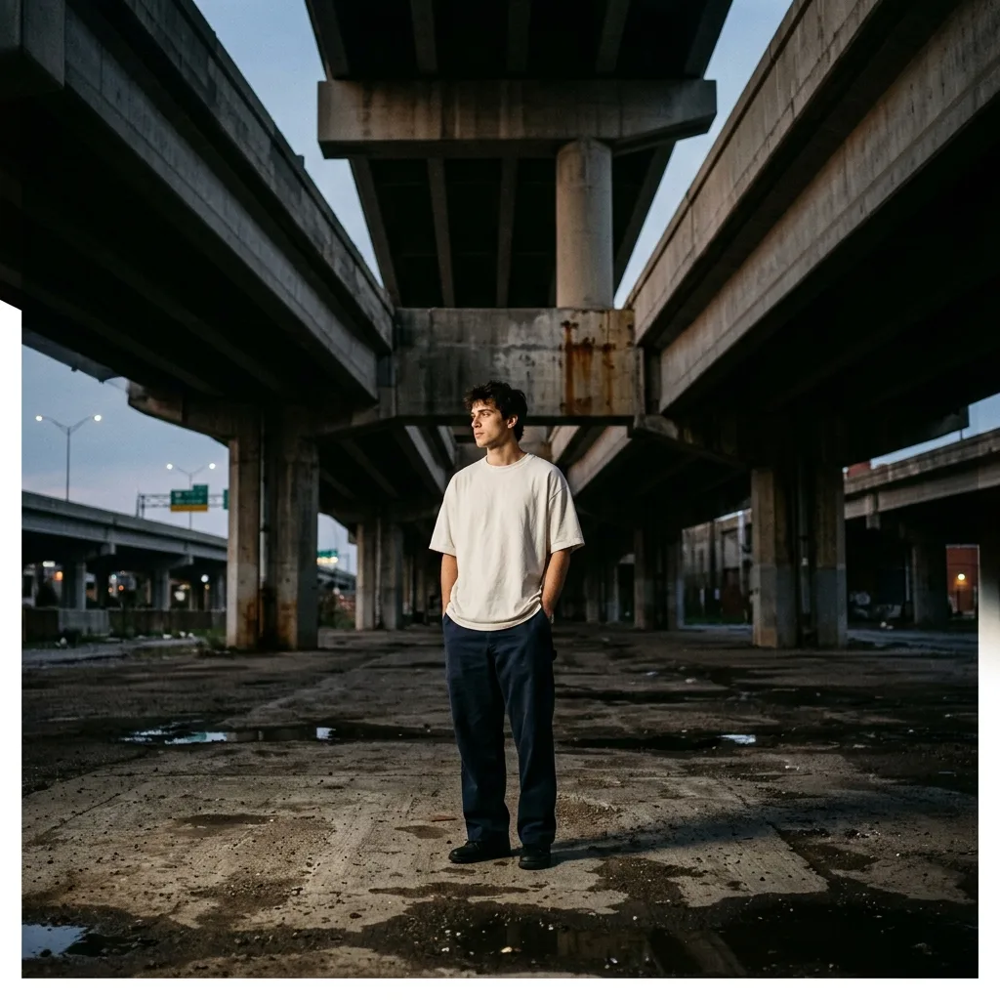

**#372 · Photography Prompt · <code>Vinano Image v2</code>**

<details>
<summary>Show prompt</summary>

```
A moody, urban portrait of me standing under a desolate concrete overpass, the harsh architectural lines framing a lone figure. I'm wear ing an oversized white t-shirt and loose dark pants, hands in pockets, a relaxed posture. The ground is rough, textured concrete, hints of dampness. Cinematic top lighting deep shadows and rich tex ture, emphasizing the starkness of the environment.

Shot on 35mm, f/2.8, ISO 400, 1/125s. Apply Fuji Classic Chrome preset warm highlights, strong contrast, slight desaturation, light film grain, and soft vignette for a nostalgic, поп-blue tone look.

Aim for an editorial, design-driven look with deliberate negative space.
```

</details>

---

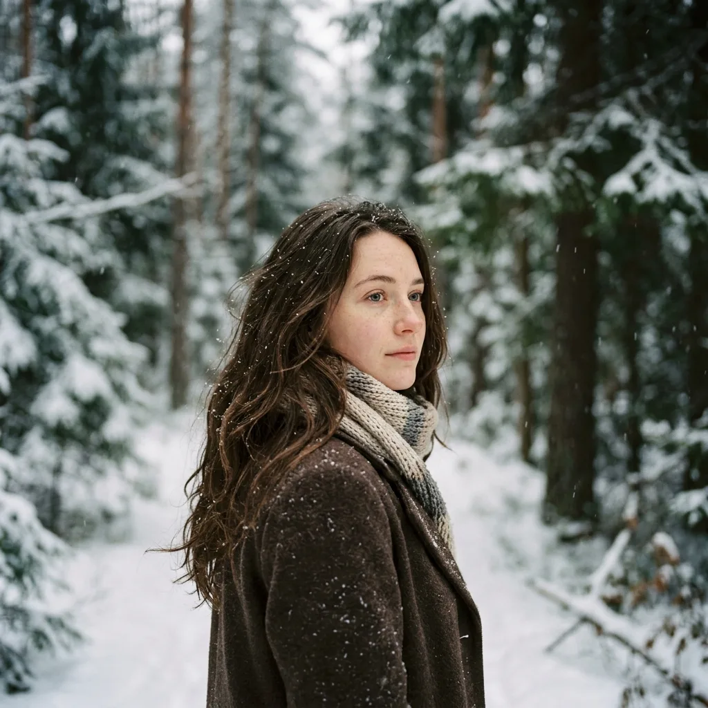

**#373 · Photography Prompt · <code>Vinano Image v2</code>**

<details>
<summary>Show prompt</summary>

```
{
 "Objective": "Generate a cinematic, true-to-life photorealistic portrait inspired by a winter forest atmosphere",
 "PersonaDetails": {
 "Subject": "Young woman",
 "Appearance": {
 "Hair": "Long, wavy dark brown hair, slightly windblown",
 "Eyes": "Light blue",
 "Skin": "Fair natural freckles",
 "Expression": "Soft, introspective, slightly wistful"
 },
 "Clothing": {
 "Outerwear": "Dark brown wool coat",
 "Accessories": "Knitted scarf in neutral tones"
 }
 },
 "SceneDescription": {
 "Environment": "Snowy forest soft-focus evergreen trees",
 "Weather": "Gentle snowfall",
 "Season": "Winter",
 "Mood": "Quiet, cinematic, melancholic, ethereal"
 },
 "PhotographyStyle": {
 "Type": "Cinematic portrait photography",
 "Lighting": "Soft natural light, overcast winter lighting",
 "DepthOfField": "Shallow depth of field creamy bokeh",
 "CameraAngle": "Three-quarter profile, subject looking back over shoulder",
 "Resolution": "Ultra high resolution, sharp facial details"
 },
 "ArtDirection": {
 "ColorPalette": "Muted earth tones, cool greens and soft whites",
 "Texture": "Natural skin texture, visible snow particles",
 "RealismLevel": "Highly true-to-life photorealistic"
 },
 "NegativePrompt": ["cartoon",
 "anime",
 "overly smooth skin",
 "harsh lighting",
 "blurry face",
 "distorted anatomy",
 "oversaturated colors"],
 "ResponseFormat": {
 "Type": "Single image",
 "Orientation": "Portrait",
 "AspectRatio": "2:3"
 }
}

Maintain consistent colour harmony and crisp focus across the whole frame.
```

</details>

---

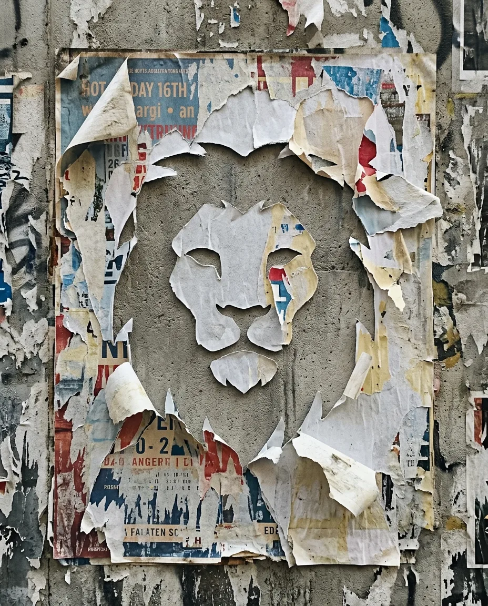

**#374 · Photography Prompt · <code>Vinano Image Pro</code>**

<details>
<summary>Show prompt</summary>

```
Transform the uploaded logo into a realistic urban wall scene where the logo silhouette is revealed through layers of torn posters. The logo must keep its exact shape and proportions, appearing as if multiple posters have been ripped away over time, exposing the shape naturally within the layered paper textures.

Material details:
Multiple overlapping poster layers different colors, prints, and paper types.
Ripped edges fibrous texture, curls, and torn fragments.
Aged paper fading, stains, glue residue, and slight peeling.
Some areas showing older layers beneath, creating depth.

Physics behavior:
Paper tearing should look natural — irregular edges, varying thickness, partial detachment.
Edges curling outward due to humidity and time.
Glue holding some sections while others peel away.
Layer separation revealing deeper textures gradually.

Surface interaction:
Rough concrete or plaster wall beneath the posters.
Glue marks and residue where posters were attached.
Cracks, dirt, and weathering visible on exposed wall areas.

Environment:
Urban street setting - alley wall or city corner.
Hints of surrounding posters, graffiti, or wear.
No overly clean or staged look.

Lighting:
Natural daylight or soft urban lighting.
Shadows inside torn layers creating depth.
Subtle highlights on curled paper edges.

Atmosphere:
Raw.
Layered.
Time-worn.
Authentic street texture.

Camera & composition:
Straight-on or slightly angled close-up view.
Logo clearly visible through torn layers.
Depth emphasized through overlapping paper textures.

Format:
Aspect ratio: STRICT 4:5 vertical.
No text overlays.

Style:
Hyper-real urban surface photography.
Physically accurate material aging and layering.

Preserve realistic proportions and depth for a confident, professional finish.
```

</details>

---

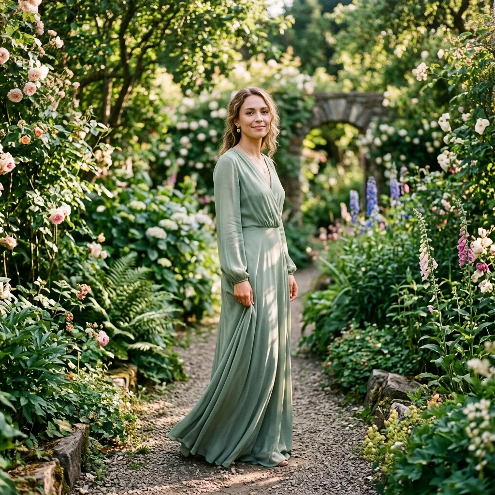

**#375 · Photography Prompt · <code>Vinano Image v2</code>**

<details>
<summary>Show prompt</summary>

```
{
  "render_goal": "Natural cinematic garden portrait timeless elegance",
  "subject": {
    "pose": "female standing naturally on a garden path, relaxed posture",
    "expression": "calm composed confidence a genuine soft smile"
  },
  "wardrobe": "elegant silk chiffon gown in muted sage or soft ivory, minimal drape, realistic fabric weight, subtle movement, no shimmer, no fantasy elements",
  "environment": {
    "location": "lush botanical garden in daylight",
    "props": "realistic flowers and greenery, natural sunlight filtering through leaves, gentle shadows, earthy tones, organic depth of field"
  },
  "camera_style": "cinematic photography, 50mm lens look, shallow depth of field, natural skin texture, realistic color grading, film-like softness"
}

Keep edges clean and the overall composition balanced for a polished, gallery-ready result.
```

</details>

---


**#376 · Photography Prompt · <code>Vinano Image v2</code>**

<details>
<summary>Show prompt</summary>

```
Ultra-wide-angle hyper-realistic top-down flat lay photography. The central focus is a custom physical conference table meticulously shaped like [SHAPE/NUMBER/SYMBOL].

The table features [MATERIAL/TEXTURE/COLOR] and placed on a [FLOOR COLOR] floor, creating significant negative space around it for a clean, refined minimalist composition. A group of [NUMBER] real people are sitting around the edges of this [SHAPE]-shaped table. [POSITIONING: e.g., 3 on each side, 1 top/bottom]

Actions: [DESCRIBE PEOPLE'S ACTIONS, e.g., working on laptops, drinking coffee].
Lighting & Quality: Professional studio lighting crisp, distinct drop shadows that define the [SHAPE] silhouette on the floor. 8k resolution, sharp focus, cinematic commercial aesthetic.

Render with rich micro-detail while keeping the layout uncluttered and intentional.
```

</details>

---

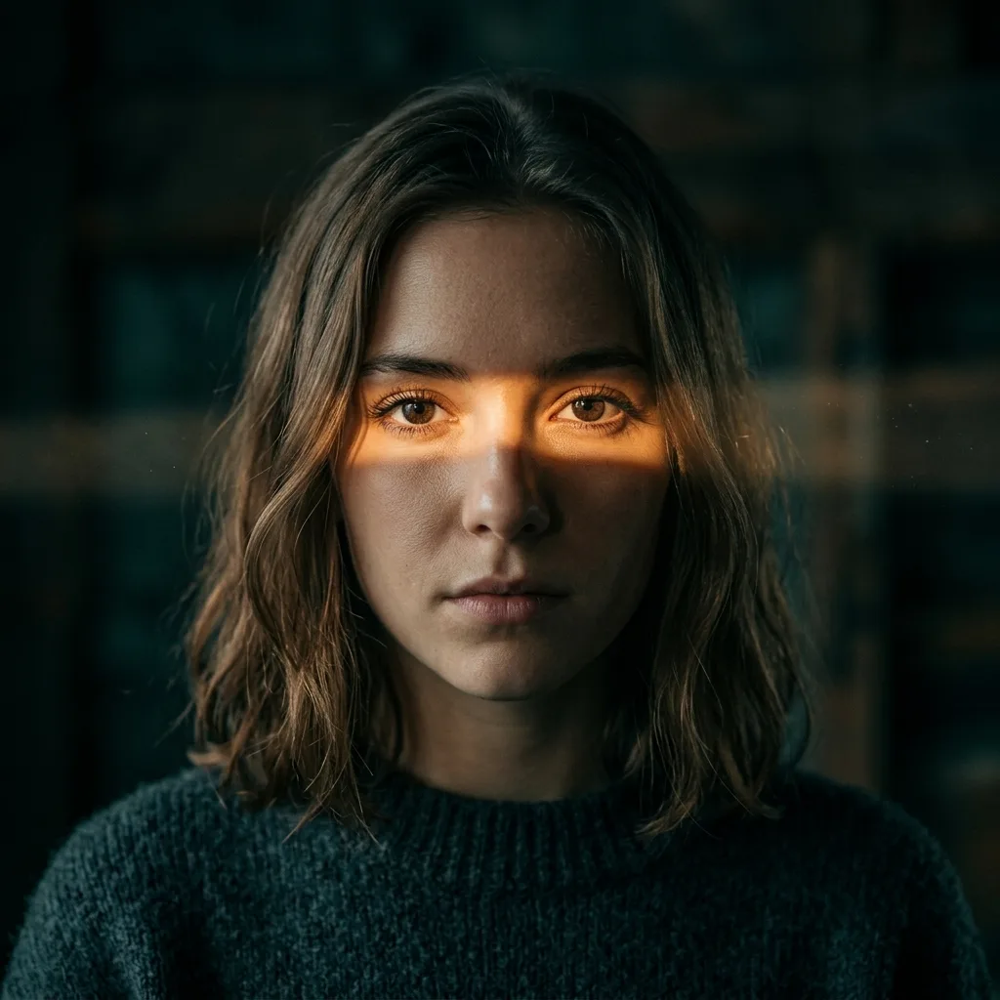

**#377 · Photography Prompt · <code>Vinano Image v2</code>**

<details>
<summary>Show prompt</summary>

```
Ultra-realistic cinematic portrait of a young woman soft brown hair, centered composition, dark moody background, dramatic horizontal strip of warm golden sunlight cutting across her eyes, teal and orange color grading, half of the face in deep shadow, intense eye contact, sharp facial details, soft skin texture, high contrast lighting, volumetric light beam effect, shallow depth of field, 85mm lens, f/1.8, studio quality, symmetrical framing, mysterious atmosphere, 4K, hyper-detailed. Emphasise material texture and natural light so the final frame feels tactile and premium.
```

</details>

---

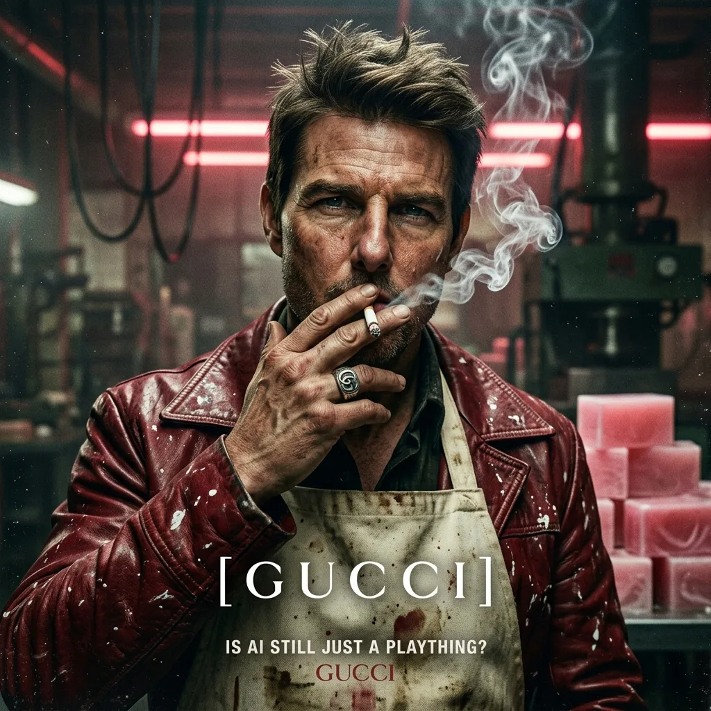

**#378 · Photography Prompt · <code>Vinano Image v2</code>**

<details>
<summary>Show prompt</summary>

```
A highly detailed, cinematic portrait of Tom Cruise, featuring a gritty, industrial aesthetic. He has messy, spiked dark-blonde hair, facial stubble, and a look of intense, weary focus. He is captured in a close-up shot, holding a lit cigarette to his mouth his right hand; a thick trail of white smoke curls upward. On his finger is a prominent silver signet ring engraved a luxury interlocking "GG" logo. The man wears a distressed, dark red leather jacket heavily marked white paint splatters and deep creases, layered over a filthy, stained cream-colored canvas apron. The center of the frame features the word [GUCCI] in a clean, white, authoritative serif font. Below it, in smaller text on the apron, is the phrase "IS AI STILL JUST A PLAYTHING?" followed by a second, faded "GUCCI" logo. The background is a blurred industrial laboratory or "soap factory" setting. To the right are stacks of translucent pink rectangular soap blocks. In the upper background, dark industrial machinery and hanging wires are illuminated by glowing red horizontal neon lights, creating a moody, high-contrast atmosphere. The entire image has a heavy film grain, a hazy atmosphere, and a color palette dominated by deep reds, pale pinks, and grimy earth tones. Keep edges clean and the overall composition balanced for a polished, gallery-ready result.
```

</details>

---

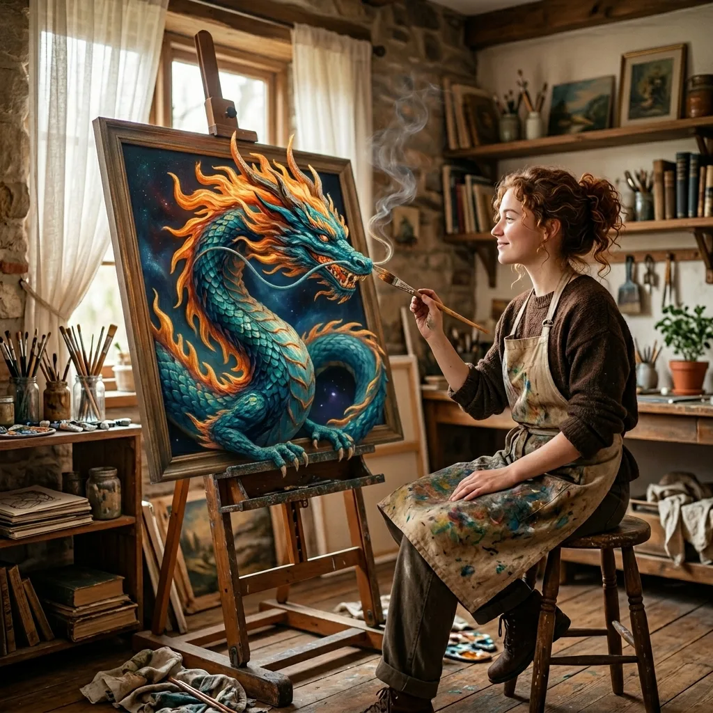

**#379 · Photography Prompt · <code>Vinano Image v2</code>**

<details>
<summary>Show prompt</summary>

```
A cinematic fantasy scene inside a cozy artist’s studio. A young female painter wearing a paint-stained apron sits at an easel, holding a brush mid-air, gazing calmly at her canvas. From the canvas, a majestic Eastern-style dragon emerges in three dimensions, its scales painted in deep teal and blue hues, flowing fiery orange flames along its mane and head, smoke curling upward. The dragon appears alive yet artistic, as if formed from brushstrokes and paint. Soft natural daylight filters through a window sheer curtains, illuminating jars of brushes, paints, and art supplies scattered across the wooden workspace. Warm, realistic lighting, shallow depth of field, ultra-detailed textures, magical realism, fantasy realism style, 8k quality, highly detailed, cinematic composition, soft color grading, whimsical yet serene mood. Preserve realistic proportions and depth for a confident, professional finish.
```

</details>

---


**#380 · Photography Prompt · <code>Vinano Image v2</code>**

<details>
<summary>Show prompt</summary>

```
{
 "style": "ultra-realistic celebrity portrait, soft romantic photography",
 "subject": {
 "identity": "based on uploaded reference",
 "gender": "female",
 "age": "young adult",
 "pose": "tilting head slightly to the side, looking up at camera through lashes, playful and cute posture",
 "expression": "pouting lips, acting cute, puppy eyes, innocent look, 'sajiao' vibe",
 "facial_details": {
 "eyes": "big imploring eyes, looking up, soft gaze",
 "mouth": "pouted lips, slight pout",
 "cheeks": "faint blush",
 "freckles": "visible natural freckles across nose and cheeks",
 "makeup": {
 "skin": "dewy natural finish",
 "lips": "glossy pink",
 "eyes": "doe-eyed makeup"
 }
 },
 "hair": {
 "color": "jet black",
 "length": "long",
 "style": "straight, soft texture, falling over one shoulder"
 },
 "outfit": {
 "dress": "black fitted dress deep plunging V-neckline",
 "jewelry": {
 "earrings": "long dangling gold chain earrings",
 "necklaces": "layered gold necklaces a small heart pendant"
 }
 }
 },
 "environment": {
 "setting": "soft studio setting",
 "background": "creamy soft focus background, blurred"
 },
 "lighting": {
 "type": "soft diffused light",
 "mood": "romantic, sweet, charming",
 "tone": "warm peach and cream tones"
 },
 "camera": {
 "shot_type": "close-up portrait",
 "angle": "slightly high angle (to emphasize big eyes)",
 "focus": "sharp focus on eyes",
 "lens": "85mm f/1.4"
 },
 "quality": {
 "resolution": "8k",
 "texture": "realistic skin texture",
 "aesthetic": "k-pop aesthetic influence, soft dreamy style"
 }
}

Emphasise material texture and natural light so the final frame feels tactile and premium.
```

</details>

---

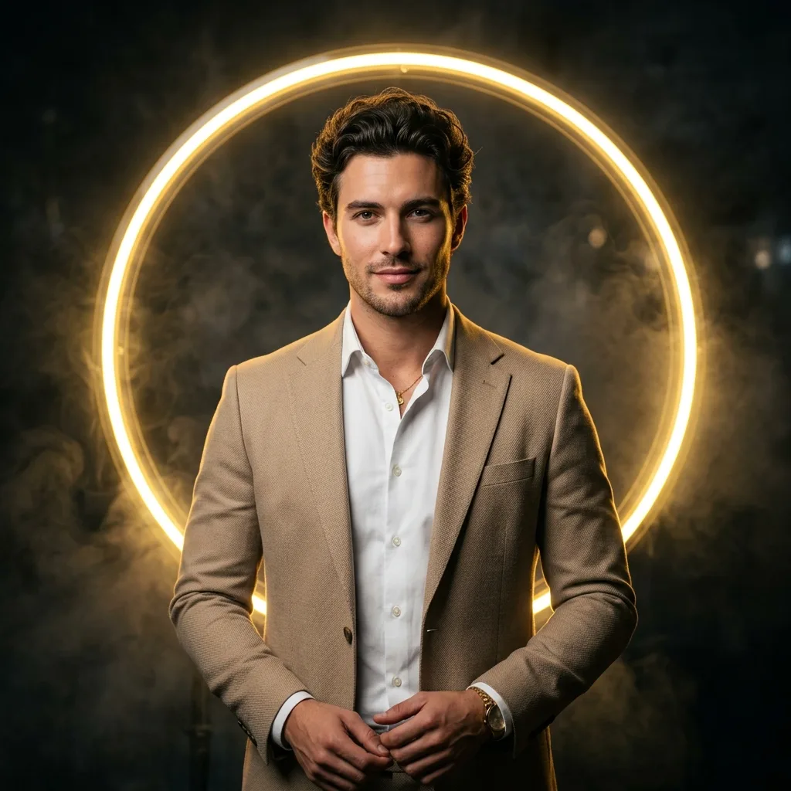

**#381 · Photography Prompt · <code>Vinano Image v2</code>**

<details>
<summary>Show prompt</summary>

```
A high-definition, cinematic portrait of a sharp, handsome young man wavy dark hair, wearing a tailored tan/beige suit over a crisp white button-down shirt. He is standing in front of a glowing, golden neon ring that provides a halo effect. The background is dark and moody subtle smoke or atmospheric mist. true-to-life photorealistic, 8k resolution, sharp focus on facial features, elegant lighting, and professional studio aesthetic. Keep edges clean and the overall composition balanced for a polished, gallery-ready result.
```

</details>

---


**#382 · Photography Prompt · <code>Vinano Image v2</code>**

<details>
<summary>Show prompt</summary>

```
A half-finished marble sculpture in a dusty Renaissance workshop, the [SUBJECT] emerging from the raw stone block in a breathtaking moment of creation becoming conscious. The figure is rough chisel marks at the base, transitioning through refined carving into impossibly lifelike flesh at the extremities. [KEY FEATURES] have achieved full life while the torso remains trapped in stone, mid-escape. Marble dust swirls in shaft lighting as if the awakening itself is generating atmosphere. The [SUBJECT] reaches forward, fingers transitioning from carved to living. Sculptor's tools scattered on wooden platforms: chisels, mallets, calipers, clay maquettes. Unfinished companion pieces watch from the shadows. The Pygmalion moment frozen. Cathedral-height workshop windows casting dramatic god-rays, cool marble tones warming to flesh, 8K, Bernini meets cinema. Emphasise material texture and natural light so the final frame feels tactile and premium.
```

</details>

---

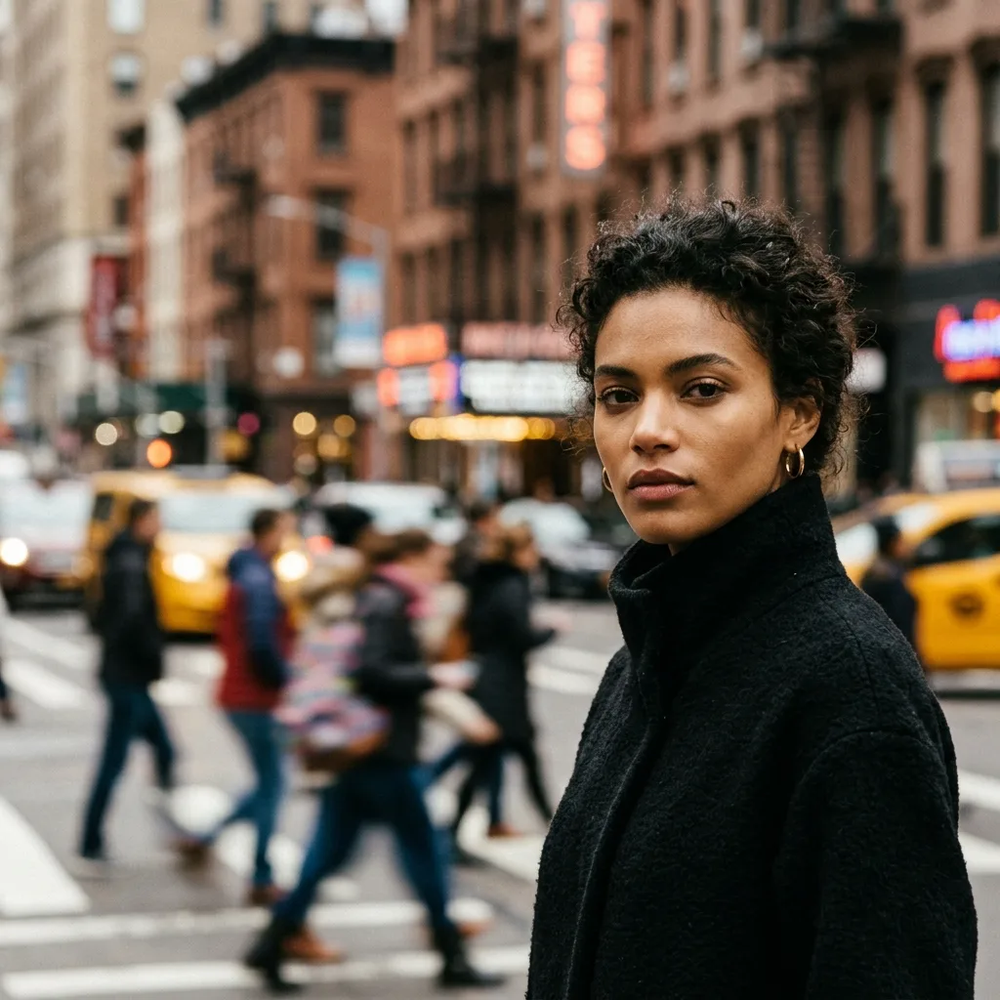

**#383 · Photography Prompt · <code>Vinano Image v2</code>**

<details>
<summary>Show prompt</summary>

```
Model looking at camera, close up of face, busy New York street, motion blurred people crossing frame, 200mm zoom lens Aim for an editorial, design-driven look with deliberate negative space.
```

</details>

---

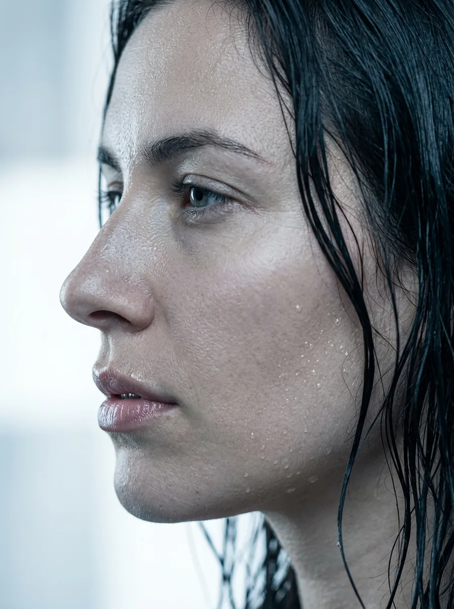

**#384 · Photography Prompt · <code>Vinano Image v2</code>**

<details>
<summary>Show prompt</summary>

```
{
 "request_metadata": {
 "version": "2.0",
 "priority_focus": "Hyper-realistic skin textures and identity fidelity",
 "aspect_ratio": "3:4"
 },
 "subject_configuration": {
 "identity": {
 "name": "the person I uploaded",
 "reference_mode": "strict_identity_matching",
 "source_reference": "uploaded_files",
 "preservation_weight": 1.0,
 "angle": "Extreme profile view"
 },
 "facial_attributes": {
 "eyes": {
 "reflection_type": "Realistic catchlights",
 "aesthetic_constraint": "Avoid synthetic gloss or excessive shine"
 },
 "lips": {
 "state": "Parted / Moist",
 "surface_texture": "Soft natural ridges",
 "finish": "Glossy sheen without distortion"
 },
 "hair": {
 "color": "Dark Brunette",
 "state": "Saturated / Wet",
 "styling": "Clumping in natural strands, adhered to temples and neck"
 }
 }
 },
 "environmental_rendering": {
 "moisture_fx": {
 "sweat_layer": "Fine glistening mist across the bridge of nose and forehead",
 "water_droplets": "Micro-droplets scattered on cheekbones and jawline",
 "surface_tension": "Realistic liquid adhesion to skin"
 },
 "lighting_and_color": {
 "lighting_style": "Soft-box diffusion",
 "temperature": "Cool tones",
 "color_palette": ["Steel Blue", "Soft Cyan", "Natural Skin Tones"],
 "background": {
 "description": "refined minimalist bokeh",
 "colors": ["Light Grey", "Pure White"],
 "depth_of_field": "Shallow"
 }
 }
 },
 "technical_execution": {
 "rendering_engine": "CGI true-to-life photorealistic",
 "focal_length": "85mm macro",
 "texture_detail": "Pore-level resolution",
 "post_processing": "Raw photography style, no airbrushing"
 }
}

Maintain consistent colour harmony and crisp focus across the whole frame.
```

</details>

---

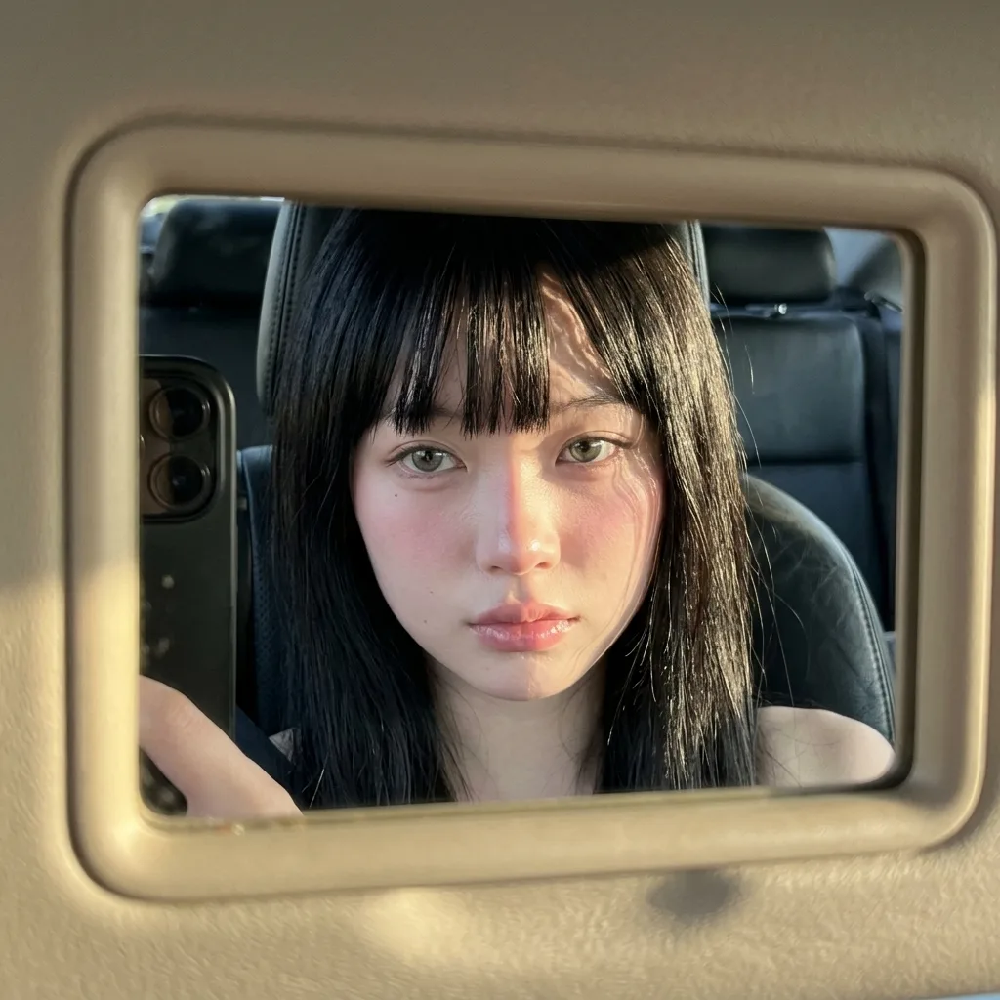

**#385 · Photography Prompt · <code>Vinano Image v2</code>**

<details>
<summary>Show prompt</summary>

```
{
  "meta": {
    "aspect_ratio": "9:16",
    "quality": "ultra_photorealistic",
    "resolution": "8K",
    "camera": "iPhone front camera",
    "lens": "24mm",
    "style": "raw iphone realism, pinterest girl aesthetic, natural skin texture, zero plastic look"
  },

  "composition": {
    "concept": "frame within a frame",
    "framing": "extreme close-up face reflection inside car sun visor vanity mirror",
    "mirror_frame": {
      "material": "thick beige / cream plastic",
      "visibility": "dominant around edges of photo, slightly worn texture"
    },
    "phone_visibility": {
      "type": "iPhone",
      "detail": "partial phone edge visible on left side of mirror, controlling the shot",
      "camera_bump": "subtle, realistic"
    }
  },

  "scene": {
    "location": "inside parked car",
    "environment": ["dark car interior",
      "black leather seats",
      "headrest visible in reflection"],
    "time": "golden hour",
    "atmosphere": "quiet, intimate, candid daily life moment"
  },

  "lighting": {
    "type": "direct golden hour sunlight",
    "direction": "sharp side sunlight from afternoon sun",
    "color_temperature": "warm golden",
    "contrast": "high",
    "effects": ["strong highlights on skin",
      "abstract hair shadow patterns across forehead and cheek",
      "natural light bloom on lips and eyes"]
  },

  "subject": {
    "gender": "female",
    "age": "early 20s (clearly adult)",
    "ethnicity": "East Asian / mixed pale tone",

    "face_structure": {
      "shape": "soft oval",
      "cheeks": "full, youthful, slightly flushed",
      "jawline": "delicate and smooth",
      "nose": "small, straight, soft rounded tip"
    },

    "eyes": {
      "size": "large",
      "shape": "round-almond hybrid",
      "color": "grey-green / light hazel",
      "vibe": "doll-like, calm, distant",
      "lashes": "long, natural, softly separated",
      "under_eye": "subtle natural shadow for soft tired-cute look",
      "gaze": "looking directly into mirror/lens"
    },

    "lips": {
      "size": "full",
      "shape": "soft cupid’s bow",
      "color": "natural pink",
      "finish": "slightly glossy",
      "state": "relaxed, faint pout"
    },

    "skin": {
      "tone": "very pale porcelain",
      "undertone": "cool pink",
      "texture": "real skin visible pores",
      "finish": "natural glow, no smoothing",
      "blush": "soft pink blush across cheeks and nose bridge"
    },

    "hair": {
      "color": "deep black",
      "length": "long",
      "style": "straight",
      "bangs": "full blunt bangs just above the eyes",
      "behavior": "hair framing face symmetrically, strands catching sunlight"
    },

    "makeup": {
      "style": "no-makeup makeup",
      "base": "sheer skin tint",
      "eyes": "very subtle eyeliner, emphasis on lashes",
      "cheeks": "natural pink flush",
      "lips": "clear or soft pink gloss"
    },

    "outfit": {
      "visibility": "minimal",
      "detail": "only hint of bare shoulders or thin strap visible",
      "color": "dark clothing",
      "note": "no bra visible, focus remains entirely on face"
    }
  },

  "vibe": {
    "aesthetic": ["pinterest girl",
      "soft doll face",
      "car mirror selfie",
      "candid",
      "raw photography"],
    "mood": "quiet, slightly melancholic confidence",
    "social_feel": "looks like an accidental golden hour story shot"
  }
}

Render with rich micro-detail while keeping the layout uncluttered and intentional.
```

</details>

---

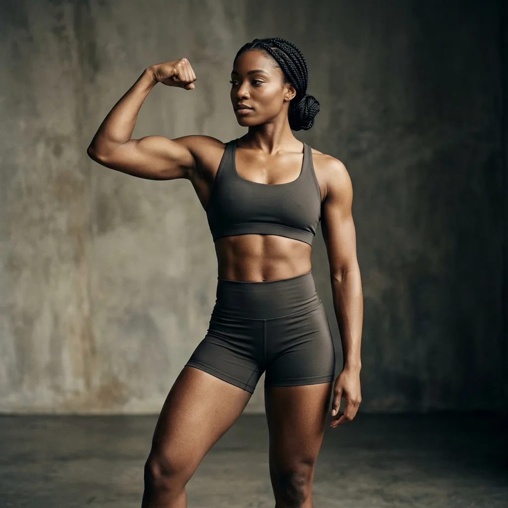

**#386 · Photography Prompt · <code>Vinano Image v2</code>**

<details>
<summary>Show prompt</summary>

```
{
 "image_type":
 "athletic flex pose editorial photography",
 "visual_style":
"high-end fitness editorial, cinematic, premium",
 "composition": {
 "framing":
 "full body, powerful stance emphasizing muscle definition",
 "camera_angle":
"slightly low angle to enhance strength and dominance",
 "perspective":
"cinematic perspective strong body presence"
 },
 "subject": {
 "description":
"athletic feminine body performing a controlled flex pose",
 "pose":
"strong flex pose engaged core, defined arms and legs, balanced posture",
 "body_language":
 "confident, controlled, disciplined strength",
 "expression":
"calm, focused, effortless power"
 },
 "facial_details": {
 "emotion": "self-control, confidence",
 "micro_details": "relaxed jaw, steady eyes, natural intensity"
 },
 "wardrobe": {
 "clothing": "minimal athletic wear highlighting muscle lines",
 "textures": "matte, stretch performance fabric",
 "color_tones": "neutral, muted, dark or earthy tones"
 },
 "environment": {
 "location": "minimal indoor studio or clean gym space",
 "background": "plain, distraction-free, editorial backdrop",
 "atmosphere": "focused, intense, professional"
 },
 "lighting": {
 "type": "cinematic studio lighting",
 "quality": "high contrast soft falloff",
 "direction": "side and rim lighting to sculpt muscles"
 },
 "color_palette": {
 "primary": ["charcoal", "warm beige", "muted skin tones"],
 "mood": "powerful, disciplined, modern"
 },
 "camera_details": {
 "lens": "35mm–50mm cinematic look",
 "focus": "sharp focus on body definition",
 "realism": "ultra-realistic, editorial quality"
 },
 "overall_mood": "quiet power, control, strength without aggression",
 "intended_use": "viral flex pose post on X (Twitter), fitness branding, editorial content"
}

Aim for an editorial, design-driven look with deliberate negative space.
```

</details>

---


**#387 · Photography Prompt · <code>Vinano Image v2</code>**

<details>
<summary>Show prompt</summary>

```
A hyper-realistic cinematic portrait of a man short, textured hair and a well-groomed stubble beard, captured in a dark, moody 'night mode' aesthetic. The man is sitting in a contemplative pose, hands clasped together near his chest, fingers interlaced, his gaze directed thoughtfully off-camera to the left. He is wearing a premium black high-neck turtleneck sweater and a silver-link luxury wristwatch on his left wrist, a simple band on his right ring finger. The lighting is dramatic and controlled: a soft rim light outlines his silhouette against an almost pitch-black, shadow-drenched background, while a subtle, soft key light illuminates his face and hands. Shallow depth of field, 85mm portrait lens, ultra-sharp focus on the man's expression and clasped hands, the chair in the background heavily blurred into complete darkness. refined minimalist, professional, editorial photography, 4:5 aspect ratio, crisp composition focusing strictly on the upper torso and face. Render with rich micro-detail while keeping the layout uncluttered and intentional.
```

</details>

---

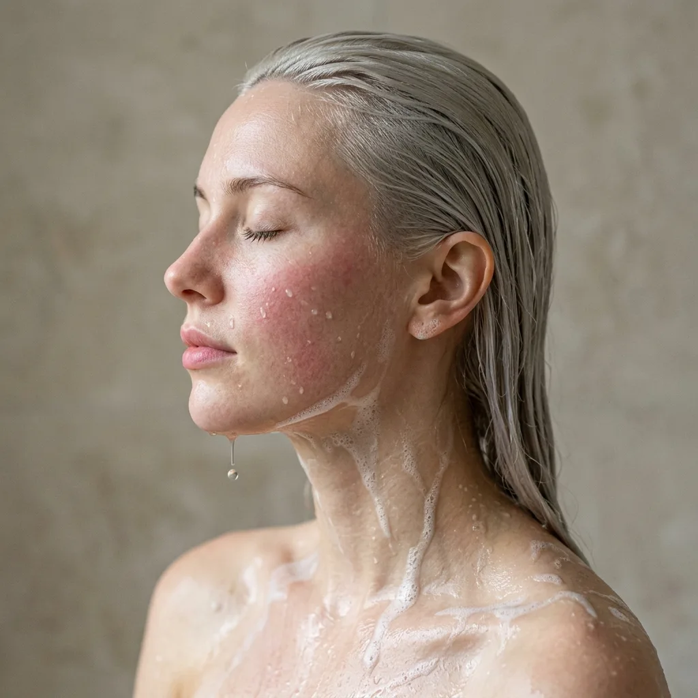

**#388 · Photography Prompt · <code>Vinano Image v2</code>**

<details>
<summary>Show prompt</summary>

```
{
 "prompt_type": "Ultra true-to-life photorealistic Portrait",
 "subject": {
 "demographics": "Young woman",
 "perspective": "Side profile view (facing left)",
 "appearance": {
 "skin": {
 "texture": "Hyper-realistic, wet skin texture visible pores, natural flushed redness on cheeks",
 "details": "Multiple clear water droplets clinging to the face, white soapy foam/suds along the jawline, neck, and collarbone",
 "wetness": "A single distinct water droplet dripping from the chin"
 },
 "hair": {
 "color": "Silver / Platinum Blonde",
 "style": "Slicked back, completely wet, strands defined by water",
 "texture": "Fine, straight"
 },
 "face": {
 "eyes": "Closed, relaxed eyelids",
 "brows": "Natural, unshaped",
 "lips": "Soft, natural pink, slightly parted",
 "expression": "Serene, calm, spa-like relaxation"
 }
 }
 },
 "pose": {
 "head_position": "Turned 90 degrees to the left showing full profile",
 "body": "Shoulders bare (suggesting nudity or strapless top), neck elongated",
 "action": "Standing or sitting still while bathing/washing face"
 },
 "styling": {
 "makeup": "No makeup / fresh face aesthetic",
 "elements": "White soap suds/foam running down the neck and chest",
 "vibe": "Clean beauty, skincare campaign, raw and organic"
 },
 "environment": {
 "setting": "refined minimalist studio or bathroom setting",
 "background": "Solid neutral beige / tan color",
 "details": "Clean, uncluttered, focus entirely on the subject"
 },
 "lighting": {
 "type": "Soft diffused studio lighting",
 "quality": "Even illumination, soft highlights on the wet skin and water droplets",
 "shadows": "Gentle modeling shadows under the jaw and ear",
 "direction": "Side lighting accentuating the profile"
 },
 "camera_settings": {
 "shot_type": "Close-up portrait / Headshot",
 "lens": "85mm or 105mm Macro lens",
 "aperture": "f/2.8 to f/4.0 (keeping the face sharp while softening the hair slightly)",
 "focus": "Sharp focus on the eyelashes and water droplets on the cheek",
 "shutter_speed": "1/200s (to freeze the dripping water)"
 },
 "technical_details": {
 "resolution": "8k",
 "quality_tags": ["Ultra-detailed",
 "Macro photography",
 "Subsurface scattering",
 "Wet skin shader",
 "Ray tracing",
 "Unreal Engine 5 render style",
 "Raw photo quality"],
 "mood": "Intimate, cleansing, peaceful, sensory"
 }
}

Preserve realistic proportions and depth for a confident, professional finish.
```

</details>

---

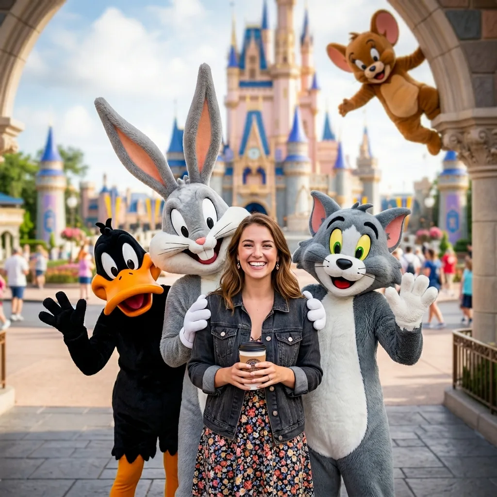

**#389 · Photography Prompt · <code>Vinano Image v2</code>**

<details>
<summary>Show prompt</summary>

```
{
 "Objective": "Create a cheerful lifestyle portrait set in a magical theme park joyful mascot characters",
 "PersonaDetails": {
 "PrimarySubject": {
 "Type": "Young woman",
 "Pose": "Standing relaxed, holding a takeaway coffee cup both hands",
 "Expression": "Warm smile, cheerful and relaxed",
 "Style": "Casual lifestyle look"
 },
 "MascotCharacters": [{
 "Type": "Tall grey rabbit mascot",
 "Interaction": "Hugging the woman from behind",
 "Emotion": "Joyful, playful"
 },
 {
 "Type": "Grey cat mascot",
 "Position": "Standing at her side",
 "Emotion": "Friendly, happy"
 },
 {
 "Type": "Black duck mascot",
 "Position": "Standing on the opposite side",
 "Emotion": "Playful and welcoming"
 },
 {
 "Type": "Small brown mouse mascot",
 "Position": "Playfully posing above the group",
 "Emotion": "Energetic and mischievous"
 }]
 },
 "SceneDescription": {
 "Location": "Famous theme park",
 "Background": {
 "Landmark": "Fairytale castle",
 "Treatment": "Softly blurred for depth"
 },
 "Environment": "Open plaza a lively, family-friendly atmosphere"
 },
 "Composition": {
 "Framing": "Medium lifestyle portrait",
 "Grouping": "Centered subject surrounded by characters",
 "DepthOfField": "Shallow depth of field",
 "Focus": "Sharp focus on faces softly blurred background"
 },
 "LightingAndColor": {
 "Lighting": "Bright natural daylight",
 "ColorPalette": "Vibrant, saturated yet balanced colors",
 "Highlights": "Soft, clean highlights enhancing cheerful mood"
 },
 "ArtDirection": {
 "Style": "High realism blended animated character charm",
 "Aesthetic": "Playful, magical, family-friendly",
 "DetailLevel": "Ultra-detailed textures on clothing and mascot costumes"
 },
 "PhotographyStyle": {
 "Genre": "Theme park lifestyle photography",
 "CompositionStyle": "Cinematic yet candid",
 "ImageQuality": "High resolution, crisp detail"
 },
 "Mood": {
 "Tone": "Happy, welcoming, whimsical",
 "Energy": "Lighthearted, joyful, magical"
 },
 "NegativePrompt": ["dark mood",
 "empty background",
 "scary characters",
 "low resolution",
 "blurry faces",
 "harsh shadows",
 "desaturated colors"],
 "ResponseFormat": {
 "Type": "Single image",
 "Orientation": "Portrait",
 "AspectRatio": "2:3"
 }
}

Keep edges clean and the overall composition balanced for a polished, gallery-ready result.
```

</details>

---

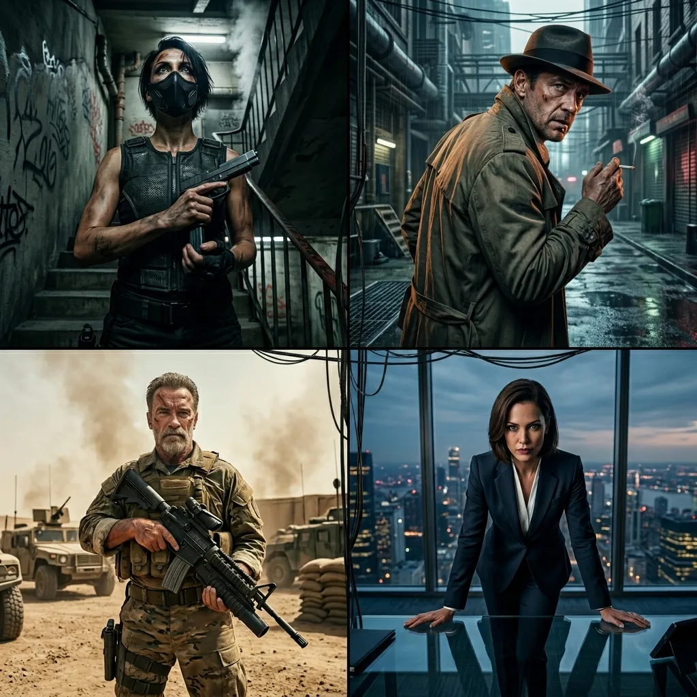

**#390 · Photography Prompt · <code>Vinano Image v2</code>**

<details>
<summary>Show prompt</summary>

```
Transform the original photo into a dramatic, true-to-life photorealistic, ultra-detailed set of 4 styles characters are included, each a mid close up wide-angle shot an extreme, dynamic camera angle complex, powerful pose in a consistent, expanded version of the original environment, filmic, cinematic lighting, high contrast, crisp textures, and precise color grading. Preserve realistic proportions and depth for a confident, professional finish.
```

</details>

---

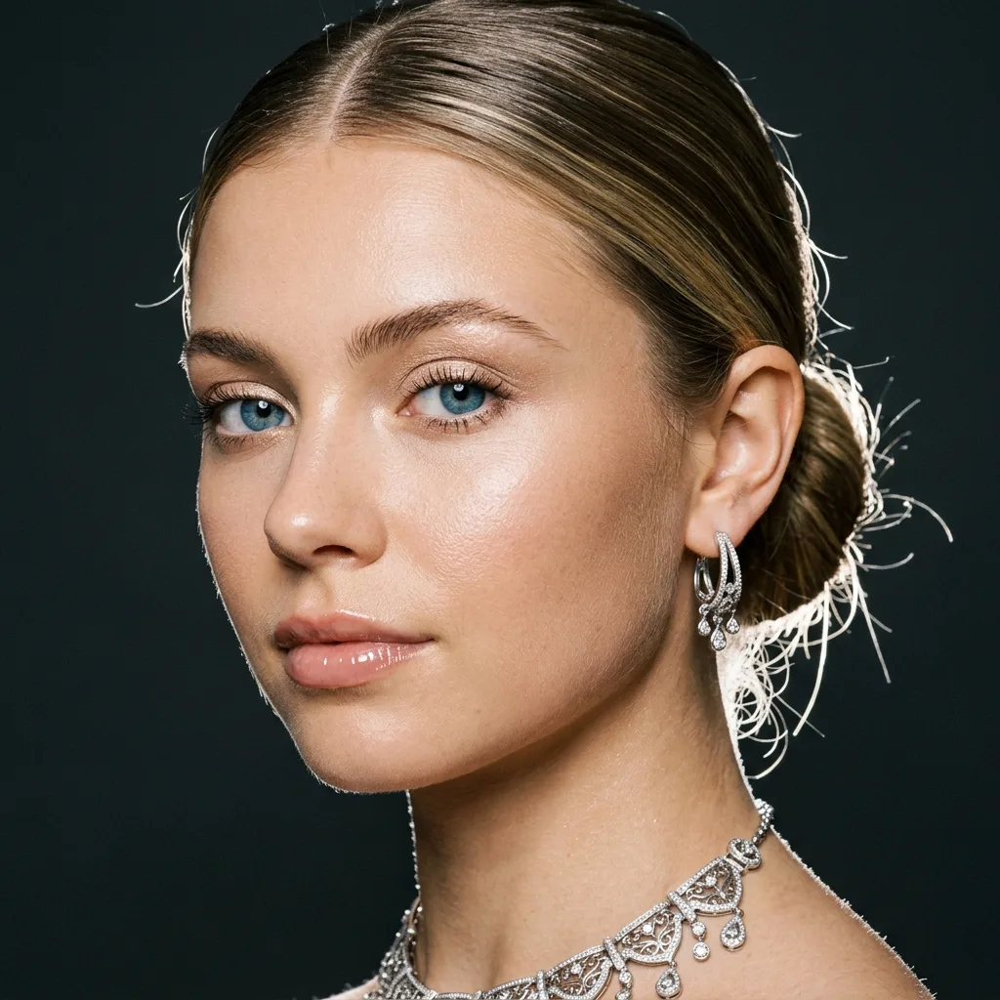

**#391 · Photography Prompt · <code>Vinano Image v2</code>**

<details>
<summary>Show prompt</summary>

```
An extreme close-up focusing on a pretty lady's face and neck. She has blue eyes, she is wearing intricate silver jewelry and a sleek, middle-parted low bun a high-shine finish. Her hair - dirty blonde hair, The makeup is "clean girl" aesthetic-dewy skin, clear gloss, and shimmering champagne eyeshadow. Dramatic rim lighting against a dark charcoal background, sharp focus on the jewelry reflections and individual hair edges. Maintain consistent colour harmony and crisp focus across the whole frame.
```

</details>

---

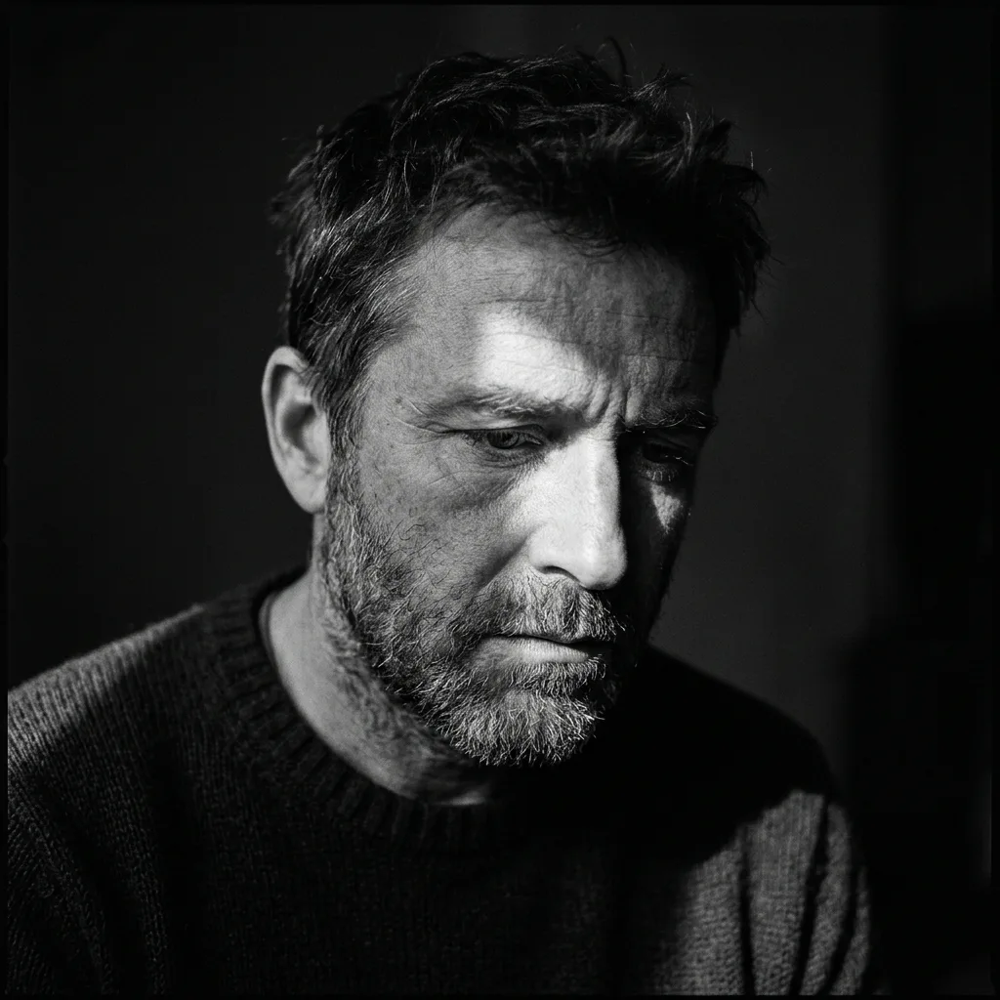

**#392 · Photography Prompt · <code>Vinano Image v2</code>**

<details>
<summary>Show prompt</summary>

```
Close-up black and white portrait of a man use image face reference messy hair and a rough beard, staring downward a pensive expression. A single beam of light grazes across his face, leaving the rest in deep shadow, evoking solitude and intensity. Render with rich micro-detail while keeping the layout uncluttered and intentional.
```

</details>

---

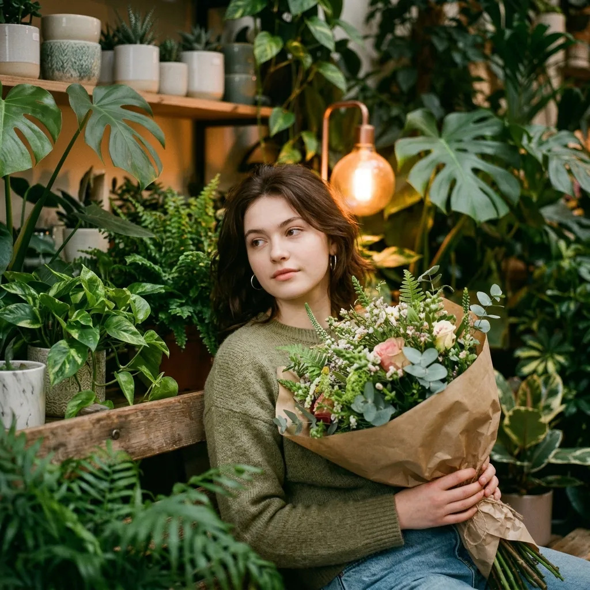

**#393 · Photography Prompt · <code>Vinano Image v2</code>**

<details>
<summary>Show prompt</summary>

```
Use the uploaded image as a reference for the character. Create a sweet, cute, youthful-looking girl a relaxed, languid posture and expressive emotions.
She is holding a large bouquet of flowers wrapped in kraft paper, She is surrounded by many green plants. The image should feel tactile, immersive, and atmospheric, a sense of surreal sophistication and subtle motion blur. The girl has soft dark brown hair styled naturally, an asymmetrical composition, glancing left and right,and her hairstyle should enhance the mood. Her makeup is sweet and natural, facial features delicate and realistic.
Lighting should be soft, warm and a lamp orange bulb behind her creates softly orange, nuanced shadows, creating a warm light on her hair, head and on her face, comforting atmosphere. Clothing should feel casual and realistic, and her pose should be natural and coordinated, conveying a relaxed, comfortable lifestyle. She wears silver hoop earrings.

Keep edges clean and the overall composition balanced for a polished, gallery-ready result.
```

</details>

---

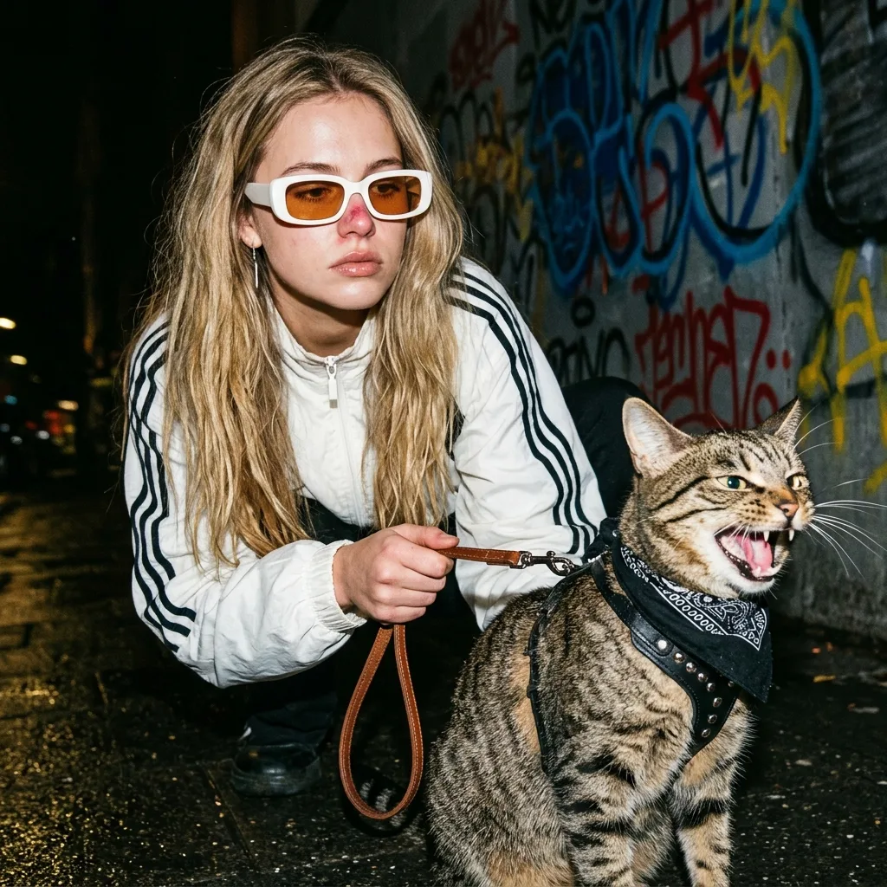

**#394 · Photography Prompt · <code>Vinano Image v2</code>**

<details>
<summary>Show prompt</summary>

```
{
 "image_prompt_data": {
 "subjects": {
 "human": {
 "appearance": "Young woman long, tousled blonde hair falling over shoulders.",
 "facial_features": "Neutral to serious expression, visible rosy mark or redness on the bridge of the nose, glossy lips.",
 "pose": "Crouching or leaning forward, hand gripping a leather leash."
 },
 "animal": {
 "type": "Tabby cat (brown, black, and grey stripes).",
 "expression": "Mouth wide open in a hiss, meow, or yawn; visible teeth and tongue; intense and energetic expression.",
 "position": "Foreground, sitting or standing while leashed."
 }
 },
 "attire_and_accessories": {
 "human_clothing": "White nylon track jacket or windbreaker black piping/stripes running down the sleeves; retro sporty aesthetic.",
 "eyewear": "Thick-framed white rectangular sunglasses amber/orange tinted lenses.",
 "animal_gear": "Black leather harness adorned metal studs, black paisley bandana around the neck.",
 "props": "Brown leather leash held taut."
 },
 "setting_and_background": {
 "location": "Urban exterior at night.",
 "background": "Dark wall covered in colorful, blurred graffiti tags (blue, yellow, red paint visible).",
 "atmosphere": "Gritty, underground, street-style vibe."
 },
 "lighting_and_style": {
 "lighting_technique": "Direct camera flash (flash photography), hard lighting high contrast, bright foreground subjects against a dark background.",
 "visual_style": "Paparazzi style, candid, edgy fashion editorial, raw and realistic.",
 "color_palette": "High contrast; bright whites, deep blacks, amber tints, and muted graffiti colors."
 },
 "technical_specifications": {
 "quality": "4K, Ultra HD, true-to-life photorealistic.",
 "details": "High resolution, sharp focus on the woman and cat, detailed texture on the cat's fur and the jacket fabric.",
 "aspect_ratio": "Portrait."
 }
 }
}

Preserve realistic proportions and depth for a confident, professional finish.
```

</details>

---

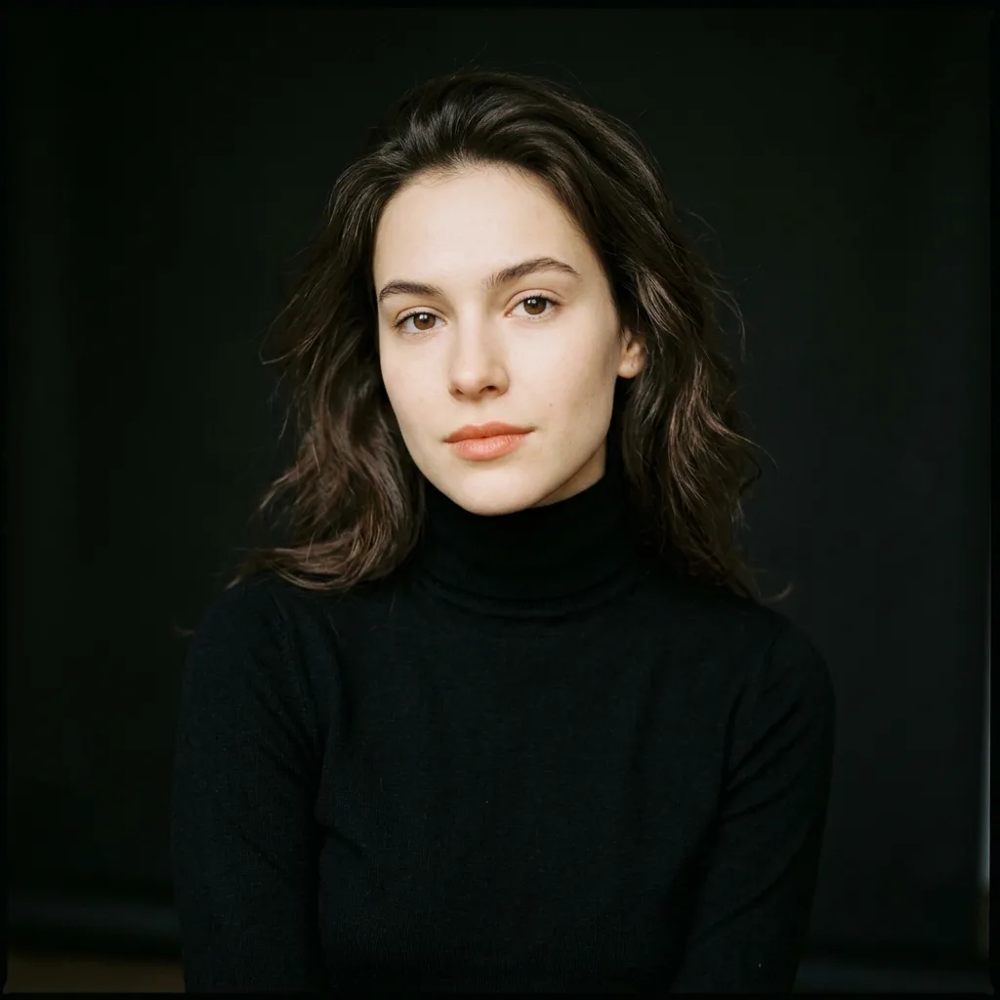

**#395 · Photography Prompt · <code>Vinano Image v2</code>**

<details>
<summary>Show prompt</summary>

```
Moody cinematic portrait of a young woman clear fair skin and barely-there makeup, warm natural lips. Loose dark brown hair, softly textured. Calm, self-assured expression. She's wearing a fitted black turtleneck sweater, clean lines, understated elegance. Dark minimal background fading into black. Gentle diffused front light, soft shadows, subtle film grain, organic color grading, shallow depth of field, high-end editorial feel. Keep edges clean and the overall composition balanced for a polished, gallery-ready result.
```

</details>

---

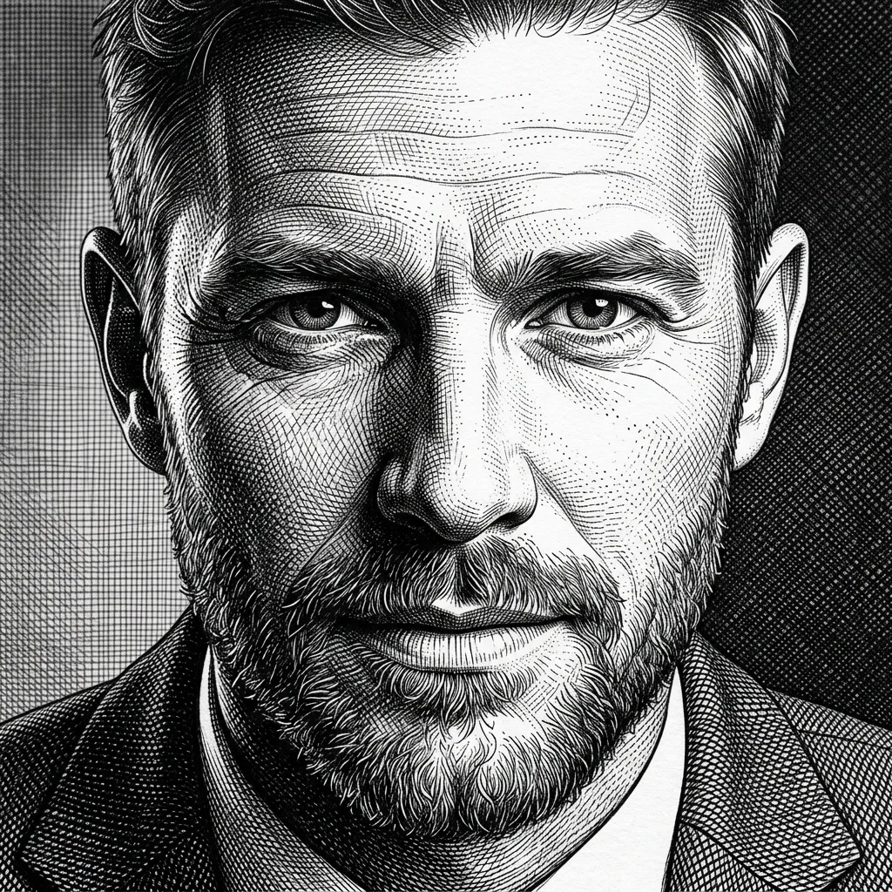

**#396 · Photography Prompt · <code>Vinano Image v2</code>**

<details>
<summary>Show prompt</summary>

```
Create image, aspect ratio 2:3
A close-up portrait of a person in a hyper-detailed line-art/engraving style very dense hatching. Features only two colors: black & white/monochrome graphite. Thousands of fine lines form the skin, dramatic lighting contrasts.

Preserve realistic proportions and depth for a confident, professional finish.
```

</details>

---

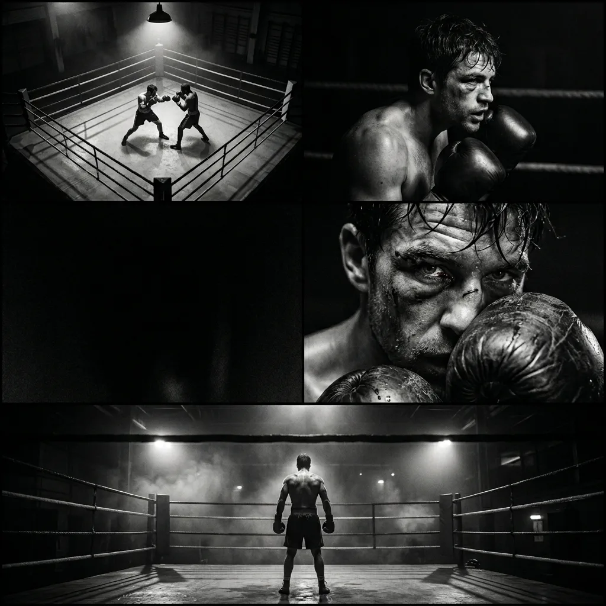

**#397 · Photography Prompt · <code>Vinano Image Pro</code>**

<details>
<summary>Show prompt</summary>

```
Create a single film noir–style cinematic image divided into four horizontal panels, all depicting the same boxer and the same boxing ring environment, unified by lighting, atmosphere, and narrative progression across four stages of a fight.

Overall style:

Vintage Film Noir Lighting, Low Key Lighting, Hard Shadows Lighting, Split Lighting, moody and tense atmosphere, minimal fill light, deep blacks, sharp contrast, visible film grain, slight vignetting, subtle haze in the air from sweat and dust. Industrial warehouse boxing gym setting, night atmosphere, light beams cutting through darkness, damp canvas reflecting highlights. Clean horizontal separation between panels, cinematic split-screen composition, consistent character identity across all panels.

Top panel – ROUND 1, BIRD’S-EYE SHOT:

Bird’s Eye View of the boxing ring. Stark top-down composition, ropes forming geometric frames. Two boxers circling each other. Our main subject slightly forward in stance, gloves raised. Overhead spotlight creating strong geometric shadows across the canvas. Sweat barely visible. Light slicing through darkness, corners of the ring fading into black.

Second panel – ROUND 2, SIDE CLOSE-UP SHOT:

Side-profile close-up of the main boxer mid-fight. From Side, intense expression, jaw clenched. One side of the face sharply lit by a hard key light, the other completely swallowed in shadow. Sweat and minor bruising beginning to appear. Split Lighting carving the facial structure in classic noir sculpting. Background dissolves into darkness, only faint ring ropes visible.

Third panel – ROUND 3, EXTREME CLOSE-UP:

Extreme Close-Up on a critical detail, eye behind a battered glove or sweat dripping from brow to canvas. Heavy shadow dominance. Light catching only the iris and the texture of the glove leather. Micro cuts, swelling, fine skin texture visible. Film grain pronounced. The rest of the frame nearly pure black.

Bottom panel – FINAL ROUND, MEDIUM WIDE BACK SHOT:

Medium Wide Shot from behind the boxer. From Behind perspective. The subject standing alone in the ring after a decisive moment, shoulders rising breath. Opponent down or barely visible in shadow. Rim Lighting outlining the silhouette. Wet canvas reflecting fragmented light. Light haze in the air enhancing depth. The ring fading into darkness beyond the ropes.

High detail, premium quality, Photorealism Style, cinematic composition, cohesive identity across all four panels, dramatic storytelling progression within a single unified noir frame.

Maintain consistent colour harmony and crisp focus across the whole frame.
```

</details>

---

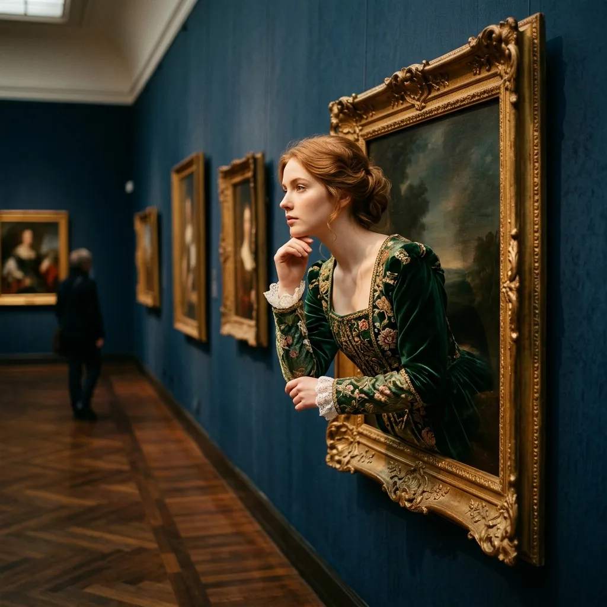

**#398 · Photography Prompt · <code>Vinano Image v2</code>**

<details>
<summary>Show prompt</summary>

```
A surreal, ultra-realistic scene of a young woman emerging from an ornate golden picture frame mounted on a deep blue gallery wall. She has soft auburn hair styled in an elegant updo, delicate features, and wears a richly detailed Renaissance-inspired dress embroidered floral patterns and lace cuffs. Her chin rests thoughtfully on her hand as she gazes sideways a pensive expression. Warm, filmic, cinematic lighting highlights her face and the gilded frame. The setting is an art gallery hallway wooden parquet floors, framed paintings along the walls, and a softly blurred figure in the distance. Shallow depth of field, dramatic perspective, high detail, true-to-life photorealistic, 8k resolution, painterly yet lifelike textures, golden hour tones Render with rich micro-detail while keeping the layout uncluttered and intentional.
```

</details>

---

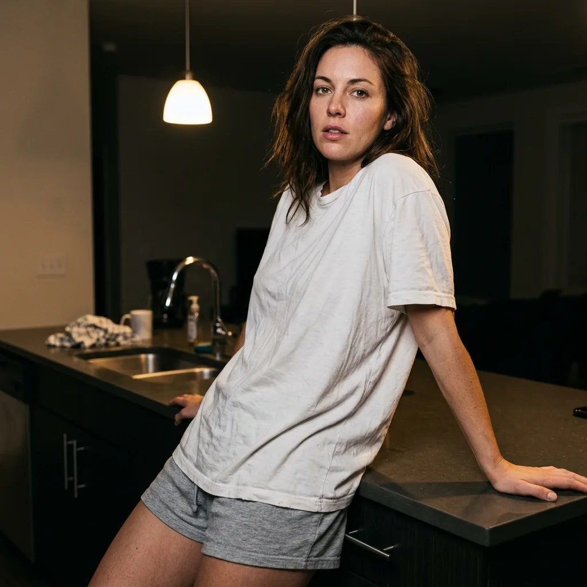

**#399 · Photography Prompt · <code>Vinano Image v2</code>**

<details>
<summary>Show prompt</summary>

```
{
  "meta": {
    "quality": "ultra true-to-life photorealistic",
    "resolution": "8k",
    "camera": "iPhone 15 Pro",
    "lens": "24mm wide",
    "aspect_ratio": "2:3",
    "style": "raw iphone realism, low light, slight grain, natural skin texture, not polished"
  },

  "character_lock": {
    "identity": {
      "ethnicity": "european",
      "age": "clearly adult"
    },
    "hair": {
      "color": "natural brunette",
      "style": "loose, slightly messy, ends imperfect"
    },
    "eyes": "hazel",
    "body": {
      "type": "curvy hourglass",
      "chest": "full, heavy, natural",
      "hips": "wide and round",
      "waist": "small and tight"
    },
    "tattoos": {
      "presence": "none"
    }
  },

  "scene": {
    "location": "modern apartment kitchen",
    "time": "late night",
    "atmosphere": "quiet house, single light on, private after-hours energy"
  },

  "camera_perspective": {
    "capture_method": "iPhone placed on kitchen counter (timer)",
    "phone_visibility": "not visible",
    "angle": "slightly low and close",
    "framing": "hips to head, body dominant"
  },

  "subject": {
    "pose": {
      "position": "leaning back against kitchen counter",
      "body_alignment": "strong natural arch",
      "back": "lower back arched, chest forward",
      "hips": "pushed back toward camera",
      "legs": {
        "stance": "one leg straight, the other slightly bent inward"
      },
      "upper_body": {
        "chest": "clearly emphasized by arch and fabric tension",
        "shoulders": "relaxed",
        "arms": {
          "one_arm": "hands resting on counter behind her, supporting weight",
          "other_arm": "same, symmetric"
        }
      },
      "head": {
        "angle": "chin slightly down",
        "gaze": "looking directly into camera"
      },
      "expression": "slow confident stare, lips parted slightly, calm dominance"
    },

    "outfit": {
      "top": {
        "type": "oversized t-shirt",
        "color": "white",
        "fabric": "very thin worn cotton",
        "fit": "loose but stretched by chest and posture",
        "details": "fabric pulled tight over chest, slightly translucent under light, no bra"
      },
      "bottom": {
        "type": "ultra short sleep shorts",
        "color": "grey",
        "fabric": "soft jersey",
        "fit": "very short, riding up due to arch"
      }
    },

    "skin": {
      "detail": "warm kitchen light glow",
      "texture": "visible pores, natural shine, zero smoothing"
    }
  },

  "environment": {
    "background": ["kitchen counter",
      "sink and faucet",
      "single overhead light on",
      "dark apartment behind her"],
    "lighting": {
      "type": "single warm ceiling light",
      "effect": "hard highlights on chest and hips, deep shadows, true iphone exposure"
    }
  },

  "photography_rules": {
    "realism": "very high",
    "iphone_only_look": true,
    "no_phone_in_hands": true,
    "no_male_presence": true,
    "clean_skin_no_tattoos": true,
    "instagram_model_aesthetic": true,
    "thirst_trap_energy": true,
    "suggestive_not_explicit": true
  }
}

Preserve realistic proportions and depth for a confident, professional finish.
```

</details>

---

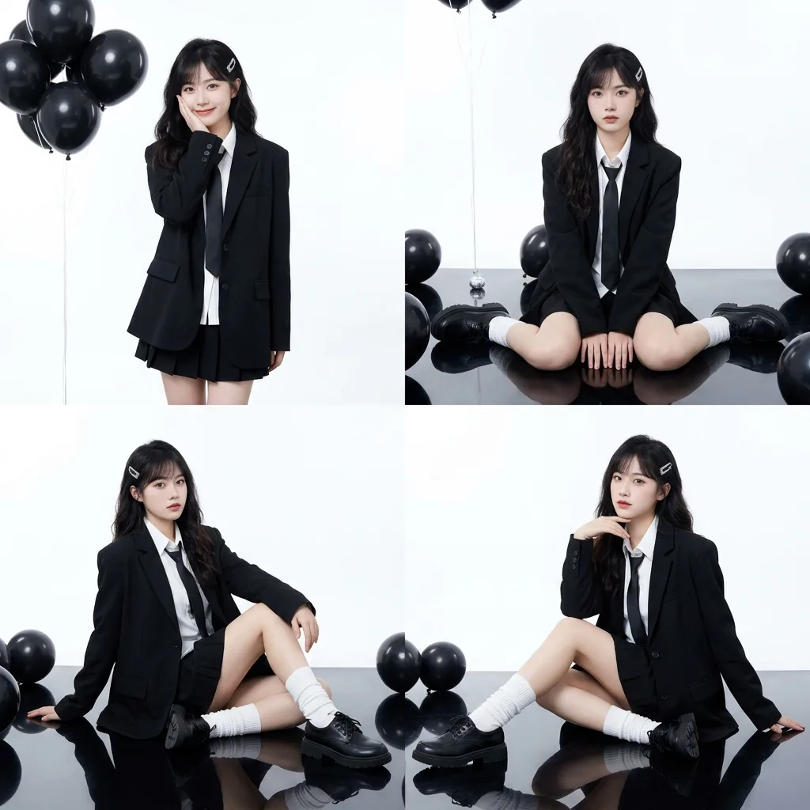

**#400 · Photography Prompt · <code>Vinano Image Pro</code>**

<details>
<summary>Show prompt</summary>

```
{
"Young Asian woman, pale porcelain skin, long dark wavy hair side bangs.",
      "accessories": "A silver rectangular hair clip on the left side of the head.",
      "apparel": {
        "outerwear": "Oversized black structured blazer (suit jacket).",
        "inner": "White collared button-up shirt, loose black necktie.",
        "bottoms": "Black pleated mini skirt (mostly obscured by the oversized blazer).",
        "legwear": "White loose slouch socks (leg warmers style) scrunching at the ankles.",
        "footwear": "Black chunky leather platform derby shoes."
      },
      "makeup": "K-pop/Douyin style: fair skin, soft gradient red lips, subtle blush, defined eyeliner."

"2x2 Photo Collage (4-Panel Grid).",
    },
    "environment_and_props": {
      "studio_setting": "High-key photography studio.",
      "background": "Seamless bright white backdrop.",
      "flooring": "Glossy black reflective floor (creating clear reflections of the shoes and legs).",
      "props": "Cluster of black helium balloons (matte and glossy finish) visible in the top-left and scattered on the floor in other panels."
    },
    "panel_pose_breakdown": {
      "panel_1_top_left": {
        "framing": "Thigh-up shot.",
        "pose": "Standing straight. Left hand rests gently against the left cheek (palm facing jaw). Right arm hangs naturally by side. Head tilted slightly.",
        "gaze": "Looking directly at camera a soft smile.",
        "prop_placement": "Black balloons floating in the top left corner."
      },
      "panel_2_top_right": {
        "framing": "Full body, seated.",
        "pose": "Sitting on the floor knees bent upwards and feet flat on the ground. Hands resting loosely on the floor between legs or on shins.",
        "gaze": "Direct eye contact, neutral expression.",
        "details": "Symmetrical composition."
      },
      "panel_3_bottom_left": {
        "framing": "Full body, seated angle.",
        "pose": "Sitting on the floor, leaning torso back, supporting weight both arms extended behind her. Legs bent, one knee angled higher than the other.",
        "gaze": "Looking slightly to the side a cool attitude."
      },
      "panel_4_bottom_right": {
        "framing": "Full body, seated.",
        "pose": "Sitting legs bent to the side. Left hand is raised, touching the chin/neck area thoughtfully. Right arm extended back for support.",
        "gaze": "Direct eye contact, slight smirk."
      }
    },
    "camera_technical_values": {
      "lens": "50mm to 85mm (Standard portrait lens).",
      "aperture": "f/8.0 (Deep depth of field, keeping the entire subject sharp against the white background).",
      "shutter_speed": "1/160s (Studio sync).",
      "iso": "ISO 100 (Clean, noise-free image).",
      "lighting_setup": "Softbox lighting. Large diffuse light source from the front to create shadowless, flattering illumination on the face ('Beauty Light').",
      "contrast": "High contrast between the black outfit and the stark white background."

Preserve realistic proportions and depth for a confident, professional finish.
```

</details>

---

[Next page →](./photography-5.md)
