# Photography — full gallery

[← Back to README](../README.md) · [`prompts.json`](../prompts/prompts.json) · **630** prompts · page 5 / 7

[← Prev](./photography-4.md) — [1](./photography.md) · [2](./photography-2.md) · [3](./photography-3.md) · [4](./photography-4.md) · **5** · [6](./photography-6.md) · [7](./photography-7.md) — [Next →](./photography-6.md)

---

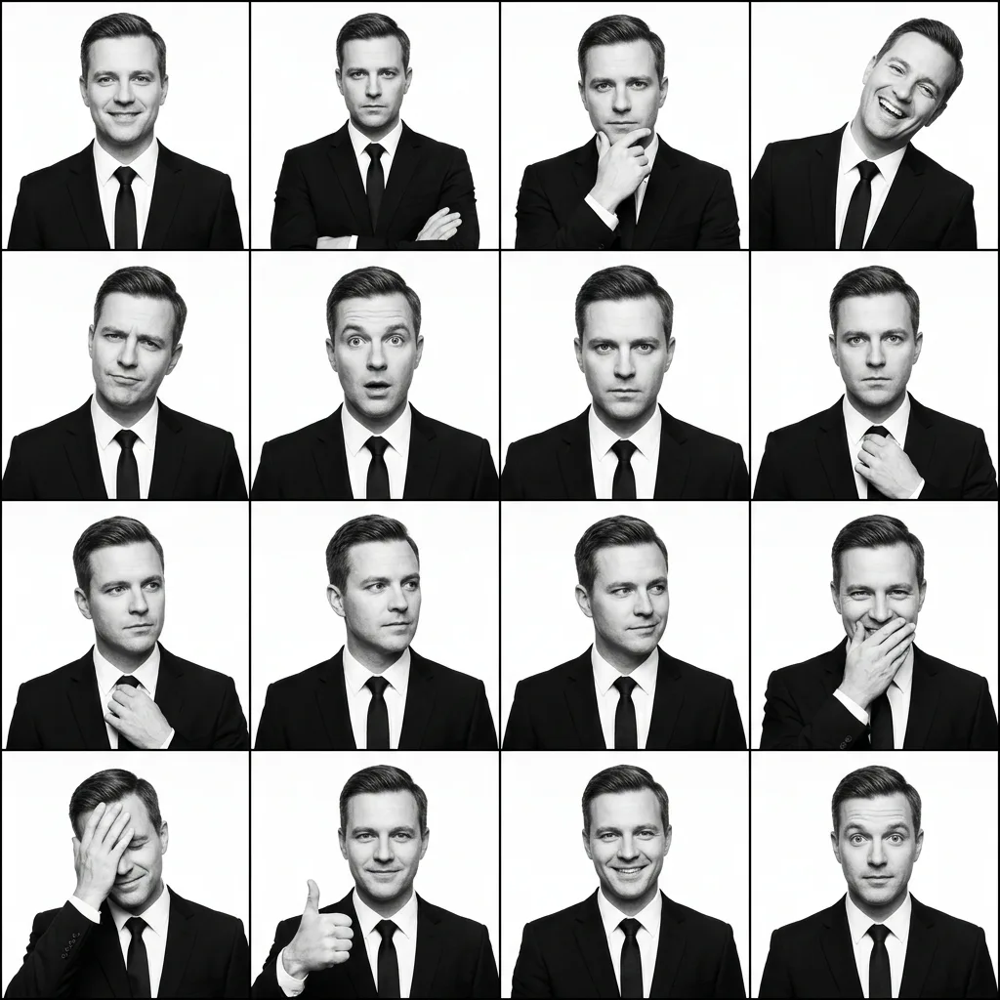

**#401 · Photography Prompt · <code>Vinano Image Pro</code>**

<details>
<summary>Show prompt</summary>

```
{
 "generation_request": {
 "meta_data": {
 "task_type": "bw_male_expression_grid_identity_swap",
 "language": "en",
 "priority": "highest",
 "version": "v1.0_BW_MALE_GRID_KEEP_POSES_SWAP_IDENTITY"
 },
 "input": {
 "mode": "image_to_image",
 "reference_image_usage": "very_high",
 "preserve_identity": true,
 "preserve_facial_features": true,
 "preserve_hairstyle": true,
 "notes": "PRIMARY STRUCTURE ANCHOR: use the uploaded male 4x4 grid image (suit photobooth). Keep the exact 4x4 layout, crop, spacing, poses, gestures, hand placements, and framing in every panel. PRIMARY IDENTITY ANCHOR: use the uploaded reference photo of the target adult man. Replace the man in ALL panels the reference identity while preserving the original pose and expression intensity. Keep suit-and-tie styling and clean studio background. Maintain consistent identity across all 16 panels."
 },
 "output": {
 "aspect_ratio": "1:1",
 "resolution": "ultra_high",
 "num_images": 1,
 "layout": {
 "type": "grid",
 "rows": 4,
 "cols": 4,
 "gutter": "thin",
 "panel_consistency": "very_high"
 },
 "sharpness": "crisp_studio",
 "grain": "subtle_analog_bw"
 },
 "scene": {
 "environment": "clean white studio backdrop",
 "lighting": {
 "style": "high-key studio",
 "key_light": "front softbox",
 "fill": "balanced fill",
 "avoid": "dramatic cinematic shadows"
 },
 "camera": {
 "lens": "50mm",
 "framing": "mid chest to head (varies per panel but keep same as structure image)",
 "focus": "eyes sharp"
 }
 },
 "subject": {
 "type": "adult man",
 "wardrobe": "black suit, white shirt, black tie (match structure image), no logos",
 "grooming": "match reference hairstyle as closely as possible while keeping overall look consistent",
 "anatomy_rules": "realistic hands, correct fingers, no distortions"
 },
 "style": {
 "color": "pure black and white",
 "contrast": "medium_high",
 "background": "keep identical to structure image",
 "finish": "clean studio print look"
 },
 "quality_control": {
 "identity_lock": "strict",
 "hands_priority": "very_high",
 "avoid": ["extra fingers",
 "missing fingers",
 "deformed hands",
 "warped face",
 "uneven eyes",
 "melted mouth",
 "identity drift across panels",
 "text",
 "watermark",
 "logo"]
 },
 "negative_prompt": ["color",
 "sepia",
 "filmic, cinematic lighting",
 "blur",
 "low resolution",
 "distorted anatomy",
 "plastic skin",
 "face mismatch"]
 }
}

Aim for an editorial, design-driven look with deliberate negative space.
```

</details>

---

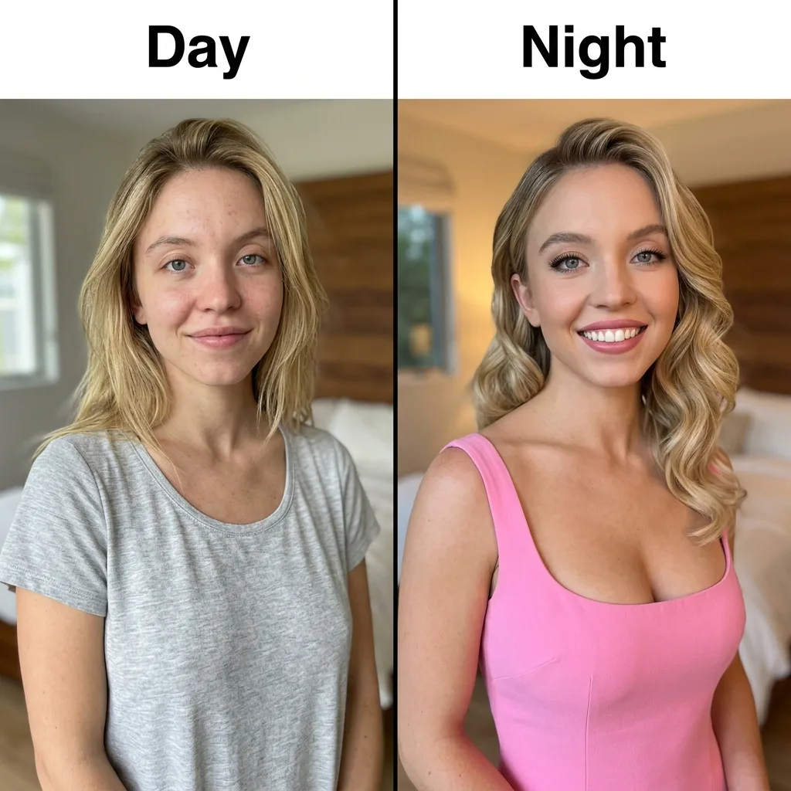

**#402 · Photography Prompt · <code>Vinano Image v2</code>**

<details>
<summary>Show prompt</summary>

```
Before-and-after upper-body portrait photo of Sydney Sweeney, smiling in both images, split vertically down the center into two equal halves for a direct visual comparison. Clear text labels appear at the top of each half.

Left side – “Day” (label at top):
Natural, no makeup look. Realistic skin texture visible pores, slight under-eye shadows, natural lips, minimal grooming. Soft, relaxed smile. Hair casually styled. She is wearing a simple nightgown for bed, comfortable and modest. Daytime feeling, fresh and unstyled, authentic at-home appearance.

Right side – “Night” (label at top):
Professional makeup applied: even skin tone, subtle contouring, enhanced eyes mascara and eyeliner, defined brows, soft lipstick. Bright, confident smile. Hair styled elegantly. She is wearing a beautiful, pink dress a deep neckline

Both sides show the same pose, framing, camera distance, background, and angle to ensure the contrast comes purely from makeup, styling, and wardrobe.

Photography & Camera Style:
Smartphone camera realism, portrait mode look, handheld feel, natural lighting, slight digital noise, mild compression artifacts, realistic color balance, minimal retouching, honest skin detail. Casual but clear comparison photo rather than studio perfection.

Aspect ratio:
3:4 (portrait)

negative prompt:
beauty filters, over-smoothed skin, exaggerated makeup, inconsistent lighting, mismatched expressions, face distortion, studio glamour lighting, cinematic look, watermark, text artifacts (except “Day” and “Night” labels)

Keep edges clean and the overall composition balanced for a polished, gallery-ready result.
```

</details>

---

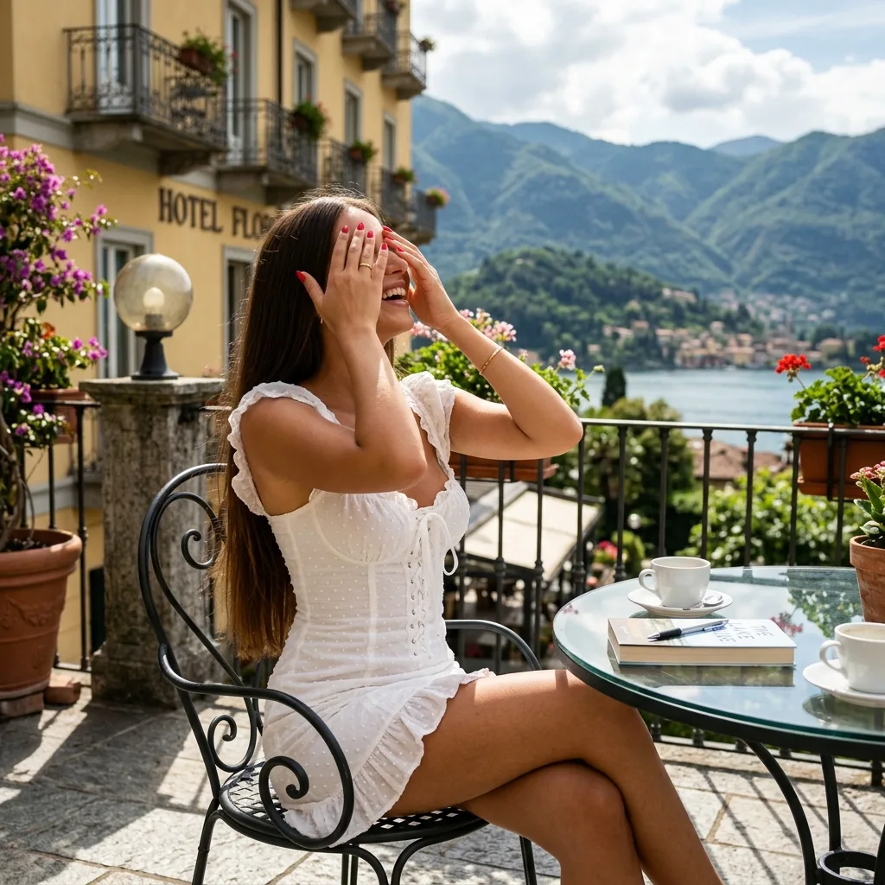

**#403 · Photography Prompt · <code>Vinano Image Pro</code>**

<details>
<summary>Show prompt</summary>

```
{
 "prompt_type": "Ultra true-to-life photorealistic Image Generation",
 "subject": {
 "description": "Young woman long, straight dark brown hair cascading down her back",
 "skin_tone": "Sun-kissed, glowing complexion",
 "features": "Side profile visible, smiling/laughing expression, hands raised covering eyes/face playfully",
 "details": "Red manicured fingernails, subtle jewelry including a ring on the left hand and a thin bracelet"
 },
 "fashion_and_styling": {
 "outfit": "White, vintage-inspired corset-style mini dress Swiss dot texture",
 "garment_details": "Sweetheart neckline, ruffled cap sleeves, front lace-up ribbon detailing, fitted bodice, ruffled hem, slightly sheer fabric",
 "aesthetic": "Coquette, cottagecore, soft feminine luxury, summer vacation style"
 },
 "pose_and_action": {
 "pose": "Seated elegantly on a chair, body angled slightly away from the camera",
 "gesture": "Both hands raised to shield eyes from the sun or in a candid moment of laughter, head tilted back slightly",
 "interaction": "Relaxed posture sitting at a cafe table"
 },
 "environment": {
 "setting": "Outdoor luxury hotel terrace or cafe balcony overlooking a scenic landscape",
 "background_elements": "Historic yellow building 'HOTEL FLORENCE' signage, lush green mountains in the distance, cloudy blue sky, vintage globe street lamps",
 "foreground_elements": "Round glass-top table, black wrought-iron garden chairs",
 "props": "Two white ceramic coffee cups on saucers, a paperback book lying on the table"
 },
 "lighting": {
 "type": "Natural bright daylight, afternoon sun",
 "quality": "High contrast, casting sharp shadows on the table, backlighting on hair creating a halo effect, sun-drenched atmosphere",
 "direction": "Side/Front lighting illuminating the subject"
 },
 "mood_and_atmosphere": {
 "vibe": "Joyful, candid, luxurious, carefree, Italian summer holiday",
 "emotion": "Happiness, relaxation, playfulness"
 },
 "technical_camera_details": {
 "quality": "8k resolution, RAW photo, hyper-realistic, highly detailed texture",
 "camera_simulation": "DSLR, 85mm portrait lens",
 "aperture": "f/2.8 (shallow depth of field to blur the background mountains and hotel)",
 "shutter_speed": "1/500s (to freeze the candid movement)",
 "iso": "100 (clean, noise-free image)",
 "color_grading": "Vibrant, natural colors slightly warm tones, clear whites"
 }
}

Render with rich micro-detail while keeping the layout uncluttered and intentional.
```

</details>

---

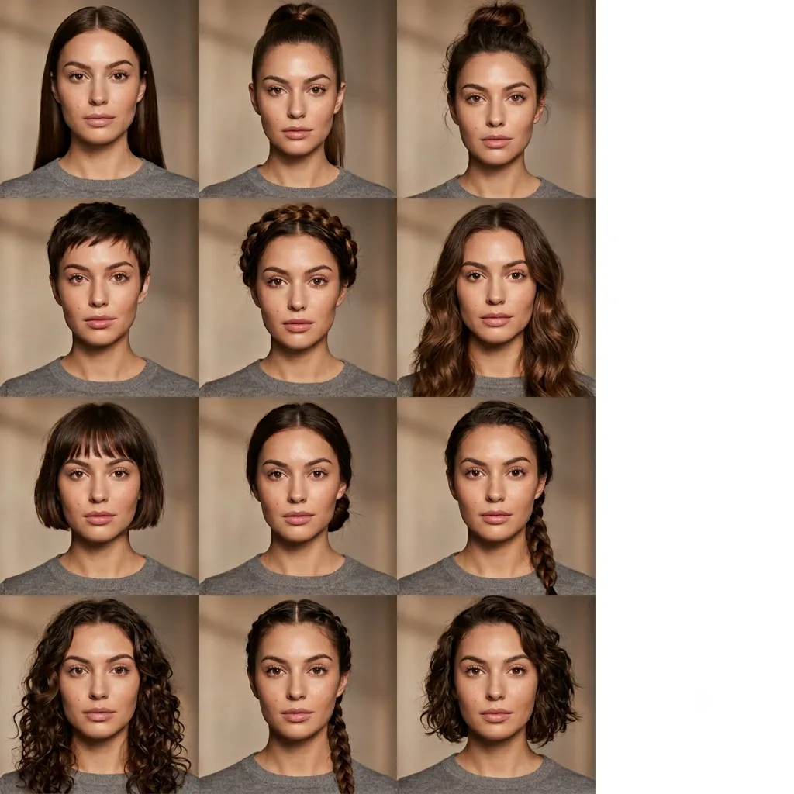

**#404 · Photography Prompt · <code>Vinano Image Pro</code>**

<details>
<summary>Show prompt</summary>

```
{
 "scene_type": "editorial beauty collage",
 "subject": {
 "identity_lock": true,
 "face_consistency": "perfectly matched across all frames",
 "expression": "unchanged, neutral and relaxed",
 "skin": "realistic texture, natural pores, high fidelity"
 },
 "layout": {
 "grid": "4x3",
 "framing": "equal-sized portrait panels",
 "consistency": "symmetrical facial alignment in every frame"
 },
 "hairstyle_variations": ["sleek long straight hair",
 "high ponytail",
 "textured messy bun",
 "pixie haircut",
 "braided crown",
 "soft flowing waves",
 "short bob bangs",
 "low tied bun",
 "side braid",
 "loose defined curls"],
 "styling": {
 "outfit": "same neutral wardrobe across all panels",
 "makeup": "identical clean beauty makeup in every shot"
 },
 "lighting": {
 "type": "soft studio lighting",
 "tone": "warm",
 "shadows": "gentle and natural"
 },
 "background": {
 "style": "subtle blurred studio backdrop",
 "color": "warm neutral tones"
 },
 "quality": {
 "detail": "ultra-detailed",
 "photography": "professional portrait",
 "finish": "high-end editorial look"
 }
}

Render with rich micro-detail while keeping the layout uncluttered and intentional.
```

</details>

---


**#405 · Photography Prompt · <code>Vinano Image v2</code>**

<details>
<summary>Show prompt</summary>

```
Ultra-wide-angle hyper-realistic top-down flat lay photography. The central focus is a custom physical conference table meticulously shaped like [SHAPE/NUMBER/SYMBOL].

The table features [MATERIAL/TEXTURE/COLOR] and placed on a [FLOOR COLOR] floor, creating significant negative space around it for a clean, refined minimalist composition. A group of [NUMBER] real people are sitting around the edges of this [SHAPE]-shaped table. [POSITIONING: e.g., 3 on each side, 1 top/bottom]

Actions: [DESCRIBE PEOPLE'S ACTIONS, e.g., working on laptops, drinking coffee].
Lighting & Quality: Professional studio lighting crisp, distinct drop shadows that define the [SHAPE] silhouette on the floor. 8k resolution, sharp focus, cinematic commercial aesthetic.

Maintain consistent colour harmony and crisp focus across the whole frame.
```

</details>

---

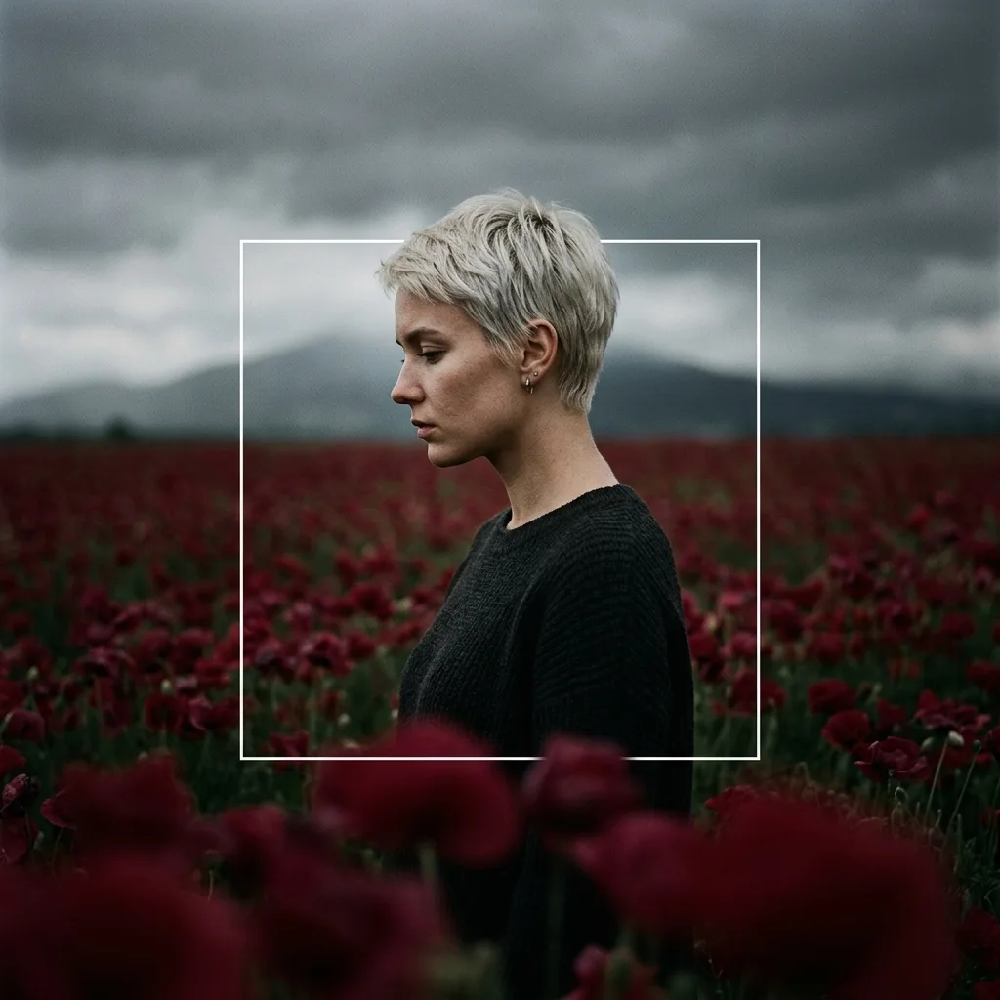

**#406 · Photography Prompt · <code>Vinano Image v2</code>**

<details>
<summary>Show prompt</summary>

```
A cinematic, high-contrast profile portrait of a woman short, platinum-blonde hair, standing in a vast field of deep crimson flowers. The scene is set under a heavy, overcast grey sky a moody, melancholic atmosphere. A thin, white rectangular frame is superimposed in the center of the composition; the woman's head and shoulders overlap and break the top and bottom edges of the frame for a modern, artistic effect. The lighting is soft and diffused from behind, creating a subtle rim light on her profile and hair. The foreground flowers are softly blurred a shallow depth of field, and a faint, misty mountain silhouette is visible in the distant background. High-grain, filmic aesthetic. Render with rich micro-detail while keeping the layout uncluttered and intentional.
```

</details>

---

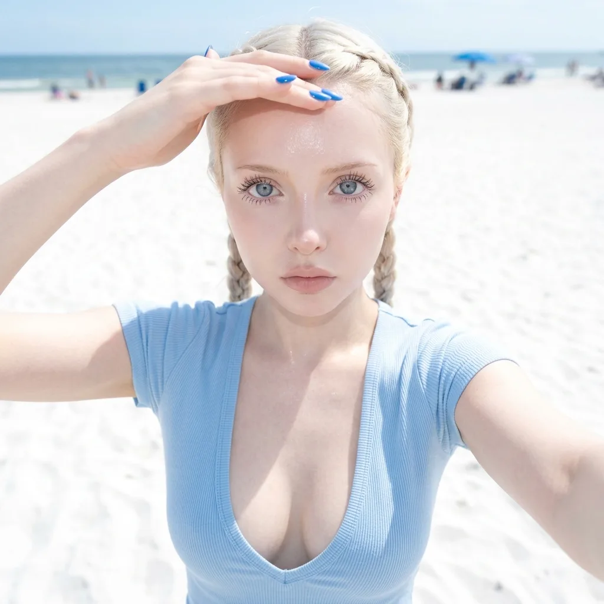

**#407 · Photography Prompt · <code>Vinano Image v2</code>**

<details>
<summary>Show prompt</summary>

```
{
 "format": {
 "type": "editorial",
 "intent": "candid/selfie/accidental",
 "aspect_ratio": "9:16",
 "resolution": "4K"
 },
 "camera_system": {
 "body": "iPhone 15 Pro",
 "lens": "Main Camera",
 "focal_length": "24mm",
 "associative_traits": "computational photography, deep depth of field, sharp digital readout, auto-exposure"
 },
 "subject": {
 "identity": "young woman specific porcelain doll features",
 "physical_details": "flawless pale skin, large round icy blue eyes defined lashes, small defined nose, pouty neutral mouth, platinum blonde hair in two tight braids, vibrant blue manicured nails",
 "clothing": "light blue form-fitting top a very deep, wide plunging V-neckline revealing significant cleavage",
 "action": "high-angle selfie POV, shielding eyes one hand against bright coastal light, looking up at camera",
 "expression": "neutral, wide-eyed, deadpan, vacant doll-like stare"
 },
 "lighting": {
 "source": "bright natural coastal daylight + sand bounce",
 "direction": "overhead and omnidirectional fill",
 "quality": "soft, diffused but very bright",
 "color_temp": "neutral daylight (5500K)",
 "fill": "maximum fill from bright white sand reflection",
 "distribution": "even illumination, few shadows, flattering on skin texture",
 "intent": "bright beach day"
 },
 "environment": {
 "setting": "sandy beach during the day",
 "hero_materials": [{
 "material": "sand",
 "micro_detail": "fine white grains, highly reflective"
 },
 {
 "material": "fabric",
 "micro_detail": "light blue swimwear/stretch cotton blend"
 },
 {
 "material": "skin",
 "micro_detail": "smooth, poreless, porcelain texture, slightly dewy from heat"
 }],
 "objects": "ocean horizon line blurred in far background, expansive sand",
 "state": "bright, sunny, coastal"
 },
 "technical_finish": {
 "film_stock": "Digital Source",
 "exposure": "brightly exposed (high key)",
 "grain": "none/digital noise",
 "tone_curve": "linear neutral",
 "color_science": "pastel palette (light blues, white sand, pale skin), natural daylight colors"
 },
 "constraints": {
 "avoid": ["snow",
 "winter clothes",
 "red nails",
 "black top",
 "modest neckline",
 "heavy shadows"],
 "must_include": ["blue nails",
 "light blue top",
 "deep cleavage",
 "beach background",
 "porcelain doll features"]
 }
 }
}

Keep edges clean and the overall composition balanced for a polished, gallery-ready result.
```

</details>

---

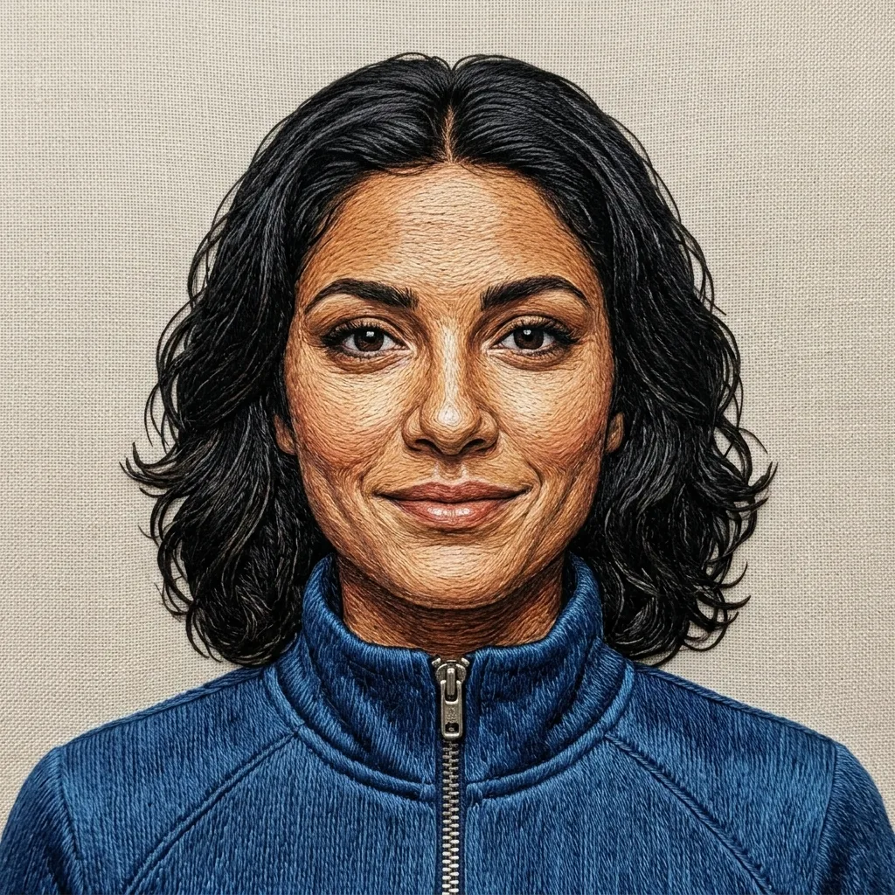

**#408 · Photography Prompt · <code>Vinano Image v2</code>**

<details>
<summary>Show prompt</summary>

```
Use the uploaded image as the strict character reference.
Preserve the character’s facial structure, expression, skin tone, hairstyle, outfit, proportions, and pose exactly as shown.

Do not modify, beautify, stylize, or reinterpret the face in any way beyond embroidery translation.
Render the character as hyper-detailed hand embroidery artwork, realistic satin stitches, long-and-short stitches, and dense fill stitches to create natural depth, fabric texture, and thread sheen.

Visible embroidery threads, precise stitch direction following facial contours, smooth gradients formed through thread layering, high stitch density, museum-quality textile craftsmanship.

Neutral fabric background, soft studio lighting, ultra-sharp macro detail, true-to-life photorealistic embroidery realism, no illustration or cartoon style.

Aim for an editorial, design-driven look with deliberate negative space.
```

</details>

---

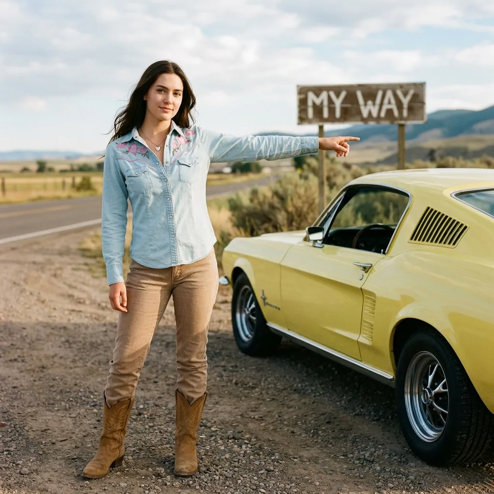

**#409 · Photography Prompt · <code>Vinano Image v2</code>**

<details>
<summary>Show prompt</summary>

```
{
 "project": " – Maximalist Editorial Americana Scene",
 "version": "2.4",
 "engine_optimization": " (maximalist cinematic photorealism, high detail density, controlled imperfection)",
 "render_intent": "cohesive western color harmony refined fashion detail and narrative clarity",
 "frame": {
 "aspect_ratio": "3:4",
 "shot_type": "medium-full portrait",
 "camera_angle": "eye-level subtle cinematic parallax",
 "composition": "subject foreground dominant, pointing gesture aligned parallel to the sign, car balancing the frame",
 "lens_simulation": "50mm full-frame prime",
 "camera_metadata": {
 "iso": 100,
 "shutter_speed": "1/320",
 "aperture": "f/1.8"
 },
 "depth_of_field": "shallow, face and guiding hand crisp, background softly diffused"
 },
 "subject": {
 "type": "young woman",
 "approximate_age": "early to mid 20s",
 "identity_consistency": "single subject, realistic anatomy, natural proportions",
 "appearance": {
 "hair": {
 "color": "deep brunette",
 "length": "long",
 "style": "loose, softly flowing, gently wind-swept"
 },
 "face": {
 "beauty_level": "very beautiful, striking yet natural",
 "pose_detail": "face slightly tilted, enhancing elegance and approachability"
 },
 "skin": {
 "tone": "light to medium",
 "details": ["natural texture",
 "subtle freckles",
 "soft daylight glow"]
 },
 "eyes": {
 "color": "warm brown or hazel",
 "expression": "inviting, confident, gently persuasive"
 },
 "makeup": "minimal, clean editorial finish"
 },
 "expression": "calm confidence a subtle, encouraging smile",
 "pose": "standing beside the car, torso slightly angled, arm extended horizontally, pointing parallel to the sign as if signaling ‘follow that way, follow me’"
 },
 "wardrobe": {
 "top": "light pastel blue denim shirt visible weave, pink and white embroidery in refined western motifs",
 "fit": "relaxed yet tailored",
 "bottom": "light brown pants, soft twill or suede-like texture, tailored natural creases",
 "footwear": "warm tan suede cowboy boots, medium contrast, elegant western stitching, slightly worn for authenticity",
 "accessories": ["silver necklace",
 "small silver heart-shaped pendant, delicate and understated, resting just below the collarbone"],
 "fabric_behavior": "authentic material stiffness and drape, embroidered threads catching light, natural folds and tension"
 },
 "vehicle": {
 "type": "classic Ford Mustang",
 "color": "lemon yellow",
 "finish": "glossy paint realistic reflections and subtle surface imperfections",
 "positioning": "parked beside the subject at a slight diagonal, iconic profile visible"
 },
 "environment": {
 "location": "open roadside or rural edge",
 "background_elements": ["roadside sign clearly legible text: 'My Way'",
 "open sky",
 "soft greenery or distant fields"],
 "atmosphere": "freedom, direction, invitation, optimistic Americana mood"
 },
 "lighting": {
 "type": "natural daylight",
 "source": "open sky sunlight",
 "time_of_day": "late afternoon",
 "quality": "soft, directional, cinematic",
 "effects": ["gentle rim light on hair and shoulders",
 "subtle highlights on silver jewelry",
 "soft reflections on car paint"],
 "shadow_behavior": "clean, soft-edged, physically accurate"
 },
 "color_palette": {
 "dominant_colors": ["lemon yellow",
 "pastel denim blue",
 "light brown",
 "warm tan",
 "soft pink and white embroidery",
 "natural skin tones",
 "silver accents"],
 "grading_style": "warm cinematic editorial grading filmic highlight roll-off"
 }
}

Render with rich micro-detail while keeping the layout uncluttered and intentional.
```

</details>

---

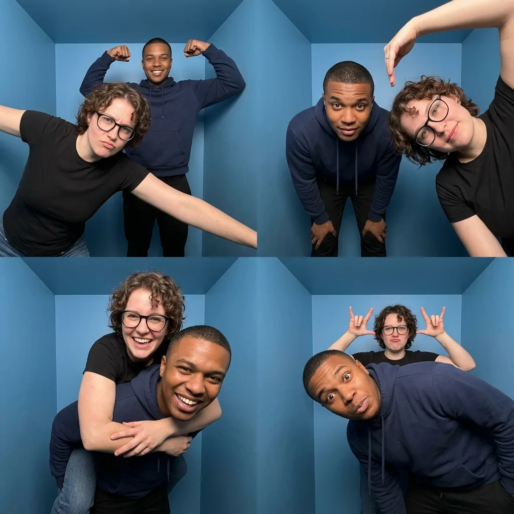

**#410 · Photography Prompt · <code>Vinano Image Pro</code>**

<details>
<summary>Show prompt</summary>

```
{
 "task": "Create an iPhone-realistic photobooth collage (4 photos in a 2x2 grid)",
 "subjects": [{
 "id": "Subject 1",
 "description": "EXACTLY from the Reference Image (same face, hairstyle, skin tone, body proportions, overall look).",
 "outfit": "EXACTLY the same as in the Reference Image. Do not change clothing, glasses, or accessories."
 },
 {
 "id": "Subject 2",
 "description": "EXACTLY from the Reference Image (same face, hairstyle, skin tone, body proportions, overall look).",
 "outfit": "EXACTLY the same as in the Reference Image. Do not change clothing, glasses, or accessories."
 }],
 "scene": {
 "location": "Inside a small BOX photo booth",
 "background": "Matte blue walls and blue floor, tight enclosed corner, clean minimal environment",
 "camera_look": "Ultra wide / slight fisheye lens look subtle perspective distortion typical of photobox cameras. iPhone 17 Pro, photobooth wide-angle.",
 "lighting": "Bright neutral-white flash lighting, evenly illuminating faces, soft shadow falloff on blue walls, crisp detail, realistic skin texture. Direct neutral white flash (no yellow / no warm tone).",
 "aesthetic": "4K, amateur photobooth aesthetic, high contrast but still natural, no cinematic grading, no heavy beauty filter, no blur, no text, no watermark."
 },
 "layout": {
 "type": "2x2 grid collage",
 "aspect_ratio": "9:16 (vertical collage)",
 "style": "Clean, NO white borders, NO frame lines, NO gaps, and NO outlines between photos (seamless collage). Each frame fills its quadrant edge-to-edge."
 },
 "frames": [{
 "position": "top-left",
 "content": "Subject 1 leans diagonally toward the camera from the front-left, one arm stretched down, playful serious face; Subject 2 stands behind in the center, arms raised and flexing like “strongman”, smiling."
 },
 {
 "position": "top-right",
 "content": "Subject 2 leans forward toward the camera, hands on knees, curious expression; Subject 1 enters from the right side very close to camera, tilting her head, one arm arched above her head like a half-heart pose, soft smile."
 },
 {
 "position": "bottom-left",
 "content": "Piggyback pose — Subject 1 on Subject 2’s back, arms wrapped around shoulders; both laughing big, faces close to camera, dynamic motion vibe."
 },
 {
 "position": "bottom-right",
 "content": "Subject 2 bends sideways/leans forward a goofy face; Subject 1 stands behind making playful “claw/horns” hand gestures above Subject 2’s head, slightly pouting for fun."
 }]
}

Render with rich micro-detail while keeping the layout uncluttered and intentional.
```

</details>

---

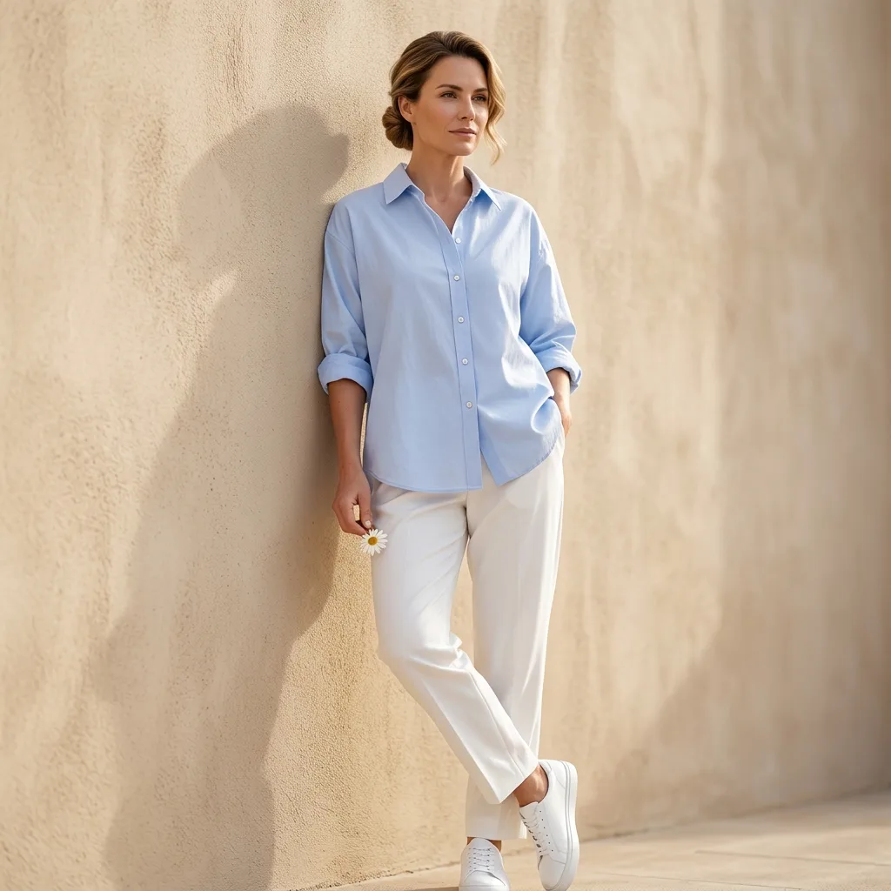

**#411 · Photography Prompt · <code>Vinano Image Pro</code>**

<details>
<summary>Show prompt</summary>

```
the uploaded reference image STRICTLY, preserve the same woman’s face, identity, age, facial structure, skin tone, and natural expression 100% accuracy. No facial alteration, beautification, or identity change.\n\nGenerate a highly realistic cinematic fashion editorial photoshoot featuring a stylish adult woman leaning casually against a warm beige textured wall. Her body is slightly angled, one shoulder gently resting on the wall, conveying relaxed confidence, elegance, and quiet strength.\n\nOutfit:\nShe wears a loose pastel blue button-down shirt softly rolled-up sleeves, styled effortlessly. Paired tailored white relaxed-fit trousers that drape naturally. Footwear consists of clean refined minimalist white or soft blue-white sneakers, maintaining a modern, understated luxury feel.\n\nPose & Expression:\nShe stands natural posture — one hand casually placed in her trouser pocket, the other delicately holding a small white daisy flower. Her facial expression is calm, self-assured, and serene, a soft editorial gaze slightly away from the camera. Emotion feels confident yet gentle.\n\nHair & Makeup:\nHair is neatly styled in a natural, modern look (soft waves, low ponytail, or loose bun). Makeup is minimal and refined — clean skin, subtle blush, neutral lips, no heavy contouring or glow.\n\nLighting & Atmosphere:\nWarm natural sunlight streams from the side, creating soft highlights along her face and clothing, gentle shadows adding depth to the textured wall. The mood is airy, sunlit, and cinematic.\n\nVisual Style:\nHigh-end fashion editorial aesthetic realistic skin texture, crisp fabric details, refined neutral color palette, and elegant composition.\n\nCamera & Quality:\nProfessional fashion photography style, shallow depth of field, cinematic framing, ultra-realistic 8K quality, sharp focus on subject smooth background falloff.\n\nOverall Feel:\nModern, minimal, sun-drenched lifestyle fashion campaign — confident, graceful, and timeless.",

 "style": "cinematic, high-end female fashion editorial",
 "lighting": "warm natural sunlight soft shadows",
 "background": "minimal beige textured wall, sunlit",
 "quality": "ultra-realistic, 8K, ultra-sharp",
 "camera": "professional fashion photography, shallow depth of field",
 "mood": "clean, modern, elegant, confident, relaxed"

Keep edges clean and the overall composition balanced for a polished, gallery-ready result.
```

</details>

---

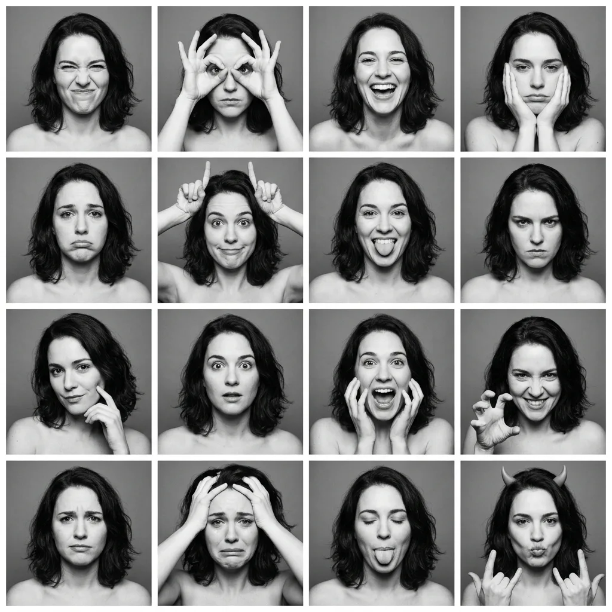

**#412 · Photography Prompt · <code>Vinano Image Pro</code>**

<details>
<summary>Show prompt</summary>

```
{
 "generation_request": {
 "meta_data": {
 "task_type": "black_and_white_photobooth_expression_grid_4x4",
 "language": "en",
 "priority": "highest",
 "version": "v1.0_BW_PHOTOBOOTH_EXPRESSIONS_4X4"
 },
 "input": {
 "mode": "image_to_image",
 "reference_image_usage": "very_high",
 "preserve_identity": true,
 "preserve_facial_features": true,
 "preserve_hairstyle": true,
 "notes": "Use the reference as the primary anchor. Create a black-and-white photobooth-style expression grid. Keep the same adult woman identity and hair. Each panel should show a different facial expression. Minimal background, direct photobooth flash look, natural skin texture."
 },
 "output": {
 "aspect_ratio": "1:1",
 "resolution": "ultra_high",
 "num_images": 1,
 "layout": {
 "type": "grid",
 "rows": 4,
 "cols": 4,
 "gutter": "thin",
 "panel_consistency": "high"
 },
 "sharpness": "crisp_photobooth",
 "grain": "subtle_analog_bw"
 },
 "scene": {
 "concept": "classic photobooth contact sheet expressive faces",
 "environment": "plain neutral backdrop, no props",
 "lighting": {
 "style": "direct photobooth flash",
 "key_light": "front flash, slightly hard but flattering",
 "shadows": "soft short shadows behind subject",
 "avoid": "cinematic side light, dramatic backgrounds"
 },
 "camera": {
 "lens": "50mm",
 "distance": "tight head-and-shoulders framing",
 "focus": "eyes sharp in every panel"
 }
 },
 "subject": {
 "type": "adult woman",
 "wardrobe": "simple strapless or bare-shoulder photobooth look (no logos)",
 "hair": "keep same hairstyle across all panels",
 "makeup": "minimal, natural",
 "anatomy_rules": "correct facial proportions, no warped eyes/mouth"
 },
 "expression_set": {
 "panel_01": "scrunched smile, eyes squeezed slightly",
 "panel_02": "intense stare fingers framing eyes",
 "panel_03": "big laugh, mouth open, joyful",
 "panel_04": "bored / unimpressed face, chin in hands",
 "panel_05": "sad pout, watery eyes look",
 "panel_06": "goofy face both hands making small horns above head",
 "panel_07": "playful tongue out, cheeky grin",
 "panel_08": "angry glare, eyebrows down",
 "panel_09": "flirty look, hand touching cheek",
 "panel_10": "surprised wide eyes, mouth slightly open",
 "panel_11": "fake scream / excited shout, hands near face",
 "panel_12": "mischievous grin claw-like hand pose",
 "panel_13": "confused frown, lips pressed",
 "panel_14": "crying face, hands on head, dramatic",
 "panel_15": "tongue out eyes closed, playful",
 "panel_16": "duck face small devil horns gesture"
 },
 "style": {
 "color": "pure black and white",
 "contrast": "medium-high",
 "background": "flat gray",
 "finish": "slight photobooth grain, clean edges"
 },
 "quality_control": {
 "identity_lock": "strict",
 "hands_priority": "high",
 "avoid": ["extra fingers",
 "missing fingers",
 "deformed hands",
 "warped face",
 "uneven eyes",
 "melted mouth",
 "plastic skin",
 "text",
 "watermark",
 "logo"]
 },
 "negative_prompt": ["color",
 "sepia",
 "overly filmic, cinematic lighting",
 "beauty retouch plastic skin",
 "low resolution",
 "blur",
 "distorted anatomy"]
 }
}

Keep edges clean and the overall composition balanced for a polished, gallery-ready result.
```

</details>

---

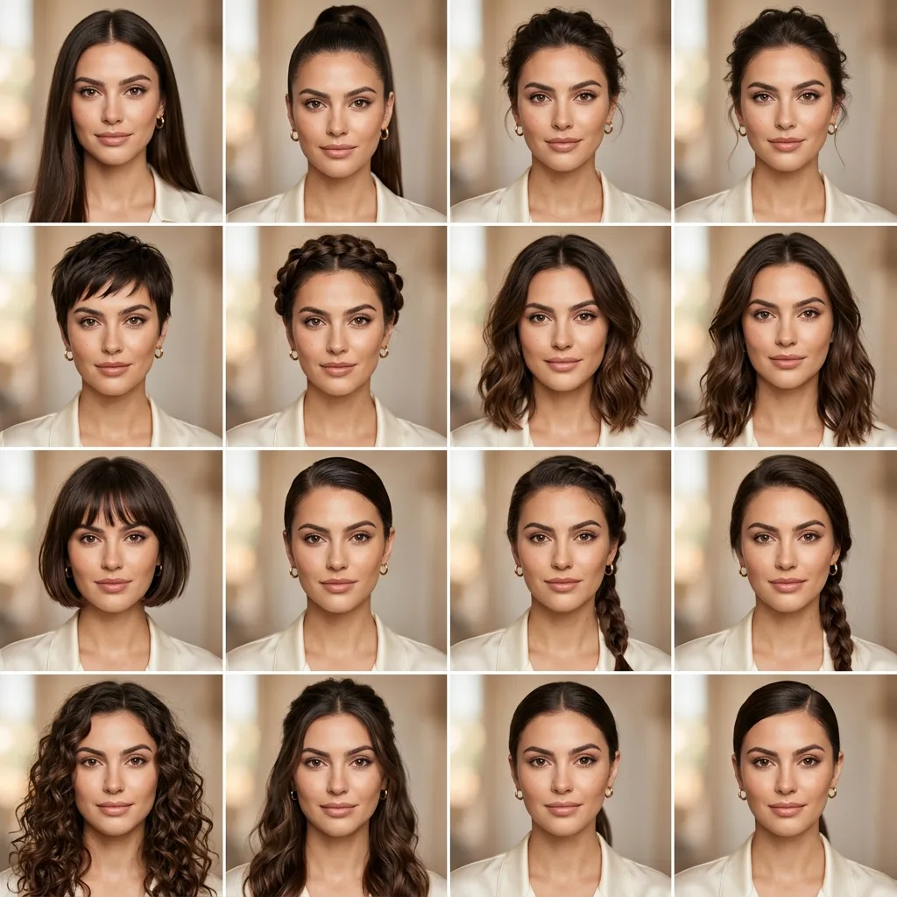

**#413 · Photography Prompt · <code>Vinano Image Pro</code>**

<details>
<summary>Show prompt</summary>

```
A premium-quality photo collage featuring the same person identical facial features and expression, shown in multiple frames different hairstyles. Each panel displays a unique hairstyle such as long straight hair, high ponytail, messy bun, pixie cut, braided crown, soft waves, short bob bangs, low bun, side braid, and loose curls. Consistent neutral outfit and makeup across all images, soft studio lighting, warm blurred background, realistic skin texture, symmetrical face consistency, ultra-detailed, editorial beauty look, 4x3 grid layout, professional portrait photograph Render with rich micro-detail while keeping the layout uncluttered and intentional.
```

</details>

---

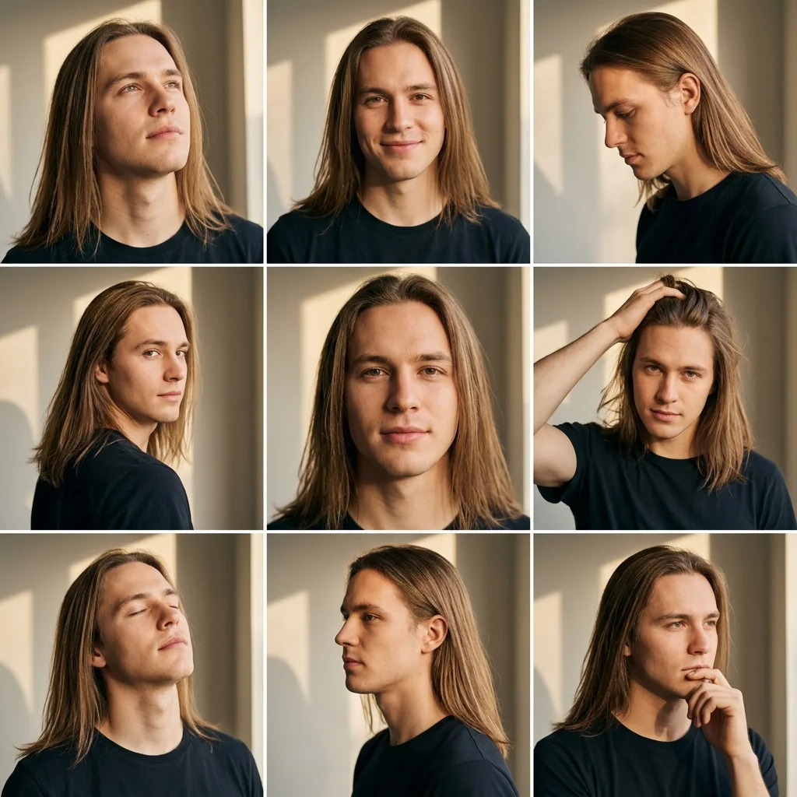

**#414 · Photography Prompt · <code>Vinano Image Pro</code>**

<details>
<summary>Show prompt</summary>

```
{
 "image_generation": {
 "face": {
 "preserve_original": true,
 "reference_match": true,
 "description": "Maintain the same facial structure, skin tone, eye shape, and natural expressions across all frames, consistent identity in each pose."
 },
 "photo_style": {
 "type": "golden hour portrait collage",
 "camera_angle": "varied close-up and medium portrait angles",
 "lighting": "warm golden hour sunlight casting soft window shadows",
 "mood": "soft, calm, intimate, aesthetic",
 "texture": "natural skin texture, soft highlights, gentle contrast",
 "focus": "sharp focus on face smooth background falloff"
 },
 "subject": {
 "gender": "male",
 "age": "young adult",
 "poses": ["looking upward toward light",
 "soft smile facing camera",
 "side profile downward gaze",
 "over-the-shoulder glance",
 "direct close-up relaxed lips",
 "hand in hair casual pose",
 "head tilted back toward light",
 "clean side profile portrait",
 "thoughtful pose hand near chin"],
 "expression": "natural, minimal, relaxed, emotionally subtle",
 "hair": {
 "style": "long straight hair worn loose",
 "color": "light to medium brown",
 "details": "natural shine soft light highlights"
 },
 "clothing": {
 "type": "casual refined minimalist outfit",
 "details": "simple dark t-shirt no visible branding"
 }
 },
 "composition": {
 "layout": "3x3 grid collage",
 "consistency": "uniform lighting and background across all frames",
 "framing": "clean portrait framing slight pose variation"
 },
 "environment": {
 "setting": "indoor space near a window",
 "background": "plain wall warm sunlight and shadow patterns",
 "atmosphere": "quiet, minimal, artistic indoor ambiance"
 },
 "aesthetic": {
 "style": "Instagram aesthetic portrait set",
 "features": ["golden hour light",
 "window shadow patterns",
 "minimal makeup",
 "natural expressions",
 "clean editorial portrait look"]
 }
 }
}

Preserve realistic proportions and depth for a confident, professional finish.
```

</details>

---

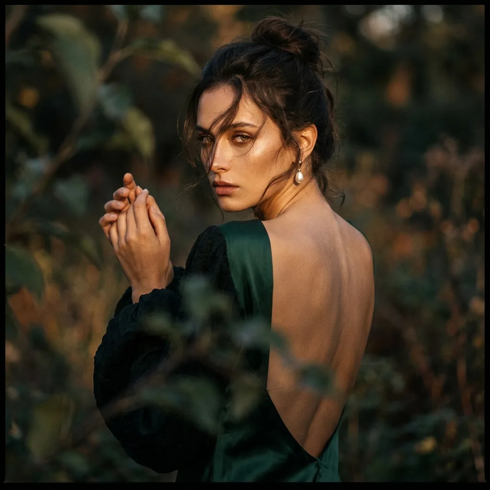

**#415 · Photography Prompt · <code>Vinano Image v2</code>**

<details>
<summary>Show prompt</summary>

```
Create a moody, ethereal cinematic portrait of a woman a dramatic over-the-shoulder pose.

1. Pose and Expression
• Perspective: subject positioned her back facing the camera, torso elegantly twisted, looking back over her shoulder, creating a graceful curve along the spine and highlighting shoulder blades
• Gaze: direct eye contact the camera, piercing yet soft expression, chin slightly tucked toward shoulder to evoke intimacy and mystery
• Hand Placement: hands gently raised near chest/shoulder, fingers softly interlaced or delicately touching
• Hair: loose messy bun soft wispy strands falling naturally across the face, slightly windswept look

2. Lighting and Color Palette
• Lighting: strong side lighting, warm golden-hour sunlight, high contrast chiaroscuro effect, one side illuminated while the other fades into deep shadow
• Skin Tone: luminous, glowing, pearlescent skin texture
• Color Scheme: earthy muted tones, deep greens, dark browns, soft neutral background, warm skin tones as focal point

3. Wardrobe and Accessories
• Outfit: backless silky dress or top, smooth light fabric, paired dark voluminous sleeves for strong texture contrast
• Accessories: elegant drop pearl earrings reflecting light subtly

4. Composition and Atmosphere
• Framing: medium close-up shot, framed naturally blurred foreground leaves for a voyeuristic, through-the-foliage effect
• Depth of Field: shallow depth of field, sharp focus on face, soft bokeh in background and foreground
• Mood: cinematic, melancholic, romantic, high-fashion editorial style, soft dreamy atmosphere

Face reference: soft oval face, smooth glowing skin, symmetrical features, natural makeup, gentle but expressive eyes, slightly parted lips

Keep edges clean and the overall composition balanced for a polished, gallery-ready result.
```

</details>

---

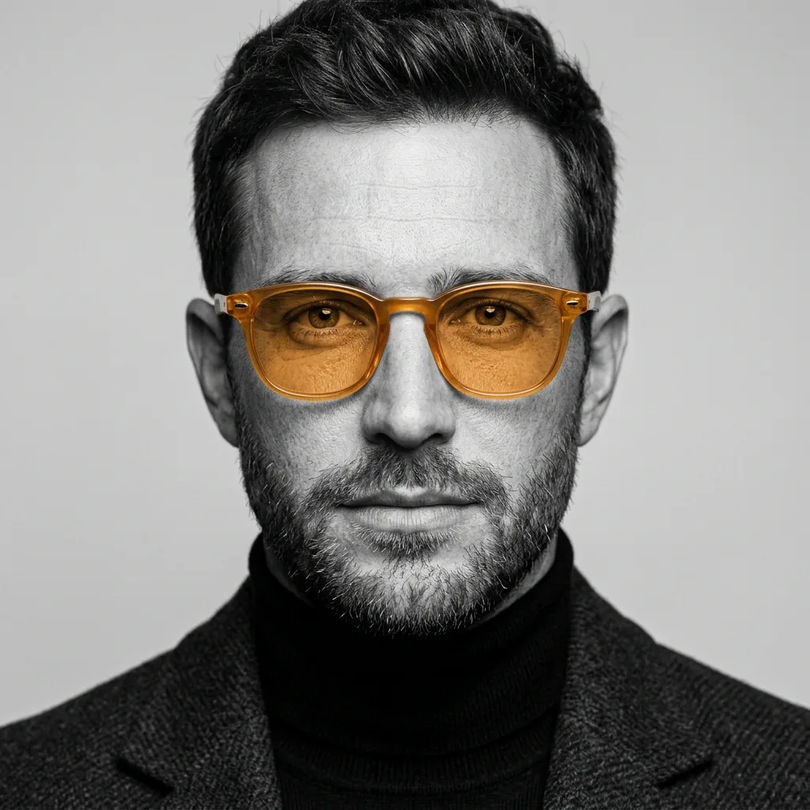

**#416 · Photography Prompt · <code>Vinano Image v2</code>**

<details>
<summary>Show prompt</summary>

```
Ultra-realistic studio portrait of a man, close-up headshot, centered composition, neutral expression, sharp facial details, textured skin, clean grooming, wearing a black turtleneck and dark tailored coat, modern refined minimalist fashion, monochrome black and white photography style, only the glasses in color (Translucent amber-orange frame and lenses), high contrast lighting, soft studio light, cinematic shadows, editorial fashion photography, plain light background, 85mm lens, shallow depth of field, ultra detailed, true-to-life photorealistic, magazine quality, 8K. Maintain consistent colour harmony and crisp focus across the whole frame.
```

</details>

---

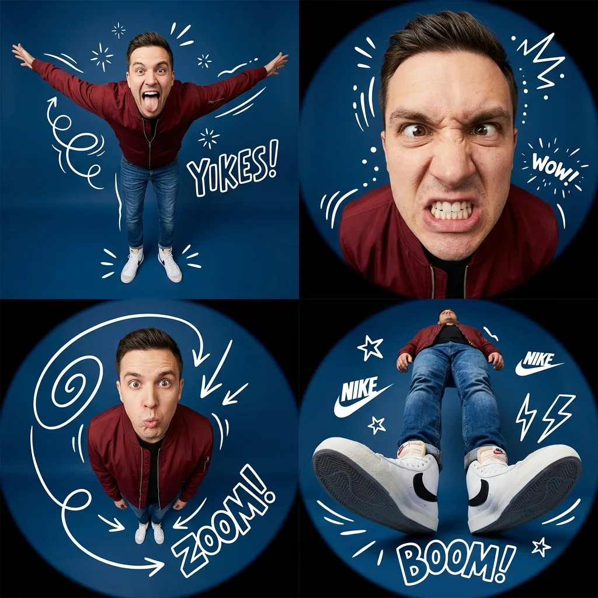

**#417 · Photography Prompt · <code>Vinano Image Pro</code>**

<details>
<summary>Show prompt</summary>

```
Create a 2x2 grid image. In each frame include a medium shot, closeup shot, high angle looking down and extreme low angle view looking up from the sneakers. Utilize a fish eye lens perspective in each frame as well as an aesthetic pose foreshortening. The character is wearing a dark red bomber jacket, blue jeans and white nike high top sneakers and posing a different wacky facial expression in each frame. Include white doodle hand drawn elements around them in each frame. Studio photography against a dark blue background. Ensure the background encompasses the entire background, no circular framing. Aim for an editorial, design-driven look with deliberate negative space.
```

</details>

---

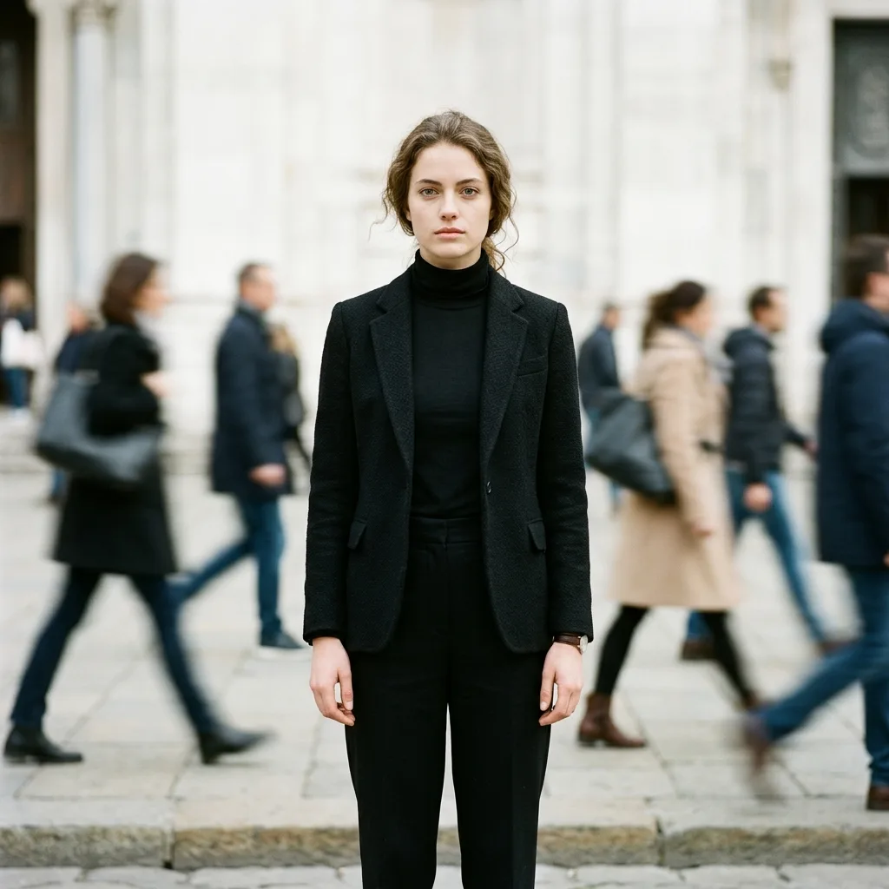

**#418 · Photography Prompt · <code>Vinano Image v2</code>**

<details>
<summary>Show prompt</summary>

```
A high fashion magazine pictorial of an Alpine-looking woman in her early 20s who stands still, looking at the camera, turning her head in the center, surrounded by a blurry silhouette of people passing by. She has a calm, stoic look on her face and is wearing a black refined minimalist outfit. The background is clean, bright and slightly abstract, and emphasizes the contrast between motion blur and static appearance. Editing style, film composition, pure art photography, soft magazine texture, high resolution. --ar 4:5 Emphasise material texture and natural light so the final frame feels tactile and premium.
```

</details>

---

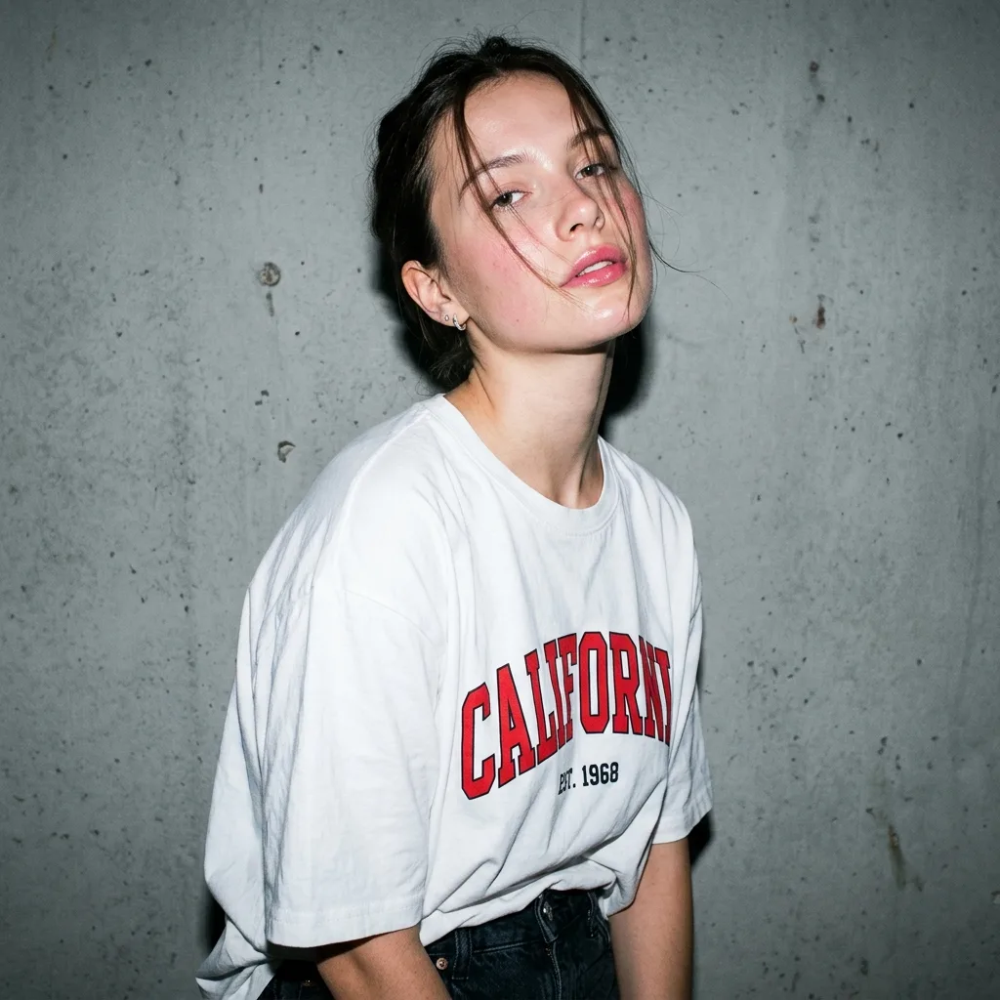

**#419 · Photography Prompt · <code>Vinano Image Pro</code>**

<details>
<summary>Show prompt</summary>

```
A high-resolution, close-up editorial-style portrait of a young woman standing against a textured gray concrete wall, captured direct on-camera flash that creates a raw, moody, high-contrast aesthetic. She is positioned slightly angled to the side her head tilted back and chin lifted, giving an effortlessly cool, candid expression. Her face has a fair, smooth complexion a natural sheen from the flash, soft rosy blush across the cheeks, minimal eye makeup, lightly defined brows, and glossy natural pink lips that are slightly parted, conveying a relaxed yet confident mood. Wispy strands of her dark brown hair fall loosely across her face, partially covering one eye, while the rest of her hair is pulled back into a low, casual style, enhancing the spontaneous, fashion-editorial feel. Her eyes look slightly upward and past the camera, adding to the detached, artistic vibe. She is wearing a loose-fitting white oversized T-shirt bold red typography reading “CALIFORNIA” across the chest, along smaller black text underneath, giving a casual streetwear aesthetic. Small, subtle stud earrings are visible, adding minimal detail without distracting from the overall look. The lighting is harsh and frontal, producing sharp shadows behind her on the wall and emphasizing skin texture, hair strands, and fabric folds, while the background remains simple and uncluttered. The color palette is muted and neutral—gray wall, white shirt, and red lettering—allowing the subject’s face and expression to remain the focal point. The overall atmosphere feels intimate, modern, slightly gritty, and effortlessly stylish, like a candid fashion snapshot captured at night flash photography. Use this uploaded photo as the only and exact face reference. The generated image must use this same face exactly as shown, without any changes to identity, facial structure, or expression. Keep edges clean and the overall composition balanced for a polished, gallery-ready result.
```

</details>

---

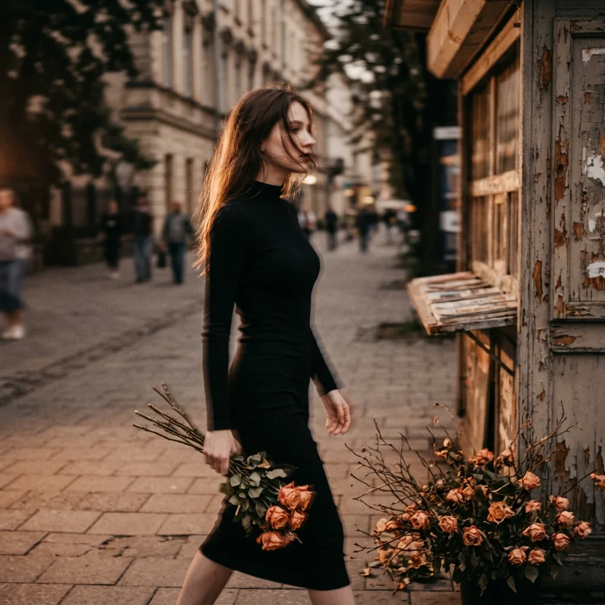

**#420 · Photography Prompt · <code>Vinano Image v2</code>**

<details>
<summary>Show prompt</summary>

```
The generated image uses the uploaded image as a reference for the character, wearing a high-necked, tight-fitting black long-sleeved dress. A cluster of withered wood and orange-pink flowers lies beside an old newsstand, the grainy texture of vintage film interwoven, the blurred background noticeable trailing shadows, and the double-image effect creating a fantastical atmosphere. A bewitchingly beautiful girl, carrying flowers, is shown in profile, her fair skin delicate and translucent. Her exquisite face is blurred motion, the outline of her figure slightly swaying the panning camera, the soft focus making the image even more hazy and languid. A warm-toned, low-saturation filter enhances the effect, her long, backlit hair glowing a soft glow, the messy strands sweeping wildly across her jawline, the details concealing a captivating yet dangerous allure. Cute movements add dynamism, the motion blur blending the film grain, creating a trendy, Instagram-worthy image while the blurred image outlines a dynamic scene full of story, cleverly balancing bewitching and sweetness. Maintain consistent colour harmony and crisp focus across the whole frame.
```

</details>

---

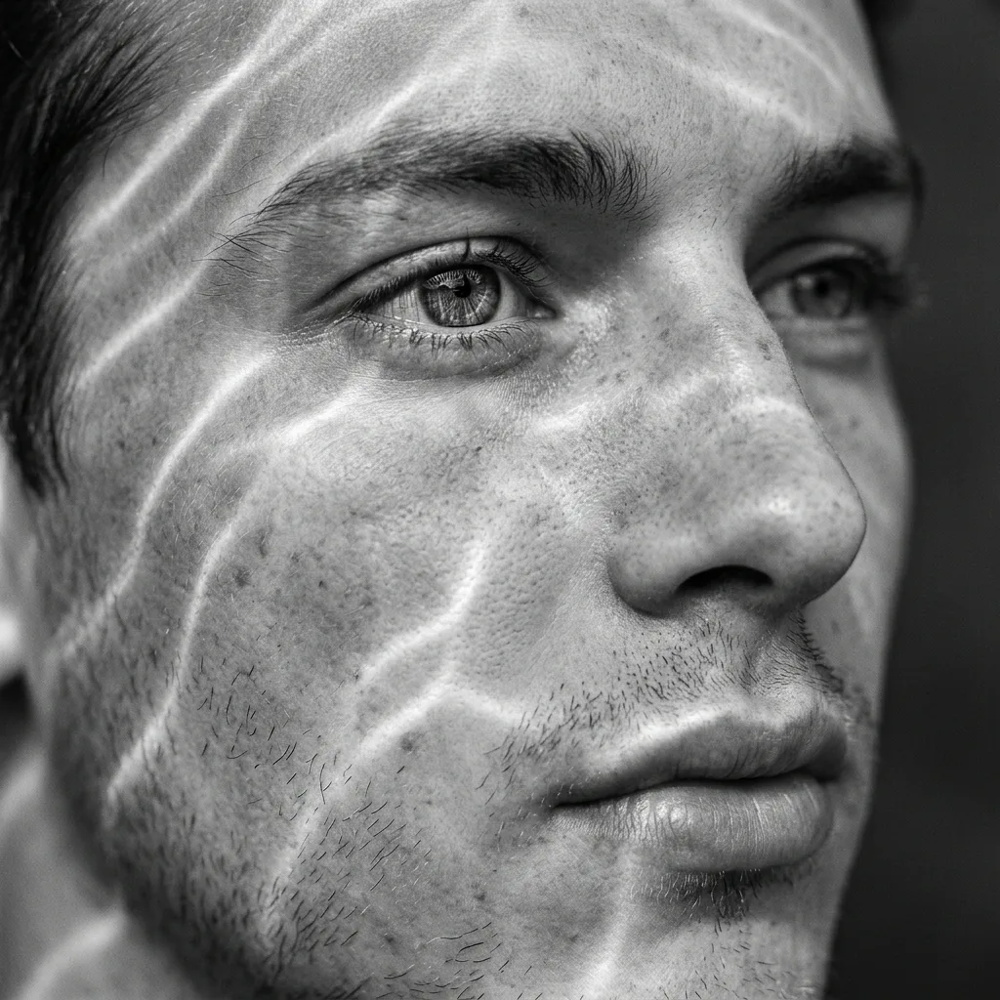

**#421 · Photography Prompt · <code>Vinano Image v2</code>**

<details>
<summary>Show prompt</summary>

```
A hyperrealistic 8K black and white extreme close-up portrait of a young man's face, focusing tightly on his eye, cheekbone, and lips. Bright sunlight breaks into soft, wavy luminous lines that ripple across his skin like underwater reflections. The light flows diagonally, wrapping around the contours of his face in surreal patterns, while the shadows dissolve into smooth mid-gray tones instead of deep black. The skin is rendered in lifelike detail-visible pores, faint freckles, subtle stubble, and natural imperfections catch the glowing light realistically. The lips are softly highlighted, and the eye reflects fragments of the luminous waves, adding depth and emotion without artificial glow. The camera framing feels macro, pressed close to the face, razor-thin depth of field: one illuminated ridge of skin is perfectly sharp, while the rest melts into velvety blur. The glassy, fluid quality of the light lines gives the portrait a surreal dreamlike aesthetic while remaining grounded in photographic realism. The background disappears into soft gray gradients, leaving only the interplay of skin texture and luminous wave-like rays. Fine cinematic grain overlays the frame, enhancing the tactile analog feel. The overall mood is intimate, surreal, and emotionally evocative - a monochrome portrait. Preserve realistic proportions and depth for a confident, professional finish.
```

</details>

---

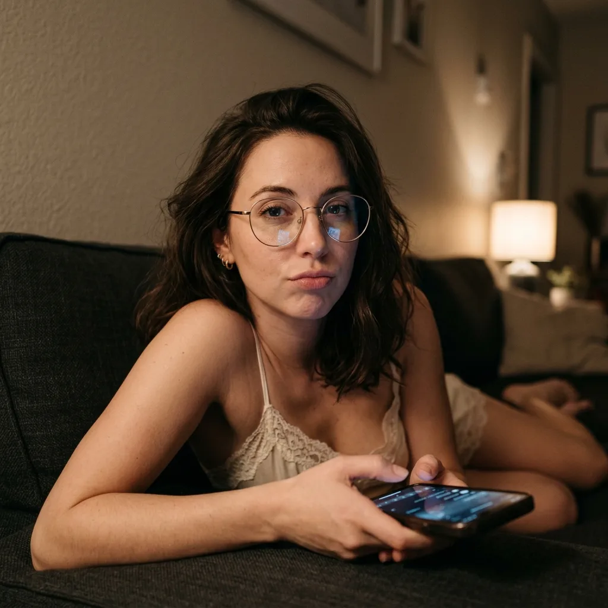

**#422 · Photography Prompt · <code>Vinano Image v2</code>**

<details>
<summary>Show prompt</summary>

```
{ "subject": { "description": "A young adult woman soft refined features, thin metal glasses, and shoulder-length dark hair, leaning across a couch at night while holding a smartphone, captured in a quiet low-light candid moment.", "mirror_rules": "not a mirror shot", "age": "young adult", "expression": { "eyes": { "look": "soft, slightly tired, subtly attentive", "energy": "low-key and intimate", "direction": "toward the camera, as if she just looked up from her phone" }, "mouth": { "position": "gently closed a relaxed pout", "energy": "quiet and unforced" }, "overall": "a dreamy late-night expression, calm, distant, and mildly seductive without exaggeration" }, "face": { "preserve_original": "keep the face proportions delicate and realistic, a narrow jawline, soft cheeks, defined eyes, glossy lips, and no exaggerated facial distortion", "makeup": "soft glam makeup, subtle eyeliner, long lashes, smooth skin finish, glossy pink-nude lips, lightly defined brows" } }, "hair": { "color": "dark brown to black", "style": "shoulder-length, loose, softly tousled slight volume around the crown", "effect": "natural flyaways and soft separation, not overly polished" }, "body": { "frame": "slim and softly curved", "waist": "gently defined", "chest": "natural and softly framed by the neckline", "legs": "bare, partially folded and extending out of frame", "skin": { "visible_areas": "shoulders, collarbone, arms, upper chest, thighs, lower legs", "tone": "fair a warm indoor cast", "texture": "smooth, velvety, lightly softened by low light and lens blur", "lighting_effect": "warm ambient light on the skin faint cool phone-screen reflections near the face and hands" } }, "pose": { "position": "leaning forward across a couch, one arm supporting the body, the other hand holding a phone in the foreground", "base": "casual lounging posture caught mid-movement", "overall": "informal, intimate, slightly off-balance, as if she paused while scrolling and looked up" }, "clothing": { "top": { "type": "lace-trim camisole or slip-style sleepwear", "color": "pale cream a soft blush tint", "details": "thin straps, delicate lace texture, soft fitted bodice, lightweight fabric", "effect": "sleepwear-like softness, feminine and understated" }, "bottom": { "type": "matching soft shorts or the lower part of a slip", "color": "pale cream", "details": "mostly obscured, softly wrinkled fabric, blending into the pose" } }, "accessories": { "jewelry": "small subtle earrings", "device": "smartphone held close to the camera, dark reflective case, screen glow lighting the fingers", "prop": "thin metal-framed eyeglasses visible screen reflections on the lenses" }, "photography": { "camera_style": "realistic social-media night portrait, smartphone candid aesthetic", "angle": "slightly above eye level, close and intimate, the phone hand entering the foreground", "shot_type": "medium close-up to three-quarter portrait in vertical framing", "aspect_ratio": "3:4 vertical", "texture": "soft focus, slight motion blur, low-light grain, gentle facial smoothing from dim conditions, natural imperfect sharpness", "lighting": "dim warm room light mixed cool phone-screen reflections, no hard flash, soft falloff across the couch and wall", "depth_of_field": "shallow to moderate, face prioritized but softened, foreground hand and phone slightly blurred" }, "background": { "setting": "an indoor living room or lounge at night", "wall_color": "warm beige-gray", "elements": ["dark upholstered couch", "plain softly lit wall", "minimal visible decor"], "atmosphere": "quiet, private, late-night, softly blurred and still", "lighting": "very low ambient tungsten-like room light shadows pooling in the background" }, "the_vibe": { "energy": "slow, hushed, intimate", "mood": "late-night pause, private and emotionally suspended", "aesthetic": "realistic social-media softness, low-light candid beauty, imperfect but magnetic", "authenticity": "retain the accidental blur, the off-center body angle, the screen glare on the glasses, and the lived-in couch posture", "intimacy": "close enough to feel the warmth of the room and the softness of fabric against skin", "story": "She had been scrolling in silence, then something made her stop and lift her eyes for one quiet second.", "caption_energy": "soft nocturnal allure, unspoken attention, the kind of moment that feels borrowed rather than staged" }, "constraints": { "must_keep": ["young adult woman", "thin metal glasses", "visible screen reflections on the lenses", "smartphone in hand close to the foreground", "dark shoulder-length tousled hair", "pale lace-trim sleepwear", "leaning across a couch", "warm dim indoor night lighting", "soft blur and low-light texture", "minimal beige-gray wall and dark couch background"], "avoid": ["studio lighting", "hard flash", "over-sharpened skin", "perfect commercial glamour retouching", "extra background clutter", "bright daylight", "mirror selfie composition", "heavy accessories", "exaggerated body proportions", "watermarks, logos, extra text"] }, "negative_prompt": ["mirror selfie", "hard flash", "studio backdrop", "ultra sharp DSLR clarity", "over-retouched skin", "cartoonish face", "exaggerated anatomy", "extra fingers", "deformed hands", "heavy jewelry", "busy room", "daylight window light", "smiling broadly", "strong action pose", "symmetrical formal composition", "text overlay", "watermark", "logo"] } Aim for an editorial, design-driven look with deliberate negative space.
```

</details>

---

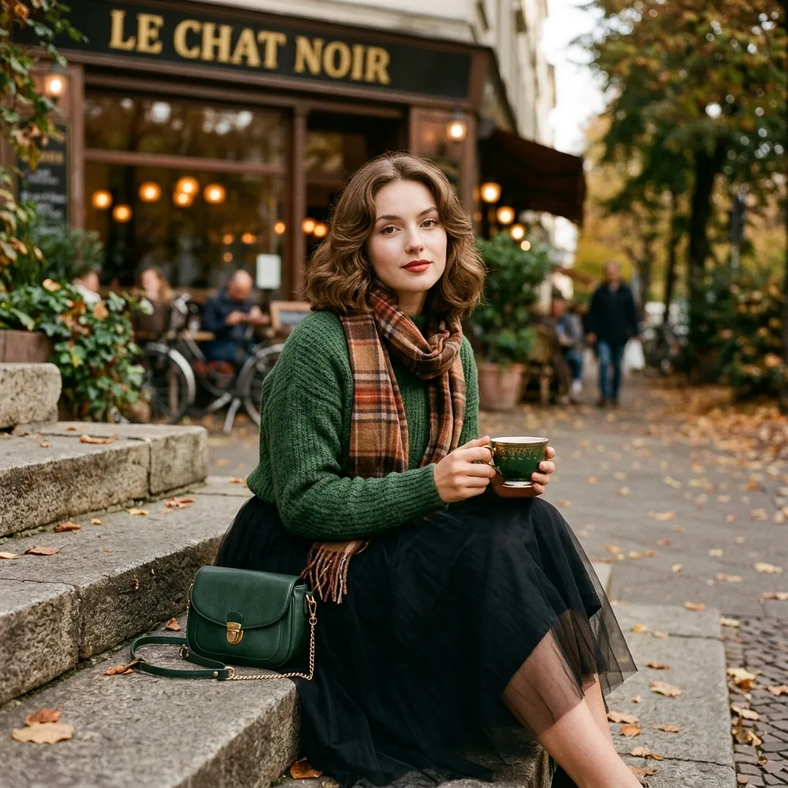

**#423 · Photography Prompt · <code>Vinano Image v2</code>**

<details>
<summary>Show prompt</summary>

```
A cinematic 1970s-inspired fashion portrait of a graceful young woman seated on worn stone steps outside a cozy street café. She holds an ornate deep-green ceramic coffee cup delicate gold rim accents, gently resting it in her hands as she gazes softly toward the camera calm confidence. Her expression feels serene, thoughtful, and timeless.
Her hair falls in soft, natural waves loose strands framing her face, styled in a classic vintage manner. Makeup reflects 1970s elegance: matte crimson-red lips, subtle winged eyeliner, warm-toned blush, and softly defined brows. She wears a luxurious forest-green knitted sweater a relaxed fit, paired a flowing black tulle skirt that moves lightly the air.
A warm plaid scarf in earthy browns, burnt orange, and muted reds is draped casually around her neck. Beside her rests a premium dark-green leather crossbody bag gold filigree hardware and a delicate chain strap.
The background features an autumn café street scattered fallen leaves, glowing amber lights behind glass windows, and a soft urban stillness. Shot an 85mm lens at f/1.8, shallow depth of field, warm analog film grain, muted earthy palette, dreamy cinematic mood, ultra-realistic fashion editorial photography inspired by classic 1970s film aesthetics.

Maintain consistent colour harmony and crisp focus across the whole frame.
```

</details>

---

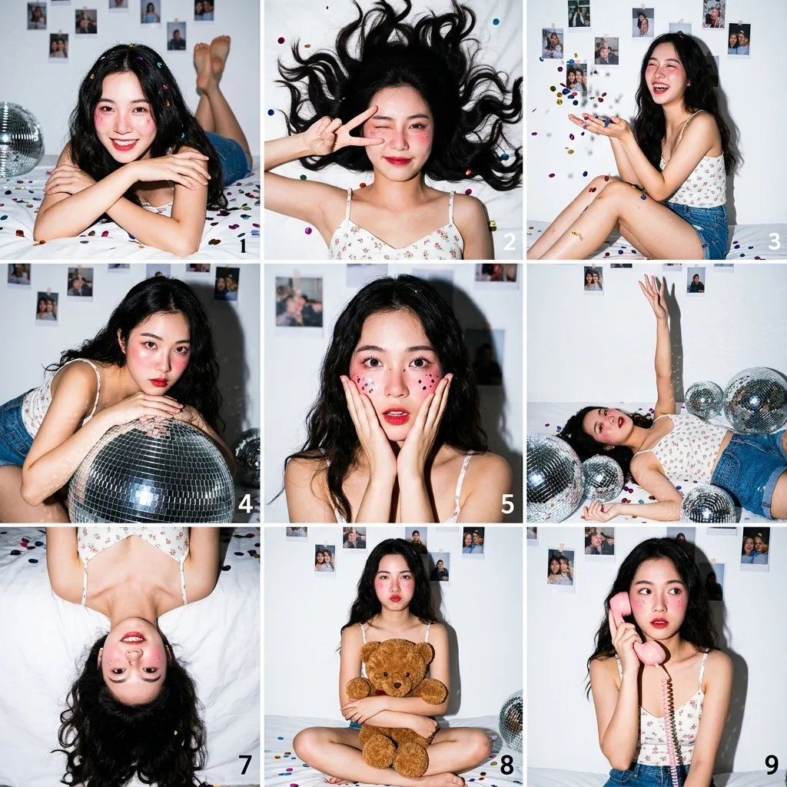

**#424 · Photography Prompt · <code>Vinano Image Pro</code>**

<details>
<summary>Show prompt</summary>

```
3x3 Photo Collage / 9-Panel Grid.",
      "layout": "Nine vertical portrait images arranged in a square grid.",
      "consistency": "Same subject, same outfit, and same lighting across all 9 panels."
    },
    "aesthetic_style": {
      "theme": "Gen Z Home Party / 'Maiden Pavilion' Photoshoot.",
      "lighting_technique": "Direct On-Camera Flash (Hard Light).",
      "visuals": "High contrast, sharp shadows, chaotic fun, vibrant colors against a white background."
    },
    "subject_details": {
      "appearance": "Young Asian woman, fair skin, long dark wavy hair volume.",
      "outfit": "White floral camisole top, blue denim shorts.",
      "makeup": "Heavy pink blush (Igari style), red lips, glitter on cheeks."
    },
    "environment_and_props": {
      "background": "White wall taped photos, white bed sheets.",
      "decor": "Silver disco balls (various sizes), colorful metallic confetti scattered everywhere, brown teddy bear, pink retro corded phone."
    },
    "panel_pose_breakdown": {
      "1_top_left": "Lying on stomach (prone), resting chin on crossed arms, looking at camera. Confetti in hair.",
      "2_top_center": "Top-down view lying on back, winking one eye, making a peace sign near face. Hair fanned out.",
      "3_top_right": "Sitting sideways, knees bent, laughing candidly while throwing a handful of confetti in the air.",
      "4_middle_left": "Leaning upper body over a large silver disco ball, looking intensely at the camera.",
      "5_middle_center": "Close-up portrait. Hands touching cheeks in a 'surprised' or 'shy' gesture. Confetti stuck to cheeks.",
      "6_middle_right": "Lying on back amongst the disco balls, one arm reaching up towards the ceiling/camera.",
      "7_bottom_left": "Upside-down perspective (head at bottom of frame), playful expression, hair cascading down.",
      "8_bottom_center": "Sitting cross-legged (Lotus position), hugging the brown teddy bear tight, pouting slightly.",
      "9_bottom_right": "Sitting up, holding the pink retro telephone receiver to ear, looking sideways as if listening to gossip."
    },
    "camera_technical_values": {
      "focal_length": "35mm (Versatile environmental portrait lens).",
      "aperture": "f/5.6 (Ensures subject and props are in focus).",
      "shutter_speed": "1/200s (Flash sync to freeze confetti motion).",
      "iso": "ISO 200.",
      "lighting": "Hard flash creates a distinct drop shadow behind the subject on the white wall and specular highlights on the disco balls."
    }
  },
  "_string": "3x3 photo grid collage of a cute Asian girl at a home party, wearing white floral top and

Preserve realistic proportions and depth for a confident, professional finish.
```

</details>

---

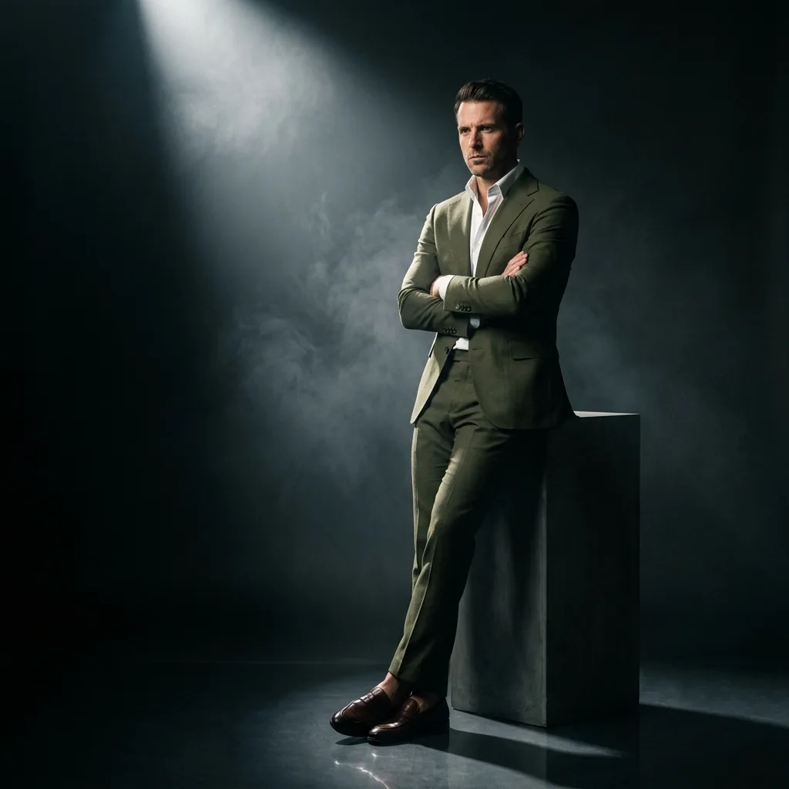

**#425 · Photography Prompt · <code>Vinano Image v2</code>**

<details>
<summary>Show prompt</summary>

```
{
 "prompt": "Cinematic full-body studio portrait of a subject the uploaded face as exact reference (preserve identity, facial structure, and proportions). Slightly low-angle perspective a 35mm lens for a commanding, sophisticated presence. Subject leaning casually against a dark refined minimalist plinth, arms crossed. Wearing a perfectly tailored slim-fit olive green suit and a crisp white dress shirt, top buttons undone. Intense chiaroscuro lighting a single powerful volumetric spotlight from the upper-left, cutting through subtle atmospheric haze swirling smoke and micro-dust particles. Sharp rim highlights along shoulders and silhouette, deep velvety shadows across the body, high-contrast moody aesthetic. Hyper-realistic textures, visible fabric weave, subtle reflections on a polished studio floor, professional filmic, cinematic lighting, ultra-detailed, 8K resolution, no text, no watermark.",
 "resolution": "7680x4320",
 "camera": {
 "lens": "35mm",
 "angle": "slightly low-angle",
 "aperture": "f/2.0",
 "iso": "100",
 "shutter_speed": "1/125"
 },
 "quality": "ultra-high",
 "style": "cinematic, hyper-realistic, studio photography",
 "negative_prompt": "blurry, low-resolution, overexposed, underexposed, flat lighting, cartoon, CGI, plastic skin, extra limbs, distorted hands, bad anatomy, asymmetry, watermark, logo, text"
}

Aim for an editorial, design-driven look with deliberate negative space.
```

</details>

---

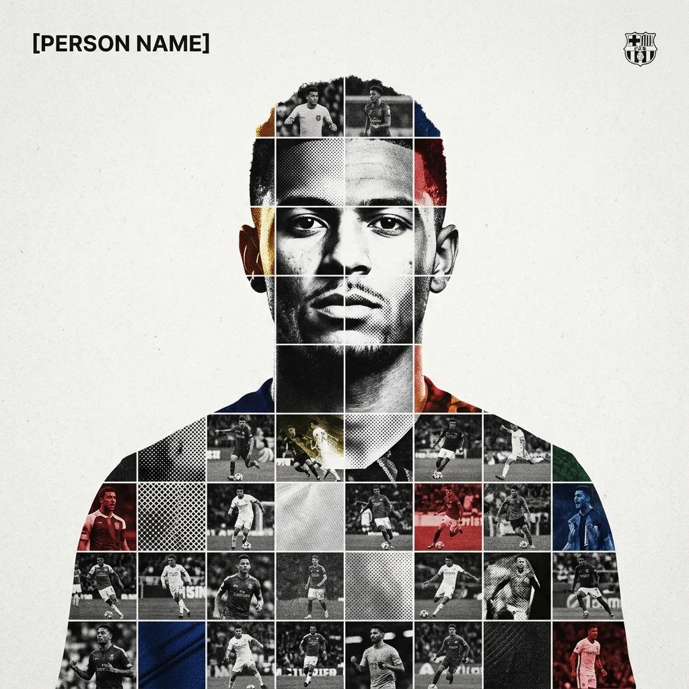

**#426 · Photography Prompt · <code>Vinano Image Pro</code>**

<details>
<summary>Show prompt</summary>

```
[PERSON NAME].
Act as a high-end sports graphic designer creating a conceptual tribute poster. The style is a complex "dual exposure photo-grid composite" mixed-media textures.
CENTRAL STRUCTURE (THE VESSEL):
The central focus is a large-scale, high-contrast black and white portrait silhouette of [PERSON NAME]. This main portrait acts as the container.
THE GRID FILL & TEXTURES (MIXED MEDIA):
The interior of the silhouette is populated by a dense "photo mosaic grid" of action shots from the person's career.
CRITICAL TEXTURE INSTRUCTION: Do not just paste flat photos. Apply artistic textures to various grid cells to create a tactile, collage feel. Use effects like:
Halftone Dots: Comic-book style raster patterns on some cells.
Fabric/Embroidery: Subtle thread or canvas textures suggesting a jersey or patch.
Film Grain: Heavy noise on specific high-contrast action shots.
COLOR STRATEGY:
The base is Monochrome B&W. Use selective color overlays (relevant to the team/flag) ONLY on specific grid cells to create a rhythm.
TYPOGRAPHY & BRANDING (STRICT MICRO-SCALING):
Top Left (The Name): Write "[PERSON NAME]" strictly the font Inter Semibold.
Kerning: Tight negative kerning (-4%).
Size: SMALL and discreet. It must occupy MAXIMUM 20% of the canvas width. Do NOT make it large or loud.
Top Right (The Symbol): Place the primary logo (Team/Brand/Flag).
Size: VERY SMALL. It must occupy MAXIMUM 10% of the canvas width.
COMPOSITION & BACKGROUND:
Background: Off-white or light grey a visible premium-quality paper or concrete texture. It should not be flat digital white.
Alignment: Center the figure perfectly. Maintain wide negative space around the object.

Emphasise material texture and natural light so the final frame feels tactile and premium.
```

</details>

---


**#427 · Photography Prompt · <code>Vinano Image Pro</code>**

<details>
<summary>Show prompt</summary>

```
{
A hyper-realistic, ultra-detailed 8K cinematic wide-shot of a football scene, captured from a dramatic low-angle perspective a wide-angle lens and shallow depth of field, emphasizing speed, power, and realism.

The scene features only two players on a professional football pitch.
The primary player, positioned slightly ahead and in control of the ball, is dribbling explosive movement and confident body language. His face is generated the uploaded face as reference (100% likeness).

He wears an ultra-realistic AI Trends football kit, designed like a top-tier international club jersey. The kit has a blue-green gradient finish, breathable performance fabric, and subtle geometric textures. “AI Trends” branding is printed boldly on the chest and both shoulders in premium sports typography. The fabric reacts naturally to motion, showing realistic folds, tension, and subtle sweat details, giving a luxury global campaign aesthetic.

Running beside him is Cristiano Ronaldo, wearing his iconic classic football kit, instantly recognizable by its design, colors, and number. Cristiano is not holding the ball. He matches pace powerfully, positioned slightly to the side, ready for a decisive run or finish.

No other players are on the field.

The grass pitch is extremely detailed, visible blades, dirt particles, and subtle turf displacement beneath their feet. Water droplets and dust rise each step, enhancing motion realism.
The background features a massive stadium a softly blurred crowd, cinematic depth, and powerful volumetric lighting creating dramatic rim light around both players. Subtle motion blur enhances speed while both faces remain sharp and detailed.
The mood is powerful and cinematic, resembling a high-budget sports film still and a premium AI Trends global campaign, natural color grading, hyper-realistic textures, and professional sports photography aesthetics.

Aim for an editorial, design-driven look with deliberate negative space.
```

</details>

---

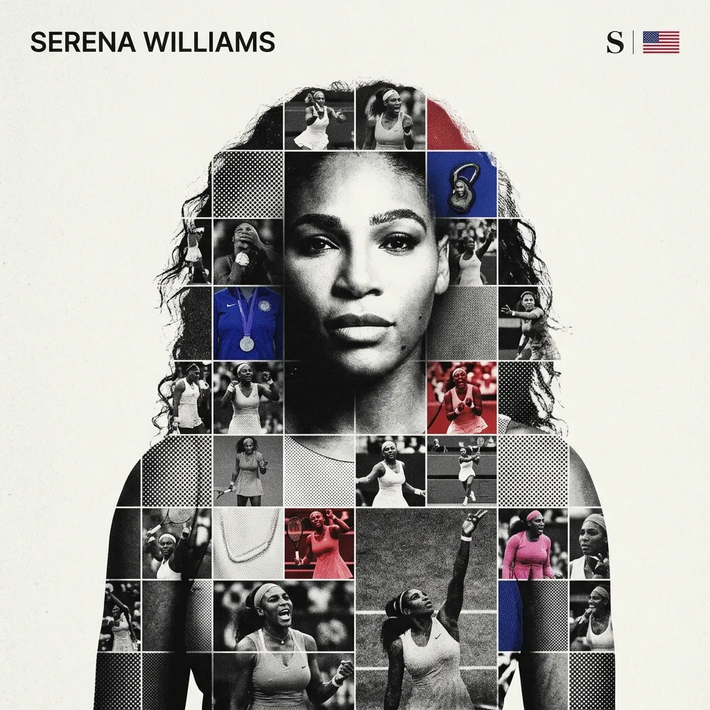

**#428 · Photography Prompt · <code>Vinano Image Pro</code>**

<details>
<summary>Show prompt</summary>

```
[PERSON NAME].

Act as a high-end sports graphic designer creating a conceptual tribute poster. The style is a complex "dual exposure photo-grid composite" mixed-media textures.
**CENTRAL STRUCTURE (THE VESSEL):**
The central focus is a large-scale, high-contrast black and white portrait silhouette of [PERSON NAME]. This main portrait acts as the container.
**THE GRID FILL & TEXTURES (MIXED MEDIA):**
The interior of the silhouette is populated by a dense "photo mosaic grid" of action shots from the person's career.
**CRITICAL TEXTURE INSTRUCTION:** Do not just paste flat photos. Apply artistic textures to various grid cells to create a tactile, collage feel. Use effects like:

- **Halftone Dots:** Comic-book style raster patterns on some cells.
- **Fabric/Embroidery:** Subtle thread or canvas textures suggesting a jersey or patch.
- **Film Grain:** Heavy noise on specific high-contrast action shots.
**COLOR STRATEGY:**
The base is Monochrome B&W. Use selective color overlays (relevant to the team/flag) ONLY on specific grid cells to create a rhythm.
**TYPOGRAPHY & BRANDING (STRICT MICRO-SCALING):**
1. **Top Left (The Name):** Write "[PERSON NAME]" strictly the font **Inter Semibold**.
- **Kerning:** Tight negative kerning (-4%).
- **Size:** SMALL and discreet. It must occupy **MAXIMUM 20%** of the canvas width. Do NOT make it large or loud.
1. **Top Right (The Symbol):** Place the primary logo (Team/Brand/Flag).
- **Size:** VERY SMALL. It must occupy **MAXIMUM 10%** of the canvas width.
**COMPOSITION & BACKGROUND:**
- **Background:** Off-white or light grey a **visible premium-quality paper or concrete texture**. It should not be flat digital white.
- **Alignment:** Center the figure perfectly. Maintain wide negative space around the object.

Aim for an editorial, design-driven look with deliberate negative space.
```

</details>

---

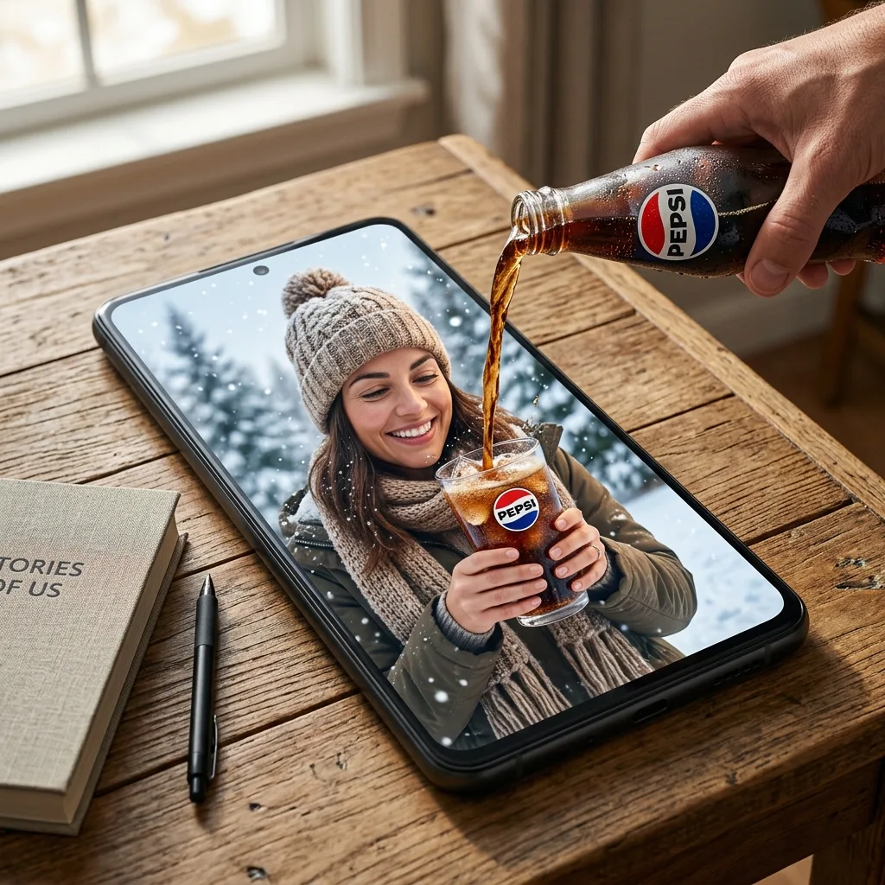

**#429 · Photography Prompt · <code>Vinano Image Pro</code>**

<details>
<summary>Show prompt</summary>

```
A hyper-realistic surreal composite scene set on a wooden tabletop. A large oversized smartphone dominates the frame, creating a strong dimensional-break illusion. On the phone screen, the woman from the reference image appears much larger in a close-up winter environment, smiling happily while holding a clear glass a visible Pepsi logo on it.

A real human hand pours dark Pepsi cola from a cold bottle covered in condensation droplets directly toward the phone screen. The liquid visually breaks through the display and flows into the glass she is holding inside the screen, creating a powerful surreal effect.

A closed book and a black pen sit on the wooden table beside the oversized phone to emphasize scale distortion. Warm natural lighting, soft cinematic shadows, ultra-sharp liquid splash details, hyper-realistic skin texture, realistic reflections on glass and screen, surreal cinematic advertising look, professional commercial photography quality, 8K realism.

Aim for an editorial, design-driven look with deliberate negative space.
```

</details>

---

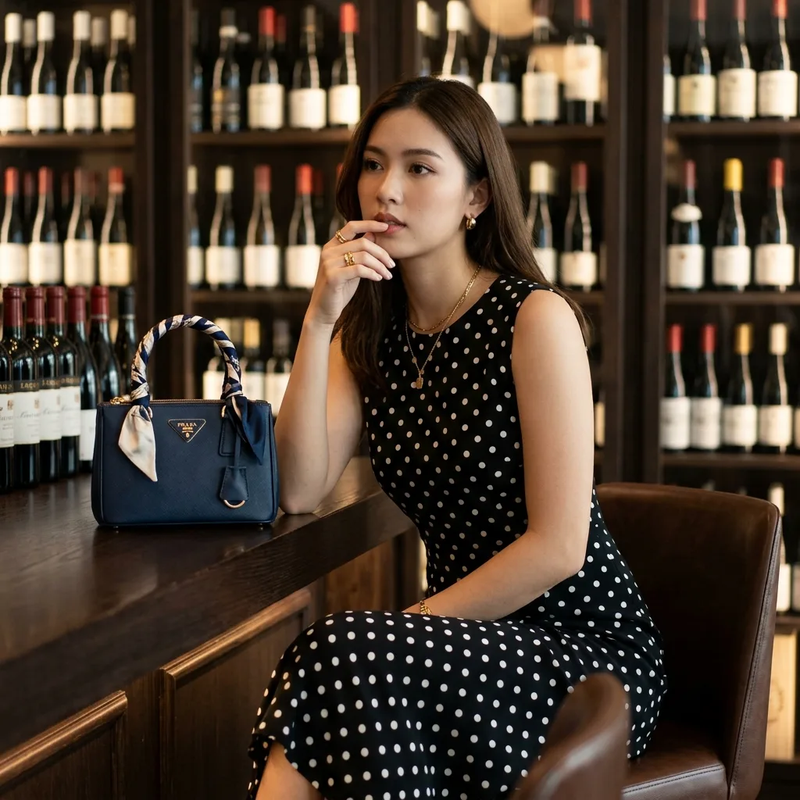

**#430 · Photography Prompt · <code>Vinano Image v2</code>**

<details>
<summary>Show prompt</summary>

```
Young beautiful woman long wavy hair, elegant sleeveless polka dot midi dress black and white pattern, sitting thoughtfully at stylish wine bar counter, hand near lips, luxury wine bottles wall background, Prada navy blue mini bag silk scarf, gold jewelry, sophisticated chic atmosphere, soft warm lighting, cinematic, highly detailed, realistic

Use my uploaded face image as the ONLY facial and identity reference. No other faces, models, datasets, or references are allowed.

Preserve realistic proportions and depth for a confident, professional finish.
```

</details>

---

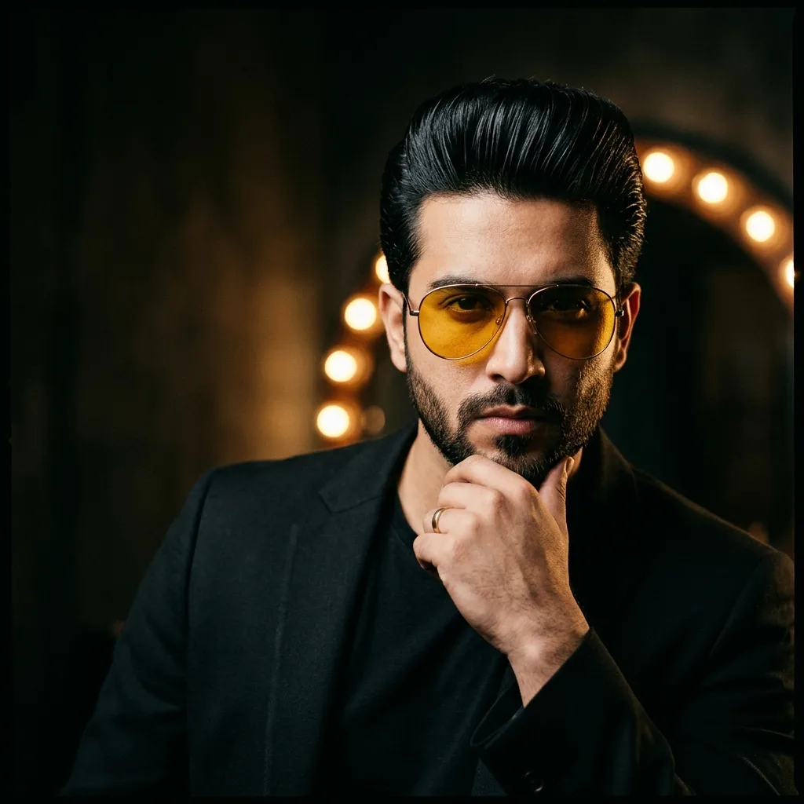

**#431 · Photography Prompt · <code>Vinano Image v2</code>**

<details>
<summary>Show prompt</summary>

```
{
 "objective": "Create a dramatic, high-contrast cinematic portrait of a stylish young man in a premium black suit selective warm lighting and intense mood",
 "subject": {
 "type": "Young adult male",
 "age_appearance": "25-30",
 "hair": "Black, voluminous, slicked back pompadour style, perfectly styled high shine",
 "facial_hair": "Well-groomed short boxed beard and mustache",
 "expression": "Intense, confident, serious, slightly mysterious",
 "pose": "Hand under chin thoughtful/contemplative pose, looking directly at camera",
 "accessories": {
 "sunglasses": "Classic aviator style, gold metal frame, strong yellow/orange tinted lenses",
 "clothing": {
 "outerwear": "Premium matte black tailored blazer/jacket, sharp lapels, high-end luxurious fabric texture",
 "innerwear": "Dark charcoal or black crew-neck t-shirt"
 }
 }
 },
 "lighting": {
 "style": "Cinematic studio lighting",
 "main": "Strong side and rim lighting creating deep shadows and dramatic highlights",
 "background": "Dark gradient circular warm spotlight array (vanity/makeup studio lights)",
 "contrast": "Very high contrast, deep blacks, bright highlights on face and hair",
 "mood": "Moody, masculine, powerful, film-noir inspired"
 },
 "composition": {
 "framing": "Tight mid-close-up portrait, head and shoulders",
 "angle": "Slightly below eye level for commanding presence",
 "depth_of_field": "Shallow, sharp focus on face and sunglasses, soft background"
 },
 "color_palette": {
 "dominant": "Black & deep charcoal",
 "accents": "Warm yellow-orange from sunglasses lenses and background lights",
 "skin_tone": "Natural subtle cinematic glow"
 },
 "style_references": ["Modern film-noir",
 "High-end fashion editorial",
 "Hollywood dramatic portrait",
 "David LaChapelle meets classic menswear advertising"],
 "image_quality": {
 "resolution": "Ultra-high detail, 8K",
 "sharpness": "Crisp facial features, hair strands visible",
 "texture": "Detailed skin pores, fabric weave, hair shine"
 },
 "negative_prompt": ["low quality",
 "blurry",
 "overexposed",
 "underexposed",
 "cartoon",
 "anime",
 "distorted face",
 "extra limbs",
 "bad anatomy",
 "logo",
 "text",
 "watermark",
 "bright colored clothing",
 "casual outfit"],
 "aspect_ratio": "2:3 (portrait orientation)"
}

Aim for an editorial, design-driven look with deliberate negative space.
```

</details>

---

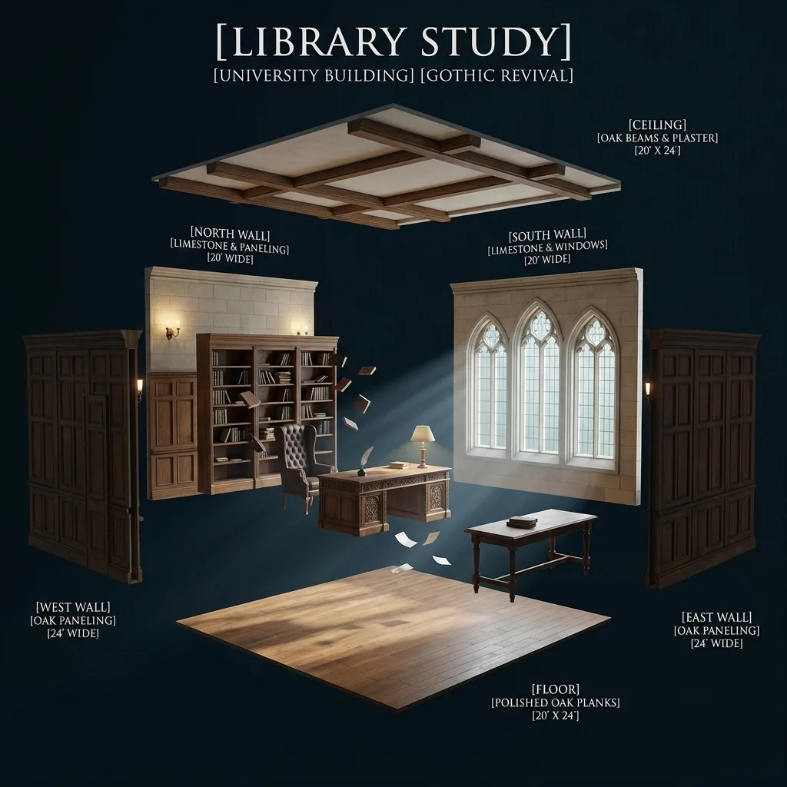

**#432 · Photography Prompt · <code>Vinano Image v2</code>**

<details>
<summary>Show prompt</summary>

```
[ROOM TYPE] pulled apart in 3D, every surface and object floating at its exact position, slightly separated. EXPLOSION: ceiling lifted, four walls sliding outward, floor dropped, furniture floating in place, objects orbiting their surfaces, light sources still emitting across the exploded void. The ghost of the room readable in the arrangement. Labels on architectural elements only: "[SURFACE]" / "[MATERIAL]" / "[DIMENSION]" LIGHTING: each element still lit by its original source, windows casting light across the gap, lamps throwing cones into empty space. BACKGROUND: deep dark, the room floats in void. TITLE: "[ROOM NAME]" / SUBTITLE: "[BUILDING TYPE] [PERIOD]" Mood: architectural model that became a universe. 4K, extraordinary spatial clarity, tack sharp. Maintain consistent colour harmony and crisp focus across the whole frame.
```

</details>

---

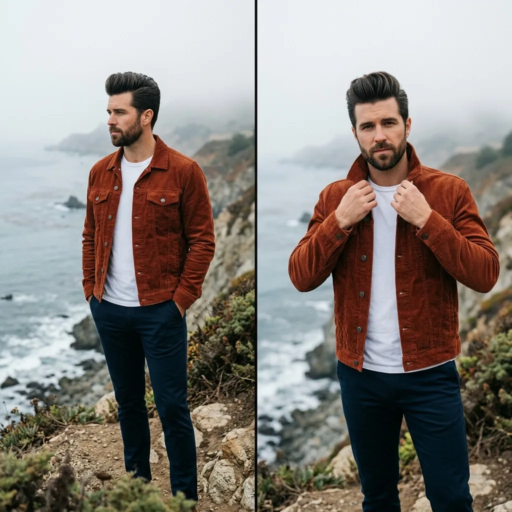

**#433 · Photography Prompt · <code>Vinano Image v2</code>**

<details>
<summary>Show prompt</summary>

```
{
 "image_description": "A premium-quality side-by-side comparison of a handsome man posing on a coastal cliffside.",
 "subject": {
 "gender": "male",
 "appearance": "mid-30s, well-groomed beard, thick dark hair styled in a modern voluminous pompadour",
 "poses": ["standing hands in pockets looking away from the camera",
 "standing one hand adjusting the collar of his jacket"]
 },
 "outfit": {
 "outerwear": "burnt orange or rust-colored corduroy trucker jacket metal buttons",
 "base_layer": "crisp white crew-neck t-shirt",
 "bottoms": "dark navy blue or black slim-fit trousers"
 },
 "setting": {
 "location": "rugged coastal cliff overlooking the ocean",
 "background": "misty horizon, calm sea, rocky shoreline",
 "lighting": "overcast, soft diffused natural light, moody atmospheric fog"
 },
 "technical_details": {
 "camera_angle": "eye-level medium shot",
 "composition": "diptych (two images side-by-side)",
 "aesthetic": "lifestyle photography, cinematic color grading, shallow depth of field soft background bokeh"
 }
}

Maintain consistent colour harmony and crisp focus across the whole frame.
```

</details>

---

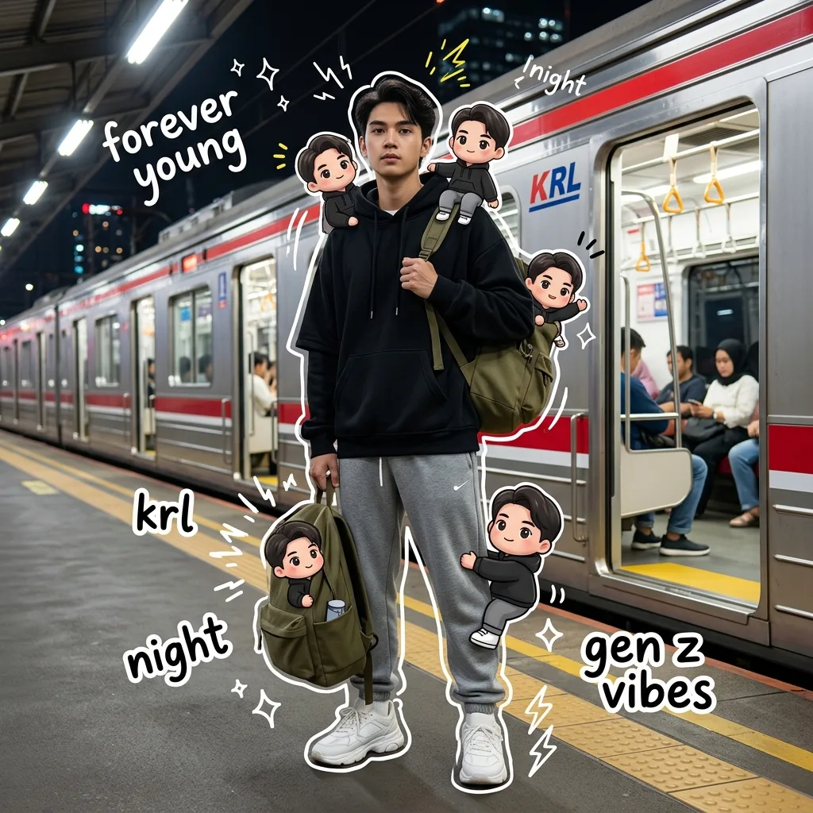

**#434 · Photography Prompt · <code>Vinano Image v2</code>**

<details>
<summary>Show prompt</summary>

```
A premium quality mixed media portrait of a trendy young man (my uploaded person photo) standing on a train station platform at night. The subject is posing coolly, holding the strap of an olive backpack one hand. He is wearing a stylish streetwear outfit an oversized layered black hoodie, gray sweatpants, and chunky sneakers.

The background features a realistic KRL Jabodetabek Commuter Line train side view its signature red striping, the train doors wide open, bathed in bright cinematic station lighting and city night ambiance.

Surrounding the realistic main subject are several cute 3D style chibi versions of himself, same outfit and same face. These chibis are interacting playfully, one sitting on his shoulder, one climbing his leg, and another peeking out from the backpack.

Overlay the image vibrant hand drawn doodle effects, white drawn outlines around the subject, playful scribbles, stars, sparkles, electric sparks, and floating white and black handwritten slogans like “forever young”, “krl”, “night”, and “gen z vibes”. The style should seamlessly blend hyper realistic photography colorful flat cartoon illustrations while keeping the face and body shape unchanged.

Emphasise material texture and natural light so the final frame feels tactile and premium.
```

</details>

---

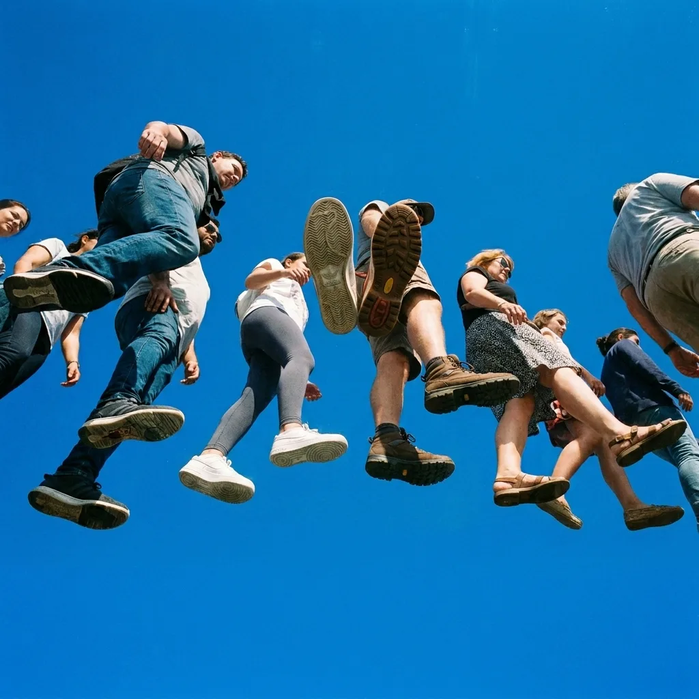

**#435 · Photography Prompt · <code>Vinano Image v2</code>**

<details>
<summary>Show prompt</summary>

```
View from under a plane of completely transparent plexiglass. We are looking straight up. Many people are walking on the plexiglass. In the background is a pure blue sky. No buildings visible. No edges or separations in the plexiglass. It’s as if the plexiglass isn’t even there. We are very close to the people. The people are in the process of walking. The people are walking generally from left to right. The soles of their shoes are very close to the foreground. Aim for an editorial, design-driven look with deliberate negative space.
```

</details>

---

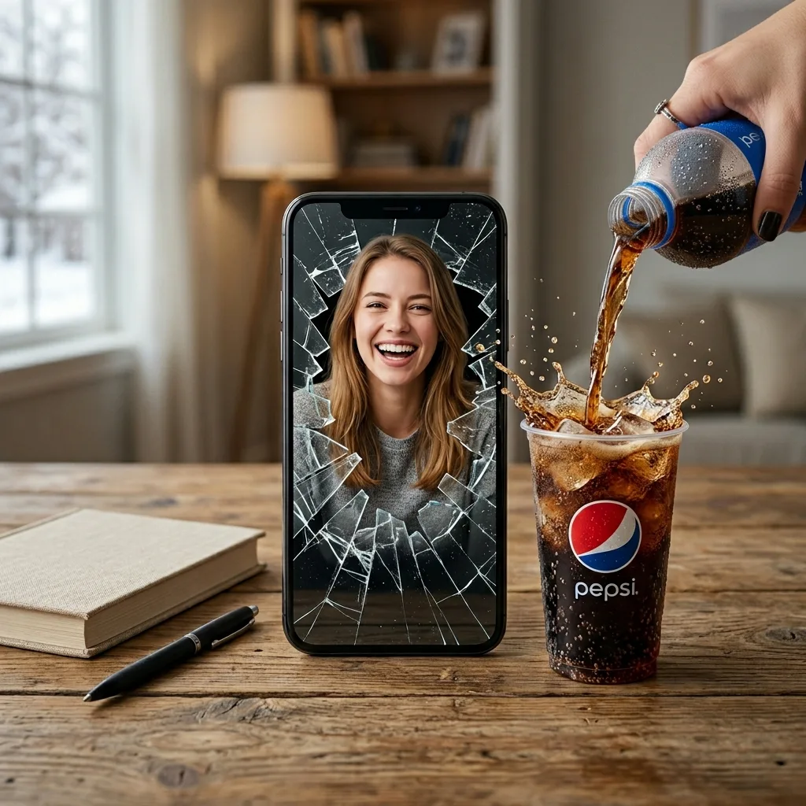

**#436 · Photography Prompt · <code>Vinano Image v2</code>**

<details>
<summary>Show prompt</summary>

```
{
 "resolution": "8K UHD",
 "style": "true-to-life photorealistic AI-edited composite, cinematic realism",
 "scene_type": "surreal product-style composition",
 "camera": {
 "angle": "slightly elevated top-down angle",
 "focus": "sharp foreground shallow depth of field",
 "lens_effects": ["natural depth of field",
 "high clarity",
 "macro-level liquid detail"]
 },
 "environment": {
 "surface": "wooden table visible grain texture",
 "lighting": {
 "type": "soft natural daylight",
 "direction": "from upper left",
 "shadows": "soft realistic shadows under objects"
 },
 "background": {
 "indoor": true,
 "elements": ["blurred interior background",
 "snowy outdoor scenery visible inside phone screen in one image"]
 }
 },
 "main_object": {
 "smartphone": {
 "position": "lying flat on wooden table",
 "orientation": "vertical portrait orientation",
 "color": "black",
 "screen_state": "visibly cracked glass radial fracture lines",
 "screen_interaction": "screen appears broken outward, allowing subject to emerge"
 }
 },
 "human_subject": {
 "visibility": "upper body visible through phone screen",
 "expression": "wide smile, visible teeth",
 "eye_direction": "looking toward the viewer",
 "gender_presentation": "female-presenting",
 "hair": {
 "color": "light brown",
 "style": "loose, shoulder-length"
 },
 "clothing_variants": [{
 "outfit": "casual indoor look",
 "details": "neutral top visible behind phone screen"
 },
 {
 "outfit": "winter clothing",
 "details": ["dark padded jacket",
 "light turtleneck sweater",
 "black gloves",
 "black fur hat"]
 }]
 },
 "action": {
 "primary_action": "soda being poured into a transparent plastic cup",
 "motion": "liquid splash frozen mid-air",
 "liquid_behavior": ["visible carbonation bubbles",
 "splash droplets",
 "overflow splash effect"]
 },
 "beverage": {
 "type": "cola",
 "cup": {
 "material": "transparent plastic",
 "filled_with": "dark carbonated soda ice",
 "logo": "Pepsi logo clearly visible"
 },
 "bottle": {
 "material": "plastic",
 "label": "Pepsi branding visible",
 "condition": "condensation droplets on bottle surface",
 "held_by": "human hand entering frame from top right"
 }
 },
 "secondary_objects": [{
 "object": "book",
 "position": "left side of phone",
 "color": "light beige cover",
 "state": "closed"
 },
 {
 "object": "pen",
 "position": "near book on table",
 "color": "black",
 "orientation": "diagonal"
 }],
 "effects": {
 "surreal_elements": ["subject emerging from phone screen",
 "physical interaction between digital and real space"],
 "particles": ["liquid droplets",
 "snow particles in winter scene variant"],
 "glass_effects": ["cracked screen shards",
 "reflections on broken glass"]
 },
 "color_palette": {
 "dominant_colors": ["warm brown",
 "black",
 "deep cola brown",
 "blue and red branding accents"],
 "contrast": "high contrast between warm table tones and cool screen elements"
 },
 "post_processing": {
 "sharpness": "ultra-sharp",
 "clarity": "high micro-detail",
 "noise": "none",
 "dynamic_range": "high"
 },
 "mood": "playful, surreal, visually striking",
 "realism_level": "high realism intentional AI-edited surreal effect"
}

Maintain consistent colour harmony and crisp focus across the whole frame.
```

</details>

---

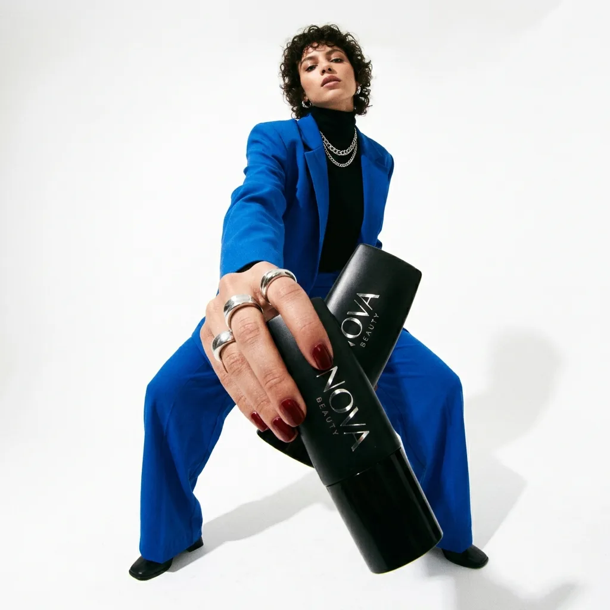

**#437 · Photography Prompt · <code>Vinano Image v2</code>**

<details>
<summary>Show prompt</summary>

```
Low-angle fashion campaign photograph of a confident model holding a large [product name] very close to the camera, exaggerated perspective the hand and product dominating the foreground, full-body pose visible in the background, wide stance, dynamic posture, clean pure white studio background, high-key lighting, sharp focus on product, slight depth of field on the model, bold colorful outfit strong contrast tones, modern beauty advertising aesthetic, ultra-crisp composition, commercial studio photography, glossy packaging detail visible, crisp shadows Aim for an editorial, design-driven look with deliberate negative space.
```

</details>

---

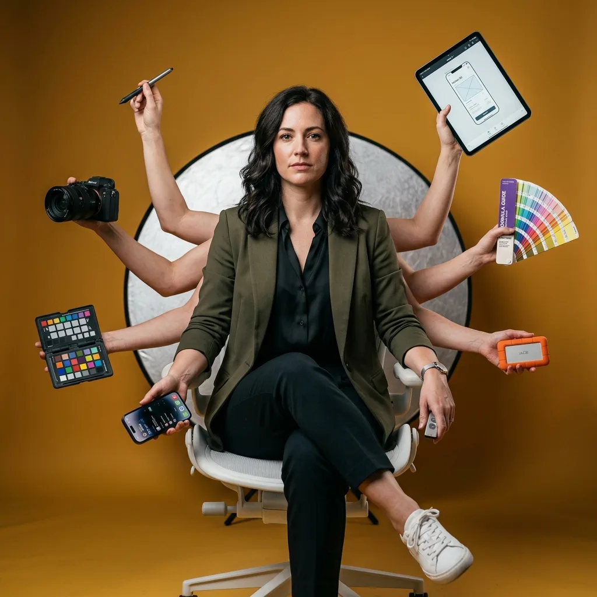

**#438 · Photography Prompt · <code>Vinano Image v2</code>**

<details>
<summary>Show prompt</summary>

```
Create a hyper-real, studio portrait [USER_PHOTO] as the exact identity reference (same face, hairstyle, skin texture, and age). Depict the person as a confident [PROFESSION] sitting casually on a modern white ergonomic office chair, legs crossed, centered in frame. Add a stylized “multi-arm” illusion (6–8 arms total) radiating behind the torso like a modern Shiva/Vishnu-inspired silhouette, but true-to-life photorealistic: each extra arm must have correct anatomy, believable joints, tendons, skin pores, and natural shadowing; no warped fingers.

PROPS (must be profession-relevant): Automatically choose and place different tools that a real [PROFESSION] would use, one per hand/arm, all clearly readable and accurate in design. Examples of categories: primary tool, secondary tool, communication device, measurement/diagnostic tool, accessory, and a “hero” prop. Keep one real smartphone in the main/front hand. Avoid generic random objects—every prop must logically belong to [PROFESSION]. If [PROFESSION] is digital/tech: include items like laptop, tablet, camera/monitor, light meter, stylus, keyboard, mic, etc. If [PROFESSION] is medical: stethoscope, clipboard, otoscope, syringe (safe/clinical), etc. If [PROFESSION] is culinary: chef knife, tongs, plating tweezers, recipe tablet, etc. (Always match [PROFESSION].)

BACKGROUND COLOR (topic-matched): Use a seamless paper studio backdrop a single dominant color that matches the profession theme (e.g., warm mustard for creative/media, cool teal for healthcare, graphite/steel for engineering, rich olive for outdoors, deep burgundy for luxury). The color should complement skin tones and wardrobe. Add subtle gradient falloff and soft bounce for depth (no flat background).

LIGHTING & SET: High-end commercial studio look. One large soft key light from camera-left, controlled fill from right, crisp rim light to separate subject, and realistic specular highlights on props. Include a large circular silver reflector disk behind the subject (partially visible) for visual punch. Add a subtle shadow on the floor consistent light direction.

WARDROBE & STYLING: Outfit must be believable for a top-tier [PROFESSION] (clean, modern, slightly stylized), texture detail (fabric weave, seams). Add minimal accessories (watch/bracelet) that feel premium. Expression: focused, slightly intense, “in the zone.”

COMPOSITION & CAMERA: Full-body vertical portrait (4:5), 50mm lens look, eye-level camera, sharp focus on face, shallow depth of field but props still readable. Ultra-detailed skin, natural color grading, high dynamic range, crisp micro-contrast.

REALISM RULES: No cartoon, no CGI look. No extra faces, no duplicated heads. Hands must be anatomically correct (5 fingers), no melted objects, no unreadable text logos unless naturally present. Keep the scene clean and premium.

Output: hyper-real editorial photograph, 8K detail, studio-quality retouching, natural skin texture preserved.

Render with rich micro-detail while keeping the layout uncluttered and intentional.
```

</details>

---

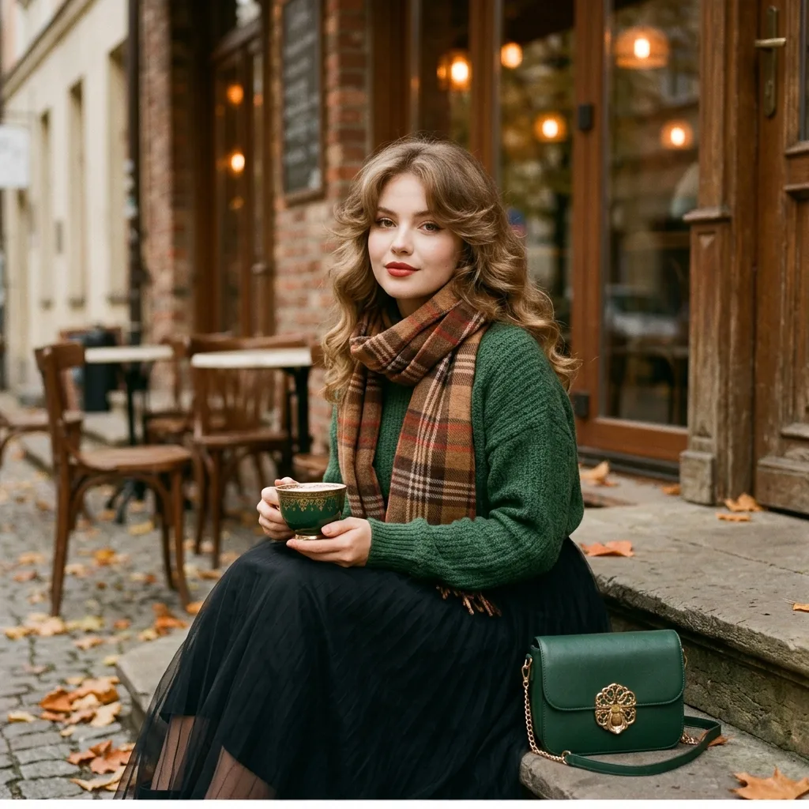

**#439 · Photography Prompt · <code>Vinano Image v2</code>**

<details>
<summary>Show prompt</summary>

```
Aesthetic 1970s-inspired fashion portrait of a stylish young woman sitting on outdoor cafe steps, holding a premium ornate green coffee cup gold rim detailing, gazing softly at the camera. Her hair is styled in soft loose strands framing her face vintage makeup, matte red lips, and subtle eyeliner. She is wearing a cozy forest green premium knit sweater paired a long flowing black tutu skirt. A warm vintage plaid scarf in earthy brown, burnt orange, and muted red tones is wrapped loosely around her neck. A premium dark green leather crossbody bag a gold filigree clasp and chain strap is placed beside her. Autumn street café setting scattered fallen leaves and warm amber café lights glowing behind glass windows. 1970s film tone, warm grainy texture, muted earthy color palette, cinematic atmosphere, shallow depth of field, soft natural lighting, analog film look, fashion editorial photography, ultra-realistic, high detail, 85mm lens, f/1.8, vintage aesthetic, dreamy mood. Keep edges clean and the overall composition balanced for a polished, gallery-ready result.
```

</details>

---

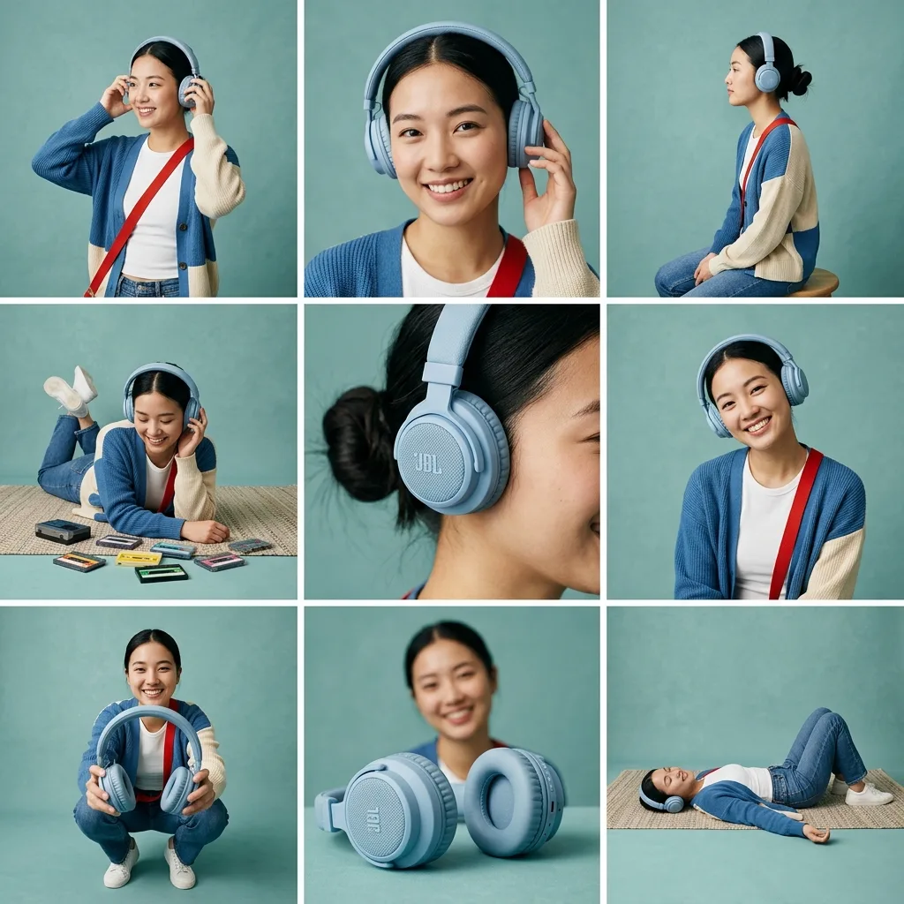

**#440 · Photography Prompt · <code>Vinano Image Pro</code>**

<details>
<summary>Show prompt</summary>

```
3×3 storyboard grid, nine panels, same subject and outfit, consistent teal studio background, soft diffused lighting, clean editorial lifestyle photography
young East Asian woman, natural makeup, black hair tied back, wearing white fitted top, blue/cream color-block cardigan red strap, blue jeans, sneakers, pastel blue over-ear wireless headphones
panel sequence (left→right, top→bottom): 1 standing adjusting headphones, front view
2 close-up portrait touching earcup
3 side profile sitting on tall stool
4 lying on stomach cassette tapes + retro player
5 extreme close-up headphones + face detail
6 tilted head smiling portrait
7 low-angle crouch reaching headphones toward camera
8 forced perspective product shot, headphones close to lens
9 lying on back relaxed pose
style: minimal, pastel tones, soft shadows, sharp focus, commercial product photography, consistent framing, balanced grid layout, mix of wide/medium/close shots

Emphasise material texture and natural light so the final frame feels tactile and premium.
```

</details>

---

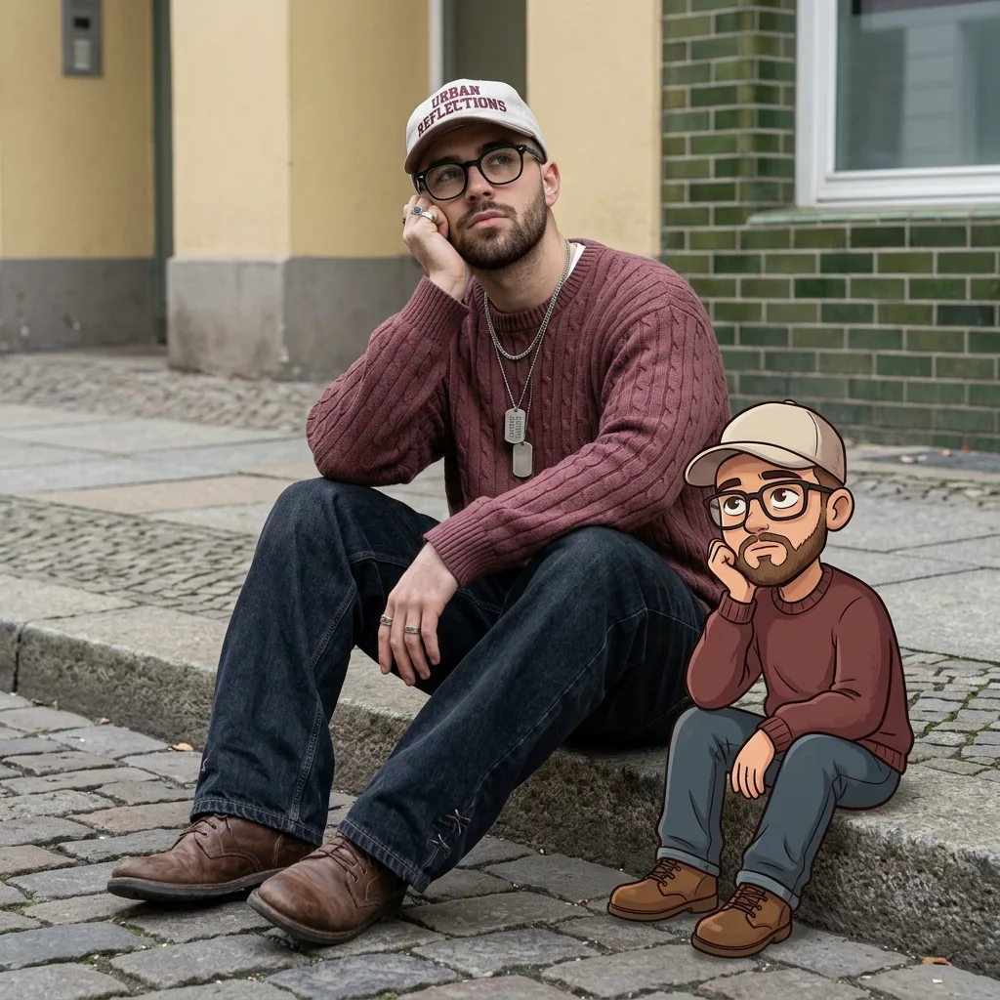

**#441 · Photography Prompt · <code>Vinano Image Pro</code>**

<details>
<summary>Show prompt</summary>

```
Transform this image [Upload Your Image] into a 64K DSLR shot resolution of A creative urban street portrait featuring a young man (same face as the uploaded image) sitting on a curb in a quiet city street, paired a stylized cartoon illustration of himself placed beside him. The real-life subject (same face as the uploaded image) is seated casually on a concrete sidewalk edge, resting his head on one hand in a bored, contemplative pose. He looks slightly upward a neutral, introspective expression, conveying a sense of quiet thoughtfulness and urban solitude. He wears a muted maroon cable-knit sweater a relaxed fit, dark loose-fitting denim jeans subtle stitched details near the cuffs, and worn brown leather boots. Accessories include layered silver chain dog tag the name "[Add Text]" written on it, rings on his fingers, black-framed glasses, and a light-coloured baseball cap bold embroidered lettering on the front. His hair is short, dark hair, a well-groomed beard texture and character. Next to him on the sidewalk sits a small cartoon version (same face as the uploaded image) of himself, matching his outfit and pose exactly—same sweater, jeans, boots, cap, glasses, and facial expression. The illustrated character has clean outlines, warm muted colors, and a soft shaded, hand-drawn animation style, creating a playful contrast between realism and illustration. The cartoon figure is proportionally smaller, emphasizing a companion-like or inner-self concept. The background features textured cobblestone pavement, a curb edge, and a building facade muted yellow walls and green-tiled brickwork near a window. The color palette is earthy and subdued, natural daylight providing soft, even lighting and realistic shadows. The overall composition blends street photography, fashion portraiture, and mixed-media digital art, evoking themes of identity, self-reflection, and creativity.
Style & Mood Keywords: Urban street photography, casual fashion portrait, mixed media art, real and cartoon character duo, introspective mood, muted earthy tones, soft natural light, realistic textures, creative storytelling, high-resolution detail, cinematic realism. Octane render & Unreal Engine

Preserve realistic proportions and depth for a confident, professional finish.
```

</details>

---

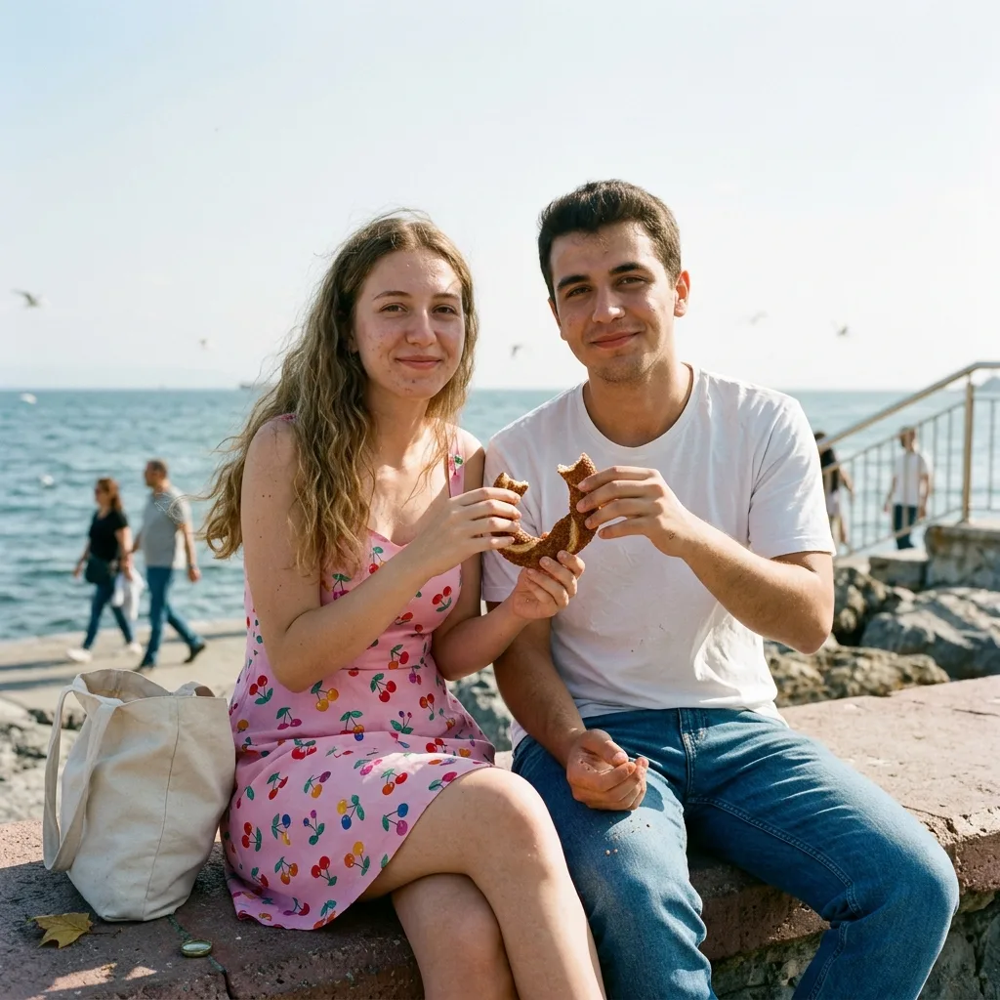

**#442 · Photography Prompt · <code>Vinano Image Pro</code>**

<details>
<summary>Show prompt</summary>

```
{
 "generation_request": {
 "meta_data": {
 "tool": "",
 "task_type": "photoreal_candid_street_romance",
 "version": "v1.2_MODA_SEASIDE_SIMIT_SUNNY_CHERRY_DRESS_EN",
 "priority": "highest"
 },

 "output_settings": {
 "aspect_ratio": "4:5",
 "orientation": "portrait",
 "resolution_target": "ultra_high_res",
 "render_style": "ultra_photoreal_candid_street_film_still",
 "sharpness": "crisp_but_natural",
 "film_grain": "subtle_35mm",
 "color_grade": "true_to_life_sunny_natural",
 "dynamic_range": "natural_not_hdr",
 "skin_rendering": "real_texture_no_retouch"
 },

 "global_rules": {
 "camera_language": "35mm lens equivalent, eye-level, imperfect framing, candid documentary feel, focus on eyes when people are present",
 "authenticity_markers": "subtle halation on highlights, tiny film gate weave, real street clutter, slight background motion blur only, no studio look",
 "lighting_language": "motivated natural light only (sunlight + sky fill), deep but detailed shadows"
 },

 "creative_prompt": {
 "scene_summary": "Moda seaside in Istanbul on a sunny day. A young couple in their early 20s sits near the shore eating simit. A candid, unposed film-still moment—quiet love inside everyday life.",

 "subjects": {
 "count": 2,
 "description": "the same young man and woman (early 20s), ordinary and real, not model-like; faces visible and eyes sharp",
 "expression": "small genuine smiles, relaxed presence, natural micro-expressions",
 "skin_and_face": "natural skin texture, no beauty retouch, no plastic skin, slight imperfections preserved"
 },

 "wardrobe_and_props": {
 "female": "pink dress colorful cherry pattern, simple fit, slightly moving in sea breeze, natural minimal makeup, long wavy hair",
 "male": "blue denim jeans and a plain white t-shirt, slightly wrinkled, no logos",
 "props": "two simits in their hands, a simple tote/backpack nearby, no branding"
 },

 "micro_action": "they break pieces of simit, share a bite, laugh softly; the wind lifts the dress hem slightly; crumbs fall naturally onto their hands",

 "environment_details": {
 "location": "Moda coast, Istanbul",
 "background": "sea horizon, gentle waves, a few distant people walking softly out of focus, seagulls in the sky, sunlit railing and rocks",
 "ground_details": "worn stone or concrete edge, small everyday clutter (a bottle cap or leaf), but clean and believable, no staged props"
 },

 "lighting": "bright sunny daylight soft sky fill; controlled highlights; subtle halation on sunlit edges; deep but detailed shadows under chins and clothing folds",

 "composition": "eye-level medium shot, slightly off-center, imperfect framing like real street photography; faces sharp; background gently receding; no perfect symmetry",

 "mood": "warm, simple, human—an everyday Istanbul love scene"
 },

 "negative_prompt": ["studio lighting",
 "beauty retouch",
 "plastic skin",
 "model faces",
 "posed romance poster look",
 "perfect symmetry",
 "HDR",
 "AI glow",
 "fake bokeh shapes",
 "overly clean staged scene",
 "text",
 "logo",
 "watermark",
 "cartoon",
 "painterly"]
 }
}

Preserve realistic proportions and depth for a confident, professional finish.
```

</details>

---

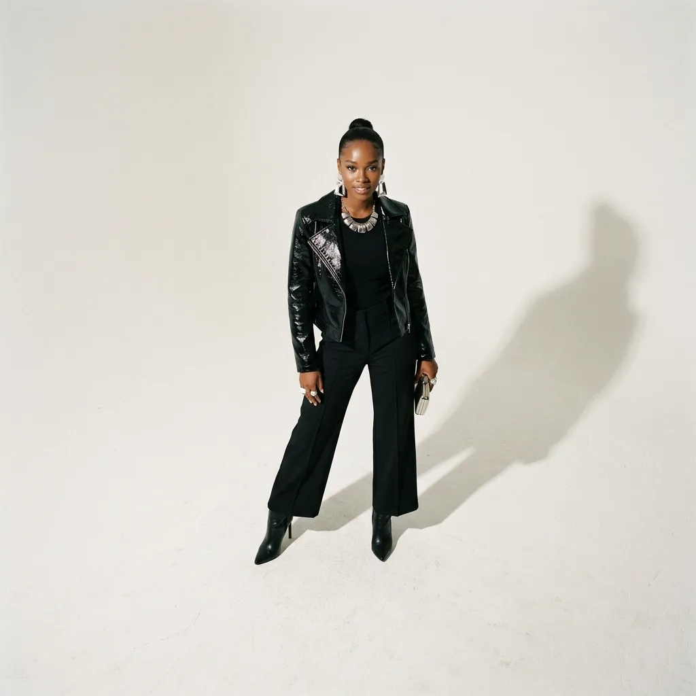

**#443 · Photography Prompt · <code>Vinano Image v2</code>**

<details>
<summary>Show prompt</summary>

```
A [subject] photographed from a 35-degree overhead angle, standing alone in an off-white studio void, a confident pose and clean silhouette. Stylised proportions, sleek fashion styling, reflective textures, bold accessories, soft studio light, single beauty-dish flash casting crisp shadows, subtle Kodak Portra-inspired grain, candid editorial energy, refined minimalist composition, sharp detail, premium studio photography Render with rich micro-detail while keeping the layout uncluttered and intentional.
```

</details>

---

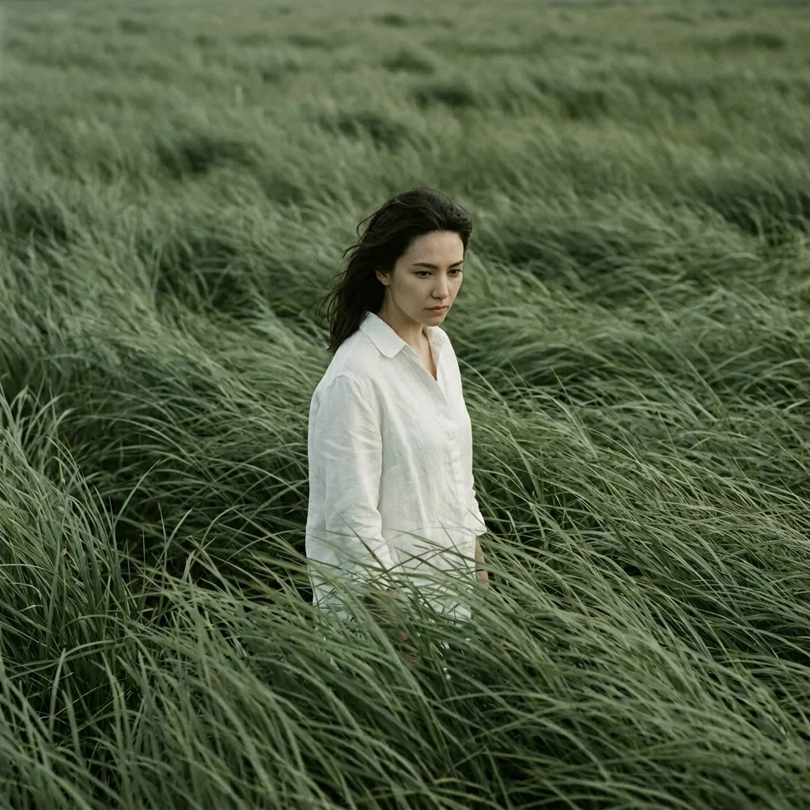

**#444 · Photography Prompt · <code>Vinano Image v2</code>**

<details>
<summary>Show prompt</summary>

```
Create a 3:4 cinematic, atmospheric editorial portrait the attached photo as the exact face and identity reference. A solitary man/woman stands alone in the middle of vast, wind-swept sage green grass fields. Tall grass surrounds the subject completely, flowing in strong currents like ocean waves, partially obscuring the body and creating motion,depth, and solitude. The subject wears a simple, loose white shirt that softly contrasts the rich green landscape.
Dark hair is slightly messy, natural strands moving in the wind. The head is gently tilted downward, eyes cast toward the ground, conveying a quiet, introspective, melancholic mood. Expression is calm, distant, and emotionally restrained. Compose the frame slightly off-center, from a subtle elevated angle. No visible horizon, the frame is fully immersed in grass texture. Use a muted natural palette of sage green, deep olive, and soft off-white. Shoot vertical 3:4, telephoto perspective, shallow depth of field, cinematic framing. Film photography aesthetic visible grain, soft edge falloff, atmospheric light, wind-driven motion blur in the grass. Quiet, poetic storytelling; ultra-detailed yet natural, magazine-cover editorial quality. No text, no watermark.

Emphasise material texture and natural light so the final frame feels tactile and premium.
```

</details>

---

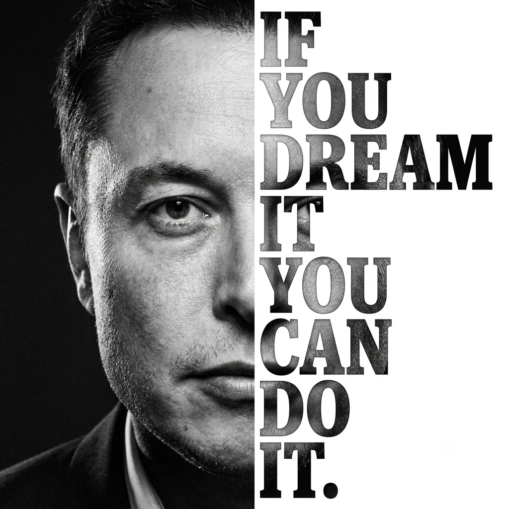

**#445 · Photography Prompt · <code>Vinano Image Pro</code>**

<details>
<summary>Show prompt</summary>

```
{
 "meta": {
 "image_quality": "High",
 "image_type": "Digital Composite / Graphic Design",
 "resolution_estimation": "High resolution vertical poster format",
 "file_characteristics": {
 "compression_artifacts": "Low",
 "noise_level": "Low (film grain visible in photo texture)",
 "lens_type_estimation": "Telephoto (suggested by facial compression)"
 }
 },
 "global_context": {
 "scene_description": "A high-contrast, black and white split-composition portrait of Elon Musk. The left half of the image displays a realistic, high-detail photograph of the right side of his face (viewer's left). The right half of the image consists of a white background where the left side of his face (viewer's right) is revealed only through the shapes of large, bold, vertically stacked serif typography reading 'IF YOU DREAM IT YOU CAN DO IT.'",
 "environment_type": "Studio/Graphic Art",
 "time_of_day": "Indiscernible",
 "weather_atmosphere": "Visionary, Motivational, Intense",
 "lighting": {
 "source": "Artificial Studio Lighting",
 "direction": "Side lighting (lighting the face from the left)",
 "quality": "Hard, dramatic chiaroscuro",
 "color_temperature": "Monochrome (Black and White)"
 },
 "color_palette": {
 "dominant_hex_estimates": ["#FFFFFF",
 "#000000",
 "#333333",
 "#888888"],
 "accent_colors": [],
 "contrast_level": "High"
 }
 },
 "composition": {
 "camera_angle": "Eye-level",
 "framing": "Close-up portrait",
 "depth_of_field": "Deep (all elements in focus)",
 "focal_point": "Subject's eyes and the typographic message",
 "symmetry_type": "Vertical Split Asymmetry",
 "rule_of_thirds_alignment": "The split occurs roughly along the vertical center line of the face (nose bridge)"
 },
 "objects": [{
 "id": "obj_subject_face",
 "label": "Elon Musk (Face)",
 "category": "Person",
 "location": {
 "relative_position": "Left half of canvas",
 "bounding_box_percentage": {
 "x": 0.0,
 "y": 0.0,
 "width": 0.5,
 "height": 1.0
 }
 },
 "dimensions_relative": "Large (fills height)",
 "distance_from_camera": "Close-up",
 "pose_orientation": "Front-facing, slight tilt, intense contemplative gaze",
 "material": "Skin/Biological",
 "surface_properties": {
 "texture": "Smooth skin, faint stubble, characteristic facial structure",
 "reflectivity": "Low (natural skin oil sheen on nose/cheek)",
 "micro_details": "Faint crow's feet, straight/wavy hair texture visible at top",
 "wear_state": "N/A"
 },
 "color_details": {
 "base_color_hex": "#808080",
 "secondary_colors": ["#000000",
 "#FFFFFF"],
 "gradient_or_pattern": "Grayscale continuous tone"
 },
 "interaction_with_light": {
 "shadow_casting": "Deep shadows on the right side of the face (hidden by text mask)",
 "highlight_zones": "Forehead, bridge of nose, under-eye area on the lit side",
 "translucency": "None"
 },
 "relationships": [{
 "type": "visually_connected_to",
 "target_object_id": "obj_typography_mask"
 }]
 },
 {
 "id": "obj_typography_mask",
 "label": "Typographic Overlay",
 "category": "Text/Graphic Element",
 "location": {
 "relative_position": "Right half of canvas",
 "bounding_box_percentage": {
 "x": 0.5,
 "y": 0.0,
 "width": 0.5,
 "height": 1.0
 }
 },
 "dimensions_relative": "Large",
 "distance_from_camera": "Surface Plane",
 "pose_orientation": "Vertical Stack",
 "material": "Digital Mask",
 "surface_properties": {
 "texture": "The fill of the letters matches the texture of Elon Musk's hair and skin (masked photo)",
 "reflectivity": "None",
 "micro_details": "Edges are sharp serif cuts",
 "wear_state": "N/A"
 },
 "color_details": {
 "base_color_hex": "#000000",
 "secondary_colors": ["#FFFFFF"],
 "gradient_or_pattern": "Image texture inside letters, white background outside"
 },
 "interaction_with_light": {
 "shadow_casting": "None",
 "highlight_zones": "None",
 "translucency": "None"
 },
 "text_content": {
 "raw_text": "IF\nYOU\nDREAM\nIT\nYOU\nCAN\nDO\nIT.",
 "font_style": "Heavy Slab Serif (e.g., Rockwell Bold or similar)",
 "font_weight": "Bold / Black",
 "text_case": "Uppercase",
 "alignment": "Justified / Stacked",
 "color_hex": "Texture-filled (Black/Gray)"
 },
 "relationships": [{
 "type": "completes_image_of",
 "target_object_id": "obj_subject_face"
 }]
 },
 {
 "id": "obj_clothing",
 "label": "Jacket Collar / Suit",
 "category": "Clothing",
 "location": {
 "relative_position": "Bottom Left Corner",
 "bounding_box_percentage": {
 "x": 0.0,
 "y": 0.85,
 "width": 0.4,
 "height": 0.15
 }
 },
 "dimensions_relative": "Small visible portion",
 "distance_from_camera": "Near",
 "pose_orientation": "Worn on shoulders",
 "material": "Dark Fabric/Leather",
 "surface_properties": {
 "texture": "Smooth subtle folding",
 "reflectivity": "Medium",
 "micro_details": "Folds and creases",
 "wear_state": "Good condition"
 },
 "color_details": {
 "base_color_hex": "#1A1A1A",
 "secondary_colors": [],
 "gradient_or_pattern": "Solid dark"
 },
 "interaction_with_light": {
 "shadow_casting": "Self-shadowing in folds",
 "highlight_zones": "Ridges of folds",
 "translucency": "None"
 },
 "relationships": [{
 "type": "worn_by",
 "target_object_id": "obj_subject_face"
 }]
 },
 {
 "id": "obj_ear",
 "label": "Left Ear",
 "category": "Body Part",
 "location": {
 "relative_position": "Center Left Edge",
 "bounding_box_percentage": {
 "x": 0.05,
 "y": 0.35,
 "width": 0.15,
 "height": 0.2
 }
 },
 "dimensions_relative": "Medium",
 "distance_from_camera": "Mid",
 "pose_orientation": "Side view",
 "material": "Skin",
 "surface_properties": {
 "texture": "Smooth skin",
 "reflectivity": "Low",
 "micro_details": "Cartilage structure visible",
 "wear_state": "N/A"
 },
 "color_details": {
 "base_color_hex": "#888888",
 "secondary_colors": [],
 "gradient_or_pattern": "N/A"
 },
 "interaction_with_light": {
 "shadow_casting": "Inner ear shadows",
 "highlight_zones": "Outer rim (helix)",
 "translucency": "Slight subsurface scattering potential"
 },
 "relationships": [{
 "type": "attached_to",
 "target_object_id": "obj_subject_face"
 }]
 }],
 "background_details": {
 "texture": "Flat color",
 "patterns": "None (Solid White)",
 "lighting_behavior": "The background is pure white (#FFFFFF), providing maximum contrast to the subject and text.",
 "additional_elements": ["Negative space on the right side acts as the canvas for the text masking effect."]
 },
 "foreground_elements": {
 "particles": "None",
 "artifacts": "None"
 },
 "reconstruction_notes": {
 "mandatory_elements_for_recreation": ["Elon Musk's likeness",
 "Split face composition",
 "Typography masking effect on the right side",
 "Specific quote: 'IF YOU DREAM IT YOU CAN DO IT.'",
 "Black and white high-contrast aesthetic",
 "Serif bold font"],
 "sensitivity_factors": "The alignment of the text must perfectly match the underlying facial anatomy to maintain the illusion of the face continuing through the letters. Hairline and jaw structure should be specific to Musk.",
 "ambiguities": "Clothing type is generic dark material."
 }
}

Keep edges clean and the overall composition balanced for a polished, gallery-ready result.
```

</details>

---

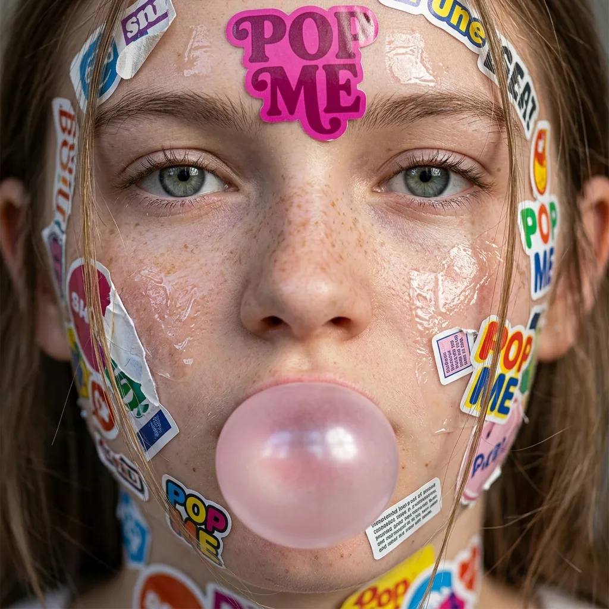

**#446 · Photography Prompt · <code>Vinano Image v2</code>**

<details>
<summary>Show prompt</summary>

```
{
 "meta": {
 "image_quality": "High",
 "image_type": "Photo"
 },
 "global_context": {
 "scene_description": "Close-up portrait of a young person's face covered colorful paper stickers and glossy adhesive residue. Central focus on eyes, nose, lips; subject blowing a pink bubblegum bubble. Stickers vary in size, text, icons and layered overlap; hair strands frame face at edges. Skin shows freckles, pores, and sheen from adhesive or moisture.",
 "time_of_day": "Neutral/studio lighting",
 "weather_atmosphere": "Indoors/controlled",
 "lighting": {
 "source": "Artificial",
 "direction": "Frontal slight top",
 "quality": "Soft",
 "color_temp": "Neutral"
 }
 },
 "color_palette": {
 "dominant_hex_estimates": ["#E7B1B6", "#F6C0D0", "#C9A38C"],
 "accent_colors": ["Pink","Magenta"],
 "contrast_level": "Medium"
 },
 "composition": {
 "camera_angle": "Eye-level",
 "framing": "Extreme close-up (face fills frame)",
 "depth_of_field": "Shallow (background indistinct)",
 "focal_point": "Eyes and central bubble"
 },
 "objects": [{
 "id": "obj_001",
 "label": "Face",
 "category": "Person (head)",
 "location": "Center",
 "prominence": "Foreground",
 "visual_attributes": {
 "color": "Light beige skin pink undertones and freckles",
 "texture": "Smooth visible pores, glossy adhesive patches",
 "material": "Skin",
 "state": "Sticker-covered, slightly wet/glossy",
 "dimensions_relative": "Large relative to frame"
 },
 "micro_details": ["Freckles concentrated on nose and cheeks",
 "Shiny adhesive residue streaks on forehead and cheeks",
 "Fine vellus hairs visible",
 "Pores visible on nose and cheeks"],
 "pose_or_orientation": "Frontal",
 "text_content": null
 },
 {
 "id": "obj_002",
 "label": "Eyes (pair)",
 "category": "Facial feature",
 "location": "Upper-center",
 "prominence": "Foreground",
 "visual_attributes": {
 "color": "Gray-green irises dark limbal ring",
 "texture": "Wet/glossy cornea, visible eyelashes",
 "material": "Biological",
 "state": "Open, neutral expression",
 "dimensions_relative": "Medium"
 },
 "micro_details": ["Tiny specular highlights on each cornea",
 "Sparse lower lashes, fuller upper lashes",
 "Slight shadow under lower lids"],
 "pose_or_orientation": "Facing camera",
 "text_content": null
 },
 {
 "id": "obj_003",
 "label": "Pink bubble",
 "category": "Object (gum)",
 "location": "Lower-center",
 "prominence": "Foreground",
 "visual_attributes": {
 "color": "Pastel pink",
 "texture": "Smooth, slightly translucent",
 "material": "Gum",
 "state": "Inflated/intact",
 "dimensions_relative": "Large relative to mouth"
 },
 "micro_details": ["Two bright specular reflections on sphere",
 "Seamless edge against lips"],
 "pose_or_orientation": "Centered over mouth",
 "text_content": null
 },
 {
 "id": "obj_004",
 "label": "Stickers (assorted)",
 "category": "Adhesive stickers",
 "location": "Entire face and neck, concentrated forehead and cheeks",
 "prominence": "Foreground",
 "visual_attributes": {
 "color": "Multicolor: magenta, yellow, blue, white",
 "texture": "Paper/plastic glossy varnish, torn edges",
 "material": "Paper/plastic adhesive",
 "state": "Layered, partially torn, some wrinkled",
 "dimensions_relative": "Varied small-to-medium"
 },
 "micro_details": ["Large 'POP ME' magenta sticker on forehead",
 "Partial torn sticker fragments near nasolabial fold",
 "Small rectangular stickers tiny printed text",
 "Edges lifting, adhesive shine around perimeters"],
 "pose_or_orientation": "Affixed flat or slightly peeled",
 "text_content": "Multiple small logos and words (e.g., 'POP ME')"
 },
 {
 "id": "obj_005",
 "label": "Hair strands",
 "category": "Hair",
 "location": "Left and right edges framing face",
 "prominence": "Background/foreground overlap",
 "visual_attributes": {
 "color": "Light brown",
 "texture": "Fine, slightly wet",
 "material": "Hair",
 "state": "Loose strands",
 "dimensions_relative": "Thin relative to face"
 },
 "micro_details": ["Individual strands crossing forehead edges",
 "Slight adhesive sheen on some strands"],
 "pose_or_orientation": "Hanging down"
 }],
 "text_ocr": {
 "present": true,
 "content": [{
 "text": "POP ME",
 "location": "Forehead",
 "font_style": "Bold/Decorative",
 "legibility": "Clear"
 }]
 },
 "semantic_relationships": ["Stickers are affixed to Face",
 "Bubble covers mouth, partially obscuring lips",
 "Adhesive residue creates glossy highlights on skin",
 "Hair strands frame and partly overlay stickers"]
}

Emphasise material texture and natural light so the final frame feels tactile and premium.
```

</details>

---

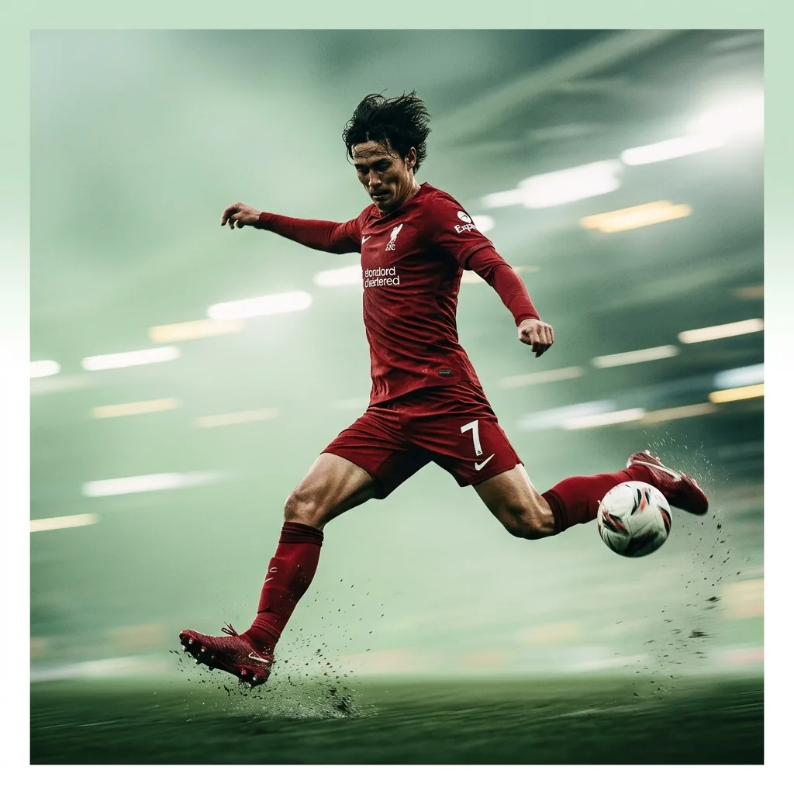

**#447 · Photography Prompt · <code>Vinano Image v2</code>**

<details>
<summary>Show prompt</summary>

```
Panning shot of a mysterious soccer player in red proffesional soccer jearsy mid air kicking a ball, motion blur, filmic, cinematic lighting agains a Light gree gradient background streaking
lights --ar 4:5 --raw --stylize 700

Maintain consistent colour harmony and crisp focus across the whole frame.
```

</details>

---

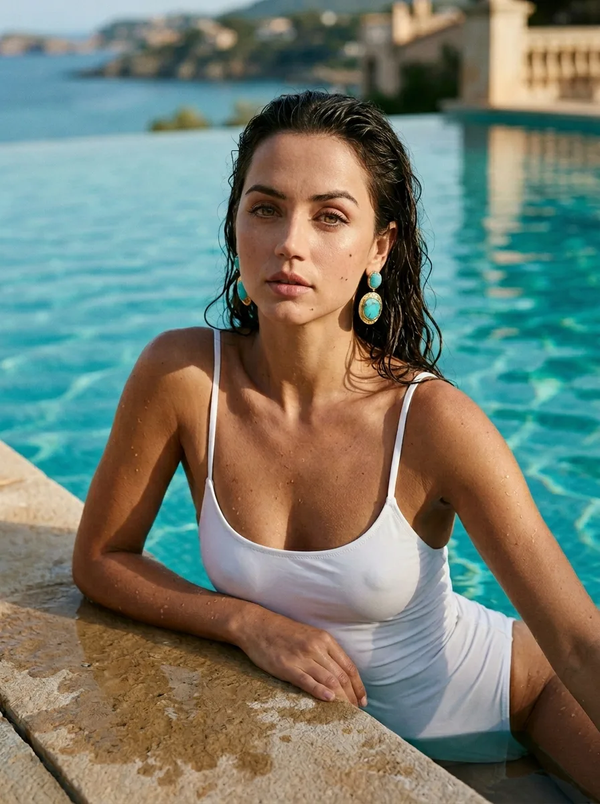

**#448 · Photography Prompt · <code>Vinano Image v2</code>**

<details>
<summary>Show prompt</summary>

```
{
 "version_control": {
 "target_style": "High-End Fashion Editorial",
 "fidelity_level": "Absolute 1:1 Identity Lock",
 "rendering_engine_constraints": "No CGI, No Illustration, No AI Smoothing"
 },
 "subject_profile": {
 "identity": {
 "name": "Ana de Armas",
 "age_group": "Adult Woman",
 "biometric_integrity": "Preserve 100% original bone structure, facial asymmetry, moles, and eye shape. Zero morphing or enhancement."
 },
 "anatomy_and_skin": {
 "texture": "Visible pores, micro-creases, subtle translucency",
 "physics": "Natural water droplets, soft wet sheen, realistic surface tension on skin",
 "tone": "Natural base skin tone, sun-kissed warmth, no artificial glow"
 },
 "face_details": {
 "eyes": "Natural eye color, soft neutral-pink glossy shadow, thin lash-line eyeliner (no wing), separated curled lashes",
 "brows": "Natural density, straight-to-softly-rounded architecture",
 "nose_and_lips": "Subtle pink warmth on nose bridge; full lips, rose-pink gradient, wet glossy finish, blurred edges, no overlining"
 },
 "hair_styling": {
 "state": "Visibly wet, slicked at roots, damp strands",
 "arrangement": "Loose, flowing over shoulders and back, natural messy texture",
 "match_reference": "1:1 color and style match"
 }
 },
 "composition_and_pose": {
 "action": "Leaning on swimming pool edge, body angled 45-degrees",
 "arm_placement": "One arm naturally resting on pool coping",
 "framing": "Medium close-up, three-quarter angle",
 "mood": "Intimate, calm, grounded, confident"
 },
 "attire_and_wardrobe": {
 "primary_garment": "refined minimalist white swimsuit, thin straps, clean lines",
 "fabric_physics": "Realistic tension against wet skin, natural folds and bunching",
 "jewelry": "Statement earrings, natural stones/gold, realistic micro-scratches and reflections"
 },
 "environment_and_lighting": {
 "background": {
 "element": "Turquoise pool water",
 "physics": "Refraction, light-play on pool floor, subtle ripples, realistic movement"
 },
 "lighting_design": {
 "source": "Single-direction natural sunlight",
 "color_temp": "Warm sun-lit tones",
 "exposure": "Slightly underexposed (lowered exposure)",
 "shadows": "Physically accurate contact shadows on collarbones and chest"
 }
 },
 "technical_parameters": {
 "optics": "50mm–85mm focal length equivalent, realistic photographic perspective",
 "depth_of_field": "Shallow, organic bokeh, natural fall-off",
 "resolution_quality": "16k Hyper-Realistic",
 "aspect_ratio": "3:4"
 }
}

Preserve realistic proportions and depth for a confident, professional finish.
```

</details>

---

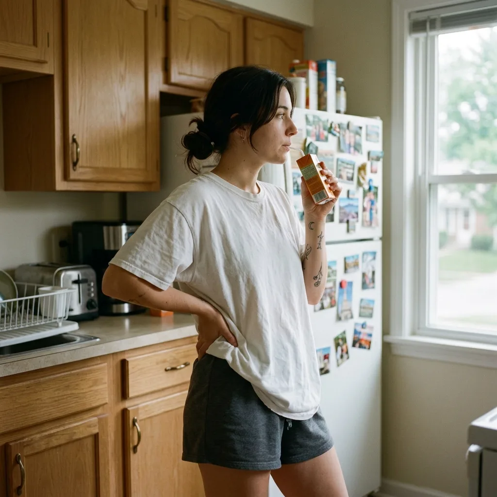

**#449 · Photography Prompt · <code>Vinano Image v2</code>**

<details>
<summary>Show prompt</summary>

```
{
 "type": "image_generation_prompt",
 "style": "true-to-life photorealistic, lifestyle photography",
 "sexualization": "none",
 "description": {
 "subject": "A young woman standing casually in a home kitchen, seen in side profile",
 "pose": "Relaxed posture, one hand resting on her hip while the other holds a small drink carton a straw",
 "expression": "Neutral, thoughtful, slightly distant gaze looking forward",
 "appearance": {
 "hair": "Dark hair tied in a loose low bun natural strands framing the face",
 "clothing": "Oversized white t-shirt worn casually, simple underwear partially visible due to the relaxed fit of the shirt",
 "tattoos": "Small, minimal black-ink tattoos on the forearm, subtle and understated"
 }
 },
 "environment": {
 "location": "A modest, lived-in home kitchen",
 "details": "Wooden cabinets, countertop appliances, a refrigerator covered colorful magnets and souvenirs",
 "lighting": "Soft natural daylight coming from a window, warm and slightly muted",
 "atmosphere": "Quiet, everyday domestic moment"
 },
 "camera": {
 "angle": "Side profile view",
 "framing": "Medium shot capturing the subject from mid-thigh to head",
 "lens": "35mm lifestyle lens",
 "depth_of_field": "Moderate, background softly in focus to preserve environmental context"
 },
 "image_quality": {
 "realism": "High",
 "texture_detail": "Natural fabric folds, skin texture, and kitchen surface details visible",
 "grain": "Light natural film grain for an authentic look"
 },
 "mood": "Calm, intimate, documentary-style",
 "constraints": ["Non-sexualized, everyday realism",
 "Focus on natural lifestyle and atmosphere",
 "No exaggerated poses or expressions",
 "Candid, slice-of-life aesthetic"]
}

Preserve realistic proportions and depth for a confident, professional finish.
```

</details>

---

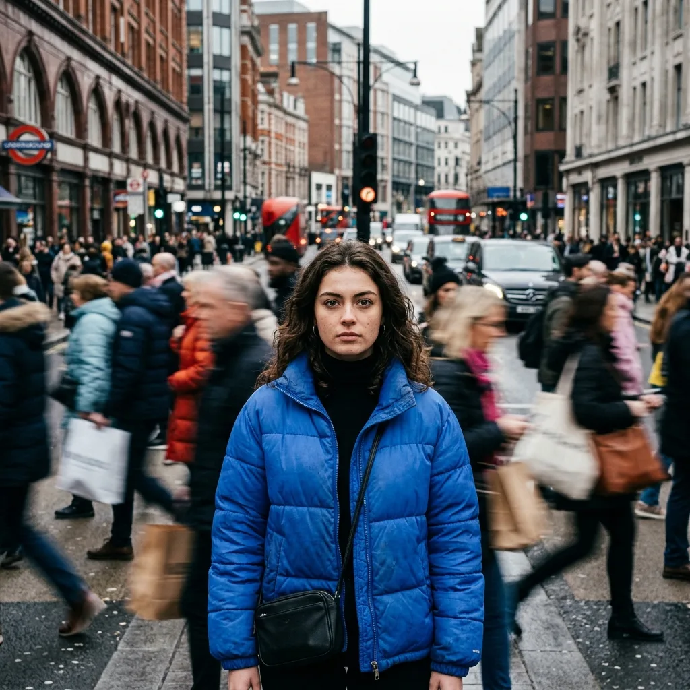

**#450 · Photography Prompt · <code>Vinano Image v2</code>**

<details>
<summary>Show prompt</summary>

```
Ultra-realistic cinematic street portrait of a young woman in a bright blue puffer jacket standing still in the middle of a busy city crowd, intense eye contact camera, shallow depth of field, motion-blurred pedestrians rushing around her, urban background traffic lights and tall buildings, cool color grading, natural skin tones, soft overcast lighting, 85mm lens, f/1.8, high detail, sharp focus on subject, dynamic motion blur, editorial photography, 8k. Emphasise material texture and natural light so the final frame feels tactile and premium.
```

</details>

---

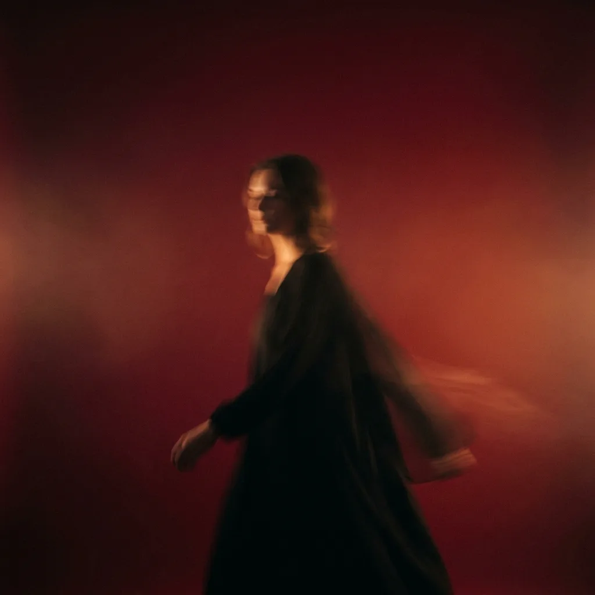

**#451 · Photography Prompt · <code>Vinano Image v2</code>**

<details>
<summary>Show prompt</summary>

```
panning shot of a blurry female silhouette, soft motion blur trailing behind her, gentle film grain, diffused edge lighting, deep red gradient background glowing haze, soft-focus facial features, smooth atmospheric glow,

slow-shutter cinematic effect

Aim for an editorial, design-driven look with deliberate negative space.
```

</details>

---

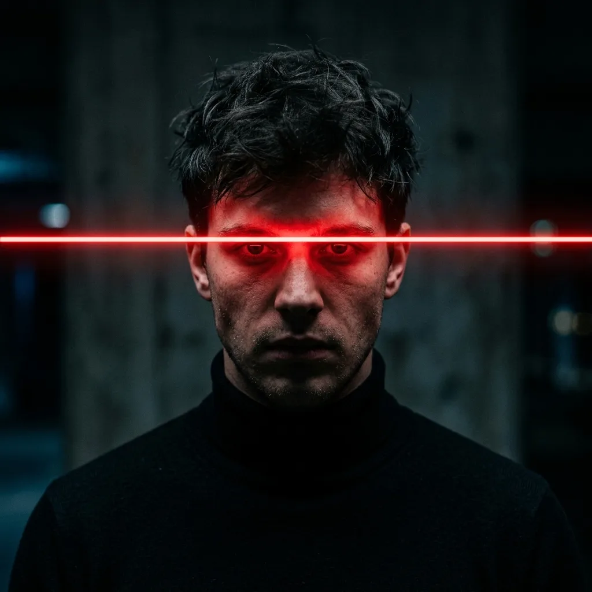

**#452 · Photography Prompt · <code>Vinano Image v2</code>**

<details>
<summary>Show prompt</summary>

```
Cinematic studio portrait of a young man messy textured hair, wearing a black turtleneck, centered composition, dark minimal background, dramatic low-key lighting, a horizontal red neon light strip cutting across his eyes, strong contrast shadows covering lower face, intense gaze, moody atmosphere, cyberpunk aesthetic, ultra-realistic, sharp focus, 85mm lens, shallow depth of field, high detail, editorial photography style. Maintain consistent colour harmony and crisp focus across the whole frame.
```

</details>

---

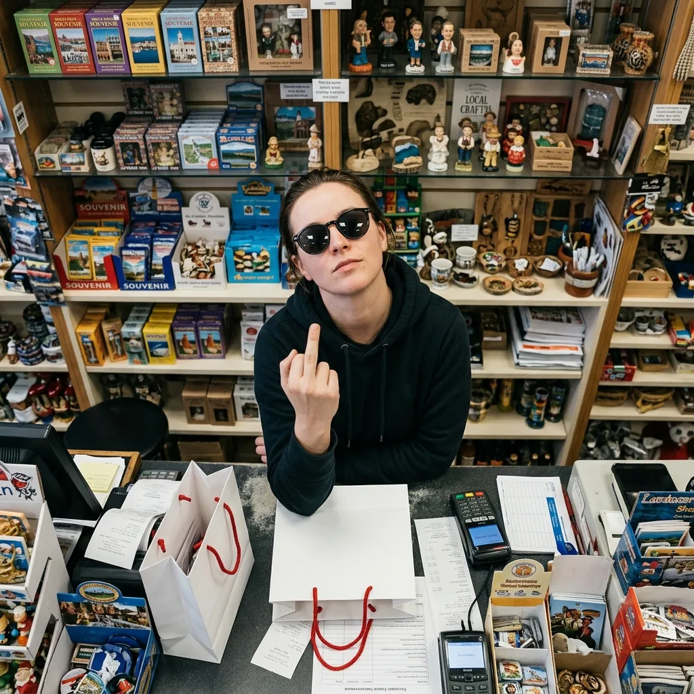

**#453 · Photography Prompt · <code>Vinano Image v2</code>**

<details>
<summary>Show prompt</summary>

```
{
 "image_description": {
 "title": "Surveillance Feed: Defiant Subject in Retail Shop",
 "aspect_ratio": "4:5",
 "mood": "Raw, gritty, confrontational, authentic"
 },
 "visual_elements": {
 "subject": {
 "framing": "Centered from mid-torso upward",
 "pose": "Head tilted back looking up at camera, relaxed yet defiant posture",
 "action": "Hand raised middle finger extended (silhouette, ghosted by motion)",
 "facial_features": "Largely obscured by blur, mouth open tongue faintly visible",
 "apparel": "Dark oversized sunglasses reflecting ambient light"
 },
 "environment": {
 "location": "Cramped retail shop interior",
 "foreground": "Cluttered checkout counter, papers, white shopping bag red rope handles",
 "background": "Densely packed shelves small items, souvenirs, and figurines (abstracted by low resolution)"
 }
 },
 "technical_specifications": {
 "camera_perspective": "High-mounted, steep downward angle, top-down CCTV view",
 "lens_distortion": "Subtle fisheye warping at frame edges",
 "lighting": "Harsh flat fluorescent, blown highlights, dull shadows",
 "color_grading": "Cool green-blue cast, uneven color reproduction, visible banding, reduced dynamic range"
 },
 "image_fidelity": {
 "quality": "Intentionally degraded, low-fidelity",
 "artifacts": ["Strong motion blur",
 "Digital smearing",
 "Compression artifacts",
 "Heavy noise",
 "Scan lines"],
 "sharpness": "Low perceived sharpness, distinct details stretched and indistinct"
 },
 "full_prompt_text": "A heavily distorted, low-fidelity surveillance-style image depicts the Subject standing behind a cramped retail checkout counter inside a cluttered shop, captured from a high-mounted camera angled steeply downward in a top-down CCTV perspective. The image quality is intentionally degraded, strong motion blur, digital smearing, compression artifacts, heavy noise, scan lines, and subtle fisheye distortion warping the frame edges, making fine details indistinct and stretched. The Subject is centered from mid-torso upward, looking up toward the camera the head tilted back; facial features are largely obscured by blur and artifacts, though dark oversized sunglasses dominate the face, reflecting ambient light, and the mouth appears open the tongue faintly visible. One hand is raised toward the camera the middle finger extended, clearly readable in silhouette but softened and ghosted by motion and low clarity, conveying a relaxed yet defiant posture. The foreground checkout counter is cluttered papers and a white shopping bag red rope handles, while the background shelves are densely packed small items, souvenirs, and figurines that blend into abstract shapes due to low resolution and noise. Harsh, flat fluorescent lighting produces blown highlights, dull shadows, uneven color reproduction, and a cool green-blue color cast visible banding and reduced dynamic range. Despite an effectively deep depth of field, perceived sharpness remains low, reinforcing a raw, gritty, confrontational mood that emphasizes the authenticity of an unpolished, unenhanced surveillance feed in a vertical 4:5 aspect ratio"
}

Keep edges clean and the overall composition balanced for a polished, gallery-ready result.
```

</details>

---

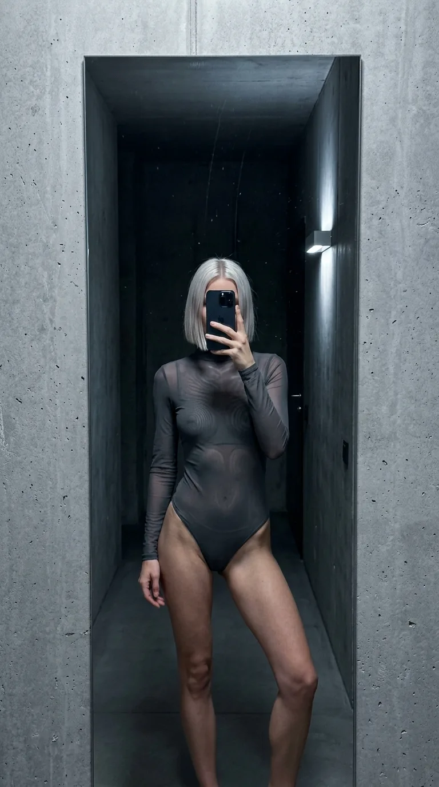

**#454 · Photography Prompt · <code>Vinano Image v2</code>**

<details>
<summary>Show prompt</summary>

```
{
  "meta": {
    "aspect_ratio": "9:16",
    "camera": "iPhone rear camera",
    "lens": "35mm",
    "quality": "ultra true-to-life photorealistic",
    "style": "cold editorial mirror reflection, raw iphone realism, natural skin texture, slight grain"
  },

  "scene": {
    "location": "empty concrete hallway apartment",
    "visibility_rule": "only mirror reflection visible, subject never appears directly",
    "environment_details": ["tall frameless mirror mounted on concrete wall",
      "industrial gray walls",
      "soft shadow gradients",
      "clean but slightly brutalist interior"],
    "time": "very late night",
    "atmosphere": "silent, detached, fashion-editorial tension"
  },

  "lighting": {
    "type": "single directional light",
    "source": "cool LED wall light from side",
    "color_temperature": "cold white",
    "effect": "sharp highlights on shoulders and collarbones, deep controlled shadows"
  },

  "camera_perspective": {
    "pov": "mirror reflection only",
    "angle": "straight-on, chest-height",
    "framing": "upper thighs to head visible only inside mirror",
    "real_world_visibility": "no body parts visible outside mirror",
    "phone_visibility": "phone covering face in reflection"
  },

  "subject": {
    "gender": "female",
    "age_vibe": "young adult",
    "ethnicity": "Northern European",

    "hair": {
      "color": "icy platinum blonde",
      "style": "short blunt bob",
      "behavior": "clean lines, barely touching jaw"
    },

    "outfit": {
      "bodysuit": {
        "type": "one-piece mesh bodysuit",
        "color": "smoky graphite gray",
        "material": "semi-transparent technical mesh",
        "fit": "tight, sculpting, stretched naturally",
        "coverage": "fashion-revealing, non-explicit"
      }
    },

    "pose": {
      "position": "standing still close to mirror",
      "legs": {
        "stance": "asymmetrical",
        "detail": "one leg straight, one knee slightly bent inward"
      },
      "hips": {
        "action": "subtle sideways shift creating tension in fabric"
      },
      "arms": {
        "phone_hand": "holding phone directly in front of face",
        "free_hand": "hanging loose by side, relaxed fingers"
      },
      "vibe": "cold confidence, model-off-duty, emotionally distant"
    },

    "face": {
      "visibility": "completely hidden by phone",
      "effect": "identity erased, body language only"
    }
  },

  "imperfections": ["minor mirror streaks",
    "uneven LED light falloff",
    "slight handheld camera micro-tilt"]
}

Maintain consistent colour harmony and crisp focus across the whole frame.
```

</details>

---

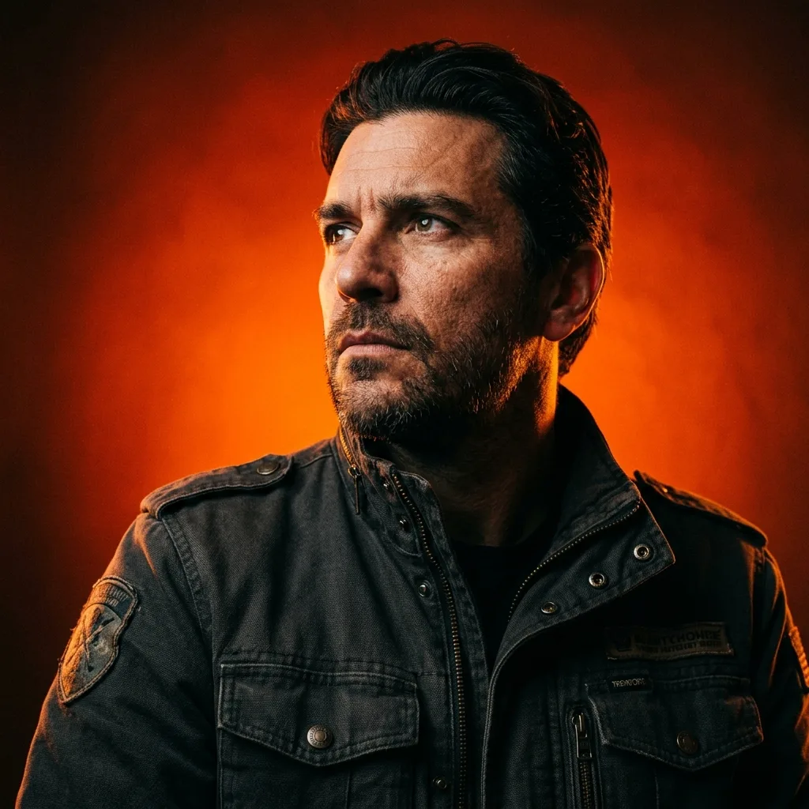

**#455 · Photography Prompt · <code>Vinano Image v2</code>**

<details>
<summary>Show prompt</summary>

```
Editorial portrait from the attached reference photo, true-to-life photorealistic. Use uploaded selfie as ONLY face reference. Identity lock: exact likeness, facial geometry/proportions, natural skin texture. No beautification. Keep clothing style, color, material, and fit identical to the reference. Medium close-up (face and shoulders), low angle looking up (heroic/dominant perspective), sharp focus on face/eyes.Serious, intense, focused expression, gaze directed upward and away from camera (beyond the frame). Dramatic saturated studio lighting, high-contrast chiaroscuro deep shadows, vibrant oranges and deep reds palette, strong rim light creating a halo separation. Solid studio backdrop, rich orange-red smooth gradient, pattern-free, hot radiant atmosphere. High skin texture fidelity (pores visible), 8k, portrait aspect ratio, filmic, cinematic lighting, 4:5. Emphasise material texture and natural light so the final frame feels tactile and premium.
```

</details>

---


**#456 · Photography Prompt · <code>Vinano Image v2</code>**

<details>
<summary>Show prompt</summary>

```
Ultra-realistic 8K full body portrait of [PERSON’S FULL NAME], wearing a clean and pressed white social shirt folded collar and a small lapel microphone, dark navy-blue dress pants and polished brown social shoes. Casually and unpretentiously leaning against a smooth light gray studio wall; hands are in pockets and one leg is crossed over the other, relaxed and confident body language. Add to the wall next to them a prominent vector portrait in black and white of their face and bust - sharp lines and angles, overlapping polygonal shapes and a refined minimalist modern graphic style, right below the information: “[PERSON’S FULL NAME]”, and below the name: “[PROFESSION]” Maintain consistent colour harmony and crisp focus across the whole frame.
```

</details>

---

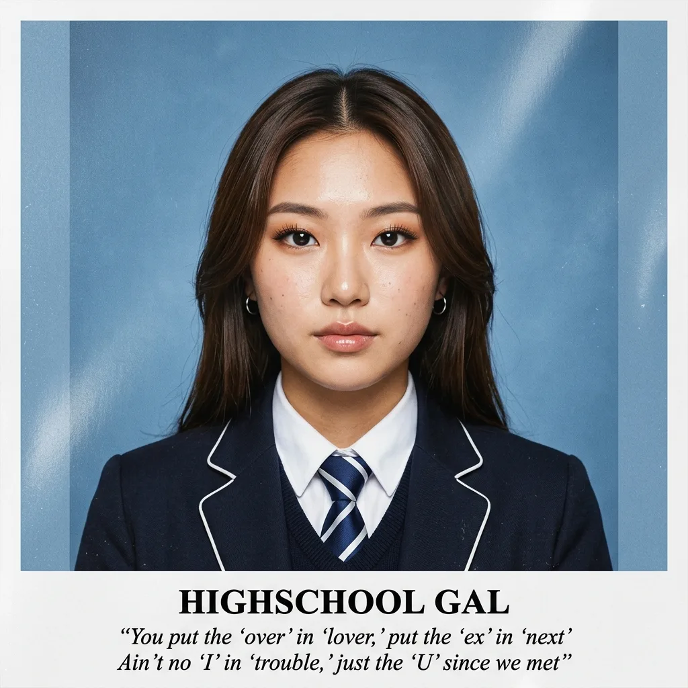

**#457 · Photography Prompt · <code>Vinano Image Pro</code>**

<details>
<summary>Show prompt</summary>

```
Use this photo attached to create an ultra-realistic printed portrait authentic photo-print shine.
A straight-on, centered head-and-shoulders portrait of a young woman, neutral confident expression, eyes looking directly at the camera. Composition is perfectly aligned and symmetrical, identical to a school ID / yearbook / magazine archive photo.
She has long, smooth brown hair, center-parted, softly layered, neatly styled. Makeup is polished but natural, editorial-clean: warm brown eyeshadow, softly defined eyeliner, voluminous lashes, subtle contour, peach blush, and glossy nude lips. Skin is smooth, flawless, softly matte natural highlights, realistic pores visible.
She wears a dark navy blazer white piping, white collared shirt, dark sweater vest, and navy striped tie, styled like a formal school uniform portrait. Small silver hoop earrings.
EXACT FILTER & PRINT SHINE (VERY IMPORTANT):
Apply a real photo-print filter, not digital glow:
Subtle semi-gloss paper sheen
Light reflective shine across cheeks, forehead, and lips, as if light is bouncing off printed ink
Very mild lamination glare, thin diagonal highlights
Slight softening from ink absorption, not blur
Gentle warm undertone from printed ink
Fine paper grain texture visible on skin and background
Looks like a scanned or photographed printed photo
NO glassy skin
NO beauty filter glow
NO cinematic bloom
LIGHTING:
Direct frontal harsh flash ALWAYS ON, similar to ID or studio flash:
Even exposure
Bright eye catchlights
Minimal shadows
Flat, clean lighting typical of printed portraits
BACKGROUND:
Flat cool blue textured studio backdrop, evenly lit, slightly muted by print ink.
TEXT & LAYOUT (PRINTED):
Below the portrait, centered and printed on the page:
Bold serif font:
HIGHSCHOOL GAL
Below in smaller italic serif font, quotation style:
“You put the ‘over’ in ‘lover,’ put the ‘ex’ in ‘next’
Ain’t no ‘I’ in ‘trouble,’ just the ‘U’ since we met”
Text appears ink-printed, slightly imperfect edges, natural spacing, no digital sharpness.
OVERALL LOOK:
Real printed photograph
Magazine / yearbook archive
Soft shine, subtle glare
Paper texture + ink warmth
Not digital, not glossy poster
Looks physically touchable

Emphasise material texture and natural light so the final frame feels tactile and premium.
```

</details>

---

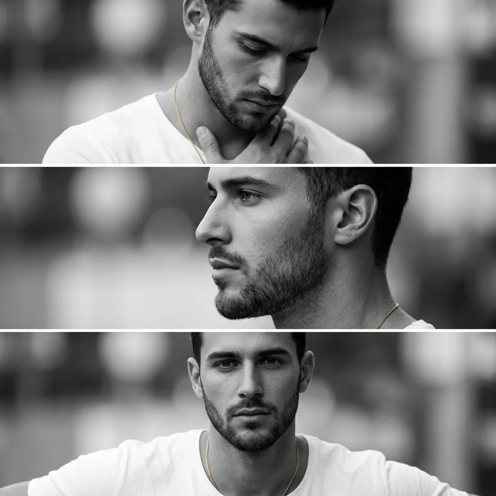

**#458 · Photography Prompt · <code>Vinano Image v2</code>**

<details>
<summary>Show prompt</summary>

```
Preserve the face, proportions, and external features of the model as in the reference. A refined minimalist monochrome fashion editorial triptych featuring three stacked cinematic frames. The subject is a young man short dark hair and a groomed beard. Frame 1: Emotional and introspective, looking downward a hand near the collarbone, highlighting bone structure Rembrandt lighting. Frame 2: A crisp profile shot a focus on the nose, lips, and masculine jawline, gaze directed slightly upward. Frame 3: A frontal, thoughtful portrait shoulders relaxed and direct eye contact. The composition is clean and modern, a white T-shirt and gold necklace for visual continuity. Commercial magazine quality, high-end mirrorless camera, authentic skin pores, soft bokeh, and elegant masculinity. Preserve realistic proportions and depth for a confident, professional finish.
```

</details>

---

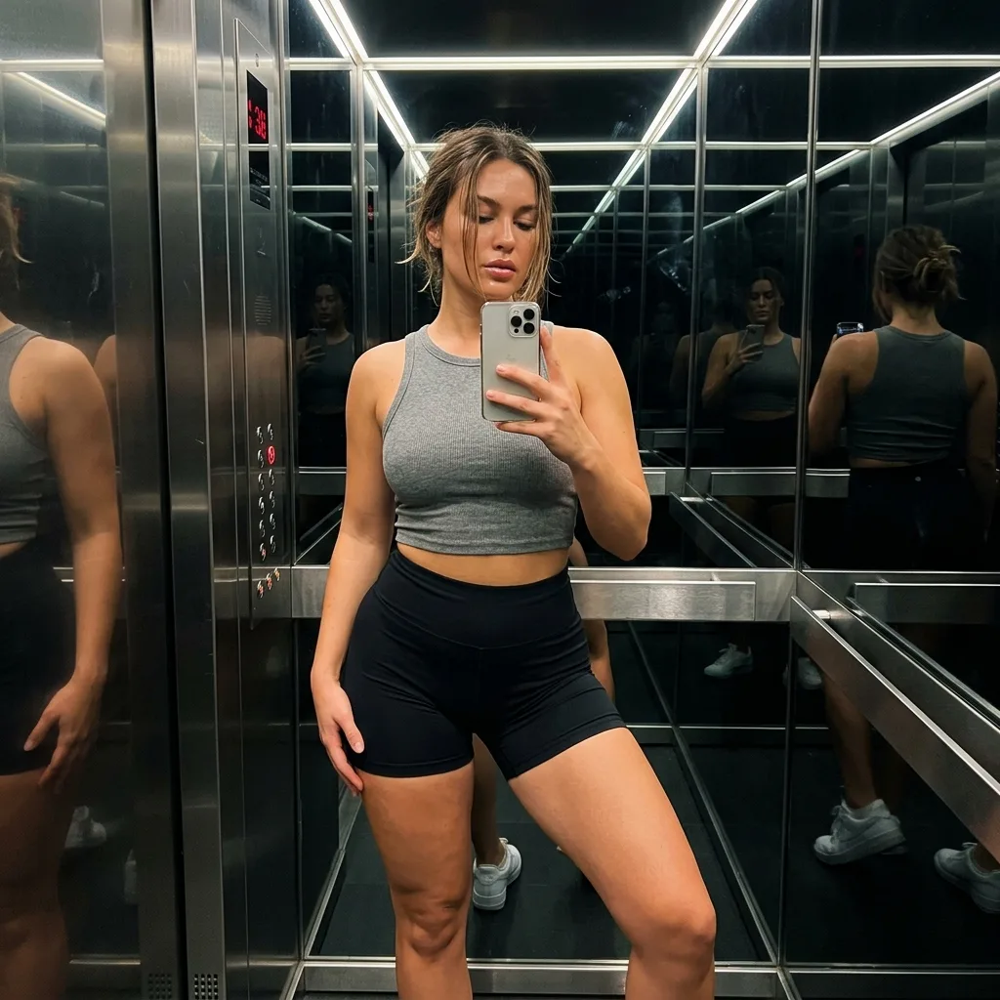

**#459 · Photography Prompt · <code>Vinano Image Pro</code>**

<details>
<summary>Show prompt</summary>

```
{
  "meta": {
    "aspect_ratio": "9:16",
    "quality": "ultra_photorealistic",
    "resolution": "8k",
    "camera": "iPhone front camera",
    "lens": "24mm",
    "style": "raw iPhone mirror realism, zero smoothing, heavy reflections, subtle grain, imperfect exposure"
  },

  "scene": {
    "location": "luxury apartment elevator",
    "environment": ["mirror walls on three sides",
      "brushed stainless steel panels",
      "glass-like reflection layering (multiple reflections of body)",
      "LED ceiling strip lights",
      "digital floor number glowing red",
      "slight fingerprints and smudges on mirror"],
    "time": "late night",
    "atmosphere": "private tension in a public box, quiet, charged, intimate"
  },

  "lighting": {
    "type": "mixed elevator lighting",
    "sources": ["cool white overhead LEDs",
      "warm spill from control panel lights"],
    "effect": ["high contrast highlights on hips and thighs",
      "specular reflections multiplying curves in mirrors",
      "face partially lit, partially disappearing in reflections",
      "real iPhone low-light noise in shadows"]
  },

  "camera_perspective": {
    "pov": "mirror selfie",
    "angle": "slightly low and close",
    "framing": "upper thighs to head",
    "distance": "arm-length",
    "imperfections": ["phone edge visible in reflection",
      "finger slightly covering lens corner",
      "minor motion blur from breathing"]
  },

  "subject": {
    "gender": "female",
    "ethnicity": "light european / mediterranean mix",
    "vibe": "young adult, controlled confidence, quietly provocative",

    "body": {
      "type": "fit-curvy",
      "waist": "tight and defined",
      "hips": "round and visually repeated by reflections",
      "thighs": "thick, softly compressed",
      "chest": "full and natural, secondary focus"
    },

    "skin": {
      "tone": "warm fair",
      "texture": "real skin texture, slight sheen, no blur"
    },

    "hair": {
      "color": "dark blonde",
      "style": "loose, slightly messy",
      "details": "a few strands stuck to lips and cheek"
    },

    "face": {
      "expression": "neutral soft half-smirk",
      "eyes": "focused on phone screen",
      "makeup": "minimal, glossy lips catching light"
    },

    "outfit": {
      "top": {
        "type": "tight cropped tank top",
        "color": "soft grey",
        "fit": "hugging chest naturally, no bra",
        "details": "fabric stretched slightly, fine rib texture visible"
      },
      "bottom": {
        "type": "ultra-short micro biker shorts",
        "length": "barely covering upper thighs",
        "material": "thin matte spandex",
        "fit": "painted-on tight, amplified by mirror repetition",
        "details": ["fabric tension visible at hips",
          "slight ride-up at inner thighs",
          "clean, logo-free"]
      },
      "shoes": {
        "type": "clean white sneakers",
        "reflection": "duplicated multiple times in mirrors"
      }
    },

    "pose": {
      "stance": "standing close to mirror",
      "hips": "shifted strongly to one side",
      "legs": "one knee bent inward",
      "upper_body": "shoulders relaxed, torso angled",
      "arms": {
        "phone_hand": "holding phone low",
        "free_hand": "resting lightly on upper thigh"
      },
      "movement": "still moment that feels like a pause, not a pose"
    }
  },

  "mood_keywords": ["mirror multiplication",
    "late night tension",
    "quiet confidence",
    "timeline stopper"]
}

Aim for an editorial, design-driven look with deliberate negative space.
```

</details>

---

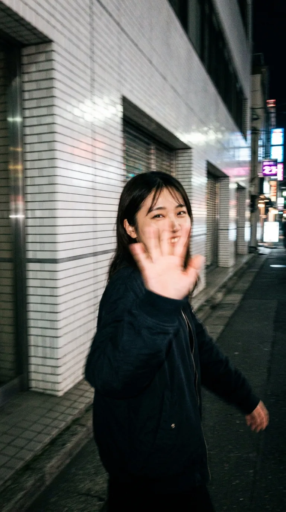

**#460 · Photography Prompt · <code>Vinano Image v2</code>**

<details>
<summary>Show prompt</summary>

```
Ultra-realistic candid smartphone photograph, 9:16 vertical.
Use the attached image only as a strong visual inspiration for general facial proportions and vibe,
while ensuring the generated subject remains fully original, non-identifiable, and not a face copy.
Scene
Nighttime on a quiet Tokyo city sidewalk beside a building white ceramic tile walls.
The subject is walking past the camera, partially side-on, captured mid-step in a rushed, accidental moment.
Poses & Gestures (combined naturally)
The subject reacts instinctively to being photographed:
turning her head back mid-walk as if surprised,
raising one hand close to the lens to partially block the camera,
shy, restrained smile forming as she suppresses laughter,
body angled in half-profile while continuing to walk forward,
motion carries her slightly out of frame, imperfect framing.
Expressions are subtle and spontaneous — embarrassed, playful, fleeting — never posed.
Camera & Motion
Shot on a modern smartphone, handheld, rushed capture. Strong uncontrolled camera shake. Heavy directional motion blur across the raised hand, hair, and face. Facial features appear smeared and streaked by movement, faintly recognizable but distorted. Partial ghosting around the body. Imperfect framing, subject nearly leaving the frame.
Lighting
Flash-only lighting fired mid-motion. Harsh flash highlights on skin and hand. Deep surrounding darkness. Uneven exposure, blown highlights, hard shadows typical of hurried night phone photography.
Background
White ceramic tile wall stretches into streaked light bands due to motion blur. Street surroundings fade into darkness minimal readable detail.
Mood
Candid, shy, slightly playful. Feels intrusive, raw, imperfect, and authentic — like a fleeting memory accidentally captured and never meant to be perfect.
Image Quality
Extremely noisy. Heavily blurred. Raw smartphone look. Not cinematic. Not editorial. Not polished.
Negative Prompt
anime, illustration, painting, stylized,
studio lighting, beauty lighting, soft portrait,
sharp focus, clean face, perfect anatomy, smooth skin,
fashion editorial, posed portrait, cinematic grading, film still,
tripod shot, professional photography,
identity match, face copy, real person replication

Maintain consistent colour harmony and crisp focus across the whole frame.
```

</details>

---

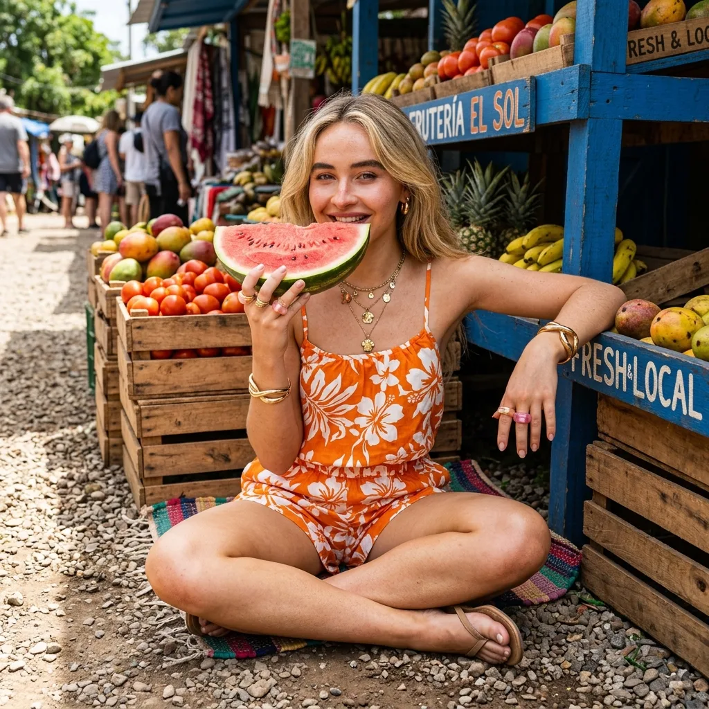

**#461 · Photography Prompt · <code>Vinano Image v2</code>**

<details>
<summary>Show prompt</summary>

```
{
 "image_generation_prompt": {
 "subject": {
 "description": "Young woman a strong resemblance to Sabrina Carpenter.",
 "hair": "Middle-parted, straight, and smooth texture soft layers framing the face; natural physics as it rests over the shoulders.",
 "face": "Enigmatic expression a subtle gaze, sun-kissed dewy skin texture, visible fine pores, and a light flush on the cheeks.",
 "body": "Slender physique a tanned skin tone, showing realistic skin grain and soft highlights on the midriff."
 },
 "attire": {
 "clothing": "A vibrant orange string bikini a white tropical floral print; the fabric has a slight sheen and thin spaghetti straps that tie at the neck and hips.",
 "style": "Bohemian Summer / Coastal Chic."
 },
 "styling_and_accessories": {
 "jewelry": ["Layered gold necklaces various eclectic charms and pendants",
 "Multiple gold statement rings on several fingers",
 "A chunky translucent pink ring",
 "Sculptural gold wrap-around bracelets on both wrists",
 "A delicate gold belly chain resting across the waist"]
 },
 "environment": {
 "setting": "A rustic outdoor fruit market stall featuring weathered blue wooden structures.",
 "background": "Stacked plastic crates filled produce including ripe red tomatoes, bunches of yellow bananas, and various shadowed market goods.",
 "water": "None"
 },
 "pose": {
 "posture": "Seated on the ground, leaning slightly forward a playful and relaxed demeanor.",
 "arms": "One hand is holding a large slice of watermelon up to her face, while the other arm is extended outward, resting against the blue stall structure.",
 "angle": "Eye-level shot a slight tilt."
 },
 "lighting_and_mood": {
 "lighting": "Bright, direct natural sunlight creating high-contrast shadows and vivid highlights.",
 "mood": "Vibrant, sun-drenched, and candidly cinematic.",
 "colors": "A primary palette of saturated watermelon red, cobalt blue, and sun-ripened orange, grounded by earthy grey gravel."
 },
 "camera_and_technical": {
 "style": "Ultra true-to-life photorealistic, RAW photo.",
 "lens": "35mm wide-angle prime.",
 "aperture": "f/4.0 for a balance of sharp subject detail and environmental context.",
 "quality_tags": ["8k resolution",
 "highly detailed",
 "volumetric lighting",
 "ray tracing reflections",
 "hyper-realistic texture",
 "Hasselblad photography"]
 }
 }
}

Render with rich micro-detail while keeping the layout uncluttered and intentional.
```

</details>

---

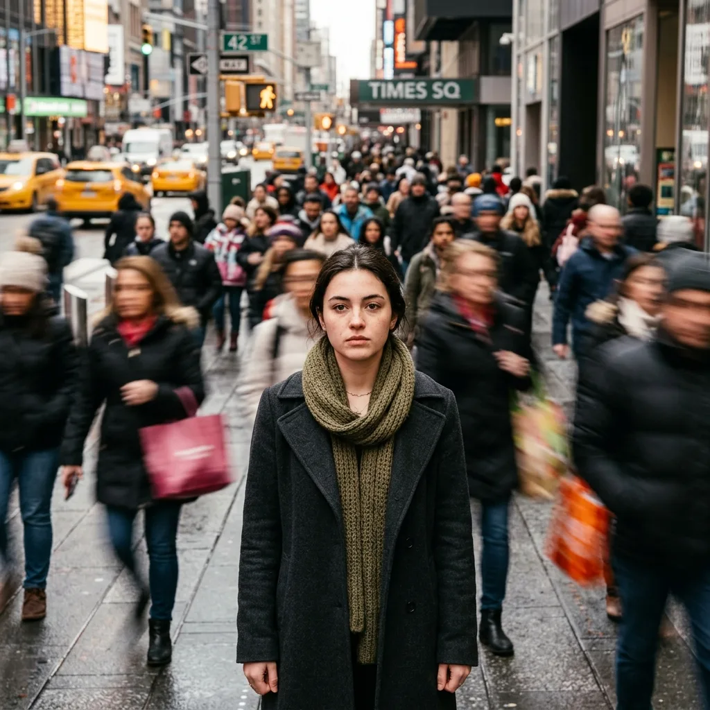

**#462 · Photography Prompt · <code>Vinano Image v2</code>**

<details>
<summary>Show prompt</summary>

```
Ultra-realistic cinematic street portrait of a young woman standing still in a crowded city street, sharp focus on her face calm, intense expression. Long-exposure effect people moving around her creating strong directional motion blur, streaked crowd movement while the subject remains perfectly still. Natural soft daylight, shallow depth of field, creamy bokeh, realistic skin texture, subtle freckles, neutral makeup, dark winter coat and scarf. Emotional, introspective mood, urban storytelling photography, DSLR quality, 85mm lens look, f/1.8, high dynamic range, 8K, professional color grading. Render with rich micro-detail while keeping the layout uncluttered and intentional.
```

</details>

---

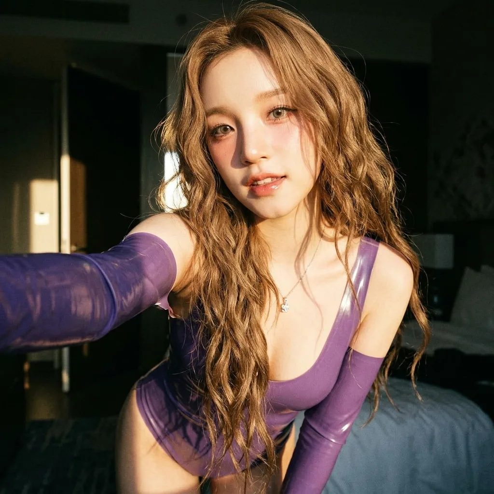

**#463 · Photography Prompt · <code>Vinano Image v2</code>**

<details>
<summary>Show prompt</summary>

```
{
"subject": {
"description": "the prettiest (G)I-DLE Yuqi taking a high-angle selfie.",
"mirror_rules": "Left arm extended holding camera.",
"age": "Early 20s",
"expression": {
"eyes": {
"look": "upward at lens",
"energy": "alluring",
"direction": "direct"
},
"mouth": {
"position": "slightly parted",
"energy": "soft"
},
"overall": "seductive and innocent"
},
"face": {
"preserve_original": true,
"features": "Yuqi's irresistibly cute yet alluring round-yet-sharp face, bright expressive eyes, charming smile lines, and vibrant fair aesthetic.",
"makeup": "Asian influencer aesthetic, heavy under-eye blush, light contacts, glossy lips."
}
},
"hair": {
"color": "Warm light brown",
"style": "Long, loose waves, voluminous.",
"effect": "Top backlit halo, strands falling over chest."
},
"body": {
"frame": "Slim pronounced curves.",
"waist": "Narrow",
"chest": "Full, deep cleavage.",
"legs": "Upper thighs visible.",
"skin": {
"visible_areas": "Chest, shoulders, left arm, upper hips.",
"tone": "Fair, pale luminous.",
"texture": "Smooth, soft, slightly dewy.",
"lighting_effect": "Harsh warm sunlight hitting cleavage and left shoulder, casting sharp shadows."
}
},
"pose": {
"position": "Angled torso, hips pushed back, playful high-angle pose slight hip cock and energetic lean.",
"base": "Standing/leaning.",
"overall": "Leaning forward into the high-angle lens flirty body language."
},
"clothing": {
"top": {
"type": "Tight shiny latex bodysuit detached left sleeve.",
"color": "Glossy Purple",
"details": "Deep scoop neck, thin straps.",
"effect": "Stretching tightly over chest."
},
"bottom": {
"type": "Latex bodysuit bottom",
"color": "Glossy Purple",
"details": "Extremely high cut exposing hips."
}
},
"accessories": {
"jewelry": "Delicate silver pendant necklace."
},
"photography": {
"camera_style": "Smartphone selfie",
"angle": "High angle, looking down.",
"shot_type": "Medium close-up.",
"aspect_ratio": "9:16",
"texture": "Digital, slight wide-angle distortion on left arm.",
"lighting": "Strong directional warm light, high contrast.",
"depth_of_field": "Shallow, blurry dark background."
},
"background": {
"setting": "Dark interior room.",
"wall_color": "Dark/black.",
"elements": ["Lit door edge on left"],
"atmosphere": "Intimate, private.",
"lighting": "Mostly dark one sharp shaft of warm light."
},
"the_vibe": {
"energy": "Captivating",
"mood": "Sensual",
"aesthetic": "Soft-core, golden hour selfie.",
"authenticity": "Casual smartphone snapshot.",
"intimacy": "High, direct eye contact.",
"story": "Catching the golden hour light in a bedroom.",
"caption_energy": "Effortless glow."
},
"constraints": {
"must_keep": ["High angle perspective",
"Harsh warm directional light",
"Bodysuit cut"],
"avoid": ["Flat studio lighting",
"Professional posture",
"Over-bright background"]
},
"negative_prompt": ["ugly",
"flat light",
"studio lighting",
"professional camera",
"overexposed",
"extra limbs",
"stiff"]
}

Render with rich micro-detail while keeping the layout uncluttered and intentional.
```

</details>

---

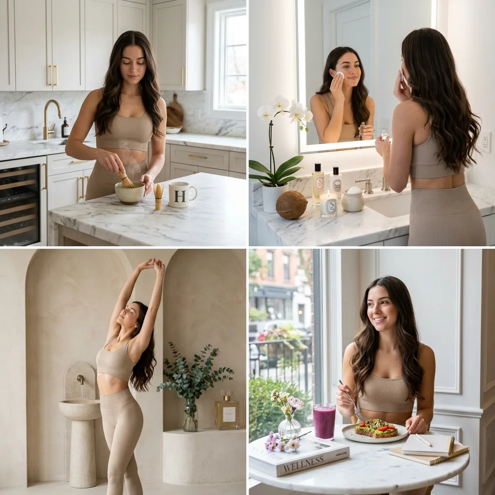

**#464 · Photography Prompt · <code>Vinano Image Pro</code>**

<details>
<summary>Show prompt</summary>

```
{
 "overall_theme": {
 "description": "A curated series of four ultra-true-to-life photorealistic vignettes showcasing a luxurious, wellness-focused lifestyle.",
 "mood": "Calm, serene, balanced, sophisticated, peaceful, rejuvenating.",
 "style": "refined minimalist, high-end, contemporary, clean aesthetic, aspirational."
 },
 "subject": {
 "description": "Young woman.",
 "appearance": {
 "hair": "Long, dark brown, wavy, natural texture.",
 "skin": "Clear, glowing, natural.",
 "makeup": "No-makeup makeup look, dewy finish.",
 "physique": "Fit, toned."
 },
 "expression": "Serene, composed, gently smiling, focused."
 },
 "wardrobe": {
 "outfit_base": "Matching ribbed beige/cream activewear set.",
 "variations": ["Sleeveless crop top and high-waisted leggings.",
 "Long-sleeve crop top and high-waisted leggings."],
 "style": "Comfortable, stylish, premium-quality fabric."
 },
 "environmental_details": {
 "lighting": {
 "type": "Natural daylight.",
 "quality": "Soft, diffused, warm, bright.",
 "source": "Large windows (implied or visible)."
 },
 "color_palette": {
 "dominant": ["Warm Beige", "Cream", "White", "Marble Grey"],
 "accents": ["Green (plants)", "Gold (fixtures, details)", "Natural Wood", "Soft Purple (smoothie)"]
 },
 "materials": ["White Marble", "Light Wood", "Stone", "Ceramic", "Glass", "Linen"]
 },
 "scenes": [{
 "location": "Modern Luxury Kitchen",
 "environment": "White marble island and countertops, white shaker cabinets, gold hardware, integrated wine fridge, large window.",
 "pose": "Standing at the island, body angled slightly, looking down.",
 "action": "Whisking a hot beverage in a small bowl.",
 "props": ["Ceramic bowl", "Wooden whisk", "Steam", "Mug 'H'", "Wine fridge"]
 },
 {
 "location": "High-End Bathroom",
 "environment": "Large backlit mirror, white marble vanity, white walls, orchid plant.",
 "pose": "Standing facing the mirror, one hand applying product to face.",
 "action": "Applying skincare.",
 "props": ["Cotton pad", "Skincare bottle", "Lit Diptyque candle", "Whole coconut", "Glass jars"]
 },
 {
 "location": "refined minimalist Wellness Space",
 "environment": "Textured beige walls curved arches, stone water fountain, eucalyptus in a vase.",
 "pose": "Full-body stretch, arms extended overhead, head tilted back, eyes closed.",
 "action": "Stretching.",
 "props": ["Stone water feature", "Large perfume bottle", "Eucalyptus vase"]
 },
 {
 "location": "Bright Café Corner",
 "environment": "Round white marble table, cane chair, large window overlooking a street.",
 "pose": "Sitting at the table, smiling while eating, holding a fork.",
 "action": "Eating avocado toast.",
 "props": ["Avocado toast on plate", "Purple smoothie in glass", "Fork", "Assouline book", "Notebooks", "Small flowers"]
 }],
 "camera_and_technical": {
 "type": "DSLR Photography",
 "style": "Editorial lifestyle",
 "lens": "Prime lens (e.g., 50mm or 85mm f/1.4)",
 "focus": "Sharp focus on the subject in each frame.",
 "depth_of_field": "Shallow, creating a soft, creamy bokeh in the background.",
 "resolution": "Ultra-high resolution, true-to-life photorealistic textures.",
 "composition": "Four-panel grid collage."
 }
}

Aim for an editorial, design-driven look with deliberate negative space.
```

</details>

---

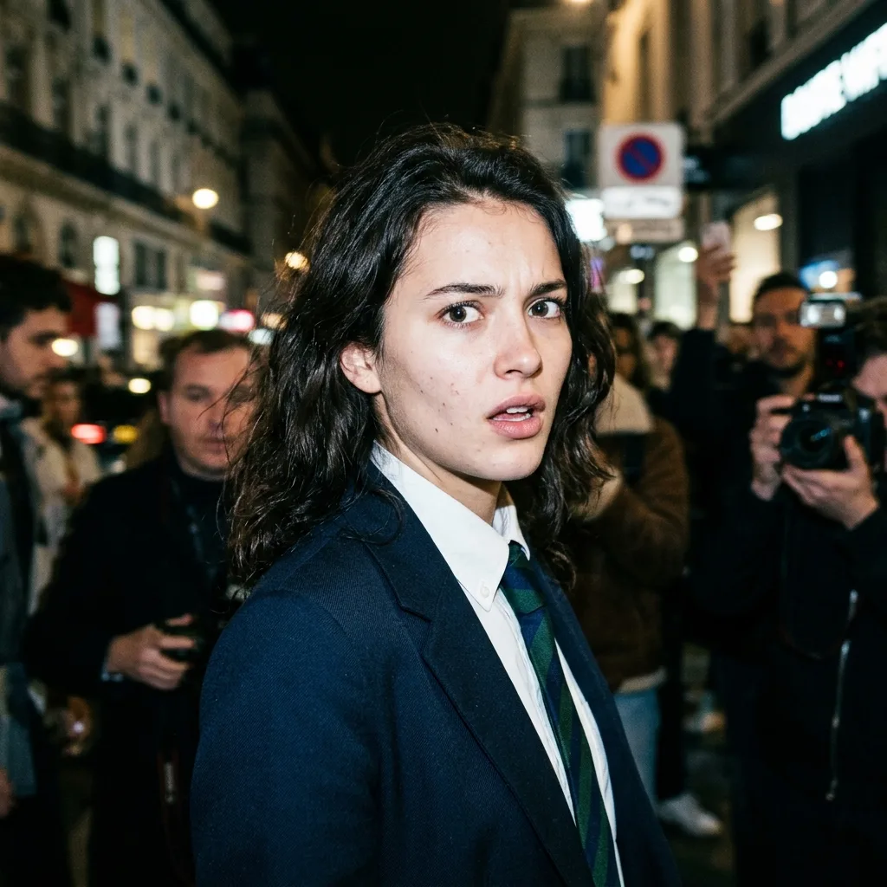

**#465 · Photography Prompt · <code>Vinano Image v2</code>**

<details>
<summary>Show prompt</summary>

```
Paparazzi-style extreme close-up photo of a woman striking facial features, caught off-guard while turning toward the camera. Face and shoulders only, shot from a low angle. Strong harsh on-camera flash, grainy high-ISO, raw candid street-photography feel. Background shows a crowded scene motion blur (Paris Fashion Week atmosphere). Intense, spontaneous energy, imperfect and real. She is wearing a school uniform. Ultra-realistic, cinematic realism, high detail skin texture, slight lens distortion.

Camera style: “35mm paparazzi lens, f/2.8, flash blown highlights”
Look: “2000s tabloid photo aesthetic”
Quality: “sharp focus on face, background heavily blurred and streaked”

Keep edges clean and the overall composition balanced for a polished, gallery-ready result.
```

</details>

---

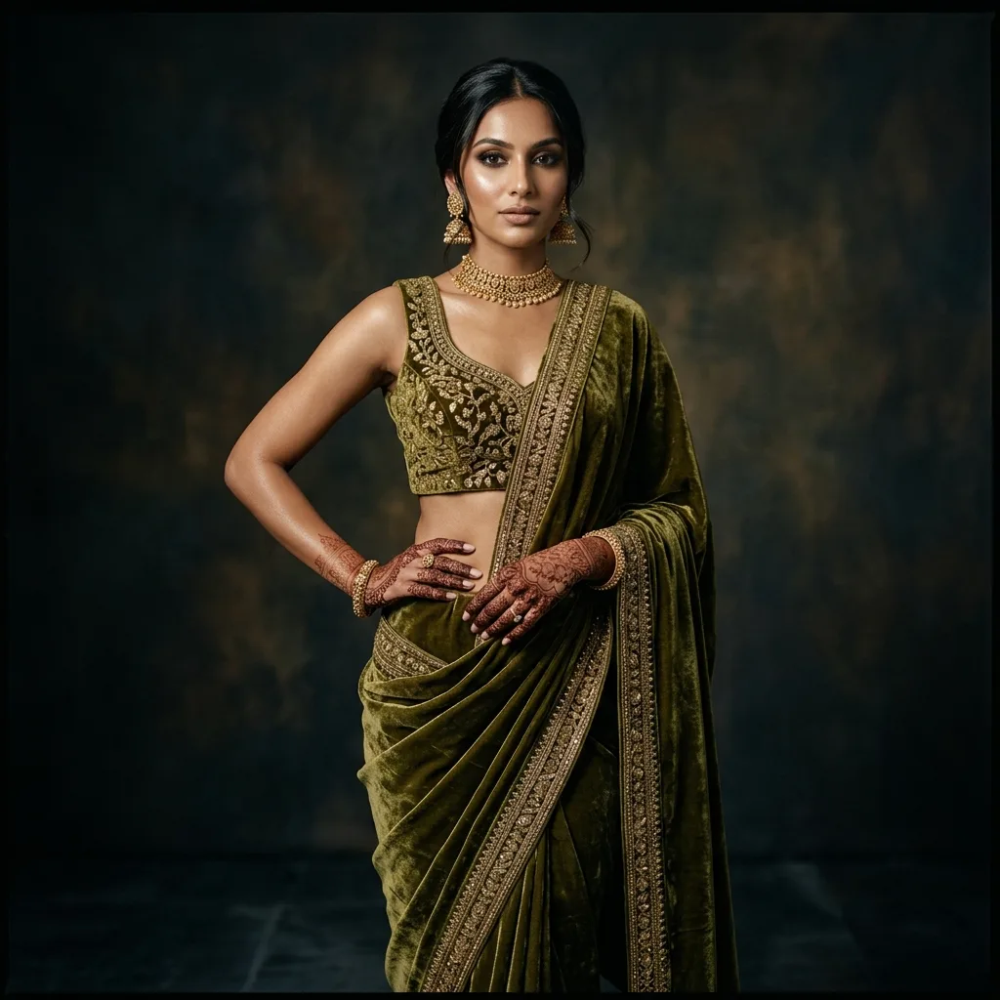

**#466 · Photography Prompt · <code>Vinano Image v2</code>**

<details>
<summary>Show prompt</summary>

```
A detailed, high-fashion studio photograph of a woman posing gracefully, wearing a luxurious olive green velvet saree draped elegantly over her shoulder, paired a matching heavily embroidered sleeveless blouse that highlights her midriff. The lighting is moody and dramatic, accentuating the rich texture of the velvet and giving her skin a subtle, dewy sheen. Her hands are adorned intricate, dark henna (mehndi) designs, and she is wearing traditional gold earrings, looking directly into the camera a confident expression. Keep edges clean and the overall composition balanced for a polished, gallery-ready result.
```

</details>

---

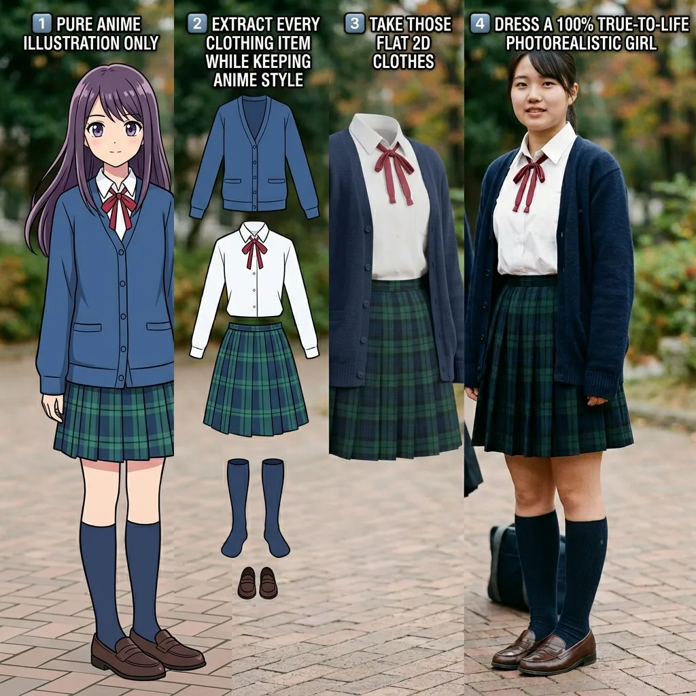

**#467 · Photography Prompt · <code>Vinano Image v2</code>**

<details>
<summary>Show prompt</summary>

```
Higgsfield just dropped.5 — I tried the "impossible" test everyone thought would fail:
1⃣ Pure anime illustration only
2⃣ Extract every clothing item while keeping anime style
3⃣ Take those flat 2D clothes
4⃣ Dress a 100% true-to-life photorealistic girl them
No LoRA. No training. Just one simple prompt.

Result: pleats fold like real fabric, cardigan has actual weight, socks compress naturally..5 doesn’t just copy styles — it truly understands clothing physics and materials. Anime uniform on a real human. For real. My brain is broken 🤯✨
#Higgsfield #

Maintain consistent colour harmony and crisp focus across the whole frame.
```

</details>

---

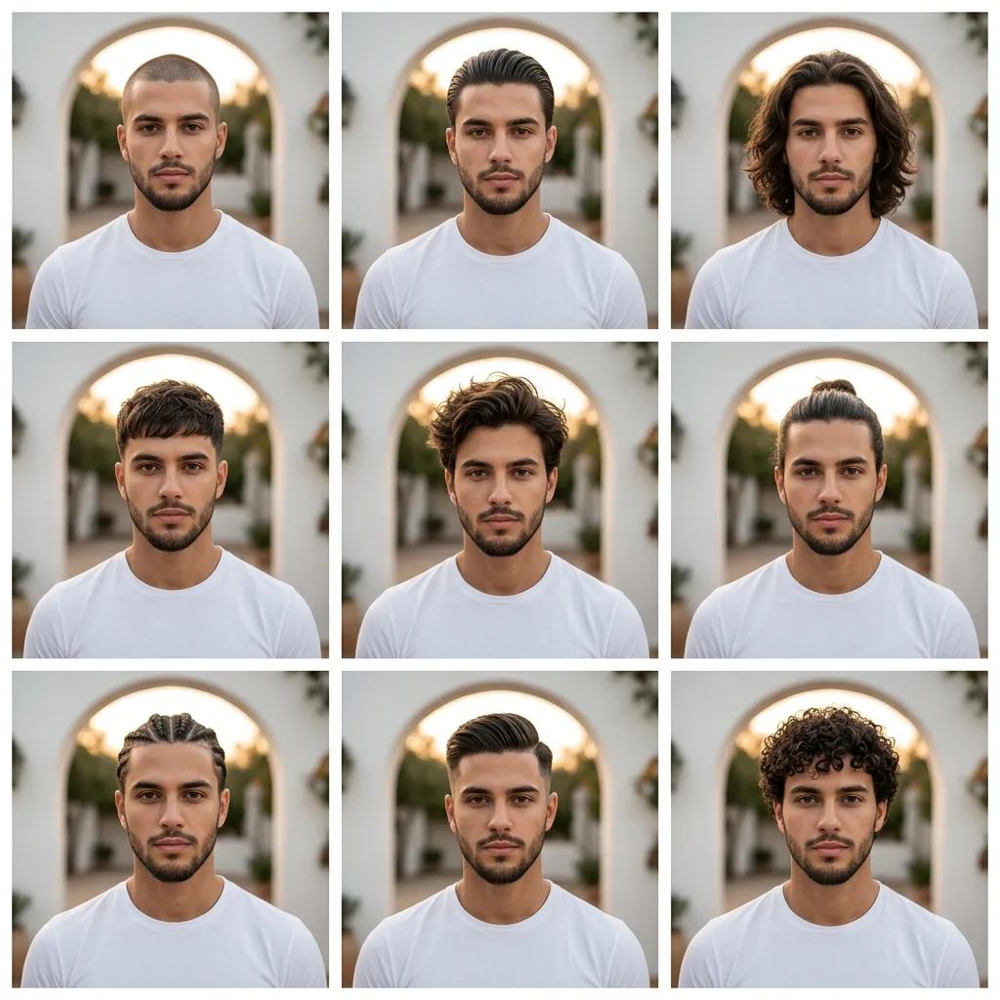

**#468 · Photography Prompt · <code>Vinano Image Pro</code>**

<details>
<summary>Show prompt</summary>

```
description: "A clean, aesthetic 3x3 collage portrait showcasing different men's hairstyles. The same young man is captured in each frame, positioned in consistent lighting and pose, creating a style comparison grid.",

 "subject": {
 "type": "young man",
 "age": "early 20s",
 "skin_tone": "medium smooth texture",
 "facial_features": "sharp jawline, well-groomed beard stubble, symmetrical face",
 "expression": "neutral and confident"
 },

 "hairstyles": ["clean shaved buzz cut",
 "slicked back classic hairstyle",
 "medium wavy long hair",
 "short textured fringe",
 "voluminous messy hairstyle",
 "man bun",
 "cornrow braids",
 "side swept modern fade",
 "tight curly textured cut"],

 "environment": {
 "location": "outdoor courtyard white architecture arches",
 "lighting": "soft sunset golden-hour lighting",
 "background": "slightly blurred but clean and minimal"
 },

 "camera": {
 "shot": "shoulder-level portrait",
 "angle": "eye-level",
 "lens": "standard lens (50mm)",
 "composition": "consistent framing for all nine shots"
 },

 "wardrobe": {
 "top": "plain fitted white t-shirt",
 "style": "minimal, clean, modern"
 },

 "mood": ["stylish",
 "fresh",
 "groomed",
 "aesthetic"]
}

Preserve realistic proportions and depth for a confident, professional finish.
```

</details>

---

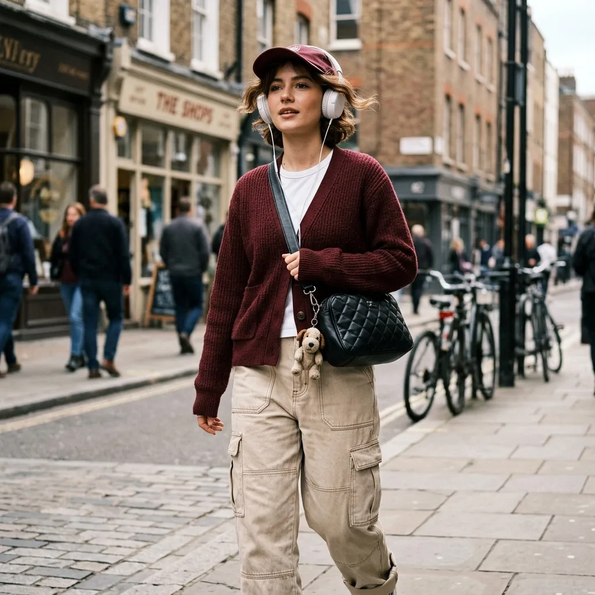

**#469 · Photography Prompt · <code>Vinano Image v2</code>**

<details>
<summary>Show prompt</summary>

```
A premium-quality, candid street photography shot of a stylish young woman short wavy brown hair. She is wearing a maroon cardigan, oversized beige denim cargo pants, and a maroon baseball cap. She has large white over-ear headphones around her ears and a black quilted shoulder bag a small plush dog keychain hanging from it.Same face as in reference Render with rich micro-detail while keeping the layout uncluttered and intentional.
```

</details>

---

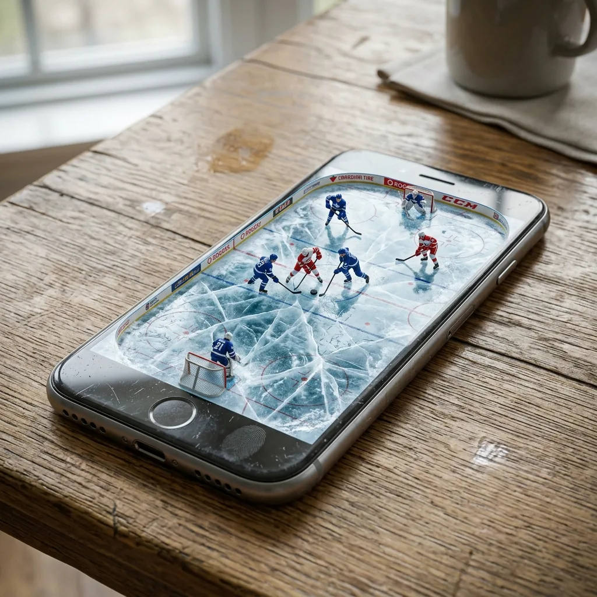

**#470 · Photography Prompt · <code>Vinano Image Pro</code>**

<details>
<summary>Show prompt</summary>

```
Create a hyper-realistic, stylish vertical poster featuring a smartphone lying on a table, transformed into a hockey rink. The screen resembles cracked ice deep fissures, while tiny hockey players compete in an intense game Use diffused daylight elegant reflections and refractions to enhance depth. Add realistic details like fingerprints, smudges, and subtle scratches on the phone's surface for authenticity. Craft a dynamic perspective an intriguing camera angle-slightly tilted for dramatic effect. The image should look like a premium-quality DSLR photograph, sharp focus, rich textures, and filmic, cinematic lighting to amplify the surreal yet lifelike atmosphere Emphasise material texture and natural light so the final frame feels tactile and premium.
```

</details>

---

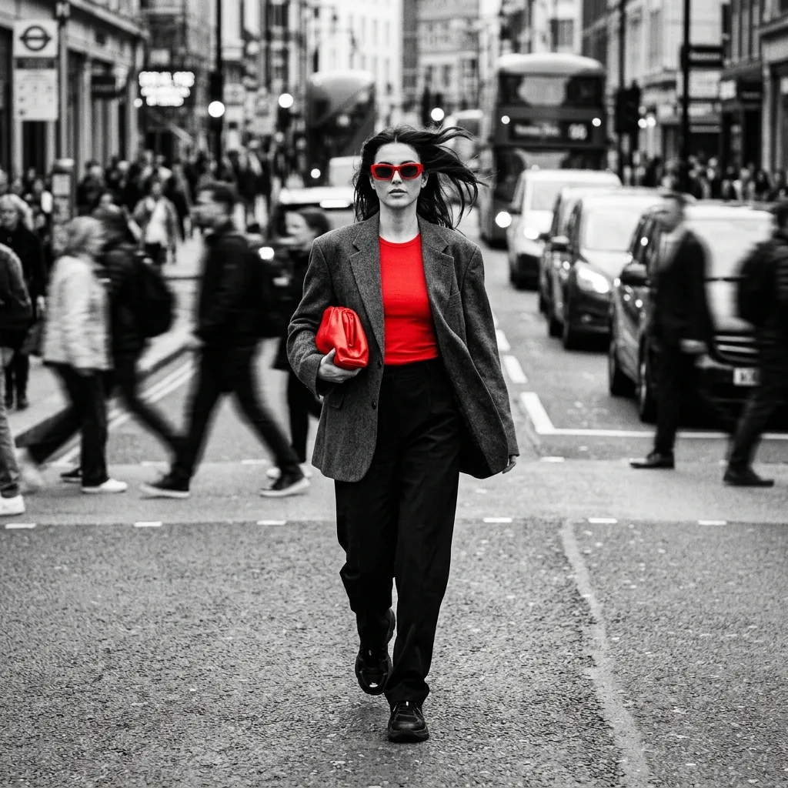

**#471 · Photography Prompt · <code>Vinano Image v2</code>**

<details>
<summary>Show prompt</summary>

```
{
 "objective": "Generate a hyper-realistic black and white street fashion photograph selective color accents.",
 "image_type": "photography",
 "prompt": {
 "subject": "A stylish, confident woman crossing a busy city intersection",
 "wardrobe": {
 "outerwear": "Oversized blazer in neutral tone",
 "innerwear": "Bright red fitted top (selective color)",
 "bottoms": "Loose tailored trousers in neutral tone",
 "accessories": ["Bright red leather clutch in hand",
 "Bright red sunglasses"]
 },
 "action_motion": "Walking briskly toward the camera, hair flowing backward due to motion, blazer and trousers moving naturally",
 "scene": "Busy urban crosswalk pedestrians and cars motion-blurred in the background",
 "perspective": "Frontal tracking shot at waist level",
 "style": ["High-end street fashion",
 "Paparazzi aesthetic",
 "Editorial candid",
 "Dynamic movement photography"],
 "visual_details": ["Realistic fabric physics",
 "Detailed hair movement",
 "Sharp facial features",
 "Asphalt road texture",
 "Motion blur on background crowd",
 "Bokeh city lights"],
 "mood": ["Confident",
 "Cosmopolitan",
 "Urgent",
 "Powerful"]
 },
 "camera_and_composition": {
 "angle": "Waist-level",
 "framing": "Subject centered, background expanding outward motion blur",
 "depth_of_field": "Shallow depth of field isolating the subject"
 },
 "lighting": {
 "type": "Natural backlight rim lighting",
 "contrast": "High contrast emphasizing silhouette and edges"
 },
 "post_processing": {
 "color_mode": "Black and white selective red color accents only on innerwear, sunglasses, and clutch bag",
 "effects": ["Subtle lens flare",
 "Vintage film stock emulation",
 "High micro-contrast",
 "Film grain texture"]
 },
 "negative_prompt": ["Posed studio look",
 "Empty street",
 "Static posture",
 "Low realism",
 "Full color image",
 "Overexposed highlights",
 "Flat lighting"],
 "output_quality": {
 "resolution": "Ultra high resolution",
 "detail_level": "Maximum photorealism",
 "sharpness": "Crisp subject, soft background"
 }
}

Keep edges clean and the overall composition balanced for a polished, gallery-ready result.
```

</details>

---

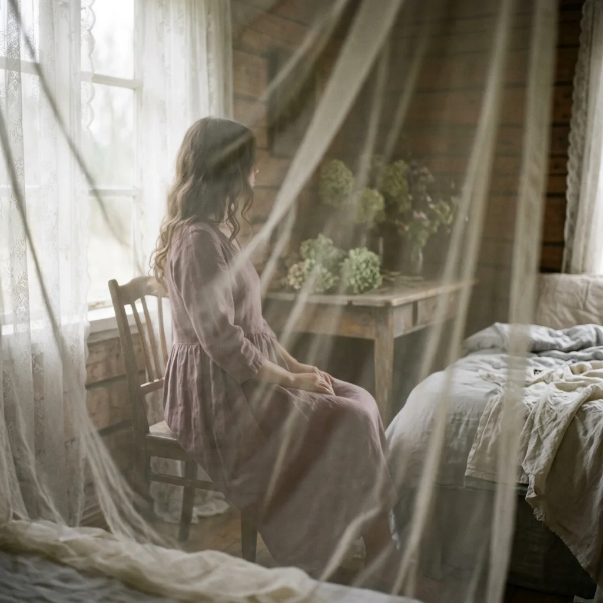

**#472 · Photography Prompt · <code>Vinano Image v2</code>**

<details>
<summary>Show prompt</summary>

```
A soft-focus dream photograph of a [subject] in a [setting], seen through translucent fabric and [atmospheric element], delicate silhouettes, desaturated [color1] and [color2] palette, diffused light, intimate mood, ethereal editorial atmosphere Maintain consistent colour harmony and crisp focus across the whole frame.
```

</details>

---

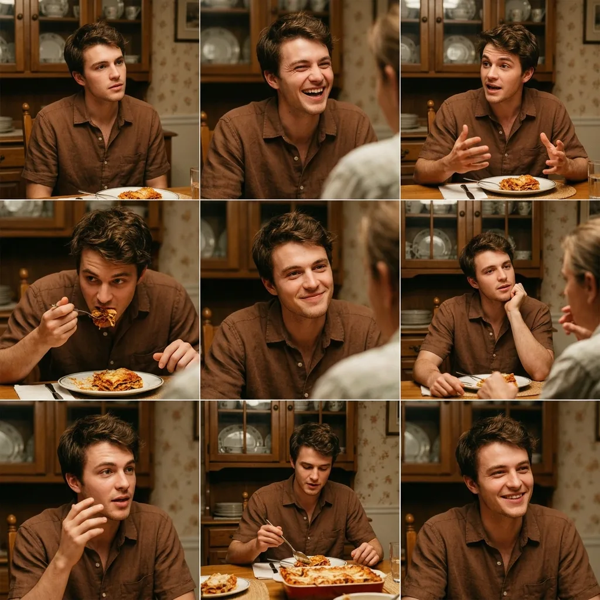

**#473 · Photography Prompt · <code>Vinano Image Pro</code>**

<details>
<summary>Show prompt</summary>

```
A 3x3 grid storyboard contact sheet comprised of nine candid, cinematic movie stills showing a continuous sequence of a young man, approximately 20-25 years old. He has tousled brown hair and a youthful, expressive face, clean-shaven. Across all nine panels, he is consistently wearing a brown short-sleeved linen button-down shirt and is seated at a wooden dining table during a family dinner. The panels show varied natural actions: gesturing his hands while animatedly talking, laughing, eating lasagna from a large dish, listening intently, and smiling. The environment is a warm, cozy home dining room a wooden hutch filled china and patterned wallpaper visible in the background. The lighting is soft, warm tungsten evening light creating natural shadows. The shots are a mix of medium angles and close-ups a shallow depth of field, rendered a film photography aesthetic and slight grain. Render with rich micro-detail while keeping the layout uncluttered and intentional.
```

</details>

---

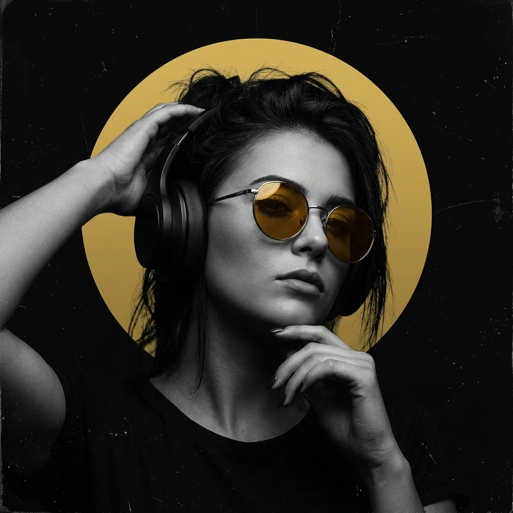

**#474 · Photography Prompt · <code>Vinano Image Pro</code>**

<details>
<summary>Show prompt</summary>

```
Create a dark, high‑contrast poster a moody, underground club aesthetic. The composition features a monochrome portrait of a young woman from the chest up, shot from a slightly low angle for attitude and power. She wears large over‑ear headphones and reflective round sunglasses warm amber‑gold lenses that stand out vividly against the black‑and‑white portrait. One hand is raised near her head, the other near her chin, creating a dynamic, expressive pose associated music immersion. Behind her head is a large flat golden‑yellow circular shape, like a spotlight, creating a strong focal point and visual contrast. The background is deep black subtle grunge textures, dust, scratches, and poster‑wear imperfections, giving it a raw, printed‑flyer feel. Use 4:5 aspect ratio. Preserve realistic proportions and depth for a confident, professional finish.
```

</details>

---

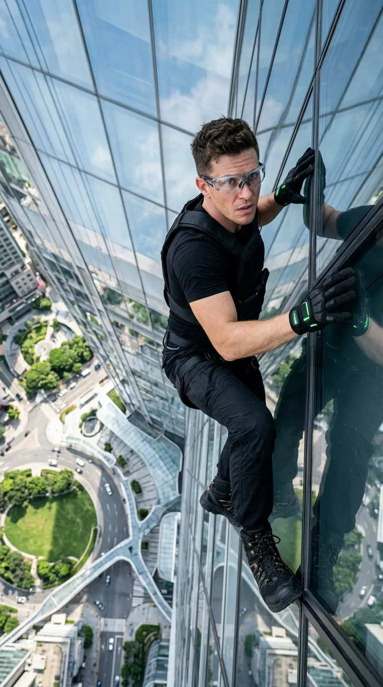

**#475 · Photography Prompt · <code>Vinano Image Pro</code>**

<details>
<summary>Show prompt</summary>

```
ultra-realistic IMAX-grade cinematic action shot, extreme high-angle perspective looking down from a massive height, 9:16 vertical aspect ratio, a man or woman matching the exact reference face and hairstyle climbing the side of a modern glass skyscraper, body stretched dynamically across the reflective facade, positioned on the right side of the frame, one leg raised gripping the glass while the other is bent for support, both palms pressed tightly against the glass surface creating tension and realism, wearing futuristic clear-framed glasses subtle reflections, outfit: premium black fitted t-shirt, black tactical pants, futuristic black gloves protective padding and bright green LED accents glowing softly, black tactical climbing boots gold detailing and strong grip texture, a sleek black vest or harness securely fitted over the torso adding realism and safety gear detail, expression: determined and slightly tense focused eyes and head slightly tilted forward, face lock: maintain exact facial structure, proportions, skin tone, hairstyle, and identity from reference 100% accuracy, preserve micro-details and natural imperfections, no beautification, facial rendering: soft natural skin visible pores, smooth tonal transitions, subtle subsurface scattering, no smoothing or artificial glow, environment: towering skyscraper ultra-reflective glass panels showing the subject’s shadow, sky reflections, and a detailed cityscape far below including intricate walkways, a lush green circular park, and distant street traffic tiny moving cars, strong sense of depth and scale, lighting: bright natural daylight casting sharp directional shadows, high contrast reflections on glass surface, crisp highlights controlled roll-off, color science: ultra-clean cinematic color grading high color separation, natural saturation, deep contrast, HDR dynamic range preserving both sky and ground detail, lens: full-frame Sony A7R, 24mm wide-angle lens to exaggerate height and perspective, sharp foreground subject slight depth falloff into the city below, realism: extreme true-to-life photorealistic detail, realistic reflections, natural perspective distortion, micro-contrast textures, no HDR overprocessing, no artificial sharpening
negative prompt: distorted face, changed identity, altered hairstyle, flat lighting, dull colors, unrealistic reflections, floating pose, weak grip, plastic skin, over-smooth face, beauty filter effect, low detail, noise artifacts, color banding, extra limbs, incorrect anatomy, blurry subject

Maintain consistent colour harmony and crisp focus across the whole frame.
```

</details>

---

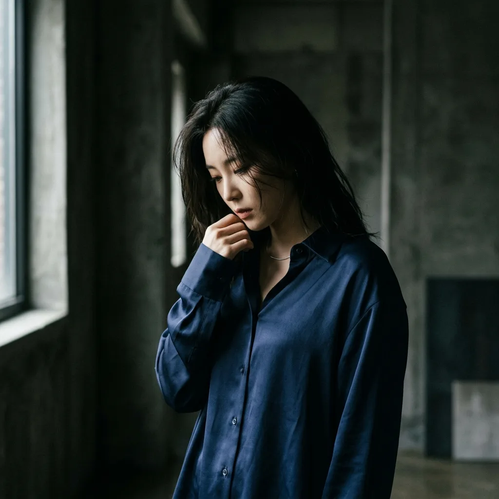

**#476 · Photography Prompt · <code>Vinano Image v2</code>**

<details>
<summary>Show prompt</summary>

```
editorial portrait, Korean female idol, subtly sensual outfit: silk shirt or soft fabric top, slightly loose, elegant and flowing pose: body slightly turned away, face partially visible, one hand near collar or neck expression: soft but unreadable, eyes partially hidden lighting: strong directional light (window light), casting shadows across face and body background: dark or minimal interior composition: partial visibility, half-lit face, shadow covering features mood: mysterious, intimate, quiet tension style: cinematic editorial, light and shadow storytelling sensuality: created through concealment and ambiguity --3:2 Aim for an editorial, design-driven look with deliberate negative space.
```

</details>

---

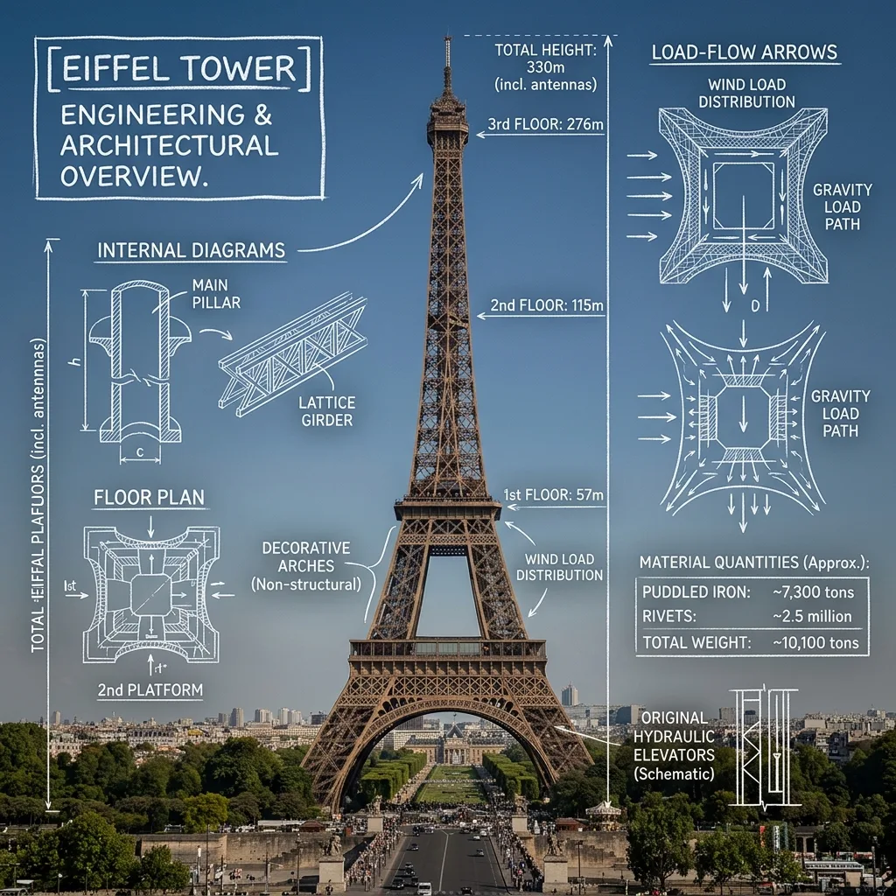

**#477 · Photography Prompt · <code>Vinano Image Pro</code>**

<details>
<summary>Show prompt</summary>

```
Create an infographic image of [LANDMARK], combining a real photograph of the landmark blueprint-style technical annotations and diagrams overlaid on the image. Include the title “[LANDMARK]” in a hand-drawn box in the corner. Add white chalk-style sketches showing key structural data, important measurements, material quantities, internal diagrams, load-flow arrows, cross-sections, floor plans, and notable architectural or engineering features.
Style: blueprint aesthetic white line drawings on the photograph, technical/architectural annotation style, educational infographic feel, the real environment visible behind the annotations.

Emphasise material texture and natural light so the final frame feels tactile and premium.
```

</details>

---


**#478 · Photography Prompt · <code>Vinano Image v2</code>**

<details>
<summary>Show prompt</summary>

```
{
 "image_type": "portrait_photography",
 "resolution_target": "8K UHD",
 "aspect_ratio": "vertical",
 "frame_composition": {
 "crop": "mid-chest to head",
 "orientation": "portrait",
 "subject_position": "centered",
 "camera_angle": "eye-level",
 "perspective": "straight-on"
 },
 "subject": {
 "gender_presentation": "female",
 "age_appearance": "young adult",
 "face": {
 "shape": "oval",
 "skin_tone": "fair neutral undertone",
 "skin_texture": "smooth, natural, visible realism, no heavy retouching",
 "facial_features": {
 "eyes": {
 "color": "light blue-green",
 "shape": "almond-shaped",
 "gaze_direction": "directly toward camera",
 "eyelids": "slightly relaxed",
 "eyelashes": "natural length, not exaggerated"
 },
 "eyebrows": {
 "color": "dark brown",
 "thickness": "medium",
 "shape": "soft natural arch"
 },
 "nose": {
 "shape": "straight",
 "size": "proportionate",
 "bridge": "smooth"
 },
 "lips": {
 "color": "soft natural pink",
 "fullness": "medium to full",
 "state": "slightly parted"
 }
 },
 "expression": "neutral, calm, composed"
 },
 "hair": {
 "color": "dark brown",
 "length": "short to medium",
 "style": "loose, slightly wavy",
 "movement": "wind-blown strands crossing face",
 "parting": "natural, unstructured"
 }
 },
 "clothing": {
 "outerwear": {
 "type": "coat",
 "color": "deep royal blue",
 "material_appearance": "wool or felt-like texture",
 "fit": "structured but relaxed",
 "visible_details": "clean seams, minimal design"
 },
 "accessory": {
 "type": "scarf",
 "color": "matching royal blue",
 "material_appearance": "soft, fabric texture",
 "placement": "wrapped loosely around neck"
 }
 },
 "color_palette": {
 "dominant_colors": ["royal blue",
 "deep blue",
 "soft skin tones"],
 "contrast": "high contrast between blue clothing and lighter skin",
 "color_temperature": "cool"
 },
 "lighting": {
 "type": "natural light",
 "direction": "frontal slight side softness",
 "intensity": "moderate",
 "shadows": "soft, minimal harsh shadows",
 "highlights": "subtle highlights on cheekbones and lips"
 },
 "background": {
 "environment": "open outdoor setting",
 "elements": "blurred horizon line, blue gradient background",
 "depth_of_field": "shallow",
 "background_detail": "intentionally out of focus",
 "color": "blue gradient resembling sky and distant water"
 },
 "image_style": {
 "realism": "high realism subtle AI polish",
 "sharpness": "high facial detail",
 "texture_detail": "visible fabric texture and skin detail",
 "noise": "minimal",
 "post_processing": "clean color grading, no heavy filters"
 },
 "mood": {
 "overall_feel": "calm, serene, minimalistic",
 "visual_energy": "soft and composed"
 },
 "generation_constraints": {
 "preserve_original_composition": true,
 "preserve_subject_structure": true,
 "no_face_alteration": true,
 "no_style_assumptions": true,
 "do_not_change_image_size": true
 }
}

Preserve realistic proportions and depth for a confident, professional finish.
```

</details>

---

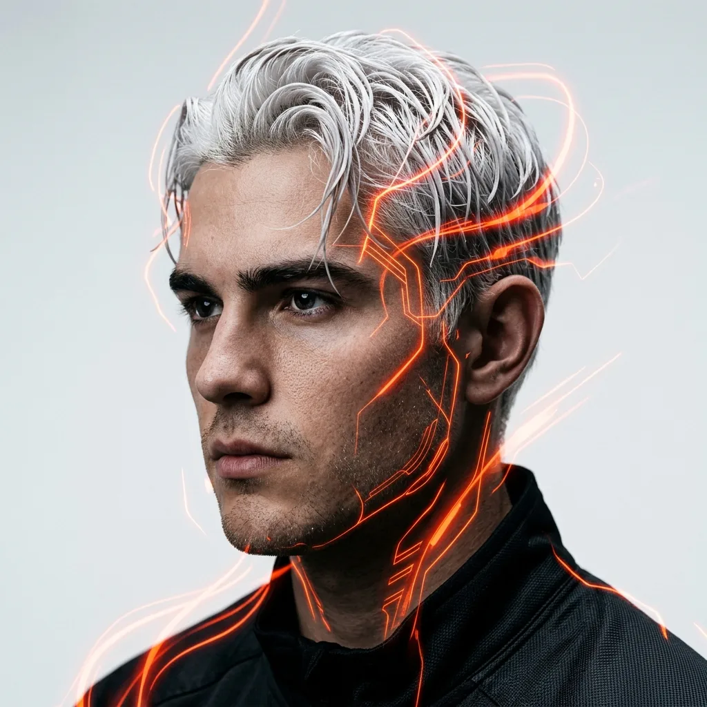

**#479 · Photography Prompt · <code>Vinano Image v2</code>**

<details>
<summary>Show prompt</summary>

```
Portrait of a 21-year-old man of appearance masculine facial features and white hair styled a wet look. The camera angle is slightly from the side and below. Neutral facial expression, very light gray background. Orange-red glowing light and abstract luminous lines around the head, passing through the face and neck, creating a dynamic and high-tech effect. Futuristic atmosphere, professional lighting, emphasis on details. Saturated colors, the left side of the face is illuminated, the right side is in shadow. Highly detailed, premium-quality photograph in a modern style Render with rich micro-detail while keeping the layout uncluttered and intentional.
```

</details>

---

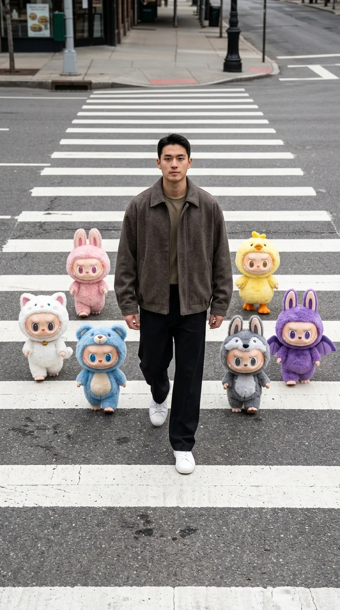

**#480 · Photography Prompt · <code>Vinano Image Pro</code>**

<details>
<summary>Show prompt</summary>

```
A hyper-realistic iPhone RAW photo, vertical 9:16 ratio, candid street photography style natural daylight, no filter, no cinematic grading, realistic color balance, Pinterest-style artsy realism.
The camera angle MUST MATCH THE REFERENCE IMAGE EXACTLY: a slightly elevated wide-angle perspective looking down toward a zebra crosswalk, similar to a street-level overhead shot, capturing the full crosswalk lines horizontally the subject positioned at the center and symmetrically surrounded by characters, maintaining the exact spatial relationship and perspective of the reference photo. A young adult man an athletic and naturally fit build is walking forward mid-step on the zebra crossing, body orientation, walking direction, and pose following the reference precisely, expression calm, neutral, and candid as if casually crossing the street, not posing. Outfit consists of fashionable casual streetwear relaxed silhouettes: an oversized jacket in earthy muted tones such as brown, olive, or charcoal, a simple inner shirt, loose straight-cut trousers, and clean refined minimalist sneakers, creating an effortless modern daily-wear look that supports the calm surreal theme. Props include multiple Popmart Skullpanda characters in fluffy costumes placed around the subject in the SAME formation, spacing, and positioning as the reference image, each Skullpanda featuring soft plush textures, rounded proportions, and varied colors, appearing to walk alongside the human subject on the crosswalk. The location is an empty urban street a clearly visible zebra crossing, realistic asphalt texture subtle grain and natural wear, no traffic, no extra people, and an identical street layout perspective to the reference. Camera and composition are wide shot and full-body framing no portrait crop, handheld but steady feel slight natural imperfections, realistic depth of field keeping both subject and surrounding characters in focus, matching reference scale and depth. Lighting is natural daylight from above soft consistent shadows on the ground, balanced exposure, no harsh sunlight, and no dramatic contrast. Skin texture is realistic and human, smooth yet visibly porous natural highlights and subtle imperfections, no airbrushing, no plastic or CGI skin. Negative prompt: different camera angle, low angle, eye-level shot, close-up portrait, filmic, cinematic lighting, HDR, oversharpening, overly smooth skin, CGI look, 3D render, cartoon human, face alteration, distorted anatomy, text, watermark, logo.

Render with rich micro-detail while keeping the layout uncluttered and intentional.
```

</details>

---

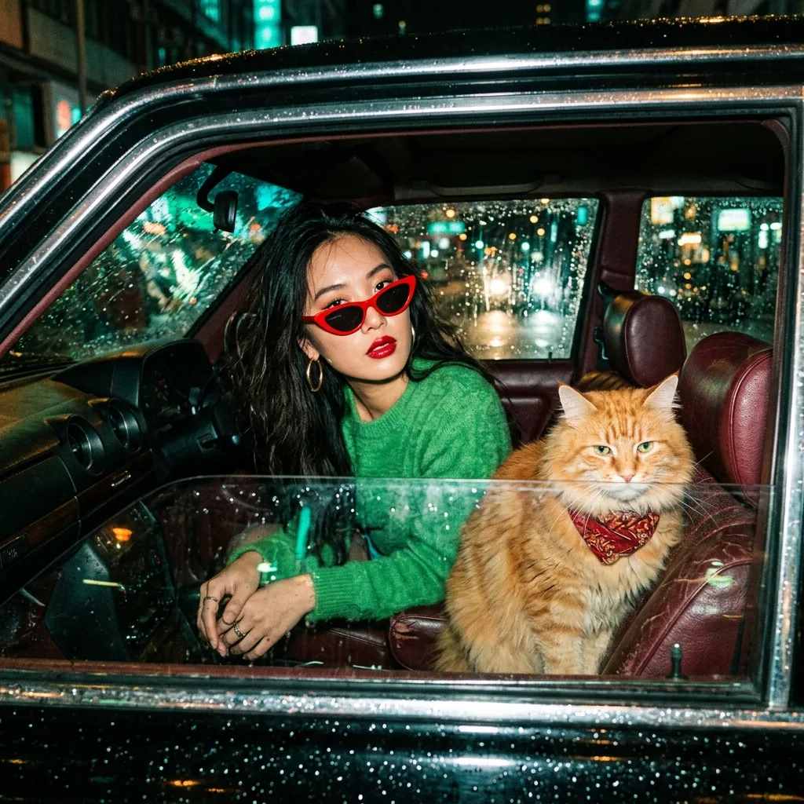

**#481 · Photography Prompt · <code>Vinano Image v2</code>**

<details>
<summary>Show prompt</summary>

```
A cinematic flash-photography shot viewed through a rain-streaked car window at night. Inside a vintage black car, a chic Asian woman long dark hair wears bright red cat-eye sunglasses, large hoop earrings, and a fuzzy green sweater. She has glossy red lipstick and is posing coolly. Sitting next to her on the maroon leather seat is a large, fluffy orange tabby cat wearing a red bandana. The background features blurred city streetlights and bokeh in green and teal tones. High-contrast lighting, Wong Kar-wai aesthetic, retro 90s fashion vibe, realistic texture, film grain, 35mm photography.",
 "elements": {
 "subject": {
 "human": "Young Asian woman, trendy, red cat-eye sunglasses, green fuzzy sweater, hoop earrings, glossy red lips",
 "animal": "Fluffy orange tabby cat, Maine Coon mix, red bandana, calm expression"
 },
 "environment": "Inside vintage car, night time, city street, rain on glass, street lights",
 "lighting": "Direct flash, atmospheric street lighting, bokeh background, high contrast shadows",
 "style": "Cinematic, retro 90s, Hong Kong cinema style, film photography, lo-fi aesthetic, candid"
 },
 "negative_prompt": "blurry, low resolution, cartoon, illustration, 3d render, drawing, distorted features, bad anatomy, missing limbs, text, watermark, daylight, bright sun",
 "technical_settings": {
 "aspect_ratio": "9:16",
 "film_stock": "Kodak Portra 800",
 "camera_angle": "Eye-level, shot through glass"
 }
}

Aim for an editorial, design-driven look with deliberate negative space.
```

</details>

---


**#482 · Photography Prompt · <code>Vinano Image Pro</code>**

<details>
<summary>Show prompt</summary>

```
Create a high-end promotional poster for International Women's Day, designed as a luxury editorial campaign seamlessly blending true-to-life photorealistic studio photography sophisticated modern graphic design.
Identity Matching (Critical): Strictly reference the uploaded image for precise face and identity matching. Preserve the exact facial structure, proportions, skin tone, hairstyle, and natural expression full fidelity — the subject must remain clearly and unmistakably recognizable throughout.
Composition & Framing: Vertical 4:5 poster format. Three-quarter seated portrait mid-thigh framing, subject occupying 30–40% of the frame. Subject is positioned slightly left of center, creating intentional visual breathing room on the right for the sculptural element. Editorial balance is paramount.
Subject & Pose: A confident woman natural wavy hair cascading over one shoulder soft studio shine. She sits upright yet relaxed in a modern plush red velvet armchair angled slightly toward camera — right leg crossed over left, hands resting softly on her knee, fingers elegant and relaxed. Shoulders are open and confident. Head tilted gently toward camera a warm, natural smile conveying strength and inspiration. She wears a refined minimalist tailored white pantsuit — structured blazer, matching trousers, and a clean white blouse beneath — creating bold contrast against the red environment.
Symbolic Element: Behind and slightly right of the subject stands a large transparent acrylic/glass sculpture in the shape of the number "8" (referencing March 8th), nearly matching the subject's seated height. The structure features clean reflective edges soft studio highlights emphasizing its transparency. Lush floral arrangements cascade organically along its curves — deep red roses, soft pink peonies, delicate light pink blossoms, and natural green leaves — clustered naturally toward the middle and lower sections of the numeral.
Background: Rich monochromatic red studio environment. Wall and floor merge into a seamless smooth red gradient backdrop a subtle floor reflection anchoring the composition. The red velvet chair blends into the environment while remaining distinct through lighting and fabric texture.
Typography: Elegant, modern poster typography integrated into the layout —
Top left: Clean uppercase white sans-serif text: "SHE IS STRENGTH, / COURAGE, AND / INSPIRATION / EVERY DAY"
Lower section: Small uppercase label: "HAPPY INTERNATIONAL WOMEN'S DAY"
Main headline: Very large bold white block letters spelling "WOMAN" spanning the lower frame, overlaid a stylized red handwritten script "Woman" crossing diagonally for a dynamic graphic contrast
Bottom center: "08. MARCH" in wide-tracked refined minimalist type
Lighting: Professional three-point studio setup — soft frontal key light for flawless skin tones, gentle fill light eliminating harsh shadows, and a subtle rim light sculpting the subject and chair. The glass number 8 catches sharp highlights along its edges.
Visual Effects & Finish: Subtle cinematic prism lens flares and soft rainbow light leaks in the corners and lower foreground for editorial luxury depth. Shallow depth of field keeps the subject and floral sculpture razor sharp while the red background fades into a smooth gradient. Vibrant cinematic color grading, high-end digital compositing polish.
Render Quality: 8K ultra-high resolution. true-to-life photorealistic. Luxury advertising aesthetic. No repeated titles or duplicate text elements

Aim for an editorial, design-driven look with deliberate negative space.
```

</details>

---

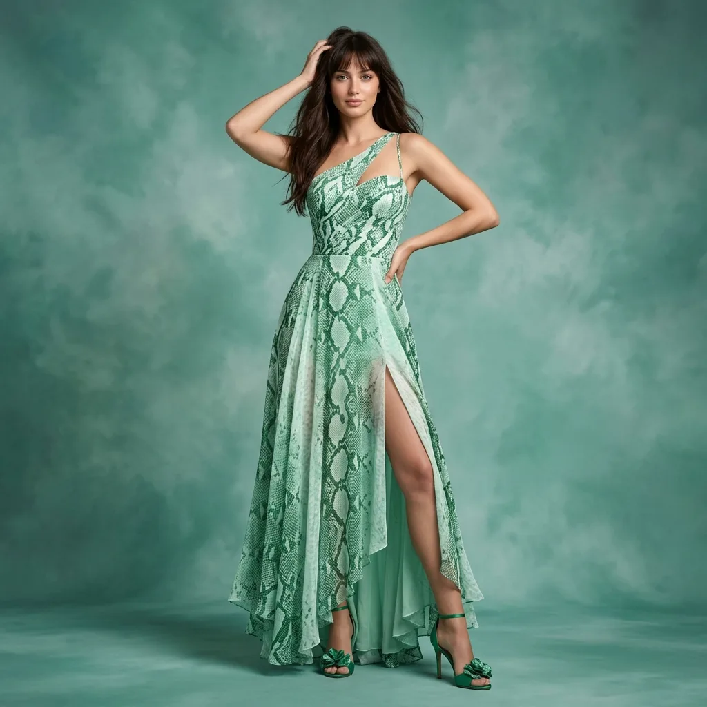

**#483 · Photography Prompt · <code>Vinano Image v2</code>**

<details>
<summary>Show prompt</summary>

```
{
 "image_type": "studio fashion portrait",
 "resolution_target": "8K ultra high definition",
 "orientation": "vertical",
 "framing": {
 "shot_type": "full body shot",
 "camera_angle": "straight-on, eye-level",
 "subject_position": "centered",
 "cropping": "head to feet fully visible"
 },
 "subject": {
 "count": 1,
 "gender_presentation": "female-presenting",
 "pose": {
 "body_orientation": "facing forward",
 "weight_distribution": "weight shifted to one leg",
 "legs": {
 "front_leg": "slightly bent at the knee",
 "back_leg": "extended, supporting balance",
 "visibility": "one leg partially exposed through dress slit"
 },
 "arms": {
 "left_arm": "bent hand resting on hip",
 "right_arm": "raised hand touching hair near head"
 },
 "posture": "upright, relaxed, confident stance"
 },
 "facial_features": {
 "expression": "neutral to soft confident expression",
 "eyes": "open, looking directly at camera",
 "eyebrows": "well-defined",
 "lips": "full, slightly parted",
 "makeup": {
 "foundation": "smooth, even-toned",
 "blush": "subtle",
 "lip_color": "soft pink",
 "eye_makeup": "defined lashes, neutral tones"
 }
 },
 "hair": {
 "color": "dark brown",
 "length": "long",
 "texture": "slightly wavy",
 "styling": "loose, flowing",
 "bangs": "short fringe across forehead"
 },
 "skin": {
 "tone": "light to medium",
 "texture": "smooth, evenly lit"
 }
 },
 "clothing": {
 "dress": {
 "type": "evening gown",
 "length": "floor length",
 "fit": "fitted bodice, flowing skirt",
 "neckline": "asymmetrical single-strap",
 "strap": {
 "count": 1,
 "placement": "over one shoulder"
 },
 "pattern": "snake-skin inspired geometric pattern",
 "primary_color": "green",
 "secondary_colors": ["white", "light mint green"],
 "fabric": {
 "bodice": "structured, patterned fabric",
 "skirt": "sheer, lightweight, flowing fabric"
 },
 "slit": {
 "presence": true,
 "location": "front side",
 "height": "upper thigh"
 },
 "hemline": "uneven, flowing layered folds"
 },
 "footwear": {
 "type": "high-heeled sandals",
 "color": "matching green",
 "heel_style": "thin heel",
 "details": "decorative floral or bow-like embellishment on front strap",
 "toe_style": "open-toe"
 },
 "accessories": {
 "visible_jewelry": "none clearly visible",
 "other_accessories": "none visible"
 }
 },
 "background": {
 "type": "studio backdrop",
 "color_palette": ["teal", "green"],
 "texture": "soft, cloudy gradient",
 "pattern": "non-uniform, painterly",
 "depth": "flat backdrop subtle tonal variation"
 },
 "lighting": {
 "style": "studio lighting",
 "key_light": "soft frontal light",
 "fill_light": "even fill reducing harsh shadows",
 "shadows": "minimal, soft",
 "highlights": "gentle highlights on face and dress texture",
 "overall_exposure": "balanced"
 },
 "color_balance": {
 "dominant_colors": ["green", "teal"],
 "contrast": "moderate",
 "saturation": "medium to slightly high",
 "color_harmony": "monochromatic green tones"
 },
 "image_quality": {
 "sharpness": "high",
 "clarity": "clean and crisp",
 "noise": "none visible",
 "focus": "sharp across entire subject"
 },
 "style_tags": ["fashion photography", "studio portrait", "elegant", "glamour", "high fashion", "editorial"],
 "ai_generation_notes": {
 "do_not_add": ["extra jewelry", "additional subjects", "background objects", "props", "text", "logos"]
 }
}

Render with rich micro-detail while keeping the layout uncluttered and intentional.
```

</details>

---

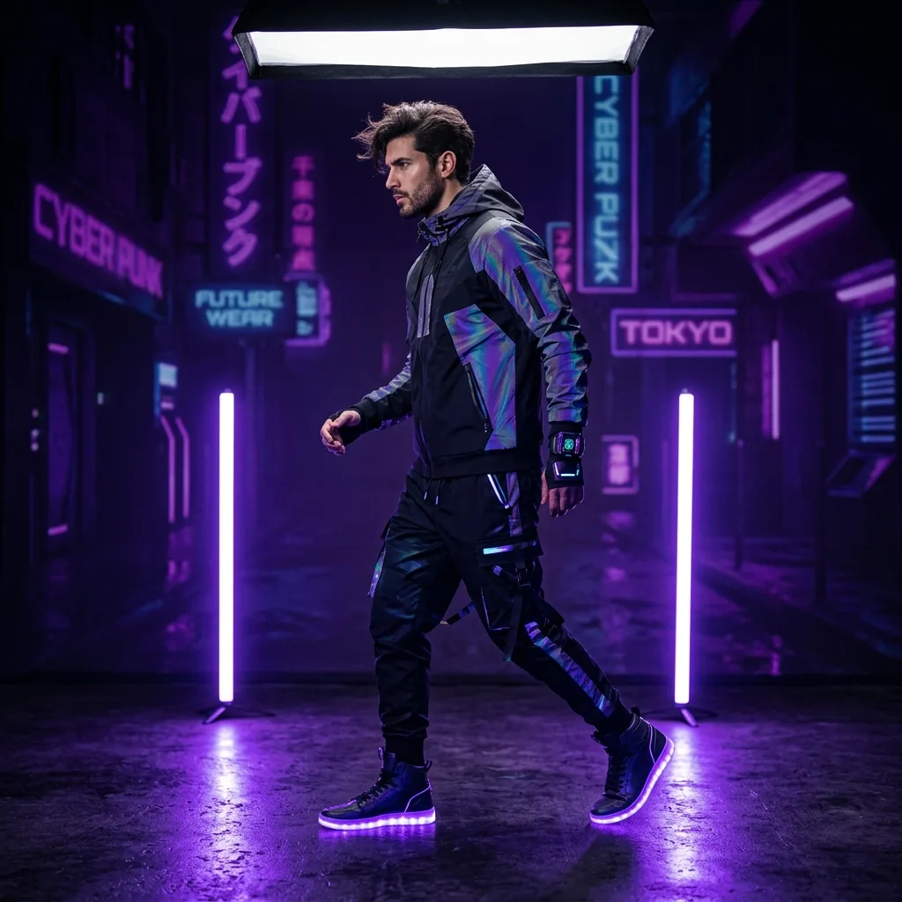

**#484 · Photography Prompt · <code>Vinano Image v2</code>**

<details>
<summary>Show prompt</summary>

```
Fashion photography, professional man model, shot Canon eos r3, 50mm f/1.2 rf lens, f/2.8 settings, 1/160s, iso 1600, gradient neon violet, streetwear style, holographic effect on wear, luminescent sneaker soles, dark backdrop deep purple atmospheric lighting, professional studio setup two led strip lights at floor level and one overhead softbox, cyberpunk aesthetic, side profile active pose silhouette, dramatic contrast, ultra sharp details, true-to-life photorealistic quality, rich detailing Maintain consistent colour harmony and crisp focus across the whole frame.
```

</details>

---

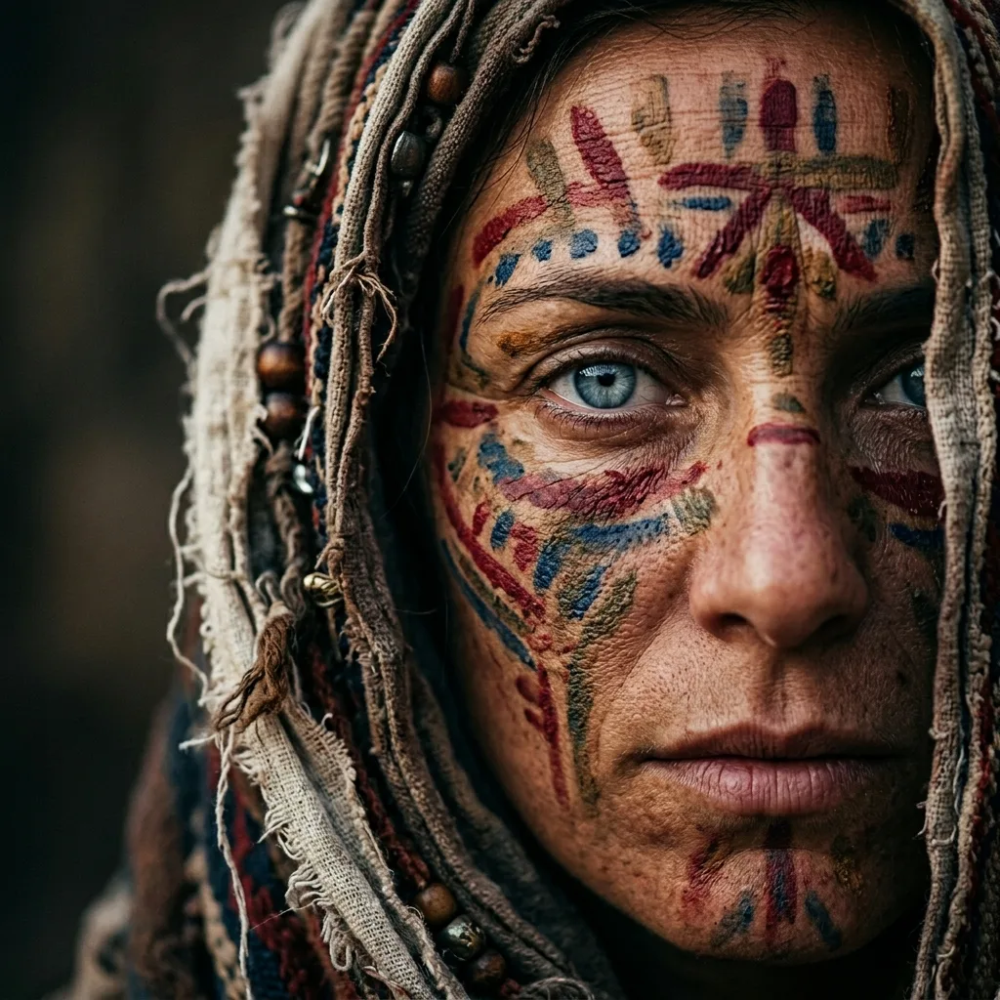

**#485 · Photography Prompt · <code>Vinano Image Pro</code>**

<details>
<summary>Show prompt</summary>

```
A dramatic ultra-realistic portrait of a woman shown in extreme close-up, only half of her face visible. Her skin is painted bold tribal markings in deep red, navy blue, and muted earth tones, layered rough textures and symbolic patterns. One striking light-blue eye is sharply in focus, conveying strength, resilience, and quiet intensity. She wears weathered fabric and woven textiles around her head, frayed edges and smallwooden beads, suggesting ancient or nomadic culture. filmic, cinematic lighting soft shadows, shallow depth of field, dark neutral background, hyper-detailed skin texture, painterly realism, 8K quality, editorial poster style, moody and powerful atmosphere. Preserve realistic proportions and depth for a confident, professional finish.
```

</details>

---

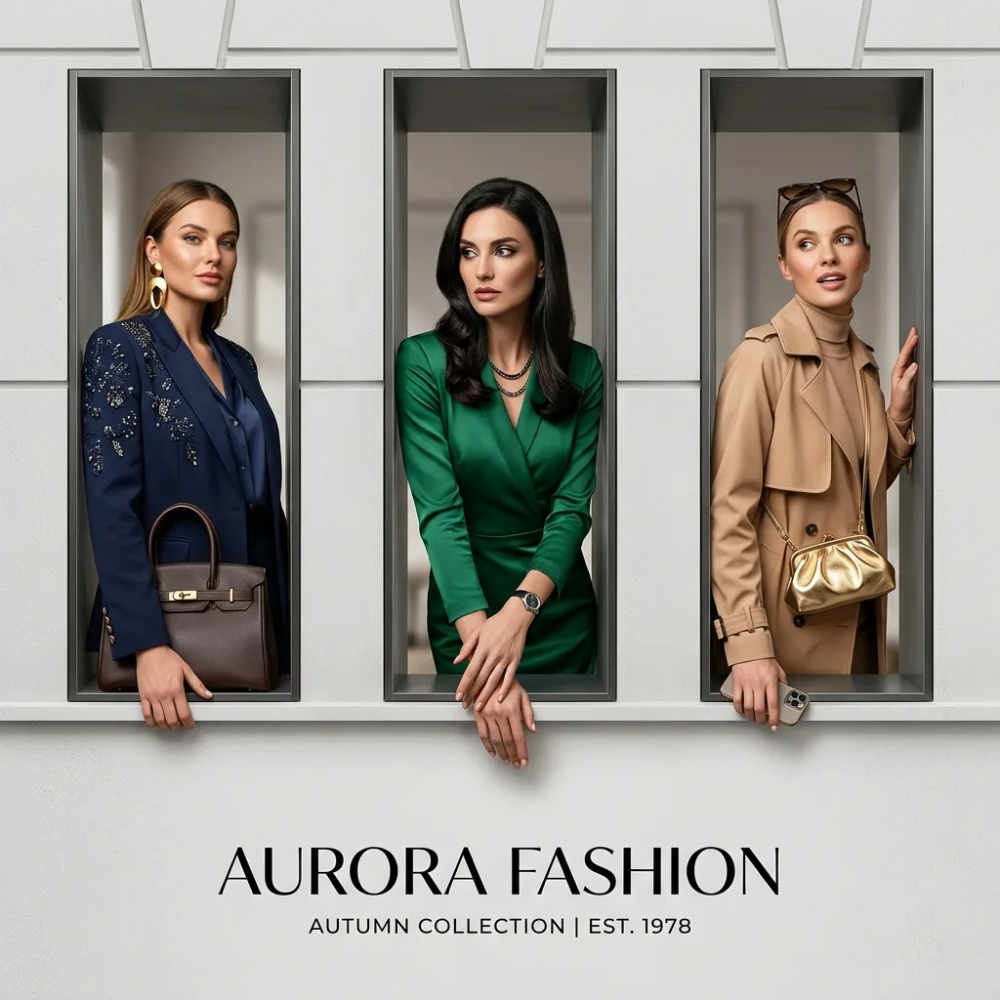

**#486 · Photography Prompt · <code>Vinano Image Pro</code>**

<details>
<summary>Show prompt</summary>

```
A luxury [BRAND] brand advertisement featuring three stylish [ATHLETES / MODELS / PEOPLE] arranged in a single horizontal 1×3 grid, each posed in their own separate architectural window frame.

Composition & framing:
3 vertical window niches aligned side-by-side horizontally, Each character shown in a waist-up mid-shot, Fully inside the frame, hands and props naturally breaking the bottom/side frame edges, No legs or lower body visible, hands anatomically correct, no missing fingers, no deformed limbs. All 3 frames must be fully visible, no cropping at the top or bottom, Clean, symmetrical, editorial alignment, consistent camera perspective, true-to-life photorealistic fashion photography, DSLR, 85mm lens, shallow depth of field, natural skin texture, real pores, realistic fabric texture

Character slots (left to right):
[CHARACTER 1] wearing [OUTFIT 1], holding [OBJECT 1], in [POSE/ACTION 1], [EXPRESSION 1], [ACCESSORIES 1].
[CHARACTER 2] wearing [OUTFIT 2], holding [OBJECT 2] or doing [GESTURE 2], hands centered, breaking the frame edge outward (not sideways), [EXPRESSION 2], [ACCESSORIES 2].
[CHARACTER 3] wearing [OUTFIT 3], holding/carrying [OBJECT 3], projecting [VIBE 3], [EXPRESSION 3], [ACCESSORIES 3].

Style:
Authentic [BRAND] premium styling, couture-inspired detailing, expressive editorial fashion poses, glamorous, iconic, fashion-forward campaign vibe.

Backdrop & materials:
Elegant [BACKGROUND COLOR + MATERIAL] wall backdrop subtle textures, refined architectural detailing, premium finish.

Lighting & camera:
High-fashion bright studio lighting, soft shadows, high contrast contours, realistic reflections, commercial studio photography, no CGI, no illustration, crisp product highlights. Aspect ratio & layout control: Ultra-wide horizontal composition, 1×3 grid, all three niches visible, balanced spacing.

Aim for an editorial, design-driven look with deliberate negative space.
```

</details>

---

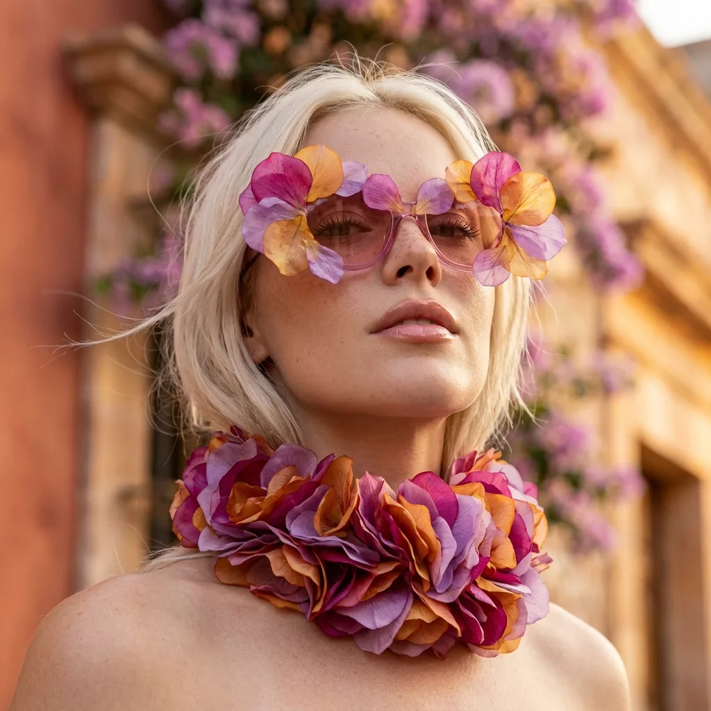

**#487 · Photography Prompt · <code>Vinano Image v2</code>**

<details>
<summary>Show prompt</summary>

```
Low-angle close-up portrait of a platinum blonde woman wearing oversized sculptural sunglasses crafted from delicate translucent layered flower petals in vibrant magenta, amber, and lilac hues, subtle silk texture visible in each petal soft golden light passing through the edges, an extravagant couture choker necklace constructed from densely layered matching petals wrapping seamlessly around her entire neck dimensional depth and organic curvature, her chin slightly lifted a confident sculpted jawline, subtle freckles dusted across the bridge of her nose, naturally hydrated glossy lips a soft highlight along the cupid’s bow, fine platinum hair strands gently lifted by a warm breeze delicate motion at the ends, standing against a softly textured architectural backdrop of warm terracotta walls washed in golden sunset light cascading lilac bougainvillea and amber-toned stone details, background melting into creamy magenta and lavender bokeh soft atmospheric glow, rich golden hour sunlight illuminating her face evenly gentle shadow contouring, warm reflected light from terracotta surfaces enhancing skin luminosity, faint rim light outlining her hair and shoulders, ultra-true-to-life photorealistic high-fashion editorial photography, cinematic jewel-toned color grading balancing amber highlights soft lilac shadows and magenta accents, shallow depth of field elegant telephoto compression, razor-sharp focus on eyelashes and petal contours, shot on Sony A1, 70–200mm lens at 135mm, f/2, ISO 125, 1/1000s, professional editorial sharpness, museum-quality detail, vertical 2:3 composition eye aligned along upper third

–ar 2:3 –v 6 –s 900 –q 3 –style raw –no text, harsh shadows, lens distortion, oversaturation, artifacts, artificial glow

Maintain consistent colour harmony and crisp focus across the whole frame.
```

</details>

---

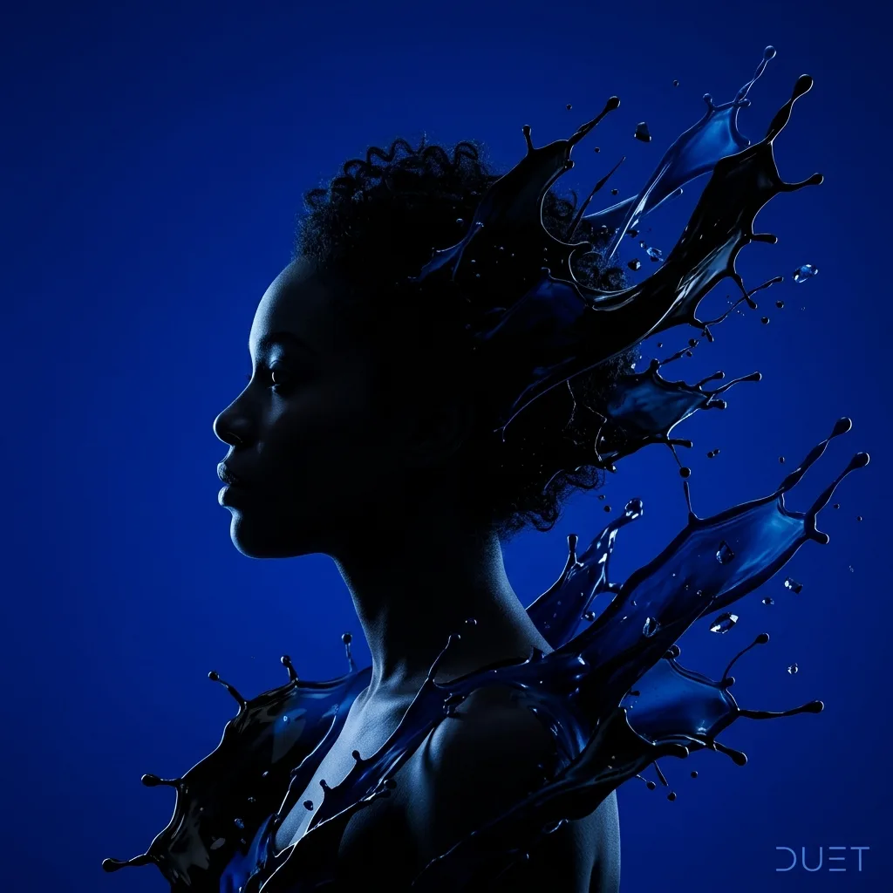

**#488 · Photography Prompt · <code>Vinano Image v2</code>**

<details>
<summary>Show prompt</summary>

```
Convert this image into a dramatic, stylized portrait (use the same face as the uploaded photo), 9:16 aspect ratio, featuring a dark, almost silhouetted figure in profile looking to the left. The background is a deep electric blue. Intense black and sapphire paint splashes burst outward from the head and shoulders, creating powerful motion energy. Ultra-sharp lighting, cinematic contrast, HD photo.
Signature: DUET

Keep edges clean and the overall composition balanced for a polished, gallery-ready result.
```

</details>

---

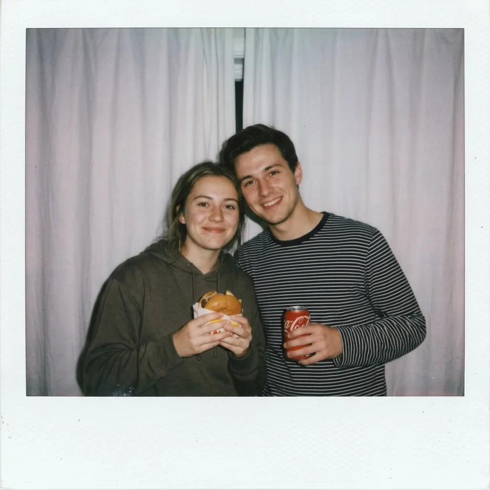

**#489 · Photography Prompt · <code>Vinano Image v2</code>**

<details>
<summary>Show prompt</summary>

```
{
 "type": "image_generation_prompt",
 "style": "Polaroid-style candid photography",
 "camera_style": {
 "camera": "Polaroid instant camera",
 "look": "ordinary snapshot",
 "effects": ["slight blur",
 "soft focus",
 "flash-lit dark room glow",
 "light scattering from on-camera flash",
 "subtle film grain",
 "slight exposure falloff"]
 },
 "identity_preservation": {
 "use_reference_images": true,
 "strict_identity_lock": true,
 "alter_face": false,
 "notes": "Do not change or distort either person’s facial features, expressions, or proportions."
 },
 "subjects": [{
 "gender": "female",
 "identity": "user",
 "pose": "cute, casual pose standing close to the boy",
 "prop": "holding a burger",
 "expression": "natural, playful, candid"
 },
 {
 "gender": "male",
 "identity": "boy from reference",
 "pose": "cute, relaxed pose next to the girl",
 "prop": "holding a red Coca-Cola can",
 "expression": "natural, playful, candid"
 }],
 "interaction": {
 "relationship": "friendly and cute",
 "body_language": "standing close together, relaxed, slightly leaning toward each other"
 },
 "environment": {
 "background": "plain white curtains",
 "location": "indoor room",
 "lighting": {
 "type": "single on-camera flash",
 "quality": "consistent, frontal flash lighting",
 "mood": "cozy, intimate, nostalgic"
 }
 },
 "composition": {
 "framing": "medium shot",
 "angle": "eye-level",
 "balance": "centered, casual snapshot composition"
 },
 "aesthetic": {
 "vibe": "cute, nostalgic, intimate",
 "era_feel": "classic instant film look",
 "imperfections": ["minor blur",
 "soft edges",
 "natural exposure inconsistencies"]
 },
 "constraints": ["No change to faces",
 "No dramatic posing",
 "No artificial glamour or studio look",
 "No text or watermarks",
 "Must look like a real Polaroid photo"],
 "output_goal": "Create a realistic Polaroid-style instant photo of a boy and girl posing cutely together indoors, white curtains behind them, flash-lit from a dark room, the boy holding a red Coca-Cola can and the girl holding a burger, maintaining an authentic, nostalgic snapshot feel."
}

Aim for an editorial, design-driven look with deliberate negative space.
```

</details>

---

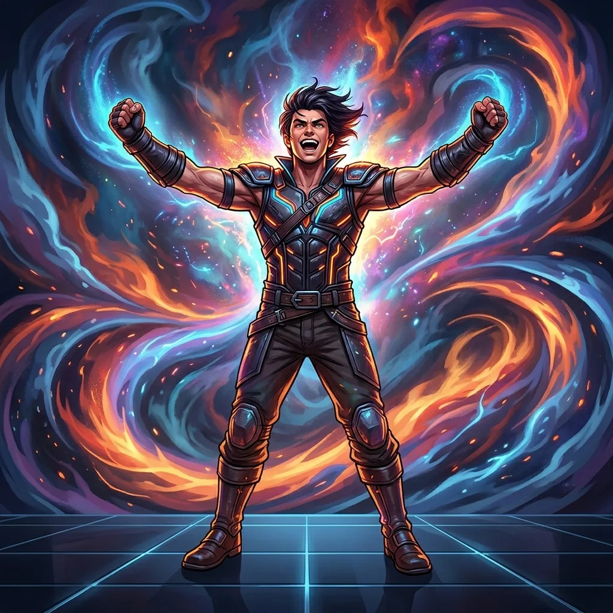

**#490 · Photography Prompt · <code>Vinano Image v2</code>**

<details>
<summary>Show prompt</summary>

```
Fantastic digital painting of a young man high detail, smooth shading, and sharp, bold lines. He stands in a powerful victory pose his arms outstretched, confident and fearless expression. A brilliantly blended background swirling smoke and flame like energy effects surrounds him. Neon sparks radiate from his body, creating a vibrant, glowing aura filmic, cinematic lighting and dramatic contrast. Render with rich micro-detail while keeping the layout uncluttered and intentional.
```

</details>

---


**#491 · Photography Prompt · <code>Vinano Image v2</code>**

<details>
<summary>Show prompt</summary>

```
{
 t && (e.push(l), s(l, "return"), t = false, n2 = true, r.length = 0);
 } };
})()),dehydratedQueryClient:$R[29]={mutations:$R[30]=[],queries:$R[31]=[$R[32]={dehydratedAt:1782300101083,state:$R[33]={data:$R[13],dataUpdateCount:1,dataUpdatedAt:1782300101083,error:null,errorUpdateCount:0,errorUpdatedAt:0,fetchFailureCount:0,fetchFailureReason:null,fetchMeta:null,isInvalidated:!1,status:"success",fetchStatus:"idle"},queryKey:$R[34]=["imagePromptDetail",171],queryHash:"[\"imagePromptDetail\",171]"}]}}})($R["tsr"]);document.currentScript.remove()

Maintain consistent colour harmony and crisp focus across the whole frame.
```

</details>

---

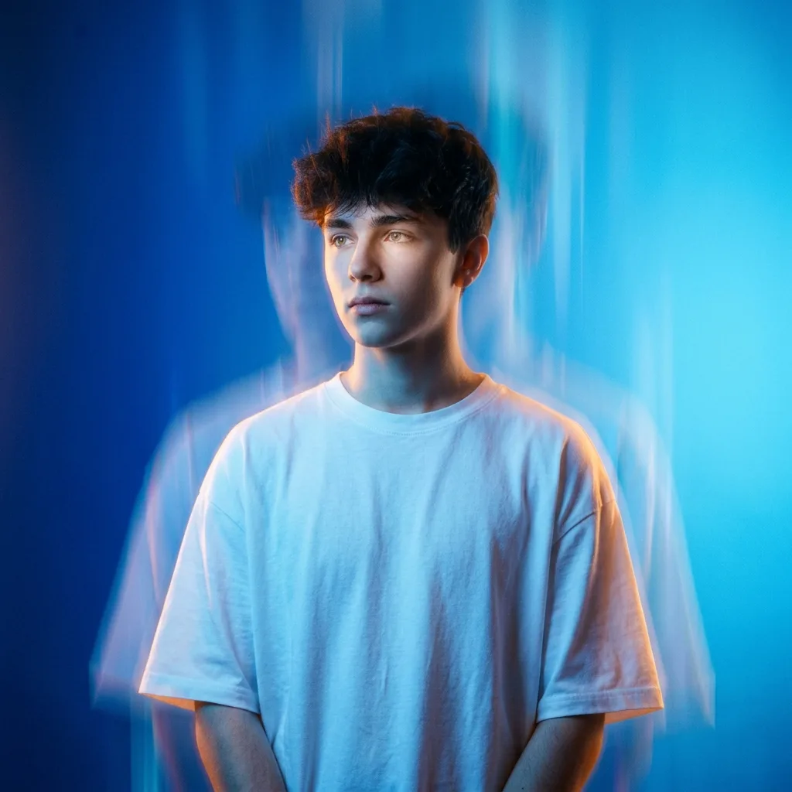

**#492 · Photography Prompt · <code>Vinano Image v2</code>**

<details>
<summary>Show prompt</summary>

```
Create a cinematic, high-fashion half-length portrait of me a dreamy editorial vibe.
Use multi-exposure blur for ghosting and vertical streaks.
Set against a blue gradient background
(#0033A0 to #66CCFF), the subject wears an oversized white T-shirt.
Apply high-contrast lighting (cool blue wash + orange/yellow edge highlights) for a futuristic glow.
Expression: neutral/introspective, eyes softly lit.
Simulate 50-85mm lens at f/1.8 shallow dep r field
Enhance motion blur and chromatic separation, keeping central details sharp.
Aim for a surreal, digital-youth mood blending minimalism and light play.

Keep edges clean and the overall composition balanced for a polished, gallery-ready result.
```

</details>

---

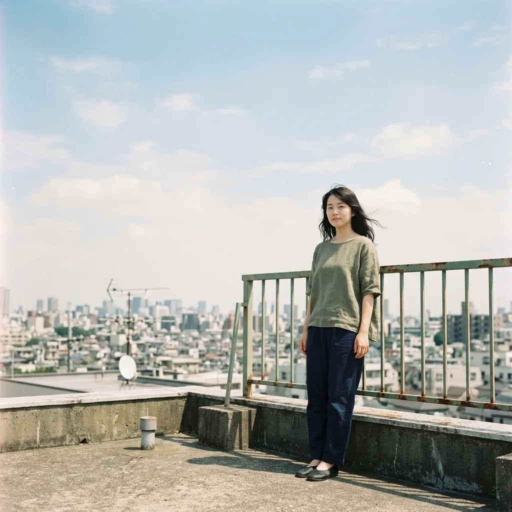

**#493 · Photography Prompt · <code>Vinano Image v2</code>**

<details>
<summary>Show prompt</summary>

```
Japanese negative film aesthetic, rooftop summer scene, soft natural sunlight, slight overexposure highlights, low contrast, muted faded colors, subtle grain subject standing or sitting on rooftop edge area, body relaxed, slight wind moving hair and clothes, looking toward camera calm distant gaze, not posing open sky, empty space, minimal elements, imperfect composition, quiet isolated mood, nostalgic and reflective, “memory-like realism” --2:3 Render with rich micro-detail while keeping the layout uncluttered and intentional.
```

</details>

---

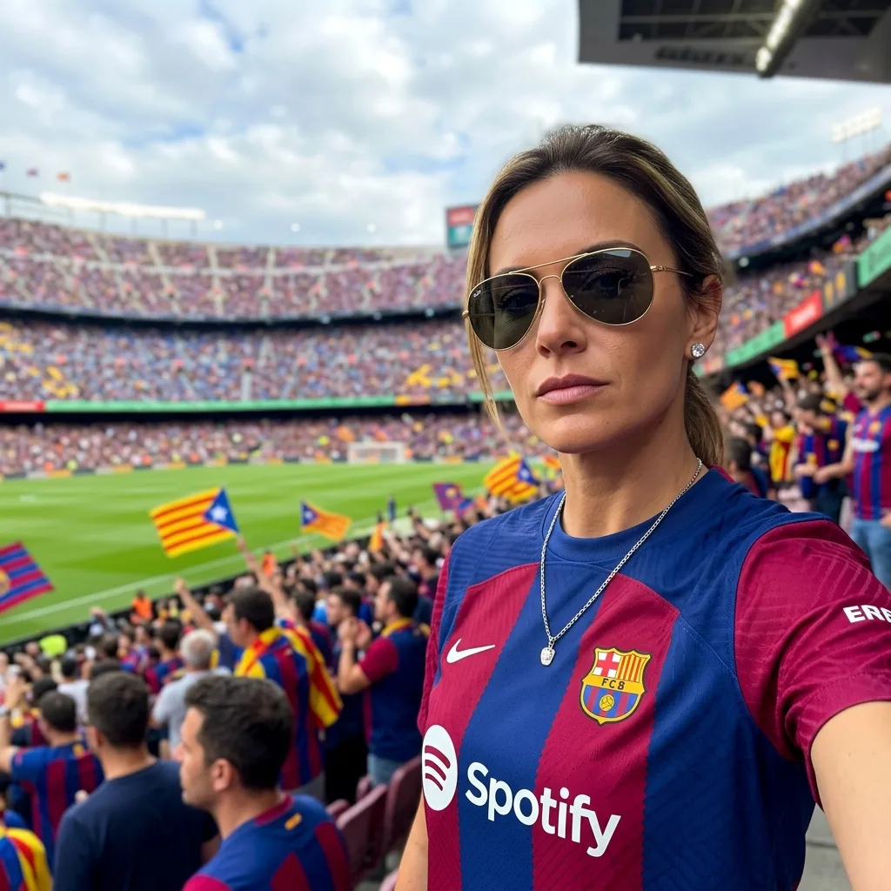

**#494 · Photography Prompt · <code>Vinano Image Pro</code>**

<details>
<summary>Show prompt</summary>

```
{
 "type": "image_generation_prompt",
 "language": "en",
 "style": "realistic smartphone photography, vibrant sports atmosphere",
 "aspect_ratio": "3:4",
 "identity_preservation": {
 "use_reference_image": true,
 "strict_identity_lock": true,
 "alter_face": false,
 "alter_features": false,
 "notes": "Use the uploaded reference photo. Preserve 100% of the woman’s facial features, proportions, skin texture, hair, and identity."
 },
 "subject": {
 "gender": "female",
 "pose": {
 "type": "selfie-style pose",
 "orientation": "facing the camera",
 "action": "static moment, as if pausing to take a selfie"
 },
 "expression": "serious, confident, and admiring",
 "appearance": {
 "hair": "unchanged from reference image",
 "accessories": ["aviator-style sunglasses gold frame",
 "diamond stud earring in the right ear",
 "silver chain necklace a pendant"]
 },
 "wardrobe": {
 "top": "official FC Barcelona jersey Spotify sponsorship"
 }
 },
 "composition": {
 "framing": "centered composition",
 "foreground": "woman occupying the first plane",
 "background": "football stadium and crowd",
 "perspective": "first-person selfie perspective"
 },
 "environment": {
 "location": "packed football stadium",
 "elements": ["vibrant green football pitch",
 "crowded stands full of fans",
 "energetic stadium atmosphere"],
 "weather": "cloudy sky",
 "mood": "excitement, celebration, pride"
 },
 "lighting": {
 "type": "natural daylight",
 "conditions": "bright but diffused due to cloudy sky",
 "effects": ["vivid colors",
 "balanced exposure",
 "clear facial details"]
 },
 "camera": {
 "device_style": "smartphone rear camera",
 "shot_type": "selfie-style medium close-up",
 "focus": "sharp focus on the subject slightly softened background",
 "quality": "high sharpness and clarity"
 },
 "quality": {
 "realism": "highly realistic",
 "color": "vibrant and true-to-life",
 "detail_level": "clear textures on clothing, face, and stadium"
 },
 "constraints": ["Do not alter facial features",
 "No stylization or artistic filters",
 "No distortion of body or face",
 "No text overlays or watermarks",
 "Maintain realistic proportions and lighting"],
 "output_goal": "Create a realistic, selfie-style photo of a woman wearing a Barcelona jersey in front of a packed football stadium, preserving her exact facial identity and conveying pride and admiration within a vibrant match-day atmosphere."
}

Aim for an editorial, design-driven look with deliberate negative space.
```

</details>

---

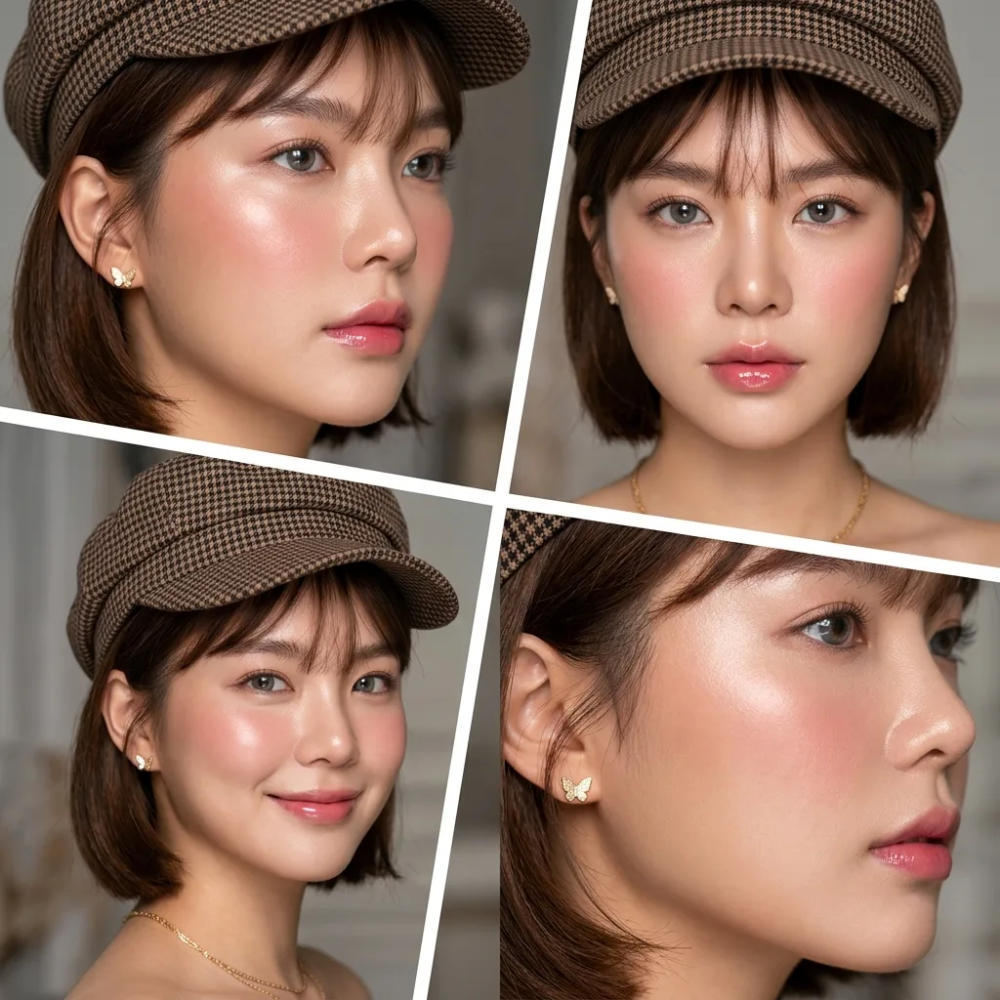

**#495 · Photography Prompt · <code>Vinano Image Pro</code>**

<details>
<summary>Show prompt</summary>

```
{
 "prompt_type": "beauty_editorial_collage",
 "layout": {
 "structure": "4-panel split-screen grid",
 "dividers": "Thick white diagonal borders",
 "style": "Modern magazine spread aesthetic"
 },
 "subject": {
 "demographic": "Young woman",
 "aesthetic": "Clean girl / K-beauty influence",
 "features": {
 "skin": "Flawless, dewy, 'glass skin' texture, high luminosity",
 "hair": "Short brown bob cut wispy bangs, smooth texture",
 "eyes": "Soft grey/hazel contacts"
 }
 },
 "makeup": {
 "style": "No-makeup makeup look",
 "details": ["Soft rosy blush high on cheeks",
 "Glossy pink lip tint",
 "Groomed natural fluffy brows",
 "Subtle mascara"]
 },
 "attire_and_accessories": {
 "headwear": "Brown houndstooth pattern newsboy cap (Baker boy hat)",
 "jewelry": "Small delicate gold butterfly stud earrings, thin gold chain necklace"
 },
 "panel_composition": {
 "top_left": "Close-up 3/4 angle, focus on cheek highlight and earring",
 "top_right": "Direct front-facing portrait, symmetrical composition",
 "bottom_left": "Portrait hat, 3/4 turn, looking at camera",
 "bottom_right": "Extreme close-up side profile, cropping into face"
 },
 "technical_specs": {
 "resolution": "8K",
 "lighting": "Soft commercial studio lighting, ring light reflection in eyes",
 "color_grading": "Desaturated background, warm skin tones, high contrast",
 "style": "High-end beauty photography, hyper-realistic"
 }
}

Aim for an editorial, design-driven look with deliberate negative space.
```

</details>

---

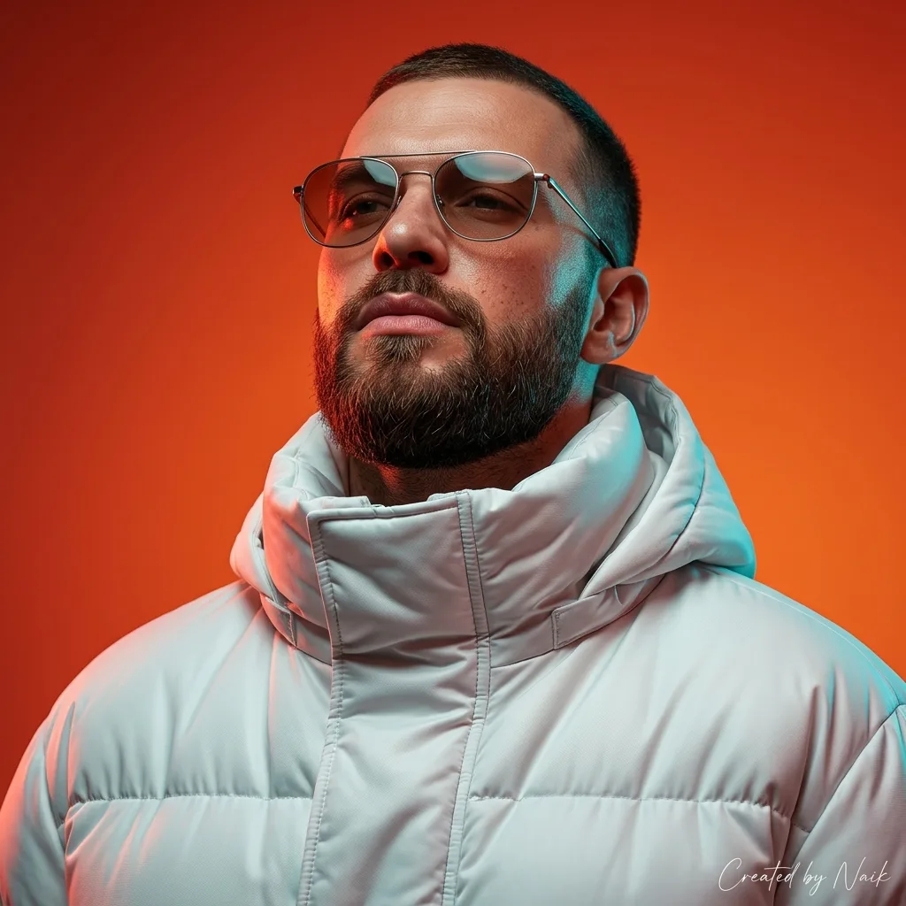

**#496 · Photography Prompt · <code>Vinano Image v2</code>**

<details>
<summary>Show prompt</summary>

```
Create an ultra-true-to-life photorealistic cinematic portrait of a man viewed from a slightly low angle looking upward a confident, powerful expression. Generate his face the uploaded portrait photo. The composition is a tight upper-body portrait the head tilted slightly upward, emphasizing the jawline and beard structure.
The background is a smooth vibrant studio
gradient transitioning between deep orange and warm red tones, creating a
dramatic modern aesthetic. Use strong cinematic dual-color lighting: warm
red/orange light from one side and cool teal/blue rim lighting from the
opposite side to create striking contrast across the face and beard. The man
is wearing a futuristic white oversized puffer jacket large quilted sections
and a high protective collar. The jacket should look premium and modern
realistic fabric folds, padded insulation volume, and subtle material sheen
similar to high-end technical winter fashion. Add extremely detailed textures:
visible skin pores, beard hair strands, subtle facial imperfections, realistic lip
texture, micro skin reflections, and detailed hair follicles. The sunglasses
should have thin metal frames realistic reflections and slightly tinted
lenses reflecting the colored lighting. The white puffer jacket must show
detailed stitching, fabric grain, padded segments, and realistic light interaction
across the material. Lighting should create soft shadows, strong color
contrast, and dramatic highlights across the face, beard, glasses, and jacket.
Maintain sharp focus on the subject studio-quality depth and clarity.
Ultra true-to-life photorealistic portrait photography, cinematic studio lighting, hyper-
detailed textures, 8K detail, premium editorial fashion portrait, extremely
realistic skin and fabric materials.
Add a subtle handwritten text in the bottom-right corner that reads "Created by Naik", elegant fashion-editorial signature style, thin white ink, slightly transparent, like a photographer's signature on a luxury magazine shoot.

Aim for an editorial, design-driven look with deliberate negative space.
```

</details>

---

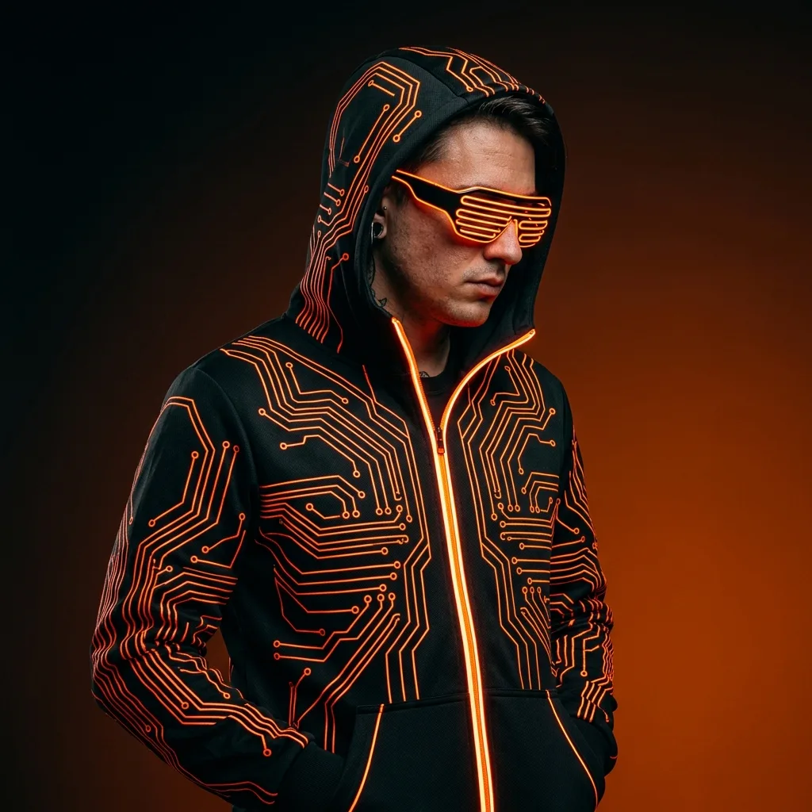

**#497 · Photography Prompt · <code>Vinano Image v2</code>**

<details>
<summary>Show prompt</summary>

```
Ultra-realistic cinematic studio portrait provided person only. Subject wears black cyberpunk hoodie fully covered in bright glowing neon-orange circuit lines and illuminated zipper, hood up, hands in pockets, three-quarter pose facing right, head slightly down. Round shutter glasses glowing orange bars. Dramatic studio lighting, glow casting light spill. Smooth dark-to-burnt orange gradient background. Style locked. Render with rich micro-detail while keeping the layout uncluttered and intentional.
```

</details>

---

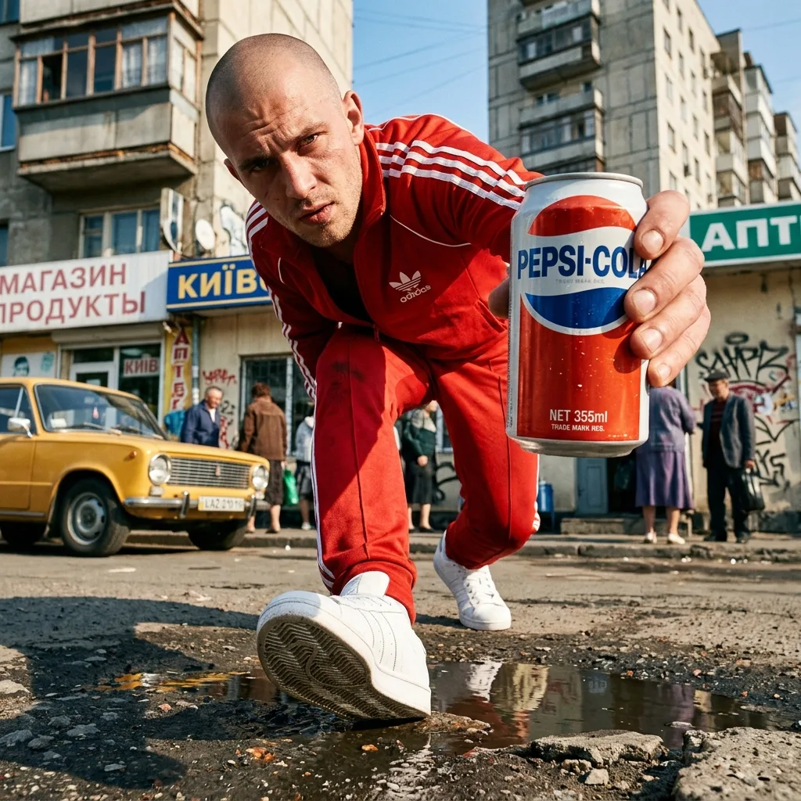

**#498 · Photography Prompt · <code>Vinano Image v2</code>**

<details>
<summary>Show prompt</summary>

```
Ultra-realistic, glossy magazine-style portrait of a young male model, bald, a stem, rugged expression and defined facial texture (pores, stubble shadows, subtle scars). Camera at shoe level (very low angle), wide-angle perspective, model tilted toward the lens, leaning forward and holding a Pepsi can extremely close to the camera - can label perfectly facing viewer and crisply legible realistic metal reflections. Wearing a red Adidas tracksuit visible Adidas logo and clean white sneakers, one foot stepped forward in the foreground. Urban USSR 1990s street environment: weathered concrete, vintage shop signs, old cars, period graffiti, small puddles. Bright sunny daytime strong direct sunlight casting sharp cinematic shadows, warm sunlight highlights, slight wet reflections on asphalt and subtle water splashes near shoes for dynamism. Shallow depth of field (pin-sharp on face and can, creamy bokeh), ultra high detail, high contrast, vivid colors, warm sunlight subtle teal-orange grade. Commercial editorial retouching style but preserving skin texture, enhanced clarity on label and metal, realistic specular highlights, natural micro-contrast. Composition: Pepsi can prominent in right foreground, eye-line slightly above center, negative space for masthead/logo--v 7 --style raw --quality 2 --ar 9:16 --chaos 3 --stylize 499-weird 99--exp 50 Emphasise material texture and natural light so the final frame feels tactile and premium.
```

</details>

---

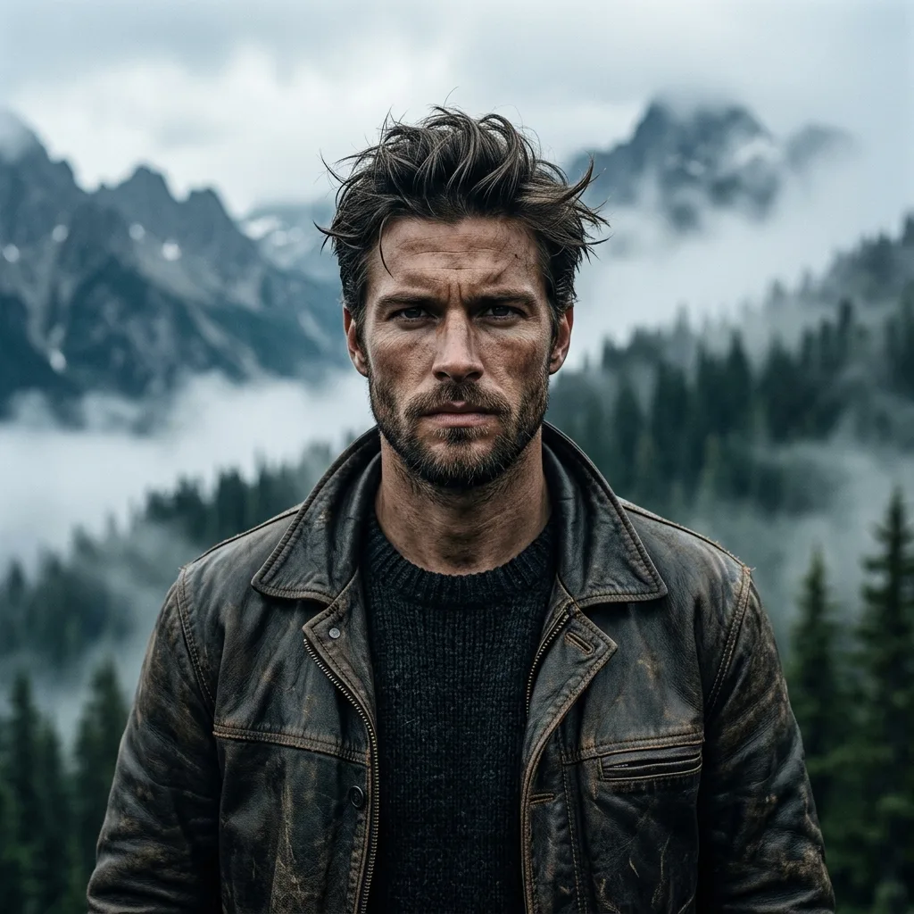

**#499 · Photography Prompt · <code>Vinano Image v2</code>**

<details>
<summary>Show prompt</summary>

```
{
 "render_goal": "Create a hyper-realistic, cinematic portrait a rugged outdoor adventure aesthetic",
 "subject": {
 "gender": "male",
 "age_range": "mid-to-late 20s",
 "appearance": {
 "hair": "textured, windswept",
 "beard": "short, well-groomed",
 "facial_features": "sharp, chiseled",
 "expression": "intense, serious"
 },
 "skin_detail": "ultra-detailed, natural texture realistic tones"
 },
 "wardrobe": {
 "outerwear": "worn dark leather jacket",
 "details": "visible stitching, rugged texture"
 },
 "environment": {
 "location": "outdoor mountain landscape",
 "background": {
 "mountains": "misty, fog-covered",
 "trees": "dark evergreen forest fading into distance",
 "atmosphere": "dense atmospheric fog"
 }
 },
 "lighting_and_color": {
 "lighting_style": "moody, cinematic",
 "light_source": "soft overcast daylight",
 "shadows": "dramatic but natural",
 "color_palette": "cool, desaturated tones"
 },
 "camera_settings": {
 "lens": "85mm",
 "aperture": "f/1.8",
 "depth_of_field": "shallow",
 "focus": "razor-sharp on subject, blurred background"
 },
 "photography_style": {
 "quality": "professional photography",
 "realism_level": "hyper-realistic",
 "details": "high micro-detail, crisp textures, cinematic contrast"
 }
}

Keep edges clean and the overall composition balanced for a polished, gallery-ready result.
```

</details>

---

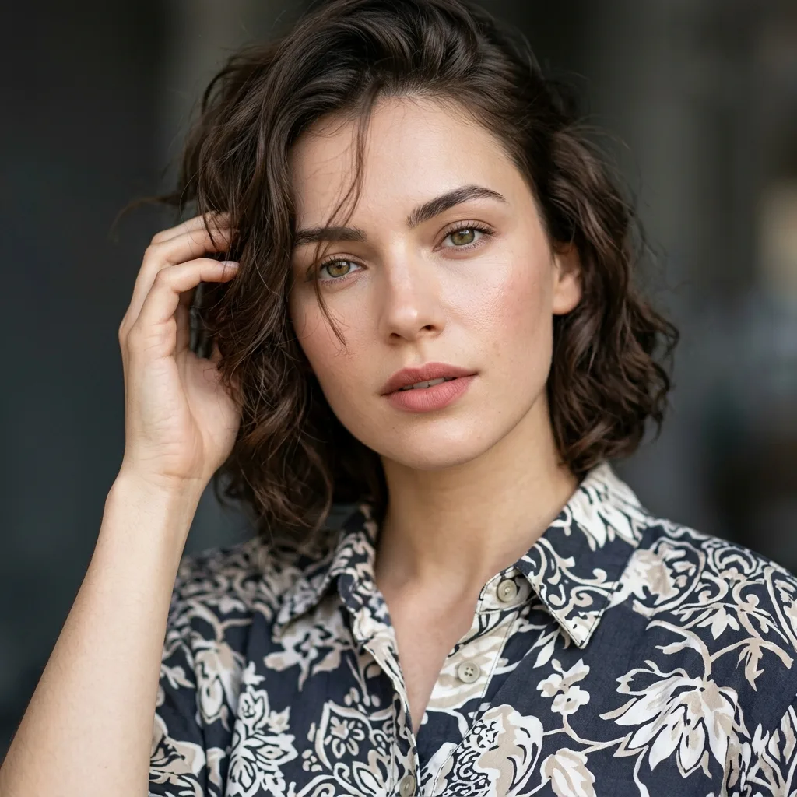

**#500 · Photography Prompt · <code>Vinano Image v2</code>**

<details>
<summary>Show prompt</summary>

```
{
 "image_type": "portrait",
 "generation_quality": "8K ultra-high resolution",
 "realism_level": "true-to-life photorealistic",
 "subject": {
 "human_presence": true,
 "gender_presentation": "feminine",
 "age_appearance": "young adult",
 "visible_pose": {
 "head_position": "slightly tilted",
 "hand_position": "one hand raised touching hair near the side of the head",
 "shoulder_visibility": "upper torso visible"
 },
 "facial_expression": {
 "mouth": "slightly parted lips",
 "expression": "neutral to soft, relaxed",
 "gaze_direction": "looking directly toward the camera"
 }
 },
 "face_details": {
 "face_shape": "oval",
 "skin_texture": "smooth visible natural skin texture",
 "skin_finish": "soft matte subtle highlights",
 "cheeks": "natural blush visible",
 "nose": {
 "shape": "straight",
 "size": "medium",
 "tip": "softly rounded"
 },
 "lips": {
 "shape": "full",
 "color": "muted warm rose / nude",
 "texture": "matte finish"
 },
 "jawline": "softly defined",
 "chin": "rounded"
 },
 "eyes": {
 "shape": "almond-shaped",
 "eye_color": "appears green or hazel under lighting",
 "eyelids": "natural crease visible",
 "lashes": "natural, not exaggerated",
 "eyebrows": {
 "shape": "well-groomed, natural arch",
 "density": "medium-full",
 "color": "dark brown"
 }
 },
 "hair": {
 "color": "medium to dark brown",
 "length": "short to medium",
 "texture": "wavy",
 "style": "loose, slightly tousled",
 "parting": "off-center",
 "movement": "some strands falling across the forehead and partially covering one eye",
 "shine": "natural sheen visible"
 },
 "makeup": {
 "foundation": "natural, skin-like",
 "blush": "soft peach-pink",
 "lip_product": "matte lipstick",
 "eye_makeup": "minimal, natural enhancement",
 "overall_style": "clean, understated, realistic"
 },
 "clothing": {
 "garment_type": "button-up shirt",
 "fit": "relaxed fit",
 "fabric_appearance": "lightweight fabric",
 "pattern": "abstract floral or ornamental pattern",
 "color_palette": {
 "primary": "dark navy or charcoal",
 "secondary": "off-white or light beige"
 },
 "buttons": {
 "visibility": "visible",
 "color": "light neutral"
 },
 "collar": "standard pointed collar"
 },
 "lighting": {
 "type": "natural light",
 "direction": "side lighting",
 "contrast": "soft to medium contrast",
 "highlights": "gentle highlights on cheekbones, nose, and lips",
 "shadows": "soft shadows adding depth to facial contours"
 },
 "background": {
 "type": "out-of-focus",
 "style": "minimal, neutral",
 "colors": "dark gray and muted tones",
 "depth_of_field": "shallow",
 "distractions": "none visible"
 },
 "camera_and_composition": {
 "framing": "close-up portrait",
 "angle": "eye-level",
 "focus": "sharp focus on face",
 "bokeh": "soft background blur",
 "crop": "head and upper torso"
 },
 "overall_aesthetic": {
 "mood": "calm, intimate",
 "style": "editorial portrait photography",
 "visual_cleanliness": "high",
 "artifacts": "none visible",
 "post_processing": "minimal, natural color grading"
 }
}

Keep edges clean and the overall composition balanced for a polished, gallery-ready result.
```

</details>

---

[Next page →](./photography-6.md)
