# Photography — full gallery

[← Back to README](../README.md) · [`prompts.json`](../prompts/prompts.json) · **630** prompts · page 6 / 7

[← Prev](./photography-5.md) — [1](./photography.md) · [2](./photography-2.md) · [3](./photography-3.md) · [4](./photography-4.md) · [5](./photography-5.md) · **6** · [7](./photography-7.md) — [Next →](./photography-7.md)

---

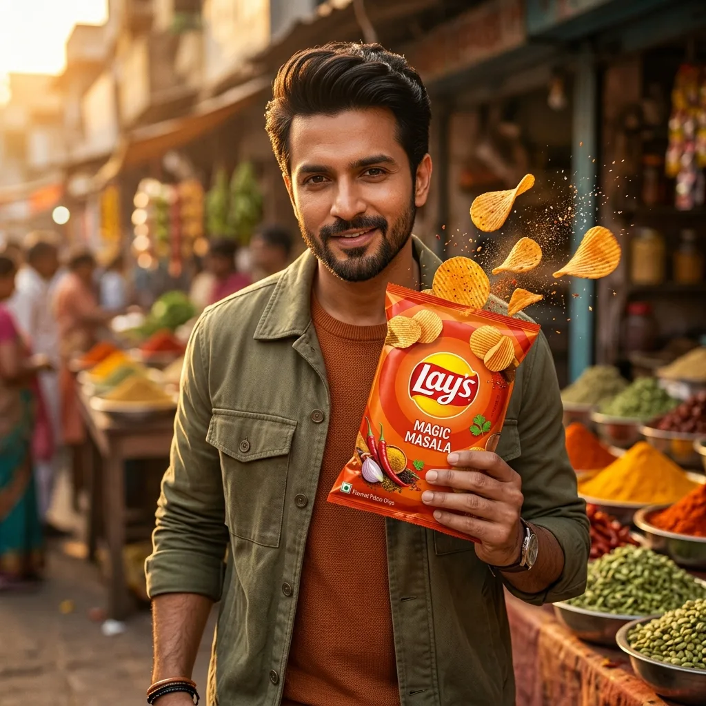

**#501 · Photography Prompt · <code>Vinano Image Pro</code>**

<details>
<summary>Show prompt</summary>

```
A cinematic, ultra-realistic advertising shot of a man holding a Lay’s [FLAVOR NAME] chips packet in his hand.
The packet color, branding, and typography are perfectly accurate to Lay’s official design.
The man’s outfit color, texture, and style match the packet theme (same color palette and mood), modern and stylish, premium fashion look.
His pose is confident and natural, hand clearly gripping the Lay’s packet in the foreground.
Background environment matches the flavor theme — spices, ingredients, atmosphere, and lighting inspired by the flavor (for example: fiery spices for masala, fresh greens for sour cream, smoky tones for barbecue).
Chips are flying in slow motion around the scene realistic motion blur and seasoning particles in the air.
Dramatic golden-hour lighting, cinematic depth of field, sharp focus on the packet, soft background bokeh.
Hyper-realistic textures, commercial food photography, high contrast, rich colors, ultra-detailed, 8K quality, professional brand advertisement style.

Emphasise material texture and natural light so the final frame feels tactile and premium.
```

</details>

---

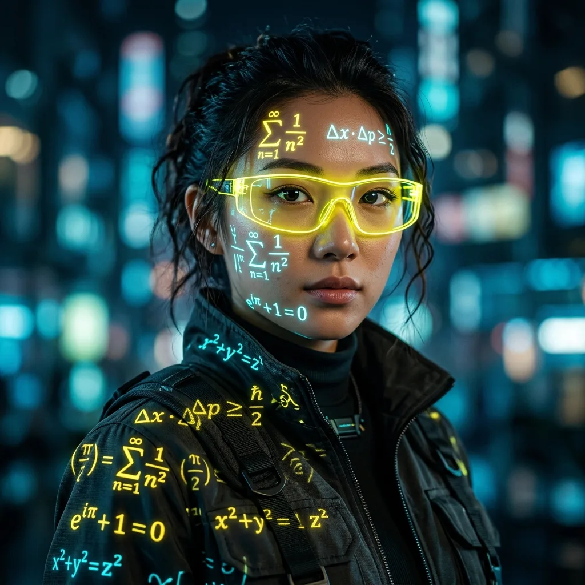

**#502 · Photography Prompt · <code>Vinano Image v2</code>**

<details>
<summary>Show prompt</summary>

```
A futuristic cyber-aesthetic portrait of a young woman wearing glowing neon-yellow glasses, luminous mathematical equations projected across her face and jacket. Soft bokeh blue lights in the background create a high-tech atmosphereHyper-realistic detail, sharp eyes, smooth skin, and vivid color contrast. Sci-fi digital-glow style, immersive and modern." Her expression is calm and focused. The lighting is vibrant and cinematic, reflections on the glasses and warm yellow highlights on her clothing. Emphasise material texture and natural light so the final frame feels tactile and premium.
```

</details>

---

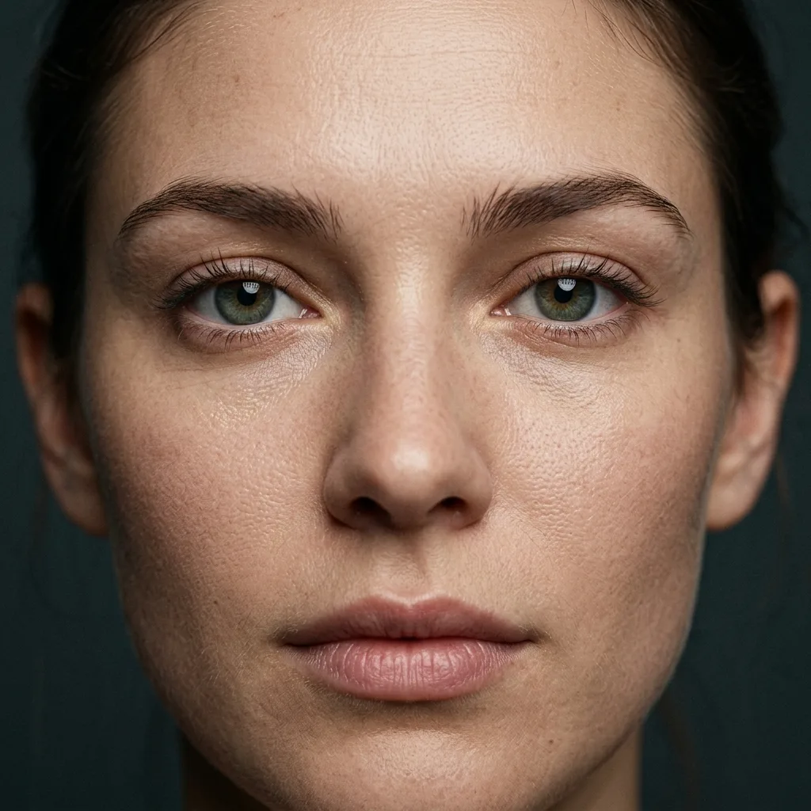

**#503 · Photography Prompt · <code>Vinano Image v2</code>**

<details>
<summary>Show prompt</summary>

```
Transform this image [UPLOAD YOUR IMAGE] into a 64K DSLR-quality shot resolution Ultra-hyperrealistic cinematic Create a true-to-life photorealistic, beauty portrait in a vertical 4:5 frame, captured as a tight close-up to extreme close-up. The framing focuses primarily on the face - from just above the forehead to slightly below the lips — minimal negative space. The camera is positioned mid-close to the subject (same face as the uploaded Maintain consistent colour harmony and crisp focus across the whole frame.
```

</details>

---

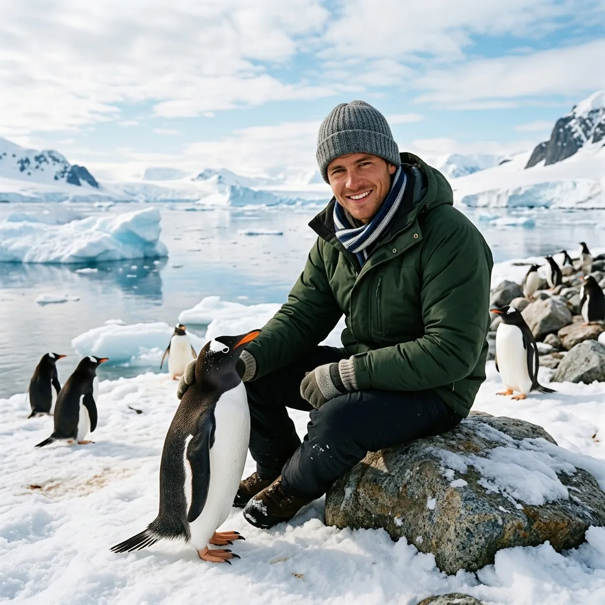

**#504 · Photography Prompt · <code>Vinano Image v2</code>**

<details>
<summary>Show prompt</summary>

```
Ultra-realistic photo featuring a young man (insert user’s photo) in perfect detail, preserving 100% of his facial features, wearing warm winter clothing suitable for the penguins’ icy habitat (thick jacket, scarf, gloves, beanie). The man is interacting naturally penguins in their snowy and icy environment (snow, ice, rocks, frozen water reflections).
Include natural and spontaneous photo poses:
– sitting on a rock while touching a penguin

Preserve realistic proportions and depth for a confident, professional finish.
```

</details>

---

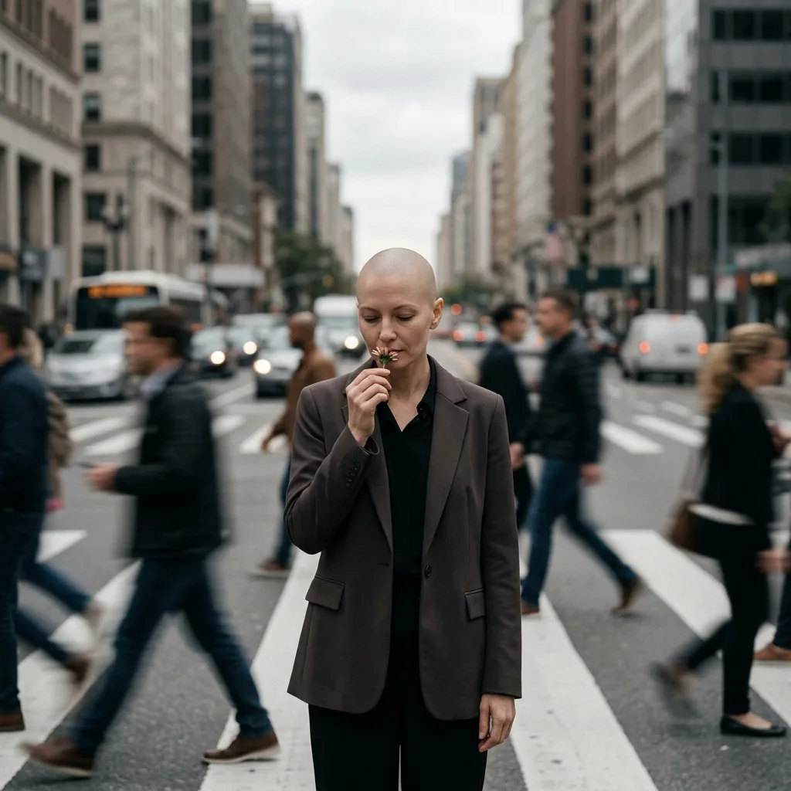

**#505 · Photography Prompt · <code>Vinano Image Pro</code>**

<details>
<summary>Show prompt</summary>

```
{
 "type": "image_generation_prompt",
 "style": "true-to-life photorealistic cinematic street photography, documentary aesthetic",
 "resolution": "ultra-high resolution",
 "identity_preservation": {
 "use_reference_image": true,
 "alter_face": false,
 "strict_identity_lock": true,
 "notes": "Use the uploaded reference image as the compositional base. Replace the central character the woman from the reference image, preserving exact facial structure, skin texture, lighting direction, shadows, depth of field, angle, and emotional expression. No distortions, no artifacts, no skin tone mismatch."
 },
 "subject": {
 "gender": "female",
 "appearance": {
 "hair": "bald (as in the original composition)",
 "age": "adult",
 "expression": "calm, introspective, emotionally neutral",
 "skin": "realistic texture natural pores and tones"
 },
 "pose": {
 "position": "standing still in the center of a busy urban crosswalk",
 "action": "gently smelling a flower held near the face",
 "posture": "upright, relaxed, perfectly static"
 },
 "wardrobe": {
 "outerwear": "dark refined minimalist blazer",
 "top": "black shirt"
 }
 },
 "environment": {
 "location": "busy urban pedestrian crosswalk",
 "atmosphere": "metropolitan street scene",
 "crowd": {
 "behavior": "people moving rapidly around the subject",
 "effect": "motion blur from long exposure"
 }
 },
 "lighting": {
 "type": "natural daylight",
 "conditions": "overcast sky",
 "quality": "soft, diffused light",
 "effects": ["realistic skin tones",
 "no artificial highlights",
 "natural shadows"]
 },
 "cinematic_effects": {
 "long_exposure": true,
 "subject_clarity": "central subject perfectly sharp",
 "surroundings": "crowd blurred motion",
 "mood": "isolation and stillness amid chaos"
 },
 "color_grading": {
 "palette": ["cool grays",
 "muted browns",
 "soft blacks"],
 "saturation": "desaturated",
 "style": "professional cinematic grading"
 },
 "camera": {
 "lens_look": "85mm",
 "depth_of_field": "shallow",
 "grain": "realistic film grain",
 "perspective": "identical to original reference image"
 },
 "quality_constraints": ["no facial deformation",
 "no AI artifacts",
 "no artificial lighting effects",
 "perfect facial integration",
 "consistent shadows and perspective"],
 "output_goal": "Create a true-to-life photorealistic, cinematic street photograph featuring a woman standing still in a busy crosswalk, smelling a flower, long-exposure motion blur around her, preserving the exact realism, lighting, depth, and emotional tone of the original reference image."
}

Keep edges clean and the overall composition balanced for a polished, gallery-ready result.
```

</details>

---

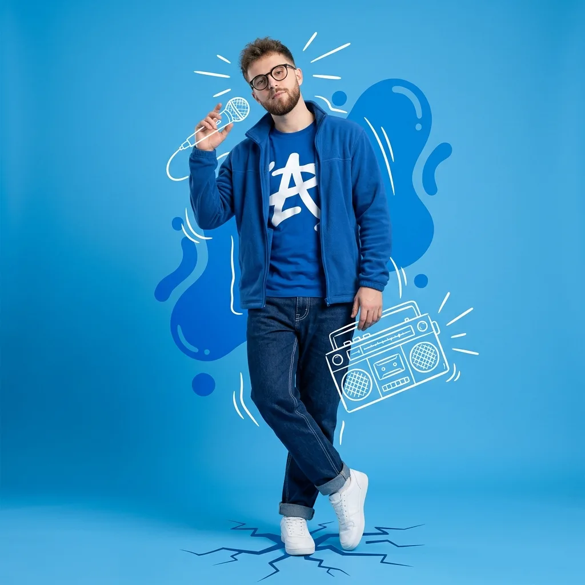

**#506 · Photography Prompt · <code>Vinano Image Pro</code>**

<details>
<summary>Show prompt</summary>

```
{
 "meta": {
 "image_quality": "High",
 "image_type": "Mixed Media (Photography + Vector Illustration)",
 "reference_image_usage": "Use the attached image strictly for facial identity matching only. Face shape, beard, glasses, eyes, nose, lips, and hair texture must match exactly. Do not copy clothing, lighting, or background from the reference.",
 "resolution_estimation": "High resolution, sharp vector edges",
 "file_characteristics": {
 "compression_artifacts": "Low",
 "noise_level": "None",
 "lens_type_estimation": "Standard portrait look (35–50mm equivalent)"
 }
 },
 "global_context": {
 "scene_description": "A full-body studio portrait of a young man in a dynamic, confident pose against a solid bright blue background. The image blends realistic photography white hand-drawn vector doodles and abstract blue liquid shapes, creating a modern street-art editorial look.",
 "environment_type": "Studio / Graphic Design Composition",
 "atmosphere": "Energetic, urban, creative, cool",
 "lighting": {
 "source": "Artificial studio lighting",
 "direction": "Front-right dominant",
 "quality": "Soft and diffused",
 "color_temperature": "Neutral white"
 },
 "color_palette": {
 "dominant_colors": ["Bright blue background",
 "Deep blue clothing",
 "White graphic accents"],
 "contrast_level": "High"
 }
 },
 "composition": {
 "camera_angle": "Low-angle, slightly upward",
 "framing": "Full body (head to toe)",
 "depth_of_field": "Deep focus",
 "focal_point": "Face and upper torso",
 "balance": "Asymmetrical graphics filling negative space"
 },
 "subject": {
 "identity_source": "Attached reference image",
 "gender": "Male",
 "pose": "Standing relaxed confidence, body angled slightly right, head tilted slightly left, one hand raised near the face, legs casually crossed",
 "expression": "Neutral, confident, calm",
 "face_constraints": {
 "glasses": "Round black eyeglasses",
 "facial_hair": "Trimmed beard",
 "hair": "Short, slightly tousled",
 "must_match_reference": true
 }
 },
 "wardrobe": {
 "style": "Monochromatic blue streetwear",
 "upper_body": "Blue fleece-style jacket worn open",
 "inner_layer": "Blue t-shirt large white abstract graphic symbol",
 "lower_body": "Dark blue denim jeans visible white contrast stitching and rolled cuffs",
 "footwear": "Clean white low-top sneakers"
 },
 "graphic_elements": {
 "style": "Hand-drawn white vector doodles",
 "elements": ["Microphone outline near raised hand",
 "Boombox line-art floating to the side",
 "Radiating sound or motion lines around head",
 "Cracked ground illustration beneath feet"],
 "background_graphics": "Abstract blue liquid shapes layered behind the subject"
 },
 "background_details": {
 "color": "Solid bright blue",
 "texture": "Flat, uniform",
 "lighting_behavior": "Even, shadow-free background"
 },
 "reconstruction_notes": {
 "mandatory": ["Exact facial identity match from reference image",
 "Full-body pose",
 "Blue-on-blue color harmony",
 "White doodle overlays",
 "Sharp separation between photo and vector layers"],
 "do_not_copy_from_reference": ["Clothing",
 "Pose",
 "Lighting",
 "Background"],
 "intended_use": "High-impact editorial image or start frame for image-to-video animation"
 }
}

Maintain consistent colour harmony and crisp focus across the whole frame.
```

</details>

---

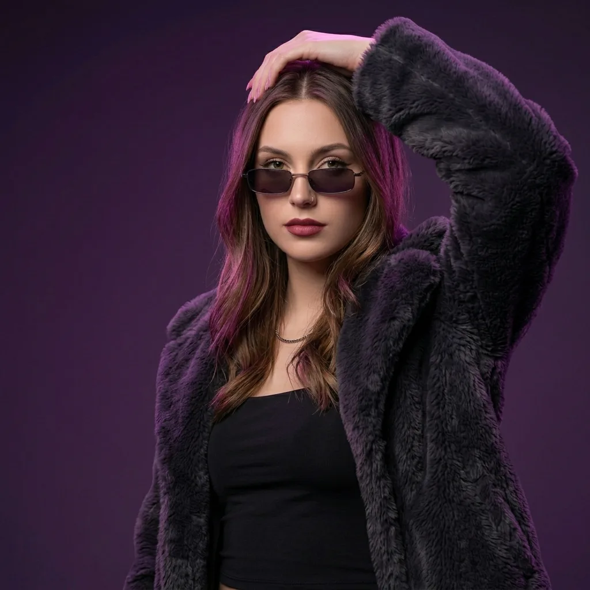

**#507 · Photography Prompt · <code>Vinano Image v2</code>**

<details>
<summary>Show prompt</summary>

```
{
 "image_type": "studio fashion portrait photography",
 "resolution_target": "8K ultra high definition",
 "aspect_ratio": "portrait (vertical)",
 "composition": {
 "framing": "medium portrait",
 "crop": "head to mid-torso",
 "subject_position": "slightly right of center",
 "camera_angle": "eye-level",
 "pose": {
 "body_orientation": "three-quarter turn to the left",
 "head_orientation": "turned toward camera",
 "arm_position": "one arm raised hand placed behind or on top of head, other arm lowered and relaxed"
 }
 },
 "subject": {
 "gender_presentation": "female",
 "age_range": "young adult",
 "skin_tone": "light to medium",
 "facial_expression": {
 "expression": "neutral to mildly serious",
 "gaze_direction": "directly at camera",
 "emotion": "confident, composed"
 },
 "face_details": {
 "face_shape": "oval",
 "complexion": "smooth, even",
 "makeup": {
 "eyes": "defined eyeliner and mascara",
 "lips": "deep muted red or berry tone lipstick",
 "overall": "moderate, polished makeup"
 },
 "piercings": ["small nose ring on left nostril"]
 },
 "eyes": {
 "visibility": "partially visible through tinted glasses",
 "eyewear": {
 "type": "narrow rectangular sunglasses",
 "lens_color": "dark tinted",
 "frame": "thin metal frame",
 "position": "worn low on the bridge of the nose"
 }
 },
 "hair": {
 "color": "medium brown strong magenta/purple lighting highlights",
 "length": "long",
 "style": "loose, softly wavy",
 "parting": "center part"
 }
 },
 "clothing_and_accessories": {
 "outerwear": {
 "type": "faux fur coat",
 "color": "dark gray to black",
 "texture": "thick, plush, high-volume fur",
 "fit": "oversized",
 "wearing_style": "draped loosely off the shoulders"
 },
 "inner_clothing": {
 "type": "sleeveless top",
 "color": "black",
 "neckline": "straight or slightly scooped"
 },
 "jewelry": {
 "necklace": {
 "type": "thin chain necklace",
 "material": "metallic",
 "visibility": "clearly visible at collarbone"
 }
 }
 },
 "lighting": {
 "style": "studio lighting",
 "primary_light": {
 "direction": "front-left",
 "quality": "soft but directional"
 },
 "accent_lighting": {
 "color": "magenta/purple",
 "placement": "from above and behind, especially on hair and shoulders"
 },
 "contrast": "medium to high",
 "shadow_detail": "soft shadows smooth falloff"
 },
 "background": {
 "type": "studio backdrop",
 "color": "deep purple gradient",
 "texture": "smooth, seamless",
 "depth": "no visible background objects"
 },
 "color_palette": {
 "dominant_colors": ["purple",
 "magenta",
 "black",
 "dark gray"],
 "accent_colors": ["skin tones",
 "metallic silver"]
 },
 "image_quality": {
 "sharpness": "high",
 "detail_level": "very high",
 "noise": "minimal to none",
 "dynamic_range": "wide"
 },
 "overall_style": {
 "aesthetic": "fashion editorial",
 "mood": "moody, stylish, confident",
 "era_influence": "modern"
 }
}

Aim for an editorial, design-driven look with deliberate negative space.
```

</details>

---

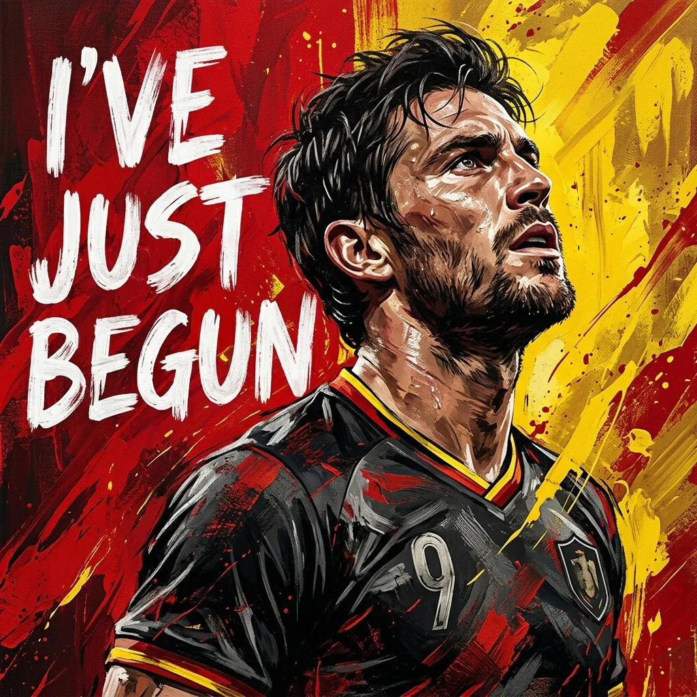

**#508 · Photography Prompt · <code>Vinano Image Pro</code>**

<details>
<summary>Show prompt</summary>

```
Create a dramatic, digital painting-style portrait of a male footballer looking upwards a determined expression. The style should be bold and textured, dynamic brushstrokes and a limited color palette mainly black, white, red, and yellow. The background should be split vertically abstract red and yellow paint streaks. On the red side, include the bold motivational text ‘I’VE JUST BEGUN’ in large white, hand-painted font. Capture the intensity and ambition in the player’s gaze. The composition should feel motivational and powerful, ideal for a sports poster. 8k Resolution, Image Aspect Ratio 4:5." Keep edges clean and the overall composition balanced for a polished, gallery-ready result.
```

</details>

---

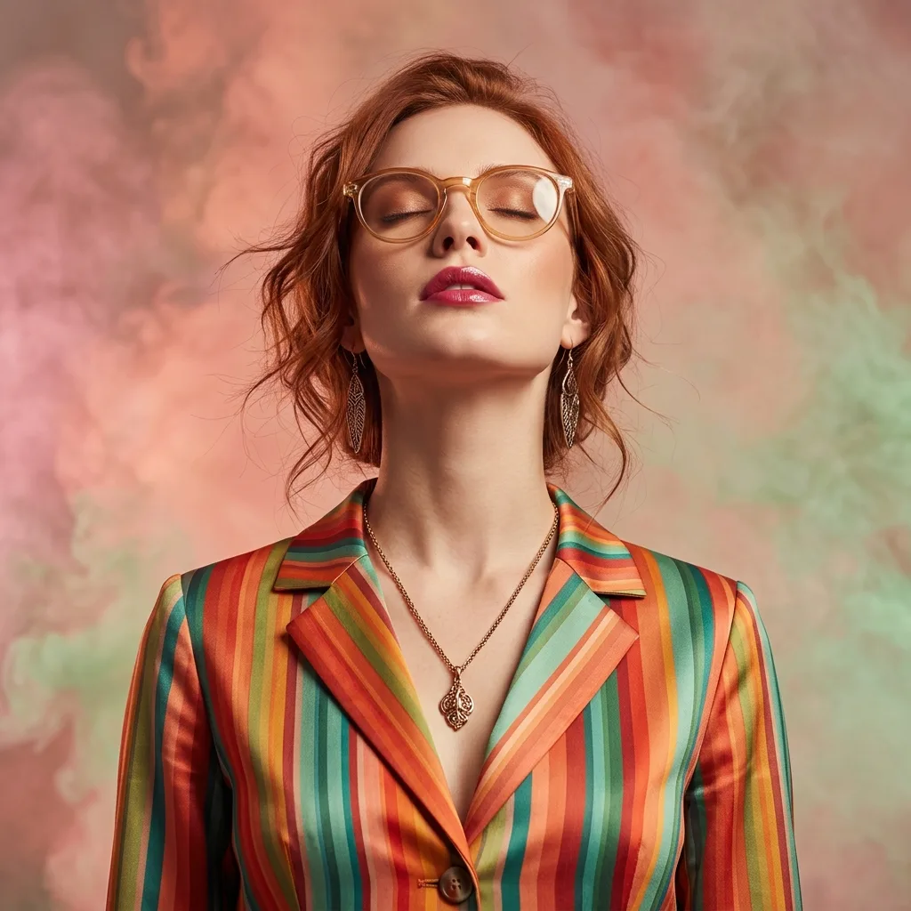

**#509 · Photography Prompt · <code>Vinano Image v2</code>**

<details>
<summary>Show prompt</summary>

```
{
 "image_type": "fashion portrait photography",
 "resolution_target": "8K Ultra HD",
 "aspect_ratio": "vertical (portrait)",
 "composition": {
 "framing": "medium close-up portrait",
 "crop": "from upper chest to slightly above head",
 "subject_position": "centered",
 "camera_angle": "low angle, slightly upward-facing",
 "perspective": "dramatic upward perspective emphasizing neck and jawline",
 "depth_of_field": "shallow depth of field soft background blur"
 },
 "subject": {
 "gender_presentation": "female-presenting",
 "age_range": "young adult",
 "skin_tone": "fair/light",
 "pose": {
 "head_position": "tilted slightly back",
 "chin": "raised upward",
 "shoulders": "relaxed, facing forward"
 },
 "facial_expression": {
 "eyes": "closed",
 "mouth": "slightly parted",
 "expression_mood": "calm, confident, introspective"
 },
 "face_details": {
 "face_shape": "oval",
 "jawline": "soft but defined",
 "cheekbones": "subtly defined",
 "skin_texture": "smooth, evenly lit"
 }
 },
 "hair": {
 "color": "reddish-brown / auburn",
 "length": "medium",
 "style": "loosely styled soft waves",
 "texture": "slightly tousled",
 "flyaways": "visible loose strands around head and neck"
 },
 "eyewear": {
 "type": "eyeglasses",
 "frame_style": "rounded",
 "frame_material_appearance": "translucent",
 "frame_color": "light amber / peach-tinted",
 "lens": "clear"
 },
 "makeup": {
 "lip_color": "deep pink / rose",
 "lip_finish": "glossy",
 "eye_makeup": "subtle, warm-toned",
 "overall_style": "natural emphasis on lips"
 },
 "accessories": {
 "earrings": {
 "type": "dangling earrings",
 "material_appearance": "metallic",
 "design": "intricate, elongated"
 },
 "necklace": {
 "type": "chain necklace",
 "pendant": "ornamental pendant",
 "material_appearance": "gold-toned metal"
 }
 },
 "clothing": {
 "garment_type": "tailored jacket or dress lapels",
 "neckline": "deep V-neck",
 "fit": "structured yet flowing",
 "fabric_texture": "smooth, slightly reflective",
 "pattern": "vertical multicolored stripes",
 "colors": ["orange",
 "red",
 "green",
 "teal",
 "yellow"],
 "buttons": "visible front button at mid-torso"
 },
 "lighting": {
 "type": "studio lighting",
 "direction": "soft frontal slight side emphasis",
 "contrast": "moderate",
 "highlights": "gentle highlights on face and glasses",
 "shadows": "soft shadows under chin and neck"
 },
 "background": {
 "environment": "studio setup",
 "elements": "colored smoke or mist",
 "color_palette": ["pink",
 "coral",
 "peach",
 "soft green"],
 "background_style": "abstract, atmospheric"
 },
 "atmosphere": {
 "mood": "cinematic, fashion-forward",
 "visual_effects": "floating colored smoke surrounding subject",
 "clarity": "subject sharp, background diffused"
 },
 "color_grading": {
 "tone": "warm",
 "saturation": "rich but balanced",
 "overall_palette": "harmonized warm and pastel tones"
 },
 "image_quality": {
 "sharpness": "high detail on facial features, clothing texture, accessories",
 "noise": "none visible",
 "finish": "clean, professional, editorial-grade"
 }
}

Render with rich micro-detail while keeping the layout uncluttered and intentional.
```

</details>

---

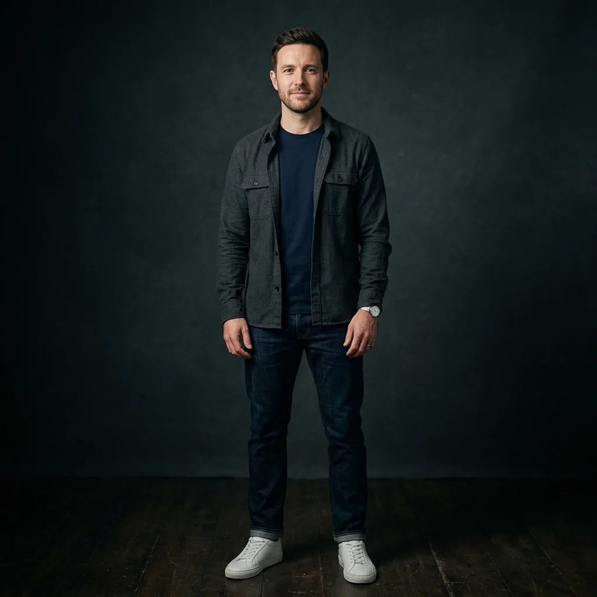

**#510 · Photography Prompt · <code>Vinano Image v2</code>**

<details>
<summary>Show prompt</summary>

```
true-to-life photorealistic studio portrait of an average British man in his late 20s to early 40s, natural appearance, realistic facial features, short well-groomed hair, light stubble or clean-shaven. He stands confidently a relaxed posture, conveying quiet self-assurance.

He wears a stylish, comfortable, modern casual outfit, a well-fitted neutral-toned jacket or overshirt, premium plain t-shirt, tailored trousers or dark jeans, and clean refined minimalist sneakers. The look is contemporary, understated, and effortlessly fashionable.

Shot in a professional studio minimal lighting: a soft key light focused on the subject gentle shadow falloff, dark neutral background, high contrast, and strong subject isolation. Lighting highlights facial structure, textures, and silhouette while keeping the environment subtle.

Sharp focus on the subject, shallow depth of field, natural skin texture, realistic fabric detail, editorial fashion photography style, ultra-realistic, high resolution.

Negative prompt (optional): blur, heavy retouching, unrealistic skin, dramatic fashion styling, cluttered background, extra limbs, distortion, cartoonish style.

Keep edges clean and the overall composition balanced for a polished, gallery-ready result.
```

</details>

---

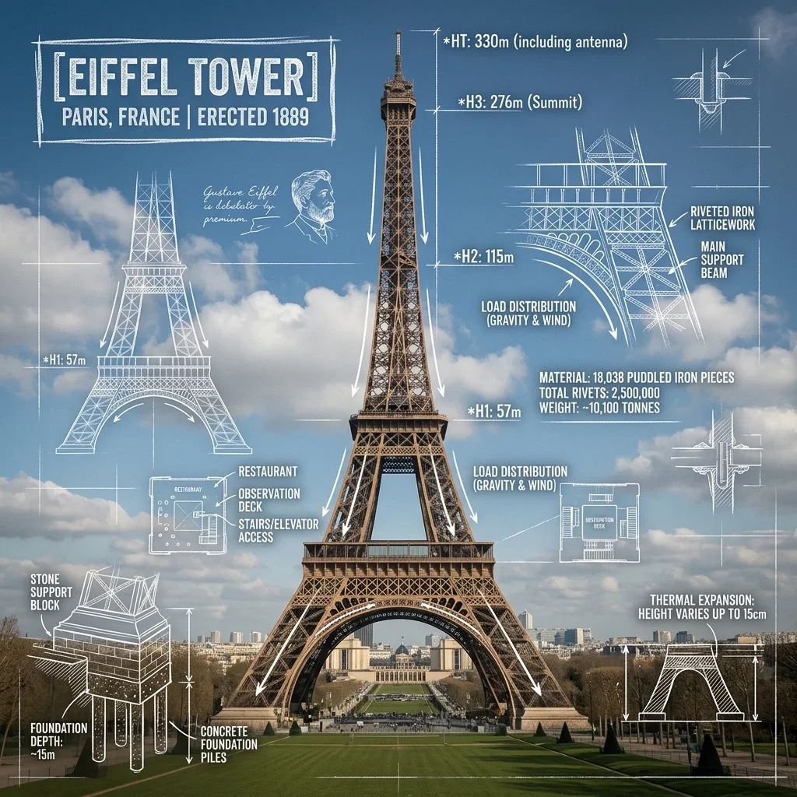

**#511 · Photography Prompt · <code>Vinano Image Pro</code>**

<details>
<summary>Show prompt</summary>

```
Create an infographic image of [LANDMARK], combining a real photograph of the landmark blueprint-style technical annotations and diagrams overlaid on the image. Include the title “[LANDMARK]” in a hand-drawn box in the corner. Add white chalk-style sketches showing key structural data, important measurements, material quantities, internal diagrams, load-flow arrows, cross-sections, floor plans, and notable architectural or engineering features. Style: blueprint aesthetic white line drawings on the photograph, technical/architectural annotation style, educational infographic feel, the real environment visible behind the annotations. Emphasise material texture and natural light so the final frame feels tactile and premium.
```

</details>

---

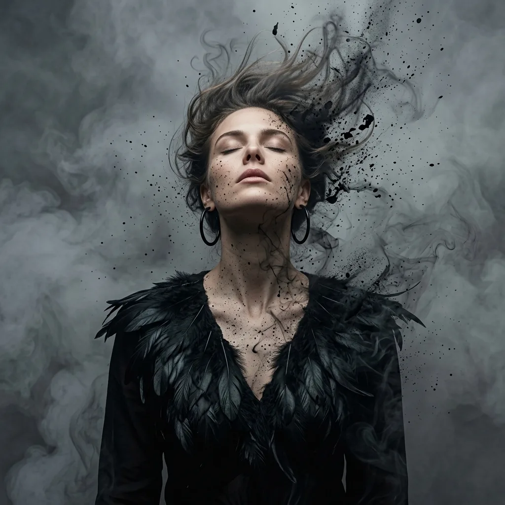

**#512 · Photography Prompt · <code>Vinano Image Pro</code>**

<details>
<summary>Show prompt</summary>

```
{
 "image_style": "surreal, dark cinematic, ethereal",
 "subject": {
 "person": "woman features of reference image",
 "pose": "head tilted back, eyes closed, expression of freedom and release",
 "framing": "close-up portrait from chest upward",
 "clothing": "long-sleeve blouse made of organic, layered deep matte black raven feathers",
 "accessories": "large black hoop earrings"
 },
 "visual_effects": {
 "hair": "loose, dynamically suspended, blowing upward and forward by wind",
 "dissolving_elements": ["feathers and hair merging black ink splatters",
 "charcoal dust",
 "wisps of dark smoke"],
 "face_details": "fine black ink splatters and wisps spreading across face and neck"
 },
 "environment": {
 "background": "smoky gray, moody atmosphere",
 "elements": "thick, dense, layered smoke swirling throughout the frame"
 },
 "technical_aspects": {
 "resolution": "high-resolution",
 "lighting": "cinematic, moody, diffused through smoke"
 }
}

Aim for an editorial, design-driven look with deliberate negative space.
```

</details>

---


**#513 · Photography Prompt · <code>Vinano Image v2</code>**

<details>
<summary>Show prompt</summary>

```
A cinematic silhouette shot of local fishermen lining the Galata Bridge in Istanbul during sunset. In the foreground, a weary fisherman leans against the railing, looking at the sea. The background features the hazy, dreamlike silhouette of the Süleymaniye Mosque and seagulls flying over the Golden Horn. Warm orange and deep blue color palette. Shot on Sony A7R IV Sony FE 85mm f/1.4 GM lens at f/1.8. Atmospheric haze, emotional storytelling, award-winning travel photography. Render with rich micro-detail while keeping the layout uncluttered and intentional.
```

</details>

---

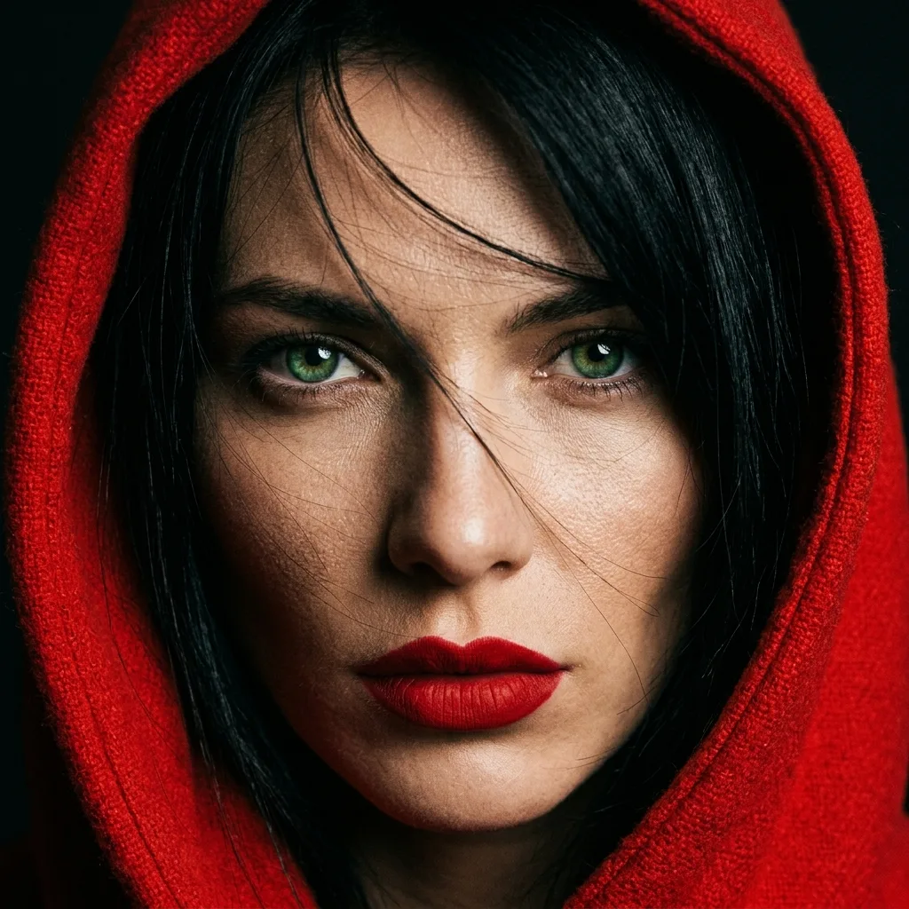

**#514 · Photography Prompt · <code>Vinano Image v2</code>**

<details>
<summary>Show prompt</summary>

```
Extreme close-up portrait of a woman piercing green eyes and bold, matte red lips, her face framed by a vibrant red textured hood. Dramatic filmic, cinematic lighting creates sharp shadows across her features, fine strands of dark black hair blowing across her face. High-fashion editorial photography style, hyper-realistic, sharp focus, intense gaze, and a high-contrast color palette of deep reds and blacks. Keep edges clean and the overall composition balanced for a polished, gallery-ready result.
```

</details>

---

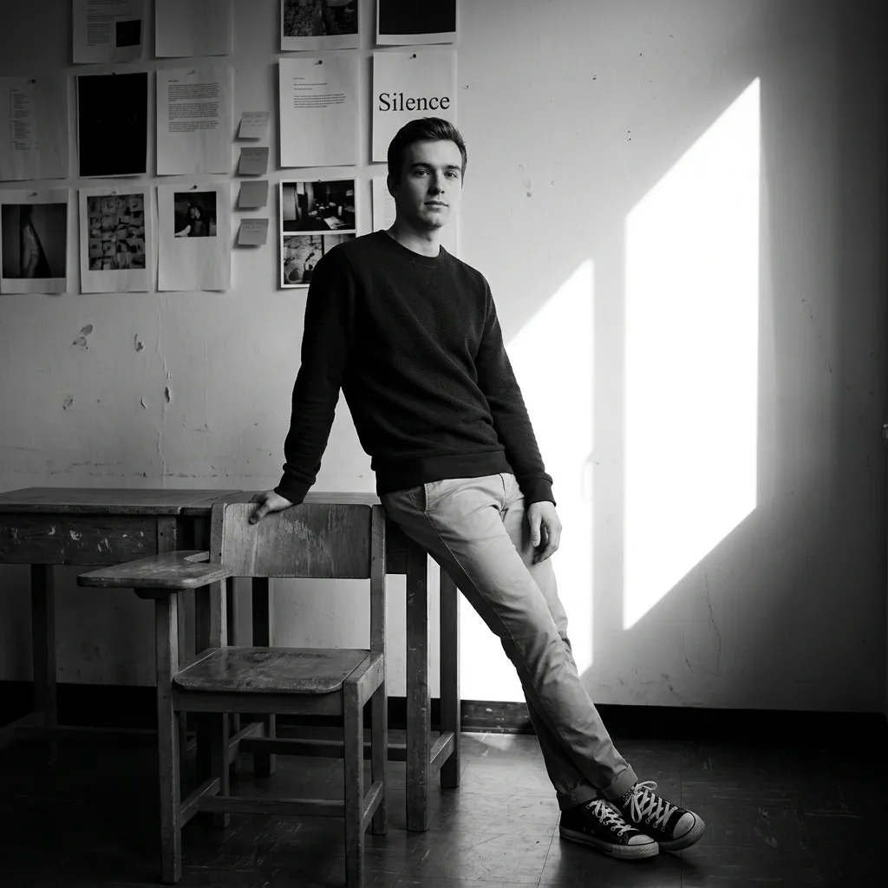

**#515 · Photography Prompt · <code>Vinano Image Pro</code>**

<details>
<summary>Show prompt</summary>

```
Create a high-contrast black and white portrait in a quiet classroom.Use uploaded image as reference. Person leans casually on a wooden school chair, legs crossed, wearing a navy blue sweatshirt, beige chinos, and black-and-white Converse sneakers. calm neutral expression. His left arm rests on the desk, his right hand drops casually to the side. Behind him, an off-white classroom wall visible wear, pinned papers, photos, and sticky notes in a grid. One page clearly shows the printed word “Silence”, positioned above his head. Sunlight enters sharply from the right, casting a triangular beam of light on the wall and her shadow. The contrast is dramatic, cinematic, and natural, a warm late-afternoon tone Aim for an editorial, design-driven look with deliberate negative space.
```

</details>

---

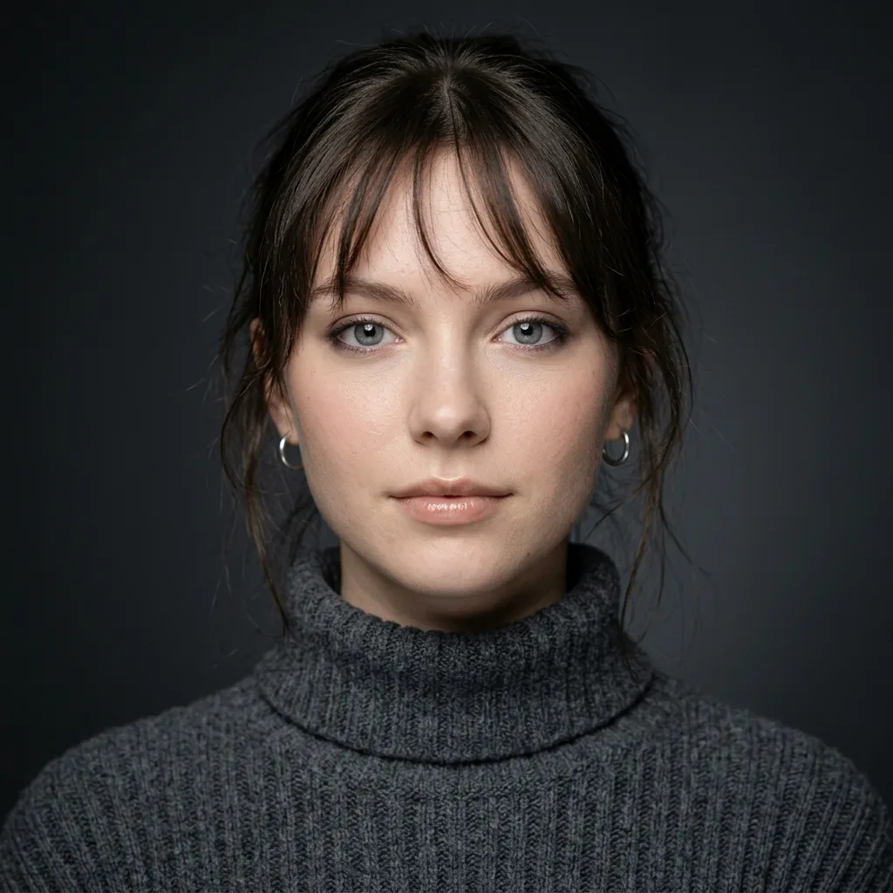

**#516 · Photography Prompt · <code>Vinano Image v2</code>**

<details>
<summary>Show prompt</summary>

```
Ultra-realistic studio portrait of a young woman, front-facing, centered composition, symmetrical face, pale skin soft cheeks and nose, light gray-blue eyes a subtle dark limbal ring, soft neutral makeup, slightly glossy natural lips, faint smoky eyeliner, dark brown slightly messy hair wispy bangs framing the forehead, a few loose strands around the face, wearing a dark gray fitted turtleneck sweater, small silver hoop earrings, calm neutral expression, looking directly into the camera, soft diffused filmic, cinematic lighting from the front and side, smooth gradient dark background, shallow depth of field, 85mm lens look, f1.8, ultra sharp focus, hyper-detailed skin texture, true-to-life photorealistic, 8k, high dynamic range, professional studio photography, no text, no watermark, no logo, no signature, no artifacts. Emphasise material texture and natural light so the final frame feels tactile and premium.
```

</details>

---

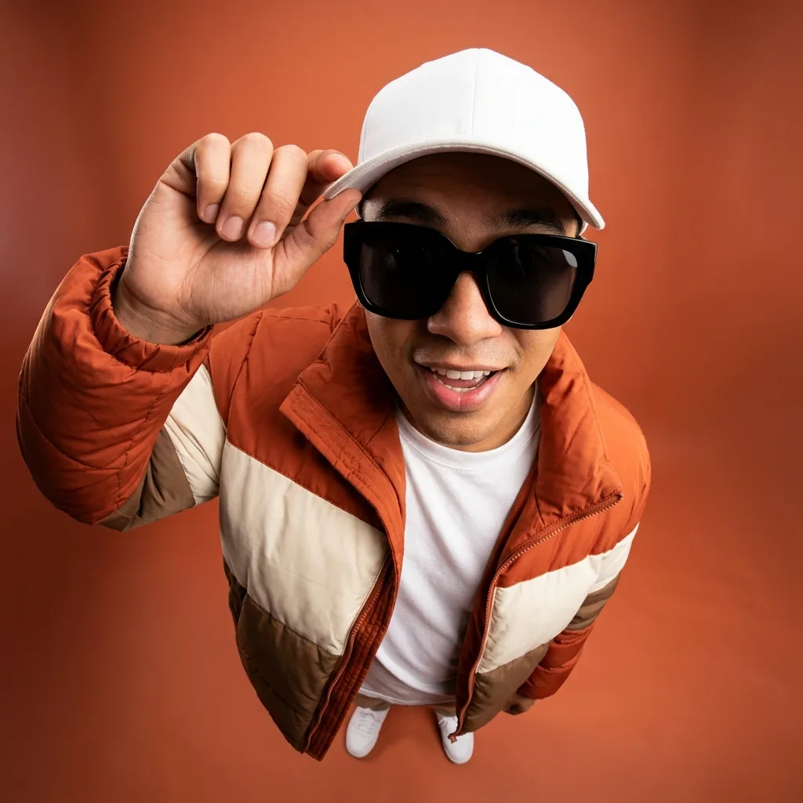

**#517 · Photography Prompt · <code>Vinano Image v2</code>**

<details>
<summary>Show prompt</summary>

```
Convert uploaded photo into ultra-wide 10mm fisheye portrait from dramatic high top-down angle strong perspective distortion (larger head, compressed body). Add black oversized sunglasses and plain white cap, right hand adjusting cap, confident upward gaze. Color-block puffer jacket (burnt orange/cream/brown), white tee, white sneakers. Bold terracotta studio background, smooth gradient, high contrast, sharp editorial lighting, 8k. Maintain consistent colour harmony and crisp focus across the whole frame.
```

</details>

---

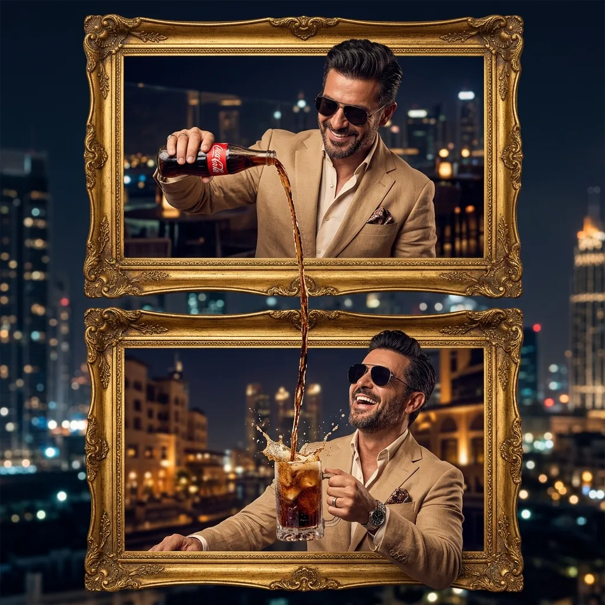

**#518 · Photography Prompt · <code>Vinano Image v2</code>**

<details>
<summary>Show prompt</summary>

```
A stylish man wearing a tan suit and sunglasses is featured in a creative split image, framed by two ornate gold frames. In the top frame, he is pouring Coca-Cola from a bottle. The cola streams downward, passing through the gap between the frames. In the bottom frame, the same man, also in a tan suit and sunglasses, is shown a joyful expression as the stream of cola splashes into a glass mug he is holding, creating a dynamic splash.The background behind the frames is a softly blurred night cityscape tall buildings and lights, suggesting. Render with rich micro-detail while keeping the layout uncluttered and intentional.
```

</details>

---

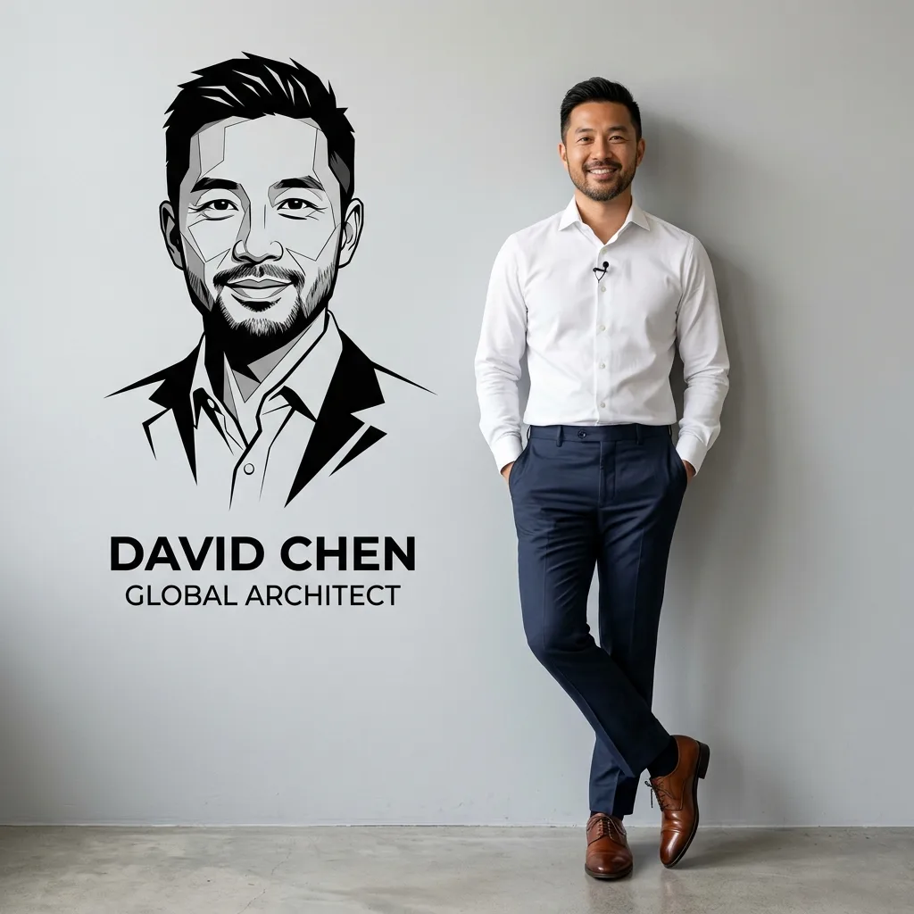

**#519 · Photography Prompt · <code>Vinano Image v2</code>**

<details>
<summary>Show prompt</summary>

```
Ultra-realistic 8K full body portrait of [PERSON’S FULL NAME], wearing a clean and pressed white social shirt folded collar and a small lapel microphone, dark navy-blue dress pants and polished brown social shoes. Casually and unpretentiously leaning against a smooth light gray studio wall; hands are in pockets and one leg is crossed over the other, relaxed and confident body language. Add to the wall next to them a prominent vector portrait in black and white of their face and bust - sharp lines and angles, overlapping polygonal shapes and a refined minimalist modern graphic style, right below the information: “[PERSON’S FULL NAME]”, and below the name: “[PROFESSION]” Maintain consistent colour harmony and crisp focus across the whole frame.
```

</details>

---

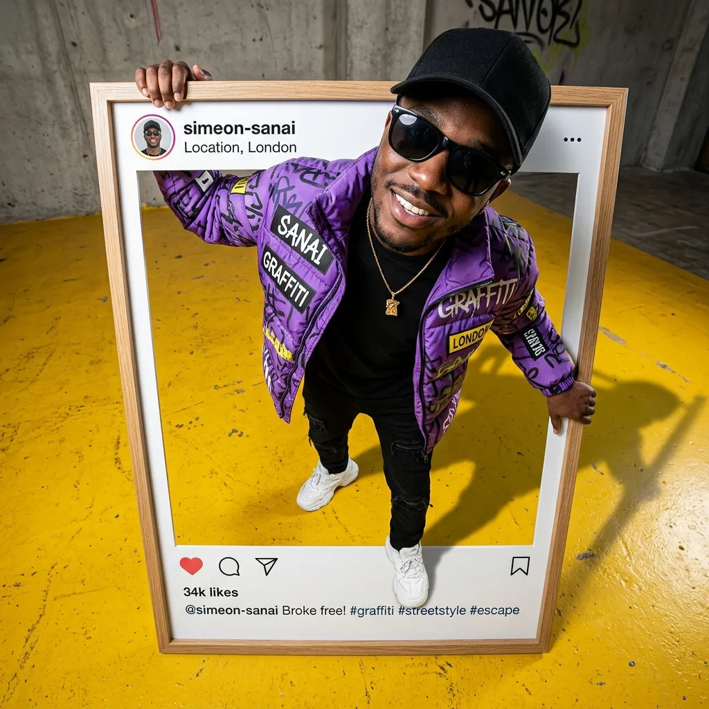

**#520 · Photography Prompt · <code>Vinano Image v2</code>**

<details>
<summary>Show prompt</summary>

```
Create an Ultra-realistic photo composite of uploaded person breaking out of an Instagram post frame. Standing pose, both hands holding frame edges, upper body outside frame real shadows. High top-down view, strong 10mm fisheye effect on person only (big head, smaller body), frame straight. Confident upward gaze, purple graffiti puffer jacket, black tee, gold chain, white sneakers, sunglasses, black cap, yellow floor, clean Instagram UI (simeon-sanai) overlay, true-to-life photorealistic. Aim for an editorial, design-driven look with deliberate negative space.
```

</details>

---

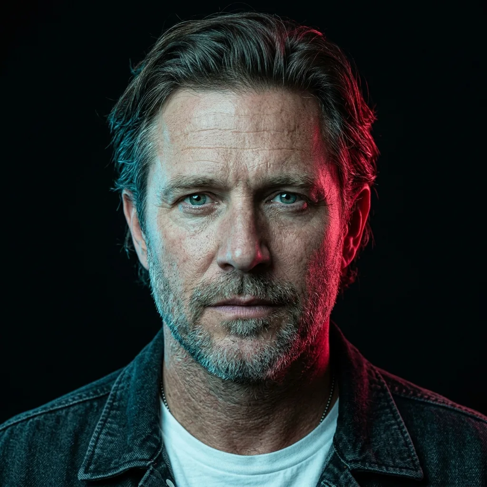

**#521 · Photography Prompt · <code>Vinano Image Pro</code>**

<details>
<summary>Show prompt</summary>

```
{
"image_type": "studio portrait",
"composition": {
"framing": "tight head-and-shoulders close-up",
"camera_angle": "eye-level",
"orientation": "vertical",
"symmetry": "near-perfect central symmetry",
"focus": "sharp focus on eyes and facial features",
"depth_of_field": "shallow, background fully blurred to black"
},
"subject": {
"description": "middle-aged male-presenting subject",
"pose": "frontal, facing camera directly",
"expression": "calm, confident, intense gaze",
"eye_direction": "looking straight into lens",
"facial_features": {
"facial_hair": "short salt-and-pepper stubble and trimmed goatee",
"skin_texture": "visible pores and fine lines, realistic skin detail",
"eyes": "light-colored eyes emphasized by catchlights"
},
"hair": {
"style": "medium-length, brushed back",
"texture": "natural, slightly tousled",
"color": "dark brown subtle gray highlights"
}
},
"wardrobe": {
"top": "white crew-neck t-shirt",
"outerwear": "dark jacket or coat soft texture",
"accessories": "thin chain necklace partially visible"
},
"lighting": {
"style": "cinematic, high-contrast neon lighting",
"key_light": {
"position": "front-left",
"color": "cool cyan/blue",
"effect": "dominant illumination across face and torso"
},
"rim_light": {
"position": "rear-right",
"color": "saturated red/magenta",
"effect": "strong edge highlight on hair and face contour"
},
"fill_light": "minimal to none",
"contrast_level": "high",
"mood": "dramatic, futuristic, intense"
},
"color_palette": {
"dominant_colors": ["cyan blue", "deep red", "black"],
"color_temperature": "mixed cool and warm neon tones",
"saturation": "high saturation on lighting, neutral clothing tones",
"color_grading": "stylized cyberpunk-inspired grading"
},
"background": {
"environment": "studio",
"details": "pure black background no visible texture or objects",
"separation": "strong subject-background separation rim lighting"
},
"technical_details": {
"camera_style": "professional studio photography",
"lens_effect": "slight compression typical of portrait lens",
"estimated_focal_length": "85mm equivalent",
"image_sharpness": "high",
"noise": "minimal",
"dynamic_range": "controlled highlights deep shadows"
},
"artistic_style": {
"genre": "cinematic portrait",
"influences": ["cyberpunk", "neo-noir", "editorial fashion"],
"visual_aesthetic": "bold, modern, high-impact",
"post_processing": {
"skin_retouching": "subtle, realistic",
"color_enhancement": "strong split-toning blue/red",
"clarity": "enhanced micro-contrast"
}
},
"overall_impression": {
"tone": "powerful and enigmatic",
"intended_use": "editorial, album cover, cinematic poster, AI style reference",
"style_recreation_keywords": ["cinematic neon portrait",
"blue and red split lighting",
"black background",
"intense direct gaze",
"cyberpunk color grading",
"high-contrast studio lighting"]
}
}

Render with rich micro-detail while keeping the layout uncluttered and intentional.
```

</details>

---

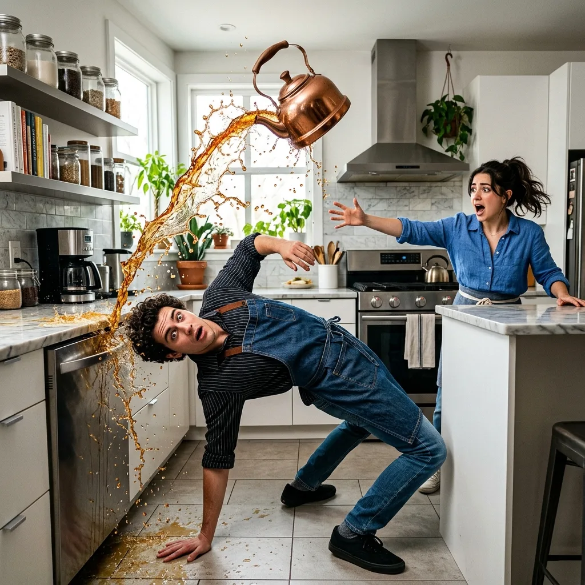

**#522 · Photography Prompt · <code>Vinano Image v2</code>**

<details>
<summary>Show prompt</summary>

```
Surreal comedic scene inside a modern kitchen: a young man bends backward in an extreme dodge pose, acrobatic and exaggerated, a kettle mid-air above him splashing hot tea in a dramatic frozen moment. A woman in the background extends her arm as if she accidentally threw the kettle, expression shocked and energetic.Dynamic action freeze-frame, dramatic liquid splash, wide-angle lens distortion, sharp details, realistic lighting, cinematic color grading, humorous storytelling, high-resolution digital art. Keep edges clean and the overall composition balanced for a polished, gallery-ready result.
```

</details>

---

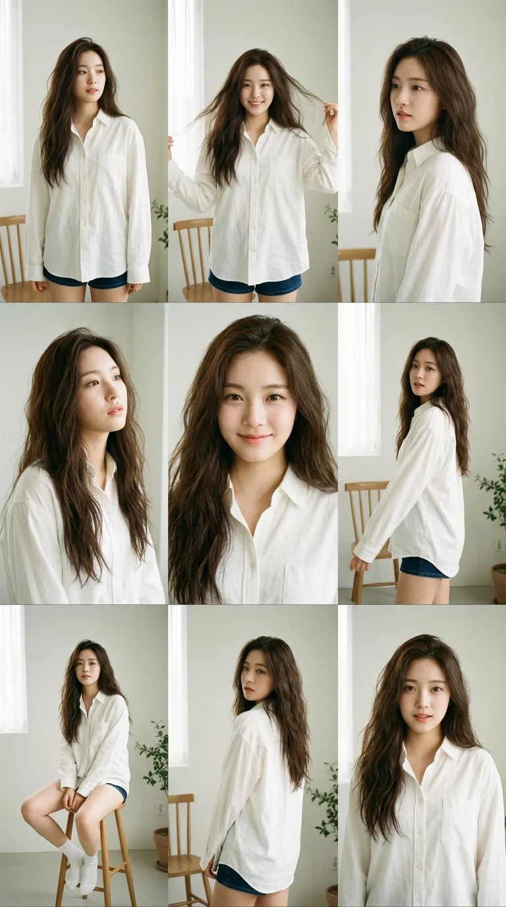

**#523 · Photography Prompt · <code>Vinano Image Pro</code>**

<details>
<summary>Show prompt</summary>

```
9:16 vertical — a 3x3 grid collage (nine images) forming a Korean idol portrait photoshoot series. Each frame features the same young Korean female idol, maintaining 100% consistency in facial features, proportions, hairstyle, and identity across all nine shots. Natural, ultra-realistic skin texture, no retouching, no smoothing. Clean idol-style minimal makeup, soft glow, subtle imperfections. Hair: long, voluminous dark hair, slightly tousled, consistent across all frames (natural loose flow, slight movement). Outfit: cohesive Korean idol photoshoot styling — white shirt + short bottoms (or simple neutral-toned outfit), youthful, clean, slightly casual but styled. Same outfit across all frames. Setting: minimal studio or simple indoor environment (plain wall, soft window light, clean background). Focus on subject, not environment. Lighting: soft diffused natural light, gentle highlights, low contrast, slightly airy tones, subtle film-like softness. Camera style: intimate portrait photography, slightly handheld feel, subtle imperfections (minor grain, slight blur in motion frames, imperfect framing). Frame breakdown (3x3 grid): Top row: - Top left: standing naturally, looking slightly away, relaxed expression - Top center: facing camera, casual mid-motion (hair or body slight movement) - Top right: slight side angle, soft gaze, natural candid feel Middle row: - Center left: looking slightly upward, soft thoughtful expression - Center: close-up portrait, direct eye contact, gentle idol smile - Center right: turning body slightly, mid-motion candid frame Bottom row: - Bottom left: seated or leaning casually, relaxed posture - Bottom center: back partially turned, looking over shoulder toward camera - Bottom right: standing close to frame, slightly playful or soft expression Mood: Korean idol photobook / photocard aesthetic, intimate, soft, natural, everyday charm. Quality: ultra-realistic, 8K detail, subtle analog film grain, natural imperfections, soft dreamy tone Preserve realistic proportions and depth for a confident, professional finish.
```

</details>

---

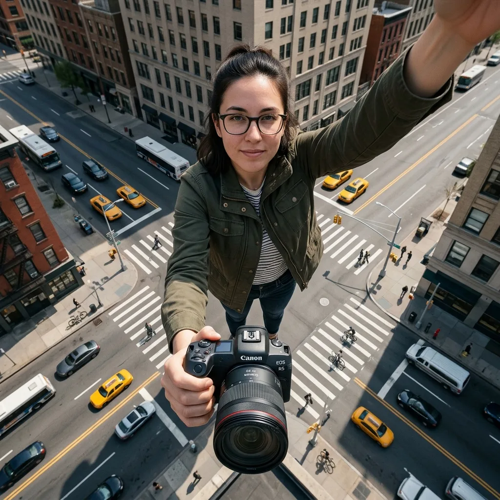

**#524 · Photography Prompt · <code>Vinano Image Pro</code>**

<details>
<summary>Show prompt</summary>

```
{
 "type": "image_generation_prompt",
 "language": "en",
 "style": "hyper-realistic cinematic selfie photography",
 "aspect_ratio": "9:16",
 "identity_preservation": {
 "use_reference_image": true,
 "strict_identity_lock": true,
 "alter_face": false,
 "alter_skin": false,
 "alter_hair": false,
 "alter_gender": false,
 "notes": "Preserve identical facial features, skin texture, hair, glasses, age, and gender from the uploaded reference image. No synthetic skin or sculptural look."
 },
 "subject": {
 "gender": "female",
 "capture_method": "selfie taken by the subject herself",
 "pose": {
 "selfie_arm": {
 "description": "one arm fully straight and completely extended upward holding the camera that takes the selfie",
 "visibility": "arm clearly visible, straight and dominant in frame",
 "camera_visibility": "the selfie camera device itself must NOT be visible in the frame"
 },
 "product_arm": {
 "description": "the other arm fully extended toward the camera holding the attached Canon camera",
 "importance": "product is closest to the camera and visually dominant"
 },
 "head": {
 "tilt": "slightly tilted toward the selfie camera"
 },
 "expression": "natural and relaxed facial expression"
 },
 "body_visibility": "full body visible from head to toe",
 "feet": "feet clearly touching the road surface"
 },
 "composition": {
 "perspective": "natural selfie perspective at chest height",
 "camera_angle": "extreme top-down angle, camera above the subject looking directly downward",
 "layer_depth": ["product (closest to camera)",
 "face",
 "full body",
 "city environment (background)"]
 },
 "scale_and_perspective": {
 "effect": "forced perspective",
 "subject_scale": "the woman appears extremely giant",
 "buildings_scale": "buildings appear much smaller, reaching no higher than her knees",
 "dominance": "the subject visually dominates the entire scene",
 "realism": "inspiring scale while remaining physically believable"
 },
 "environment": {
 "location": "real urban intersection",
 "elements": ["pedestrian crosswalk",
 "road markings",
 "traffic signs",
 "cars",
 "bicycles",
 "pedestrians at realistic human scale"],
 "setting": "ground-level urban environment"
 },
 "lighting": {
 "type": "natural daylight",
 "conditions": "clear or lightly cloudy sky",
 "shadows": "soft and realistic",
 "restrictions": "no fantasy or dramatic lighting"
 },
 "product_rules": {
 "usage": "use the uploaded Canon product exactly as provided",
 "distortion": "none",
 "logo": "unchanged",
 "appearance": "natural reflections and realistic highlights only"
 },
 "camera_quality": {
 "realism": "maximum photorealism",
 "depth": "clear separation of foreground, subject, and background",
 "artifacts": "none"
 },
 "constraints": ["No AI-art look",
 "No plastic or sculpted skin",
 "No distortion of face or body",
 "No extra limbs or incorrect anatomy",
 "No text or watermarks",
 "No visible selfie camera device"],
 "output_goal": "Create a hyper-realistic cinematic selfie image of a woman her exact reference identity, captured from an extreme top-down perspective in a real urban crosswalk, forced perspective scale, natural daylight, and a Canon camera product prominently held toward the lens."
}

Keep edges clean and the overall composition balanced for a polished, gallery-ready result.
```

</details>

---

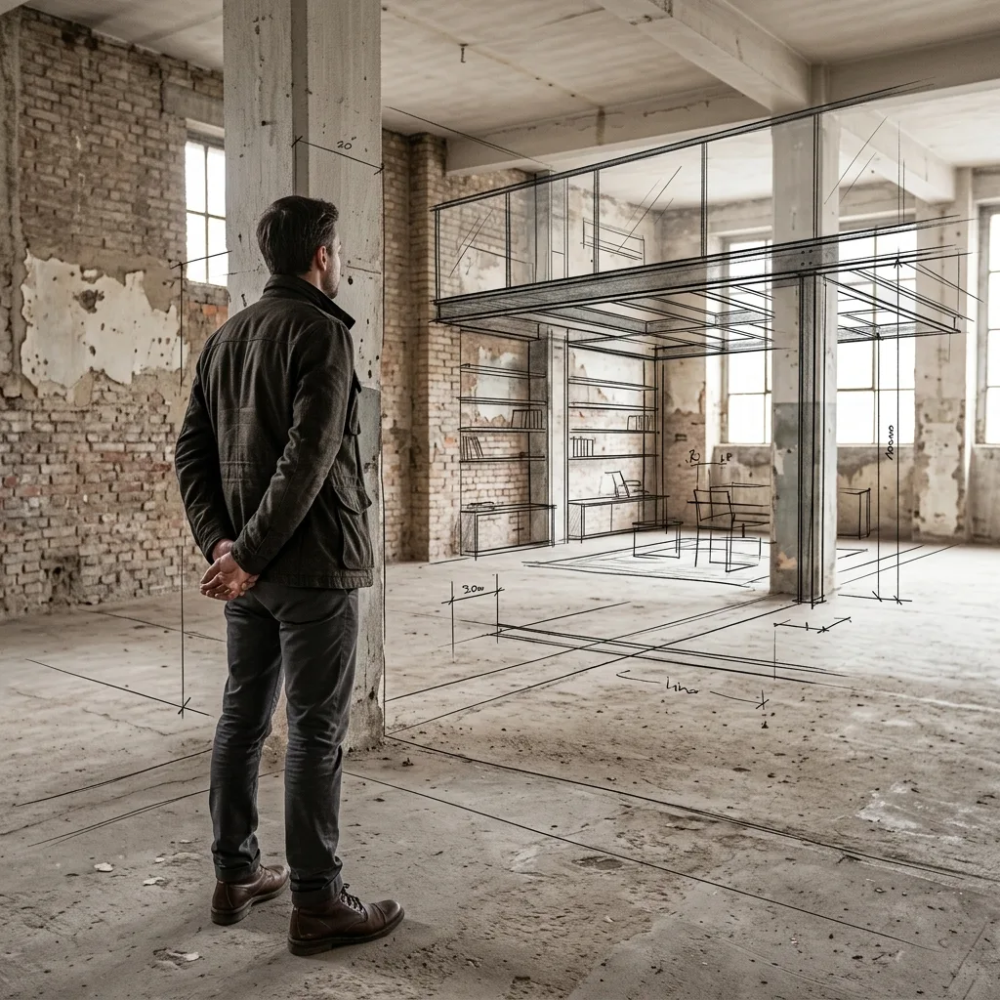

**#525 · Photography Prompt · <code>Vinano Image v2</code>**

<details>
<summary>Show prompt</summary>

```
A [person type] standing full-body near the edge of the frame, slightly to the left, in [real-world incomplete / empty / damaged environment]. The camera is positioned behind and slightly to the right of the person, capturing them from a three-quarter rear angle. The person stands calmly and thoughtfully, looking toward the space ahead.

The environment is [describe the real space as it exists now: empty, unfinished, decayed, rigid, lifeless]. The atmosphere feels [emotional tone: quiet, dry, historical, minimal, raw]. Natural light illuminates the scene, creating realistic shadows and depth. Floating hand-drawn sketch lines appear over and within the environment, aligned precisely in perspective the real space. These sketches represent [what is missing / what once existed / what could exist in the future].

The sketch lines are black, clean, and hand-drawn, resembling [architectural / interior / restoration / urban planning] concept sketches pencil or ink. The strokes are expressive, slightly imperfect, and organic — not rigid or mechanical. The sketched elements occupy the foreground and midground, appearing closer to the person than expected. Some sketch lines subtly overlap the person’s silhouette and the real surfaces, visually merging imagination reality. The sketches float naturally within the scene, seamlessly blending the environment and conveying the idea of [vision / restoration / transformation / potential] coming to life.

Render with rich micro-detail while keeping the layout uncluttered and intentional.
```

</details>

---

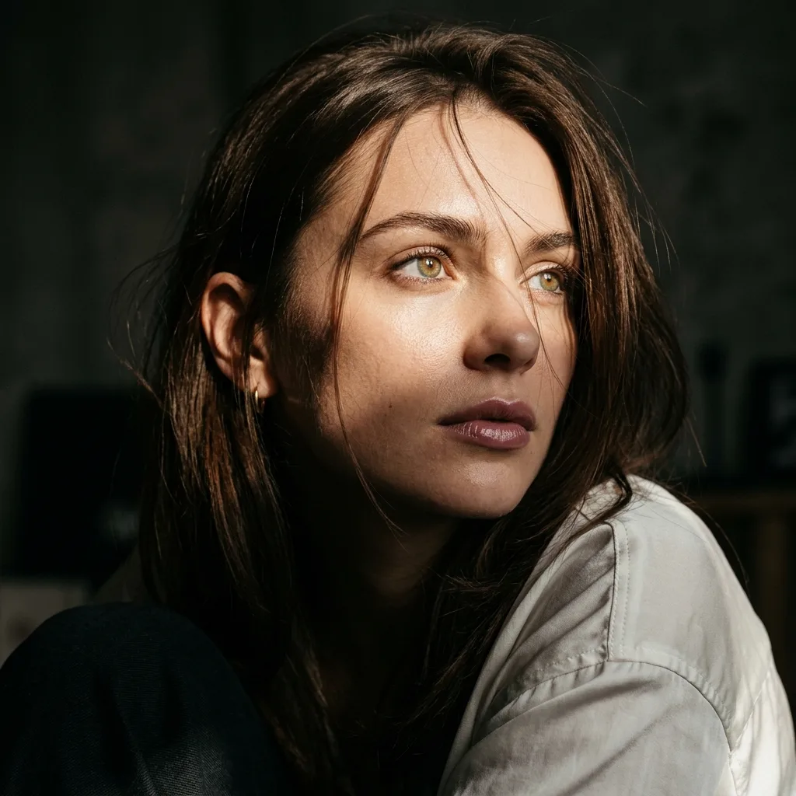

**#526 · Photography Prompt · <code>Vinano Image v2</code>**

<details>
<summary>Show prompt</summary>

```
Hyper-realistic cinematic Create an 8k close-up portrait of a beautiful woman medium, brown, slightly wind-swept hair falling across her face. Her striking, light-colored eyes gaze upwards and to the right, catching a sharp, diagonal beam of natural light that illuminates the high points of her cheekbone, nose, and plump, fair skin, glossy, mauve-toned lips a slightly light weight silk shirt. The rest of her face and the background are cast in deep,dramatic shadow (chiaroscuro) emphasizing the play of light and shadow Subtle textures of her dark clothing are visible on her left shoulder. The image should capture a mysterious and introspective mood, incredible detail in her skin, hair strands, and the subtle reflections in her eyes and lips.
Outfit should white.

Emphasise material texture and natural light so the final frame feels tactile and premium.
```

</details>

---

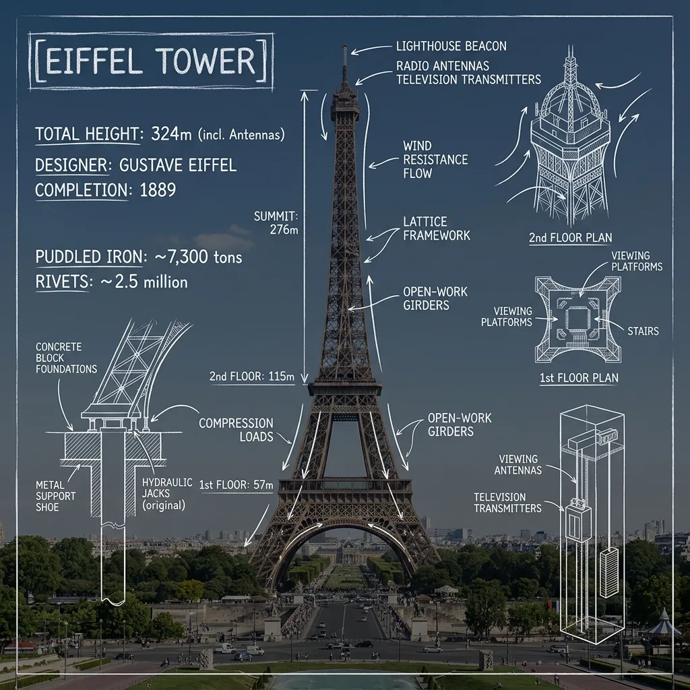

**#527 · Photography Prompt · <code>Vinano Image Pro</code>**

<details>
<summary>Show prompt</summary>

```
Create an infographic image of [LANDMARK], combining a real photograph of the landmark blueprint-style technical annotations and diagrams overlaid on the image. Include the title “[LANDMARK]” in a hand-drawn box in the corner. Add white chalk-style sketches showing key structural data, important measurements, material quantities, internal diagrams, load-flow arrows, cross-sections, floor plans, and notable architectural or engineering features. Style: blueprint aesthetic white line drawings on the photograph, technical/architectural annotation style, educational infographic feel, the real environment visible behind the annotations. Aim for an editorial, design-driven look with deliberate negative space.
```

</details>

---

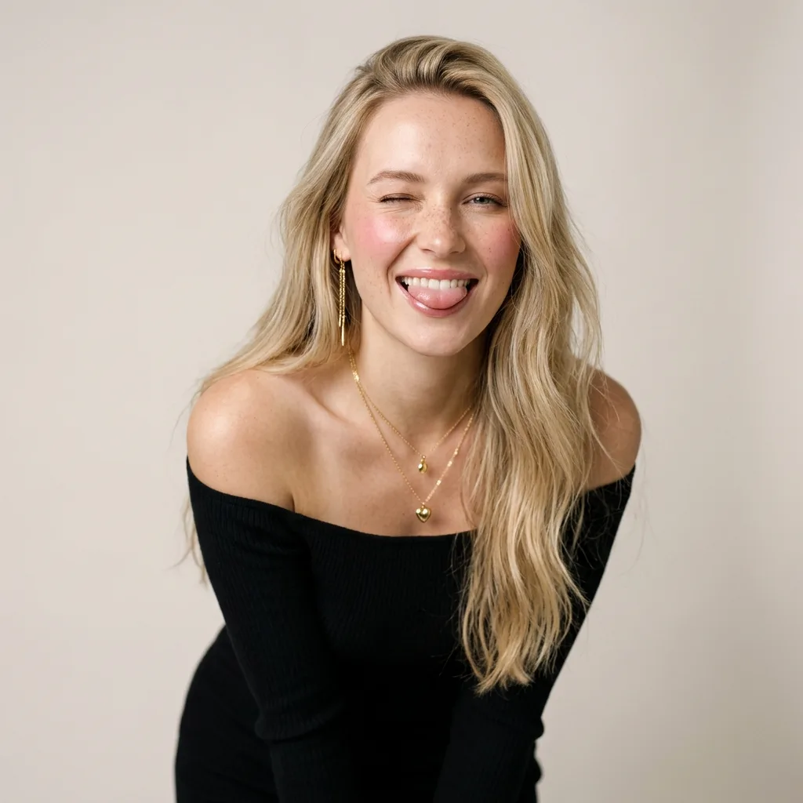

**#528 · Realistic, Portrait · <code>Vinano Image Pro</code>**

> Keywords: realistic, portrait, AI art, AI prompt, text to image

<details>
<summary>Show prompt</summary>

```
{
 "style": "ultra-realistic studio portrait",
 "subject": {
 "gender": "female",
 "age": "young adult",
 "pose": "leaning slightly forward toward the camera",
 "expression": "playful, flirty",
 "facial_details": {
 "wink": true,
 "tongue_out": true,
 "freckles": "natural across fair skin",
 "makeup": {
 "blush": "soft pink",
 "lips": "glossy"
 }
 },
 "hair": {
 "color": "blonde",
 "length": "long",
 "part": "side-parted",
 "style": "falling naturally over shoulders"
 },
 "outfit": {
 "dress": "off-shoulder fitted black dress",
 "jewelry": {
 "earrings": "long dangling gold earrings",
 "necklaces": "layered gold necklaces small heart pendant"
 }
 }
 },
 "environment": {
 "setting": "studio",
 "background": "clean minimal light neutral tones"
 },
 "lighting": {
 "type": "soft diffused studio lighting",
 "shadows": "smooth natural shadows"
 },
 "camera": {
 "lens": "50mm",
 "aperture": "f/1.8",
 "depth_of_field": "shallow"
 },
 "quality": {
 "resolution": "high resolution",
 "detail": "ultra-detailed",
 "skin_texture": "true-to-life photorealistic",
 "focus": "sharp focus",
 "photography_style": "high fashion lifestyle photography"
 }
}

Aim for an editorial, design-driven look with deliberate negative space.
```

</details>

---

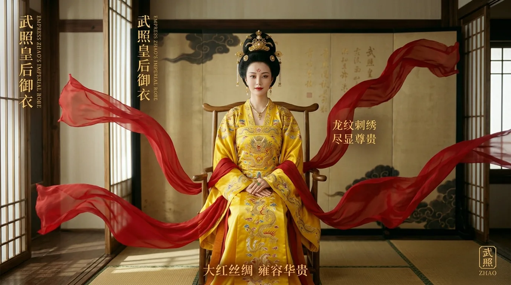

**#529 · Ai Art, Ai Prompt · <code>Vinano Image v2</code>**

> Keywords: AI art, AI prompt, text to image

<details>
<summary>Show prompt</summary>

```
武则天同款皇后内衣广告大片，明黄底色龙纹刺绣，大红丝绸飘带衬托 在保证细节的同时保持版式克制、留白得当。
```

</details>

---

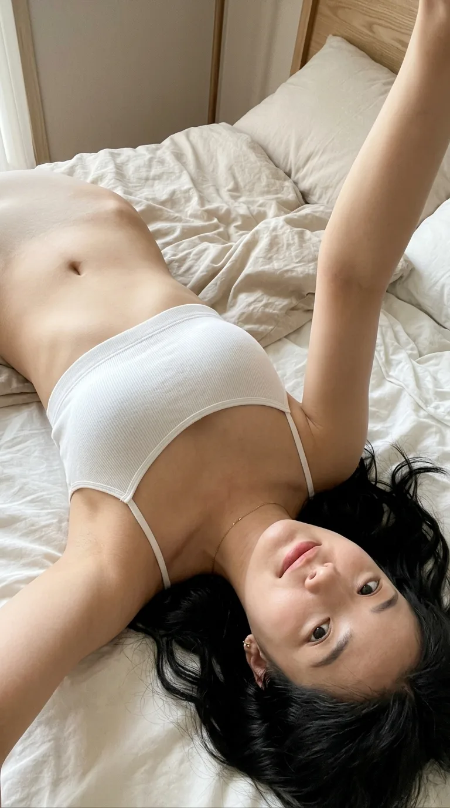

**#530 · Ai Art, Ai Prompt · <code>Vinano Image Pro</code>**

> Keywords: AI art, AI prompt, text to image

<details>
<summary>Show prompt</summary>

```
{ "subject": { "description": "Beautiful young Korean female celebrity in early 20s lying on bed, close-up focus on fully exposed outer lateral hip skin", "mirror_rules": "N/A - direct overhead phone selfie, not mirror reflection", "age": "early 20s", "expression": { "eyes": { "look": "direct gaze at camera", "energy": "soft inviting", "direction": "upward to lens" }, "mouth": { "position": "gentle slight smile", "energy": "sweet and relaxed" }, "overall": "playful yet intimate and confident" }, "face": { "preserve_original": true, "makeup": "natural dewy Korean makeup, subtle blush, glossy lips" }, "hair": { "color": "jet black", "style": "long wavy hair spread messily on bed", "effect": "natural tousled flow" }, "body": { "frame": "slim toned figure", "waist": "slim defined waist", "chest": "natural in crop top", "legs": "partially visible smooth legs", "skin": { "visible_areas": "fully exposed outer lateral hip skin, flat abdomen prominent navel, natural waist curves", "tone": "fair smooth Korean skin tone", "texture": "silky smooth supple warm to the touch", "lighting_effect": "gentle natural highlights on outer hip curve and belly" } }, "pose": { "position": "lying on back on bed", "base": "relaxed supine", "overall": "one arm raised for selfie, body slightly angled to showcase outer hip" }, "clothing": { "top": { "type": "white ribbed spaghetti strap crop top bralette", "color": "pure white", "details": "ribbed texture thin straps fitted cut", "effect": "short crop design fully exposing lower midriff, abdomen and outer lateral hip skin" }, "bottom": { "type": "no visible bottoms", "color": "n/a", "details": "focus on exposed outer hip skin only" } } }, "accessories": { "jewelry": "delicate thin gold necklace small stud earrings" }, "photography": { "camera_style": "casual smartphone overhead selfie Korean influencer aesthetic", "angle": "top-down overhead view", "shot_type": "close-up midriff and outer hip focus upper body to hip level", "aspect_ratio": "9:16 vertical", "texture": "sharp natural skin and fabric details", "lighting": "soft diffused natural bedroom light", "depth_of_field": "shallow focus on exposed outer hip skin soft bed bg" }, "background": { "setting": "cozy bedroom bed", "wall_color": "neutral", "elements": ["wrinkled beige bedsheets"], "atmosphere": "relaxed intimate morning", "lighting": "warm soft ambient" }, "the_vibe": { "energy": "calm seductive", "mood": "intimate confident", "aesthetic": "natural Korean celebrity beauty casual selfie", "authenticity": "real life candid", "intimacy": "high personal", "story": "Korean female star relaxing in bed capturing private lazy moment fully exposed outer lateral hip skin", "caption_energy": "gentle smile inviting gaze" }, "constraints": { "must_keep": ["Korean female celebrity look", "white ribbed crop top", "fully exposed outer lateral hip skin", "flat abdomen prominent navel", "long black messy hair", "overhead lying pose", "natural lighting", "this exact outer hip skin area must be fully visible and uncovered"], "avoid": ["visible underwear or panties", "any sensitive or explicit body parts", "clothing covering outer hip", "harsh shadows", "distorted anatomy"] }, "negative_prompt": ["underwear", "panties", "nudity", "explicit content", "covered outer hip", "clothing over hip skin", "blurry", "low quality", "deformed", "extra limbs", "text", "watermark", "visible bottoms"] } Render with rich micro-detail while keeping the layout uncluttered and intentional.
```

</details>

---

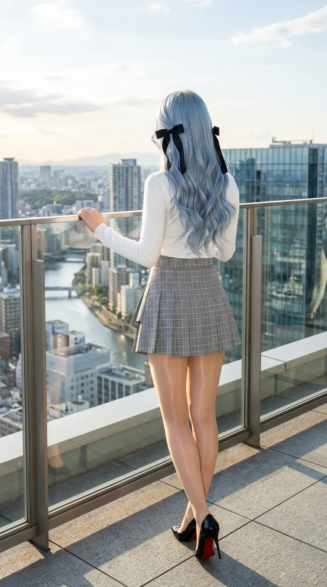

**#531 · Ai Art, Ai Prompt · <code>Vinano Image v2</code>**

> Keywords: AI art, AI prompt, text to image

<details>
<summary>Show prompt</summary>

```
生成一张 9:16 竖版真实摄影质感女性写真，画面为高级都市露台写真风格，整体清透、明亮、精致，带有现代城市高层建筑背景与时尚街拍质感。

画面中是一位 20–26 岁年轻成年东方女性，背对镜头站在高层露台玻璃栏杆前，双手自然扶在栏杆上，身体微微前倾，像是在阳光下眺望远处城市。人物具有明确成年女性气质，不幼态，不低俗，不夸张。她拥有一头浅蓝色长卷发，发丝柔顺蓬松，自然垂落到腰部附近，发尾带有柔和波浪卷，头发在阳光下呈现轻盈通透的蓝色光泽，两侧佩戴黑色蝴蝶结发饰，增加精致梦幻感。

人物身形为成熟丰腴但协调自然的曲线型体态，肩颈线柔和舒展，腰线清晰，腰胯转折自然，腿部比例修长，整体呈现优雅的 S 型背影轮廓。画面重点表现整体身体轮廓、服装剪裁、腿部线条、发丝质感、阳光反射和都市空间关系，而不是身体局部。

她穿着干净的白色长袖上衣，搭配灰白色格纹高腰短裙，裙摆具有轻微不规则层次与自然褶皱，材质轻盈但保持完整覆盖，整体造型年轻、时尚、清爽。腿部穿着高光泽感的浅肤色丝袜，呈现细腻、顺滑、带反光的马油袜质感，光线沿腿部形成自然高光线条，质感真实但克制。脚穿黑色漆皮高跟鞋，鞋底带深红色细节，强化都市时尚感。

场景位于现代城市高层露台，前方是透明玻璃栏杆，远处是高楼立面与窗格反射，阳光从侧上方照射进画面，在地面形成清晰光影。整体背景干净、现代、有空间层次，玻璃栏杆带轻微反射，城市建筑略微虚化但保留真实结构。

构图为全身背影构图，镜头位于人物身后略低角度，突出长发、腰线、裙摆层次、腿部比例和高跟鞋线条。人物占画面中下部，城市建筑占据背景，形成强烈的都市时尚氛围。画面允许高级商业写真精修质感，皮肤与丝袜高光细腻真实，服装有真实褶皱，头发有自然发丝层次，整体精致、清透、吸睛但不低俗。

强调材质质感与自然光影，让画面更具高级真实感。
```

</details>

---

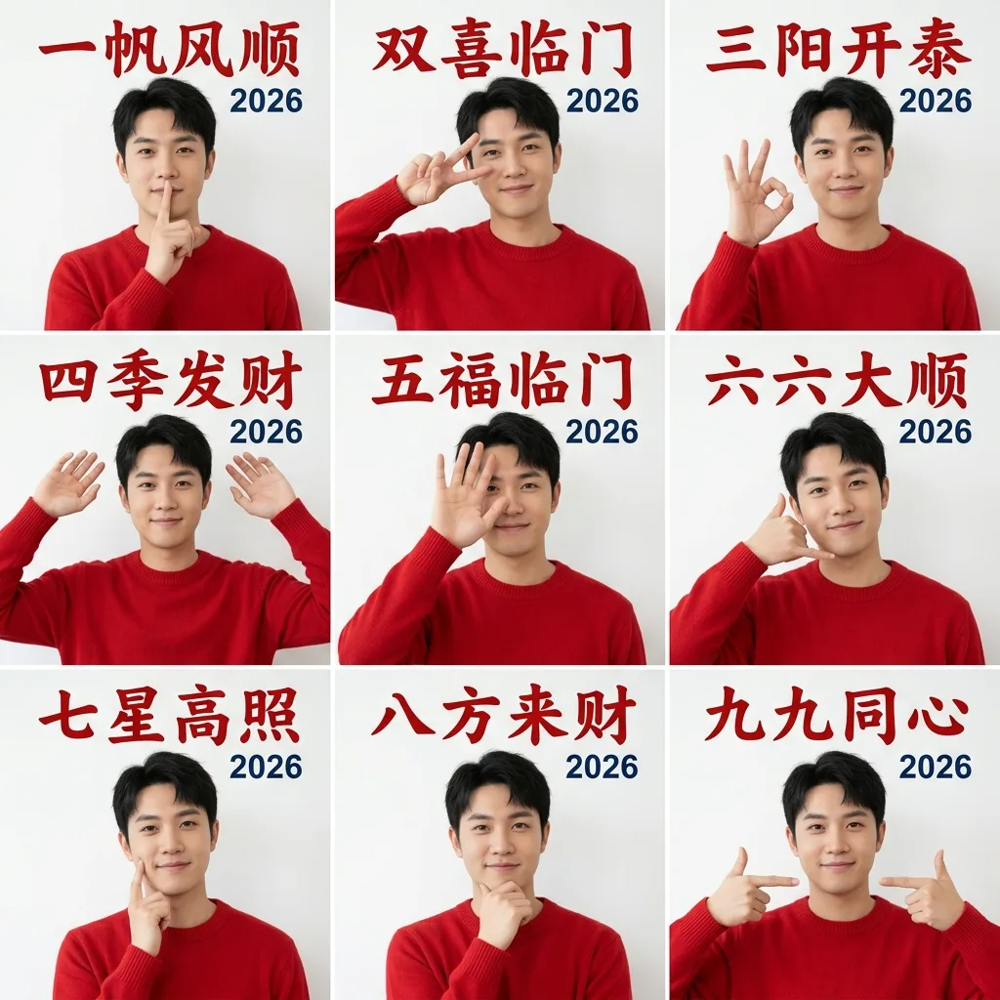

**#532 · Ai Art, Ai Prompt · <code>Vinano Image Pro</code>**

> Keywords: AI art, AI prompt, text to image

<details>
<summary>Show prompt</summary>

```
{
 "project_settings": {
 "task_type": "九宫格新年祝福肖像（男生版）",
 "aspect_ratio": "1:1",
 "grid_layout": "3x3",
 "batch_size": 1
 },

 "overall_style": {
 "整体风格": "极简新年祝福风",
 "视觉基调": "干净、温和、克制的节日感",
 "背景": "纯色白墙面，无装饰",
 "光线": "自然柔光，均匀无强阴影",
 "色彩重点": "中国红（服装 + 文字）"
 },

 "subject_base": {
 "人物一致性": "九宫格内为同一位人物",
 "人物类型": "亚洲男性",
 "性别气质": "干净、阳光、自然，不油腻",
 "发型": "黑色短发，自然蓬松，简洁利落",
 "服装": "红色针织毛衣或卫衣，简洁无图案",
 "妆容": "无明显妆感，真实自然肤质",
 "表情气质": "开心，克制的微笑，不夸张"
 },

 "pose_variations": {
 "grid_1": "食指竖于嘴前，轻松安静手势",
 "grid_2": "单手比 V 手势靠近脸部",
 "grid_3": "单手做 OK 或三指手势",
 "grid_4": "双手举起做轻松俏皮手势（不过度卖萌）",
 "grid_5": "单手张开遮住半边脸",
 "grid_6": "单手做电话手势靠近脸侧",
 "grid_7": "单手轻点脸颊或下巴",
 "grid_8": "单手托下巴，轻微思考姿势",
 "grid_9": "双手指向脸部或克制比心变体"
 },

 "text_overlays": {
 "字体风格": "传统中文新年书法字体",
 "文字颜色": "中国红",
 "年份颜色": "深蓝色",
 "文字位置": "每一格顶部居中",
 "文字结构": "四字祝福语 + 年份"
 },

 "text_content": [{ "position": "grid_1", "text": "一帆风顺", "year": "2026" },
 { "position": "grid_2", "text": "双喜临门", "year": "2026" },
 { "position": "grid_3", "text": "三阳开泰", "year": "2026" },
 { "position": "grid_4", "text": "四季发财", "year": "2026" },
 { "position": "grid_5", "text": "五福临门", "year": "2026" },
 { "position": "grid_6", "text": "六六大顺", "year": "2026" },
 { "position": "grid_7", "text": "七星高照", "year": "2026" },
 { "position": "grid_8", "text": "八方来财", "year": "2026" },
 { "position": "grid_9", "text": "九九同心", "year": "2026" }],

 "constraints": {
 "禁止项": ["不改变人物身份",
 "不夸张表情",
 "不女性化姿态",
 "不使用复杂背景",
 "不添加节日道具",
 "不风格化面部"],
 "一致性要求": ["人物脸型五官保持完全一致",
 "服装颜色与材质一致",
 "拍摄角度与距离基本一致"]
 },

 "use_cases": ["男生新年纪念照",
 "个人春节祝福九宫格",
 "社交平台头像矩阵",
 "品牌新年男生模板"]
}

强调材质质感与自然光影，让画面更具高级真实感。
```

</details>

---

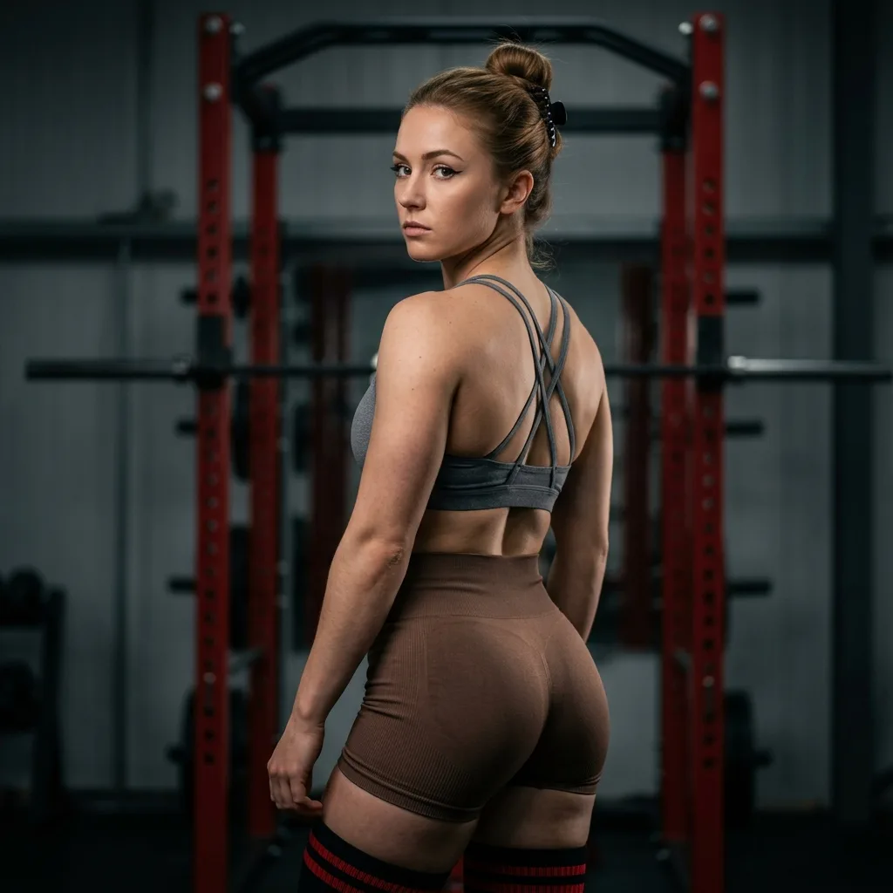

**#533 · Realistic, Portrait · <code>Vinano Image Pro</code>**

> Keywords: realistic, portrait, cinematic, AI art, AI prompt, text to image

<details>
<summary>Show prompt</summary>

```
{
 "task": "image_generation",
 "style": {
 "resolution": "8K",
 "look": "hyper-realistic, cinematic",
 "photorealism": true
 },
 "subject": {
 "identity": "fictional fitness model",
 "inspiration": "celebrity-inspired (non-identical, no face matching)",
 "gender": "female",
 "skin_tone": "fair",
 "pose": {
 "view": "3/4 rear",
 "posture": "arched back",
 "head_direction": "looking over shoulder"
 },
 "expression": "serious",
 "makeup": {
 "eyeliner": "winged",
 "finish": "natural cinematic"
 },
 "hair": {
 "color": "honey-brown",
 "style": "bun",
 "accessory": "hair clip"
 }
 },
 "wardrobe": {
 "top": {
 "type": "sports bra",
 "color": "grey",
 "design": "multi-strap"
 },
 "bottom": {
 "type": "shorts",
 "fit": "tight, high-waist",
 "texture": "ribbed",
 "color": "brown"
 },
 "socks": {
 "type": "thigh-high",
 "color": "black",
 "details": "red stripes"
 }
 },
 "environment": {
 "location": "gym",
 "background_elements": ["red metal rack"],
 "atmosphere": "cinematic, moody"
 },
 "camera": {
 "lens": "85mm",
 "depth_of_field": "shallow",
 "focus": "sharp on subject"
 },
 "lighting": {
 "type": "cinematic",
 "key": "soft directional",
 "contrast": "high",
 "highlights": "controlled"
 },
 "detail": {
 "skin": "ultra-detailed, realistic texture",
 "fabric": "high micro-detail"
 },
 "composition": {
 "aspect_ratio": "3:4",
 "framing": "portrait"
 },
 "constraints": {
 "no_real_person_identity": true,
 "no_face_matching": true
 }
}

Render with rich micro-detail while keeping the layout uncluttered and intentional.
```

</details>

---

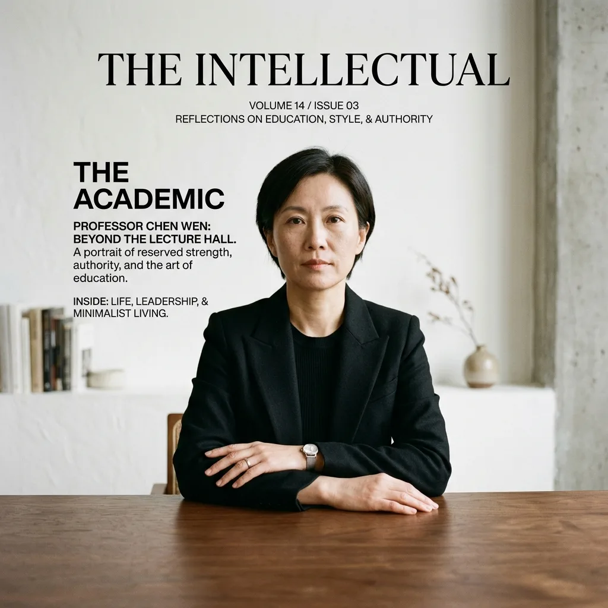

**#534 · Ai Art, Ai Prompt · <code>Vinano Image Pro</code>**

> Keywords: AI art, AI prompt, text to image

<details>
<summary>Show prompt</summary>

```
把一张[老师生活照]

拉进极简时尚杂志里

黑色西装，冷淡排版

再加一点不太好接近的眼神

保持真实比例与空间层次，呈现专业、稳重的最终效果。
```

</details>

---


**#535 · Realistic, Ai Art · <code>Vinano Image v2</code>**

> Keywords: realistic, AI art, AI prompt, text to image

<details>
<summary>Show prompt</summary>

```
A true-to-life photorealistic image of a cloud in the sky, uniquely shaped like all the continents of the world, clear, distinct outlines of each continent visible within the cloud formation. The background is a bright blue sky a few other smaller, normal clouds scattered around. The sunlight is subtly illuminating the cloud, highlighting its unique shape Emphasise material texture and natural light so the final frame feels tactile and premium.
```

</details>

---

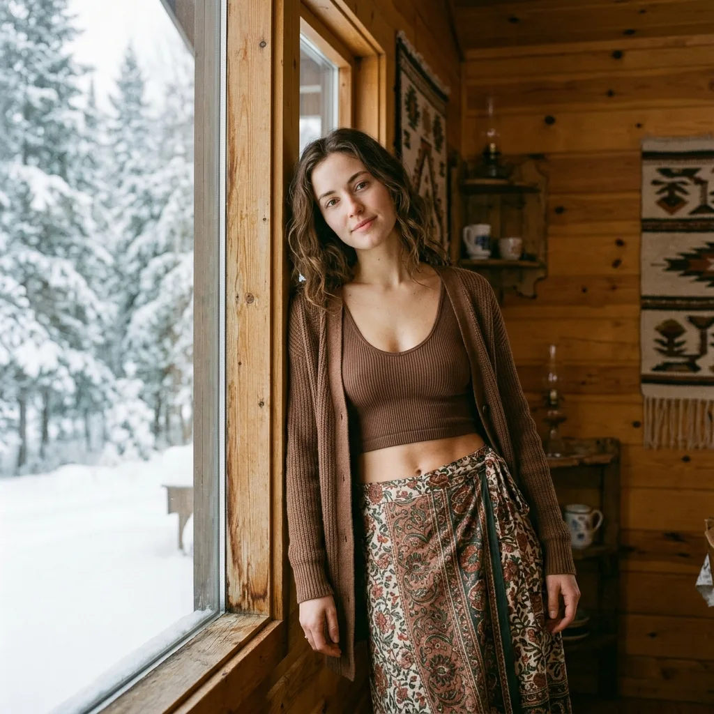

**#536 · Landscape, Cinematic · <code>Vinano Image v2</code>**

> Keywords: landscape, cinematic, AI art, AI prompt, text to image

<details>
<summary>Show prompt</summary>

```
A beautiful woman the exact same face as in the reference photo, posing inside a cozy rustic wooden cabin. She is leaning casually against a large wooden window frame, looking directly at the camera a soft, gentle expression.
The interior features warm golden-toned wood paneling and decorative tapestries on the walls, creating a warm and inviting atmosphere. Through the large window, a serene snowy landscape is visible thick snow covering the ground and pine trees, emphasizing a strong warm-vs-cold contrast.
She is wearing a simple brown knit low U-neck crop top paired a matching long-sleeved open-front cardigan. She also wears a patterned floor-length wrap skirt intricate floral and paisley designs in muted earthy tones, worn below the navel. The overall style is relaxed and comfortable cabin-core fashion.
Soft natural lighting streams in from the window, gently illuminating the textures of the knitwear, the wood grain of the cabin, and her features. Highly detailed, cinematic composition, warm and cozy mood.

Maintain consistent colour harmony and crisp focus across the whole frame.
```

</details>

---

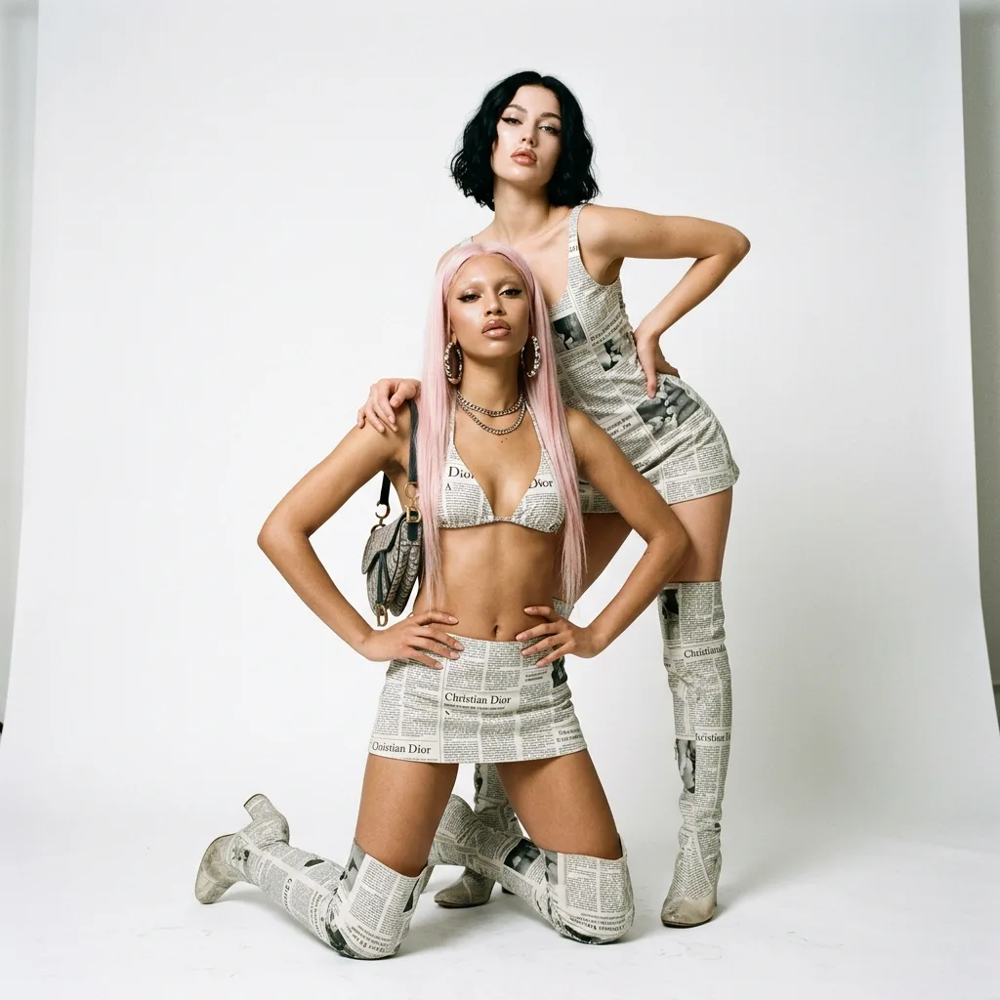

**#537 · Character, Vintage · <code>Vinano Image Pro</code>**

> Keywords: character, vintage, AI art, AI prompt, text to image

<details>
<summary>Show prompt</summary>

```
{
 "shot": {
 "composition": "full body dual shot, 50mm lens, static angle, high fashion composition",
 "camera_motion": "static studio setup",
 "frame_rate": "still photography",
 "film_grain": "light vintage fashion grain, mimicking early 2000s campaigns"
 },
 "subject": {
 "description": "Two female fashion models in bold editorial poses. One kneeling long platinum pink hair, the other behind her short black hair. Both wear mini Dior-style outfits and newspaper-printed thigh-high boots.",
 "wardrobe": "designer print bikinis, newspaper-print thigh-high boots, large statement accessories, small shoulder bags",
 "makeup": "bold eyeliner, overlined lips, high-gloss highlight on cheeks",
 "hair": "model 1: platinum pink straight, long; model 2: short black wavy bob"
 },
 "scene": {
 "location": "studio white seamless backdrop",
 "time_of_day": "artificial lighting, studio session",
 "environment": "clean background, shadow below subjects from soft directional lighting"
 },
 "visual_details": {
 "action": "model 1 kneeling and arching her back attitude, model 2 seated close behind hand on hip",
 "props": "designer handbags, large earrings, over-the-knee boots printed patterns"
 },
 "cinematography": {
 "lighting": "flat studio light, front-lit soft diffused fill, subtle shadows for contour",
 "tone": "high-gloss, bold, provocative fashion magazine look"
 },
 "audio": {
 "ambient": "none (photo)",
 "music": "implied editorial fashion shoot silence"
 },
 "color_palette": "desaturated whites, chrome, denim blue, muted skin tones, pops of print",
 "dialogue": {
 "character": "N/A",
 "line": "",
 "subtitles": false
 }
}

Emphasise material texture and natural light so the final frame feels tactile and premium.
```

</details>

---

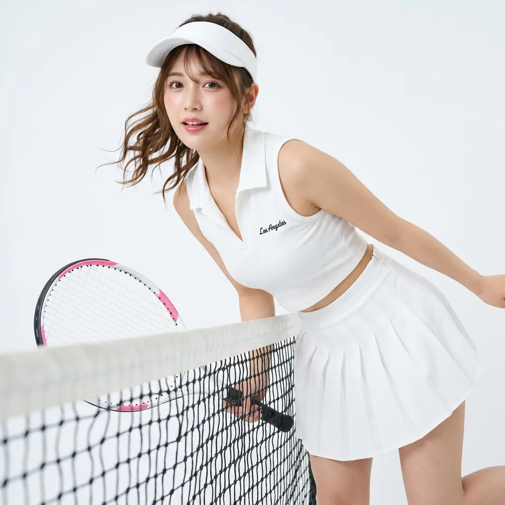

**#538 · Portrait, Ai Art · <code>Vinano Image Pro</code>**

> Keywords: portrait, AI art, AI prompt, text to image

<details>
<summary>Show prompt</summary>

```
{ "subject": { "description": "Young woman, athletic gravure idol aesthetic.", "mirror_rules": "none", "age": "early 20s", "expression": { "eyes": { "look": "direct contact", "energy": "soft, engaging", "direction": "at lens" }, "mouth": { "position": "slightly parted", "energy": "relaxed" }, "overall": "playful, innocent" }, "face": { "preserve_original": "true", "makeup": "East Asian idol style, glossy pink lips, subtle blush, natural brows." } }, "hair": { "color": "medium brown", "style": "tied back under visor, loose wavy strands framing face", "effect": "dynamic, moving as if caught in a breeze" }, "body": { "frame": "curvy bust, slim waist", "waist": "toned, exposed", "chest": "full, prominent", "legs": "smooth thighs visible", "skin": { "visible_areas": "shoulders, arms, midriff, upper thighs", "tone": "fair, pale", "texture": "smooth, powdery to touch", "lighting_effect": "even studio strobe reflecting softly off shoulder and collarbone" } }, "pose": { "position": "leaning heavily forward at waist", "base": "standing asymmetrical", "overall": "dynamic bending posture, interacting foreground net" }, "clothing": { "top": { "type": "sleeveless ribbed crop top, polo collar", "color": "white", "details": "small black 'Los Angeles' text on left breast, tight fit", "effect": "stretching taut over bust" }, "bottom": { "type": "pleated mini tennis skirt", "color": "white", "details": "short, high waist fit" } }, "accessories": { "headwear": "white sun visor", "jewelry": "small stud earrings", "device": "none", "prop": "tennis racket (white pink rim), black tennis net white top tape" }, "photography": { "camera_style": "studio gravure portrait", "angle": "slightly low angle, tilting up to face", "shot_type": "medium-full shot, slight off-center tilt", "aspect_ratio": "4:5", "texture": "crisp, digital high-res", "lighting": "bright, flat studio strobe, large softbox, eliminating harsh shadows", "depth_of_field": "f/8, subject fully in focus, net acts as slightly soft foreground interference" }, "background": { "setting": "studio", "wall_color": "pure white", "elements": [], "atmosphere": "sterile, bright", "lighting": "over-lit white seamless backdrop" }, "the_vibe": { "energy": "active, present-tense", "mood": "breezy, suggestive", "aesthetic": "Japanese sports gravure", "authenticity": "staged but dynamic", "intimacy": "direct fan-service", "story": "she is playfully leaning over the net during a casual match", "caption_energy": "Game set match." }, "constraints": { "must_keep": ["tennis net as foreground obstacle", "deep leaning pose", "all-white outfit"], "avoid": ["dark shadows", "outdoor settings", "stiff posture"] }, "negative_prompt": ["dark, moody shadows, outdoor, messy background, missing net, flat chest, fully clothed, stiff pose"] } Emphasise material texture and natural light so the final frame feels tactile and premium.
```

</details>

---

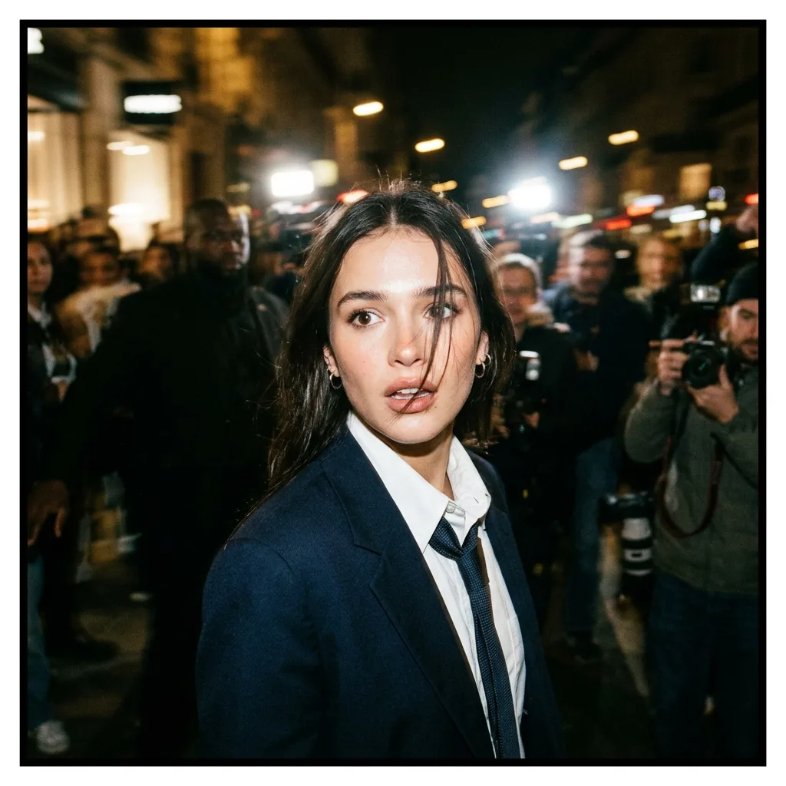

**#539 · Realistic, Cinematic · <code>Vinano Image Pro</code>**

> Keywords: realistic, cinematic, AI art, AI prompt, text to image

<details>
<summary>Show prompt</summary>

```
Paparazzi-style extreme close-up photo of a woman striking facial features, caught off-guard while turning toward the camera. Face and shoulders only, shot from a low angle. Strong harsh on-camera flash, grainy high-ISO, raw candid street-photography feel. Background shows a crowded scene motion blur (Paris Fashion Week atmosphere). Intense, spontaneous energy, imperfect and real. She is wearing a school uniform. Ultra-realistic, cinematic realism, high detail skin texture, slight lens distortion.

Camera style: “35mm paparazzi lens, f/2.8, flash blown highlights”
Look: “2000s tabloid photo aesthetic”
Quality: “sharp focus on face, background heavily blurred and streaked”

Keep edges clean and the overall composition balanced for a polished, gallery-ready result.
```

</details>

---

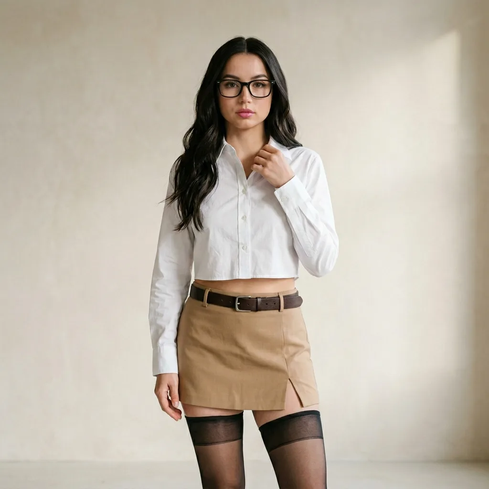

**#540 · Realistic, Portrait · <code>Vinano Image Pro</code>**

> Keywords: realistic, portrait, minimalist, AI art, AI prompt, text to image

<details>
<summary>Show prompt</summary>

```
{
 "metadata": {
 "version": "2.0",
 "aspect_ratio": "3:4",
 "style": "ultra-true-to-life photorealistic"
 },
 "subject": {
 "identity": {
 "base_model_reference": "Ana de Armas",
 "ethnicity": "East Asian",
 "age_group": "young adult",
 "skin": {
 "tone": "light",
 "texture": "natural skin pores, fine details"
 }
 },
 "features": {
 "hair": {
 "color": "dark brown/black",
 "style": "long, wavy, parted in the middle",
 "texture": "voluminous, soft shine"
 },
 "eyes": {
 "color": "brown",
 "eyewear": "black square-frame glasses",
 "gaze": "direct to camera"
 },
 "makeup": {
 "style": "natural/refined minimalist",
 "details": ["defined eyes",
 "pink lip gloss"]
 }
 },
 "posture": {
 "pose": "standing, facing forward",
 "head_angle": "straight",
 "arm_placement": {
 "right": "hand resting on shirt collar",
 "left": "relaxed by side"
 },
 "expression": "neutral, confident, poised"
 }
 },
 "attire": {
 "upper_body": {
 "item": "long-sleeve button-up crop top",
 "color": "white",
 "fabric_detail": "crisp cotton"
 },
 "lower_body": {
 "item": "mini-skirt front slit",
 "color": "tan",
 "accessories": {
 "belt": "dark brown leather",
 "buckle": "silver"
 }
 },
 "legwear": {
 "type": "thigh-high stockings",
 "opacity": "sheer",
 "color": "black"
 }
 },
 "environment": {
 "setting": "studio",
 "background": {
 "wall_color": "light beige",
 "wall_texture": "smooth plaster",
 "elements": "refined minimalist/none"
 },
 "lighting": {
 "type": "soft studio lighting",
 "direction": "upper right",
 "shadows": "soft drop shadow on rear wall"
 }
 },
 "camera_settings": {
 "composition": {
 "shot_type": "three-quarter portrait",
 "angle": "eye-level"
 },
 "optics": {
 "lens": "85mm prime",
 "aperture": "f/2.8",
 "focus": "sharp focus on subject",
 "depth_of_field": "shallow bokeh background"
 }
 }

Emphasise material texture and natural light so the final frame feels tactile and premium.
```

</details>

---

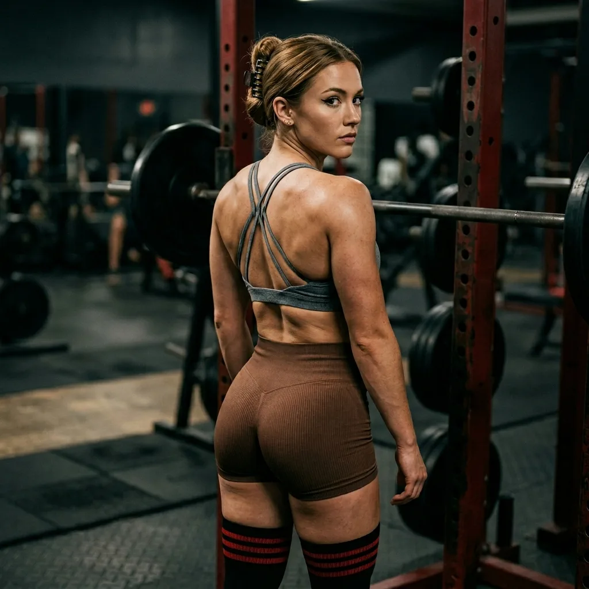

**#541 · Realistic, Portrait · <code>Vinano Image Pro</code>**

> Keywords: realistic, portrait, cinematic, AI art, AI prompt, text to image

<details>
<summary>Show prompt</summary>

```
{
 "task": "image_generation",
 "style": {
 "resolution": "8K",
 "look": "hyper-realistic, cinematic",
 "photorealism": true
 },
 "subject": {
 "identity": "fictional fitness model",
 "inspiration": "celebrity-inspired (non-identical, no face matching)",
 "gender": "female",
 "skin_tone": "fair",
 "pose": {
 "view": "3/4 rear",
 "posture": "arched back",
 "head_direction": "looking over shoulder"
 },
 "expression": "serious",
 "makeup": {
 "eyeliner": "winged",
 "finish": "natural cinematic"
 },
 "hair": {
 "color": "honey-brown",
 "style": "bun",
 "accessory": "hair clip"
 }
 },
 "wardrobe": {
 "top": {
 "type": "sports bra",
 "color": "grey",
 "design": "multi-strap"
 },
 "bottom": {
 "type": "shorts",
 "fit": "tight, high-waist",
 "texture": "ribbed",
 "color": "brown"
 },
 "socks": {
 "type": "thigh-high",
 "color": "black",
 "details": "red stripes"
 }
 },
 "environment": {
 "location": "gym",
 "background_elements": ["red metal rack"],
 "atmosphere": "cinematic, moody"
 },
 "camera": {
 "lens": "85mm",
 "depth_of_field": "shallow",
 "focus": "sharp on subject"
 },
 "lighting": {
 "type": "cinematic",
 "key": "soft directional",
 "contrast": "high",
 "highlights": "controlled"
 },
 "detail": {
 "skin": "ultra-detailed, realistic texture",
 "fabric": "high micro-detail"
 },
 "composition": {
 "aspect_ratio": "3:4",
 "framing": "portrait"
 },
 "constraints": {
 "no_real_person_identity": true,
 "no_face_matching": true
 }
}

Maintain consistent colour harmony and crisp focus across the whole frame.
```

</details>

---


**#542 · Ai Art, Ai Prompt · <code>Vinano Image Pro</code>**

> Keywords: AI art, AI prompt, text to image

<details>
<summary>Show prompt</summary>

```
AI generated image by Emphasise material texture and natural light so the final frame feels tactile and premium.
```

</details>

---


**#543 · Ai Art, Ai Prompt · <code>Vinano Image v2</code>**

> Keywords: AI art, AI prompt, text to image

<details>
<summary>Show prompt</summary>

```
この商品広告をプロのデザイナー目線でリデザインして。
今のトレンド、ターゲットに合わせた洗練されたデザインで。

整体保持边缘干净、构图均衡，呈现可直接使用的精致成品感。
```

</details>

---

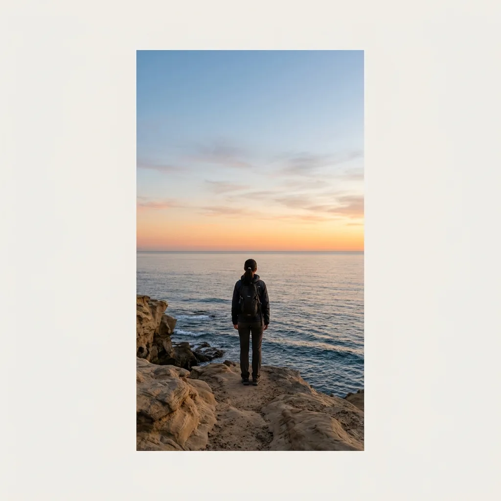

**#544 · Ai Art, Ai Prompt · <code>Vinano Image Pro</code>**

> Keywords: AI art, AI prompt, text to image

<details>
<summary>Show prompt</summary>

```
Make a beautiful 9:16 wallpaper. Leave natural negative space near the top and bottom. Give the wallpaper a subtle top to bottom gradient. No blur effects or cropping. Keep the scene simple. Preserve realistic proportions and depth for a confident, professional finish.
```

</details>

---

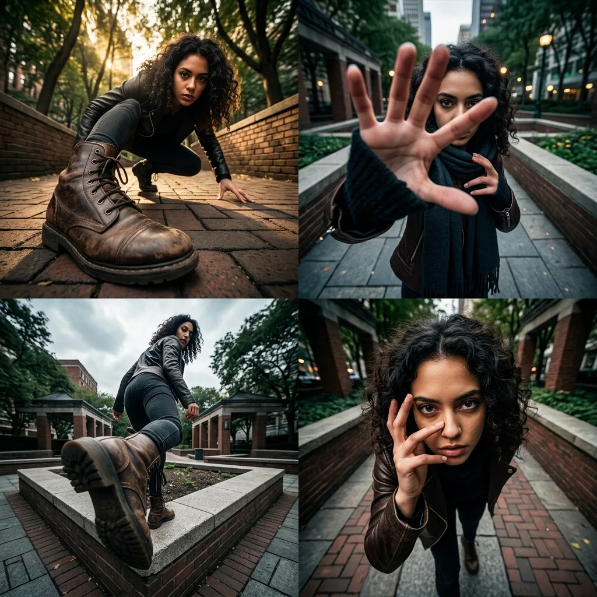

**#545 · Realistic, Character · <code>Vinano Image Pro</code>**

> Keywords: realistic, character, cinematic, AI art, AI prompt, text to image

<details>
<summary>Show prompt</summary>

```
Transform the original photo into a dramatic, true-to-life photorealistic, ultra-detailed set of 4 different styles characters are included, each a mid close up wide-angle shot an extreme, dynamic camera angle where one or more body parts are positioned right next to the lens and appear huge, the rest of the body recedes strongly in perspective, and the same person strikes a stylish, complex, powerful pose in a consistent, expanded version of the original environment, filmic, cinematic lighting, high contrast, crisp textures, and precise color grading. Maintain consistent colour harmony and crisp focus across the whole frame.
```

</details>

---

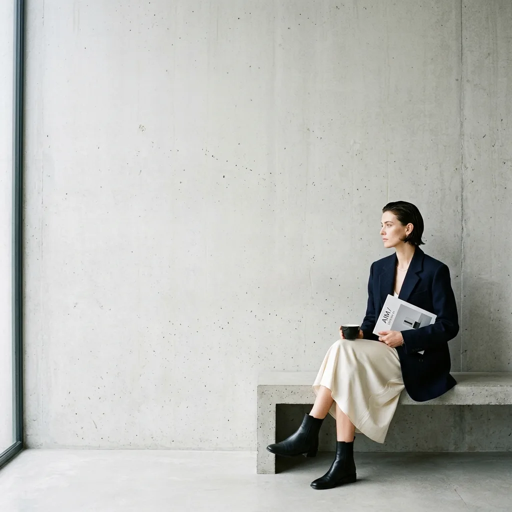

**#546 · Ai Art, Ai Prompt · <code>Vinano Image Pro</code>**

> Keywords: AI art, AI prompt, text to image

<details>
<summary>Show prompt</summary>

```
AI generated image by Aim for an editorial, design-driven look with deliberate negative space.
```

</details>

---

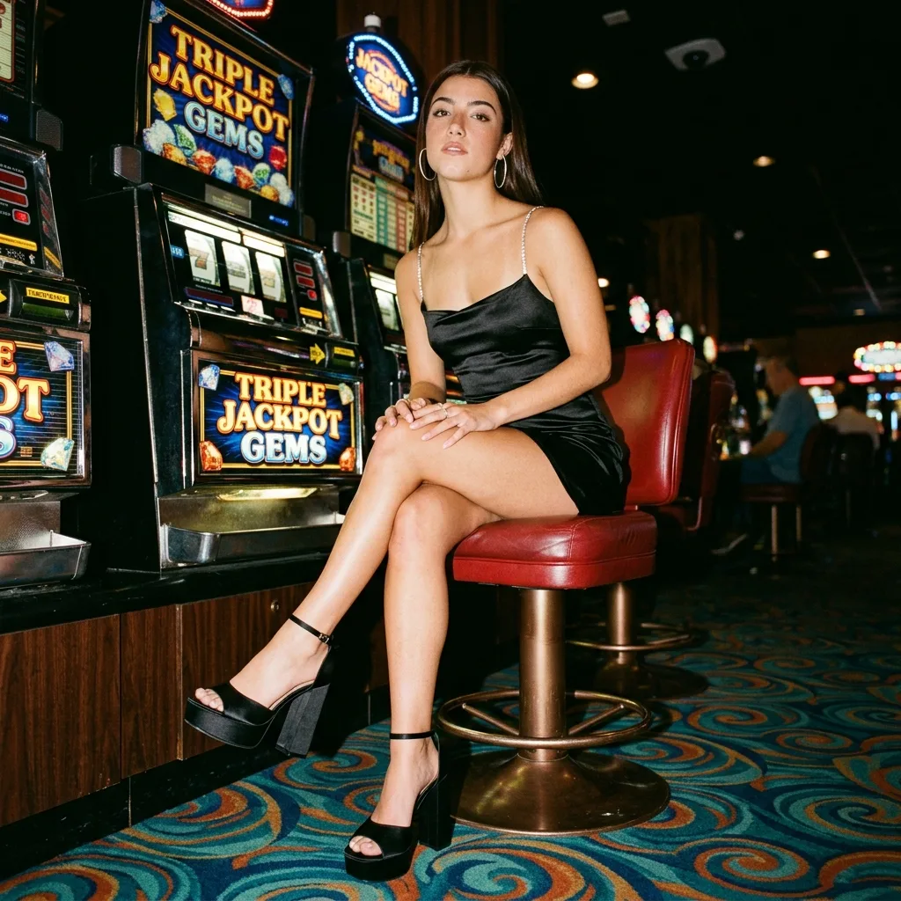

**#547 · Vintage, Ai Art · <code>Vinano Image Pro</code>**

> Keywords: vintage, AI art, AI prompt, text to image

<details>
<summary>Show prompt</summary>

```
{
 "image_prompt_data": {
 "subject": {
 "appearance": "Young Sadie Sink woman long, straight, dark brown hair parted in the middle. Tan complexion. Resembles Charli D'Amelio.",
 "expression": "Neutral to slightly serious, confident gaze, looking directly down at the camera lens.",
 "pose": "Sitting on a red leather bar stool, body angled slightly to the left, legs crossed at the knees, hands resting gently on her thighs."
 },
 "apparel": {
 "clothing": "Fitted black mini dress (slip dress style) thin, sparkling rhinestone or silver chain spaghetti straps.",
 "footwear": "Black satin platform sandals high block heels and buckle ankle straps.",
 "accessories": "Large silver hoop earrings, delicate silver rings on fingers."
 },
 "environment": {
 "setting": "Casino interior, dimly lit background.",
 "objects": "Large slot machine to the left illuminated neon signage reading 'TRIPLE JACKPOT GEMS'.",
 "furniture": "Red cushioned swivel bar stool a metallic bronze base.",
 "flooring": "Retro-patterned casino carpet featuring swirling designs in teal, blue, and orange.",
 "background_details": "Blurred casino lights, wooden paneling, slight reflection on the slot machine glass."
 },
 "technical_specs": {
 "camera_angle": "Low angle shot (worm's-eye view), looking up at the subject to emphasize the legs and shoes.",
 "lighting": "Direct on-camera flash photography. Hard lighting distinct shadows behind the subject and high contrast.",
 "aesthetic": "Y2K vintage digital camera vibe, paparazzi style, candid celebrity snapshot, slight film grain, high saturation."
 }
 },
 "full_prompt_string": "Low angle flash photography of a young woman resembling Charli D'Amelio sitting on a red casino stool. She is wearing a black mini dress rhinestone straps and black platform block heels. She is next to a slot machine that says 'TRIPLE JACKPOT GEMS'. Retro casino carpet floor. Direct flash, harsh shadows, 2000s digicam aesthetic, glamorous but gritty."
}

Aim for an editorial, design-driven look with deliberate negative space.
```

</details>

---

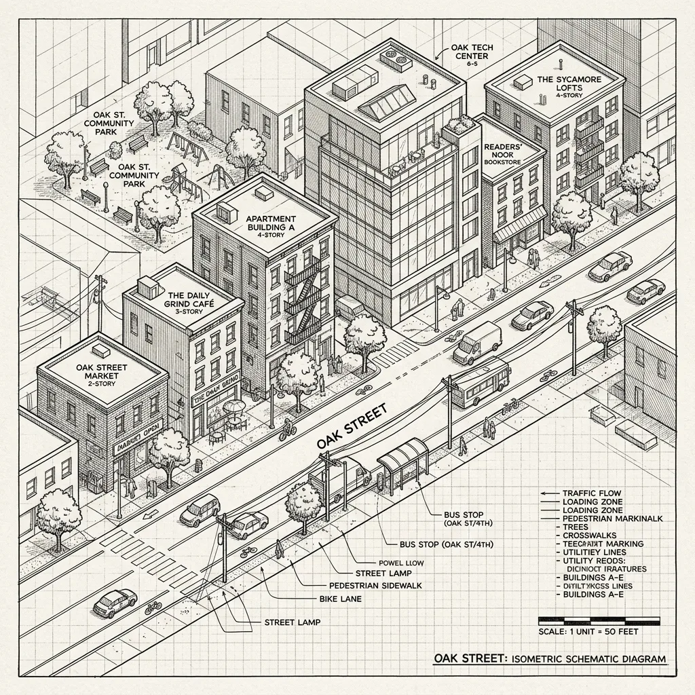

**#548 · Isometric, Ai Art · <code>Vinano Image Pro</code>**

> Keywords: isometric, AI art, AI prompt, text to image

<details>
<summary>Show prompt</summary>

```
[Create a hand drawn isometric schematic diagram of this street] Preserve realistic proportions and depth for a confident, professional finish.
```

</details>

---

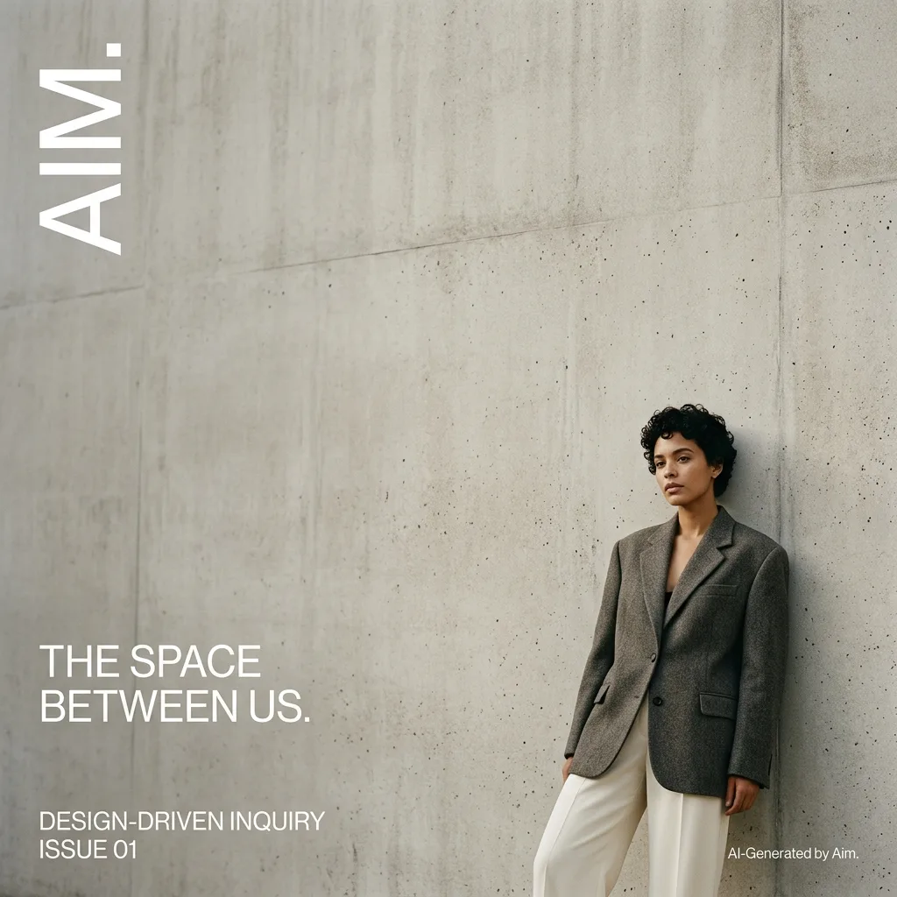

**#549 · Ai Art, Ai Prompt · <code>Vinano Image Pro</code>**

> Keywords: AI art, AI prompt, text to image

<details>
<summary>Show prompt</summary>

```
AI generated image by Aim for an editorial, design-driven look with deliberate negative space.
```

</details>

---

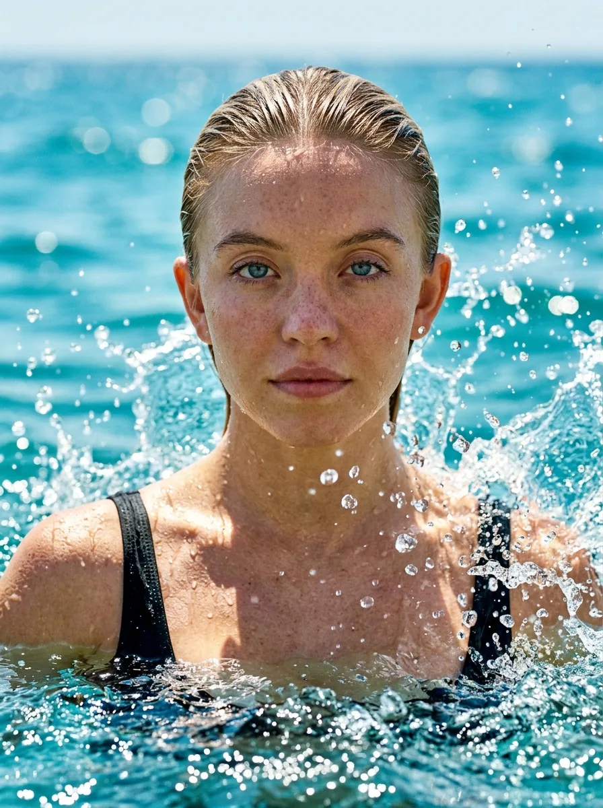

**#550 · Portrait, Ai Art · <code>Vinano Image Pro</code>**

> Keywords: portrait, AI art, AI prompt, text to image

<details>
<summary>Show prompt</summary>

```
{
 "image": {
 "general": {
 "style": "Masterpiece",
 "quality": "Best",
 "photorealism": 1.4,
 "resolution": "8k",
 "aspect_ratio": "3:4"
 },
 "lighting": {
 "type": "Caustic",
 "intensity": "Bright sunlight",
 "contrast": "High",
 "atmosphere": "Refreshing",
 "glistening_water": true
 },
 "photography": {
 "type": "High-speed",
 "focus": "Sharp",
 "details": {
 "water_splash": true,
 "water_drops_freezing_in_air": true,
 "dynamic_splash": true
 }
 },
 "water_effect": {
 "splash": {
 "intensity": 1.3,
 "dynamic": true,
 "droplets": {
 "freezing_in_air": true
 }
 }
 },
 "background": {
 "color": "Turquoise blue",
 "type": "Blurred",
 "style": "Bokeh",
 "vibes": "Summer"
 }
 },
 "subject": {
 "person": {
 "name": "Sydney Sweeney",
 "pose": "Close-up portrait",
 "expression": "Serene",
 "eyes": {
 "status": "Open",
 "color": "Blue"
 },
 "hair": {
 "color": "Blonde",
 "style": "Slicked back",
 "wet": true
 },
 "skin": {
 "texture": "Natural",
 "freckles": true,
 "wet": true,
 "detailed_features": {
 "pores": true
 }
 },
 "lips": {
 "status": "Wet"
 },
 "body": {
 "shoulders": "Bare",
 "skin": "Wet"
 }
 }
 }
}

Emphasise material texture and natural light so the final frame feels tactile and premium.
```

</details>

---

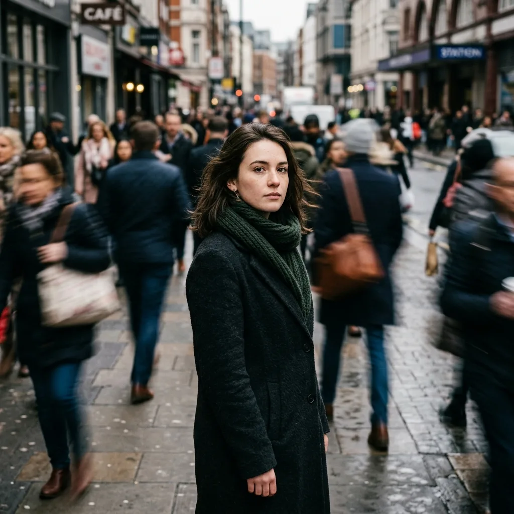

**#551 · Realistic, Portrait · <code>Vinano Image Pro</code>**

> Keywords: realistic, portrait, cinematic, AI art, AI prompt, text to image

<details>
<summary>Show prompt</summary>

```
Ultra-realistic cinematic street portrait of a young woman standing still in a crowded city street, sharp focus on her face calm, intense expression. Long-exposure effect people moving around her creating strong directional motion blur, streaked crowd movement while the subject remains perfectly still. Natural soft daylight, shallow depth of field, creamy bokeh, realistic skin texture, subtle freckles, neutral makeup, dark winter coat and scarf. Emotional, introspective mood, urban storytelling photography, DSLR quality, 85mm lens look, f/1.8, high dynamic range, 8K, professional color grading. Maintain consistent colour harmony and crisp focus across the whole frame.
```

</details>

---

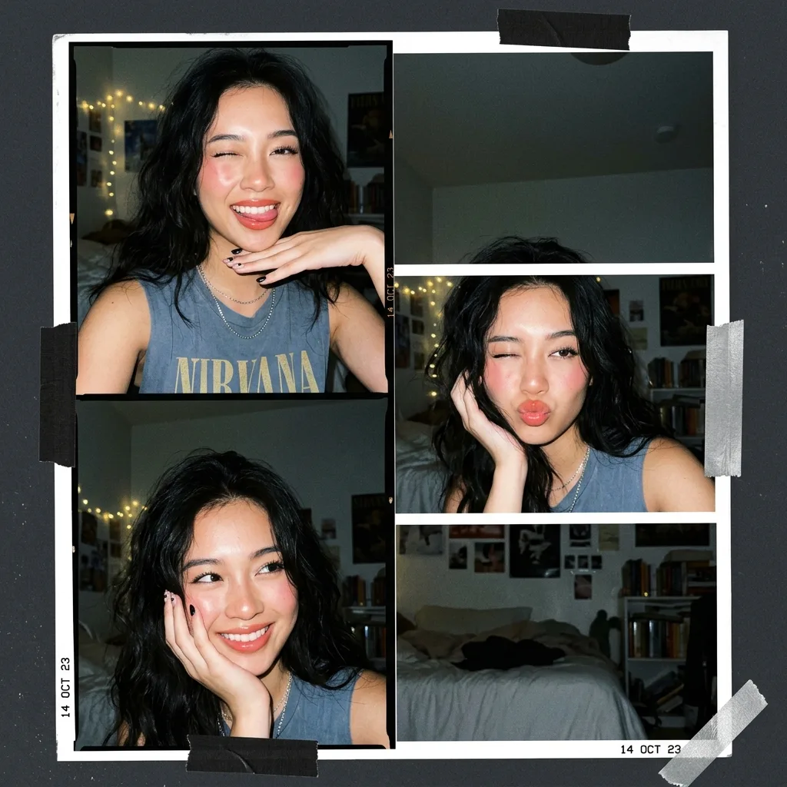

**#552 · Realistic, Ai Art · <code>Vinano Image Pro</code>**

> Keywords: realistic, AI art, AI prompt, text to image

<details>
<summary>Show prompt</summary>

```
Ultra-realistic Gen Z selfie photo collage, three vertical smartphone flash selfies of a young woman long wavy black hair, soft dewy glass skin, rosy blush, glossy peach lips, natural makeup, wearing a faded blue-gray sleeveless Nirvana tank top, silver chain necklace, black nail polish nail art, posing hand under chin, playful wink tongue out, and warm smiling expression. Direct front-facing flash photography, clean light gray wall background, high contrast shadows, candid Instagram aesthetic, sharp facial details, shallow depth of field, Y2K vibe, soft skin texture, true-to-life photorealistic, 35mm lens, high resolution.

Prompt:

Ultra-realistic late-night flash selfie collage, three stacked smartphone photos of a young woman shoulder-length dark hair, luminous skin, subtle blush, glossy pink lips, natural Korean-inspired makeup, wearing a blue-gray sleeveless tank top, silver chain necklace, resting face on hand, playful wink, looking sideways, and kissing-face expression. Direct camera flash creating bright highlights and deep shadows, dim indoor bedroom background, casual candid selfie aesthetic, soft messy hair, true-to-life photorealistic skin texture, high detail eyes and lips, Instagram/Tumblr vibe, 35mm photography, realistic lighting, ultra-sharp focus, high resolution.

Aim for an editorial, design-driven look with deliberate negative space.
```

</details>

---


**#553 · Ai Art, Ai Prompt · <code>Vinano Image Pro</code>**

> Keywords: AI art, AI prompt, text to image

<details>
<summary>Show prompt</summary>

```
AI generated image by Preserve realistic proportions and depth for a confident, professional finish.
```

</details>

---


**#554 · Ai Art, Ai Prompt · <code>Vinano Image v2</code>**

> Keywords: AI art, AI prompt, text to image

<details>
<summary>Show prompt</summary>

```
画像生成: 商品広告写真, 夏にぴったりの季節商品, 炭酸飲料, 名称="夏柑SODA", 形状=ペットボトル500ml, 2025年に飲料広告として高CTAだったデザインをリサーチしてから画像仕様をデザインして生成, アスペクト比=3:4 追求杂志编辑式的设计感，刻意安排留白与视觉重心。
```

</details>

---

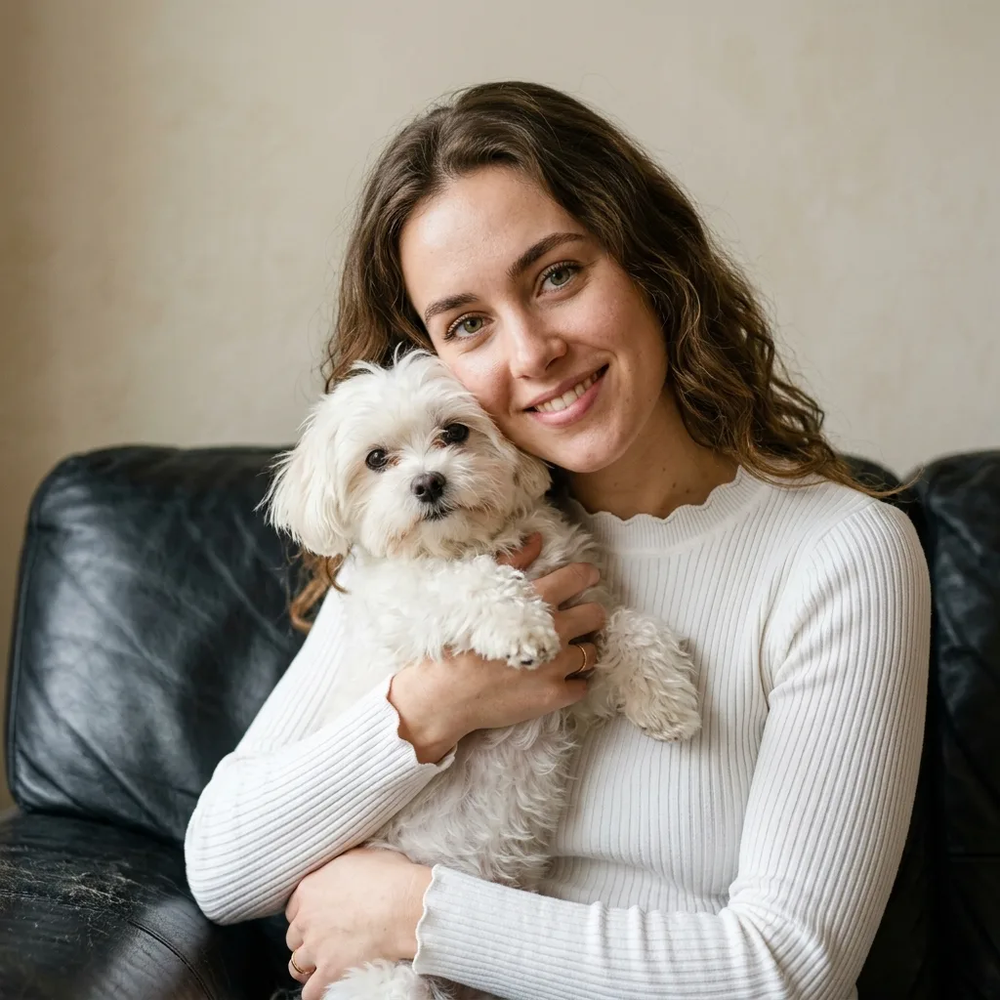

**#555 · Realistic, Portrait · <code>Vinano Image Pro</code>**

> Keywords: realistic, portrait, AI art, AI prompt, text to image

<details>
<summary>Show prompt</summary>

```
{
 "photograph": {
 "style": "ultra-realistic portrait",
 "camera": "full-frame DSLR",
 "lens": "85mm prime",
 "resolution": "high",
 "lighting": {
 "type": "soft natural window light",
 "direction": "from the side",
 "quality": "smooth shadow transitions, subtle highlights"
 },
 "focus": {
 "depth_of_field": "shallow",
 "focal_point": "woman's eyes and dog's face"
 },
 "composition": "candid, relaxed, looking at camera",
 "mood": "calm, warm, gentle"
 },
 "subject": {
 "description": "young beautiful woman",
 "features": {
 "eyes": "green",
 "skin": "fair, realistic tone visible pores and subtle natural texture",
 "makeup": "minimal refined, emphasizing lips and eyes"
 },
 "hair": "long naturally wavy, brown",
 "clothing": {
 "item": "fitted white ribbed long-sleeve sweater",
 "details": "delicate scalloped edges along neckline and cuffs, realistic knit structure, soft stretch"
 },
 "expression": "calm, warm, gentle"
 },
 "interaction": {
 "action": "tenderly hugging a small fluffy white Maltese or Bichon Frise dog close to chest",
 "dog": {
 "breed": "Maltese or Bichon Frise",
 "fur": "soft, slightly uneven and natural white",
 "position": "head resting gently on her shoulder",
 "expression": "calm, looking at camera"
 }
 },
 "setting": {
 "environment": "cozy indoor",
 "background": "plain light beige wall, no decorative distractions",
 "furniture": {
 "item": "black leather couch",
 "details": "visible leather grain and gentle creases"
 }
 }
}

Emphasise material texture and natural light so the final frame feels tactile and premium.
```

</details>

---

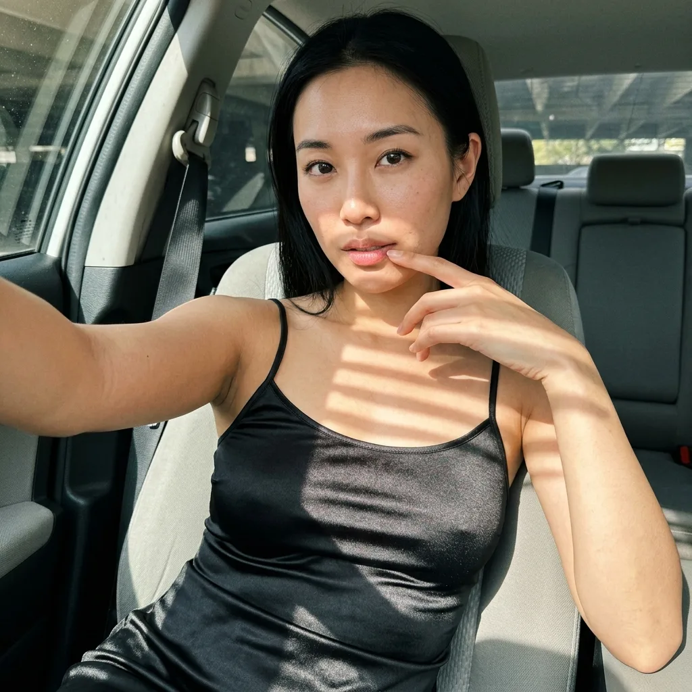

**#556 · Realistic, Character · <code>Vinano Image Pro</code>**

> Keywords: realistic, character, AI art, AI prompt, text to image

<details>
<summary>Show prompt</summary>

```
{
  "meta": {
    "quality": "ultra true-to-life photorealistic",
    "resolution": "8k",
    "camera": "iPhone 15 Pro",
    "lens": "24mm wide",
    "aspect_ratio": "9:16",
    "style": "iphone candid realism, harsh sunlight stripes through window, real pores, slight grain"
  },

  "character_lock": {
    "age": "late 20s (clearly adult)",
    "ethnicity": "Asian (Japanese/Korean mix, not black)",
    "hair": { "color": "soft black", "style": "straight hair, tucked behind ear" },
    "eyes": "dark brown",
    "body": {
      "type": "slim-thick hourglass",
      "chest": "full",
      "waist": "small",
      "hips": "round lifted"
    }
  },

  "scene": {
    "location": "parked car passenger seat",
    "time": "afternoon",
    "atmosphere": "private but public-adjacent, dangerous calm"
  },

  "camera_perspective": {
    "pov": "front camera selfie",
    "angle": "slightly above eye-line",
    "framing": "hips to head tight crop"
  },

  "subject": {
    "action": "she takes a close selfie sunlight stripes cutting across her chest and lips",
    "pose": {
      "overall": "soft arch",
      "upper_body": "forward lean for cleavage",
      "free_hand": "two fingers on lower lip",
      "expression": "dominant calm, half-smirk"
    },
    "outfit": {
      "top": {
        "type": "ultra thin satin camisole",
        "color": "black",
        "fit": "tight, braless",
        "details": "sunlight highlights show subtle outline only"
      },
      "bottom": {
        "type": "micro skirt",
        "color": "charcoal",
        "fit": "tight hips"
      }
    }
  },

  "lighting": {
    "type": "hard sunlight through car window blinds/trees",
    "effect": "striped highlights on skin and satin"
  },

  "photography_rules": {
    "no_male_presence": true,
    "suggestive_not_explicit": true,
    "thirst_trap_energy": true
  }
}

Maintain consistent colour harmony and crisp focus across the whole frame.
```

</details>

---

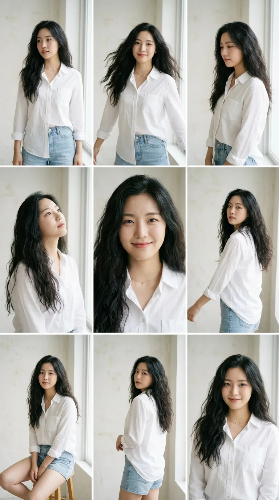

**#557 · Realistic, Portrait · <code>Vinano Image Pro</code>**

> Keywords: realistic, portrait, AI art, AI prompt, text to image

<details>
<summary>Show prompt</summary>

```
9:16 vertical — a 3x3 grid collage (nine images) forming a Korean idol portrait photoshoot series. Each frame features the same young Korean female idol, maintaining 100% consistency in facial features, proportions, hairstyle, and identity across all nine shots. Natural, ultra-realistic skin texture, no retouching, no smoothing. Clean idol-style minimal makeup, soft glow, subtle imperfections. Hair: long, voluminous dark hair, slightly tousled, consistent across all frames (natural loose flow, slight movement). Outfit: cohesive Korean idol photoshoot styling — white shirt + short bottoms (or simple neutral-toned outfit), youthful, clean, slightly casual but styled. Same outfit across all frames. Setting: minimal studio or simple indoor environment (plain wall, soft window light, clean background). Focus on subject, not environment. Lighting: soft diffused natural light, gentle highlights, low contrast, slightly airy tones, subtle film-like softness. Camera style: intimate portrait photography, slightly handheld feel, subtle imperfections (minor grain, slight blur in motion frames, imperfect framing). Frame breakdown (3x3 grid): Top row: - Top left: standing naturally, looking slightly away, relaxed expression - Top center: facing camera, casual mid-motion (hair or body slight movement) - Top right: slight side angle, soft gaze, natural candid feel Middle row: - Center left: looking slightly upward, soft thoughtful expression - Center: close-up portrait, direct eye contact, gentle idol smile - Center right: turning body slightly, mid-motion candid frame Bottom row: - Bottom left: seated or leaning casually, relaxed posture - Bottom center: back partially turned, looking over shoulder toward camera - Bottom right: standing close to frame, slightly playful or soft expression Mood: Korean idol photobook / photocard aesthetic, intimate, soft, natural, everyday charm. Quality: ultra-realistic, 8K detail, subtle analog film grain, natural imperfections, soft dreamy tone Maintain consistent colour harmony and crisp focus across the whole frame.
```

</details>

---


**#558 · Ai Art, Ai Prompt · <code>Vinano Image v2</code>**

> Keywords: AI art, AI prompt, text to image

<details>
<summary>Show prompt</summary>

```
Create a high-converting carousel image for Grüns (greens gummies).
Bold hook, clear outcome, premium DTC design.
Mobile-first, 4:5, advanced design level.

Maintain consistent colour harmony and crisp focus across the whole frame.
```

</details>

---

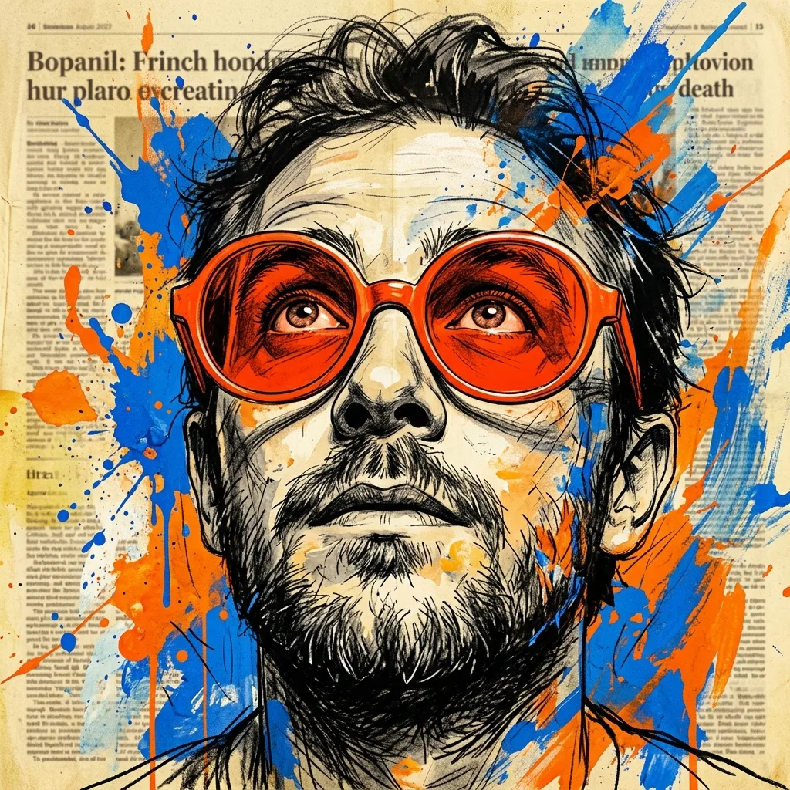

**#559 · Portrait, Ai Art · <code>Vinano Image Pro</code>**

> Keywords: portrait, AI art, AI prompt, text to image

<details>
<summary>Show prompt</summary>

```
Vibrant expressive portrait of a man looking upwards wonder, wearing oversized bright orange-red glasses (glass light colour full shade). The face is sketched in dynamic black strokes on a textured newspaper background, enriched splashes of vivid blue and orange paint. The composition blends realism and abstract expressionism, evoking innocence, hope, and creativity. Take full face of the attached picture. Maintain consistent colour harmony and crisp focus across the whole frame.
```

</details>

---

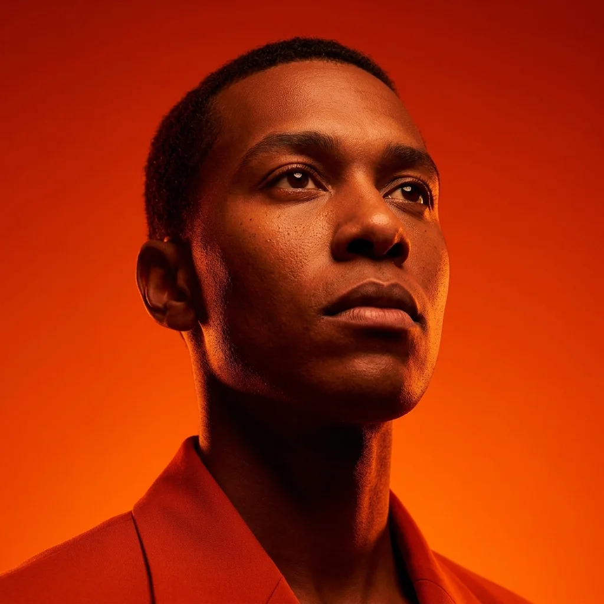

**#560 · Realistic, Portrait · <code>Vinano Image Pro</code>**

> Keywords: realistic, portrait, cinematic, AI art, AI prompt, text to image

<details>
<summary>Show prompt</summary>

```
Editorial portrait from the attached reference photo, true-to-life photorealistic. Use uploaded selfie as ONLY face reference. Identity lock: exact likeness, facial geometry/proportions, natural skin texture. No beautification. Keep clothing style, color, material, and fit identical to the reference. Medium close-up (face and shoulders), low angle looking up (heroic/dominant perspective), sharp focus on face/eyes.Serious, intense, focused expression, gaze directed upward and away from camera (beyond the frame). Dramatic saturated studio lighting, high-contrast chiaroscuro deep shadows, vibrant oranges and deep reds palette, strong rim light creating a halo separation. Solid studio backdrop, rich orange-red smooth gradient, pattern-free, hot radiant atmosphere. High skin texture fidelity (pores visible), 8k, portrait aspect ratio, filmic, cinematic lighting, 4:5. Preserve realistic proportions and depth for a confident, professional finish.
```

</details>

---

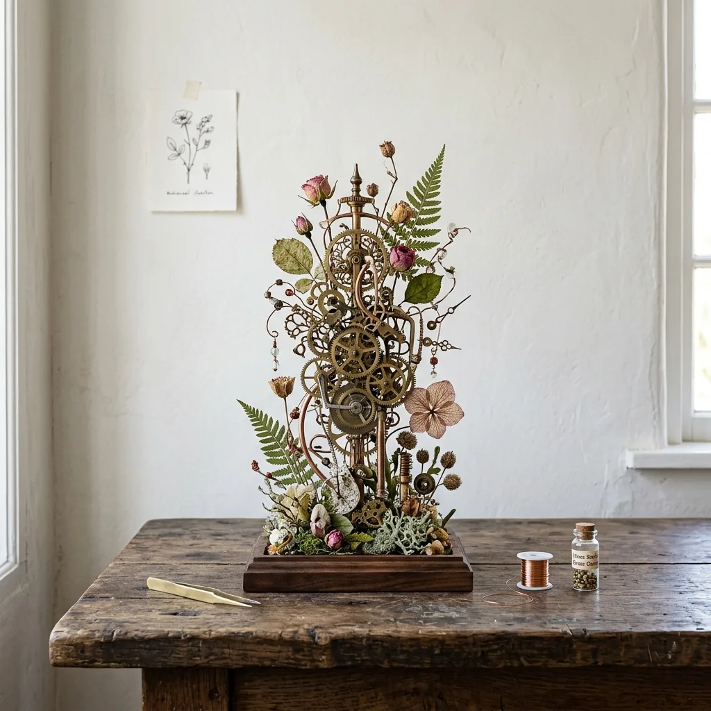

**#561 · Ai Art, Ai Prompt · <code>Vinano Image Pro</code>**

> Keywords: AI art, AI prompt, text to image

<details>
<summary>Show prompt</summary>

```
AI generated image by Render with rich micro-detail while keeping the layout uncluttered and intentional.
```

</details>

---

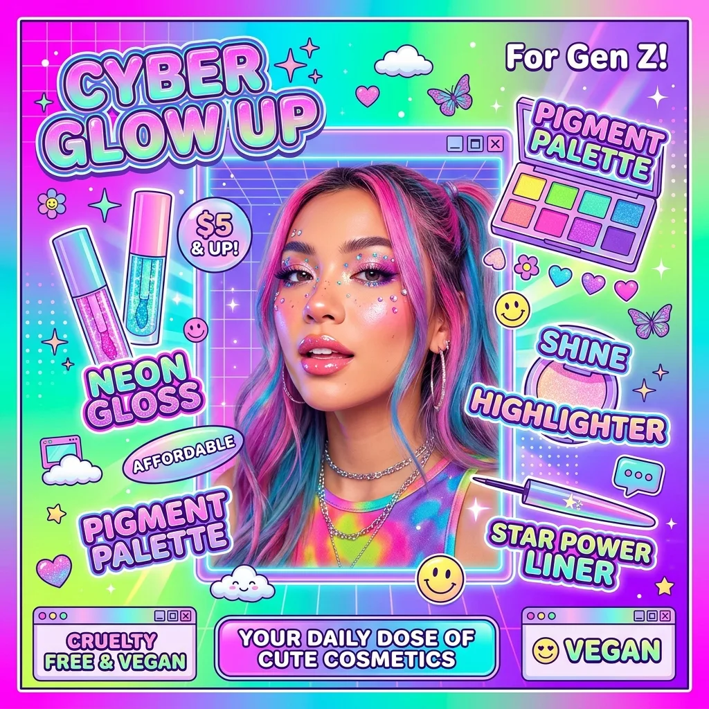

**#562 · Ai Art, Ai Prompt · <code>Vinano Image v2</code>**

> Keywords: AI art, AI prompt, text to image

<details>
<summary>Show prompt</summary>

```
Cute Y2K style affordable cosmetics advertising image designed for Gen Z. vibrant color schemes, including neon colors. Aspect ratio is 3:4. Render with rich micro-detail while keeping the layout uncluttered and intentional.
```

</details>

---

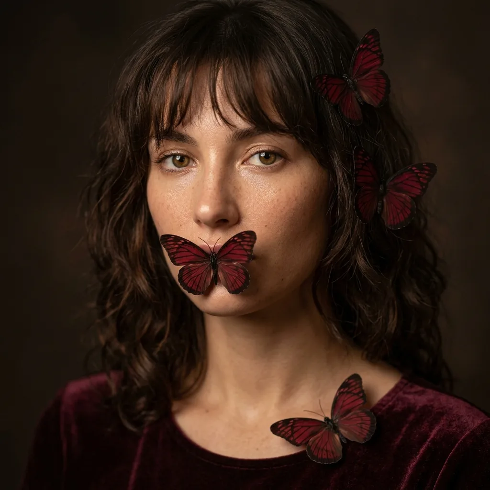

**#563 · Realistic, Portrait · <code>Vinano Image Pro</code>**

> Keywords: realistic, portrait, AI art, AI prompt, text to image

<details>
<summary>Show prompt</summary>

```
{
  "subject": {
    "type": "Woman",
    "age": "Young adult",
    "appearance": {
      "hair": {
        "color": "Dark brown",
        "style": "Medium length, messy bangs",
        "texture": "Wavy"
      },
      "eyes": {
        "color": "Hazel",
        "gaze": "Directly at camera"
      },
      "skin": {
        "texture": "Natural, freckles and a warm glow",
        "makeup": "Minimal, dewy finish"
      },
      "features": "Full lips, prominent cheekbones"
    },
    "pose": "Portrait, close-up, neutral expression, head slightly tilted"
  },
  "styling": {
    "clothing": {
      "type": "Top",
      "material": "Velvet",
      "color": "Dark burgundy/maroon"
    },
    "accessories": {
      "type": "Butterflies",
      "color": "Dark red black veining",
      "placement": ["One covering the mouth",
        "Two in the hair on the right side",
        "One on the left collarbone"]
    }
  },
  "environment": {
    "type": "Studio",
    "background": "Dark, blurred, muted brown tones",
    "setting": "Indoors, low-key"
  },
  "lighting": {
    "type": "Soft, warm, directional",
    "source": "From the front-left",
    "effect": "Creates gentle shadows, highlights skin texture and butterfly wings"
  },
  "mood": {
    "atmosphere": "Mysterious, serene, slightly melancholic, intimate"
  },
  "photography": {
    "style": "true-to-life photorealistic portrait",
    "shot_type": "Close-up",
    "depth_of_field": "Shallow, sharp focus on eyes and butterflies",
    "camera": {
      "type": "DSLR",
      "lens": "85mm portrait lens",
      "aperture": "f/1.8"
    }
  }
}

Maintain consistent colour harmony and crisp focus across the whole frame.
```

</details>

---


**#564 · Ai Art, Ai Prompt · <code>Vinano Image Pro</code>**

> Keywords: AI art, AI prompt, text to image

<details>
<summary>Show prompt</summary>

```
AI generated image by Emphasise material texture and natural light so the final frame feels tactile and premium.
```

</details>

---

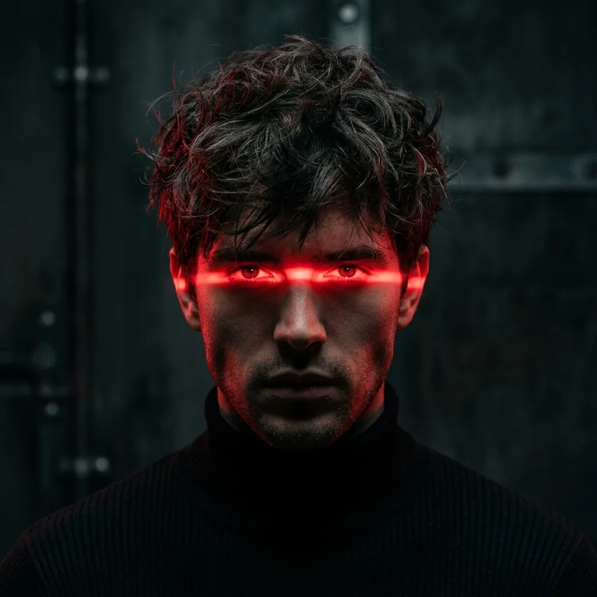

**#565 · Realistic, Portrait · <code>Vinano Image Pro</code>**

> Keywords: realistic, portrait, cinematic, cyberpunk, AI art, AI prompt

<details>
<summary>Show prompt</summary>

```
Cinematic studio portrait of a young man messy textured hair, wearing a black turtleneck, centered composition, dark minimal background, dramatic low-key lighting, a horizontal red neon light strip cutting across his eyes, strong contrast shadows covering lower face, intense gaze, moody atmosphere, cyberpunk aesthetic, ultra-realistic, sharp focus, 85mm lens, shallow depth of field, high detail, editorial photography style. Render with rich micro-detail while keeping the layout uncluttered and intentional.
```

</details>

---

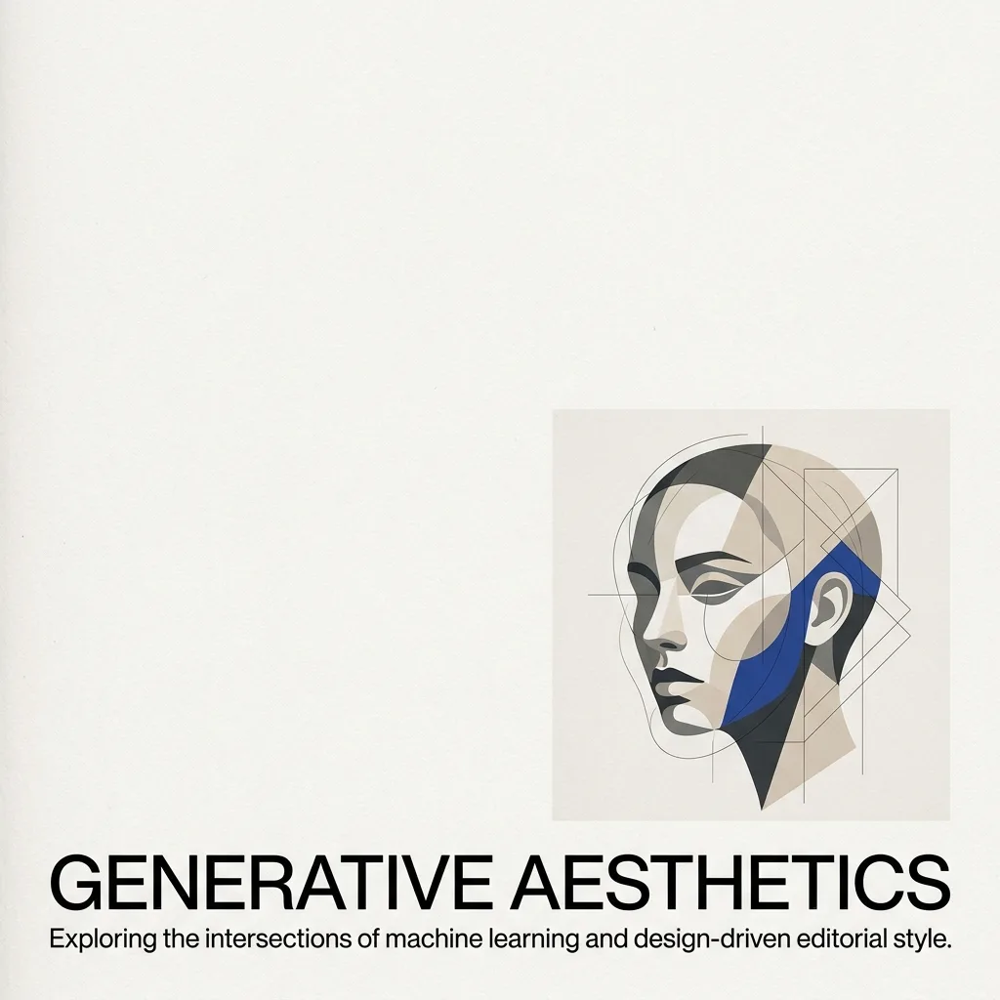

**#566 · Ai Art, Ai Prompt · <code>Vinano Image Pro</code>**

> Keywords: AI art, AI prompt, text to image

<details>
<summary>Show prompt</summary>

```
AI generated image by Aim for an editorial, design-driven look with deliberate negative space.
```

</details>

---

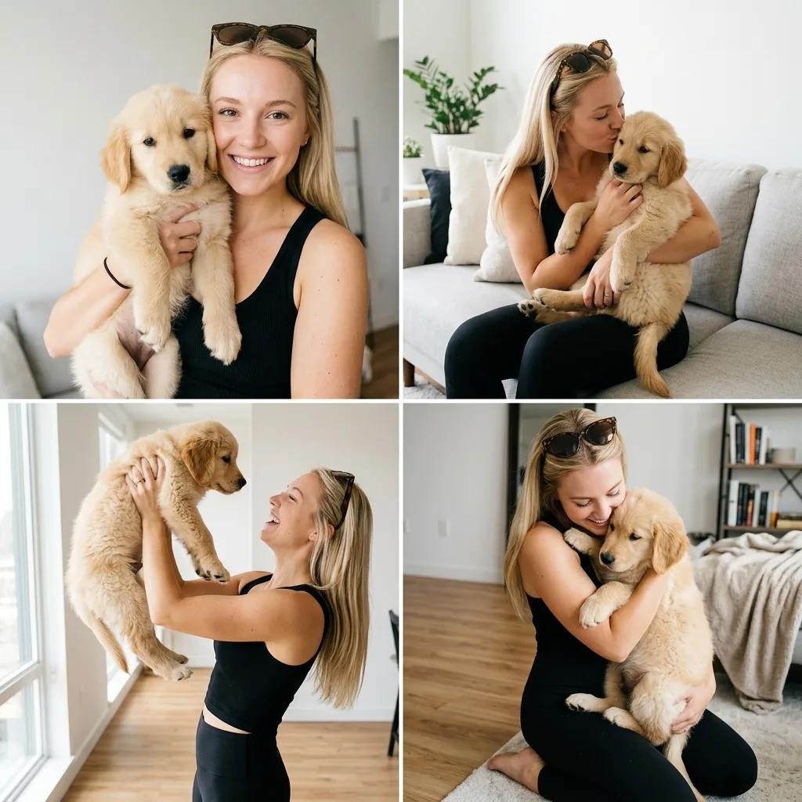

**#567 · Portrait, Ai Art · <code>Vinano Image Pro</code>**

> Keywords: portrait, AI art, AI prompt, text to image

<details>
<summary>Show prompt</summary>

```
{
 "image_metadata": {
 "type": "2x2 Collage",
 "style": "Casual, Lifestyle, Social Media",
 "setting": "Modern apartment interior white walls and bright lighting"
 },
 "subject": {
 "description": "Young woman long blonde hair and light fair skin",
 "outfit": {
 "top": "Black ribbed scoop-neck tank top",
 "bottom": "Black leggings/pants",
 "accessories": "Tortoiseshell sunglasses worn on top of head"
 }
 },
 "companion": {
 "species": "Dog",
 "breed": "Golden Retriever",
 "age": "Puppy",
 "color": "Golden/Cream"
 },
 "panels": [{
 "position": "top_left",
 "description": "Close-up portrait holding the puppy chest-high, looking at camera."
 },
 {
 "position": "top_right",
 "description": "Sitting down, holding the puppy in lap and kissing its head."
 },
 {
 "position": "bottom_left",
 "description": "Standing profile view, lifting the puppy up playfully."
 },
 {
 "position": "bottom_right",
 "description": "Crouched or kneeling, hugging the puppy close to the chest."
 }]
}

Maintain consistent colour harmony and crisp focus across the whole frame.
```

</details>

---

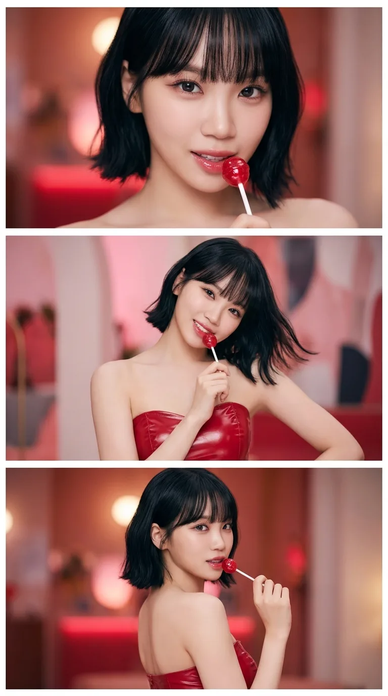

**#568 · Portrait, Cinematic · <code>Vinano Image Pro</code>**

> Keywords: portrait, cinematic, AI art, AI prompt, text to image

<details>
<summary>Show prompt</summary>

```
Create a 3-image vertical collage (aspect ratio 9:16) featuring Le Sserafim's Kim Chaewon, showcasing her distinct features and short black bob bangs, wearing a vibrant cherry-red strapless latex dress a glossy finish. She is posing a red lollipop.
Image 1: Close-up portrait — Kim Chaewon looks directly at the camera a soft, teasing smile, her glossy lips slightly parted, holding the red lollipop near her mouth. The shot highlights her precise features and dark hair. Warm lighting, smooth skin tones, shallow depth of field, cinematic glow.
Image 2: Mid-shot — Kim Chaewon tilts her head slightly, the lollipop resting gently against her lips, a playful expression in her dark eyes. Her short hair is softly flowing, showing subtle highlights. She wears the red strapless latex dress. Modern aesthetic background soft pink and red tones.
Image 3: Side profile pose — Kim Chaewon looks over her shoulder while holding the lollipop near her chin, her distinctive profile on display a confident and flirty expression. The texture of the red latex dress is visible. Soft studio lighting, blurred background, high-fashion editorial style.
Overall Style: High-resolution, glossy magazine editorial look, soft glam makeup, cherry-red color theme, smooth skin retouching, aesthetic Instagram collage layout, clean white borders between images.

Emphasise material texture and natural light so the final frame feels tactile and premium.
```

</details>

---

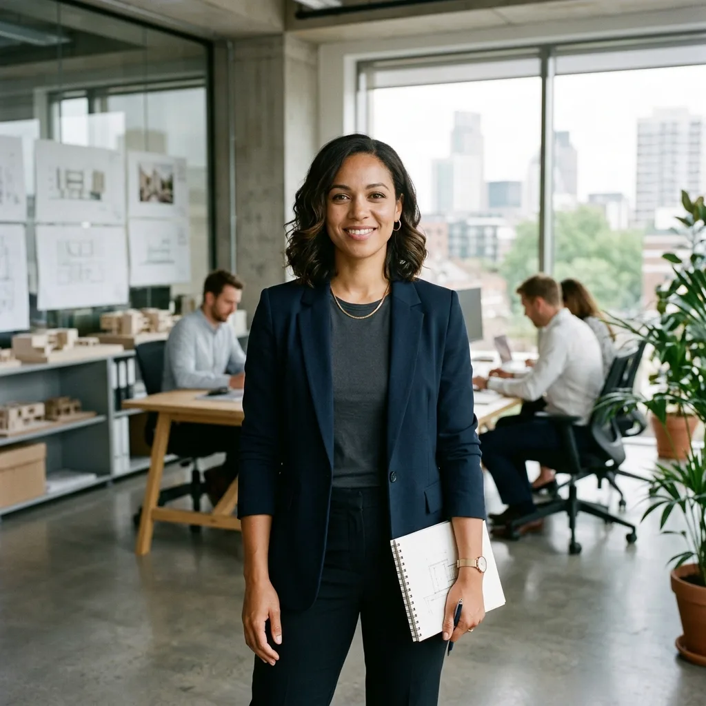

**#569 · Ai Art, Ai Prompt · <code>Vinano Image Pro</code>**

> Keywords: AI art, AI prompt, text to image

<details>
<summary>Show prompt</summary>

```
AI generated image by Preserve realistic proportions and depth for a confident, professional finish.
```

</details>

---

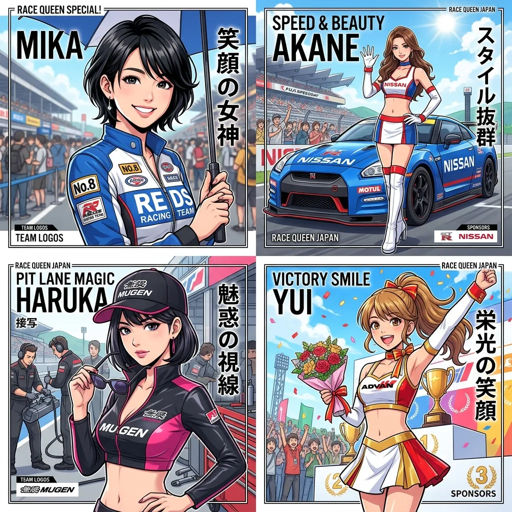

**#570 · Ai Art, Ai Prompt · <code>Vinano Image v2</code>**

> Keywords: AI art, AI prompt, text to image

<details>
<summary>Show prompt</summary>

```
レースクィーン雑誌の見開きページを作成。 接写あり。 日本人モデル。 スタイルを変えて4枚作成。 アニメイラスト調。 整体保持边缘干净、构图均衡，呈现可直接使用的精致成品感。
```

</details>

---

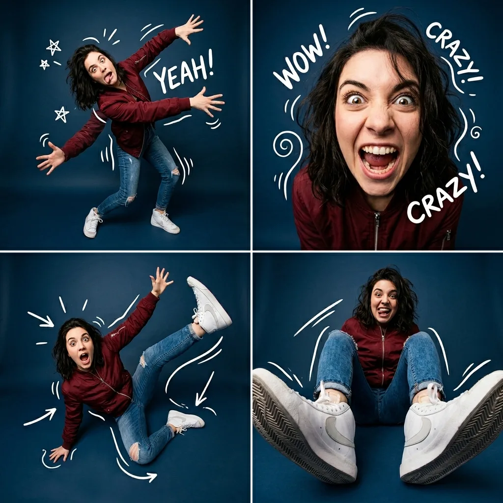

**#571 · Character, Ai Art · <code>Vinano Image Pro</code>**

> Keywords: character, AI art, AI prompt, text to image

<details>
<summary>Show prompt</summary>

```
Create a 2x2 grid image. In each frame include a medium shot, closeup shot, high angle looking down and extreme low angle view looking up from the sneakers. Utilize a fish eye lens perspective in each frame as well as an aesthetic pose foreshortening. The character is wearing a dark red bomber jacket, blue jeans and white nike high top sneakers and posing a different wacky facial expression in each frame. Include white doodle hand drawn elements around them in each frame. Studio photography against a dark blue background. Ensure the background encompasses the entire background, no circular framing. Render with rich micro-detail while keeping the layout uncluttered and intentional.
```

</details>

---

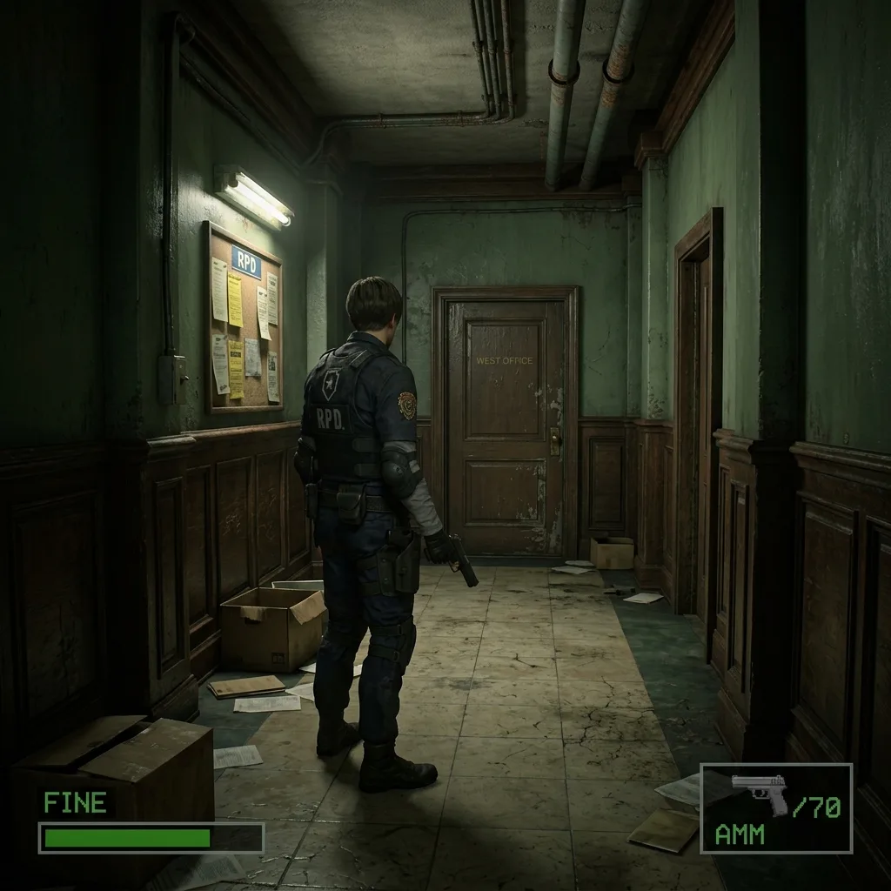

**#572 · Realistic, Ai Art · <code>Vinano Image Pro</code>**

> Keywords: realistic, AI art, AI prompt, text to image

<details>
<summary>Show prompt</summary>

```
Generate a hd realistic version of this image, keep near of the original" For example, Resident Evil 2 on PSX, you can replace the images HD versions and use them in the game the DuckStation emulator. Emphasise material texture and natural light so the final frame feels tactile and premium.
```

</details>

---


**#573 · Ai Art, Ai Prompt · <code>Vinano Image Pro</code>**

> Keywords: AI art, AI prompt, text to image

<details>
<summary>Show prompt</summary>

```
AI generated image by Preserve realistic proportions and depth for a confident, professional finish.
```

</details>

---

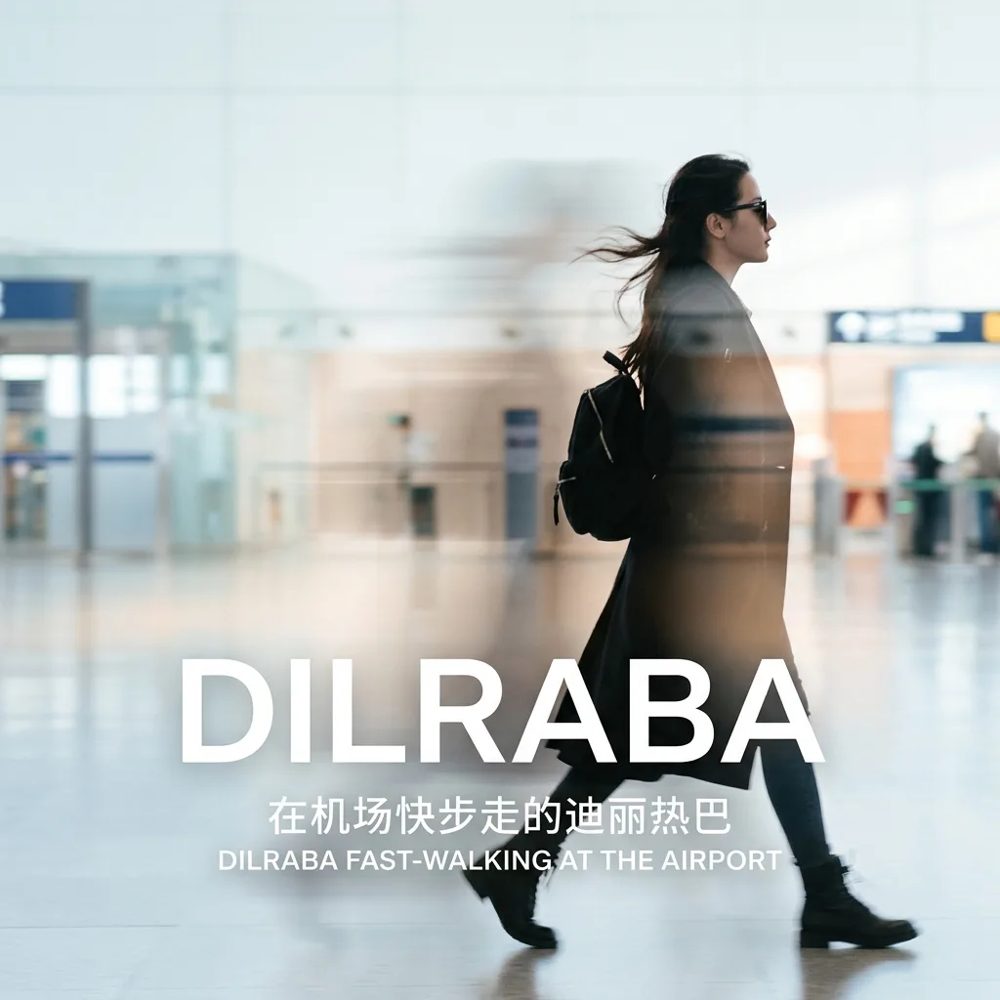

**#574 · Ai Art, Ai Prompt · <code>Vinano Image v2</code>**

> Keywords: AI art, AI prompt, text to image

<details>
<summary>Show prompt</summary>

```
围绕具体主题内容生成一张具有电影感的动态拖影肖像画面：主体以安静的侧面轮廓或半身剪影占据主要视觉重量，面部边缘保持少量可辨识细节，身体和头发向一侧被拉成长距离水平运动模糊，拖影像光带一样穿过主体并逐渐融入背景，使人物像正在被速度、记忆或信息流带走。背景是一整片高明度、清透、柔和的空气场，不做复杂场景，色彩从主题自身的材质、情绪和叙事温度中提取，保留大面积明亮冷静底色、较深主体暗部、少量高饱和发光强调色与干净色阶之间的关系，形成梦幻而清洁的冷暖张力，避免浑浊、陈旧和烟灰感。光线柔软扩散，焦点略松，边缘有轻微胶片颗粒和镜头晕散，但整体仍然通风、透明、现代。画面信息密度很低，留出大量空域让速度感呼吸；文字作为视觉结构的一部分使用纯白现代无衬线字体，核心词用极大字号放在主体下方或画面重心附近，短句说明使用较小字号、紧凑行距和居中节奏，所有文字像叠在光雾上的清晰界面层，既压住画面层级，又不破坏柔焦影像的流动感。

本次主题：[在机场快步走的迪丽热巴]

比例3:4

追求杂志编辑式的设计感，刻意安排留白与视觉重心。
```

</details>

---


**#575 · Cinematic, Ai Art · <code>Vinano Image Pro</code>**

> Keywords: cinematic, AI art, AI prompt, text to image

<details>
<summary>Show prompt</summary>

```
Panning shot of a mysterious soccer player in red proffesional soccer jearsy mid air kicking a ball, motion blur, filmic, cinematic lighting agains a Light gree gradient background streaking
lights --ar 4:5 --raw --stylize 700

Keep edges clean and the overall composition balanced for a polished, gallery-ready result.
```

</details>

---

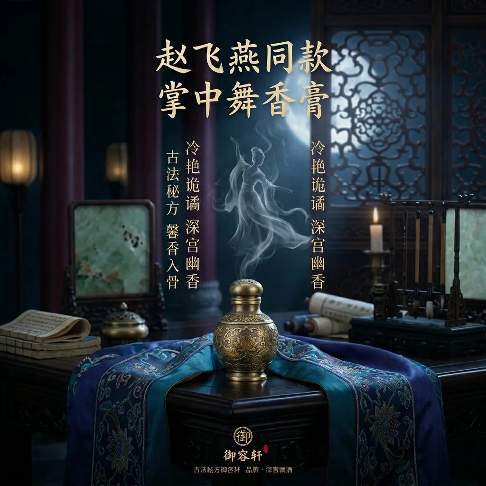

**#576 · Ai Art, Ai Prompt · <code>Vinano Image v2</code>**

> Keywords: AI art, AI prompt, text to image

<details>
<summary>Show prompt</summary>

```
赵飞燕同款掌中舞香膏广告，错金缠枝莲铜瓶，冷艳诡谲深宫氛围感，竖屏9:16 保持配色统一、主体清晰，细节丰富但不杂乱。
```

</details>

---

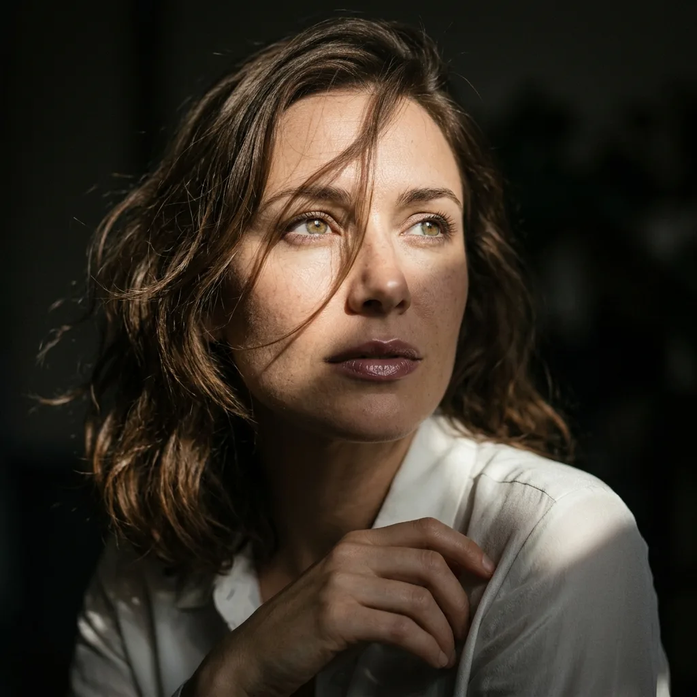

**#577 · Realistic, Portrait · <code>Vinano Image v2</code>**

> Keywords: realistic, portrait, cinematic, AI art, AI prompt, text to image

<details>
<summary>Show prompt</summary>

```
Hyper-realistic cinematic Create an 8k close-up portrait of a beautiful woman medium, brown, slightly wind-swept hair falling across her face. Her striking, light-colored eyes gaze upwards and to the right, catching a sharp, diagonal beam of natural light that illuminates the high points of her cheekbone, nose, and plump, fair skin, glossy, mauve-toned lips a slightly light weight silk shirt. The rest of her face and the background are cast in deep,dramatic shadow (chiaroscuro) emphasizing the play of light and shadow Subtle textures of her dark clothing are visible on her left shoulder. The image should capture a mysterious and introspective mood, incredible detail in her skin, hair strands, and the subtle reflections in her eyes and lips.
Outfit should white.

Maintain consistent colour harmony and crisp focus across the whole frame.
```

</details>

---

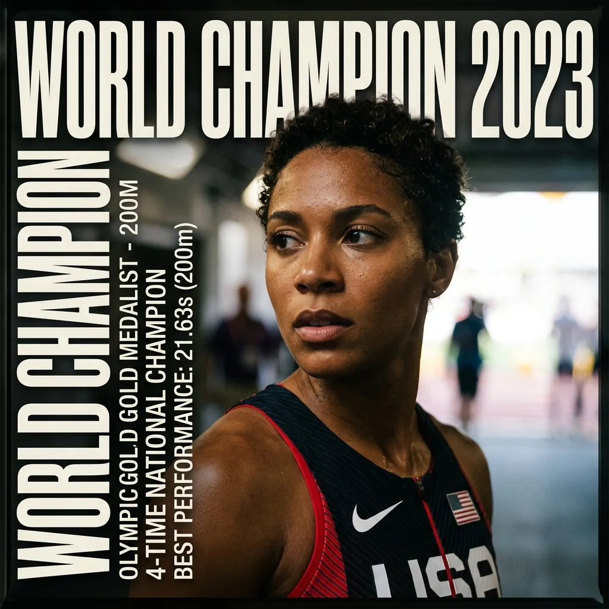

**#578 · Portrait, Cinematic · <code>Vinano Image v2</code>**

> Keywords: portrait, cinematic, AI art, AI prompt, text to image

<details>
<summary>Show prompt</summary>

```
Cinematic portrait of [Athlete Name] showing his/her journey, bold text of achievements and best performances Keep edges clean and the overall composition balanced for a polished, gallery-ready result.
```

</details>

---

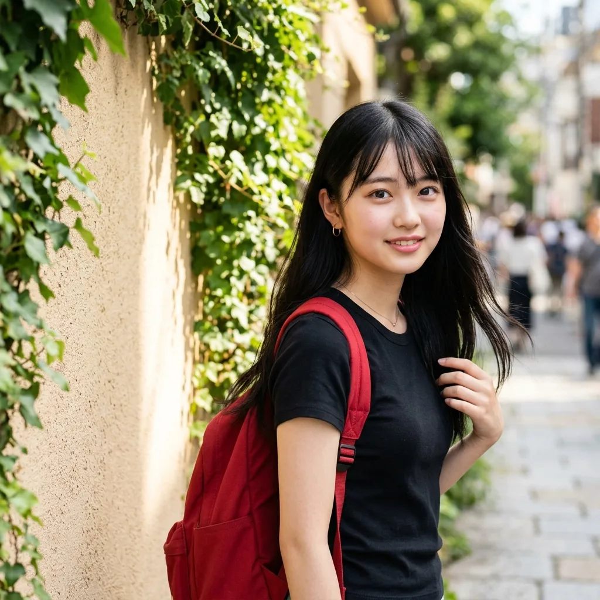

**#579 · Realistic, Portrait · <code>Vinano Image v2</code>**

> Keywords: realistic, portrait, AI art, AI prompt, text to image

<details>
<summary>Show prompt</summary>

```
Beautiful young Japanese girl long silky black hair and soft wispy bangs, large expressive dark eyes, fair glowing skin, delicate facial features, natural pink lips, subtle blush, and a calm innocent expression. Wearing a fitted black t-shirt and a red backpack over one shoulder. Standing outdoors beside a warm beige wall green leaves casting soft shadows. Bright midday sunlight creating natural highlights on her hair and face, gentle breeze moving loose strands of hair, casual school-day aesthetic, Korean/Japanese street photography vibe, realistic skin texture, soft natural makeup, candid portrait, true-to-life photorealistic, ultra-detailed, DSLR quality, shallow depth of field, crisp composition, vibrant natural colors, youthful and dreamy atmosphere, 85mm lens, high-resolution editorial portrait, 8K. Aim for an editorial, design-driven look with deliberate negative space.
```

</details>

---

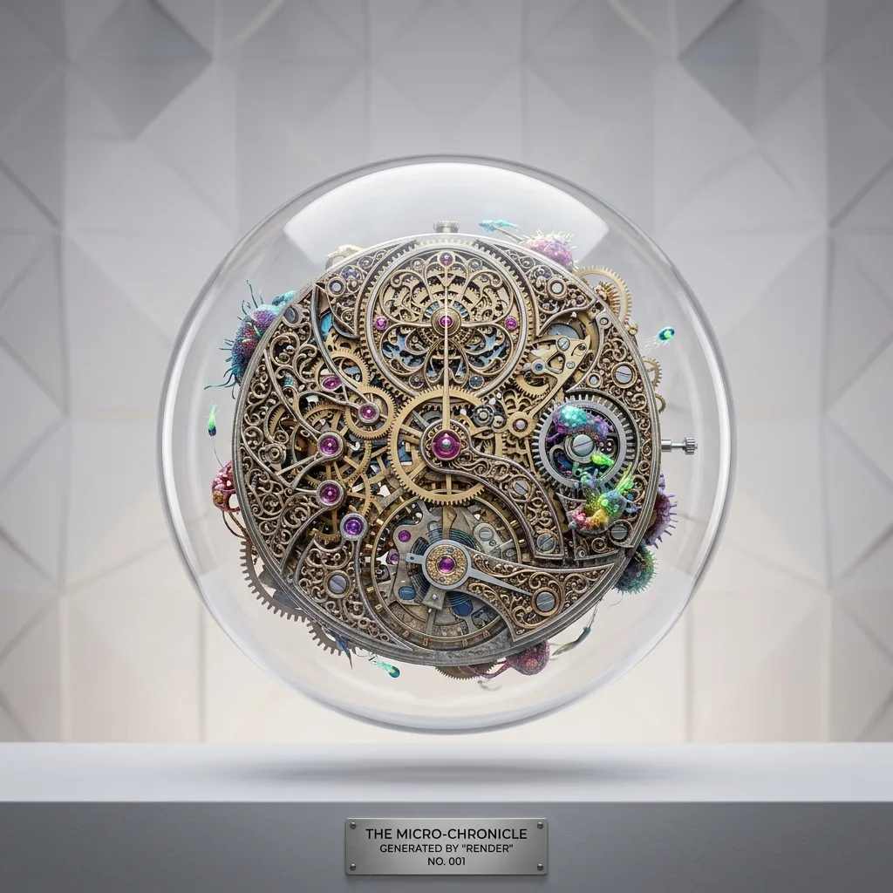

**#580 · Ai Art, Ai Prompt · <code>Vinano Image Pro</code>**

> Keywords: AI art, AI prompt, text to image

<details>
<summary>Show prompt</summary>

```
AI generated image by Render with rich micro-detail while keeping the layout uncluttered and intentional.
```

</details>

---

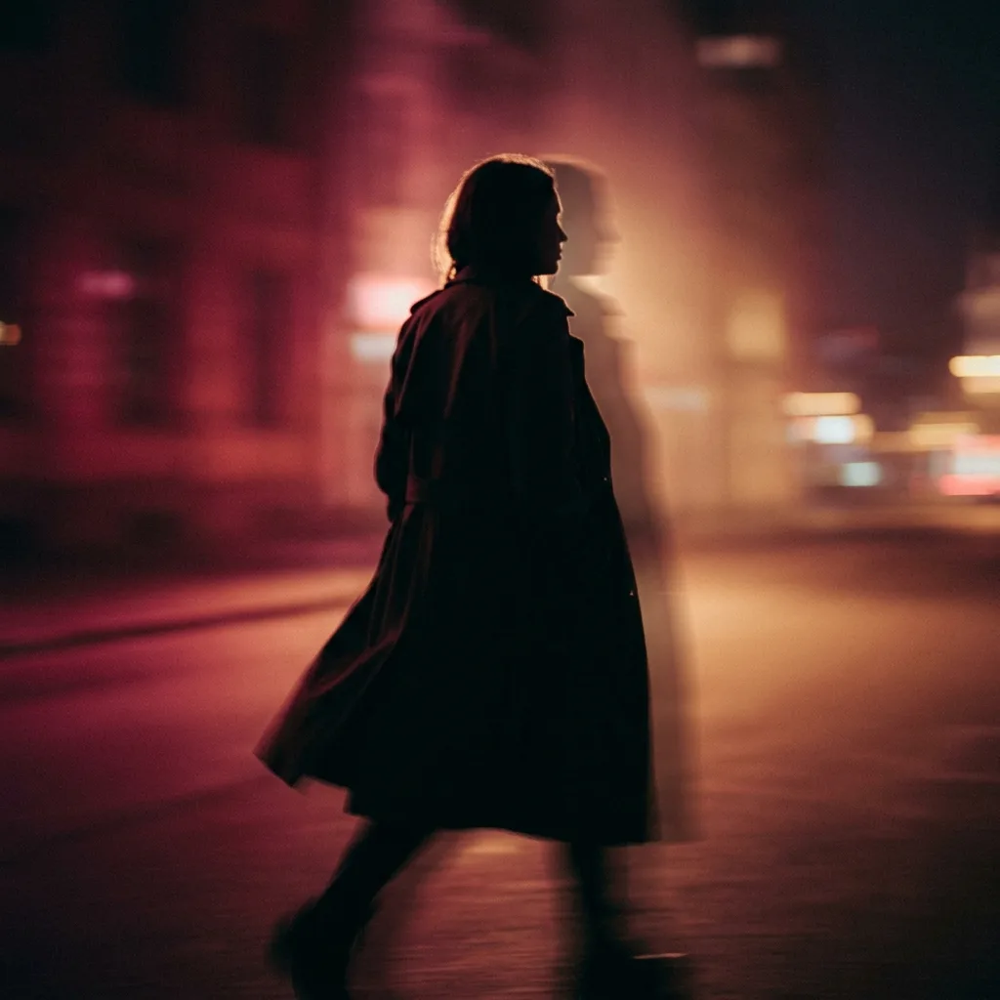

**#581 · Cinematic, Ai Art · <code>Vinano Image Pro</code>**

> Keywords: cinematic, AI art, AI prompt, text to image

<details>
<summary>Show prompt</summary>

```
panning shot of a blurry female silhouette, soft motion blur trailing behind her, gentle film grain, diffused edge lighting, deep red gradient background glowing haze, soft-focus facial features, smooth atmospheric glow,

slow-shutter cinematic effect

Preserve realistic proportions and depth for a confident, professional finish.
```

</details>

---

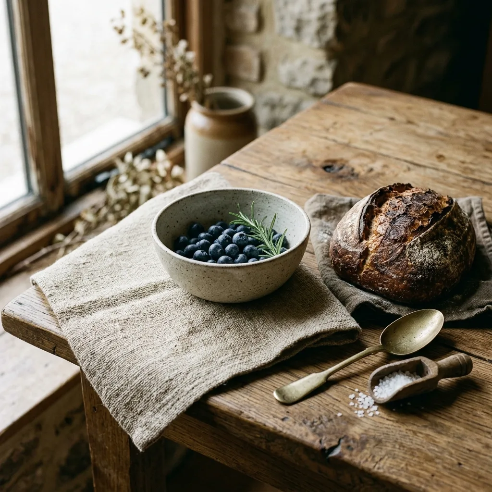

**#582 · Ai Art, Ai Prompt · <code>Vinano Image Pro</code>**

> Keywords: AI art, AI prompt, text to image

<details>
<summary>Show prompt</summary>

```
AI generated image by Emphasise material texture and natural light so the final frame feels tactile and premium.
```

</details>

---

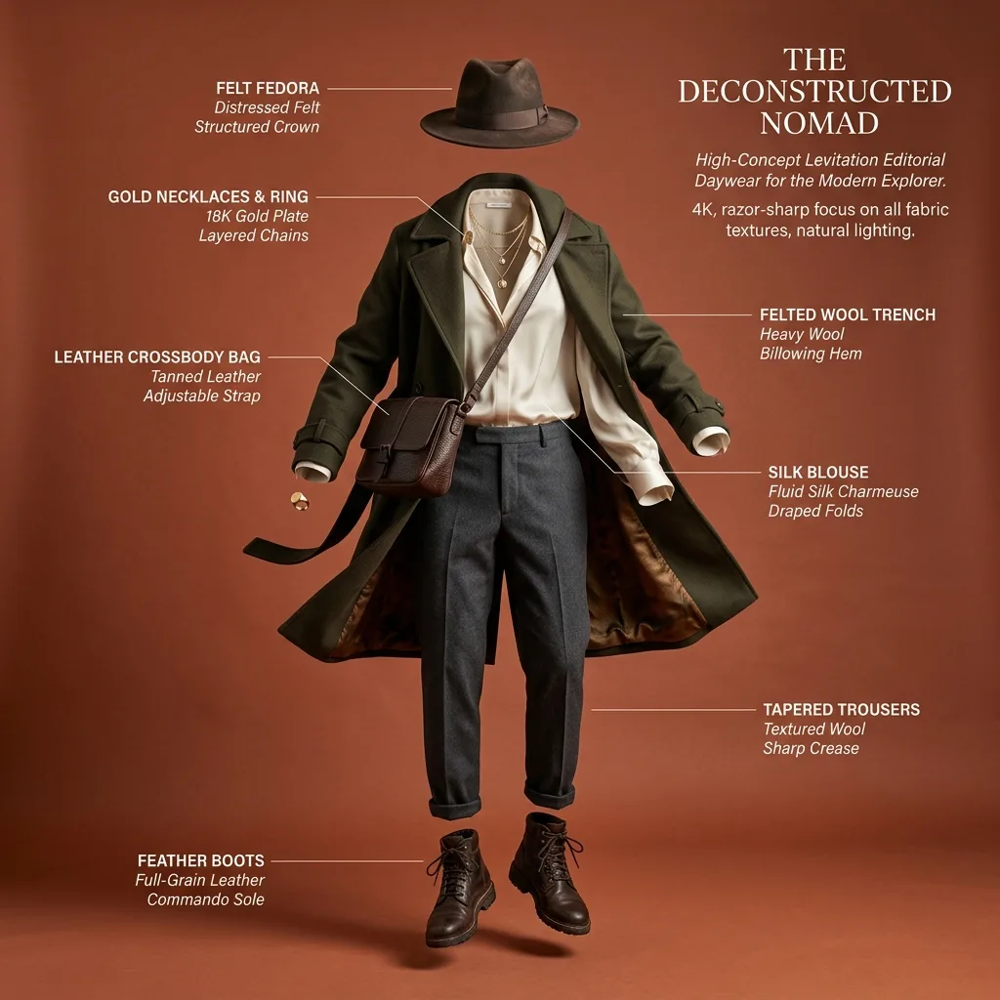

**#583 · Ai Art, Ai Prompt · <code>Vinano Image Pro</code>**

> Keywords: AI art, AI prompt, text to image

<details>
<summary>Show prompt</summary>

```
Complete [STYLE] outfit floating in its exact worn position around an invisible body every piece suspended mid-breath, mid-billow. LOOK (bottom to top): [FOOTWEAR] → [BOTTOMS] → [TOP] → [LAYER] → [ACCESSORIES] → [JEWELLERY] → [HEADWEAR] FABRIC PHYSICS: each material true to its weight, wool hangs, silk drapes, denim holds its crease, leather keeps its shape. Every edge lifting slightly as if caught in one silent gust. LABELS: hairline leader to floating label box. "[GARMENT]" uppercase / "[FABRIC]" italic / "[ONE DEFINING DETAIL]" LIGHTING: soft directional from upper left + warm fill from below catching linings and sole edges + cool rim outlining the silhouette. BACKGROUND: [COLOR] seamless, fashion-forward. TITLE: "[LOOK NAME]" elegant serif type, top right. SUBTITLE: "[MOOD / OCCASION]" italic. Mood: high-concept levitation editorial, the outfit exists, the person is imagination. 4K, extraordinary fabric fidelity, tack sharp. Aim for an editorial, design-driven look with deliberate negative space.
```

</details>

---


**#584 · Ai Art, Ai Prompt · <code>Vinano Image Pro</code>**

> Keywords: AI art, AI prompt, text to image

<details>
<summary>Show prompt</summary>

```
AI generated image by Emphasise material texture and natural light so the final frame feels tactile and premium.
```

</details>

---

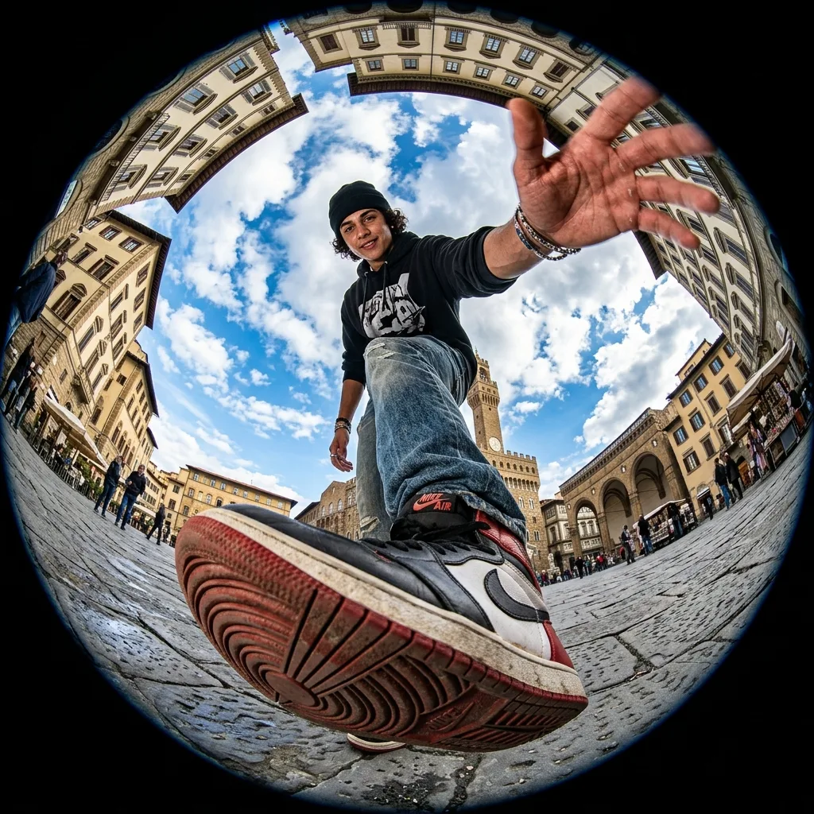

**#585 · Realistic, Cinematic · <code>Vinano Image v2</code>**

> Keywords: realistic, cinematic, AI art, AI prompt, text to image

<details>
<summary>Show prompt</summary>

```
Ultra-realistic action photography, extreme fisheye lens, 8mm, worm’s-eye view from ground level, dynamic urban plaza scene. A stylish young person appears to be stepping over the camera, one sneaker sole dominating the foreground, hand reaching toward the lens.. Massive circular “tiny planet” perspective historic European architecture curving around the edges of the frame, bright blue sky filled fluffy white clouds at the center. Cinematic composition, dramatic distortion, ultra-wide angle, vibrant colors, sharp focus, HDR, true-to-life photorealistic, highly detailed skin texture, travel photography aesthetic, motion energy, depth and scale, 8K resolution, professional DSLR quality, masterpiece, Instagram viral shot. Aspect Ratio 4:5. Render with rich micro-detail while keeping the layout uncluttered and intentional.
```

</details>

---

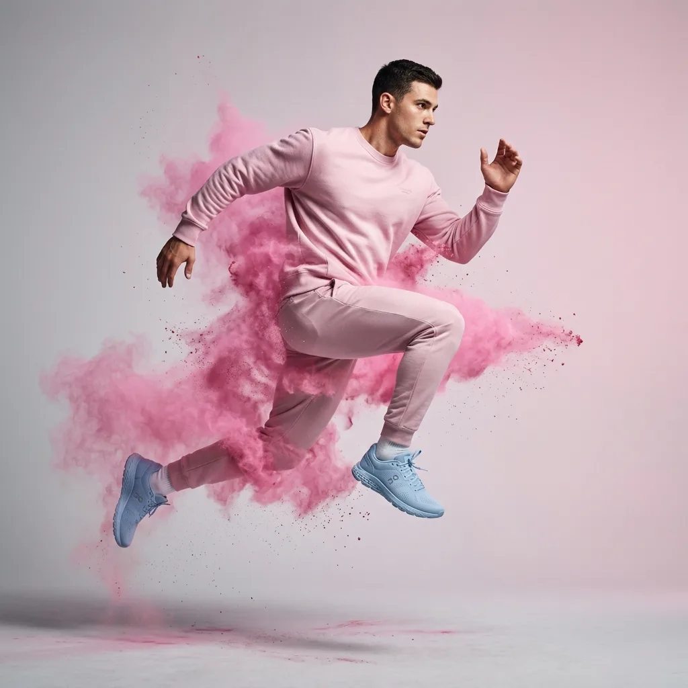

**#586 · Realistic, Cinematic · <code>Vinano Image Pro</code>**

> Keywords: realistic, cinematic, AI art, AI prompt, text to image

<details>
<summary>Show prompt</summary>

```
A hyper-realistic studio photograph of a male athlete mid-air as if running or jumping, wearing a pastel pink sweatshirt and light pink jogger pants, soft blue sneakers. Pink powder smoke is exploding and swirling around his body, especially behind him and around his legs, creating a dynamic motion effect. Clean minimal background a soft gradient from light gray to pale pink. filmic, cinematic lighting, ultra-sharp focus, shallow depth of field, fashion advertising style, high detail, 8k, soft shadows, professional studio photography. Preserve realistic proportions and depth for a confident, professional finish.
```

</details>

---

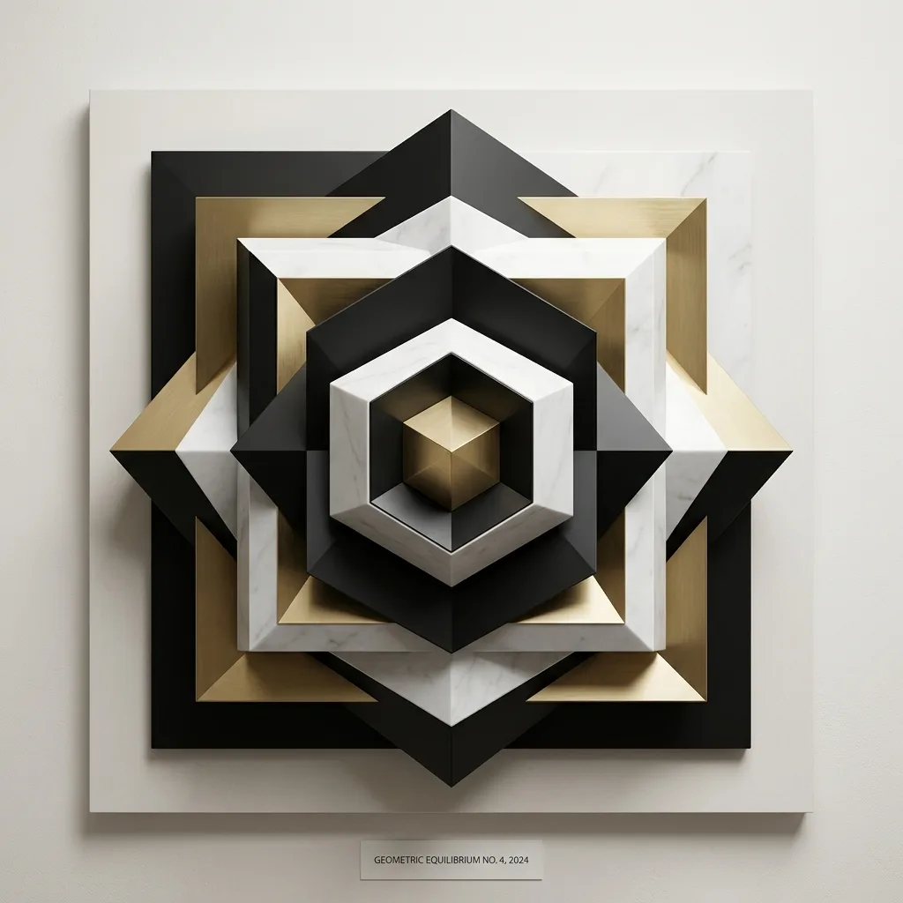

**#587 · Ai Art, Ai Prompt · <code>Vinano Image Pro</code>**

> Keywords: AI art, AI prompt, text to image

<details>
<summary>Show prompt</summary>

```
AI generated image by Keep edges clean and the overall composition balanced for a polished, gallery-ready result.
```

</details>

---

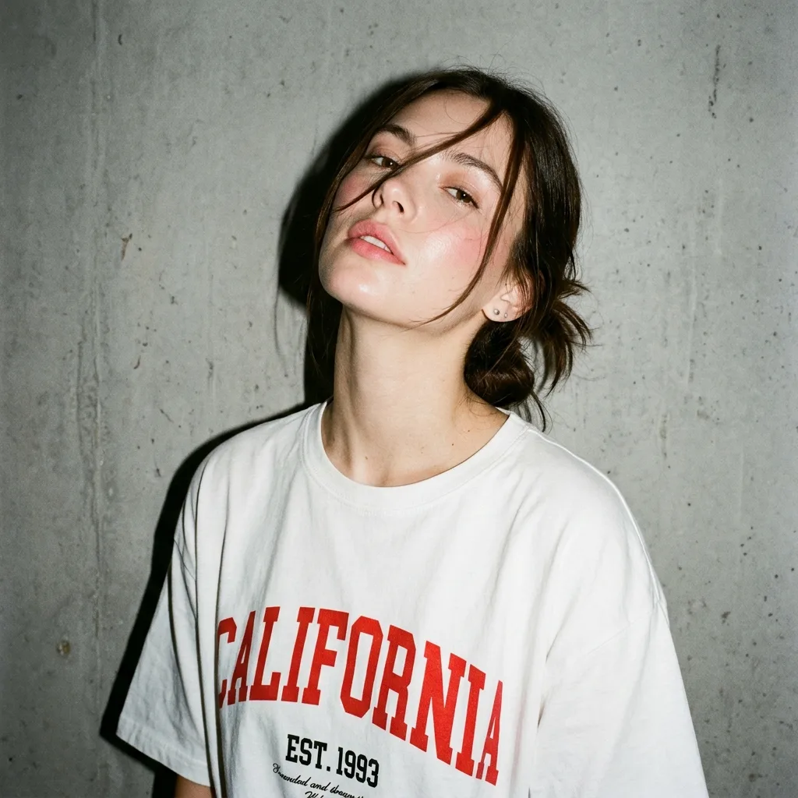

**#588 · Portrait, Ai Art · <code>Vinano Image Pro</code>**

> Keywords: portrait, AI art, AI prompt, text to image

<details>
<summary>Show prompt</summary>

```
A high-resolution, close-up editorial-style portrait of a young woman standing against a textured gray concrete wall, captured direct on-camera flash that creates a raw, moody, high-contrast aesthetic. She is positioned slightly angled to the side her head tilted back and chin lifted, giving an effortlessly cool, candid expression. Her face has a fair, smooth complexion a natural sheen from the flash, soft rosy blush across the cheeks, minimal eye makeup, lightly defined brows, and glossy natural pink lips that are slightly parted, conveying a relaxed yet confident mood. Wispy strands of her dark brown hair fall loosely across her face, partially covering one eye, while the rest of her hair is pulled back into a low, casual style, enhancing the spontaneous, fashion-editorial feel. Her eyes look slightly upward and past the camera, adding to the detached, artistic vibe. She is wearing a loose-fitting white oversized T-shirt bold red typography reading “CALIFORNIA” across the chest, along smaller black text underneath, giving a casual streetwear aesthetic. Small, subtle stud earrings are visible, adding minimal detail without distracting from the overall look. The lighting is harsh and frontal, producing sharp shadows behind her on the wall and emphasizing skin texture, hair strands, and fabric folds, while the background remains simple and uncluttered. The color palette is muted and neutral—gray wall, white shirt, and red lettering—allowing the subject’s face and expression to remain the focal point. The overall atmosphere feels intimate, modern, slightly gritty, and effortlessly stylish, like a candid fashion snapshot captured at night flash photography. Use this uploaded photo as the only and exact face reference. The generated image must use this same face exactly as shown, without any changes to identity, facial structure, or expression. Keep edges clean and the overall composition balanced for a polished, gallery-ready result.
```

</details>

---


**#589 · Ai Art, Ai Prompt · <code>Vinano Image Pro</code>**

> Keywords: AI art, AI prompt, text to image

<details>
<summary>Show prompt</summary>

```
AI generated image by Preserve realistic proportions and depth for a confident, professional finish.
```

</details>

---

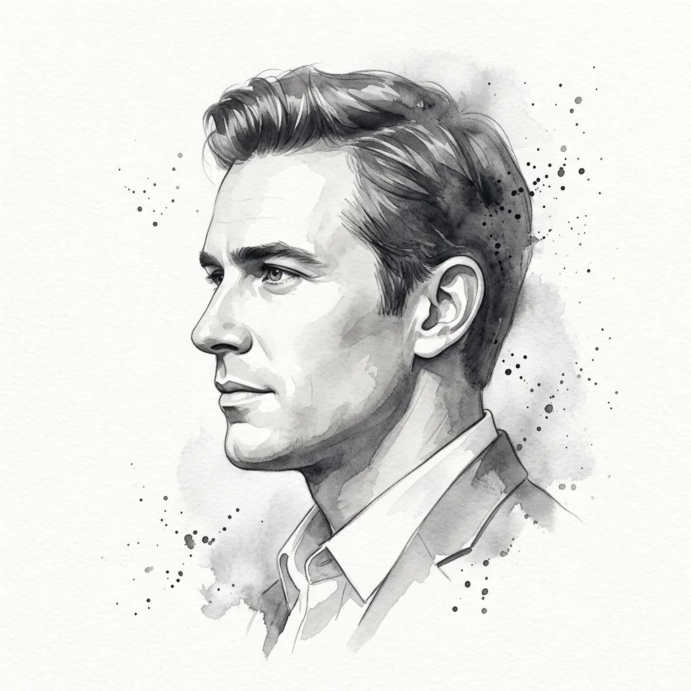

**#590 · Portrait, Ai Art · <code>Vinano Image v2</code>**

> Keywords: portrait, AI art, AI prompt, text to image

<details>
<summary>Show prompt</summary>

```
Transform the input photo into a refined monochromatic ink portrait on a pure white background. Clean side profile facing left, preserving exact facial identity and proportions. Soft charcoal-gray ink subtle tonal variation, controlled splatter accents, delicate watercolor diffusion, and faint mist-like dispersion along the edges. Preserve realistic proportions and depth for a confident, professional finish.
```

</details>

---

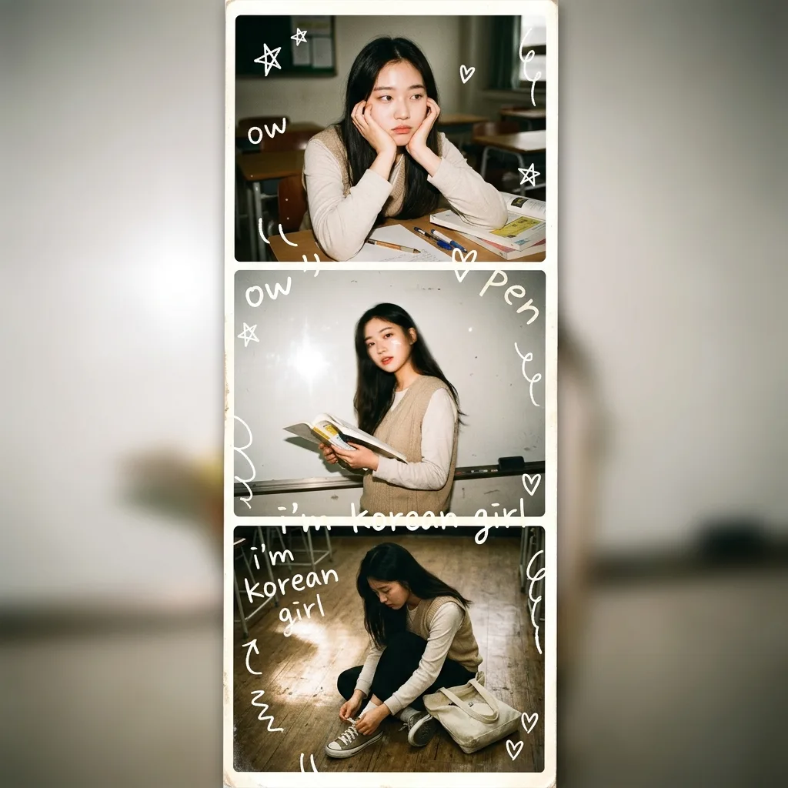

**#591 · Ai Art, Ai Prompt · <code>Vinano Image Pro</code>**

> Keywords: AI art, AI prompt, text to image

<details>
<summary>Show prompt</summary>

```
A vertical 3-panel college photo strip. The subject is a girl long hair in a beige knit vest. Panel 1(top): close up of her resting chin on the school desk, looking bored. Panel 2(middle): her standing against a white class wall, holding a book, slightly motion blur. Panel 3(Bottom): sitting on the wooden floor, trying shoelace. Aesthetic: Korean 2000s phone -camera quality, s' arm tint, slightly low resolution ow handwritten doodle overlay, Harsh flash, messy i'm korean girl Maintain consistent colour harmony and crisp focus across the whole frame.
```

</details>

---

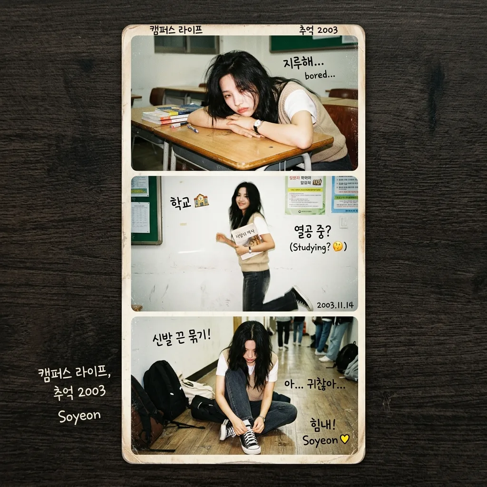

**#592 · Ai Art, Ai Prompt · <code>Vinano Image Pro</code>**

> Keywords: AI art, AI prompt, text to image

<details>
<summary>Show prompt</summary>

```
A vertical 3-panel college photo strip. The subject is a girl long hair in a beige knit vest. Panel 1(top): close up of her resting chin on the school desk, looking bored. Panel 2(middle): her standing against a white class wall, holding a book, slightly motion blur. Panel 3(Bottom): sitting on the wooden floor, trying shoelace. Aesthetic: Korean 2000s phone -camera quality, s' arm tint, slightly low resolution ow handwritten doodle overlay, Harsh flash, messy i'm korean girl Aim for an editorial, design-driven look with deliberate negative space.
```

</details>

---

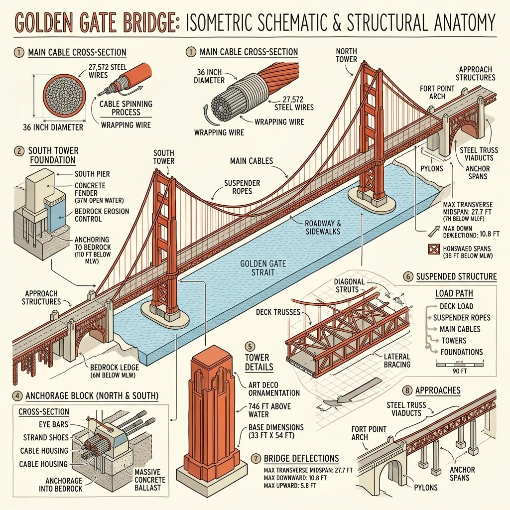

**#593 · Isometric, Ai Art · <code>Vinano Image Pro</code>**

> Keywords: isometric, AI art, AI prompt, text to image

<details>
<summary>Show prompt</summary>

```
Create a hand drawn isometric schematic diagram of [LANDMARK]. 1080x1080 dimension. Maintain consistent colour harmony and crisp focus across the whole frame.
```

</details>

---

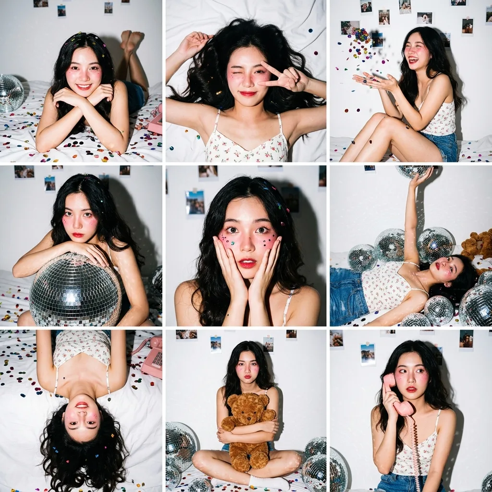

**#594 · Portrait, Ai Art · <code>Vinano Image Pro</code>**

> Keywords: portrait, AI art, AI prompt, text to image

<details>
<summary>Show prompt</summary>

```
3x3 Photo Collage / 9-Panel Grid.",
      "layout": "Nine vertical portrait images arranged in a square grid.",
      "consistency": "Same subject, same outfit, and same lighting across all 9 panels."
    },
    "aesthetic_style": {
      "theme": "Gen Z Home Party / 'Maiden Pavilion' Photoshoot.",
      "lighting_technique": "Direct On-Camera Flash (Hard Light).",
      "visuals": "High contrast, sharp shadows, chaotic fun, vibrant colors against a white background."
    },
    "subject_details": {
      "appearance": "Young Asian woman, fair skin, long dark wavy hair volume.",
      "outfit": "White floral camisole top, blue denim shorts.",
      "makeup": "Heavy pink blush (Igari style), red lips, glitter on cheeks."
    },
    "environment_and_props": {
      "background": "White wall taped photos, white bed sheets.",
      "decor": "Silver disco balls (various sizes), colorful metallic confetti scattered everywhere, brown teddy bear, pink retro corded phone."
    },
    "panel_pose_breakdown": {
      "1_top_left": "Lying on stomach (prone), resting chin on crossed arms, looking at camera. Confetti in hair.",
      "2_top_center": "Top-down view lying on back, winking one eye, making a peace sign near face. Hair fanned out.",
      "3_top_right": "Sitting sideways, knees bent, laughing candidly while throwing a handful of confetti in the air.",
      "4_middle_left": "Leaning upper body over a large silver disco ball, looking intensely at the camera.",
      "5_middle_center": "Close-up portrait. Hands touching cheeks in a 'surprised' or 'shy' gesture. Confetti stuck to cheeks.",
      "6_middle_right": "Lying on back amongst the disco balls, one arm reaching up towards the ceiling/camera.",
      "7_bottom_left": "Upside-down perspective (head at bottom of frame), playful expression, hair cascading down.",
      "8_bottom_center": "Sitting cross-legged (Lotus position), hugging the brown teddy bear tight, pouting slightly.",
      "9_bottom_right": "Sitting up, holding the pink retro telephone receiver to ear, looking sideways as if listening to gossip."
    },
    "camera_technical_values": {
      "focal_length": "35mm (Versatile environmental portrait lens).",
      "aperture": "f/5.6 (Ensures subject and props are in focus).",
      "shutter_speed": "1/200s (Flash sync to freeze confetti motion).",
      "iso": "ISO 200.",
      "lighting": "Hard flash creates a distinct drop shadow behind the subject on the white wall and specular highlights on the disco balls."
    }
  },
  "_string": "3x3 photo grid collage of a cute Asian girl at a home party, wearing white floral top and

Aim for an editorial, design-driven look with deliberate negative space.
```

</details>

---

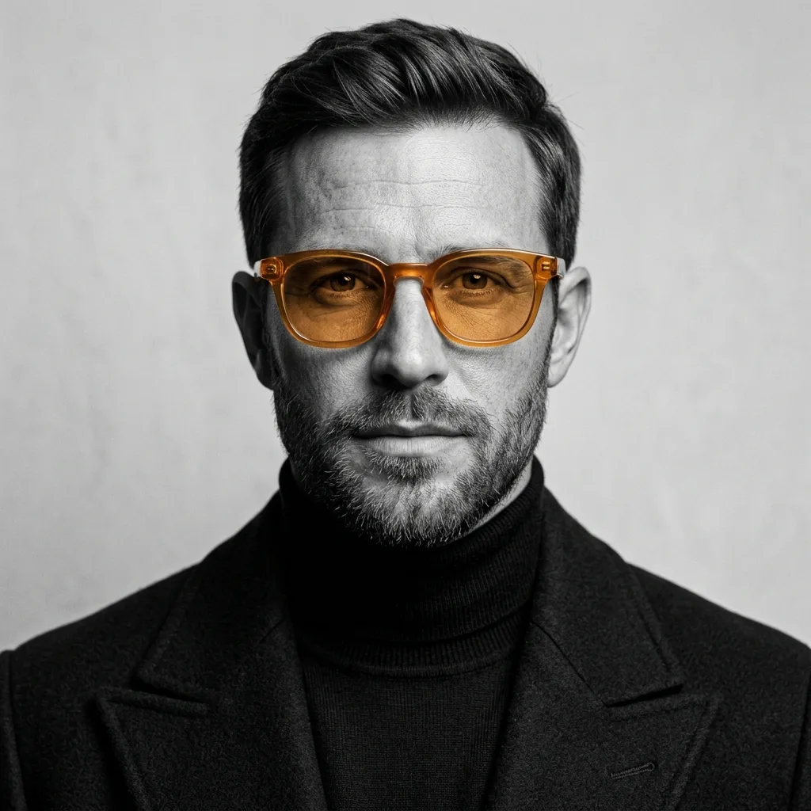

**#595 · Realistic, Portrait · <code>Vinano Image Pro</code>**

> Keywords: realistic, portrait, cinematic, minimalist, AI art, AI prompt

<details>
<summary>Show prompt</summary>

```
Ultra-realistic studio portrait of a man, close-up headshot, centered composition, neutral expression, sharp facial details, textured skin, clean grooming, wearing a black turtleneck and dark tailored coat, modern refined minimalist fashion, monochrome black and white photography style, only the glasses in color (Translucent amber-orange frame and lenses), high contrast lighting, soft studio light, cinematic shadows, editorial fashion photography, plain light background, 85mm lens, shallow depth of field, ultra detailed, true-to-life photorealistic, magazine quality, 8K. Aim for an editorial, design-driven look with deliberate negative space.
```

</details>

---

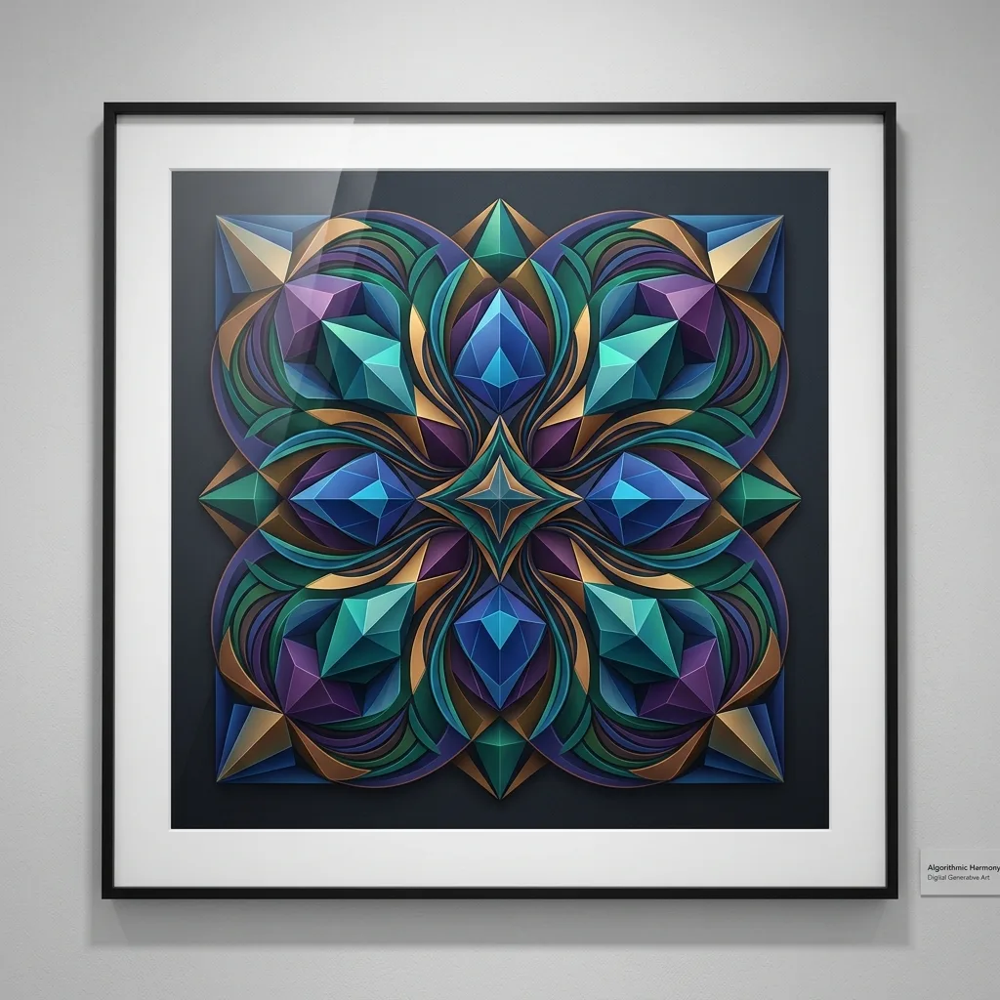

**#596 · Ai Art, Ai Prompt · <code>Vinano Image Pro</code>**

> Keywords: AI art, AI prompt, text to image

<details>
<summary>Show prompt</summary>

```
AI generated image by Keep edges clean and the overall composition balanced for a polished, gallery-ready result.
```

</details>

---

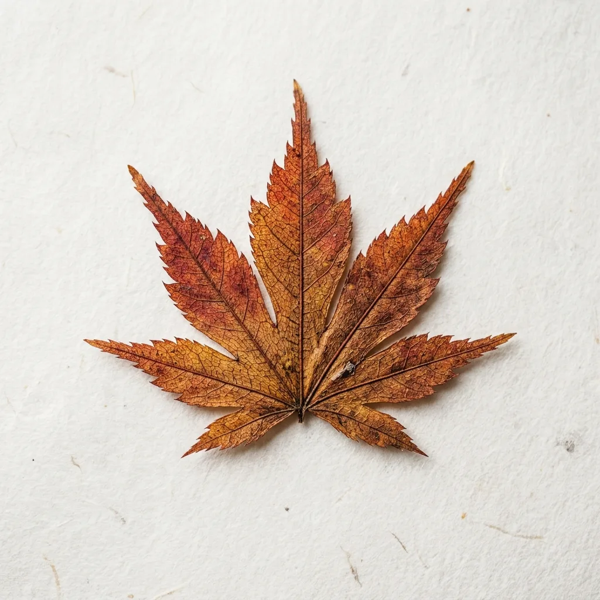

**#597 · Ai Art, Ai Prompt · <code>Vinano Image Pro</code>**

> Keywords: AI art, AI prompt, text to image

<details>
<summary>Show prompt</summary>

```
AI generated image by Render with rich micro-detail while keeping the layout uncluttered and intentional.
```

</details>

---

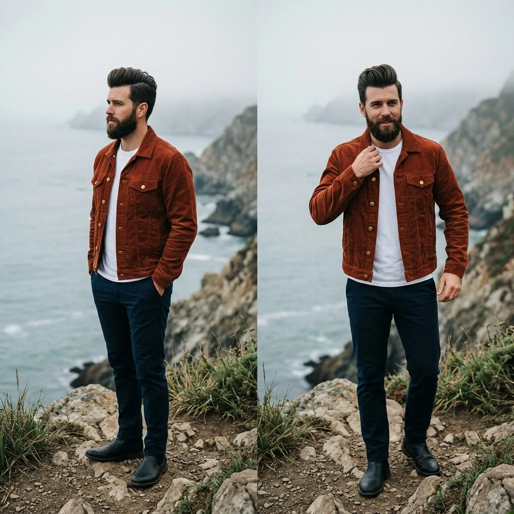

**#598 · Cinematic, Ai Art · <code>Vinano Image Pro</code>**

> Keywords: cinematic, AI art, AI prompt, text to image

<details>
<summary>Show prompt</summary>

```
{
 "image_description": "A premium-quality side-by-side comparison of a handsome man posing on a coastal cliffside.",
 "subject": {
 "gender": "male",
 "appearance": "mid-30s, well-groomed beard, thick dark hair styled in a modern voluminous pompadour",
 "poses": ["standing hands in pockets looking away from the camera",
 "standing one hand adjusting the collar of his jacket"]
 },
 "outfit": {
 "outerwear": "burnt orange or rust-colored corduroy trucker jacket metal buttons",
 "base_layer": "crisp white crew-neck t-shirt",
 "bottoms": "dark navy blue or black slim-fit trousers"
 },
 "setting": {
 "location": "rugged coastal cliff overlooking the ocean",
 "background": "misty horizon, calm sea, rocky shoreline",
 "lighting": "overcast, soft diffused natural light, moody atmospheric fog"
 },
 "technical_details": {
 "camera_angle": "eye-level medium shot",
 "composition": "diptych (two images side-by-side)",
 "aesthetic": "lifestyle photography, cinematic color grading, shallow depth of field soft background bokeh"
 }
}

Maintain consistent colour harmony and crisp focus across the whole frame.
```

</details>

---


**#599 · Ai Art, Ai Prompt · <code>Vinano Image Pro</code>**

> Keywords: AI art, AI prompt, text to image

<details>
<summary>Show prompt</summary>

```
AI generated image by Preserve realistic proportions and depth for a confident, professional finish.
```

</details>

---

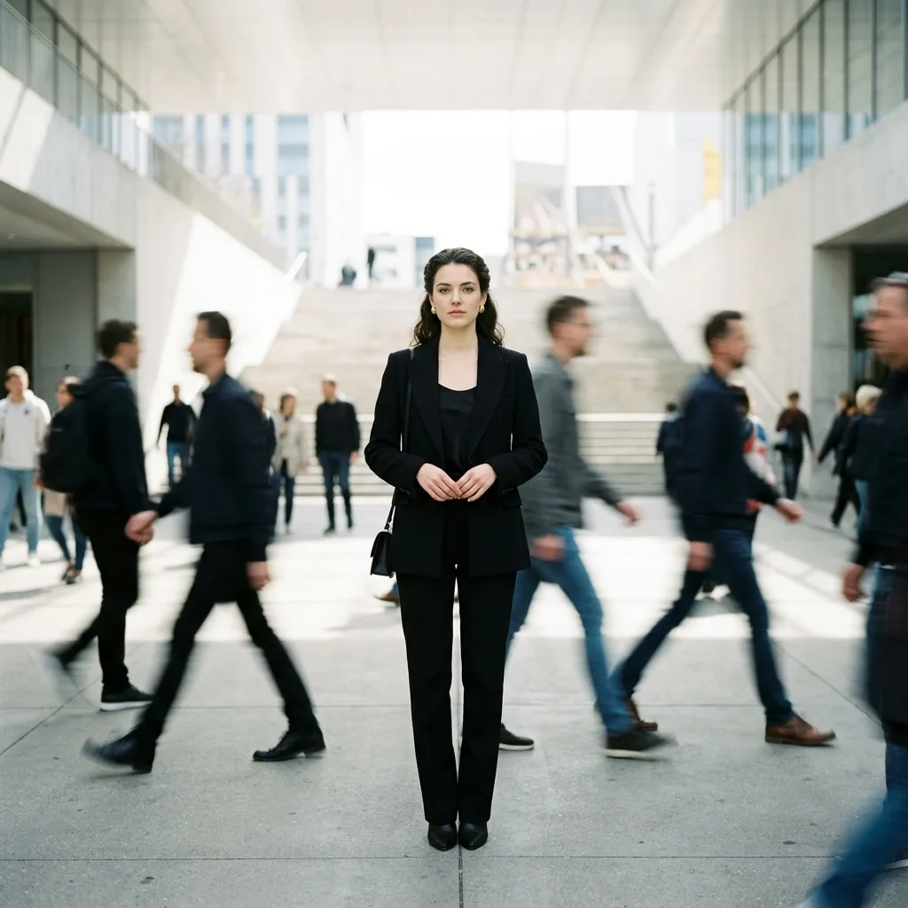

**#600 · Minimalist, Ai Art · <code>Vinano Image Pro</code>**

> Keywords: minimalist, AI art, AI prompt, text to image

<details>
<summary>Show prompt</summary>

```
A high fashion magazine pictorial of an Alpine-looking woman in her early 20s who stands still, looking at the camera, turning her head in the center, surrounded by a blurry silhouette of people passing by. She has a calm, stoic look on her face and is wearing a black refined minimalist outfit. The background is clean, bright and slightly abstract, and emphasizes the contrast between motion blur and static appearance. Editing style, film composition, pure art photography, soft magazine texture, high resolution. --ar 4:5 Keep edges clean and the overall composition balanced for a polished, gallery-ready result.
```

</details>

---

[Next page →](./photography-7.md)
