# Photography — full gallery

[← Back to README](../README.md) · [`prompts.json`](../prompts/prompts.json) · **630** prompts · page 7 / 7

[← Prev](./photography-6.md) — [1](./photography.md) · [2](./photography-2.md) · [3](./photography-3.md) · [4](./photography-4.md) · [5](./photography-5.md) · [6](./photography-6.md) · **7**

---

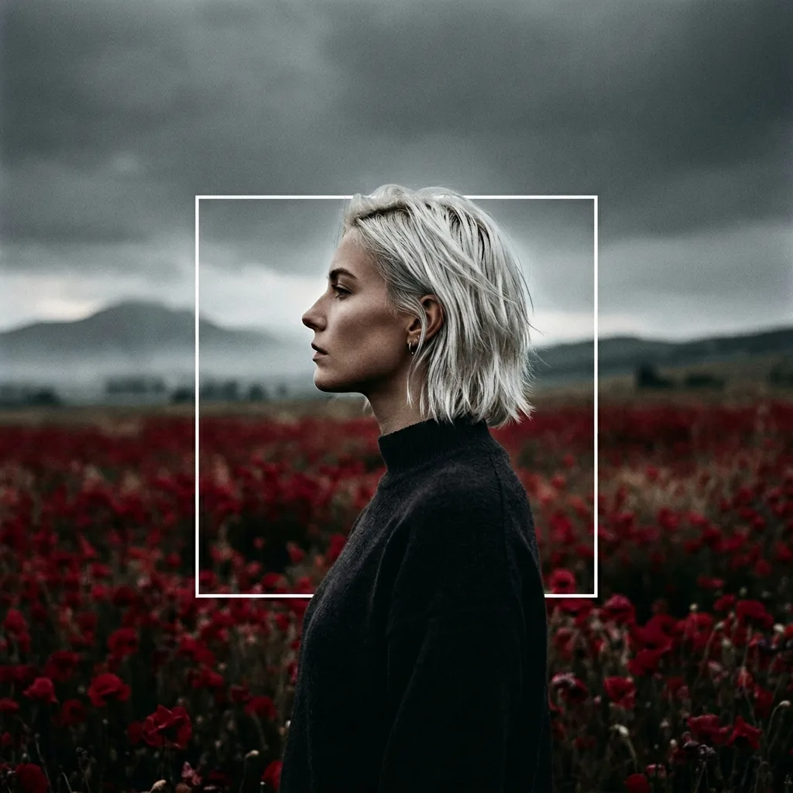

**#601 · Portrait, Cinematic · <code>Vinano Image Pro</code>**

> Keywords: portrait, cinematic, AI art, AI prompt, text to image

<details>
<summary>Show prompt</summary>

```
A cinematic, high-contrast profile portrait of a woman short, platinum-blonde hair, standing in a vast field of deep crimson flowers. The scene is set under a heavy, overcast grey sky a moody, melancholic atmosphere. A thin, white rectangular frame is superimposed in the center of the composition; the woman's head and shoulders overlap and break the top and bottom edges of the frame for a modern, artistic effect. The lighting is soft and diffused from behind, creating a subtle rim light on her profile and hair. The foreground flowers are softly blurred a shallow depth of field, and a faint, misty mountain silhouette is visible in the distant background. High-grain, filmic aesthetic. Aim for an editorial, design-driven look with deliberate negative space.
```

</details>

---

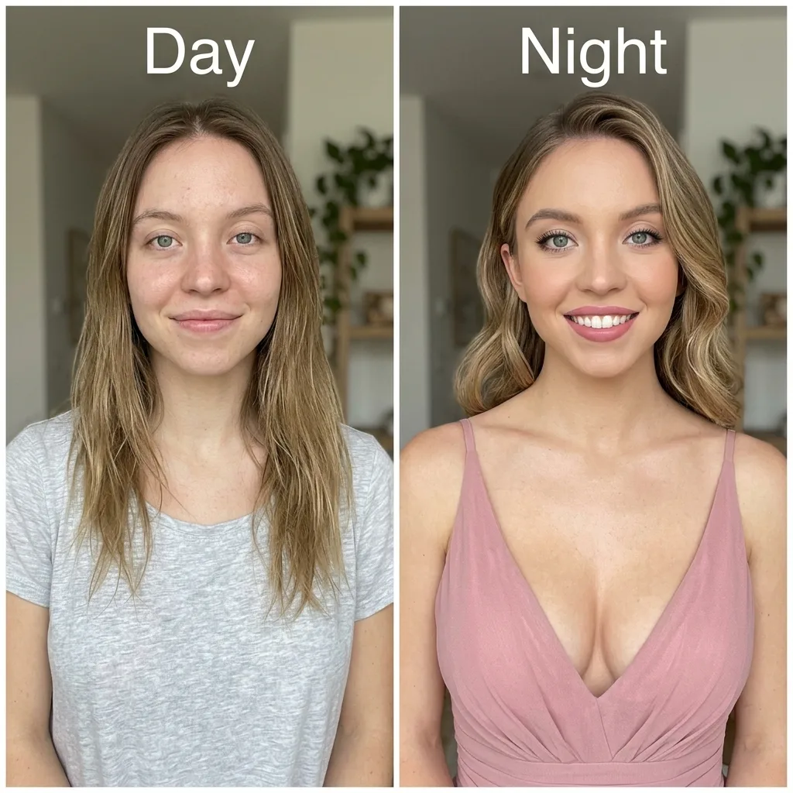

**#602 · Realistic, Portrait · <code>Vinano Image Pro</code>**

> Keywords: realistic, portrait, cinematic, AI art, AI prompt, text to image

<details>
<summary>Show prompt</summary>

```
Before-and-after upper-body portrait photo of Sydney Sweeney, smiling in both images, split vertically down the center into two equal halves for a direct visual comparison. Clear text labels appear at the top of each half.

Left side – “Day” (label at top):
Natural, no makeup look. Realistic skin texture visible pores, slight under-eye shadows, natural lips, minimal grooming. Soft, relaxed smile. Hair casually styled. She is wearing a simple nightgown for bed, comfortable and modest. Daytime feeling, fresh and unstyled, authentic at-home appearance.

Right side – “Night” (label at top):
Professional makeup applied: even skin tone, subtle contouring, enhanced eyes mascara and eyeliner, defined brows, soft lipstick. Bright, confident smile. Hair styled elegantly. She is wearing a beautiful, pink dress a deep neckline

Both sides show the same pose, framing, camera distance, background, and angle to ensure the contrast comes purely from makeup, styling, and wardrobe.

Photography & Camera Style:
Smartphone camera realism, portrait mode look, handheld feel, natural lighting, slight digital noise, mild compression artifacts, realistic color balance, minimal retouching, honest skin detail. Casual but clear comparison photo rather than studio perfection.

Aspect ratio:
3:4 (portrait)

negative prompt:
beauty filters, over-smoothed skin, exaggerated makeup, inconsistent lighting, mismatched expressions, face distortion, studio glamour lighting, cinematic look, watermark, text artifacts (except “Day” and “Night” labels)

Render with rich micro-detail while keeping the layout uncluttered and intentional.
```

</details>

---

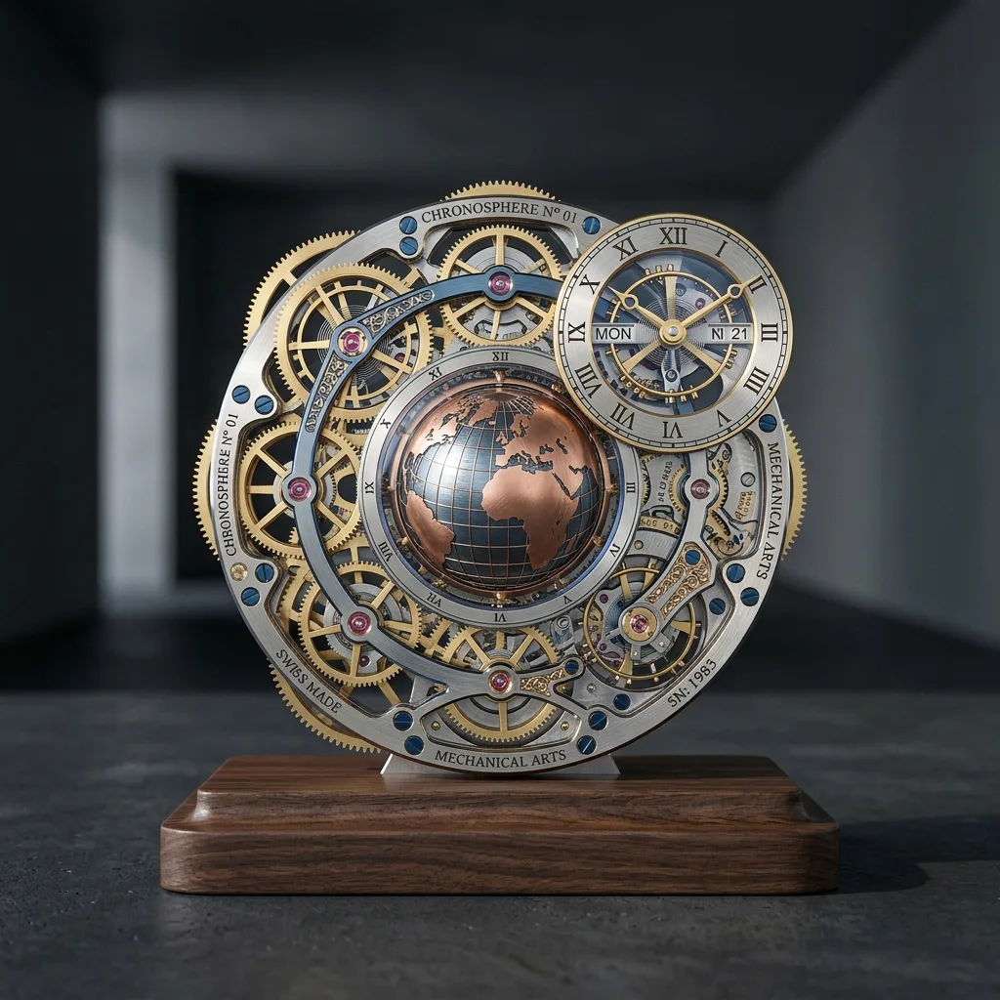

**#603 · Ai Art, Ai Prompt · <code>Vinano Image Pro</code>**

> Keywords: AI art, AI prompt, text to image

<details>
<summary>Show prompt</summary>

```
AI generated image by Render with rich micro-detail while keeping the layout uncluttered and intentional.
```

</details>

---

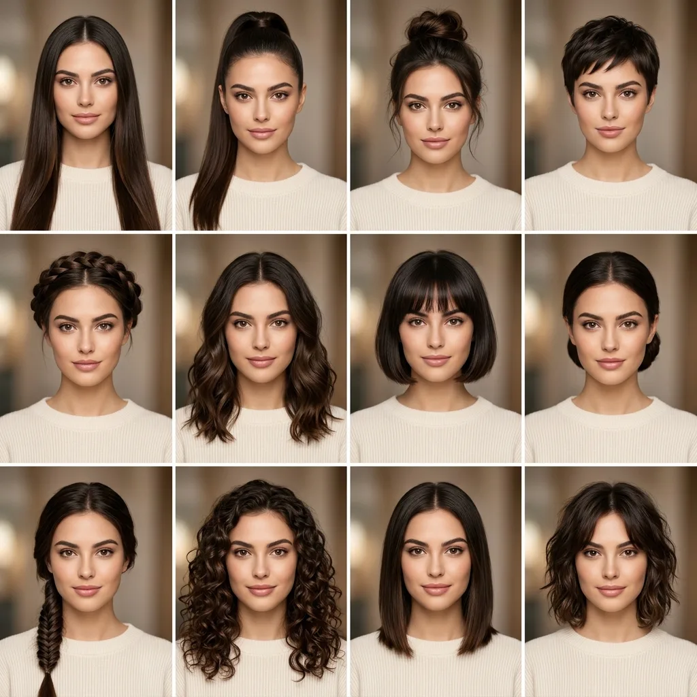

**#604 · Realistic, Portrait · <code>Vinano Image Pro</code>**

> Keywords: realistic, portrait, AI art, AI prompt, text to image

<details>
<summary>Show prompt</summary>

```
A premium-quality photo collage featuring the same person identical facial features and expression, shown in multiple frames different hairstyles. Each panel displays a unique hairstyle such as long straight hair, high ponytail, messy bun, pixie cut, braided crown, soft waves, short bob bangs, low bun, side braid, and loose curls. Consistent neutral outfit and makeup across all images, soft studio lighting, warm blurred background, realistic skin texture, symmetrical face consistency, ultra-detailed, editorial beauty look, 4x3 grid layout, professional portrait photograph Keep edges clean and the overall composition balanced for a polished, gallery-ready result.
```

</details>

---

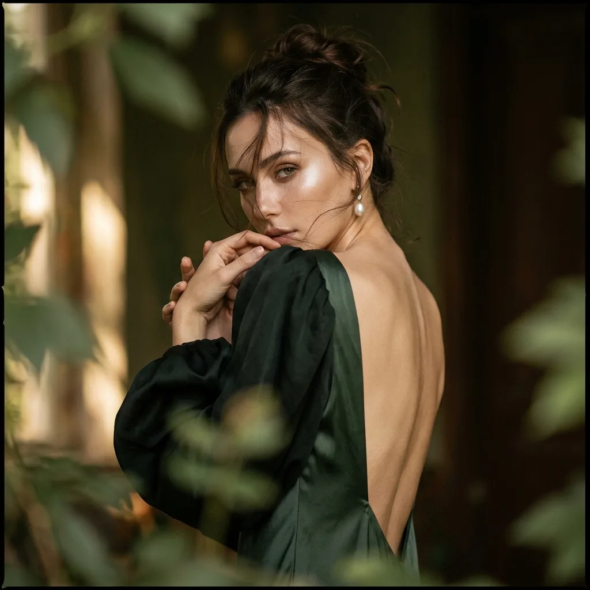

**#605 · Portrait, Cinematic · <code>Vinano Image Pro</code>**

> Keywords: portrait, cinematic, AI art, AI prompt, text to image

<details>
<summary>Show prompt</summary>

```
Create a moody, ethereal cinematic portrait of a woman a dramatic over-the-shoulder pose.

1. Pose and Expression
• Perspective: subject positioned her back facing the camera, torso elegantly twisted, looking back over her shoulder, creating a graceful curve along the spine and highlighting shoulder blades
• Gaze: direct eye contact the camera, piercing yet soft expression, chin slightly tucked toward shoulder to evoke intimacy and mystery
• Hand Placement: hands gently raised near chest/shoulder, fingers softly interlaced or delicately touching
• Hair: loose messy bun soft wispy strands falling naturally across the face, slightly windswept look

2. Lighting and Color Palette
• Lighting: strong side lighting, warm golden-hour sunlight, high contrast chiaroscuro effect, one side illuminated while the other fades into deep shadow
• Skin Tone: luminous, glowing, pearlescent skin texture
• Color Scheme: earthy muted tones, deep greens, dark browns, soft neutral background, warm skin tones as focal point

3. Wardrobe and Accessories
• Outfit: backless silky dress or top, smooth light fabric, paired dark voluminous sleeves for strong texture contrast
• Accessories: elegant drop pearl earrings reflecting light subtly

4. Composition and Atmosphere
• Framing: medium close-up shot, framed naturally blurred foreground leaves for a voyeuristic, through-the-foliage effect
• Depth of Field: shallow depth of field, sharp focus on face, soft bokeh in background and foreground
• Mood: cinematic, melancholic, romantic, high-fashion editorial style, soft dreamy atmosphere

Face reference: soft oval face, smooth glowing skin, symmetrical features, natural makeup, gentle but expressive eyes, slightly parted lips

Keep edges clean and the overall composition balanced for a polished, gallery-ready result.
```

</details>

---

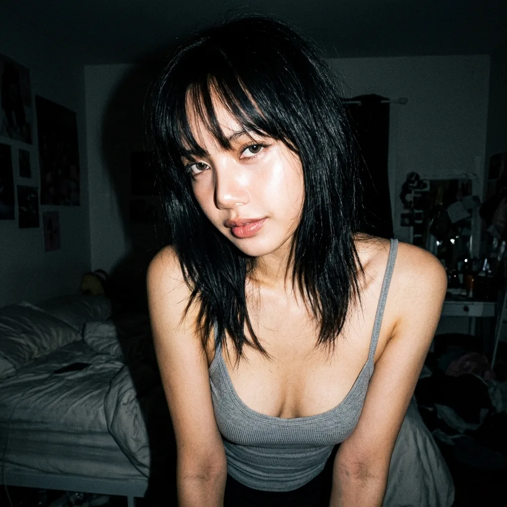

**#606 · Ai Art, Ai Prompt · <code>Vinano Image Pro</code>**

> Keywords: AI art, AI prompt, text to image

<details>
<summary>Show prompt</summary>

```
{
  "meta": {
    "camera": "iPhone 17 Pro",
    "lens": "24mm",
    "aspect_ratio": "9:16",
    "style": "iphone flash shot, raw, high contrast, no editing"
  },

  "scene": {
    "location": "dim bedroom",
    "time": "night",
    "atmosphere": "late night, slightly chaotic calm"
  },

  "lighting": {
    "primary": "iphone flash",
    "secondary": "very dim ambient",
    "temperature": "neutral",
    "effect": ["sharp highlights on face",
      "deep background shadows",
      "glossy skin reflections"]
  },

  "camera": {
    "angle": "close and slightly low",
    "distance": "face + upper torso",
    "framing": "tight crop, imperfect"
  },

  "subject": {
    "identity": "BLACKPINK Lisa inspired, bold gaze, clean features",
    "pose": {
      "position": "leaning slightly toward camera",
      "shoulders": "relaxed"
    },
    "expression": {
      "eyes": "direct, intense, slightly teasing",
      "lips": "soft but controlled"
    },
    "hair": {
      "style": "slightly messy straight hair bangs"
    },
    "outfit": {
      "top": {
        "type": "thin strap top",
        "color": "grey",
        "fit": "tight minimal"
      }
    }
  },

  "iphone_realism": {
    "imperfections": ["flash blowout",
      "grain",
      "lens distortion"]
  }
}

Aim for an editorial, design-driven look with deliberate negative space.
```

</details>

---


**#607 · Ai Art, Ai Prompt · <code>Vinano Image Pro</code>**

> Keywords: AI art, AI prompt, text to image

<details>
<summary>Show prompt</summary>

```
AI generated image by Preserve realistic proportions and depth for a confident, professional finish.
```

</details>

---

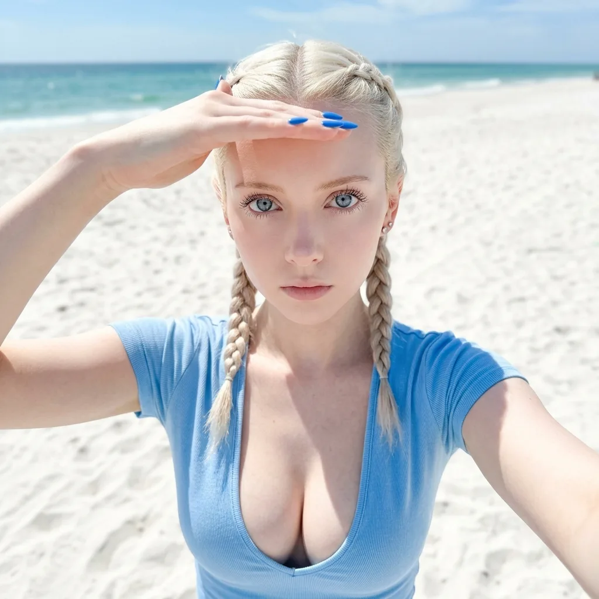

**#608 · Ai Art, Ai Prompt · <code>Vinano Image Pro</code>**

> Keywords: AI art, AI prompt, text to image

<details>
<summary>Show prompt</summary>

```
{
 "format": {
 "type": "editorial",
 "intent": "candid/selfie/accidental",
 "aspect_ratio": "9:16",
 "resolution": "4K"
 },
 "camera_system": {
 "body": "iPhone 15 Pro",
 "lens": "Main Camera",
 "focal_length": "24mm",
 "associative_traits": "computational photography, deep depth of field, sharp digital readout, auto-exposure"
 },
 "subject": {
 "identity": "young woman specific porcelain doll features",
 "physical_details": "flawless pale skin, large round icy blue eyes defined lashes, small defined nose, pouty neutral mouth, platinum blonde hair in two tight braids, vibrant blue manicured nails",
 "clothing": "light blue form-fitting top a very deep, wide plunging V-neckline revealing significant cleavage",
 "action": "high-angle selfie POV, shielding eyes one hand against bright coastal light, looking up at camera",
 "expression": "neutral, wide-eyed, deadpan, vacant doll-like stare"
 },
 "lighting": {
 "source": "bright natural coastal daylight + sand bounce",
 "direction": "overhead and omnidirectional fill",
 "quality": "soft, diffused but very bright",
 "color_temp": "neutral daylight (5500K)",
 "fill": "maximum fill from bright white sand reflection",
 "distribution": "even illumination, few shadows, flattering on skin texture",
 "intent": "bright beach day"
 },
 "environment": {
 "setting": "sandy beach during the day",
 "hero_materials": [{
 "material": "sand",
 "micro_detail": "fine white grains, highly reflective"
 },
 {
 "material": "fabric",
 "micro_detail": "light blue swimwear/stretch cotton blend"
 },
 {
 "material": "skin",
 "micro_detail": "smooth, poreless, porcelain texture, slightly dewy from heat"
 }],
 "objects": "ocean horizon line blurred in far background, expansive sand",
 "state": "bright, sunny, coastal"
 },
 "technical_finish": {
 "film_stock": "Digital Source",
 "exposure": "brightly exposed (high key)",
 "grain": "none/digital noise",
 "tone_curve": "linear neutral",
 "color_science": "pastel palette (light blues, white sand, pale skin), natural daylight colors"
 },
 "constraints": {
 "avoid": ["snow",
 "winter clothes",
 "red nails",
 "black top",
 "modest neckline",
 "heavy shadows"],
 "must_include": ["blue nails",
 "light blue top",
 "deep cleavage",
 "beach background",
 "porcelain doll features"]
 }
 }
}

Aim for an editorial, design-driven look with deliberate negative space.
```

</details>

---

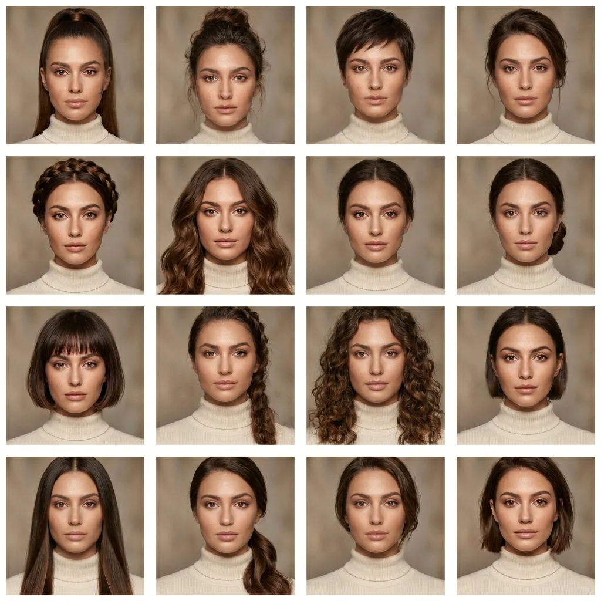

**#609 · Realistic, Portrait · <code>Vinano Image Pro</code>**

> Keywords: realistic, portrait, AI art, AI prompt, text to image

<details>
<summary>Show prompt</summary>

```
{
 "scene_type": "editorial beauty collage",
 "subject": {
 "identity_lock": true,
 "face_consistency": "perfectly matched across all frames",
 "expression": "unchanged, neutral and relaxed",
 "skin": "realistic texture, natural pores, high fidelity"
 },
 "layout": {
 "grid": "4x3",
 "framing": "equal-sized portrait panels",
 "consistency": "symmetrical facial alignment in every frame"
 },
 "hairstyle_variations": ["sleek long straight hair",
 "high ponytail",
 "textured messy bun",
 "pixie haircut",
 "braided crown",
 "soft flowing waves",
 "short bob bangs",
 "low tied bun",
 "side braid",
 "loose defined curls"],
 "styling": {
 "outfit": "same neutral wardrobe across all panels",
 "makeup": "identical clean beauty makeup in every shot"
 },
 "lighting": {
 "type": "soft studio lighting",
 "tone": "warm",
 "shadows": "gentle and natural"
 },
 "background": {
 "style": "subtle blurred studio backdrop",
 "color": "warm neutral tones"
 },
 "quality": {
 "detail": "ultra-detailed",
 "photography": "professional portrait",
 "finish": "high-end editorial look"
 }
}

Emphasise material texture and natural light so the final frame feels tactile and premium.
```

</details>

---

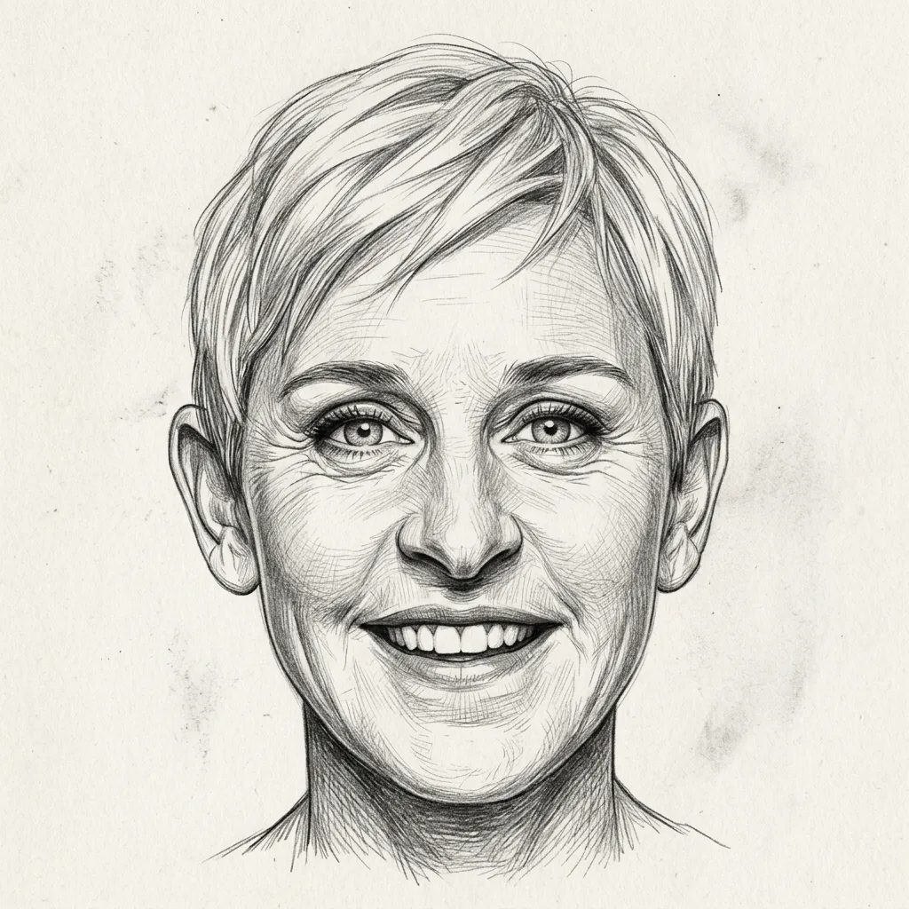

**#610 · Realistic, Portrait · <code>Vinano Image Pro</code>**

> Keywords: realistic, portrait, AI art, AI prompt, text to image

<details>
<summary>Show prompt</summary>

```
Create a highly detailed pencil sketch portrait on paper of the uploaded face.
Keep the face exactly identical to the uploaded image – do not alter facial features, expressions, hairstyle, or age.Use realistic pencil shading, crosshatching, and line work to give depth and texture.

Background should be minimal or plain paper texture.

Maintain consistent colour harmony and crisp focus across the whole frame.
```

</details>

---

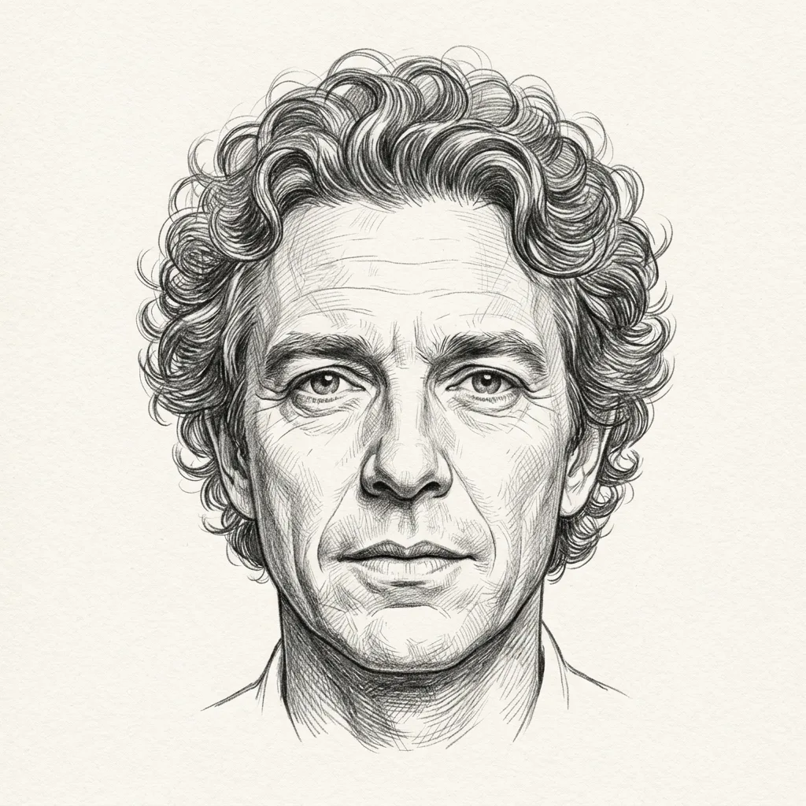

**#611 · Realistic, Portrait · <code>Vinano Image Pro</code>**

> Keywords: realistic, portrait, AI art, AI prompt, text to image

<details>
<summary>Show prompt</summary>

```
Create a highly detailed pencil sketch portrait on paper of the uploaded face.
Keep the face exactly identical to the uploaded image – do not alter facial features, expressions, hairstyle, or age.Use realistic pencil shading, crosshatching, and line work to give depth and texture.

Background should be minimal or plain paper texture.

Aim for an editorial, design-driven look with deliberate negative space.
```

</details>

---

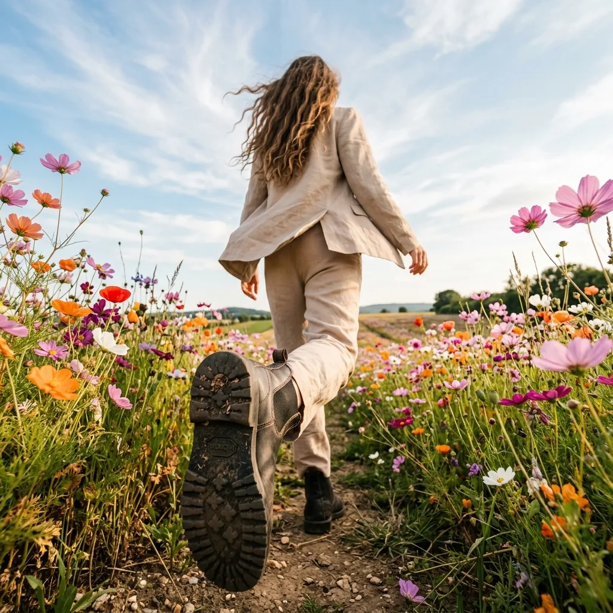

**#612 · Realistic, Cinematic · <code>Vinano Image Pro</code>**

> Keywords: realistic, cinematic, AI art, AI prompt, text to image

<details>
<summary>Show prompt</summary>

```
A cinematic ultra-wide low-angle shot of a stylish young woman walking through a vibrant flower field, captured from ground level as if the camera is beneath her foot mid-step. The sole of her shoe dominates the foreground sharp detail, creating a dramatic perspective. She wears a soft beige outfit a light jacket, her long hair flowing naturally in the wind. Surrounding her are colorful blooming flowers (cosmos and wildflowers) framing the scene. The sky above is bright blue soft clouds, creating a dreamy, airy atmosphere. Natural sunlight, soft shadows, high fashion editorial style, ultra-realistic, shallow depth of field, 8K detail Render with rich micro-detail while keeping the layout uncluttered and intentional.
```

</details>

---

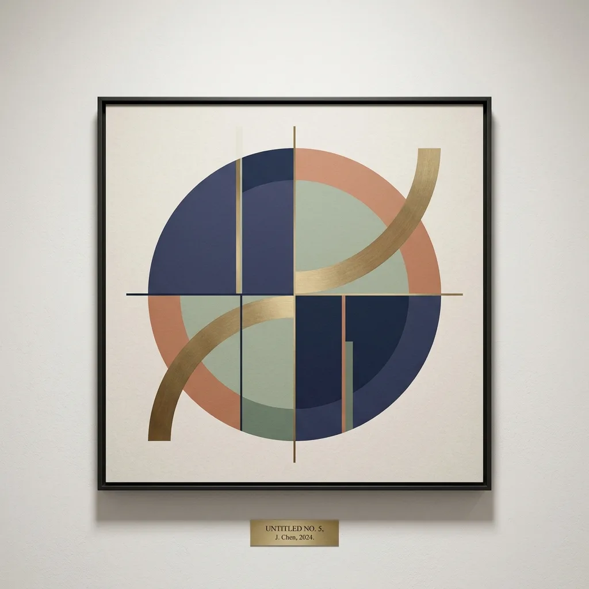

**#613 · Ai Art, Ai Prompt · <code>Vinano Image Pro</code>**

> Keywords: AI art, AI prompt, text to image

<details>
<summary>Show prompt</summary>

```
AI generated image by Keep edges clean and the overall composition balanced for a polished, gallery-ready result.
```

</details>

---

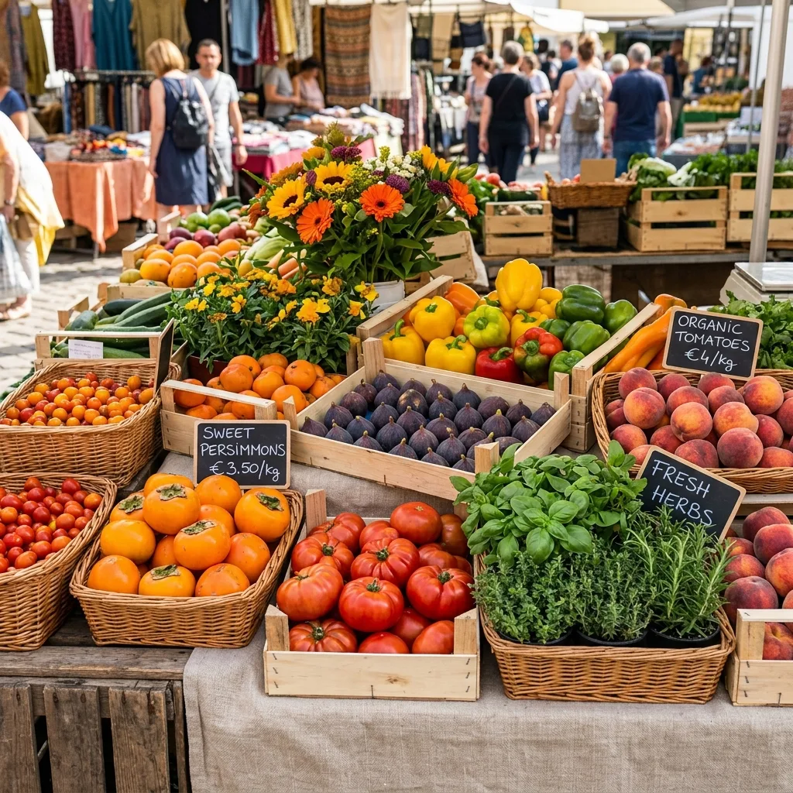

**#614 · Ai Art, Ai Prompt · <code>Vinano Image Pro</code>**

> Keywords: AI art, AI prompt, text to image

<details>
<summary>Show prompt</summary>

```
AI generated image by Maintain consistent colour harmony and crisp focus across the whole frame.
```

</details>

---

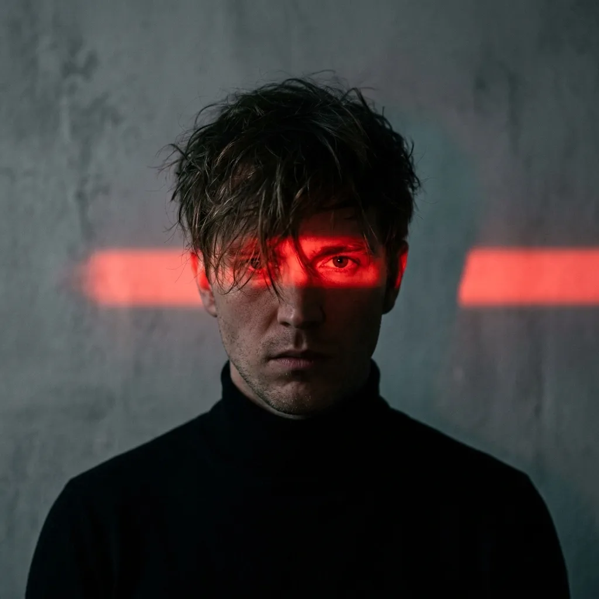

**#615 · Realistic, Portrait · <code>Vinano Image v2</code>**

> Keywords: realistic, portrait, cinematic, minimalist, AI art, AI prompt

<details>
<summary>Show prompt</summary>

```
Ultra-realistic dramatic portrait of a man or woman (from uploaded image), messy hair over one eye, wearing a black turtleneck, centered an intense stare. Bright sharp horizontal red light highlights only the eyes and reflects on the gray wall; rest in deep shadow. Moody, refined minimalist, cinematic Render with rich micro-detail while keeping the layout uncluttered and intentional.
```

</details>

---

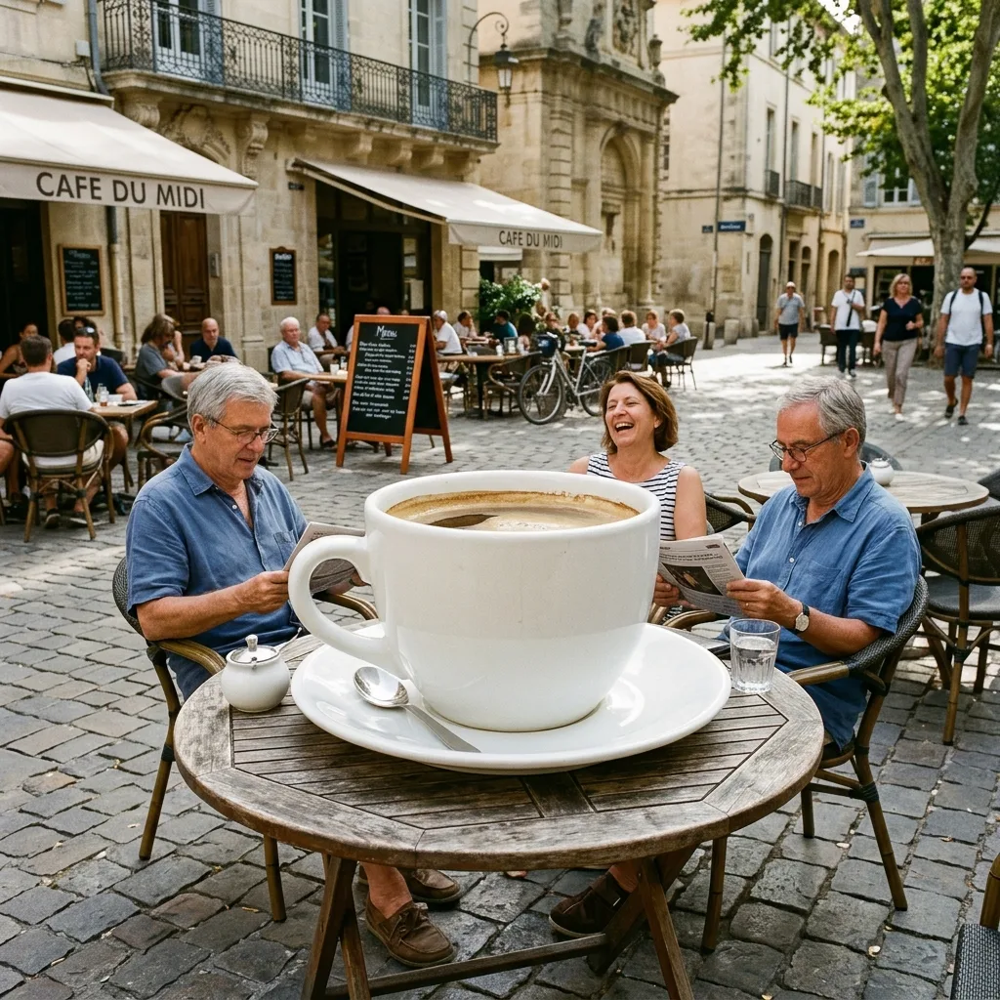

**#616 · Realistic, Ai Art · <code>Vinano Image Pro</code>**

> Keywords: realistic, AI art, AI prompt, text to image

<details>
<summary>Show prompt</summary>

```
a photo, but something within it (that is normally there) is much too big (and otherwise normal), the scene is realistic Render with rich micro-detail while keeping the layout uncluttered and intentional.
```

</details>

---

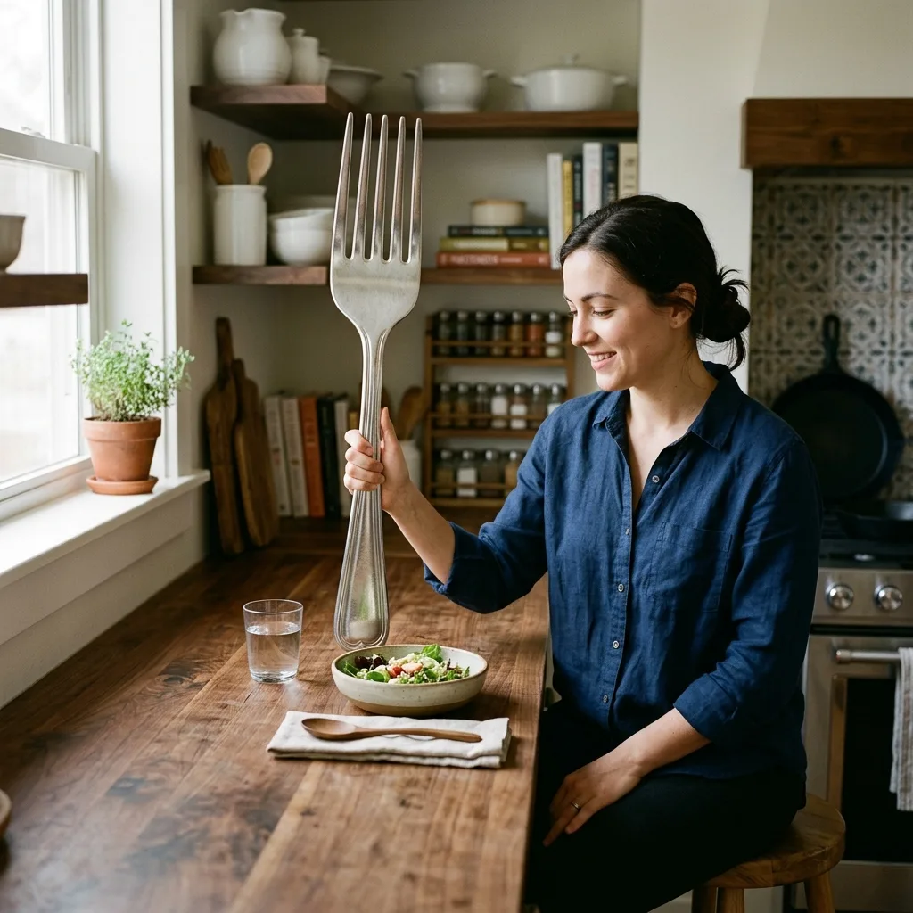

**#617 · Realistic, Ai Art · <code>Vinano Image Pro</code>**

> Keywords: realistic, AI art, AI prompt, text to image

<details>
<summary>Show prompt</summary>

```
a photo, but something within it (that is normally there) is much too big (and otherwise normal), the scene is realistic Render with rich micro-detail while keeping the layout uncluttered and intentional.
```

</details>

---

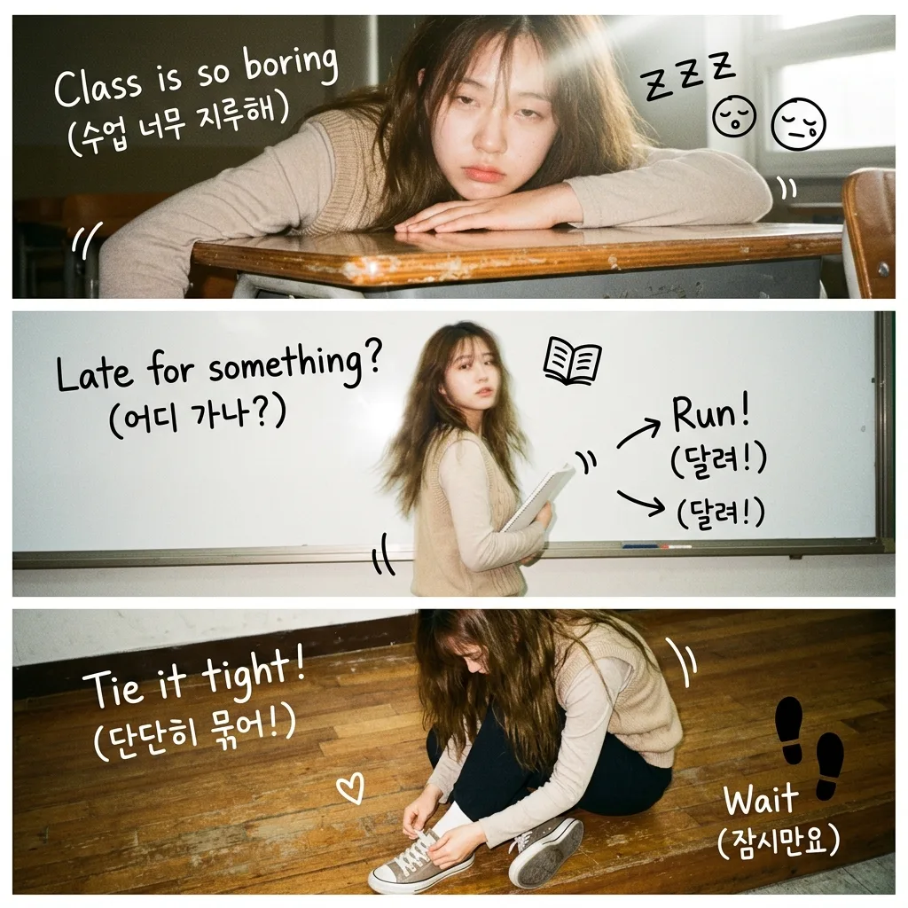

**#618 · Ai Art, Ai Prompt · <code>Vinano Image Pro</code>**

> Keywords: AI art, AI prompt, text to image

<details>
<summary>Show prompt</summary>

```
{"layout":"vertical 3-panel college photo strip","subject":"girl long hair in beige knit vest","panel_top":"close-up resting chin on school desk, bored expression","panel_middle":"standing against white classroom wall holding book, slight motion blur","panel_bottom":"sitting on wooden floor tying shoelace","aesthetic":"Korean 2000s phone camera quality, warm tint, low resolution, handwritten doodle overlay, harsh flash, messy Korean girl style"} Keep edges clean and the overall composition balanced for a polished, gallery-ready result.
```

</details>

---

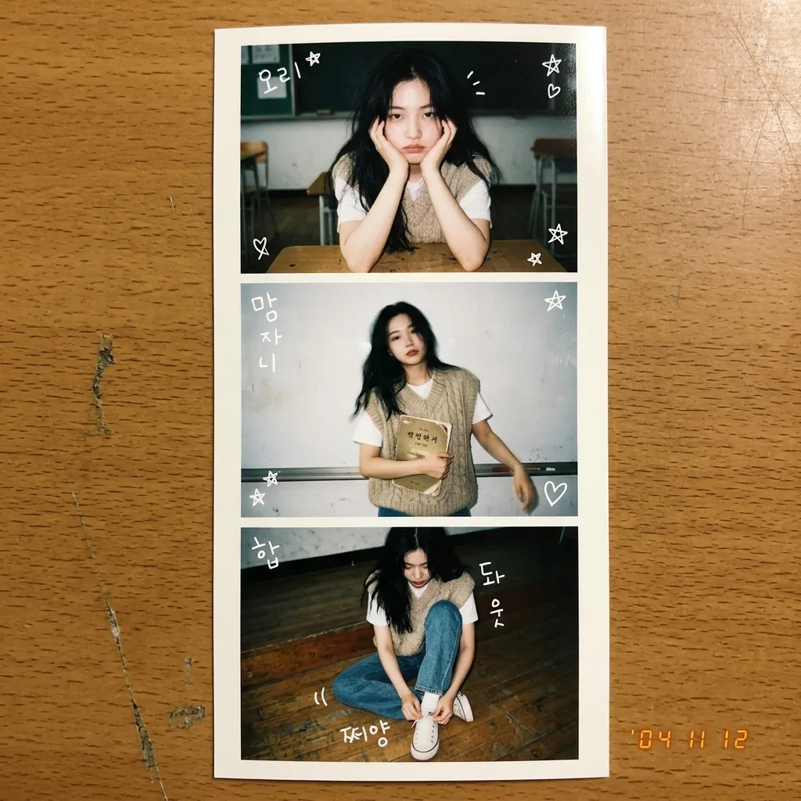

**#619 · Ai Art, Ai Prompt · <code>Vinano Image Pro</code>**

> Keywords: AI art, AI prompt, text to image

<details>
<summary>Show prompt</summary>

```
{"layout":"vertical 3-panel college photo strip","subject":"girl long hair in beige knit vest","panel_top":"close-up resting chin on school desk, bored expression","panel_middle":"standing against white classroom wall holding book, slight motion blur","panel_bottom":"sitting on wooden floor tying shoelace","aesthetic":"Korean 2000s phone camera quality, warm tint, low resolution, handwritten doodle overlay, harsh flash, messy Korean girl style"} Emphasise material texture and natural light so the final frame feels tactile and premium.
```

</details>

---

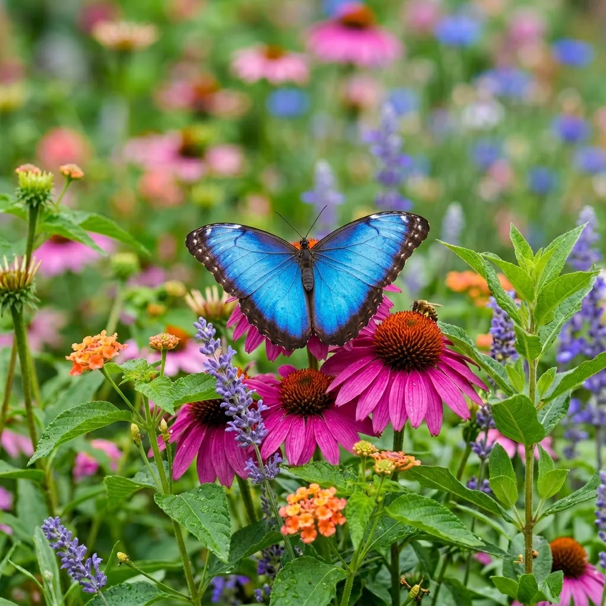

**#620 · Ai Art, Ai Prompt · <code>Vinano Image Pro</code>**

> Keywords: AI art, AI prompt, text to image

<details>
<summary>Show prompt</summary>

```
AI generated image by Maintain consistent colour harmony and crisp focus across the whole frame.
```

</details>

---

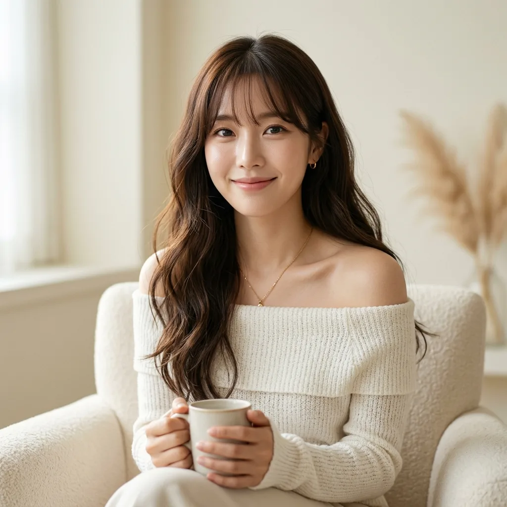

**#621 · Realistic, Portrait · <code>Vinano Image v2</code>**

> Keywords: realistic, portrait, AI art, AI prompt, text to image

<details>
<summary>Show prompt</summary>

```
true-to-life photorealistic Korean beauty portrait of a cute young woman long wavy dark hair and soft wispy bangs, natural glowing fair skin, delicate features, subtle smile, and warm expressive eyes. Wearing a cozy off-shoulder white knit top and a delicate necklace. Soft natural daylight, clean cream background, minimal aesthetic, elegant and feminine vibe. Multiple poses including direct eye contact, side profile, over-the-shoulder glance, and relaxed seated pose. Ultra-realistic skin texture, detailed hair strands, shallow depth of field, soft tones, high-end lifestyle photography, dreamy and effortless beauty, 4k quality. Maintain consistent colour harmony and crisp focus across the whole frame.
```

</details>

---

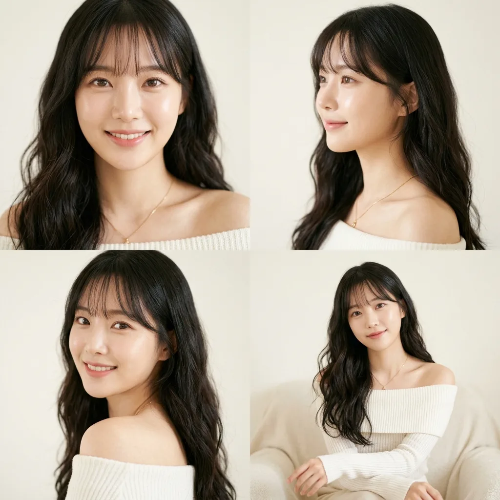

**#622 · Realistic, Portrait · <code>Vinano Image v2</code>**

> Keywords: realistic, portrait, AI art, AI prompt, text to image

<details>
<summary>Show prompt</summary>

```
true-to-life photorealistic Korean beauty portrait of a cute young woman long wavy dark hair and soft wispy bangs, natural glowing fair skin, delicate features, subtle smile, and warm expressive eyes. Wearing a cozy off-shoulder white knit top and a delicate necklace. Soft natural daylight, clean cream background, minimal aesthetic, elegant and feminine vibe. Multiple poses including direct eye contact, side profile, over-the-shoulder glance, and relaxed seated pose. Ultra-realistic skin texture, detailed hair strands, shallow depth of field, soft tones, high-end lifestyle photography, dreamy and effortless beauty, 4k quality. Maintain consistent colour harmony and crisp focus across the whole frame.
```

</details>

---


**#623 · Ai Art, Ai Prompt · <code>Vinano Image v2</code>**

> Keywords: AI art, AI prompt, text to image

<details>
<summary>Show prompt</summary>

```
围绕[主题]生成一张清透明亮的图文视觉，第一眼由大尺度中文主题字与一根细长流动线共同建立记忆点：文字采用高瘦、松弛、带留白的书写感排布，字形之间有错位、穿插和呼吸空间，细线从画面边缘进入，绕过主标题、掠过主体或环境，再以柔和回环收束，像把文字、空气和主题内容轻轻串联起来。主题主体保持小而明确，放在开阔背景中的视觉低位或中低位，背景以真实或拟真的自然空间、材质空间、光影空间承载情绪，前景可有轻微虚化的植物、纹理或主题派生细节形成层次，底部设置较强的信息承载区，用大号优雅衬线英文短句、纤细手写体和小段说明文字构成节奏，信息层要清晰但不压过上方的空气感。色彩从主题自身的材质、场景、季节和情绪中提取，映射为大面积高明度通风底色、干净的主体色、少量清晰强调色、透明阴影层和高对比信息文字，保持明亮轻快、清透洁净、色阶分明的情绪；即使主题需要更深色，也使用清澈暗部和发光边缘，避免浑浊、陈旧、烟灰或脏黄。整体完成度像精致日签与风景摄影融合，画面边缘有轻微白色纸片或刷痕形状作为顶部装订感，小圆章式信息标记可作为次级节奏点，所有文字与线条都要像被认真编排过，形成轻声问候般的安静仪式感。

——————
主题：[主题]，[日期]
比例：[比例]

整体保持边缘干净、构图均衡，呈现可直接使用的精致成品感。
```

</details>

---


**#624 · Ai Art, Ai Prompt · <code>Vinano Image v2</code>**

> Keywords: AI art, AI prompt, text to image

<details>
<summary>Show prompt</summary>

```
围绕[主题]生成一张清透明亮的图文视觉，第一眼由大尺度中文主题字与一根细长流动线共同建立记忆点：文字采用高瘦、松弛、带留白的书写感排布，字形之间有错位、穿插和呼吸空间，细线从画面边缘进入，绕过主标题、掠过主体或环境，再以柔和回环收束，像把文字、空气和主题内容轻轻串联起来。主题主体保持小而明确，放在开阔背景中的视觉低位或中低位，背景以真实或拟真的自然空间、材质空间、光影空间承载情绪，前景可有轻微虚化的植物、纹理或主题派生细节形成层次，底部设置较强的信息承载区，用大号优雅衬线英文短句、纤细手写体和小段说明文字构成节奏，信息层要清晰但不压过上方的空气感。色彩从主题自身的材质、场景、季节和情绪中提取，映射为大面积高明度通风底色、干净的主体色、少量清晰强调色、透明阴影层和高对比信息文字，保持明亮轻快、清透洁净、色阶分明的情绪；即使主题需要更深色，也使用清澈暗部和发光边缘，避免浑浊、陈旧、烟灰或脏黄。整体完成度像精致日签与风景摄影融合，画面边缘有轻微白色纸片或刷痕形状作为顶部装订感，小圆章式信息标记可作为次级节奏点，所有文字与线条都要像被认真编排过，形成轻声问候般的安静仪式感。

——————
主题：[主题]，[日期]
比例：[比例]

在保证细节的同时保持版式克制、留白得当。
```

</details>

---

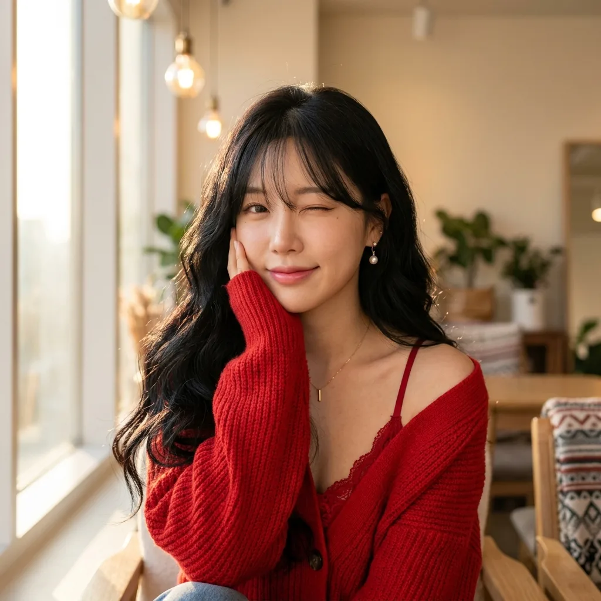

**#625 · Realistic, Portrait · <code>Vinano Image v2</code>**

> Keywords: realistic, portrait, cinematic, AI art, AI prompt, text to image

<details>
<summary>Show prompt</summary>

```
Ultra-detailed portrait of a beautiful young East Asian woman sitting indoors beside a large sunlit window during golden hour. Long, voluminous wavy black hair cascading over her shoulders, soft wispy bangs partially covering one eye. Flawless porcelain skin a natural glow, subtle blush, glossy pink lips, delicate facial features, expressive brown eyes. Playful and charming expression a gentle smile and one eye winking at the camera. One hand resting against her cheek, creating a relaxed and intimate pose.
She wears a vibrant oversized red knit cardigan slipping off one shoulder, revealing a delicate red lace camisole underneath. Minimal elegant jewelry including a small pendant necklace and pearl drop earrings. Warm sunlight streams through the window, creating beautiful rim lighting in her hair and soft highlights on her face.
Cozy modern café or apartment interior in the background hanging Edison bulbs, wooden furniture, houseplants, and creamy neutral tones. Shallow depth of field, dreamy bokeh lights, cinematic atmosphere, soft natural lighting, ultra-realistic skin texture, high-end fashion photography, professional portrait lens, 85mm, f/1.4, HDR, warm color grading, true-to-life photorealistic, highly detailed, magazine-quality portrait, vertical composition, 3:4 aspect ratio.

Render with rich micro-detail while keeping the layout uncluttered and intentional.
```

</details>

---

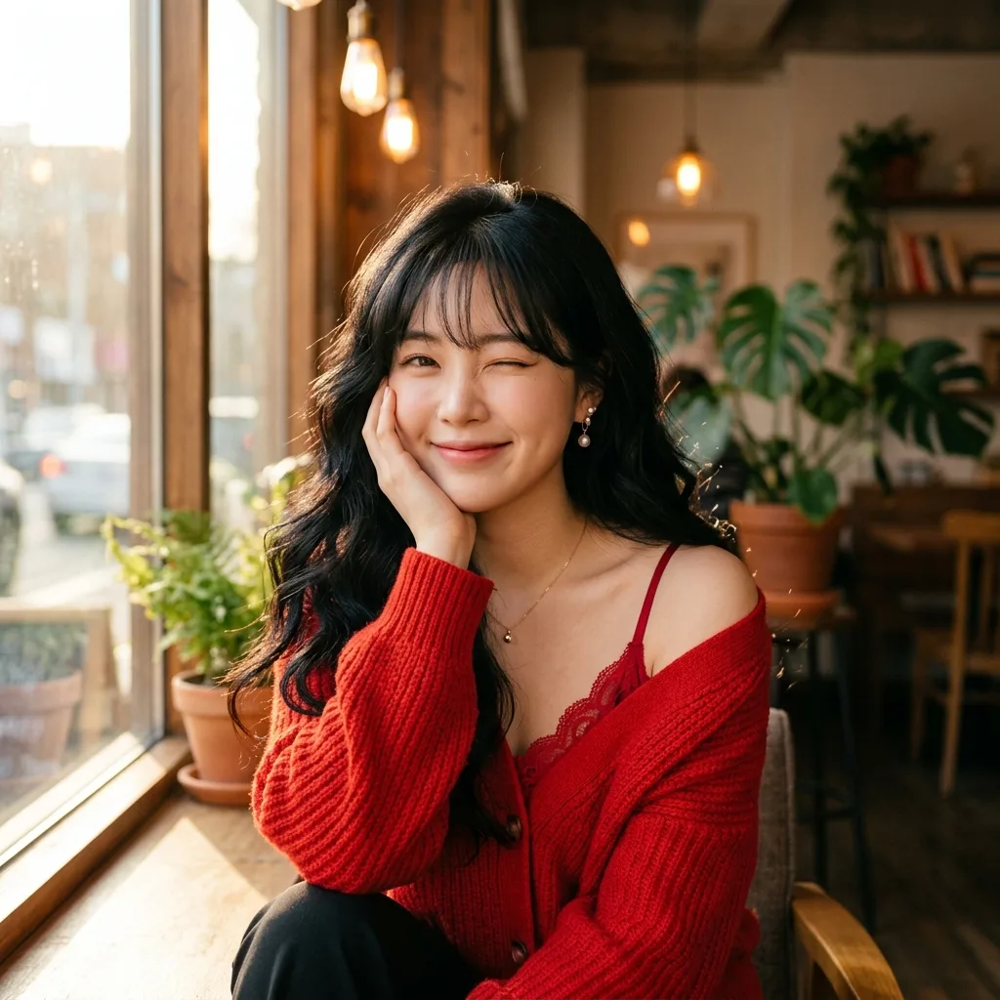

**#626 · Realistic, Portrait · <code>Vinano Image v2</code>**

> Keywords: realistic, portrait, cinematic, AI art, AI prompt, text to image

<details>
<summary>Show prompt</summary>

```
Ultra-detailed portrait of a beautiful young East Asian woman sitting indoors beside a large sunlit window during golden hour. Long, voluminous wavy black hair cascading over her shoulders, soft wispy bangs partially covering one eye. Flawless porcelain skin a natural glow, subtle blush, glossy pink lips, delicate facial features, expressive brown eyes. Playful and charming expression a gentle smile and one eye winking at the camera. One hand resting against her cheek, creating a relaxed and intimate pose.
She wears a vibrant oversized red knit cardigan slipping off one shoulder, revealing a delicate red lace camisole underneath. Minimal elegant jewelry including a small pendant necklace and pearl drop earrings. Warm sunlight streams through the window, creating beautiful rim lighting in her hair and soft highlights on her face.
Cozy modern café or apartment interior in the background hanging Edison bulbs, wooden furniture, houseplants, and creamy neutral tones. Shallow depth of field, dreamy bokeh lights, cinematic atmosphere, soft natural lighting, ultra-realistic skin texture, high-end fashion photography, professional portrait lens, 85mm, f/1.4, HDR, warm color grading, true-to-life photorealistic, highly detailed, magazine-quality portrait, vertical composition, 3:4 aspect ratio.

Keep edges clean and the overall composition balanced for a polished, gallery-ready result.
```

</details>

---

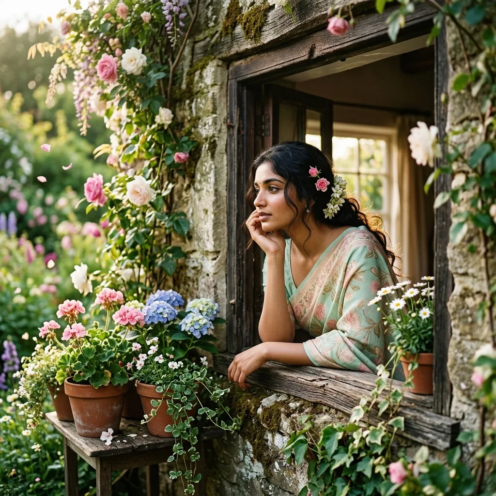

**#627 · Realistic, Cinematic · <code>Vinano Image v2</code>**

> Keywords: realistic, cinematic, vintage, AI art, AI prompt, text to image

<details>
<summary>Show prompt</summary>

```
A beautiful young South Asian woman leaning on a rustic wooden window of a vintage stone cottage, wearing a soft pastel floral saree in pink and light mint colors. Elegant flower accessories in her dark wavy hair, delicate earrings, natural beauty, dreamy expression, looking outside thoughtfully.
The window is surrounded by blooming pink, white, and blue flowers, hanging vines, flower pots overflowing blossoms, flower petals floating gently in the air. Warm golden sunlight, soft shadows, romantic spring atmosphere, countryside cottage aesthetic.
Highly detailed floral environment, ultra-detailed face, soft glowing skin, realistic eyes, natural makeup, filmic, cinematic lighting, dreamy mood, magical garden vibes, fairytale scenery, shallow depth of field, bokeh background.
Masterpiece, best quality, ultra detailed, vibrant colors, true-to-life photorealistic, 8k, HDR, professional photography, intricate flower details, soft pastel tones, cozy cottagecore aesthetic, volumetric light, stunning composition.
--ar 9:16 --stylize 750

Emphasise material texture and natural light so the final frame feels tactile and premium.
```

</details>

---

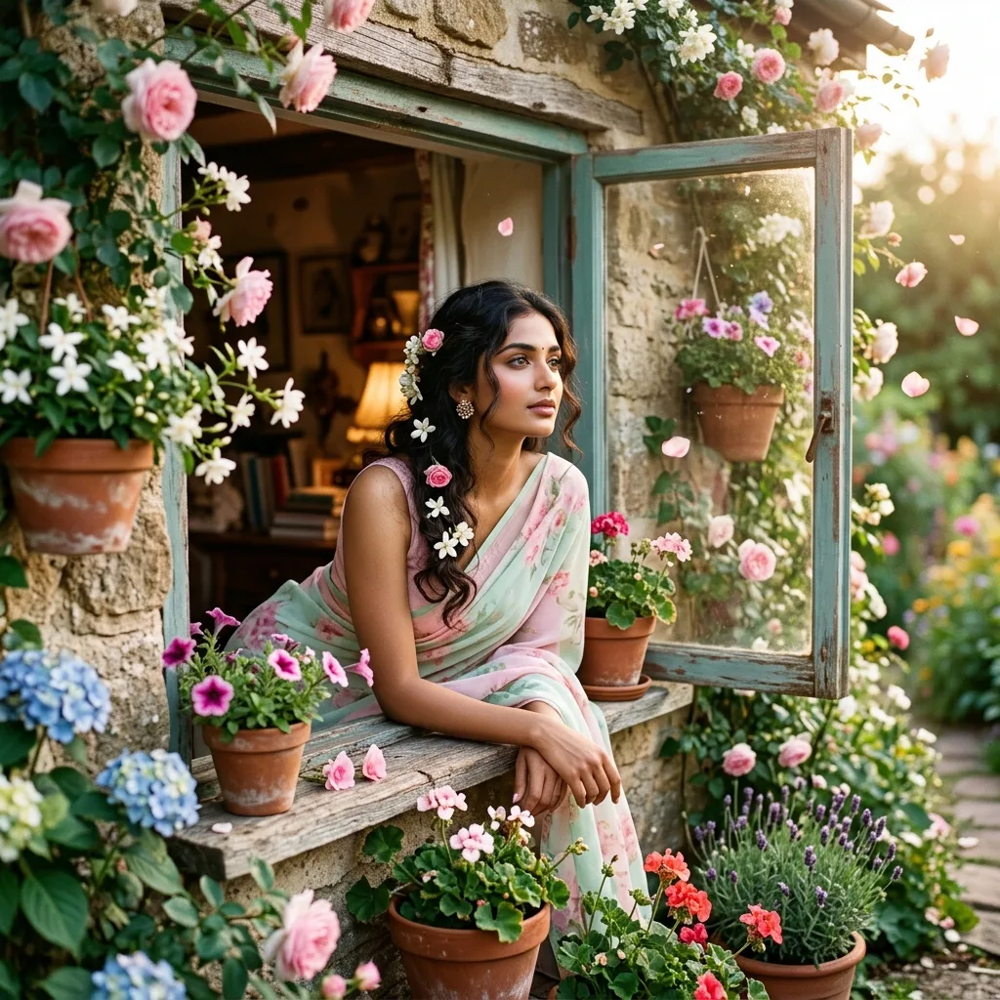

**#628 · Realistic, Cinematic · <code>Vinano Image v2</code>**

> Keywords: realistic, cinematic, vintage, AI art, AI prompt, text to image

<details>
<summary>Show prompt</summary>

```
A beautiful young South Asian woman leaning on a rustic wooden window of a vintage stone cottage, wearing a soft pastel floral saree in pink and light mint colors. Elegant flower accessories in her dark wavy hair, delicate earrings, natural beauty, dreamy expression, looking outside thoughtfully.
The window is surrounded by blooming pink, white, and blue flowers, hanging vines, flower pots overflowing blossoms, flower petals floating gently in the air. Warm golden sunlight, soft shadows, romantic spring atmosphere, countryside cottage aesthetic.
Highly detailed floral environment, ultra-detailed face, soft glowing skin, realistic eyes, natural makeup, filmic, cinematic lighting, dreamy mood, magical garden vibes, fairytale scenery, shallow depth of field, bokeh background.
Masterpiece, best quality, ultra detailed, vibrant colors, true-to-life photorealistic, 8k, HDR, professional photography, intricate flower details, soft pastel tones, cozy cottagecore aesthetic, volumetric light, stunning composition.
--ar 9:16 --stylize 750

Render with rich micro-detail while keeping the layout uncluttered and intentional.
```

</details>

---

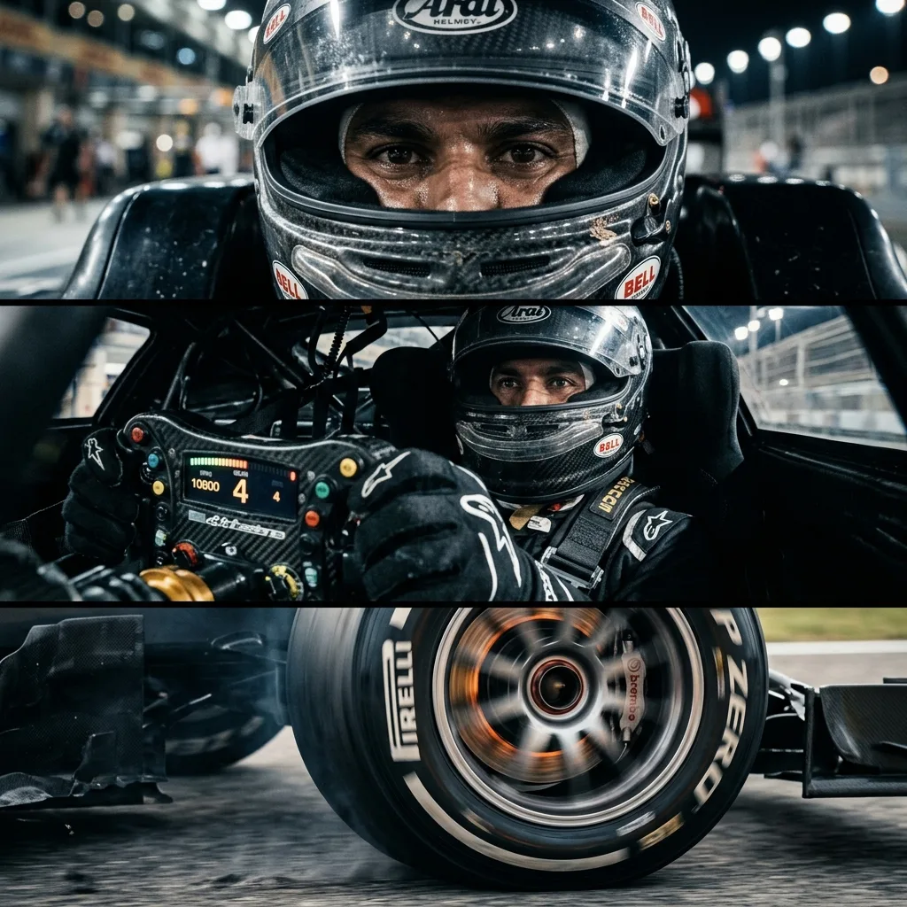

**#629 · Cinematic, Ai Art · <code>Vinano Image Pro</code>**

> Keywords: cinematic, AI art, AI prompt, text to image

<details>
<summary>Show prompt</summary>

```
Create a cohesive 3-panel editorial layout, stacked horizontally (top, middle, bottom panels).All panels are close-shot only, no wide scenes, no background storytelling — cinematic editorial photography consistent lighting, color grading, and lens language.Top panel: Extreme close-up of a race driver’s eyes behind a helmet visor, sharp focus, reflections of track lights in the visor, intense concentration, shallow depth of field.Middle panel: Low-angle close-up from inside the cockpit, camera looking upward at the driver, helmeted face dominant, hands gripping the steering wheel, tight confined space, raw pressure and speed implied.Bottom panel: Extreme close-up of a racing car wheel in motion, visible tire deformation, heat and rubber texture, strong motion blur, pure mechanical energy.Editorial magazine style, cinematic realism, high contrast, minimal distractions, unified visual rhythm across all panels. Keep edges clean and the overall composition balanced for a polished, gallery-ready result.
```

</details>

---

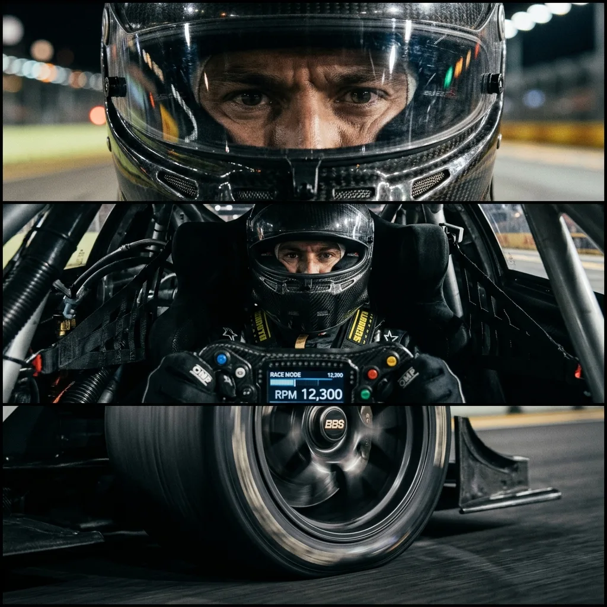

**#630 · Cinematic, Ai Art · <code>Vinano Image Pro</code>**

> Keywords: cinematic, AI art, AI prompt, text to image

<details>
<summary>Show prompt</summary>

```
Create a cohesive 3-panel editorial layout, stacked horizontally (top, middle, bottom panels).All panels are close-shot only, no wide scenes, no background storytelling — cinematic editorial photography consistent lighting, color grading, and lens language.Top panel: Extreme close-up of a race driver’s eyes behind a helmet visor, sharp focus, reflections of track lights in the visor, intense concentration, shallow depth of field.Middle panel: Low-angle close-up from inside the cockpit, camera looking upward at the driver, helmeted face dominant, hands gripping the steering wheel, tight confined space, raw pressure and speed implied.Bottom panel: Extreme close-up of a racing car wheel in motion, visible tire deformation, heat and rubber texture, strong motion blur, pure mechanical energy.Editorial magazine style, cinematic realism, high contrast, minimal distractions, unified visual rhythm across all panels. Emphasise material texture and natural light so the final frame feels tactile and premium.
```

</details>

---
