# Photography — full gallery

[← Back to README](../README.md) · [`prompts.json`](../prompts/prompts.json) · **630** prompts · page 1 / 7

**1** · [2](./photography-2.md) · [3](./photography-3.md) · [4](./photography-4.md) · [5](./photography-5.md) · [6](./photography-6.md) · [7](./photography-7.md) — [Next →](./photography-2.md)

---


**#1 · Photography Prompt · <code>Vinano Image v2</code>**

<details>
<summary>Show prompt</summary>

```
{
  "image_generation_parameters": {
    "aspect_ratio": "9:16",
    "subject_description": {
      "character": "A stunning young woman long, sleek dark hair fanned out across white pillows. She has a soft, confident smile and is wearing stylish black rectangular sunglasses.",
      "apparel": "She is wearing a white ribbed-knit tube top that shows detailed fabric texture and a pair of refined minimalist black bikini bottoms.",
      "accessories": "A delicate thin black choker necklace a tiny pendant is visible on her neck. Her nails are manicured a light, neutral polish.",
      "pose": "Lying flat on her back on a bed, viewed from a high-angle 'selfie' perspective. Her right arm is extended toward the camera, creating a sense of depth. Her legs are slightly bent at the knees, resting on the bed."
    },
    "environment_and_composition": {
      "setting": "A dimly lit bedroom at night. The bed has rumpled white cotton sheets and soft pillows that catch the light and shadow.",
      "background_elements": "In the soft-focus background, a dark wooden bed frame and several posters/polaroids are pinned to a dimly lit wall, adding a personal, lived-in atmosphere.",
      "foreground_objects": "A black television remote control lies on the white sheets next to her leg, adding to the casual, candid nature of the shot."
    },
    "technical_style": {
      "lighting": "Harsh direct flash photography style, reminiscent of a late-night smartphone capture. This creates high contrast, bright highlights on the skin and clothing, and deep, sharp shadows behind the subject.",
      "camera_settings": "Shot on a high-end mobile camera, f/1.8 aperture for slight background blur, high ISO resulting in a subtle, aesthetic film grain.",
      "image_quality": "Ultra-true-to-life photorealistic, 8k resolution, highly detailed skin pores, visible fabric fibers, cinematic composition, hyper-detailed textures, RAW photo quality."
    },
    "negative_prompt": "cartoon, drawing, anime, low quality, distorted face, extra fingers, deformed hands, blurry, low resolution, watermark, text, signature, bright daylight, overhead ceiling light."
  }
}

Aim for an editorial, design-driven look with deliberate negative space.
```

</details>

---


**#2 · Photography Prompt · <code>Vinano Image v2</code>**

<details>
<summary>Show prompt</summary>

```
Sometimes I want to stay alone away from the Chaos of City life

The Realism by gemini mpt 👇

Wide shot, subject acts as an anchor against a raging wind. Standing on a jagged black rock coastline, waves crashing behind in a gray blur. The subject leans forward against the gale. Outfit is a massive, shapeless layers of raw beige wool and distressed knitwear, creating a silhouette that looks like a eroding sculpture. Lighting is overcast, flat, and moody. Desaturated palette, muted earth tones, sharp texture on the fabric, cinematic anamorphic lens.

Negative Prompt: Sunny beach, vacation vibes, swimsuit, smiling, blue sky, vibrant colors, calm water, generic travel photography, face distortion.

Maintain consistent colour harmony and crisp focus across the whole frame.
```

</details>

---


**#3 · Photography Prompt · <code>Vinano Image v2</code>**

<details>
<summary>Show prompt</summary>

```
Good Afternoon X Fam ♥️

Ana de Armas
Sydney Sweeney
Sadie Sink
Indian Lady

Gemini Presenting

Prompt:-

{
 "subject": {
 "person": "Ek sundar mahila jiske lambe, ghane, aur wavy kaale baal hain.",
 "expression": "Shaant aur pur-aitmaad (confident) expression, aankhen seedhe camera ki taraf.",
 "clothing": "Ek luxurious deep red silk ya satin ka sleeveless evening gown, jisme v-neckline hai.",
 "pose": "Bed par ek taraf jhuk kar (reclining) leti hui hai, haath aaram se aage ki taraf rakha hua."
 },
 "setting": {
 "location": "Ek bohot hi bada aur luxurious classic-style bedroom.",
 "furniture": [{
 "item": "Canopy bed",
 "details": "Sone ka (gold) ornate headboard aur upar ek bada beige fabric ka canopy drape."
 },
 {
 "item": "Dressing table",
 "details": "Gold-trimmed vanity table jiske upar perfumes, crystal bottles, aur laal gulab ka guldasta rakha hai."
 },
 {
 "item": "Rug",
 "details": "Zameen par ek intricate blue aur gold pattern wala traditional Persian ya Oriental rug."
 }],
 "lighting": "Warm aur soft, diffused lighting. Ek chandelier upar hai aur bed ke side mein ek elegant lamp jal raha hai.",
 "background": "Khidki se bahar shehar ki raushni (city skyline at night) dikhayi de rahi hai."
 },
 "aesthetic": {
 "color_palette": ["Deep Red", "Gold", "Cream", "Royal Blue", "Emerald Green"],
 "mood": "Opulent, elegant, sophisticated aur cozy.",
 "photography_style": "High-end fashion photography, sharp focus on the subject, soft bokeh in the background."
 }
}

Maintain consistent colour harmony and crisp focus across the whole frame.
```

</details>

---


**#4 · Photography Prompt · <code>Vinano Image v2</code>**

<details>
<summary>Show prompt</summary>

```
A cinematic, ultra realistic post apocalyptic scene of a lone survivor sitting on the forest ground, leaning against an abandoned, rusted old car broken windows and peeling paint. The survivor is wearing a dark olive green hooded protective suit visible fabric folds and dirt stains, heavy boots, gloves, and a full face gas mask round glass lenses and dual side filters. The survivor is sitting knees bent, one hand near the mask as if thinking, body slightly slouched, giving a feeling of exhaustion and solitude.
The environment is a dense, overgrown forest in late autumn, dry orange, brown, and golden leaves covering the ground and hanging on thin branches. The background trees are tall and thin dark trunks, softly blurred by shallow depth of field. Small plants, twigs, and fallen leaves fill the foreground creating a natural frame.
Color palette is muted and cinematic: deep olive greens, rusty browns, burnt orange leaves, dark greys, faded blue metal on the car, and soft warm highlights mixed cool shadow tones. Lighting is soft and diffused, as if coming from an overcast sky, gentle warm light touching the leaves and the subject, and cooler shadows in the background. Slight film grain, cinematic contrast, moody and atmospheric tone.
Camera is low angle, medium full body shot, subject placed slightly off center, 35mm lens look, shallow depth of field, realistic textures, high detail, soft background blur, subtle vignette. The atmosphere feels quiet, abandoned, melancholic, and tense, like the world has ended and nature is slowly taking over.

Emphasise material texture and natural light so the final frame feels tactile and premium.
```

</details>

---


**#5 · Photography Prompt · <code>Vinano Image Pro</code>**

<details>
<summary>Show prompt</summary>

```
Gemini

Prompt:

{ "image_type": "photograph", "genre": "urban lifestyle portrait", "composition": { "framing": "three-quarter body portrait", "angle": "eye-level, straight-on", "orientation": "portrait", "subject_placement": "subject positioned slightly right of center", "background_balance": "large-scale mural occupying left background", "visual_hierarchy": "foreground subject emphasized against graphic mural backdrop" }, "subject": { "count": 1, "gender_presentation": "female-presenting", "age_range": "young adult", "facial_features": { "skin_tone": "light, neutral", "complexion": "smooth natural texture", "eyes": "light-colored", "eyebrows": "full, softly shaped", "nose": "straight, proportional", "lips": "natural pink, smiling teeth slightly visible" }, "hair": { "color": "medium brown", "length": "shoulder-length", "style": "loose waves", "part": "center part" }, "expression": "playful, cheerful", "gaze": "directed toward camera", "pose": { "stance": "relaxed, casual", "hands": "one hand holding a drink cup, other supporting straw" }, "accessories": ["clear plastic cup lid and straw"], "clothing": { "top": "oversized t-shirt", "color": "White", "bottom": "black lounge pants", "fit": "loose, relaxed streetwear", "style": "casual, modern" } }, "lighting": { "type": "natural daylight", "direction": "diffuse frontal light", "quality": "soft, even", "shadows": "minimal, low contrast", "highlights": "subtle highlights on face and hair" }, "color_palette":#AmulProteinWPL { "dominant_colors": ["white", "gray", "yellow"], "accent_colors": ["cherry beverage", "black mural outlines"], "overall_tone": "urban, contemporary, playful" }, "background": { "setting": "outdoor urban space", "environment": "city courtyard or alley", "elements": ["large monochrome mural portrait of Elon Musk yellow graphic accents", "modern building facades", "metal railing", "stone or concrete pavement"], "style": "street art–influenced", "depth_of_field": "deep, background clearly visible" }, "technical_details": { "camera_type": "smartphone camera", "focal_length_equivalent": "standard wide lens", "sharpness": "high overall sharpness", "noise": "low", "dynamic_range": "balanced highlights and shadows", "white_balance": "neutral" }, "artistic_style": { "aesthetic": "urban lifestyle, social media–ready", "retouching": "minimal, natural appearance", "mood": "fun, relaxed, youthful", "contrast": "moderate strong graphic background" }, "typography": { "presence": false } }

Aim for an editorial, design-driven look with deliberate negative space.
```

</details>

---


**#6 · Photography Prompt · <code>Vinano Image v2</code>**

<details>
<summary>Show prompt</summary>

```
{
  "image_style": {
    "type": "true-to-life photorealistic",
    "aesthetic": "Instagram shot",
    "effects": ["film grain",
      "direct flash"]
  },
  "composition": {
    "framing": "waist-up photograph",
    "aspect_ratio": "9:16"
  },
  "subject": {
    "description": " woman Sydney Sweeney",
    "constraint_note": "do not alter the sensitivity of the face and features",
    "pose": {
      "orientation": "facing the camera directly",
      "head": "tilted slightly to the side",
      "eyes": "closed",
      "action": "covering her face her hand, pulling her elbow away and lifting it to the side",
      "mood": ["elegant",
        "pensive",
        "playful"]
    },
    "appearance": {
      "attire": ["black velvet corset",
        "expensive black cape"],
      "hair": "loose",
      "makeup": {
        "style": "nude",
        "lipstick": "matte nude"
      },
      "details": ["décolletage highlighted",
        "long, square black nails"]
    }
  },
  "setting": {
    "background": "white wall",
    "foreground_elements": "art object placed in front of the wall"
}
 }

Render with rich micro-detail while keeping the layout uncluttered and intentional.
```

</details>

---


**#7 · Photography Prompt · <code>Vinano Image v2</code>**

<details>
<summary>Show prompt</summary>

```
Gemini 3.0 🍌

Prompt:

{
 "image_description": {
 "subject": {
 "person": "A slender blonde woman long hair, wearing a sheer, shimmering gold mesh mini dress thin spaghetti straps and a vertical gold zipper detail.",
 "accessories": "Layered gold necklaces, gold bracelets, and metallic gold high-heeled sandals.",
 "pose": "Standing elegantly in front of a luxury car, legs crossed at the ankles, looking directly at the camera."
 },
 "vehicle": {
 "type": "A sleek, modern white supercar gold accents.",
 "details": "High-gloss white paint, metallic gold rims, gold trim around the windows, and low-profile body styling."
 },
 "environment": {
 "location": "A bright, high-end luxury car showroom.",
 "lighting": "Clean, architectural indoor lighting soft reflections on the polished white floor.",
 "background": "Large floor-to-ceiling glass windows showing other vehicles in a blurred outdoor setting."
 },
 "technical_style": {
 "composition": "Full-body shot, eye-level angle, centered subject.",
 "aesthetic": "High-fashion photography, true-to-life photorealistic, sharp focus on the subject a shallow depth of field (bokeh) in the background.",
 "color_palette": "Dominant white and gold, neutral grey and black architectural tones."
 }
 }
}

Keep edges clean and the overall composition balanced for a polished, gallery-ready result.
```

</details>

---


**#8 · Photography Prompt · <code>Vinano Image v2</code>**

<details>
<summary>Show prompt</summary>

```
Good Night X Fam ♥️

☆ Sexy & Hot Virgin Young Lady in own luxury bedroom.

☆ The one who takes it in the arms will be golden tonight.

☆ Gemini Presenting this beautiful images.

☆ I love you all X creators

☆ Genuine Prompt here:-

{
 "scene": {
 "type": "bedroom_interior",
 "lighting": "soft natural morning daylight, diffused through blinds",
 "atmosphere": "cozy, intimate, serene domestic"
 },
 "subject": {
 "appearance": {
 "hair": "voluminous dark brown hair, soft waves, slightly tousled over one shoulder",
 "face": "warm olive complexion, high cheekbones, full natural lips, expressive brown eyes",
 "expression": "gentle, confident smile, soft direct eye contact",
 "makeup": "dewy natural glow, subtle rosy blush, nude matte lips"
 },
 "pose": {
 "position": "lying prone (on stomach) on a bed",
 "orientation": "facing the camera",
 "arms": "resting on forearms, right hand gently touching hair near the temple",
 "legs": "knees bent feet raised and ankles casually crossed",
 "perspective": "high-angle selfie point of view"
 },
 "attire": {
 "top": "coral pink ribbed tank top thin straps",
 "bottom": "matching coral pink lounge shorts ruffled edges",
 "accessories": "white crew socks pulled up"
 }
 },
 "environment": {
 "bedding": "crisp white rumpled sheets and fluffy white duvet",
 "background": {
 "elements": ["two large windows white horizontal blinds",
 "floral accent pillows pink and green patterns",
 "small side table a pink mug and various skincare bottles",
 "potted green plant providing a touch of color"],
 "focus": "soft bokeh background for depth of field"
 }
 },
 "photography": {
 "style": "hyperrealistic instagram-style selfie",
 "technical": {
 "detail": "ultra-sharp skin texture, visible pores, natural lighting highlights",
 "framing": "medium close-up, 4:5 aspect ratio",
 "quality": "8k resolution, true-to-life photorealistic"
 }
 }
}

Thanku so much🙏

Maintain consistent colour harmony and crisp focus across the whole frame.
```

</details>

---


**#9 · Photography Prompt · <code>Vinano Image v2</code>**

<details>
<summary>Show prompt</summary>

```
When pop aesthetics meet confidence… this is the vibe 💗📺

Would you dare to pull off this look? 💭✨

Gemini 🍌

{
 "type": "image_generation_prompt",
 "style": "ultra_realistic_fashion_editorial",
 "composition": {
 "camera": "studio photograph",
 "lighting": "clean studio lighting",
 "focus": "sharp focus",
 "resolution": "high resolution",
 "aesthetic": "modern pop",
 "color_palette": "vibrant pastels",
 "mood": "cinematic"
 },
 "background": {
 "type": "solid",
 "color": "pastel blue"
 },
 "subject": {
 "gender": "female",
 "appearance": {
 "hair": "long straight dark hair",
 "makeup": "glossy makeup soft pink blush highlighted cheekbones bold eye makeup"
 },
 "attire": {
 "top": "fitted white sleeveless crop top",
 "bottom": "high waisted pink pleated mini skirt",
 "accessories": ["gold hoop earrings",
 "layered gold chain necklace"]
 },
 "pose": {
 "position": "leaning forward",
 "interaction": "resting arms casually on a retro CRT television",
 "expression": "confident",
 "action": "blowing a translucent pink bubblegum bubble"
 }
 },
 "props": {
 "television": {
 "type": "retro CRT TV",
 "screen_content": "mirrored image of the same woman posing against a pink background",
 "effect": "dual reality visual concept"
 }
 },
 "style_tags": ["true-to-life photorealistic",
 "fashion editorial",
 "cinematic composition",
 "creative concept",
 "pastel aesthetic"]
}

Keep edges clean and the overall composition balanced for a polished, gallery-ready result.
```

</details>

---


**#10 · Photography Prompt · <code>Vinano Image v2</code>**

<details>
<summary>Show prompt</summary>

```
the only thing i need to become a black swan is the.

{
 "scene_type": "nighttime flash portrait on stone steps, backless black dress, platinum ponytail, over-shoulder glance",

 "camera_perspective": {
 "pov": "photographer standing above and behind her",
 "angle": "shooting DOWN at her from above, she's looking UP and back",
 "distance": "medium shot - from hips up, back fully visible",
 "framing": "4:5 vertical, she fills lower portion, stone steps fill background",
 "height": "elevated above subject, creating looking-down angle"
 },

 "subject": {
 "action": "sitting on stone steps, back to camera, looking back over RIGHT shoulder up at photographer",

 "pose": {
 "overall_position": "SEATED on stone steps, back facing camera, twisted to look back",

 "body_angle": {
 "orientation": "back to camera - approximately 170 degrees away",
 "twist": "upper body twisted RIGHT to look back over shoulder",
 "seated": "sitting on step, weight on hips"
 },

 "back": {
 "visibility": "ENTIRE BACK EXPOSED - from shoulders to lower back",
 "state": "smooth, toned, tanned, the focal point",
 "spine": "visible line down center, thin dress string following it",
 "shoulder_blades": "visible, elegant muscle definition",
 "lower_back": "visible almost to top of butt, dress sits very low"
 },

 "upper_body": {
 "shoulders": "bare, tanned, smooth",
 "posture": "elegant, slight twist from looking back"
 },

 "arms": {
 "position": "in front of body, not visible from this angle",
 "hands": "possibly resting on steps or in lap, hidden from view"
 },

 "head_and_neck": {
 "turn": "looking back over RIGHT shoulder",
 "rotation": "significant twist - approximately 120 degrees from body",
 "chin": "slightly lifted, looking up at camera above",
 "neck": "elongated, elegant line, halter strap visible"
 },

 "overall": "classic over-shoulder seated pose, maximum back exposure"
 },

 "expression": {
 "eyes": {
 "color": "GREEN/HAZEL - striking, catching flash light",
 "direction": "looking UP at camera, direct eye contact",
 "state": "soft but focused, slightly intense, engaged",
 "energy": "confident, knowing, 'I know you're looking'"
 },
 "mouth": {
 "lips": "full, natural pink slight gloss",
 "expression": "relaxed, soft slight pout, mouth closed",
 "state": "natural, subtle"
 },
 "brows": "natural, groomed, soft arch",
 "overall": "soft sultry confidence, the over-shoulder smolder"
 },

 "physical": {
 "age": "early 20s",

 "face": {
 "structure": "model features, high cheekbones, defined jaw, symmetrical",
 "shape": "oval, balanced",
 "skin": "flawless, glowing, tanned",
 "makeup": "natural/soft glam - subtle bronzer, soft brows, natural lip"
 },

 "body": {
 "type": "slim, toned, lean",
 "back": {
 "visibility": "FULLY EXPOSED - the main feature",
 "state": "smooth, toned, athletic definition",
 "tan": "even golden tan"
 },
 "shoulders": "narrow, feminine, toned",
 "skin_tone": "TANNED/BRONZED - golden, sun-kissed"
 },

 "hair": {
 "color": "PLATINUM BLONDE - very light, white-blonde, icy",
 "style": "HIGH PONYTAIL - messy, textured",
 "details": {
 "position": "high on crown of head",
 "texture": "messy, piece-y, textured waves",
 "volume": "voluminous, full, movement",
 "pieces": "some loose strands around face and nape"
 },
 "roots": "slightly darker roots visible, natural",
 "length": "long ponytail reaching mid-back",
 "state": "styled messy, intentionally undone, editorial texture",
 "vibe": "high fashion messy ponytail, effortful effortlessness"
 },

 "skin": {
 "tone": "golden tan, bronzed, warm",
 "state": "glowing, smooth, catching flash beautifully",
 "back": "flawless, even tan, highlight on shoulder blades"
 }
 },

 "outfit": {
 "dress": {
 "type": "BACKLESS HALTER DRESS/TOP",
 "color": "BLACK - solid, deep black",
 "material": {
 "type": "likely satin or similar",
 "finish": "slight sheen, elegant drape"
 },
 "construction": {
 "neckline": "HALTER - ties around neck",
 "neck_strap": "thin STRING tie at back of neck",
 "back": {
 "style": "COMPLETELY BACKLESS - extreme open back",
 "depth": "opens to LOWER BACK, almost to top of butt",
 "coverage": "essentially none on back"
 },
 "spine_detail": {
 "type": "single thin STRING running down spine",
 "path": "from neck tie down center of back to lower back/waist",
 "effect": "minimal connection, emphasizes naked back"
 },
 "front": "presumably covered, not visible in shot"
 },
 "fit": {
 "back": "completely open, skin fully exposed",
 "waist": "dress begins at very low back/upper hip",
 "skirt": "appears to flow from low waist"
 },
 "effect": "maximum skin showing while technically dressed"
 }
 }
 },

 "environment": {
 "setting": "outdoor STONE STEPS at NIGHT",
 "location_type": "possibly museum, monument, fancy building entrance, European architecture",

 "steps": {
 "material": "STONE - limestone or similar, large format",
 "color": "BEIGE/TAN/CREAM - warm neutral stone color",
 "texture": "smooth, weathered, some natural variation",
 "pattern": "large rectangular slabs",
 "state": "clean, architectural"
 },

 "background": {
 "main": "stone steps continuing up behind her",
 "foliage": "dark greenery/plants visible in upper left corner",
 "depth": "steps create leading lines toward camera"
 },

 "lighting": {
 "type": "CAMERA FLASH - direct, harsh, nighttime",
 "time": "NIGHT - dark ambient, flash illuminating subject",
 "quality": "hard flash light, typical night photography",
 "effect": {
 "on_subject": "brightly lit, glowing skin, highlights on back",
 "on_background": "stone steps illuminated, slight falloff",
 "shadows": "minimal on subject (front-lit), some behind"
 },
 "contrast": "flash-lit subject against darker night environment",
 "color_temperature": "flash is neutral/cool, skin reads warm"
 },

 "atmosphere": "nighttime outdoor, European/architectural, date night vibes"
 },

 "color_story": {
 "palette_name": "Blonde on Black on Stone at Night",

 "dominant": {
 "beige_stone": "steps/background - warm neutral, 50%",
 "black_dress": "her outfit - deep black, contrast"
 },

 "subject_colors": {
 "platinum_hair": "very light blonde, almost white - bright against dark",
 "tanned_skin": "golden bronze - warm, glowing",
 "green_eyes": "striking color pop"
 },

 "contrast": {
 "hair_vs_dress": "platinum blonde against black = high contrast",
 "skin_vs_dress": "tan skin against black = beautiful definition",
 "subject_vs_background": "lit subject against darker surroundings"
 },

 "temperature": "warm tones (skin, stone) cool flash light"
 },

 "photography_technical": {
 "type": "flash portrait, nighttime outdoor",
 "lighting": "ON-CAMERA or OFF-CAMERA FLASH",

 "aspect_ratio": "4:5 vertical",

 "composition": {
 "subject": "lower center of frame, looking up",
 "background": "steps filling upper portion",
 "angle": "shot from above looking down",
 "leading_lines": "step edges lead to subject"
 },

 "focus": {
 "focal_point": "sharp on face and back",
 "depth_of_field": "moderate, background slightly soft"
 },

 "exposure": {
 "subject": "well-exposed from flash",
 "ambient": "darker, night time",
 "style": "flash-forward night photography"
 }
 },

 "narrative": {
 "story": "night out, sitting on steps outside fancy venue, someone captures the moment from above",
 "mood": "confident, elegant, 'caught looking back' moment",
 "context": "date night? event? European vacation? the dress is the story"
 },

 "vibe": {
 "core": "platinum ponytail in backless black dress, sitting on stone steps at night, flash photo looking back",
 "energy": "elegant confidence, old money night out, main character moment",
 "mood": "sophisticated, sultry, intentional",
 "aesthetic": "European night out, editorial flash, fashion moment",
 "temperature": "warm skin against cool night",
 "caption_energy": "'🖤' or location tag or 'night' or no caption"
 },

 "what_makes_it_hit": {
 "the_back": "fully exposed back is THE shot - skin is the star",
 "the_dress_detail": "thin string down spine = minimal coverage, maximum impact",
 "the_over_shoulder": "classic pose, direct eye contact, engaging",
 "the_ponytail": "high messy platinum = editorial, effortless glamour",
 "the_tan": "golden skin against black dress = beautiful contrast",
 "the_stone_steps": "architectural setting elevates from basic to editorial",
 "the_flash": "night flash aesthetic = raw, real, elevated party photo",
 "the_angle": "shot from above = interesting perspective, shows full back"
 },

 "recreation_critical_requirements": {
 "MUST_HAVE": ["PLATINUM BLONDE hair - very light, white-blonde",
 "HIGH MESSY PONYTAIL - textured, voluminous, pieces escaping",
 "GREEN/HAZEL eyes",
 "TANNED/BRONZED skin - golden, glowing",
 "BLACK BACKLESS HALTER DRESS/TOP",
 "VERY LOW BACK - open to lower back, almost to butt",
 "THIN STRING tie at neck (halter)",
 "THIN STRING running down SPINE from neck to lower back",
 "ENTIRE BACK EXPOSED - shoulders to lower back visible",
 "SEATED on STONE STEPS - beige/tan colored",
 "Back to camera, looking over RIGHT SHOULDER up at camera",
 "NIGHTTIME setting",
 "FLASH PHOTOGRAPHY lighting",
 "Shot from ABOVE looking down at her",
 "4:5 vertical aspect ratio"],

 "pose_exact": "seated on steps, back to camera, looking over right shoulder up at photographer above",
 "dress_exact": "black halter thin string neck tie and single thin string down exposed spine, extremely low open back",
 "hair_exact": "platinum blonde high messy ponytail, voluminous, textured, pieces loose",
 "lighting_exact": "direct flash at night, subject illuminated against darker surroundings",
 "setting_exact": "outdoor stone/limestone steps, architectural, nighttime"
 }
}

Keep edges clean and the overall composition balanced for a polished, gallery-ready result.
```

</details>

---


**#11 · Photography Prompt · <code>Vinano Image v2</code>**

<details>
<summary>Show prompt</summary>

```
Don’t watch the clock; do what it does. Keep going.

Gemini + imagine.

Prompt ⤵️

Create a cinematic black‑and‑white editorial fashion photograph featuring a young woman sitting confidently on a simple wooden stool in an open, slightly wild grassy field, a powerful black horse standing closely behind her. She holds the horse’s reins loosely in one hand, exuding quiet control. The woman wears a dark oversized luxury blazer, straight‑cut trousers, leather boots, minimal jewelry, sunglasses, and has her head slightly tilted down a calm, introspective, dominant yet relaxed expression.

Use a refined minimalist composition strong negative space, high‑contrast monochrome tones, and soft natural daylight. Apply a shallow depth of field to blur the empty rural landscape (no buildings, only textured grass distant blur). Capture an editorial luxury fashion vibe a moody, poetic atmosphere, sharp details, subtle film grain texture, and dramatic shadows in a Vogue‑style photography style. Shoot an 85mm lens for cinematic realism.

Keep edges clean and the overall composition balanced for a polished, gallery-ready result.
```

</details>

---


**#12 · Photography Prompt · <code>Vinano Image Pro</code>**

<details>
<summary>Show prompt</summary>

```
Gemini

Prompt:

{ "image_type": "photograph", "genre": "casual portrait", "composition": { "framing": "close-up, chest-up portrait", "angle": "slightly tilted, camera held above eye level and angled downward", "orientation": "portrait diagonal tilt", "subject_placement": "subject positioned slightly off-center, face occupying left-middle area", "crop": "tight crop partial arm visible in foreground" }, "subject": { "count": 1, "gender_presentation": "female-presenting", "age_range": "young adult", "facial_features": { "skin_tone": "light, neutral-warm", "complexion": "clear, smooth natural texture", "eyes": "light green/gray, almond-shaped", "eyebrows": "medium thickness, natural shape", "nose": "straight, small to medium", "lips": "natural pink, closed-mouth slight smile" }, "hair": { "color": "dark brown", "length": "long", "style": "straight, tucked behind ear on one side", "part": "slight side part" }, "expression": "soft, relaxed, friendly", "gaze": "looking directly into camera", "accessories": ["small silver stud earrings"], "clothing": { "type": "sports jersey", "fit": "loose athletic fit", "color": "white black accents", "details": ["black collar trim", "black logos and text", "shield-style emblem on chest", "large curved black graphic text"] } }, "lighting": { "type": "natural light", "direction": "side/front light from window", "quality": "soft, diffused", "shadows": "minimal, gentle", "highlights": "subtle skin highlights on cheek and forehead" }, "color_palette": { "dominant_colors": ["white", "soft gray", "black"], "accent_colors": ["natural skin tones", "brown hair"], "overall_tone": "neutral, clean, airy" }, "background": { "setting": "indoor", "elements": ["sheer white curtains", "window frame partially visible"], "depth_of_field": "moderate, background slightly soft but recognizable", "style": "refined minimalist, uncluttered" }, "technical_details": { "camera_type": "DSLR", "focal_length_equivalent": "wide-angle selfie lens", "resolution": "high", "sharpness": "sharp focus on face", "noise": "minimal", "white_balance": "neutral" }, "artistic_style": { "aesthetic": "clean, natural, lifestyle", "retouching": "very minimal, natural skin texture preserved", "mood": "calm, approachable, casual" }, "typography": { "presence": true, "location": "on jersey", "style": "bold sans-serif sports branding", "color": "black", "readability": "partially visible due to crop" } }

Maintain consistent colour harmony and crisp focus across the whole frame.
```

</details>

---


**#13 · Photography Prompt · <code>Vinano Image v2</code>**

<details>
<summary>Show prompt</summary>

```
Cinematic, ultra-realistic scene depicting Venezuelan opposition leader María Corina Machado presenting her Nobel Peace Prize medal to Donald Trump. Machado stands a calm yet determined expression, holding the Nobel medal as a symbol of hope and democracy. Trump receives it thoughtfully, set against a dignified indoor setting. In the background, subtle symbolism appears: softly blurred US and Venezuelan flags, a faint glow of light symbolizing freedom, and a distant crowd suggesting democratic aspirations. Mood is serious, historic, and hopeful. Professional lighting, shallow depth of field, high detail, photo-journalistic realism.” Emphasise material texture and natural light so the final frame feels tactile and premium.
```

</details>

---


**#14 · Photography Prompt · <code>Vinano Image Pro</code>**

<details>
<summary>Show prompt</summary>

```
{
 "file_metadata": {
 "filename": "sydney_sweeney_ae_campaign_collage.jpg",
 "category": "High-End Fashion Photography",
 "project": "American Eagle Denim Collection 2024",
 "talent": "Sydney Sweeney"
 },
 "visual_composition": {
 "layout_type": "4-Panel Asymmetrical Collage",
 "color_palette": {
 "primary": "Indigo Blue (Denim Wash)",
 "secondary": "Creamy White (Top & Background)",
 "accent": "Dusty Rose / Blush Pink (Butterfly Detail)",
 "vibe": "Warm, Nostalgic, Y2K Grunge"
 },
 "lighting": "Soft diffused studio light warm highlight tones",
 "aesthetic_tags": ["Vintage Revival", "Baggy Silhouette", "Main Character Energy"]
 },
 "detailed_frame_analysis": {
 "panel_1_left": {
 "focus": "Full Body Silhouette",
 "pose": "Mirror selfie aesthetic a slight lean",
 "outfit_details": {
 "top": "White ribbed racerback crop tank",
 "bottom": "Extra wide-leg low-rise indigo jeans",
 "footwear": "White pointed-toe stilettos",
 "accessories": "Delicate gold bracelets and a floral-patterned phone case"
 }
 },
 "panel_2_top_right": {
 "focus": "Beauty & Expression",
 "pose": "Reclined, looking directly into the lens",
 "styling": "Oversized denim jacket draped off-the-shoulder",
 "hair": "Center-parted blonde waves natural volume",
 "makeup": "refined minimalist 'Clean Girl' look dewy skin"
 },
 "panel_3_bottom_center": {
 "focus": "Product Detail & Embroidery",
 "subject": "Denim back pocket",
 "features": ["Intricate pink and orange butterfly embroidery",
 "Pink leather brand patch American Eagle logo",
 "Contrast stitching on heavy-duty denim fabric"]
 },
 "panel_4_bottom_right": {
 "focus": "Style Statement",
 "pose": "Symmetrical crouched pose on a dark background",
 "outfit": "Full denim jumpsuit/set (Double Denim)",
 "mood": "Bold and confident"
 }
 },
 "garment_dna": {
 "fabric": "Non-stretch, premium weight cotton denim",
 "wash": "Medium indigo stone-wash vintage fading",
 "fit_profile": "Loose, oversized, baggy, and low-slung waist"
 },
 "marketing_tags": {
 "target_audience": "Gen-Z and Millennial Fashion Seekers",
 "trending_hashtags": ["
 "alt_text": "A fashion collage of Sydney Sweeney for American Eagle showcasing wide-leg jeans butterfly embroidery and a white crop top in various professional poses."
 }
}

Aim for an editorial, design-driven look with deliberate negative space.
```

</details>

---


**#15 · Photography Prompt · <code>Vinano Image v2</code>**

<details>
<summary>Show prompt</summary>

```
A stylish woman taking a mirror selfie on a European cobblestone street, wearing a brown tweed blazer, white shirt a cream tie, wide-leg dark trousers, and brown leather shoes, accessorized a brown newsboy cap and amber tinted aviator sunglasses, long dark wavy hair, holding a black smartphone in front of her face, vintage menswear inspired outfit, autumn color palette, cinematic street photography, shallow depth of field, soft natural light, background of old European buildings and pedestrians slightly blurred, high fashion editorial look, 35mm film style, realistic, high detail, muted tones, aesthetic composition. Maintain consistent colour harmony and crisp focus across the whole frame.
```

</details>

---


**#16 · Photography Prompt · <code>Vinano Image v2</code>**

<details>
<summary>Show prompt</summary>

```
Which pose do you like more? 🤣:

Prompt:
{
  "subject": {
    "demographics": {
      "age": "early 20s",
      "gender": "female",
      "ethnicity": "Caucasian"
    },
    "hair": {
      "color": "dark brown blonde highlights",
      "style": "long, loose, slightly windswept, falling over shoulders",
      "texture": "natural, fine strands"
    },
    "face": {
      "shape": "oval",
      "eyes": "light green, almond-shaped, direct gaze at camera",
      "nose": "straight bridge",
      "lips": "full, natural color, slight pout",
      "skin_texture": "natural, minimal makeup, slight tan"
    },
 "body_proportions": {
 "build": "hyper-curvy athletic, extreme hourglass silhouette",
 "bust": "voluminous, heavy, naturally weighted clear gravity effect, projecting outward, creating tension on the thin bikini straps",
 "waist": "extraordinarily narrow, cinched, high-definition abdominal tone, visible vertical 'Ab crack' line",
 "hips": "wide, flared, significantly wider than the ribcage and shoulders",
 "legs": "thick, muscular thighs toned definition, wide stance",
 "skin_details": "smooth even tan, realistic skin folds at the hip-waist junction, subtle goosebumps from the cold environment"
 },
    "attire": {
      "item": "string bikini",
      "color": "cream lighter flower designs",
      "material": "nylon swimwear fabric",
      "top_details": "triangle cups, halter neck tie, back tie",
      "bottom_details": "matching high-cut string bikini bottoms, tie-side closure, positioned high on the iliac crest to elongate the torso"
    },
    "accessories": {
      "neck": "short conch shell necklace"
    }
  },
  "pose": {
    "type": "seated leaning forward",
    "location": "on personal watercraft",
    "orientation": "body angled slightly right, face turned frontal",
    "arms": {
      "position": "resting on handlebars",
      "hands": "holding grips"
    },
    "legs": {
      "position": "straddling seat",
      "left_leg": "bent, resting on footwell",
      "right_leg": "bent, obscured"
    },
    "torso": {
      "posture": "leaning forward over handlebars"
    }
  },
  "setting": {
    "location": "coastal water floating dock",
    "foreground": "red/white Yamaha personal watercraft, orange plastic floating dock",
    "background": "calm water, distant shoreline resort hotels and trees under overcast sky",
    "props": "other personal watercraft partially visible",
    "clutter": "natural elements"
  },
  "camera": {
    "shot_type": "medium shot",
    "angle": "eye-level",
    "framing": "subject centered",
    "focal_length": "35mm",
    "depth_of_field": "moderate, background slightly soft",
    "perspective": "straight on",
    "aspect_ratio": "3:4"
  },
  "lighting": {
    "source": "overcast daylight",
    "direction": "diffused from above",
    "quality": "soft, even, no harsh shadows",
    "highlights": "subtle sheen on water and fiberglass",
    "shadows": "soft, barely defined",
    "color_temperature": "cool daylight (6000K)"
  },
  "mood_and_expression": {
    "emotion": "calm, direct, slightly alluring",
    "gaze": "direct eye contact camera",
    "atmosphere": "casual, overcast, aquatic"
  },
  "style_and_realism": {
    "aesthetic": "candid lifestyle photograph, raw, unfiltered",
    "realism_level": "true-to-life photorealistic, natural film grain",
    "skin_rendering": "natural texture, no airbrushing",
    "imperfections": "natural wind in hair, water droplets on PWC"
  },
  "colors_and_tone": {
    "palette": "muted greens, blues, grays, natural skin tones",
    "contrast": "medium",
    "saturation": "natural, slightly desaturated due to overcast light",
    "white_balance": "cool daylight"
  },
  "technical_details": {
    "resolution": "high resolution",
    "sharpness": "focus on subject's face and PWC details",
    "noise": "visible film grain"
  }
}

Maintain consistent colour harmony and crisp focus across the whole frame.
```

</details>

---


**#17 · Photography Prompt · <code>Vinano Image v2</code>**

<details>
<summary>Show prompt</summary>

```
{
 "prompt_title": "Sophisticated Urban Winter Couple Portrait",
 "environment": {
 "setting": "Upscale urban street corner during winter.",
 "architecture": "Massive grey stone pillar/building corner classical detailing.",
 "background_elements": "Black wrought-iron fence decorative gold finials/spikes. Classical stone building facade visible in background.",
 "ground": "Covered in fresh, clean white snow.",
 "atmosphere": "Light snow falling, snowflakes visible in the air. Cold, crisp winter day.",
 "color_palette": "Cool neutrals, stone grey, bright white snow, deep blacks, accent of burgundy."
 },
 "subjects": [{
 "id": "male_subject",
 "appearance": "Young adult male, fair skin, short dark hair styled neatly.",
 "clothing": {
 "outerwear": "Knee-length textured grey wool overcoat (possibly herringbone or tweed).",
 "top": "Black turtleneck sweater.",
 "bottoms": "Black tailored trousers, relaxed straight fit.",
 "footwear": "Black leather dress shoes or boots.",
 "accessories": "Black wayfarer-style sunglasses."
 },
 "pose": "Standing confident and upright, one hand in coat pocket, other hand holding a dog leash. Looking slightly to the side."
 },
 {
 "id": "female_subject",
 "appearance": "Young adult female, fair skin, dark hair pulled back into a sleek, tight bun.",
 "clothing": {
 "outerwear": "Long, oversized black wool coat.",
 "top": "Black fitted turtleneck.",
 "bottoms": "Black wide-leg trousers.",
 "footwear": "Burgundy/Maroon suede retro sneakers white stripes (Adidas Gazelle style).",
 "accessories": "Black oval sunglasses, thin black belt silver buckle, small gold hoop earrings, holding a black leather tote bag."
 },
 "pose": "Standing next to male subject, hand touching lapel of coat, other hand holding bag at side. Radiating 'cool girl' aesthetic."
 }],
 "additional_elements": {
 "animal": {
 "breed": "Beagle dog.",
 "pose": "Sitting obediently on the snow at the man's feet.",
 "appearance": "Tri-color fur (brown, black, white), wearing a collar and attached to a black leash."
 }
 },
 "lighting_and_mood": {
 "lighting_type": "Soft, diffuse overcast natural light (winter daylight). No harsh shadows.",
 "mood": "Chic, refined minimalist, 'Old Money' aesthetic, quiet luxury, sophisticated, serene, fashionable.",
 "tonality": "Desaturated slightly high contrast between the black clothing and white snow."
 },
 "technical_details": {
 "style": "Ultra true-to-life photorealistic, High-End Street Style Photography.",
 "camera_settings": {
 "lens": "85mm portrait lens.",
 "aperture": "f/2.8 for slight depth of field separation from the stone background.",
 "shutter_speed": "Fast enough to freeze falling snowflakes.",
 "iso": "Low ISO (100) for grain-free clarity."
 },
 "quality_modifiers": "8k resolution, highly detailed fabric textures (wool grain, leather sheen, suede texture), sharp focus on eyes/sunglasses, subsurface scattering on skin, cinematic composition, rule of thirds."
 }
}

Preserve realistic proportions and depth for a confident, professional finish.
```

</details>

---


**#18 · Photography Prompt · <code>Vinano Image Pro</code>**

<details>
<summary>Show prompt</summary>

```
{
 "generation_request": {
 "meta_data": {
 "tool": "",
 "task_type": "photorealistic_single_image_editorial",
 "version": "v1.6_SUNSET_SEA_RED_DRESS_EDITORIAL",
 "priority": "highest"
 },
 "references": {
 "female_character_reference_image": "UPLOAD_FEMALE_REFERENCE (REQUIRED: IDENTITY + POSE INSPIRATION)"
 },
 "output_settings": {
 "aspect_ratio": "2:3",
 "orientation": "portrait",
 "resolution": "ultra_high_res",
 "render_style": "ultra_photoreal_high_fashion_editorial",
 "sharpness": "crisp_but_natural",
 "film_grain": "subtle_analog_film",
 "color_grade": "sunset_cinematic_warm_luxury"
 },
 "hard_constraints": ["ONE subject only (female).",
 "Perfect identity match to the uploaded reference (no face or body changes).",
 "No text, no logos, no watermarks.",
 "Perfect anatomy: hands, legs, proportions correct.",
 "Photoreal skin texture; no plastic or over-smoothed skin.",
 "No extra people, reflections, or background faces."],
 "creative_prompt": {
 "scene_summary": "Ultra-photoreal high-fashion editorial portrait at the seaside during sunset. The same woman as the reference poses confidently on dark coastal rocks by the ocean. She wears a striking red halter-neck mini dress soft flowing fabric and elegant movement. Her posture is poised and feminine, seated slightly angled toward the camera legs bent naturally.\n\nHair: long, glossy dark waves worn down, softly shaped by the sea breeze. Makeup: luminous editorial glam—defined brows, subtle contour, glowing skin, soft smoky eyes, glossy nude-rose lips. Expression: confident, calm, magnetic, direct eye contact the camera.\n\nBackground: open sea gentle waves, distant horizon line, dramatic sunset sky in gradients of deep orange, pink, purple, and blue scattered clouds. Lighting: cinematic dusk lighting subtle fill flash on the subject to balance exposure; natural rim light from the sunset outlining hair and shoulders. Skin tones warm and realistic.\n\nCamera: 85mm editorial portrait lens look, shallow depth of field; subject tack sharp while ocean and clouds fall off softly. Mood: sensual, powerful, timeless, luxury fashion campaign energy—editorial, cinematic, and iconic."
 },
 "negative_prompt": ["any text, logo, watermark",
 "identity drift",
 "extra people",
 "distorted anatomy",
 "extra limbs or fingers",
 "cartoon, anime, CGI look",
 "plastic or over-smoothed skin",
 "harsh flash blowout",
 "low resolution",
 "overly saturated colors",
 "cheap styling or artificial fabric look"]
 }
}

Maintain consistent colour harmony and crisp focus across the whole frame.
```

</details>

---


**#19 · Photography Prompt · <code>Vinano Image v2</code>**

<details>
<summary>Show prompt</summary>

```
Cinematic street photography capturing a moment in motion a crowd blur effect. Overhead portrait of me standing still on a crosswalk, wearing a white button-up shirt, black oversized jacket, and olive green cargo pants. Motion-blurred crowd rushes past. Moody city lighting, 35mm film aesthetic, shallow depth of field, sharp focus on my portrait, showcasing an artistic and timeless style. Emphasise material texture and natural light so the final frame feels tactile and premium.
```

</details>

---


**#20 · Photography Prompt · <code>Vinano Image v2</code>**

<details>
<summary>Show prompt</summary>

```
{
 "generation_request": {
 "meta_data": {
 "tool": "",
 "task_type": "photoreal_artistic_street_photography",
 "version": "v1.0_STREET_ART_REALISM_SER_EN",
 "priority": "highest"
 },
 "output_settings": {
 "aspect_ratio": "4:5",
 "orientation": "portrait",
 "resolution_target": "ultra_high_res",
 "render_style": "ultra_photoreal_candid_film_still",
 "sharpness": "crisp_but_natural",
 "film_grain": "subtle_35mm",
 "color_grade": "restrained_cinematic_realism",
 "dynamic_range": "natural_not_hdr",
 "skin_rendering": "real_texture_no_retouch"
 },
 "creative_prompt": {
 "scene_summary": "Candid artistic street photograph on location in [CITY/NEIGHBORHOOD]. A real, unposed moment that feels documentary and emotionally true.",
 "subject": "A [AGE] [GENDER] wearing [CLOTHING], caught mid-action: [MICRO-ACTION]. Natural facial expression, slight asymmetry preserved.",
 "camera": "35mm lens equivalent, eye-level, close but respectful distance, imperfect framing like a real street photographer, focus on the eyes, shallow-to-medium depth of field.",
 "lighting": "Motivated natural light from [SOURCE: shop window / street lamp / sunset / neon], deep but detailed shadows, no studio lighting.",
 "environment_details": "Street textures: worn posters, scratched metal, rain-speckled pavement, subtle reflections in glass, real urban clutter, no clean studio background.",
 "authenticity_markers": "Subtle motion blur on background only, slight halation on highlights, tiny film gate weave, realistic grain, no beauty retouch.",
 "mood": "[MOOD: melancholic / hopeful / tense / quiet joy], cinematic but believable."
 },
 "negative_prompt": ["studio lighting",
 "beauty retouch",
 "plastic skin",
 "over-sharpened",
 "HDR",
 "AI glow",
 "perfect symmetry",
 "overly clean background",
 "fake bokeh shapes",
 "text",
 "logo",
 "watermark",
 "painterly",
 "cartoon"]
 }
}

Aim for an editorial, design-driven look with deliberate negative space.
```

</details>

---

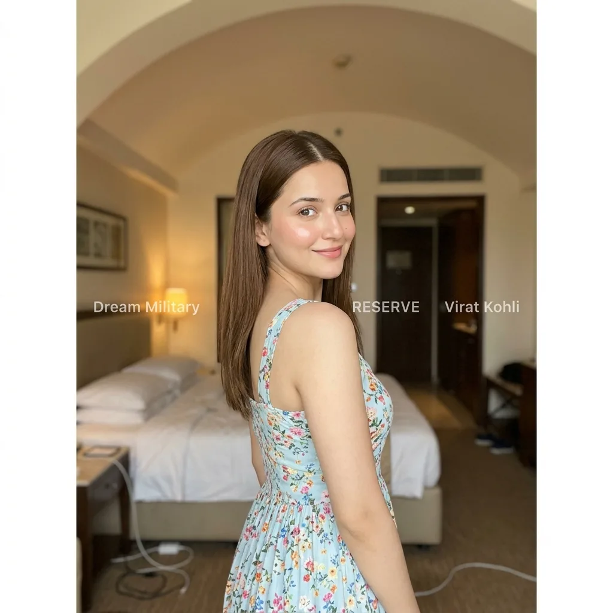

**#21 · Photography Prompt · <code>Vinano Image v2</code>**

<details>
<summary>Show prompt</summary>

```
Gemini 🍌
{
 "image_type": "photographic portrait",
 "orientation": "vertical",
 "framing": "medium shot",
 "composition": {
 "pose": "standing, torso angled away from camera head turned back over shoulder",
 "gesture": "arms relaxed, shoulders slightly raised creating a soft curve",
 "body_language": "playful, gentle confidence, approachable",
 "asymmetry": "dynamic asymmetry created by over-the-shoulder pose",
 "negative_space": "moderate negative space above head and around subject within interior setting"
 },
 "subject": {
 "count": 1,
 "gender_presentation": "female",
 "age_appearance": "teenager to young adult",
 "expression": "soft smile, relaxed facial muscles",
 "gaze": "direct eye contact camera",
 "hair": {
 "color": "medium to dark brown",
 "length": "long",
 "style": "straight, center-parted, tucked behind ears, smooth texture"
 },
 "skin": {
 "tone": "light",
 "texture": "smooth, natural, lightly retouched"
 }
 },
 "wardrobe_and_accessories": {
 "dress": {
 "type": "sleeveless floral dress",
 "base_color": "light blue",
 "pattern": "multicolor floral print",
 "fit": "fitted bodice gathered skirt",
 "fabric_appearance": "lightweight, soft, slightly matte"
 },
 "accessories": {
 "visible_jewelry": "none prominent",
 "hair_accessories": "none"
 }
 },
 "background": {
 "type": "interior room",
 "setting": "hotel or bedroom",
 "elements": ["bed white linens",
 "side tables",
 "lamp",
 "arched ceiling detail",
 "visible cables on floor"],
 "depth": "background moderately in focus, secondary to subject"
 },
 "lighting": {
 "style": "natural ambient indoor lighting",
 "direction": "soft frontal and side light",
 "contrast": "low",
 "shadows": "very soft, minimal shadowing on face and body",
 "highlights": "gentle highlights on cheeks, eyes, and hair",
 "lighting_quality": "warm, diffused"
 },
 "color_and_tone": {
 "color_mode": "color",
 "white_balance": "warm",
 "palette": "soft pastels and warm neutrals",
 "contrast_curve": "smooth low contrast",
 "mood": "warm, romantic, candid"
 },
 "camera_and_technical_traits": {
 "camera_distance": "close to medium",
 "lens_appearance": "wide to standard smartphone lens",
 "depth_of_field": "deep, subject and background mostly in focus",
 "sharpness": "high overall clarity",
 "grain": "minimal"
 },
 "artistic_style": {
 "genre": "lifestyle portrait",
 "aesthetic": "candid, feminine, casual elegance",
 "influences": "social media portraiture, lifestyle photography",
 "retouching_style": "light skin smoothing, natural color enhancement"
 },
 "overall_impression": {
 "tone": "friendly, youthful, charming",
 "visual_focus": "face and over-the-shoulder pose",
 "use_case": "social media content, lifestyle reference, casual portrait inspiration"
 },

 "trending_text_overlay": ["Dream Military",
 "RESERVE",
 "Virat Kohli"]
}

Keep edges clean and the overall composition balanced for a polished, gallery-ready result.
```

</details>

---

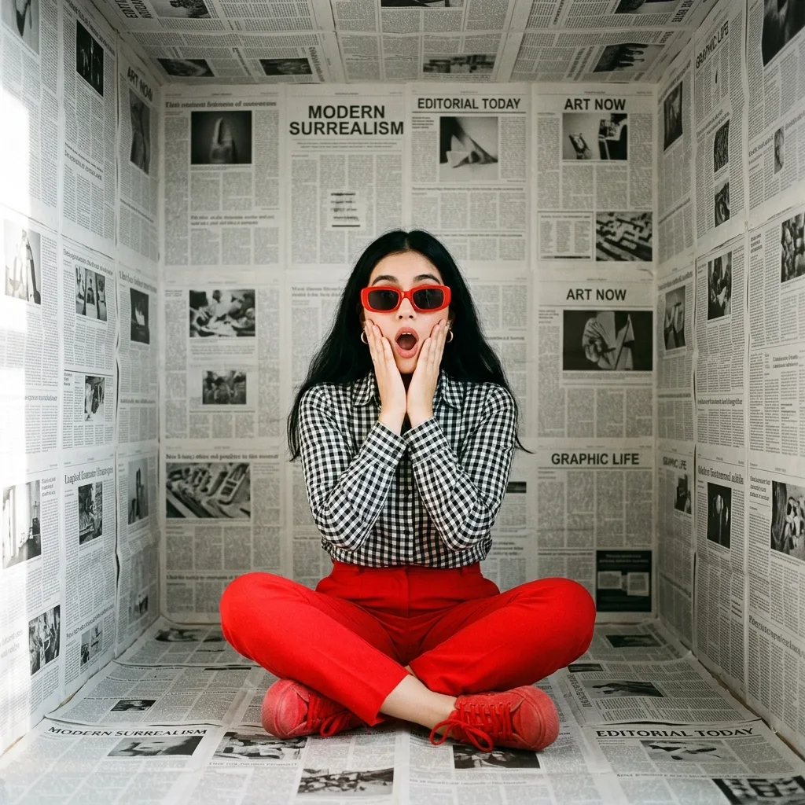

**#22 · Photography Prompt · <code>Vinano Image v2</code>**

<details>
<summary>Show prompt</summary>

```
{
 "Objective": "Create a stylized fashion portrait bold color contrast and a modern surreal editorial aesthetic",
 "PersonaDetails": {
 "Subject": {
 "Type": "Young woman",
 "Pose": "Sitting cross-legged",
 "Expression": "Dramatic surprise, hands holding cheeks, mouth slightly open",
 "Hair": "Long black hair framing the face",
 "Accessories": "Bold red sunglasses"
 }
 },
 "Wardrobe": {
 "Top": "Black-and-white checkered shirt",
 "Bottom": "Red pants",
 "Footwear": "Red sneakers",
 "ColorTheme": "Vibrant red contrasted against monochrome surroundings"
 },
 "SceneDescription": {
 "Environment": "Small enclosed room",
 "SurfaceTreatment": {
 "Walls": "Covered entirely in newspaper pages",
 "Floor": "Covered entirely in newspaper pages",
 "Ceiling": "Covered entirely in newspaper pages"
 },
 "Concept": "Monochrome newspaper textures creating a graphic, immersive backdrop"
 },
 "Composition": {
 "Framing": "Centered, symmetrical composition",
 "CameraAngle": "Straight-on",
 "Balance": "Strong geometric and visual symmetry",
 "Focus": "Sharp focus across subject and environment"
 },
 "LightingAndColor": {
 "Lighting": "Soft studio lighting",
 "ShadowQuality": "Clean, controlled shadows",
 "Contrast": "High contrast between black-and-white newspapers and red clothing",
 "ColorPalette": ["Black",
 "White",
 "Vibrant red"]
 },
 "ArtDirection": {
 "Style": "Editorial fashion photography",
 "Aesthetic": "Modern surrealism",
 "DetailLevel": "Crisp details high realism",
 "VisualImpact": "Graphic, bold, eye-catching"
 },
 "PhotographyStyle": {
 "Genre": "High-fashion editorial portrait",
 "ImageQuality": "Ultra-high resolution, 8K clarity",
 "Finish": "Clean, sharp, magazine-ready"
 },
 "Mood": {
 "Tone": "Playful shock, surreal curiosity",
 "Energy": "Bold, expressive, contemporary"
 },
 "NegativePrompt": ["uneven lighting",
 "blurred details",
 "busy color palette",
 "low contrast",
 "casual snapshot",
 "cartoon style",
 "vintage look"],
 "ResponseFormat": {
 "Type": "Single image",
 "Orientation": "Portrait",
 "AspectRatio": "2:3"
 }
}

Emphasise material texture and natural light so the final frame feels tactile and premium.
```

</details>

---

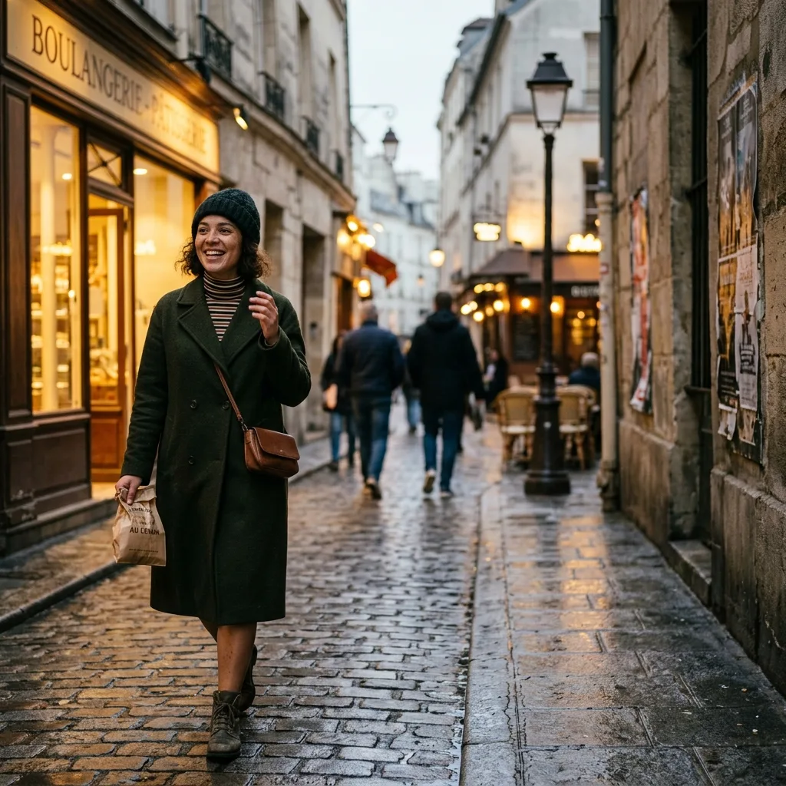

**#23 · Photography Prompt · <code>Vinano Image v2</code>**

<details>
<summary>Show prompt</summary>

```
{ "generation_request": { "meta_data": { "tool": "", "task_type": "photoreal_artistic_street_photography", "version": "v1.0_STREET_ART_REALISM_SER_EN", "priority": "highest" }, "output_settings": { "aspect_ratio": "4:5", "orientation": "portrait", "resolution_target": "ultra_high_res", "render_style": "ultra_photoreal_candid_film_still", "sharpness": "crisp_but_natural", "film_grain": "subtle_35mm", "color_grade": "restrained_cinematic_realism", "dynamic_range": "natural_not_hdr", "skin_rendering": "real_texture_no_retouch" }, "creative_prompt": { "scene_summary": "Candid artistic street photograph on location in [CITY/NEIGHBORHOOD]. A real, unposed moment that feels documentary and emotionally true.", "subject": "A [AGE] [GENDER] wearing [CLOTHING], caught mid-action: [MICRO-ACTION]. Natural facial expression, slight asymmetry preserved.", "camera": "35mm lens equivalent, eye-level, close but respectful distance, imperfect framing like a real street photographer, focus on the eyes, shallow-to-medium depth of field.", "lighting": "Motivated natural light from [SOURCE: shop window / street lamp / sunset / neon], deep but detailed shadows, no studio lighting.", "environment_details": "Street textures: worn posters, scratched metal, rain-speckled pavement, subtle reflections in glass, real urban clutter, no clean studio background.", "authenticity_markers": "Subtle motion blur on background only, slight halation on highlights, tiny film gate weave, realistic grain, no beauty retouch.", "mood": "[MOOD: melancholic / hopeful / tense / quiet joy], cinematic but believable." }, "negative_prompt": ["studio lighting", "beauty retouch", "plastic skin", "over-sharpened", "HDR", "AI glow", "perfect symmetry", "overly clean background", "fake bokeh shapes", "text", "logo", "watermark", "painterly", "cartoon"] } } Aim for an editorial, design-driven look with deliberate negative space.
```

</details>

---

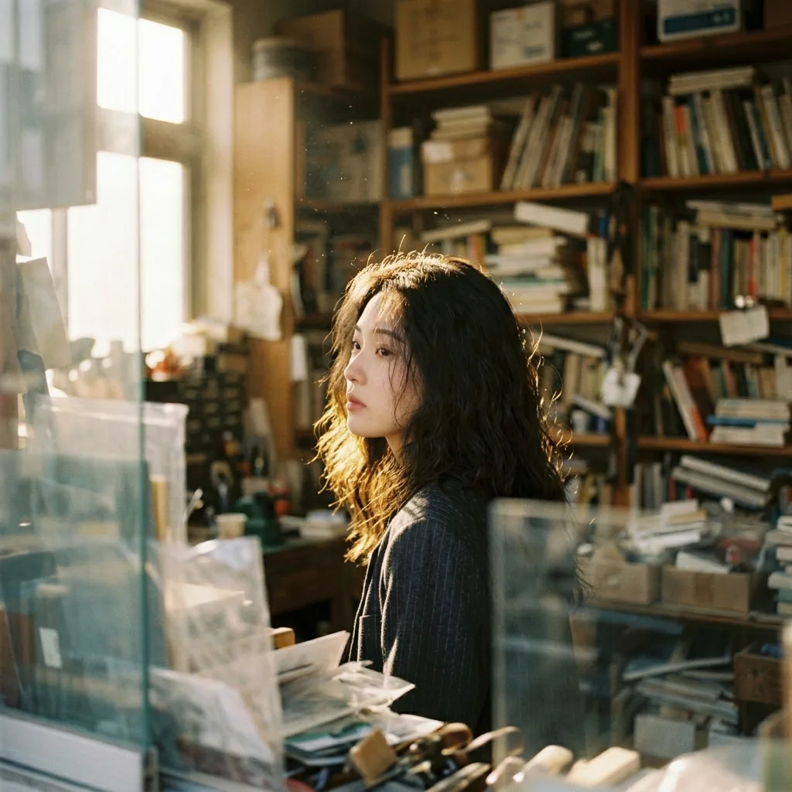

**#24 · Photography Prompt · <code>Vinano Image v2</code>**

<details>
<summary>Show prompt</summary>

```
{
 "subject": {
 "description": "Young East Asian woman, positioned in profile turning to look back at the viewer.",
 "pose": "Looking over shoulder, slight head tilt, body angled away from camera.",
 "expression": "Soft, neutral to slightly melancholic, contemplative gaze, lips slightly parted."
 },
 "clothing": {
 "upper_body": "Dark, structured jacket or blazer, possibly pinstriped or textured fabric.",
 "visibility": "Mostly obscured by shadow and foreground elements."
 },
 "hair": {
 "color": "Dark brown to black.",
 "style": "Long, loose, tousled waves, slightly messy texture.",
 "lighting_interaction": "Strongly backlit, creating a glowing halo effect on loose strands (rim lighting)."
 },
 "face": {
 "skin_tone": "Fair/pale warm undertones.",
 "features": "Soft facial structure, almond-shaped eyes, natural eyebrows.",
 "makeup": "Minimal, 'no-makeup' look, natural lip color."
 },
 "accessories": {
 "visible_items": "None clearly visible due to framing and lighting."
 },
 "environment": {
 "setting": "Cluttered interior space, resembling a workshop, storage room, or old bookstore.",
 "background_elements": "Wooden shelves stacked indistinct objects, papers, boxes, and plastic packaging.",
 "foreground_elements": "Blurred translucent objects (possibly glass, plastic sheets, or dust covers) creating layers and reflections."
 },
 "lighting": {
 "source": "Natural sunlight streaming through a window on the left.",
 "quality": "Golden hour, warm, diffuse but directional.",
 "effects": "Strong backlighting/rim lighting on hair, volumetric dust motes dancing in the light, lens flares, soft glare, dramatic contrast between light and shadow."
 },
 "camera": {
 "perspective": "Eye-level, shot through a foreground obstruction (glass or clutter).",
 "focus": "Shallow depth of field (bokeh), sharp focus on eyes/face, blurred background and foreground.",
 "lens_character": "Soft focus, film grain simulation, slight bloom effect."
 },
 "style": {
 "aesthetic": "Cinematic, atmospheric, nostalgic, slice-of-life, ethereal.",
 "mood": "Dreamy, intimate, quiet, sentimental.",
 "visual_reference": "Film photography, Japanese photobook style."
 }
}

Aim for an editorial, design-driven look with deliberate negative space.
```

</details>

---

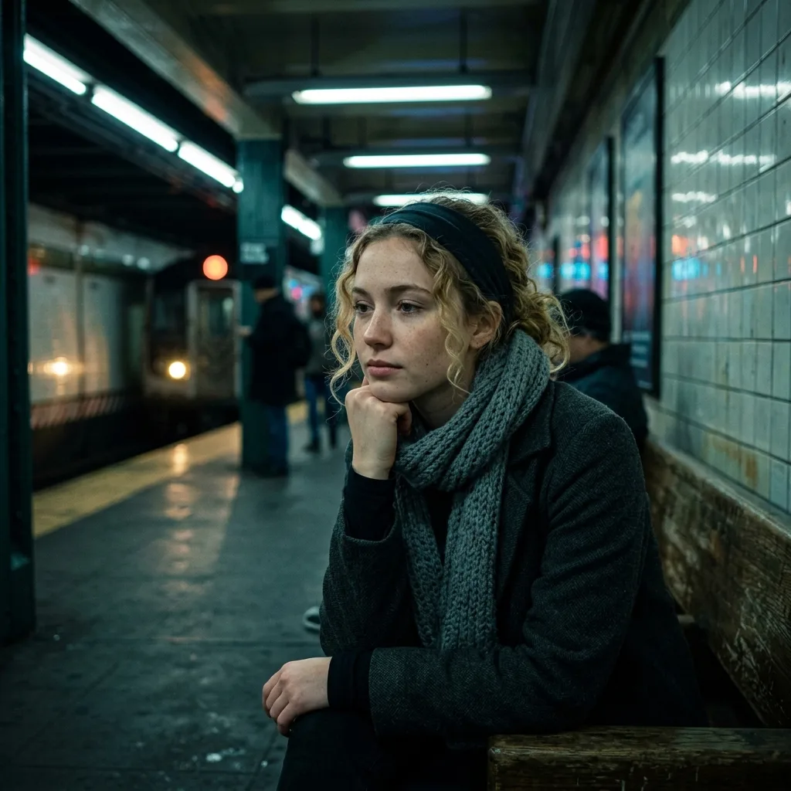

**#25 · Photography Prompt · <code>Vinano Image v2</code>**

<details>
<summary>Show prompt</summary>

```
{
 "Objective": "Create a moody cinematic portrait capturing quiet introspection on a subway platform at night",
 "PersonaDetails": {
 "Subject": {
 "Type": "Young woman",
 "Hair": {
 "Style": "Soft curly blonde hair loosely tied back",
 "Accessory": "Simple headband"
 },
 "FacialDetails": {
 "Freckles": "Natural, visible",
 "Expression": "Calm, introspective, emotionally reserved"
 },
 "Pose": "Seated on a subway bench, resting chin on her hand",
 "Gaze": "Looking slightly downward or into the distance"
 }
 },
 "Wardrobe": {
 "Outerwear": "Textured wool coat",
 "Accessories": "Knitted scarf",
 "ClothingStyle": "Muted, casual, understated urban wear"
 },
 "SceneDescription": {
 "Location": "Subway platform",
 "TimeOfDay": "Night",
 "Environment": {
 "Lighting": "Neon city lights along the platform",
 "Reflections": "Light reflections glowing on metal and tiled surfaces"
 }
 },
 "Composition": {
 "Framing": "Medium cinematic portrait",
 "DepthOfField": "Shallow depth of field",
 "Focus": "Sharp focus on subject dreamy background blur"
 },
 "LightingAndColor": {
 "Lighting": "Low-light ambient subway illumination",
 "ColorPalette": {
 "Primary": "Cool teal neon tones",
 "Secondary": "Warm amber highlights"
 },
 "Highlights": "Soft highlights controlled bloom",
 "ColorGrading": "Cinematic, film-inspired night tones"
 },
 "AtmosphericEffects": {
 "Bokeh": "Dreamy neon bokeh in background",
 "FilmGrain": "Subtle film grain for cinematic texture",
 "Mood": "Quiet, reflective, emotionally resonant"
 },
 "ArtDirection": {
 "Style": "Cinematic urban realism",
 "Aesthetic": "Film still / narrative photography",
 "DetailEmphasis": ["Natural skin texture",
 "Fabric texture",
 "Light reflections"]
 },
 "PhotographyStyle": {
 "Genre": "Low-light cinematic portrait photography",
 "LensLook": "85mm lens perspective",
 "RealismLevel": "Ultra-realistic",
 "Resolution": "8K detail"
 },
 "Theme": {
 "Concept": "Solitude and reflection in a modern city",
 "EmotionalTone": "Melancholic calm, quiet anticipation"
 },
 "NegativePrompt": ["harsh flash",
 "daylight",
 "posed glamour",
 "oversaturated colors",
 "plastic skin",
 "cartoon",
 "anime",
 "blurry subject"],
 "ResponseFormat": {
 "Type": "Single image",
 "Orientation": "Portrait",
 "AspectRatio": "2:3"
 }
}

Preserve realistic proportions and depth for a confident, professional finish.
```

</details>

---

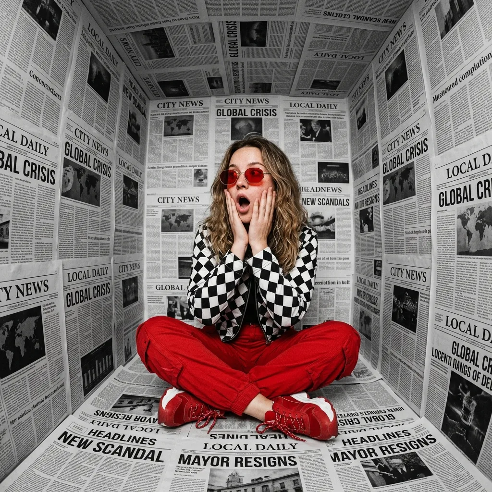

**#26 · Photography Prompt · <code>Vinano Image v2</code>**

<details>
<summary>Show prompt</summary>

```
Hyper-realistic editorial photo shot at eye level a 12mm ultra-wide lens, full-frame camera, deep focus, and visible barrel distortion curved room edges. A small rectangular room fully covered in real newspaper pages—walls, floor, and ceiling—showing crisp text, ink bleed, and paper texture.
A woman sits cross-legged on the floor, hands pressed to her cheeks, mouth in a shocked “O.” Long wavy hair, natural skin texture visible pores and subtle freckles. She wears red octagonal sunglasses, a black-and-white checkered harlequin jacket, vibrant red cargo pants, and matching chunky sneakers.
Soft, diffuse frontal lighting, minimal shadows. Cinematic high-contrast color grade, mostly black and white red as the only saturated accent, ultra-detailed, true-to-life photorealistic fashion photography.

Preserve realistic proportions and depth for a confident, professional finish.
```

</details>

---

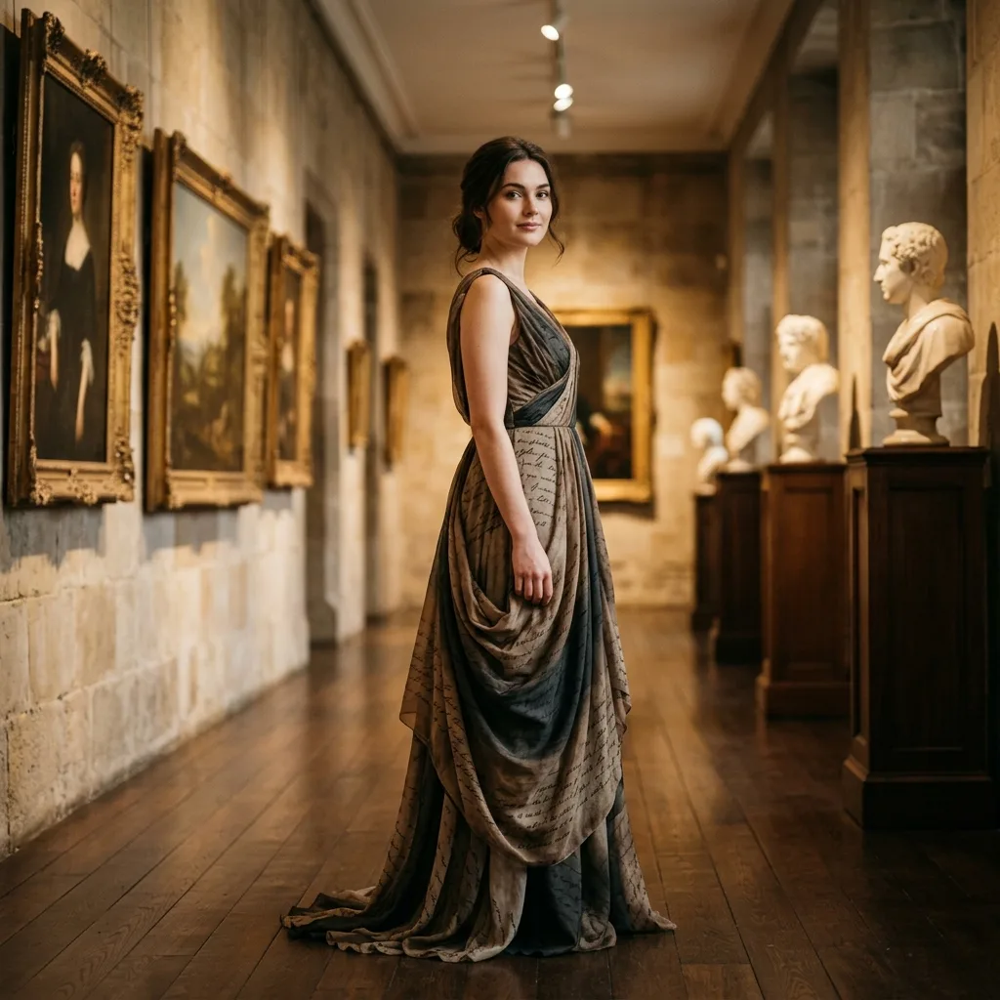

**#27 · Photography Prompt · <code>Vinano Image Pro</code>**

<details>
<summary>Show prompt</summary>

```
{
 "model": "",
 "scene": "Historic art gallery corridor classical sculptures and framed paintings",
 "subject": {
 "type": "Young woman",
 "pose": "Standing gracefully in three-quarter profile, body slightly turned, hands relaxed",
 "expression": "Soft, confident smile calm composure",
 "gaze": "Looking gently toward the camera",
 "emotion": "Elegance, quiet confidence, cultural presence"
 },
 "appearance": {
 "hair": {
 "color": "Dark brown",
 "style": "Pulled back neatly loose natural flow"
 },
 "skin": "Natural complexion, softly illuminated",
 "makeup": "Minimal, refined, classical"
 },
 "attire": {
 "dress": {
 "type": "Flowing couture-style gown",
 "design": "Layered fabric panels printed handwritten script",
 "colors": "Muted sepia, charcoal, parchment tones",
 "texture": "Soft, draped fabric subtle sheen"
 },
 "style_note": "Literary, artistic, museum-worthy fashion"
 },
 "environment": {
 "location": "Old stone-walled museum or gallery hall",
 "floor": "Polished wooden floorboards",
 "background_elements": ["Classical bust sculptures on pedestals",
 "Large framed paintings along stone walls"],
 "atmosphere": "Quiet, reverent, timeless"
 },
 "lighting": {
 "primary": "Warm gallery spotlights from above",
 "secondary": "Soft ambient lighting along the corridor",
 "effect": "Gentle highlights on fabric folds and face, deep background shadows"
 },
 "camera": {
 "angle": "Eye-level full-body portrait",
 "lens": "50mm cinematic portrait lens",
 "depth_of_field": "Shallow to moderate, subject crisp softly blurred background",
 "framing": "Vertical composition emphasizing height and elegance"
 },
 "color_palette": {
 "dominant": ["warm amber", "aged parchment brown"],
 "accents": ["deep charcoal", "golden highlights"]
 },
 "mood": "Timeless, cultured, graceful",
 "style": {
 "aesthetic": "Fine-art fashion photography",
 "inspiration": "Classical art, literature, museum couture",
 "realism": "true-to-life photorealistic",
 "texture": "Visible fabric grain, stone wall detail",
 "post_processing": "Warm cinematic grading, subtle vignette, gentle contrast"
 },
 "details": {
 "fabric_motion": "Soft drape pooling naturally on the floor",
 "background_depth": "Long corridor perspective enhancing grandeur",
 "motion": "Still, poised moment"
 },
 "themes": ["Art and identity",
 "Fashion as language",
 "Timeless beauty",
 "Human presence within history"],
 "quality": "Ultra-detailed, high dynamic range, professional cinematic fine-art portrait"
}

Keep edges clean and the overall composition balanced for a polished, gallery-ready result.
```

</details>

---

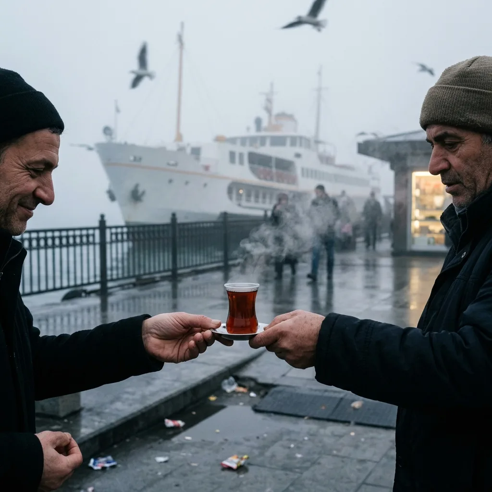

**#28 · Photography Prompt · <code>Vinano Image v2</code>**

<details>
<summary>Show prompt</summary>

```
{
 "output_settings": {
 "aspect_ratio": "4:5",
 "orientation": "portrait",
 "resolution_target": "ultra_high_res",
 "render_style": "ultra_photoreal_candid_street_film_still",
 "sharpness": "crisp_but_natural",
 "film_grain": "subtle_35mm",
 "color_grade": "restrained_cinematic_realism",
 "dynamic_range": "natural_not_hdr",
 "skin_rendering": "real_texture_no_retouch"
 },
 "global_rules": {
 "camera_language": "35mm lens equivalent, eye-level, imperfect framing, candid documentary feel, focus on eyes when a person is present",
 "authenticity_markers": "subtle halation on highlights, tiny film gate weave, slight background motion blur only, realistic street clutter, no studio look",
 "lighting_language": "motivated natural light only (shop window, street lamp, overcast daylight, sunset), deep but detailed shadows"
 },
 "negative_prompt": ["studio lighting",
 "beauty retouch",
 "plastic skin",
 "over-sharpened",
 "HDR",
 "AI glow",
 "perfect symmetry",
 "overly clean background",
 "fake bokeh",
 "text",
 "logo",
 "watermark",
 "cartoon",
 "painterly"]
}
{
 "scene_summary": "Early morning in Eminönü, ferry docks, soft fog and breath in cold air, documentary street realism.",
 "subject": "Tea vendor handing a steaming tea glass to a customer, candid moment.",
 "micro_action": "steam rising as fingers touch the glass, tiny smile",
 "environment_details": "ferry silhouette in mist, seagulls blurred in background, wet railings, puddles",
 "lighting": "soft morning light diffused by fog, highlights subtle halation"
}

Keep edges clean and the overall composition balanced for a polished, gallery-ready result.
```

</details>

---

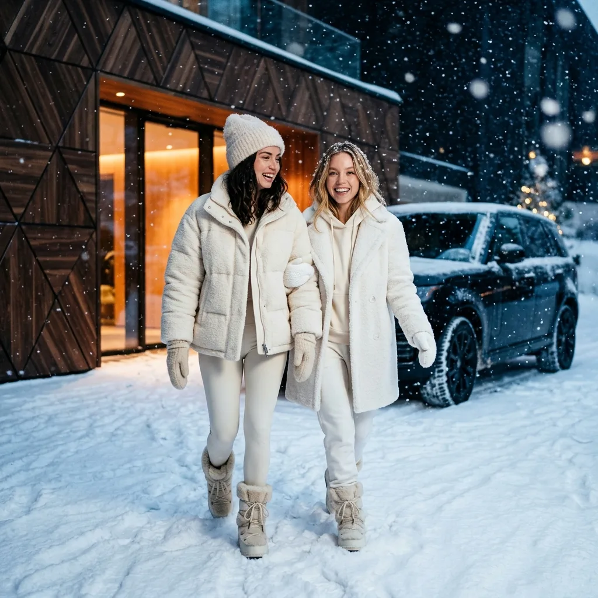

**#29 · Photography Prompt · <code>Vinano Image v2</code>**

<details>
<summary>Show prompt</summary>

```
Ana de Armas
Sydney Sweeney Picture

Gemini

Prompt:
{
 "image_generation_request": {
 "aspect_ratio": "3:4",
 "style": "Cinematic Fashion Photography",
 "quality": "8K / Ultra-High Detail",
 "subject": {
 "identity": "Young adult woman, Shakira-inspired likeness",
 "pose": {
 "description": "Dynamic balletic stance, spontaneous and joyful",
 "position": "Balancing on one leg, other leg bent and lifted high, body slightly tilted",
 "arms": "One arm raised catching snowflakes open palm, other arm following the flow of movement"
 },
 "expression": {
 "mood": "Genuinely happy and lively",
 "features": "Wide natural smile, slightly parted lips, eyes sparkling emotion, cheeks flushed from cold"
 },
 "physical_details": {
 "skin": "Realistic texture, fine pores, subtle asymmetry, soft highlights, no plastic smoothing",
 "hair": "Long dark hair flowing from beanie, damp strands clinging to cheeks/forehead from melting snow"
 }
 },
 "apparel": {
 "theme": "Monochrome creamy-white winter look",
 "layers": [{
 "item": "Oversized puffer jacket",
 "details": "Thick creamy-white, fluffy texture, visible stitching, realistic down volume and compression folds"
 },
 {
 "item": "Cropped hoodie",
 "details": "Creamy-white soft cotton, gentle wrinkles, worn underneath jacket"
 },
 {
 "item": "High-waisted leggings",
 "details": "Matte stretch fabric, creamy-white, subtle tension at knees and hips"
 }],
 "accessories": [{
 "item": "Knit beanie",
 "details": "Extra-fluffy, visible yarn texture, creamy-white"
 },
 {
 "item": "Mittens",
 "details": "Long creamy-white fluffy fibers, catching falling snowflakes"
 }],
 "footwear": {
 "style": "Moon-boot inspired lace-up winter boots",
 "details": "White fur-lined, realistic rubber soles, snow buildup around the edges"
 }
 },
 "environment": {
 "setting": "Nighttime exterior of a modern luxury building",
 "architecture": "Sharp geometric wood triangular patterns",
 "props": "Black luxury SUV parked nearby, partially covered in frost and snow",
 "ground": "Thick uneven snow blanket visible footprints and compression points",
 "weather": "Heavy dense snowfall, large snowflakes frozen in mid-motion slight blur"
 },
 "lighting_and_atmosphere": {
 "primary_lighting": "Cold blue-white ambient winter light",
 "secondary_lighting": "Warm orange glow from building interior/windows",
 "visual_effects": ["Cinematic color separation",
 "Soft bokeh highlights in background",
 "Shallow depth of field",
 "Reflections softened by frost"]
 },
 "technical_specs": {
 "camera": "Full-frame DSLR/Mirrorless",
 "lens": "50mm–85mm prime lens aesthetic",
 "optics": "Natural perspective, high dynamic range (HDR), realistic exposure",
 "post_processing": "Authentic textures, no over-sharpening, cinematic realism"
 }
 }

Render with rich micro-detail while keeping the layout uncluttered and intentional.
```

</details>

---

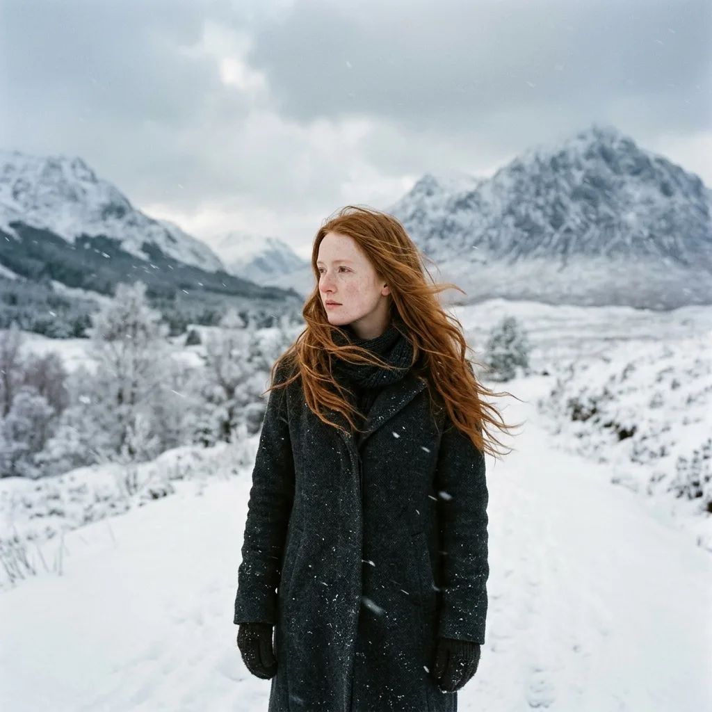

**#30 · Photography Prompt · <code>Vinano Image v2</code>**

<details>
<summary>Show prompt</summary>

```
A poetic cinematic portrait of a young woman standing alone in a vast snowy landscape, surrounded by distant frost-covered mountains. Her long auburn hair is caught mid-motion by strong winter wind, strands flowing naturally across her face. She wears a dark wool coat, minimal makeup, pale freckled skin, and a quiet, introspective expression. Soft snowfall drifts through the air. Muted natural color palette cold greys, soft whites, and warm copper hair tones. Shallow depth of field, natural diffused daylight, overcast sky, fine film grain, subtle motion blur in hair and snow, cinematic realism, emotional storytelling, editorial photography, 85mm lens look, ultra-detailed, moody atmosphere, high realism, 8k quality, 4:5 image ratio Maintain consistent colour harmony and crisp focus across the whole frame.
```

</details>

---

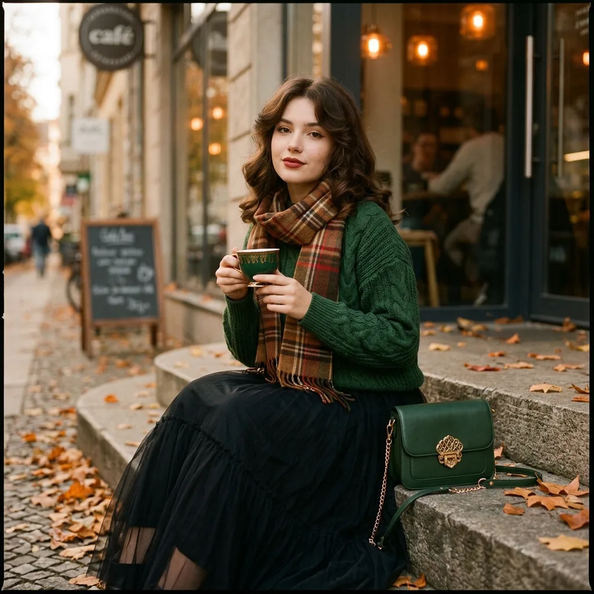

**#31 · Photography Prompt · <code>Vinano Image v2</code>**

<details>
<summary>Show prompt</summary>

```
{
 "image_generation_prompt": "Aesthetic 1970s-inspired fashion portrait of a stylish young woman sitting on outdoor cafe steps, holding a premium ornate green coffee cup gold rim detailing, gazing softly at the camera. Her hair is styled in soft loose strands framing her face vintage makeup, matte red lips, and subtle eyeliner. She is wearing a cozy forest green premium knit sweater paired a long flowing black tutu skirt. A warm vintage plaid scarf in earthy brown, burnt orange, and muted red tones is wrapped loosely around her neck. A premium dark green leather crossbody bag a gold filigree clasp and chain strap is placed beside her. Autumn street café setting scattered fallen leaves and warm amber café lights glowing behind glass windows. 1970s film tone, warm grainy texture, muted earthy color palette, cinematic atmosphere, shallow depth of field, soft natural lighting, analog film look, fashion editorial photography, ultra-realistic, high detail, 85mm lens, f/1.8, vintage aesthetic, dreamy mood."
}

Keep edges clean and the overall composition balanced for a polished, gallery-ready result.
```

</details>

---

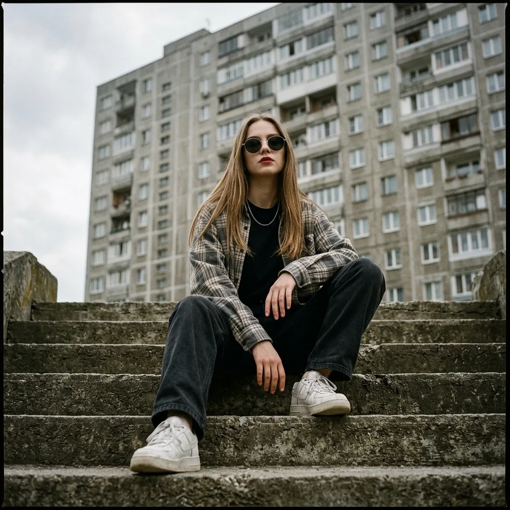

**#32 · Photography Prompt · <code>Vinano Image Pro</code>**

<details>
<summary>Show prompt</summary>

```
{
 "subject": "Young woman sitting casually on outdoor concrete stairs, posing a cool, confident demeanor.",
 "clothing": "Oversized grey and beige plaid flannel shirt worn open, plain black crew-neck t-shirt underneath, loose-fitting dark trousers, chunky white sneakers.",
 "hair": "Long, straight light brown hair a middle part, falling naturally over the shoulders.",
 "face": "Neutral, poised expression defined red lips, eyes concealed behind sunglasses.",
 "accessories": "Round dark sunglasses thin metal frames, simple silver chain necklace.",
 "environment": "Urban setting a tall, grey concrete apartment block featuring a grid of windows in the background, weathered concrete steps in the foreground.",
 "lighting": "Soft, diffuse natural daylight indicative of an overcast sky, creating even illumination without harsh shadows.",
 "camera": "Low-angle shot looking up at the subject, emphasizing the height of the background building, sharp focus on the subject a slightly softened background.",
 "style": "Urban streetwear photography, 90s grunge aesthetic, moody and atmospheric, cinematic vertical composition."
}

Preserve realistic proportions and depth for a confident, professional finish.
```

</details>

---

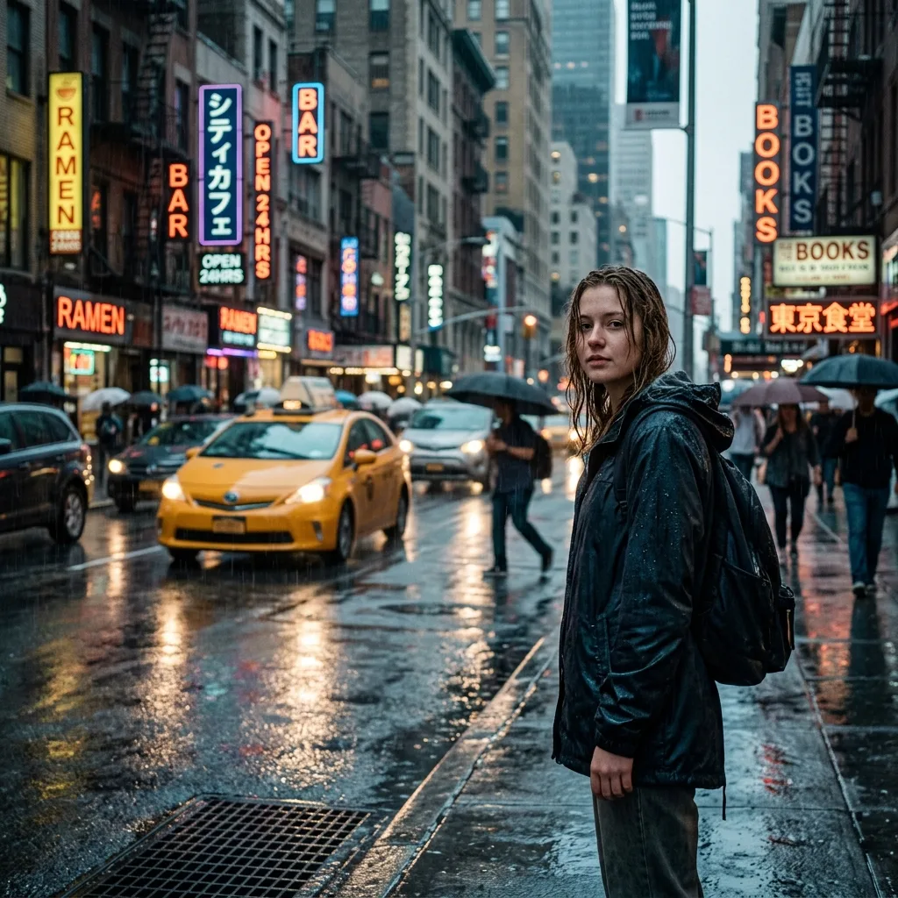

**#33 · Photography Prompt · <code>Vinano Image Pro</code>**

<details>
<summary>Show prompt</summary>

```
{
 "project_type": "cinematic_image",
 "title": "Rain Doesn’t Pause the City",
 "creative_direction": {
 "genre": "cinematic urban realism",
 "influences": ["modern street photography",
 "neo-noir cinema",
 "documentary realism",
 "architectural urban mood"],
 "emotion": ["quiet loneliness",
 "introspection",
 "urban solitude",
 "calm under pressure"]
 },
 "scene": {
 "environment": "dense city street",
 "architecture": "mid-rise commercial buildings neon signage",
 "time_of_day": "early evening, blue hour",
 "weather": {
 "type": "heavy rain",
 "details": "visible raindrops, wet surfaces, rain streaks in the air"
 },
 "ground": "wet asphalt reflective puddles"
 },
 "subject": {
 "type": "single human subject",
 "description": "young woman standing alone on the sidewalk",
 "pose": "stationary, body angled slightly away from the camera, head turned toward lens",
 "expression": "neutral, distant, introspective",
 "wardrobe": {
 "outerwear": "dark hooded rain jacket",
 "accessories": ["backpack"],
 "condition": "rain-soaked fabric, visible droplets"
 },
 "physical_details": {
 "hair": "wet, slightly messy, framing the face",
 "skin": "natural texture, no heavy retouching"
 }
 },
 "background": {
 "elements": ["yellow taxi headlights on",
 "blurred moving traffic",
 "pedestrians holding umbrellas",
 "neon shop signs in multiple languages"],
 "depth": "deep urban perspective layered visual elements",
 "motion_effect": "subtle motion blur on vehicles and pedestrians"
 },
 "cinematography": {
 "camera_type": "full-frame digital cinema camera",
 "lens": "35mm prime",
 "aperture": "wide open for shallow depth of field",
 "focus": "sharp focus on subject, background softly defocused",
 "camera_position": "eye-level, street perspective",
 "movement": "static frame, background motion creates contrast"
 },
 "lighting": {
 "primary_source": "ambient city lighting",
 "secondary_sources": ["vehicle headlights",
 "neon signs",
 "storefront lights"],
 "lighting_style": "soft, diffused, natural",
 "contrast": "moderate, cinematic"
 },
 "color_grading": {
 "palette": ["cool blues", "teal shadows", "warm amber highlights"],
 "saturation": "controlled, muted",
 "black_levels": "slightly lifted for filmic look",
 "highlights": "soft roll-off"
 },
 "post_processing": {
 "film_grain": "subtle, cinematic",
 "sharpness": "subject emphasized, background softened",
 "noise": "minimal, natural",
 "vignette": "very subtle"
 },
 "visual_style": {
 "realism": "high",
 "aesthetic": "moody, atmospheric, modern",
 "inspiration_keywords": ["cinematic rain",
 "urban isolation",
 "street realism",
 "architectural mood"]
 },
 "output_quality": {
 "resolution": "high",
 "dynamic_range": "high",
 "detail_priority": "subject and environment textures preserved"
 },
 "usage": {
 "platform": "social media / X",
 "intent": "artistic storytelling, cinematic visual identity",
 "reusability": "modular prompt structure"
 }
}

Preserve realistic proportions and depth for a confident, professional finish.
```

</details>

---

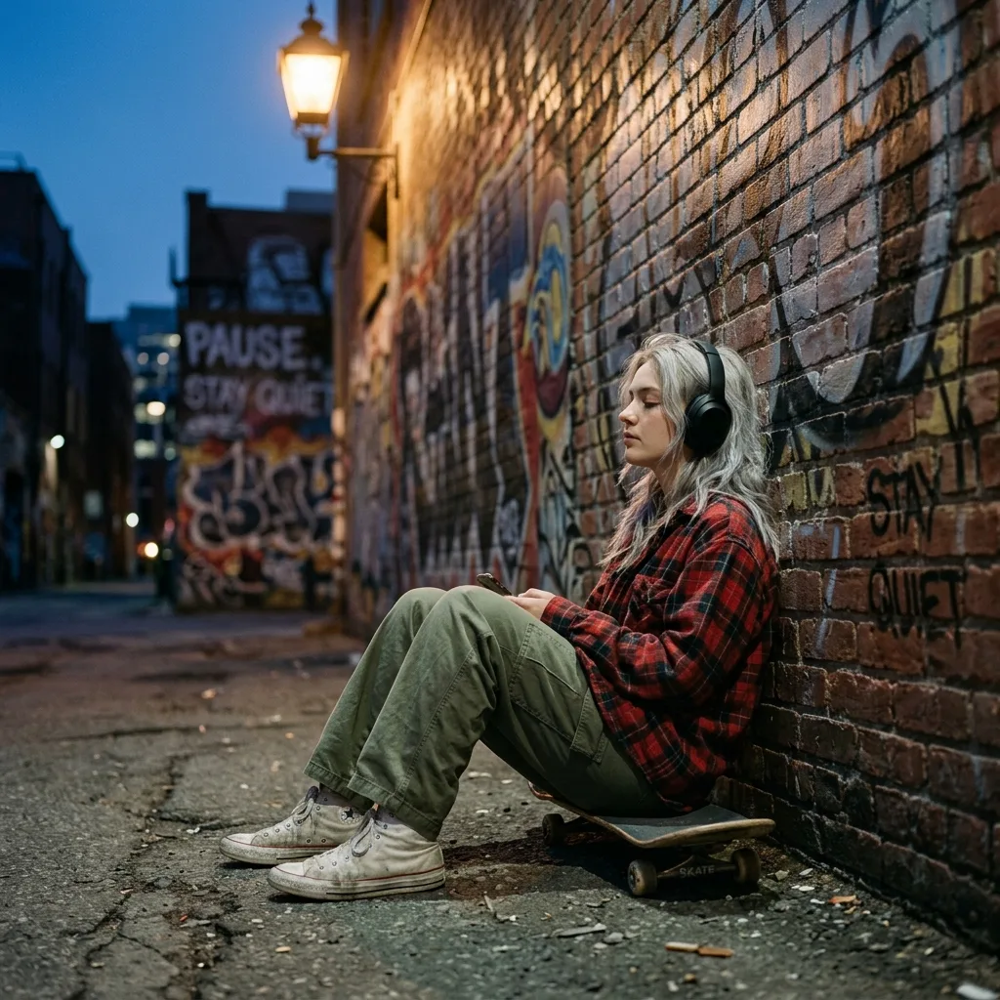

**#34 · Photography Prompt · <code>Vinano Image v2</code>**

<details>
<summary>Show prompt</summary>

```
{
 "model": "",
 "scene": "Urban street corner at dusk beside a brick wall covered in graffiti",
 "subject": {
 "type": "Young woman",
 "pose": "Sitting on a skateboard knees bent, back resting against a brick wall",
 "expression": "Calm, introspective, slightly distant",
 "gaze": "Eyes gently closed or lowered, absorbed in music",
 "emotion": "Stillness, reflection, quiet detachment"
 },
 "appearance": {
 "hair": {
 "color": "Silver-blonde",
 "style": "Loose, slightly tousled"
 },
 "accessories": "Over-ear black headphones",
 "skin": "Natural tone soft evening light"
 },
 "attire": {
 "top": "Oversized plaid flannel shirt",
 "bottoms": "Loose cargo pants",
 "footwear": "Worn white sneakers",
 "style_note": "Relaxed streetwear, functional and unstyled"
 },
 "environment": {
 "location": "City alley or side street",
 "background": "Brick wall faded graffiti art",
 "props": ["Skateboard leaning against the wall",
 "Street lamp mounted above"],
 "atmosphere": "Urban, quiet, end-of-day calm"
 },
 "lighting": {
 "primary": "Warm street lamp light",
 "secondary": "Soft natural twilight",
 "effect": "Golden highlights on brick texture, gentle shadows"
 },
 "camera": {
 "angle": "Low-angle three-quarter view",
 "lens": "35mm cinematic lens",
 "depth_of_field": "Moderate, subject in focus softly blurred background",
 "framing": "Vertical composition emphasizing street depth and wall lines"
 },
 "color_palette": {
 "dominant": ["warm brick red", "muted olive", "soft amber"],
 "accents": ["cool gray", "faded graffiti tones"]
 },
 "mood": "Urban, introspective, grounded",
 "style": {
 "aesthetic": "Cinematic street photography",
 "realism": "true-to-life photorealistic",
 "texture": "Rough brick, worn asphalt, fabric folds",
 "post_processing": "Warm highlights slightly muted saturation"
 },
 "details": {
 "ground": "Rough asphalt small debris",
 "board": "Scuffed skateboard deck showing use",
 "motion": "Still frame, no action or blur"
 },
 "themes": ["Urban solitude",
 "Music as escape",
 "Youth and pause",
 "Belonging without noise"],
 "quality": "Ultra-detailed, high dynamic range, professional cinematic street portrait"
}

Aim for an editorial, design-driven look with deliberate negative space.
```

</details>

---

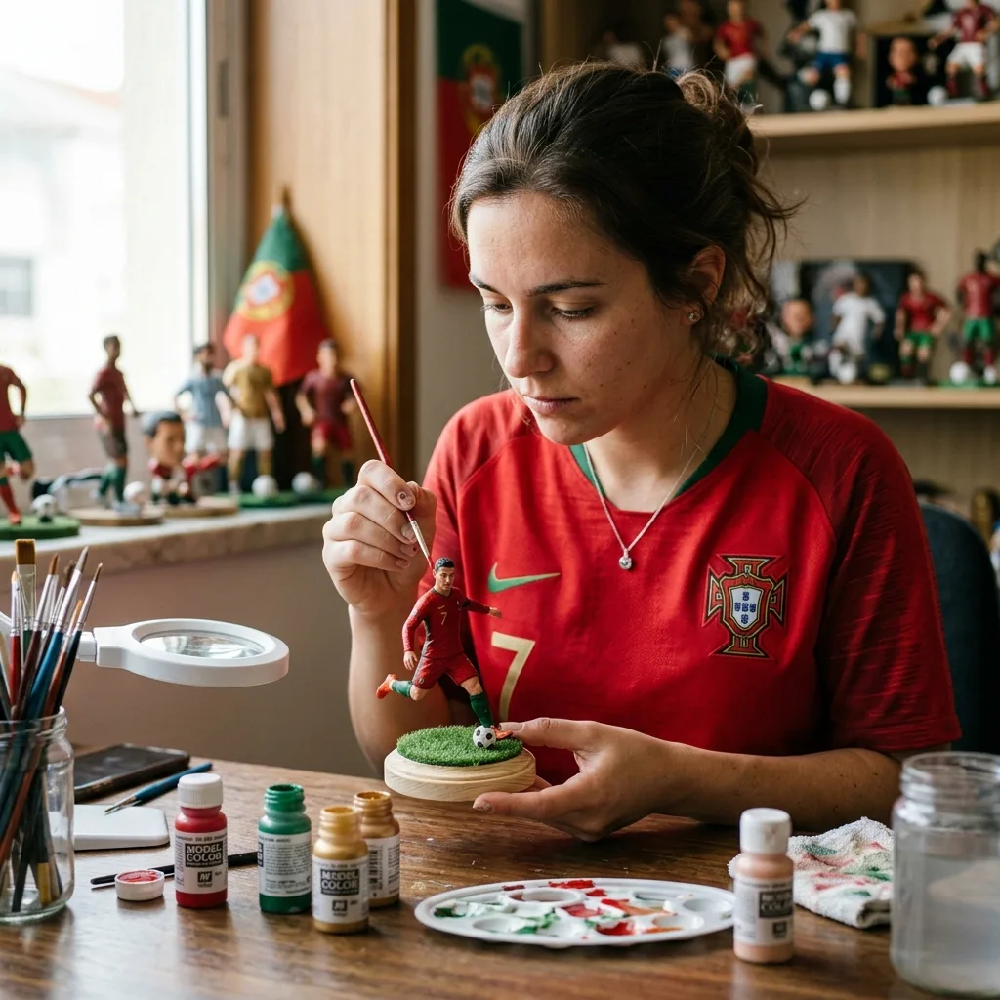

**#35 · Photography Prompt · <code>Vinano Image v2</code>**

<details>
<summary>Show prompt</summary>

```
A hyper-realistic cinematic scene of a woman carefully painting a miniature football figurine of Cristiano Ronaldo in a Portugal national team jersey. The tiny footballer is frozen mid-dribble the ball at his feet, standing on a round grass base placed on a wooden desk. The woman wears a matching red Portugal jersey and focuses intently while holding a fine paintbrush near the figure’s face. Soft natural window light creates warm highlights and gentle shadows, shallow depth of field a blurred shelf of collectibles in the background. Ultra-detailed textures on fabric, skin, and paint strokes, true-to-life photorealistic scale illusion, cinematic storytelling composition, premium studio realism, 50mm lens look, high-end editorial mood Emphasise material texture and natural light so the final frame feels tactile and premium.
```

</details>

---

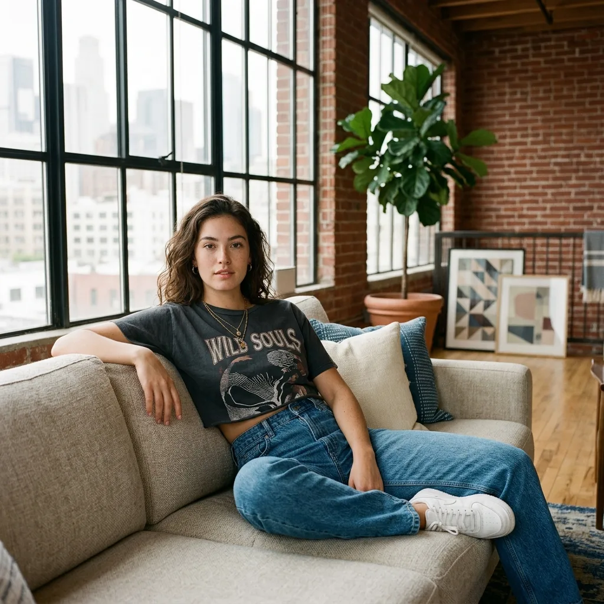

**#36 · Photography Prompt · <code>Vinano Image v2</code>**

<details>
<summary>Show prompt</summary>

```
{
 "model": "",
 "scene": "Modern loft living room large industrial windows",
 "subject": {
 "type": "Young woman",
 "pose": "Reclining casually on a fabric sofa, one arm resting along the backrest, legs relaxed",
 "expression": "Calm, self-assured, quietly confident",
 "gaze": "Direct eye contact the camera",
 "emotion": "Ease, confidence, natural presence"
 },
 "appearance": {
 "hair": {
 "color": "Dark brown",
 "style": "Loose, long waves natural volume"
 },
 "skin": "Natural complexion subtle freckles and realistic texture",
 "makeup": "Minimal, clean, natural tones"
 },
 "attire": {
 "top": "Vintage-style cropped graphic t-shirt",
 "bottoms": "High-waisted relaxed-fit blue jeans",
 "footwear": "White casual sneakers",
 "accessories": ["Layered gold necklaces"],
 "style_note": "Effortless modern street-lifestyle fashion"
 },
 "environment": {
 "location": "Urban loft apartment",
 "background": ["Exposed brick walls",
 "Large black-framed windows",
 "City skyline softly visible outside",
 "Indoor potted plant",
 "Abstract framed artwork leaning against walls"],
 "atmosphere": "Airy, contemporary, lived-in"
 },
 "lighting": {
 "primary": "Soft natural daylight from large windows",
 "effect": "Balanced illumination gentle facial shadows",
 "contrast": "Low to moderate, natural realism"
 },
 "camera": {
 "angle": "Eye-level lifestyle portrait",
 "lens": "35mm lifestyle lens",
 "depth_of_field": "Moderate, subject in focus softly blurred background",
 "framing": "Horizontal composition, relaxed editorial framing"
 },
 "color_palette": {
 "dominant": ["neutral beige", "denim blue"],
 "accents": ["warm skin tones", "muted green", "soft brick red"]
 },
 "mood": "Relaxed, confident, contemporary",
 "style": {
 "aesthetic": "Lifestyle editorial photography",
 "realism": "true-to-life photorealistic",
 "texture": "Visible denim grain, fabric upholstery detail",
 "post_processing": "Natural color grading, subtle warmth, no heavy filters"
 },
 "details": {
 "sofa": "Light neutral fabric couch soft texture",
 "windows": "Tall industrial-style windows diffused city light",
 "motion": "Still, candid moment"
 },
 "themes": ["Modern femininity",
 "Comfort and confidence",
 "Everyday luxury",
 "Authentic presence"],
 "quality": "Ultra-detailed, high dynamic range, professional lifestyle photography"
}

Maintain consistent colour harmony and crisp focus across the whole frame.
```

</details>

---

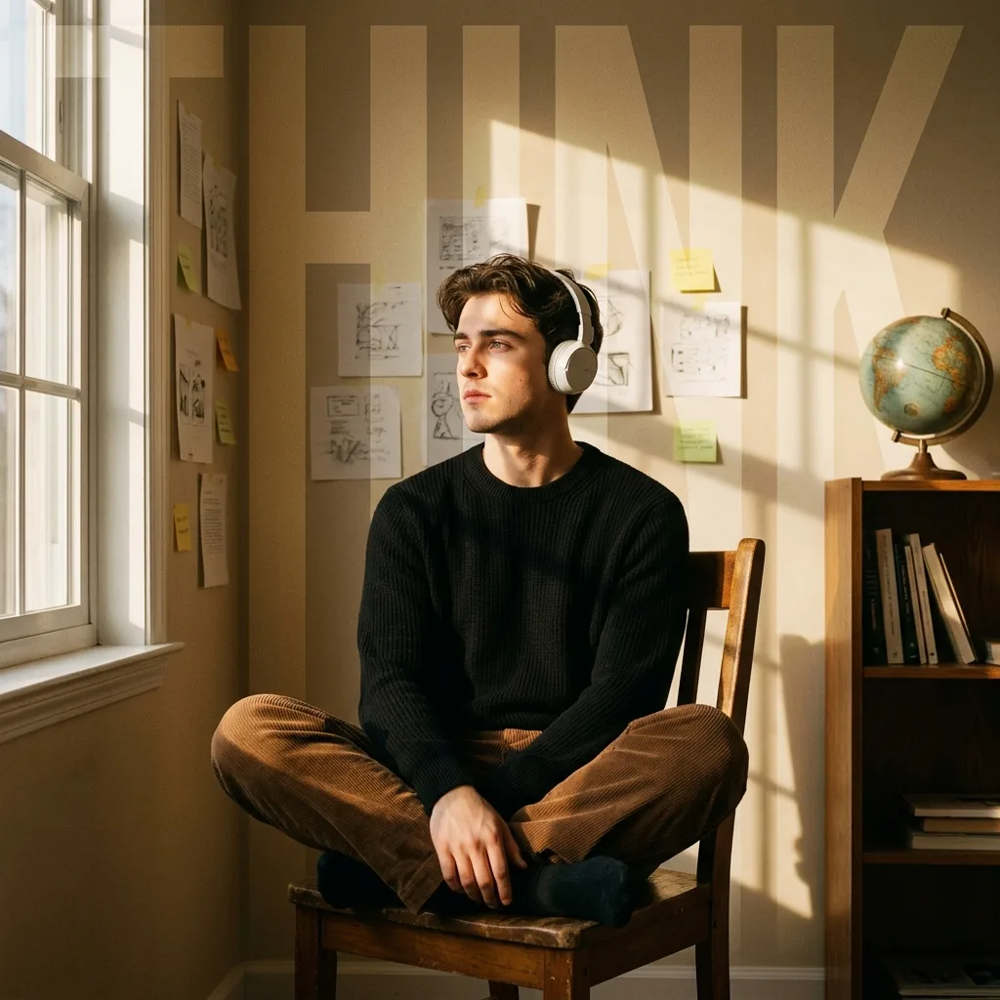

**#37 · Photography Prompt · <code>Vinano Image Pro</code>**

<details>
<summary>Show prompt</summary>

```
A cinematic portrait of a young man in the uploaded image sitting cross-legged on a simple wooden chair, wearing white over-ear headphones and gazing thoughtfully toward the light. He is wearing black sweater and brown trousers. He is in a cozy study room; the background features a beige wall cluttered taped papers and sticky notes, a wooden bookshelf and a globe visible on the right. Warm, golden-hour sunlight streams in from the left, casting distinct, sharp grid-like window shadows across the subject and the back wall. A large, semi-transparent, faded typography overlay of the word "THINK" blends vertically into the scene behind him. The atmosphere is moody, nostalgic, and warm, a soft film grain texture. Keep edges clean and the overall composition balanced for a polished, gallery-ready result.
```

</details>

---

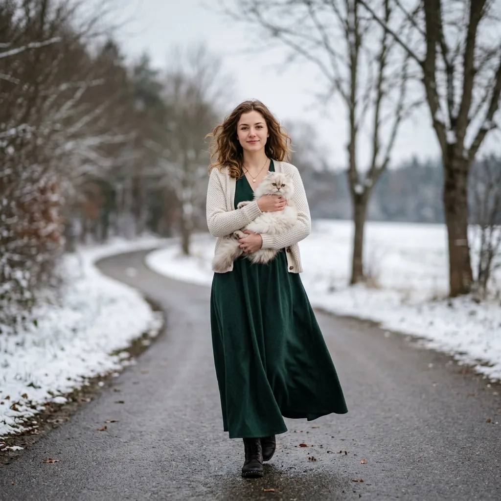

**#38 · Photography Prompt · <code>Vinano Image v2</code>**

<details>
<summary>Show prompt</summary>

```
portrait of a young woman in her early 20s walking calmly on a beautiful road, holding a small Persian cat gently in her arms, candid natural pose, elegant flowing dress, soft graceful expression, winter cloudy day, cinematic atmosphere, good lighting fully focused on her, shallow depth of field, background softly blurred, realistic textures, detailed skin, high-resolution, natural colors, soft diffused light, subtle bokeh, professional photography, 85mm lens look

--style realistic --quality high --ar 3:4 --v 6

Maintain consistent colour harmony and crisp focus across the whole frame.
```

</details>

---

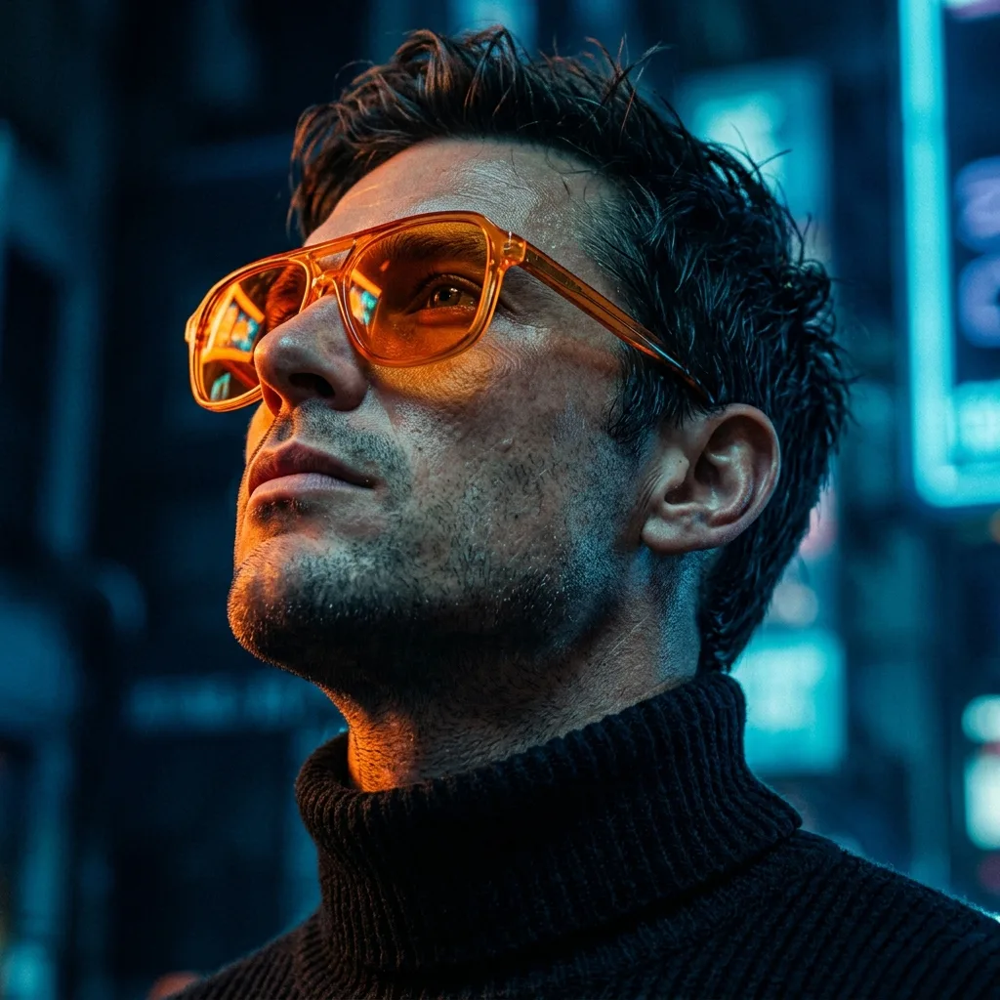

**#39 · Photography Prompt · <code>Vinano Image v2</code>**

<details>
<summary>Show prompt</summary>

```
A man, likely in his early thirties facial proportions, structure, and overall appearance inspired by the reference, captured in full sharp detail and natural skin texture,
hyper-detailed, cinematic close-up profile portrait, vertical orientation, extreme low-angle (worm's-eye view), focusing on the face from the neck up. The man gazes upward a serious, intense expression. He has dark, short, slightly tousled hair, catching subtle highlights. His facial features are sharply defined, a strong jawline and natural stubble. Skin texture is realistic, showing pores, subtle imperfections, and natural subsurface scattering.
Clothing & Accessories:
He wears a high-collared, dark turtleneck that absorbs light, creating a strong contrast against the illuminated face. He has large, round, retro-futuristic sunglasses thick, transparent or light-colored frames and intensely bright orange lenses. The sunglasses reflect the ambient and primary lighting naturally.
Lighting & Color:
Extreme, high-contrast neon lighting complementary color scheme. Primary light is intense, warm orange/amber emanating from the sunglasses direction, illuminating the nose bridge, cheekbones, and frame edges. Secondary ambient light is cool cyan-blue, providing deep backlight and shadow fill. Shadows are deep indigo and ultramarine, producing strong chiaroscuro, the subject’s face partially obscured by cool shadows but punctuated warm orange highlights. Volumetric light subtly interacts hair and glasses for realism.
Composition & Perspective:
Low-angle close-up emphasizing upward gaze, strong jawline, and facial structure. Solid cyan-blue background ensures the subject stands out, crisp composition and dramatic silhouette. Shallow depth of field isolates the face and sunglasses.
Artistic Style & Mood:
Hyper-realistic, cinematic, true-to-life photorealistic editorial portrait cyberpunk, neo-noir, and 80s synthwave aesthetic. Mood is intense, mysterious, and high-fashion.
Technical Details:
Ultra-high resolution, 8K, sharp focus on facial features and sunglasses, realistic skin rendering quality, natural subsurface scattering, realistic fabric texture, volumetric and rim lighting, cinematic color grading.
Negative Prompts:
cartoon, painting, sketch, 3D render, CGI, plastic skin, blurry, low quality, feminine traits, excessive makeup, watermark, text, unrealistic exaggeration.

Preserve realistic proportions and depth for a confident, professional finish.
```

</details>

---

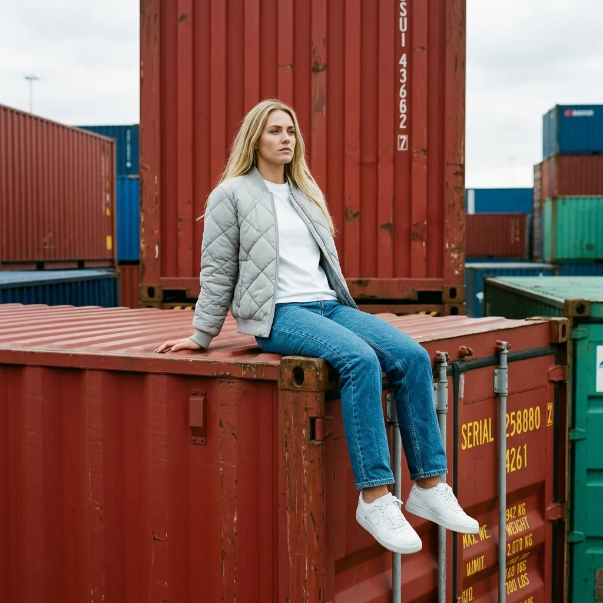

**#40 · Photography Prompt · <code>Vinano Image Pro</code>**

<details>
<summary>Show prompt</summary>

```
Use the same face from the reference image without changing facial features

{
 "image_description": "A high-angle, low-perspective full-body portrait of a young western woman blonde hair sitting on the edge of a red industrial shipping container.",
 "subject": {
 "person": "Young western woman, fit build, serious expression, looking away from the camera toward the horizon.",
 "hair_style": "long blonde",
 "clothing": {
 "jacket": "Light grey quilted puffer bomber jacket a diamond pattern.",
 "undershirt": "Plain crisp white crew-neck t-shirt.",
 "pants": "Classic medium-wash blue denim jeans, straight fit.",
 "footwear": "Clean, bright white leather low-top sneakers."
 },
 "pose": "Sitting relaxed on the edge of a metal container, legs dangling, leaning slightly back on his right hand."
 },
 "setting": {
 "location": "Industrial shipping yard or port.",
 "background_elements": ["Stacked corrugated red metal shipping containers.",
 "A vertical red container behind the subject creates a strong leading line.",
 "Yellow stencil lettering visible on the container beneath the subject."],
 "atmosphere": "Urban, gritty yet clean, modern streetwear aesthetic."
 },
 "composition_and_lighting": {
 "camera_angle": "Low angle looking up, creating a sense of scale and height.",
 "lighting": "Natural, diffused daylight; soft shadows; overcast sky providing even illumination.",
 "color_palette": ["Primary: Bold industrial red",
 "Secondary: Denim blue, light grey, and crisp white",
 "Background: Muted grey/white sky"],
 "lens_effects": "Deep depth of field sharp focus on the subject and the immediate container texture."
 },
 "technical_tags": "Street photography, architectural lines, hyper-realistic, 8k resolution, filmic, cinematic lighting, industrial fashion shoot."
}

Preserve realistic proportions and depth for a confident, professional finish.
```

</details>

---

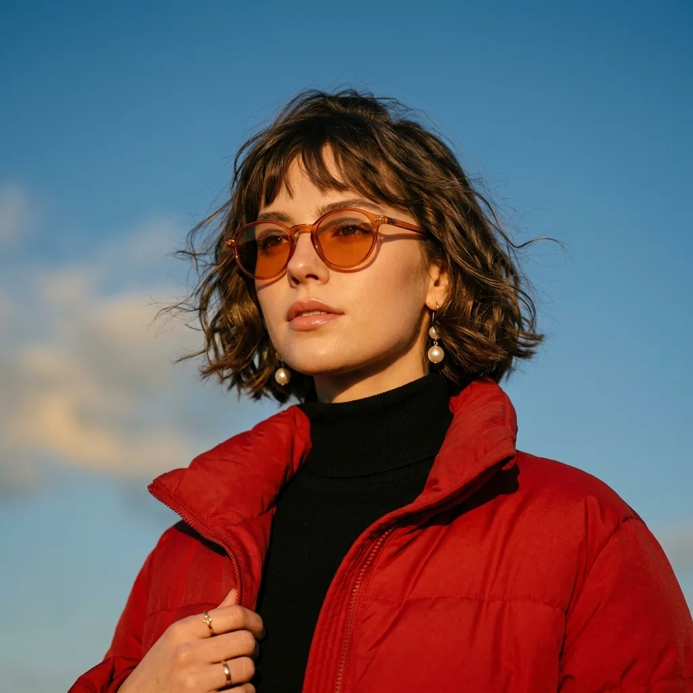

**#41 · Photography Prompt · <code>Vinano Image v2</code>**

<details>
<summary>Show prompt</summary>

```
A cinematic fashion portrait of a young woman a short wavy bob haircut and wispy bangs, wearing round orange-tinted sunglasses, pearl drop earrings, a black turtleneck and a bold red puffer jacket, soft glossy lips, natural makeup, wind gently moving her hair, photographed from a low angle, shallow depth of field, ultra realistic, 85mm lens, f1.8, warm golden hour sunlight, clean blue sky background, editorial fashion photography, high detail skin texture, soft shadows, cinematic color grading, Vogue style, ultra sharp focus, professional studio quality Preserve realistic proportions and depth for a confident, professional finish.
```

</details>

---

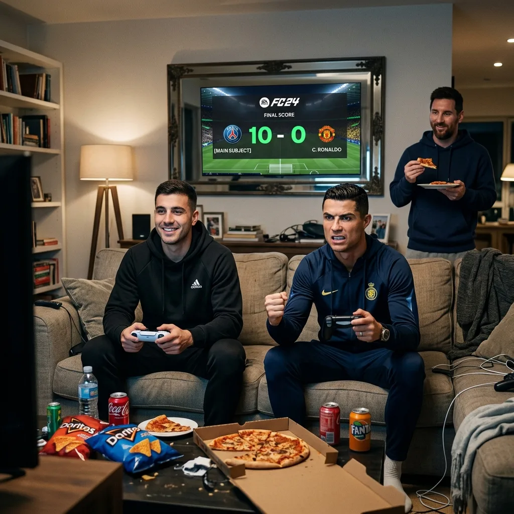

**#42 · Photography Prompt · <code>Vinano Image v2</code>**

<details>
<summary>Show prompt</summary>

```
A hyper-realistic, ultra-detailed 8K cinematic photograph captured a 35mm lens, medium-wide shot, set inside a realistic, modern apartment living room a natural, lived-in home atmosphere.

Scene logic & composition:
The TV is positioned directly in front of the players and remains outside the camera frame.
A large decorative mirror on the wall subtly reflects the TV screen, clearly showing the final match result.

In the mirror reflection, the football video game result screen displays a crushing score: 10 – 0, clearly in favor of the main subject.
The numbers are bold, bright, and unmistakable against a green pitch and stadium crowd background.

In the foreground, the main subject (uploaded 100% face as reference, identity fully locked and preserved) is seated on a comfortable couch, body oriented straight toward the unseen TV. He is wearing a relaxed home tracksuit, calm and confident, a controlled victorious expression after the dominant win.

Seated next to him on the couch is Cristiano Ronaldo, holding a PlayStation controller tightly.
His body language shows clear frustration and anger: tense jaw, furrowed brows, clenched fists, shoulders tight, leaning forward aggressively.
His expression communicates competitive rage and disbelief after losing so badly.

Standing slightly behind and to the side of the couch is Lionel Messi, relaxed and casual, eating food from a plate while watching the scene.
He is smiling subtly, enjoying the moment, completely calm and unbothered, creating a strong contrast Ronaldo’s anger and adding humor and human warmth to the scene.

A realistic coffee table sits between the couch and the TV, filled casual home snacks and drinks: pizza slices, chips, sandwiches, and soft drinks, slightly messy to enhance realism.

Lighting is soft, cinematic, and natural, combining ambient room light the reflected TV glow from the mirror, which subtly illuminates faces and hands.
Depth of field keeps the faces and mirror reflection sharp while softly blurring background elements.

Ultra-realistic skin texture, natural fabric wrinkles, realistic controller reflections, subtle dust particles in the air.
true-to-life photorealistic, candid, unstaged moment.
A perfect balance of tension, humor, and realism

Preserve realistic proportions and depth for a confident, professional finish.
```

</details>

---

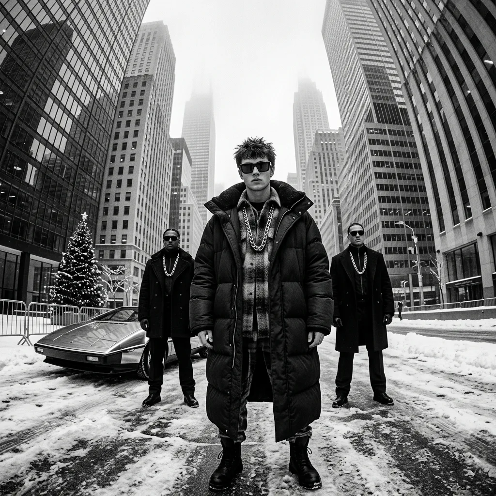

**#43 · Photography Prompt · <code>Vinano Image v2</code>**

<details>
<summary>Show prompt</summary>

```
A black-and-white, high-contrast, ultra-glamorous street fashion editorial photograph taken an ultra-wide-angle lens that creates the effect of a slight perspective deformation. A vertical composition in the center of a large urban space surrounded by high-rise buildings that rise up and converge to the center of the frame, forming a dramatic architectural geometry. It's a winter day, there is an uneven layer of snow and ice on the ground, the surface is matte, the texture of frozen asphalt. The contrast is soft at the top of the frame due to the atmospheric haze. In the foreground is the young man standing closest to the camera. He's wearing large rectangular dark sunglasses. Hairstyle-short, dense front

styling, partially disheveled, slight asymmetry of strands. The emotion is neutral, serious, and the gaze is directed directly into the lens. He is wearing a voluminous long coat a massive collar, under which multi-layered clothes are visible, including a thick shirt a pronounced checkered texture. A large heavy chain massive links hangs on the chest, visually dominating the composition. Behind, to the left and right of the man, there are two men dressed identically in dark ensembles: thick coats or jackets, smooth fabrics that emphasize a strict silhouette. They wear large chains of a similar type, stacked on top of clothes. They wear dark sunglasses. They stand statically, strictly, their legs slightly apart, arms lowered or gathered in front of them. Their figures create balance on the sides of the frame. On the left behind there is a sports car a low wide body and a pronounced wedge-shaped front. The polished metal reflects the

surrounding buildings and the sky. The car is parked on a snow-covered surface next to a small city Christmas tree, surrounded by metal fences..

The fir tree is fluffy and rich in tone, contrasting the smooth surfaces of cars and skyscrapers. The urban backdrop consists of densely packed skyscrapers stretching into the misty sky. Their glass and concrete facades create vertical rhythms. The light is diffused, wintry, soft, without pronounced shadows. The color scheme is a pure monochrome palette deep shadows and even light areas. The processing is glossy, a light feel of an advertising photo shoot, moderate grain, high sharpness in the foreground.

Aim for an editorial, design-driven look with deliberate negative space.
```

</details>

---

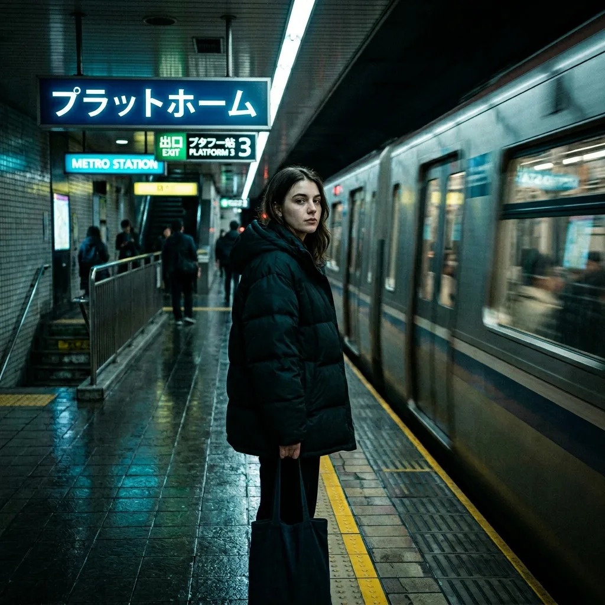

**#44 · Photography Prompt · <code>Vinano Image Pro</code>**

<details>
<summary>Show prompt</summary>

```
{
 "model": "",
 "scene": "Underground metro platform at night a train rushing past",
 "subject": {
 "type": "Young woman",
 "pose": "Standing near the platform edge, body facing forward, head turned slightly toward the camera",
 "expression": "Thoughtful, distant, quietly alert",
 "gaze": "Looking sideways toward the camera, unfixed, introspective",
 "emotion": "Isolation, reflection, restrained tension"
 },
 "appearance": {
 "hair": {
 "color": "Dark brown to black",
 "style": "Loose, straight, natural fall"
 },
 "skin": "Natural complexion soft shadows",
 "makeup": "Minimal, realistic, understated"
 },
 "attire": {
 "outerwear": "Oversized dark jacket",
 "style_note": "Functional, muted, urban anonymity"
 },
 "environment": {
 "location": "City subway platform",
 "background_elements": ["Blurred metro train in motion",
 "Neon signage",
 "Platform lights",
 "Wet reflective floor surface",
 "Metal railings and tiled platform edge"],
 "atmosphere": "Cold, nocturnal, transient"
 },
 "lighting": {
 "primary": "Artificial fluorescent platform lighting",
 "secondary": "Neon signage glow",
 "effect": "Cool-toned highlights soft facial shadows"
 },
 "camera": {
 "angle": "Eye-level, slightly behind the subject",
 "lens": "35mm cinematic street lens",
 "shutter_effect": "Motion blur on passing train",
 "depth_of_field": "Moderate, subject sharp moving background blur",
 "framing": "Vertical, cinematic street composition"
 },
 "color_palette": {
 "dominant": ["teal", "cool blue", "deep black"],
 "accents": ["neon pink", "electric yellow"]
 },
 "mood": "Lonely, cinematic, suspended in time",
 "style": {
 "aesthetic": "Neo-noir street photography",
 "realism": "true-to-life photorealistic",
 "inspiration": "Urban cinema, night transit, modern solitude",
 "post_processing": "Cool cinematic grading, slight grain, high contrast shadows"
 },
 "details": {
 "motion_contrast": "Still subject against fast-moving train",
 "floor_reflections": "Wet surface reflecting neon lights",
 "sound_implied": "Rushing train, distant city hum"
 },
 "themes": ["Urban loneliness",
 "Waiting",
 "Movement vs stillness",
 "Anonymous city life"],
 "quality": "Ultra-detailed, cinematic night street photograph motion depth"
}

Preserve realistic proportions and depth for a confident, professional finish.
```

</details>

---

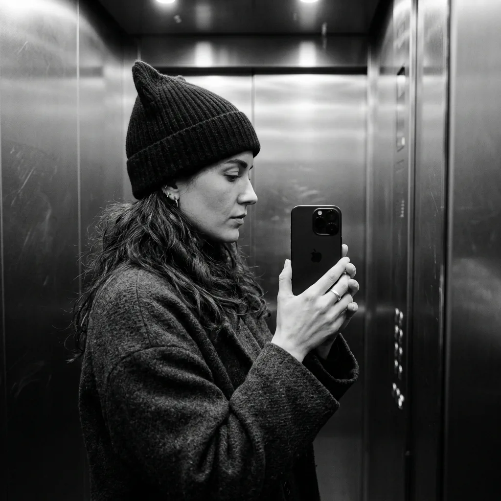

**#45 · Photography Prompt · <code>Vinano Image v2</code>**

<details>
<summary>Show prompt</summary>

```
A true-to-life photorealistic profile selfie, refined minimalist and monochrome: a woman in a dark oversized coat and a black knit hat cat ears, her hair falling loosely down her back; she holds a black iPhone 17 Pro Max smartphone, taking a picture of herself in an elevator mirror a matte metal surface in the background. Soft diffused lighting, calm cool color scheme (black, graphite, gray steel), slight film grain, shallow depth of field on the phone and hands, highly detailed fabric and hair textures, 3:2 vertical composition, realistic style, 4K, natural light, soft shadows, moody aesthetic. Maintain consistent colour harmony and crisp focus across the whole frame.
```

</details>

---

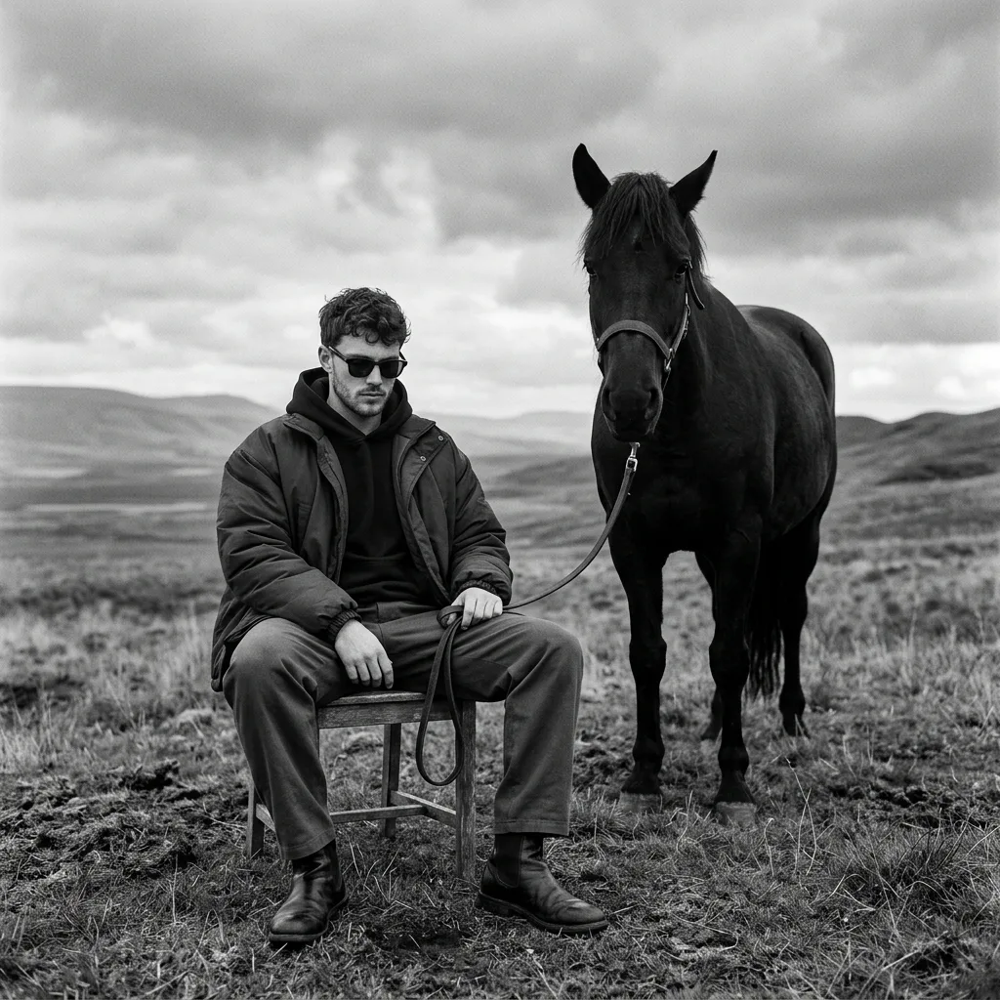

**#46 · Photography Prompt · <code>Vinano Image v2</code>**

<details>
<summary>Show prompt</summary>

```
{
 "model": "",
 "scene": "Open field landscape under an overcast sky, minimal natural surroundings",
 "subject": {
 "type": "Young man",
 "pose": "Seated on a wooden chair, legs relaxed apart, holding a horse lead calmly",
 "expression": "Detached, introspective, controlled",
 "gaze": "Looking downward, partially obscured by sunglasses",
 "emotion": "Quiet dominance, solitude, inner gravity"
 },
 "appearance": {
 "hair": {
 "color": "Dark",
 "style": "Short, slightly tousled curls"
 },
 "facial_features": {
 "beard": "Light stubble",
 "accessories": ["Dark sunglasses"]
 },
 "skin": "Natural texture, matte finish"
 },
 "attire": {
 "outerwear": "Oversized dark padded jacket",
 "innerwear": "Dark hoodie",
 "pants": "Relaxed-fit dark trousers",
 "footwear": "Black leather boots",
 "style_note": "refined minimalist, masculine, utilitarian fashion"
 },
 "secondary_subject": {
 "type": "Black horse",
 "position": "Standing beside the man, head lowered slightly",
 "interaction": "Held calmly by a loose lead",
 "symbolism": "Strength, instinct, controlled power"
 },
 "environment": {
 "location": "Open grassy field",
 "background": ["Rolling hills",
 "Soft distant landscape",
 "No urban elements"],
 "atmosphere": "Quiet, isolated, contemplative"
 },
 "lighting": {
 "type": "Natural diffused daylight",
 "conditions": "Overcast sky",
 "effect": "Soft shadows, low contrast, even tonal range"
 },
 "camera": {
 "angle": "Eye-level to slightly low-angle",
 "lens": "50mm cinematic portrait lens",
 "depth_of_field": "Moderate, subject and horse in focus, background gently blurred",
 "framing": "Vertical, full-body portrait symbolic spacing"
 },
 "color_palette": {
 "mode": "Black and white",
 "tones": ["deep blacks", "soft grays", "muted highlights"]
 },
 "mood": "Stoic, restrained, powerful",
 "style": {
 "aesthetic": "Fine-art editorial portrait",
 "realism": "true-to-life photorealistic",
 "inspiration": "Minimalism, masculinity, symbolism",
 "post_processing": "premium-quality monochrome grading, subtle film grain, soft contrast"
 },
 "details": {
 "chair": "Simple wooden chair, understated",
 "lead_tension": "Loose, intentional calm",
 "motion": "Stillness dominates the frame"
 },
 "themes": ["Controlled power",
 "Man and instinct",
 "Silence as authority",
 "Strength without display"],
 "quality": "Ultra-detailed, cinematic black-and-white portrait editorial depth"
}

Preserve realistic proportions and depth for a confident, professional finish.
```

</details>

---

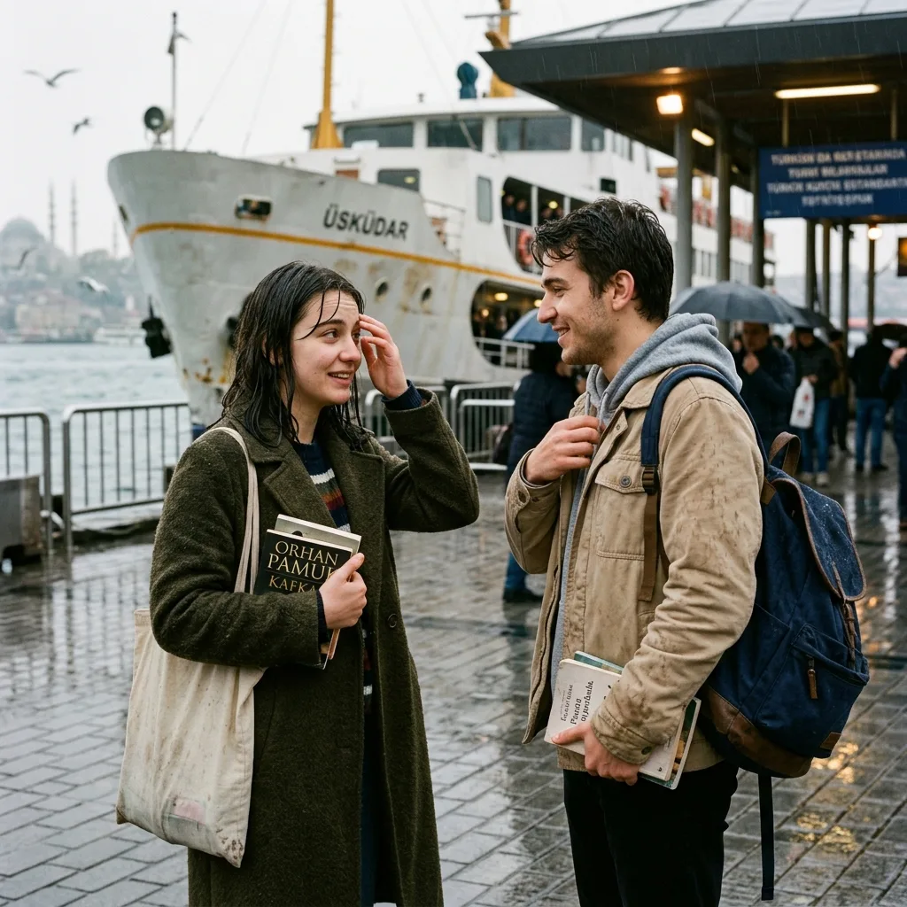

**#47 · Photography Prompt · <code>Vinano Image Pro</code>**

<details>
<summary>Show prompt</summary>

```
{
 "generation_request": {
 "meta_data": {
 "tool": "",
 "task_type": "photoreal_candid_street_romance",
 "version": "v1.1_ISTANBUL_FERRY_RAIN_REUNION_LOVE_EN",
 "priority": "highest"
 },

 "output_settings": {
 "aspect_ratio": "4:5",
 "orientation": "portrait",
 "resolution_target": "ultra_high_res",
 "render_style": "ultra_photoreal_candid_street_film_still",
 "sharpness": "crisp_but_natural",
 "film_grain": "subtle_35mm",
 "color_grade": "restrained_cinematic_realism",
 "dynamic_range": "natural_not_hdr",
 "skin_rendering": "real_texture_no_retouch"
 },

 "global_rules": {
 "camera_language": "35mm lens equivalent, eye-level, imperfect framing, candid documentary feel, focus on eyes when people are present",
 "authenticity_markers": "subtle halation on highlights, tiny film gate weave, slight background motion blur only, real street clutter, no studio look",
 "lighting_language": "motivated natural light only (overcast rain daylight + ferry terminal practicals), deep but detailed shadows"
 },

 "creative_prompt": {
 "scene_summary": "Istanbul, rainy day at the ferry terminal. Two university students in their early 20s unexpectedly run into each other right in front of a ferry. A candid, unposed moment—love as a quiet accident in the rain.",

 "subjects": {
 "count": 2,
 "description": "the same young man and woman (early 20s), ordinary and real, not model-like; faces visible and sharp",
 "expression": "surprise, shy warmth, a tiny relieved smile—restrained micro-expressions only",
 "skin_and_face": "natural skin texture, slight under-eye shadows, no beauty retouch, no plastic skin"
 },

 "wardrobe_and_props": {
 "clothing": "simple student clothing in natural neutral tones (beige, grey, navy, soft brown), slightly wrinkled; no logos",
 "wetness": "hair slightly wet, fabric darkened by rain, realistic water beads on coats and backpacks",
 "props": "both hold books and carry backpacks/tote bags; book edges slightly damp; hands gripping straps naturally"
 },

 "micro_action": "they stop mid-step, realizing it’s each other; one adjusts a slipping book; the other wipes rain from their eyebrow; they share a short eye contact that lasts a second longer than normal",

 "environment_details": {
 "location": "Istanbul ferry terminal (Eminönü/Karaköy/Kadıköy vibe), directly in front of a docked ferry",
 "background": "ferry hull and windows behind them, wet pavement, puddle reflections, seagulls blurred in distance, people moving umbrellas out of focus",
 "street_elements": "rain streaks visible, water droplets on railings, worn signage shapes but no readable text"
 },

 "lighting": "overcast rain daylight, soft and diffused; practical terminal lights give gentle warm highlights; deep but detailed shadows; subtle halation on wet highlights",

 "composition": "eye-level medium shot, slightly off-center, imperfect crop, faces and eyes tack sharp; background softly receding; slight motion blur only in distant passersby and rain",

 "mood": "quiet, intimate, realistic—two people sharing a private moment in a public place"
 },

 "negative_prompt": ["studio lighting",
 "beauty retouch",
 "plastic skin",
 "model faces",
 "posed romance poster look",
 "perfect symmetry",
 "HDR",
 "AI glow",
 "fake bokeh shapes",
 "overly clean background",
 "unrealistic rain",
 "text",
 "logo",
 "watermark",
 "cartoon",
 "painterly"]
 }
}

Emphasise material texture and natural light so the final frame feels tactile and premium.
```

</details>

---

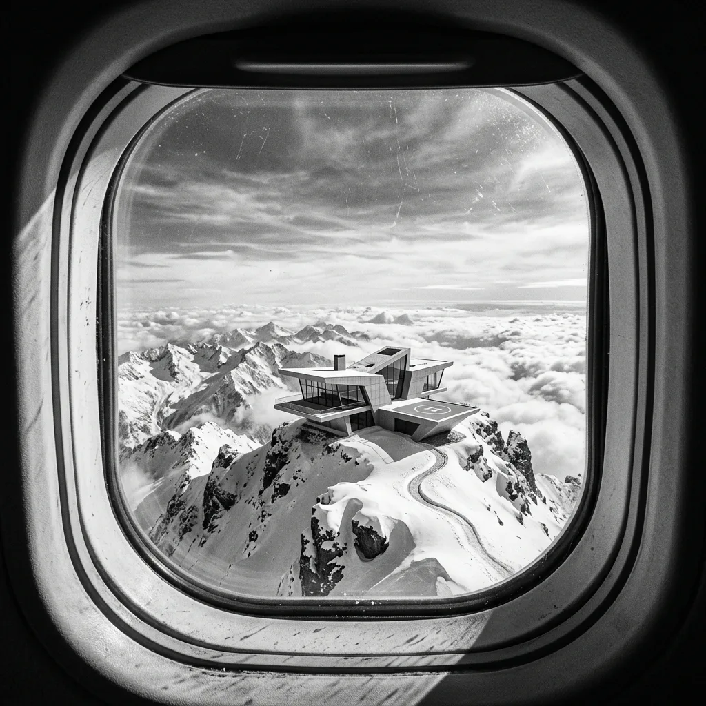

**#48 · Photography Prompt · <code>Vinano Image v2</code>**

<details>
<summary>Show prompt</summary>

```
a window looking out an airplane and you can see a 4k image of a futuistic, very modern house on top of a mountain snow, nothing is surrounding the house expect clouds, and snow the angle in which the photo is taken is. slightly from above, the picture is black and white and looks like it was shot on camera, the photo is taken straight out the window not from the side. Render with rich micro-detail while keeping the layout uncluttered and intentional.
```

</details>

---

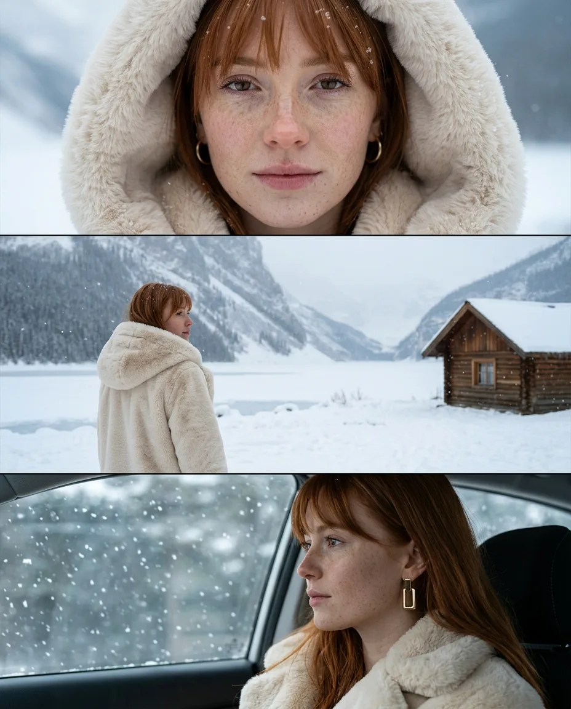

**#49 · Photography Prompt · <code>Vinano Image Pro</code>**

<details>
<summary>Show prompt</summary>

```
{
 "generation_request": {
 "meta_data": {
 "tool": "",
 "task_type": "text_to_image_cinematic_editorial_triptych",
 "version": "v1.0_WINTER_CINEMATIC_TRIPTYCH_3_STRIPS",
 "priority": "highest"
 },
 "output_settings": {
 "aspect_ratio": "4:5",
 "orientation": "portrait",
 "resolution": "ultra_high_res",
 "render_style": "ultra_photoreal_cinematic_editorial",
 "sharpness": "crisp_but_natural",
 "film_grain": "subtle_analog",
 "color_grade": "cool_winter_filmic",
 "retouch_level": "editorial_minimal_keep_texture",
 "noise_reduction": "low"
 },
 "composition": {
 "layout": "single image composed as a 3-panel vertical triptych (three horizontal strips stacked top/middle/bottom)",
 "panel_borders": "thin clean separators, no text, no frames, no watermark",
 "overall_style": "cohesive cinematic series consistent color, lensing, and snowfall"
 },
 "lighting_and_camera": {
 "lighting": "soft overcast winter daylight, diffused, gentle contrast",
 "lens": "85mm for close portrait, 35mm for landscape, 50mm for car profile",
 "aperture": "f/2.8 portrait panels, f/5.6 landscape panel",
 "iso": "200-400",
 "shutter": "1/250"
 },
 "creative_prompt": {
 "scene_summary": "Create ONE single ultra-photoreal cinematic editorial image as a three-strip triptych (top/middle/bottom).\n\nTOP PANEL (close beauty):\n- Extreme close-up of a young woman’s face nestled into a plush cream faux-fur hood/coat collar.\n- Visible natural freckles across nose and cheeks, realistic pores and skin texture (no plastic smoothing).\n- Copper/red hair soft bangs, a few snowflakes melting on hair and fur.\n- Gold hoop earrings (subtle luxury).\n- Expression: calm, slightly wistful, eyes looking toward camera.\n\nMIDDLE PANEL (wide landscape):\n- Wide shot of a frozen lake and snowy field distant mountains.\n- A small wooden cabin on the right side of frame (cozy, rustic), light snow falling.\n- The same woman seen from behind/three-quarter angle on the left, wearing the same cream fur coat hood.\n- Cinematic negative space, gentle atmospheric haze, crisp winter air.\n\nBOTTOM PANEL (car profile):\n- Inside a car, side profile portrait of the same woman seated by the window.\n- Snow visible outside through the window; soft reflections on glass.\n- She wears the same cream fur coat; red hair flowing, gold geometric/rectangular earring detail.\n- Expression: thoughtful, looking forward (not at camera).\n\nCOHESION REQUIREMENTS:\n- Maintain the same woman identity across all three panels.\n- Consistent winter color palette: cool blues/greys warm skin tones and cream fur.\n- Natural snowfall across all panels; snowflakes scale and motion should be realistic.\n- Premium editorial feel, photoreal, cinematic continuity.\n\nNo text, no logos, no watermark."
 },
 "hard_constraints": ["ONE single image containing THREE horizontal panels stacked vertically.",
 "Same woman identity across all panels.",
 "Cream faux-fur hood/coat in all panels.",
 "Natural freckles and realistic skin texture.",
 "Photoreal snowfall (no fake bokeh dots).",
 "No text, no logos, no watermark."],
 "negative_prompt": ["text",
 "logo",
 "watermark",
 "cartoon",
 "anime",
 "cgi",
 "over-retouched skin",
 "plastic skin",
 "identity drift between panels",
 "extra people",
 "distorted face",
 "warped hands",
 "fake looking snow",
 "oversharpening",
 "harsh flash lighting"]
 }
}

Keep edges clean and the overall composition balanced for a polished, gallery-ready result.
```

</details>

---

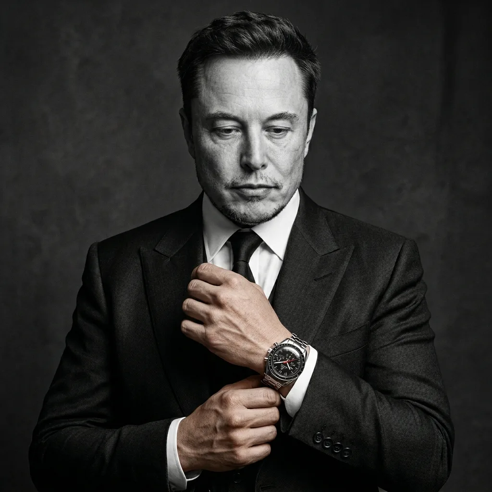

**#50 · Photography Prompt · <code>Vinano Image v2</code>**

<details>
<summary>Show prompt</summary>

```
8K Ultra-Realistic Promotional
High contrast black-and-white luxury editorial photograph of a confident Elon Musk wearing a perfectly tailored suit, standing against a clean studio backdrop. He is adjusting his wristwatch his right hand on his left wrist in a poised, powerful gesture, drawing strong visual focus to an elegant luxury wristwatch displayed in full color. Sharp, dramatic studio lighting deep shadows, sculpted jawline, high definition facial contours, crisp textures of premium suit fabric, refined masculine energy. Cinematic contrast, shallow depth of field, ultra sharp details, hyper-real clarity, true-to-life photorealistic finish, premium European aesthetics, timeless and sleek composition, ultr polished luxury watch advertisement style, no noise, no blur, no imperfections, high dynamic range, and image size 4 5.

Render with rich micro-detail while keeping the layout uncluttered and intentional.
```

</details>

---

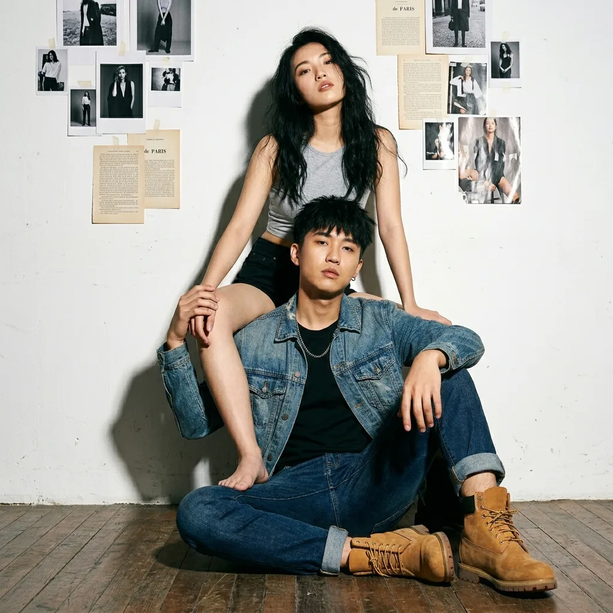

**#51 · Photography Prompt · <code>Vinano Image v2</code>**

<details>
<summary>Show prompt</summary>

```
"Young Asian couple, cool/edgy fashion models.",
 "female_hair": "Long, black, naturally little wavy hair (soft waves, not crimped), smooth texture flyaways.",
 "male_hair": "Short, black, textured messy cut.",
 "outfits": {
 "female": "Grey crop top, black shorts, bare legs.",
 "male": "Blue denim jacket, black t-shirt, silver chain, blue jeans (one leg rolled up), mismatched boots (black combat boot on left, tan work boot on right)."
 }
 },
 "exact_pose_anatomical": {
 "male_pose": {
 "position": "Seated on the floor, facing forward.",
 "legs": "Left leg bent at knee, foot planted flat. Right leg bent inwards (cross-legged style) resting on the floor.",
 "arms": "Right arm resting casually on his own right knee. Left arm reaching up and back to hold the female's thigh securely.",
 "posture": "Leaning slightly forward, relaxed spine."
 },
 "female_pose": {
 "position": "Perched/Kneeling directly behind the male subject.",
 "legs": "Straddling the male subject's left shoulder. Her left thigh is draped over his shoulder, shin hanging down in front of his chest. Her right leg is tucked behind him (kneeling on the floor).",
 "arms": "Right hand resting on top of the male's right shoulder for balance. Left arm obscured.",
 "posture": "Torso upright, looming over the male figure.",
 "head": "Tilted slightly to the left, chin up."
 }
 },
 "camera_technical_values": {
 "perspective": "Low Angle / Eye-level seated subjects.",
 "focal_length": "35mm (Capturing the full interaction and wall context).",
 "lighting": "Direct On-Camera Flash. Hard shadows cast directly behind the subjects on the wall.",
 "environment": "White wall taped B&W photos and vintage book pages ('de PARIS'). Wooden floor."

Preserve realistic proportions and depth for a confident, professional finish.
```

</details>

---

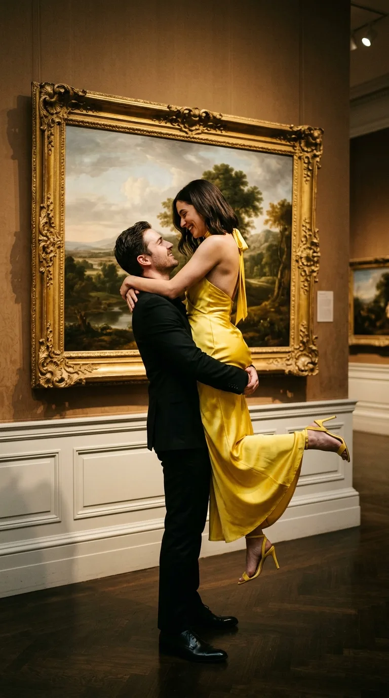

**#52 · Photography Prompt · <code>Vinano Image Pro</code>**

<details>
<summary>Show prompt</summary>

```
{
 "generation_request": {
 "meta_data": {
 "tool": "",
 "task_type": "photoreal_cinematic_romantic_fine_art_editorial",
 "version": "v1.1_GALLERY_FRAME_COUPLE_LIFT_EMBRACE_YELLOW_HALTER_SATIN",
 "priority": "highest"
 },

 "references": {
 "reference_image_1": {
 "source": "UPLOAD_REFERENCE_IMAGE",
 "purpose": "POSE_COMPOSITION_LIGHTING_REFERENCE",
 "strict_lock": true,
 "match_reference_priority": "MAX",
 "preserve_pose_geometry": true,
 "preserve_framing_and_cropping": true,
 "preserve_background_structure": true,
 "preserve_mood_and_lighting": true,
 "no_style_drift": true
 },
 "reference_image_2": {
 "source": "UPLOAD_FACE_REFERENCE (OPTIONAL)",
 "purpose": "FACE_IDENTITY_LOCK_FEMALE",
 "strict_lock": true,
 "face_similarity_priority": "MAX",
 "no_identity_blending": true,
 "no_beautify": true,
 "no_age_shift": true,
 "preserve_skin_texture": true,
 "preserve_facial_proportions": true
 },
 "reference_image_3": {
 "source": "UPLOAD_FACE_REFERENCE (OPTIONAL)",
 "purpose": "FACE_IDENTITY_LOCK_MALE",
 "strict_lock": true,
 "face_similarity_priority": "MAX",
 "no_identity_blending": true,
 "no_beautify": true,
 "no_age_shift": true,
 "preserve_skin_texture": true,
 "preserve_facial_proportions": true
 }
 },

 "creative_direction": {
 "concept": "A cinematic, museum-gallery romance scene: a couple in an intimate lift embrace, posed in front of a large ornate framed classical landscape painting. High-end editorial, dramatic but elegant. The woman wears a striking yellow satin halter-neck gown tied at the back of the neck, matching yellow high heels.",
 "mood": "intimate, luxurious, timeless, fine-art cinematic",
 "style_keywords": "old-master atmosphere, museum lighting, romantic tension, film still"
 },

 "scene": {
 "location": "museum/gallery interior",
 "background": {
 "hero_object": "a large ornate gold frame containing a classical landscape painting",
 "wall": "warm brown gallery wall",
 "lower_wall": "white wainscoting / panel molding",
 "floor": "dark warm wood"
 },
 "composition": "full-body vertical frame, couple centered, painting fills most of the background"
 },

 "subjects": {
 "male": {
 "wardrobe": "black suit, black trousers, black shoes",
 "pose": "standing, lifting the woman at her waist/thigh, stable posture, looking up at her face"
 },
 "female": {
 "wardrobe": {
 "dress": "yellow silk satin halter-neck gown, neck-tie strap (tied behind the neck), fitted bodice, elegant drape, subtle sheen, high-fashion finish",
 "fabric_notes": "realistic satin highlights, soft folds, premium couture construction"
 },
 "shoes": "yellow high-heel sandals or classic yellow pumps (matching the dress)",
 "pose": "arched back, head tilted upward, hair flowing, one leg bent and lifted, arms around his shoulders/neck",
 "vibe": "elegant, sensual, not explicit"
 }
 },

 "photography": {
 "camera_style": "cinematic fashion/editorial still",
 "lens": "50mm prime (natural perspective)",
 "lighting": {
 "key": "soft directional gallery light from above/front",
 "fill": "minimal, moody shadows preserved",
 "highlights": "subtle sheen on frame gilding and strong satin specular highlights on the yellow dress"
 },
 "depth_of_field": "moderate (couple sharp, painting slightly softer but readable)",
 "color_grade": "warm cinematic browns, deep blacks, luminous yellow satin, subtle film contrast",
 "film_look": "subtle 35mm grain, gentle halation on highlights"
 },

 "output_settings": {
 "aspect_ratio": "9:16",
 "orientation": "portrait",
 "resolution_target": "ultra_high_res",
 "render_style": "ultra_photoreal_cinematic_film_still",
 "sharpness": "crisp_but_natural",
 "film_grain": "subtle_35mm",
 "dynamic_range": "natural_not_hdr",
 "no_text": true,
 "no_watermark": true,
 "no_logo": true
 },

 "quality_controls": {
 "anatomy": {
 "no_deformed_hands": true,
 "no_extra_fingers": true,
 "natural_lift_pose_physics": true
 },
 "wardrobe_materials": {
 "satin_reads_real": true,
 "strong_satin_speculars": true,
 "suit_fabric_reads_real": true,
 "gold_frame_detail_high": true
 }
 },

 "negative_prompt": ["white lace dress",
 "wrong dress color (not yellow)",
 "wrong dress neckline (not halter-neck tie)",
 "wrong shoe color (not yellow)",
 "text, watermark, logo",
 "cartoon, anime, illustration",
 "overexposed HDR look",
 "messy background clutter",
 "warped frame geometry",
 "incorrect lift pose physics",
 "deformed hands, extra fingers",
 "overly sexual explicit nudity"]
 }
}

Render with rich micro-detail while keeping the layout uncluttered and intentional.
```

</details>

---

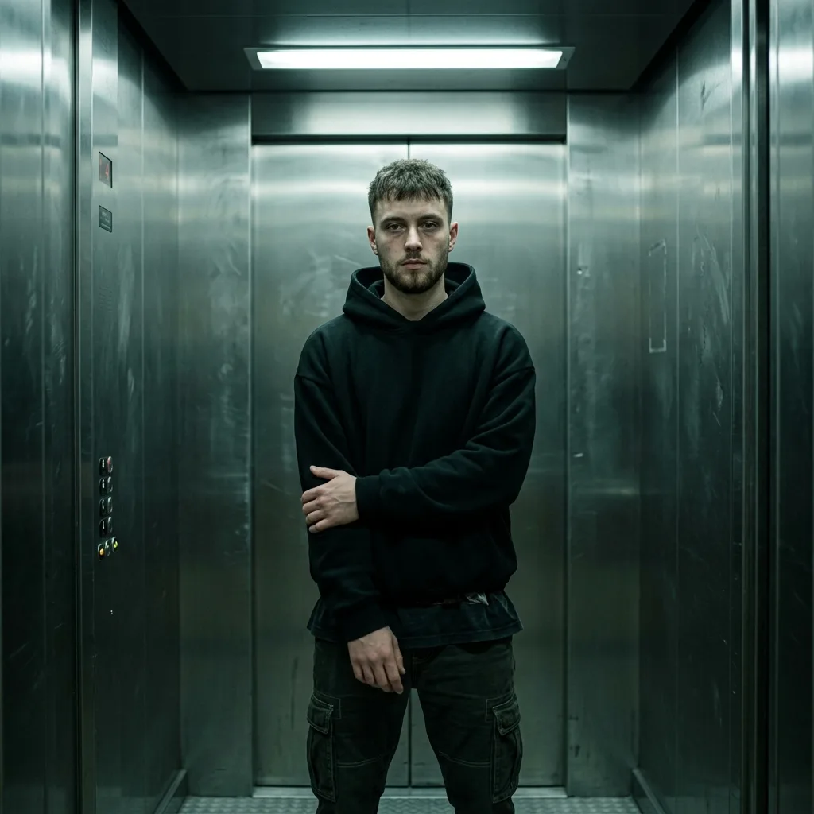

**#53 · Photography Prompt · <code>Vinano Image Pro</code>**

<details>
<summary>Show prompt</summary>

```
{
 "genre": "cinematic urban realism",
 "mood": ["tense", "cold", "isolated", "quiet intensity"],
 "theme": "a man caught in a moment of silence inside a sterile industrial elevator"
 },
 "subject": {
 "description": "young man calm intense expression",
 "face": {
 "skin": "natural pores, realistic texture, slight under-eye shadow, no retouching",
 "beard": "short trimmed beard, natural density",
 "expression": "neutral but intimidating, relaxed jaw, eyes locked on camera"
 },
 "hair": {
 "style": "messy short crop",
 "detail": "slight volume on top, natural uneven strands, not styled too clean"
 },
 "pose": {
 "body_language": "still and grounded, subtle confidence",
 "hands": "one arm folded across torso, other arm relaxed downward",
 "stance": "centered, shoulders slightly forward, minimal movement"
 }
 },
 "wardrobe": {
 "top": "oversized black hoodie, heavy fabric, matte texture",
 "layering": "dark graphic tee slightly visible below the hoodie hem",
 "bottom": "dark cargo pants stitched pockets",
 "styling_notes": "streetwear minimal, clean silhouette, no bright branding"
 },
 "environment": {
 "location": "metal elevator interior",
 "materials": ["brushed stainless steel walls", "reflective panels", "subtle fingerprints and smudges"],
 "lighting_elements": "overhead fluorescent light panels",
 "atmosphere": "thin mist/smoke floating around subject, faint haze near corners",
 "background": "no extra people, no clutter, clean symmetrical elevator geometry"
 },
 "cinematography": {
 "shot_type": "medium-full portrait",
 "framing": "perfect symmetrical centered composition",
 "camera_angle": "slightly low angle for dominance and tension",
 "lens": {
 "focal_length": "35mm",
 "look": "cinematic wide portrait depth",
 "distortion_control": "minimal distortion, straight vertical elevator lines"
 },
 "depth_of_field": {
 "aperture": "f/2.8",
 "focus": "sharp focus on eyes and face",
 "falloff": "soft background blur but still readable environment"
 }
 },
 "lighting": {
 "type": "overhead harsh fluorescent top-light",
 "contrast": "medium-high deep shadows under jaw and hoodie folds",
 "highlights": "soft bloom on metallic walls, controlled, not blown out",
 "fill": "very subtle ambient bounce to keep facial details visible",
 "notes": "keep lighting realistic and slightly underexposed for cinematic tension"
 },
 "color_grade": {
 "style": "dark cinematic teal-green industrial grade",
 "shadows": "cool teal tint",
 "highlights": "neutral to slightly cold",
 "saturation": "muted low saturation",
 "contrast": "clean but gritty",
 "black_levels": "slightly crushed blacks, not fully clipped"
 },
 "texture_details": {
 "skin": "realistic pores and micro texture",
 "fabric": "hoodie fleece texture visible, natural folds and weight",
 "metal": "subtle reflections, tiny scratches, elevator realism",
 "grain": "subtle film grain throughout"
 },
 "post_processing": {
 "sharpness": "sharp only on face, not over-sharpened",
 "vignette": "soft vignette around corners",
 "haze": "light haze for depth separation",
 "final_finish": "cinematic, grounded, documentary realism"
 },
 "negative_prompt": ["plastic skin",
 "beauty retouch",
 "anime",
 "cartoon",
 "overly smooth face",
 "HDR glow",
 "over-saturated colors",
 "extreme bokeh",
 "warped elevator walls",
 "extra fingers",
 "distorted hands",
 "unrealistic reflections",
 "text",
 "logos",
 "watermark"],
 "output_settings": {
 "aspect_ratio": "3:4 vertical portrait",
 "resolution": "high detail",
 "quality": "true-to-life photorealistic",
 "style": "cinematic realism"
 }
}

Maintain consistent colour harmony and crisp focus across the whole frame.
```

</details>

---

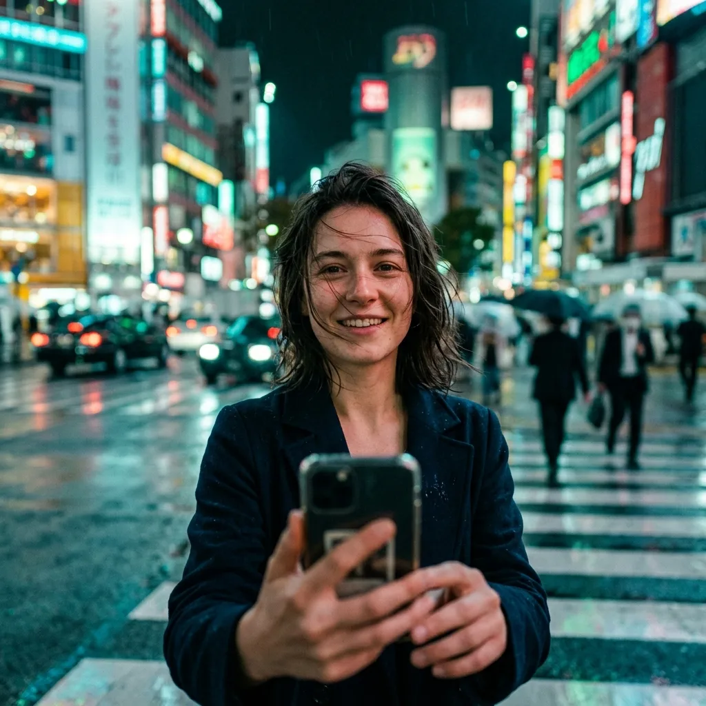

**#54 · Photography Prompt · <code>Vinano Image Pro</code>**

<details>
<summary>Show prompt</summary>

```
{
 "model": "gemini--pro",
 "mode": "image",
 "aspect_ratio": "4:5",
 "quality": "ultra",
 "style": "cinematic_realism",
 "scene": {
 "setting": "busy neon-lit city street at night, wet road after rain, glowing signboards and traffic behind subject",
 "weather": "light drizzle just ended, reflective pavement, humid atmosphere",
 "background": "soft bokeh city lights, moving cars, faint pedestrian motion blur, tall buildings colorful signage",
 "time": "night"
 },
 "subject": {
 "type": "young woman",
 "pose": "standing in the middle of a crosswalk, holding a smartphone close to camera",
 "expression": "natural warm smile, candid and joyful",
 "hair": "slightly messy hair blown across face by wind",
 "wardrobe": "dark coat or blazer, minimal accessories",
 "props": ["smartphone"]
 },
 "composition": {
 "framing": "close-up portrait wide-angle distortion, subject centered, phone in foreground",
 "camera_distance": "very close, intimate street-photo feel",
 "perspective": "wide lens perspective, slight fisheye look, background stretching outward",
 "depth_of_field": "shallow to medium, subject readable but background lights creamy",
 "foreground_detail": "phone and hands slightly soft due to motion and lens character"
 },
 "camera": {
 "lens": "24mm wide-angle (slight fisheye character)",
 "aperture": "f/1.8",
 "shutter_speed": "1/40",
 "iso": "1600",
 "focus": "face focus, slight falloff on phone"
 },
 "lighting": {
 "key_light": "neon signage spill lighting face mixed cyan/green and warm highlights",
 "fill": "streetlight bounce from wet ground",
 "mood": "dreamy urban nightlife, soft contrast, romantic realism"
 },
 "color_grading": {
 "palette": "teal, cyan, green neon mixed warm skin tones",
 "contrast": "soft contrast lifted shadows",
 "highlights": "glowy bloom on neon signs",
 "film_emulation": "35mm film look"
 },
 "texture_and_detail": {
 "film_grain": "strong visible grain, authentic",
 "bloom": "subtle halation on lights",
 "sharpness": "slightly imperfect, organic street photography",
 "skin_texture": "natural pores, no plastic smoothing"
 },
 "motion": {
 "hair_movement": "wind-blown strands across face",
 "background_motion": "light streaking from cars and walking people",
 "camera_feel": "handheld candid shot"
 },
 "negative_prompt": ["plastic skin",
 "overly sharp face",
 "clean studio lighting",
 "anime",
 "cartoon",
 "hyper-symmetrical face",
 "over-saturated neon",
 "HDR look",
 "fake depth blur edges",
 "extra fingers",
 "distorted hands",
 "text artifacts",
 "logo distortions",
 "AI glossy skin",
 "perfectly clean background"]
}

Preserve realistic proportions and depth for a confident, professional finish.
```

</details>

---

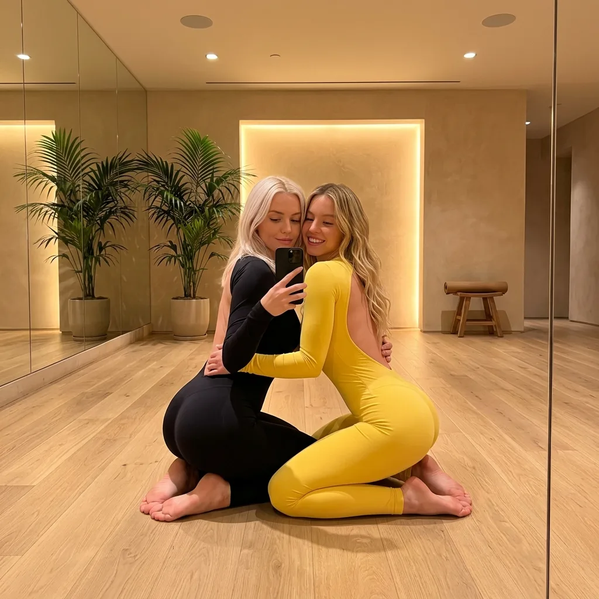

**#55 · Photography Prompt · <code>Vinano Image v2</code>**

<details>
<summary>Show prompt</summary>

```
POV: You’re having a casual floor hang the internet’s favorite IT girl, Sydney Sweeney.

 🍌

Prompt 👇🏽

{
 "meta": {
 "aspect_ratio": "3:4",
 "quality": "ultra_photorealistic, raw, unedited photograph",
 "resolution": "8k",
 "camera": "Smartphone camera (high-end model)",
 "lens": "Wide-angle smartphone lens",
 "style": "Mirror selfie, warm atmosphere, candid moment",
 "composition": "A mirror selfie photograph taken by the woman on the left, capturing two blonde women kneeling and embracing on a wooden floor in a studio setting."
 },
 "scene": {
 "location": "Indoor luxury yoga studio or spa lounge",
 "environment": ["Light wood plank flooring",
 "Large wall-to-wall mirror reflecting the subjects and large potted palm plants",
 "Textured beige walls a warm backlit architectural alcove in the background",
 "Wooden stool and yoga mat visible in the background"],
 "time": "Indeterminate time, warm indoor lighting",
 "atmosphere": "Warm, intimate, friendly, serene, luxurious"
 },
 "lighting": {
 "type": "Soft, warm ambient artificial light",
 "source": "Recessed ceiling lights and prominently from the warm backlit feature in the background",
 "effect": "A soft, golden glow enveloping the scene, creating warm tones on skin and clothing and gentle shadows."
 },
 "subject": {
 "identity": "Two blonde women kneeling together. The woman on the left is a platinum blonde. The woman on the right is actress Sydney Sweeney.",
 "body": {
 "pose": "Both women are kneeling on the floor, barefoot, embracing snugly side-by-side. The platinum blonde woman on the left holds up a black smartphone to take the photo in the mirror, looking at the screen. Sydney Sweeney on the right is smiling broadly, looking towards the mirror, her arms wrapped around the other woman.",
 "physique": "Both women have fit physiques and long wavy blonde hair."
 },
 "outfit": {
 "clothing_left": "A tight-fitting, black, long-sleeved, open-back bodysuit.",
 "clothing_right (Sydney Sweeney)": "A tight-fitting, bright yellow, long-sleeved, open-back bodysuit."
 }
 },
 "realism_focus": {
 "textures": "Fabric texture of the stretch bodysuits (black and yellow), grain of the wooden floor planks, realistic skin texture, individual strands of wavy blonde hair, clear reflections in the large mirror.",
 "imperfections": "Natural folds and creases in the bodysuits from the pose, realistic details of bare feet (soles, toes), slight smudges on the mirror surface."
 }
}

Emphasise material texture and natural light so the final frame feels tactile and premium.
```

</details>

---

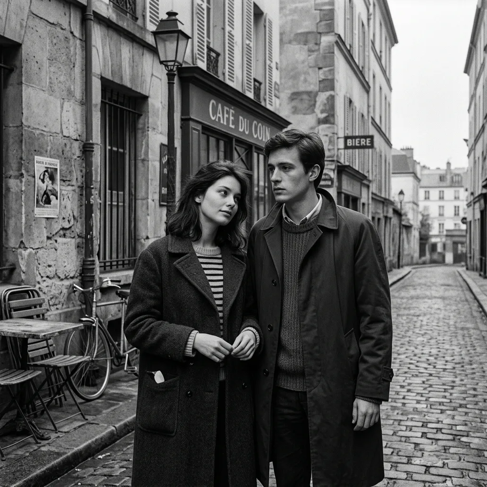

**#56 · Photography Prompt · <code>Vinano Image v2</code>**

<details>
<summary>Show prompt</summary>

```
A French New Wave–style refined minimalist lovers scene, black and white, 1950s–1960s European cinema tone. A couple standing close but not touching, quiet intimacy expressed through proximity rather than action. The woman leans slightly toward the man; the man looks past her, thoughtful. Simple, understated clothing — trench coats, wool coats, knit sweaters, classic shirts. No glamour, no styling excess. Natural faces, minimal makeup, authentic expressions.
Set on an empty Parisian street or narrow European alley, early morning or overcast daylight. Café chairs stacked, a bicycle against a wall, stone textures, shuttered windows. Static camera, eye-level framing, wide negative space, imperfect composition. Soft natural light, gentle shadows, subtle 35mm film grain.
Emotion conveyed through stillness, silence, and unresolved tension — love present but unspoken. Minimal dialogue energy, poetic realism, quiet longing, human fragility. Inspired by Godard / Truffaut, anti-dramatic, observational cinema, timeless intimacy, restrained romance, art-house melancholy.

Emphasise material texture and natural light so the final frame feels tactile and premium.
```

</details>

---

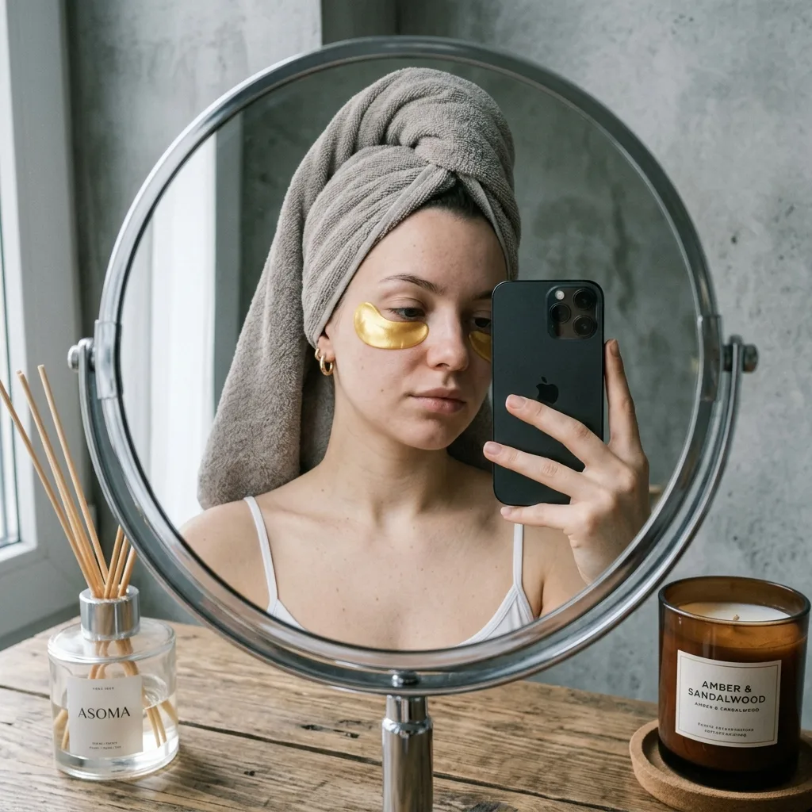

**#57 · Photography Prompt · <code>Vinano Image v2</code>**

<details>
<summary>Show prompt</summary>

```
A highly realistic mirror selfie of a young woman taken through the reflection of a round tabletop mirror a chrome metal frame and stand. The composition feels intimate and natural, like a quiet personal care moment.
She is wearing a thin white spaghetti-strap tank top. Her head is wrapped in a soft grey-beige terry towel styled as a turban, fully covering her hair. Under her left eye, a single pair of gold hydrogel eyepatches is applied — semi-circular, slightly reflective a subtle metallic sheen.
Her face appears makeup-free or very minimal natural makeup. Skin looks fresh, hydrated, and real, visible natural texture, soft pores, slight tonal variations, and gentle under-eye shadows. Lips have a neutral tone a light natural gloss. She wears small gold hoop earrings.
She holds a black iPhone a triple-camera module (similar to iPhone 11 Pro or newer) in her right hand, angled toward the mirror. Her expression is calm and relaxed, slightly tired but peaceful, her gaze directed slightly downward at the phone screen.
Environment & background:
Behind her is a grey concrete-textured wall. On the left side of the frame, a window allows soft natural daylight to enter, creating gentle, diffused illumination a slightly cool tone.
On the table in front of the mirror:
On the left: a clear glass diffuser bottle wooden sticks, labeled “ASOMA”.
On the right: a brown glass candle jar, partially burned, visible wax residue.
Mood & lighting:
Soft natural daylight, subtle shadows, no harsh highlights. Scandinavian / loft-style bathroom atmosphere, minimalistic, cozy, quiet. Color palette consists of muted greys, warm beige, soft whites, and restrained gold accents.
Photographic realism, candid lifestyle photography feel, shallow depth of field, natural lens perspective (50–85mm equivalent), true-to-life proportions, no beauty retouching, no plastic skin, no exaggerated features, high detail, realistic reflections, authentic mirror distortion, editorial-quality realism.

Maintain consistent colour harmony and crisp focus across the whole frame.
```

</details>

---

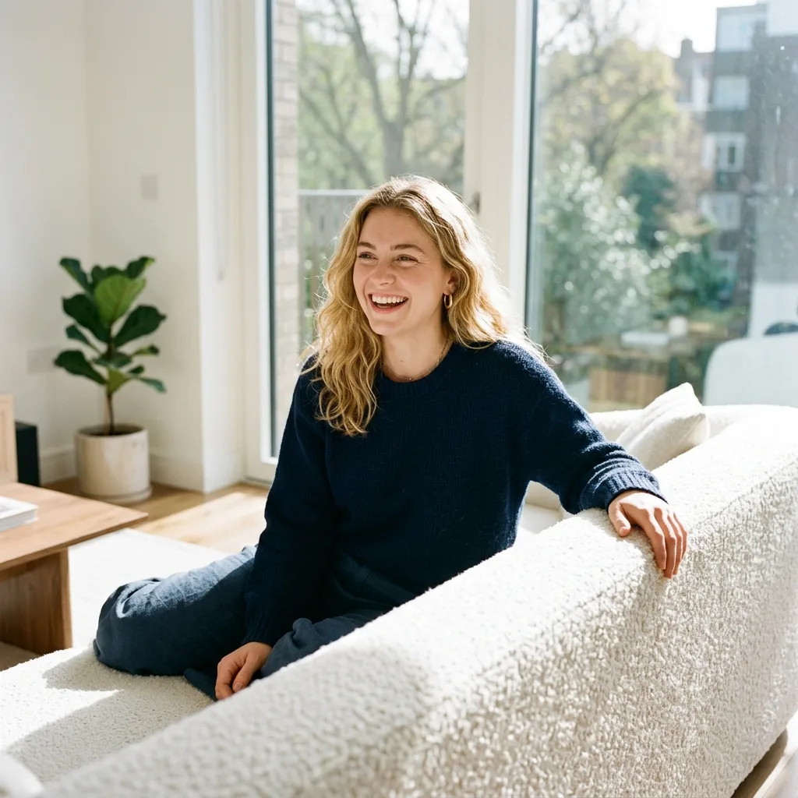

**#58 · Photography Prompt · <code>Vinano Image v2</code>**

<details>
<summary>Show prompt</summary>

```
{
 "image": {
 "general": {
 "style": "true-to-life photorealistic",
 "mood": "candid, playful",
 "lighting": {
 "type": "natural",
 "intensity": "harsh",
 "effect": {
 "high_contrast": true,
 "highlights": {
 "intensity": "strong",
 "focus": "on the subject and couch"
 },
 "shadows": {
 "intensity": "deep",
 "focus": "on the subject, couch"
 }
 }
 },
 "image_ratio": "3:4"
 },
 "scene": {
 "location": {
 "type": "indoor",
 "style": "modern living room",
 "elements": {
 "sofa": {
 "type": "plush",
 "color": "white",
 "texture": "soft, luxurious"
 },
 "lighting_source": {
 "type": "sunlight",
 "direction": "streaming from a large window",
 "effect": "bright and direct"
 },
 "room_features": ["minimalistic decor",
 "large windows",
 "open space natural light"]
 }
 }
 },
 "subject": {
 "identity": {
 "name": "England model

Emphasise material texture and natural light so the final frame feels tactile and premium.
```

</details>

---


**#59 · Photography Prompt · <code>Vinano Image Pro</code>**

<details>
<summary>Show prompt</summary>

```
{
 "task": "Generate a hyper-real studio photograph that matches the composition of the reference image: a centered adult person in a tuxedo, surrounded by many hands entering the frame from all sides holding objects toward the person, a curtain backdrop whose color matches the theme.",
 "variables": {
 "USER_PHOTO": "<<UPLOAD_OR_URL_TO_USER_FACE_OR_PORTRAIT>>",
 "SUBJECT_THEME": "<<ONE_CLEAR SUBJECT, e.g. 'music', 'gaming', 'cooking', 'finance', 'fitness'>>",
 "HAND_PROPS": ["<<PROP_1 RELATED TO SUBJECT_THEME>>",
 "<<PROP_2 RELATED TO SUBJECT_THEME>>",
 "<<PROP_3 RELATED TO SUBJECT_THEME>>",
 "<<PROP_4 RELATED TO SUBJECT_THEME>>",
 "<<PROP_5 RELATED TO SUBJECT_THEME>>",
 "<<PROP_6 RELATED TO SUBJECT_THEME>>",
 "<<PROP_7 RELATED TO SUBJECT_THEME>>",
 "<<PROP_8 RELATED TO SUBJECT_THEME>>"]
 },
 "prompt": "Create an ultra true-to-life photorealistic studio photo (hyper-real, DSLR look) the SAME composition and framing as the reference: a centered adult person standing front-facing, waist-up to mid-thigh visible, wearing a dark navy tuxedo jacket, crisp white shirt, and black bow tie, smiling confidently. The person has round eyeglasses and neat facial hair (mustache + short beard), but the FACE must be replaced the user's likeness from USER_PHOTO while keeping natural skin texture, pores, and realistic facial proportions (no plastic skin, no cartooning). The lighting is clean professional studio lighting soft shadows, high dynamic range, crisp detail.\n\nSurround the person 8–10 different hands and forearms entering the frame from the edges (top, left, right, bottom), each holding an object and aiming it toward the center person (close to the face/upper torso). The hands belong to different people (varied sleeves/patterns/colors), but keep them realistic and anatomically correct.\n\nIMPORTANT: The ONLY changing elements across generations are: (1) the user's face from USER_PHOTO, and (2) the objects held in the hands. Everything else stays consistent: the tuxedo pose, camera angle, lens look, and overall composition.\n\nOBJECT RULE: Select HAND_PROPS so they are strongly related to SUBJECT_THEME. The objects must be clearly visible, realistic, and varied (mix of modern and vintage if it fits). Examples by theme:\n- music: studio headphones, microphone, vinyl record, cassette, guitar pick, small synth, metronome\n- gaming: controller, handheld console, gaming headset, mouse, keyboard, VR accessory\n- cooking: chef thermometer, whisk, spice grinder, mini pan, piping bag, recipe card\n- finance: calculator, credit card reader, stock ticker printout, smartphone finance app, receipt roll\n- fitness: smartwatch, resistance band, shaker bottle, jump rope handle\n\nBACKGROUND: Use a curtain backdrop (like a stage/studio curtain) a color palette that matches SUBJECT_THEME (e.g., deep teal/purple for music, neon accents for gaming, warm beige/terracotta for cooking, cool gray/blue for finance, fresh greens for fitness). Keep the curtain texture and folds realistic.\n\nCamera/Render: 50mm lens look, shallow-to-moderate depth of field, sharp focus on the person’s face, slightly softer hands near the edges, high resolution, editorial portrait photography, natural reflections on objects, accurate specular highlights, no distortion.\n\nMaintain the exact 'surrounded by hands offering devices' vibe, but swap devices for theme-related objects. No text, no logos, no brand marks.",
 "reference_instructions": {
 "use_user_photo_as_identity_reference": true,
 "identity_strength": "high",
 "preserve_pose_and_outfit": true,
 "preserve_composition": "strict",
 "only_allow_changes": ["center face identity from USER_PHOTO",
 "HAND_PROPS objects",
 "curtain color palette matched to SUBJECT_THEME"]
 },

Keep edges clean and the overall composition balanced for a polished, gallery-ready result.
```

</details>

---

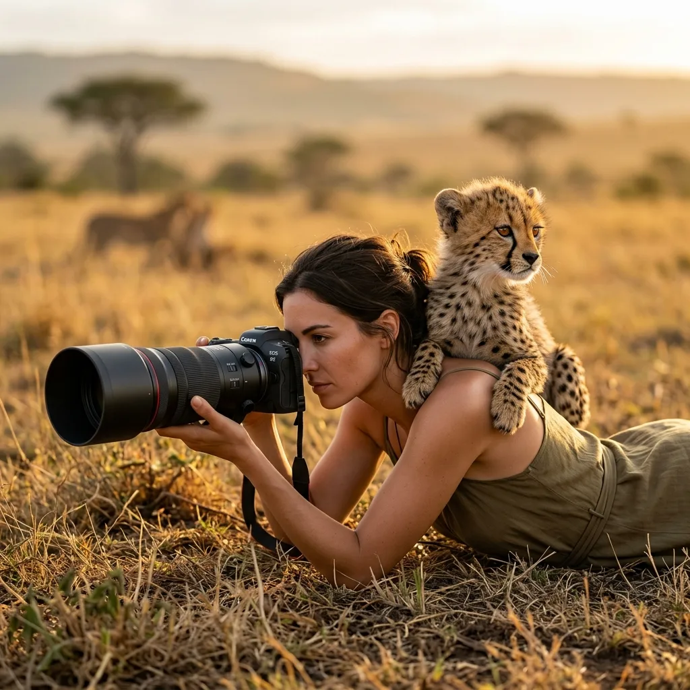

**#60 · Photography Prompt · <code>Vinano Image v2</code>**

<details>
<summary>Show prompt</summary>

```
Ultra-realistic wildlife photography scene: An elegant woman in a minimal earthy-toned wrap dress thin straps, lying flat on the grassy ground while holding a professional DSLR camera a large telephoto lens, intently focusing on wildlife. A playful cheetah cub sits on her shoulder, curiously gazing into the distance. Golden hour natural light bathes the African savannah background, cinematic depth of field, vibrant colors, and 8K ultra-detailed realism,4:5 image ratio. Render with rich micro-detail while keeping the layout uncluttered and intentional.
```

</details>

---

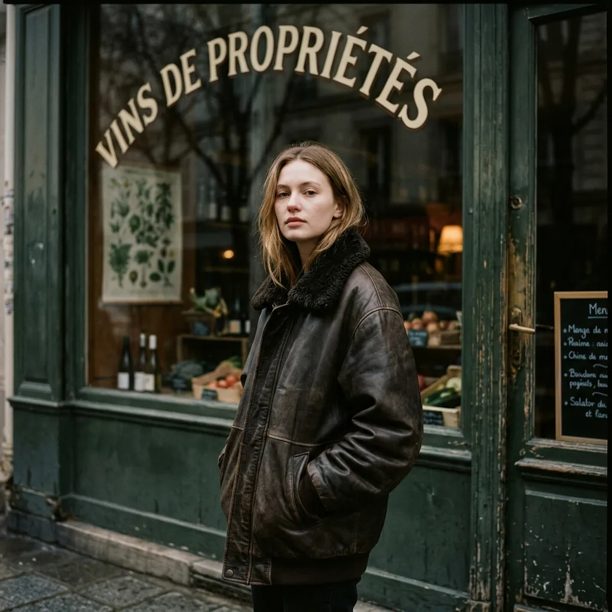

**#61 · Photography Prompt · <code>Vinano Image Pro</code>**

<details>
<summary>Show prompt</summary>

```
Ultra-realistic moody Paris street editorial portrait, shot outside a vintage shopfront at dusk/overcast twilight, film-scanned look. A young woman (early–mid 20s), fair skin, slim build, shoulder-length light brown/dark blonde hair a soft center/loose part, slightly tousled ends. Expression: calm, distant, slightly tired gaze; lips relaxed, almost pouting; eyes looking straight at camera subtle softness. Pose: standing close to the shop entrance, shoulders slightly forward, body angled 3/4; one hand tucked into the coat pocket (hand visible at pocket opening), the other arm relaxed inside the oversized coat. She is framed from mid-thigh to a little above head, vertical portrait.

Wardrobe: oversized brown leather/bomber-style coat a worn matte sheen, slightly wrinkled texture; very large fit dropped shoulders. Collar: thick black shearling/faux-fur collar folded up around the neck. No visible logos, no jewelry emphasis.

Location / Background details:

•She stands at the edge of a dark green/black painted wooden doorframe aged patina; the frame runs vertically on the right side of the image.

•Behind her is a large shop window reflective glass showing faint street reflections (trees/sky shapes), but interior objects remain visible.

•At the very top of the window, large curved cream lettering reads: “VINS DE PROPRIÉTÉS” (French text, arched across the glass).

•Inside the shop window, a botanical poster is visible on the left side (green leaves illustration), slightly blurred due to depth/reflection.

•Lower left inside the window: a display area dark surfaces and small objects (bottles/produce-like shapes), dimly lit.

•On the far right edge, partially inside the frame, a black menu/chalkboard small white writing is visible (text not fully readable), aligned vertically near the doorframe.

Lighting: natural ambient street light, soft and diffused; gentle highlights on cheekbones and nose; shadows are deep but not crushed. No direct flash. The shop interior glows faintly warm compared to the cooler exterior.

Color / Tone / Aesthetic: muted brown, olive-green, charcoal palette; cinematic, slightly desaturated; subtle warm sundayfunday undertone in skin and shop interior; overall dark, cozy, rainy-winter vibe (even if no rain visible). Film grain present, slight halation on highlights, mild vignette, soft contrast roll-off. Background softly blurred but readable; subject sharpest point is face and coat collar. Cooks.

Composition / Camera: vertical portrait (approx 4:5 feel), subject centered slightly left; window text occupies upper third; doorframe and menu board anchor the right third; medium shot at eye level, ~50mm perspective, shallow-to-moderate depth of field, realistic lens softness toward edges.

Surface / python Texture cues: aged paint on doorframe, smudged window reflections, leather coat creases, fur collar fibers visible, fine pores and natural skin texture.

Negative constraints: no extra props, no different outfit, no hat, no scarf, no bright colors, no neon signs, no modern clean storefront, no heavy HDR, no glossy beauty retouching, no smiling, no dramatic rim light, no changed text—keep “VINS DE PROPRIÉTÉS” exactly, keep the same framing and moody film vibe.

Render tags: ultra-realistic editorial street portrait, vintage Paris storefront, window typography, muted cinematic film scan, soft natural light, shallow DOF, fine grain, 4:5 vertical.

Emphasise material texture and natural light so the final frame feels tactile and premium.
```

</details>

---

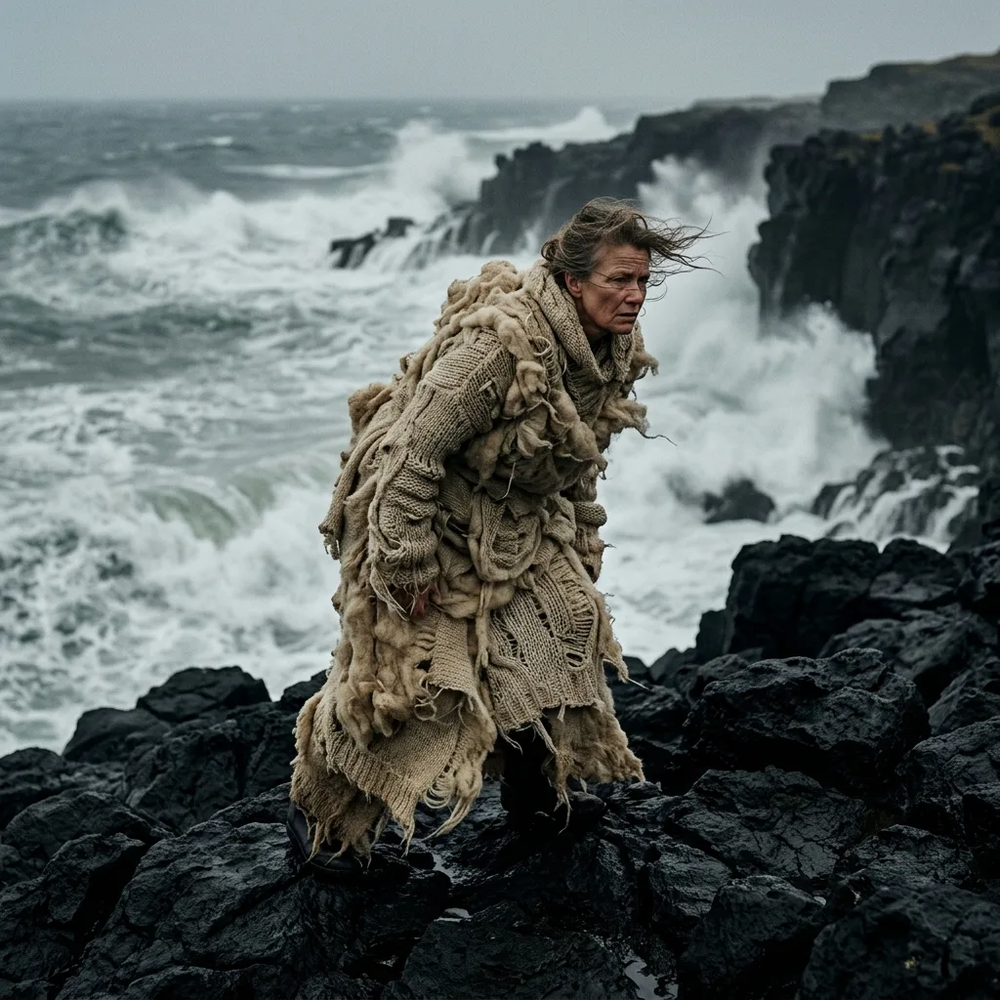

**#62 · Photography Prompt · <code>Vinano Image v2</code>**

<details>
<summary>Show prompt</summary>

```
Wide shot, subject acts as an anchor against a raging wind. Standing on a jagged black rock coastline, waves crashing behind in a gray blur. The subject leans forward against the gale. Outfit is a massive, shapeless layers of raw beige wool and distressed knitwear, creating a silhouette that looks like a eroding sculpture. Lighting is overcast, flat, and moody. Desaturated palette, muted earth tones, sharp texture on the fabric, cinematic anamorphic lens. KEEP FACE FEATURES IDENTICAL FROM ATTACHED IMAGE.
Negative Prompt: Sunny beach, vacation vibes, swimsuit, smiling, blue sky, vibrant colors, calm water, generic travel photography, face distortion.

Render with rich micro-detail while keeping the layout uncluttered and intentional.
```

</details>

---

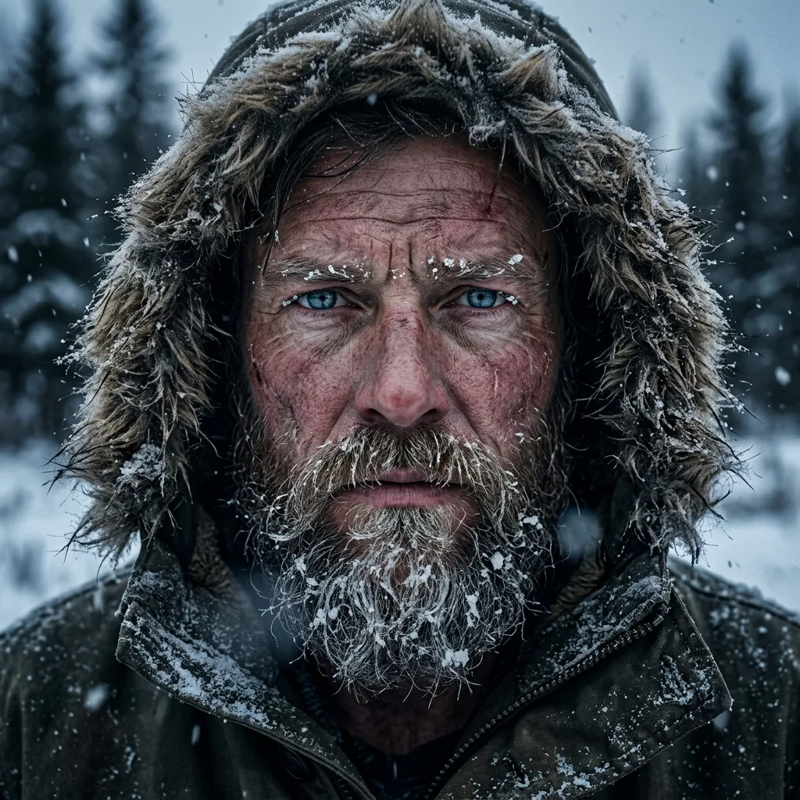

**#63 · Photography Prompt · <code>Vinano Image v2</code>**

<details>
<summary>Show prompt</summary>

```
{
 "Objective": "Create an intense cinematic close-up portrait conveying survival, resilience, and raw human strength in a harsh winter environment",
 "PersonaDetails": {
 "Subject": {
 "Type": "Rugged adult man",
 "Eyes": {
 "Color": "Piercing icy blue",
 "Focus": "Primary focal point of the image, razor sharp"
 },
 "FacialFeatures": {
 "Beard": "Thick, full beard",
 "Skin": "Weathered visible pores, fine texture, and subtle scars"
 },
 "Expression": "Intense, stoic, emotionally restrained",
 "Wardrobe": {
 "Outerwear": "Heavy winter coat fur-lined hood",
 "Framing": "Hood partially framing the face"
 }
 }
 },
 "EnvironmentalDetails": {
 "Season": "Winter",
 "Atmosphere": "Cold, harsh, unforgiving",
 "Snow": {
 "Details": "Snowflakes clinging to hair, eyelashes, eyebrows, and beard",
 "Motion": "Frozen mid-air and resting naturally on facial hair"
 }
 },
 "Composition": {
 "Framing": "Extreme close-up portrait",
 "Crop": "Tight crop emphasizing eyes and facial texture",
 "DepthOfField": "Very shallow depth of field",
 "Focus": "Ultra-sharp on eyes, soft falloff toward edges"
 },
 "LightingAndMood": {
 "LightingStyle": "Dramatic low-key filmic, cinematic lighting",
 "KeyLight": "Soft, directional light sculpting facial structure",
 "RimLight": "Cold rim light separating subject from background",
 "ColorGrading": "Moody cinematic tones cold blues and warm brown accents",
 "Mood": "Intense, raw, powerful, solitary"
 },
 "ArtDirection": {
 "Style": "Hyper-realistic cinematic photography",
 "Aesthetic": "Survival realism, raw human endurance",
 "TextureEmphasis": ["true-to-life photorealistic skin pores",
 "Beard hair detail",
 "Fur-lined fabric texture",
 "Ice and snow particles"]
 },
 "PhotographyStyle": {
 "Genre": "Cinematic survival portrait photography",
 "RealismLevel": "Extreme photorealism",
 "DetailLevel": "8K ultra-high detail controlled sharpness"
 },
 "Theme": {
 "Concept": "Survival, resilience, endurance against nature",
 "EmotionalImpact": "Strength, determination, quiet defiance"
 },
 "NegativePrompt": ["smooth skin",
 "beauty retouching",
 "flat lighting",
 "low contrast",
 "cartoon",
 "anime",
 "fantasy illustration",
 "blurry eyes"],
 "ResponseFormat": {
 "Type": "Single image",
 "Orientation": "Portrait",
 "AspectRatio": "2:3"
 }
}

Render with rich micro-detail while keeping the layout uncluttered and intentional.
```

</details>

---

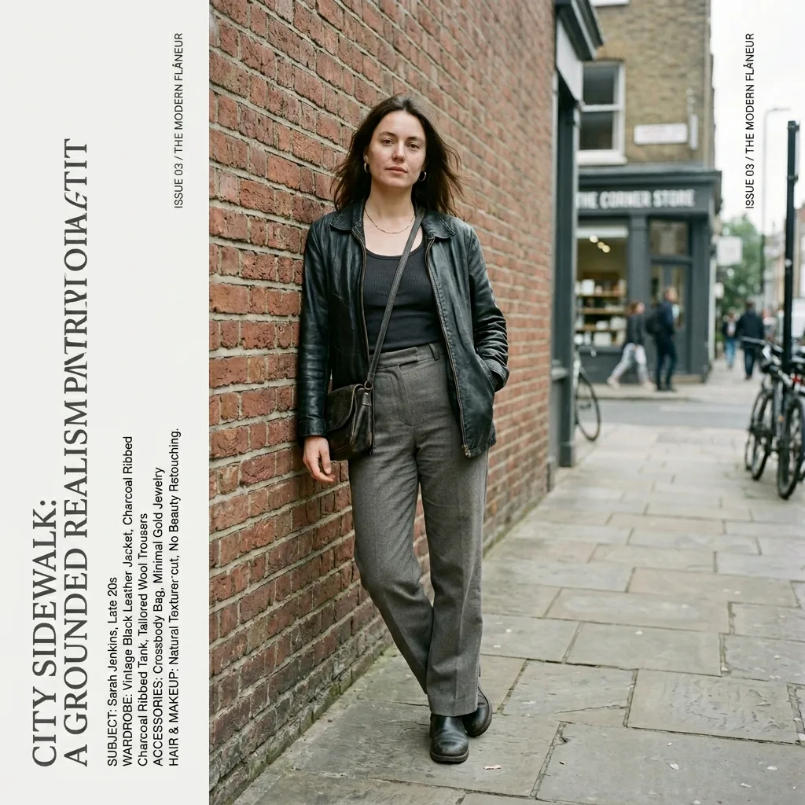

**#64 · Photography Prompt · <code>Vinano Image v2</code>**

<details>
<summary>Show prompt</summary>

```
{
 "scene": "Urban street portrait on a quiet city sidewalk",
 "subject": {
 "gender": "female",
 "age_range": "late 20s to early 30s",
 "expression": "neutral, introspective, calm confidence",
 "pose": "standing casually, leaning slightly against a brick wall, weight shifted to one leg, arms relaxed",
 "gaze": "looking directly at camera, unfazed, understated presence"
 },
 "wardrobe": {
 "outerwear": "black leather jacket natural wear and soft creases",
 "top": "dark charcoal ribbed tank top",
 "bottom": "high-waisted tailored wool trousers in muted grey",
 "accessories": "small dark leather crossbody bag, minimal jewelry",
 "styling_notes": "effortless, functional, lived-in fashion, no trend exaggeration"
 },
 "hair_and_makeup": {
 "hair": "natural medium-length hair, loose and slightly wind-touched, no styling product shine",
 "makeup": "minimal or none, natural skin texture visible, subtle under-eye shadows, real pores"
 },
 "environment": {
 "location": "narrow city street brick wall and storefronts",
 "background": "softly out-of-focus bicycles and pedestrians in the distance",
 "era_feel": "timeless contemporary, everyday realism"
 },
 "lighting": {
 "type": "natural overcast daylight",
 "direction": "soft frontal gentle side falloff",
 "contrast": "low to medium contrast",
 "notes": "no harsh highlights, no dramatic rim light"
 },
 "camera": {
 "lens": "50mm full-frame look",
 "framing": "full-body portrait, eye-level perspective",
 "depth_of_field": "moderately shallow, subject separated subtly from background",
 "movement": "static, documentary stillness"
 },
 "color_and_texture": {
 "color_palette": "muted earth tones, soft greys, natural skin tones",
 "texture": "visible fabric weave, brick texture, light film grain",
 "grading": "neutral, slightly cool, filmic, no teal-orange"
 },
 "aesthetic_constraints": ["no plastic skin",
 "no beauty retouching",
 "no cinematic exaggeration",
 "no fashion editorial posing",
 "no artificial glow",
 "avoid AI symmetry"],
 "overall_vibe": "quiet confidence, observational, grounded realism, modern street portrait"
}

Aim for an editorial, design-driven look with deliberate negative space.
```

</details>

---

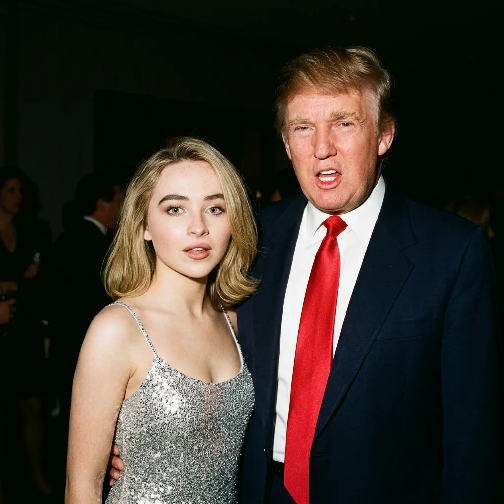

**#65 · Photography Prompt · <code>Vinano Image Pro</code>**

<details>
<summary>Show prompt</summary>

```
Donald Trump and Sabrina Carpenter

Prompt:

{
 "lighting": {
 "mood": "Candid, slightly harsh evening lighting",
 "type": "On-camera flash",
 "shadows": "Strong shadows visible, especially on the woman's neck and behind the subjects",
 "direction": "Frontal lighting",
 "intensity": "Harsh, creating highlights on faces and the dress"
 },
 "background": {
 "setting": "Likely an indoor evening event or party",
 "elements": "Faint, indistinct shapes of other people or objects in the distance",
 "description": "Extremely dark and underexposed due to flash",
 "depth_of_field": "Shallow, background is completely blurred"
 },
 "typography": {
 "details": "No visible text or logos",
 "present": "None"
 },
 "composition": {
 "angle": "Slightly from the right, eye-level",
 "focus": "Sharp focus on the two subjects, particularly their faces",
 "framing": "Tight framing on the couple",
 "shot_type": "Medium shot",
 "orientation": "Portrait",
 "positioning": "Woman on the left, man on the right, standing closely together"
 },
 "color_profile": {
 "palette": "Dark suit, bright red tie, silver sparkling dress, warm skin tones, dark background",
 "contrast": "High contrast due to flash",
 "saturation": "Moderate saturation",
 "color_grading": "Typical 1990s flash photography, slightly warm hues",
 "dominant_colors": ["#000000",
 "#FFFFFF",
 "#C0C0C0",
 "#FF0000"]
 },
 "technical_specs": {
 "grain": "Visible film grain",
 "source": "Photograph, likely film from the 1990s",
 "sharpness": "Relatively sharp on subjects, background is blurry and dark",
 "resolution": "Medium resolution scan",
 "aspect_ratio": "Approx. 9:16 (square)"
 },
 "subject_analysis": {
 "man": {
 "hair": "Blonde, brushed back",
 "attire": "Dark navy suit, white collared shirt, bright red tie",
 "identity": "Donald Trump (younger)",
 "position": "Right side of the frame",
 "expression": "Mouth open, possibly speaking or grimacing"
 },
 "woman": {
 "hair": "Shoulder-length blonde hair",
 "attire": "Silver, sparkling, spaghetti-strap dress",
 "jewelry": "Small earring visible on left ear",
 "identity": "Blonde woman (possibly Kara Young)",
 "position": "Left side of the frame",
 "expression": "Looking directly at camera, slightly open mouth"
 }
 },
 "artistic_elements": {
 "mood": "Slightly awkward, caught-in-the-moment",
 "style": "Candid celebrity snapshot",
 "texture": "Prominent texture of the woman's sparkling silver dress",
 "expression": "Man is speaking or grimacing, woman is looking directly at the camera a slightly open mouth",
 "compositional_balance": "Balanced, the two subjects occupying the majority of the frame"
 },
 "generation_parameters": {
 "prompt": "A candid photograph from the 1990s of Donald Trump in a dark suit and red tie, standing next to a blonde woman in a silver sparkling dress. Both are looking at the camera, Trump's mouth open. The image is taken an on-camera flash at an evening event, a very dark background.",
 "style_tags": ["1990s photography",
 "flash photography",
 "candid snapshot",
 "celebrity photo"],
 "negative_prompt": "modern photography, digital look, bright background, perfectly posed, studio lighting"
 }
}

Maintain consistent colour harmony and crisp focus across the whole frame.
```

</details>

---

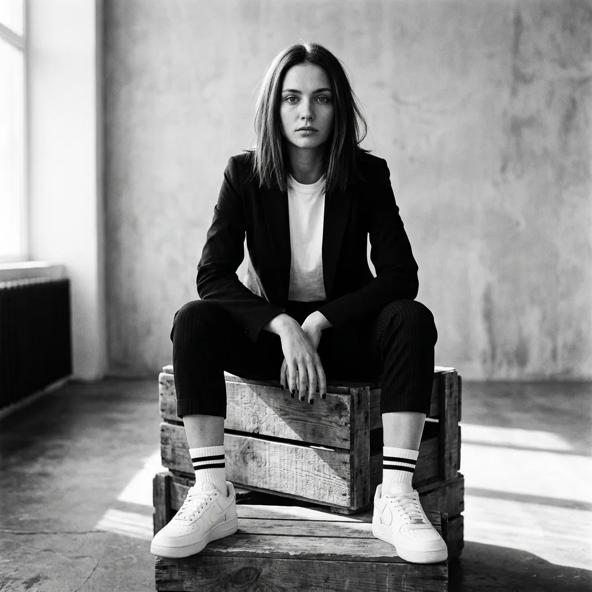

**#66 · Photography Prompt · <code>Vinano Image v2</code>**

<details>
<summary>Show prompt</summary>

```
Create a realistic portrait (100% identical face, no editing allowed).
A hyper-realistic black-and-white portrait of a young beautiful woman a calm, serious, and introspective expression, sitting casually on a stack of rustic wooden crates in a refined minimalist studio setting. She faces the camera directly a relaxed yet confident posture, her legs slightly apart, one hand resting naturally between her knees and the other loosely stretched across her thigh, creating a powerful editorial fashion pose.
She has straight, dark, shoulder-length hair a natural center parting, slightly tousled, gently framing her face. Her facial features are delicate and symmetrical, a naturally smooth skin texture, subtle shadows under her eyes, soft, slightly parted lips, and deep, expressive eyes staring directly into the lens, conveying a calm confidence and emotional depth. The lack of heavy makeup emphasizes the natural editorial aesthetic.
Clothing & Style:
She wears a fitted black blazer structured shoulders over a simple white crew-neck T-shirt, paired cropped black striped trousers. On her feet are modern, chunky white sneakers, paired white calf-length socks bold black horizontal stripes, adding a casual street-style contrast to the formal blazer. Minimal accessories, no visible jewelry. Her nails are painted black.
Lighting & Ambiance:
High-contrast filmic, cinematic lighting strong, directional natural light coming in from the side, creating dramatic diagonal streaks of light and shadow on the plain studio walls and partly on her body. The lighting creates depth, texture, and a moody editorial atmosphere reminiscent of a high-end fashion magazine. Soft shadows preserve facial details while maintaining strong contrast.
Camera & Composition:
Medium-full-length shot, eye-level perspective, centered composition. Shot a professional DSLR or medium format camera, a prime lens (50mm–85mm). Shallow depth of field sharp focus on the subject, subtle background blur. Sharp details, subtle texture of fabric, visible skin pores, realistic falloff.

Style & Quality:
Editorial fashion photography, refined minimalist, cinematic, monochrome aesthetic, Vogue-style portraiture, ultra-high resolution, sharp focus, film-like contrast, timeless and modern atmosphere.

Render with rich micro-detail while keeping the layout uncluttered and intentional.
```

</details>

---

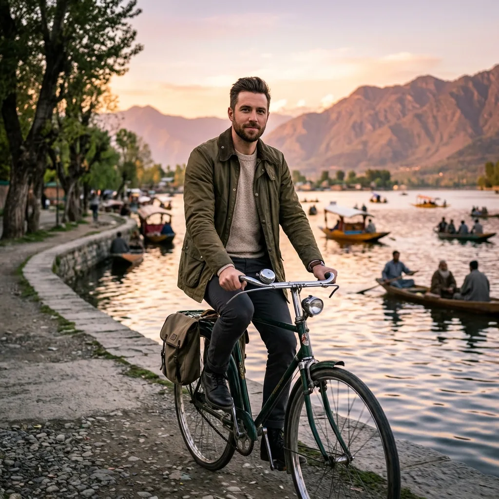

**#67 · Photography Prompt · <code>Vinano Image v2</code>**

<details>
<summary>Show prompt</summary>

```
A realistic cinematic photograph of a handsome man riding a bicycle along the edge of Dal Lake at sunset, wearing an olive-green jacket over a light sweater, black trousers and dark shoes. He has short styled hair and a trimmed beard, looking calmly toward the camera a slight confident expression. Warm golden-hour light reflecting on the lake, traditional shikara boats people rowing in the background, soft ripples in the water, distant mountains under a pastel sky orange and pink hues. Shallow depth of field, natural colors, high detail, lifestyle travel photography, ultra-realistic, 4K quality. Maintain consistent colour harmony and crisp focus across the whole frame.
```

</details>

---


**#68 · Photography Prompt · <code>Vinano Image v2</code>**

<details>
<summary>Show prompt</summary>

```
{
 "generation_request": {
 "meta_data": {
 "tool": "",
 "task_type": "photoreal_cinematic_travel_couple_low_angle_airplane_overhead_with_baby",
 "version": "v1.1_SHOULDERS_CARRY_PLANE_SKY_HERO_SHOT_BABY_LIFT",
 "priority": "highest"
 },
 "references": {
 "female_reference_image": {
 "slot": 1,
 "purpose": "FEMALE_IDENTITY_LOCK",
 "strict_identity_lock": true
 },
 "male_reference_image": {
 "slot": 2,
 "purpose": "MALE_IDENTITY_LOCK",
 "strict_identity_lock": true
 },
 "composition_reference_image": {
 "source": "UPLOAD_REFERENCE_IMAGE (OPTIONAL)",
 "purpose": "COMPOSITION_POSE_PROP_LOCK",
 "strict_lock": true,
 "no_layout_drift": true,
 "preserve_framing": true
 }
 },
 "output_settings": {
 "aspect_ratio": "4:5",
 "orientation": "portrait",
 "resolution": "ultra_high_res",
 "render_style": "ultra_photoreal_cinematic_lifestyle",
 "sharpness": "crisp_but_natural",
 "film_grain": "subtle_analog",
 "color_grade": "clean_true_to_life_warm_daylight"
 },
 "hard_constraints": ["Exactly 3 subjects only: one female, one male, and one baby (infant/toddler).",
 "Faces of the adult couple must match the uploaded references maximum similarity (no morphing).",
 "Match the reference composition: extreme low-angle hero shot, man carrying woman on his shoulders.",
 "Woman holds the baby securely and lifts the baby slightly upward (safe, realistic lift; not extreme).",
 "A commercial airplane must be clearly visible overhead in the sky (top area of frame).",
 "No text, no logos, no watermark.",
 "Photoreal anatomy (no extra limbs/fingers), realistic footwear and clothing folds."],
 "camera": {
 "style": "cinematic travel lifestyle photo",
 "lens": "24mm",
 "aperture": "f/2.8",
 "focus": "sharp on couple faces and baby, slight falloff toward shoes",
 "shutter_speed": "1/1600",
 "iso": 100,
 "white_balance": "bright clear daylight"
 },
 "lighting": {
 "type": "direct sunny daylight",
 "contrast": "medium",
 "highlights": "natural sun highlights, controlled (no blown skin)",
 "shadows": "soft-ish due to open sky bounce"
 },
 "prompt": {
 "scene_summary": "Ultra-photoreal cinematic travel lifestyle photo. Extreme low-angle hero perspective looking up at a family against a wide open blue sky. The man carries the woman on his shoulders; she sits securely legs draped to each side, sneakers visible close to camera. The woman holds a baby securely and lifts the baby upward in a joyful 'flying' moment (safe realistic lift: baby raised only slightly above her face level, supported both hands, baby’s head/neck naturally supported). The man smiles, holding the woman’s legs/ankles for support, stance stable and natural. A commercial passenger airplane flies overhead, centered near the top of the frame, clearly recognizable realistic scale, motion blur minimal.\n\nWardrobe & vibe (match reference):\n- Soft casual neutrals: man in a cream/beige sweater and light denim; woman in an oversized pastel/pink sweatshirt; clean white sneakers.\n- Baby in a simple pastel onesie (no text/logos), weather-appropriate.\n- Natural, candid happiness; relaxed weekend travel vibe.\n\nComposition & realism:\n- Blue sky fills most of the background; minimal clouds.\n- Strong perspective distortion typical of a 24mm lens; sneakers and legs appear slightly larger due to proximity.\n- Realistic skin texture, fabric knit detail, and accurate shadows.\n- Ensure faces are clearly visible and sharp, natural expressions (no beautify filter).\n\nSafety/pose realism:\n- Baby is held securely both hands, no extreme overhead throwing, no unsafe angles.",
 "styling_notes": ["keep the exact low-angle hero shot",
 "man carrying woman on shoulders remains the core pose",
 "woman lifts baby slightly upward while keeping secure support",
 "airplane must be visible and not cropped",
 "avoid sunglasses unless they exist in the identity references"]
 },
 "negative_prompt": ["extra people",
 "missing airplane",
 "airplane cropped",
 "unsafe baby pose (throwing baby high)",
 "baby unsupported head/neck",
 "cartoon",
 "anime",
 "cgi",
 "plastic skin",
 "over-smoothing",
 "face morph",
 "identity drift",
 "deformed hands",
 "extra fingers",
 "extra limbs",
 "text",
 "logo",
 "watermark",
 "blown highlights"]
 }
}

Emphasise material texture and natural light so the final frame feels tactile and premium.
```

</details>

---

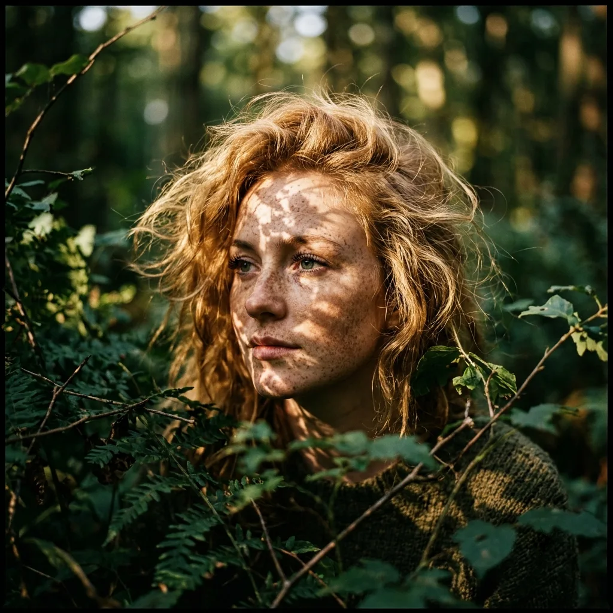

**#69 · Photography Prompt · <code>Vinano Image v2</code>**

<details>
<summary>Show prompt</summary>

```
Close-up portrait of a young woman messy, voluminous strawberry blonde hair and heavy freckles across her nose and cheeks. She is partially obscured by dark green forest foliage in the foreground. Dramatic filmic, cinematic lighting dappled golden sunlight filtering through leaves, creating high-contrast shadows across her face. Dreamy, ethereal atmosphere, soft bokeh background of a dense forest, shot on 35mm film, earthy tones, hyper-realistic skin textures.
​Key Elements to Tweak
​If you want to adjust the vibe, try changing these specific keywords:
​Lighting: Swap "dappled sunlight" for "rim lighting" to get a glowing outline around her hair, or "overcast" for a moodier, softer look.
​Framing: Use "extreme close-up" to focus purely on the eyes and freckles, or "medium shot" to show more of the forest environment.
​Color Palette: Add "analog film aesthetic" for that slightly grainy, nostalgic feel seen in your image, or "vibrant forest greens" to make the leaves pop.

Preserve realistic proportions and depth for a confident, professional finish.
```

</details>

---

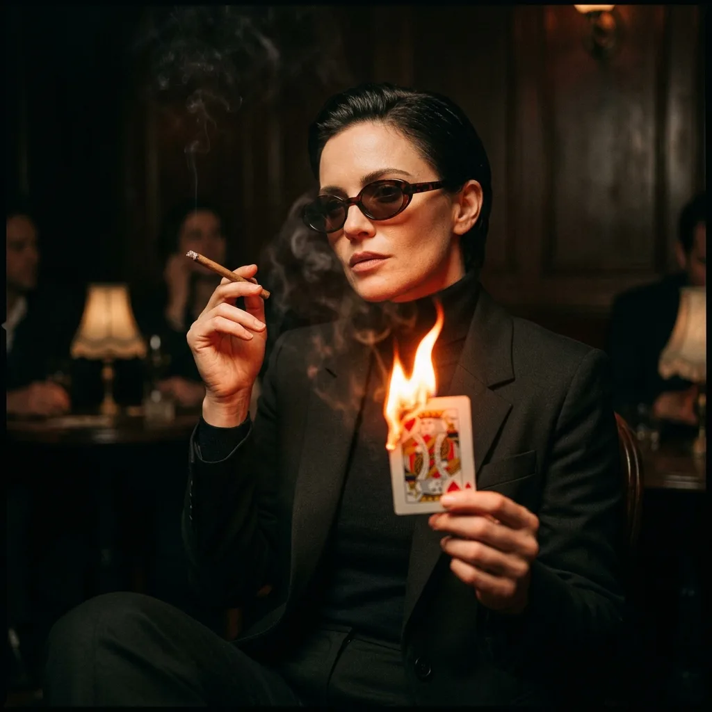

**#70 · Photography Prompt · <code>Vinano Image v2</code>**

<details>
<summary>Show prompt</summary>

```
A cinematic, moody portrait of a stylish women in dark suit and oval sunglasses, smoking a thin medium cigar while holding a burning playing card in his hand king of hearts, dramatic fire and smoke swirling in the air, low-key lighting, warm orange fire glow illuminating her face, dark blurred background, shallow depth of field, ultra-realistic, high contrast, cinematic photography, 35mm lens look, soft bokeh, detailed skin texture, sharp focus, professional lighting, dark noir atmosphere. Maintain consistent colour harmony and crisp focus across the whole frame.
```

</details>

---

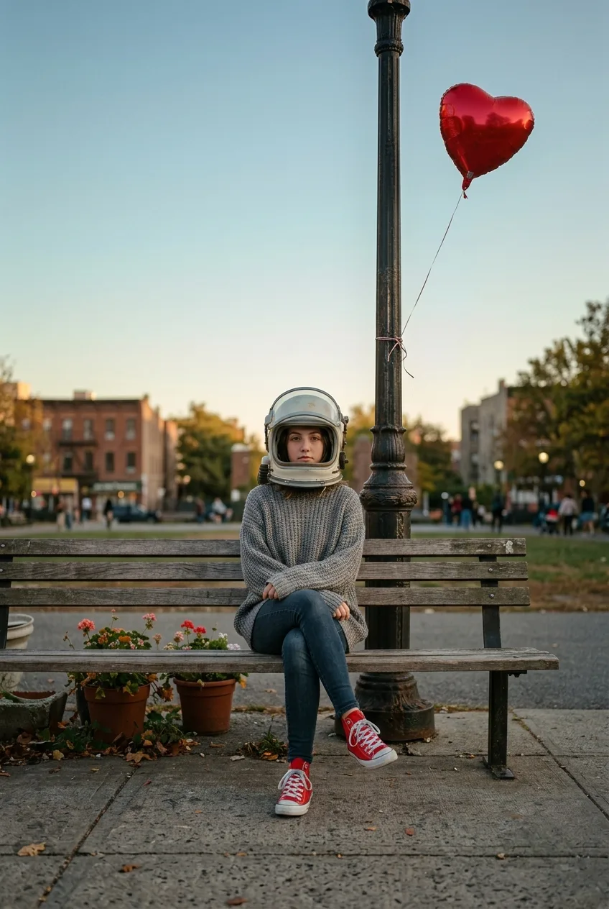

**#71 · Photography Prompt · <code>Vinano Image Pro</code>**

<details>
<summary>Show prompt</summary>

```
{
"image_type": "photograph",
"orientation": "vertical",
"aspect_ratio": "2:3",
"composition": {
"framing": "centered subject strong vertical symmetry",
"rule_of_thirds": "subject centered vertically, balloon positioned upper-right third",
"depth": "moderate depth of field softly blurred background",
"leading_elements": "bench slats and lamppost create vertical and horizontal structure",
"negative_space": "open sky occupying upper half of frame"
},
"primary_subject": {
"description": "young person seated on a wooden park bench wearing an astronaut helmet",
"pose": "seated, knees together, arms folded inward, posing towards camera",
"emotion": "introspective, melancholic, whimsical loneliness",
"clothing": {
"top": "oversized gray sweater",
"bottom": "dark skinny jeans",
"footwear": "red high-top sneakers white laces",
"accessories": "vintage-style astronaut helmet"
}
},
"secondary_subjects": [{
"type": "object",
"description": "red heart-shaped helium balloon",
"position": "upper right, tethered to lamppost",
"symbolism": "love, longing, fragility"
},
{
"type": "environment_object",
"description": "classic street lamppost",
"position": "right side of frame",
"function": "anchor point for balloon string"
}],
"environment": {
"location_type": "urban park or public square",
"foreground": "flower pots small blooming flowers beneath bench",
"background": "low-rise buildings and distant urban elements",
"sky": "clear soft gradient"
},
"color_palette": {
"dominant_colors": ["muted teal sky",
"warm brown wood",
"charcoal gray clothing"],
"accent_colors": ["vivid red balloon",
"bright red sneakers"],
"overall_tone": "muted selective saturation"
},
"lighting": {
"type": "natural light",
"time_of_day": "golden hour or late afternoon",
"direction": "soft ambient, slightly directional from left",
"contrast": "low to medium",
"highlights": "subtle reflections on astronaut visor and balloon surface",
"shadows": "soft, diffused shadows under bench and subject"
},
"technical_details": {
"camera_angle": "eye-level",
"lens_effect": "slight background compression suggesting mid-range focal length",
"focus": "sharp on subject, gentle background blur",
"grain": "minimal, clean digital look"
},
"artistic_style": {
"genre": "conceptual portrait photography",
"mood": "surreal, poetic, nostalgic",
"themes": ["isolation",
"imagination",
"emotional distance",
"childhood wonder"],
"visual_metaphors": ["astronaut helmet representing emotional separation",
"heart balloon symbolizing unattainable or fragile love"]
},
"typography": {
"present": false
},
"overall_aesth
etic": "cinematic, dreamy, modern surrealism lifestyle photography influences"
}

Emphasise material texture and natural light so the final frame feels tactile and premium.
```

</details>

---

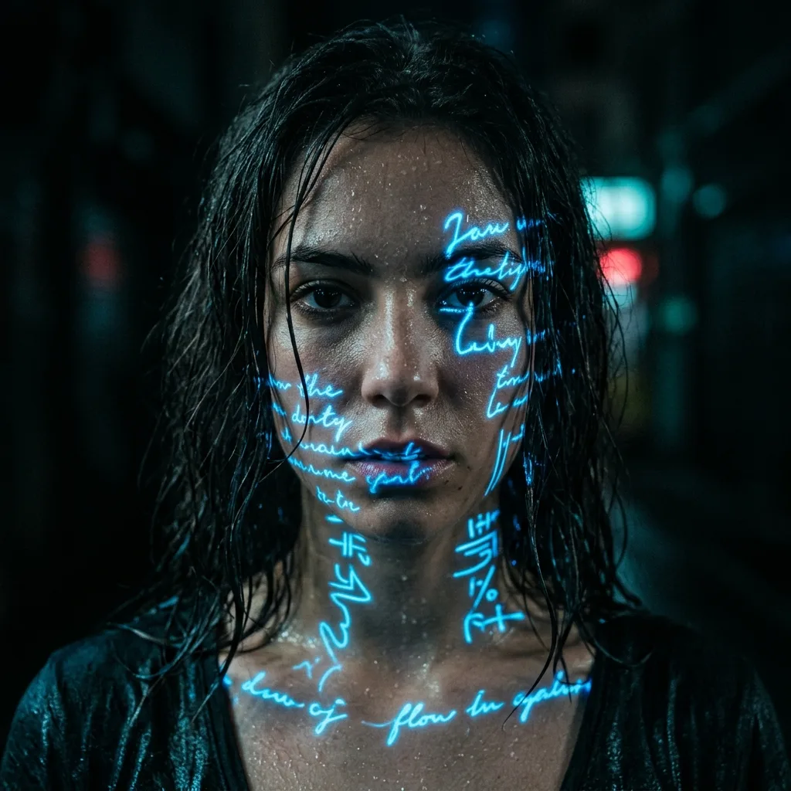

**#72 · Photography Prompt · <code>Vinano Image v2</code>**

<details>
<summary>Show prompt</summary>

```
A cinematic, hyper-realistic close-up portrait of a mysterious young woman in darkness, wet skin glistening as if in rain. Neon blue glowing handwritten text and symbols are projected across her face and upper body, wrapping around her eyes, cheeks, lips, and collarbones like living poetry. Her intense gaze looks directly into the camera, eyes sharp and reflective. Damp, tousled hair frames her face, partially shadowed. The lighting is low-key and dramatic, teal and cyan highlights illuminating her skin while the background fades into deep black. Ultra-detailed skin texture, glossy reflections, shallow depth of field, cyber-poetic aesthetic, futuristic noir mood, emotional and intimate atmosphere, filmic, cinematic lighting, 8K, photorealism. Preserve realistic proportions and depth for a confident, professional finish.
```

</details>

---

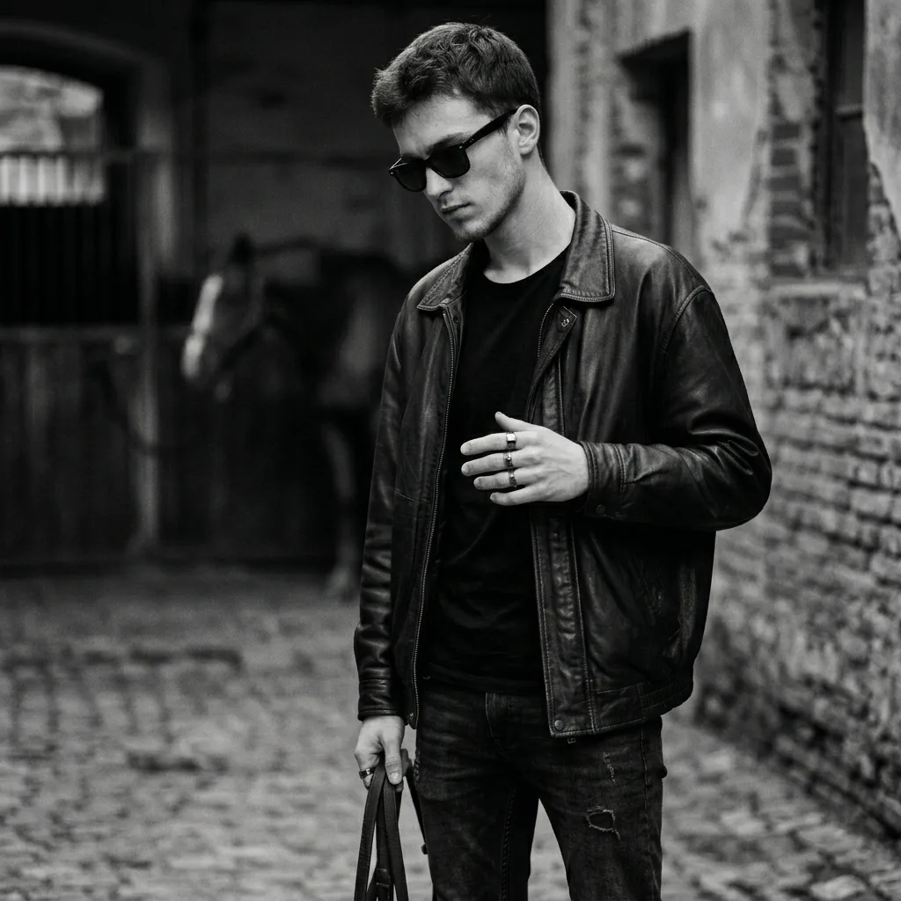

**#73 · Photography Prompt · <code>Vinano Image v2</code>**

<details>
<summary>Show prompt</summary>

```
Ultra-realistic 8K cinematic black-and-white portrait photograph, portrait aspect ratio 1664*2080. An 18-year young handsome man a slim skinny body, lean physique, narrow shoulders and waist, youthful proportions, captured in a COMPLETELY NEW attitude-heavy pose a NEW background position. He is standing this time (not seated), slightly off-center in the frame, body angled three-quarters away from the camera, one shoulder closer to lens, head tilted downward chin tucked, strong swag-filled stance. One hand casually gripping the horse lead near his thigh, the other hand lifted near chest level relaxed fingers to clearly show rings. Keep my face exactly the same as in the uploaded photo - do not change or edit my face. 100% face accuracy. Facial expression is cold, detached, controlled dominance; gaze downward and sideways, partially hidden behind dark sunglasses, creating a mysterious authority vibe. Natural facial structure light stubble, real skin pores Aim for an editorial, design-driven look with deliberate negative space.
```

</details>

---

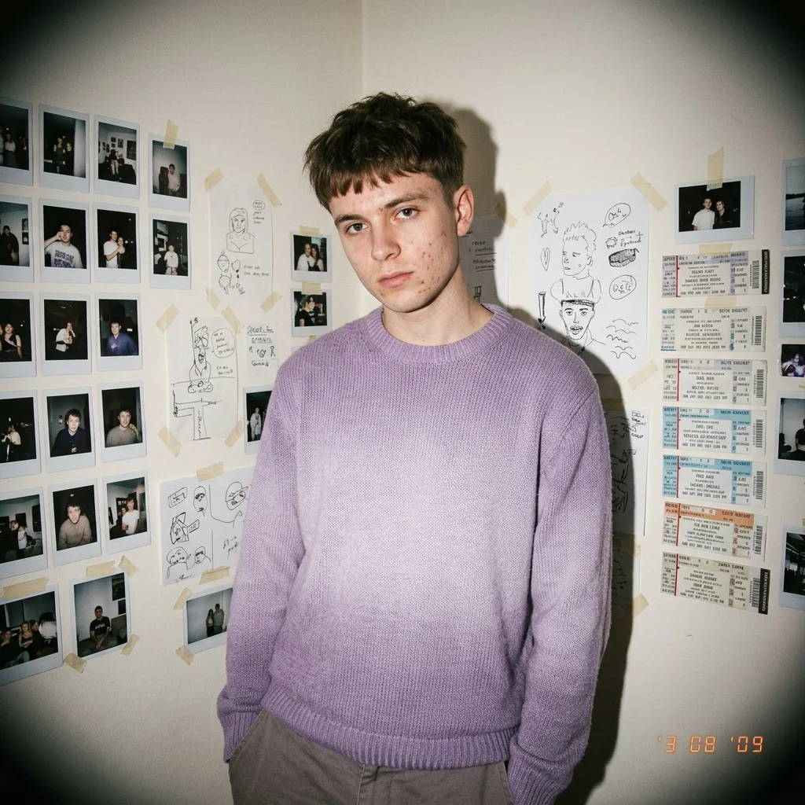

**#74 · Photography Prompt · <code>Vinano Image v2</code>**

<details>
<summary>Show prompt</summary>

```
{
 "scene": "An intimate indoor portrait taken in a personal bedroom or studio space, walls covered taped photos, sketches, and ticket stubs",
 "subject": {
 "gender": "male",
 "age": "early 20s",
 "expression": "calm, slightly guarded, introspective",
 "pose": "standing casually, shoulders relaxed, slight lean, hands out of frame",
 "gaze": "direct but unforced eye contact the camera",
 "hair": "short, messy crop natural volume, slightly uneven fringe",
 "wardrobe": {
 "top": "textured knit sweater soft purple gradient fade",
 "bottom": "muted trousers, understated and casual",
 "style": "effortless, lived-in, indie editorial"
 }
 },
 "environment": {
 "location": "personal room or creative space",
 "background_elements": ["polaroid photographs taped to wall",
 "handwritten sketches and doodles",
 "concert or travel ticket stubs",
 "masking tape visible and imperfect"],
 "atmosphere": "nostalgic, personal, slightly raw"
 },
 "lighting": {
 "type": "direct on-camera flash",
 "quality": "harsh but controlled",
 "shadow": "hard shadows falling behind subject",
 "mood": "late 90s / early 2000s candid realism"
 },
 "camera": {
 "shot_type": "medium portrait",
 "lens": "35mm",
 "perspective": "eye-level, snapshot-style framing",
 "depth_of_field": "deep enough to keep wall details readable",
 "imperfections": "slight vignetting, flash falloff"
 },
 "color_grading": {
 "palette": "muted neutrals soft lavender emphasis",
 "contrast": "moderate",
 "tones": "natural skin tones slight warmth"
 },
 "texture_and_detail": {
 "skin": "real texture, visible blemishes, no smoothing",
 "fabric": "clearly defined knit texture",
 "grain": "noticeable film grain",
 "timestamp": "subtle date stamp in corner"
 },
 "style": "analog-inspired, diary-like portrait, lo-fi editorial realism",
 "negative_prompt": ["studio lighting",
 "beauty retouching",
 "plastic skin",
 "perfect symmetry",
 "over-sharpening",
 "clean minimal background",
 "AI artifacts"]
}

Emphasise material texture and natural light so the final frame feels tactile and premium.
```

</details>

---

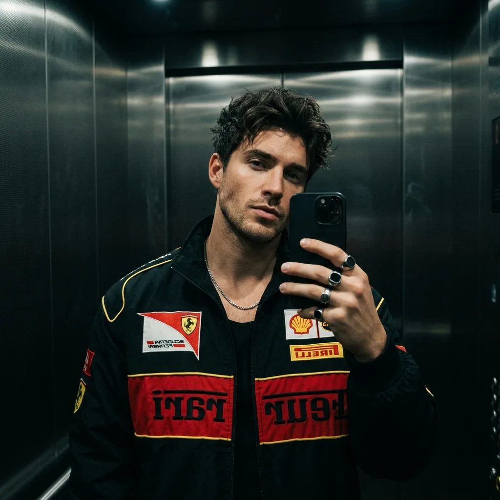

**#75 · Photography Prompt · <code>Vinano Image v2</code>**

<details>
<summary>Show prompt</summary>

```
A moody cinematic mirror selfie of a stylish young man use image for face reference tousled dark hair and light stubble, wearing a black Ferrari racing jacket red and yellow stripes and motorsport patches. He has a silver chain necklace and multiple rings, holding a modern smartphone in one hand. Low-key dramatic lighting, dark elevator interior soft reflections, shallow depth of field, sharp focus on the subject’s face. Fashion editorial style, masculine aesthetic, realistic skin texture, ultra-detailed, 35mm photography, cinematic color grading, high contrast, true-to-life photorealistic, 4K. Aim for an editorial, design-driven look with deliberate negative space.
```

</details>

---

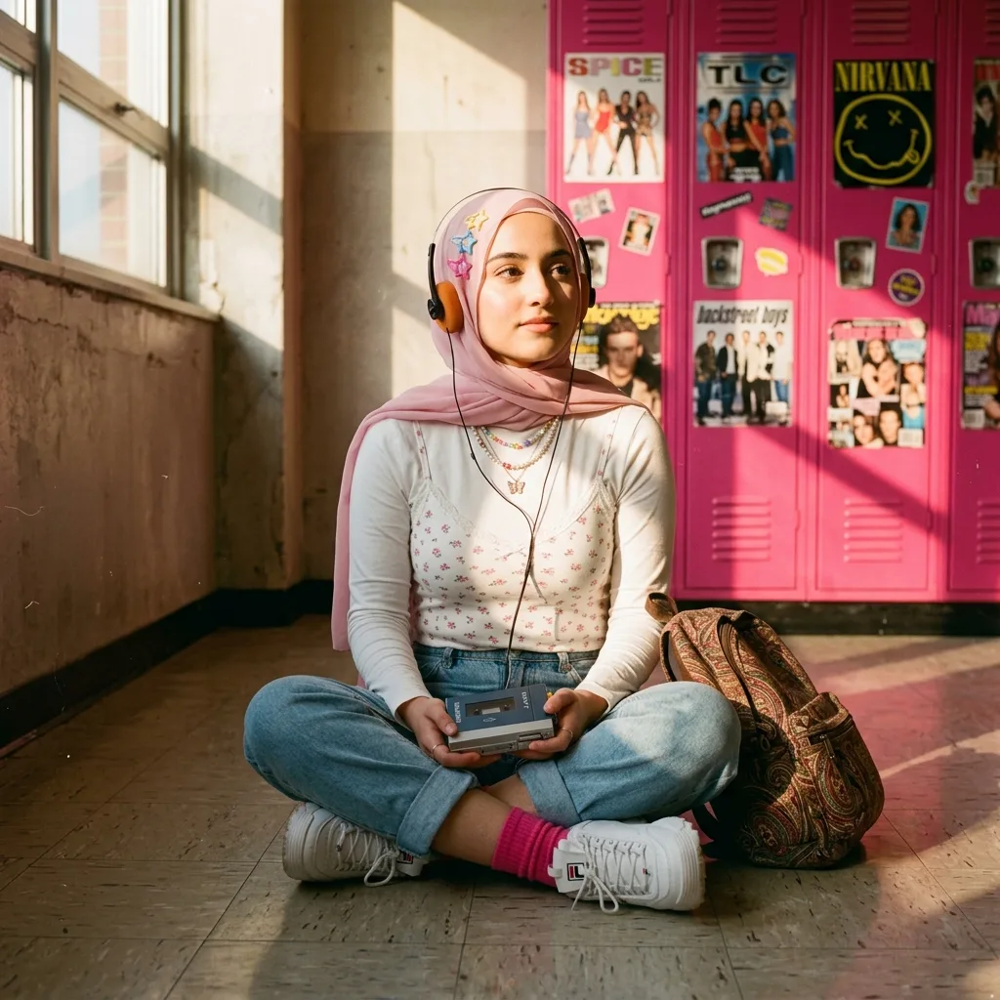

**#76 · Photography Prompt · <code>Vinano Image v2</code>**

<details>
<summary>Show prompt</summary>

```
A cinematic, nostalgic portrait of a young hijab woman (use the reference photo) sitting cross-legged on the floor of a retro school hallway, bathed in warm, golden-hour sunlight. She has a soft, contemplative expression, gazing dreamily off-camera to the right. She wears a pink chiffon hijab adorned colorful star-shaped hair clips on the left side.Her outfit is Y2K-inspired: a white long shirt layered under a white spaghetti-strap camisole a delicate vintagefloral print, layered pearl necklaces, high-waisted light-wash denim jeans cuffed at the ankles, vibrant hot-pink ribbed socks, and chunky white sneakers. She holds a vintage silver cassette player in both hands and wears large, retro orange foam headphones. A woven paisley-patterned backpack sits next to her.The background features a row of vibrant hot-pink metal lockers covered in retro magazine cutouts and band posters. Strong, diagonal shadows from a nearby window cast a dramatic, warm glow across the lockers and her face. Dreamy coming-of-age movie aesthetic, high-resolution textures, soft depth of field, 35mm film grain style --ar 9:16 --style raw Preserve realistic proportions and depth for a confident, professional finish.
```

</details>

---

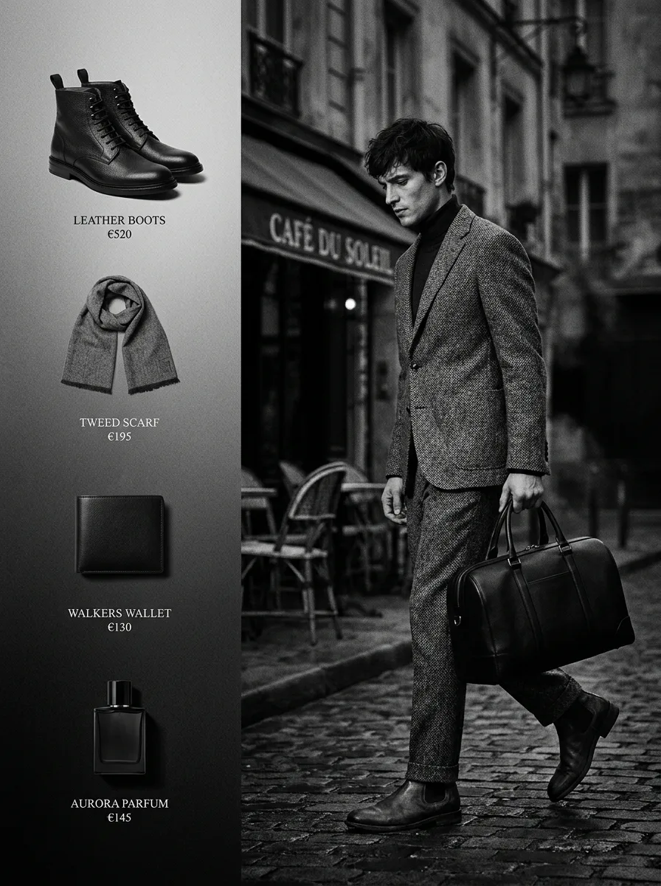

**#77 · Photography Prompt · <code>Vinano Image Pro</code>**

<details>
<summary>Show prompt</summary>

```
A high-fashion black and white editorial campaign image a 3:4 aspect ratio, split into two vertical sections. Strong contrast, rich tonal depth, cinematic grain.
RIGHT SIDE:

A man captured mid-step in a Parisian street café scene. Architecture dissolves into soft gradients and shadow. Light sculpts the face and garments rather than illuminating the scene.
He wears a tweed tailored jacket and matching trousers, the fabric rendered through contrast and texture rather than color. The tweed weave is emphasized through light and shadow.

Black leather Chelsea boots blend into the tonal range.

A structured leather bag appears as a bold silhouette.
Expression is introspective, distant. Movement feels frozen, deliberate.
STYLE & MOOD:

Timeless, cinematic, intellectual, masculine restraint, European fashion cinema.
LEFT SIDE:

A monochrome product composition on a light-to-dark gradient background. Items float slightly, defined by shadow and form. Minimal typographic price indicators.
OVERALL FEEL:

Classic fashion cinema, archival quality, serious tone.
NEGATIVE PROMPT:

Color accents, glossy lighting, modern street aesthetics, commercial catalog look.

Preserve realistic proportions and depth for a confident, professional finish.
```

</details>

---

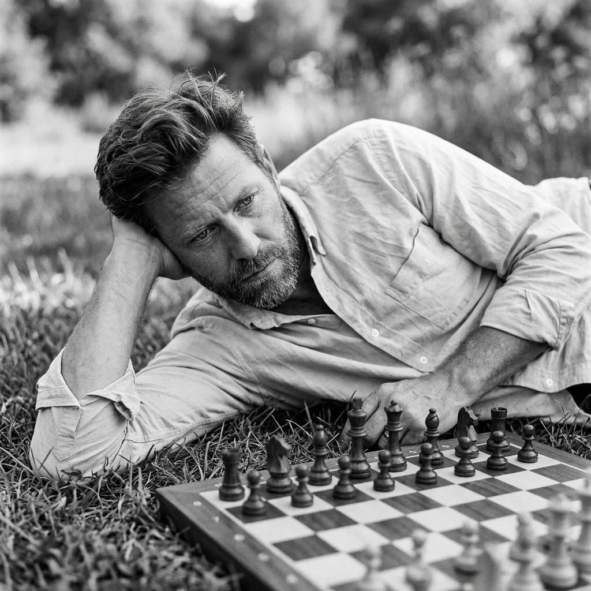

**#78 · Photography Prompt · <code>Vinano Image Pro</code>**

<details>
<summary>Show prompt</summary>

```
{
"scene_overview": {
"description": "A monochrome, contemplative portrait of a man lying on grass, resting his head on his forearm while gazing intently at a chessboard in the foreground.",
"mood": "Introspective, calm, slightly melancholic, strategic contemplation",
"style": "Fine art documentary portrait"
},
"composition": {
"camera_angle": "Low, ground-level perspective aligned the chessboard",
"framing": "Horizontal close-to-medium shot strong foreground emphasis",
"rule_of_thirds": "Subject’s eye positioned near the upper-left third; chess pieces dominate the lower foreground",
"depth": "Shallow depth of field; foreground chess pieces partially blurred, subject’s face in sharp focus",
"leading_elements": "Chessboard grid lines and aligned chess pieces lead the eye toward the subject’s face",
"balance": "Asymmetrical balance between the heavy foreground objects and the subject’s head and arm"
},
"subjects": {
"primary_subject": {
"type": "Adult male",
"pose": "Lying on side head resting on forearm",
"expression": "Focused, thoughtful, slightly fatigued",
"gaze": "Directed toward chessboard and pieces",
"facial_hair": "Short, well-groomed beard",
"hair": "Short, textured, slightly tousled",
"clothing": "Light-colored, long-sleeve button-up shirt visible fabric creases"
},
"secondary_subjects": {
"objects": [{
"type": "Chessboard",
"material": "Wood",
"pattern": "Classic checkered grid",
"position": "Foreground, partially out of focus"
},
{
"type": "Chess pieces",
"material": "Wood",
"variety": "Mixed pawns and major pieces",
"arrangement": "Mid-game configuration, scattered strategic spacing"
}]
}
},
"environment": {
"setting": "Outdoor grassy area",
"ground_texture": "Short grass visible blades and uneven natural texture",
"background": "Minimal and softly blurred, no discernible structures or distractions"
},
"lighting": {
"type": "Natural light",
"direction": "Soft side lighting from above-left",
"contrast": "Moderate contrast gentle highlights and smooth shadow falloff",
"highlights": "Subtle highlights on forehead, cheekbone, and knuckles",
"shadows": "Soft shadows under the arm, chin, and chess pieces"
},
"color_and_tone": {
"color_mode": "Black and white",
"tonal_range": "Wide grayscale range from deep blacks to bright whites",
"dominant_tones": "Mid-grays and soft highlights",
"texture_emphasis": "Enhanced skin texture, fabric fibers, wood grain, and grass"
},
"technical_characteristics": {
"lens_look": "Portrait lens feel, likely medium focal length",
"aperture_effect": "Wide aperture producing shallow depth of field",
"sharpness": "High sharpness on subject’s eye and facial features",
"grain": "Fine, subtle film-like grain",
"dynamic_range": "Well-preserved highlights and shadow details"
},
"artistic_elements": {
"theme": "Strategy, contemplation, mental focus",
"symbolism": "Chessboard as a metaphor for life decisions and planning",
"emotional_tone": "Quiet, reflective, intellectually engaged",
"timelessness": "Classic monochrome treatment removes temporal context"
},
"typography": {
"presence": "None",
"text_elements": "No visible text or lettering"
},
"overall_aesthetic": {
"genre": "Fine art portrait photography",
"influences": "Humanist photography, editorial portraiture",
"use_case": "Art print, editorial feature, conceptual storytelling, AI style reference"
}
}

Preserve realistic proportions and depth for a confident, professional finish.
```

</details>

---


**#79 · Photography Prompt · <code>Vinano Image v2</code>**

<details>
<summary>Show prompt</summary>

```
A high-detail, cinematic shot of an astronaut floating in outer space the Earth's blue curvature and atmosphere in the background. The astronaut is wearing a realistic, weathered white space suit. They are holding a metallic thermos from which dark coffee or amber liquid is spilling out, forming perfect spherical droplets and a beautiful splash due to zero gravity. The lighting is dramatic, a strong glow from the sun reflecting off the helmet's visor and the liquid droplets. 8k resolution, hyper-realistic, true-to-life photorealistic, cosmic atmosphere. Render with rich micro-detail while keeping the layout uncluttered and intentional.
```

</details>

---

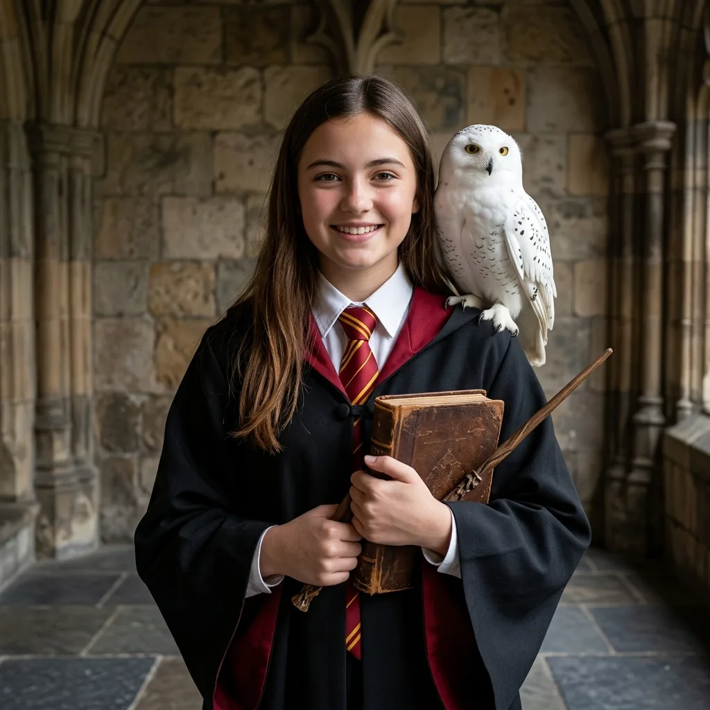

**#80 · Photography Prompt · <code>Vinano Image v2</code>**

<details>
<summary>Show prompt</summary>

```
USE UPLOADED PHOTO AS REFERENCE. HOGWARTS-STYLE PHOTOSHOOT. THE GIRL IS POSING, IN A BLACK ROBE, THE UNDERSIDE OF THE ROBE IS RED, A WHITE COLLAR AND A TIED TIE OF GRYFFINDOR COLOR ARE VISIBLE. HER HAIR IS LOOSE, A DILAPIDATED, OLD BOOK IS PRESSED TO HER BODY IN HER HANDS. HE HOLDS A MAGIC WAND IN ONE HAND. A WHITE OWL SITS ON THE SHOULDER, THE BACKGROUND IS AN OLD STONE WALL, THE BACKGROUND IS SLAY. THEMATIC PHOTO SESSION. DETAILING, premium quality. PORTRAIT. Keep edges clean and the overall composition balanced for a polished, gallery-ready result.
```

</details>

---

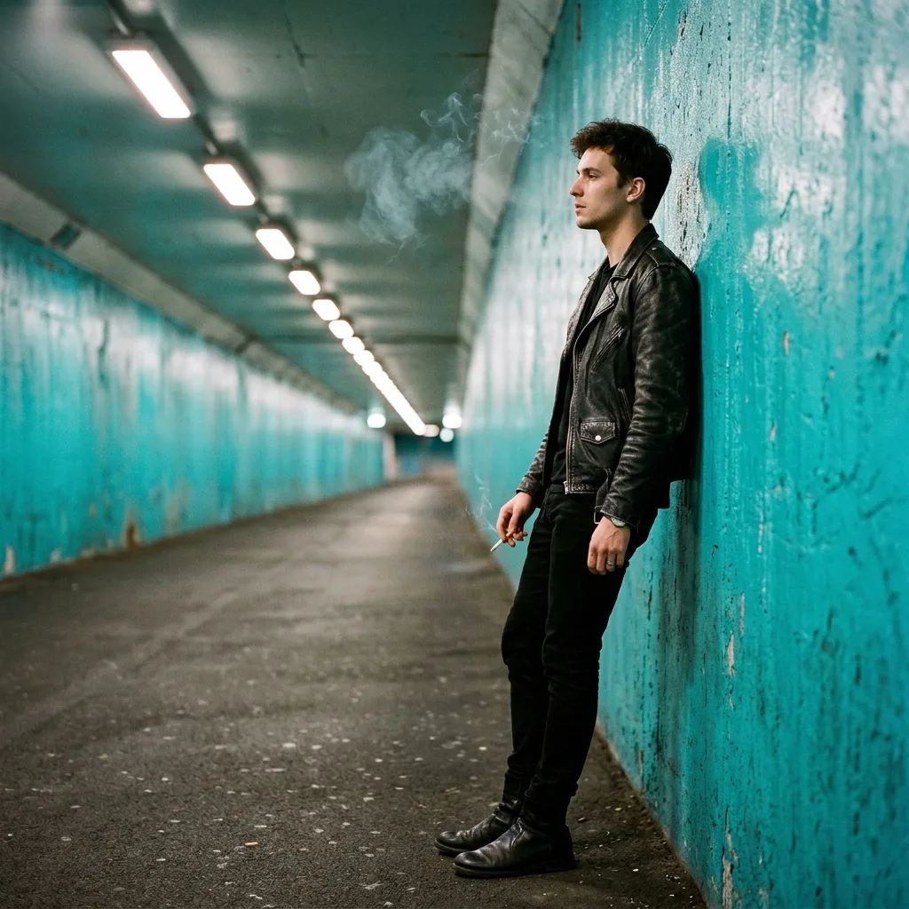

**#81 · Photography Prompt · <code>Vinano Image v2</code>**

<details>
<summary>Show prompt</summary>

```
A full shot captures a young man in profile, leaning against a textured turquoise wall inside a brightly lit tunnel. He is dressed in a sleek black leather jacket and black pants. His short, dark hair is casually styled, framing a contemplative expression as he gazes forward. Wisps of smoke curl subtly above his head. The background features a series of evenly spaced rectangular lights along the tunnel's ceiling, creating a strong sense of depth and leading the eye. The overall lighting casts a cool, ethereal glow on the scene, the vibrant turquoise of the walls contrasting the stark brightness of the lights. The image conveys a mood of quiet introspection and urban coolness. Emphasise material texture and natural light so the final frame feels tactile and premium.
```

</details>

---

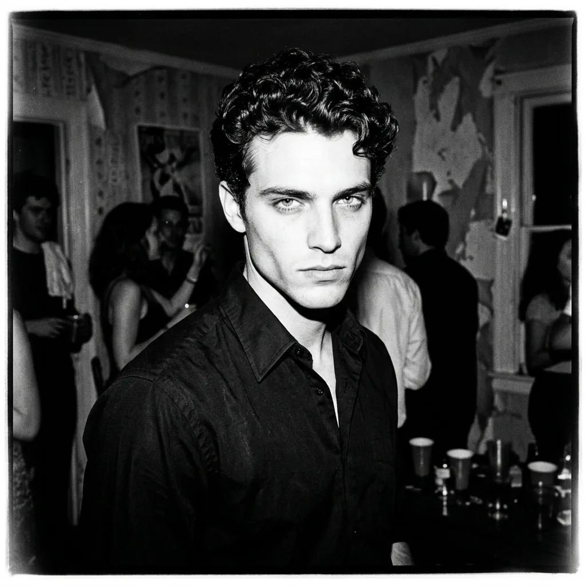

**#82 · Photography Prompt · <code>Vinano Image v2</code>**

<details>
<summary>Show prompt</summary>

```
High-contrast black and white photo taken a 1990s disposable camera at a dark house party. A handsome young man dark, curly hair and a sharp jawline is staring directly into the lens. Focus on the eyes: intense, light-colored irises a piercing, predatory gaze, slightly heavy-lidded (siren eyes), reflecting the harsh camera flash. He is wearing a black button-down shirt. The image is grainy, lo-fi, a "dark academia" bad boy aesthetic. (use my face from the uploaded selfie) Keep edges clean and the overall composition balanced for a polished, gallery-ready result.
```

</details>

---

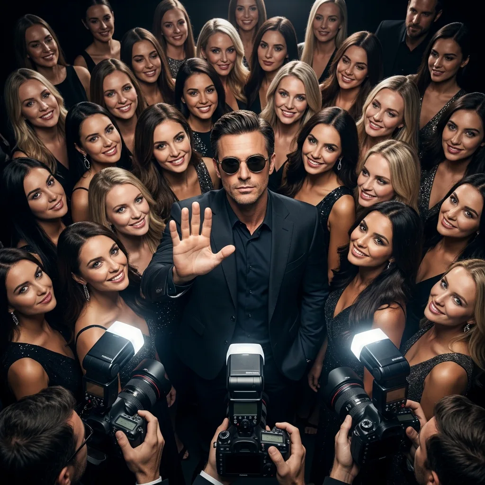

**#83 · Photography Prompt · <code>Vinano Image v2</code>**

<details>
<summary>Show prompt</summary>

```
{
 "prompt": "A hyper-realistic, ultra-detailed 8K cinematic photograph captured from a high-angle perspective a wide-angle lens, looking directly downward into a dense, almost circular crowd, creating a strong sense of enclosure and spotlight focus.\n\nAt the center stands a confident man wearing a dark tailored suit a dark collared shirt and round sunglasses. Use the uploaded face strictly as reference to preserve the exact identity and facial features. His right hand is raised toward the camera the palm facing outward in a clear 'stop' or 'talk to the hand' gesture, conveying authority and control.\n\nHe is completely surrounded by a tightly packed crowd of smiling women, forming a near-perfect circle around him. The women are dressed in dark, elegant, or subtly shimmering evening attire. Their faces and shoulders densely fill the mid-ground, many looking toward the central man or directly at the camera, enhancing the sense of attention and chaos.\n\nIn the immediate foreground at the bottom of the frame, multiple photographers are visible holding professional DSLR cameras equipped large external flash units. The flashes are actively firing, producing intense, direct frontal lighting on the central figures.\n\nLighting and mood: Dramatic, high-contrast paparazzi-style lighting blown-out highlights on faces and clothing, sharp rim lighting on some figures, and deep, near-black shadows in the background. The lighting emphasizes a glamorous yet chaotic paparazzi frenzy.\n\nVisual quality: Extremely sharp focus on the main subjects, hyper-detailed textures on skin, fabric, sunglasses, and camera equipment. Cinematic color grading, realistic skin tones, shallow depth of field where appropriate, premium editorial photography aesthetic.",
 "negative_prompt": "low resolution, blur, soft focus, cartoon, illustration, CGI, distorted anatomy, extra limbs, extra fingers, washed-out colors, flat lighting, studio setup, empty background, watermark, logo, text",
 "aspect_ratio": "2:3",
 "style": "hyper-realistic cinematic",
 "lighting": "high-contrast paparazzi flash lighting",
 "camera": "DSLR, wide-angle lens, high-angle shot",
 "resolution": "8K",
 "quality": "ultra high"
}

Preserve realistic proportions and depth for a confident, professional finish.
```

</details>

---

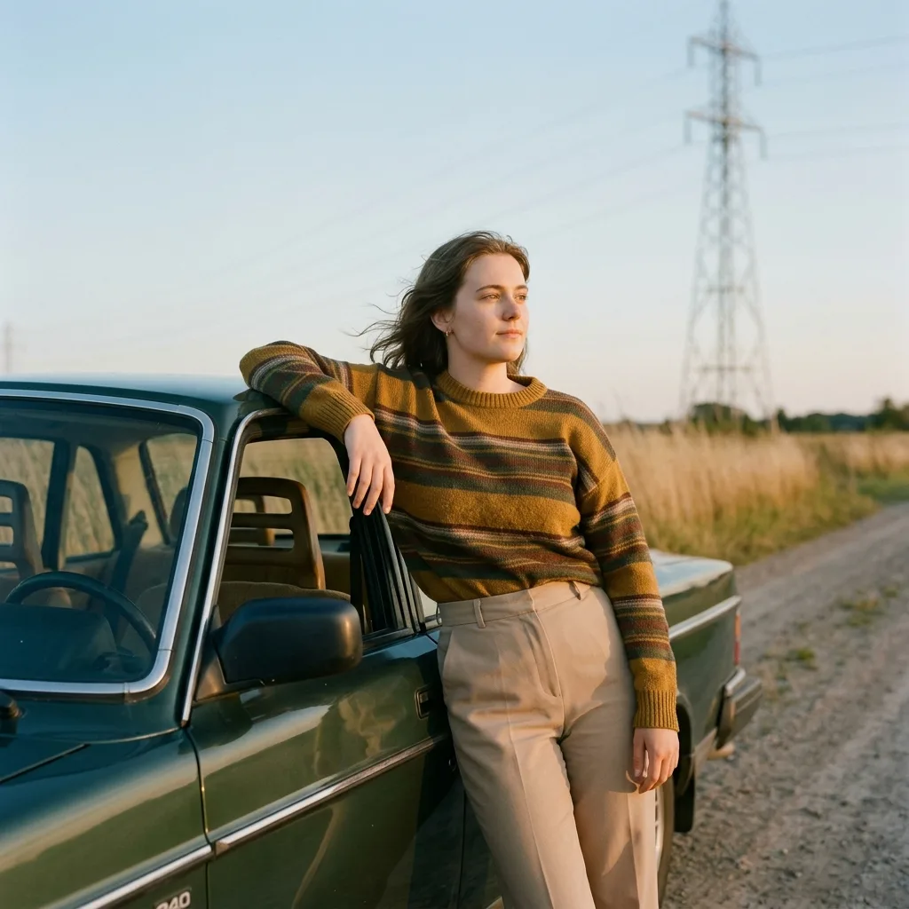

**#84 · Photography Prompt · <code>Vinano Image v2</code>**

<details>
<summary>Show prompt</summary>

```
{
 "image_generation": {
 "reference": {"use_uploaded_photo": true, "role": "main subject", "identity_preservation": true},
 "scene": {
 "location": "rural countryside",
 "background": ["tall dry grass fields", "distant metal powerline tower"],
 "time": "golden hour",
 "atmosphere": "calm, nostalgic road trip mood"
 },
 "subject": {
 "pose": "casually leaning against a vintage car, one arm resting on the open door frame",
 "expression": "thoughtful, relaxed, looking off to the side",
 "hair": "gently moved by the wind",
 "style": "natural, candid portrait"
 },
 "outfit": {
 "top": "retro striped sweater in warm earthy tones",
 "bottom": "high waisted beige trousers"
 },
 "lighting": {"type": "soft sunset light", "highlights": "warm", "shadows": "cool", "contrast": "soft"},
 "camera": {
 "lens": "35mm analog look",
 "depth_of_field": "shallow",
 "focus": "sharp on subject, smooth background falloff",
 "composition": "editorial fashion portrait"
 },
 "color_grading": {"style": "muted vintage tones", "saturation": "slightly reduced", "film_grain": "subtle"},
 "quality": {"realism": "high", "texture": "natural skin and fabric detail", "render": "cinematic, editorial, realistic"}
 }
}

Aim for an editorial, design-driven look with deliberate negative space.
```

</details>

---


**#85 · Photography Prompt · <code>Vinano Image Pro</code>**

<details>
<summary>Show prompt</summary>

```
A high-realism, professional editorial photograph inside an Orthodox church.
A young woman natural facial proportions and a calm, focused expression is kneeling on the stone floor, seated back on her heels. She wears an elegant white long-sleeve dress a high neckline and a fabric belt tied at the waist; the fabric shows realistic folds, weight, and subtle texture. Her head is modestly covered a traditional white headscarf (kosynka), softly draped and slightly translucent at the edges.
She is positioned in right side profile, holding a thin paintbrush in her right hand, carefully applying paint to a large Orthodox icon placed on a wooden easel in front of her. The brush gently touches the icon's surface, emphasizing a moment of concentration and reverence.
The icon depicts an elderly Orthodox saint a long grey beard, dressed in traditional liturgical garments, a softly glowing golden halo. Cyrillic inscriptions are visible on the icon, including "IC XC" and other Church Slavonic lettering. The saint holds a small icon in his hands. The painted surface shows realistic craquelure, brush strokes, gold leaf imperfections, and aged varnish.
Background: a richly decorated iconostasis filled golden icons set in arched frames, carved wooden details, burning candles and hanging oil lamps. On the right side, a tall arched stained-glass window casts soft multicolored light onto the floor, creating subtle rainbow reflections. On the left, part of the altar is visible a cross and additional icons.
Lighting is warm, layered, and atmospheric — golden ambient candlelight combined soft natural light from the window, creating gentle shadows and depth. Skin appears fully natural visible pores, subtle tonal variations, and no artificial smoothing. Makeup is refined and realistic, enhancing the eyes and lips without exaggeration.
Camera perspective: 50–85mm lens look, shallow depth of field, sharp focus on the woman's face, hand, and brush, the background softly blurred. High optical clarity, true-to-life color balance, realistic exposure. The composition emphasizes the contrast between the matte white fabric of the dress and the luminous gold tones of the iconostasis. Ultra-realistic, photographic, human, non-stylized.

Aim for an editorial, design-driven look with deliberate negative space.
```

</details>

---


**#86 · Photography Prompt · <code>Vinano Image v2</code>**

<details>
<summary>Show prompt</summary>

```
Calm eyes, simple elegance.

A high-fashion close-up portrait of a woman relaxed shoulders and a gentle, composed smile. She wears a soft ivory couture top a clean neckline, set in a warm-lit studio delicate, translucent dust particles floating softly around her face.

Preserve realistic proportions and depth for a confident, professional finish.
```

</details>

---

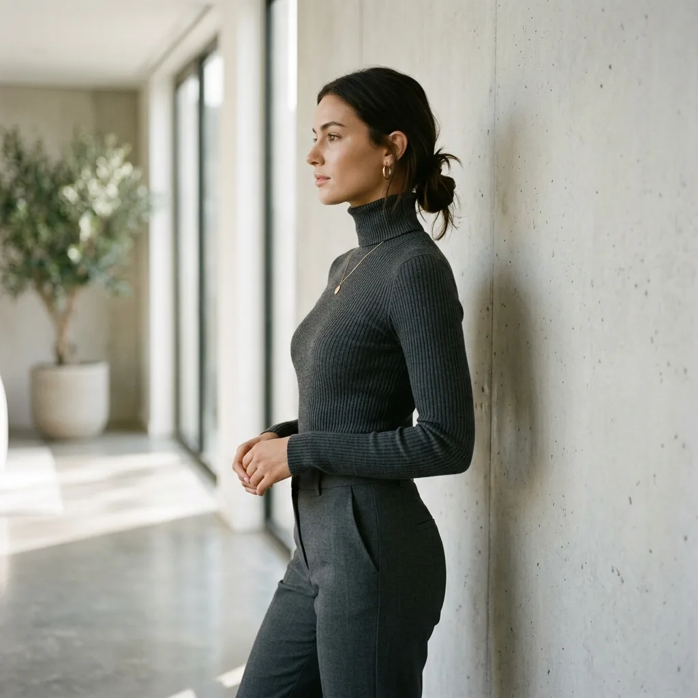

**#87 · Photography Prompt · <code>Vinano Image v2</code>**

<details>
<summary>Show prompt</summary>

```
{
 "content_goal": "clean, elegant, viral side-pose visual",
 "image_type": "ultra-true-to-life photorealistic lifestyle / editorial portrait",
 "visual_style": {
 "aesthetic": "cinematic, editorial, modern minimalism",
 "vibe": "confident, graceful, premium",
 "realism": "high-end professional realism"
 },
 "composition": {
 "framing": "mid-to-full body side view",
 "camera_angle": "true side angle (90-degree profile)",
 "subject_position": "slightly off-center for balance",
 "perspective": "clean silhouette depth"
 },
 "subject": {
 "description": "confident individual captured in side profile",
 "pose": "standing or seated side pose elongated posture",
 "body_language": "relaxed yet strong, controlled stance",
 "expression": "calm confidence, subtle elegance",
 "gaze": "forward or slightly downward"
 },
 "facial_details": {
 "emotion": "composed, self-assured",
 "micro_details": "natural skin texture, defined profile lines"
 },
 "wardrobe": {
 "clothing": "form-fitting or flowing outfit highlighting profile",
 "textures": "smooth, soft fabric natural folds",
 "color_tones": "neutral, monochrome, or muted pastels"
 },
 "lighting": {
 "type": "directional studio or natural lighting",
 "quality": "soft yet sculpting",
 "direction": "side-lit to enhance contours",
 "highlight_focus": "face profile, shoulder line, waist curve",
 "shadow_style": "gentle, controlled shadows"
 },
 "color_palette": {
 "primary": ["soft neutrals", "warm skin tones", "subtle shadows"],
 "mood": "clean, elegant, confident"
 },
 "environment": {
 "location": "minimal studio, modern interior, or outdoor urban space",
 "background": "simple gradient or uncluttered backdrop",
 "atmosphere": "premium, calm, stylish"
 },
 "camera_details": {
 "camera_type": "professional camera simulation",
 "lens": "50mm or 85mm portrait lens",
 "focus": "sharp focus on profile",
 "depth_of_field": "soft background blur",
 "resolution": "editorial-grade clarity"
 },
 "quality_control": {
 "anatomy_accuracy": "natural posture and proportions",
 "fabric_realism": "realistic drape and texture",
 "ai_artifacts": "none",
 "professional_finish": "magazine-quality output"
 },
 "overall_mood": "confident, refined, cinematic",
 "intended_use": {
 "primary": "viral aesthetic post on X",
 "secondary": "personal branding, editorial photography"
 }
}

Keep edges clean and the overall composition balanced for a polished, gallery-ready result.
```

</details>

---

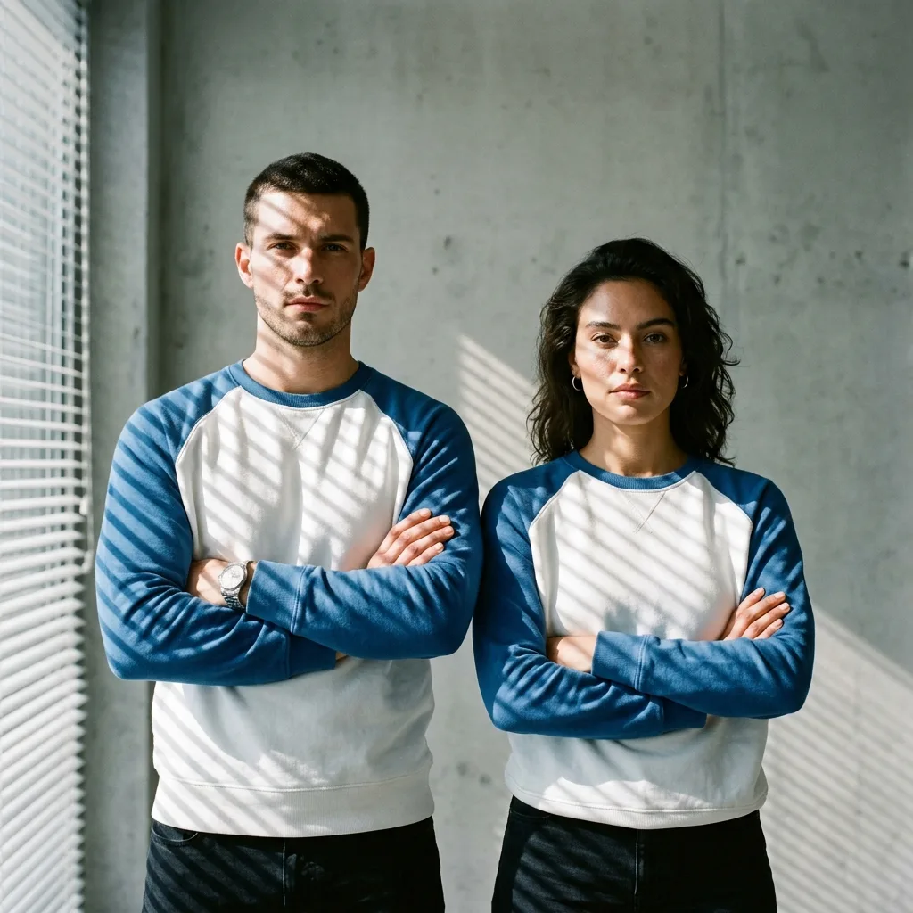

**#88 · Photography Prompt · <code>Vinano Image v2</code>**

<details>
<summary>Show prompt</summary>

```
Ultra-realistic fashion studio portrait of a confident man and woman standing arms crossed, wearing matching white sweatshirts blue sleeves, dramatic sunlight streaming through window blinds casting striped shadows across their faces and clothing, clean minimal studio background, strong facial features, natural skin texture, filmic, cinematic lighting, high contrast shadow patterns, editorial fashion photography style, 85mm lens, shallow depth of field, ultra-detailed skin and fabric texture, professional studio lighting, 8K. Aim for an editorial, design-driven look with deliberate negative space.
```

</details>

---

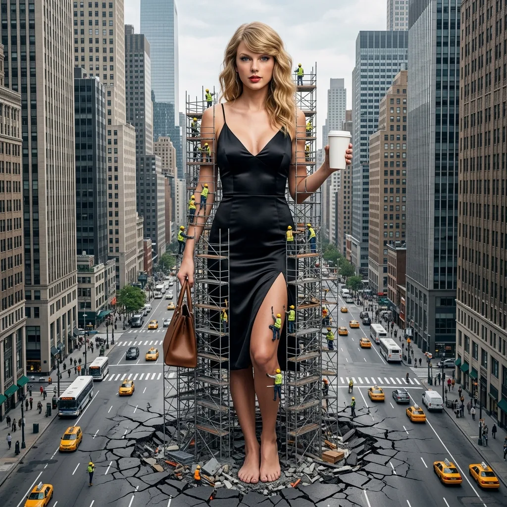

**#89 · Photography Prompt · <code>Vinano Image v2</code>**

<details>
<summary>Show prompt</summary>

```
{
 "description": "A colossal woman standing in a city street, appearing to be 'under construction' scaffolding surrounding her body.",
 "aesthetic": "Hyper-realistic composite, cinematic, urban fantasy.",
 "subject_details": {
 "celebrity_likeness": "Taylor Swift.",
 "features": {
 "face": "Blue eyes, signature red lipstick, distinct facial structure.",
 "hair": "Golden blonde, long, wavy texture cascading over shoulders."
 },
 "apparel": {
 "dress": "Black satin slip dress a deep V-neck and a high slit on the right thigh.",
 "accessories": "Holding a standard white disposable coffee cup in the right hand. Carrying a brown leather luxury handbag in the left hand.",
 "footwear": "Bare feet or heels (obscured by street debris/cracks)."
 }
 },
 "surreal_elements": {
 "scaffolding": "Intricate metal construction scaffolding structures built around her arms, torso, and legs, following the contour of her body.",
 "miniatures": "Tiny construction workers in yellow hard hats and high-vis vests climbing the scaffolding on her body.",
 "destruction": "The asphalt street beneath her feet is cracking and shattering under the immense weight, creating a crater pattern."
 },
 "exact_pose_anatomical": {
 "posture": "Standing tall a slight contrapposto (weight shifted to one hip).",
 "orientation": "Front-facing, towering over the viewer/city.",
 "right_arm": "Bent at the elbow, raised to hold the coffee cup at chest level.",
 "left_arm": "Extended downwards holding the handbag.",
 "gaze": "Direct, calm eye contact the camera.",
 "scale": "Subject appears to be approximately 50 stories tall, matching the height of surrounding skyscrapers."
 },
 "environment": {
 "location": "Avenue in a major metropolis (resembling Chicago or NYC).",
 "elements": "Skyscrapers flanking both sides, busy traffic miniature yellow taxis and buses way below.",
 "perspective": "Aerial view relative to the city, but eye-level relative to the subject."
 },
 "camera_technical_values": {
 "lens": "35mm (Wide angle to capture the full scale of the subject against the skyline).",
 "aperture": "f/11 (Deep depth of field to keep both the giant subject and the city background relatively sharp).",
 "shutter_speed": "1/500s.",
 "iso": "ISO 100.",
 "resolution": "8k, high fidelity textures."
 },
 "lighting_setup": {
 "source": "Natural Daylight.",
 "quality": "Soft, diffused sunlight (slightly overcast).",
 "direction": "Overhead/Frontal.",
 "shadows": "Subject casts a massive, long shadow onto the city streets below."
 }
}

Keep edges clean and the overall composition balanced for a polished, gallery-ready result.
```

</details>

---

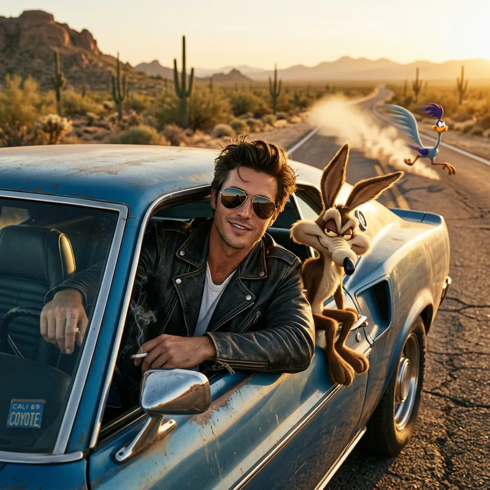

**#90 · Photography Prompt · <code>Vinano Image v2</code>**

<details>
<summary>Show prompt</summary>

```
A stylish young man wearing a black leather jacket and aviator sunglasses leans out of the window of a vintage blue car on an empty desert highway. He casually holds a cigarette, looking confidently at the camera. Beside him, a 3D cartoon coyote character (classic animation, exaggerated features, expressive face) is sitting on the car door, interacting naturally the real-world environment. In the background, a cartoon roadrunner is sprinting fast along the road, kicking up dust. The scene blends hyper-realistic photography premium-quality 3D animated characters seamlessly. Desert landscape cacti, warm golden hour lighting, long shadows, cinematic depth of field, ultra-detailed textures, reflections in sunglasses, motion blur on running character, 35mm lens, f/2.0, high contrast, 8K, film still aesthetic. Emphasise material texture and natural light so the final frame feels tactile and premium.
```

</details>

---

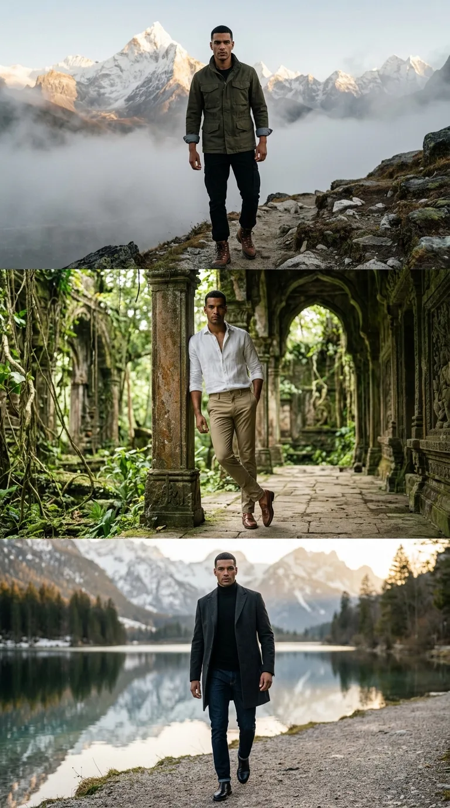

**#91 · Photography Prompt · <code>Vinano Image Pro</code>**

<details>
<summary>Show prompt</summary>

```
Create a hyper-realistic three-panel vertical cinematic collage in 9:16 aspect ratio, editorial fashion photography style. The collage consists of three distinct vertical frames stacked seamlessly, each featuring the exact same man consistent face, skin tone, short black hair, sharp jawline, and intense gaze directly at the viewer, as if from the same reference photo.

Top panel: The man stands confidently on a misty mountain ridge at sunrise, dramatic Himalayan peaks in the background golden light piercing through low clouds. He wears a rugged dark olive green tactical field jacket rolled sleeves, black cargo pants, and sturdy hiking boots. Cool blue-gray color grading subtle film grain.

Middle panel: The man leans against an ancient stone pillar inside a grand abandoned temple in a dense tropical jungle, soft diffused sunlight filtering through overgrown vines and carved arches. He wears a lightweight white linen button-up shirt (slightly unbuttoned at the top) tucked into slim khaki trousers, brown leather loafers. Warm earthy tones teal shadows and cinematic haze.

Bottom panel: The man walks along a serene lakeside at golden hour, crystal-clear water reflecting snow-capped mountains in the distance, surrounded by pine trees. He wears a black merino wool turtleneck sweater layered under a tailored charcoal wool overcoat, dark jeans, and polished Chelsea boots. Moody teal-orange cinematic grading soft bokeh and gentle film grain.

Maintain perfect facial consistency across all three panels — same man, same reference face, no variations in features. Ultra-detailed skin texture, realistic fabric details, natural lighting per environment. Cinematic color grading, subtle film grain, editorial composition, high-end fashion photography aesthetic, shot on 35mm film, 4k resolution, true-to-life photorealistic, masterpiece.

Render with rich micro-detail while keeping the layout uncluttered and intentional.
```

</details>

---

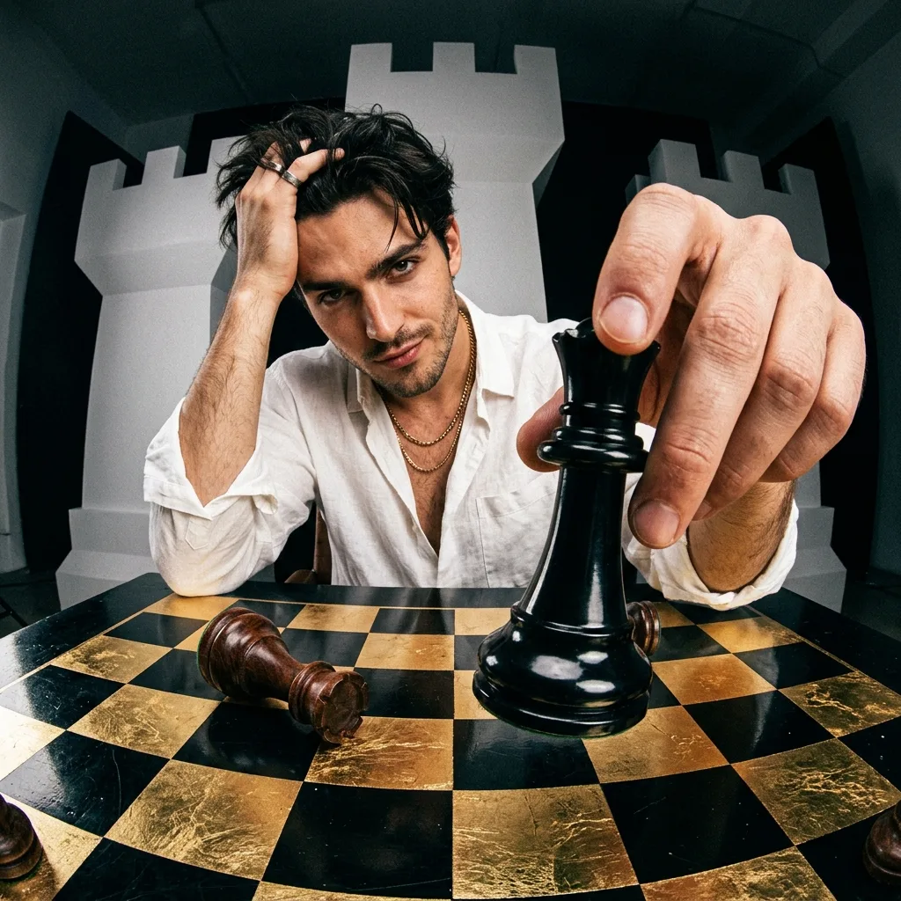

**#92 · Photography Prompt · <code>Vinano Image v2</code>**

<details>
<summary>Show prompt</summary>

```
Creative fashion photography distorted perspective (wide-angle lens/fisheye effect).

The frame features a young, handsome European-looking man dark hair.

He is seated at a table, resting his left hand on his head (a relaxed, pensive pose), and looking directly into the lens a confident, slightly arrogant expression. Key element (foreground): His right arm is extended strongly forward toward the camera, palm facing down.

In extreme close-up. He holds a large, glossy black chess piece (the Queen), making a move. Due to the perspective, the hand and piece appear enormous compared to the head. Setting: The table is a stylized chessboard: alternating glossy black squares and squares of textured gold leaf, strong reflections on the surface. In the background, a black chess piece lies overturned on the table. Clothing: A loose white shirt an open collar, a gold chain around the neck.

Background: Dark, almost black, large white abstract geometric shapes (reminiscent of the silhouettes of a chess rook's battlements) at the edges of the frame. Lighting and Style: Studio lighting, contrasting light, high detail in the leather texture and gold, glossy magazine style, unusual angle.

Aim for an editorial, design-driven look with deliberate negative space.
```

</details>

---

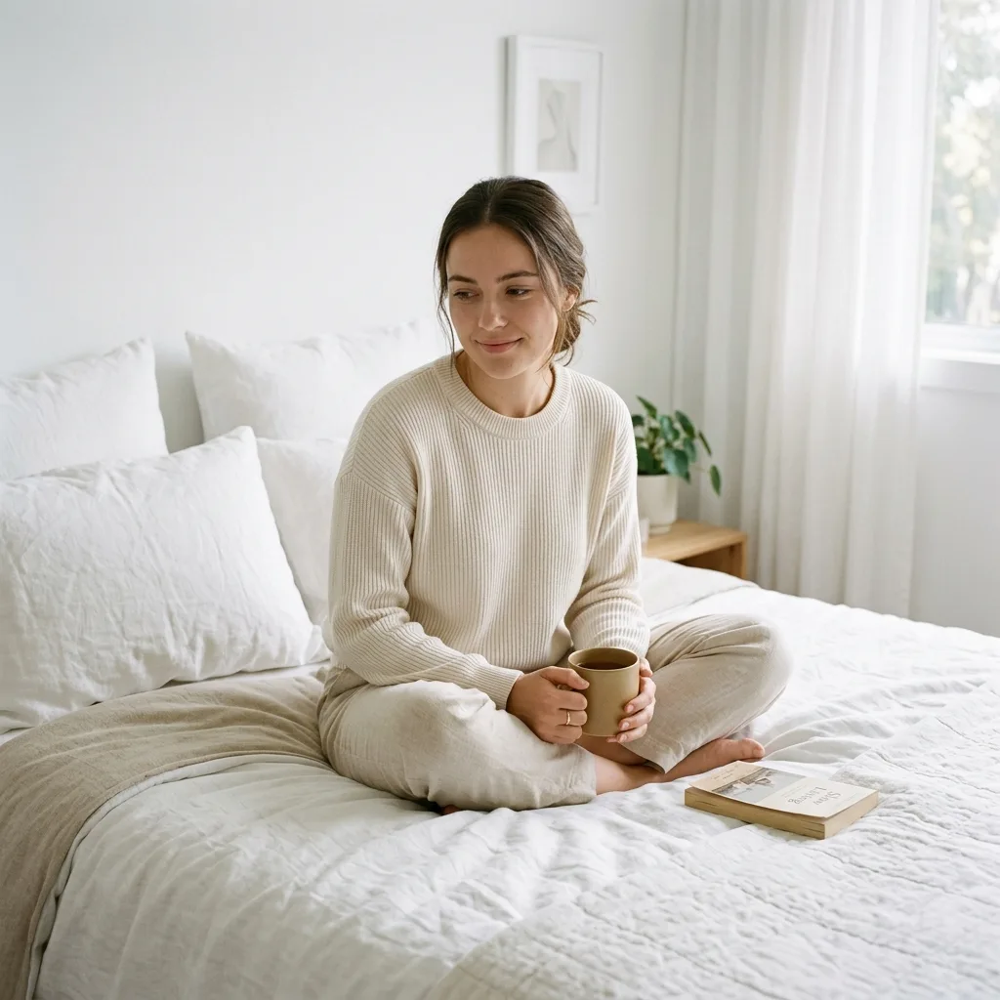

**#93 · Photography Prompt · <code>Vinano Image v2</code>**

<details>
<summary>Show prompt</summary>

```
{
 "content_goal": "relatable, calm, lifestyle aesthetic",
 "image_type": "ultra-true-to-life photorealistic lifestyle photography",
 "visual_style": {
 "aesthetic": "clean, cozy, minimal",
 "vibe": "soft, relaxed, natural",
 "realism": "high-end professional realism"
 },
 "composition": {
 "framing": "mid-shot",
 "camera_angle": "slightly above eye-level",
 "subject_position": "naturally centered",
 "perspective": "intimate but respectful"
 },
 "subject": {
 "description": "person sitting casually on a bed",
 "pose": "relaxed seated pose legs folded or stretched comfortably",
 "body_language": "natural, unposed, confident ease",
 "expression": "calm, thoughtful, soft smile or neutral face"
 },
 "wardrobe": {
 "clothing": "casual homewear or loungewear",
 "style": "modest, relaxed fit",
 "textures": "soft cotton or linen",
 "color_tones": "neutral or pastel shades"
 },
 "environment": {
 "location": "minimal bedroom",
 "bed": "neatly arranged bed soft pillows",
 "background": "clean wall or soft curtains",
 "atmosphere": "peaceful, morning or late-afternoon calm"
 },
 "lighting": {
 "type": "natural window light",
 "quality": "soft and diffused",
 "direction": "side lighting",
 "shadow_style": "gentle, natural shadows"
 },
 "color_palette": {
 "primary": ["warm white", "beige", "soft grey"],
 "accent": ["pastel tones"],
 "mood": "comforting and serene"
 },
 "camera_details": {
 "lens": "35mm or 50mm",
 "focus": "sharp on subject",
 "depth_of_field": "slight background blur",
 "realism": "editorial lifestyle photography"
 },
 "quality_control": {
 "skin_texture": "natural, realistic",
 "fabric_detail": "visible soft folds",
 "ai_artifacts": "none",
 "finish": "clean, professional"
 },
 "overall_mood": "casual confidence, calm presence",
 "intended_use": {
 "primary": "aesthetic lifestyle post on X",
 "secondary": "personal branding or daily vibe content"
 }
}

Render with rich micro-detail while keeping the layout uncluttered and intentional.
```

</details>

---

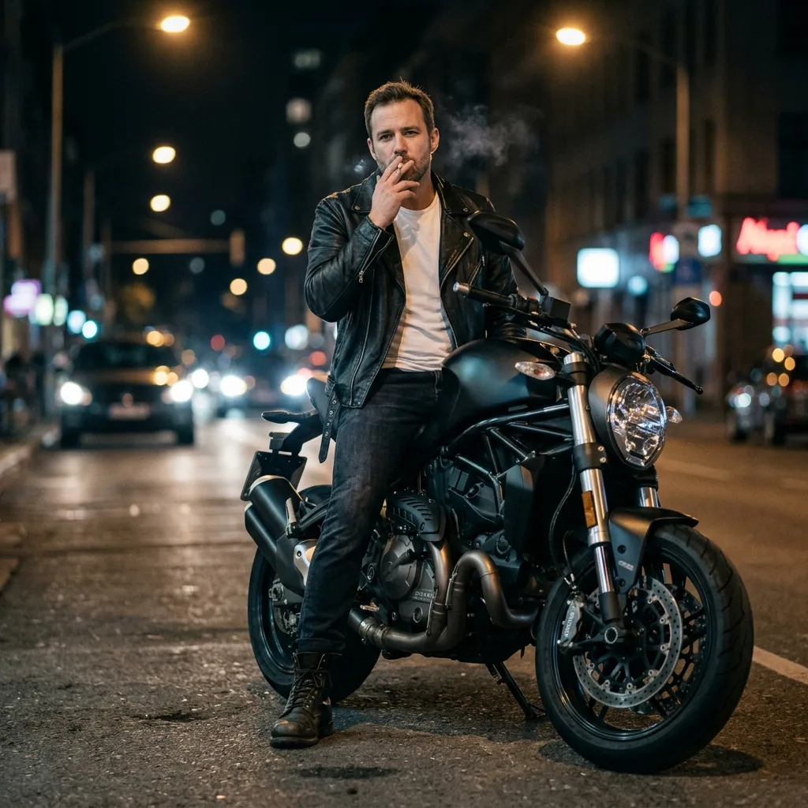

**#94 · Photography Prompt · <code>Vinano Image v2</code>**

<details>
<summary>Show prompt</summary>

```
{
 "style": "true-to-life photorealistic",
 "subject": "adult man smoking a cigarette while sitting on a motorbike",
 "appearance": {
 "age": "mid-30s",
 "expression": "calm, slightly serious",
 "beard": "light stubble",
 "clothing": "black leather jacket, white t-shirt, dark jeans, boots"
 },
 "pose": "sitting casually on the motorbike, one foot on the ground, holding a cigarette near his mouth",
 "vehicle": {
 "type": "modern sport motorbike",
 "color": "matte black",
 "details": "clean chrome accents, realistic reflections"
 },
 "environment": {
 "location": "urban street at night",
 "lighting": "cinematic street lights, soft rim light, subtle neon reflections",
 "atmosphere": "slight smoke haze blending cigarette smoke"
 },
 "camera": {
 "angle": "low angle shot",
 "lens": "85mm",
 "depth_of_field": "shallow depth of field, blurred background bokeh"
 },
 "quality": {
 "resolution": "8k",
 "details": "ultra-detailed skin texture, realistic smoke, natural shadows",
 "rendering": "high dynamic range, sharp focus"
 }
}

Preserve realistic proportions and depth for a confident, professional finish.
```

</details>

---

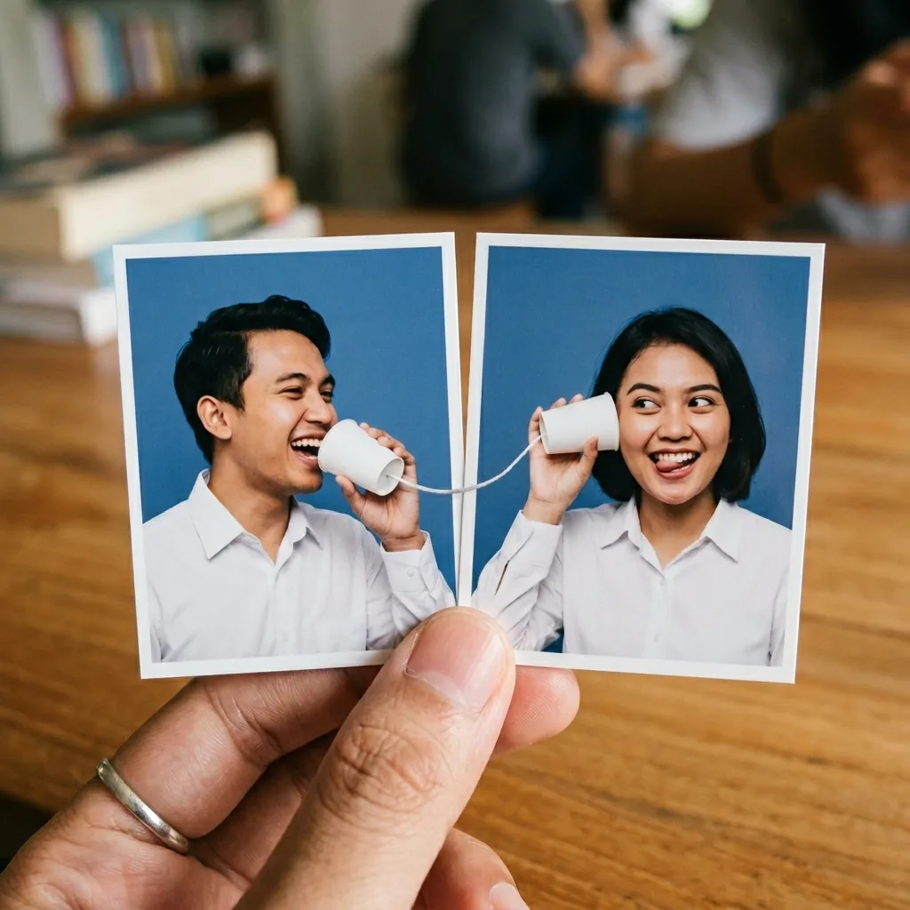

**#95 · Photography Prompt · <code>Vinano Image v2</code>**

<details>
<summary>Show prompt</summary>

```
Create a Portrait Master Object: Two passport-sized photo prints held side-by-side by a person's thumb and index finger.
**Passport Photo Background:** Use a solid blue background (the standard official passport photo color for Indonesian marriage books for certain even/odd birth years).
**Clothing:** Both subjects in the photo wear formal and neat white collared shirts.
**Male Subject (Left Photo):** Make his face and hair 100% similar to the given reference.
He poses as if talking into a white paper cup, a cheerful laughing expression.
**Female Subject (Right Photo):** Make her face and hair 100% similar to the given reference.
She poses as if holding a white paper cup to her ear, listening. Her expression is funny a wide smile and a slightly stuck-out tongue.
**Interactive Prop:** There is a white string coming out from under the male's paper cup and connecting to the female's paper cup. Because the two photos are placed next to each other, this prop creates the illusion of a "string phone" connecting the two photos.

Maintain consistent colour harmony and crisp focus across the whole frame.
```

</details>

---

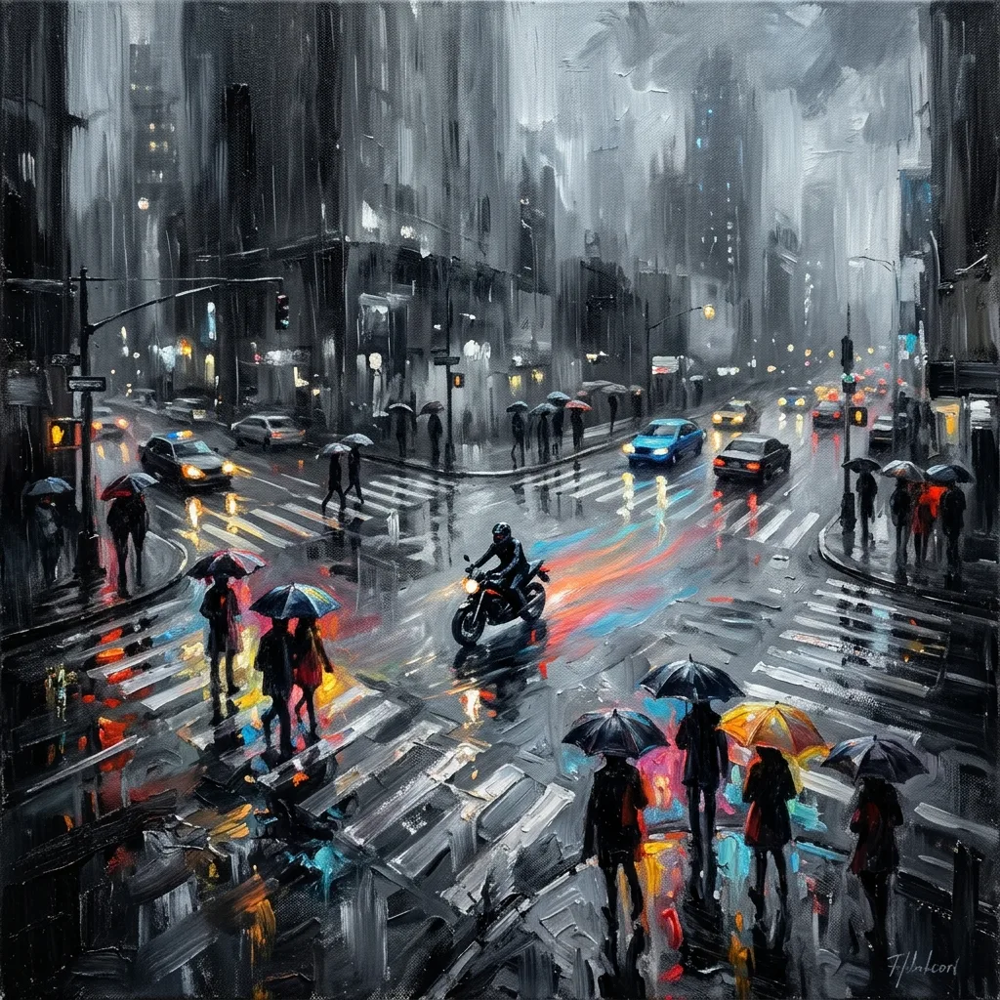

**#96 · Photography Prompt · <code>Vinano Image v2</code>**

<details>
<summary>Show prompt</summary>

```
A high-angle, wide-composition Impressionist oil painting of a rainy urban intersection. The scene is primarily monochrome deep charcoal blacks and silvery grays, but features vibrant, colorful glowing lights at the footsteps of pedestrians crossing the street and beneath their umbrellas. A lone motorcyclist in the center leaves a trail of soft, colorful light, and car headlights emit small, brilliant pops of color. The style is heavily blurred and painterly, loose, expressive brushstrokes and vague silhouettes, prioritizing mood and 'urban solitude' over sharp detail. The pavement is rain-soaked, reflecting both the gray sky and the neon-like colorful glows in shimmering, broken patterns. Misty atmosphere distant buildings fading into soft tonal washes. Emphasise material texture and natural light so the final frame feels tactile and premium.
```

</details>

---

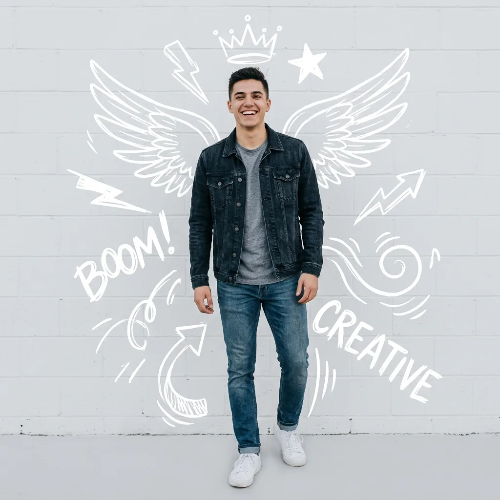

**#97 · Photography Prompt · <code>Vinano Image v2</code>**

<details>
<summary>Show prompt</summary>

```
Create a creative photo of a person the face from the uploaded image. The person is standing in a simple environment while surrounded by hand-drawn doodle elements. Around them are sketch-style drawings like arrows, lightning, stars, scribbles, and abstract shapes, as if drawn a marker. Some doodles interact the person, like wings on their back, a crown above their head, or energy lines around their body. The style is a mix of real photo and doodle art. The person is wearing casual modern clothes like a t-shirt, jacket, jeans, and sneakers. The background is clean so the doodles stand out. High contrast, creative composition, slightly messy sketch style, fun and expressive, ultra detailed, modern social media aesthetic. Render with rich micro-detail while keeping the layout uncluttered and intentional.
```

</details>

---

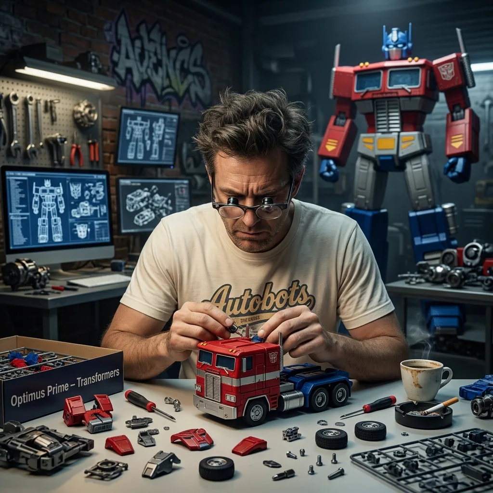

**#98 · Photography Prompt · <code>Vinano Image v2</code>**

<details>
<summary>Show prompt</summary>

```
{
 "title": "Optimus Prime Toy Assembly Workshop",
 "style": "Hyper-realistic cinematic portrait",
 "composition": {
 "aspect_ratio": "9:16",
 "orientation": "vertical",
 "resolution": "16K HD",
 "depth_of_field": "shallow",
 "lighting": "dim cinematic workshop lighting focused on the subject",
 "atmosphere": "dramatic, mechanical, highly detailed"
 },
 "subject": {
 "character": "man (based on image 2)",
 "hair": "messy",
 "expression": "focused and meticulous",
 "pose": "sitting at a work table assembling a toy model",
 "clothing": {
 "tshirt_color": "ivory",
 "logo": "Autobots"
 }
 },
 "main_object": {
 "name": "Optimus Prime toy assembly model",
 "source_reference": "image 1",
 "scale": "1/4",
 "state": "partially assembled truck model",
 "box_text": "Optimus Prime – Transformers"
 },
 "environment": {
 "location": "mechanical workshop",
 "wall_details": "graffiti art",
 "computers": "screens displaying Optimus Prime assembly blueprints and mechanical diagrams",
 "tools": ["screwdrivers",
 "bolts",
 "robot parts",
 "mechanical components"]
 },
 "table_details": {
 "objects": ["robot armor parts",
 "wheels",
 "mechanical pieces",
 "cup of coffee",
 "cigarette"]
 },
 "background": {
 "feature": "heroic replica statue of Optimus Prime"
 },
 "visual_quality": {
 "textures": "ultra-detailed",
 "render_style": "hyper-realistic",
 "cinematic_tone": true
 }
}

Preserve realistic proportions and depth for a confident, professional finish.
```

</details>

---

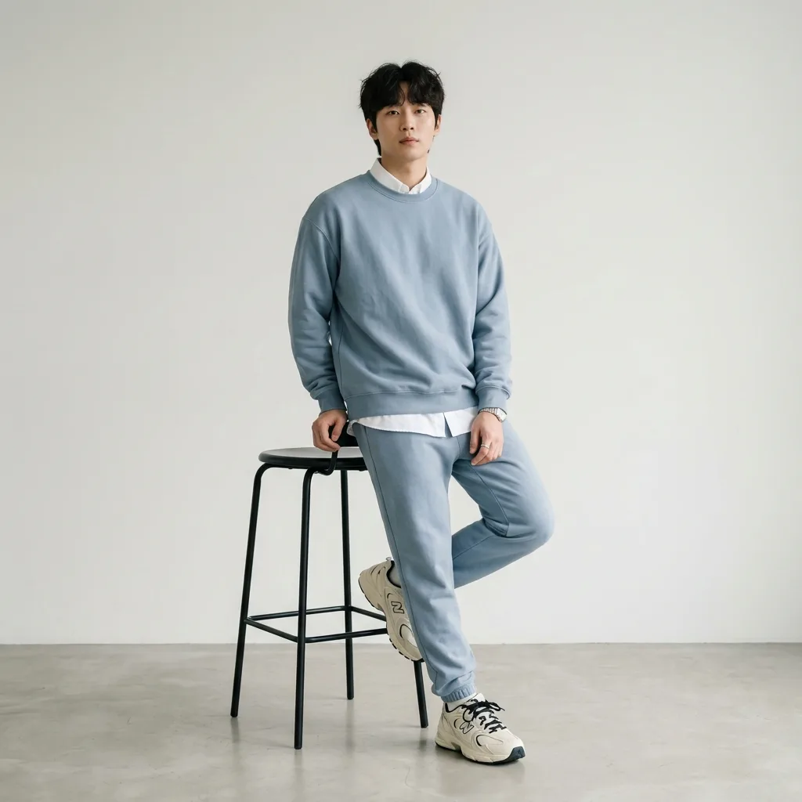

**#99 · Photography Prompt · <code>Vinano Image v2</code>**

<details>
<summary>Show prompt</summary>

```
Subject & Pose

Full-body studio fashion photography of a young East Asian man styled, dark, textured hair. He is leaning against a tall, slender black metal barstool, posing one foot resting on the floor and the other leg bent at the knee. His expression is calm and neutral, looking directly at the camera.
Outfit & Styling

Top: A light dusty blue oversized crewneck sweatshirt layered over a crisp white collared button-down shirt, the collar and hem visible.Bottoms: Matching light dusty blue jogger-style sweatpants.Footwear: Chunky cream and white athletic sneakers black laces and subtle grey accents.
Technical Specifications

Lighting: Soft, even studio lighting minimal shadows to create a clean, high-end commercial look.Background: A solid, refined minimalist light grey or off-white seamless studio backdrop.Composition: Vertical full-body shot, eye-level perspective, sharp focus, 8k Contemporary K-fashion editorial, soft color palette, polished and airy aesthetic.

Aim for an editorial, design-driven look with deliberate negative space.
```

</details>

---

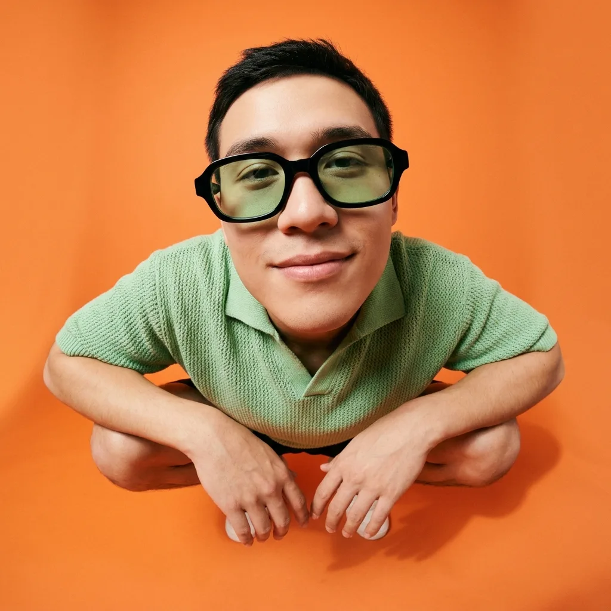

**#100 · Photography Prompt · <code>Vinano Image v2</code>**

<details>
<summary>Show prompt</summary>

```
Create a A high-fashion editorial image of a young man, of the person from the uploaded character reference photo. KEEP FACE FEATURES AS ORIGINAL at all times. A high-fashion editorial image captured in an exaggerated fisheye lens close-up. The camera is angled slightly from below, and the man is crouching or squatting forward both hands resting on his knees, leaning his upper body toward the lens. His face is looking downward into the camera, exaggerated by fisheye distortion so it appears large and rounded, cartoonish proportions. He has a neutral smile, relaxed and completely smile, expression confident but emotionless.

He wears a trendy, summery knitted shirt in a pastel green shade light, breathable, visible texture, reflecting Gen Z summer fashion. He also wears oversized black-framed sunglasses, lenses tinted in light green.

The background is a clean, solid orange color soft, realistic studio lighting, creating gentle shadows cast from his head, shoulders, and arms.

No direct sunlight light is controlled and evenly diffused, like a fashion set. The overall style is playful, surreal, and modern, inspired by 2025 Gen Z fashion culture and bold editorial covers. Ultra-clean details, slight grain, bold composition.

Maintain consistent colour harmony and crisp focus across the whole frame.
```

</details>

---

[Next page →](./photography-2.md)
