# Poster Design — full gallery

[← Back to README](../README.md) · [`prompts.json`](../prompts/prompts.json) · **241** prompts · page 2 / 3

[← Prev](./poster-design.md) — [1](./poster-design.md) · **2** · [3](./poster-design-3.md) — [Next →](./poster-design-3.md)

---

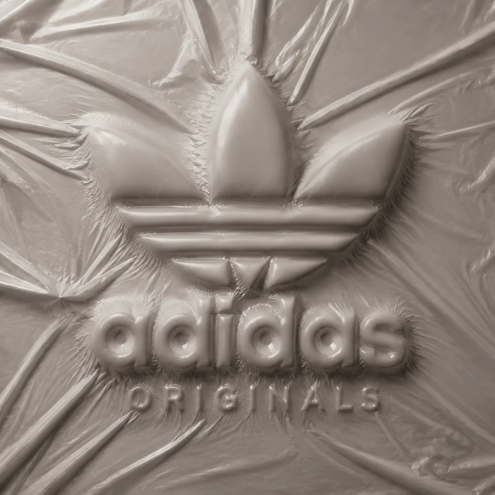

**#101 · Poster Design Prompt · <code>Vinano Studio</code>**

<details>
<summary>Show prompt</summary>

```
logo completely wrapped in a single layer of elastic plastic or shrink wrap. The shapes of the logo should be visible only through the relief under the film, the logo surfaces themselves are not visible.

Brand Analysis System:

Logo geometry: Determine the full visual brand identifier [ADIDAS ORIGINAL] according to the official catalog: an icon, a text element, or a combination thereof. Keep the exact spatial relationship between the icon and the text.
Color system: Use one monochrome tone [ADIDAS ORIGINAL] for all elements of the scene — background, film, wrapped object. Variations are achieved only through light and shadow.
The nature of the film: Based on the selected color [ADIDAS ORIGINAL], determine the behavior of the material: bright saturated colors create a dense glossy or latex film visible tension lines; neutral — matte stretch film; dark - translucent vacuum film; light — matte food film.

Stage 1: Stage and Surface

The whole scene is monochromatic, the [ADIDAS ORIGINAL] color covers every surface without exception.
The background is made of the same film material, which is freely assembled and crumpled around the logo. Natural tension lines are created, the folds diverge from the peaks of the relief.
There are no floor lines, walls, or horizons — the stage is completely immersed in a solid plastic material.

Stage 2: Applying the logo

Each element of the logo is voluminous, rounded, like a balloon, visual depth.
The logo is fixed on the background and is completely covered a single layer of film, tightly stretched over the tops of the elements, creating visible tension lines.
Free folds are formed in the hollows between the letters, geometric elements of the icon and around the perimeter of the logo.
The logo remains fully readable, the icon is recognizable, but not a single surface of the logo itself is visible.
The physics of the film is precise: tight tension at high points, diverging stress lines, small raised areas between elements, shadows in the gaps.

Stage 3: Lighting

The main light source is soft, diffused, from the top left, emphasizing the relief of the film.
For glossy films, there are subtle highlights along the stretched areas, for matte films, there is only diffused light.
Global lighting preserves details in deep folds without smoothing out the overall relief.

Technical specifications

Only the [ADIDAS ORIGINAL] color, variations through light and shadow.
There are no exposed logo surfaces and unnecessary text.
The film is realistic: the tension, the folds, the physics of plastic, not fabric.
The film grain corresponds to ISO 400.
Mood: the product is packed and ready for opening, the shape is known, but not yet touched.

Render with rich micro-detail while keeping the layout uncluttered and intentional.
```

</details>

---

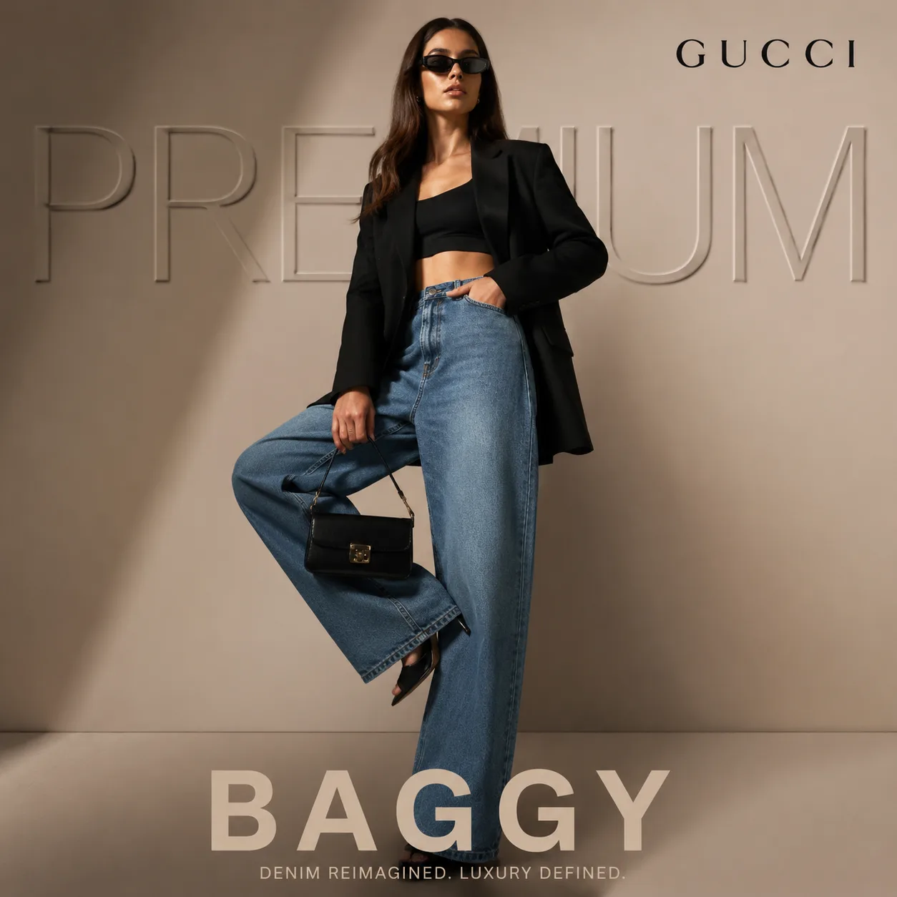

**#102 · Poster Design Prompt · <code>Vinano Studio</code>**

<details>
<summary>Show prompt</summary>

```
full body female model in confident fashion pose (one leg slightly raised, relaxed luxury stance), wearing oversized black blazer, fitted black crop top, high-waisted baggy blue denim jeans, black heels, slim sunglasses, holding a small black handbag, clean long hair, sharp facial features
minimal luxury studio background, soft beige gradient wall, smooth shadows, editorial lighting, high-end fashion campaign style
large embossed “PREMIUM” text in background, subtle 3D depth, tone-on-tone color blending wall, elegant and soft
keep “BAGGY” text bold and minimal near bottom, modern premium sans-serif font
add “GUCCI” logo top right corner, clean spacing, luxury typography
ultra realistic, sharp focus, premium color grading, soft highlights, depth of field, magazine-quality, crisp composition, no clutter

Maintain consistent colour harmony and crisp focus across the whole frame.
```

</details>

---

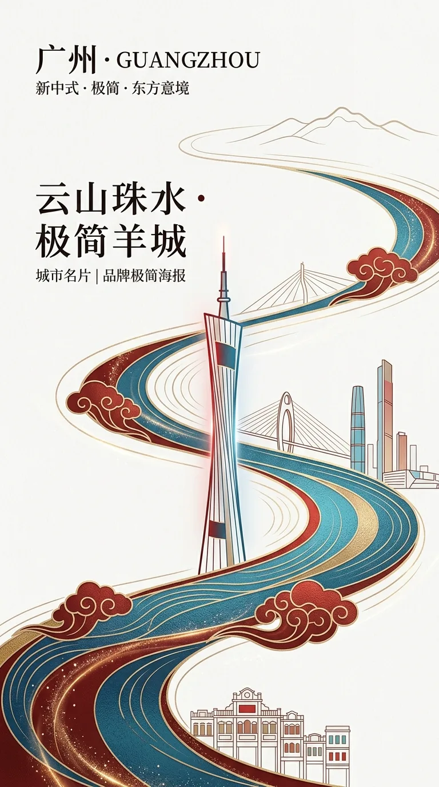

**#103 · Poster Design Prompt · <code>Vinano Image Pro</code>**

<details>
<summary>Show prompt</summary>

```
新中式极简风格高端城市海报，9:16竖版构图，以广州为核心主题，画面中心为抽象几何化的广州塔，造型简洁但具有辨识度，

整体采用S型流动构图，从下方向上延展，珠江水系被设计为流动的水波纹与传统祥云纹样融合，环绕整个画面形成视觉动线，

广州地标建筑以“留白+线描+局部色块”的方式点缀其中：珠江新城双塔、猎德大桥、白云山轮廓、岭南骑楼，
传统与现代建筑自然融合，层次递进，远近虚实分明，

风格控制：极简 + 高级 + 东方意境，不杂乱不过度写实，

色彩方案（重点）：
高饱和但克制，中国红、青蓝、鎏金为主色，
辅以少量暖金高光点缀，形成强烈视觉冲击但不俗艳，

背景：大面积纯净留白或淡宣纸肌理，增强呼吸感与高级感，

细节：祥云与水纹具有轻微浮雕/烫金质感，
局部加入微光粒子或流动光线，增强现代感，

光影：柔和渐变光+局部高光，突出恢弘大气氛围，

整体风格：国潮高级插画 / 品牌海报级质感 / 8K / 超清细节

在保证细节的同时保持版式克制、留白得当。
```

</details>

---

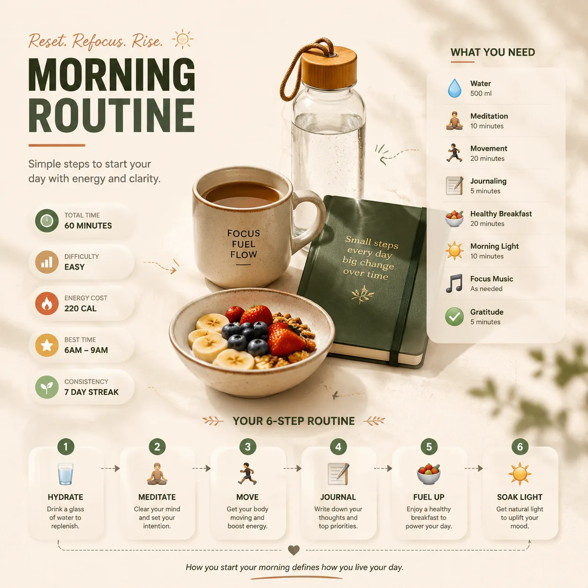

**#104 · Poster Design Prompt · <code>Vinano Studio</code>**

<details>
<summary>Show prompt</summary>

```
Ultra-clean modern editorial infographic on the topic of [ROUTINE] routine. Hero visual: a stylized flat-lay or floating arrangement of 3–4 objects closely associated the routine — slightly angled or in soft perspective, glowing subtly. All elements arranged dynamically around the hero in a non-restrictive editorial layout. Ingredients Section: Label it ‘What You Need’ — include 6–8 items small icons or emoji illustrations next to each. Each item has a name and a practical quantity or duration written like a recipe (e.g. ‘x minutes of Y’). Arranged in a cluster or list connected visually to the hero. Steps Section: 5–6 numbered panels arrows or connecting lines forming a logical flow. Each step has a short action label and a small relevant icon. Panels use glassmorphism or frosted card styling. Stats Badges: 4–5 floating pill-shaped badges showing relevant metadata — total time, difficulty, consistency streak, energy cost — displayed as clean minimal bubbles near the hero. Visual Style: Warm, soft editorial background — cream, warm white, or soft morning light tones. Muted earthy accent colors clean highlights. Bold modern sans-serif typography. Clean vector icons. Subtle grain or paper texture in background. Composition: Hero object cluster centered or slightly offset. Ingredients on one side. Steps flow opposite or below connecting lines. Stat badges scattered as floating pills. Generous negative space to keep it airy and readable. Lighting: Soft warm natural light feel emanating from the hero cluster. Premium lifestyle editorial aesthetic, social-feed optimized. Ultra-crisp. No watermark. Emphasise material texture and natural light so the final frame feels tactile and premium.
```

</details>

---

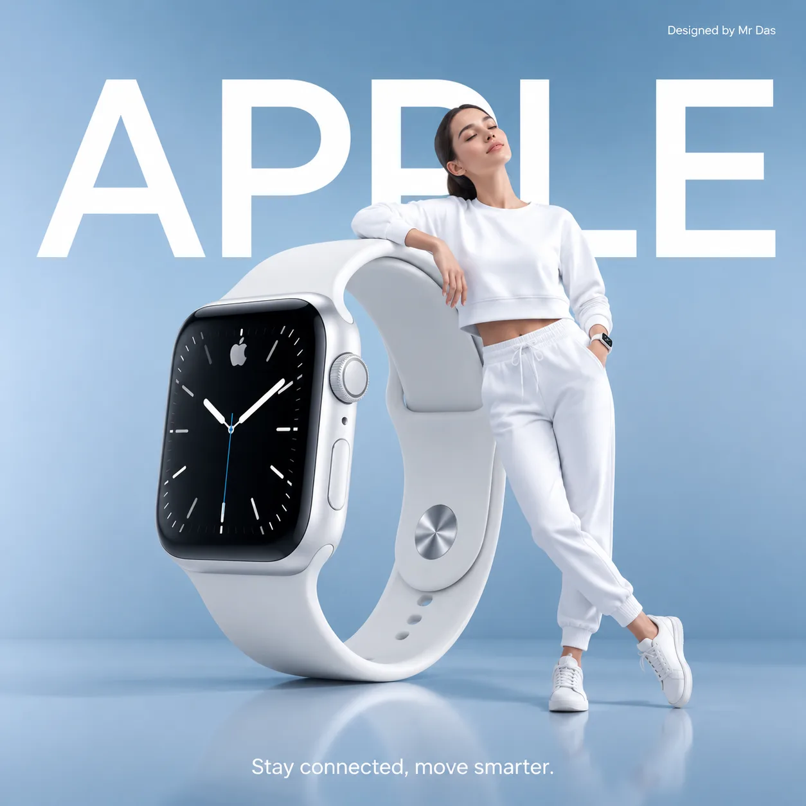

**#105 · Poster Design Prompt · <code>Vinano Studio</code>**

<details>
<summary>Show prompt</summary>

```
refined minimalist commercial ad featuring oversized white smartwatch, ultra-clean design. A young woman in all-white outfit leans casually against the giant watch, relaxed confident pose, eyes closed, also wearing the same smartwatch on her wrist. Soft gradient blue background large bold white “APPLE” text behind. Glossy reflective floor, soft studio lighting, modern high-end fashion/product photography. Small top-right text “Designed by Mr Das”. Bottom center tagline in small white font: “Stay connected, move smarter.” Maintain consistent colour harmony and crisp focus across the whole frame.
```

</details>

---

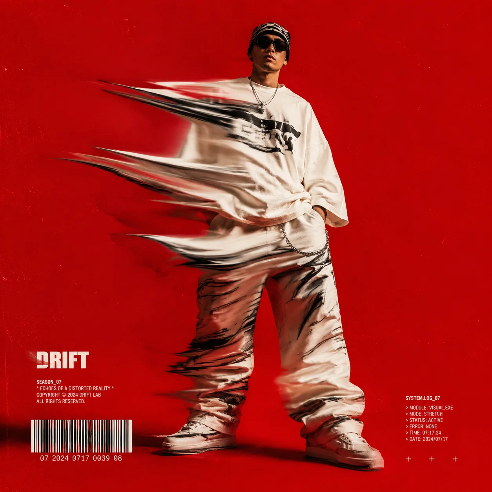

**#106 · Poster Design Prompt · <code>Vinano Studio</code>**

<details>
<summary>Show prompt</summary>

```
Hip-hop fashion model standing full-frame, clothing distorted into stretched streaks like motion drag, bold red background, retro film grain, barcode + tiny technical text in bottom area, modern fashion-magazine layout, expressive weirdness, cool attitude, 4K high detail. --ar 4:5 --raw Preserve realistic proportions and depth for a confident, professional finish.
```

</details>

---

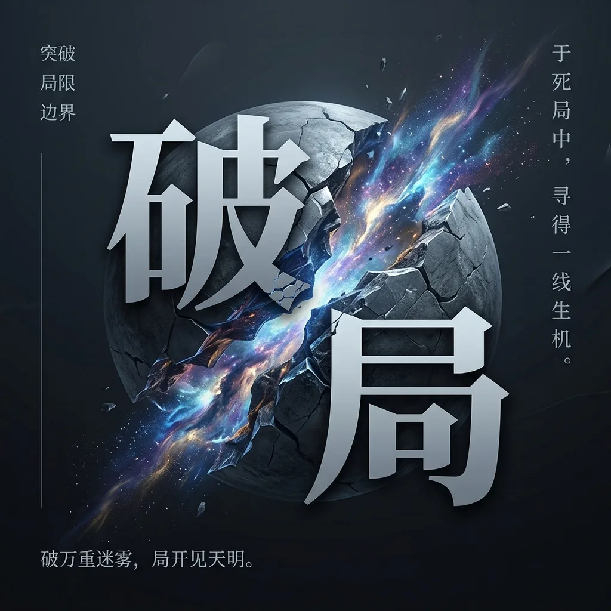

**#107 · Poster Design Prompt · <code>Vinano Image Pro</code>**

<details>
<summary>Show prompt</summary>

```
高级概念海报，竖版 3:4，核心文字为[输入文字]

请先深度理解'[输入文字]'的表层含义、深层寓意、情绪气质、文化联想、人物命运感与隐含张力，再决定最适合它的画面风格、构图方式、色彩气质和视觉隐喻。

画面风格必须由词义自动生成，不要机械套用统一模板。每个词都应拥有和它自身内涵相匹配的独特视觉语言。

画面中，巨大中文主标题“[输入文字]”必须是绝对主体，字形清晰完整，无错字无缺笔，占据大部分画面，形成最强第一视觉。
不要做普通插画，不要只画人物外貌。

请提炼一个最准确、最有代表性的视觉隐喻，让人物、物体、空间或象征元素与大字发生关系，让观者一眼感受到这个词为什么会被这样表达。
整体气质要求高级、极简、克制、展览级，具有强排版、强隐喻、强情绪、强记忆点。

可根据词义自动选择更冷峻、更诗意、更悲剧、更锋利、更温柔或更庄严的视觉风格。

色彩也应根据词义自动调整，但保持整体高级感和节制感。

小字文案只保留三处：

左上角：2到4个关键词
右侧竖排：一句命运感短句
左下角：一句有传播力的总结句
要求元素少，概念准，留白克制。

文字是第一视觉，隐喻图像是第二视觉，小字是第三视觉。

不要拥挤，不要廉价广告感，不要多余英文，不要解释性长文案。

最终效果应像展览级文学人物或概念主题海报，把“【输入文字】”背后的精神状态和文化意味真正视觉化。

在保证细节的同时保持版式克制、留白得当。
```

</details>

---

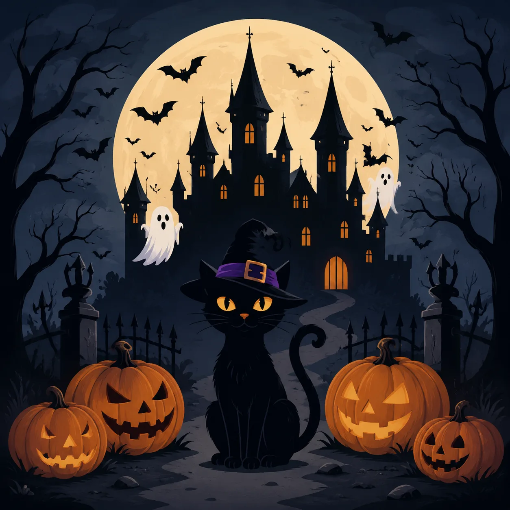

**#108 · Poster Design Prompt · <code>Vinano Studio</code>**

<details>
<summary>Show prompt</summary>

```
{
 t && (e.push(l), s(l, "return"), t = false, n2 = true, r.length = 0);
 } };
})()),dehydratedQueryClient:$R[28]={mutations:$R[29]=[],queries:$R[30]=[$R[31]={dehydratedAt:1782300171746,state:$R[32]={data:$R[13],dataUpdateCount:1,dataUpdatedAt:1782300171746,error:null,errorUpdateCount:0,errorUpdatedAt:0,fetchFailureCount:0,fetchFailureReason:null,fetchMeta:null,isInvalidated:!1,status:"success",fetchStatus:"idle"},queryKey:$R[33]=["imagePromptDetail",144],queryHash:"[\"imagePromptDetail\",144]"}]}}})($R["tsr"]);document.currentScript.remove()

Preserve realistic proportions and depth for a confident, professional finish.
```

</details>

---

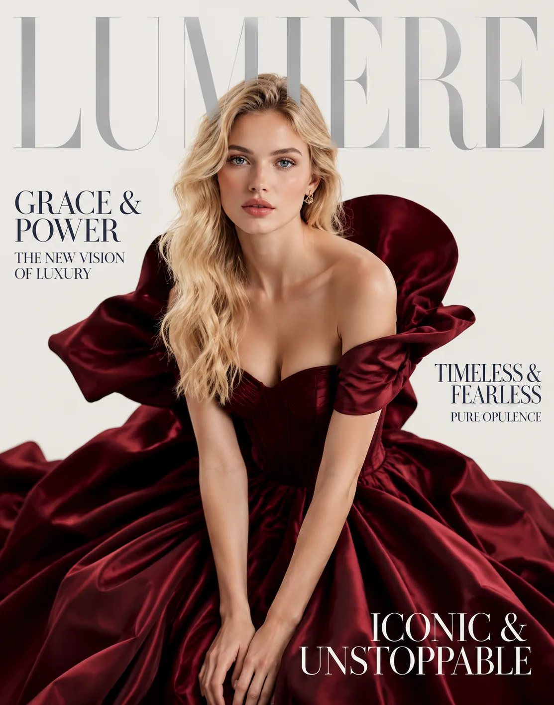

**#109 · Poster Design Prompt · <code>Vinano Studio</code>**

<details>
<summary>Show prompt</summary>

```
A luxury high-fashion magazine cover. Magazine name at the very top in massive elegant serif font reads "LUMIÈRE" — the letters are large, slightly transparent/ghost-style overlapping the model's head just like ELLE magazine, in soft platinum silver color blending into the background.
Character: A young beautiful white woman, early 20s, soft feminine features, big blue eyes, naturally full lips, flawless porcelain skin, subtle makeup — rosy cheeks, nude lips, defined brows. Her hair is platinum blonde, long and wavy, loosely flowing over one shoulder. She looks directly into the camera a soft yet powerful gaze. Slight tilt of the head, naturally elegant posture.
Outfit: She is wearing a dramatic deep burgundy wine-red ballgown — structured corset top off-shoulder neckline, voluminous layered satin skirt billowing around her dramatically. Behind her shoulders, large sculptural fabric rises like rose petals — same architectural drama as reference. She leans slightly forward, both hands resting gently on her knees.
Background: Pure soft warm white/ivory background — completely clean, minimal, high-end studio editorial. Soft diffused light, no harsh shadows.
Typography — placed EXACTLY like ELLE magazine reference:
Top: "LUMIÈRE" massive serif, platinum/silver, overlapping model's head slightly
Left mid: "GRACE & POWER" bold serif, then smaller below "THE NEW VISION OF LUXURY"
Right mid: "TIMELESS & FEARLESS" bold, then "PURE OPULENCE" smaller below
Bottom right large: "ICONIC & UNSTOPPABLE" elegant large serif
All text in deep charcoal/dark navy. Font style: classic high fashion serif — same weight, spacing, and elegance as ELLE. Text naturally integrated into the composition, NOT floating randomly.
Ultra true-to-life photorealistic, 8K, real magazine cover quality, perfect typography placement, vertical 9:13 format.

Maintain consistent colour harmony and crisp focus across the whole frame.
```

</details>

---

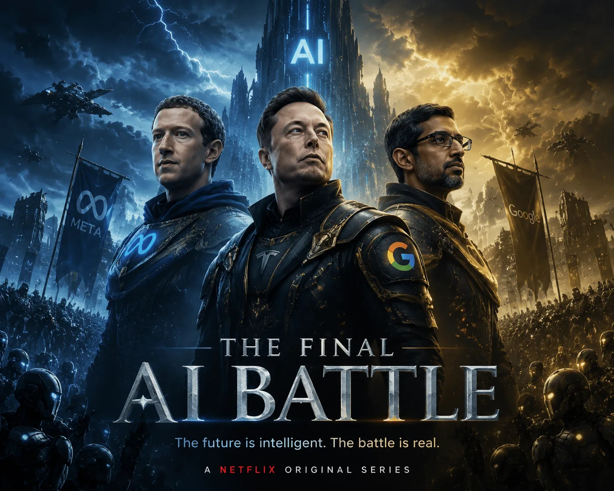

**#110 · Poster Design Prompt · <code>Vinano Studio</code>**

<details>
<summary>Show prompt</summary>

```
A cinematic epic sci-fi fantasy movie poster featuring three powerful tech leaders standing together as rival kings of artificial intelligence, dramatic futuristic battlefield, dark stormy sky, glowing AI energy, towering digital fortress in the background, armies of advanced robots below, intense blue and golden lighting contrast, ultra-detailed armor-inspired futuristic outfits, heroic serious expressions, high-budget streaming series poster style, dramatic composition, sharp facial details, atmospheric smoke, lightning, sparks, cinematic depth, professional poster typography the title “THE FINAL AI BATTLE”, subtitle “The future is intelligent. The battle is real.”, 4:3 aspect ratio Aim for an editorial, design-driven look with deliberate negative space.
```

</details>

---

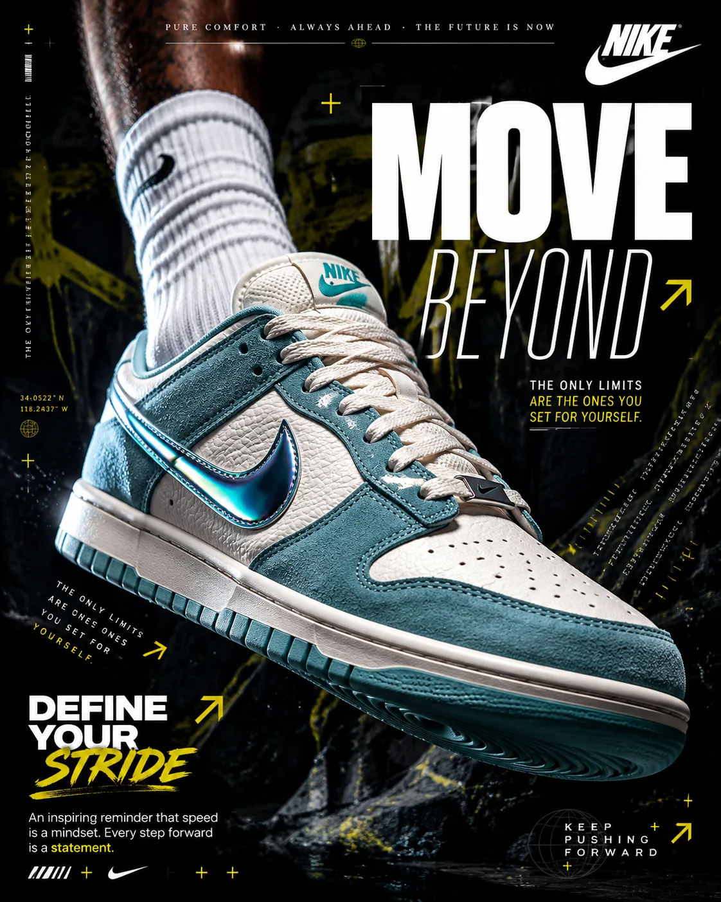

**#111 · Poster Design Prompt · <code>Vinano Studio</code>**

<details>
<summary>Show prompt</summary>

```
A hyperrealistic Nike sneaker advertisement shot in a dark, moody editorial style. A male leg wearing crisp white athletic crew socks subtle Nike logo detail is suspended mid-air against a near-black charcoal background, angled diagonally toward the camera at a bold 45-degree perspective. The sneaker — a Nike low-top silhouette featuring a clean two-tone colorway of glacier teal suede panels and off-white tumbled leather, an iridescent chrome Swoosh catching ambient light — dominates the lower two-thirds of the frame.
The composition uses shallow depth of field sharp focus on the shoe and soft blur on the upper leg. The background is layered subtle urban texture - faint graffiti strokes in electric yellow and muted olive, barely visible through a heavy dark vignette. Multiple rows of ultra-small all-caps typographic text orbit the sneaker at different angles, reading phrases like "THE ONLY LIMITS ARE THE ONES YOU SET FOR YOURSELF" - evoking motion, speed, and energy. Some text runs vertically, some at 30-degree angles, giving the composition a chaotic yet intentional graphic design feeling.
At the upper right, the bold Nike wordmark and Swoosh logo appear in clean white against the dark background. At the top center, a thin horizontal navigation-style text bar reads: "PURE COMFORT · ALWAYS AHEAD · THE FUTURE IS NOW" in spaced all-caps serif font. A large, commanding headline is placed center-right in contrasting weight typography - "MOVE" in massive ultra-bold white letters followed by "BEYOND" in lighter weight, creating dramatic type hierarchy.
Small yellow plus (+) symbols and diagonal arrows (↗) are scattered throughout the composition as accent details, adding a contemporary graphic zine aesthetic. Bottom left features a bold brand slogan lockup: "DEFINE YOUR STRIDE" in large bold sans-serif white text a thin subline: "An inspiring reminder that speed is a mindset. Every step forward is a statement." The overall lighting is dramatic and directional - a single cold key light from the left, causing the Swoosh to shimmer and the white leather to glow against the darkness. true-to-life photorealistic. Commercial photography quality. High contrast. 4K resolution, 3:4 vertical format optimized for social media.

Render with rich micro-detail while keeping the layout uncluttered and intentional.
```

</details>

---

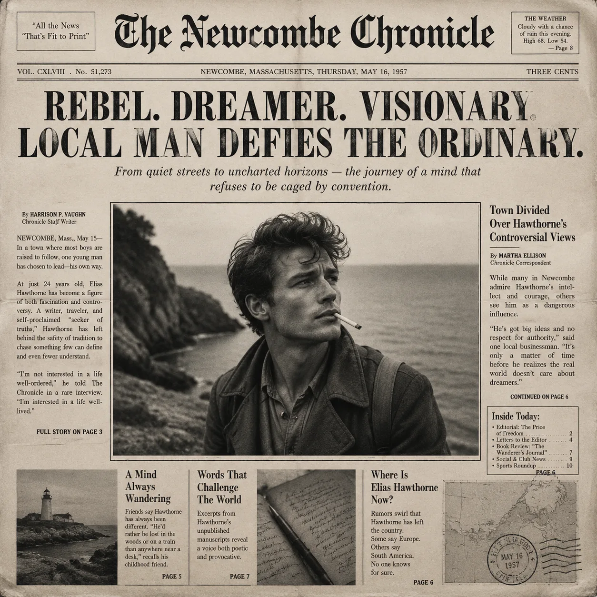

**#112 · Poster Design Prompt · <code>Vinano Studio</code>**

<details>
<summary>Show prompt</summary>

```
Create the most realistic front page design of a vintage newspaper featuring the main character. The layout should be the style of a real printed newspaper a cinematic black-and-white aesthetic.
The main photo should be prominently placed in the center, framed, like the image in the title of the article. The subject in the photo should remain unchanged and clearly distinguishable in natural light and slightly increased contrast in order to match the spectacular editorial style.
Create a bold, attention-grabbing headline at the top (create a unique title that matches the spirit of the photo - it can be romantic, mysterious, funny, or dramatic). Add a smaller subtitle under it, which will look like a real newspaper caption.
Add realistic newspaper elements:
Columns of small text (lorem ipsum, but framed like real news)
At the top is the fictitious name of the publication (for example, “The Daily Prompts”, “AI Times” or similar - think creatively, according to the picture)
Date, issue number and location
Decorative lines, dividers, and vintage typography
Small additional articles or captions to the main image
Optional stamps, doodles, or editorial notes to add personality.
Style:
Black and white or slightly faded monochrome paper
Fine paper texture, grain, and ink defects
Small shadows and creases that mimic real printed paper
The aesthetics of a clean but slightly worn vintage newspaper
Mood: Give the design personality, expressiveness and plot, as if the plot is part of the main article.
Aspect ratio: 4:5 or 1:1
High-detail, ultra-realistic hybrid of editorial photography and print design.

Emphasise material texture and natural light so the final frame feels tactile and premium.
```

</details>

---

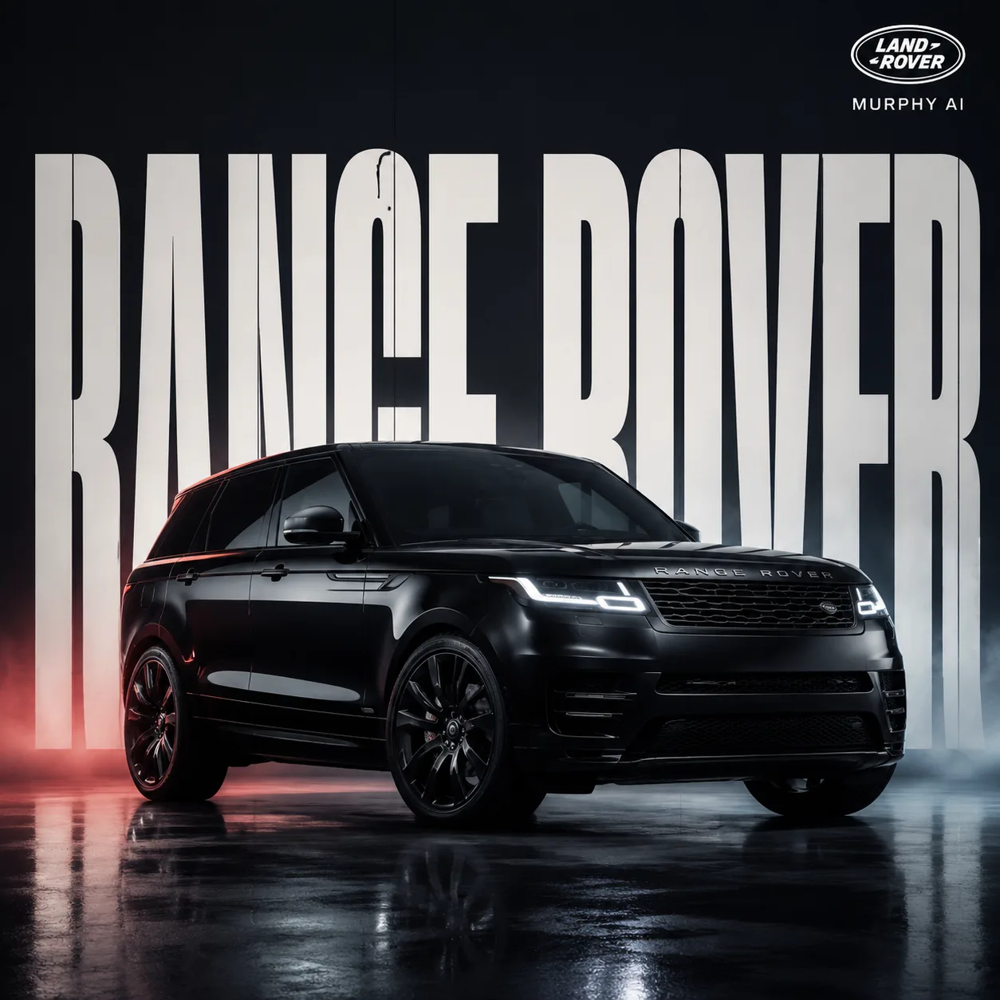

**#113 · Poster Design Prompt · <code>Vinano Studio</code>**

<details>
<summary>Show prompt</summary>

```
Cinematic automotive billboard poster, [CAR MODEL + VARIANT] in [PAINT COLOR + FINISH], parked center-frame, dominant stance, [CAMERA ANGLE — e.g. low angle / front three-quarter / elevated SUV angle], ultra controlled composition

dramatic studio lighting setup [PRIMARY LIGHT COLOR/TONE] key light, [RIM LIGHT COLOR] rim lighting defining silhouette, high contrast shadow falloff, precise specular highlights across body panels

massive billboard-style typography composition, bold condensed sans-serif white text "[BRAND NAME]" filling entire background wall behind the car, perfectly centered and spanning edge-to-edge, thin vertical dark lines slicing through each letter evenly, consistent spacing, no distortion

environment designed to match brand mood: [ENVIRONMENT DESCRIPTION — e.g. minimal concrete / desert haze / forest stone / industrial steel], seamlessly fading into deep gradient background, zero clutter

ground surface: [SURFACE TYPE — wet asphalt / gloss studio floor / textured terrain] subtle realistic reflections, controlled diffusion, no noise

atmosphere: [FOG / HAZE / PARTICLES — optional but controlled], only at ground level for depth

top right corner: [BRAND LOGO DESCRIPTION], small and elegant, paired minimal uppercase text "[YOUR SIGNATURE — e.g. MURPHY AI]" aligned cleanly

STRICT RULES:
— no extra taglines
— no performance specs
— no additional typography
— no random elements
— maintain premium minimal billboard aesthetic

render quality: hyper-detailed photorealism, ultra sharp reflections, realistic paint microtexture, cinematic color grade matching environment

composition: perfectly balanced, symmetrical, professional automotive advertising layout

format: 1:1 square, ultra high resolution, print-ready billboard finish

Preserve realistic proportions and depth for a confident, professional finish.
```

</details>

---

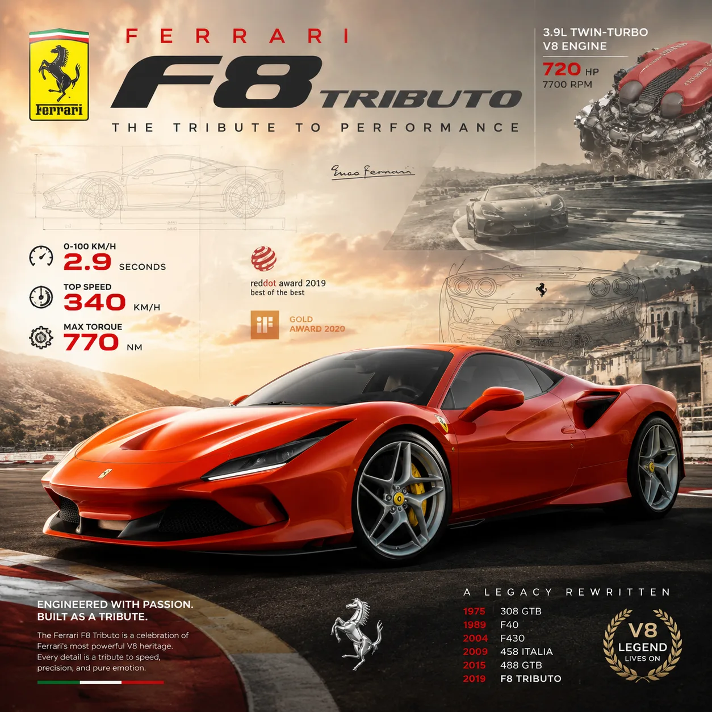

**#114 · Poster Design Prompt · <code>Vinano Studio</code>**

<details>
<summary>Show prompt</summary>

```
Create an epic premium automotive poster of
[CAR MODEL].

Place the car as the heroic central subject in a dynamic three-quarter side profile, visually dominant and impossible to ignore.

Show the full beauty of the vehicle aggressive stance, perfect proportions, premium wheels, signature headlights, aerodynamic lines, spoilers, performance details, and luxury design language.

Add bold premium typography the brand name, model name, performance stats, horsepower, acceleration, top speed, engine specs, and iconic achievements beautifully integrated into the composition.

Include subtle background elements inspired by the car’s heritage: faded blueprint lines, racing legacy, silhouette overlays, iconic tracks, engineering details, speed graphics, and collector-poster aesthetics.

Use strong visual contrast, bright premium colors (avoid dark black-heavy backgrounds), filmic, cinematic lighting, ultra-detailed reflections, glossy paint finish, luxury magazine quality, modern graphic design, and scroll-stopping masterpiece energy.

crisp composition, high-end automotive advertisement style, collector poster aesthetic, highly detailed, visually powerful, premium masterpiece.

Preserve realistic proportions and depth for a confident, professional finish.
```

</details>

---

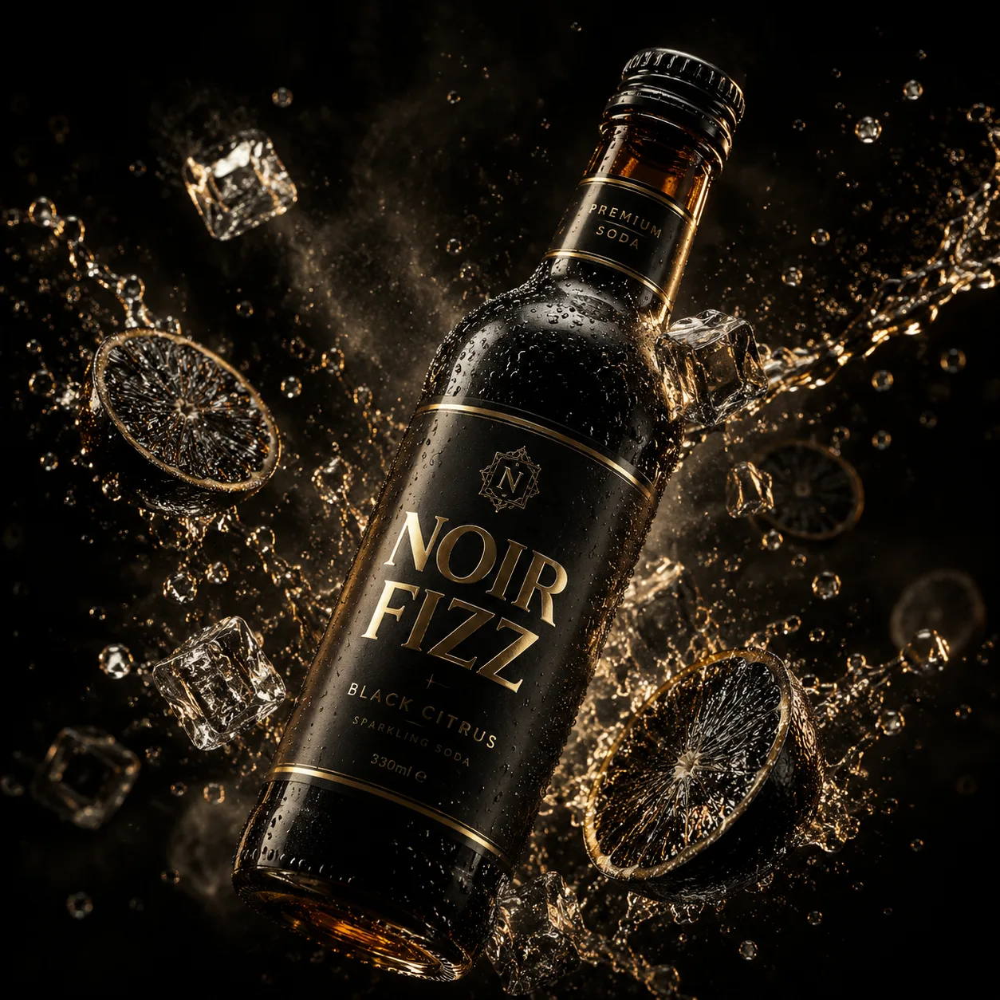

**#115 · Poster Design Prompt · <code>Vinano Studio</code>**

<details>
<summary>Show prompt</summary>

```
Ultra-cinematic product photography of a matte black luxury soda bottle labeled “NOIR FIZZ”, floating mid-air at a sharp diagonal angle; carbonated bubbles and liquid soda waves frozen in motion, shattered ice cubes and glossy black citrus slices suspended; dramatic low-key lighting strong rim lights, metallic highlights, deep shadows; black and gold color palette, volumetric mist, macro textures, hyper-realistic glass, 8K, premium commercial ad style. Render with rich micro-detail while keeping the layout uncluttered and intentional.
```

</details>

---

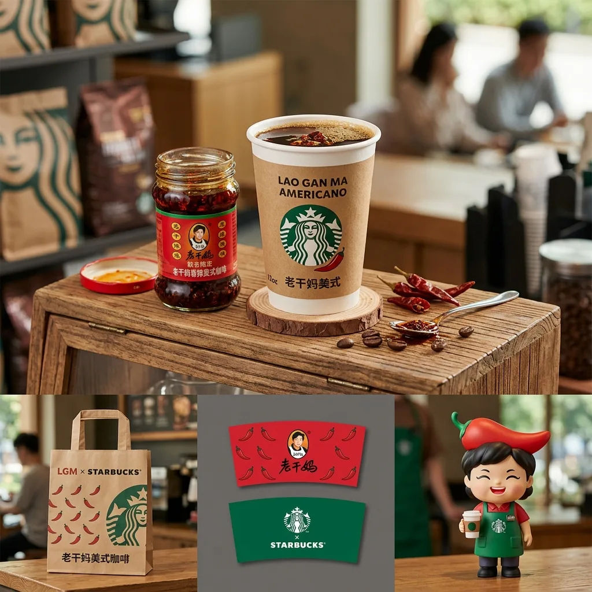

**#116 · Poster Design Prompt · <code>Vinano Image Pro</code>**

<details>
<summary>Show prompt</summary>

```
生成完整高端的品牌运营图，产品是老干妈和星巴克的联名款：老干妈美式，中间是主图，下面放一些联名的设计，包装袋、杯套以及吉祥物。 保持真实比例与空间层次，呈现专业、稳重的最终效果。
```

</details>

---

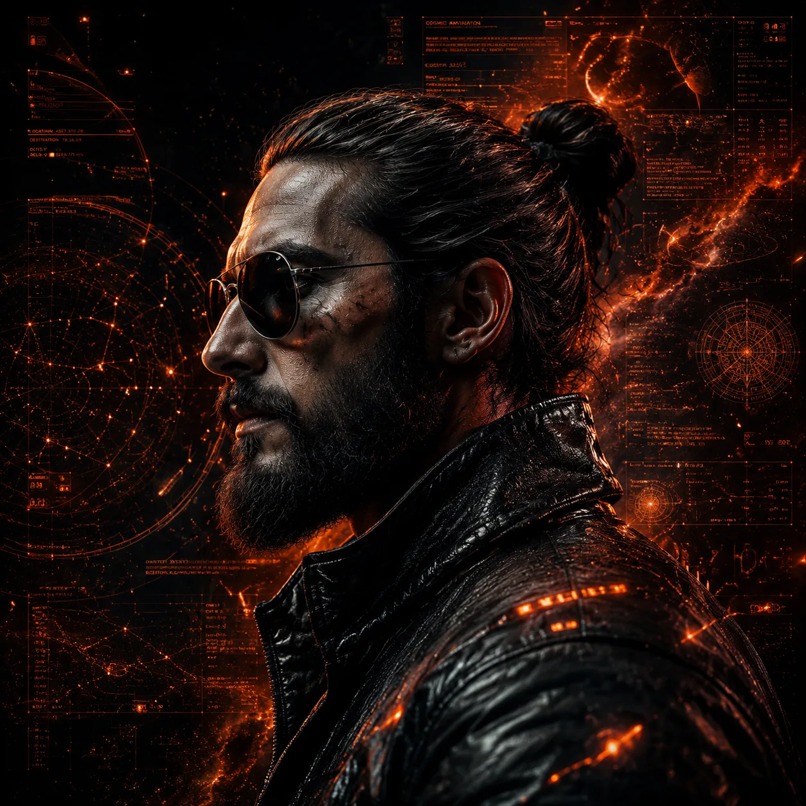

**#117 · Poster Design Prompt · <code>Vinano Studio</code>**

<details>
<summary>Show prompt</summary>

```
A cinematic side-profile portrait of a rugged man a tied-back bun and full beard, wearing round dark sunglasses and a textured leather jacket. His skin is detailed and slightly weathered. The background is a futuristic sci-fi interface filled glowing orange and red data streams, star maps, celestial navigation diagrams, grids, and holographic UI elements. Fiery particle effects and ember-like energy swirl around him, creating a cosmic, high-tech atmosphere. Dark color palette strong contrast, dramatic lighting, ultra-detailed, sharp focus, 8K, cyberpunk aesthetic, cinematic composition, depth of field. Preserve realistic proportions and depth for a confident, professional finish.
```

</details>

---

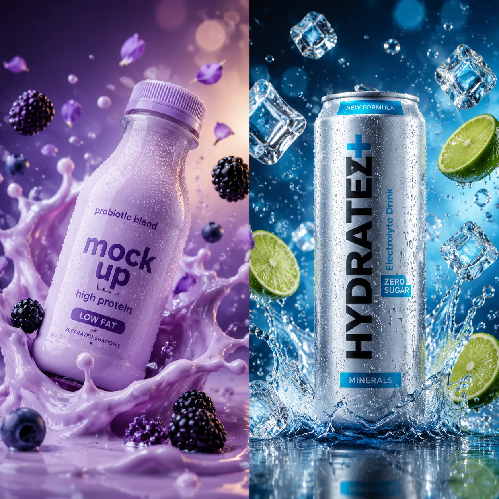

**#118 · Poster Design Prompt · <code>Vinano Studio</code>**

<details>
<summary>Show prompt</summary>

```
{
 "master_prompt": {
 "global_settings": {
 "resolution": "8K ultra-high-definition",
 "aspect_ratio": "3:4 vertical",
 "style": "hyper-realistic AI-edited commercial product photography",
 "sharpness": "extreme clarity, micro-detail visibility",
 "lighting_quality": "cinematic studio lighting controlled highlights and shadows",
 "motion_freeze": "high-speed capture, frozen splashes and particles",
 "noise": "none",
 "artifacts": "none"
 },

 "module_1_image_1_style": {
 "subject": {
 "type": "functional yogurt smoothie bottle",
 "material": "frosted plastic",
 "color": "soft pastel lavender",
 "surface_details": "dense condensation droplets covering the entire bottle",
 "label_text_visible": ["probiotic blend",
 "mock up",
 "high protein",
 "LOW FAT",
 "SEPARATED SHADOWS"]
 },
 "pose_and_orientation": {
 "position": "slightly tilted forward",
 "angle": "three-quarter view",
 "motion_feel": "energetic, mid-impact splash moment"
 },
 "liquid_and_motion": {
 "liquid_color": "light purple yogurt smoothie",
 "texture": "thick, creamy, glossy",
 "motion": "smooth splash wrapping around the bottle upward arcs"
 },
 "floating_elements": {
 "berries": "blackberries and blueberries floating at varying depths",
 "lavender_petals": "soft purple petals suspended mid-air",
 "droplets": "yogurt droplets and micro splashes frozen in motion"
 },
 "background": {
 "color_gradient": "deep violet fading into soft peach highlights",
 "bokeh": "subtle glowing circular light orbs"
 },
 "surface_and_reflection": {
 "base": "matte surface creamy liquid pooling",
 "shadow_style": "clean, separated soft shadow beneath bottle"
 }
 },

 "module_2_image_2_style": {
 "subject": {
 "type": "sparkling electrolyte drink can",
 "material": "brushed aluminum",
 "color": "icy silver neon cyan accents",
 "surface_details": "intense cold condensation crystal-clear droplets",
 "branding_text_visible": ["HYDRATE+",
 "Electrolyte Drink",
 "ZERO SUGAR",
 "NEW FORMULA",
 " MINERALS"]
 },
 "pose_and_orientation": {
 "position": "upright and centered",
 "angle": "straight-on front view",
 "presence": "strong hero product stance"
 },
 "liquid_and_motion": {
 "liquid_color": "clear carbonated liquid bubbles",
 "motion": "explosive splash bursting outward from the base",
 "droplet_behavior": "sharp, glass-like droplets flying outward"
 },
 "floating_elements": {
 "ice_cubes": "transparent ice cubes spinning in mid-air",
 "lime_slices": "fresh lime slices visible pulp",
 "bubbles": "carbonation bubbles rising around the can"
 },
 "background": {
 "color_palette": "cool blues, cyan highlights, metallic silver tones",
 "atmosphere": "fresh, high-energy, ultra-refreshing"
 },
 "surface_and_reflection": {
 "base": "wet reflective surface splash crown",
 "reflection_quality": "crisp reflections controlled specular highlights"
 }
 }
 }
}

Keep edges clean and the overall composition balanced for a polished, gallery-ready result.
```

</details>

---

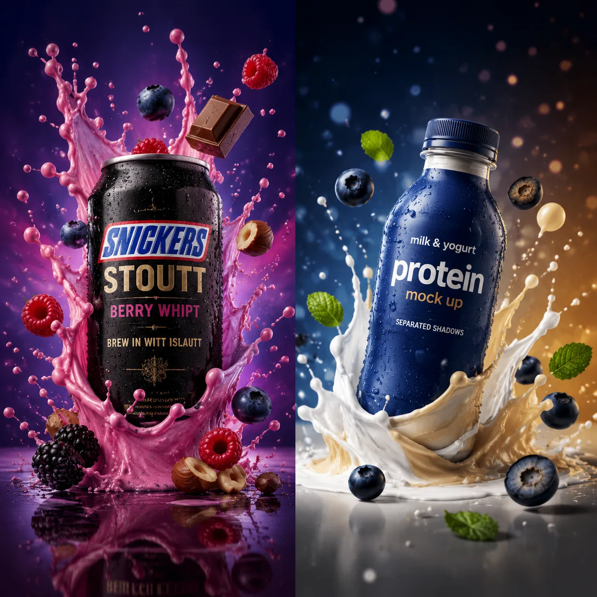

**#119 · Poster Design Prompt · <code>Vinano Studio</code>**

<details>
<summary>Show prompt</summary>

```
{
 "master_prompt": {
 "global_settings": {
 "resolution": "8K ultra-high-definition",
 "aspect_ratio": "3:4 vertical",
 "style": "hyper-realistic AI-edited commercial product photography",
 "sharpness": "extreme clarity, micro-detail visibility",
 "lighting_quality": "cinematic studio lighting controlled highlights and shadows",
 "motion_freeze": "high-speed capture, frozen splashes and particles",
 "noise": "none",
 "artifacts": "none"
 },

 "module_1_image_1_style": {
 "subject": {
 "type": "beverage can",
 "material": "matte black metal",
 "surface_details": "fine condensation droplets evenly distributed",
 "branding_text_visible": ["SNICKERS",
 "STOUTT",
 "BERRY WHIPT",
 "BREW IN WITT ISLAUTT"]
 },
 "pose_and_orientation": {
 "position": "upright, centered",
 "angle": "slight forward-facing perspective",
 "scale": "dominant foreground subject"
 },
 "liquid_and_motion": {
 "liquid_color": "glossy pink",
 "liquid_texture": "thick, creamy, whipped consistency",
 "motion": "explosive upward splash wrapping around the can",
 "splash_shape": "curved arcs sharp liquid peaks and droplets"
 },
 "floating_elements": {
 "berries": ["raspberries",
 "blackberries",
 "blueberries"],
 "chocolate_pieces": "rectangular chocolate chunks sharp edges",
 "nuts": "round and halved nuts scattered near base and mid-air",
 "distribution": "suspended at various depths around the can"
 },
 "background": {
 "color_gradient": "purple to blue",
 "light_effects": "soft radial glow behind can",
 "particles": "small pink droplets and specks floating"
 },
 "surface_and_reflection": {
 "base": "glossy reflective surface",
 "reflection_quality": "clear mirrored reflection slight ripple distortion"
 }
 },

 "module_2_image_2_style": {
 "subject": {
 "type": "plastic protein drink bottle",
 "color": "deep matte blue",
 "surface_details": "condensation droplets across entire bottle",
 "label_text_visible": ["milk & yogurt",
 "mock up",
 "protein",
 "SEPARATED SHADOWS"]
 },
 "pose_and_orientation": {
 "position": "slightly tilted to the right",
 "angle": "three-quarter view",
 "motion_feel": "dynamic, leaning into splash"
 },
 "liquid_and_motion": {
 "liquid_color": "white and light beige milk mixture",
 "texture": "smooth, creamy, fluid",
 "motion": "swirling splash rising around bottle base and sides"
 },
 "floating_elements": {
 "blueberries": "whole and halved blueberries at different depths",
 "mint_leaves": "small green leaves visible veins",
 "droplets": "milk droplets and spheres suspended mid-air"
 },
 "background": {
 "color_gradient": "dark blue to warm amber",
 "bokeh": "soft circular light particles scattered throughout"
 },
 "surface_and_reflection": {
 "base": "matte ground light liquid pooling",
 "shadow_style": "soft separated shadow under bottle"
 }
 },

Aim for an editorial, design-driven look with deliberate negative space.
```

</details>

---

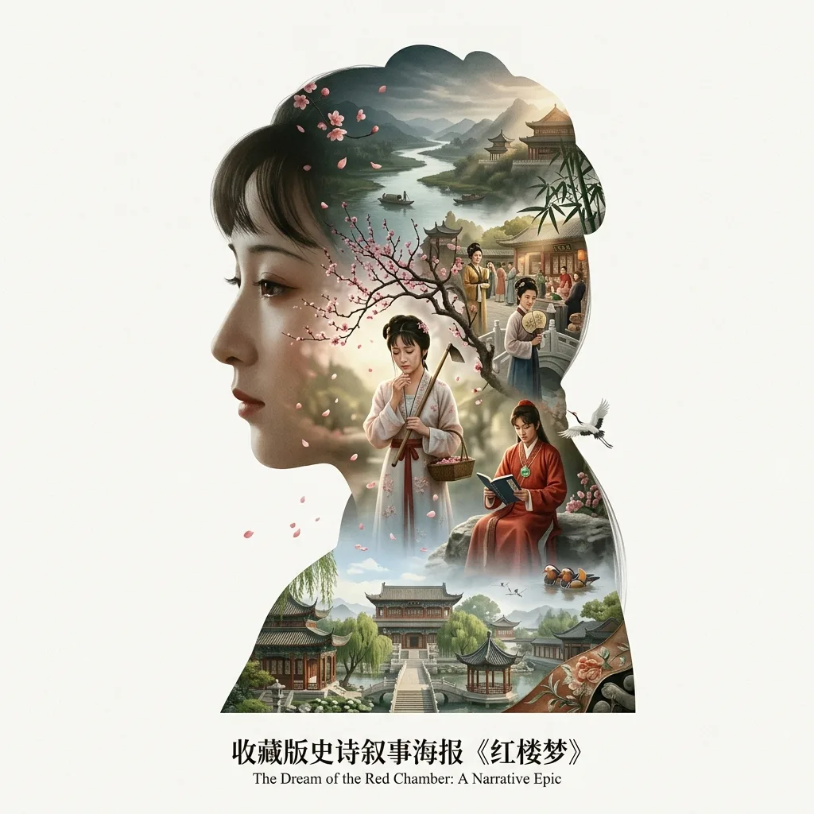

**#120 · Poster Design Prompt · <code>Vinano Image Pro</code>**

<details>
<summary>Show prompt</summary>

```
根据[红楼梦]自动生成一张 收藏版史诗叙事海报，

巨大优雅的{林黛玉}人物侧脸剪影作为外轮廓，剪影内部自动生长出最契合该主题的完整世界观、标志性场景、角色关系、象征符号、关键建筑、生物、道具与氛围。

整体不是普通拼贴，而是高级的剪影轮廓填充式叙事合成，带有双重曝光式联想，但强化为电影级叙事表达与空间调度。

电影海报风格 + 东方现实主义美学融合，强调真实物理光影、镜头语言、空间纵深与叙事层级。

光影采用电影级侧逆光与局部暖光点缀，冷暖对比克制真实，加入体积光与轻雾增强空间感。

材质表现为真实质感（建筑、丝绸、肌肤、石材），避免纯绘画笔触感，

保留柔和空气透视，但优化为电影级景深与焦点控制。

轻微胶片颗粒，边缘飞白与刷痕改为电影式柔和融合过渡，

大面积留白，版式克制高级，安静、宏大、克制、宿命感强的东方电影叙事。

所有元素必须强绑定主题，一眼识别，不要杂乱，不要硬拼贴，不要模板化背景，不要廉价奇幻素材。

保持配色统一、主体清晰，细节丰富但不杂乱。
```

</details>

---

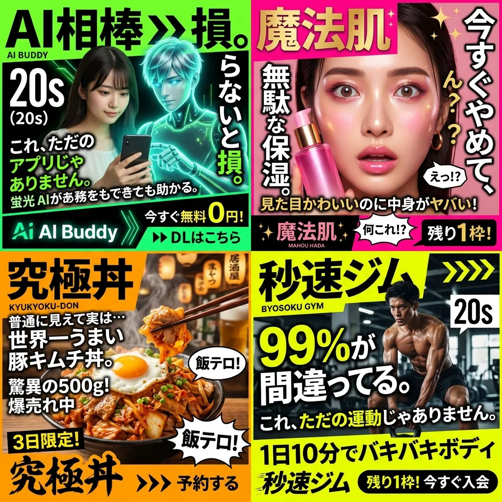

**#121 · Poster Design Prompt · <code>Vinano Image Pro</code>**

<details>
<summary>Show prompt</summary>

```
日本語の架空広告をテーマに、SNSでバズることを目的としたインパクトの強いビジュアルを作成してください。 1:1の正方形キャンバスに、4種類の広告を「2×2グリッド」で配置してください。

ジャンル： ①テック（AI・アプリ） ②美容・コスメ ③飲食 ④フィットネス すべて日本語コピー入り・架空ブランドで作成。

【バズるための演出要件】
・一瞬で目を引く強烈なキャッチコピー
 ・感情を動かす要素（驚き・共感・焦り・欲望）
・コントラストの強い配色（ネオン、ビビッドカラー、黒×蛍光など）
 ・大胆なレイアウト（はみ出し・斜め配置・大きすぎる文字）
・サムネ映えする構図（中央強調・顔アップ・視線誘導）
 ・SNS広告っぽい“あざとさ”（矢印・強調枠・吹き出し）

【デザインスタイル】
・2025年トレンドのSNS広告風
・TikTok / Instagram広告風
・視認性最優先（スマホで見ても読める）
・写真風 or 高品質イラスト
・CTA入り（例：今だけ無料・限定・残り3日など）

【ランダムバズ要素】
以下の①〜③から、それぞれ1つずつランダムに選び、必ずキャッチコピーに反映すること。
 ①禁断ワード系（いずれか1つ）
・知らないと損
・99%が間違ってる
・今すぐやめて
②ギャップ演出（いずれか1つ）
・見た目かわいいのに中身がヤバい
・普通に見えて実は…
・これ、○○じゃありません
③数字・限定（いずれか1つ）
・3日限定
・残り1枠
・無料→0円

【重要】
・4つそれぞれ明確に違う雰囲気にする
・グリッドは崩さない
・文字は読みやすく配置する
・“スクロールを止める違和感”を意図的に入れる

出力：4広告が1枚にまとまった高インパクトビジュアル

保持配色统一、主体清晰，细节丰富但不杂乱。
```

</details>

---

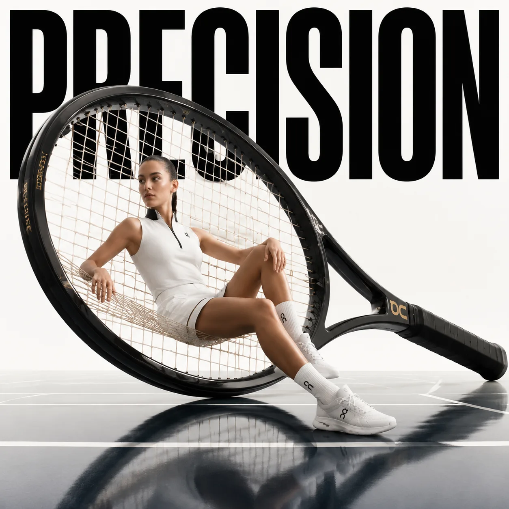

**#122 · Poster Design Prompt · <code>Vinano Studio</code>**

<details>
<summary>Show prompt</summary>

```
Avant-garde sports fashion advertisement, oversized tennis racket positioned like monumental sculpture, female athlete seated casually on the strings as if a suspended lounge, giant word “PRECISION” in bold typography behind, crisp white studio backdrop, reflective court-like floor, luxury sportswear editorial aesthetic, filmic, cinematic lighting, ultra-crisp composition, 1:1 Keep edges clean and the overall composition balanced for a polished, gallery-ready result.
```

</details>

---

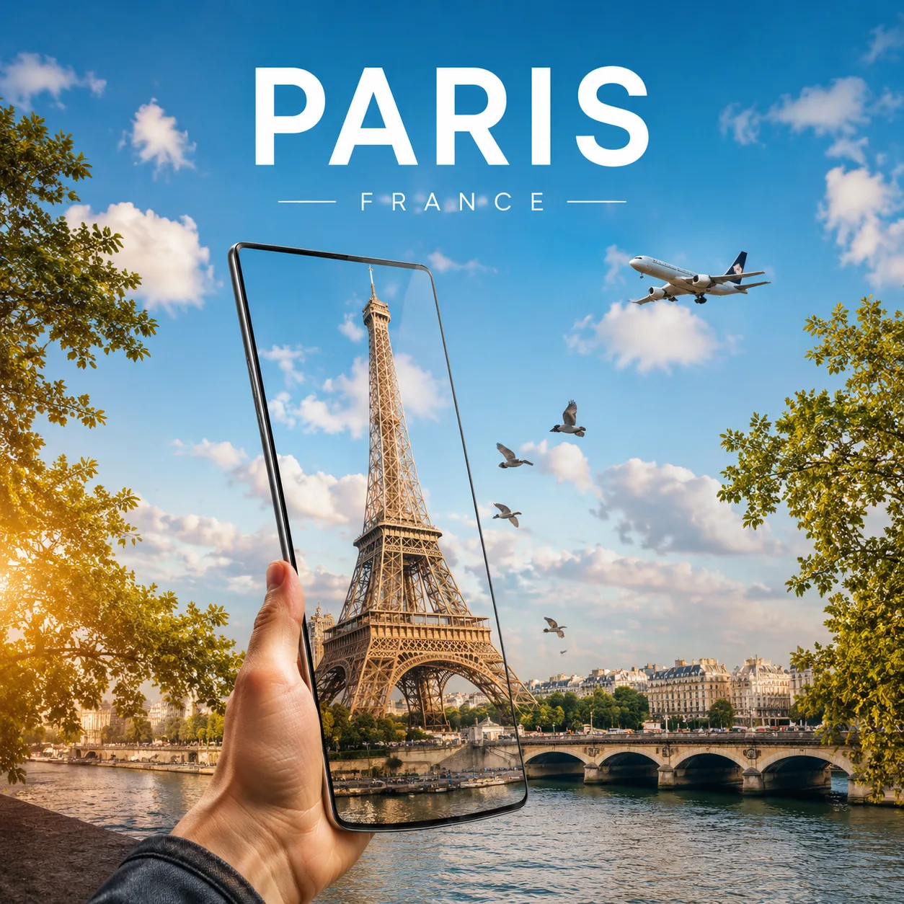

**#123 · Poster Design Prompt · <code>Vinano Studio</code>**

<details>
<summary>Show prompt</summary>

```
A hyper-realistic travel advertisement in square format (1080x1080), featuring a hand holding a sleek, ultra-thin smartphone or tablet in portrait orientation, tilted slightly sideways to create a striking 3D portal effect. The screen displays a high-resolution image of an iconic landmark from [COUNTRY], which continues into the real background, blending seamlessly. The landmark appears to emerge from the screen. Birds fly nearby and a commercial airplane passes through a bright blue sky soft white clouds. Bold, clean sans-serif text reading [CITY] is placed prominently above. The lighting is warm and natural, casting soft shadows across the landscape. The surroundings reflect the region’s natural environment (like meadows, coastlines, or city skylines). The device is glossy and minimal-bezel, enhancing realism and depth. Emphasise material texture and natural light so the final frame feels tactile and premium.
```

</details>

---

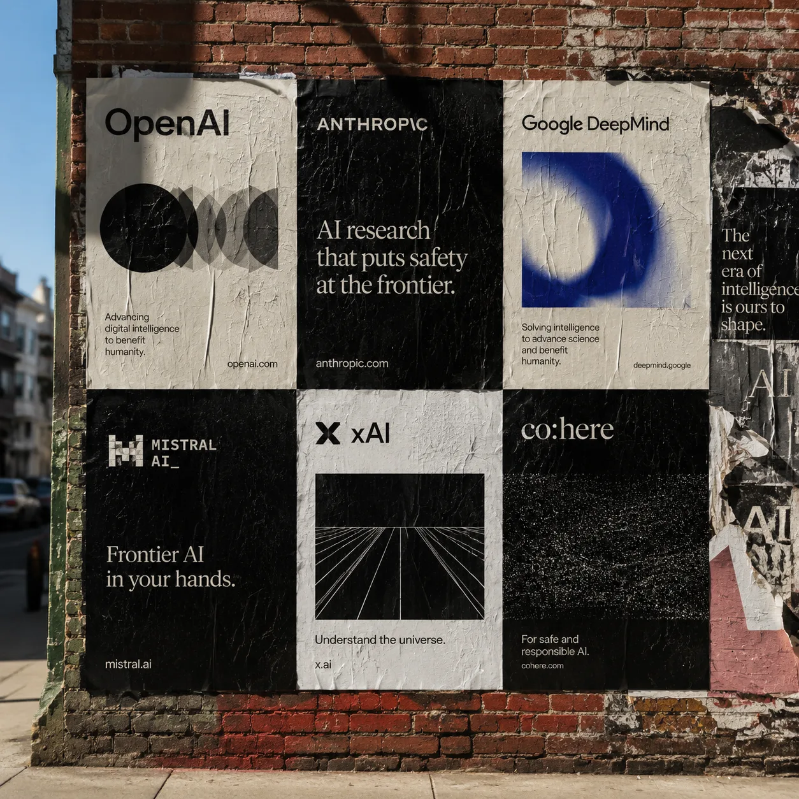

**#124 · Poster Design Prompt · <code>Vinano Studio</code>**

<details>
<summary>Show prompt</summary>

```
Make a wheatpaste poster setup on a brick wall in sf featuring posters from various AI labs Emphasise material texture and natural light so the final frame feels tactile and premium.
```

</details>

---

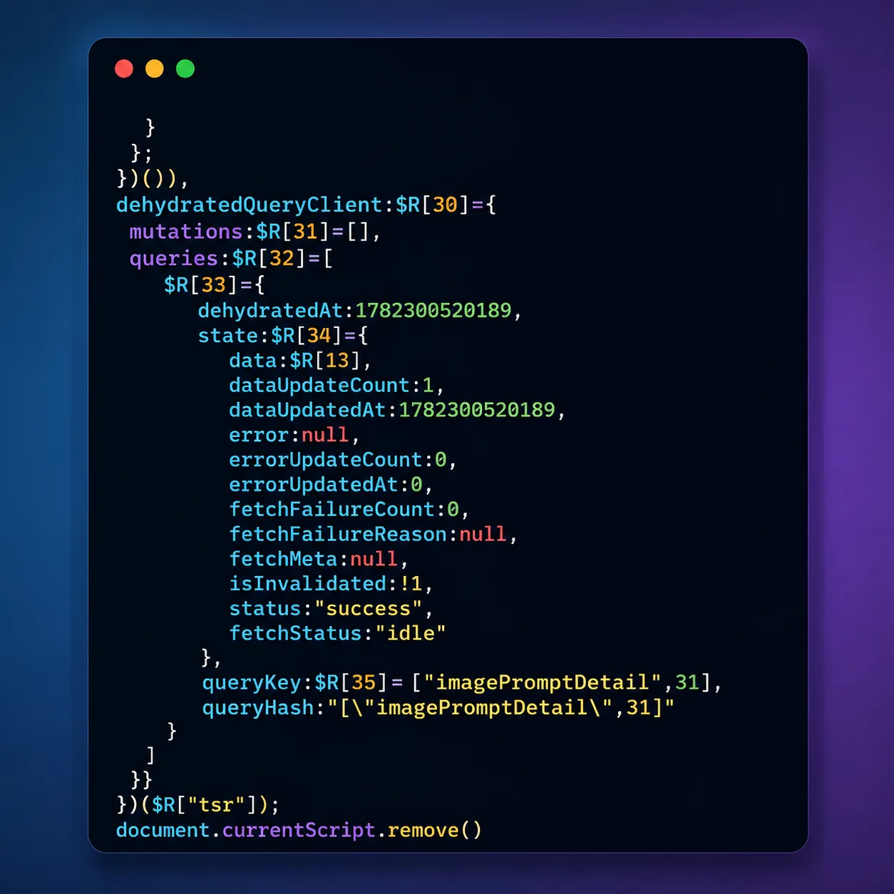

**#125 · Poster Design Prompt · <code>Vinano Studio</code>**

<details>
<summary>Show prompt</summary>

```
{
 t && (e.push(l), s(l, "return"), t = false, n2 = true, r.length = 0);
 } };
})()),dehydratedQueryClient:$R[30]={mutations:$R[31]=[],queries:$R[32]=[$R[33]={dehydratedAt:1782300520189,state:$R[34]={data:$R[13],dataUpdateCount:1,dataUpdatedAt:1782300520189,error:null,errorUpdateCount:0,errorUpdatedAt:0,fetchFailureCount:0,fetchFailureReason:null,fetchMeta:null,isInvalidated:!1,status:"success",fetchStatus:"idle"},queryKey:$R[35]=["imagePromptDetail",31],queryHash:"[\"imagePromptDetail\",31]"}]}}})($R["tsr"]);document.currentScript.remove()

Keep edges clean and the overall composition balanced for a polished, gallery-ready result.
```

</details>

---


**#126 · Poster Design Prompt · <code>Vinano Studio</code>**

<details>
<summary>Show prompt</summary>

```
Cinematic portrait of [Athlete Name] showing his/her journey, bold text of achievements and best performances Maintain consistent colour harmony and crisp focus across the whole frame.
```

</details>

---

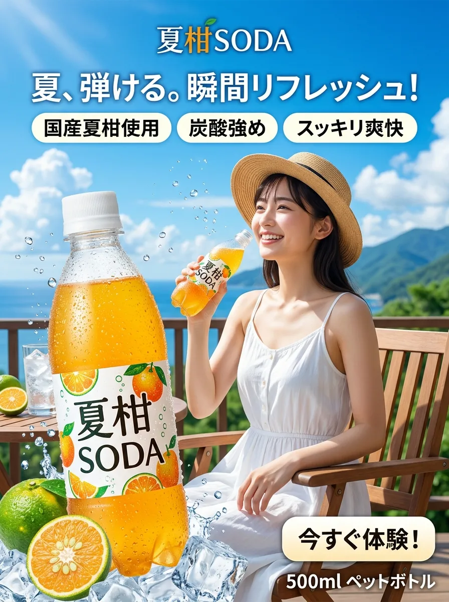

**#127 · Poster Design Prompt · <code>Vinano Image Pro</code>**

<details>
<summary>Show prompt</summary>

```
画像生成: 商品広告写真, 夏にぴったりの季節商品, 炭酸飲料, 名称="夏柑SODA", 形状=ペットボトル500ml, 2025年に飲料広告として高CTAだったデザインをリサーチしてから画像仕様をデザインして生成, アスペクト比=3:4 保持真实比例与空间层次，呈现专业、稳重的最终效果。
```

</details>

---

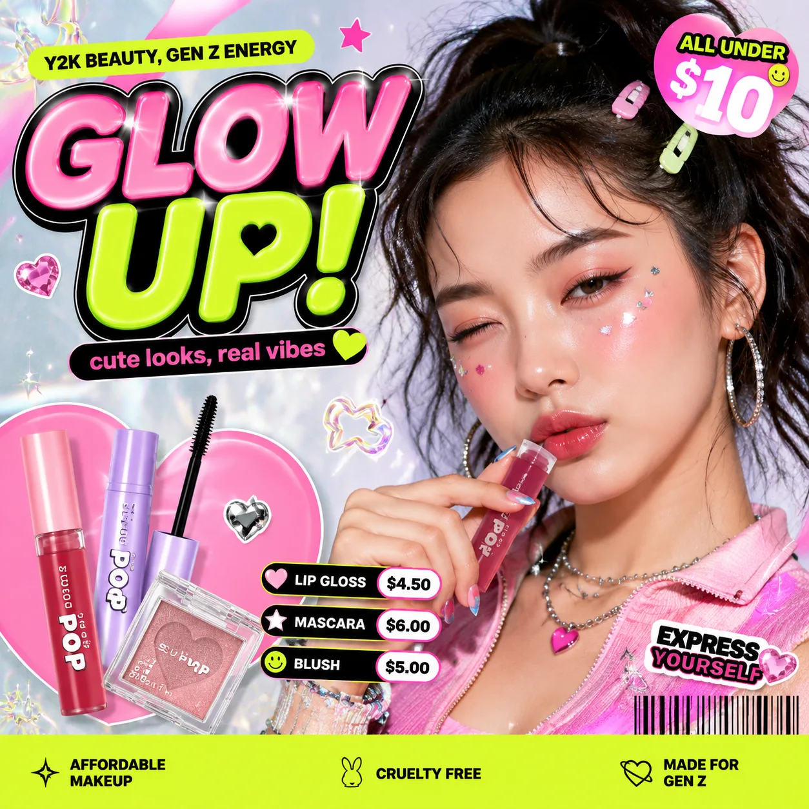

**#128 · Poster Design Prompt · <code>Vinano Studio</code>**

<details>
<summary>Show prompt</summary>

```
Cute Y2K style affordable cosmetics advertising image designed for Gen Z. vibrant color schemes, including neon colors. Aspect ratio is 3:4. Preserve realistic proportions and depth for a confident, professional finish.
```

</details>

---

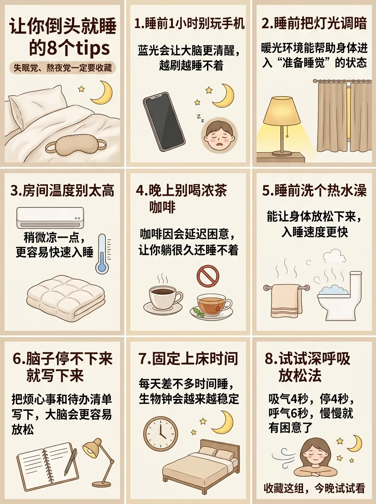

**#129 · Poster Design Prompt · <code>Vinano Image Pro</code>**

<details>
<summary>Show prompt</summary>

```
生成一张适合小红书发布的 3:4 竖版九宫格海报，整体为 3列 × 3行 排版，九个宫格边界清晰，方便后期直接切割成 9 张单图发布。整体风格干净、高级、统一，适合女性向健康生活方式内容，具有小红书爆款封面气质。画面要求 信息排版清晰、文字大、可读性强、留白舒服、配色温柔治愈。

整体视觉风格：
奶油白、浅米色、淡燕麦色、浅焦糖色为主色调，搭配少量深棕色文字，ins风、治愈感、睡眠疗愈主题，简约排版，轻拟物插画点缀，可加入枕头、月亮、星星、热牛奶、香薰、书本、眼罩、窗帘、床铺等元素。整体像专业新媒体设计图，字体工整，适合做知识科普类小红书九宫格。
排版要求：

整张图必须是标准九宫格构图，切分后每一格都能独立成图

每个宫格内容完整居中，不要把标题或正文压在分割线附近
每个格子之间保留明显间隔或细边框，保证裁切后不影响阅读
所有文字使用中文，清晰易读，不要乱码，不要英文
每个宫格都像独立的小红书图文卡片，但视觉风格保持统一
画面精致、真实、自然，不要廉价营销感，不要过度花哨
九宫格具体内容：

第1格（封面）
大标题：让你倒头就睡的8个 tips
副标题：失眠党、熬夜党一定要收藏
封面视觉最吸睛，适合做首图，加入柔软床铺、月亮、枕头、眼罩等治愈睡眠元素，标题突出，排版高级。

第2格
标题：1. 睡前1小时别玩手机
正文：蓝光会让大脑更清醒，越刷越睡不着。
配图元素：手机、月亮、困倦表情的小插画
第3格
标题：2. 睡前把灯光调暗
正文：暖光环境能帮助身体进入“准备睡觉”的状态。
配图元素：床头灯、暖黄色灯光、窗帘
第4格
标题：3. 房间温度别太高
正文：稍微凉一点，更容易快速入睡。
配图元素：空调、温度计、被子
第5格
标题：4. 晚上别喝浓茶咖啡
正文：咖啡因会延迟困意，让你躺很久还睡不着。
配图元素：咖啡杯、茶杯、禁止符号

第6格
标题：5. 睡前洗个热水澡
正文：能让身体放松下来，入睡速度更快。
配图元素：浴室蒸汽、毛巾、热水
第7格
标题：6. 脑子停不下来就写下来
正文：把烦心事和待办清单写下，大脑会更容易放松。
配图元素：笔记本、钢笔、小台灯
第8格
标题：7. 固定上床时间
正文：每天差不多时间睡，生物钟会越来越稳定。
配图元素：时钟、月亮、床
第9格
标题：8. 试试深呼吸放松法
正文：吸气4秒，停4秒，呼气6秒，慢慢就有困意了。
底部小字：收藏这组，今晚试试看
配图元素：呼吸线条、闭眼人物、星星

画质要求：
高清，高级排版，杂志感，真实可发布，新媒体运营审美，小红书爆款图文风格，文字布局规整，适合直接切图。

保持配色统一、主体清晰，细节丰富但不杂乱。
```

</details>

---

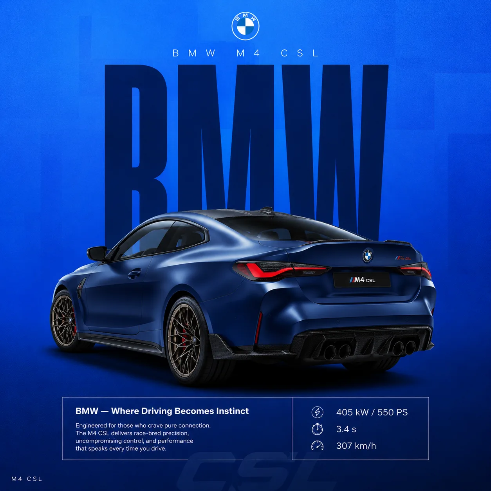

**#130 · Poster Design Prompt · <code>Vinano Studio</code>**

<details>
<summary>Show prompt</summary>

```
4:5 vertical social poster, ultra high resolution, 8K

SCENE / BACKGROUND:
Flat racing yellow subtle gradient (light → deep amber)
Grain texture 2–3%
Soft rectangular overlays at 3% opacity

PRODUCT:
Porsche 911 GT3 RS
Gloss yellow carbon details
Rear 3/4 angle, slightly elevated
Wing dominant

Position:
Right of center

TYPOGRAPHY:
“PORSCHE”
Ultra tall, condensed, stretched
Deep charcoal

Secondary:
“PORSCHE 911 GT3 RS”

EDITORIAL:
“Porsche — Where Precision Meets Passion”

Focus:
engineering, obsession, track DNA

FADED TEXT:
“GT3 RS” at 3–5%

SPECS:
386 kW / 525 PS
3.2 s
296 km/h

LIGHTING:
Clean studio, sharp highlights

MOOD:
Precision.
Iconic.
Timeless performance.

FORMAT:
4:5 vertical social poster, ultra high resolution, 8K, print-quality sharpness

SCENE / BACKGROUND:
Flat, high-saturation BMW blue background

Gradient:
Top → slightly lighter electric blue
Bottom → deep navy blue

Surface:
- Subtle grain texture (2–3%)
- Faint rectangular overlays (2–4% opacity)
- Clean, graphic — no realism

Shadow:
Soft contact shadow under car

PRODUCT (CAR):
BMW M4 CSL

Color:
Matte frozen blue / deep metallic navy

Angle:
Rear 3/4 perspective (IMPORTANT — match Porsche angle for consistency)
Slightly elevated camera

Position:
Slightly right of center

Details:
- Carbon roof visible
- Aggressive diffuser
- Sharp reflections
- Subtle brake detail

COMPOSITION:
IDENTICAL to Porsche:
Top → branding
Middle → giant type
Center → car overlap
Bottom → editorial + specs

TYPOGRAPHY:

PRIMARY:
“BMW”

Style:
Ultra condensed bold sans serif
Tall vertical scaling (same as Porsche)

Color:
Deep navy / near black

Behavior:
Static (NO distortion — unlike previous version)
Acts as structural backdrop

SECONDARY HEADER:
“BMW M4 CSL”
Thin, wide tracking

LOGO AREA:
BMW roundel centered above

EDITORIAL BLOCK:

Headline:
“BMW — Where Driving Becomes Instinct”

Body:
Focus on:
- driver connection
- control
- performance precision

Boxed layout, same structure as Porsche

FADED TEXT:
“CSL” large, 3–5% opacity behind box

BOTTOM LEFT:
“M4 CSL”

BOTTOM RIGHT SPECS:

405 kW / 550 PS
3.4 s
307 km/h

LIGHTING:
Clean studio lighting
Sharp but controlled highlights

COLOR GRADING:
Deep blues, high contrast, clean blacks

CAMERA:
50mm, slightly elevated rear 3/4

MOOD:
Performance.
Precision.
Driver focus.

Render with rich micro-detail while keeping the layout uncluttered and intentional.
```

</details>

---

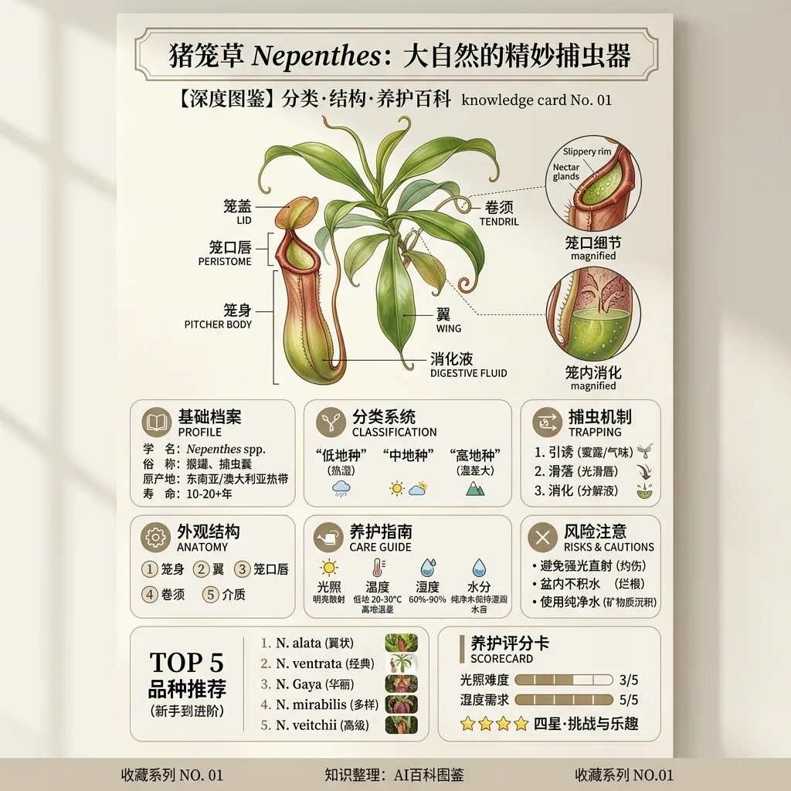

**#131 · Poster Design Prompt · <code>Vinano Image Pro</code>**

<details>
<summary>Show prompt</summary>

```
请根据【主题】生成一张高质量竖版「科普百科图」。

这张图不是普通海报，也不是单纯插画，而是一张兼具“图鉴感、百科感、信息结构感、收藏感”的模块化科普信息图。整体风格参考高级博物图鉴、现代百科书页、生活方式知识卡和社交媒体高传播信息图的结合。

请让画面包含：
- 一个清晰漂亮的主题主视觉
- 若干局部特征放大细节
- 多个圆角模块化信息分区
- 清楚的标题层级与重点标签
- 简洁但丰富的百科内容
- 可视化评分、要点总结或Top 5模块

内容栏目请根据主题自动适配，优先从这些方向中选择并合理组合：
基础档案、分类信息、外观特征、习性/生态、形成机制/结构组成、生长或使用条件、养护或维护建议、风险与注意事项、适合人群或适用场景、优缺点对比、快速评分卡。

视觉要求：
浅色干净背景，柔和配色，轻阴影，精致小图标，圆角信息框，整洁排版，信息密度高但不拥挤，阅读体验好。整体必须像真正可以发布、阅读、收藏、系列化生产的科普百科卡，而不是广告图。

请不要做成普通商业宣传海报。要突出“知识整理 + 模块信息 + 图鉴式展示”的特征。

强调材质质感与自然光影，让画面更具高级真实感。
```

</details>

---

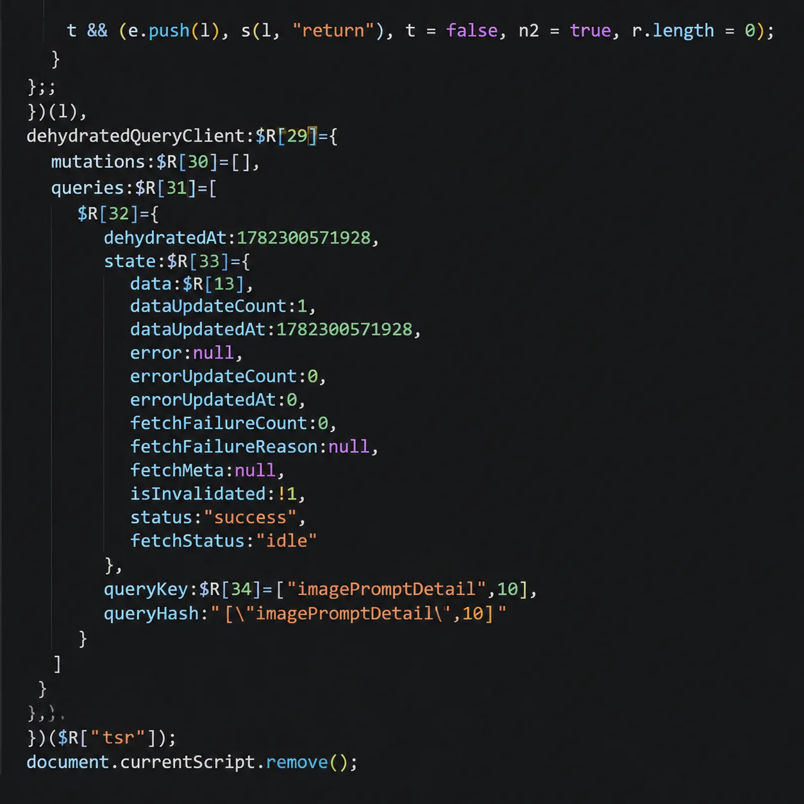

**#132 · Poster Design Prompt · <code>Vinano Studio</code>**

<details>
<summary>Show prompt</summary>

```
{
 t && (e.push(l), s(l, "return"), t = false, n2 = true, r.length = 0);
 } };
})()),dehydratedQueryClient:$R[29]={mutations:$R[30]=[],queries:$R[31]=[$R[32]={dehydratedAt:1782300571928,state:$R[33]={data:$R[13],dataUpdateCount:1,dataUpdatedAt:1782300571928,error:null,errorUpdateCount:0,errorUpdatedAt:0,fetchFailureCount:0,fetchFailureReason:null,fetchMeta:null,isInvalidated:!1,status:"success",fetchStatus:"idle"},queryKey:$R[34]=["imagePromptDetail",10],queryHash:"[\"imagePromptDetail\",10]"}]}}})($R["tsr"]);document.currentScript.remove()

Preserve realistic proportions and depth for a confident, professional finish.
```

</details>

---

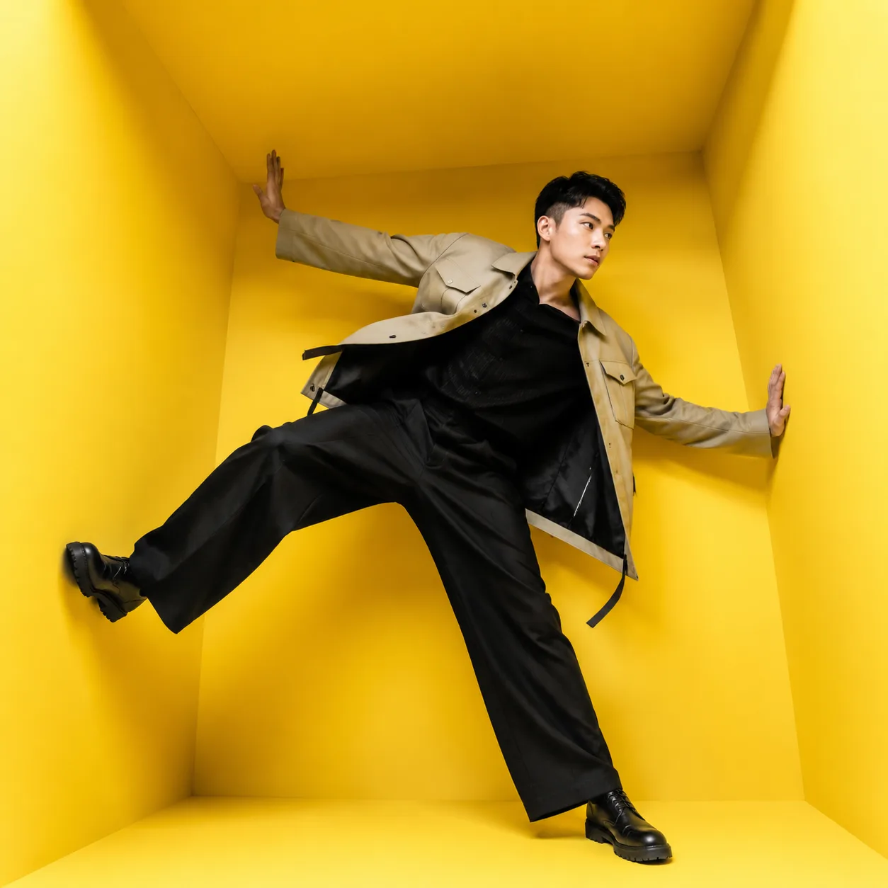

**#133 · Poster Design Prompt · <code>Vinano Studio</code>**

<details>
<summary>Show prompt</summary>

```
[INPUT IMAGE: USER_PHOTO] Use the person in the input image as the ONLY subject. Preserve their identity and facial features clearly.

Create a hyper-realistic high-fashion editorial photo inside a surreal 3D geometric “color box” room (a hollow cube / tilted cube set). Each render MUST randomly choose:
1) a bold single-color box (monochrome environment, vivid and saturated),
2) a dynamic “cool” fashion pose (gravity-defying or extreme stretch / leap / sideways bracing against the walls),
3) a dramatic camera angle (wide-angle 24–35mm equivalent, tilted horizon, strong perspective).

The subject appears full-body and sharp, wearing an avant-garde fashion styling that feels modern and editorial (clean silhouette, stylish layering, premium fabric texture). Keep clothing tasteful and fashion-forward. The subject’s pose should feel athletic, stylish, and unusual—like a magazine campaign shot.

Lighting: studio quality, crisp and cinematic; strong key light controlled soft shadows, subtle rim light; realistic reflections and bounce light from the colored walls. Ultra-detailed skin texture, natural pores, realistic fabric weave, clean edges, high dynamic range.
Composition: subject centered plenty of negative space and strong geometric lines; the box perspective frames the subject.
Color: the box color is a SINGLE bold color and MUST be different each run (random vivid hue). The subject’s outfit contrasts well the box color.

Output: hyper-real, true-to-life photorealistic, 8k detail, editorial campaign quality, sharp focus on subject, no motion blur, no distortion of face, natural proportions.

Preserve realistic proportions and depth for a confident, professional finish.
```

</details>

---

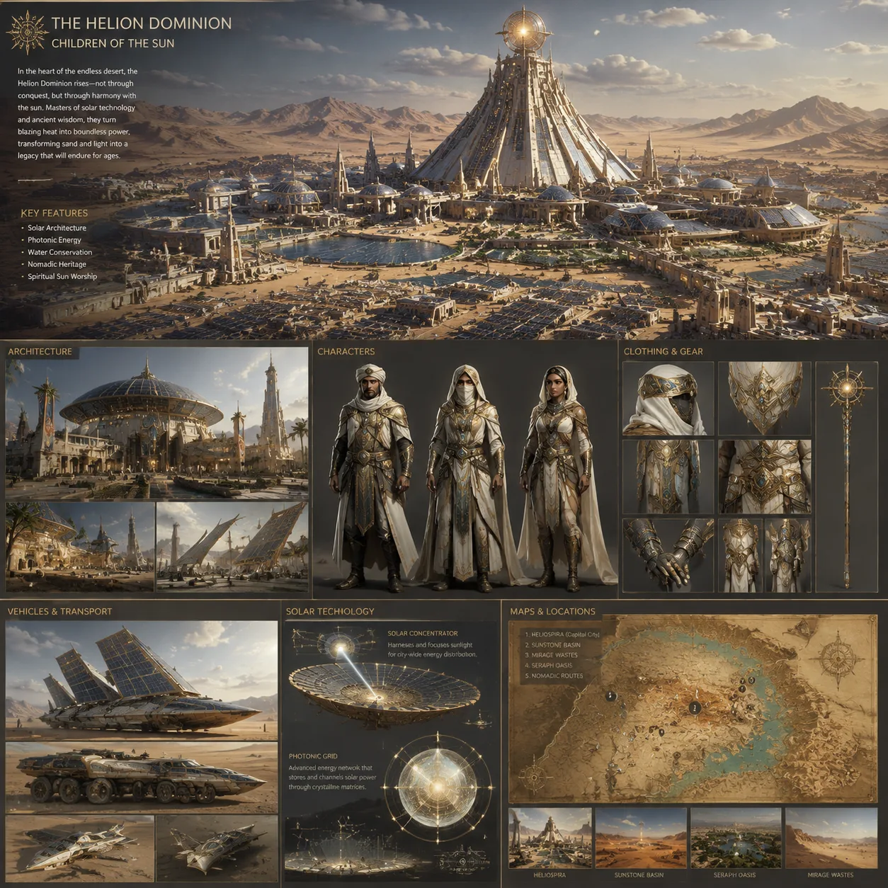

**#134 · Poster Design Prompt · <code>Vinano Studio</code>**

<details>
<summary>Show prompt</summary>

```
Create a complete visual worldbuilding set for a futuristic desert civilization solar technology, multiple images including architecture, characters, clothing, vehicles, and maps, cohesive design language, cinematic realism, ultra detailed. Render with rich micro-detail while keeping the layout uncluttered and intentional.
```

</details>

---


**#135 · Poster Design Prompt · <code>Vinano Image Pro</code>**

<details>
<summary>Show prompt</summary>

```
生成一张[餐饮品牌触点矩阵]系列视觉图，用于展示一个完整的餐饮品牌视觉系统与包装应用方案。

这是一个面向餐饮行业的品牌VI样机展示板 / 包装系统陈列图 / 品牌提案页。画面不是单张宣传海报，而是将品牌主视觉、主打产品、包装物料、菜单信息、促销内容与小型延展物料整合成一张系统化品牌展示图。

【用户输入信息】
- 品牌名：[品牌名]
- 经营类目：[经营类目]

【可选补充信息】
- 主打产品：[主打产品]
- 品牌口号：[品牌口号]
- 风格方向：[风格方向]
- 主色调：[主色调]
- 辅助色：[辅助色]
- 客群定位：[客群定位]
- 价格定位：[价格定位]
- 地域风格：[地域风格]
- 画幅比例：[画幅比例]

【自动补全规则】
如果用户没有提供完整品牌信息，请根据【品牌名】与【经营类目】自动推导并完成最优组合，包括：
1. 判断品牌调性（年轻、亲和、国潮、复古、清新、治愈、精致、快餐感等）
2. 匹配适合该类目的视觉风格
3. 自动设定合理的主色、辅助色与点缀色
4. 自动补全主打产品与辅助产品
5. 自动生成适合餐饮传播的品牌口号、卖点文案、价格信息与推荐标签
6. 自动匹配合适的餐饮物料类型与展示内容

【画面内容要求】
画面中应围绕【品牌名】构建一整套餐饮品牌物料系统，包含但不限于以下内容：
- 核心包装：手提袋、外卖袋、包装盒、打包盒、纸袋、塑料袋
- 饮品 / 食品容器：纸杯、杯套、碗、餐盒、封口贴、标签
- 信息传播物料：菜单、促销海报、价格牌、桌牌、立牌、小卡片
- 小型品牌延展：贴纸、徽章、纸巾、餐具、包装封条、吊牌
- 产品表现：主打餐品照片、单品主视觉、食物特写、切面图、推荐组合图

【构图与版式要求】
采用竖版【画幅比例】构图，整体为白色、米白色或浅灰色背景，以品牌提案板 / 样机矩阵板的方式组织画面。
通过大中小物料混排形成视觉层级：
- 大型包装和主视觉物料作为视觉锚点
- 中型菜单、海报和价格模块负责信息传达
- 小型贴纸、餐具、标签与周边物料增强系统完整度

整体构图应具有明确秩序感，接近品牌方案展示页、作品集陈列页、包装提案页的视觉效果。元素要排列整齐但不呆板，丰富但不杂乱，具有模块化与可阅读性。

【风格与质感要求】
整体风格应符合【经营类目】与【品牌名】气质，具有明显的餐饮品牌感、商业传播感、样机展示感与系统设计感。
可融合以下风格倾向：现代简洁、国潮趣味、轻复古、生活方式感、快消感、温暖治愈感、年轻化传播感。
材质真实，包含纸张、塑料、布袋、包装盒、杯体、贴纸、餐具等真实物料质感；光影柔和统一，像在干净摄影棚环境中拍摄的品牌物料合集。

【文字与图形要求】
所有物料上应统一出现品牌名、Logo、品牌符号、主色块、口号或卖点文案。
文案可为中文或中英混排，但要符合餐饮传播表达，简洁直接，具备商品售卖感。
图形系统可以根据品牌调性选择简洁插画、几何图形、卡通吉祥物、符号化图标或辅助纹样，用于增强品牌记忆点。

【输出目标】
最终生成一张完整的【品牌名】餐饮品牌视觉系统展示图，像设计团队为该餐饮品牌制作的整套品牌提案样机板。
要求画面统一、精致、具备商业落地感与作品集展示质量，并能清楚体现品牌风格、主打类目与多触点包装延展能力。

Make the aspect ratio 9:16

保持真实比例与空间层次，呈现专业、稳重的最终效果。
```

</details>

---

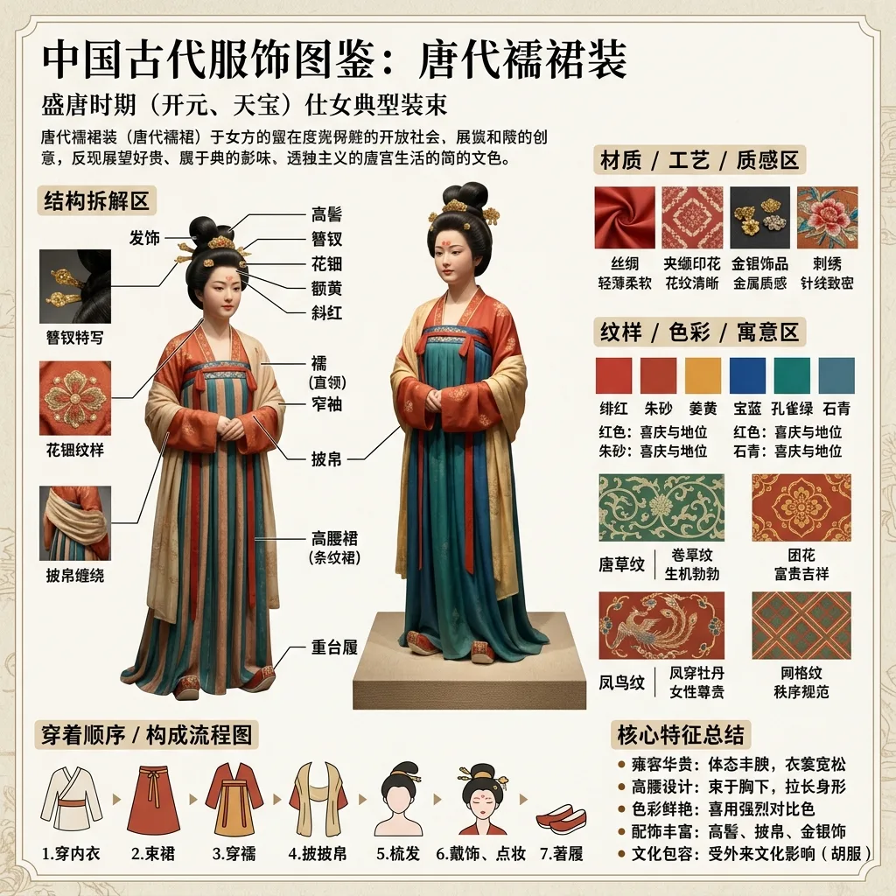

**#136 · Poster Design Prompt · <code>Vinano Image Pro</code>**

<details>
<summary>Show prompt</summary>

```
请根据[主题]自动生成一张[博物馆图鉴式中文拆解信息图]。

要求整张图兼具真实写实主视觉、结构拆解、中文标注、材质说明、纹样寓意、色彩含义和核心特征总结。你需要根据[主题]自动判断最合适的主体对象、服饰体系、器物结构、时代风格、关键部件、材质工艺、颜色方案与版式结构，用户无需再提供其他信息。

整体风格应为：国家博物馆展板、历史服饰图鉴、文博专题信息图，而不是普通海报、古风写真、电商详情页或动漫插画。背景采用米白、绢纸白、浅茶色等纸张质感，整体高级、克制、专业、可收藏。

版式固定为：
- 顶部：中文主标题 + 副标题 + 导语
- 左侧：结构拆解区，中文引线标注关键部件，并配局部特写
- 右上：材质 / 工艺 / 质感区，展示真实纹理小样并附说明
- 右中：纹样 / 色彩 / 寓意区，展示主色板、纹样样本和文化解释
- 底部：穿着顺序 / 构成流程图 + 核心特征总结

若主题适合人物展示，则以真实人物全身站姿为中央主体；若更适合器物或单体结构，则改为中心主体拆解图，但整体仍保持完整中文信息图形式。所有文字必须为简体中文，清晰、规整、可读，不要乱码、错字、英文或拼音。重点突出真实结构、材质差异、文化说明与图鉴气质。

避免：海报感、影楼感、电商感、动漫感、cosplay感、乱标注、错结构、糊字、假材质、过度装饰。

在保证细节的同时保持版式克制、留白得当。
```

</details>

---

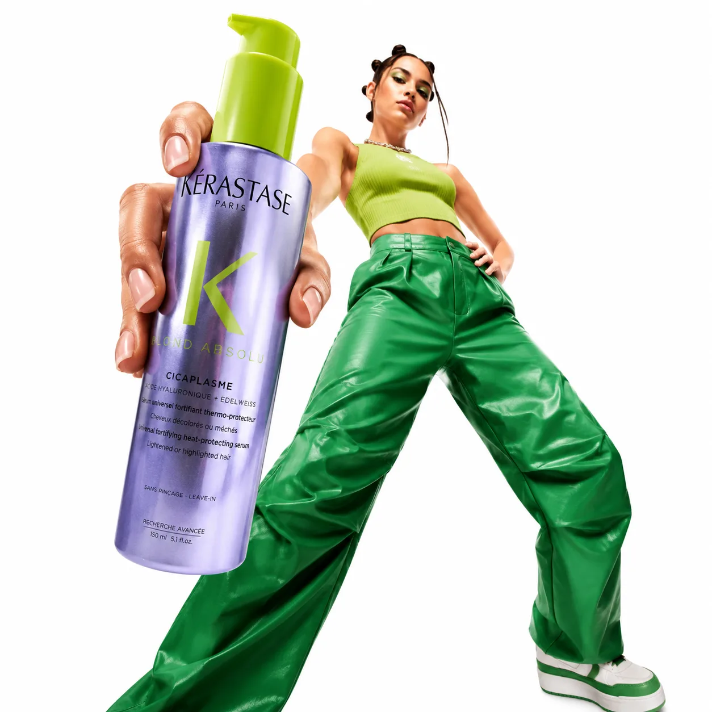

**#137 · Poster Design Prompt · <code>Vinano Studio</code>**

<details>
<summary>Show prompt</summary>

```
Low-angle fashion campaign photograph of a confident model holding a large [product name] very close to the camera, exaggerated perspective the hand and product dominating the foreground, full-body pose visible in the background, wide stance, dynamic posture, clean pure white studio background, high-key lighting, sharp focus on product, slight depth of field on the model, bold colorful outfit strong contrast tones, modern beauty advertising aesthetic, ultra-crisp composition, commercial studio photography, glossy packaging detail visible, crisp shadows Emphasise material texture and natural light so the final frame feels tactile and premium.
```

</details>

---

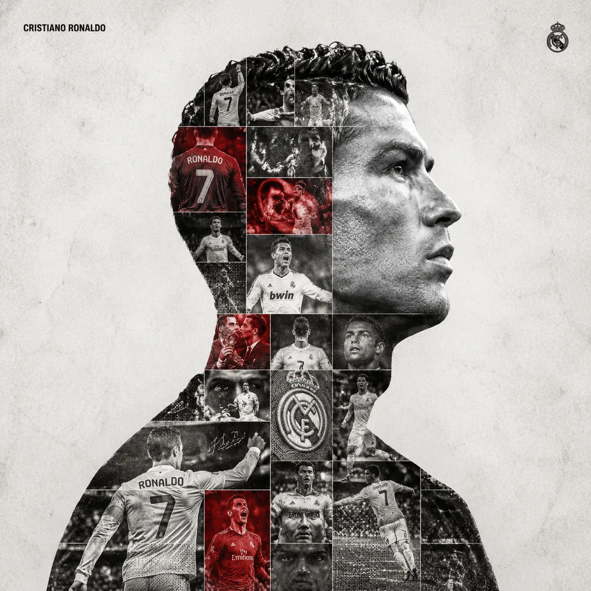

**#138 · Portrait, Poster · <code>Vinano Studio</code>**

> Keywords: portrait, poster, AI art, AI prompt, text to image

<details>
<summary>Show prompt</summary>

```
[PERSON NAME].
Act as a high-end sports graphic designer creating a conceptual tribute poster. The style is a complex "dual exposure photo-grid composite" mixed-media textures.
CENTRAL STRUCTURE (THE VESSEL):
The central focus is a large-scale, high-contrast black and white portrait silhouette of [PERSON NAME]. This main portrait acts as the container.
THE GRID FILL & TEXTURES (MIXED MEDIA):
The interior of the silhouette is populated by a dense "photo mosaic grid" of action shots from the person's career.
CRITICAL TEXTURE INSTRUCTION: Do not just paste flat photos. Apply artistic textures to various grid cells to create a tactile, collage feel. Use effects like:
Halftone Dots: Comic-book style raster patterns on some cells.
Fabric/Embroidery: Subtle thread or canvas textures suggesting a jersey or patch.
Film Grain: Heavy noise on specific high-contrast action shots.
COLOR STRATEGY:
The base is Monochrome B&W. Use selective color overlays (relevant to the team/flag) ONLY on specific grid cells to create a rhythm.
TYPOGRAPHY & BRANDING (STRICT MICRO-SCALING):
Top Left (The Name): Write "[PERSON NAME]" strictly the font Inter Semibold.
Kerning: Tight negative kerning (-4%).
Size: SMALL and discreet. It must occupy MAXIMUM 20% of the canvas width. Do NOT make it large or loud.
Top Right (The Symbol): Place the primary logo (Team/Brand/Flag).
Size: VERY SMALL. It must occupy MAXIMUM 10% of the canvas width.
COMPOSITION & BACKGROUND:
Background: Off-white or light grey a visible premium-quality paper or concrete texture. It should not be flat digital white.
Alignment: Center the figure perfectly. Maintain wide negative space around the object.

Render with rich micro-detail while keeping the layout uncluttered and intentional.
```

</details>

---

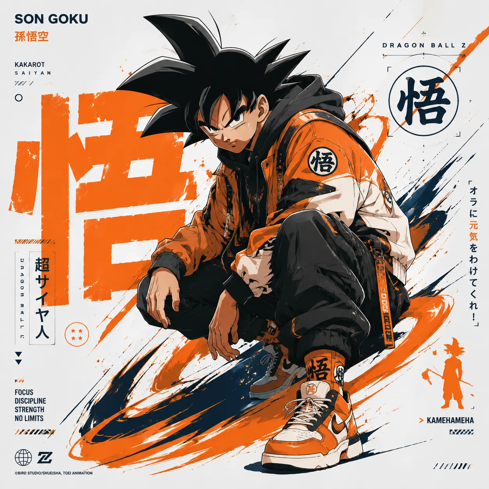

**#139 · Anime, Poster · <code>Vinano Studio</code>**

> Keywords: anime, poster, character, AI art, AI prompt, text to image

<details>
<summary>Show prompt</summary>

```
Create a stylized illustration of [character_name] from [franchise].

Character Analysis:

Derive the character’s core personality archetype based on canon portrayal (e.g., heroic, calm, mysterious, aggressive).
Identify the signature color from the original design and use it as the primary visual accent.

Pose & Body Language:

Generate an iconic pose that reflects the personality archetype:
Energetic / Heroic: dynamic action, wide stance, explosive movement
Calm / Confident: balanced, relaxed posture, minimal motion
Dark / Mysterious: low stance, subtle movement, sharp or hidden gaze
Aggressive / Intense: forward-leaning attack stance, visible tension, clenched fists

Facial Expression:

Match expression precisely to the character’s personality and emotional tone.

Art Style:

Anime × streetwear × graphic poster hybrid
Clean lineart, semi-flat shading, high contrast
Modern, minimal, and visually striking

Composition:

Vertical format ({aspect_ratio})
Off-center subject placement
Strong diagonal visual flow
Layered depth for a dynamic poster feel

Outfit Design:

Reimagine the original costume as modern streetwear / techwear
Preserve recognizable identity elements of the character

Color Palette:

Dominant clean white background
Use signature color as the primary accent
Add one secondary accent (complementary or analogous tone)
Keep palette minimal, bold, and high-contrast

Background:

Abstract geometric poster layout
Use negative space effectively
Integrate subtle accents the character’s color theme

Effects:

Energy strokes, paint lines, and motion accents
Effects should follow the character’s energy and color identity

Lighting:

Sharp directional lighting
Crisp shadows
Subtle glow the signature color

Rendering Quality:

Ultra-clean vector-style finish
Poster-quality composition
4K resolution, high detail

Keep edges clean and the overall composition balanced for a polished, gallery-ready result.
```

</details>

---

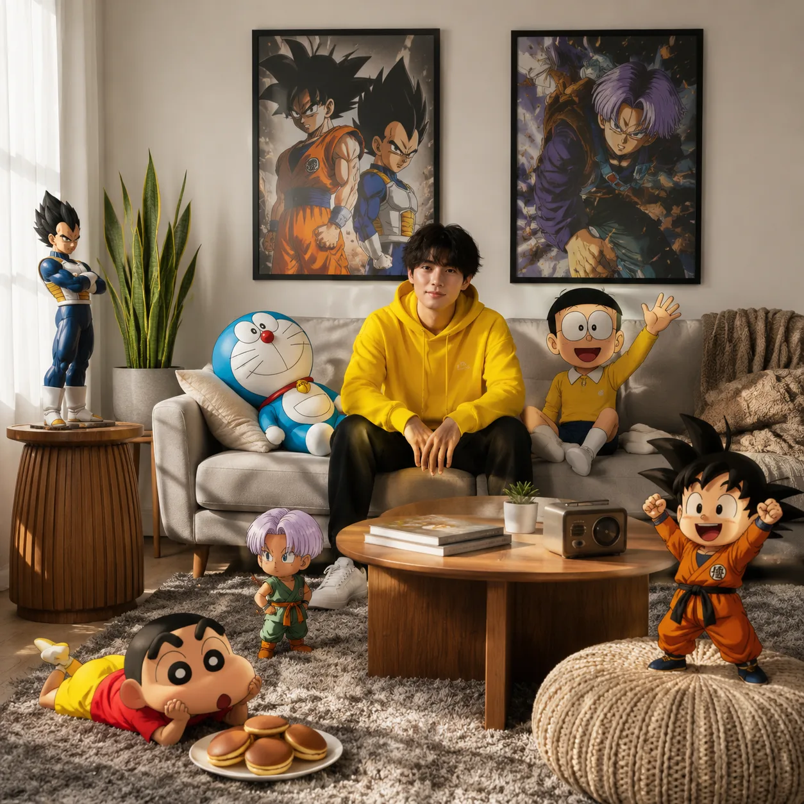

**#140 · Anime, Realistic · <code>Vinano Studio</code>**

> Keywords: anime, realistic, poster, character, cinematic, AI art

<details>
<summary>Show prompt</summary>

```
- A high-fidelity, wide-angle interior shot captures a surreal, mixed-media composition within a modern living room. It features a man resembling the face in the reference photo— an uploaded face as a reference—wearing a bright yellow hoodie and black pants, sitting centrally on a plush light gray sofa. The scene seamlessly blends true-to-life photorealistic 3D environments cel-shaded 2D anime and cartoon characters interacting directly the physical space.

On the right side of the subject on the sofa, Nobita sits casually waving his hand, while on the left side, Doraemon leans casually on a pillow. Behind the sofa, two framed posters hang on the white wall—one featuring Son Goku and Vegeta, and the other featuring Trunks in a dynamic anime style. In the foreground, Shinchan lies relaxed on a textured gray carpet near a plate of dorayaki, while a chibi version of Son Goku stands triumphantly on a cream-colored knit pouf. On the left side of the room, Vegeta stands tall on a grooved wooden side table in a confident pose, while a miniature version of Trunks is near the wooden coffee table in the center, as if observing the scene a curious expression.

Soft natural light streams in from the left side through sheer curtains, creating subtle volumetric lighting that accentuates the texture of the blanket, the wood grain of the tiered table, and the leaves of the snake plant in the corner of the room. The entire scene is rendered in 8K resolution sharp focus, vivid colors, and a dreamy, cinematic, and playful aesthetic blending between the real world and the anime world, no AI visible.

Emphasise material texture and natural light so the final frame feels tactile and premium.
```

</details>

---

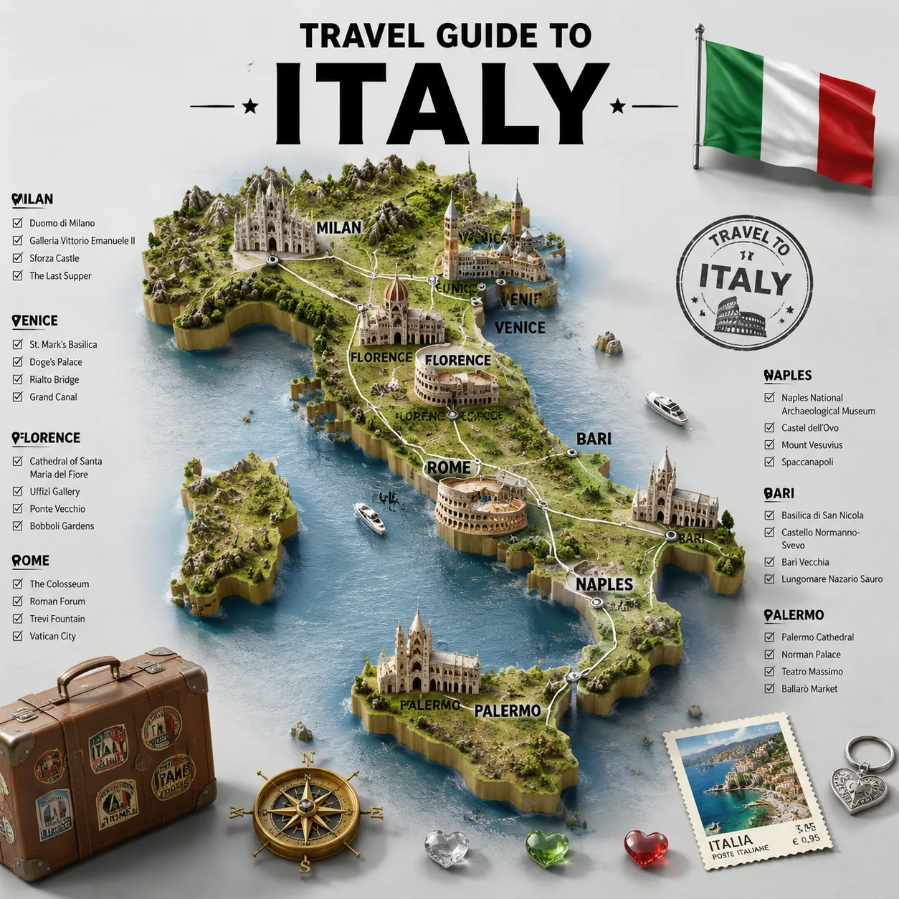

**#141 · Realistic, Poster · <code>Vinano Studio</code>**

> Keywords: realistic, poster, vintage, infographic, AI art, AI prompt

<details>
<summary>Show prompt</summary>

```
A hyper-realistic 3D travel guide infographic poster for [COUNTRY]. The country shape is rendered as a raised, textured terrain map floating on a clean light gray surface. Iconic landmarks are placed as miniature 3D sculpted models at their correct geographic locations across the map — each one highly detailed and true-to-life photorealistic. Roads or railway lines connect key cities as white paths across the terrain. Around the map, floating 3D decorative props related to travel are scattered: a vintage leather suitcase travel stickers, a compass rose, crystal heart charms, and a postage stamp seal reading “Travel to COUNTRY.” The national flag of [COUNTRY] is shown as a small realistic folded flag in the upper right corner. Each major city has a bold black label on the map, and beside the map, each city has a neat checklist of its top attractions in clean sans-serif typography. A large bold title at the top reads: “TRAVEL GUIDE TO “COUNTRY”” in black uppercase typography the word [COUNTRY] in heavy bold. The overall aesthetic is premium editorial travel content — soft studio lighting, true-to-life photorealistic 3D render, white/light gray background, clean layout. Keep edges clean and the overall composition balanced for a polished, gallery-ready result.
```

</details>

---

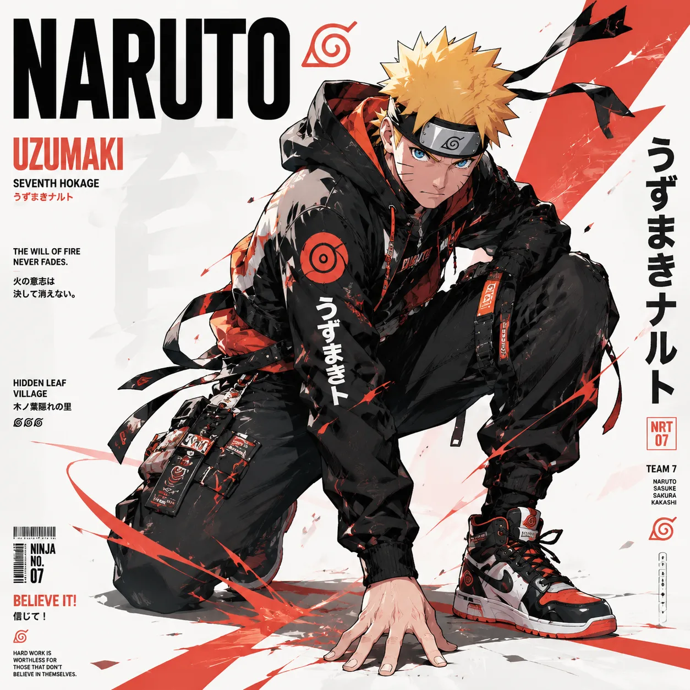

**#142 · Anime, Poster · <code>Vinano Studio</code>**

> Keywords: anime, poster, character, AI art, AI prompt, text to image

<details>
<summary>Show prompt</summary>

```
Create a stylized illustration of [character_name] from [franchise].

Character Analysis:

Derive the character’s core personality archetype based on canon portrayal (e.g., heroic, calm, mysterious, aggressive).
Identify the signature color from the original design and use it as the primary visual accent.

Pose & Body Language:

Generate an iconic pose that reflects the personality archetype:
Energetic / Heroic: dynamic action, wide stance, explosive movement
Calm / Confident: balanced, relaxed posture, minimal motion
Dark / Mysterious: low stance, subtle movement, sharp or hidden gaze
Aggressive / Intense: forward-leaning attack stance, visible tension, clenched fists

Facial Expression:

Match expression precisely to the character’s personality and emotional tone.

Art Style:

Anime × streetwear × graphic poster hybrid
Clean lineart, semi-flat shading, high contrast
Modern, minimal, and visually striking

Composition:

Vertical format ({aspect_ratio})
Off-center subject placement
Strong diagonal visual flow
Layered depth for a dynamic poster feel

Outfit Design:

Reimagine the original costume as modern streetwear / techwear
Preserve recognizable identity elements of the character

Color Palette:

Dominant clean white background
Use signature color as the primary accent
Add one secondary accent (complementary or analogous tone)
Keep palette minimal, bold, and high-contrast

Background:

Abstract geometric poster layout
Use negative space effectively
Integrate subtle accents the character’s color theme

Effects:

Energy strokes, paint lines, and motion accents
Effects should follow the character’s energy and color identity

Lighting:

Sharp directional lighting
Crisp shadows
Subtle glow the signature color

Rendering Quality:

Ultra-clean vector-style finish
Poster-quality composition
4K resolution, high detail

Emphasise material texture and natural light so the final frame feels tactile and premium.
```

</details>

---

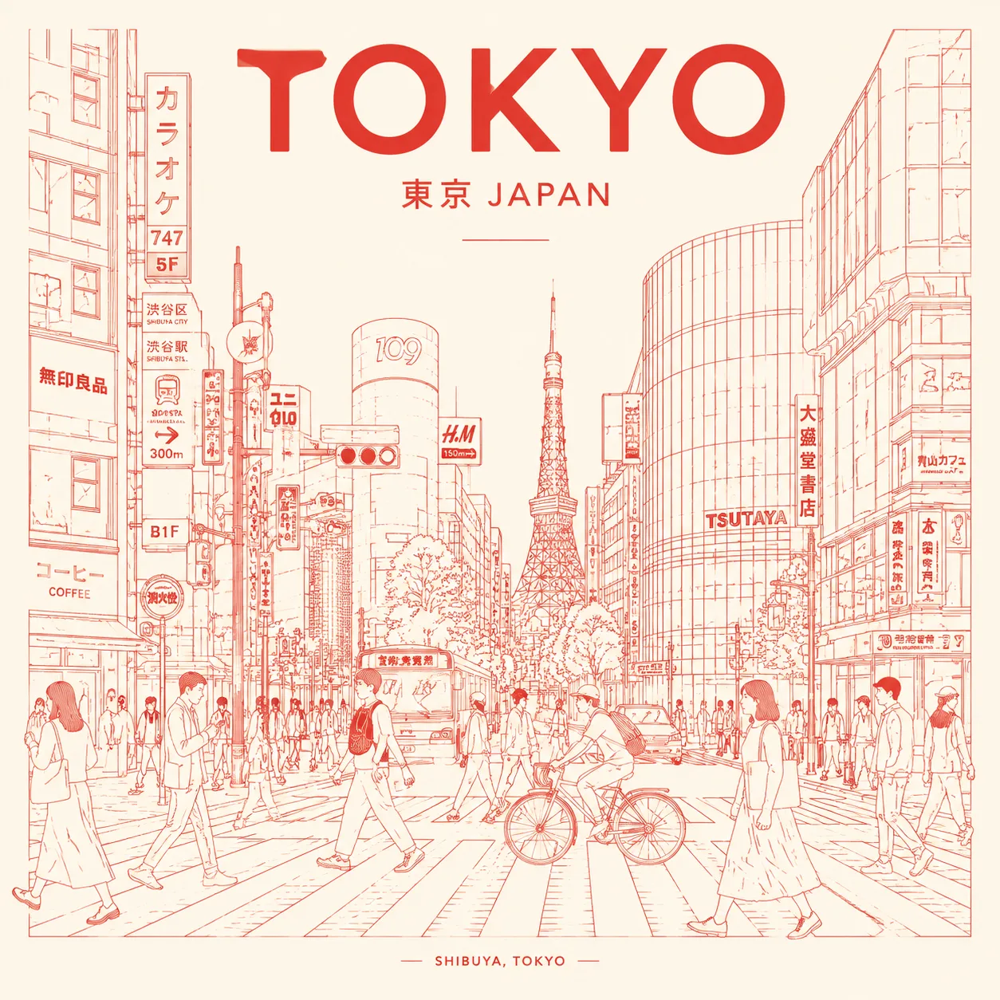

**#143 · Realistic, Poster · <code>Vinano Studio</code>**

> Keywords: realistic, poster, character, minimalist, AI art, AI prompt

<details>
<summary>Show prompt</summary>

```
Create an ultra-high-resolution refined minimalist line-art travel poster of [DESTINATION], portraying the city as a stylish everyday urban scene rather than a tourist postcard.

CORE COMPOSITION:
- Central composition shows the city’s most iconic street, intersection, alley, tram street, or pedestrian avenue
- Foreground includes locals, commuters, cyclists, travelers, shoppers, students, café visitors
- People should naturally reflect the city’s local lifestyle and fashion culture
- Background filled realistic local signage, cafés, restaurants, transportation signs, storefronts, and architectural details
- Landmarks should appear naturally integrated into everyday life, never exaggerated
- Include authentic local-language typography and culturally recognizable visual elements
- Large bold typography at the top center:
 “[DESTINATION]”
- Subtitle below:
 local language + country name
 examples:
 東京 JAPAN
 서울 KOREA
 ΚΟΛΩΝΙΑ GERMANY

STYLE:
ultra clean vector illustration,
Swiss modernist travel poster,
minimal line art,
monoline drawing,
mid-century editorial aesthetic,
architectural illustration,
Japanese graphic poster style,
precise geometric perspective,
extremely clean negative space,
premium travel branding aesthetic

LINE STYLE:
- monochrome line-based illustration only
- thin and highly precise linework
- minimal fill areas
- intricate city-map-like detail density
- rhythmic layering of signs, buildings, windows, and street objects
- visually dense yet highly organized composition

COLOR SYSTEM — VERY IMPORTANT:
- use only ONE main color + ONE background color
- automatically choose a color that best represents the city’s atmosphere
- monochrome silkscreen poster aesthetic
- no rainbow palettes
- no excessive neon
- color should reflect the city’s architecture, climate, nightlife, and cultural identity

Examples:
Tokyo → vivid red on warm ivory
Paris → deep navy on cream
New York → charcoal black on light gray
Kyoto → muted burgundy on warm cream
Hong Kong → teal blue on pale ivory
Santorini → Mediterranean blue on white
Cairo → desert sepia on sand beige

COMPOSITION:
- vertical poster layout
- frontal street-level perspective
- pedestrians crossing streets or moving naturally
- balanced urban rhythm and visual flow
- should feel like a premium city-brand campaign poster

MOOD:
stylish urban life,
calm but lively,
editorial travel magazine cover,
timeless city identity,
premium tourism campaign visual,
minimal yet highly detailed

TEXT QUALITY — EXTREMELY IMPORTANT:
- all typography must be readable and accurate
- no random characters
- no broken or distorted letters
- local signage should feel authentic and natural
- professional editorial typography alignment

OUTPUT:
- vertical poster composition
- 8K ultra detailed
- print-ready
- ultra sharp vector quality

Render with rich micro-detail while keeping the layout uncluttered and intentional.
```

</details>

---

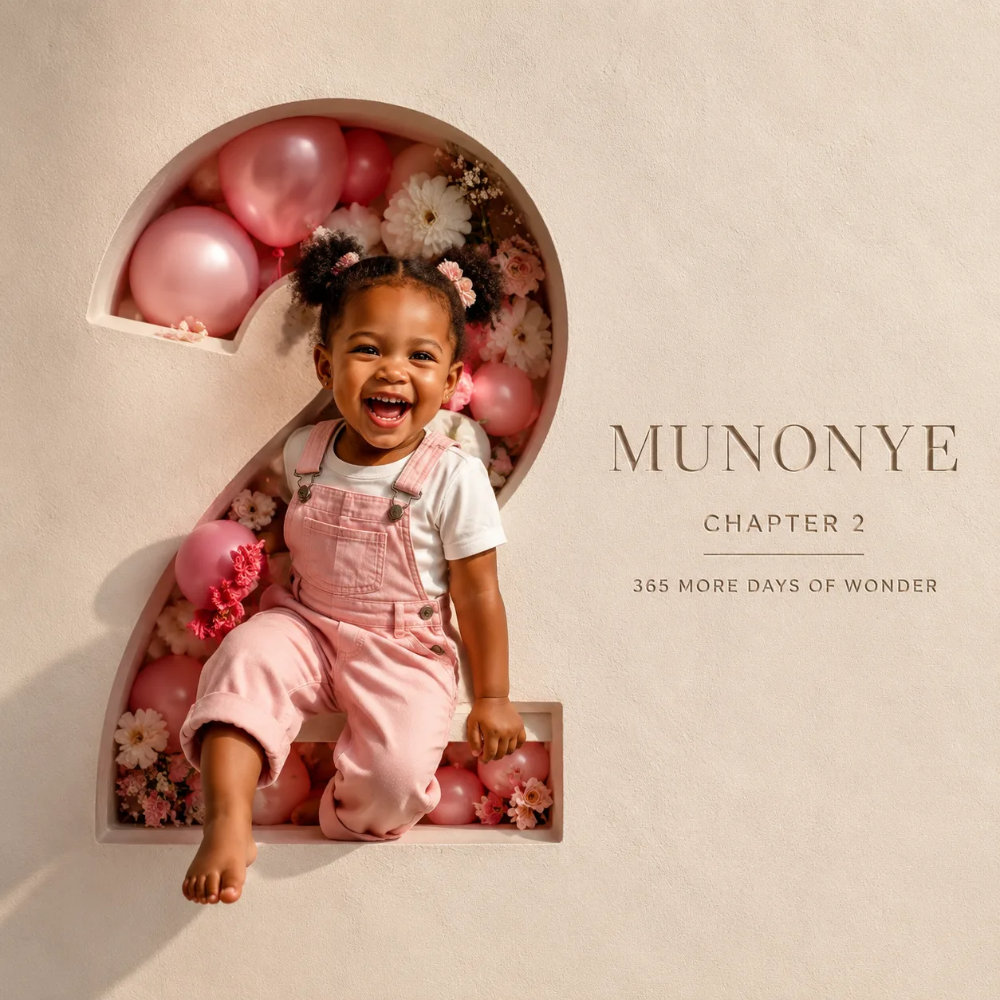

**#144 · Realistic, Poster · <code>Vinano Studio</code>**

> Keywords: realistic, poster, cinematic, minimalist, AI art, AI prompt

<details>
<summary>Show prompt</summary>

```
Professional luxury birthday poster, 3:4 ratio. Entire frame filled a premium off white luxury paper textured wall. Large number “2” precisely carved in the wall visible depth and realistic inner shadows. Inside the number: soft pink and pink balloons, subtle white flowers, elegant bouquet arrangement, premium celebration styling. A happy 2 year old child preserved reference facial features, wearing a milky white T shirt and pink denim overalls, laughing naturally. Face, shoulder, one hand and one foot extend outside the number creating a realistic 3D effect. Warm cinematic sunlight from one side, soft rim light, true-to-life photorealistic skin, premium studio photography, ultra realistic, sharp focus. Typography on wall: MUNONYE, CHAPTER 2, 365 MORE DAYS OF WONDER. Clean refined minimalist layout, luxury magazine cover aesthetic, high end art direction, realistic shadows, natural colors, no tree shadows, no fake lighting, no AI artifacts. Preserve realistic proportions and depth for a confident, professional finish.
```

</details>

---


**#145 · Character, Minimalist · <code>Vinano Studio</code>**

> Keywords: character, minimalist, AI art, AI prompt, text to image

<details>
<summary>Show prompt</summary>

```
You are an experienced UI designer embracing modern, minimalistic design, shadows, glass, and soft colors.

Your role is to create a professional, beautiful mockup that is ready for delivery based on these requirements:

<requirements>
## 1. Overall Style & Visual Language
This interface represents a premium, modern fintech / crypto trading dashboard a dark theme.
The visual language combines **soft neumorphism**, and **luxury Web3 aesthetics**.

Core characteristics:
- Warm gold/orange accent highlights
- Monochromatic color palette minimalistic effects and shadows
- Card-based layout depth and subtle backgrounds
- Minimal borders, separation shadows or light backgrounds

Target perception:
- Secure
- Professional
- High-end / institutional-grade
- Optimized for experienced traders

---

## 2. Layout Structure

### Global Layout
- Desktop-first dashboard
- Output proportions: 3:2
- Three main regions:
 1. Top navigation bar (horizontal)
 2. Left sidebar navigation (vertical)
 3. Main content area (multi-column grid of cards)

Spacing is generous, prioritizing clarity and visual breathing room.

---

## 3. Top Navigation Bar
- Height: 72px
- Left:
 - Brand logo text "Mevolut"
 - Stylized "M"
 - Gold/orange accent
- Center:
 - Navigation links: Dashboard, Security, Referral, Trading Fees, API management
- Right:
 - Order link
 - Primary CTA: “Deposit” (gold pill button)
 - User avatar (circular)
 - Theme toggle (moon icon)

Typography:
- Clean sans-serif
- Medium weight
- White primary text, muted gray inactive states

---

## 4. Left Sidebar Navigation
- Width: 240px
- Background: near-black
- Vertical navigation items icons:
 - Dashboard (active)
 - Security
 - Referral
 - Trading Fees
 - API management
- Bottom-aligned:
 - Settings

Active item:
- Subtle background highlight
- Slight background tint
- Rounded container

Icons:
- Outline style
- Gold accent on active state

---

## 5. Main Content Area

### 5.1 User Overview Card
- Large rounded card at top
- Left:
 - Circular avatar
 - Greeting text (“Hello…”)
 - User name
- Inline info blocks:
 - UID (copy icon)
 - Identity verification status
 - Security level
 - Time zone
 - Last login timestamp
- Right:
 - “Hide info” toggle

Style:
- Subtle inner shadows

---

### 5.2 Deposit / Buy Card
- Medium-sized card
- Title text explaining deposit options
- Two action rows:
 - Deposit (dollars or crypto)
 - Buy stocks (local currency)
- Each row:
 - Icon
 - Label
 - Arrow action button (gold accent)

---

### 5.3 Total Asset Card
- Displays USD balance and USD equivalent
- Large, faded Dollar symbol watermark in background
- Action tabs:
 - Buy stocks
 - Deposit
 - Withdraw
- Numeric values are large

---

### 5.4 VIP Level Card
- Shows current VIP level
- Spot and futures fee rates
- Progress bar for token holdings
- “View more” link

Progress bar:
- Rounded
- Dark background track

---

### 5.5 Current Holdings Table
- Card containing a table layout
- Columns:
 - Coin (icon + name)
 - Price
 - 24h Change
 - 4h Trend (sparkline)
 - Actions (Deposit, Withdraw, Trade)

Sparklines:
- Green for positive trend
- Red for negative trend

Hover:
- Subtle background highlight per row

---

### 5.6 Affiliate Program Card
- Promotional card
- Gold coin illustration
- Short description and CTA button (“Apply now”)

---

### 5.7 Information / News Card
- Vertical list of announcements
- Headline + timestamp
- “View more” link at top

---

## 6. Color Palette
- Primary background: deep charcoal / black
- Card surfaces: slightly lighter
- Accent color: warm gold
- Text hierarchy:
 - White (primary)
 - Muted gray (secondary)
 - Dark gray (disabled)
- Status colors:
 - Green for positive
 - Red for negative

---

## 7. Effects & Interaction
- Rounded corners throughout (sm)

# Design tokens:
{
 // Global theme definition
 "theme": {
 "mode": "dark",
 "style": ["soft-neumorphism",
 "premium-fintech"]
 },

 // Layout measurements and structure
 "layout": {
 "type": "desktop-dashboard",
 "grid": "three-column",
 "sidebarWidth": 240,
 "topbarHeight": 68,
 "contentPadding": 24
 },

 // Color system
 "colors": {
 "background": "#0B0D10", // Main app background
 "primaryAccent": "#F5A623", // Gold/orange highlight
 "secondaryAccent": "#FFB547",
 "textPrimary": "#FFFFFF",
 "textSecondary": "#B0B3B8",
 "textMuted": "#6B6F76",
 "success": "#22C55E",
 "danger": "#EF4444"
 },

 // Typography scale
 "typography": {
 "fontFamily": "SF Pro, system-ui, sans-serif",
 "weights": {
 "heading": 600,
 "body": 400,
 "numeric": 500
 },
 "sizes": {
 "h1": 24,
 "h2": 20,
 "h3": 16,
 "body": 14,
 "caption": 12
 }
 },

 // Core UI components
 "components": {
 "card": {
 "borderRadius": 16,
 "shadow": "0 20px 40px rgba(0,0,0,0.4)",
 "border": "none",
 "background": "#14171C",
 },

 "button": {
 "primary": {
 "textColor": "#0B0D10",
 "borderRadius": 999,
 },
 "secondary": {
 "background": "transparent",
 "textColor": "#F5A623"
 }
 },

 "sidebar": {
 "background": "#0E1014",
 "itemRadius": 12,
 "iconStyle": "outline"
 },

 "table": {
 "rowHeight": 56,
 "divider": "subtle",
 "hoverHighlight": true,
 "sparkline": {
 "positiveColor": "#22C55E",
 "negativeColor": "#EF4444"
 }
 },

 "progressBar": {
 "height": 6,
 "radius": 999,
 "fillColor": "#22C55E",
 "backgroundColor": "#2A2E35"
 }
 },

 // Icon system
 "icons": {
 "style": "outline",
 "size": 18,
 "colorInactive": "#6B6F76",
 "colorActive": "#F5A623"
 }
}
</requirements>

Render with rich micro-detail while keeping the layout uncluttered and intentional.
```

</details>

---

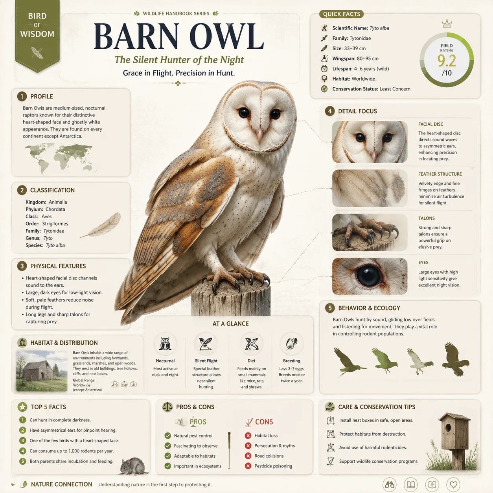

**#146 · Poster, Character · <code>Vinano Studio</code>**

> Keywords: poster, character, infographic, AI art, AI prompt, text to image

<details>
<summary>Show prompt</summary>

```
Based on [TOPIC], create a premium-quality vertical “encyclopedia-style educational infographic image.”

This image should NOT look like a regular poster or a simple illustration. Instead, it should feel like a structured knowledge guide that combines:

the feeling of a collectible reference handbook

a modern encyclopedia page

a lifestyle knowledge card

and a highly shareable social-media infographic

The overall style should resemble a premium natural-history guidebook mixed modern editorial infographic design.

The image should include:

One beautiful and highly detailed main subject image

Several zoomed-in detail sections highlighting important features

Multiple modular information panels rounded corners

Clear title hierarchy and highlighted key labels

Concise yet information-rich encyclopedia content

Visual scoring systems, quick summaries, or “Top 5” modules

The information sections should automatically adapt to the topic. Select and combine relevant categories such as:

Basic profile

Classification / taxonomy

Physical characteristics

Behavior / ecology / habits

Structure or formation mechanisms

Growth conditions or usage methods

Care, maintenance, or optimization tips

Risks, warnings, and important notes

Suitable users or application scenarios

Pros and cons comparison

Quick rating tags or summary cards

Visual requirements:

Clean light-colored background

Soft and elegant color palette

Gentle shadows

Small refined icons

Rounded information boxes

Organized editorial layout

High information density without feeling crowded

Comfortable reading experience

The final result should feel like a real publishable encyclopedia knowledge card designed for reading, collecting, and creating as part of a consistent series — NOT like a commercial advertisement poster.

The image must strongly emphasize:

“knowledge integration + modular information design + handbook/reference-style presentation.”

Preserve realistic proportions and depth for a confident, professional finish.
```

</details>

---

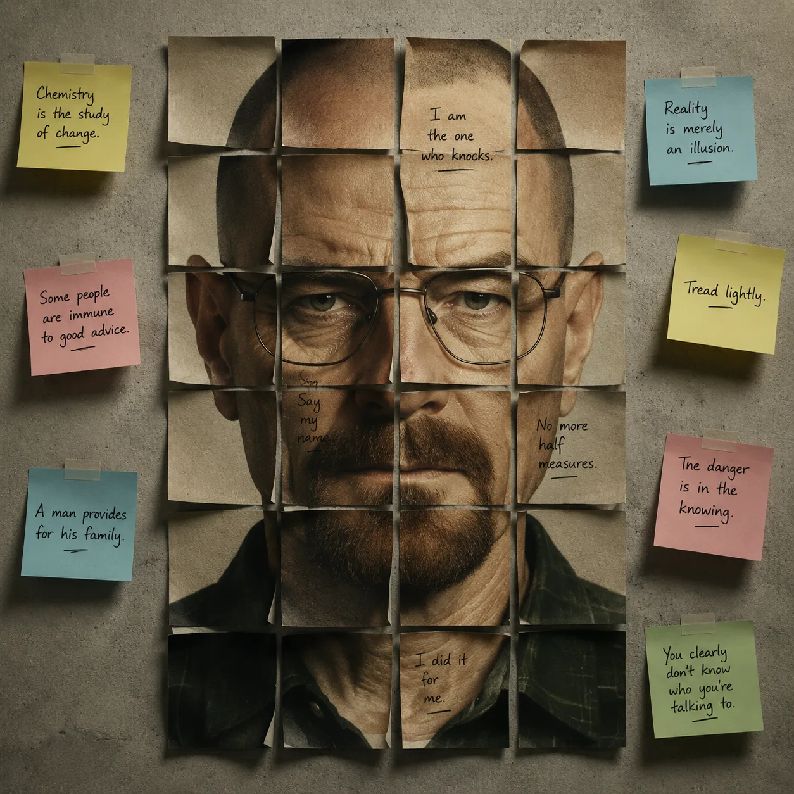

**#147 · Realistic, Portrait · <code>Vinano Studio</code>**

> Keywords: realistic, portrait, poster, character, cinematic, minimalist

<details>
<summary>Show prompt</summary>

```
A refined minimalist cinematic colored poster featuring a [Character Name]’s portrait from shoulders to the top of the head. The face is reconstructed a small number of large, square-cut paper fragments arranged in a simple grid [around 4x5 or 5x6 pieces]. Each paper fragment contains a disjointed part of the face which together reconstruct the portrait. The internal paper fragments constituting the face are not perfectly flat; many have slightly curled edges and lifted corners, casting tiny, realistic shadows that give them a three-dimensional, tacked-down appearance. 4 of these squares have subtle black handwritten [text1, text2, text3, text4] directly on the skin/image. Scattered irregularly around the outer perimeter of this central grid in various randomly placed positions (not confined to the corners), several [Sticky Note Color] sticky notes are attached to the [Color] wall, containing handwritten [External Text Content, e.g., iconic quotes]. The overall layout is slightly irregular visible gaps between the pieces showing [Color] concrete wall background. Realistic paper texture throughout, high-end studio lighting emphasizing the lifted edges, sharp focus on ink and paper grain. Keep edges clean and the overall composition balanced for a polished, gallery-ready result.
```

</details>

---

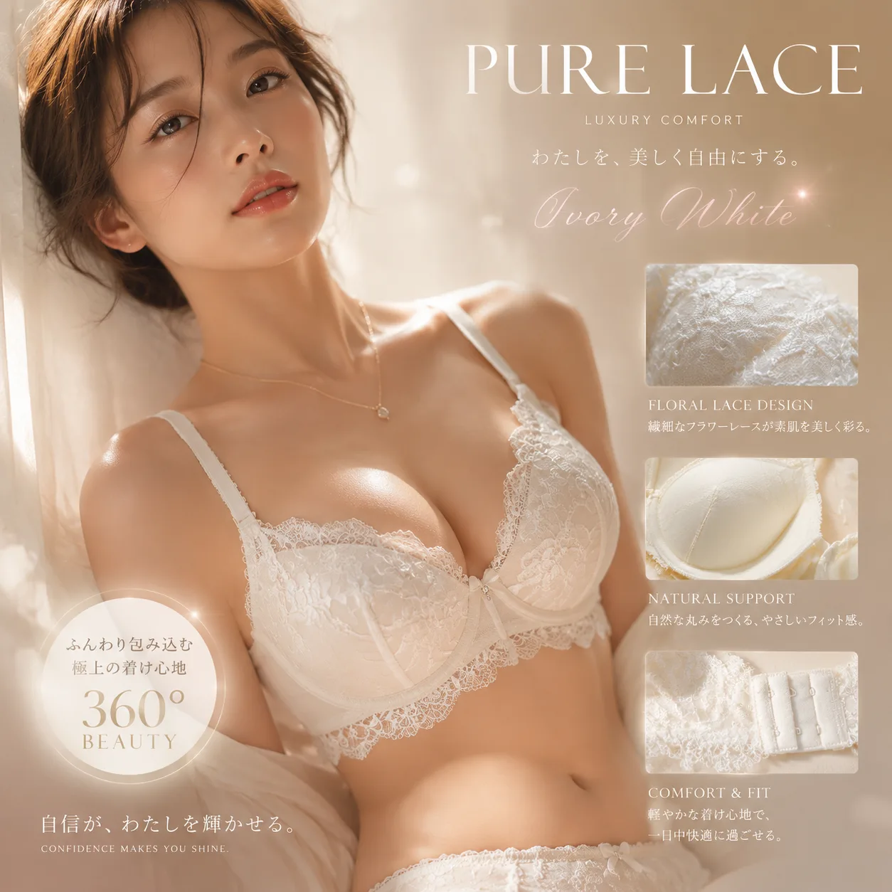

**#148 · Realistic, Poster · <code>Vinano Studio</code>**

> Keywords: realistic, poster, cinematic, AI art, AI prompt, text to image

<details>
<summary>Show prompt</summary>

```
Create a hyper-realistic luxury lingerie e-commerce detail-page visual inspired by premium Japanese beauty-fashion brands.

IMPORTANT:
Generate ONLY ONE SINGLE VERTICAL IMAGE.
Do NOT create multiple posters.
Do NOT create collages.

STYLE:
Luxury glossy beauty-commercial realism.
Soft dreamy fashion aesthetics.
Premium feminine branding.

MAIN CONCEPT:
A glowing soft-beauty lingerie campaign focused on:
radiant feminine elegance,
luxury comfort,
soft body glow,
and dreamy romantic styling.

MODEL:
Adult female model glowing skin texture.
Soft cinematic makeup.
Elegant emotional beauty.
Luxury fashion styling.

PRODUCT:
Luxury ivory-white lace lingerie:
soft reflective fabric,
light floral lace details,
premium smooth texture,
and natural support fit.

VISUAL STRUCTURE:

cinematic beauty hero shot

dreamy close-up details

luxury typography overlays

premium spacing hierarchy

soft glowing beauty atmosphere

BACKGROUND:
Minimal ivory-beauty studio dreamy sunlight diffusion and floating light particles.

COLOR PALETTE:
Ivory white,
soft pearl,
light champagne,
warm blush glow,
cream beige.

MOOD:
Dreamy.
Luxury.
Elegant.
Soft romantic beauty.

QUALITY:
Ultra realistic HDR.
8K cinematic realism.
Looks like a real premium Japanese lingerie e-commerce detail-page campaign.

Render with rich micro-detail while keeping the layout uncluttered and intentional.
```

</details>

---

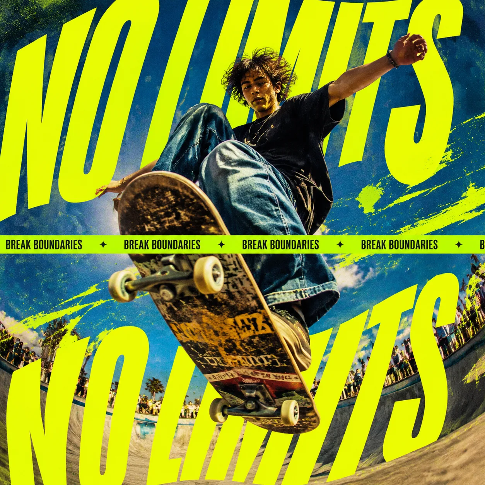

**#149 · Poster, Ai Art · <code>Vinano Studio</code>**

> Keywords: poster, AI art, AI prompt, text to image

<details>
<summary>Show prompt</summary>

```
Create a 9:16 poster in the "Neon Kinetic Typographic Poster" style.

Main subject: [SUBJECT].
Action: [SUBJECT_ACTION].
Prop or product: [PRODUCT_OR_PROP].
Location: [LOCATION].
Background elements: [BACKGROUND_ELEMENTS].
Wardrobe or styling: [WARDROBE_STYLE].

Use an extreme low-angle wide-angle camera perspective, as if the camera is near the ground looking upward. The subject should feel large, energetic, and close to the viewer.

Add oversized warped neon yellow typography the main text "[MAIN_TEXT]". The letters should be ultra-bold, condensed, stretched, slanted, and partially cropped by the canvas edges. The typography should wrap around the composition and sit behind or partially around the subject.

Add a thin repeated uppercase text band reading "[SECONDARY_TEXT]", separated by "[ACCENT_SYMBOL]" symbols. The secondary text should run horizontally across the image like a campaign graphic stripe.

Use electric neon yellow graphics, warm sunlit photographic tones, blue sky contrast, visible film grain, analog print texture, hard shadows, and an energetic youth-culture campaign poster mood.

Avoid clean corporate design, small typography, flat illustration, pastel colors, luxury minimalism, and symmetrical static layout.

--- VARIABLES ---

[ACCENT_SYMBOL] — small separator icon such as diamond, dot, slash, star, or warning mark
[BACKGROUND_ELEMENTS] — sky, hills, architecture, crowd, stage lights, roads, rocks, grass, clouds, dust, or other secondary scenery
[LOCATION] — outdoor environment or contextual scene
[MAIN_TEXT] — large repeated headline word or phrase
[PRODUCT_OR_PROP] — object held, worn, used, or displayed by the subject
[SECONDARY_TEXT] — small repeating line of text
[SUBJECT] — main human figure or object
[SUBJECT_ACTION] — dynamic action performed by the subject
[WARDROBE_STYLE] — streetwear, outdoor fashion, sportswear, festival outfit, or editorial styling

--- NEGATIVE PROMPT ---

Avoid small typography, clean corporate layout, symmetrical centered poster design, flat vector illustration, pastel palette, luxury minimalism, soft studio lighting, plain white background, low contrast, overly polished 3D render, generic stock photo, tiny subject, unreadable clutter, and text that covers the subject's key action or product.

Preserve realistic proportions and depth for a confident, professional finish.
```

</details>

---

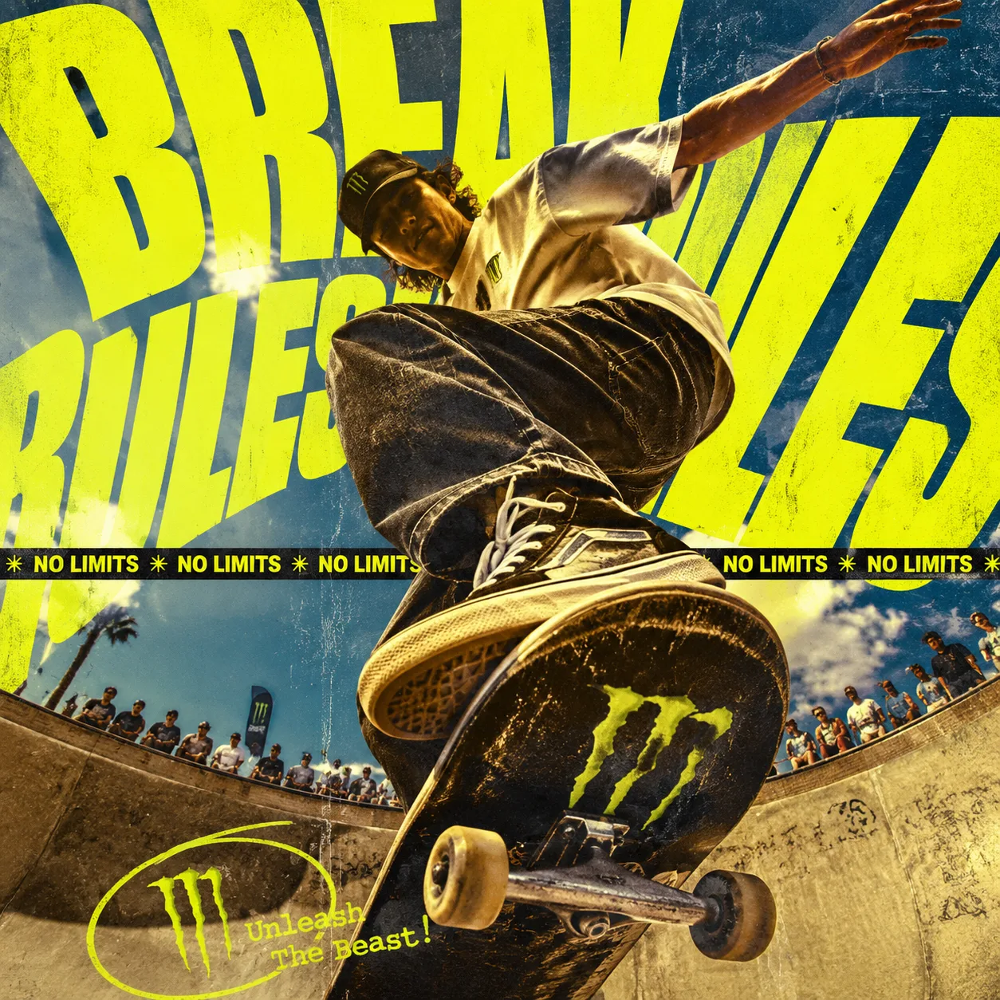

**#150 · Poster, Ai Art · <code>Vinano Studio</code>**

> Keywords: poster, AI art, AI prompt, text to image

<details>
<summary>Show prompt</summary>

```
Create a 9:16 poster in the "Neon Kinetic Typographic Poster" style.

Main subject: [SUBJECT].
Action: [SUBJECT_ACTION].
Prop or product: [PRODUCT_OR_PROP].
Location: [LOCATION].
Background elements: [BACKGROUND_ELEMENTS].
Wardrobe or styling: [WARDROBE_STYLE].

Use an extreme low-angle wide-angle camera perspective, as if the camera is near the ground looking upward. The subject should feel large, energetic, and close to the viewer.

Add oversized warped neon yellow typography the main text "[MAIN_TEXT]". The letters should be ultra-bold, condensed, stretched, slanted, and partially cropped by the canvas edges. The typography should wrap around the composition and sit behind or partially around the subject.

Add a thin repeated uppercase text band reading "[SECONDARY_TEXT]", separated by "[ACCENT_SYMBOL]" symbols. The secondary text should run horizontally across the image like a campaign graphic stripe.

Use electric neon yellow graphics, warm sunlit photographic tones, blue sky contrast, visible film grain, analog print texture, hard shadows, and an energetic youth-culture campaign poster mood.

Avoid clean corporate design, small typography, flat illustration, pastel colors, luxury minimalism, and symmetrical static layout.

--- VARIABLES ---

[ACCENT_SYMBOL] — small separator icon such as diamond, dot, slash, star, or warning mark
[BACKGROUND_ELEMENTS] — sky, hills, architecture, crowd, stage lights, roads, rocks, grass, clouds, dust, or other secondary scenery
[LOCATION] — outdoor environment or contextual scene
[MAIN_TEXT] — large repeated headline word or phrase
[PRODUCT_OR_PROP] — object held, worn, used, or displayed by the subject
[SECONDARY_TEXT] — small repeating line of text
[SUBJECT] — main human figure or object
[SUBJECT_ACTION] — dynamic action performed by the subject
[WARDROBE_STYLE] — streetwear, outdoor fashion, sportswear, festival outfit, or editorial styling

--- NEGATIVE PROMPT ---

Avoid small typography, clean corporate layout, symmetrical centered poster design, flat vector illustration, pastel palette, luxury minimalism, soft studio lighting, plain white background, low contrast, overly polished 3D render, generic stock photo, tiny subject, unreadable clutter, and text that covers the subject's key action or product.

Emphasise material texture and natural light so the final frame feels tactile and premium.
```

</details>

---


**#151 · Ai Art, Ai Prompt · <code>Vinano Image Pro</code>**

> Keywords: AI art, AI prompt, text to image

<details>
<summary>Show prompt</summary>

```
生成一张[餐饮品牌触点矩阵]系列视觉图，用于展示一个完整的餐饮品牌视觉系统与包装应用方案。

这是一个面向餐饮行业的品牌VI样机展示板 / 包装系统陈列图 / 品牌提案页。画面不是单张宣传海报，而是将品牌主视觉、主打产品、包装物料、菜单信息、促销内容与小型延展物料整合成一张系统化品牌展示图。

【用户输入信息】
- 品牌名：[品牌名]
- 经营类目：[经营类目]

【可选补充信息】
- 主打产品：[主打产品]
- 品牌口号：[品牌口号]
- 风格方向：[风格方向]
- 主色调：[主色调]
- 辅助色：[辅助色]
- 客群定位：[客群定位]
- 价格定位：[价格定位]
- 地域风格：[地域风格]
- 画幅比例：[画幅比例]

【自动补全规则】
如果用户没有提供完整品牌信息，请根据【品牌名】与【经营类目】自动推导并完成最优组合，包括：
1. 判断品牌调性（年轻、亲和、国潮、复古、清新、治愈、精致、快餐感等）
2. 匹配适合该类目的视觉风格
3. 自动设定合理的主色、辅助色与点缀色
4. 自动补全主打产品与辅助产品
5. 自动生成适合餐饮传播的品牌口号、卖点文案、价格信息与推荐标签
6. 自动匹配合适的餐饮物料类型与展示内容

【画面内容要求】
画面中应围绕【品牌名】构建一整套餐饮品牌物料系统，包含但不限于以下内容：
- 核心包装：手提袋、外卖袋、包装盒、打包盒、纸袋、塑料袋
- 饮品 / 食品容器：纸杯、杯套、碗、餐盒、封口贴、标签
- 信息传播物料：菜单、促销海报、价格牌、桌牌、立牌、小卡片
- 小型品牌延展：贴纸、徽章、纸巾、餐具、包装封条、吊牌
- 产品表现：主打餐品照片、单品主视觉、食物特写、切面图、推荐组合图

【构图与版式要求】
采用竖版【画幅比例】构图，整体为白色、米白色或浅灰色背景，以品牌提案板 / 样机矩阵板的方式组织画面。
通过大中小物料混排形成视觉层级：
- 大型包装和主视觉物料作为视觉锚点
- 中型菜单、海报和价格模块负责信息传达
- 小型贴纸、餐具、标签与周边物料增强系统完整度

整体构图应具有明确秩序感，接近品牌方案展示页、作品集陈列页、包装提案页的视觉效果。元素要排列整齐但不呆板，丰富但不杂乱，具有模块化与可阅读性。

【风格与质感要求】
整体风格应符合【经营类目】与【品牌名】气质，具有明显的餐饮品牌感、商业传播感、样机展示感与系统设计感。
可融合以下风格倾向：现代简洁、国潮趣味、轻复古、生活方式感、快消感、温暖治愈感、年轻化传播感。
材质真实，包含纸张、塑料、布袋、包装盒、杯体、贴纸、餐具等真实物料质感；光影柔和统一，像在干净摄影棚环境中拍摄的品牌物料合集。

【文字与图形要求】
所有物料上应统一出现品牌名、Logo、品牌符号、主色块、口号或卖点文案。
文案可为中文或中英混排，但要符合餐饮传播表达，简洁直接，具备商品售卖感。
图形系统可以根据品牌调性选择简洁插画、几何图形、卡通吉祥物、符号化图标或辅助纹样，用于增强品牌记忆点。

【输出目标】
最终生成一张完整的【品牌名】餐饮品牌视觉系统展示图，像设计团队为该餐饮品牌制作的整套品牌提案样机板。
要求画面统一、精致、具备商业落地感与作品集展示质量，并能清楚体现品牌风格、主打类目与多触点包装延展能力。

Make the aspect ratio 9:16

整体保持边缘干净、构图均衡，呈现可直接使用的精致成品感。
```

</details>

---

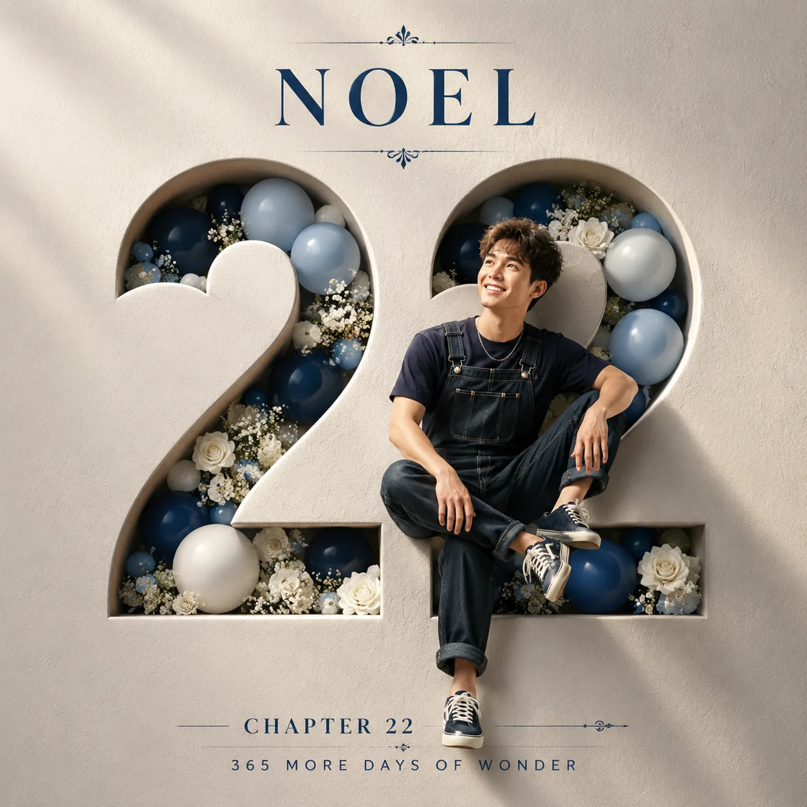

**#152 · Realistic, Poster · <code>Vinano Studio</code>**

> Keywords: realistic, poster, cinematic, minimalist, AI art, AI prompt

<details>
<summary>Show prompt</summary>

```
Professional luxury birthday poster, 3:4 ratio. Entire frame filled a premium off-white luxury paper textured wall. Large number “22” precisely carved into the wall visible depth, realistic inner shadows, and elegant dimensional detailing. Inside the number: navy blue, pastel blue, and white balloons, delicate white flowers, refined bouquet arrangements, and premium celebration styling. A happy 22-year-old child preserved reference facial features, wearing a navy blue T-shirt and navy blue denim overalls, sitting casually on the lower curve of the number “22” one leg bent and the other dangling naturally, smiling brightly while looking slightly upward. Face, shoulder, one arm, and one foot extend outside the carved number, creating a realistic 3D pop-out effect. Warm cinematic sunlight entering from one side, soft rim lighting, true-to-life photorealistic skin texture, premium studio photography, ultra-realistic details, sharp focus, luxury editorial quality. Typography on the wall: “NOEL”, “CHAPTER 22”, “365 MORE DAYS OF WONDER”. Clean refined minimalist composition, luxury magazine cover aesthetic, high-end art direction, realistic shadows, natural colors, no tree shadows, no fake lighting, no AI artifacts, premium birthday campaign photography, masterpiece quality. Maintain consistent colour harmony and crisp focus across the whole frame.
```

</details>

---

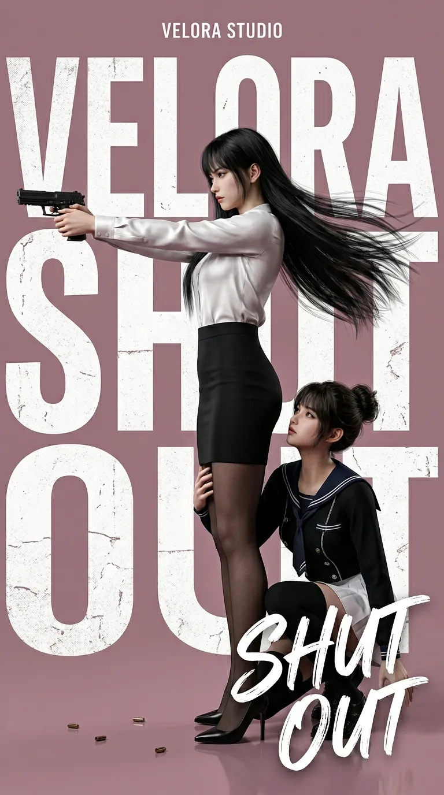

**#153 · Ai Art, Ai Prompt · <code>Vinano Image Pro</code>**

> Keywords: AI art, AI prompt, text to image

<details>
<summary>Show prompt</summary>

```
生成一张 9:16 竖版高端商业动作海报，风格为半写实 3D CG、时尚海报、电影感角色视觉。背景为干净的豆沙粉 / 雾粉色纯色背景，整体极简。画面背后加入巨大的白色做旧粗颗粒英文字母排版，形成强烈平面设计感。顶部中间加入小字品牌标题“VELORA STUDIO”，右下角加入醒目的白色手写感标题“SHUT OUT”。主体是两位年轻东亚女性：前景主角色为一位高挑冷艳女性，侧身站立，拥有超长黑色直发、细碎刘海、发丝向右大幅飘动。她穿着白色丝质长袖衬衫、黑色高腰包臀短裙、黑色薄丝袜、黑色尖头高跟鞋。她双手持一把现代手枪，双臂向前伸直，瞄准画面左侧，神情冷静、专注、强势，像时尚化的女特工。第二角色蹲在她腿边，抬头望向她，姿态紧张而依赖，一只手扶住主角色的大腿，另一只手撑地。她有深色盘发/丸子头、碎刘海，五官精致。她穿深蓝黑色水手服风格短上衣，带白色描边、领结、金属扣细节，搭配白色短裙、黑色过膝袜、黑色亮面皮鞋。整体呈现时尚海报 + 少女动作片海报的融合感，超高清、锐利清晰、细节丰富，材质真实，构图有强烈张力，高级、冷感、具有品牌感与封面感。 在保证细节的同时保持版式克制、留白得当。
```

</details>

---

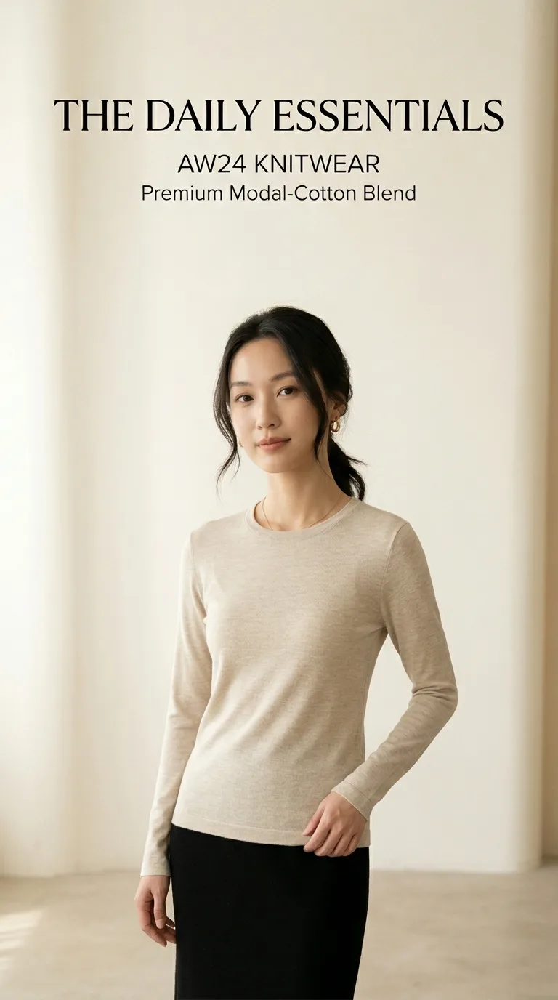

**#154 · Ai Art, Ai Prompt · <code>Vinano Image Pro</code>**

> Keywords: AI art, AI prompt, text to image

<details>
<summary>Show prompt</summary>

```
9：16竖版高端极简时尚产品海报。柔和摄影棚自然日光，温暖米白渐变背景（奶油色、燕麦色），画面极致干净。精致亚洲女性模特（25-30岁），自然裸妆，肤感干净，长发自然垂落或低马尾，姿态放松克制，全身或三分之二身构图，手自然垂放或轻触腰侧，强调衣身线条。服装必须严格匹配上传的产品参考图：高品质打底衫，奶油白/燕麦色/浅驼色/雾灰色，高支棉或莫代尔微弹针织面料，触感柔软，修身但不紧绷，圆领或小高领，长袖，设计极简 在保证细节的同时保持版式克制、留白得当。
```

</details>

---

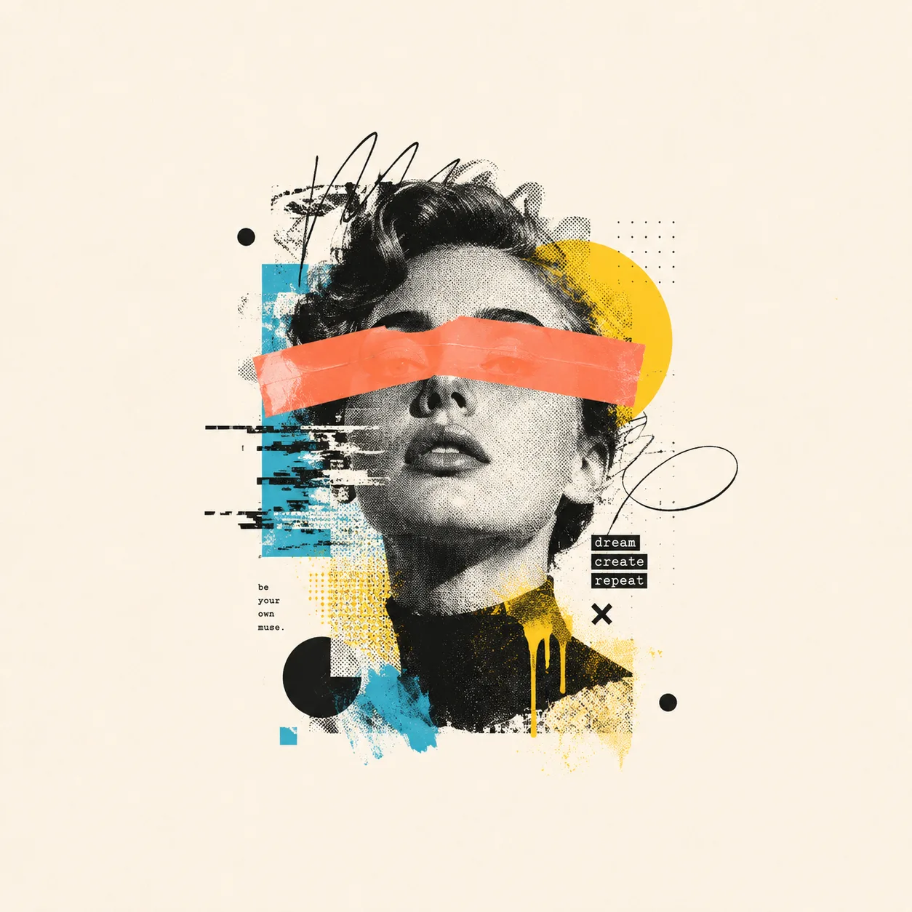

**#155 · Poster, Vintage · <code>Vinano Studio</code>**

> Keywords: poster, vintage, AI art, AI prompt, text to image

<details>
<summary>Show prompt</summary>

```
[PERSON \ BRAND] visualized as the central masterpiece of a surreal avant-garde collage, style of modern mixed media editorial illustration. The subject is composed of high-contrast black and white stippled halftone textures blended vibrant neo-expressionist elements. Overlay details include bold geometric shapes, cyan and yellow risograph patterns, abstract graffiti scribbles, and digital glitch artifacts. A thick strip of pink or orange tape or a color block obscures part of the form for a deconstructed look. The texture is grainy, mimicking vintage poster paper. The composition is strictly centered a very wide, clean, off-white cream paper background, ensuring the entire subject is fully contained within the frame generous negative space on all sides, zero cropping, minimal chic aesthetic. Keep edges clean and the overall composition balanced for a polished, gallery-ready result.
```

</details>

---

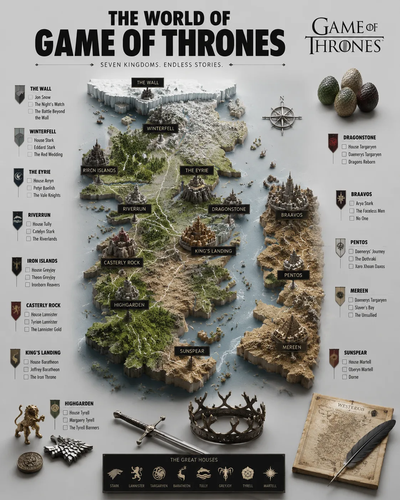

**#156 · Realistic, Landscape · <code>Vinano Studio</code>**

> Keywords: realistic, landscape, poster, character, fantasy, infographic

<details>
<summary>Show prompt</summary>

```
A hyper-realistic 3D world guide infographic poster for [SHOW]. The fictional world of [SHOW] is rendered as a raised, textured terrain map floating on a clean light gray surface — the map shape and landscape must reflect the actual geography and visual aesthetic of [SHOW] (fantasy kingdoms, post-apocalyptic cities, island archipelagos, ninja villages etc). Iconic locations from [SHOW] are placed as miniature 3D sculpted models at their correct canonical positions across the map — each one highly detailed, true-to-life photorealistic and instantly recognizable to fans. Roads or paths connect key locations as white lines across the terrain. Around the map, floating 3D decorative props and iconic items from [SHOW] are scattered on the light gray surface. The official logo of [SHOW] is shown in the upper right corner. Each major location has a bold black label on the map, and beside the map, each location has a neat checklist of its most iconic characters or moments associated that place, in clean sans-serif typography. A large bold title at the top reads: “THE WORLD OF SHOW” in black uppercase typography [SHOW] in heavy bold. The overall aesthetic is premium editorial — soft studio lighting, true-to-life photorealistic 3D render, white/light gray background, clean layout, 4:5 aspect ratio. Maintain consistent colour harmony and crisp focus across the whole frame.
```

</details>

---

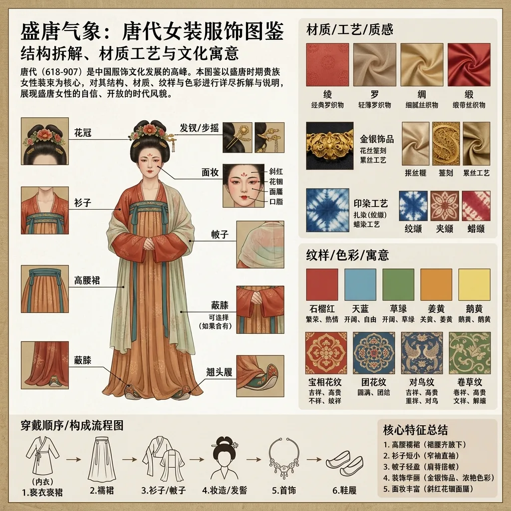

**#157 · Ai Art, Ai Prompt · <code>Vinano Image Pro</code>**

> Keywords: AI art, AI prompt, text to image

<details>
<summary>Show prompt</summary>

```
请根据[主题]自动生成一张[博物馆图鉴式中文拆解信息图]。

要求整张图兼具真实写实主视觉、结构拆解、中文标注、材质说明、纹样寓意、色彩含义和核心特征总结。你需要根据[主题]自动判断最合适的主体对象、服饰体系、器物结构、时代风格、关键部件、材质工艺、颜色方案与版式结构，用户无需再提供其他信息。

整体风格应为：国家博物馆展板、历史服饰图鉴、文博专题信息图，而不是普通海报、古风写真、电商详情页或动漫插画。背景采用米白、绢纸白、浅茶色等纸张质感，整体高级、克制、专业、可收藏。

版式固定为：
- 顶部：中文主标题 + 副标题 + 导语
- 左侧：结构拆解区，中文引线标注关键部件，并配局部特写
- 右上：材质 / 工艺 / 质感区，展示真实纹理小样并附说明
- 右中：纹样 / 色彩 / 寓意区，展示主色板、纹样样本和文化解释
- 底部：穿着顺序 / 构成流程图 + 核心特征总结

若主题适合人物展示，则以真实人物全身站姿为中央主体；若更适合器物或单体结构，则改为中心主体拆解图，但整体仍保持完整中文信息图形式。所有文字必须为简体中文，清晰、规整、可读，不要乱码、错字、英文或拼音。重点突出真实结构、材质差异、文化说明与图鉴气质。

避免：海报感、影楼感、电商感、动漫感、cosplay感、乱标注、错结构、糊字、假材质、过度装饰。

整体保持边缘干净、构图均衡，呈现可直接使用的精致成品感。
```

</details>

---

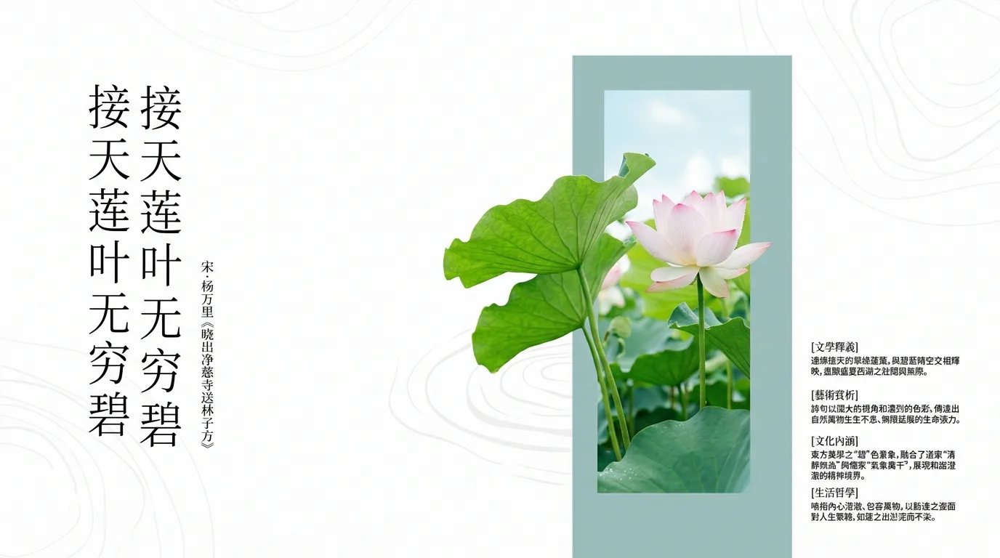

**#158 · Ai Art, Ai Prompt · <code>Vinano Image Pro</code>**

> Keywords: AI art, AI prompt, text to image

<details>
<summary>Show prompt</summary>

```
设计一张具有高级商业审美的极简海报，核心视觉语言是“真实物象穿越几何情绪窗口”。画面中设置一个窄长的低饱和色块，作为视觉锚点和空间容器，色块颜色根据主题选择柔和浅色，如雾蓝、浅青、米白、淡粉、暖灰或浅金。将【核心物象】以真实摄影质感或精细写实方式置入色块之中，但不要完全困在色块内，要让主体局部越界、破框、延伸到留白区域，形成自然生长感和空间穿透感。背景保持极简，使用大面积白色或浅灰留白，加入几乎透明的文化纹样、线性图形、地形线、水波线、光影轮廓或抽象符号，作为若隐若现的视觉细节。整体排版要像高端地产、奢侈品、美学杂志或节气海报，文字细长、克制、字距舒展，标题可竖排，辅助信息用小字号规整排列。画面需要有东方留白、现代秩序、自然生命力、轻奢品质感。避免杂乱、避免高饱和、避免厚重阴影、避免廉价模板感。

本次主题：接天莲叶无穷碧
主视觉元素：顶级日系摄影风格，ins滤镜质感，电影级光影、明亮通透
其他要求：画面至少4个不同层级 不同逻辑和不同呈现方案的知识点

用途：[诗词鉴赏]
背景：[白色]

比例 [16:9]

整体保持边缘干净、构图均衡，呈现可直接使用的精致成品感。
```

</details>

---

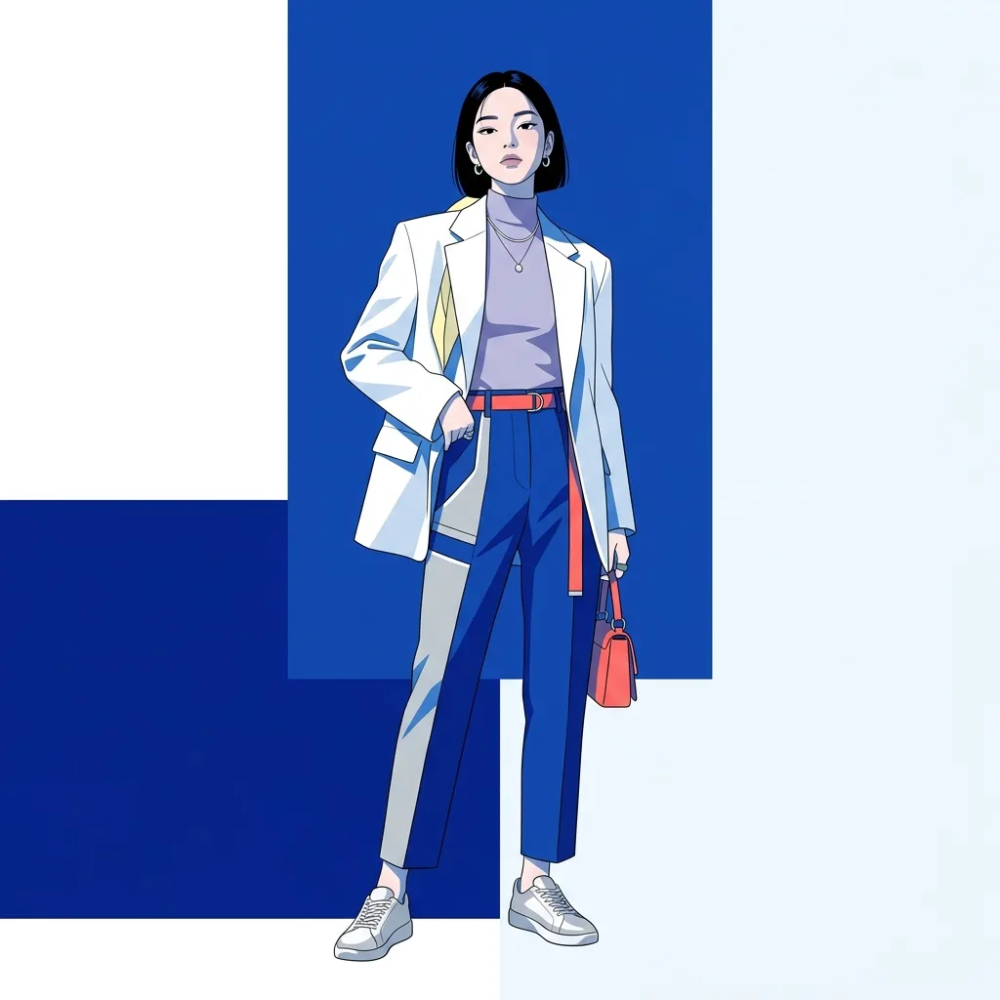

**#159 · Ai Art, Ai Prompt · <code>Vinano Image Pro</code>**

> Keywords: AI art, AI prompt, text to image

<details>
<summary>Show prompt</summary>

```
高端日系时装杂志封面感插画，主体为[韩国女孩]，极简现代时装数字插画风，精致赛璐璐上色，干净锐利的大色块塑形，几乎无线稿，边缘优雅清晰。画面保持蓝白骨架配色，同时加入少量珊瑚红、雾紫、浅黄、灰粉、鼠尾草绿、银灰等辅助色，整体仍然简约、高级、统一，不花哨。背景干净，可为钴蓝、皇家蓝、雾蓝等纯净大色块，并保留大面积负空间。强烈阳光从左上方照射，白色区域明亮接近过曝，阴影使用冷蓝、灰蓝、蓝紫色硬边块面表现。主体轮廓修长，姿态安静冷淡，细节简化但造型准确，整体清透、冷艳、时尚，像高级杂志封面海报。无文字，无水印，无复杂背景，无写实摄影，无 3D，无厚涂，无低幼卡通，无杂乱装饰。 在保证细节的同时保持版式克制、留白得当。
```

</details>

---

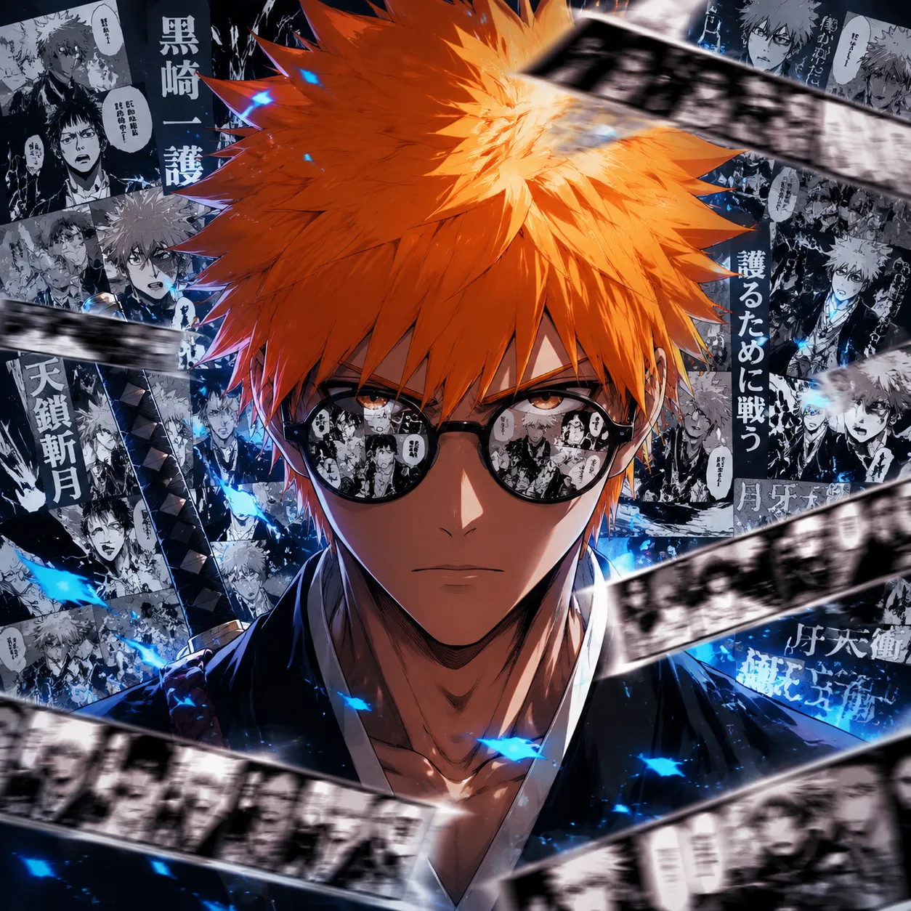

**#160 · Anime, Portrait · <code>Vinano Studio</code>**

> Keywords: anime, portrait, poster, cinematic, AI art, AI prompt

<details>
<summary>Show prompt</summary>

```
超高细节二次元热血漫画风角色海报，少年死神角色正面半身特写，橙色炸毛短发，琥珀色眼睛，佩戴黑色圆框复古墨镜，冷峻严肃表情，正中央对称构图，镜头直视观众，强烈压迫感。

眼镜镜片中倒映大量黑白漫画分镜与角色画面，背景也由密集的日漫漫画页拼贴组成，形成“角色记忆 / 名场面回顾”的视觉效果。前景漂浮多条高速运动的漫画分镜条带，带有动态模糊与景深虚化效果，穿插画面上下，营造速度感与空间层次。

画面中散落蓝色灵压粒子 / 荧光能量碎片，形成冷暖撞色（橙发 vs 蓝色粒子）。整体采用《BLEACH》式热血少年漫画美学，融合现代潮流海报设计与高级动漫商业视觉。

anime key visual, BLEACH style, manga collage poster, cinematic anime lighting, reflective glasses, manga panels reflection, dynamic motion blur, orange spiky hair, intense stare, ultra detailed anime illustration, shonen jump aesthetic, layered composition, high contrast shading, cel shading, glowing blue particles, dramatic close-up portrait, symmetrical composition, manga montage background, Japanese comic aesthetic, premium anime poster

Maintain consistent colour harmony and crisp focus across the whole frame.
```

</details>

---

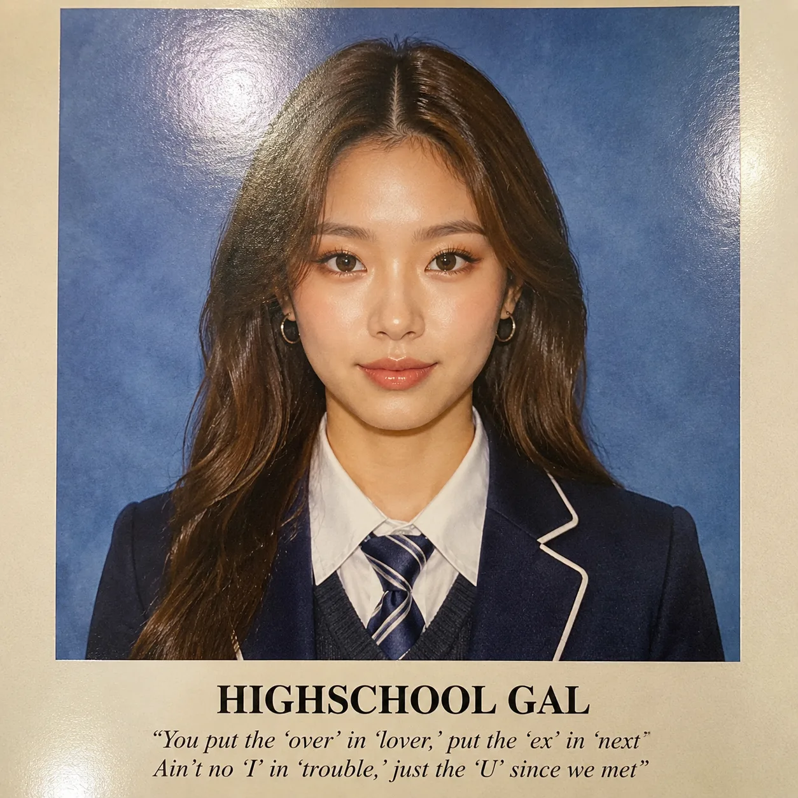

**#161 · Realistic, Portrait · <code>Vinano Studio</code>**

> Keywords: realistic, portrait, poster, cinematic, AI art, AI prompt

<details>
<summary>Show prompt</summary>

```
Use this photo attached to create an ultra-realistic printed portrait authentic photo-print shine.
A straight-on, centered head-and-shoulders portrait of a young woman, neutral confident expression, eyes looking directly at the camera. Composition is perfectly aligned and symmetrical, identical to a school ID / yearbook / magazine archive photo.
She has long, smooth brown hair, center-parted, softly layered, neatly styled. Makeup is polished but natural, editorial-clean: warm brown eyeshadow, softly defined eyeliner, voluminous lashes, subtle contour, peach blush, and glossy nude lips. Skin is smooth, flawless, softly matte natural highlights, realistic pores visible.
She wears a dark navy blazer white piping, white collared shirt, dark sweater vest, and navy striped tie, styled like a formal school uniform portrait. Small silver hoop earrings.
EXACT FILTER & PRINT SHINE (VERY IMPORTANT):
Apply a real photo-print filter, not digital glow:
Subtle semi-gloss paper sheen
Light reflective shine across cheeks, forehead, and lips, as if light is bouncing off printed ink
Very mild lamination glare, thin diagonal highlights
Slight softening from ink absorption, not blur
Gentle warm undertone from printed ink
Fine paper grain texture visible on skin and background
Looks like a scanned or photographed printed photo
NO glassy skin
NO beauty filter glow
NO cinematic bloom
LIGHTING:
Direct frontal harsh flash ALWAYS ON, similar to ID or studio flash:
Even exposure
Bright eye catchlights
Minimal shadows
Flat, clean lighting typical of printed portraits
BACKGROUND:
Flat cool blue textured studio backdrop, evenly lit, slightly muted by print ink.
TEXT & LAYOUT (PRINTED):
Below the portrait, centered and printed on the page:
Bold serif font:
HIGHSCHOOL GAL
Below in smaller italic serif font, quotation style:
“You put the ‘over’ in ‘lover,’ put the ‘ex’ in ‘next’
Ain’t no ‘I’ in ‘trouble,’ just the ‘U’ since we met”
Text appears ink-printed, slightly imperfect edges, natural spacing, no digital sharpness.
OVERALL LOOK:
Real printed photograph
Magazine / yearbook archive
Soft shine, subtle glare
Paper texture + ink warmth
Not digital, not glossy poster
Looks physically touchable

Maintain consistent colour harmony and crisp focus across the whole frame.
```

</details>

---

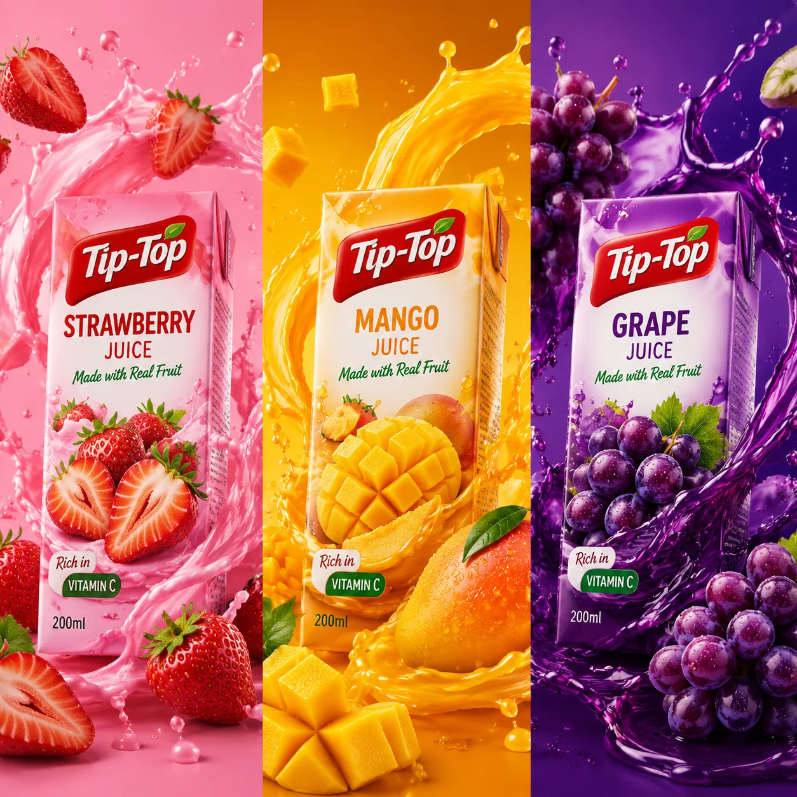

**#162 · Realistic, Ai Art · <code>Vinano Studio</code>**

> Keywords: realistic, AI art, AI prompt, text to image

<details>
<summary>Show prompt</summary>

```
{
 "juice_boxes": [{
 "id": 1,
 "product": {
 "brand": "Tip-Top",
 "flavor": "Strawberry",
 "image": {
 "description": "strawberry juice ripe strawberries",
 "background": {
 "color": "fresh pastel pink",
 "elements": ["strawberry halves",
 "juice splashes",
 "dynamic swirling around the pack"]
 }
 }
 },
 "design": {
 "style": {
 "detail": "premium-quality detail",
 "texture": "commercial-grade photorealism"
 },
 "aspect_ratio": "2:3"
 }
 },
 {
 "id": 2,
 "product": {
 "brand": "Tip-Top",
 "flavor": "Mango",
 "image": {
 "description": "mango juice ripe golden mangoes",
 "background": {
 "color": "tropical orange-yellow gradient",
 "elements": ["mango cubes",
 "swirling juice streams",
 "energetic and appetizing scene"]
 }
 }
 },
 "design": {
 "style": {
 "texture": "ultra-realistic packaging material texture"
 },
 "aspect_ratio": "2:3"
 }
 },
 {
 "id": 3,
 "product": {
 "brand": "Tip-Top",
 "flavor": "Grape",
 "image": {
 "description": "grape juice purple grapes",
 "background": {
 "color": "deep purple gradient",
 "elements": ["grape bunches",
 "glossy juice splashes",
 "surrounding the carton"]
 }
 }
 },
 "design": {
 "style": {
 "tone": "elegant",
 "mood": "lively commercial promotion style"
 },
 "aspect_ratio": "2:3"
 }
 }]
}

Render with rich micro-detail while keeping the layout uncluttered and intentional.
```

</details>

---

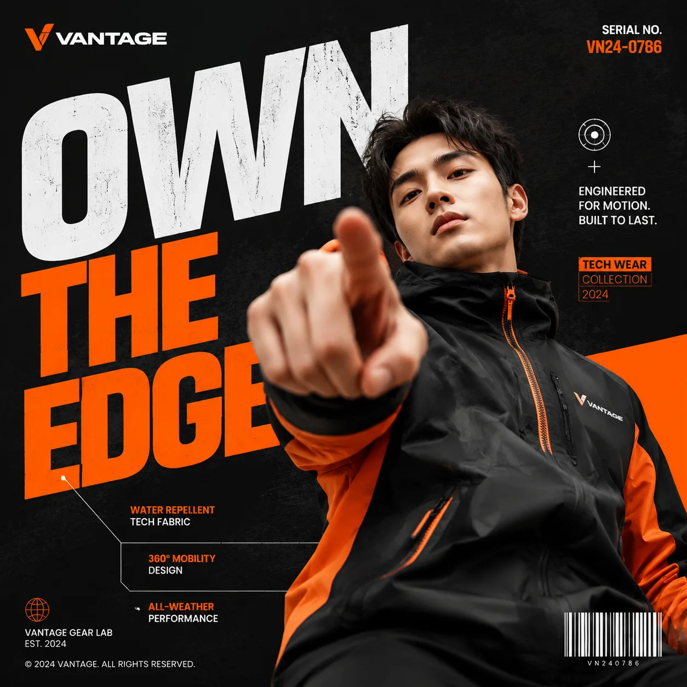

**#163 · Poster, Ai Art · <code>Vinano Studio</code>**

> Keywords: poster, AI art, AI prompt, text to image

<details>
<summary>Show prompt</summary>

```
Graphic design smart prompt

Generate ad posters in

This prompt generates:
• POV low-angle photo (pointing at viewer)
• Oversized text + brand tagline
• Serial numbers, copyright lines, technical callouts
• Brand-appropriate color blocking and texture

Use case:
• social media posting,
• influencer collab visuals,
• pitch decks.

Prompt 👇

Maintain consistent colour harmony and crisp focus across the whole frame.
```

</details>

---

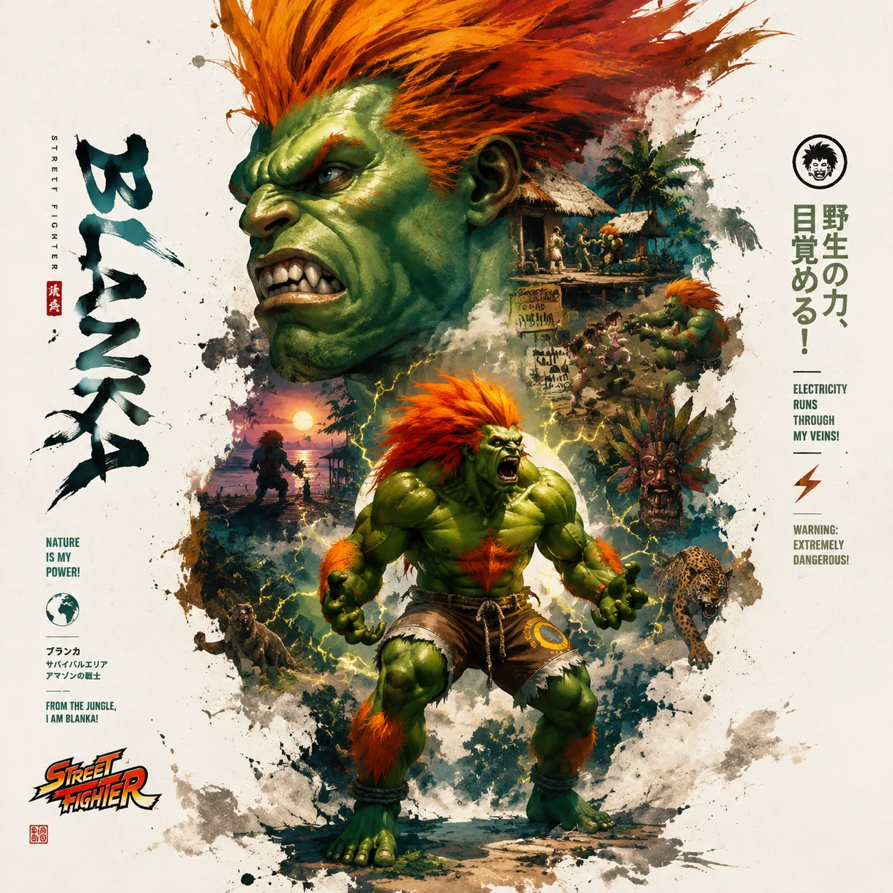

**#164 · Poster, Character · <code>Vinano Studio</code>**

> Keywords: poster, character, AI art, AI prompt, text to image

<details>
<summary>Show prompt</summary>

```
Create a propaganda poster themed around the character “BLANKA” a consistent and hierarchical main visual composition.
Poster structure:
Top (top half): Use the character’s head, facial features, mask, or half-body silhouette as the main large-sized visual element, forming an easily recognizable iconic image.
Middle to bottom: Place the full-length character as the second subject, a stable standing pose or light movement, serving as the center of the visual composition.
Visual style:
Use double exposure and narrative collage techniques in and around the character’s large silhouette.
Combine various elements such as:
layered scenes
additional images
small character interactions
supporting elements
environmental backgrounds
all arranged in layers of clouds, ink, and white negative space.
Additional composition:
Place supporting elements on the left and right to create narrative tension and spatial variation.
Add a vertical flowing visual line connecting:
main character
internal collage elements
large silhouette at the top
to reinforce visual continuity.
 Aesthetics:
Maintain the use of large amounts of negative space.
The edges are processed the effects of:
ink diffusion
soft blur
visual fragmentation
to create a poetic and “breathing” Eastern aesthetic. Add more pop and striking colors
Overall style:
Consistent, premium, and refined.
Focus on:
visual layering
narrative
key visual impact
visual language of serial posters
Size: A4

Maintain consistent colour harmony and crisp focus across the whole frame.
```

</details>

---

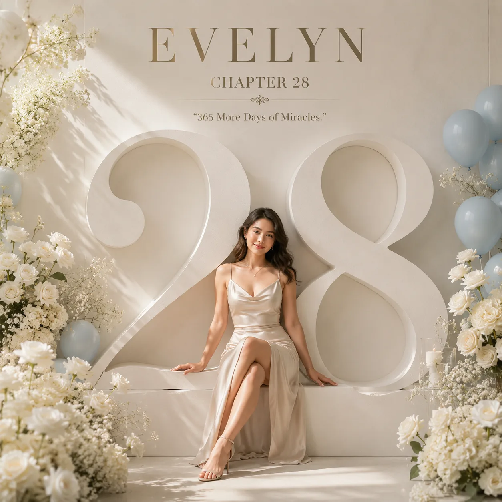

**#165 · Realistic, Portrait · <code>Vinano Studio</code>**

> Keywords: realistic, portrait, poster, minimalist, AI art, AI prompt

<details>
<summary>Show prompt</summary>

```
Create a luxury refined minimalist birthday milestone poster featuring a giant 3D number “[Age]” carved into a premium ivory-white wall. A stylish person is naturally sitting, leaning, or hanging from the number, posing confidently. Elegant floral arrangements white roses, baby's breath, hydrangeas, and pastel blue balloons frame the composition. Soft natural sunlight, premium editorial photography, modern celebration aesthetic, clean luxury design, subtle shadows, sophisticated typography. At the top, display the name “[Name]” in elegant serif font, followed by “CHAPTER [Age]” and the quote “365 More Days of Miracles.” Neutral beige and white color palette, high-end event styling, dreamy atmosphere, true-to-life photorealistic, magazine-quality portrait, ultra-detailed textures, luxury birthday photoshoot, Instagram-worthy, shallow depth of field, soft, diffused lighting, 8K masterpiece, professional fashion photography. Keep edges clean and the overall composition balanced for a polished, gallery-ready result.
```

</details>

---

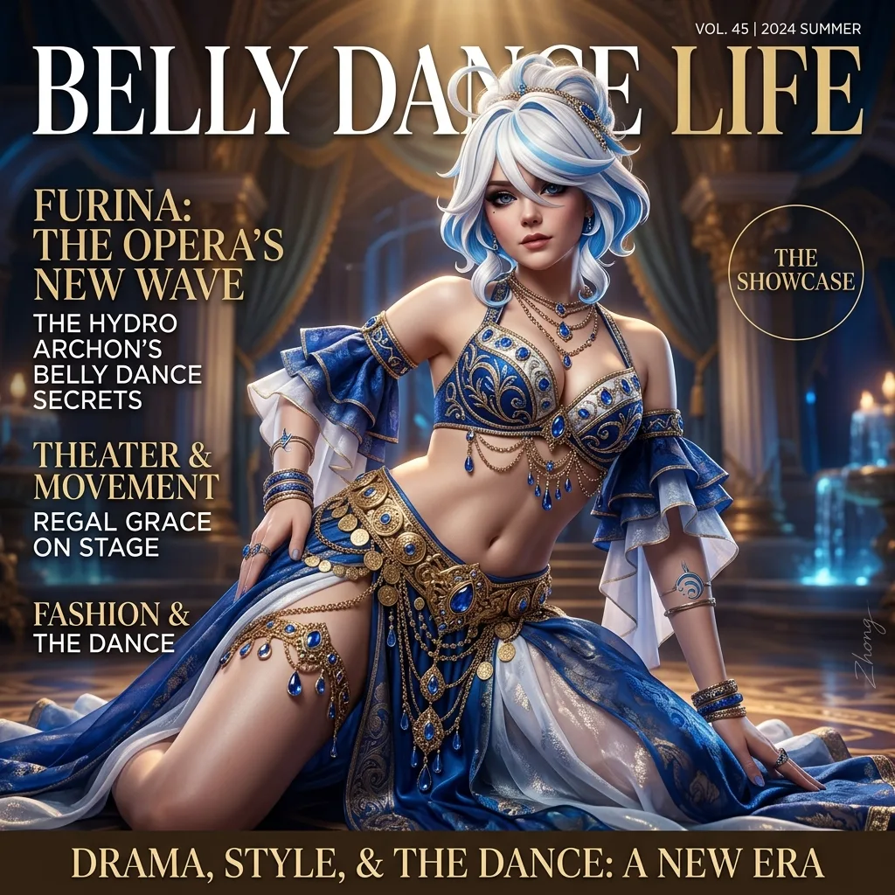

**#166 · Realistic, Character · <code>Vinano Image Pro</code>**

> Keywords: realistic, character, cinematic, AI art, AI prompt, text to image

<details>
<summary>Show prompt</summary>

```
指定角色：芙宁娜《原神》

真人摄影风格的高端肚皮舞主题时尚杂志封面 / 宣传海报。

请基于当前指定角色，自动识别并提取其来源作品、世界观、身份设定、标志性发型发色、瞳色、经典服装语言、代表配色、能力元素、阵营符号与性格气质，并将这些特征完整转译为该角色专属的高端肚皮舞者真人版造型。

画面主体是一位明确成年化处理的女性角色真人版模特，真实人类质感，保留该角色的核心辨识度，整体呈现高端真人时尚大片，不是动漫插画，不是廉价 cosplay。人物必须像“该角色如果登上高端肚皮舞主题杂志封面”时会呈现出的真人版时尚舞者形象，既保留角色灵魂，又具备高完成度商业摄影质感。

服装基于该角色原始设定重构为高级肚皮舞演出服，融合轻纱、珠宝、腰链、臂环、腿饰、宝石坠饰、刺绣纹样、半透明层次布料、角色专属图案或能力意象。服装设计需要提炼该角色最具辨识度的配色、纹样、材质倾向、能力气质与世界观审美，将其转化为适合高端肚皮舞舞台的华丽造型。整体华丽、精致、异域、舞台感强，同时保持高级克制、不低俗。通过珠宝、面料、金属件、纹样与舞台装饰强化角色辨识度。

人物神态与表情根据角色性格自动匹配：如果角色气质偏温柔，则表现柔和从容；如果偏冷静，则表现克制优雅；如果偏强势，则表现稳定锐利；如果偏神秘，则表现带有戏剧张力与危险感；如果偏灵动，则表现轻盈、柔美、通透。整体表情不夸张、不媚俗，而是呈现高端商业封面级舞者神态。眼神与镜头形成自然交流，像在安静地展示一场高完成度舞台定格瞬间。

构图采用超低机位近地广角时尚摄影，镜头几乎贴近舞台地面，形成非常明显的近距离强透视。镜头距离人物非常近，像摄影师跪在舞台前沿贴近拍摄，使用 24mm–28mm 广角近拍的封面视角，不是远距离舞台拍摄，不是普通中景写真。

本次构图的最高优先级是：人物必须明显更靠近镜头，人物更大，背景更少。人物必须成为绝对主视觉，人物高度约占整个画面 78%–88%，横向宽度约占画面 60%–75%。不要把人物拍得太小，不要保留过多舞台地面和背景空间。头部接近画面上方主标题区域下缘，前景腿部明显逼近画面下边缘，部分腿部、轻纱或服装边缘允许轻微贴边或切边，以增强近距离封面压迫感。整体构图要像人物几乎冲到镜头前，而不是站在舞台中央被远远拍摄。

采用典型杂志封面近景构图：上方预留大标题空间，但不能因此把人物缩小；中部重点呈现脸部、胸肩、腰部和腰间饰品；下部通过腿部姿态形成强烈张力。背景只作为氛围衬托，不要展开成完整大场景，不要给出过多空地、过多反光地板、过多远景柱廊和大面积空白。整体要有封面级压迫感、贴脸感、近距离舞台定格感。

人物采用高端肚皮舞杂志封面式定格动作，整体正面或三分之二正面朝向镜头，重心压低，腰胯自然扭转并朝镜头主动展开，腰链、宝石坠饰、金属腰封和轻纱层次清晰可见。腿部采用低位舞蹈姿态，可为双膝外开的正面低蹲结构，或一腿前送、一腿后收的强透视结构，重点表现低重心、腰胯节奏、腿部开合与舞台雕塑感。

人物在动作中主动朝向镜头展示腰间肚皮舞饰品，腰胯自然扭转，腰链、宝石坠饰、金属件、刺绣纹样与轻纱层次清晰可见，成为服装设计的重要视觉焦点，同时保持舞姿、服装与舞台气质为主，而非身体局部特写。

上半身胸腔打开，肩颈舒展，头部微微倾斜，眼神与镜头交流。双臂与手部动作不需要固定为某一种具体姿势，而应根据角色气质、舞蹈演出状态、身体线条、服装展示需求和整体封面构图自动匹配，保持自然、优雅、具有肚皮舞演出感。手臂动作可以形成头部附近的框架感，也可以自然延展、下垂、抬起或辅助服装与轻纱的动态展示，但不强调复杂手势，不强调手指细节，手部只作为辅助构图元素，整体以身体线条、腰部饰品、服装层次和舞姿定格感为主。整体像舞台表演中的高光瞬间定格，具有近距离杂志封面压迫感、华丽服装展示感和角色专属舞台魅力。

人物在画面中的尺度必须足够大：面部、胸肩、腰腹和前景腿部都要具有强烈存在感；不能把人物缩成环境里的一位舞者；不能让背景比人物更抢眼。人物身体中轴应稳定落在画面中央略偏上的主视觉区域，腰腹与腰饰位于画面视觉中心附近，腿部在画面下半部形成清晰的大面积结构。前景腿部、腰部饰品、脸部表情应构成连续的纵向主视觉链条。

背景根据该角色的世界观自动生成专属舞台环境，并结合其代表配色、能力特征、阵营气质和象征元素设计灯光、材质与装饰。整体环境应表现为“该角色专属的高端肚皮舞舞台”，可以融合东方幻想、异域宫廷、神殿式空间、秀场感布景、帷幔、吊灯、轻纱、粒子、反光地面、花瓣或角色相关象征元素。背景必须虚化、压缩、氛围化，只服务于主体，不展开成完整场景全景。

光线采用暖金主光 + 冷色环境光 + 轻微轮廓光。主光照亮人物面部、肩颈、上身服装、腰部与腿部结构，轮廓光勾勒发丝、轻纱、珠宝、裙摆与腿部边缘。整体色光既要表现角色本身的气质属性，也要表现高端舞台杂志封面的奢华感。皮肤质感真实细腻，发丝真实，珠宝与金属饰件有精致反光，轻纱半透明层次，整体呈现高完成度商业精修摄影效果。

杂志封面排版的结构与气质：
- 顶部使用超大标题 “Belly Dance Life”，大标题占据画面上方大面积空间
- 右上区域放置卷号与季节信息，例如 Vol.45 / 2024 Summer
- 左右两侧分布多组杂志封面文案
- 右侧加入圆形专题标签
- 底部加入一条大号宣传语或副标题
- 版式精致、丰富、时尚，具有高端女性杂志与舞蹈刊物封面质感
- 整体排版应服务于人物主视觉，不遮挡关键动作结构
- 标题与文案围绕人物排布，允许人物非常靠近标题区，形成紧凑的封面构图

画面中自然加入低调签名「Zhong」，作为设计师落款。

构图锁定补充要求：
- 不要远景
- 不要中远景舞台感
- 不要保留过多背景空间
- 不要让地板面积过大
- 不要让人物只占画面中间一小部分
- 要明显更近、更大、更贴镜头
- 要像封面摄影师近距离压上去拍摄的效果
- 宁可压缩背景，也要保证人物更大、更近、更具压迫感

手部补充约束：
- 手部不作为画面重点
- 手部动作根据整体演出需要自动匹配
- 不做复杂舞蹈手势
- 不强调手指细节
- 不要手指张开过度
- 不要手部过度靠近镜头
- 不要手遮挡脸部主体

最终风格关键词：
true-to-life photorealistic, cinematic fashion photography, luxury editorial magazine cover, character-inspired belly dancer, role-specific costume design, ultra low-angle wide lens, strong foreshortening, close-up cover composition, foreground leg emphasis, elegant low pose, active waist ornament presentation, realistic fabric texture, jewelry sparkle, worldbuilding-inspired stage, magazine typography, high-end commercial finish

Negative prompt: 禁止动漫插画感，禁止廉价 cosplay，禁止普通站姿，禁止中远景，禁止人物过小，禁止背景过大，禁止地板面积过大，禁止弱透视，禁止前景腿部不明显，禁止腿部动作模糊，禁止肢体畸形，禁止多余手指，禁止手指融合，禁止复杂手势，禁止手部过度靠近镜头，禁止手遮挡脸部主体，禁止腿长比例失衡，禁止低俗姿势，禁止过度暴露，禁止局部身体部位刻意特写，禁止塑料皮肤，禁止假人感，禁止杂乱文字，禁止乱码排版，禁止廉价影楼感。

保持配色统一、主体清晰，细节丰富但不杂乱。
```

</details>

---

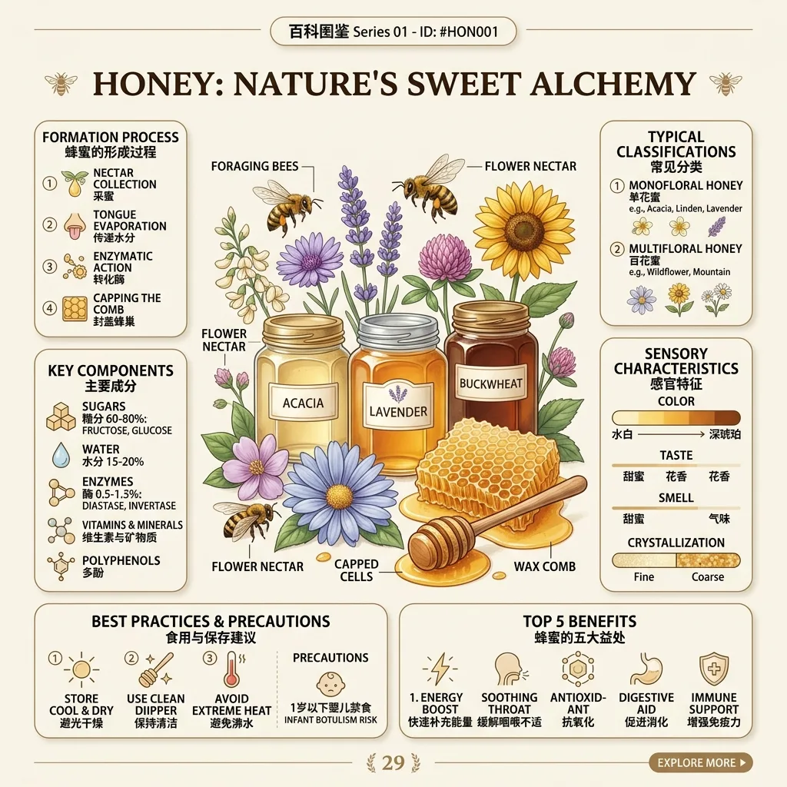

**#167 · Ai Art, Ai Prompt · <code>Vinano Image Pro</code>**

> Keywords: AI art, AI prompt, text to image

<details>
<summary>Show prompt</summary>

```
请根据【主题】生成一张高质量竖版「科普百科图」。

这张图不是普通海报，也不是单纯插画，而是一张兼具“图鉴感、百科感、信息结构感、收藏感”的模块化科普信息图。整体风格参考高级博物图鉴、现代百科书页、生活方式知识卡和社交媒体高传播信息图的结合。

请让画面包含：
- 一个清晰漂亮的主题主视觉
- 若干局部特征放大细节
- 多个圆角模块化信息分区
- 清楚的标题层级与重点标签
- 简洁但丰富的百科内容
- 可视化评分、要点总结或Top 5模块

内容栏目请根据主题自动适配，优先从这些方向中选择并合理组合：
基础档案、分类信息、外观特征、习性/生态、形成机制/结构组成、生长或使用条件、养护或维护建议、风险与注意事项、适合人群或适用场景、优缺点对比、快速评分卡。

视觉要求：
浅色干净背景，柔和配色，轻阴影，精致小图标，圆角信息框，整洁排版，信息密度高但不拥挤，阅读体验好。整体必须像真正可以发布、阅读、收藏、系列化生产的科普百科卡，而不是广告图。

请不要做成普通商业宣传海报。要突出“知识整理 + 模块信息 + 图鉴式展示”的特征。

强调材质质感与自然光影，让画面更具高级真实感。
```

</details>

---

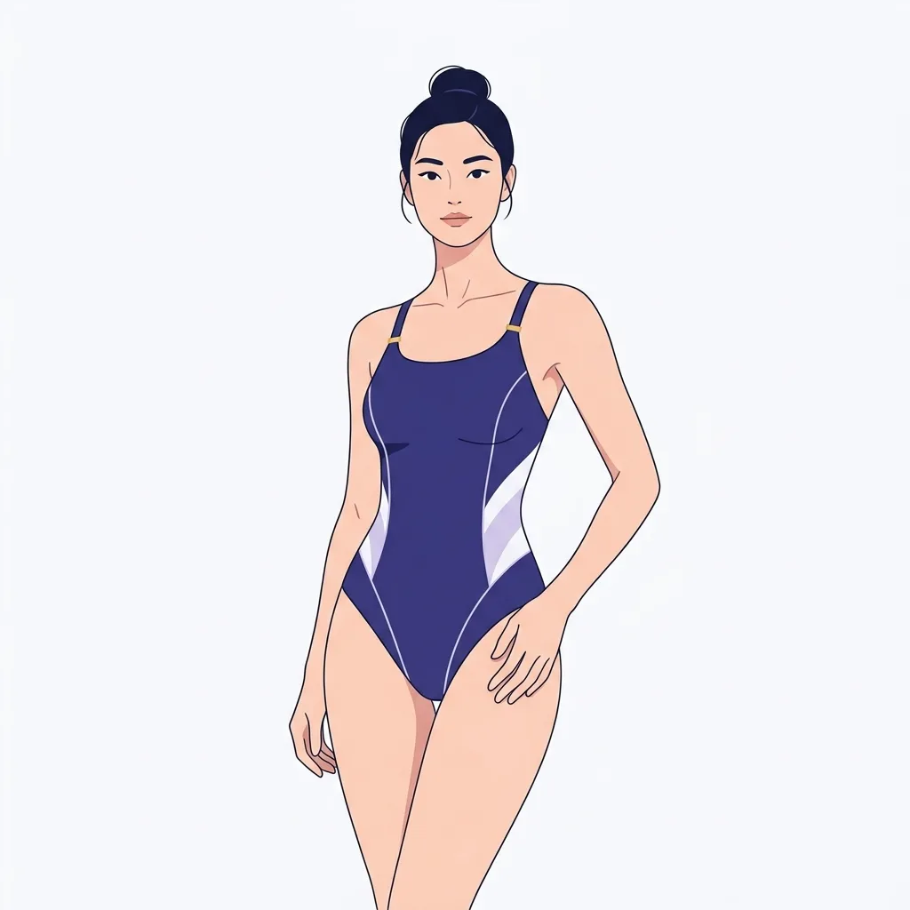

**#168 · Ai Art, Ai Prompt · <code>Vinano Image Pro</code>**

> Keywords: AI art, AI prompt, text to image

<details>
<summary>Show prompt</summary>

```
主体内容：一位穿着极简连体泳装的东方成年女性人物插画
主体气质：自信、健康、现代、利落
画面用途：极简人物插画
主色调：深靛蓝、冷白、浅紫
点缀色：金色
几何元素强度：无
几何元素类型：无
画幅比例：4:5
补充要求：突出肩颈、腰腹、胯部与腿部线条，姿态自然稳定，背景极简留白，不做商业海报

在保证细节的同时保持版式克制、留白得当。
```

</details>

---

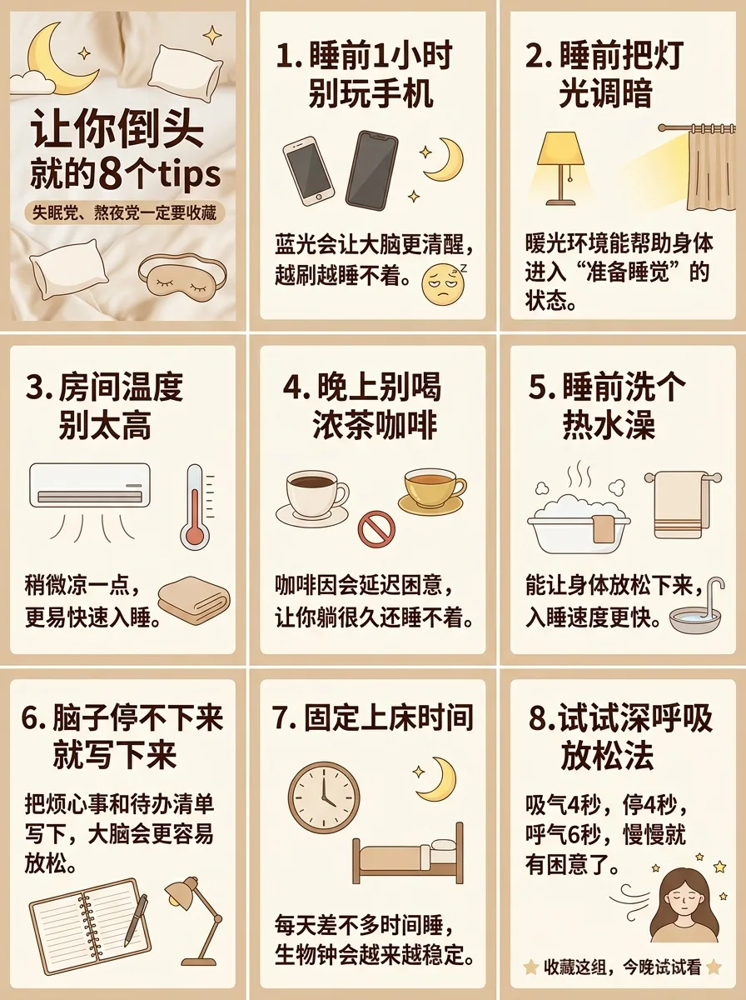

**#169 · Ai Art, Ai Prompt · <code>Vinano Image Pro</code>**

> Keywords: AI art, AI prompt, text to image

<details>
<summary>Show prompt</summary>

```
生成一张适合小红书发布的 3:4 竖版九宫格海报，整体为 3列 × 3行 排版，九个宫格边界清晰，方便后期直接切割成 9 张单图发布。整体风格干净、高级、统一，适合女性向健康生活方式内容，具有小红书爆款封面气质。画面要求 信息排版清晰、文字大、可读性强、留白舒服、配色温柔治愈。

整体视觉风格：
奶油白、浅米色、淡燕麦色、浅焦糖色为主色调，搭配少量深棕色文字，ins风、治愈感、睡眠疗愈主题，简约排版，轻拟物插画点缀，可加入枕头、月亮、星星、热牛奶、香薰、书本、眼罩、窗帘、床铺等元素。整体像专业新媒体设计图，字体工整，适合做知识科普类小红书九宫格。
排版要求：

整张图必须是标准九宫格构图，切分后每一格都能独立成图

每个宫格内容完整居中，不要把标题或正文压在分割线附近
每个格子之间保留明显间隔或细边框，保证裁切后不影响阅读
所有文字使用中文，清晰易读，不要乱码，不要英文
每个宫格都像独立的小红书图文卡片，但视觉风格保持统一
画面精致、真实、自然，不要廉价营销感，不要过度花哨
九宫格具体内容：

第1格（封面）
大标题：让你倒头就睡的8个 tips
副标题：失眠党、熬夜党一定要收藏
封面视觉最吸睛，适合做首图，加入柔软床铺、月亮、枕头、眼罩等治愈睡眠元素，标题突出，排版高级。

第2格
标题：1. 睡前1小时别玩手机
正文：蓝光会让大脑更清醒，越刷越睡不着。
配图元素：手机、月亮、困倦表情的小插画
第3格
标题：2. 睡前把灯光调暗
正文：暖光环境能帮助身体进入“准备睡觉”的状态。
配图元素：床头灯、暖黄色灯光、窗帘
第4格
标题：3. 房间温度别太高
正文：稍微凉一点，更容易快速入睡。
配图元素：空调、温度计、被子
第5格
标题：4. 晚上别喝浓茶咖啡
正文：咖啡因会延迟困意，让你躺很久还睡不着。
配图元素：咖啡杯、茶杯、禁止符号

第6格
标题：5. 睡前洗个热水澡
正文：能让身体放松下来，入睡速度更快。
配图元素：浴室蒸汽、毛巾、热水
第7格
标题：6. 脑子停不下来就写下来
正文：把烦心事和待办清单写下，大脑会更容易放松。
配图元素：笔记本、钢笔、小台灯
第8格
标题：7. 固定上床时间
正文：每天差不多时间睡，生物钟会越来越稳定。
配图元素：时钟、月亮、床
第9格
标题：8. 试试深呼吸放松法
正文：吸气4秒，停4秒，呼气6秒，慢慢就有困意了。
底部小字：收藏这组，今晚试试看
配图元素：呼吸线条、闭眼人物、星星

画质要求：
高清，高级排版，杂志感，真实可发布，新媒体运营审美，小红书爆款图文风格，文字布局规整，适合直接切图。

整体保持边缘干净、构图均衡，呈现可直接使用的精致成品感。
```

</details>

---

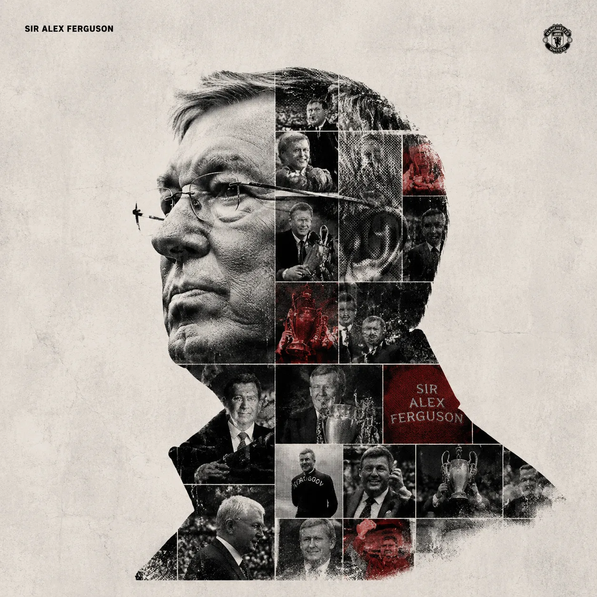

**#170 · Portrait, Poster · <code>Vinano Studio</code>**

> Keywords: portrait, poster, AI art, AI prompt, text to image

<details>
<summary>Show prompt</summary>

```
[PERSON NAME].

Act as a high-end sports graphic designer creating a conceptual tribute poster. The style is a complex "dual exposure photo-grid composite" mixed-media textures.
**CENTRAL STRUCTURE (THE VESSEL):**
The central focus is a large-scale, high-contrast black and white portrait silhouette of [PERSON NAME]. This main portrait acts as the container.
**THE GRID FILL & TEXTURES (MIXED MEDIA):**
The interior of the silhouette is populated by a dense "photo mosaic grid" of action shots from the person's career.
**CRITICAL TEXTURE INSTRUCTION:** Do not just paste flat photos. Apply artistic textures to various grid cells to create a tactile, collage feel. Use effects like:

- **Halftone Dots:** Comic-book style raster patterns on some cells.
- **Fabric/Embroidery:** Subtle thread or canvas textures suggesting a jersey or patch.
- **Film Grain:** Heavy noise on specific high-contrast action shots.
**COLOR STRATEGY:**
The base is Monochrome B&W. Use selective color overlays (relevant to the team/flag) ONLY on specific grid cells to create a rhythm.
**TYPOGRAPHY & BRANDING (STRICT MICRO-SCALING):**
1. **Top Left (The Name):** Write "[PERSON NAME]" strictly the font **Inter Semibold**.
- **Kerning:** Tight negative kerning (-4%).
- **Size:** SMALL and discreet. It must occupy **MAXIMUM 20%** of the canvas width. Do NOT make it large or loud.
1. **Top Right (The Symbol):** Place the primary logo (Team/Brand/Flag).
- **Size:** VERY SMALL. It must occupy **MAXIMUM 10%** of the canvas width.
**COMPOSITION & BACKGROUND:**
- **Background:** Off-white or light grey a **visible premium-quality paper or concrete texture**. It should not be flat digital white.
- **Alignment:** Center the figure perfectly. Maintain wide negative space around the object.

Preserve realistic proportions and depth for a confident, professional finish.
```

</details>

---

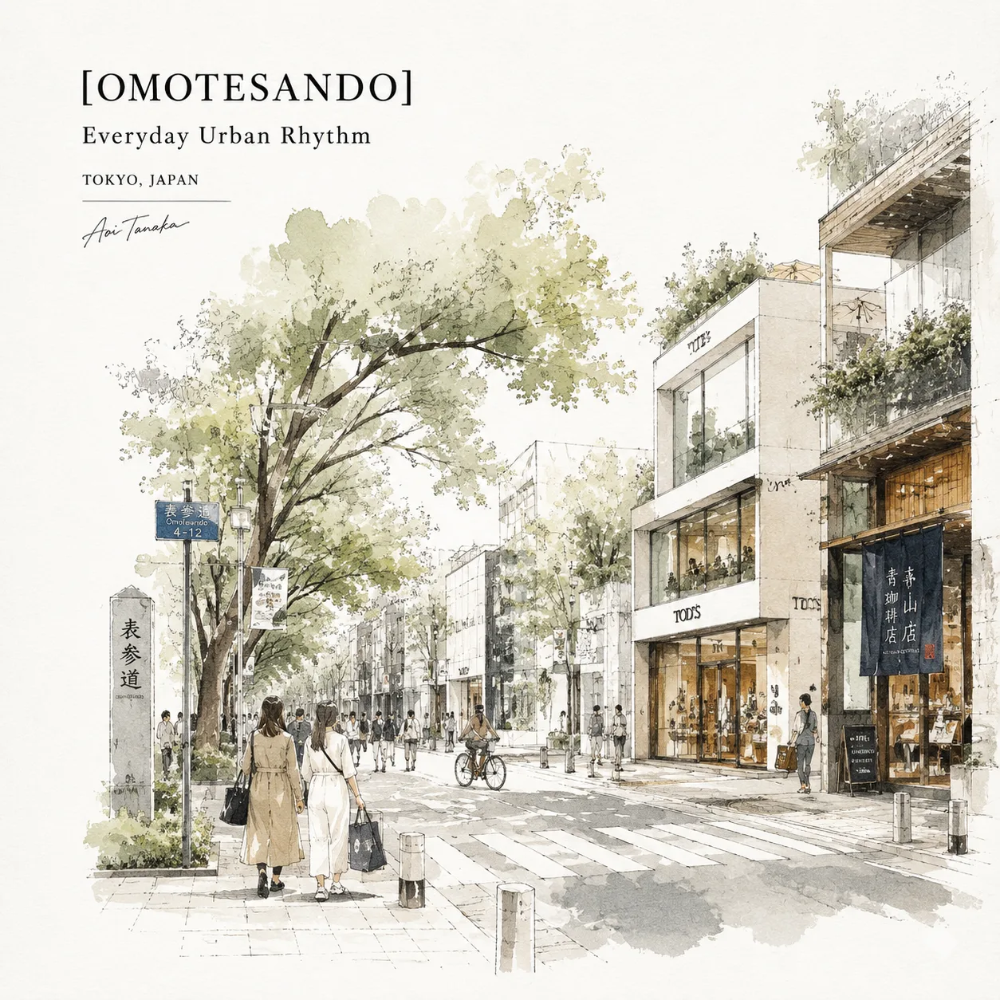

**#171 · Realistic, Poster · <code>Vinano Studio</code>**

> Keywords: realistic, poster, character, minimalist, AI art, AI prompt

<details>
<summary>Show prompt</summary>

```
refined minimalist ultra-high-resolution travel sketch poster of Omotesando, Tokyo, on clean white sketchbook paper subtle paper grain texture. Style: refined pen drawing + loose watercolor sketch. Delicate black ink linework, airy watercolor washes, elegant urban details. Show a calm everyday Omotesando street scene — the iconic zelkova tree-lined avenue, chic boutiques and flagship stores, small stylish cafés, people walking shopping bags, bicycles, crosswalks, low-rise modern architecture mixed traditional touches, subtle Japanese signage (Japanese characters on shop signs), fashionable Tokyo pedestrians, soft morning light filtering through the trees. Spacious editorial composition generous negative space. Mood: calm, modern, sophisticated, poetic. Typography: "[OMOTESANDO]" "Everyday Urban Rhythm" Premium travel sketch aesthetic, minimal and stylish, ultra-realistic watercolor + ink travel journal style, ultra-high-resolution, 9:16. Emphasise material texture and natural light so the final frame feels tactile and premium.
```

</details>

---

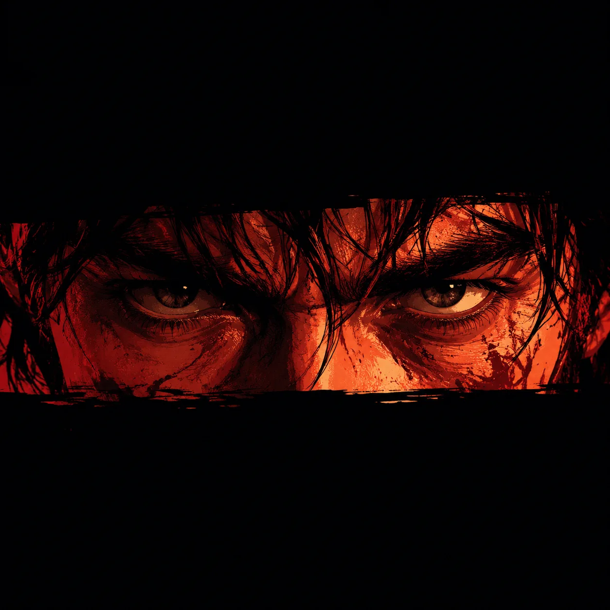

**#172 · Poster, Cinematic · <code>Vinano Studio</code>**

> Keywords: poster, cinematic, AI art, AI prompt, text to image

<details>
<summary>Show prompt</summary>

```
A cinematic poster-style artwork featuring an intense close-up of a man’s eyes centered horizontally across the frame. Only the eyes and part of the face are visible through a narrow horizontal strip, surrounded by deep black negative space above and below. The face is illustrated in a high-contrast, graphic-novel style bold red, black, and orange tones, dramatic shadows, sharp highlights, and a gritty, intense mood.
The eyes look fierce, emotional, and determined, slightly messy hair. Use the provided image for eye reference

Preserve realistic proportions and depth for a confident, professional finish.
```

</details>

---

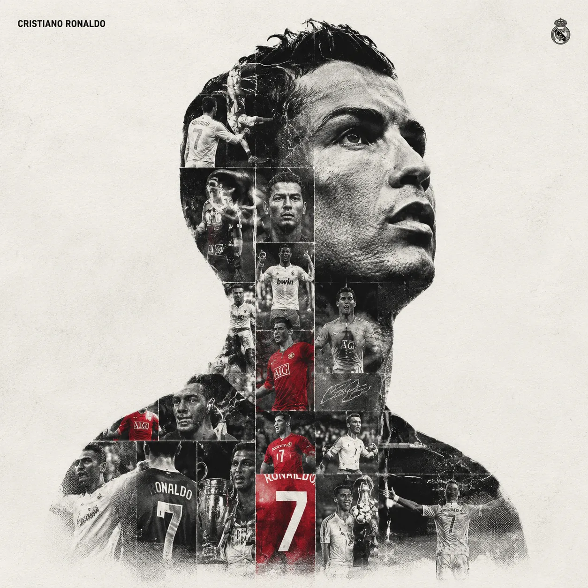

**#173 · Portrait, Poster · <code>Vinano Studio</code>**

> Keywords: portrait, poster, AI art, AI prompt, text to image

<details>
<summary>Show prompt</summary>

```
[PERSON NAME].
Act as a high-end sports graphic designer creating a conceptual tribute poster. The style is a complex "dual exposure photo-grid composite" mixed-media textures.
CENTRAL STRUCTURE (THE VESSEL):
The central focus is a large-scale, high-contrast black and white portrait silhouette of [PERSON NAME]. This main portrait acts as the container.
THE GRID FILL & TEXTURES (MIXED MEDIA):
The interior of the silhouette is populated by a dense "photo mosaic grid" of action shots from the person's career.
CRITICAL TEXTURE INSTRUCTION: Do not just paste flat photos. Apply artistic textures to various grid cells to create a tactile, collage feel. Use effects like:
Halftone Dots: Comic-book style raster patterns on some cells.
Fabric/Embroidery: Subtle thread or canvas textures suggesting a jersey or patch.
Film Grain: Heavy noise on specific high-contrast action shots.
COLOR STRATEGY:
The base is Monochrome B&W. Use selective color overlays (relevant to the team/flag) ONLY on specific grid cells to create a rhythm.
TYPOGRAPHY & BRANDING (STRICT MICRO-SCALING):
Top Left (The Name): Write "[PERSON NAME]" strictly the font Inter Semibold.
Kerning: Tight negative kerning (-4%).
Size: SMALL and discreet. It must occupy MAXIMUM 20% of the canvas width. Do NOT make it large or loud.
Top Right (The Symbol): Place the primary logo (Team/Brand/Flag).
Size: VERY SMALL. It must occupy MAXIMUM 10% of the canvas width.
COMPOSITION & BACKGROUND:
Background: Off-white or light grey a visible premium-quality paper or concrete texture. It should not be flat digital white.
Alignment: Center the figure perfectly. Maintain wide negative space around the object.

Preserve realistic proportions and depth for a confident, professional finish.
```

</details>

---

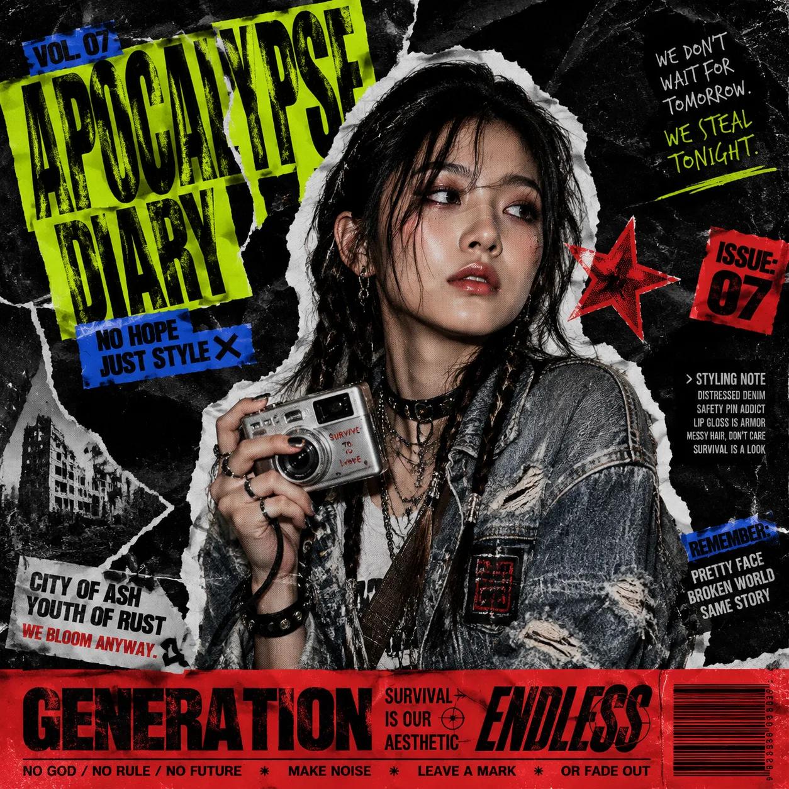

**#174 · Portrait, Poster · <code>Vinano Studio</code>**

> Keywords: portrait, poster, character, minimalist, AI art, AI prompt

<details>
<summary>Show prompt</summary>

```
Create a 9:16 K-pop apocalypse ransom zine poster featuring [SUBJECT] [SUBJECT_ACTION], styled in [WARDROBE_STYLE], [PRODUCT_OR_PROP]. Use a dark crumpled black paper background [BACKGROUND_ELEMENTS]. Place the subject as a large central portrait cutout a thick irregular torn white paper border. Add oversized warped display typography reading "[MAIN_TEXT]" as a tilted collage layer, plus smaller sticker blocks and side editorial captions reading "[SECONDARY_TEXT]". Use acid lime, electric blue, alert red, paper white, and ink black. Add [ACCENT_SYMBOL] near the portrait. Finish a saturated bottom masthead strip, rough photocopy grain, halftone speckles, scan noise, uneven paper shadows, and DIY magazine collage energy. Do not include watermarks, usernames, creator IDs, QR codes, platform logos, app marks, copied publication logos, or exact source text.

--- VARIABLES ---

[ACCENT_SYMBOL] — red star, diagonal sticker block, torn label, arrow tab, barcode stripe, or paper shard
[BACKGROUND_ELEMENTS] — crumpled black paper, distressed denim texture, torn white paper edges, photocopy grain, halftone noise, tape marks, and rough scanned shadows
[MAIN_TEXT] — oversized warped headline or sticker headline
[PRODUCT_OR_PROP] — compact camera, wired earbuds, lip gloss, denim jacket, cassette, charm bag, safety pin accessory, or styling prop
[SECONDARY_TEXT] — short editorial caption, mock issue line, styling note, lyric-like fragment, or repeated microcopy
[SUBJECT] — main subject, performer, model, musician, dancer, stylist, or youth-culture character
[SUBJECT_ACTION] — looking off-frame, posing attitude, holding a prop, leaning into the camera, or standing in a cutout portrait pose
[WARDROBE_STYLE] — post-apocalyptic K-pop styling, distressed denim, glossy makeup, messy hair, bright accessory accents, layered streetwear

--- NEGATIVE PROMPT ---

refined minimalist design, clean corporate layout, smooth gradients, luxury editorial polish, pastel lifestyle palette, glossy 3D typography, elegant serif masthead, empty whitespace, platform watermark, username, QR code, creator ID, app logo, copied publication logo, exact source text, exact source name

Keep edges clean and the overall composition balanced for a polished, gallery-ready result.
```

</details>

---

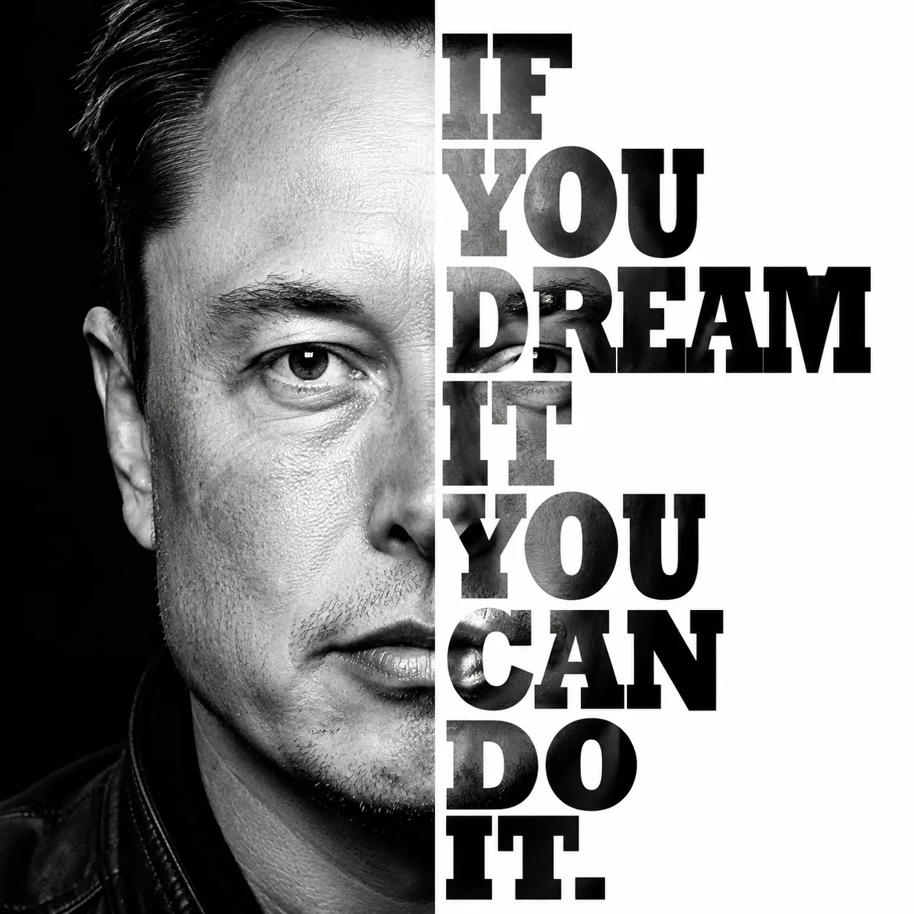

**#175 · Realistic, Portrait · <code>Vinano Studio</code>**

> Keywords: realistic, portrait, poster, character, AI art, AI prompt

<details>
<summary>Show prompt</summary>

```
{
 "meta": {
 "image_quality": "High",
 "image_type": "Digital Composite / Graphic Design",
 "resolution_estimation": "High resolution vertical poster format",
 "file_characteristics": {
 "compression_artifacts": "Low",
 "noise_level": "Low (film grain visible in photo texture)",
 "lens_type_estimation": "Telephoto (suggested by facial compression)"
 }
 },
 "global_context": {
 "scene_description": "A high-contrast, black and white split-composition portrait of Elon Musk. The left half of the image displays a realistic, high-detail photograph of the right side of his face (viewer's left). The right half of the image consists of a white background where the left side of his face (viewer's right) is revealed only through the shapes of large, bold, vertically stacked serif typography reading 'IF YOU DREAM IT YOU CAN DO IT.'",
 "environment_type": "Studio/Graphic Art",
 "time_of_day": "Indiscernible",
 "weather_atmosphere": "Visionary, Motivational, Intense",
 "lighting": {
 "source": "Artificial Studio Lighting",
 "direction": "Side lighting (lighting the face from the left)",
 "quality": "Hard, dramatic chiaroscuro",
 "color_temperature": "Monochrome (Black and White)"
 },
 "color_palette": {
 "dominant_hex_estimates": ["#FFFFFF",
 "#000000",
 "#333333",
 "#888888"],
 "accent_colors": [],
 "contrast_level": "High"
 }
 },
 "composition": {
 "camera_angle": "Eye-level",
 "framing": "Close-up portrait",
 "depth_of_field": "Deep (all elements in focus)",
 "focal_point": "Subject's eyes and the typographic message",
 "symmetry_type": "Vertical Split Asymmetry",
 "rule_of_thirds_alignment": "The split occurs roughly along the vertical center line of the face (nose bridge)"
 },
 "objects": [{
 "id": "obj_subject_face",
 "label": "Elon Musk (Face)",
 "category": "Person",
 "location": {
 "relative_position": "Left half of canvas",
 "bounding_box_percentage": {
 "x": 0.0,
 "y": 0.0,
 "width": 0.5,
 "height": 1.0
 }
 },
 "dimensions_relative": "Large (fills height)",
 "distance_from_camera": "Close-up",
 "pose_orientation": "Front-facing, slight tilt, intense contemplative gaze",
 "material": "Skin/Biological",
 "surface_properties": {
 "texture": "Smooth skin, faint stubble, characteristic facial structure",
 "reflectivity": "Low (natural skin oil sheen on nose/cheek)",
 "micro_details": "Faint crow's feet, straight/wavy hair texture visible at top",
 "wear_state": "N/A"
 },
 "color_details": {
 "base_color_hex": "#808080",
 "secondary_colors": ["#000000",
 "#FFFFFF"],
 "gradient_or_pattern": "Grayscale continuous tone"
 },
 "interaction_with_light": {
 "shadow_casting": "Deep shadows on the right side of the face (hidden by text mask)",
 "highlight_zones": "Forehead, bridge of nose, under-eye area on the lit side",
 "translucency": "None"
 },
 "relationships": [{
 "type": "visually_connected_to",
 "target_object_id": "obj_typography_mask"
 }]
 },
 {
 "id": "obj_typography_mask",
 "label": "Typographic Overlay",
 "category": "Text/Graphic Element",
 "location": {
 "relative_position": "Right half of canvas",
 "bounding_box_percentage": {
 "x": 0.5,
 "y": 0.0,
 "width": 0.5,
 "height": 1.0
 }
 },
 "dimensions_relative": "Large",
 "distance_from_camera": "Surface Plane",
 "pose_orientation": "Vertical Stack",
 "material": "Digital Mask",
 "surface_properties": {
 "texture": "The fill of the letters matches the texture of Elon Musk's hair and skin (masked photo)",
 "reflectivity": "None",
 "micro_details": "Edges are sharp serif cuts",
 "wear_state": "N/A"
 },
 "color_details": {
 "base_color_hex": "#000000",
 "secondary_colors": ["#FFFFFF"],
 "gradient_or_pattern": "Image texture inside letters, white background outside"
 },
 "interaction_with_light": {
 "shadow_casting": "None",
 "highlight_zones": "None",
 "translucency": "None"
 },
 "text_content": {
 "raw_text": "IF\nYOU\nDREAM\nIT\nYOU\nCAN\nDO\nIT.",
 "font_style": "Heavy Slab Serif (e.g., Rockwell Bold or similar)",
 "font_weight": "Bold / Black",
 "text_case": "Uppercase",
 "alignment": "Justified / Stacked",
 "color_hex": "Texture-filled (Black/Gray)"
 },
 "relationships": [{
 "type": "completes_image_of",
 "target_object_id": "obj_subject_face"
 }]
 },
 {
 "id": "obj_clothing",
 "label": "Jacket Collar / Suit",
 "category": "Clothing",
 "location": {
 "relative_position": "Bottom Left Corner",
 "bounding_box_percentage": {
 "x": 0.0,
 "y": 0.85,
 "width": 0.4,
 "height": 0.15
 }
 },
 "dimensions_relative": "Small visible portion",
 "distance_from_camera": "Near",
 "pose_orientation": "Worn on shoulders",
 "material": "Dark Fabric/Leather",
 "surface_properties": {
 "texture": "Smooth subtle folding",
 "reflectivity": "Medium",
 "micro_details": "Folds and creases",
 "wear_state": "Good condition"
 },
 "color_details": {
 "base_color_hex": "#1A1A1A",
 "secondary_colors": [],
 "gradient_or_pattern": "Solid dark"
 },
 "interaction_with_light": {
 "shadow_casting": "Self-shadowing in folds",
 "highlight_zones": "Ridges of folds",
 "translucency": "None"
 },
 "relationships": [{
 "type": "worn_by",
 "target_object_id": "obj_subject_face"
 }]
 },
 {
 "id": "obj_ear",
 "label": "Left Ear",
 "category": "Body Part",
 "location": {
 "relative_position": "Center Left Edge",
 "bounding_box_percentage": {
 "x": 0.05,
 "y": 0.35,
 "width": 0.15,
 "height": 0.2
 }
 },
 "dimensions_relative": "Medium",
 "distance_from_camera": "Mid",
 "pose_orientation": "Side view",
 "material": "Skin",
 "surface_properties": {
 "texture": "Smooth skin",
 "reflectivity": "Low",
 "micro_details": "Cartilage structure visible",
 "wear_state": "N/A"
 },
 "color_details": {
 "base_color_hex": "#888888",
 "secondary_colors": [],
 "gradient_or_pattern": "N/A"
 },
 "interaction_with_light": {
 "shadow_casting": "Inner ear shadows",
 "highlight_zones": "Outer rim (helix)",
 "translucency": "Slight subsurface scattering potential"
 },
 "relationships": [{
 "type": "attached_to",
 "target_object_id": "obj_subject_face"
 }]
 }],
 "background_details": {
 "texture": "Flat color",
 "patterns": "None (Solid White)",
 "lighting_behavior": "The background is pure white (#FFFFFF), providing maximum contrast to the subject and text.",
 "additional_elements": ["Negative space on the right side acts as the canvas for the text masking effect."]
 },
 "foreground_elements": {
 "particles": "None",
 "artifacts": "None"
 },
 "reconstruction_notes": {
 "mandatory_elements_for_recreation": ["Elon Musk's likeness",
 "Split face composition",
 "Typography masking effect on the right side",
 "Specific quote: 'IF YOU DREAM IT YOU CAN DO IT.'",
 "Black and white high-contrast aesthetic",
 "Serif bold font"],
 "sensitivity_factors": "The alignment of the text must perfectly match the underlying facial anatomy to maintain the illusion of the face continuing through the letters. Hairline and jaw structure should be specific to Musk.",
 "ambiguities": "Clothing type is generic dark material."
 }
}

Preserve realistic proportions and depth for a confident, professional finish.
```

</details>

---

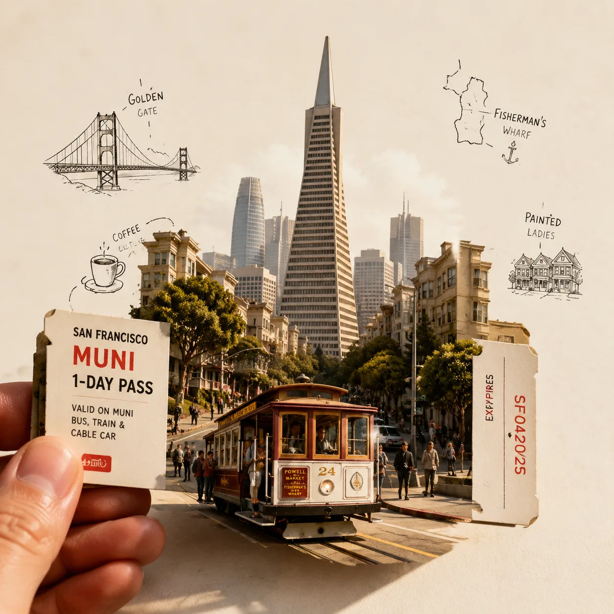

**#176 · Realistic, Poster · <code>Vinano Studio</code>**

> Keywords: realistic, poster, cinematic, AI art, AI prompt, text to image

<details>
<summary>Show prompt</summary>

```
Create a highly detailed, premium travel-art illustration featuring a hand holding a [CITY-SPECIFIC TICKET/PASS] in the foreground. The ticket acts as a portal to [CITY NAME], a realistic miniature city scene emerging from the ticket.

A signature transportation element ([CITY VEHICLE]) breaks out of the ticket frame in 3D perspective, extending toward the viewer. Behind the ticket, one iconic landmark ([HERO LANDMARK]) rises prominently and realistically, becoming the main architectural focal point.

Surrounding the scene are only 3–4 clean hand-drawn doodle elements representing the city's identity, such as district names, local symbols, or famous locations. Use minimal doodles, lots of negative space, and avoid clutter.

Include tiny realistic people interacting the scene, such as commuters, tourists, street vendors, cyclists, or photographers, scaled appropriately to create a miniature-world effect.

Style: true-to-life photorealistic travel photography combined elegant black-ink sketchbook doodles. crisp composition, premium editorial design, soft warm lighting, shallow depth of field, realistic textures, subtle shadows, Instagram-worthy travel artwork.

Composition hierarchy:

1. Emerging vehicle
2. Hero landmark
3. Ticket/pass
4. Minimal doodle elements

Avoid: crowded layouts, excessive text, too many landmarks, busy backgrounds, duplicated symbols, excessive arrows, stickers, or decorative icons.

Aspect ratio: 1:1 square.
Quality: ultra-detailed, cinematic, sharp focus, professional travel poster aesthetic.

Emphasise material texture and natural light so the final frame feels tactile and premium.
```

</details>

---

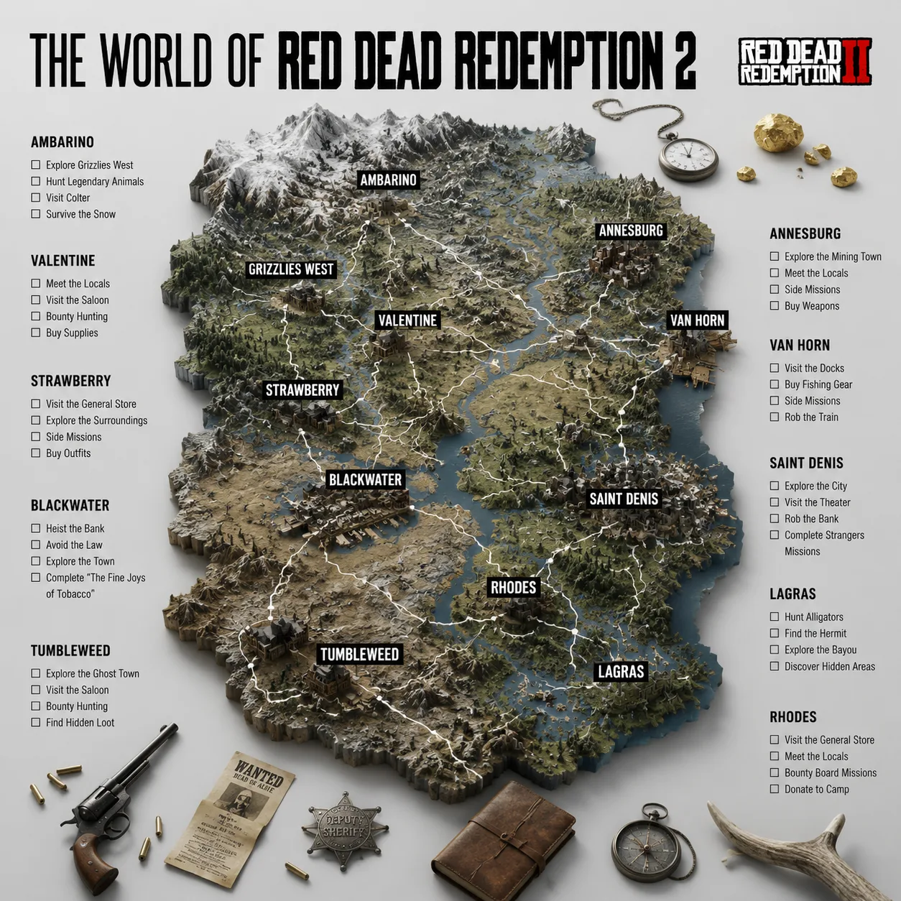

**#177 · Realistic, Landscape · <code>Vinano Studio</code>**

> Keywords: realistic, landscape, poster, fantasy, infographic, AI art

<details>
<summary>Show prompt</summary>

```
A hyper-realistic 3D game guide infographic poster for [GAME]. The in-game world of [GAME] is rendered as a raised, textured terrain map floating on a clean light gray surface — the map shape and landscape must reflect the actual geography and visual aesthetic of [GAME] (urban, western, fantasy, island etc). Iconic in-game locations from [GAME] are placed as miniature 3D sculpted models at their correct in-game positions across the map — each one highly detailed, true-to-life photorealistic and instantly recognizable to fans. Roads or paths connect key locations as white lines across the terrain. Around the map, floating 3D decorative props and items iconic to [GAME] are scattered on the light gray surface. The official logo of [GAME] is shown as a small detailed object in the upper right corner. Each major location has a bold black label on the map, and beside the map, each location has a neat checklist of its most iconic moments or activities associated that place, in clean sans-serif typography. A large bold title at the top reads: “THE WORLD OF GAME” in black uppercase typography [GAME] in heavy bold. The overall aesthetic is premium editorial — soft studio lighting, true-to-life photorealistic 3D render, white/light gray background, clean layout, 4:5 aspect ratio Preserve realistic proportions and depth for a confident, professional finish.
```

</details>

---

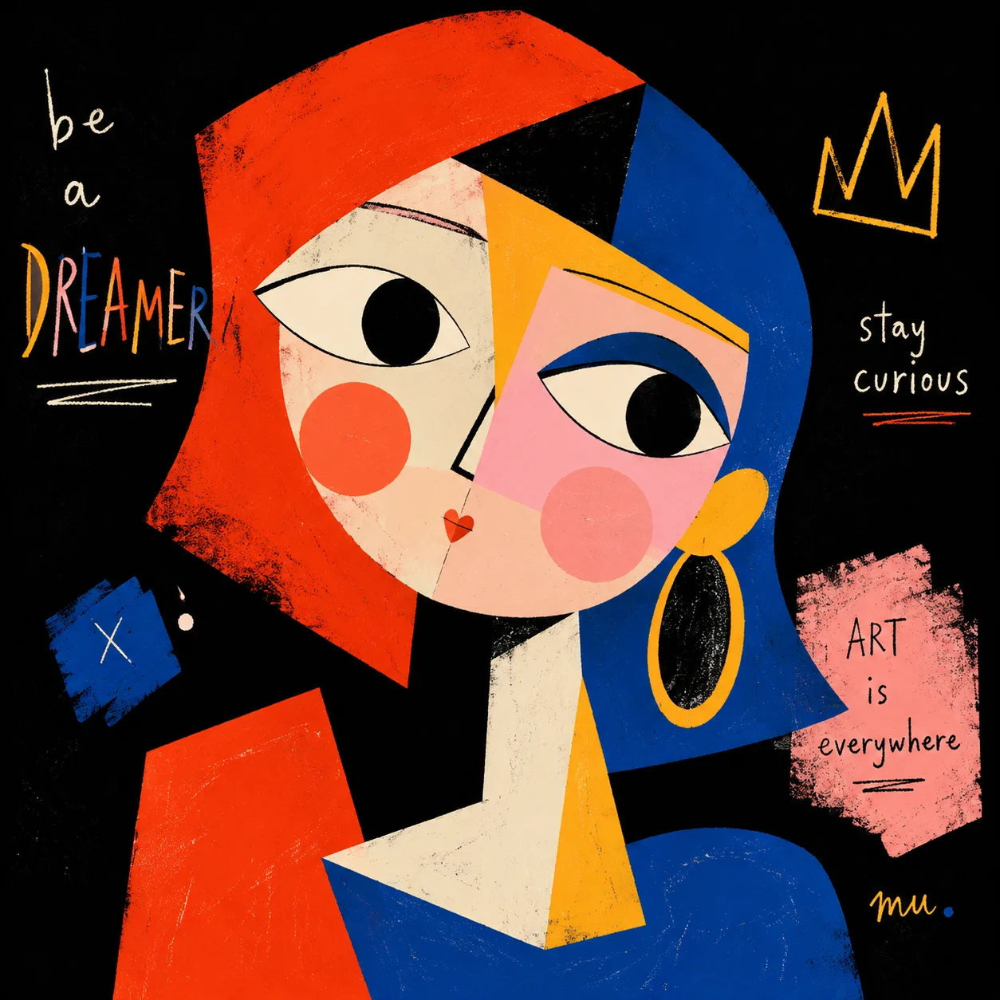

**#178 · Realistic, Portrait · <code>Vinano Studio</code>**

> Keywords: realistic, portrait, poster, AI art, AI prompt, text to image

<details>
<summary>Show prompt</summary>

```
Create a cute neo-expressionist cubist minimal vector portrait illustration, Picasso meets kawaii minimalism, inspired by stylized fashion editorials and playful modern art. Ultra-simplified exaggerated facial features oversized abstract eyes, flat cartoon eye shapes, minimal black dots or single curved strokes, no realistic iris details, no eyelashes, extremely reduced facial detail. Tiny abstract nose drawn one short angular line. Small single-stroke lips, tiny soft geometric mouth shape, minimal expression marks, no realistic mouth anatomy. Rounded cheeks, dreamy innocent expression, playful asymmetrical proportions, elongated elegant neck, simplified geometric facial planes, stylized angular hair shapes, subtle caricature aesthetics, childlike artistic distortion. Use clean scalable vector shapes, flat color blocking, bold primitive contour lines, sharp Bézier curves, abstract polygon composition, minimal linework, naive handmade drawing quality, expressive empty space, icon-like facial abstraction, no realistic rendering, 2D primitive facial symbols. Add subtle oil pastel grain overlays, rough handmade brush accents, raw scribbled handwritten marks, visible pigment texture, silkscreen poster feeling. Vibrant limited color palette against deep matte black background. Luxury editorial gallery poster composition, contemporary fashion illustration, artsy modern cubist poster, stylish and adorable, premium print-ready vector artwork. Maintain consistent colour harmony and crisp focus across the whole frame.
```

</details>

---

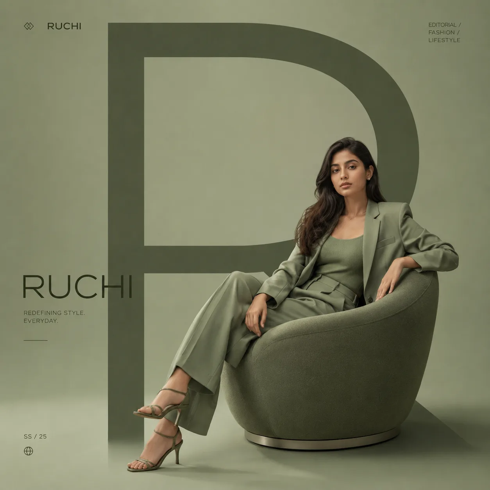

**#179 · Realistic, Poster · <code>Vinano Studio</code>**

> Keywords: realistic, poster, cinematic, minimalist, AI art, AI prompt

<details>
<summary>Show prompt</summary>

```
Create a premium modern editorial branding poster for [RUCHI].

TOPIC:
[EDITORIAL / FASHION / LIFESTYLE THEME]

STYLE & ART DIRECTION:

Contemporary refined minimalist editorial design

Monochromatic branding aesthetic

Clean luxury composition

Modern creative-agency visual identity

Soft studio photography style

Oversized abstract typography integration

Minimal geometric branding

High-end lifestyle campaign aesthetic

Scandinavian-inspired visual simplicity

Modern art-direction poster design

MAIN SUBJECT:

A stylish realistic young woman seated prominently in a designer chair

Fashion-forward outfit matching the monochromatic palette

Relaxed confident pose

Contemporary editorial styling

Premium realistic studio photography

Modern expressive fashion aesthetic

Strong personality and visual identity

Soft realistic shadows beneath the subject and furniture

Large designer furniture piece integrated as part of the composition

LAYOUT & COMPOSITION:

Same exact refined minimalist composition and visual structure as the reference design

Large oversized abstract letter "R" or typography shape dominating the background

Subject placed asymmetrically in the foreground

Spacious negative space

Minimal branding details in the corners

Strong visual balance between typography and subject

Editorial magazine-inspired hierarchy

Clean modern alignment

Minimal clutter and highly refined spacing

TEXT & TYPOGRAPHY:

Oversized geometric typography

Minimal branding text

Thin modern sans-serif fonts

Abstract letterform integration

Small editorial metadata text

Luxury contemporary typography hierarchy

DEPTH & LIGHTING:

Soft cinematic studio lighting

Gentle monochromatic shadows

Smooth gradient lighting

Premium editorial depth

Soft realistic reflections

Contemporary luxury atmosphere

EXTRA DESIGN DETAILS:

Minimal grain texture

Clean modern gradients

Abstract geometric branding

Soft monochromatic transitions

Designer furniture aesthetic

Minimal art-poster mood

COLOR PALETTE:

Green color

Tonal monochromatic variations

Soft neutral highlights

Clean editorial contrast

QUALITY:

Ultra realistic editorial photography

Premium branding poster

Behance-quality modern composition

Contemporary fashion campaign quality

Same exact visual identity and layout as the reference.Same Face as Reference Image.

8K Ultra high resolution.

Render with rich micro-detail while keeping the layout uncluttered and intentional.
```

</details>

---

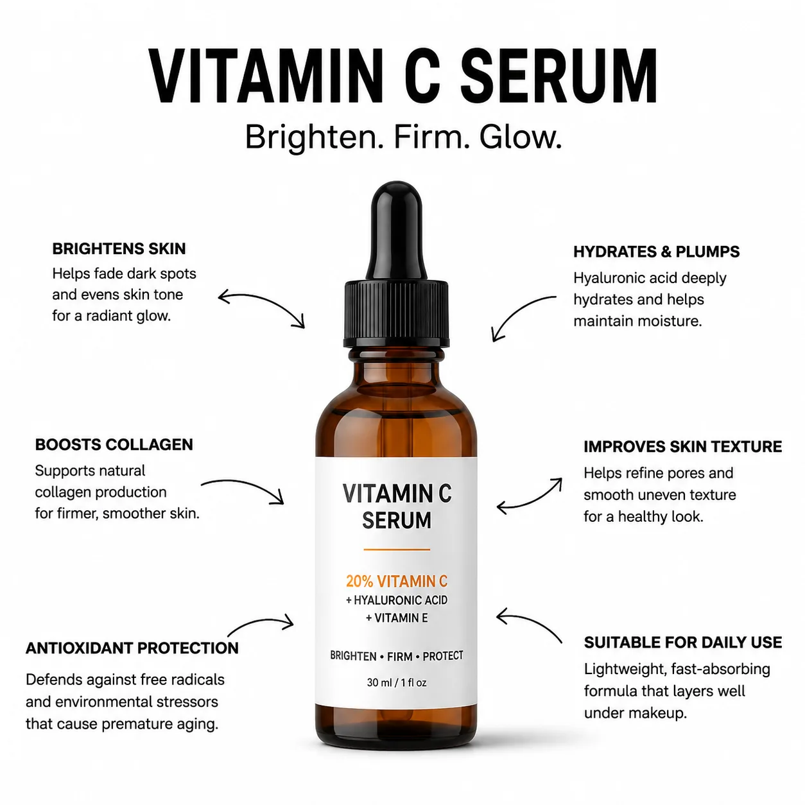

**#180 · Poster, Infographic · <code>Vinano Studio</code>**

> Keywords: poster, infographic, AI art, AI prompt, text to image

<details>
<summary>Show prompt</summary>

```
[product], clean skincare infographic poster, centered product packshot on pure white seamless background, soft diffused studio lighting, subtle shadow under the bottle, minimal modern layout, bold headline at top [headline], smaller subheading under it [size_or_tagline], 4 to 6 short callout texts around the product [callout_1] [callout_2] [callout_3] [callout_4] [callout_5] [callout_6], curved hand drawn style arrows pointing to the product, balanced spacing, high legibility black typography, simple sans serif font, editorial product education design, sharp focus, high resolution, 8k, 1:1, no watermark, no extra logos Preserve realistic proportions and depth for a confident, professional finish.
```

</details>

---

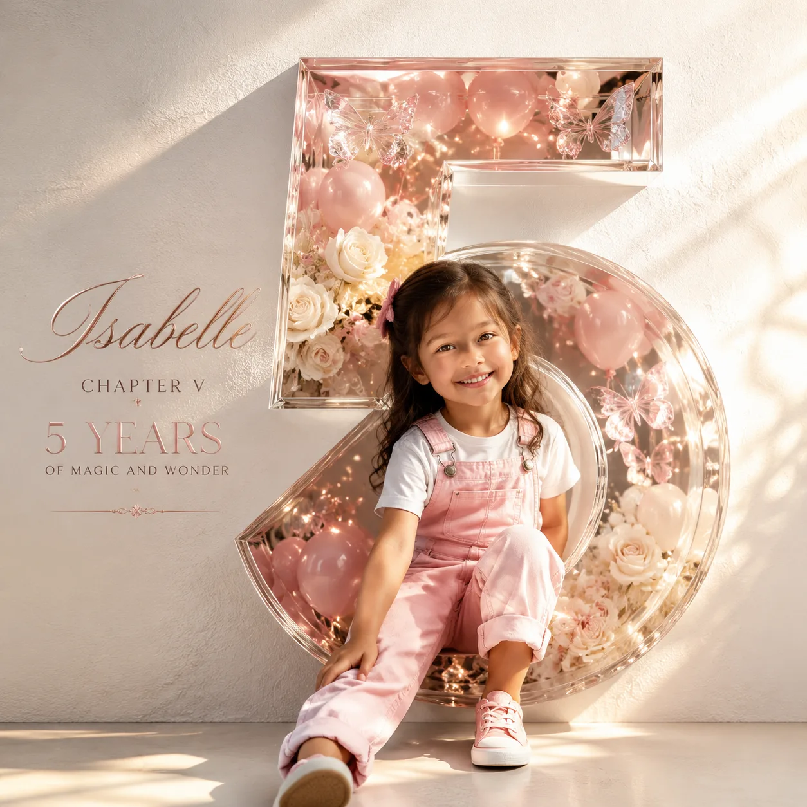

**#181 · Realistic, Portrait · <code>Vinano Studio</code>**

> Keywords: realistic, portrait, poster, cinematic, AI art, AI prompt

<details>
<summary>Show prompt</summary>

```
Professional luxury birthday poster, 3:4 portrait composition, ultra high-end studio photography aesthetic, premium off-white textured paper wall background subtle grain and depth.
A giant luxury crystal-glass number [Age] is precisely carved into the wall realistic thickness, beveled edges, transparent glass material, sparkling reflections, crystal highlights, light refractions, and deep inner shadows creating dramatic 3D depth.
Inside the number: elegant pastel pink balloons, premium white roses, luxury flower bouquets, soft floating sparkles, delicate crystal butterflies, dreamy magical atmosphere, clean minimal styling, high-end editorial design.
A happy [Age]-year-old child EXACT facial identity preserved from the uploaded reference image. Identical facial features, identical eyes, nose, lips, face shape, skin tone, hairstyle, expression style, and overall appearance. Face consistency is the highest priority.
Wearing a milky white T-shirt and premium pastel pink denim overalls realistic fabric texture and luxury styling.
The child's head, shoulders, one hand, and one foot extend outside the number frame, creating an ultra-realistic 3D pop-out effect accurate perspective, natural depth, realistic shadows, and seamless integration between foreground and background.
Warm cinematic golden sunlight entering from one side, soft rim lighting, realistic skin texture, studio-quality photography lighting, natural shadows, luxury portrait lighting, shallow depth of field.
Elegant typography integrated directly onto the wall:
[Name]
CHAPTER [Chapter Number]
[Age] YEARS OF MAGIC AND WONDER
Minimal luxury editorial layout, Vogue magazine cover style, premium birthday campaign photography, award-winning composition, soft contrast, natural pastel colors, crystal reflections, ultra-sharp focus, true-to-life photorealistic rendering, masterpiece quality, luxury realism.
Negative Prompt: different face, altered facial features, face swap, wrong child, duplicate body parts, extra fingers, extra limbs, deformed hands, distorted face, crossed eyes, blurry face, low quality, AI artifacts, text errors, watermark, logo, bad anatomy, oversaturated colors, cropped head, unrealistic skin, poor lighting.
8K ultra-detailed, hyper-realistic, premium luxury birthday poster.

Render with rich micro-detail while keeping the layout uncluttered and intentional.
```

</details>

---

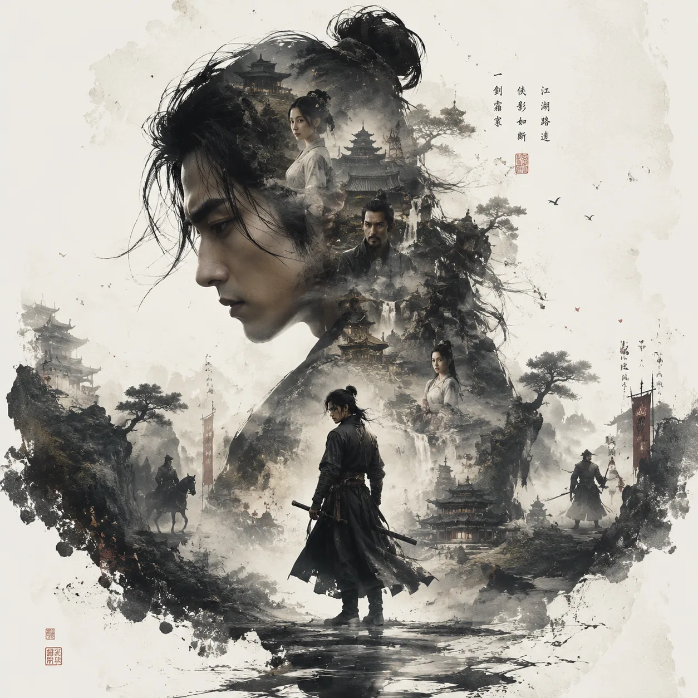

**#182 · Poster, Character · <code>Vinano Studio</code>**

> Keywords: poster, character, AI art, AI prompt, text to image

<details>
<summary>Show prompt</summary>

```
[Main Roles]
the most recognizable head, face outline, mask or outer outline of the figure is the large visual subject, forming a highly recognizable silhouette main shape; the middle and lower part is arranged the complete figure as the second subject, showing a stable standing or slight movement posture, forming the visual core of the picture.Double exposure and collage narrative compositions inside and around the large outline, combining multiple scenes, images, small character relationships, auxiliary elements and environmental layers in clouds, ink, and whitening. The left and right side is equipped an echoing side of the scene, which creates story tension and space changes. Link the main character, internal collage, and large outline above a flow of clues across the screen to enhance integrity and vision guidance.The overall picture retains a large area of whiteness, and the edge is stained ink and virtual broken, creating a real relationship and breath in the Oriental aesthetics. Overall style uniform, advanced and restrained, emphasizing layers, narrative, main visual impact and serialized poster language. Size: 9:16.

Render with rich micro-detail while keeping the layout uncluttered and intentional.
```

</details>

---

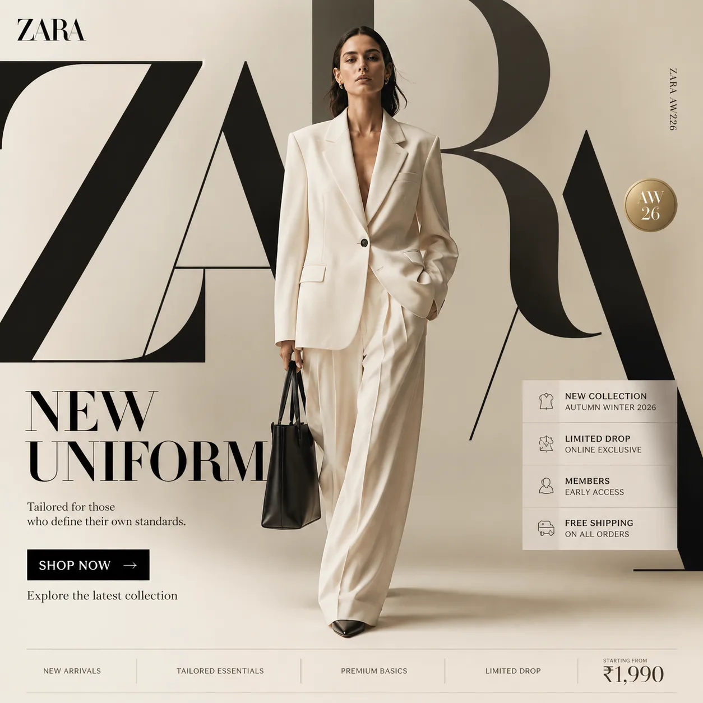

**#183 · Realistic, Poster · <code>Vinano Studio</code>**

> Keywords: realistic, poster, AI art, AI prompt, text to image

<details>
<summary>Show prompt</summary>

```
"NEW UNIFORM"

FORMAT

Ultra-Premium Fashion SMM Promotional Poster
Vertical 4:5
Instagram Hero Creative
Luxury Fast Fashion Advertising
Commercial Fashion Graphic Design
Agency-Level Art Direction
Behance Front Page Quality
8K UHD
Hyper-Realistic
Fashion × Graphic Design Fusion
Zero AI Slop
Zero Generic Fashion Campaigns
Zero Editorial-Only Aesthetic

CORE STRATEGY

This is not a fashion campaign.

This is a fashion statement disguised as a promotional poster.

The design should feel like Zara's homepage,
a luxury magazine cover,
and a premium billboard campaign
merged into one visual.

The graphic design is equally important as the fashion.

Typography is not decoration.

Typography is architecture.

CAMPAIGN IDEA

"NEW UNIFORM"

Not office uniform.

Not school uniform.

The uniform of modern taste.

The clothes aren't being sold.

The identity is.

MASTER VISUAL

Massive oversized ZARA typography dominates the entire composition.

The word:

ZARA

occupies nearly 75% of the canvas.

Typography is integrated into the design.

Letters extend beyond frame edges.

Some letters cropped.

Some hidden behind the model.

Some functioning as compositional structures.

The typography should feel monumental.

HERO SUBJECT

Female model.

Editorial face.

Strong jawline.

Minimal makeup.

Luxury fashion energy.

No smiling.

No dramatic posing.

Pure confidence.

Wardrobe:

Oversized ivory blazer.

Wide-leg tailored trousers.

Premium monochromatic styling.

Black leather accessories.

Luxury minimalism.

POSE

Model stepping through the giant typography.

One foot slightly forward.

Direct eye contact.

Hands relaxed.

Body partially intersecting typography.

The feeling:

She owns the space.

COMPOSITION

Typography occupies 70%.

Model occupies 20%.

Promotional elements occupy 10%.

Visual hierarchy:

ZARA
↓
Model
↓
Promotion
↓
CTA

Everything feels intentional.

COLOR SYSTEM

Primary:
Ivory

Cream

Off White

Soft Beige

Black

Accent:
Muted Gold

No bright colors.

No fashion-week color chaos.

Luxury restraint.

BACKGROUND

Clean luxury backdrop.

Large soft gradient.

Editorial studio environment.

Subtle texture.

No architecture.

No scenery.

No distractions.

The design itself creates the environment.

GRAPHIC DESIGN SYSTEM

Floating collection cards.

Luxury editorial labels.

Minimal grid system.

Thin lines.

Micro typography.

Magazine-inspired information hierarchy.

Fashion-week poster energy.

PROMOTIONAL ELEMENTS

NEW COLLECTION

AUTUMN WINTER 2026

LIMITED DROP

ONLINE EXCLUSIVE

MEMBERS EARLY ACCESS

FREE SHIPPING

Integrated naturally into layout.

Not banner spam.

TYPOGRAPHY HIERARCHY

Top Left

ZARA

small luxury wordmark

Center Massive Typography

Z
A
R
A

occupying most of composition

luxury serif typography

extremely large scale

partially cropped

Campaign Title

NEW
UNIFORM

bold elegant typography

Supporting Copy

Tailored for those who define their own standards.

PROMOTIONAL CTA BLOCK

SHOP NOW →

Explore the latest collection

BOTTOM FEATURE STRIP

NEW ARRIVALS

TAILORED ESSENTIALS

PREMIUM BASICS

LIMITED DROP

Bottom Right

Starting From ₹1,990

Bottom Center

Vertical Edge Text

ZARA AW26

LIGHTING

Luxury studio lighting.

Large soft source.

Editorial contrast.

Natural skin rendering.

Premium fabric highlights.

Subtle shadows.

Luxury magazine quality.

CAMERA

ARRI Alexa Mini LF

85mm Lens

Editorial fashion photography

Shallow depth of field

Extremely sharp fabric rendering

Ultra-premium commercial quality

POST-PRODUCTION

Luxury European fashion campaign grading.

Rich blacks.

Cream highlights.

Visible textile texture.

Natural skin detail.

No excessive retouching.

No artificial HDR.

No fake luxury effects.

FINAL FEEL

If Zara,
Vogue,
and a premium graphic design studio

created a promotional social media poster together.

Not a fashion photograph.

Not a catalogue.

A modern luxury fashion advertisement

Shot on ARRI Alexa Mini LF, 35mm lens, dynamic commercial perspective, street-fashion energy, magazine-cover quality detail, natural movement capture, authentic contemporary fashion realism, premium advertising production standards.

Modern fashion campaign color grading, strong reds, clean whites, visible fabric textures, realistic skin detail, subtle grain, commercial social-media polish, no artificial luxury grading, no fashion-house minimalism, no generic fast-fashion campaign aesthetics, no AI slop, no sterile studio appearance.

A fusion of Spotify Wrapped energy, Nike youth-culture storytelling, Pinterest trend aesthetics and world-class graphic design agency execution. Bold, energetic, expressive, commercial, social-first and highly shareable. A true promotional SMM poster communicating that every personality, every mood and every version of yourself can exist within one H&M collection. Behance Front Page quality, award-winning youth-fashion advertising, graphic-design-first commercial masterpiece.

Aim for an editorial, design-driven look with deliberate negative space.
```

</details>

---

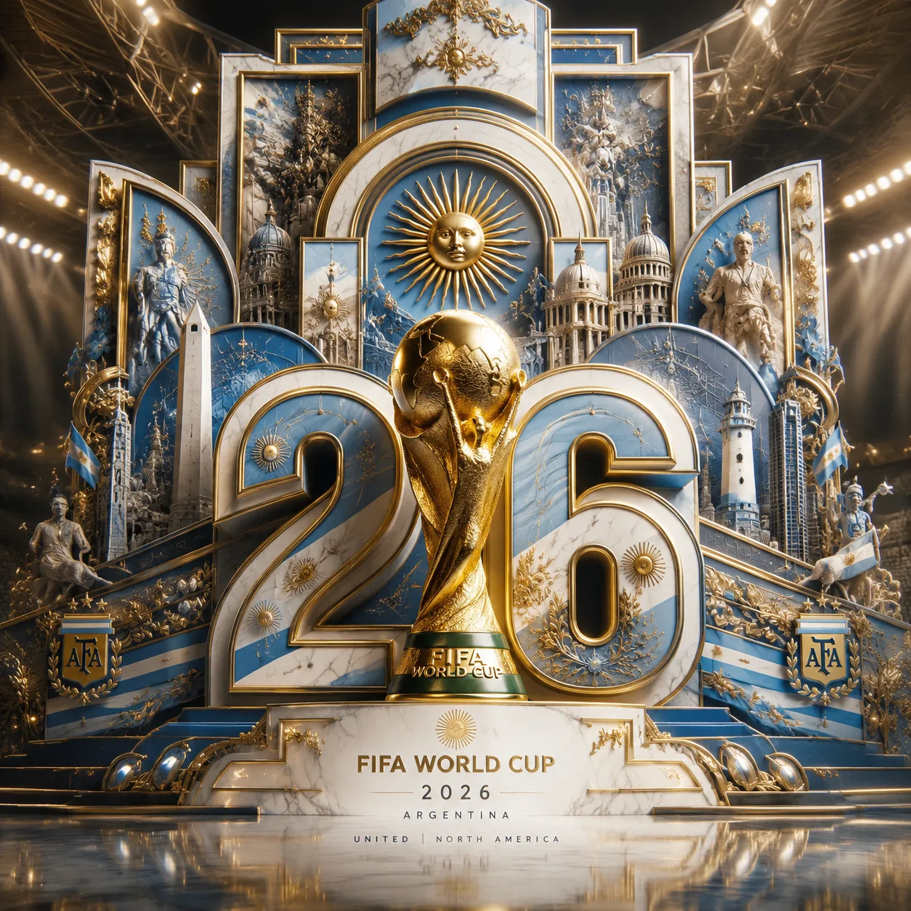

**#184 · Anime, Realistic · <code>Vinano Studio</code>**

> Keywords: anime, realistic, poster, cinematic, AI art, AI prompt

<details>
<summary>Show prompt</summary>

```
Ultra-luxury FIFA World Cup 2026 poster, monumental layered Art Deco architecture made from interlocking curved panels and geometric frames, centered FIFA World Cup trophy mounted on a large sculpted “26”, premium blue-and-white marble and gold metallic finish, intricate gilded filigree, embossed national symbols, cultural landmarks, historic monuments, cathedral domes, statues, city skylines, ornamental engravings, celestial sun motifs, decorative patterns, museum-quality craftsmanship, highly detailed relief sculpture, layered depth composition, elegant architectural storytelling, championship atmosphere inside a grand illuminated stadium, dramatic filmic, cinematic lighting, reflective gold accents, ultra-realistic materials, depth of field, volumetric light rays, luxury editorial design, hyper-detailed 3D render, octane render, ray tracing, masterpiece, 8K, sharp focus, symmetrical composition, premium sports branding, collectible poster aesthetic, intricate textures, true-to-life photorealistic metallic surfaces, award-winning design.

Color Variations:
•Argentina Edition: sky blue, white marble, gold trim, Argentine cultural landmarks, sun emblem, AFA-inspired details.
•Portugal Edition: deep emerald green, royal red, white marble, gold trim, Portuguese tiles (azulejos), maritime exploration elements, historic towers, national crest-inspired details.

Negative Prompt:

blurry, low quality, low detail, flat design, cartoon, anime, distorted trophy, extra objects, watermark, text errors, cropped composition, noisy textures, dull lighting, oversaturated colors, unrealistic proportions, duplicate elements, messy layout, low-poly render.

Aim for an editorial, design-driven look with deliberate negative space.
```

</details>

---

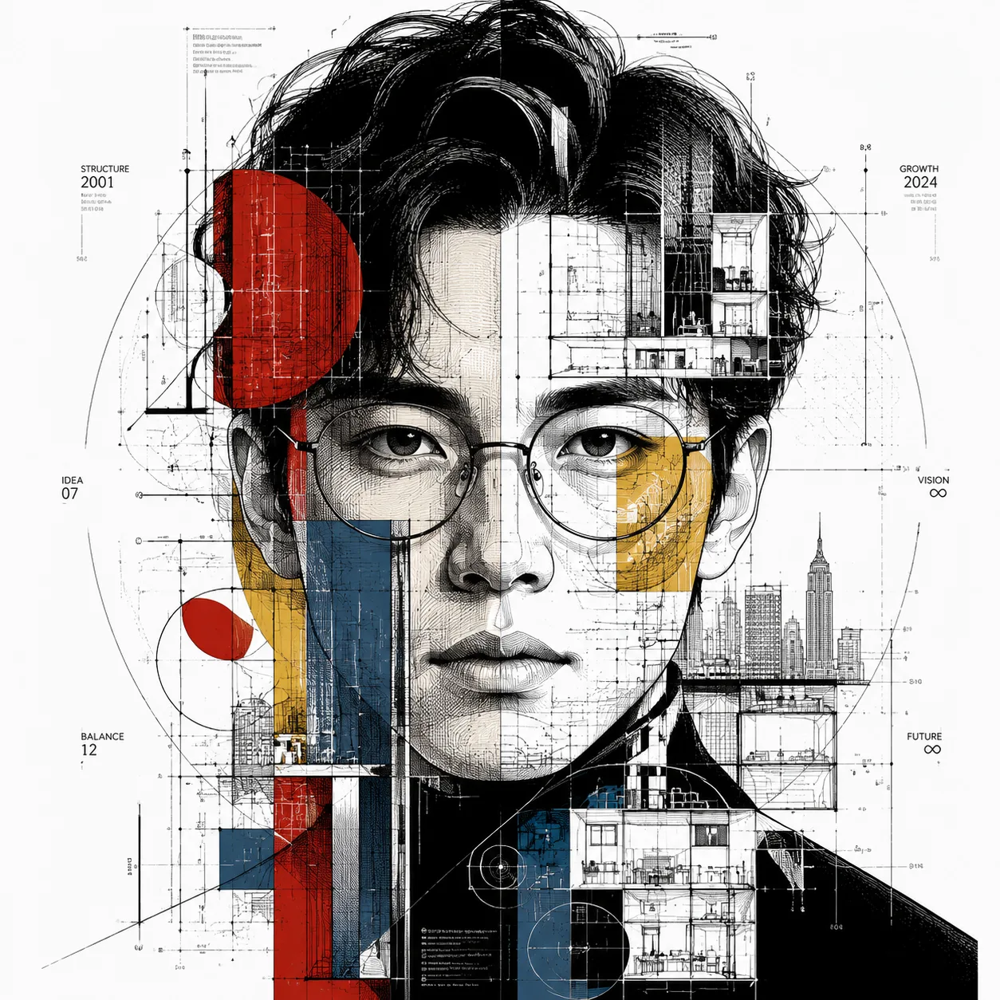

**#185 · Realistic, Portrait · <code>Vinano Studio</code>**

> Keywords: realistic, portrait, poster, minimalist, AI art, AI prompt

<details>
<summary>Show prompt</summary>

```
{
 "prompt": "Ultra-detailed stylized portrait my face as reference. Intellectual, modernist illustration style inspired by architectural blueprints and editorial line art. Face split into layered geometric sections visible technical diagrams, city interiors, structural grids, and abstract architectural elements embedded within the facial planes. Fine ink linework, cross-hatching, and engraving-style shading. Clean white background dense black line drawings.\n\nBold accent colors only in selected regions: deep red, muted blue, and warm yellow, applied as flat graphic blocks and translucent overlays. Sharp, thoughtful eyes realistic highlights, wearing thin round glasses. refined minimalist yet complex composition, high contrast, crisp edges, poster-grade clarity.\n\nEditorial illustration aesthetic, conceptual portrait, futuristic intellect vibe, data visualization meets human identity. Extremely sharp, ultra-high resolution, professional magazine cover quality, no blur, no distortion, balanced symmetry.",
 "negative_prompt": "photorealism, soft blur, painterly strokes, oil painting, low detail, messy colors, cartoonish style, exaggerated proportions",
 "style": ["modernist illustration",
 "architectural blueprint",
 "editorial line art",
 "engraving",
 "conceptual portrait",
 "futuristic intellect"],
 "color_palette": {
 "accent_colors": ["deep red",
 "muted blue",
 "warm yellow"],
 "base_colors": ["black",
 "white"]
 },
 "composition": {
 "background": "clean white",
 "symmetry": "balanced",
 "contrast": "high",
 "detail_level": "ultra-detailed",
 "resolution": "ultra-high"
 },
 "quality": ["poster-grade clarity",
 "professional magazine cover",
 "extremely sharp",
 "no blur",
 "no distortion"]
}

Emphasise material texture and natural light so the final frame feels tactile and premium.
```

</details>

---

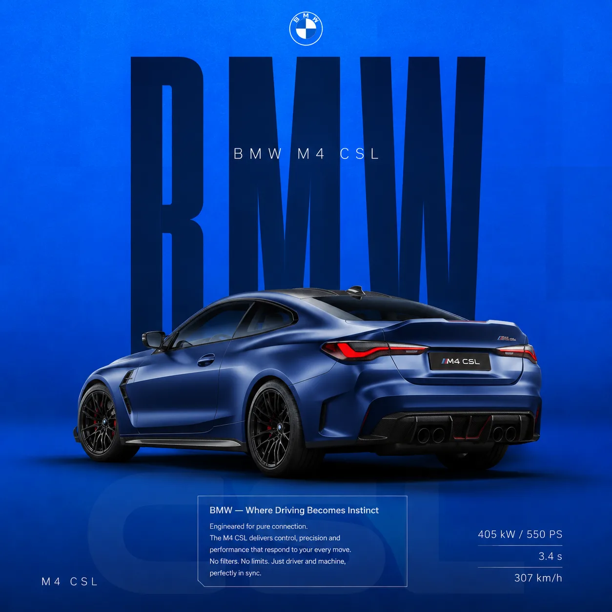

**#186 · Poster, Ai Art · <code>Vinano Studio</code>**

> Keywords: poster, AI art, AI prompt, text to image

<details>
<summary>Show prompt</summary>

```
4:5 vertical social poster, ultra high resolution, 8K

SCENE / BACKGROUND:
Flat racing yellow subtle gradient (light → deep amber)
Grain texture 2–3%
Soft rectangular overlays at 3% opacity

PRODUCT:
Porsche 911 GT3 RS
Gloss yellow carbon details
Rear 3/4 angle, slightly elevated
Wing dominant

Position:
Right of center

TYPOGRAPHY:
“PORSCHE”
Ultra tall, condensed, stretched
Deep charcoal

Secondary:
“PORSCHE 911 GT3 RS”

EDITORIAL:
“Porsche — Where Precision Meets Passion”

Focus:
engineering, obsession, track DNA

FADED TEXT:
“GT3 RS” at 3–5%

SPECS:
386 kW / 525 PS
3.2 s
296 km/h

LIGHTING:
Clean studio, sharp highlights

MOOD:
Precision.
Iconic.
Timeless performance.

FORMAT:
4:5 vertical social poster, ultra high resolution, 8K, print-quality sharpness

SCENE / BACKGROUND:
Flat, high-saturation BMW blue background

Gradient:
Top → slightly lighter electric blue
Bottom → deep navy blue

Surface:
- Subtle grain texture (2–3%)
- Faint rectangular overlays (2–4% opacity)
- Clean, graphic — no realism

Shadow:
Soft contact shadow under car

PRODUCT (CAR):
BMW M4 CSL

Color:
Matte frozen blue / deep metallic navy

Angle:
Rear 3/4 perspective (IMPORTANT — match Porsche angle for consistency)
Slightly elevated camera

Position:
Slightly right of center

Details:
- Carbon roof visible
- Aggressive diffuser
- Sharp reflections
- Subtle brake detail

COMPOSITION:
IDENTICAL to Porsche:
Top → branding
Middle → giant type
Center → car overlap
Bottom → editorial + specs

TYPOGRAPHY:

PRIMARY:
“BMW”

Style:
Ultra condensed bold sans serif
Tall vertical scaling (same as Porsche)

Color:
Deep navy / near black

Behavior:
Static (NO distortion — unlike previous version)
Acts as structural backdrop

SECONDARY HEADER:
“BMW M4 CSL”
Thin, wide tracking

LOGO AREA:
BMW roundel centered above

EDITORIAL BLOCK:

Headline:
“BMW — Where Driving Becomes Instinct”

Body:
Focus on:
- driver connection
- control
- performance precision

Boxed layout, same structure as Porsche

FADED TEXT:
“CSL” large, 3–5% opacity behind box

BOTTOM LEFT:
“M4 CSL”

BOTTOM RIGHT SPECS:

405 kW / 550 PS
3.4 s
307 km/h

LIGHTING:
Clean studio lighting
Sharp but controlled highlights

COLOR GRADING:
Deep blues, high contrast, clean blacks

CAMERA:
50mm, slightly elevated rear 3/4

MOOD:
Performance.
Precision.
Driver focus.

Preserve realistic proportions and depth for a confident, professional finish.
```

</details>

---

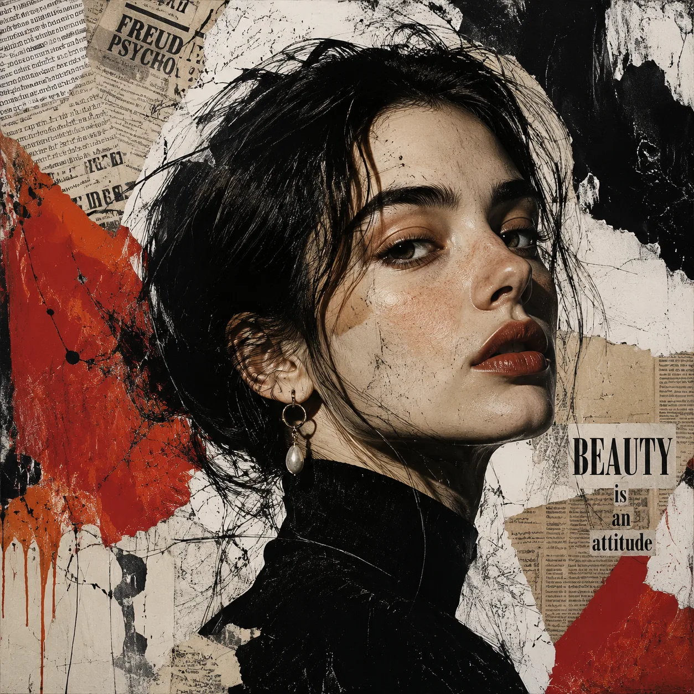

**#187 · Realistic, Portrait · <code>Vinano Studio</code>**

> Keywords: realistic, portrait, poster, AI art, AI prompt, text to image

<details>
<summary>Show prompt</summary>

```
Mixed-media portrait of [SUBJECT], [EXPRESSION], [GAZE DIRECTION], [ACCESSORY/STYLING], realistic identity, black sketch strokes, torn newspaper collage, acrylic paint splashes, editorial print texture, blending realism and abstract expressionism, premium poster aesthetic, tactile handmade feel, high contrast, ultra-detailed face and eyes, [PRIMARY COLORS] and [SECONDARY COLORS] Aim for an editorial, design-driven look with deliberate negative space.
```

</details>

---

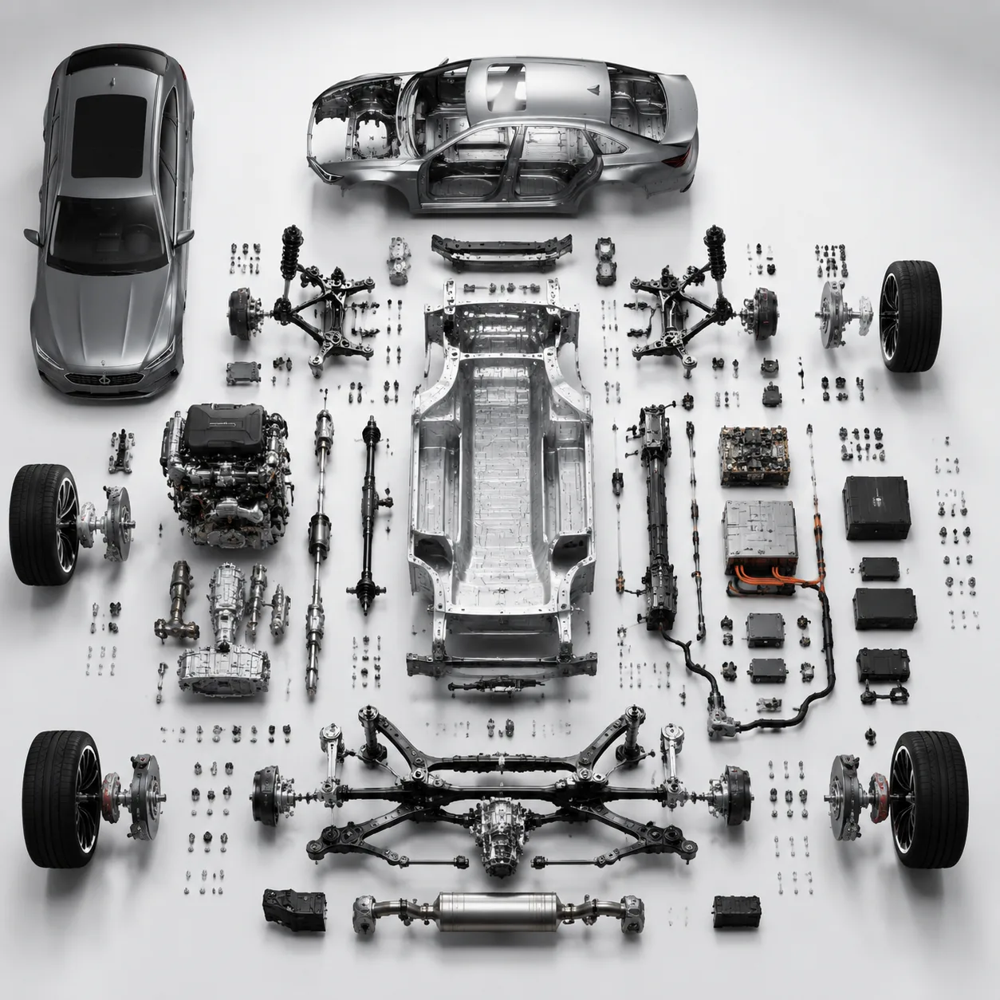

**#188 · Realistic, Poster · <code>Vinano Studio</code>**

> Keywords: realistic, poster, AI art, AI prompt, text to image

<details>
<summary>Show prompt</summary>

```
Create an ultra-high fidelity exploded technical diagram of a 2026 Audi A6, presented as a premium engineering poster. Audi A6 (2026)Maintain a true orthographic top/front hybrid view zero perspective distortion.CORE COMPOSITION RULE
Place the primary chassis or structural platform perfectly centered as the core spine. Position the main body shell separately (left or top), aligned parallel as a reference form while preserving accurate proportions, stance, and real-world geometry of the 2026 Audi A6.EXPLODED ENGINEERING SYSTEM (MULTI-LAYER DEPTH STRUCTURE)
Design a multi-layered exploded system components separated across depth (Z-axis) and planar spacing:Micro hardware (bolts, screws, washers): tightly grouped in precision clusters
Functional assemblies: moderately spaced clear mechanical relationships
Major systems: widely separated for structural clarity and engineering hierarchy
SUBSYSTEM BREAKDOWN (MODERN AUDI ARCHITECTURE)
Organize parts into realistic automotive engineering subsystems:Front Assemblyadaptive suspension system (Audi drive select calibrated damping)
precision steering rack electronic assist
advanced braking system (ventilated discs + regenerative integration if hybrid)
sensor suite (front radar, LiDAR-ready modules, camera array)
Rear Assemblyrear multi-link suspension system
drivetrain assembly (quattro AWD torque distribution unit)
rear differential system (or integrated e-axle for hybrid/EV variant)
stability and traction control modules
Chassis / Structurelightweight MLB Evo / next-gen Audi modular platform architecture
reinforced aluminum and high-strength steel hybrid frame
vibration isolation subframes
crash-optimized energy absorption zones
Powertrainturbocharged inline-4 / V6 hybrid-compatible engine architecture
transmission system (dual-clutch S tronic representation)
intake, exhaust, and thermal management routing
optional mild-hybrid or plug-in hybrid battery integration
partial internal exposure showing combustion or electric assist layering
Electronics SystemECU and domain control architecture (centralized compute unit)
wiring harness ultra-clean routed geometry
driver assistance systems (ADAS module cluster)
infotainment + digital cockpit processing unit
sensor fusion computing core
Wheel System4 wheels symmetrically placed
rim, tire, brake disc, hub assembly separated in exploded layers
precise axle alignment and rotational geometry
Audi signature aerodynamic rim design
ENGINEERING REALISM RULE
Maintain strict mechanical connectivity between all systems
Align shafts, axles, and torque paths accurately
Preserve left/right symmetry controlled functional asymmetry only
Group micro-components in structured clusters near their assemblies
Avoid decorative or random placement — everything must reflect real automotive engineering logic
VISUAL STYLE & MATERIAL LANGUAGE
Use modern Audi design precision:brushed aluminum + matte graphite structural materials
carbon-reinforced polymer accents
high-precision machined metal surfaces
glass sensor domes optical realism
subtle soft-touch interior material hints (minimal visibility)
LIGHTING & RENDERING
clean studio-grade white-to-light grey gradient lighting environment
soft top illumination controlled shadow falloff
subtle reflections on metallic and glass surfaces
ambient occlusion emphasizing mechanical separation
ultra-realistic ray-traced rendering
BACKGROUND & COMPOSITION
minimal premium engineering backdrop
museum-grade product isolation aesthetic
balanced negative space structured density zones
strong horizontal symmetry controlled exploded depth layering
OUTPUT SPECIFICATION
ultra-detailed 2K or 4K resolution
4:5 vertical aspect ratio
razor-sharp macro engineering detail across all components
STRICT RESTRICTIONS
no text
no labels
no arrows
no branding overlays
no stylized illustration effects
no perspective distortion
no artistic abstraction
STYLE KEYWORDS
automotive engineering exploded diagram
Audi design precision language
luxury technical breakdown poster
industrial mechanical visualization
Apple-style product engineering layout
museum-grade automotive presentation
high-density precision system design

Aim for an editorial, design-driven look with deliberate negative space.
```

</details>

---

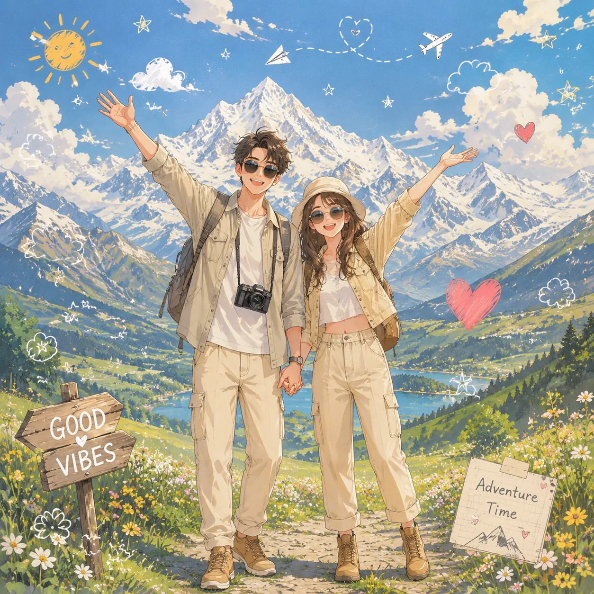

**#189 · Anime, Landscape · <code>Vinano Studio</code>**

> Keywords: anime, landscape, poster, character, AI art, AI prompt

<details>
<summary>Show prompt</summary>

```
Transform the uploaded travel photo into a charming hand-drawn anime illustration while perfectly preserving the original pose, composition, clothing, hand-holding gesture, mountain landscape, and camera angle. Cute couple standing together arms raised, joyful expressions, soft smiles, bright adventure mood.

Background: majestic snow-capped mountains, lush green valley, wildflowers, blue sky, fluffy white clouds. Add whimsical doodle elements including hand-drawn sun, stars, hearts, clouds, airplane trail, sparkles, and playful travel-themed sketches. Wooden signboard handwritten text “GOOD VIBES”, handwritten note “Adventure Time”.

Style: Studio Ghibli-inspired travel postcard, pastel colors, clean line art, soft painterly shading, vibrant yet cozy atmosphere, storybook illustration, kawaii aesthetic, dreamy vacation vibe, high detail, ultra cute characters, warm sunlight, cheerful summer day.

Composition: full-body characters centered in frame, scenic landscape stretching behind them, balanced poster design, social-media-ready artwork, travel diary illustration, whimsical doodles integrated naturally around the scene.

Quality: masterpiece, highly detailed, professional illustration, crisp outlines, soft textures, vibrant colors, 4K, anime travel artwork, magical atmosphere, adorable expressions, perfect character consistency.

Preserve realistic proportions and depth for a confident, professional finish.
```

</details>

---

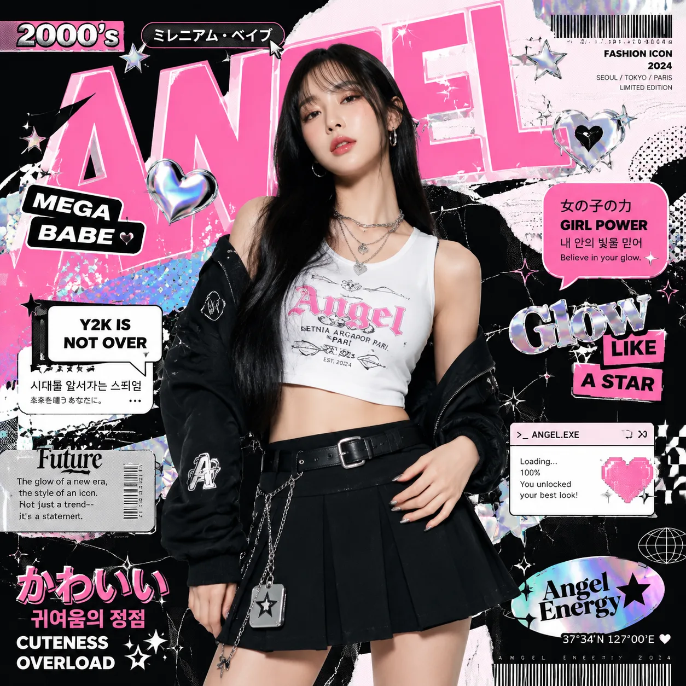

**#190 · Poster, Cinematic · <code>Vinano Studio</code>**

> Keywords: poster, cinematic, AI art, AI prompt, text to image

<details>
<summary>Show prompt</summary>

```
Ultra-stylized high-fashion editorial poster of a confident young Asian female model standing in the center frame, elegant pose, glossy radiant skin, soft dewy makeup, long silky black hair wispy bangs, wearing modern trendy K-fashion streetwear premium styling details. Clean studio lighting high-contrast fashion flash photography, sharp focus, ultra-detailed textures, cinematic composition. Background filled vibrant retro pop-art magazine aesthetics, layered graphic typography, dynamic UI-inspired design elements, holographic chrome effects, stickers (stars, hearts, sparkles), barcode strips, speech bubbles, and futuristic collage layering. Japanese and Korean-inspired typographic accents integrated as visual design elements. Overall mood combines nostalgic 2000s teen fashion magazine energy modern luxury editorial campaign style. Bold color harmony, premium print aesthetic, ultra crisp details, fashion advertising quality, 8K resolution, highly polished commercial poster look, surreal yet stylish, trend-forward global fashion branding vibe. Aim for an editorial, design-driven look with deliberate negative space.
```

</details>

---

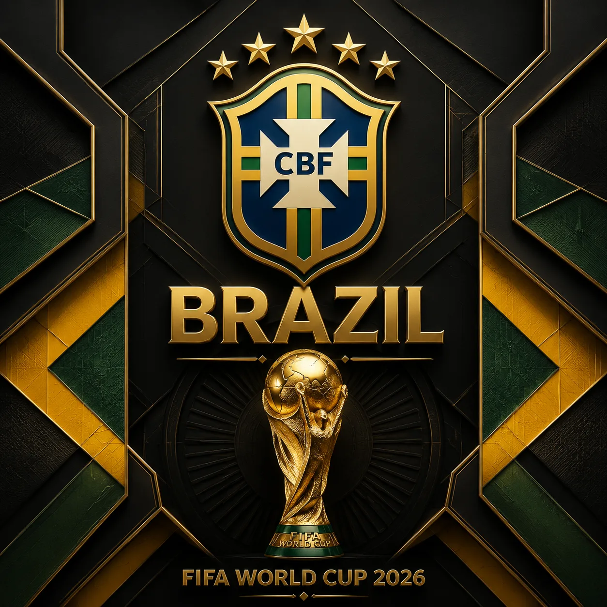

**#191 · Realistic, Poster · <code>Vinano Studio</code>**

> Keywords: realistic, poster, cinematic, AI art, AI prompt, text to image

<details>
<summary>Show prompt</summary>

```
Ultra-premium FIFA World Cup 2026 poster in a luxury 3D layered geometric design style. Vertical smartphone wallpaper format (9:16). Deep matte black background elegant gold metallic outlines and beveled abstract geometric panels arranged symmetrically around the composition. The central focus is the official-style national football federation crest of [Country Name], rendered as a high-end embossed 3D emblem realistic metallic gold detailing and national colors. Above the crest, display [Number Of World Cup Titles] gold championship stars. Below the crest, place large premium gold typography displaying [Country Name]. Under the country name, position a highly detailed realistic golden FIFA World Cup trophy cinematic reflections and museum-quality lighting. At the bottom, elegant gold text reading “FIFA WORLD CUP 2026”. Use the national color palette of [Country Name] throughout the geometric elements while maintaining the luxury black-and-gold theme. Ultra-crisp composition, premium sports branding aesthetic, luxury poster design, metallic textures, soft shadows, depth, symmetry, embossed details, cinematic studio lighting, true-to-life photorealistic 3D rendering, high contrast, award-winning graphic design, ultra-sharp focus, 8K, masterpiece, premium collectible poster, modern minimal luxury style Emphasise material texture and natural light so the final frame feels tactile and premium.
```

</details>

---

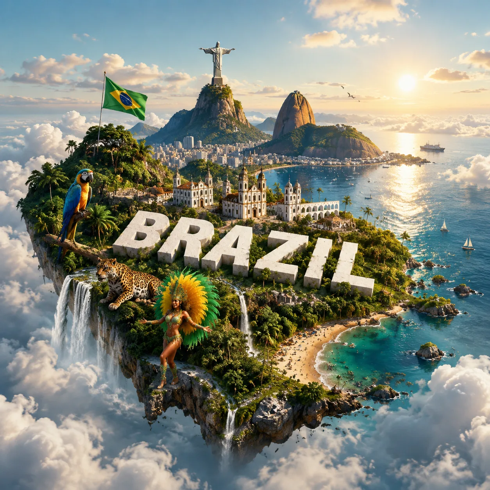

**#192 · Realistic, Landscape · <code>Vinano Studio</code>**

> Keywords: realistic, landscape, poster, cinematic, AI art, AI prompt

<details>
<summary>Show prompt</summary>

```
Create an ultra-HD, hyper-realistic digital poster of a floating miniature island shaped like [Country], resting on white clouds in the sky. Blend iconic landmarks, natural landscapes (like [landmark 1], [landscape 2], or [landscape 3]), and cultural elements unique to [Country]. Carve "[Country]" into the terrain large white 3D letters. Add artistic details like [wildlife], filmic, cinematic lighting, vivid colors, aerial perspective, and sun reflections to enhance realism Aim for an editorial, design-driven look with deliberate negative space.
```

</details>

---

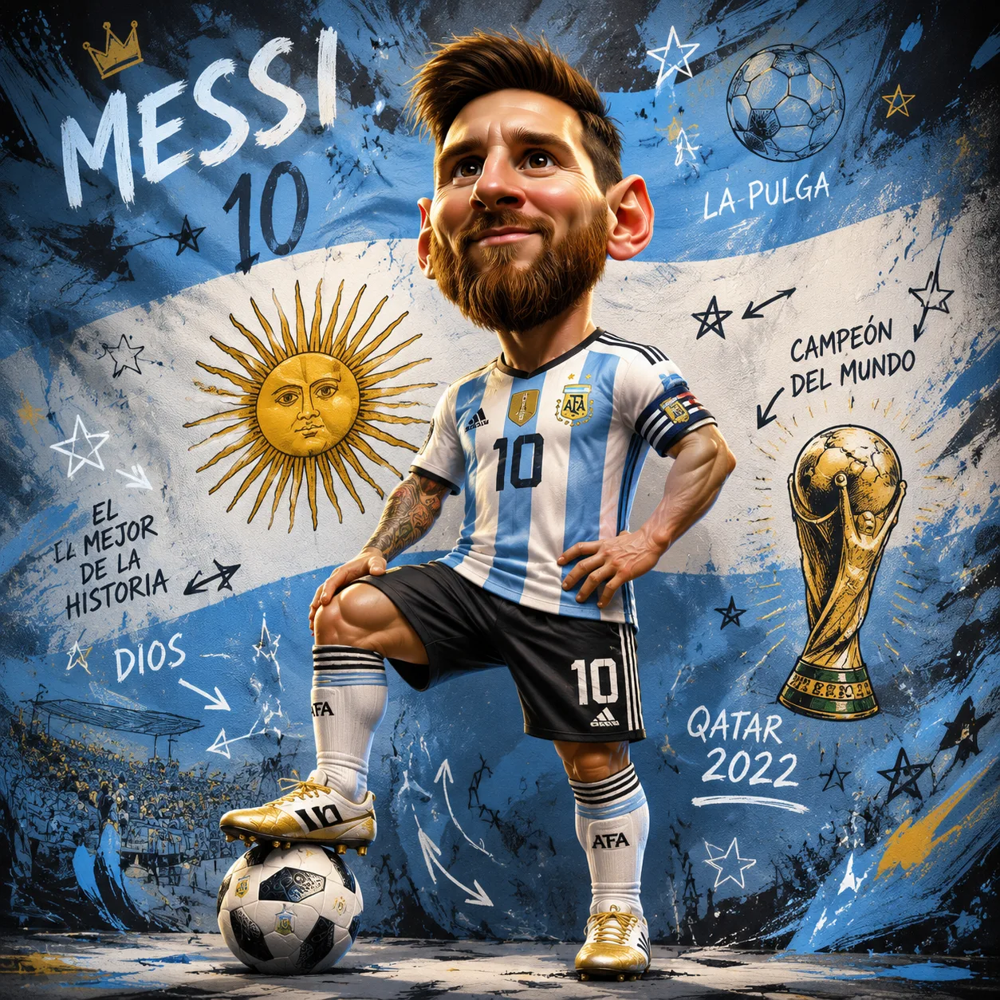

**#193 · Poster, Ai Art · <code>Vinano Studio</code>**

> Keywords: poster, AI art, AI prompt, text to image

<details>
<summary>Show prompt</summary>

```
Full body caricature of a famous male football player oversized head, exaggerated facial features, big expressive eyes, prominent nose, well-groomed beard, confident smirk, wearing Argentina national team jersey light blue and white vertical stripes, number 10 on chest and black shorts number 10, one foot resting on a football, other hand on hip, muscular arms tattoos visible, wearing white and gold football boots number 10, dynamic low angle shot, 3D Pixar style render, vibrant digital painting, background Argentina flag colors light blue and white, Sun of May symbol, hand-drawn doodles, stars, arrows, football sketches, World Cup trophy illustration, textured paint effect, dramatic lighting, ultra-detailed, 8K resolution, playful energetic mood, sports poster aesthetic Preserve realistic proportions and depth for a confident, professional finish.
```

</details>

---

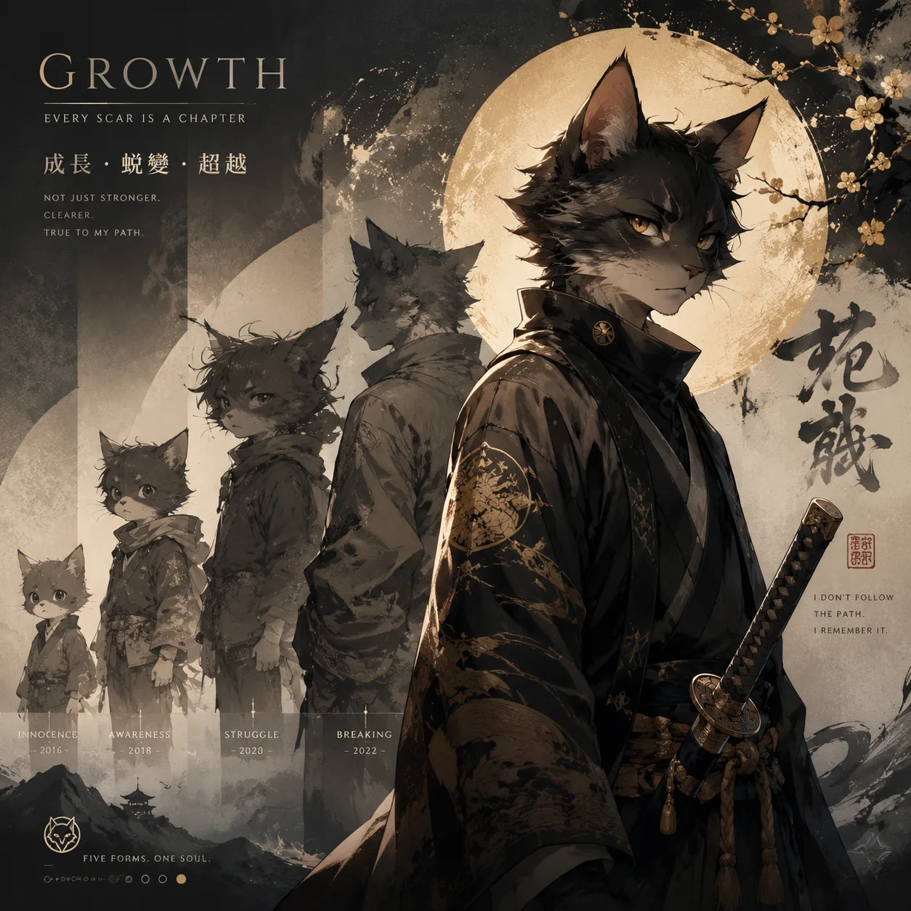

**#194 · Poster, Character · <code>Vinano Studio</code>**

> Keywords: poster, character, cinematic, AI art, AI prompt, text to image

<details>
<summary>Show prompt</summary>

```
character: [chracter]

Design a narrative growth poster in which the current character stands prominently in the foreground, while earlier versions appear only as residual forms, cut-out silhouettes, or symbolic echoes. Instead of a simple character lineup, the poster should show evolution through changing shape language, recurring objects, progressive damage or refinement, and shifting color accents. The image should feel like time layered into a single composition, elegant, emotionally resonant, and quietly cinematic.

Maintain consistent colour harmony and crisp focus across the whole frame.
```

</details>

---

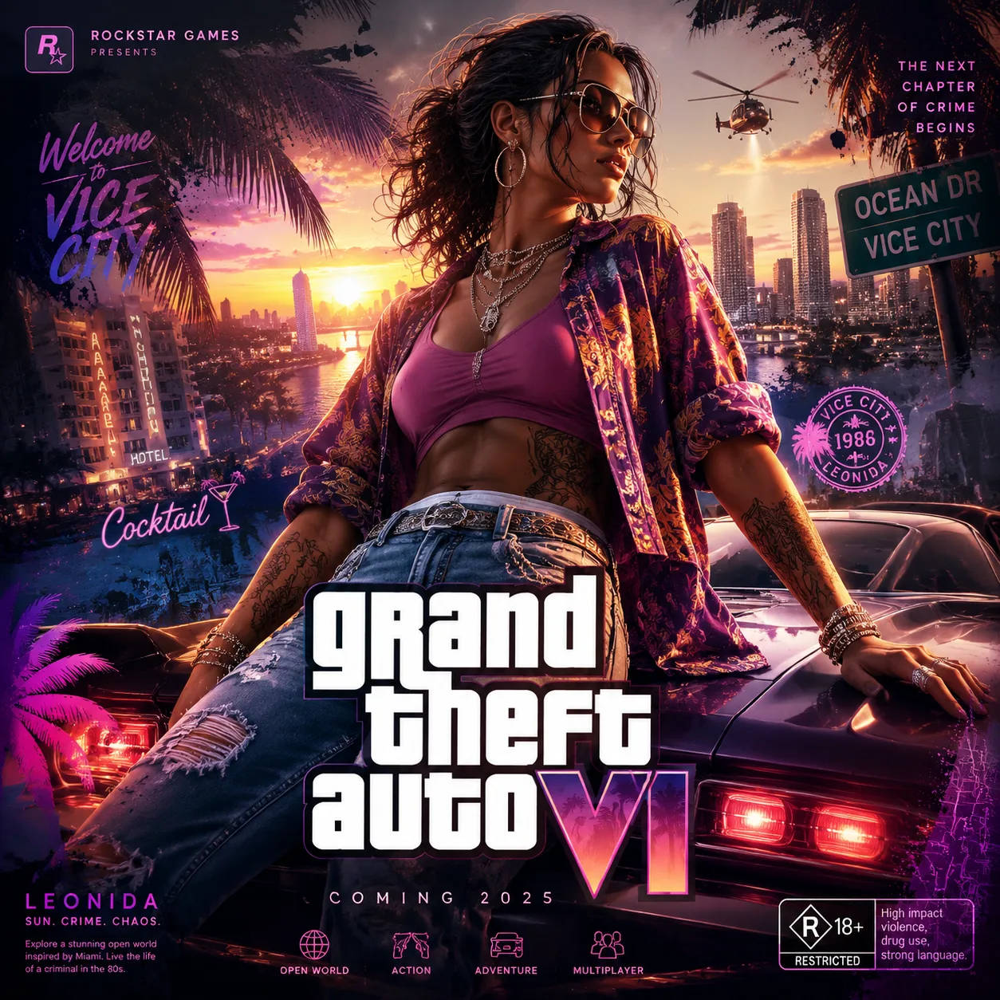

**#195 · Realistic, Portrait · <code>Vinano Studio</code>**

> Keywords: realistic, portrait, poster, cinematic, AI art, AI prompt

<details>
<summary>Show prompt</summary>

```
Create a highly detailed 8K portrait poster inspired by the iconic visual style of the modern Grand Theft Auto VI promotional artwork aesthetic, featuring a cinematic urban atmosphere bold composition, vibrant lighting, layered graphic elements, and stylish contemporary street-luxury fashion energy. The overall design must strongly capture the signature mood of GTA VI posters, including dynamic neon color grading, tropical-modern city vibes, dramatic shadows, glossy highlights, stylized textures, decorative ornaments, graphic overlays, urban symbols, luxury lifestyle accents, and immersive environmental storytelling. Add premium poster decorations such as abstract shapes, graffiti-inspired accents, subtle retro-modern textures, luxury vehicle silhouettes, nightlife elements, palm tree shadows, street sign details, glowing reflections, and layered visual effects that enrich the composition without making it feel overcrowded.
Include a large cinematic title text “Grand Theft Auto VI” prominently on the poster typography inspired by official AAA video game promotional posters, the full version of “GTA” clearly written as “Grand Theft Auto.” The typography should feel bold, luxurious, modern, and integrated naturally into the poster design, supported by additional smaller decorative texts, symbols, labels, and graphic UI-style elements to strengthen the authentic game-poster atmosphere.
The subject must not replicate the exact pose from the reference photo. Create a completely fresh and more visually engaging pose stronger body language, natural movement, and expressive emotion. The expression should feel alive, charismatic, confident, and cinematic rather than stiff, awkward, or flat. The pose must resemble the elegance and attitude of an international fashion model, combining stylish confidence relaxed realism. Avoid static standing poses. Instead, use dynamic posture, subtle movement, fashionable gestures, asymmetrical body positioning, realistic interaction the environment, and strong eye expression to create a premium editorial look.
The outfit should feature trendy modern casual fashion a luxurious streetwear influence. The clothing must feel fashionable, youthful, and visually rich, avoiding plain or monotonous styling. Combine varied colors, layered clothing pieces, modern fabric textures, unique motifs, stylish accessories, and contemporary fashion details that complement the GTA VI-inspired atmosphere. The styling should feel premium, photogenic, and believable, similar to high-end editorial fashion mixed modern open-world video game aesthetics.
Use filmic, cinematic lighting realistic skin texture, detailed fabric rendering, atmospheric reflections, depth-rich environment composition, balanced contrast, and ultra-sharp visual clarity. The poster should feel like an official next-generation AAA game promotional artwork highly polished rendering quality, immersive visual storytelling, and professional graphic design execution. Ultra-detailed, highly aesthetic, cinematic composition, realistic proportions, premium poster layout, vibrant modern color palette, visually powerful, and rendered in ultra high-definition 8K quality. Ratio 4:5

Keep edges clean and the overall composition balanced for a polished, gallery-ready result.
```

</details>

---

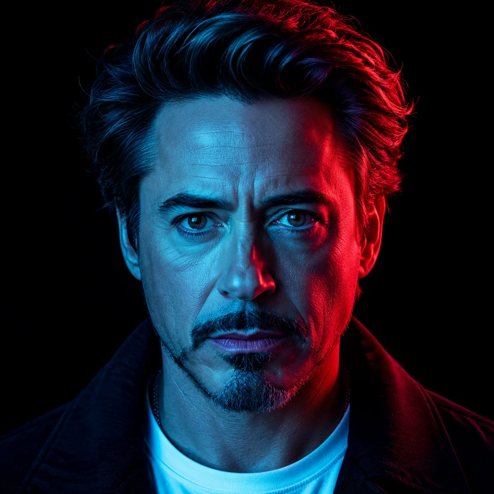

**#196 · Realistic, Portrait · <code>Vinano Studio</code>**

> Keywords: realistic, portrait, poster, cinematic, cyberpunk, AI art

<details>
<summary>Show prompt</summary>

```
{
"image_type": "studio portrait",
"composition": {
"framing": "tight head-and-shoulders close-up",
"camera_angle": "eye-level",
"orientation": "vertical",
"symmetry": "near-perfect central symmetry",
"focus": "sharp focus on eyes and facial features",
"depth_of_field": "shallow, background fully blurred to black"
},
"subject": {
"description": "middle-aged male-presenting subject",
"pose": "frontal, facing camera directly",
"expression": "calm, confident, intense gaze",
"eye_direction": "looking straight into lens",
"facial_features": {
"facial_hair": "short salt-and-pepper stubble and trimmed goatee",
"skin_texture": "visible pores and fine lines, realistic skin detail",
"eyes": "light-colored eyes emphasized by catchlights"
},
"hair": {
"style": "medium-length, brushed back",
"texture": "natural, slightly tousled",
"color": "dark brown subtle gray highlights"
}
},
"wardrobe": {
"top": "white crew-neck t-shirt",
"outerwear": "dark jacket or coat soft texture",
"accessories": "thin chain necklace partially visible"
},
"lighting": {
"style": "cinematic, high-contrast neon lighting",
"key_light": {
"position": "front-left",
"color": "cool cyan/blue",
"effect": "dominant illumination across face and torso"
},
"rim_light": {
"position": "rear-right",
"color": "saturated red/magenta",
"effect": "strong edge highlight on hair and face contour"
},
"fill_light": "minimal to none",
"contrast_level": "high",
"mood": "dramatic, futuristic, intense"
},
"color_palette": {
"dominant_colors": ["cyan blue", "deep red", "black"],
"color_temperature": "mixed cool and warm neon tones",
"saturation": "high saturation on lighting, neutral clothing tones",
"color_grading": "stylized cyberpunk-inspired grading"
},
"background": {
"environment": "studio",
"details": "pure black background no visible texture or objects",
"separation": "strong subject-background separation rim lighting"
},
"technical_details": {
"camera_style": "professional studio photography",
"lens_effect": "slight compression typical of portrait lens",
"estimated_focal_length": "85mm equivalent",
"image_sharpness": "high",
"noise": "minimal",
"dynamic_range": "controlled highlights deep shadows"
},
"artistic_style": {
"genre": "cinematic portrait",
"influences": ["cyberpunk", "neo-noir", "editorial fashion"],
"visual_aesthetic": "bold, modern, high-impact",
"post_processing": {
"skin_retouching": "subtle, realistic",
"color_enhancement": "strong split-toning blue/red",
"clarity": "enhanced micro-contrast"
}
},
"overall_impression": {
"tone": "powerful and enigmatic",
"intended_use": "editorial, album cover, cinematic poster, AI style reference",
"style_recreation_keywords": ["cinematic neon portrait",
"blue and red split lighting",
"black background",
"intense direct gaze",
"cyberpunk color grading",
"high-contrast studio lighting"]
}
}

Keep edges clean and the overall composition balanced for a polished, gallery-ready result.
```

</details>

---

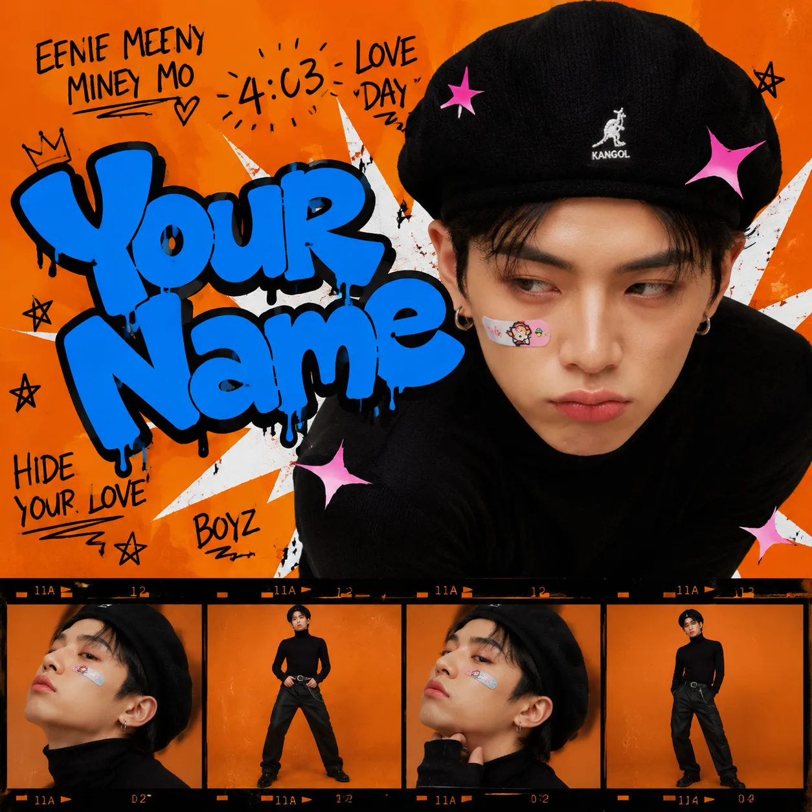

**#197 · Portrait, Poster · <code>Vinano Studio</code>**

> Keywords: portrait, poster, AI art, AI prompt, text to image

<details>
<summary>Show prompt</summary>

```
Create a bold Y2K pop-street editorial collage featuring a young person as the central subject, combining playful graffiti typography, orange poster background, sticker-like graphic elements, and fashion magazine layout energy.

MAIN SUBJECT AND FRAMING:
Place the young person on the right side of the composition in a close-up to upper-body portrait. The face should be large and dominant, cropped from the chest upward, the subject slightly leaning forward into the frame. The composition should feel asymmetrical, graphic typography filling the left side and the subject anchoring the right side.

Do not control or describe the hairstyle.

OUTFIT DETAIL:
Style the subject in a minimal black streetwear outfit. They wear a black turtleneck or high-neck top a soft fitted silhouette, creating a clean dark shape against the bright orange background. Add a black beret or rounded cap a small embroidered logo detail on the front, giving the look a stylish retro street-fashion feeling.

Add a small colorful cheek sticker or decorative bandage on one cheek, cute tiny graphic details, making the styling feel playful and idol-like. Keep the outfit mostly black so the blue graffiti typography and orange background stand out strongly.

BEHAVIOUR AND BODY LANGUAGE:
The subject’s body language should feel calm, closed-off, and slightly moody. The shoulders are relaxed but slightly rounded forward, creating a soft guarded posture. The head tilts subtly downward and to the side, giving the portrait a cool detached attitude.

The subject does not need a big hand gesture in the main portrait; instead, the behaviour comes from the face angle, lowered posture, and intense sideways eye movement. The pose should feel like someone caught in a quiet bratty moment, not fully engaging the viewer.

FACIAL EXPRESSION:
The expression is pouty, serious, and mildly irritated in a fashionable way. The lips are softly pushed forward into a small pout, brows slightly tense, and the eyes look sideways a suspicious or unimpressed gaze. The mood should feel bratty, stylish, aloof, and quietly rebellious.

GRAPHIC BACKGROUND:
Use a saturated orange background a large white starburst shape behind the subject’s head and shoulders. The starburst should create strong comic-book energy and make the face pop.

Add hand-drawn black scribble text across the orange background, like messy diary writing or lyric notes. Include phrases such as:
“EENIE MEENY MINEY MO”
“4:03”
“LOVE DAY”
“HIDE YOUR LOVE”
“BOYZ”
The handwriting should look playful, imperfect, thin, and chaotic, but still visually controlled.

MAIN TYPOGRAPHY:
Place a large blue graffiti-style word “Your Name” across the left-center area. The letters should be chunky, rounded, irregular, and outlined in thick black, like a playful bubble graffiti tag. The typography should overlap slightly the subject’s face area without blocking the eyes.

Add pink star sparkle stickers around the face and cap area, giving a cute pop-idol accent.

BOTTOM FILMSTRIP:
At the bottom of the composition, add a horizontal filmstrip four rectangular photo panels. These panels show smaller full-body and close-up poses of the same young person wearing the same black outfit.

Panel pose ideas:
1. Side close-up portrait head tilted back slightly, cheek sticker visible, eyes looking away.

2. Full-body stance legs apart, hands near pockets or belt area, posture confident and relaxed.

3. Repeated close-up side portrait for rhythmic collage effect.

4. Repeated full-body stance, slightly different angle or crop.

The filmstrip should feel like a fashion contact sheet or idol editorial preview.

MOOD AND STYLE:
The overall mood should be playful, bratty, nostalgic, and street-fashion inspired. It should feel like a Y2K teen magazine layout mixed graffiti poster design, idol concept styling, and scrapbook-like pop graphics.

Emphasise material texture and natural light so the final frame feels tactile and premium.
```

</details>

---

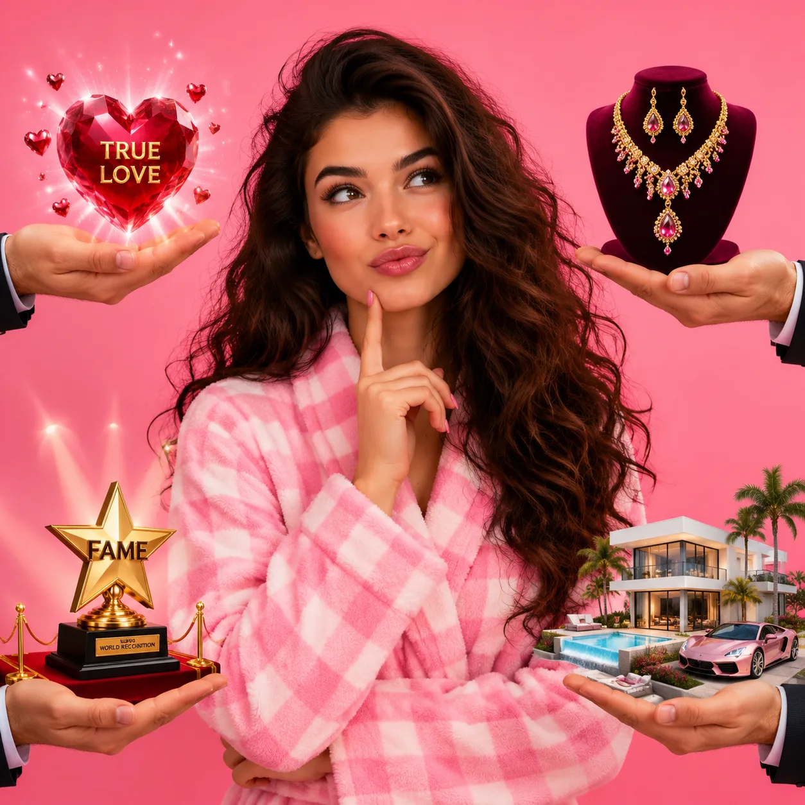

**#198 · Realistic, Poster · <code>Vinano Studio</code>**

> Keywords: realistic, poster, cinematic, AI art, AI prompt, text to image

<details>
<summary>Show prompt</summary>

```
Ultra-realistic commercial beauty advertisement, vertical 9:16 composition, 8K UHD, hyper-detailed studio photography. A beautiful young woman long, voluminous curly dark-brown hair stands centered against a smooth solid bubblegum-pink background.
She wears a cozy pink-and-white checkered plush fleece bathrobe a shawl collar, arms loosely crossed, one hand raised her index finger gently touching her chin. Her head is slightly tilted, eyes looking sideways a playful, thoughtful expression and softly pursed glossy pink lips. Natural makeup, radiant skin, subtle blush, pink manicured nails, expressive eyes, fashion-magazine quality.

Surrounding her from the four sides of the frame near to her face are four elegant disembodied male hands of presenting floating realistic symbolic objects instead of products. Top left: a glowing red crystal heart labeled "TRUE LOVE" small floating heart particles and a soft romantic aura. Top right: a luxurious gold jewelry set displayed on a velvet bust, sparkling premium gemstone reflections. Bottom left: a golden fame trophy shaped like a Hollywood-style star, surrounded by subtle spotlight beams and prestige-inspired details. Bottom right: a miniature luxury lifestyle scene featuring a modern white mansion, exotic palm trees, luxury sports car, infinity pool, and premium living elements.

Bright high-key studio lighting, clean shadows, vibrant saturated pink color palette, polished advertising aesthetic, perfectly balanced composition, sharp focus on woman and symbols, luxury branding style, premium magazine campaign quality, realistic textures, cinematic depth, glossy reflections, ultra-detailed 3D rendering, modern social media viral poster, eye-catching visual storytelling, professional fashion photography, masterpiece quality.

Render with rich micro-detail while keeping the layout uncluttered and intentional.
```

</details>

---

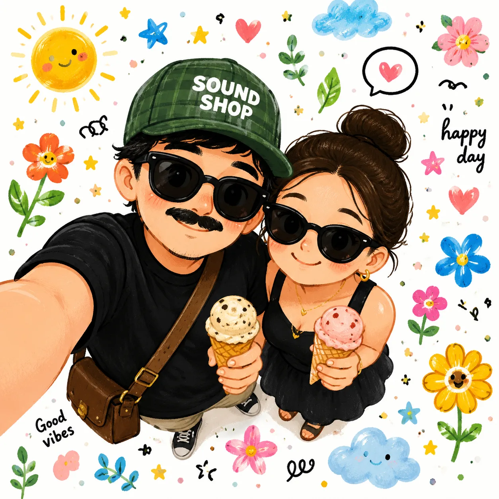

**#199 · Poster, Character · <code>Vinano Studio</code>**

> Keywords: poster, character, AI art, AI prompt, text to image

<details>
<summary>Show prompt</summary>

```
Turn this real-life selfie into a playful hand-drawn cartoon illustration, cute doodle art style, top-down selfie perspective, stylish couple wearing black outfits and sunglasses, man mustache, green plaid cap bold white text, brown crossbody bag, woman hair bun, holding ice cream cones, cheerful and cozy summer vibe.

Bright white background filled colorful doodles: smiling sun, flowers, hearts, stars, leaves, squiggles, clouds, tiny dots, playful hand-drawn decorations surrounding the characters. Soft pastel palette vibrant accents, children's book illustration style, sticker art aesthetic, whimsical and charming.

Flat vector illustration, clean bold outlines, simplified facial features, rosy cheeks, expressive cartoon eyes, textured brush strokes, vibrant colors, high detail, cute lifestyle artwork, Instagram-friendly illustration, cozy relationship aesthetic, modern doodle poster, joyful mood.

Composition:
- Overhead selfie angle
- Couple centered
- Ice cream cones visible
- Green cap and black sunglasses preserved
- Decorative doodles evenly filling the background
- Clean white canvas

Style references:
cute doodle illustration, Scandinavian children's book art, whimsical sticker design, colorful hand-painted cartoon, playful digital illustration, kawaii aesthetic, modern lifestyle artwork, trending social media illustration.

Maintain consistent colour harmony and crisp focus across the whole frame.
```

</details>

---

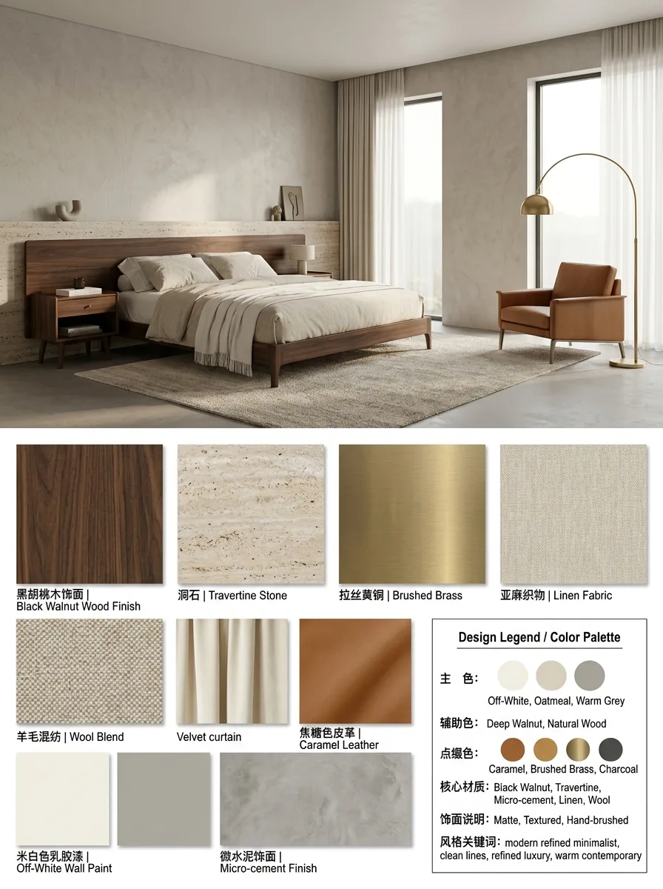

**#200 · Minimalist, Ai Art · <code>Vinano Image Pro</code>**

> Keywords: minimalist, AI art, AI prompt, text to image

<details>
<summary>Show prompt</summary>

```
你是一名专业的室内设计 Mood Board 创作者。请基于用户提供的 [Space Type] 室内设计照片，生成一张 竖版 3:4 的高端室内设计情绪板。整体视觉参考专业室内设计提案图，呈现 [Style Keywords] 的审美特征，画面应具备 [Mood Keywords] 的空间氛围，并符合 [Branding Tone] 的高级设计表达。
场景类型（Space Type）：[Space Type]
画面布局要求
上半部分：呈现一张高分辨率、照片级真实感的 [Space Type] 室内设计效果图。

该效果图需要在空间结构、家具语言、材质关系、色彩搭配、光影氛围上与用户输入照片保持一致，同时提升为更完整、更精致、更具设计提案感的视觉呈现。

重点体现：[Key Furniture Elements]、[Material Keywords]、[Color Palette]、[Lighting Style]。
下半部分：展示与上方空间设计严格对应的材质与软装样本，包括：
材料样板
面料样本
色卡
饰面样本
与该空间相关的木材、石材、金属、玻璃、织物、皮革或涂料样本

所有样本必须与上方空间保持一致，并准确反映该设计方案中的核心材质与色彩逻辑。
右下角：设置一个 Design Legend / Color Palette 信息框，统一展示本方案的：
主色
辅助色
点缀色
核心材质
饰面说明
风格关键词
风格与输出要求
专业室内设计公司级别的 Mood Board 版式
极简、整洁、克制、有秩序的排版
明确的视觉层级与留白控制
材质、色彩、面料、饰面与上方空间完全匹配
标签清晰、现代、简洁，具有高级编辑设计感
整体气质需符合 [Style Keywords]
呈现 [Render Quality]
竖版 3:4 构图
4K Ultra HD
超高细节
写实渲染
直接用于图像生成
标签要求
每个材质或色彩样本配有清晰标签，标签内容围绕以下信息组织：

[Label Language] 的材质名称、颜色名称、饰面名称或织物类型。

标签风格应简洁、专业、排版规整，不喧宾夺主。
主题定义
[Space Type] Interior Design Mood Board

风格方向：[Style Name]

关键词：[Style Keywords], [Material Keywords], [Color Palette], [Mood Keywords]
负面约束
避免杂乱拼贴、避免廉价海报风、避免材质与空间不匹配、避免错误透视、避免低质字体、避免装饰元素过多、避免卡通感、避免过饱和色彩、避免信息层级混乱、避免伪随机材质堆砌。

空间类型：卧室
风格名称：现代中古

变量当成可替换字段：
[Space Type]：空间类型
例如：客厅、卧室、餐厅、厨房、书房、玄关、浴室、会客区、酒店大堂
[Style Name]：风格名称

例如：现代极简、意式极简、侘寂、奶油风、轻法式、现代中古、北欧自然、深色豪宅、日式原木、当代奢雅
[Style Keywords]：风格关键词

例如：modern refined minimalist, clean lines, refined luxury, warm contemporary
[Mood Keywords]：氛围关键词

例如：温暖宁静、克制高级、通透自然、沉稳静奢、明亮柔和
[Branding Tone]：品牌化视觉语气

例如：高端设计事务所提案感、国际家居品牌视觉、编辑型画册审美、奢华但克制
[Key Furniture Elements]：重点家具/造型元素

例如：低矮沙发、弧形单椅、岩板茶几、悬浮电视柜、落地灯、艺术摆件
[Material Keywords]：关键材质

例如：白蜡木、胡桃木、洞石、亚麻、羊毛、拉丝金属、微水泥、皮革、玻璃
[Color Palette]：配色方案

例如：米白、暖灰、燕麦色、焦糖棕、炭灰、鼠尾草绿、黑胡桃色
[Lighting Style]：光线风格

例如：自然漫射光、晨间柔光、傍晚暖光、均匀展厅光、低照度氛围光
[Label Language]：标签语言

例如：英文、中英双语、纯中文
[Render Quality]：渲染质量描述

例如：照片级真实感、high-end editorial rendering、luxury interior visualization

保持真实比例与空间层次，呈现专业、稳重的最终效果。
```

</details>

---

[Next page →](./poster-design-3.md)
