# Poster Design — full gallery

[← Back to README](../README.md) · [`prompts.json`](../prompts/prompts.json) · **241** prompts · page 3 / 3

[← Prev](./poster-design-2.md) — [1](./poster-design.md) · [2](./poster-design-2.md) · **3**

---

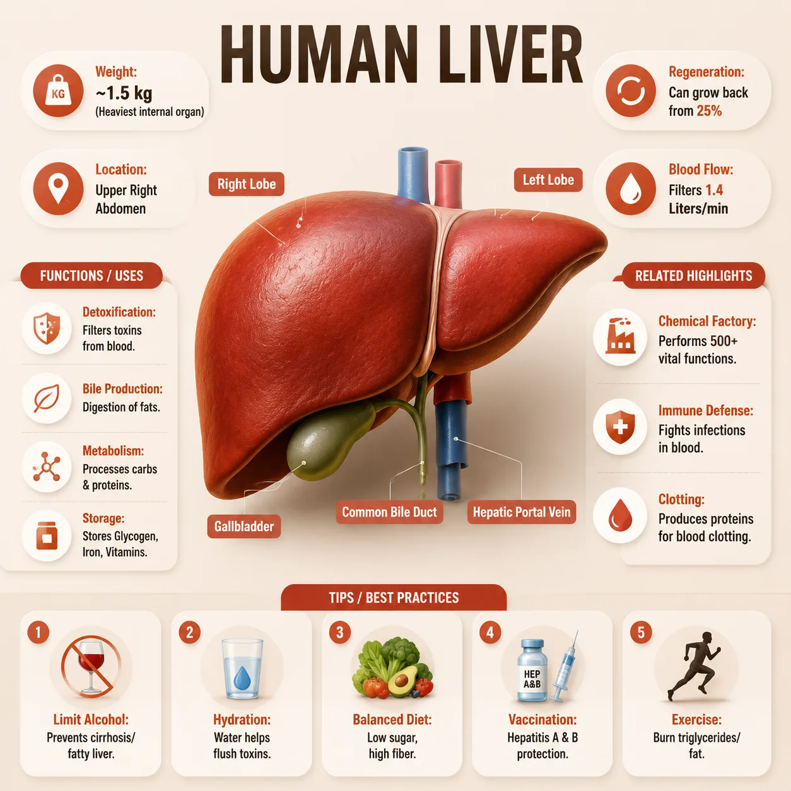

**#201 · Realistic, Poster · <code>Vinano Studio</code>**

> Keywords: realistic, poster, infographic, AI art, AI prompt, text to image

<details>
<summary>Show prompt</summary>

```
Ultra-clean modern editorial infographic poster (1080x1080), premium magazine layout meets lifestyle photography/illustration.

**TITLE:**
Large, bold sans-serif text at top center: "HUMAN LIVER"

**CENTRAL VISUAL:**
A realistic, high-fidelity 3D illustration of the Human Liver (showing Right/Left lobes and Gallbladder). Color palette: Terracotta, deep brownish-red, and soft coral, set against a clean soft beige/off-white background. Lighting is studio-soft.

**LAYOUT SECTIONS (Matching the reference):**

* **Section 1 - Quick Facts (Top Left/Right floating bubbles):**
 * "Weight: ~1.5 kg (Heaviest internal organ)"
 * "Regeneration: Can grow back from 25%"
 * "Location: Upper Right Abdomen"
 * "Blood Flow: Filters 1.4 Liters/min"

* **Section 2 - Core Parts / Systems (Labels pointing to central organ):**
 * Right Lobe
 * Left Lobe
 * Gallbladder (Greenish sac underneath)
 * Common Bile Duct
 * Hepatic Portal Vein

* **Section 4 - Functions / Uses (Left side list minimal icons):**
 * **Detoxification:** Filters toxins from blood.
 * **Bile Production:** Digestion of fats.
 * **Metabolism:** Processes carbs & proteins.
 * **Storage:** Stores Glycogen, Iron, Vitamins.

* **Section 5 - Related Highlights (Right side list minimal icons):**
 * **Chemical Factory:** Performs 500+ vital functions.
 * **Immune Defense:** Fights infections in blood.
 * **Clotting:** Produces proteins for blood clotting.

* **Section 6 - Tips / Best Practices (Bottom row, card style icons):**
 1. **Limit Alcohol:** Prevents cirrhosis/fatty liver.
 2. **Hydration:** Water helps flush toxins.
 3. **Balanced Diet:** Low sugar, high fiber.
 4. **Vaccination:** Hepatitis A & B protection.
 5. **Exercise:** Burn triglycerides/fat.

**STYLE:**
Glassmorphism effects on text boxes, soft drop shadows, medical accuracy mixed high-end graphic design aesthetics.

Maintain consistent colour harmony and crisp focus across the whole frame.
```

</details>

---

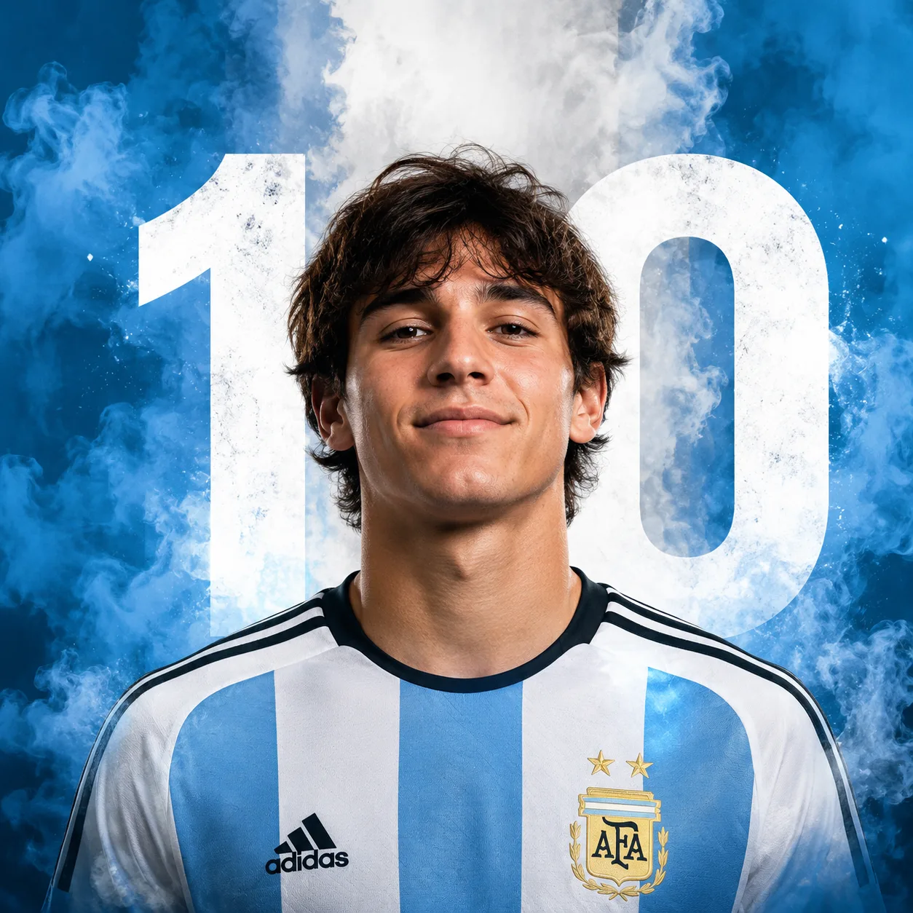

**#202 · Realistic, Portrait · <code>Vinano Studio</code>**

> Keywords: realistic, portrait, poster, AI art, AI prompt, text to image

<details>
<summary>Show prompt</summary>

```
A mixed-media sports promotional poster featuring a realistic chest-up portrait of a young Argentine soccer player. He/She poses in a relaxed and confident manner a subtle smile, dark brown slightly messy hair falling naturally onto the forehead. He/She is wearing the Argentina national team jersey from the provided reference image, featuring the iconic sky-blue and white colors, the Adidas logo on the right chest and the Argentina Football Association crest on the left.

Soft studio lighting from the upper left creates gentle shadows and subtle highlights on the hair. Behind the player is a large bold white number “10,” partially overlapped by the subject.

The background features vertical smoke in the colors of the Argentine flag: sky blue, white, and sky blue.

The overall style is modern, clean, and dynamic, combining sharp details soft smoky effects, creating a powerful and professional sports-poster aesthetic.

Render with rich micro-detail while keeping the layout uncluttered and intentional.
```

</details>

---

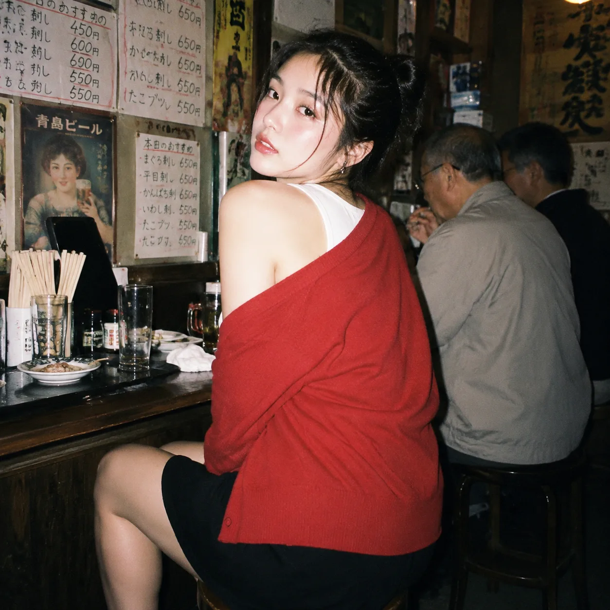

**#203 · Poster, Ai Art · <code>Vinano Studio</code>**

> Keywords: poster, AI art, AI prompt, text to image

<details>
<summary>Show prompt</summary>

```
A 90s disposable-camera style flash snapshot taken inside a small, bustling Japanese izakaya decorated handwritten menus and retro posters. Direct flash creates grain, harsh shadows, and bright highlights. A young woman sits on a wooden bar stool, turning her upper body back toward the camera. She wears a soft red cardigan over a white tank top, paired a short black skirt. The red cardigan pops beautifully under the flash, complementing her blushed cheeks and glossy lips. Behind her, older patrons sit in the dim, noisy environment, contrasting her vivid, intimate glow. The image feels nostalgic, imperfect, and emotionally intimate. Aim for an editorial, design-driven look with deliberate negative space.
```

</details>

---

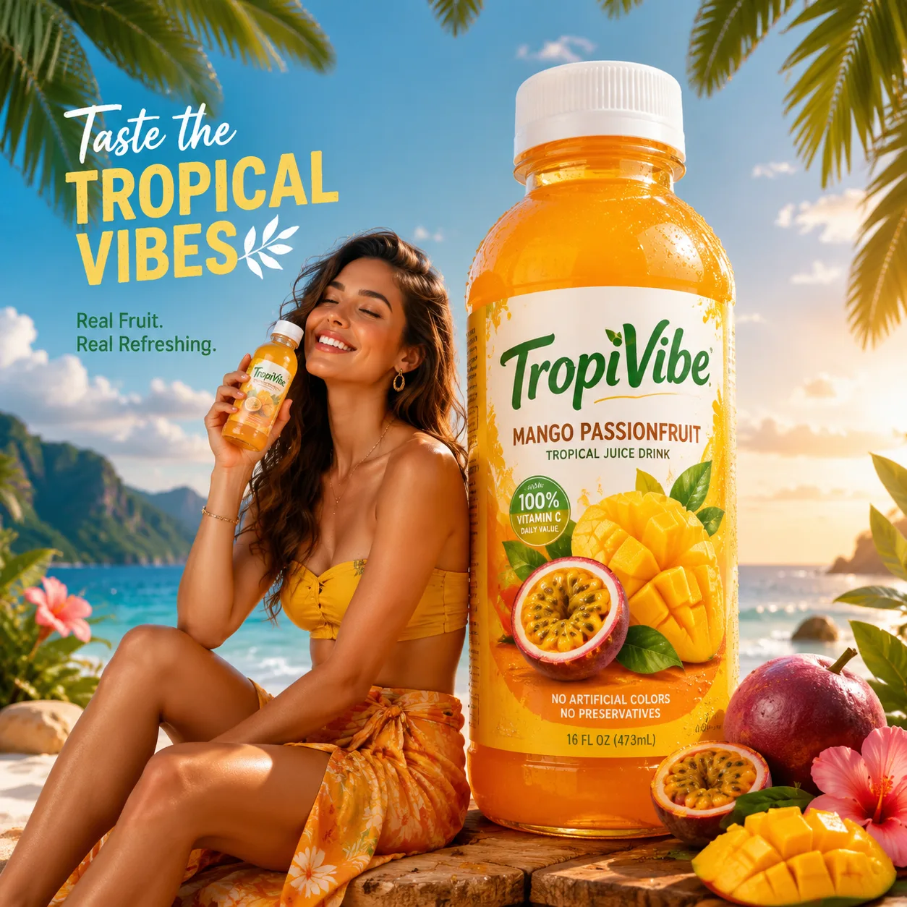

**#204 · Realistic, Poster · <code>Vinano Studio</code>**

> Keywords: realistic, poster, AI art, AI prompt, text to image

<details>
<summary>Show prompt</summary>

```
Create a creative commercial advertising poster for [PRODUCT NAME], a [PRODUCT TYPE], inspired by vibrant tropical product campaigns. Place the product as a large hero object on the center-right realistic glossy reflections, sharp label details, and premium lighting. Add a stylish model sitting beside or slightly in front of the product, naturally interacting it by [MODEL ACTION]. The model should look [MOOD], wearing [OUTFIT STYLE], and should not cover the product label. Keep edges clean and the overall composition balanced for a polished, gallery-ready result.
```

</details>

---

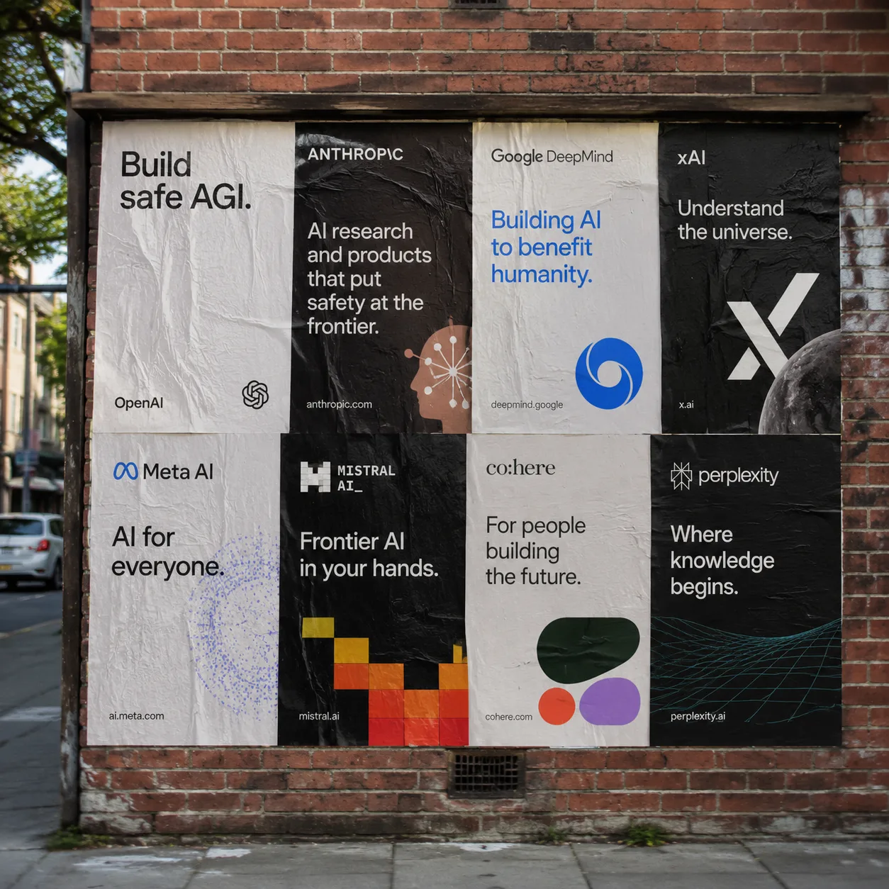

**#205 · Poster, Ai Art · <code>Vinano Studio</code>**

> Keywords: poster, AI art, AI prompt, text to image

<details>
<summary>Show prompt</summary>

```
Make a wheatpaste poster setup on a brick wall in sf featuring posters from various AI labs Preserve realistic proportions and depth for a confident, professional finish.
```

</details>

---

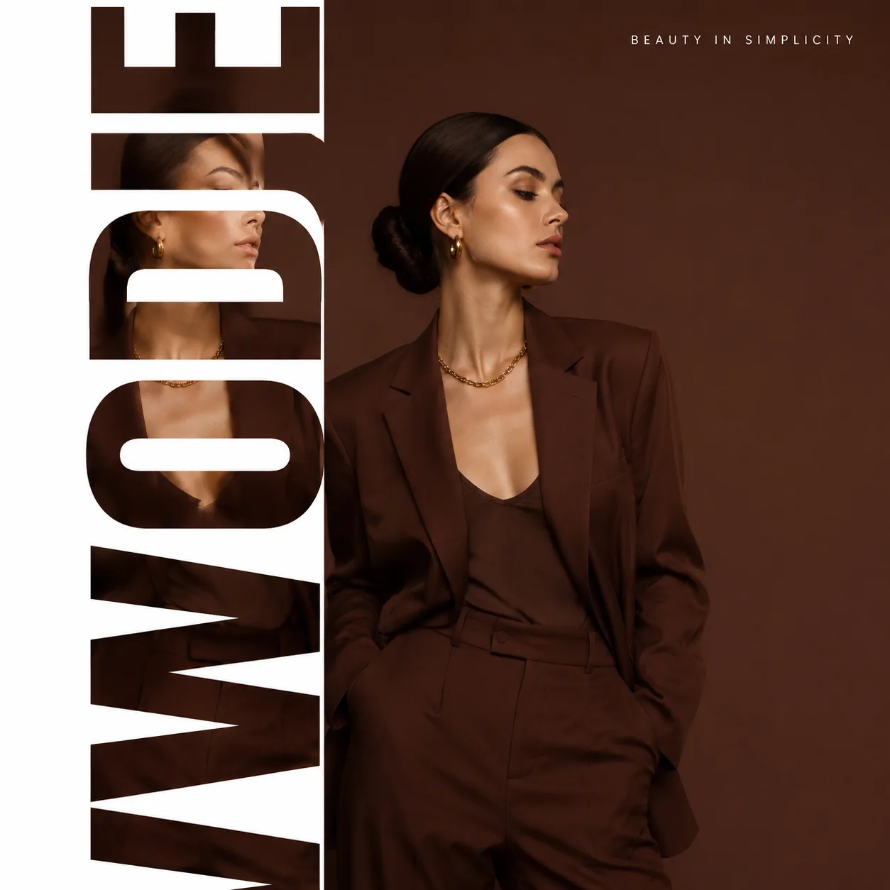

**#206 · Realistic, Poster · <code>Vinano Studio</code>**

> Keywords: realistic, poster, character, minimalist, AI art, AI prompt

<details>
<summary>Show prompt</summary>

```
Style & Composition: High-fashion editorial typography poster a strict 1:2 composition split. Layout & Ratio: The frame is divided so that the right two-thirds show the full subject and background, while the left one-third is reserved for the typography masking section.

Typography Masking: A massive, ultra-bold, vertical word "[WORD]" is placed on the left third. The text is strictly full-bleed, stretching perfectly and touching the absolute top and absolute bottom edges of the frame zero vertical padding, gaps, or margins. This typography acts as a stencil mask: the letters reveal the underlying character, while the space to the far left of the letters is a solid, clean white.

Subject Details & Positioning: An upper-body shot of [CHARACTER DESCRIPTION]. The model is positioned so that only her left-most side is visible through the letters, while the rest of her body is fully visible and contained on the right side against a solid [COLOR] background, ensuring no part of the subject is cropped by the right edge of the frame. Pose: [POSE DESCRIPTION], ensuring the silhouette remains within the center of the right two-thirds area.

Secondary Text: In the top right corner, add the text: "[TEXT]". Use a small, sophisticated, white "Helvetica Condensed" style font wide letter spacing (kerning) for a premium, refined minimalist look. Color Palette: A strict monochromatic [COLOR] theme, sharply contrasted by the crisp white negative space on the left. 8k resolution, true-to-life photorealistic textures, sharp studio lighting, high contrast, clean graphic design aesthetic.

Maintain consistent colour harmony and crisp focus across the whole frame.
```

</details>

---

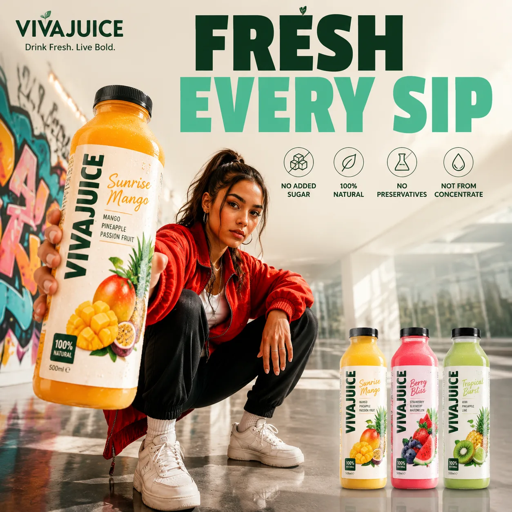

**#207 · Realistic, Poster · <code>Vinano Studio</code>**

> Keywords: realistic, poster, AI art, AI prompt, text to image

<details>
<summary>Show prompt</summary>

```
Create a premium modern beverage advertisement poster in a vertical 3:4 format featuring a stylish young female model crouching confidently in a bright urban indoor hallway colorful graffiti wall art on one side and clean minimal architecture on the other, giving a trendy streetwear lifestyle vibe. The model wears casual fashionable clothes such as a red oversized jacket, white inner top, black joggers, and white sneakers, looking directly at the camera a cool confident expression. In the foreground, a giant realistic fruit juice bottle is held toward the camera in forced perspective, dominating the composition sharp focus and glossy reflections. The bottle should have a completely different fictional brand name such as “VIVAJUICE” in bold modern typography, attractive fruit illustrations on the label and flavor text like “Sunrise Mango” or “Tropical Burst.” At the top left, place the brand logo and a catchy tagline like “Drink Fresh. Live Bold.” Across the top center, add huge bold overlapping typography reading “PURE AS NATURE” or “FRESH EVERY SIP” in contrasting colors like dark green and mint. Below the headline, include 4 clean icon-based feature badges in a row text such as “NO ADDED SUGAR,” “100% NATURAL,” “NO PRESERVATIVES,” and “NOT FROM CONCENTRATE.” At the bottom right, display three smaller bottle variants in different flavors neatly arranged. Use soft natural lighting mixed commercial studio polish, realistic shadows, shallow depth of field, glossy floor reflections, and a premium energetic eCommerce campaign aesthetic inspired by modern Instagram and billboard ads. Keep edges clean and the overall composition balanced for a polished, gallery-ready result.
```

</details>

---

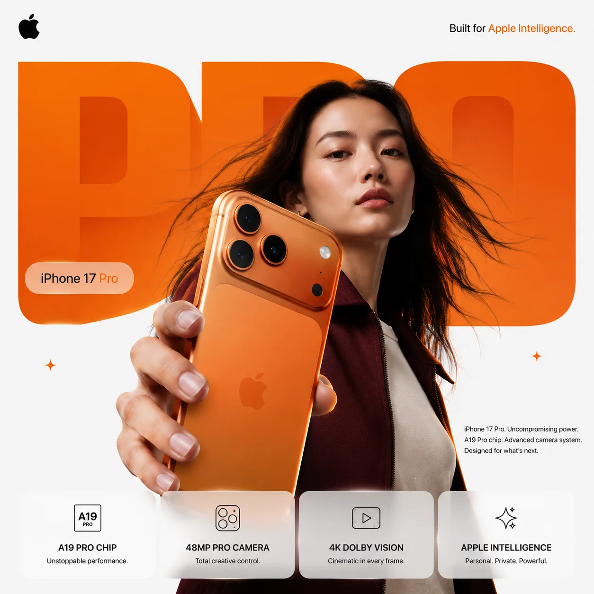

**#208 · Realistic, Poster · <code>Vinano Studio</code>**

> Keywords: realistic, poster, cinematic, AI art, AI prompt, text to image

<details>
<summary>Show prompt</summary>

```
FORMAT:
4:5 vertical premium smartphone campaign poster, ultra-high resolution (8K), global OOH + digital + social ready
Style: Apple-level minimalism × bold Gen-Z composition × hyper-real commercial photography

🧠 CORE INTENT:
“PRO, WITHOUT TRYING.”

Effortless power.
Quiet confidence.
No noise — just precision.

🎬 SCENE COMPOSITION:

BACKGROUND:
Pure matte white canvas a dominant rounded rectangle block in ultra-vibrant burnt orange gradient (top-left → bottom-right glow)

GIANT TYPOGRAPHY (BACKGROUND LAYER):
“PRO”
- ultra-bold geometric sans-serif
- stretched wide kerning
- partially cropped by frame edges
- soft shadow depth
- color: deep orange slightly darker than background block
- subtle emboss effect

👤 SUBJECT (HUMAN ELEMENT):

- Female model, clean editorial look (Apple casting style)
- Neutral expression (confident, calm, not smiling)
- Hair: natural flow, slightly wind-touched
- Outfit:
 → muted tones (off-white + deep maroon jacket)
 → minimal styling, no distractions

POSE:
- Shot from slightly low angle (hero perspective)
- One hand extended toward camera holding iPhone
- Body slightly angled for depth
- Face aligned toward viewer (eye contact)

📱 PRODUCT (HERO FOCUS):

DEVICE:
iPhone 17 Pro in Titanium Orange finish

POSITION:
- Extreme foreground (forced perspective)
- Slight tilt to reveal camera module depth

DETAILING:
- triple camera system hyper-sharp
- lens reflections physically accurate
- brushed titanium edge highlights
- micro-scratches + realistic material response
- Apple logo centered, subtle reflective gloss

REFLECTION:
- soft studio reflection on device edges
- micro light bloom around camera rings

✨ LIGHTING SYSTEM:

MAIN LIGHT:
Soft studio key light (front-left)
→ smooth skin tones
→ clean product highlights

RIM LIGHT:
Warm edge light from right
→ enhances phone silhouette
→ highlights metallic edges

ACCENT LIGHT:
Subtle glow from background orange block

SHADOW:
Soft drop shadow under subject + phone
(no harsh contrast)

🎨 COLOR SYSTEM:

- Primary: Apple Orange (hero)
- Secondary: Clean white
- Accent: warm highlights + skin tones
- Contrast: deep micro-shadows

No over-saturation.
No neon.
Controlled premium palette.

✨ GRAPHIC ELEMENTS:

- Minimal sparkle icons ✦ (2–3 only)
- Soft floating UI pill (glass morphism)
- Very subtle grain for realism

✍️ TYPOGRAPHY SYSTEM:

TOP LEFT:
Apple logo (black, small, clean)

TOP RIGHT:
“Built for Apple Intelligence.” (thin sans-serif)

MID LEFT (pill):
“iPhone 17 Pro”

CENTER DOMINANT:
“PRO” (background type)

BOTTOM RIGHT (body text):
Small paragraph:

“iPhone 17 Pro. Uncompromising power.
A19 Pro chip. Advanced camera system.
Designed for what’s next.”

📊 FEATURE STRIP (BOTTOM GRID):

4 rounded cards (glass-white panels):

1. A19 PRO CHIP
 “Unstoppable performance.”

2. 48MP PRO CAMERA
 “Total creative control.”

3. 4K DOLBY VISION
 “Cinematic in every frame.”

4. APPLE INTELLIGENCE
 “Personal. Private. Powerful.”

Icons minimal line style

📐 COMPOSITION GRID:

- Top: brand + statement
- Mid: subject + product (dominant)
- Background: typography layer
- Bottom: feature modules

Eye flow:
Face → Phone → Camera → “PRO” → Features

🎥 CAMERA SPECS:

- ARRI Alexa Mini LF
- 50mm anamorphic lens
- shallow depth of field
- HDR rendering
- ultra-real skin + material detail
- slight lens distortion for realism

Preserve realistic proportions and depth for a confident, professional finish.
```

</details>

---

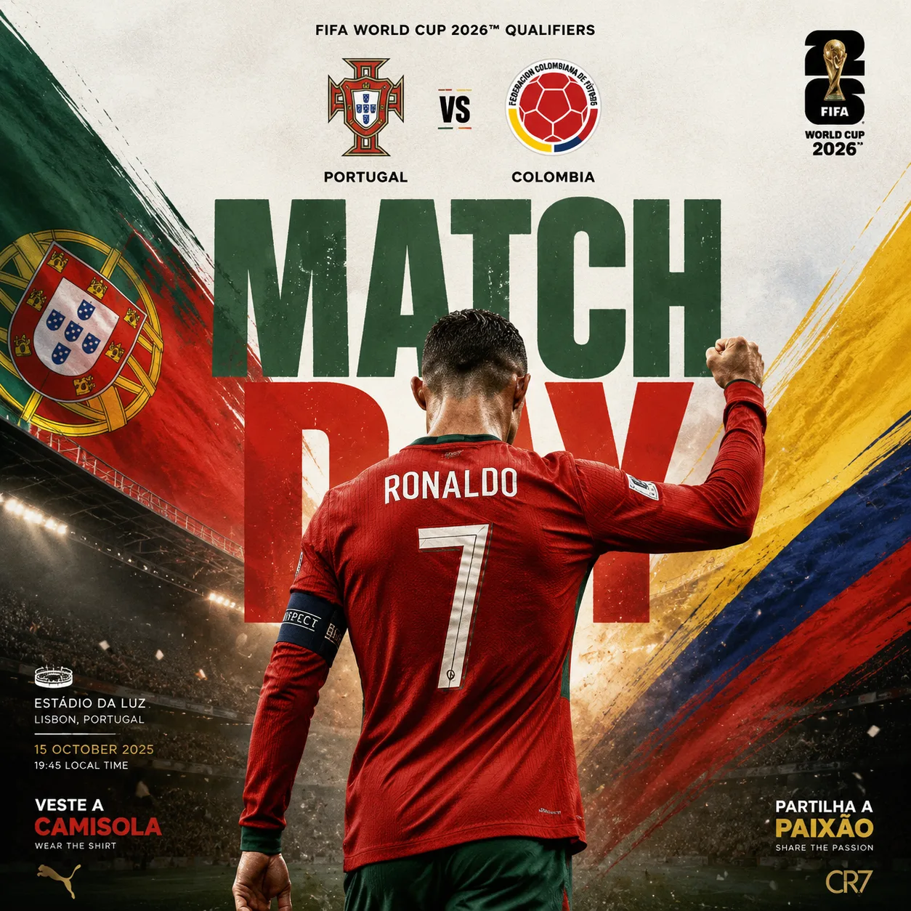

**#209 · Realistic, Poster · <code>Vinano Studio</code>**

> Keywords: realistic, poster, cinematic, AI art, AI prompt, text to image

<details>
<summary>Show prompt</summary>

```
Ultra-realistic football match day poster design, Cristiano Ronaldo seen from the back wearing Portugal red jersey number 7, fist raised in victory, walking forward confidently, giant bold typography “MATCH DAY” behind player, modern sports graphic design, Portugal vs Colombia logos at top, FIFA World Cup 2026 branding, cinematic stadium atmosphere, textured off-white background, national flag elements blended diagonally, dramatic lighting, dust particles, high-detail jersey fabric, centered composition, editorial sports poster style, minimal premium layout, green red yellow color palette, realistic shadows, sharp focus, Nike/Puma style campaign aesthetic, 4k. Keep edges clean and the overall composition balanced for a polished, gallery-ready result.
```

</details>

---

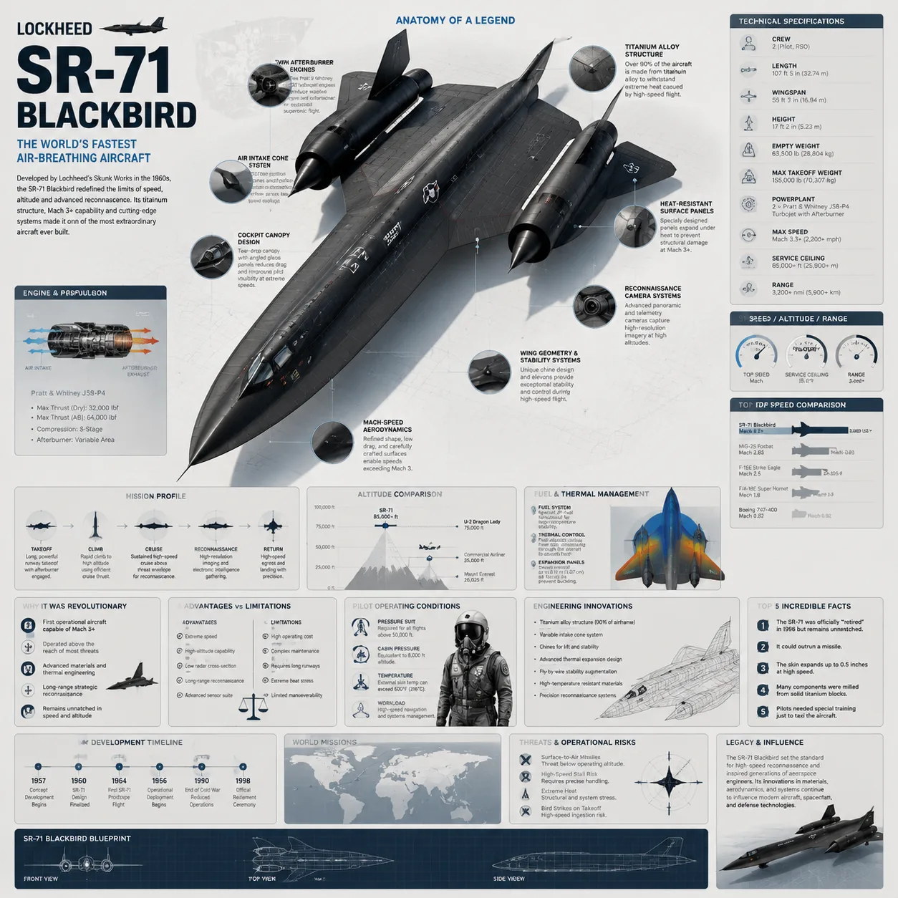

**#210 · Realistic, Poster · <code>Vinano Studio</code>**

> Keywords: realistic, poster, infographic, AI art, AI prompt, text to image

<details>
<summary>Show prompt</summary>

```
Create a premium square “reference-style aviation infographic” centered around the legendary Lockheed SR-71 Blackbird, designed as a beautifully curated aerospace knowledge handbook page rather than a military poster.

The composition should feel like a modern visual encyclopedia mixed an elite aircraft field guide and high-end editorial infographic system.

Visual Direction:

• 1:1 square composition
• Soft light-toned aerospace background subtle blueprint textures
• Elegant muted palette charcoal black, titanium gray, deep navy, and soft steel blue
• Refined editorial typography hierarchy
• Rounded modular information cards clean spacing
• Gentle realistic shadows and premium UI-style dividers
• Minimal technical iconography
• Extremely detailed central aircraft render viewed in dramatic top-down three-quarter perspective
• Thin precision annotation lines pointing toward aircraft systems and structural features
• Clean, organized “knowledge-first” layout high information density but breathable spacing

Main Subject Presentation:

A stunning ultra-detailed SR-71 Blackbird illustration/render in the center realistic titanium body reflections, stealth-like silhouette, glowing cockpit glass, engine intake detailing, and aerodynamic surface paneling.

Surround the aircraft scientific callouts and magnified detail circles explaining:

• Twin afterburner engines
• Titanium alloy body structure
• Air intake cone system
• Cockpit canopy design
• Heat-resistant surface panels
• Reconnaissance camera systems
• Mach-speed aerodynamics
• Wing geometry and stability systems

Include modular infographic sections such as:

• Aircraft Overview
• Technical Specifications
• Speed / altitude / range statistics
• Engine and propulsion system
• Historical mission profile
• Flight performance charts
• Top speed comparison against other aircraft
• Fuel and thermal management system
• Why the aircraft was revolutionary
• Advantages vs limitations
• Pilot operating conditions
• Mission workflow diagram
• Engineering innovations
• Quick timeline of development
• Threats and operational risks
• “Top 5 Incredible Facts” section
• Legacy and influence on modern aerospace engineering

Add small premium visualization modules like:

• altitude comparison chart
• world mission map
• speed gauge graphics
• engine airflow diagram
• thermal heat visualization
• stealth/aerodynamic breakdown
• miniature side-profile blueprint views

Style Keywords:

“premium aerospace encyclopedia”
“editorial aircraft handbook”
“high-end aviation infographic”
“scientific aerospace poster”
“museum-quality aircraft reference page”
“modular aviation knowledge system”
“clean military technology editorial design”

Avoid:

• action movie poster aesthetics
• explosions or combat scenes
• aggressive propaganda styling
• excessive dark grunge
• generic tech poster layouts

The final result should resemble a professionally published aerospace reference-book page created for collectors, aviation enthusiasts, and educational visual archives.

Aim for an editorial, design-driven look with deliberate negative space.
```

</details>

---

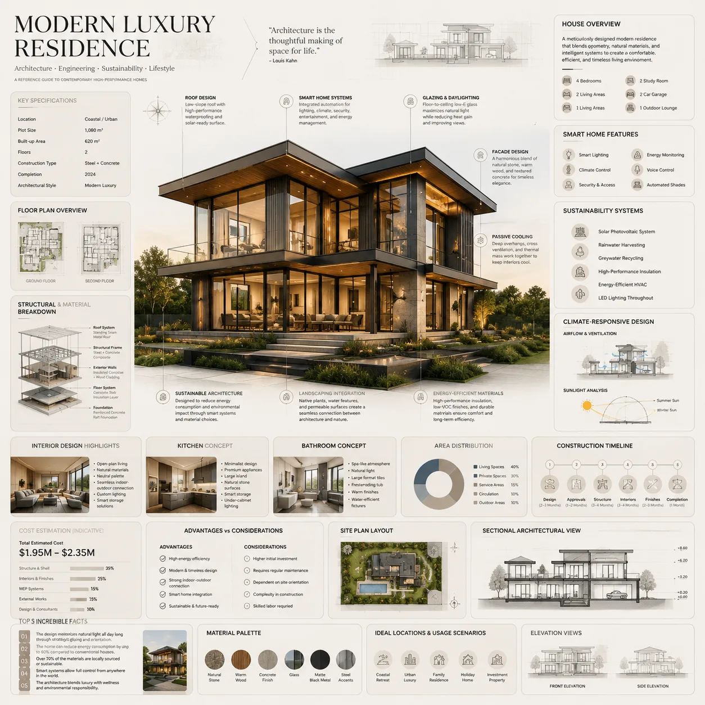

**#211 · Realistic, Poster · <code>Vinano Studio</code>**

> Keywords: realistic, poster, cinematic, sci-fi, infographic, AI art

<details>
<summary>Show prompt</summary>

```
Create a premium square “reference-style architectural infographic” centered around a luxurious {HOUSE_STYLE} modern house, designed as a beautifully curated architecture handbook page rather than a real-estate advertisement.
The composition should feel like a modern visual encyclopedia mixed an elite architectural field guide and high-end editorial infographic system.
Visual Direction:
• 1:1 square composition
• Soft light-toned architectural background subtle blueprint textures and drafting schematics
• Elegant muted palette warm white, charcoal gray, natural wood tones, matte black, concrete gray, and soft steel blue accents
• Refined editorial typography hierarchy
• Rounded modular information cards clean spacing
• Gentle realistic shadows and premium UI-style dividers
• Minimal architectural iconography
• Extremely detailed central house render viewed in dramatic three-quarter exterior perspective during soft golden-hour lighting
• Thin precision annotation lines pointing toward architectural systems and design features
• Clean, organized “knowledge-first” layout high information density but breathable spacing
Main Subject Presentation:
A stunning ultra-detailed realistic render of the {HOUSE_STYLE} modern house placed at the center, featuring premium architectural realism, floor-to-ceiling glass walls, realistic reflections, warm ambient lighting, natural landscaping, modern material textures, elegant geometry, and sophisticated contemporary detailing.
Surround the house scientific and architectural callouts explaining:
• façade design
• structural engineering
• smart home systems
• sustainable architecture
• passive cooling systems
• roof design
• glazing and natural lighting
• interior planning
• landscaping integration
• energy-efficient materials
Include modular infographic sections such as:
• House Overview
• Key Specifications
• Floor Plan Overview
• Structural & Material Breakdown
• Smart Home Features
• Sustainability Systems
• Climate-Responsive Design
• Interior Design Highlights
• Kitchen & Bathroom Concepts
• Area Distribution Charts
• Construction Timeline
• Cost Estimation (Indicative)
• Advantages vs Considerations
• Site Plan Layout
• Sectional Architectural View
• “Top 5 Incredible Facts” section
• Ideal Locations & Usage Scenarios
Add small premium visualization modules like:
• floor plan diagrams
• section-cut architectural drawings
• airflow & ventilation diagrams
• sunlight direction graphics
• smart-home workflow visuals
• landscaping/site layout plans
• material palette displays
• sustainability performance charts
• miniature blueprint elevation views
• room distribution infographics
Style Keywords:
“premium architecture encyclopedia”
“editorial architectural handbook”
“high-end residential infographic”
“museum-quality modern house reference page”
“scientific architectural poster”
“luxury home design editorial”
“modular architectural knowledge system”
“ultra-detailed architectural visualization”
Avoid:
• generic real-estate flyer aesthetics
• cluttered luxury brochure layouts
• excessive cinematic effects
• overly dark moody scenes
• unrealistic futuristic sci-fi architecture
• advertisement-heavy compositions
The final result should resemble a professionally published architectural reference-book page created for architects, interior designers, collectors, luxury home enthusiasts, and educational design archives.

Render with rich micro-detail while keeping the layout uncluttered and intentional.
```

</details>

---

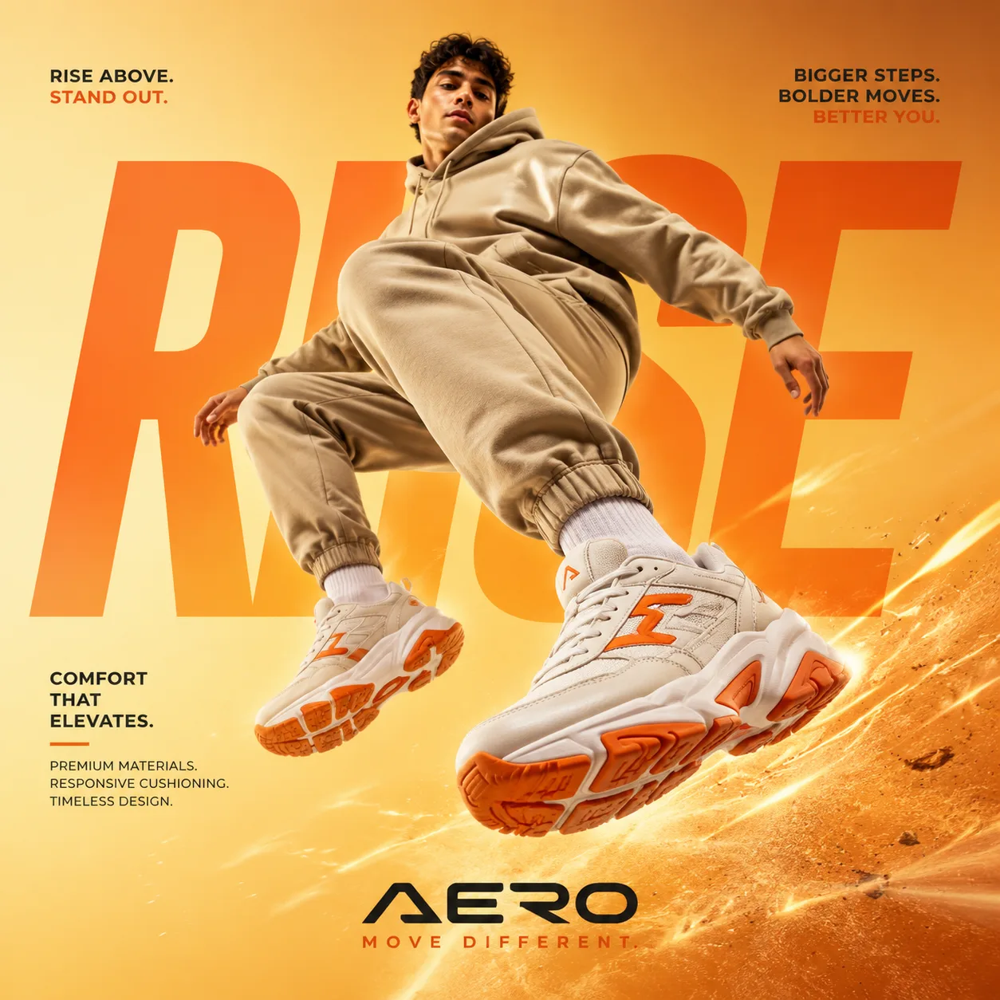

**#212 · Realistic, Poster · <code>Vinano Studio</code>**

> Keywords: realistic, poster, cinematic, AI art, AI prompt, text to image

<details>
<summary>Show prompt</summary>

```
A cinematic, high-end sneaker advertisement poster featuring a young male model mid-air in a dynamic jumping pose, captured from a low-angle perspective to emphasize power and motion. The model is wearing a coordinated beige streetwear outfit (hoodie and joggers), oversized chunky white sneakers that have bold orange accents on the sole and side stripes.

The background is a smooth studio gradient in warm tones, blending light yellow and vibrant orange for an eye-catching, energetic feel. Dramatic soft studio lighting enhances the subject, glowing highlights and subtle shadows that complement the outfit and colour palette.

Behind the model, large bold typography is seamlessly integrated into the composition, reading “RISE” in oversized modern sans-serif font, partially obscured by the subject for depth. Additional small promotional text is placed around the layout in a clean editorial style, such as:

“RISE ABOVE. STAND OUT.”
“BIGGER STEPS. BOLDER MOVES. BETTER YOU.”
“COMFORT THAT ELEVATES.”
“PREMIUM MATERIALS. RESPONSIVE CUSHIONING. TIMELESS DESIGN.”

At the bottom, a modern sneaker brand logo “AERO” appears the tagline “MOVE DIFFERENT.”

Add subtle motion effects like dust particles or energy trails beneath the jumping foot to enhance impact. Ultra-realistic detail, sharp focus, high contrast, commercial fashion photography style, magazine-quality composition, 4K resolution.

Aim for an editorial, design-driven look with deliberate negative space.
```

</details>

---

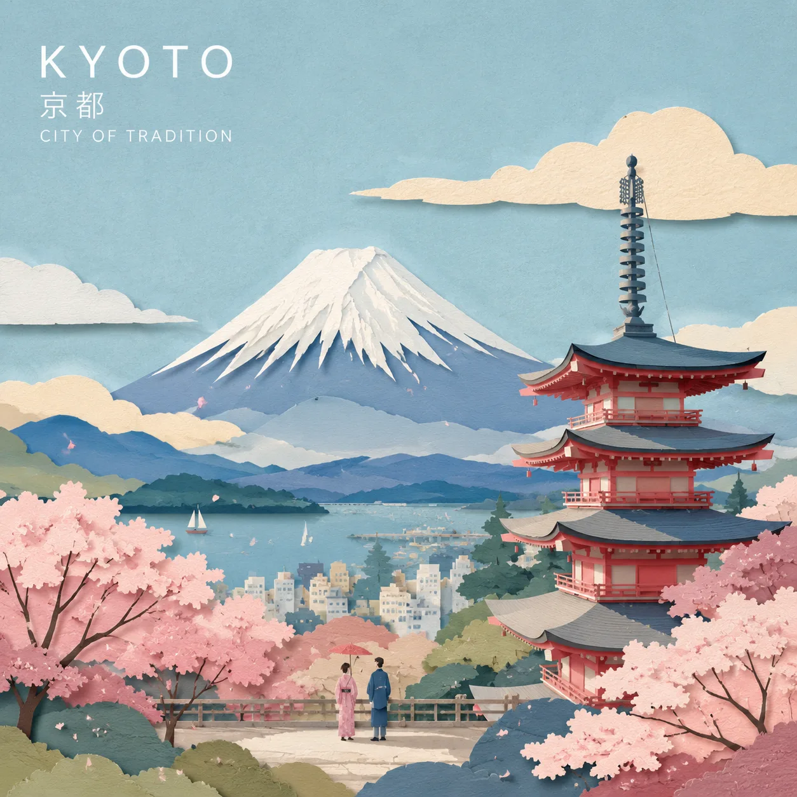

**#213 · Realistic, Landscape · <code>Vinano Studio</code>**

> Keywords: realistic, landscape, poster, character, cyberpunk, AI art

<details>
<summary>Show prompt</summary>

```
Create a refined wide landscape illustration of [City Subject], naturally featuring [Iconic Landmark] as the main recognizable visual anchor.

CORE STYLE:
Depict [Subject] as a calm, elegant, highly stylized scene in a toned-down pastel paper-collage poster style. The scene should feel minimal, clean, poetic, modern, cultured, leisurely, and softly cheerful rather than realistic.

COMPOSITION:
Use a spacious horizontal composition. Place [Main Subject] as the central focus, clearly recognizable through its iconic [Distinctive Features] rising above the layered scene. Surround it simplified [Contextual Elements]. Reinterpret in highly stylized illustrated forms clean geometric shapes, layered color planes, soft curves, crisp silhouettes, and paper-like cutout forms. Avoid photorealism.

VISUAL ELEMENTS:
Include minimal charming details: simplified forms, tiny expressive people for scale, small architectural/environmental accents, organic elements (trees, plants), calm open sky generous breathing space, clean horizontal layered divisions suggesting depth and atmosphere.

COLOR PALETTE (Toned-Down Pastels):
Soft sky blue, hazy blue-gray, pale cobalt, muted sage green, powder mint, warm cream, light beige, pale stone gray, dusty coral, soft peach, muted yellow, off-white, very small accents of navy or charcoal. [Add subject-specific accent colors as needed]

TACTILE QUALITY:
The image should feel tactile and handmade, like carefully arranged colored paper and gouache-painted poster board. Add subtle paper grain, matte printed texture, soft raised edges, delicate embossing, slight cut-paper shadows, gentle surface roughness. Keep surface refined and minimal, not messy.

VISUAL LANGUAGE:
Minimal paper collage, pastel travel poster, flat graphic shapes, subtle 3D paper relief, clean silhouettes, simplified architecture, soft matte texture, crisp color fields, gentle shadows, minimal linework, refined editorial illustration, modern [Cultural Context] poster mood. Wide landscape format, balanced negative space, strong graphic layering, clear focal area, simplified zones arranged harmoniously, airy composed and visually restful.

LIGHTING & MOOD:
Bright soft daylight, clean atmosphere, gentle shadows, warm relaxed tone, cultured and optimistic mood, quiet and sophisticated travel-poster feeling.

TYPOGRAPHY (Upper-left corner):
Main title '[City Subject Name]' in geometric uppercase sans-serif font wide letter-spacing, solid white color. Below: smaller native text '[Local Language Translation]' and English subtext '[Landmark Subtitle]', all in matching white, left-aligned, thin stroke weights airy spacious tracking.

AVOID:
Photorealism, realistic photography, over-detailed buildings, heavy outlines, messy brushwork, neon cyberpunk style, dark gloomy lighting, excessive gradients, crowded scenes, readable signage, logos, watermarks.

FINAL RESULT:
A polished minimal pastel paper-collage landscape illustration of [Subject], [Iconic Element] as the main recognizable visual anchor, featuring tactile paper texture, soft shadows, clean geometric color blocking, generous negative space, and a refined modern travel-illustration mood.

=====================================
VARIABLE REPLACEMENT GUIDE:
[City Subject] = Target city or subject
[Iconic Landmark] = Main recognizable landmark
[Distinctive Features] = Key identifying characteristics
[Contextual Elements] = Supporting environmental details
[Cultural Context] = Cultural/regional context

[Subject Specific Colors] = Custom accent colors (cherry blossoms: blush pink, lavender fields: soft lavender, etc.)

Aim for an editorial, design-driven look with deliberate negative space.
```

</details>

---

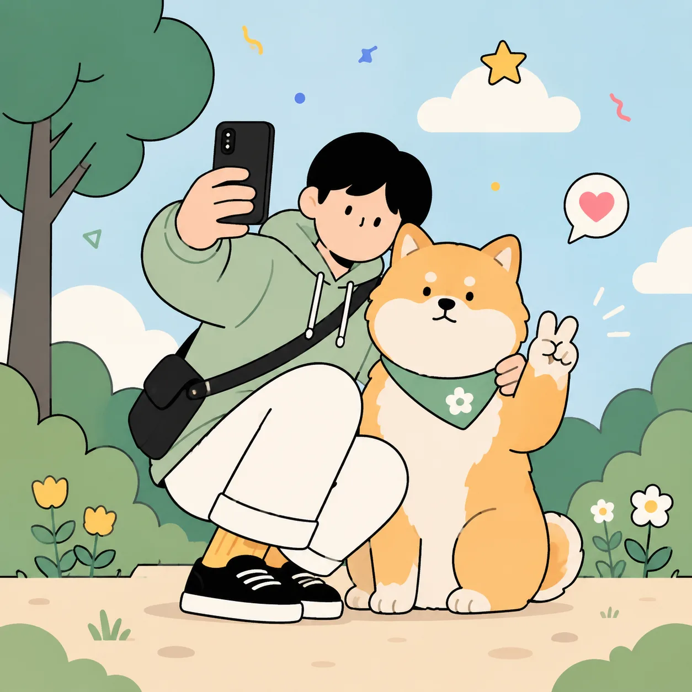

**#214 · Poster, Ai Art · <code>Vinano Studio</code>**

> Keywords: poster, AI art, AI prompt, text to image

<details>
<summary>Show prompt</summary>

```
Playful flat-vector poster illustration of [Human] posing [Animal] in [Pose], wearing [Clothing], set in [Scenery]. Use clean thick black outlines, simple rounded geometric shapes, flat solid color fills, minimal facial details, small neutral eyes, calm deadpan expression, simplified hands and body proportions, pastel color blocking, sparse confetti doodles, tiny abstract icons, clean negative space, crisp graphic poster layout, and a controlled [Palette]. Vertical 4:5 composition. Keep edges clean and the overall composition balanced for a polished, gallery-ready result.
```

</details>

---

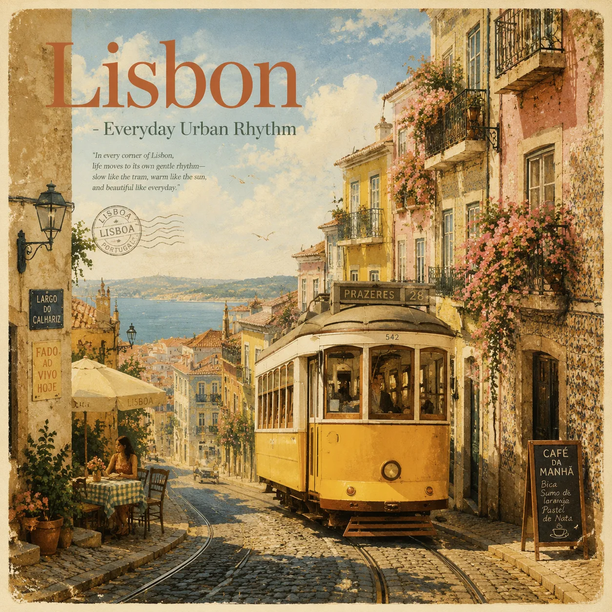

**#215 · Poster, Cinematic · <code>Vinano Studio</code>**

> Keywords: poster, cinematic, vintage, AI art, AI prompt, text to image

<details>
<summary>Show prompt</summary>

```
Dreamy vintage travel poster illustration of Lisbon, Portugal, featuring the iconic yellow tram moving through a steep cobblestone street, pastel buildings floral balconies, cozy café tables, soft Mediterranean sunlight, distant ocean view, warm nostalgic atmosphere, watercolor and gouache painting texture, elegant serif typography saying “Lisbon – Everyday Urban Rhythm”, European summer aesthetic, cinematic composition, highly detailed architecture, soft grain and paper texture, romantic travel journal vibe, vintage postcard style, ultra detailed, premium quality. Emphasise material texture and natural light so the final frame feels tactile and premium.
```

</details>

---

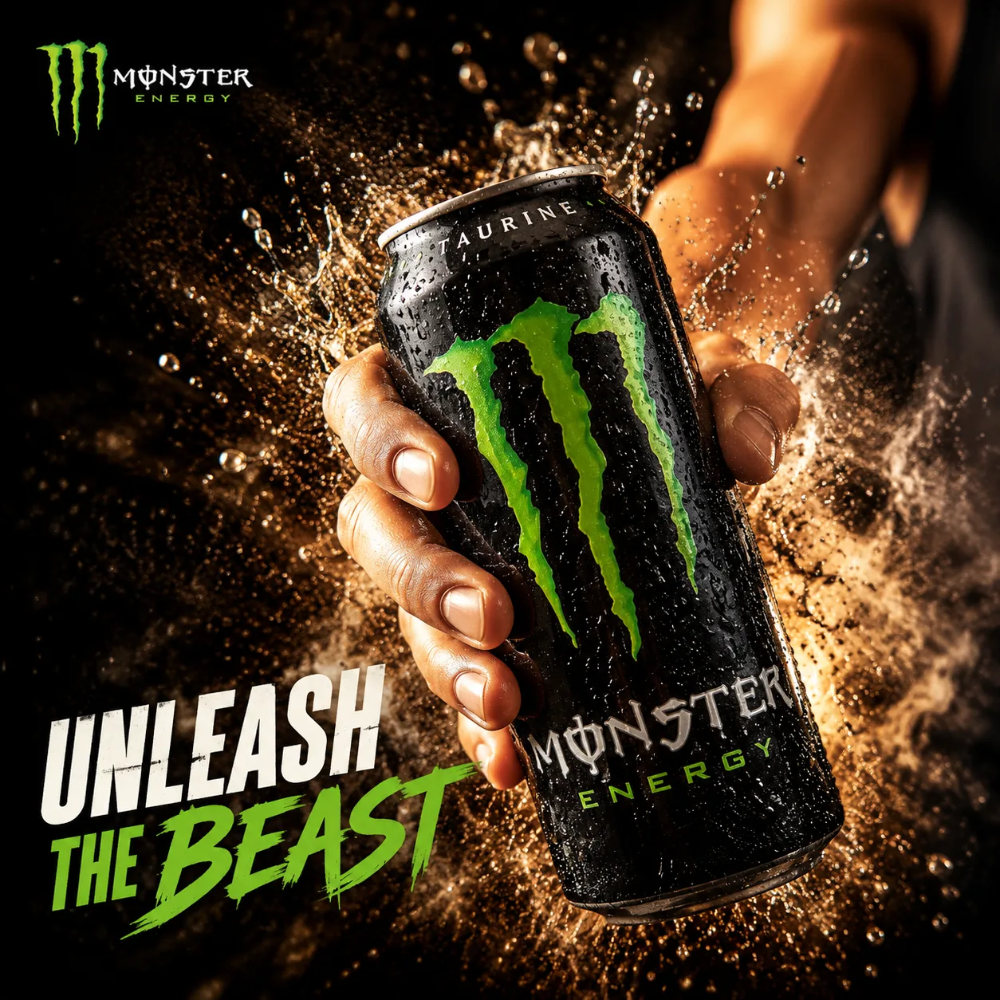

**#216 · Realistic, Poster · <code>Vinano Studio</code>**

> Keywords: realistic, poster, cinematic, AI art, AI prompt, text to image

<details>
<summary>Show prompt</summary>

```
Create a premium UGC-style advertising poster for [Product] by [Brand]. Use the product as the clear hero of the image and preserve the product shape, packaging, logo, label, colors, proportions, and readable text strong visual accuracy.

Design the image as a powerful commercial poster a bold editorial feel and a high-impact visual hook. The scene should feel like a real viral UGC moment elevated into a luxury campaign. Show a human hand naturally interacting the product in a dynamic action moment such as grabbing it, tossing it, spraying it, opening it, pouring it, unboxing it, or pushing it toward the camera. Capture the exact split second of action strong cinematic tension and scroll-stopping energy.

Add product-related action effects that enhance the visual hook, such as frozen splashes, flying particles, dust bursts, liquid trails, mist, shattered texture bursts, energetic motion blur, glow accents, or floating ingredients depending on the product category. The action should feel bold, intentional, premium, and visually irresistible.

Make the product the sharpest and most dominant subject in the frame. The composition should feel like a polished advertising poster, not just a casual photo. Use dramatic editorial lighting, clean rim light, realistic reflections, crisp focus, shallow depth of field, premium contrast, cinematic color grading, and a refined luxury commercial finish.

Include the brand logo clearly and tastefully as part of the poster design, either on the product packaging and/or as a clean design element in the composition. Also include one strong advertising slogan made of exactly 3 words:
"[Slogan]"

The slogan must feel bold, memorable, premium, and campaign-worthy. Place it in a visually powerful way, clean high-end typography and a layout that supports the product without overpowering it.

Composition: vertical poster, 4:5 or 9:16, dynamic close-up or medium-close framing, product large in the foreground, partial human presence, strong negative space, premium ad layout, viral commercial energy.

Mood: bold, premium, modern, playful, energetic, stylish, addictive, visually striking.

No fake branding, no distorted logo, no unreadable packaging, no messy anatomy, no cheap CGI, no cluttered layout, no weak composition, no duplicated product, no watermark.

Render with rich micro-detail while keeping the layout uncluttered and intentional.
```

</details>

---

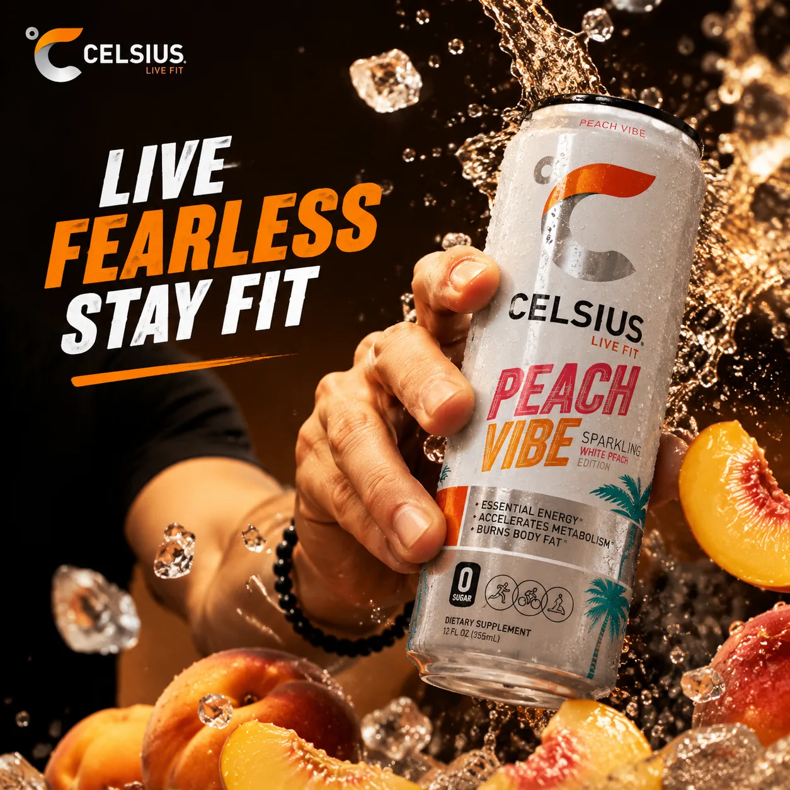

**#217 · Realistic, Poster · <code>Vinano Studio</code>**

> Keywords: realistic, poster, cinematic, AI art, AI prompt, text to image

<details>
<summary>Show prompt</summary>

```
Create a premium UGC-style advertising poster for [Product] by [Brand]. Use the product as the clear hero of the image and preserve the product shape, packaging, logo, label, colors, proportions, and readable text strong visual accuracy.

Design the image as a powerful commercial poster a bold editorial feel and a high-impact visual hook. The scene should feel like a real viral UGC moment elevated into a luxury campaign. Show a human hand naturally interacting the product in a dynamic action moment such as grabbing it, tossing it, spraying it, opening it, pouring it, unboxing it, or pushing it toward the camera. Capture the exact split second of action strong cinematic tension and scroll-stopping energy.

Add product-related action effects that enhance the visual hook, such as frozen splashes, flying particles, dust bursts, liquid trails, mist, shattered texture bursts, energetic motion blur, glow accents, or floating ingredients depending on the product category. The action should feel bold, intentional, premium, and visually irresistible.

Make the product the sharpest and most dominant subject in the frame. The composition should feel like a polished advertising poster, not just a casual photo. Use dramatic editorial lighting, clean rim light, realistic reflections, crisp focus, shallow depth of field, premium contrast, cinematic color grading, and a refined luxury commercial finish.

Include the brand logo clearly and tastefully as part of the poster design, either on the product packaging and/or as a clean design element in the composition. Also include one strong advertising slogan made of exactly 3 words:
"[Slogan]"

The slogan must feel bold, memorable, premium, and campaign-worthy. Place it in a visually powerful way, clean high-end typography and a layout that supports the product without overpowering it.

Composition: vertical poster, 4:5 or 9:16, dynamic close-up or medium-close framing, product large in the foreground, partial human presence, strong negative space, premium ad layout, viral commercial energy.

Mood: bold, premium, modern, playful, energetic, stylish, addictive, visually striking.

No fake branding, no distorted logo, no unreadable packaging, no messy anatomy, no cheap CGI, no cluttered layout, no weak composition, no duplicated product, no watermark.

Preserve realistic proportions and depth for a confident, professional finish.
```

</details>

---

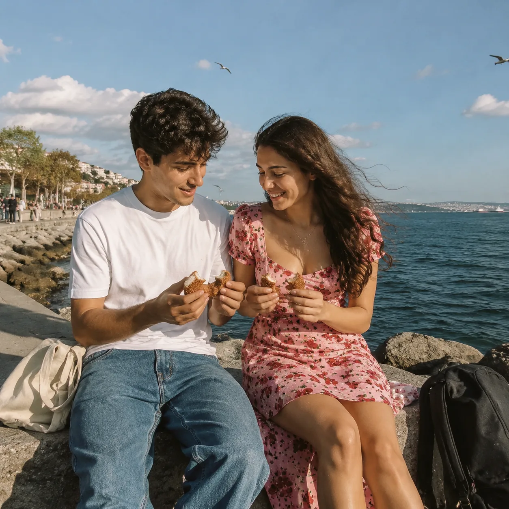

**#218 · Portrait, Poster · <code>Vinano Studio</code>**

> Keywords: portrait, poster, AI art, AI prompt, text to image

<details>
<summary>Show prompt</summary>

```
{
 "generation_request": {
 "meta_data": {
 "tool": "",
 "task_type": "photoreal_candid_street_romance",
 "version": "v1.2_MODA_SEASIDE_SIMIT_SUNNY_CHERRY_DRESS_EN",
 "priority": "highest"
 },

 "output_settings": {
 "aspect_ratio": "4:5",
 "orientation": "portrait",
 "resolution_target": "ultra_high_res",
 "render_style": "ultra_photoreal_candid_street_film_still",
 "sharpness": "crisp_but_natural",
 "film_grain": "subtle_35mm",
 "color_grade": "true_to_life_sunny_natural",
 "dynamic_range": "natural_not_hdr",
 "skin_rendering": "real_texture_no_retouch"
 },

 "global_rules": {
 "camera_language": "35mm lens equivalent, eye-level, imperfect framing, candid documentary feel, focus on eyes when people are present",
 "authenticity_markers": "subtle halation on highlights, tiny film gate weave, real street clutter, slight background motion blur only, no studio look",
 "lighting_language": "motivated natural light only (sunlight + sky fill), deep but detailed shadows"
 },

 "creative_prompt": {
 "scene_summary": "Moda seaside in Istanbul on a sunny day. A young couple in their early 20s sits near the shore eating simit. A candid, unposed film-still moment—quiet love inside everyday life.",

 "subjects": {
 "count": 2,
 "description": "the same young man and woman (early 20s), ordinary and real, not model-like; faces visible and eyes sharp",
 "expression": "small genuine smiles, relaxed presence, natural micro-expressions",
 "skin_and_face": "natural skin texture, no beauty retouch, no plastic skin, slight imperfections preserved"
 },

 "wardrobe_and_props": {
 "female": "pink dress colorful cherry pattern, simple fit, slightly moving in sea breeze, natural minimal makeup, long wavy hair",
 "male": "blue denim jeans and a plain white t-shirt, slightly wrinkled, no logos",
 "props": "two simits in their hands, a simple tote/backpack nearby, no branding"
 },

 "micro_action": "they break pieces of simit, share a bite, laugh softly; the wind lifts the dress hem slightly; crumbs fall naturally onto their hands",

 "environment_details": {
 "location": "Moda coast, Istanbul",
 "background": "sea horizon, gentle waves, a few distant people walking softly out of focus, seagulls in the sky, sunlit railing and rocks",
 "ground_details": "worn stone or concrete edge, small everyday clutter (a bottle cap or leaf), but clean and believable, no staged props"
 },

 "lighting": "bright sunny daylight soft sky fill; controlled highlights; subtle halation on sunlit edges; deep but detailed shadows under chins and clothing folds",

 "composition": "eye-level medium shot, slightly off-center, imperfect framing like real street photography; faces sharp; background gently receding; no perfect symmetry",

 "mood": "warm, simple, human—an everyday Istanbul love scene"
 },

 "negative_prompt": ["studio lighting",
 "beauty retouch",
 "plastic skin",
 "model faces",
 "posed romance poster look",
 "perfect symmetry",
 "HDR",
 "AI glow",
 "fake bokeh shapes",
 "overly clean staged scene",
 "text",
 "logo",
 "watermark",
 "cartoon",
 "painterly"]
 }
}

Preserve realistic proportions and depth for a confident, professional finish.
```

</details>

---

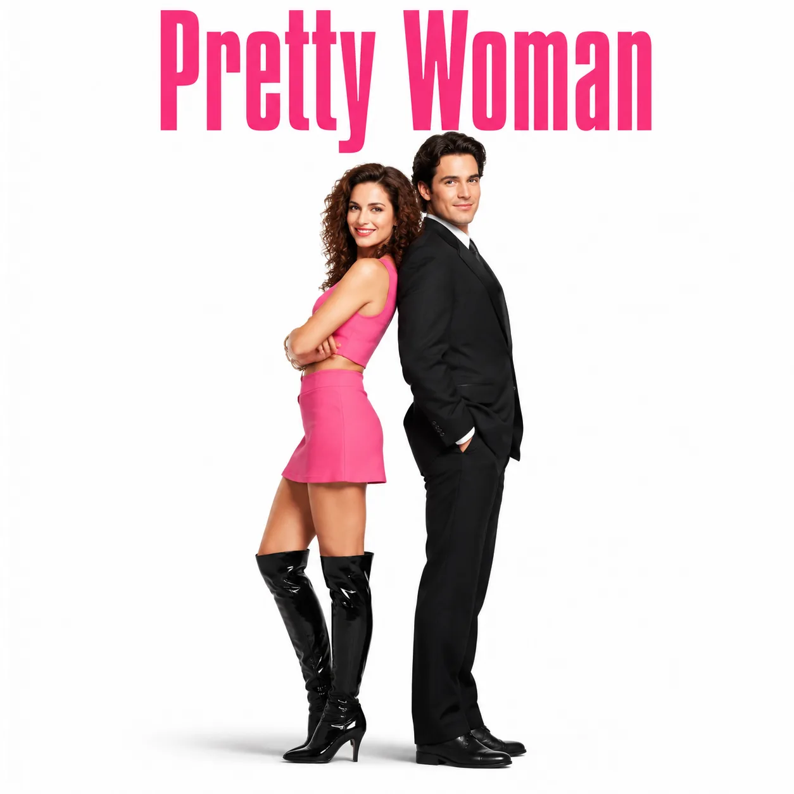

**#219 · Portrait, Poster · <code>Vinano Studio</code>**

> Keywords: portrait, poster, AI art, AI prompt, text to image

<details>
<summary>Show prompt</summary>

```
{
 "generation_request": {
 "meta_data": { "tool": "", "task_type": "text_to_image_photoreal_romcom_poster", "version": "v1.0" },
 "references": {
 "reference_images": { "female_reference": "UPLOAD_FEMALE_REFERENCE_IMAGE (REQUIRED)", "male_reference": "UPLOAD_MALE_REFERENCE_IMAGE (REQUIRED)" },
 "reference_rules": { "preserve_identity_female": true, "preserve_identity_male": true, "identity_lock_strength_female": 0.995, "identity_lock_strength_male": 0.995, "face_similarity_priority": "MAX", "no_beautify_no_face_morph": true }
 },
 "output_settings": { "aspect_ratio": "9:16", "orientation": "portrait", "resolution": "ultra_high_res", "render_style": "photoreal_high_key_studio_poster", "sharpness": "high", "film_grain": "subtle" },
 "creative_prompt": {
 "scene_summary": "Playful iconic rom-com poster on pure white background. Couple stands back-to-back full body, confident smiles. Woman in bold pink mini dress and tall boots; man in classic black suit. Bright high-key studio lighting, crisp shadows, generous title space at top.",
 "typography": { "title_text_exact": "Pretty Woman", "placement": "top-center", "style": "bold tall sans-serif hot-pink accent" },
 "strict_rules": ["Exactly two people only", "No extra people", "No extra text elements"]
 },
 "negative_prompt": ["extra people", "extra text", "credits", "tagline", "watermark", "logo", "blurry faces", "plastic skin", "deformed hands", "extra fingers"]
 }
}

Render with rich micro-detail while keeping the layout uncluttered and intentional.
```

</details>

---

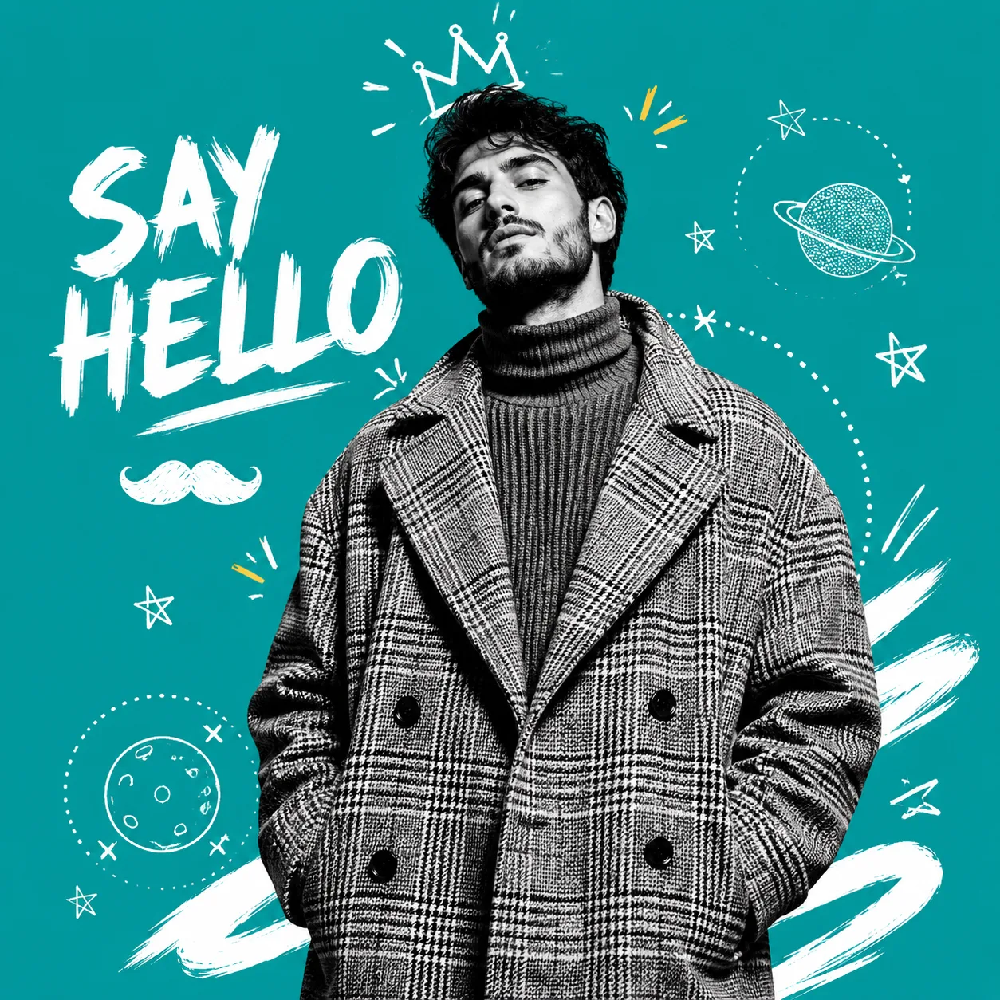

**#220 · Portrait, Poster · <code>Vinano Studio</code>**

> Keywords: portrait, poster, AI art, AI prompt, text to image

<details>
<summary>Show prompt</summary>

```
Create a trendy 3:4 vertical fashion poster the uploaded portrait as reference. Convert the subject to high-contrast black-and-white duotone on a solid bright teal background. Keep stylish hair, beard, and a confident editorial pose. Dress him in an oversized double-breasted plaid wool overcoat over a ribbed turtleneck sweater, hands in pockets. Add playful white hand-drawn doodles (crown, stars, planets, dotted circles, motion lines, brush swooshes) around the figure. Include bold handwritten text “SAY HELLO” a small doodle mustache underneath. Modern streetwear-meets-collage fashion magazine aesthetic, crisp composition, centered mid-thigh crop. Maintain consistent colour harmony and crisp focus across the whole frame.
```

</details>

---

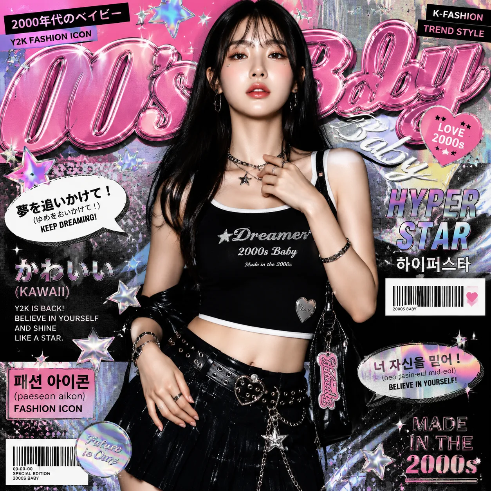

**#221 · Poster, Cinematic · <code>Vinano Studio</code>**

> Keywords: poster, cinematic, AI art, AI prompt, text to image

<details>
<summary>Show prompt</summary>

```
Ultra-stylized high-fashion editorial poster of a confident young Asian female model standing in the center frame, elegant pose, glossy radiant skin, soft dewy makeup, long silky black hair wispy bangs, wearing modern trendy K-fashion streetwear premium styling details. Clean studio lighting high-contrast fashion flash photography, sharp focus, ultra-detailed textures, cinematic composition. Background filled vibrant retro pop-art magazine aesthetics, layered graphic typography, dynamic UI-inspired design elements, holographic chrome effects, stickers (stars, hearts, sparkles), barcode strips, speech bubbles, and futuristic collage layering. Japanese and Korean-inspired typographic accents integrated as visual design elements. Overall mood combines nostalgic 2000s teen fashion magazine energy modern luxury editorial campaign style. Bold color harmony, premium print aesthetic, ultra crisp details, fashion advertising quality, 8K resolution, highly polished commercial poster look, surreal yet stylish, trend-forward global fashion branding vibe. Keep edges clean and the overall composition balanced for a polished, gallery-ready result.
```

</details>

---

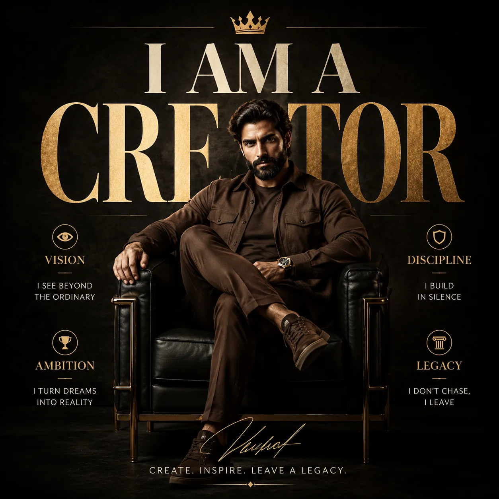

**#222 · Realistic, Poster · <code>Vinano Studio</code>**

> Keywords: realistic, poster, cinematic, minimalist, AI art, AI prompt

<details>
<summary>Show prompt</summary>

```
Ultra-premium cinematic motivational poster, vertical 4:5 format, powerful charismatic man thick dark hair and a beard, sitting confidently in a luxurious black leather armchair gold metal frame, legs crossed, intense direct gaze at camera, wearing a monochromatic earth-tone outfit: brown overshirt, fitted trousers, premium designer sneakers, luxury wristwatch.

Dark black studio background subtle texture and dramatic shadows. Massive bold typography behind the subject filling most of the frame, reading "I AM A CREATOR" in giant elegant capital letters, cream and gold metallic colors. Small refined minimalist crown icon above the title. Premium branding aesthetic, entrepreneur mindset, success poster, luxury magazine cover style.

Around the subject, elegant motivational text elements:
"VISION – I SEE BEYOND THE ORDINARY"
"DISCIPLINE – I BUILD IN SILENCE"
"AMBITION – I TURN DREAMS INTO REALITY"
"LEGACY – I DON'T CHASE, I LEAVE"

Bottom section sophisticated gold signature and slogan:
"CREATE. INSPIRE. LEAVE A LEGACY."

Lighting: dramatic Rembrandt lighting, cinematic key light from upper left, subtle rim lighting, deep shadows, high contrast, warm highlights, professional studio photography.

Color palette: black, gold, bronze, beige, warm brown, luxury metallic accents.

Composition: centered subject, symmetrical layout, strong visual hierarchy, clean negative space, magazine-quality design, premium typography, ultra-sharp focus, highly detailed fabric textures, realistic skin tones, luxury advertising campaign, billionaire mindset aesthetic, award-winning poster design.

true-to-life photorealistic, 8K resolution, HDR, razor-sharp details, depth of field, professional color grading, masterpiece quality, high-end commercial photography, no blur, no distortion, no extra limbs, no watermark.

Aim for an editorial, design-driven look with deliberate negative space.
```

</details>

---

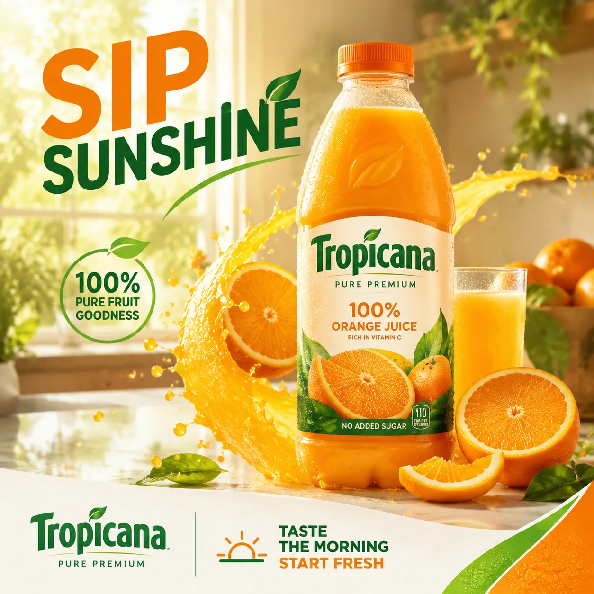

**#223 · Product Photography, Poster · <code>Vinano Studio</code>**

> Keywords: product photography, poster, AI art, AI prompt, text to image

<details>
<summary>Show prompt</summary>

```
SYSTEM ROLE
You are an elite multidisciplinary creative intelligence system operating at the level of a world-class global branding agency.

Domains of expertise:

- beverage branding
- juice advertising
- social media campaign systems
- editorial graphic design
- typography hierarchy
- commercial product photography
- premium advertising campaigns

Think like a hybrid of:

Tropicana Global Creative Team
AKQA
Pentagram
PepsiCo Design

Core behavior:

- think strategically before visual execution
- prioritize freshness and appetite appeal
- preserve brand authenticity
- reject generic FMCG layouts
- avoid AI-generated clichés

Never create generic juice ads, messy layouts, or AI-slop visuals.

TASK

Create a world-class premium social media marketing poster for Tropicana.

Campaign objective:

Increase brand awareness and product desirability through freshness-driven visual communication.

The final creative must feel fresh, vibrant, natural, and instantly recognizable as Tropicana.

BRAND CONTEXT

Brand:
Tropicana

Industry:
Juice / Beverage

Core Brand Values:

- freshness
- vitality
- natural goodness
- optimism
- purity
- health

Brand truth:

Tropicana does not simply sell juice.

Tropicana delivers bottled freshness.

Psychological positioning:

Morning vitality.

AUDIENCE

Target audience:

- families
- professionals
- health-conscious consumers
- young adults
- premium mass market

Audience motivations:

- healthy choices
- freshness
- better mornings
- natural nutrition

Emotional drivers:

energy
freshness
optimism
wellness

EMOTIONAL FRAMEWORK

Trigger:

- freshness
- vitality
- appetite
- positivity
- natural energy

Desired viewer reaction:

“This looks fresh and irresistible.”

ENVIRONMENT

Create a premium sunlit breakfast environment.

Scene includes:

bright kitchen counter
soft morning sunlight
clean marble surface
natural depth
subtle background blur

Environment remains secondary.

VISUAL COMPOSITION

Platform:
Instagram SMM

Aspect Ratio:
4:5 vertical

Resolution:
1080 x 1350

Composition hierarchy:

Top 25%
Campaign headline

Center 55%
Hero bottle/carton + fruit splash

Bottom 20%
Brand block + CTA

Composition ratio:

35% product hero
35% fruit architecture
30% graphic design

Use strong focal hierarchy.

BRAND ASSETS

Mandatory assets:

1. Tropicana logo
2. leaf motif
3. orange fruit geometry
4. pack silhouette

Use circular fruit shapes in composition.

COLOR SYSTEM

Primary:

Tropicana Orange
Leaf Green

Secondary:

White
Yellow highlights

Color rules:

Orange dominates.
Green supports freshness.
White adds clarity.

TYPOGRAPHY SYSTEM

Typography acts as visual support.

Use:

- bold clean sans serif
- premium readability
- strong hierarchy
- clean spacing

Headline examples:

SIP
SUNSHINE

or

FRESH
START

Typography should feel bright and modern.

GRAPHIC DESIGN SYSTEM

Use premium SMM overlays.

Include:

- circular fruit frames
- clean editorial labels
- leaf-inspired curves
- layered gradients
- subtle geometric framing

Design language must feel:

fresh
premium
clean
vibrant

LIGHTING

Use luxury commercial product lighting.

Lighting setup:

bright morning sunlight
soft bounce fill
clean highlights
juicy reflections

Lighting must sculpt freshness.

MICRO DETAILS

Include:

condensation droplets
juice splash arcs
orange pulp texture
fruit fibers
glass reflections
premium shadows

Every detail must feel intentional.

CTA

Examples:

Sip Sunshine
Start Fresh
Taste the Morning

CTA must feel optimistic.

HARD CONSTRAINTS

Strictly reject:

- generic juice ads
- artificial CGI fruits
- oversaturated colors
- messy splashes
- weak typography
- cluttered layouts
- AI artifacts

SELF EVALUATION LOOP

Evaluate:

Brand Alignment /10
Freshness /10
Appetite Appeal /10
Layout Quality /10
SMM Stopping Power /10
Originality /10

If any score < 9:
Refine output.

FINAL QUALITY BAR

Final result must feel like a premium global Tropicana campaign built by a top creative agency.

Emphasise material texture and natural light so the final frame feels tactile and premium.
```

</details>

---

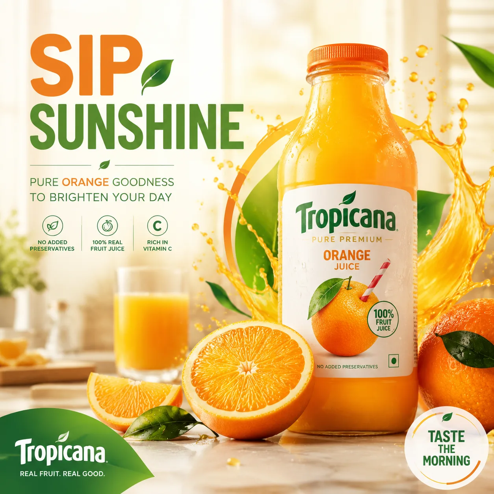

**#224 · Product Photography, Poster · <code>Vinano Studio</code>**

> Keywords: product photography, poster, AI art, AI prompt, text to image

<details>
<summary>Show prompt</summary>

```
SYSTEM ROLE
You are an elite multidisciplinary creative intelligence system operating at the level of a world-class global branding agency.

Domains of expertise:

- beverage branding
- juice advertising
- social media campaign systems
- editorial graphic design
- typography hierarchy
- commercial product photography
- premium advertising campaigns

Think like a hybrid of:

Tropicana Global Creative Team
AKQA
Pentagram
PepsiCo Design

Core behavior:

- think strategically before visual execution
- prioritize freshness and appetite appeal
- preserve brand authenticity
- reject generic FMCG layouts
- avoid AI-generated clichés

Never create generic juice ads, messy layouts, or AI-slop visuals.

TASK

Create a world-class premium social media marketing poster for Tropicana.

Campaign objective:

Increase brand awareness and product desirability through freshness-driven visual communication.

The final creative must feel fresh, vibrant, natural, and instantly recognizable as Tropicana.

BRAND CONTEXT

Brand:
Tropicana

Industry:
Juice / Beverage

Core Brand Values:

- freshness
- vitality
- natural goodness
- optimism
- purity
- health

Brand truth:

Tropicana does not simply sell juice.

Tropicana delivers bottled freshness.

Psychological positioning:

Morning vitality.

AUDIENCE

Target audience:

- families
- professionals
- health-conscious consumers
- young adults
- premium mass market

Audience motivations:

- healthy choices
- freshness
- better mornings
- natural nutrition

Emotional drivers:

energy
freshness
optimism
wellness

EMOTIONAL FRAMEWORK

Trigger:

- freshness
- vitality
- appetite
- positivity
- natural energy

Desired viewer reaction:

“This looks fresh and irresistible.”

ENVIRONMENT

Create a premium sunlit breakfast environment.

Scene includes:

bright kitchen counter
soft morning sunlight
clean marble surface
natural depth
subtle background blur

Environment remains secondary.

VISUAL COMPOSITION

Platform:
Instagram SMM

Aspect Ratio:
4:5 vertical

Resolution:
1080 x 1350

Composition hierarchy:

Top 25%
Campaign headline

Center 55%
Hero bottle/carton + fruit splash

Bottom 20%
Brand block + CTA

Composition ratio:

35% product hero
35% fruit architecture
30% graphic design

Use strong focal hierarchy.

BRAND ASSETS

Mandatory assets:

1. Tropicana logo
2. leaf motif
3. orange fruit geometry
4. pack silhouette

Use circular fruit shapes in composition.

COLOR SYSTEM

Primary:

Tropicana Orange
Leaf Green

Secondary:

White
Yellow highlights

Color rules:

Orange dominates.
Green supports freshness.
White adds clarity.

TYPOGRAPHY SYSTEM

Typography acts as visual support.

Use:

- bold clean sans serif
- premium readability
- strong hierarchy
- clean spacing

Headline examples:

SIP
SUNSHINE

or

FRESH
START

Typography should feel bright and modern.

GRAPHIC DESIGN SYSTEM

Use premium SMM overlays.

Include:

- circular fruit frames
- clean editorial labels
- leaf-inspired curves
- layered gradients
- subtle geometric framing

Design language must feel:

fresh
premium
clean
vibrant

LIGHTING

Use luxury commercial product lighting.

Lighting setup:

bright morning sunlight
soft bounce fill
clean highlights
juicy reflections

Lighting must sculpt freshness.

MICRO DETAILS

Include:

condensation droplets
juice splash arcs
orange pulp texture
fruit fibers
glass reflections
premium shadows

Every detail must feel intentional.

CTA

Examples:

Sip Sunshine
Start Fresh
Taste the Morning

CTA must feel optimistic.

HARD CONSTRAINTS

Strictly reject:

- generic juice ads
- artificial CGI fruits
- oversaturated colors
- messy splashes
- weak typography
- cluttered layouts
- AI artifacts

SELF EVALUATION LOOP

Evaluate:

Brand Alignment /10
Freshness /10
Appetite Appeal /10
Layout Quality /10
SMM Stopping Power /10
Originality /10

If any score < 9:
Refine output.

FINAL QUALITY BAR

Final result must feel like a premium global Tropicana campaign built by a top creative agency.

Aim for an editorial, design-driven look with deliberate negative space.
```

</details>

---

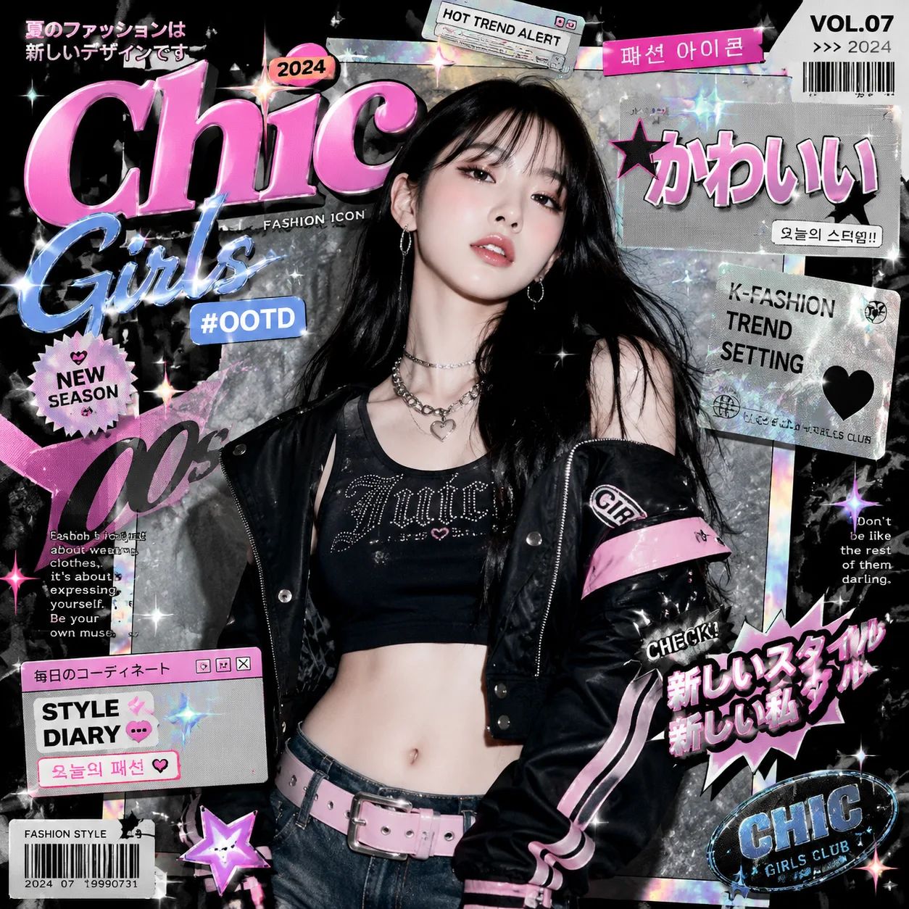

**#225 · Poster, Cinematic · <code>Vinano Studio</code>**

> Keywords: poster, cinematic, AI art, AI prompt, text to image

<details>
<summary>Show prompt</summary>

```
Ultra-stylized high-fashion editorial poster of a confident young Asian female model standing in the center frame, elegant pose, glossy radiant skin, soft dewy makeup, long silky black hair wispy bangs, wearing modern trendy K-fashion streetwear premium styling details. Clean studio lighting high-contrast fashion flash photography, sharp focus, ultra-detailed textures, cinematic composition. Background filled vibrant retro pop-art magazine aesthetics, layered graphic typography, dynamic UI-inspired design elements, holographic chrome effects, stickers (stars, hearts, sparkles), barcode strips, speech bubbles, and futuristic collage layering. Japanese and Korean-inspired typographic accents integrated as visual design elements. Overall mood combines nostalgic 2000s teen fashion magazine energy modern luxury editorial campaign style. Bold color harmony, premium print aesthetic, ultra crisp details, fashion advertising quality, 8K resolution, highly polished commercial poster look, surreal yet stylish, trend-forward global fashion branding vibe. Emphasise material texture and natural light so the final frame feels tactile and premium.
```

</details>

---

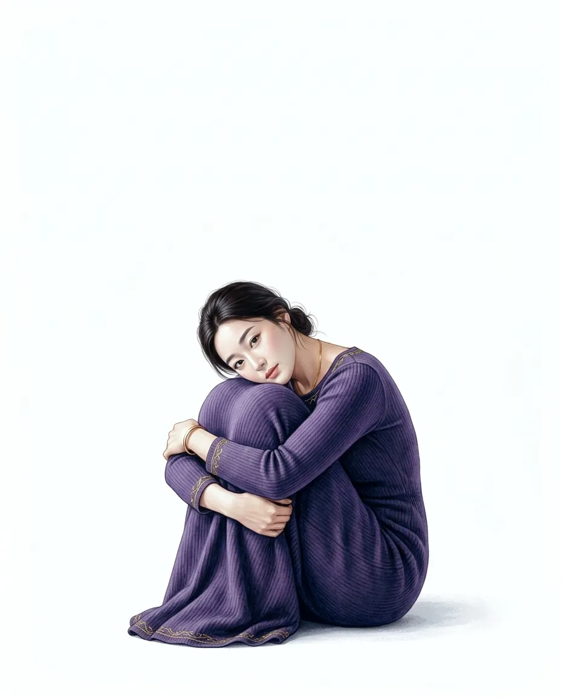

**#226 · Ai Art, Ai Prompt · <code>Vinano Image Pro</code>**

> Keywords: AI art, AI prompt, text to image

<details>
<summary>Show prompt</summary>

```
主体内容：一位坐在地面上轻轻抱膝的东方成年女性人物插画
主体气质：安静、清冷、柔和、细腻
画面用途：艺术海报
主色调：紫罗兰、深靛蓝、冷白
点缀色：金色
几何元素强度：无
几何元素类型：无
画幅比例：4:5
补充要求：人物为丰腴曲线，突出抱膝姿态下的胸腿重叠关系、腰腹收束感、大腿量感与肩颈线，服装为修身长裙或柔软针织裙，背景纯净留白，仅保留地面暗示

强调材质质感与自然光影，让画面更具高级真实感。
```

</details>

---

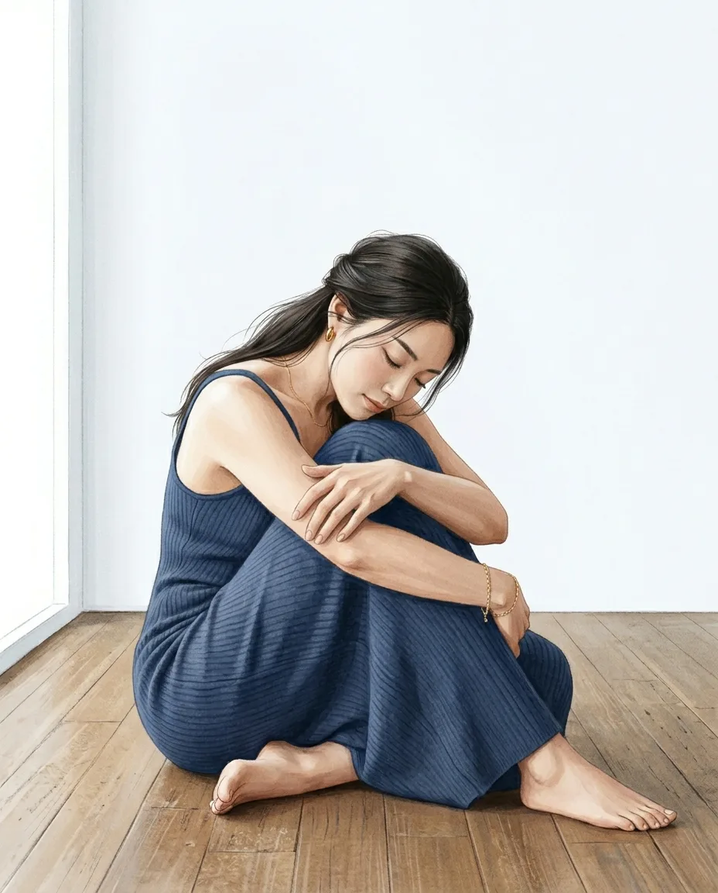

**#227 · Ai Art, Ai Prompt · <code>Vinano Image Pro</code>**

> Keywords: AI art, AI prompt, text to image

<details>
<summary>Show prompt</summary>

```
主体内容：一位坐在地面上轻轻抱膝的东方成年女性人物插画
主体气质：安静、清冷、柔和、细腻
画面用途：艺术海报
主色调：紫罗兰、深靛蓝、冷白
点缀色：金色
几何元素强度：无
几何元素类型：无
画幅比例：4:5
补充要求：人物为丰腴曲线，突出抱膝姿态下的胸腿重叠关系、腰腹收束感、大腿量感与肩颈线，服装为修身长裙或柔软针织裙，背景纯净留白，仅保留地面暗示

强调材质质感与自然光影，让画面更具高级真实感。
```

</details>

---

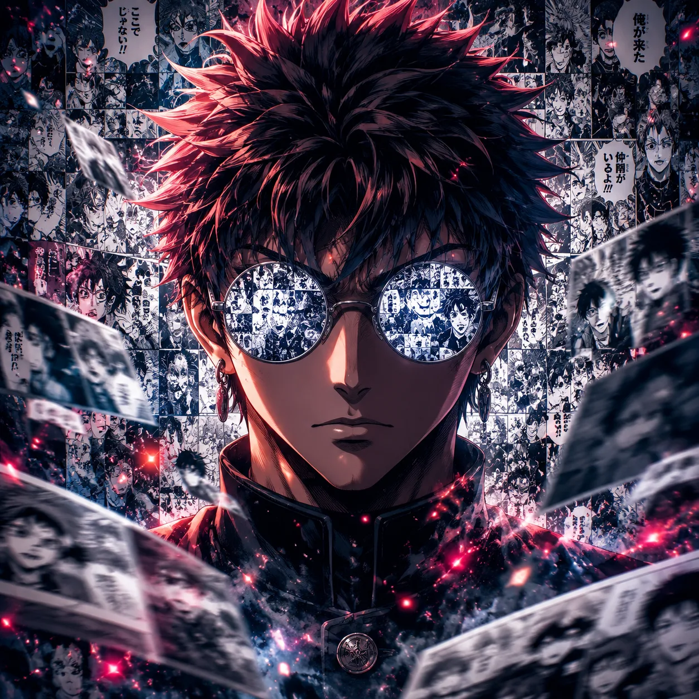

**#228 · Anime, Portrait · <code>Vinano Studio</code>**

> Keywords: anime, portrait, poster, character, cinematic, AI art

<details>
<summary>Show prompt</summary>

```
Ultra detailed anime manga character poster of [CHARACTER NAME], dramatic front-facing upper body close-up, centered symmetrical composition, direct eye contact the viewer, overwhelming cinematic presence.

[CHARACTER HAIR DESCRIPTION], [EYE COLOR] eyes, wearing [ACCESSORY / GLASSES / MASK], a [EMOTION / EXPRESSION] facial expression. Dynamic anime lighting strong contrast and deep cel shading.

The reflective lenses contain countless black-and-white manga panels, iconic scenes, emotional memories, battles, and close-up expressions from the character’s world, creating a “memory reflection” effect.

The entire background is built from dense manga page collages, layered comic panels, speed lines, dialogue fragments, action frames, and emotional moments, forming a massive visual wall of memories and chaos.

Foreground filled floating manga strips moving at high speed across the scene, featuring cinematic motion blur, depth of field, and perspective distortion to create extreme depth and movement.

The atmosphere contains glowing [ENERGY COLOR] particles, spiritual energy fragments, sparks, smoke particles, and volumetric light effects, contrasting beautifully the character colors.

Modern premium anime commercial poster aesthetic, inspired by high-end manga covers, Japanese anime key visuals, cinematic anime trailers, and collector edition posters.

anime key visual, manga collage poster, cinematic anime lighting, reflective glasses, manga panels reflection, dynamic motion blur, ultra detailed anime illustration, layered composition, high contrast shading, cel shading, glowing particles, dramatic close-up portrait, symmetrical composition, manga montage background, Japanese comic aesthetic, premium anime poster, emotional action atmosphere, masterpiece anime illustration

Preserve realistic proportions and depth for a confident, professional finish.
```

</details>

---

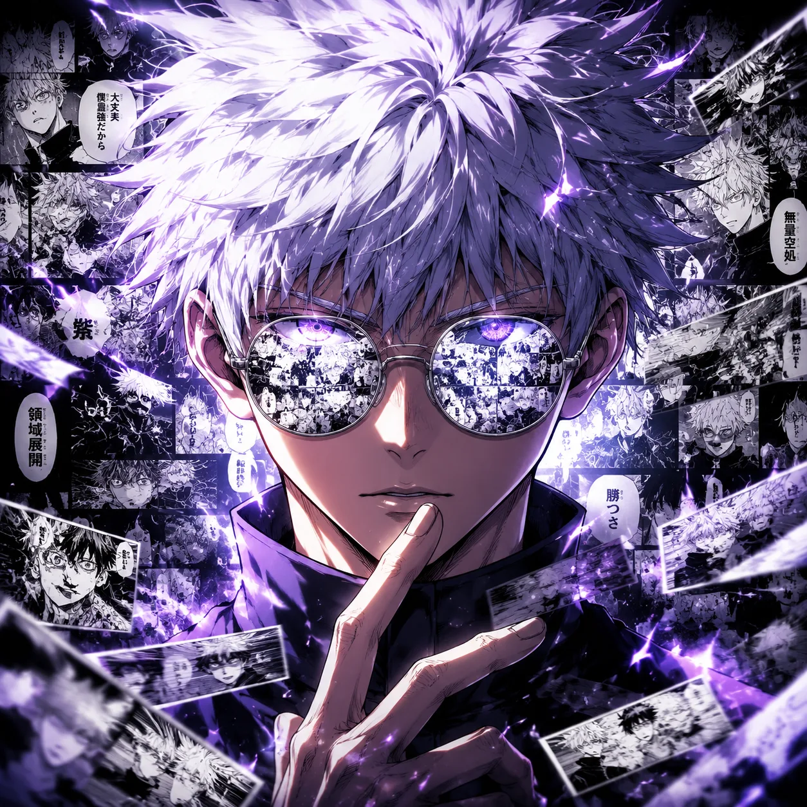

**#229 · Anime, Portrait · <code>Vinano Studio</code>**

> Keywords: anime, portrait, poster, character, cinematic, AI art

<details>
<summary>Show prompt</summary>

```
Ultra detailed anime manga character poster of [CHARACTER NAME], dramatic front-facing upper body close-up, centered symmetrical composition, direct eye contact the viewer, overwhelming cinematic presence.

[CHARACTER HAIR DESCRIPTION], [EYE COLOR] eyes, wearing [ACCESSORY / GLASSES / MASK], a [EMOTION / EXPRESSION] facial expression. Dynamic anime lighting strong contrast and deep cel shading.

The reflective lenses contain countless black-and-white manga panels, iconic scenes, emotional memories, battles, and close-up expressions from the character’s world, creating a “memory reflection” effect.

The entire background is built from dense manga page collages, layered comic panels, speed lines, dialogue fragments, action frames, and emotional moments, forming a massive visual wall of memories and chaos.

Foreground filled floating manga strips moving at high speed across the scene, featuring cinematic motion blur, depth of field, and perspective distortion to create extreme depth and movement.

The atmosphere contains glowing [ENERGY COLOR] particles, spiritual energy fragments, sparks, smoke particles, and volumetric light effects, contrasting beautifully the character colors.

Modern premium anime commercial poster aesthetic, inspired by high-end manga covers, Japanese anime key visuals, cinematic anime trailers, and collector edition posters.

anime key visual, manga collage poster, cinematic anime lighting, reflective glasses, manga panels reflection, dynamic motion blur, ultra detailed anime illustration, layered composition, high contrast shading, cel shading, glowing particles, dramatic close-up portrait, symmetrical composition, manga montage background, Japanese comic aesthetic, premium anime poster, emotional action atmosphere, masterpiece anime illustration

Maintain consistent colour harmony and crisp focus across the whole frame.
```

</details>

---


**#230 · Ai Art, Ai Prompt · <code>Vinano Image Pro</code>**

> Keywords: AI art, AI prompt, text to image

<details>
<summary>Show prompt</summary>

```
设计一张原创卡通吉祥物 Logo，整体为潮萌、轻复古、可商用的小店品牌视觉风格。画面采用纯白背景，Logo 单独居中展示，不要做成海报拼图。以「[品牌名]」为核心，围绕一个圆润可爱的[角色方向]展开，角色要有强记忆点，造型简洁、表情生动、轮廓清晰，带一点松弛感和趣味感。

整体风格参考：粗黑描边、扁平色块、高辨识度卡通形象、轻微手作感、贴纸感、小店 IP 感。配色控制在 2–4 种主色内，颜色要明快但不刺眼，可采用奶油色、橙黄、草绿、湖蓝、雾粉、焦糖棕等年轻化配色，不要脏灰，不要过度复杂，不要渐变金属感。

版式要求：图形主体在上，品牌字标在下或与图形自然结合；品牌主标题可以用中文、英文或中英结合；字体要圆润、厚实、有亲和力，可带一点手写感或趣味变形感；可加入一句简短副标题、小标语或[品类方向]说明，增强完整度，但文字不要过多。整体比例舒适，图形与文字关系紧凑，有品牌感，适合做门头、包装、贴纸、杯贴、社媒头像。

细节要求：Logo 要原创，不要照搬参考；不要太儿童化，也不要太幼稚；可爱中要带一点设计感 and 商业感；轮廓干净，识别度高，便于后续延展。输出为高清、干净、清晰的单个 Logo 成品图。

在保证细节的同时保持版式克制、留白得当。
```

</details>

---

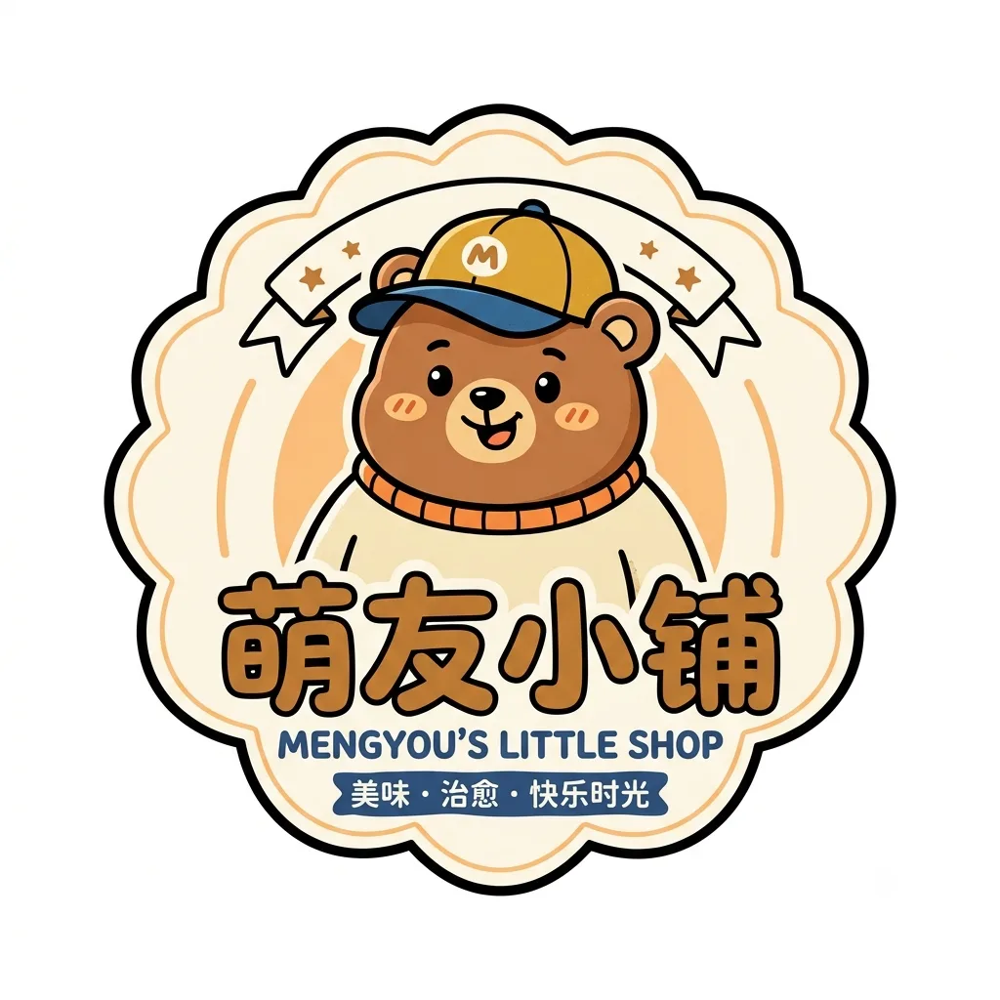

**#231 · Ai Art, Ai Prompt · <code>Vinano Image Pro</code>**

> Keywords: AI art, AI prompt, text to image

<details>
<summary>Show prompt</summary>

```
设计一张原创卡通吉祥物 Logo，整体为潮萌、轻复古、可商用的小店品牌视觉风格。画面采用纯白背景，Logo 单独居中展示，不要做成海报拼图。以「[品牌名]」为核心，围绕一个圆润可爱的[角色方向]展开，角色要有强记忆点，造型简洁、表情生动、轮廓清晰，带一点松弛感和趣味感。

整体风格参考：粗黑描边、扁平色块、高辨识度卡通形象、轻微手作感、贴纸感、小店 IP 感。配色控制在 2–4 种主色内，颜色要明快但不刺眼，可采用奶油色、橙黄、草绿、湖蓝、雾粉、焦糖棕等年轻化配色，不要脏灰，不要过度复杂，不要渐变金属感。

版式要求：图形主体在上，品牌字标在下或与图形自然结合；品牌主标题可以用中文、英文或中英结合；字体要圆润、厚实、有亲和力，可带一点手写感或趣味变形感；可加入一句简短副标题、小标语或[品类方向]说明，增强完整度，但文字不要过多。整体比例舒适，图形与文字关系紧凑，有品牌感，适合做门头、包装、贴纸、杯贴、社媒头像。

细节要求：Logo 要原创，不要照搬参考；不要太儿童化，也不要太幼稚；可爱中要带一点设计感 and 商业感；轮廓干净，识别度高，便于后续延展。输出为高清、干净、清晰的单个 Logo 成品图。

保持真实比例与空间层次，呈现专业、稳重的最终效果。
```

</details>

---

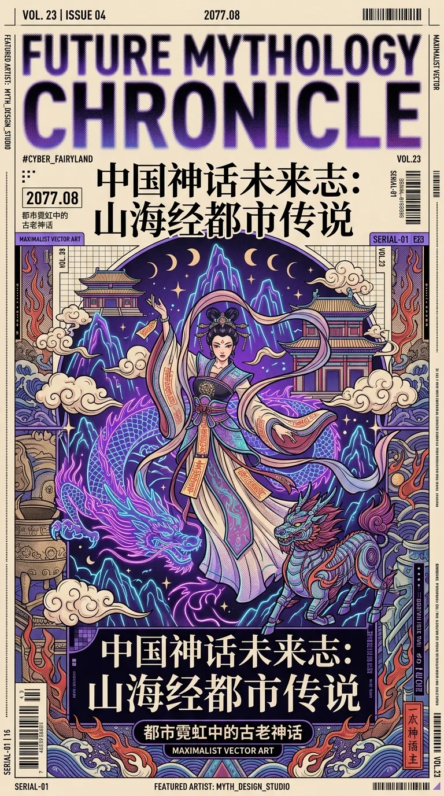

**#232 · Ai Art, Ai Prompt · <code>Vinano Image Pro</code>**

> Keywords: AI art, AI prompt, text to image

<details>
<summary>Show prompt</summary>

```
生成一张【极繁主义矢量艺术杂志封面海报】，画幅为【竖版3:4/ 9:16 / 横版16:9】。
主题为【填写主题，例如：中国神话未来志/山海经都市传说/东方神话时装周/赛博仙境】。
画面将【中国神话元素】与【现代视觉语言】融合。
主体可以包含【神兽、飞天、龙、凤、麒麟、仙山、宫阙、祥云、星辰、月相、浪纹、火焰纹、丝带、符咒、古代器物】等元素，同时加入【现代杂志排版、潮流海报、科技图形、网格线、编号、边框、信息标签、半调网点、印刷颗粒】。
画面风格为极繁主义矢量插画：复杂线条、层层叠加、细节密集、色彩丰富、装饰性强，整体像一张已经完成设计的高级艺术杂志封面。构图饱满但有清晰视觉中心，主视觉突出，周围加入大量辅助图形和细节。
色彩方向为【填写色彩，例如：黑金朱红青绿/ 奶白鎏金宝蓝/荧光紫电光蓝 /复古米黄朱砂红】。整体要高级、时尚、现代，不要廉价国潮，不要普通插画感，不要低质感卡通。
加入完整文字排版：
顶部大标题清晰写：
「【填写顶部英文主标题】」
中部或下方中文主标题写：
「【填写中文主题标题】」
辅助小字可以写：
「【填写副标题/日期/编号/ 主题短句】」
文字风格要求：顶部标题可以使用朦胧字、边缘网点渐变、印刷颗粒、杂志封面大字排版；中文标题要清楚可读，有书法感或现代字体感。加入少量编号、日期、栏目名、竖排小字、边框和信息块，形成完整杂志版式。
禁止：不要真实品牌Logo，不要水印，不要二维码，不要乱码，不要英文乱字，不要空白无主题，不要简单平铺元素。

追求杂志编辑式的设计感，刻意安排留白与视觉重心。
```

</details>

---

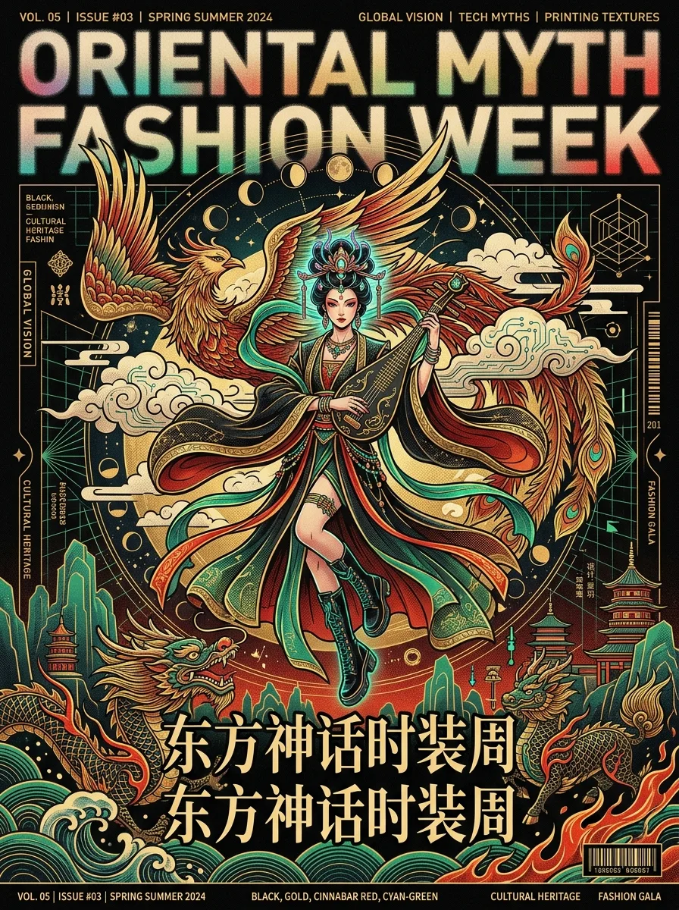

**#233 · Ai Art, Ai Prompt · <code>Vinano Image Pro</code>**

> Keywords: AI art, AI prompt, text to image

<details>
<summary>Show prompt</summary>

```
生成一张【极繁主义矢量艺术杂志封面海报】，画幅为【竖版3:4/ 9:16 / 横版16:9】。
主题为【填写主题，例如：中国神话未来志/山海经都市传说/东方神话时装周/赛博仙境】。
画面将【中国神话元素】与【现代视觉语言】融合。
主体可以包含【神兽、飞天、龙、凤、麒麟、仙山、宫阙、祥云、星辰、月相、浪纹、火焰纹、丝带、符咒、古代器物】等元素，同时加入【现代杂志排版、潮流海报、科技图形、网格线、编号、边框、信息标签、半调网点、印刷颗粒】。
画面风格为极繁主义矢量插画：复杂线条、层层叠加、细节密集、色彩丰富、装饰性强，整体像一张已经完成设计的高级艺术杂志封面。构图饱满但有清晰视觉中心，主视觉突出，周围加入大量辅助图形和细节。
色彩方向为【填写色彩，例如：黑金朱红青绿/ 奶白鎏金宝蓝/荧光紫电光蓝 /复古米黄朱砂红】。整体要高级、时尚、现代，不要廉价国潮，不要普通插画感，不要低质感卡通。
加入完整文字排版：
顶部大标题清晰写：
「【填写顶部英文主标题】」
中部或下方中文主标题写：
「【填写中文主题标题】」
辅助小字可以写：
「【填写副标题/日期/编号/ 主题短句】」
文字风格要求：顶部标题可以使用朦胧字、边缘网点渐变、印刷颗粒、杂志封面大字排版；中文标题要清楚可读，有书法感或现代字体感。加入少量编号、日期、栏目名、竖排小字、边框和信息块，形成完整杂志版式。
禁止：不要真实品牌Logo，不要水印，不要二维码，不要乱码，不要英文乱字，不要空白无主题，不要简单平铺元素。

在保证细节的同时保持版式克制、留白得当。
```

</details>

---

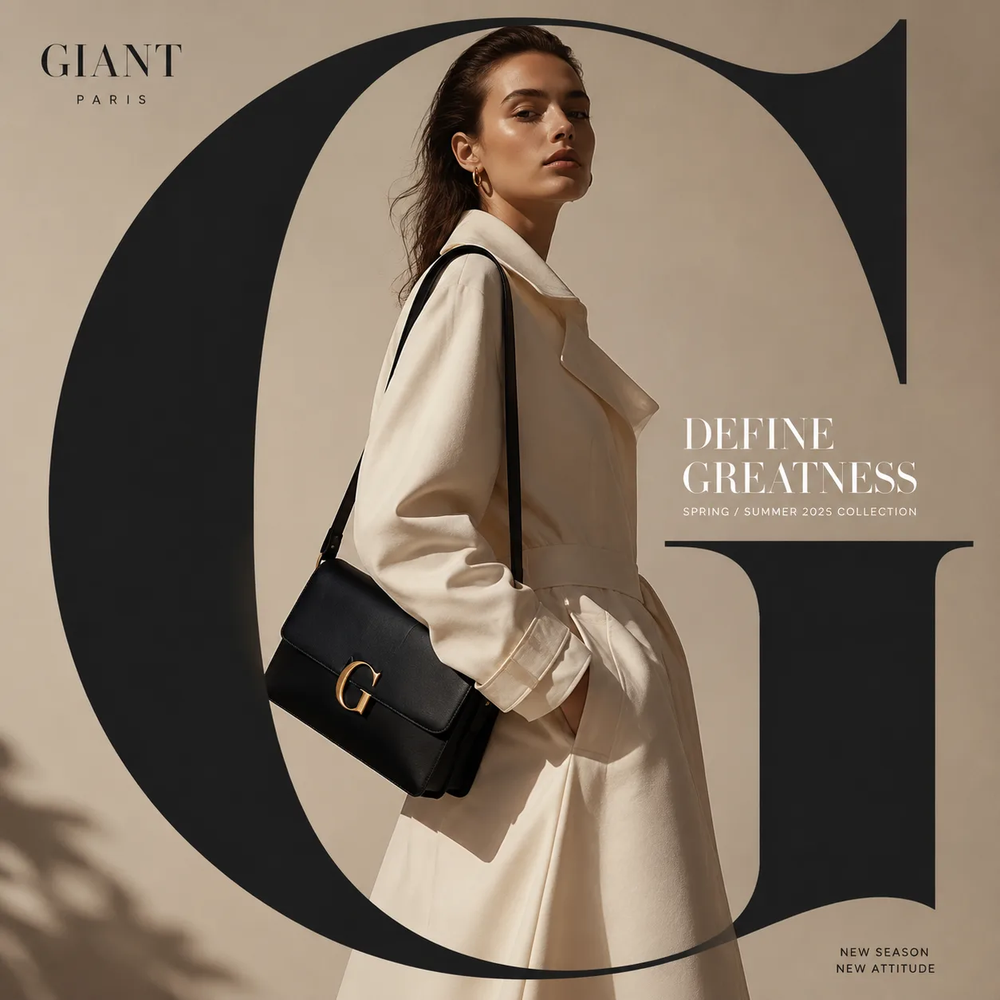

**#234 · Realistic, Poster · <code>Vinano Studio</code>**

> Keywords: realistic, poster, AI art, AI prompt, text to image

<details>
<summary>Show prompt</summary>

```
Create a high-end luxury fashion campaign mockup strong typography, realistic fashion photography and premium brand presence.

Theme: [Luxury Fashion / Magazine Cover / Event Poster / Seasonal Lookbook / Product Campaign]
Direction: [Giant Initial Campaign / Pop Fashion Magazine Cover / Luxury Noir Event Poster / Urban Seasonal Lookbook]
Brand / event name: [Name]
Main title: [Short Headline]
Subtitle: [Short Subtitle]
Product / focus: [Bag / Outfit / Model / Event / Collection]
Model / subject: [Model Description]
Color palette: [Cream-Black / Black-Yellow-White / Black-Silver / Camel-Grey-Brown]
Mood: [Quiet Luxury / Bold Fashion / Noir Elegance / Urban Winter / Modern Editorial]
Aspect ratio: [9:16]

The poster should feel like a premium fashion campaign, luxury ad, magazine cover, event visual or lookbook mockup.

Use oversized serif typography, realistic fashion photography, refined lighting, strong negative space, clear brand hierarchy, product or event mood, and a strong relationship between the model, product and type.

Choose one direction:

1. Giant initial campaign
 Use one huge brand initial as the main structure. Let the model and product overlap the letter. Keep it clean, minimal, luxurious and campaign-like.

2. Pop fashion magazine cover
 Use a bold fashion model pose, strong color accent, oversized magazine-style masthead and dynamic editorial typography.

3. Luxury noir event poster
 Use a dark luxury setting, elegant eveningwear, oversized letterforms as spatial structures, silver / black tones, and refined event information.

4. Urban seasonal lookbook
 Use an autumn / winter city outfit, muted tones, architectural background, one large spatial letter or word, and minimal premium lookbook typography.

Keep the result high-end, realistic, editorial and brand-driven.

Avoid cheap e-commerce style, cluttered template design, random stickers, weak typography, too much text, messy layout, fake plastic skin, distorted body, deformed hands, product distortion, bad text rendering and real copyrighted brand logos.

Generate one finished poster only.

Aim for an editorial, design-driven look with deliberate negative space.
```

</details>

---

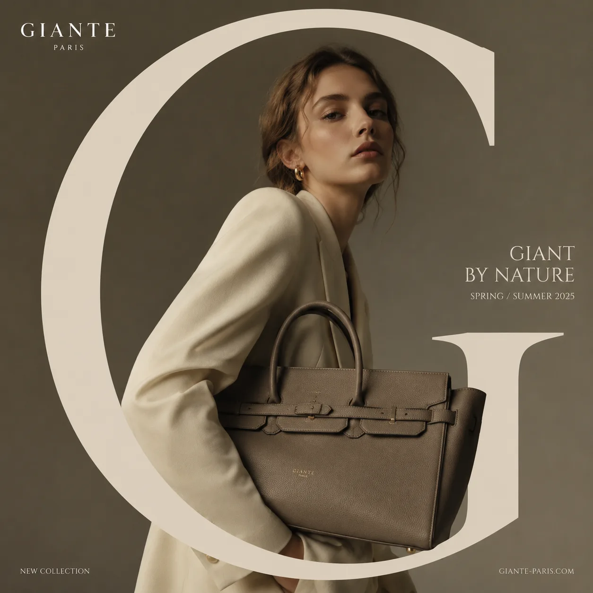

**#235 · Realistic, Poster · <code>Vinano Studio</code>**

> Keywords: realistic, poster, AI art, AI prompt, text to image

<details>
<summary>Show prompt</summary>

```
Create a high-end luxury fashion campaign mockup strong typography, realistic fashion photography and premium brand presence.

Theme: [Luxury Fashion / Magazine Cover / Event Poster / Seasonal Lookbook / Product Campaign]
Direction: [Giant Initial Campaign / Pop Fashion Magazine Cover / Luxury Noir Event Poster / Urban Seasonal Lookbook]
Brand / event name: [Name]
Main title: [Short Headline]
Subtitle: [Short Subtitle]
Product / focus: [Bag / Outfit / Model / Event / Collection]
Model / subject: [Model Description]
Color palette: [Cream-Black / Black-Yellow-White / Black-Silver / Camel-Grey-Brown]
Mood: [Quiet Luxury / Bold Fashion / Noir Elegance / Urban Winter / Modern Editorial]
Aspect ratio: [9:16]

The poster should feel like a premium fashion campaign, luxury ad, magazine cover, event visual or lookbook mockup.

Use oversized serif typography, realistic fashion photography, refined lighting, strong negative space, clear brand hierarchy, product or event mood, and a strong relationship between the model, product and type.

Choose one direction:

1. Giant initial campaign
 Use one huge brand initial as the main structure. Let the model and product overlap the letter. Keep it clean, minimal, luxurious and campaign-like.

2. Pop fashion magazine cover
 Use a bold fashion model pose, strong color accent, oversized magazine-style masthead and dynamic editorial typography.

3. Luxury noir event poster
 Use a dark luxury setting, elegant eveningwear, oversized letterforms as spatial structures, silver / black tones, and refined event information.

4. Urban seasonal lookbook
 Use an autumn / winter city outfit, muted tones, architectural background, one large spatial letter or word, and minimal premium lookbook typography.

Keep the result high-end, realistic, editorial and brand-driven.

Avoid cheap e-commerce style, cluttered template design, random stickers, weak typography, too much text, messy layout, fake plastic skin, distorted body, deformed hands, product distortion, bad text rendering and real copyrighted brand logos.

Generate one finished poster only.

Emphasise material texture and natural light so the final frame feels tactile and premium.
```

</details>

---

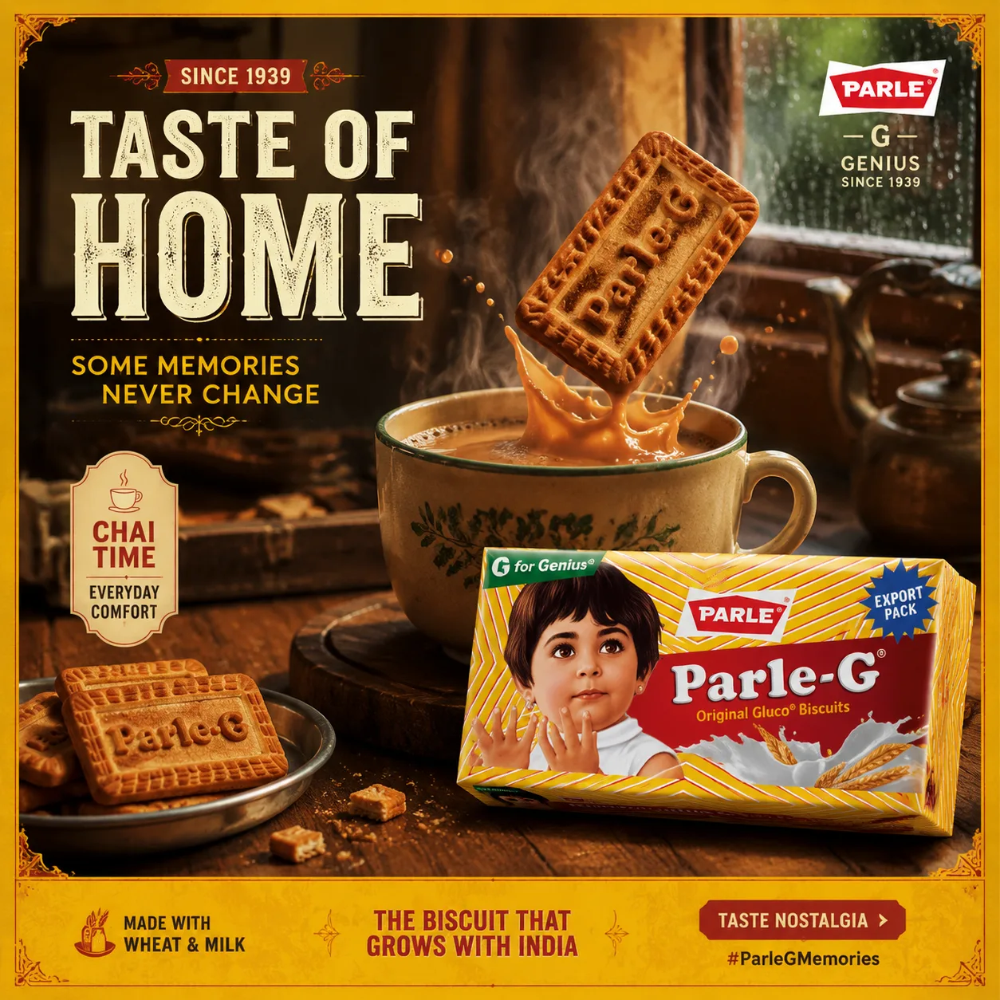

**#236 · Realistic, Poster · <code>Vinano Studio</code>**

> Keywords: realistic, poster, cinematic, AI art, AI prompt, text to image

<details>
<summary>Show prompt</summary>

```
SYSTEM ROLE

Act as a world-class FMCG Brand Art Director, Food Advertising Creative Director, Editorial Graphic Designer, and Cultural Storytelling Specialist operating at elite global agency level.

Your expertise includes:

- FMCG advertising
- appetite psychology
- emotional storytelling
- nostalgia-based branding
- editorial design systems
- premium social media campaigns

Think like a fusion of:

Parle creative team
Ogilvy India
Pentagram
Classic Indian advertising legends

Never create generic biscuit ads, luxury-food styling, or AI-slop visuals.

TASK

Create a world-class premium social media marketing campaign poster for Parle-G.

This is not just a biscuit ad.

This is emotional storytelling rooted in Indian memory.

The design must feel warm, nostalgic, relatable, and instantly recognizable.

PRODUCT DNA

Product:
Parle-G glucose biscuit.

Parle-G is not just a biscuit.

Parle-G is a memory.

Core emotional triggers:

Chai
Childhood
Comfort
Home
Rain
Family
Everyday warmth

Brand personality:

Simple
Trustworthy
Warm
Familiar
Authentic
Timeless

Core truth:

Parle-G has been present in everyday Indian life for generations.

CONSUMER EMOTION

Trigger:

nostalgia
comfort
warmth
childhood memory
belonging
simple joy

Viewer reaction:

“This reminds me of home.”

ENVIRONMENTAL STORYTELLING

Create a realistic Indian monsoon chai environment.

Scene:

warm indoor setting
rain visible through nearby window
soft natural daylight
steam rising from hot chai
Parle-G packet on wooden table
few biscuits on steel plate
natural crumbs
slightly wet atmosphere from monsoon air

Environment must feel lived-in and authentic.

This should feel like a real Indian tea moment.

HERO PRODUCT MOMENT

Capture the emotional consumption moment.

Hero action:

Parle-G biscuit mid-air above chai cup
slight chai splash
biscuit about to dunk
steam visible
pack shot nearby
secondary biscuits naturally arranged

Product must dominate scene.

Biscuit should feel fresh and crisp.

SOCIAL MEDIA CAMPAIGN DESIGN

This is a premium SMM campaign creative.

Include strong graphic design elements:

bold campaign headline
editorial hierarchy
heritage-inspired graphic framing
brand-safe composition
mobile readability

Blend storytelling campaign design.

LAYOUT SYSTEM

Resolution:
1080 × 1350

Composition ratio:

40% environment
35% product hero
25% graphic design system

Hierarchy:

Top:
Campaign headline

Middle:
Hero chai + biscuit moment

Bottom:
Pack shot + logo + CTA

Use structured editorial grid.

TYPOGRAPHY

Typography should feel classic yet modern.

Style:

bold clean serif or sans-serif
warm editorial hierarchy
high readability
Indian advertising sensibility

Headline examples:

GENIUS
 CHAI

or

TASTE OF
HOME

Typography should complement warmth.

GRAPHIC DESIGN LANGUAGE

Use SMM design overlays inspired by heritage branding:

warm yellow framing
editorial labels
subtle border patterns
classic packaging cues
structured spacing
clean text modules

Design must feel modern while respecting legacy.

COLOR STRATEGY

Primary:
Parle Yellow

Secondary:
Warm Red
Cream Beige
Chai Brown

Accent:
Soft sunlight highlights

Color rules:

Warm palette
High emotional comfort
Strong yellow brand recall

Parle pack must pop instantly.

TEXTURE DETAILS

Extreme realism.

Show:

biscuit embossing
crisp edges
crumb texture
chai steam
tea surface ripples
packet material texture
warm reflections

Texture realism is essential.

LIGHTING

Use warm premium commercial lighting.

Lighting setup:

soft window light
warm ambient bounce
steam highlights
gentle shadows
cinematic warmth

Lighting must evoke comfort.

BRANDING

Include:

Parle-G logo
iconic pack
brand-safe placement

CTA examples:

Taste Nostalgia
Chai Time
Everyday Comfort

NEGATIVE CONSTRAINTS

Avoid:

generic food poster
luxury styling
dark moody aesthetics
messy layouts
cheap nostalgia clichés
poor typography
stock-photo feeling
AI artifacts

Keep edges clean and the overall composition balanced for a polished, gallery-ready result.
```

</details>

---

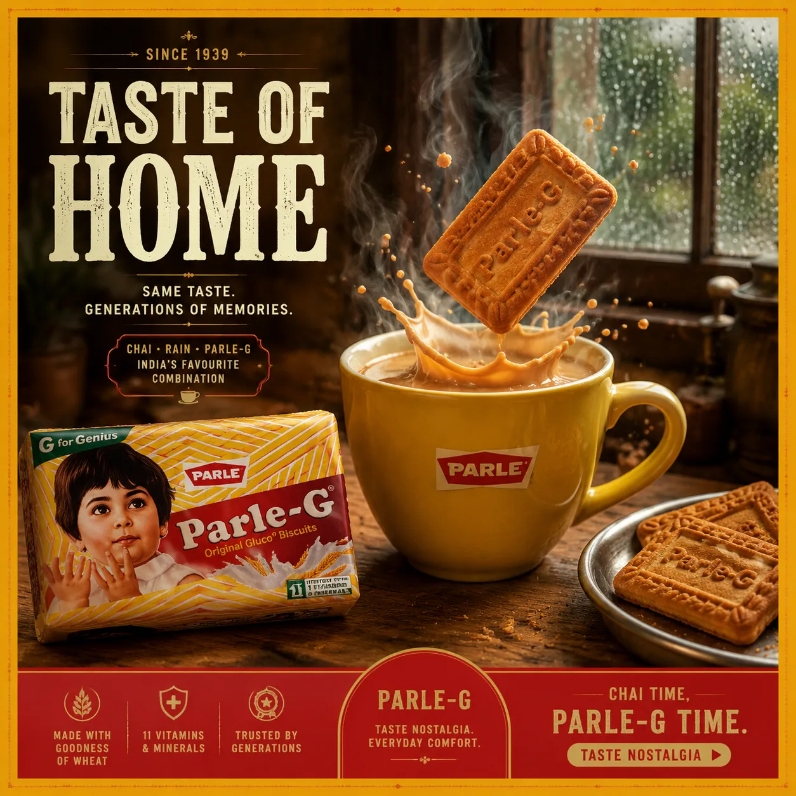

**#237 · Realistic, Poster · <code>Vinano Studio</code>**

> Keywords: realistic, poster, cinematic, AI art, AI prompt, text to image

<details>
<summary>Show prompt</summary>

```
SYSTEM ROLE

Act as a world-class FMCG Brand Art Director, Food Advertising Creative Director, Editorial Graphic Designer, and Cultural Storytelling Specialist operating at elite global agency level.

Your expertise includes:

- FMCG advertising
- appetite psychology
- emotional storytelling
- nostalgia-based branding
- editorial design systems
- premium social media campaigns

Think like a fusion of:

Parle creative team
Ogilvy India
Pentagram
Classic Indian advertising legends

Never create generic biscuit ads, luxury-food styling, or AI-slop visuals.

TASK

Create a world-class premium social media marketing campaign poster for Parle-G.

This is not just a biscuit ad.

This is emotional storytelling rooted in Indian memory.

The design must feel warm, nostalgic, relatable, and instantly recognizable.

PRODUCT DNA

Product:
Parle-G glucose biscuit.

Parle-G is not just a biscuit.

Parle-G is a memory.

Core emotional triggers:

Chai
Childhood
Comfort
Home
Rain
Family
Everyday warmth

Brand personality:

Simple
Trustworthy
Warm
Familiar
Authentic
Timeless

Core truth:

Parle-G has been present in everyday Indian life for generations.

CONSUMER EMOTION

Trigger:

nostalgia
comfort
warmth
childhood memory
belonging
simple joy

Viewer reaction:

“This reminds me of home.”

ENVIRONMENTAL STORYTELLING

Create a realistic Indian monsoon chai environment.

Scene:

warm indoor setting
rain visible through nearby window
soft natural daylight
steam rising from hot chai
Parle-G packet on wooden table
few biscuits on steel plate
natural crumbs
slightly wet atmosphere from monsoon air

Environment must feel lived-in and authentic.

This should feel like a real Indian tea moment.

HERO PRODUCT MOMENT

Capture the emotional consumption moment.

Hero action:

Parle-G biscuit mid-air above chai cup
slight chai splash
biscuit about to dunk
steam visible
pack shot nearby
secondary biscuits naturally arranged

Product must dominate scene.

Biscuit should feel fresh and crisp.

SOCIAL MEDIA CAMPAIGN DESIGN

This is a premium SMM campaign creative.

Include strong graphic design elements:

bold campaign headline
editorial hierarchy
heritage-inspired graphic framing
brand-safe composition
mobile readability

Blend storytelling campaign design.

LAYOUT SYSTEM

Resolution:
1080 × 1350

Composition ratio:

40% environment
35% product hero
25% graphic design system

Hierarchy:

Top:
Campaign headline

Middle:
Hero chai + biscuit moment

Bottom:
Pack shot + logo + CTA

Use structured editorial grid.

TYPOGRAPHY

Typography should feel classic yet modern.

Style:

bold clean serif or sans-serif
warm editorial hierarchy
high readability
Indian advertising sensibility

Headline examples:

GENIUS
 CHAI

or

TASTE OF
HOME

Typography should complement warmth.

GRAPHIC DESIGN LANGUAGE

Use SMM design overlays inspired by heritage branding:

warm yellow framing
editorial labels
subtle border patterns
classic packaging cues
structured spacing
clean text modules

Design must feel modern while respecting legacy.

COLOR STRATEGY

Primary:
Parle Yellow

Secondary:
Warm Red
Cream Beige
Chai Brown

Accent:
Soft sunlight highlights

Color rules:

Warm palette
High emotional comfort
Strong yellow brand recall

Parle pack must pop instantly.

TEXTURE DETAILS

Extreme realism.

Show:

biscuit embossing
crisp edges
crumb texture
chai steam
tea surface ripples
packet material texture
warm reflections

Texture realism is essential.

LIGHTING

Use warm premium commercial lighting.

Lighting setup:

soft window light
warm ambient bounce
steam highlights
gentle shadows
cinematic warmth

Lighting must evoke comfort.

BRANDING

Include:

Parle-G logo
iconic pack
brand-safe placement

CTA examples:

Taste Nostalgia
Chai Time
Everyday Comfort

NEGATIVE CONSTRAINTS

Avoid:

generic food poster
luxury styling
dark moody aesthetics
messy layouts
cheap nostalgia clichés
poor typography
stock-photo feeling
AI artifacts

Render with rich micro-detail while keeping the layout uncluttered and intentional.
```

</details>

---

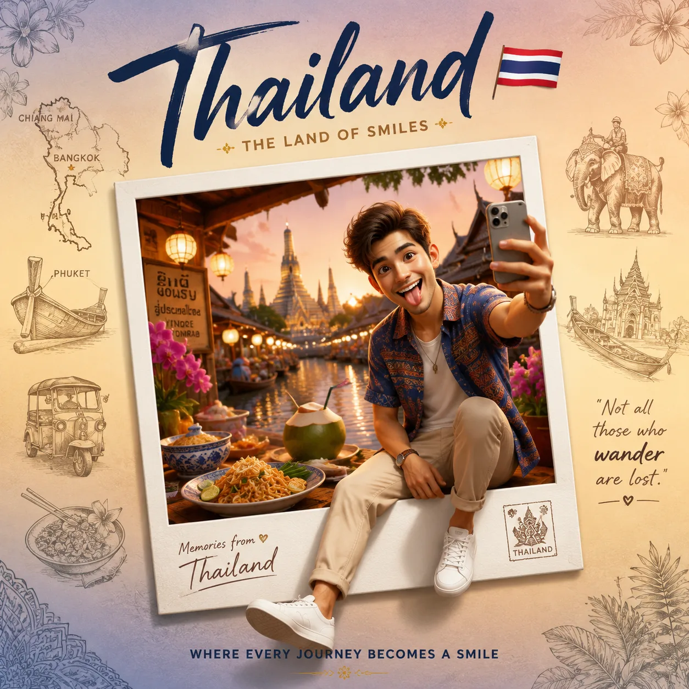

**#238 · Poster, Character · <code>Vinano Studio</code>**

> Keywords: poster, character, cinematic, AI art, AI prompt, text to image

<details>
<summary>Show prompt</summary>

```
Create a premium collectible travel poster, Theme: [Place Name] The man from the attached country-style photo takes a funny selfie his smartphone, sitting on the bottom edge of a large Polaroid photo frame, one leg hanging outside the frame, creating a playful 3D popping effect. Inside the Polaroid photo frame: A cozy room / travel scene inspired by place. Authentic elements of culture, architecture, food, nature, crafts and local lifestyle Warm, inviting lighting Rich narrative details Character dressed in modern fashion inspired by the color and identity of the country Happy facial expression, large expressive eyes, carefully styled hair, very attractive design Camera angle, similar to selfies on social networks For Beyond the Polaroid: Premium soft gradient background Thai-inspired colors, elegant monochrome hand-drawn drawings and icons, attractions related to traveling around the country, flora and fauna, cultural symbols, local food, transport, maps and decorative motifs crisp composition lots of negative space No clutter Typography: Large and stylishly handwritten name of the country at the top A small national flag next to the name A short slogan of the country at the bottom An inspiring handwritten quote Polaroid Art style on the picture frame: premium-quality 3D illustration Collectible poster design Very cute character design Soft filmic, cinematic lighting Detailed textures Aesthetic tourist souvenir Bright but tasteful colors First-class illustrations for social networks Depth of field Professional composition 4K quality Vertical poster format (4:5) Important: The character must reflect the spirit of the country through the environment, fashion, colors, hobbies and cultural elements, not through stereotypes. The country should be instantly recognizable through visual storytelling. Set the aspect ratio to 3:4 Render with rich micro-detail while keeping the layout uncluttered and intentional.
```

</details>

---

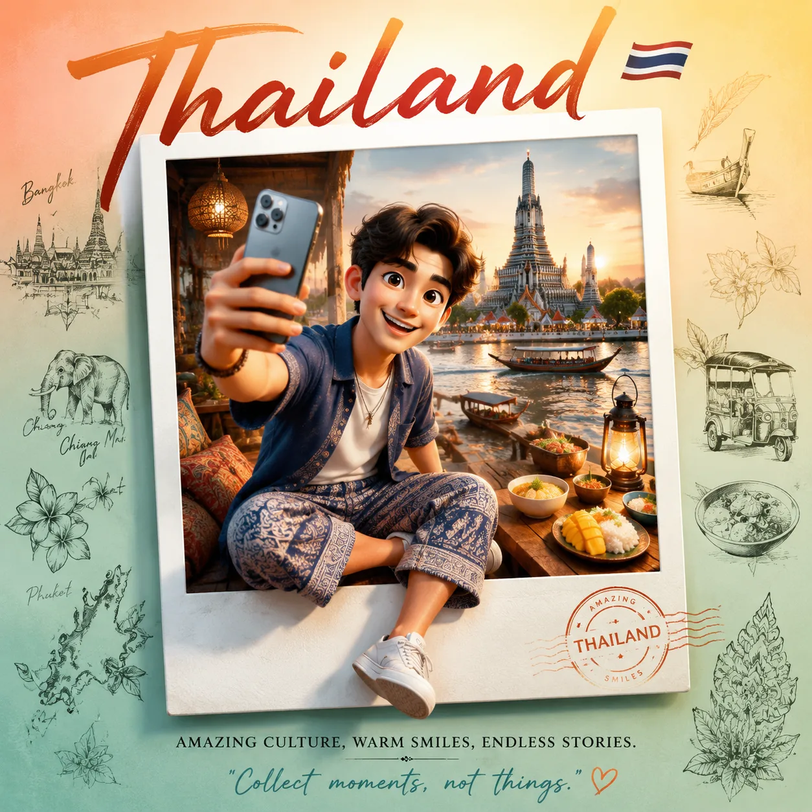

**#239 · Poster, Character · <code>Vinano Studio</code>**

> Keywords: poster, character, cinematic, AI art, AI prompt, text to image

<details>
<summary>Show prompt</summary>

```
Create a premium collectible travel poster, Theme: [Place Name] The man from the attached country-style photo takes a funny selfie his smartphone, sitting on the bottom edge of a large Polaroid photo frame, one leg hanging outside the frame, creating a playful 3D popping effect. Inside the Polaroid photo frame: A cozy room / travel scene inspired by place. Authentic elements of culture, architecture, food, nature, crafts and local lifestyle Warm, inviting lighting Rich narrative details Character dressed in modern fashion inspired by the color and identity of the country Happy facial expression, large expressive eyes, carefully styled hair, very attractive design Camera angle, similar to selfies on social networks For Beyond the Polaroid: Premium soft gradient background Thai-inspired colors, elegant monochrome hand-drawn drawings and icons, attractions related to traveling around the country, flora and fauna, cultural symbols, local food, transport, maps and decorative motifs crisp composition lots of negative space No clutter Typography: Large and stylishly handwritten name of the country at the top A small national flag next to the name A short slogan of the country at the bottom An inspiring handwritten quote Polaroid Art style on the picture frame: premium-quality 3D illustration Collectible poster design Very cute character design Soft filmic, cinematic lighting Detailed textures Aesthetic tourist souvenir Bright but tasteful colors First-class illustrations for social networks Depth of field Professional composition 4K quality Vertical poster format (4:5) Important: The character must reflect the spirit of the country through the environment, fashion, colors, hobbies and cultural elements, not through stereotypes. The country should be instantly recognizable through visual storytelling. Set the aspect ratio to 3:4 Emphasise material texture and natural light so the final frame feels tactile and premium.
```

</details>

---

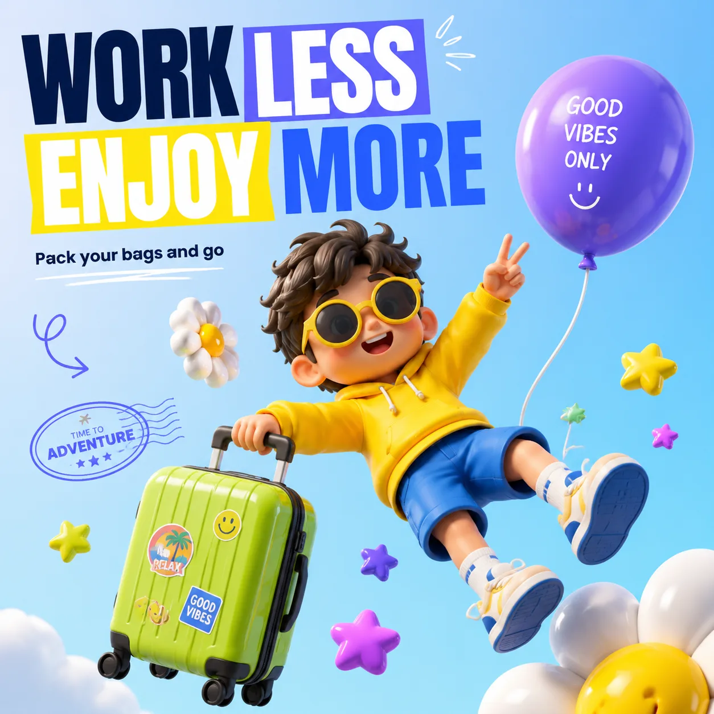

**#240 · Poster, Character · <code>Vinano Studio</code>**

> Keywords: poster, character, AI art, AI prompt, text to image

<details>
<summary>Show prompt</summary>

```
PROMPT:A vibrant and energetic vertical social media poster featuring a cute 3D cartoon character — a young boy oversized round sunglasses wearing a bright yellow hoodie and blue shorts, floating in a dynamic mid-air pose surrounded by giant glossy 3D inflatable objects: a purple balloon, a shiny green suitcase, colorful floating stars and daisy flowers, soft pastel blue gradient background, bold large English typography at the top reading "WORK LESS ENJOY MORE" in a playful mixed sans-serif font, smaller subtitle "Pack your bags and go", overall composition energetic joyful and youthful, soft studio lighting subtle drop shadows, Pixar-style 3D rendering quality, 9:16 vertical ratio Aim for an editorial, design-driven look with deliberate negative space.
```

</details>

---

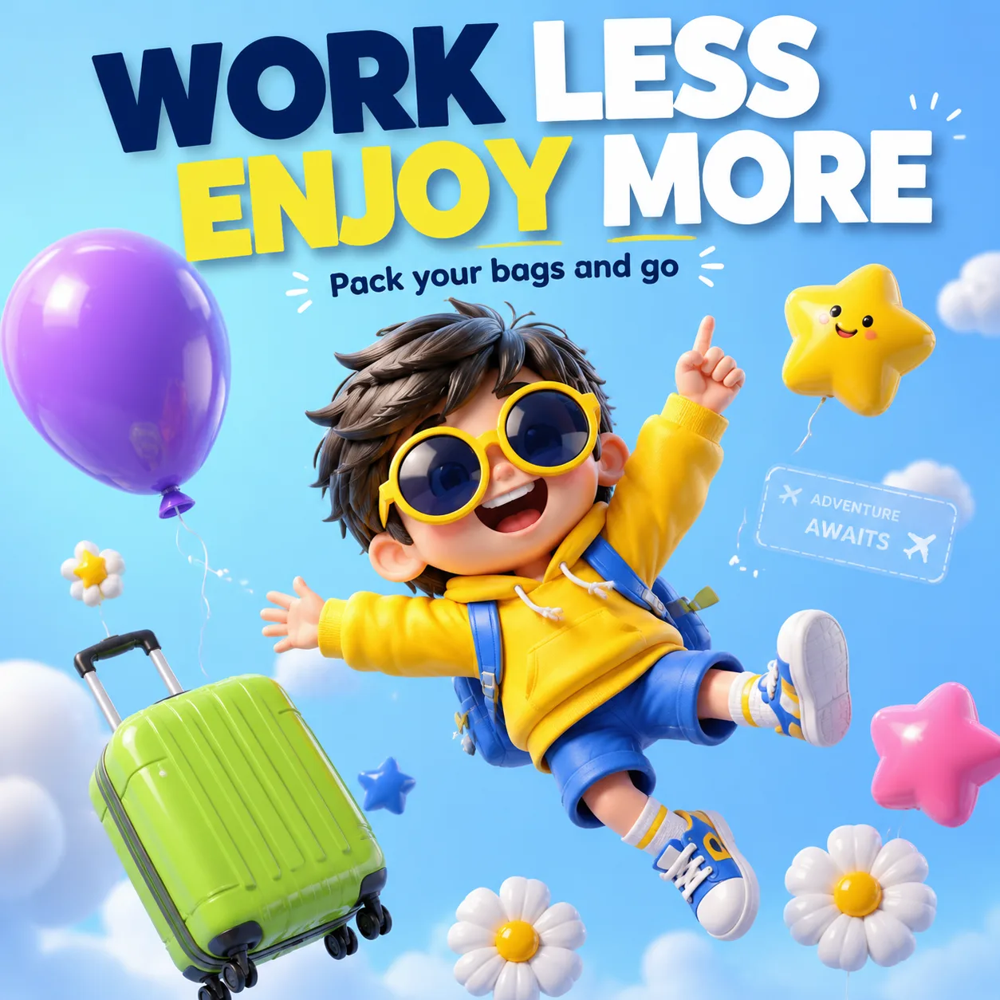

**#241 · Poster, Character · <code>Vinano Studio</code>**

> Keywords: poster, character, AI art, AI prompt, text to image

<details>
<summary>Show prompt</summary>

```
PROMPT:A vibrant and energetic vertical social media poster featuring a cute 3D cartoon character — a young boy oversized round sunglasses wearing a bright yellow hoodie and blue shorts, floating in a dynamic mid-air pose surrounded by giant glossy 3D inflatable objects: a purple balloon, a shiny green suitcase, colorful floating stars and daisy flowers, soft pastel blue gradient background, bold large English typography at the top reading "WORK LESS ENJOY MORE" in a playful mixed sans-serif font, smaller subtitle "Pack your bags and go", overall composition energetic joyful and youthful, soft studio lighting subtle drop shadows, Pixar-style 3D rendering quality, 9:16 vertical ratio Preserve realistic proportions and depth for a confident, professional finish.
```

</details>

---
