# Poster Design — full gallery

[← Back to README](../README.md) · [`prompts.json`](../prompts/prompts.json) · **241** prompts · page 1 / 3

**1** · [2](./poster-design-2.md) · [3](./poster-design-3.md) — [Next →](./poster-design-2.md)

---


**#1 · Poster Design Prompt · <code>Vinano Image Pro</code>**

<details>
<summary>Show prompt</summary>

```
整张图里展示 6 个独立手举牌，每个手举牌都完整可见，彼此分开，不要重叠，不要合并成一个大牌，采用清晰的 2列×3行 排布，整体留白舒服，白色底干净整洁，突出每个手举牌本身。每个案例都是单独一张图，不要把多个案例合并在一起。

整体风格要求：参考高完成度商业促销手举牌物料风格，画面要有成熟商业感、原创性和较强细节，不要做得简陋，不要过于扁平，不要像幼儿园贴纸。每个手举牌都必须有明显的多层结构：厚白外描边、彩色异形主底板、内层高光描边、轻微立体感、适度投影、局部渐变、丰富但不杂乱的 3D 小图标、大字主信息、辅助小标签。整体要像真实可制作的 KT板 / PVC 异形手举牌，边缘完整，结构稳固，适合刀模切割，也适合被人手拿拍照。

整套配色围绕【主色调】展开，并搭配【辅助色】和【点缀色】，整体要醒目、统一、有活动氛围。不要只有单一颜色，也不要太素。图标元素围绕【行业/场景关键词】展开，可以加入【图标元素1】、【图标元素2】、【图标元素3】、【图标元素4】、【图标元素5】等，增强活动感和成品感。

请生成以下 6 个独立手举牌文案，并让每个文案都有更合适的异形轮廓和图标配置：
1.【文案1】
2.【文案2】
3.【文案3】
4.【文案4】
5.【文案5】
6.【文案6】

要求这 6 个手举牌造型有变化，不要六个都长得一样。请灵活使用：气泡框、对话框、爆炸框、箭头框、圆角标签框、优惠券框、产品造型框、闪电框等不同异形轮廓，但整套仍然保持统一系列感。字体必须是粗体中文促销字标风格，主信息清晰醒目，适合远距离识别；如果文案里有数字、折扣、价格、件数、赠品等利益点，这些数字和关键词必须明显放大，作为视觉中心。

重点强调：整套图要像【适用场景】里真实会用到的一套手举牌物料方案，既有拍照打卡感，也有促销传播感和商业落地感。避免：过于扁平、过于简陋、儿童贴纸感、六个都是同一种云朵框、图标太少、没有层次、没有商业活动感、文字太弱、像普通电子贴片而不像实体手举牌。

最终输出要求：高清、白底、竖版 9:16、单张图片内展示 6 个独立手举牌、细节丰富、原创性强、好看且适合后续参考制作。

在保证细节的同时保持版式克制、留白得当。
```

</details>

---


**#2 · Poster Design Prompt · <code>Vinano Image Pro</code>**

<details>
<summary>Show prompt</summary>

```
请根据以下用户输入，生成一张横版 4:3 的《创意集市摊位设计提案板 / Creative Market Stall Proposal Board》。

这不是单纯的摊位效果图，而是一张完整的品牌出摊视觉提案图，需要同时呈现：摊位实景渲染、物料展开、尺寸示意、配色材质、品牌元素、IP形象、使用场景和核心亮点。

【用户输入】
品牌名：【填写品牌名】
摊位主题：【填写主题，例如鲜果气泡饮 / 章鱼小丸子 / 甜品冰品 / 文创手作】
主营产品：【填写具体产品】
目标人群：【年轻人 / 学生 / 女性消费者 / 亲子家庭 / 文创市集人群等】
整体风格：【清爽活力 / 街头热食 / 梦幻甜美 / 文艺手作 / 复古可爱 / 高饱和潮流等】
主色调：【填写主色】
辅助色：【填写辅助色】
IP形象：【填写IP设定，例如青柚精灵 / 小丸子研究员 / 云朵精灵 / 邮差小狗】
核心口号：【填写一句短口号】
使用场景：【文创市集 / 美食市集 / 校园活动 / 音乐节 / 商场快闪 / 品牌路演】

【整体画面要求】
画面比例为横版 4:3。
整体是一张专业的摊位设计提案板，采用高信息量但清晰有序的版式。
画面需要有明显的设计感、提案感和商业落地感，不要像普通广告海报，也不要像单纯效果图。

整体视觉应融合：
1. 写实摊位渲染效果图
2. 平面物料展开图
3. 简化尺寸结构图
4. 品牌视觉系统展示
5. 手绘批注、箭头、圈注、marker 标记
6. 淡淡的纸张纹理或设计稿纹理背景

整体风格参考当代年轻人喜欢的文创集市、美食集市、快闪摊位、品牌市集摊位。
需要新潮、好拍照、适合打卡传播，同时看起来真实可搭建、可落地执行。

【版式结构】
整张图应包含以下板块：

1. 顶部标题区
- 大标题：【品牌名】· 创意集市摊位设计提案
- 副标题：【主题品类】视觉系统 / Pop-up Stall Proposal
- 标题字体要有设计感，不能太普通
- 可以加入少量手绘符号、品牌图形、IP小头像或短口号

2. 主视觉效果区
- 左侧或画面核心区域放一张最大的摊位写实渲染图
- 场景为真实文创集市 / 户外市集 / 美食集市 / 商场快闪 / 校园活动等
- 需要有背景人流、帐篷、树木、灯串、摊位氛围，但人物不要喧宾夺主
- 摊位必须是“文创集市标准摊位”，不是三轮车、不是餐车
- 摊位结构包括：顶部异形招牌、前台围板、侧边围板、菜单立牌、挂牌、产品陈列、IP立牌、打卡装置、灯光或装饰物
- 主视觉要写实、清晰、有真实搭建感

3. 物料展开区 / Graphic & Materials
展示这套摊位涉及的主要物料设计，采用平铺设计稿方式呈现：
- 顶部招牌
- 前台围板
- 侧边围板
- 菜单立牌 A3
- 挂牌 / 双面吊牌
- 贴纸 / 小标识
- 吉祥物立牌
- 价格标签
- 手持打卡牌
每个物料旁边可以有简短编号和中文标签，排版要整洁，有设计提案感。

4. 尺寸示意区 / Dimensions
展示摊位的简化正视图和侧视图。
加入可信的尺寸标注，例如：
- 总宽度 240cm
- 总高度 260cm
- 柜体宽度 220cm
- 操作台高度 90cm
- 顶部招牌高度 70cm
- 侧面深度 60-120cm
尺寸不需要像 CAD 一样精确，但要看起来专业、合理、可落地。
可以加入人物比例剪影作为参照。

5. 配色 / 材质区 / Color & Material
展示 4-5 个色块，并标注色彩名称和近似 HEX 色值。
展示推荐材质，例如：
- KT板
- 雪弗板
- 泡沫板异形切割
- 亚克力灯箱
- PVC贴纸
- 防水喷绘布
- 金属框架
- 木纹板 / 布旗 / 灯串等
材质展示要像设计提案板，不要过于杂乱。

6. 品牌元素区 / Brand Elements
展示完整品牌视觉系统：
- Logo组合
- IP吉祥物
- 吉祥物表情包
- 辅助图形
- 产品图标
- 底纹 / 延展图案
- 小贴纸元素
这一块要体现品牌可延展性，而不是只做一个摊位外观。

7. 摊位类型区 / Stall Type
明确写出：
A. 文创集市标准摊位（本方案主推）
说明适用场景：
文创市集 / 美食市集 / 校园活动 / 音乐节 / 商场快闪 / 品牌路演
说明特点：
模块化搭建、运输方便、视觉醒目、适合拍照打卡、物料可复用。

注意：本图只展示“文创集市标准摊位”，不要展示三轮车流动摊位。

8. 使用场景 / 设计关键词 / 核心亮点
底部可以加入小型信息栏：
- 使用场景：文创市集、校园活动、音乐节、商场快闪、品牌路演
- 设计关键词：年轻、打卡、社交、模块化、高识别、可延展
- 核心亮点：高辨识度、易搭建、强互动、高传播、可复用、适合商业落地

【视觉风格要求】
整体画面要明亮、有冲击力，避免颜色太淡、太灰、太暗。
提高对比度，主色要更饱和，标题和重点信息要清晰有力。
背景可以使用淡淡的纸张纹理、印刷纹理、设计稿纹理或浅色图案，但不能抢主体。
版式要专业、整洁、有层次，像设计师给客户做的完整摊位提案板。
可以加入少量手绘箭头、圈注、便利贴感批注、marker笔记，增强提案氛围。

中文文字要简洁，不要塞太多长句。
主标题、板块标题、口号、标签尽量清晰准确。
所有品牌名、口号、IP和物料文字都必须原创，不要复制任何参考图里的品牌、标语或具体文字。

【最终效果】
生成一张完整、专业、年轻化、高完成度的创意集市摊位设计提案板。
它应该看起来像一个小品牌从 0 到 1 的出摊视觉系统方案：
既有真实摊位落地效果，又有物料设计、尺寸说明、品牌系统和商业应用场景。

强调材质质感与自然光影，让画面更具高级真实感。
```

</details>

---


**#3 · Poster Design Prompt · <code>Vinano Studio</code>**

<details>
<summary>Show prompt</summary>

```
<instruction>
 1. Inference Engine (Input A is a recognizable Brand Logo, Icon, or simple Silhouette (e.g., The Apple Logo, Nike Swoosh, Batman Symbol, A Heart).
Input B is a vast Natural Landscape (e.g., Snowy Mountains, Dense Jungle, Sand Dunes, Ocean Coastline).
Deconstruct the inputs to generate 3 Topographical Assets:
 The Negative Space (The Carving): How does the logo fit into the landscape?
 (e.g., The main body of the Apple logo is carved out of a snowy mountain peak).
 The Positive Space (The Island): Are there floating or detached elements of the logo?
 (e.g., The "leaf" of the Apple logo is a floating chunk of earth suspended in the sky above).
 The Texture (The Biome): What materials make up the shape?
 (e.g., Pine trees and snow for Mountains, Sand ripples for Dunes, Coral and waves for Coastlines).

 2. Container
Goal: "Subliminal Advertising" Landscape Photography.
 The Perspective: A wide, sweeping Aerial Drone Shot. The landscape stretches out vast and majestic, dominating the frame.
 The Atmosphere: Dramatic, moody weather. Heavy, swirling clouds, mist, or fog rolling through the valleys.

 3. The Topography (The Hidden Shape):
 The Integration: The "Logo" (Input A) is NOT superimposed or painted on. It is formed entirely by the physical geometry of the terrain.
 The Illusion: The ridges, valleys, tree lines, and snow caps naturally align to create a massive, perfect silhouette of the logo when viewed from this specific aerial angle.
 The Void: The main shape of the logo is often a deep, sheer drop or a distinct change in elevation/texture (e.g., a dark pine forest shaped like an apple cut into a white snowy mountain).
 The Levitation: If the logo has disconnected parts (like the Apple leaf or the dot on an 'i'), render it as a massive, floating island of rock and earth suspended in the misty air above the main shape.

 4. Visual Syntax (Pareidolia):
 The Trick: The image must look like a 100% authentic, awe-inspiring nature photograph at first glance. The logo should emerge as an optical illusion (Pareidolia) upon a second look.
 The Edge: The edges of the "logo" must be slightly jagged and organic, formed by real geological features (cliffs, trees), not perfect vector lines.

 5. Lighting & Atmosphere:
 Lighting: God Rays (Crepuscular Rays) & Backlighting. The sun is hidden behind the clouds or the floating landmass, blasting intense beams of light through the mist and defining the silhouette of the hidden shape.
 Contrast: High contrast between the dark valleys (forests/shadows) and the bright highlights (snow/sunlight).
 Vibe: Cinematic, majestic, and subtly surreal.

 Output: ONE image, 1:1 Aspect Ratio, National Geographic Aerial Photography, "Hidden Image" aesthetic, true-to-life photorealistic.
</instruction>

2. <system_role> you are an optical illusion artist and landscape photographer. </system_role> <illusion_topology> render a vast, true-to-life photorealistic {natural_environment}. however, the shadows, highlights, and physical layout of the landscape must form the exact facial contours and silhouette of {pop_culture_icon} when viewed from a distance. - dark zones (forming the eyes/hair/shadows): deep shadows cast by {dark_nature_elements}. - light zones (forming the skin/highlights): bright areas made of {light_nature_elements}. </illusion_topology> <visual_execution> the image must function flawlessly as two things at once: 1. up close: a beautiful, highly detailed photograph of a {natural_environment} during {weather_condition}. 2. zoomed out: a clear portrait of {pop_culture_icon}. ensure the blending is organic. do not use digital fade overlays. the rocks/trees themselves must form the face. </visual_execution>

Aim for an editorial, design-driven look with deliberate negative space.
```

</details>

---


**#4 · Poster Design Prompt · <code>Vinano Studio</code>**

<details>
<summary>Show prompt</summary>

```
Murphy magazine fashion editorial photograph. Androgynous model early 30s, sharp bone structure, flawless skin, hair slicked back, neutral composed expression, standing perfectly straight full body centered against a massive polished black marble architectural facade — reflective stone, towering vertical panels, subtle veining, high-gloss luxury surface. Wearing an immaculate oversized black double-breasted long coat single button fastened, black wide-leg trousers razor sharp centre crease, black leather pointed toe mule, one sculptural black leather architectural bag on left shoulder, designer Louis Vuitton. Left hand on hip, right arm hanging, chin slightly raised, looking directly into lens complete calm authority. High-gloss filmic, cinematic lighting controlled studio key light from left, cool monochrome highlights carving sharp reflections across coat and marble surface, face precisely sculpted high contrast shadow and highlight. Background: deep black marble fills entire frame zero sky visible — tonal black on black ultra luxury.

Typography overlaid exactly as Murphy magazine cover: top center — “MURPHY” in massive modern serif 90px white, letter-spaced 20px. Below masthead left — “PARIS” in 8px Josefin Sans tracked white caps. Top right — “Fall / Winter 2026” in 9px italic Cormorant Garamond white. Bottom left — editorial headline in stacked Playfair Display italic: “Monochrome” line 1, “Motion,” line 2, “Modern Power.” line 3 — 52px white, “Power.” in metallic silver. Bottom right — “Issue No. 01 · €12.00” in 8px tracked Josefin Sans white. Left edge vertical — “Photography · Styling · Creative Direction” in 7px white caps rotated 90 degrees.

Shot on Hasselblad H6D-400C, 85mm, shallow DOF, glossy marble bokeh, HDR, Murphy high-gloss fashion editorial cover, 4:5 portrait

Keep edges clean and the overall composition balanced for a polished, gallery-ready result.
```

</details>

---


**#5 · Poster Design Prompt · <code>Vinano Studio</code>**

<details>
<summary>Show prompt</summary>

```
{
 "prompt": "View from inside a Starbucks strawberry frappuccino cup looking up, fisheye lens extreme distortion, worm's eye perspective, crushed strawberry ice macro foreground glistening bokeh highlights, one single continuous green straw passing through the entire frame from top to bottom connecting lips to ice, person peering down from above through cup opening wide-eyed excited expression lips pursed on straw top, whipped cream layer, Starbucks logo visible on cup wall, clear blue sky background through opening, high saturation red strawberry vs green straw complementary colors, bright summer daylight, hyper-realistic commercial photography",
 "negative_prompt": "two straws, double straw, multiple straws, broken straw, separated straw, disconnected straw, flat lay, normal perspective, dull colors, deformed face, low saturation, ugly, extra limbs, woman, girl, female",
 "character_reference": {
 "upload": true,
 "control_weight": 0.95,
 "description": "maintain face and identity from reference image, male person, front-facing, slightly downward gaze, wide-eyed excited expression, lips pursed on straw"
 },
 "parameters": {
 "aspect_ratio": "9:16",
 "style_strength": 0.9,
 "composition_reference": "inside-cup fisheye upward shot, face centered in cup opening, single straw runs continuously from person lips down through whipped cream into crushed ice"
 }
}

Render with rich micro-detail while keeping the layout uncluttered and intentional.
```

</details>

---


**#6 · Poster Design Prompt · <code>Vinano Studio</code>**

<details>
<summary>Show prompt</summary>

```
High-end 3D advertising poster for [INSERT PRODUCT NAME]. A realistic [INSERT PRODUCT DESCRIPTION] is floating in the center of a magical fantasy landscape. The product is surrounded by a dynamic swirling vortex of [INSERT LIQUID OR ELEMENT] mixed glowing magical sparkles and floating [INSERT INGREDIENTS]. Background features surreal floating islands made of [INSERT MATERIAL] hovering over a [INSERT LANDSCAPE]. Hyper-realistic CGI render, Octane render, bright filmic, cinematic lighting, magical atmosphere. At the bottom center, bold white typography text reads "[INSERT YOUR TAGLINE HERE]". Advertising photography style, 8k resolution --ar 2:3 --v 6.0 Render with rich micro-detail while keeping the layout uncluttered and intentional.
```

</details>

---


**#7 · Poster Design Prompt · <code>Vinano Studio</code>**

<details>
<summary>Show prompt</summary>

```
5 panel colorful portrait collage, fashion models, monochrome backgrounds (pink, red, green, yellow), vibrant studio lighting, modern editorial style, rounded grid layout, high contrast, minimal shadows Preserve realistic proportions and depth for a confident, professional finish.
```

</details>

---


**#8 · Poster Design Prompt · <code>Vinano Studio</code>**

<details>
<summary>Show prompt</summary>

```
Hyper-realistic professional automotive commercial ad poster. [BRAND] [MODEL] in [COLOR] parked at a perfect 3/4 front angle on [SURFACE]. Background: [ENVIRONMENT]. [WEATHER/ATMOSPHERE]. The car hyper-detailed — every panel line sharp, all lights on and glowing, [SIGNATURE DESIGN DETAIL] catching [LIGHT SOURCE], alloy wheels clean and sharp, car reflection visible on [SURFACE] below. [ATMOSPHERE DETAIL — mist / dust / rain / stars].
Typography: top left — [BRAND] logo white. Center — “[MODEL NAME]” in large bold white. Bottom left — “[HEADLINE TAGLINE]” in italic serif white. Below — “[ENGINE · FEATURE · FEATURE]” in 8px tracked caps white. Bottom right — “Starting [PRICE]*” white. Thin horizontal rule separating tagline from specs. Bottom center — “[BRAND WEBSITE]” 7px tracked caps. Left edge vertical — “[MODEL · YEAR]” 7px white rotated 90 degrees.
Lighting: [MAIN LIGHT SOURCE], strong specular on car panels, all brand lights illuminated, [MOOD LIGHT — warm amber / cold blue / golden sunrise / storm dramatic]. Mood: [MOOD]. Shot on ARRI Alexa Mini LF, 50mm anamorphic, shallow DOF, HDR, professional automotive ad campaign poster, 4:5 portrait.

Preserve realistic proportions and depth for a confident, professional finish.
```

</details>

---


**#9 · Poster Design Prompt · <code>Vinano Studio</code>**

<details>
<summary>Show prompt</summary>

```
{
 "style": "high-fashion editorial, refined minimalist surrealism",
 "subject": "a confident woman leaning casually against an oversized green leather boot sculpture",
 "pose": "relaxed yet powerful stance, body slightly angled, one arm holding a small handbag",
 "outfit": {
 "top": "emerald green fitted sleeveless top",
 "bottom": "matching green leather pants",
 "footwear": "knee-high green leather boots",
 "accessories": "small structured green handbag"
 },
 "composition": {
 "scale": "dramatic contrast between human figure and oversized object",
 "framing": "full body shot, centered subject negative space",
 "background": "pure white seamless studio backdrop",
 "floor": "glossy white reflective surface"
 },
 "lighting": {
 "type": "soft studio lighting",
 "mood": "clean, premium, editorial",
 "shadows": "subtle, natural, controlled"
 },
 "color_palette": "monochromatic green tones neutral white",
 "camera": {
 "angle": "eye-level",
 "lens": "85mm fashion lens",
 "depth_of_field": "sharp focus on subject, smooth background"
 },
 "vibe": "luxury fashion campaign, modern, confident, surreal elegance",
 "quality": "ultra-high resolution, crisp details, magazine-ready"
}

Emphasise material texture and natural light so the final frame feels tactile and premium.
```

</details>

---


**#10 · Poster Design Prompt · <code>Vinano Studio</code>**

<details>
<summary>Show prompt</summary>

```
[product], futuristic high-end ad, transparent glass cube enclosure, caustic light patterns on surface, minimal composition, cool studio lighting, subtle fog, sharp reflections, ultra-realistic, macro product photography, 100mm lens look, f/8, 8k, 1:1 Preserve realistic proportions and depth for a confident, professional finish.
```

</details>

---


**#11 · Poster Design Prompt · <code>Vinano Studio</code>**

<details>
<summary>Show prompt</summary>

```
A retro-inspired studio photoshoot featuring a young woman styled in four different personas, arranged in a horizontal split-panel composition. Each panel has a bold pastel background in contrasting colors (yellow, blue, pink, mint). The same woman appears in each panel wearing vintage 1960s fashion bright patterns, pink knee-high socks, and expressive makeup.
Panel 1 (Office theme): She sits behind a desk office props like folders, a rotary phone, and stationery, wearing a patterned dress and looking surprised while holding the phone.
Panel 2 (Travel theme): She wears a wide-brim hat and colorful outfit, sitting a vintage suitcase and travel accessories, posing elegantly.
Panel 3 (Sports theme): She wears a sporty retro outfit, holding a tennis racket and ball, sitting casually playful energy.
Panel 4 (Home theme): She wears a robe hair rollers, holding a hand mirror, sitting at a vanity table beauty items.
Each panel is cleanly divided, perfectly symmetrical, consistent lighting and camera angle. Bright, soft studio lighting, high fashion editorial style, ultra-sharp, vibrant colors, minimal shadows, no text, no logos, no labels, no watermarks.
Style: vintage pop art, Wes Anderson symmetry, fashion editorial photography, pastel color blocking, high resolution, 8k, crisp composition.

Emphasise material texture and natural light so the final frame feels tactile and premium.
```

</details>

---


**#12 · Poster Design Prompt · <code>Vinano Studio</code>**

<details>
<summary>Show prompt</summary>

```
{
 "project_name": "Premium_Dark_Horizon_Product_Reveal",
 "USER_CUSTOMIZATION": {
 "INSTRUCTIONS": "Replace 'current_setting' the product you want to render. The system will AUTOMATICALLY position it in a specific, fixed pose: tilted back its bottom-front tip touching the horizon edge.",
 "product": {
 "current_setting": "Mac Mini",
 "description": "The product will be rendered a dark, metallic, highly detailed finish."
 }
 },
 "settings": {
 "style": "Cinematic, high-contrast product photography in a dark environment. Ultra-sharp focus, rich color grading.",
 "aspect_ratio": "4:5"
 },
 "prompt_construction": {
 "MAIN_SUBJECT": {
 "subject": "The [product from USER_CUSTOMIZATION] is perfectly centered.",
 "appearance": "It has a premium, dark silver/chrome-like finish, looking solid and incredibly sharp. There is an ever-so-slight, subtle warmth mixed into the reflections on the metallic surfaces, giving it depth.",
 "pose_and_contact": "CRITICAL: The product is tilted back dramatically, away from the viewer towards the top of the frame. Its bottom-front tip or edge is PRECISELY touching the sharp center edge of the horizon arc. It must NOT float above the arc. This pose prominently displays the main surface (e.g., laptop lid logo, phone screen/back, watch face)."
 },
 "HORIZON_ARC": {
 "description": "A single, clean, massive, dark horizon line arcs across the entire width of the screen from left to right. It is NOT a complete sphere, glowing ball, or circle, but the very edge of a dark planet-like surface.",
 "light_profile": "The edge itself is defined by a thin, sharp, soft-glow blue light. The light is thinnest and sharpest (purplish-blue) in the bottom-left, widening slightly to a brighter, soft white-blue rim on the right before fading. It must NOT reveal the spherical form of the surface below; the area below the arc must remain pitch black.",
 "reflection_effect": "CRITICAL: There are ABSOLUTELY NO reflections of the product on the horizon surface. The surface is dark and matte."
 },
 "LIGHTING_AND_BACKGROUND": {
 "background": "Pure, absolute black negative space. There are NO visible light rays, gradients, starfields, halos, or any other light shapes above or around the product.",
 "key_lighting": "A strong key light from the TOP-LEFT sculpts the product, emphasizing its form and the logo/main feature. It does NOT create visible rays.",
 "rim_lighting": "A distinct rim light from the BACK-LEFT separates the product from the dark background.",
 "fill_lighting": "A soft fill light from the BOTTOM-RIGHT opens up the shadows slightly.",
 "color_cast": "All lighting is dominated by deep, rich blues, consistent the horizon arc."
 },
 "COMPOSITION_AND_FRAMING": {
 "framing": "The product is perfectly centered. The camera distance is fixed, ensuring the product is large and dominant but NEVER cut off.",
 "perspective": "A sharp, eye-level perspective relative to the product's center, looking slightly down towards the horizon."
 }
 },
 "NEGATIVE_CONSTRAINTS": ["visible light rays",
 "glow or light source in the top left corner",
 "product floating above the arc",
 "product not touching the arc edge",
 "product lying flat",
 "visible sphere or glowing orb form below the arc",
 "halos or circular lights above the product",
 "harsh light glows",
 "reflections of the product on the horizon",
 "background other than pure black",
 "product cut off by frame edge",
 "upside-down or downward curve",
 "squiggly arc"],
 "FULL_PROMPT_STRING": "A cinematic product photograph of [product from USER_CUSTOMIZATION] a dark, sharp, silver/chrome finish and subtle warmth. The product is perfectly centered, tilted back dramatically its bottom-front tip precisely touching the sharp center edge of a single, massive, dark horizon arc that spans the frame. This arc is a thin, sharp, soft-glow blue light, purplish-blue in the bottom-left, widening to a soft white-blue rim on the right, before fading to pitch black. The area below the arc is absolute black. There are NO reflections on the horizon. The background is pure, light-ray-free, halo-free black negative space. There is NO glow or light source in the top left corner. Key light from the top-left, rim light from the back-left, and soft fill from the bottom-right create a dramatic, volumetric, blue-dominated lighting scheme. The product is never cut off. 8k resolution, highly detailed."
}

Emphasise material texture and natural light so the final frame feels tactile and premium.
```

</details>

---


**#13 · Poster Design Prompt · <code>Vinano Studio</code>**

<details>
<summary>Show prompt</summary>

```
the attached image, create a professional industrial fashion design illustration sheet for a high-end streetwear outfit.
A centered heroic full-body 3D render of a modern urban look (oversized hoodie, cargo pants, sneakers), realistic fabric physics, detailed stitching, and layered textiles. Soft studio lighting subtle shadows and premium editorial finish.
Surround technical views:
Front, back, side, 3/4 perspective
Flat lay pattern layout
Include sketches:
Panel segmentation (oversized cuts)
Stitching and seam details
Elastic waistband, cuffs, drawstrings
Measurement arrows in millimeters
Materials (handwritten notes):
Heavy cotton fleece, nylon, ripstop
Matte + slightly worn textures
Reinforced stress zones
Extras:
Street branding placement (logos, tags, patches)
Pocket systems and utility design
Style: Clean sketchbook + graffiti undertone, realistic + pencil hybrid, ultra-detailed.

Keep edges clean and the overall composition balanced for a polished, gallery-ready result.
```

</details>

---


**#14 · Poster Design Prompt · <code>Vinano Studio</code>**

<details>
<summary>Show prompt</summary>

```
Editorial photography, a woman wearing a structured deep teal blazer standing against a pale blue sky. A bird in heavy motion blur is flying across her face, obscuring her features, surrealist style. High-grain paper texture, cinematic soft, diffused lighting, refined minimalist composition. Magazine cover aesthetic a clean white vertical sidebar on the left containing bold black typography. Muted cool tones, artistic blur, 35mm film aesthetic, avant-garde fashion vibe Preserve realistic proportions and depth for a confident, professional finish.
```

</details>

---


**#15 · Poster Design Prompt · <code>Vinano Studio</code>**

<details>
<summary>Show prompt</summary>

```
A creative romantic digital photo collage featuring a young handsome woman in a peacock green frock. The main subject is a full-body cutout placed slightly left, turned back and smiling over her shoulder, wearing a peacock green embellished rich frock. Behind and around her is a semi-circular collage of multiple black-and-white portrait shots of the same woman, each in different expressions and poses, arranged in curved segments. The background is a soft light grey textured surface a minimal aesthetic.Decorative elements include pink butterflies, a floral daisy near the center, red heart balloons, and cute love-themed stickers Handwritten-style text elements like “Queen of Beauty,” “I Love you,” and “Capture the moment” are scattered around. A small heartbeat line a heart icon is included. At the bottom, the name “x creator” appears in elegant cursive typography. Soft shadows, smooth cutout blending, high-end Photoshop manipulation, romantic mood, pastel tones. Aim for an editorial, design-driven look with deliberate negative space.
```

</details>

---


**#16 · Poster Design Prompt · <code>Vinano Studio</code>**

<details>
<summary>Show prompt</summary>

```
[BRAND NAME]

Act as a Senior Street Culture Art Director and Editorial Designer specializing in authentic underground magazine covers and campaign posters that feel documentary rather than commercial. Your reference universe: Thrasher Magazine, i-D, The Face, Dazed — raw, real, typographically bold.

BRAND INTELLIGENCE SYSTEM

Before executing, resolve: (1) HERO SUBJECT — identify the most authentic human archetype or iconic product moment associated [BRAND NAME]'s world. Autonomously determine what this looks like based purely on the brand's identity — a person interacting the brand's hero product in their most natural environment, or the hero product itself as the sole subject if no human archetype is more powerful. The subject must feel like it belongs to this brand's specific world — not borrowed from another brand's cultural universe. Never default to skateboarding, skating, or street sport unless [BRAND NAME] is specifically and primarily a skate brand, (2) ENVIRONMENT — the most iconic real-world location context for [BRAND NAME]'s subject — not a studio, always a real place atmosphere: a rooftop, a street, a race track, a kitchen, a parking lot, a coastline, a salon, a garage, a runway, (3) BRAND WORDMARK STYLE — identify how [BRAND NAME]'s name would look rendered as a rough hand-painted or chalk brushstroke headline — the texture and character of the lettering must feel native to the brand's specific subculture and communication style, (4) NEON ACCENT COLOR — identify one single neon or highly saturated accent color that feels culturally connected to [BRAND NAME]'s world — this will be used exclusively for the graffiti tag overlay and nowhere else, (5) QUOTE LINE — autonomously generate a short authentic-sounding quote or phrase in [BRAND NAME]'s voice — 4–6 words, raw and real, not corporate, not generic.

PHASE 1: PHOTOGRAPHY BASE

The entire image is built on a real location photograph — not a studio shot, not a white background, not a cyclorama. The environment resolved in the brand intelligence system is the setting. Natural or available light only — no softboxes, no controlled studio lighting. The light should feel like it was taken at golden hour, overcast day, or in existing ambient conditions. Camera angle: dynamic and committed — low angle looking up for power, or a dramatic dutch tilt for tension, never flat eye-level. The subject is captured at peak energy — the single most alive frame of the action or moment. The photograph fills the entire canvas edge to edge no padding. Color grade: slightly pushed contrast, natural colors preserved, filmic grain, not over-processed. This photograph must feel like it was taken by a photographer who was actually there — not staged, not art directed to death.

PHASE 2: BRAND LOGO BRUSHSTROKE — CRITICAL

Autonomously identify [BRAND NAME]'s primary icon mark or logo symbol — the exact recognizable shape that represents this brand visually. Render this logo mark as a large hand-painted brushstroke version — as if a skilled street artist took a wide brush loaded paint and painted the logo freehand on a wall. The shape must be immediately recognizable as [BRAND NAME]'s actual logo geometry — correct proportions, correct silhouette, correct internal details — but executed in a loose, gestural, brush-painted style visible bristle marks, paint drips, slightly uneven edges, and areas where the paint is thinner and the surface shows through. This is not a clean vector trace — it is a human hand interpreting a logo a brush. Size: enormous — spanning 70–85% of canvas width, occupying the upper third of the canvas. Color: white or off-white paint — reading clearly against the photograph behind it. The brushstroke logo sits on top of the photograph as an overlay natural paint transparency in the thinner areas.

PHASE 3: GRAFFITI TAG OVERLAY

One single graffiti element in the NEON ACCENT COLOR resolved in the brand intelligence system. This element is a loose hand-drawn tag, throw-up, or marker scrawl — a secondary word, a symbol, an abstract mark, or a stylized brand-relevant word. It sits on top of everything — over the photograph, over the wordmark, over any other element — as if added last and spontaneously, like someone tagged the poster after it was printed. Placement: partially overlapping the brand wordmark in the upper portion of the image additional marks or drips extending into the mid-section of the canvas. The neon accent color is used nowhere else in the entire composition — this element owns that color exclusively. The graffiti mark adds rawness and authenticity — it breaks the polish and makes the whole thing feel real.

PHASE 4: TYPOGRAPHY SYSTEM

Four distinct text zones — all small, all restrained, creating an editorial layout grid around the large wordmark and photograph. UPPER LEFT BLOCK: 3–4 lines of very small all-caps or mixed case body text describing [BRAND NAME]'s campaign, collection, or brand context — autonomously generate relevant editorial copy in [BRAND NAME]'s voice. This block sits in the top-left corner, justified left, at footnote scale. TWO LABEL LINES: directly below the upper left block — a campaign name or season on the left, a short descriptor on the right — both in small caps, same scale as body text. RIGHT MID BLOCK: the QUOTE LINE resolved in the brand intelligence system rendered in quotation marks in the right-center area, slightly larger than body text but still small relative to the wordmark. Below the quote: [BRAND NAME] in small caps as attribution. Below that: 3–4 lines of small body copy [BRAND NAME]'s campaign message — autonomously generate relevant content. LOWER RIGHT DETAIL: a small secondary graffiti-style tag or signature mark in the neon accent color — smaller than the main graffiti element, positioned lower right as a finishing mark.

PHASE 5: OVERALL COMPOSITION

The visual hierarchy reads in this exact order: (1) the photograph and its energy — the eye enters through the action or subject, (2) the massive brushstroke wordmark — confirms the brand, (3) the neon graffiti tag — adds rawness and surprise, (4) the typography blocks — rewards closer reading. The composition must feel like a real magazine cover or a poster wheat-pasted on a wall — not a social media graphic, not a clean digital mockup. Every element has a reason to exist. Nothing is decorative. The rawness is the design.

TECH SPECS

Photography: real location, natural light, peak moment, filmic color grade visible grain. Wordmark: textured brushstroke or chalk — never clean vector. Graffiti: one neon accent color only, hand-drawn quality, sits on top of all layers. Typography: small, editorial, restrained — maximum 4 text blocks. Color palette: natural photograph tones plus one neon accent color only — no additional colors introduced anywhere. No geometric shapes, no illustrated elements, no icons, no additional graphic overlays beyond what is specified. The graphic language is exclusively photography plus typography plus one graffiti accent. Mood: a poster designed by someone who actually lives in this brand's world — not an agency, not a committee, one person a strong point of view and complete conviction.

PHOTOGRAPHY TONE — CRITICAL: the subject must be clean, sharp, and well-lit despite the raw editorial aesthetic. Raw and authentic refers to the composition style and location — NOT to dirt, sweat, mud, or degraded appearance of the subject. The person or product must look aspirational and desirable. No dirt. No sweat. No mud. No torn clothing. No gritty degraded appearance. Editorial rawness means honest and unposed — not physically dirty.

Keep edges clean and the overall composition balanced for a polished, gallery-ready result.
```

</details>

---


**#17 · Poster Design Prompt · <code>Vinano Studio</code>**

<details>
<summary>Show prompt</summary>

```
[Lebron James]. Act as a graphic designer specializing in "Modern Vintage" sports and music memorabilia posters.
1. COLOR LOGIC (AUTONOMOUS):
Analyze the Subject: Instantly identify the single most iconic color associated [PERSON / CHARACTER NAME] (e.g., if Michael Jordan -> Chicago Red; if Prince -> Purple; if Spotify CEO -> Vibrant Green).
The Background: Fill the entire background this Solid, Vibrant Brand Color.
Texture: Apply a visible Heavy Film Grain overlay to the solid color to kill the digital perfection.
2. CENTRAL COMPOSITION (NARRATIVE SILHOUETTE):
The Container: Place a massive, high-contrast Black & White Cut-Out Photo of [PERSON / CHARACTER NAME] in the center. It can slightly breach the top or side borders (dynamic cropping).
The "Montage" Fill (CRITICAL): The interior of the subject's clothing or body shadows is NOT solid black. It is filled a Complex Monochrome Collage.
Collage Content: Inside the silhouette, layer smaller, high-contrast photos representing key career milestones, newspaper headlines, famous poses, or relevant machinery/tools associated them.
Visual Effect: This creates a "Double Exposure" effect where the hero's shape tells their story.
3. PRINT AESTHETIC (HALFTONE & NEWSPAPER):
Halftone Effect: Apply a distinct "Coarse Halftone Dot Pattern" (Newsprint Screen effect) to the entire central figure and collage. The dots should be visible, creating that retro 90s zine/newspaper aesthetic.
Contrast: The image must be strictly Duotone or Tritone (Background Color + Black Ink + White Paper negative space). No full-color photos.
4. FOOTER ELEMENTS (BRANDING):
Bottom Left (Logo): Place a specific Logo or Icon relevant to the subject (e.g., team logo, company logo, or personal symbol).
Size: Small and discrete (approx 15% of width).
Color: High contrast to the background (White or Black).
Bottom Right (Signature): Place the subject's Autograph/Signature.
Logic: If the signature is public domain, simulate the real one. If fictional, generate a believable handwritten script signature.
Color: Same contrast color as the logo.
OUTPUT:
A raw, textured, vintage-style poster design.

Keep edges clean and the overall composition balanced for a polished, gallery-ready result.
```

</details>

---


**#18 · Poster Design Prompt · <code>Vinano Studio</code>**

<details>
<summary>Show prompt</summary>

```
Create a hyper-realistic 8K UHD cinematic poster portrait of a man inspired by the reference image, a similar hairstyle, facial structure, and body build while maintaining a natural realistic look. Shot as if captured on a 35mm lens, f/1.8, sharp focus, creamy bokeh, cinematic color grading, and detailed DSLR skin texture.

Design a modern graphic poster titled “Chill-out.” The man wears a red hoodie, black cuffed joggers, red and white Air Jordan high-top sneakers, dark sunglasses, and silver rings. He sits in a relaxed reclined pose leaning against oversized typography, one leg bent and the other slightly extended toward the viewer. His body angles right while his face turns toward the camera in a confident three-quarter view.

Background is matte textured black. Large bold white sans-serif text “chill” and “out” forms a bench-like structure, “chill” underlined. Add orange circles, squares, thin white grid lines, and phrases: “Life is so much easier when you just chill-out” and “Less stress, more chill.”

Bottom-right watermark: K(@ ChillaiKalan),

Emphasise material texture and natural light so the final frame feels tactile and premium.
```

</details>

---


**#19 · Poster Design Prompt · <code>Vinano Studio</code>**

<details>
<summary>Show prompt</summary>

```
A MAN LIGHT-MEDIUM SKIN, SHORT DARK CURLY HAIR A FADE HAIRCUT,BROWN EYES,
AND A WELL-GROOMED SHORT BEARD, WEARING A GLOSSY OVERSIZED RED PUFFER JACKET AND
LOOSE RED PANTS WHITE AND RED NIKE SNEAKERS, CROUCHING LOW ONE KNEE UP AND
ONE LEG FORWARD, LEFT ARM RESTING CASUALLY OVER THE RAISED KNEE AND RIGHT HAND
RELAXED NEAR THE OTHER LEG, BODY ANGLED SLIGHTLY TO THE SIDE WHILE HEAD TILTS
FORWARD LOOKING DIRECTLY AT THE CAMERA A CONFIDENT EXPRESSION, ULTRA WIDE-ANGLE
LOW PERSPECTIVE SHOT EMPHASIZING THE FRONT SNEAKER APPEARING LARGE AND DOMINANT IN
THE FOREGROUND, SET IN A FULLY RED ENVIRONMENT SMOOTH FLOOR AND BACKDROP
FEATURING LARGE WHITE NIKE SWOOSH LOGOS BEHIND AND FLOWING RIBBON-LIKE RED SHAPES
AROUND, HYPER-REALISTIC PHOTOGRAPHY, EXTREMELY SHARP DETAILS ON FABRIC SHINE AND
SNEAKER TEXTURE, DRAMATIC STUDIO LIGHTING STRONG HIGHLIGHTS AND SOFT SHADOWS
SATURATED MONOCHROMATIC RED COLOR PALETTE WHITE ACCENTS, MODERN STREETWEAR
CAMPAIGN STYLE, NO BLUR, NO DISTORTION, NO EXTRA LIMBS, NO ARTIFACTS

Aim for an editorial, design-driven look with deliberate negative space.
```

</details>

---


**#20 · Poster Design Prompt · <code>Vinano Studio</code>**

<details>
<summary>Show prompt</summary>

```
A high-definition, professional fashion editorial photograph of a sophisticated woman a sleek, center-parted bun. She is wearing elegant, thin-rimmed silver glasses and a refined minimalist white long-sleeved silk blouse. She is posed gracefully her hands near her face and chest, showcasing a luxury silver watch. The background is a clean, bright white bold, high-contrast black serif typography reading 'VOGUE' at the top. Studio lighting, soft skin texture, sharp focus on the eyes, 8k resolution, shot on a 85mm lens for a flattering portrait compression."
​Tips for Customizing the Result:
​The Model: If you want a different look, change "sophisticated woman" to specific features like "freckles," "dark curly hair," or "refined minimalist makeup."
​The Brand: You can swap "VOGUE" for any other magazine title or leave it blank for a clean fashion portrait.
​The Jewelry: Adjust the metal (e.g., "gold watch," "rose gold frames") to change the color palette of the image.

Keep edges clean and the overall composition balanced for a polished, gallery-ready result.
```

</details>

---

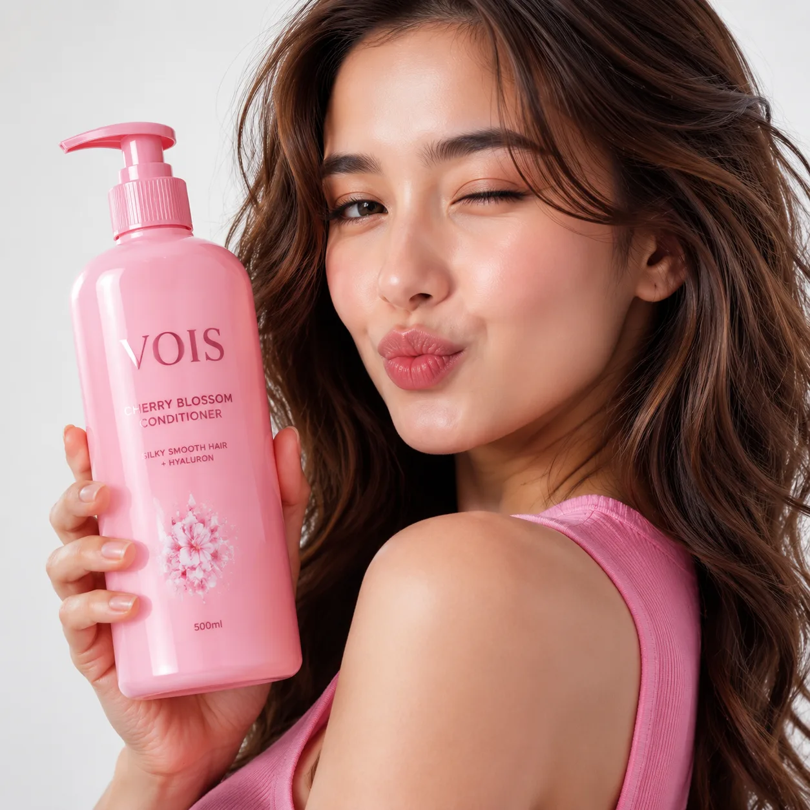

**#21 · Poster Design Prompt · <code>Vinano Studio</code>**

<details>
<summary>Show prompt</summary>

```
Ultra-realistic beauty advertisement, close-up of a young woman long wavy brown hair, soft glowing skin, wearing a pink sleeveless top, holding a large pink conditioner bottle labeled “VOIS” toward the camera, playful facial expression, natural makeup, bright studio lighting, clean white background, shallow depth of field, high-end cosmetic campaign, 85mm lens, sharp focus, glossy product texture, vibrant pink tones Render with rich micro-detail while keeping the layout uncluttered and intentional.
```

</details>

---

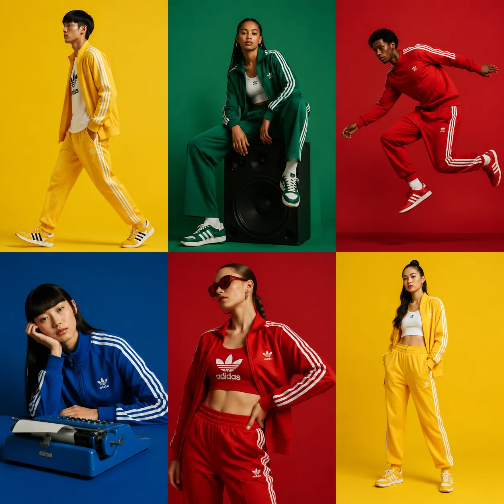

**#22 · Poster Design Prompt · <code>Vinano Studio</code>**

<details>
<summary>Show prompt</summary>

```
A premium-quality, split-screen fashion editorial advertisement featuring multiple panels of different colors (yellow, green, deep red, blue). The image shows models wearing Adidas-style tracksuits and casual sportswear in corresponding colors that match their background panel. One male model in yellow is walking, one female model in green is sitting on a speaker, one male model in red is jumping, one female model in blue is sitting by a blue typewriter, one female model in red is posing in a red panel, and one female model in yellow is standing. Clean studio lighting, vibrant solid-color backgrounds, professional fashion photography, refined minimalist aesthetic, sharp focus Maintain consistent colour harmony and crisp focus across the whole frame.
```

</details>

---

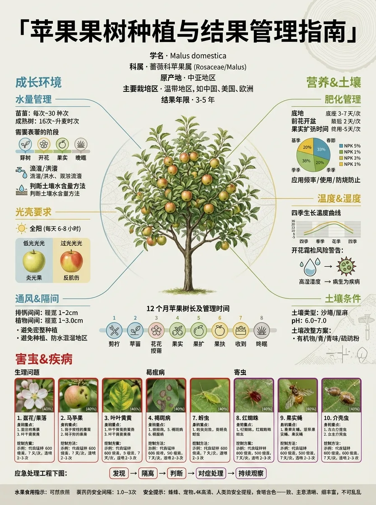

**#23 · Poster Design Prompt · <code>Vinano Image Pro</code>**

<details>
<summary>Show prompt</summary>

```
果树种植科普展板 | 3:4 竖版 | 博物馆级信息设计
【主标题】
「××果树种植与结果管理指南」
字体：思源黑体 / 思源宋体混排，确保中文清晰渲染

【副标题】

学名 · 科属 · 原产地 · 主要栽培区 · 结果年限
【中央视觉】

画面中心 25%：
成熟健康的果树实物形态（可选：盆栽 / 幼树 / 结果期枝条），
 写实自然博物馆标本风格，树干、叶脉、果实细节清晰

背景：
浅色极简底（米白 / 浅灰）
淡雅农业几何纹样 / 果树年轮 / 叶脉结构底纹（透明度 15–20%）

【信息布局｜自动填充真实农业数据】

左侧（蓝绿色系 · 生长环境）
水分管理
幼树 / 成树浇水频率

不同生长期（萌芽 / 开花 / 膨果 / 休眠）需水差异
灌溉方式（滴灌 / 漫灌）

土壤含水量判断方法

光照需求
全日照 / 半日照

每日有效光照时长

光照不足 / 过强的结果影响对比图

通风与间距

行距株距建议

忌密植、忌积水低洼环境

右侧（黄绿色系 · 营养与土壤）

施肥管理

基肥 / 追肥 / 花前肥 / 果后肥

NPK 比例饼图（不同时期）

施肥频率与禁忌（避免烧根）

温度与湿度

四季生长温度曲线

花期低温风险提示

湿度过高导致病害示意

土壤条件

土壤类型（沙壤土 / 腐殖土）

pH 范围

改土方案（有机质 / 石灰 / 硫磺粉）

【中部横条】

12 个月果树生长与管理时间轴

修剪期

萌芽期

开花授粉期

坐果期

膨果期

采收期

休眠期
（图标化呈现）

【下方病虫害专区｜占 30%｜红紫警示色】

10 项果树常见病虫害识别卡片（3 行网格）

生理性问题

落花落果（营养 / 温度 / 水分）

果实畸形（授粉不良 / 缺硼）

叶片黄化（缺铁 / 缺氮 / 根系问题）

病菌性病害
4. 炭疽病
5. 褐斑病
6. 根腐病
虫害
7. 蚜虫
8. 红蜘蛛
9. 果实蝇
10. 介壳虫

每张卡片包含：
症状特写图（40%）

识别要点

具体防治方案

药剂名称 + 稀释倍数 + 使用频次
示例：
 代森锰锌 600 倍液，7 天 / 次，连喷 2–3 次

应急处理流程图
发现 → 隔离 → 判断 → 对症处理 → 持续观察

【底部信息栏】
果实可食性说明
农药安全间隔期
对蜜蜂 / 宠物 / 人类安全提示

【设计规范】
信息密度：高（留白约 25%）
连接线：由果树向外放射，极细线条
色彩编码：
蓝 = 水分
黄 = 光照
绿 = 营养
红 = 病害
紫 = 虫害
字级层级：
主标题 16pt
正文 12pt
备注 9pt

图标：统一线性农业科普风格

中文排版：行距 1.5，紧凑易读

病害卡片：红色边框 + 症状放大图

【风格参考】

日本果树试验站导览牌

现代自然博物馆农业信息墙
DK《果树栽培图鉴》

【技术参数】
正面平视 / 微俯视
柔和自然光
中大景深
4K 超高清
真实农业与园艺摄影级细节

【关键要求（非常重要）】

所有种植数据、病虫害信息、农药名称与使用浓度，需根据所选果树品种自动填充真实、准确、可查证的专业农业数据

英文补充（生图权重）

fruit tree cultivation guide poster, high-density agricultural infographic,
museum exhibition style, fruit tree growth cycle, pest and disease identification,
Chinese typography, refined minimalist background, professional horticulture data,
realistic fruit tree specimen, 4K ultra high resolution

保持配色统一、主体清晰，细节丰富但不杂乱。
```

</details>

---

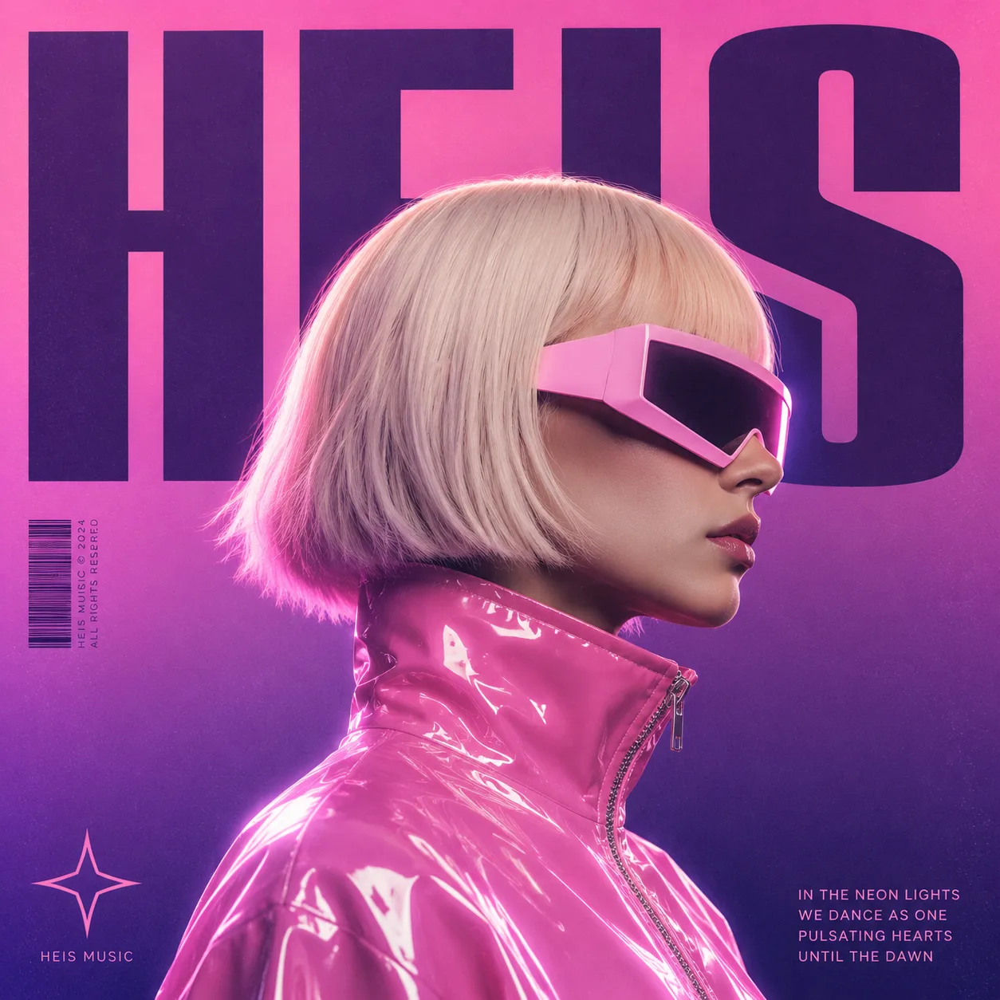

**#24 · Poster Design Prompt · <code>Vinano Studio</code>**

<details>
<summary>Show prompt</summary>

```
A stylized, retro-futuristic music poster in a synthwave aesthetic. The central focus is a woman in profile a platinum blonde bob haircut, wearing oversized, chunky pink opaque visor sunglasses and a high-collar, extremely glossy pink vinyl jacket visible zipper detail. Behind her, the word "HEIS" is written in massive, dark purple, condensed block typography, partially hidden by her head. The background is a clean gradient shifting from soft magenta to deep purple, overlaid a subtle film grain texture. Lighting: Soft studio lighting high-specular highlights on the glossy jacket and rim lighting on the hair. Color Palette: Dominant shades of bubblegum pink, deep violet, and lavender. Graphics: A small barcode on the left, a refined minimalist star logo in the bottom-left corner, and four lines of small sans-serif song lyrics in the bottom-right corner. Atmosphere: High-fashion, electronic dance music vibe, clean and polished composition. Aim for an editorial, design-driven look with deliberate negative space.
```

</details>

---

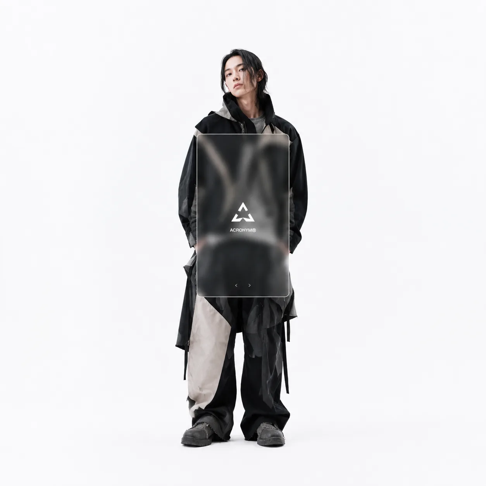

**#25 · Poster Design Prompt · <code>Vinano Studio</code>**

<details>
<summary>Show prompt</summary>

```
[BRAND NAME]. Act as a Creative Director and Fashion Photographer creating a high-end editorial lookbook image a UI overlay layer.
1. THE SUBJECT (AVANT-GARDE STREETWEAR & NATURAL POSE):
A fashion model stands centrally in a clean studio.
Fashion Style: The outfit is a striking, conceptual "Modern Avant-Garde Streetwear" look that interprets the aesthetic and color palette of [BRAND NAME]. Think high-fashion meets street culture: experimental silhouettes, deconstructed layering, oversized proportions, unique material combinations, and bold details. It should feel innovative and editorial, but still grounded in streetwear, avoiding basic casual clothes.
Pose: The model adopts a natural, relaxed, and effortless editorial pose (e.g., hands casually in pockets, a slight lean, looking off-camera or gently at the camera). Absolutely NO robotic, stiff, or "T-pose" stances.
2. THE UI OVERLAY (FROSTED GLASS RECTANGLE):
Superimposed directly in front of the model's torso is a large, vertical Floating UI Element.
Shape & Outline: A simple vertical rectangle rounded corners, framed by a clean 2px solid White Stroke.
Material (Glassmorphism): The interior of this rectangle is "Frosted Glass". The part of the model's outfit behind this glass must be heavily blurred (high Gaussian Blur), creating a translucent depth effect, while the rest of the model remains razor-sharp.
3. UI CONTENT (refined minimalist & SMALL):
Inside the frosted glass pane, place two elements in pure Monochrome White:
Center: The official [BRAND NAME] logo, perfectly centered.
Below Logo: Positioned significantly higher than the bottom edge, place two VERY SMALL, refined minimalist white navigation arrows (one pointing Left "<", one pointing Right ">"). They should be subtle and approximately 50% smaller than standard UI icons.
4. PHOTOGRAPHY STYLE & COMPOSITION (STRICT FRAMING):
Style: High-End Editorial Fashion Photography. Real film grain, sophisticated soft studio lighting that emphasizes fabric textures. It must look like a real photograph, not a CGI render.
Background: Infinite, pure White Studio Cyclorama.
Framing (STRICT CONSTRAINT): The shot is a Wide Full-Body Photograph. The entire model (from top of head to bottom of feet) AND the entire UI overlay must be COMPLETELY CONTAINED within the image boundaries. There must be absolutely ZERO CROPPING of the subject or UI. There must be a very large, generous amount of empty negative space ("air") surrounding the subject on all four sides.

Keep edges clean and the overall composition balanced for a polished, gallery-ready result.
```

</details>

---

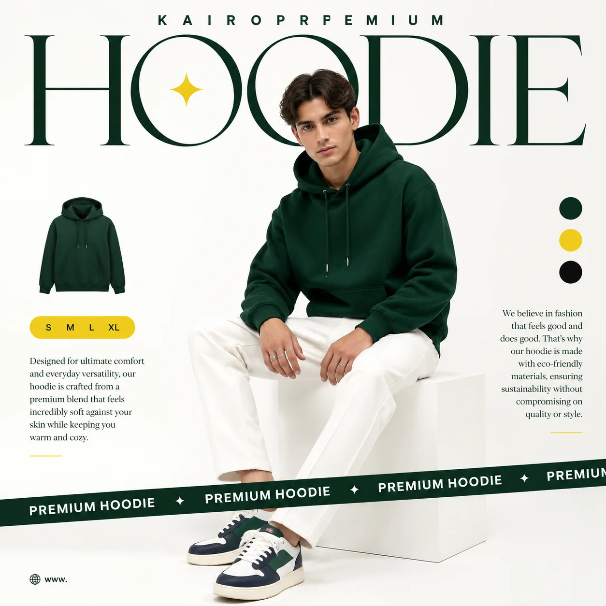

**#26 · Poster Design Prompt · <code>Vinano Studio</code>**

<details>
<summary>Show prompt</summary>

```
A professional commercial fashion advertisement featuring [a young male model] in the uploaded image, sitting on a refined minimalist white matte cube. He has a neutral, confident expression and is looking directly at the camera.

Attire & Styling:
Hoodie: A premium-quality, [heavyweight forest green (British Racing Green) hoodie]. It features a relaxed fit, a spacious kangaroo pocket, and metal-tipped drawstrings.
Bottoms: Clean, slim-fit white trousers visible seams.
Footwear: Stylish low-top sneakers in a color-blocked design of forest green, navy blue, and white, off-white midsoles and white laces.
Accessories: Simple silver bands/rings on his fingers.

Graphic Design & Layout:
Typography: The word [HOODIE] is written in a massive, elegant high-contrast serif font across the top. A small, four-pointed yellow spark icon is centered inside the "O". Above this, [K A I R O P R E M I U M] is printed in a wide-spaced sans-serif font.
Branding Elements: A dark green diagonal "caution tape" style ribbon crosses the bottom third of the frame, the words [PREMIUM HOODIE] repeating in white uppercase text.
UI Accents: * A yellow pill-shaped size selector labeled "S M L XL" on the left.
A small thumbnail of the hoodie floating on the mid-left.
Three circular color swatches (Green, Yellow, Black) on the right side.
Two blocks of justified serif body text describing the product's comfort and eco-friendly materials.
The URL [www.] in the bottom left corner.

Environment & Lighting:
Setting: A clean, bright, white-on-white refined minimalist studio cove.
Lighting: Soft, diffused studio lighting creates gentle shadows under the model and the cube, emphasizing the rich texture of the green fabric and the crispness of the white pants.
Color Palette: Deep forest green, bright white, and golden yellow accents.

Keep edges clean and the overall composition balanced for a polished, gallery-ready result.
```

</details>

---

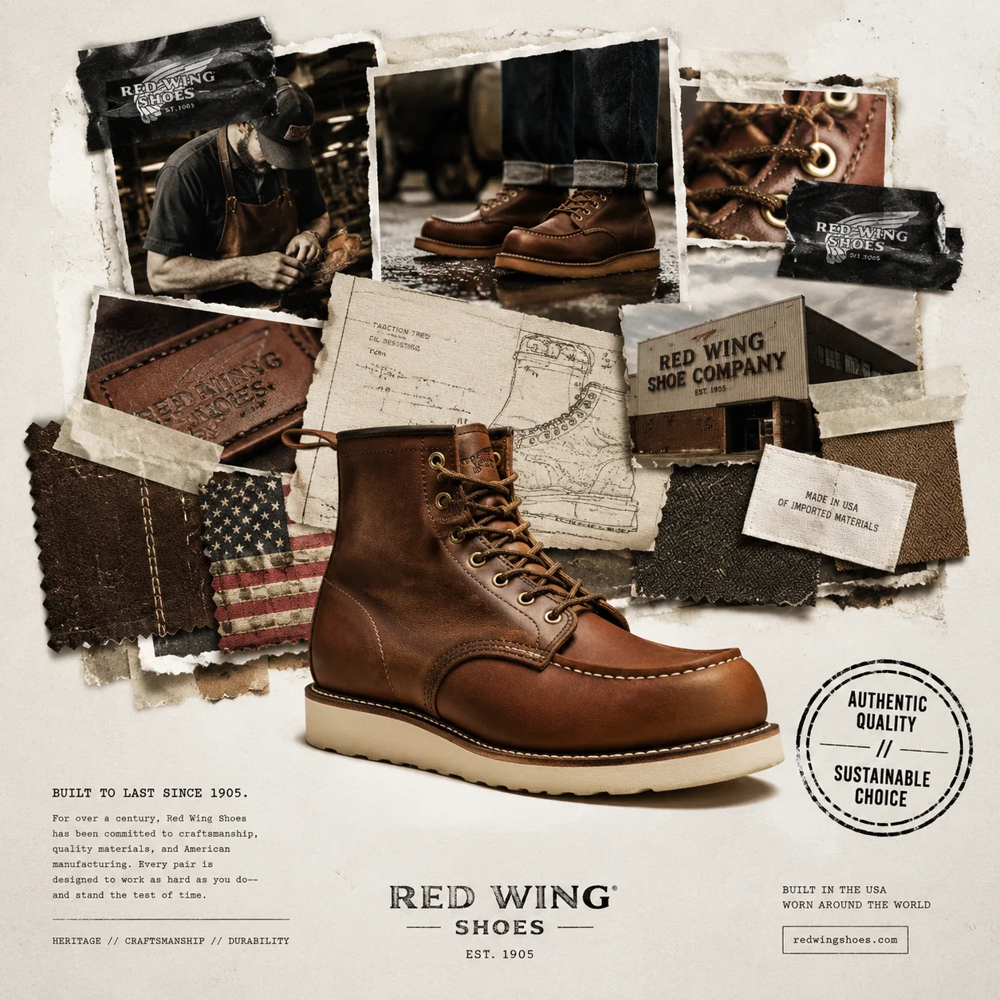

**#27 · Poster Design Prompt · <code>Vinano Studio</code>**

<details>
<summary>Show prompt</summary>

```
[BRAND NAME]

[PRODUCT TYPE] (Clothing / Food / Automotive / Tech).

Goal: Generate a professional "scrapbook" style collage poster for [BRAND NAME] centered around a [PRODUCT TYPE].

1. HERO PRODUCT (BOTTOM FOCUS)

- Object: A high-definition, realistic 3D render of a [PRODUCT TYPE] by [BRAND NAME] at the bottom center.

- Placement: Slightly angled to show depth, soft realistic contact shadows on a plain off-white floor.

2. THE MULTI-LAYERED COLLAGE STACK

- Photos: A vertical stack of overlapping photos RAGGED, TORN paper edges rising above the product.

- Content: Photos should show [PRODUCT TYPE] in use, lifestyle shots related to [BRAND NAME], and close-ups of specific details.

- Materials: Physical swatches of textures related to [PRODUCT TYPE] (e.g., leather/fabric for clothing, metal/carbon for cars, organic ingredients for food). Include visible raw edges and stitching.

- Fasteners: Use strips of semi-transparent masking tape and black duct tape the "[BRAND NAME]" logo printed in white to "hold" the pieces together.

3. GRAPHIC OVERLAYS & STAMPS

- Stamp: A black, distressed ink stamp or seal near the hero product text: "AUTHENTIC QUALITY // SUSTAINABLE CHOICE".

- Typography: Small, clean sans-serif and typewriter-style text blocks describing the heritage of [BRAND NAME] placed at the bottom.

- Logo: The primary "[BRAND NAME]" logo centered at the very bottom in a refined minimalist font.

4. STYLE & ATMOSPHERE

- Aesthetic: Industrial DIY, workshop moodboard, high-end editorial collage.

- Lighting: Bright, studio high-key lighting soft, multi-layered shadows between the paper scraps and textures.

- Quality: 8K resolution, macro detail on paper grain, fabric fibers, and tape adhesive.

Render with rich micro-detail while keeping the layout uncluttered and intentional.
```

</details>

---

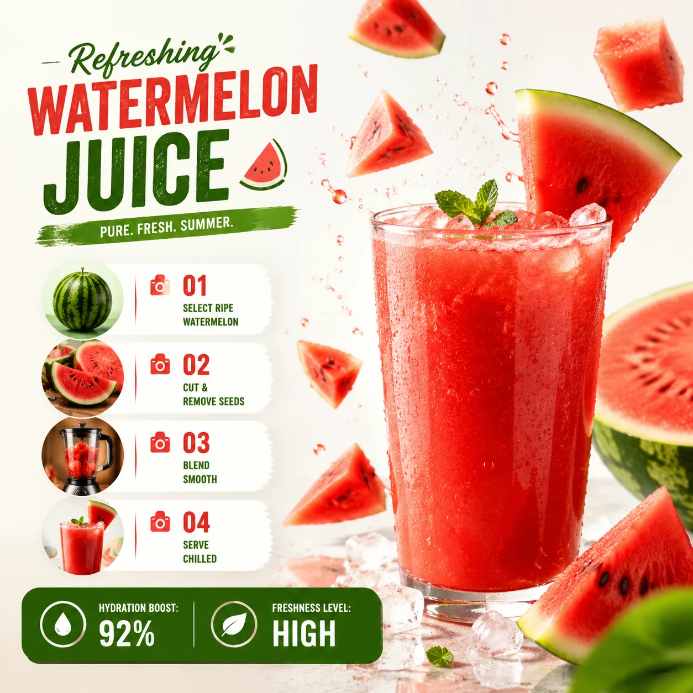

**#28 · Poster Design Prompt · <code>Vinano Studio</code>**

<details>
<summary>Show prompt</summary>

```
Bright summer infographic showcasing watermelon juice, icy texture, watermelon wedges floating. Steps: 📷 Select Ripe Watermelon 📷 Cut & Remove Seeds 📷 Blend Smooth 📷 Serve Chilled Info Bar: Hydration Boost: 92% Freshness Level: High High-contrast red & green palette. Aim for an editorial, design-driven look with deliberate negative space.
```

</details>

---

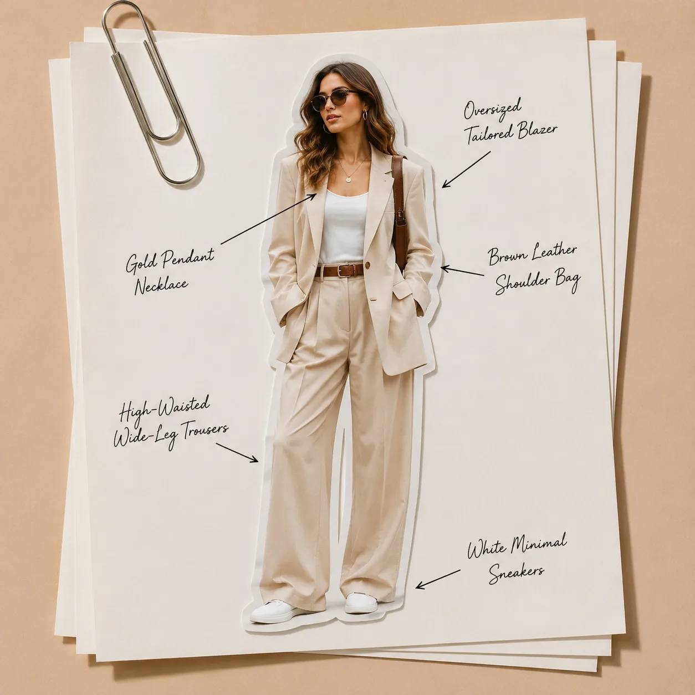

**#29 · Poster Design Prompt · <code>Vinano Studio</code>**

<details>
<summary>Show prompt</summary>

```
Masterpiece, best quality, high resolution, 8k, (true-to-life photorealistic:1.4), (Vibrant natural colors:1.2), (Full body shot:1.6), refined minimalist fashion scrapbook page.
Subject: A full body fashion photo of [Character Description] standing in a [Pose]. The subject is wearing [Detailed Outfit]. The subject is a sharp, high-detail photographic cutout sticker borders. The sticker has a die-cut white paper edge visible paper-fiber texture on the cut-line. This white border has a subtle 3D thickness (beveled edge) that catches the light, creating a realistic micro-shadow.

Composition: Professional top-down flat-lay view. A thin stack of 3-4 clean-cut premium white paper sheets (smooth edges) placed on a seamless Soft [Color] background. Medium camera distance for a clear full-body view. A single, (prominent oversized silver metal trombone paperclip:1.5) at the top left corner, showing realistic metallic reflections and micro-scratches. 5 delicate hand-drawn black ink arrows pointing to specific fashion details:

"[Feature 1]" (pointing to [Detail]).
"[Feature 2]" (pointing to [Detail]).
"[Feature 3]" (pointing to [Detail]).
"[Feature 4]" (pointing to [Detail]).
All annotations are in refined, elegant handwritten cursive. Ray-traced ambient occlusion around the sticker's white border to emphasize physical elevation and depth. Ray-traced soft shadows between the paper layers. High-end editorial studio lighting. Visible tactile paper micro-texture throughout the character's edges, clean and modern high-fashion aesthetic. No grayscale, full color photography, no illustration.

Preserve realistic proportions and depth for a confident, professional finish.
```

</details>

---

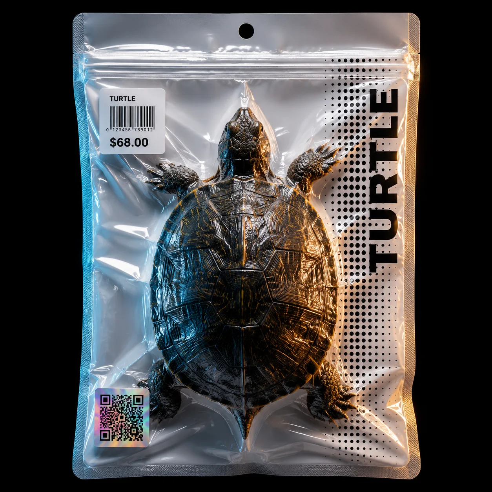

**#30 · Poster Design Prompt · <code>Vinano Studio</code>**

<details>
<summary>Show prompt</summary>

```
Composition & Subject: A professional front-facing studio shot of a hyper-realistic [INSERT OBJECT] standing vertical. The object features intense textural details like [DESCRIBE OBJECT TEXTURES].
Pouch Structure (Dual Material): The vacuum-sealed pouch is composed of two distinct layers. The back layer is a solid, opaque, industrial matte-white material (providing a high-contrast backdrop). The front layer is crystal-clear, high-gloss transparent plastic, allowing the object to be seen perfect clarity and sharp detail.

Vacuum Physics & Compression: The packaging demonstrates extreme vacuum-contoured compression. The plastic is sucked inward like a second skin, clinging tightly to the [DESCRIBE KEY PROTRUDING PARTS] of the object. This creates aggressive, sharp tension micro-folds and deep sculptural wrinkles that radiate from the object's silhouette. The pouch edges feature a crisp, industrial micro-dotted heat-seal pattern.

Packaging Detail: The top features a circular punch-hole for hanging display, located above a realistic zip-lock seal track. The vacuum effect is powerful, the clear front plastic sucked tightly against the contours, creating sharp, ray-traced reflections and deep tension folds.

Graphics & Strategic Placement:
Upper Label: A crisp white thermal rectangular sticker a barcode and price tag of "$[INSERT PRICE]" is placed at the top-left, positioned precisely below the zip-lock seal line.
Lower QR: A premium square holographic QR-code prismatic iridescent reflections is located at the bottom-left corner.

Typography & Extended Pattern: The word "[INSERT OBJECT NAME IN CAPS]" is printed vertically in a bold black Swiss font along the right side, layered over a black halftone dot-matrix pattern that extends fully to the mid-point of the pouch and then gradually fades/dissolves from there towards the center, creating a sophisticated transition.

Lighting & Background: Set against a pitch-black refined minimalist background. Cinematic Amber and Electric Blue rim lighting outlines the silhouette, highlighting the contrast between the white back and the clear front plastic, ensuring a zero-flatness, 3D pop. Technical Specs: Commercial product photography, 8k, Unreal Engine 5.4 render style, macro-detail, zero-flatness, ultra-high contrast, focus on extreme transparency of the front layer.

Preserve realistic proportions and depth for a confident, professional finish.
```

</details>

---

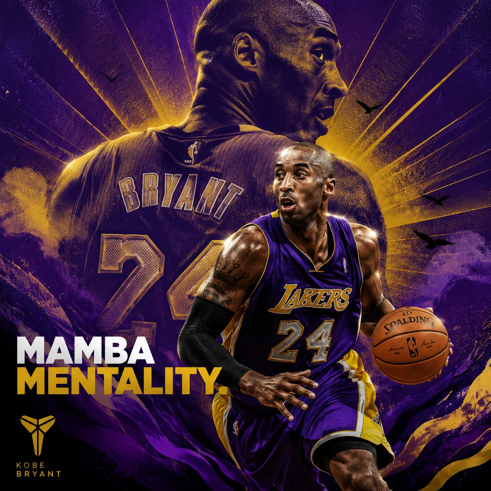

**#31 · Poster Design Prompt · <code>Vinano Studio</code>**

<details>
<summary>Show prompt</summary>

```
[PERSONE]. Act as a Senior Art Director.

PHASE 1: PHOTOGRAPHIC COMPOSITION.

- Layered Effect: Double exposure photographic collage. High-definition action shot in the foreground; massive monumental silhouette in the background.

- Overlap: The subject must seamlessly integrate the background graphics.

PHASE 2: CONTEXTUAL VIBE SIMULATION.

- Identity Analysis: Autonomously identify the core industry of [PERSONE] (Sport, Music, Cinema, or Business).

- Pose & Props:

PHASE 3: DYNAMIC COLOR & BRAND SIMULATION (VARIABLE COLORS).

- Primary Color (Atmosphere): Identify the MOST ICONIC color associated [PERSONE] or their team/brand. Use this for the background, halftone textures, and smoke.

- Accent Color (Impact): Identify a secondary high-contrast VIBRANT hue (e.g., neon, gold, or electric white). Use this for the "Radial Burst" rays.

- Visual Texture: Apply heavy film grain and halftone dots (screen printing effect) to the shadows of the high-res photos.

PHASE 4: GRAPHIC ACCENTS.

- Geometry: Bold radial rays bursting from the center. Fluid, wave-like organic shapes at the base.

- Birds: refined minimalist black bird silhouettes for scale and depth.

PHASE 5: BRANDING & TEXT.

- Tagline: Generate a powerful, one-word or two-word slogan tailored to [PERSONE]'s legacy.

- Logo: Place a refined minimalist, industry-appropriate logo in the bottom corner.

- Typography: Bold, high-impact Sans-Serif.

TECHNICAL FINISH:

- Quality: 8k resolution, authentic commercial photography style (NOT an illustration).

- Lighting: Extreme studio rim-lighting (contour highlights) to separate the photographic subjects from the graphic layers.

Keep edges clean and the overall composition balanced for a polished, gallery-ready result.
```

</details>

---

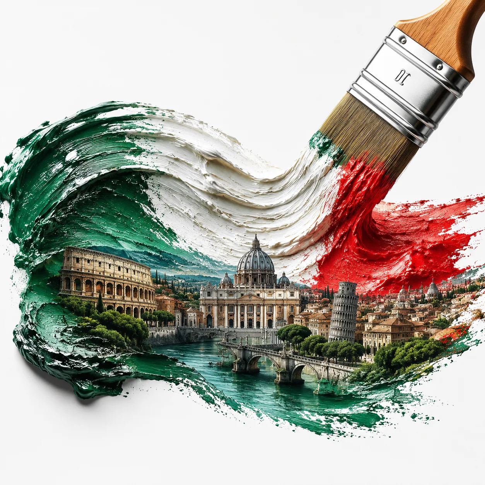

**#32 · Poster Design Prompt · <code>Vinano Studio</code>**

<details>
<summary>Show prompt</summary>

```
A hyper-realistic macro shot of a paintbrush creating a thick textured paint stroke on a clean white background. The paint forms the shape and colors of the [COUNTRY FLAG], flowing dynamically like a wave. Inside the paint stroke, a highly detailed miniature cityscape of [COUNTRY NAME] emerges, including iconic landmarks such as [LANDMARK 1], [LANDMARK 2], [LANDMARK 3]. The paint has visible brush textures, glossy acrylic finish, rich vibrant colors. Maintain consistent colour harmony and crisp focus across the whole frame.
```

</details>

---

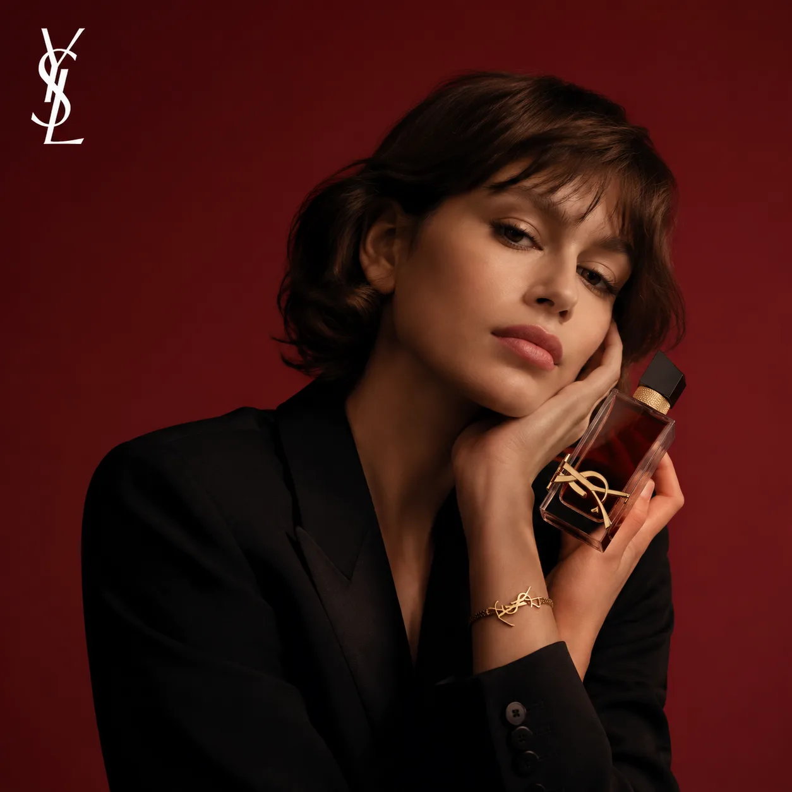

**#33 · Poster Design Prompt · <code>Vinano Studio</code>**

<details>
<summary>Show prompt</summary>

```
[upload luxury product photo]
BRAND NAME: [Put the brand name here]

Create ONE luxury editorial poster. Keep the product EXACT and unchanged. Use the BRAND NAME to infer identity and place the REAL official logo (correct proportions) in the most brand-appropriate position subtle print texture. Add a perfectly matched attractive model wearing the product naturally. Rich deep colors, HDR, premium studio lighting, clean background, strong negative space, ultra-sharp 8K. No extra text, no watermark.

Emphasise material texture and natural light so the final frame feels tactile and premium.
```

</details>

---

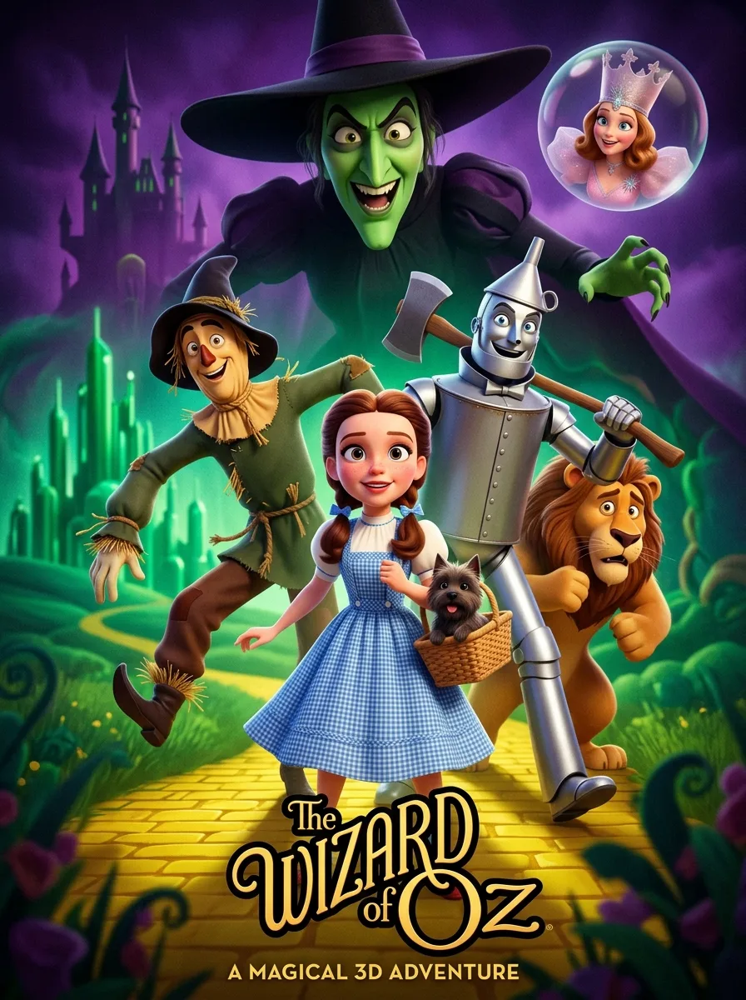

**#34 · Poster Design Prompt · <code>Vinano Image Pro</code>**

<details>
<summary>Show prompt</summary>

```
Pixar 3D CGI animated movie poster style, ensemble cast featuring the most iconic and recognizable characters from [MOVIE/SHOW], all rendered as Pixar-style 3D animated characters exaggerated expressive faces, smooth stylized skin, big eyes, chunky proportions. Characters automatically selected as the most famous heroes and villains from [MOVIE/SHOW]. Dramatic layered composition: central hero front and center, others fanned behind in dynamic action poses. Background color automatically chosen to match the iconic tone and palette of [MOVIE/SHOW]. Bold title text at bottom: [MOVIE/SHOW] in the original film's iconic font style. filmic, cinematic lighting, rim light on characters, deep shadows. 3:4 vertical aspect ratio. High detail, polished Pixar feature film aesthetic. Aim for an editorial, design-driven look with deliberate negative space.
```

</details>

---

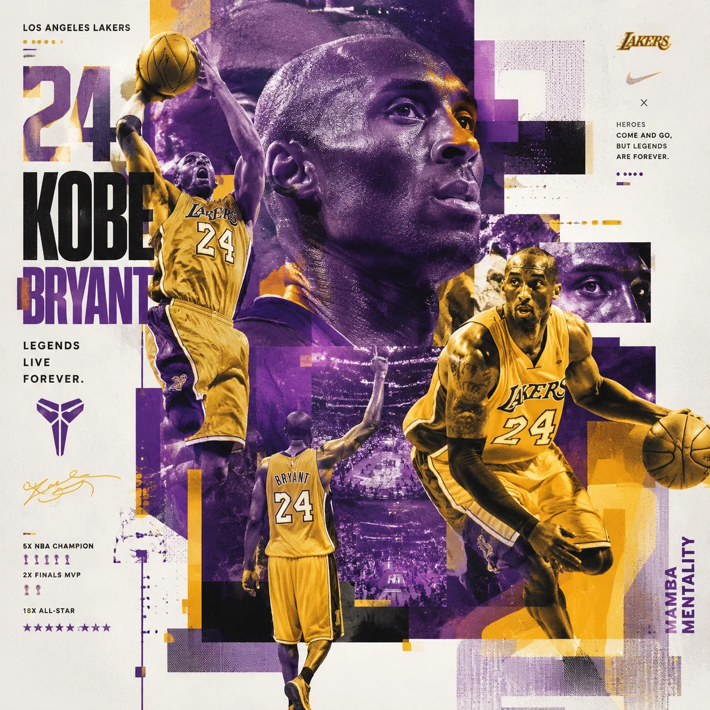

**#35 · Poster Design Prompt · <code>Vinano Studio</code>**

<details>
<summary>Show prompt</summary>

```
Create a digital modern maximalism style sports collage of [TEAm Name] [Player name] visuals grainy textures, abstract geometric shapes, dynamic grid layout, minimal background, contemporary editorial composition, inspired by [BRAND NAME ex Nike...] campaigns and modern sports graphic design, strong visual rhythm, bold and emotional atmosphere. Post-process film grain, and specially cinematic color-graded tones for serious intensity. Maintain consistent colour harmony and crisp focus across the whole frame.
```

</details>

---

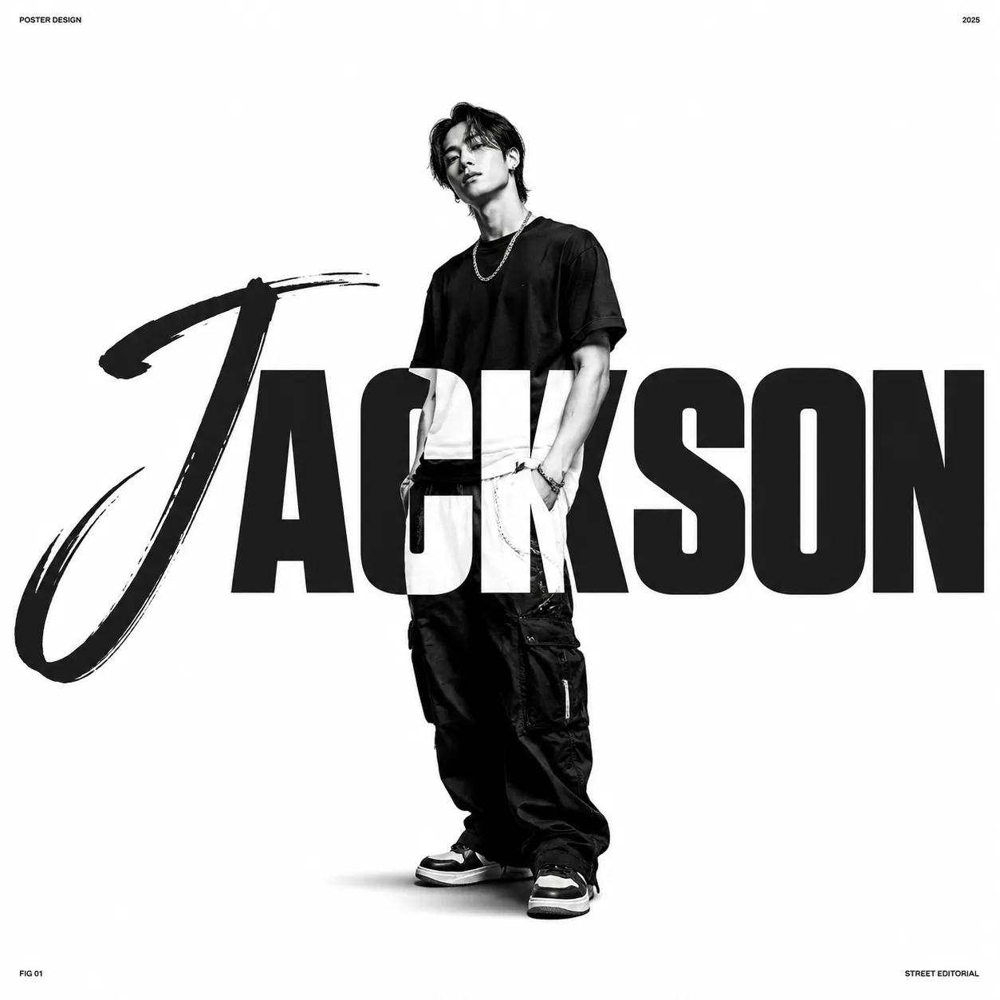

**#36 · Poster Design Prompt · <code>Vinano Studio</code>**

<details>
<summary>Show prompt</summary>

```
[PERSON NAME]. Act as a graphic designer creating a refined minimalist, avant-garde streetwear poster.
COMPOSITION (THE FUSION):
The image is a creative fusion of a massive typographic name and a monochrome portrait of [PERSON NAME].
The Subject: A high-contrast, black-and-white full-body or 3/4 cut-out photograph of [PERSON NAME]. The subject stands centrally, looking cool and detached.
The Typography: The person's name is written horizontally across the entire width of the image. The text interacts the body: the person stands through the letters, creating a "woven" depth effect (some limbs in front of text, some behind), or the portrait creates a silhouette mask for the text.
TYPOGRAPHY STYLE (MIXED SCRIPTS):
Mimic the specific "Street Editorial" font pairing:
The First Letter: The initial letter of the name is rendered in a large, sweeping, expressive Calligraphic Script or Brush font (dynamic and loose).
The Rest of the Name: The remaining letters are rendered in an Ultra-Heavy, Geometric Sans-Serif font (like Impact or Helvetica Black).
Color: The text is solid Dark Grey or Black.
AESTHETICS & ATMOSPHERE:
Palette: Strictly Monochrome (Black, White, and Greyscale).
Background: Pure, vast White refined minimalist background. Extensive negative space.
Vibe: Raw, "Zine" aesthetic, cut-and-paste collage feel, high-fashion streetwear poster.
LAYOUT DETAILS:
Add very small, microscopic functional text in the extreme corners (e.g., "poster design", "2025", "fig 01") to enhance the Swiss Design poster feel.

Render with rich micro-detail while keeping the layout uncluttered and intentional.
```

</details>

---

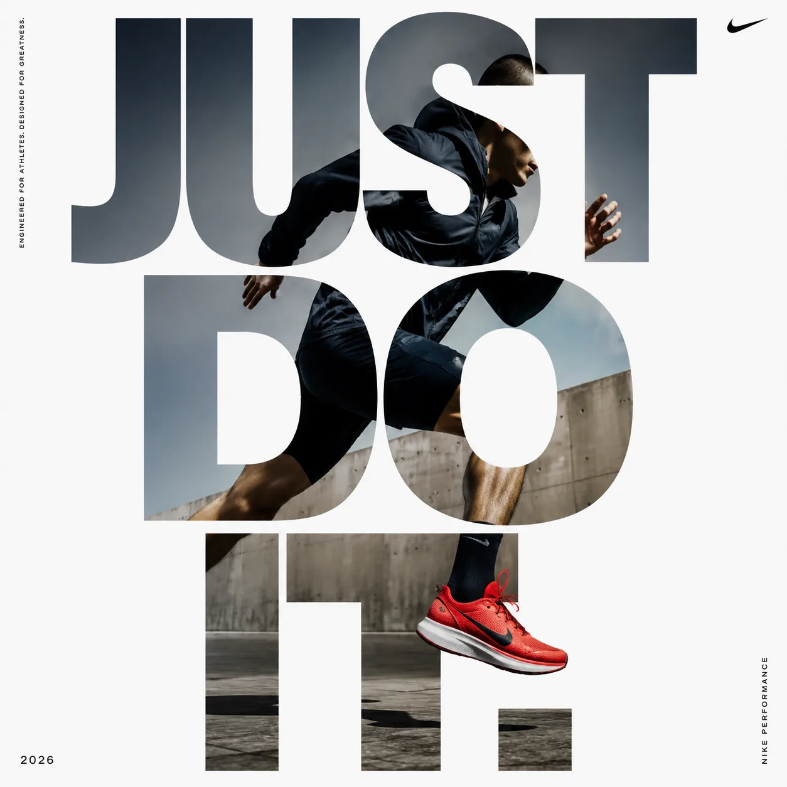

**#37 · Poster Design Prompt · <code>Vinano Studio</code>**

<details>
<summary>Show prompt</summary>

```
[BRAND NAME].
Act as a Senior Editorial Designer and Typographer.
PHASE 1: TYPOGRAPHIC MASK (THE "WINDOW" EFFECT).
- Core Element: Use the most iconic slogan or the name of [BRAND NAME] as a massive, ultra-bold, heavy sans-serif typographic mask.
- Layout: The letters must be giant, filling the entire vertical frame from edge to edge tight kerning.
- Concept: The text acts as a "cut-out" window. The background is solid white, and the photographic subject is visible ONLY through the letterforms.

PHASE 2: DYNAMIC SUBJECT LOGIC.

- Subject Selection:
- Detail: Ensure a high-contrast element (like a red shoe or a glowing headlight) is visible through one of the letters as a focal point.

PHASE 3: SOPHISTICATED MUTED PALETTE.

- Atmosphere: Use a "Refined Muted" color scheme.
- Tones: Soft slate blues, charcoal greys, and creamy off-whites for the photography inside the mask.
- Accent: Identify one sharp, saturated accent color belonging to [BRAND NAME] and apply it to a single key object visible through the text.

PHASE 4: PHOTOGRAPHY & LIGHTING.

- Lighting: Soft-box studio lighting. Diffused shadows and gentle highlights to create a cinematic, high-end editorial feel.
- Finish: Clean, matte texture zero visual noise. High-definition photographic quality.

PHASE 5: refined minimalist BRANDING.
- Accents: Add a tiny refined minimalist logo and a small vertical tagline in a clean, microscopic sans-serif font near the corners.
- Year: Include the year "2026" in a subtle, elegant font to mimic a limited-edition look.

Keep edges clean and the overall composition balanced for a polished, gallery-ready result.
```

</details>

---

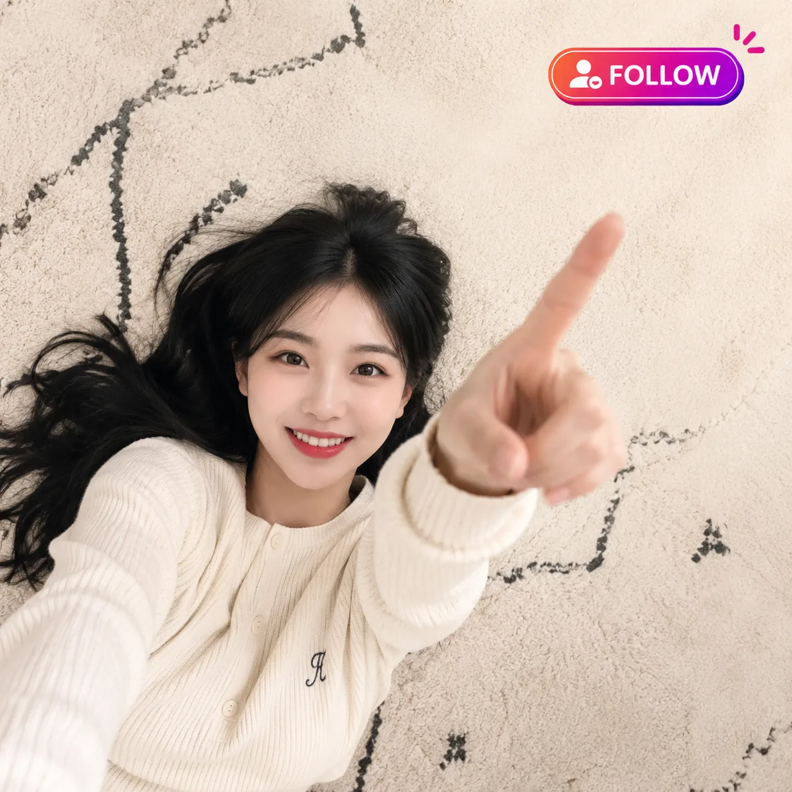

**#38 · Poster Design Prompt · <code>Vinano Studio</code>**

<details>
<summary>Show prompt</summary>

```
{
  "edit_type": "creative_composite_layering",

  "source": {
    "_hint": "Base logic: Character (Ref 1) superimposed ON TOP OF the Background Image (Ref 2).",
    "mode": "EDIT",
    "reference_images": {
      "first": "foreground_character_person",
      "second": "background_scenery_or_pattern"
    },
    "preserve_from_first": {
      "same_person_or_group": true,
      "same_faces": true,
      "same_hairstyles": true,
      "same_outfits": true
    }
  },

  "identity": {
    "keep_identity_consistent": true,
    "expression": "bright_engaging_smile_at_camera"
  },

  "camera_effect": {
    "_hint": "High-angle selfie style, creating a sense of depth between the hand and face.",
    "perspective": "high_angle_shot_looking_down",
    "style": "social_media_call_to_action",
    "depth_of_field": "focus_on_face_and_pointing_finger",
    "framing": "character_centered_with_space_at_top_right"
  },

  "pose": {
    "_hint": "Key action: Lying down but actively pointing to the 'Follow' button area (Top Right).",
    "pose_style": "lying_down_or_reclining_on_back",
    "face_direction": "looking_directly_up_into_lens",
    "hand_gestures": {
      "right_hand_action": "pointing_index_finger",
      "target_direction": "upper_right_corner_45_degrees",
      "purpose": "mimicking_pressing_subscribe_button",
      "arm_position": "extended_towards_camera_top_right"
    },
    "body_language": "inviting_and_energetic",
    "style_tags": ["kpop_idol_fan_service",
      "influencer_promo_style",
      "dynamic_perspective"]
  },

  "background_integration": {
    "_hint": "The second reference image is the background/floor.",
    "method": "full_background_replacement",
    "target_area": "entire_canvas_behind_character",
    "content_source": "reference_image_second",
    "perspective_match": "flat_lay_style",
    "rules": {
      "character_must_be_top_layer": true,
      "leave_space_in_upper_right_for_ui": true
    }
  },

  "composition": {
    "_hint": "Ensure the pointing finger leads the viewer's eye to the top right corner.",
    "visual_flow": "diagonal_line_from_face_to_top_right_corner",
    "focal_points": ["character_eyes",
      "pointing_finger_tip"],
    "negative_space": "clear_area_at_top_right_45_degrees"
  },

  "constraints": {
    "no_holding_phone_device": true,
    "finger_must_not_be_cropped_out": true,
    "ensure_arm_is_natural_length": true
"3:4"
  }
}

Preserve realistic proportions and depth for a confident, professional finish.
```

</details>

---

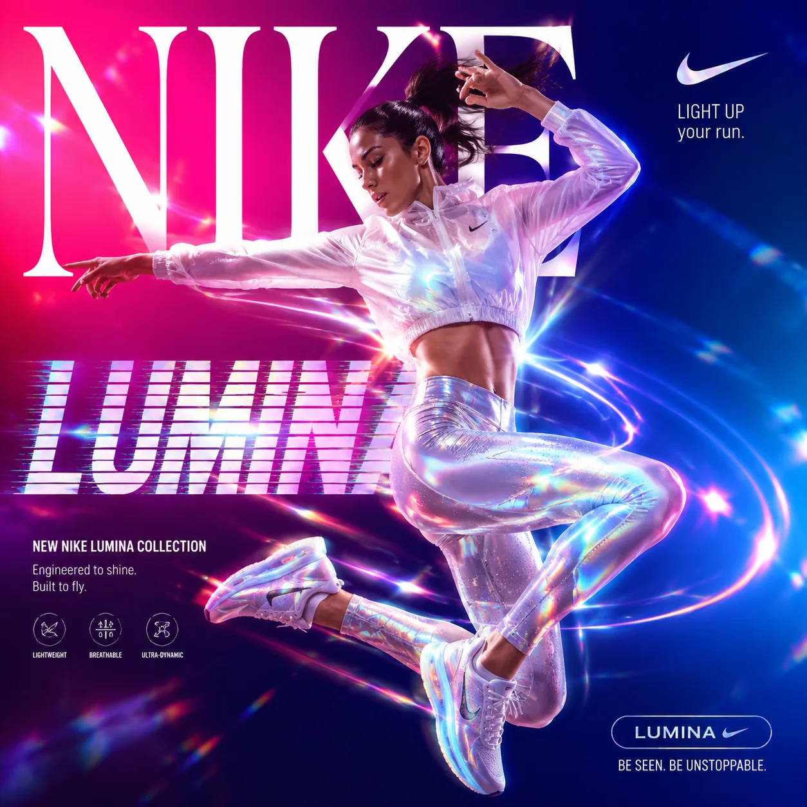

**#39 · Poster Design Prompt · <code>Vinano Studio</code>**

<details>
<summary>Show prompt</summary>

```
A dynamic fashion advertisement for Nike showing a hyper-realistic model mid-twist jump, light trails following her limbs. Background: prism-shifting gradient (hot magenta to sapphire) refracted lens flares. The model wears iridescent Nike runner tights and a cropped tech hoodie in holographic white. Bold serif "NIKE" and motion-glitched "LUMINA" in layered text behind. High-energy, futuristic aesthetic fashion gloss Maintain consistent colour harmony and crisp focus across the whole frame.
```

</details>

---

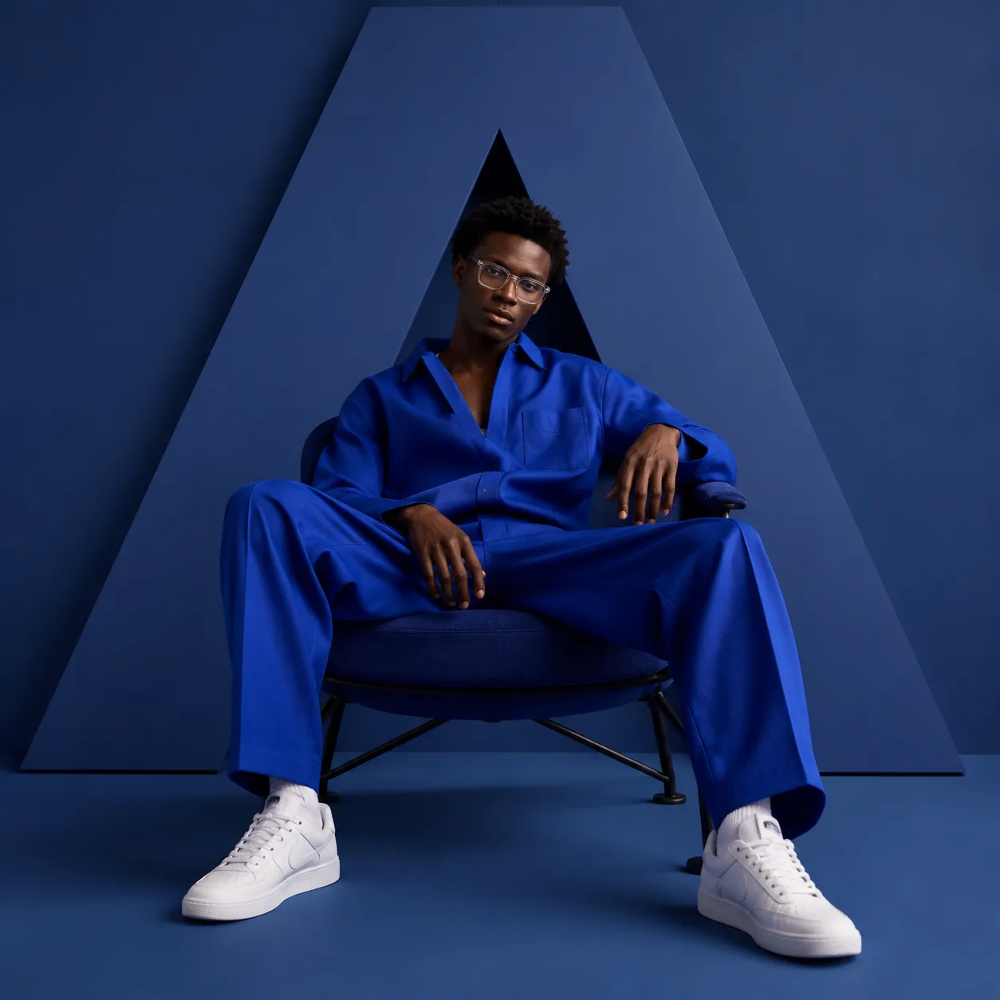

**#40 · Poster Design Prompt · <code>Vinano Studio</code>**

<details>
<summary>Show prompt</summary>

```
refined minimalist fashion studio photoshoot featuring stylish people sitting confidently on a modern chair, monochromatic aesthetic, subjects wearing bold cobalt-blue outfits (tailored suit or modern streetwear set) white sneakers and clear glasses, relaxed powerful pose legs apart and hands resting naturally, clean blue studio background a large geometric letter “A” behind them, soft professional studio lighting, fashion editorial composition, modern luxury brand campaign style, ultra-realistic, sharp focus, high detail, 8K. Emphasise material texture and natural light so the final frame feels tactile and premium.
```

</details>

---

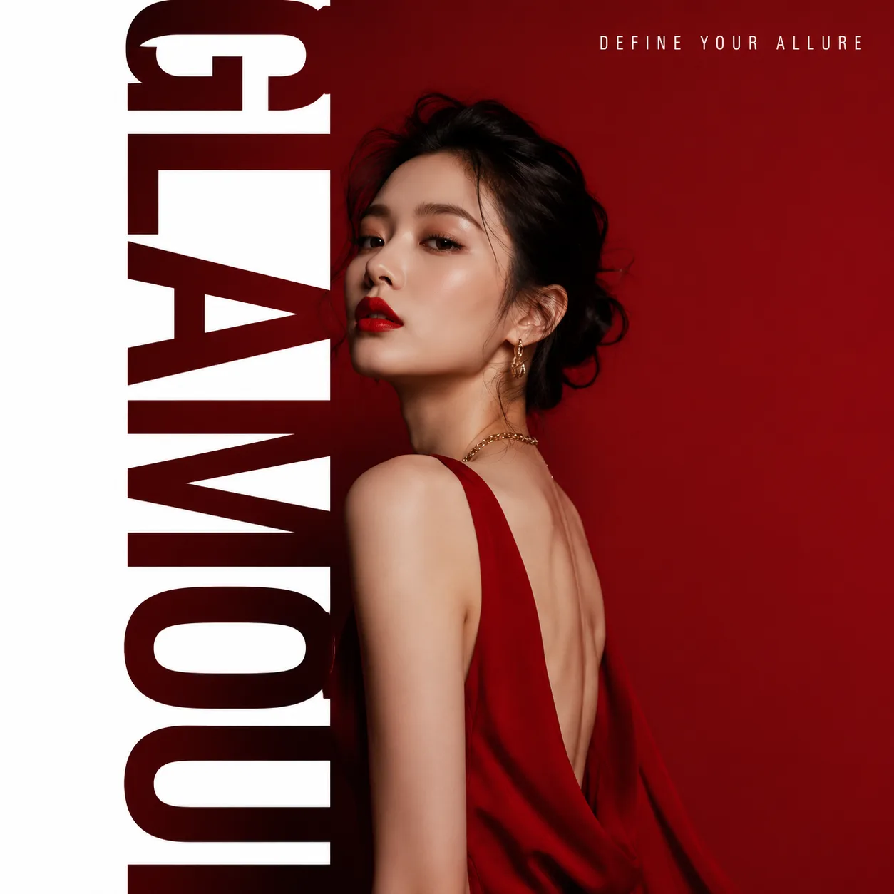

**#41 · Poster Design Prompt · <code>Vinano Studio</code>**

<details>
<summary>Show prompt</summary>

```
Style & Composition: High-fashion editorial typography poster a strict 1:2 composition split. Layout & Ratio: The frame is divided so that the right two-thirds show the full subject and background, while the left one-third is reserved for the typography masking section.

Typography Masking: A massive, ultra-bold, vertical word "[WORD]" is placed on the left third. The text is strictly full-bleed, stretching perfectly and touching the absolute top and absolute bottom edges of the frame zero vertical padding, gaps, or margins. This typography acts as a stencil mask: the letters reveal the underlying character, while the space to the far left of the letters is a solid, clean white.

Subject Details & Positioning: An upper-body shot of [CHARACTER DESCRIPTION]. The model is positioned so that only her left-most side is visible through the letters, while the rest of her body is fully visible and contained on the right side against a solid [COLOR] background, ensuring no part of the subject is cropped by the right edge of the frame. Pose: [POSE DESCRIPTION], ensuring the silhouette remains within the center of the right two-thirds area.

Secondary Text: In the top right corner, add the text: "[TEXT]". Use a small, sophisticated, white "Helvetica Condensed" style font wide letter spacing (kerning) for a premium, refined minimalist look. Color Palette: A strict monochromatic [COLOR] theme, sharply contrasted by the crisp white negative space on the left. 8k resolution, true-to-life photorealistic textures, sharp studio lighting, high contrast, clean graphic design aesthetic.

Preserve realistic proportions and depth for a confident, professional finish.
```

</details>

---

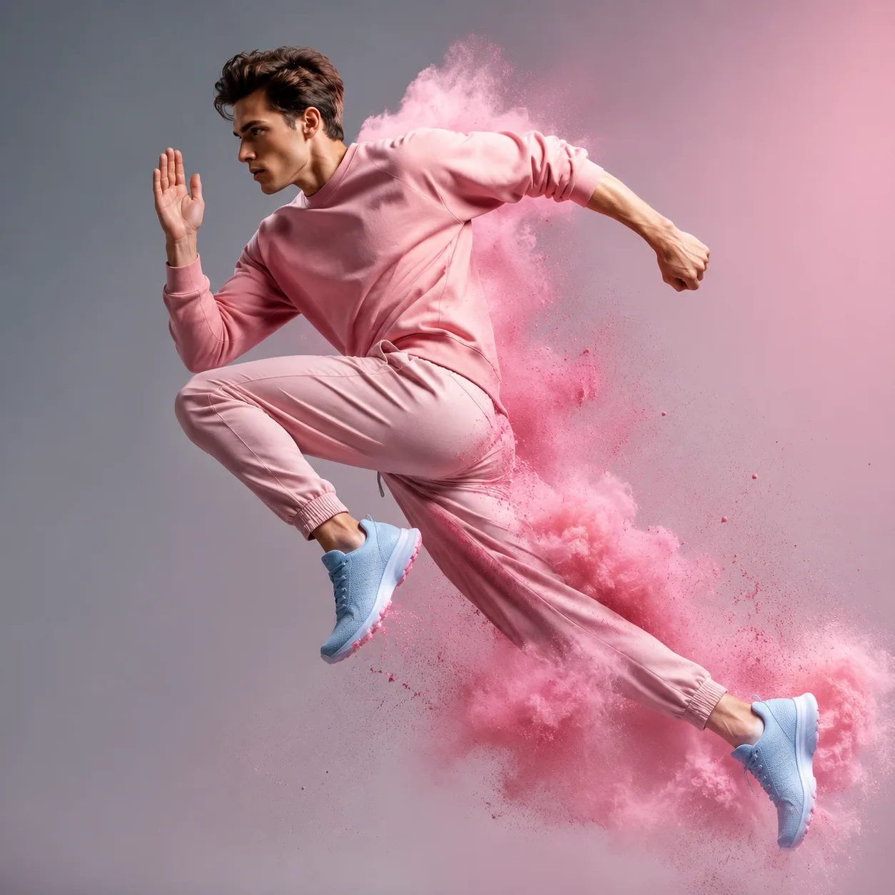

**#42 · Poster Design Prompt · <code>Vinano Studio</code>**

<details>
<summary>Show prompt</summary>

```
A hyper-realistic studio photograph of a male athlete mid-air as if running or jumping, wearing a pastel pink sweatshirt and light pink jogger pants, soft blue sneakers. Pink powder smoke is exploding and swirling around his body, especially behind him and around his legs, creating a dynamic motion effect. Clean minimal background a soft gradient from light gray to pale pink. filmic, cinematic lighting, ultra-sharp focus, shallow depth of field, fashion advertising style, high detail, 8k, soft shadows, professional studio photography. Maintain consistent colour harmony and crisp focus across the whole frame.
```

</details>

---

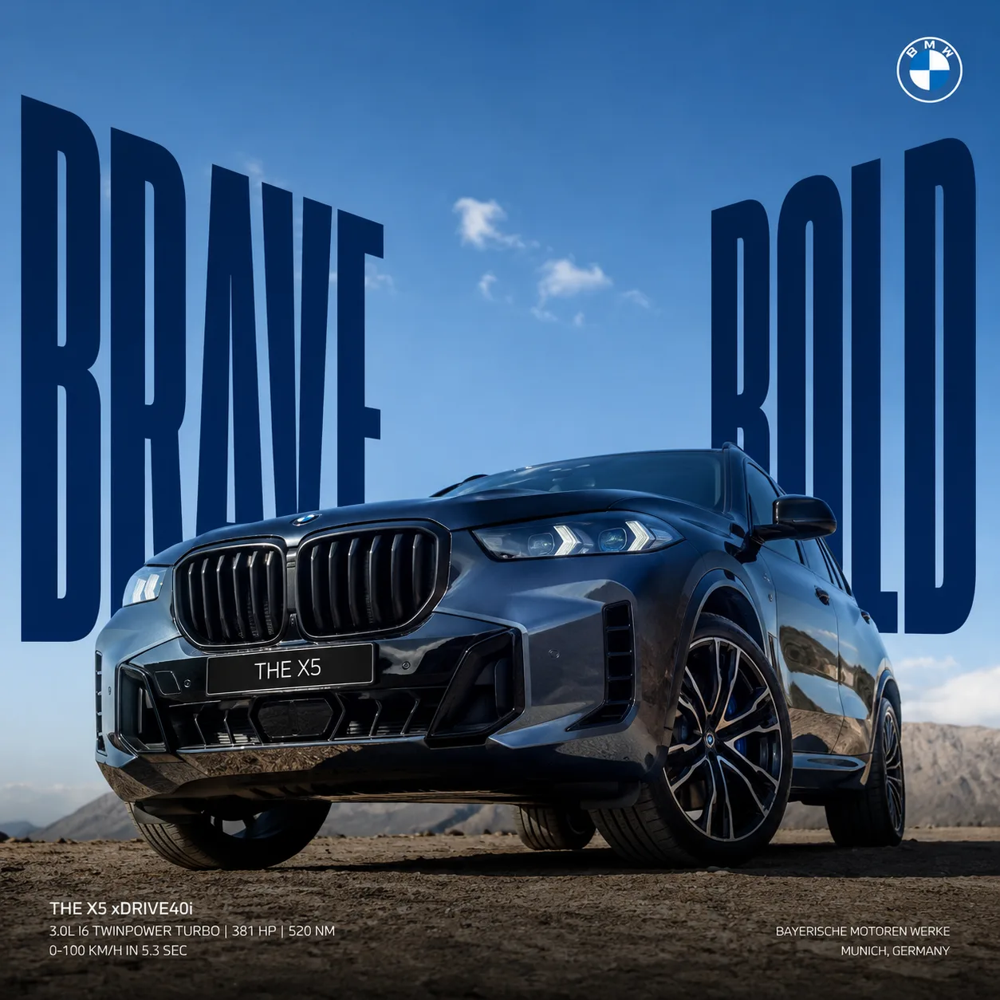

**#43 · Poster Design Prompt · <code>Vinano Studio</code>**

<details>
<summary>Show prompt</summary>

```
[BRAND NAME] | [SLOGAN]. Act as a Professional Editorial Art Director.

PHASE 1: PHYSICS & GROUNDING (THE "STABILITY" RULE).
- Analyze [BRAND NAME] category:
 * CATEGORY A (Active/Sports/Fashion): The subject (person) is in a high-intensity leap, detached from the ground, silhouette against the sky.
 * CATEGORY B (Automotive/Heavy Goods): The subject (vehicle) must be HEROICALLY GROUNDED. Place the car firmly on a solid surface (asphalt, concrete, or rock).
 * Perspective: Use an extreme low-angle (worm's-eye view). The car must look massive and dominant, anchored to the bottom of the frame, towering over the viewer. NO floating or flying for vehicles.

PHASE 2: DYNAMIC PHOTOGRAPHY & LIGHTING.
- Environment: A vast, clear blue sky minimal soft clouds.
- Lighting: Natural, direct sunlight. High-contrast shadows on the subject to emphasize form and texture.
- Style: High-end 8k commercial photography. Sharp focus.

PHASE 3: TYPOGRAPHY & LAYOUT (MATTE FINISH).
- Layout: Use the text from "[SLOGAN]" as massive, ultra-condensed bold sans-serif characters.
- Execution: Split "[SLOGAN]" into two parts: one on the far left, one on the far right.
- Depth: A part of the subject (e.g., a bumper, a mirror, or a person's limb) must overlap the letters to create a 3D effect.

PHASE 4: COLOR STRATEGY (MATTE & REALISTIC).
- Graphic Color: NO NEON. Use a solid, matte brand color for the text (e.g., flat Navy for BMW, flat Red for Red Bull). The color must be opaque and non-glowing, resembling premium-quality print ink.
- Photo Color: Maintain authentic, rich photographic colors for the subject and the sky. The contrast comes from "Flat Graphic vs. Realistic Photo".

PHASE 5: FINAL BRANDING.
- Logo: Small refined minimalist [BRAND NAME] logo in the upper corner.
- Metadata: Tiny secondary text in a clean sans-serif font at the bottom for a technical/editorial look.

Maintain consistent colour harmony and crisp focus across the whole frame.
```

</details>

---

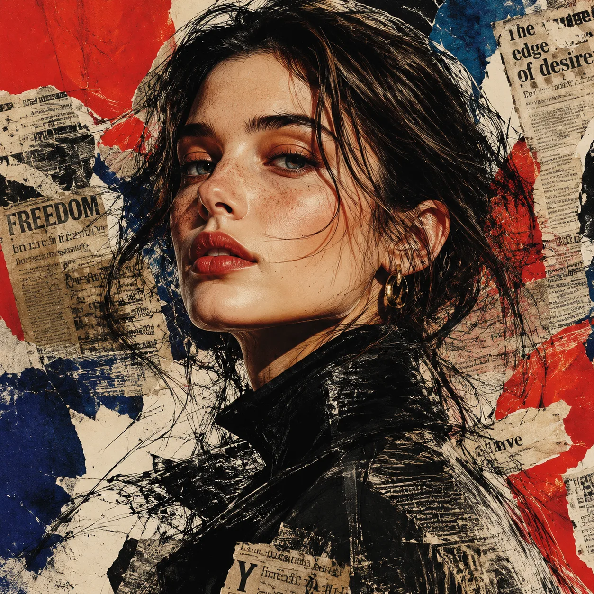

**#44 · Poster Design Prompt · <code>Vinano Studio</code>**

<details>
<summary>Show prompt</summary>

```
Mixed-media portrait of [SUBJECT], [EXPRESSION], [GAZE DIRECTION], [ACCESSORY/STYLING], realistic identity, black sketch strokes, torn newspaper collage, acrylic paint splashes, editorial print texture, blending realism and abstract expressionism, premium poster aesthetic, tactile handmade feel, high contrast, ultra-detailed face and eyes, [PRIMARY COLORS] and [SECONDARY COLORS] Preserve realistic proportions and depth for a confident, professional finish.
```

</details>

---

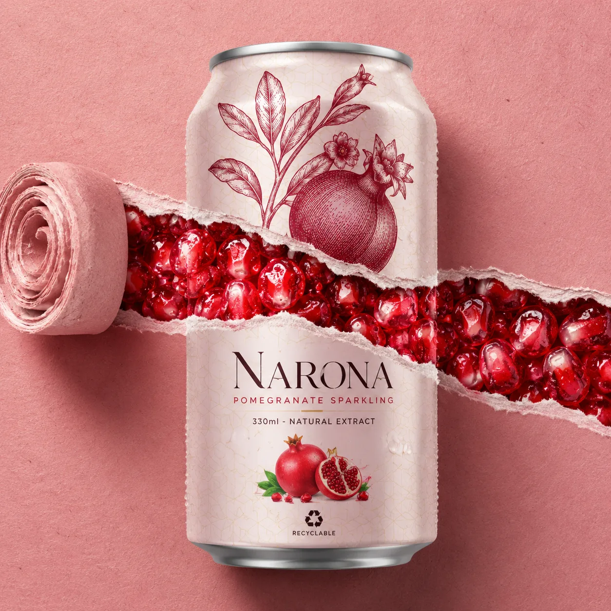

**#45 · Poster Design Prompt · <code>Vinano Studio</code>**

<details>
<summary>Show prompt</summary>

```
A true-to-life photorealistic, highly detailed commercial product photograph of a standard aluminum [Type of Soda Can] centered against a minimal, textured [Background Color] paper background, subtle fibers visible. A single, continuous horizontal paper-tear strip runs across the entire width of the frame, seamless from the far-right edge to the far-left edge. The torn channel cuts through the metal body of the can and continues across the background on both sides a barely perceptible and minimal diagonal slope towards the upper-left. The tear channel is significantly broader, revealing a dense, glistening, and vibrant layer of [Description of Fruit Segments/Sacs/Berries] tightly packed inside. Near the extreme far-left end of this tear, the paper is neatly rolled into a tight, realistic coil that occupies almost the entire left margin. The can features a newly designed, refined minimalist branding: the upper portion has a stylized, abstract line-art illustration of [Fruit Branch/Plant] in a contrasting [Ink Color], set against a subtle matte geometric [Pattern Type] pattern on the can surface. Below this, the brand name "[Brand Name]" is printed in an elegant, modern dark typography, smaller technical text "330ml - NATURAL EXTRACT" and a small "Recyclable" logo. A small, detailed graphic of the fruit is located below the torn path. The lighting is soft and cinematic, casting delicate drop shadows beneath the torn paper edges and the large left coil. 8k resolution, macro details on fibrous paper and glossy fruit texture. Keep edges clean and the overall composition balanced for a polished, gallery-ready result.
```

</details>

---

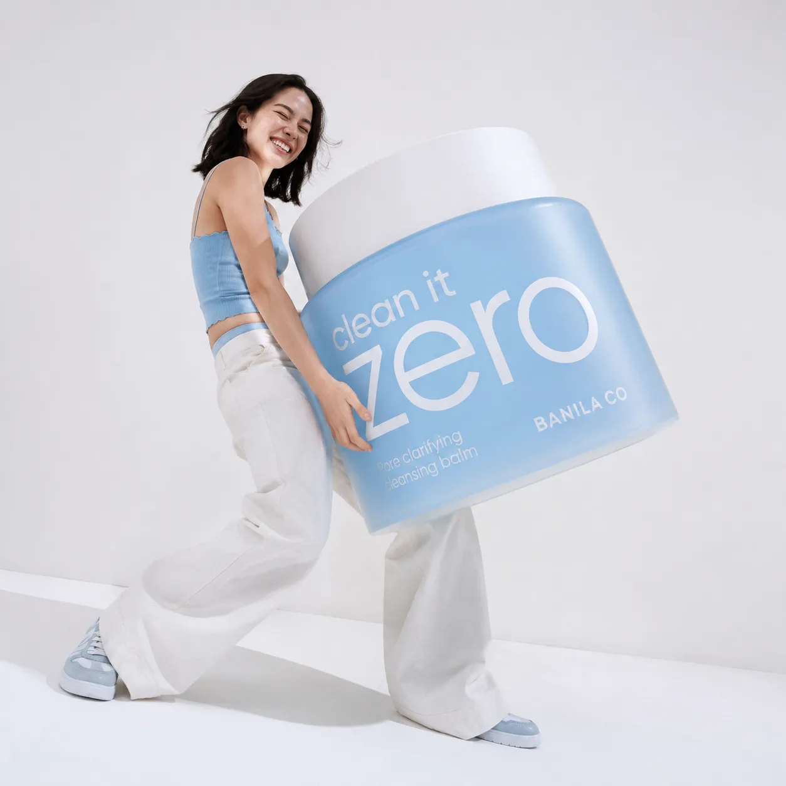

**#46 · Poster Design Prompt · <code>Vinano Studio</code>**

<details>
<summary>Show prompt</summary>

```
[person], [pose], oversized product in the attached image as the main hero prop, playful fun energy, fashion editorial styling, clean minimal background, high key studio lighting, crisp soft shadow, ultra realistic commercial photography, wide angle low perspective, sharp focus, 8k, 1:1 Emphasise material texture and natural light so the final frame feels tactile and premium.
```

</details>

---

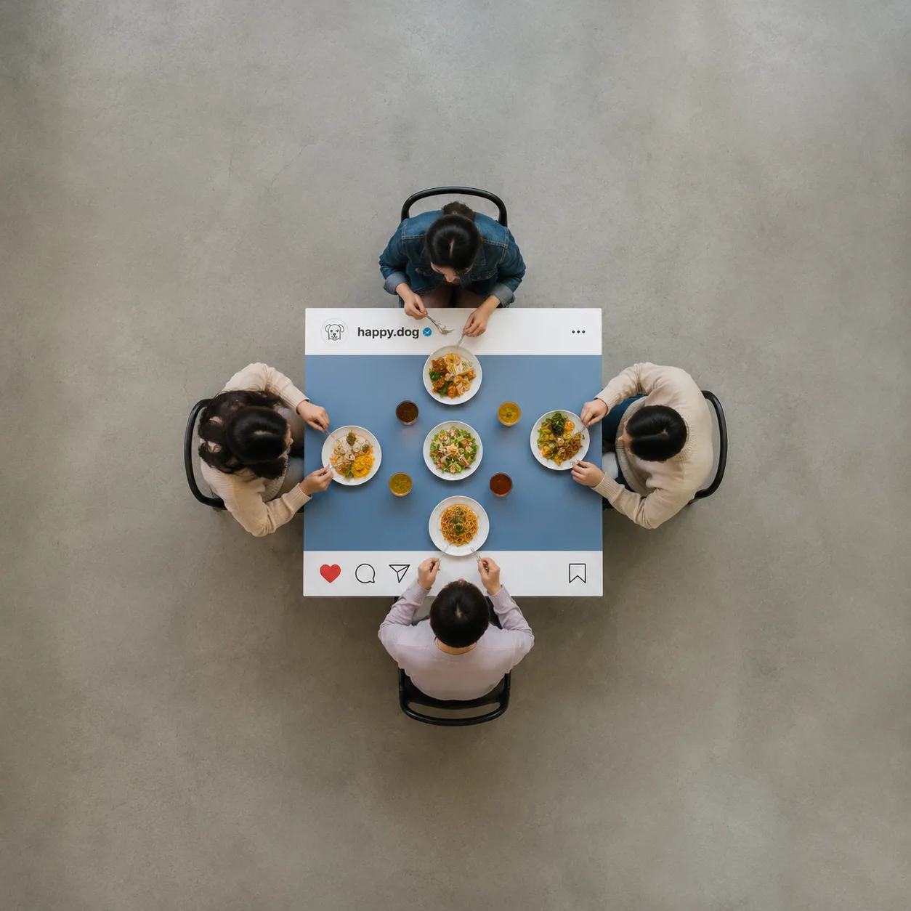

**#47 · Poster Design Prompt · <code>Vinano Studio</code>**

<details>
<summary>Show prompt</summary>

```
Ultra-wide-angle hyper-realistic shooting in top-down mode. A group of 4 real people sitting at a square dining table. The camera is pushed far back, creating a significant negative space (empty floor area) around the people and the table, which provides a clear, minimalistic composition. Scene [ATMOSPHERE AND CLOTHING]: Four people are dressed in [STYLE OF CLOTHING]. Their interaction is specific: [DESCRIBE EACH PERSON'S ACTIONS]. The table is a custom-made physical prop, designed as an Instagram post: it has a solid white stripe ONLY along the top and bottom edges (no white frames on the left or right). - The upper white stripe shows a drawn profile photo [LOGO DESCRIPTION], the username "[USERNAME]", followed by a small blue icon a confirmed check mark, and "..." on the right. - Red hearts, comment and share icons are painted on the bottom white stripe on the left, and a Bookmarks icon on the right. The center of the table is filled in [THE EXACT COLOR OF THE CENTER and the hexadecimal CODE]. The table shows [FOOD ITEMS/ITEM DESCRIPTIONS]. important: ALL food, beverages, objects, and hands that interact them must be located strictly within this central area, colored in [COLOR]. NOTHING should go beyond the white stripes or beyond the table. The background of the floor is [THE COLOR OF THE FLOOR] to create a visual separation. Professional studio lighting clear shadows. 8k, clear focus. Maintain consistent colour harmony and crisp focus across the whole frame.
```

</details>

---

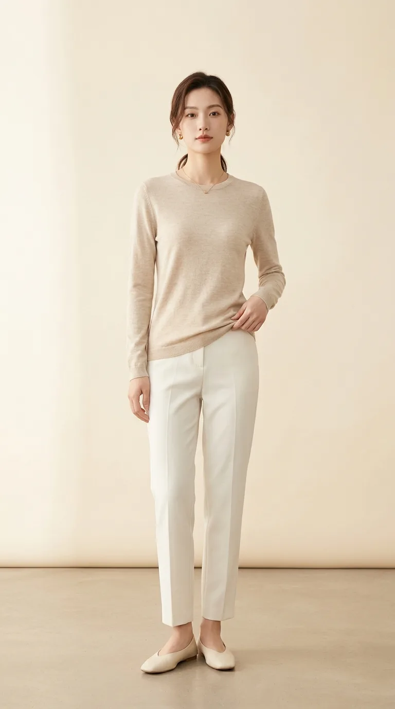

**#48 · Poster Design Prompt · <code>Vinano Image Pro</code>**

<details>
<summary>Show prompt</summary>

```
9：16竖版高端极简时尚产品海报。柔和摄影棚自然日光，温暖米白渐变背景（奶油色、燕麦色），画面极致干净。精致亚洲女性模特（25-30岁），自然裸妆，肤感干净，长发自然垂落或低马尾，姿态放松克制，全身或三分之二身构图，手自然垂放或轻触腰侧，强调衣身线条。服装必须严格匹配上传的产品参考图：高品质打底衫，奶油白/燕麦色/浅驼色/雾灰色，高支棉或莫代尔微弹针织面料，触感柔软，修身但不紧绷，圆领或小高领，长袖，设计极简 保持真实比例与空间层次，呈现专业、稳重的最终效果。
```

</details>

---

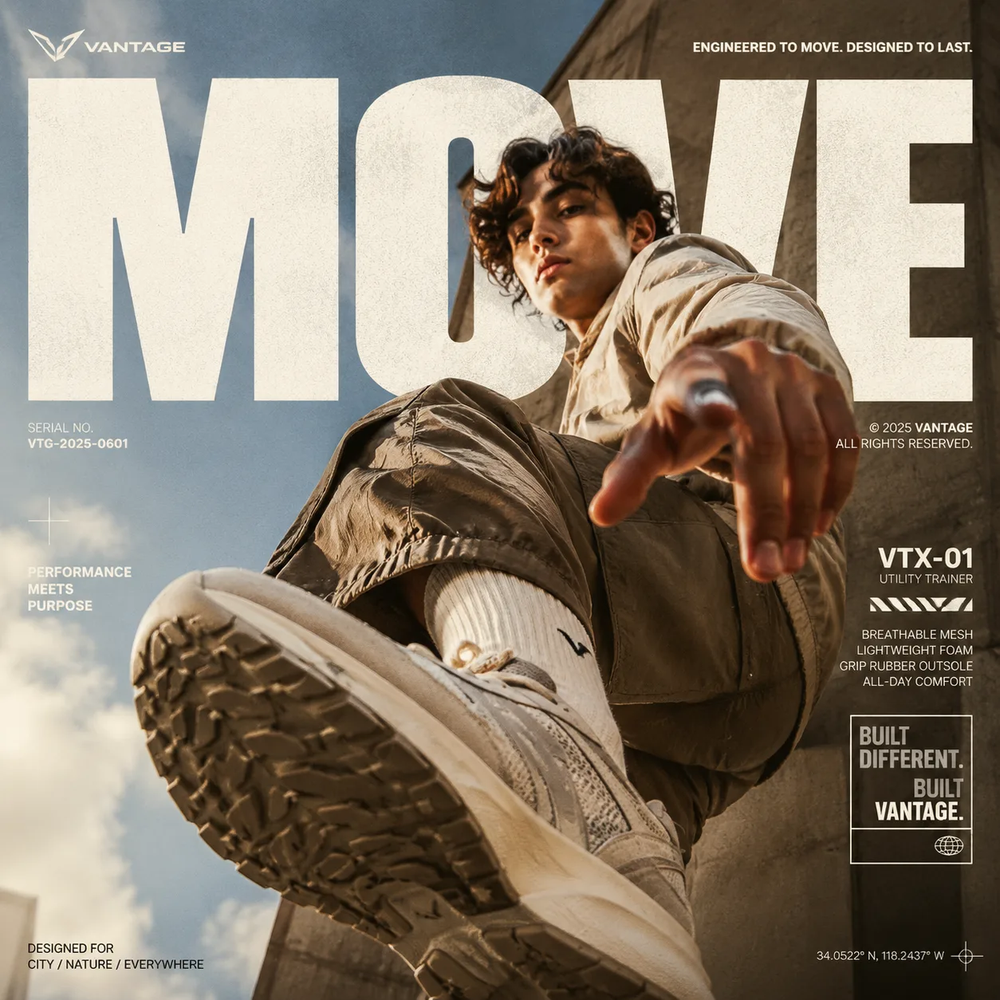

**#49 · Poster Design Prompt · <code>Vinano Studio</code>**

<details>
<summary>Show prompt</summary>

```
Graphic design smart prompt

Generate ad posters in

This prompt generates:
• POV low-angle photo (pointing at viewer)
• Oversized text + brand tagline
• Serial numbers, copyright lines, technical callouts
• Brand-appropriate color blocking and texture

Use case:
• social media posting,
• influencer collab visuals,
• pitch decks.

Prompt 👇

Emphasise material texture and natural light so the final frame feels tactile and premium.
```

</details>

---

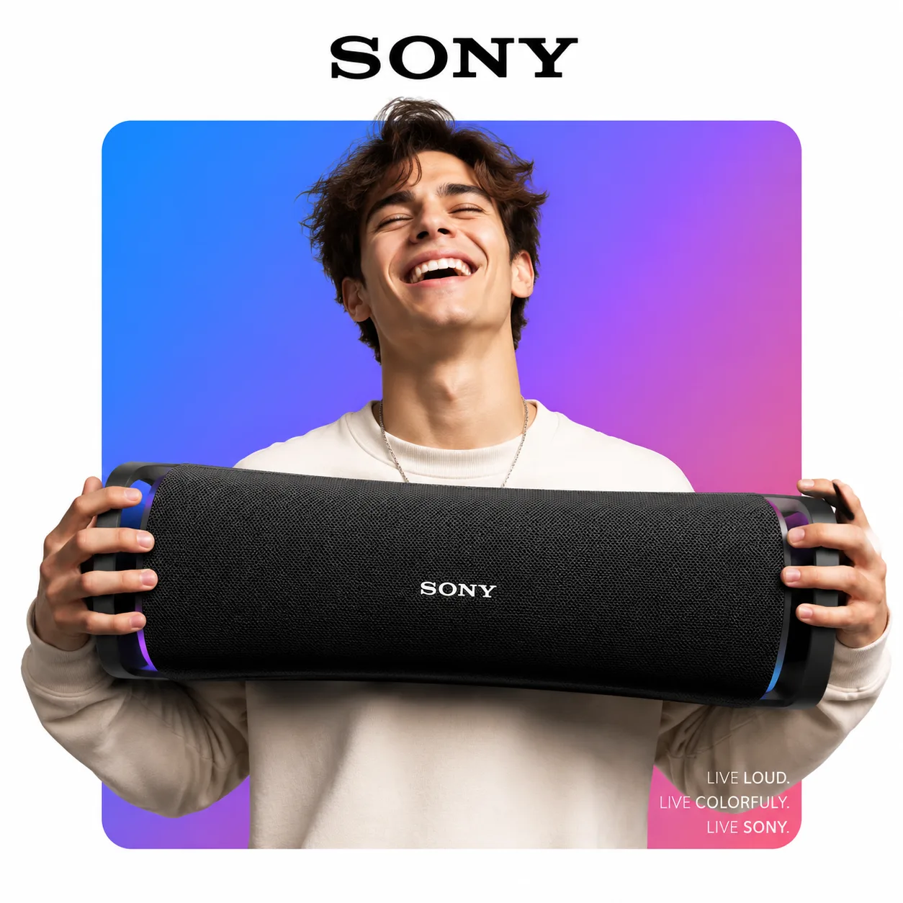

**#50 · Poster Design Prompt · <code>Vinano Studio</code>**

<details>
<summary>Show prompt</summary>

```
A professional high-end graphic design advertisement composition on a pure solid white canvas. Centered is a perfectly symmetrical, large solid rounded square (not a hollow frame). The entire interior of this square is filled a smooth, vibrant color gradient fading from [Top-Left Color/Hex] to [Bottom-Right Color/Hex].

A [Description of Character] is positioned such that the bottom of their torso is perfectly flush and aligned the very bottom edge of the square, leaving no thick colored border visible beneath them. Crucially, the person and their clothing maintain natural, realistic colors and textures, illuminated by professional studio lighting that is independent of the background gradient (preventing any color cast on their skin or clothes).

They are firmly and realistically gripping [Product Description]. Crucially, the top of their head and hair break the top boundary of the square, partially overlapping the white background. Their hands and the [Product Name] also break the side boundaries for a powerful 3D breakout effect, extending onto the white canvas.

Typography Layout: At the top, in the white space distinctly above the square a clear gap, is the [Font Style] brand text '[Brand Name]' in [Top Text Color]. In the bottom-right corner, layered directly on top of the gradient inside the square, is a block of small, thin, clean [Bottom Text Color] descriptive text: '[Slogan/Tagline]'.

The lighting is [Lighting Type: e.g., Sharp/Soft], crisp, and commercial, emphasizing the textures of both the subject and the product."

Preserve realistic proportions and depth for a confident, professional finish.
```

</details>

---

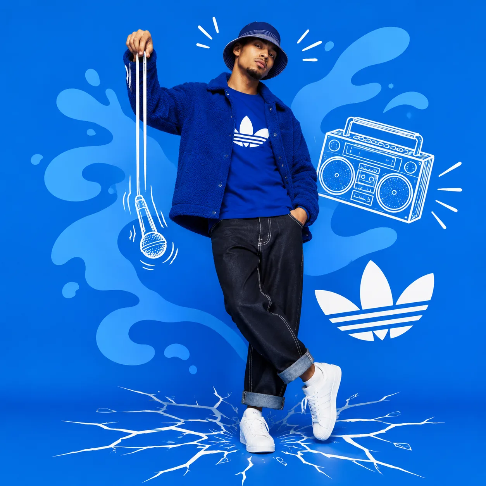

**#51 · Poster Design Prompt · <code>Vinano Studio</code>**

<details>
<summary>Show prompt</summary>

```
{
 "meta": {
 "image_quality": "High",
 "image_type": "Mixed Media (Photography combined Digital Illustration/Collage)",
 "resolution_estimation": "High resolution, sharp edges on vectors",
 "file_characteristics": {
 "compression_artifacts": "Low",
 "noise_level": "None",
 "lens_type_estimation": "Standard to slight wide-angle (approx 35mm)"
 }
 },
 "global_context": {
 "scene_description": "A full-body studio portrait of a young man posing dynamically against a solid bright blue background. The image is a composite featuring the photograph of the man overlaid white hand-drawn style vector graphics (doodles) and abstract blue liquid shapes. The subject is dressed in a monochromatic blue streetwear outfit white accents.",
 "environment_type": "Studio/Graphic Design Composition",
 "time_of_day": "Indiscernible (Studio Lighting)",
 "weather_atmosphere": "Energetic, Artistic, Urban, Cool",
 "lighting": {
 "source": "Artificial Studio Lighting",
 "direction": "Front-right dominant (creating soft shadows on the left side of the face)",
 "quality": "Soft, Diffused",
 "color_temperature": "Neutral white"
 },
 "color_palette": {
 "dominant_hex_estimates": ["#4CA7E8",
 "#0044CC",
 "#FFFFFF",
 "#1A2B45"],
 "accent_colors": ["#FFFFFF"],
 "contrast_level": "High"
 }
 },
 "composition": {
 "camera_angle": "Low-angle (looking slightly up at the subject)",
 "framing": "Full Shot (Head to Toe)",
 "depth_of_field": "Deep (Everything in focus)",
 "focal_point": "Subject's face and upper torso",
 "symmetry_type": "Asymmetrical balance",
 "rule_of_thirds_alignment": "Subject centered, graphics balancing the negative space"
 },
 "objects": [{
 "id": "obj_001",
 "label": "Male Subject",
 "category": "Person",
 "location": {
 "relative_position": "Center",
 "bounding_box_percentage": {
 "x": 0.30,
 "y": 0.05,
 "width": 0.40,
 "height": 0.85
 }
 },
 "dimensions_relative": "Large",
 "distance_from_camera": "Mid",
 "pose_orientation": "Standing, body angled slightly right, head tilted left, right hand raised near face, left leg crossed over right leg",
 "material": "Organic (Skin)",
 "surface_properties": {
 "texture": "Skin",
 "reflectivity": "Low",
 "micro_details": "Light goatee/facial hair, neutral but confident expression",
 "wear_state": "N/A"
 },
 "color_details": {
 "base_color_hex": "#5C3A2A",
 "secondary_colors": [],
 "gradient_or_pattern": "Natural skin tones"
 },
 "interaction_with_light": {
 "shadow_casting": "Self-shadows on neck and left side of face",
 "highlight_zones": "Forehead, right cheek, nose bridge",
 "translucency": "None"
 },
 "relationships": [{
 "type": "wearing",
 "target_object_id": "obj_002"
 },
 {
 "type": "wearing",
 "target_object_id": "obj_003"
 },
 {
 "type": "wearing",
 "target_object_id": "obj_004"
 },
 {
 "type": "wearing",
 "target_object_id": "obj_005"
 },
 {
 "type": "wearing",
 "target_object_id": "obj_006"
 },
 {
 "type": "interacting_with",
 "target_object_id": "obj_007"
 },
 {
 "type": "standing_on",
 "target_object_id": "obj_011"
 }]
 },
 {
 "id": "obj_002",
 "label": "Bucket Hat",
 "category": "Apparel",
 "location": {
 "relative_position": "Top-Center (On head)",
 "bounding_box_percentage": {
 "x": 0.45,
 "y": 0.05,
 "width": 0.10,
 "height": 0.08
 }
 },
 "dimensions_relative": "Small",
 "distance_from_camera": "Mid",
 "pose_orientation": "Worn on head, brim pulled slightly down",
 "material": "Denim/Canvas",
 "surface_properties": {
 "texture": "Woven fabric",
 "reflectivity": "Low",
 "micro_details": "Visible white contrast stitching around the brim and crown",
 "wear_state": "New"
 },
 "color_details": {
 "base_color_hex": "#003399",
 "secondary_colors": ["#FFFFFF"],
 "gradient_or_pattern": "Solid blue white stitching lines"
 }
 },
 {
 "id": "obj_003",
 "label": "Fleece Jacket",
 "category": "Apparel",
 "location": {
 "relative_position": "Upper Body",
 "bounding_box_percentage": {
 "x": 0.30,
 "y": 0.12,
 "width": 0.35,
 "height": 0.40
 }
 },
 "dimensions_relative": "Medium",
 "distance_from_camera": "Mid",
 "pose_orientation": "Worn open, sleeves rolled slightly or pushed up",
 "material": "Sherpa Fleece / Synthetic Blend",
 "surface_properties": {
 "texture": "High pile, fuzzy, nubby texture on outer shell",
 "reflectivity": "Low (Matte)",
 "micro_details": "Silver snap button visible on collar, smooth fabric lining visible at cuffs",
 "wear_state": "New"
 },
 "color_details": {
 "base_color_hex": "#0044CC",
 "secondary_colors": ["#002266"],
 "gradient_or_pattern": "Solid vivid blue"
 }
 },
 {
 "id": "obj_004",
 "label": "T-Shirt",
 "category": "Apparel",
 "location": {
 "relative_position": "Chest/Torso (Under jacket)",
 "bounding_box_percentage": {
 "x": 0.40,
 "y": 0.20,
 "width": 0.20,
 "height": 0.30
 }
 },
 "dimensions_relative": "Medium",
 "distance_from_camera": "Mid",
 "pose_orientation": "Worn on torso",
 "material": "Cotton jersey",
 "surface_properties": {
 "texture": "Smooth fabric",
 "reflectivity": "Low",
 "micro_details": "Large graphic print on chest",
 "wear_state": "New"
 },
 "color_details": {
 "base_color_hex": "#0044CC",
 "secondary_colors": ["#FFFFFF"],
 "gradient_or_pattern": "Large white outline of Adidas Trefoil logo on chest"
 },
 "text_content": {
 "raw_text": "adidas (implied by logo shape)",
 "font_style": "Logo symbol",
 "font_weight": "Bold",
 "text_case": "N/A",
 "alignment": "Center",
 "color_hex": "#FFFFFF"
 }
 },
 {
 "id": "obj_005",
 "label": "Jeans",
 "category": "Apparel",
 "location": {
 "relative_position": "Lower Body",
 "bounding_box_percentage": {
 "x": 0.40,
 "y": 0.45,
 "width": 0.20,
 "height": 0.40
 }
 },
 "dimensions_relative": "Medium",
 "distance_from_camera": "Mid",
 "pose_orientation": "Worn on legs, relaxed fit",
 "material": "Denim",
 "surface_properties": {
 "texture": "Woven denim",
 "reflectivity": "Low",
 "micro_details": "Heavy white contrast stitching along seams and pockets. Cuffs are rolled up exposing lighter reverse side of denim.",
 "wear_state": "New"
 },
 "color_details": {
 "base_color_hex": "#2A3B55",
 "secondary_colors": ["#FFFFFF",
 "#667788"],
 "gradient_or_pattern": "Dark wash indigo"
 }
 },
 {
 "id": "obj_006",
 "label": "Sneakers",
 "category": "Footwear",
 "location": {
 "relative_position": "Bottom-Center",
 "bounding_box_percentage": {
 "x": 0.35,
 "y": 0.85,
 "width": 0.25,
 "height": 0.10
 }
 },
 "dimensions_relative": "Small",
 "distance_from_camera": "Mid",
 "pose_orientation": "Right foot planted, left foot on toe/mid-step. Classic Adidas Superstar silhouette.",
 "material": "Leather/Rubber",
 "surface_properties": {
 "texture": "Smooth leather upper, textured rubber shell toe",
 "reflectivity": "Medium (Leather sheen)",
 "micro_details": "Three stripes visible (white on white), shell toe pattern",
 "wear_state": "Pristine/Clean"
 },
 "color_details": {
 "base_color_hex": "#FFFFFF",
 "secondary_colors": [],
 "gradient_or_pattern": "All white"
 }
 },
 {
 "id": "obj_007",
 "label": "Graphic - Mic Drop Lines",
 "category": "Illustration/Overlay",
 "location": {
 "relative_position": "Upper Left (Hanging from hand)",
 "bounding_box_percentage": {
 "x": 0.38,
 "y": 0.12,
 "width": 0.05,
 "height": 0.25
 }
 },
 "dimensions_relative": "Small",
 "distance_from_camera": "Zero (Overlay)",
 "pose_orientation": "Vertical",
 "material": "Digital Vector",
 "surface_properties": {
 "texture": "Flat color",
 "reflectivity": "None",
 "micro_details": "Three thick vertical white lines representing motion or cable"
 },
 "color_details": {
 "base_color_hex": "#FFFFFF",
 "secondary_colors": [],
 "gradient_or_pattern": "Solid"
 },
 "relationships": [{
 "type": "originating_from",
 "target_object_id": "obj_001"
 }]
 },
 {
 "id": "obj_008",
 "label": "Graphic - Microphone",
 "category": "Illustration/Overlay",
 "location": {
 "relative_position": "Mid Left (Below hand)",
 "bounding_box_percentage": {
 "x": 0.38,
 "y": 0.35,
 "width": 0.05,
 "height": 0.05
 }
 },
 "dimensions_relative": "Small",
 "distance_from_camera": "Zero (Overlay)",
 "pose_orientation": "Angled downwards",
 "material": "Digital Vector",
 "surface_properties": {
 "texture": "Hand-drawn line art style",
 "reflectivity": "None",
 "micro_details": "Outline of a dynamic vocal microphone"
 },
 "color_details": {
 "base_color_hex": "#FFFFFF",
 "secondary_colors": [],
 "gradient_or_pattern": "Outline only"
 }
 },
 {
 "id": "obj_009",
 "label": "Graphic - Boombox",
 "category": "Illustration/Overlay",
 "location": {
 "relative_position": "Center Right",
 "bounding_box_percentage": {
 "x": 0.65,
 "y": 0.30,
 "width": 0.15,
 "height": 0.20
 }
 },
 "dimensions_relative": "Medium",
 "distance_from_camera": "Zero (Overlay)",
 "pose_orientation": "Isometric view",
 "material": "Digital Vector",
 "surface_properties": {
 "texture": "Hand-drawn line art style",
 "reflectivity": "None",
 "micro_details": "Speaker grille mesh pattern, handle, buttons, cassette deck outline"
 },
 "color_details": {
 "base_color_hex": "#FFFFFF",
 "secondary_colors": [],
 "gradient_or_pattern": "Outline only"
 },
 "relationships": [{
 "type": "emitting",
 "target_object_id": "obj_013"
 }]
 },
 {
 "id": "obj_010",
 "label": "Graphic - Adidas Trefoil Logo",
 "category": "Illustration/Overlay",
 "location": {
 "relative_position": "Bottom Right",
 "bounding_box_percentage": {
 "x": 0.65,
 "y": 0.65,
 "width": 0.15,
 "height": 0.15
 }
 },
 "dimensions_relative": "Medium",
 "distance_from_camera": "Zero (Overlay)",
 "pose_orientation": "Flat",
 "material": "Digital Vector",
 "surface_properties": {
 "texture": "Flat color",
 "reflectivity": "None",
 "micro_details": "Classic 3-leaf shape horizontal stripes"
 },
 "color_details": {
 "base_color_hex": "#FFFFFF",
 "secondary_colors": [],
 "gradient_or_pattern": "Solid"
 }
 },
 {
 "id": "obj_011",
 "label": "Graphic - Cracked Floor",
 "category": "Illustration/Overlay",
 "location": {
 "relative_position": "Bottom Center (Under feet)",
 "bounding_box_percentage": {
 "x": 0.25,
 "y": 0.85,
 "width": 0.50,
 "height": 0.15
 }
 },
 "dimensions_relative": "Medium",
 "distance_from_camera": "Zero (Overlay)",
 "pose_orientation": "Flat perspective on ground",
 "material": "Digital Vector",
 "surface_properties": {
 "texture": "Line art",
 "reflectivity": "None",
 "micro_details": "Jagged lines radiating outward from the subject's stance like shattered glass"
 },
 "color_details": {
 "base_color_hex": "#FFFFFF",
 "secondary_colors": [],
 "gradient_or_pattern": "Line art"
 }
 },
 {
 "id": "obj_012",
 "label": "Graphic - Liquid Shapes",
 "category": "Illustration/Background Element",
 "location": {
 "relative_position": "Behind Subject",
 "bounding_box_percentage": {
 "x": 0.10,
 "y": 0.10,
 "width": 0.80,
 "height": 0.80
 }
 },
 "dimensions_relative": "Large",
 "distance_from_camera": "Behind Subject",
 "pose_orientation": "Fluid, amorphous",
 "material": "Digital Vector",
 "surface_properties": {
 "texture": "Flat color",
 "reflectivity": "None",
 "micro_details": "Blobs and splashes extending to the left and right, wrapping slightly around the subject"
 },
 "color_details": {
 "base_color_hex": "#5CAFF0",
 "secondary_colors": [],
 "gradient_or_pattern": "Slightly darker/more saturated than background blue"
 }
 },
 {
 "id": "obj_013",
 "label": "Graphic - Sound/Motion Lines",
 "category": "Illustration/Overlay",
 "location": {
 "relative_position": "Around Head and Boombox",
 "bounding_box_percentage": {
 "x": 0.60,
 "y": 0.05,
 "width": 0.25,
 "height": 0.40
 }
 },
 "dimensions_relative": "Small",
 "distance_from_camera": "Zero (Overlay)",
 "pose_orientation": "Radiating",
 "material": "Digital Vector",
 "surface_properties": {
 "texture": "Line art",
 "reflectivity": "None",
 "micro_details": "Short strokes indicating sound or movement above the hat and next to the boombox"
 },
 "color_details": {
 "base_color_hex": "#FFFFFF",
 "secondary_colors": [],
 "gradient_or_pattern": "Solid"
 }
 }],
 "background_details": {
 "texture": "Digital Flat Color",
 "patterns": "None (Solid Color)",
 "lighting_behavior": "Even illumination, no gradient visible",
 "additional_elements": ["Vector liquid shapes (obj_012) act as a secondary background layer"]
 },
 "foreground_elements": {
 "particles": "None",
 "artifacts": "White vector doodles (mic, boombox, cracks) act as foreground overlays"
 },
 "reconstruction_notes": {
 "mandatory_elements_for_recreation": ["Male model in full blue Adidas outfit",
 "Fleece texture on jacket",
 "White contrast stitching on jeans and hat",
 "Hand-drawn white doodle overlays (Mic, Boombox, Trefoil)",
 "Cracked floor effect under feet",
 "Monochromatic blue palette white accents",
 "Dynamic 'cool' pose"],
 "sensitivity_factors": "The blend between the realistic photo and the flat vector graphics must be sharp. The blue tones of the clothing must coordinate but distinguish from the background blue.",
 "ambiguities": "The exact specific model of the Adidas jacket is not identifiable by name but defined by texture (sherpa/fleece) and color."
 }
}

Keep edges clean and the overall composition balanced for a polished, gallery-ready result.
```

</details>

---

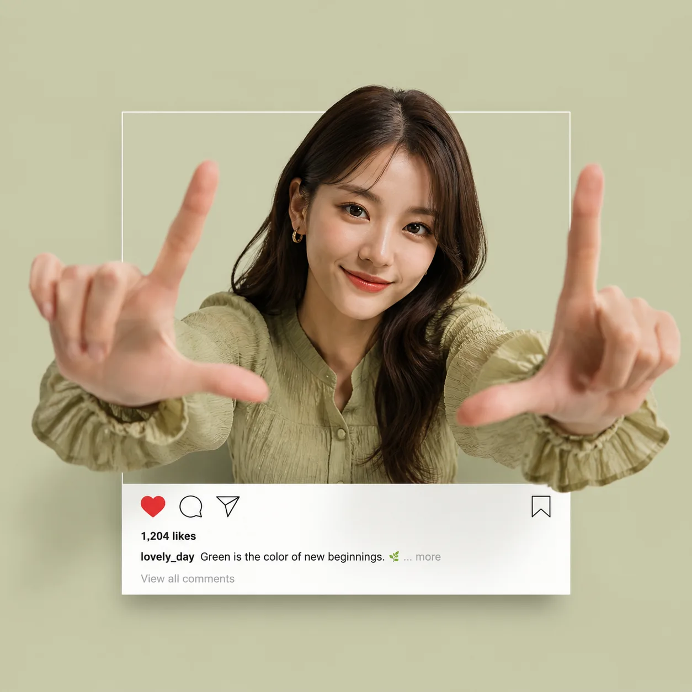

**#52 · Poster Design Prompt · <code>Vinano Studio</code>**

<details>
<summary>Show prompt</summary>

```
A true-to-life photorealistic fashion upper body shot of [Character Description and expression] wearing [Detailed Outfit Description]. The subject is framed inside a central white Instagram-style post border.

Composition & Spacing: The white frame is perfectly centered in the middle of the image, leaving balanced empty [Soft Background Color matching the outfit] space above and below the frame to match the theme.

Frame Details: The top, left, and right white borders are very thin. The bottom white section is thicker to include UI elements. The bottom section features a red heart icon, comment bubble, share icon, and bookmark icon.

Text Details: Clearly visible text on the bottom panel: "[Number] likes", username "[Username]", caption "[Caption text]... more", and below that, "View all comments".

3D Pop-Out Effect & Hand Pose:
[CHOOSE ONE OF THE FOLLOWING ACTIONS OR DESCRIBE YOUR OWN ACTION:]
 1. (Grip): head and arms are physically popping out OVER the top and side thin borders. hands are realistically gripping the outer edges of the thin side borders, appearing to hold the frame firmly.
2. (Kiss): Her body is leaning forward towards the camera, creating a strong sense of depth. Her head remains securely framed WITHIN the top thin white border. Only her right hand, raised near her mouth in a blowing-kiss gesture, physically extends forward and breaks OUT of the thin side frame boundary. Her left hand realistically grips the side edge.
3. (Resting): She is looking directly at the camera a gentle smile. Her head and shoulders physically pop out OVER the top thin white border. Crucially, her hands are realistically resting comfortably on top of the thicker bottom white UI panel, appearing to lean casually on the frame edge.
4. (Dynamic Frame): Her upper body and head remain secure WITHIN the boundaries of the white frame. However, both of her arms are fully extended outward dynamically, breaking past the thin borders up to her elbows, reaching straight toward the camera lens. She forms a distinct “L” shape both hands, as if framing a scene. Due to perspective, her hands are positioned significantly closer to the camera than her face, showing strong spatial depth.

Subject Dimensionality & Texture: The subject must look like a solid, three-dimensional figure, not flat. Emphasize the detailed texture of the [Specific Fabric Name from outfit description], the contours of the face, and realistic hair details. She should have distinct depth separating her from the flat [Background Color] background.

Lighting & Shadows: Professional studio lighting creating soft, realistic drop shadows cast by the physical frame and, crucially, by the [popping-out elements, e.g., hands/head/arms] onto the solid flat [Background Color] background, enhancing the dramatic depth and illusion. High definition, commercial photography.

Aim for an editorial, design-driven look with deliberate negative space.
```

</details>

---

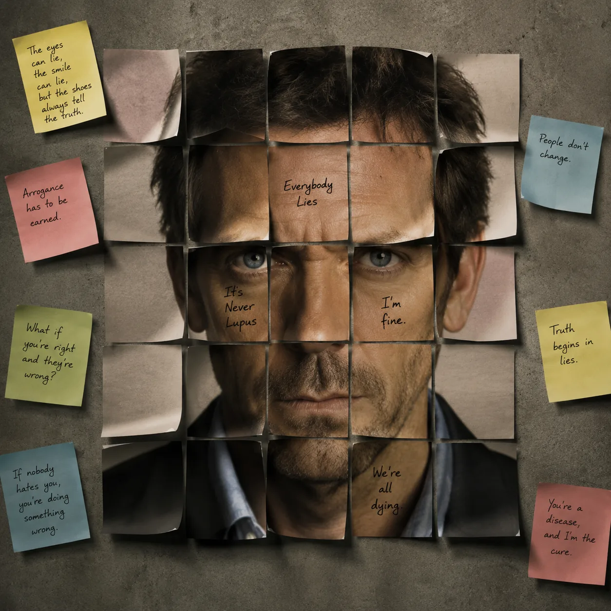

**#53 · Poster Design Prompt · <code>Vinano Studio</code>**

<details>
<summary>Show prompt</summary>

```
A refined minimalist cinematic colored poster featuring a [Character Name]’s portrait from shoulders to the top of the head. The face is reconstructed a small number of large, square-cut paper fragments arranged in a simple grid [around 4x5 or 5x6 pieces]. Each paper fragment contains a disjointed part of the face which together reconstruct the portrait. The internal paper fragments constituting the face are not perfectly flat; many have slightly curled edges and lifted corners, casting tiny, realistic shadows that give them a three-dimensional, tacked-down appearance. 4 of these squares have subtle black handwritten [text1, text2, text3, text4] directly on the skin/image. Scattered irregularly around the outer perimeter of this central grid in various randomly placed positions (not confined to the corners), several [Sticky Note Color] sticky notes are attached to the [Color] wall, containing handwritten [External Text Content, e.g., iconic quotes]. The overall layout is slightly irregular visible gaps between the pieces showing [Color] concrete wall background. Realistic paper texture throughout, high-end studio lighting emphasizing the lifted edges, sharp focus on ink and paper grain. Preserve realistic proportions and depth for a confident, professional finish.
```

</details>

---

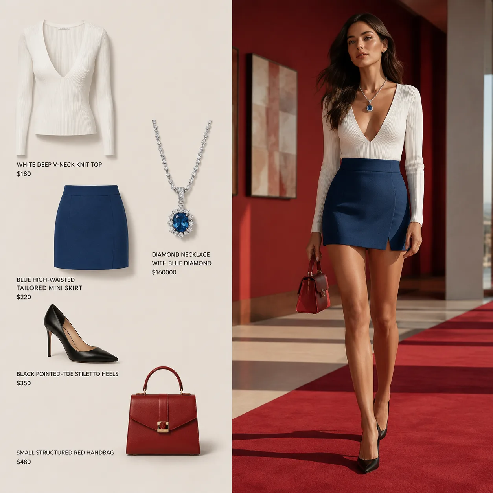

**#54 · Poster Design Prompt · <code>Vinano Studio</code>**

<details>
<summary>Show prompt</summary>

```
A refined fashion editorial image a 3:4 aspect ratio, split into two clear sections.

Right side:
A fashionable, confident, sensual woman standing and walking casually in a modern architectural space red luxurious walls and soft natural light. She wears a top a deep V neckline, a 90-60-90 figure, tucked into a high-waisted blue tailored short skirt, On her feet are sleek black stiletto heels, elegant and minimal. She carries a small structured red handbag in one hand and she is wearing a luxurious diamond necklace a blue diamond on it.

Her hair is open emphasizing her facial structure. She wears subtle statement earrings. The look is refined, modern, and effortlessly chic. Natural daylight, soft shadows, realistic skin texture. Casual fashion photography style an editorial, high-end feel. alive color palette, warm tones, shallow depth of field, cinematic realism.

Style & Mood:
Modern elegance, quiet luxury, confident, minimal, editorial casual.

Photography Details:
Eye-level angle, candid stance, 35mm lens, natural lighting, high detail, true-to-life photorealistic.

Left side:
A clean, refined minimalist product breakdown layout on a neutral background. The individual fashion items worn by the woman are displayed separately, neatly arranged subtle shadows. Each item includes a small, elegant price label in refined sans-serif typography:

– white deep V-neck knit top — $180
– blue high-waisted tailored mini skirt — $220
– Black pointed-toe stiletto heels — $350
– Small structured red handbag — $480
– a diamond necklace a big blue diamond — $160000

The left side feels like a luxury fashion catalog or e-commerce lookbook, a red carpet, luxurious walls, art pieces on wall

Overall Style & Mood:
Quiet luxury, modern elegance, editorial fashion, high-end retail aesthetic.

Lighting & Quality:
Soft natural light, studio-clean clarity on product side, true-to-life photorealistic, ultra-high resolution, professional fashion photography.

Negative Prompt:
Cluttered layout, oversized text, flashy logos, mannequins, people on left side, harsh lighting, low resolution, cartoon style.

Maintain consistent colour harmony and crisp focus across the whole frame.
```

</details>

---

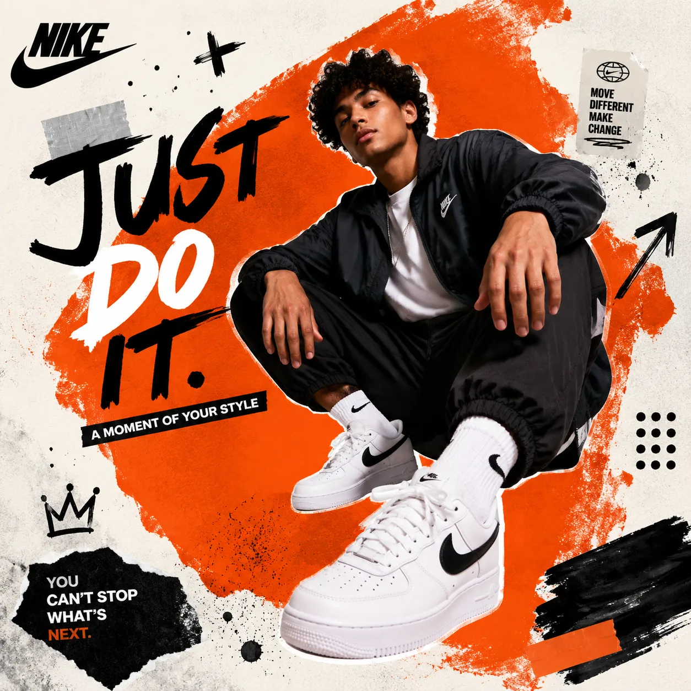

**#55 · Poster Design Prompt · <code>Vinano Studio</code>**

<details>
<summary>Show prompt</summary>

```
[BRAND NAME]. Act as a Social Media Art Director and Digital Collage Artist specializing in bold, youth-oriented brand content for Instagram and digital campaigns.
PHASE 1: CONCEPTUAL FRAMEWORK
Create a dynamic digital collage that merges fashion photography graphic design chaos. This is controlled rebellion – a composition that feels spontaneous and energetic while maintaining brand coherence. The aesthetic is anti-polished: torn edges, layered textures, hand-drawn elements, and bold color blocking that screams confidence and movement.
PHASE 2: MODEL & PHOTOGRAPHY
- Subject: One model (diverse casting, age 18-30) in a dynamic, confident pose
- Pose Energy: 80% attitude, 20% natural – sitting, jumping, mid-motion, or power stance (avoid static standing)
- Outfit: Street style/athleisure that aligns [BRAND NAME] aesthetic – casual but styled
- Hero Product: Feature 1 signature [BRAND NAME] product prominently (sneakers, bag, apparel) – this is the visual anchor
- Photography Style: Editorial fashion cutout – model extracted from background clean edges
- Camera Angle: Slight low angle to empower subject (hero perspective)
- Crop: Full body or 3/4 body showing hero product clearly
- Background Removal: Model cut out cleanly for layering over collage elements
PHASE 3: COLOR BLOCKING FOUNDATION
- Primary Color Blob: Large organic shape (40-60% of composition) in bold, saturated brand color behind/around model
- Shape Style: Irregular, hand-painted aesthetic – think Photoshop brush strokes or torn paper texture (NOT perfect geometric shapes)
- Color Selection (Autonomous): Choose 1 hero color from [BRAND NAME] palette:
- Texture: Visible brush strokes, grain, or subtle noise (15-25% opacity) – avoid flat digital fills
- Placement: Blob positioned to frame model without obscuring key product details
PHASE 4: GRAPHIC ELEMENTS LAYER
Add 3-5 abstract graphic elements scattered across composition:
- Element Types:
- Color Palette: Use 2-3 accent colors total (main blob color + 1-2 contrasting tones from brand palette)
- Placement: Asymmetric scatter – top-left and bottom-right zones primarily (avoid center crowding)
- Scale: Mix small (5% of canvas) and medium (15% of canvas) elements – nothing overpowering
- Aesthetic: Analog/handmade feel – imperfect circles, rough edges, visible texture
PHASE 5: TYPOGRAPHY INTEGRATION
- Brand Logo: Clean [BRAND NAME] logo placed in upper-left or upper-right quadrant (10-15% of width)
- Slogan/Tagline: If [BRAND NAME] has an iconic slogan, integrate it:
- Supporting Copy: Optional 1-line descriptor (e.g., "A MOMENT OF YOUR STYLE") in smaller uppercase sans-serif
- Type Treatment: Mix of aligned and slightly rotated text (2-5° angles) for dynamic energy
- Hierarchy: Logo largest → Slogan medium → Copy smallest
PHASE 6: TEXTURE & BACKGROUND
- Base Layer: Off-white or light gray textured background (NOT pure white)
- Texture Options (Autonomous selection):
- Color: RGB 245-250 (near-white warmth) – maintains brightness while adding depth
- Treatment: Texture should be felt, not seen – enhances tactility without competing foreground
PHASE 7: COMPOSITION RULES
- Layout: Asymmetric balance – model off-center, graphic elements counter-balance
- Breathing Room: 15-20% negative space (textured background visible) to prevent claustrophobia
- Layering Order: Background texture → Color blob → Graphic elements → Model (cutout) → Typography top layer
- Focal Point: Model + hero product = primary focus (60% visual weight), graphics support (40%)
- Movement: Diagonal lines and angled elements create directional flow (top-left to bottom-right or vice versa)
PHASE 8: BRAND INTELLIGENCE (AUTONOMOUS)
Autonomously adapt composition based on [BRAND NAME] personality:
- Streetwear/Sportswear (Nike, Adidas, Supreme):
- Luxury Streetwear (Balenciaga, Off-White, Gucci):
- Beauty/Lifestyle (Glossier, Fenty, Skims):
- Tech/Modern (Apple, Tesla, Beats):
PHASE 9: SOCIAL MEDIA FOOTER (OPTIONAL)
- Bottom Strip: Clean white or light gray bar at bottom 8-10% of frame
- Content: Social media handles (Instagram, Facebook, Twitter) in small sans-serif
- Layout: Three-column grid platform icons or text handles
- Aesthetic: Minimal and professional – contrast chaotic collage above
TECHNICAL SPECS:
- Aspect Ratio: 4:5 (Instagram feed) or 1:1 (square social post)
- Resolution: 2400x3000px minimum (premium-quality for zoom and detail)
- Color Mode: sRGB, vibrant saturation (Instagram-optimized)
- File Aesthetic: Digital collage that mimics analog craft (Photoshop + hand-drawn hybrid)
- Model Photography: 85mm lens, f/2.8, shallow depth of field on original shoot (before cutout)
- Style Reference: Nike social campaigns, Spotify wrapped graphics, Gen Z Instagram aesthetics, Hypebeast x streetwear collabs
- Mood: Confident, energetic, youthful, authentic chaos, anti-corporate polish

Aim for an editorial, design-driven look with deliberate negative space.
```

</details>

---

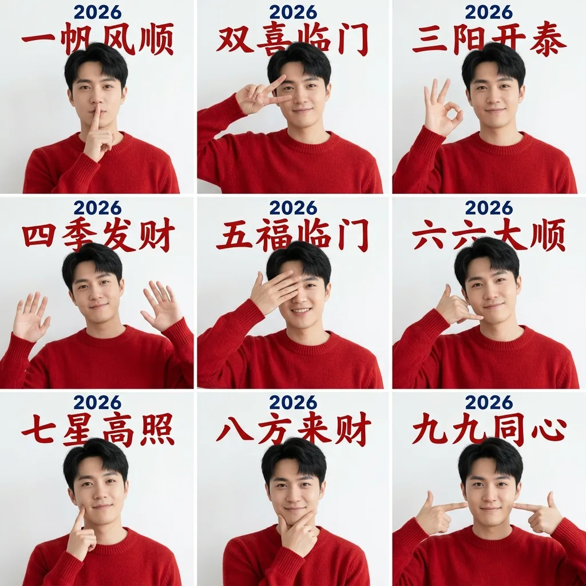

**#56 · Poster Design Prompt · <code>Vinano Image Pro</code>**

<details>
<summary>Show prompt</summary>

```
{
 "project_settings": {
 "task_type": "九宫格新年祝福肖像（男生版）",
 "aspect_ratio": "1:1",
 "grid_layout": "3x3",
 "batch_size": 1
 },

 "overall_style": {
 "整体风格": "极简新年祝福风",
 "视觉基调": "干净、温和、克制的节日感",
 "背景": "纯色白墙面，无装饰",
 "光线": "自然柔光，均匀无强阴影",
 "色彩重点": "中国红（服装 + 文字）"
 },

 "subject_base": {
 "人物一致性": "九宫格内为同一位人物",
 "人物类型": "亚洲男性",
 "性别气质": "干净、阳光、自然，不油腻",
 "发型": "黑色短发，自然蓬松，简洁利落",
 "服装": "红色针织毛衣或卫衣，简洁无图案",
 "妆容": "无明显妆感，真实自然肤质",
 "表情气质": "开心，克制的微笑，不夸张"
 },

 "pose_variations": {
 "grid_1": "食指竖于嘴前，轻松安静手势",
 "grid_2": "单手比 V 手势靠近脸部",
 "grid_3": "单手做 OK 或三指手势",
 "grid_4": "双手举起做轻松俏皮手势（不过度卖萌）",
 "grid_5": "单手张开遮住半边脸",
 "grid_6": "单手做电话手势靠近脸侧",
 "grid_7": "单手轻点脸颊或下巴",
 "grid_8": "单手托下巴，轻微思考姿势",
 "grid_9": "双手指向脸部或克制比心变体"
 },

 "text_overlays": {
 "字体风格": "传统中文新年书法字体",
 "文字颜色": "中国红",
 "年份颜色": "深蓝色",
 "文字位置": "每一格顶部居中",
 "文字结构": "四字祝福语 + 年份"
 },

 "text_content": [{ "position": "grid_1", "text": "一帆风顺", "year": "2026" },
 { "position": "grid_2", "text": "双喜临门", "year": "2026" },
 { "position": "grid_3", "text": "三阳开泰", "year": "2026" },
 { "position": "grid_4", "text": "四季发财", "year": "2026" },
 { "position": "grid_5", "text": "五福临门", "year": "2026" },
 { "position": "grid_6", "text": "六六大顺", "year": "2026" },
 { "position": "grid_7", "text": "七星高照", "year": "2026" },
 { "position": "grid_8", "text": "八方来财", "year": "2026" },
 { "position": "grid_9", "text": "九九同心", "year": "2026" }],

 "constraints": {
 "禁止项": ["不改变人物身份",
 "不夸张表情",
 "不女性化姿态",
 "不使用复杂背景",
 "不添加节日道具",
 "不风格化面部"],
 "一致性要求": ["人物脸型五官保持完全一致",
 "服装颜色与材质一致",
 "拍摄角度与距离基本一致"]
 },

 "use_cases": ["男生新年纪念照",
 "个人春节祝福九宫格",
 "社交平台头像矩阵",
 "品牌新年男生模板"]
}

强调材质质感与自然光影，让画面更具高级真实感。
```

</details>

---

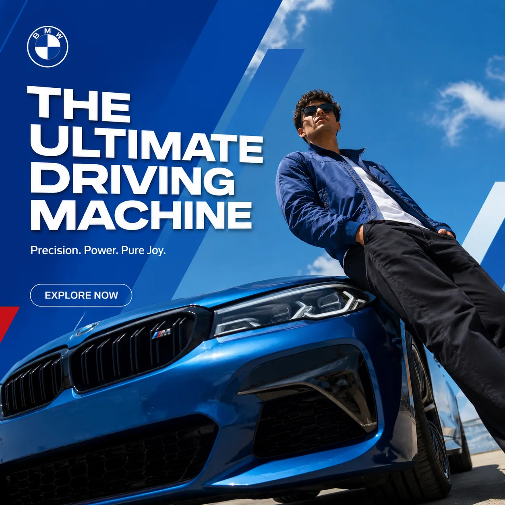

**#57 · Poster Design Prompt · <code>Vinano Studio</code>**

<details>
<summary>Show prompt</summary>

```
[BRAND NAME] | [HEADLINE] | [SUB-TEXT] | [CTA]. Act as a Senior Art Director.

PHASE 1: INTEGRATED COMPOSITION & OVERLAP.
- Layout: Seamless fusion of 2D graphics and 3D photography.
- Overlap Logic: The subject and their primary "Product Prop" (e.g., a car, a device) must physically overlap the graphic panel to break the "wall" between design and photo.
- Unity: Geometric shapes from the graphic side must bleed into the photographic sky area.

PHASE 2: BRAND & CATEGORY SIMULATION.
Autonomously analyze the [BRAND NAME] and its industry category:
- INDUSTRY CONTEXT:
 * If Automotive: Include the vehicle and a person interacting it.
 * If Tech: Include flagship devices/gadgets.
 * If Fashion/Lifestyle: Focus on editorial poses and premium accessories.
- SHAPE SIMULATION: Match shapes to brand identity (e.g., Sharp/Speed for Auto, refined minimalist/Grid for Tech).
- COLOR SIMULATION: Use the brand's primary signature hue for both the graphic pattern and the subject's outfit/accents.

PHASE 3: TYPOGRAPHY & CUSTOM CONTENT.
- Headline: Display "[HEADLINE]" in a bold, modern Sans-Serif font. (If [HEADLINE] is empty, generate a high-energy slogan for [BRAND NAME]).
- Sub-headline: Display "[SUB-TEXT]" below the headline.
- Button: Create a refined minimalist pill-shaped CTA button the text: "[CTA]".
- Interaction: Text layers should have 3D depth, sitting partially behind the subject or product prop.

PHASE 4: PHOTOGRAPHY & SUBJECT.
- Perspective: Extreme low-angle (worm’s eye view) looking up.
- Subject: A diverse persona reflecting the brand's audience.
- Environment: Massive, clear blue sky as the backdrop.
- Visual Link: Subject's styling must incorporate the Brand's primary color.

PHASE 5: FINAL VISUAL STYLE.
High-end commercial aesthetic. Crisp, saturated, professional fusion of flat vector art and realistic photography.

Emphasise material texture and natural light so the final frame feels tactile and premium.
```

</details>

---

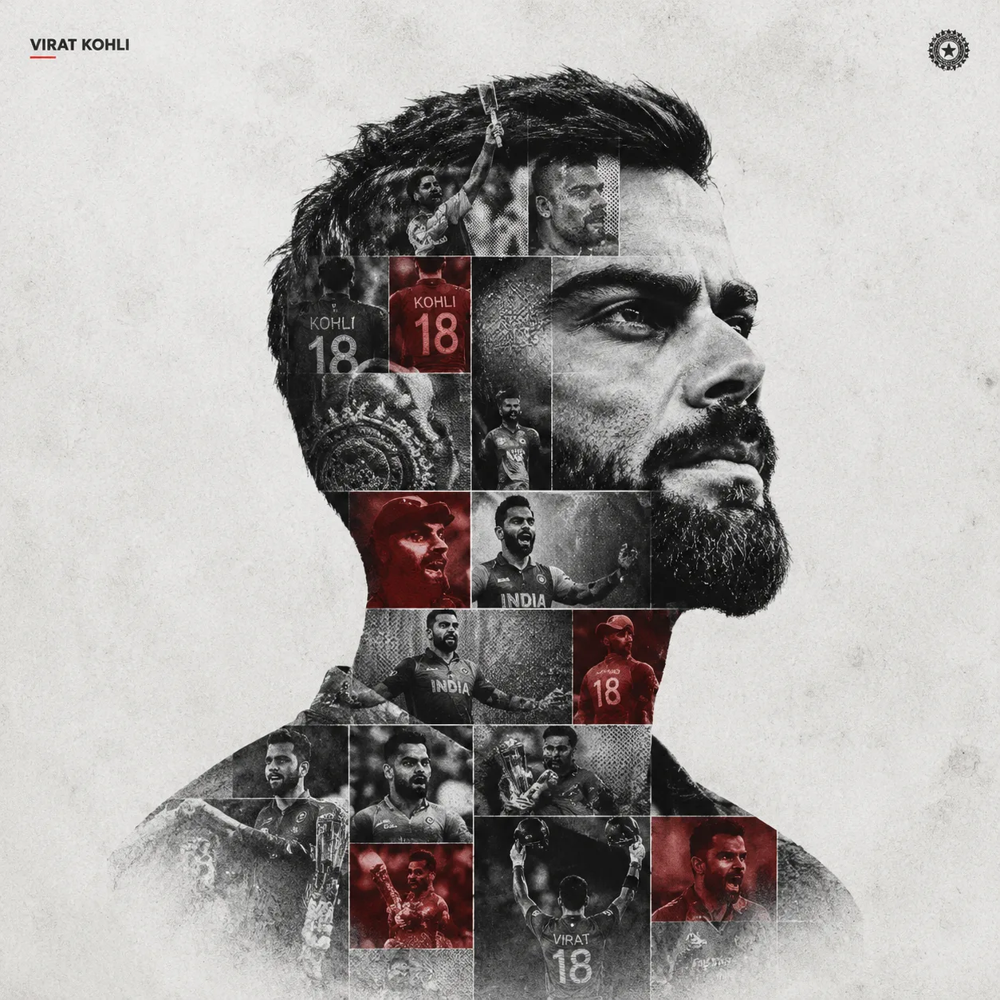

**#58 · Poster Design Prompt · <code>Vinano Studio</code>**

<details>
<summary>Show prompt</summary>

```
[PERSON NAME].
Act as a high-end sports graphic designer creating a conceptual tribute poster. The style is a complex "dual exposure photo-grid composite" mixed-media textures.
CENTRAL STRUCTURE (THE VESSEL):
The central focus is a large-scale, high-contrast black and white portrait silhouette of [PERSON NAME]. This main portrait acts as the container.
THE GRID FILL & TEXTURES (MIXED MEDIA):
The interior of the silhouette is populated by a dense "photo mosaic grid" of action shots from the person's career.
CRITICAL TEXTURE INSTRUCTION: Do not just paste flat photos. Apply artistic textures to various grid cells to create a tactile, collage feel. Use effects like:
Halftone Dots: Comic-book style raster patterns on some cells.
Fabric/Embroidery: Subtle thread or canvas textures suggesting a jersey or patch.
Film Grain: Heavy noise on specific high-contrast action shots.
COLOR STRATEGY:
The base is Monochrome B&W. Use selective color overlays (relevant to the team/flag) ONLY on specific grid cells to create a rhythm.
TYPOGRAPHY & BRANDING (STRICT MICRO-SCALING):
Top Left (The Name): Write "[PERSON NAME]" strictly the font Inter Semibold.
Kerning: Tight negative kerning (-4%).
Size: SMALL and discreet. It must occupy MAXIMUM 20% of the canvas width. Do NOT make it large or loud.
Top Right (The Symbol): Place the primary logo (Team/Brand/Flag).
Size: VERY SMALL. It must occupy MAXIMUM 10% of the canvas width.
COMPOSITION & BACKGROUND:
Background: Off-white or light grey a visible premium-quality paper or concrete texture. It should not be flat digital white.
Alignment: Center the figure perfectly. Maintain wide negative space around the object.

Keep edges clean and the overall composition balanced for a polished, gallery-ready result.
```

</details>

---


**#59 · Poster Design Prompt · <code>Vinano Studio</code>**

<details>
<summary>Show prompt</summary>

```
[BRAND NAME = AUTO VAULT MOTORS]
[CAR MODEL = HYUNDAI CRETA 2025 • SX (O) TOP MODEL]
[PRICE = ₹17.45 LAKH]
[KEY HIGHLIGHTS = 12,500 KM • 1st OWNER • PETROL • FULL SERVICE RECORD • UNDER WARRANTY]
[CONTACT = +91 98765 43210 • WHATSAPP AVAILABLE • JAMMU]

Act as a Social Media Art Director and Digital Collage Artist specializing in bold, youth-oriented automotive resale promotions for Instagram and digital campaigns.

PHASE 1: CONCEPTUAL FRAMEWORK
Create a high-conversion digital collage that positions this Creta as a premium smart buy.

This is not “used”.
This is “upgrade for less”.

Visual strategy:
- Blend premium SUV aspiration deal urgency
- Controlled chaos refined execution
- Price + car as dual hero

Aesthetic:
Clean chaos — less messy, more premium energy

PHASE 2: MODEL & PHOTOGRAPHY
- Subject: Hyundai Creta 2025 SX (O)
- Pose Energy: Front 3/4 angle, slightly turned, confident stance
- Hero Product: Full car body emphasis on grill + DRLs

- Photography Style: Clean high-resolution cutout
- Camera Angle: Slight low angle (premium presence)
- Crop: Full car visible

- Optional Human Element:
 Subtle driver silhouette inside for realism

PHASE 3: COLOR BLOCKING FOUNDATION
- Primary Color Blob:
 Deep metallic blue (premium tone)

- Size:
 ~50% of composition

- Shape Style:
 Smooth torn-brush hybrid (refined, not aggressive)

- Texture:
 Light metallic grain (15%)

- Placement:
 Diagonal behind car (top-left → bottom-right flow)

PHASE 4: GRAPHIC ELEMENTS LAYER
- Price badge (bold, high contrast) — PRIMARY
- “CERTIFIED” stamp badge
- Minimal arrow accents pointing toward car
- Soft glow lines (premium touch)

Rules:
- Colors: Blue + white + subtle neon accent
- Placement: Corners, avoid cluttering car
- Scale: Price = largest graphic element

PHASE 5: TYPOGRAPHY INTEGRATION
- Logo:
 Top-left (clean, small)

- Headline:
 “SMART UPGRADE”

- Price (DOMINANT):
 “₹17.45 LAKH”

- Supporting Copy:
 “2025 • 12,500 KM • 1st OWNER”
 “PETROL • UNDER WARRANTY”

- CTA:
 “BOOK TEST DRIVE NOW”

- Type Treatment:
 Clean bold sans-serif, minimal rotation (2° max)

- Hierarchy:
 Price → Headline → Car name → Details → CTA → Logo

PHASE 6: TEXTURE & BACKGROUND
- Base:
 Light grey premium tone (RGB ~246)

- Texture:
 Subtle paper + metallic grain blend

- Rule:
 Very controlled — premium feel

PHASE 7: COMPOSITION RULES
- Layout:
 Car slightly right of center

- Breathing Room:
 20% clean space

- Layering:
 Background → Blob → Graphics → Car → Typography

- Focal Split:
 60% car + price
 40% support elements

- Movement:
 Diagonal guiding eye → price → CTA

PHASE 8: BRAND INTELLIGENCE
Premium used dealer:
- Clean layout
- Strong trust signals
- Minimal chaos vs streetwear style

PHASE 9: SOCIAL MEDIA FOOTER
- Bottom strip (clean white)
- Content:
 📞 +91 98765 43210
 📍 Jammu
 💬 WhatsApp Available

- Layout:
 Minimal grid

TECHNICAL SPECS:
- 4:5 ratio (Instagram)
- 2400x3000px+
- sRGB
- High clarity (car ultra sharp)
- Controlled grain

- Style:
 Gen-Z collage × premium dealership aesthetic

FINAL OUTPUT MOOD:
Premium.
Trustworthy.
Urgent.
Smart purchase.
High conversion intent.

Emphasise material texture and natural light so the final frame feels tactile and premium.
```

</details>

---

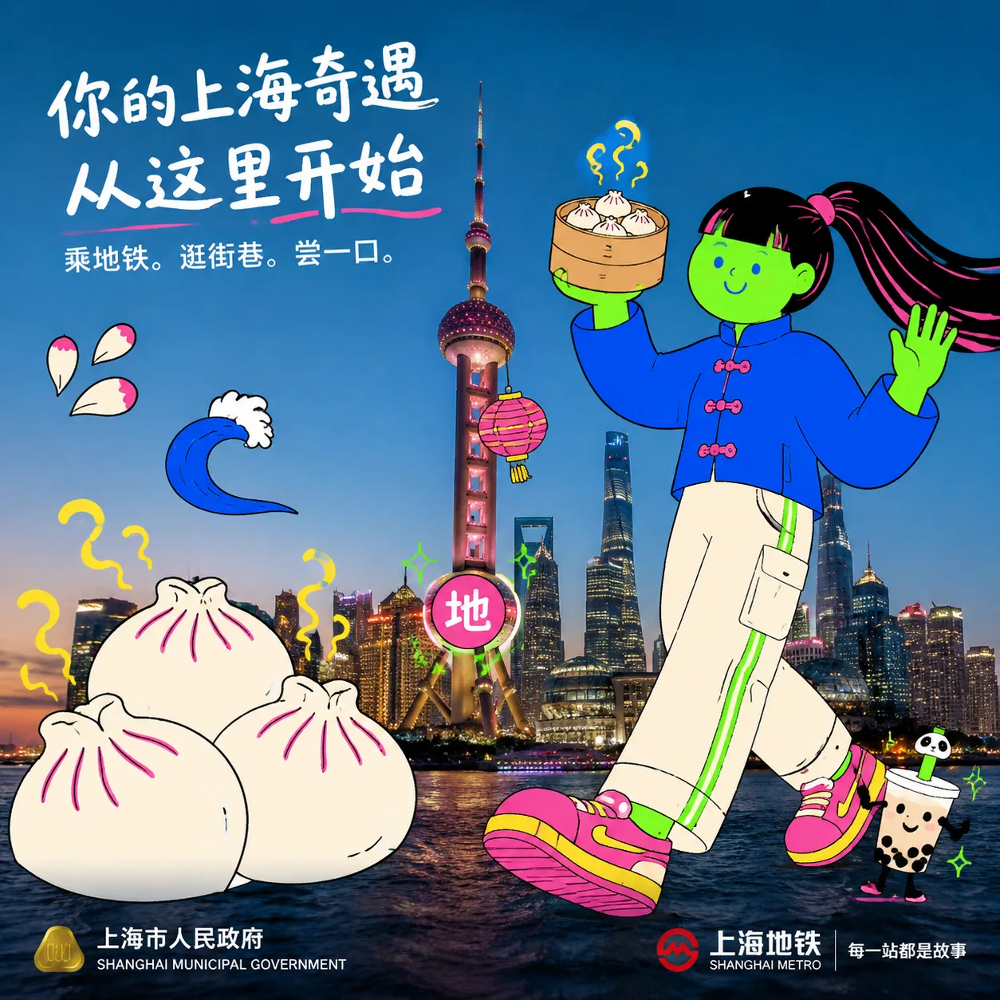

**#60 · Poster Design Prompt · <code>Vinano Studio</code>**

<details>
<summary>Show prompt</summary>

```
{
 "style_id": "photo-flat-doodle-campaign-poster",
 "style_name": "Photo × Flat-Doodle Campaign Poster",
 "version": "1.0",
 "aspect_ratio": "2:3",
 "reference": "Shanghai edition — derived from TfL 'Your London Adventure Starts Here'",

 "variables": {
 "scene": {
 "city": "上海 Shanghai",
 "landmark_photo": {
 "subject": "Oriental Pearl Tower Lujiazui skyline in the background, viewed from across the Huangpu River",
 "angle": "low-angle hero shot, Pearl Tower centered and vertical, the two pink spheres clearly visible",
 "lighting": "early evening blue hour, city lights just starting to glow, sky still holding daylight",
 "treatment": "unretouched realistic photograph, natural steel + concrete + river reflection, no filter"
 },
 "background_sky": "deep teal-to-indigo gradient sky a subtle warm glow at the horizon, upper 40% of canvas kept open for headline"
 },

 "hero_character": {
 "enabled": true,
 "scale": "giant — roughly 1.2× tower height, standing on the right, body extends beyond canvas",
 "pose": "holding a cartoon xiaolongbao steamer basket up to eye level one hand, the other hand doing a casual wave, one foot slightly lifted mid-step",
 "skin_tone": "flat neon-green (non-realistic)",
 "face": "minimal — single curved smile, no nose, small cobalt-blue round eyes like dots",
 "hair": "long straight black-with-hot-pink-streaks hair, high ponytail swinging to one side, short blunt bangs",
 "outfit": {
 "top": "oversized cobalt-blue modern qipao-inspired jacket a stand collar, hot-pink frog-button closures, cropped length",
 "bottom": "off-white baggy cargo pants a neon-green side stripe and oversized pockets",
 "shoes": "chunky pink-and-yellow platform sneakers"
 },
 "accessory": "bamboo-style cartoon steamer basket three xiaolongbao peeking out, tiny yellow steam swirls drawn above",
 "linework": "thin consistent black outline on qipao collar, frog buttons, ponytail strands, and steamer weave"
 },

 "doodle_props": [{
 "id": "giant_xiaolongbao_cloud",
 "shape": "three oversized cartoon soup dumplings floating together exaggerated steam swirls",
 "colors": ["off-white dumpling skin", "hot-pink pleats", "sun-yellow steam"],
 "position": "lower-left foreground, tilted, partially covering the tower base"
 },
 {
 "id": "metro_heart_sticker",
 "shape": "Shanghai Metro red circle mark restyled as a flat sticker sparkle stars",
 "colors": ["hot-pink circle", "off-white Chinese character 地", "neon-green sparkles"],
 "position": "pasted onto the lower sphere of the Pearl Tower"
 },
 {
 "id": "huangpu_wave",
 "shape": "stylized cartoon river wave curl, like a chunky comma",
 "colors": ["cobalt-blue wave", "off-white foam tips"],
 "position": "mid-left, floating in front of the tower mid-section"
 },
 {
 "id": "red_lantern",
 "shape": "round traditional cartoon red lantern a tiny tassel",
 "colors": ["hot-pink lantern", "sun-yellow tassel", "neon-green string"],
 "position": "center-upper, overlapping between the two pink spheres of the tower"
 },
 {
 "id": "magnolia_petal_burst",
 "shape": "a small cluster of 3 oversized cartoon magnolia petals (Shanghai's city flower)",
 "colors": ["off-white petals", "hot-pink tips"],
 "position": "far-left mid-height, drifting diagonally as a color accent"
 },
 {
 "id": "panda_bubble_tea_buddy",
 "shape": "tiny cartoon bubble tea cup a smiling face and a panda-ear straw topper",
 "colors": ["off-white cup", "ink-black pearls", "neon-green straw"],
 "position": "bottom-right near the character's shoe, as a sidekick scale cue"
 }],

 "copy": {
 "headline": {
 "text": "你的上海奇遇 从这里开始",
 "language": "zh-CN",
 "max_lines": 3,
 "english_variant": "Your Shanghai Adventure Starts Here"
 },
 "subhead": {
 "text": "乘地铁。逛街巷。尝一口。",
 "language": "zh-CN"
 },
 "logos": {
 "bottom_left": "上海市人民政府 SHANGHAI MUNICIPAL GOVERNMENT",
 "bottom_right": "上海地铁 SHANGHAI METRO — 每一站都是故事 (metro roundel)"
 }
 }
 }
}

Preserve realistic proportions and depth for a confident, professional finish.
```

</details>

---

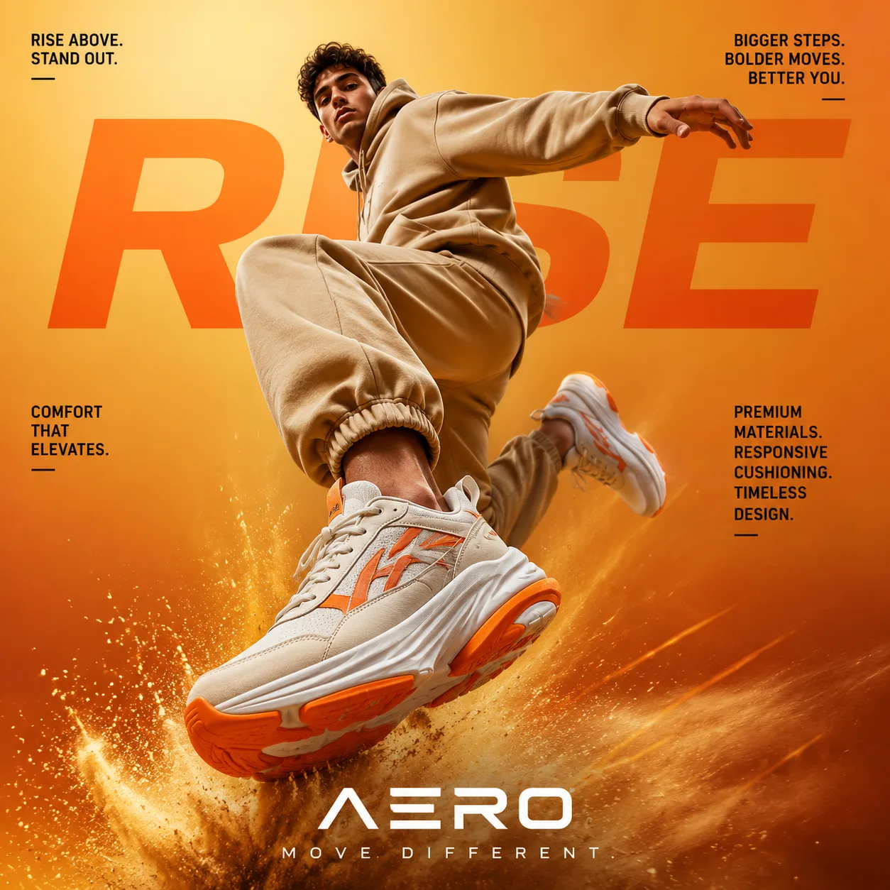

**#61 · Poster Design Prompt · <code>Vinano Studio</code>**

<details>
<summary>Show prompt</summary>

```
A cinematic, high-end sneaker advertisement poster featuring a young male model mid-air in a dynamic jumping pose, captured from a low-angle perspective to emphasize power and motion. The model is wearing a coordinated beige streetwear outfit (hoodie and joggers), oversized chunky white sneakers that have bold orange accents on the sole and side stripes.

The background is a smooth studio gradient in warm tones, blending light yellow and vibrant orange for an eye-catching, energetic feel. Dramatic soft studio lighting enhances the subject, glowing highlights and subtle shadows that complement the outfit and colour palette.

Behind the model, large bold typography is seamlessly integrated into the composition, reading “RISE” in oversized modern sans-serif font, partially obscured by the subject for depth. Additional small promotional text is placed around the layout in a clean editorial style, such as:

“RISE ABOVE. STAND OUT.”
“BIGGER STEPS. BOLDER MOVES. BETTER YOU.”
“COMFORT THAT ELEVATES.”
“PREMIUM MATERIALS. RESPONSIVE CUSHIONING. TIMELESS DESIGN.”

At the bottom, a modern sneaker brand logo “AERO” appears the tagline “MOVE DIFFERENT.”

Add subtle motion effects like dust particles or energy trails beneath the jumping foot to enhance impact. Ultra-realistic detail, sharp focus, high contrast, commercial fashion photography style, magazine-quality composition, 4K resolution.

Keep edges clean and the overall composition balanced for a polished, gallery-ready result.
```

</details>

---

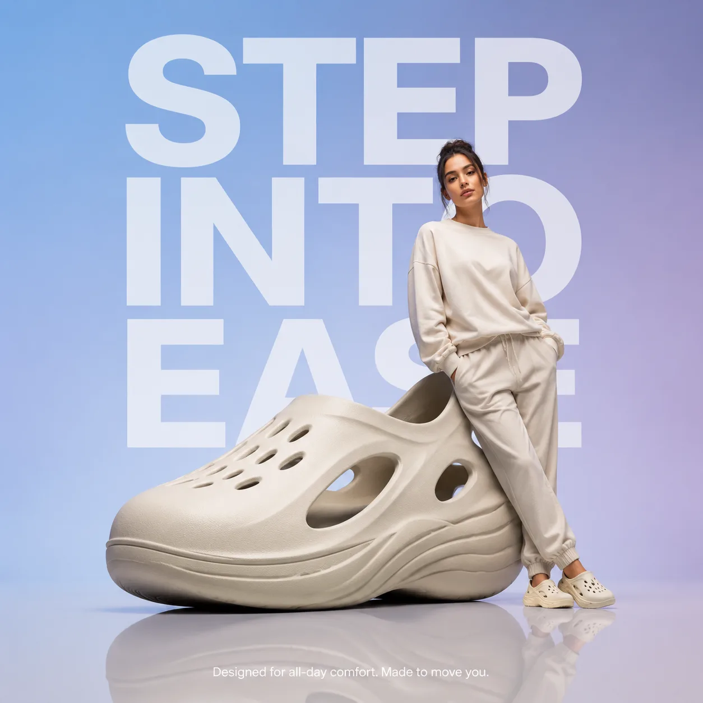

**#62 · Poster Design Prompt · <code>Vinano Studio</code>**

<details>
<summary>Show prompt</summary>

```
A hyper-realistic premium product advertisement featuring an oversized futuristic comfort clog placed on a smooth glossy reflective floor. A modern model dressed in soft neutral-toned athleisure (off-white / beige) stands slightly leaning against the giant shoe a relaxed, confident posture.

Background: clean gradient blending soft sky blue into subtle lavender tones, massive bold typography in the background reading “STEP INTO EASE” in a modern sans-serif font, stretched vertically and partially behind the subject.

Lighting: high-end studio lighting soft highlights, gentle reflections on the floor, and subtle rim light outlining the model and product for depth.

Composition: editorial magazine layout, perfectly centered subject, strong negative space, luxury branding feel.

Additional text (small, minimal placement at bottom): “Designed for all-day comfort. Made to move you.”

Style: ultra-clean, Apple-style minimalism meets fashion campaign, hyper-realistic, premium commercial photography, 8K, sharp details.

Preserve realistic proportions and depth for a confident, professional finish.
```

</details>

---

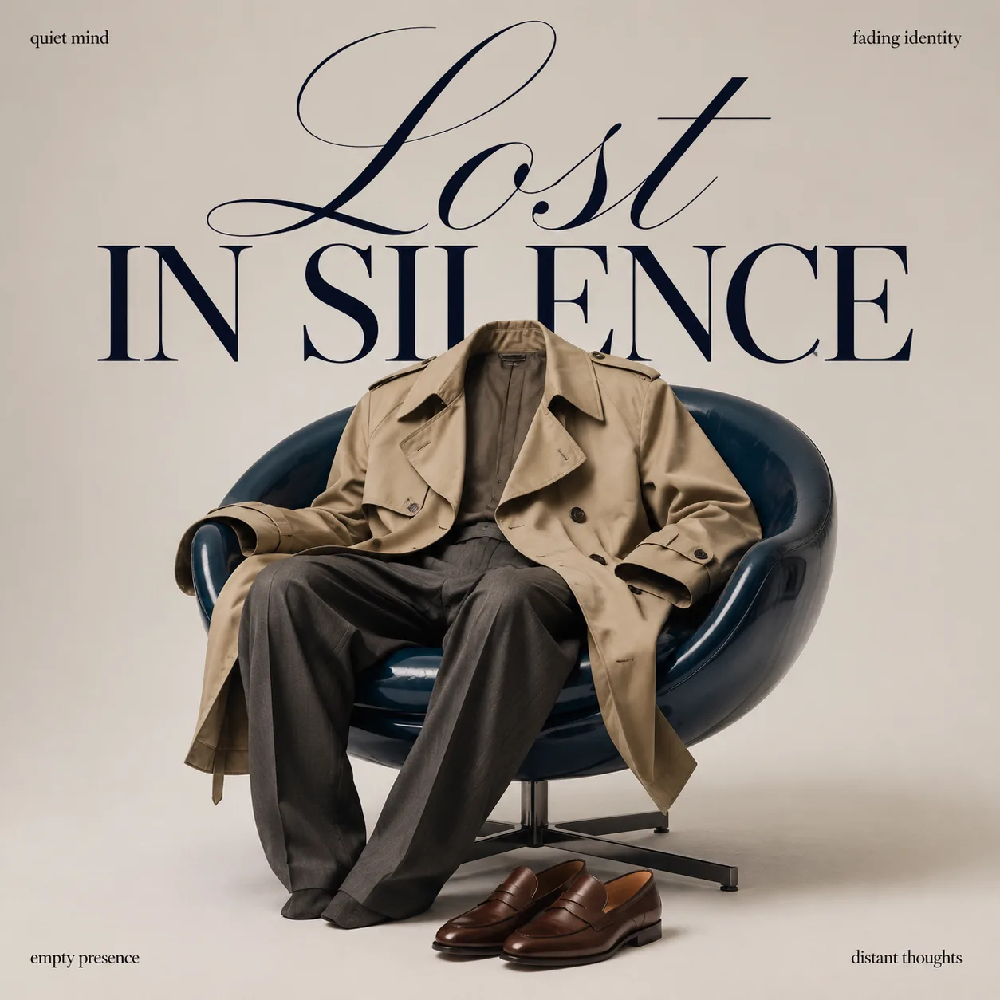

**#63 · Poster Design Prompt · <code>Vinano Studio</code>**

<details>
<summary>Show prompt</summary>

```
refined minimalist conceptual fashion editorial poster, studio shot on a clean off-white seamless background. A glossy deep blue modern lounge chair placed in the center, an oversized beige trench coat and tailored charcoal trousers draped naturally over it, creating the illusion of an invisible person sitting there. Polished brown leather loafers placed neatly on the floor in front of the chair. Large elegant typography behind the chair reading “LOST IN SILENCE” — “Lost” in flowing luxury cursive script, “IN SILENCE” in bold serif uppercase. Small subtle text in the corners like “quiet mind,” “fading identity,” “empty presence,” and “distant thoughts.” High-fashion magazine cover aesthetic, cinematic soft, diffused lighting, muted tones, surreal emotional atmosphere, crisp composition, luxury editorial styling, premium fashion campaign look, artistic and symbolic. Render with rich micro-detail while keeping the layout uncluttered and intentional.
```

</details>

---

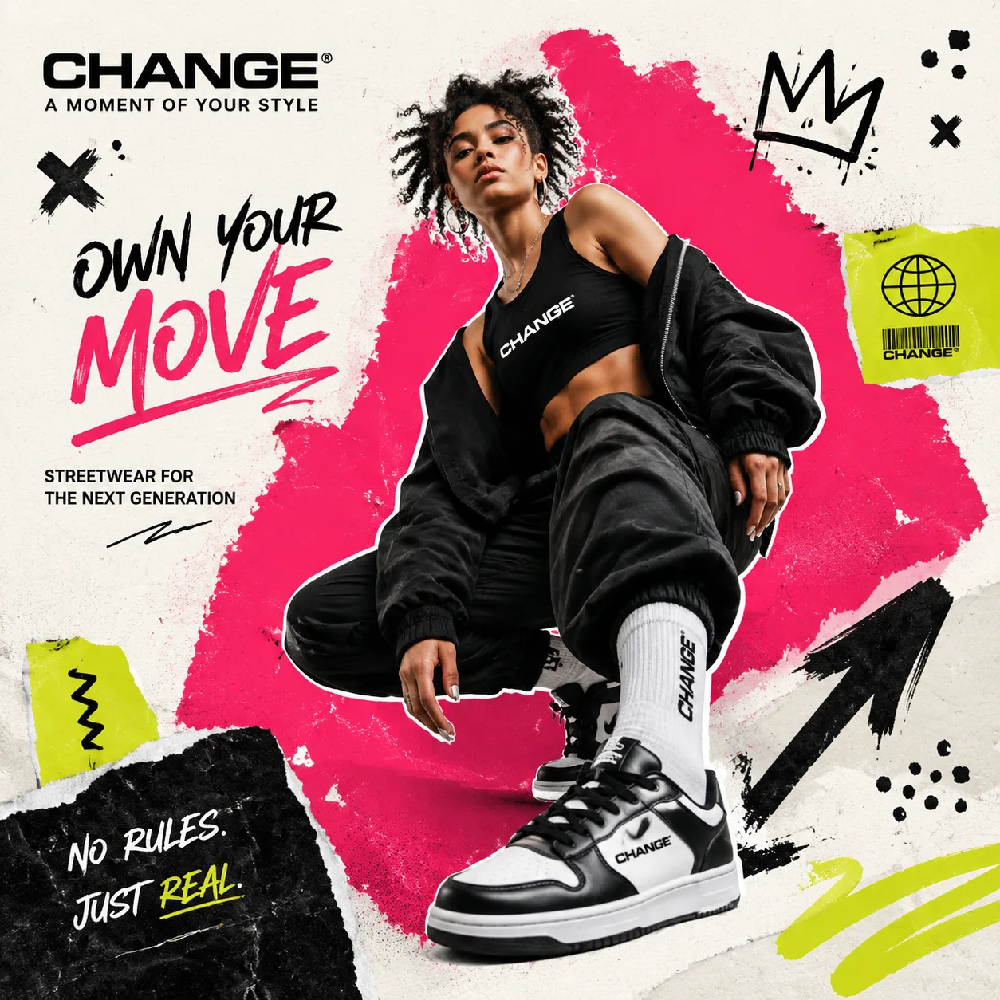

**#64 · Poster Design Prompt · <code>Vinano Studio</code>**

<details>
<summary>Show prompt</summary>

```
[BRAND NAME = CHANGE TO YOUR BRAND].
Act as a Social Media Art Director and Digital Collage Artist specializing in bold, youth-oriented brand content for Instagram and digital campaigns. PHASE 1: CONCEPTUAL FRAMEWORK Create a dynamic digital collage that merges fashion photography graphic design chaos. This is controlled rebellion – a composition that feels spontaneous and energetic while maintaining brand coherence. The aesthetic is anti-polished: torn edges, layered textures, hand-drawn elements, and bold color blocking that screams confidence and movement. PHASE 2: MODEL & PHOTOGRAPHY - Subject: One model (diverse casting, age 18-30) in a dynamic, confident pose - Pose Energy: 80% attitude, 20% natural – sitting, jumping, mid-motion, or power stance (avoid static standing) - Outfit: Street style/athleisure that aligns [BRAND NAME] aesthetic – casual but styled - Hero Product: Feature 1 signature [BRAND NAME] product prominently (sneakers, bag, apparel) – this is the visual anchor - Photography Style: Editorial fashion cutout – model extracted from background clean edges - Camera Angle: Slight low angle to empower subject (hero perspective) - Crop: Full body or 3/4 body showing hero product clearly - Background Removal: Model cut out cleanly for layering over collage elements PHASE 3: COLOR BLOCKING FOUNDATION - Primary Color Blob: Large organic shape (40-60% of composition) in bold, saturated brand color behind/around model - Shape Style: Irregular, hand-painted aesthetic – think Photoshop brush strokes or torn paper texture (NOT perfect geometric shapes) - Color Selection (Autonomous): Choose 1 hero color from [BRAND NAME] palette: - Texture: Visible brush strokes, grain, or subtle noise (15-25% opacity) – avoid flat digital fills - Placement: Blob positioned to frame model without obscuring key product details PHASE 4: GRAPHIC ELEMENTS LAYER Add 3-5 abstract graphic elements scattered across composition: - Element Types: - Color Palette: Use 2-3 accent colors total (main blob color + 1-2 contrasting tones from brand palette) - Placement: Asymmetric scatter – top-left and bottom-right zones primarily (avoid center crowding) - Scale: Mix small (5% of canvas) and medium (15% of canvas) elements – nothing overpowering - Aesthetic: Analog/handmade feel – imperfect circles, rough edges, visible texture PHASE 5: TYPOGRAPHY INTEGRATION - Brand Logo: Clean [BRAND NAME] logo placed in upper-left or upper-right quadrant (10-15% of width) - Slogan/Tagline: If [BRAND NAME] has an iconic slogan, integrate it: - Supporting Copy: Optional 1-line descriptor (e.g., "A MOMENT OF YOUR STYLE") in smaller uppercase sans-serif - Type Treatment: Mix of aligned and slightly rotated text (2-5° angles) for dynamic energy - Hierarchy: Logo largest → Slogan medium → Copy smallest PHASE 6: TEXTURE & BACKGROUND - Base Layer: Off-white or light gray textured background (NOT pure white) - Texture Options (Autonomous selection): - Color: RGB 245-250 (near-white warmth) – maintains brightness while adding depth - Treatment: Texture should be felt, not seen – enhances tactility without competing foreground PHASE 7: COMPOSITION RULES - Layout: Asymmetric balance – model off-center, graphic elements counter-balance - Breathing Room: 15-20% negative space (textured background visible) to prevent claustrophobia - Layering Order: Background texture → Color blob → Graphic elements → Model (cutout) → Typography top layer - Focal Point: Model + hero product = primary focus (60% visual weight), graphics support (40%) - Movement: Diagonal lines and angled elements create directional flow (top-left to bottom-right or vice versa) PHASE 8: BRAND INTELLIGENCE (AUTONOMOUS) Autonomously adapt composition based on [BRAND NAME] personality: - Streetwear/Sportswear (Nike, Adidas, Supreme): - Luxury Streetwear (Balenciaga, Off-White, Gucci): - Beauty/Lifestyle (Glossier, Fenty, Skims): - Tech/Modern (Apple, Tesla, Beats): PHASE 9: SOCIAL MEDIA FOOTER (OPTIONAL) - Bottom Strip: Clean white or light gray bar at bottom 8-10% of frame - Content: Social media handles (Instagram, Facebook, Twitter) in small sans-serif - Layout: Three-column grid platform icons or text handles - Aesthetic: Minimal and professional – contrast chaotic collage above TECHNICAL SPECS: - Aspect Ratio: 4:5 (Instagram feed) or 1:1 (square social post) - Resolution: 2400x3000px minimum (premium-quality for zoom and detail) - Color Mode: sRGB, vibrant saturation (Instagram-optimized) - File Aesthetic: Digital collage that mimics analog craft (Photoshop + hand-drawn hybrid) - Model Photography: 85mm lens, f/2.8, shallow depth of field on original shoot (before cutout) - Style Reference: Nike social campaigns, Spotify wrapped graphics, Gen Z Instagram aesthetics, Hypebeast x streetwear collabs - Mood: Confident, energetic, youthful, authentic chaos, anti-corporate polish

Maintain consistent colour harmony and crisp focus across the whole frame.
```

</details>

---

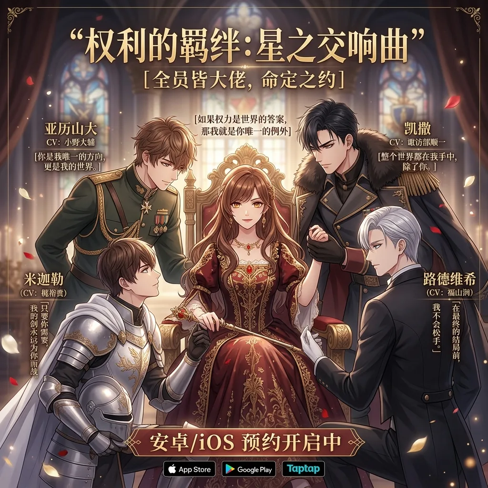

**#65 · Poster Design Prompt · <code>Vinano Image Pro</code>**

<details>
<summary>Show prompt</summary>

```
请创作一张【主题为：】的[乙女恋爱游戏主视觉海报]风格的二次元宣传图。

整体设定为：多位具有强烈权力感、领袖气场、成熟魅力的男性角色，围绕一位女性主角展开情感与权谋交织的修罗场关系。画面不是普通群像，而是典型女性向恋爱手游的官方KV海报：所有男性角色从不同方向靠近女主，形成守护、凝视、占有欲、克制深情、危险暧昧等复杂张力。女主位于视觉中心，气质聪慧、冷静、优雅，既像外交核心人物，又像乙女游戏中让所有人倾心的唯一女主。

画风要求：高完成度日系二次元插画，女性向手游卡面质感，唯美、华丽、梦幻、精致，电影级光影，柔焦，镜头光晕，星光粒子，漂浮花瓣，细腻皮肤质感，精致发丝，服装高级，面部神情有戏剧张力。

构图要求：竖版海报构图，人物半身到近景特写混合，女主居中，其他男性角色从左上、右上、左下、右下等方位围拢，形成视觉包围感与情绪压迫感；人物彼此之间有明确视线关系，所有情绪都聚焦在女主身上。

背景要求：宫殿、议事厅、国际局势隐喻空间、权力中心、战争与秩序的象征性环境，但整体处理要浪漫化、幻想化，不要做成真实新闻照片，而是做成戏剧化的恋爱游戏世界观背景。

排版要求：画面中加入中文游戏海报文案，包括大标题、副标题、角色名字、CV字样、人物台词、预约开启中文字样，以及应用商店风格按钮。整体排版像正式上线前的手游宣传海报，设计精致统一，不能杂乱。

强调材质质感与自然光影，让画面更具高级真实感。
```

</details>

---

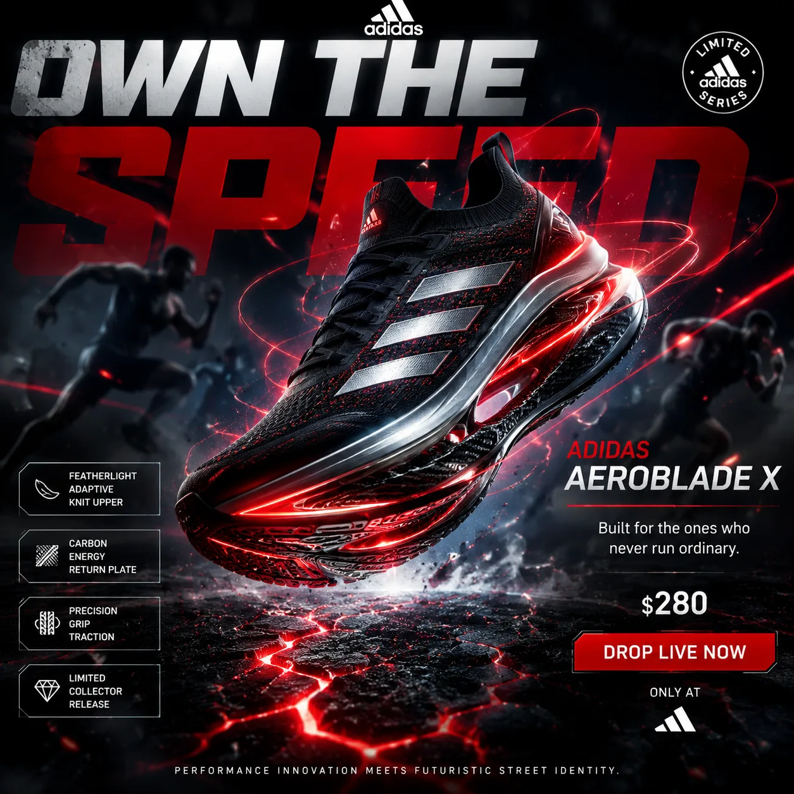

**#66 · Poster Design Prompt · <code>Vinano Studio</code>**

<details>
<summary>Show prompt</summary>

```
Create a jaw-dropping premium advertising poster in 9:16 vertical format for a fictional ultra-limited Adidas sneaker called "ADIDAS AEROBLADE X - LIMITED DROP". The design must feel like a world-class campaign by a top creative agency, highly original, futuristic, visually explosive, and impossible to ignore.

Main visual:
A single hero sneaker floating in the center, shot from a dramatic low angle, as if it is levitating above a black obsidian running track split by glowing energy cracks. The shoe should look ultra-premium, highly engineered, sleek, aerodynamic, and fashion-forward. Its material should combine knit mesh, sculpted foam, translucent panels, reflective stripes, and a carbon-fiber sole plate. Neon light trails swirl around the shoe like captured speed. Small particles and mist add motion and intensity. In the background, use faint silhouettes of elite runners frozen mid-sprint, blurred just enough to keep all attention on the shoe.

Color palette:
Matte black, electric red, silver, deep charcoal, subtle neon blue highlights.

Typography and poster copy:
Render all text cleanly, sharply, and professionally strong hierarchy.
Main headline:
"OWN THE SPEED"
Product title:
"ADIDAS AEROBLADE X"
Subheadline:
"Built for the ones who never run ordinary."
Feature callouts in elegant boxed layout:
- "Featherlight Adaptive Knit Upper"
- "Carbon Energy Return Plate"
- "Precision Grip Traction"
- "Limited Collector Release"
Price line:
"$280"
CTA:
"DROP LIVE NOW"
Secondary CTA:
"Only at
Small footer text:
"Performance innovation meets futuristic street identity."

Layout direction:
The headline should be bold and oversized, partially integrated into the background. Product name should sit near the shoe in a refined premium layout. Feature callouts should be clean, readable, and arranged vertically along one side. Add a subtle badge reading "LIMITED SERIES". The overall composition should feel like a luxury sports campaign mixed futuristic editorial design.

Style:
Ultra-detailed, hyper-realistic product photography, cinematic studio lighting, premium advertising aesthetics, sharp focus, rich textures, subtle atmosphere, dynamic motion energy, high-end commercial poster, no clutter, no generic template look.

Make the aspect ratio 9:16

Maintain consistent colour harmony and crisp focus across the whole frame.
```

</details>

---

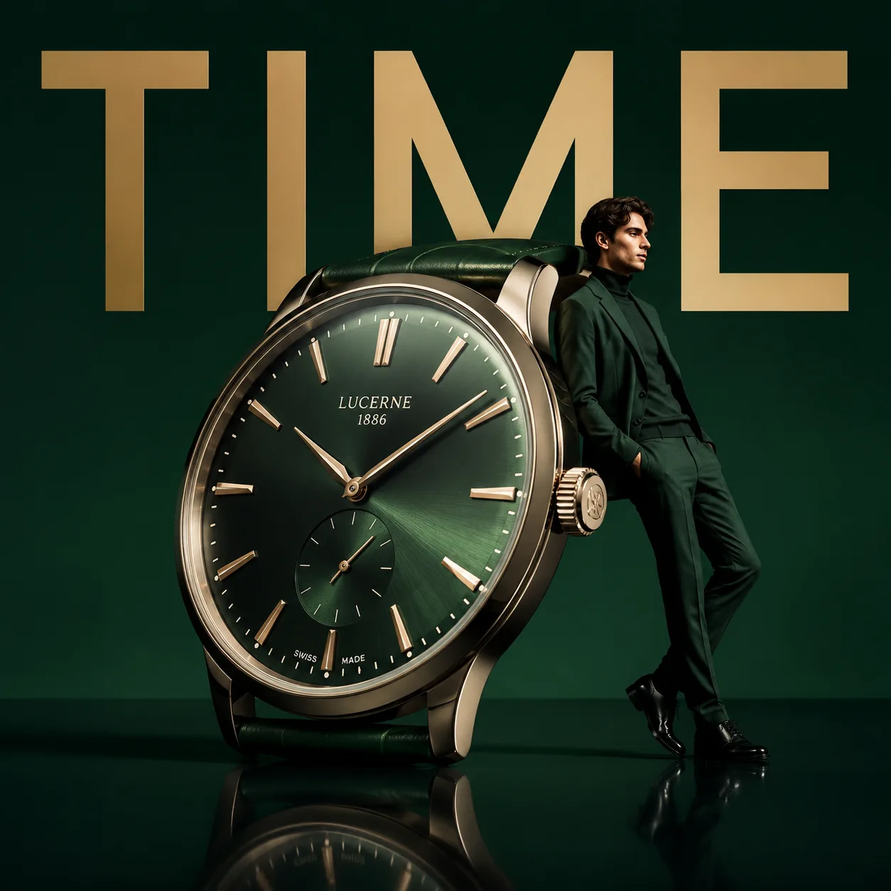

**#67 · Poster Design Prompt · <code>Vinano Studio</code>**

<details>
<summary>Show prompt</summary>

```
refined minimalist luxury watch campaign, oversized wristwatch positioned like modern sculpture, model leaning against the dial, giant word “TIME” in bold typography behind, deep emerald studio background, reflective polished floor, Swiss luxury advertising aesthetic, cinematic editorial styling, ultra-crisp composition, 1:1 Render with rich micro-detail while keeping the layout uncluttered and intentional.
```

</details>

---

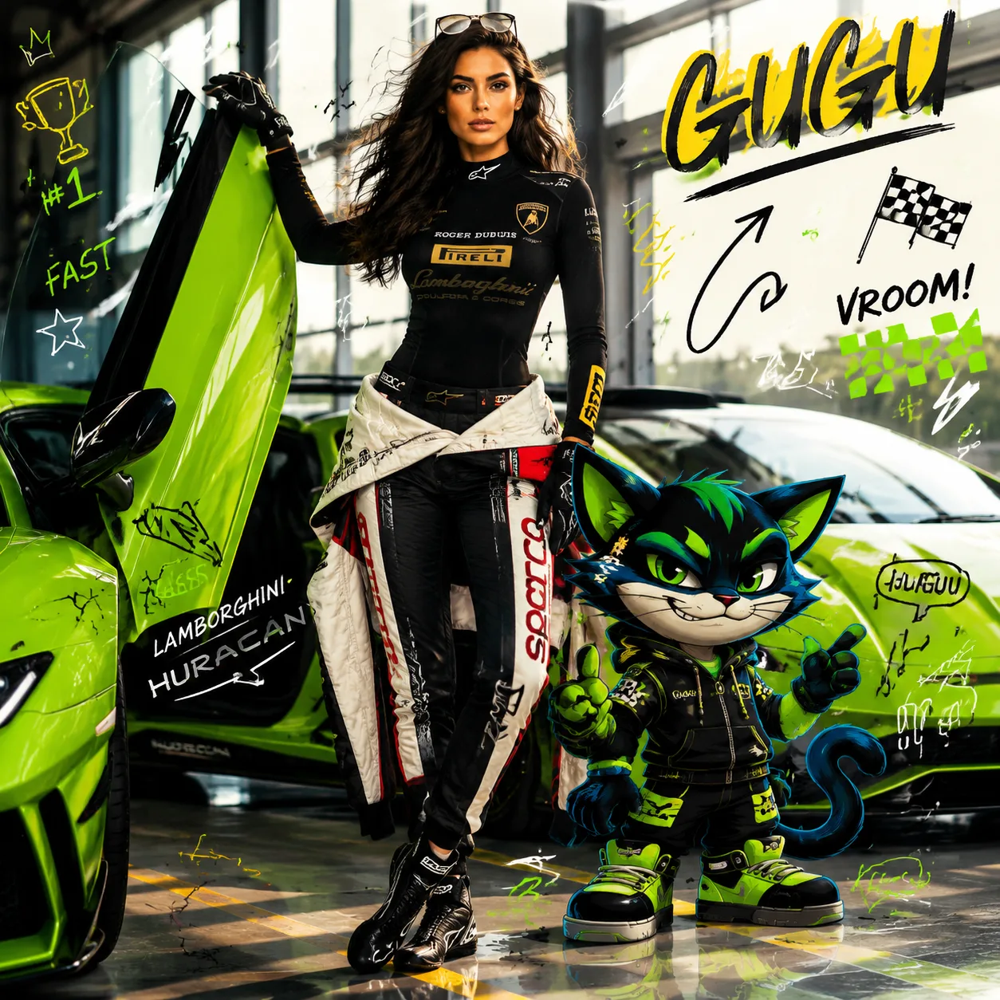

**#68 · Poster Design Prompt · <code>Vinano Studio</code>**

<details>
<summary>Show prompt</summary>

```
Full-body fashion editorial shot of a confident young woman long wavy dark brown hair, striking sharp facial features, defined cheekbones, deep-set eyes a calm dominant gaze, sunglasses perched on top of her head, standing in a powerful pose — one hand resting on an open scissor door, body slightly turned, looking straight at camera a composed, fierce expression.
Wearing a fitted black long-sleeve racing jersey gold sponsor logos (Alpinestars collar detail), black racing gloves, a white, black, and red Sparco racing suit draped and hanging off her body, and black racing shoes. Clean editorial styling, natural confident stance, wind slightly moving her dark wavy hair.
Beside and partially interacting a stylized cartoon Cat, positioned naturally as if sharing the same space. The Cat is illustrated in bold cartoon style thick black outlines, vibrant neon color palette (neon green, blue, yellow accents), exaggerated proportions, expressive features, playful yet powerful presence.
Background: bright indoor motorsport garage pit lane setting large industrial windows flooding soft diffused daylight, glossy reflective concrete floor, a neon green Lamborghini Huracán open scissor door partially visible.
Fusion of hyper-realistic photography and graphic illustration, seamless integration between subject and cartoon. Add graphic overlay elements: doodle Gugu arrows, scribbles, racing-themed abstract shapes, speed lines, comic-style symbols, dynamic motion lines, checkered flag doodles.
High contrast, HDR lighting, sharp focus, fashion editorial motorsport composition, surreal mixed-media aesthetic, ultra-detailed, 8K resolution.

Keep edges clean and the overall composition balanced for a polished, gallery-ready result.
```

</details>

---

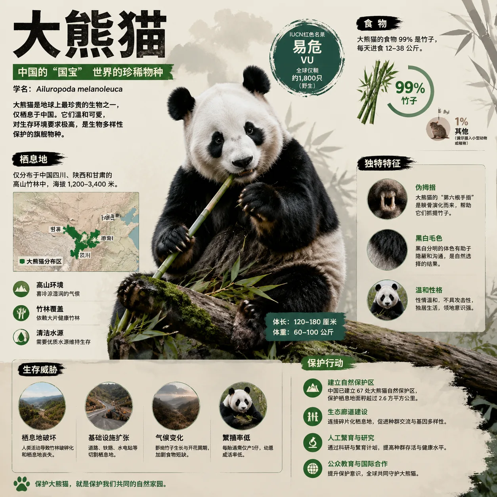

**#69 · Poster Design Prompt · <code>Vinano Studio</code>**

<details>
<summary>Show prompt</summary>

```
Create a visually rich infographic in Chinese about an endangered animal. Start by finding one online, research its habitat, diet, and unique traits. Present information through annotated visuals and structured callouts, not generic sections. Style it like a bold graphic illustration: a detailed, true-to-life photorealistic central animal as the focal point, supported by diagrams, callouts, and concise text elements. Use clean backgrounds and a mix of photorealism strong graphic elements (shapes, icons, color blocking) in a layered composition. Make it dense, tactile, and professionally authored.

猜猜哪个是哪个？

Preserve realistic proportions and depth for a confident, professional finish.
```

</details>

---

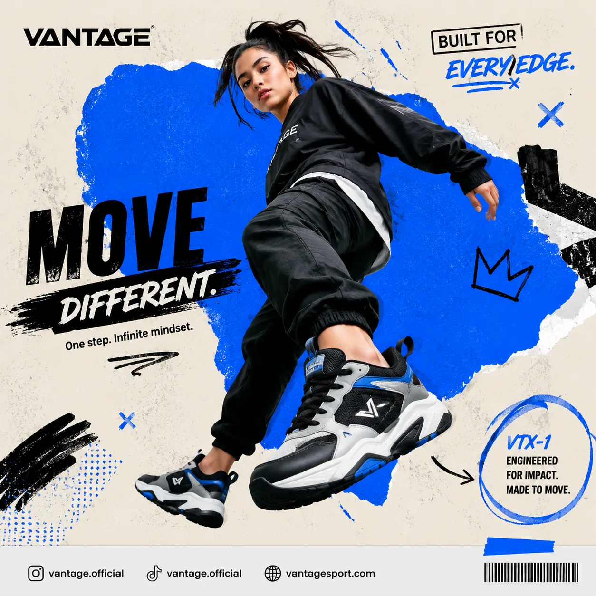

**#70 · Poster Design Prompt · <code>Vinano Studio</code>**

<details>
<summary>Show prompt</summary>

```
[BRAND NAME]

Act as a Social Media Art Director and Digital Collage Artist specializing in bold, youth-oriented brand content for Instagram and digital campaigns.

PHASE 1: CONCEPTUAL FRAMEWORK
Create a dynamic digital collage that merges fashion photography graphic design chaos.

This is controlled rebellion — a composition that feels spontaneous, energetic, and expressive while maintaining strong brand coherence.

Aesthetic direction:
- Anti-polished
- Raw textures
- Layered imperfections
- Youth-driven visual noise
- High confidence, high movement energy

Visual language:
Torn edges, brush strokes, grain overlays, hand-drawn elements, and bold color blocking.

PHASE 2: MODEL & PHOTOGRAPHY
- Subject: One model (diverse casting, age 18–30)
- Pose Energy: 80% attitude, 20% natural
 (jumping, leaning, sitting, mid-motion, power stance — NEVER static)
- Outfit: Streetwear / athleisure aligned [BRAND NAME]
- Hero Product: One key product (clear visual anchor)

- Photography Style: Editorial fashion cutout
- Background Removal: Clean, sharp extraction
- Camera Angle: Slight low angle (hero perspective)
- Crop: Full body or 3/4 body (product clearly visible)

PHASE 3: COLOR BLOCKING FOUNDATION
- Primary Color Blob:
 Large organic shape (40–60% of frame)

- Color Selection:
 1 dominant brand color (auto-adapt from [BRAND NAME])

- Shape Style:
 Irregular, hand-painted / torn paper (NO perfect geometry)

- Texture:
 Brush grain / noise (15–25% opacity)

- Placement:
 Behind or wrapping around subject
 (must frame, not hide product)

PHASE 4: GRAPHIC ELEMENTS LAYER
Add 3–5 abstract elements:

Element types (auto-select based on brand tone):
- Scribbles / hand-drawn marks
- Arrows / motion indicators
- Circles / blobs
- Texture overlays (dust, grain, fabric, noise)
- Doodles / symbolic icons

Rules:
- Colors: 2–3 total (primary + 1–2 accents)
- Placement: Asymmetric (top-left + bottom-right bias)
- Scale: Small (5%) + medium (15%)
- Avoid center clutter
- Keep imperfect, handmade feel

PHASE 5: TYPOGRAPHY INTEGRATION
- Logo:
 Upper-left or upper-right (10–15% width)

- Slogan/Headline:
 Use brand slogan OR create one aligned to brand tone

- Supporting Copy:
 Optional 1-line descriptor

- Type Style:
 Bold sans-serif / grotesk / geometric (brand dependent)

- Treatment:
 Mix straight + slight rotation (2–5°)

- Hierarchy:
 Logo → Headline → Supporting copy

PHASE 6: TEXTURE & BACKGROUND
- Base Layer:
 Off-white / light grey (NOT pure white)

- Color Range:
 RGB 245–250 (warm neutral)

- Texture Options:
 Paper grain / fabric texture / subtle noise

- Rule:
 Texture should be FELT, not dominant

PHASE 7: COMPOSITION RULES
- Layout:
 Asymmetric balance (model off-center)

- Breathing Room:
 15–20% negative space

- Layering Order:
 Background → Color blob → Graphics → Model → Typography

- Focal Point:
 Model + product = 60%
 Graphics = 40% support

- Movement:
 Strong diagonal flow
 (top-left → bottom-right OR reverse)

PHASE 8: BRAND INTELLIGENCE (AUTO-ADAPT)

Adapt energy based on brand type:

→ Streetwear / Sportswear
Bold contrast, aggressive motion, louder graphics

→ Luxury Streetwear
Minimal chaos, sharper spacing, refined typography

→ Outdoor / Utility
Texture-heavy, grounded tones, functional realism

→ Beauty / Lifestyle
Soft chaos, clean spacing, pastel or skin tones

→ Tech / Modern
Minimal graphics, structured layout, sharp geometry

PHASE 9: SOCIAL MEDIA FOOTER (OPTIONAL)
- Bottom strip (8–10% height)
- Light neutral background
- Social handles / icons
- Clean grid layout
- Keep minimal (contrast to collage)

TECHNICAL SPECS:
- Aspect Ratio: 4:5 (primary) or 1:1
- Resolution: 2400x3000px+
- Color Mode: sRGB (Instagram optimized)
- Sharpness: High detail, slight grain allowed
- Output Style: Digital collage mimicking analog craft

- Photography Base (before cutout):
 85mm lens, f/2.8, shallow depth of field

Preserve realistic proportions and depth for a confident, professional finish.
```

</details>

---


**#71 · Poster Design Prompt · <code>Vinano Studio</code>**

<details>
<summary>Show prompt</summary>

```
A cinematic luxury fashion editorial set inside a grand vintage library tall wooden bookshelves, soft fog covering the floor, and glowing butterflies floating in the air. A beautiful young woman short wavy bob hair and soft natural makeup sits centered on a stack of antique books. She wears an elegant flowing satin gown in champagne color, posed gracefully one hand resting on her face. A luxury designer handbag is placed prominently in front. Dramatic spotlight from above, symmetrical composition, moody atmosphere, shallow depth of field, ultra-realistic, high detail, 8K, fashion magazine style, premium aesthetic, soft shadows, rich tones. Maintain consistent colour harmony and crisp focus across the whole frame.
```

</details>

---

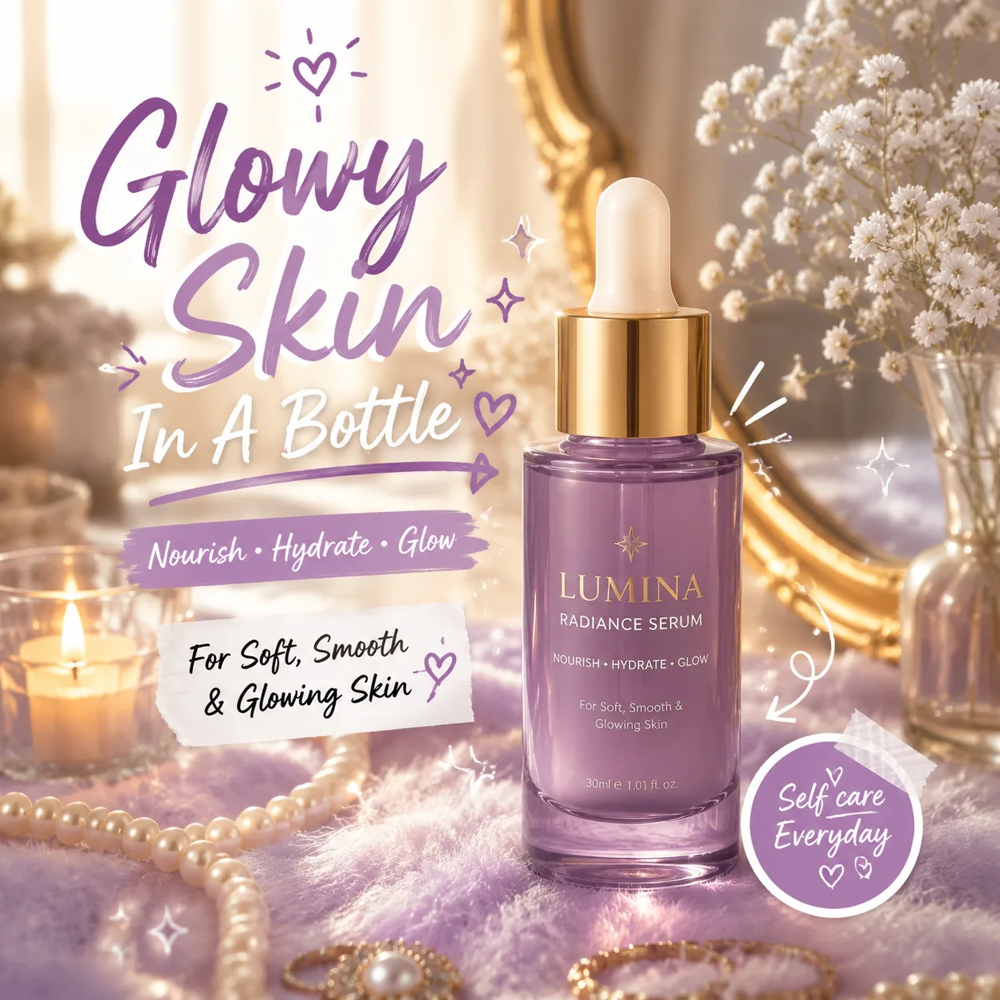

**#72 · Poster Design Prompt · <code>Vinano Studio</code>**

<details>
<summary>Show prompt</summary>

```
Luxury aesthetic skincare advertisement,soft pastel background, warm golden sunlight, dreamy soft focus, feminine vanity setup mirror, pearls, candle and baby breath flowers.Cozy purple fluffy surface, high-end beauty branding style, ultra realistic, 4k, studio lighting, glossy reflection, soft shadows, bokeh background.
Add cute doodle elements (white and purple hand-drawn arrows, sparkles, hearts), handwritten notes and stickers.

Text overlay: "Glowy Skin In A Bottle" (big hand writing font)"Nourish • Hydrate • Glow"
"For Soft, Smooth & Glowing Skin","Self care Everyday"
crisp composition, aesthetic, viral beauty ad style, Instagram / TikTok/ X friendly (but no UI), premium soft feminine branding

Render with rich micro-detail while keeping the layout uncluttered and intentional.
```

</details>

---

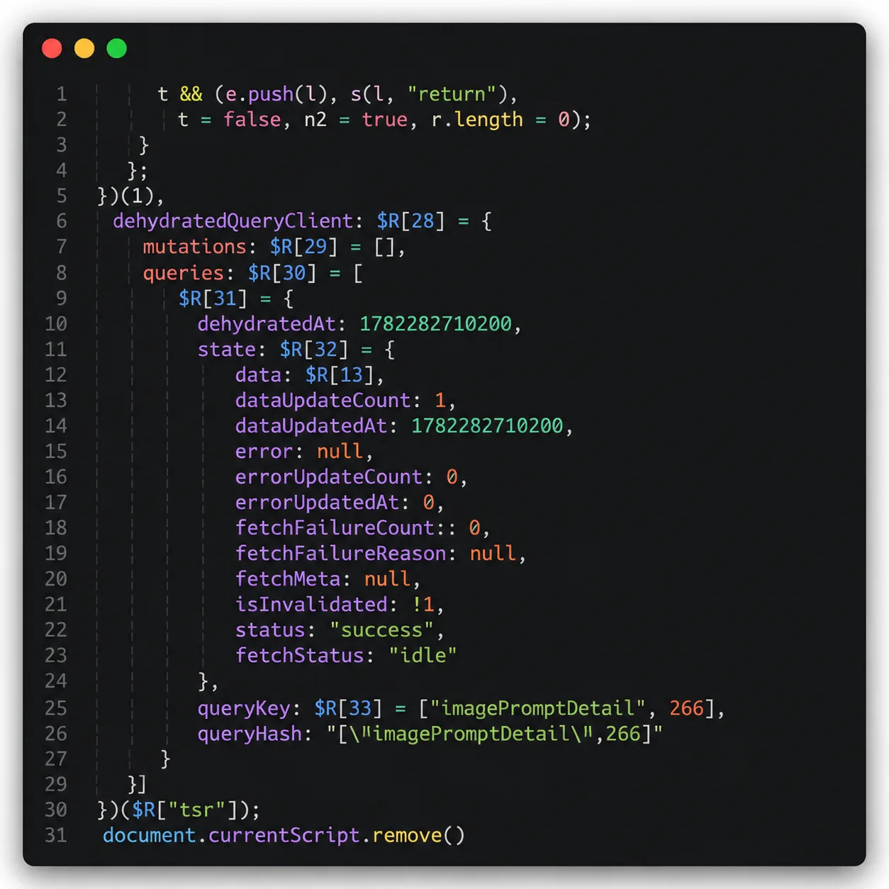

**#73 · Poster Design Prompt · <code>Vinano Studio</code>**

<details>
<summary>Show prompt</summary>

```
{
 t && (e.push(l), s(l, "return"), t = false, n2 = true, r.length = 0);
 } };
})()),dehydratedQueryClient:$R[28]={mutations:$R[29]=[],queries:$R[30]=[$R[31]={dehydratedAt:1782282710200,state:$R[32]={data:$R[13],dataUpdateCount:1,dataUpdatedAt:1782282710200,error:null,errorUpdateCount:0,errorUpdatedAt:0,fetchFailureCount:0,fetchFailureReason:null,fetchMeta:null,isInvalidated:!1,status:"success",fetchStatus:"idle"},queryKey:$R[33]=["imagePromptDetail",266],queryHash:"[\"imagePromptDetail\",266]"}]}}})($R["tsr"]);document.currentScript.remove()

Render with rich micro-detail while keeping the layout uncluttered and intentional.
```

</details>

---

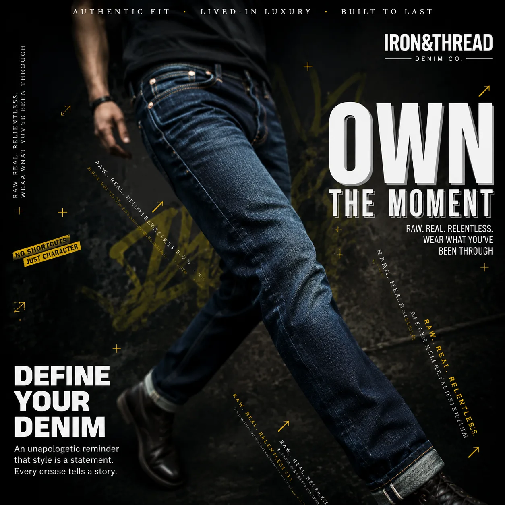

**#74 · Poster Design Prompt · <code>Vinano Studio</code>**

<details>
<summary>Show prompt</summary>

```
A hyperrealistic premium denim advertisement shot in a dark, moody editorial style. A male figure wearing raw selvedge denim jeans is captured mid-stride against a near-black charcoal background, body angled diagonally at a bold 45-degree perspective toward the camera. The jeans feature a slim tapered silhouette deep indigo wash, subtle thigh and knee fading, reinforced copper rivets catching ambient light, and clean off-white contrast stitching, dominating the lower two-thirds of the frame. The composition uses shallow depth of field sharp focus on the denim texture and soft blur on the upper torso. The background is layered subtle urban texture — faint graffiti strokes in electric yellow and muted olive, barely visible through a heavy dark vignette. Multiple rows of ultra-small all-caps typographic text orbit the figure at different angles reading phrases like "RAW. REAL. RELENTLESS." and "WEAR WHAT YOU'VE BEEN THROUGH" — some running vertically, some at 30-degree angles, creating a chaotic yet intentional graphic zine energy. At the upper right, a bold brand wordmark appears in clean white against the dark background. At the top center, a thin horizontal navigation-style text bar reads "AUTHENTIC FIT · LIVED-IN LUXURY · BUILT TO LAST" in spaced all-caps serif font. A large commanding headline is placed center-right — "OWN" in massive ultra-bold white letters followed by "THE MOMENT" in lighter weight creating dramatic type hierarchy. Small yellow plus (+) symbols and diagonal arrows (↗) are scattered throughout as accent details. Bottom left features a bold slogan lockup: "DEFINE YOUR DENIM" in large bold sans-serif white text a thin subline reading "An unapologetic reminder that style is a statement. Every crease tells a story." The overall lighting is dramatic and directional — a single cold key light from the left causing copper rivets to shimmer and deep indigo denim to glow subtle sheen against the darkness. Close macro detail visible on the fabric weave texture near the knee fade. true-to-life photorealistic. Commercial photography quality. High contrast. 4K resolution. 3:4 vertical format optimized for social media. Maintain consistent colour harmony and crisp focus across the whole frame.
```

</details>

---

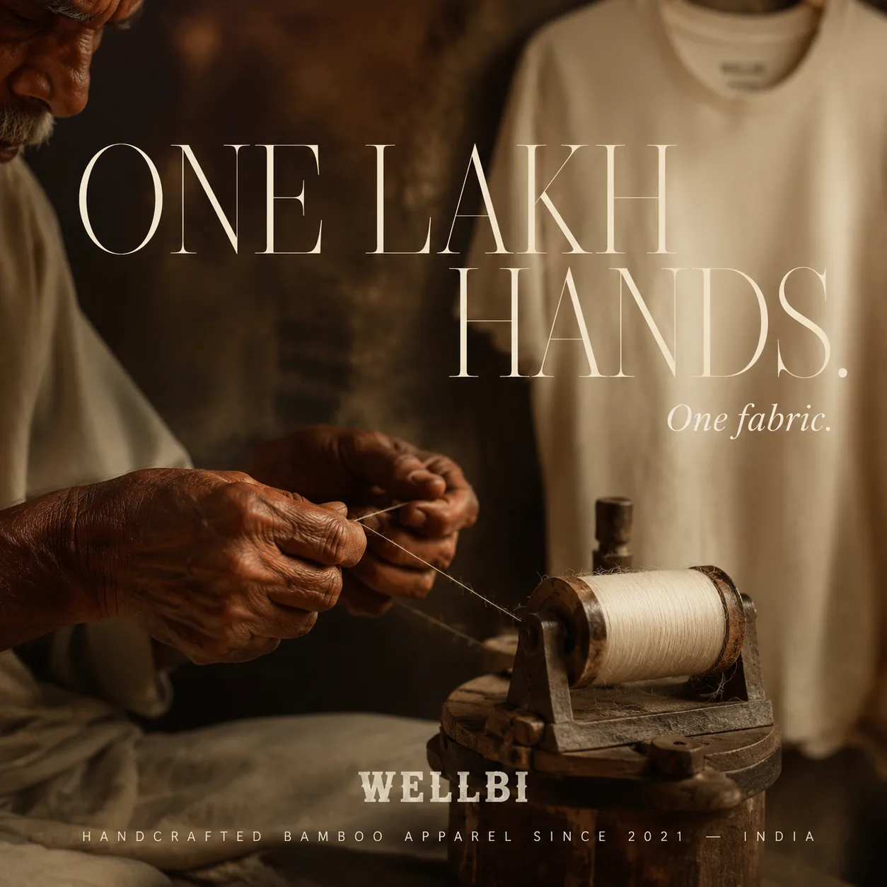

**#75 · Poster Design Prompt · <code>Vinano Studio</code>**

<details>
<summary>Show prompt</summary>

```
Cinematic product poster for WELLBI, India's premium bamboo apparel brand.

SCENE: A lone young Indian man emerges from a dense, luminous bamboo forest
at golden hour. Wears a perfectly draped, ultra-clean ivory WELLBI bamboo polo.
Bamboo stalks alive warm amber and jade light filtering through canopy.

VISUAL STORYTELLING: The bamboo forest IS the fabric — seamless living metaphor.
Thin golden light rays land on the polo, suggesting softness and breathability.

COMPOSITION: Low angle, subject centre-frame, bamboo framing both sides like
a natural arch. Horizon at lower third. Cinematic 2.39:1 anamorphic crop.

— TYPOGRAPHY SYSTEM —
Hero line: "GROWN." — single word, massive scale, Helvetica Neue Ultra Light,
all caps, extreme letter-spacing +600, ghost white at 15% opacity overlaid
across the ENTIRE poster width — architectural, not decorative.

Sub-line: "Not manufactured." — set in sharp Aktiv Grotesk Regular,
sentence case, 18pt, tracking +80, positioned directly below hero word.
White. Full opacity. Feels like a whisper after a shout.

Brand name: "WELLBI" — bottom right corner. Neutral Grotesk Medium,
all caps, tracking +300, 11pt. Separated by a 0.5pt hairline rule
above it, 40px wide. Restrained. Premium.

Legal/descriptor: "100% Bamboo Apparel — India" — micro text,
7pt, tracking +150, bottom left. Rotated 90° vertical.
Acts as a structural edge element, not an afterthought.

COLOUR PALETTE: Deep jungle green, warm amber, ivory white, earth brown.

LIGHTING: ARRI Alexa Mini LF — golden hour rim, diffused fill,
subtle lens flare grazing the polo fabric.

MOOD: Grounded luxury. Like a Loro Piana campaign shot in Assam.

CAMERA: 85mm f/1.4, shallow DOF, anamorphic lens flare.

Editorial brand poster for WELLBI sustainable Indian fashion.

SCENE: Extreme close-up of a weathered artisan's hands spinning bamboo thread.
Blurred WELLBI tee draped elegantly in background. Warm-lit rural Indian
workshop — clay walls, raw natural light.

VISUAL STORYTELLING: Rough hands against silk-smooth bamboo fabric.
Heritage craftsmanship. The contrast IS the message.

COMPOSITION: Split tonal — dark warm left (hands, workshop),
light cream right (garment). Hands at cross-point. Leica 50mm documentary realism.

— TYPOGRAPHY SYSTEM —
Hero line: "ONE LAKH HANDS." — Canela Display Thin, mixed case,
enormous scale, set across 80% of poster width.
The word "HANDS" drops to second line, indented right —
staggered layout creates visual rhythm like musical notation.

Counter-line: Below "HANDS", flush right: "One fabric." —
same Canela Thin but 28pt, italic. The tonal shift from
all-caps to italic sentence case creates emotional contrast —
like going from statement to confession.

Brand stamp: "WELLBI" centred bottom — pressed as if letterpress embossed.
Freight Display Pro Bold, tracked tight at -20. Earthen cream on warm brown.
Feels physical. Tactile.

Descriptor line: "Handcrafted bamboo apparel since 2021 — India" —
9pt, Suisse Int'l Light, tracking +200, full width, very bottom edge.
Reads like a footnote on a heritage certificate.

COLOUR: Terracotta, aged ivory, saffron gold, deep walnut.

LIGHTING: Soft natural window light, warm practical lamp.
Documentary-editorial quality.

MOOD: Deeply human. D&AD craft award energy.

CAMERA: Leica 50mm Summilux, skin texture visible,
documentary realism fashion editorial polish.

Emphasise material texture and natural light so the final frame feels tactile and premium.
```

</details>

---

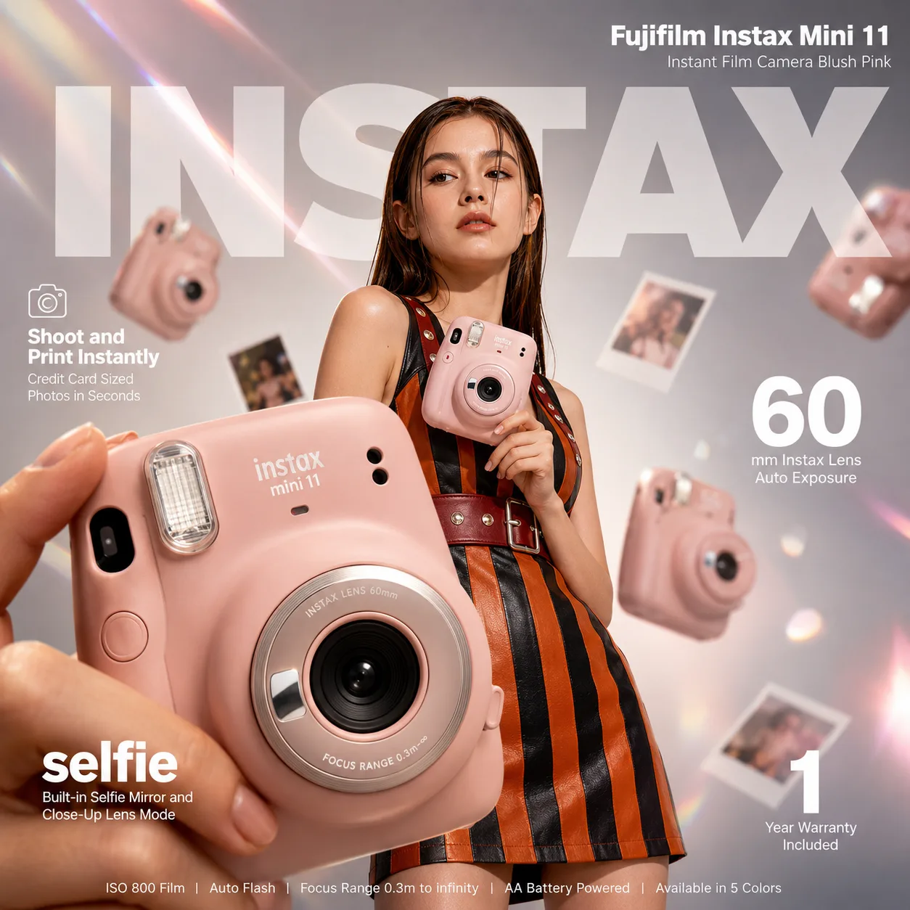

**#76 · Poster Design Prompt · <code>Vinano Studio</code>**

<details>
<summary>Show prompt</summary>

```
High-impact e-commerce infographic advertisement for "Fujifilm Instax Mini 11" blush pink instant camera. FOREGROUND: Extreme close-up of a hand holding a compact rounded blush-pink Fujifilm Instax Mini 11 camera angled toward camera, razor-sharp center focus, macro-lens shallow depth of field, visible 60mm silver lens ring, crystal pop-up flash, white instax mini 11 branding on body, red shutter button accent, fingertips softly blurred at edges. CENTRAL MODEL: confident young woman straight dark brown hair, light natural makeup, cool editorial expression, wearing a bold orange and black vertical-striped sleeveless leather mini dress deep red buckle details and silver stud buttons, holding the blush-pink Instax Mini 11 casually at chest height camera face pointing outward, slight off-camera gaze, stylish composed energy. BACKGROUND: soft-focus cool light gray gradient studio backdrop fading to warm white center, diagonal pastel prism lens flares in pink peach and lavender cutting upper-left to lower-right, soft blush-pink and cream light leaks at corners, 4 to 5 blurred Fujifilm Instax Mini 11 cameras floating at various depths and rotation angles, scattered polaroid-style instant photo prints in background bokeh, subtle bokeh circles from studio lights. LIGHTING: professional three-point studio lighting, key light upper-left, fill light right side, rim light behind model for separation, glossy highlights on camera lens ring and flash unit. TYPOGRAPHY overlaid clean bold white sans-serif: massive semi-transparent "INSTAX" text spanning full width behind model at top center, top right bold text "Fujifilm Instax Mini 11" subtitle "Instant Film Camera Blush Pink", mid-left small camera icon bold "Shoot and Print Instantly" and subtext "Credit Card Sized Photos in Seconds", mid-right extra-large bold numeral "60" smaller text "mm Instax Lens Auto Exposure", lower-left bold "selfie" subtext "Built-in Selfie Mirror and Close-Up Lens Mode", bottom-right bold numeral "1" subtext "Year Warranty Included", bottom center fine print "ISO 800 Film | Auto Flash | Focus Range 0.3m to infinity | AA Battery Powered | Available in 5 Colors". TECHNICAL: 8K ultra-sharp, hyperrealistic commercial ad aesthetic, editorial fashion meets lifestyle product photography style, color palette blush pink orange black cream pastel prism accents, tack-sharp on Instax camera shallow DOF on everything else, 85mm macro slight low angle, warm vibrant professional color grading. Aim for an editorial, design-driven look with deliberate negative space.
```

</details>

---

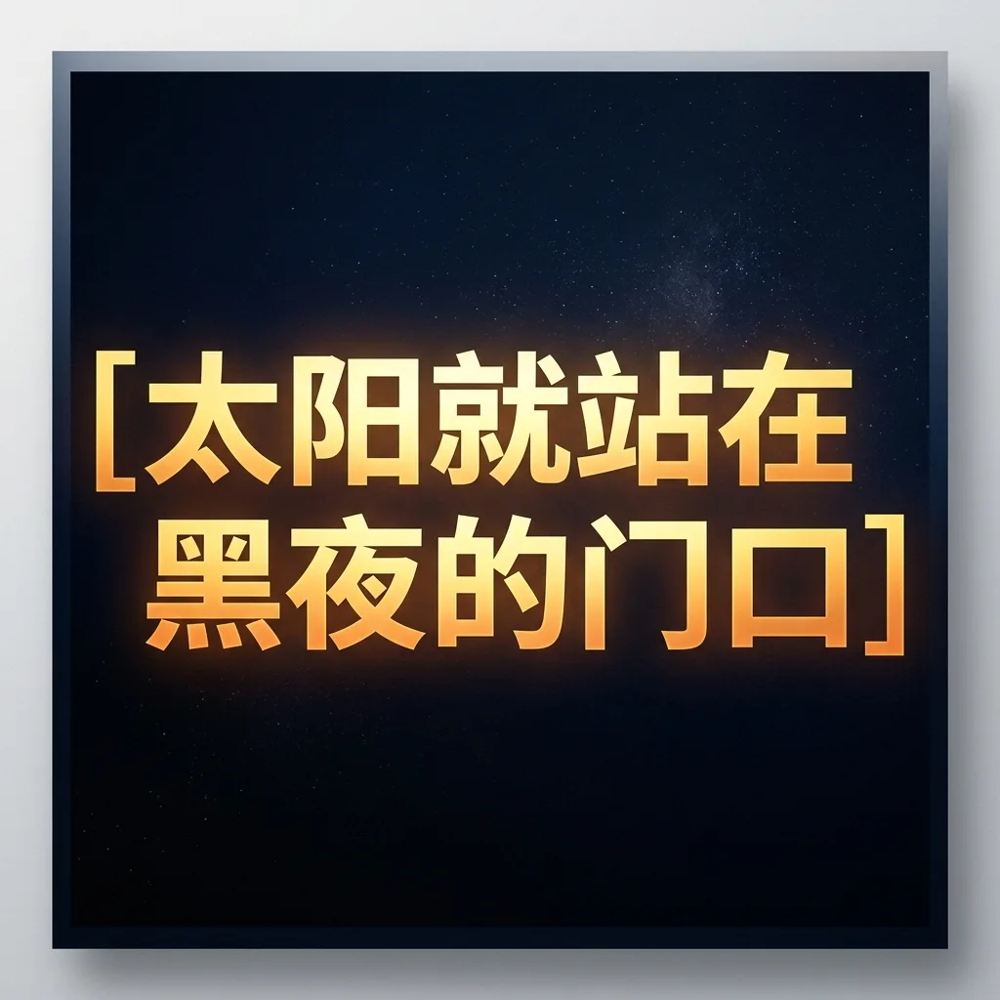

**#77 · Poster Design Prompt · <code>Vinano Image Pro</code>**

<details>
<summary>Show prompt</summary>

```
本次是生成图片任务：
苹果设计师思维，顶级海报大师思维，用高桥流思路
呈现海报设计
表现如下文本，让其抓人，直击人心
你可以智能理解文本，不一定照单全收文本，智能梳理文本， 把握人性，突出看点。尤其是我输入大段文本， 你核心呈现的，应该是你理解和处理后的核心文本
智能判定适合文本语义的配色逻辑，合理排版，有呼吸感的呈现文案
不要额外添加文字， 超大字展示这个文案
```
[太阳就站在黑夜的门口]
```

整体保持边缘干净、构图均衡，呈现可直接使用的精致成品感。
```

</details>

---

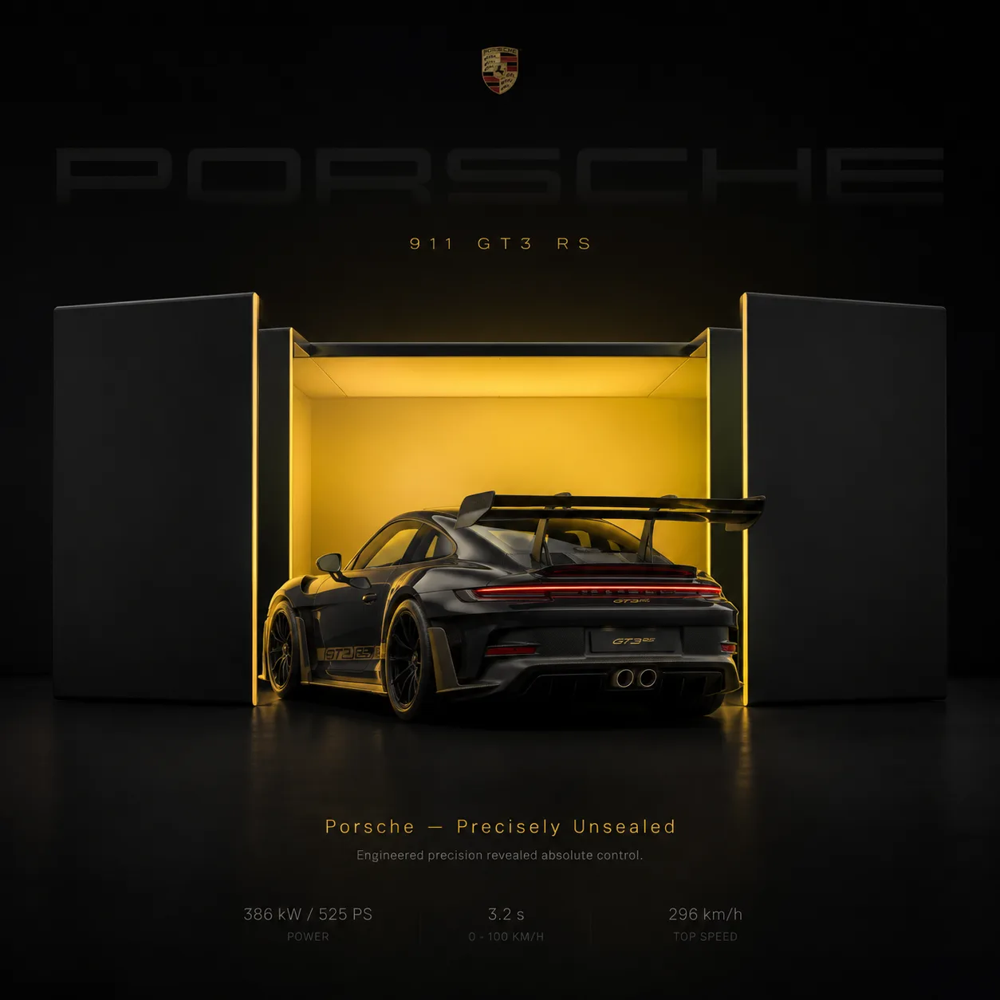

**#78 · Poster Design Prompt · <code>Vinano Studio</code>**

<details>
<summary>Show prompt</summary>

```
FORMAT:
4:5 vertical poster, ultra high resolution, 8K, ultra-premium automotive campaign, minimal cinematic realism

CORE CONCEPT:
“CONTROLLED UNSEALING”

A precision-engineered object revealed intent.
Nothing breaks.
Everything separates perfectly.

ENVIRONMENT:

Deep matte black studio

Background:
- almost pure black
- soft, controlled yellow glow diffused behind subject
- no visible light source

Surface:
- ultra clean dark floor
- very soft reflection (5–8%)
- no scratches, no noise

Air:
- almost clean (NO visible dust)

HERO STRUCTURE:

A **precision-engineered display case** — not industrial, not damaged.

Design language:
- monolithic black form
- seamless panels
- razor-sharp edges
- minimal visible joints

Opening behavior:
- panels slide apart mechanical precision
- no tearing, no debris
- perfect separation lines
- slight offset gaps emitting soft yellow light

Interior:
- Porsche yellow inner chamber
- smooth, matte-satin finish
- soft controlled glow (not bright)

PRODUCT:
[Porsche 911 GT3 RS](chatgpt://generic-entity?number=0)

Angle:
Rear 3/4, slightly low

Position:
Centered, emerging forward subtly

Stance:
- perfectly planted
- minimal steering angle (almost straight)
- composed, not aggressive

DETAILING:

Surface:
- ultra refined gloss
- clean, sharp reflections
- no exaggerated highlights

Carbon:
- visible but subtle
- premium, not loud

Tires:
- clean satin finish
- realistic, not shiny

Integration:
- faint yellow light wrap from interior
- soft contact shadow
- barely visible reflection

COMPOSITION:

Top:
small Porsche crest

Center:
car framed by opening panels

Typography:
secondary to structure

Bottom:
clean editorial + specs

Negative space:
dominant and intentional

TYPOGRAPHY:

PRIMARY:
“PORSCHE”

Style:
Ultra condensed

Treatment:
- subtly embedded into background
- low contrast (dark graphite on black)
- almost discovered, not announced

SECONDARY:
“911 GT3 RS”
thin, technical

EDITORIAL BLOCK:

Headline:
“Porsche — Precisely Unsealed”

Body:
Engineered precision revealed absolute control.

Minimal copy. No storytelling overload.

SPECS:

386 kW / 525 PS
3.2 s
296 km/h

Clean, technical alignment

LIGHTING:

- soft internal yellow glow (primary)
- controlled top light (soft, even)
- subtle rim separation
- NO harsh contrast spikes

Focus:
surface quality > drama

COLOR GRADING:

- deep neutral blacks
- controlled Porsche yellow
- low saturation outside focal area
- ultra clean finish

CAMERA:

50mm
eye-level to slightly low
no distortion

MOOD:

Calm.
Precise.
Obsessive.

Power under control.

Emphasise material texture and natural light so the final frame feels tactile and premium.
```

</details>

---

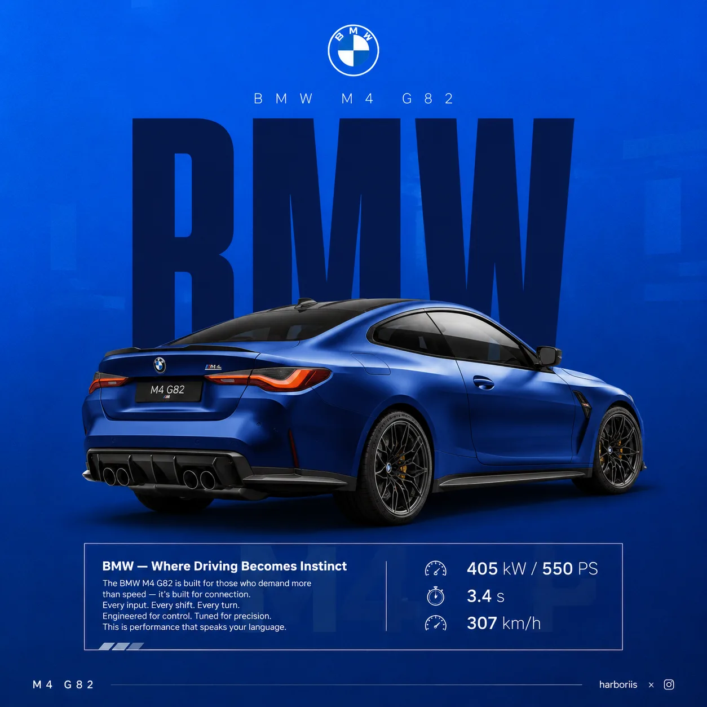

**#79 · Poster Design Prompt · <code>Vinano Studio</code>**

<details>
<summary>Show prompt</summary>

```
Create a 4:5 vertical social poster in ultra high resolution, 8K print quality sharpness. Use the BMW car from the reference image as the main subject and use the background structure/composition from the reference image, but transform it into a BMW themed design. Replace all black tones a flat high-saturation BMW blue background. Keep the same layout, spacing, visual balance, and poster composition from the reference image.

Background should use a smooth gradient from slightly lighter electric blue at the top to deep navy blue at the bottom. Add subtle grain texture (2 to 3%) and faint rectangular overlays (2 to 4% opacity). Keep it clean, graphic, premium, and non-realistic. Add a soft contact shadow under the car.

Use the same BMW from the reference image, changing only the paint color to matte frozen blue or deep metallic navy. Keep the original body shape, wheels, stance, and design details from the reference image.

Show the car in a rear 3/4 perspective matching the reference image angle exactly. Use a slightly elevated camera angle. Position the car slightly right of center.

Include visible carbon roof, aggressive rear diffuser, sharp controlled reflections, and subtle brake details.

Keep composition identical to the reference image:
Top: branding
Middle: giant type
Center: car overlapping text
Bottom: editorial block and specs

Typography:

Primary text: “BMW”
Ultra condensed bold sans serif, tall vertical scaling like the reference poster. Color deep navy or near black. Static text no distortion. Acts as structural backdrop.

Secondary header: “BMW M4 G82”
Thin font wide tracking.

Logo area: BMW roundel centered above.

Editorial block:

Headline: “BMW — Where Driving Becomes Instinct”

Body copy focused on:

driver connection

control

performance precision

Use the same boxed editorial layout as the reference image.

Background faded text: “M4” large scale 3 to 5% opacity behind the box.

Bottom left:
“ M4 G82”

Bottom right specs:

405 kW / 550 PS
3.4 s
307 km/h

Lighting should be clean studio lighting sharp but controlled highlights.

Color grading should use deep blues, high contrast, clean blacks.

Camera lens: 50mm, slightly elevated rear 3/4 angle.

Mood:
Performance.
Precision.
Driver focus.

Add Bottom-right watermark: harboriis, small x and Instagram logo

Aim for an editorial, design-driven look with deliberate negative space.
```

</details>

---

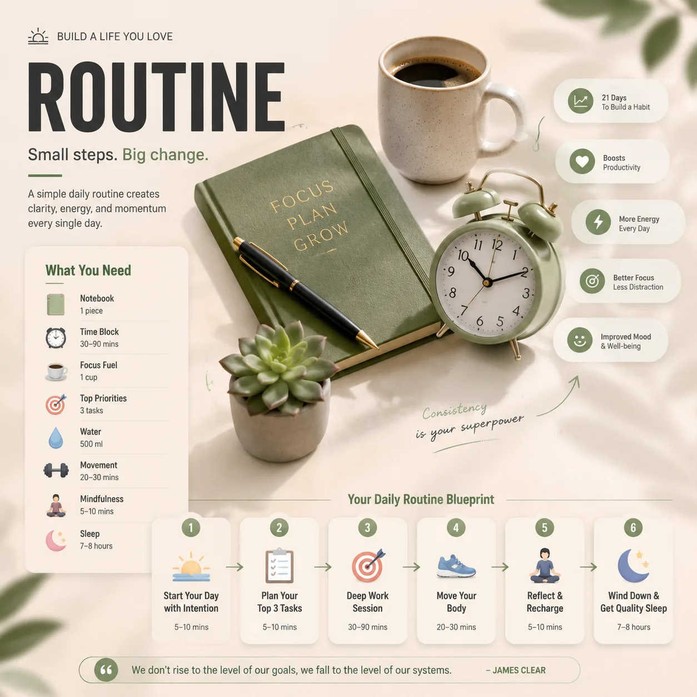

**#80 · Poster Design Prompt · <code>Vinano Studio</code>**

<details>
<summary>Show prompt</summary>

```
Ultra-clean modern editorial infographic. The topic is [ROUTINE] routine. Base all visuals, colors, objects, mood, ingredients, and steps entirely on this topic. Hero visual: a stylized flat-lay or floating arrangement of 3–4 iconic objects associated this topic — slightly angled or in soft perspective, glowing subtly. All elements arranged dynamically around the hero in a non-restrictive editorial layout. Ingredients Section: Label it ‘What You Need’ — include 6–8 relevant items small icons or emoji illustrations next to each, a practical quantity or duration written like a recipe. Steps Section: 5–6 numbered panels arrows or connecting lines forming a logical flow, each a short action label and small relevant icon, glassmorphism or frosted card styling. Stats Badges: 4–5 floating pill-shaped badges showing relevant metadata, displayed as clean minimal bubbles near the hero. Visual Style: Choose background color, accent colors, typography weight, and texture to naturally match the topic’s mood. Bold modern sans-serif typography. Clean vector icons. Subtle grain or texture. Composition: Hero centered or slightly offset, ingredients one side, steps opposite or below connecting lines, stat badges as floating pills, generous negative space. Lighting: Soft natural studio lighting matching the topic’s tone. Premium editorial aesthetic, social-feed optimized. Ultra-crisp. No watermark Emphasise material texture and natural light so the final frame feels tactile and premium.
```

</details>

---

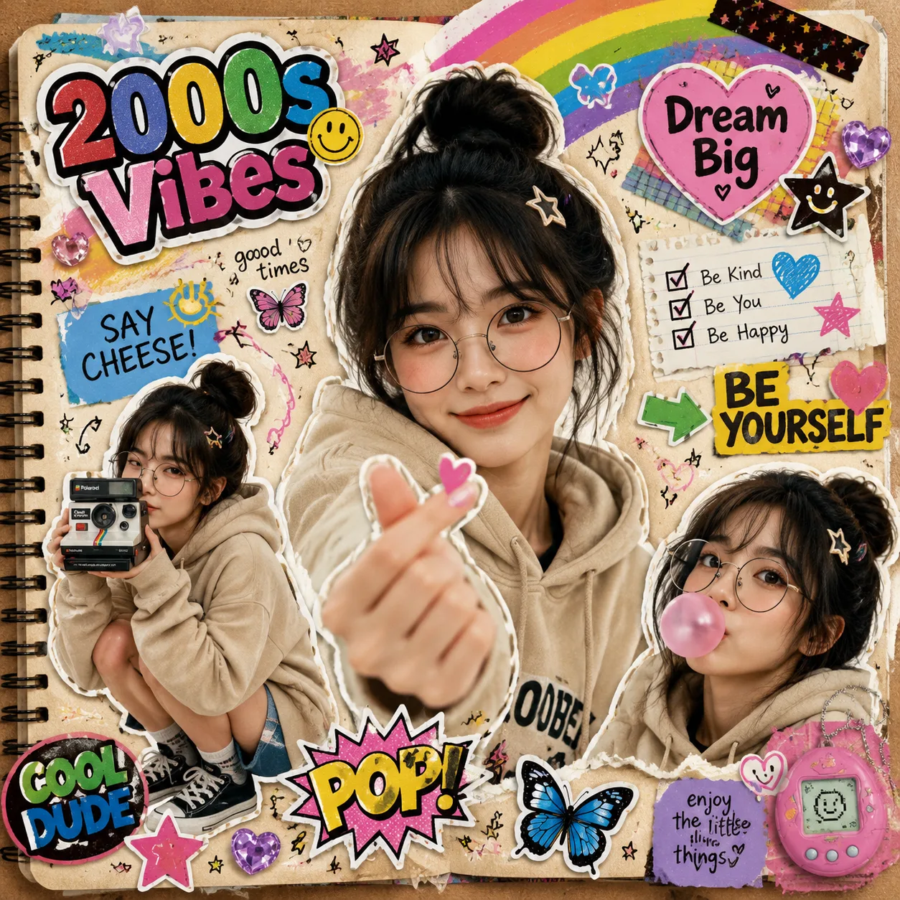

**#81 · Poster Design Prompt · <code>Vinano Studio</code>**

<details>
<summary>Show prompt</summary>

```
A vibrant 2000s scrapbook-style collage featuring the same young woman in multiple cutout poses. One portrait is centered and large, showing her wearing round glasses and a beige hoodie, making a finger-heart gesture toward the camera. Other cutouts show her squatting a vintage instant camera, and another blowing a pink bubblegum bubble.

The background looks like an open sketchbook textured paper, filled colorful paint strokes in rainbow tones, playful doodles, arrows, stars, hearts, butterflies, smiley faces, and pop-art stickers. Bold, bubbly typography stickers read phrases like “2000s Vibes,” “Dream Big,” “Be Yourself,” “Cool Dude,” “Say Cheese,” and “Pop!”

The overall aesthetic is nostalgic, cheerful, and youthful — inspired by early 2000s teen magazines and scrapbook journals. High saturation, soft, diffused lighting, clean white sticker outlines around each cutout, whimsical and fun mood, creative flat-lay composition, digital collage illustration style.

Render with rich micro-detail while keeping the layout uncluttered and intentional.
```

</details>

---

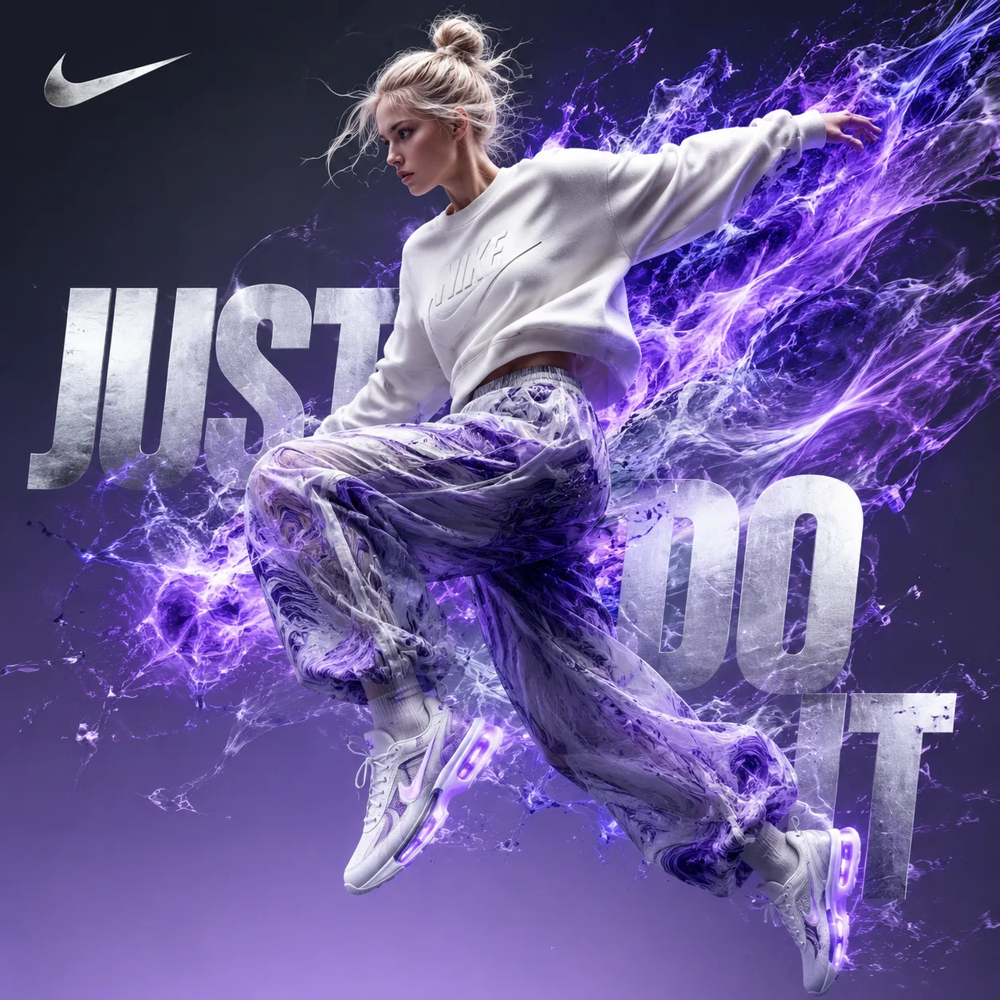

**#82 · Poster Design Prompt · <code>Vinano Studio</code>**

<details>
<summary>Show prompt</summary>

```
A highly detailed digital artwork in a surreal, dynamic style inspired by premium athletic advertising for Nike, Inc. A young athletic woman platinum blonde hair tied in a messy bun, fair skin, and a fiercely focused expression is captured mid-jump or leap, her body leaning slightly forward as if bursting raw, untamed energy.
She wears a loose, off-white Nike crewneck sweatshirt subtle embossed Nike branding on the chest, paired flowy, semi-transparent pants featuring a swirling marbled pattern in graphite grey and electric violet, billowing dramatically around her legs. On her feet are sleek, futuristic white Nike sneakers glowing violet accents, visible Air-inspired sole details, and an aerodynamic design.
Vibrant electric violet energy or ethereal smoke erupts dramatically from behind her, swirling and dissolving into abstract, cloud-like forms that interact her clothing, creating a powerful sense of motion and release.
The background is a deep, moody gradient transitioning from charcoal grey to luminous twilight violet, emphasizing a refined minimalist yet striking composition.
Overlay large, bold metallic silver text reading “Just Do It” in a sharp, modern sans-serif font, partially integrated and obscured by the energy smoke and the figure, making it feel like an organic part of the scene.
Include the iconic Nike Swoosh logo in the top-left corner in shimmering silver.

Preserve realistic proportions and depth for a confident, professional finish.
```

</details>

---

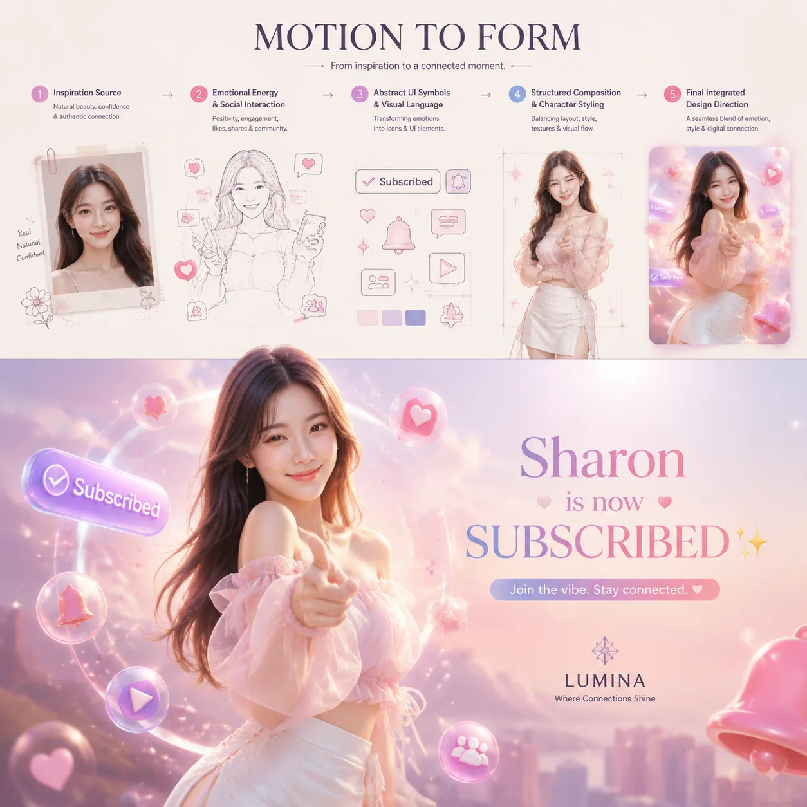

**#83 · Poster Design Prompt · <code>Vinano Studio</code>**

<details>
<summary>Show prompt</summary>

```
Translate this theme from concept into form, and present both the transformation process and the final outcome within a single vertical A4 composition.
Use a two-tier layout (top and bottom sections).
Top Section:
A 5-step visual process diagram that captures the essence of the theme.
Structure the flow as:
Inspiration source → Emotional energy & social interaction → Abstract UI symbols and visual language → Structured composition & character styling → Final integrated design direction
Use the first reference image strictly for Sharon’s identity, facial features, and expression
Use the second reference image for outfit, pose, and styling direction
Visual style:
Delicate sketching, soft line art, UI-inspired diagram elements
Floating icons like “Subscribed”, hearts, notification bells, social symbols
Small arrows, micro annotations, short English labels
Clean spacing refined, minimal layout
Title: “MOTION TO FORM”
Bottom Section:
A hero visual derived from the process above.
A cute, premium advertising poster featuring Sharon in a glowing, dreamy environment
She appears radiant, confident, and joyful, embodying a “subscribed / viral moment”
Blend both reference images seamlessly (face from image 1, styling from image 2)
Design direction:
Soft pastel gradient background (pink, lavender, baby blue)
Subtle golden-hour glow light neon accents
Floating 3D UI elements (Subscribed badges, hearts, icons)
Cinematic depth, soft lens flare, light particles, bokeh
Typography:
Main text: “Sharon is now SUBSCRIBED ✨”
Secondary tagline: “Join the vibe. Stay connected.”
Add a fictional brand/platform name (AI-generated)
Overall Direction:
The final visual should feel like a fusion of:
Concept board
Social media campaign poster
Design development sheet
Style:
Minimal, poetic, intelligent
Clean negative space balanced composition
Neutral base tones 1–2 soft pastel accent colors
Focus on:
Skin glow and natural beauty enhancement
Fabric texture and styling details
Light, shadow, and material realism
UI elements integrated as part of the aesthetic
Rendering quality:
Ultra high resolution
Commercial advertising quality
Soft, dreamy, cinematic finish

Preserve realistic proportions and depth for a confident, professional finish.
```

</details>

---

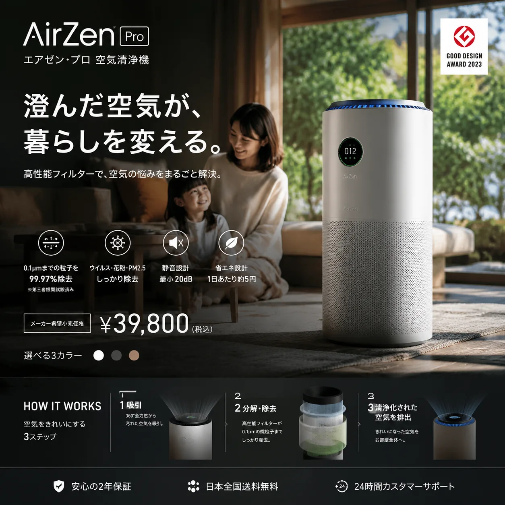

**#84 · Poster Design Prompt · <code>Vinano Studio</code>**

<details>
<summary>Show prompt</summary>

```
Create a hyper-realistic Japanese-style futuristic product advertisement, ultra-detailed, filmic, cinematic lighting, premium clean layout.

The product is:

[DESCRIBE YOUR IDEA]

Scene:
Place the product in a real-world, emotionally impactful environment where its function is clearly visible.

Focus on:
– a strong central moment
– natural human interaction
– clear demonstration of the benefit

Include:
– product name
– headline
– subheadline
– feature icons, colors, shape, etc
– pricing
– “how it works” section

Preserve realistic proportions and depth for a confident, professional finish.
```

</details>

---

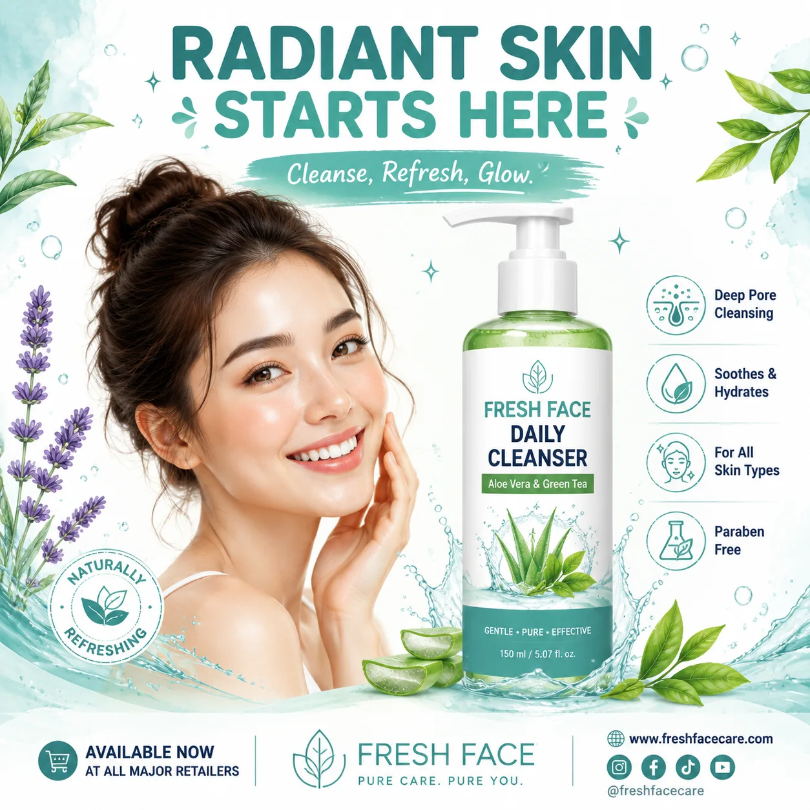

**#85 · Poster Design Prompt · <code>Vinano Studio</code>**

<details>
<summary>Show prompt</summary>

```
A clean, refreshing vertical advertising poster design for a face wash product, a graphic illustration style soft watercolor and vector elements. The poster is set against a clean white and light teal background. The central figure is a beautiful, smiling young woman natural, glowing, radiant skin and her hair loosely tied back in a messy bun, looking confidently towards the viewer fresh-faced appearance. She has a touch of natural makeup.
The overall style is clean, modern, and graphic, flowing organic shapes, stylized leaves, flowers, and water splashes in shades of aqua, teal, light green, and white. The background features delicate, stylized illustrations of botanical ingredients like aloe vera, green tea leaves, and lavender.
At the top, large, friendly, rounded sans-serif font reads: "RADIANT SKIN STARTS HERE". Below this, a catchy tagline: "Cleanse, Refresh, Glow."
The main product, a stylized bottle of face wash a white pump and green and blue labeling, is illustrated to the right of the woman. The bottle is labeled "FRESH FACE DAILY CLEANSER" and mentions " Aloe Vera & Green Tea." There are small graphical icons around the bottle text: "Deep Pore Cleansing", "Soothes & Hydrates", "For All Skin Types", "Paraben Free".
Small illustrative bubbles, stars, and botanical accents float around the composition, adding a sense of lightness and freshness. At the bottom, in a clean, modern font, it says: "AVAILABLE NOW AT ALL MAJOR RETAILERS" followed by a stylized logo "FRESH FACE" and the website " and social media icons (freshfacecare). The poster has a clean layout ample negative space and soft, natural lighting.

Maintain consistent colour harmony and crisp focus across the whole frame.
```

</details>

---

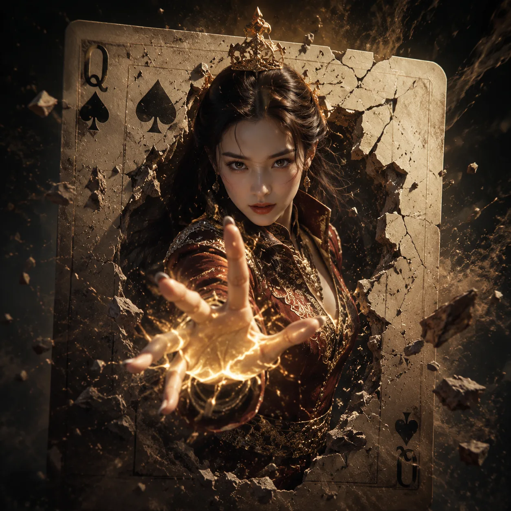

**#86 · Poster Design Prompt · <code>Vinano Studio</code>**

<details>
<summary>Show prompt</summary>

```
A hyper-realistic cinematic movie poster of a powerful female sorcerer the same facial structure and likeness as the uploaded reference photo, bursting through a cracked Queen of Spades playing card.
The card explodes outward stone fragments, dust, and debris frozen mid-air.
She wears an ornate royal maroon and gold embroidered medieval fantasy jacket, rich fabric textures, intricate detailing, regal and mystical.The sorcerer extends one hand forward toward the viewer, fingers glowing intense magical energy, subtle golden sparks and dark arcane aura surrounding the hand.
Intense piercing gaze, confident and dominant expression, cinematic hero framing.
Dramatic chiaroscuro lighting, dark moody background, volumetric light rays, ultra-detailed textures, shallow cinematic depth of field.
true-to-life photorealistic face, epic fantasy realism, movie poster composition, high contrast, dynamic motion, dust particles, masterpiece quality, ultra-sharp focus, 8K resolution, cinematic color grading

Keep edges clean and the overall composition balanced for a polished, gallery-ready result.
```

</details>

---

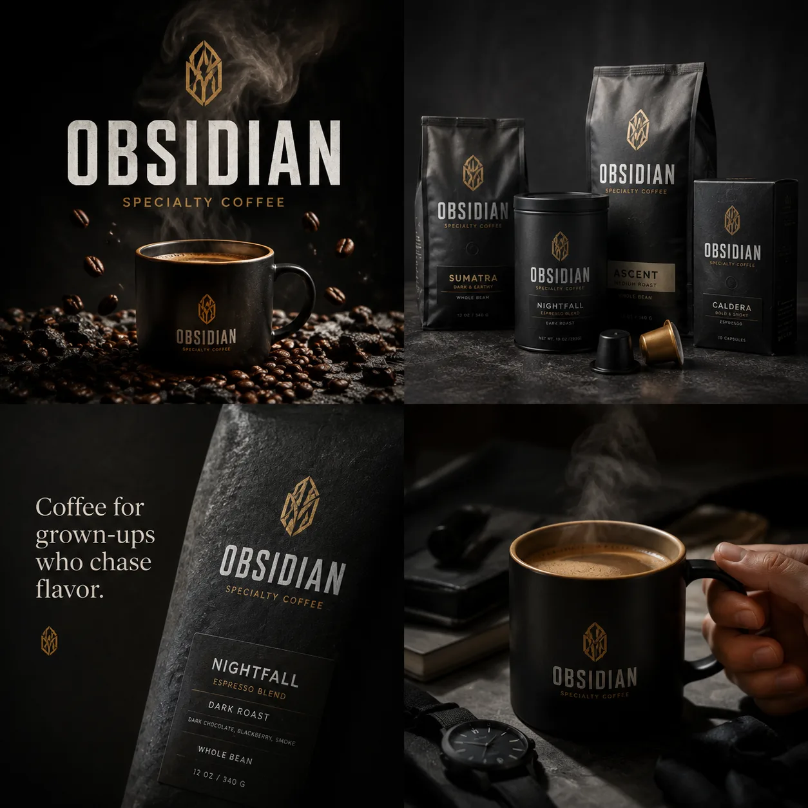

**#87 · Poster Design Prompt · <code>Vinano Studio</code>**

<details>
<summary>Show prompt</summary>

```
Create four connected premium realistic editorial images for OBSIDIAN coffee. Dark cinematic grown-up vibe like high-end sportswear or coffee campaigns. Dramatic but grounded studio lighting, realistic textures, crisp composition. Image 1: Hero poster ‘OBSIDIAN’ and premium coffee display steam and beans. Image 2: Product lineup - bags, cans, capsules. Image 3: Packaging close-up + tagline ‘Coffee for grown-ups who chase flavor.’ Image 4: Lifestyle steaming cup shot. Highly polished, sharp, realistic materials, consistent branding, no surreal effects Aim for an editorial, design-driven look with deliberate negative space.
```

</details>

---

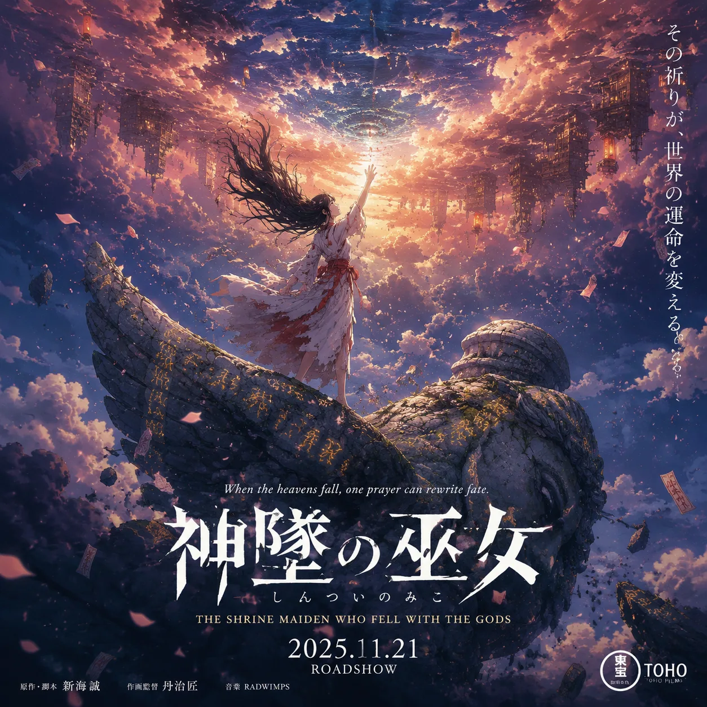

**#88 · Poster Design Prompt · <code>Vinano Studio</code>**

<details>
<summary>Show prompt</summary>

```
A stunning anime theatrical movie poster in portrait format. Studio Ghibli meets Makoto Shinkai visual language. A teenage girl in a tattered white shrine maiden robe stands on the wing of a crumbling giant stone deity — an ancient colossus covered in moss and glowing golden kanji script, slowly falling through a sea of clouds. Her long black hair streams upward against gravity. She reaches one hand toward the sky where a vast celestial rift tears open the heavens — beyond it, an inverted ocean floats above the clouds, ancient wooden cities hanging upside down from its surface, lanterns drifting like stars. The sky transitions from deep twilight blue at the bottom to a luminous peach and rose gold at the top. Volumetric god rays pierce through cloud layers. Cherry blossom petals and torn paper talismans spiral everywhere. Her expression is calm determination. Art style: hand-drawn 2D animation, ultra-detailed background painting, expressive linework, rich cel shading. Palette: deep indigo, peach, rose gold, warm amber, soft white. Title in large elegant Japanese kanji at the bottom English subtitle beneath in a clean modern font. Tagline in small white italic text above the title. Mood: mythological, spiritual, bittersweet wonder. Theatrical release quality, Toho Films. Keep edges clean and the overall composition balanced for a polished, gallery-ready result.
```

</details>

---

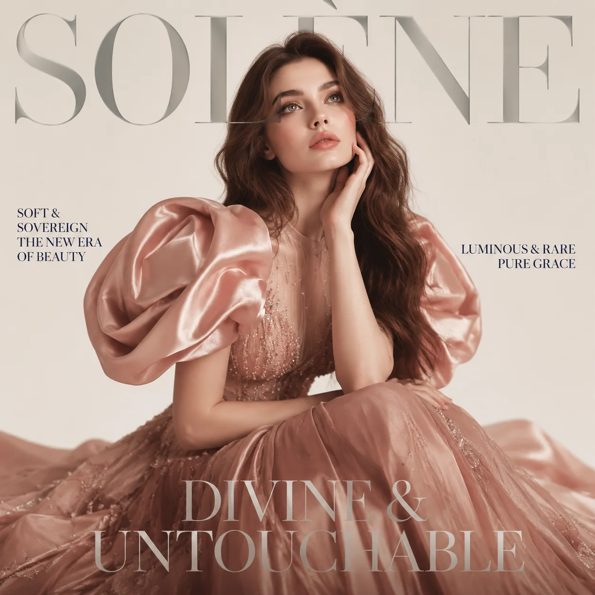

**#89 · Poster Design Prompt · <code>Vinano Studio</code>**

<details>
<summary>Show prompt</summary>

```
A breathtaking luxury fashion magazine cover. Large bold silver serif brand name "SOLÈNE" elegantly placed at the very top of the frame, slightly transparent and overlapping the model's hair — exactly like a high-end fashion magazine masthead. Clean cream-white background, seamless studio, soft warm-toned lighting.

A young, extremely cute and beautiful white woman soft angelic facial features, full lips, big dreamy green eyes long lashes, and long silky chocolate brown wavy hair cascading freely over both shoulders. She sits gracefully — upper body leaning slightly forward, one arm resting on her knee, the other hand delicately touching her jaw, her gaze looking slightly upward and off-camera a soft mysterious expression — elegant and effortless.

She wears a dramatic floor-length dusty rose blush satin ballgown exaggerated sculptural puff shoulders that billow outward like rose petals — the bodice is a sheer champagne silk mesh embroidered tiny pearl and crystal details, fitted through the waist and blooming into an enormous tiered skirt pooling around her. The fabric catches the light a soft luminous sheen.

Magazine text overlaid naturally into the composition — left side in deep charcoal navy small serif caps: "SOFT & SOVEREIGN / THE NEW ERA OF BEAUTY" — right side: "LUMINOUS & RARE / PURE GRACE" — bottom of frame in large elegant serif display font, slightly transparent: "DIVINE & UNTOUCHABLE"
Vertical 9:13 format. Ultra true-to-life photorealistic, 8K, no text overlays, cinematic color grading.

Aim for an editorial, design-driven look with deliberate negative space.
```

</details>

---

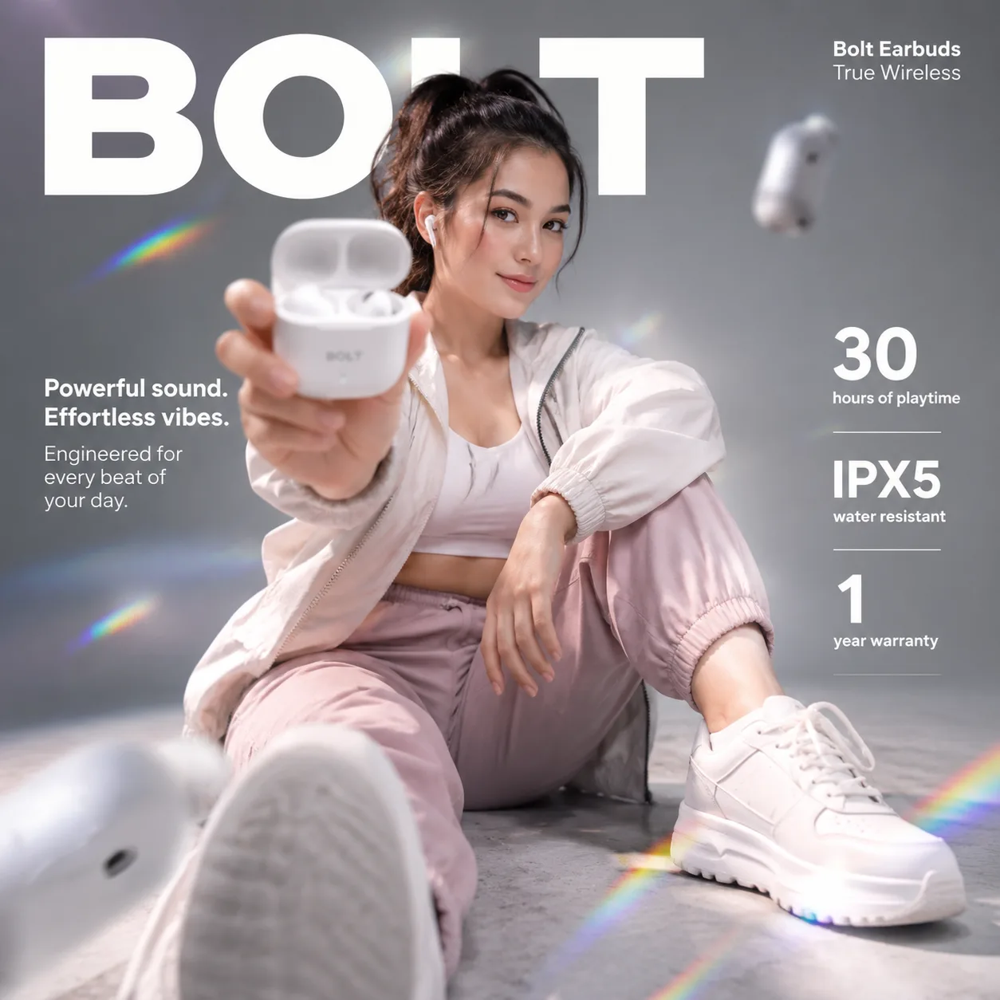

**#90 · Poster Design Prompt · <code>Vinano Studio</code>**

<details>
<summary>Show prompt</summary>

```
Create a high-impact 9:16 vertical e-commerce infographic for Bolt True Wireless Earbuds a premium lifestyle advertising aesthetic.
Composition & Framing
Full-body shot of a young woman (match face and identity exactly to the provided reference image — accurate facial features, skin tone, hairstyle)
Camera angle slightly low and close (fashion campaign perspective) to add depth and presence
The subject is sitting casually on the floor, one knee raised, one leg extended forward toward the camera
Foreground (Product Focus)
The woman is holding an open Bolt earbud charging case toward the camera
Inside the case: one earbud visible
The second earbud is worn in her ear
Case should be glossy white subtle branding (“BOLT”)
Add slight macro depth-of-field blur on the hand and case for cinematic realism
Subject Styling
Outfit: modern sporty streetwear
lightweight jacket (off-white / neutral tone)
crop top or sports bra
loose joggers (light pink or soft color)
white sneakers visible texture
Expression: confident, relaxed, slight smile
Pose: natural, lifestyle-oriented — not stiff or overly posed
Background & Atmosphere
Clean studio background soft gray gradient
Add:
rainbow prism lens flares
subtle light leaks
floating blurred earbuds and charging case in background
Ground surface slightly textured (studio floor look)
Lighting
Soft, diffused commercial lighting
Highlight:
skin texture
glossy earbud case
fabric details
Subtle rim lighting for separation from background
Typography Layout (Modern Sans-Serif, White)
Top Center (Behind Model):
BOLD HUGE TEXT:
“BOLT” (partially hidden behind subject)
Top Right:
Bolt Earbuds
True Wireless
Mid Left:
Powerful sound.
Effortless vibes.
Engineered for every beat of your day.
Mid Right:
BIG: 30
small: hours of playtime
Below that:
BIG: IPX5
small: water resistant
Bottom Right:
BIG: 1
small: year warranty
Style & Quality
8K ultra-realistic commercial photography
Sharp focus on face + earbuds
Slight depth blur for foreground and background elements
Clean Apple/Nike-style premium ad aesthetic
Balanced composition strong negative space

Render with rich micro-detail while keeping the layout uncluttered and intentional.
```

</details>

---

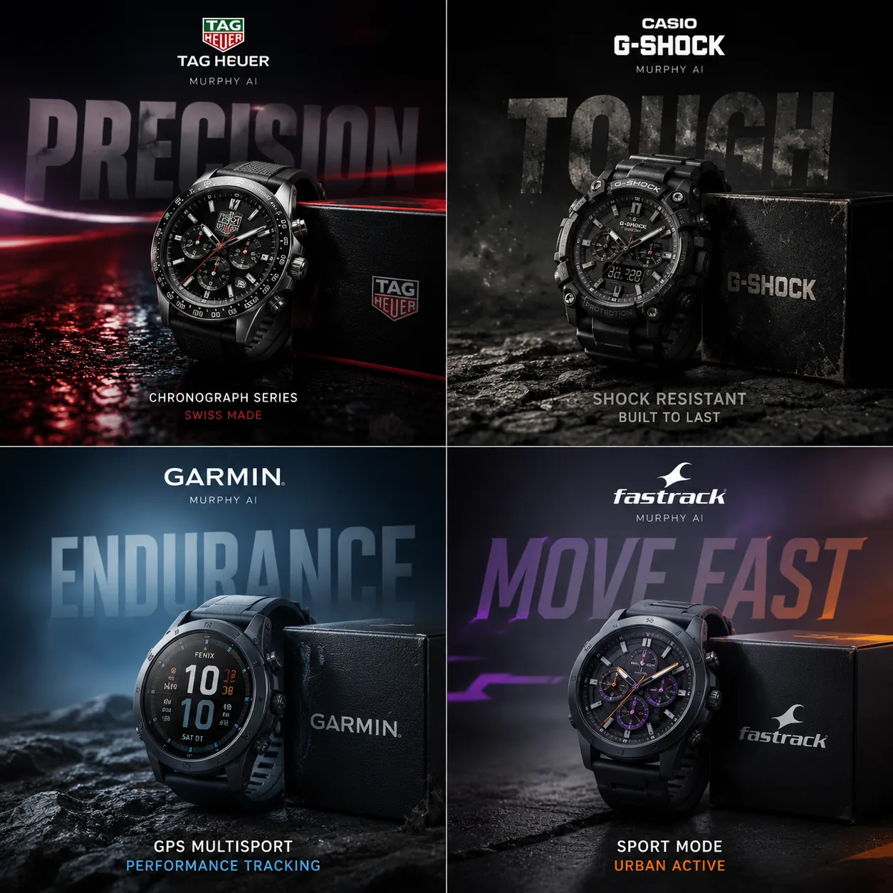

**#91 · Poster Design Prompt · <code>Vinano Studio</code>**

<details>
<summary>Show prompt</summary>

```
TAG Heuer — Track Surface (REAL, NOT FAKE)

High-end commercial watch advertisement, TAG Heuer chronograph, single watch leaning against its box, centered composition, slight front three-quarter angle

environment: real wet asphalt surface inspired by race track texture, subtle tire marks, light moisture, NOT full scene

background: soft dark depth slight motion blur light streak hints, minimal, not literal track

lighting: controlled studio lighting strong key for dial clarity, subtle red rim light for racing identity, crisp reflections on metal and glass

composition: tight grouping, grounded, realistic spacing

perspective typography (primary): large “PRECISION” in background, soft perspective, slightly diffused, low opacity, blending into depth

secondary typography:
“CHRONOGRAPH SERIES”
“SWISS MADE”

branding: logo top center, “MURPHY AI” beneath

surface: wet asphalt reflection, controlled, not exaggerated

color palette: black, steel, red accents

ultra-realistic materials (brushed metal, sapphire reflections, lume details)

1:1 square format

Casio G-Shock — Rugged Ground (LIKE YOUR CHARCOAL SHOT)

High-end commercial watch advertisement, G-Shock rugged watch, single watch leaning against its box, centered

environment: controlled rough stone / cracked surface dust particles, minimal debris (like your Nivea charcoal setup)

background: dark soft gradient slight haze, no literal landscape

lighting: directional studio lighting, strong highlights on edges, controlled shadow depth

composition: grounded, tight product grouping

perspective typography (primary): bold “TOUGH” in background, slightly broken texture, soft perspective depth, low opacity

secondary typography:
“SHOCK RESISTANT”
“BUILT TO LAST”

branding: logo top center, “MURPHY AI” beneath

surface: matte rough texture, minimal reflection

color palette: charcoal, black, muted tones

ultra-detailed rugged material finish

1:1 square format

Garmin — Outdoor Tech (CONTROLLED, NOT LANDSCAPE)

High-end commercial watch advertisement, Garmin GPS smartwatch, single watch leaning against its box, centered

environment: textured rock surface subtle moisture and fine dust, clean minimal outdoor feel (not full mountain scene)

background: deep cool gradient faint mist layers for depth

lighting: soft controlled lighting, cool rim highlights, clean display visibility

composition: tight, balanced, grounded

perspective typography (primary): “ENDURANCE” large in background, geometric, fading into depth soft haze

secondary typography:
“GPS MULTISPORT”
“PERFORMANCE TRACKING”

branding: logo top center, “MURPHY AI” beneath

surface: natural rock subtle reflection

color palette: blue-grey, black

ultra-clean product rendering

1:1 square format

Fastrack — Urban Surface (LIKE GARNIER WATER BUT DRY)

High-end commercial watch advertisement, Fastrack sports watch, single watch leaning against its box, centered

environment: dark smooth surface slight gloss and subtle texture, faint moisture or light reflection, urban tone

background: soft gradient slight haze, minimal depth

lighting: contrast studio lighting subtle colored accent reflections, controlled highlights

composition: tight and clean

perspective typography (primary): “MOVE FAST” large in background, soft perspective, slightly glowing edges, integrated subtly

secondary typography:
“SPORT MODE”
“URBAN ACTIVE”

branding: logo top center, “MURPHY AI” beneath

surface: controlled reflection, not mirror-like

color palette: black, grey, subtle accent color

ultra-detailed modern finish

Maintain consistent colour harmony and crisp focus across the whole frame.
```

</details>

---

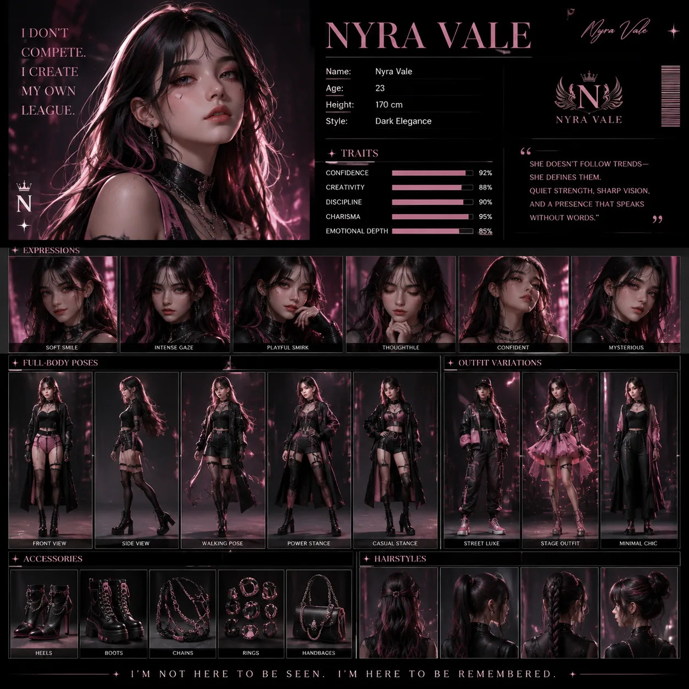

**#92 · Poster Design Prompt · <code>Vinano Studio</code>**

<details>
<summary>Show prompt</summary>

```
Create a high-resolution vertical character concept poster a luxury pink and white aesthetic, blending elegance edgy, modern fashion. The layout should feel like a premium magazine profile clean sections and perfect grid alignment.

Main subject: A unique young woman (not resembling any real person), long silky dark hair featuring subtle pink highlights. She has a confident, calm expression a slightly mysterious aura. She wears a black and pink fusion outfit (mix of streetwear and idol fashion) glossy textures, lace, and metallic accents. Lighting is soft but dramatic, neon pink glow against dark tones.

Top section:
Large hero portrait on one side. On the other side, include a sleek profile panel elegant English text:

Name: Nyra Vale
Age: 23
Height: 170 cm
Style: Dark Elegance

Short description:
“She doesn’t follow trends—she defines them. Quiet strength, sharp vision, and a presence that speaks without words.”

Add a Traits section stylish progress bars:

Confidence
Creativity
Discipline
Charisma
Emotional Depth

Middle section:
Grid of 5–6 small portraits showing different expressions (soft smile, intense gaze, playful smirk, thoughtful, confident).

Lower sections:

Full-body poses (front, side, walking pose, power stance, casual stance).
Outfit variations (street luxe, stage outfit, minimal chic).
Accessories panel (heels, boots, chains, rings, handbags, hairstyles).

Text tone:
Strong, meaningful, and confident—focused on individuality, self-worth, and silent power. Avoid filler text.

Style:
Ultra-detailed, 4K quality, glossy magazine finish, filmic, cinematic lighting, sharp focus, balanced contrast, modern editorial layout, perfectly aligned grid.

Maintain consistent colour harmony and crisp focus across the whole frame.
```

</details>

---

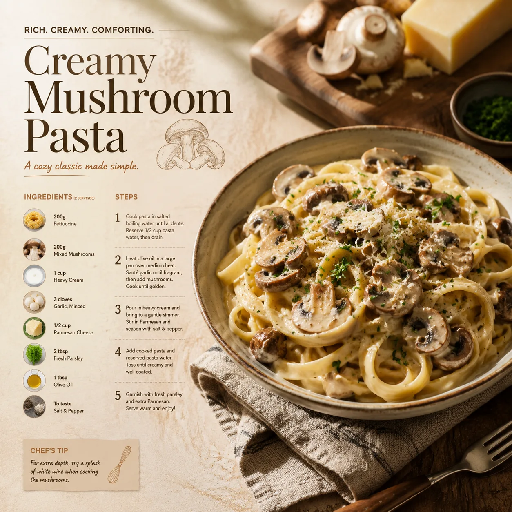

**#93 · Poster Design Prompt · <code>Vinano Studio</code>**

<details>
<summary>Show prompt</summary>

```
Create a [food name] food preparation poster Emphasise material texture and natural light so the final frame feels tactile and premium.
```

</details>

---

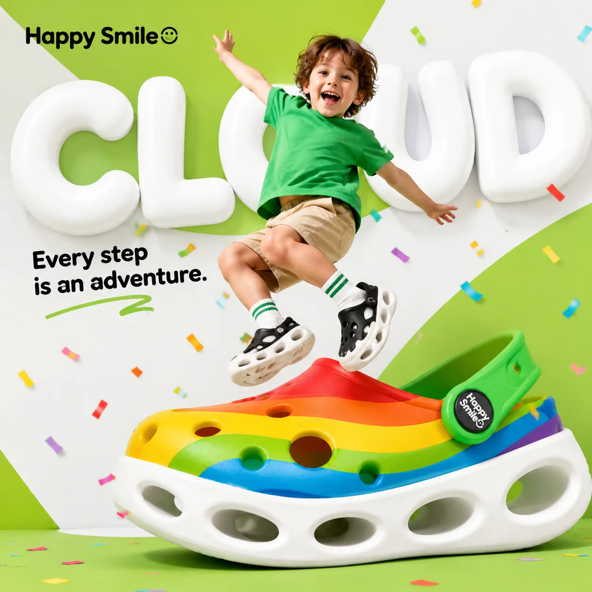

**#94 · Poster Design Prompt · <code>Vinano Studio</code>**

<details>
<summary>Show prompt</summary>

```
Bright colorful children's shoe brand advertisement for "Happy Smile☺️", happy young child jumping in the air wearing oversized colorful foam black and white shoes, giant rainbow colored shoe prop in background, bright green and white studio background, playful bubbly bold typography "CLOUD" in background, tagline "Every step
is an adventure.", confetti falling, fun joyful lighting,
commercial photography style, ultra HD 8K, Designed Shamus image 2.

Preserve realistic proportions and depth for a confident, professional finish.
```

</details>

---

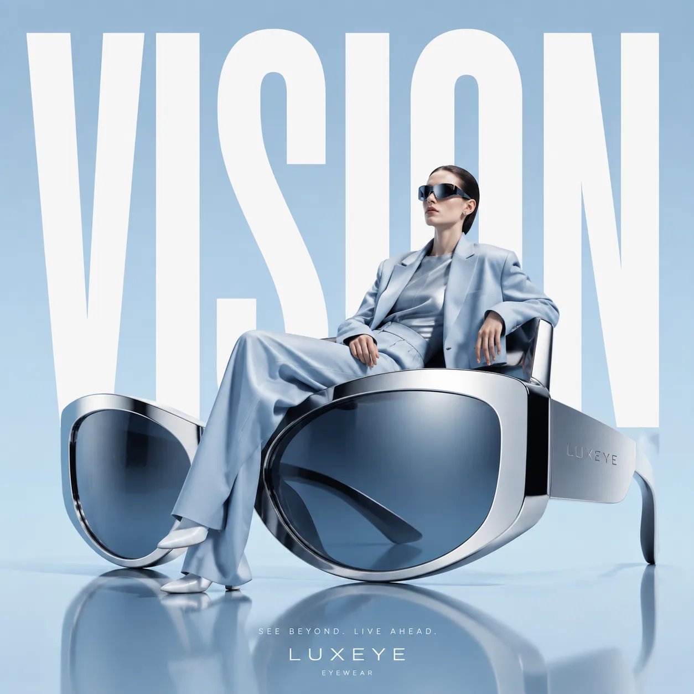

**#95 · Poster Design Prompt · <code>Vinano Studio</code>**

<details>
<summary>Show prompt</summary>

```
Avant-garde fashion advertisement, oversized futuristic sunglasses positioned like sculpture, model casually seated on the frame as if furniture, giant word "VISION" behind in bold white typography, powder blue studio background, reflective floor, luxury eyewear campaign aesthetic, ultra-clean layout, editorial magazine styling, 1:1 Keep edges clean and the overall composition balanced for a polished, gallery-ready result.
```

</details>

---

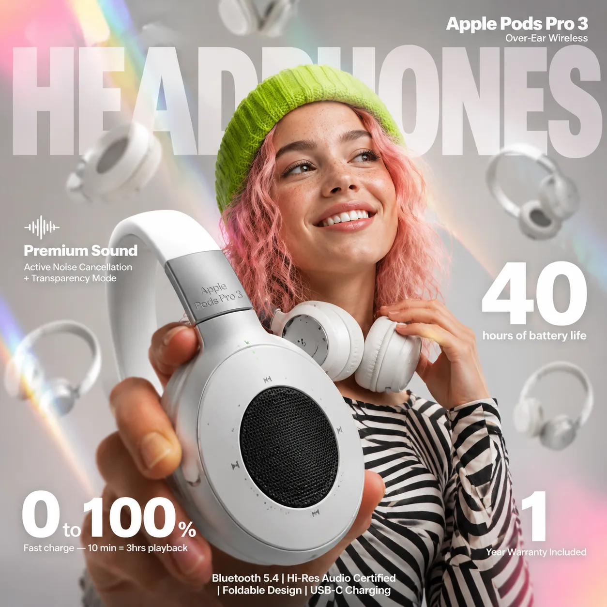

**#96 · Poster Design Prompt · <code>Vinano Studio</code>**

<details>
<summary>Show prompt</summary>

```
High-impact e-commerce infographic for "Apple Pods Pro 3"
premium wireless over-ear headphones.

FOREGROUND - PRODUCT HERO SHOT
Extreme close-up of a hand holding a sleek,
matte-white premium over-ear headphone toward the camera
at a slight angle. The headphone features:
- Glossy white ear cushions soft memory foam padding
- Brushed aluminum silver headband subtle Apple Pods
 Pro 3 embossed branding
- Black mesh speaker grille visible on the ear cup face
- A tiny glowing green LED status indicator on the
 right ear cup edge
- Subtle touch-control icons etched on the outer cup surface

Macro-lens shallow depth of field — hand and headphone
slightly blurred at edges to create cinematic depth.
Product remains razor-sharp in center frame.

CENTRAL SUBJECT — MODEL
In the mid-ground: a smiling young woman freckles
and wavy pastel-pink hair. She wears:
- A vibrant lime-green knit beanie
- A psychedelic black and white-striped long-sleeve shirt
- The white over-ear headphones resting stylishly
 around her neck (not on ears) — one hand casually
 touching the ear cup

Expression: relaxed, confident, joyful.
She is glancing slightly off-camera a natural smile.

BACKGROUND & ATMOSPHERE
Clean soft-focus studio backdrop — light gray gradient
fading to warm white at center.

Atmospheric overlays:
- Diagonal rainbow prism lens flares cutting across
 upper-left to lower-right
- Soft pastel light leaks in pink and yellow at corners
- 4–5 blurred white over-ear headphones floating
 artistically in the background at various depths
 and rotation angles
- Subtle bokeh circles from background studio lights

Lighting: Soft professional three-point studio lighting.
Key light from upper-left, fill light right side.
Rim light behind model for separation.
Glossy highlights on headphone surfaces catching light naturally.

TYPOGRAPHY & LAYOUT — Sans-Serif, Clean white
TOP CENTER (behind model, large background text):
→ Massive bold oversized text: "HEADPHONES"
 Semi-transparent white, spanning full width behind subject

TOP RIGHT CORNER:
→ Bold clean text: "Apple Pods Pro 3"
 Subtitle smaller text: "Over-Ear Wireless"

MID LEFT:
→ Icon: small sound wave symbol
→ Bold text: "Premium Sound"
→ Sub-text: "Active Noise Cancellation + Transparency Mode"

MID RIGHT:
→ Extra-large bold numeral: "40"
→ Smaller text below: "hours of battery life"

LOWER LEFT:
→ Extra-large bold numeral: "0"
 "to" beside it → then bold "100%"
→ Sub-text: "Fast charge — 10 min = 3hrs playback"

BOTTOM RIGHT:
→ Extra-large bold numeral: "1"
→ Sub-text: "Year Warranty Included"

BOTTOM CENTER (fine print style):
→ Small elegant text:
 "Bluetooth 5.4 | Hi-Res Audio Certified
 | Foldable Design | USB-C Charging"

TECHNICAL SPECS
Resolution: 8K ultra-sharp
Style: Commercial product photography meets
 editorial fashion advertising
Color Palette: White, lime green, pastel pink,
 rainbow prism accents
Focus: Tack-sharp on headphone product —
 shallow DOF on everything else
Lens: 85mm macro, slight low angle
Render Quality: Hyperrealistic, clean ad aesthetic,
 vibrant yet professional color grading

Keep edges clean and the overall composition balanced for a polished, gallery-ready result.
```

</details>

---

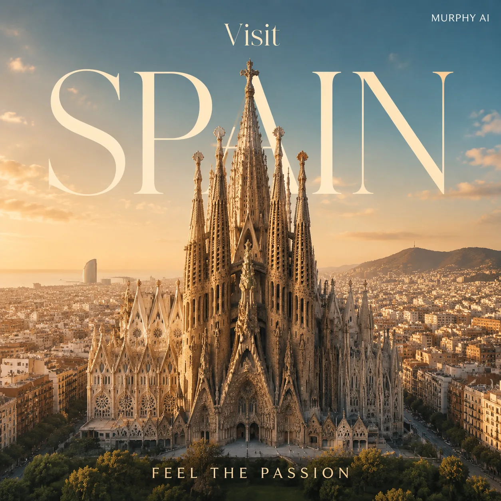

**#97 · Poster Design Prompt · <code>Vinano Studio</code>**

<details>
<summary>Show prompt</summary>

```
Cinematic luxury tourism poster, Spain, iconic view of Sagrada Família in Barcelona rising prominently above the city, detailed organic architecture surrounding urban grid softly visible, clean and centered composition

camera angle: elevated wide perspective capturing full structure symmetry city depth behind

lighting: warm golden hour sunlight casting soft highlights across stone textures, gentle shadows, glowing atmosphere

typography: elegant high-fashion editorial serif font, large refined text "SPAIN" integrated across sky and upper architecture, subtly blending light and structure

text hierarchy:
small top text: "Visit"
main: "SPAIN"
small bottom line: "FEEL THE PASSION"

environment: clean Barcelona cityscape simplified for clarity, no clutter, focus on architecture

color palette: warm gold, sandstone beige, soft blue sky

atmosphere: light haze sun glow enhancing depth and warmth

branding: top right minimal text "MURPHY AI"

STRICT RULES:
— Sagrada Família must be the dominant focal point
— maintain elegance and warmth
— avoid overcrowded city details

render quality: ultra true-to-life photorealistic, cinematic warm Mediterranean grade, premium tourism campaign style

composition: balanced, symmetrical, editorial luxury layout

format: 1:1 square, ultra high resolution

Cinematic luxury tourism poster, Brazil, iconic aerial view of Christ the Redeemer statue overlooking Rio de Janeiro coastline and mountains visible, perfectly centered composition

camera angle: elevated aerial perspective behind or slightly above statue, revealing city and ocean depth

lighting: warm sunrise or sunset golden light vibrant yet controlled tones

typography: elegant editorial serif font, large refined text "BRAZIL" integrated across sky and horizon, softly blending clouds

text hierarchy:
small top text: "Visit"
main: "BRAZIL"
small bottom line: "FEEL THE ENERGY"

environment: lush mountains, coastline, cityscape simplified for clarity

color palette: green, blue, gold highlights

atmosphere: light haze, soft clouds catching sunlight

branding: top right minimal text "MURPHY AI"

STRICT RULES:
— Christ statue must be clear focal point
— avoid over-saturation
— keep composition clean

render quality: ultra true-to-life photorealistic, cinematic vibrant grade

composition: balanced, iconic, postcard-level framing

format: 1:1 square

Cinematic luxury tourism poster, United Arab Emirates, iconic centered view of Burj Khalifa dominating Dubai skyline, seen from elevated perspective surrounding skyscrapers and subtle desert tones

camera angle: wide symmetrical aerial framing emphasizing vertical dominance

lighting: warm golden sunset light reflecting across glass buildings, soft glow, controlled highlights

typography: elegant high-end serif font, large refined text "DUBAI" integrated into sky and skyline, partially blending architecture

text hierarchy:
small top text: "Visit"
main: "DUBAI"
small bottom line: "FEEL THE POWER"

environment: ultra modern skyline, crisp composition, no clutter

color palette: gold, warm amber, deep shadows

atmosphere: light haze, glowing skyline diffusion

branding: top right minimal text "MURPHY AI"

STRICT RULES:
— Burj Khalifa must be dominant focal point
— clean luxury aesthetic
— no distractions

render quality: ultra true-to-life photorealistic, cinematic warm grade

composition: symmetrical, powerful, iconic skyline shot

format: 1:1 square

Render with rich micro-detail while keeping the layout uncluttered and intentional.
```

</details>

---

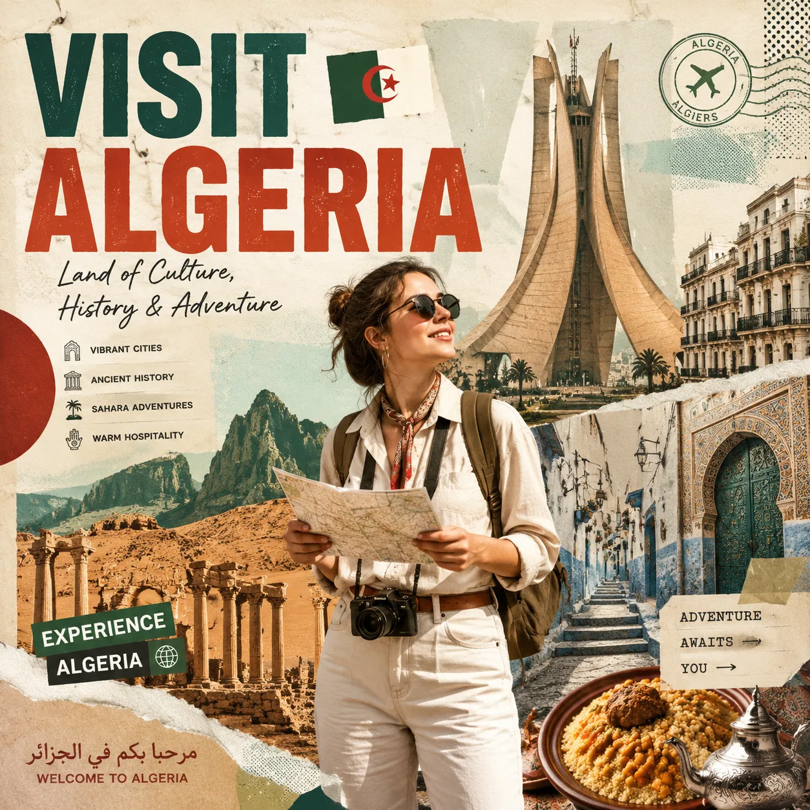

**#98 · Poster Design Prompt · <code>Vinano Studio</code>**

<details>
<summary>Show prompt</summary>

```
Create a stylized travel poster / graphic collage for [ALGERIA]. The main subject should be a stylish international tourist visiting [ALGERIA], clearly presented as a traveler and not a local resident. Show the tourist wearing modern travel fashion, details such as a camera, backpack, sunglasses, map, or suitcase, exploring the culture and atmosphere of [ALGERIA]. Place the tourist in a dynamic composition surrounded by iconic architecture, streets, landscapes, landmarks, transportation, food, signage, and cultural elements associated [ALGERIA]. Blend realistic character detail a graphic collage background made of layered paper textures, torn poster edges, sticker elements, halftone dots, editorial typography, and bold geometric shapes. Include authentic visual motifs from [ALGERIA], but keep the tourist’s appearance and styling globally fashionable and clearly foreign to the setting. Add a large readable headline: “VISIT [ALGERIA]”. Modern, artistic, premium editorial travel poster aesthetic, balanced layout, print-worthy composition. Aim for an editorial, design-driven look with deliberate negative space.
```

</details>

---

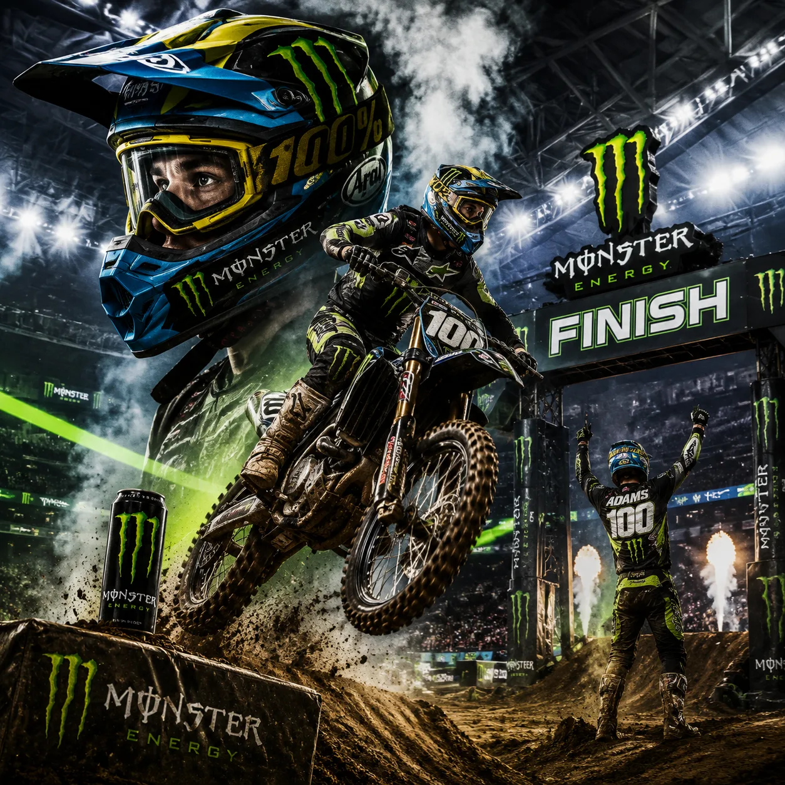

**#99 · Poster Design Prompt · <code>Vinano Studio</code>**

<details>
<summary>Show prompt</summary>

```
Ultra-dynamic motocross racing scene featuring a professional dirt bike rider performing extreme stunts inside a massive indoor stadium. The composition blends realism and cinematic energy — showing the rider in multiple perspectives: a close-up portrait a blue and yellow helmet, a mid-action jump on a dirt track, and a victory pose near the finish line. The background features dramatic smoke, spotlights,and structural beams of the stadium, flashes of neon green accents cutting through the atmosphere. The dirt track is rugged, filled motion blur, dust particles, and intense lighting contrast. Energy drink branding and banners add authenticity to the motorsport environment. The overall tone is high-octane, gritty, and heroic — perfect for a motorsport poster or promotional artwork. Maintain consistent colour harmony and crisp focus across the whole frame.
```

</details>

---

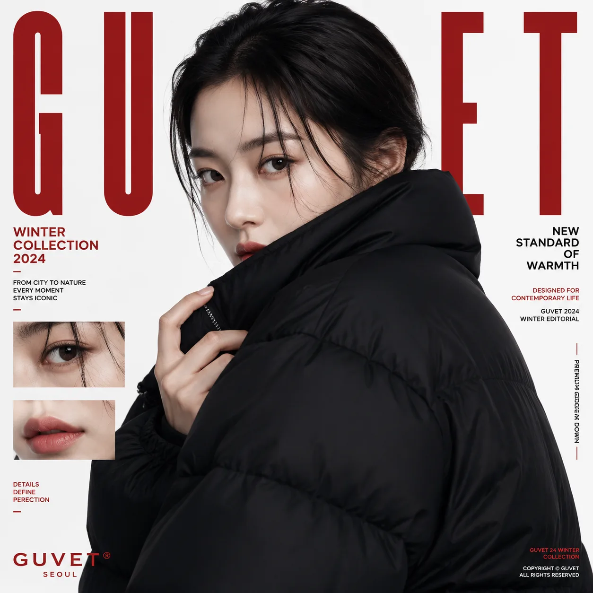

**#100 · Poster Design Prompt · <code>Vinano Studio</code>**

<details>
<summary>Show prompt</summary>

```
A bold fashion editorial poster featuring a young woman model in a close-up half-body portrait, wrapped in an oversized black puffer jacket a high padded collar partially covering the lower face, styled in a minimal, sleek, modern luxury streetwear aesthetic. The model turns her upper body slightly away from the camera while looking back over her shoulder toward the viewer, creating a tense and magnetic pose, one hand raised delicately near the jacket zipper and collar, fingers lightly touching the fabric as if adjusting it, giving a controlled, elegant, and intentional gesture that contrasts softly the heavy oversized jacket, while her shoulders are slightly hunched into the coat to create a protective, stylish, and intimate silhouette. Her facial expression is calm, serious, and subtly mysterious direct eye contact, slightly parted lips, relaxed brows, and a smooth yet intense gaze, conveying a quiet, emotionally reserved, high-fashion attitude that feels soft, cold, elegant, and untouchable. The overall mood is moody, refined minimalist, premium, and polished a quiet luxury winter editorial feel. The outfit consists of an oversized matte black down puffer jacket dramatic volume, a high collar, and a clean zipper line, no additional accessories, maintaining a monochrome modern Korean magazine vibe. The poster design features a clean graphic magazine cover style a white background, oversized red vertical typography behind the subject spelling “GUVET” or similar bold letterforms, a sharp editorial layout, red and black color scheme, modern sans-serif text, small microtext blocks, inset cropped detail frames showing close-up facial features, and subtle fashion publication branding elements at the bottom. The lighting is soft studio lighting clean skin texture, crisp contrast, smooth shadows, high detail on the eyes and lips, refined print-magazine finishing, ultra sharp focus, and a luxury commercial fashion poster aesthetic in high resolution a premium composition. Maintain consistent colour harmony and crisp focus across the whole frame.
```

</details>

---

[Next page →](./poster-design-2.md)
