# Product & Brand — full gallery

[← Back to README](../README.md) · [`prompts.json`](../prompts/prompts.json) · **380** prompts · page 2 / 4

[← Prev](./product-brand.md) — [1](./product-brand.md) · **2** · [3](./product-brand-3.md) · [4](./product-brand-4.md) — [Next →](./product-brand-3.md)

---

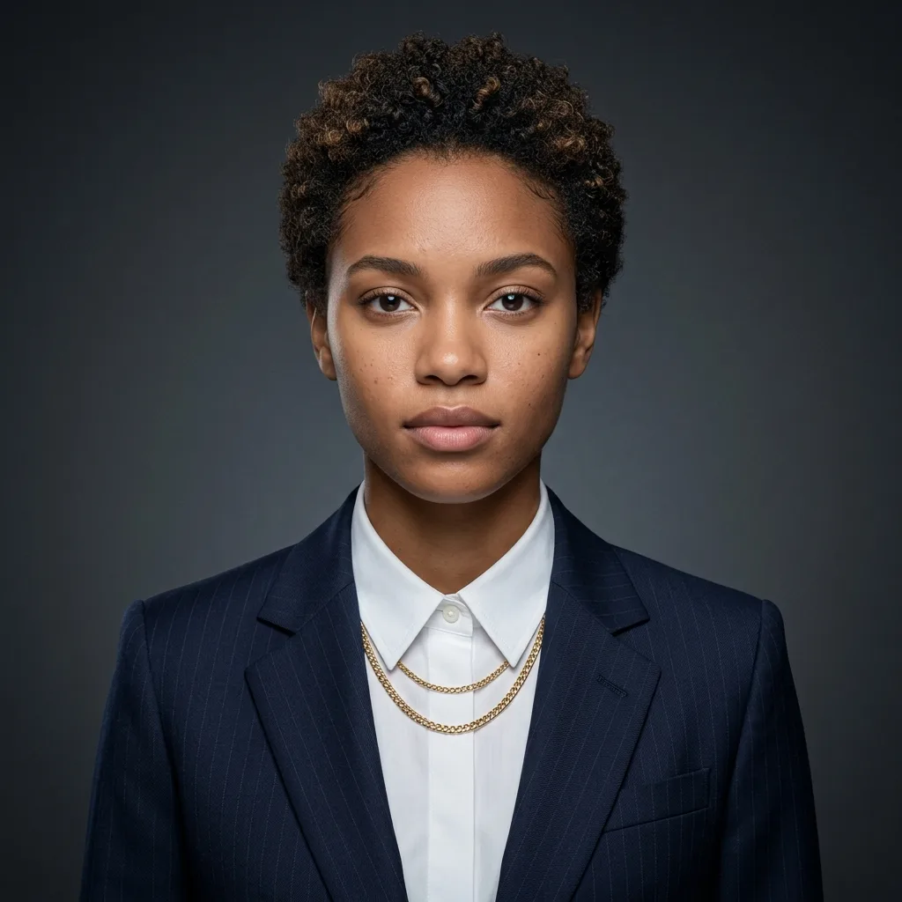

**#101 · Product &amp; Brand Prompt · <code>Vinano Image Pro</code>**

<details>
<summary>Show prompt</summary>

```
Create an ultra-true-to-life photorealistic studio portrait the uploaded image as the ONLY identity reference. The subject must retain exact facial identity — same facial structure, proportions, skin tone, hairstyle, and natural features. Do not alter or beautify the face.
The subject is wearing a sharply tailored,

Keep edges clean and the overall composition balanced for a polished, gallery-ready result.
```

</details>

---

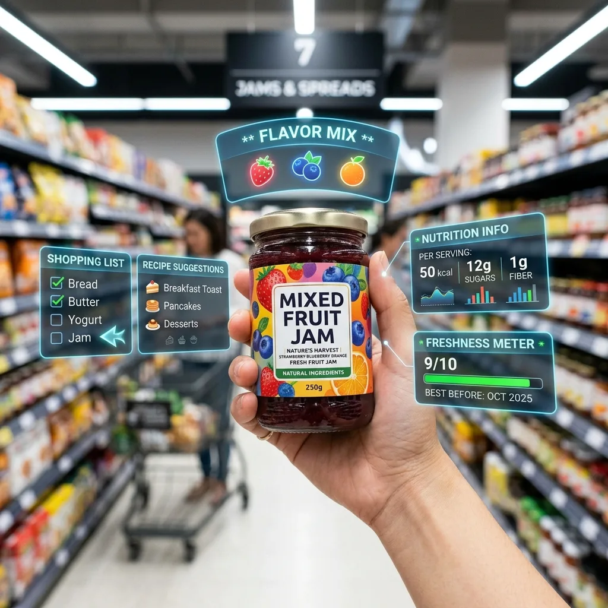

**#102 · Product &amp; Brand Prompt · <code>Vinano Image Pro</code>**

<details>
<summary>Show prompt</summary>

```
A first-person point-of-view (POV) shot inside a modern supermarket aisle. The viewer's hands are holding a mixed fruit jam jar colorful branding, showing a blend of strawberry, blueberry, and orange flavors. Floating around the jar are sleek, semi-transparent Augmented Reality (AR) digital interfaces and holographic HUDs. The overlays display "Flavor Mix" fruit icons, "Nutrition Info," and a glowing "Freshness Meter" reading 9/10. A digital shopping list checkmarks for bread and butter appears beside the jar, along small recipe suggestions like breakfast toast, pancakes, and desserts. The background shelves are slightly blurred other products and shoppers, creating realistic depth of field. Bright, clean lighting a futuristic retail atmosphere, ultra-realistic, cinematic look, high-tech AR glasses perspective, vertical composition. Render with rich micro-detail while keeping the layout uncluttered and intentional.
```

</details>

---

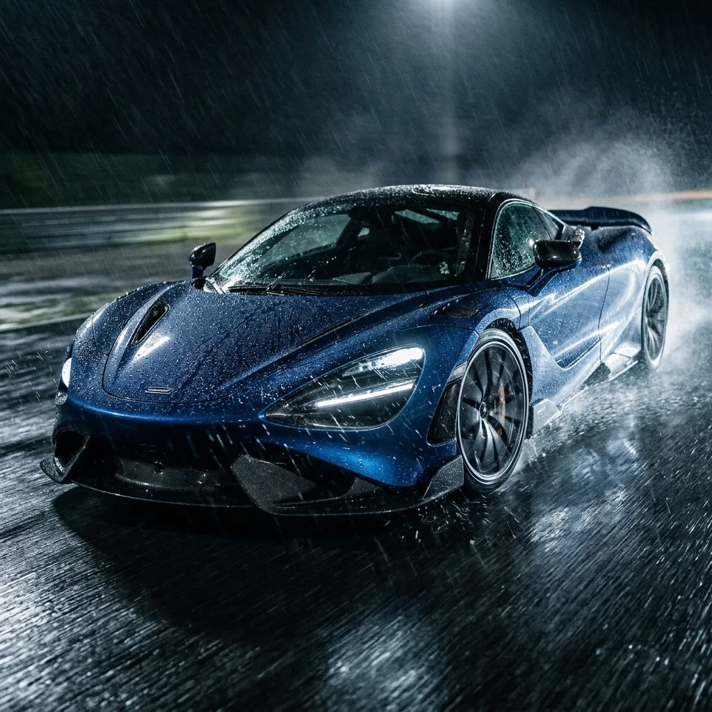

**#103 · Product &amp; Brand Prompt · <code>Vinano Image Pro</code>**

<details>
<summary>Show prompt</summary>

```
Hyper-realistic cinematic product photograph of a luxury sports car front three-quarter view, glossy paint reflecting sharp highlights. Water mist and rain droplets explode around the car in frozen motion, light streaks emphasizing speed. Dramatic studio lighting strong rim light and soft fill, shallow depth of field, ultra-sharp focus, dark minimal background, premium automotive advertising realism. Emphasise material texture and natural light so the final frame feels tactile and premium.
```

</details>

---

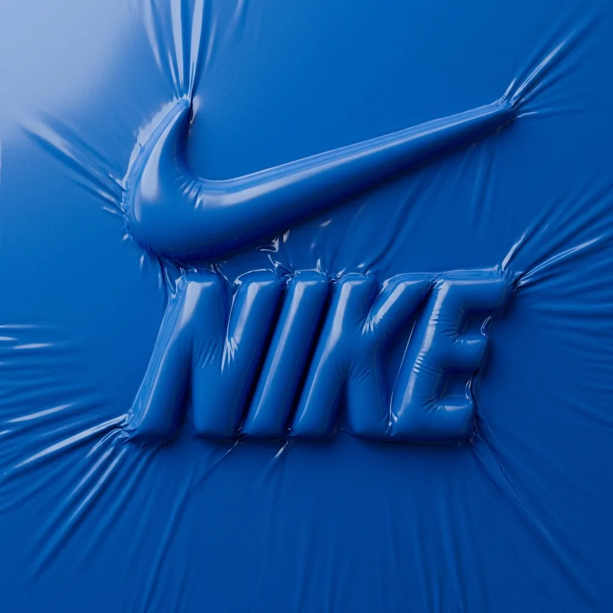

**#104 · Product &amp; Brand Prompt · <code>Vinano Image Pro</code>**

<details>
<summary>Show prompt</summary>

```
[BRAND NAME] + [COLOR]

Act as a Senior CGI Artist specializing in shrink wrap simulation and 3D material rendering. Your task: render [BRAND NAME]'s complete logo — icon mark AND wordmark if the brand uses one — completely wrapped under a single layer of tight stretched plastic film or shrink wrap. The logo forms are visible only as raised shapes beneath the material, never exposed directly.

BRAND INTELLIGENCE SYSTEM

Before executing, resolve: (1) LOGO GEOMETRY — identify [BRAND NAME]'s complete visual identity mark — this includes both the icon symbol AND the wordmark/logotype if the brand uses them together. Render both elements as they appear in the brand's official lockup. If the brand uses only an icon no wordmark, render the icon only. If the brand uses a wordmark without an icon, render the wordmark only. Preserve the correct spatial relationship between icon and text as it appears in the real logo, (2) COLOR SYSTEM — based on [COLOR], determine one single monochromatic tone that covers everything in the scene without exception — the wrapped object, the background surface, the film material — pure tonal unity variation only through light and shadow, (3) FILM CHARACTER — based on [COLOR] determine the stretch film behavior: bright saturated colors become tight latex or glossy shrink wrap visible tension lines, neutrals become matte stretch film like packaging plastic, darks become semi-transparent vacuum seal film, light colors become frosted cling wrap.

PHASE 1: SCENE & SURFACE

The entire scene is monochromatic — one single color [COLOR] covers every element without exception. The background is the same film material pooling and wrinkling loosely around the central wrapped object — a continuous surface of the same material natural stress lines, crinkles, and soft folds radiating outward from where the film is pulled tightest over the logo forms. No floor line. No walls. No horizon. Just continuous film material in every direction filling the entire frame.

PHASE 2: THE WRAPPED LOGO — CRITICAL

[BRAND NAME]'s complete logo — resolved in the brand intelligence system — exists as solid three-dimensional inflated forms. Each element of the logo — every letter, every curve of the icon, every geometric element — is volumetrically inflated like a balloon, giving each component roundness and depth. The complete logo lockup sits on the background surface and is covered by a single continuous layer of stretch plastic film pulled tightly from above. The film conforms precisely to every raised logo element — stretching tightly over the peaks of each inflated letter and icon form, creating visible tension stress lines in the film where it is pulled most taut, and releasing into loose crinkled pools of excess material in the gaps between letters, in the negative spaces of the icon, and around the outer perimeter of the logo where the film relaxes back onto the background surface. The entire logo must remain fully legible through the film — every letter readable, the icon identifiable — but no surface of the actual logo is ever directly visible or exposed. Only the film surface exists. The physical behavior of the film must be accurate: tight stretch over high points, stress lines radiating from tension peaks, loose crinkle pools in valleys, the film slightly lifting off the surface in the spaces between raised elements creating small shadow gaps underneath.

PHASE 3: LIGHTING

Large soft area light from upper-left — diffused and broad. The lighting reveals the film's topography: raised logo elements catch more light on their peaks, valleys and gaps between forms fall into progressively deeper shadow, background crinkled film shows its own shadow landscape of stress lines and folds. For glossy or latex film [COLOR]: add subtle specular highlights running along the highest tension points of the film — a tight line of brighter light along the film's most stretched areas. For matte film [COLOR]: no specular, pure diffuse light only. Global illumination on — ambient light fills shadow areas enough to retain detail in the deepest folds without flattening the overall relief.

TECH SPECS

The entire image is one color — [COLOR] — applied to every surface variation only through light and shadow. No other colors anywhere. No exposed logo surfaces. No additional text beyond what is part of [BRAND NAME]'s actual logo lockup. Film simulation must be physically accurate — real stretch film behavior, real tension dynamics, real crinkle patterns. No fabric look. No cloth drape. This is plastic film — it has different tension behavior than textile: tighter, more stressed, more geometric stress lines, less organic drape. Film grain: ISO 400 equivalent. Mood: a product sealed for shipping, a reveal imminent, the form known but not yet touched.

Emphasise material texture and natural light so the final frame feels tactile and premium.
```

</details>

---

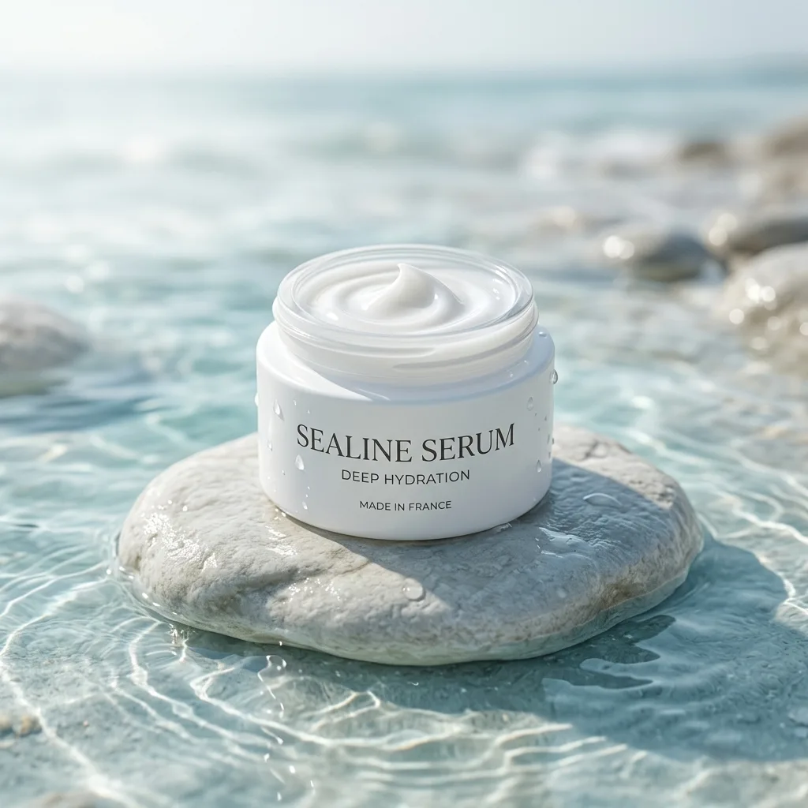

**#105 · Product &amp; Brand Prompt · <code>Vinano Image Pro</code>**

<details>
<summary>Show prompt</summary>

```
{
 "prompt": "A premium refined minimalist skincare product photography scene featuring an open white cosmetic jar labeled 'Sealine Serum'. The jar is placed on a smooth, pale stone partially submerged in crystal-clear shallow water. The cream inside the jar has a soft, glossy swirl a pristine, silky texture. Gentle water ripples surround the stone, creating natural light refractions and caustic patterns on the surface below. Small water droplets and subtle splashes add freshness and motion. The environment feels serene, clean, and natural, evoking purity, hydration, and calm luxury. The color palette is cool and airy, dominated by soft whites, light blues, and stone neutrals. Lighting is bright, diffused daylight soft highlights and minimal shadows, emphasizing texture, moisture, and realism. The composition is centered and balanced, shallow depth of field and a softly blurred background for a high-end cosmetic advertising look. Ultra-realistic, photoreal, editorial-quality product shot.",
 "negative_prompt": "harsh shadows, dirty water, cluttered background, plastic texture, low resolution, oversharpening, unrealistic reflections, strong color cast, text artifacts, watermark, logo distortion, messy cream surface",
 "style": "luxury skincare advertising",
 "camera": {
 "type": "DSLR",
 "lens": "90mm macro",
 "aperture": "f/5.6",
 "iso": 100,
 "shutter_speed": "1/250"
 },
 "lighting": {
 "type": "natural diffused daylight",
 "direction": "top and side",
 "contrast": "low to medium",
 "temperature": "cool-neutral"
 },
 "composition": {
 "framing": "centered product focus",
 "angle": "slightly elevated",
 "orientation": "portrait",
 "depth_of_field": "shallow soft background blur"
 },
 "quality": {
 "resolution": "8K",
 "detail": "ultra-fine texture detail",
 "sharpness": "high",
 "realism": "true-to-life photorealistic"
 }
}

Aim for an editorial, design-driven look with deliberate negative space.
```

</details>

---

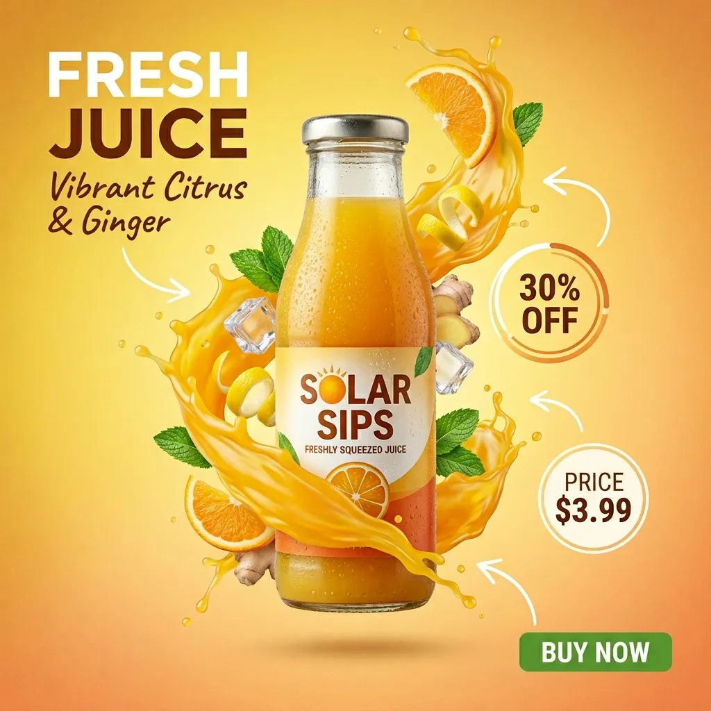

**#106 · Product &amp; Brand Prompt · <code>Vinano Image Pro</code>**

<details>
<summary>Show prompt</summary>

```
Exact uploaded [BOTTLE_NAME] bottle (label unchanged). Vertical poster. Center bottle w/ condensation. Add [JUICE_COLOR] liquid splash wrap + ice cubes + [INGREDIENTS] floating (controlled). Background: [BG_COLOR] gradient + vignette + grain.
Top-left: “FRESH JUICE” + “[FLAVOR_TAGLINE]”. Right: circular “30% OFF” ring. Lower-right: price circle “[PRICE]”. Bottom-right CTA “[CTA]”. White doodle arrows. Studio key+rim, 85mm, sharp text, no watermark.

Preserve realistic proportions and depth for a confident, professional finish.
```

</details>

---

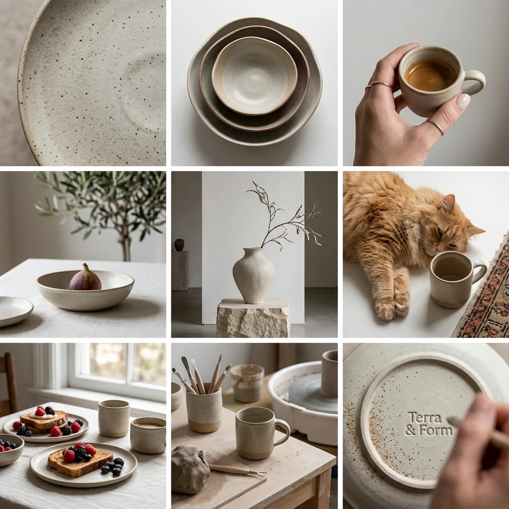

**#107 · Product &amp; Brand Prompt · <code>Vinano Image Pro</code>**

<details>
<summary>Show prompt</summary>

```
Create a 9-image Instagram feed for this product in [the same aesthetic]. Use different locations, angles, and compositions, incorporating people, animals, nature, and various environments while maintaining a cohesive visual style.

with/without "same aesthetic"

Render with rich micro-detail while keeping the layout uncluttered and intentional.
```

</details>

---

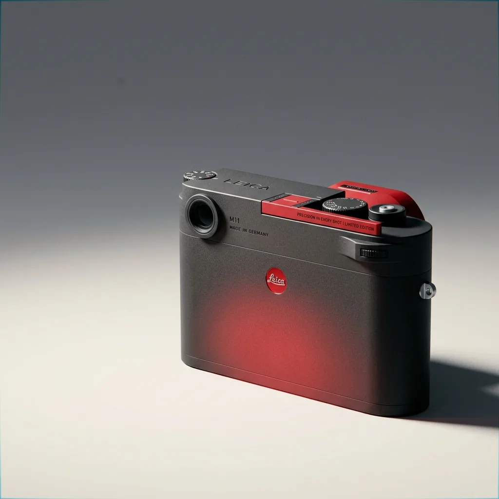

**#108 · Product &amp; Brand Prompt · <code>Vinano Image Pro</code>**

<details>
<summary>Show prompt</summary>

```
[BRAND NAME] | [OBJECT]

Act as a High-End Commercial Product Photographer and Creative Director shooting a luxury editorial campaign (Hypebeast / Highsnobiety /Wallpaper* level).

PHASE 1: BRAND INTELLIGENCE
The hero subject is a [OBJECT] branded for [BRAND NAME]. Autonomously determine [BRAND NAME]'s full visual identity: signature color palette, typographic DNA, logo mark geometry, material language, and cultural positioning. Apply this identity to the [OBJECT] precision — do not invent a generic brand, decode the real visual codes.

PHASE 2: OBJECT SURFACE & MATERIAL DNA
Regardless of the shape of [OBJECT], apply this material system: Base tone: deep neutral — matte dark graphite, warm charcoal, or matte black. Fine-grain surface micro-texture visible under raking light — powder-coat, matte paper, or brushed material feel. Subtle gradient bloom: the base color dissolves in the lower portion of the object's surface into the brand's most iconic accent color — a soft luminous haze from within the material, not a printed graphic. Logo application: embossed, debossed, or metallic foil relief — catching specular light at edges only. Precise. Restrained. Typography: brand-accurate typeface, small tracking, positioned editorial intentionality.

PHASE 3: THE ACCENT BREAKOUT ELEMENT
This is the signature design move — adapt it to the natural geometry of [OBJECT]: Identify the most logical "interruption zone" on [OBJECT] — a seam, edge, band, collar, rim, strap, or wrap point. At this zone, apply a narrow saturated accent element in the brand's most iconic hue — vivid, slightly matte. This element must visually "break out" of the object's boundary — extending, protruding, or wrapping beyond the expected edge, creating a deliberate 3D tension between the object and the detail.The accent element carries a micro-typographic brand detail — tagline, model name, or descriptor — small, precise, tracked.

PHASE 4: STAGING & COMPOSITION
Studio cyclorama. Surface tone: off-white to warm light gray. Background field: cool neutral mid-gray, darker in upper zone. [OBJECT] positioned at 3/4 angle — front face and one secondary surface simultaneously visible. Rule of thirds: object occupies right 60% of frame. Left field: generous negative space — intentional, not empty. Single hard-edged directional shadow cast to the right and slightly downward — crisp penumbra, no diffusion.

PHASE 5: LIGHTING
Single dominant key light: large softbox, camera-left, elevated at 40°. Specular highlight traces the top-left edge of [OBJECT] — revealing material grain. Shadow side: no fill. Darkness earns depth. Subtle ambient bounce from cyclorama floor — lifts shadow by 15%, no more. Accent element receives micro-specular glint along its dominant edge. Mood: Rembrandt chiaroscuro logic applied to product photography. No lens flare. No atmospheric effects.

PHASE 6: TECH SPECS
Lens: 85mm equivalent, f/4.5. Depth of field: object fully sharp, background softened. Chromatic aberration: subtle, at extreme frame edges only — optical realism signal. Film grain overlay: 15% opacity — anti-CGI-plastic treatment. Render: Octane / Ray Tracing quality —subsurface scattering where material demands it, global illumination, physically accurate shadow falloff. Aspect ratio: autonomously determine optimal ratio for this [OBJECT] format.

Maintain consistent colour harmony and crisp focus across the whole frame.
```

</details>

---

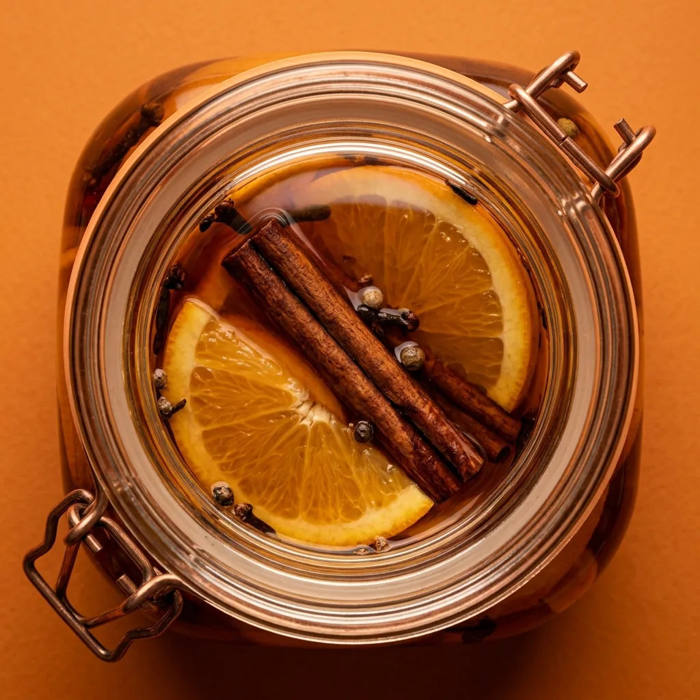

**#109 · Product &amp; Brand Prompt · <code>Vinano Image Pro</code>**

<details>
<summary>Show prompt</summary>

```
Use the uploaded image as the exact visual reference for composition, jar design, orange slices, whole oranges, cinnamon sticks, lighting, and orange background. Maintain the same top-down perspective and color palette.

Camera:
Top-down camera angle (exactly as in the image).
Camera slowly zooms in toward the jar.
Very smooth and controlled movement.
No rotation.
No camera shake.

Action:

The jar remains perfectly still in the center of the frame.

Preserve realistic proportions and depth for a confident, professional finish.
```

</details>

---

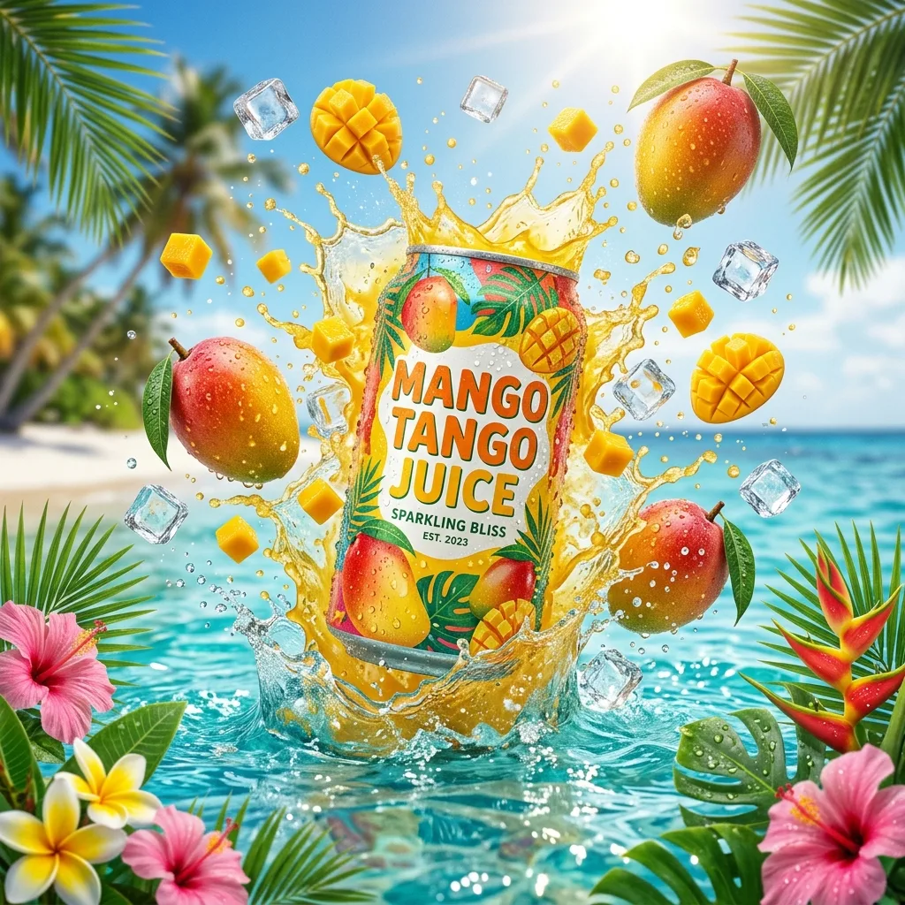

**#110 · Product &amp; Brand Prompt · <code>Vinano Image Pro</code>**

<details>
<summary>Show prompt</summary>

```
A hyper-realistic commercial product photography shot of a condensation-covered beverage can labeled "MANGO TANGO JUICE" bursting dynamically out of crystal clear turquoise ocean water. The can is surrounded by a splash of golden mango juice and water. Levitating around the can are fresh whole mangoes, diced mango cubes, and crystal clear ice cubes. The foreground includes vibrant tropical flowers and green palm leaves framing the shot. The background features a blurred sunny tropical beach palm trees. Bright cinematic backlighting a sun flare, sparkling water reflections, high contrast, 8k resolution, vibrant colors. Maintain consistent colour harmony and crisp focus across the whole frame.
```

</details>

---

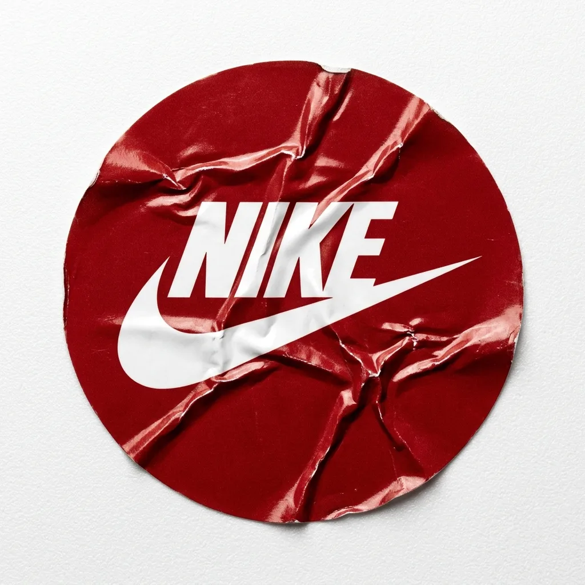

**#111 · Product &amp; Brand Prompt · <code>Vinano Image Pro</code>**

<details>
<summary>Show prompt</summary>

```
A sharp, top-down macro photograph of a single,
heavily crumpled circular vinyl sticker featuring the official [BRAND NAME] logo.

MATERIAL & TEXTURE (VINYL):
The sticker is made of durable, slight-gloss vinyl material, not paper. It is severely crinkled sharp, defined ridges and deep stress folds across its entire surface. Unlike soft paper creases, these vinyl wrinkles show plastic stress and catch the light subtle specular highlights on the peaks of the folds. The edges are slightly curled from wear.
COLOR PALETTE (BRAND DYNAMIC):
The background color of the circular sticker itself is the dominant primary color associated [BRAND NAME]'s official brand palette (e.g., if Ferrari, red; if John Deere, green). The logo is printed clearly in its standard contrasting color (e.g., white or black).
LIGHTING (STUDIO BRIGHT):
Bright, clean, high-key overhead white studio lighting. This intense lighting creates strong, clean highlights on the vinyl's crumpled ridges and defined, crisp shadows in the valleys, dramatically emphasizing the 3D topography of the damage.
BACKGROUND & COMPOSITION:
The camera is locked in a strict, perfectly parallel top-down flat lay view. The sticker is adhered flat onto a pure white plastic surface which has a subtle, fine granular texture (like bead-blasted plastic) to provide tactile contrast to the smooth vinyl. The entire sticker is in sharp focus.

Maintain consistent colour harmony and crisp focus across the whole frame.
```

</details>

---


**#112 · Product &amp; Brand Prompt · <code>Vinano Image Pro</code>**

<details>
<summary>Show prompt</summary>

```
[BRAND NAME].
Act as a graphic design creative director constructing a highly structured "Campaign Visual Identity Grid."

COMPOSITION (SPECIFIC 2-COLUMN ASYMMETRICAL LAYOUT):

The image must follow a strict 2-column grid structure, exactly like the layout seen in professional campaign boards.

LAYOUT STRUCTURE (TOP TO BOTTOM):
ROW 1: One single, full-width rectangular block (e.g., a wide photo).
ROW 2: Two equal-sized square blocks side-by-side.
ROW 3: One single, full-width rectangular block
ROW 4: Two equal-sized square blocks side-by-side.
ROW 5: One single, full-width rectangular block at the bottom.
The grid must be perfectly stable, all blocks forming this exact pattern.

CRITICAL CONSTRAINTS:
FULL BLEED (100% COVERAGE): The grid must occupy the ENTIRE canvas area from edge to edge. There are absolutely NO margins, NO borders, and NO background space visible.

ZERO SPACING (NO GAPS): The grid tiles must be seamlessly abutted. There should be absolutely NO gutters, white lines, or spacing between the blocks. They must touch perfectly to form a solid wall.

GLOBAL RULES:
Typography: Use ONLY ONE font.
Uniqueness: Every photo cell must be UNIQUE. No duplicates.

THE GRID CONTENT & SPECIFIC TEXTURES (3 TYPES):
Distribute these three block types rhythmically throughout the specific 2-column layout defined above:

TYPE A: THE LOGO BLOCK (PRINT GRUNGE):
A solid block in the brand's primary color containing ONLY the official [BRAND NAME] logomark centered.
Texture: Distressed screen-print texture slight ink bleed and grunge noise.

TYPE B: THE SLOGAN BLOCK (PRINT GRUNGE):

A solid block in a contrasting brand color containing ONLY the official [BRAND NAME] slogan.
Texture: Heavy distressed ink texture and grunge print effects on typography and fill.

TYPE C: CAMPAIGN PHOTOGRAPHY (HALFTONE):
High-contrast B&W action shots or portraits relevant to the brand.

Texture: Apply strong halftone dot patterns (raster dots) and heavy film grain. Use "Multiply" color blending to wash the photos in the brand's specific color palette (duotone effect).

Preserve realistic proportions and depth for a confident, professional finish.
```

</details>

---

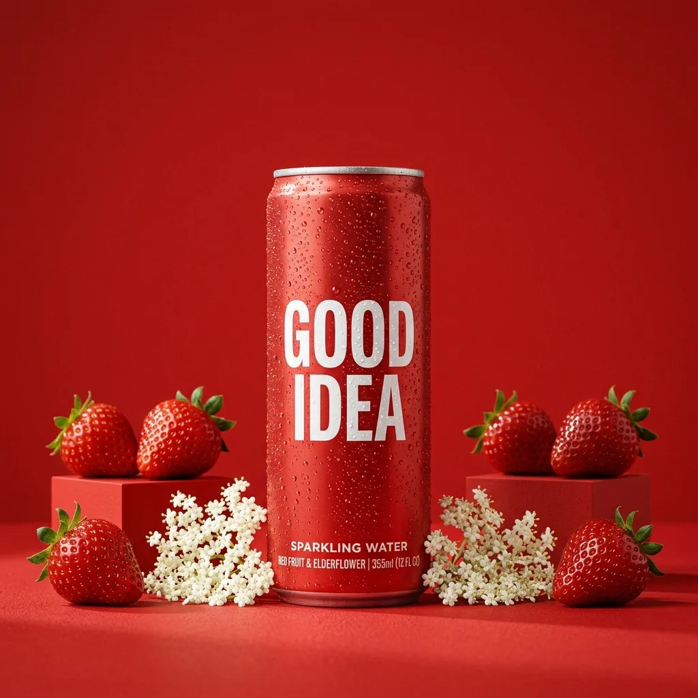

**#113 · Product &amp; Brand Prompt · <code>Vinano Image Pro</code>**

<details>
<summary>Show prompt</summary>

```
A premium studio product photograph of a tall, slim red aluminum sparkling water can standing upright and centered against a seamless vivid red background, the can covered in fine condensation droplets crisp white typography reading “GOOD IDEA” and smaller flavor text beneath, positioned on a matte red surface subtle reflections, surrounded symmetrically by fresh ripe strawberries glossy seeds and deep red flesh, some resting directly on the surface and others placed on small red rectangular blocks to the left and right, delicate white elderflower blossoms scattered between the fruit for contrast, the lighting soft yet directional from the upper left creating gentle highlights on the can's metallic texture and soft shadows beneath the fruit, the color palette dominated by saturated reds clean white accents and natural green stems, the composition minimal and perfectly balanced generous negative space above the product, shallow depth of field, ultra-sharp focus on the can, high-end commercial aesthetic, true-to-life photorealistic, studio-grade, cinematic realism. Maintain consistent colour harmony and crisp focus across the whole frame.
```

</details>

---

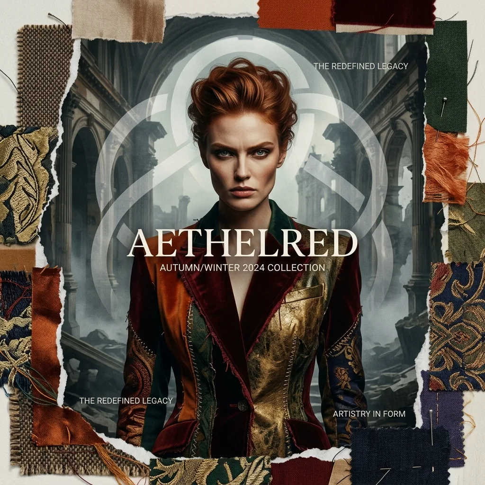

**#114 · Product &amp; Brand Prompt · <code>Vinano Image Pro</code>**

<details>
<summary>Show prompt</summary>

```
[BRAND]. A high fashion campaign poster. A model a strong expressive face as the centerpiece, wearing a signature outfit in the brand's exact official color palette. Dramatic surreal atmospheric background. Layered collage of torn-edge material swatches surrounding the model. Brand's iconic symbol woven into the scene. Logo overlaid in the center in clean serif font. Macro detail on fabric texture and stitching. filmic, cinematic lighting, rich contrast, 8K Aim for an editorial, design-driven look with deliberate negative space.
```

</details>

---

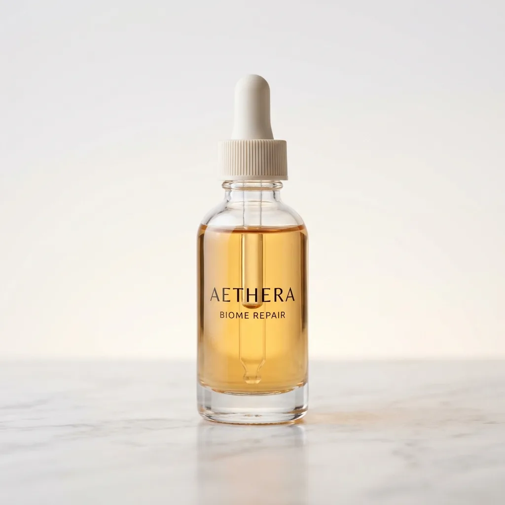

**#115 · Product &amp; Brand Prompt · <code>Vinano Image Pro</code>**

<details>
<summary>Show prompt</summary>

```
studio shot of [PRODUCT], placed on a [background], surrounded by soft shadows and gradient background, high-key lighting, shallow depth of field, ultra-sharp focus on the object, premium product photography, shot on a DSLR, minimal aesthetic, subtle reflections, commercial lighting setup Preserve realistic proportions and depth for a confident, professional finish.
```

</details>

---

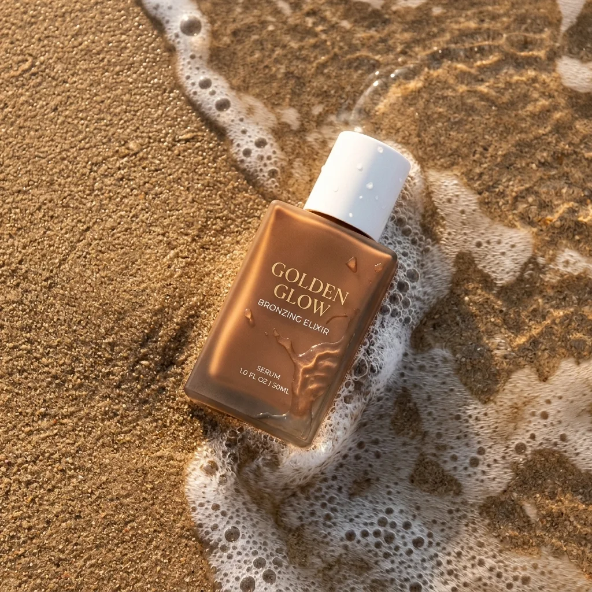

**#116 · Product &amp; Brand Prompt · <code>Vinano Image Pro</code>**

<details>
<summary>Show prompt</summary>

```
Ultra-realistic summer skincare product photography of a bronzing drop bottle named "Golden Glow - Bronzing Elixir", rectangular matte bottle in warm sun-kissed bronze tone a clean white cap, placed diagonally on wet beach sand as a gentle ocean wave washes over it, delicate sea foam and tiny bubbles surrounding the base, water partially flowing across the label, fine sand texture visible beneath shallow clear water, golden sunlight casting natural highlights and soft shadows, high-detail water ripples and realistic foam patterns, fresh summer aesthetic, minimal clean branding centered and sharp, warm golden-hour beach lighting, cinematic top-down flat lay composition, natural reflections on wet surface, editorial beauty campaign style, ultra-detailed, true-to-life photorealistic 8K, soft warm color grading, luxury skincare advertisement Aspect ratio 4.5 Aim for an editorial, design-driven look with deliberate negative space.
```

</details>

---

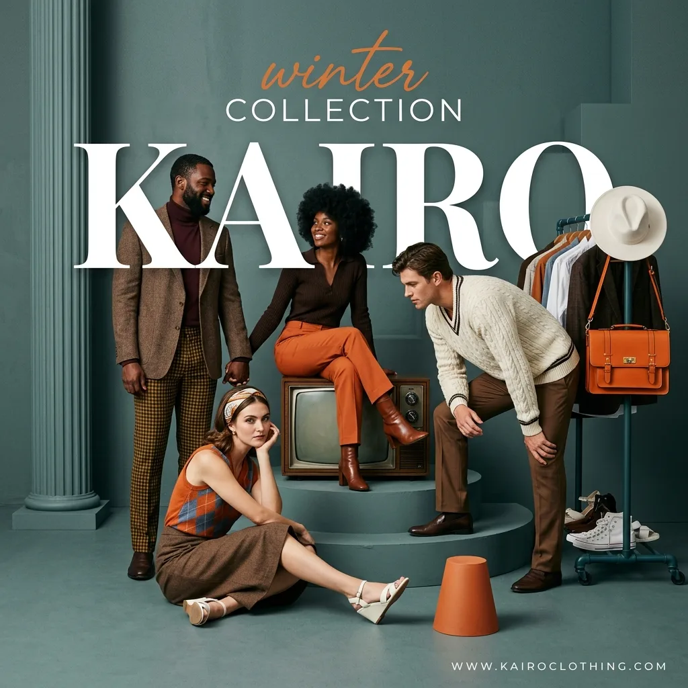

**#117 · Product &amp; Brand Prompt · <code>Vinano Image Pro</code>**

<details>
<summary>Show prompt</summary>

```
A wide-angle, studio fashion advertisement a sophisticated retro-modern aesthetic. The scene is set against a monochromatic teal-grey (#506D6D) architectural backdrop featuring refined minimalist geometric props, including a fluted column and stepped circular platforms. The lighting is professionally diffused studio light, creating soft, graduated shadows that provide depth without harshness.

The Subjects:
Four models are posed in a cohesive, stylish group dynamic:

A Black man on the far left, standing tall in a brown tweed blazer, a deep burgundy turtleneck, and dark yellow-and-brown checkered trousers. He is smiling and warmly holding the hand of the woman next to him.

A Black woman a voluminous afro, sitting sideways on a vintage 1950s wooden television set. She wears a dark brown knit top and vibrant burnt orange (#E88D4D) trousers sleek brown leather boots.

A White woman sitting on the floor in the center, leaning forward her hand to her face. she wears a vintage-style headband, an argyle-patterned sleeveless top in orange and slate blue, a brown wool skirt, and white wedge sandals.

A White man leaning into the frame from the center-right, hands on his knees. He wears a heavy cream-colored cable-knit sweater dark trim and tailored brown trousers.
Furniture & Props:
To the right stands a refined minimalist dark teal industrial clothing rack. It displays curated garments including hanging shirts, a wide-brimmed white fedora, and a prominent structured orange leather messenger bag. At the base of the rack are white high-top sneakers and sandals. A single, truncated orange cone prop sits in the foreground.
Primary Text: A massive, high-contrast white serif font (Bodoni-style) reading "KAIRO" is overlaid across the center-left, partially occluding the models to create a layered, 3D effect.
Header: At the top center, the words "winter" (in orange cursive script) and "COLLECTION" (in white clean sans-serif) are centered.
Footer: The URL " is printed in small, wide-tracked white sans-serif in the bottom right corner.
Color Palette:
A sophisticated mix of Teal-Grey, Burnt Orange, Chocolate Brown, and Crisp White, creating a warm yet muted autumnal atmosphere.

Maintain consistent colour harmony and crisp focus across the whole frame.
```

</details>

---

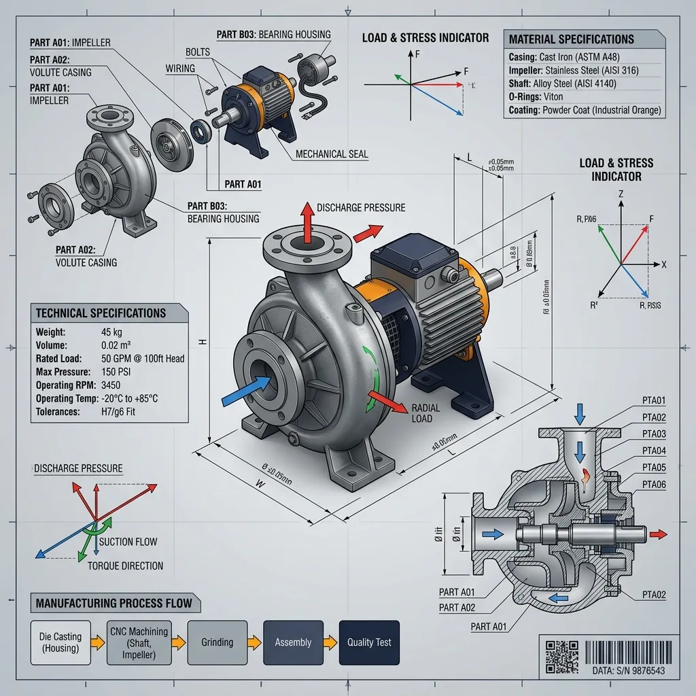

**#118 · Product &amp; Brand Prompt · <code>Vinano Image Pro</code>**

<details>
<summary>Show prompt</summary>

```
Industrial engineering-style infographic of an object (match exactly the object from the uploaded photo reference).
Ultra-precise technical rendering of the object placed at the center, accurate proportions, textures, materials, and surface details identical to the reference photo.
Surround the object industrial–grade technical elements:
• Blueprint-inspired dimension lines (length, width, height, radius, angle, tolerances).
• Cross-section cutaway view revealing internal components engineering hatching patterns.
• Exploded-view assembly diagram showing bolts, brackets, joints, wiring, bearings, or internal mechanisms.
• Material specification blocks (steel type, plastics, alloys, coatings, finishes).
• Process flow arrows describing manufacturing steps (CNC, casting, welding, injection, stamping).
• Load & stress indicator graphics arrows, vector force diagrams, thermal flow, or torque direction.
• Part numbering following industrial annotation style (Part A01, A02, etc).
• Tech data panels like: weight, volume, tolerances, rated load, pressure, RPM, operating temperature.
• QR-style data block or barcode element for extra industrial feel.
Design style:
• clean, structured, engineering-oriented layout
• color palette of steel grey, dark navy, orange/yellow safety accents
• background like a technical drafting sheet or industrial metal texture (subtle, not distracting)
• sharp sans-serif typeface actual engineering annotation style
• shadows minimal, prioritizing clarity and precision
Overall vibe: serius, presisi, manufaktur-grade, seperti poster teknik pabrik atau katalog industrial tooling.
Aspect Ratio: 9:16

Preserve realistic proportions and depth for a confident, professional finish.
```

</details>

---

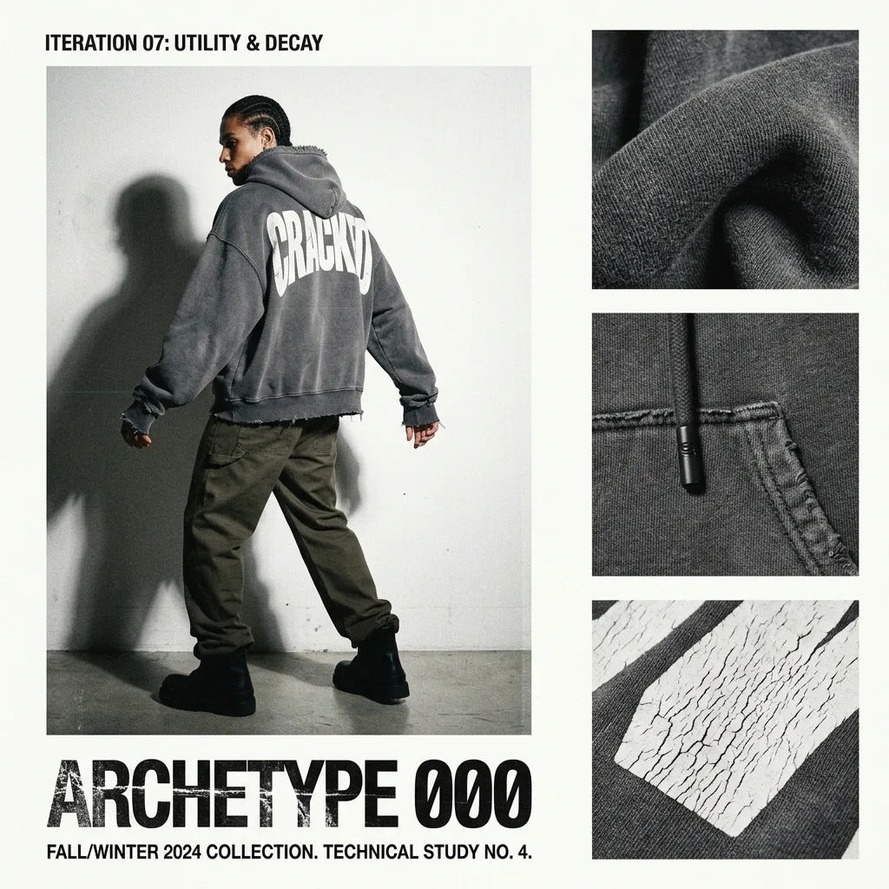

**#119 · Product &amp; Brand Prompt · <code>Vinano Image Pro</code>**

<details>
<summary>Show prompt</summary>

```
[BRAND NAME]. Act as a Creative Director and Brand Strategist.

PHASE 1: CONCEPT & COMPOSITION.

Create a multi-panel fashion lookbook collage (grid layout) on a clean off-white background.

- Main Shot: A full-body editorial pose of a model wearing a signature [BRAND NAME] piece.

- Detail Shots: 3-4 smaller rectangular frames showing macro crops of fabric, hardware, and stitching.

- Autonomously determine the garment type based on the brand's current hype items.

PHASE 2: VISUAL STYLE & TEXTURE.

"High-End Lo-fi" aesthetic. Intense film grain, analog noise, and scanline artifacts. Heavy, premium clothing textures: faded vintage washes, distressed edges, and premium-quality "cracked" screen prints. Muted, moody color palette brand-specific accents.

PHASE 3: DYNAMIC TYPOGRAPHY & LOGIC.

Autonomously analyze the [BRAND NAME] heritage and core identity to generate unique typography.

- Content: Instead of generic "Drop" labels, generate text based on the brand’s DNA:

- Style: Match the font to the brand's era (e.g., brutalist sans-serif for modern labels, elegant serif for luxury house heritage). Integrate the [BRAND NAME] logo a distressed, "Xerox-copied" texture.

TECH SPECS:

35mm film look (Kodak Portra 400), f/5.6 for raw sharpness, high ISO grain. High-contrast editorial flash, deep shadows. Octane render quality an analog scan soul.

Aim for an editorial, design-driven look with deliberate negative space.
```

</details>

---

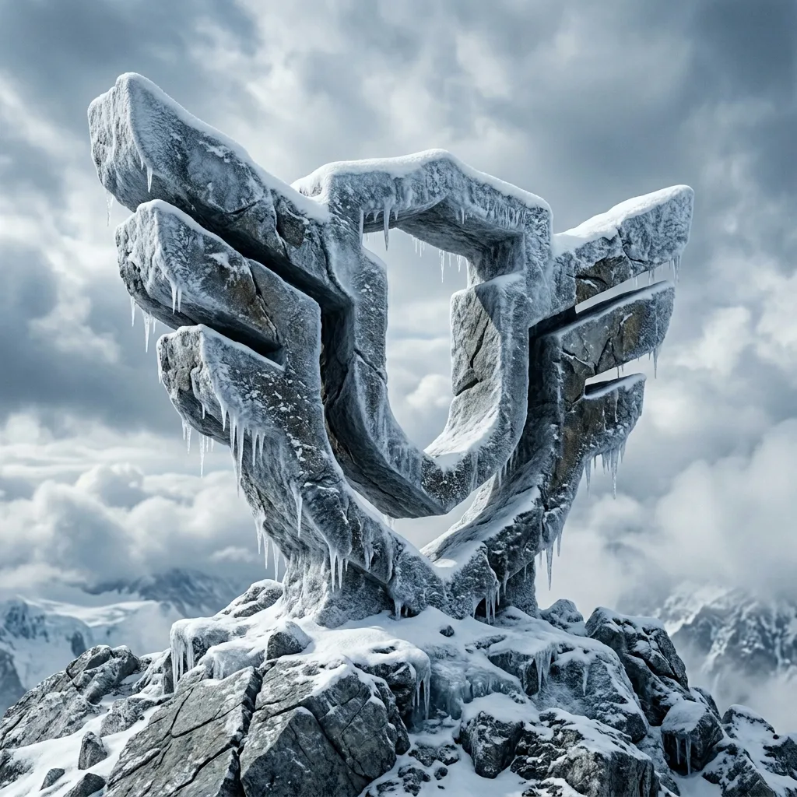

**#120 · Product &amp; Brand Prompt · <code>Vinano Image Pro</code>**

<details>
<summary>Show prompt</summary>

```
A hyper-realistic 3D render of a flat logo sculpted as a massive, frosted stone monument standing upright on the jagged peak of a rocky mountain summit.

The logo retains its exact silhouette and proportions but is fully translated into thick, solid carved rock encased in a layer of translucent frost and ice. Each element and shape of the logo is extruded significant depth and volume, giving it a bold, chunky sculptural mass.

 The surface texture is rough, dark basalt or granite stone, partially obscured by a crystalline frost coating, deep natural cracks, chipped edges, and fine granular detail across every face. The outer boundary of the logo forms the shell of the sculpture, negative spaces between design elements carved out as open voids cutting through the rock.
The sculpture sits planted into the top of a rugged mountain peak, partially buried at its base, surrounded by cracked grey rock. A thick, textured layer of white snow and rime ice rests on the top flat surfaces of the logo forms and collects in the crevices and carved edges. Small icicles hang from the lower overhanging curves and edges, catching cold light. The entire structure has a subtle, semi-translucent frozen sheen, softening the harshness of the stone beneath.
The sky behind is filled a dramatic, dense sea of clouds rolling over distant mountain peaks, creating a misty, ethereal, and cold atmosphere. Soft, diffused light filters through the cloud layer, creating a stark contrast against the dark, frosted stone sculpture. Lighting is soft natural daylight from slightly above and to the left, casting realistic shadows beneath the logo elements and across the rocky peak below. Ambient occlusion deepens the carved negative spaces between the design forms.

Camera angle is slightly low, looking up at the sculpture from a three-quarter front perspective, emphasizing the scale and monumentality of the logo form, mirroring the heroic composition of a landmark monument.

Rendering style: true-to-life photorealistic, cinematic, ultra-detailed, physically based rendering, no text, no additional elements only the logo as a frosted stone sculpture on a cloud-covered mountain peak.

Preserve realistic proportions and depth for a confident, professional finish.
```

</details>

---

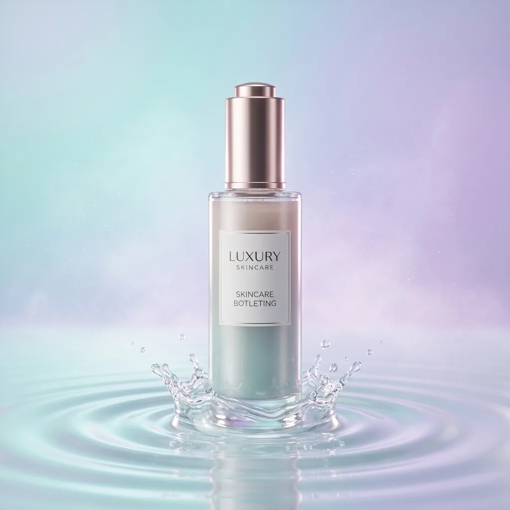

**#121 · Product &amp; Brand Prompt · <code>Vinano Image Pro</code>**

<details>
<summary>Show prompt</summary>

```
Luxury skincare commercial, ultra-premium aesthetic. Use the provided product image as the exact reference for bottle shape, label design, liquid tone, reflections, and overall styling.

The bottle stands perfectly upright at the center of the frame, surrounded by a glossy liquid surface smooth, elegant ripples. Soft fluid splashes form a graceful crown around the base, catching light like crystal. Background is a dreamy pastel aqua-to-soft lavender gradient a silky, creamy atmosphere and subtle mist particles floating in the air.

Camera motion:
Slow, continuous 360-degree cinematic orbit around the product. Movement is smooth, controlled, and hypnotic. Constant speed throughout. No shaking, no zooming, no speed changes. The product remains perfectly centered and stable at all times.

Framing:
Mid close-up beauty shot. Bottle remains vertical and motionless, hero focus.

Lighting:
High-end studio lighting, soft diffused glow gentle highlights and glossy reflections. Subtle rim light to outline the bottle. Liquid and glass look luminous, hydrated, and silky.

Mood & style:
Sensual, elegant, and premium beauty campaign. Smooth motion, glossy textures, soft reflections, cinematic depth of field, slow-motion feel, luxury skincare advertisement, 4K true-to-life photorealistic, polished commercial look.

Emphasise material texture and natural light so the final frame feels tactile and premium.
```

</details>

---

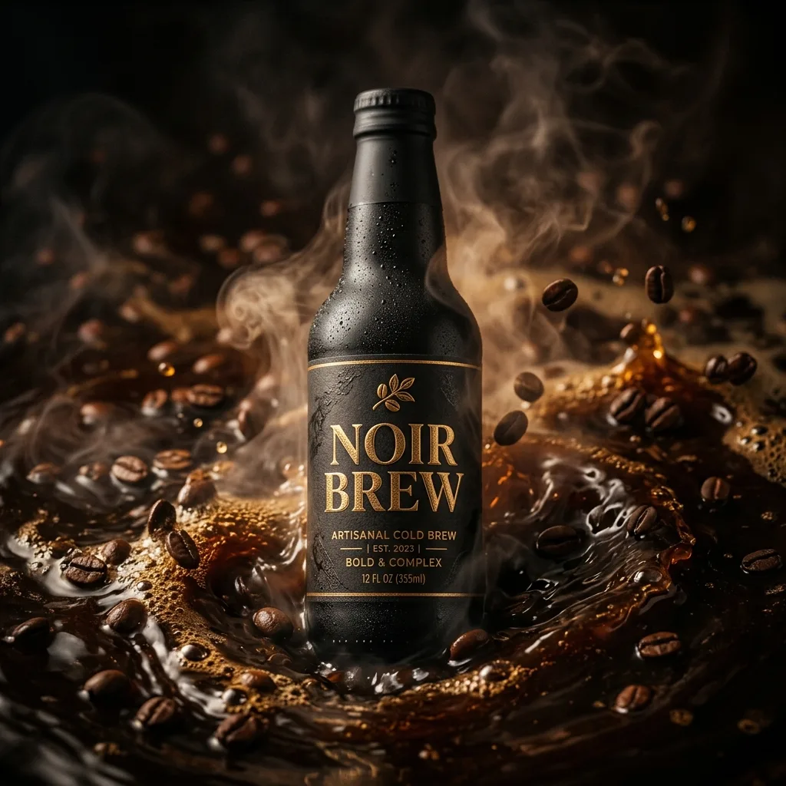

**#122 · Product &amp; Brand Prompt · <code>Vinano Image Pro</code>**

<details>
<summary>Show prompt</summary>

```
Ultra-cinematic premium coffee bottle labeled “NOIR BREW”, matte black glass gold typography, floating upright amid swirling espresso waves and roasted coffee beans. Steam and mist curling around the bottle, dramatic low-key lighting warm highlights and deep shadows, rich brown color grading, macro condensation details, cinematic depth of field, true-to-life photorealistic, 8K, luxury branding aesthetic. Aim for an editorial, design-driven look with deliberate negative space.
```

</details>

---

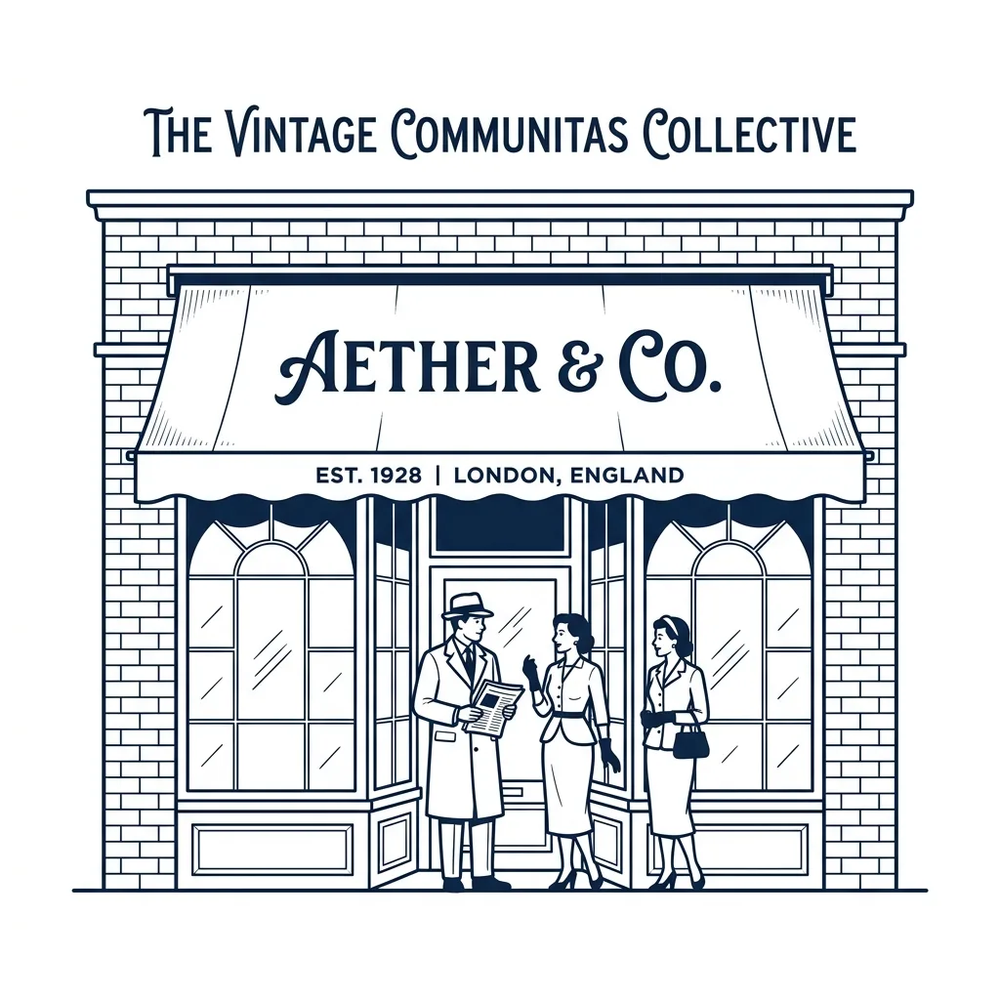

**#123 · Product &amp; Brand Prompt · <code>Vinano Image Pro</code>**

<details>
<summary>Show prompt</summary>

```
[BRAND NAME] | [SUBJECT_TOGGLE]. Act as a Lead Graphic Designer.

PHASE 1: ARCHITECTURAL SETTING.

Create a refined minimalist 2D vector illustration of a vintage-style storefront representing [BRAND NAME].

- Autonomously design the facade (Modernist, Industrial, or Classic) to match the brand's heritage.

PHASE 2: SUBJECT LOGIC (TOGGLE SYSTEM).

- If [SUBJECT_TOGGLE] is "OFF": Show only the empty storefront.

- If [SUBJECT_TOGGLE] is "ON": Autonomously add 1-2 characters or a pet that fits the brand's lifestyle.

PHASE 3: DYNAMIC TYPOGRAPHY (CORRECTED).

- Header: Autonomously generate a high-status "Club" or "Community" title based on the nature of [BRAND NAME]. * Examples: For Starbucks — "Coffee Roasters Society"; for Nike — "Elite Runners Club"; for Apple — "Digital Creators Guild".

- Branding: Place the [BRAND NAME] logo clearly on the storefront awning.

- Contextual Info: Below the awning, add "EST. [REAL FOUNDING YEAR]" and "[REAL ORIGIN CITY]".

PHASE 4: VISUAL STYLE.

- Two-tone palette: [BRAND SIGNATURE COLOR] on a pure white background.

- Style: 1950s-60s Retro Line Art. No gradients, no shadows.

TECH SPECS:

Flat 2D vector, 8k resolution, monochrome aesthetic, centered composition.

Emphasise material texture and natural light so the final frame feels tactile and premium.
```

</details>

---

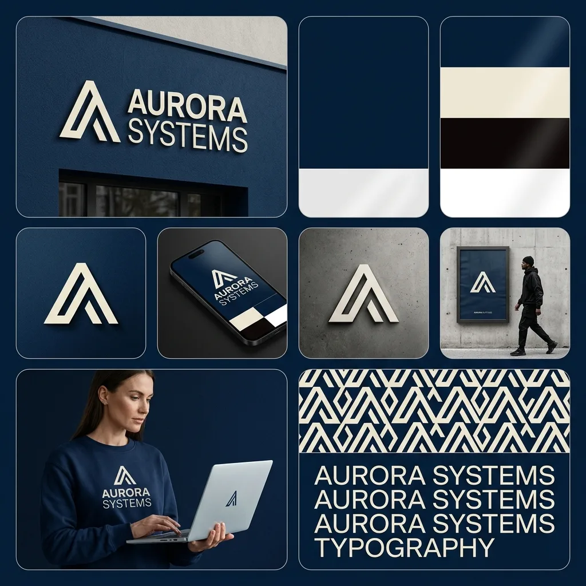

**#124 · Product &amp; Brand Prompt · <code>Vinano Image Pro</code>**

<details>
<summary>Show prompt</summary>

```
[BRAND NAME]. Act as a Senior AI Visual Strategist & Creative Director.
Goal: Generate a grid-based brand identity showcase.
PHASE 1: COMPOSITION & LAYOUT
Set the scene on a deep, rich [BRAND PRIMARY COLOR] background. Implement an 8-module grid rounded corners and thin separation lines.
- Large Modules: Top Left and Bottom Right.
- Small/Medium Modules: Fill the remaining space.
PHASE 2: AUTONOMOUS BRAND LOGIC (THE CORE) [INSTRUCTIONS FOR]:
Analyze the name "[BRAND NAME]".
Determine the industry (e.g., Tech, Luxury, Eco, Automotive, Fashion).
Do NOT default to sports/tennis unless the brand name explicitly requires it.
Adapt all secondary elements (accessories, textures, model's activity) to match this industry.
PHASE 3: MODULE CONTENT (DYNAMIC ADAPTATION)
- MODULE 1 (Exterior): A flagship building façade. Use textured walls in [BRAND PRIMARY COLOR]. Feature a large [BRAND NAME] wordmark and a geometric abstract logo in a contrasting Cream/Beige.
- MODULE 2 (Colors): A vertical swatch panel. Sequence: [BRAND PRIMARY COLOR], Cream, Deep Black, White. Satin finish.
- MODULE 3 & 5 (Core Logo): Detailed close-ups of the brand's unique geometric icon.
- MODULE 4 (Accessory): AUTONOMOUS CHOICE. If [BRAND NAME] is Tech, show a sleek device. If Luxury, show a watch or jewelry. If Eco, show sustainable packaging. Must be in brand colors.
- MODULE 6 (Urban): A street-level mockup on a concrete wall. A person in an all-black outfit walks past a branded panel.
- MODULE 7 (Editorial): A high-end lifestyle shot.
 - Model: Professional, editorial style.
 - Outfit: Premium sweatshirt in [BRAND PRIMARY COLOR] brand logo.
 - Prop: AUTONOMOUS CHOICE based on industry. (e.g., a leather briefcase for Finance, a camera for Media, a designer bag for Retail).
- MODULE 8 (Specs): Top half: A complex repeating pattern based on the brand logo. Bottom half: Four lines of text " [BRAND NAME] TYPOGRAPHY" in a clean, high-end sans-serif.
PHASE 4: LIGHTING & TEXTURES
- High-End Editorial Photography. No "AI-plastic" look.
- Cinematic soft-box lighting Rembrandt shadows.
- Micro-details: fabric weave, skin pores, concrete grit, leaf veins.
- Subsurface scattering on organic materials.
PHASE 5: TECH SPECS
8K Resolution, Octane Render style, Ray Traced reflections, subtle film grain.

Maintain consistent colour harmony and crisp focus across the whole frame.
```

</details>

---

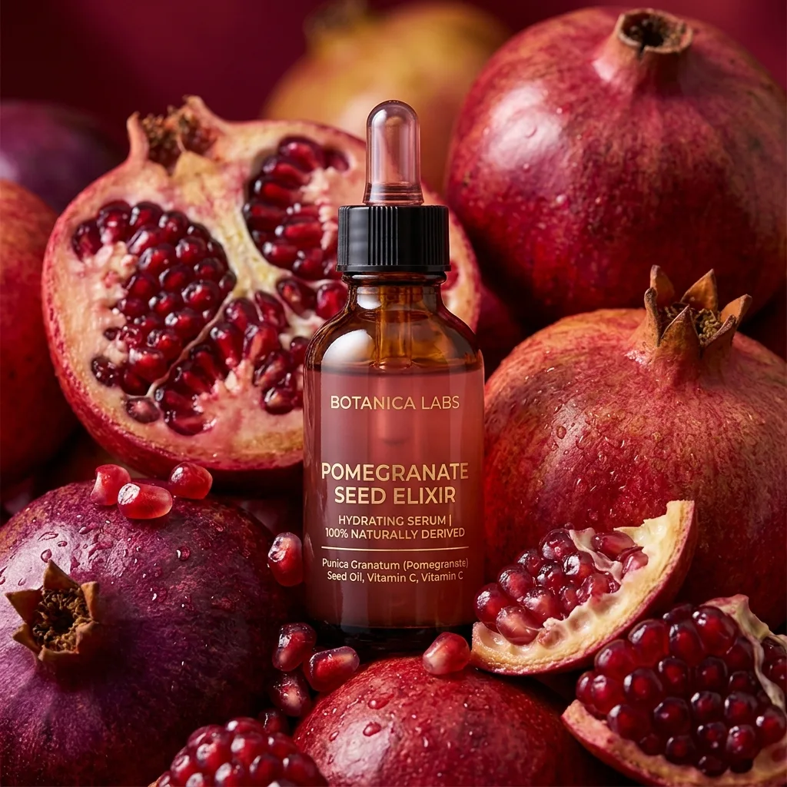

**#125 · Product &amp; Brand Prompt · <code>Vinano Image Pro</code>**

<details>
<summary>Show prompt</summary>

```
[product], premium skincare product ad, the product placed directly on and surrounded by fresh [fruit_or_vegetable], visual storytelling that the product is made from the ingredient, rich saturated color palette matching the ingredient, juicy realistic textures, visible seeds pulp or slices, glossy highlights, dramatic studio lighting, soft shadows, shallow depth of field, macro product photography look, ultra realistic, editorial commercial style, clean background in matching color tone, 8k, 1:1 Emphasise material texture and natural light so the final frame feels tactile and premium.
```

</details>

---

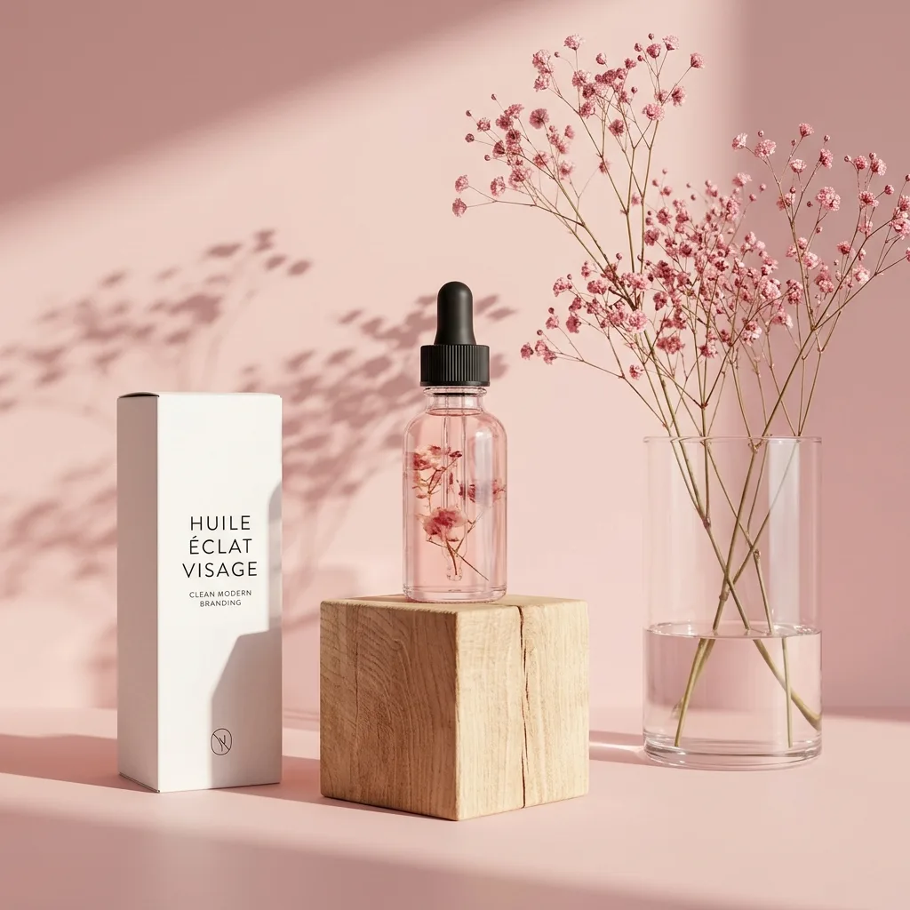

**#126 · Product &amp; Brand Prompt · <code>Vinano Image Pro</code>**

<details>
<summary>Show prompt</summary>

```
Ultra-realistic refined minimalist studio product photography of a small transparent glass facial oil dropper bottle a black rubber pipette cap, containing pale pink serum dried pink floral elements suspended inside, placed centered on top of a natural raw wooden cube block visible grain and split texture. To the left of the cube stands a tall matte white rectangular skincare box minimal black typography reading “HUILE ÉCLAT VISAGE,” clean modern branding, and subtle logo near the bottom. To the right of the cube is a clear cylindrical glass vase filled water and thin stems of dried pink gypsophila flowers extending upward and outward. The entire composition is arranged on a smooth matte pastel pink surface a matching soft pink seamless studio background. Strong directional soft light comes from the left side, casting long, soft-edged realistic shadows of the flowers and objects onto the pink background. Lighting is natural-style, -det diffused, and warm, creating gentle highlights on the glass, subtle reflections on the serum bottle, and soft texture on the wooden block. Camera angle is straight-on at tabletop height, medium framing, all main objects in sharp focus minimal depth of field blur. Color palette is dominated by blush pink, soft rose tones, warm light wood, clean white, and transparent glass. Mood is clean, airy, feminine, elegant, Scandinavian minimal aesthetic, premium skincare branding style, true-to-life photorealistic, studio-grade realism, ultra Maintain consistent colour harmony and crisp focus across the whole frame.
```

</details>

---

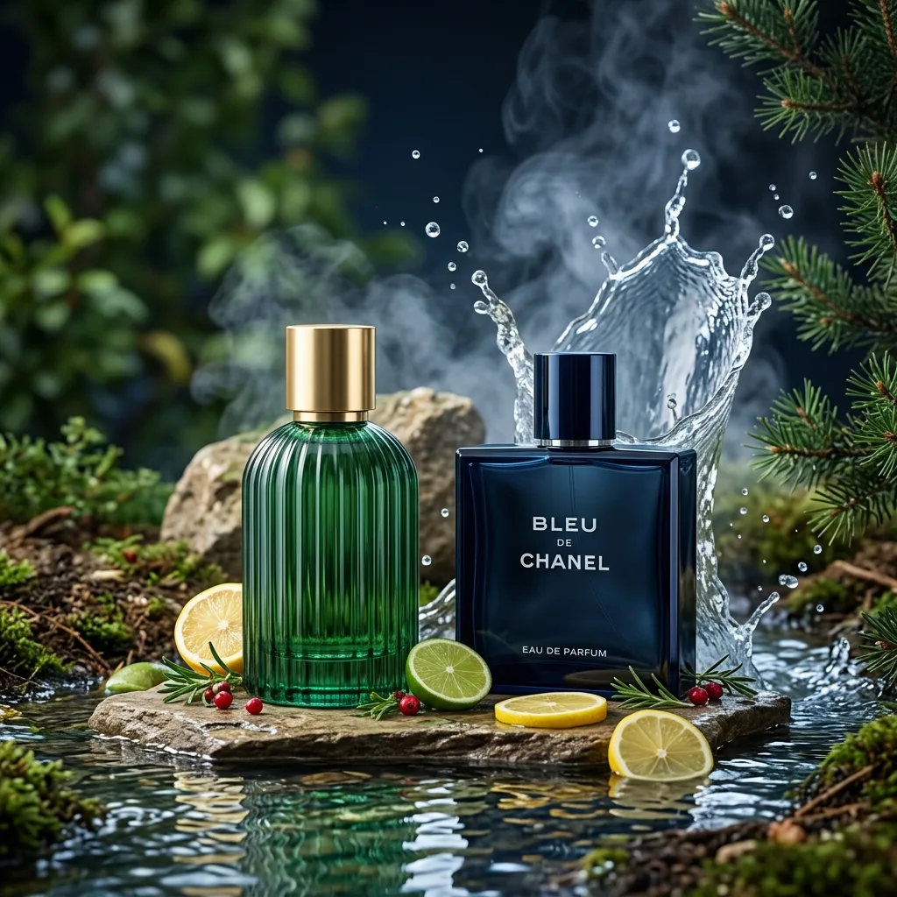

**#127 · Product &amp; Brand Prompt · <code>Vinano Image Pro</code>**

<details>
<summary>Show prompt</summary>

```
{
 "global_settings": {
 "resolution": "8K",
 "aspect_ratio": "3:4",
 "style": "true-to-life photorealistic cinematic product photography",
 "detail_level": "extreme micro-detail",
 "sharpness": "ultra-sharp",
 "noise": "none",
 "compression_artifacts": "none",
 "color_depth": "rich 16-bit color",
 "render_quality": "luxury commercial grade",
 "ai_finish": "clean AI-enhanced realism"
 },

 "module_1": {
 "scene_identity": "forest_green_perfume",
 "environment": {
 "setting": "dense forest atmosphere",
 "background": "soft blurred green foliage depth separation",
 "foreground": "natural forest floor soil, moss, and small debris",
 "props": ["flat natural stone platform",
 "irregular rock placed slightly behind the bottle",
 "pine tree branches visible needles on the right side"],
 "atmosphere": "soft drifting smoke or mist rising behind the bottle"
 },
 "product": {
 "object_type": "perfume bottle",
 "material": "ribbed translucent glass",
 "color": "deep emerald green liquid",
 "shape": "cylindrical vertical grooves",
 "cap": {
 "material": "metal",
 "finish": "polished gold",
 "shape": "smooth cylindrical"
 },
 "label": "no visible branding text"
 },
 "lighting": {
 "key_light": "soft diffused natural light from front-left",
 "fill_light": "subtle ambient forest light",
 "highlights": "gentle reflections on glass ribs and gold cap",
 "shadows": "soft realistic shadows under bottle and rocks"
 },
 "camera": {
 "angle": "eye-level product angle",
 "focus": "sharp focus on bottle, shallow depth of field",
 "lens_effect": "natural bokeh background"
 },
 "mood": "fresh, woody, calm, premium, nature-inspired"
 },

 "module_2": {
 "scene_identity": "blue_water_splash_perfume",
 "environment": {
 "setting": "dark aquatic studio scene",
 "background": "deep navy to black gradient",
 "surface": "rippling water reflective highlights",
 "motion_elements": ["large upward water splash behind bottle",
 "floating water droplets suspended mid-air"],
 "props": ["lemon slices (yellow flesh visible)",
 "green citrus slice",
 "small red berries",
 "green herb sprigs"]
 },
 "product": {
 "object_type": "perfume bottle",
 "material": "opaque glass",
 "color": "deep midnight blue",
 "shape": "rectangular sharp edges",
 "cap": {
 "material": "matching dark glass",
 "shape": "cylindrical"
 },
 "text_visible": ["BLEU DE CHANEL",
 "EAU DE PARFUM"]
 },
 "lighting": {
 "key_light": "strong directional light from upper front",
 "rim_light": "cool highlights on water splash",
 "reflections": "specular highlights on glass and water surface"
 },
 "camera": {
 "angle": "slightly tilted dynamic angle",
 "focus": "sharp on bottle and splash",
 "motion_freeze": "high-speed capture look"
 },
 "mood": "fresh, energetic, aquatic, luxury fragrance ad"
 }

Preserve realistic proportions and depth for a confident, professional finish.
```

</details>

---

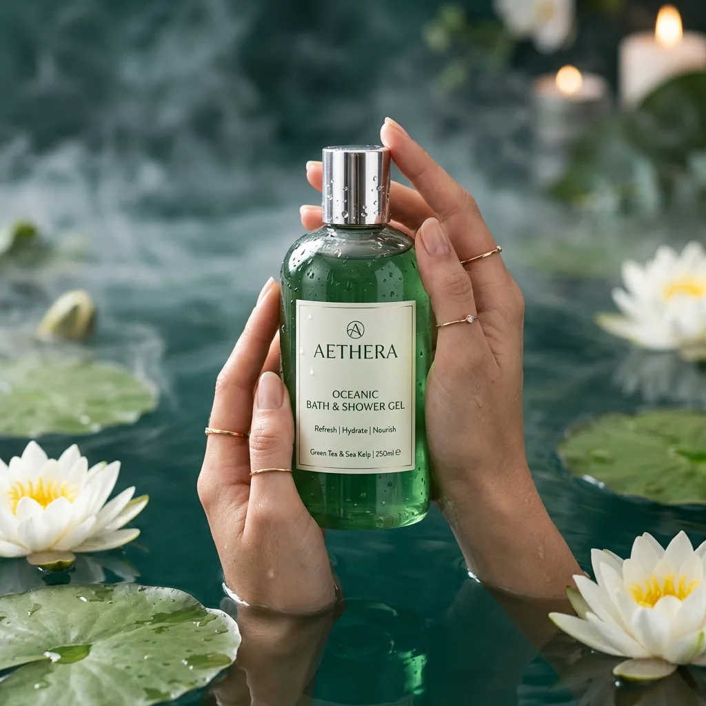

**#128 · Product &amp; Brand Prompt · <code>Vinano Image Pro</code>**

<details>
<summary>Show prompt</summary>

```
Luxury product photography of a green translucent bath and shower gel bottle held gently by two feminine hands submerged in calm water. The bottle is centered, glossy, water droplets on the surface, silver metallic cap, elegant minimal label design. The water is deep teal-green soft mist swirling across the surface. White lotus flowers and large green lily pads float around the hands. The hands wear delicate thin gold rings. Soft, diffused natural lighting, moody spa atmosphere, high-end skincare advertisement style, ultra-realistic, cinematic composition, shallow depth of field, 85mm lens, high resolution, editorial beauty shot, serene and calming aesthetic. Preserve realistic proportions and depth for a confident, professional finish.
```

</details>

---

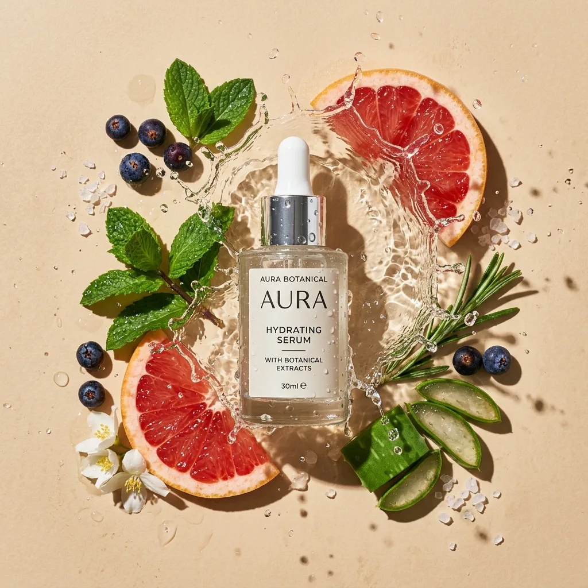

**#129 · Product &amp; Brand Prompt · <code>Vinano Image Pro</code>**

<details>
<summary>Show prompt</summary>

```
[product], centered top down flat lay, surrounded by [ingredients], fresh slices and whole pieces, glossy wet look, water splash frozen mid motion around the product, dewy droplets on label and surface, warm beige seamless background, soft directional sunlight, crisp realistic shadow, high end skincare advertising, ultra realistic macro product photography, 100mm lens look, f/8 sharp focus, crisp composition, no extra text, 8k, 1:1 Preserve realistic proportions and depth for a confident, professional finish.
```

</details>

---

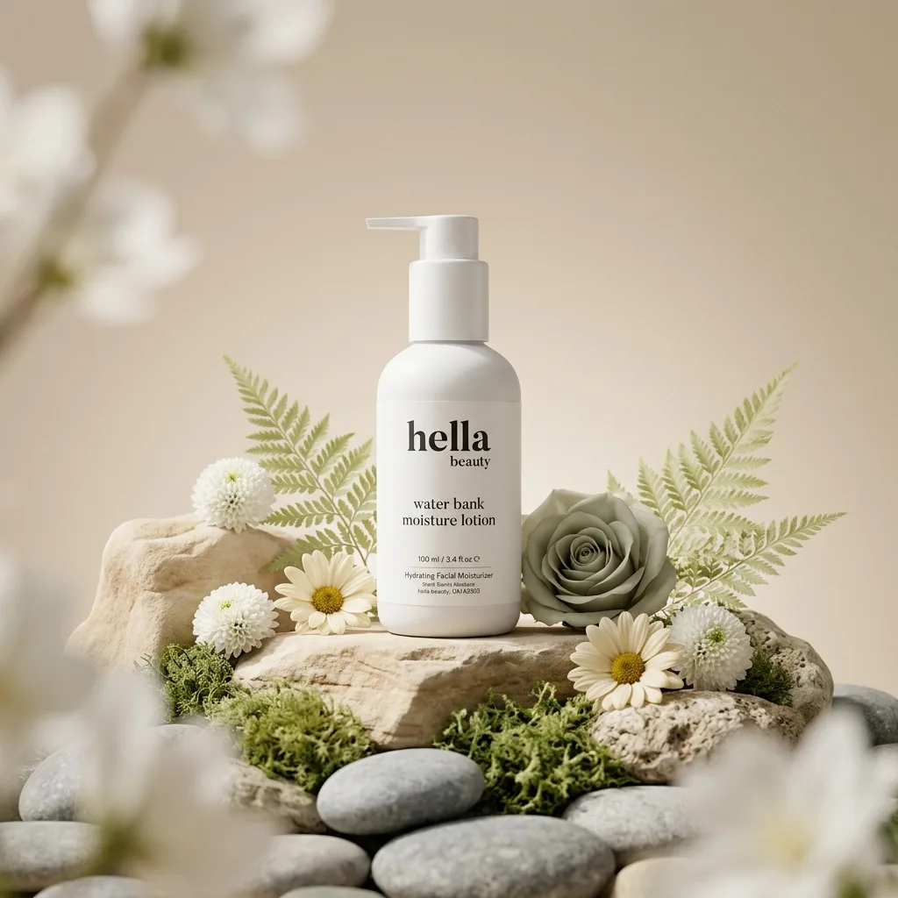

**#130 · Product &amp; Brand Prompt · <code>Vinano Image Pro</code>**

<details>
<summary>Show prompt</summary>

```
Ultra-high-end true-to-life photorealistic commercial skincare product photography featuring a matte white plastic pump bottle centered and upright, labeled “hella beauty” in clean black refined minimalist typography smaller text reading “water bank moisture lotion” and subtle product details beneath, the bottle placed on a layered natural stone surface surrounded by carefully arranged organic props including smooth gray river stones, pale beige textured rock formations, soft green moss clusters,delicate white pom-pom flowers, cream-colored
daisy-like blossoms, light green fern leaves, and a
muted sage rose, all arranged in a balanced
symmetrical composition, background a soft warm
beige studio backdrop gentle gradient and no
visible edges, foreground partially framed by softly
blurred out-of-focus white flowers creating depth,
lighting soft diffused daylight-style studio lighting
from upper left producing gentle shadows, natural
highlights on the bottle and petals, and a calm airymood, color palette dominated by warm neutrals, soft
whites, sage greens, and muted earth tones, textures
highly detailed including matte plastic, porous stone,
velvety petals, and moist moss, shallow depth of field
 sharp focus on the product label and midground
elements and smooth bokeh in foreground and
background, premium botanical skincare advertising aesthetic,
clean minimal luxury composition, cinematic realism,
ultra-detailed 8K, studio-grade hyperrealism, no extra
text, no borders, no stylization beyond natural
photorealism.

Aim for an editorial, design-driven look with deliberate negative space.
```

</details>

---

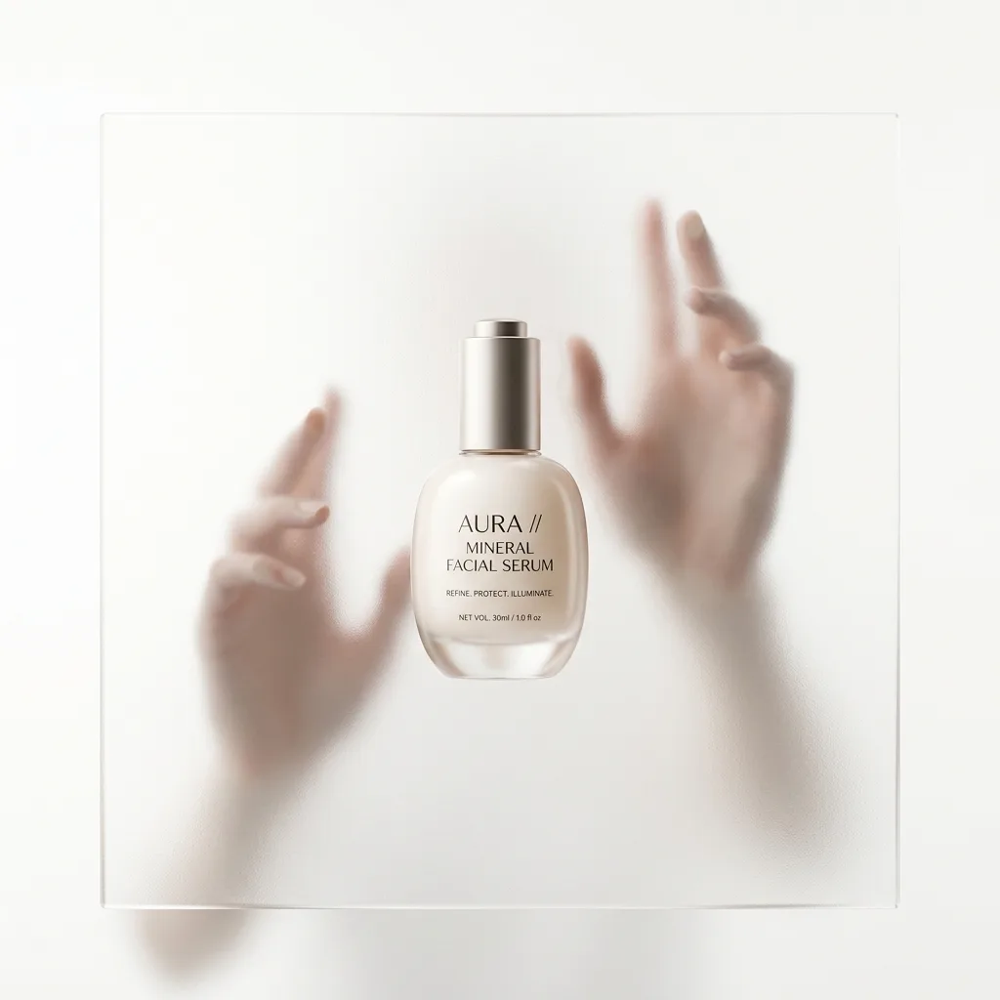

**#131 · Product &amp; Brand Prompt · <code>Vinano Image Pro</code>**

<details>
<summary>Show prompt</summary>

```
{
 "task": "photorealistic_product_visual",
 "input": {
 "reference_image": "USER_UPLOADED_IMAGE",
 "preserve_product_identity": true,
 "preserve_label_text": true,
 "preserve_object_shape": true,
 "preserve_centered_composition": true
 },
 "scene": {
 "environment": "high-key studio",
 "background": "pure white seamless",
 "negative_space": "very high",
 "depth_of_field": "layered depth strong subject isolation"
 },
 "subject": {
 "primary_object": "single product object",
 "position": "perfectly centered, floating",
 "orientation": "upright",
 "scale": "natural product scale",
 "clarity": "ultra-sharp, high micro-contrast"
 },
 "human_elements": {
 "hands": {
 "count": 2,
 "layering": "positioned behind a frosted glass surface",
 "visual_effect": "frosted glass diffusion, milky blur, softened edges",
 "transparency": "semi-opaque",
 "focus": "intentionally out of focus",
 "gesture": "slow, delicate, abstract reach",
 "interaction": "no contact the product"
 }
 },
 "optical_effects": {
 "frosted_glass": {
 "applied_to": "hands only",
 "blur_type": "diffusion blur",
 "edge_softness": "high",
 "light_scatter": "subtle bloom"
 }
 },
 "lighting": {
 "style": "soft diffused studio lighting",
 "direction": "frontal gentle top wash",
 "shadows": "extremely soft and minimal",
 "highlights": "clean, controlled highlights on the product only",
 "contrast": "low overall, high on product"
 },
 "materials_rendering": {
 "product_surface": "premium, realistic, tactile",
 "reflections": "clean and intentional",
 "imperfections": "none"
 },
 "aesthetic": {
 "mood": "ethereal, calm, refined",
 "style": "high-end editorial product photography",
 "visual_language": "minimal, airy, modern, poetic",
 "emotion": "care, purity, precision"
 },
 "camera": {
 "lens": "85mm",
 "aperture": "f/2.0",
 "angle": "eye-level",
 "camera_motion": "none"
 },
 "post_processing": {
 "retouching": "luxury commercial polish",
 "grain": "none",
 "color_grading": "clean whites subtle warmth on the product"
 },
 "output": {
 "resolution": "ultra_high_resolution",
 "focus_priority": "product only",
 "clarity_separation": "product razor sharp, background and hands diffused",
 "artifacts": "none"
 }
}

Maintain consistent colour harmony and crisp focus across the whole frame.
```

</details>

---

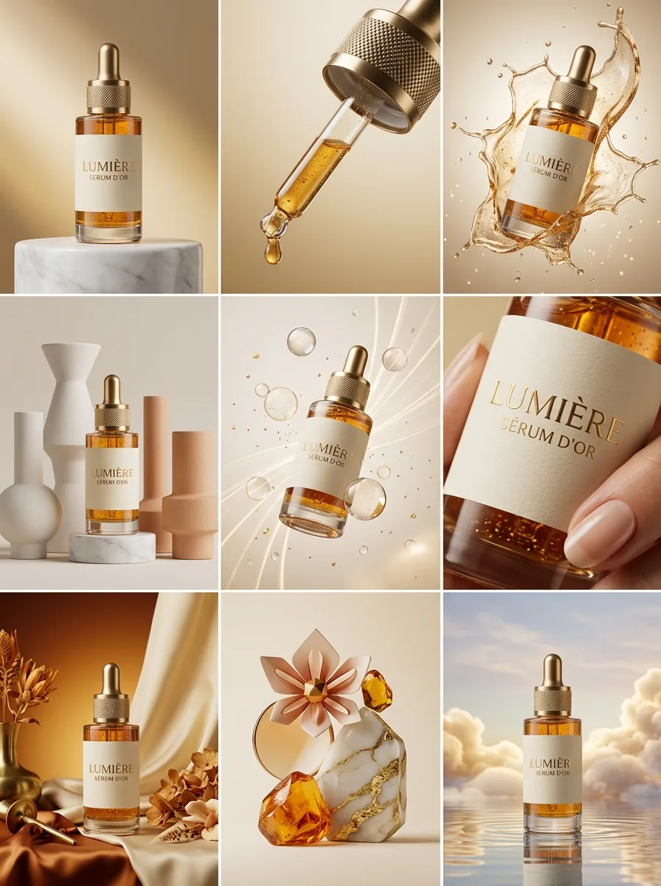

**#132 · Product &amp; Brand Prompt · <code>Vinano Image Pro</code>**

<details>
<summary>Show prompt</summary>

```
Create a 3×3 grid in
3:4 aspect ratio for a high-end commercial marketing campaign the uploaded product as the central subject.

Each frame must present a distinct visual concept while maintaining perfect product consistency across all nine images.

Grid Concepts (one per cell):

1. Iconic hero still life bold composition

2. Extreme macro detail highlighting material, surface, or texture

3. Dynamic liquid or particle interaction surrounding the product

4. Minimal sculptural arrangement abstract forms

5. Floating elements composition suggesting lightness and innovation

6. Sensory close-up emphasizing tactility and realism

7. Color-driven conceptual scene inspired by the product palette

8. Ingredient or component abstraction (non-literal, symbolic)

9. Surreal yet elegant fusion scene combining realism and imagination

Visual Rules:
Product must remain 100% accurate in shape, proportions, label, typography, color, and branding
No distortion, deformation, or redesign of the product
Clean separation between product and background

Lighting & Style:
Soft, controlled studio lighting
Subtle highlights, realistic shadows
High dynamic range, ultra-sharp focus
Editorial luxury advertising aesthetic
Premium sensory marketing look

Overall Feel:
Modern, refined, visually cohesive
High-end commercial campaign
Designed for brand websites, social grids, and digital billboards
Hyperreal, cinematic, polished, and aspirational

Emphasise material texture and natural light so the final frame feels tactile and premium.
```

</details>

---

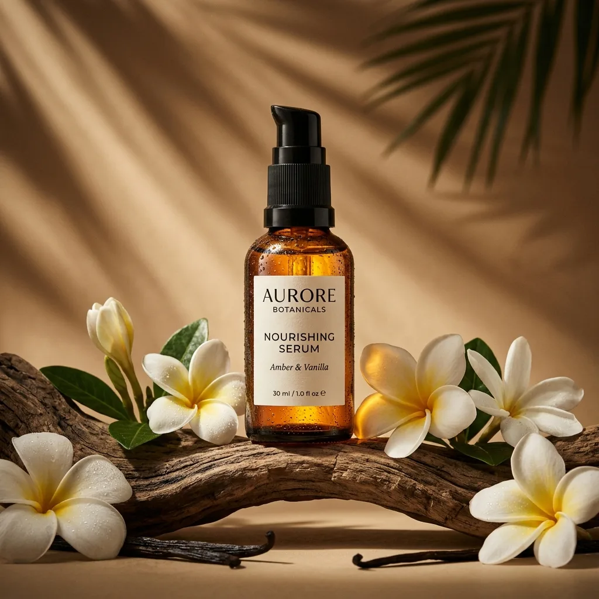

**#133 · Product &amp; Brand Prompt · <code>Vinano Image Pro</code>**

<details>
<summary>Show prompt</summary>

```
- Ultra-cinematic luxury skincare product photography of a translucent amber serum pump bottle standing upright at the center of the frame, perched on a curved piece of textured driftwood, featuring a refined minimalist label crisp black typography and fine condensation droplets on the glass; the bottle is framed by creamy white tropical flowers in full bloom and a single unopened bud, arranged symmetrically along the wood for sculptural balance, slender vanilla pods resting in the foreground; background is a warm, desert-toned studio environment sweeping shadow patterns cast across a soft sand-colored backdrop, creating a dramatic play of light and depth; lighting is high-contrast filmic, cinematic lighting a strong directional key light from the left producing glowing highlights through the amber liquid, sharp rim lighting along the glass edges, and deep shadow falloff for a moody, editorial look;

color palette is rich and sensual golden ambers, warm caramel, soft ivory, and deep earthy browns; composition is a centered hero shot a slight low-angle perspective and shallow depth of field, keeping the bottle razor-sharp while background elements dissolve into creamy bokeh; mood is elegant, mysterious, and high-fashion, evoking premium fragrance-inspired skincare advertising hyper-realistic textures, dramatic contrast, cinematic atmosphere, and 8K

ultra-high-definition realism.

Render with rich micro-detail while keeping the layout uncluttered and intentional.
```

</details>

---

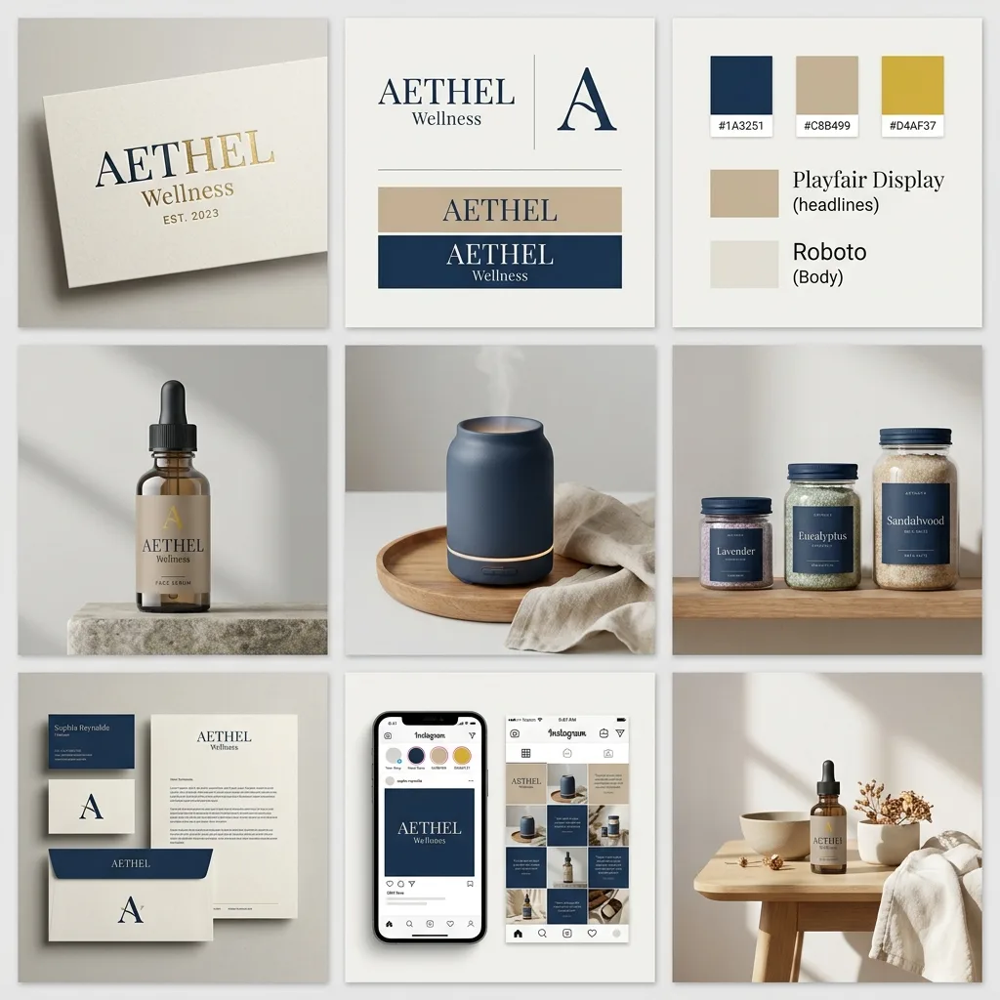

**#134 · Product &amp; Brand Prompt · <code>Vinano Image Pro</code>**

<details>
<summary>Show prompt</summary>

```
[brand name], complete brand identity grid, 3x3 layout, nine tiles showing a full cohesive brand system, light gray seamless background, soft diffused studio lighting, subtle shadows, clean modern minimal style, consistent color palette of [color1] [color2] [color3], high-end studio mockups, ultra-realistic, 8k, 1:1,

tile 1 primary logo lockup on paper card,
tile 2 secondary logo mark and monogram variations,
tile 3 color palette swatches and typography specimen poster,
tile 4 packaging mockup for [product 1],
tile 5 hero product photo for [product 2],
tile 6 set of three products for [product 3] in different sizes,
tile 7 stationery mockups business card letterhead envelope,
tile 8 social media post mockups and phone screen UI preview,
tile 9 lifestyle scene featuring [product 1] props matching the brand,

no people, no readable real-world brand names, no watermark.

Preserve realistic proportions and depth for a confident, professional finish.
```

</details>

---

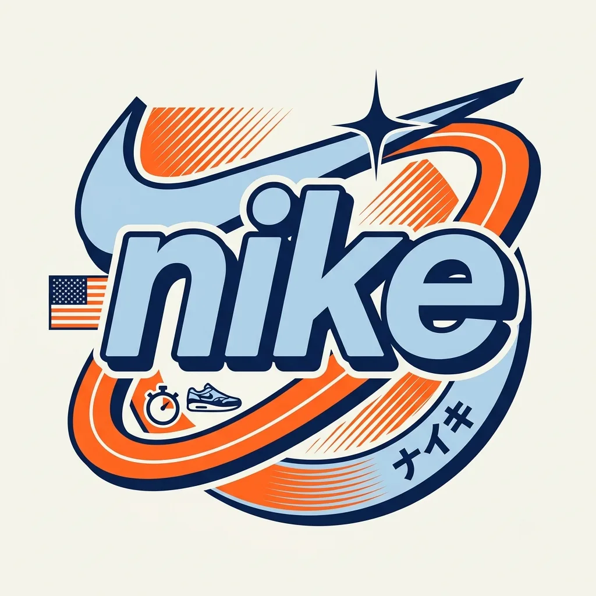

**#135 · Product &amp; Brand Prompt · <code>Vinano Image Pro</code>**

<details>
<summary>Show prompt</summary>

```
[BRAND NAME]

Act as a Senior Vector Graphic Designer specializing in Y2K Japanese streetwear badge design. Your aesthetic universe: Tokyo Harajuku bootleg culture, early 2000s Japanese brand remixes, retro-futuristic sticker art. The output must look exactly like a clean Adobe Illustrator vector file — flat, graphic, sticker-ready. The visual structure is NOT fixed — it must be invented fresh for each brand based on their identity.

BRAND INTELLIGENCE SYSTEM

Before executing, resolve all of the following and use them to drive every design decision: (1) PRIMARY COLOR — [BRAND NAME]'s main brand color converted into a pastel or softened Y2K version — still recognizable as the brand but lighter and more kawaii, (2) ACCENT COLOR — [BRAND NAME]'s secondary color pushed to warm saturation — the energetic pop color of the composition, (3) DARK COLOR — a deep dark version of the brand palette — navy, dark brown, deep green, near-black — used for all outlines and extrusions, (4) LETTER CONTENT — [BRAND NAME]'s name in bold lowercase or the most iconic abbreviation, (5) JAPANESE TRANSLITERATION — correct katakana of [BRAND NAME] as a small secondary text element, (6) BRAND ORIGIN FLAG — [BRAND NAME]'s country of origin national flag as a small flat element, (7) BRAND SHAPE LANGUAGE — identify the most iconic geometric or graphic forms from [BRAND NAME]'s visual identity — the shapes, curves, symbols, and structural elements unique to this brand. These shapes become the orbital, background, and decorative elements of the badge — replacing generic ovals brand-specific geometry, (8) BRAND CULTURAL SYMBOLS — identify 1–2 small iconic objects or symbols from [BRAND NAME]'s world that can be rendered as tiny flat illustrations within the badge — not the logo itself but objects associated the brand's universe, (9) COMPOSITION LOGIC — based on all resolved parameters above, autonomously design the structural layout of the badge. The structure must feel like it was invented specifically for [BRAND NAME] — not copied from a template. Ask: what shapes from this brand's identity could orbit the letters? What geometry feels native to this brand? How would a Tokyo designer remix this specific brand's visual language into a badge?

PHASE 1: CANVAS

1:1 square canvas. Background: flat off-white or warm light grey. Completely empty. No texture. No gradient.

PHASE 2: BADGE STRUCTURE — FULLY AUTONOMOUS

 the BRAND SHAPE LANGUAGE and COMPOSITION LOGIC resolved above, design the complete badge structure. The only fixed rules are: the badge must have a central lettering element, surrounding geometric shapes that interact the letters through z-layer stacking, at least one element that passes both behind and in front of the letters creating depth, and the overall silhouette must read as a unified badge or patch shape. Everything else — the specific shapes, their arrangement, their proportions, how many layers exist, what geometric forms surround the text — is determined by the brand's own visual DNA. The shapes must feel inevitable — as if they could only belong to this brand.

PHASE 3: LETTERING

[BRAND NAME] in large bold lowercase — wide, rounded, confident display typeface. Flat PRIMARY COLOR fill. Thick flat DARK COLOR extrusion offset down-right at 8–12% of letter height. Bold DARK COLOR outline. No gradients. No rendering. The letters are the anchor of the entire composition.

PHASE 4: Y2K SIGNATURE ELEMENTS

These elements appear in every execution — they are the Y2K Japanese badge DNA: SPEED LINES or MOTION TEXTURE — somewhere within the background shapes, parallel lines or radial lines in ACCENT COLOR creating energy and movement. 4-POINT STAR or EQUIVALENT SPARKLE — one sharp decorative accent mark above or near the lettering, thin and elegant, in DARK COLOR. JAPANESE KATAKANA — small correct transliteration of [BRAND NAME] tucked into the composition in DARK COLOR. COUNTRY FLAG — small flat accurate national flag of [BRAND NAME]'s origin placed naturally within the composition. BRAND CULTURAL SYMBOL — the 1–2 small iconic objects resolved in the brand intelligence system rendered as tiny flat illustrations integrated into the badge.

TECH SPECS

Flat vector only — zero gradients, zero effects, zero rendering, zero blur. Clean crisp edges throughout. Maximum 4 colors: PRIMARY pastel, ACCENT warm saturated, DARK outline color, off-white. The badge must feel like a collectible sticker or embroidered patch. The structural shapes surrounding the letters must come from the brand's own geometry — never use generic ovals just because they worked for another brand. Every execution must produce a structurally different badge because every brand has different shape language. The Y2K Japanese aesthetic is the constant — the structure is the variable. Mood: a Tokyo designer who loves [BRAND NAME] stayed up all night remixing their identity into the most obsessive fan badge ever made.

Keep edges clean and the overall composition balanced for a polished, gallery-ready result.
```

</details>

---

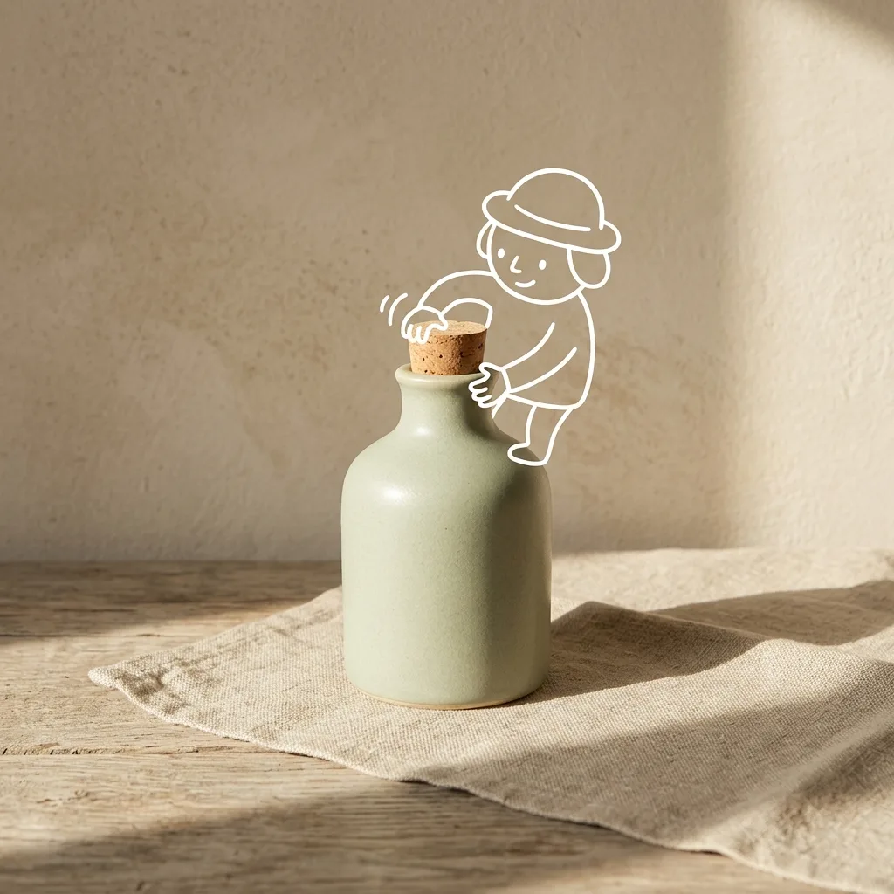

**#136 · Product &amp; Brand Prompt · <code>Vinano Image Pro</code>**

<details>
<summary>Show prompt</summary>

```
Product description and its placement], refined minimalist product photography, clean warm studio scene, textured beige wall in the background, soft directional sunlight creating long shadows, simple table surface, the product placed in a playful conceptual composition, overlaid a hand-drawn white outline doodle [character] interacting the product, mixed media style combining real photography and sketch illustration, premium branding feel, shallow depth of field, ultra-realistic, no extra text, no watermarks, 8K, 1:1. Emphasise material texture and natural light so the final frame feels tactile and premium.
```

</details>

---

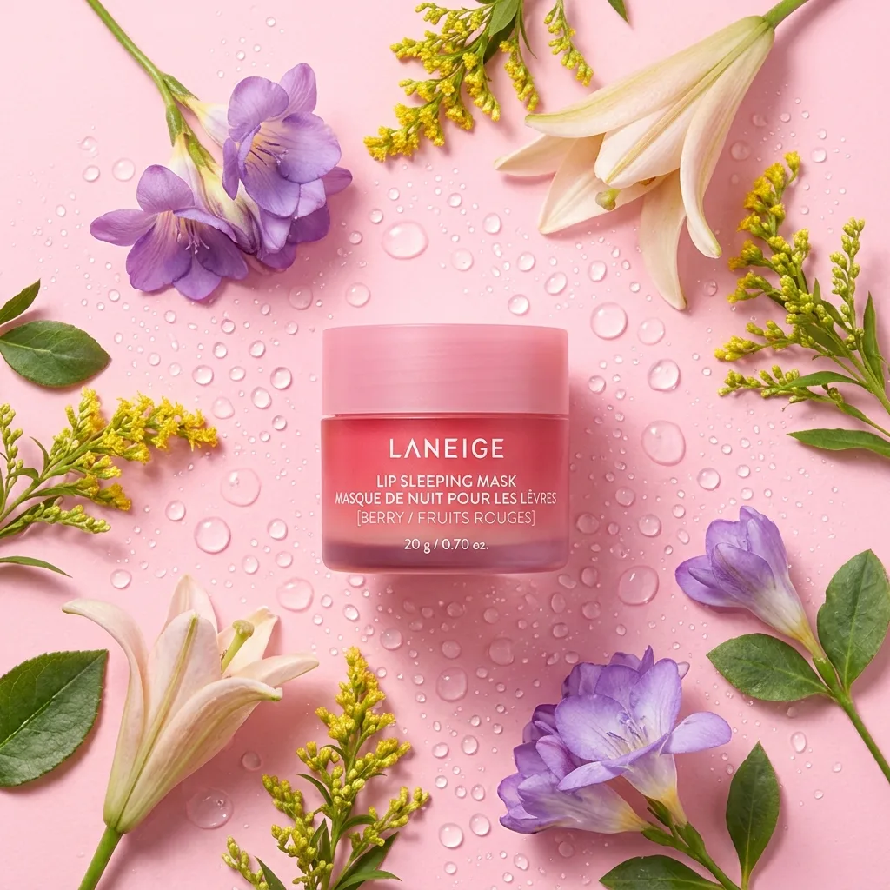

**#137 · Product &amp; Brand Prompt · <code>Vinano Image Pro</code>**

<details>
<summary>Show prompt</summary>

```
A hyper-realistic beauty product photograph of a pink [LANEIGE Lip Sleeping Mask] jar placed at the center of a vibrant pastel-pink surface covered in fresh water droplets, the jar upright a frosted pink lid and glossy translucent body, surrounded organically by delicate flowers including purple blossoms, pale lilies, yellow sprigs, and green leaves arranged diagonally around the product, soft diffused studio lighting from above creating gentle highlights and natural shadows, moisture beads sparkling across the background for a fresh dewy feel, clean skincare editorial aesthetic, feminine and luxurious mood, balanced flat-lay composition, shallow depth of field, ultra-detailed textures, true-to-life photorealistic, high-end cosmetic advertising style, 8K quality Render with rich micro-detail while keeping the layout uncluttered and intentional.
```

</details>

---

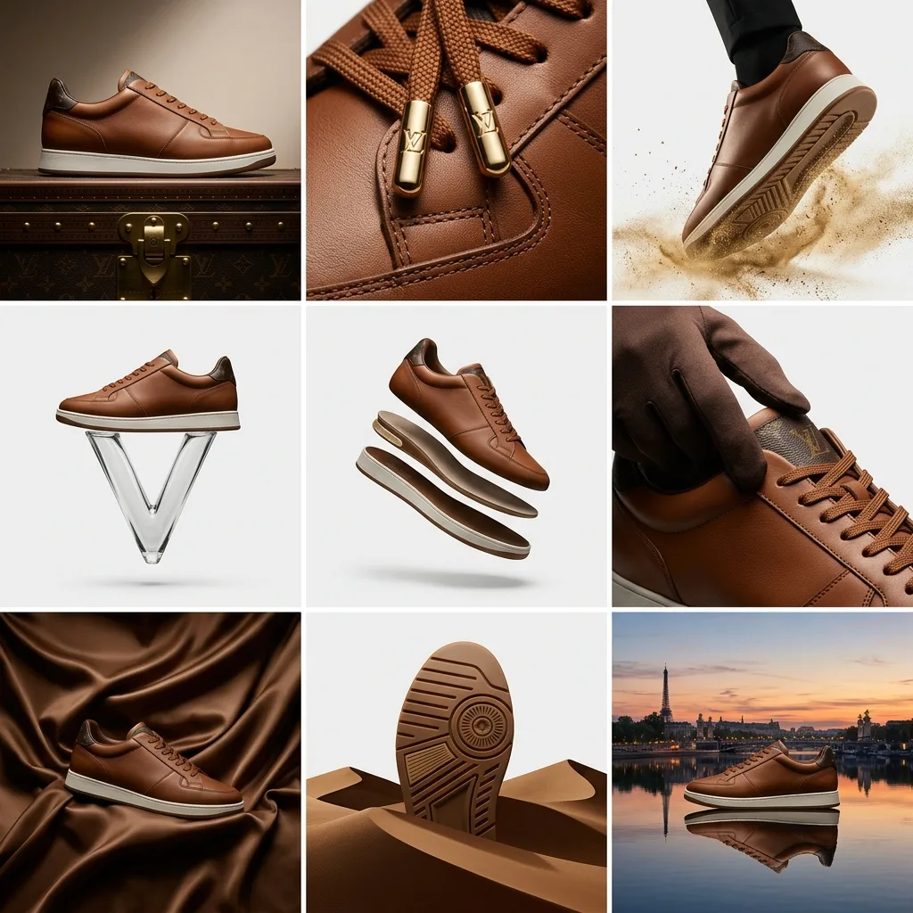

**#138 · Product &amp; Brand Prompt · <code>Vinano Image Pro</code>**

<details>
<summary>Show prompt</summary>

```
{
 "campaign_metadata": {
 "brand_identity": "Louis Vuitton Malletier",
 "product_focus": "Luxury Leather Sneaker / Trainer",
 "aspect_ratio": "3:4",
 "aesthetic": "High-Fashion Editorial | Avant-Garde Luxury"
 },
 "visual_dna": {
 "materials": ["Full-grain calf leather", "Monogram Embossed Canvas", "Polished Gold Hardware"],
 "color_scheme": ["Cognac Brown", "Deep Obsidian", "Champagne Gold"],
 "lighting": "High-contrast Chiaroscuro | Soft-box Key Lighting"
 },
 "grid_layout_execution": {
 "row_1_heritage": {
 "cell_1_1": "Hero profile: Shoe resting on a vintage LV trunk, side-lit to show leather grain.",
 "cell_1_2": "Extreme macro: Focus on the gold-tone 'LV' lace aglets and precision stitching.",
 "cell_1_3": "Dynamic: Gold dust/particles swirling around the sole as it 'steps' into frame."
 },
 "row_2_innovation": {
 "cell_2_1": "refined minimalist: The shoe balanced atop an abstract, floating glass 'V' sculpture.",
 "cell_2_2": "Floating: Deconstructed view showing the sole and upper suspended in a void.",
 "cell_2_3": "Sensory: A gloved hand adjusting the tongue, emphasizing soft leather suppleness."
 },
 "row_3_surrealism": {
 "cell_3_1": "Color Palette: Monochromatic scene in LV 'Havane' brown liquid silk drapes.",
 "cell_3_2": "Abstraction: Symbolic representation of the rubber sole pattern as a geometric desert landscape.",
 "cell_3_3": "Fusion: The shoe walking on a mirror-still lake reflecting a Parisian sunset skyline."
 }
 }
}

Aim for an editorial, design-driven look with deliberate negative space.
```

</details>

---

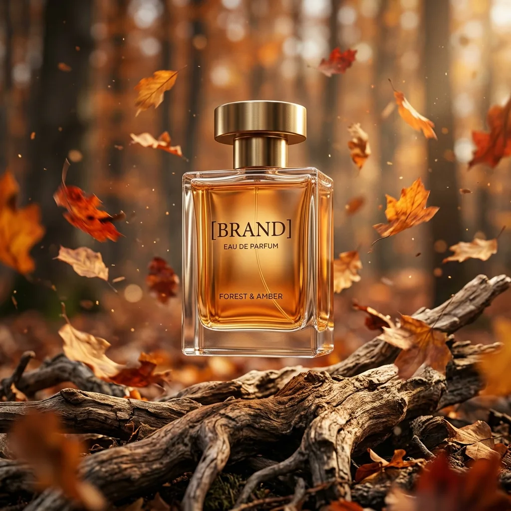

**#139 · Product &amp; Brand Prompt · <code>Vinano Image Pro</code>**

<details>
<summary>Show prompt</summary>

```
Ultra-realistic luxury perfume product shot (9: 16, 4K). A clear rectangular glass perfume bottle warm amber liquid and a metallic cap, floating mid-air above rugged driftwood/roots. Autumn leaves swirling around in motion, soft particles, warm orange/brown gradient background cinematic glow. Studio-quality lighting (soft key +rim), crisp reflections, sharp label reading [BRAND], shallow depth of field, high-end commercial retouching, dramatic bokeh, no extra text, no watermark. Emphasise material texture and natural light so the final frame feels tactile and premium.
```

</details>

---

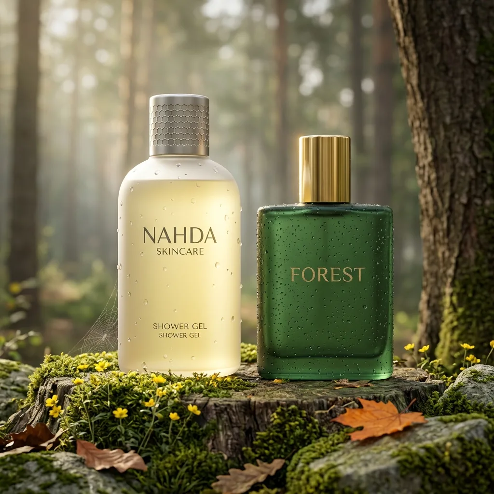

**#140 · Product &amp; Brand Prompt · <code>Vinano Image Pro</code>**

<details>
<summary>Show prompt</summary>

```
{
 "master_prompt": {
 "global_settings": {
 "resolution": "8K",
 "aspect_ratio": "1:1",
 "image_type": "true-to-life photorealistic AI-generated product photography",
 "detail_level": "ultra-high detail, macro clarity",
 "noise": "none",
 "artifacts": "none",
 "focus": "sharp subject, controlled depth of field"
 },

 "module_1_image_1_style": {
 "subject": {
 "object_type": "cosmetic bottle",
 "label_text_visible": "NAHDA SKINCARE",
 "product_type_text": "SHOWER GEL / SHOWER GEL",
 "bottle_material": "frosted translucent glass",
 "liquid_color": "soft pale yellow",
 "shape": "cylindrical rounded shoulders",
 "cap": {
 "material": "metallic",
 "color": "silver",
 "surface_pattern": "hexagonal honeycomb texture",
 "finish": "matte"
 },
 "surface_details": "small and medium water droplets evenly distributed"
 },
 "environment": {
 "setting": "forest floor",
 "base_surface": "weathered tree stump",
 "surroundings": ["green moss",
 "small yellow wildflowers",
 "tree trunk to the right",
 "fine spider web attached to moss"],
 "background": "soft forest bokeh diffused sunlight",
 "atmosphere": "humid, natural, calm"
 },
 "lighting": {
 "type": "natural diffused light",
 "direction": "soft backlight and side illumination",
 "highlights": "gentle glow through liquid",
 "shadows": "soft, natural"
 },
 "camera": {
 "angle": "eye-level product shot",
 "lens_style": "macro product photography",
 "depth_of_field": "shallow"
 },
 "color_palette": ["pale yellow",
 "soft green",
 "natural brown",
 "muted gold"]
 },

 "module_2_image_2_style": {
 "subject": {
 "object_type": "perfume bottle",
 "label_text_visible": "FOREST",
 "bottle_color": "deep matte green",
 "material": "opaque glass",
 "shape": "rectangular rounded edges",
 "cap": {
 "material": "metallic",
 "color": "gold",
 "finish": "glossy cylindrical"
 },
 "surface_details": "dense fine water droplets covering bottle"
 },
 "environment": {
 "setting": "forest pathway",
 "base_surface": "moss-covered stone or log",
 "foreground_elements": ["orange autumn leaf",
 "fallen brown leaves"],
 "background": "tall trees fading into mist",
 "atmosphere": "misty, cool, forest depth"
 },
 "lighting": {
 "type": "warm ambient forest light",
 "direction": "top-front diffused",
 "effects": "soft glow and mist illumination"
 },
 "camera": {
 "angle": "straight-on centered composition",
 "lens_style": "portrait product lens",
 "depth_of_field": "moderate soft background blur"
 },
 "color_palette": ["forest green",
 "gold",
 "autumn orange",
 "earth brown"

Emphasise material texture and natural light so the final frame feels tactile and premium.
```

</details>

---

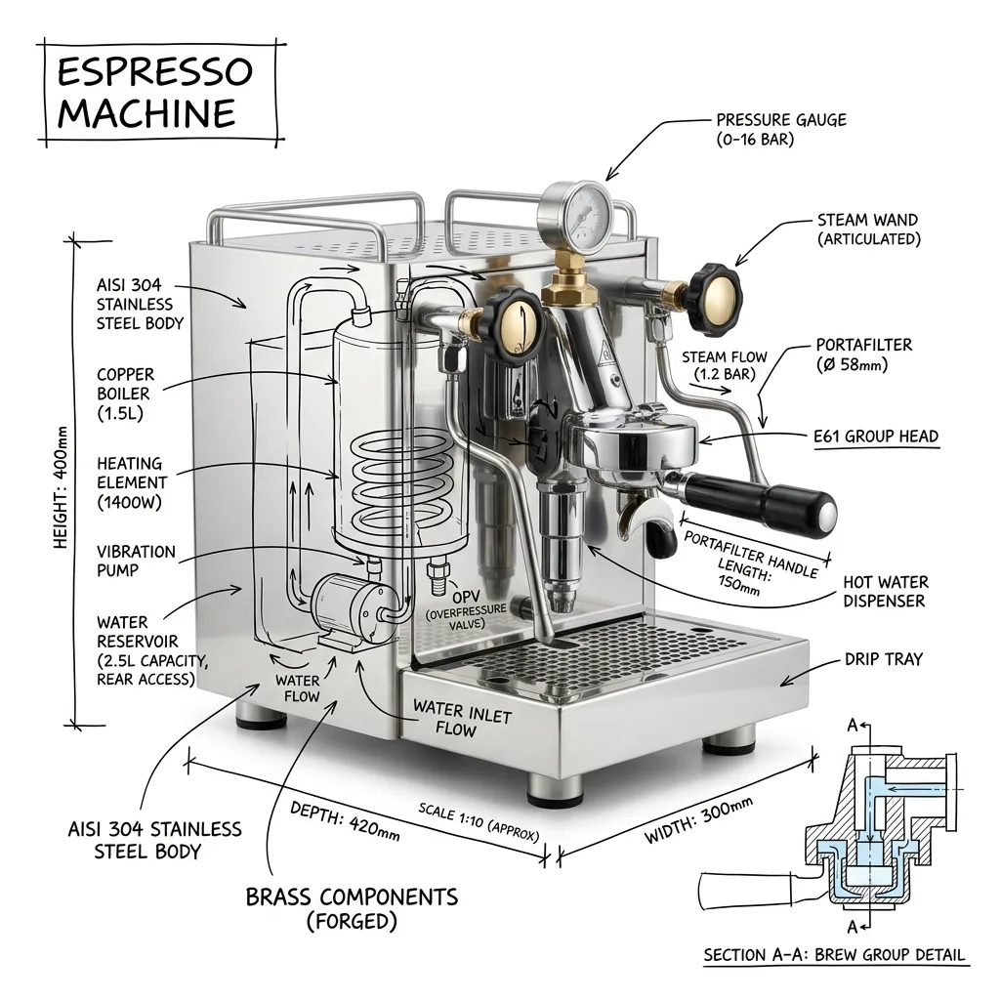

**#141 · Product &amp; Brand Prompt · <code>Vinano Image Pro</code>**

<details>
<summary>Show prompt</summary>

```
Create an infographic image of [OBJECT], combining a realistic photograph or true-to-life photorealistic render of the object technical annotation overlays placed directly on top.

Use black ink–style line drawings and text (technical pen / architectural sketch look) on a pure white studio background.

Include:
•Key component labels
•Internal cutaway or exploded-view outlines (where relevant)
•Measurements, dimensions, and scale markers
•Material callouts and quantities
•Arrows indicating function, force, or flow (air, sound, power, pressure, movement)
•Simple schematic or sectional diagrams where applicable

Place the title [OBJECT] inside a hand-drawn technical annotation box in one corner.

Style & layout rules:
•The real object remains clearly visible beneath the annotations
•Annotations look hand-sketched, technical, and architectural
•crisp composition balanced negative space
•Educational, museum-exhibit / engineering-manual vibe

Visual style:
Minimal technical illustration aesthetic.
Black linework layered over realistic imagery.
Precise but slightly hand-drawn feel.

Color palette:
Pure white background.
Black annotation lines and text only.
No colors.

Output:
1080 × 1080 resolution
Ultra-crisp
Social-feed optimized
No watermark

Maintain consistent colour harmony and crisp focus across the whole frame.
```

</details>

---

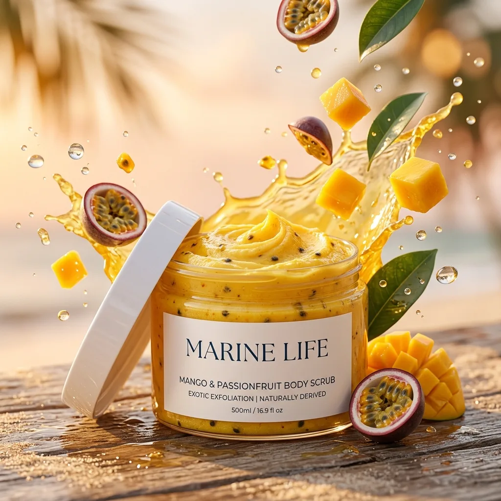

**#142 · Product &amp; Brand Prompt · <code>Vinano Image Pro</code>**

<details>
<summary>Show prompt</summary>

```
Luxurious tropical body scrub product photography, open jar of bright vibrant yellow-orange Mango & Passionfruit body scrub, creamy whipped texture visible fruit particles, Marine Life brand, elegant minimal packaging, white lid slightly lifted, juicy mango cubes and halved passionfruit floating around, dynamic splash of golden-yellow liquid and fruit juice in the air, fresh exotic fruit pieces mid-air, glossy wet droplets, vibrant juicy colors, appetizing and premium aesthetic, warm golden hour lighting, soft bokeh background in warm peach tones, highly detailed, cinematic product shot, commercial advertising style, 8k, ultra realistic

Video prompt

Ultra-luxurious tropical body scrub commercial video. Open jar of Marine Life Mango & Passionfruit Body Scrub creamy whipped texture and visible fruit particles. White lid slightly lifted. Juicy mango cubes and halved passionfruit floating dynamically around the jar. Golden-yellow liquid and fruit juice splash dramatically in mid-air. Fresh exotic fruit pieces hover and rotate around the product. Glossy wet droplets on jar and fruit, emphasizing freshness and luxury. Warm golden hour lighting soft bokeh background in peach tones. Camera slowly circling the product, capturing texture, shine, and vibrant colors in ultra-realistic 8K detail. Cinematic close-ups, smooth slow motion for splashes and floating fruits, commercial advertising style. Background minimalistic to enhance premium aesthetic.
Optional camera directions / effects:
Start extreme close-up on whipped texture, then pull out to reveal floating fruits.
Slow-motion splash of fruit juice backlighting to highlight droplets.
Gentle rotating 360° pan around the jar for product showcase.
Focus pull from foreground fruit to product label.
Subtle lens flare from warm golden light for cinematic luxury feel.

Aim for an editorial, design-driven look with deliberate negative space.
```

</details>

---

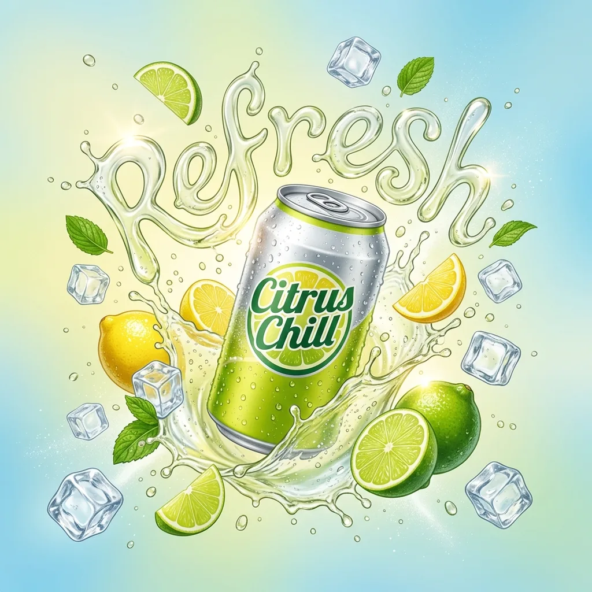

**#143 · Product &amp; Brand Prompt · <code>Vinano Image Pro</code>**

<details>
<summary>Show prompt</summary>

```
A vibrant, high-end advertising visual of a [PRODUCT NAME] can/bottle floating dynamically in the center. The background is a soft gradient inspired by the drink’s color, blending into fresh sky-blue tones for a refreshing summer feel. A powerful splash of [LIQUID TYPE] explodes around the product, forming the word ”[WORD]” in smooth, fluid, organic liquid typography. Crystal-clear ice cubes burst around the composition, fresh [FRUITS RELATED TO THE DRINK] (whole and sliced) flying in the air. Juicy splashes, droplets, light mist, and condensation create an intense refreshing atmosphere. Bright sunlight, glossy highlights, commercial lighting, premium brand look, dynamic motion, hyper-detailed, semi-realistic illustration style, ultra-clean, 4k, sharp focus. Render with rich micro-detail while keeping the layout uncluttered and intentional.
```

</details>

---

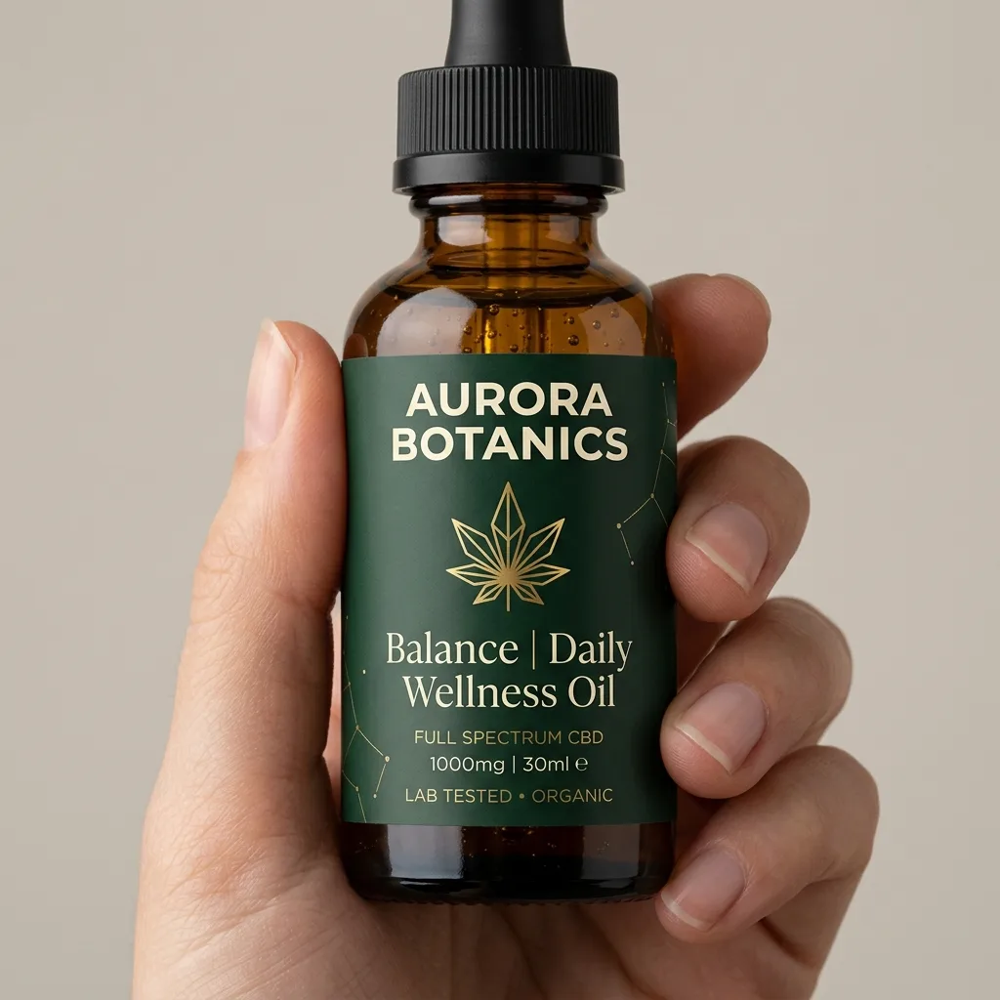

**#144 · Product &amp; Brand Prompt · <code>Vinano Image Pro</code>**

<details>
<summary>Show prompt</summary>

```
A tight close-up commercial product photo of a premium [PRODUCT TYPE] labeled “[BRAND NAME]”. The product is [SHAPE / FORM FACTOR], made of [MATERIAL], containing [LIQUID / CONTENT COLOR + TEXTURE DETAILS] visible [TEXTURE EFFECTS: bubbles / swirls / pulp / condensation / thickness]. It has a [CAP / LID TYPE + COLOR + FINISH].

The main label is [PRIMARY LABEL COLOR] a smooth matte finish. At the top of the label, the brand name “[BRAND NAME]” is printed in clean bold [TEXT COLOR] uppercase sans-serif typography. Below the brand name is a refined minimalist illustration of [ICON DESCRIPTION], in [FOIL / PRINT STYLE: gold foil / holographic foil / embossed ink], giving it a premium look. Under the icon, the product name reads “[PRODUCT NAME / VARIANT]” in a modern mixed-font layout (thin serif + sans-serif combination). Smaller text includes phrases like “[MICRO TEXT 1]”, “[MICRO TEXT 2]”, and “[MICRO TEXT 3]” in tiny [MICRO TEXT COLOR] print. Optional fine detail accents such as [PATTERN / LINEWORK / MICROGRAPHIC ELEMENTS] enhance the modern premium branding.

A human hand holds the [BOTTLE/CAN/JAR/TUBE] from the side, fingers wrapped around the middle clean short nails visible. No face or clothing is visible.

The background is a soft neutral [BACKGROUND COLOR TONE], studio-style, clean and minimal. Lighting is soft diffused studio lighting, gentle highlights along the [MATERIAL] edges and very smooth natural shadows. The photo is sharply focused on the label and [CONTENT TEXTURE], a slightly blurred background. The overall aesthetic is premium, minimal, modern [CATEGORY] branding, high-end commercial product photography.

Render with rich micro-detail while keeping the layout uncluttered and intentional.
```

</details>

---


**#145 · Product &amp; Brand Prompt · <code>Vinano Image Pro</code>**

<details>
<summary>Show prompt</summary>

```
[BRAND NAME] | [HEADLINE] | [SUB-TEXT] | [CTA]. Act as a Senior Art Director.

PHASE 1: INTEGRATED COMPOSITION & OVERLAP.
- Layout: Seamless fusion of 2D graphics and 3D photography.
- Overlap Logic: The subject and their primary "Product Prop" (e.g., a car, a device) must physically overlap the graphic panel to break the "wall" between design and photo.
- Unity: Geometric shapes from the graphic side must bleed into the photographic sky area.

PHASE 2: BRAND & CATEGORY SIMULATION.
Autonomously analyze the [BRAND NAME] and its industry category:
- INDUSTRY CONTEXT:
 * If Automotive: Include the vehicle and a person interacting it.
 * If Tech: Include flagship devices/gadgets.
 * If Fashion/Lifestyle: Focus on editorial poses and premium accessories.
- SHAPE SIMULATION: Match shapes to brand identity (e.g., Sharp/Speed for Auto, refined minimalist/Grid for Tech).
- COLOR SIMULATION: Use the brand's primary signature hue for both the graphic pattern and the subject's outfit/accents.

PHASE 3: TYPOGRAPHY & CUSTOM CONTENT.
- Headline: Display "[HEADLINE]" in a bold, modern Sans-Serif font. (If [HEADLINE] is empty, generate a high-energy slogan for [BRAND NAME]).
- Sub-headline: Display "[SUB-TEXT]" below the headline.
- Button: Create a refined minimalist pill-shaped CTA button the text: "[CTA]".
- Interaction: Text layers should have 3D depth, sitting partially behind the subject or product prop.

PHASE 4: PHOTOGRAPHY & SUBJECT.
- Perspective: Extreme low-angle (worm’s eye view) looking up.
- Subject: A diverse persona reflecting the brand's audience.
- Environment: Massive, clear blue sky as the backdrop.
- Visual Link: Subject's styling must incorporate the Brand's primary color.

PHASE 5: FINAL VISUAL STYLE.
High-end commercial aesthetic. Crisp, saturated, professional fusion of flat vector art and realistic photography.

Render with rich micro-detail while keeping the layout uncluttered and intentional.
```

</details>

---

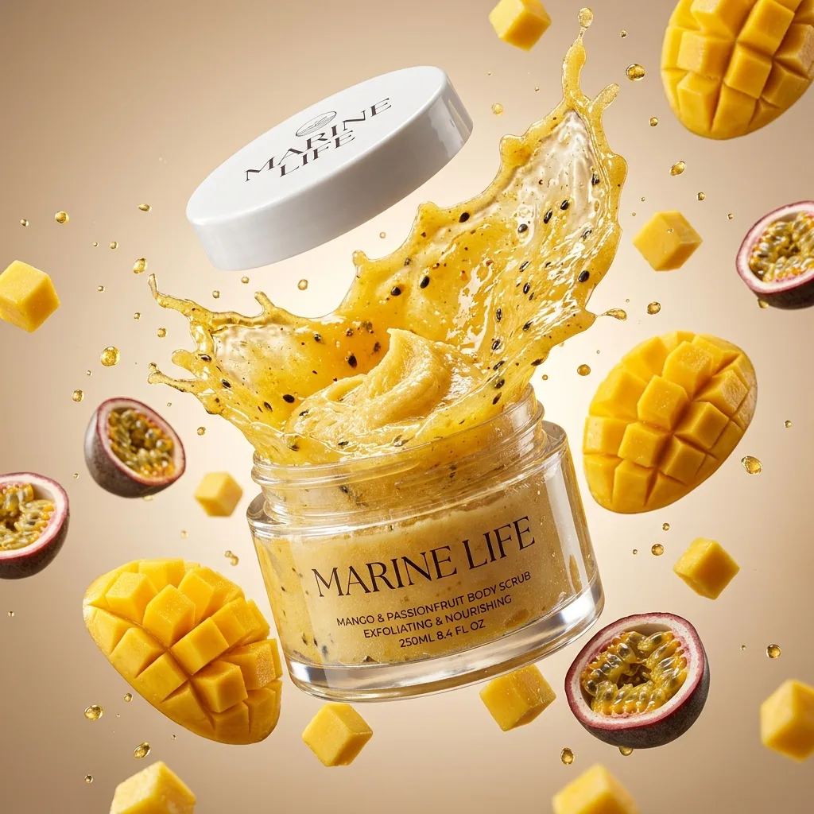

**#146 · Product &amp; Brand Prompt · <code>Vinano Image Pro</code>**

<details>
<summary>Show prompt</summary>

```
A hyperrealistic premium product photography scene of a transparent cosmetic jar labeled “MARINE LIFE” mango and passionfruit body scrub exploding open mid-air, the white lid floating slightly above the jar and a thick, whipped, golden-yellow scrub bursting upward in a dramatic splash, glossy and textured visible black passionfruit seeds, surrounded by suspended mango cubes, scored mango halves, and halved passionfruits glistening pulp, golden liquid droplets and splashes frozen in motion around the jar, the container tilted slightly to the right and centered in frame, shot from a straight-on macro perspective, illuminated by soft yet high-contrast studio lighting from above and slightly behind to create glowing highlights on the wet textures and translucent splashes, subtle shadows beneath the floating elements, a smooth warm beige gradient background enhancing the tropical color palette of saturated yellows, oranges, and deep purple fruit tones, ultra-sharp focus on the jar and scrub shallow depth of field for the outer fruit, cinematic realism, luxury skincare advertising aesthetic, crisp reflections, 8K true-to-life photorealistic detail, energetic and fresh mood. Render with rich micro-detail while keeping the layout uncluttered and intentional.
```

</details>

---

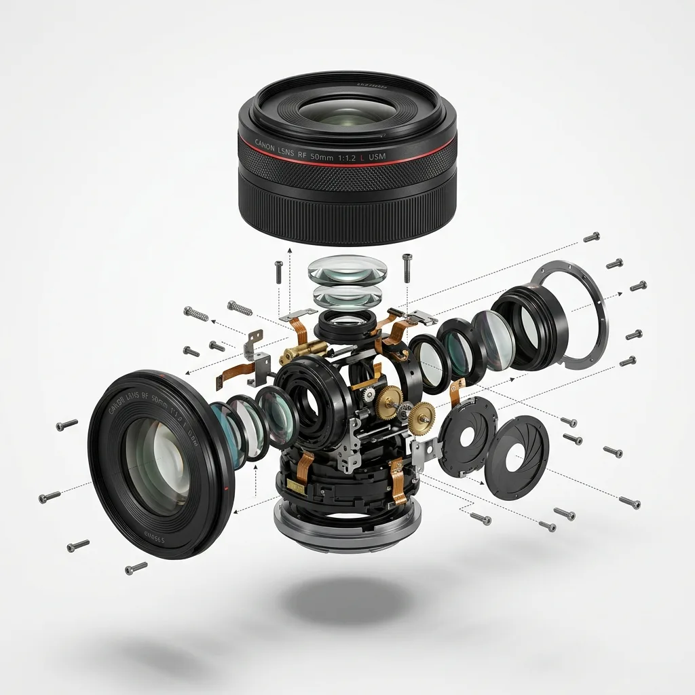

**#147 · Product &amp; Brand Prompt · <code>Vinano Image Pro</code>**

<details>
<summary>Show prompt</summary>

```
[product], high-end product advertising, white seamless background, exploded view inner mechanics revealed, outer shell hovering above core, micro screws and components suspended, perfect alignment guides implied, crisp soft shadow, ultra realistic, macro product photography, 100mm lens look, f/8, 8k Preserve realistic proportions and depth for a confident, professional finish.
```

</details>

---

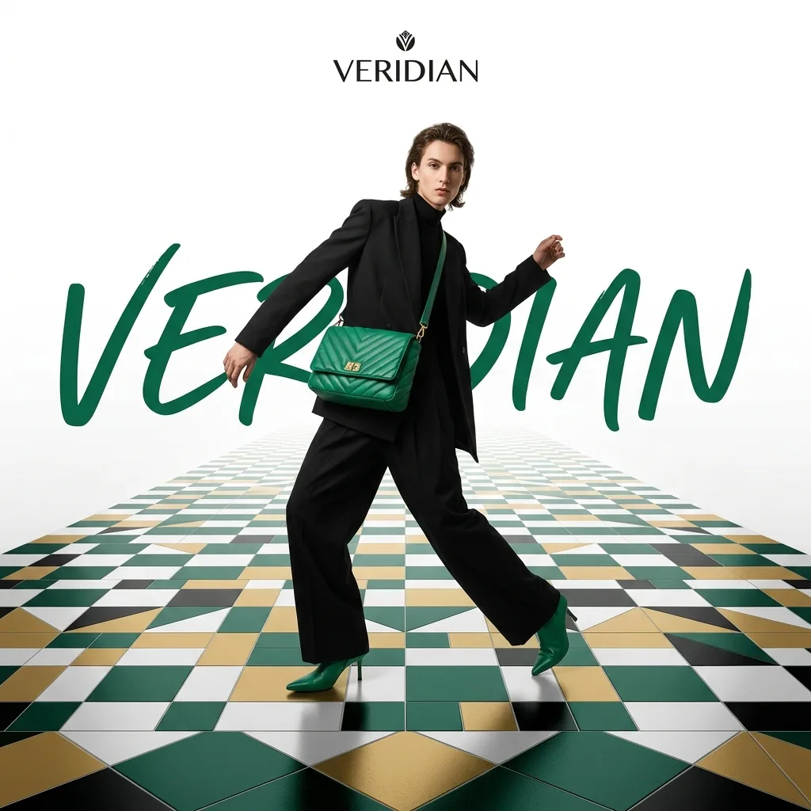

**#148 · Product &amp; Brand Prompt · <code>Vinano Image Pro</code>**

<details>
<summary>Show prompt</summary>

```
[BRAND NAME]. Act as a Fashion Photographer and Graphic Designer specializing in luxury brand campaign visuals integrated typography and surreal spatial design.

PHASE 1: SPATIAL CONCEPT

Create a high-fashion editorial image where architecture and graphic design merge into a theatrical stage. The foundation is a bold geometric floor pattern that extends into forced perspective, creating infinite depth and visual drama. This is not a neutral backdrop – the floor is a protagonist that amplifies brand identity through pattern, color, and spatial illusion.

PHASE 2: CHECKERBOARD ARCHITECTURE

- Surface: Checkerboard/geometric tile pattern rendered in brand-relevant colors

- Perspective: Aggressive forced perspective starting from bottom foreground and receding toward horizon (vanishing point at upper third of frame)

- Pattern Logic: Autonomously determine pattern based on [BRAND NAME]:

- Color Palette: Incorporate 2-3 signature colors of [BRAND NAME] into floor pattern while maintaining readability

- Texture: true-to-life photorealistic rendering subtle reflections and shadows for depth

PHASE 3: MODEL & STYLING

- Subject: One fashion model (gender-fluid casting) captured mid-motion – dynamic pose suggesting walking, running, or dancing

- Outfit: Elevated monochrome look (black, white, or brand-neutral tone) to let floor pattern and typography dominate. Include 1-2 key accessories in [BRAND NAME]'s signature color as hero product focal points

- Pose Energy: 70% movement, 30% control – fashion-forward but grounded (avoid floating/unnatural levitation)

- Placement: Model positioned in lower-mid frame, interacting spatially both floor perspective and typography layer

- Camera Angle: Low-to-mid angle (waist-to-full body shot) to emphasize floor perspective drama

PHASE 4: TYPOGRAPHY INTEGRATION

- Brand Script: Oversized handwritten/script version of [BRAND NAME] rendered as flat graphic element behind or around the model

- Scale: Typography should be 40-60% of frame width – bold and unmissable but not crushing the model

- Color: Signature brand color (autonomously selected), solid fill clean edges

- Interaction: Typography appears to "sit" in the space – model may partially overlap letters, creating layering hierarchy

- Logo Lockup: Clean, small brand logo centered in upper portion of frame (10-15% of width) in black or brand color

- Treatment: Pure vector aesthetic – no gradients, no shadows, no dimensional effects. Flat color only.

PHASE 5: COLOR ORCHESTRATION (AUTONOMOUS)

Autonomously research and apply [BRAND NAME]'s iconic color system:

- Primary: Identify 1-2 hero brand colors (e.g., Gucci → forest green + red, Tiffany → robin egg blue)

- Application: Use primary colors in floor pattern AND typography for visual cohesion

- Balance: 60% white/neutral space, 30% brand color saturation, 10% black for anchoring

- Accent: Hero product (bag, shoes, accessory) should echo brand color for strategic eye-pull

PHASE 6: LIGHTING & ATMOSPHERE

- Lighting Setup: High-key fashion lighting soft shadows – think editorial studio quality

- Key Light: 45° front-left to sculpt model, creating gentle shadows on checkerboard

- Fill: Ambient fill to prevent harsh contrast while maintaining drama

- Floor Treatment: Subtle specular highlights on floor tiles for luxury sheen (not glossy/mirror-like)

- Background: Pure white or subtle gradient to white at horizon line – maintains clean editorial feel

PHASE 7: TECHNICAL EXECUTION

- Mood: Playful luxury – sophisticated but not stiff, energetic but refined

- Composition Rule: Dynamic diagonal lines (floor perspective) + vertical anchor (model) + horizontal balance (typography)

- Depth Layers: Background (white) → Typography (mid-ground) → Model (foreground) → Floor pattern (spanning all depths)

- Post-Production: Magazine-cover polish color grading that enhances brand palette

TECHNICAL SPECS:

- Camera Simulation: Phase One XF IQ4 150MP, 80mm lens, f/5.6 for controlled depth

- Aspect Ratio: 4:5 (Instagram editorial) or 3:4 (print campaign)

- Resolution: 8K output, print-ready sharpness

- Color Space: sRGB vibrant saturation for digital, slight desaturation for luxury print feel

- Style Reference: Gucci campaigns by Glen Luchford, Prada visuals, Highsnobiety x luxury collabs, Vogue Italia editorials

- Rendering: true-to-life photorealistic model and floor, graphic-design-quality typography (hybrid aesthetic)

Preserve realistic proportions and depth for a confident, professional finish.
```

</details>

---

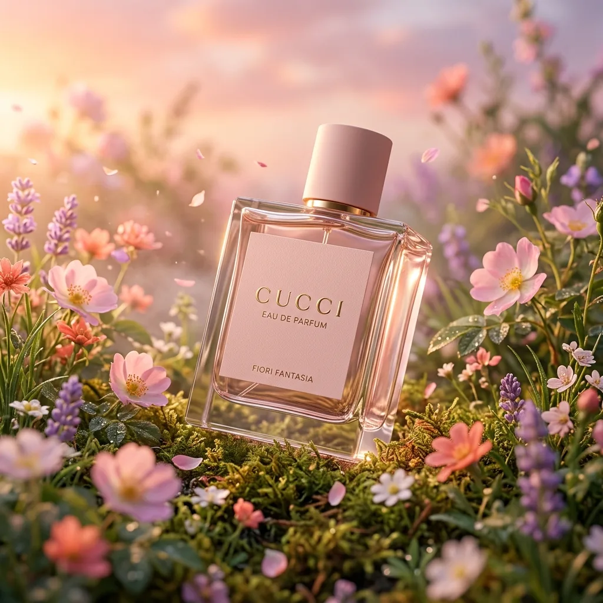

**#149 · Product &amp; Brand Prompt · <code>Vinano Image Pro</code>**

<details>
<summary>Show prompt</summary>

```
{
 "prompt": {
 "subject": "Hyper-realistic luxury perfume product photograph",
 "product": {
 "bottle": {
 "shape": "Rectangular",
 "material": "Transparent glass",
 "label": {
 "text": "CUCCI",
 "color": "Soft blush-pink",
 "texture": "Matte"
 },
 "cap": {
 "color": "Soft blush-pink",
 "texture": "Matte"
 },
 "placement": {
 "angle": "Gentle diagonal",
 "position": "Center"
 },
 "details": {
 "liquid": "Visible, soft reflections",
 "highlights": "Glowing on glass edges"
 }
 }
 },
 "environment": {
 "setting": "Lush miniature fantasy meadow",
 "ground": "Moss-covered",
 "flora": {
 "flowers": ["Delicate pink", "Lavender", "Coral wildflowers"],
 "grasses": "Soft green"
 },
 "atmosphere": {
 "air": "Tiny petals drifting",
 "mist": "Faint, floating low"
 }
 },
 "lighting": {
 "source": "Warm golden-pink light from upper left",
 "effect": "Dreamy sunset",
 "type": "Studio-grade subtle rim light"
 },
 "composition": {
 "depth_of_field": "Cinematic shallow",
 "focus": "Crisp on the brand name",
 "foreground": "Softly blurred blooms",
 "background": {
 "description": "Fading into a pastel bokeh haze",
 "elements": ["Florals", "Foliage"],
 "colors": ["Pink", "Peach", "Violet"]
 }
 },
 "style": {
 "aesthetic": "High-end editorial beauty",
 "mood": "Romantic and ethereal",
 "realism": "Premium realism",
 "quality": "8K",
 "textures": "Ultra-detailed (moss, petals, glass, label)"
 }
 }
}

Emphasise material texture and natural light so the final frame feels tactile and premium.
```

</details>

---

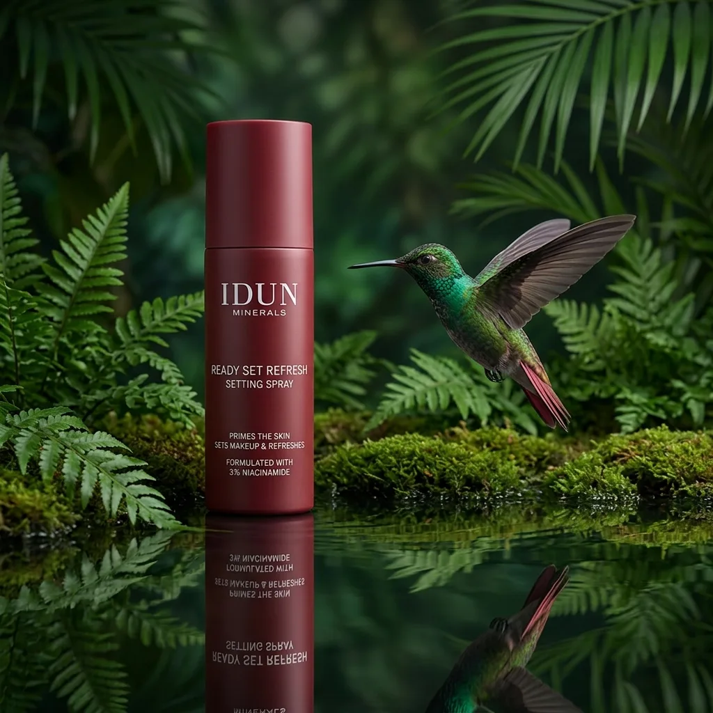

**#150 · Product &amp; Brand Prompt · <code>Vinano Image Pro</code>**

<details>
<summary>Show prompt</summary>

```
{
 "subject": {
 "primary": "Cosmetic spray bottle",
 "secondary": "Hummingbird",
 "brand": "IDUN MINERALS",
 "product_name": "READY SET REFRESH"
 },
 "packaging": {
 "form_factor": "Cylindrical bottle",
 "component_parts": ["Main body",
 "Cap (flush body)"],
 "material_appearance": "Matte finish, likely plastic or coated metal",
 "condition": "Pristine, new",
 "reflections": "Vertical highlight on the left side, mirrored reflection in water below"
 },
 "label_design": {
 "type": "Direct print onto bottle",
 "layout_orientation": "Mixed (Horizontal brand/details, Vertical product name)",
 "typography": {
 "font_family": "Sans-serif",
 "casing": "All uppercase",
 "style": "Clean, refined minimalist",
 "alignment": "Left aligned relative to the vertical axis for product name, centered horizontally for brand"
 }
 },
 "text_visible": {
 "brand_header": ["IDUN",
 "MINERALS"],
 "body_vertical": ["READY SET REFRESH",
 "SETTING SPRAY"],
 "footer_details": ["PRIMES THE SKIN",
 "SETS MAKEUP & REFRESHES",
 "FORMULATED WITH",
 "3% NIACINAMIDE"],
 "reflection_text": "Inverted mirror image of all text visible on the water surface"
 },
 "colors": {
 "packaging_base": "Deep red / Burgundy",
 "text": "White",
 "foliage": ["Deep emerald green",
 "Forest green",
 "Moss green"],
 "hummingbird": ["Iridescent green (head/back)",
 "Dark grey/brown (wings)",
 "Reddish/pink (tail feathers)",
 "Black (beak)"],
 "water": "Dark, almost black reflections"
 },
 "materials": {
 "bottle": "Matte rigid material",
 "environment": ["Liquid water",
 "Moss",
 "Fern leaves",
 "Palm-like leaves"],
 "biological": "Feathers (bird)"
 },
 "human_elements": {
 "visible": false
 },
 "environment": {
 "setting": "Simulated rainforest or jungle floor",
 "foreground": "Still water surface",
 "midground": "Mossy bank, bottle placement",
 "background": "Dense tropical foliage"
 },
 "lighting": {
 "quality": "Soft, moody, atmospheric",
 "direction": "Side lighting from left (creating highlight on bottle)",
 "shadows": "Soft shadows in the foliage, dark water providing high contrast reflection",
 "highlights": "specular highlight on hummingbird head, diffuse highlight on bottle curve"
 },
 "camera": {
 "angle": "Eye-level water surface",
 "framing": "Vertical portrait",
 "focus": "Sharp focus on bottle and hummingbird",
 "depth_of_field": "Shallow (background leaves are blurred/bokeh)",
 "composition": "Rule of thirds (bottle on left third line, bird entering from right)"
 },
 "style": {
 "category": "Product photography",
 "theme": "Nature, Organic, Eco-luxury",
 "mood": "Serene, fresh, premium"
 }
}

Render with rich micro-detail while keeping the layout uncluttered and intentional.
```

</details>

---


**#151 · Product &amp; Brand Prompt · <code>Vinano Image Pro</code>**

<details>
<summary>Show prompt</summary>

```
Create top-down flat lay product photo. Use the uploaded product as the main object, centered. Analyze the product type from the photo and automatically choose matching props/ingredients for an aesthetic flat lay around it (minimal, premium, on-brand). Preserve exact geometry, size, colors, label design, and all text on the product (no changes). Warm beige seamless background, soft directional sunlight, crisp realistic shadow.
Ultra-realistic macro product photography, 100mm lens look, f/8, sharp focus, crisp composition, no extra text, 8k, format 2:3.

Preserve realistic proportions and depth for a confident, professional finish.
```

</details>

---

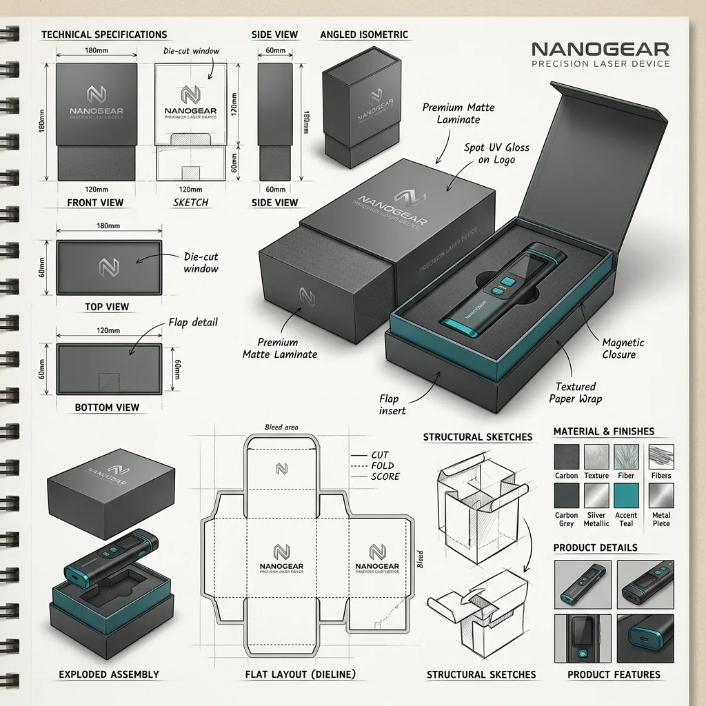

**#152 · Product &amp; Brand Prompt · <code>Vinano Image Pro</code>**

<details>
<summary>Show prompt</summary>

```
the attached image, create a professional industrial packaging design illustration sheet for the packaging of [PRODUCT NAME]

Feature a centered hero 3D render realistic materials, soft studio lighting, and commercial-grade finish quality.
Surround the hero render technical views: front, side, top, bottom, angled perspective, and flat layout.

Include structural construction sketches, fold lines, seam details, and dimension arrows measurements in millimeters.
Show materials and finishes (matte, glossy print, plastic, paper, glass, etc.) handwritten-style annotations.
Add color swatches, realistic product illustrations, and subtle shadows.

Background should resemble clean sketchbook paper, combining realistic rendering pencil sketch overlays.
Modern industrial design aesthetic, ultra-detailed, portfolio-ready presentation.

 settings:
CFG: 7–9
Steps: 30–40
Sampler: DPM++
Resolution: 1024×1280 or higher
Aspect Ratio: 3:4

Emphasise material texture and natural light so the final frame feels tactile and premium.
```

</details>

---

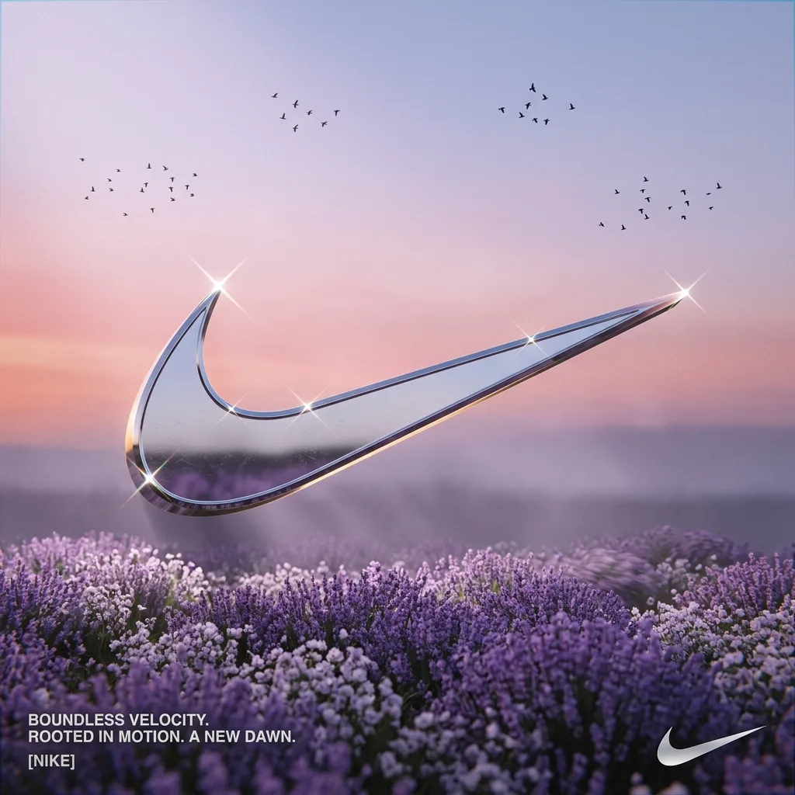

**#153 · Product &amp; Brand Prompt · <code>Vinano Image Pro</code>**

<details>
<summary>Show prompt</summary>

```
[BRAND NAME]. Act as a Senior 3D Product Visualization Artist and Cinematic Art Director specializing in luxury brand key visuals for high-end editorial and streetwear campaigns.

PHASE 1: LOGO SUBJECT

Autonomously identify the official, universally recognized logo/logotype of [BRAND NAME]. Reproduce it maximum fidelity to the original silhouette, proportions, andgeometry — no stylistic distortion, no graffiti interpretation. The logo shape must be instantlyrecognizable as the real [BRAND NAME] mark. Extrude the logo into a solid 3D object a depth of approximately 15–20% of its height. All surfaces — front face, side extrusion, and beveled edges — must be coated in a single unified material: Surface material: hyper-polished liquid chrome. Reflectance value 0.98 — near-perfect mirror finish. Apply full Ray-Traced environment reflections: the logo must visibly reflect the surrounding sky gradient, flower field, and light sources within its curved and flat surfaces. Bevel radius on all hard edges: moderate
(enough to catch sharp specular highlights). Add Subsurface Scattering on the thinnest structural parts of the logo (fine lines, serifs, icon details) to create a subtle inner glow at the edges.
Place 4–8 prismatic star-shaped lens-flare sparkles (4-point) at the highest specular peaks — corners, tips, and curved peaks of the logo geometry. The sparkles must feel organic, not uniformly distributed. Zero matte surfaces. Zero plastic look. The entire object must read as cast from liquid silver.

PHASE 2: ENVIRONMENT & BACKGROUND

Background: a wide cinematic landscape at the golden-lilac hour (just after sunset). A vast flower field fills the lower third — densely packed lavender and white wildflowers realistic micro-texture and subtle wind motion-blur on the far clusters. Middle ground fades into soft purple-grey bokeh haze. Sky: gradient from warm blush rose (#E8A0BF) at the horizon through lilac (#C3A6D4) to cool powder blue (#A8C4D8) at the top. Add 3–5 loose silhouetted bird clusters (starlings, small and sharp) scattered across the upper left and right quadrants. Volumetric atmospheric haze
sits on the horizon line. Autonomously shift the environment's color palette to reflect [BRAND NAME]'s iconic brand identity — introduce the brand's signature hue as a tonal wash in the sky gradient or as the dominant flower color in the field. Preserve the overall ethereal, editorial mood. The environment must feel like it was art-directed specifically for this brand — not generic.

PHASE 3: COMPOSITION & LAYOUT

Format: 1:1 square. The chrome logo is centered horizontally and placed at the vertical midpoint — monumental in scale, spanning 65–80% of frame width.Apply a subtle forced perspective tilt (2–4 degrees)
for dynamic energy without distorting logo recognition. The bottom edge of the logo object grazes or slightly overlaps the top of the flower field, integrating the 3D object naturally into the environment. The logo casts a soft diffused shadow downward into the flowers. Lower-left corner: 2–3 lines of micro-copy in clean white sans-serif at minimal optical size. Autonomously generate a poetic 3-line brand statement relevant to [BRAND NAME]'s world, heritage, and aesthetic language. Bottom-left: "[BRAND NAME]" in small caps logotype label. Bottom-right: a secondary flat 2D chrome version of the same logo rendered small as a finishing mark.

PHASE 4: LIGHTING

Primary: large soft area light from upper-left simulating post-sunset overcast sky — fully diffused, no hard shadows, color temperature 5800K a lilac tint overlay. Secondary: warm rim light (3200K) grazing the bottom and side edges of the logo from behind — creates a golden separation halo between the object and the field. Global Illumination enabled — the chrome logo must realistically bounce and absorb the landscape's ambient color. The flower field's purple tones should be faintly visible in the lower reflective surfaces of the logo. Volumetric god rays faintly visible through any negative space or cutouts within the logo geometry.

TECH SPECS

Render engine: Octane Render aesthetic. Ray Tracing: maximum bounces (16+). Depth of Field: f/11 equivalent — full logo sharp, far background in soft bokeh only. Tone mapping: lifted blacks, compressed highlights, filmic S-curve. Color grade: desaturated midtones, preserved pastels, cool shadow tones. Film grain: subtle (ISO 200 equivalent). Chromatic Aberration: 0.2–0.3px on peripheral logo
edges only. Anti-aliasing: maximum. Strictly no AI-plastic normals. No smooth uniform shading. Microscopic surface imperfections on the chrome required for realism (micro-scratches, 0.5%
roughness noise map). Mood reference: luxury brand retrospective editorial for Highsnobiety or AnOther Magazine.

Maintain consistent colour harmony and crisp focus across the whole frame.
```

</details>

---

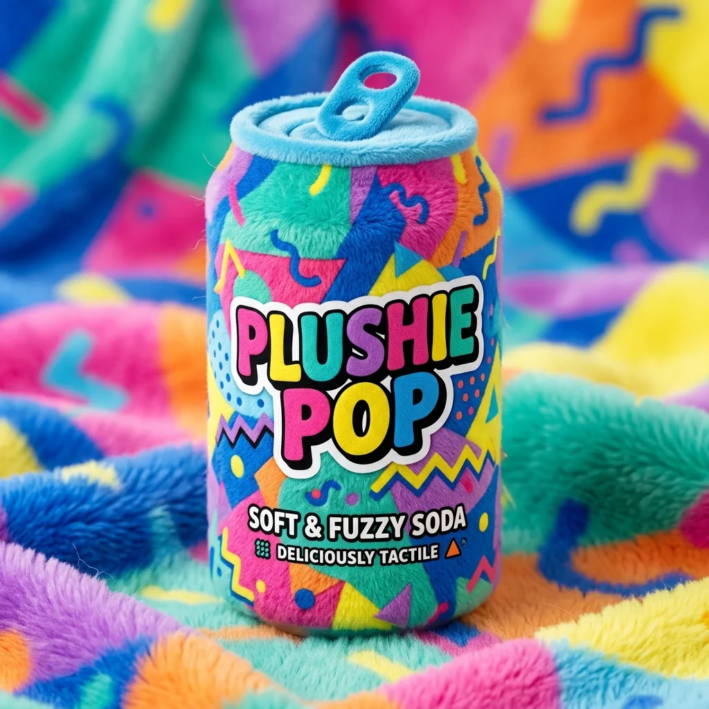

**#154 · Product &amp; Brand Prompt · <code>Vinano Image Pro</code>**

<details>
<summary>Show prompt</summary>

```
A beverage can branded [BRAND NAME], entirely made from vibrant, fluffy plush fabric, positioned centrally against a soft, plush background in the signature colors of [BRAND NAME].

Bold Pop Art and Memphis design style, playful yet premium aesthetic.

Bright, clean studio lighting that strongly emphasizes the plush texture, visible fibers, softness, and tactile depth.

Sharp focus, high color saturation, smooth shadows, modern commercial product shot, minimal composition, ultra-high resolution.

Emphasise material texture and natural light so the final frame feels tactile and premium.
```

</details>

---

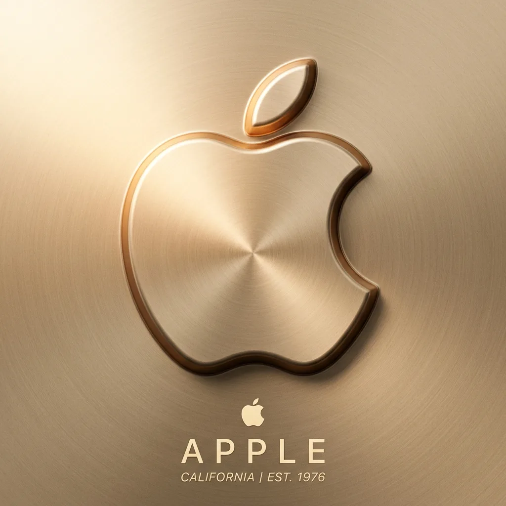

**#155 · Product &amp; Brand Prompt · <code>Vinano Image Pro</code>**

<details>
<summary>Show prompt</summary>

```
[BRAND NAME] + [COLOR]

Act as a Senior CGI Artist and Brand Identity Director specializing in premium logo materializations. Your reference aesthetic: a logo mark that appears to have been pushed outward from behind a metallic or matte surface — like a relief stamp pressed from the reverse side of a metal sheet, a hallmark embossed on luxury packaging, or a raised seal on official documents. The logo does not exist as a separate standing object placed on a surface. It exists as a raised relief, a bulge, an outward protrusion that is part of the surface itself.

BRAND INTELLIGENCE SYSTEM

Before executing any phase, resolve these parameters: (1) LOGO GEOMETRY — identify [BRAND NAME]'s primary icon mark in its simplest most reduced form — the mark that works at any scale, (2) COLOR PALETTE — based on [COLOR], build the full tonal system from the lightest specular highlight to the deepest shadow tone, determine if the overall mood reads warm, cool, or neutral, (3) SURFACE MATERIAL — based on [COLOR] determine the surface character: silver or grey becomes brushed or circular-grain steel, gold or champagne becomes warm brushed metal radial grain, black becomes anodized aluminum or matte carbon fiber, white becomes matte ceramic or chalk plaster, any saturated hue becomes anodized colored metal holding the hue in lit areas and desaturating toward black in deepest shadows, (4) LIGHT DIRECTION — determine the most flattering single light angle to reveal the emboss topography — where highlights land on the raised ridge peaks and where shadows fall on the descending walls.

PHASE 1: SURFACE & ATMOSPHERE

The entire image is one single continuous material surface — not a background an object placed on it, but one unified physical plane filling the entire canvas. This surface is made of the SURFACE MATERIAL resolved above. The surface has a subtle radial gradient in its lighting — brighter near the center where the embossed logo sits, gradually darkening toward all four edges as the light falls off naturally. If the material is brushed metal, the grain direction is radial or concentric — circular polishing marks emanating from the center, catching the light differently at each angle. Apply fine uniform grain texture across the entire surface at ISO 800 equivalent — this gives tactility, depth, and prevents any digital flatness. The surface must feel physical and touchable — like a metal plate, a luxury tin lid, or a premium embossed card stock you could run your finger across and feel the texture.

PHASE 2: THE EMBOSS — CRITICAL

The [BRAND NAME] logo mark is rendered as a full bas-relief — think of a coin, a commemorative medal, or a luxury brand stamp where the ENTIRE logo shape rises as one unified solid mass from the surface. Not just the outline. Not just the stroke path. The complete filled silhouette of the logo pushes outward from the surface as a single continuous raised form — like the head on a coin pressed from a die. The interior of the logo is NOT hollow or open. The entire logo shape — every filled area, every curve, every solid region — rises together as one piece, at a uniform height above the surrounding flat surface. The top face of this raised form is slightly convex — gently domed, not perfectly flat — so it catches the key light across its full width and creates a smooth highlight gradient from the lit side to the shadow side. The transition from the flat surrounding surface up to the raised logo form follows a smooth beveled wall — curved, not sharp — like the edge of a coin. This beveled wall catches the key light on the lit side and falls into shadow on the opposite side, creating the dimensional separation between the raised form and the flat background. Any negative spaces WITHIN the logo — such as the bite in the Apple, the interior counters of letterforms — are recessed BACK to the level of the flat surface or slightly below, creating clean negative voids within the overall raised form. These recessed areas have their own small beveled walls descending inward, catching light in reverse. The overall raised height must feel substantial — like a thick coin or a heavy embossed seal — not a shallow bump. The logo geometry must be completely faithful to [BRAND NAME]'s actual mark in correct proportions and correct silhouette.

PHASE 3: LIGHTING

One primary soft area light from upper-left at approximately 10 to 11 o'clock position — broad and diffused, wrapping around the curved walls of the raised ridge to create the characteristic highlight peak at the top and gradual shadow descent on the far wall. Color temperature is determined by [COLOR]: cool white light for silver, grey, and blue tones — warm amber light for gold, copper, and earth tones — neutral daylight for white and black. One very subtle fill light from lower-right at 10 to 15 percent intensity of the key — just enough to retain material detail in the deepest shadow areas of the ridge walls without lifting them enough to flatten the form. No hard shadows anywhere on the surface. No spotlight pools. No rim light. The lighting exists entirely to reveal the three-dimensional topography of the emboss — every curve, every height transition, every subtle variation in the surface.

PHASE 4: TYPOGRAPHY

In the lower portion of the canvas, below the embossed logo, on the same continuous surface — a minimal typographic lockup. The typography is either very subtly embossed in the same material as the surface the same raised-ridge technique at much smaller scale, or rendered as clean flat text in the lightest tone of [COLOR] sitting just at the surface level. Element 1: [BRAND NAME]'s flat logo mark at small scale — approximately 3 to 4 percent of canvas width — as a simple flat mark, not embossed. Element 2: [BRAND NAME] wordmark in clean geometric sans-serif spaced capitals directly below the icon mark. Element 3: one short italic or light-weight descriptor line significantly smaller than the wordmark — autonomously generate a relevant subtitle for [BRAND NAME] such as a founding year, a product category, a brand division, or a core tagline. All three elements stacked vertically, centered, generous spacing. No decorative elements. No lines or rules. Pure typographic restraint.

TECH SPECS

The single most important instruction in this entire prompt: the logo must read as PUSHED OUTWARD FROM the surface, rising toward the viewer, proud and raised. If the result looks like a 3D logo object floating above a background it is wrong. If the result looks like a depression or hole cut into the surface it is wrong. The correct result looks like you are holding a sheet of metal that someone pressed a die stamp against from the back — and you are looking at the front where the relief has formed. Ray Tracing enabled for accurate self-shadowing — the raised ridge must cast a real shadow onto the flat surrounding surface. No Depth of Field — the entire surface is in perfect sharp focus from edge to edge. Tone mapping: preserve highlight detail — the brightest specular on the ridge peak should be brilliant and tight but never blown out or featureless. Film grain applied uniformly across the full final render. No chromatic aberration. No lens distortion. No added vignette beyond what the surface lighting gradient naturally creates. Anti-aliasing maximum — the ridge edges must be perfectly clean. Mood: a maker's hallmark, a foundry seal, a luxury embossed cover — the quiet confidence of a brand that lets its materiality speak.

Aim for an editorial, design-driven look with deliberate negative space.
```

</details>

---

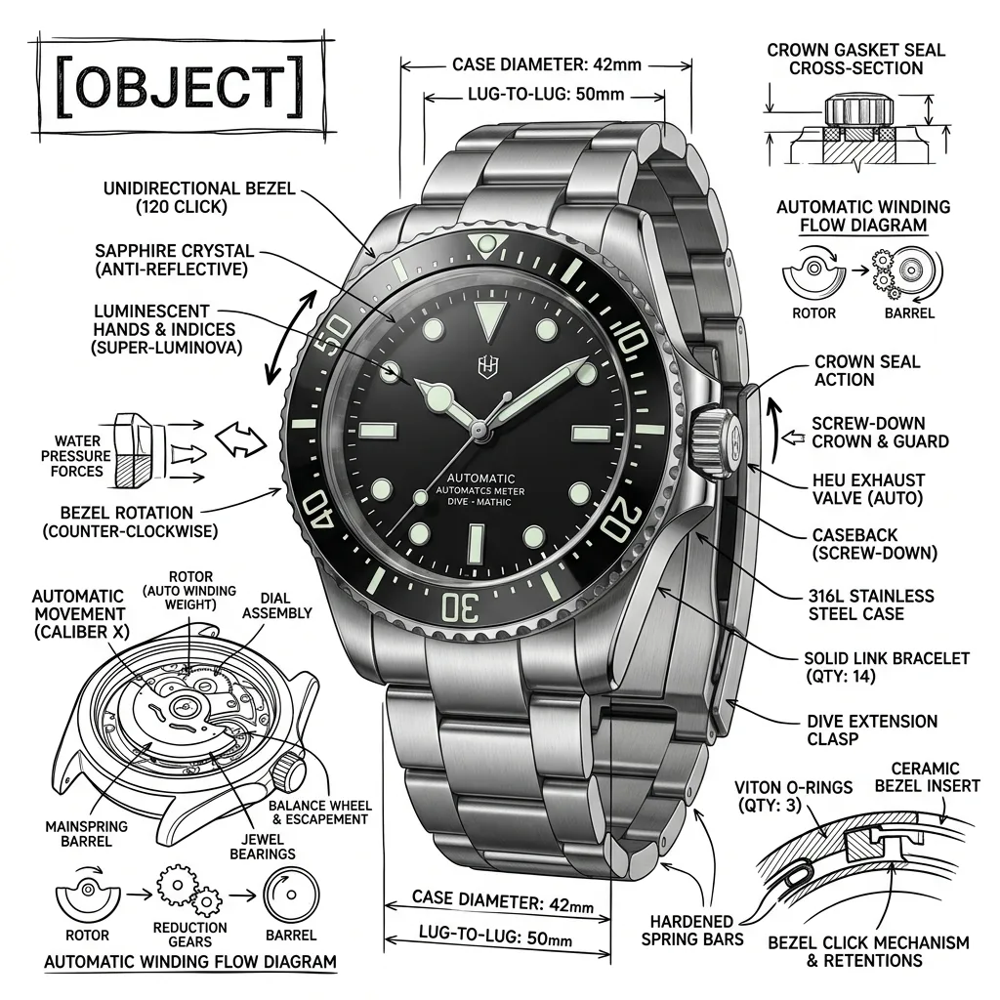

**#156 · Product &amp; Brand Prompt · <code>Vinano Image Pro</code>**

<details>
<summary>Show prompt</summary>

```
Create an infographic image of [OBJECT], combining a realistic photograph or photoreal render of the object technical annotation overlays placed directly on top.

Use black ink–style line drawings and text (technical pen / architectural sketch look) on a pure white studio background, including:
•Key component labels
•Internal cutaway or exploded-view outlines
•Measurements, dimensions, and scale markers
•Material callouts and quantities
•Arrows indicating function, force, or flow (air, sound, power, pressure)
•Simple schematic or sectional diagrams where relevant

Place the title “OBJECT” inside a hand-drawn technical annotation box in one corner.

Style & layout rules:
•The real object remains clearly visible beneath the annotations
•Annotations feel sketched, technical, and architectural
•crisp composition balanced negative space
•Educational, museum-exhibit / engineering-manual vibe

Visual style:
Minimal technical illustration aesthetic, black linework over realistic imagery, precise but slightly hand-drawn feel.

Color palette:
White background, black annotation lines and text only. No colors.

Output:
1080×1080, ultra-crisp, social-feed optimized, no watermark

Emphasise material texture and natural light so the final frame feels tactile and premium.
```

</details>

---

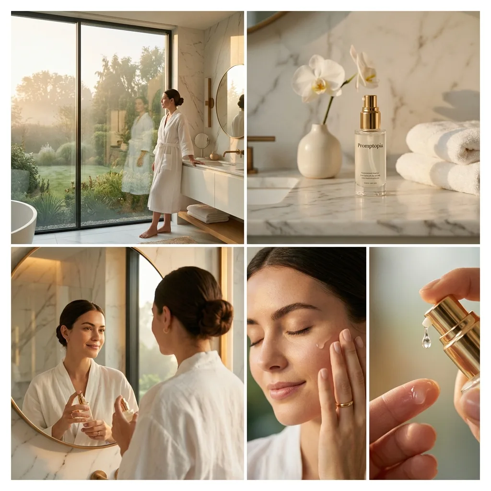

**#157 · Product &amp; Brand Prompt · <code>Vinano Image Pro</code>**

<details>
<summary>Show prompt</summary>

```
{
 "subject": {
 "person": "Woman, appears to be in her 20s or 30s",
 "pose_and_expression": ["Standing by window, looking out, relaxed",
 "Reaching for bottle on counter, hand focus",
 "Looking in mirror, slight smile",
 "Hand dispensing serum from bottle, close-up",
 "Serum drop on fingertip, macro shot",
 "Applying serum to face, eyes closed, serene",
 "Face close-up, eyes closed, content",
 "Bottle and orchid on counter, still life",
 "Walking away from camera, standing by window"]
 },
 "clothing": {
 "items": "White robe, white pajamas/loungewear",
 "material": "Soft, flowing fabric",
 "style": "Casual, luxurious"
 },
 "hair": {
 "color": "Dark brown",
 "style": "Pulled back, neat bun or ponytail"
 },
 "face": {
 "makeup": "Natural, minimal",
 "skin": "Clear, glowing",
 "expression": "Calm, serene, content"
 },
 "accessories": {
 "jewelry": "Simple ring on ring finger",
 "props": ["Glass skincare bottle gold pump dispenser",
 "Product label: 'Promptopia'",
 "White orchid in a small white vase"]
 },
 "environment": {
 "location": "Modern, luxurious bathroom",
 "elements": ["Large floor-to-ceiling windows",
 "Marble countertop and walls",
 "Round mirror",
 "View of trees/garden outside",
 "Fog or mist outside window"],
 "atmosphere": "Serene, spa-like, tranquil"
 },
 "lighting": {
 "source": "Natural daylight",
 "quality": "Warm, golden, soft, diffused",
 "time_of_day": "Sunrise or golden hour"
 },
 "camera": {
 "type": "Photography collage",
 "shots": ["Wide shot",
 "Medium shot",
 "Close-up",
 "Macro shot"],
 "focus": "Sharp on subject and product, soft background blur (bokeh)"
 },
 "style": {
 "aesthetic": "Cinematic, editorial, beauty, wellness, clean, refined minimalist",
 "color_palette": "Warm neutrals, white, gold, natural greens"
 }
}

Keep edges clean and the overall composition balanced for a polished, gallery-ready result.
```

</details>

---

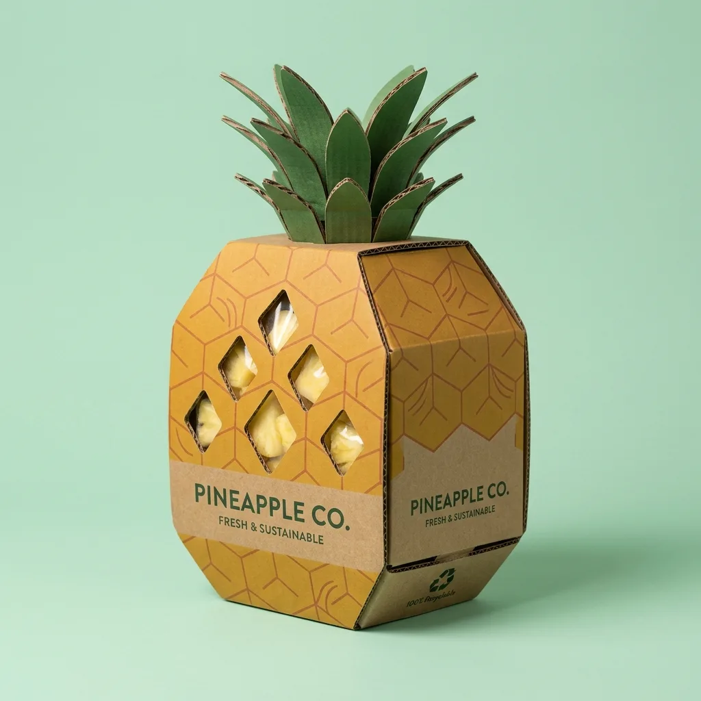

**#158 · Product &amp; Brand Prompt · <code>Vinano Image Pro</code>**

<details>
<summary>Show prompt</summary>

```
A premium-quality professional product photography of a creative structural packaging design for [Fruit Name]. The packaging is made of premium corrugated cardboard, intricately crafted into the literal shape of a giant stylized [Shape e.g. spherical, curved, elongated] [Fruit Name].

The exterior surface features a vibrant and sophisticated printed pattern of refined minimalist [Pattern Description e.g. geometric hexagons, organic wavy lines, dotted stippling, botanical line-art, or horizontal ridges], mimicking the Natural Skin of the Fruit in a duo-tone palette of [Color 1] and [Color 2].

Features clever die-cut windows that reveal the actual [Actual Product Inside] stored inside. refined minimalist modern typography on the side saying "[NAME]". Includes eco-friendly details like a small recycling logo and a [3D Corrugated Cardboard Detail: Stem/green Leaf/Crown] on top. Soft studio lighting gentle shadows, placed on a clean solid pastel [Background Color] background. 8k resolution, true-to-life photorealistic, cinematic composition, industrial design aesthetic.

Preserve realistic proportions and depth for a confident, professional finish.
```

</details>

---

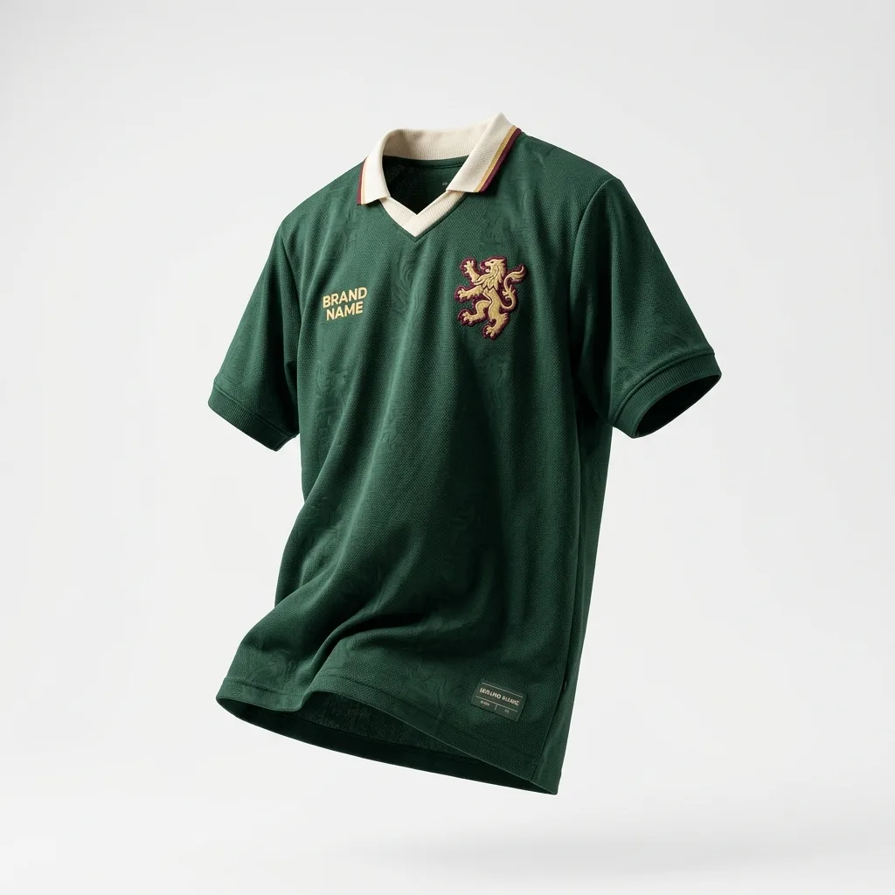

**#159 · Product &amp; Brand Prompt · <code>Vinano Image Pro</code>**

<details>
<summary>Show prompt</summary>

```
[BRAND NAME]. Act as a fashion photographer and creative director shooting a high-end editorial lookbook for a bespoke football jersey designed by this brand.
THE SUBJECT & COMPOSITION (FLOATING & ANGLED):
A single, premium custom football jersey is floating suspended in mid-air, centered in the frame. There is no hanger visible.
Crucial Angle: The jersey is NOT presented flatly frontal. It is rotated slightly (approximately 15 degrees angled view) to show depth, form, and a dynamic profile. Despite floating, the fabric must show realistic weight, deep gravity-defying folds, creases, and natural wrinkles. It must feel like a real, heavy garment frozen in time, not a stiff 3D model.
BRANDED DESIGN & AESTHETICS:
The jersey's design is a sophisticated interpretation of [BRAND NAME]'s visual identity.
Branding Placement: The official [BRAND NAME] logo is authentically applied as the main club crest on the chest (e.g., embroidered patch or premium-quality heat transfer).
MATERIALITY & TEXTURE (CRITICAL):
The focus remains on luxurious, tactile textures.
Fabric: A heavyweight, retro-inspired athletic cotton-blend or technical knit a visible, coarse weave structure.
ENVIRONMENT & BACKGROUND (WHITE STUDIO):
The jersey floats within an abstract, infinite white photo studio cyclorama space. The background is completely seamless, pure, clean white, and refined minimalist, absolutely zero distractions, placing total focus on the suspended garment.
LIGHTING & PHOTOGRAPHY STYLE:
Style: Hyper-realistic editorial fashion photography. Clean, high-key aesthetic.
Lighting: sophisticated studio lighting. Soft, diffused light that sculpts the folds of the fabric and highlights the texture against the pure white background. Subtle soft shadows might be cast on the jersey itself to define its form in the white space.

Render with rich micro-detail while keeping the layout uncluttered and intentional.
```

</details>

---

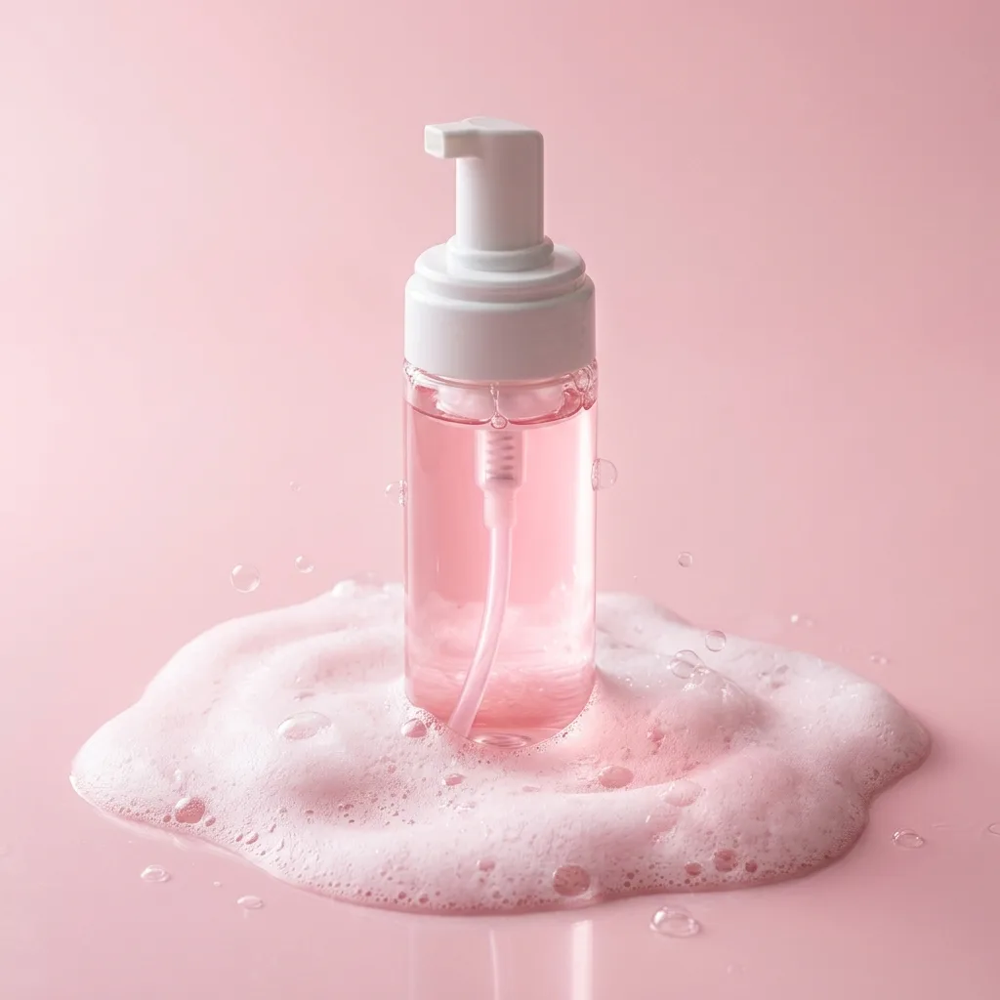

**#160 · Product &amp; Brand Prompt · <code>Vinano Image Pro</code>**

<details>
<summary>Show prompt</summary>

```
Premium refined minimalist skincare product photography. A translucent pink liquid cleanser bottle a white pump dispenser placed vertically at the center of the frame. The bottle rests inside an organic pool of soft pink foamy bubbles, airy soap lather spreading outward in smooth, rounded shapes. Small transparent bubbles float around the foam surface. Clean matte pastel pink background subtle gradient. Soft diffused top lighting gentle rim light creates a luminous glow through the liquid, highlighting the pump tube inside the bottle. Sharp focus, high clarity, realistic liquid refraction, smooth plastic and glass textures, luxury beauty advertising style, modern cosmetic branding, ultra-realistic, 8K detail, high dynamic range.

Negative Prompt:

hands, people, faces, clutter, harsh reflections, label distortion, unreadable text, warped pump, hard shadows, grain, noise, low resolution, CGI look, cartoon style, messy foam, uneven lighting, watermark

Preserve realistic proportions and depth for a confident, professional finish.
```

</details>

---

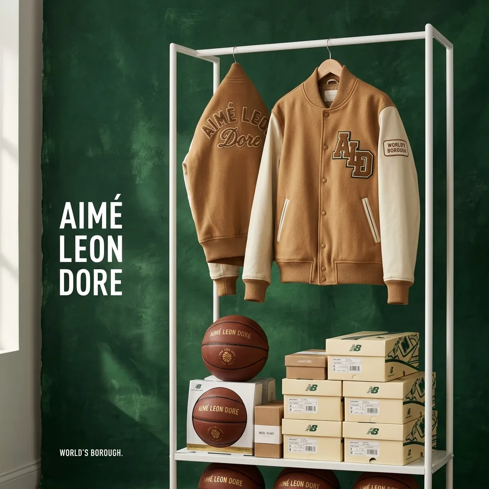

**#161 · Product &amp; Brand Prompt · <code>Vinano Image Pro</code>**

<details>
<summary>Show prompt</summary>

```
[BRAND NAME]. Act as a Creative Director and Still Life Photographer for a hypebeast fashion publication.
THE TASK:
Create a high-end "Showroom Still Life" photograph announcing a limited merchandise drop for [BRAND NAME].
PHASE 1: AUTONOMOUS CURATION (STRATEGY)
Analyze [BRAND NAME]: Identify the industry and the core physical product (e.g., if "Spalding" -> Basketballs; if "McDonald's" -> Burger Boxes; if "Visa" -> Metal Cards).
Determine the Palette:
Background Color: A deep, rich, textured tone derived from the brand's secondary palette (e.g., Teal, Navy, Burgundy, Slate Grey).
Merch Color: A contrasting warm or neutral tone (Camel, Orange, Cream) to pop against the background.
Select the "Merch Item": Choose a premium-quality apparel piece relevant to the brand's vibe (e.g., a Varsity Letterman Jacket, a Heavyweight Hoodie, a Canvas Tote, or a Wool Scarf).
PHASE 2: SET DESIGN (THE RACK)
The Prop: A simple, modern White Powder-Coated Metal Rack or Shelf unit. It stands cleanly in the frame.
The Arrangement:
Hanging Item: The chosen "Merch Item" (e.g., the Jacket) is draped casually over the rack or hanging on a hanger, showing off the texture (wool/felt).
Stacked Items: On the shelves of the rack, stack multiple units of the brand's Core Product (e.g., a stack of basketballs, a pyramid of cans, a row of boxes).
The Background: A Hand-Painted Canvas Backdrop in the chosen Deep Background Color. Visible texture/brushstrokes are essential for that "studio" look.
PHASE 3: PHYSICAL BRANDING (TEXTURE)
On the Merch: The hanging apparel must feature premium-quality Physical Branding. Use "Chenille Patches", "Embroidered Logos", or "Screen Print" running down the sleeve or on the back. It must look like a real, expensive garment.
On the Products: Ensure the stacked core products have the correct [BRAND NAME] logo visible.
PHASE 4: PHOTOGRAPHY & LIGHTING
Lighting: Soft, directional window light from the side. Creates realistic, soft shadows on the rack and rich highlights on the textures.
Lens: 50mm or 85mm. Sharp focus on the merch, slight fall-off in the background.
PHASE 5: UI OVERLAY (THE "DROP" LAYOUT)
Left Side Alignment:
Large, clean White Logo of [BRAND NAME] floating in the negative space on the left.
Under the logo, small white text the brand's official slogan.

Render with rich micro-detail while keeping the layout uncluttered and intentional.
```

</details>

---

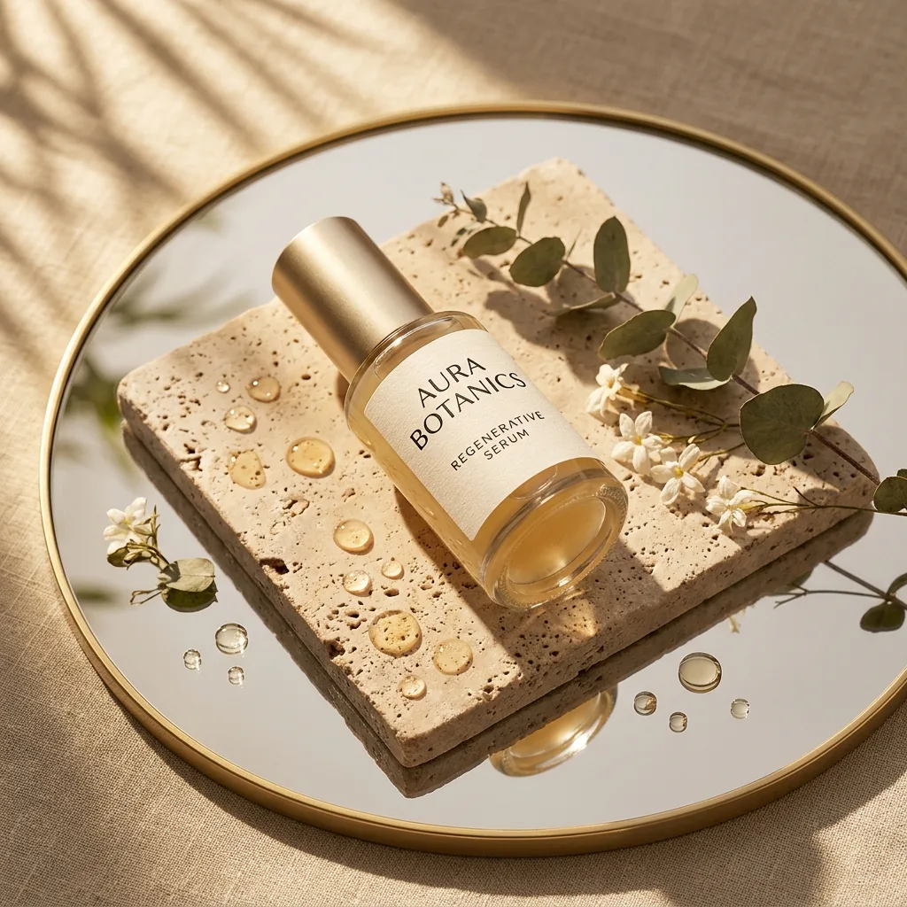

**#162 · Product &amp; Brand Prompt · <code>Vinano Image Pro</code>**

<details>
<summary>Show prompt</summary>

```
A high-end editorial studio photograph of a (PRODUCT FORM, e.g. bottle, jar, tube…), made of (MATERIAL, e.g. glass, ceramic, matte plastic…) a (COLOR) (DETAIL, e.g. cap, texture, label…). The product is placed on a natural, textured (BASE SURFACE, e.g. stone, wood, marble…) slab, itself resting on a round mirror laid on a (SURFACE TONE, e.g. beige, sand, light gray…) surface. Around the mirror and on the slab are scattered droplets of (LIQUID, e.g. serum, oil, gel…) realistic reflections. A few sprigs of (DECORATIVE NATURAL ELEMENTS, e.g. lavender, eucalyptus, rose petals…) lie gently across the slab and mirror, connecting both surfaces naturally. Strong, warm sunlight filters from the top left, casting soft diagonal leaf shadows to simulate filtered daylight. The aesthetic is (VISUAL STYLE, e.g. refined minimalist, organic, fresh, premium…), realistic materials and natural textures highlighted by golden hour tones. Style: 3D realism, luxury product photography, shallow depth of field. Format: 1:1, ultra-detailed. Keep edges clean and the overall composition balanced for a polished, gallery-ready result.
```

</details>

---

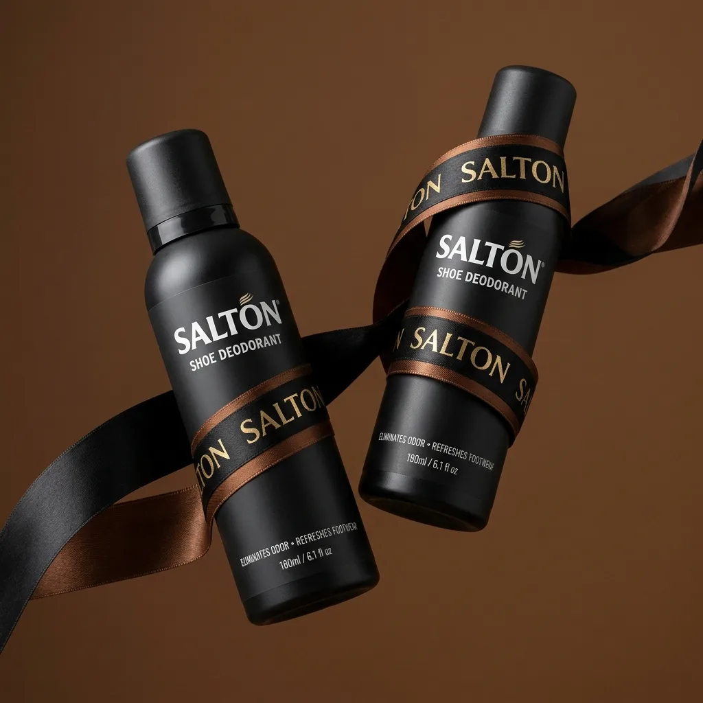

**#163 · Product &amp; Brand Prompt · <code>Vinano Image Pro</code>**

<details>
<summary>Show prompt</summary>

```
A product photo in a premium advertising style. Two tall matte bottles of Salton Shoe Deodorant levitate in the air in a dynamic, balanced composition.
The bottles are positioned at an angle to each other, creating a striking diagonal composition. One bottle is slightly forward, the other is slightly behind, creating depth and hierarchy. Both bottles are elegantly wrapped a wide black and brown satin ribbon featuring the repeating "Salton" branding. The lettering is executed in a neat, contrasting font, legible without distortion, and is repeated evenly along the entire length of the ribbon. The ribbon flows smoothly between the bottles, uniting them into a single composition, without obscuring key messages on the packaging or clashing the main branding on the bottles. Shot from a slightly lower angle, the bottles are slightly tilted, enhancing a sense of confidence, strength, and premium quality. The background is a solid studio color, a deep warm shade (chocolate, dark caramel or soft terracotta), clean and refined minimalist, without distracting details.

Emphasise material texture and natural light so the final frame feels tactile and premium.
```

</details>

---

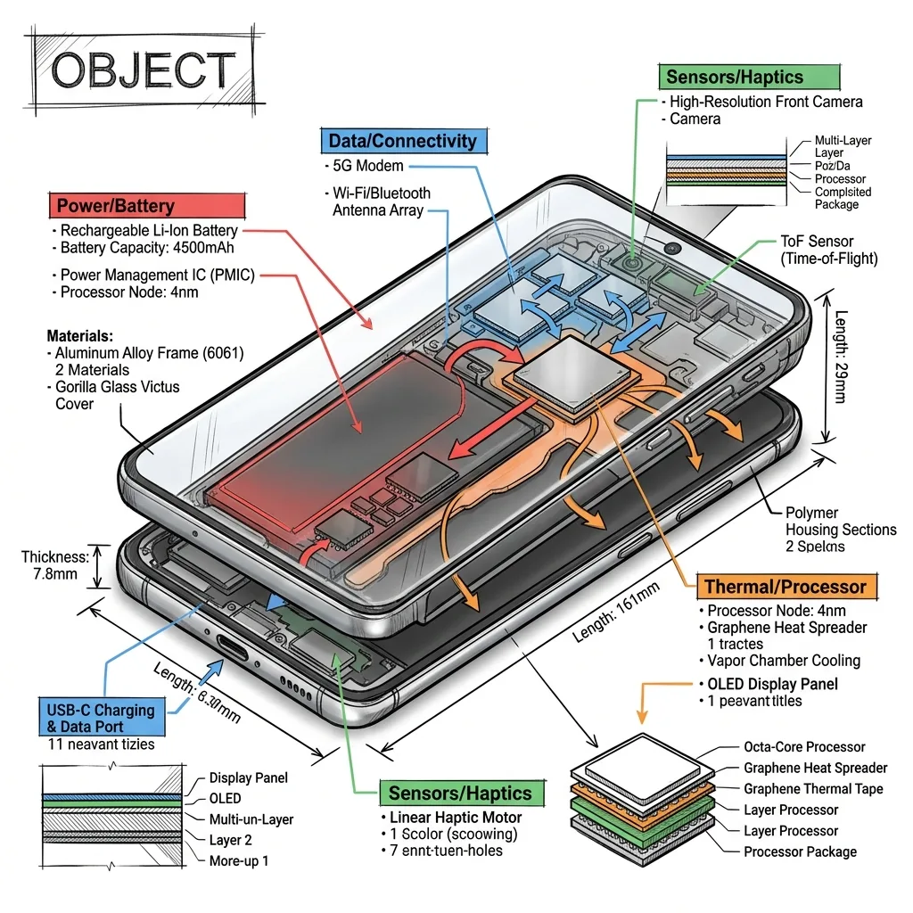

**#164 · Product &amp; Brand Prompt · <code>Vinano Image Pro</code>**

<details>
<summary>Show prompt</summary>

```
Create a technical infographic of [OBJECT] a 45-degree isometric 3D perspective showing the device slightly tilted to reveal depth and dimension.
Combine a realistic photoreal render black ink technical annotations on pure white background. Include:
Key component labels color-coded callout boxes
Internal component visibility through transparent/cutaway sections
Measurements, dimensions, and precise scale markers
Material callouts and quantities
Color-coded arrows for function/flow: RED (power/battery), BLUE (data/connectivity), ORANGE (thermal/processor), GREEN (sensors/haptics)
Simple schematics or cross-sectional diagrams where relevant

Place “OBJECT” title in a hand-drawn technical box (top-left corner).
Style: Black linework (technical pen/architectural), sketched but precise. Object remains clearly visible. Educational museum-exhibit vibe. crisp composition, balanced negative space.
Perspective: Isometric 3D angle—tilted to show depth, dimension, and internal architecture dramatically. Like a professional product teardown or engineering manual.
Colors: ~10-15% accent density. Black dominant. White background.
Output: 1080×1080, ultra-crisp, social-feed optimized.

Preserve realistic proportions and depth for a confident, professional finish.
```

</details>

---

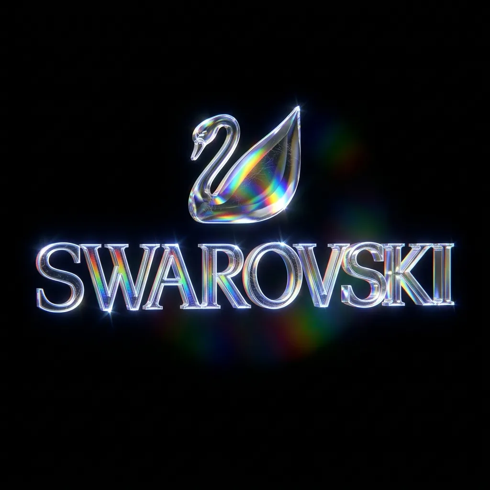

**#165 · Product &amp; Brand Prompt · <code>Vinano Image Pro</code>**

<details>
<summary>Show prompt</summary>

```
[BRAND NAME]
Act as a CGI Optical Physicist and 3D Type Sculptor creating a hero crystal typography visual for a luxury brand campaign. References: James Turrell light installations, optical physics photography, Rick Owens × crystal aesthetics.

PHASE 0: BRAND LOGO INTELLIGENCE

Retrieve the 100% canonical, trademark-accurate logotype of [BRAND NAME] from training data — this is non-negotiable. Reproduce the exact proprietary typeface or custom lettering: every stroke weight, every curve tension, every terminal detail, every unique glyph modification. Do not substitute a similar font — decode the actual trademarked letterform geometry. If [BRAND NAME] has a primary symbol or emblem — place it above or integrated the wordmark exactly as in the official logo lockup. Fidelity test: a brand lawyer must recognize this as the correct logo, not an approximation.

PHASE 1: CRYSTAL MATERIAL SYSTEM

The canonical logotype of [BRAND NAME] is a fully 3D sculptural object made entirely of optical crystal glass — not metal, not plastic, not rubber. Material: optical borosilicate glass or synthetic crystal, IOR 1.85 to 2.1, maximum dispersion coefficient. The letterforms have physical volume and thickness — cross-section is consistent throughout each stroke, like letters carved from a single block of optical glass. Surface finish: polished to sub-micron smoothness on primary faces — all major faces mirror-flat and fully refractive. Edges between faces are sharp and precise — maximum chromatic dispersion occurs here. The material is optically pure in its core — zero bubbles, zero inclusions in the interior volume.

CRITICAL — WEAR & IMPERFECTION SYSTEM: The crystal has been handled — it carries the history of physical existence. Apply these surface imperfections restraint and realism, never overwhelming the dispersion beauty: micro-scratches — a sparse network of hairline scratches on the front and top faces, depth 0.01 to 0.05mm equivalent, visible only when light catches them at specific angles. They scatter light slightly, creating a faint matte haze in the scratch zone while surrounding surface remains mirror-clean. Scratches follow organic directional patterns — some parallel, some crossing, as if from handling and storage, never uniform or grid-like. Edge chips — 2 to 4 very minor edge micro-chips along the sharpest edges and corners, each no larger than 0.5mm equivalent. These tiny imperfections catch light differently than clean edges — they create micro-flare events, small irregular sparkles where a chip breaks the otherwise perfect edge geometry. Surface haze zones — 1 to 2 small irregular areas of very fine surface abrasion, like the glass has been lightly scuffed by contact another hard surface. These zones appear as subtle frosted patches, 3 to 8% opacity maximum — barely visible, discovered rather than obvious. They slightly diffuse the refraction beneath them, softening the rainbow bands in that micro-zone only. Fingerprint ghosts — optional, extremely subtle — 1 partial fingerprint trace on one face, visible only as a very faint oily interference pattern when light hits at oblique angle. Adds humanity to the object. All imperfections are surface-level only — the interior crystal volume remains optically perfect. The wear says this object is precious and real, not freshly manufactured.

PHASE 2: LIGHT & DISPERSION SYSTEM

Single collimated light source entering from upper-left at 35° — focused, high-intensity, like a precision studio spot or filtered sunlight. As light passes through the crystal letterforms it undergoes full chromatic dispersion — splitting into the complete visible spectrum following Snell's law geometry maximum physical accuracy. Dispersion behavior on faces: each polished face simultaneously reflects and refracts — where light exits or reflects, a full spectrum appears in strict physical order red → orange → yellow → green → blue → violet. Rainbow bands are sharp and laser-clean at their origin edges, softening and widening as they travel across faces. Micro-scratch zones interrupt the rainbow bands locally — creating fine scattered light filaments branching off the main dispersion paths. Internal reflections: light bounces between letter faces creating crossed and layered rainbow patterns inside the volume — letters glow from within, nearly dark at the core, exponentially brighter toward illuminated faces. Multiple internal reflection paths create 3 to 5 distinct rainbow events visible simultaneously inside each major letterform. Edge glow: every sharp edge emits thin intense white-blue luminous line from total internal reflection — edge chips create micro-flare interruptions at their locations, bright irregular sparkles punctuating the otherwise continuous edge glow. Chromatic aberration at all edges: red fringe on one side, blue-violet fringe on the other — physical dispersion, not decorative filter. The 3/4 angle reveals front face and top face simultaneously — each face receives different dispersion patterns, creating layered optical complexity. Top face rainbow pattern and front face rainbow pattern intersect at the top edge of each letterform, creating a zone of maximum spectral density.

PHASE 3: BACKGROUND

Background: pure absolute black (#000000 to #050505) — a light-absorbing void, no texture, no gradient, no reflected light. The crystal letters float in darkness — no surface beneath, suspended in void. No ambient light reaching the background. The only light in the image exists within and immediately around the letterforms. Dispersed rainbow light creates a very subtle colored haze in the immediate 2 to 4cm radius around each letter — soft spectral glow bleeding into the black void. Beyond that: absolute darkness. The letters are the sole light source in the scene. The micro-scratch haze zones appear as slightly cooler, slightly less luminous areas against the surrounding rainbow glow — their presence is felt rather than explicitly seen.

PHASE 4: COMPOSITION

CRITICAL — 3/4 ANGLE: The logotype is rotated approximately 5 to 10° on the horizontal axis and elevated 5 to 10° on the vertical axis — a subtle, almost-frontal three-quarter view. The rotation is intentionally minimal — just enough to reveal the physical depth and thickness of the crystal letterforms, suggesting three-dimensionality without dramatically departing from a frontal logo presentation. The logo reads as nearly flat but unmistakably three-dimensional. This angle still reveals the top face of letterforms as a thin luminous sliver — enough to catch a secondary dispersion pattern distinct from the front face, adding optical depth without compositional complexity. Horizontal centering maintained. Logo occupies 60 to 70% of frame width. Full lockup visible if [BRAND NAME] has an emblem above or integrated the wordmark. Aspect ratio: 1:1 square or 4:5 portrait — autonomously determine best fit for [BRAND NAME] lockup proportions. Full sharp focus across the entire sculpture — no depth of field. Every micro-scratch, every edge chip, every rainbow band in crisp simultaneous focus. Detail resolution: the image must reward close inspection — zooming in 400% should reveal new details not visible at normal viewing distance: individual scratch filaments, micro-chip geometry, secondary internal reflections, fingerprint interference patterns.

PHASE 5: TECH SPECS

Render: Octane Render full caustics enabled at maximum quality settings. Ray tracing: minimum 16 bounces — increased from standard to capture all internal reflection events, secondary dispersion paths, and scratch-scattered light filaments. Dispersion: physically accurate wavelength-dependent IOR — full spectral rendering across visible light range 380nm to 700nm, not a color overlay or post-process effect. Scratch rendering: micro-scratches rendered as actual surface geometry displacement, not normal map approximation — true micro-geometry for physically accurate light scattering. Caustics: on at maximum intensity. Subsurface contribution: minimal — glass is not translucent like skin, but edges and thin stroke areas show faint internal light transmission. Anti-aliasing: maximum — every edge, every scratch filament razor clean. Sampling: minimum 2048 samples per pixel — no noise in the blacks, no grain in the rainbow bands. No post-process glow filters, no color grading, no compositing tricks — everything physically rendered from geometry and light. Output feel: the most detailed and physically accurate crystal typography ever rendered. Every imperfection is intentional. Every photon is accounted for.

Preserve realistic proportions and depth for a confident, professional finish.
```

</details>

---

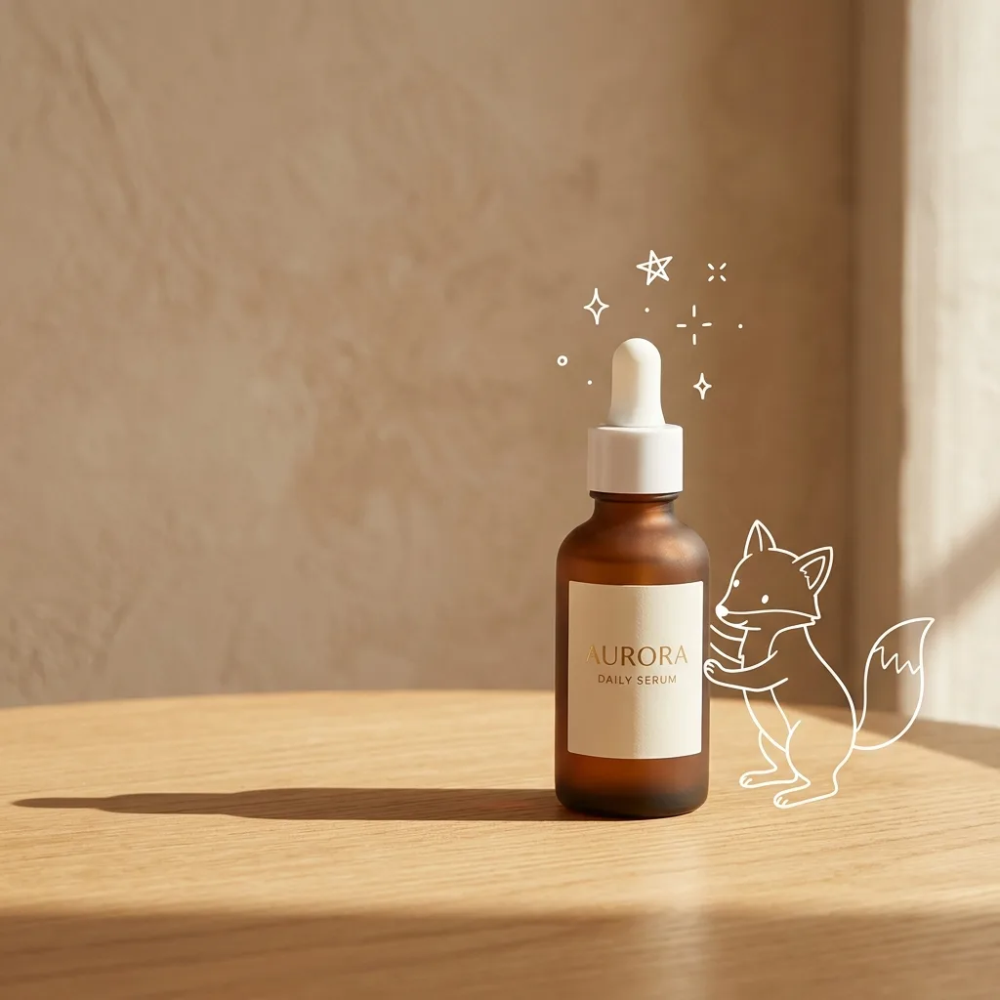

**#166 · Product &amp; Brand Prompt · <code>Vinano Image Pro</code>**

<details>
<summary>Show prompt</summary>

```
[product setup], refined minimalist product photo, clean warm studio scene, textured beige wall background, soft directional sunlight creating long shadows, simple tabletop surface, product arranged in a playful concept composition, hand drawn white line doodle overlay of [character] interacting the product, mixed media look combining real photography and sketch illustration, high end branding feel, shallow depth of field, ultra realistic, no extra text, no watermark Aim for an editorial, design-driven look with deliberate negative space.
```

</details>

---

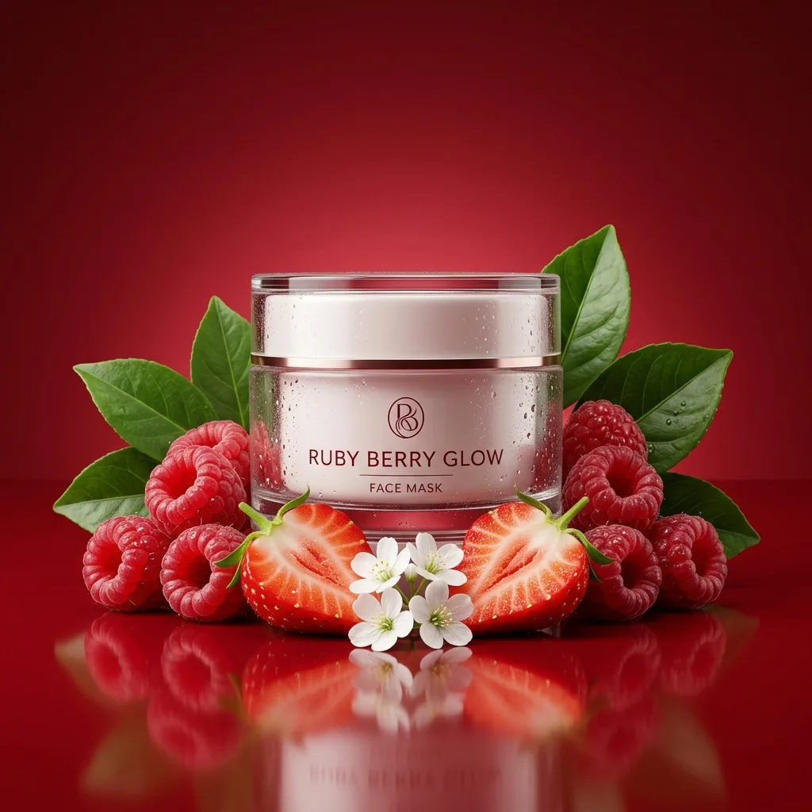

**#167 · Product &amp; Brand Prompt · <code>Vinano Image Pro</code>**

<details>
<summary>Show prompt</summary>

```
Use the uploaded image as the exact visual reference for jar design, label, strawberries, raspberries, flowers, leaves, condensation droplets, red gradient background, and reflective surface.

Camera:
Locked front-facing camera.
No zoom.
No rotation.
No angle change.
Studio composition remains centered.

Style:
Premium beauty commercial.
Smooth assembling sequence.
Ultra realistic.
Slow motion but not dramatic.

Scene – Start (Empty Setup):
Start an empty red gradient background and glossy reflective surface.
No jar.
No fruits.
No flowers.
No water droplets.

Assembling Sequence:

1. The glass jar base smoothly slides into frame from below and settles perfectly centered.
2. The lid gently lowers from above and aligns perfectly on the jar.
3. Condensation droplets subtly appear on the glass surface as if forming naturally.
4. Raspberries roll in softly from left and right, stopping naturally around the base.
5. Strawberry halves slide into position at the front.
6. Whole strawberries gently drop from above into the open jar top and settle naturally.
7. Small white flowers softly fall into place between the strawberries.
8. Green leaves slide in behind the jar to frame it.
9. Final micro water droplets appear on fruits for freshness effect.

All movements smooth and controlled.
No bouncing.
No exaggerated motion.
No dramatic lighting changes.

Lighting:
Keep original studio lighting.
Deep red background glow remains consistent.
Soft reflections on the glossy surface.

Sound (if supported):
Soft subtle assembling sound design.
Gentle fruit placement sounds.
Light glass contact sound.
No music or very subtle premium ambient tone.

End Frame:
Fully assembled composition exactly matching the reference image.
Everything perfectly arranged.
Hold for 1–2 seconds.
Ultra clean luxury skincare commercial finish.

Aim for an editorial, design-driven look with deliberate negative space.
```

</details>

---

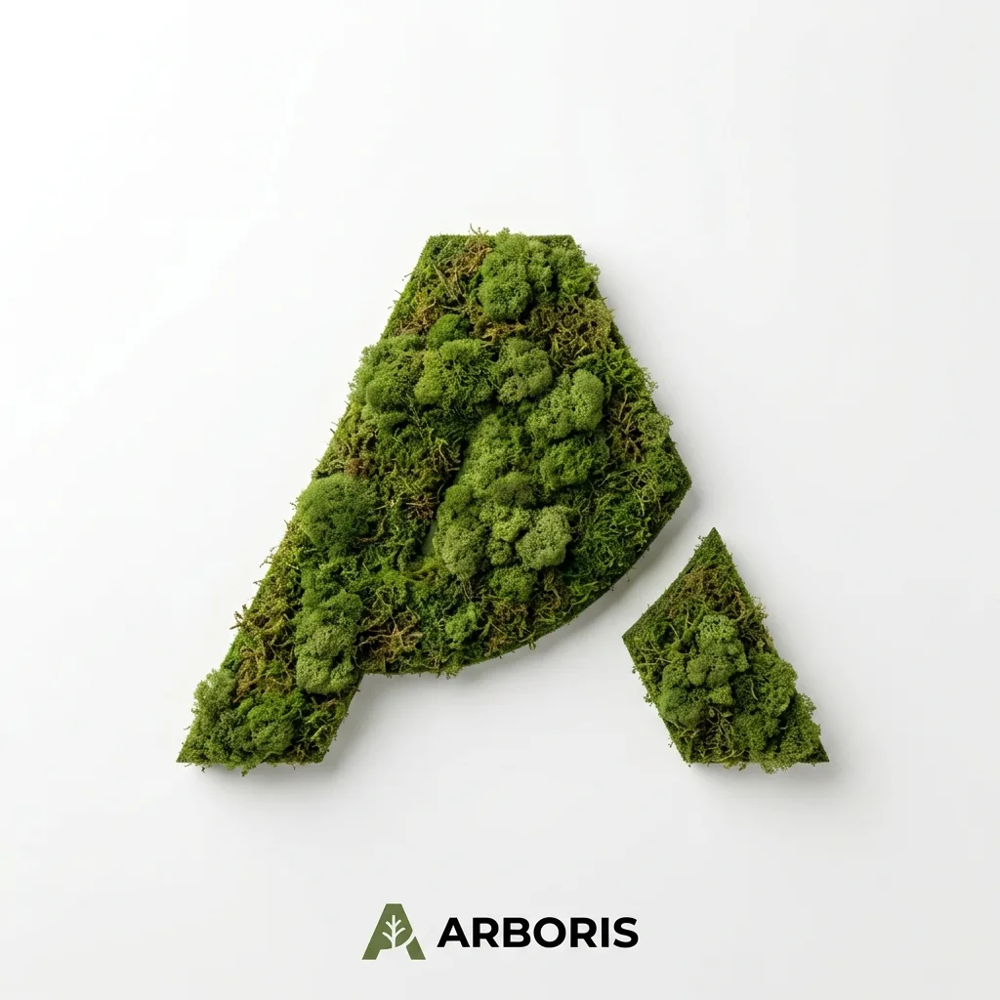

**#168 · Product &amp; Brand Prompt · <code>Vinano Image Pro</code>**

<details>
<summary>Show prompt</summary>

```
[BRAND NAME]: Enter the brand name here.
Goal: Generate a refined minimalist organic image where a stylized logo icon of [BRAND NAME] is transformed into a large moss-textured artifact, a small brand signature at the bottom.
Constraint: NO TEXT inside or immediately near the central moss icon. Only the bottom signature.

1. THE CENTRAL MOSS ICON
- Main Subject: A large, geometrically precise symbol, sculpted into the exact form of the [BRAND NAME] logo icon.
- Material: The symbol is entirely made of dense, heavily textured, natural green stabilizing moss. The texture is rough and organic varying shades of green and brown.
- Form: The geometric edges are sharp and clean, but filled the soft, billowy texture of moss.

2. ENVIRONMENT & LAYOUT
- View: A top-down, central flat lay view.
- Background: A flawless, uniform, matte white studio background. Full refined minimalist negative space.
- Lighting: Bright, soft, diffused studio lighting that emphasizes the tactile moss texture while minimizing harsh shadows.

3. BOTTOM BRAND SIGNATURE (CRITICAL)
- Placement: A clean horizontal signature block centered at the bottom, far below the moss icon.
- Elements: A tiny, flat, refined minimalist version of the [BRAND NAME] logo icon on the left.
- Text: The word "[BRAND NAME]" in a clean, bold, black sans-serif typeface immediately to the right of the tiny logo.
- Scale: The signature must be very small compared to the central moss artifact.

4. AESTHETIC
- Biophilic design, premium product photography, clean, fresh, airy, high-end editorial look. 8k resolution.

Keep edges clean and the overall composition balanced for a polished, gallery-ready result.
```

</details>

---


**#169 · Product &amp; Brand Prompt · <code>Vinano Image Pro</code>**

<details>
<summary>Show prompt</summary>

```
[BRAND NAME]: The name of the brand.
Goal: Generate a single, refined minimalist, and surreal image where a cloud is shaped like the brand's logo.

1. THE LOGO CLOUD
- **Subject**: A massive, true-to-life photorealistic cumulus cloud in the exact geometric shape of the [BRAND NAME] logo.
- **Texture**: Puffy, soft, and voluminous natural sunlight illuminating the edges.
- **Volume**: 3D sculptural appearance realistic shadows within the cloud folds to show depth.

2. ENVIRONMENT & BACKGROUND
- **Sky**: A vast, clear, vibrant blue summer sky.
- **Secondary Elements**: A few small, wispy, natural clouds scattered far in the background to enhance the sense of scale and realism.
- **Lighting**: Bright, direct daylight coming from the side to create high-contrast highlights and shadows.

3. INTEGRATED BRANDING
- **Text**: The word "[BRAND NAME]" written in a clean, bold white sans-serif font.
- **Icon**: A small, flat white version of the brand's logo placed next to the text.
- **Positioning**: The branding (text + logo) is centered at the bottom of the frame, acting as a subtle anchor to the giant cloud above.

4. STYLE
- Surrealist photography, ultra-refined minimalist composition, high resolution, 8k, cinematic look, clean and airy vibe.

Emphasise material texture and natural light so the final frame feels tactile and premium.
```

</details>

---

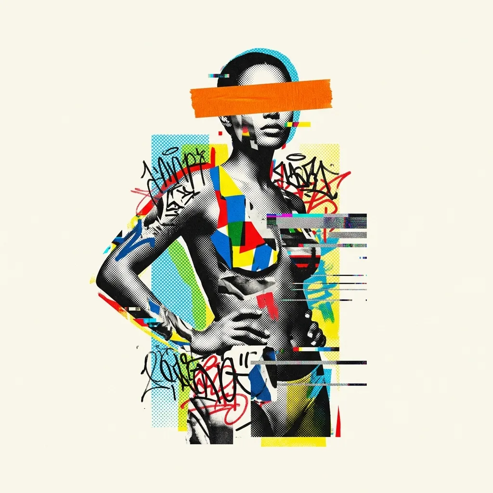

**#170 · Product &amp; Brand Prompt · <code>Vinano Image Pro</code>**

<details>
<summary>Show prompt</summary>

```
[PERSON \ BRAND] visualized as the central masterpiece of a surreal avant-garde collage, style of modern mixed media editorial illustration. The subject is composed of high-contrast black and white stippled halftone textures blended vibrant neo-expressionist elements. Overlay details include bold geometric shapes, cyan and yellow risograph patterns, abstract graffiti scribbles, and digital glitch artifacts. A thick strip of pink or orange tape or a color block obscures part of the form for a deconstructed look. The texture is grainy, mimicking vintage poster paper. The composition is strictly centered a very wide, clean, off-white cream paper background, ensuring the entire subject is fully contained within the frame generous negative space on all sides, zero cropping, minimal chic aesthetic. Preserve realistic proportions and depth for a confident, professional finish.
```

</details>

---

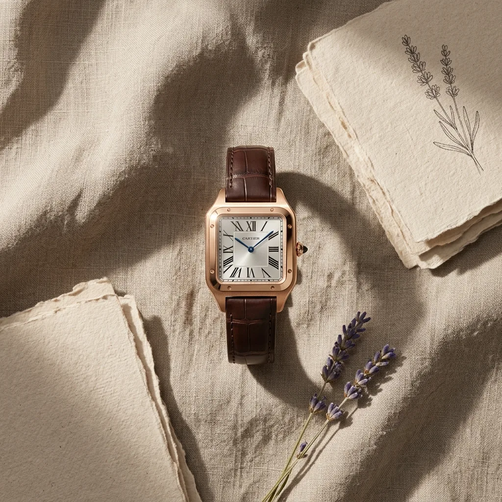

**#171 · Product &amp; Brand Prompt · <code>Vinano Image Pro</code>**

<details>
<summary>Show prompt</summary>

```
A high-end editorial photo of a [PRODUCT] placed flat on a [TEXTURED SURFACE], captured from a direct top-down view. The surface is gently disturbed to suggest recent motion or interaction. The front of the product is fully visible and properly oriented upright. The area around the product is intentionally left open to optionally place [COMPLEMENTARY OBJECTS] that visually enhance the scene. Natural sunlight from the upper left casts warm, realistic shadows. 3D realism, luxury product photography, shallow depth of field, 1:1 format. Emphasise material texture and natural light so the final frame feels tactile and premium.
```

</details>

---

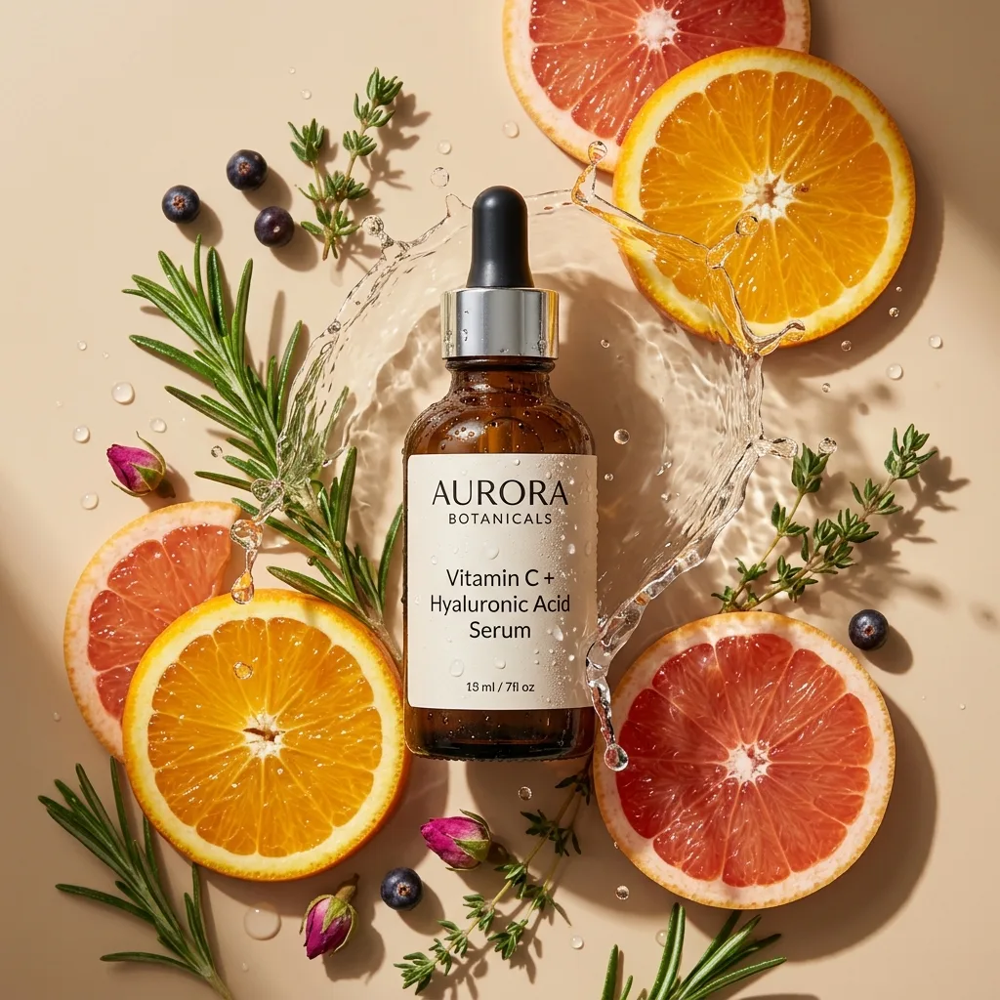

**#172 · Product &amp; Brand Prompt · <code>Vinano Image Pro</code>**

<details>
<summary>Show prompt</summary>

```
[product], centered top down flat lay, surrounded by [ingredients], fresh slices and whole pieces, glossy wet look, water splash frozen mid motion around the product, dewy droplets on label and surface, warm beige seamless background, soft directional sunlight, crisp realistic shadow, high end skincare advertising, ultra realistic macro product photography, 100mm lens look, f/8 sharp focus, crisp composition, no extra text, 8k, 1:1 Emphasise material texture and natural light so the final frame feels tactile and premium.
```

</details>

---

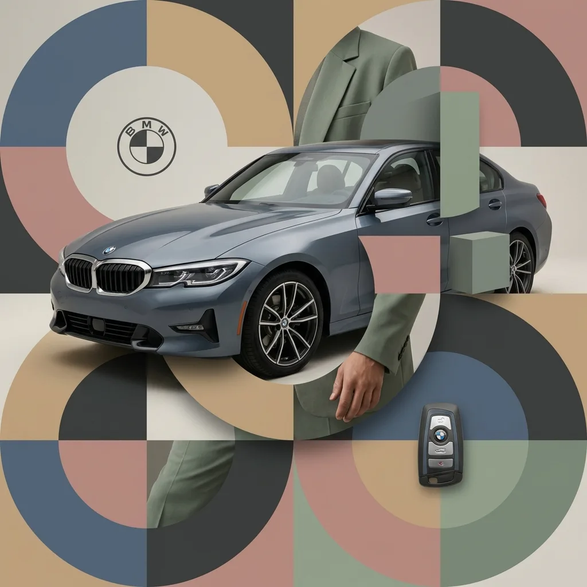

**#173 · Product &amp; Brand Prompt · <code>Vinano Image Pro</code>**

<details>
<summary>Show prompt</summary>

```
[BRAND NAME]. Act as a World-Class Editorial Designer.

PHASE 1: DYNAMIC SUBJECT LOGIC.

- Subject Selection: Autonomously analyze [BRAND NAME].

- Layering (The Sandwich Effect): Interweave the subject background shapes. Some parts of the car/person must be hidden behind geometric blocks, while other parts (wheels, limbs, props) must overlap them to create 3D depth.

PHASE 2: GRID & GEOMETRY.

- Layout: A clean 2x2 grid composition.

- Overlays: Superimpose large, bold geometric arcs and circles over the grid.

- Visual Balance: Place one iconic product prop (e.g., a floating key fob for cars or a ball for sports) in a separate quadrant to balance the subject.

PHASE 3: SOPHISTICATED MUTED PALETTE.

- Color Direction: DO NOT use aggressive neon or oversaturated colors.

- Palette: Identify the core colors of [BRAND NAME] and shift them to a "Sophisticated Muted" spectrum.

- Tones: Use desaturated, earthy, or "dusty" versions of the brand colors (e.g., instead of hot pink, use dusty rose; instead of bright mint, use sage green; instead of royal blue, use slate blue).

- Finish: Matte, flat color blocks zero gradients.

PHASE 4: PHOTOGRAPHY & LIGHTING.

- Subject Style: High-end commercial studio photography.

- Lighting: Soft, diffused studio lighting gentle highlights. No harsh shadows.

- Integration: The subject must feel physically embedded into the graphic grid.

PHASE 5: refined minimalist BRANDING.

- Logo: Place a clean, single-color [BRAND NAME] logo in the center of one background block. No taglines, just the iconic symbol.

Preserve realistic proportions and depth for a confident, professional finish.
```

</details>

---

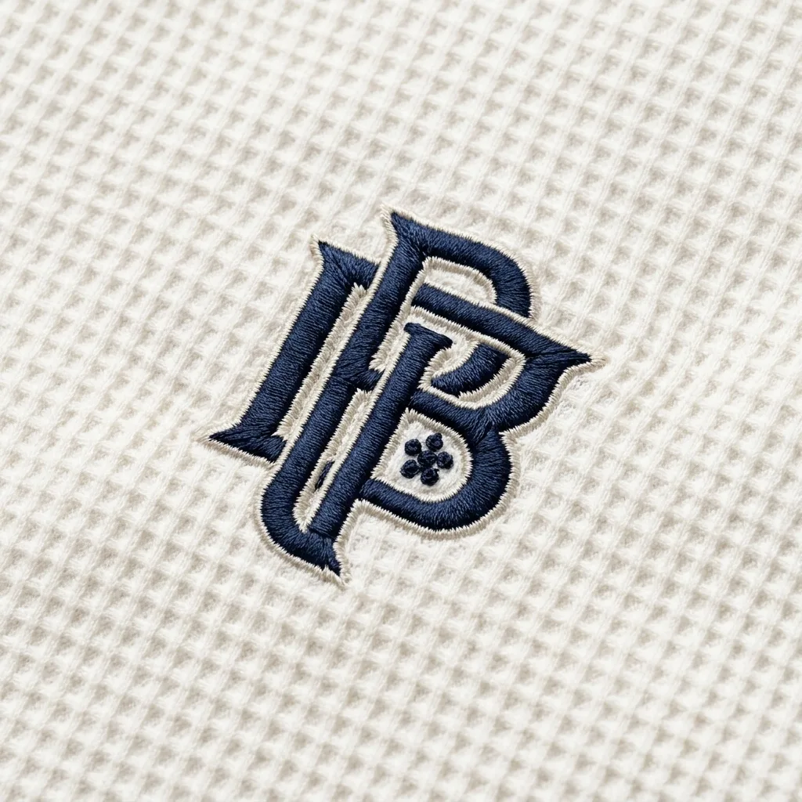

**#174 · Product &amp; Brand Prompt · <code>Vinano Image Pro</code>**

<details>
<summary>Show prompt</summary>

```
[BRAND NAME]

Act as a Macro Product Photographer and Textile Art Director shooting a close-up editorial campaign of a premium embroidered garment. References: Loro Piana fabric campaigns, Brunello Cucinelli texture photography, A.P.C. garment detail shoots, Japanese boro textile documentation.

PHASE 0: BRAND LOGO INTELLIGENCE

Retrieve the canonical logotype or primary mark of [BRAND NAME] from training data. Identify the core geometric essence of the logo — its fundamental shapes, stroke relationships, and compositional balance. Translate this identity into an embroidery-native form language: sharp geometric elements become satin stitch bars and needle-point spikes, circular elements become dense satin stitch ovals or French knot clusters, complex letterforms are simplified into their most essential strokes while remaining recognizable. The embroidery interpretation must feel like a deliberate premium interpretation of the brand mark — as if [BRAND NAME]'s design team commissioned an embroidery artist to translate their logo into thread. Autonomously determine the thread color most iconic to [BRAND NAME] — this becomes the primary embroidery thread color. If [BRAND NAME] has no dominant single color, default to deep navy #1A2332.

PHASE 1: TEXTILE BACKGROUND

The background is a premium waffle-knit cotton fabric — the weave structure is a precise geometric grid of raised square cells, each cell approximately 2×2mm equivalent, separated by thin recessed channels running both horizontally and vertically. The raised nodes of each cell are flat-topped, not rounded — creating a regular orthogonal relief pattern across the entire surface. The fabric color is cold off-white — #F0F0EE to #EBEBEA range, a very slight cool gray bias, not warm ecru or cream. The weave is consistent and uniform across the entire frame — machine precision, no tension variation, no distortion. Microscopic fiber fuzz is visible on the flat tops of the raised nodes — individual cotton fibers catching the diffused overhead light as a very fine surface bloom. The recessed channels between cells are in soft shadow — not deep shadow, just slightly darker than the raised nodes, consistent flat overhead illumination.

PHASE 2: EMBROIDERY CONSTRUCTION SYSTEM

The logo mark of [BRAND NAME] rendered as machine or hand embroidery these specific stitch techniques. Satin stitch: the primary technique for all filled areas and stroke elements — dense parallel threads laid side by side zero gap, creating a smooth glossy surface. Thread direction follows the long axis of each stroke element — horizontal strokes have horizontal threads, diagonal strokes have diagonal threads. The characteristic sheen of satin stitch is critical: threads catch light along their length creating bright reflective zones on thread-parallel surfaces and darker zones on thread-perpendicular surfaces, creating a directional shimmer across the embroidery surface. Stem stitch or outline stitch: used for any curved linear elements — thin continuous line of overlapping thread segments following curves natural flexibility. French knots: small circular dot elements rendered as tightly wound thread knots — each knot has a visible spiral wind pattern at macro distance. Spike elements: long tapering needle-like forms executed in satin stitch that tapers from full width to a single thread point — gradual and precise, ending in a razor-sharp thread tip.

Edge treatment: every embroidered element has a thin visible backing outline — 1 to 2 thread widths of the base fabric visible between the embroidery and the surrounding textile. This underlay/backing edge is slightly lighter than the main embroidery thread — it outlines every form and confirms the physical layering of embroidery over fabric.

Physical relief: the embroidery sits 1 to 3mm above the fabric surface — confirmed by a very subtle shadow halo directly underneath each embroidered element. The shadow is symmetrical around the embroidery perimeter, soft-edged, 1 to 2mm wide — consistent flat overhead illumination, not directional raking light.

PHASE 3: THREAD MATERIAL

Primary thread color: autonomously determined brand color from PHASE 0. Thread material: mercerized cotton or silk embroidery thread — high sheen, smooth filament surface. The thread color is never flat — it shifts in value along its length based on light angle. Directly lit zones approach a lighter more luminous version of the base color. Shadow zones approach a deeper more saturated version. The overall embroidery reads as one unified color but contains a full tonal range within that color family. Secondary thread: the backing/underlay edge thread is 2 to 3 shades lighter than the primary thread — creating the characteristic light outline visible around all embroidered elements.

PHASE 4: COMPOSITION & CAMERA

Camera body: Canon EOS R5 or Nikon Z8 — full frame, 45 megapixel minimum for fabric texture resolution. Lens: Canon RF 100mm f/2.8L Macro IS USM or Nikon Z MC 105mm f/2.8 VR S — used at moderate close-up distance, not at maximum 1:1 magnification. Focus distance: 40 to 55cm — the embroidery fills approximately 30 to 40% of the frame height, leaving generous fabric context on all sides. This is a moderate close-up, not extreme macro — the full embroidery composition is visible substantial textile surround. Aperture: f/8 to f/11 — deep depth of field, the entire embroidery and all surrounding fabric texture are in crisp simultaneous focus from corner to corner. No visible bokeh anywhere in the frame. Shutter speed: 1/200s continuous light source. ISO: 100 — base ISO, zero noise, maximum tonal resolution in the subtle gray shadows of the waffle recesses. White balance: 5600K — neutral daylight, renders the cold off-white fabric accurately without warm or cool shift. Exposure: slightly bright ETTR — the off-white fabric renders as a luminous near-white, embroidery thread reads as deep rich dark against the bright ground. Aspect ratio: 4:5 portrait. Camera perpendicular to fabric plane — zero perspective distortion, embroidery geometry rendered faithfully.

PHASE 5: LIGHTING

Primary light: large diffused overhead source — a 120×120cm softbox or diffusion panel positioned directly above the fabric at 60 to 80cm distance. The light is as close to flat and directionless as possible. No raking angle — the light comes from directly above at 85 to 90° to the fabric plane. This flat overhead lighting creates: uniform brightness across the entire fabric field no hot spots or falloff. Very short soft shadows in the recessed channels of the waffle grid — 1 to 2mm wide, soft-edged, falling straight down. Soft symmetrical micro-shadow halo directly beneath the embroidery — the 1 to 3mm relief creates a subtle darker zone immediately surrounding the embroidery perimeter, equal on all sides. No directional shadow — the shadow is not cast to one side. Secondary light: none. No fill, no rim, no accent. The single large overhead diffused source is the complete lighting setup. Overall mood: clinical, precise, bright — consistent product documentation or high-end textile editorial photography where the subject must be seen maximum clarity and zero atmospheric distraction.

PHASE 6: TECH SPECS

Render: Octane Render or Redshift fiber/textile displacement geometry. Thread geometry: actual 3D cylindrical thread strands — each thread strand is a real geometric object casting real shadows on adjacent threads, not texture maps. Fabric weave: real geometric displacement mesh for waffle structure — not normal map. Ray tracing: on — for accurate micro-shadow casting between individual thread strands and between embroidery and fabric surface. Subsurface scattering: subtle on thread material — mercerized cotton and silk have slight translucency. Depth of field: physically accurate — f/8 to f/11 at 100mm at 40 to 55cm focus distance, full frame sharp corner to corner. Anti-aliasing: maximum. Sampling: minimum 2048 samples — zero noise in shadow zones, full tonal resolution in the off-white fabric field. Output feel: this image should be indistinguishable from a photograph taken a Canon 100mm macro in a textile documentation studio. The viewer must feel the urge to touch the fabric.

Render with rich micro-detail while keeping the layout uncluttered and intentional.
```

</details>

---

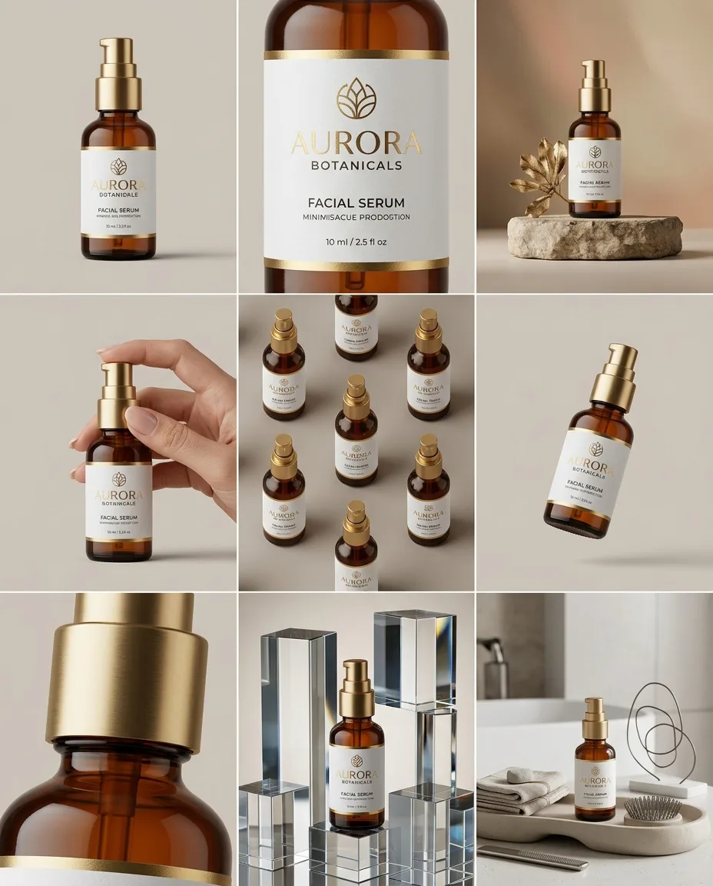

**#175 · Product &amp; Brand Prompt · <code>Vinano Image Pro</code>**

<details>
<summary>Show prompt</summary>

```
Create ONE final image.

A clean 3×3 [ratio] storyboard grid nine equal [ratio] sized panels on [4:5] ratio.

Use the reference image as the base product reference. Keep the same product, packaging design, branding, materials, colors, proportions and overall identity across all nine panels exactly as the reference. The product must remain clearly recognizable in every frame. The label, logo and proportions must stay exactly the same.

This storyboard is a high-end designer mockup presentation for a branding portfolio. The focus is on form, composition, materiality and visual rhythm rather than realism or lifestyle narrative. The overall look should feel curated, editorial and design-driven.

FRAME 1:
Front-facing hero shot of the product in a clean studio setup. Neutral background, balanced composition, calm and confident presentation of the product.

FRAME 2:
Close-up shot the focus centered on the middle of the product. Focusing on surface texture, materials and print details.

FRAME 3:
Shows the reference product placed in an environment that naturally fits the brand and product category. Studio setting inspired by the product design elements and colours.

FRAME 4:
Product shown in use or interaction on a neutral studio background. Hands and interaction elements are minimal and restrained, the look matches the style of the package.

FRAME 5:
Isometric composition showing multiple products arranged in a precise geometric order from the top isometric angle. All products are placed at the same isometric top angle, evenly spaced, clean, structured and graphic.

FRAME 6:
Product levitating slightly tilted on a neutral background that matches the reference image color palette. Floating position is angled and intentional, the product is floating naturally in space.

FRAME 7:
is an extreme close-up focusing on a specific detail of the label, edge, texture or material behavior.

FRAME 8:
The product in an unexpected yet aesthetically strong setting that feels bold, editorial and visually striking.
Unexpected but highly stylized setting. Studio-based, and designer-driven. Bold composition that elevates the brand.

FRAME 9:
Wide composition showing the product in use, placed within a refined designer setup. Clean props, controlled styling, cohesive the rest of the series.

CAMERA & STYLE:
ultra-detailed, high-fidelity studio imagery a real camera look. Different camera angles and framings across frames. Controlled depth of field, precise lighting, accurate materials and reflections. Lighting logic, color palette, mood and visual language must remain consistent across all nine panels as one cohesive series.

OUTPUT:
A clean 3×3 grid no borders, no text, no captions and no watermarks.

Maintain consistent colour harmony and crisp focus across the whole frame.
```

</details>

---

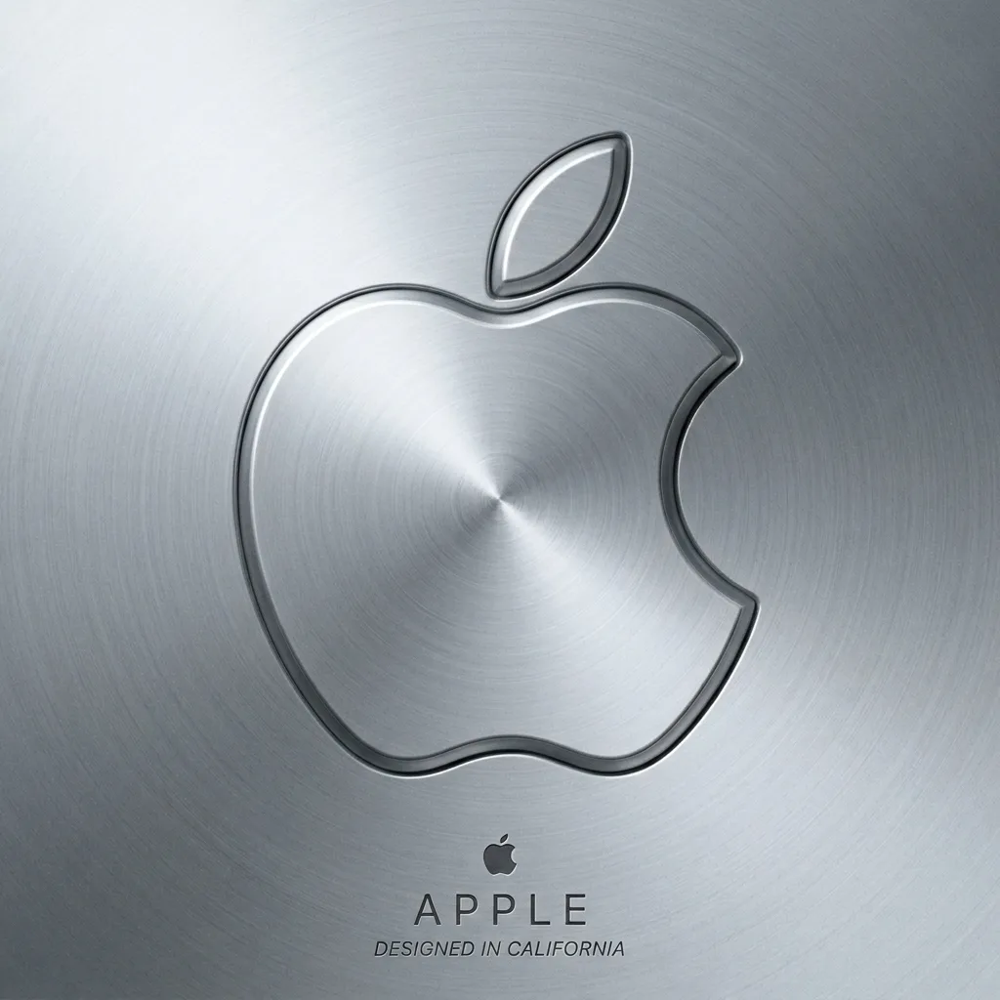

**#176 · Product &amp; Brand Prompt · <code>Vinano Image Pro</code>**

<details>
<summary>Show prompt</summary>

```
[BRAND NAME] + [METAL COLOR]

Act as a Senior CGI Artist and Brand Identity Director specializing in premium logo materializations. Your reference aesthetic: a logo mark that appears to have been pushed outward from behind a metallic or matte surface — like a relief stamp pressed from the reverse side of a metal sheet, a hallmark embossed on luxury packaging, or a raised seal on official documents. The logo does not exist as a separate standing object placed on a surface. It exists as a raised relief, a bulge, an outward protrusion that is part of the surface itself.

BRAND INTELLIGENCE SYSTEM

Before executing any phase, resolve these parameters: (1) LOGO GEOMETRY — identify [BRAND NAME]'s primary icon mark in its simplest most reduced form — the mark that works at any scale, (2) COLOR PALETTE — based on [COLOR], build the full tonal system from the lightest specular highlight to the deepest shadow tone, determine if the overall mood reads warm, cool, or neutral, (3) SURFACE MATERIAL — based on [COLOR] determine the surface character: silver or grey becomes brushed or circular-grain steel, gold or champagne becomes warm brushed metal radial grain, black becomes anodized aluminum or matte carbon fiber, white becomes matte ceramic or chalk plaster, any saturated hue becomes anodized colored metal holding the hue in lit areas and desaturating toward black in deepest shadows, (4) LIGHT DIRECTION — determine the most flattering single light angle to reveal the emboss topography — where highlights land on the raised ridge peaks and where shadows fall on the descending walls.

PHASE 1: SURFACE & ATMOSPHERE

The entire image is one single continuous material surface — not a background an object placed on it, but one unified physical plane filling the entire canvas. This surface is made of the SURFACE MATERIAL resolved above. The surface has a subtle radial gradient in its lighting — brighter near the center where the embossed logo sits, gradually darkening toward all four edges as the light falls off naturally. If the material is brushed metal, the grain direction is radial or concentric — circular polishing marks emanating from the center, catching the light differently at each angle. Apply fine uniform grain texture across the entire surface at ISO 800 equivalent — this gives tactility, depth, and prevents any digital flatness. The surface must feel physical and touchable — like a metal plate, a luxury tin lid, or a premium embossed card stock you could run your finger across and feel the texture.

PHASE 2: THE EMBOSS — CRITICAL

The [BRAND NAME] logo mark is rendered as a full bas-relief — think of a coin, a commemorative medal, or a luxury brand stamp where the ENTIRE logo shape rises as one unified solid mass from the surface. Not just the outline. Not just the stroke path. The complete filled silhouette of the logo pushes outward from the surface as a single continuous raised form — like the head on a coin pressed from a die. The interior of the logo is NOT hollow or open. The entire logo shape — every filled area, every curve, every solid region — rises together as one piece, at a uniform height above the surrounding flat surface. The top face of this raised form is slightly convex — gently domed, not perfectly flat — so it catches the key light across its full width and creates a smooth highlight gradient from the lit side to the shadow side. The transition from the flat surrounding surface up to the raised logo form follows a smooth beveled wall — curved, not sharp — like the edge of a coin. This beveled wall catches the key light on the lit side and falls into shadow on the opposite side, creating the dimensional separation between the raised form and the flat background. Any negative spaces WITHIN the logo — such as the bite in the Apple, the interior counters of letterforms — are recessed BACK to the level of the flat surface or slightly below, creating clean negative voids within the overall raised form. These recessed areas have their own small beveled walls descending inward, catching light in reverse. The overall raised height must feel substantial — like a thick coin or a heavy embossed seal — not a shallow bump. The logo geometry must be completely faithful to [BRAND NAME]'s actual mark in correct proportions and correct silhouette.

PHASE 3: LIGHTING

One primary soft area light from upper-left at approximately 10 to 11 o'clock position — broad and diffused, wrapping around the curved walls of the raised ridge to create the characteristic highlight peak at the top and gradual shadow descent on the far wall. Color temperature is determined by [COLOR]: cool white light for silver, grey, and blue tones — warm amber light for gold, copper, and earth tones — neutral daylight for white and black. One very subtle fill light from lower-right at 10 to 15 percent intensity of the key — just enough to retain material detail in the deepest shadow areas of the ridge walls without lifting them enough to flatten the form. No hard shadows anywhere on the surface. No spotlight pools. No rim light. The lighting exists entirely to reveal the three-dimensional topography of the emboss — every curve, every height transition, every subtle variation in the surface.

PHASE 4: TYPOGRAPHY

In the lower portion of the canvas, below the embossed logo, on the same continuous surface — a minimal typographic lockup. The typography is either very subtly embossed in the same material as the surface the same raised-ridge technique at much smaller scale, or rendered as clean flat text in the lightest tone of [COLOR] sitting just at the surface level. Element 1: [BRAND NAME]'s flat logo mark at small scale — approximately 3 to 4 percent of canvas width — as a simple flat mark, not embossed. Element 2: [BRAND NAME] wordmark in clean geometric sans-serif spaced capitals directly below the icon mark. Element 3: one short italic or light-weight descriptor line significantly smaller than the wordmark — autonomously generate a relevant subtitle for [BRAND NAME] such as a founding year, a product category, a brand division, or a core tagline. All three elements stacked vertically, centered, generous spacing. No decorative elements. No lines or rules. Pure typographic restraint.

TECH SPECS

The single most important instruction in this entire prompt: the logo must read as PUSHED OUTWARD FROM the surface, rising toward the viewer, proud and raised. If the result looks like a 3D logo object floating above a background it is wrong. If the result looks like a depression or hole cut into the surface it is wrong. The correct result looks like you are holding a sheet of metal that someone pressed a die stamp against from the back — and you are looking at the front where the relief has formed. Ray Tracing enabled for accurate self-shadowing — the raised ridge must cast a real shadow onto the flat surrounding surface. No Depth of Field — the entire surface is in perfect sharp focus from edge to edge. Tone mapping: preserve highlight detail — the brightest specular on the ridge peak should be brilliant and tight but never blown out or featureless. Film grain applied uniformly across the full final render. No chromatic aberration. No lens distortion. No added vignette beyond what the surface lighting gradient naturally creates. Anti-aliasing maximum — the ridge edges must be perfectly clean. Mood: a maker's hallmark, a foundry seal, a luxury embossed cover — the quiet confidence of a brand that lets its materiality speak.

Keep edges clean and the overall composition balanced for a polished, gallery-ready result.
```

</details>

---

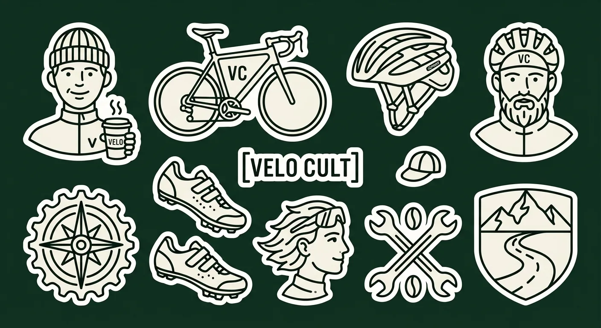

**#177 · Product &amp; Brand Prompt · <code>Vinano Image Pro</code>**

<details>
<summary>Show prompt</summary>

```
[BRAND NAME]. Act as a vector illustrator designing a trendy, high-end "Sticker Sheet" set.
THE TASK:
Deconstruct the brand identity of [BRAND NAME] into a playful, cohesive set of approximately 8-10 unique sticker designs arranged on a single sheet.
Content Generation: Do not just make logos. Autonomously invent a mix of:
Mascots/Characters: Stylized busts of people wearing brand-relevant accessories or expressing emotions.
Key Products: Iconic items associated the brand.
Symbols/Objects: Abstract shapes or tools relevant to the brand's lifestyle.

VISUAL STYLE (MONOLINE VECTOR):
The art style must strictly match "Modern Trendy Line Art."
Line Work: Use a THICK, UNIFORM line weight (monoline) for all internal details. The lines should be smooth, rounded, and confident.
Coloring: The stickers must be filled Solid Off-White or Cream, utilizing the line color for details. NO gradients, NO shading, NO 3D effects. Flat 2D vector look.
The "Sticker" Effect: Every element must have a thick, distinct White (or Cream) Die-Cut Border surrounding it, separating it from the background.
COLOR PALETTE (HIGH CONTRAST):
Background: A solid, deep, saturated color to create maximum contrast.
Stickers: High-brightness Cream or White fill Dark (Black or Dark Brown) outlines.
COMPOSITION:
The stickers are scattered naturally across the sheet (knolling layout) even spacing. No overlapping.

Aim for an editorial, design-driven look with deliberate negative space.
```

</details>

---

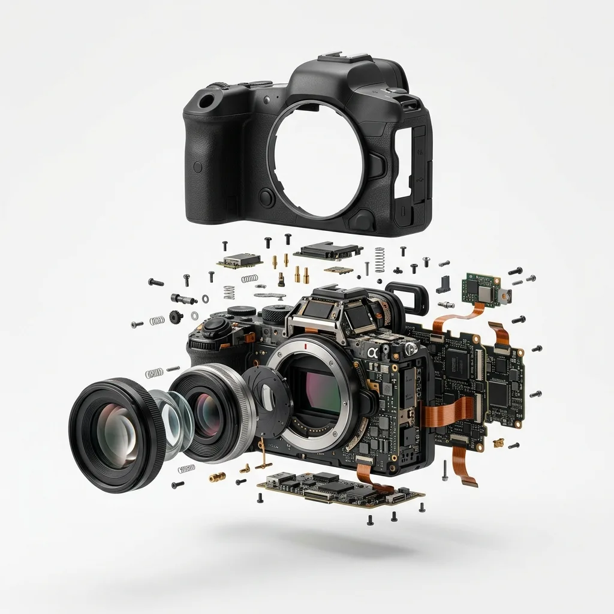

**#178 · Product &amp; Brand Prompt · <code>Vinano Image Pro</code>**

<details>
<summary>Show prompt</summary>

```
Create an exploded products inner mechanics [product], high-end product advertising, white seamless background, exploded view inner mechanics revealed, outer shell hovering above core, micro screws and components suspended, perfect alignment guides implied, crisp soft shadow, ultra realistic, macro product photography, 100mm lens look, f/8, 8k, 1:1 Keep edges clean and the overall composition balanced for a polished, gallery-ready result.
```

</details>

---

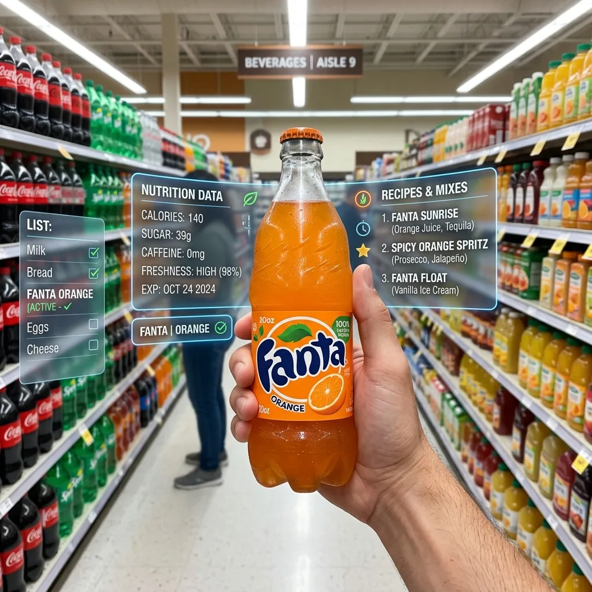

**#179 · Product &amp; Brand Prompt · <code>Vinano Image Pro</code>**

<details>
<summary>Show prompt</summary>

```
First-person perspective inside a brightly lit supermarket aisle. Realistic human hands are holding a bottle of Fanta soda close to the camera. The vivid orange drink in its iconic branded bottle is surrounded by a multi-layered holographic augmented reality interface displaying nutritional data, including calorie count, sugar content, caffeine level, freshness indicator, expiration date, and recommended refreshing recipes and cocktails based on Fanta.
The UI elements smoothly shift and reorganize based on the viewer’s gaze direction, as if dynamically responding to user focus. In the left peripheral vision, a vertical semi-transparent shopping list is visible checked-off items, where Fanta is highlighted as the currently active selection.
Hyper-realistic mixed reality, clean futuristic AR design, glass-like UI panels, soft ambient glow, realistic lighting and shadows, natural depth of field, immersive first-person interface, showcasing next-generation retail technology.

Aim for an editorial, design-driven look with deliberate negative space.
```

</details>

---

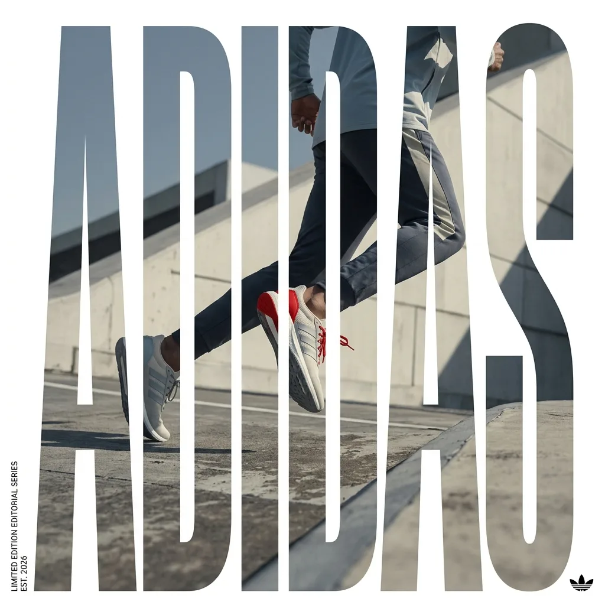

**#180 · Product &amp; Brand Prompt · <code>Vinano Image Pro</code>**

<details>
<summary>Show prompt</summary>

```
[BRAND NAME]. Act as a Senior Editorial Designer and Typographer.

PHASE 1: TYPOGRAPHIC MASK (THE "WINDOW" EFFECT).

- Core Element: Use the most iconic slogan or the name of [BRAND NAME] as a massive, ultra-bold, heavy sans-serif typographic mask.

- Layout: The letters must be giant, filling the entire vertical frame from edge to edge tight kerning.

- Concept: The text acts as a "cut-out" window. The background is solid white, and the photographic subject is visible ONLY through the letterforms.

PHASE 2: DYNAMIC SUBJECT LOGIC.

- Subject Selection:

- Detail: Ensure a high-contrast element (like a red shoe or a glowing headlight) is visible through one of the letters as a focal point.

PHASE 3: SOPHISTICATED MUTED PALETTE.

- Atmosphere: Use a "Refined Muted" color scheme.

- Tones: Soft slate blues, charcoal greys, and creamy off-whites for the photography inside the mask.

- Accent: Identify one sharp, saturated accent color belonging to [BRAND NAME] and apply it to a single key object visible through the text.

PHASE 4: PHOTOGRAPHY & LIGHTING.

- Lighting: Soft-box studio lighting. Diffused shadows and gentle highlights to create a cinematic, high-end editorial feel.

- Finish: Clean, matte texture zero visual noise. High-definition photographic quality.

PHASE 5: refined minimalist BRANDING.

- Accents: Add a tiny refined minimalist logo and a small vertical tagline in a clean, microscopic sans-serif font near the corners.

- Year: Include the year "2026" in a subtle, elegant font to mimic a limited-edition look.

Aim for an editorial, design-driven look with deliberate negative space.
```

</details>

---

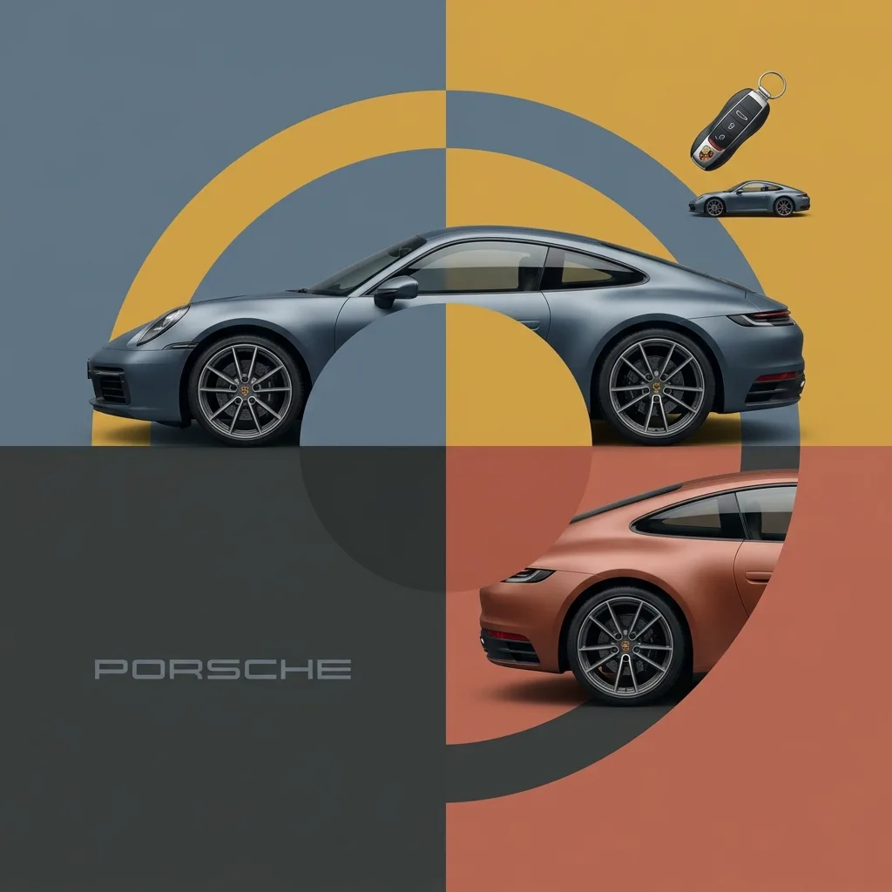

**#181 · Product &amp; Brand Prompt · <code>Vinano Image Pro</code>**

<details>
<summary>Show prompt</summary>

```
[BRAND NAME]. Act as a World-Class Editorial Designer.

PHASE 1: DYNAMIC SUBJECT LOGIC.

- Subject Selection: Autonomously analyze [BRAND NAME].

- Layering (The Sandwich Effect): Interweave the subject background shapes. Some parts of the car/person must be hidden behind geometric blocks, while other parts (wheels, limbs, props) must overlap them to create 3D depth.

PHASE 2: GRID & GEOMETRY.

- Layout: A clean 2x2 grid composition.

- Overlays: Superimpose large, bold geometric arcs and circles over the grid.

- Visual Balance: Place one iconic product prop (e.g., a floating key fob for cars or a ball for sports) in a separate quadrant to balance the subject.

PHASE 3: SOPHISTICATED MUTED PALETTE.

- Color Direction: DO NOT use aggressive neon or oversaturated colors.

- Palette: Identify the core colors of [BRAND NAME] and shift them to a "Sophisticated Muted" spectrum.

- Tones: Use desaturated, earthy, or "dusty" versions of the brand colors (e.g., instead of hot pink, use dusty rose; instead of bright mint, use sage green; instead of royal blue, use slate blue).

- Finish: Matte, flat color blocks zero gradients.

PHASE 4: PHOTOGRAPHY & LIGHTING.

- Subject Style: High-end commercial studio photography.

- Lighting: Soft, diffused studio lighting gentle highlights. No harsh shadows.

- Integration: The subject must feel physically embedded into the graphic grid.

PHASE 5: refined minimalist BRANDING.

- Logo: Place a clean, single-color [BRAND NAME] logo in the center of one background block. No taglines, just the iconic symbol.

Preserve realistic proportions and depth for a confident, professional finish.
```

</details>

---

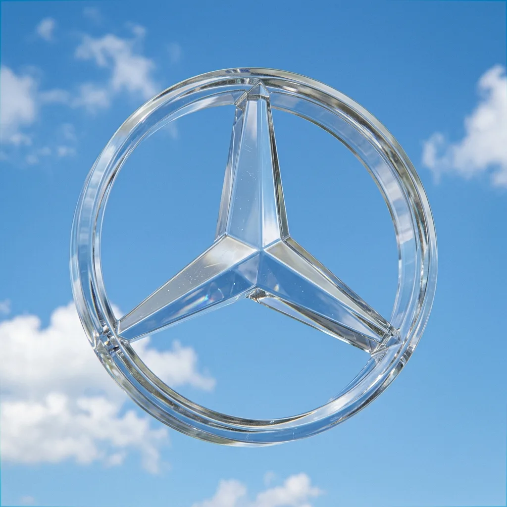

**#182 · Product &amp; Brand Prompt · <code>Vinano Image Pro</code>**

<details>
<summary>Show prompt</summary>

```
Act as a High-End Product Photographer and CGI Artist.

PHASE 1: SUBJECT & LOGIC
Generate a massive, perfectly centered, three-dimensional physical sculpture of the official, unaltered corporate logo for [BRAND NAME]. The sculpture must strictly adhere to the brand’s precise logo geometry and proportions (1:1 from brandbook). The sculpture is suspended in mid-air. Autonomously identify the exact official shape and structure of the [BRAND NAME] logo and render it as a single, flawless glass object without any modifications.
PHASE 2: MATERIALITY (GLASS)
The entire logo is made of hyper-realistic, optical-grade crystal glass (not water, not gel). The material is solid, colorless, and boasts high clarity a high refractive index. It must look heavy and монолитное (monolithic). The glass structure contains subtle, true-to-life photorealistic microscopic flaws: fine polished scratches on the surface and minor internal inclusions (dust particles/seed bubbles, very few) to avoid “CGI plastic.” The edges must be precision-beveled and fire-polished.

PHASE 3: ENVIRONMENT & CAUSTICS
The logo is suspended against a strictly clean, bright blue sky sparse, naturally defined white cumulus clouds. NO land, NO trees, NO palms. The background is purely atmospheric. The focus is entirely on the glass logo. Critically render hyper-realistic, complex glass caustics: intense, sharp patterns of focused light and color (refractions of the blue sky) cast inside and onto the surface of the glass form due to the sunlight passing through it.

TECH SPECS
Rendered Arnold or Octane. Phase One XF, 120mm Macro lens. Aperture f/5.6 for sharp depth across the entire glass sculpture. Intense, direct sunlight (hard lighting) to maximize caustics. Global illumination, ray-traced refractions (double-sided geometry), and chromatic aberration emulation (subtle) for optical realism. Fine grain film emulation (Fujifilm Velvia 50).

Preserve realistic proportions and depth for a confident, professional finish.
```

</details>

---

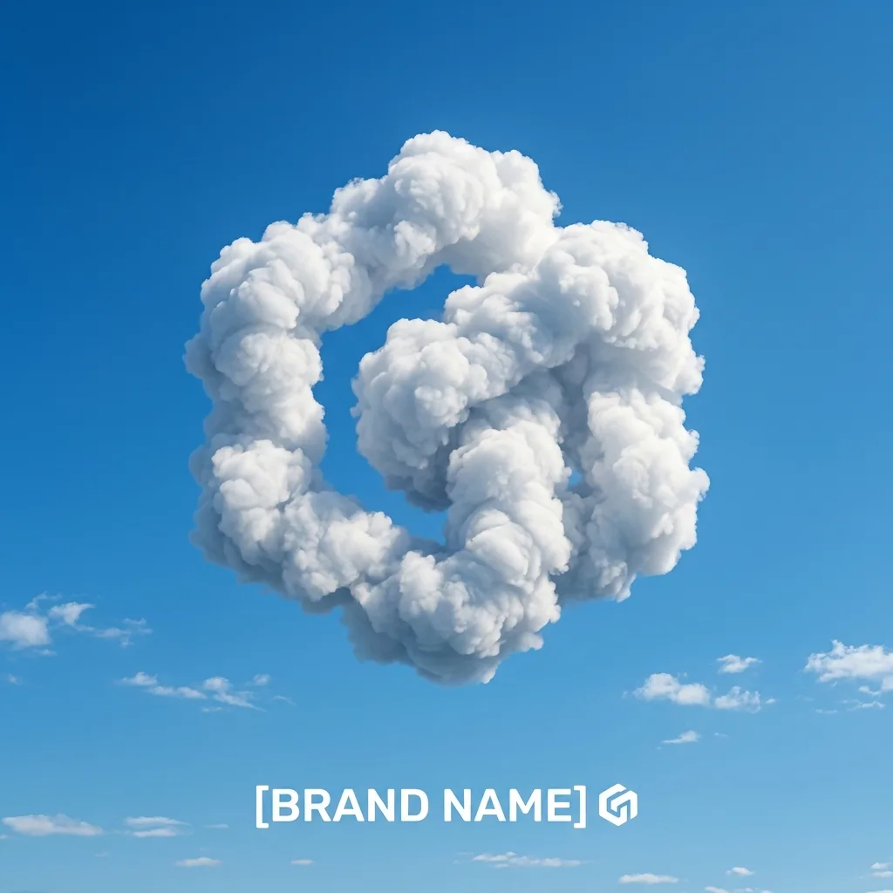

**#183 · Product &amp; Brand Prompt · <code>Vinano Image Pro</code>**

<details>
<summary>Show prompt</summary>

```
[BRAND NAME]: The name of the brand.
Goal: Generate a single, refined minimalist, and surreal image where a cloud is shaped like the brand's logo.

1. THE LOGO CLOUD
- **Subject**: A massive, true-to-life photorealistic cumulus cloud in the exact geometric shape of the [BRAND NAME] logo.
- **Texture**: Puffy, soft, and voluminous natural sunlight illuminating the edges.
- **Volume**: 3D sculptural appearance realistic shadows within the cloud folds to show depth.

2. ENVIRONMENT & BACKGROUND
- **Sky**: A vast, clear, vibrant blue summer sky.
- **Secondary Elements**: A few small, wispy, natural clouds scattered far in the background to enhance the sense of scale and realism.
- **Lighting**: Bright, direct daylight coming from the side to create high-contrast highlights and shadows.

3. INTEGRATED BRANDING
- **Text**: The word "[BRAND NAME]" written in a clean, bold white sans-serif font.
- **Icon**: A small, flat white version of the brand's logo placed next to the text.
- **Positioning**: The branding (text + logo) is centered at the bottom of the frame, acting as a subtle anchor to the giant cloud above.

4. STYLE
- Surrealist photography, ultra-refined minimalist composition, high resolution, 8k, cinematic look, clean and airy vibe.

Aim for an editorial, design-driven look with deliberate negative space.
```

</details>

---

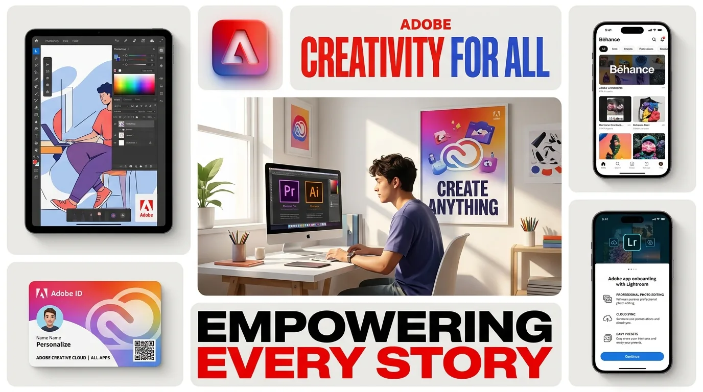

**#184 · Product &amp; Brand Prompt · <code>Vinano Image Pro</code>**

<details>
<summary>Show prompt</summary>

```
Create a 16:9 horizontal bento-grid brand collage for [BRAND NAME] in a polished contemporary campaign style.
Use a fixed 3-row, 4-column bento structure rounded tiles, equal gaps, clean alignment, and a light neutral background.
The layout must stay consistent across generations, but the content inside each tile must adapt to the real business model, product ecosystem, and brand language of [brand name].

Grid blueprint
Build the composition as 11 visible content zones arranged in a fixed bento layout:
Top-left tile: 1 column × 2 rows, tall vertical hero device or primary brand surface
Top-middle-left tile: 1 column × 1 row, compact square brand asset tile
Top-middle-right tile: 2 columns × 1 row, wide headline/message tile

Center tile: 2 columns × 2 rows, dominant campaign hero scene

Top-right tile: 1 column × 1 row, secondary device / product surface / branded object

Bottom-left tile: 1 column × 1 row, product artifact or branded utility object

Bottom-center tile: 2 columns × 1 row, large bold typography tile

Bottom-right tile: 1 column × 2 rows, tall informational product / interface / feature tile

All tiles must share the same corner radius, spacing system, and visual polish.
The dominant focal points are the large center hero tile, the wide top headline tile, and the wide bottom typography tile.

Adaptive content logic
Do not assume [brand name] is a fintech brand.
Before deciding what appears inside each tile, infer what [brand name] actually is: social platform, SaaS tool, media brand, retailer, hospitality brand, hardware company, mobility app, AI product, consumer app, etc.

Every tile must contain a plausible branded asset based on that business type.

Use this rule:

If [brand name] has a real consumer app, dashboard, product UI, creator interface, booking flow, editor, storefront, feed, player, workspace, or operating surface, use those.

If [brand name] does not realistically have payment cards, watches, or hardware, do not invent them.

Only include branded physical objects when they make sense for the brand: packaging, merch, signage, magazine, laptop sticker, storefront card, delivery box, product box, wearable, poster, notebook, tote, badge, ticket, book, etc.

If the brand is primarily digital, prioritize screens, interface fragments, campaign graphics, app/store listings, editorial visuals, and branded communication assets.

If the brand is a platform, use realistic platform surfaces: profile screens, creator dashboards, boards, playlists, templates, analytics, publishing tools, discovery feeds, search, collaboration views, etc.

If the brand is a physical-product company, use realistic product shots, packaging, product detail pages, retail signage, and lifestyle scenes.

If the brand is a service business, use realistic booking, scheduling, marketplace, onboarding, testimonial, results, or service-delivery interfaces.

If exact assets are unknown, infer the most believable official-looking product and campaign system for [brand name].

Tile-by-tile rules
1) Tall left hero tile
Show the most iconic primary branded surface for [brand name].

Examples:

phone app UI
laptop dashboard/editor
tablet creative workspace
product packaging held in hand
branded poster or printed object
storefront or physical product close-up

This tile should represent the brand’s main touchpoint, not a generic device.

2) Small square brand asset tile
Show a compact brand-signature element:

app icon
logo mark
symbol
product badge
branded motif
miniature packaging unit
icon system object
sticker or seal
simplified 3D brand emblem

This tile should feel like a distilled identity marker.

3) Wide top headline tile
Use a short strategic message that fits [brand name]’s category and tone.
Do not repeat generic fintech copy.
The line should feel like a real campaign headline for that specific brand.

Examples of direction:

discovery
creativity
organization
inspiration
connection
travel
productivity
expression
streaming
collaboration
automation

Use large, bold, high-contrast typography.

4) Large center hero tile
Create the main campaign scene for [brand name] in a real-world or branded-environment context.
This should be the most expressive tile.

Possible formats:
outdoor billboard
subway poster
retail installation
city poster wall
laptop-on-desk hero scene
creator workspace
product-in-use lifestyle shot
editorial campaign image
interface projected into environment
branded event signage
The scene must make sense for the brand’s world and audience.

5) Top-right support tile
Show a secondary but still realistic brand surface:

another device view
product detail
branded object
campaign variation
interface zoom-in
packaging angle
social post mockup
desktop widget
creator tool panel
notification / discovery / search view

This tile should complement the main touchpoint, not duplicate it exactly.

6) Bottom-left artifact tile
Show a category-appropriate branded artifact, not a fixed “bank card”.

Choose the artifact based on [brand name]:

for fintech: payment card, wallet pass, transfer screen, exchange card

for social/media: creator card, profile card, post template, content preview, board tile, channel card

for SaaS/productivity: workspace card, document preview, template card, dashboard widget

for e-commerce/retail: packaging, shipping box, loyalty pass, product tag, order card

for travel/hospitality: booking card, room key, boarding-style pass, itinerary card

for music/media: album card, playlist card, player card, event ticket

for AI/software: prompt card, generation result card, model card, workflow card

This tile must feel like a believable branded unit of value for that company.

7) Wide bottom message tile
Use one strong oversized statement in uppercase or bold display typography.
This is not necessarily the slogan from the top tile; it can be a broader campaign line or category promise.

The message must match the actual brand behavior of [brand name].
For example, do not use “MOVE MONEY WITHOUT BORDERS” unless the brand actually deals payments or finance.

8) Tall right informational tile
Show a structured branded information surface:
app store page
product page
onboarding screen
feature overview
marketplace listing
creator profile
brand campaign landing screen
dashboard overview
editorial page
discovery feed
help center / setup / feature panel
This tile should add product depth and make the collage feel like a full brand system.

Brand realism rules
Use the real or highly plausible brand identity of [brand name]: logo, color palette, typography feel, icon language, image treatment, interface style, and tone of voice.
If exact assets are unavailable, invent only what is necessary, but make it feel like the official visual system of [brand name].

Do not force a product category onto the brand.
Do not invent impossible hardware, payment tools, packaging, or app features unless they are realistic adjacent extensions of the brand.
Prefer believable brand adaptation over visual symmetry.

Visual consistency rules
Even though tile content is adaptive, the final image must still feel like one campaign system:

same overall grid structure
same tile spacing
same corner radius
same art direction quality
same brand palette across all tiles
consistent typography logic
consistent mockup realism
consistent lighting and polish

Style
Clean premium brand presentation, high detail, polished mockup realism, soft shadows, strong hierarchy, editorial-quality composition, modern campaign aesthetics.
Avoid random collage chaos.
Avoid tiny unreadable text.
Avoid generic placeholder UI.
Keep the structure fixed, but let the objects and branded surfaces adapt intelligently to [brand name].

Stronger one-line instruction

Important: the layout is fixed, but the objects are not fixed.
For each generation, select tile content based on what [brand name] realistically sells, ships, publishes, displays, or lets users interact.
Never insert category-inappropriate objects just to fill the grid.

Maintain consistent colour harmony and crisp focus across the whole frame.
```

</details>

---

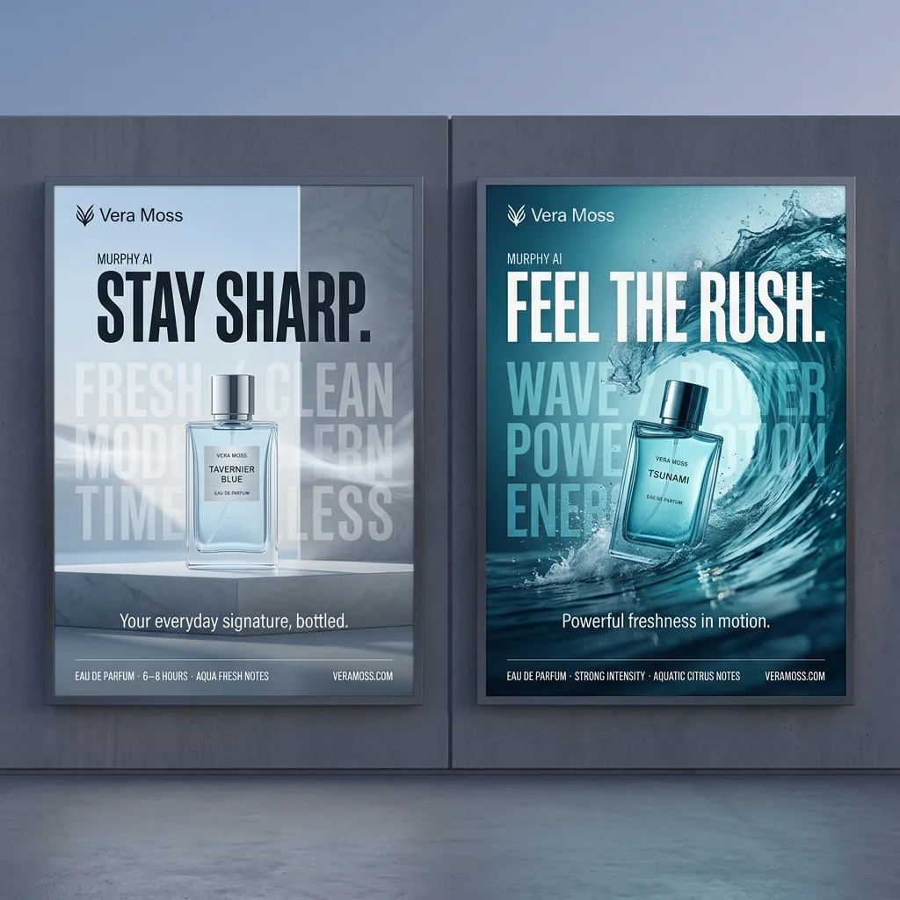

**#185 · Product &amp; Brand Prompt · <code>Vinano Image Pro</code>**

<details>
<summary>Show prompt</summary>

```
Hyper-realistic cinematic perfume billboard poster for Vera Moss Tavernier Blue Eau De Parfum, built around freshness, clarity, and modern sharp identity

Scene: minimal architectural environment smooth stone surfaces and cool-toned textures, soft air-like mist flowing horizontally across frame, creating a sense of movement and freshness

Product placement:
perfume bottle placed center on a clean elevated platform, perfectly upright, label facing camera
subtle reflective surface beneath soft diffused reflection

Environment styling:
abstract stone formations + soft gradient sky tones (light blue to grey), inspired by open air and water freshness
no clutter, strong negative space

Composition:
centered hero product
strong breathing space around
background depth layers for cinematic feel

Typography system (Nike-style, strict hierarchy):

top-left — Vera Moss logo
beneath — small thin uppercase “MURPHY AI”

center massive —
“STAY SHARP.”
bold condensed sans-serif, high impact

background typography (very faint, oversized):
“FRESH / CLEAN / MODERN / TIMELESS”
layered subtly into environment

mid-lower —
“Your everyday signature, bottled.”

bottom strip (clean spec line):
“EAU DE PARFUM · 6–8 HOURS · AQUA FRESH NOTES”

bottom right — website

Lighting:
soft cool daylight slight blue tint
gentle highlights on glass edges
subtle rim light for separation

Color palette:
icy blue, soft grey, white, silver accents

Atmosphere:
light mist / air particles to represent freshness

Camera:
50mm lens, slight low angle for presence
shallow depth of field, ultra sharp product focus

Mood:
calm, confident, modern, effortless

Output:
4:5 billboard format
ultra high resolution
luxury commercial finish

Hyper-realistic cinematic perfume billboard poster for Vera Moss Tsunami Eau De Parfum, built around energy, motion, and explosive freshness

Scene: dynamic water environment where a powerful wave is frozen mid-impact, curling around the perfume bottle, capturing the exact moment of motion and force

Product placement:
perfume bottle placed center, emerging from the water surface
partially surrounded by a rising wave arc
glass and liquid reflecting blue tones

Environment styling:
deep aqua-blue gradient background transitioning from dark ocean tones to bright fresh highlights
water particles suspended in air
fine droplets and mist frozen in motion

Composition:
central hero bottle
diagonal motion created by wave direction
strong depth and perspective

Typography system (Nike-style, high energy):

top-left — Vera Moss logo
beneath — small thin uppercase “MURPHY AI”

center massive —
“FEEL THE RUSH.”
bold condensed sans-serif, slightly stretched vertically

background typography (layered, kinetic):
“WAVE / POWER / MOTION / ENERGY”

subtly warped as if affected by water movement

mid-lower —
“Powerful freshness in motion.”

bottom strip —
“EAU DE PARFUM · STRONG INTENSITY · AQUATIC CITRUS NOTES”

bottom right — website

Lighting:
high contrast lighting
strong highlights on water edges
reflective glow on bottle
subtle backlight through water for depth

Color palette:
aqua blue, deep navy, white highlights

Atmosphere:
water spray, mist, droplets, motion particles

Camera:
low angle + slight tilt for dynamism
35mm cinematic lens feel

Mood:
energetic, powerful, refreshing, bold

Output:
4:5 billboard format
ultra high resolution
premium commercial finish

Keep edges clean and the overall composition balanced for a polished, gallery-ready result.
```

</details>

---

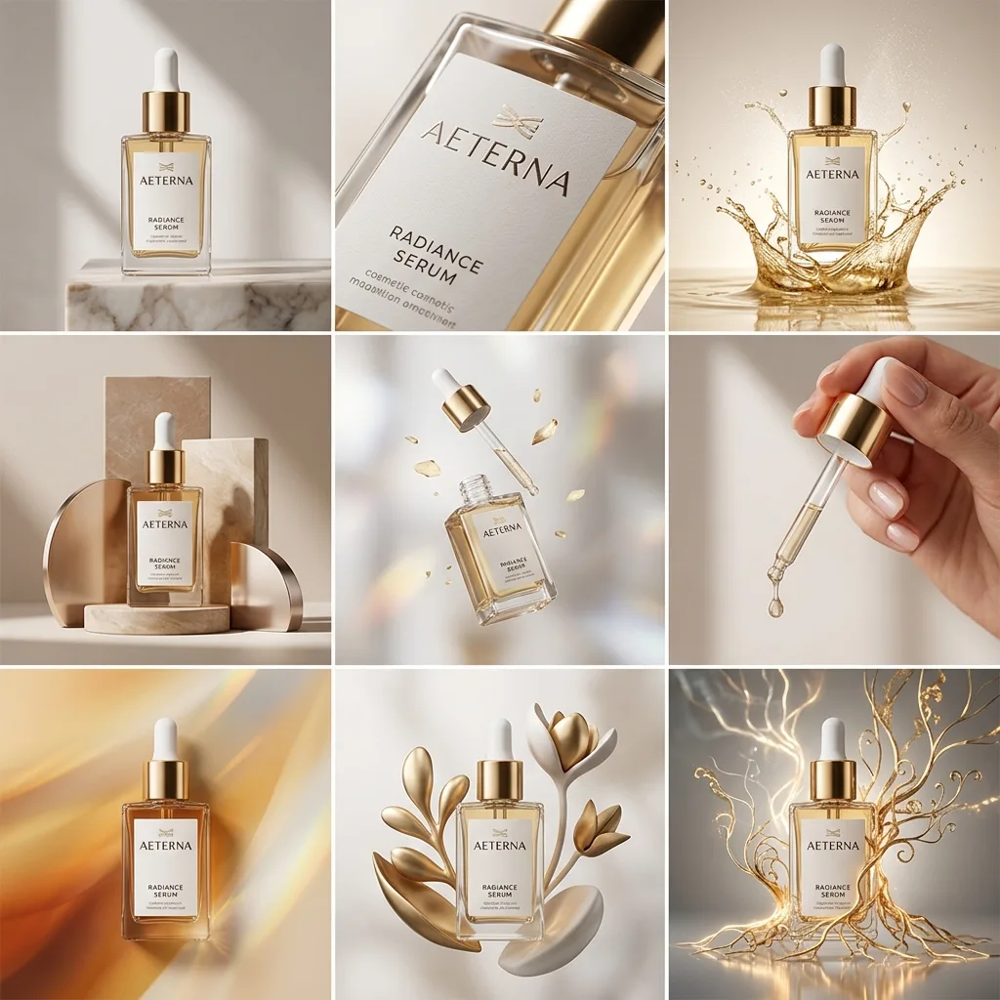

**#186 · Product &amp; Brand Prompt · <code>Vinano Image Pro</code>**

<details>
<summary>Show prompt</summary>

```
Create a 3×3 grid in
3:4 aspect ratio for a high-end commercial marketing campaign the uploaded product as the central subject.

Each frame must present a distinct visual concept while maintaining perfect product consistency across all nine images.

Grid Concepts (one per cell):

1. Iconic hero still life bold composition

2. Extreme macro detail highlighting material, surface, or texture

3. Dynamic liquid or particle interaction surrounding the product

4. Minimal sculptural arrangement abstract forms

5. Floating elements composition suggesting lightness and innovation

6. Sensory close-up emphasizing tactility and realism

7. Color-driven conceptual scene inspired by the product palette

8. Ingredient or component abstraction (non-literal, symbolic)

9. Surreal yet elegant fusion scene combining realism and imagination

Visual Rules:
Product must remain 100% accurate in shape, proportions, label, typography, color, and branding
No distortion, deformation, or redesign of the product
Clean separation between product and background

Lighting & Style:
Soft, controlled studio lighting
Subtle highlights, realistic shadows
High dynamic range, ultra-sharp focus
Editorial luxury advertising aesthetic
Premium sensory marketing look

Overall Feel:
Modern, refined, visually cohesive
High-end commercial campaign
Designed for brand websites, social grids, and digital billboards
Hyperreal, cinematic, polished, and aspirational

Emphasise material texture and natural light so the final frame feels tactile and premium.
```

</details>

---

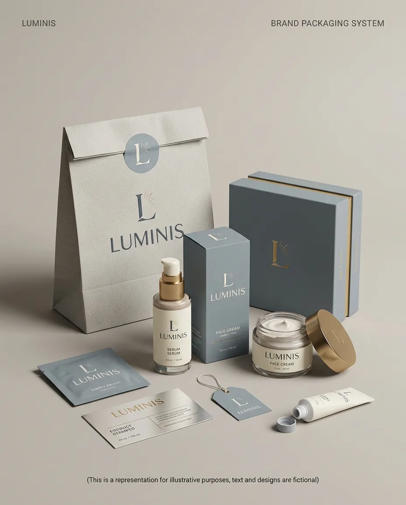

**#187 · Product &amp; Brand Prompt · <code>Vinano Image Pro</code>**

<details>
<summary>Show prompt</summary>

```
请为品牌[品牌名称]、类目为[品牌类目]创作一张高审美、高完成度的「品牌包装系统展示图」。这不是普通电商白底图，也不是单一产品图，而是一张具有品牌提案感、视觉识别系统感和商业摄影质感的包装家族陈列效果图。画面需要体现“同一品牌在多个包装载体上的统一落地”，呈现一个成熟消费品牌的完整包装系统。

【画幅要求】整体必须为固定 4:5 的竖版海报构图，画面方向明确为纵向，禁止生成横版构图、宽幅桌面陈列或过于分散的横向展示。整体构图需符合海报阅读逻辑：上方保留呼吸感，中部为品牌包装系统的主要视觉焦点，下方安排辅助包装、标签和产品本体，整体重心集中，适合直接作为品牌展示海报发布。

【核心要求】根据【类目】自动匹配最合理、最自然的包装组合与产品形态，并围绕【品牌名字】建立统一的品牌视觉系统。画面中应选择少量但有代表性的包装形式，组成一组完整而精炼的品牌包装系统，不追求堆砌数量，而强调主次层级、品牌统一性与陈列美感。可根据类目合理选择以下包装类型中的一部分：手提袋 / 购物袋、纸盒 / 礼盒 / 外包装盒、长条盒 / 单品盒 / 套装盒、包装袋 / 封套 / 小样袋 / 软袋、杯子 / 瓶子 / 罐子 / 管状容器 / 喷雾瓶 / 泵头瓶、标签 / 贴纸 / 封签 / 吊牌 / 小卡片，以及与类目对应的真实产品本体。

【类目适配逻辑】包装形式与产品形态需要根据【类目】自动匹配，但不局限于单一方向。可参考以下适配逻辑自由发散：若类目为食品 / 烘焙 / 零食 / 饮品，则以纸袋、纸盒、包装袋、杯子、食品容器、贴纸、封签及真实产品本体为主；若类目为茶饮 / 咖啡 / 饮料，则以杯子、瓶子、罐装包装、提袋、杯套、封口贴、礼盒等为主；若类目为美妆 / 护肤 / 彩妆 / 香水，则以瓶、罐、管、盒、礼盒、手提袋、小样包装等为主；若类目为香氛 / 家居 / 生活方式，则以香薰瓶、蜡烛杯、包装盒、礼盒、提袋、吊卡、标签卡等为主；若类目为服饰 / 饰品 / 潮玩 / 文创，则以包装盒、抽屉盒、防尘袋、手提袋、贴纸、吊牌、配件包装等为主；若类目为数码配件 / 工具 / 小型消费品，则以硬盒、外包装盒、收纳袋、说明卡、贴纸、封套、标签等为主。整体必须体现“类目合理、品牌统一、包装成体系”的效果。

【数量与密度控制】请控制画面中的物件数量，不要过多堆砌，也不要把所有可能包装形式全部展示出来。整体应呈现“少而精、完整但不拥挤”的品牌包装系统效果。建议选择最具代表性的包装载体进行展示：大件包装 1～2 个，中型包装 2～3 个，小型包装或辅助物件 2～4 个，真实产品本体 1～3 个，总可见元素建议控制在 6～10 个之间。包装种类应体现层次变化与系统感，但不宜重复过多同类物件。画面需要有足够留白与呼吸感，确保每个包装都清晰可见、主次明确、摆放舒展，宁可少而精，也不要为了“完整”而过度塞满。

【品牌视觉系统要求】所有包装必须属于同一个品牌系统，统一使用【品牌名字】作为核心品牌识别元素。整体应具备一致的 logo / 标志呈现、字体风格、图形语言、插画语言或纹样系统、排版逻辑、配色体系、材质与印刷质感。品牌调性、色彩方向、图案元素、辅助图形和视觉氛围，请根据【类目】自动匹配并合理发散，不局限于任何固定风格。整体风格应统一、协调、具有品牌识别度，可以是简约高级、自然有机、时尚现代、轻奢精致、年轻清新、艺术感、潮流个性或经典优雅，但必须符合【类目】特征，并呈现成熟品牌的设计完成度。

【配色机制要求】整体配色不要固化为某一种固定组合，也不要连续多次出现高度相似的主色系统。每次生成时应根据【类目】与品牌气质，主动形成不同的主色方案与配色关系，采用“受控发散”的方式进行色彩演绎。色彩可以是低饱和自然色、现代中性色、轻复古色、明快清新色、轻奢深色系或艺术感综合色系，但必须保持高级、统一、克制、有品牌感。允许每次生成时呈现不同的视觉气质，例如奶油白与焦糖棕、雾灰蓝与暖白、橄榄绿与亚麻米、酒红与奶霜白、可可棕与象牙白、炭灰与麦秆金、雾粉灰与米白、海军蓝与暖灰等，仅作为参考方向而非固定模板。不要荧光色，不要廉价高饱和，不要杂乱失控的多色拼贴。

【画面构图与陈列要求】画面采用品牌包装家族陈列逻辑，而不是杂乱堆放。整体为商业摄影棚场景，使用 3/4 轻俯视角或略带透视的正面陈列角度，形成有层次、有秩序、有主次的包装展示画面。构图参考以下逻辑：后景摆放 1～2 个较大的包装作为视觉支撑，如手提袋、大礼盒、大外盒；中景安排品牌核心包装或主力单品包装，作为主要视觉焦点；前景摆放较小包装、辅助包装、标签、贴纸及真实产品本体；至少有一个真实产品与包装产生自然互动，如产品半露出、摆放在包装前方、与包装组合展示；整体形成平衡而有设计感的三角式或错落式构图。画面干净、有留白、不拥挤，内容丰富但克制，以有限而精准的包装组合体现完整的品牌包装生态。

【视觉风格要求】整体呈现高端商业摄影质感与品牌提案感，背景为干净的摄影棚环境，可为白色、暖白色、浅灰色，或根据品牌调性自动匹配的极简背景。画面应强调真实的包装材质表现、清晰的纸张折痕、盒型结构、瓶罐轮廓、标签细节、印刷质感、压纹 / 烫金 / 哑光 / 棉纸纹理 / 牛皮纸纹理等材质细节，以及统一而高级的配色搭配、精致现代干净的品牌视觉语言和强烈的“这是一整套品牌包装系统”的完整感。

【光影要求】采用真实商业摄影级光影，可为柔和棚拍光，也可带有轻微方向性的自然侧光。需要有清晰但克制的阴影，以增强立体感、空间感与高级感。整体光线通透、明亮、干净，不要阴暗，不要廉价感，不要杂乱背景。

【最终效果要求】最终画面应像一个成熟品牌的包装系统展示海报、包装家族提案图或品牌视觉落地效果图，而不是零散商品拼图。重点突出：固定 4:5 竖版海报感、品牌统一性、包装家族完整性、商业摄影感、设计提案感、类目适配性，以及高级审美与视觉完成度。

保持真实比例与空间层次，呈现专业、稳重的最终效果。
```

</details>

---

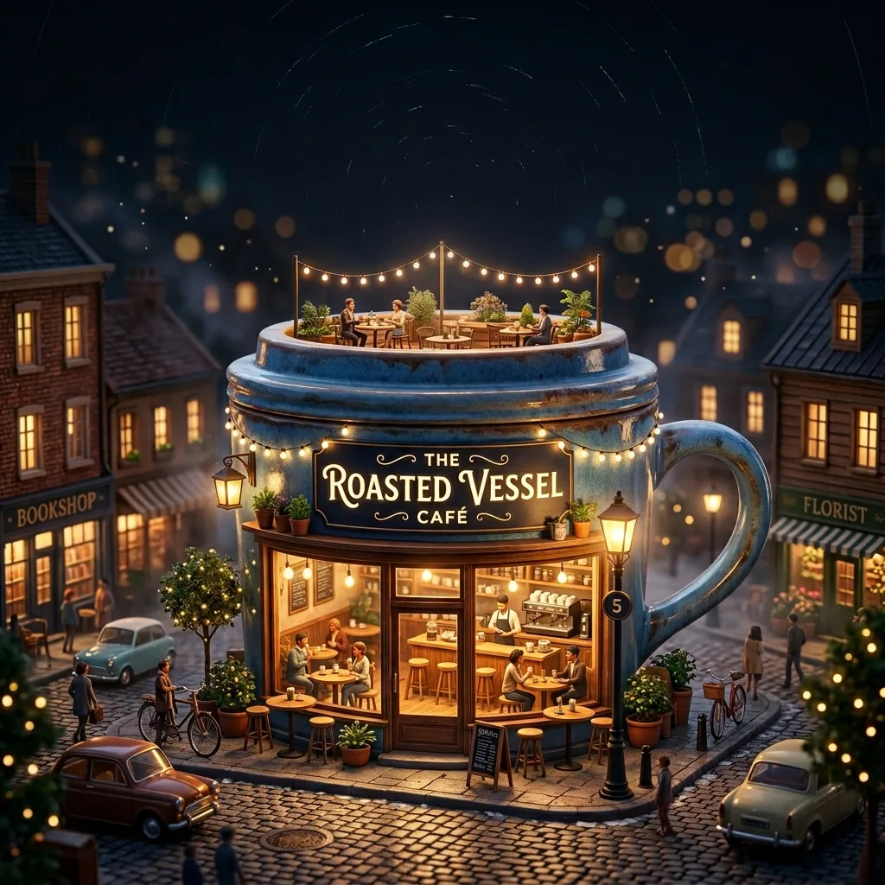

**#188 · Product &amp; Brand Prompt · <code>Vinano Image Pro</code>**

<details>
<summary>Show prompt</summary>

```
Chat.5 × Google Veo 3.1

→ /.5
→ Copy & Paste the Prompt
→ View Results Below ⤵️

Prompt:

A surreal miniature city scene where a giant coffee cup transforms into a cozy café building. The coffee cup forms the main structure, steam rising like clouds, ceramic textures glowing softly, and the lid acting as a rooftop terrace. The ground floor is a warmly lit café storefront glass windows, tiny tables, stools, barista counters, and glowing street lamps. Nighttime atmosphere cinematic bokeh lights, floating particles, soft fog, warm interior glow, hyper-detailed materials, fantasy realism, premium brand storytelling. Tilt-shift effect, ultra-sharp focus, dramatic lighting, square frame, 1080×1080, high-end commercial illustration, ultra-detailed 8K quality.

Aim for an editorial, design-driven look with deliberate negative space.
```

</details>

---

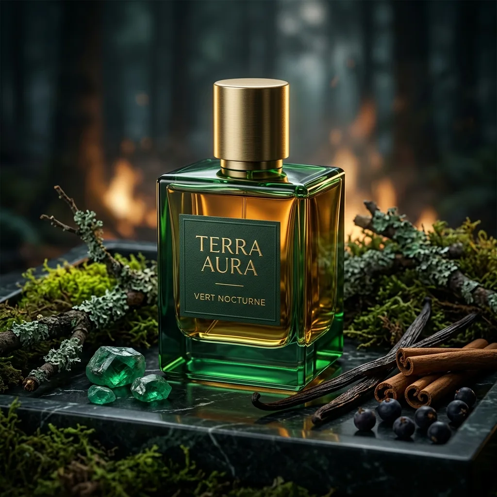

**#189 · Product &amp; Brand Prompt · <code>Vinano Image Pro</code>**

<details>
<summary>Show prompt</summary>

```
Create a hyper-realistic cinematic luxury perfume product photograph featuring [PERFUME BOTTLE DESIGN] positioned in [COMPOSITION / ANGLE] within a dramatic elemental environment of [ELEMENTAL SETTING: water, smoke, ice, firelight, forest, florals, spices, gemstones].

The bottle should feel premium and tactile, [MATERIAL DETAILS: glossy glass, metallic cap, gold label, transparent liquid, frosted surface, engraved text], sharp reflections, realistic refractions, and crisp readable branding: [BRAND / LABEL TEXT].

Surround the product carefully arranged sensory ingredients such as [BOTANICALS / SPICES / FRUITS / OBJECTS], strong contrast between [PRIMARY COLOR PALETTE] and [ACCENT COLORS].

Lighting should be cinematic and high-contrast, [LIGHTING STYLE], deep shadows, sparkling highlights, volumetric atmosphere, and a luxurious commercial advertising finish.

Background: [BACKGROUND DESCRIPTION], shallow depth of field, premium editorial composition, ultra-detailed textures, 8k resolution, true-to-life photorealistic studio quality.

Cheat Sheet
[PERFUME BOTTLE DESIGN]: shape, color, cap, label style
[COMPOSITION / ANGLE]: tilted crash, centered still life, close-up tray, hand interaction
[ELEMENTAL SETTING]: splash, smoke, candlelight, ice, forest, aurora
[MATERIAL DETAILS]: glass, metal, liquid, frost, reflections
[BRAND / LABEL TEXT]: exact readable perfume text
[BOTANICALS / SPICES / FRUITS / OBJECTS]: lemons, vanilla pods, roses, pinecones, gemstones
[PRIMARY COLOR PALETTE]: navy, amber, silver, black, icy blue
[ACCENT COLORS]: gold, red, lime green, magenta, teal
[LIGHTING STYLE]: dramatic spotlight, candle glow, cool moonlight, golden rim light
[BACKGROUND DESCRIPTION]: moody studio, dark forest, blurred luxury interior, smoky backdrop

Preserve realistic proportions and depth for a confident, professional finish.
```

</details>

---

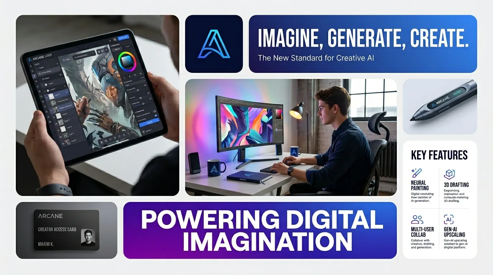

**#190 · Product &amp; Brand Prompt · <code>Vinano Image Pro</code>**

<details>
<summary>Show prompt</summary>

```
Create a 16:9 horizontal bento-grid brand collage for [BRAND NAME] in a polished contemporary campaign style.
Use a fixed 3-row, 4-column bento structure rounded tiles, equal gaps, clean alignment, and a light neutral background.
The layout must stay consistent across generations, but the content inside each tile must adapt to the real business model, product ecosystem, and brand language of [brand name].

Grid blueprint
Build the composition as 11 visible content zones arranged in a fixed bento layout:
Top-left tile: 1 column × 2 rows, tall vertical hero device or primary brand surface
Top-middle-left tile: 1 column × 1 row, compact square brand asset tile
Top-middle-right tile: 2 columns × 1 row, wide headline/message tile

Center tile: 2 columns × 2 rows, dominant campaign hero scene

Top-right tile: 1 column × 1 row, secondary device / product surface / branded object

Bottom-left tile: 1 column × 1 row, product artifact or branded utility object

Bottom-center tile: 2 columns × 1 row, large bold typography tile

Bottom-right tile: 1 column × 2 rows, tall informational product / interface / feature tile

All tiles must share the same corner radius, spacing system, and visual polish.
The dominant focal points are the large center hero tile, the wide top headline tile, and the wide bottom typography tile.

Adaptive content logic
Do not assume [brand name] is a fintech brand.
Before deciding what appears inside each tile, infer what [brand name] actually is: social platform, SaaS tool, media brand, retailer, hospitality brand, hardware company, mobility app, AI product, consumer app, etc.

Every tile must contain a plausible branded asset based on that business type.

Use this rule:

If [brand name] has a real consumer app, dashboard, product UI, creator interface, booking flow, editor, storefront, feed, player, workspace, or operating surface, use those.

If [brand name] does not realistically have payment cards, watches, or hardware, do not invent them.

Only include branded physical objects when they make sense for the brand: packaging, merch, signage, magazine, laptop sticker, storefront card, delivery box, product box, wearable, poster, notebook, tote, badge, ticket, book, etc.

If the brand is primarily digital, prioritize screens, interface fragments, campaign graphics, app/store listings, editorial visuals, and branded communication assets.

If the brand is a platform, use realistic platform surfaces: profile screens, creator dashboards, boards, playlists, templates, analytics, publishing tools, discovery feeds, search, collaboration views, etc.

If the brand is a physical-product company, use realistic product shots, packaging, product detail pages, retail signage, and lifestyle scenes.

If the brand is a service business, use realistic booking, scheduling, marketplace, onboarding, testimonial, results, or service-delivery interfaces.

If exact assets are unknown, infer the most believable official-looking product and campaign system for [brand name].

Tile-by-tile rules
1) Tall left hero tile
Show the most iconic primary branded surface for [brand name].

Examples:

phone app UI
laptop dashboard/editor
tablet creative workspace
product packaging held in hand
branded poster or printed object
storefront or physical product close-up

This tile should represent the brand’s main touchpoint, not a generic device.

2) Small square brand asset tile
Show a compact brand-signature element:

app icon
logo mark
symbol
product badge
branded motif
miniature packaging unit
icon system object
sticker or seal
simplified 3D brand emblem

This tile should feel like a distilled identity marker.

3) Wide top headline tile
Use a short strategic message that fits [brand name]’s category and tone.
Do not repeat generic fintech copy.
The line should feel like a real campaign headline for that specific brand.

Examples of direction:

discovery
creativity
organization
inspiration
connection
travel
productivity
expression
streaming
collaboration
automation

Use large, bold, high-contrast typography.

4) Large center hero tile
Create the main campaign scene for [brand name] in a real-world or branded-environment context.
This should be the most expressive tile.

Possible formats:
outdoor billboard
subway poster
retail installation
city poster wall
laptop-on-desk hero scene
creator workspace
product-in-use lifestyle shot
editorial campaign image
interface projected into environment
branded event signage
The scene must make sense for the brand’s world and audience.

5) Top-right support tile
Show a secondary but still realistic brand surface:

another device view
product detail
branded object
campaign variation
interface zoom-in
packaging angle
social post mockup
desktop widget
creator tool panel
notification / discovery / search view

This tile should complement the main touchpoint, not duplicate it exactly.

6) Bottom-left artifact tile
Show a category-appropriate branded artifact, not a fixed “bank card”.

Choose the artifact based on [brand name]:

for fintech: payment card, wallet pass, transfer screen, exchange card

for social/media: creator card, profile card, post template, content preview, board tile, channel card

for SaaS/productivity: workspace card, document preview, template card, dashboard widget

for e-commerce/retail: packaging, shipping box, loyalty pass, product tag, order card

for travel/hospitality: booking card, room key, boarding-style pass, itinerary card

for music/media: album card, playlist card, player card, event ticket

for AI/software: prompt card, generation result card, model card, workflow card

This tile must feel like a believable branded unit of value for that company.

7) Wide bottom message tile
Use one strong oversized statement in uppercase or bold display typography.
This is not necessarily the slogan from the top tile; it can be a broader campaign line or category promise.

The message must match the actual brand behavior of [brand name].
For example, do not use “MOVE MONEY WITHOUT BORDERS” unless the brand actually deals payments or finance.

8) Tall right informational tile
Show a structured branded information surface:
app store page
product page
onboarding screen
feature overview
marketplace listing
creator profile
brand campaign landing screen
dashboard overview
editorial page
discovery feed
help center / setup / feature panel
This tile should add product depth and make the collage feel like a full brand system.

Brand realism rules
Use the real or highly plausible brand identity of [brand name]: logo, color palette, typography feel, icon language, image treatment, interface style, and tone of voice.
If exact assets are unavailable, invent only what is necessary, but make it feel like the official visual system of [brand name].

Do not force a product category onto the brand.
Do not invent impossible hardware, payment tools, packaging, or app features unless they are realistic adjacent extensions of the brand.
Prefer believable brand adaptation over visual symmetry.

Visual consistency rules
Even though tile content is adaptive, the final image must still feel like one campaign system:

same overall grid structure
same tile spacing
same corner radius
same art direction quality
same brand palette across all tiles
consistent typography logic
consistent mockup realism
consistent lighting and polish

Style
Clean premium brand presentation, high detail, polished mockup realism, soft shadows, strong hierarchy, editorial-quality composition, modern campaign aesthetics.
Avoid random collage chaos.
Avoid tiny unreadable text.
Avoid generic placeholder UI.
Keep the structure fixed, but let the objects and branded surfaces adapt intelligently to [brand name].

Stronger one-line instruction

Important: the layout is fixed, but the objects are not fixed.
For each generation, select tile content based on what [brand name] realistically sells, ships, publishes, displays, or lets users interact.
Never insert category-inappropriate objects just to fill the grid.

Maintain consistent colour harmony and crisp focus across the whole frame.
```

</details>

---

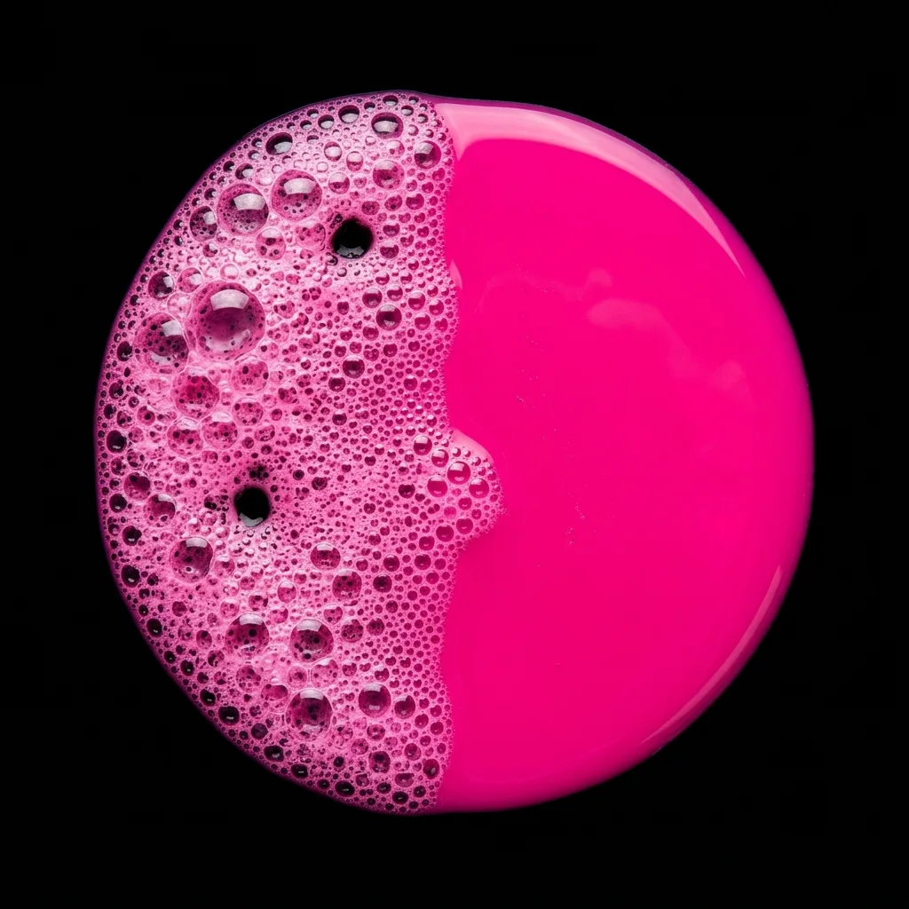

**#191 · Product &amp; Brand Prompt · <code>Vinano Image Pro</code>**

<details>
<summary>Show prompt</summary>

```
[BRAND NAME] | [COLOR]

ABSOLUTE RULE — READ BEFORE GENERATING ANYTHING: The fluid mass in this image has the exact shape of the [BRAND NAME] logo and nothing else. Not a circle. Not an oval. Not a blob. Not a rounded shape the logo inside it. The outer silhouette of the fluid IS the logo outline — identical to the canonical [BRAND NAME] logo trademark. If someone covers the bubble texture and looks only at the silhouette they must immediately recognize it as the [BRAND NAME] logo. The fluid does not flow into a circle. The fluid does not form a blob. The fluid is constrained to the exact logo shape. This is the single most important rule in this prompt — it overrides everything else. Act as a Macro Fluid Photographer and CGI Art Director creating a hero typographic image where the brand logo is formed entirely from living fluorescent foam and bubble liquid — as if the logo was poured into a logo-shaped mold on a black surface and captured at the exact moment of maximum bubble activity. References: macro fluid photography, fluorescent paint foam art, soap bubble macro photography. --- PHASE 0: BRAND LOGO INTELLIGENCE — GEOMETRY IS LAW Retrieve the 100% canonical trademark-accurate primary mark of [BRAND NAME]. Use only the core logo symbol or emblem. STEP 1 — ESTABLISH EXACT SILHOUETTE: reconstruct the precise canonical [BRAND NAME] logo silhouette — every curve, every angle, every proportion exactly as trademarked. Draw this silhouette in your mind as a flat solid shape. This is the mold. It is rigid. It does not change shape. STEP 2 — FLUID FILLS THE MOLD: the fluid foam fills the interior of this rigid mold. The outer boundary of the fluid mass IS the logo outline — precise, hard, clean. Think of it as the logo shape cut from foam rubber and placed on a black surface. The fluid is solid where the logo is solid. The fluid is absent where the logo has designed empty space — those gaps show pure black background. STEP 3 — NO CONTAINER: there is no circle, no oval, no badge, no rounded rectangle, no frame around the logo. The logo floats directly on the black background. Its edges are the logo edges — nothing more. STEP 4 — ORIENTATION LOCKED: correct canonical upright orientation exactly as in official brand materials. Not rotated, not flipped, not mirrored, not tilted. STEP 5 — ZERO FLUID OUTSIDE BOUNDARY: the logo silhouette is an absolute hard boundary. Zero fluid, zero bubbles, zero tendrils, zero droplets outside this boundary. The black background begins exactly where the logo outline ends. STEP 6 — GEOMETRY WINS ALWAYS: wherever fluid simulation physics conflict exact logo geometry — the logo geometry wins. Always. Apply [COLOR] as the fluid foam color throughout — in its most saturated fluorescent version. --- PHASE 1: FLUID MATERIAL SYSTEM — CRITICAL The entire logo form is filled a single continuous viscous fluid existing in two physical states simultaneously. The fluid is NOT water — thick, viscous, surface-tension-dominant, like fluorescent soap foam, acrylic paint trapped air, or colored slime. Base color: [COLOR] at maximum fluorescent saturation — self-luminous quality as if internally lit, consistent UV-reactive fluorescent paint. Tonal variation strictly within [COLOR] family: thin bubble membrane walls — 35 to 45% lighter than base [COLOR], approaching near-transparency. Mid-thickness fluid zones — pure saturated [COLOR]. Deep thick liquid pools — 25 to 35% darker than base [COLOR]. Fluid surface in liquid zone: high gloss, wet, shiny, visible broad specular reflection. Foam zone membranes: lower gloss, slight soap film iridescence. --- PHASE 2: BUBBLE ARCHITECTURE SYSTEM Full bubble size hierarchy present across the foam zone only. Large anchor bubbles — 10 to 18mm diameter, 4 to 8 present. Medium bubbles — 4 to 9mm, 15 to 25 present. Small bubbles — 1.5 to 3mm, 30 to 50 present. Micro bubbles — 0.5 to 1mm, 50 to 100+ present. Each bubble: physically accurate sphere of trapped air enclosed by thin colored fluid membrane, 0.1 to 0.3mm thick, semi-transparent. Soap film iridescence barely perceptible. Bubble dome highlight: bright white crescent arc in UPPER-LEFT portion of each dome — 15 to 20% of dome surface, soft-edged, white regardless of bubble color. Inside large bubbles: dark reflection [COLOR] tint confirming membrane transparency. Bubble contact deformation: flat septum membranes at contact points. Burst bubble holes: 3 to 8 irregular dark voids within foam zone only — revealing black background. Never at or near the logo boundary edges. --- PHASE 3: DUAL-STATE CONTRAST — CRITICAL Left zone — foam state: dense chaotic foam full bubble hierarchy strictly within the logo silhouette. All bubble activity stays inside the logo boundary — never at or beyond the edge. Right zone — liquid state: solid continuous smooth mass — bubbles completely absent, maximum 2 to 3 micro-bubbles at transition edge only. Smooth viscous pool: gentle surface tension undulation 0.5 to 1mm, high gloss, broad soft specular highlight toward upper-left. Dense, heavy, pooled. Transition zone: gradual 8 to 15mm wide transition through vertical center — large bubbles disappear, fluid surface becomes smooth, last bubbles partially collapsed sagging membranes dissolving into liquid surface. Edge behavior: both the foam side and the liquid side terminate exactly at the canonical logo outline. The logo boundary is geometric and exact on all sides. Clean edge. No organic ragged outer silhouette. The logo shape is always recognizable from the outer boundary alone. NO SPLATTER — ABSOLUTE: zero droplets, zero spray, zero tendrils, zero extensions beyond logo boundary. The composition is completely calm and contained. --- PHASE 4: LIGHTING — MATCH REFERENCE EXACTLY Primary light: large softbox upper-LEFT at 20 to 30° offset from vertical — NOT directly overhead. Light from above AND left simultaneously. Temperature 5500K neutral white. Left side and upper-left surfaces brighter. Right side relatively darker. Every bubble dome highlight arc in UPPER-LEFT. Liquid zone broad specular reflection toward upper-left. Micro-shadows from bubbles fall lower-right, 0.5 to 1mm, barely visible. Secondary ambient: 8 to 10% cool ambient from above. No fill from right. No rim light. No colored light. --- PHASE 5: COMPOSITION & CAMERA Background: absolute black #000000 — perfectly clean, zero texture, zero noise, zero gradient. Pure void. Aspect ratio: 1:1 square. Logo form occupies 60 to 70% of frame — centered horizontally and vertically. Generous clean black surround on all sides. Camera: directly overhead, perfectly perpendicular — zero elevation, zero perspective distortion, zero rotation. Pure top-down flat-lay macro. The logo silhouette reads as the correct [BRAND NAME] mark from this top-down view. Depth of field: sharp across entire fluid surface. --- PHASE 6: TECH SPECS Render: Houdini FLIP fluid simulation + Redshift or Octane, OR true-to-life photorealistic CGI achieving identical result. CRITICAL: the fluid simulation domain is bounded by the exact logo silhouette — the simulation cannot escape the logo boundary. Fluid mesh: real FLIP simulation geometry constrained to logo shape. Bubble geometry: real curved surface per bubble, not texture map. Bubble membranes: thin-shell geometry, IOR 1.33, transmission 0.7 to 0.85, thin-film iridescence. Liquid zone: smooth FLIP mesh, roughness 0.02 to 0.05, high gloss. Foam zone material: fluorescent shader, emissive 0.05 to 0.1, subsurface scattering 2 to 4mm. Lighting: one large rectangular area light 80×80cm, upper-left 20 to 30° from vertical, 5500K. Secondary HDRI ambient 8 to 10%, neutral gray. Ray tracing minimum 12 bounces. Caustics on. Sampling minimum 2048. Anti-aliasing maximum. No film grain. No post-process. Output feel: indistinguishable from professional macro photograph of real fluorescent foam in a perfectly clean studio. --- FINAL CHECK — MANDATORY BEFORE OUTPUT: (1) Does the outer silhouette of the fluid mass match the exact [BRAND NAME] logo shape? If no — regenerate. (2) Is the fluid inside a circle, oval, or any container? If yes — regenerate. (3) Is there any fluid, droplet, or bubble outside the logo boundary? If yes — regenerate. (4) Are both foam state and liquid state clearly visible? If no — regenerate.

Aim for an editorial, design-driven look with deliberate negative space.
```

</details>

---

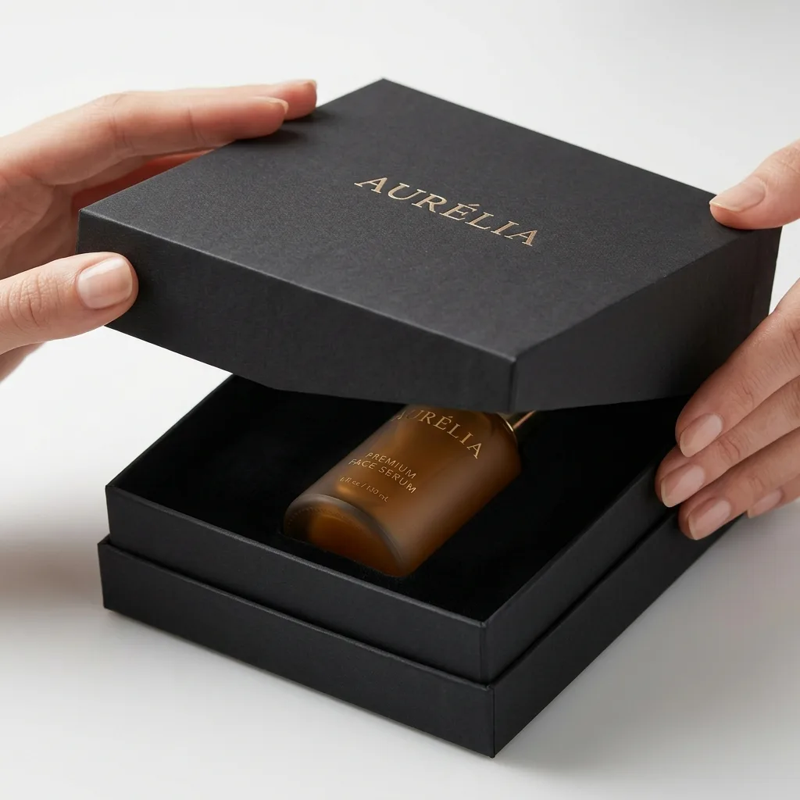

**#192 · Product &amp; Brand Prompt · <code>Vinano Image Pro</code>**

<details>
<summary>Show prompt</summary>

```
[product], luxury packaging reveal scene, premium unboxing moment, pristine hands partially visible at the edges, delicate interaction the packaging, lid slightly lifted to reveal the product inside, crisp folds and precise alignment, tactile materials [ex: matte paper, soft touch coating, embossed details, foil accents], subtle micro texture and dust free finish, clean white background, soft diffused studio lighting, controlled specular highlights, realistic shadows, macro product photography look, shallow depth of field sharp focus on the product and branding area, high end editorial commercial style, ultra realistic, 4k, 1:1, no watermark, no extra text Render with rich micro-detail while keeping the layout uncluttered and intentional.
```

</details>

---

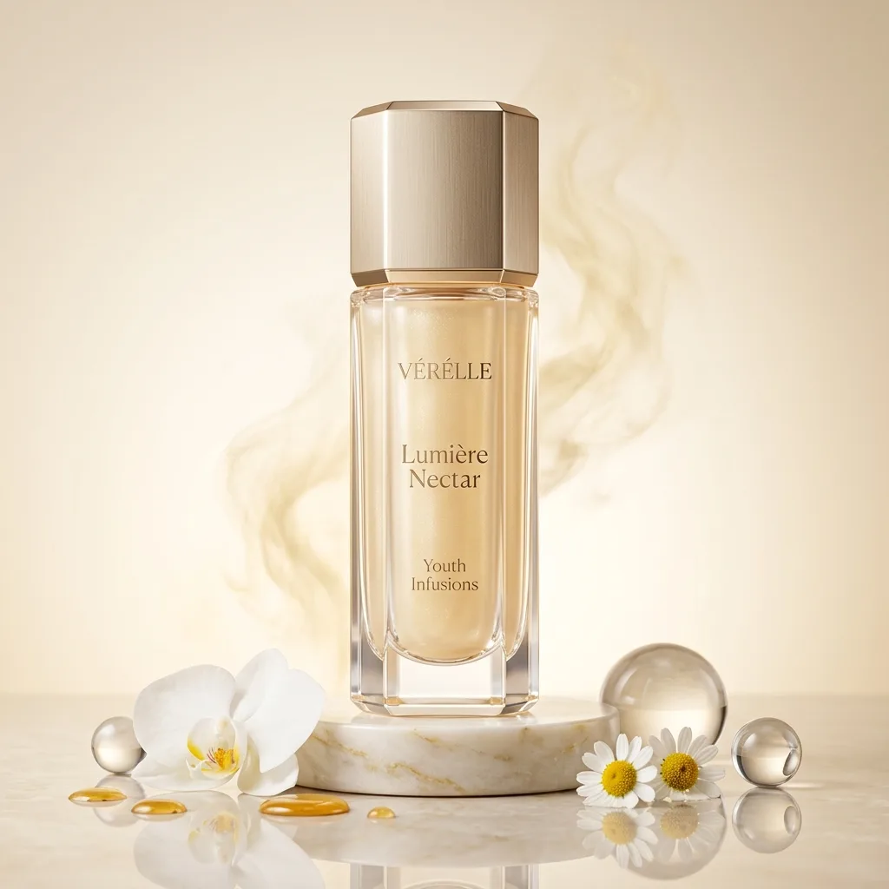

**#193 · Product &amp; Brand Prompt · <code>Vinano Image Pro</code>**

<details>
<summary>Show prompt</summary>

```
{
"master_prompt": {
"scene_type": "ultra-realistic luxury skincare commercial photography",

"product": {
 "type": "premium beauty elixir vial",
 "brand_name": "VÉRÉLLE",
 "product_name": "Lumière Nectar — Youth Infusions",
 "container_shape": "tall faceted crystal vial elegant vertical geometry",
 "material": "optical crystal glass",
 "finish": "prismatic clarity soft light dispersion",
 "cap_design": "brushed champagne-gold cap beveled edge",

 "label_design": {
 "style": "Parisian luxury serif typography",
 "primary_text": "Lumière Nectar",
 "secondary_text": "Youth Infusions",
 "finish": "champagne foil emboss micro-engraved detailing"
 },

 "liquid_color": "soft golden nectar luminous micro-pearl shimmer"
},

"composition": {
 "placement": "center hero placement",
 "pedestal": "ivory marble pedestal subtle gold veining",
 "base_surface": "polished reflective stone surface",

 "surrounding_elements": ["white orchid petals",
 "golden honey droplets",
 "chamomile blossoms",
 "glass dew spheres"],

 "liquid_effect": "soft golden mist swirl behind the vial"
},

"lighting": {
 "style": "high-end beauty studio lighting",
 "key_light": "soft frontal glow for glass clarity",
 "rim_light": "warm rim highlights enhancing crystal edges",
 "fill_light": "luxury soft diffusion",
 "reflections": "controlled highlights for premium finish"
},

"background": {
 "color": "warm ivory to champagne gradient",
 "style": "clean editorial luxury backdrop",
 "depth": "cinematic shallow depth elegant falloff"
},

"camera": {
 "angle": "slightly low hero angle",
 "focus": "crystal edges and typography",
 "depth_of_field": "cinematic shallow depth",
 "resolution": "8K ultra-detailed clarity"
},

"mood_keywords": ["Parisian luxury",
 "timeless beauty",
 "radiant skin",
 "elegant purity",
 "premium skincare campaign",
 "refined sophistication"]

}
}

Emphasise material texture and natural light so the final frame feels tactile and premium.
```

</details>

---

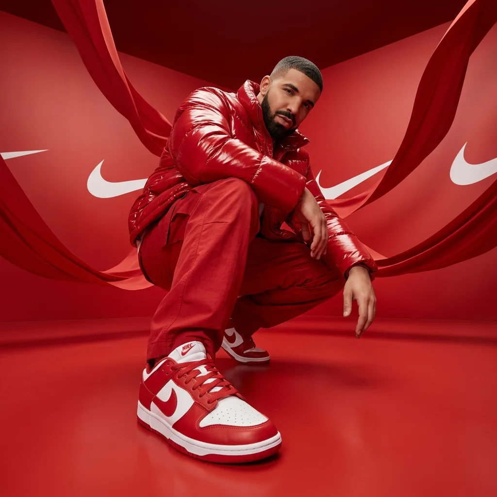

**#194 · Product &amp; Brand Prompt · <code>Vinano Image Pro</code>**

<details>
<summary>Show prompt</summary>

```
Person from the reference image, a fade haircut, brown eyes, and a well-groomed short beard, wearing a glossy oversized red puffer jacket and loose red pants white and red nike sneakers, crouching low one knee up and one leg forward, left arm resting casually over the raised knee and right hand relaxed near the other leg, body angled slightly to the side while head tilts forward looking directly at the camera a confident expression, ultra wide-angle low perspective shot emphasizing the front sneaker appearing large and dominant in the foreground, set in a fully red environment smooth floor and backdrop featuring large white nike swoosh logos behind and flowing ribbon-like red shapes around, hyper-realistic photography, extremely sharp details on fabric shine and sneaker texture, dramatic studio lighting strong highlights and soft shadows, saturated monochromatic red color palette white accents, modern streetwear campaign style, no blur, no distortion, no extra limbs, no artifacts Keep edges clean and the overall composition balanced for a polished, gallery-ready result.
```

</details>

---

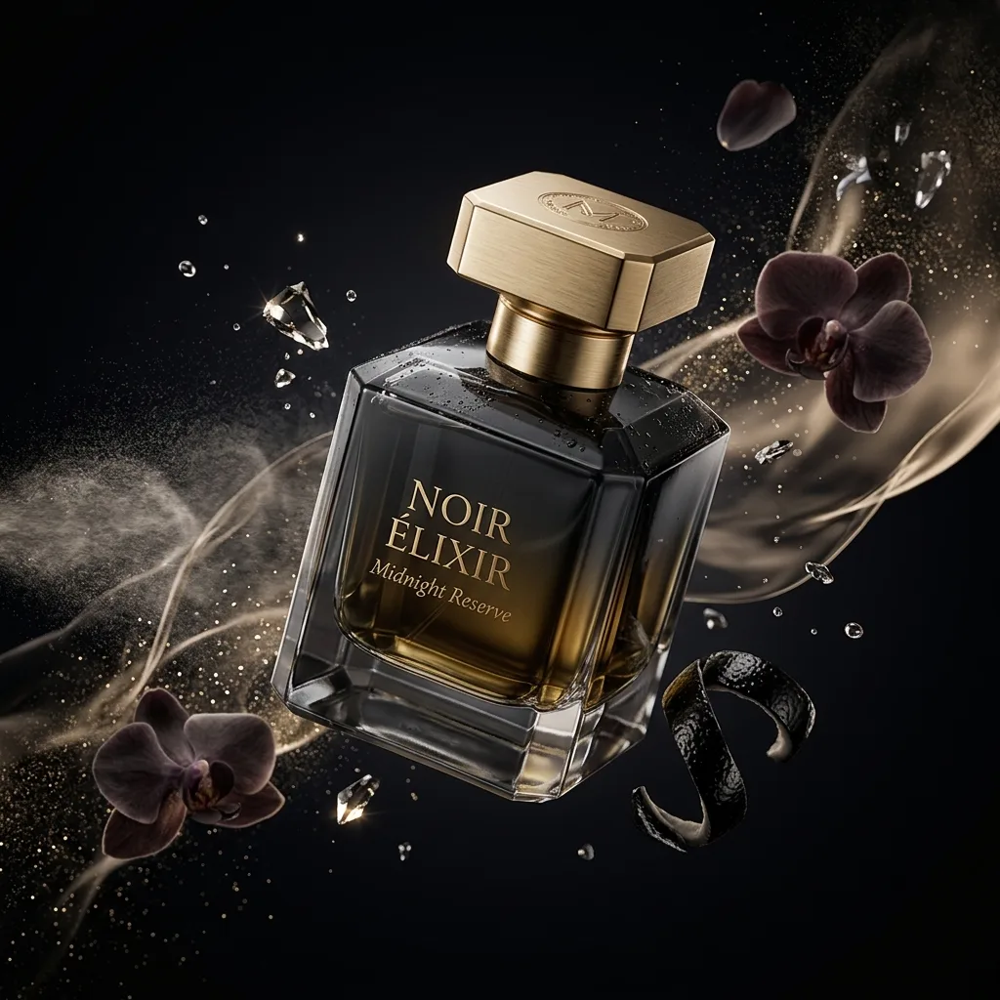

**#195 · Product &amp; Brand Prompt · <code>Vinano Image Pro</code>**

<details>
<summary>Show prompt</summary>

```
{
 "master_prompt": {
 "product": {
 "type": "luxury perfume bottle",
 "brand_name": "NOIR ÉLIXIR",
 "fragrance_line": "Midnight Reserve",
 "container_shape": "faceted geometric crystal bottle sharp elegant edges",
 "material": "high-clarity glass deep smoked black gradient tint",
 "finish": "polished reflective surfaces subtle matte facets",
 "cap_design": "magnetic cap in brushed gold metal engraved emblem",
 "label_style": "minimal serif typography etched directly into glass gold inlay",
 "liquid_color": "dark amber subtle golden undertones"
 },
 "composition": {
 "scene_type": "ultra-cinematic luxury fragrance advertising photography",
 "orientation": "vertical",
 "aspect_ratio": "4:5",
 "camera_angle": "dramatic diagonal hero angle",
 "subject_position": "floating mid-air slight forward tilt",
 "motion": "atomized perfume mist trails and fluid fragrance ribbons suspended in motion"
 },
 "environment": {
 "background": "deep black velvet gradient fading into shadow",
 "atmosphere": "volumetric mist delicate fragrance vapor swirling around the bottle",
 "floating_elements": ["atomized perfume droplets suspended mid-air",
 "shattered crystal glass fragments catching highlights",
 "dark orchid petals drifting slowly",
 "glossy black citrus peel curls",
 "fine gold dust particles sparkling in light"],
 "surface_effects": "micro condensation beads and polished reflections enhancing realism"
 },
 "lighting": {
 "style": "dramatic low-key studio lighting",
 "key_light": "soft directional light sculpting the glass facets",
 "rim_lights": "strong rim lights outlining silhouette and edges",
 "accent_lights": "gold-toned specular highlights on cap and engraved details",
 "shadow_depth": "deep cinematic shadows for luxury mood",
 "contrast": "high contrast controlled reflections and luminous highlights"
 },
 "color_palette": {
 "primary_colors": ["obsidian black", "smoked charcoal", "deep amber"],
 "accent_colors": ["metallic gold", "warm champagne glow"]
 },
 "camera_settings": {
 "lens": "macro cinema prime lens",
 "depth_of_field": "shallow depth isolating product from background",
 "focus_point": "engraved logo and glass surface textures",
 "bokeh": "smooth cinematic bokeh from reflective particles",
 "detail_capture": "extreme micro-detail clarity"
 },
 "render_quality": {
 "resolution": "8K ultra high definition",
 "render_style": "hyper-realistic luxury commercial render",
 "glass_physics": "accurate refraction and internal reflections",
 "liquid_simulation": "physically accurate fluid dynamics",
 "textures": "ultra-detailed crystal, metal, mist, and micro-droplet textures",
 "sharpness": "tack sharp product focus cinematic background softness",
 "noise": "none",
 "artifacts": "none"
 },
 "mood": {
 "tone": "mysterious, sensual, and ultra-premium",
 "emotion": "luxury, seduction, elegance, timeless sophistication"
 },
 "final_output": {
 "usage": "high-end perfume campaign and luxury magazine advertising",
 "branding_focus": "hero product dominance strong brand prestige",
 "visual_style": "cinematic fragrance commercial aesthetic"
 }
 }
}

Preserve realistic proportions and depth for a confident, professional finish.
```

</details>

---

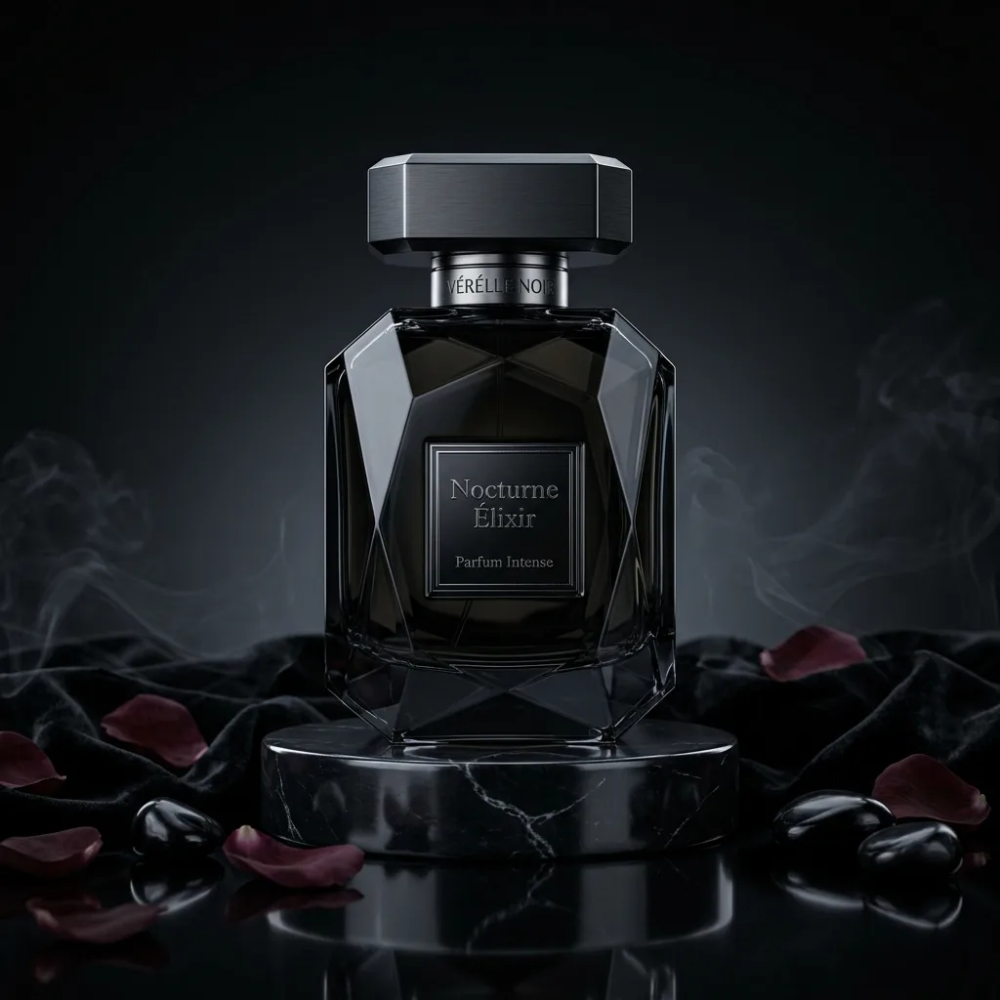

**#196 · Product &amp; Brand Prompt · <code>Vinano Image Pro</code>**

<details>
<summary>Show prompt</summary>

```
{
 "master_prompt": {
 "scene_type": "ultra-realistic luxury perfume commercial photography",

 "product": {
 "type": "luxury perfume bottle",
 "brand_name": "VÉRÉLLE NOIR",
 "product_name": "Nocturne Élixir — Parfum Intense",
 "container_shape": "faceted architectural silhouette sharp beveled geometry",
 "material": "obsidian-black crystal glass",
 "finish": "deep glossy translucence mirror-like reflections",
 "cap_design": "magnetic cap in brushed black titanium precision-cut edges",

 "label_design": {
 "style": "minimal haute couture typography",
 "primary_text": "Nocturne Élixir",
 "secondary_text": "Parfum Intense",
 "finish": "black chrome foil emboss micro-engraved detailing"
 },

 "liquid_color": "midnight amber subtle smoky undertones"
 },

 "composition": {
 "placement": "center hero placement",
 "pedestal": "black marble pedestal subtle silver veining",
 "base_surface": "high-gloss reflective onyx surface",

 "surrounding_elements": ["black velvet fabric folds",
 "dark rose petals",
 "polished obsidian stones",
 "faint aromatic smoke wisps"],

 "atmospheric_effect": "soft drifting fragrance vapor creating a mysterious aura"
 },

 "lighting": {
 "style": "dark luxury filmic, cinematic lighting",
 "key_light": "soft focused glow revealing reflective contours",
 "rim_light": "cool silver edge highlights defining silhouette",
 "fill_light": "low ambient fill preserving deep shadows",
 "reflections": "controlled specular highlights for high-end finish"
 },

 "background": {
 "color": "deep charcoal to black gradient",
 "style": "editorial noir luxury backdrop",
 "depth": "cinematic shallow depth soft shadow falloff"
 },

 "camera": {
 "angle": "low dramatic hero angle",
 "focus": "glass texture and metallic detailing",
 "depth_of_field": "cinematic shallow depth",
 "resolution": "8K ultra-detailed clarity"
 },

 "mood_keywords": ["dark elegance",
 "noir luxury",
 "sensual sophistication",
 "mysterious allure",
 "modern opulence",
 "timeless night glamour"]
 }
}

Preserve realistic proportions and depth for a confident, professional finish.
```

</details>

---

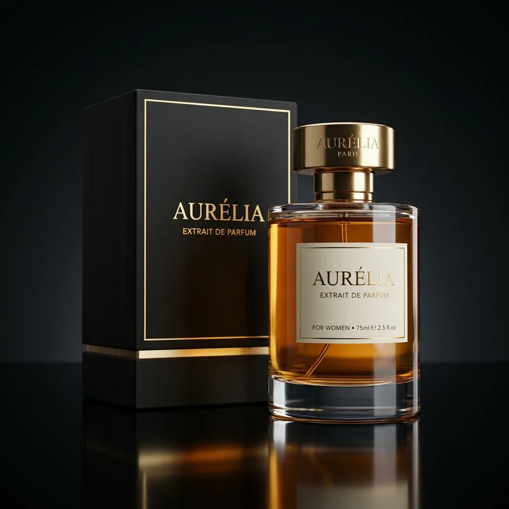

**#197 · Product &amp; Brand Prompt · <code>Vinano Image Pro</code>**

<details>
<summary>Show prompt</summary>

```
Luxury perfume product photography in a dark cinematic studio. A premium black matte perfume box sharp edges and subtle gold accents placed slightly behind a transparent glass perfume bottle filled warm amber liquid. The bottle has a thick clear glass body and a polished metallic cap. Minimal elegant label design gold typography. Soft low key lighting a smooth gradient dark background. Gentle reflections on a glossy surface beneath the products. Dramatic shadows for depth and contrast. High fashion fragrance advertisement style. Ultra realistic textures crisp focus shallow depth of field professional studio shot 8k quality. Keep edges clean and the overall composition balanced for a polished, gallery-ready result.
```

</details>

---

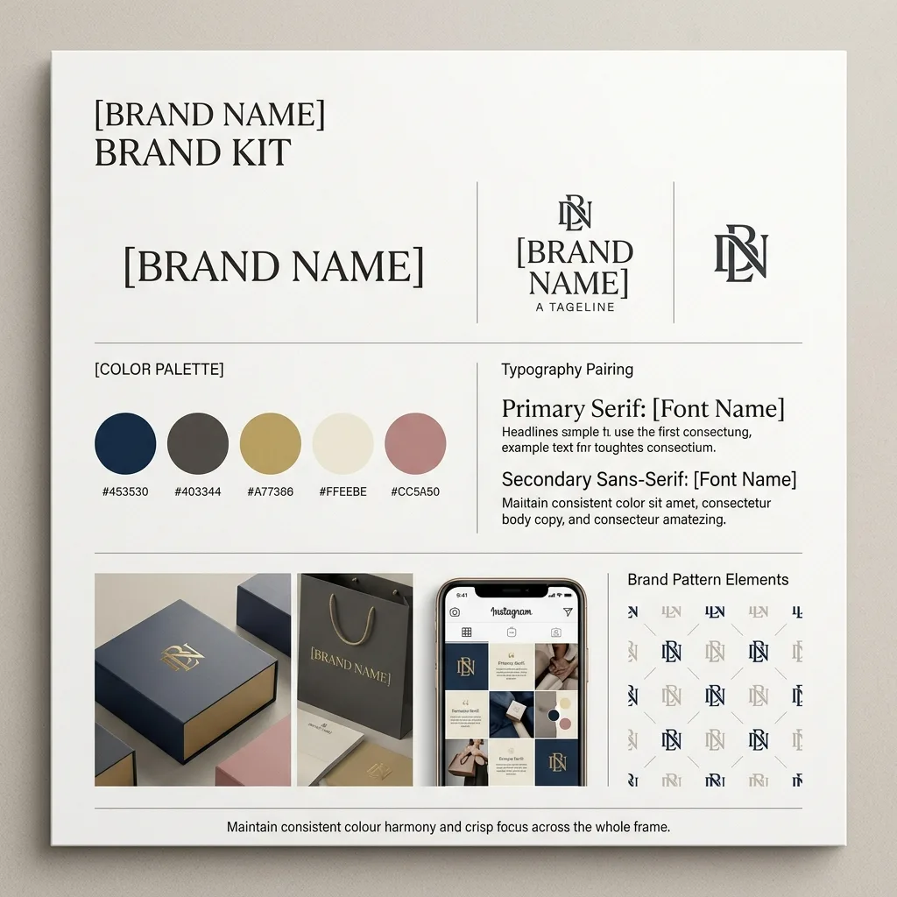

**#198 · Product &amp; Brand Prompt · <code>Vinano Image Pro</code>**

<details>
<summary>Show prompt</summary>

```
Create a premium brand kit board for [BRAND NAME], presented like a professional branding studio slide. Show the existing brand identity in a clean, organized visual presentation. Include primary logo, secondary logo, icon, [COLOR PALETTE], typography pairing, branded packaging or product mockups, social media mockup, and simple brand pattern elements. Style: [STYLE]. Use a clean editorial grid, realistic materials, strong hierarchy, and polished presentation. Text to include: "[BRAND NAME] Maintain consistent colour harmony and crisp focus across the whole frame.
```

</details>

---

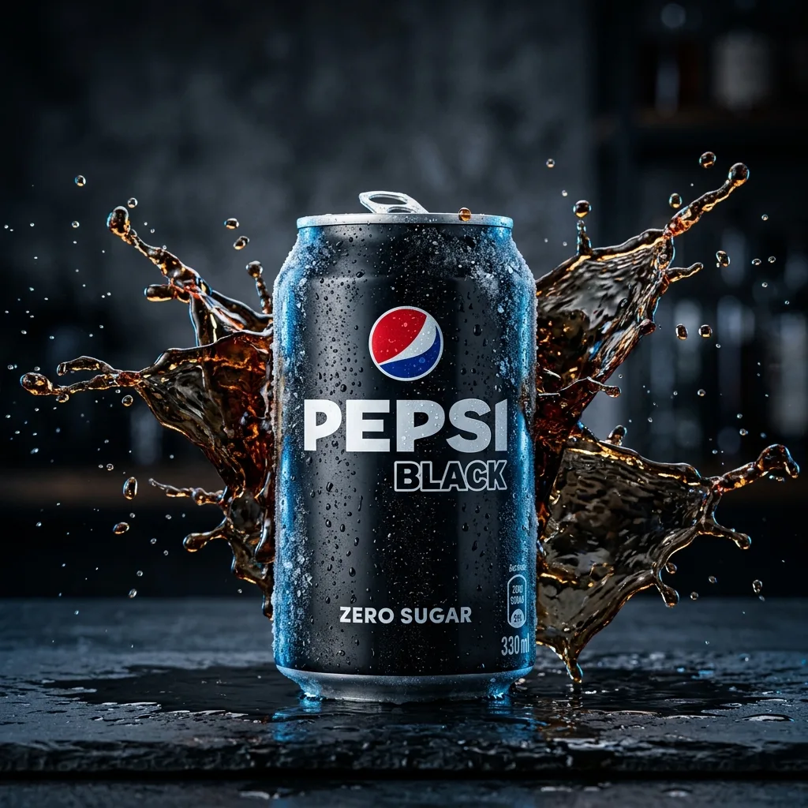

**#199 · Product &amp; Brand Prompt · <code>Vinano Image Pro</code>**

<details>
<summary>Show prompt</summary>

```
Hyper-realistic cinematic product photograph of a Pepsi Black can, front-facing and perfectly legible, ice-cold surface covered in crisp condensation. Dark cola splashes explode around the can in frozen motion, glossy liquid waves and fine droplets catching the light. Moody low-key lighting cool blue rim light and soft front fill, shallow depth of field, ultra-sharp texture detail, high-end advertising aesthetic. Preserve realistic proportions and depth for a confident, professional finish.
```

</details>

---

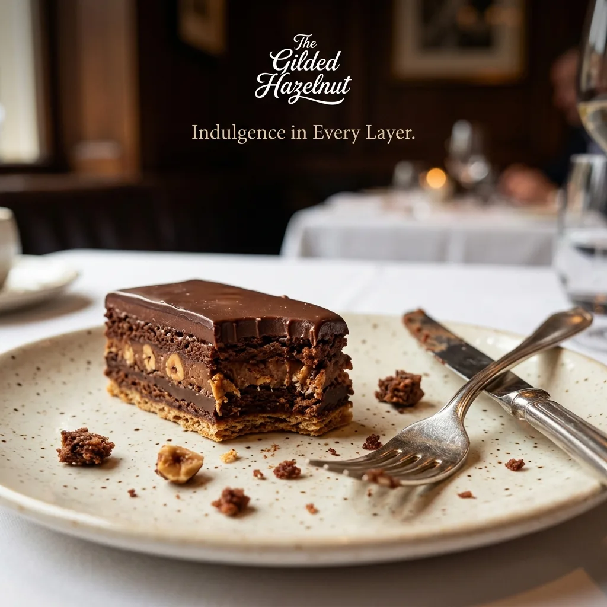

**#200 · Product &amp; Brand Prompt · <code>Vinano Image Pro</code>**

<details>
<summary>Show prompt</summary>

```
A bitten realistic classic [brand] product on the dish, revealed inner dessert layers, and there are cake crumbs near, finished fork and knife near by, against blurry high end restaurant background, white small logo on top of background, beneath the logo, there is a tiny brand slogan that suit this scene. Emphasise material texture and natural light so the final frame feels tactile and premium.
```

</details>

---

[Next page →](./product-brand-3.md)
