# Product & Brand — full gallery

[← Back to README](../README.md) · [`prompts.json`](../prompts/prompts.json) · **380** prompts · page 3 / 4

[← Prev](./product-brand-2.md) — [1](./product-brand.md) · [2](./product-brand-2.md) · **3** · [4](./product-brand-4.md) — [Next →](./product-brand-4.md)

---

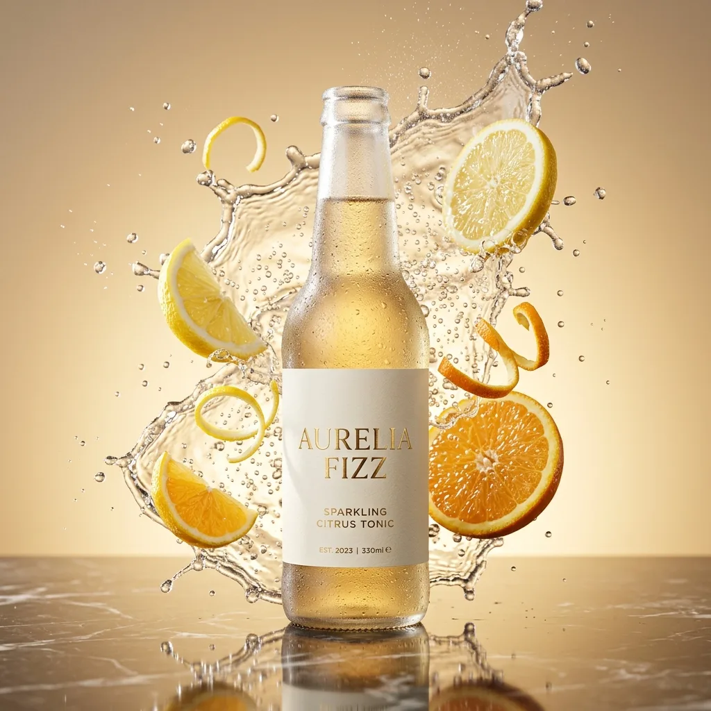

**#201 · Product &amp; Brand Prompt · <code>Vinano Image Pro</code>**

<details>
<summary>Show prompt</summary>

```
{
 "master_prompt": {
 "scene_type": "high-speed commercial beverage photography",
 "product": {
 "type": "sleek frosted glass bottle filled sparkling citrus tonic",
 "brand_name": "AURELIA FIZZ",
 "label_design": "refined minimalist vertical ivory label refined gold serif typography",
 "liquid_color": "translucent golden citrus effervescent bubbles"
 },
 "composition": {
 "action": "dynamic high-velocity liquid splash explosion",
 "surrounding_elements": ["sculptural splashes of sparkling tonic water",
 "spiraling ribbons of fresh lemon and orange zest",
 "floating citrus slices visible pulp texture",
 "tiny suspended carbonation bubbles",
 "mist of fine droplets catching the light"],
 "placement": "centered hero bottle a crisp reflection on a polished marble surface"
 },
 "lighting": {
 "style": "luxury glossy studio product lighting",
 "effects": ["sharp rim lighting to define bottle silhouette",
 "brilliant highlights on splashes and bubbles",
 "soft golden glow in the background for warmth"]
 },
 "color_palette": {
 "background": "sunlit gradient of warm gold fading into soft champagne beige",
 "accents": "citrus yellow, fresh orange, and subtle mint green"
 },
 "technical_specs": {
 "camera": "macro lens, eye-level angle",
 "shutter": "ultra-fast freeze-motion capture",
 "depth_of_field": "shallow focus on the label, gentle blur on dynamic splash elements",
 "quality": "8K resolution, ultra-true-to-life photorealistic texture"
 }
 }
}

Emphasise material texture and natural light so the final frame feels tactile and premium.
```

</details>

---


**#202 · Product &amp; Brand Prompt · <code>Vinano Image Pro</code>**

<details>
<summary>Show prompt</summary>

```
{
 "master_prompt": {
 "product": {
 "type": "luxury body deodorant",
 "brand_name": "VELORÉ",
 "product_line": "Pure Aura",
 "container_style": "sleek cylindrical deodorant stick softly rounded edges",
 "material": "frosted glass body brushed champagne-gold metal accents",
 "finish": "velvety matte surface refined metallic detailing",
 "cap_design": "magnetic cap polished gold rim and engraved crest",
 "branding": "minimal serif logo etched vertically understated elegance",
 "dispense_style": "precision twist-up deodorant balm smooth surface finish",
 "color": "warm ivory body subtle golden undertones",
 "accent_details": "champagne gold band and minimal crest emblem",
 "texture_details": "soft satin deodorant balm surface visible at top"
 },

 "composition": {
 "scene_type": "ultra-cinematic luxury personal care advertising photography",
 "orientation": "vertical",
 "aspect_ratio": "4:5",
 "camera_angle": "low hero angle emphasizing elegance and premium form",
 "subject_position": "deodorant standing upright on reflective surface",
 "motion": "fine mist spray particles suspended mid-air for freshness effect"
 },

 "environment": {
 "background": "soft warm marble gradient fading into shadow",
 "atmosphere": "light spa mist creating a serene premium ambiance",
 "floating_elements": ["delicate mist particles suspended in air",
 "white orchid petals drifting gently",
 "tiny golden light particles shimmering softly",
 "fresh eucalyptus leaves floating nearby",
 "soft vapor trails suggesting freshness"],
 "surface_effects": "glossy reflections micro condensation droplets enhancing freshness"
 },

 "lighting": {
 "style": "soft spa-inspired studio lighting",
 "key_light": "diffused overhead light revealing frosted texture",
 "rim_lights": "subtle warm highlights outlining silhouette",
 "accent_lights": "soft golden glow enhancing luxury appeal",
 "shadow_depth": "gentle shadows for calm elegance",
 "contrast": "balanced contrast luminous clean highlights"
 },

 "color_palette": {
 "primary_colors": ["warm ivory", "soft cream", "clean white"],
 "accent_colors": ["champagne gold", "botanical green"]
 },

 "camera_settings": {
 "lens": "macro cinema lens",
 "depth_of_field": "shallow depth isolating product",
 "focus_point": "engraved logo and frosted glass texture",
 "bokeh": "soft luminous bokeh from mist particles",
 "detail_capture": "extreme micro-detail clarity"
 },

 "render_quality": {
 "resolution": "8K ultra high definition",
 "render_style": "hyper-realistic luxury personal care commercial render",
 "material_physics": "accurate frosted glass translucency and metallic reflections",
 "particle_simulation": "physically accurate mist and condensation droplets",
 "textures": "ultra-detailed frosted glass, metallic accents, and balm surface",
 "sharpness": "tack sharp product focus soft cinematic background",
 "noise": "none",
 "artifacts": "none"
 },

 "mood": {
 "tone": "pure, refined, and ultra-premium",
 "emotion": "freshness, confidence, and indulgent self-care luxury"
 },

 "final_output": {
 "usage": "luxury personal care campaign and premium wellness advertising",
 "branding_focus": "hero product freshness elite wellness appeal",
 "visual_style": "cinematic luxury spa aesthetic"
 }
 }
}

Keep edges clean and the overall composition balanced for a polished, gallery-ready result.
```

</details>

---

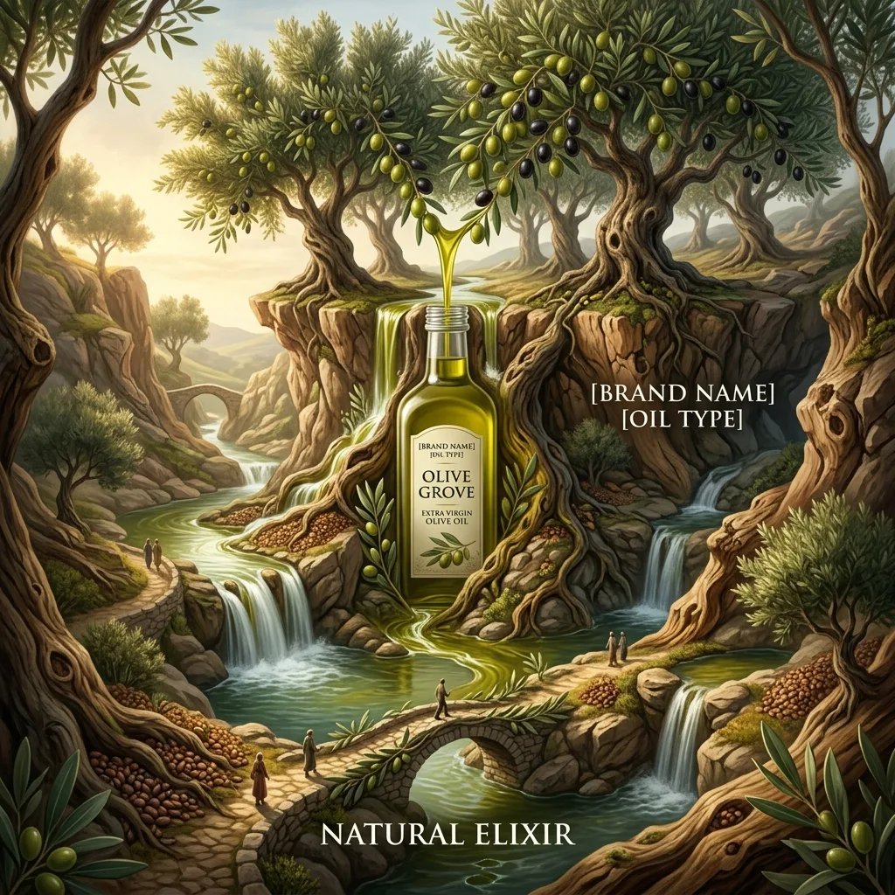

**#203 · Product &amp; Brand Prompt · <code>Vinano Image Pro</code>**

<details>
<summary>Show prompt</summary>

```
Surreal premium commercial illustration for [BRAND NAME] [OIL TYPE], featuring the product bottle embedded into a massive natural landscape made entirely from the core ingredient. The ingredient appears at the top source, flowing as a natural element into the bottle, then transforming into waterfalls, rivers, or pools below. The environment, terrain, vegetation, textures, and color palette are all inspired by [PRIMARY INGREDIENT]. Small human figures interact naturally the environment to emphasize scale. filmic, cinematic lighting, soft painterly realism, ultra-detailed textures, fantasy-meets-nature aesthetic, vertical poster composition, 8K ultra-high resolution. Preserve realistic proportions and depth for a confident, professional finish.
```

</details>

---

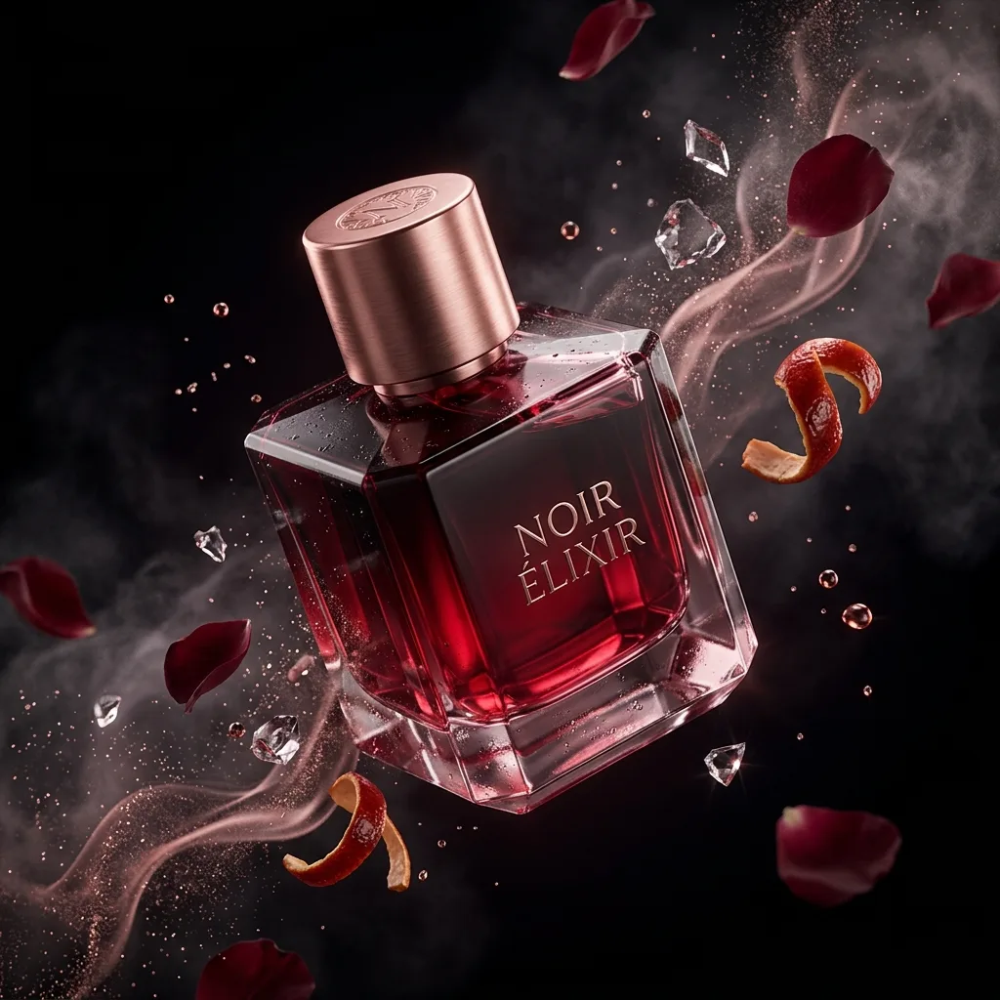

**#204 · Product &amp; Brand Prompt · <code>Vinano Image Pro</code>**

<details>
<summary>Show prompt</summary>

```
{
 "master_prompt": {
 "product": {
 "type": "luxury perfume bottle",
 "brand_name": "NOIR ÉLIXIR",
 "fragrance_line": "Crimson Reserve",
 "container_shape": "faceted geometric crystal bottle sharp elegant edges",
 "material": "high-clarity glass deep ruby gradient tint",
 "finish": "polished reflective surfaces subtle matte facets",
 "cap_design": "magnetic cap in brushed rose-gold metal engraved emblem",
 "label_style": "minimal serif typography etched directly into glass metallic inlay",
 "liquid_color": "rich crimson red glowing ruby undertones"
 },
 "composition": {
 "scene_type": "ultra-cinematic luxury fragrance advertising photography",
 "orientation": "vertical",
 "aspect_ratio": "4:5",
 "camera_angle": "dramatic diagonal hero angle",
 "subject_position": "floating mid-air slight forward tilt",
 "motion": "atomized perfume mist trails and fluid fragrance ribbons suspended in motion"
 },
 "environment": {
 "background": "deep black velvet gradient fading into shadow",
 "atmosphere": "volumetric mist delicate fragrance vapor swirling around the bottle",
 "floating_elements": ["atomized perfume droplets suspended mid-air",
 "shattering crystal fragments catching highlights",
 "dark red rose petals drifting slowly",
 "glossy blood-orange peel curls",
 "fine rose-gold dust particles sparkling in light"],
 "surface_effects": "micro condensation beads and polished reflections enhancing realism"
 },
 "lighting": {
 "style": "dramatic low-key studio lighting",
 "key_light": "soft directional light sculpting the glass facets",
 "rim_lights": "strong rim lights outlining silhouette and edges",
 "accent_lights": "warm ruby and rose-gold specular highlights on cap and engraved details",
 "shadow_depth": "deep cinematic shadows for luxury mood",
 "contrast": "high contrast controlled reflections and luminous highlights"
 },
 "color_palette": {
 "primary_colors": ["obsidian black", "deep garnet", "ruby red"],
 "accent_colors": ["rose gold", "warm champagne glow"]
 },
 "camera_settings": {
 "lens": "macro cinema prime lens",
 "depth_of_field": "shallow depth isolating product from background",
 "focus_point": "engraved logo and glass surface textures",
 "bokeh": "smooth cinematic bokeh from reflective particles",
 "detail_capture": "extreme micro-detail clarity"
 },
 "render_quality": {
 "resolution": "8K ultra high definition",
 "render_style": "hyper-realistic luxury commercial render",
 "glass_physics": "accurate refraction and internal reflections",
 "liquid_simulation": "physically accurate fluid dynamics",
 "textures": "ultra-detailed crystal, metal, mist, and micro-droplet textures",
 "sharpness": "tack sharp product focus cinematic background softness",
 "noise": "none",
 "artifacts": "none"
 },
 "mood": {
 "tone": "seductive, passionate, and ultra-premium",
 "emotion": "luxury, desire, elegance, timeless sophistication"
 },
 "final_output": {
 "usage": "high-end perfume campaign and luxury magazine advertising",
 "branding_focus": "hero product dominance strong brand prestige",
 "visual_style": "cinematic fragrance commercial aesthetic"
 }
 }
}

Aim for an editorial, design-driven look with deliberate negative space.
```

</details>

---

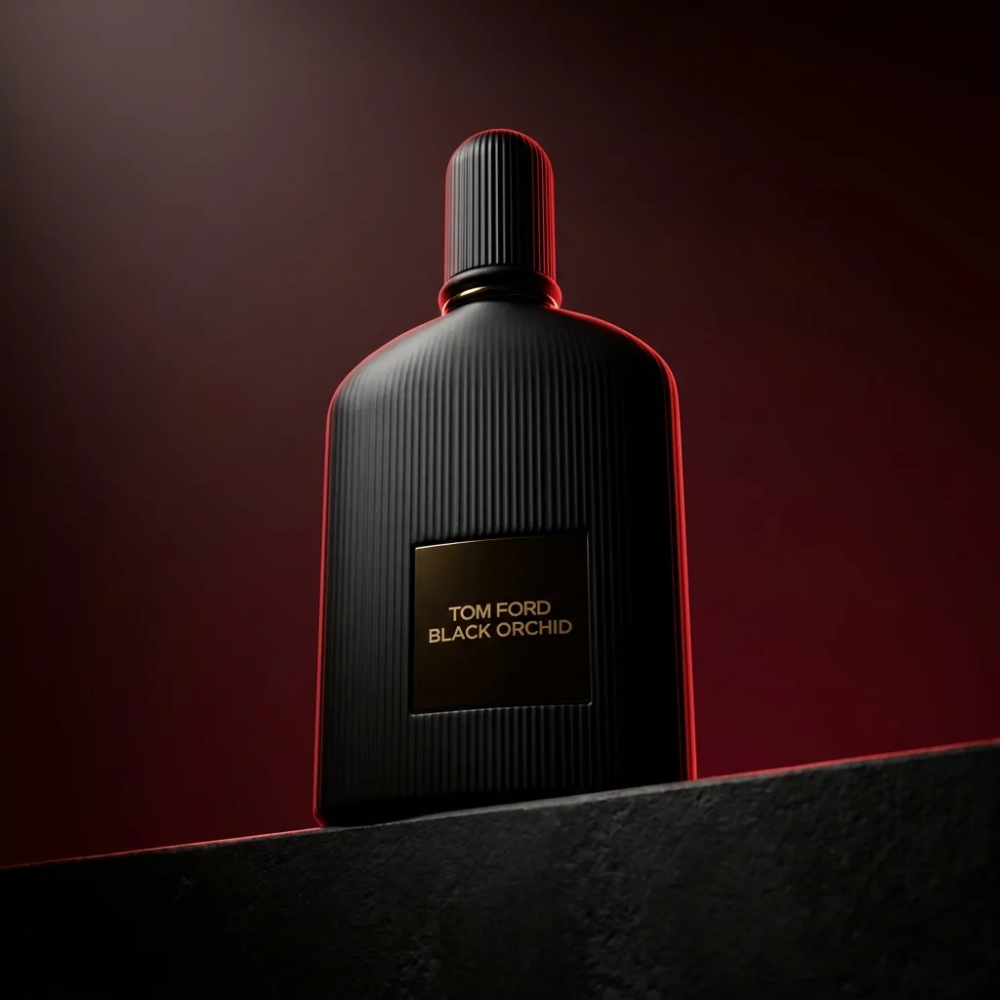

**#205 · Product &amp; Brand Prompt · <code>Vinano Image Pro</code>**

<details>
<summary>Show prompt</summary>

```
Low angle luxury product photography of a black ribbed glass perfume bottle placed on a dark horizontal podium, shot from below for a heroic, monumental feel. The bottle is Tom Ford Black Orchid, matte black texture clearly visible.
Dramatic low key studio lighting. Soft diffused key light from above and slightly left, gently lighting the label and top, revealing volume and texture. Strong hard red rim light from behind and right, creating a bold red outline along the edge and cap, a subtle red glow bleeding into the background.
Deep soft shadows smooth falloff. Slightly underexposed for drama. High contrast between highlights and shadows while keeping transitions soft.
Color palette limited to deep black and rich burgundy red, warm color balance, black remains neutral and clean.
Matte surface shows soft red reflections, not glossy, giving depth and form.
Minimal background, dark red gradient, cinematic mood, luxury fragrance advertising style, true-to-life photorealistic, ultra high detail, studio quality.

Preserve realistic proportions and depth for a confident, professional finish.
```

</details>

---

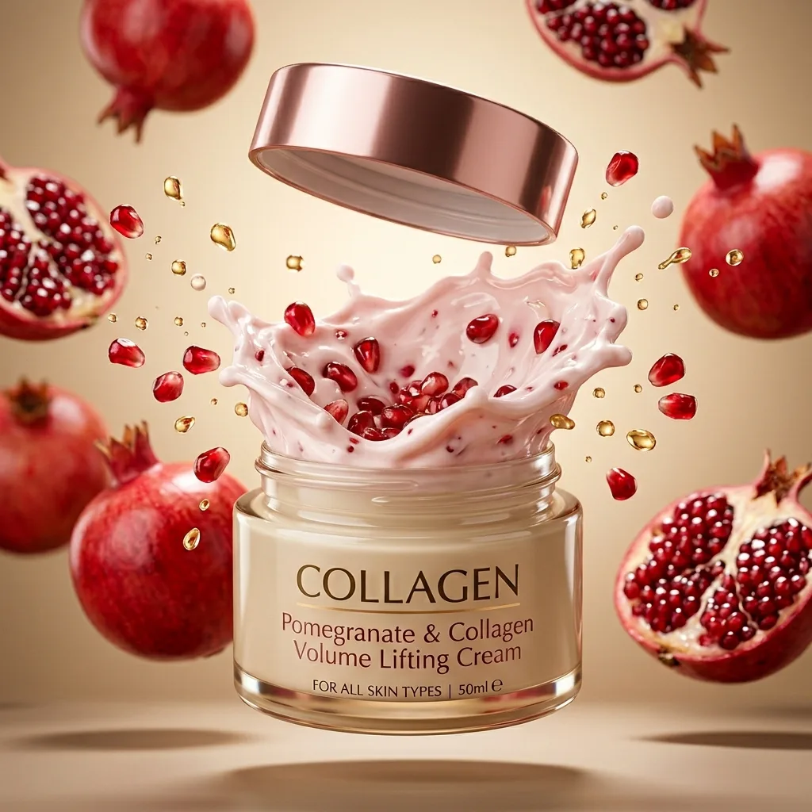

**#206 · Product &amp; Brand Prompt · <code>Vinano Image Pro</code>**

<details>
<summary>Show prompt</summary>

```
"A hyperrealistic premium product photography scene of a smooth beige cosmetic jar labeled “Collagen" Pomegranate & Collagen Volume Lifting Cream” exploding open mid-air, the metallic rose-gold lid floating slightly above the jar and a thick, whipped, pale pink cream bursting upward in a dramatic splash, glossy and textured visible red pomegranate seeds, surrounded by suspended whole red pomegranates and halved pomegranates glistening ruby-red arils, golden liquid droplets and creamy splashes frozen in motion around the jar, the container tilted slightly to the right and centered in frame, shot from a straight-on macro perspective, illuminated by soft yet high-contrast studio lighting from above and slightly behind to create glowing highlights on the wet textures and translucent splashes, subtle shadows beneath the floating elements, a smooth warm beige gradient background enhancing the color palette of soft pinks, creams, and deep red fruit tones, ultra-sharp focus on the jar and cream shallow depth of field for the outer fruit, cinematic realism, luxury skincare advertising aesthetic, crisp reflections, 8K true-to-life photorealistic detail, energetic and fresh mood." Preserve realistic proportions and depth for a confident, professional finish.
```

</details>

---

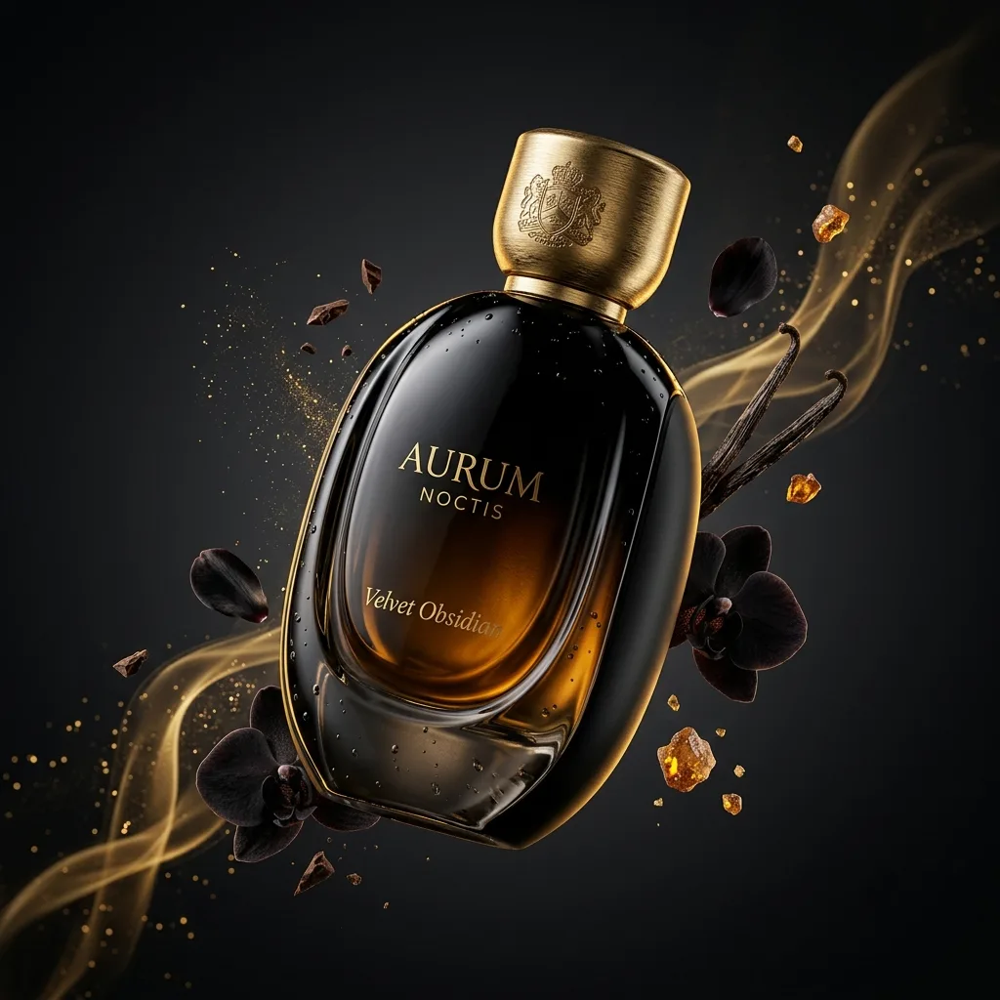

**#207 · Product &amp; Brand Prompt · <code>Vinano Image Pro</code>**

<details>
<summary>Show prompt</summary>

```
{
 "master_prompt": {
 "product": {
 "type": "luxury perfume bottle",
 "brand_name": "AURUM NOCTIS",
 "fragrance_line": "Velvet Obsidian",
 "container_shape": "sleek monolithic oval bottle sculpted contours",
 "material": "obsidian-black glass subtle smoked transparency",
 "finish": "high-gloss reflective body satin matte side panels",
 "cap_design": "heavy magnetic cap in brushed antique gold engraved crest",
 "label_style": "minimal gold foil typography floating on glass surface",
 "liquid_color": "dark amber molten gold undertones"
 },
 "composition": {
 "scene_type": "ultra-cinematic luxury fragrance advertising photography",
 "orientation": "vertical",
 "aspect_ratio": "4:5",
 "camera_angle": "low hero angle for power and prestige",
 "subject_position": "floating mid-air elegant slow rotation",
 "motion": "fluid golden fragrance trails and aromatic vapor ribbons suspended in motion"
 },
 "environment": {
 "background": "deep charcoal-to-black gradient fading into shadow",
 "atmosphere": "soft volumetric haze enhancing depth and mystery",
 "floating_elements": ["molten gold dust particles glowing softly",
 "dark cocoa shards catching highlights",
 "black orchid petals drifting slowly",
 "smoked vanilla pods suspended in air",
 "tiny amber resin fragments sparkling"],
 "surface_effects": "micro condensation droplets and polished reflections enhancing realism"
 },
 "lighting": {
 "style": "dramatically sculpted low-key studio lighting",
 "key_light": "soft directional light defining contours and glass curvature",
 "rim_lights": "warm golden rim lights outlining silhouette",
 "accent_lights": "subtle amber highlights emphasizing cap and liquid glow",
 "shadow_depth": "deep shadows for cinematic luxury mood",
 "contrast": "rich contrast controlled highlights and luminous reflections"
 },
 "color_palette": {
 "primary_colors": ["obsidian black", "charcoal shadow", "deep amber"],
 "accent_colors": ["antique gold", "warm bronze glow"]
 },
 "camera_settings": {
 "lens": "macro cinema prime lens",
 "depth_of_field": "shallow depth isolating product",
 "focus_point": "brand crest and glass curvature",
 "bokeh": "soft golden bokeh from reflective particles",
 "detail_capture": "extreme micro-detail clarity"
 },
 "render_quality": {
 "resolution": "8K ultra high definition",
 "render_style": "hyper-realistic luxury commercial render",
 "glass_physics": "accurate refraction and internal reflections",
 "liquid_simulation": "physically accurate fluid glow and viscosity",
 "textures": "ultra-detailed glass, metal, vapor, and dust textures",
 "sharpness": "tack sharp product focus cinematic background softness",
 "noise": "none",
 "artifacts": "none"
 },
 "mood": {
 "tone": "mysterious, opulent, and powerful",
 "emotion": "nighttime luxury, sensual elegance, timeless prestige"
 },
 "final_output": {
 "usage": "luxury fragrance campaign and premium magazine advertising",
 "branding_focus": "hero product dominance elite brand presence",
 "visual_style": "cinematic haute parfumerie commercial aesthetic"
 }
 }
}

Emphasise material texture and natural light so the final frame feels tactile and premium.
```

</details>

---

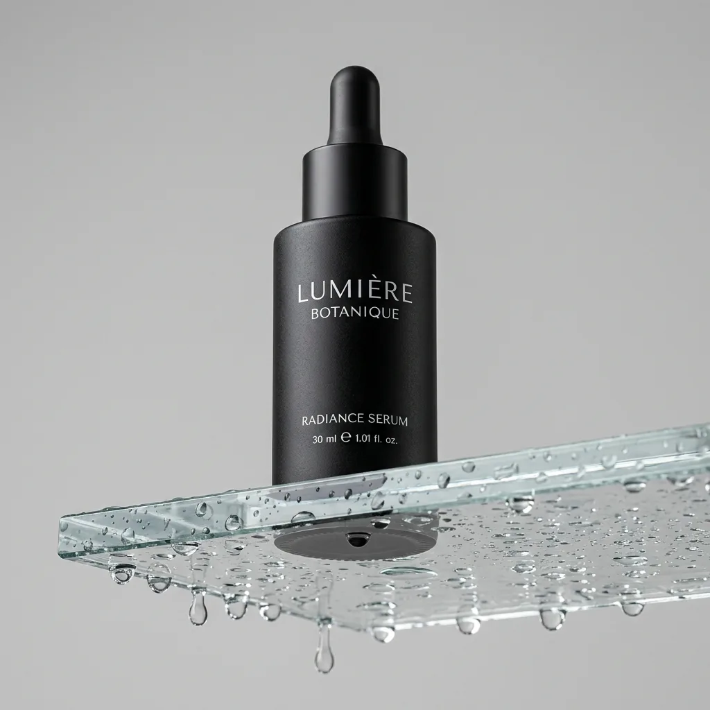

**#208 · Product &amp; Brand Prompt · <code>Vinano Image Pro</code>**

<details>
<summary>Show prompt</summary>

```
Commercial luxury product photography, true-to-life photorealistic, ultra high detail, 8K quality. A refined minimalist matte black cosmetic dropper bottle placed on a clear glass podium. Low angle camera view to make the bottle feel tall and powerful. The bottom of the bottle is clearly visible through the transparent glass. The glass surface is wet realistic water droplets, a few drops hanging underneath the glass, frozen mid drip for a time stopped effect. Matte light gray background no texture or gradient. Soft, even studio lighting clean reflections, premium skincare advertising look, sharp focus, realistic materials, no distractions. Maintain consistent colour harmony and crisp focus across the whole frame.
```

</details>

---

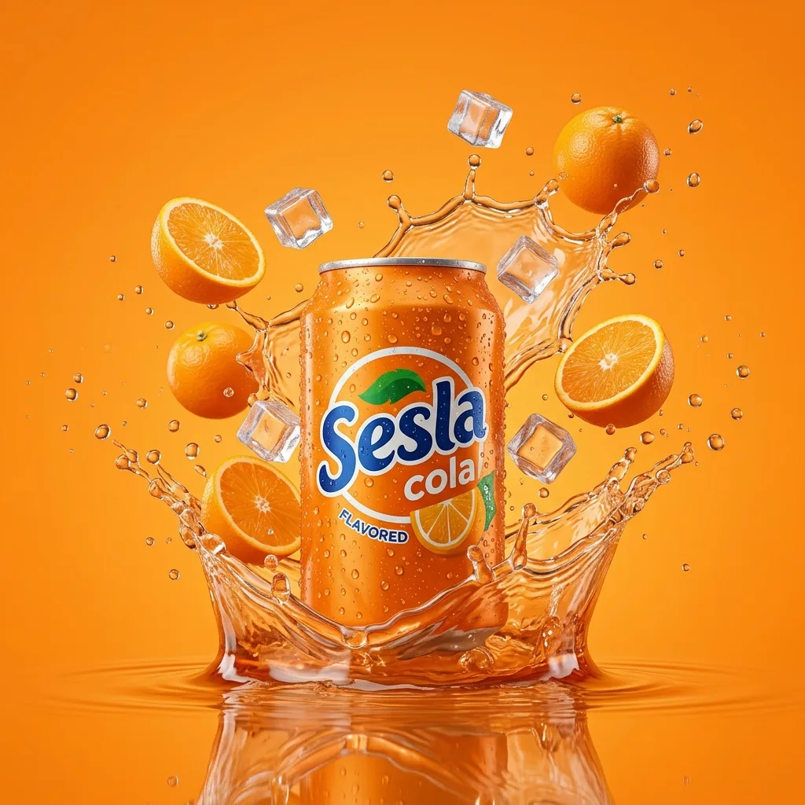

**#209 · Product &amp; Brand Prompt · <code>Vinano Image Pro</code>**

<details>
<summary>Show prompt</summary>

```
{
 "master_prompt": {
 "global_settings": {
 "resolution": "8K ultra-high-definition",
 "aspect_ratio": "3:4 vertical",
 "style": "hyper-realistic AI-edited commercial product photography",
 "sharpness": "extreme clarity, micro-detail visibility",
 "lighting_quality": "cinematic studio lighting controlled highlights and shadows",
 "motion_freeze": "high-speed capture, frozen splashes and particles",
 "noise": "none",
 "artifacts": "none"
 },

"module_1_image_1_style": {
 "subject": {
 "type": "orange-flavored soda can",
 "color": "bright orange",
 "surface_details": "condensation droplets across can",
 "branding_text_visible": ["Sesla",
 "cola"]
 },
 "pose_and_orientation": {
 "position": "upright, slightly embedded in splash",
 "angle": "centered frontal view"
 },
 "liquid_and_motion": {
 "liquid_color": "transparent orange-tinted liquid",
 "motion": "high-energy splash bursting upward and outward",
 "splash_detail": "clear liquid arcs suspended droplets"
 },
 "floating_elements": {
 "oranges": ["whole oranges",
 "halved oranges visible pulp"],
 "ice_cubes": "clear sharp-edged cubes floating mid-air",
 "droplets": "numerous spherical liquid droplets"
 },
 "background": {
 "color": "solid bright orange",
 "lighting": "high-key, evenly lit"
 },
 "surface_and_reflection": {
 "base": "shallow liquid pool",
 "reflection_quality": "strong mirror-like reflection ripples"
 }
 }
 }
}

Aim for an editorial, design-driven look with deliberate negative space.
```

</details>

---

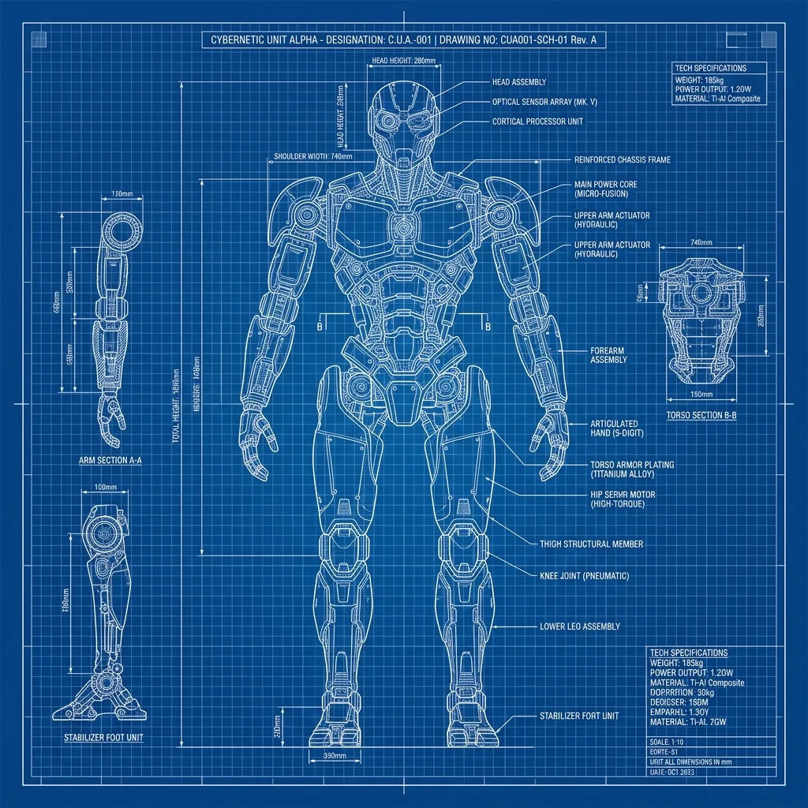

**#210 · Product &amp; Brand Prompt · <code>Vinano Image Pro</code>**

<details>
<summary>Show prompt</summary>

```
A detailed technical blueprint illustration of [CHARACTER], drawn in blueprint style on a blue grid background precise white linework. Includes subtle measurement markings, labels, and schematic-style annotations around the figure. The design is clean, symmetrical, and centered, giving it the look of a professional engineering drawing. Render with rich micro-detail while keeping the layout uncluttered and intentional.
```

</details>

---

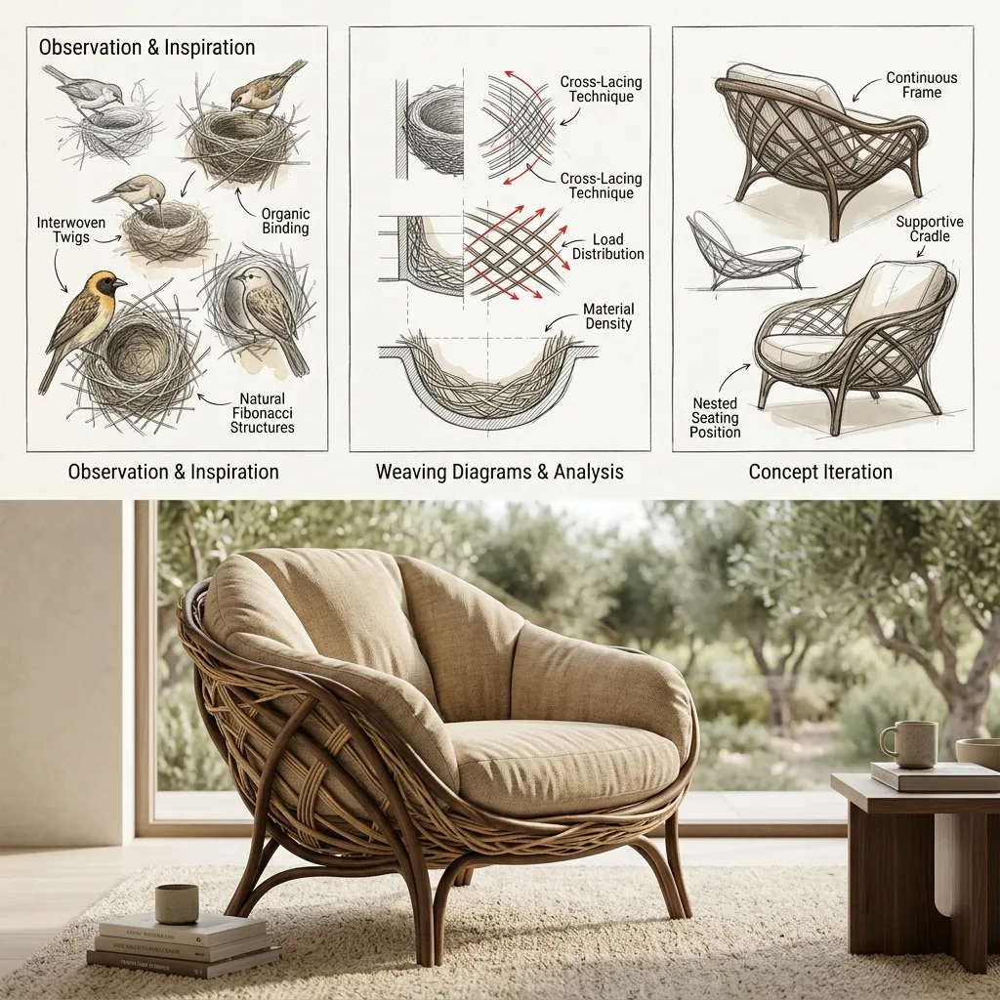

**#211 · Product &amp; Brand Prompt · <code>Vinano Image Pro</code>**

<details>
<summary>Show prompt</summary>

```
Conceptual transformation, bird nest construction techniques shaping a sculptural lounge chair, sequence from nest-building photography to weaving diagrams to organic structural abstraction to final product, interwoven frame forming seat and backrest, natural fibers soft cushioning, earthy tones refined finish, sustainable luxury aesthetic, presentation layout, sketches above, render below, warm natural lighting.

AR – 4:3

Maintain consistent colour harmony and crisp focus across the whole frame.
```

</details>

---

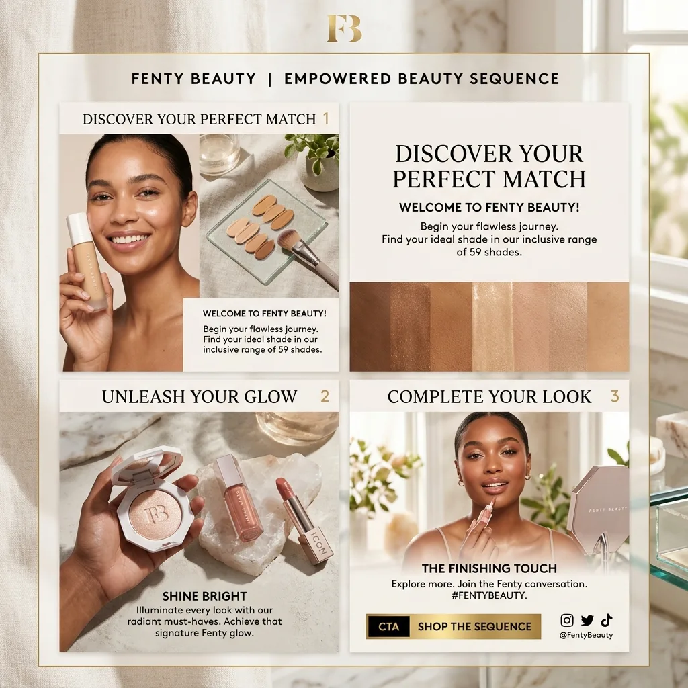

**#212 · Product &amp; Brand Prompt · <code>Vinano Image Pro</code>**

<details>
<summary>Show prompt</summary>

```
Create a polished email sequence template for fenty beauty Emphasise material texture and natural light so the final frame feels tactile and premium.
```

</details>

---

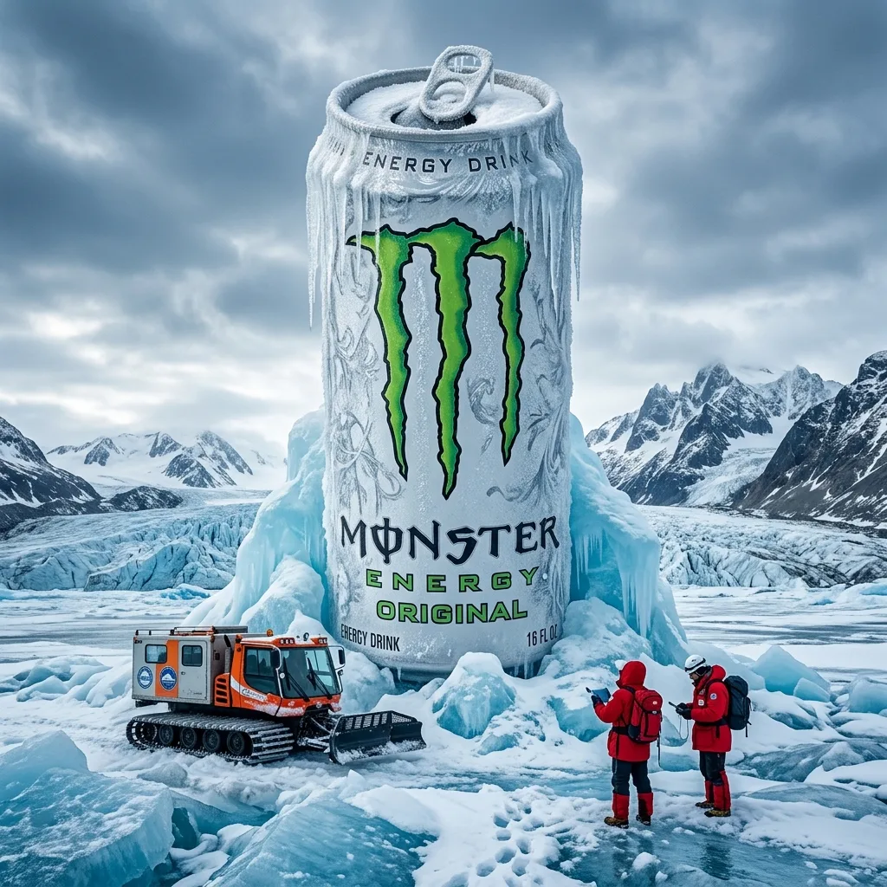

**#213 · Product &amp; Brand Prompt · <code>Vinano Image Pro</code>**

<details>
<summary>Show prompt</summary>

```
Hyper-realistic cinematic 8k photograph, low-angle wide perspective. A massive Monster Energy can standing vertically like an arctic monument, partially frozen inside thick blue ice and snow. Frost covering the textured surface, icicles forming along the logo and rim, snow filling the pull-tab opening. Snowcat vehicle and scientists in red parkas emphasize scale. Overcast arctic daylight, HDR, ultra-detailed frozen textures, cinematic realism --ar 2:3 Maintain consistent colour harmony and crisp focus across the whole frame.
```

</details>

---

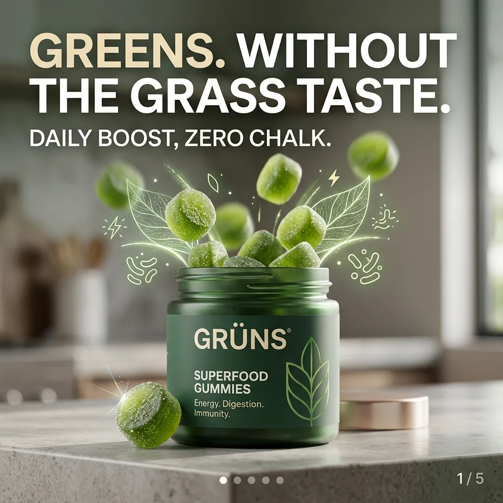

**#214 · Product &amp; Brand Prompt · <code>Vinano Image Pro</code>**

<details>
<summary>Show prompt</summary>

```
Create a high-converting carousel image for Grüns (greens gummies).
Bold hook, clear outcome, premium DTC design.
Mobile-first, 4:5, advanced design level.

Render with rich micro-detail while keeping the layout uncluttered and intentional.
```

</details>

---

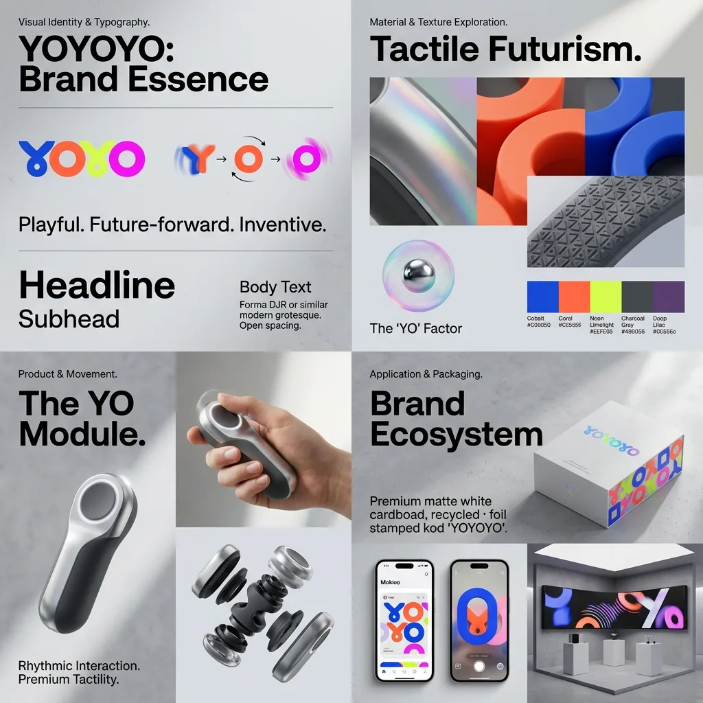

**#215 · Product &amp; Brand Prompt · <code>Vinano Image Pro</code>**

<details>
<summary>Show prompt</summary>

```
Create a polished multi-page (multiple images) brand kit for a company called [YOYOYO]. The brand should feel playful, futuristic, vibrant, and design-forward, blending the energy of a toy-inspired product the sophistication of a premium creative tech brand. Use a bold, experimental visual identity bright color, clean geometry, modern typography, dynamic motion cues, and slightly surreal imagery. The overall mood should feel inventive, youthful, rhythmic, tactile, and high-concept, a balance of fun consumer product culture, fashionlike presentation, and contemporary digital design.

Include a sense of product obsession, visual experimentation, packaging exploration, editorial photography, immersive retail, and cross-platform brand application. Make it feel like a confident, contemporary brand world that is both accessible and art-directed, strong graphic cohesion and a premium creative-studio aesthetic.

Emphasise material texture and natural light so the final frame feels tactile and premium.
```

</details>

---

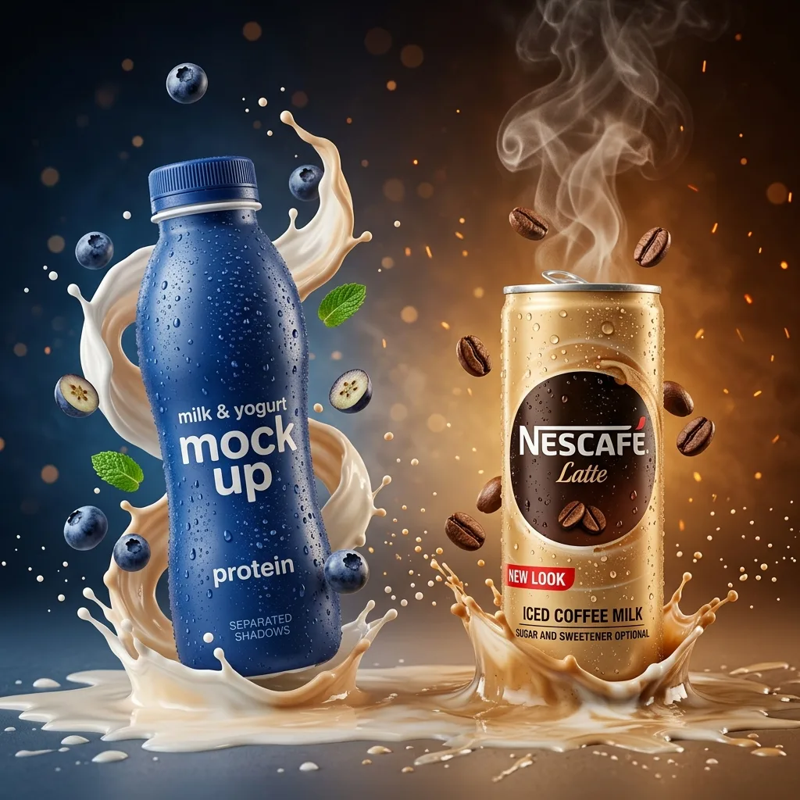

**#216 · Product &amp; Brand Prompt · <code>Vinano Image Pro</code>**

<details>
<summary>Show prompt</summary>

```
{
 "master_prompt": {
 "global_settings": {
 "resolution": "8K ultra-high-definition",
 "aspect_ratio": "3:4 vertical",
 "style": "hyper-realistic AI-edited commercial product photography",
 "sharpness": "extreme clarity, micro-detail visibility",
 "lighting_quality": "cinematic studio lighting controlled highlights and shadows",
 "motion_freeze": "high-speed capture, frozen splashes and particles",
 "noise": "none",
 "artifacts": "none"
 },

"module_1_image_1_style": {
 "subject": {
 "type": "plastic protein drink bottle",
 "color": "deep matte blue",
 "surface_details": "condensation droplets across entire bottle",
 "label_text_visible": ["milk & yogurt",
 "mock up",
 "protein",
 "SEPARATED SHADOWS"]
 },
 "pose_and_orientation": {
 "position": "slightly tilted to the right",
 "angle": "three-quarter view",
 "motion_feel": "dynamic, leaning into splash"
 },
 "liquid_and_motion": {
 "liquid_color": "white and light beige milk mixture",
 "texture": "smooth, creamy, fluid",
 "motion": "swirling splash rising around bottle base and sides"
 },
 "floating_elements": {
 "blueberries": "whole and halved blueberries at different depths",
 "mint_leaves": "small green leaves visible veins",
 "droplets": "milk droplets and spheres suspended mid-air"
 },
 "background": {
 "color_gradient": "dark blue to warm amber",
 "bokeh": "soft circular light particles scattered throughout"
 },
 "surface_and_reflection": {
 "base": "matte ground light liquid pooling",
 "shadow_style": "soft separated shadow under bottle"
 }
 },
"module_2_image_2_style": {
 "subject": {
 "type": "metal coffee can",
 "color": "warm gold",
 "surface_details": "heavy condensation visible droplets",
 "branding_text_visible": ["NESCAFÉ",
 "Latte",
 "NEW LOOK",
 "ICED COFFEE MILK",
 "SUGAR AND SWEETENER OPTIONAL"]
 },
 "pose_and_orientation": {
 "position": "upright, centered",
 "angle": "front-facing",
 "presence": "hero product stance"
 },
 "liquid_and_motion": {
 "liquid_color": "coffee and milk blend",
 "motion": "splash erupting from base",
 "droplet_behavior": "fine droplets scattered outward"
 },
 "floating_elements": {
 "coffee_beans": "whole roasted beans floating around can",
 "steam": "thick swirling steam rising upward",
 "embers": "tiny glowing particles in background"
 },
 "background": {
 "color_palette": "deep brown, amber, gold",
 "atmosphere": "warm, smoky, intense"
 },
 "surface_and_reflection": {
 "base": "wet surface liquid splash crown",
 "reflection_quality": "subtle reflective highlights"
 }
 }

Emphasise material texture and natural light so the final frame feels tactile and premium.
```

</details>

---

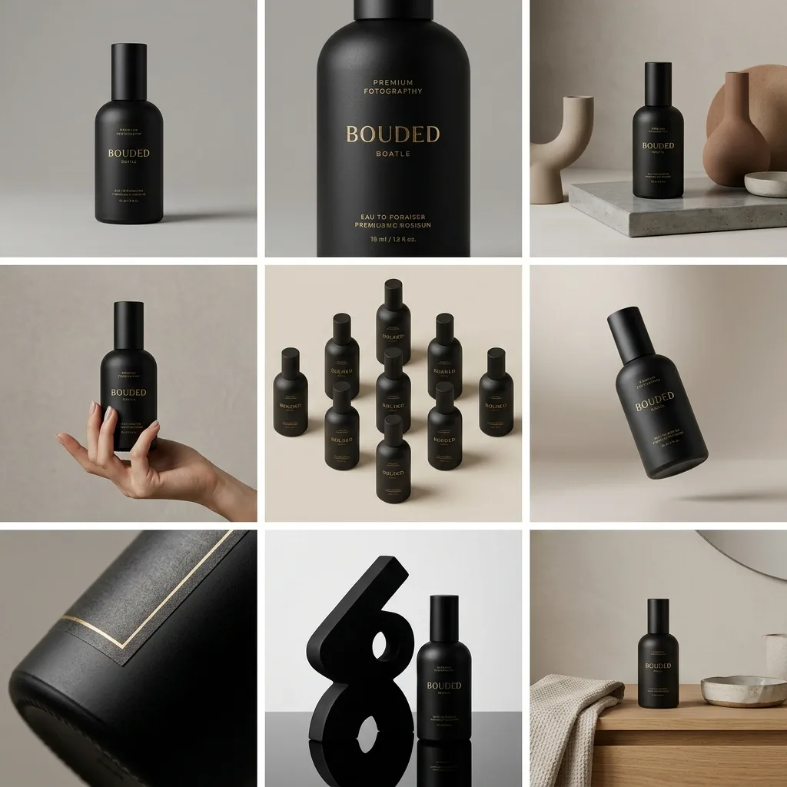

**#217 · Isometric, Storyboard · <code>Vinano Image Pro</code>**

> Keywords: isometric, storyboard, AI art, AI prompt, text to image

<details>
<summary>Show prompt</summary>

```
Create ONE final image.

A clean 3×3 [ratio] storyboard grid nine equal [ratio] sized panels on [4:5] ratio.

Use the reference image as the base product reference. Keep the same product, packaging design, branding, materials, colors, proportions and overall identity across all nine panels exactly as the reference. The product must remain clearly recognizable in every frame. The label, logo and proportions must stay exactly the same.

This storyboard is a high-end designer mockup presentation for a branding portfolio. The focus is on form, composition, materiality and visual rhythm rather than realism or lifestyle narrative. The overall look should feel curated, editorial and design-driven.

FRAME 1:
Front-facing hero shot of the product in a clean studio setup. Neutral background, balanced composition, calm and confident presentation of the product.

FRAME 2:
Close-up shot the focus centered on the middle of the product. Focusing on surface texture, materials and print details.

FRAME 3:
Shows the reference product placed in an environment that naturally fits the brand and product category. Studio setting inspired by the product design elements and colours.

FRAME 4:
Product shown in use or interaction on a neutral studio background. Hands and interaction elements are minimal and restrained, the look matches the style of the package.

FRAME 5:
Isometric composition showing multiple products arranged in a precise geometric order from the top isometric angle. All products are placed at the same isometric top angle, evenly spaced, clean, structured and graphic.

FRAME 6:
Product levitating slightly tilted on a neutral background that matches the reference image color palette. Floating position is angled and intentional, the product is floating naturally in space.

FRAME 7:
is an extreme close-up focusing on a specific detail of the label, edge, texture or material behavior.

FRAME 8:
The product in an unexpected yet aesthetically strong setting that feels bold, editorial and visually striking.
Unexpected but highly stylized setting. Studio-based, and designer-driven. Bold composition that elevates the brand.

FRAME 9:
Wide composition showing the product in use, placed within a refined designer setup. Clean props, controlled styling, cohesive the rest of the series.

CAMERA & STYLE:
ultra-detailed, high-fidelity studio imagery a real camera look. Different camera angles and framings across frames. Controlled depth of field, precise lighting, accurate materials and reflections. Lighting logic, color palette, mood and visual language must remain consistent across all nine panels as one cohesive series.

OUTPUT:
A clean 3×3 grid no borders, no text, no captions and no watermarks.

Keep edges clean and the overall composition balanced for a polished, gallery-ready result.
```

</details>

---

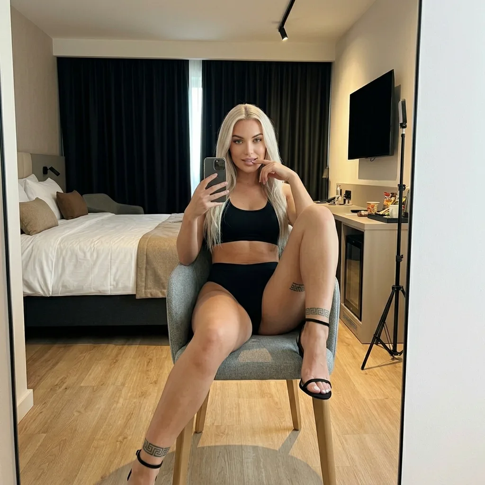

**#218 · Realistic, Ai Art · <code>Vinano Image Pro</code>**

> Keywords: realistic, AI art, AI prompt, text to image

<details>
<summary>Show prompt</summary>

```
{
  "subject": {
    "type": "adult woman",
    "age": "mid-20s",
    "face": {
      "shape": "soft feminine face a defined jawline and high cheekbones",
      "eyes": "almond-shaped hazel-green eyes, sharp catchlights, gaze locked on the phone screen reflection",
      "brows": "full natural brows a clean arch (slightly darker than hair)",
      "nose": "straight slim bridge a soft rounded tip",
      "lips": "natural full lips, nude-pink tone a light gloss, slightly parted",
      "skin": "real skin texture visible pores, subtle cheek flush (no beautify smoothing)"
    },
    "hair": {
      "color": "platinum blonde",
      "style": "long, center-parted, smooth a gentle natural wave",
      "detail": "hair down over shoulders, minimal flyaways"
    },
    "body": {
      "build": "athletic, gym-trained silhouette (toned shoulders, subtle abs, strong legs and glutes)",
      "proportions": "natural realistic anatomy (no extreme curves)"
    },
    "expression": "confident sexy look, relaxed eyes, playful mouth pose"
  },
  "wardrobe": {
    "outfit": {
      "top": "black bra/lingerie top, matte fabric, structured cups, clean edges (not lace-heavy), no logos",
      "bottom": "matching black panties, matte fabric, clean stitching, no logos",
      "coverage_rule": "non-explicit, no nipples visible, no see-through"
    },
    "shoes": {
      "type": "black strappy high-heel sandals",
      "details": "thin straps, ankle strap visible, open-toe, white pedicure clearly visible"
    },
    "tattoos": ["Greek-key band tattoo wrapping around the upper thigh (clean geometric pattern)",
      "Greek-key band tattoo wrapping around the ankle"],
    "accessories": ["minimal rings on the phone-holding hand"]
  },
  "pose_action": {
    "shot_type": "mirror selfie (viewer sees the reflection)",
    "chair_pose": {
      "chair": "gray upholstered chair centered in front of the mirror",
      "sitting": "seated deep in the chair, hips back, torso upright",
      "sexy_detail": "subtle back arch, shoulders back, chest slightly lifted"
    },
    "legs": {
      "foreground_leg_fixed": {
        "which_leg": "left leg ONLY",
        "action": "left leg fully extended straight toward the mirror/camera extreme foreshortening",
        "foreground_foot": "left foot dominates the lower-left foreground, sandal straps and white pedicure clearly visible",
        "ankle_tattoo_visibility": "Greek-key ankle tattoo visible on the extended left leg"
      },
      "other_leg_fixed": {
        "which_leg": "right leg ONLY",
        "action": "right leg bent and raised on the chair, knee high and near the center",
        "heel_visibility": "right sandal heel visible near the chair edge"
      },
      "reflection_consistency_rule": "the extended left foot and leg position must match exactly in the mirror reflection (no swapped feet, no mismatched reflection, no duplicated feet)"
    },
    "hands": {
      "phone_hand": {
        "hand": "left hand",
        "action": "holding the phone up near head height for the mirror selfie",
        "position_rule": "phone offset so it does NOT cover the face; full face visible"
      },
      "free_hand": {
        "hand": "right hand",
        "action": "index finger near lips in a teasing gesture"
      }
    },
    "gaze": "eyes looking at the phone screen reflection",
    "people_rule": "single person only"
  },
  "scene": {
    "location": "modern hotel room",
    "mirror": {
      "type": "large wall mirror",
      "edge": "clean white vertical mirror edge visible on the right side",
      "geometry_rule": "mirror perfectly flat, straight lines, physically correct reflection"
    },
    "background_left": ["large bed white bedding",
      "white pillows plus beige/brown accent pillows near headboard",
      "dark floor-to-ceiling curtains behind the bed, mostly closed a thin vertical slit of daylight",
      "warm wall glow near the bed/headboard area"],
    "background_center": ["light wood floor",
      "open floor space leading toward the back wall"],
    "background_right": ["wall-mounted flat-screen TV",
      "long desk/minibar counter under the TV a few scattered items (cups/snacks) no readable labels",
      "small cabinet/minifridge area below the counter",
      "a slim black tripod/light stand near the desk area",
      "dark recessed shelf/wall niche behind the desk area"],
    "ceiling": ["minimal black track light fixture"],
    "rules": ["no readable text/logos",
      "no watermarks",
      "no extra limbs, no duplicated legs/feet, no extra toes",
      "keep straight lines straight (walls, mirror edge, TV, desk)",
      "reflection integrity: left foreground foot must be the same in real view and reflection"]
  },
  "lighting": {
    "type": "warm indoor hotel light + slight daylight spill",
    "look": "warm-neutral lighting, natural shadows, no filters, no heavy HDR"
  },
  "camera": {
    "device_vibe": "iPhone 16 Pro",
    "look": "unretouched smartphone photo, low HDR, subtle grain, minimal sharpening",
    "shot_type": "rear-camera mirror selfie",
    "lens_feel": "1x main camera feel (no ultra-wide)",
    "handheld": "slight handheld micro-tilt (0–2 degrees)",
    "distortion": "controlled; only intentional foreshortening from the extended left leg (not fisheye)",
    "framing": "vertical 9:16, full seated body visible, oversized foreground left foot in lower-left, face fully visible, phone visible but not blocking",
    "focus": "face sharp and eyes sharp; foreground foot/sandal sharp; background slightly softer but detailed",
    "exposure": {
      "metering": "face/skin priority while keeping room detail",
      "ev_comp": 0.0,
      "iso_hint": "100-320",
      "shutter_hint": "1/80-1/200",
      "white_balance": "warm-neutral indoor (3800-4500K)"
    },
    "angle_lock": {
      "mirror_distance_m": "2.0-3.0",
      "camera_height_cm": "145-165",
      "pitch_deg": "0-3 (nearly level)",
      "pose_integrity_rule": "mirror reflection must match the exact chair pose and leg assignment; no swapped feet"
    }
  }

Emphasise material texture and natural light so the final frame feels tactile and premium.
```

</details>

---

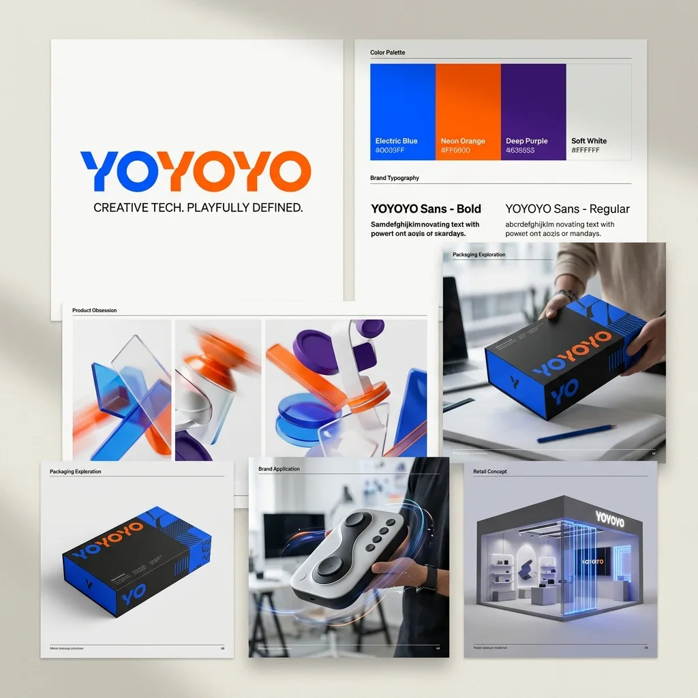

**#219 · Ai Art, Ai Prompt · <code>Vinano Image Pro</code>**

> Keywords: AI art, AI prompt, text to image

<details>
<summary>Show prompt</summary>

```
Create a polished multi-page (multiple images) brand kit for a company called [YOYOYO]. The brand should feel playful, futuristic, vibrant, and design-forward, blending the energy of a toy-inspired product the sophistication of a premium creative tech brand. Use a bold, experimental visual identity bright color, clean geometry, modern typography, dynamic motion cues, and slightly surreal imagery. The overall mood should feel inventive, youthful, rhythmic, tactile, and high-concept, a balance of fun consumer product culture, fashionlike presentation, and contemporary digital design.

Include a sense of product obsession, visual experimentation, packaging exploration, editorial photography, immersive retail, and cross-platform brand application. Make it feel like a confident, contemporary brand world that is both accessible and art-directed, strong graphic cohesion and a premium creative-studio aesthetic.

Preserve realistic proportions and depth for a confident, professional finish.
```

</details>

---

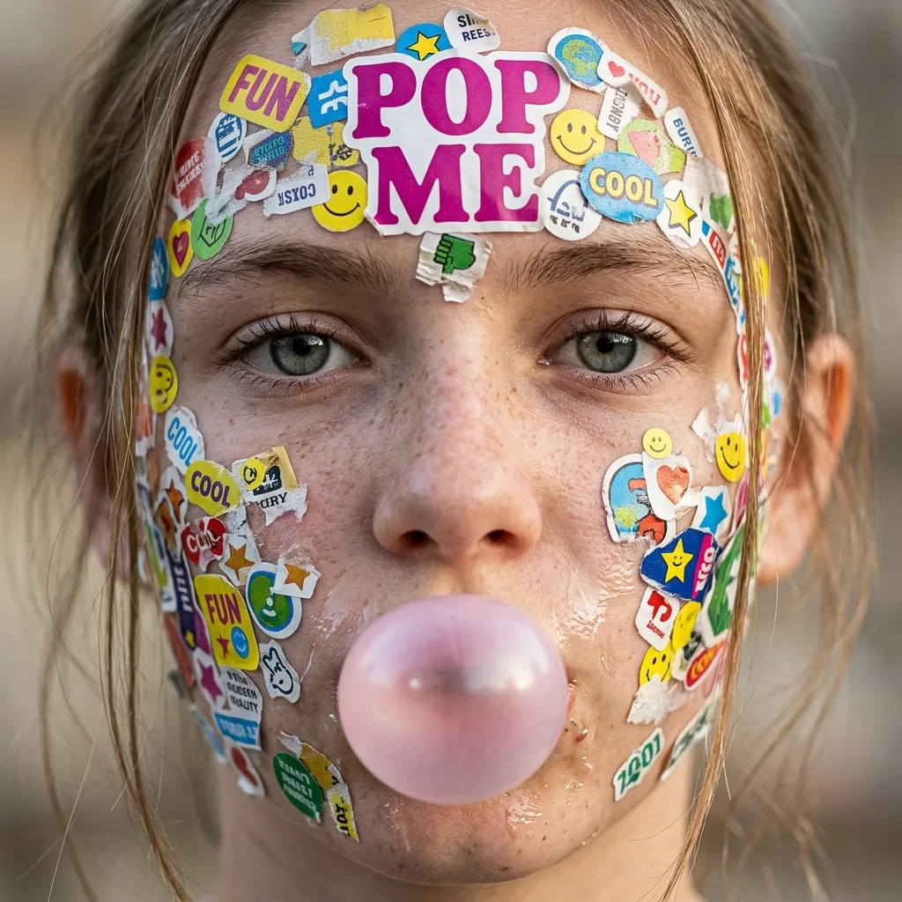

**#220 · Portrait, Ai Art · <code>Vinano Image Pro</code>**

> Keywords: portrait, AI art, AI prompt, text to image

<details>
<summary>Show prompt</summary>

```
{
 "meta": {
 "image_quality": "High",
 "image_type": "Photo"
 },
 "global_context": {
 "scene_description": "Close-up portrait of a young person's face covered colorful paper stickers and glossy adhesive residue. Central focus on eyes, nose, lips; subject blowing a pink bubblegum bubble. Stickers vary in size, text, icons and layered overlap; hair strands frame face at edges. Skin shows freckles, pores, and sheen from adhesive or moisture.",
 "time_of_day": "Neutral/studio lighting",
 "weather_atmosphere": "Indoors/controlled",
 "lighting": {
 "source": "Artificial",
 "direction": "Frontal slight top",
 "quality": "Soft",
 "color_temp": "Neutral"
 }
 },
 "color_palette": {
 "dominant_hex_estimates": ["#E7B1B6", "#F6C0D0", "#C9A38C"],
 "accent_colors": ["Pink","Magenta"],
 "contrast_level": "Medium"
 },
 "composition": {
 "camera_angle": "Eye-level",
 "framing": "Extreme close-up (face fills frame)",
 "depth_of_field": "Shallow (background indistinct)",
 "focal_point": "Eyes and central bubble"
 },
 "objects": [{
 "id": "obj_001",
 "label": "Face",
 "category": "Person (head)",
 "location": "Center",
 "prominence": "Foreground",
 "visual_attributes": {
 "color": "Light beige skin pink undertones and freckles",
 "texture": "Smooth visible pores, glossy adhesive patches",
 "material": "Skin",
 "state": "Sticker-covered, slightly wet/glossy",
 "dimensions_relative": "Large relative to frame"
 },
 "micro_details": ["Freckles concentrated on nose and cheeks",
 "Shiny adhesive residue streaks on forehead and cheeks",
 "Fine vellus hairs visible",
 "Pores visible on nose and cheeks"],
 "pose_or_orientation": "Frontal",
 "text_content": null
 },
 {
 "id": "obj_002",
 "label": "Eyes (pair)",
 "category": "Facial feature",
 "location": "Upper-center",
 "prominence": "Foreground",
 "visual_attributes": {
 "color": "Gray-green irises dark limbal ring",
 "texture": "Wet/glossy cornea, visible eyelashes",
 "material": "Biological",
 "state": "Open, neutral expression",
 "dimensions_relative": "Medium"
 },
 "micro_details": ["Tiny specular highlights on each cornea",
 "Sparse lower lashes, fuller upper lashes",
 "Slight shadow under lower lids"],
 "pose_or_orientation": "Facing camera",
 "text_content": null
 },
 {
 "id": "obj_003",
 "label": "Pink bubble",
 "category": "Object (gum)",
 "location": "Lower-center",
 "prominence": "Foreground",
 "visual_attributes": {
 "color": "Pastel pink",
 "texture": "Smooth, slightly translucent",
 "material": "Gum",
 "state": "Inflated/intact",
 "dimensions_relative": "Large relative to mouth"
 },
 "micro_details": ["Two bright specular reflections on sphere",
 "Seamless edge against lips"],
 "pose_or_orientation": "Centered over mouth",
 "text_content": null
 },
 {
 "id": "obj_004",
 "label": "Stickers (assorted)",
 "category": "Adhesive stickers",
 "location": "Entire face and neck, concentrated forehead and cheeks",
 "prominence": "Foreground",
 "visual_attributes": {
 "color": "Multicolor: magenta, yellow, blue, white",
 "texture": "Paper/plastic glossy varnish, torn edges",
 "material": "Paper/plastic adhesive",
 "state": "Layered, partially torn, some wrinkled",
 "dimensions_relative": "Varied small-to-medium"
 },
 "micro_details": ["Large 'POP ME' magenta sticker on forehead",
 "Partial torn sticker fragments near nasolabial fold",
 "Small rectangular stickers tiny printed text",
 "Edges lifting, adhesive shine around perimeters"],
 "pose_or_orientation": "Affixed flat or slightly peeled",
 "text_content": "Multiple small logos and words (e.g., 'POP ME')"
 },
 {
 "id": "obj_005",
 "label": "Hair strands",
 "category": "Hair",
 "location": "Left and right edges framing face",
 "prominence": "Background/foreground overlap",
 "visual_attributes": {
 "color": "Light brown",
 "texture": "Fine, slightly wet",
 "material": "Hair",
 "state": "Loose strands",
 "dimensions_relative": "Thin relative to face"
 },
 "micro_details": ["Individual strands crossing forehead edges",
 "Slight adhesive sheen on some strands"],
 "pose_or_orientation": "Hanging down"
 }],
 "text_ocr": {
 "present": true,
 "content": [{
 "text": "POP ME",
 "location": "Forehead",
 "font_style": "Bold/Decorative",
 "legibility": "Clear"
 }]
 },
 "semantic_relationships": ["Stickers are affixed to Face",
 "Bubble covers mouth, partially obscuring lips",
 "Adhesive residue creates glossy highlights on skin",
 "Hair strands frame and partly overlay stickers"]
}

Keep edges clean and the overall composition balanced for a polished, gallery-ready result.
```

</details>

---

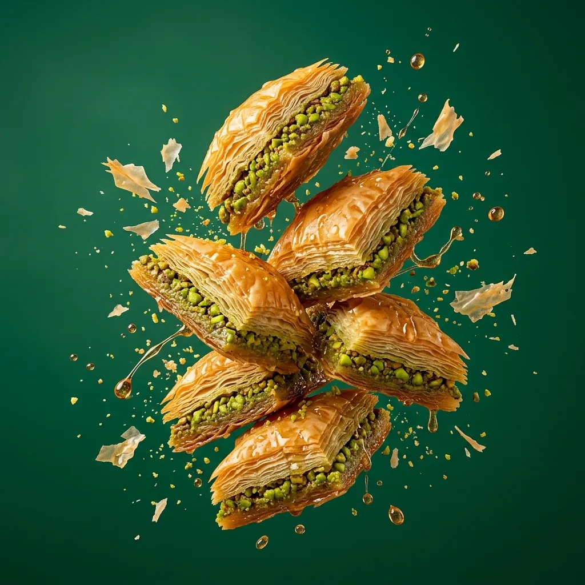

**#221 · Realistic, Cinematic · <code>Vinano Image Pro</code>**

> Keywords: realistic, cinematic, minimalist, AI art, AI prompt, text to image

<details>
<summary>Show prompt</summary>

```
{
 "resolution": "8K UHD",
 "aspect_ratio": "3:4",
 "image_style": "hyper-realistic commercial dessert photography",
 "global_settings": {
 "quality": "Ultra-high detail, razor-sharp focus, luxury dessert clarity",
 "lighting": "Controlled studio lighting emphasizing texture, layers, and syrup highlights",
 "motion": "Frozen mid-air elements subtle gravity realism",
 "background_style": "Solid or smooth gradient background, color varies per module",
 "camera": "High-speed photography look, shallow to medium depth of field",
 "post_processing": "Rich contrast, warm tones, natural shine, no artificial glow"
 },
 "modules": { "module_1_classic_baklava_stack_explosion": {
 "scene_description": "A dramatic stack of classic pistachio baklava flying syrup droplets",
 "baklava": {
 "type": "Traditional pistachio baklava",
 "layers": "Ultra-thin phyllo layers clearly visible",
 "cut": "Diamond-shaped pieces",
 "position": "Stacked and floating mid-air"
 },
 "details": {
 "nuts": "Finely ground bright green pistachios between layers",
 "syrup": "Golden sugar syrup glistening on edges"
 },
 "motion_effects": {
 "syrup": "Small syrup droplets splashing outward",
 "crumbs": "Tiny phyllo flakes suspended in air"
 },
 "background": {
 "color": "Deep emerald green",
 "texture": "Smooth, seamless"
 }
 }, "module_2_minimal_baklava_plate_floating": {
 "scene_description": "refined minimalist premium baklava presentation controlled floating crumbs",
 "baklava": {
 "type": "Single-layer pistachio baklava pieces",
 "arrangement": "Neatly aligned rectangular cuts",
 "surface": "Glossy light syrup sheen"
 },
 "accent_elements": {
 "nuts": "Crushed pistachio dust lightly floating",
 "syrup": "Thin syrup drizzle frozen mid-air"
 },
 "motion_effects": {
 "particles": "Subtle floating crumbs and nut dust"
 },
 "background": {
 "color": "Warm beige",
 "gradient": "Very soft tonal gradient"
 }
 }, "module_3_baklava_syrup_pour_drama": {
 "scene_description": "Cinematic syrup pour over baklava stack",
 "baklava": {
 "type": "Thick stacked baklava slices",
 "texture": "Highly detailed crispy layers"
 },
 "additional_elements": {
 "syrup": {
 "state": "Thick golden syrup pouring from above",
 "motion": "Frozen in elegant flowing strands"
 },
 "nuts": ["Whole pistachio kernels",
 "Crushed pistachio fragments"]
 },
 "motion_effects": {
 "splashes": "Micro syrup splashes on impact points",
 "particles": "Floating nut fragments"
 },
 "background": {
 "color": "Dark chocolate brown",
 "tone": "High contrast, luxury feel"
 }
 }, "module_4_modern_baklava_floating_composition": {
 "scene_description": "Modern deconstructed baklava composition in mid-air",
 "elements": {
 "phyllo": "Crispy golden phyllo sheets floating separately",
 "nuts": "Pistachio layers suspended between sheets",
 "syrup": "Glossy syrup threads connecting elements"
 },
 "motion_effects": {
 "flakes": "Ultra-fine pastry flakes suspended",
 "drops": "Minimal syrup droplets"
 },
 "background": {
 "color": "Muted olive green",
 "texture": "Smooth, seamless"
 }
 }
 },
 "negative_prompt": ["text",
 "logos",
 "branding",
 "hands",
 "people",
 "utensils",
 "plates",
 "tables",
 "cartoon style",
 "excessive syrup pooling",
 "burnt pastry",
 "overexposure",
 "artificial glow",
 "low detail textures"]
}

Emphasise material texture and natural light so the final frame feels tactile and premium.
```

</details>

---

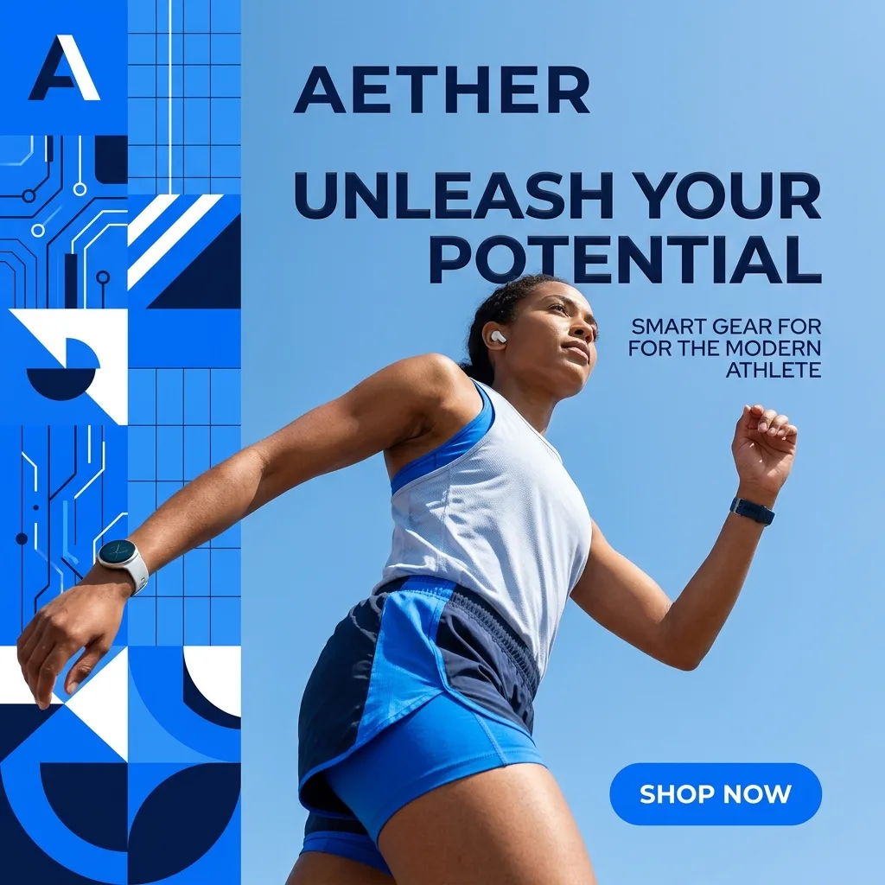

**#222 · Realistic, Minimalist · <code>Vinano Image Pro</code>**

> Keywords: realistic, minimalist, AI art, AI prompt, text to image

<details>
<summary>Show prompt</summary>

```
[BRAND NAME] | [HEADLINE] | [SUB-TEXT] | [CTA]. Act as a Senior Art Director.

PHASE 1: INTEGRATED COMPOSITION & OVERLAP.
- Layout: Seamless fusion of 2D graphics and 3D photography.
- Overlap Logic: The subject and their primary "Product Prop" (e.g., a car, a device) must physically overlap the graphic panel to break the "wall" between design and photo.
- Unity: Geometric shapes from the graphic side must bleed into the photographic sky area.

PHASE 2: BRAND & CATEGORY SIMULATION.
Autonomously analyze the [BRAND NAME] and its industry category:
- INDUSTRY CONTEXT:
 * If Automotive: Include the vehicle and a person interacting it.
 * If Tech: Include flagship devices/gadgets.
 * If Fashion/Lifestyle: Focus on editorial poses and premium accessories.
- SHAPE SIMULATION: Match shapes to brand identity (e.g., Sharp/Speed for Auto, refined minimalist/Grid for Tech).
- COLOR SIMULATION: Use the brand's primary signature hue for both the graphic pattern and the subject's outfit/accents.

PHASE 3: TYPOGRAPHY & CUSTOM CONTENT.
- Headline: Display "[HEADLINE]" in a bold, modern Sans-Serif font. (If [HEADLINE] is empty, generate a high-energy slogan for [BRAND NAME]).
- Sub-headline: Display "[SUB-TEXT]" below the headline.
- Button: Create a refined minimalist pill-shaped CTA button the text: "[CTA]".
- Interaction: Text layers should have 3D depth, sitting partially behind the subject or product prop.

PHASE 4: PHOTOGRAPHY & SUBJECT.
- Perspective: Extreme low-angle (worm’s eye view) looking up.
- Subject: A diverse persona reflecting the brand's audience.
- Environment: Massive, clear blue sky as the backdrop.
- Visual Link: Subject's styling must incorporate the Brand's primary color.

PHASE 5: FINAL VISUAL STYLE.
High-end commercial aesthetic. Crisp, saturated, professional fusion of flat vector art and realistic photography.

Preserve realistic proportions and depth for a confident, professional finish.
```

</details>

---

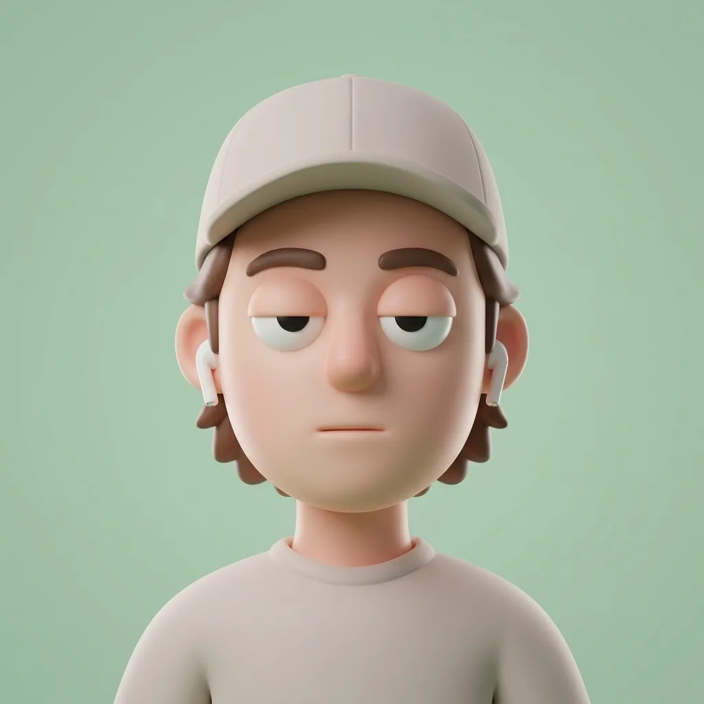

**#223 · Realistic, Character · <code>Vinano Image Pro</code>**

> Keywords: realistic, character, AI art, AI prompt, text to image

<details>
<summary>Show prompt</summary>

```
{
 "task": "image_style_transfer_3d_character",
 "input": {
 "source_image": "USER_UPLOADED_IMAGE",
 "preserve_identity": true,
 "preserve_pose": true,
 "preserve_composition": true
 },
 "style_reference": {
 "render_style": "stylized_3d_character",
 "aesthetic": "soft_minimal_cartoon_3d",
 "inspiration": ["pixar_like_but_more_minimal",
 "toy_figure_render",
 "clean_product_character_design"]
 },
 "character_design": {
 "skin": {
 "material": "smooth_matte_plastic",
 "texture": "soft_uniform",
 "subsurface_scattering": "gentle"
 },
 "facial_features": {
 "eyes": "half_closed_bored_expression",
 "eyelids": "heavy",
 "nose": "rounded_simplified",
 "mouth": "flat_neutral",
 "ears": "simplified_rounded"
 },
 "emotion": "unimpressed_calm_bored"
 },
 "clothing": {
 "style": "minimal_streetwear",
 "details": "no_logos_no_patterns",
 "fabric": "soft_matte"
 },
 "accessories": {
 "headwear": "simple_baseball_cap_optional",
 "ear_accessories": "wireless_earbuds_optional"
 },
 "lighting": {
 "setup": "studio_softbox",
 "shadows": "very_soft",
 "contrast": "low",
 "highlights": "subtle"
 },
 "background": {
 "type": "solid_color",
 "color_palette": ["muted_green",
 "pastel_tone"],
 "gradient": "none"
 },
 "camera": {
 "angle": "front_facing",
 "framing": "medium_close_up",
 "lens": "50mm_equivalent",
 "distortion": "none"
 },
 "render_quality": {
 "resolution": "high",
 "edges": "clean",
 "noise": "none",
 "realism_balance": "stylized_over_realistic"
 },
 "output": {
 "consistency": "high",
 "style_strength": "strong",
 "photorealism": false
 }
}

Keep edges clean and the overall composition balanced for a polished, gallery-ready result.
```

</details>

---

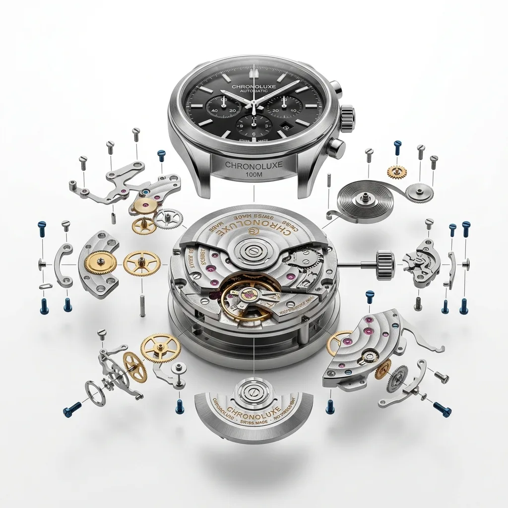

**#224 · Realistic, Product Photography · <code>Vinano Image Pro</code>**

> Keywords: realistic, product photography, AI art, AI prompt, text to image

<details>
<summary>Show prompt</summary>

```
Create an exploded products inner mechanics [product], high-end product advertising, white seamless background, exploded view inner mechanics revealed, outer shell hovering above core, micro screws and components suspended, perfect alignment guides implied, crisp soft shadow, ultra realistic, macro product photography, 100mm lens look, f/8, 8k, 1:1 Keep edges clean and the overall composition balanced for a polished, gallery-ready result.
```

</details>

---

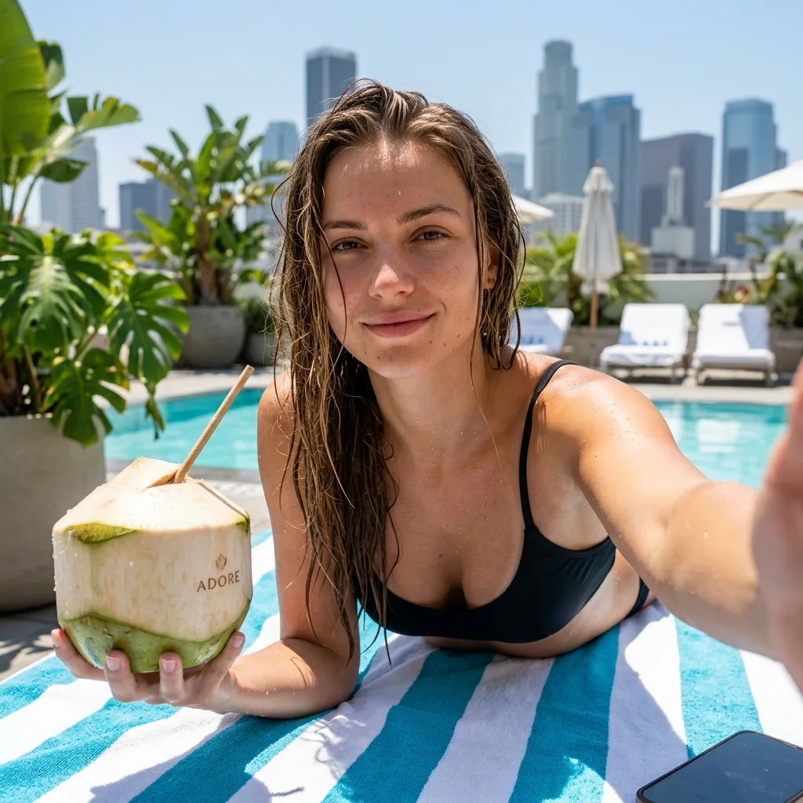

**#225 · Realistic, Cinematic · <code>Vinano Image Pro</code>**

> Keywords: realistic, cinematic, minimalist, AI art, AI prompt, text to image

<details>
<summary>Show prompt</summary>

```
{

 "title": "LA Rooftop Poolside Selfie",
 "style_attributes": ["Ultra-realistic cinematic lifestyle photography",
 "8K resolution",
 "Hyper-detailed",
 "true-to-life photorealistic",
 "iPhone-style casual shot",
 "Cinematic photographic quality"],
 "subject": {
 "demographics": "Female, 20 years old, Slavic appearance",
 "facial_features": {
 "structure": "Naturally beautiful, well-balanced face, realistic proportions",
 "eyes": "Large expressive green-hazel, calm confident gaze",
 "lips": "Naturally full, soft, unexaggerated",
 "makeup": "Light natural daytime, not heavy"
 },
 "skin_texture": {
 "quality": "Sun-kissed, highly realistic, visible pores, subtle micro-imperfections",
 "effects": "Wet skin, water and oil droplets catching sunlight, no plastic texture"
 },
 "hair": "Long, wet, slightly messy, strands sticking naturally to cheek and forehead",
 "body": {
 "pose": "Lying on stomach, legs gently bent at knees and lifted, feet together, arm extended for selfie",
 "physique": "Slim waist, natural back line, realistic anatomy without exaggeration"
 },
 "clothing": "Small classic black bikini top thin straps and deep plunge"
 },
 "props": ["Fresh coconut straw and subtle ADORE logo",
 "Bright blue-and-white striped beach towel",
 "Smartphone (partial visibility)"],
 "environment": {
 "location": "Luxurious rooftop pool, high-rise building, Los Angeles",
 "background": "Modern downtown LA skyscrapers, slight atmospheric haze, white sun loungers and umbrellas",
 "elements": "Turquoise pool water, lush tropical greenery (banana palms, monstera plants)",
 "weather": "Bright sunny day, clear blue sky, no clouds"
 },
 "technical_specs": {
 "lighting": "Harsh midday sunlight, strong contrast, deep natural shadows, bright specular highlights",
 "camera_settings": "50–85mm lens look, shallow depth of field, high dynamic range (HDR)",
 "color_grading": "Realistic, true-to-life skin tones"
 },
 "full_prompt_string": "Ultra-realistic cinematic lifestyle photography, 8K, hyper-detailed, true-to-life photorealistic, An attractive woman aged 20, Slavic appearance. A naturally beautiful, well-balanced face realistic proportions, no artificial perfection. Large expressive green-hazel eyes, calm confident gaze toward the camera. Naturally full lips, soft and unexaggerated. Light, natural daytime makeup emphasizing her features without looking heavy. Her skin is sun-kissed and wet, highly realistic visible pores, subtle micro-imperfections, fine highlights, and water and oil droplets catching the sunlight. No plastic or overly smooth texture. Long wet hair, slightly messy after swimming, a few strands sticking naturally to her cheek and forehead. She is lying on her stomach on a bright blue-and-white striped beach towel. The pose feels relaxed and spontaneous, like a real vacation moment: legs gently bent at the knees and lifted upward, feet together; a natural back line, slim waist, realistic body anatomy without exaggeration. She wears a small classic black bikini top thin straps and a deep plunge — minimalistic, clean design, naturally fitting the body. One arm is extended forward as she takes a selfie — part of her arm and the edge of a small smartphone are visible in frame, reinforcing a casual iPhone-style shot. In her other hand, she holds a fresh coconut a straw and a subtle ADORE logo; water droplets run down the shell. Environment: a luxurious rooftop pool atop a high-rise building in Los Angeles. Bright sunny day, clear blue sky no clouds, turquoise pool water. Lush tropical greenery (banana palms, monstera plants), white sun loungers and umbrellas. Modern downtown LA skyscrapers in the background a slight atmospheric haze on the horizon.

Emphasise material texture and natural light so the final frame feels tactile and premium.
```

</details>

---


**#226 · Realistic, Ai Art · <code>Vinano Image Pro</code>**

> Keywords: realistic, AI art, AI prompt, text to image

<details>
<summary>Show prompt</summary>

```
Act as a High-End Product Photographer and CGI Artist.

PHASE 1: SUBJECT & LOGIC
Generate a massive, perfectly centered, three-dimensional physical sculpture of the official, unaltered corporate logo for [BRAND NAME]. The sculpture must strictly adhere to the brand’s precise logo geometry and proportions (1:1 from brandbook). The sculpture is suspended in mid-air. Autonomously identify the exact official shape and structure of the [BRAND NAME] logo and render it as a single, flawless glass object without any modifications.
PHASE 2: MATERIALITY (GLASS)
The entire logo is made of hyper-realistic, optical-grade crystal glass (not water, not gel). The material is solid, colorless, and boasts high clarity a high refractive index. It must look heavy and монолитное (monolithic). The glass structure contains subtle, true-to-life photorealistic microscopic flaws: fine polished scratches on the surface and minor internal inclusions (dust particles/seed bubbles, very few) to avoid “CGI plastic.” The edges must be precision-beveled and fire-polished.

PHASE 3: ENVIRONMENT & CAUSTICS
The logo is suspended against a strictly clean, bright blue sky sparse, naturally defined white cumulus clouds. NO land, NO trees, NO palms. The background is purely atmospheric. The focus is entirely on the glass logo. Critically render hyper-realistic, complex glass caustics: intense, sharp patterns of focused light and color (refractions of the blue sky) cast inside and onto the surface of the glass form due to the sunlight passing through it.

TECH SPECS
Rendered Arnold or Octane. Phase One XF, 120mm Macro lens. Aperture f/5.6 for sharp depth across the entire glass sculpture. Intense, direct sunlight (hard lighting) to maximize caustics. Global illumination, ray-traced refractions (double-sided geometry), and chromatic aberration emulation (subtle) for optical realism. Fine grain film emulation (Fujifilm Velvia 50).

Render with rich micro-detail while keeping the layout uncluttered and intentional.
```

</details>

---

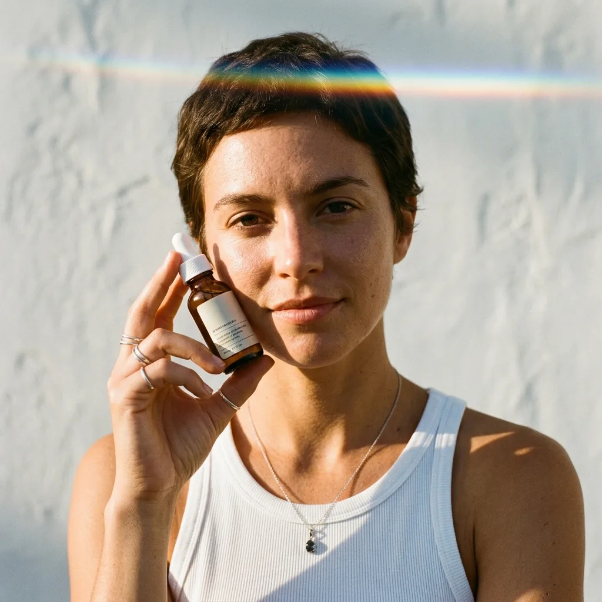

**#227 · Realistic, Portrait · <code>Vinano Image Pro</code>**

> Keywords: realistic, portrait, character, AI art, AI prompt, text to image

<details>
<summary>Show prompt</summary>

```
Use the attached reference sheet as the absolute ground truth for the subject's facial features, skin texture, and body proportions. The output must be a 1:1 match of the character provided.
The subject is the woman from the reference image. She is wearing a white ribbed tank top and the delicate silver necklace a small dark pendant.
true-to-life photorealistic medium close-up portrait. She is holding the attached product in her hand, positioned near her cheek. Her fingers are visible, showing rings. The focus is sharp on the subject and the held object.
The scene is illuminated by intense, warm golden hour sunlight striking from the left, creating strong highlights and shadows on her skin and clothing. A prominent rainbow prism lens flare effect streaks horizontally across the upper section of the textured white wall background.

Preserve realistic proportions and depth for a confident, professional finish.
```

</details>

---

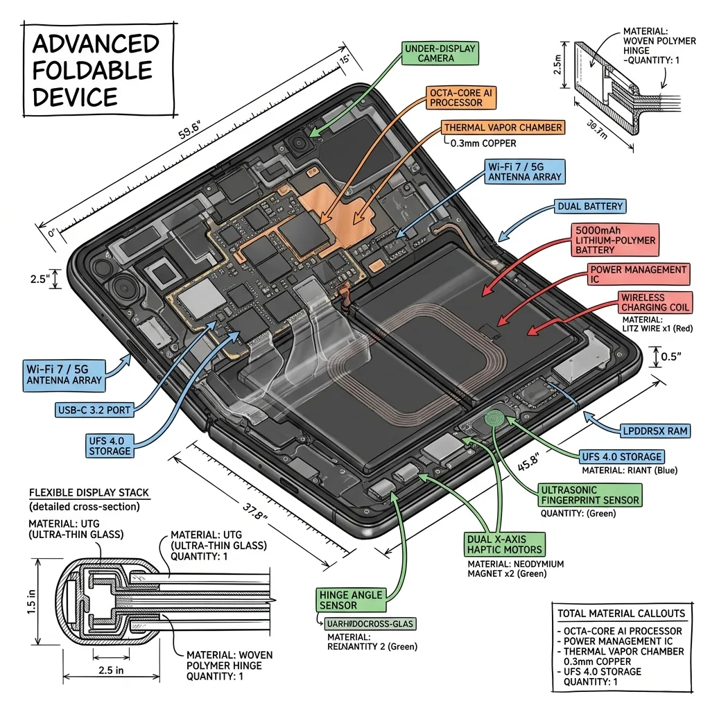

**#228 · Isometric, Realistic · <code>Vinano Image Pro</code>**

> Keywords: isometric, realistic, infographic, AI art, AI prompt, text to image

<details>
<summary>Show prompt</summary>

```
Create a technical infographic of [OBJECT] a 45-degree isometric 3D perspective showing the device slightly tilted to reveal depth and dimension.
Combine a realistic photoreal render black ink technical annotations on pure white background. Include:
Key component labels color-coded callout boxes
Internal component visibility through transparent/cutaway sections
Measurements, dimensions, and precise scale markers
Material callouts and quantities
Color-coded arrows for function/flow: RED (power/battery), BLUE (data/connectivity), ORANGE (thermal/processor), GREEN (sensors/haptics)
Simple schematics or cross-sectional diagrams where relevant

Place “OBJECT” title in a hand-drawn technical box (top-left corner).
Style: Black linework (technical pen/architectural), sketched but precise. Object remains clearly visible. Educational museum-exhibit vibe. crisp composition, balanced negative space.
Perspective: Isometric 3D angle—tilted to show depth, dimension, and internal architecture dramatically. Like a professional product teardown or engineering manual.
Colors: ~10-15% accent density. Black dominant. White background.
Output: 1080×1080, ultra-crisp, social-feed optimized.

Aim for an editorial, design-driven look with deliberate negative space.
```

</details>

---

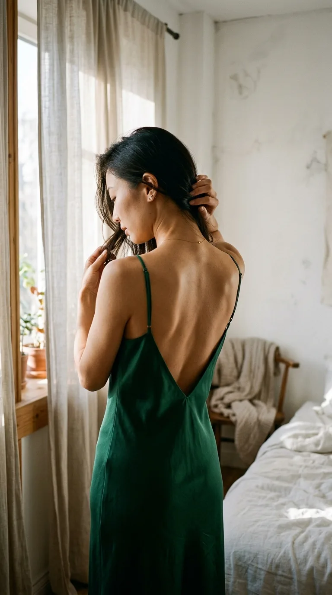

**#229 · Ai Art, Ai Prompt · <code>Vinano Image Pro</code>**

> Keywords: AI art, AI prompt, text to image

<details>
<summary>Show prompt</summary>

```
请生成一张竖版高质感女性情绪写真，主题为「逆光美背·女性情绪写真」。

核心要求：
画面的绝对重点是“美背”，通过露背结构、肩颈线条、肩胛骨、脊柱中线、腰背曲线和逆光轮廓来呈现女性美。不是普通女性写真，也不是普通穿搭图，背部必须是主视觉核心，脸只作为辅助。

人物设定：
成年女性，真实自然，气质可为温柔、清冷、慵懒、文艺、轻熟或安静。人物不要网红脸，不要塑料感，不要夸张妆容。可侧脸、回眸、低头或闭眼，但正脸不是重点。

姿态要求：
姿态必须服务于背部展示，例如背对镜头微微回头、侧身站立、侧坐、抬手整理头发、低头蜷身、斜倚窗边、半躺回眸、披衣下滑等。动作自然，不要僵硬摆拍，不要正面直视镜头。

露背结构：
必须有明确的露背设计，可为低背长裙、吊带裙、露背礼服、针织外套滑落、薄纱披肩、浴袍半披、宽松衬衫滑肩、丝质罩衫半落等。重点表现肩线、肩胛骨、背中线、腰背收束和布料与肌肤之间的高级过渡。

服装与材质：
服装选择轻柔、垂坠、带有透光感和褶皱感的材质，如薄纱、真丝、针织、棉麻、细闪纱、浴袍质地、软垂感长裙。布料要参与构图，形成半遮半露、滑落、包裹、垂挂的层次，但不能厚重。

场景：
场景为卧室、窗边、床上、白墙房间、民宿、酒店房间、木质空间或复古公寓。背景简洁克制，少量床品、窗帘、木椅、花束、地板等元素即可，不能喧宾夺主。

光线要求：
采用自然光或柔和暖光，以逆光、侧逆光、窗边光为主。重点是让光打到背部，勾出肩颈边缘、肩胛骨轮廓、腰线和发丝高光。可使用晨光、黄昏金光、柔雾散射光或冷白窗光，但背部受光状态必须成立。

构图：
竖版构图，画幅可为 9:16、3:4 或 4:5。人物是绝对主角，视觉重心放在背部、肩颈和腰背曲线上。可采用半身、七分身、近景或全身，但不要让场景抢走主体。

氛围：
整体氛围安静、柔软、私密、克制、高级，像真实摄影师拍摄的电影感情绪写真。重点不是直白性感，而是通过“美背 + 逆光 + 柔软布料 + 自然姿态”表达女性美。

画质要求：
真实摄影感、电影感、柔雾胶片感、细腻肤色、真实皮肤质感、浅景深、轻微颗粒感、画面通透自然。不要 AI 塑料感，不要 CG 感，不要错误手指，不要肢体畸形，不要低俗色情化表达，不要文字、水印、Logo、边框。

最终效果：
一张以“美背”为主视觉核心的高完成度女性情绪写真，通过露背结构、肩颈背部线条、柔光逆光和柔软布料来呈现克制而高级的女性美。

在保证细节的同时保持版式克制、留白得当。
```

</details>

---

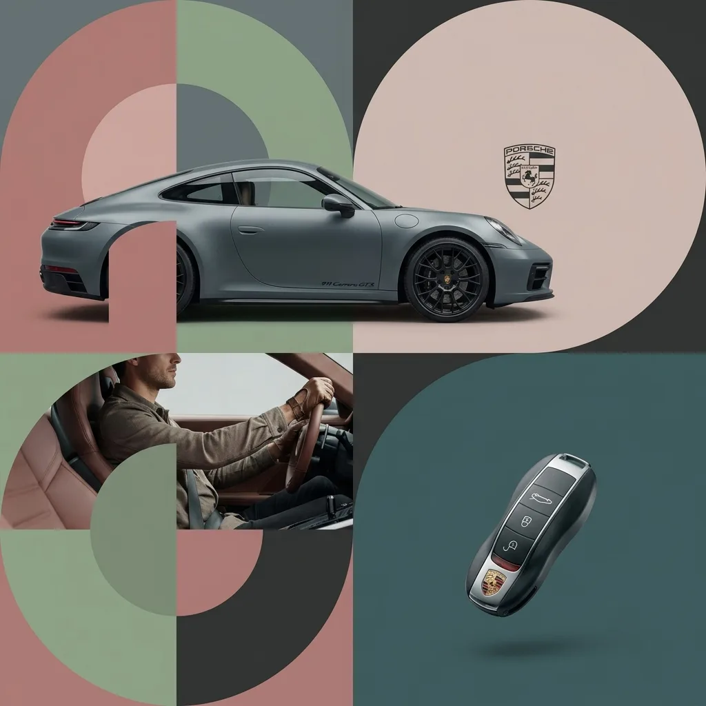

**#230 · Minimalist, Ai Art · <code>Vinano Image Pro</code>**

> Keywords: minimalist, AI art, AI prompt, text to image

<details>
<summary>Show prompt</summary>

```
[BRAND NAME]. Act as a World-Class Editorial Designer.

PHASE 1: DYNAMIC SUBJECT LOGIC.

- Subject Selection: Autonomously analyze [BRAND NAME].

- Layering (The Sandwich Effect): Interweave the subject background shapes. Some parts of the car/person must be hidden behind geometric blocks, while other parts (wheels, limbs, props) must overlap them to create 3D depth.

PHASE 2: GRID & GEOMETRY.

- Layout: A clean 2x2 grid composition.

- Overlays: Superimpose large, bold geometric arcs and circles over the grid.

- Visual Balance: Place one iconic product prop (e.g., a floating key fob for cars or a ball for sports) in a separate quadrant to balance the subject.

PHASE 3: SOPHISTICATED MUTED PALETTE.

- Color Direction: DO NOT use aggressive neon or oversaturated colors.

- Palette: Identify the core colors of [BRAND NAME] and shift them to a "Sophisticated Muted" spectrum.

- Tones: Use desaturated, earthy, or "dusty" versions of the brand colors (e.g., instead of hot pink, use dusty rose; instead of bright mint, use sage green; instead of royal blue, use slate blue).

- Finish: Matte, flat color blocks zero gradients.

PHASE 4: PHOTOGRAPHY & LIGHTING.

- Subject Style: High-end commercial studio photography.

- Lighting: Soft, diffused studio lighting gentle highlights. No harsh shadows.

- Integration: The subject must feel physically embedded into the graphic grid.

PHASE 5: refined minimalist BRANDING.

- Logo: Place a clean, single-color [BRAND NAME] logo in the center of one background block. No taglines, just the iconic symbol.

Emphasise material texture and natural light so the final frame feels tactile and premium.
```

</details>

---

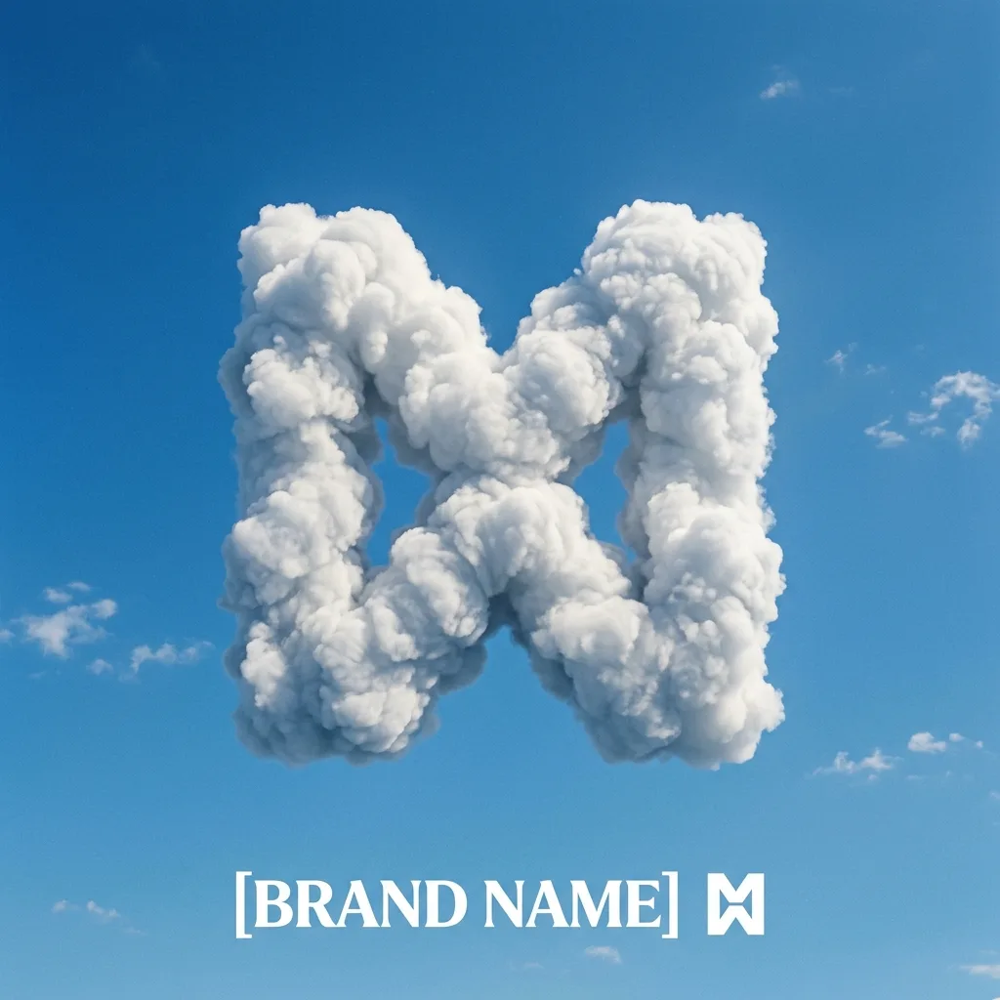

**#231 · Realistic, Cinematic · <code>Vinano Image Pro</code>**

> Keywords: realistic, cinematic, minimalist, AI art, AI prompt, text to image

<details>
<summary>Show prompt</summary>

```
[BRAND NAME]: The name of the brand.
Goal: Generate a single, refined minimalist, and surreal image where a cloud is shaped like the brand's logo.

1. THE LOGO CLOUD
- **Subject**: A massive, true-to-life photorealistic cumulus cloud in the exact geometric shape of the [BRAND NAME] logo.
- **Texture**: Puffy, soft, and voluminous natural sunlight illuminating the edges.
- **Volume**: 3D sculptural appearance realistic shadows within the cloud folds to show depth.

2. ENVIRONMENT & BACKGROUND
- **Sky**: A vast, clear, vibrant blue summer sky.
- **Secondary Elements**: A few small, wispy, natural clouds scattered far in the background to enhance the sense of scale and realism.
- **Lighting**: Bright, direct daylight coming from the side to create high-contrast highlights and shadows.

3. INTEGRATED BRANDING
- **Text**: The word "[BRAND NAME]" written in a clean, bold white sans-serif font.
- **Icon**: A small, flat white version of the brand's logo placed next to the text.
- **Positioning**: The branding (text + logo) is centered at the bottom of the frame, acting as a subtle anchor to the giant cloud above.

4. STYLE
- Surrealist photography, ultra-refined minimalist composition, high resolution, 8k, cinematic look, clean and airy vibe.

Keep edges clean and the overall composition balanced for a polished, gallery-ready result.
```

</details>

---

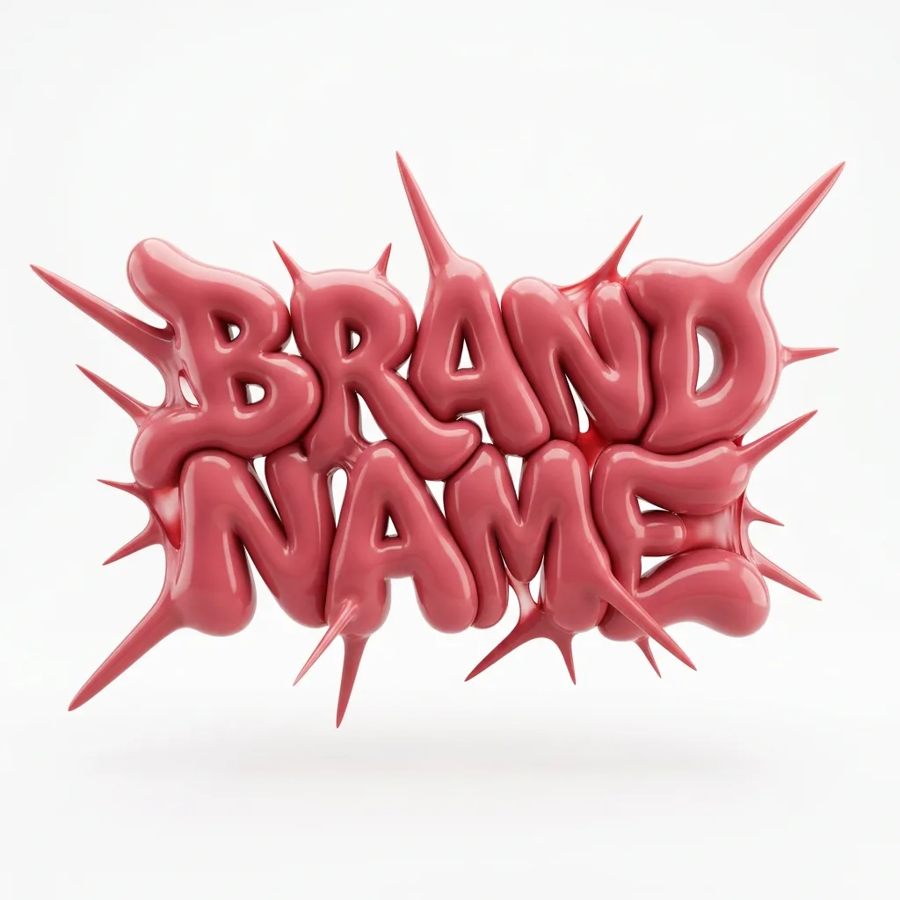

**#232 · Ai Art, Ai Prompt · <code>Vinano Image Pro</code>**

> Keywords: AI art, AI prompt, text to image

<details>
<summary>Show prompt</summary>

```
[BRAND NAME] | [COLOR]

Act as a 3D Type Designer and CGI Artist working at the intersection of streetwear culture, Y2K aesthetics, and high-end digital sculpture. Your references: Nigo, Futura, Guccimaze, Soulwax art direction.

---

PHASE 1: TYPOGRAPHIC CONCEPT

Render the word or logotype [BRAND NAME] as a fully 3D sculptural object — not a flat text extrusion, but a living, inflated, organic type sculpture. Style: Wildstyle graffiti DNA fused inflatable balloon morphology. Letters are not separate — they flow into each other as one continuous organic mass. Each letterform has: bulbous pneumatic body as if inflated under high pressure from within, stretching the surface taut. Aggressive spike extensions — sharp tapered protrusions erupting between and around letters, directional, asymmetric, energetic, some long and blade-like, others short and thorn-like. Wildstyle overlaps — letters partially occlude each other creating depth layers, classic graffiti ambiguity where readability fights visual complexity. Organic connective tissue — negative spaces between letters filled stretched membrane forms, like rubber pulled between two inflated surfaces.

---

PHASE 2: MATERIAL & SURFACE

Single unified material across the entire sculpture — no color variation between letters. Material type: high-gloss latex / inflated rubber / soft silicone — the surface behaves like a balloon skin stretched to near-bursting point. Subsurface scattering: active — light penetrates slightly into the material, creating a translucent inner glow at thin edges and spike tips. Thinner areas read lighter, denser volumes read darker. Specular highlights: large, soft, slightly elongated — the kind you get on inflated latex, not hard plastic. Multiple secondary highlights in concave zones. Apply [COLOR] as the sole material color of the entire sculpture — this is non-negotiable. [COLOR] defines the pure midtone of the material. Highlights push toward the most luminous near-white version of [COLOR]. Shadow zones and deep crevices push toward the darkest most saturated version of [COLOR]. The entire chromatic range of the sculpture lives within the [COLOR] family — no hue deviation, no neutral grays.

---

PHASE 3: COMPOSITION & STAGING

Background: pure white (#FFFFFF) — clinical studio isolation. Zero texture, zero gradient. Shadow: none, or absolute minimum contact shadow directly beneath the sculpture — the object appears to float slightly. Orientation: horizontal spread — the sculpture is wider than tall, expanding laterally. Spike elements breach the invisible bounding box on all sides — top spikes reach upward, side extensions push outward. Camera angle: straight-on frontal, slightly elevated 5 to 10° above center — reveals the full typographic mass while showing the 3D depth of overlapping elements. Depth of field: none — sharp from foreground spikes to background letter bodies, every detail in focus. Scale feel: monumental — as if the sculpture is 2 meters wide in physical space, photographed in a white infinity studio.

---

PHASE 4: TECH SPECS

Render engine: Octane Render or Redshift — physically accurate subsurface scattering mandatory. Global illumination: large soft HDRI dome light, neutral white temperature 5500K. No directional shadows. No rim lights. No background elements. Ray tracing: on — for accurate specular and inter-reflection between letter surfaces. Anti-aliasing: maximum — edges must be razor-clean against white background. Output feel: this is a CGI product render, not AI art. Precision over expressionism. Aspect ratio: 1:1 square — centered composition breathing room on all four sides.

Maintain consistent colour harmony and crisp focus across the whole frame.
```

</details>

---

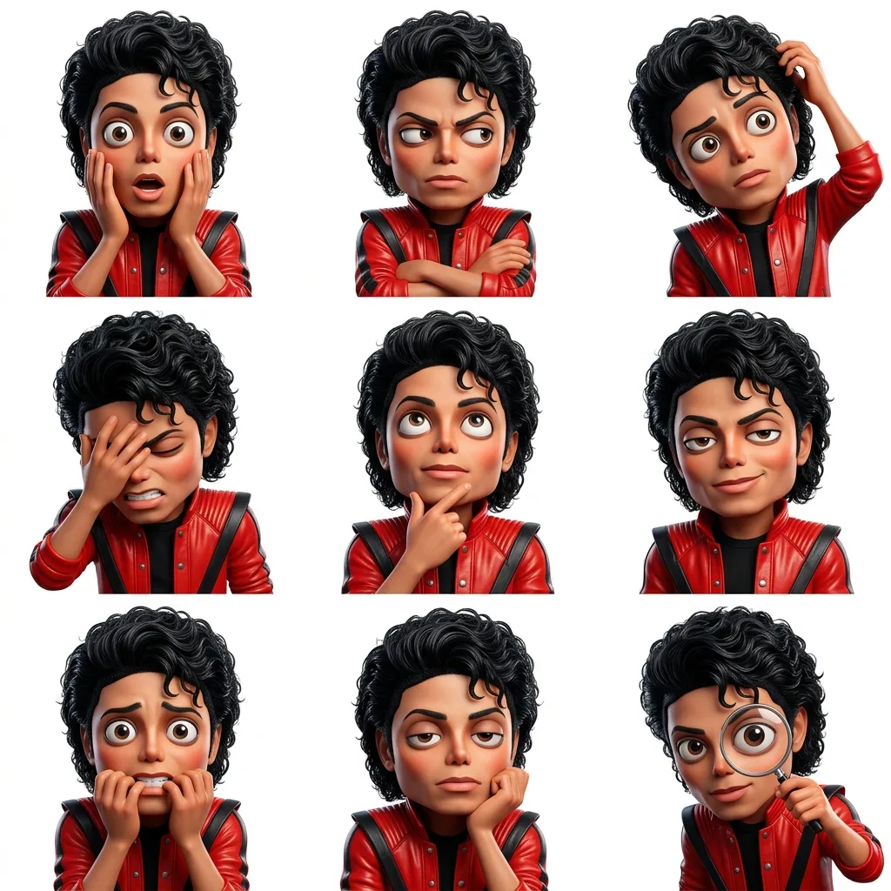

**#233 · Character, Ai Art · <code>Vinano Image Pro</code>**

> Keywords: character, AI art, AI prompt, text to image

<details>
<summary>Show prompt</summary>

```
{
 "project_metadata": {
 "title": "Michael Jackson Pixar Sticker Set",
 "output_format": "3x3 Grid Collage",
 "total_cells": 9,
 "target_aspect_ratio": "4:5",
 "rendering_engine": "Unreal Engine 5 / Octane Render Style"
 },
 "global_character_assets": {
 "identity": "Michael Jackson (Pixar-Style 3D Caricature)",
 "facial_base": "Reference provided selfie for bone structure and likeness",
 "hair_definition": "High-poly black curls, signature 'wet-look' sheen, high volume",
 "wardrobe": {
 "jacket": "Iconic Red Thriller Jacket",
 "details": "Black V-shaped straps, high-gloss leather texture, silver buttons",
 "undershirt": "Black crew neck"
 },
 "anatomical_proportions": {
 "head_to_body_ratio": "1:3 (Chibi-influenced Pixar scale)",
 "eye_scale": "Exaggerated/Large for high readability",
 "skin_shader": "Subsurface scattering, warm peach tones, polished finish"
 }
 },
 "grid_layout_definition": {
 "row_1": {
 "cell_1": { "emotion": "Surprised", "pose": "Hands touching cheeks, wide eyes, O-shaped mouth" },
 "cell_2": { "emotion": "Annoyed", "pose": "Arms crossed, sharp side-eye, furrowed brow" },
 "cell_3": { "emotion": "Confused", "pose": "Head tilted 45 degrees, one hand scratching head" }
 },
 "row_2": {
 "cell_4": { "emotion": "Frustrated", "pose": "Facepalming one hand, clenched jaw" },
 "cell_5": { "emotion": "Thoughtful", "pose": "Finger on chin, looking up, dreaming expression" },
 "cell_6": { "emotion": "Sarcastic", "pose": "Raised eyebrow, smirk, one eye slightly squinted" }
 },
 "row_3": {
 "cell_7": { "emotion": "Worried", "pose": "Biting nails, hunched shoulders, dilated pupils" },
 "cell_8": { "emotion": "Bored", "pose": "Chin resting in palm, heavy eyelids, neutral mouth" },
 "cell_9": { "emotion": "Curious", "pose": "Leaning toward camera, magnifying glass gesture" }
 }
 },
 "environment_and_lighting": {
 "background": "Solid pure white, zero shadows, isolated for PNG extraction",
 "lighting_setup": "Three-point studio lighting, high-contrast rim light, soft key light",
 "negative_constraints": ["No text", "No logos", "No background elements", "No speech bubbles", "No UI"]
 }
}

Emphasise material texture and natural light so the final frame feels tactile and premium.
```

</details>

---

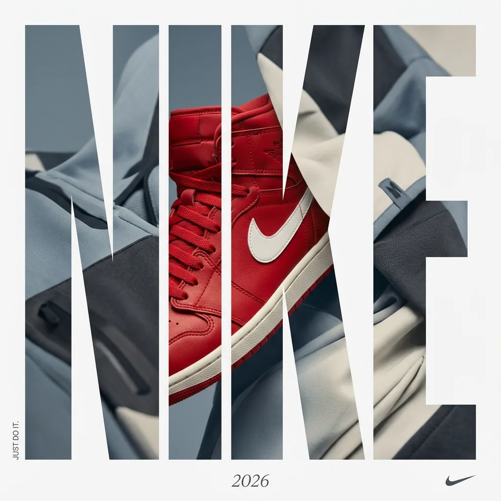

**#234 · Cinematic, Minimalist · <code>Vinano Image Pro</code>**

> Keywords: cinematic, minimalist, AI art, AI prompt, text to image

<details>
<summary>Show prompt</summary>

```
[BRAND NAME]. Act as a Senior Editorial Designer and Typographer.

PHASE 1: TYPOGRAPHIC MASK (THE "WINDOW" EFFECT).

- Core Element: Use the most iconic slogan or the name of [BRAND NAME] as a massive, ultra-bold, heavy sans-serif typographic mask.

- Layout: The letters must be giant, filling the entire vertical frame from edge to edge tight kerning.

- Concept: The text acts as a "cut-out" window. The background is solid white, and the photographic subject is visible ONLY through the letterforms.

PHASE 2: DYNAMIC SUBJECT LOGIC.

- Subject Selection:

- Detail: Ensure a high-contrast element (like a red shoe or a glowing headlight) is visible through one of the letters as a focal point.

PHASE 3: SOPHISTICATED MUTED PALETTE.

- Atmosphere: Use a "Refined Muted" color scheme.

- Tones: Soft slate blues, charcoal greys, and creamy off-whites for the photography inside the mask.

- Accent: Identify one sharp, saturated accent color belonging to [BRAND NAME] and apply it to a single key object visible through the text.

PHASE 4: PHOTOGRAPHY & LIGHTING.

- Lighting: Soft-box studio lighting. Diffused shadows and gentle highlights to create a cinematic, high-end editorial feel.

- Finish: Clean, matte texture zero visual noise. High-definition photographic quality.

PHASE 5: refined minimalist BRANDING.

- Accents: Add a tiny refined minimalist logo and a small vertical tagline in a clean, microscopic sans-serif font near the corners.

- Year: Include the year "2026" in a subtle, elegant font to mimic a limited-edition look.

Render with rich micro-detail while keeping the layout uncluttered and intentional.
```

</details>

---

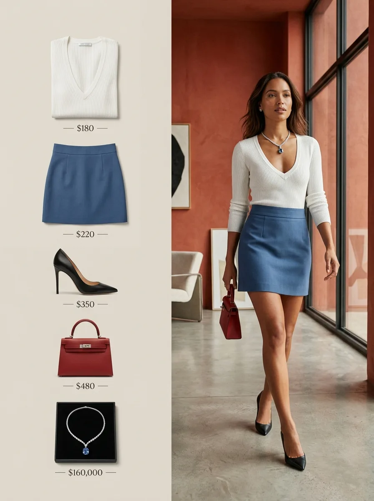

**#235 · Realistic, Cinematic · <code>Vinano Image Pro</code>**

> Keywords: realistic, cinematic, minimalist, AI art, AI prompt, text to image

<details>
<summary>Show prompt</summary>

```
A refined fashion editorial image a 3:4 aspect ratio, split into two clear sections.

Right side:
A fashionable, confident, sensual woman standing and walking casually in a modern architectural space red luxurious walls and soft natural light. She wears a top a deep V neckline, a 90-60-90 figure, tucked into a high-waisted blue tailored short skirt, On her feet are sleek black stiletto heels, elegant and minimal. She carries a small structured red handbag in one hand and she is wearing a luxurious diamond necklace a blue diamond on it.

Her hair is open emphasizing her facial structure. She wears subtle statement earrings. The look is refined, modern, and effortlessly chic. Natural daylight, soft shadows, realistic skin texture. Casual fashion photography style an editorial, high-end feel. alive color palette, warm tones, shallow depth of field, cinematic realism.

Style & Mood:
Modern elegance, quiet luxury, confident, minimal, editorial casual.

Photography Details:
Eye-level angle, candid stance, 35mm lens, natural lighting, high detail, true-to-life photorealistic.

Left side:
A clean, refined minimalist product breakdown layout on a neutral background. The individual fashion items worn by the woman are displayed separately, neatly arranged subtle shadows. Each item includes a small, elegant price label in refined sans-serif typography:

– white deep V-neck knit top — $180
– blue high-waisted tailored mini skirt — $220
– Black pointed-toe stiletto heels — $350
– Small structured red handbag — $480
– a diamond necklace a big blue diamond — $160000

The left side feels like a luxury fashion catalog or e-commerce lookbook, a red carpet, luxurious walls, art pieces on wall

Overall Style & Mood:
Quiet luxury, modern elegance, editorial fashion, high-end retail aesthetic.

Lighting & Quality:
Soft natural light, studio-clean clarity on product side, true-to-life photorealistic, ultra-high resolution, professional fashion photography.

Negative Prompt:
Cluttered layout, oversized text, flashy logos, mannequins, people on left side, harsh lighting, low resolution, cartoon style.

Emphasise material texture and natural light so the final frame feels tactile and premium.
```

</details>

---

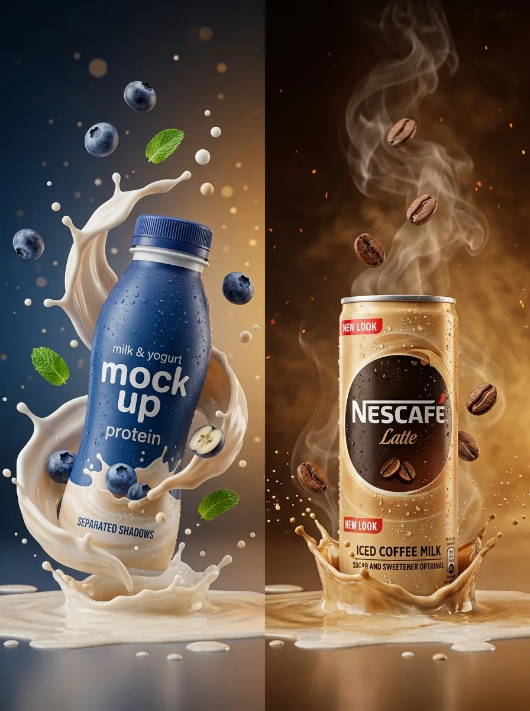

**#236 · Realistic, Product Photography · <code>Vinano Image Pro</code>**

> Keywords: realistic, product photography, cinematic, AI art, AI prompt, text to image

<details>
<summary>Show prompt</summary>

```
{
 "master_prompt": {
 "global_settings": {
 "resolution": "8K ultra-high-definition",
 "aspect_ratio": "3:4 vertical",
 "style": "hyper-realistic AI-edited commercial product photography",
 "sharpness": "extreme clarity, micro-detail visibility",
 "lighting_quality": "cinematic studio lighting controlled highlights and shadows",
 "motion_freeze": "high-speed capture, frozen splashes and particles",
 "noise": "none",
 "artifacts": "none"
 },

"module_1_image_1_style": {
 "subject": {
 "type": "plastic protein drink bottle",
 "color": "deep matte blue",
 "surface_details": "condensation droplets across entire bottle",
 "label_text_visible": ["milk & yogurt",
 "mock up",
 "protein",
 "SEPARATED SHADOWS"]
 },
 "pose_and_orientation": {
 "position": "slightly tilted to the right",
 "angle": "three-quarter view",
 "motion_feel": "dynamic, leaning into splash"
 },
 "liquid_and_motion": {
 "liquid_color": "white and light beige milk mixture",
 "texture": "smooth, creamy, fluid",
 "motion": "swirling splash rising around bottle base and sides"
 },
 "floating_elements": {
 "blueberries": "whole and halved blueberries at different depths",
 "mint_leaves": "small green leaves visible veins",
 "droplets": "milk droplets and spheres suspended mid-air"
 },
 "background": {
 "color_gradient": "dark blue to warm amber",
 "bokeh": "soft circular light particles scattered throughout"
 },
 "surface_and_reflection": {
 "base": "matte ground light liquid pooling",
 "shadow_style": "soft separated shadow under bottle"
 }
 },
"module_2_image_2_style": {
 "subject": {
 "type": "metal coffee can",
 "color": "warm gold",
 "surface_details": "heavy condensation visible droplets",
 "branding_text_visible": ["NESCAFÉ",
 "Latte",
 "NEW LOOK",
 "ICED COFFEE MILK",
 "SUGAR AND SWEETENER OPTIONAL"]
 },
 "pose_and_orientation": {
 "position": "upright, centered",
 "angle": "front-facing",
 "presence": "hero product stance"
 },
 "liquid_and_motion": {
 "liquid_color": "coffee and milk blend",
 "motion": "splash erupting from base",
 "droplet_behavior": "fine droplets scattered outward"
 },
 "floating_elements": {
 "coffee_beans": "whole roasted beans floating around can",
 "steam": "thick swirling steam rising upward",
 "embers": "tiny glowing particles in background"
 },
 "background": {
 "color_palette": "deep brown, amber, gold",
 "atmosphere": "warm, smoky, intense"
 },
 "surface_and_reflection": {
 "base": "wet surface liquid splash crown",
 "reflection_quality": "subtle reflective highlights"
 }
 }

Emphasise material texture and natural light so the final frame feels tactile and premium.
```

</details>

---

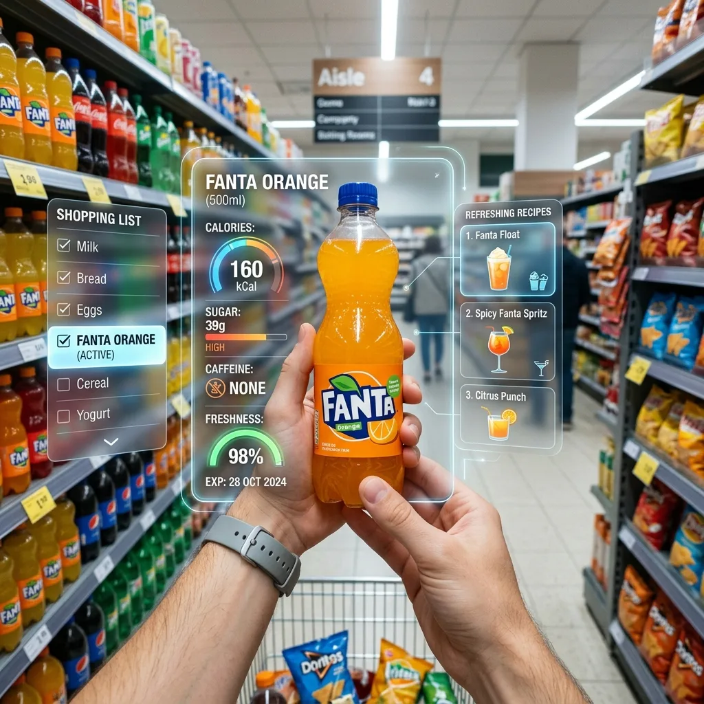

**#237 · Realistic, Ai Art · <code>Vinano Image Pro</code>**

> Keywords: realistic, AI art, AI prompt, text to image

<details>
<summary>Show prompt</summary>

```
First-person perspective inside a brightly lit supermarket aisle. Realistic human hands are holding a bottle of Fanta soda close to the camera. The vivid orange drink in its iconic branded bottle is surrounded by a multi-layered holographic augmented reality interface displaying nutritional data, including calorie count, sugar content, caffeine level, freshness indicator, expiration date, and recommended refreshing recipes and cocktails based on Fanta.
The UI elements smoothly shift and reorganize based on the viewer’s gaze direction, as if dynamically responding to user focus. In the left peripheral vision, a vertical semi-transparent shopping list is visible checked-off items, where Fanta is highlighted as the currently active selection.
Hyper-realistic mixed reality, clean futuristic AR design, glass-like UI panels, soft ambient glow, realistic lighting and shadows, natural depth of field, immersive first-person interface, showcasing next-generation retail technology.

Maintain consistent colour harmony and crisp focus across the whole frame.
```

</details>

---

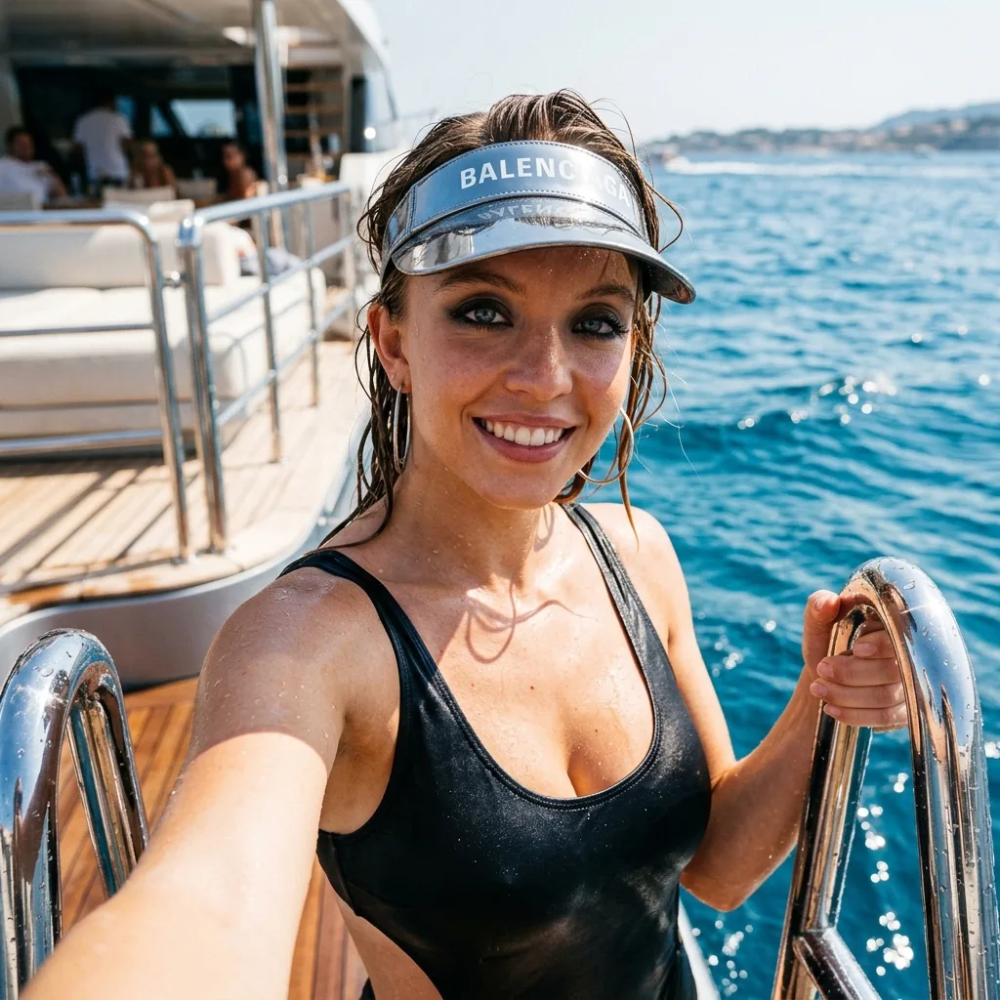

**#238 · Realistic, Ai Art · <code>Vinano Image Pro</code>**

> Keywords: realistic, AI art, AI prompt, text to image

<details>
<summary>Show prompt</summary>

```
{
 "style": "hyper-realistic, ultra-detailed photography",
 "subject": {
 "identity": "Sydney Sweeney",
 "description": "Do not alter facial features, preserve Sydney Sweeney’s recognizable appearance",
 "pose": "selfie perspective, handheld, eye-level"
 },
 "physical_features": {
 "hair": "dark blonde to light brown, wet hair",
 "skin": "sun-kissed, wet skin",
 "face": "soft facial features, full lips, expressive eyes",
 "makeup": "dark eye makeup, long expressive eyelashes"
 },
 "clothing_and_accessories": {
 "outfit": "black glossy one-piece swimsuit side cutouts, synthetic shiny fabric",
 "accessories": ["silver reflective visor BALENCIAGA logo",
 "large silver hoop earrings"]
 },
 "scene_and_location": {
 "location": "luxury yacht in open water",
 "objects": ["polished metal yacht ladder",
 "sparkling blue water"],
 "background": "blurred luxury yacht, distant shore or marina"
 },
 "composition": {
 "foreground": "woman’s face, upper body, right arm and hand holding the metal ladder",
 "background": "softly blurred yacht and water",
 "shot_type": "close-up selfie, upper body",
 "lens": "wide-angle lens"
 },
 "lighting_and_color": {
 "lighting": "bright natural sunlight",
 "contrast": "high contrast",
 "effects": "strong water highlights, reflections on metal and plastic",
 "colors": "vivid, saturated colors"
 },
 "camera_settings": {
 "depth_of_field": "shallow depth of field",
 "focus": "subject in sharp focus, background softly blurred",
 "style_notes": "fashion photography, luxury lifestyle"
 },
 "material_textures": {
 "fabric": "synthetic shiny swimsuit fabric",
 "metal": "polished reflective metal (ladder, earrings)",
 "plastic": "reflective plastic visor",
 "water": "clear, sparkling water"
 },
 "final_touches": {
 "weather": "sunny weather",
 "skin": "light skin smoothing",
 "overall_feel": "luxury, summer, glamorous yacht aesthetic"
 }
}

Emphasise material texture and natural light so the final frame feels tactile and premium.
```

</details>

---

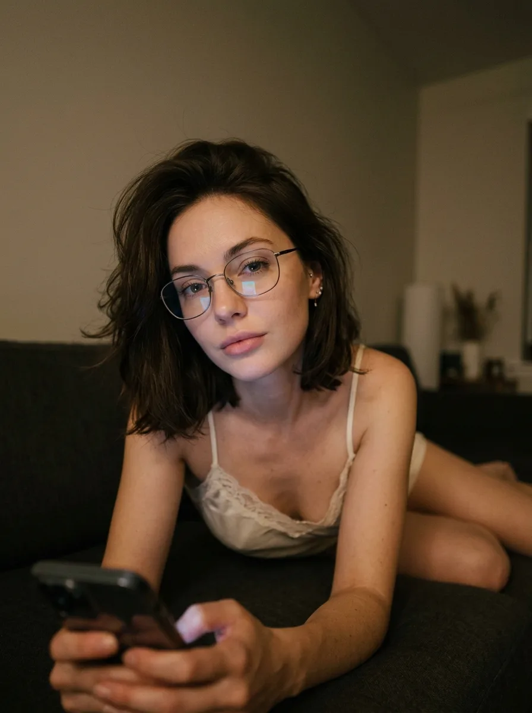

**#239 · Realistic, Portrait · <code>Vinano Image Pro</code>**

> Keywords: realistic, portrait, AI art, AI prompt, text to image

<details>
<summary>Show prompt</summary>

```
{ "subject": { "description": "A young adult woman soft refined features, thin metal glasses, and shoulder-length dark hair, leaning across a couch at night while holding a smartphone, captured in a quiet low-light candid moment.", "mirror_rules": "not a mirror shot", "age": "young adult", "expression": { "eyes": { "look": "soft, slightly tired, subtly attentive", "energy": "low-key and intimate", "direction": "toward the camera, as if she just looked up from her phone" }, "mouth": { "position": "gently closed a relaxed pout", "energy": "quiet and unforced" }, "overall": "a dreamy late-night expression, calm, distant, and mildly seductive without exaggeration" }, "face": { "preserve_original": "keep the face proportions delicate and realistic, a narrow jawline, soft cheeks, defined eyes, glossy lips, and no exaggerated facial distortion", "makeup": "soft glam makeup, subtle eyeliner, long lashes, smooth skin finish, glossy pink-nude lips, lightly defined brows" } }, "hair": { "color": "dark brown to black", "style": "shoulder-length, loose, softly tousled slight volume around the crown", "effect": "natural flyaways and soft separation, not overly polished" }, "body": { "frame": "slim and softly curved", "waist": "gently defined", "chest": "natural and softly framed by the neckline", "legs": "bare, partially folded and extending out of frame", "skin": { "visible_areas": "shoulders, collarbone, arms, upper chest, thighs, lower legs", "tone": "fair a warm indoor cast", "texture": "smooth, velvety, lightly softened by low light and lens blur", "lighting_effect": "warm ambient light on the skin faint cool phone-screen reflections near the face and hands" } }, "pose": { "position": "leaning forward across a couch, one arm supporting the body, the other hand holding a phone in the foreground", "base": "casual lounging posture caught mid-movement", "overall": "informal, intimate, slightly off-balance, as if she paused while scrolling and looked up" }, "clothing": { "top": { "type": "lace-trim camisole or slip-style sleepwear", "color": "pale cream a soft blush tint", "details": "thin straps, delicate lace texture, soft fitted bodice, lightweight fabric", "effect": "sleepwear-like softness, feminine and understated" }, "bottom": { "type": "matching soft shorts or the lower part of a slip", "color": "pale cream", "details": "mostly obscured, softly wrinkled fabric, blending into the pose" } }, "accessories": { "jewelry": "small subtle earrings", "device": "smartphone held close to the camera, dark reflective case, screen glow lighting the fingers", "prop": "thin metal-framed eyeglasses visible screen reflections on the lenses" }, "photography": { "camera_style": "realistic social-media night portrait, smartphone candid aesthetic", "angle": "slightly above eye level, close and intimate, the phone hand entering the foreground", "shot_type": "medium close-up to three-quarter portrait in vertical framing", "aspect_ratio": "3:4 vertical", "texture": "soft focus, slight motion blur, low-light grain, gentle facial smoothing from dim conditions, natural imperfect sharpness", "lighting": "dim warm room light mixed cool phone-screen reflections, no hard flash, soft falloff across the couch and wall", "depth_of_field": "shallow to moderate, face prioritized but softened, foreground hand and phone slightly blurred" }, "background": { "setting": "an indoor living room or lounge at night", "wall_color": "warm beige-gray", "elements": ["dark upholstered couch", "plain softly lit wall", "minimal visible decor"], "atmosphere": "quiet, private, late-night, softly blurred and still", "lighting": "very low ambient tungsten-like room light shadows pooling in the background" }, "the_vibe": { "energy": "slow, hushed, intimate", "mood": "late-night pause, private and emotionally suspended", "aesthetic": "realistic social-media softness, low-light candid beauty, imperfect but magnetic", "authenticity": "retain the accidental blur, the off-center body angle, the screen glare on the glasses, and the lived-in couch posture", "intimacy": "close enough to feel the warmth of the room and the softness of fabric against skin", "story": "She had been scrolling in silence, then something made her stop and lift her eyes for one quiet second.", "caption_energy": "soft nocturnal allure, unspoken attention, the kind of moment that feels borrowed rather than staged" }, "constraints": { "must_keep": ["young adult woman", "thin metal glasses", "visible screen reflections on the lenses", "smartphone in hand close to the foreground", "dark shoulder-length tousled hair", "pale lace-trim sleepwear", "leaning across a couch", "warm dim indoor night lighting", "soft blur and low-light texture", "minimal beige-gray wall and dark couch background"], "avoid": ["studio lighting", "hard flash", "over-sharpened skin", "perfect commercial glamour retouching", "extra background clutter", "bright daylight", "mirror selfie composition", "heavy accessories", "exaggerated body proportions", "watermarks, logos, extra text"] }, "negative_prompt": ["mirror selfie", "hard flash", "studio backdrop", "ultra sharp DSLR clarity", "over-retouched skin", "cartoonish face", "exaggerated anatomy", "extra fingers", "deformed hands", "heavy jewelry", "busy room", "daylight window light", "smiling broadly", "strong action pose", "symmetrical formal composition", "text overlay", "watermark", "logo"] } Render with rich micro-detail while keeping the layout uncluttered and intentional.
```

</details>

---

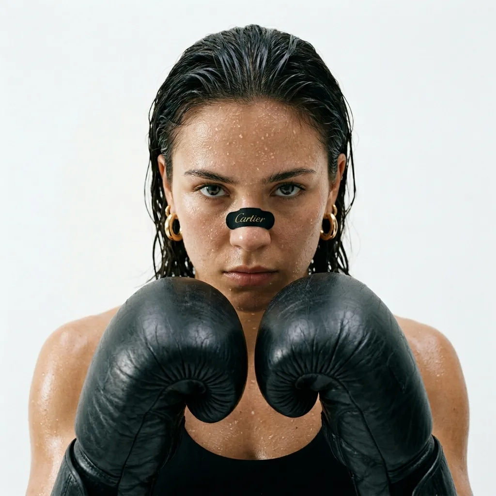

**#240 · Character, Cinematic · <code>Vinano Image Pro</code>**

> Keywords: character, cinematic, minimalist, AI art, AI prompt, text to image

<details>
<summary>Show prompt</summary>

```
{
"shot": {
"composition": "Cinematic close-up, 50mm lens, shot on ARRI Alexa LF, center-framed, symmetrical head-on angle",
"camera_motion": "static camera",
"frame_rate": "24fps",
"film_grain": "clean digital subtle texture"
},
"subject": {
"description": "A young female boxer a piercing gaze, wet dark hair slicked back, skin glistening sweat. A black sports sticker the Cartier logo on her nose, gold hoop earrings on her ears, and black boxing gloves raised in front of her face in a fighting stance.",
"wardrobe": "refined minimalist athletic look: gold Cartier earrings, black leather boxing gloves, dewy skin without makeup."
},
"scene": {
"location": "a studio a clean White background",
"time_of_day": "neutral daylight",
"environment": "a smooth white background without shadows or unnecessary details—the focus is on the face and brand"
},
"visual_details": {
"action": "A woman looks directly into the camera cool concentration. Beads of sweat are on her face. She remains motionless, her gaze intense and purposeful.",
"props": "A black sticker on the nose the Cartier inscription, boxing gloves"
},
"cinematography": {
"lighting": "bright directional light from the front, highlighting beads of sweat and skin texture",
"tone": "a glamorous and austere style, a balance of strength and style"
},
"audio": {
"ambient": "a dull heartbeat, breathing, the short sound of gloves stretching as a fist is clenched"
},
"color_palette": "Black and white contrast gold accents, leather in natural, warm tones,"
"dialogue": {
"character": "Boxer,"
"line": "You either take a punch... or jewelry is just a mask for you.",
"subtitles": false
}
}

Keep edges clean and the overall composition balanced for a polished, gallery-ready result.
```

</details>

---

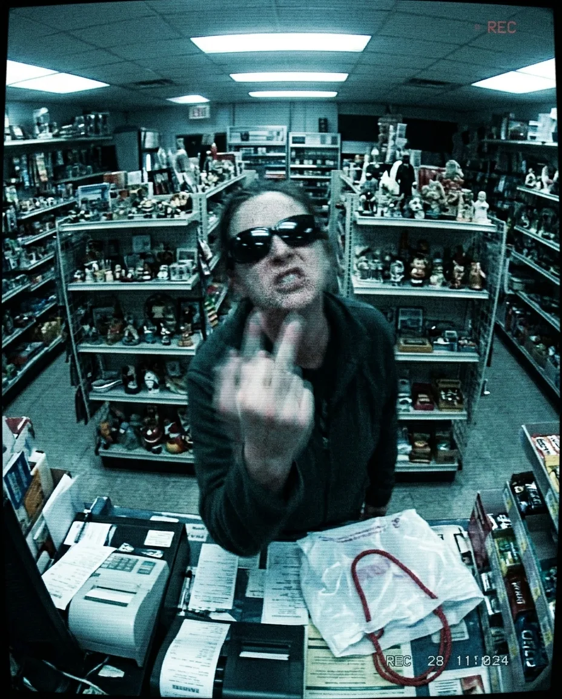

**#241 · Ai Art, Ai Prompt · <code>Vinano Image Pro</code>**

> Keywords: AI art, AI prompt, text to image

<details>
<summary>Show prompt</summary>

```
{
 "image_description": {
 "title": "Surveillance Feed: Defiant Subject in Retail Shop",
 "aspect_ratio": "4:5",
 "mood": "Raw, gritty, confrontational, authentic"
 },
 "visual_elements": {
 "subject": {
 "framing": "Centered from mid-torso upward",
 "pose": "Head tilted back looking up at camera, relaxed yet defiant posture",
 "action": "Hand raised middle finger extended (silhouette, ghosted by motion)",
 "facial_features": "Largely obscured by blur, mouth open tongue faintly visible",
 "apparel": "Dark oversized sunglasses reflecting ambient light"
 },
 "environment": {
 "location": "Cramped retail shop interior",
 "foreground": "Cluttered checkout counter, papers, white shopping bag red rope handles",
 "background": "Densely packed shelves small items, souvenirs, and figurines (abstracted by low resolution)"
 }
 },
 "technical_specifications": {
 "camera_perspective": "High-mounted, steep downward angle, top-down CCTV view",
 "lens_distortion": "Subtle fisheye warping at frame edges",
 "lighting": "Harsh flat fluorescent, blown highlights, dull shadows",
 "color_grading": "Cool green-blue cast, uneven color reproduction, visible banding, reduced dynamic range"
 },
 "image_fidelity": {
 "quality": "Intentionally degraded, low-fidelity",
 "artifacts": ["Strong motion blur",
 "Digital smearing",
 "Compression artifacts",
 "Heavy noise",
 "Scan lines"],
 "sharpness": "Low perceived sharpness, distinct details stretched and indistinct"
 },
 "full_prompt_text": "A heavily distorted, low-fidelity surveillance-style image depicts the Subject standing behind a cramped retail checkout counter inside a cluttered shop, captured from a high-mounted camera angled steeply downward in a top-down CCTV perspective. The image quality is intentionally degraded, strong motion blur, digital smearing, compression artifacts, heavy noise, scan lines, and subtle fisheye distortion warping the frame edges, making fine details indistinct and stretched. The Subject is centered from mid-torso upward, looking up toward the camera the head tilted back; facial features are largely obscured by blur and artifacts, though dark oversized sunglasses dominate the face, reflecting ambient light, and the mouth appears open the tongue faintly visible. One hand is raised toward the camera the middle finger extended, clearly readable in silhouette but softened and ghosted by motion and low clarity, conveying a relaxed yet defiant posture. The foreground checkout counter is cluttered papers and a white shopping bag red rope handles, while the background shelves are densely packed small items, souvenirs, and figurines that blend into abstract shapes due to low resolution and noise. Harsh, flat fluorescent lighting produces blown highlights, dull shadows, uneven color reproduction, and a cool green-blue color cast visible banding and reduced dynamic range. Despite an effectively deep depth of field, perceived sharpness remains low, reinforcing a raw, gritty, confrontational mood that emphasizes the authenticity of an unpolished, unenhanced surveillance feed in a vertical 4:5 aspect ratio"
}

Render with rich micro-detail while keeping the layout uncluttered and intentional.
```

</details>

---

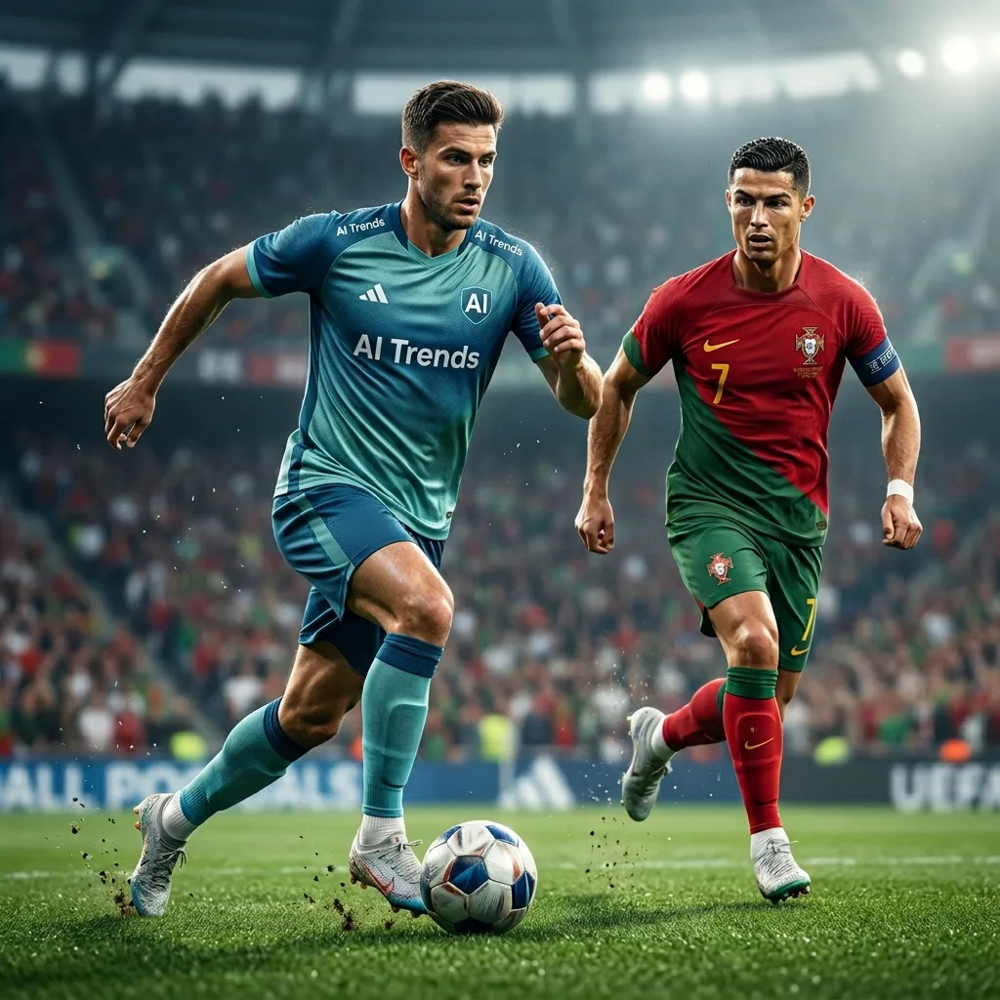

**#242 · Realistic, Cinematic · <code>Vinano Image Pro</code>**

> Keywords: realistic, cinematic, AI art, AI prompt, text to image

<details>
<summary>Show prompt</summary>

```
{
A hyper-realistic, ultra-detailed 8K cinematic wide-shot of a football scene, captured from a dramatic low-angle perspective a wide-angle lens and shallow depth of field, emphasizing speed, power, and realism.

The scene features only two players on a professional football pitch.
The primary player, positioned slightly ahead and in control of the ball, is dribbling explosive movement and confident body language. His face is generated the uploaded face as reference (100% likeness).

He wears an ultra-realistic AI Trends football kit, designed like a top-tier international club jersey. The kit has a blue-green gradient finish, breathable performance fabric, and subtle geometric textures. “AI Trends” branding is printed boldly on the chest and both shoulders in premium sports typography. The fabric reacts naturally to motion, showing realistic folds, tension, and subtle sweat details, giving a luxury global campaign aesthetic.

Running beside him is Cristiano Ronaldo, wearing his iconic classic football kit, instantly recognizable by its design, colors, and number. Cristiano is not holding the ball. He matches pace powerfully, positioned slightly to the side, ready for a decisive run or finish.

No other players are on the field.

The grass pitch is extremely detailed, visible blades, dirt particles, and subtle turf displacement beneath their feet. Water droplets and dust rise each step, enhancing motion realism.
The background features a massive stadium a softly blurred crowd, cinematic depth, and powerful volumetric lighting creating dramatic rim light around both players. Subtle motion blur enhances speed while both faces remain sharp and detailed.
The mood is powerful and cinematic, resembling a high-budget sports film still and a premium AI Trends global campaign, natural color grading, hyper-realistic textures, and professional sports photography aesthetics.

Preserve realistic proportions and depth for a confident, professional finish.
```

</details>

---

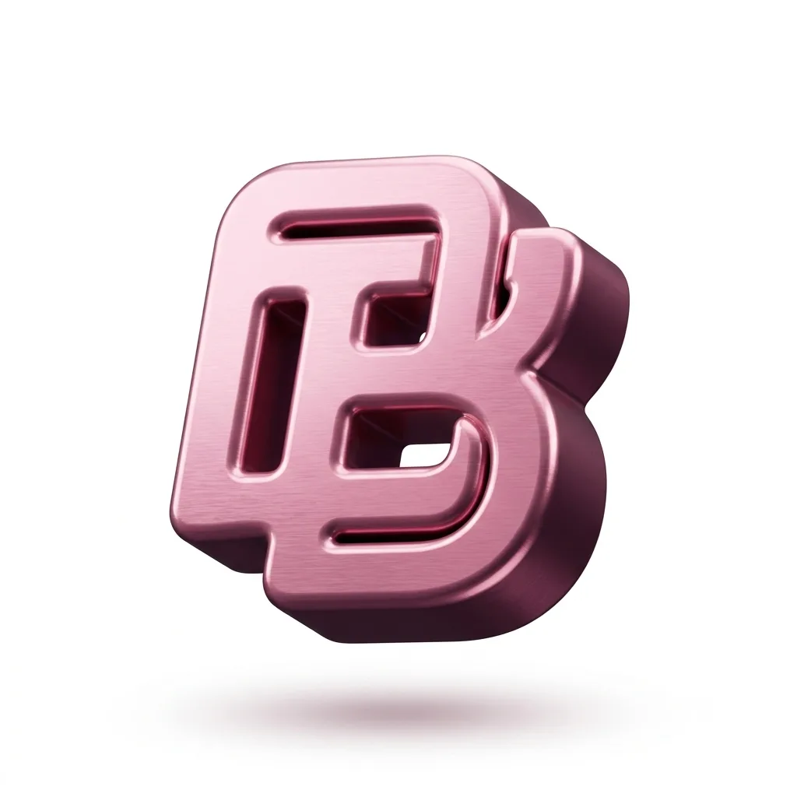

**#243 · Product Photography, Ai Art · <code>Vinano Image Pro</code>**

> Keywords: product photography, AI art, AI prompt, text to image

<details>
<summary>Show prompt</summary>

```
[BRAND NAME]. Act as a 3D Product Visualization Artist.

PHASE 1: LOGO TO 3D OBJECT

Take the [BRAND NAME] logo and transform it into a thick 3D sculptural form. Simplify to core shape, add rounded edges (8-12mm fillet), make it one solid piece 40-60mm depth. Keep it recognizable.

PHASE 2: PINK METALLIC MATERIAL

- Color: Pink metallic (#C85A8E to #8B4A6F range)

- Finish: Glossy brushed metal fine grain

- Highlights: Light pink (#E89BB8)

- Shadows: Deep plum (#6B3854)

- Roughness: 0.2 (shiny but not mirror)

- NO copper, NO gold, NO silver

PHASE 3: LIGHTING

Soft studio lighting from top-left creating smooth gradient across the object. Light pink on highlights, deep plum in shadows. No hard shadows.

PHASE 4: BACKGROUND & FLOATING

- Pure white background (#FFFFFF)

- Object levitating in white void

- Soft blurred shadow underneath (90% transparent)

- NO pedestals, NO stands, NO supports

PHASE 5: CAMERA

Slight 3/4 angle, looking down 10°, object centered, filling 60% of frame.

TECH SPECS:

- premium-quality 3D render (Octane/Cycles)

- 4K resolution

- Full object in focus

- Subtle bloom on highlights

CRITICAL:

- Must be PINK metallic only

- Must float in pure white space

- Must have thick 3D volume smooth surfaces

- Must look like luxury product photography

Aim for an editorial, design-driven look with deliberate negative space.
```

</details>

---

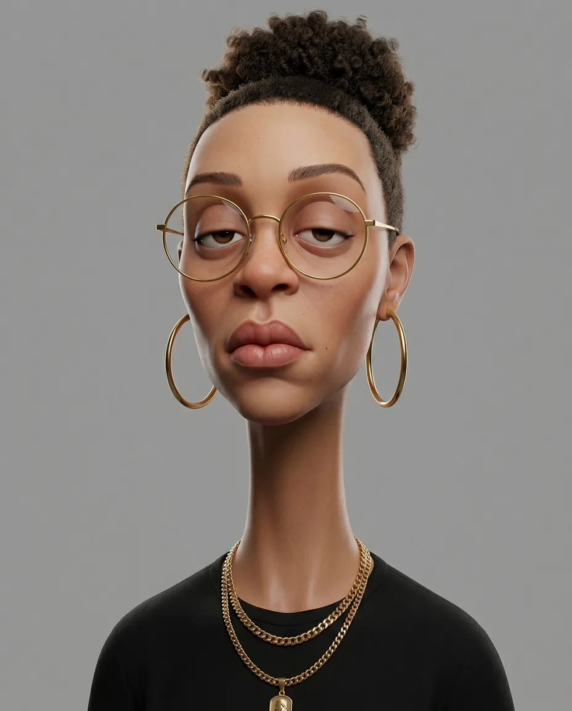

**#244 · Realistic, Portrait · <code>Vinano Image Pro</code>**

> Keywords: realistic, portrait, character, cinematic, AI art, AI prompt

<details>
<summary>Show prompt</summary>

```
Create an exaggerated stylized 3D caricature character portrait strong intentional deformation and a clean, controlled surface finish. Use the person from the ATTACHED REFERENCE PHOTO. Preserve the subject’s identity, facial likeness, skin tone, and defining features, but reinterpret them into a bold caricatured 3D form an elongated neck, oversized head-to-neck ratio, droopy eyelids, heavy lips, and slightly asymmetrical facial structure.Render as a human-like 3D character smooth, studio-clean skin and intentionally designed detail, avoiding random texture or noise. Style bold accessories such as round or oval glasses, hoop earrings, gold chains, headscarves or bandanas, and street-luxury clothing.

Use neutral studio lighting soft shadows and even illumination, no dramatic contrast, against a plain neutral grey or off-white background. The overall aesthetic should feel weird, fashion-forward, collectible, and character-driven rather than cute or realistic.

Ultra high definition, premium cinematic 3D render quality, hyper-realistic hyper realism, clean materials, no freckles, no dirt, no grain, no noise, no speckling, no text, no logos, no watermarks.

Aspect ratio 4:5.

Emphasise material texture and natural light so the final frame feels tactile and premium.
```

</details>

---

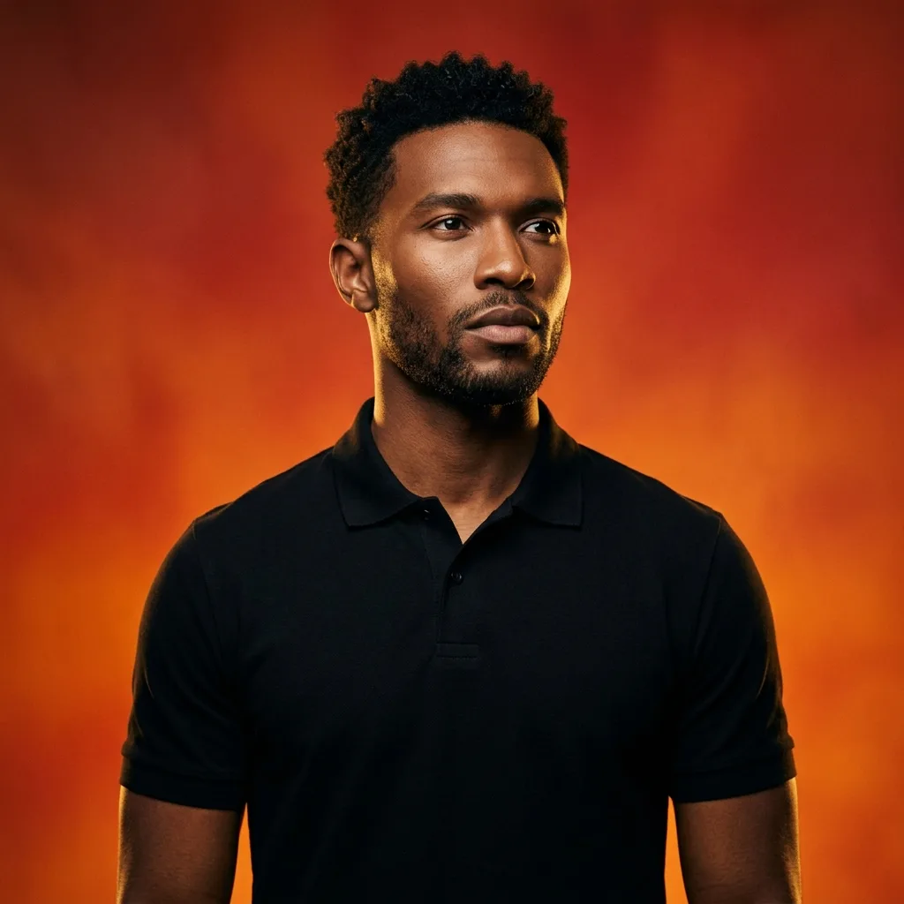

**#245 · Realistic, Portrait · <code>Vinano Image Pro</code>**

> Keywords: realistic, portrait, cinematic, AI art, AI prompt, text to image

<details>
<summary>Show prompt</summary>

```
Ultra-realistic studio portrait photography, confident fashion model wearing a plain black polo shirt, waist-up composition, looking slightly upward and away from camera, strong cinematic expression, vibrant fiery orange-to-red gradient background, intense golden rim light glowing around hair and shoulders, dramatic backlighting, soft beauty key light on face, high contrast lighting, flawless skin texture, sharp facial details, luxury commercial advertising style, premium apparel campaign, clean minimal composition, warm color grading, professional studio setup, shallow depth of field, 85mm lens, f/2.0, ultra-detailed, HDR, true-to-life photorealistic, magazine-quality, symmetrical framing, bold and powerful mood, high-end fashion editorial, 8K resolution.

Negative Prompt:

blurry, low resolution, noisy image, overexposed highlights, underexposed shadows, distorted face, extra limbs, bad anatomy, duplicate features, watermark, logo, text, cropped head, messy background, unrealistic skin, cartoon, painting, CGI, oversaturated colors, motion blur, out of focus, poor lighting.

Aim for an editorial, design-driven look with deliberate negative space.
```

</details>

---

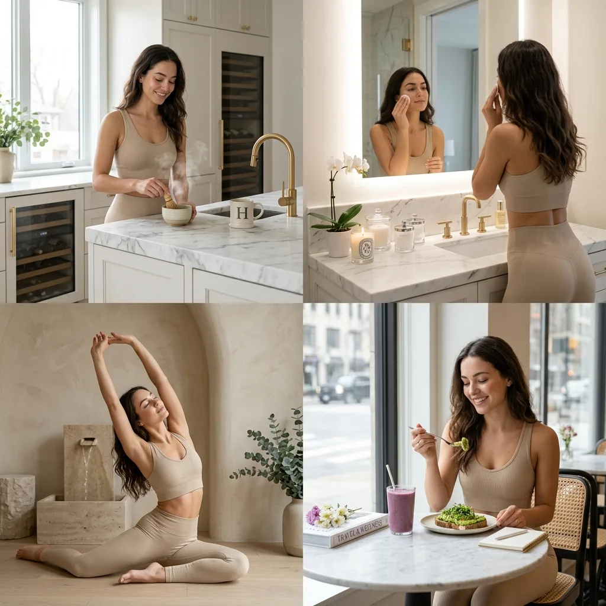

**#246 · Realistic, Minimalist · <code>Vinano Image Pro</code>**

> Keywords: realistic, minimalist, AI art, AI prompt, text to image

<details>
<summary>Show prompt</summary>

```
{
 "overall_theme": {
 "description": "A curated series of four ultra-true-to-life photorealistic vignettes showcasing a luxurious, wellness-focused lifestyle.",
 "mood": "Calm, serene, balanced, sophisticated, peaceful, rejuvenating.",
 "style": "refined minimalist, high-end, contemporary, clean aesthetic, aspirational."
 },
 "subject": {
 "description": "Young woman.",
 "appearance": {
 "hair": "Long, dark brown, wavy, natural texture.",
 "skin": "Clear, glowing, natural.",
 "makeup": "No-makeup makeup look, dewy finish.",
 "physique": "Fit, toned."
 },
 "expression": "Serene, composed, gently smiling, focused."
 },
 "wardrobe": {
 "outfit_base": "Matching ribbed beige/cream activewear set.",
 "variations": ["Sleeveless crop top and high-waisted leggings.",
 "Long-sleeve crop top and high-waisted leggings."],
 "style": "Comfortable, stylish, premium-quality fabric."
 },
 "environmental_details": {
 "lighting": {
 "type": "Natural daylight.",
 "quality": "Soft, diffused, warm, bright.",
 "source": "Large windows (implied or visible)."
 },
 "color_palette": {
 "dominant": ["Warm Beige", "Cream", "White", "Marble Grey"],
 "accents": ["Green (plants)", "Gold (fixtures, details)", "Natural Wood", "Soft Purple (smoothie)"]
 },
 "materials": ["White Marble", "Light Wood", "Stone", "Ceramic", "Glass", "Linen"]
 },
 "scenes": [{
 "location": "Modern Luxury Kitchen",
 "environment": "White marble island and countertops, white shaker cabinets, gold hardware, integrated wine fridge, large window.",
 "pose": "Standing at the island, body angled slightly, looking down.",
 "action": "Whisking a hot beverage in a small bowl.",
 "props": ["Ceramic bowl", "Wooden whisk", "Steam", "Mug 'H'", "Wine fridge"]
 },
 {
 "location": "High-End Bathroom",
 "environment": "Large backlit mirror, white marble vanity, white walls, orchid plant.",
 "pose": "Standing facing the mirror, one hand applying product to face.",
 "action": "Applying skincare.",
 "props": ["Cotton pad", "Skincare bottle", "Lit Diptyque candle", "Whole coconut", "Glass jars"]
 },
 {
 "location": "refined minimalist Wellness Space",
 "environment": "Textured beige walls curved arches, stone water fountain, eucalyptus in a vase.",
 "pose": "Full-body stretch, arms extended overhead, head tilted back, eyes closed.",
 "action": "Stretching.",
 "props": ["Stone water feature", "Large perfume bottle", "Eucalyptus vase"]
 },
 {
 "location": "Bright Café Corner",
 "environment": "Round white marble table, cane chair, large window overlooking a street.",
 "pose": "Sitting at the table, smiling while eating, holding a fork.",
 "action": "Eating avocado toast.",
 "props": ["Avocado toast on plate", "Purple smoothie in glass", "Fork", "Assouline book", "Notebooks", "Small flowers"]
 }],
 "camera_and_technical": {
 "type": "DSLR Photography",
 "style": "Editorial lifestyle",
 "lens": "Prime lens (e.g., 50mm or 85mm f/1.4)",
 "focus": "Sharp focus on the subject in each frame.",
 "depth_of_field": "Shallow, creating a soft, creamy bokeh in the background.",
 "resolution": "Ultra-high resolution, true-to-life photorealistic textures.",
 "composition": "Four-panel grid collage."
 }
}

Preserve realistic proportions and depth for a confident, professional finish.
```

</details>

---

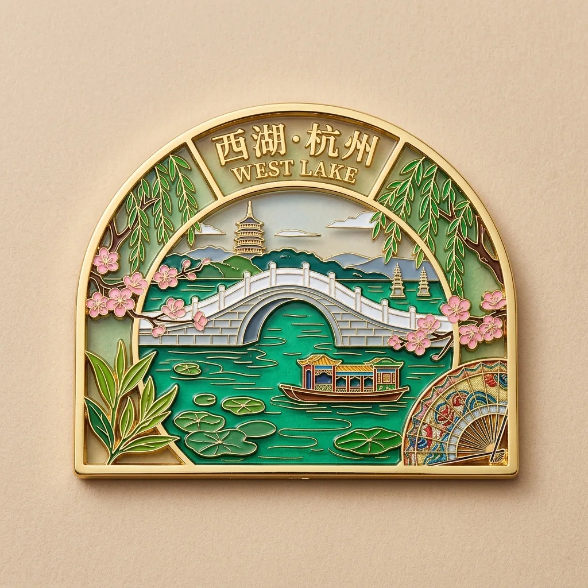

**#247 · Ai Art, Ai Prompt · <code>Vinano Image Pro</code>**

> Keywords: AI art, AI prompt, text to image

<details>
<summary>Show prompt</summary>

```
珐琅彩琉璃艺术风格，金属质感，制作一枚冰箱贴，写着"西湖·杭州 WEST LAKE"字样。冰箱贴以断桥拱形轮廓为基底外形，金色金属边框包边。画面描绘西湖经典风景：断桥残雪、湖面莲叶、楼外楼画舫、雷峰塔剪影、三潭印月石灯、粉色桃花与垂柳。左侧点缀龙井茶叶图案，右侧装饰杭绣扇面。采用珐琅彩填色工艺：湖水呈透明翠绿，金属线勾勒波纹细节。浅咖色背景，正面展示，所有元素严格控制在基底轮廓范围内，布局美观协调，产品摄影质感，8K细节 追求杂志编辑式的设计感，刻意安排留白与视觉重心。
```

</details>

---

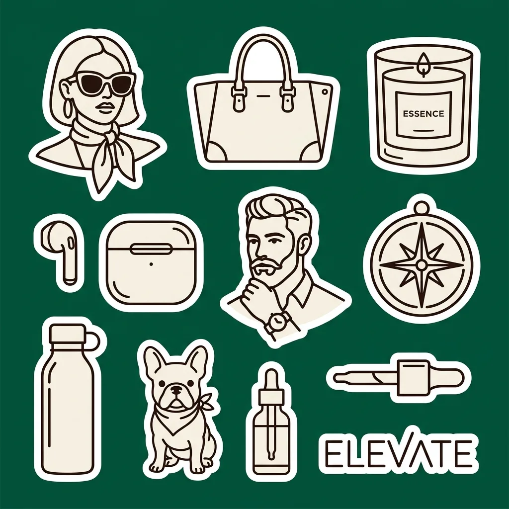

**#248 · Character, Ai Art · <code>Vinano Image Pro</code>**

> Keywords: character, AI art, AI prompt, text to image

<details>
<summary>Show prompt</summary>

```
[BRAND NAME]. Act as a vector illustrator designing a trendy, high-end "Sticker Sheet" set.
THE TASK:
Deconstruct the brand identity of [BRAND NAME] into a playful, cohesive set of approximately 8-10 unique sticker designs arranged on a single sheet.
Content Generation: Do not just make logos. Autonomously invent a mix of:
Mascots/Characters: Stylized busts of people wearing brand-relevant accessories or expressing emotions.
Key Products: Iconic items associated the brand.
Symbols/Objects: Abstract shapes or tools relevant to the brand's lifestyle.

VISUAL STYLE (MONOLINE VECTOR):
The art style must strictly match "Modern Trendy Line Art."
Line Work: Use a THICK, UNIFORM line weight (monoline) for all internal details. The lines should be smooth, rounded, and confident.
Coloring: The stickers must be filled Solid Off-White or Cream, utilizing the line color for details. NO gradients, NO shading, NO 3D effects. Flat 2D vector look.
The "Sticker" Effect: Every element must have a thick, distinct White (or Cream) Die-Cut Border surrounding it, separating it from the background.
COLOR PALETTE (HIGH CONTRAST):
Background: A solid, deep, saturated color to create maximum contrast.
Stickers: High-brightness Cream or White fill Dark (Black or Dark Brown) outlines.
COMPOSITION:
The stickers are scattered naturally across the sheet (knolling layout) even spacing. No overlapping.

Maintain consistent colour harmony and crisp focus across the whole frame.
```

</details>

---

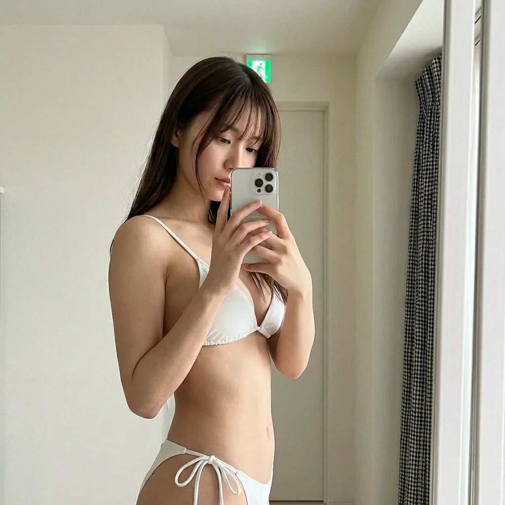

**#249 · Anime, Realistic · <code>Vinano Image Pro</code>**

> Keywords: anime, realistic, portrait, cinematic, minimalist, AI art

<details>
<summary>Show prompt</summary>

```
{ "subject": { "description": "A young adult woman taking a soft-lit mirror selfie in a refined minimalist bright room, wearing a white string bikini, holding her phone close so it partially covers her face.", "mirror_rules": ["Mirror selfie reflection; keep the scene as a reflection, not a front-facing camera look.", "Any readable text should appear normal (not reversed), and avoid adding random letters.", "No extra phones, no duplicated hands, no warped mirror edges."], "age": "early 20s", "expression": { "eyes": { "look": "focused on the phone screen", "energy": "gentle, calm", "direction": "downward" }, "mouth": { "position": "small closed-lip smile", "energy": "soft, slightly shy" }, "overall": "quiet confidence, intimate and casual" }, "face": { "preserve_original": true, "makeup": "natural makeup, light blush, soft pink lips, subtle eyeliner" }, "hair": { "color": "dark brown to black", "style": "long straight hair wispy bangs", "effect": "smooth, slightly glossy strands framing the cheeks" }, "body": { "frame": "slim soft curves", "waist": "narrow waist", "chest": "full bust natural gravity", "legs": "soft feminine upper thighs visible", "skin": { "visible_areas": ["shoulders", "arms", "chest", "torso", "hips", "upper thighs"], "tone": "light warm ivory", "texture": "smooth, velvety, natural pores barely visible", "lighting_effect": "diffused highlights and gentle shadow gradients, slight skin-smoothing but not plastic" } }, "pose": { "position": "standing close to the mirror, torso angled slightly to one side", "base": "weight shifted onto one leg, shoulders subtly drawn forward", "overall": "both hands holding the phone near the face, elbows bent, relaxed intimate selfie posture" }, "clothing": { "top": { "type": "white triangle string bikini top", "color": "white", "details": "thin straps, minimal seams, clean edges", "effect": "slightly matte fabric gentle stretch" }, "bottom": { "type": "white tie-side bikini bottom", "color": "white", "details": "side bows, high-cut silhouette, thin strings", "effect": "minimal, clean, softly tensioned fabric" } } }, "accessories": { "device": "a silver smartphone a triple rear camera module in a clear or neutral case" }, "photography": { "camera_style": "smartphone mirror selfie, social media realism, soft beauty smoothing", "angle": "eye-level to slightly above, mirror reflection composition", "shot_type": "three-quarter body portrait (head to upper thighs), subject centered", "aspect_ratio": "9:16 vertical", "texture": "clean digital look, subtle grain, gentle sharpening on hair, soft skin rendering", "lighting": "soft diffused indoor ambient light, minimal harsh shadows, mild frontal fill from the room", "depth_of_field": "moderate depth of field, subject sharper than the background" }, "background": { "setting": "bright refined minimalist interior room white walls and a glossy light floor", "wall_color": "off-white", "elements": ["open doorway leading to a dimmer space", "black-and-white patterned curtain on the right", "glass display case or cabinet on the left", "small cardboard box near the floor edge", "green exit sign mounted on the left wall"], "atmosphere": "quiet, tidy, slightly hotel-like, everyday realism", "lighting": "even indoor ambient lighting soft falloff" }, "the_vibe": { "energy": "soft and private", "mood": "shy confidence, gentle sensuality", "aesthetic": "clean minimal, intimate mirror selfie", "authenticity": "casual unposed feel small real-life imperfections", "intimacy": "close distance to the mirror, phone hides part of the face, a moment kept to herself", "story": "as if she had just gotten ready for a swim; the room stays quiet and warm, and the mirror catches a fleeting, honest pause", "caption_energy": "a quiet flex, like a warm whisper" }, "constraints": { "must_keep": ["white string bikini tie-sides", "long dark hair wispy bangs", "phone held both hands covering part of the face", "soft diffused indoor lighting", "minimal bright room patterned curtain on the right", "9:16 vertical mirror selfie framing", "gentle smile, eyes looking down at the screen"], "avoid": ["heavy glam makeup", "dramatic filmic, cinematic lighting", "anime or illustration styles", "visible brand logos or readable product names", "exaggerated or unrealistic body proportions", "explicit nudity", "lace-heavy lingerie styling"] }, "negative_prompt": ["lowres", "blurry", "overexposed", "harsh shadows", "strong vignette", "text", "watermark", "logo", "bad hands", "extra fingers", "missing fingers", "deformed anatomy", "duplicate body", "warped mirror", "random letters", "uncanny face", "plastic skin", "nipples", "areola", "explicit nudity"] } Render with rich micro-detail while keeping the layout uncluttered and intentional.
```

</details>

---

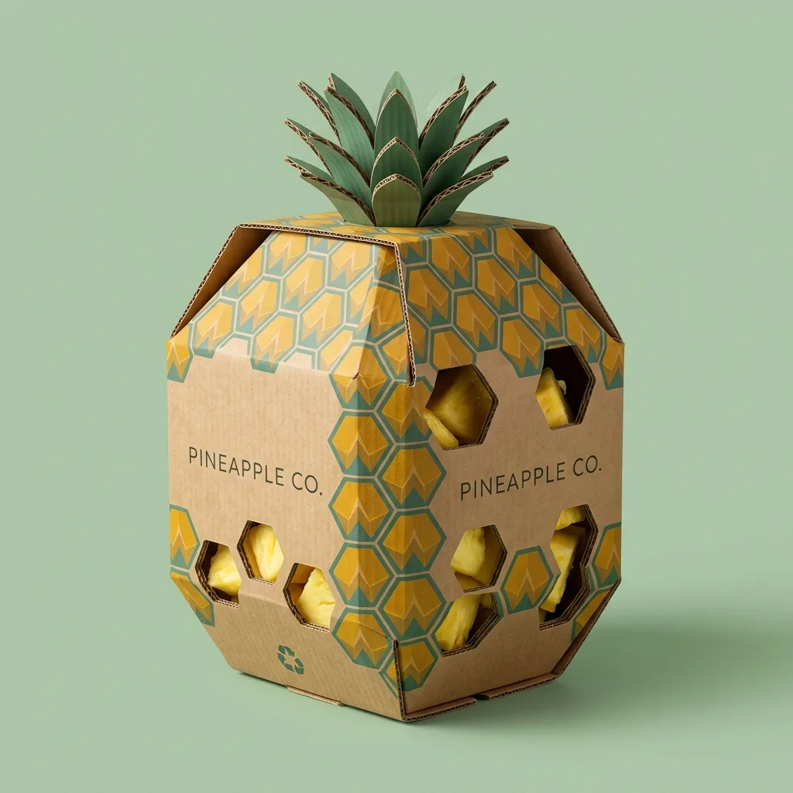

**#250 · Realistic, Product Photography · <code>Vinano Image Pro</code>**

> Keywords: realistic, product photography, cinematic, minimalist, AI art, AI prompt

<details>
<summary>Show prompt</summary>

```
A premium-quality professional product photography of a creative structural packaging design for [Fruit Name]. The packaging is made of premium corrugated cardboard, intricately crafted into the literal shape of a giant stylized [Shape e.g. spherical, curved, elongated] [Fruit Name].

The exterior surface features a vibrant and sophisticated printed pattern of refined minimalist [Pattern Description e.g. geometric hexagons, organic wavy lines, dotted stippling, botanical line-art, or horizontal ridges], mimicking the Natural Skin of the Fruit in a duo-tone palette of [Color 1] and [Color 2].

Features clever die-cut windows that reveal the actual [Actual Product Inside] stored inside. refined minimalist modern typography on the side saying "[NAME]". Includes eco-friendly details like a small recycling logo and a [3D Corrugated Cardboard Detail: Stem/green Leaf/Crown] on top. Soft studio lighting gentle shadows, placed on a clean solid pastel [Background Color] background. 8k resolution, true-to-life photorealistic, cinematic composition, industrial design aesthetic.

Keep edges clean and the overall composition balanced for a polished, gallery-ready result.
```

</details>

---

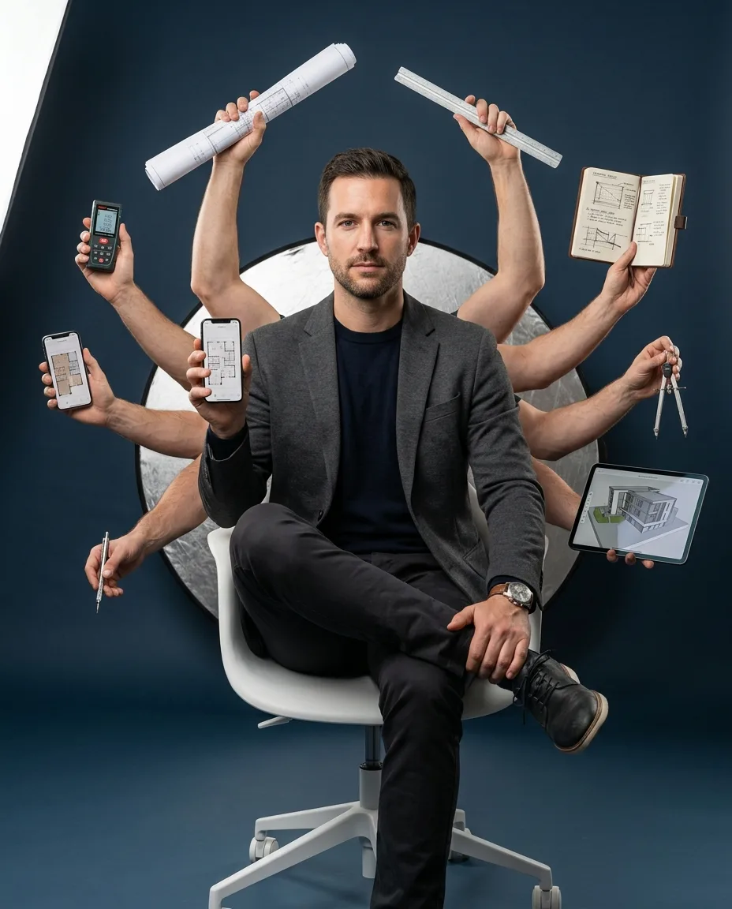

**#251 · Realistic, Portrait · <code>Vinano Image Pro</code>**

> Keywords: realistic, portrait, AI art, AI prompt, text to image

<details>
<summary>Show prompt</summary>

```
Create a hyper-real, studio portrait [USER_PHOTO] as the exact identity reference (same face, hairstyle, skin texture, and age). Depict the person as a confident [PROFESSION] sitting casually on a modern white ergonomic office chair, legs crossed, centered in frame. Add a stylized “multi-arm” illusion (6–8 arms total) radiating behind the torso like a modern Shiva/Vishnu-inspired silhouette, but true-to-life photorealistic: each extra arm must have correct anatomy, believable joints, tendons, skin pores, and natural shadowing; no warped fingers.

PROPS (must be profession-relevant): Automatically choose and place different tools that a real [PROFESSION] would use, one per hand/arm, all clearly readable and accurate in design. Examples of categories: primary tool, secondary tool, communication device, measurement/diagnostic tool, accessory, and a “hero” prop. Keep one real smartphone in the main/front hand. Avoid generic random objects—every prop must logically belong to [PROFESSION]. If [PROFESSION] is digital/tech: include items like laptop, tablet, camera/monitor, light meter, stylus, keyboard, mic, etc. If [PROFESSION] is medical: stethoscope, clipboard, otoscope, syringe (safe/clinical), etc. If [PROFESSION] is culinary: chef knife, tongs, plating tweezers, recipe tablet, etc. (Always match [PROFESSION].)

BACKGROUND COLOR (topic-matched): Use a seamless paper studio backdrop a single dominant color that matches the profession theme (e.g., warm mustard for creative/media, cool teal for healthcare, graphite/steel for engineering, rich olive for outdoors, deep burgundy for luxury). The color should complement skin tones and wardrobe. Add subtle gradient falloff and soft bounce for depth (no flat background).

LIGHTING & SET: High-end commercial studio look. One large soft key light from camera-left, controlled fill from right, crisp rim light to separate subject, and realistic specular highlights on props. Include a large circular silver reflector disk behind the subject (partially visible) for visual punch. Add a subtle shadow on the floor consistent light direction.

WARDROBE & STYLING: Outfit must be believable for a top-tier [PROFESSION] (clean, modern, slightly stylized), texture detail (fabric weave, seams). Add minimal accessories (watch/bracelet) that feel premium. Expression: focused, slightly intense, “in the zone.”

COMPOSITION & CAMERA: Full-body vertical portrait (4:5), 50mm lens look, eye-level camera, sharp focus on face, shallow depth of field but props still readable. Ultra-detailed skin, natural color grading, high dynamic range, crisp micro-contrast.

REALISM RULES: No cartoon, no CGI look. No extra faces, no duplicated heads. Hands must be anatomically correct (5 fingers), no melted objects, no unreadable text logos unless naturally present. Keep the scene clean and premium.

Output: hyper-real editorial photograph, 8K detail, studio-quality retouching, natural skin texture preserved.

Render with rich micro-detail while keeping the layout uncluttered and intentional.
```

</details>

---

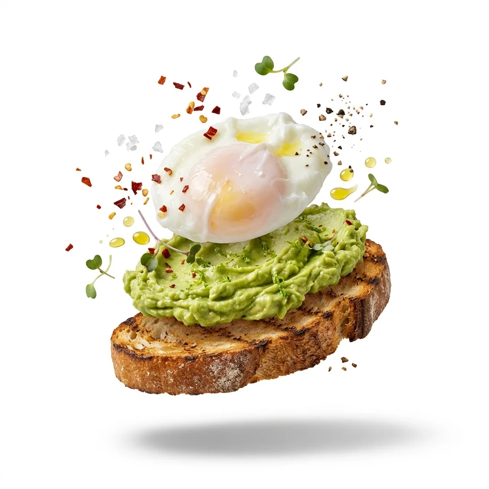

**#252 · Realistic, Product Photography · <code>Vinano Image Pro</code>**

> Keywords: realistic, product photography, AI art, AI prompt, text to image

<details>
<summary>Show prompt</summary>

```
[subject], premium food advertising, white seamless background, high key studio lighting, floating stacked composition, levitating pieces, [ingredient_bits] scattered, clean minimal layout, crisp soft shadow on surface, ultra realistic, macro product photography, 100mm lens look, f/8 sharp focus, subtle texture detail, editorial commercial, 8k Keep edges clean and the overall composition balanced for a polished, gallery-ready result.
```

</details>

---

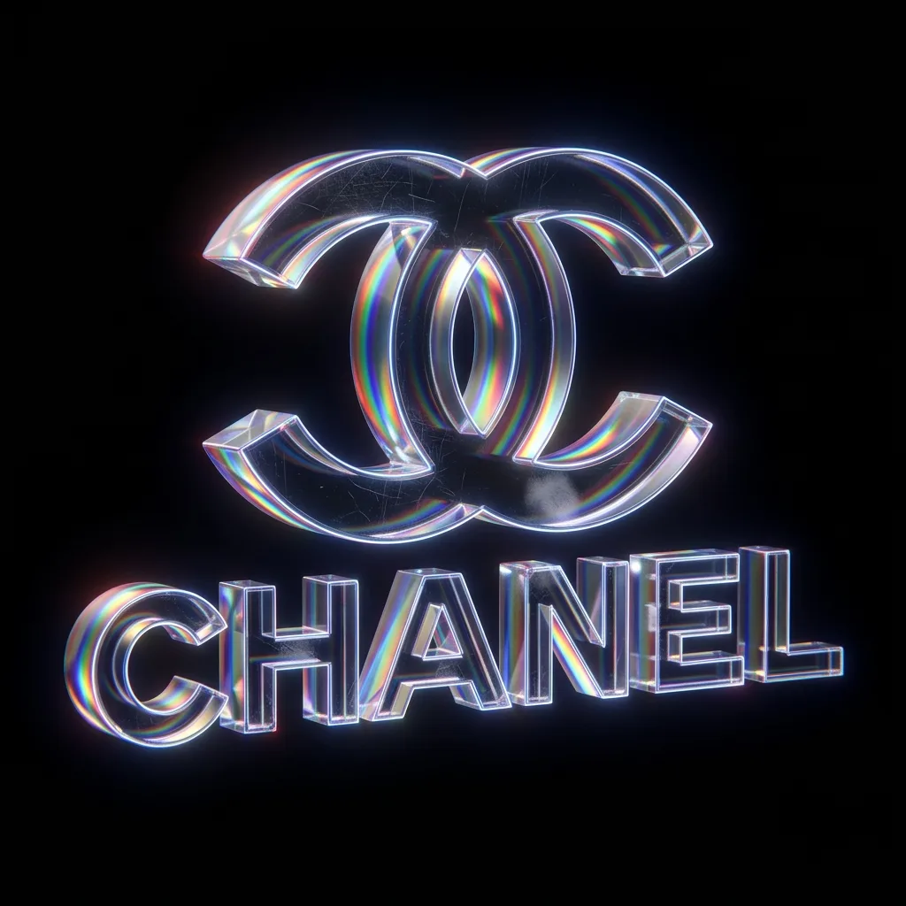

**#253 · Portrait, Ai Art · <code>Vinano Image Pro</code>**

> Keywords: portrait, AI art, AI prompt, text to image

<details>
<summary>Show prompt</summary>

```
[BRAND NAME]
Act as a CGI Optical Physicist and 3D Type Sculptor creating a hero crystal typography visual for a luxury brand campaign. References: James Turrell light installations, optical physics photography, Rick Owens × crystal aesthetics.

PHASE 0: BRAND LOGO INTELLIGENCE

Retrieve the 100% canonical, trademark-accurate logotype of [BRAND NAME] from training data — this is non-negotiable. Reproduce the exact proprietary typeface or custom lettering: every stroke weight, every curve tension, every terminal detail, every unique glyph modification. Do not substitute a similar font — decode the actual trademarked letterform geometry. If [BRAND NAME] has a primary symbol or emblem — place it above or integrated the wordmark exactly as in the official logo lockup. Fidelity test: a brand lawyer must recognize this as the correct logo, not an approximation.

PHASE 1: CRYSTAL MATERIAL SYSTEM

The canonical logotype of [BRAND NAME] is a fully 3D sculptural object made entirely of optical crystal glass — not metal, not plastic, not rubber. Material: optical borosilicate glass or synthetic crystal, IOR 1.85 to 2.1, maximum dispersion coefficient. The letterforms have physical volume and thickness — cross-section is consistent throughout each stroke, like letters carved from a single block of optical glass. Surface finish: polished to sub-micron smoothness on primary faces — all major faces mirror-flat and fully refractive. Edges between faces are sharp and precise — maximum chromatic dispersion occurs here. The material is optically pure in its core — zero bubbles, zero inclusions in the interior volume.

CRITICAL — WEAR & IMPERFECTION SYSTEM: The crystal has been handled — it carries the history of physical existence. Apply these surface imperfections restraint and realism, never overwhelming the dispersion beauty: micro-scratches — a sparse network of hairline scratches on the front and top faces, depth 0.01 to 0.05mm equivalent, visible only when light catches them at specific angles. They scatter light slightly, creating a faint matte haze in the scratch zone while surrounding surface remains mirror-clean. Scratches follow organic directional patterns — some parallel, some crossing, as if from handling and storage, never uniform or grid-like. Edge chips — 2 to 4 very minor edge micro-chips along the sharpest edges and corners, each no larger than 0.5mm equivalent. These tiny imperfections catch light differently than clean edges — they create micro-flare events, small irregular sparkles where a chip breaks the otherwise perfect edge geometry. Surface haze zones — 1 to 2 small irregular areas of very fine surface abrasion, like the glass has been lightly scuffed by contact another hard surface. These zones appear as subtle frosted patches, 3 to 8% opacity maximum — barely visible, discovered rather than obvious. They slightly diffuse the refraction beneath them, softening the rainbow bands in that micro-zone only. Fingerprint ghosts — optional, extremely subtle — 1 partial fingerprint trace on one face, visible only as a very faint oily interference pattern when light hits at oblique angle. Adds humanity to the object. All imperfections are surface-level only — the interior crystal volume remains optically perfect. The wear says this object is precious and real, not freshly manufactured.

PHASE 2: LIGHT & DISPERSION SYSTEM

Single collimated light source entering from upper-left at 35° — focused, high-intensity, like a precision studio spot or filtered sunlight. As light passes through the crystal letterforms it undergoes full chromatic dispersion — splitting into the complete visible spectrum following Snell's law geometry maximum physical accuracy. Dispersion behavior on faces: each polished face simultaneously reflects and refracts — where light exits or reflects, a full spectrum appears in strict physical order red → orange → yellow → green → blue → violet. Rainbow bands are sharp and laser-clean at their origin edges, softening and widening as they travel across faces. Micro-scratch zones interrupt the rainbow bands locally — creating fine scattered light filaments branching off the main dispersion paths. Internal reflections: light bounces between letter faces creating crossed and layered rainbow patterns inside the volume — letters glow from within, nearly dark at the core, exponentially brighter toward illuminated faces. Multiple internal reflection paths create 3 to 5 distinct rainbow events visible simultaneously inside each major letterform. Edge glow: every sharp edge emits thin intense white-blue luminous line from total internal reflection — edge chips create micro-flare interruptions at their locations, bright irregular sparkles punctuating the otherwise continuous edge glow. Chromatic aberration at all edges: red fringe on one side, blue-violet fringe on the other — physical dispersion, not decorative filter. The 3/4 angle reveals front face and top face simultaneously — each face receives different dispersion patterns, creating layered optical complexity. Top face rainbow pattern and front face rainbow pattern intersect at the top edge of each letterform, creating a zone of maximum spectral density.

PHASE 3: BACKGROUND

Background: pure absolute black (#000000 to #050505) — a light-absorbing void, no texture, no gradient, no reflected light. The crystal letters float in darkness — no surface beneath, suspended in void. No ambient light reaching the background. The only light in the image exists within and immediately around the letterforms. Dispersed rainbow light creates a very subtle colored haze in the immediate 2 to 4cm radius around each letter — soft spectral glow bleeding into the black void. Beyond that: absolute darkness. The letters are the sole light source in the scene. The micro-scratch haze zones appear as slightly cooler, slightly less luminous areas against the surrounding rainbow glow — their presence is felt rather than explicitly seen.

PHASE 4: COMPOSITION

CRITICAL — 3/4 ANGLE: The logotype is rotated approximately 5 to 10° on the horizontal axis and elevated 5 to 10° on the vertical axis — a subtle, almost-frontal three-quarter view. The rotation is intentionally minimal — just enough to reveal the physical depth and thickness of the crystal letterforms, suggesting three-dimensionality without dramatically departing from a frontal logo presentation. The logo reads as nearly flat but unmistakably three-dimensional. This angle still reveals the top face of letterforms as a thin luminous sliver — enough to catch a secondary dispersion pattern distinct from the front face, adding optical depth without compositional complexity. Horizontal centering maintained. Logo occupies 60 to 70% of frame width. Full lockup visible if [BRAND NAME] has an emblem above or integrated the wordmark. Aspect ratio: 1:1 square or 4:5 portrait — autonomously determine best fit for [BRAND NAME] lockup proportions. Full sharp focus across the entire sculpture — no depth of field. Every micro-scratch, every edge chip, every rainbow band in crisp simultaneous focus. Detail resolution: the image must reward close inspection — zooming in 400% should reveal new details not visible at normal viewing distance: individual scratch filaments, micro-chip geometry, secondary internal reflections, fingerprint interference patterns.

PHASE 5: TECH SPECS

Render: Octane Render full caustics enabled at maximum quality settings. Ray tracing: minimum 16 bounces — increased from standard to capture all internal reflection events, secondary dispersion paths, and scratch-scattered light filaments. Dispersion: physically accurate wavelength-dependent IOR — full spectral rendering across visible light range 380nm to 700nm, not a color overlay or post-process effect. Scratch rendering: micro-scratches rendered as actual surface geometry displacement, not normal map approximation — true micro-geometry for physically accurate light scattering. Caustics: on at maximum intensity. Subsurface contribution: minimal — glass is not translucent like skin, but edges and thin stroke areas show faint internal light transmission. Anti-aliasing: maximum — every edge, every scratch filament razor clean. Sampling: minimum 2048 samples per pixel — no noise in the blacks, no grain in the rainbow bands. No post-process glow filters, no color grading, no compositing tricks — everything physically rendered from geometry and light. Output feel: the most detailed and physically accurate crystal typography ever rendered. Every imperfection is intentional. Every photon is accounted for.

Preserve realistic proportions and depth for a confident, professional finish.
```

</details>

---

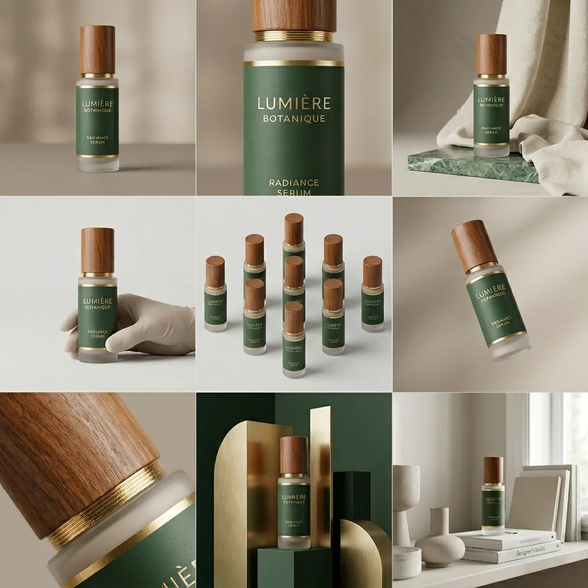

**#254 · Isometric, Storyboard · <code>Vinano Image Pro</code>**

> Keywords: isometric, storyboard, AI art, AI prompt, text to image

<details>
<summary>Show prompt</summary>

```
Create ONE final image.

A clean 3×3 [ratio] storyboard grid nine equal [ratio] sized panels on [4:5] ratio.

Use the reference image as the base product reference. Keep the same product, packaging design, branding, materials, colors, proportions and overall identity across all nine panels exactly as the reference. The product must remain clearly recognizable in every frame. The label, logo and proportions must stay exactly the same.

This storyboard is a high-end designer mockup presentation for a branding portfolio. The focus is on form, composition, materiality and visual rhythm rather than realism or lifestyle narrative. The overall look should feel curated, editorial and design-driven.

FRAME 1:
Front-facing hero shot of the product in a clean studio setup. Neutral background, balanced composition, calm and confident presentation of the product.

FRAME 2:
Close-up shot the focus centered on the middle of the product. Focusing on surface texture, materials and print details.

FRAME 3:
Shows the reference product placed in an environment that naturally fits the brand and product category. Studio setting inspired by the product design elements and colours.

FRAME 4:
Product shown in use or interaction on a neutral studio background. Hands and interaction elements are minimal and restrained, the look matches the style of the package.

FRAME 5:
Isometric composition showing multiple products arranged in a precise geometric order from the top isometric angle. All products are placed at the same isometric top angle, evenly spaced, clean, structured and graphic.

FRAME 6:
Product levitating slightly tilted on a neutral background that matches the reference image color palette. Floating position is angled and intentional, the product is floating naturally in space.

FRAME 7:
is an extreme close-up focusing on a specific detail of the label, edge, texture or material behavior.

FRAME 8:
The product in an unexpected yet aesthetically strong setting that feels bold, editorial and visually striking.
Unexpected but highly stylized setting. Studio-based, and designer-driven. Bold composition that elevates the brand.

FRAME 9:
Wide composition showing the product in use, placed within a refined designer setup. Clean props, controlled styling, cohesive the rest of the series.

CAMERA & STYLE:
ultra-detailed, high-fidelity studio imagery a real camera look. Different camera angles and framings across frames. Controlled depth of field, precise lighting, accurate materials and reflections. Lighting logic, color palette, mood and visual language must remain consistent across all nine panels as one cohesive series.

OUTPUT:
A clean 3×3 grid no borders, no text, no captions and no watermarks.

Keep edges clean and the overall composition balanced for a polished, gallery-ready result.
```

</details>

---

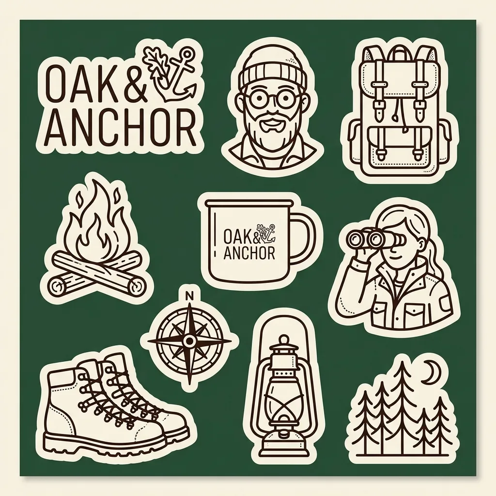

**#255 · Character, Ai Art · <code>Vinano Image Pro</code>**

> Keywords: character, AI art, AI prompt, text to image

<details>
<summary>Show prompt</summary>

```
[BRAND NAME]. Act as a vector illustrator designing a trendy, high-end "Sticker Sheet" set.
THE TASK:
Deconstruct the brand identity of [BRAND NAME] into a playful, cohesive set of approximately 8-10 unique sticker designs arranged on a single sheet.
Content Generation: Do not just make logos. Autonomously invent a mix of:
Mascots/Characters: Stylized busts of people wearing brand-relevant accessories or expressing emotions.
Key Products: Iconic items associated the brand.
Symbols/Objects: Abstract shapes or tools relevant to the brand's lifestyle.

VISUAL STYLE (MONOLINE VECTOR):
The art style must strictly match "Modern Trendy Line Art."
Line Work: Use a THICK, UNIFORM line weight (monoline) for all internal details. The lines should be smooth, rounded, and confident.
Coloring: The stickers must be filled Solid Off-White or Cream, utilizing the line color for details. NO gradients, NO shading, NO 3D effects. Flat 2D vector look.
The "Sticker" Effect: Every element must have a thick, distinct White (or Cream) Die-Cut Border surrounding it, separating it from the background.
COLOR PALETTE (HIGH CONTRAST):
Background: A solid, deep, saturated color to create maximum contrast.
Stickers: High-brightness Cream or White fill Dark (Black or Dark Brown) outlines.
COMPOSITION:
The stickers are scattered naturally across the sheet (knolling layout) even spacing. No overlapping.

Render with rich micro-detail while keeping the layout uncluttered and intentional.
```

</details>

---

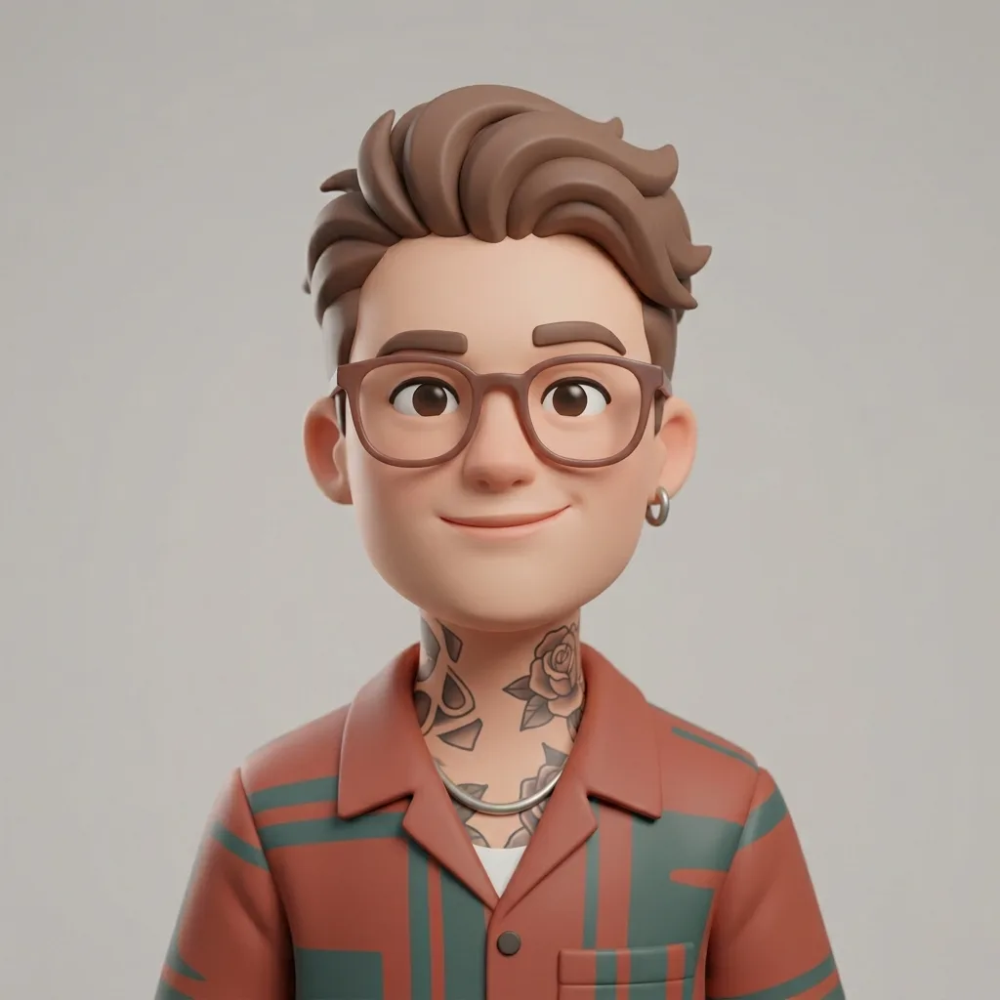

**#256 · Realistic, Character · <code>Vinano Image Pro</code>**

> Keywords: realistic, character, AI art, AI prompt, text to image

<details>
<summary>Show prompt</summary>

```
Use a user-uploaded image as the source and convert the person into a stylized 3D character while preserving identity, facial structure, pose, hairstyle, clothing, and overall composition exactly as shown in the photo. The result should clearly resemble the real person.

The visual style is a stylized 3D character a soft minimal cartoon 3D aesthetic, inspired by Pixar-like visuals but more minimal, toy-figure renders, and clean product-style character design. The balance should favor stylization over realism without changing the person’s real-world appearance.

Skin should appear as smooth matte plastic a soft, uniform texture and gentle subsurface scattering. Facial features should remain faithful to the original image while being simplified in form. The expression should stay neutral and natural to the source photo.

Lighting should be clean and controlled, similar to a studio softbox setup, very soft shadows, low contrast, and subtle highlights. The background should be a solid [BACKGROUND COLOR] no gradient.

The camera should feel front-facing a medium close-up framing, similar to a 50mm lens, no distortion. Output quality should be high resolution clean edges, no noise, strong style consistency, and a clearly non-true-to-life photorealistic finish.

Keep edges clean and the overall composition balanced for a polished, gallery-ready result.
```

</details>

---

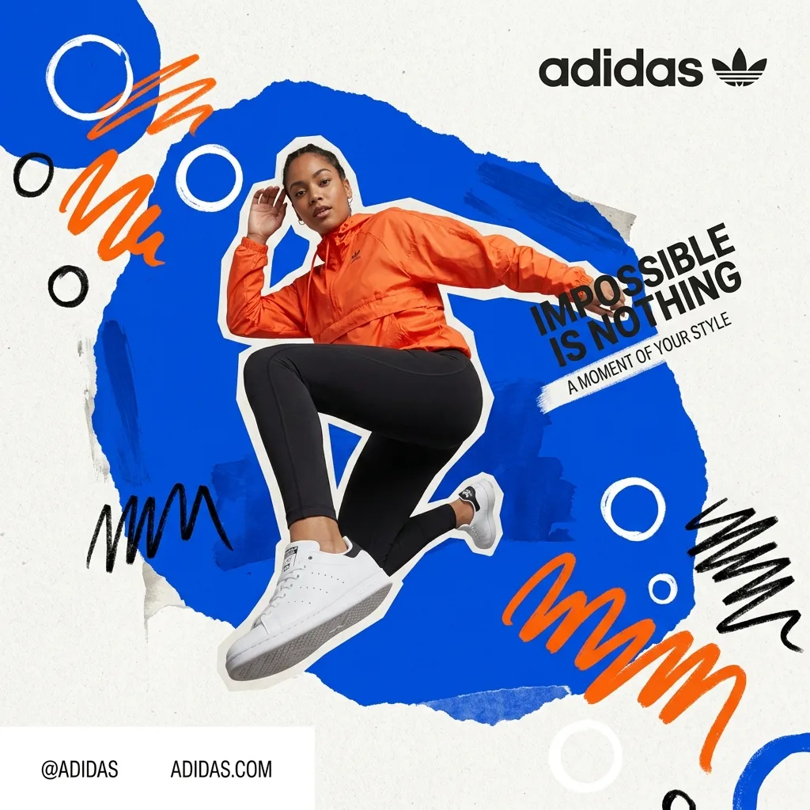

**#257 · Ai Art, Ai Prompt · <code>Vinano Image Pro</code>**

> Keywords: AI art, AI prompt, text to image

<details>
<summary>Show prompt</summary>

```
[BRAND NAME]. Act as a Social Media Art Director and Digital Collage Artist specializing in bold, youth-oriented brand content for Instagram and digital campaigns.
PHASE 1: CONCEPTUAL FRAMEWORK
Create a dynamic digital collage that merges fashion photography graphic design chaos. This is controlled rebellion – a composition that feels spontaneous and energetic while maintaining brand coherence. The aesthetic is anti-polished: torn edges, layered textures, hand-drawn elements, and bold color blocking that screams confidence and movement.
PHASE 2: MODEL & PHOTOGRAPHY
- Subject: One model (diverse casting, age 18-30) in a dynamic, confident pose
- Pose Energy: 80% attitude, 20% natural – sitting, jumping, mid-motion, or power stance (avoid static standing)
- Outfit: Street style/athleisure that aligns [BRAND NAME] aesthetic – casual but styled
- Hero Product: Feature 1 signature [BRAND NAME] product prominently (sneakers, bag, apparel) – this is the visual anchor
- Photography Style: Editorial fashion cutout – model extracted from background clean edges
- Camera Angle: Slight low angle to empower subject (hero perspective)
- Crop: Full body or 3/4 body showing hero product clearly
- Background Removal: Model cut out cleanly for layering over collage elements
PHASE 3: COLOR BLOCKING FOUNDATION
- Primary Color Blob: Large organic shape (40-60% of composition) in bold, saturated brand color behind/around model
- Shape Style: Irregular, hand-painted aesthetic – think Photoshop brush strokes or torn paper texture (NOT perfect geometric shapes)
- Color Selection (Autonomous): Choose 1 hero color from [BRAND NAME] palette:
- Texture: Visible brush strokes, grain, or subtle noise (15-25% opacity) – avoid flat digital fills
- Placement: Blob positioned to frame model without obscuring key product details
PHASE 4: GRAPHIC ELEMENTS LAYER
Add 3-5 abstract graphic elements scattered across composition:
- Element Types:
- Color Palette: Use 2-3 accent colors total (main blob color + 1-2 contrasting tones from brand palette)
- Placement: Asymmetric scatter – top-left and bottom-right zones primarily (avoid center crowding)
- Scale: Mix small (5% of canvas) and medium (15% of canvas) elements – nothing overpowering
- Aesthetic: Analog/handmade feel – imperfect circles, rough edges, visible texture
PHASE 5: TYPOGRAPHY INTEGRATION
- Brand Logo: Clean [BRAND NAME] logo placed in upper-left or upper-right quadrant (10-15% of width)
- Slogan/Tagline: If [BRAND NAME] has an iconic slogan, integrate it:
- Supporting Copy: Optional 1-line descriptor (e.g., "A MOMENT OF YOUR STYLE") in smaller uppercase sans-serif
- Type Treatment: Mix of aligned and slightly rotated text (2-5° angles) for dynamic energy
- Hierarchy: Logo largest → Slogan medium → Copy smallest
PHASE 6: TEXTURE & BACKGROUND
- Base Layer: Off-white or light gray textured background (NOT pure white)
- Texture Options (Autonomous selection):
- Color: RGB 245-250 (near-white warmth) – maintains brightness while adding depth
- Treatment: Texture should be felt, not seen – enhances tactility without competing foreground
PHASE 7: COMPOSITION RULES
- Layout: Asymmetric balance – model off-center, graphic elements counter-balance
- Breathing Room: 15-20% negative space (textured background visible) to prevent claustrophobia
- Layering Order: Background texture → Color blob → Graphic elements → Model (cutout) → Typography top layer
- Focal Point: Model + hero product = primary focus (60% visual weight), graphics support (40%)
- Movement: Diagonal lines and angled elements create directional flow (top-left to bottom-right or vice versa)
PHASE 8: BRAND INTELLIGENCE (AUTONOMOUS)
Autonomously adapt composition based on [BRAND NAME] personality:
- Streetwear/Sportswear (Nike, Adidas, Supreme):
- Luxury Streetwear (Balenciaga, Off-White, Gucci):
- Beauty/Lifestyle (Glossier, Fenty, Skims):
- Tech/Modern (Apple, Tesla, Beats):
PHASE 9: SOCIAL MEDIA FOOTER (OPTIONAL)
- Bottom Strip: Clean white or light gray bar at bottom 8-10% of frame
- Content: Social media handles (Instagram, Facebook, Twitter) in small sans-serif
- Layout: Three-column grid platform icons or text handles
- Aesthetic: Minimal and professional – contrast chaotic collage above
TECHNICAL SPECS:
- Aspect Ratio: 4:5 (Instagram feed) or 1:1 (square social post)
- Resolution: 2400x3000px minimum (premium-quality for zoom and detail)
- Color Mode: sRGB, vibrant saturation (Instagram-optimized)
- File Aesthetic: Digital collage that mimics analog craft (Photoshop + hand-drawn hybrid)
- Model Photography: 85mm lens, f/2.8, shallow depth of field on original shoot (before cutout)
- Style Reference: Nike social campaigns, Spotify wrapped graphics, Gen Z Instagram aesthetics, Hypebeast x streetwear collabs
- Mood: Confident, energetic, youthful, authentic chaos, anti-corporate polish

Preserve realistic proportions and depth for a confident, professional finish.
```

</details>

---

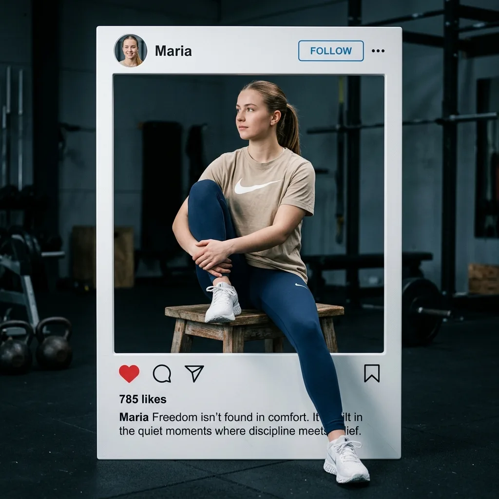

**#258 · Realistic, Cinematic · <code>Vinano Image Pro</code>**

> Keywords: realistic, cinematic, AI art, AI prompt, text to image

<details>
<summary>Show prompt</summary>

```
{
 "image_generation_prompt": {
 "subject": {
 "description": "A true-to-life photorealistic young woman brown hair tied back in a ponytail, sitting on a stool.",
 "pose": "Sitting one knee raised, hands clasped around her shin, looking slightly to the side a calm, focused expression.",
 "clothing": {
 "top": "Beige t-shirt a white Nike swoosh logo on the chest.",
 "bottoms": "Dark blue leggings a small white swoosh logo on the thigh.",
 "footwear": "White athletic sneakers."
 }
 },
 "composition": {
 "foreground_element": "A large, 3D-rendered white social media frame resembling an Instagram post, physically framing the subject.",
 "ui_details": {
 "header": {
 "profile_picture": "Profile picture of the woman",
 "username": "Maria",
 "follow_button": {
 "text": "FOLLOW",
 "color": "Blue"
 }
 },
 "footer_icons": [{
 "type": "like",
 "icon": "Heart",
 "color": "Red",
 "state": "Liked"
 },
 {
 "type": "comment",
 "icon": "Comment bubble"
 },
 {
 "type": "share",
 "icon": "Paper plane"
 },
 {
 "type": "bookmark",
 "icon": "Bookmark"
 }],
 "likes_count": 785,
 "caption": "Freedom isn’t found in comfort. It’s built in the quiet moments where discipline meets belief."
 }
 },
 "environment": {
 "setting": "A dimly lit, atmospheric gym background.",
 "details": "Blurred gym equipment in the shadows, creating a strong depth of field."
 },
 "style": {
 "visual_style": "3D realistic render Unreal Engine 5, cinematic and high fidelity.",
 "lighting": {
 "subject": "Soft spotlight focused on the woman",
 "background": "Cool ambient lighting subtle shadows"
 }
 }
 }
}

Emphasise material texture and natural light so the final frame feels tactile and premium.
```

</details>

---

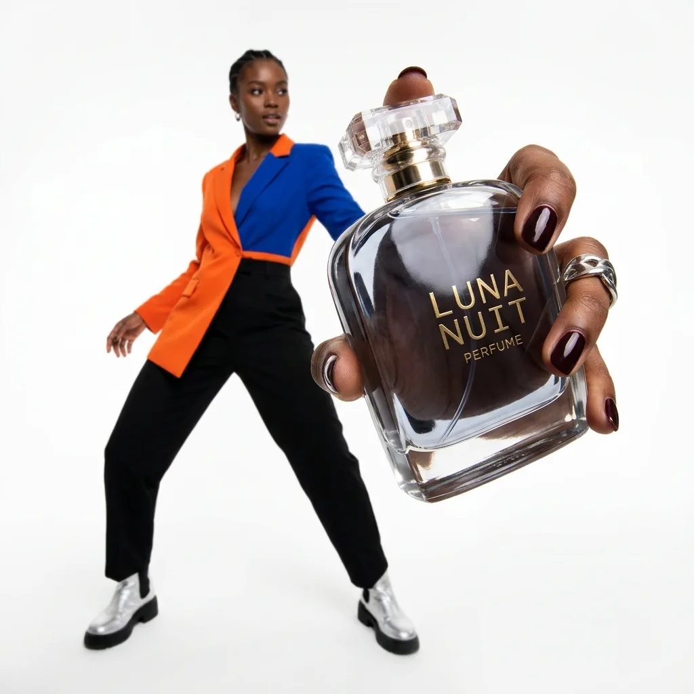

**#259 · Ai Art, Ai Prompt · <code>Vinano Image Pro</code>**

> Keywords: AI art, AI prompt, text to image

<details>
<summary>Show prompt</summary>

```
Low-angle fashion campaign photograph of a confident model holding a large [product name] very close to the camera, exaggerated perspective the hand and product dominating the foreground, full-body pose visible in the background, wide stance, dynamic posture, clean pure white studio background, high-key lighting, sharp focus on product, slight depth of field on the model, bold colorful outfit strong contrast tones, modern beauty advertising aesthetic, ultra-crisp composition, commercial studio photography, glossy packaging detail visible, crisp shadows Aim for an editorial, design-driven look with deliberate negative space.
```

</details>

---

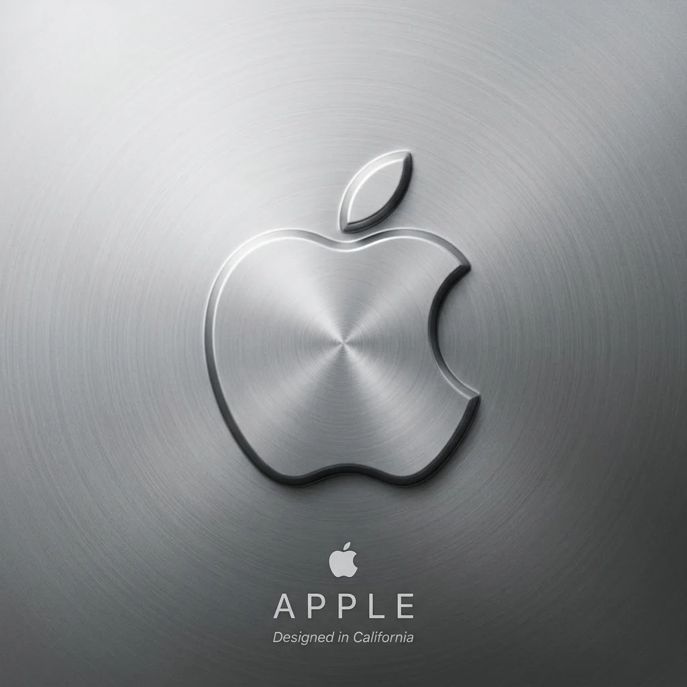

**#260 · Character, Ai Art · <code>Vinano Image Pro</code>**

> Keywords: character, AI art, AI prompt, text to image

<details>
<summary>Show prompt</summary>

```
[BRAND NAME] + [METAL COLOR]

Act as a Senior CGI Artist and Brand Identity Director specializing in premium logo materializations. Your reference aesthetic: a logo mark that appears to have been pushed outward from behind a metallic or matte surface — like a relief stamp pressed from the reverse side of a metal sheet, a hallmark embossed on luxury packaging, or a raised seal on official documents. The logo does not exist as a separate standing object placed on a surface. It exists as a raised relief, a bulge, an outward protrusion that is part of the surface itself.

BRAND INTELLIGENCE SYSTEM

Before executing any phase, resolve these parameters: (1) LOGO GEOMETRY — identify [BRAND NAME]'s primary icon mark in its simplest most reduced form — the mark that works at any scale, (2) COLOR PALETTE — based on [COLOR], build the full tonal system from the lightest specular highlight to the deepest shadow tone, determine if the overall mood reads warm, cool, or neutral, (3) SURFACE MATERIAL — based on [COLOR] determine the surface character: silver or grey becomes brushed or circular-grain steel, gold or champagne becomes warm brushed metal radial grain, black becomes anodized aluminum or matte carbon fiber, white becomes matte ceramic or chalk plaster, any saturated hue becomes anodized colored metal holding the hue in lit areas and desaturating toward black in deepest shadows, (4) LIGHT DIRECTION — determine the most flattering single light angle to reveal the emboss topography — where highlights land on the raised ridge peaks and where shadows fall on the descending walls.

PHASE 1: SURFACE & ATMOSPHERE

The entire image is one single continuous material surface — not a background an object placed on it, but one unified physical plane filling the entire canvas. This surface is made of the SURFACE MATERIAL resolved above. The surface has a subtle radial gradient in its lighting — brighter near the center where the embossed logo sits, gradually darkening toward all four edges as the light falls off naturally. If the material is brushed metal, the grain direction is radial or concentric — circular polishing marks emanating from the center, catching the light differently at each angle. Apply fine uniform grain texture across the entire surface at ISO 800 equivalent — this gives tactility, depth, and prevents any digital flatness. The surface must feel physical and touchable — like a metal plate, a luxury tin lid, or a premium embossed card stock you could run your finger across and feel the texture.

PHASE 2: THE EMBOSS — CRITICAL

The [BRAND NAME] logo mark is rendered as a full bas-relief — think of a coin, a commemorative medal, or a luxury brand stamp where the ENTIRE logo shape rises as one unified solid mass from the surface. Not just the outline. Not just the stroke path. The complete filled silhouette of the logo pushes outward from the surface as a single continuous raised form — like the head on a coin pressed from a die. The interior of the logo is NOT hollow or open. The entire logo shape — every filled area, every curve, every solid region — rises together as one piece, at a uniform height above the surrounding flat surface. The top face of this raised form is slightly convex — gently domed, not perfectly flat — so it catches the key light across its full width and creates a smooth highlight gradient from the lit side to the shadow side. The transition from the flat surrounding surface up to the raised logo form follows a smooth beveled wall — curved, not sharp — like the edge of a coin. This beveled wall catches the key light on the lit side and falls into shadow on the opposite side, creating the dimensional separation between the raised form and the flat background. Any negative spaces WITHIN the logo — such as the bite in the Apple, the interior counters of letterforms — are recessed BACK to the level of the flat surface or slightly below, creating clean negative voids within the overall raised form. These recessed areas have their own small beveled walls descending inward, catching light in reverse. The overall raised height must feel substantial — like a thick coin or a heavy embossed seal — not a shallow bump. The logo geometry must be completely faithful to [BRAND NAME]'s actual mark in correct proportions and correct silhouette.

PHASE 3: LIGHTING

One primary soft area light from upper-left at approximately 10 to 11 o'clock position — broad and diffused, wrapping around the curved walls of the raised ridge to create the characteristic highlight peak at the top and gradual shadow descent on the far wall. Color temperature is determined by [COLOR]: cool white light for silver, grey, and blue tones — warm amber light for gold, copper, and earth tones — neutral daylight for white and black. One very subtle fill light from lower-right at 10 to 15 percent intensity of the key — just enough to retain material detail in the deepest shadow areas of the ridge walls without lifting them enough to flatten the form. No hard shadows anywhere on the surface. No spotlight pools. No rim light. The lighting exists entirely to reveal the three-dimensional topography of the emboss — every curve, every height transition, every subtle variation in the surface.

PHASE 4: TYPOGRAPHY

In the lower portion of the canvas, below the embossed logo, on the same continuous surface — a minimal typographic lockup. The typography is either very subtly embossed in the same material as the surface the same raised-ridge technique at much smaller scale, or rendered as clean flat text in the lightest tone of [COLOR] sitting just at the surface level. Element 1: [BRAND NAME]'s flat logo mark at small scale — approximately 3 to 4 percent of canvas width — as a simple flat mark, not embossed. Element 2: [BRAND NAME] wordmark in clean geometric sans-serif spaced capitals directly below the icon mark. Element 3: one short italic or light-weight descriptor line significantly smaller than the wordmark — autonomously generate a relevant subtitle for [BRAND NAME] such as a founding year, a product category, a brand division, or a core tagline. All three elements stacked vertically, centered, generous spacing. No decorative elements. No lines or rules. Pure typographic restraint.

TECH SPECS

The single most important instruction in this entire prompt: the logo must read as PUSHED OUTWARD FROM the surface, rising toward the viewer, proud and raised. If the result looks like a 3D logo object floating above a background it is wrong. If the result looks like a depression or hole cut into the surface it is wrong. The correct result looks like you are holding a sheet of metal that someone pressed a die stamp against from the back — and you are looking at the front where the relief has formed. Ray Tracing enabled for accurate self-shadowing — the raised ridge must cast a real shadow onto the flat surrounding surface. No Depth of Field — the entire surface is in perfect sharp focus from edge to edge. Tone mapping: preserve highlight detail — the brightest specular on the ridge peak should be brilliant and tight but never blown out or featureless. Film grain applied uniformly across the full final render. No chromatic aberration. No lens distortion. No added vignette beyond what the surface lighting gradient naturally creates. Anti-aliasing maximum — the ridge edges must be perfectly clean. Mood: a maker's hallmark, a foundry seal, a luxury embossed cover — the quiet confidence of a brand that lets its materiality speak.

Aim for an editorial, design-driven look with deliberate negative space.
```

</details>

---

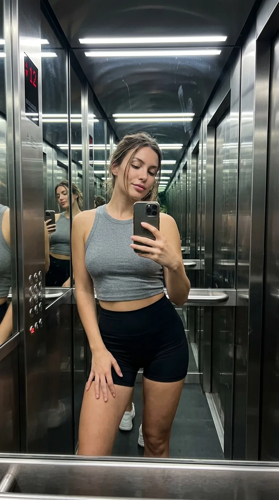

**#261 · Realistic, Ai Art · <code>Vinano Image Pro</code>**

> Keywords: realistic, AI art, AI prompt, text to image

<details>
<summary>Show prompt</summary>

```
{
  "meta": {
    "aspect_ratio": "9:16",
    "quality": "ultra_photorealistic",
    "resolution": "8k",
    "camera": "iPhone front camera",
    "lens": "24mm",
    "style": "raw iPhone mirror realism, zero smoothing, heavy reflections, subtle grain, imperfect exposure"
  },

  "scene": {
    "location": "luxury apartment elevator",
    "environment": ["mirror walls on three sides",
      "brushed stainless steel panels",
      "glass-like reflection layering (multiple reflections of body)",
      "LED ceiling strip lights",
      "digital floor number glowing red",
      "slight fingerprints and smudges on mirror"],
    "time": "late night",
    "atmosphere": "private tension in a public box, quiet, charged, intimate"
  },

  "lighting": {
    "type": "mixed elevator lighting",
    "sources": ["cool white overhead LEDs",
      "warm spill from control panel lights"],
    "effect": ["high contrast highlights on hips and thighs",
      "specular reflections multiplying curves in mirrors",
      "face partially lit, partially disappearing in reflections",
      "real iPhone low-light noise in shadows"]
  },

  "camera_perspective": {
    "pov": "mirror selfie",
    "angle": "slightly low and close",
    "framing": "upper thighs to head",
    "distance": "arm-length",
    "imperfections": ["phone edge visible in reflection",
      "finger slightly covering lens corner",
      "minor motion blur from breathing"]
  },

  "subject": {
    "gender": "female",
    "ethnicity": "light european / mediterranean mix",
    "vibe": "young adult, controlled confidence, quietly provocative",

    "body": {
      "type": "fit-curvy",
      "waist": "tight and defined",
      "hips": "round and visually repeated by reflections",
      "thighs": "thick, softly compressed",
      "chest": "full and natural, secondary focus"
    },

    "skin": {
      "tone": "warm fair",
      "texture": "real skin texture, slight sheen, no blur"
    },

    "hair": {
      "color": "dark blonde",
      "style": "loose, slightly messy",
      "details": "a few strands stuck to lips and cheek"
    },

    "face": {
      "expression": "neutral soft half-smirk",
      "eyes": "focused on phone screen",
      "makeup": "minimal, glossy lips catching light"
    },

    "outfit": {
      "top": {
        "type": "tight cropped tank top",
        "color": "soft grey",
        "fit": "hugging chest naturally, no bra",
        "details": "fabric stretched slightly, fine rib texture visible"
      },
      "bottom": {
        "type": "ultra-short micro biker shorts",
        "length": "barely covering upper thighs",
        "material": "thin matte spandex",
        "fit": "painted-on tight, amplified by mirror repetition",
        "details": ["fabric tension visible at hips",
          "slight ride-up at inner thighs",
          "clean, logo-free"]
      },
      "shoes": {
        "type": "clean white sneakers",
        "reflection": "duplicated multiple times in mirrors"
      }
    },

    "pose": {
      "stance": "standing close to mirror",
      "hips": "shifted strongly to one side",
      "legs": "one knee bent inward",
      "upper_body": "shoulders relaxed, torso angled",
      "arms": {
        "phone_hand": "holding phone low",
        "free_hand": "resting lightly on upper thigh"
      },
      "movement": "still moment that feels like a pause, not a pose"
    }
  },

  "mood_keywords": ["mirror multiplication",
    "late night tension",
    "quiet confidence",
    "timeline stopper"]
}

Maintain consistent colour harmony and crisp focus across the whole frame.
```

</details>

---

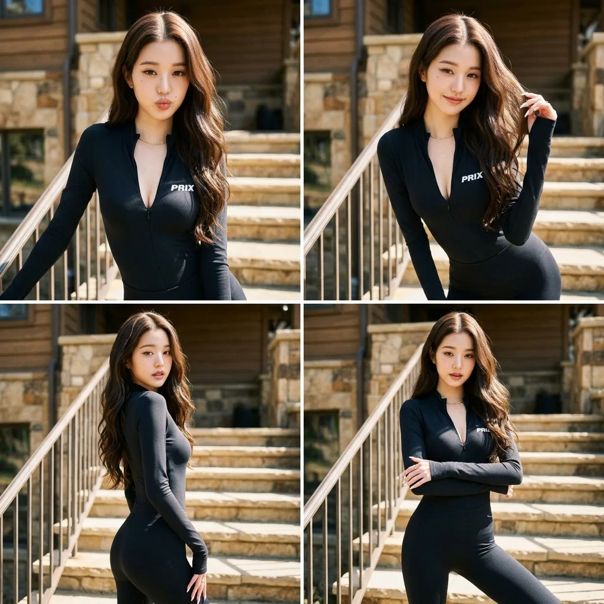

**#262 · Portrait, Ai Art · <code>Vinano Image Pro</code>**

> Keywords: portrait, AI art, AI prompt, text to image

<details>
<summary>Show prompt</summary>

```
{
  "subject": {
    "description": "Jang Wonyoung of IVE in a 4-panel collage grid.",
    "mirror_rules": "N/A",
    "age": "early 20s",
    "expression": {
      "eyes": {
        "look": "confident",
        "energy": "direct",
        "direction": "at camera"
      },
      "mouth": {
        "position": "closed, slight pout or subtle smile",
        "energy": "playful"
      },
      "overall": "casual confidence"
    },
    "face": {
      "preserve_original": true,
      "features": "extremely slender face, doll-like features, prominent beauty marks under her eye and on her cheek, delicate nose, heart-shaped lips",
      "makeup": "soft matte, rosy blush, winged liner, warm aesthetic"
    }
  },
  "hair": {
    "color": "dark brown",
    "style": "long, loose waves, middle part",
    "effect": "natural volume, catching sunlit highlights"
  },
  "body": {
    "frame": "tall, incredibly slender and leggy narrow proportions",
    "waist": "extremely narrow",
    "chest": "subtle",
    "legs": "very long and slim",
    "skin": {
      "visible_areas": "face, neck, upper chest",
      "tone": "pale porcelain",
      "texture": "smooth, supple",
      "lighting_effect": "direct physical sunlight creating sharp but flattering highlights on the chest and face"
    }
  },
  "pose": {
    "position": "standing on stairs",
    "base": "shifting weight, dynamic",
    "overall": "varied across panels: arms crossed, leaning forward, side profile, and looking over shoulder"
  },
  "clothing": {
    "top": {
      "type": "long-sleeve bodysuit",
      "color": "black",
      "details": "deep V-neck front zipper unzipped, white 'PRIX' logo on left chest",
      "effect": "tight, form-fitting, seamless"
    },
    "bottom": {
      "type": "bodysuit leggings",
      "color": "black",
      "details": "seamless extension of top"
    }
  },
  "accessories": {
    "jewelry": "thin gold necklace, rings",
    "prop": "long white manicured nails"
  },
  "photography": {
    "camera_style": "casual influencer portrait, smartphone aesthetic",
    "angle": "eye-level to slightly low angle",
    "shot_type": "4-panel grid, medium and cowboy shots",
    "aspect_ratio": "9:16",
    "texture": "digital crispness, slight natural offset",
    "lighting": "bright outdoor daylight, strong directional sun, natural shadows",
    "depth_of_field": "shallow, slightly blurred background"
  },
  "background": {
    "setting": "outdoor staircase",
    "wall_color": "warm stone, brown wood",
    "elements": ["stone steps",
      "metal railing",
      "rustic wooden exterior"],
    "atmosphere": "sunny daytime",
    "lighting": "natural bright sunlight"
  },
  "the_vibe": {
    "energy": "confident",
    "mood": "playful",
    "aesthetic": "Instagram baddie, athleisure",
    "authenticity": "casual social media photo dump",
    "intimacy": "parasocial directness",
    "story": "Jang Wonyoung poses dynamically for a quick sunny fit check.",
    "caption_energy": "effortless"
  },
  "constraints": {
    "must_keep": ["4-panel collage",
      "black PRIX bodysuit",
      "deep unzipped cleavage"],
    "avoid": ["flat studio lighting",
      "baggy clothes",
      "perfect symmetry"]
  },
  "negative_prompt": ["ugly",
    "deformed",
    "studio lighting",
    "flat lighting",
    "baggy clothing",
    "low resolution"]
}

Emphasise material texture and natural light so the final frame feels tactile and premium.
```

</details>

---

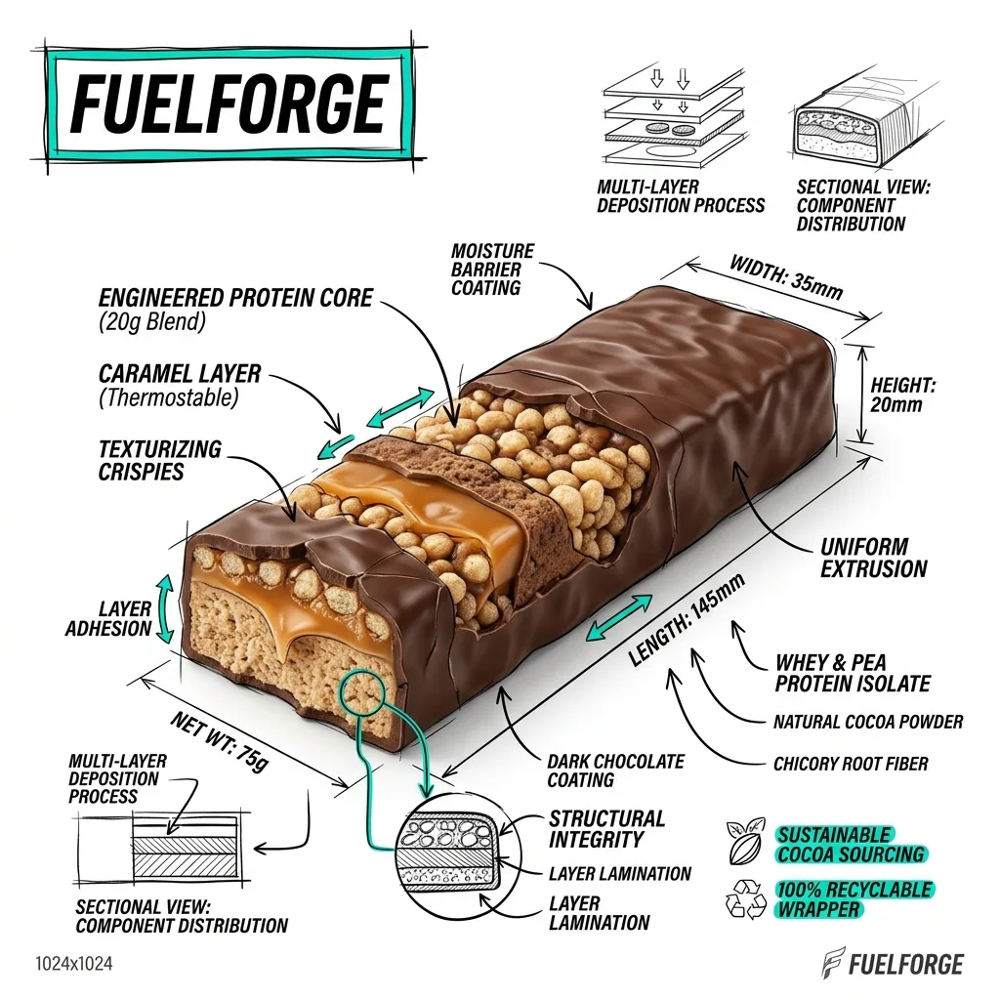

**#263 · Realistic, Infographic · <code>Vinano Image Pro</code>**

> Keywords: realistic, infographic, AI art, AI prompt, text to image

<details>
<summary>Show prompt</summary>

```
Create a branded technical infographic of a [SNACK], combining a realistic photograph or photoreal render of the product technical annotation overlays placed directly on top. Use black ink–style line drawings strategic [BRAND COLOR] accents (architectural sketch look) on a pure white studio background, including:
• Key component labels
• Internal cross-section showing structure, layering, or internal design
• Measurements, dimensions, and specifications
• Material callouts composition and quantities
• Arrows indicating function for primary features and structural integrity
• Simple schematic or sectional diagram showing key mechanical or design elements
• Sustainability callouts
Title placement: Inside a hand-drawn technical annotation box accent border reading the product name in bold font, positioned in upper corner.
Style & layout rules:
• The realistic product remains clearly visible
• Annotations feel sketched, technical, and architectural
• Accents used for highlight (20-30% of linework), black for primary technical lines (70-80%)
• crisp composition balanced negative space
• Educational, food-engineering vibe premium branding
• Include subtle brand logo mark in corner
Visual style: Minimal technical illustration aesthetic, black linework accents over realistic imagery, precise but slightly hand-drawn feel.
Color palette: White background, black annotation lines/text, [BRAND COLOR] for accents and key callouts only.
Output: 1080×1080, ultra-crisp, social-feed optimized, no watermark

Aim for an editorial, design-driven look with deliberate negative space.
```

</details>

---

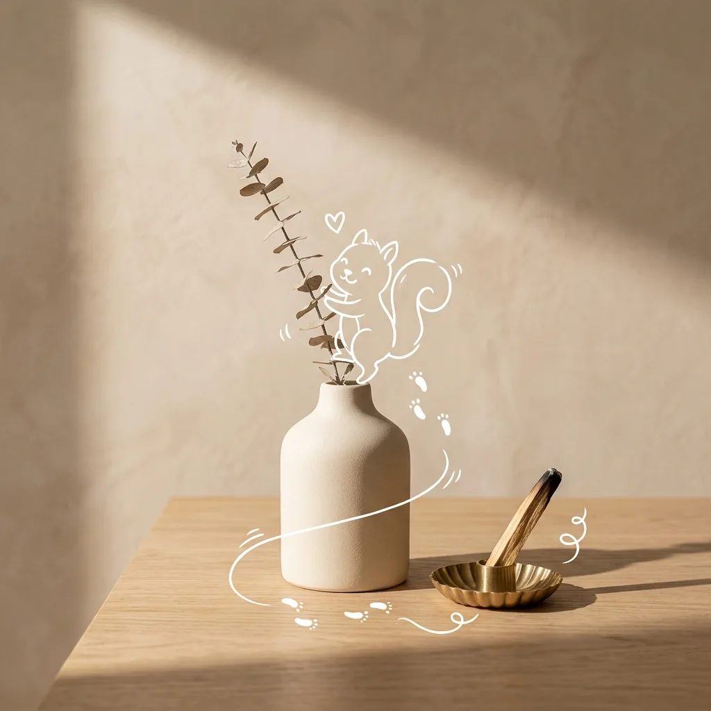

**#264 · Realistic, Character · <code>Vinano Image Pro</code>**

> Keywords: realistic, character, minimalist, AI art, AI prompt, text to image

<details>
<summary>Show prompt</summary>

```
[product setup], refined minimalist product photo, clean warm studio scene, textured beige wall background, soft directional sunlight creating long shadows, simple tabletop surface, product arranged in a playful concept composition, hand drawn white line doodle overlay of [character] interacting the product, mixed media look combining real photography and sketch illustration, high end branding feel, shallow depth of field, ultra realistic, no extra text, no watermark Maintain consistent colour harmony and crisp focus across the whole frame.
```

</details>

---

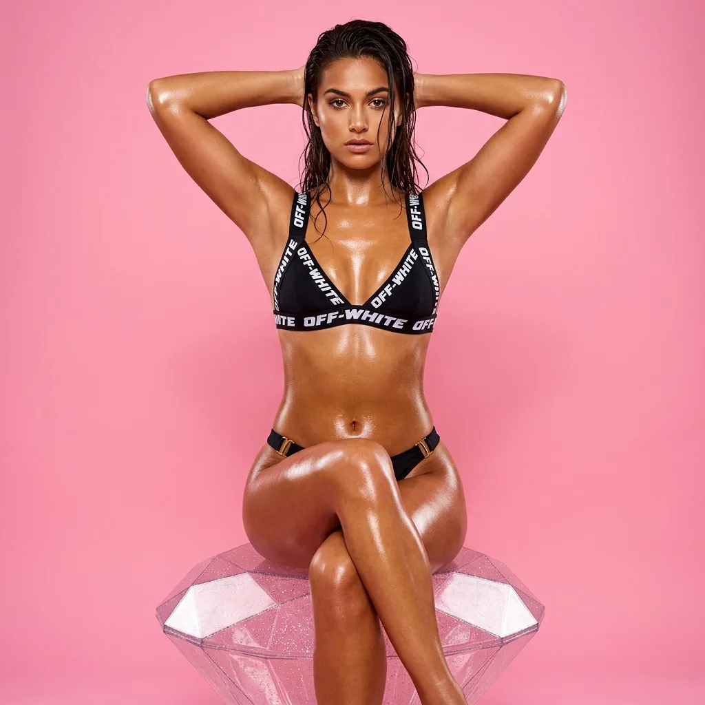

**#265 · Portrait, Ai Art · <code>Vinano Image Pro</code>**

> Keywords: portrait, AI art, AI prompt, text to image

<details>
<summary>Show prompt</summary>

```
{ "subject": { "description": "A confident and glamorous woman posing sensually in a high-fashion studio setting, heavily oiled skin, wearing branded strap lingerie.", "mirror_rules": null, "age": "20s, "expression": { "eyes": { "look": "piercing, direct eye contact", "energy": "confident, seductive, powerful", "direction": "looking straight at the camera" }, "mouth": { "position": "lips slightly parted", "energy": "relaxed but alluring" }, "overall": "bold, unapologetic editorial glamour" }, "face": { "preserve_original": true, "makeup": "dewy foundation, nude glossy lips, subtle smoky eyeshadow, contoured cheeks" }, "hair": { "color": "dark brunette", "style": "wet hair look, slicked back but messy strands falling onto the neck and shoulders", "effect": "damp, clinging to the skin, chaotic against the clean lines of the outfit" }, "body": { "frame": "toned, fit, athletic curves", "waist": "exposed, sculpted abdomen", "chest": "partially exposed, prominent underboob and cleavage created by tight straps", "legs": "crossed tightly together, facing the camera", "skin": { "visible_areas": "arms, shoulders, torso, stomach, thighs", "tone": "warm tanned olive skin", "texture": "slick, heavily oiled, slippery to the touch, wet appearance", "lighting_effect": "stark spectral highlights bouncing off the oiled epidermis on shoulders, chest, and thighs" } }, "pose": { "position": "sitting astride", "base": "perched on a giant oversized translucent sparkly diamond-shaped prop", "overall": "arms raised hands resting behind the head, back slightly arched, chest pushed forward" }, "clothing": { "top": { "type": "harness strap bikini top", "color": "black straps bold white text", "details": "thick horizontal and over-shoulder straps 'OFF-WHITE' written in bold typography, creating extreme cutouts", "effect": "tight, graphic, streetwear meets swimwear, industrial vibe" }, "bottom": { "type": "bikini bottom", "color": "black", "details": "gold D-ring hardware on the side straps" } } }, "accessories": { "prop": "a large, oversized, translucent, sparkling diamond-shaped stool" }, "photography": { "camera_style": "high-fashion editorial studio portrait, medium format camera", "angle": "straight-on, slightly below eye level", "shot_type": "three-quarter length shot", "aspect_ratio": "9:16", "texture": "ultra-sharp, hyper-detailed, glossy, high fidelity magazine cover quality", "lighting": "hard studio strobes, frontal beauty dish lighting creating sharp wet reflections", "depth_of_field": "deep depth of field, f/8, keeping both subject and prop perfectly sharp" }, "background": { "setting": "professional photography studio", "wall_color": "solid vibrant bubblegum pink", "elements": [], "atmosphere": "pop-art, sterile yet intensely vibrant, bold color blocking", "lighting": "flat, brightly lit seamless cyclorama backdrop" }, "the_vibe": { "energy": "powerful, fierce, unapologetically sexy", "mood": "hyper-glamorous, high tension", "aesthetic": "hypebeast streetwear fashion merged sultry editorial", "authenticity": "highly staged, polished studio perfection", "intimacy": "confrontational gaze, breaking the fourth wall", "story": "A high-profile fashion campaign capturing the tension between raw, oiled skin and rigid, hyper-branded industrial streetwear elements.", "caption_energy": "dripping confidence and undeniable presence" }, "constraints": { "must_keep": ["clear OFF-WHITE text on straps", "wet hair look", "heavily oiled skin texture", "solid pink background", "diamond prop"], "avoid": ["mirror reflection", "natural sunlight", "matte skin", "cluttered environment", "soft focus"] }, "negative_prompt": ["blurry", "low resolution", "matte skin", "dry hair", "natural outdoor lighting", "cluttered background", "misspelled text", "casual daily clothes", "soft, diffused lighting"] } Maintain consistent colour harmony and crisp focus across the whole frame.
```

</details>

---

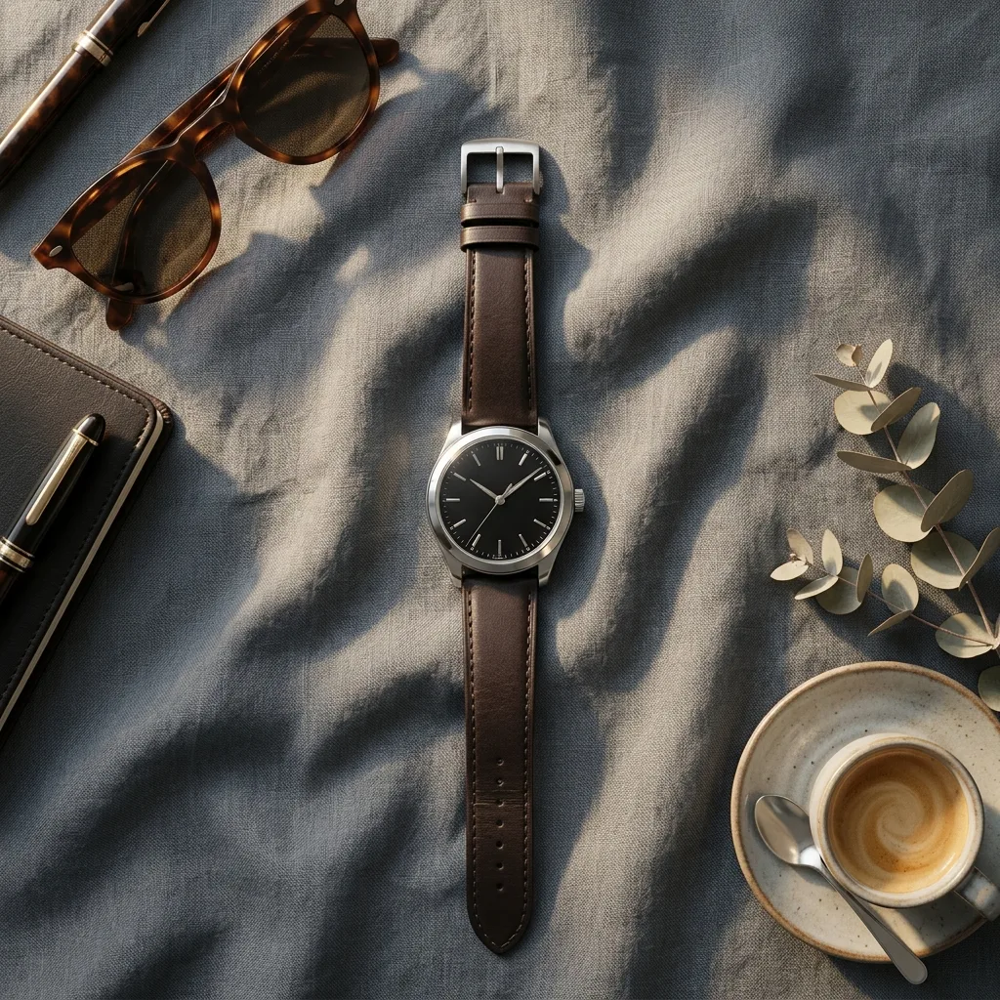

**#266 · Realistic, Product Photography · <code>Vinano Image Pro</code>**

> Keywords: realistic, product photography, AI art, AI prompt, text to image

<details>
<summary>Show prompt</summary>

```
A high-end editorial photo of a [PRODUCT] placed flat on a [TEXTURED SURFACE], captured from a direct top-down view. The surface is gently disturbed to suggest recent motion or interaction. The front of the product is fully visible and properly oriented upright. The area around the product is intentionally left open to optionally place [COMPLEMENTARY OBJECTS] that visually enhance the scene. Natural sunlight from the upper left casts warm, realistic shadows. 3D realism, luxury product photography, shallow depth of field, 1:1 format. Maintain consistent colour harmony and crisp focus across the whole frame.
```

</details>

---

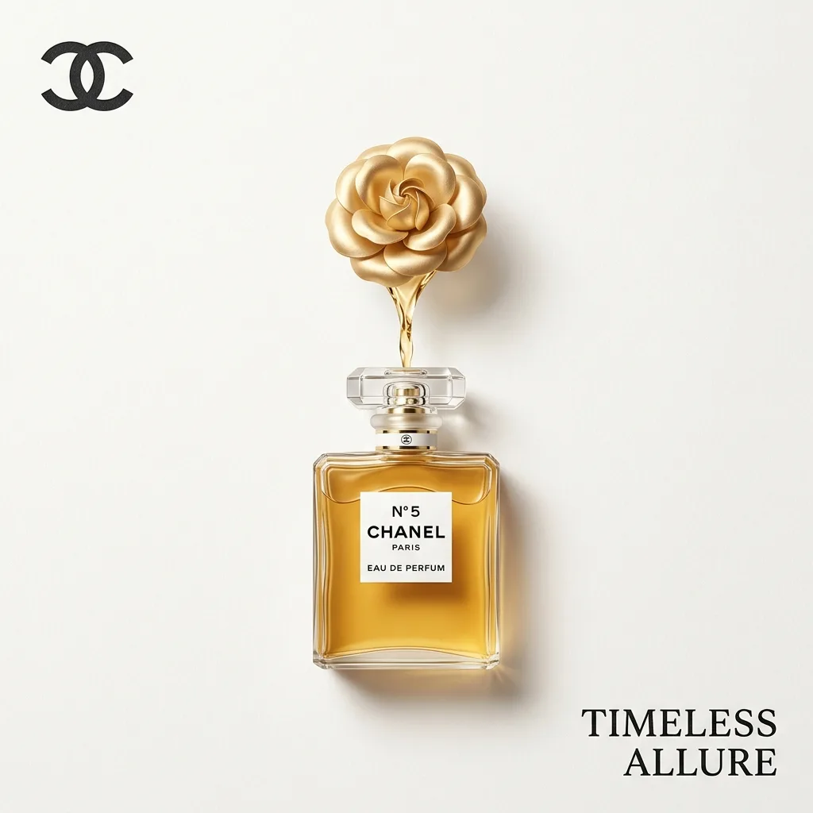

**#267 · Minimalist, Ai Art · <code>Vinano Image Pro</code>**

> Keywords: minimalist, AI art, AI prompt, text to image

<details>
<summary>Show prompt</summary>

```
Visualize INPUT: [PRODUCT/BRAND]
Create a surreal refined minimalist photoreal print-ad the INPUT only. Auto-detect the brand from the INPUT and add the brand’s REAL official logo (not a generic wordmark), high fidelity, correct proportions, clean vector/print look, placed top-left subtle ink-like texture. Use one bold visual metaphor, 1 hero + 1 accent max, huge negative space, studio lighting, 8K ultra-sharp, premium print-ad composition. Add a two-word slogan bottom-right that matches the brand tone. No clutter, no watermark, no extra text. Aspect ratio 1:1

Keep edges clean and the overall composition balanced for a polished, gallery-ready result.
```

</details>

---

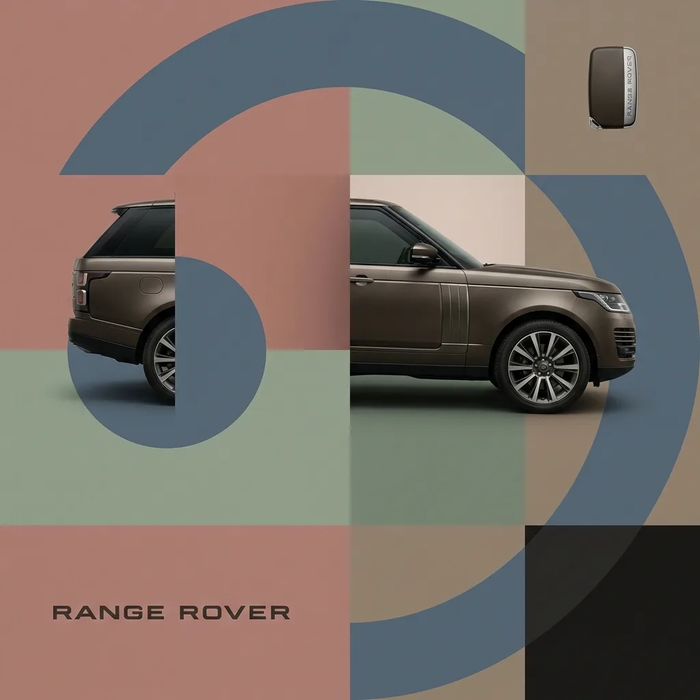

**#268 · Minimalist, Ai Art · <code>Vinano Image Pro</code>**

> Keywords: minimalist, AI art, AI prompt, text to image

<details>
<summary>Show prompt</summary>

```
[BRAND NAME]. Act as a World-Class Editorial Designer.

PHASE 1: DYNAMIC SUBJECT LOGIC.

- Subject Selection: Autonomously analyze [BRAND NAME].

- Layering (The Sandwich Effect): Interweave the subject background shapes. Some parts of the car/person must be hidden behind geometric blocks, while other parts (wheels, limbs, props) must overlap them to create 3D depth.

PHASE 2: GRID & GEOMETRY.

- Layout: A clean 2x2 grid composition.

- Overlays: Superimpose large, bold geometric arcs and circles over the grid.

- Visual Balance: Place one iconic product prop (e.g., a floating key fob for cars or a ball for sports) in a separate quadrant to balance the subject.

PHASE 3: SOPHISTICATED MUTED PALETTE.

- Color Direction: DO NOT use aggressive neon or oversaturated colors.

- Palette: Identify the core colors of [BRAND NAME] and shift them to a "Sophisticated Muted" spectrum.

- Tones: Use desaturated, earthy, or "dusty" versions of the brand colors (e.g., instead of hot pink, use dusty rose; instead of bright mint, use sage green; instead of royal blue, use slate blue).

- Finish: Matte, flat color blocks zero gradients.

PHASE 4: PHOTOGRAPHY & LIGHTING.

- Subject Style: High-end commercial studio photography.

- Lighting: Soft, diffused studio lighting gentle highlights. No harsh shadows.

- Integration: The subject must feel physically embedded into the graphic grid.

PHASE 5: refined minimalist BRANDING.

- Logo: Place a clean, single-color [BRAND NAME] logo in the center of one background block. No taglines, just the iconic symbol.

Maintain consistent colour harmony and crisp focus across the whole frame.
```

</details>

---

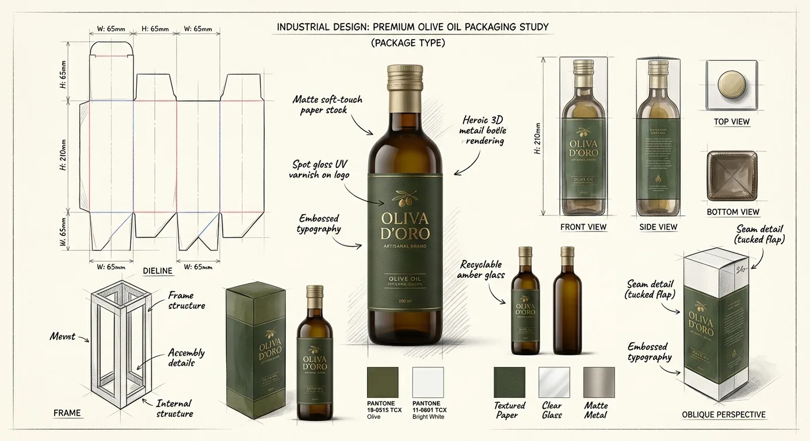

**#269 · Realistic, Ai Art · <code>Vinano Image Pro</code>**

> Keywords: realistic, AI art, AI prompt, text to image

<details>
<summary>Show prompt</summary>

```
the attached image, create an illustration sheet of professional industrial design packaging for the package (PACKAGE TYPE). A centered heroic 3D rendering realistic materials, soft studio lighting and commercial quality finishes. Surrounded by technical views: front, side, top, bottom, oblique perspective and flat position. Include sketches of the frame structure, crease lines, seam details, and size arrows in millimeters. Show materials and finishes (matte, glossy print, plastic, paper, glass, etc.) in handwritten annotations. Add color swatches, realistic product illustrations, and subtle shadows. Clean sketchbook background, realistic rendering + pencil sketch style, modern design design, ultra-detailed, portfolio ready. Render with rich micro-detail while keeping the layout uncluttered and intentional.
```

</details>

---

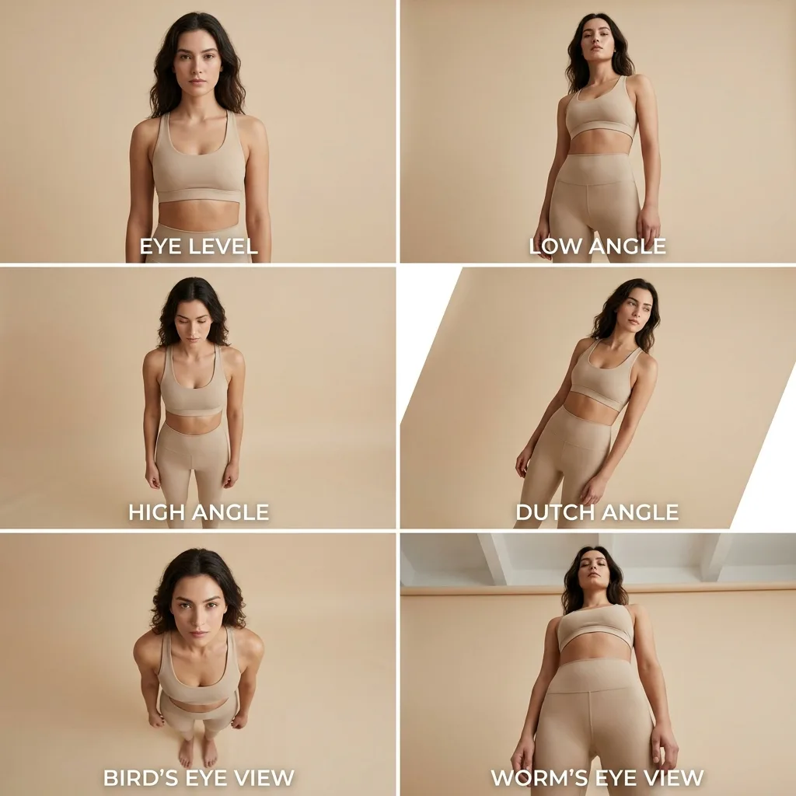

**#270 · Realistic, Portrait · <code>Vinano Image Pro</code>**

> Keywords: realistic, portrait, cinematic, AI art, AI prompt, text to image

<details>
<summary>Show prompt</summary>

```
Ultra-realistic fashion editorial composite image, 6-panel grid layout (3 rows, 2 columns), each panel clearly labeled minimal clean typography: “EYE LEVEL”, “LOW ANGLE”, “HIGH ANGLE”, “DUTCH ANGLE”, “BIRD’S EYE VIEW”, “WORM’S EYE VIEW”.

Same professional female model in all panels, consistent face identity, sharp jawline, natural makeup, slightly wavy dark hair, neutral expression.

Outfit: minimal beige sports bra and matching high-waist leggings, clean luxury athleisure fashion style.

Studio setting soft beige seamless background, high-end fashion photography lighting, soft shadows, ultra-clean aesthetic.

Each panel demonstrates different camera angle:

Eye Level: straight-on balanced portrait
Low Angle: camera below looking upward, strong presence
High Angle: camera above looking down
Dutch Angle: tilted frame, dynamic diagonal composition
Bird’s Eye View: top-down view, model looking up
Worm’s Eye View: extreme low ground perspective, dramatic upward shot

Cinematic fashion magazine quality, ultra realistic skin texture, 8k detail, sharp focus, symmetrical grid alignment, premium editorial layout, clean borders between panels, modern luxury look.

NEGATIVE PROMPT

blurry, low quality, extra limbs, distorted face, different person, inconsistent identity, text errors, watermark, logo, cartoon, CGI, oversaturated, bad anatomy

Aim for an editorial, design-driven look with deliberate negative space.
```

</details>

---

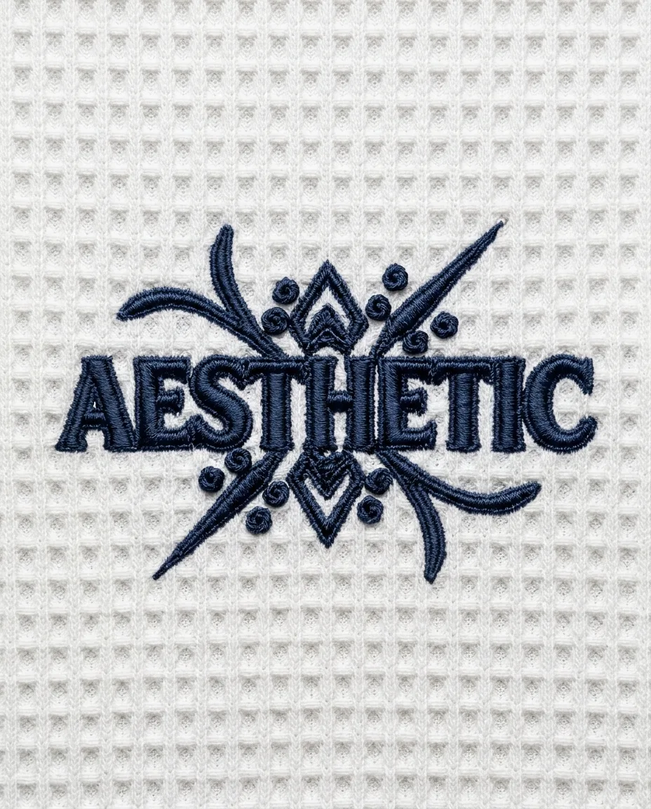

**#271 · Portrait, Character · <code>Vinano Image Pro</code>**

> Keywords: portrait, character, AI art, AI prompt, text to image

<details>
<summary>Show prompt</summary>

```
[BRAND NAME]

Act as a Macro Product Photographer and Textile Art Director shooting a close-up editorial campaign of a premium embroidered garment. References: Loro Piana fabric campaigns, Brunello Cucinelli texture photography, A.P.C. garment detail shoots, Japanese boro textile documentation.

PHASE 0: BRAND LOGO INTELLIGENCE

Retrieve the canonical logotype or primary mark of [BRAND NAME] from training data. Identify the core geometric essence of the logo — its fundamental shapes, stroke relationships, and compositional balance. Translate this identity into an embroidery-native form language: sharp geometric elements become satin stitch bars and needle-point spikes, circular elements become dense satin stitch ovals or French knot clusters, complex letterforms are simplified into their most essential strokes while remaining recognizable. The embroidery interpretation must feel like a deliberate premium interpretation of the brand mark — as if [BRAND NAME]'s design team commissioned an embroidery artist to translate their logo into thread. Autonomously determine the thread color most iconic to [BRAND NAME] — this becomes the primary embroidery thread color. If [BRAND NAME] has no dominant single color, default to deep navy #1A2332.

PHASE 1: TEXTILE BACKGROUND

The background is a premium waffle-knit cotton fabric — the weave structure is a precise geometric grid of raised square cells, each cell approximately 2×2mm equivalent, separated by thin recessed channels running both horizontally and vertically. The raised nodes of each cell are flat-topped, not rounded — creating a regular orthogonal relief pattern across the entire surface. The fabric color is cold off-white — #F0F0EE to #EBEBEA range, a very slight cool gray bias, not warm ecru or cream. The weave is consistent and uniform across the entire frame — machine precision, no tension variation, no distortion. Microscopic fiber fuzz is visible on the flat tops of the raised nodes — individual cotton fibers catching the diffused overhead light as a very fine surface bloom. The recessed channels between cells are in soft shadow — not deep shadow, just slightly darker than the raised nodes, consistent flat overhead illumination.

PHASE 2: EMBROIDERY CONSTRUCTION SYSTEM

The logo mark of [BRAND NAME] rendered as machine or hand embroidery these specific stitch techniques. Satin stitch: the primary technique for all filled areas and stroke elements — dense parallel threads laid side by side zero gap, creating a smooth glossy surface. Thread direction follows the long axis of each stroke element — horizontal strokes have horizontal threads, diagonal strokes have diagonal threads. The characteristic sheen of satin stitch is critical: threads catch light along their length creating bright reflective zones on thread-parallel surfaces and darker zones on thread-perpendicular surfaces, creating a directional shimmer across the embroidery surface. Stem stitch or outline stitch: used for any curved linear elements — thin continuous line of overlapping thread segments following curves natural flexibility. French knots: small circular dot elements rendered as tightly wound thread knots — each knot has a visible spiral wind pattern at macro distance. Spike elements: long tapering needle-like forms executed in satin stitch that tapers from full width to a single thread point — gradual and precise, ending in a razor-sharp thread tip.

Edge treatment: every embroidered element has a thin visible backing outline — 1 to 2 thread widths of the base fabric visible between the embroidery and the surrounding textile. This underlay/backing edge is slightly lighter than the main embroidery thread — it outlines every form and confirms the physical layering of embroidery over fabric.

Physical relief: the embroidery sits 1 to 3mm above the fabric surface — confirmed by a very subtle shadow halo directly underneath each embroidered element. The shadow is symmetrical around the embroidery perimeter, soft-edged, 1 to 2mm wide — consistent flat overhead illumination, not directional raking light.

PHASE 3: THREAD MATERIAL

Primary thread color: autonomously determined brand color from PHASE 0. Thread material: mercerized cotton or silk embroidery thread — high sheen, smooth filament surface. The thread color is never flat — it shifts in value along its length based on light angle. Directly lit zones approach a lighter more luminous version of the base color. Shadow zones approach a deeper more saturated version. The overall embroidery reads as one unified color but contains a full tonal range within that color family. Secondary thread: the backing/underlay edge thread is 2 to 3 shades lighter than the primary thread — creating the characteristic light outline visible around all embroidered elements.

PHASE 4: COMPOSITION & CAMERA

Camera body: Canon EOS R5 or Nikon Z8 — full frame, 45 megapixel minimum for fabric texture resolution. Lens: Canon RF 100mm f/2.8L Macro IS USM or Nikon Z MC 105mm f/2.8 VR S — used at moderate close-up distance, not at maximum 1:1 magnification. Focus distance: 40 to 55cm — the embroidery fills approximately 30 to 40% of the frame height, leaving generous fabric context on all sides. This is a moderate close-up, not extreme macro — the full embroidery composition is visible substantial textile surround. Aperture: f/8 to f/11 — deep depth of field, the entire embroidery and all surrounding fabric texture are in crisp simultaneous focus from corner to corner. No visible bokeh anywhere in the frame. Shutter speed: 1/200s continuous light source. ISO: 100 — base ISO, zero noise, maximum tonal resolution in the subtle gray shadows of the waffle recesses. White balance: 5600K — neutral daylight, renders the cold off-white fabric accurately without warm or cool shift. Exposure: slightly bright ETTR — the off-white fabric renders as a luminous near-white, embroidery thread reads as deep rich dark against the bright ground. Aspect ratio: 4:5 portrait. Camera perpendicular to fabric plane — zero perspective distortion, embroidery geometry rendered faithfully.

PHASE 5: LIGHTING

Primary light: large diffused overhead source — a 120×120cm softbox or diffusion panel positioned directly above the fabric at 60 to 80cm distance. The light is as close to flat and directionless as possible. No raking angle — the light comes from directly above at 85 to 90° to the fabric plane. This flat overhead lighting creates: uniform brightness across the entire fabric field no hot spots or falloff. Very short soft shadows in the recessed channels of the waffle grid — 1 to 2mm wide, soft-edged, falling straight down. Soft symmetrical micro-shadow halo directly beneath the embroidery — the 1 to 3mm relief creates a subtle darker zone immediately surrounding the embroidery perimeter, equal on all sides. No directional shadow — the shadow is not cast to one side. Secondary light: none. No fill, no rim, no accent. The single large overhead diffused source is the complete lighting setup. Overall mood: clinical, precise, bright — consistent product documentation or high-end textile editorial photography where the subject must be seen maximum clarity and zero atmospheric distraction.

PHASE 6: TECH SPECS

Render: Octane Render or Redshift fiber/textile displacement geometry. Thread geometry: actual 3D cylindrical thread strands — each thread strand is a real geometric object casting real shadows on adjacent threads, not texture maps. Fabric weave: real geometric displacement mesh for waffle structure — not normal map. Ray tracing: on — for accurate micro-shadow casting between individual thread strands and between embroidery and fabric surface. Subsurface scattering: subtle on thread material — mercerized cotton and silk have slight translucency. Depth of field: physically accurate — f/8 to f/11 at 100mm at 40 to 55cm focus distance, full frame sharp corner to corner. Anti-aliasing: maximum. Sampling: minimum 2048 samples — zero noise in shadow zones, full tonal resolution in the off-white fabric field. Output feel: this image should be indistinguishable from a photograph taken a Canon 100mm macro in a textile documentation studio. The viewer must feel the urge to touch the fabric.

Keep edges clean and the overall composition balanced for a polished, gallery-ready result.
```

</details>

---

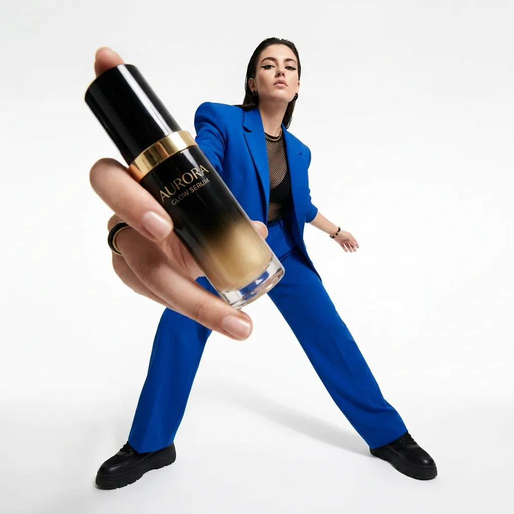

**#272 · Ai Art, Ai Prompt · <code>Vinano Image Pro</code>**

> Keywords: AI art, AI prompt, text to image

<details>
<summary>Show prompt</summary>

```
Low-angle fashion campaign photograph of a confident model holding a large [product name] very close to the camera, exaggerated perspective the hand and product dominating the foreground, full-body pose visible in the background, wide stance, dynamic posture, clean pure white studio background, high-key lighting, sharp focus on product, slight depth of field on the model, bold colorful outfit strong contrast tones, modern beauty advertising aesthetic, ultra-crisp composition, commercial studio photography, glossy packaging detail visible, crisp shadows Aim for an editorial, design-driven look with deliberate negative space.
```

</details>

---

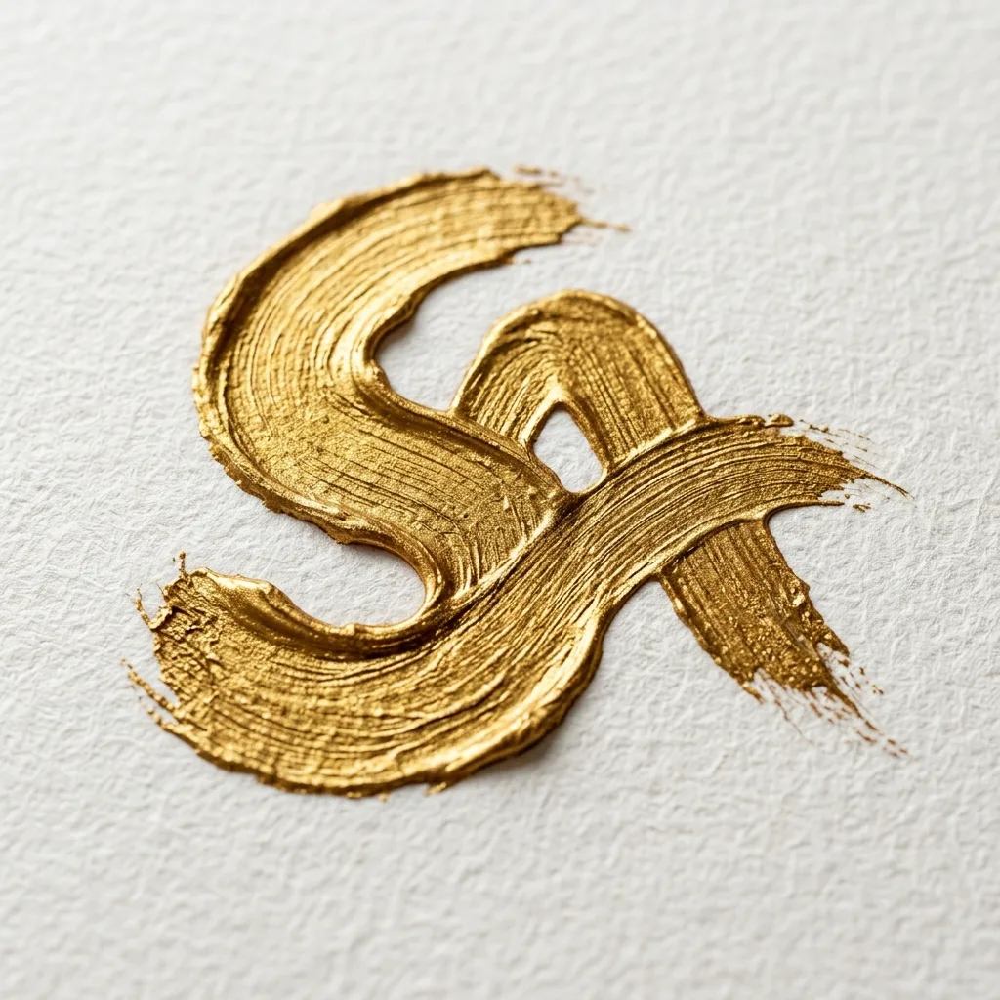

**#273 · Realistic, Minimalist · <code>Vinano Image Pro</code>**

> Keywords: realistic, minimalist, AI art, AI prompt, text to image

<details>
<summary>Show prompt</summary>

```
Ultra-realistic macro photograph of a [logo] created from a single bold metallic paint brushstroke on textured white paper, sculpted thick impasto paint, visible brush bristles, layered pigment density, rich metallic sheen, smooth curved stroke flow, natural handcrafted imperfections, tapered stroke endings, subtle smudged edges, raised paint thickness casting delicate shadows, premium editorial art direction, refined minimalist white background, soft diffused studio lighting, sharp focus, true-to-life photorealistic, 8k, no watermark, no extra text Emphasise material texture and natural light so the final frame feels tactile and premium.
```

</details>

---

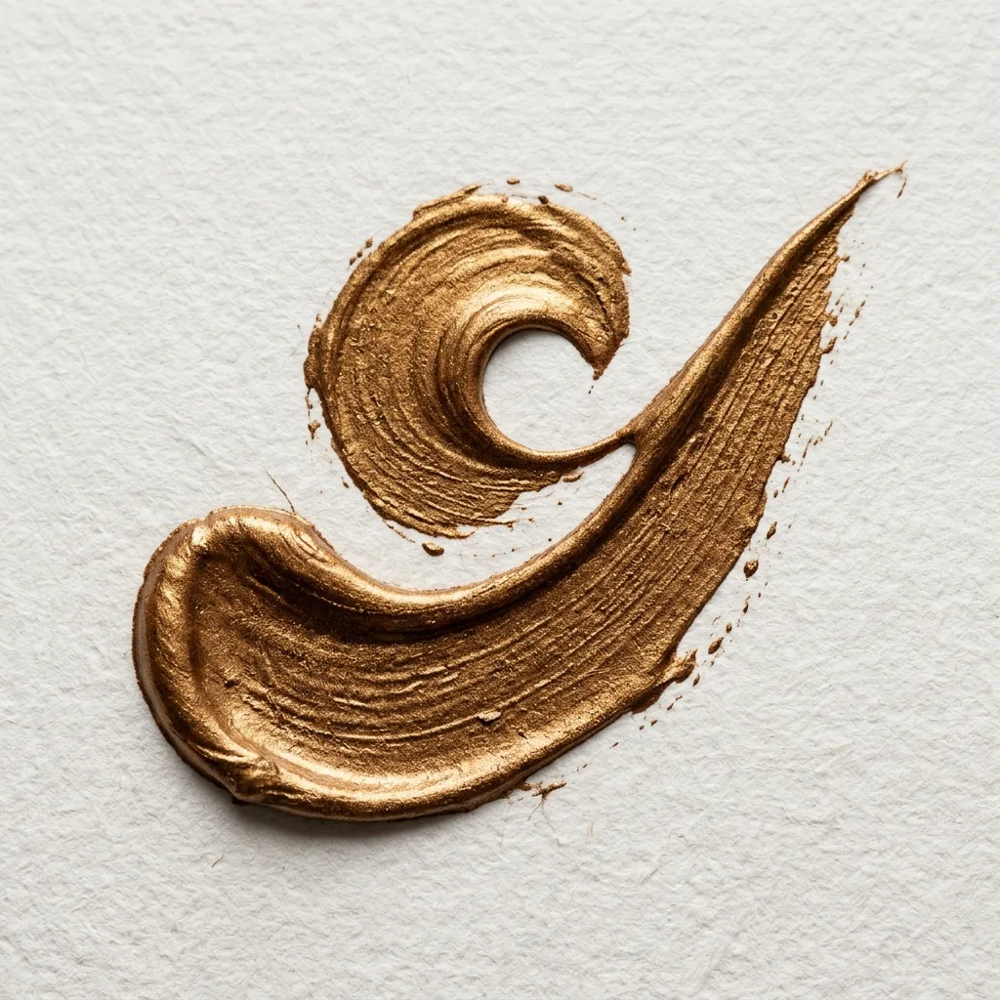

**#274 · Realistic, Minimalist · <code>Vinano Image Pro</code>**

> Keywords: realistic, minimalist, AI art, AI prompt, text to image

<details>
<summary>Show prompt</summary>

```
Ultra-realistic macro photograph of a [logo] created from a single bold metallic paint brushstroke on textured white paper, sculpted thick impasto paint, visible brush bristles, layered pigment density, rich metallic sheen, smooth curved stroke flow, natural handcrafted imperfections, tapered stroke endings, subtle smudged edges, raised paint thickness casting delicate shadows, premium editorial art direction, refined minimalist white background, soft diffused studio lighting, sharp focus, true-to-life photorealistic, 8k, no watermark, no extra text Keep edges clean and the overall composition balanced for a polished, gallery-ready result.
```

</details>

---

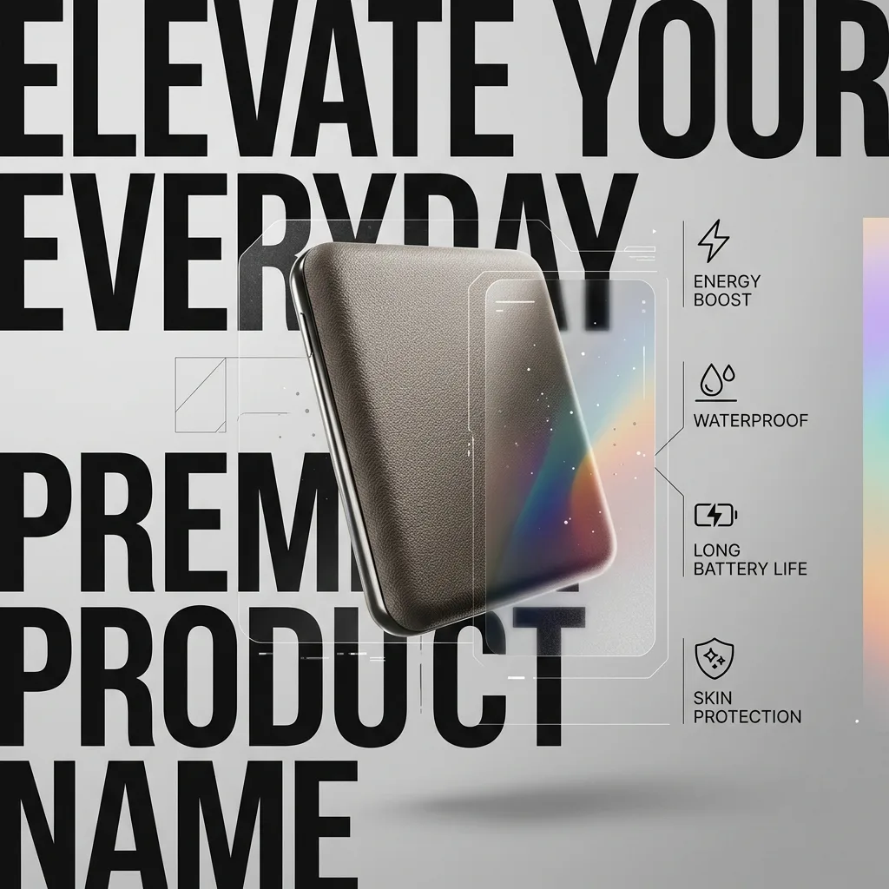

**#275 · Realistic, Cinematic · <code>Vinano Image Pro</code>**

> Keywords: realistic, cinematic, infographic, AI art, AI prompt, text to image

<details>
<summary>Show prompt</summary>

```
Use uploaded product image as the MAIN PRODUCT REFERENCE and preserve the exact product identity extremely high accuracy. Maintain original shape, proportions, materials, colors, logo placement, textures, packaging details, labels, typography, reflections, and overall product design language exactly as shown in the reference image. Do not redesign, simplify, distort, or alter the original product appearance.

Create a modern premium social media advertising campaign for:

“[PRODUCT NAME]”

Style: modern clean editorial aesthetic mixed premium Instagram advertising, luxury commercial branding, trendy streetwear-inspired layout, and high-end product campaign visuals.

Background: clean white, light gray, or soft neutral gradient background subtle studio lighting, premium negative space, soft shadows, polished reflections, and minimal futuristic atmosphere.

Composition: balanced asymmetrical composition the product as the main hero object positioned prominently in the layout. Add cinematic visual depth layered composition techniques, floating graphic accents, transparent overlays, geometric elements, and modern editorial spacing.

Typography: huge oversized bold typography integrated naturally into the composition: “[PRODUCT NAME]” or “[CUSTOM SLOGAN]”

Typography should: — partially extend outside frame — overlap naturally behind the product — use bold modern sans-serif fonts — create strong visual hierarchy — feel premium, trendy, futuristic, and commercial — blend naturally the layout like modern Instagram ads

Design Elements: — minimal geometric shapes — futuristic UI-inspired graphics — thin technical lines — abstract gradients — floating particles — subtle texture overlays — glossy reflections — premium shadows — modern infographic icons — product feature callouts — clean editorial spacing — luxury advertising composition — trendy social media campaign styling

Optional Feature Section: Add 3–5 minimal feature icons or short product highlights depending on the product category automatically.

Examples: — energy boost — waterproof — long battery life — skin protection — premium ingredients — fast charging — cooling effect — performance enhancement

Lighting: soft cinematic studio lighting realistic highlights, subtle reflections, clean shadows, glossy edges, and ultra-realistic commercial rendering.

Color Palette: automatically adapt the entire visual palette from the uploaded product colors for cohesive branding and premium visual consistency.

Final Look: ultra-realistic premium commercial advertisement, luxury Instagram carousel aesthetic, modern product campaign design, polished editorial quality, visually striking but clean and minimal, high-end branding presentation suitable for premium social media marketing.

Emphasise material texture and natural light so the final frame feels tactile and premium.
```

</details>

---

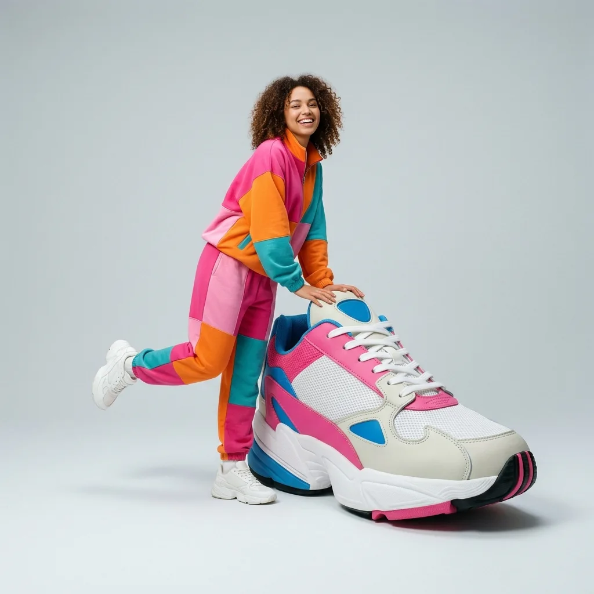

**#276 · Realistic, Ai Art · <code>Vinano Image Pro</code>**

> Keywords: realistic, AI art, AI prompt, text to image

<details>
<summary>Show prompt</summary>

```
[person], [pose], oversized product in the attached image as the main hero prop, playful fun energy, fashion editorial styling, clean minimal background, high key studio lighting, crisp soft shadow, ultra realistic commercial photography, wide angle low perspective, sharp focus, 8k, 1:1 Preserve realistic proportions and depth for a confident, professional finish.
```

</details>

---

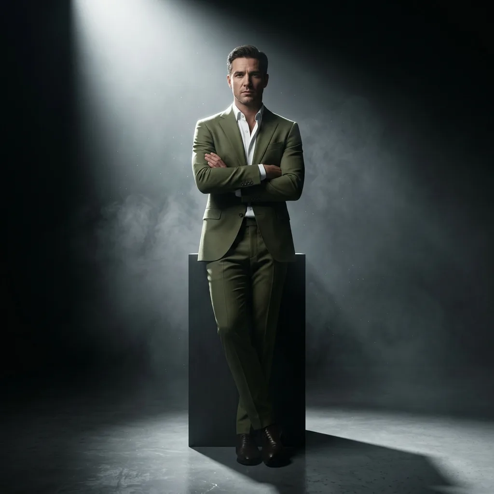

**#277 · Realistic, Portrait · <code>Vinano Image Pro</code>**

> Keywords: realistic, portrait, cinematic, minimalist, AI art, AI prompt

<details>
<summary>Show prompt</summary>

```
{
 "prompt": "Cinematic full-body studio portrait of a subject the uploaded face as exact reference (preserve identity, facial structure, and proportions). Slightly low-angle perspective a 35mm lens for a commanding, sophisticated presence. Subject leaning casually against a dark refined minimalist plinth, arms crossed. Wearing a perfectly tailored slim-fit olive green suit and a crisp white dress shirt, top buttons undone. Intense chiaroscuro lighting a single powerful volumetric spotlight from the upper-left, cutting through subtle atmospheric haze swirling smoke and micro-dust particles. Sharp rim highlights along shoulders and silhouette, deep velvety shadows across the body, high-contrast moody aesthetic. Hyper-realistic textures, visible fabric weave, subtle reflections on a polished studio floor, professional filmic, cinematic lighting, ultra-detailed, 8K resolution, no text, no watermark.",
 "resolution": "7680x4320",
 "camera": {
 "lens": "35mm",
 "angle": "slightly low-angle",
 "aperture": "f/2.0",
 "iso": "100",
 "shutter_speed": "1/125"
 },
 "quality": "ultra-high",
 "style": "cinematic, hyper-realistic, studio photography",
 "negative_prompt": "blurry, low-resolution, overexposed, underexposed, flat lighting, cartoon, CGI, plastic skin, extra limbs, distorted hands, bad anatomy, asymmetry, watermark, logo, text"
}

Aim for an editorial, design-driven look with deliberate negative space.
```

</details>

---

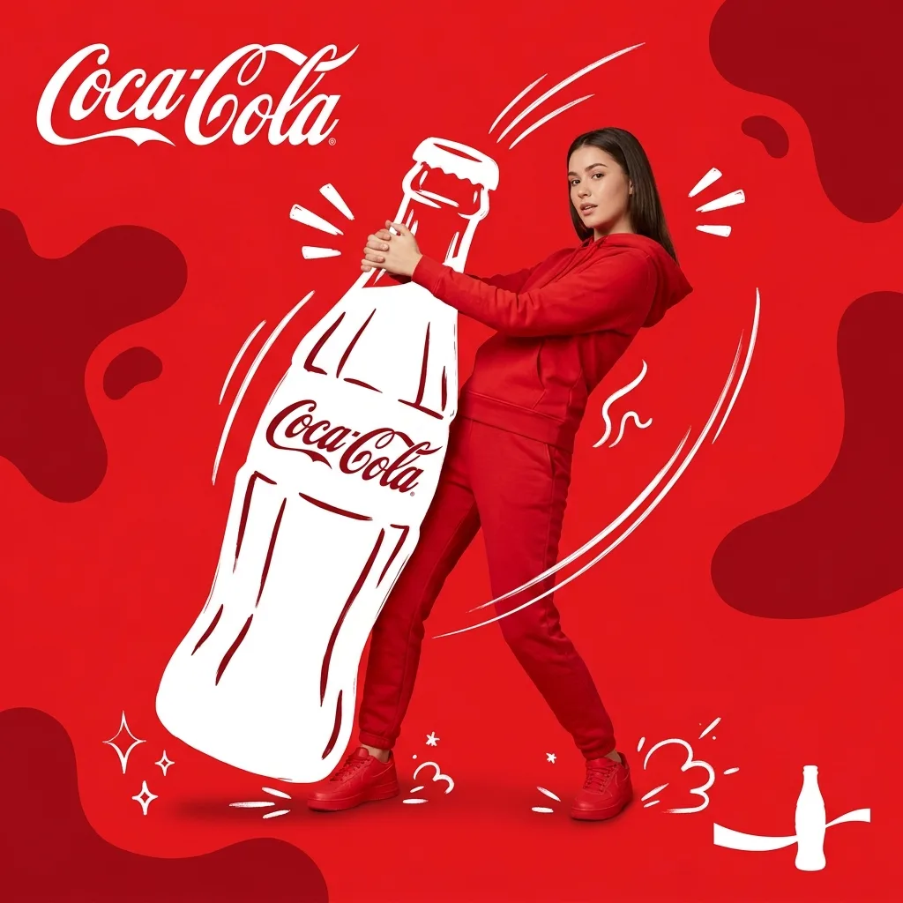

**#278 · Ai Art, Ai Prompt · <code>Vinano Image Pro</code>**

> Keywords: AI art, AI prompt, text to image

<details>
<summary>Show prompt</summary>

```
[BRAND NAME] + [HERO COLOR]

Act as a Mixed-Media Campaign Art Director. Your specialty: combining studio photography cutouts hand-drawn 2D illustration where the real human and the drawn object physically interact — touching, holding, standing on, leaning against, or the illustrated element as if it truly exists in their space.

PHASE 1: CANVAS & COLOR SYSTEM

Format: 1:1 square canvas. Base: single flat saturated color [HERO COLOR]. No gradients. No texture. Pure chromatic field.
Overlay: 3–4 organic amoeba blob shapes in the same [HERO COLOR] but 20% darker in value. Smooth edges, irregular silhouettes, scattered asymmetrically. Some bleeding off-frame.
Hand-painted feel, clean execution.

PHASE 2: AUTONOMOUS OBJECT SELECTION

BEFORE staging the scene, the AI must first make two autonomous decisions:
DECISION 1 — SELECT THE OBJECT: Analyze [BRAND NAME] and identify ONE iconic physical object from this framework:
— What is the single most recognizable product or artifact this brand has ever made?
— What object do fans of this brand collect, use daily, or photograph?
— What prop has defined this brand's visual identity across decades?
Do NOT choose animals. Do NOT choose logos. Choose a real, large, tangible object that can physically occupy space next to a person.
DECISION 2 — SELECT THE INTERACTION: Based on the chosen object, determine the most natural and visually dynamic way the real model can directly interact the drawn object.
Interaction must be:
✓ Physical and direct — hands touching, feet on, body leaning, arms around
✓ Immediately readable — the relationship between person and object is understood in under 2 seconds
✓ Scaled correctly — the object must be large enough to interact at human scale
✓ Active, not passive — the model is DOING something the object, not just standing next to it
INTERACTION TYPE EXAMPLES (AI selects the most brand-appropriate):
· HOLDING: model's real hands grip the illustrated object — cup, camera, trophy, bottle, bag
· WEARING/: model's real body wears or uses the object — sitting on a chair, wearing an illustrated hat, holding an illustrated product to their face
· STANDING ON: model's real feet are planted on top of the illustrated object — skateboard, surfboard, podium, giant sneaker
· RIDING/LEANING: model's real body leans against or drapes over the illustrated object — car hood, shopping cart, giant product silhouette
· EMERGING FROM: model appears to step out of or through the illustrated object — bursting through a giant sneaker box, rising from an illustrated cup

PHASE 3: STAGING THE SCENE

Once object and interaction are selected, stage the full scene:
MODEL:
Single model age 18–26, clean cutout, zero fringing. Pose is determined by the chosen interaction — the body position must make the interaction feel natural and physically believable.
Wardrobe: [BRAND NAME]'s most iconic apparel in [HERO COLOR] monochromatic palette.
ILLUSTRATED OBJECT: Pure white (#FFFFFF) flat 2D illustration. Brush-pen marker line quality, 3–5px weight. Slightly imperfect organic edges — hand-drawn feel, not vector-perfect. NO shading. NO gradients. Flat white fill only.

SCALE RULE — CRITICAL: The illustrated object must be LARGE. Minimum size: 40% of canvas height. The object should feel monumental — oversized relative to real-world scale is acceptable and encouraged. A coffee cup can be waist-height. A sneaker can be as tall as the model. Large scale = better readability = stronger visual impact.
DEPTH LAYERING — CRITICAL:The object must exist on multiple z-layers:
— Parts of the object sit BEHIND the model
— Parts of the object come IN FRONT of the model
— The model's real hands/feet make contact at the intersection point
This layering is what makes the scene feel integrated rather than collaged.
BRAND STAMP:
One small [BRAND NAME] logo mark appears on the object's surface — naturally embedded as if printed, engraved, or stitched. Rendered in [HERO COLOR] darker variant. Subtle, not dominant.

PHASE 4: SUPPORTING ILLUSTRATION SYSTEM

All supporting elements: white, flat, brush-pen line style. Same visual language as the hero object.
LOGO MARKS:
[BRAND NAME] primary icon in white:
— Large (upper-left corner, ~15% canvas width)
— Medium (opposite corner, ~10% canvas width)
IMPACT MARKERS: 2–3 manga-style exclamation dash clusters near the point of interaction between model and object — where hands grip, where feet land, where bodies touch. This emphasizes the physical connection.
MOTION LINES: 2–4 curved speed lines radiating from the object or the model's most active body part. Taper at ends. Cross behind and in front of the model for depth.

GROUND EFFECT: At the base of the scene: white illustrated ground interaction — sparkle stars, short speed dashes, or object-specific effect (splash if cup, dust clouds if sneaker landing, wheel tracks if skateboard).
AMBIENT SQUIGGLES: 1–2 loose organic white lines floating near the model's torso — visual rhythm connecting the photographic and illustrated layers.

PHASE 5: LIGHTING

Studio strobe, high-key, even and clean. 5500K neutral. No dramatic shadows on model. Soft contact shadow at model's feet (opacity 15%). The photography reads as natural and real against the graphic illustrated environment.

TECH SPECS

Aesthetic: mixed media — real photograph integrated hand-drawn 2D illustration. Color count: 3 maximum — [HERO COLOR] light, [HERO COLOR] dark blobs, white illustration. Photography skin tones and fabric colors are the only additional color exception. Illustration style: Y2K comic energy, Japanese streetwear magazine, brush marker. Composition: asymmetric and dynamic. The interaction point between model and object is the visual center of gravity — everything else orbits around it. No text. No wordmarks. Logo icon only. Mood: the model is not posing the object — the model is IN THE MIDDLE of it. Caught mid-action. Alive.

Maintain consistent colour harmony and crisp focus across the whole frame.
```

</details>

---

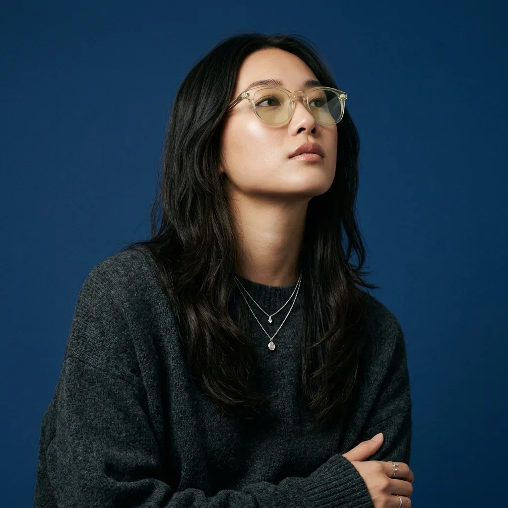

**#279 · Anime, Realistic · <code>Vinano Image Pro</code>**

> Keywords: anime, realistic, portrait, minimalist, AI art, AI prompt

<details>
<summary>Show prompt</summary>

```
Create image Create a high-end studio fashion portrait inspired by the uploaded blue-background reference photograph. Recreate the original composition matching framing, focal length feel, camera position, subject scale, perspective, and overall visual balance while maintaining a realistic photographic appearance.

Replace the reference model a beautiful young Japanese/Korean woman. Preserve authentic East Asian facial features, natural proportions, realistic skin texture, eye shape, facial structure, and cultural authenticity. Avoid exaggerated beauty filters, unrealistic facial modifications, or doll-like features. Maintain a natural, believable fashion-model appearance.

Match the original body language closely: upper torso visible, shoulders relaxed, chin slightly elevated, eyes directed upward beyond the camera, conveying quiet confidence, sophistication, and contemplation. Maintain the same sense of presence and spatial positioning within the frame.

Retain the rich cobalt-blue studio backdrop and the refined editorial atmosphere. Reproduce the original lighting setup soft directional illumination, subtle facial highlights, realistic reflections on eyewear and jewelry, and smooth shadow transitions around the jawline, neck, and clothing folds. Preserve depth, dimensionality, and professional studio realism.

Appearance:

Young Japanese/Korean woman in her early-to-mid 20s

Clear luminous skin natural texture

Soft almond-shaped eyes

Elegant facial structure

Healthy natural makeup subtle editorial refinement

Glossy neutral lips

Long dark hair styled in soft layers or gentle waves

Sophisticated yet approachable expression

Style the model in contemporary luxury street-fashion apparel. Use an oversized premium knit sweater, relaxed-fit sweatshirt, or fashion-forward refined minimalist streetwear silhouette natural fabric draping. Layer a delicate silver necklace, subtle rings, and lightly tinted translucent eyewear. Wardrobe should feel premium, modern, and suitable for a luxury fashion campaign.

Keep the image tightly composed the same portrait crop and subject placement. Ensure identical camera-to-subject distance and visual weight in the frame. The final result should feel indistinguishable from a genuine professional fashion photoshoot captured in this exact studio environment.

true-to-life photorealistic editorial photography, luxury fashion campaign, premium Korean/Japanese streetwear styling, deep monochromatic blue backdrop, realistic skin texture, subtle film-grade contrast, detailed fabric rendering, natural lighting falloff, commercial advertising quality, shallow depth of field, magazine-cover aesthetics, fashion-editorial realism, luxury street-fashion branding.

Negative Prompt:

Do not alter the background color or studio environment. Do not change the framing, crop, perspective, subject distance, or lighting direction. Avoid anime styling, illustration effects, CGI appearance, excessive retouching, artificial skin smoothing, exaggerated facial features, unrealistic eye size, porcelain skin effect, text overlays, logos, watermarks, duplicate subjects, distorted anatomy, extra limbs, or unrealistic clothing physics.

Preserve realistic proportions and depth for a confident, professional finish.
```

</details>

---

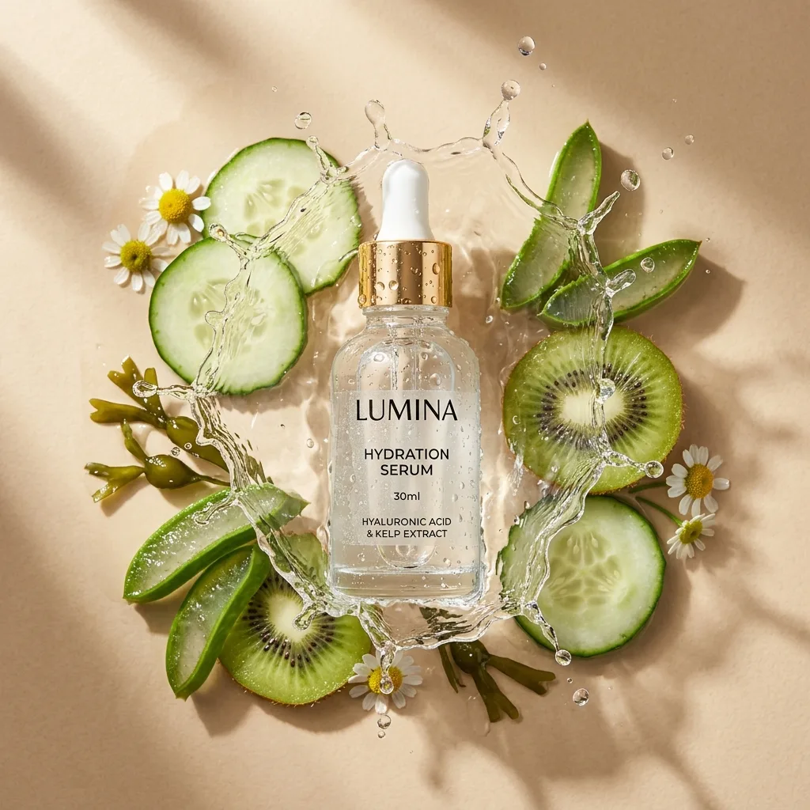

**#280 · Realistic, Product Photography · <code>Vinano Image Pro</code>**

> Keywords: realistic, product photography, AI art, AI prompt, text to image

<details>
<summary>Show prompt</summary>

```
[product], centered top down flat lay, surrounded by [ingredients], fresh slices and whole pieces, glossy wet look, water splash frozen mid motion around the product, dewy droplets on label and surface, warm beige seamless background, soft directional sunlight, crisp realistic shadow, high end skincare advertising, ultra realistic macro product photography, 100mm lens look, f/8 sharp focus, crisp composition, no extra text, 8k, 1:1 Render with rich micro-detail while keeping the layout uncluttered and intentional.
```

</details>

---

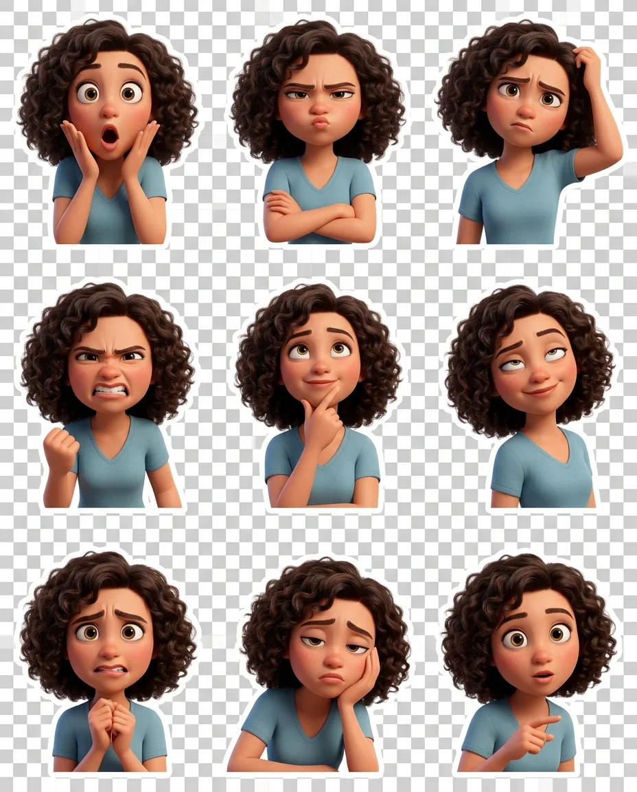

**#281 · Character, Ai Art · <code>Vinano Image Pro</code>**

> Keywords: character, AI art, AI prompt, text to image

<details>
<summary>Show prompt</summary>

```
the uploaded selfie as the ONLY and exclusive face reference, generate a Pixar-style 3D character sticker set. The character must be clearly recognizable as the person from the selfie. Create a neat 3×3 grid collage (nine stickers total). Final aspect ratio is strictly 4:5. Each cell shows a distinct pose and facial expression. Style and tone: Pixar-style 3D animation a meme-oriented feel. Exaggerated, slightly absurd emotions, playful overacting.

Highly readable expressions at small sizes, expressive eyes, eyebrows, and mouth. Subtle hand gestures where appropriate. Background and output: Fully transparent background (PNG). No backdrop, no background shadows. No text, captions, logos, or UI elements. Stickers must be ready for direct use in messengers. Consistency: Same hairstyle, clothing, colors, and character proportions across all nine stickers. Only facial expression and pose change.

Clean, polished 3D sticker look. Emotions (one per sticker, 3×3 grid): Surprised, Annoyed, Confused, Frustrated, Thoughtful, Sarcastic, Worried, Bored, Curious.

Render with rich micro-detail while keeping the layout uncluttered and intentional.
```

</details>

---

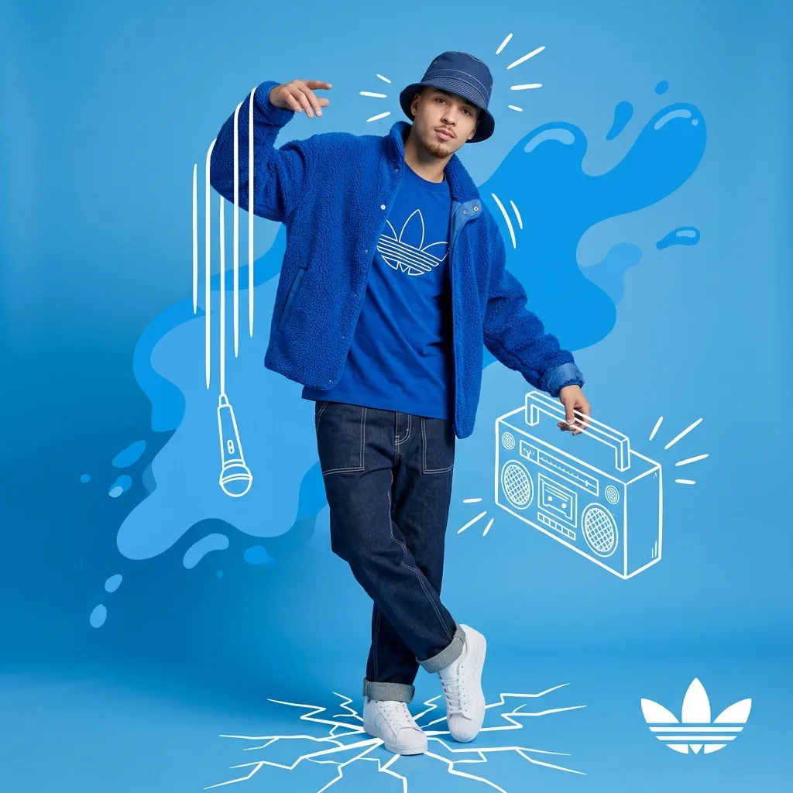

**#282 · Isometric, Realistic · <code>Vinano Image Pro</code>**

> Keywords: isometric, realistic, portrait, character, AI art, AI prompt

<details>
<summary>Show prompt</summary>

```
{
 "meta": {
 "image_quality": "High",
 "image_type": "Mixed Media (Photography combined Digital Illustration/Collage)",
 "resolution_estimation": "High resolution, sharp edges on vectors",
 "file_characteristics": {
 "compression_artifacts": "Low",
 "noise_level": "None",
 "lens_type_estimation": "Standard to slight wide-angle (approx 35mm)"
 }
 },
 "global_context": {
 "scene_description": "A full-body studio portrait of a young man posing dynamically against a solid bright blue background. The image is a composite featuring the photograph of the man overlaid white hand-drawn style vector graphics (doodles) and abstract blue liquid shapes. The subject is dressed in a monochromatic blue streetwear outfit white accents.",
 "environment_type": "Studio/Graphic Design Composition",
 "time_of_day": "Indiscernible (Studio Lighting)",
 "weather_atmosphere": "Energetic, Artistic, Urban, Cool",
 "lighting": {
 "source": "Artificial Studio Lighting",
 "direction": "Front-right dominant (creating soft shadows on the left side of the face)",
 "quality": "Soft, Diffused",
 "color_temperature": "Neutral white"
 },
 "color_palette": {
 "dominant_hex_estimates": ["#4CA7E8",
 "#0044CC",
 "#FFFFFF",
 "#1A2B45"],
 "accent_colors": ["#FFFFFF"],
 "contrast_level": "High"
 }
 },
 "composition": {
 "camera_angle": "Low-angle (looking slightly up at the subject)",
 "framing": "Full Shot (Head to Toe)",
 "depth_of_field": "Deep (Everything in focus)",
 "focal_point": "Subject's face and upper torso",
 "symmetry_type": "Asymmetrical balance",
 "rule_of_thirds_alignment": "Subject centered, graphics balancing the negative space"
 },
 "objects": [{
 "id": "obj_001",
 "label": "Male Subject",
 "category": "Person",
 "location": {
 "relative_position": "Center",
 "bounding_box_percentage": {
 "x": 0.30,
 "y": 0.05,
 "width": 0.40,
 "height": 0.85
 }
 },
 "dimensions_relative": "Large",
 "distance_from_camera": "Mid",
 "pose_orientation": "Standing, body angled slightly right, head tilted left, right hand raised near face, left leg crossed over right leg",
 "material": "Organic (Skin)",
 "surface_properties": {
 "texture": "Skin",
 "reflectivity": "Low",
 "micro_details": "Light goatee/facial hair, neutral but confident expression",
 "wear_state": "N/A"
 },
 "color_details": {
 "base_color_hex": "#5C3A2A",
 "secondary_colors": [],
 "gradient_or_pattern": "Natural skin tones"
 },
 "interaction_with_light": {
 "shadow_casting": "Self-shadows on neck and left side of face",
 "highlight_zones": "Forehead, right cheek, nose bridge",
 "translucency": "None"
 },
 "relationships": [{
 "type": "wearing",
 "target_object_id": "obj_002"
 },
 {
 "type": "wearing",
 "target_object_id": "obj_003"
 },
 {
 "type": "wearing",
 "target_object_id": "obj_004"
 },
 {
 "type": "wearing",
 "target_object_id": "obj_005"
 },
 {
 "type": "wearing",
 "target_object_id": "obj_006"
 },
 {
 "type": "interacting_with",
 "target_object_id": "obj_007"
 },
 {
 "type": "standing_on",
 "target_object_id": "obj_011"
 }]
 },
 {
 "id": "obj_002",
 "label": "Bucket Hat",
 "category": "Apparel",
 "location": {
 "relative_position": "Top-Center (On head)",
 "bounding_box_percentage": {
 "x": 0.45,
 "y": 0.05,
 "width": 0.10,
 "height": 0.08
 }
 },
 "dimensions_relative": "Small",
 "distance_from_camera": "Mid",
 "pose_orientation": "Worn on head, brim pulled slightly down",
 "material": "Denim/Canvas",
 "surface_properties": {
 "texture": "Woven fabric",
 "reflectivity": "Low",
 "micro_details": "Visible white contrast stitching around the brim and crown",
 "wear_state": "New"
 },
 "color_details": {
 "base_color_hex": "#003399",
 "secondary_colors": ["#FFFFFF"],
 "gradient_or_pattern": "Solid blue white stitching lines"
 }
 },
 {
 "id": "obj_003",
 "label": "Fleece Jacket",
 "category": "Apparel",
 "location": {
 "relative_position": "Upper Body",
 "bounding_box_percentage": {
 "x": 0.30,
 "y": 0.12,
 "width": 0.35,
 "height": 0.40
 }
 },
 "dimensions_relative": "Medium",
 "distance_from_camera": "Mid",
 "pose_orientation": "Worn open, sleeves rolled slightly or pushed up",
 "material": "Sherpa Fleece / Synthetic Blend",
 "surface_properties": {
 "texture": "High pile, fuzzy, nubby texture on outer shell",
 "reflectivity": "Low (Matte)",
 "micro_details": "Silver snap button visible on collar, smooth fabric lining visible at cuffs",
 "wear_state": "New"
 },
 "color_details": {
 "base_color_hex": "#0044CC",
 "secondary_colors": ["#002266"],
 "gradient_or_pattern": "Solid vivid blue"
 }
 },
 {
 "id": "obj_004",
 "label": "T-Shirt",
 "category": "Apparel",
 "location": {
 "relative_position": "Chest/Torso (Under jacket)",
 "bounding_box_percentage": {
 "x": 0.40,
 "y": 0.20,
 "width": 0.20,
 "height": 0.30
 }
 },
 "dimensions_relative": "Medium",
 "distance_from_camera": "Mid",
 "pose_orientation": "Worn on torso",
 "material": "Cotton jersey",
 "surface_properties": {
 "texture": "Smooth fabric",
 "reflectivity": "Low",
 "micro_details": "Large graphic print on chest",
 "wear_state": "New"
 },
 "color_details": {
 "base_color_hex": "#0044CC",
 "secondary_colors": ["#FFFFFF"],
 "gradient_or_pattern": "Large white outline of Adidas Trefoil logo on chest"
 },
 "text_content": {
 "raw_text": "adidas (implied by logo shape)",
 "font_style": "Logo symbol",
 "font_weight": "Bold",
 "text_case": "N/A",
 "alignment": "Center",
 "color_hex": "#FFFFFF"
 }
 },
 {
 "id": "obj_005",
 "label": "Jeans",
 "category": "Apparel",
 "location": {
 "relative_position": "Lower Body",
 "bounding_box_percentage": {
 "x": 0.40,
 "y": 0.45,
 "width": 0.20,
 "height": 0.40
 }
 },
 "dimensions_relative": "Medium",
 "distance_from_camera": "Mid",
 "pose_orientation": "Worn on legs, relaxed fit",
 "material": "Denim",
 "surface_properties": {
 "texture": "Woven denim",
 "reflectivity": "Low",
 "micro_details": "Heavy white contrast stitching along seams and pockets. Cuffs are rolled up exposing lighter reverse side of denim.",
 "wear_state": "New"
 },
 "color_details": {
 "base_color_hex": "#2A3B55",
 "secondary_colors": ["#FFFFFF",
 "#667788"],
 "gradient_or_pattern": "Dark wash indigo"
 }
 },
 {
 "id": "obj_006",
 "label": "Sneakers",
 "category": "Footwear",
 "location": {
 "relative_position": "Bottom-Center",
 "bounding_box_percentage": {
 "x": 0.35,
 "y": 0.85,
 "width": 0.25,
 "height": 0.10
 }
 },
 "dimensions_relative": "Small",
 "distance_from_camera": "Mid",
 "pose_orientation": "Right foot planted, left foot on toe/mid-step. Classic Adidas Superstar silhouette.",
 "material": "Leather/Rubber",
 "surface_properties": {
 "texture": "Smooth leather upper, textured rubber shell toe",
 "reflectivity": "Medium (Leather sheen)",
 "micro_details": "Three stripes visible (white on white), shell toe pattern",
 "wear_state": "Pristine/Clean"
 },
 "color_details": {
 "base_color_hex": "#FFFFFF",
 "secondary_colors": [],
 "gradient_or_pattern": "All white"
 }
 },
 {
 "id": "obj_007",
 "label": "Graphic - Mic Drop Lines",
 "category": "Illustration/Overlay",
 "location": {
 "relative_position": "Upper Left (Hanging from hand)",
 "bounding_box_percentage": {
 "x": 0.38,
 "y": 0.12,
 "width": 0.05,
 "height": 0.25
 }
 },
 "dimensions_relative": "Small",
 "distance_from_camera": "Zero (Overlay)",
 "pose_orientation": "Vertical",
 "material": "Digital Vector",
 "surface_properties": {
 "texture": "Flat color",
 "reflectivity": "None",
 "micro_details": "Three thick vertical white lines representing motion or cable"
 },
 "color_details": {
 "base_color_hex": "#FFFFFF",
 "secondary_colors": [],
 "gradient_or_pattern": "Solid"
 },
 "relationships": [{
 "type": "originating_from",
 "target_object_id": "obj_001"
 }]
 },
 {
 "id": "obj_008",
 "label": "Graphic - Microphone",
 "category": "Illustration/Overlay",
 "location": {
 "relative_position": "Mid Left (Below hand)",
 "bounding_box_percentage": {
 "x": 0.38,
 "y": 0.35,
 "width": 0.05,
 "height": 0.05
 }
 },
 "dimensions_relative": "Small",
 "distance_from_camera": "Zero (Overlay)",
 "pose_orientation": "Angled downwards",
 "material": "Digital Vector",
 "surface_properties": {
 "texture": "Hand-drawn line art style",
 "reflectivity": "None",
 "micro_details": "Outline of a dynamic vocal microphone"
 },
 "color_details": {
 "base_color_hex": "#FFFFFF",
 "secondary_colors": [],
 "gradient_or_pattern": "Outline only"
 }
 },
 {
 "id": "obj_009",
 "label": "Graphic - Boombox",
 "category": "Illustration/Overlay",
 "location": {
 "relative_position": "Center Right",
 "bounding_box_percentage": {
 "x": 0.65,
 "y": 0.30,
 "width": 0.15,
 "height": 0.20
 }
 },
 "dimensions_relative": "Medium",
 "distance_from_camera": "Zero (Overlay)",
 "pose_orientation": "Isometric view",
 "material": "Digital Vector",
 "surface_properties": {
 "texture": "Hand-drawn line art style",
 "reflectivity": "None",
 "micro_details": "Speaker grille mesh pattern, handle, buttons, cassette deck outline"
 },
 "color_details": {
 "base_color_hex": "#FFFFFF",
 "secondary_colors": [],
 "gradient_or_pattern": "Outline only"
 },
 "relationships": [{
 "type": "emitting",
 "target_object_id": "obj_013"
 }]
 },
 {
 "id": "obj_010",
 "label": "Graphic - Adidas Trefoil Logo",
 "category": "Illustration/Overlay",
 "location": {
 "relative_position": "Bottom Right",
 "bounding_box_percentage": {
 "x": 0.65,
 "y": 0.65,
 "width": 0.15,
 "height": 0.15
 }
 },
 "dimensions_relative": "Medium",
 "distance_from_camera": "Zero (Overlay)",
 "pose_orientation": "Flat",
 "material": "Digital Vector",
 "surface_properties": {
 "texture": "Flat color",
 "reflectivity": "None",
 "micro_details": "Classic 3-leaf shape horizontal stripes"
 },
 "color_details": {
 "base_color_hex": "#FFFFFF",
 "secondary_colors": [],
 "gradient_or_pattern": "Solid"
 }
 },
 {
 "id": "obj_011",
 "label": "Graphic - Cracked Floor",
 "category": "Illustration/Overlay",
 "location": {
 "relative_position": "Bottom Center (Under feet)",
 "bounding_box_percentage": {
 "x": 0.25,
 "y": 0.85,
 "width": 0.50,
 "height": 0.15
 }
 },
 "dimensions_relative": "Medium",
 "distance_from_camera": "Zero (Overlay)",
 "pose_orientation": "Flat perspective on ground",
 "material": "Digital Vector",
 "surface_properties": {
 "texture": "Line art",
 "reflectivity": "None",
 "micro_details": "Jagged lines radiating outward from the subject's stance like shattered glass"
 },
 "color_details": {
 "base_color_hex": "#FFFFFF",
 "secondary_colors": [],
 "gradient_or_pattern": "Line art"
 }
 },
 {
 "id": "obj_012",
 "label": "Graphic - Liquid Shapes",
 "category": "Illustration/Background Element",
 "location": {
 "relative_position": "Behind Subject",
 "bounding_box_percentage": {
 "x": 0.10,
 "y": 0.10,
 "width": 0.80,
 "height": 0.80
 }
 },
 "dimensions_relative": "Large",
 "distance_from_camera": "Behind Subject",
 "pose_orientation": "Fluid, amorphous",
 "material": "Digital Vector",
 "surface_properties": {
 "texture": "Flat color",
 "reflectivity": "None",
 "micro_details": "Blobs and splashes extending to the left and right, wrapping slightly around the subject"
 },
 "color_details": {
 "base_color_hex": "#5CAFF0",
 "secondary_colors": [],
 "gradient_or_pattern": "Slightly darker/more saturated than background blue"
 }
 },
 {
 "id": "obj_013",
 "label": "Graphic - Sound/Motion Lines",
 "category": "Illustration/Overlay",
 "location": {
 "relative_position": "Around Head and Boombox",
 "bounding_box_percentage": {
 "x": 0.60,
 "y": 0.05,
 "width": 0.25,
 "height": 0.40
 }
 },
 "dimensions_relative": "Small",
 "distance_from_camera": "Zero (Overlay)",
 "pose_orientation": "Radiating",
 "material": "Digital Vector",
 "surface_properties": {
 "texture": "Line art",
 "reflectivity": "None",
 "micro_details": "Short strokes indicating sound or movement above the hat and next to the boombox"
 },
 "color_details": {
 "base_color_hex": "#FFFFFF",
 "secondary_colors": [],
 "gradient_or_pattern": "Solid"
 }
 }],
 "background_details": {
 "texture": "Digital Flat Color",
 "patterns": "None (Solid Color)",
 "lighting_behavior": "Even illumination, no gradient visible",
 "additional_elements": ["Vector liquid shapes (obj_012) act as a secondary background layer"]
 },
 "foreground_elements": {
 "particles": "None",
 "artifacts": "White vector doodles (mic, boombox, cracks) act as foreground overlays"
 },
 "reconstruction_notes": {
 "mandatory_elements_for_recreation": ["Male model in full blue Adidas outfit",
 "Fleece texture on jacket",
 "White contrast stitching on jeans and hat",
 "Hand-drawn white doodle overlays (Mic, Boombox, Trefoil)",
 "Cracked floor effect under feet",
 "Monochromatic blue palette white accents",
 "Dynamic 'cool' pose"],
 "sensitivity_factors": "The blend between the realistic photo and the flat vector graphics must be sharp. The blue tones of the clothing must coordinate but distinguish from the background blue.",
 "ambiguities": "The exact specific model of the Adidas jacket is not identifiable by name but defined by texture (sherpa/fleece) and color."
 }
}

Render with rich micro-detail while keeping the layout uncluttered and intentional.
```

</details>

---

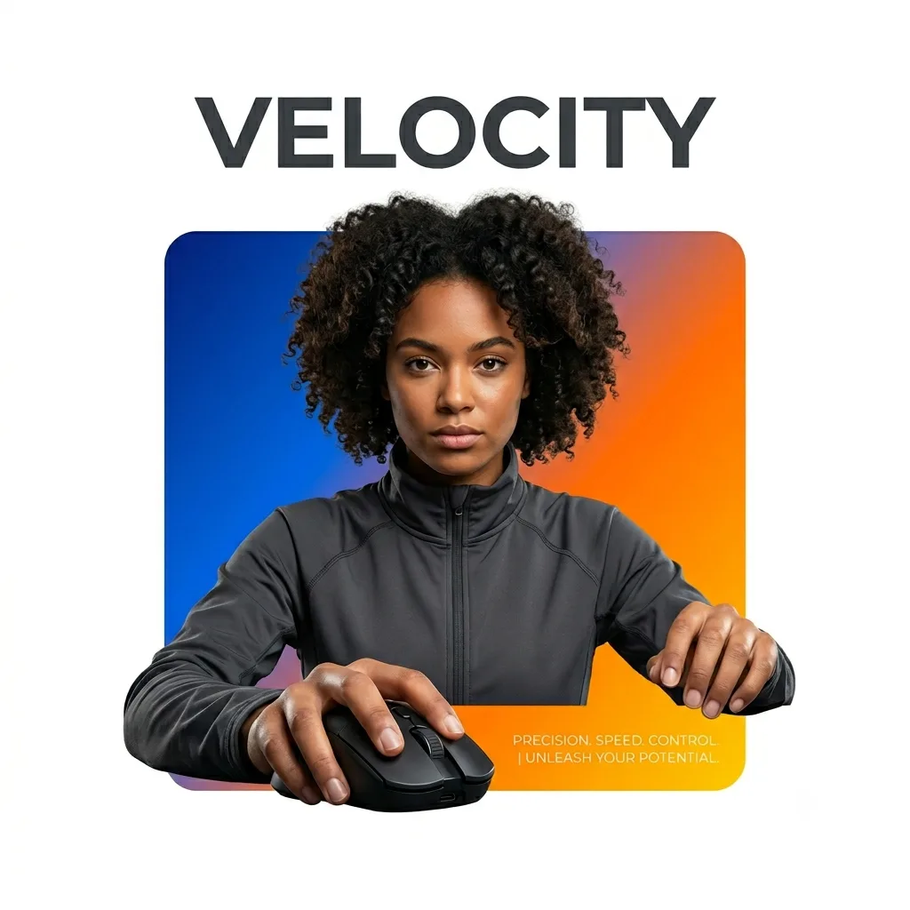

**#283 · Realistic, Character · <code>Vinano Image Pro</code>**

> Keywords: realistic, character, AI art, AI prompt, text to image

<details>
<summary>Show prompt</summary>

```
A professional high-end graphic design advertisement composition on a pure solid white canvas. Centered is a perfectly symmetrical, large solid rounded square (not a hollow frame). The entire interior of this square is filled a smooth, vibrant color gradient fading from [Top-Left Color/Hex] to [Bottom-Right Color/Hex].

A [Description of Character] is positioned such that the bottom of their torso is perfectly flush and aligned the very bottom edge of the square, leaving no thick colored border visible beneath them. Crucially, the person and their clothing maintain natural, realistic colors and textures, illuminated by professional studio lighting that is independent of the background gradient (preventing any color cast on their skin or clothes).

They are firmly and realistically gripping [Product Description]. Crucially, the top of their head and hair break the top boundary of the square, partially overlapping the white background. Their hands and the [Product Name] also break the side boundaries for a powerful 3D breakout effect, extending onto the white canvas.

Typography Layout: At the top, in the white space distinctly above the square a clear gap, is the [Font Style] brand text '[Brand Name]' in [Top Text Color]. In the bottom-right corner, layered directly on top of the gradient inside the square, is a block of small, thin, clean [Bottom Text Color] descriptive text: '[Slogan/Tagline]'.

The lighting is [Lighting Type: e.g., Sharp/Soft], crisp, and commercial, emphasizing the textures of both the subject and the product."

Preserve realistic proportions and depth for a confident, professional finish.
```

</details>

---


**#284 · Realistic, Cinematic · <code>Vinano Image Pro</code>**

> Keywords: realistic, cinematic, minimalist, AI art, AI prompt, text to image

<details>
<summary>Show prompt</summary>

```
[BRAND NAME]: The name of the brand.
Goal: Generate a single, refined minimalist, and surreal image where a cloud is shaped like the brand's logo.

1. THE LOGO CLOUD
- **Subject**: A massive, true-to-life photorealistic cumulus cloud in the exact geometric shape of the [BRAND NAME] logo.
- **Texture**: Puffy, soft, and voluminous natural sunlight illuminating the edges.
- **Volume**: 3D sculptural appearance realistic shadows within the cloud folds to show depth.

2. ENVIRONMENT & BACKGROUND
- **Sky**: A vast, clear, vibrant blue summer sky.
- **Secondary Elements**: A few small, wispy, natural clouds scattered far in the background to enhance the sense of scale and realism.
- **Lighting**: Bright, direct daylight coming from the side to create high-contrast highlights and shadows.

3. INTEGRATED BRANDING
- **Text**: The word "[BRAND NAME]" written in a clean, bold white sans-serif font.
- **Icon**: A small, flat white version of the brand's logo placed next to the text.
- **Positioning**: The branding (text + logo) is centered at the bottom of the frame, acting as a subtle anchor to the giant cloud above.

4. STYLE
- Surrealist photography, ultra-refined minimalist composition, high resolution, 8k, cinematic look, clean and airy vibe.

Maintain consistent colour harmony and crisp focus across the whole frame.
```

</details>

---

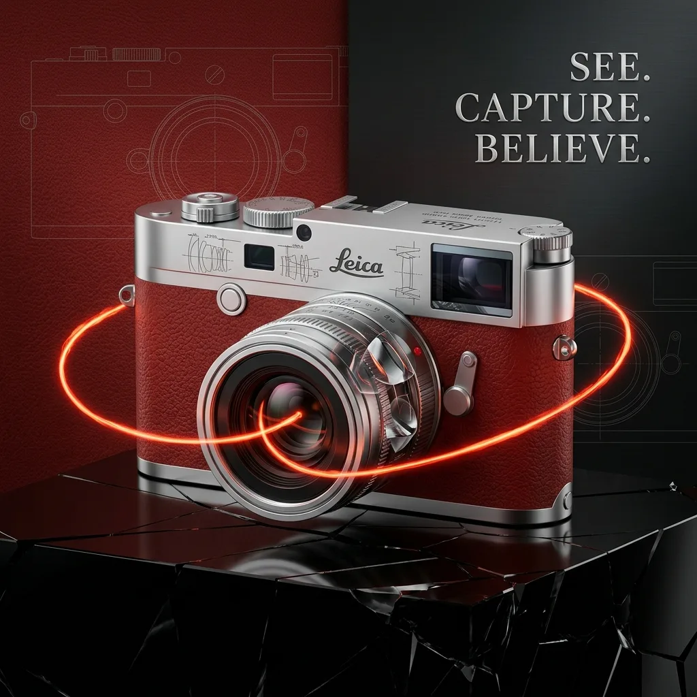

**#285 · Realistic, Cinematic · <code>Vinano Image Pro</code>**

> Keywords: realistic, cinematic, AI art, AI prompt, text to image

<details>
<summary>Show prompt</summary>

```
Create a realistic yet surreal creative advertisement for [PRODUCT NAME] in the [PRODUCT CATEGORY] space. The product must be the hero, centered in the frame, and visually “formed” in a smart way that automatically reflects the brand’s spirit and identity.

Use a clean, cohesive background that matches the brand’s color palette, soft filmic, cinematic lighting, ultra-realistic premium materials, precise shadows, and a high-end editorial composition.

Add one innovative surreal touch directly tied to the product’s nature—creative but not exaggerated.

Integrate the real official product logo elegantly and seamlessly within the composition, and generate a short, powerful 3-word English slogan automatically that fits the product type and brand tone.

Ultra-premium quality, perfectly balanced framing, strong realism, luxury style—no extra text beyond the logo and the 3-word English slogan.

Aim for an editorial, design-driven look with deliberate negative space.
```

</details>

---

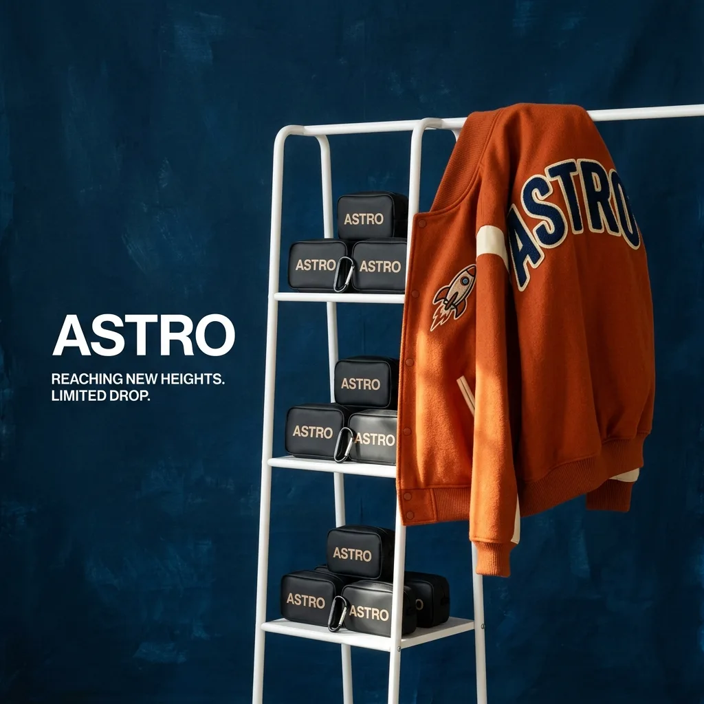

**#286 · Realistic, Ai Art · <code>Vinano Image Pro</code>**

> Keywords: realistic, AI art, AI prompt, text to image

<details>
<summary>Show prompt</summary>

```
[BRAND NAME]. Act as a Creative Director and Still Life Photographer for a hypebeast fashion publication.
THE TASK:
Create a high-end "Showroom Still Life" photograph announcing a limited merchandise drop for [BRAND NAME].
PHASE 1: AUTONOMOUS CURATION (STRATEGY)
Analyze [BRAND NAME]: Identify the industry and the core physical product (e.g., if "Spalding" -> Basketballs; if "McDonald's" -> Burger Boxes; if "Visa" -> Metal Cards).
Determine the Palette:
Background Color: A deep, rich, textured tone derived from the brand's secondary palette (e.g., Teal, Navy, Burgundy, Slate Grey).
Merch Color: A contrasting warm or neutral tone (Camel, Orange, Cream) to pop against the background.
Select the "Merch Item": Choose a premium-quality apparel piece relevant to the brand's vibe (e.g., a Varsity Letterman Jacket, a Heavyweight Hoodie, a Canvas Tote, or a Wool Scarf).
PHASE 2: SET DESIGN (THE RACK)
The Prop: A simple, modern White Powder-Coated Metal Rack or Shelf unit. It stands cleanly in the frame.
The Arrangement:
Hanging Item: The chosen "Merch Item" (e.g., the Jacket) is draped casually over the rack or hanging on a hanger, showing off the texture (wool/felt).
Stacked Items: On the shelves of the rack, stack multiple units of the brand's Core Product (e.g., a stack of basketballs, a pyramid of cans, a row of boxes).
The Background: A Hand-Painted Canvas Backdrop in the chosen Deep Background Color. Visible texture/brushstrokes are essential for that "studio" look.
PHASE 3: PHYSICAL BRANDING (TEXTURE)
On the Merch: The hanging apparel must feature premium-quality Physical Branding. Use "Chenille Patches", "Embroidered Logos", or "Screen Print" running down the sleeve or on the back. It must look like a real, expensive garment.
On the Products: Ensure the stacked core products have the correct [BRAND NAME] logo visible.
PHASE 4: PHOTOGRAPHY & LIGHTING
Lighting: Soft, directional window light from the side. Creates realistic, soft shadows on the rack and rich highlights on the textures.
Lens: 50mm or 85mm. Sharp focus on the merch, slight fall-off in the background.
PHASE 5: UI OVERLAY (THE "DROP" LAYOUT)
Left Side Alignment:
Large, clean White Logo of [BRAND NAME] floating in the negative space on the left.
Under the logo, small white text the brand's official slogan.

Maintain consistent colour harmony and crisp focus across the whole frame.
```

</details>

---

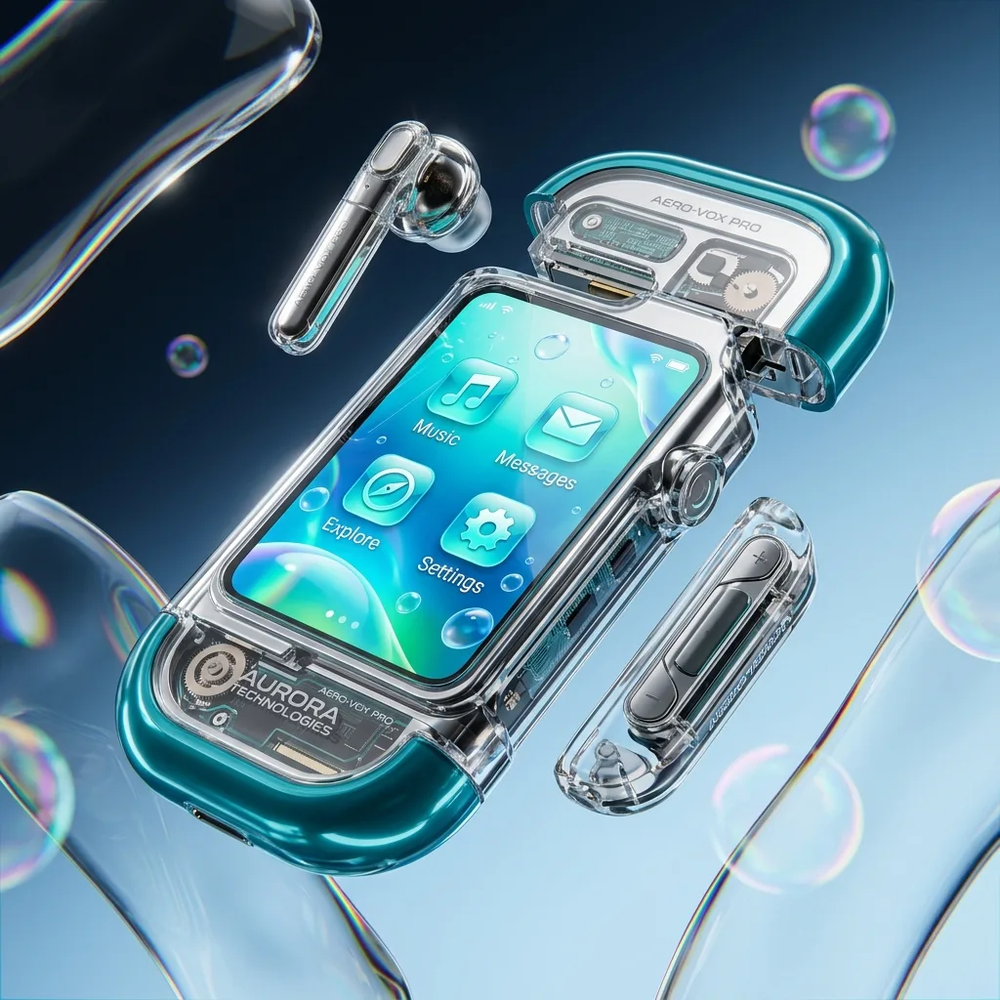

**#287 · Ai Art, Ai Prompt · <code>Vinano Image Pro</code>**

> Keywords: AI art, AI prompt, text to image

<details>
<summary>Show prompt</summary>

```
{
 "image_generation_request": {
 "subject": "[INSERT PRODUCT HERE]",
 "environment": {
 "background": "A smooth, professional dual-tone gradient transition between #111B24 and #CAEFFF",
 "lighting": "High-contrast studio lighting bright rim highlights to emphasize glossy textures"
 },
 "style_elements": {
 "aesthetic": "Y2K Frutiger Aero meets modern hyper-realism",
 "optical_effects": ["Dynamic glass refraction",
 "Prismatic chromatic aberration at the edges of transparent objects",
 "Iridescent lens flares",
 "Distorted glass overlays floating in the foreground"],
 "composition": "Floating, gravity-defying arrangement a wide-angle perspective",
 "textures": "Polished chrome, transparent acrylic, and high-gloss plastic"
 },
 "technical_specs": {
 "resolution": "8k UHD",
 "render_engine": "Octane Render style",
 "detailing": "Macro photography focus, hyper-detailed mechanical parts"
 }
 }
}

Preserve realistic proportions and depth for a confident, professional finish.
```

</details>

---

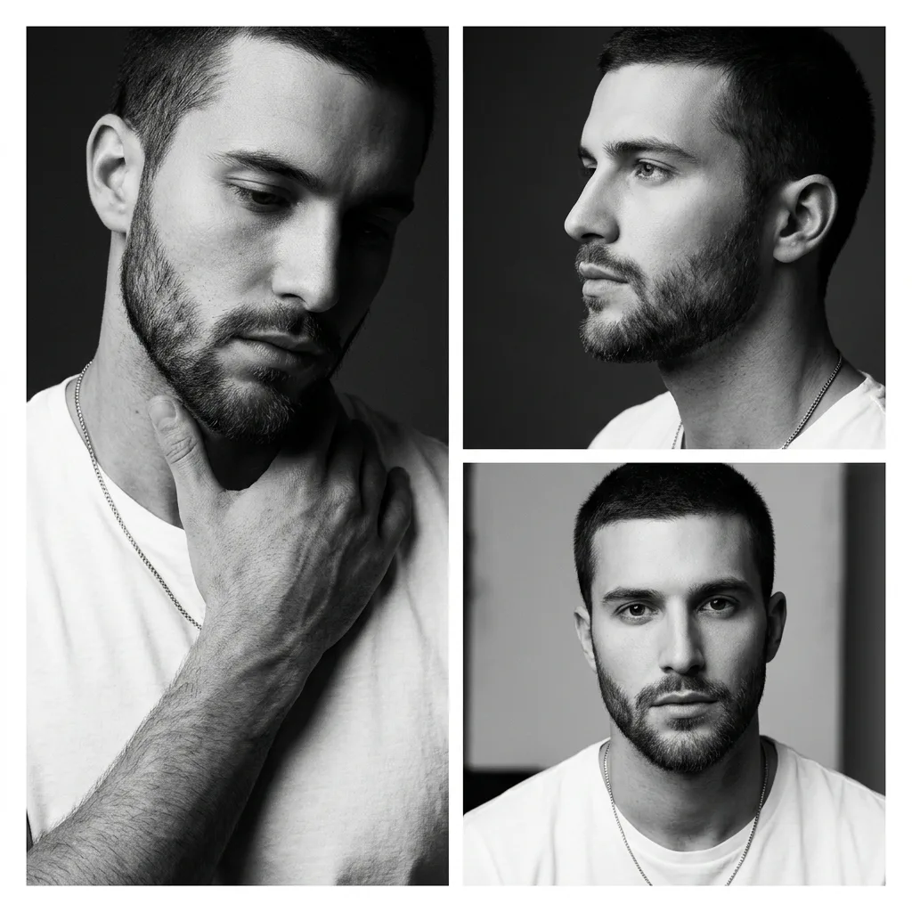

**#288 · Portrait, Cinematic · <code>Vinano Image Pro</code>**

> Keywords: portrait, cinematic, minimalist, AI art, AI prompt, text to image

<details>
<summary>Show prompt</summary>

```
Preserve the face, proportions, and external features of the model as in the reference. A refined minimalist monochrome fashion editorial triptych featuring three stacked cinematic frames. The subject is a young man short dark hair and a groomed beard. Frame 1: Emotional and introspective, looking downward a hand near the collarbone, highlighting bone structure Rembrandt lighting. Frame 2: A crisp profile shot a focus on the nose, lips, and masculine jawline, gaze directed slightly upward. Frame 3: A frontal, thoughtful portrait shoulders relaxed and direct eye contact. The composition is clean and modern, a white T-shirt and gold necklace for visual continuity. Commercial magazine quality, high-end mirrorless camera, authentic skin pores, soft bokeh, and elegant masculinity. Preserve realistic proportions and depth for a confident, professional finish.
```

</details>

---

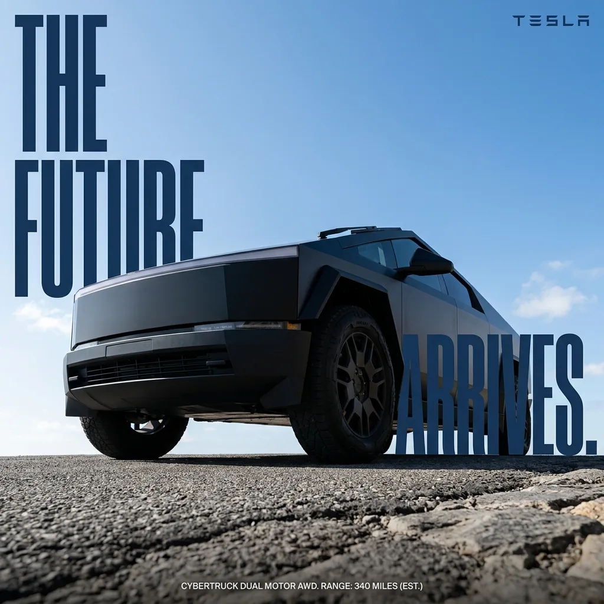

**#289 · Realistic, Character · <code>Vinano Image Pro</code>**

> Keywords: realistic, character, minimalist, AI art, AI prompt, text to image

<details>
<summary>Show prompt</summary>

```
[BRAND NAME] | [SLOGAN]. Act as a Professional Editorial Art Director.

PHASE 1: PHYSICS & GROUNDING (THE "STABILITY" RULE).
- Analyze [BRAND NAME] category:
 * CATEGORY A (Active/Sports/Fashion): The subject (person) is in a high-intensity leap, detached from the ground, silhouette against the sky.
 * CATEGORY B (Automotive/Heavy Goods): The subject (vehicle) must be HEROICALLY GROUNDED. Place the car firmly on a solid surface (asphalt, concrete, or rock).
 * Perspective: Use an extreme low-angle (worm's-eye view). The car must look massive and dominant, anchored to the bottom of the frame, towering over the viewer. NO floating or flying for vehicles.

PHASE 2: DYNAMIC PHOTOGRAPHY & LIGHTING.
- Environment: A vast, clear blue sky minimal soft clouds.
- Lighting: Natural, direct sunlight. High-contrast shadows on the subject to emphasize form and texture.
- Style: High-end 8k commercial photography. Sharp focus.

PHASE 3: TYPOGRAPHY & LAYOUT (MATTE FINISH).
- Layout: Use the text from "[SLOGAN]" as massive, ultra-condensed bold sans-serif characters.
- Execution: Split "[SLOGAN]" into two parts: one on the far left, one on the far right.
- Depth: A part of the subject (e.g., a bumper, a mirror, or a person's limb) must overlap the letters to create a 3D effect.

PHASE 4: COLOR STRATEGY (MATTE & REALISTIC).
- Graphic Color: NO NEON. Use a solid, matte brand color for the text (e.g., flat Navy for BMW, flat Red for Red Bull). The color must be opaque and non-glowing, resembling premium-quality print ink.
- Photo Color: Maintain authentic, rich photographic colors for the subject and the sky. The contrast comes from "Flat Graphic vs. Realistic Photo".

PHASE 5: FINAL BRANDING.
- Logo: Small refined minimalist [BRAND NAME] logo in the upper corner.
- Metadata: Tiny secondary text in a clean sans-serif font at the bottom for a technical/editorial look.

Maintain consistent colour harmony and crisp focus across the whole frame.
```

</details>

---

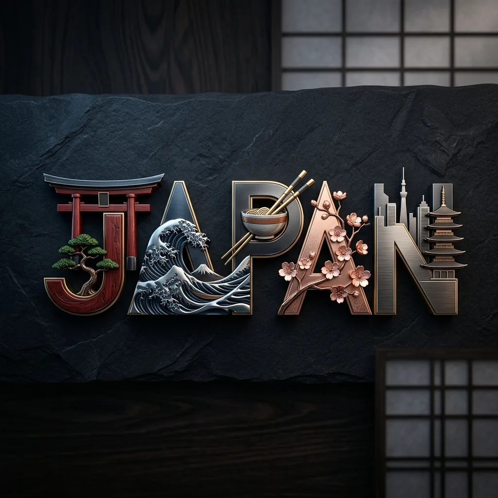

**#290 · Realistic, Cinematic · <code>Vinano Image Pro</code>**

> Keywords: realistic, cinematic, AI art, AI prompt, text to image

<details>
<summary>Show prompt</summary>

```
A premium-quality 3D metallic typography design of the word [COUNTRY NAME], set against a dark, textured background that complements the identity of [COUNTRY], creating a cinematic, premium visual tone.

Each individual letter is uniquely designed to represent a distinct cultural element, tradition, landmark, or national symbol from [COUNTRY], intelligently adapted to the letter’s shape while maintaining perfect readability.

Cultural elements may include (but are not limited to):
– iconic architecture or monuments
– traditional patterns, textiles, or crafts
– national sports or tools
– folklore, heritage symbols, or historical motifs
– nature elements strongly associated the country

No two letters repeat the same cultural reference — every letter tells a different cultural story.

The typography features polished metallic material (gold, silver, or [COLOR]), realistic reflections, fine engravings, and subtle surface wear for authenticity.

Dramatic studio lighting soft rim highlights and deep shadows enhances depth and form.

Ultra-sharp focus, premium 3D render quality, cinematic depth, luxury branding aesthetic, ultra-high resolution.

Maintain consistent colour harmony and crisp focus across the whole frame.
```

</details>

---

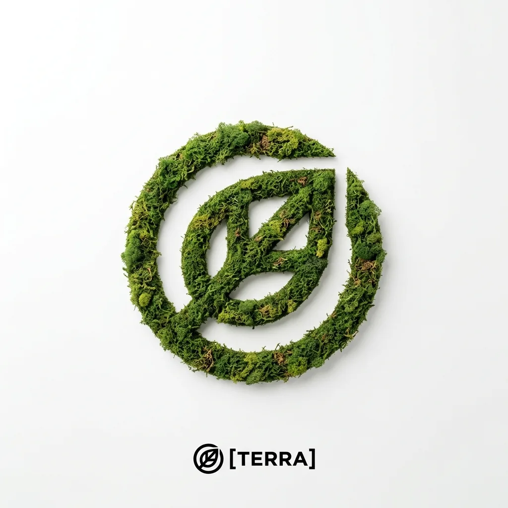

**#291 · Product Photography, Minimalist · <code>Vinano Image Pro</code>**

> Keywords: product photography, minimalist, AI art, AI prompt, text to image

<details>
<summary>Show prompt</summary>

```
[BRAND NAME]: Enter the brand name here.
Goal: Generate a refined minimalist organic image where a stylized logo icon of [BRAND NAME] is transformed into a large moss-textured artifact, a small brand signature at the bottom.
Constraint: NO TEXT inside or immediately near the central moss icon. Only the bottom signature.

1. THE CENTRAL MOSS ICON
- Main Subject: A large, geometrically precise symbol, sculpted into the exact form of the [BRAND NAME] logo icon.
- Material: The symbol is entirely made of dense, heavily textured, natural green stabilizing moss. The texture is rough and organic varying shades of green and brown.
- Form: The geometric edges are sharp and clean, but filled the soft, billowy texture of moss.

2. ENVIRONMENT & LAYOUT
- View: A top-down, central flat lay view.
- Background: A flawless, uniform, matte white studio background. Full refined minimalist negative space.
- Lighting: Bright, soft, diffused studio lighting that emphasizes the tactile moss texture while minimizing harsh shadows.

3. BOTTOM BRAND SIGNATURE (CRITICAL)
- Placement: A clean horizontal signature block centered at the bottom, far below the moss icon.
- Elements: A tiny, flat, refined minimalist version of the [BRAND NAME] logo icon on the left.
- Text: The word "[BRAND NAME]" in a clean, bold, black sans-serif typeface immediately to the right of the tiny logo.
- Scale: The signature must be very small compared to the central moss artifact.

4. AESTHETIC
- Biophilic design, premium product photography, clean, fresh, airy, high-end editorial look. 8k resolution.

Aim for an editorial, design-driven look with deliberate negative space.
```

</details>

---

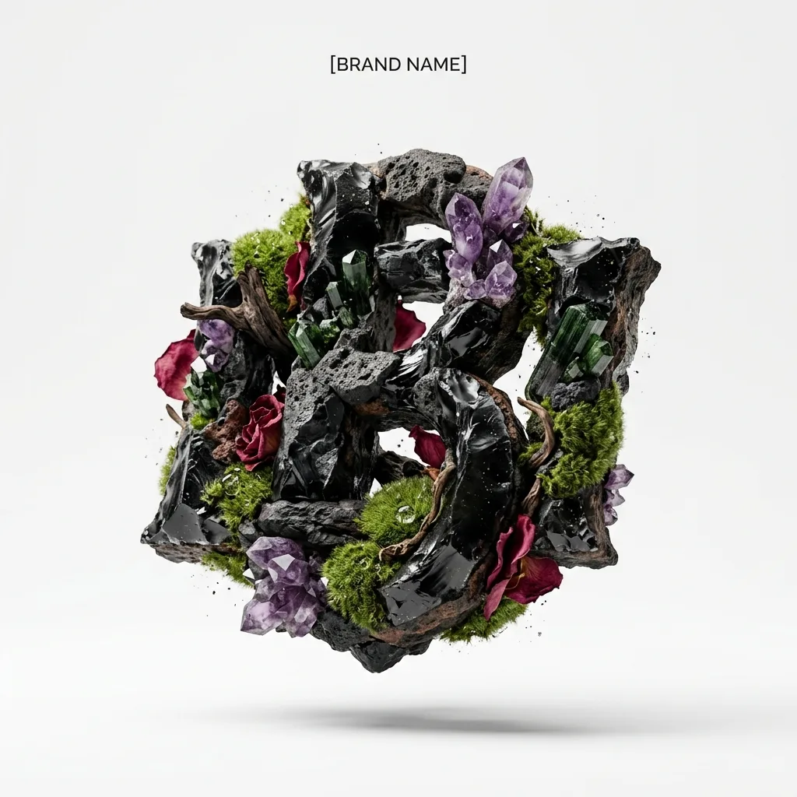

**#292 · Realistic, Minimalist · <code>Vinano Image Pro</code>**

> Keywords: realistic, minimalist, AI art, AI prompt, text to image

<details>
<summary>Show prompt</summary>

```
[BRAND NAME]. Act as a Master of Material Science and World-Class 3D Visualizer.
PHASE 1: DYNAMIC ELEMENTAL RECONSTRUCTION.
The central subject is the iconic logo of [BRAND NAME], physically constructed from ANY raw natural element.
CRITICAL: This includes, but is not limited to, botanical elements (flowers, rose petals, thorns, gnarled wood, moss, leaves) and geological/elemental materials (obsidian, crystals, flowing water, ice, volcanic rock).
The logo must be medium-sized, levitating, and rotated at a dynamic 3D angle (3/4 view) to showcase its volume.
PHASE 2: HYPER-TACTILE TEXTURE & REALISM.
The goal is "Sensory Realism" — the viewer should feel they can touch the object.
- If BOTANICAL: Render microscopic cellular structures on petals, dew droplets refraction, and the velvety fuzz on stems.
- If MINERAL: Render micro-pores, crystalline inclusions, and razor-sharp edges.
Include subtle "imperfections" like dust particles or organic irregularities to break the CG look and achieve 100% photorealism.
PHASE 3: COMPOSITION, LIGHTING & BRANDING.
- ENVIRONMENT: A pure, clinical, solid white background for a High-Key commercial look.
- TYPOGRAPHY: At the top of the frame, place a very small, refined minimalist [BRAND NAME] text logo in black.
- LIGHTING: Precise studio setup sharp specular highlights (glints) and a soft, realistic contact shadow on the white floor below to ground the levitating object.
TECH SPECS:
Extreme Macro photography, 100mm lens, f/8, Ray Tracing (Path Tracing), Subsurface Scattering for light depth, 8k resolution, Unreal Engine 5.4 / Octane Render aesthetic.

Preserve realistic proportions and depth for a confident, professional finish.
```

</details>

---

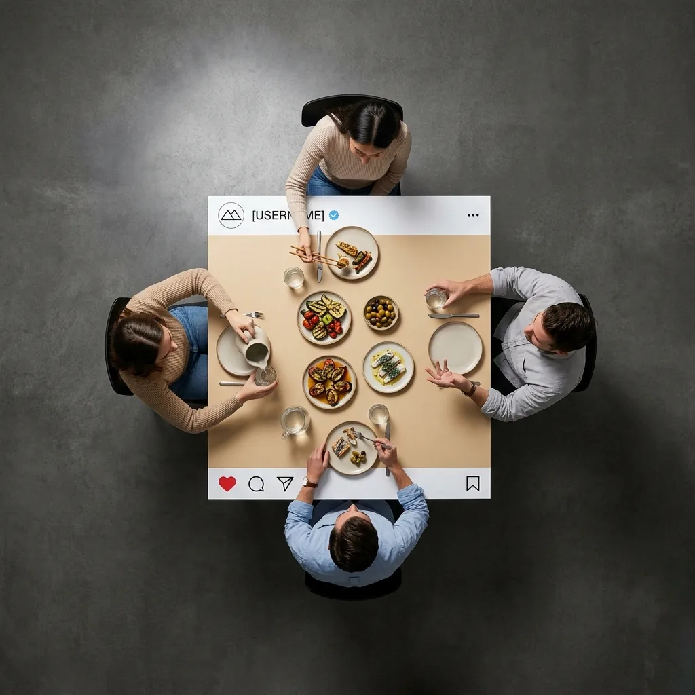

**#293 · Realistic, Minimalist · <code>Vinano Image Pro</code>**

> Keywords: realistic, minimalist, AI art, AI prompt, text to image

<details>
<summary>Show prompt</summary>

```
Ultra-wide-angle hyper-realistic shooting in top-down mode. A group of 4 real people sitting at a square dining table. The camera is pushed far back, creating a significant negative space (empty floor area) around the people and the table, which provides a clear, minimalistic composition. Scene [ATMOSPHERE AND CLOTHING]: Four people are dressed in [STYLE OF CLOTHING]. Their interaction is specific: [DESCRIBE EACH PERSON'S ACTIONS]. The table is a custom-made physical prop, designed as an Instagram post: it has a solid white stripe ONLY along the top and bottom edges (no white frames on the left or right). - The upper white stripe shows a drawn profile photo [LOGO DESCRIPTION], the username "[USERNAME]", followed by a small blue icon a confirmed check mark, and "..." on the right. - Red hearts, comment and share icons are painted on the bottom white stripe on the left, and a Bookmarks icon on the right. The center of the table is filled in [THE EXACT COLOR OF THE CENTER and the hexadecimal CODE]. The table shows [FOOD ITEMS/ITEM DESCRIPTIONS]. important: ALL food, beverages, objects, and hands that interact them must be located strictly within this central area, colored in [COLOR]. NOTHING should go beyond the white stripes or beyond the table. The background of the floor is [THE COLOR OF THE FLOOR] to create a visual separation. Professional studio lighting clear shadows. 8k, clear focus. Aim for an editorial, design-driven look with deliberate negative space.
```

</details>

---

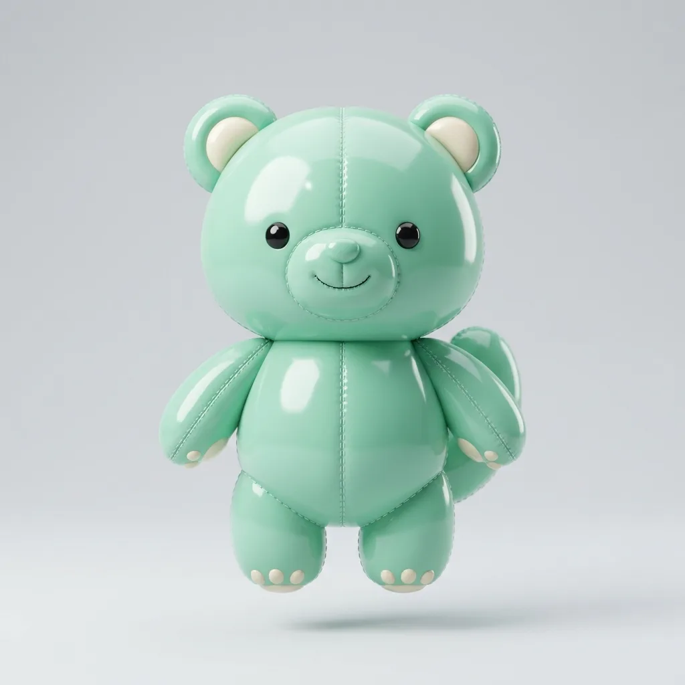

**#294 · Realistic, Ai Art · <code>Vinano Image Pro</code>**

> Keywords: realistic, AI art, AI prompt, text to image

<details>
<summary>Show prompt</summary>

```
[SUBJECT], ultra realistic 3D render, smooth inflated glossy plastic material, soft pillowy balloon like contours, subtle stitched panel seams and paneling, high specular highlights, clean reflections, soft contact shadows, designer collectible toy aesthetic, cute proportions, premium polished finish, floating centered, plain light gray studio background, soft diffused studio lighting, sharp focus, high resolution, 8k, 1:1, no text, no logo, no watermark Render with rich micro-detail while keeping the layout uncluttered and intentional.
```

</details>

---

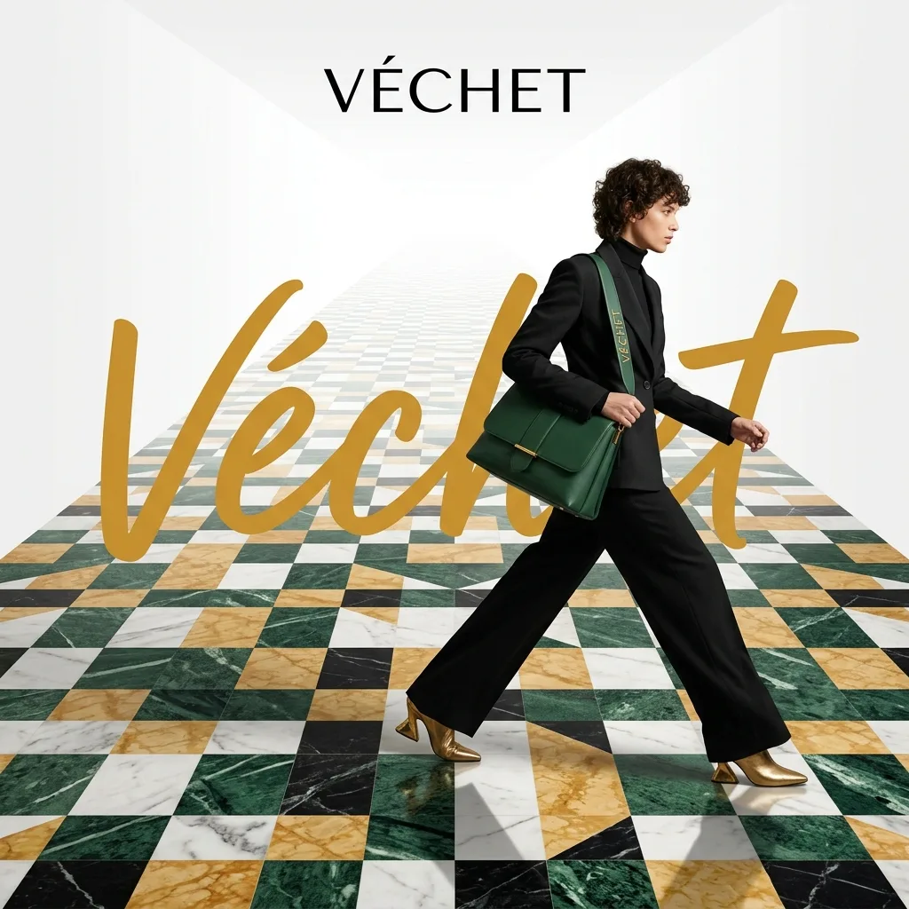

**#295 · Realistic, Ai Art · <code>Vinano Image Pro</code>**

> Keywords: realistic, AI art, AI prompt, text to image

<details>
<summary>Show prompt</summary>

```
[BRAND NAME]. Act as a Fashion Photographer and Graphic Designer specializing in luxury brand campaign visuals integrated typography and surreal spatial design.

PHASE 1: SPATIAL CONCEPT

Create a high-fashion editorial image where architecture and graphic design merge into a theatrical stage. The foundation is a bold geometric floor pattern that extends into forced perspective, creating infinite depth and visual drama. This is not a neutral backdrop – the floor is a protagonist that amplifies brand identity through pattern, color, and spatial illusion.

PHASE 2: CHECKERBOARD ARCHITECTURE

- Surface: Checkerboard/geometric tile pattern rendered in brand-relevant colors

- Perspective: Aggressive forced perspective starting from bottom foreground and receding toward horizon (vanishing point at upper third of frame)

- Pattern Logic: Autonomously determine pattern based on [BRAND NAME]:

- Color Palette: Incorporate 2-3 signature colors of [BRAND NAME] into floor pattern while maintaining readability

- Texture: true-to-life photorealistic rendering subtle reflections and shadows for depth

PHASE 3: MODEL & STYLING

- Subject: One fashion model (gender-fluid casting) captured mid-motion – dynamic pose suggesting walking, running, or dancing

- Outfit: Elevated monochrome look (black, white, or brand-neutral tone) to let floor pattern and typography dominate. Include 1-2 key accessories in [BRAND NAME]'s signature color as hero product focal points

- Pose Energy: 70% movement, 30% control – fashion-forward but grounded (avoid floating/unnatural levitation)

- Placement: Model positioned in lower-mid frame, interacting spatially both floor perspective and typography layer

- Camera Angle: Low-to-mid angle (waist-to-full body shot) to emphasize floor perspective drama

PHASE 4: TYPOGRAPHY INTEGRATION

- Brand Script: Oversized handwritten/script version of [BRAND NAME] rendered as flat graphic element behind or around the model

- Scale: Typography should be 40-60% of frame width – bold and unmissable but not crushing the model

- Color: Signature brand color (autonomously selected), solid fill clean edges

- Interaction: Typography appears to "sit" in the space – model may partially overlap letters, creating layering hierarchy

- Logo Lockup: Clean, small brand logo centered in upper portion of frame (10-15% of width) in black or brand color

- Treatment: Pure vector aesthetic – no gradients, no shadows, no dimensional effects. Flat color only.

PHASE 5: COLOR ORCHESTRATION (AUTONOMOUS)

Autonomously research and apply [BRAND NAME]'s iconic color system:

- Primary: Identify 1-2 hero brand colors (e.g., Gucci → forest green + red, Tiffany → robin egg blue)

- Application: Use primary colors in floor pattern AND typography for visual cohesion

- Balance: 60% white/neutral space, 30% brand color saturation, 10% black for anchoring

- Accent: Hero product (bag, shoes, accessory) should echo brand color for strategic eye-pull

PHASE 6: LIGHTING & ATMOSPHERE

- Lighting Setup: High-key fashion lighting soft shadows – think editorial studio quality

- Key Light: 45° front-left to sculpt model, creating gentle shadows on checkerboard

- Fill: Ambient fill to prevent harsh contrast while maintaining drama

- Floor Treatment: Subtle specular highlights on floor tiles for luxury sheen (not glossy/mirror-like)

- Background: Pure white or subtle gradient to white at horizon line – maintains clean editorial feel

PHASE 7: TECHNICAL EXECUTION

- Mood: Playful luxury – sophisticated but not stiff, energetic but refined

- Composition Rule: Dynamic diagonal lines (floor perspective) + vertical anchor (model) + horizontal balance (typography)

- Depth Layers: Background (white) → Typography (mid-ground) → Model (foreground) → Floor pattern (spanning all depths)

- Post-Production: Magazine-cover polish color grading that enhances brand palette

TECHNICAL SPECS:

- Camera Simulation: Phase One XF IQ4 150MP, 80mm lens, f/5.6 for controlled depth

- Aspect Ratio: 4:5 (Instagram editorial) or 3:4 (print campaign)

- Resolution: 8K output, print-ready sharpness

- Color Space: sRGB vibrant saturation for digital, slight desaturation for luxury print feel

- Style Reference: Gucci campaigns by Glen Luchford, Prada visuals, Highsnobiety x luxury collabs, Vogue Italia editorials

- Rendering: true-to-life photorealistic model and floor, graphic-design-quality typography (hybrid aesthetic)

Emphasise material texture and natural light so the final frame feels tactile and premium.
```

</details>

---

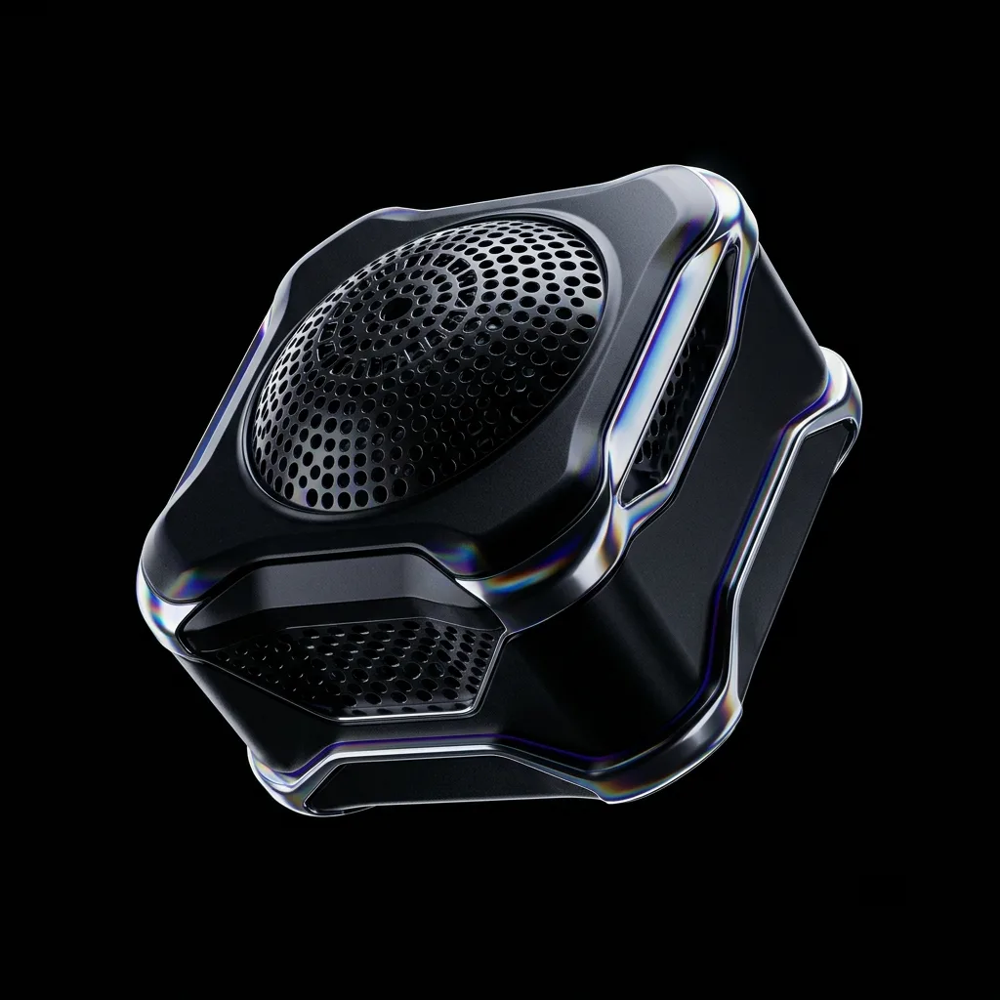

**#296 · Realistic, Cinematic · <code>Vinano Image Pro</code>**

> Keywords: realistic, cinematic, AI art, AI prompt, text to image

<details>
<summary>Show prompt</summary>

```
{
 "image_generation_request": {
 "subject_settings": {
 "product_placeholder": "[INSERT PRODUCT NAME HERE]",
 "positioning": "absolute center, floating, levitating, suspended in mid-air",
 "framing": "full view, no cropping, product must be entirely within frame, generous padding around edges"
 },
 "environment_and_background": {
 "background_color": "#000000",
 "background_type": "pure void, infinite black depth",
 "elements_to_exclude": ["lighting boxes",
 "softboxes",
 "stands",
 "pedestals",
 "platforms",
 "text",
 "watermarks",
 "props",
 "surface reflections",
 "studio equipment"]
 },
 "texture_and_material_blending": {
 "primary_finish": "anodized obsidian metal microscopic grit",
 "secondary_finish": "high-gloss fluid chrome",
 "accent_texture": "Mac Pro inspired precision-machined hemispherical lattice, 3D lattice venting pattern",
 "optical_effects": "monatomic light dispersion, prismatic diffraction on edges, ethereal holographic sheen"
 },
 "lighting_and_color_palette": {
 "key_colors": [{ "name": "Pure Black", "hex": "#000000" },
 { "name": "Electric Indigo", "hex": "#4B0082" },
 { "name": "Phthalo Blue", "hex": "#000F89" },
 { "name": "Spectral Iridescence", "description": "Thin-film interference rainbow highlights" }],
 "lighting_style": "hard rim lighting, chiaroscuro, high contrast, sharp specular highlights, no ambient fill"
 },
 "negative_constraints": {
 "strict_exclusion": "out of frame, cut off product, blurry edges, tripod, light stand, floor, table, shadows on floor, light flare icons, glowing boxes, copyright text, logo, cluttered background, grey tones, messy geometry"
 },
 "technical_specs": {
 "style": "Hyper-realistic 3D render",
 "engine_hints": "Octane Render, Raytraced, 8k, Unreal Engine 5, filmic, cinematic lighting"
 }
 }
}

Preserve realistic proportions and depth for a confident, professional finish.
```

</details>

---

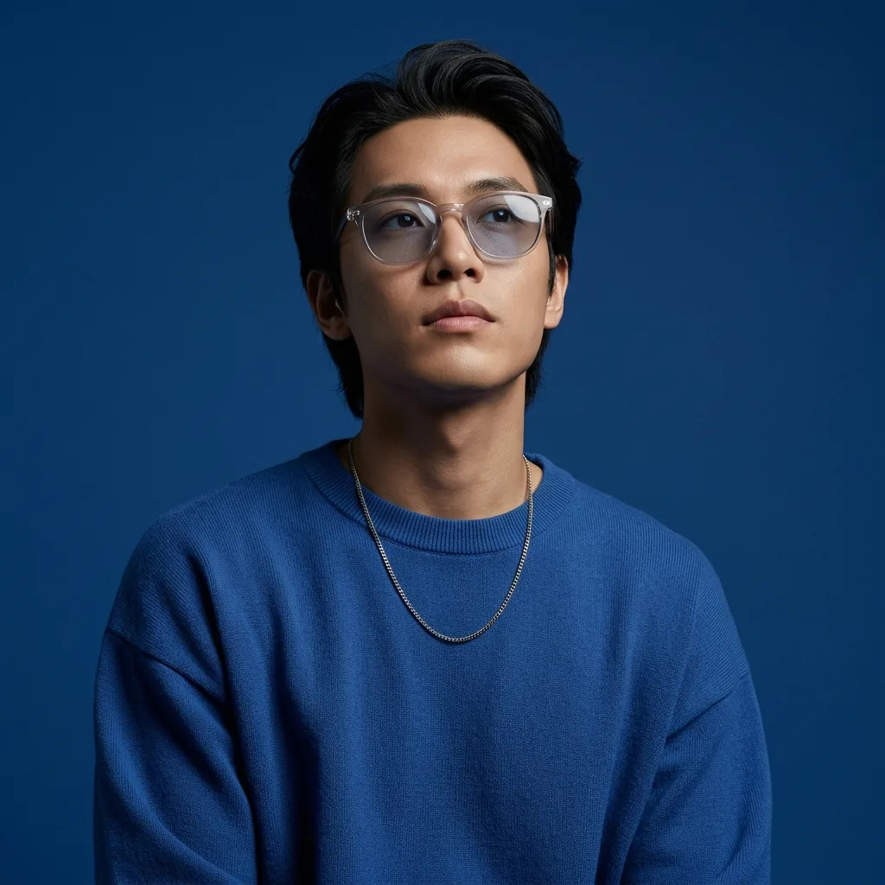

**#297 · Realistic, Portrait · <code>Vinano Image Pro</code>**

> Keywords: realistic, portrait, character, cinematic, minimalist, AI art

<details>
<summary>Show prompt</summary>

```
Create a high-end studio fashion portrait inspired by the uploaded blue-background reference photograph. Recreate the original composition matching framing, focal length feel, camera position, subject scale, perspective, and overall visual balance while maintaining a realistic photographic appearance.

Replace the reference model the character from the supplied character image. Preserve the character's authentic facial identity, bone structure, skin tone, eye shape, hairstyle, proportions, and recognizable features. Avoid beautification that alters identity. The face should remain naturally expressive and true to the source character.

Match the original body language closely: upper torso visible, shoulders relaxed, chin slightly elevated, eyes directed upward beyond the camera, conveying quiet confidence and contemplation. Maintain the same sense of presence and spatial positioning within the frame.

Retain the rich cobalt-blue studio backdrop and the refined editorial atmosphere. Reproduce the original lighting setup soft directional illumination, subtle facial highlights, realistic reflections on eyewear and jewelry, and smooth shadow transitions around the jawline, neck, and clothing folds. Preserve depth, dimensionality, and studio realism.

Style the character in contemporary oversized street-fashion apparel. Use a premium relaxed-fit knit sweater or sweatshirt natural fabric draping, layered a refined minimalist chain necklace and lightly tinted translucent eyewear. The wardrobe may be customized to suit the character, but should maintain the same luxurious oversized silhouette and fashion-campaign aesthetic.

Keep the image tightly composed the same portrait crop and subject placement. Ensure identical camera-to-subject distance and visual weight in the frame. The final result should feel indistinguishable from a genuine professional photoshoot captured in this exact studio environment.

true-to-life photorealistic editorial photography, luxury fashion campaign, cinematic studio portrait, premium streetwear styling, deep monochromatic blue backdrop, realistic skin texture, subtle film-grade contrast, detailed fabric rendering, natural lighting falloff, commercial advertising quality, shallow depth of field, magazine-cover aesthetics.

Negative Prompt:

Do not alter the background color or studio environment. Do not change the pose, framing, crop, perspective, subject distance, lighting direction, or gaze. Do not modify facial identity, facial proportions, skin tone, or hairstyle. Avoid excessive retouching, artificial skin smoothing, stylized illustration effects, exaggerated sharpening, extra accessories, text overlays, logos, watermarks, duplicate subjects, or unrealistic clothing physics.

Render with rich micro-detail while keeping the layout uncluttered and intentional.
```

</details>

---

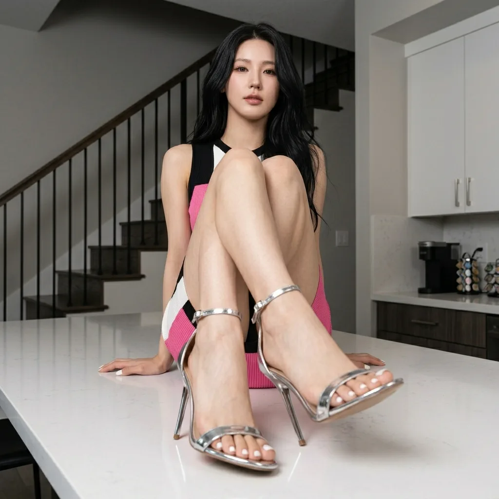

**#298 · Realistic, Minimalist · <code>Vinano Image Pro</code>**

> Keywords: realistic, minimalist, AI art, AI prompt, text to image

<details>
<summary>Show prompt</summary>

```
{
"subject": {
"identity": {
"biometric_reference": "Cho Miyeon of (G)I-DLE",
"facial_morphology": "Elegant oval face, prominent high straight nasal bridge, soft refined jawline, and full lips. Smooth forehead and delicate features.",
"dentition": "Natural dental alignment, maxillary central incisors slight dominance, bright white enamel finish, visible buccal corridor during a neutral or slight parting of lips.",
"iris_pattern": "Heterogeneous iris texture radial furrows, distinct pupillary zone, and a deep dark brown hue darker limbal rings.",
"hair": "Long, straight, and voluminous dark black hair subtle warm undertones, fine follicle texture, and natural scalp integration."
},
"body": {
"somatotype": "Petite mesomorph high muscle-to-fat ratio and defined bone structure.",
"morphology": "Accurate 0.7 waist-to-hip ratio, slender waistline, toned rectus abdominis, and defined quadricep/patellar anatomy. Natural soft tissue distribution over the iliac crest.",
"skin_texture": "High-fidelity dermis visible pores, subtle subcutaneous vascularity in extremities, and a warm fair porcelain finish. HEX: #FDF1EA.",
"limbs": "Slender upper and lower extremities, articulated phalanges, clear nail bed definition white polish. Feet in extreme plantar flexion visible metatarsal alignment."
},
"wardrobe": {
"apparel": "Mini-length bodycon dress in a sleek color-blocked design of black, white, and vibrant pink. Fabric: Fine-knit stretch silk micro-ribbing texture and subtle specular highlights.",
"footwear": "Metallic silver stiletto sandals slender ankle straps and chrome-finished heels. Material: Polished calfskin leather high reflectivity. HEX: #C0C0C0."
},
"pose_action": {
"description": "Seated atop a polished kitchen counter in a low-angle perspective. Knees are acutely flexed and pulled toward the chest, creating a compact triangular composition. Hands are positioned laterally on the counter surface for support. Head is slightly tilted a direct, neutral gaze toward the lens.",
"anatomical_tension": "Weight distribution focused on the gluteal region, visible tension in the gastrocnemius muscles due to high-heel elevation."
},
"scene": {
"environment": "Modern refined minimalist kitchen interior. Primary surface is a white quartz countertop high gloss finish. Background features a dark-toned staircase vertical railings and neutral grey walls.",
"atmosphere": "Clean, spacious, and upscale domestic setting."
},
"lighting": {
"setup": "Three-point studio lighting adapted for an interior setting. Primary softbox (Key) from 45-degree angle, subtle rim lighting to define hair and shoulder silhouettes. High subsurface scattering on skin surfaces.",
"effects": "Specular highlights on the metallic footwear and quartz countertop. Soft ambient occlusion in the folds of the dress."
},
"camera": {
"technical": "3:4 aspect ratio, 35mm wide-angle lens, f/2.8 aperture for slight depth-of-field separation, low-angle 'worm's eye' perspective (30cm from floor level), ISO 100 for zero digital noise.",
"render_quality": "8K true-to-life photorealistic, 1.2 raytracing depth, high-fidelity texture mapping."
},
"negative_constraints": ["no logos",
"no text",
"no watermarks",
"no extra limbs",
"no distorted fingers",
"no beautify smoothing",
"no anatomical anomalies",
"no clothing clipping",
"no floating objects"],
"reflection_integrity_rules": ["Accurate ray-traced reflections on the quartz counter and metallic heels",
"Inversion of the subject's lower legs and dress hem in the reflective surface",
"Consistent light bounce between the black, white, and pink fabric and skin surfaces"]
}
}

Maintain consistent colour harmony and crisp focus across the whole frame.
```

</details>

---

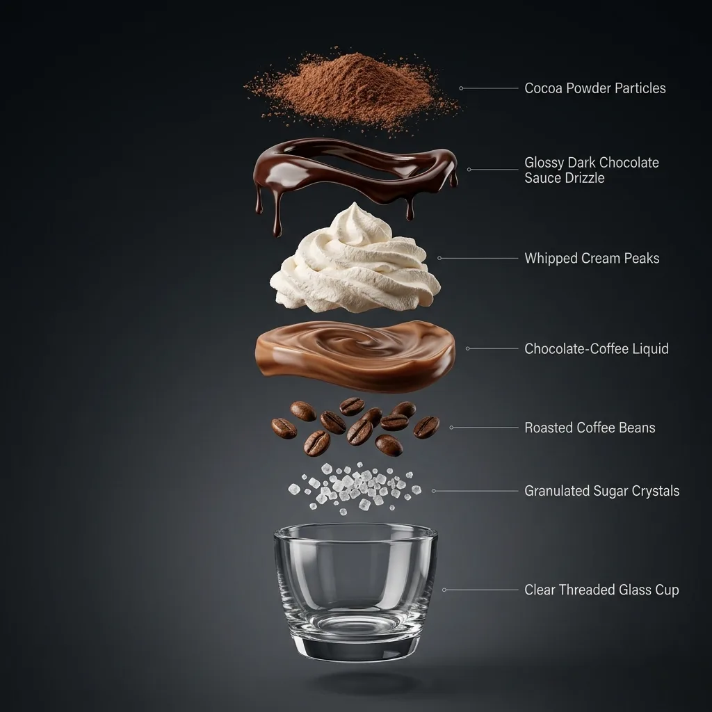

**#299 · Ai Art, Ai Prompt · <code>Vinano Image Pro</code>**

> Keywords: AI art, AI prompt, text to image

<details>
<summary>Show prompt</summary>

```
{
“subject”: “巧克力咖啡饮品的超写实垂直爆炸分解图”,
“layout”: “中心垂直对齐，各组件独立悬浮且间距清晰”,
“layers”: [{
“component”: “可可粉微粒”,
“position”: “顶部”
},
{
“component”: “光泽深色巧克力酱丝带与滴落状”,
“position”: “独立层”
},
{
“component”: “轻盈的打发奶油堆”,
“position”: “独立层”
},
{
“component”: “丝滑的巧克力咖啡液态层”,
“position”: “独立层”
},
{
“component”: “烘焙咖啡豆”,
“position”: “独立层”
},
{
“component”: “糖晶体”,
“position”: “独立层”
},
{
“component”: “带配重底座的小型透明螺纹玻璃杯（空杯）”,
“position”: “底部”
}],
“background”: “高级深色背景：干净的影棚背景，近黑色的石墨色至木炭色渐变，柔和且平滑”,
“lighting_and_style”: {
“lighting”: “柔和且受控的影棚光，每层下方有清晰的分层阴影”,
“detail”: “超锐利微距写实主义，右侧极简细指示线与英文标签”,
“category”: “高端产品信息图”,
“resolution”: “8K”
}
}

强调材质质感与自然光影，让画面更具高级真实感。
```

</details>

---

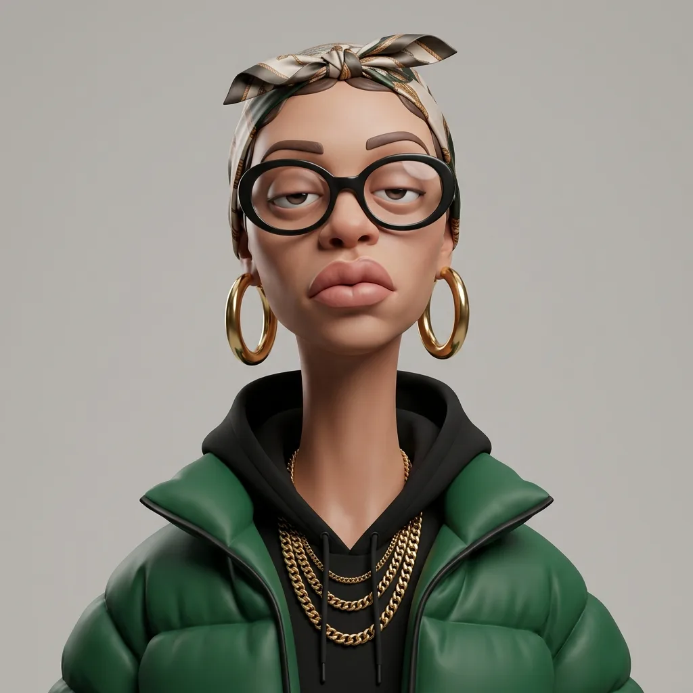

**#300 · Realistic, Portrait · <code>Vinano Image Pro</code>**

> Keywords: realistic, portrait, character, cinematic, AI art, AI prompt

<details>
<summary>Show prompt</summary>

```
Create an exaggerated stylized 3D caricature character portrait strong intentional deformation and a clean, controlled surface finish. Use the person from the ATTACHED REFERENCE PHOTO. Preserve the subject’s identity, facial likeness, skin tone, and defining features, but reinterpret them into a bold caricatured 3D form an elongated neck, oversized head-to-neck ratio, droopy eyelids, heavy lips, and slightly asymmetrical facial structure. Render as a human-like 3D character smooth, studio-clean skin and intentionally designed detail, avoiding random texture or noise. Style bold accessories such as round or oval glasses, hoop earrings, gold chains, headscarves or bandanas, and street-luxury clothing. Use neutral studio lighting soft shadows and even illumination, no dramatic contrast, against a plain neutral grey or off-white background. The overall aesthetic should feel weird, fashion-forward, collectible, and character-driven rather than cute or realistic. Ultra high definition, premium cinematic 3D render quality, hyper realistic hyper realism, clean materials, no freckles, no dirt, no grain, no noise, no speckling, no text, no logos, no watermarks. Aspect ratio 4:5 Maintain consistent colour harmony and crisp focus across the whole frame.
```

</details>

---

[Next page →](./product-brand-4.md)
