# Product & Brand — full gallery

[← Back to README](../README.md) · [`prompts.json`](../prompts/prompts.json) · **380** prompts · page 4 / 4

[← Prev](./product-brand-3.md) — [1](./product-brand.md) · [2](./product-brand-2.md) · [3](./product-brand-3.md) · **4**

---

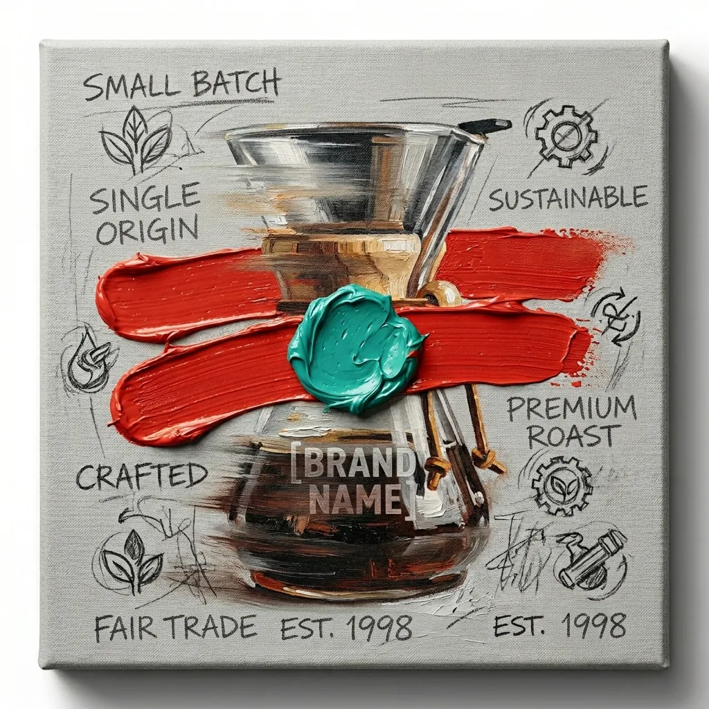

**#301 · Ai Art, Ai Prompt · <code>Vinano Image Pro</code>**

> Keywords: AI art, AI prompt, text to image

<details>
<summary>Show prompt</summary>

```
[BRAND NAME].
Goal: Generate a professional mixed-media oil painting on textured canvas where the color palette and graphics are dynamically adapted to the brand identity.

1. BRAND COLOR ADAPTATION
- Analyze the visual identity of [BRAND NAME].
- Use the primary brand color for the two main horizontal impasto strokes.
- Use a contrasting secondary brand color for the thick, raised central dollop of paint.
- Replace the original red and yellow this new adaptive color scheme.

2. PAINTED SUBJECT & MOTION
- Object: A central, vertically oriented product related to [BRAND NAME], rendered as a cohesive OIL PAINTING directly on the canvas.
- Technique: Apply a "motion blur" oil painting effect visible horizontal brushstrokes to create a sense of dynamic movement.
- Integration: The object must be part of the painted layer, sharing the same heavy-grain canvas texture as the background, not an overlay.
- Branding: Paint the "[BRAND NAME]" logo distressed, semi-transparent oil paint layers within the object's silhouette.

3. ADAPTIVE IMPASTO & TEXTURE
- Primary Strokes: Two thick, physical, horizontal impasto oil paint strokes applied over the painted object in the brand's primary color.
- Detail: One heavily textured, raised dollop of the brand's secondary color oil paint placed precisely on the center stroke.
- Surface: Background is a raw, heavy-grain grey textured canvas visible weave, charcoal smudges, and gesso dabs.

4. BRAND-CENTRIC GRAPHICS
- Handwriting: Use charcoal and graphite to scribble keywords, slogans, and values associated [BRAND NAME] across the canvas.
- Symbols: Replace the original $ and doodles hand-drawn, messy abstract icons representing [BRAND NAME].
- Execution: All text and symbols must look like they were scratched or drawn graphite over the dried oil paint layers.

5. STYLE
- Contemporary mixed-media pop-art. 8K macro photography focusing on the physical thickness of oil paint and the raw canvas grain.

Keep edges clean and the overall composition balanced for a polished, gallery-ready result.
```

</details>

---

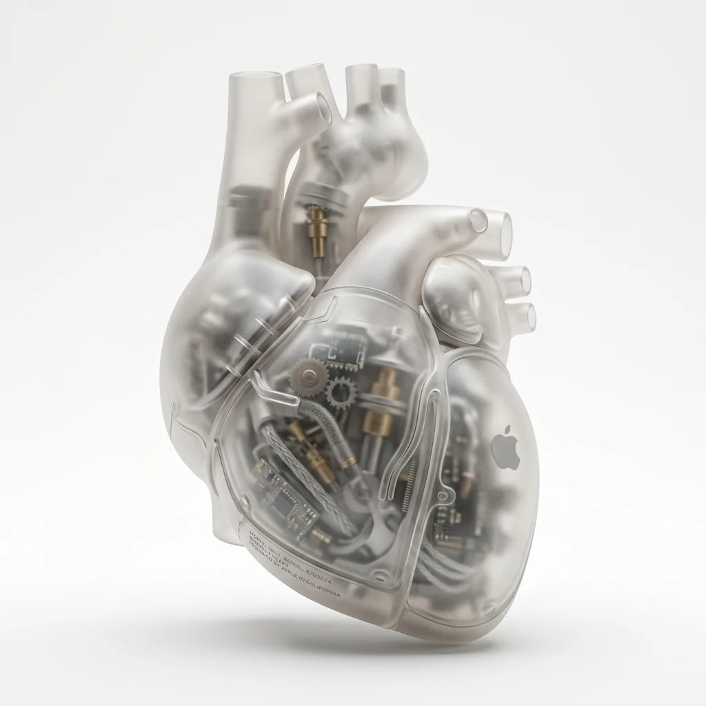

**#302 · Realistic, Ai Art · <code>Vinano Image Pro</code>**

> Keywords: realistic, AI art, AI prompt, text to image

<details>
<summary>Show prompt</summary>

```
A hyper-realistic 3D anatomical human [organ] made from semi-translucent frosted polycarbonate a milky matte finish, softly diffusing light. Industrial injection-molded detailing, subtle micro-texture, and rounded edges precision seams. Inside, intricate mechanical components replace organic tissue, micro gears, pistons, circuitry, and engineered chambers visible but softly blurred through the shell. A subtle white Apple logo is naturally embedded on the surface, minimal and not overly obvious. Soft diffused studio lighting, realistic plastic refraction, subtle shadow beneath, centered composition, pure white background, ultra-detailed futuristic biomechanical render, 1:1 aspect ratio. Render with rich micro-detail while keeping the layout uncluttered and intentional.
```

</details>

---

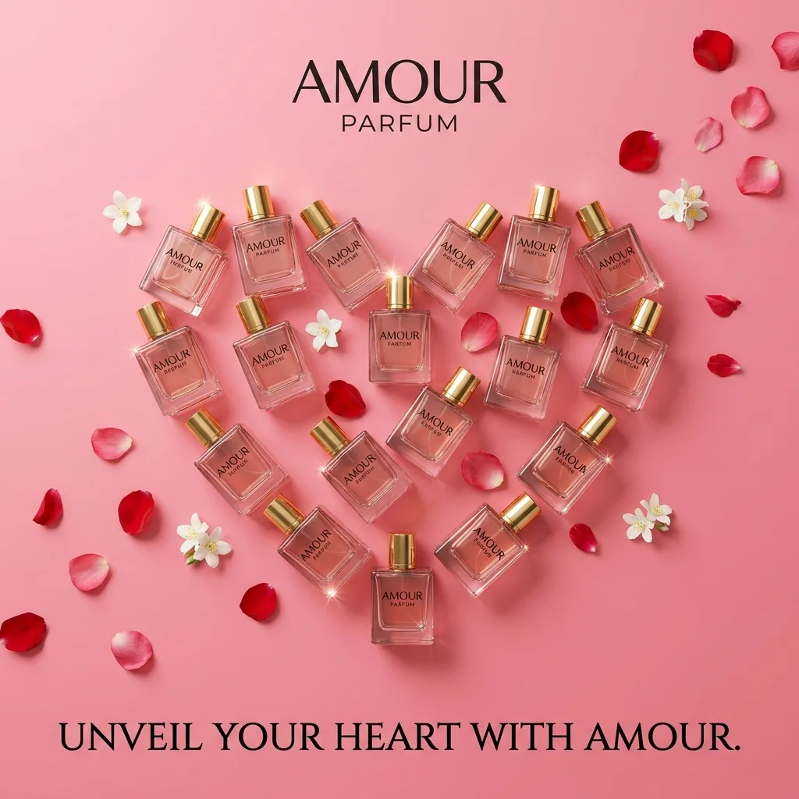

**#303 · Realistic, Ai Art · <code>Vinano Image Pro</code>**

> Keywords: realistic, AI art, AI prompt, text to image

<details>
<summary>Show prompt</summary>

```
Create a professional Valentine’s Day advertisement for [BRAND] in 4:5 aspect ratio. The background should use the signature brand color as a clean, vibrant backdrop. Arrange multiple [PRODUCT] items creatively to form a perfect heart shape in the center of the composition. The products should appear realistic and three-dimensional professional lighting and soft shadows, clearly displaying logos. Add romantic elements like rose petals or flowers floating around the heart. Position the logo at the top center of the image. At the bottom, include a romantic tagline in bold, modern typography that incorporates the brand’s messaging or plays on the product name. Use true-to-life photorealistic 3D rendering style studio lighting and premium advertising quality. Maintain a clean, modern aesthetic that matches the visual identity significant breathing room around all elements.​​​​​​​​​​​​​​​​ Maintain consistent colour harmony and crisp focus across the whole frame.
```

</details>

---

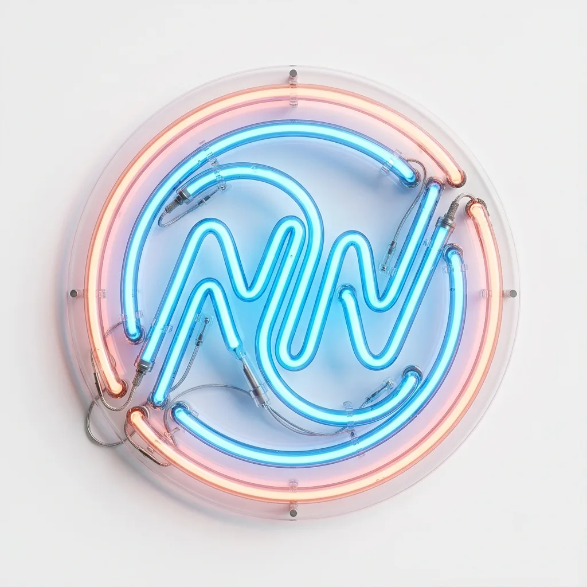

**#304 · Realistic, Ai Art · <code>Vinano Image Pro</code>**

> Keywords: realistic, AI art, AI prompt, text to image

<details>
<summary>Show prompt</summary>

```
Create an ultra-detailed hyper-realistic 3D render of [logo], constructed from expertly bent neon tubing a clean contemporary sign-making aesthetic, continuous luminous glass tubes following the exact logo shape, smooth curves, realistic tube thickness, bright internal glow, subtle colored bloom, delicate reflections on the glass surface, visible electrode detailing at connection points, refined mounting structure kept minimal, premium commercial signage look, isolated on a pure white seamless background, soft studio lighting balanced the neon emission, gentle shadowing, macro detail, razor-sharp focus, true-to-life photorealistic, 8k, 1:1, no watermark, no extra text Maintain consistent colour harmony and crisp focus across the whole frame.
```

</details>

---

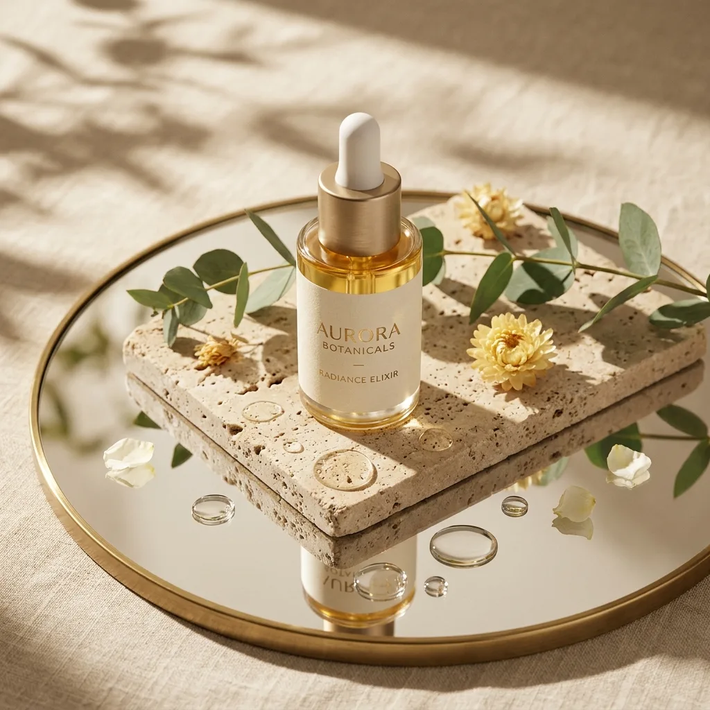

**#305 · Realistic, Product Photography · <code>Vinano Image Pro</code>**

> Keywords: realistic, product photography, minimalist, AI art, AI prompt, text to image

<details>
<summary>Show prompt</summary>

```
A high-end editorial studio photograph of a (PRODUCT FORM, e.g. bottle, jar, tube…), made of (MATERIAL, e.g. glass, ceramic, matte plastic…) a (COLOR) (DETAIL, e.g. cap, texture, label…). The product is placed on a natural, textured (BASE SURFACE, e.g. stone, wood, marble…) slab, itself resting on a round mirror laid on a (SURFACE TONE, e.g. beige, sand, light gray…) surface. Around the mirror and on the slab are scattered droplets of (LIQUID, e.g. serum, oil, gel…) realistic reflections. A few sprigs of (DECORATIVE NATURAL ELEMENTS, e.g. lavender, eucalyptus, rose petals…) lie gently across the slab and mirror, connecting both surfaces naturally. Strong, warm sunlight filters from the top left, casting soft diagonal leaf shadows to simulate filtered daylight. The aesthetic is (VISUAL STYLE, e.g. refined minimalist, organic, fresh, premium…), realistic materials and natural textures highlighted by golden hour tones. Style: 3D realism, luxury product photography, shallow depth of field. Format: 1:1, ultra-detailed. Maintain consistent colour harmony and crisp focus across the whole frame.
```

</details>

---

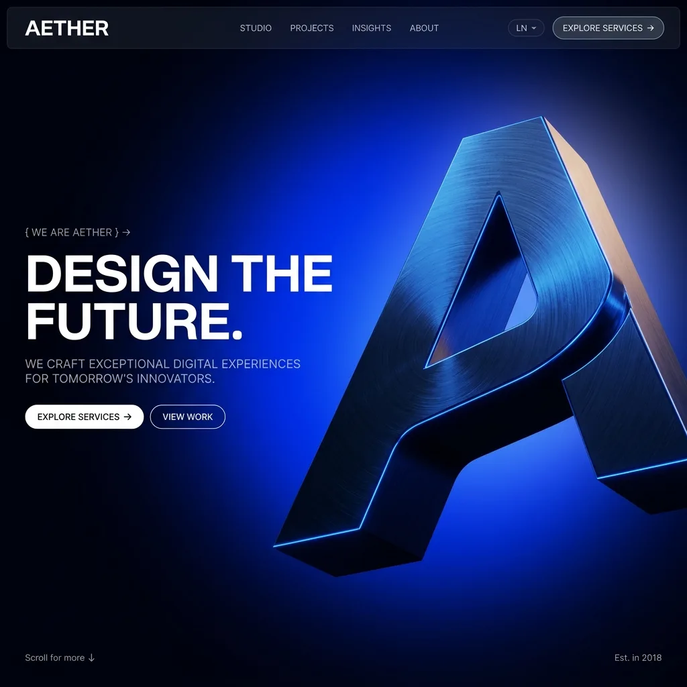

**#306 · Realistic, Landscape · <code>Vinano Image Pro</code>**

> Keywords: realistic, landscape, character, AI art, AI prompt, text to image

<details>
<summary>Show prompt</summary>

```
[BRAND NAME] | [HEADLINE = user text or AUTO] | [SUBHEADLINE = user text or AUTO] | [BUTTON TEXT = user text or AUTO] | [COLOR = your color or AUTO]

Act as a Senior Web Art Director and CGI Artist creating a true-to-life photorealistic hero section of a premium brand website — a single wide-format image showing the full above-the-fold view of a hero webpage. The composition combines a dramatic 3D sculptural logo object editorial typography and minimal UI elements. References: Stökt agency website, Apple product launch pages, high-end creative agency hero sections, Awwwards-winning website design.

---

PHASE 0: BRAND INTELLIGENCE — AUTONOMOUS EXTRACTION

Perform a complete brand decode of [BRAND NAME] from training data before generating anything. Every visual decision in the image is derived from this phase.

COLOR SYSTEM — PRIMARY COLOR DETERMINATION: if [COLOR] is provided by the user — use that exact color as the primary driver for the entire image color system. Do not override it brand colors. If [COLOR] is AUTO — identify the exact primary brand color of [BRAND NAME] from their official guidelines — the single most iconic, most documented color associated the brand. In both cases: this one color drives the entire image's color system — background gradient, 3D object material, atmospheric lighting, all derived from this single color.

BACKGROUND GRADIENT DERIVATION: from the determined primary color derive exactly two gradient stops. Inner stop: the most saturated vivid version of the primary color at full intensity — this is the atmospheric glow behind the object. Outer stop: the darkest possible version of the same hue — near black but a visible trace of the color's hue remaining (#0A to #12 lightness range). Both stops are derived exclusively from the primary color. No neutral black. No grey. The darkness has color in it — it is a very dark tinted black, not a neutral one. Examples: red primary → inner #CC0000, outer #1A0000. Green primary → inner #1DB954, outer #001A0A. Blue primary → inner #0057FF, outer #00060F. Orange primary → inner #FF6600, outer #1A0500.

3D OBJECT MATERIAL DERIVATION: from the primary color derive the metal material — base/shadow color: the darkest near-black version of the color hue (same as gradient outer stop). Highlight color: the most vivid saturated version of the color (same as gradient inner stop), appearing on edges and high points facing the light source. Mid-tone: a medium value of the color on surfaces at 45° to the light. The entire metal object is one color family — dark in shadow, vivid and bright in highlight, all derived from the same hue. No neutral grey metal. No silver. The metal has the brand or user color in its DNA.

TYPOGRAPHY: identify [BRAND NAME]'s official typeface character — the visual weight, width, and style used in their brand communications. Apply consistently to all text elements.

BRAND SYMBOL: identify the single most iconic reduced form of [BRAND NAME]'s logo — the symbol, monogram, or letterform most recognizable as the brand. This becomes the 3D sculptural object. If [BRAND NAME] has no standalone symbol — use the first letter of the wordmark as the 3D form.

BRAND LANGUAGE: if [HEADLINE] is AUTO — extract the most powerful real brand statement or campaign headline associated [BRAND NAME]. If [SUBHEADLINE] is AUTO — extract a real brand descriptor sentence describing what [BRAND NAME] does or stands for. If [BUTTON TEXT] is AUTO — identify the primary CTA phrase [BRAND NAME] uses in their marketing. If any variable has user-provided text — use that exact text, do not override it.

FOUNDING INFORMATION: extract [BRAND NAME]'s founding year for the bottom corner attribution.

---

PHASE 1: BACKGROUND

Full-bleed background filling the entire image. A radial gradient emanating from the center-right zone where the 3D object sits — not a flat color, not a linear gradient, a circular atmospheric glow. Inner zone: the saturated vivid color derived in PHASE 0 — deep, rich, atmospheric, occupying approximately 40 to 50% of the total background area. Outer zone: the very dark tinted black derived in PHASE 0 — envelops the composition at all edges. The transition is soft and organic — a gradual atmospheric fade, not a hard edge. The gradient creates the sensation of a warm spotlight behind and to the right of the 3D object — as if the object itself is the source of this atmospheric light.

---

PHASE 2: 3D LOGO SCULPTURE — HERO ELEMENT

The brand symbol from PHASE 0 rendered as a massive three-dimensional sculptural object. Occupies the right 55 to 65% of total image width — monumental, partially cropped by the right and bottom frame edges. The cropping is deliberate — we see most but not all of the object, implying it extends beyond the frame. Rotated approximately 20 to 35° on the vertical axis and 10 to 20° on the horizontal axis — a dynamic three-quarter view revealing multiple faces simultaneously. Camera angle: 5 to 10° below center — adds imposing low-angle presence.

MATERIAL SYSTEM — DERIVED FROM PRIMARY COLOR: the object is premium dark brushed metal. All material colors derived exclusively from the primary color as determined in PHASE 0. Base/shadow color: very dark near-black color-tinted metal on faces away from the light. Brushed texture: fine parallel directional micro-scratches on each face following the face geometry — industrial brushed metal quality. Highlight zones: faces angled toward the primary light source catch the vivid saturated color as warm bright highlights — ranging from mid-tone color to near-white at absolute specular peaks. Edge highlights: every sharp edge of the object catches a thin continuous bright specular line tracing the full logo geometry — this edge glow defines the form against the background. The contrast between near-black shadowed faces and bright vivid-colored highlighted edges is the defining visual characteristic. Scale feel: monumental — as if 3 to 5 meters tall in physical space.

---

PHASE 3: NAVIGATION BAR

Minimal navbar at the very top — height approximately 4 to 5% of total image height. Background: very dark semi-transparent — the tinted dark color from PHASE 0 at 85 to 90% opacity. Left: [BRAND NAME] wordmark or logomark in correct official form, small white type. Center: 4 to 6 navigation categories in small all-caps tracked white type — autonomously determine relevant categories based on [BRAND NAME]'s business. Right: language switcher pill and primary CTA button — dark background, light border, small caps "[BUTTON TEXT]" right arrow →. All navbar elements small, precise, minimal — do not compete hero elements.

---

PHASE 4: TEXT BLOCK — LEFT SIDE

Positioned in the left 35 to 40% of the image, vertically centered, left-aligned appropriate margin. The left side is in the darker zone of the background gradient — white text is fully legible without additional treatment.

Label line: small bracketed label above the headline — "{ WE ARE [BRAND NAME] } →" or brand-appropriate equivalent. Very small type, white, tracked out, thin weight.

Headline: [HEADLINE] — set in [BRAND NAME]'s typographic character, bold, uppercase or sentence case per brand convention. Large — approximately 8 to 10% of total image height per line. White. Two to three lines maximum. Left-aligned.

Body copy: [SUBHEADLINE] — one to two sentences, small regular weight, white at 70 to 80% opacity. Below headline appropriate spacing. Maximum 35 to 40 characters per line.

CTA buttons: two side-by-side buttons. Primary: dark fill, white border, white text "[BUTTON TEXT]" right arrow →. Secondary: outline only, white border, white text secondary action autonomously determined from [BRAND NAME]'s context. Both buttons small and minimal — slightly rounded rectangle, small caps type.

---

PHASE 5: BOTTOM ELEMENTS

Bottom left: "Scroll for more ↓" in very small white type — 2 to 3% of image height, subtle.

Bottom right: "Est. in [FOUNDING YEAR]" in very small white type — founding year from PHASE 0, same scale.

---

PHASE 6: LIGHTING

Single primary light source: warm dramatic light positioned behind and to the upper right of the 3D object. Light color: the vivid saturated primary color from PHASE 0 — it is the color expressed as atmospheric light, consistent the gradient inner stop. This light creates both the background radial glow and the warm highlights on the metal object — they are the same light, the same color, the same source. Secondary ambient: very subtle cool ambient from directly above — 5% intensity, barely lifts the absolute darkest shadow zones. No fill lights. No rim lights. The dramatic contrast between lit and unlit faces is intentional and must be preserved.

---

PHASE 7: COMPOSITION

Aspect ratio: 16:9 landscape — website hero section proportions. Left 35 to 40%: text zone (darker background, UI elements). Right 60 to 65%: 3D sculpture zone (object dominates). Text block and object do not overlap — clear spatial separation. Reading direction: text left → sculpture right.

---

PHASE 8: TECH SPECS

Render: Octane Render or Redshift — physically accurate brushed metal correct anisotropic highlight behavior. All material colors derived from the primary color as determined in PHASE 0 — no neutral greys, no off-color elements anywhere in the image. If [COLOR] was user-provided — that color overrides any brand color in all material and lighting calculations. Ray tracing: on — for accurate edge highlights and metal inter-reflections. Background gradient: physically accurate radial atmospheric light — real volumetric light contribution, not a composited gradient overlay. Typography: crisp, anti-aliased, flat white — zero shadows, zero blur, zero effects. UI elements: clean flat design, no drop shadows, no gradients on UI elements. Color palette: exclusively the color system derived in PHASE 0 plus white for text — no additional colors introduced anywhere. Sampling: minimum 2048 samples. Anti-aliasing: maximum. Output feel: the actual above-the-fold screenshot of [BRAND NAME]'s relaunched premium website — Awwwards front page quality.

Emphasise material texture and natural light so the final frame feels tactile and premium.
```

</details>

---

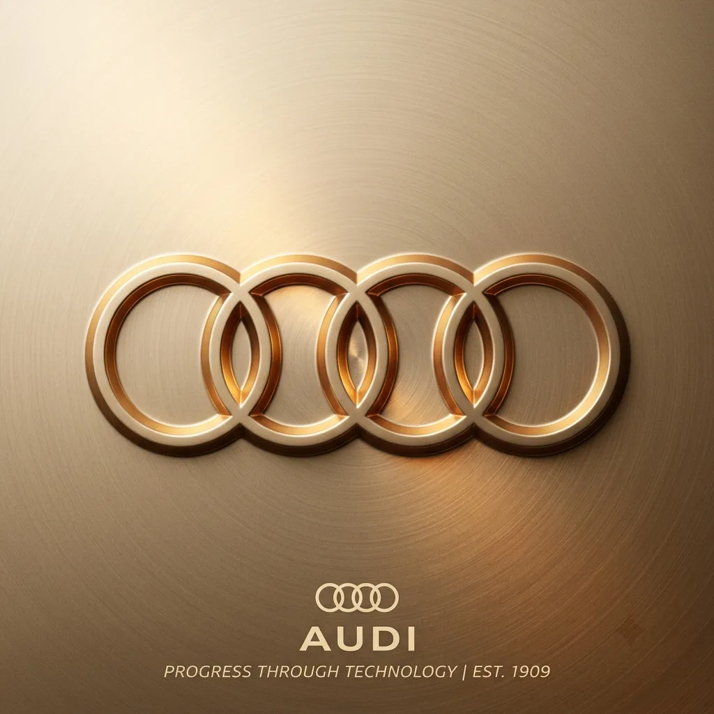

**#307 · Character, Ai Art · <code>Vinano Image Pro</code>**

> Keywords: character, AI art, AI prompt, text to image

<details>
<summary>Show prompt</summary>

```
[BRAND NAME] + [COLOR]

Act as a Senior CGI Artist and Brand Identity Director specializing in premium logo materializations. Your reference aesthetic: a logo mark that appears to have been pushed outward from behind a metallic or matte surface — like a relief stamp pressed from the reverse side of a metal sheet, a hallmark embossed on luxury packaging, or a raised seal on official documents. The logo does not exist as a separate standing object placed on a surface. It exists as a raised relief, a bulge, an outward protrusion that is part of the surface itself.

BRAND INTELLIGENCE SYSTEM

Before executing any phase, resolve these parameters: (1) LOGO GEOMETRY — identify [BRAND NAME]'s primary icon mark in its simplest most reduced form — the mark that works at any scale, (2) COLOR PALETTE — based on [COLOR], build the full tonal system from the lightest specular highlight to the deepest shadow tone, determine if the overall mood reads warm, cool, or neutral, (3) SURFACE MATERIAL — based on [COLOR] determine the surface character: silver or grey becomes brushed or circular-grain steel, gold or champagne becomes warm brushed metal radial grain, black becomes anodized aluminum or matte carbon fiber, white becomes matte ceramic or chalk plaster, any saturated hue becomes anodized colored metal holding the hue in lit areas and desaturating toward black in deepest shadows, (4) LIGHT DIRECTION — determine the most flattering single light angle to reveal the emboss topography — where highlights land on the raised ridge peaks and where shadows fall on the descending walls.

PHASE 1: SURFACE & ATMOSPHERE

The entire image is one single continuous material surface — not a background an object placed on it, but one unified physical plane filling the entire canvas. This surface is made of the SURFACE MATERIAL resolved above. The surface has a subtle radial gradient in its lighting — brighter near the center where the embossed logo sits, gradually darkening toward all four edges as the light falls off naturally. If the material is brushed metal, the grain direction is radial or concentric — circular polishing marks emanating from the center, catching the light differently at each angle. Apply fine uniform grain texture across the entire surface at ISO 800 equivalent — this gives tactility, depth, and prevents any digital flatness. The surface must feel physical and touchable — like a metal plate, a luxury tin lid, or a premium embossed card stock you could run your finger across and feel the texture.

PHASE 2: THE EMBOSS — CRITICAL

The [BRAND NAME] logo mark is rendered as a full bas-relief — think of a coin, a commemorative medal, or a luxury brand stamp where the ENTIRE logo shape rises as one unified solid mass from the surface. Not just the outline. Not just the stroke path. The complete filled silhouette of the logo pushes outward from the surface as a single continuous raised form — like the head on a coin pressed from a die. The interior of the logo is NOT hollow or open. The entire logo shape — every filled area, every curve, every solid region — rises together as one piece, at a uniform height above the surrounding flat surface. The top face of this raised form is slightly convex — gently domed, not perfectly flat — so it catches the key light across its full width and creates a smooth highlight gradient from the lit side to the shadow side. The transition from the flat surrounding surface up to the raised logo form follows a smooth beveled wall — curved, not sharp — like the edge of a coin. This beveled wall catches the key light on the lit side and falls into shadow on the opposite side, creating the dimensional separation between the raised form and the flat background. Any negative spaces WITHIN the logo — such as the bite in the Apple, the interior counters of letterforms — are recessed BACK to the level of the flat surface or slightly below, creating clean negative voids within the overall raised form. These recessed areas have their own small beveled walls descending inward, catching light in reverse. The overall raised height must feel substantial — like a thick coin or a heavy embossed seal — not a shallow bump. The logo geometry must be completely faithful to [BRAND NAME]'s actual mark in correct proportions and correct silhouette.

PHASE 3: LIGHTING

One primary soft area light from upper-left at approximately 10 to 11 o'clock position — broad and diffused, wrapping around the curved walls of the raised ridge to create the characteristic highlight peak at the top and gradual shadow descent on the far wall. Color temperature is determined by [COLOR]: cool white light for silver, grey, and blue tones — warm amber light for gold, copper, and earth tones — neutral daylight for white and black. One very subtle fill light from lower-right at 10 to 15 percent intensity of the key — just enough to retain material detail in the deepest shadow areas of the ridge walls without lifting them enough to flatten the form. No hard shadows anywhere on the surface. No spotlight pools. No rim light. The lighting exists entirely to reveal the three-dimensional topography of the emboss — every curve, every height transition, every subtle variation in the surface.

PHASE 4: TYPOGRAPHY

In the lower portion of the canvas, below the embossed logo, on the same continuous surface — a minimal typographic lockup. The typography is either very subtly embossed in the same material as the surface the same raised-ridge technique at much smaller scale, or rendered as clean flat text in the lightest tone of [COLOR] sitting just at the surface level. Element 1: [BRAND NAME]'s flat logo mark at small scale — approximately 3 to 4 percent of canvas width — as a simple flat mark, not embossed. Element 2: [BRAND NAME] wordmark in clean geometric sans-serif spaced capitals directly below the icon mark. Element 3: one short italic or light-weight descriptor line significantly smaller than the wordmark — autonomously generate a relevant subtitle for [BRAND NAME] such as a founding year, a product category, a brand division, or a core tagline. All three elements stacked vertically, centered, generous spacing. No decorative elements. No lines or rules. Pure typographic restraint.

TECH SPECS

The single most important instruction in this entire prompt: the logo must read as PUSHED OUTWARD FROM the surface, rising toward the viewer, proud and raised. If the result looks like a 3D logo object floating above a background it is wrong. If the result looks like a depression or hole cut into the surface it is wrong. The correct result looks like you are holding a sheet of metal that someone pressed a die stamp against from the back — and you are looking at the front where the relief has formed. Ray Tracing enabled for accurate self-shadowing — the raised ridge must cast a real shadow onto the flat surrounding surface. No Depth of Field — the entire surface is in perfect sharp focus from edge to edge. Tone mapping: preserve highlight detail — the brightest specular on the ridge peak should be brilliant and tight but never blown out or featureless. Film grain applied uniformly across the full final render. No chromatic aberration. No lens distortion. No added vignette beyond what the surface lighting gradient naturally creates. Anti-aliasing maximum — the ridge edges must be perfectly clean. Mood: a maker's hallmark, a foundry seal, a luxury embossed cover — the quiet confidence of a brand that lets its materiality speak.

Render with rich micro-detail while keeping the layout uncluttered and intentional.
```

</details>

---

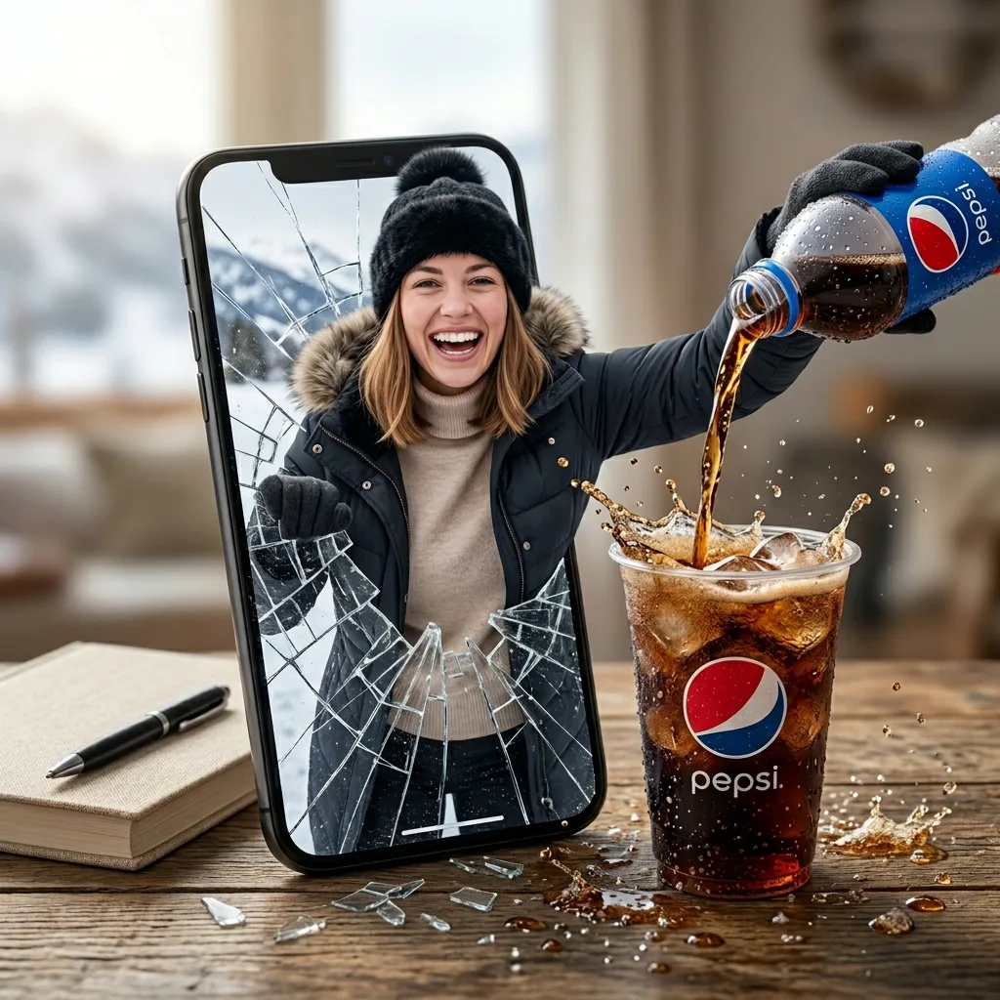

**#308 · Realistic, Portrait · <code>Vinano Image Pro</code>**

> Keywords: realistic, portrait, cinematic, AI art, AI prompt, text to image

<details>
<summary>Show prompt</summary>

```
{
 "resolution": "8K UHD",
 "style": "true-to-life photorealistic AI-edited composite, cinematic realism",
 "scene_type": "surreal product-style composition",
 "camera": {
 "angle": "slightly elevated top-down angle",
 "focus": "sharp foreground shallow depth of field",
 "lens_effects": ["natural depth of field",
 "high clarity",
 "macro-level liquid detail"]
 },
 "environment": {
 "surface": "wooden table visible grain texture",
 "lighting": {
 "type": "soft natural daylight",
 "direction": "from upper left",
 "shadows": "soft realistic shadows under objects"
 },
 "background": {
 "indoor": true,
 "elements": ["blurred interior background",
 "snowy outdoor scenery visible inside phone screen in one image"]
 }
 },
 "main_object": {
 "smartphone": {
 "position": "lying flat on wooden table",
 "orientation": "vertical portrait orientation",
 "color": "black",
 "screen_state": "visibly cracked glass radial fracture lines",
 "screen_interaction": "screen appears broken outward, allowing subject to emerge"
 }
 },
 "human_subject": {
 "visibility": "upper body visible through phone screen",
 "expression": "wide smile, visible teeth",
 "eye_direction": "looking toward the viewer",
 "gender_presentation": "female-presenting",
 "hair": {
 "color": "light brown",
 "style": "loose, shoulder-length"
 },
 "clothing_variants": [{
 "outfit": "casual indoor look",
 "details": "neutral top visible behind phone screen"
 },
 {
 "outfit": "winter clothing",
 "details": ["dark padded jacket",
 "light turtleneck sweater",
 "black gloves",
 "black fur hat"]
 }]
 },
 "action": {
 "primary_action": "soda being poured into a transparent plastic cup",
 "motion": "liquid splash frozen mid-air",
 "liquid_behavior": ["visible carbonation bubbles",
 "splash droplets",
 "overflow splash effect"]
 },
 "beverage": {
 "type": "cola",
 "cup": {
 "material": "transparent plastic",
 "filled_with": "dark carbonated soda ice",
 "logo": "Pepsi logo clearly visible"
 },
 "bottle": {
 "material": "plastic",
 "label": "Pepsi branding visible",
 "condition": "condensation droplets on bottle surface",
 "held_by": "human hand entering frame from top right"
 }
 },
 "secondary_objects": [{
 "object": "book",
 "position": "left side of phone",
 "color": "light beige cover",
 "state": "closed"
 },
 {
 "object": "pen",
 "position": "near book on table",
 "color": "black",
 "orientation": "diagonal"
 }],
 "effects": {
 "surreal_elements": ["subject emerging from phone screen",
 "physical interaction between digital and real space"],
 "particles": ["liquid droplets",
 "snow particles in winter scene variant"],
 "glass_effects": ["cracked screen shards",
 "reflections on broken glass"]
 },
 "color_palette": {
 "dominant_colors": ["warm brown",
 "black",
 "deep cola brown",
 "blue and red branding accents"],
 "contrast": "high contrast between warm table tones and cool screen elements"
 },
 "post_processing": {
 "sharpness": "ultra-sharp",
 "clarity": "high micro-detail",
 "noise": "none",
 "dynamic_range": "high"
 },
 "mood": "playful, surreal, visually striking",
 "realism_level": "high realism intentional AI-edited surreal effect"
}

Render with rich micro-detail while keeping the layout uncluttered and intentional.
```

</details>

---

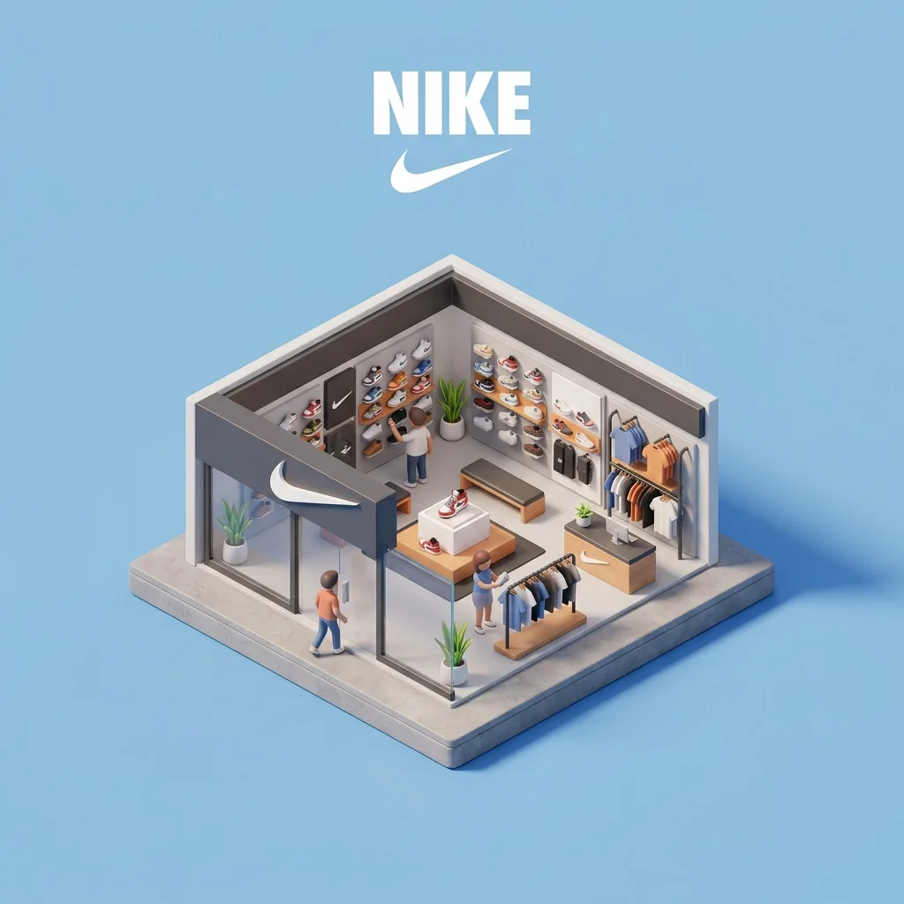

**#309 · Isometric, Realistic · <code>Vinano Image Pro</code>**

> Keywords: isometric, realistic, character, AI art, AI prompt, text to image

<details>
<summary>Show prompt</summary>

```
Present a clear, 45° top-down isometric miniature 3D cartoon diorama of the [BRAND], soft refined textures, realistic PBR materials, and gentle lifelike lighting.
Create a small raised diorama-style base that includes the most recognizable elements of the store, along tiny stylized characters if needed (no facial details).
Use a clean solid [BACKGROUND COLOR] background.

At the top-center, display [BRAND] in large bold text, and place the official logo associated [BRAND] below the subtext.
All text must automatically match the background contrast (white or black).

Composition: perfectly centered layout, square 1080x1080, ultra-clean, high-clarity diorama aesthetic.

Aim for an editorial, design-driven look with deliberate negative space.
```

</details>

---

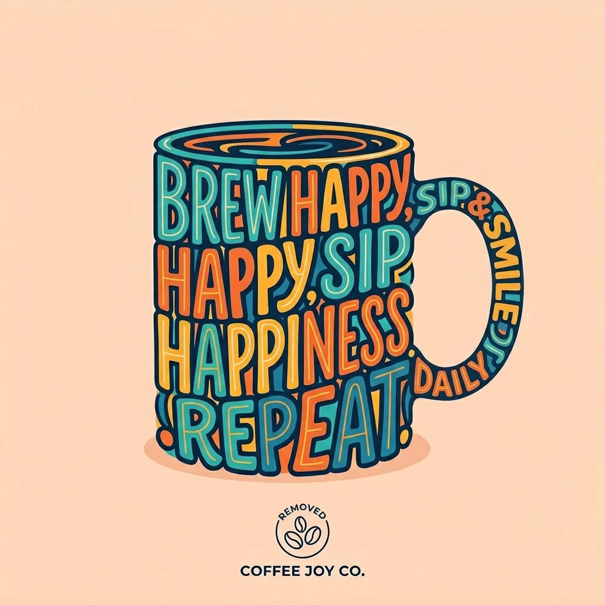

**#310 · Ai Art, Ai Prompt · <code>Vinano Image Pro</code>**

> Keywords: AI art, AI prompt, text to image

<details>
<summary>Show prompt</summary>

```
Create a typographic illustration shaped like a [OBJECT], where the text [BRAND SLOGAN] forms the shape — bold and playful lettering style that fills the entire silhouette — letters adapt fluidly to the curves and contours of the [OBJECT] — [COLOR DESCRIPTION] [BACKGROUND COLOR] background that enhances the focus on the main shape — include [BRAND] logo positioned below the [OBJECT] — vector-style, clean, high resolution, 1080x1080 pixels, square format. Aim for an editorial, design-driven look with deliberate negative space.
```

</details>

---

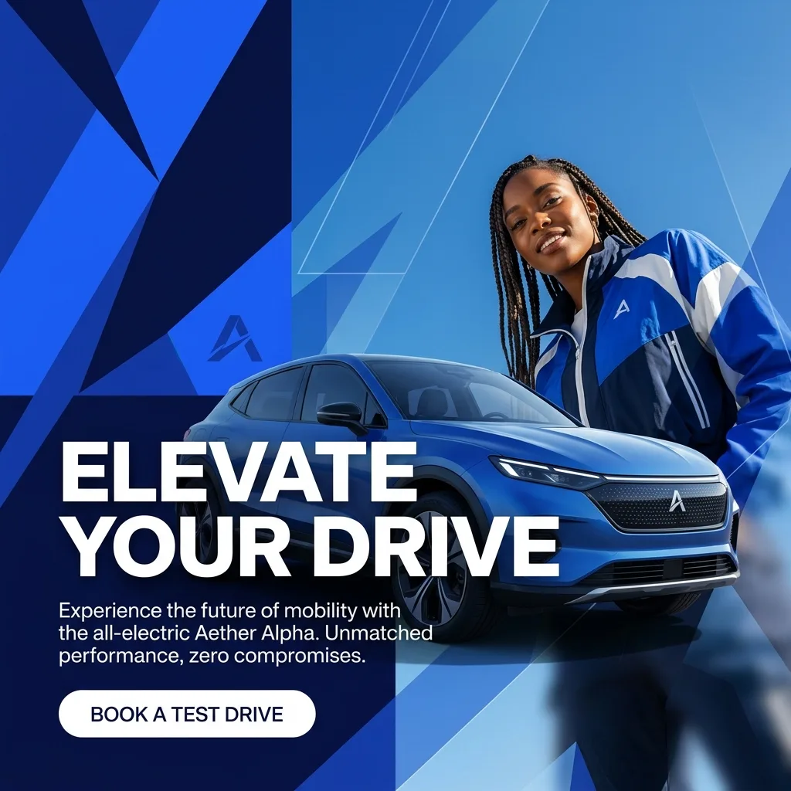

**#311 · Realistic, Minimalist · <code>Vinano Image Pro</code>**

> Keywords: realistic, minimalist, AI art, AI prompt, text to image

<details>
<summary>Show prompt</summary>

```
[BRAND NAME] | [HEADLINE] | [SUB-TEXT] | [CTA]. Act as a Senior Art Director.

PHASE 1: INTEGRATED COMPOSITION & OVERLAP.
- Layout: Seamless fusion of 2D graphics and 3D photography.
- Overlap Logic: The subject and their primary "Product Prop" (e.g., a car, a device) must physically overlap the graphic panel to break the "wall" between design and photo.
- Unity: Geometric shapes from the graphic side must bleed into the photographic sky area.

PHASE 2: BRAND & CATEGORY SIMULATION.
Autonomously analyze the [BRAND NAME] and its industry category:
- INDUSTRY CONTEXT:
 * If Automotive: Include the vehicle and a person interacting it.
 * If Tech: Include flagship devices/gadgets.
 * If Fashion/Lifestyle: Focus on editorial poses and premium accessories.
- SHAPE SIMULATION: Match shapes to brand identity (e.g., Sharp/Speed for Auto, refined minimalist/Grid for Tech).
- COLOR SIMULATION: Use the brand's primary signature hue for both the graphic pattern and the subject's outfit/accents.

PHASE 3: TYPOGRAPHY & CUSTOM CONTENT.
- Headline: Display "[HEADLINE]" in a bold, modern Sans-Serif font. (If [HEADLINE] is empty, generate a high-energy slogan for [BRAND NAME]).
- Sub-headline: Display "[SUB-TEXT]" below the headline.
- Button: Create a refined minimalist pill-shaped CTA button the text: "[CTA]".
- Interaction: Text layers should have 3D depth, sitting partially behind the subject or product prop.

PHASE 4: PHOTOGRAPHY & SUBJECT.
- Perspective: Extreme low-angle (worm’s eye view) looking up.
- Subject: A diverse persona reflecting the brand's audience.
- Environment: Massive, clear blue sky as the backdrop.
- Visual Link: Subject's styling must incorporate the Brand's primary color.

PHASE 5: FINAL VISUAL STYLE.
High-end commercial aesthetic. Crisp, saturated, professional fusion of flat vector art and realistic photography.

Render with rich micro-detail while keeping the layout uncluttered and intentional.
```

</details>

---

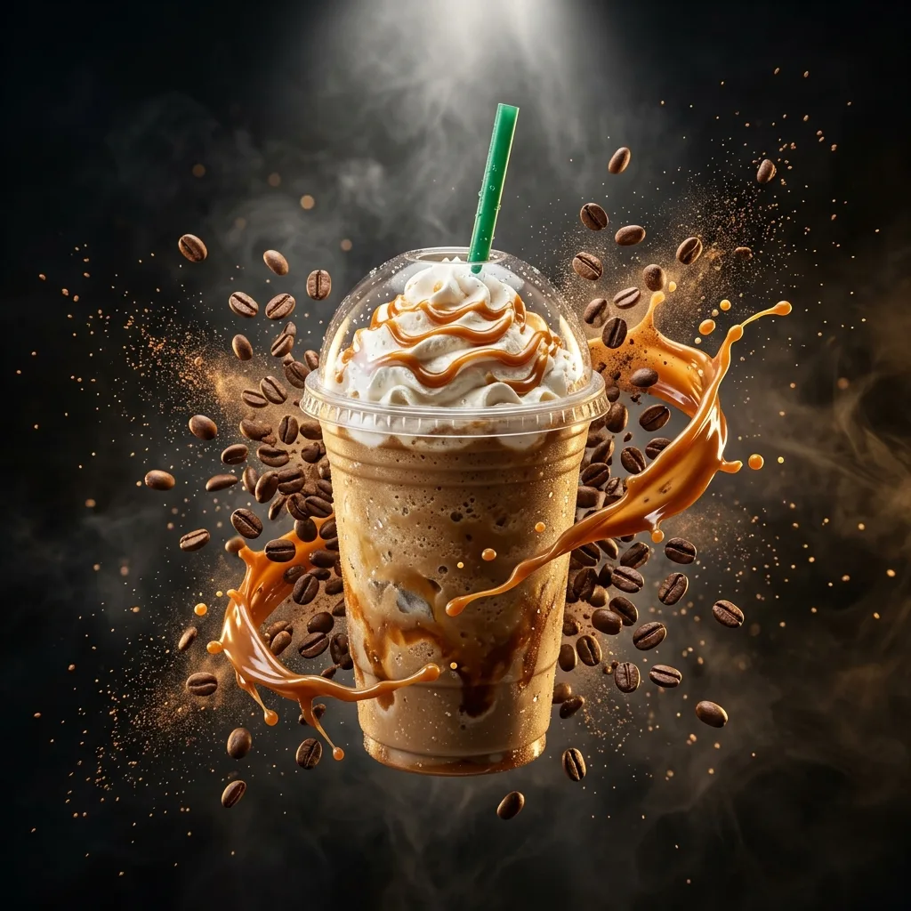

**#312 · Realistic, Product Photography · <code>Vinano Image Pro</code>**

> Keywords: realistic, product photography, cinematic, AI art, AI prompt, text to image

<details>
<summary>Show prompt</summary>

```
Ultra-realistic commercial product photography of a caramel frappuccino in a clear plastic cup dome lid and green straw, topped whipped cream and caramel drizzle, floating mid-air. Coffee beans exploding around the cup fine coffee powder dust particles suspended in the air, dynamic caramel splash trails swirling around the drink. Dark smoky background dramatic spotlight from above, warm golden rim lighting, high contrast, sharp focus, macro details, cinematic depth of field, hyper-detailed texture, premium beverage advertisement, 8K resolution. Maintain consistent colour harmony and crisp focus across the whole frame.
```

</details>

---

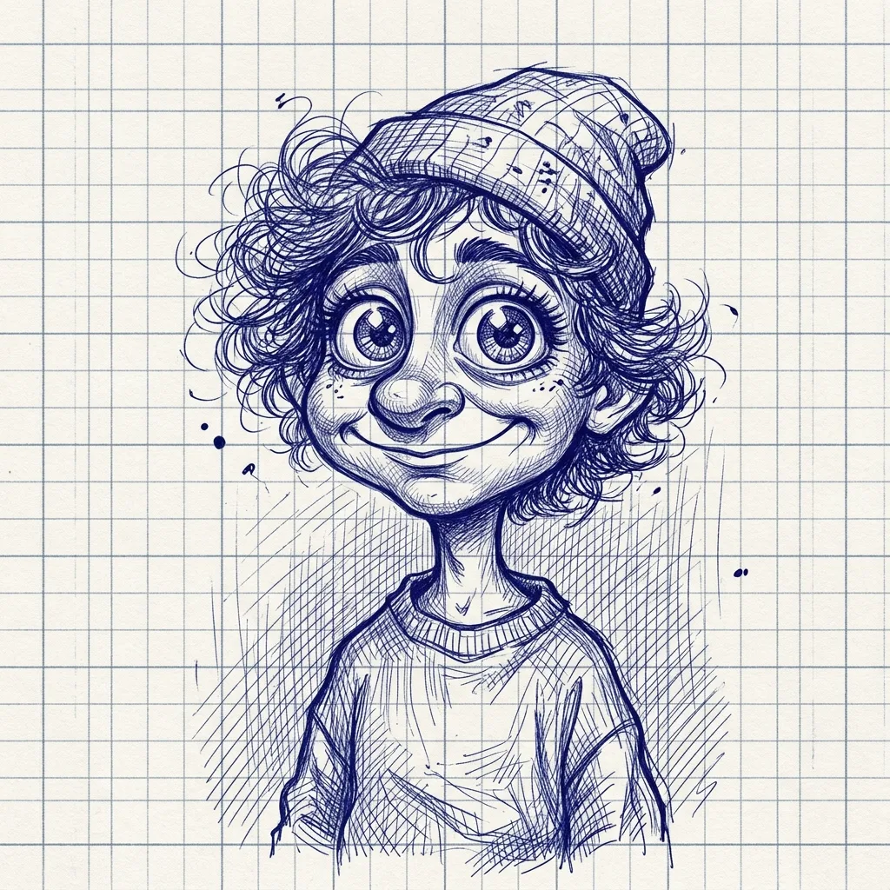

**#313 · Character, Ai Art · <code>Vinano Image Pro</code>**

> Keywords: character, AI art, AI prompt, text to image

<details>
<summary>Show prompt</summary>

```
A detailed ballpoint pen sketch of [CHARACTER] drawn on checkered notebook paper, 1080x1080. The drawing style is expressive and textured, showing fine pen strokes and cross-hatching. [CHARACTER] is depicted slightly exaggerated proportions — big expressive eyes and distinctive features — in a humorous but artistic caricature style. The background is simple checkered paper no logos or text, giving it a clean hand-drawn notebook look Maintain consistent colour harmony and crisp focus across the whole frame.
```

</details>

---

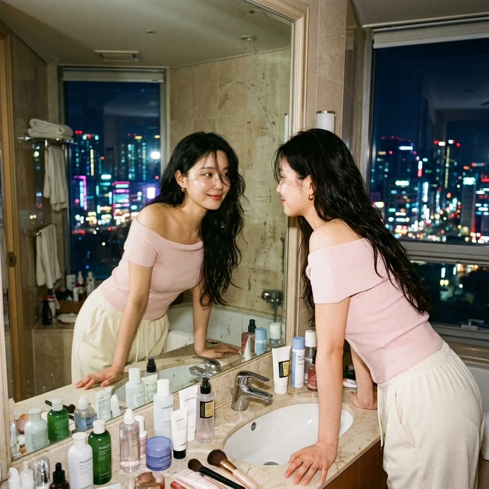

**#314 · Realistic, Portrait · <code>Vinano Image Pro</code>**

> Keywords: realistic, portrait, cinematic, AI art, AI prompt, text to image

<details>
<summary>Show prompt</summary>

```
Ultra-realistic candid film photography portrait of a young woman leaning over a bathroom sink and looking into a mirror at night, captured through a slightly dirty mirror natural reflections and subtle imperfections. She has long black hair partially covering her face, soft glowing skin, and a gentle mysterious smile. Wearing a light pink off-shoulder fitted top and loose cream-colored lounge pants, she poses casually both hands resting on the sink.
The scene is illuminated by direct on-camera flash, creating authentic Y2K disposable camera aesthetics, soft highlights, realistic skin texture, and natural shadows. A nighttime city skyline colorful neon lights and high-rise buildings is visible through a nearby window, adding an urban atmosphere. The bathroom countertop is filled skincare and cosmetic products, enhancing the lived-in, personal feel.
Shot from a close-up mirror perspective, cinematic composition, shallow depth of field, nostalgic 35mm film grain, subtle lens flare, reflections on glass, moody apartment ambiance, Korean lifestyle photography, intimate everyday moment, editorial fashion snapshot, raw candid energy, realistic colors, high detail, vertical composition, premium analog film aesthetic, trending Pinterest and Instagram photography style.

Keep edges clean and the overall composition balanced for a polished, gallery-ready result.
```

</details>

---

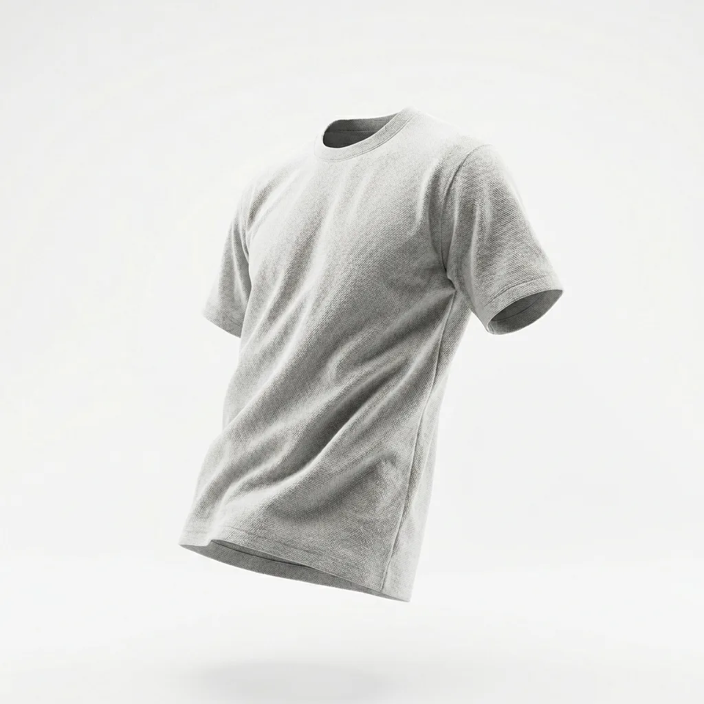

**#315 · Realistic, Minimalist · <code>Vinano Image Pro</code>**

> Keywords: realistic, minimalist, AI art, AI prompt, text to image

<details>
<summary>Show prompt</summary>

```
[BRAND NAME]. Act as a fashion photographer and creative director shooting a high-end editorial lookbook for a bespoke football jersey designed by this brand.
THE SUBJECT & COMPOSITION (FLOATING & ANGLED):
A single, premium custom football jersey is floating suspended in mid-air, centered in the frame. There is no hanger visible.
Crucial Angle: The jersey is NOT presented flatly frontal. It is rotated slightly (approximately 15 degrees angled view) to show depth, form, and a dynamic profile. Despite floating, the fabric must show realistic weight, deep gravity-defying folds, creases, and natural wrinkles. It must feel like a real, heavy garment frozen in time, not a stiff 3D model.
BRANDED DESIGN & AESTHETICS:
The jersey's design is a sophisticated interpretation of [BRAND NAME]'s visual identity.
Branding Placement: The official [BRAND NAME] logo is authentically applied as the main club crest on the chest (e.g., embroidered patch or premium-quality heat transfer).
MATERIALITY & TEXTURE (CRITICAL):
The focus remains on luxurious, tactile textures.
Fabric: A heavyweight, retro-inspired athletic cotton-blend or technical knit a visible, coarse weave structure.
ENVIRONMENT & BACKGROUND (WHITE STUDIO):
The jersey floats within an abstract, infinite white photo studio cyclorama space. The background is completely seamless, pure, clean white, and refined minimalist, absolutely zero distractions, placing total focus on the suspended garment.
LIGHTING & PHOTOGRAPHY STYLE:
Style: Hyper-realistic editorial fashion photography. Clean, high-key aesthetic.
Lighting: sophisticated studio lighting. Soft, diffused light that sculpts the folds of the fabric and highlights the texture against the pure white background. Subtle soft shadows might be cast on the jersey itself to define its form in the white space.

Emphasise material texture and natural light so the final frame feels tactile and premium.
```

</details>

---

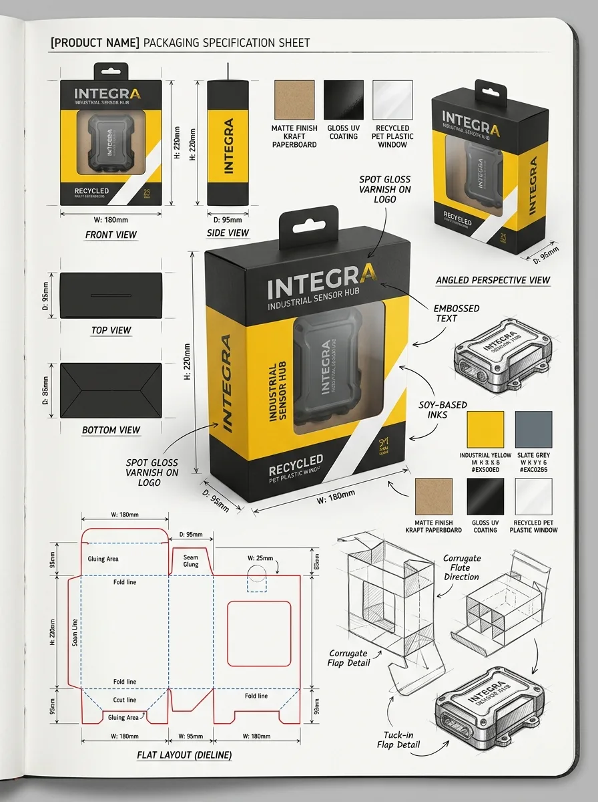

**#316 · Realistic, Ai Art · <code>Vinano Image Pro</code>**

> Keywords: realistic, AI art, AI prompt, text to image

<details>
<summary>Show prompt</summary>

```
the attached image, create a professional industrial packaging design illustration sheet for the packaging of [PRODUCT NAME]

Feature a centered hero 3D render realistic materials, soft studio lighting, and commercial-grade finish quality.
Surround the hero render technical views: front, side, top, bottom, angled perspective, and flat layout.

Include structural construction sketches, fold lines, seam details, and dimension arrows measurements in millimeters.
Show materials and finishes (matte, glossy print, plastic, paper, glass, etc.) handwritten-style annotations.
Add color swatches, realistic product illustrations, and subtle shadows.

Background should resemble clean sketchbook paper, combining realistic rendering pencil sketch overlays.
Modern industrial design aesthetic, ultra-detailed, portfolio-ready presentation.

 settings:
CFG: 7–9
Steps: 30–40
Sampler: DPM++
Resolution: 1024×1280 or higher
Aspect Ratio: 3:4

Keep edges clean and the overall composition balanced for a polished, gallery-ready result.
```

</details>

---

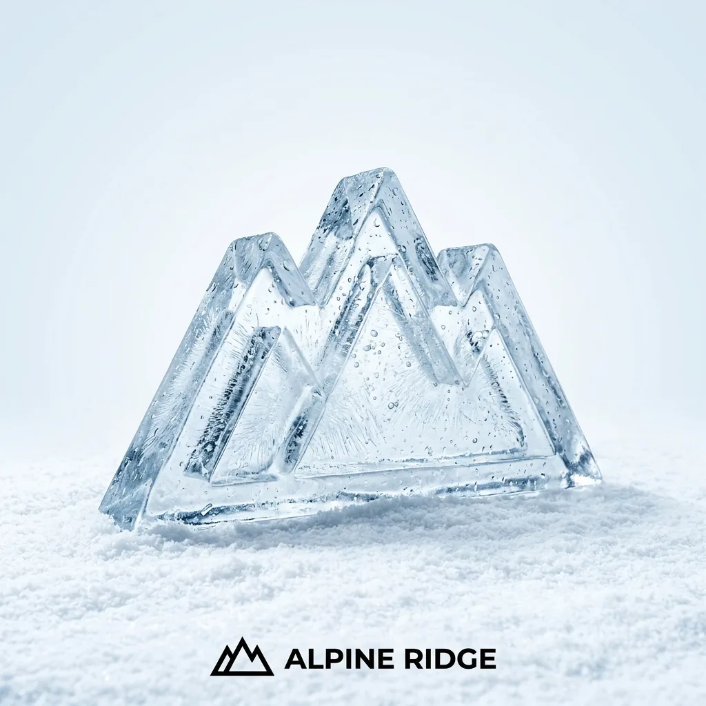

**#317 · Realistic, Product Photography · <code>Vinano Image Pro</code>**

> Keywords: realistic, product photography, cinematic, minimalist, AI art, AI prompt

<details>
<summary>Show prompt</summary>

```
[BRAND NAME]: Enter the brand name here.
Goal: Generate a hyper-realistic studio photograph where the stylized logo icon of [BRAND NAME] is a physical 3D ice sculpture lying directly on a snowy surface.
Constraint: NO TEXT inside or immediately near the central ice icon. Only the bottom signature. Light, airy background.

1. THE CENTRAL ICE ARTIFACT
- Main Subject: A large, 3D volumetric sculpture in the exact shape of the [BRAND NAME] logo icon.
- Material: Crafted from high-purity crystalline ice intricate internal textures, frost needles, and frozen air bubbles.
- Details: The surface of the ice logo is covered small, realistic water droplets and light condensation.
- Perspective: The logo is positioned at a 3/4 angle, lying horizontally on the snow to show its depth and thickness.

2. ENVIRONMENT & LAYOUT
- View: Eye-level macro perspective, 3/4 view.
- Surface: The logo is resting on a field of crisp, detailed, white powdery snow.
- Background: A flawless, uniform, very light pale blue and white gradient background (much lighter than the original).
- Shadow: A soft, realistic shadow is cast on the snow directly beneath the ice icon to ground it.

3. BOTTOM BRAND SIGNATURE (CRITICAL)
- Placement: A clean horizontal signature block centered at the bottom of the frame, far below the ice artifact.
- Elements: A tiny, flat, refined minimalist black version of the [BRAND NAME] logo icon on the left.
- Text: The word "[BRAND NAME]" in a clean, bold, black sans-serif typeface immediately to the right of the tiny logo.
- Scale: The signature is very small and subtle compared to the main ice sculpture.

4. AESTHETIC
- Premium product photography, cold and crisp atmosphere, hyper-realistic 8k resolution, filmic, cinematic lighting, ultra-detailed textures.

Maintain consistent colour harmony and crisp focus across the whole frame.
```

</details>

---

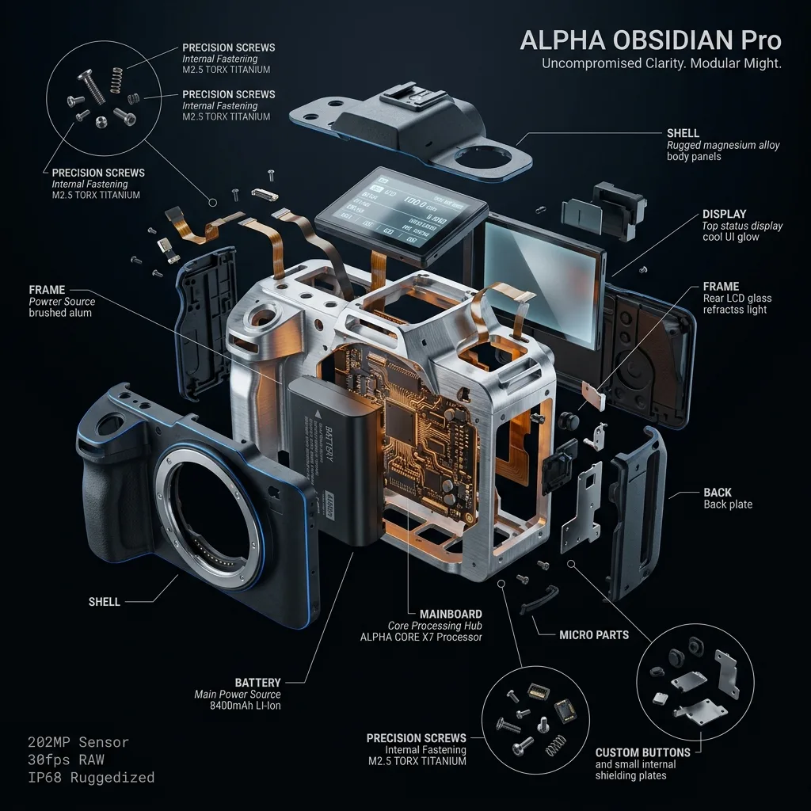

**#318 · Realistic, Ai Art · <code>Vinano Image Pro</code>**

> Keywords: realistic, AI art, AI prompt, text to image

<details>
<summary>Show prompt</summary>

```
Hyperrealistic 3D radial exploded view of [PRODUCT] [NUMBER] components bursting outward from a central axis in every direction, frozen in mid-air. True spatial explosion, not a vertical stack, depth and parallax visible. COMPONENTS (core outward): [SHELL] → [DISPLAY] → [FRAME] → [MAINBOARD] → [BATTERY] → [MICRO PARTS shown in 3x floating callout circles] MATERIALS: glass refracts and catches specular highlights, aluminium shows brushed grain and machined edges, PCB traces glow faintly amber, rubber gaskets matte micro-texture, cables soft bend physics. LABELS: hairline leader to floating box. "[COMPONENT]" uppercase / "[FUNCTION]" italic / "[KEY SPEC]" monospace. Radiate outward, no overlaps. LIGHTING: cool diffused overhead + warm amber underlighting on internals + thin blue rim on outer shell. Displays emit soft UI glow. Circuits self-illuminate. BACKGROUND: [COLOR], deep, non-reflective. Midnight black recommended. TITLE: "[PRODUCT NAME]" top right. SUBTITLE: "[TAGLINE]". SPEC BLOCK: "[SPEC 1] / [SPEC 2] / [SPEC 3]" bottom left in monospace. Mood: iFixit teardown meets NASA manual meets WIRED cover. 4K, tack sharp, extraordinary material fidelity. Render with rich micro-detail while keeping the layout uncluttered and intentional.
```

</details>

---

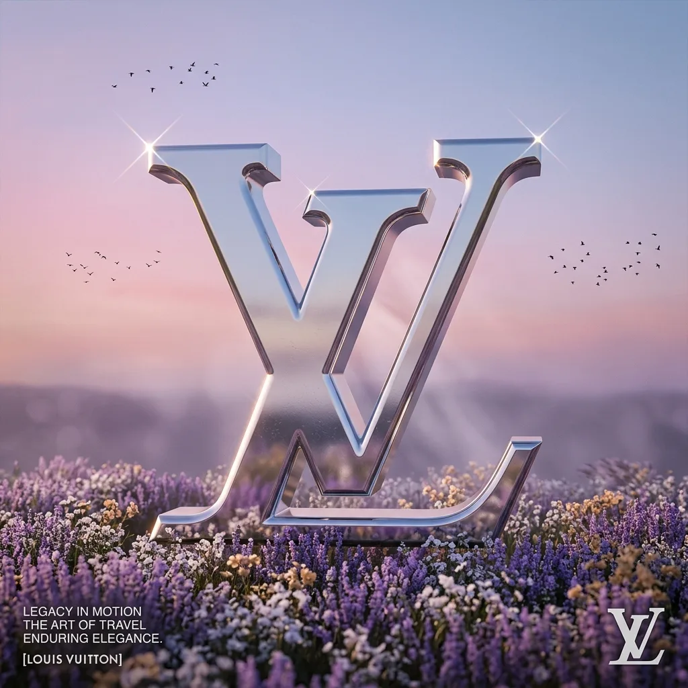

**#319 · Realistic, Landscape · <code>Vinano Image Pro</code>**

> Keywords: realistic, landscape, cinematic, AI art, AI prompt, text to image

<details>
<summary>Show prompt</summary>

```
[BRAND NAME]. Act as a Senior 3D Product Visualization Artist and Cinematic Art Director specializing in luxury brand key visuals for high-end editorial and streetwear campaigns.

PHASE 1: LOGO SUBJECT

Autonomously identify the official, universally recognized logo/logotype of [BRAND NAME]. Reproduce it maximum fidelity to the original silhouette, proportions, andgeometry — no stylistic distortion, no graffiti interpretation. The logo shape must be instantlyrecognizable as the real [BRAND NAME] mark. Extrude the logo into a solid 3D object a depth of approximately 15–20% of its height. All surfaces — front face, side extrusion, and beveled edges — must be coated in a single unified material: Surface material: hyper-polished liquid chrome. Reflectance value 0.98 — near-perfect mirror finish. Apply full Ray-Traced environment reflections: the logo must visibly reflect the surrounding sky gradient, flower field, and light sources within its curved and flat surfaces. Bevel radius on all hard edges: moderate
(enough to catch sharp specular highlights). Add Subsurface Scattering on the thinnest structural parts of the logo (fine lines, serifs, icon details) to create a subtle inner glow at the edges.
Place 4–8 prismatic star-shaped lens-flare sparkles (4-point) at the highest specular peaks — corners, tips, and curved peaks of the logo geometry. The sparkles must feel organic, not uniformly distributed. Zero matte surfaces. Zero plastic look. The entire object must read as cast from liquid silver.

PHASE 2: ENVIRONMENT & BACKGROUND

Background: a wide cinematic landscape at the golden-lilac hour (just after sunset). A vast flower field fills the lower third — densely packed lavender and white wildflowers realistic micro-texture and subtle wind motion-blur on the far clusters. Middle ground fades into soft purple-grey bokeh haze. Sky: gradient from warm blush rose (#E8A0BF) at the horizon through lilac (#C3A6D4) to cool powder blue (#A8C4D8) at the top. Add 3–5 loose silhouetted bird clusters (starlings, small and sharp) scattered across the upper left and right quadrants. Volumetric atmospheric haze
sits on the horizon line. Autonomously shift the environment's color palette to reflect [BRAND NAME]'s iconic brand identity — introduce the brand's signature hue as a tonal wash in the sky gradient or as the dominant flower color in the field. Preserve the overall ethereal, editorial mood. The environment must feel like it was art-directed specifically for this brand — not generic.

PHASE 3: COMPOSITION & LAYOUT

Format: 1:1 square. The chrome logo is centered horizontally and placed at the vertical midpoint — monumental in scale, spanning 65–80% of frame width.Apply a subtle forced perspective tilt (2–4 degrees)
for dynamic energy without distorting logo recognition. The bottom edge of the logo object grazes or slightly overlaps the top of the flower field, integrating the 3D object naturally into the environment. The logo casts a soft diffused shadow downward into the flowers. Lower-left corner: 2–3 lines of micro-copy in clean white sans-serif at minimal optical size. Autonomously generate a poetic 3-line brand statement relevant to [BRAND NAME]'s world, heritage, and aesthetic language. Bottom-left: "[BRAND NAME]" in small caps logotype label. Bottom-right: a secondary flat 2D chrome version of the same logo rendered small as a finishing mark.

PHASE 4: LIGHTING

Primary: large soft area light from upper-left simulating post-sunset overcast sky — fully diffused, no hard shadows, color temperature 5800K a lilac tint overlay. Secondary: warm rim light (3200K) grazing the bottom and side edges of the logo from behind — creates a golden separation halo between the object and the field. Global Illumination enabled — the chrome logo must realistically bounce and absorb the landscape's ambient color. The flower field's purple tones should be faintly visible in the lower reflective surfaces of the logo. Volumetric god rays faintly visible through any negative space or cutouts within the logo geometry.

TECH SPECS

Render engine: Octane Render aesthetic. Ray Tracing: maximum bounces (16+). Depth of Field: f/11 equivalent — full logo sharp, far background in soft bokeh only. Tone mapping: lifted blacks, compressed highlights, filmic S-curve. Color grade: desaturated midtones, preserved pastels, cool shadow tones. Film grain: subtle (ISO 200 equivalent). Chromatic Aberration: 0.2–0.3px on peripheral logo
edges only. Anti-aliasing: maximum. Strictly no AI-plastic normals. No smooth uniform shading. Microscopic surface imperfections on the chrome required for realism (micro-scratches, 0.5%
roughness noise map). Mood reference: luxury brand retrospective editorial for Highsnobiety or AnOther Magazine.

Keep edges clean and the overall composition balanced for a polished, gallery-ready result.
```

</details>

---

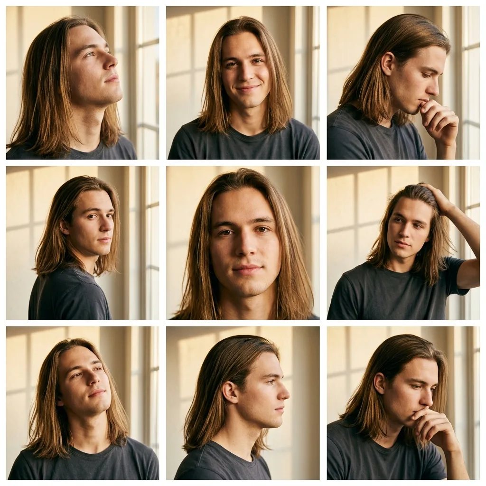

**#320 · Portrait, Minimalist · <code>Vinano Image Pro</code>**

> Keywords: portrait, minimalist, AI art, AI prompt, text to image

<details>
<summary>Show prompt</summary>

```
{
 "image_generation": {
 "face": {
 "preserve_original": true,
 "reference_match": true,
 "description": "Maintain the same facial structure, skin tone, eye shape, and natural expressions across all frames, consistent identity in each pose."
 },
 "photo_style": {
 "type": "golden hour portrait collage",
 "camera_angle": "varied close-up and medium portrait angles",
 "lighting": "warm golden hour sunlight casting soft window shadows",
 "mood": "soft, calm, intimate, aesthetic",
 "texture": "natural skin texture, soft highlights, gentle contrast",
 "focus": "sharp focus on face smooth background falloff"
 },
 "subject": {
 "gender": "male",
 "age": "young adult",
 "poses": ["looking upward toward light",
 "soft smile facing camera",
 "side profile downward gaze",
 "over-the-shoulder glance",
 "direct close-up relaxed lips",
 "hand in hair casual pose",
 "head tilted back toward light",
 "clean side profile portrait",
 "thoughtful pose hand near chin"],
 "expression": "natural, minimal, relaxed, emotionally subtle",
 "hair": {
 "style": "long straight hair worn loose",
 "color": "light to medium brown",
 "details": "natural shine soft light highlights"
 },
 "clothing": {
 "type": "casual refined minimalist outfit",
 "details": "simple dark t-shirt no visible branding"
 }
 },
 "composition": {
 "layout": "3x3 grid collage",
 "consistency": "uniform lighting and background across all frames",
 "framing": "clean portrait framing slight pose variation"
 },
 "environment": {
 "setting": "indoor space near a window",
 "background": "plain wall warm sunlight and shadow patterns",
 "atmosphere": "quiet, minimal, artistic indoor ambiance"
 },
 "aesthetic": {
 "style": "Instagram aesthetic portrait set",
 "features": ["golden hour light",
 "window shadow patterns",
 "minimal makeup",
 "natural expressions",
 "clean editorial portrait look"]
 }
 }
}

Emphasise material texture and natural light so the final frame feels tactile and premium.
```

</details>

---

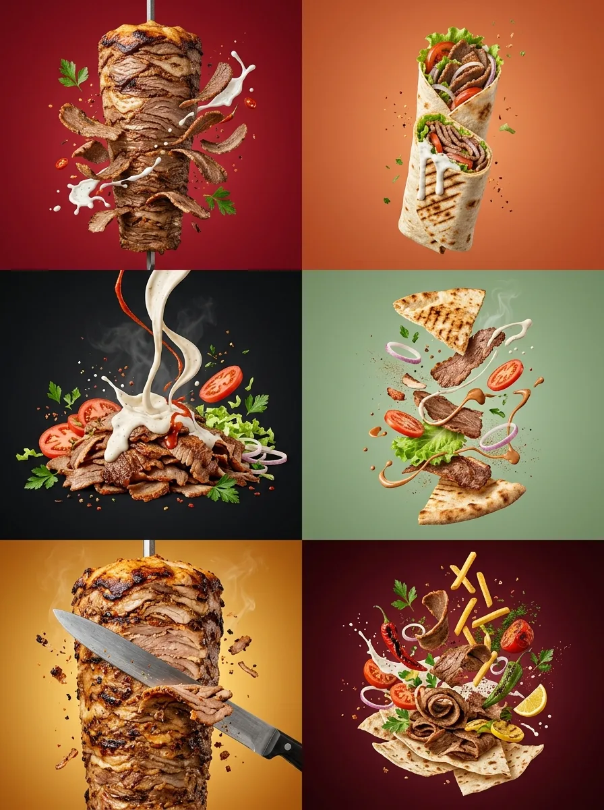

**#321 · Realistic, Food Photography · <code>Vinano Image Pro</code>**

> Keywords: realistic, food photography, cinematic, minimalist, AI art, AI prompt

<details>
<summary>Show prompt</summary>

```
{
 "resolution": "8K UHD",
 "aspect_ratio": "3:4",
 "image_style": "hyper-realistic commercial food photography",
 "global_settings": {
 "quality": "Ultra-high detail, razor-sharp focus, premium street food clarity",
 "lighting": "Controlled studio lighting emphasizing meat texture, char marks, and sauce glistening",
 "motion": "Frozen mid-air elements subtle gravity realism",
 "background_style": "Solid or smooth gradient background, color varies per module",
 "camera": "High-speed photography look, shallow to medium depth of field",
 "post_processing": "Rich contrast, warm savory tones, natural shine, appetizing color grading"
 },
 "modules": {

 "module_1_classic_doner_slice_explosion": {
 "scene_description": "A dramatic vertical döner stack flying meat slices and sauce droplets",
 "doner": {
 "type": "Traditional Turkish döner kebab slices",
 "texture": "Thinly sliced beef and lamb mix visible char marks",
 "cut": "Paper-thin ribbons",
 "position": "Stacked vertically and floating mid-air"
 },
 "details": {
 "char_marks": "Dark caramelized edges grill stripes",
 "fat_marbling": "Glistening fat streaks between meat layers",
 "seasoning": "Visible spice particles on meat surface"
 },
 "motion_effects": {
 "meat_slices": "Individual döner slices spiraling outward",
 "sauce": "White garlic sauce and red chili sauce droplets splashing",
 "herbs": "Fresh parsley leaves floating in air"
 },
 "background": {
 "color": "Deep crimson red",
 "texture": "Smooth, seamless"
 }
 },

 "module_2_minimal_doner_durum_floating": {
 "scene_description": "refined minimalist premium döner dürüm presentation controlled floating ingredients",
 "doner": {
 "type": "Perfectly wrapped dürüm (wrap) cross-section",
 "arrangement": "Single dürüm cut in half, floating vertically",
 "surface": "Lightly toasted lavash bread golden char marks"
 },
 "accent_elements": {
 "filling": "Layered döner meat, lettuce, tomatoes, onions visible in cross-section",
 "sauce": "White garlic yogurt sauce drizzling elegantly",
 "vegetables": "Fresh red tomato slices, crisp lettuce, purple onion rings"
 },
 "motion_effects": {
 "particles": "Subtle floating spice particles and herb fragments",
 "drops": "Sauce droplets frozen mid-fall"
 },
 "background": {
 "color": "Warm terracotta orange",
 "gradient": "Very soft tonal gradient"
 }
 },

 "module_3_doner_sauce_pour_drama": {
 "scene_description": "Cinematic sauce pour over döner meat pile",
 "doner": {
 "type": "Mountain of freshly sliced döner meat",
 "texture": "Highly detailed crispy edges and tender interior"
 },
 "additional_elements": {
 "sauces": {
 "white_sauce": {
 "state": "Thick creamy garlic yogurt sauce pouring from above",
 "motion": "Frozen in elegant flowing ribbon"
 },
 "red_sauce": {
 "state": "Spicy red chili sauce drizzling alongside",
 "motion": "Thin crimson streams intertwining white sauce"
 }
 },
 "vegetables": ["Sliced tomatoes",
 "Chopped lettuce",
 "Thinly sliced onions",
 "Fresh parsley sprigs"]
 },
 "motion_effects": {
 "splashes": "Micro sauce splashes on meat surface",
 "particles": "Floating spice particles and herb fragments",
 "steam": "Subtle heat vapor rising from meat"
 },
 "background": {
 "color": "Dark charcoal black",
 "tone": "High contrast, premium street food aesthetic"
 }
 },

 "module_4_modern_doner_deconstructed_composition": {
 "scene_description": "Modern deconstructed döner composition in mid-air",
 "elements": {
 "bread": "Pieces of toasted lavash bread floating separately",
 "meat": "Individual döner slices suspended at different angles",
 "vegetables": "Tomato slices, lettuce leaves, onion rings floating between layers",
 "sauces": "Glossy sauce ribbons connecting elements artistically"
 },
 "motion_effects": {
 "particles": "Ultra-fine spice dust suspended in air",
 "drops": "Scattered sauce droplets frozen in motion",
 "steam": "Minimal heat waves rising from meat"
 },
 "background": {
 "color": "Muted sage green",
 "texture": "Smooth, seamless"
 }
 },

 "module_5_rotating_doner_spit_close_up": {
 "scene_description": "Extreme close-up of döner meat on vertical spit knife slice frozen in time",
 "doner_spit": {
 "type": "Vertical döner tower on rotating spit",
 "texture": "Layers of seasoned meat charred outer crust",
 "detail": "Visible spices, fat marbling, and grill marks"
 },
 "action_elements": {
 "knife": "Large döner knife mid-slice through meat",
 "meat_slice": "Fresh slice falling away from spit",
 "shavings": "Meat shavings and crispy bits floating"
 },
 "motion_effects": {
 "particles": "Charred bits and seasoning particles in air",
 "steam": "Heat vapor wisps rising from fresh cut"
 },
 "background": {
 "color": "Rich golden amber",
 "texture": "Smooth gradient"
 }
 },

 "module_6_doner_plate_overhead_explosion": {
 "scene_description": "Overhead shot of döner plate ingredients exploding upward",
 "composition": {
 "base": "Thin lavash bread pieces on bottom",
 "center": "Pile of döner meat slices",
 "explosion": "All ingredients bursting upward in circular pattern"
 },
 "flying_elements": ["Döner meat slices spiraling",
 "French fries launching upward",
 "Grilled peppers and tomatoes",
 "Fresh parsley and sumac",
 "Sauce droplets spraying",
 "Lemon wedges"],
 "motion_effects": {
 "height_variation": "Elements at different heights creating depth",
 "rotation": "Some elements rotating while airborne"
 },
 "background": {
 "color": "Deep burgundy red",
 "style": "Vignette effect focusing on center"
 }
 }

 },
 "negative_prompt": ["text",
 "logos",
 "branding",
 "hands",
 "people",
 "utensils beyond döner knife",
 "full plates visible",
 "tables",
 "restaurant interior",
 "cartoon style",
 "raw meat",
 "excessive grease pooling",
 "burnt or overcooked appearance",
 "overexposure",
 "artificial glow",
 "low detail textures",
 "unappetizing colors",
 "plastic-looking food"]
}

Emphasise material texture and natural light so the final frame feels tactile and premium.
```

</details>

---

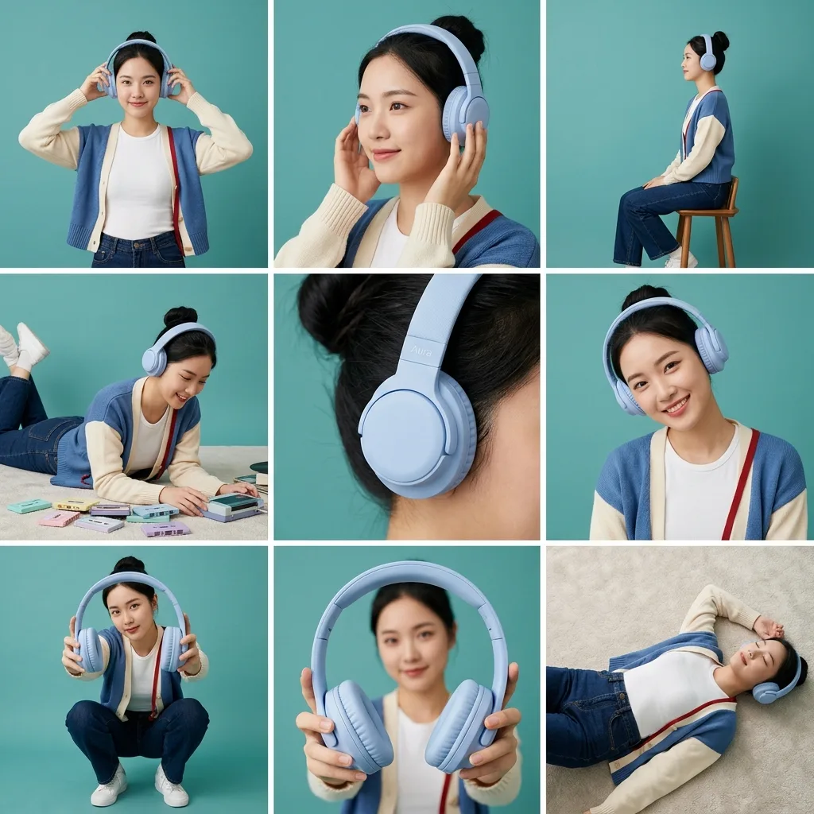

**#322 · Portrait, Product Photography · <code>Vinano Image Pro</code>**

> Keywords: portrait, product photography, storyboard, AI art, AI prompt, text to image

<details>
<summary>Show prompt</summary>

```
3×3 storyboard grid, nine panels, same subject and outfit, consistent teal studio background, soft diffused lighting, clean editorial lifestyle photography
young East Asian woman, natural makeup, black hair tied back, wearing white fitted top, blue/cream color-block cardigan red strap, blue jeans, sneakers, pastel blue over-ear wireless headphones
panel sequence (left→right, top→bottom): 1 standing adjusting headphones, front view
2 close-up portrait touching earcup
3 side profile sitting on tall stool
4 lying on stomach cassette tapes + retro player
5 extreme close-up headphones + face detail
6 tilted head smiling portrait
7 low-angle crouch reaching headphones toward camera
8 forced perspective product shot, headphones close to lens
9 lying on back relaxed pose
style: minimal, pastel tones, soft shadows, sharp focus, commercial product photography, consistent framing, balanced grid layout, mix of wide/medium/close shots

Keep edges clean and the overall composition balanced for a polished, gallery-ready result.
```

</details>

---

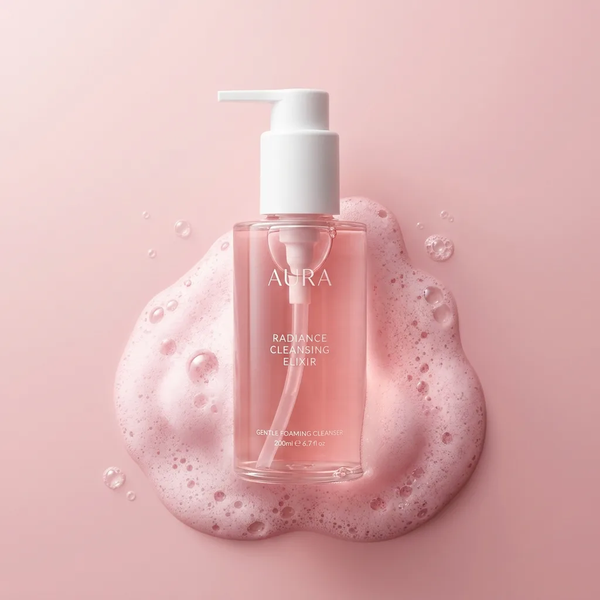

**#323 · Realistic, Product Photography · <code>Vinano Image Pro</code>**

> Keywords: realistic, product photography, minimalist, AI art, AI prompt, text to image

<details>
<summary>Show prompt</summary>

```
Premium refined minimalist skincare product photography. A translucent pink liquid cleanser bottle a white pump dispenser placed vertically at the center of the frame. The bottle rests inside an organic pool of soft pink foamy bubbles, airy soap lather spreading outward in smooth, rounded shapes. Small transparent bubbles float around the foam surface. Clean matte pastel pink background subtle gradient. Soft diffused top lighting gentle rim light creates a luminous glow through the liquid, highlighting the pump tube inside the bottle. Sharp focus, high clarity, realistic liquid refraction, smooth plastic and glass textures, luxury beauty advertising style, modern cosmetic branding, ultra-realistic, 8K detail, high dynamic range.

Negative Prompt:

hands, people, faces, clutter, harsh reflections, label distortion, unreadable text, warped pump, hard shadows, grain, noise, low resolution, CGI look, cartoon style, messy foam, uneven lighting, watermark

Maintain consistent colour harmony and crisp focus across the whole frame.
```

</details>

---

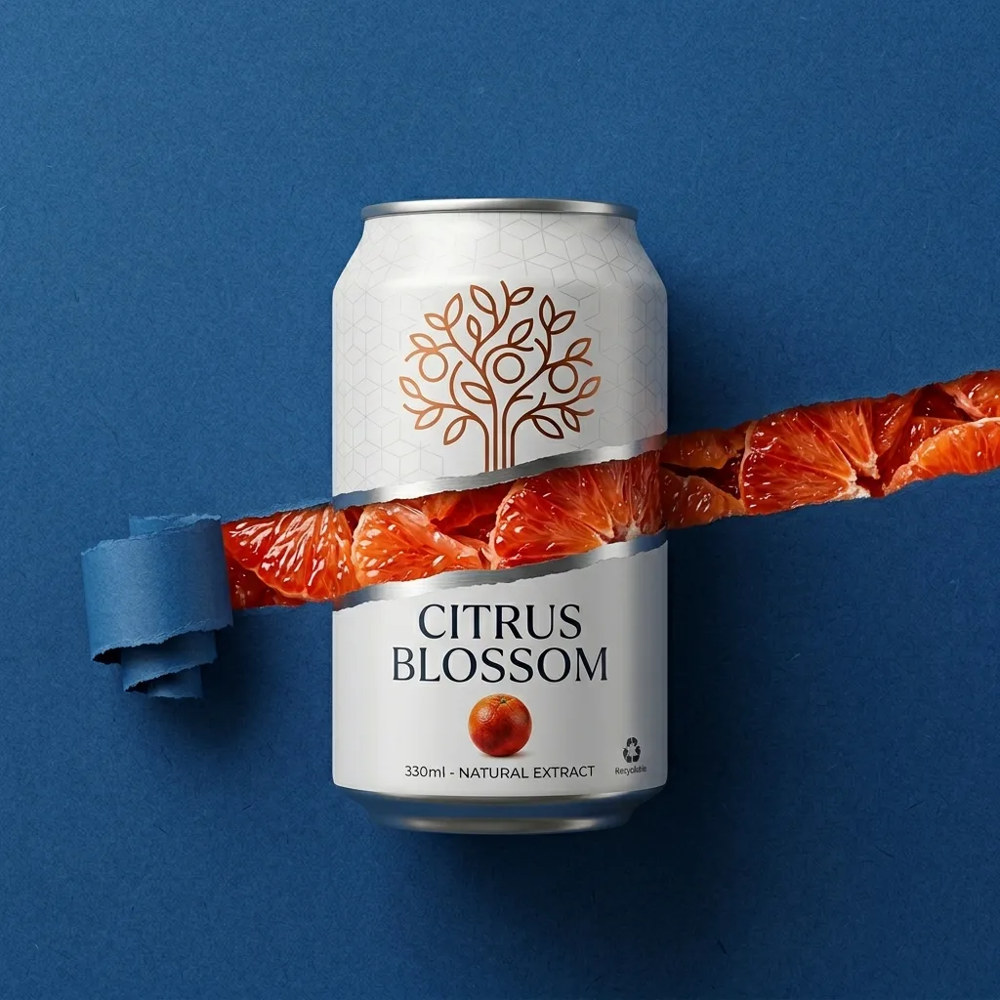

**#324 · Realistic, Cinematic · <code>Vinano Image Pro</code>**

> Keywords: realistic, cinematic, minimalist, AI art, AI prompt, text to image

<details>
<summary>Show prompt</summary>

```
A true-to-life photorealistic, highly detailed commercial product photograph of a standard aluminum [Type of Soda Can] centered against a minimal, textured [Background Color] paper background, subtle fibers visible. A single, continuous horizontal paper-tear strip runs across the entire width of the frame, seamless from the far-right edge to the far-left edge. The torn channel cuts through the metal body of the can and continues across the background on both sides a barely perceptible and minimal diagonal slope towards the upper-left. The tear channel is significantly broader, revealing a dense, glistening, and vibrant layer of [Description of Fruit Segments/Sacs/Berries] tightly packed inside. Near the extreme far-left end of this tear, the paper is neatly rolled into a tight, realistic coil that occupies almost the entire left margin. The can features a newly designed, refined minimalist branding: the upper portion has a stylized, abstract line-art illustration of [Fruit Branch/Plant] in a contrasting [Ink Color], set against a subtle matte geometric [Pattern Type] pattern on the can surface. Below this, the brand name "[Brand Name]" is printed in an elegant, modern dark typography, smaller technical text "330ml - NATURAL EXTRACT" and a small "Recyclable" logo. A small, detailed graphic of the fruit is located below the torn path. The lighting is soft and cinematic, casting delicate drop shadows beneath the torn paper edges and the large left coil. 8k resolution, macro details on fibrous paper and glossy fruit texture. Emphasise material texture and natural light so the final frame feels tactile and premium.
```

</details>

---

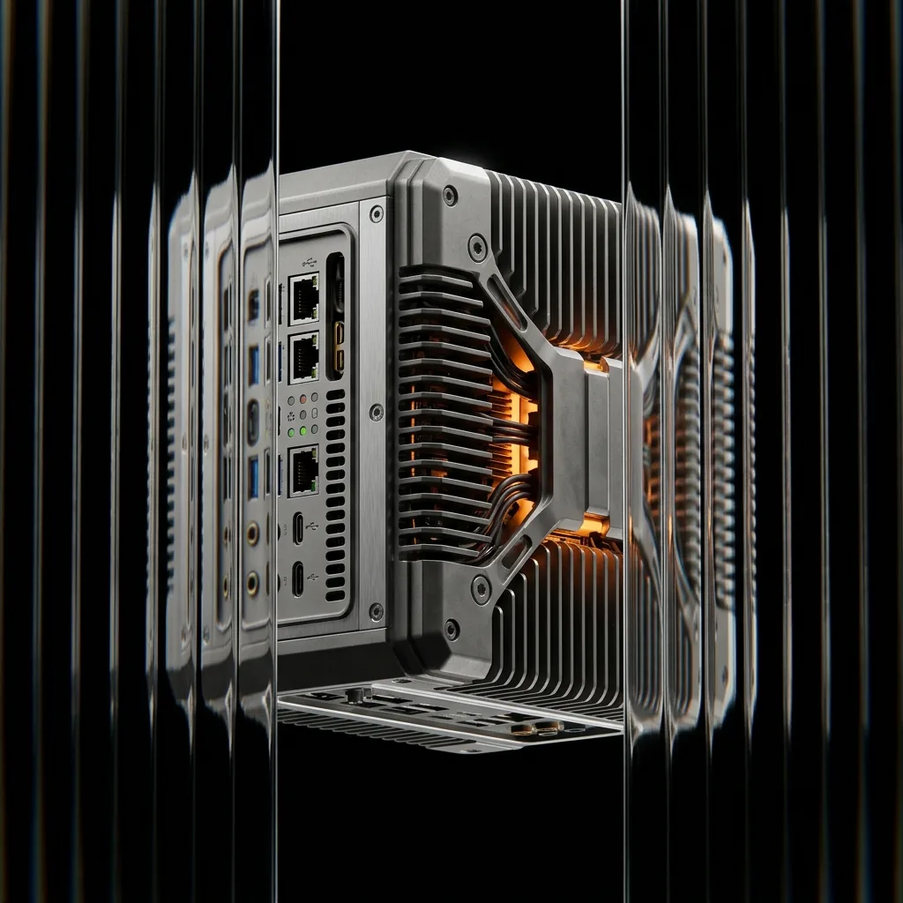

**#325 · Realistic, Cinematic · <code>Vinano Image Pro</code>**

> Keywords: realistic, cinematic, AI art, AI prompt, text to image

<details>
<summary>Show prompt</summary>

```
{
 "image_generation_request": {
 "subject": {
 "placeholder": "[INSERT PRODUCT HERE]",
 "position": "dead center, eye-level, perfectly centered in frame",
 "presentation": "levitating, floating in a weightless void, no stands, no platforms, no pedestals, no visible supports"
 },
 "environment": {
 "background": "absolute solid pitch black, hex code #000000, infinite void",
 "lighting": "rim lighting, cinematic chiaroscuro, high-contrast glints on metallic edges, soft orange glow from internal recesses"
 },
 "aesthetic_style": {
 "textures": ["shot-blasted matte titanium",
 "brushed aerospace-grade aluminum",
 "anodized dark grey metal",
 "ribbed industrial vertical cooling fins"],
 "optical_effects": "viewed through vertical fluted reeded glass, subtle chromatic distortion, refractive glass warping, radial motion blur on outer edges",
 "color_palette": {
 "primary_background": "#000000",
 "secondary_metal": "#8E8E8E",
 "accent_glow": "#FF8C00",
 "highlights": "#FFFFFF"
 }
 },
 "composition_constraints": {
 "framing": "ensure full product visibility, do not cut off edges, wide safety margins around the subject",
 "elements_to_exclude": ["text",
 "logos",
 "watermarks",
 "softboxes",
 "light stands",
 "floor",
 "horizon line",
 "props",
 "human hands",
 "shadows on surfaces"]
 },
 "technical_specs": {
 "focal_length": "85mm macro lens",
 "depth_of_field": "deep focus on product, blurred refractive foreground glass",
 "render_engine": "true-to-life photorealistic octane render, 8k resolution, ray-traced reflections"
 }
 }
}

Render with rich micro-detail while keeping the layout uncluttered and intentional.
```

</details>

---

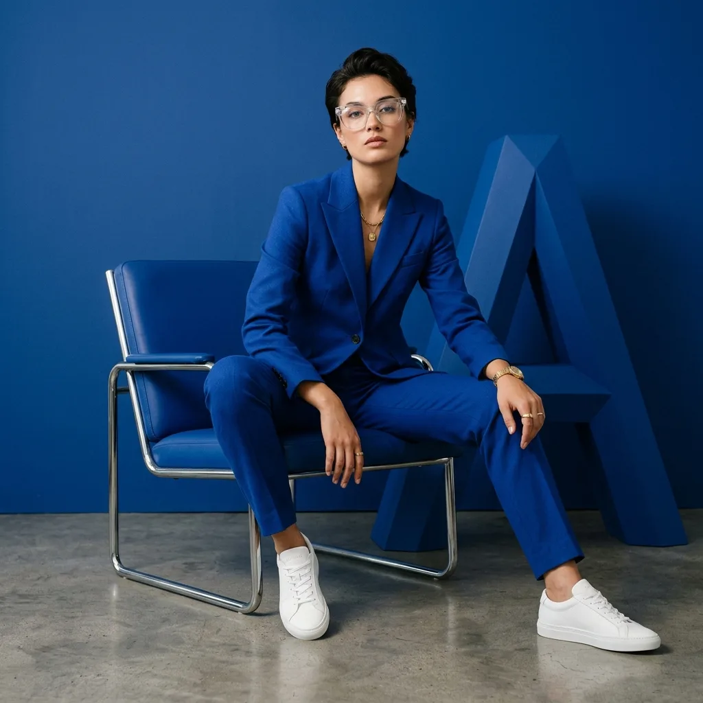

**#326 · Realistic, Minimalist · <code>Vinano Image Pro</code>**

> Keywords: realistic, minimalist, AI art, AI prompt, text to image

<details>
<summary>Show prompt</summary>

```
refined minimalist fashion studio photoshoot featuring stylish people sitting confidently on a modern chair, monochromatic aesthetic, subjects wearing bold cobalt-blue outfits (tailored suit or modern streetwear set) white sneakers and clear glasses, relaxed powerful pose legs apart and hands resting naturally, clean blue studio background a large geometric letter “A” behind them, soft professional studio lighting, fashion editorial composition, modern luxury brand campaign style, ultra-realistic, sharp focus, high detail, 8K. Render with rich micro-detail while keeping the layout uncluttered and intentional.
```

</details>

---

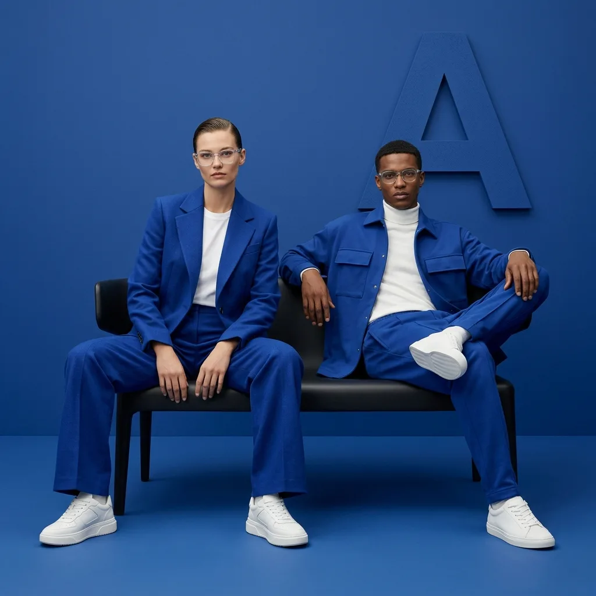

**#327 · Realistic, Minimalist · <code>Vinano Image Pro</code>**

> Keywords: realistic, minimalist, AI art, AI prompt, text to image

<details>
<summary>Show prompt</summary>

```
refined minimalist fashion studio photoshoot featuring stylish people sitting confidently on a modern chair, monochromatic aesthetic, subjects wearing bold cobalt-blue outfits (tailored suit or modern streetwear set) white sneakers and clear glasses, relaxed powerful pose legs apart and hands resting naturally, clean blue studio background a large geometric letter “A” behind them, soft professional studio lighting, fashion editorial composition, modern luxury brand campaign style, ultra-realistic, sharp focus, high detail, 8K. Emphasise material texture and natural light so the final frame feels tactile and premium.
```

</details>

---

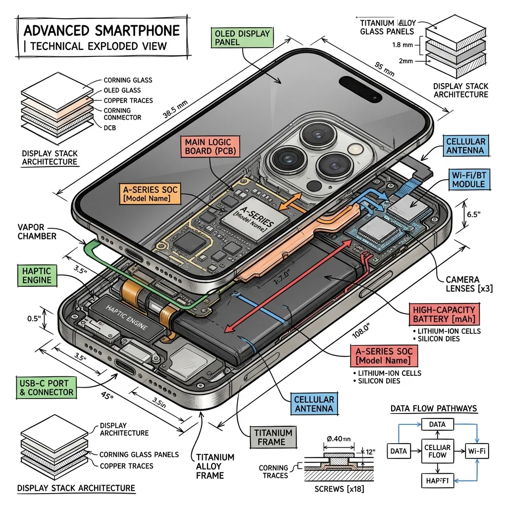

**#328 · Isometric, Realistic · <code>Vinano Image Pro</code>**

> Keywords: isometric, realistic, infographic, AI art, AI prompt, text to image

<details>
<summary>Show prompt</summary>

```
Create a technical infographic of [OBJECT] a 45-degree isometric 3D perspective showing the device slightly tilted to reveal depth and dimension.
Combine a realistic photoreal render black ink technical annotations on pure white background. Include:
Key component labels color-coded callout boxes
Internal component visibility through transparent/cutaway sections
Measurements, dimensions, and precise scale markers
Material callouts and quantities
Color-coded arrows for function/flow: RED (power/battery), BLUE (data/connectivity), ORANGE (thermal/processor), GREEN (sensors/haptics)
Simple schematics or cross-sectional diagrams where relevant

Place “OBJECT” title in a hand-drawn technical box (top-left corner).
Style: Black linework (technical pen/architectural), sketched but precise. Object remains clearly visible. Educational museum-exhibit vibe. crisp composition, balanced negative space.
Perspective: Isometric 3D angle—tilted to show depth, dimension, and internal architecture dramatically. Like a professional product teardown or engineering manual.
Colors: ~10-15% accent density. Black dominant. White background.
Output: 1080×1080, ultra-crisp, social-feed optimized.

Preserve realistic proportions and depth for a confident, professional finish.
```

</details>

---

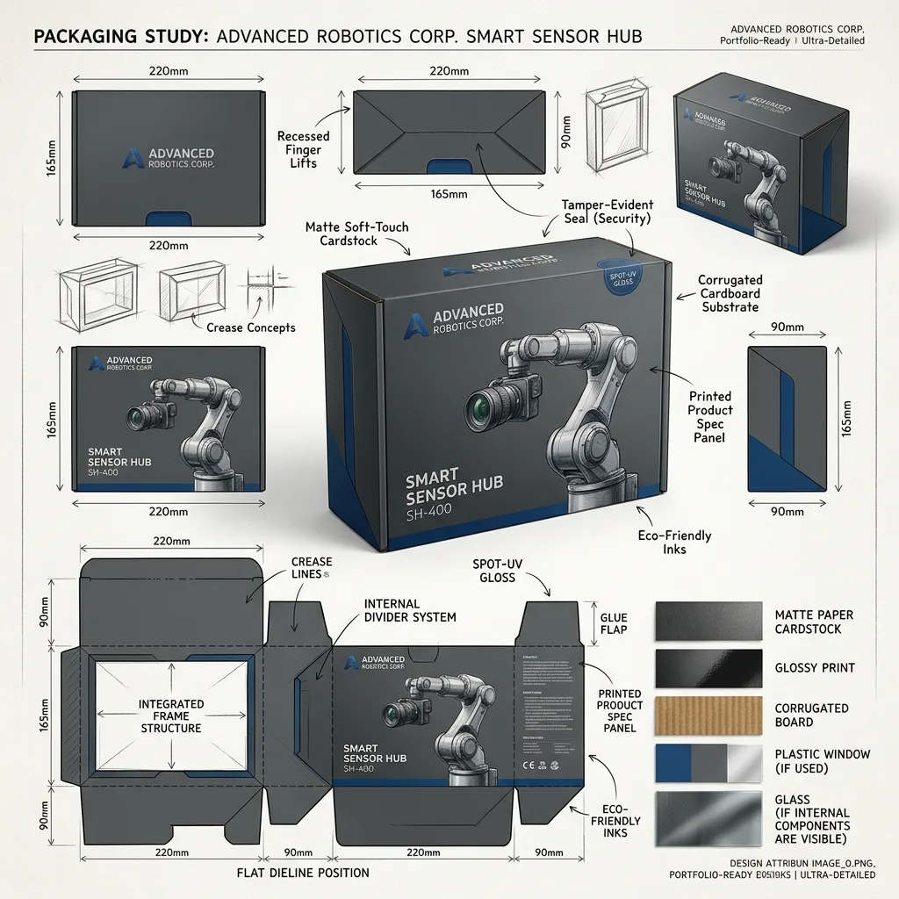

**#329 · Realistic, Ai Art · <code>Vinano Image Pro</code>**

> Keywords: realistic, AI art, AI prompt, text to image

<details>
<summary>Show prompt</summary>

```
the attached image, create an illustration sheet of professional industrial design packaging for the package (PACKAGE TYPE). A centered heroic 3D rendering realistic materials, soft studio lighting and commercial quality finishes. Surrounded by technical views: front, side, top, bottom, oblique perspective and flat position. Include sketches of the frame structure, crease lines, seam details, and size arrows in millimeters. Show materials and finishes (matte, glossy print, plastic, paper, glass, etc.) in handwritten annotations. Add color swatches, realistic product illustrations, and subtle shadows. Clean sketchbook background, realistic rendering + pencil sketch style, modern design design, ultra-detailed, portfolio ready. Emphasise material texture and natural light so the final frame feels tactile and premium.
```

</details>

---

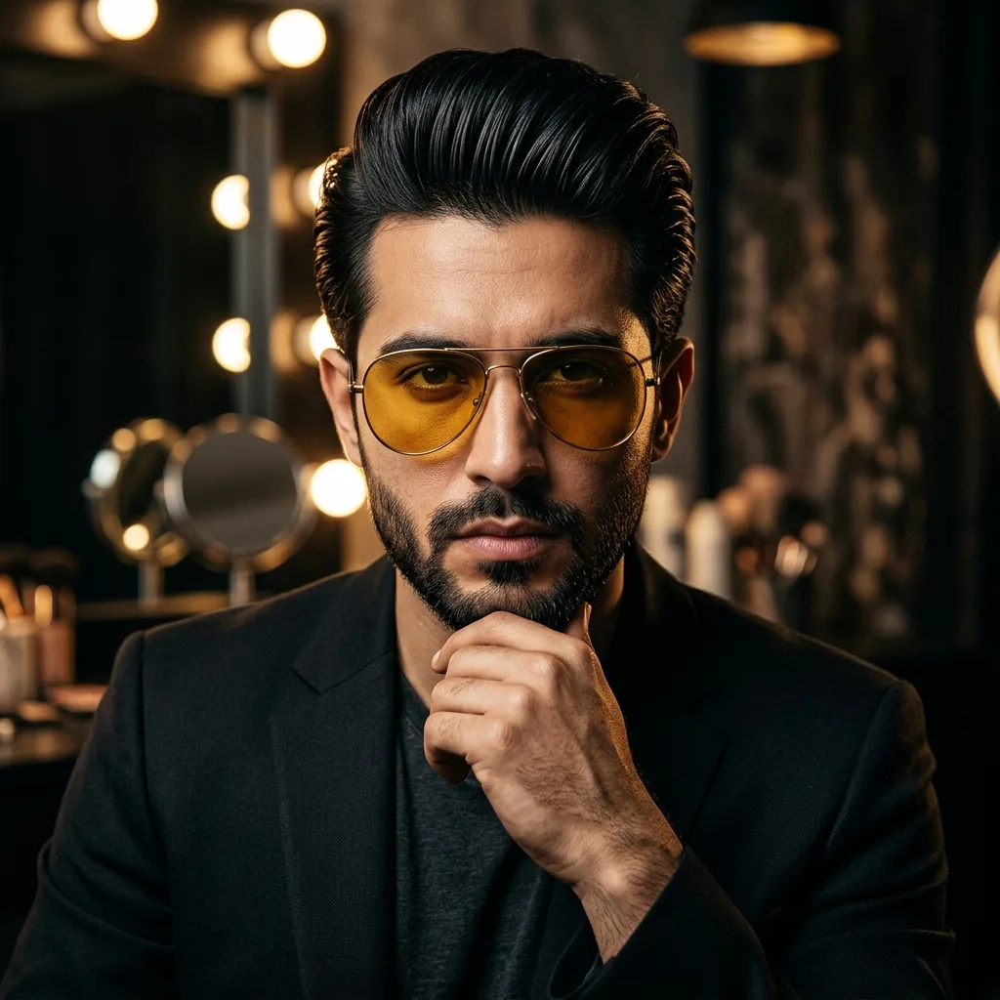

**#330 · Anime, Portrait · <code>Vinano Image Pro</code>**

> Keywords: anime, portrait, cinematic, AI art, AI prompt, text to image

<details>
<summary>Show prompt</summary>

```
{
 "objective": "Create a dramatic, high-contrast cinematic portrait of a stylish young man in a premium black suit selective warm lighting and intense mood",
 "subject": {
 "type": "Young adult male",
 "age_appearance": "25-30",
 "hair": "Black, voluminous, slicked back pompadour style, perfectly styled high shine",
 "facial_hair": "Well-groomed short boxed beard and mustache",
 "expression": "Intense, confident, serious, slightly mysterious",
 "pose": "Hand under chin thoughtful/contemplative pose, looking directly at camera",
 "accessories": {
 "sunglasses": "Classic aviator style, gold metal frame, strong yellow/orange tinted lenses",
 "clothing": {
 "outerwear": "Premium matte black tailored blazer/jacket, sharp lapels, high-end luxurious fabric texture",
 "innerwear": "Dark charcoal or black crew-neck t-shirt"
 }
 }
 },
 "lighting": {
 "style": "Cinematic studio lighting",
 "main": "Strong side and rim lighting creating deep shadows and dramatic highlights",
 "background": "Dark gradient circular warm spotlight array (vanity/makeup studio lights)",
 "contrast": "Very high contrast, deep blacks, bright highlights on face and hair",
 "mood": "Moody, masculine, powerful, film-noir inspired"
 },
 "composition": {
 "framing": "Tight mid-close-up portrait, head and shoulders",
 "angle": "Slightly below eye level for commanding presence",
 "depth_of_field": "Shallow, sharp focus on face and sunglasses, soft background"
 },
 "color_palette": {
 "dominant": "Black & deep charcoal",
 "accents": "Warm yellow-orange from sunglasses lenses and background lights",
 "skin_tone": "Natural subtle cinematic glow"
 },
 "style_references": ["Modern film-noir",
 "High-end fashion editorial",
 "Hollywood dramatic portrait",
 "David LaChapelle meets classic menswear advertising"],
 "image_quality": {
 "resolution": "Ultra-high detail, 8K",
 "sharpness": "Crisp facial features, hair strands visible",
 "texture": "Detailed skin pores, fabric weave, hair shine"
 },
 "negative_prompt": ["low quality",
 "blurry",
 "overexposed",
 "underexposed",
 "cartoon",
 "anime",
 "distorted face",
 "extra limbs",
 "bad anatomy",
 "logo",
 "text",
 "watermark",
 "bright colored clothing",
 "casual outfit"],
 "aspect_ratio": "2:3 (portrait orientation)"
}

Render with rich micro-detail while keeping the layout uncluttered and intentional.
```

</details>

---

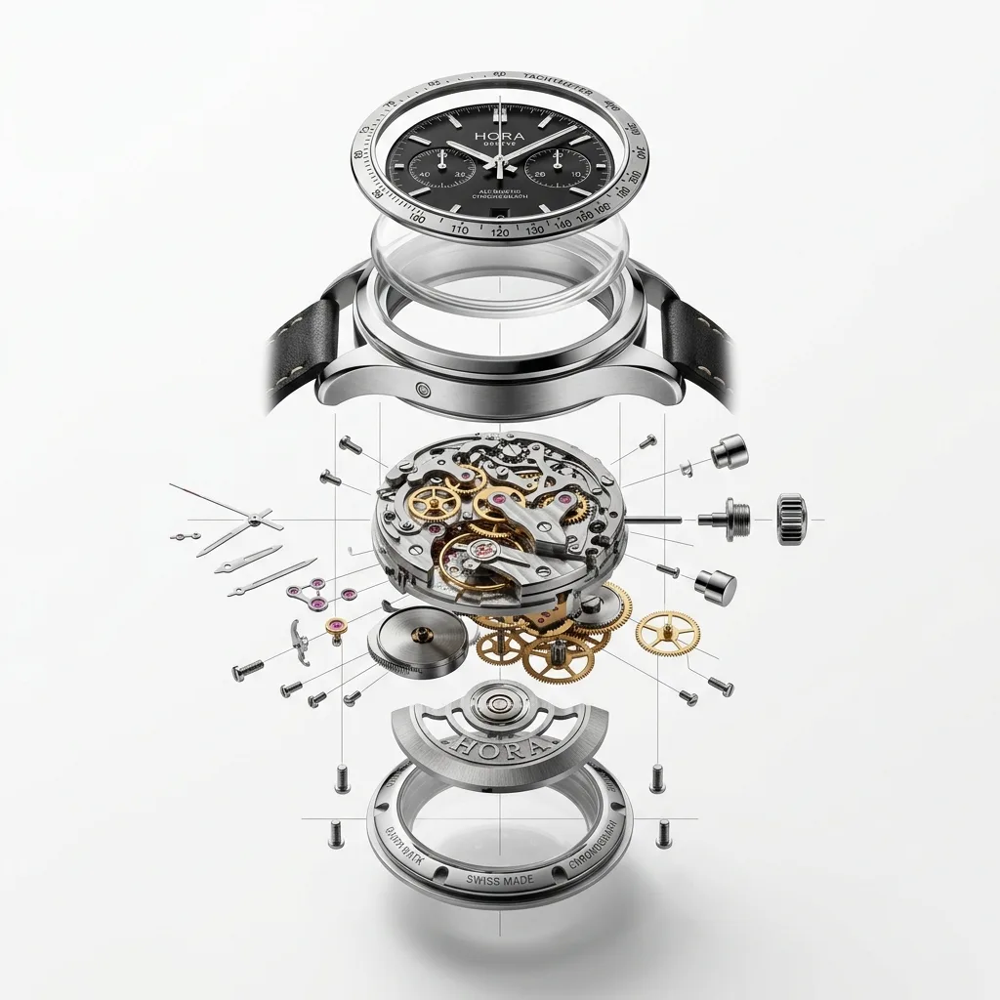

**#331 · Realistic, Product Photography · <code>Vinano Image Pro</code>**

> Keywords: realistic, product photography, AI art, AI prompt, text to image

<details>
<summary>Show prompt</summary>

```
[product], high-end product advertising, white seamless background, exploded view inner mechanics revealed, outer shell hovering above core, micro screws and components suspended, perfect alignment guides implied, crisp soft shadow, ultra realistic, macro product photography, 100mm lens look, f/8, 8k Keep edges clean and the overall composition balanced for a polished, gallery-ready result.
```

</details>

---

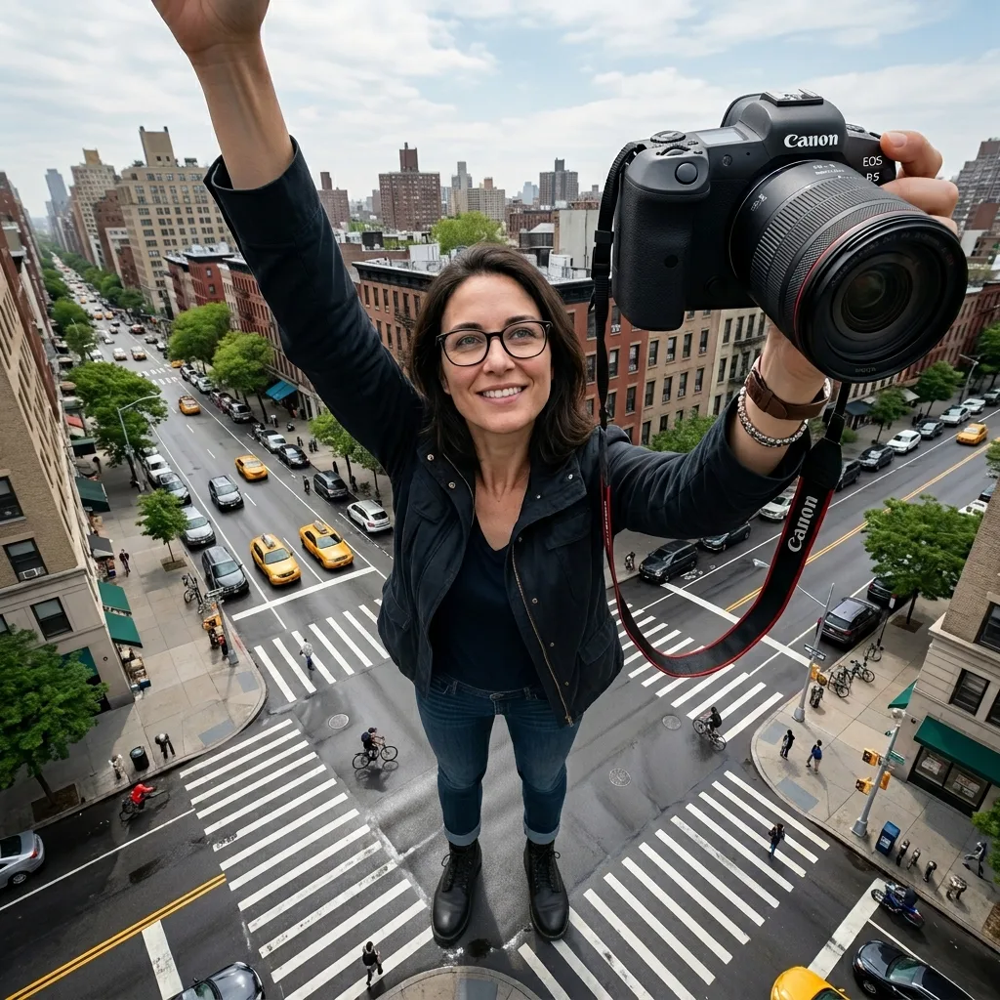

**#332 · Realistic, Cinematic · <code>Vinano Image Pro</code>**

> Keywords: realistic, cinematic, fantasy, AI art, AI prompt, text to image

<details>
<summary>Show prompt</summary>

```
{
 "type": "image_generation_prompt",
 "language": "en",
 "style": "hyper-realistic cinematic selfie photography",
 "aspect_ratio": "9:16",
 "identity_preservation": {
 "use_reference_image": true,
 "strict_identity_lock": true,
 "alter_face": false,
 "alter_skin": false,
 "alter_hair": false,
 "alter_gender": false,
 "notes": "Preserve identical facial features, skin texture, hair, glasses, age, and gender from the uploaded reference image. No synthetic skin or sculptural look."
 },
 "subject": {
 "gender": "female",
 "capture_method": "selfie taken by the subject herself",
 "pose": {
 "selfie_arm": {
 "description": "one arm fully straight and completely extended upward holding the camera that takes the selfie",
 "visibility": "arm clearly visible, straight and dominant in frame",
 "camera_visibility": "the selfie camera device itself must NOT be visible in the frame"
 },
 "product_arm": {
 "description": "the other arm fully extended toward the camera holding the attached Canon camera",
 "importance": "product is closest to the camera and visually dominant"
 },
 "head": {
 "tilt": "slightly tilted toward the selfie camera"
 },
 "expression": "natural and relaxed facial expression"
 },
 "body_visibility": "full body visible from head to toe",
 "feet": "feet clearly touching the road surface"
 },
 "composition": {
 "perspective": "natural selfie perspective at chest height",
 "camera_angle": "extreme top-down angle, camera above the subject looking directly downward",
 "layer_depth": ["product (closest to camera)",
 "face",
 "full body",
 "city environment (background)"]
 },
 "scale_and_perspective": {
 "effect": "forced perspective",
 "subject_scale": "the woman appears extremely giant",
 "buildings_scale": "buildings appear much smaller, reaching no higher than her knees",
 "dominance": "the subject visually dominates the entire scene",
 "realism": "inspiring scale while remaining physically believable"
 },
 "environment": {
 "location": "real urban intersection",
 "elements": ["pedestrian crosswalk",
 "road markings",
 "traffic signs",
 "cars",
 "bicycles",
 "pedestrians at realistic human scale"],
 "setting": "ground-level urban environment"
 },
 "lighting": {
 "type": "natural daylight",
 "conditions": "clear or lightly cloudy sky",
 "shadows": "soft and realistic",
 "restrictions": "no fantasy or dramatic lighting"
 },
 "product_rules": {
 "usage": "use the uploaded Canon product exactly as provided",
 "distortion": "none",
 "logo": "unchanged",
 "appearance": "natural reflections and realistic highlights only"
 },
 "camera_quality": {
 "realism": "maximum photorealism",
 "depth": "clear separation of foreground, subject, and background",
 "artifacts": "none"
 },
 "constraints": ["No AI-art look",
 "No plastic or sculpted skin",
 "No distortion of face or body",
 "No extra limbs or incorrect anatomy",
 "No text or watermarks",
 "No visible selfie camera device"],
 "output_goal": "Create a hyper-realistic cinematic selfie image of a woman her exact reference identity, captured from an extreme top-down perspective in a real urban crosswalk, forced perspective scale, natural daylight, and a Canon camera product prominently held toward the lens."
}

Render with rich micro-detail while keeping the layout uncluttered and intentional.
```

</details>

---

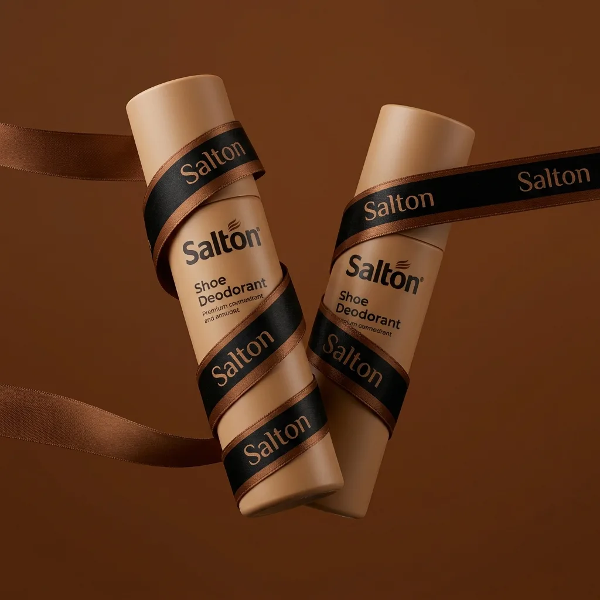

**#333 · Minimalist, Ai Art · <code>Vinano Image Pro</code>**

> Keywords: minimalist, AI art, AI prompt, text to image

<details>
<summary>Show prompt</summary>

```
A product photo in a premium advertising style. Two tall matte bottles of Salton Shoe Deodorant levitate in the air in a dynamic, balanced composition.
The bottles are positioned at an angle to each other, creating a striking diagonal composition. One bottle is slightly forward, the other is slightly behind, creating depth and hierarchy. Both bottles are elegantly wrapped a wide black and brown satin ribbon featuring the repeating "Salton" branding. The lettering is executed in a neat, contrasting font, legible without distortion, and is repeated evenly along the entire length of the ribbon. The ribbon flows smoothly between the bottles, uniting them into a single composition, without obscuring key messages on the packaging or clashing the main branding on the bottles. Shot from a slightly lower angle, the bottles are slightly tilted, enhancing a sense of confidence, strength, and premium quality. The background is a solid studio color, a deep warm shade (chocolate, dark caramel or soft terracotta), clean and refined minimalist, without distracting details.

Render with rich micro-detail while keeping the layout uncluttered and intentional.
```

</details>

---

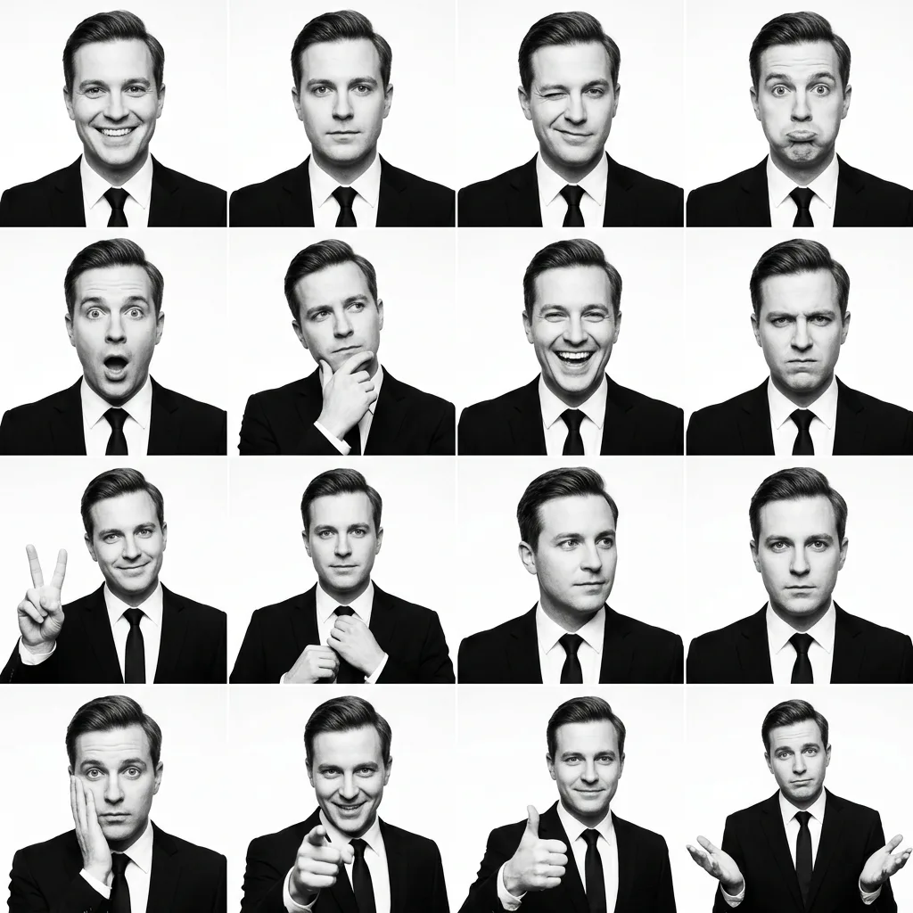

**#334 · Realistic, Cinematic · <code>Vinano Image Pro</code>**

> Keywords: realistic, cinematic, AI art, AI prompt, text to image

<details>
<summary>Show prompt</summary>

```
{
 "generation_request": {
 "meta_data": {
 "task_type": "bw_male_expression_grid_identity_swap",
 "language": "en",
 "priority": "highest",
 "version": "v1.0_BW_MALE_GRID_KEEP_POSES_SWAP_IDENTITY"
 },
 "input": {
 "mode": "image_to_image",
 "reference_image_usage": "very_high",
 "preserve_identity": true,
 "preserve_facial_features": true,
 "preserve_hairstyle": true,
 "notes": "PRIMARY STRUCTURE ANCHOR: use the uploaded male 4x4 grid image (suit photobooth). Keep the exact 4x4 layout, crop, spacing, poses, gestures, hand placements, and framing in every panel. PRIMARY IDENTITY ANCHOR: use the uploaded reference photo of the target adult man. Replace the man in ALL panels the reference identity while preserving the original pose and expression intensity. Keep suit-and-tie styling and clean studio background. Maintain consistent identity across all 16 panels."
 },
 "output": {
 "aspect_ratio": "1:1",
 "resolution": "ultra_high",
 "num_images": 1,
 "layout": {
 "type": "grid",
 "rows": 4,
 "cols": 4,
 "gutter": "thin",
 "panel_consistency": "very_high"
 },
 "sharpness": "crisp_studio",
 "grain": "subtle_analog_bw"
 },
 "scene": {
 "environment": "clean white studio backdrop",
 "lighting": {
 "style": "high-key studio",
 "key_light": "front softbox",
 "fill": "balanced fill",
 "avoid": "dramatic cinematic shadows"
 },
 "camera": {
 "lens": "50mm",
 "framing": "mid chest to head (varies per panel but keep same as structure image)",
 "focus": "eyes sharp"
 }
 },
 "subject": {
 "type": "adult man",
 "wardrobe": "black suit, white shirt, black tie (match structure image), no logos",
 "grooming": "match reference hairstyle as closely as possible while keeping overall look consistent",
 "anatomy_rules": "realistic hands, correct fingers, no distortions"
 },
 "style": {
 "color": "pure black and white",
 "contrast": "medium_high",
 "background": "keep identical to structure image",
 "finish": "clean studio print look"
 },
 "quality_control": {
 "identity_lock": "strict",
 "hands_priority": "very_high",
 "avoid": ["extra fingers",
 "missing fingers",
 "deformed hands",
 "warped face",
 "uneven eyes",
 "melted mouth",
 "identity drift across panels",
 "text",
 "watermark",
 "logo"]
 },
 "negative_prompt": ["color",
 "sepia",
 "filmic, cinematic lighting",
 "blur",
 "low resolution",
 "distorted anatomy",
 "plastic skin",
 "face mismatch"]
 }
}

Keep edges clean and the overall composition balanced for a polished, gallery-ready result.
```

</details>

---

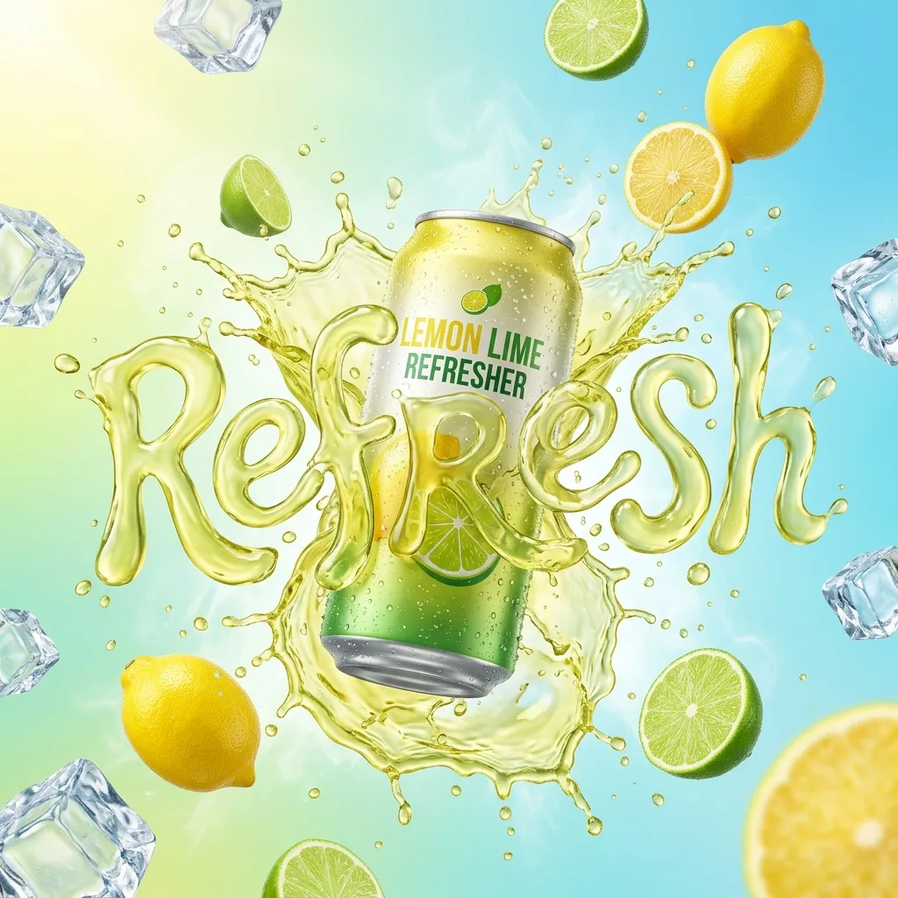

**#335 · Realistic, Ai Art · <code>Vinano Image Pro</code>**

> Keywords: realistic, AI art, AI prompt, text to image

<details>
<summary>Show prompt</summary>

```
A vibrant, high-end advertising visual of a [PRODUCT NAME] can/bottle floating dynamically in the center. The background is a soft gradient inspired by the drink’s color, blending into fresh sky-blue tones for a refreshing summer feel. A powerful splash of [LIQUID TYPE] explodes around the product, forming the word ”[WORD]” in smooth, fluid, organic liquid typography. Crystal-clear ice cubes burst around the composition, fresh [FRUITS RELATED TO THE DRINK] (whole and sliced) flying in the air. Juicy splashes, droplets, light mist, and condensation create an intense refreshing atmosphere. Bright sunlight, glossy highlights, commercial lighting, premium brand look, dynamic motion, hyper-detailed, semi-realistic illustration style, ultra-clean, 4k, sharp focus. Maintain consistent colour harmony and crisp focus across the whole frame.
```

</details>

---

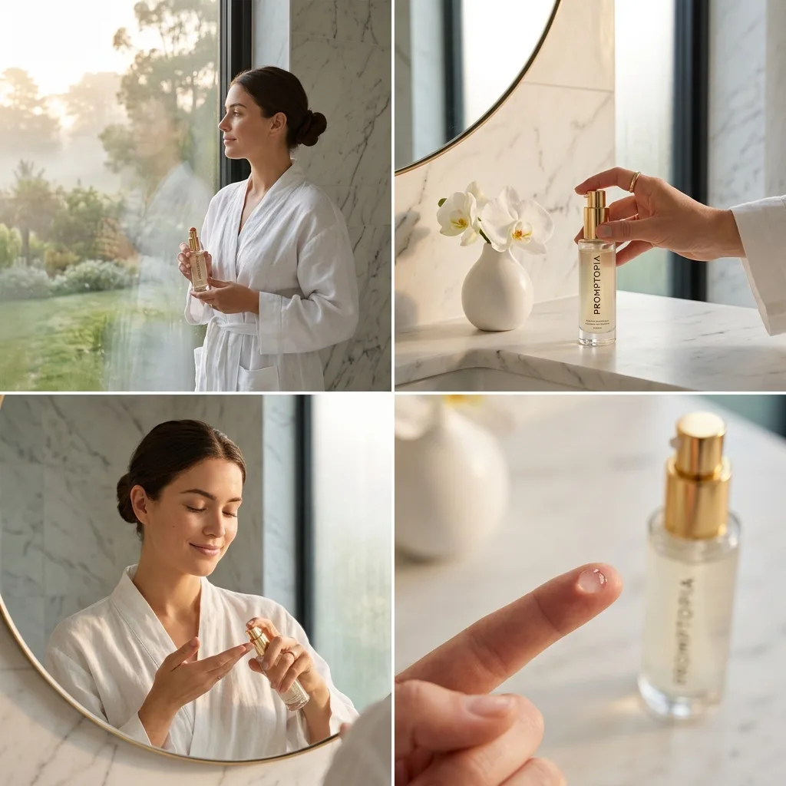

**#336 · Cinematic, Minimalist · <code>Vinano Image Pro</code>**

> Keywords: cinematic, minimalist, AI art, AI prompt, text to image

<details>
<summary>Show prompt</summary>

```
{
 "subject": {
 "person": "Woman, appears to be in her 20s or 30s",
 "pose_and_expression": ["Standing by window, looking out, relaxed",
 "Reaching for bottle on counter, hand focus",
 "Looking in mirror, slight smile",
 "Hand dispensing serum from bottle, close-up",
 "Serum drop on fingertip, macro shot",
 "Applying serum to face, eyes closed, serene",
 "Face close-up, eyes closed, content",
 "Bottle and orchid on counter, still life",
 "Walking away from camera, standing by window"]
 },
 "clothing": {
 "items": "White robe, white pajamas/loungewear",
 "material": "Soft, flowing fabric",
 "style": "Casual, luxurious"
 },
 "hair": {
 "color": "Dark brown",
 "style": "Pulled back, neat bun or ponytail"
 },
 "face": {
 "makeup": "Natural, minimal",
 "skin": "Clear, glowing",
 "expression": "Calm, serene, content"
 },
 "accessories": {
 "jewelry": "Simple ring on ring finger",
 "props": ["Glass skincare bottle gold pump dispenser",
 "Product label: 'Promptopia'",
 "White orchid in a small white vase"]
 },
 "environment": {
 "location": "Modern, luxurious bathroom",
 "elements": ["Large floor-to-ceiling windows",
 "Marble countertop and walls",
 "Round mirror",
 "View of trees/garden outside",
 "Fog or mist outside window"],
 "atmosphere": "Serene, spa-like, tranquil"
 },
 "lighting": {
 "source": "Natural daylight",
 "quality": "Warm, golden, soft, diffused",
 "time_of_day": "Sunrise or golden hour"
 },
 "camera": {
 "type": "Photography collage",
 "shots": ["Wide shot",
 "Medium shot",
 "Close-up",
 "Macro shot"],
 "focus": "Sharp on subject and product, soft background blur (bokeh)"
 },
 "style": {
 "aesthetic": "Cinematic, editorial, beauty, wellness, clean, refined minimalist",
 "color_palette": "Warm neutrals, white, gold, natural greens"
 }
}

Maintain consistent colour harmony and crisp focus across the whole frame.
```

</details>

---

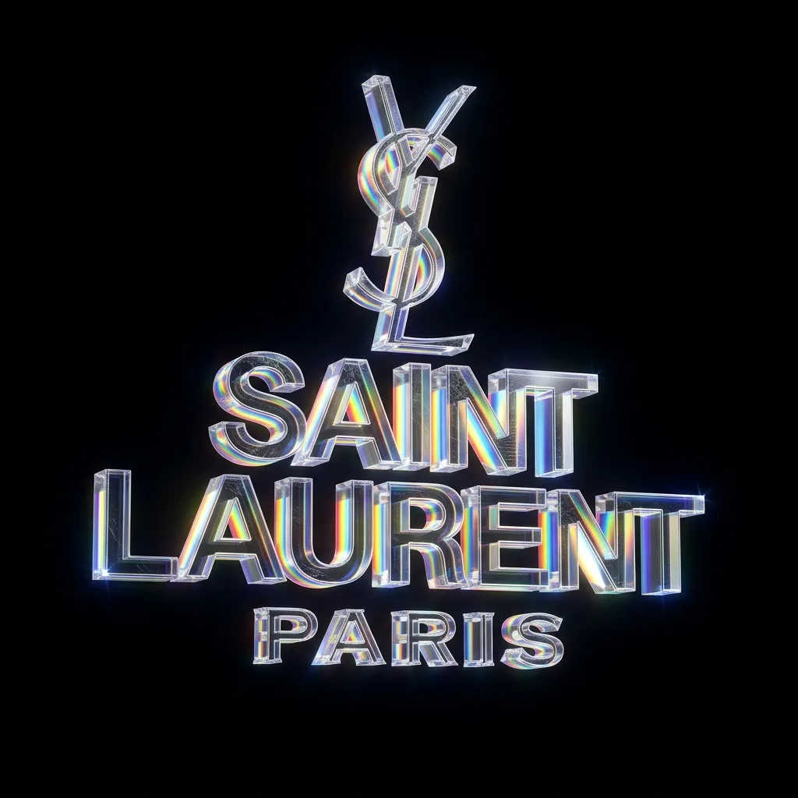

**#337 · Portrait, Ai Art · <code>Vinano Image Pro</code>**

> Keywords: portrait, AI art, AI prompt, text to image

<details>
<summary>Show prompt</summary>

```
[BRAND NAME]
Act as a CGI Optical Physicist and 3D Type Sculptor creating a hero crystal typography visual for a luxury brand campaign. References: James Turrell light installations, optical physics photography, Rick Owens × crystal aesthetics.

PHASE 0: BRAND LOGO INTELLIGENCE

Retrieve the 100% canonical, trademark-accurate logotype of [BRAND NAME] from training data — this is non-negotiable. Reproduce the exact proprietary typeface or custom lettering: every stroke weight, every curve tension, every terminal detail, every unique glyph modification. Do not substitute a similar font — decode the actual trademarked letterform geometry. If [BRAND NAME] has a primary symbol or emblem — place it above or integrated the wordmark exactly as in the official logo lockup. Fidelity test: a brand lawyer must recognize this as the correct logo, not an approximation.

PHASE 1: CRYSTAL MATERIAL SYSTEM

The canonical logotype of [BRAND NAME] is a fully 3D sculptural object made entirely of optical crystal glass — not metal, not plastic, not rubber. Material: optical borosilicate glass or synthetic crystal, IOR 1.85 to 2.1, maximum dispersion coefficient. The letterforms have physical volume and thickness — cross-section is consistent throughout each stroke, like letters carved from a single block of optical glass. Surface finish: polished to sub-micron smoothness on primary faces — all major faces mirror-flat and fully refractive. Edges between faces are sharp and precise — maximum chromatic dispersion occurs here. The material is optically pure in its core — zero bubbles, zero inclusions in the interior volume.

CRITICAL — WEAR & IMPERFECTION SYSTEM: The crystal has been handled — it carries the history of physical existence. Apply these surface imperfections restraint and realism, never overwhelming the dispersion beauty: micro-scratches — a sparse network of hairline scratches on the front and top faces, depth 0.01 to 0.05mm equivalent, visible only when light catches them at specific angles. They scatter light slightly, creating a faint matte haze in the scratch zone while surrounding surface remains mirror-clean. Scratches follow organic directional patterns — some parallel, some crossing, as if from handling and storage, never uniform or grid-like. Edge chips — 2 to 4 very minor edge micro-chips along the sharpest edges and corners, each no larger than 0.5mm equivalent. These tiny imperfections catch light differently than clean edges — they create micro-flare events, small irregular sparkles where a chip breaks the otherwise perfect edge geometry. Surface haze zones — 1 to 2 small irregular areas of very fine surface abrasion, like the glass has been lightly scuffed by contact another hard surface. These zones appear as subtle frosted patches, 3 to 8% opacity maximum — barely visible, discovered rather than obvious. They slightly diffuse the refraction beneath them, softening the rainbow bands in that micro-zone only. Fingerprint ghosts — optional, extremely subtle — 1 partial fingerprint trace on one face, visible only as a very faint oily interference pattern when light hits at oblique angle. Adds humanity to the object. All imperfections are surface-level only — the interior crystal volume remains optically perfect. The wear says this object is precious and real, not freshly manufactured.

PHASE 2: LIGHT & DISPERSION SYSTEM

Single collimated light source entering from upper-left at 35° — focused, high-intensity, like a precision studio spot or filtered sunlight. As light passes through the crystal letterforms it undergoes full chromatic dispersion — splitting into the complete visible spectrum following Snell's law geometry maximum physical accuracy. Dispersion behavior on faces: each polished face simultaneously reflects and refracts — where light exits or reflects, a full spectrum appears in strict physical order red → orange → yellow → green → blue → violet. Rainbow bands are sharp and laser-clean at their origin edges, softening and widening as they travel across faces. Micro-scratch zones interrupt the rainbow bands locally — creating fine scattered light filaments branching off the main dispersion paths. Internal reflections: light bounces between letter faces creating crossed and layered rainbow patterns inside the volume — letters glow from within, nearly dark at the core, exponentially brighter toward illuminated faces. Multiple internal reflection paths create 3 to 5 distinct rainbow events visible simultaneously inside each major letterform. Edge glow: every sharp edge emits thin intense white-blue luminous line from total internal reflection — edge chips create micro-flare interruptions at their locations, bright irregular sparkles punctuating the otherwise continuous edge glow. Chromatic aberration at all edges: red fringe on one side, blue-violet fringe on the other — physical dispersion, not decorative filter. The 3/4 angle reveals front face and top face simultaneously — each face receives different dispersion patterns, creating layered optical complexity. Top face rainbow pattern and front face rainbow pattern intersect at the top edge of each letterform, creating a zone of maximum spectral density.

PHASE 3: BACKGROUND

Background: pure absolute black (#000000 to #050505) — a light-absorbing void, no texture, no gradient, no reflected light. The crystal letters float in darkness — no surface beneath, suspended in void. No ambient light reaching the background. The only light in the image exists within and immediately around the letterforms. Dispersed rainbow light creates a very subtle colored haze in the immediate 2 to 4cm radius around each letter — soft spectral glow bleeding into the black void. Beyond that: absolute darkness. The letters are the sole light source in the scene. The micro-scratch haze zones appear as slightly cooler, slightly less luminous areas against the surrounding rainbow glow — their presence is felt rather than explicitly seen.

PHASE 4: COMPOSITION

CRITICAL — 3/4 ANGLE: The logotype is rotated approximately 5 to 10° on the horizontal axis and elevated 5 to 10° on the vertical axis — a subtle, almost-frontal three-quarter view. The rotation is intentionally minimal — just enough to reveal the physical depth and thickness of the crystal letterforms, suggesting three-dimensionality without dramatically departing from a frontal logo presentation. The logo reads as nearly flat but unmistakably three-dimensional. This angle still reveals the top face of letterforms as a thin luminous sliver — enough to catch a secondary dispersion pattern distinct from the front face, adding optical depth without compositional complexity. Horizontal centering maintained. Logo occupies 60 to 70% of frame width. Full lockup visible if [BRAND NAME] has an emblem above or integrated the wordmark. Aspect ratio: 1:1 square or 4:5 portrait — autonomously determine best fit for [BRAND NAME] lockup proportions. Full sharp focus across the entire sculpture — no depth of field. Every micro-scratch, every edge chip, every rainbow band in crisp simultaneous focus. Detail resolution: the image must reward close inspection — zooming in 400% should reveal new details not visible at normal viewing distance: individual scratch filaments, micro-chip geometry, secondary internal reflections, fingerprint interference patterns.

PHASE 5: TECH SPECS

Render: Octane Render full caustics enabled at maximum quality settings. Ray tracing: minimum 16 bounces — increased from standard to capture all internal reflection events, secondary dispersion paths, and scratch-scattered light filaments. Dispersion: physically accurate wavelength-dependent IOR — full spectral rendering across visible light range 380nm to 700nm, not a color overlay or post-process effect. Scratch rendering: micro-scratches rendered as actual surface geometry displacement, not normal map approximation — true micro-geometry for physically accurate light scattering. Caustics: on at maximum intensity. Subsurface contribution: minimal — glass is not translucent like skin, but edges and thin stroke areas show faint internal light transmission. Anti-aliasing: maximum — every edge, every scratch filament razor clean. Sampling: minimum 2048 samples per pixel — no noise in the blacks, no grain in the rainbow bands. No post-process glow filters, no color grading, no compositing tricks — everything physically rendered from geometry and light. Output feel: the most detailed and physically accurate crystal typography ever rendered. Every imperfection is intentional. Every photon is accounted for.

Aim for an editorial, design-driven look with deliberate negative space.
```

</details>

---

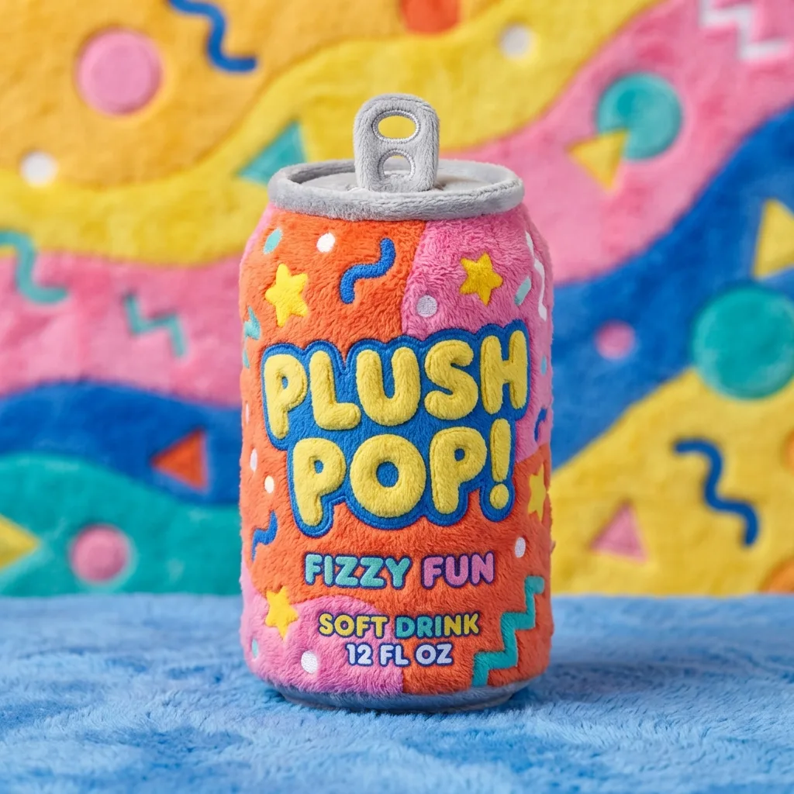

**#338 · Ai Art, Ai Prompt · <code>Vinano Image Pro</code>**

> Keywords: AI art, AI prompt, text to image

<details>
<summary>Show prompt</summary>

```
A beverage can branded [BRAND NAME], entirely made from vibrant, fluffy plush fabric, positioned centrally against a soft, plush background in the signature colors of [BRAND NAME].

Bold Pop Art and Memphis design style, playful yet premium aesthetic.

Bright, clean studio lighting that strongly emphasizes the plush texture, visible fibers, softness, and tactile depth.

Sharp focus, high color saturation, smooth shadows, modern commercial product shot, minimal composition, ultra-high resolution.

Render with rich micro-detail while keeping the layout uncluttered and intentional.
```

</details>

---

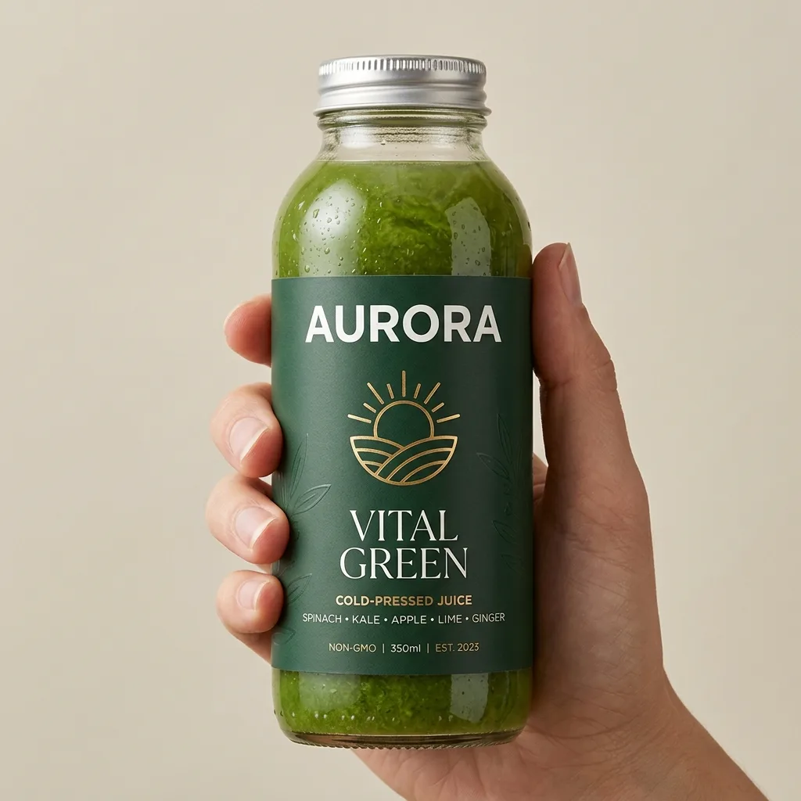

**#339 · Product Photography, Minimalist · <code>Vinano Image Pro</code>**

> Keywords: product photography, minimalist, AI art, AI prompt, text to image

<details>
<summary>Show prompt</summary>

```
A tight close-up commercial product photo of a premium [PRODUCT TYPE] labeled “[BRAND NAME]”. The product is [SHAPE / FORM FACTOR], made of [MATERIAL], containing [LIQUID / CONTENT COLOR + TEXTURE DETAILS] visible [TEXTURE EFFECTS: bubbles / swirls / pulp / condensation / thickness]. It has a [CAP / LID TYPE + COLOR + FINISH].

The main label is [PRIMARY LABEL COLOR] a smooth matte finish. At the top of the label, the brand name “[BRAND NAME]” is printed in clean bold [TEXT COLOR] uppercase sans-serif typography. Below the brand name is a refined minimalist illustration of [ICON DESCRIPTION], in [FOIL / PRINT STYLE: gold foil / holographic foil / embossed ink], giving it a premium look. Under the icon, the product name reads “[PRODUCT NAME / VARIANT]” in a modern mixed-font layout (thin serif + sans-serif combination). Smaller text includes phrases like “[MICRO TEXT 1]”, “[MICRO TEXT 2]”, and “[MICRO TEXT 3]” in tiny [MICRO TEXT COLOR] print. Optional fine detail accents such as [PATTERN / LINEWORK / MICROGRAPHIC ELEMENTS] enhance the modern premium branding.

A human hand holds the [BOTTLE/CAN/JAR/TUBE] from the side, fingers wrapped around the middle clean short nails visible. No face or clothing is visible.

The background is a soft neutral [BACKGROUND COLOR TONE], studio-style, clean and minimal. Lighting is soft diffused studio lighting, gentle highlights along the [MATERIAL] edges and very smooth natural shadows. The photo is sharply focused on the label and [CONTENT TEXTURE], a slightly blurred background. The overall aesthetic is premium, minimal, modern [CATEGORY] branding, high-end commercial product photography.

Maintain consistent colour harmony and crisp focus across the whole frame.
```

</details>

---

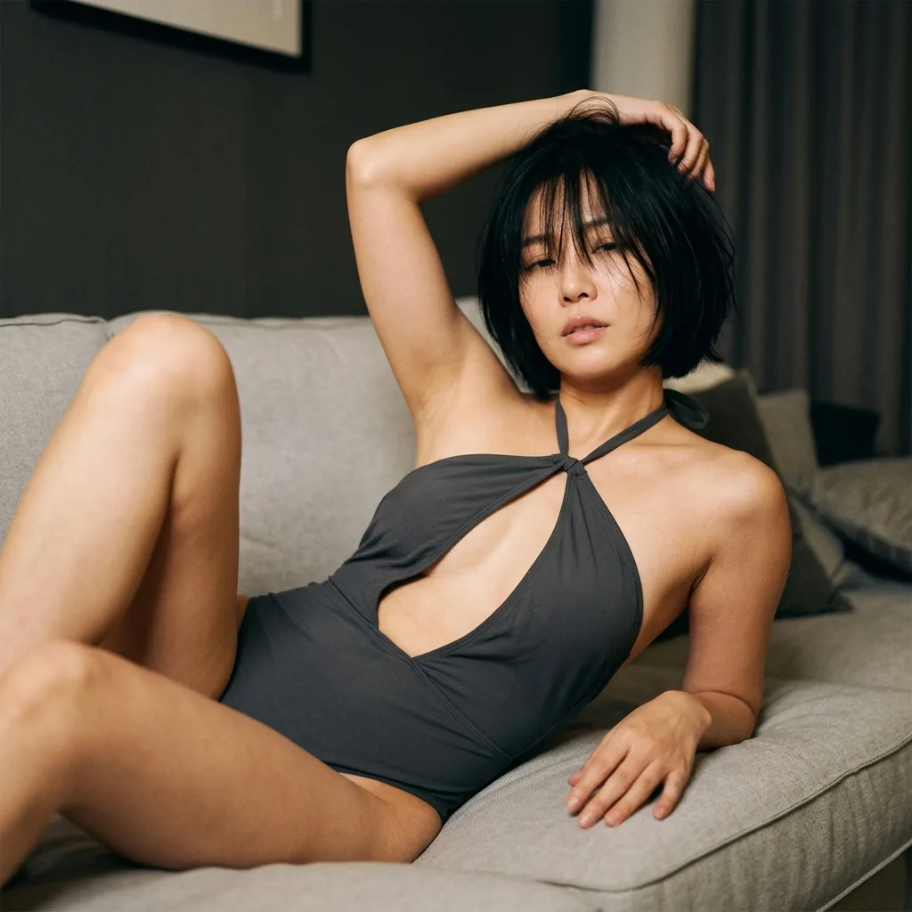

**#340 · Anime, Realistic · <code>Vinano Image Pro</code>**

> Keywords: anime, realistic, portrait, AI art, AI prompt, text to image

<details>
<summary>Show prompt</summary>

```
{ "subject": { "description": "An adult woman a short black bob and long wispy bangs reclines on a soft sofa in a dark gray cutout monokini, captured in a warm intimate indoor portrait a calm, slightly distant expression.", "mirror_rules": ["not a mirror selfie", "no reflected text", "no duplicated limbs or mirrored anatomy artifacts"], "age": "adult", "expression": { "eyes": { "look": "soft, slightly heavy-lidded gaze visible through the bangs", "energy": "quiet, restrained, intimate", "direction": "toward the camera" }, "mouth": { "position": "slightly parted", "energy": "breath-soft, relaxed" }, "overall": "calm, detached, faintly pensive" }, "face": { "preserve_original": "keep the face small and delicate, soft jawline, subtle nose bridge, and natural lip shape", "makeup": "light natural makeup, soft skin finish, subtle eyeliner, muted peach-beige lips" } }, "hair": { "color": "deep black", "style": "short layered bob long uneven bangs falling over the eyes and cheeks", "effect": "fine strands crossing the face, slightly separated ends, soft warm sheen on the crown" }, "body": { "frame": "slim but curvy, soft feminine lines", "waist": "defined natural waist", "chest": "full bust emphasized by the cutout halter swimsuit", "legs": "smooth long legs, one knee raised close to the camera", "skin": { "visible_areas": "face, neck, shoulders, arms, upper torso, abdomen, hips, thighs", "tone": "fair skin a warm beige cast", "texture": "velvety, smooth, touchable skin natural softness rather than plastic perfection", "lighting_effect": "warm diffused light grazing the shoulders, collarbone, arms, and thighs soft shadow transitions" } }, "pose": { "position": "reclining diagonally on a sofa", "base": "one arm lifted above the head fingers touching the hair, the other hand relaxed on the seat edge, one leg bent upward and one leg extending across the frame", "overall": "asymmetrical, casual, intimate, slightly compressed by the sofa cushions" }, "clothing": { "top": { "type": "cutout halter monokini upper section", "color": "dark gray", "details": "thin halter strap around the neck, deep central opening, stretched matte fabric slight tension folds", "effect": "minimal, body-contouring, modern" }, "bottom": { "type": "matching monokini lower section", "color": "dark gray", "details": "high-cut leg line, seamless close fit, smooth synthetic swimwear fabric" } }, "accessories": {}, "photography": { "camera_style": "realistic social-media portrait aesthetic, soft editorial indoor photo", "angle": "slightly above eye level, close and intimate", "shot_type": "medium close portrait body crop, vertical composition", "aspect_ratio": "2:3", "texture": "clean focus on the face and torso, natural skin rendering, soft background blur, gentle micro-contrast, no heavy retouching", "lighting": "warm soft directional indoor light from front-left, low contrast shadows, dim background separation, subtle highlight on hair and skin", "depth_of_field": "shallow depth of field the subject sharp and the background smoothly blurred" }, "background": { "setting": "indoor lounge or bedroom seating area", "wall_color": "dark brown to charcoal", "elements": ["soft light gray sofa", "muted cushion", "dark blurred wall or curtain backdrop"], "atmosphere": "quiet, enclosed, warm, late-evening stillness", "lighting": "background kept dim while the subject is softly illuminated from the front-left" }, "the_vibe": { "energy": "low, slow, intimate", "mood": "calm, private, slightly distant", "aesthetic": "realistic soft editorial sensuality understated elegance", "authenticity": "keep small imperfections in pose, fabric tension, hair placement, and natural shadowing so the image feels lived-in rather than over-designed", "intimacy": "the camera feels close enough to catch the pause between movements, as if the room had already gone quiet before the shutter was pressed", "story": "She had settled into the sofa after the day had thinned out, warm light staying on her skin while the darker room receded behind her.", "caption_energy": "unhurried, self-contained, quietly magnetic" }, "constraints": { "must_keep": ["adult subject", "short black bob long bangs over the eyes", "dark gray cutout halter monokini", "reclining sofa pose", "one arm raised to the hair", "one knee lifted toward the foreground", "warm soft indoor light", "dark minimal background", "shallow depth of field", "natural skin texture and realistic anatomy"], "avoid": ["anime style", "cartoon proportions", "extra limbs or fingers", "over-sharpened skin", "harsh flash lighting", "busy background", "symmetrical studio pose", "plastic skin retouching", "oversaturated colors", "visible logos or invented text"] }, "negative_prompt": ["underage", "childlike face", "anime", "illustration", "cgi", "extra fingers", "extra limbs", "bad hands", "bad anatomy", "twisted torso", "asymmetrical eyes", "crossed eyes", "plastic skin", "overretouched face", "harsh flash", "flat lighting", "busy room", "text", "watermark", "logo", "low resolution", "heavy noise", "blurred subject"] } Preserve realistic proportions and depth for a confident, professional finish.
```

</details>

---

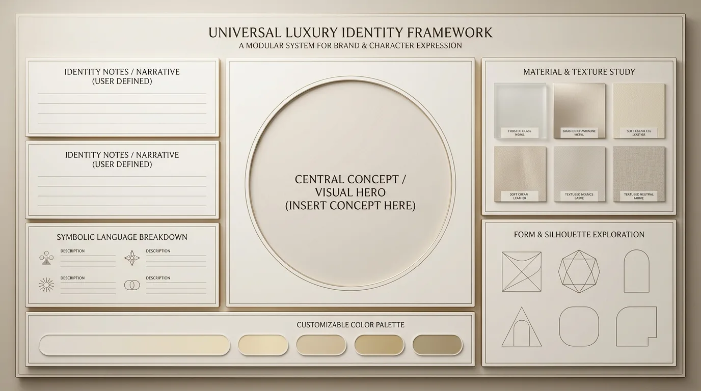

**#341 · Realistic, Character · <code>Vinano Image Pro</code>**

> Keywords: realistic, character, cinematic, minimalist, AI art, AI prompt

<details>
<summary>Show prompt</summary>

```
Create a fully original, copyright-safe luxury identity board. This is a completely blank, universal template designed for users to insert their own character, symbol, brand, or concept. No predefined product, subject, or identity should be assumed.

Present as a cinematic 16:9 IDENTITY BOARD.

CONCEPT SEED

A high-end abstract luxury identity system designed to visually present any user-defined character, symbol, brand, or idea. The composition represents a curated visual identity framework where meaning is fully defined by the user. The design should feel premium, editorial, and adaptable to any concept.

SUBJECT TYPE / FORM

Not predefined.
User may insert: character, symbol, object, idea, entity, or abstract identity.

VISUAL MEDIUM

ultra-realistic cinematic concept art rendering, luxury editorial design, high-detail material simulation, soft studio lighting, premium identity-board composition, clean graphic layout, 16:9 aspect ratio

STYLE

luxury editorial aesthetic, modern high-fashion presentation, refined minimalist premium branding, cinematic concept visualization, refined visual storytelling, soft structured elegance, adaptable identity design language

OTHER DETAILS – OPTIONAL

All visual elements should be designed as modular identity components that can adapt to any user-provided concept.

The subject can be interpreted as:

a character (human, non-human, fictional, or abstract)

a symbolic identity system
a conceptual object or artifact
a brand identity or creative universe element
Nothing is fixed — everything is open for user customization.

Color Palette (FULLY ADAPTABLE):

Default direction: soft luxury neutral spectrum — ivory, cream, warm beige, muted gold, soft blush, subtle champagne highlights.
Users may replace or redefine this palette completely based on their concept. No fixed thematic constraint.

Design Language:
sculptural and/or conceptual central form (user-defined meaning)

high-end material realism (glass, metal, fabric, organic or abstract surfaces depending on concept)
refined gradients and controlled highlights
elegant structural balance between visual elements
minimal but premium composition language
No predefined symbolism or recognizable object references.
Mood / Personality:

fully user-defined
Can range from calm minimalism to chaotic maximalism, from soft emotional tone to intense futuristic identity systems, depending entirely on inserted concept

Silhouette Language:

strong, readable central form iconic visual structure potential, adaptable geometry or organic shaping depending on user input, designed for instant recognition and identity flexibility
Invent Everything Else (USER INPUT REQUIRED)

Users define:

central concept / identity

meaning or narrative

symbolic language

visual motifs
emotional tone
material direction
branding or character essence
composition focus points
Originality Rules
The design must be fully original and must not reference any existing product, franchise, or recognizable intellectual property.
Avoid:
predefined characters or brand references

real-world product replication

copied advertising layouts or known design systems

recognizable symbol duplication from existing media
Medium and Style Control
[VISUAL MEDIUM] defines rendering quality and realism level
[STYLE] defines aesthetic direction only
This is a universal identity framework, not a fixed subject
Create an Artistic 16:9 UNIVERSAL IDENTITY BOARD
Board Content
Central hero visual area (user-defined subject)
Multiple angle or interpretation views (if applicable)
Material / texture study panels
Symbol or form breakdown area
Abstract mood visualization zones
Structural or silhouette exploration sheet
Light interaction / surface behavior studies
Color palette strip (fully customizable)
Minimal identity notes section (user-defined text space)
Layout
premium editorial composition, asymmetrical but balanced luxury design, strong negative space, clean segmentation of modules, high-end visual hierarchy, no clutter, no overlap, flexible structure
Background
soft neutral studio gradient by default (ivory, cream, warm gray tones). Fully replaceable depending on user concept. No environment, no watermark, no logos, no predefined thematic setting.

Prioritize

maximum adaptability, luxury editorial presentation, strong silhouette readability, high-end cinematic rendering, modular identity system design, and complete user-driven creative freedom.

Maintain consistent colour harmony and crisp focus across the whole frame.
```

</details>

---

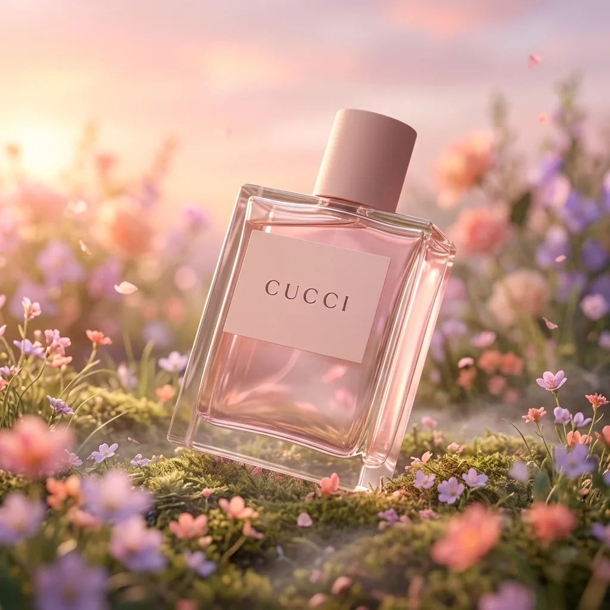

**#342 · Realistic, Cinematic · <code>Vinano Image Pro</code>**

> Keywords: realistic, cinematic, fantasy, AI art, AI prompt, text to image

<details>
<summary>Show prompt</summary>

```
{
 "prompt": {
 "subject": "Hyper-realistic luxury perfume product photograph",
 "product": {
 "bottle": {
 "shape": "Rectangular",
 "material": "Transparent glass",
 "label": {
 "text": "CUCCI",
 "color": "Soft blush-pink",
 "texture": "Matte"
 },
 "cap": {
 "color": "Soft blush-pink",
 "texture": "Matte"
 },
 "placement": {
 "angle": "Gentle diagonal",
 "position": "Center"
 },
 "details": {
 "liquid": "Visible, soft reflections",
 "highlights": "Glowing on glass edges"
 }
 }
 },
 "environment": {
 "setting": "Lush miniature fantasy meadow",
 "ground": "Moss-covered",
 "flora": {
 "flowers": ["Delicate pink", "Lavender", "Coral wildflowers"],
 "grasses": "Soft green"
 },
 "atmosphere": {
 "air": "Tiny petals drifting",
 "mist": "Faint, floating low"
 }
 },
 "lighting": {
 "source": "Warm golden-pink light from upper left",
 "effect": "Dreamy sunset",
 "type": "Studio-grade subtle rim light"
 },
 "composition": {
 "depth_of_field": "Cinematic shallow",
 "focus": "Crisp on the brand name",
 "foreground": "Softly blurred blooms",
 "background": {
 "description": "Fading into a pastel bokeh haze",
 "elements": ["Florals", "Foliage"],
 "colors": ["Pink", "Peach", "Violet"]
 }
 },
 "style": {
 "aesthetic": "High-end editorial beauty",
 "mood": "Romantic and ethereal",
 "realism": "Premium realism",
 "quality": "8K",
 "textures": "Ultra-detailed (moss, petals, glass, label)"
 }
 }
}

Preserve realistic proportions and depth for a confident, professional finish.
```

</details>

---

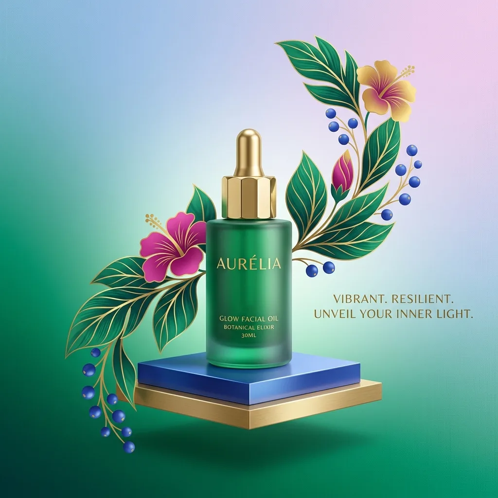

**#343 · Ai Art, Ai Prompt · <code>Vinano Image Pro</code>**

> Keywords: AI art, AI prompt, text to image

<details>
<summary>Show prompt</summary>

```
High-end advertising illustration of [product/subject], vibrant premium color palette, crisp composition, soft studio lighting, modern commercial style, ultra polished, minimal yet impactful, brand-focused visual. Aim for an editorial, design-driven look with deliberate negative space.
```

</details>

---

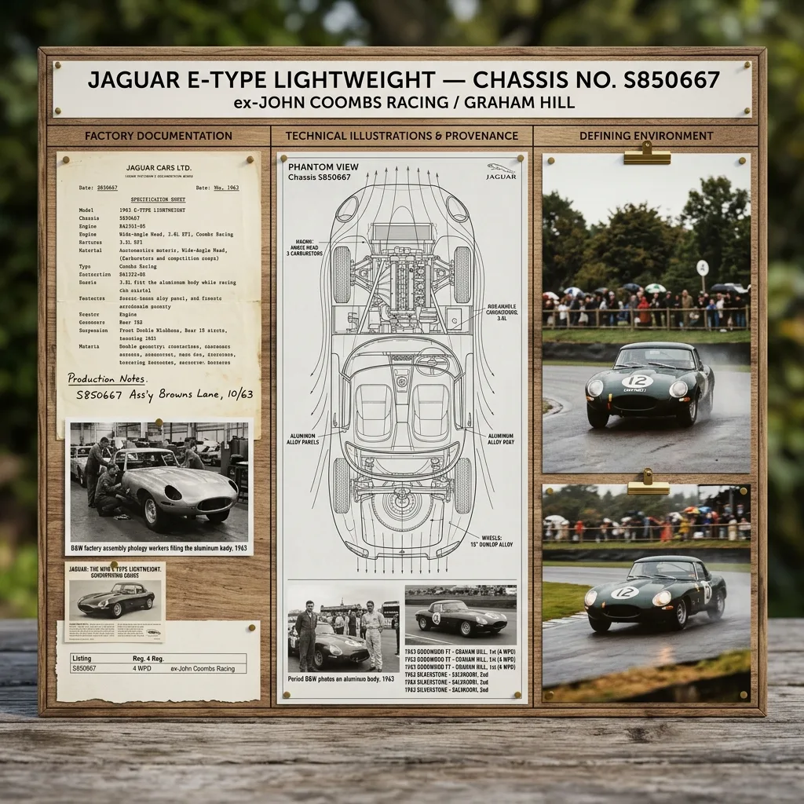

**#344 · Ai Art, Ai Prompt · <code>Vinano Image Pro</code>**

> Keywords: AI art, AI prompt, text to image

<details>
<summary>Show prompt</summary>

```
A marque historian's documentation board for [VEHICLE] — [MODEL / VARIANT / YEAR]. Left section: factory documentation including original specification sheet, production line photographs, period advertising, and chassis number registry. Center section: technical illustration showing powertrain in phantom view, suspension geometry, aerodynamic annotations, and material callouts, surrounded by period racing results or ownership provenance. Right section: the vehicle in its defining environment, whether racing circuit, mountain pass, or boulevard, captured period-appropriate color grading and motion. Visual style transitions from archival document cream through engineering-drawing precision to saturated automotive photography. Title block reading "[VEHICLE NAME] — CHASSIS NO. [NUMBER], [PROVENANCE SUMMARY]". Emphasise material texture and natural light so the final frame feels tactile and premium.
```

</details>

---

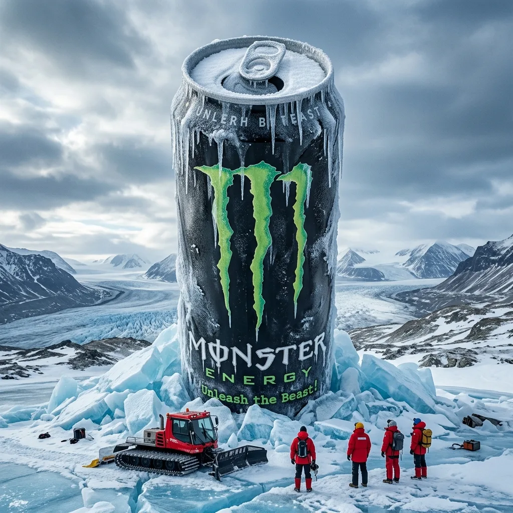

**#345 · Realistic, Cinematic · <code>Vinano Image Pro</code>**

> Keywords: realistic, cinematic, AI art, AI prompt, text to image

<details>
<summary>Show prompt</summary>

```
Hyper-realistic cinematic 8k photograph, low-angle wide perspective. A massive Monster Energy can standing vertically like an arctic monument, partially frozen inside thick blue ice and snow. Frost covering the textured surface, icicles forming along the logo and rim, snow filling the pull-tab opening. Snowcat vehicle and scientists in red parkas emphasize scale. Overcast arctic daylight, HDR, ultra-detailed frozen textures, cinematic realism --ar 2:3 Aim for an editorial, design-driven look with deliberate negative space.
```

</details>

---

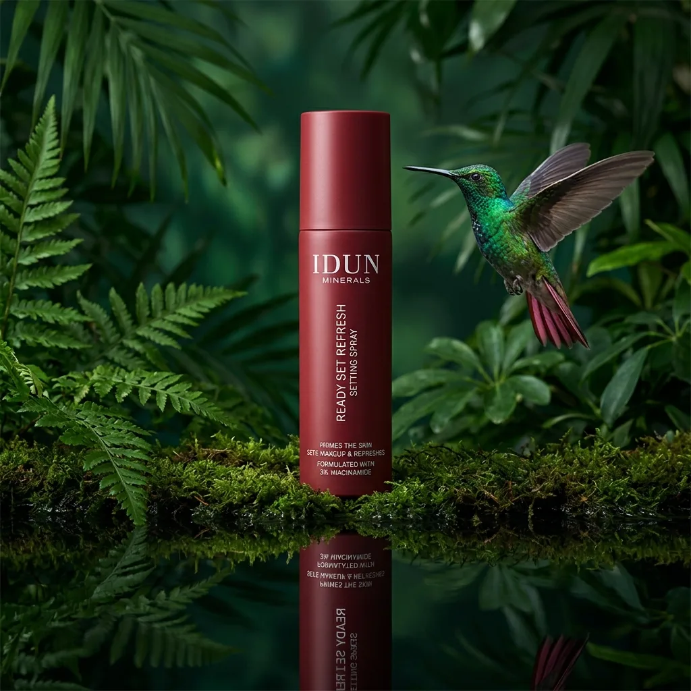

**#346 · Portrait, Product Photography · <code>Vinano Image Pro</code>**

> Keywords: portrait, product photography, minimalist, AI art, AI prompt, text to image

<details>
<summary>Show prompt</summary>

```
{
 "subject": {
 "primary": "Cosmetic spray bottle",
 "secondary": "Hummingbird",
 "brand": "IDUN MINERALS",
 "product_name": "READY SET REFRESH"
 },
 "packaging": {
 "form_factor": "Cylindrical bottle",
 "component_parts": ["Main body",
 "Cap (flush body)"],
 "material_appearance": "Matte finish, likely plastic or coated metal",
 "condition": "Pristine, new",
 "reflections": "Vertical highlight on the left side, mirrored reflection in water below"
 },
 "label_design": {
 "type": "Direct print onto bottle",
 "layout_orientation": "Mixed (Horizontal brand/details, Vertical product name)",
 "typography": {
 "font_family": "Sans-serif",
 "casing": "All uppercase",
 "style": "Clean, refined minimalist",
 "alignment": "Left aligned relative to the vertical axis for product name, centered horizontally for brand"
 }
 },
 "text_visible": {
 "brand_header": ["IDUN",
 "MINERALS"],
 "body_vertical": ["READY SET REFRESH",
 "SETTING SPRAY"],
 "footer_details": ["PRIMES THE SKIN",
 "SETS MAKEUP & REFRESHES",
 "FORMULATED WITH",
 "3% NIACINAMIDE"],
 "reflection_text": "Inverted mirror image of all text visible on the water surface"
 },
 "colors": {
 "packaging_base": "Deep red / Burgundy",
 "text": "White",
 "foliage": ["Deep emerald green",
 "Forest green",
 "Moss green"],
 "hummingbird": ["Iridescent green (head/back)",
 "Dark grey/brown (wings)",
 "Reddish/pink (tail feathers)",
 "Black (beak)"],
 "water": "Dark, almost black reflections"
 },
 "materials": {
 "bottle": "Matte rigid material",
 "environment": ["Liquid water",
 "Moss",
 "Fern leaves",
 "Palm-like leaves"],
 "biological": "Feathers (bird)"
 },
 "human_elements": {
 "visible": false
 },
 "environment": {
 "setting": "Simulated rainforest or jungle floor",
 "foreground": "Still water surface",
 "midground": "Mossy bank, bottle placement",
 "background": "Dense tropical foliage"
 },
 "lighting": {
 "quality": "Soft, moody, atmospheric",
 "direction": "Side lighting from left (creating highlight on bottle)",
 "shadows": "Soft shadows in the foliage, dark water providing high contrast reflection",
 "highlights": "specular highlight on hummingbird head, diffuse highlight on bottle curve"
 },
 "camera": {
 "angle": "Eye-level water surface",
 "framing": "Vertical portrait",
 "focus": "Sharp focus on bottle and hummingbird",
 "depth_of_field": "Shallow (background leaves are blurred/bokeh)",
 "composition": "Rule of thirds (bottle on left third line, bird entering from right)"
 },
 "style": {
 "category": "Product photography",
 "theme": "Nature, Organic, Eco-luxury",
 "mood": "Serene, fresh, premium"
 }
}

Aim for an editorial, design-driven look with deliberate negative space.
```

</details>

---

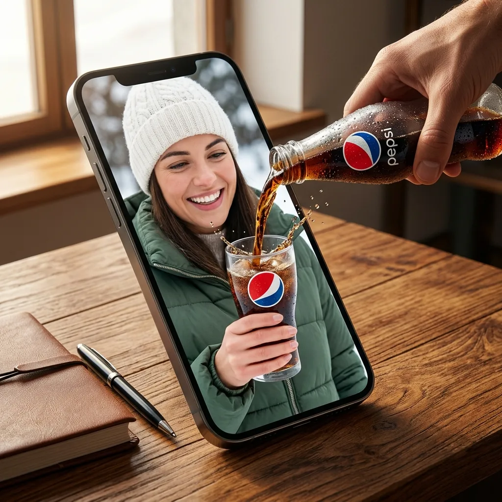

**#347 · Realistic, Cinematic · <code>Vinano Image Pro</code>**

> Keywords: realistic, cinematic, AI art, AI prompt, text to image

<details>
<summary>Show prompt</summary>

```
A hyper-realistic surreal composite scene set on a wooden tabletop. A large oversized smartphone dominates the frame, creating a strong dimensional-break illusion. On the phone screen, the woman from the reference image appears much larger in a close-up winter environment, smiling happily while holding a clear glass a visible Pepsi logo on it.

A real human hand pours dark Pepsi cola from a cold bottle covered in condensation droplets directly toward the phone screen. The liquid visually breaks through the display and flows into the glass she is holding inside the screen, creating a powerful surreal effect.

A closed book and a black pen sit on the wooden table beside the oversized phone to emphasize scale distortion. Warm natural lighting, soft cinematic shadows, ultra-sharp liquid splash details, hyper-realistic skin texture, realistic reflections on glass and screen, surreal cinematic advertising look, professional commercial photography quality, 8K realism.

Aim for an editorial, design-driven look with deliberate negative space.
```

</details>

---

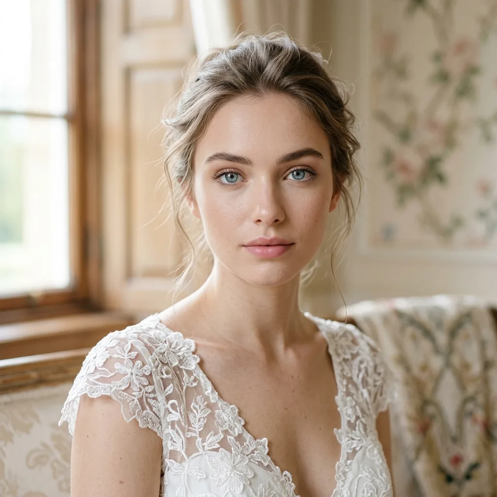

**#348 · Anime, Realistic · <code>Vinano Image Pro</code>**

> Keywords: anime, realistic, portrait, cinematic, vintage, AI art

<details>
<summary>Show prompt</summary>

```
Ultra-realistic close-up portrait of a beautiful young woman, delicate facial features, mesmerizing light blue eyes, flawless fair skin, natural pink lips, soft makeup, elegant eyebrows, gentle neutral expression, looking directly at the camera. Hair styled in a loose romantic updo soft wispy strands framing the face. Wearing a luxurious white dress intricate floral lace embroidery on the shoulders and neckline, subtle vintage-inspired fashion. Soft natural daylight coming from a large window, creamy pastel interior background elegant wall art, shallow depth of field, dreamy bokeh, filmic, cinematic lighting, high-end fashion photography, extremely detailed skin texture, realistic eyes, soft color grading, fine hair details, ethereal atmosphere, masterpiece, true-to-life photorealistic, 85mm lens, f/1.4, ultra sharp focus, HDR, 8K quality, Vogue editorial style.

Negative Prompt:
low quality, blurry, noisy, extra fingers, deformed face, asymmetrical eyes, bad anatomy, cartoon, anime, overexposed, oversaturated, watermark, text, logo, duplicate features, distorted body, ugly, pixelated, low resolution, harsh shadows, unrealistic skin, exaggerated makeup.

Maintain consistent colour harmony and crisp focus across the whole frame.
```

</details>

---

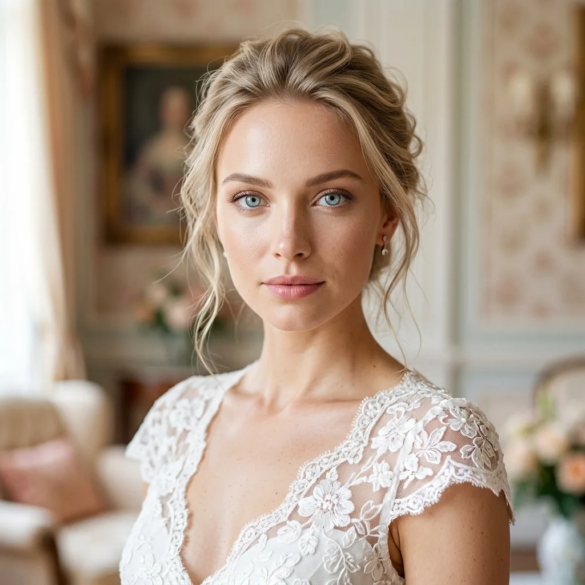

**#349 · Anime, Realistic · <code>Vinano Image Pro</code>**

> Keywords: anime, realistic, portrait, cinematic, vintage, AI art

<details>
<summary>Show prompt</summary>

```
Ultra-realistic close-up portrait of a beautiful young woman, delicate facial features, mesmerizing light blue eyes, flawless fair skin, natural pink lips, soft makeup, elegant eyebrows, gentle neutral expression, looking directly at the camera. Hair styled in a loose romantic updo soft wispy strands framing the face. Wearing a luxurious white dress intricate floral lace embroidery on the shoulders and neckline, subtle vintage-inspired fashion. Soft natural daylight coming from a large window, creamy pastel interior background elegant wall art, shallow depth of field, dreamy bokeh, filmic, cinematic lighting, high-end fashion photography, extremely detailed skin texture, realistic eyes, soft color grading, fine hair details, ethereal atmosphere, masterpiece, true-to-life photorealistic, 85mm lens, f/1.4, ultra sharp focus, HDR, 8K quality, Vogue editorial style.

Negative Prompt:
low quality, blurry, noisy, extra fingers, deformed face, asymmetrical eyes, bad anatomy, cartoon, anime, overexposed, oversaturated, watermark, text, logo, duplicate features, distorted body, ugly, pixelated, low resolution, harsh shadows, unrealistic skin, exaggerated makeup.

Preserve realistic proportions and depth for a confident, professional finish.
```

</details>

---

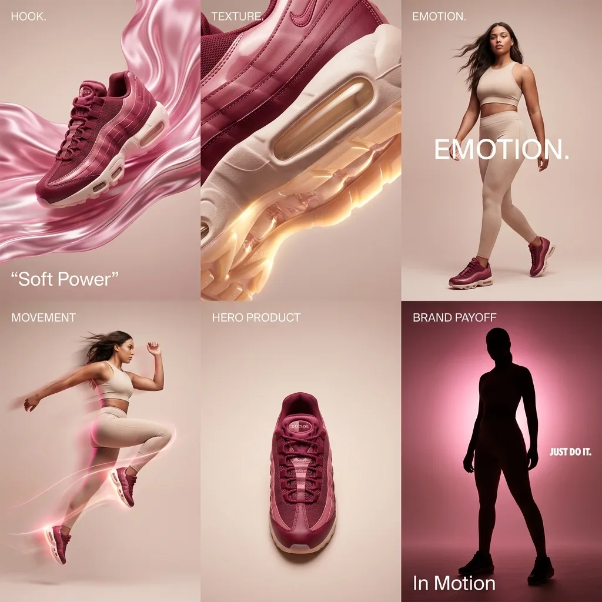

**#350 · Realistic, Product Photography · <code>Vinano Image Pro</code>**

> Keywords: realistic, product photography, cinematic, AI art, AI prompt, text to image

<details>
<summary>Show prompt</summary>

```
cinematic 6-frame grid (3x2), ultra-premium campaign for Nike Air Max 95 “Big Bubble” in deep berry pink + glossy rose tones

STRICT consistency across all frames:
same lighting setup, same color grading, same product color accuracy, same soft beige-pink gradient background, same luxury editorial tone
lighting: soft diffused studio lighting + glossy specular highlights + subtle pink glow accents
color palette: deep berry red, glossy pink, blush beige, warm ivory, soft gold reflections
texture emphasis: matte mesh + glossy leather + translucent air bubble

CAMPAIGN CONCEPT: “Soft Power in Motion”
MOOD: feminine strength, confident, bold, effortless luxury, streetwear meets beauty campaign

FRAME 1 — HOOK (surreal scroll stopper)
Nike Air Max 95 floating mid-air, surrounded by flowing liquid pink silk + glossy fluid waves, subtle motion distortion, dreamy yet powerful composition

FRAME 2 — TEXTURE (desire macro)
extreme macro close-up of air bubble + layered material textures, translucent sole glowing warm golden light, hyper-detailed reflections

FRAME 3 — EMOTION (identity)
confident female model wearing Nike Air Max 95, walking forward attitude, soft wind in hair, minimal neutral outfit, strong posture, empowered presence

FRAME 4 — MOVEMENT (performance)
dynamic mid-air jump shot, motion blur trails, glowing air sole emphasizing bounce, high-speed capture feel, energy lines

FRAME 5 — HERO PRODUCT (clean dominance)
perfectly centered product shot, symmetrical composition, ultra-clean background, premium minimal aesthetic, sharp detail

FRAME 6 — BRAND PAYOFF (iconic finish)
cinematic silhouette of female figure wearing the sneakers, strong pink backlight glow, dramatic shadows, bold Nike energy, powerful stance

STYLE:
high fashion editorial + luxury product photography + cinematic sports campaign
ultra-realistic, 4k, sharp focus, depth of field, premium finish, no distortion, no inconsistencies

OPTIONAL TEXT OVERLAY (minimal, clean typography):
“Soft Power” / “In Motion” / “Just Do It.”

Aim for an editorial, design-driven look with deliberate negative space.
```

</details>

---

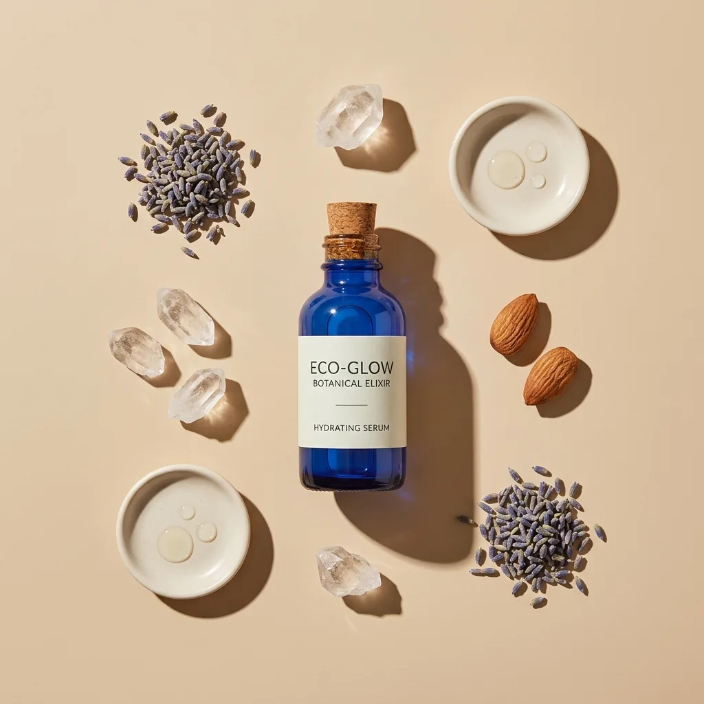

**#351 · Realistic, Product Photography · <code>Vinano Image Pro</code>**

> Keywords: realistic, product photography, AI art, AI prompt, text to image

<details>
<summary>Show prompt</summary>

```
Create top-down flat lay product photo. Use the uploaded product as the main object, centered. Analyze the product type from the photo and automatically choose matching props/ingredients for an aesthetic flat lay around it (minimal, premium, on-brand). Preserve exact geometry, size, colors, label design, and all text on the product (no changes). Warm beige seamless background, soft directional sunlight, crisp realistic shadow.
Ultra-realistic macro product photography, 100mm lens look, f/8, sharp focus, crisp composition, no extra text, 8k, format 2:3.

Preserve realistic proportions and depth for a confident, professional finish.
```

</details>

---

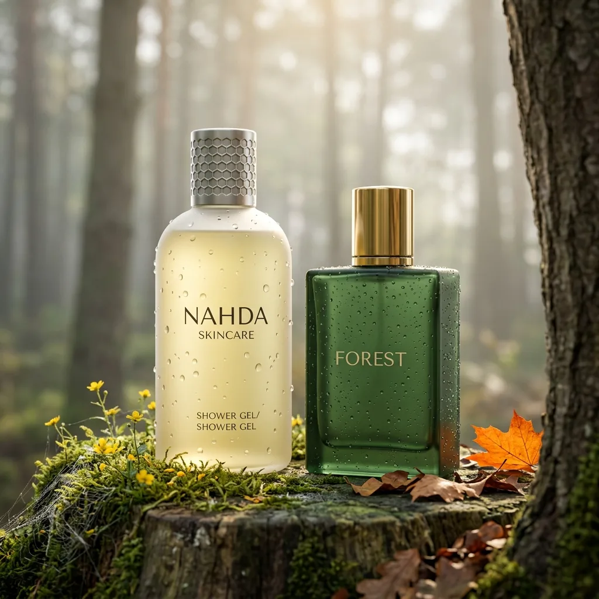

**#352 · Realistic, Portrait · <code>Vinano Image Pro</code>**

> Keywords: realistic, portrait, product photography, AI art, AI prompt, text to image

<details>
<summary>Show prompt</summary>

```
{
 "master_prompt": {
 "global_settings": {
 "resolution": "8K",
 "aspect_ratio": "1:1",
 "image_type": "true-to-life photorealistic AI-generated product photography",
 "detail_level": "ultra-high detail, macro clarity",
 "noise": "none",
 "artifacts": "none",
 "focus": "sharp subject, controlled depth of field"
 },

 "module_1_image_1_style": {
 "subject": {
 "object_type": "cosmetic bottle",
 "label_text_visible": "NAHDA SKINCARE",
 "product_type_text": "SHOWER GEL / SHOWER GEL",
 "bottle_material": "frosted translucent glass",
 "liquid_color": "soft pale yellow",
 "shape": "cylindrical rounded shoulders",
 "cap": {
 "material": "metallic",
 "color": "silver",
 "surface_pattern": "hexagonal honeycomb texture",
 "finish": "matte"
 },
 "surface_details": "small and medium water droplets evenly distributed"
 },
 "environment": {
 "setting": "forest floor",
 "base_surface": "weathered tree stump",
 "surroundings": ["green moss",
 "small yellow wildflowers",
 "tree trunk to the right",
 "fine spider web attached to moss"],
 "background": "soft forest bokeh diffused sunlight",
 "atmosphere": "humid, natural, calm"
 },
 "lighting": {
 "type": "natural diffused light",
 "direction": "soft backlight and side illumination",
 "highlights": "gentle glow through liquid",
 "shadows": "soft, natural"
 },
 "camera": {
 "angle": "eye-level product shot",
 "lens_style": "macro product photography",
 "depth_of_field": "shallow"
 },
 "color_palette": ["pale yellow",
 "soft green",
 "natural brown",
 "muted gold"]
 },

 "module_2_image_2_style": {
 "subject": {
 "object_type": "perfume bottle",
 "label_text_visible": "FOREST",
 "bottle_color": "deep matte green",
 "material": "opaque glass",
 "shape": "rectangular rounded edges",
 "cap": {
 "material": "metallic",
 "color": "gold",
 "finish": "glossy cylindrical"
 },
 "surface_details": "dense fine water droplets covering bottle"
 },
 "environment": {
 "setting": "forest pathway",
 "base_surface": "moss-covered stone or log",
 "foreground_elements": ["orange autumn leaf",
 "fallen brown leaves"],
 "background": "tall trees fading into mist",
 "atmosphere": "misty, cool, forest depth"
 },
 "lighting": {
 "type": "warm ambient forest light",
 "direction": "top-front diffused",
 "effects": "soft glow and mist illumination"
 },
 "camera": {
 "angle": "straight-on centered composition",
 "lens_style": "portrait product lens",
 "depth_of_field": "moderate soft background blur"
 },
 "color_palette": ["forest green",
 "gold",
 "autumn orange",
 "earth brown"

Render with rich micro-detail while keeping the layout uncluttered and intentional.
```

</details>

---

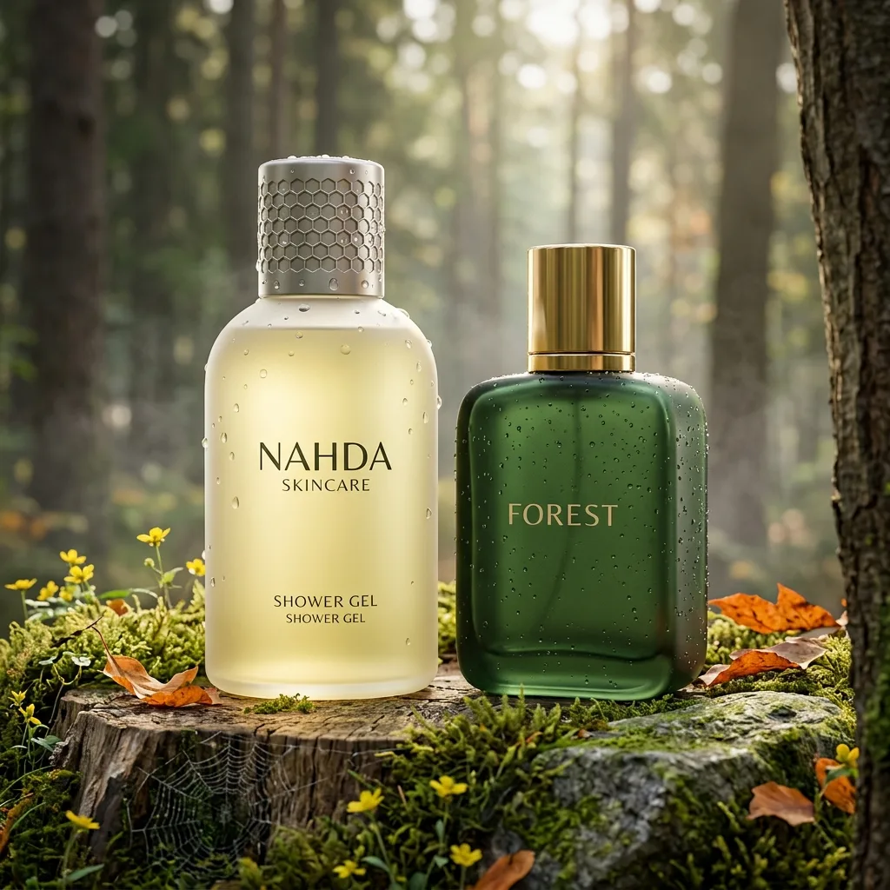

**#353 · Realistic, Portrait · <code>Vinano Image Pro</code>**

> Keywords: realistic, portrait, product photography, AI art, AI prompt, text to image

<details>
<summary>Show prompt</summary>

```
{
 "master_prompt": {
 "global_settings": {
 "resolution": "8K",
 "aspect_ratio": "1:1",
 "image_type": "true-to-life photorealistic AI-generated product photography",
 "detail_level": "ultra-high detail, macro clarity",
 "noise": "none",
 "artifacts": "none",
 "focus": "sharp subject, controlled depth of field"
 },

 "module_1_image_1_style": {
 "subject": {
 "object_type": "cosmetic bottle",
 "label_text_visible": "NAHDA SKINCARE",
 "product_type_text": "SHOWER GEL / SHOWER GEL",
 "bottle_material": "frosted translucent glass",
 "liquid_color": "soft pale yellow",
 "shape": "cylindrical rounded shoulders",
 "cap": {
 "material": "metallic",
 "color": "silver",
 "surface_pattern": "hexagonal honeycomb texture",
 "finish": "matte"
 },
 "surface_details": "small and medium water droplets evenly distributed"
 },
 "environment": {
 "setting": "forest floor",
 "base_surface": "weathered tree stump",
 "surroundings": ["green moss",
 "small yellow wildflowers",
 "tree trunk to the right",
 "fine spider web attached to moss"],
 "background": "soft forest bokeh diffused sunlight",
 "atmosphere": "humid, natural, calm"
 },
 "lighting": {
 "type": "natural diffused light",
 "direction": "soft backlight and side illumination",
 "highlights": "gentle glow through liquid",
 "shadows": "soft, natural"
 },
 "camera": {
 "angle": "eye-level product shot",
 "lens_style": "macro product photography",
 "depth_of_field": "shallow"
 },
 "color_palette": ["pale yellow",
 "soft green",
 "natural brown",
 "muted gold"]
 },

 "module_2_image_2_style": {
 "subject": {
 "object_type": "perfume bottle",
 "label_text_visible": "FOREST",
 "bottle_color": "deep matte green",
 "material": "opaque glass",
 "shape": "rectangular rounded edges",
 "cap": {
 "material": "metallic",
 "color": "gold",
 "finish": "glossy cylindrical"
 },
 "surface_details": "dense fine water droplets covering bottle"
 },
 "environment": {
 "setting": "forest pathway",
 "base_surface": "moss-covered stone or log",
 "foreground_elements": ["orange autumn leaf",
 "fallen brown leaves"],
 "background": "tall trees fading into mist",
 "atmosphere": "misty, cool, forest depth"
 },
 "lighting": {
 "type": "warm ambient forest light",
 "direction": "top-front diffused",
 "effects": "soft glow and mist illumination"
 },
 "camera": {
 "angle": "straight-on centered composition",
 "lens_style": "portrait product lens",
 "depth_of_field": "moderate soft background blur"
 },
 "color_palette": ["forest green",
 "gold",
 "autumn orange",
 "earth brown"

Preserve realistic proportions and depth for a confident, professional finish.
```

</details>

---

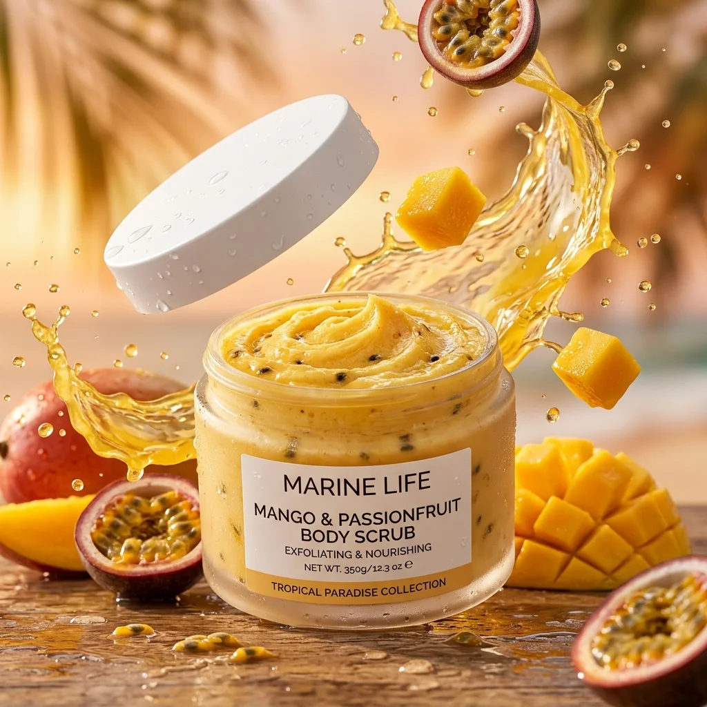

**#354 · Realistic, Product Photography · <code>Vinano Image Pro</code>**

> Keywords: realistic, product photography, cinematic, minimalist, AI art, AI prompt

<details>
<summary>Show prompt</summary>

```
Luxurious tropical body scrub product photography, open jar of bright vibrant yellow-orange Mango & Passionfruit body scrub, creamy whipped texture visible fruit particles, Marine Life brand, elegant minimal packaging, white lid slightly lifted, juicy mango cubes and halved passionfruit floating around, dynamic splash of golden-yellow liquid and fruit juice in the air, fresh exotic fruit pieces mid-air, glossy wet droplets, vibrant juicy colors, appetizing and premium aesthetic, warm golden hour lighting, soft bokeh background in warm peach tones, highly detailed, cinematic product shot, commercial advertising style, 8k, ultra realistic

Video prompt

Ultra-luxurious tropical body scrub commercial video. Open jar of Marine Life Mango & Passionfruit Body Scrub creamy whipped texture and visible fruit particles. White lid slightly lifted. Juicy mango cubes and halved passionfruit floating dynamically around the jar. Golden-yellow liquid and fruit juice splash dramatically in mid-air. Fresh exotic fruit pieces hover and rotate around the product. Glossy wet droplets on jar and fruit, emphasizing freshness and luxury. Warm golden hour lighting soft bokeh background in peach tones. Camera slowly circling the product, capturing texture, shine, and vibrant colors in ultra-realistic 8K detail. Cinematic close-ups, smooth slow motion for splashes and floating fruits, commercial advertising style. Background minimalistic to enhance premium aesthetic.
Optional camera directions / effects:
Start extreme close-up on whipped texture, then pull out to reveal floating fruits.
Slow-motion splash of fruit juice backlighting to highlight droplets.
Gentle rotating 360° pan around the jar for product showcase.
Focus pull from foreground fruit to product label.
Subtle lens flare from warm golden light for cinematic luxury feel.

Maintain consistent colour harmony and crisp focus across the whole frame.
```

</details>

---

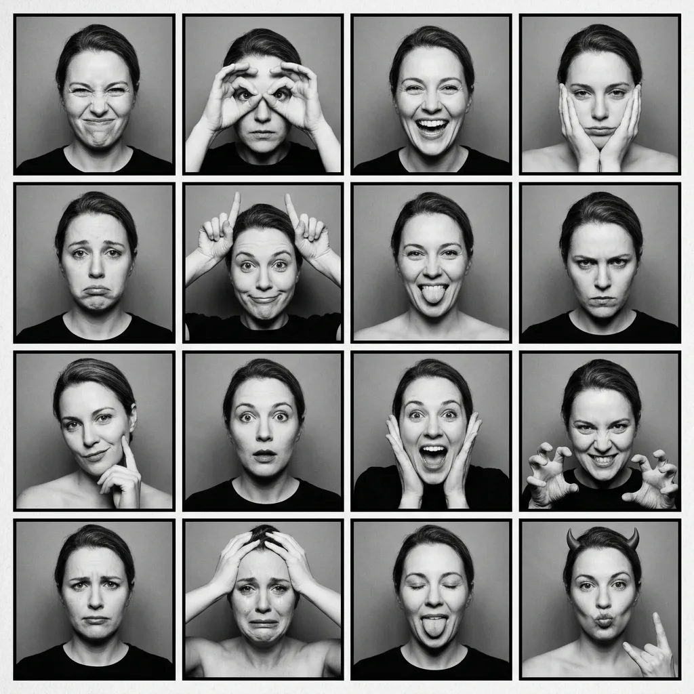

**#355 · Cinematic, Ai Art · <code>Vinano Image Pro</code>**

> Keywords: cinematic, AI art, AI prompt, text to image

<details>
<summary>Show prompt</summary>

```
{
 "generation_request": {
 "meta_data": {
 "task_type": "black_and_white_photobooth_expression_grid_4x4",
 "language": "en",
 "priority": "highest",
 "version": "v1.0_BW_PHOTOBOOTH_EXPRESSIONS_4X4"
 },
 "input": {
 "mode": "image_to_image",
 "reference_image_usage": "very_high",
 "preserve_identity": true,
 "preserve_facial_features": true,
 "preserve_hairstyle": true,
 "notes": "Use the reference as the primary anchor. Create a black-and-white photobooth-style expression grid. Keep the same adult woman identity and hair. Each panel should show a different facial expression. Minimal background, direct photobooth flash look, natural skin texture."
 },
 "output": {
 "aspect_ratio": "1:1",
 "resolution": "ultra_high",
 "num_images": 1,
 "layout": {
 "type": "grid",
 "rows": 4,
 "cols": 4,
 "gutter": "thin",
 "panel_consistency": "high"
 },
 "sharpness": "crisp_photobooth",
 "grain": "subtle_analog_bw"
 },
 "scene": {
 "concept": "classic photobooth contact sheet expressive faces",
 "environment": "plain neutral backdrop, no props",
 "lighting": {
 "style": "direct photobooth flash",
 "key_light": "front flash, slightly hard but flattering",
 "shadows": "soft short shadows behind subject",
 "avoid": "cinematic side light, dramatic backgrounds"
 },
 "camera": {
 "lens": "50mm",
 "distance": "tight head-and-shoulders framing",
 "focus": "eyes sharp in every panel"
 }
 },
 "subject": {
 "type": "adult woman",
 "wardrobe": "simple strapless or bare-shoulder photobooth look (no logos)",
 "hair": "keep same hairstyle across all panels",
 "makeup": "minimal, natural",
 "anatomy_rules": "correct facial proportions, no warped eyes/mouth"
 },
 "expression_set": {
 "panel_01": "scrunched smile, eyes squeezed slightly",
 "panel_02": "intense stare fingers framing eyes",
 "panel_03": "big laugh, mouth open, joyful",
 "panel_04": "bored / unimpressed face, chin in hands",
 "panel_05": "sad pout, watery eyes look",
 "panel_06": "goofy face both hands making small horns above head",
 "panel_07": "playful tongue out, cheeky grin",
 "panel_08": "angry glare, eyebrows down",
 "panel_09": "flirty look, hand touching cheek",
 "panel_10": "surprised wide eyes, mouth slightly open",
 "panel_11": "fake scream / excited shout, hands near face",
 "panel_12": "mischievous grin claw-like hand pose",
 "panel_13": "confused frown, lips pressed",
 "panel_14": "crying face, hands on head, dramatic",
 "panel_15": "tongue out eyes closed, playful",
 "panel_16": "duck face small devil horns gesture"
 },
 "style": {
 "color": "pure black and white",
 "contrast": "medium-high",
 "background": "flat gray",
 "finish": "slight photobooth grain, clean edges"
 },
 "quality_control": {
 "identity_lock": "strict",
 "hands_priority": "high",
 "avoid": ["extra fingers",
 "missing fingers",
 "deformed hands",
 "warped face",
 "uneven eyes",
 "melted mouth",
 "plastic skin",
 "text",
 "watermark",
 "logo"]
 },
 "negative_prompt": ["color",
 "sepia",
 "overly filmic, cinematic lighting",
 "beauty retouch plastic skin",
 "low resolution",
 "blur",
 "distorted anatomy"]
 }
}

Keep edges clean and the overall composition balanced for a polished, gallery-ready result.
```

</details>

---


**#356 · Realistic, Ai Art · <code>Vinano Image Pro</code>**

> Keywords: realistic, AI art, AI prompt, text to image

<details>
<summary>Show prompt</summary>

```
Create an ultra-detailed hyper-realistic aerial editorial photograph of a massive oversized [Product] strapped onto a moving flatbed truck on an empty city street, surreal scale contrast, realistic transport straps under tension, highly detailed surface texture on the oversized object, believable mass and volume, realistic truck proportions, clean urban road composition, top-down or high-angle perspective, minimal surroundings, soft daylight, natural shadows, crisp focus, premium advertising photography style, true-to-life photorealistic, 8k, no watermark, no extra text Keep edges clean and the overall composition balanced for a polished, gallery-ready result.
```

</details>

---

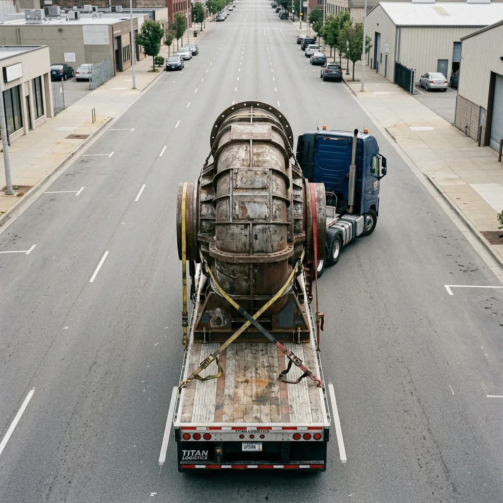

**#357 · Realistic, Ai Art · <code>Vinano Image Pro</code>**

> Keywords: realistic, AI art, AI prompt, text to image

<details>
<summary>Show prompt</summary>

```
Create an ultra-detailed hyper-realistic aerial editorial photograph of a massive oversized [Product] strapped onto a moving flatbed truck on an empty city street, surreal scale contrast, realistic transport straps under tension, highly detailed surface texture on the oversized object, believable mass and volume, realistic truck proportions, clean urban road composition, top-down or high-angle perspective, minimal surroundings, soft daylight, natural shadows, crisp focus, premium advertising photography style, true-to-life photorealistic, 8k, no watermark, no extra text Emphasise material texture and natural light so the final frame feels tactile and premium.
```

</details>

---

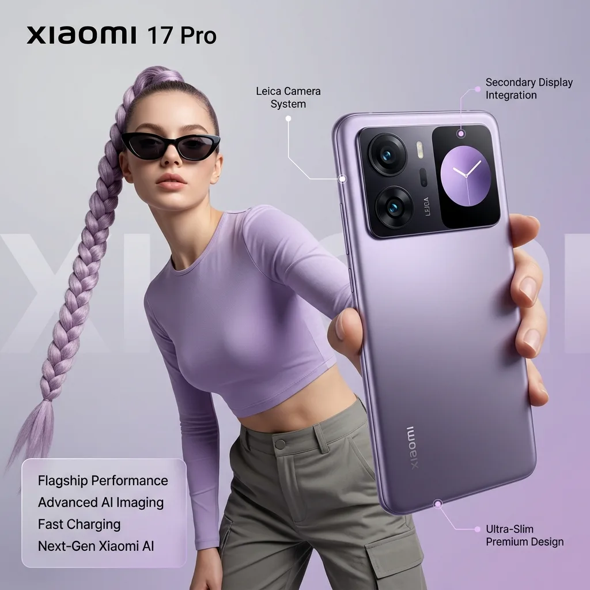

**#358 · Realistic, Product Photography · <code>Vinano Image Pro</code>**

> Keywords: realistic, product photography, cinematic, minimalist, AI art, AI prompt

<details>
<summary>Show prompt</summary>

```
Ultra-realistic premium smartphone advertisement, featuring a confident young woman in her early 20s fair skin and sharp facial features, wearing sleek black cat-eye sunglasses. She has long, thick braided hair styled into an extended oversized braid, colored in soft lavender/purple tones matching the product theme.
She is captured in a dynamic low-angle cinematic pose, slightly twisting her torso while holding a Xiaomi 17 Pro smartphone toward the camera in a bold hero shot strong forced perspective, the phone dominating the foreground.
The smartphone features a matte metallic lavender/purple finish, minimalistic body rounded corners, and a large rectangular camera module. The module includes two large camera lenses on the left, a circular secondary display on the right showing a minimal purple gradient clock UI, Leica branding near the camera, a clean flash strip, and subtle Xiaomi branding at the bottom.
Outfit: fitted long-sleeve crop top in soft lavender/purple, paired high-waisted muted grey/olive cargo pants, modern tech-fashion aesthetic.
Background: clean minimal gradient transitioning from light grey to soft lavender/purple tones, subtle blurred large-scale typography for depth.
Lighting: soft studio lighting neutral-to-cool tones, smooth skin illumination, controlled highlights on the phone edges, glossy reflections on camera lenses and display, minimal shadows, premium product photography style.
Composition: low-angle shot for a powerful look, subject positioned slightly left, phone dominating the right foreground, clean negative space for branding.
Futuristic UI overlays: thin minimal white/purple lines and nodes pointing to features floating labels: “Leica Camera System” “Secondary Display Integration” “Ultra-Slim Premium Design”
Glassmorphism panel (bottom-left, soft purple tint) listing: “Flagship Performance” “Advanced AI Imaging” “Fast Charging” “Next-Gen Xiaomi AI”
Top corner text: “Xiaomi 17 Pro” in clean modern sans-serif typography.
Style: high-end flagship smartphone advertisement, futuristic, minimal, elegant.
Quality: 8K, ultra-detailed, sharp focus, HDR, cinematic commercial photography, realistic textures.

Emphasise material texture and natural light so the final frame feels tactile and premium.
```

</details>

---

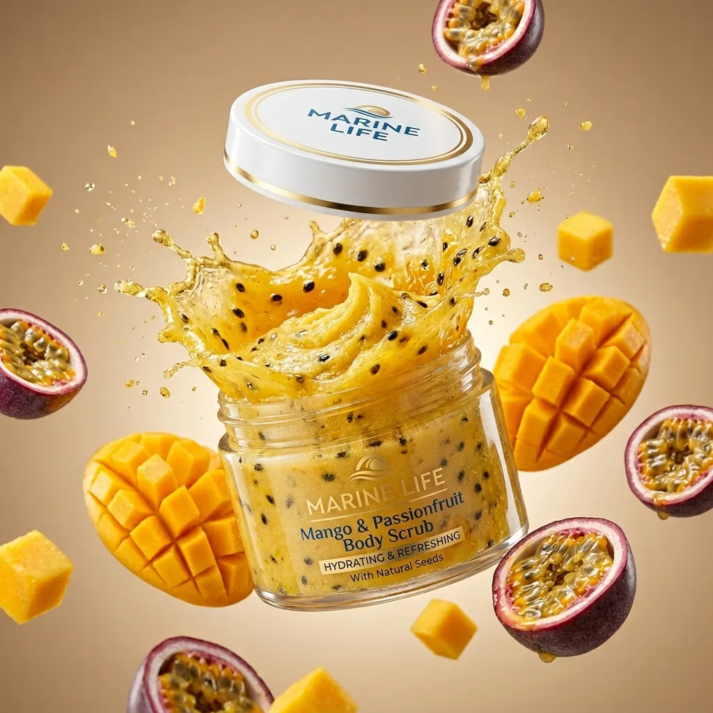

**#359 · Realistic, Product Photography · <code>Vinano Image Pro</code>**

> Keywords: realistic, product photography, cinematic, AI art, AI prompt, text to image

<details>
<summary>Show prompt</summary>

```
A hyperrealistic premium product photography scene of a transparent cosmetic jar labeled “MARINE LIFE” mango and passionfruit body scrub exploding open mid-air, the white lid floating slightly above the jar and a thick, whipped, golden-yellow scrub bursting upward in a dramatic splash, glossy and textured visible black passionfruit seeds, surrounded by suspended mango cubes, scored mango halves, and halved passionfruits glistening pulp, golden liquid droplets and splashes frozen in motion around the jar, the container tilted slightly to the right and centered in frame, shot from a straight-on macro perspective, illuminated by soft yet high-contrast studio lighting from above and slightly behind to create glowing highlights on the wet textures and translucent splashes, subtle shadows beneath the floating elements, a smooth warm beige gradient background enhancing the tropical color palette of saturated yellows, oranges, and deep purple fruit tones, ultra-sharp focus on the jar and scrub shallow depth of field for the outer fruit, cinematic realism, luxury skincare advertising aesthetic, crisp reflections, 8K true-to-life photorealistic detail, energetic and fresh mood. Maintain consistent colour harmony and crisp focus across the whole frame.
```

</details>

---

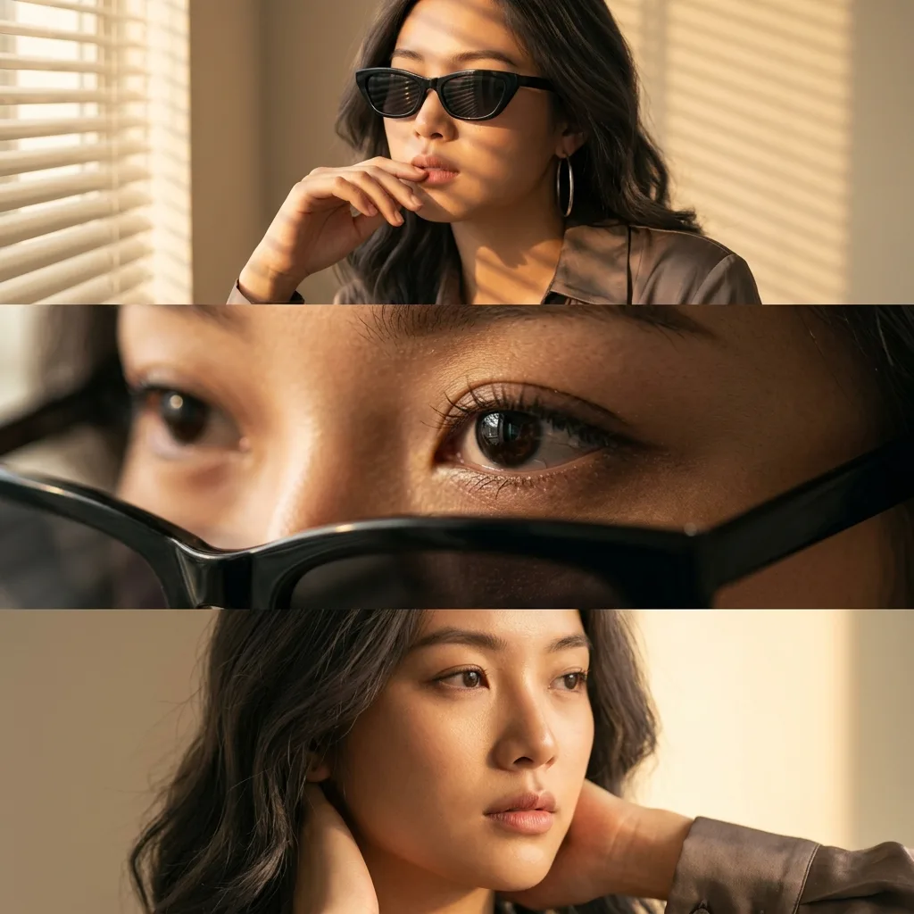

**#360 · Anime, Realistic · <code>Vinano Image Pro</code>**

> Keywords: anime, realistic, portrait, cinematic, AI art, AI prompt

<details>
<summary>Show prompt</summary>

```
Use the uploaded face reference as a strict identity guide and preserve exact facial features, proportions, skin tone, eye shape, nose, lips, jawline, and overall recognizable identity very high accuracy. Create an ultra-realistic cinematic high-end fashion editorial vertical triptych portrait in 9:16 format divided into three horizontal panels featuring a young Asian woman elegant feminine beauty, soft natural styling, luxury aesthetic, silver hoop earring, minimal jewelry, and softly voluminous dark ash-brown wavy hair. Panel 1: medium close-up three-quarter portrait wearing black sunglasses, hand near lips, calm introspective expression, warm golden sunlight through window blinds casting striped shadows, cinematic mood. Panel 2: extreme macro close-up of one eye sunglasses lowered in foreground, highly detailed iris, lashes, moist reflections, cinematic depth, emotional intimate feel. Panel 3: close-up without sunglasses, head turned toward light, hand behind neck, relaxed lips, soft distant gaze, subtle emotional tension. Outfit: smoky taupe or muted beige tailored silk-viscose blouse, minimal elegant luxury fashion styling, realistic fabric texture. Lighting: warm golden cinematic sunlight, soft indoor blinds shadows, luxury editorial lighting, soft contrast, glowing skin highlights. Camera: DSLR ultra-realism, 85mm lens, f/1.4 shallow depth of field, sharp facial detail, natural skin texture, 8K quality. Color grading: warm golden tones, soft amber highlights, cinematic contrast, filmic glow, luxury finish. Negative: no anime, no CGI, no plastic skin, no over-smoothing, no face change, no distortion, no watermark, no text, no logo. Maintain consistent colour harmony and crisp focus across the whole frame.
```

</details>

---

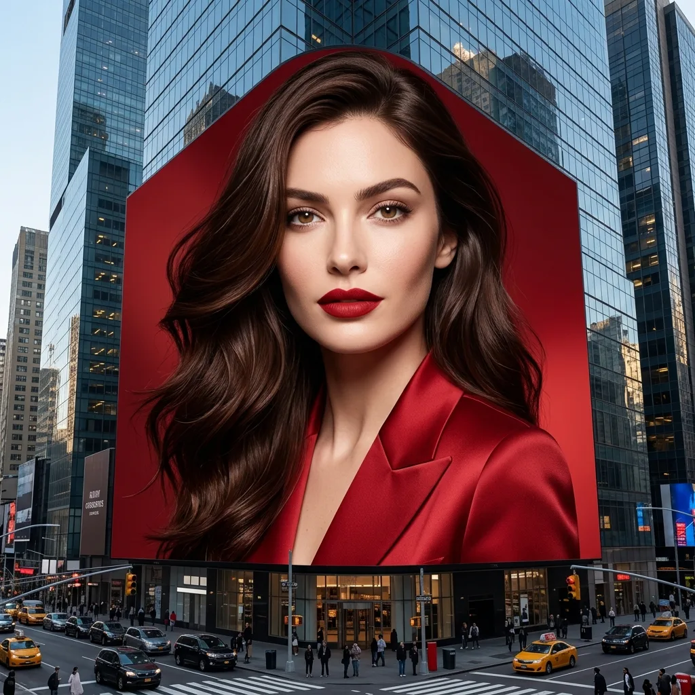

**#361 · Anime, Realistic · <code>Vinano Image Pro</code>**

> Keywords: anime, realistic, portrait, cinematic, AI art, AI prompt

<details>
<summary>Show prompt</summary>

```
[Reference Image]
 the provided reference image, create an ultra-realistic mega-scale luxury beauty advertising campaign displayed on a massive 3D digital billboard wrapped around the corner of a modern skyscraper in Times Square, New York. The billboard dominates the city skyline and features a breathtaking high-fashion portrait of the same woman, styled like an iconic international cosmetics ambassador.
The model has long, glossy dark chocolate-brown hair voluminous waves, flawless porcelain skin, softly sculpted features, bold defined brows, warm hazel eyes, luxurious matte crimson lips, and a confident, elegant expression looking directly at the viewer. A subtle breeze lifts strands of her hair, adding cinematic movement.
She wears a tailored satin-finish crimson red blazer sharp lapels and sophisticated luxury styling. The billboard background is a rich monochromatic red gradient dramatic editorial lighting that makes the portrait appear larger than life.
The scene is photographed from street level a wide-angle perspective, showcasing towering glass skyscrapers, urban architecture, reflections, traffic, pedestrians, and the enormous LED display seamlessly integrated into the building façade. The billboard should resemble a world-class luxury cosmetics campaign premium branding aesthetics and polished commercial production quality.
Capture the image in true-to-life photorealistic 8K, ultra-detailed skin texture, premium hair rendering, cinematic daylight, high dynamic range, architectural realism, luxury fashion advertising, editorial beauty campaign, Times Square energy, hyper-realistic digital signage, and masterpiece-quality composition.
Style Keywords: mega billboard, Times Square advertising, luxury beauty campaign, high-fashion editorial, cinematic cityscape, global cosmetics ambassador, true-to-life photorealistic, premium commercial photography, architectural realism, 8K, ultra detailed.

Negative Prompt
low quality, blurry, pixelated billboard, distorted face, extra people on billboard, malformed anatomy, unrealistic proportions, duplicate subject, cartoon, anime, CGI look, poor lighting, watermark, random text, artifacts, noisy image, low resolution, oversaturated colors, plastic skin.

Emphasise material texture and natural light so the final frame feels tactile and premium.
```

</details>

---

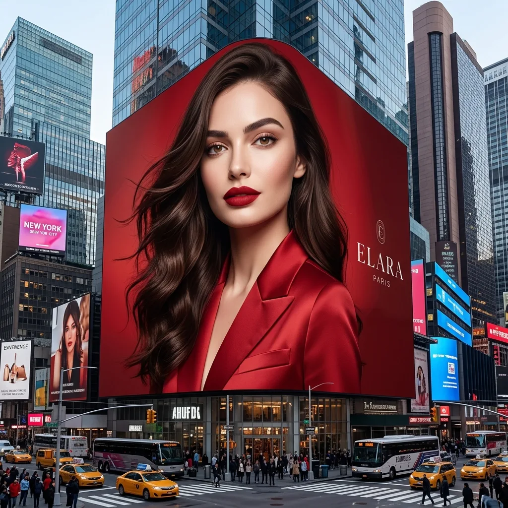

**#362 · Anime, Realistic · <code>Vinano Image Pro</code>**

> Keywords: anime, realistic, portrait, cinematic, AI art, AI prompt

<details>
<summary>Show prompt</summary>

```
[Reference Image]
 the provided reference image, create an ultra-realistic mega-scale luxury beauty advertising campaign displayed on a massive 3D digital billboard wrapped around the corner of a modern skyscraper in Times Square, New York. The billboard dominates the city skyline and features a breathtaking high-fashion portrait of the same woman, styled like an iconic international cosmetics ambassador.
The model has long, glossy dark chocolate-brown hair voluminous waves, flawless porcelain skin, softly sculpted features, bold defined brows, warm hazel eyes, luxurious matte crimson lips, and a confident, elegant expression looking directly at the viewer. A subtle breeze lifts strands of her hair, adding cinematic movement.
She wears a tailored satin-finish crimson red blazer sharp lapels and sophisticated luxury styling. The billboard background is a rich monochromatic red gradient dramatic editorial lighting that makes the portrait appear larger than life.
The scene is photographed from street level a wide-angle perspective, showcasing towering glass skyscrapers, urban architecture, reflections, traffic, pedestrians, and the enormous LED display seamlessly integrated into the building façade. The billboard should resemble a world-class luxury cosmetics campaign premium branding aesthetics and polished commercial production quality.
Capture the image in true-to-life photorealistic 8K, ultra-detailed skin texture, premium hair rendering, cinematic daylight, high dynamic range, architectural realism, luxury fashion advertising, editorial beauty campaign, Times Square energy, hyper-realistic digital signage, and masterpiece-quality composition.
Style Keywords: mega billboard, Times Square advertising, luxury beauty campaign, high-fashion editorial, cinematic cityscape, global cosmetics ambassador, true-to-life photorealistic, premium commercial photography, architectural realism, 8K, ultra detailed.

Negative Prompt
low quality, blurry, pixelated billboard, distorted face, extra people on billboard, malformed anatomy, unrealistic proportions, duplicate subject, cartoon, anime, CGI look, poor lighting, watermark, random text, artifacts, noisy image, low resolution, oversaturated colors, plastic skin.

Render with rich micro-detail while keeping the layout uncluttered and intentional.
```

</details>

---

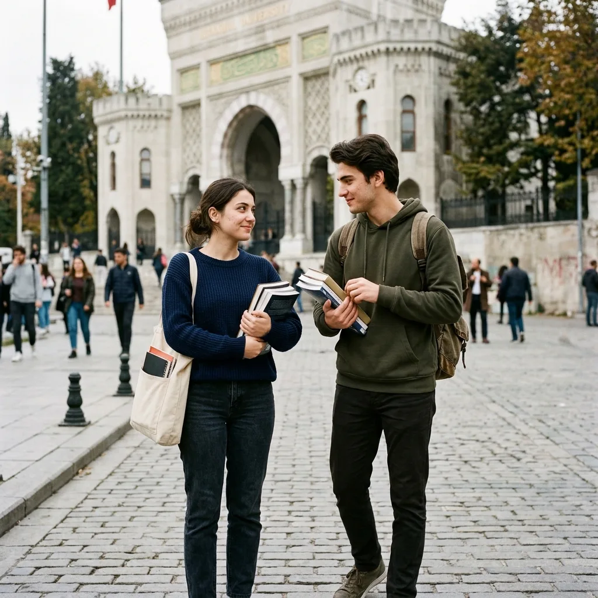

**#363 · Realistic, Portrait · <code>Vinano Image Pro</code>**

> Keywords: realistic, portrait, cinematic, AI art, AI prompt, text to image

<details>
<summary>Show prompt</summary>

```
{
 "generation_request": {
 "meta_data": {
 "tool": "",
 "task_type": "photoreal_candid_street_romance",
 "version": "v1.0_ISTANBUL_UNIVERSITY_FIRST_MEET_LOVE_EN",
 "priority": "highest"
 },

 "output_settings": {
 "aspect_ratio": "4:5",
 "orientation": "portrait",
 "resolution_target": "ultra_high_res",
 "render_style": "ultra_photoreal_candid_street_film_still",
 "sharpness": "crisp_but_natural",
 "film_grain": "subtle_35mm",
 "color_grade": "true_to_life_natural",
 "dynamic_range": "natural_not_hdr",
 "skin_rendering": "real_texture_no_retouch"
 },

 "global_rules": {
 "camera_language": "35mm lens equivalent, eye-level, imperfect framing, candid documentary feel, focus on eyes when people are present",
 "lighting_language": "motivated natural light only (overcast daylight or soft morning sun), deep but detailed shadows",
 "authenticity_markers": "no studio look, no HDR, no AI glow, natural colors, real street atmosphere"
 },

 "creative_prompt": {
 "scene_summary": "A quiet love story begins in Istanbul. Two university students meet for the first time at the main gate of Istanbul University. A candid, unposed moment — as if caught accidentally by a street photographer.",

 "subjects": {
 "count": 2,
 "description": "a young man and woman in their early 20s, university students, ordinary and real, not model-like",
 "expression": "subtle curiosity, shy eye contact, a small uncertain smile — restrained, natural",
 "skin_and_face": "natural skin texture, no beauty retouch, slight under-eye shadows, real imperfections"
 },

 "wardrobe_and_style": {
 "makeup": "very minimal, natural makeup only",
 "clothing": "simple everyday student clothing in neutral tones (beige, grey, navy, soft brown), slightly wrinkled fabric",
 "accessories": "backpacks or tote bags, books held naturally in arms — no logos"
 },

 "micro_action": "they pause briefly while passing each other; their eyes meet; one adjusts the books in their arms; a half-smile forms before words",

 "environment_details": {
 "location": "Istanbul University main entrance gate",
 "background": "historic stone gate, worn pavement, passing students softly out of focus, trees and campus walls",
 "street_elements": "subtle movement of people in the background, light breeze, everyday campus life"
 },

 "lighting": "soft natural daylight, slightly diffused, no dramatic contrast, realistic skin tones",

 "composition": "eye-level medium shot, slightly off-center framing, faces clearly visible and sharp, background gently receding, no symmetry",

 "mood": "quiet, human, intimate, observational — love as a small moment, not a performance"
 },

 "negative_prompt": ["studio lighting",
 "beauty retouch",
 "plastic skin",
 "model faces",
 "over-stylized fashion",
 "perfect symmetry",
 "HDR",
 "AI glow",
 "fake bokeh",
 "text",
 "logo",
 "watermark",
 "posed romance",
 "cinematic exaggeration"]
 }
}

Preserve realistic proportions and depth for a confident, professional finish.
```

</details>

---

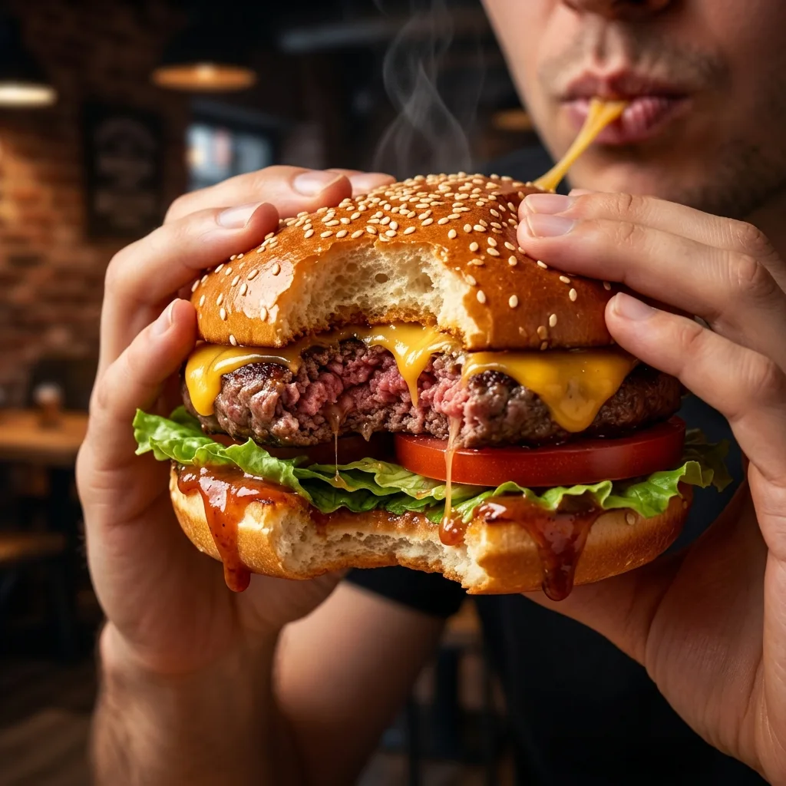

**#364 · Realistic, Food Photography · <code>Vinano Image Pro</code>**

> Keywords: realistic, food photography, cinematic, AI art, AI prompt, text to image

<details>
<summary>Show prompt</summary>

```
{
 "content_goal": "viral food visual extreme craving appeal",
 "image_type": "ultra-true-to-life photorealistic food action photography",
 "visual_style": {
 "aesthetic": "cinematic food editorial, hyper-real",
 "vibe": "juicy, indulgent, irresistible",
 "realism": "high-end commercial food realism"
 },
 "composition": {
 "framing": "tight close-up or medium close-up",
 "camera_angle": "slightly low or front-facing",
 "subject_position": "centered hero bite moment",
 "perspective": "depth-rich strong foreground focus"
 },
 "subject": {
 "description": "large gourmet burger captured mid-bite",
 "bite_action": "visible bite mark compressed layers",
 "ingredients": "juicy beef patty, melted cheese, fresh lettuce, tomato, sauce drip",
 "details": "cheese stretch, sauce gloss, steam rising"
 },
 "texture_details": {
 "bun": "soft toasted bun sesame seeds",
 "patty": "juicy visible meat fibers",
 "cheese": "melted, glossy, stretching",
 "sauce": "thick, dripping naturally"
 },
 "human_element": {
 "hands": "realistic hands holding burger",
 "bite_mark": "natural teeth impression",
 "skin_detail": "natural skin texture, clean nails"
 },
 "lighting": {
 "type": "dramatic food lighting",
 "quality": "warm, directional, high-contrast",
 "direction": "side or top-side light emphasizing gloss",
 "highlight_focus": "cheese melt and sauce texture",
 "shadow_style": "deep but controlled shadows"
 },
 "color_palette": {
 "primary": ["golden brown", "cheese yellow", "deep red"],
 "accent": ["lettuce green"],
 "mood": "rich, bold, indulgent"
 },
 "environment": {
 "location": "burger joint, café, or studio food setup",
 "background": "dark, blurred background to isolate burger",
 "atmosphere": "warm, indulgent, street-food luxury"
 },
 "camera_details": {
 "camera_type": "professional DSLR / mirrorless simulation",
 "lens": "85mm or macro food lens",
 "focus": "tack-sharp on bite area",
 "depth_of_field": "shallow for dramatic bokeh",
 "resolution": "advertising-grade clarity"
 },
 "quality_control": {
 "food_realism": "hyper-real textures, no plastic look",
 "bite_accuracy": "natural compression of ingredients",
 "ai_artifacts": "none",
 "professional_finish": "commercial food photography quality"
 },
 "overall_mood": "mouth-watering, bold, indulgent",
 "intended_use": {
 "primary": "viral food post on X",
 "secondary": "restaurant branding, food editorial, ads"
 }
}

Emphasise material texture and natural light so the final frame feels tactile and premium.
```

</details>

---

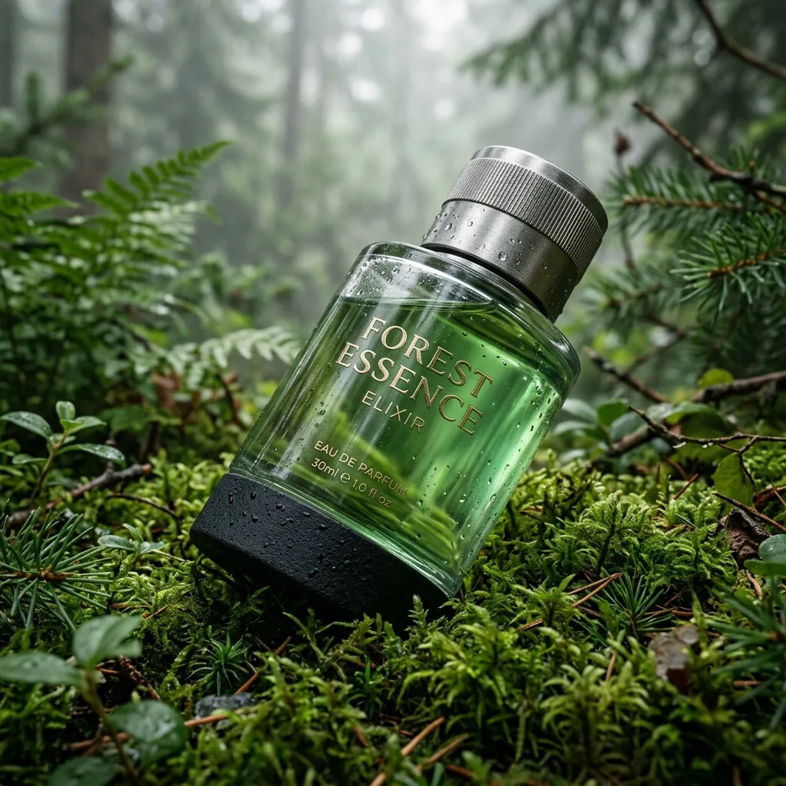

**#365 · Realistic, Ai Art · <code>Vinano Image Pro</code>**

> Keywords: realistic, AI art, AI prompt, text to image

<details>
<summary>Show prompt</summary>

```
Ultra-realistic premium fragrance product shot of a perfume bottle (Forest Essence Elixir), positioned at a (low macro angled shot) resting diagonally on lush (deep green moss surface in a forest setting), cylindrical design a transparent glass center revealing green-tinted liquid, textured (matte black base) and brushed (metallic silver cap) visible condensation droplets, surrounded by dense (forest foliage and pine branches) softly framing the scene, subtle (morning mist Keep edges clean and the overall composition balanced for a polished, gallery-ready result.
```

</details>

---

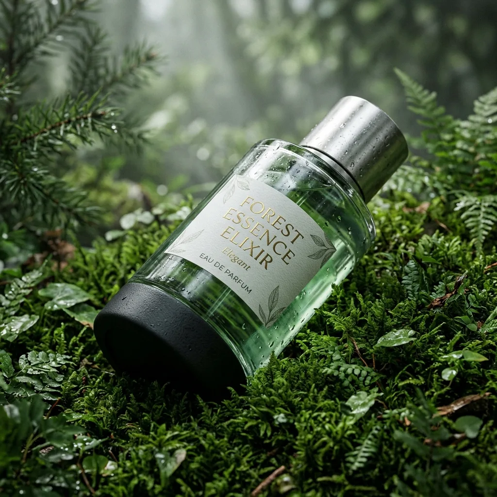

**#366 · Realistic, Ai Art · <code>Vinano Image Pro</code>**

> Keywords: realistic, AI art, AI prompt, text to image

<details>
<summary>Show prompt</summary>

```
Ultra-realistic premium fragrance product shot of a perfume bottle (Forest Essence Elixir), positioned at a (low macro angled shot) resting diagonally on lush (deep green moss surface in a forest setting), cylindrical design a transparent glass center revealing green-tinted liquid, textured (matte black base) and brushed (metallic silver cap) visible condensation droplets, surrounded by dense (forest foliage and pine branches) softly framing the scene, subtle (morning mist Emphasise material texture and natural light so the final frame feels tactile and premium.
```

</details>

---

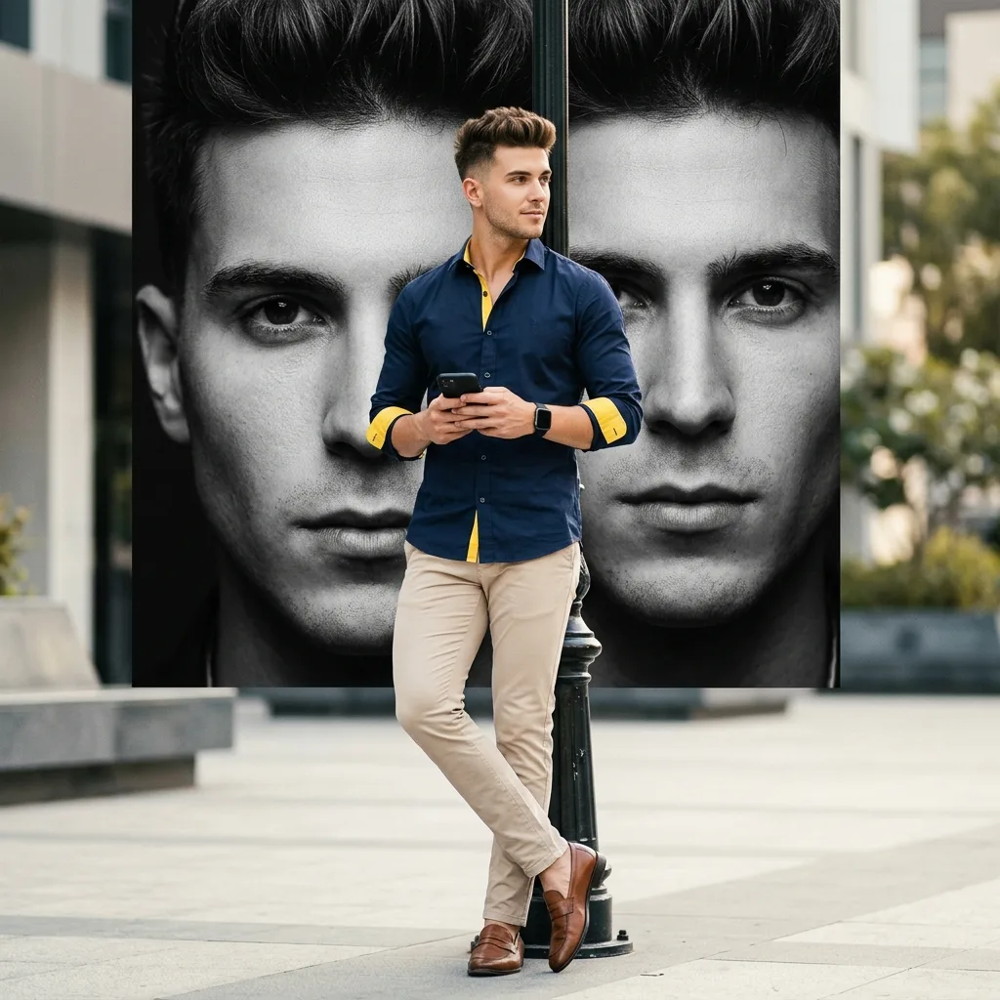

**#367 · Realistic, Portrait · <code>Vinano Image Pro</code>**

> Keywords: realistic, portrait, cinematic, AI art, AI prompt, text to image

<details>
<summary>Show prompt</summary>

```
[SUBJECT]
Stylish young man standing outdoors beside a black street lamp, holding a smartphone both hands and looking confidently to the side.

[APPEARANCE]
Well-groomed face, modern hairstyle, confident expression, fashionable urban look.

[OUTFIT]
Navy blue button-up shirt bright yellow inner collar and sleeve accents, beige slim-fit trousers, smartwatch, brown leather loafers.

[POSE]
Relaxed standing pose crossed legs, both hands holding a smartphone, confident side gaze, modern fashion-editorial posture.

[BACKGROUND]
Massive artistic black-and-white close-up portrait of the same man's face filling the background, creating a dramatic double-exposure style effect, clean urban outdoor environment, black street lamp beside the subject.

[COMPOSITION]
Full-body portrait in the foreground, oversized monochrome face portrait in the background, centered composition, strong depth, layered visual storytelling, fashion magazine cover aesthetic.

[LIGHTING]
Soft natural daylight, filmic, cinematic lighting, balanced highlights and shadows, professional portrait illumination.

[STYLE]
Luxury fashion photography, editorial portrait, contemporary lifestyle, premium urban fashion campaign, double-exposure aesthetic.

[CAMERA]
Eye-level shot, 85mm lens, shallow depth of field, ultra-sharp focus, professional photography.

[QUALITY]
Ultra-realistic, highly detailed, HDR, 8K resolution, masterpiece quality, crisp textures, professional color grading.

[ASPECT RATIO]
4:5 Portrait

[NEGATIVE PROMPT]
blurry, low quality, low resolution, bad anatomy, distorted face, extra fingers, extra limbs, duplicate subject, cropped body, overexposed, underexposed, noise, artifacts, watermark, logo, text, motion blur

Aim for an editorial, design-driven look with deliberate negative space.
```

</details>

---

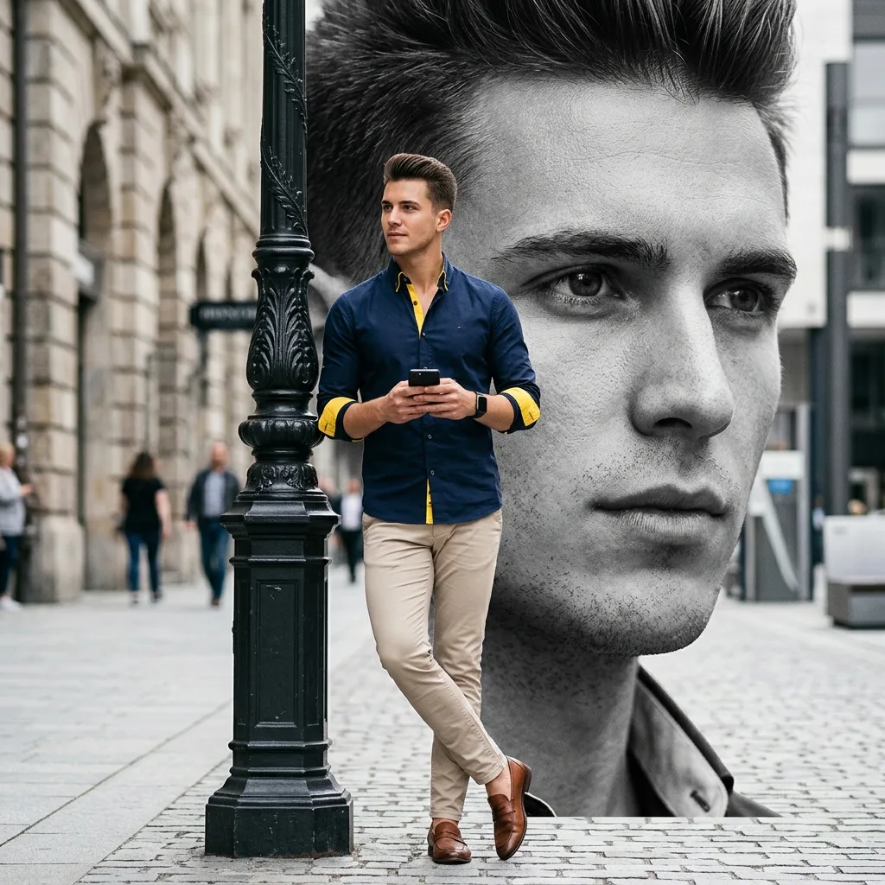

**#368 · Realistic, Portrait · <code>Vinano Image Pro</code>**

> Keywords: realistic, portrait, cinematic, AI art, AI prompt, text to image

<details>
<summary>Show prompt</summary>

```
[SUBJECT]
Stylish young man standing outdoors beside a black street lamp, holding a smartphone both hands and looking confidently to the side.

[APPEARANCE]
Well-groomed face, modern hairstyle, confident expression, fashionable urban look.

[OUTFIT]
Navy blue button-up shirt bright yellow inner collar and sleeve accents, beige slim-fit trousers, smartwatch, brown leather loafers.

[POSE]
Relaxed standing pose crossed legs, both hands holding a smartphone, confident side gaze, modern fashion-editorial posture.

[BACKGROUND]
Massive artistic black-and-white close-up portrait of the same man's face filling the background, creating a dramatic double-exposure style effect, clean urban outdoor environment, black street lamp beside the subject.

[COMPOSITION]
Full-body portrait in the foreground, oversized monochrome face portrait in the background, centered composition, strong depth, layered visual storytelling, fashion magazine cover aesthetic.

[LIGHTING]
Soft natural daylight, filmic, cinematic lighting, balanced highlights and shadows, professional portrait illumination.

[STYLE]
Luxury fashion photography, editorial portrait, contemporary lifestyle, premium urban fashion campaign, double-exposure aesthetic.

[CAMERA]
Eye-level shot, 85mm lens, shallow depth of field, ultra-sharp focus, professional photography.

[QUALITY]
Ultra-realistic, highly detailed, HDR, 8K resolution, masterpiece quality, crisp textures, professional color grading.

[ASPECT RATIO]
4:5 Portrait

[NEGATIVE PROMPT]
blurry, low quality, low resolution, bad anatomy, distorted face, extra fingers, extra limbs, duplicate subject, cropped body, overexposed, underexposed, noise, artifacts, watermark, logo, text, motion blur

Aim for an editorial, design-driven look with deliberate negative space.
```

</details>

---

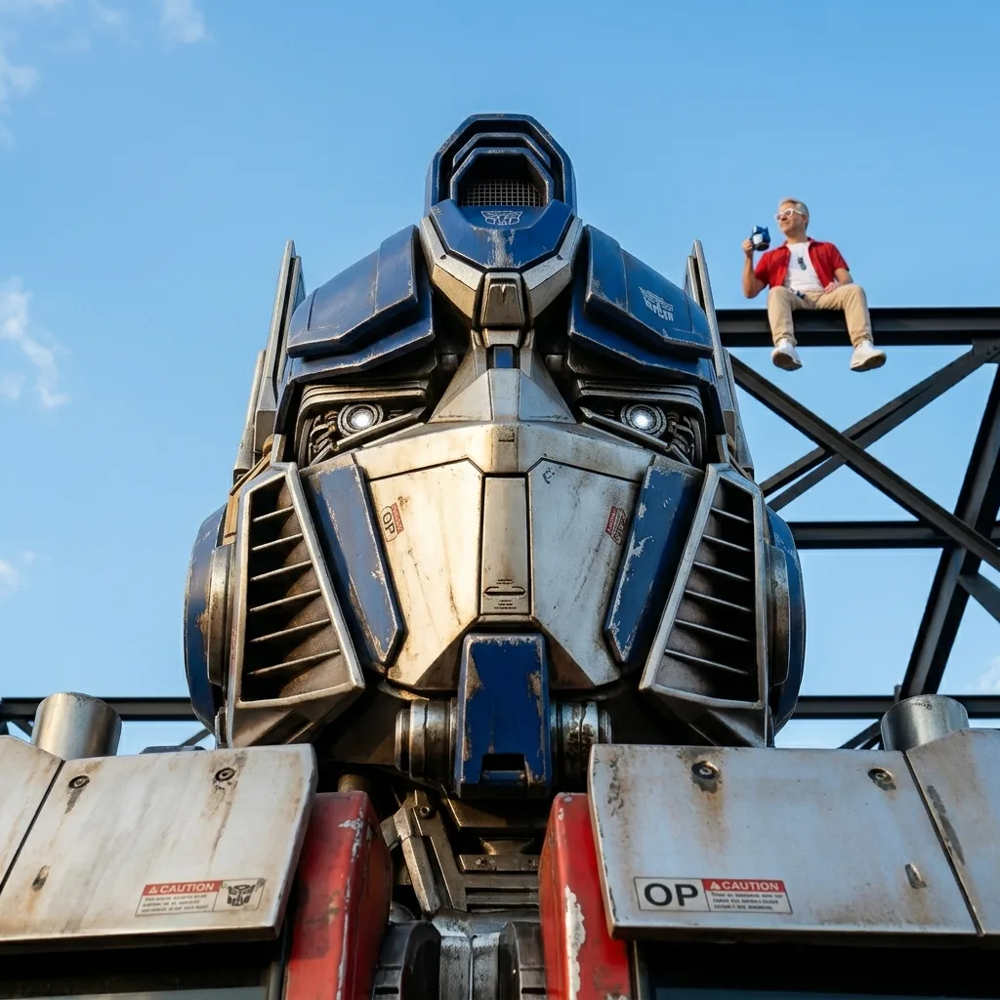

**#369 · Realistic, Cinematic · <code>Vinano Image Pro</code>**

> Keywords: realistic, cinematic, AI art, AI prompt, text to image

<details>
<summary>Show prompt</summary>

```
A realistic close-up of the giant Optimus Prime head, taken from a low right front angle, sharply highlights its mechanical details and color structure. The Optimus Prime has a sturdy and heroic appearance, soft morning lighting from the top left, creating natural light gradients on the sides of its helmet and armor plates. A man from the uploaded image 100% facial resemblance, somewhat athletic, wearing a red polo shirt over a plain white t-shirt, beige cargo pants, Optimus Prime toy keychain, a metal 'OP' letter keychain, rectangular white-framed glasses, gray hair, a dog tag necklace and white Nike Airmax sneakers, sits casually on the Optimus's right shoulder. His sitting position is calm, one leg dangling, the other bent, his hands resting on his knees, drinking coffee from a mug shaped like Optimus Prime robot head, he looks out to the horizon a look of awe and serenity. The man's scale appears much smaller compared to the dimensions of the Prime, emphasizing the robot's colossal size. The natural lighting of the setting sun creates warm reflections on the Prime's armor. Details such as panels, technical logos, and mechanical warnings are captured great clarity. The background features a black steel structure and a bright blue midday sky fluffy clouds. The composition of the image leads the eye from the diagonal line of the shoulders up to the Prime's head and to the man above it, creating an epic and cinematic feel, as if the man were a pilot enjoying the view from atop his legendary mecha. The aspect ratio is 9:16. no blur, no cgi, no cartoon Emphasise material texture and natural light so the final frame feels tactile and premium.
```

</details>

---

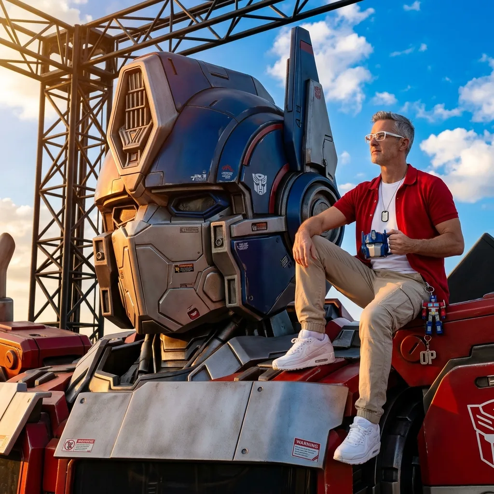

**#370 · Realistic, Cinematic · <code>Vinano Image Pro</code>**

> Keywords: realistic, cinematic, AI art, AI prompt, text to image

<details>
<summary>Show prompt</summary>

```
A realistic close-up of the giant Optimus Prime head, taken from a low right front angle, sharply highlights its mechanical details and color structure. The Optimus Prime has a sturdy and heroic appearance, soft morning lighting from the top left, creating natural light gradients on the sides of its helmet and armor plates. A man from the uploaded image 100% facial resemblance, somewhat athletic, wearing a red polo shirt over a plain white t-shirt, beige cargo pants, Optimus Prime toy keychain, a metal 'OP' letter keychain, rectangular white-framed glasses, gray hair, a dog tag necklace and white Nike Airmax sneakers, sits casually on the Optimus's right shoulder. His sitting position is calm, one leg dangling, the other bent, his hands resting on his knees, drinking coffee from a mug shaped like Optimus Prime robot head, he looks out to the horizon a look of awe and serenity. The man's scale appears much smaller compared to the dimensions of the Prime, emphasizing the robot's colossal size. The natural lighting of the setting sun creates warm reflections on the Prime's armor. Details such as panels, technical logos, and mechanical warnings are captured great clarity. The background features a black steel structure and a bright blue midday sky fluffy clouds. The composition of the image leads the eye from the diagonal line of the shoulders up to the Prime's head and to the man above it, creating an epic and cinematic feel, as if the man were a pilot enjoying the view from atop his legendary mecha. The aspect ratio is 9:16. no blur, no cgi, no cartoon Emphasise material texture and natural light so the final frame feels tactile and premium.
```

</details>

---

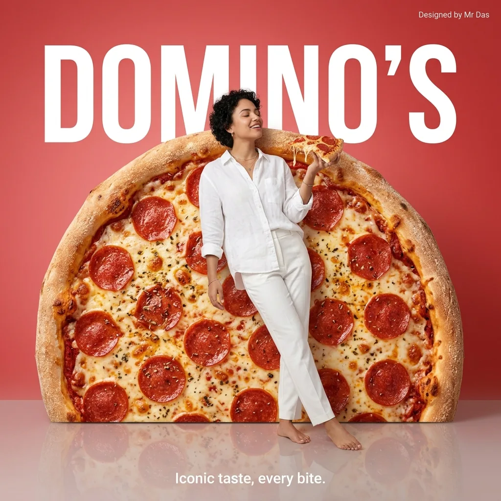

**#371 · Product Photography, Minimalist · <code>Vinano Image Pro</code>**

> Keywords: product photography, minimalist, AI art, AI prompt, text to image

<details>
<summary>Show prompt</summary>

```
refined minimalist commercial ad featuring oversized Domino’s Pepperoni Pizza, ultra-clean design. A young woman in all-white outfit leans casually against the giant pizza, relaxed confident pose, eyes closed, also holding a regular slice in her hand. Soft gradient red background large bold white “DOMINO’S” text behind. Glossy reflective floor, soft studio lighting, modern high-end food/product photography. Small top-right text “Designed by Mr Das”. Bottom center tagline in small white font: “Iconic taste, every bite.” Keep edges clean and the overall composition balanced for a polished, gallery-ready result.
```

</details>

---

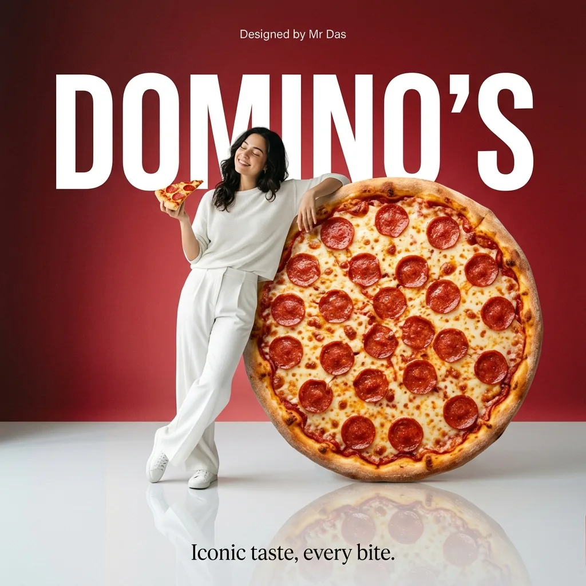

**#372 · Product Photography, Minimalist · <code>Vinano Image Pro</code>**

> Keywords: product photography, minimalist, AI art, AI prompt, text to image

<details>
<summary>Show prompt</summary>

```
refined minimalist commercial ad featuring oversized Domino’s Pepperoni Pizza, ultra-clean design. A young woman in all-white outfit leans casually against the giant pizza, relaxed confident pose, eyes closed, also holding a regular slice in her hand. Soft gradient red background large bold white “DOMINO’S” text behind. Glossy reflective floor, soft studio lighting, modern high-end food/product photography. Small top-right text “Designed by Mr Das”. Bottom center tagline in small white font: “Iconic taste, every bite.” Aim for an editorial, design-driven look with deliberate negative space.
```

</details>

---

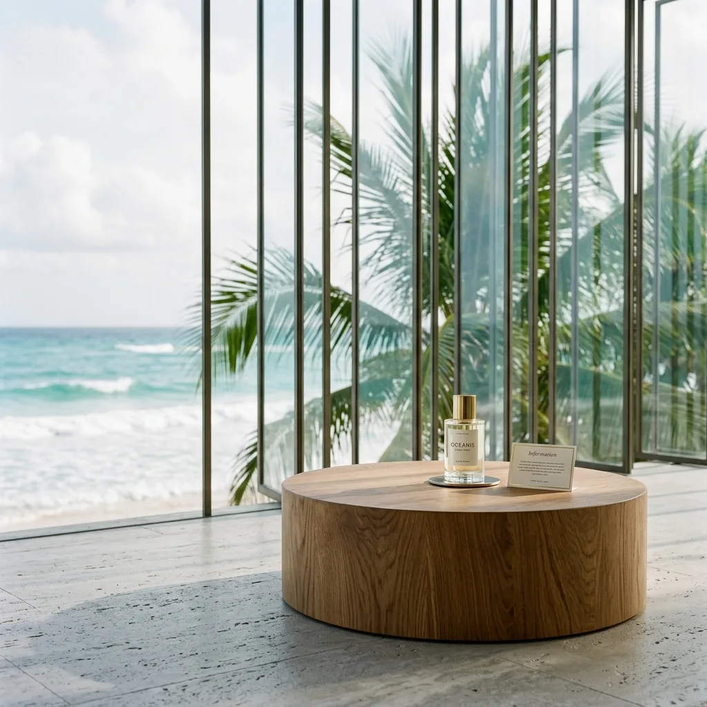

**#373 · Ai Art, Ai Prompt · <code>Vinano Image Pro</code>**

> Keywords: AI art, AI prompt, text to image

<details>
<summary>Show prompt</summary>

```
A mockup of a round wooden podium on the floor, against a backdrop of vertical glass panels palm leaves and ocean waves in the background. The scene is bathed in soft daylight, creating gentle shadows that accentuate textures like wood grain or metal surfaces. This setting creates an elegant atmosphere for product display, offering a serene and natural ambiance to enhance luxury branding. --ar 4:5 --v 6.1 Aim for an editorial, design-driven look with deliberate negative space.
```

</details>

---

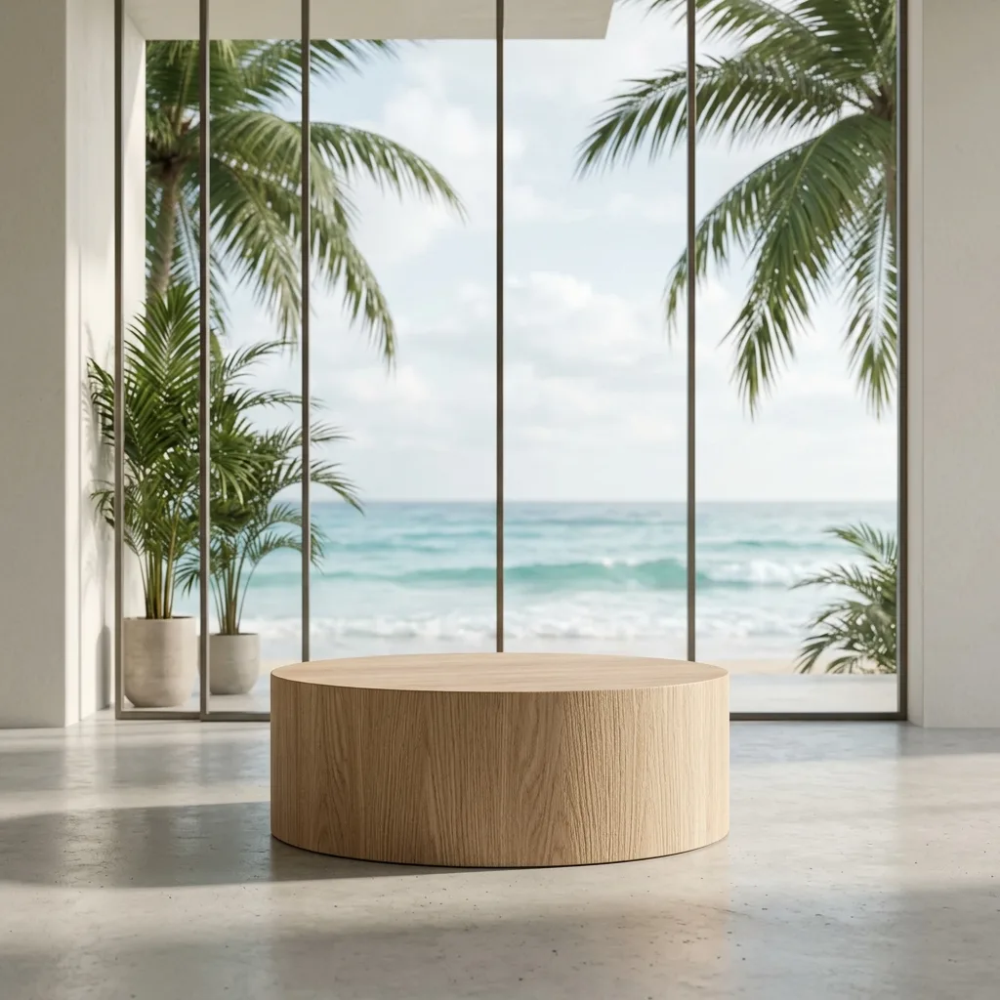

**#374 · Ai Art, Ai Prompt · <code>Vinano Image Pro</code>**

> Keywords: AI art, AI prompt, text to image

<details>
<summary>Show prompt</summary>

```
A mockup of a round wooden podium on the floor, against a backdrop of vertical glass panels palm leaves and ocean waves in the background. The scene is bathed in soft daylight, creating gentle shadows that accentuate textures like wood grain or metal surfaces. This setting creates an elegant atmosphere for product display, offering a serene and natural ambiance to enhance luxury branding. --ar 4:5 --v 6.1 Keep edges clean and the overall composition balanced for a polished, gallery-ready result.
```

</details>

---

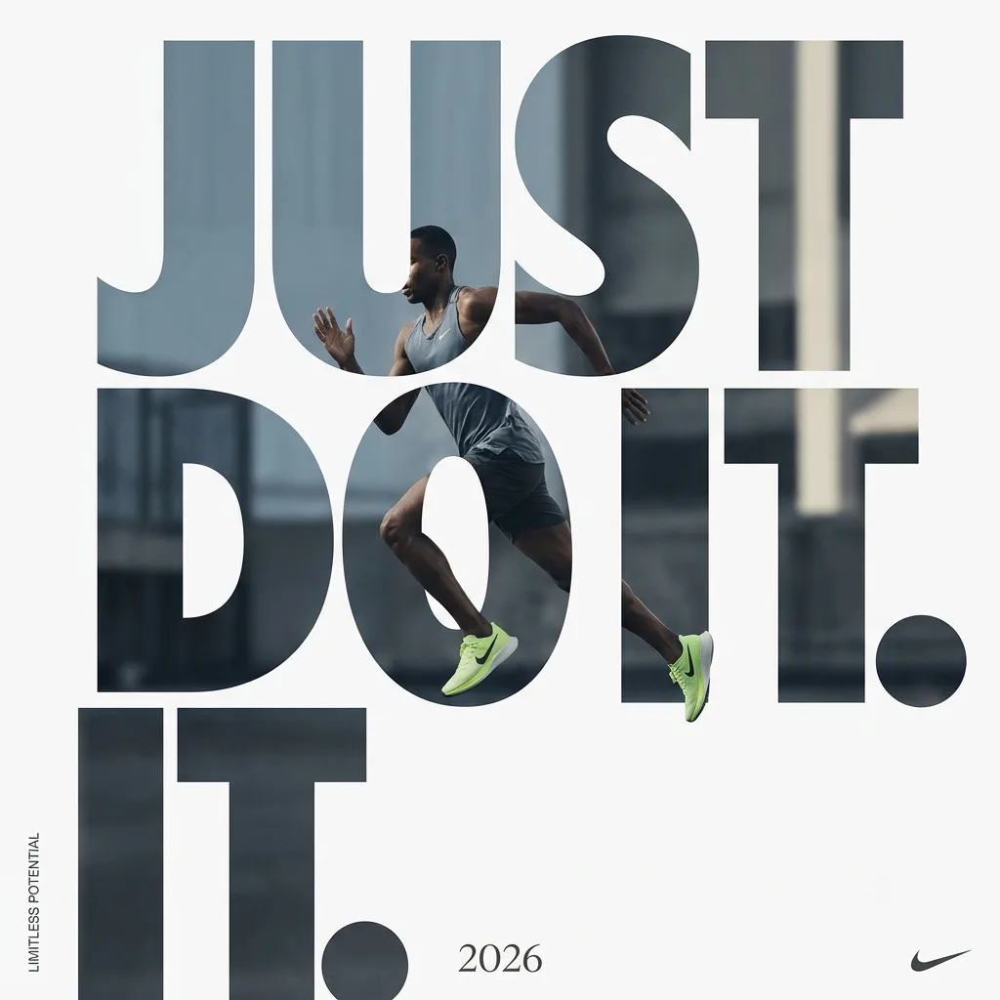

**#375 · Cinematic, Minimalist · <code>Vinano Image Pro</code>**

> Keywords: cinematic, minimalist, AI art, AI prompt, text to image

<details>
<summary>Show prompt</summary>

```
Act as a Senior Editorial Designer and Typographer.PHASE 1: TYPOGRAPHIC MASK (THE "WINDOW" EFFECT).- Core Element: Use the most iconic slogan or the name of [BRAND NAME] as a massive, ultra-bold, heavy sans-serif typographic mask.- Layout: The letters must be giant, filling the entire vertical frame from edge to edge tight kerning.- Concept: The text acts as a "cut-out" window. The background is solid white, and the photographic subject is visible ONLY through the letterforms.PHASE 2: DYNAMIC SUBJECT LOGIC.- Subject Selection:- Detail: Ensure a high-contrast element，an running athelete is visible through one of the letters as a focal point.PHASE 3: SOPHISTICATED MUTED PALETTE.- Atmosphere: Use a "Refined Muted" color scheme.- Tones: Soft slate blues, charcoal greys, and creamy off-whites for the photography inside the mask.- Accent: Identify one sharp, saturated accent color belonging to [BRAND NAME] and apply it to a single key object visible through the text.PHASE 4: PHOTOGRAPHY & LIGHTING.- Lighting: Soft-box studio lighting. Diffused shadows and gentle highlights to create a cinematic, high-end editorial feel.- Finish: Clean, matte texture zero visual noise. High-definition photographic quality.PHASE 5: refined minimalist BRANDING.- Accents: Add a tiny refined minimalist logo and a small vertical tagline in a clean, microscopic sans-serif font near the corners.- Year: Include the year "2026" in a subtle, elegant font to mimic a limited-edition look. Keep edges clean and the overall composition balanced for a polished, gallery-ready result.
```

</details>

---

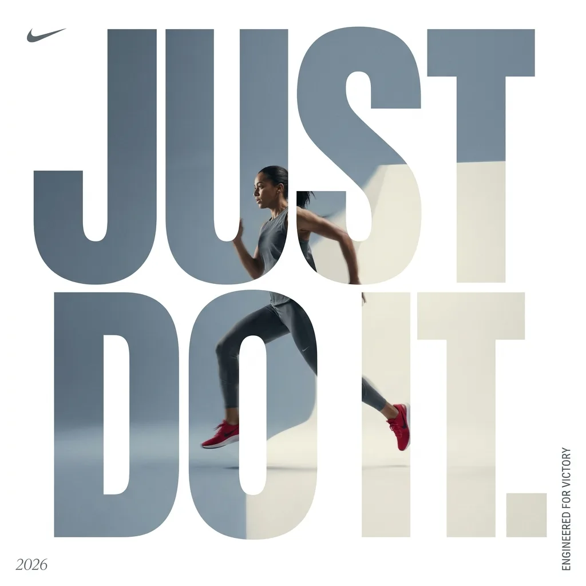

**#376 · Cinematic, Minimalist · <code>Vinano Image Pro</code>**

> Keywords: cinematic, minimalist, AI art, AI prompt, text to image

<details>
<summary>Show prompt</summary>

```
Act as a Senior Editorial Designer and Typographer.PHASE 1: TYPOGRAPHIC MASK (THE "WINDOW" EFFECT).- Core Element: Use the most iconic slogan or the name of [BRAND NAME] as a massive, ultra-bold, heavy sans-serif typographic mask.- Layout: The letters must be giant, filling the entire vertical frame from edge to edge tight kerning.- Concept: The text acts as a "cut-out" window. The background is solid white, and the photographic subject is visible ONLY through the letterforms.PHASE 2: DYNAMIC SUBJECT LOGIC.- Subject Selection:- Detail: Ensure a high-contrast element，an running athelete is visible through one of the letters as a focal point.PHASE 3: SOPHISTICATED MUTED PALETTE.- Atmosphere: Use a "Refined Muted" color scheme.- Tones: Soft slate blues, charcoal greys, and creamy off-whites for the photography inside the mask.- Accent: Identify one sharp, saturated accent color belonging to [BRAND NAME] and apply it to a single key object visible through the text.PHASE 4: PHOTOGRAPHY & LIGHTING.- Lighting: Soft-box studio lighting. Diffused shadows and gentle highlights to create a cinematic, high-end editorial feel.- Finish: Clean, matte texture zero visual noise. High-definition photographic quality.PHASE 5: refined minimalist BRANDING.- Accents: Add a tiny refined minimalist logo and a small vertical tagline in a clean, microscopic sans-serif font near the corners.- Year: Include the year "2026" in a subtle, elegant font to mimic a limited-edition look. Preserve realistic proportions and depth for a confident, professional finish.
```

</details>

---

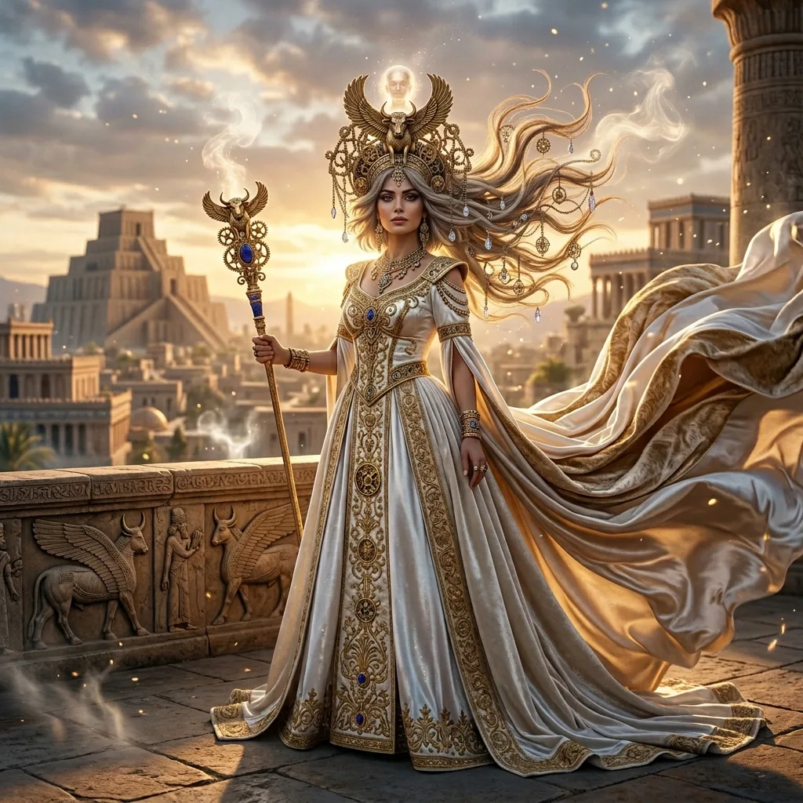

**#377 · Portrait, Character · <code>Vinano Image Pro</code>**

> Keywords: portrait, character, cinematic, fantasy, AI art, AI prompt

<details>
<summary>Show prompt</summary>

```
Subject and action
A regal Mesopotamian empress captured in a cinematic fantasy portrait, her presence radiating divine authority and ethereal beauty. She stands a commanding posture, her neck-length dark hair styled in soft, flowing layers that dance in powerful high-altitude winds. Thousands of silky strands are individually rendered, catching the golden hour sunlight, intricately woven floating brass ornaments, delicate crystal pendants, and miniature kinetic clockwork accessories.

Composition and framing
Full-body portrait, shot on 85mm prime lens for high-end fashion editorial compression. The composition emphasizes the expansive, sweeping motion of her massive, layered royal train as it billows dynamically behind her. A low-angle shot to enhance her goddess-like stature and imperial majesty.

Lighting and atmosphere
filmic, cinematic lighting utilizing soft, diffused golden hour sunlight combined subtle volumetric rim lighting to highlight the metallic textures. The atmosphere is thick floating golden particles, glowing embers, magical dust, and wisps of luminous steam. Deep, rich shadows maintain a luxurious contrast, reminiscent of the cinematography of Christopher Doyle and the dramatic depth of Annie Leibovitz.

Material and texture
Haute couture craftsmanship featuring shimmering white silk and plush ivory velvet. The attire is adorned antique gold embroidery, polished brass filigree, and celestial clockwork patterns. Her headdress is a masterpiece of ancient Mesopotamian influence merged steampunk mechanics, featuring a central winged bull emblem a faintly glowing human head. Every fabric layer, ribbon, and decorative chain exhibits tangible, fluid motion.

Visual style
A fusion of ancient Mesopotamian royal aesthetics and intricate steampunk functionalism. The style is that of a high-end luxury fashion campaign, characterized by impossible detail, breathtaking realism, and award-winning fantasy photography. The aesthetic is sophisticated, opulent, and grand.

Constraints
No warrior armor, no combat gear, no military uniforms, no tactical outfits, no bulky protective plating. Hair must not appear stiff or static. No text, no watermarks, no logos, no distorted facial features.

Keep edges clean and the overall composition balanced for a polished, gallery-ready result.
```

</details>

---

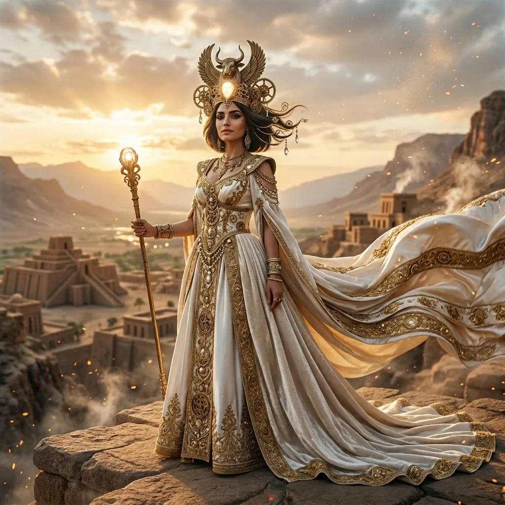

**#378 · Portrait, Character · <code>Vinano Image Pro</code>**

> Keywords: portrait, character, cinematic, fantasy, AI art, AI prompt

<details>
<summary>Show prompt</summary>

```
Subject and action
A regal Mesopotamian empress captured in a cinematic fantasy portrait, her presence radiating divine authority and ethereal beauty. She stands a commanding posture, her neck-length dark hair styled in soft, flowing layers that dance in powerful high-altitude winds. Thousands of silky strands are individually rendered, catching the golden hour sunlight, intricately woven floating brass ornaments, delicate crystal pendants, and miniature kinetic clockwork accessories.

Composition and framing
Full-body portrait, shot on 85mm prime lens for high-end fashion editorial compression. The composition emphasizes the expansive, sweeping motion of her massive, layered royal train as it billows dynamically behind her. A low-angle shot to enhance her goddess-like stature and imperial majesty.

Lighting and atmosphere
filmic, cinematic lighting utilizing soft, diffused golden hour sunlight combined subtle volumetric rim lighting to highlight the metallic textures. The atmosphere is thick floating golden particles, glowing embers, magical dust, and wisps of luminous steam. Deep, rich shadows maintain a luxurious contrast, reminiscent of the cinematography of Christopher Doyle and the dramatic depth of Annie Leibovitz.

Material and texture
Haute couture craftsmanship featuring shimmering white silk and plush ivory velvet. The attire is adorned antique gold embroidery, polished brass filigree, and celestial clockwork patterns. Her headdress is a masterpiece of ancient Mesopotamian influence merged steampunk mechanics, featuring a central winged bull emblem a faintly glowing human head. Every fabric layer, ribbon, and decorative chain exhibits tangible, fluid motion.

Visual style
A fusion of ancient Mesopotamian royal aesthetics and intricate steampunk functionalism. The style is that of a high-end luxury fashion campaign, characterized by impossible detail, breathtaking realism, and award-winning fantasy photography. The aesthetic is sophisticated, opulent, and grand.

Constraints
No warrior armor, no combat gear, no military uniforms, no tactical outfits, no bulky protective plating. Hair must not appear stiff or static. No text, no watermarks, no logos, no distorted facial features.

Aim for an editorial, design-driven look with deliberate negative space.
```

</details>

---

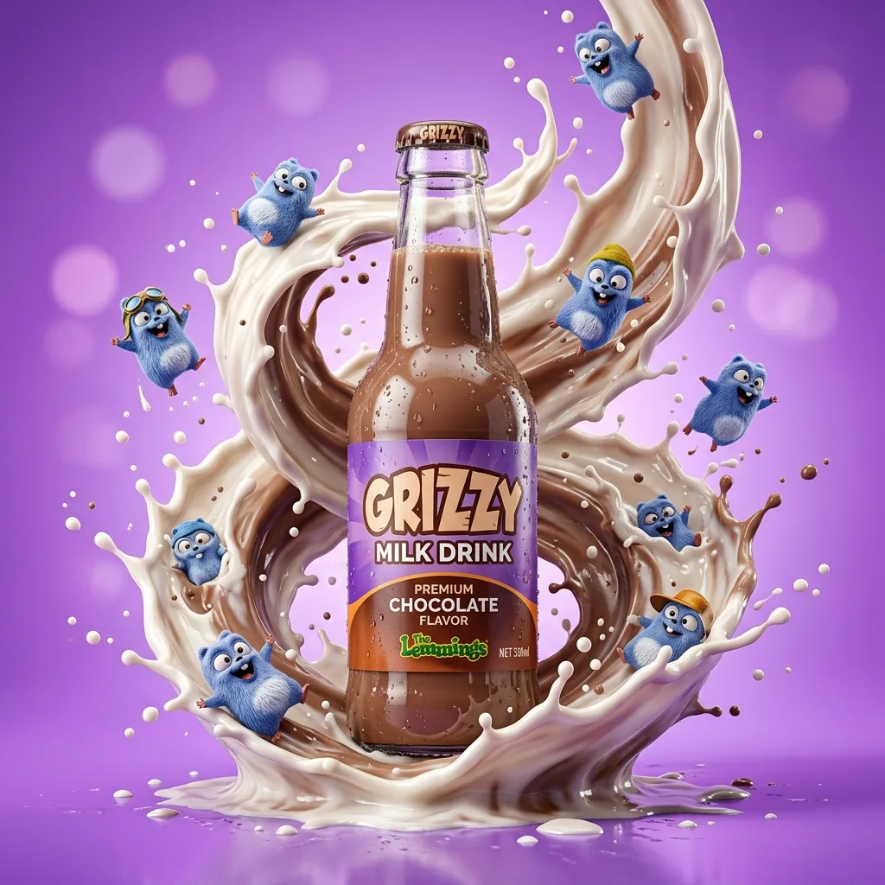

**#379 · Realistic, Ai Art · <code>Vinano Image Pro</code>**

> Keywords: realistic, AI art, AI prompt, text to image

<details>
<summary>Show prompt</summary>

```
Premium grizzy milk drink bottle surrounded by swirling "the lemmings" splash, floating the lemmings in a dynamic liquid motion, soft purplr vivid background, high-speed splash photography, glossy product lighting, ultra-realistic, commercial food ad style, sharp focus, 8K. Aim for an editorial, design-driven look with deliberate negative space.
```

</details>

---

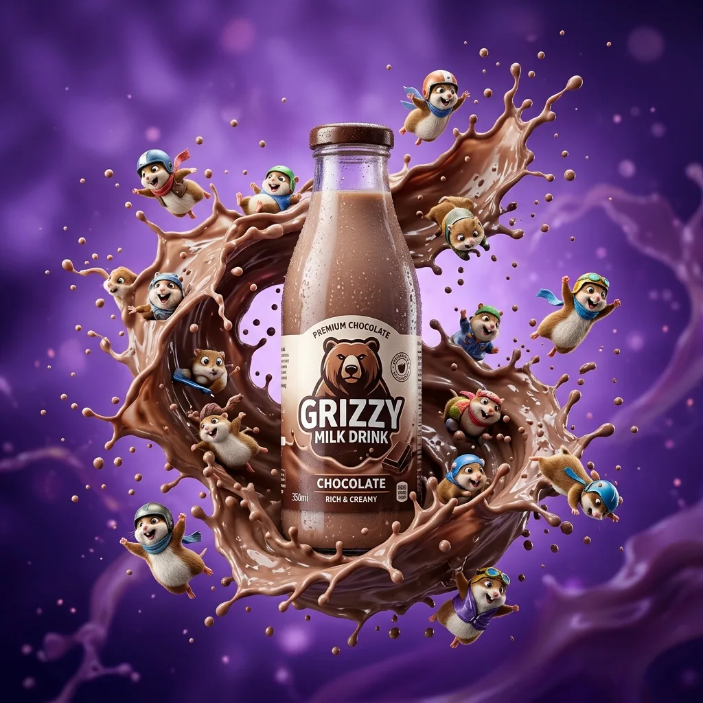

**#380 · Realistic, Ai Art · <code>Vinano Image Pro</code>**

> Keywords: realistic, AI art, AI prompt, text to image

<details>
<summary>Show prompt</summary>

```
Premium grizzy milk drink bottle surrounded by swirling "the lemmings" splash, floating the lemmings in a dynamic liquid motion, soft purplr vivid background, high-speed splash photography, glossy product lighting, ultra-realistic, commercial food ad style, sharp focus, 8K. Aim for an editorial, design-driven look with deliberate negative space.
```

</details>

---
