# Product & Brand — full gallery

[← Back to README](../README.md) · [`prompts.json`](../prompts/prompts.json) · **380** prompts · page 1 / 4

**1** · [2](./product-brand-2.md) · [3](./product-brand-3.md) · [4](./product-brand-4.md) — [Next →](./product-brand-2.md)

---


**#1 · Product &amp; Brand Prompt · <code>Vinano Image Pro</code>**

<details>
<summary>Show prompt</summary>

```
Create a 3×3 grid in
3:4 aspect ratio for a high-end commercial marketing campaign the uploaded product as the central subject.

Each frame must present a distinct visual concept while maintaining perfect product consistency across all nine images.

Grid Concepts (one per cell):

1. Iconic hero still life bold composition

2. Extreme macro detail highlighting material, surface, or texture

3. Dynamic liquid or particle interaction surrounding the product

4. Minimal sculptural arrangement abstract forms

5. Floating elements composition suggesting lightness and innovation

6. Sensory close-up emphasizing tactility and realism

7. Color-driven conceptual scene inspired by the product palette

8. Ingredient or component abstraction (non-literal, symbolic)

9. Surreal yet elegant fusion scene combining realism and imagination

Visual Rules:
Product must remain 100% accurate in shape, proportions, label, typography, color, and branding
No distortion, deformation, or redesign of the product
Clean separation between product and background

Lighting & Style:
Soft, controlled studio lighting
Subtle highlights, realistic shadows
High dynamic range, ultra-sharp focus
Editorial luxury advertising aesthetic
Premium sensory marketing look

Overall Feel:
Modern, refined, visually cohesive
High-end commercial campaign
Designed for brand websites, social grids, and digital billboards
Hyperreal, cinematic, polished, and aspirational

Maintain consistent colour harmony and crisp focus across the whole frame.
```

</details>

---


**#2 · Product &amp; Brand Prompt · <code>Vinano Image Pro</code>**

<details>
<summary>Show prompt</summary>

```
Product ad style AI image on a mountain peak above clouds Created Google Prompt used: Ultra realistic cinematic image of a White Monster Energy Ultra can standing on a sharp mountain peak above a sea of clouds, extreme high altitude atmosphere, dramatic stormy sky, golden sunrise breaking through clouds, wind whipping snow and mist around the can, liquid condensation and ice particles on the surface, bold powerful presence, epic scale contrast Render with rich micro-detail while keeping the layout uncluttered and intentional.
```

</details>

---


**#3 · Product &amp; Brand Prompt · <code>Vinano Image Pro</code>**

<details>
<summary>Show prompt</summary>

```
The word fofr as aggressive hard-edge graffiti a monstera leaf motif, beautifully stylised. The background is pure white. It is a risograph print. No color distortion. Vibrant and not faded. Stochastic stippling and sand-like noise pattern within color fills. A thick black outline. The tagline: "Always be promptin’", also in graffiti - but as a sprayed tag. Aim for an editorial, design-driven look with deliberate negative space.
```

</details>

---


**#4 · Product &amp; Brand Prompt · <code>Vinano Image Pro</code>**

<details>
<summary>Show prompt</summary>

```
You are a world class creative director, brand strategist, editorial art director, and visual identity designer specializing in high impact campaign systems for global brands.

Your task is to create a bold, visually explosive, highly curated editorial moodboard collage composition that feels like a modern brand identity system.

This should feel like a brand world captured in one frame, not a clean layout, slightly chaotic, layered, and expressive.

BRAND INPUTS:

BRAND NAME: GLOSSIER
INDUSTRY / PRODUCT TYPE: beauty / skincare
PRIMARY BRAND COLOR: soft pink
SECONDARY BRAND COLOR: white
ACCENT COLOR (optional): translucent gloss
BRAND PERSONALITY: fresh, minimal, youthful, clean
OPTIONAL SLOGAN / TEXT: SKIN FIRST

VISUAL STYLE:

Create a dense, layered moodboard-style composition combining:

• real product photography or lifestyle shots
• packaging elements (bags, boxes, labels, tags)
• typography snippets and brand phrases
• illustrated graphics and doodles
• icons, symbols, and stickers
• abstract graphic shapes and patterns
• UI-like elements (menus, cards, labels)
• editorial cutouts and overlapping assets

The composition should feel:

• slightly messy but intentionally designed
• layered depth and overlaps
• like a Pinterest board meets high-end campaign
• expressive, youthful, and brand-heavy
• visually rich and scroll-stopping

ART DIRECTION:

Include a mix of elements such as:

• product packaging mockups (bags, boxes, labels, stickers)
• lifestyle shot (person interacting product or brand)
• bold typography blocks brand phrases
• illustrated objects interacting real elements
• menu-style or UI-style panels
• abstract shapes, blobs, squiggles, starbursts
• brand-related icons or symbols
• badge / stamp graphics
• textile or merch items (t-shirt, cap, tote bag, etc.)
• playful graphic overlays

COMPOSITION RULES:

• asymmetrical layout (NOT grid-based)
• elements scattered but balanced
• overlapping layers depth
• mix of large hero elements + small details
• combine clean areas dense clusters
• include cutout-style compositions
• avoid too much empty space

COLOR & DESIGN LANGUAGE:

• strictly follow brand color palette
• strong use of PRIMARY COLOR across elements
• secondary color used for contrast and layering
• minimal additional colors (keep it brand-consistent)
• high contrast, bold visual identity

TYPOGRAPHY:

• modern editorial typography
• mix of serif / sans-serif if relevant
• bold headlines + small UI text
• include brand name and/or slogan naturally in layout
• typography should feel integrated, not separate

VISUAL CHARACTERISTICS:

• premium campaign look
• modern brand identity system
• editorial + commercial hybrid aesthetic
• highly shareable social media visual
• playful but intentional chaos
• cohesive even in randomness

IMPORTANT:

This should feel like:

• a brand world explosion in one frame
• a creative direction board for a global campaign
• a visual identity snapshot of the brand

NOT a clean layout
NOT a grid
NOT minimal

It must feel alive, layered, and expressive.

Aim for an editorial, design-driven look with deliberate negative space.
```

</details>

---


**#5 · Product &amp; Brand Prompt · <code>Vinano Image Pro</code>**

<details>
<summary>Show prompt</summary>

```
You are a world class creative director, brand strategist, editorial art director, and visual identity designer specializing in high impact campaign systems for global brands.

Your task is to create a bold, visually explosive, highly curated editorial moodboard collage composition that feels like a modern brand identity system.

This should feel like a brand world captured in one frame, not a clean layout, slightly chaotic, layered, and expressive.

BRAND INPUTS:

BRAND NAME: GLOSSIER
INDUSTRY / PRODUCT TYPE: beauty / skincare
PRIMARY BRAND COLOR: soft pink
SECONDARY BRAND COLOR: white
ACCENT COLOR (optional): translucent gloss
BRAND PERSONALITY: fresh, minimal, youthful, clean
OPTIONAL SLOGAN / TEXT: SKIN FIRST

VISUAL STYLE:

Create a dense, layered moodboard-style composition combining:

• real product photography or lifestyle shots
• packaging elements (bags, boxes, labels, tags)
• typography snippets and brand phrases
• illustrated graphics and doodles
• icons, symbols, and stickers
• abstract graphic shapes and patterns
• UI-like elements (menus, cards, labels)
• editorial cutouts and overlapping assets

The composition should feel:

• slightly messy but intentionally designed
• layered depth and overlaps
• like a Pinterest board meets high-end campaign
• expressive, youthful, and brand-heavy
• visually rich and scroll-stopping

ART DIRECTION:

Include a mix of elements such as:

• product packaging mockups (bags, boxes, labels, stickers)
• lifestyle shot (person interacting product or brand)
• bold typography blocks brand phrases
• illustrated objects interacting real elements
• menu-style or UI-style panels
• abstract shapes, blobs, squiggles, starbursts
• brand-related icons or symbols
• badge / stamp graphics
• textile or merch items (t-shirt, cap, tote bag, etc.)
• playful graphic overlays

COMPOSITION RULES:

• asymmetrical layout (NOT grid-based)
• elements scattered but balanced
• overlapping layers depth
• mix of large hero elements + small details
• combine clean areas dense clusters
• include cutout-style compositions
• avoid too much empty space

COLOR & DESIGN LANGUAGE:

• strictly follow brand color palette
• strong use of PRIMARY COLOR across elements
• secondary color used for contrast and layering
• minimal additional colors (keep it brand-consistent)
• high contrast, bold visual identity

TYPOGRAPHY:

• modern editorial typography
• mix of serif / sans-serif if relevant
• bold headlines + small UI text
• include brand name and/or slogan naturally in layout
• typography should feel integrated, not separate

VISUAL CHARACTERISTICS:

• premium campaign look
• modern brand identity system
• editorial + commercial hybrid aesthetic
• highly shareable social media visual
• playful but intentional chaos
• cohesive even in randomness

IMPORTANT:

This should feel like:

• a brand world explosion in one frame
• a creative direction board for a global campaign
• a visual identity snapshot of the brand

NOT a clean layout
NOT a grid
NOT minimal

It must feel alive, layered, and expressive.

Keep edges clean and the overall composition balanced for a polished, gallery-ready result.
```

</details>

---


**#6 · Product &amp; Brand Prompt · <code>Vinano Image Pro</code>**

<details>
<summary>Show prompt</summary>

```
A hyper-realistic commercial product shot of a
lemon soda can, fresh lemon slices bursting
out of the can in a dynamic splash. The can is
covered in cold condensation droplets, glossy
metallic texture, vibrant yellow-green color palette.
Lemon wedges and citrus juice splashes frozen
mid-air, ultra-detailed lemon pulp visible. Fresh
green leaves floating around, dark green gradient
background, soft studio lighting, dramatic high-
lights, shallow depth of field, cinematic advertising
style, ultra-sharp focus, 8K resolution, photorealis-
tic, premium beverage ad. img

Render with rich micro-detail while keeping the layout uncluttered and intentional.
```

</details>

---


**#7 · Product &amp; Brand Prompt · <code>Vinano Image Pro</code>**

<details>
<summary>Show prompt</summary>

```
A hyper-realistic commercial product shot of a refreshing lime soda can exploding energy in mid-air. A vibrant green aluminum can covered in condensation, surrounded by sliced limes, mint leaves, and shards of ice, a dramatic water splash bursting from the top. Lime wedges collide the can, frozen in motion, droplets suspended in the air. Deep emerald green gradient background glowing particles, cinematic studio lighting, high contrast highlights, ultra-sharp focus on the can, macro-level texture detail. Dynamic action composition, refreshing summer mood, premium beverage advertising style, true-to-life photorealistic, 8k resolution. Aim for an editorial, design-driven look with deliberate negative space.
```

</details>

---


**#8 · Product &amp; Brand Prompt · <code>Vinano Image Pro</code>**

<details>
<summary>Show prompt</summary>

```
You are a world class creative director, brand strategist, editorial art director, and visual identity designer specializing in high impact campaign systems for global fintech and technology brands.

Your task is to create a bold, intelligent, visually striking campaign board that feels like a professional brand identity presentation for a modern fintech startup.

Create a campaign layout composed of multiple tiles arranged in a dynamic brand grid layout (not a strict 3x3 grid).

LAYOUT STRUCTURE:

Top Row
• one wide landscape hero tile
• one square tile

Middle Row
• three square tiles

Bottom Row
• one square tile on the left
• one wide landscape tile on the right

Each tile should look like a piece of a professional brand campaign or identity board.

BRAND NAME: [INSERT BRAND NAME]

PRIMARY BRAND COLOR: [INSERT COLOR]

SECONDARY BRAND COLOR: [INSERT COLOR]

ACCENT COLOR: [INSERT COLOR]

APP NAME: [INSERT APP NAME]

OPTIONAL SLOGAN: [INSERT SLOGAN]

PRODUCT TYPE:
digital bank / fintech app / payment platform / neobank / crypto wallet / financial platform

VISUAL STYLE:

Modern fintech brand campaign mixing:

• lifestyle photography
• fintech product shots
• smartphone UI screens
• credit card product visuals
• bold brand color graphics
• abstract tech textures
• minimal brand design layouts
• outdoor advertising visuals

The aesthetic should feel like a hybrid between:

Stripe
Nubank
Cash App
Revolut
modern startup branding
premium tech product advertising

ART DIRECTION:

The grid should combine multiple brand communication assets such as:

• hero brand visual
• mobile app interface
• credit card product shot
• lifestyle photos of people the app
• brand merchandise
• color palette graphics
• billboard campaign mockups
• technology inspired abstract visuals

Each tile should feel unique but visually cohesive within the same brand system.

TILE IDEAS:

TOP LANDSCAPE TILE
Abstract fintech hero visual brand colors glass / liquid / digital textures and the brand logo centered.

TOP RIGHT SQUARE TILE
Branded merchandise such as hoodie, tote bag, or apparel the brand logo and patterns.

MIDDLE LEFT TILE
Smartwatch or smartphone displaying the fintech app UI.

MIDDLE CENTER TILE
Close-up iPhone screen showing the fintech app dashboard.

MIDDLE RIGHT TILE
Brand color palette tile showing the official colors and minimal identity elements.

BOTTOM LEFT TILE
Lifestyle image of a young person the app on their phone.

BOTTOM RIGHT LANDSCAPE TILE
Outdoor campaign billboard on a modern building the slogan and brand campaign visual.

VISUAL CHARACTERISTICS:

• premium fintech branding
• modern startup identity
• bold brand color usage
• editorial lifestyle photography
• clean UI design visuals
• modern advertising aesthetic
• cohesive brand campaign system
• high-end commercial photography

IMPORTANT:

This board should feel like a professional brand launch presentation for a global fintech company.

Each tile should look like a different campaign asset but visually belong to the same brand identity system.

AI GENERATION NOTES:

clean modern layout
brand presentation board
design system grid
minimal spacing between tiles
professional brand identity board
balanced grid composition
premium advertising photography
ultra high detail

visualized as a modern startup brand identity board similar to a design presentation on Behance or Dribbble, cohesive campaign layout

Aim for an editorial, design-driven look with deliberate negative space.
```

</details>

---


**#9 · Product &amp; Brand Prompt · <code>Vinano Image Pro</code>**

<details>
<summary>Show prompt</summary>

```
A clean, modern personal branding mockup featuring a cohesive visual identity for a female creator or entrepreneur. The scene includes a refined minimalist brand kit displayed on a soft neutral background: a framed portrait elegant typography, a circular logo a hand-drawn line-art face illustration, and branded merchandise such as a white t-shirt, tote bag, and ceramic mug printed the same logo. A grid-style social media layout showcases portrait photography, behind-the-scenes content, quotes, and solid color brand tiles in warm beige, cream, and muted terracotta tones. Google Gemini The overall aesthetic is creative, modern, and minimal, soft natural lighting, premium lifestyle photography, balanced composition, Scandinavian-inspired design, high-end branding presentation, editorial feel, and consistent typography. Ideal for a personal brand, content creator, or lifestyle entrepreneur identity showcase. Emphasise material texture and natural light so the final frame feels tactile and premium.
```

</details>

---


**#10 · Product &amp; Brand Prompt · <code>Vinano Image Pro</code>**

<details>
<summary>Show prompt</summary>

```
{
"project_name": "Distorted_Luxury_Motion",

"USER_CUSTOMIZATION": {
"product_description": "PRODUCT HERE"
},
"settings": {
"style": "Avant-garde luxury product photography, abstract distortion, dreamlike etherealism, monochromatic subtle color accents.",
"aspect_ratio": "4:5",
"camera_angle": "Camera positioned low, looking up at the product which stands perfectly vertical and upright"
},
"prompt_construction": {
"MAIN_SUBJECT": {
"subject": "{{USER_CUSTOMIZATION.product_description}}",
"presentation": "The product stands perfectly vertical and upright, completely isolated. It is the sole object in the frame. The product is rendered surreal, fluid distortion effects along its edges, appearing semi-solid as if vibrating or viewed through heat haze. The core form remains recognizable. No additional materials, fabrics, liquids, or extensions are added to the product."
},
"VISUAL_EFFECTS": {
"distortion": "Heavy 'scanline' or 'refraction' distortion effects applied only to the product itself. The edges and contours are wavy, rippled, and stretched, similar to looking through heat haze or warped glass. The distortion warps the product's silhouette.",
"blur_and_smudge": "Motion blur and gaussian blur soften details, creating a 'smudged' painterly look. Light appears to drag and streak across the product's form only.",
"ghosting": "Subtle vibratory ghosting on the product's edges only, reinforcing the feeling of movement.",
"color_treatment": "Predominantly monochromatic silver, black, and grey tones. Subtle iridescent color notes (cyan, magenta) appear only within the distortion effects and highlights on the product's edges."
},
"LIGHTING_AND_COLOR": {
"background": "MANDATORY: Pure solid black background, hex code #000000, RGB (0,0,0). The entire background must be uniformly black no gradients, no grey tones, no white, no other colors. Absolute flat black darkness zero variation.",
"background_restrictions": "The background has zero atmospheric effects: no glow, no light rays, no light beams, no light streaks, no halos, no fog, no mist, no haze, no gradients, no vignettes, no ambient light bleeding. The black remains pure, flat, and completely untouched by any lighting effects.",
"product_lighting": "Strict high-contrast chiaroscuro lighting on the product only. Bright, blown-out highlights on the rim and ridges create sharp contrast against deep shadows. These highlights have subtle, clean iridescent quality (cyan, magenta, silver) contained within the product's edges only. Light does not escape or radiate beyond the product's boundaries.",
"light_source": "Single key light source illuminating only the product. The light ends at the product's edges and does not extend into the background. No fill light, no background lights, no secondary light sources, no light spill into the void, no rays, no beams, no streaks."
},
"COMPOSITION": {
"perspective": "Camera positioned below eye level, angled slightly upward. The product stands perfectly vertical - perpendicular to the ground plane - in the center of frame.",
"positioning": "The product is suspended and floating in the void. It has no base, no ground surface beneath it, no support structure. It exists isolated in empty space.",
"framing": "The product is completely within the frame all edges visible. It must never be cropped or cut off by the canvas edges. No frames or borders around the image.",
"isolation": "Only the product exists in frame. No contextual environment, no surfaces, no additional objects, no props, no added materials."
},
"NEGATIVE_CONSTRAINTS": ["white background",
"grey background",
"colored background",
"gradient background",
"light background",
"any background color other than pure black #000000",
"light rays",
"light beams",
"light streaks shooting across background",
"diagonal light streaks",
"radial light beams",
"volumetric light rays",
"god rays",
"sunbeams",
"light shafts",
"studio light streaks",
"tilted product",
"laying down",
"horizontal orientation",
"diagonal angle",
"dutch angle",
"product rotation",
"ground surface",
"floor",
"base",
"platform",
"pedestal",
"reflections on ground",
"pooling liquid",
"melting onto surface",
"fabric draping",
"cloth extensions",
"liquid extensions",
"additional materials attached to product",
"background glow",
"atmospheric haze in background",
"light halos in void",
"background lighting effects",
"chromatic aberration in background",
"light spill into black areas",
"ambient background illumination",
"background vignette",
"background gradient",
"background fog",
"background mist",
"extra light sources",
"fill light",
"rim light on background",
"multiple products",
"double exposure",
"added glass objects",
"water droplets",
"other objects",
"props",
"contextual environment",
"frames",
"borders",
"product cut off by edges",
"cropped product",
"extreme low angle",
"extreme perspective distortion",
"sharp focus",
"perfect clarity",
"static image",
"flat lighting",
"warm color palette",
"saturated colors",
"vibrant colors",
"complex background",
"realistic rendering",
"eye-level view",
"high angle view",
"straight horizon lines",
"clean edges",
"no distortion",
"matte finish",
"natural daylight",
"softbox lighting",
"bokeh",
"film grain",
"commercial catalog look",
"studio setup visible",
"photography equipment visible"],
}
}

Emphasise material texture and natural light so the final frame feels tactile and premium.
```

</details>

---


**#11 · Product &amp; Brand Prompt · <code>Vinano Image Pro</code>**

<details>
<summary>Show prompt</summary>

```
[BRAND NAME] design language, object reimagined as an unexpected flagship product of the brand for the next decade. Crafted from signature materials and textures. Distinctive aesthetics, iconic form factor, embodiment of brand philosophy, high-end industrial design.

COMPOSITION & STAGING:

The object is floating suspended in mid-air within the studio space (anti-gravity effect). It is positioned strictly dead center in the frame.

Negative Space: There is a wide, generous margin of empty space (air) surrounding the object on all sides.
Framing: The object is fully contained within the image boundaries absolutely no cropping.

PHOTOGRAPHY:

Professional product photography, soft volumetric lighting, clean light pastel background, ultra-detailed.

Preserve realistic proportions and depth for a confident, professional finish.
```

</details>

---


**#12 · Product &amp; Brand Prompt · <code>Vinano Image Pro</code>**

<details>
<summary>Show prompt</summary>

```
Ultra-cinematic product photography of a neon-green energy drink can labeled “VOLT RUSH”, tilted at a sharp diagonal, bursting through glowing citrus slices and electric sparks. Frozen splashes of lime juice and ice shards suspended mid-air, micro droplets visible. High-contrast studio lighting green neon rim lights, dark background, glossy aluminum texture, shallow depth of field, true-to-life photorealistic, 8K, premium ad style. Maintain consistent colour harmony and crisp focus across the whole frame.
```

</details>

---


**#13 · Product &amp; Brand Prompt · <code>Vinano Image Pro</code>**

<details>
<summary>Show prompt</summary>

```
为高端商业营销活动创建3×3网格，3:4纵横比，以上传产品为中心主体。

每帧呈现独特视觉概念，同时保持九张图像中产品的完美一致性。

网格概念（每格一个）：

1. 标志性英雄静物画，构图大胆

2. 极端微距细节，突显材质与纹理

3. 动感液体或粒子与产品互动

4. 极简雕塑排列，抽象形态

5. 浮动元素，暗示轻盈与创新

6. 感官特写，强调触感与真实感

7. 色彩驱动概念场景，灵感源自产品调色板

8. 成分或组件抽象化（非字面意思，象征性）

9. 超现实优雅融合，结合写实与想象

视觉规则：
产品形状、比例、标签、字体、色彩、品牌必须100%准确

无扭曲、变形或重新设计

产品与背景清晰分离

灯光与风格：
柔和可控的摄影棚灯光

细微高光，真实阴影

高动态范围，超锐焦点

编辑奢侈广告美学

高端感官营销外观

总体感觉：
现代、精致、视觉连贯

高端商业活动

适用于品牌网站、社交网格及数字广告牌

超现实、电影感、精致、志在高远

在保证细节的同时保持版式克制、留白得当。
```

</details>

---


**#14 · Product &amp; Brand Prompt · <code>Vinano Image Pro</code>**

<details>
<summary>Show prompt</summary>

```
{
 "style": "cinematic, symbolic, minimal, realistic",
 "aspect_ratio": "9:16",
 "scenes": [{
 "scene_number": 1,
 "description": "A quiet outdoor setting a clean surface under soft natural light. Two identical toffees are placed side by side.",
 "camera": "slow zoom-in",
 "mood": "calm, neutral"
 },
 {
 "scene_number": 2,
 "description": "One toffee is neatly wrapped in shiny paper. The other toffee is unwrapped, fully exposed.",
 "camera": "static close-up",
 "mood": "contrast, anticipation"
 },
 {
 "scene_number": 3,
 "description": "Ants begin to appear and slowly crawl toward the unwrapped toffee, completely ignoring the wrapped one.",
 "camera": "macro shot, slow motion",
 "mood": "uneasy, revealing"
 },
 {
 "scene_number": 4,
 "description": "More ants gather around the unwrapped toffee, covering it, while the wrapped toffee remains untouched and protected.",
 "camera": "top-down shot",
 "mood": "warning, realization"
 },
 {
 "scene_number": 5,
 "description": "Text fades in on screen as the ants swarm the unwrapped toffee.",
 "text_overlay": "When you are too open, you can be used.",
 "camera": "gentle fade",
 "mood": "reflective"
 },
 {
 "scene_number": 6,
 "description": "Final frame focuses on the wrapped toffee standing alone, clean and intact.",
 "text_overlay": "Boundaries protect your value.",
 "camera": "slow zoom-out",
 "mood": "empowering, calm"
 }],
 "audio": {
 "background_music": "soft ambient piano",
 "sound_effects": "subtle nature ambience"
 }
}

Render with rich micro-detail while keeping the layout uncluttered and intentional.
```

</details>

---


**#15 · Product &amp; Brand Prompt · <code>Vinano Image Pro</code>**

<details>
<summary>Show prompt</summary>

```
Ultra-realistic gaming mouse floating above a desk, surrounded by glowing golden energy rings and flying electronic components, dramatic filmic, cinematic lighting, futuristic tech aesthetic, detailed mousepad and cables on wooden desk, sparks and particles in the air, high-speed motion effect, premium product advertising, hyper-detailed textures, depth of field, 8K, studio lighting. Keep edges clean and the overall composition balanced for a polished, gallery-ready result.
```

</details>

---


**#16 · Product &amp; Brand Prompt · <code>Vinano Image Pro</code>**

<details>
<summary>Show prompt</summary>

```
Ultra-realistic luxury skincare product photography featuring a glass cosmetic jar labeled “ONE POSE” placed at the center of a glossy reflective surface. The jar contains a vibrant strawberry-pink cream a soft gradient fading into a frosted white lid, and a smooth swirl of creamy pink product melting over the top and dripping down the sides of the jar like glossy dessert glaze. Surrounding the product are fresh ripe strawberries and halved strawberries visible seeds and juicy texture, arranged naturally around the base. Soft scoops of strawberry ice cream sit beside the fruit, slightly melting and blending into a glossy pink cream puddle that spreads across the surface. The background is a soft pastel pink studio gradient that enhances the strawberry tones. Premium studio lighting from above and the side creates crisp reflections on the glass jar, soft highlights on the melting cream and ice cream texture, and gentle shadows beneath the product. The composition feels indulgent and dessert-inspired while maintaining a clean luxury cosmetic advertising aesthetic, hyper-realistic textures, shallow depth of field, filmic, cinematic lighting, ultra-detailed 8K product photography. Preserve realistic proportions and depth for a confident, professional finish.
```

</details>

---


**#17 · Product &amp; Brand Prompt · <code>Vinano Image Pro</code>**

<details>
<summary>Show prompt</summary>

```
A stylish young man medium-length wavy dark hair and a clean face, wearing a muted olive green button-up shirt sleeves slightly rolled up, paired loose fit black straight pants and white sneakers. The outfit looks minimal, modern, and aesthetic.
Create a fashion collage layout 5 sections:
Center: a clean cutout of the outfit (olive shirt + black pants) placed vertically, slightly floating, a soft white outline glow around it.
Around the center: four different lifestyle shots of the same man wearing the outfit.
Top left: indoor mirror selfie in a modern lobby marble walls and shiny floor, holding phone covering face, relaxed walking pose.
Top right: outdoor greenery setting plants and trees, walking pose hands in pockets, looking sideways.
Bottom left: sitting pose on a bench or ledge, slightly leaning forward, one hand in hair, moody lighting.
Bottom right: urban street or stairs background concrete textures, walking casually hands in pockets.
Add minimal white curved arrows pointing from each lifestyle image toward the center outfit.
Lighting: soft natural light, slightly warm tone, cinematic shadows, Instagram aesthetic.
Color palette: neutral tones, olive green, black, white, soft greys.
Style: clean, minimal, high-end fashion lookbook, Pinterest / Instagram aesthetic.
Camera: 35mm lens, shallow depth of field, sharp subject focus.
Quality: ultra realistic, high resolution, 4K, detailed fabric texture.

Keep edges clean and the overall composition balanced for a polished, gallery-ready result.
```

</details>

---


**#18 · Product &amp; Brand Prompt · <code>Vinano Image Pro</code>**

<details>
<summary>Show prompt</summary>

```
A clean 3×3 storyboard grid nine equal-sized panels and an overall 4:5 aspect ratio.
Use the reference image as the base product reference. Keep the same product, packaging design, branding, materials, colors, proportions and overall identity across all nine panels exactly as the reference. The product must remain clearly recognizable in every frame. The label, logo and proportions must stay exactly the same.
This storyboard is a high-end designer mockup presentation for a branding portfolio. The focus is on form, composition, materiality and visual rhythm rather than realism or lifestyle narrative. The overall look should feel curated, editorial and design-driven.
FRAME 1 (The Icon): Center-composed hero shot of the red tea tin on an antique dark walnut table, bathed in warm, golden afternoon sun.
FRAME 2 (The Tactile): Extreme close-up on the glossy red metal surface showing the embossed gold floral texture catching the light.
FRAME 3 (The Environment): The canister placed on a wooden shelf in a blurred traditional Chinese study calligraphy brushes in the background.
FRAME 4 (The Interaction): An elegant hand pouring dry tea leaves near the base of the tin, emphasizing the ritual.
FRAME 5 (The Matrix): An isometric grid of multiple red tins arranged on a wooden surface, creating a pattern of red and gold.
FRAME 6 (The Gravity): The red canister floating gently above a wooden tray, surrounded by drifting dried tea leaves.
FRAME 7 (The Signature): Macro detail focusing strictly on the black Chinese calligraphy "Wu Yu Tai" against the gold background.
FRAME 8 (The Statement): Artistic high-contrast shot shadows of window lattice (geometric patterns) cast across the red tin.
FRAME 9 (The Horizon): Wide cinematic shot of the tin placed on a low table in a grand, dimly lit traditional courtyard at dusk.
CAMERA & STYLE:
ultra-detailed, high-fidelity studio imagery a real camera look. Different camera angles and framings across frames. Controlled depth of field, precise lighting, accurate materials and reflections. Lighting logic, color palette, mood and visual language must remain consistent across all nine panels as one cohesive series.
OUTPUT:
A clean 3×3 grid no borders, no text, no captions and no watermarks.

Render with rich micro-detail while keeping the layout uncluttered and intentional.
```

</details>

---


**#19 · Product &amp; Brand Prompt · <code>Vinano Image Pro</code>**

<details>
<summary>Show prompt</summary>

```
[BRAND NAME] + [PRODUCT]

Act as a Senior Luxury Fashion Art Director and Studio Photographer specializing in high-end product key visuals for flagship campaigns, e-commerce editorials, and mobile-first brand content.

PHASE 1: FORMAT & CANVAS
Vertical format, 9:16 aspect ratio. Canvas background: a single flat field of warm off-white — not pure white, not grey. Target tone: soft ivory cream (#F4EFE6 equivalent), uniform and completely shadowless
 across the entire background plane.
Autonomously determine [BRAND NAME]'s signature background tone — if the brand has a recognized house color for its packaging, tissue paper, or lookbook backgrounds, shift the canvas toward that specific off-white or neutral. The result must feel like an official brand document, not a generic studio.

PHASE 2: BACKGROUND PATTERN (WATERMARK LAYER)

Autonomously identify [BRAND NAME]'s iconic surface pattern, monogram, or archival motif — examples: a house monogram, toile print, geometric logo repeat, heritage emblem, or signature textile pattern.
Render this pattern across the entire background canvas as a ghost watermark: same tone as the background but a slight value shift (approximately 8–12% darker
or lighter than the base). The pattern must be large in scale — individual motifs spanning 15–25% of canvas width. Opacity: 10–18% maximum. No hard edges. The pattern should feel embossed or tone-on-tone woven, not printed. It must recede behind all other elements.

PHASE 3: LOGO PLACEMENT

Autonomously reproduce [BRAND NAME]'s official logo complete fidelity — correct letterforms, proportions, secondary marks (emblems, crowns, stars, monogram icons).
Place the logo centered horizontally in the upper third of the frame (top 30% of canvas). Scale: the logo should span approximately 40–50% of canvas width — prominent but not overwhelming.
Logo rendering: flat 2D, no extrusion, no chrome. Color: autonomously apply [BRAND NAME]'s official logo colorway — the exact brand-standard color(s) used on official packaging and website. If the brand uses a two-tone logo (icon + wordmark in different colors), preserve that hierarchy precisely.
Directly below the main logo mark, place the full [BRAND NAME] wordmark in spaced capital letters — clean, geometric sans-serif, tracking: +200 to +300,
same brand color, optical size approximately 60% of logo height. No decorative elements between logo and wordmark.

PHASE 4: PRODUCT PLACEMENT

Render [PRODUCT] as a true-to-life photorealistic studio object maximum material fidelity:
— Leather: visible grain, pore structure, stitching thread texture, realistic edge paint.
— Hardware: gold or silver metal micro-reflections, not flat.
— Canvas/fabric: woven fiber detail, not smooth CG.
— All brand-specific surface patterns on the product must be accurate and legible.
Placement: the product enters the frame from the bottom-right corner at a natural 25–35 degree angle, as if casually placed or mid-motion. The product is cropped — only 60–75% of the object is visible
within the frame. The crop should feel intentional and editorial, not accidental. The product occupies the lower 55–65% of the canvas.
The product must feel physically present in the space — not floating. Cast an extremely soft, barely visible contact shadow (opacity 8–12%) on the canvas beneath the nearest edge. No hard drop shadows.

PHASE 5: LIGHTING

Lighting: simulated large north-facing studio window light. Soft, directional, shadowless on the background. Color temperature: 5500–6000K (neutral daylight, slightly cool).
Key light: large softbox equivalent from upper-left, filling the entire product surface evenly
minimal contrast ratio (1.2:1 to 1.5:1 max).
Fill light: large bounce from right side, eliminating all harsh shadows. No rim light. No dramatic contrast. The lighting philosophy is: "the product sells itself — light only reveals, never performs."
Global Illumination enabled for subtle inter-reflections between product surfaces. No specular hotspots on leather — only on metal hardware.

PHASE 6: TYPOGRAPHY & FINISHING

Bottom of frame: a thin horizontal rule line (1px, brand color, 80% canvas width, centered). Below the rule: a single line of micro-copy — a social handle, collection name, or campaign label — in the same clean sans-serif, lowercase or small-caps, minimal tracking. Autonomously generate a contextually appropriate label for [BRAND NAME].

TECH SPECS

Render engine: true-to-life photorealistic CGI, Keyshot / Octane product visualization aesthetic. Resolution: 9:16, ultra-high detail.
Depth of Field: f/16 equivalent — everything in sharp focus. Zero bokeh. Tack-sharp edges on all product details.Tone mapping: clean, true-to-life. No filmic crush. No vignette. No grain. Color grade: neutral, faithful to real product color. Slight warmth in the ivory background only. No AI-plastic normals on leather or fabric. Microscopic surface imperfection maps required. No reflections on background. No environmental reflections — studio only. Mood reference: Louis Vuitton / Bottega Veneta / Celine official e-commerce and campaign photography standard. Clean enough to be used as a press image.

Maintain consistent colour harmony and crisp focus across the whole frame.
```

</details>

---


**#20 · Product &amp; Brand Prompt · <code>Vinano Image Pro</code>**

<details>
<summary>Show prompt</summary>

```
[Louis Vuitton]. Act as a World-Class Footwear Designer and Product Photographer creating a high-end "Crocs Collaboration" campaign image.

1. THE SUBJECT (CUSTOMIZED CROCS CLOG):

Generate a true-to-life photorealistic, high-end customized Crocs Classic Clog inspired by the visual identity of [BRAND NAME].

View: The shoe is positioned in a Strict Side Profile View (facing right), exactly like a product profile shot. It must look grounded and substantial.

Color Blocking: Apply [BRAND NAME]'s official color palette intelligently:

Body: The main foam upper is the brand's Primary Color.

Sole/Strap: Use the Secondary/Accent colors for the thick rubber sole unit and the heel strap to create contrast.

Custom Jibbitz (Charms): The shoe is decorated 3-4 premium-quality 3D Jibbitz charms plugged into the ventilation holes. These charms must be iconic symbols or products associated [BRAND NAME] (e.g., if "Starbucks" -> a tiny frappuccino cup and logo; if "Nike" -> a 3D swoosh).

2. THE BACKGROUND ():

The background is a Pure White Studio Space (#FFFFFF).

3. LIGHTING & MATERIALITY (EDITORIAL QUALITY):

Lighting: Ultra-realistic High-Key Studio Lighting. Use a large softbox from the top-left to create smooth, glossy highlights on the rubber curves of the Crocs. The lighting is bright, neutral, and expensive.

Texture: The material must look like real Croslite foam resin—matte subtle specular highlights on the edges. The Jibbitz charms should look like hard glossy plastic or rubber.

Shadows: A sharp, realistic contact shadow under the shoe to ground it on the white floor.

4. BRANDING & LAYOUT (UI ELEMENTS):

Bottom Left Corner: Place a small, discrete, Monochrome Light Grey Logo of [BRAND NAME].

Bottom Right Corner: Place a small, discrete, Monochrome Light Grey "Crocs" Logo.

TECH SPECS:

Macro product photography, Phase One camera, 100mm lens, razor-sharp focus, 8k resolution, uncompressed, commercial look.

Maintain consistent colour harmony and crisp focus across the whole frame.
```

</details>

---

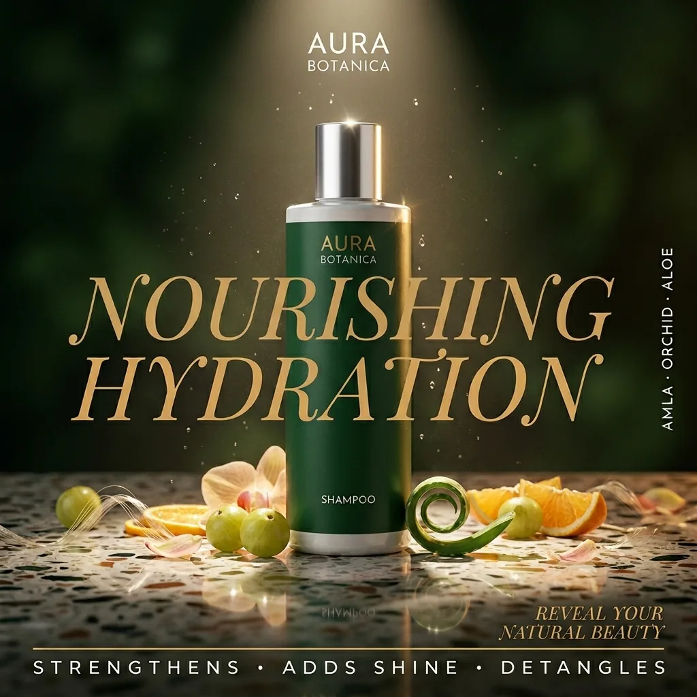

**#21 · Product &amp; Brand Prompt · <code>Vinano Image Pro</code>**

<details>
<summary>Show prompt</summary>

```
Hyper-realistic luxury product campaign poster, 1:1 square format. brand name shampoo bottle standing centered on surface — marble / wood / ice / terrazzo / granite. Background: background — forest bokeh / white infinity / tropical foliage / arctic gradient / violet void. Foreground: ingredients — amla berries / orchid bloom / ice crystals / citrus slices / silk threads scattered naturally around bottle base. Bottle surface hyper-detailed — brand logo catching single overhead spotlight as sharp specular highlight, label color rich and saturated, cap gleaming. Bottle casting natural shadow on surface below, surface reflection of bottle visible beneath.
Fine atmosphere — morning mist / water droplets / dry ice fog / golden dust particles suspended around bottle catching the light. Single hero ingredient — aloe curl / rose petal / keratin oil spill / white gardenia resting against bottle base. Everything arranged as if placed by nature not a stylist.
Typography: top center — “brand name” in 10px Josefin Sans tracked white caps letter-spacing 8px. Center left — large Playfair Display italic stacked headline: “line 1” and “line 2” — 56px white, second line in accent color. Bottom — thin accent color horizontal rule full width. Below rule — “key benefit · key benefit · key benefit” in 8px tracked white caps. Bottom right — “brand tagline” in 9px Cormorant Garamond italic accent color. Right edge vertical — “ingredient · ingredient · ingredient” in 7px white caps rotated 90 degrees.
Lighting: lighting direction — single hard overhead spotlight / soft diffused morning light / cold clinical blue-white / warm golden side light, strong specular on bottle logo and cap, mood light — warm amber fill / cold blue ambient / tropical bright / pure white wrap. Mood: mood — indian home warmth / clinical confidence / tropical joy / salon authority / pure minimalism. Shot on Hasselblad H6D, 85mm anamorphic macro, shallow DOF, palette color bokeh, HDR, luxury haircare campaign, 1:1 square format.

Emphasise material texture and natural light so the final frame feels tactile and premium.
```

</details>

---

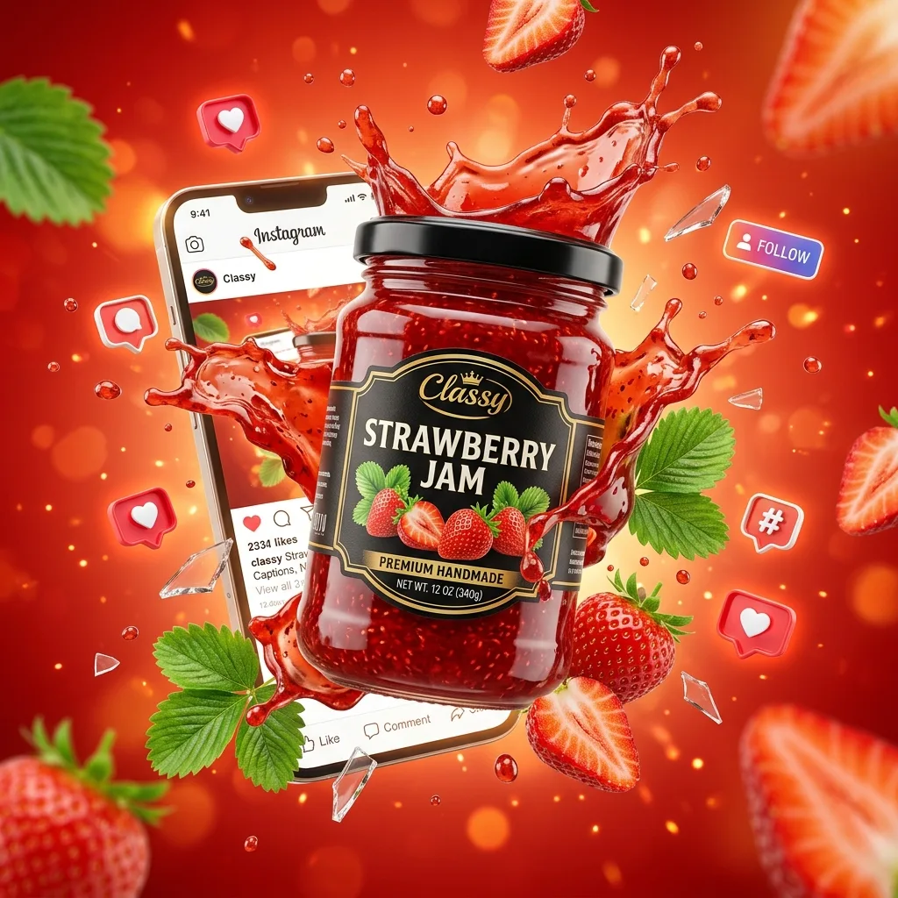

**#22 · Product &amp; Brand Prompt · <code>Vinano Image Pro</code>**

<details>
<summary>Show prompt</summary>

```
Ultra-realistic commercial food product advertising scene featuring a glass jar labeled "Classy Strawberry Jam" floating dynamically in mid-air. The jar is filled glossy vibrant red strawberry jam and has a black lid a premium black label showing fresh strawberries and the Classy brand logo clearly visible. Surrounding the jar are splashes of thick strawberry jam bursting outward in dramatic fluid motion, droplets and shards of transparent glass frozen mid-air. Fresh whole strawberries, sliced strawberries, and green strawberry leaves float around the product to emphasize freshness. Behind the jar is a large smartphone screen displaying a social media post layout, suggesting an Instagram-style interface, symbolizing viral promotion. Floating around the composition are social media icons such as hearts, likes, comment bubbles, and hashtag symbols to represent online engagement. The background is a vibrant red-orange gradient glowing highlights that enhance the energetic advertising feel. Cinematic studio lighting highlights the glossy texture of the jam, reflective glass jar, and dynamic splashes. High-end commercial advertising style, macro product photography, ultra-detailed textures, shallow depth of field, true-to-life photorealistic, 8K resolution. Aim for an editorial, design-driven look with deliberate negative space.
```

</details>

---

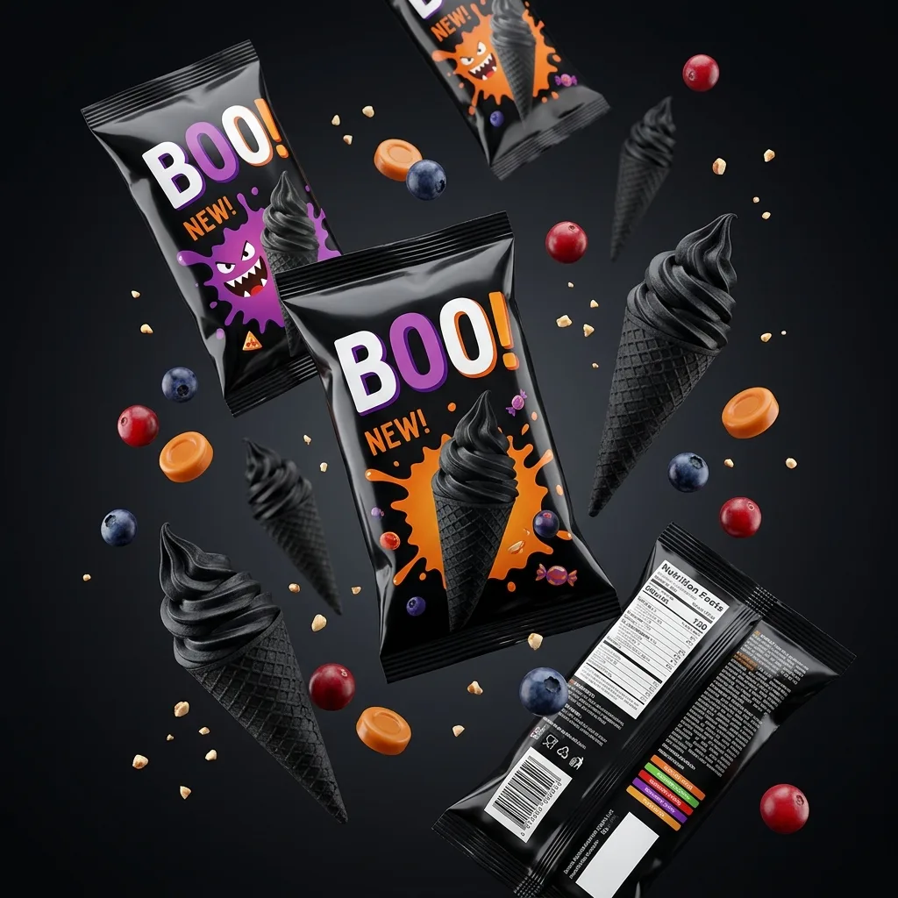

**#23 · Product &amp; Brand Prompt · <code>Vinano Image Pro</code>**

<details>
<summary>Show prompt</summary>

```
{
 "image_type": "commercial product advertisement",
 "resolution_target": "8K",
 "aspect_ratio": "3:4",
 "orientation": "vertical",

 "scene": {
 "environment": "studio product photography",
 "background": {
 "color": "dark charcoal to black gradient",
 "texture": "smooth matte",
 "lighting_falloff": "soft radial gradient toward center"
 }
 },

 "composition": {
 "style": "floating product arrangement",
 "depth": "multi-layer depth foreground, midground, background objects",
 "camera_angle": "slightly top-down perspective",
 "camera_distance": "medium close-up",
 "focus": "sharp focus on central package, slightly softer on background elements",
 "visual_flow": "diagonal downward flow from top-left to bottom-right"
 },

 "primary_objects": [{
 "object_type": "snack_package",
 "brand_text": "BOO!",
 "position": "upper center",
 "orientation": "tilted slightly upward left-to-right",
 "packaging_color": "black glossy plastic",
 "text_details": {
 "main_text": "BOO!",
 "font_style": "bold sans-serif",
 "text_colors": ["white", "purple", "orange"],
 "secondary_text": "NEW!",
 "language": "Cyrillic"
 },
 "graphics": ["cartoon monster face triangular teeth",
 "paint splash graphic in purple",
 "ice cream cone illustration black swirl"]
 },

 {
 "object_type": "snack_package",
 "brand_text": "BOO!",
 "position": "center",
 "orientation": "slightly angled",
 "packaging_color": "black glossy plastic",
 "text_details": {
 "main_text": "BOO!",
 "secondary_text": "NEW!",
 "accent_color": "orange"
 },
 "graphics": ["orange paint splash",
 "black ice cream cone graphic",
 "small candy illustrations"]
 },

 {
 "object_type": "snack_package",
 "brand_text": "BOO!",
 "position": "bottom",
 "orientation": "back side facing camera",
 "packaging_color": "black glossy plastic",
 "visible_elements": ["nutrition text block",
 "barcode",
 "multicolor ingredient indicator bars"]
 }],

 "secondary_objects": [{
 "object_type": "ice_cream_cone",
 "color": "black",
 "texture": "waffle cone pattern",
 "ice_cream": "black soft swirl",
 "positions": ["right side near center",
 "bottom left",
 "background scattered"]
 },

 {
 "object_type": "berries",
 "colors": ["red", "dark blue"],
 "shape": "small spherical",
 "positions": "floating around packages"
 },

 {
 "object_type": "caramel_candy",
 "shape": "round flat candy discs",
 "color": "orange caramel",
 "positions": "floating mid-scene"
 },

 {
 "object_type": "nut_fragments",
 "color": "light beige",
 "size": "small crumb particles",
 "distribution": "scattered floating around scene"
 }],

 "lighting": {
 "type": "studio lighting",
 "key_light": "soft directional light from upper left",
 "fill_light": "soft ambient fill",
 "rim_light": "subtle edge highlight on packaging",
 "reflections": "visible glossy reflections on plastic packaging",
 "shadows": "soft shadows beneath floating objects"
 },

 "materials": {
 "packaging": "glossy plastic",
 "cone": "matte waffle texture",
 "berries": "smooth slightly reflective skin",
 "candies": "semi-gloss caramel surface"
 },

 "color_palette": {
 "dominant": ["black", "dark gray"],
 "accent": ["orange", "purple", "red", "blue"],
 "highlight": ["white"]
 },

 "motion_effect": {
 "style": "frozen motion",
 "objects": "packages, cones, candies appear suspended mid-air",
 "particle_effect": "small crumbs floating"
 },

 "render_quality": {
 "detail_level": "ultra high detail",
 "sharpness": "crisp edges",
 "noise": "none",
 "texture_detail": "high fidelity",
 "realism": "true-to-life photorealistic commercial product render"
 }
}

Maintain consistent colour harmony and crisp focus across the whole frame.
```

</details>

---

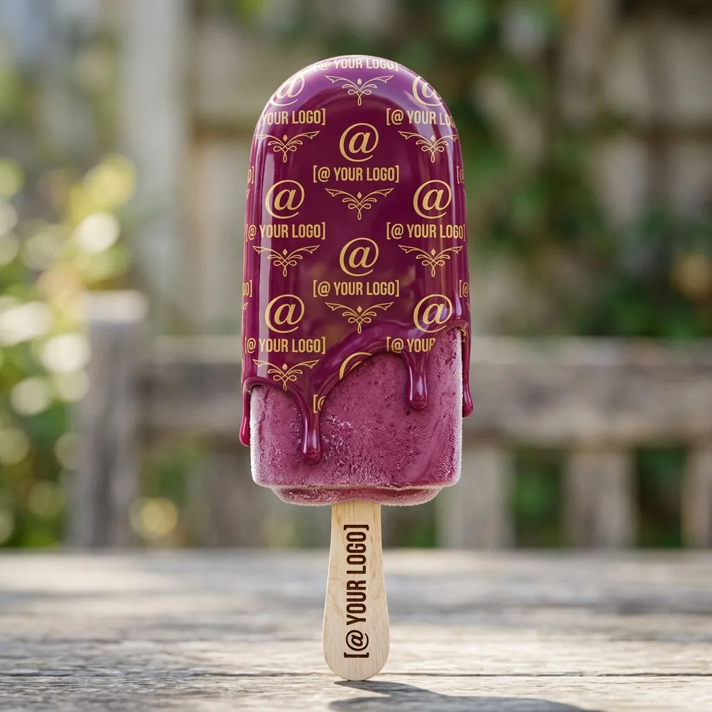

**#24 · Product &amp; Brand Prompt · <code>Vinano Image Pro</code>**

<details>
<summary>Show prompt</summary>

```
A perfectly vertical, hyper-realistic 3D popsicle by [@ YOUR LOGO] featuring a glossy signature-colored glaze a gold logo pattern dripping over the visible matte ice cream texture at the base. The stick features the brand's logo. Preserve realistic proportions and depth for a confident, professional finish.
```

</details>

---

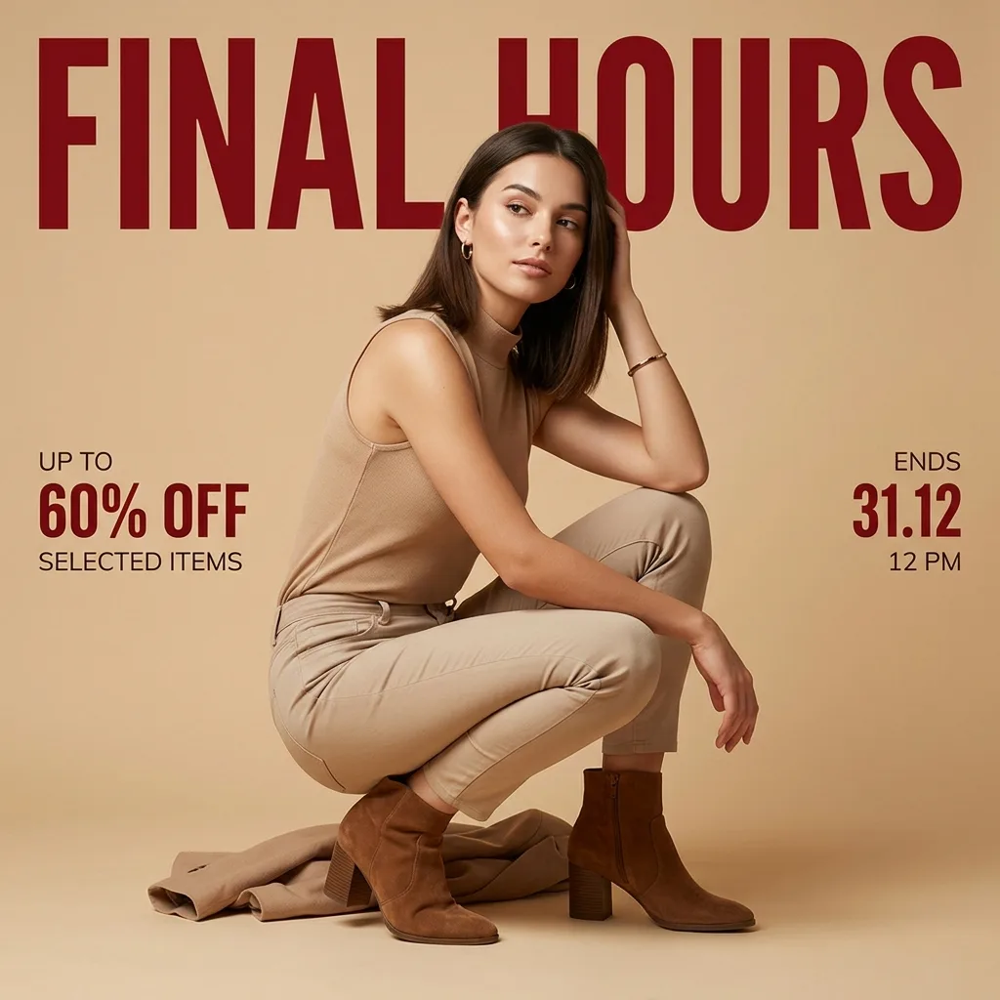

**#25 · Product &amp; Brand Prompt · <code>Vinano Image Pro</code>**

<details>
<summary>Show prompt</summary>

```
Ultra-realistic fashion advertisement poster, refined minimalist editorial style.
Background: solid warm beige studio backdrop soft gradient lighting, smooth clean texture.
Main subject: a stylish young woman in a low squat pose, body slightly turned sideways, one arm resting on knee, other hand touching back of head. Expression calm, confident, slightly looking sideways (not directly at camera).
Outfit (keep EXACT):
Sleeveless beige/tan high-neck top
Slim beige pants
Brown suede ankle boots block heels
Light brown jacket placed casually near her feet
Minimal accessories: small hoop earrings, thin bracelet
Hair: straight, shoulder-length, natural dark brown, side-parted
Makeup: soft natural tones, clean skin, subtle glow
⚠️ Face: [REPLACE FACE PROVIDED IMAGE / KEEP FACE GENERIC IF NOT PROVIDED]
(ensure seamless blending, same lighting, same skin tone, hyper-realistic)
Typography & Layout (EXACT SAME STYLE)
Top: Large bold condensed sans-serif text in dark red: FINAL HOURS (very large, stretched across width, behind subject partially)
Left side: Small text: UP TO
60% OFF
SELECTED ITEMS
Right side: ENDS
31.12
12 PM
Bottom: ⚠️ NO WEBSITE TEXT (REMOVE COMPLETELY)
Lighting & Style
Soft studio lighting, warm tone
Subtle shadows under subject
Clean editorial magazine look
Slight depth but mostly flat poster style
Matte finish, no gloss
Perfect alignment, balanced spacing

Render with rich micro-detail while keeping the layout uncluttered and intentional.
```

</details>

---

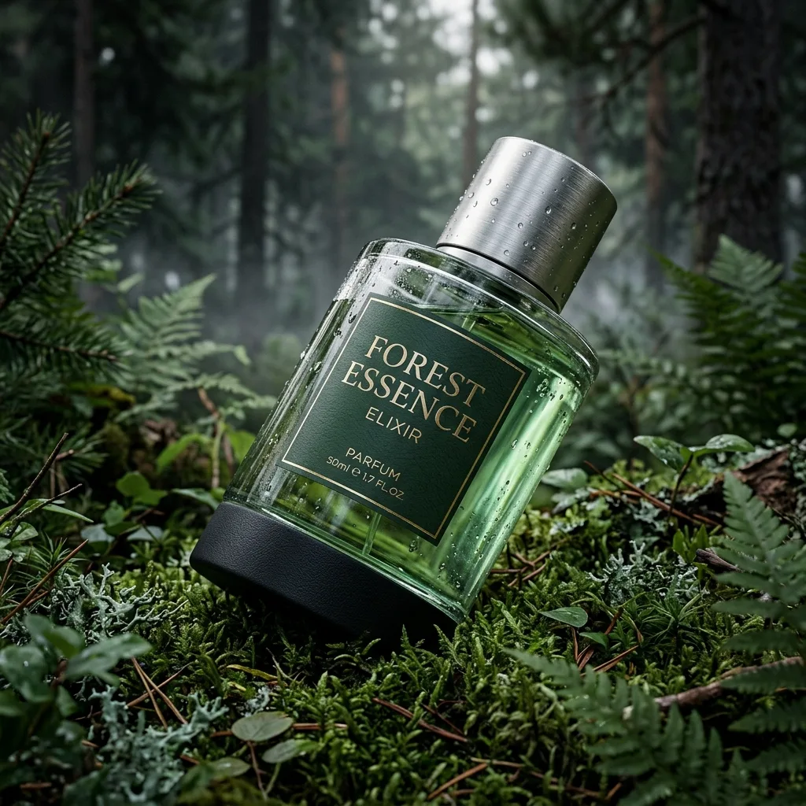

**#26 · Product &amp; Brand Prompt · <code>Vinano Image Pro</code>**

<details>
<summary>Show prompt</summary>

```
Ultra-realistic premium fragrance product shot of a perfume bottle (Forest Essence Elixir), positioned at a (low macro angled shot) resting diagonally on lush (deep green moss surface in a forest setting), cylindrical design a transparent glass center revealing green-tinted liquid, textured (matte black base) and brushed (metallic silver cap) visible condensation droplets, surrounded by dense (forest foliage and pine branches) softly framing the scene, subtle (morning mist Preserve realistic proportions and depth for a confident, professional finish.
```

</details>

---

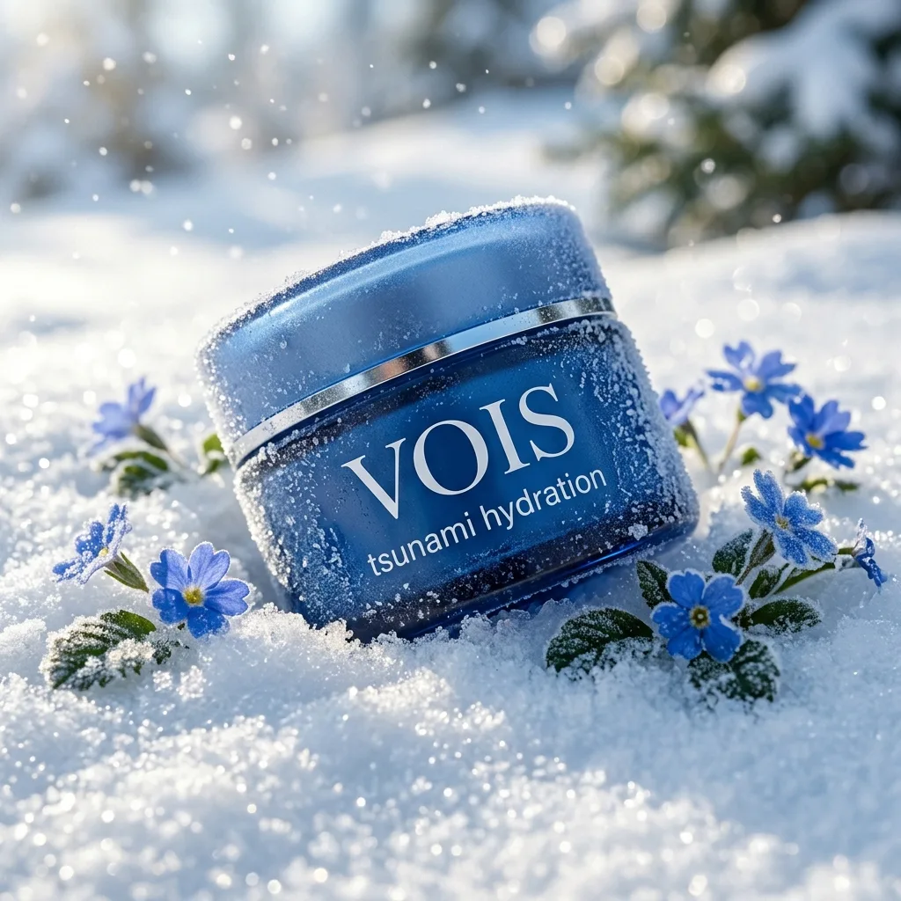

**#27 · Product &amp; Brand Prompt · <code>Vinano Image Pro</code>**

<details>
<summary>Show prompt</summary>

```
{
 "type": "true-to-life photorealistic skincare product photography",
 "product": {
 "name": "VOIS – tsunami hydration",
 "container": "blue cosmetic cream jar",
 "position": "diagonally placed and partially embedded in fresh white snow",
 "details": "light hoarfrost and frozen condensation crystals on the jar surface"
 },
 "scene": {
 "environment": "soft powdery snow sparkling ice crystals",
 "elements": "small blue primrose flowers green leaves scattered around, some partially buried",
 "background": "clean minimal snowy bokeh cold airy atmosphere"
 },
 "lighting": "bright winter side sunlight creating crisp highlights and soft natural shadows",
 "camera": {
 "lens": "85mm macro",
 "aperture": "f/2.8",
 "iso": 100,
 "depth_of_field": "shallow"
 },
 "style": "premium commercial skincare advertisement, cinematic macro composition",
 "quality": "ultra-detailed, true-to-life photorealistic, 8K",
 "constraints": ["no people", "no text overlays", "minimal background"]
}

Keep edges clean and the overall composition balanced for a polished, gallery-ready result.
```

</details>

---

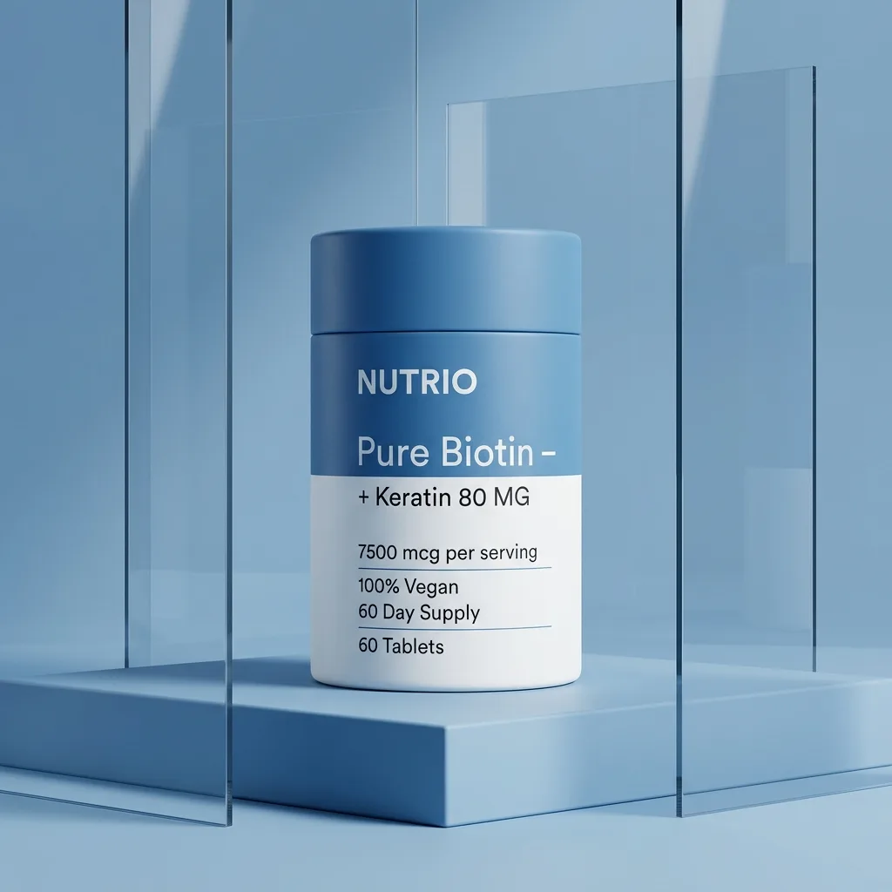

**#28 · Product &amp; Brand Prompt · <code>Vinano Image Pro</code>**

<details>
<summary>Show prompt</summary>

```
Ultra-realistic refined minimalist product photography featuring a cylindrical supplement container labeled “NUTRIO Pure Biotin – + Keratin 80 MG – 7500 mcg per serving – 100% Vegan – 60 Day Supply – 60 Tablets”. The container has a matte blue lid and upper section a clean white lower label. The product is centered in a monochromatic soft blue studio environment, surrounded by thin vertical transparent acrylic glass panels that create subtle reflections and layered depth. The container sits on a smooth geometric platform crisp edges, maintaining a balanced modern composition. Lighting is soft premium studio lighting from the upper left, producing gentle shadows, realistic reflections on the acrylic panels, and smooth gradients across the matte packaging surface. The background remains minimal and monochromatic to emphasize the product. Clean pharmaceutical advertising aesthetic, precise geometry, true-to-life photorealistic textures, shallow depth of field, ultra-detailed 8K commercial product photography Keep edges clean and the overall composition balanced for a polished, gallery-ready result.
```

</details>

---

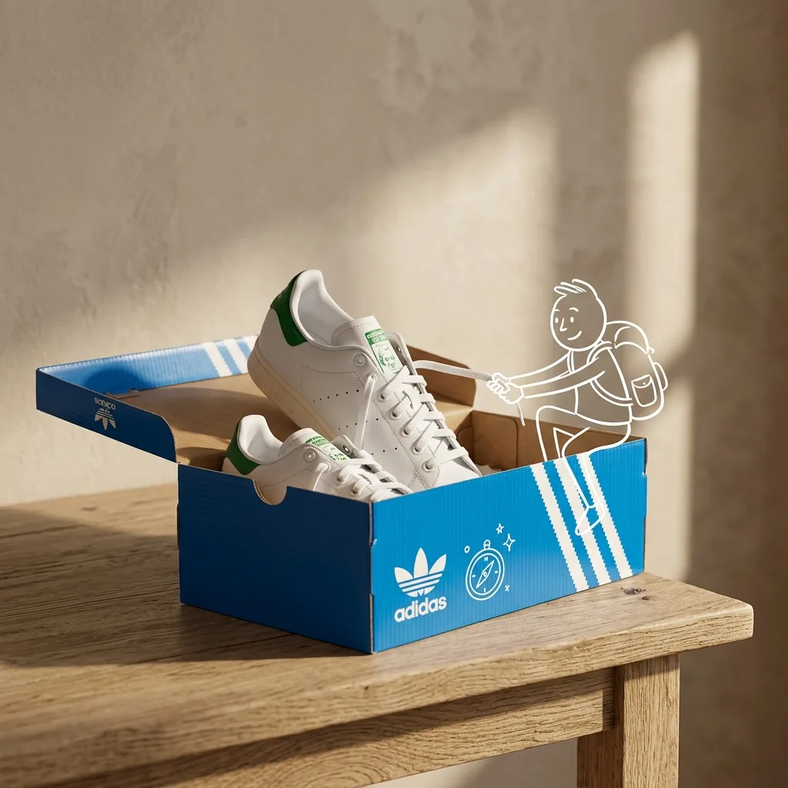

**#29 · Product &amp; Brand Prompt · <code>Vinano Image Pro</code>**

<details>
<summary>Show prompt</summary>

```
Adidas sneakers in the box, refined minimalist product photography, clean warm studio scene, textured beige wall in the background, soft directional
sunlight creating long shadows, simple table surface, the product placed in a playful conceptual composition,overlaid a hand-drawn white outline doodle
[character] interacting the product, mixed media
style combining real photography and sketch illustration, premium branding feel, shallow depth of field, ultra-realistic, no extra text, no watermarks, 8K,
1:1.

Maintain consistent colour harmony and crisp focus across the whole frame.
```

</details>

---

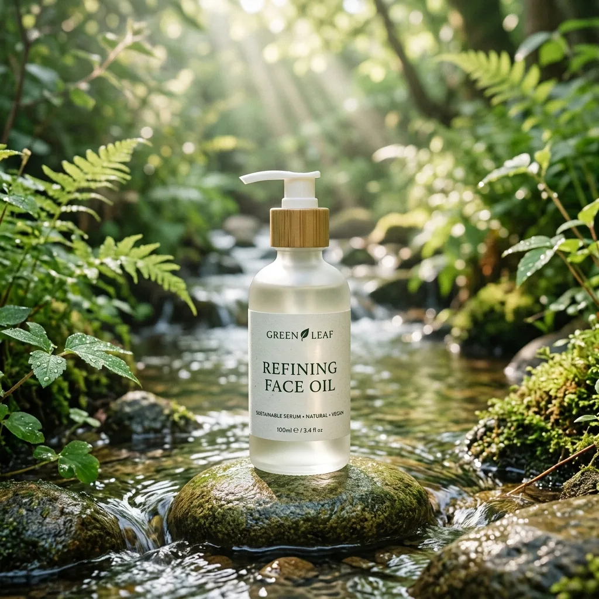

**#30 · Product &amp; Brand Prompt · <code>Vinano Image Pro</code>**

<details>
<summary>Show prompt</summary>

```
Eco-Friendly Skincare Product “refined minimalist skincare bottle made of frosted glass, placed in a serene natural setting flowing water, green leaves, and soft sunlight rays, clean aesthetic inspired by The Body Shop, sustainability-focused branding, soft pastel tones, high-end product photography, calm and pure atmosphere” Preserve realistic proportions and depth for a confident, professional finish.
```

</details>

---


**#31 · Product &amp; Brand Prompt · <code>Vinano Image Pro</code>**

<details>
<summary>Show prompt</summary>

```
创建一张最终图像。

在4:5总格式内创建清晰的3×3网格故事板，包含九个等比例面板。

使用参考图像作为产品基础。在所有九个面板中保持完全相同的产品、包装设计、品牌、材料、颜色、比例和整体身份。产品在每一帧都应清晰可识别。标签、logo和比例必须完全一致。

这是品牌组合的高端模型展示。重点在形式、构图、材质和视觉节奏，而非现实感或生活方式叙事。结果应感觉精心策划、编辑性强且设计导向。

第1帧:
产品的英雄正面特写，干净的工作室环境。中性背景，均衡构图，平静安全的产品呈现。

第2帧:
特写镜头，焦点聚集在产品中部。突出表面纹理、材料和印刷细节。

第3帧:
参考产品置于与品牌和产品类别自然契合的环境中。工作室场景受产品设计元素和颜色启发。

第4帧:
产品以使用或交互方式展示，中性工作室背景。手和交互元素最少且低调，保持包装风格。

第5帧:
等距构图展示多个产品，从等距俯视角精确几何排列。所有产品采用相同等距角度，均匀间距，干净结构化且图形化。

第6帧:
产品轻微悬浮，倾斜于与参考图像调色板相匹配的中性背景。浮动位置刻意而自然。

第7帧:
极近特写，聚焦标签、边缘、纹理或材料特性的具体细节。

第8帧:
产品置于出人意料但美学强大的环境，大胆编辑视觉冲击力强。意外但高度风格化的场景，工作室基调设计驱动。强势构图提升品牌。

第9帧:
宽幅构图展示产品在精致设计场景中的使用。道具干净，造型受控一致。

摄影与风格:
超高质量工作室图像，呈现真实相机外观。每帧不同角度和构图。受控景深、精确照明、逼真材质和反射。照明逻辑、调色板、氛围和视觉语言在九个面板中保持一致，形成统一系列。

输出:
无边框、无文字、无字幕、无水印的清晰3×3网格。

强调材质质感与自然光影，让画面更具高级真实感。
```

</details>

---

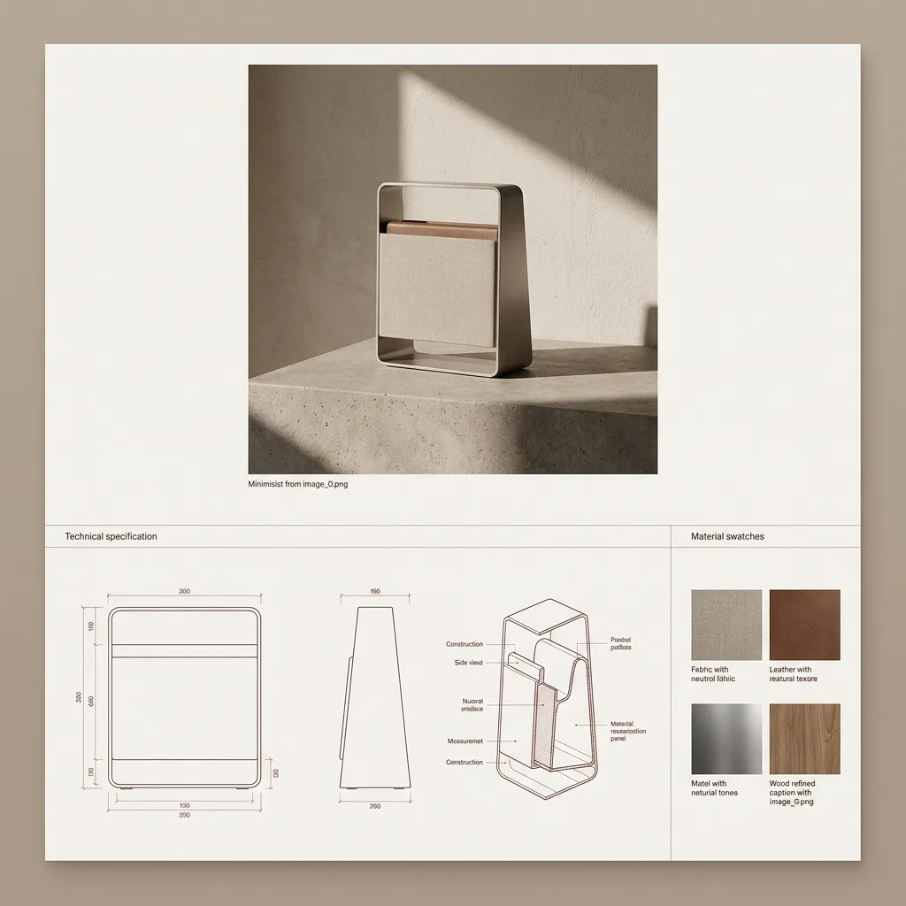

**#32 · Product &amp; Brand Prompt · <code>Vinano Image Pro</code>**

<details>
<summary>Show prompt</summary>

```
{
 "reference_images": {
 "product_image": "UPLOADED_IMAGE",
 "usage_rule": "Use the uploaded image as the exact visual reference for the product’s form, proportions, materials, and overall identity. Do not redesign or reinterpret the product."
 },

 "layout": {
 "canvas": {
 "orientation": "vertical",
 "aspect_ratio": "3:4",
 "background": "warm neutral paper-like surface"
 },
 "structure": {
 "top_section": "lifestyle_hero",
 "bottom_section": "technical_specification"
 }
 },

 "top_section": {
 "type": "lifestyle_product_image",
 "composition": {
 "placement": "top_center",
 "scale": "dominant",
 "margin": "generous whitespace around product"
 },
 "environment": {
 "setting": "minimal architectural interior",
 "lighting": {
 "type": "natural sunlight",
 "direction": "angled side light",
 "quality": "soft but high-contrast shadows"
 },
 "floor": "subtle concrete or stone surface",
 "background": "textured plaster wall"
 },
 "rendering": {
 "style": "editorial lifestyle photography",
 "detail": "high realism",
 "color_grading": "warm, muted, premium"
 }
 },

 "bottom_section": {
 "type": "technical_specification_panel",
 "layout": {
 "grid": "modular",
 "alignment": "clean, architectural"
 },

 "technical_drawings": {
 "placement": "bottom_left_and_center",
 "style": "architectural line drawings",
 "views": ["front view",
 "side view",
 "three-quarter cutaway or profile view"],
 "projection": "orthographic",
 "line_style": {
 "color": "muted red or sepia",
 "weight": "fine technical lines"
 },
 "annotations": {
 "type": "measurement and construction callouts",
 "language": "neutral technical labels",
 "density": "minimal, editorial"
 }
 },

 "materials_panel": {
 "placement": "bottom_right",
 "content": {
 "type": "material_swatches",
 "count": "3-4 depending on product",
 "format": "square or rectangular samples"
 },
 "textures": {
 "source": "derived from the product materials",
 "examples": ["fabric",
 "leather",
 "metal",
 "wood",
 "plastic"]
 },
 "labels": {
 "style": "small editorial captions",
 "tone": "technical but refined"
 }
 }
 },

 "typography": {
 "style": "minimal editorial",
 "usage": "subtle captions, no large headlines",
 "color": "soft black or dark brown"
 },

 "overall_style": {
 "mood": "design catalog / product design journal",
 "aesthetic": "architectural, premium, calm",
 "avoid": ["clutter",
 "bold colors",
 "heavy branding",
 "overly decorative graphics"]
 },

 "constraints": {
 "do_not": ["change product design",
 "invent new materials",
 "add logos unless present in reference",
 "use perspective distortion in drawings"]
 }
}

Maintain consistent colour harmony and crisp focus across the whole frame.
```

</details>

---

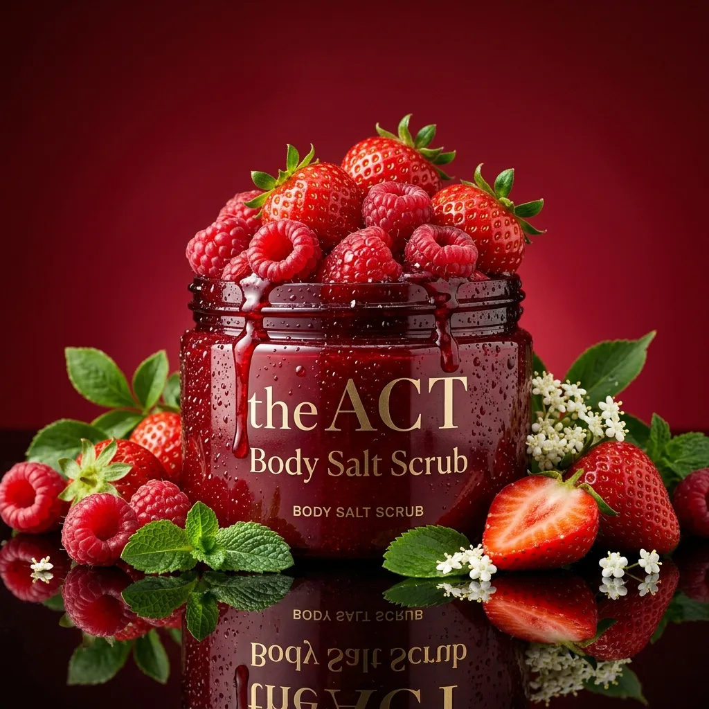

**#33 · Product &amp; Brand Prompt · <code>Vinano Image Pro</code>**

<details>
<summary>Show prompt</summary>

```
Ultra-realistic luxury cosmetic product photography of a deep red glass jar labeled “the ACT Body Salt Scrub”, placed on a glossy reflective black surface. The jar is open and overflowing fresh strawberries and raspberries, berry juice dripping over the rim. Water droplets cover the jar creating a fresh, dewy look. Around the jar are scattered raspberries, strawberries, green leaves, and small white flowers. Background is a smooth gradient rich crimson red studio backdrop. Dramatic studio lighting, soft highlights, sharp macro detail, commercial beauty product advertisement style, high contrast, extremely detailed textures, 8k resolution, shallow depth of field, true-to-life photorealistic, luxury skincare branding, centered composition. Keep edges clean and the overall composition balanced for a polished, gallery-ready result.
```

</details>

---

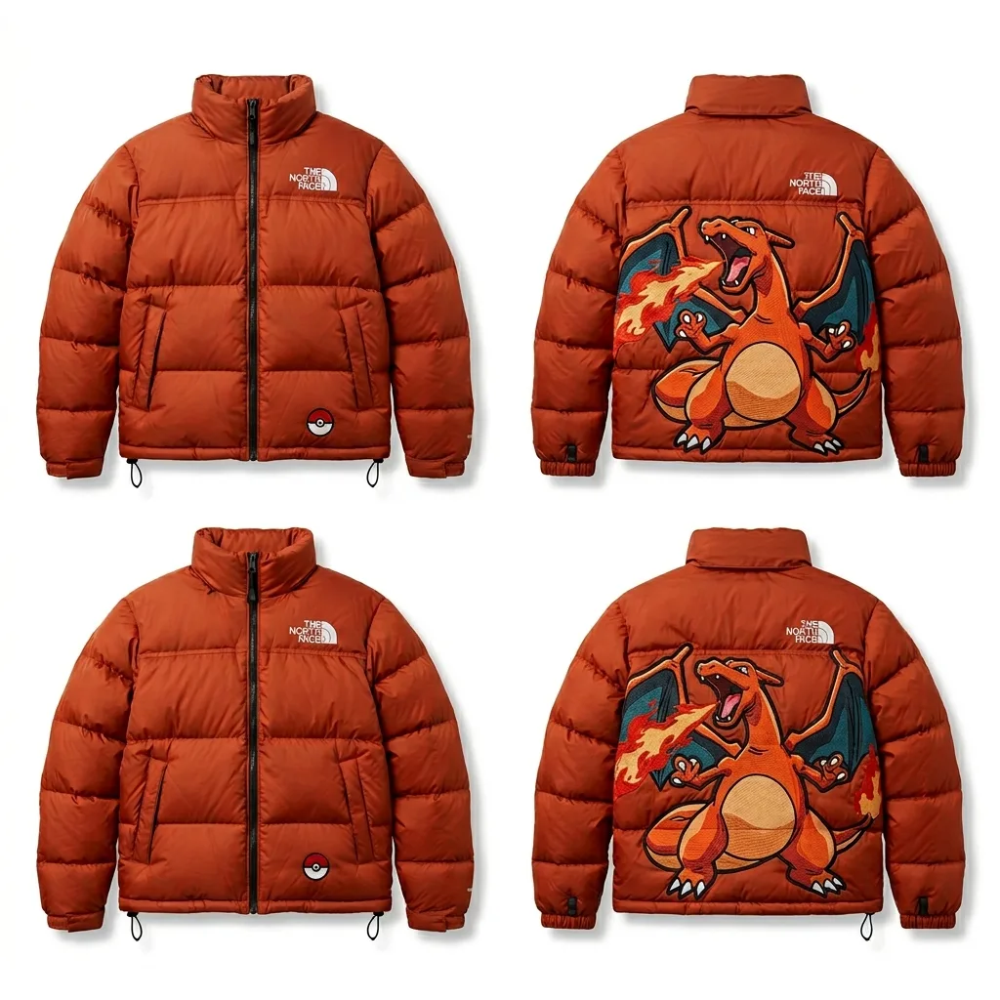

**#34 · Product &amp; Brand Prompt · <code>Vinano Image Pro</code>**

<details>
<summary>Show prompt</summary>

```
High-end editorial product shot of a custom The North Face Nuptse 700 puffer jacket inspired by [POKEMON].
The jacket’s primary colorway automatically derives from [POKEMON]’s dominant palette (main body color as base tone, secondary accents used sparingly for contrast), translated into premium, wearable hues — never cartoonish, always fashion-forward.
A large-scale embroidered [POKEMON] artwork dominates the back panel, adapted to the jacket’s quilted structure.
Embroidery style reflects [POKEMON]’s core identity:

aggressive Pokémon → bold stitch density, sharp contours
elegant or mystical Pokémon → flowing lines, layered thread gradients

armored or mechanical Pokémon → heavy, structured embroidery tactile depth

The front of the jacket remains minimal and restrained:
clean TNF logo, subtle Poké Ball patch, no additional graphics.

Material realism is critical: visible fabric sheen, natural puff volume, precise seam alignment, embroidery threads sitting slightly raised from the nylon surface.

Shot in a Japanese fashion magazine product layout, pure white background.
Front and back views presented together, jacket floating upright, perfectly centered.
Lighting is clean, studio-soft controlled contrast to emphasize texture and craftsmanship.

Mood: luxury streetwear meets collectible archive piece.
No model. No props. No distractions.
Ultra-sharp focus, high resolution, editorial polish, timeless design.

Maintain consistent colour harmony and crisp focus across the whole frame.
```

</details>

---

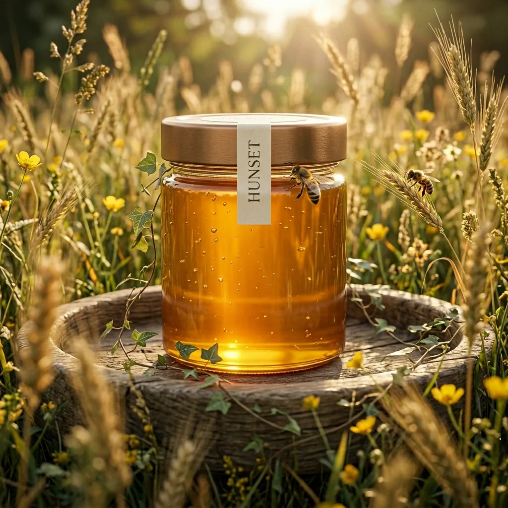

**#35 · Product &amp; Brand Prompt · <code>Vinano Image Pro</code>**

<details>
<summary>Show prompt</summary>

```
Ultra-realistic cinematic product shot of a premium honey jar placed inside a shallow wooden hollow surrounded by tall wild wheat and tiny yellow meadow flowers, captured from an intimate low-angle macro perspective slight cinematic depth, transparent glass jar filled luminous deep golden honey, topped a satin bronze metallic lid and a narrow cream seal strip crossing vertically over the cap, minimal luxury label reading “HUNSET”, jar lightly touched by thin climbing ivy strands for a refined organic detail, one realistic honeybee hovering near the front glass surface while another rests on a wheat stem behind the jar, environment set in a quiet countryside field during late afternoon, warm sunlight filtering through wheat stalks from behind creating glowing translucency inside the honey and soft halo edges around the jar, foreground blurred wheat tips and soft natural bokeh, distant background fading into creamy green and amber tones, shallow depth of field extreme sharpness on jar textures, visible honey thickness, subtle glass reflections, detailed plant fibers and pollen particles in air, cinematic luxury advertising mood, shot on 90mm macro lens, f/2.2, ultra-detailed natural textures, premium organic brand campaign style, 8k resolution, no text, no watermark. Render with rich micro-detail while keeping the layout uncluttered and intentional.
```

</details>

---

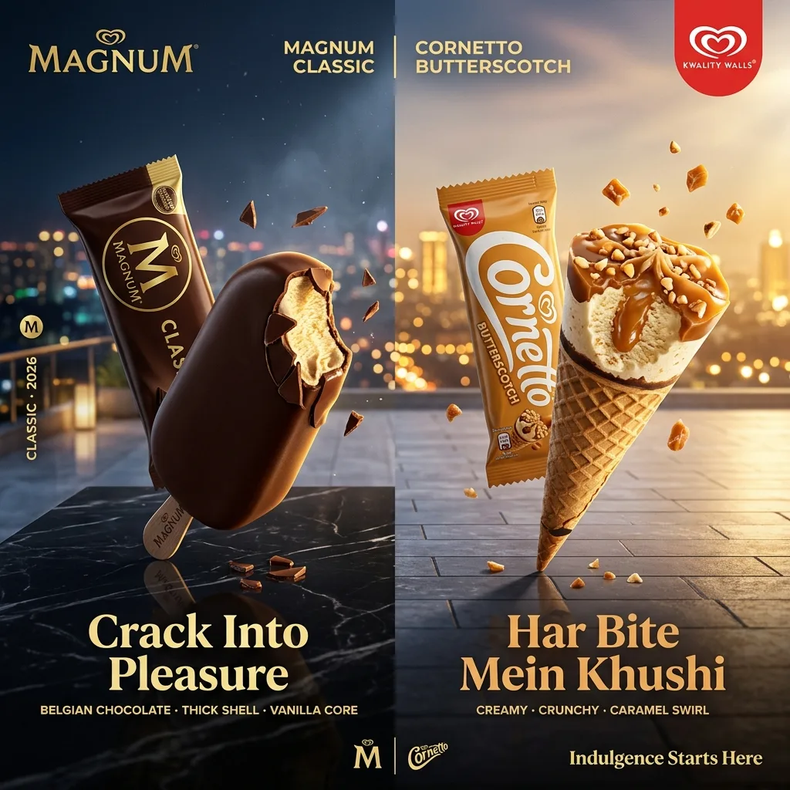

**#36 · Product &amp; Brand Prompt · <code>Vinano Image Pro</code>**

<details>
<summary>Show prompt</summary>

```
Hyper-realistic professional FMCG ice cream commercial ad poster. Magnum Classic in dark chocolate brown featuring dual composition: one sealed Magnum wrapper and one bitten ice cream bar, arranged on a polished black marble surface.

Background: a luxurious night-time rooftop setting overlooking a blurred city skyline golden lights bokeh, evoking exclusivity and indulgence.
Cool night air subtle drifting mist.

The sealed pack positioned slightly behind at a refined angle, gold branding catching ambient city light.
The opened Magnum bar in front a bite taken out, chocolate shell cracking dramatically revealing creamy vanilla core.

The product hyper-detailed — sharp chocolate fracture edges catching warm golden highlights, molten interior texture visible, slight melting at edges, reflection visible on marble surface below.

Floating micro chocolate shards suspended mid-air.

Composition: bitten bar dominates foreground, packaging secondary, cinematic negative space blending into city lights.

Typography:
top left — Magnum logo gold.
center — “MAGNUM CLASSIC”.
bottom left — “Crack Into Pleasure”.
below — “BELGIAN CHOCOLATE · THICK SHELL · VANILLA CORE”.
bottom right — “Indulgence Starts Here”.
thin separator.
bottom center — “ m
left vertical — “CLASSIC · 2026”.

Lighting: mixed lighting — soft city glow + warm rim light enhancing chocolate gloss, deep cinematic contrast.

Mood: sensual, luxurious, late-night indulgence.

Shot on ARRI Alexa Mini LF, 100mm macro, shallow DOF, HDR, ultra true-to-life photorealistic, cinematic FMCG poster, 4:5 portrait.

Hyper-realistic professional FMCG ice cream commercial ad poster. Kwality Walls Cornetto Butterscotch featuring dual composition: one sealed Cornetto pack and one open cone a bite taken out, arranged on a slightly reflective street-side surface.

Background: vibrant Indian summer street scene during golden hour, soft-focus silhouettes of people, colorful stalls, and warm festive tones.
Warm sunlight haze floating dust particles.

The sealed pack positioned upright behind, branding clearly visible.
The open cone in front a bite exposing creamy caramel core and crunchy layers.

The product hyper-detailed — crisp waffle cone, glossy caramel ribbons catching sunlight, slight melting edges, reflection visible below.

Floating caramel bits and nut fragments mid-air.

Composition: dynamic and lively, cone hero foreground, background adds cultural warmth without distraction.

Typography:
top left — Kwality Walls logo.
center — “CORNETTO BUTTERSCOTCH”.
bottom left — “Har Bite Mein Khushi”.
below — “CREAMY · CRUNCHY · CARAMEL SWIRL”.
bottom right — “Taste the Joy”.
thin separator.
bottom center — “
left vertical — “CORNETTO · 2026”.

Lighting: natural golden sunlight, warm highlights, soft shadows, slight lens flare.

Mood: joyful, nostalgic, everyday happiness.

Shot on ARRI Alexa Mini LF, 50mm, shallow DOF, HDR, vibrant FMCG ad poster.

Aim for an editorial, design-driven look with deliberate negative space.
```

</details>

---

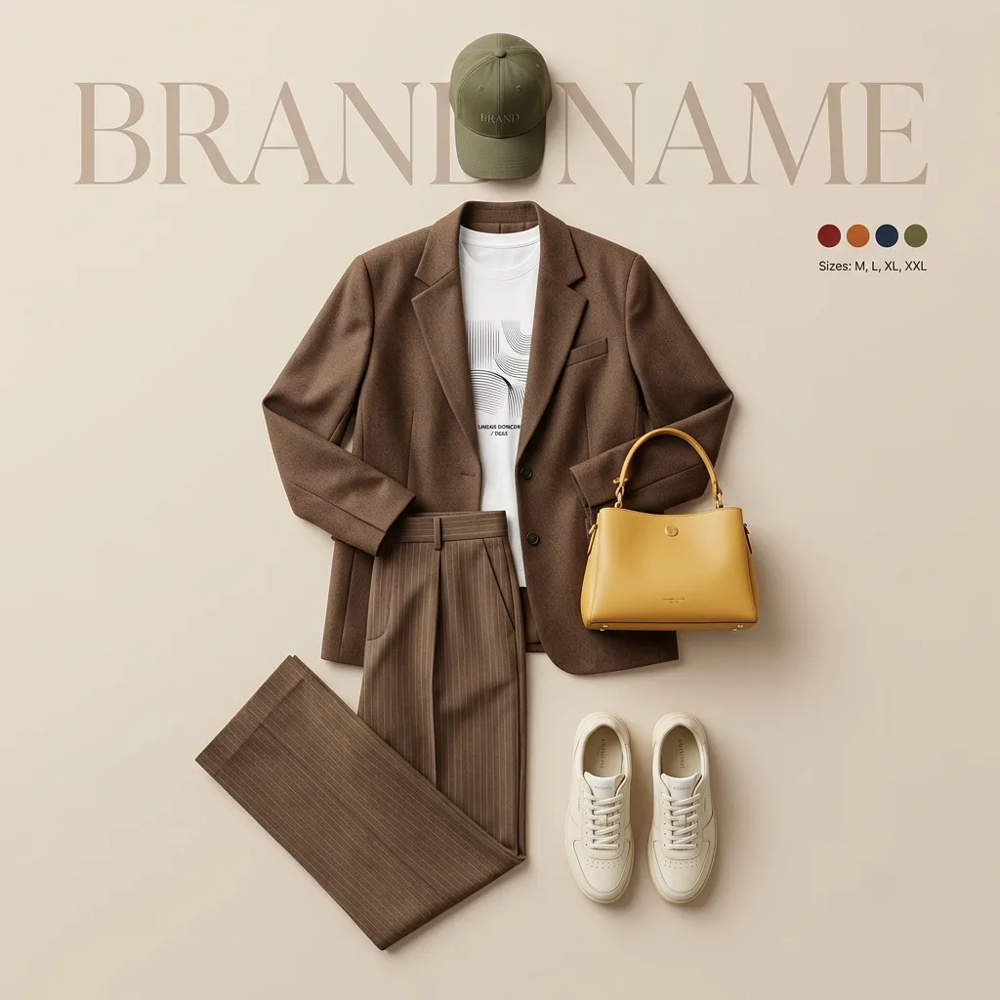

**#37 · Product &amp; Brand Prompt · <code>Vinano Image Pro</code>**

<details>
<summary>Show prompt</summary>

```
Create a premium fashion catalog flat lay on a clean soft beige studio background.
Only show the outfit items, arranged neatly as if for an ecommerce product display.

Items included: • Brown oversized blazer
• White graphic t-shirt
• Brown pinstripe wide-leg trousers
• Olive green cap
• Cream sneakers
• Yellow designer handbag

Arrange the clothing in a clean aesthetic flat-lay composition so it looks like the outfit is worn but without any person or mannequin. Each item must be perfectly isolated and clearly visible realistic folds and shadows. The layout should look professional and balanced like a luxury fashion brand product catalog.

Lighting: soft studio lighting, minimal shadows, ultra sharp details, high fashion editorial style, 4K quality.

Add a large stylish bold text in the background behind the outfit: BRAND NAME

Typography should be modern, elegant and slightly faded so it looks like a branding element of the catalog.

Add a small product info section on one side: Sizes: M, L, XL, XXL

Next to it place small circular color indicators showing available colors: Red, Orange, Blue, Green

Important requirements: • No person
• No character
• No mannequin
• Only clothes and accessories
• Clean catalog layout
• Ultra detailed fabric texture
• Professional ecommerce product presentation

Aim for an editorial, design-driven look with deliberate negative space.
```

</details>

---


**#38 · Product &amp; Brand Prompt · <code>Vinano Image Pro</code>**

<details>
<summary>Show prompt</summary>

```
{
  "prompt_type": "viral_makeup_product_visual",
  "scene": "ASMR-style product texture showcase",
  "products": ["cream blush being swirled spatula",
    "foundation drops merging smoothly"],
  "details": {
    "texture_focus": "creamy, buttery, ultra-smooth consistency",
    "lighting": "soft diffused lighting",
    "color_theme": "nude, peach, soft rose"
  },
  "mood": "satisfying, calming, premium",
  "camera": "extreme macro shot",
  "background": "clean pastel surface"
}

Aim for an editorial, design-driven look with deliberate negative space.
```

</details>

---

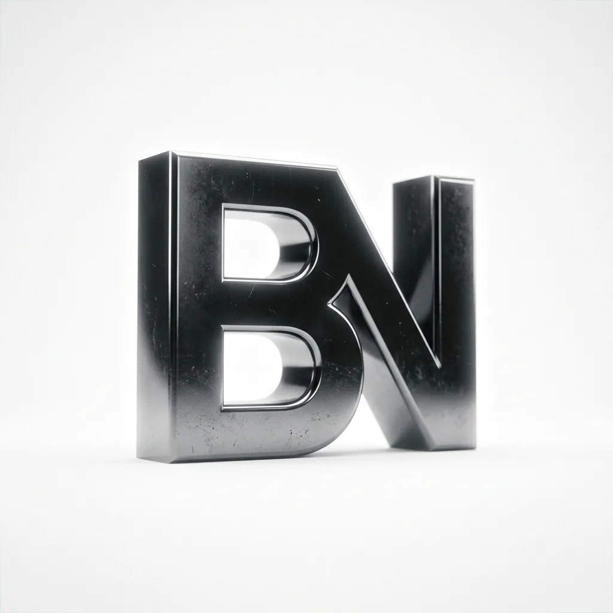

**#39 · Product &amp; Brand Prompt · <code>Vinano Image Pro</code>**

<details>
<summary>Show prompt</summary>

```
[BRAND NAME], the official trademark logo rendered strictly as a solid 3D object, maintaining the exact original vector shape and proportions without any artistic reinterpretation or distortion. The logo is crafted from dark, highly polished chrome metal subtle surface micro-scratches and imperfections that break the mirror finish. The object is perfectly centered in a vast, infinite pure white void no visible background elements or studio equipment. The lighting creates a soft, cinematic bloom (halo effect) along the metallic edges. 50mm lens aesthetic a shallow depth of field gently blurring the furthest points of the object. A pronounced, visible film grain overlay is applied to the entire image. Preserve realistic proportions and depth for a confident, professional finish.
```

</details>

---

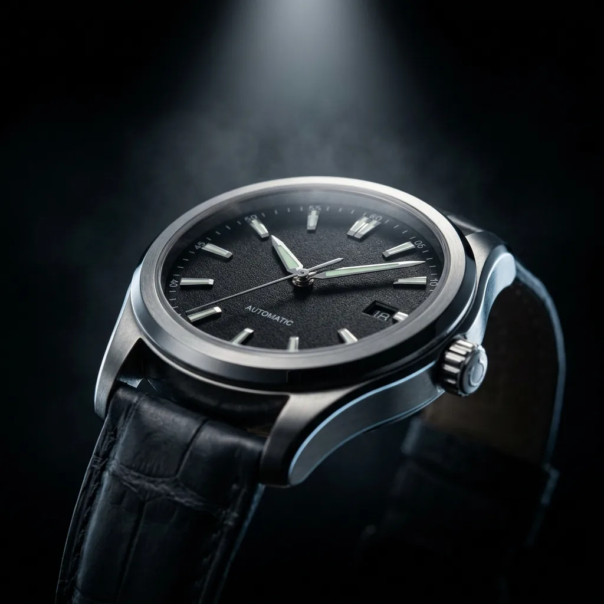

**#40 · Product &amp; Brand Prompt · <code>Vinano Image Pro</code>**

<details>
<summary>Show prompt</summary>

```
[product], luxury product hero shot, dark velvet background, single spotlight top down, thin mist haze, dramatic rim light outline, cinematic shadows, premium editorial styling, ultra realistic, macro detail, 85mm lens look, f/4 shallow depth, 8k, 1:1 Emphasise material texture and natural light so the final frame feels tactile and premium.
```

</details>

---

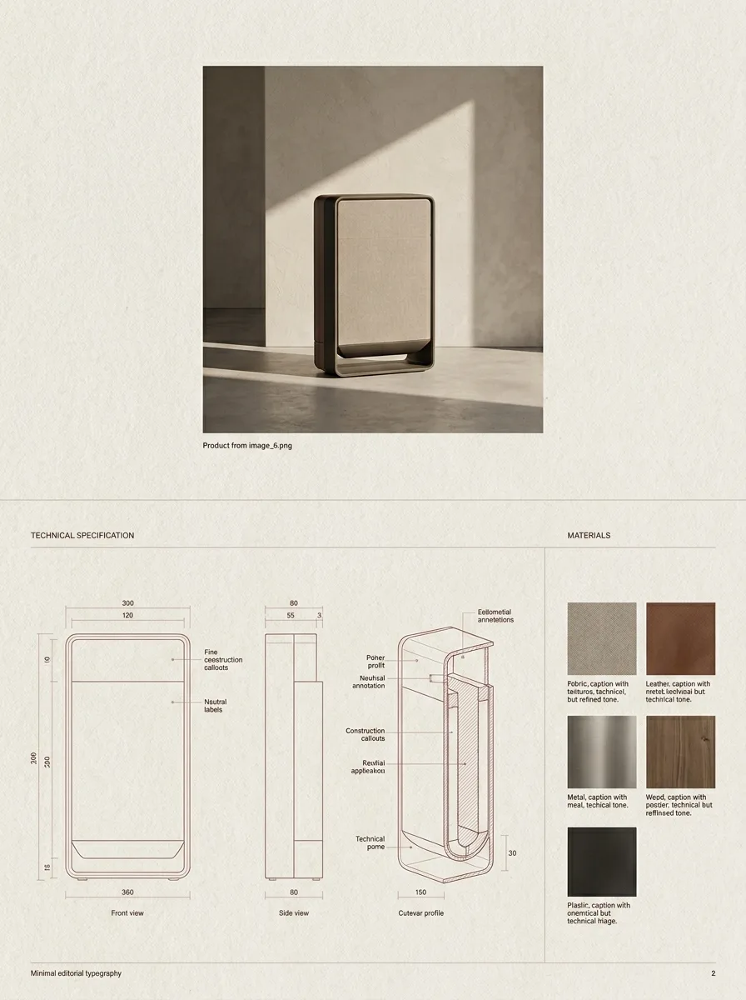

**#41 · Product &amp; Brand Prompt · <code>Vinano Image Pro</code>**

<details>
<summary>Show prompt</summary>

```
{
 "reference_images": {
 "product_image": "UPLOADED_IMAGE",
 "usage_rule": "Use the uploaded image as the exact visual reference for the product’s form, proportions, materials, and overall identity. Do not redesign or reinterpret the product."
 },

 "layout": {
 "canvas": {
 "orientation": "vertical",
 "aspect_ratio": "3:4",
 "background": "warm neutral paper-like surface"
 },
 "structure": {
 "top_section": "lifestyle_hero",
 "bottom_section": "technical_specification"
 }
 },

 "top_section": {
 "type": "lifestyle_product_image",
 "composition": {
 "placement": "top_center",
 "scale": "dominant",
 "margin": "generous whitespace around product"
 },
 "environment": {
 "setting": "minimal architectural interior",
 "lighting": {
 "type": "natural sunlight",
 "direction": "angled side light",
 "quality": "soft but high-contrast shadows"
 },
 "floor": "subtle concrete or stone surface",
 "background": "textured plaster wall"
 },
 "rendering": {
 "style": "editorial lifestyle photography",
 "detail": "high realism",
 "color_grading": "warm, muted, premium"
 }
 },

 "bottom_section": {
 "type": "technical_specification_panel",
 "layout": {
 "grid": "modular",
 "alignment": "clean, architectural"
 },

 "technical_drawings": {
 "placement": "bottom_left_and_center",
 "style": "architectural line drawings",
 "views": ["front view",
 "side view",
 "three-quarter cutaway or profile view"],
 "projection": "orthographic",
 "line_style": {
 "color": "muted red or sepia",
 "weight": "fine technical lines"
 },
 "annotations": {
 "type": "measurement and construction callouts",
 "language": "neutral technical labels",
 "density": "minimal, editorial"
 }
 },

 "materials_panel": {
 "placement": "bottom_right",
 "content": {
 "type": "material_swatches",
 "count": "3-4 depending on product",
 "format": "square or rectangular samples"
 },
 "textures": {
 "source": "derived from the product materials",
 "examples": ["fabric",
 "leather",
 "metal",
 "wood",
 "plastic"]
 },
 "labels": {
 "style": "small editorial captions",
 "tone": "technical but refined"
 }
 }
 },

 "typography": {
 "style": "minimal editorial",
 "usage": "subtle captions, no large headlines",
 "color": "soft black or dark brown"
 },

 "overall_style": {
 "mood": "design catalog / product design journal",
 "aesthetic": "architectural, premium, calm",
 "avoid": ["clutter",
 "bold colors",
 "heavy branding",
 "overly decorative graphics"]
 },

 "constraints": {
 "do_not": ["change product design",
 "invent new materials",
 "add logos unless present in reference",
 "use perspective distortion in drawings"]
 }
}

Preserve realistic proportions and depth for a confident, professional finish.
```

</details>

---

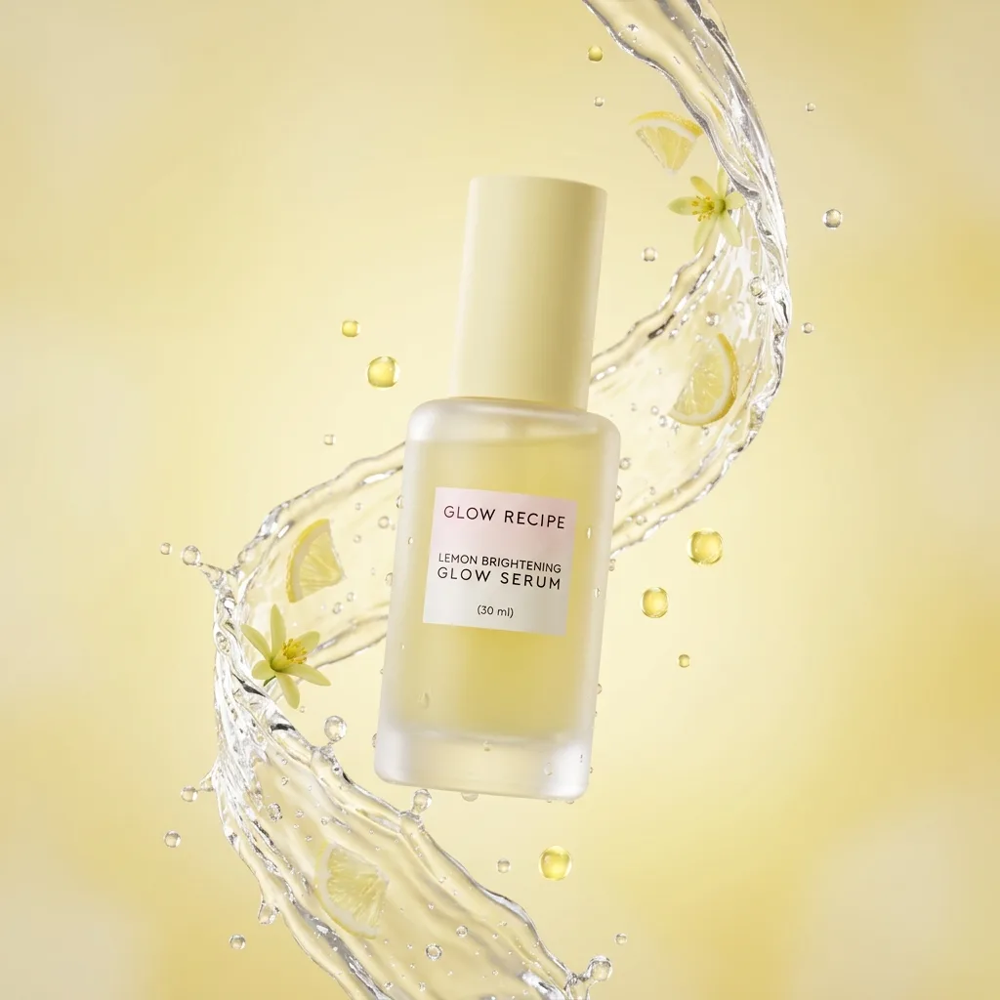

**#42 · Product &amp; Brand Prompt · <code>Vinano Image Pro</code>**

<details>
<summary>Show prompt</summary>

```
Ultra-realistic skincare advertising photography featuring a frosted citrus glass bottle labeled “Glow Recipe – Lemon Brightening Glow Serum (30 ml)” floating mid-air. Sparkling lemon water splashes swirl around the bottle glowing droplets and lemon slices suspended. Soft yellow studio background, crisp reflections, cinematic commercial lighting, shallow depth of field, ultra-detailed 8K beauty campaign. Maintain consistent colour harmony and crisp focus across the whole frame.
```

</details>

---

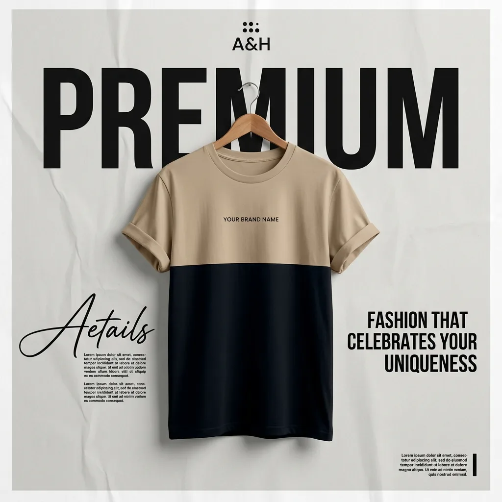

**#43 · Product &amp; Brand Prompt · <code>Vinano Image Pro</code>**

<details>
<summary>Show prompt</summary>

```
Create a high-end refined minimalist fashion advertisement poster.
Background: light grey wrinkled paper poster texture editorial magazine layout.
At the top center place a small brand label “A&H” minimal dots style logo above it.
Behind the product place a huge bold word “PREMIUM” in black, very large sans-serif font, spanning almost the entire width of the poster.
Center of the poster:
A two-tone t-shirt hanging on a wooden hanger.
Top half color beige/tan, bottom half deep black.
Short sleeves slightly folded.
Clean premium cotton texture.
On the chest of the shirt place the small text “YOUR BRAND NAME” in simple minimal font.
Left side design area:
Stylish script word “Aetails” (signature style starting A) replacing “Details”.
Under it small editorial paragraph blocks (magazine layout filler text).
Right side:
Editorial typography block the phrase
“FASHION THAT CELEBRATES YOUR UNIQUENESS”
in bold modern sans-serif.
Bottom right small editorial text block similar to fashion magazine layout.
Important rules: • Do NOT add any website URLs
• Do NOT add social media icons
• Do NOT add barcodes
• Do NOT add any random or unrecognizable text
• Brand name must be “A&H”
• Keep same colors, same layout, same typography style, same font weight, same font sizes, same composition
• clean luxury fashion ad aesthetic
• studio lighting, ultra sharp, true-to-life photorealistic, 4K fashion poster design

Keep edges clean and the overall composition balanced for a polished, gallery-ready result.
```

</details>

---

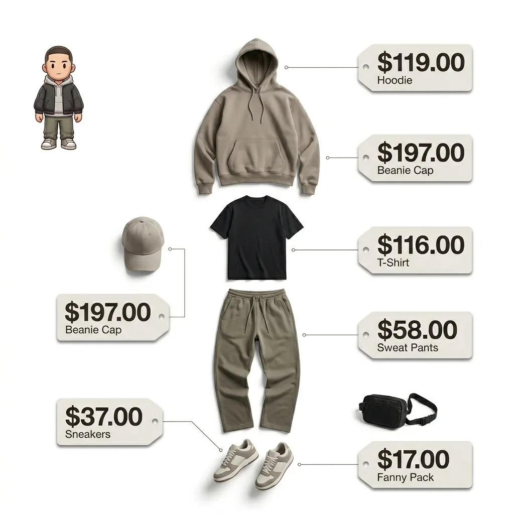

**#44 · Product &amp; Brand Prompt · <code>Vinano Image Pro</code>**

<details>
<summary>Show prompt</summary>

```
Create a clean, refined minimalist fashion infographic from an uploaded reference photo of a person.

Extract the outfit worn by the person and present only the clothing and accessories, no body, no mannequin, and no inflated or air-filled shapes.

Each clothing item should appear naturally relaxed, as if laid flat on a clean studio surface or gently suspended by gravity, realistic folds, creases, and fabric drape (hoodies slightly collapsed, jackets softly folded, pants relaxed, shoes resting naturally).

Arrange the outfit pieces in a top-to-bottom vertical order (headwear → outerwear → top → bottoms → footwear → accessories), spaced clearly in a calm exploded-view layout.

Character Illustration

In the top-left corner, include a small stylized cartoon / anime-inspired figure of the person from the uploaded reference image:
•Wearing the same outfit shown in the breakdown
•Standing straight like a collectible action figure
•Slightly puffy proportions (soft premium vinyl-toy feel)
•Clean shading, minimal facial detail

Above the character, display the person’s name:
•Clearly readable size
•Black, clean modern sans-serif typography
•No background box

Item Labels & Price Tags

For each clothing item, include:
•A thin, clean connector line pointing to the item
•A large, highly readable retail-style price tag

Each price tag must:
•Display the price as the primary visual element (large, bold, instantly readable)
•Include the item name in smaller secondary text
•Be visually attached to the connector line

Price tag design:
•Rectangular or rounded retail tag style
•Light neutral background (off-white or light gray)
•Dark high-contrast text
•Subtle shadow for depth
•Price text significantly larger than all other tag text

Do not include brand names.

Visual Style
•Pure white studio background
•Soft, even lighting subtle contact shadows
•Editorial fashion-magazine infographic aesthetic
•Realistic fabric colors and textures
•Clean modern sans-serif typography

Composition
•Centered vertical outfit layout
•Character illustration anchored in the top-left corner
•Strong readability of prices at first glance
•Balanced negative space, uncluttered
•No props, no decorative elements

Output
Ultra-sharp, high-end fashion breakdown
Social-feed optimized
No watermark.

Render with rich micro-detail while keeping the layout uncluttered and intentional.
```

</details>

---

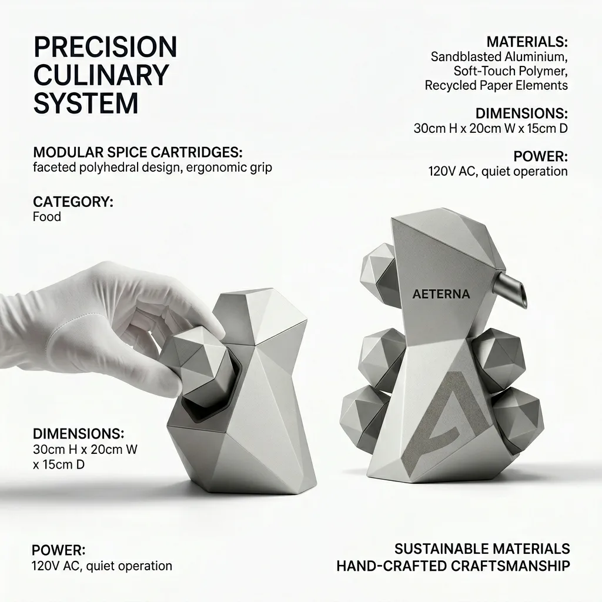

**#45 · Product &amp; Brand Prompt · <code>Vinano Image Pro</code>**

<details>
<summary>Show prompt</summary>

```
[BRAND NAME]: The core identity.

[CATEGORY]: Clothing / Food / Automotive / Lifestyle.

Goal: Generate a premium industrial design concept on a PURE WHITE background.

1. INNOVATION & OBJECT

- Select one mundane functional object from [CATEGORY].

- Redesign it unconventional, architectural, or origami-inspired geometry.

- The object must look like a high-end designer invention, not a standard product.

2. UNIFIED COMPOSITION

- Environment: A seamless, pure white studio background a flat white floor.

- Interaction: A human hand (natural texture) is shown the object in the foreground, demonstrating its unique ergonomics.

- Static Display: Right next to the hand, the same object is placed in a static, perfect pose to show its full silhouette and branding.

- Shadows: Soft, realistic grey drop shadows on the white floor to provide depth and ground the objects.

3. BRANDING & TEXT

- Identity: Apply the "[BRAND NAME]" logo in a high-contrast dark color (Black or Navy) directly onto the object's surface.

- Technical Detail: Add small, elegant blocks of justified "specification text" in the white negative space around the objects for an editorial look.

- Pattern: Use a subtle, oversized abstract fragment of the brand's logo as a texture on the object's material.

4. MATERIALS & FINISH

- premium-quality matte materials only: heavy-duty recycled paper, sandblasted metal, or soft-touch polymer.

- Sharp architectural lines and clean, premium craftsmanship.

Preserve realistic proportions and depth for a confident, professional finish.
```

</details>

---

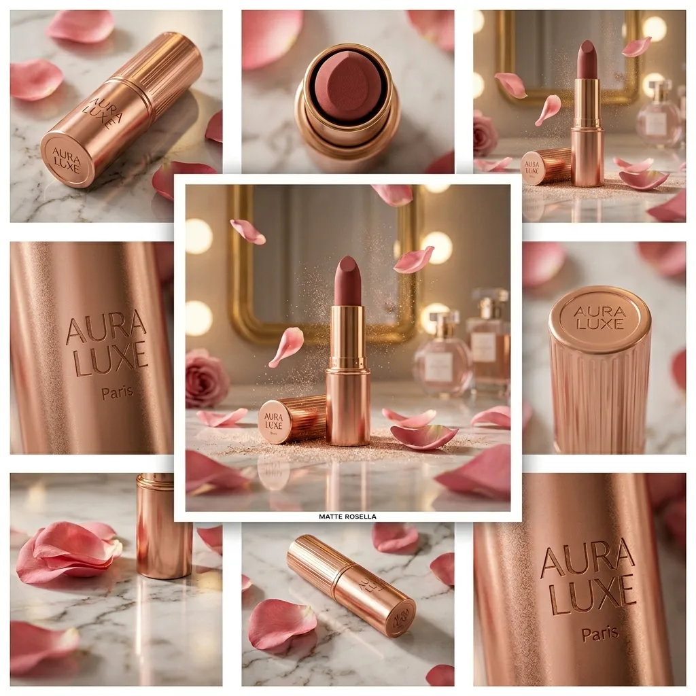

**#46 · Product &amp; Brand Prompt · <code>Vinano Image Pro</code>**

<details>
<summary>Show prompt</summary>

```
Elegant rose-gold lipstick standing upright on a reflective marble surface, surrounded by flying rose petals and soft powder dust. Warm studio lighting dramatic shadows, luxury vanity background blurred mirrors and golden accents, cinematic mood, macro product photography, ultra-sharp details, glossy textures, premium cosmetic brand style.

3×3photo grid different angles and poses. Same character, consistent look, clean lighting, real photoshoot vibe 2k.

Emphasise material texture and natural light so the final frame feels tactile and premium.
```

</details>

---

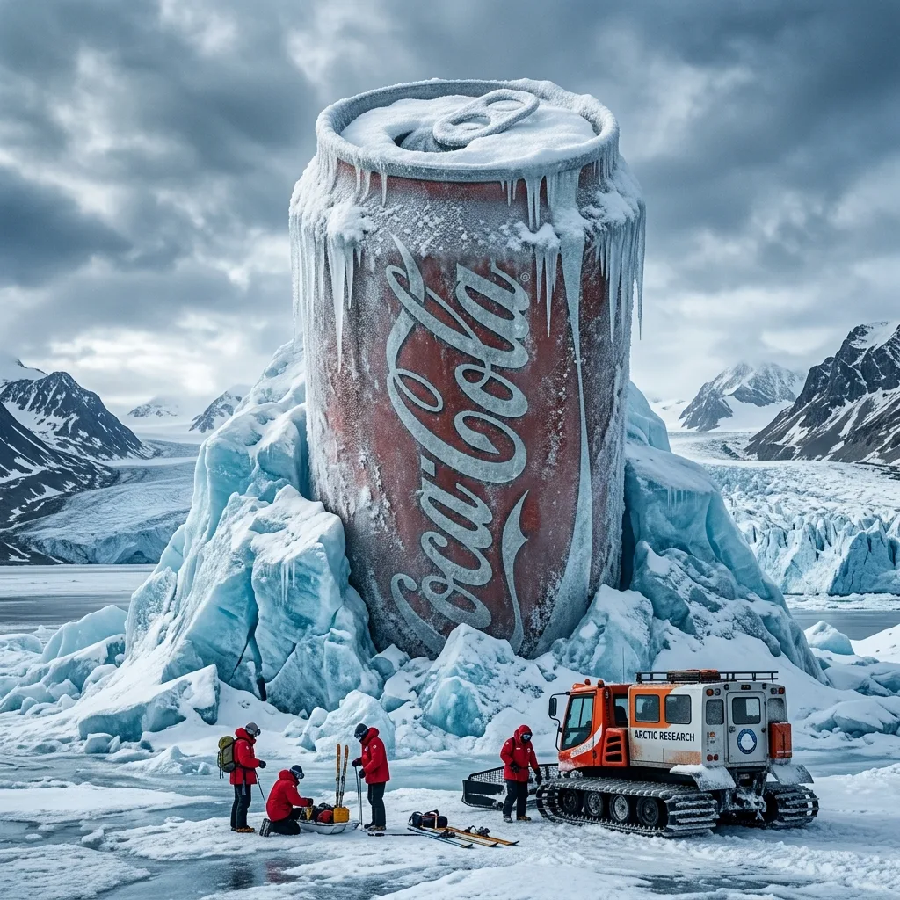

**#47 · Product &amp; Brand Prompt · <code>Vinano Image Pro</code>**

<details>
<summary>Show prompt</summary>

```
Hyper-realistic 8k cinematic photograph, low-angle wide lens. A giant Coca-Cola can standing like a monument, partially encased in thick blue glacial ice and snow in an arctic landscape. Frost covering the aluminum surface, long icicles hanging from the rim, snow filling the top opening. Snowcat vehicle and scientists in red parkas for scale. Cold diffused lighting, HDR, ultra-real frozen textures, cinematic atmosphere --ar 2:3 Render with rich micro-detail while keeping the layout uncluttered and intentional.
```

</details>

---

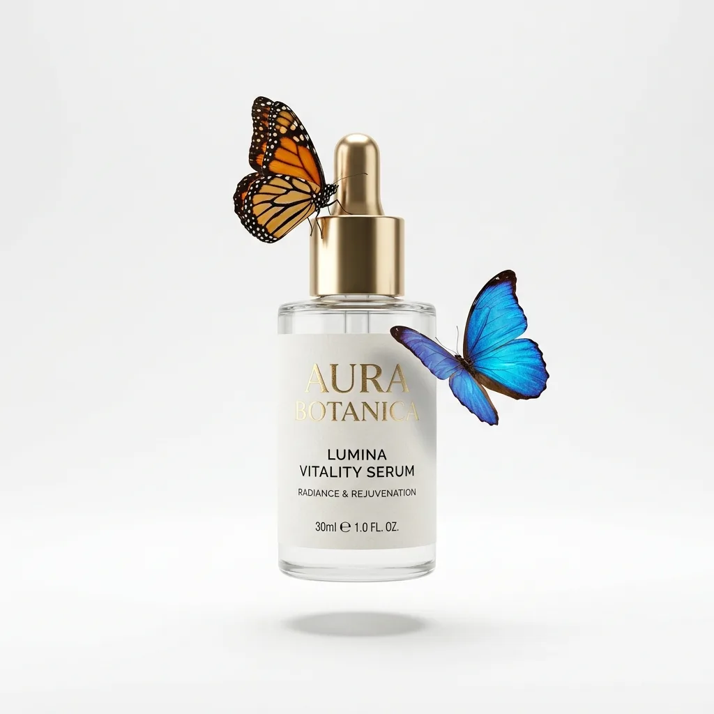

**#48 · Product &amp; Brand Prompt · <code>Vinano Image Pro</code>**

<details>
<summary>Show prompt</summary>

```
A professional skincare shot of a [product container] [cap/lid], labeled [brand, product, descriptor, volume] [foil/ink/embossing]. [Number] [animal type(s)] in [colors] are arranged [positions/actions] around it. [Held/placed/floating] naturally. Clean white background, soft shadow, bright lighting, ultra-high resolution, 8k, professional cosmetic photography. Aim for an editorial, design-driven look with deliberate negative space.
```

</details>

---

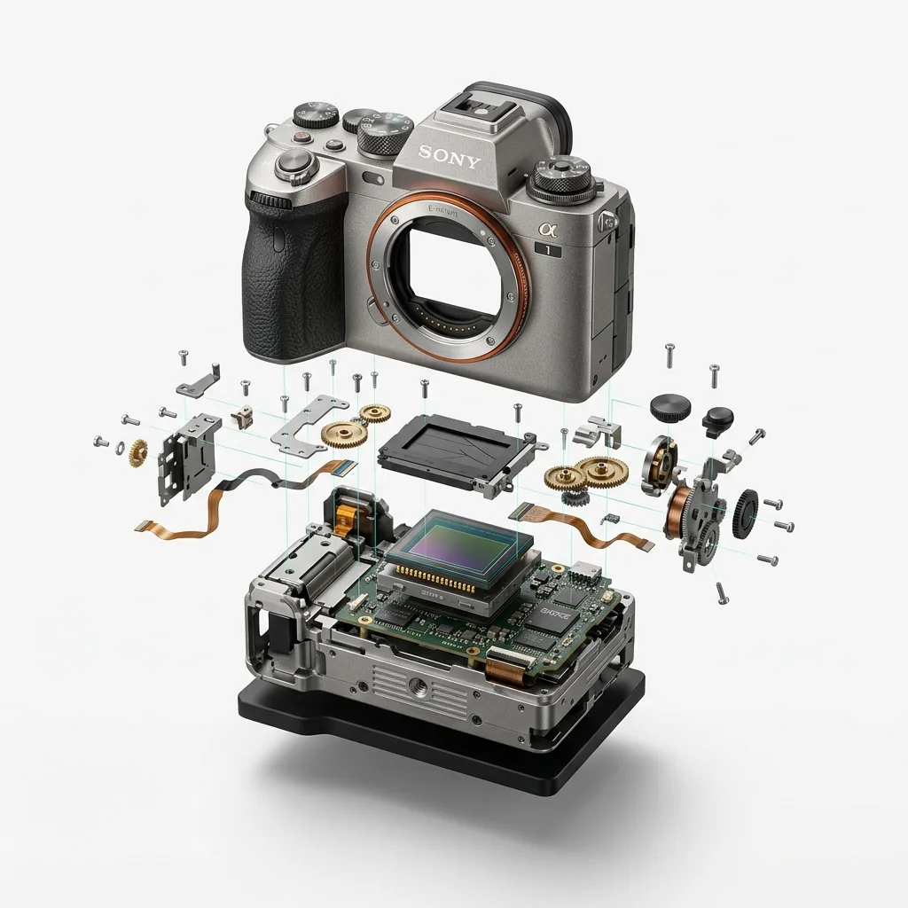

**#49 · Product &amp; Brand Prompt · <code>Vinano Image Pro</code>**

<details>
<summary>Show prompt</summary>

```
[product], high-end product advertising, white seamless background, exploded view inner mechanics revealed, outer shell hovering above core, micro screws and components suspended, perfect alignment guides implied, crisp soft shadow, ultra realistic, macro product photography, 100mm lens look, f/8, 8k, 1:1 Preserve realistic proportions and depth for a confident, professional finish.
```

</details>

---

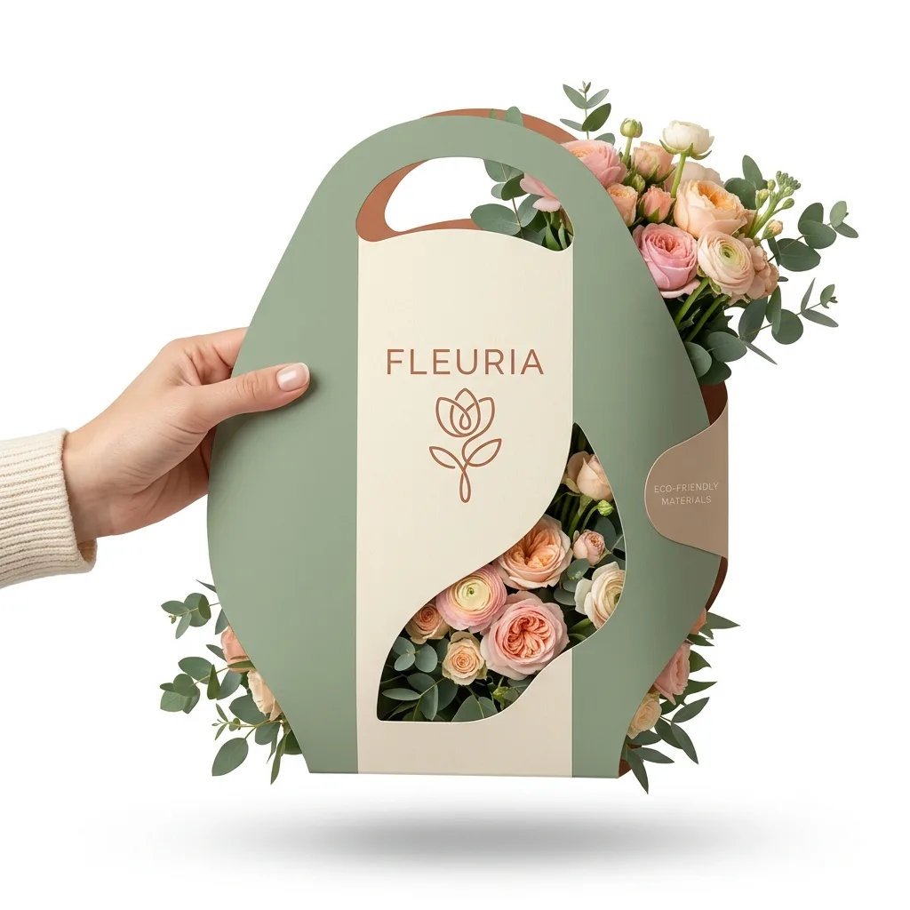

**#50 · Product &amp; Brand Prompt · <code>Vinano Image Pro</code>**

<details>
<summary>Show prompt</summary>

```
refined minimalist branded flower packaging design for [brand], eco-friendly cardboard sleeve integrated handle, sculptural curved silhouette wrapping naturally around a fresh bouquet, packaging fully designed the official brand color palette, matte surface the brand logo cleanly centered on the front panel, precision die-cut window integrated into the design allowing flowers to subtly emerge, cohesive color blocking aligned brand identity, modern premium branding aesthetic, smooth paper texture, refined structural details, hand holding the package naturally, studio product photography, centered composition, pure white background, soft realistic contact shadow beneath, high-end packaging mockup, ultra-detailed, 1:1 aspect ratio. Aim for an editorial, design-driven look with deliberate negative space.
```

</details>

---

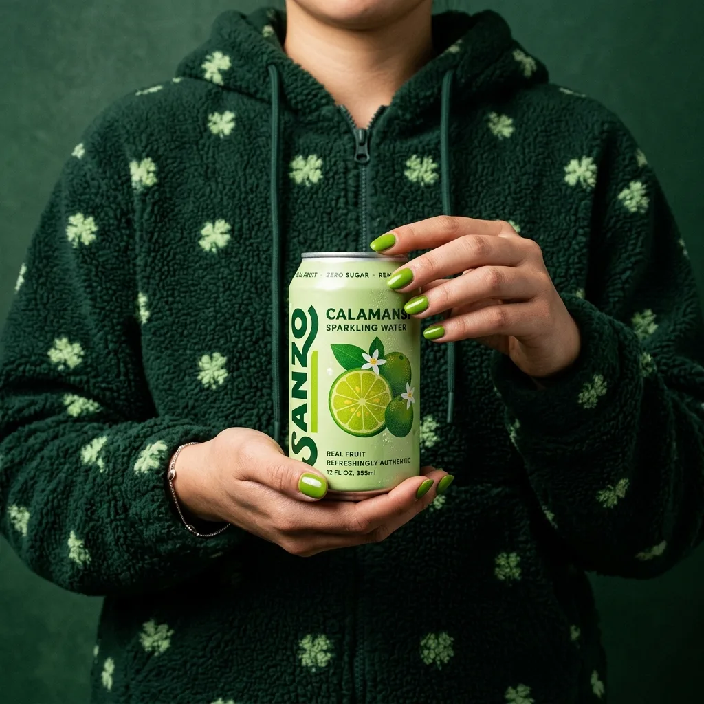

**#51 · Product &amp; Brand Prompt · <code>Vinano Image Pro</code>**

<details>
<summary>Show prompt</summary>

```
A true-to-life photorealistic product shot of a person holding a slim, light green can of Sanzo Calamansi Sparkling Water. The person is wearing a dark green, fuzzy fleece zip-up hoodie patterned light green four-leaf clovers. Both hands are holding the can centrally in front of their torso, displaying perfectly manicured nails painted in a glossy green polish. The can features an illustration of a sliced calamansi lime green leaves. The background is a solid, moody dark green, creating a striking monochromatic green aesthetic. Soft, professional studio lighting, highly detailed. Aim for an editorial, design-driven look with deliberate negative space.
```

</details>

---

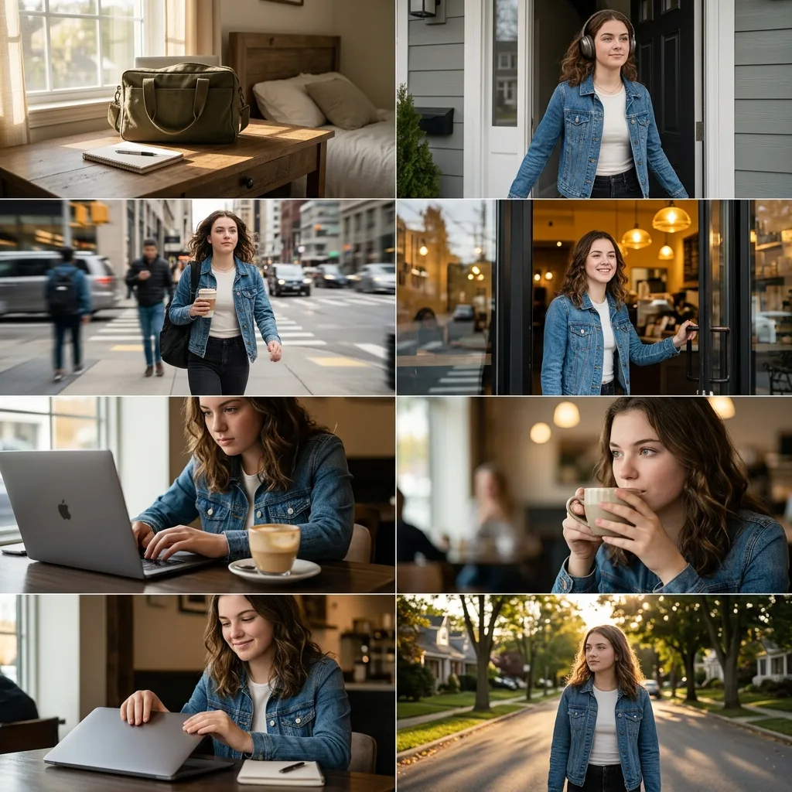

**#52 · Product &amp; Brand Prompt · <code>Vinano Image Pro</code>**

<details>
<summary>Show prompt</summary>

```
cinematic 8-photo storytelling collage featuring the same girl throughout the journey.
Frame 1: Bedroom desk — laptop bag packed, morning light.
Frame 2: Leaving home — headphones on, confident walk.
Frame 3: City sidewalk — coffee aroma vibes, motion blur.
Frame 4: Entering café — warm interiors, soft smiles.
Frame 5: Laptop open — deep focus, typing.
Frame 6: Coffee sip — thoughtful pause.
Frame 7: Closing laptop — productive satisfaction.
Frame 8: Walking back home — golden hour calm.
Editorial lifestyle mood, natural tones, cinematic depth, ultra-realistic.

Keep edges clean and the overall composition balanced for a polished, gallery-ready result.
```

</details>

---

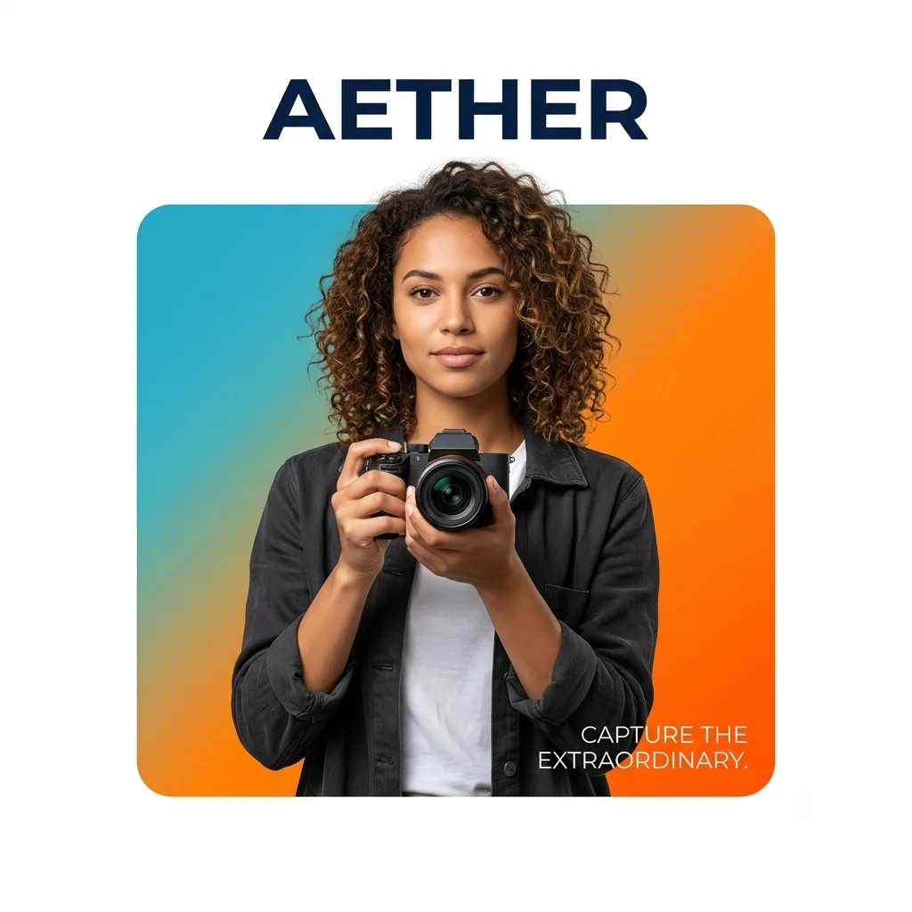

**#53 · Product &amp; Brand Prompt · <code>Vinano Image Pro</code>**

<details>
<summary>Show prompt</summary>

```
A professional high-end graphic design advertisement composition on a pure solid white canvas. Centered is a perfectly symmetrical, large solid rounded square (not a hollow frame). The entire interior of this square is filled a smooth, vibrant color gradient fading from [Top-Left Color/Hex] to [Bottom-Right Color/Hex].

A [Description of Character] is positioned such that the bottom of their torso is perfectly flush and aligned the very bottom edge of the square, leaving no thick colored border visible beneath them. Crucially, the person and their clothing maintain natural, realistic colors and textures, illuminated by professional studio lighting that is independent of the background gradient (preventing any color cast on their skin or clothes).

They are firmly and realistically gripping [Product Description]. Crucially, the top of their head and hair break the top boundary of the square, partially overlapping the white background. Their hands and the [Product Name] also break the side boundaries for a powerful 3D breakout effect, extending onto the white canvas.

Typography Layout: At the top, in the white space distinctly above the square a clear gap, is the [Font Style] brand text '[Brand Name]' in [Top Text Color]. In the bottom-right corner, layered directly on top of the gradient inside the square, is a block of small, thin, clean [Bottom Text Color] descriptive text: '[Slogan/Tagline]'.

The lighting is [Lighting Type: e.g., Sharp/Soft], crisp, and commercial, emphasizing the textures of both the subject and the product."

Keep edges clean and the overall composition balanced for a polished, gallery-ready result.
```

</details>

---

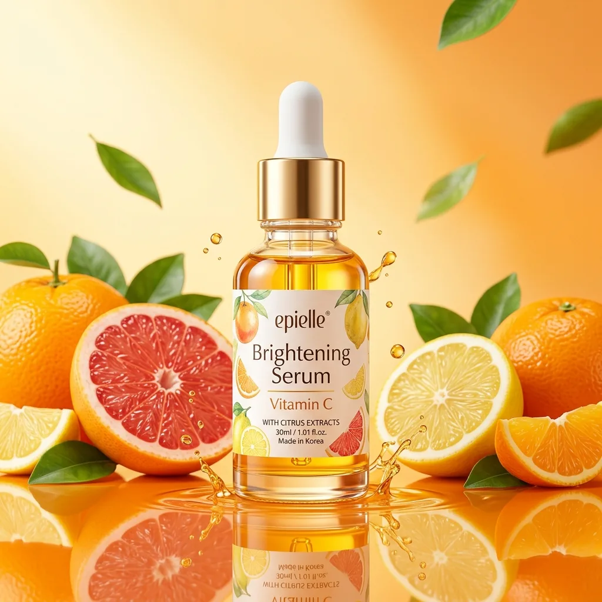

**#54 · Product &amp; Brand Prompt · <code>Vinano Image Pro</code>**

<details>
<summary>Show prompt</summary>

```
Ultra-high-end true-to-life photorealistic skincare product photography featuring a clear cylindrical glass dropper bottle filled translucent golden serum, centered and slightly tilted backward, a matte white rubber dropper and metallic gold collar, the front label clearly reading “epielle Brightening Serum Vitamin C” citrus illustrations, placed on a glossy reflective orange liquid surface creating a sharp mirror reflection beneath the bottle, surrounded by whole and sliced citrus fruits including bright orange oranges, a halved ruby grapefruit visible pulp, and a sliced yellow lemon positioned symmetrically around the bottle, small golden serum droplets and splashes frozen mid-air around the base, fresh green citrus leaves floating softly in the background, background consisting of a smooth warm gradient transitioning from pale yellow on the left to deep orange on the right, lighting is strong soft studio lighting from upper left creating crisp highlights on glass and liquid, luminous glow through the serum, subtle shadows, and high contrast reflections, color palette dominated by vibrant orange, yellow, gold, and fresh green accents, textures extremely detailed including glossy glass, liquid viscosity, citrus peel pores, juicy pulp, and reflective surface, shallow depth of field razor-sharp focus on the bottle label and fruit in the midground and gentle bokeh in the background, premium commercial cosmetic advertising style, clean modern composition, cinematic realism, ultra-detailed 8K photorealism, studio-grade quality Aim for an editorial, design-driven look with deliberate negative space.
```

</details>

---

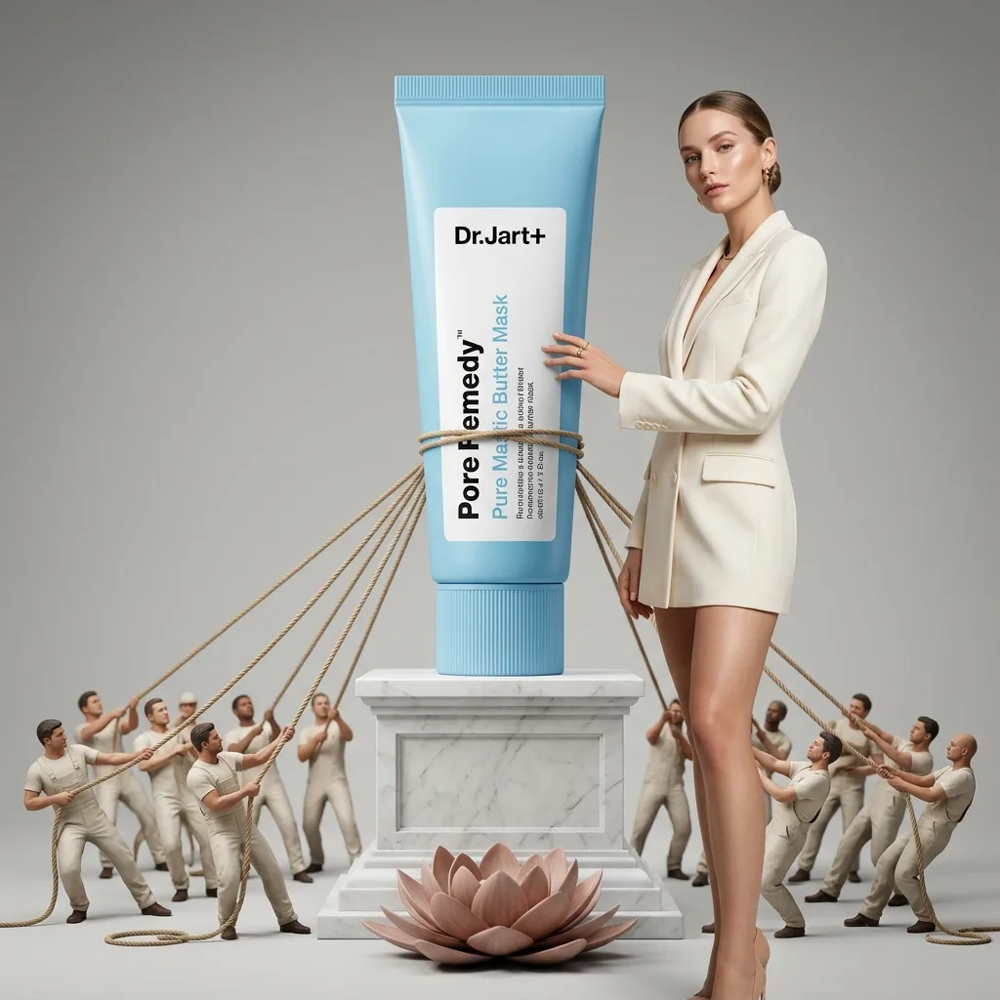

**#55 · Product &amp; Brand Prompt · <code>Vinano Image Pro</code>**

<details>
<summary>Show prompt</summary>

```
A surreal, refined minimalist luxury advertising scene in a clean modern studio a soft neutral gray background, dramatic directional lighting and subtle cinematic shadows. A gigantic oversized tube of Dr.Jart+ Pore Remedy Pure Mastic Butter Mask (light blue tube, white label, bold black “Dr.Jart+” text clearly visible) stands triumphantly on a tall multi-tiered white marble pedestal like a monument. Around the base, 20–30 tiny realistic miniature male workers in matching beige/off-white uniforms and overalls are pulling thick ropes tied around the massive tube, straining intense effort, dynamic poses, muscles tense, tugging mostly forward.

Place a tall elegant Western woman in her late 20s in the foreground, positioned much closer to the camera for a stronger ad focus. She stands slightly in front of the pedestal, waist-up to mid-thigh framing, creating a premium beauty campaign feel. She has glowing fair skin, sharp cheekbones, soft natural makeup luminous skin finish, slick low bun hairstyle, and a confident high-fashion gaze directed toward the camera. She wears a structured ivory tailored blazer dress minimal gold accessories and nude heels. One hand lightly touches the giant tube while her body subtly angles toward it, creating a powerful hero-product connection.

At the foot of the pedestal lies a large open lotus flower sculpture in soft pinkish-brown tones. High-end commercial skincare photography, hyper-realistic 3D render, ultra-sharp 8K details, cinematic composition, shallow depth of field slightly blurring the miniature workers while keeping the woman and product crisp and dominant, luxury beauty campaign aesthetic, epic scale contrast, clean elegant studio environment, shot by Veo.

Maintain consistent colour harmony and crisp focus across the whole frame.
```

</details>

---

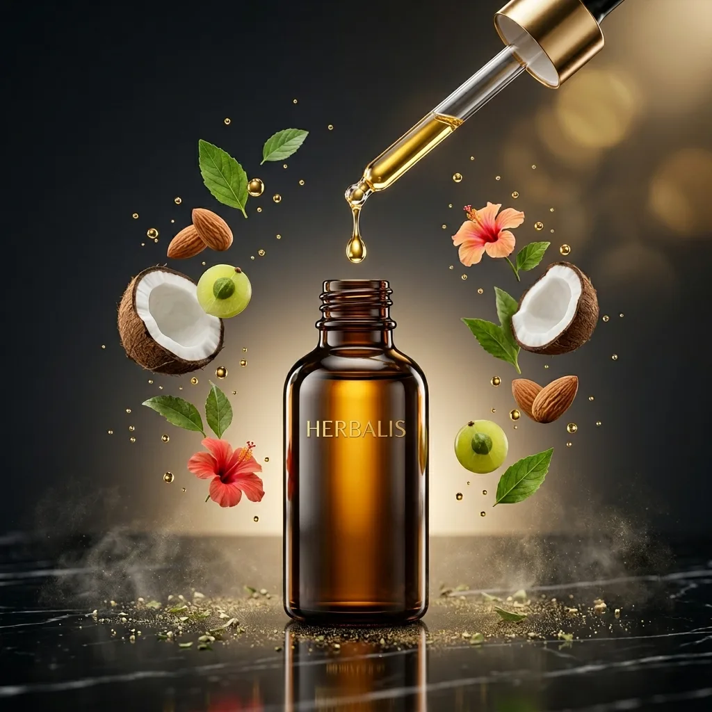

**#56 · Product &amp; Brand Prompt · <code>Vinano Image Pro</code>**

<details>
<summary>Show prompt</summary>

```
{
 "master_prompt": {
 "scene_type": "ultra-premium cinematic luxury hair oil product photography",

 "product": {
 "type": "luxurious branded herbal hair oil",
 "container": "premium dark amber glass bottle elegant gold dropper cap",
 "label": "minimal luxury branding embossed gold typography",
 "oil_texture": "rich golden oil crystal clarity and glossy viscosity",
 "ingredients_visual": ["fresh coconut halves",
 "amla berries",
 "almonds",
 "hibiscus flowers",
 "green herbal leaves"]
 },

 "composition": {
 "action": "golden hair oil droplets pouring elegantly from a glass dropper captured mid-air",
 "surrounding_elements": ["floating herbal ingredients suspended in motion",
 "tiny golden oil droplets sparkling in light",
 "soft mist of botanical particles",
 "subtle golden dust accents for premium feel"],
 "placement": "hero bottle centered on polished black marble surface luxury reflections"
 },

 "lighting": {
 "style": "luxury cosmetic studio lighting",
 "effects": ["soft rim lighting outlining the bottle silhouette",
 "warm backlight illuminating the golden oil inside the bottle",
 "gentle top light highlighting the glass dropper and oil droplets",
 "subtle side lighting enhancing glass reflections"]
 },

 "color_palette": {
 "background": "deep charcoal fading into warm golden bokeh",
 "accents": "rich amber gold, botanical green, glossy black reflections, subtle champagne highlights"
 },

 "technical_specs": {
 "camera": "macro lens slight low angle for premium dominance",
 "shutter": "ultra-fast freeze motion capturing oil droplets",
 "depth_of_field": "shallow focus on bottle and dropper cinematic background blur",
 "quality": "8K resolution, ultra-true-to-life photorealistic cosmetic product detailing"
 }
 }
}

Aim for an editorial, design-driven look with deliberate negative space.
```

</details>

---

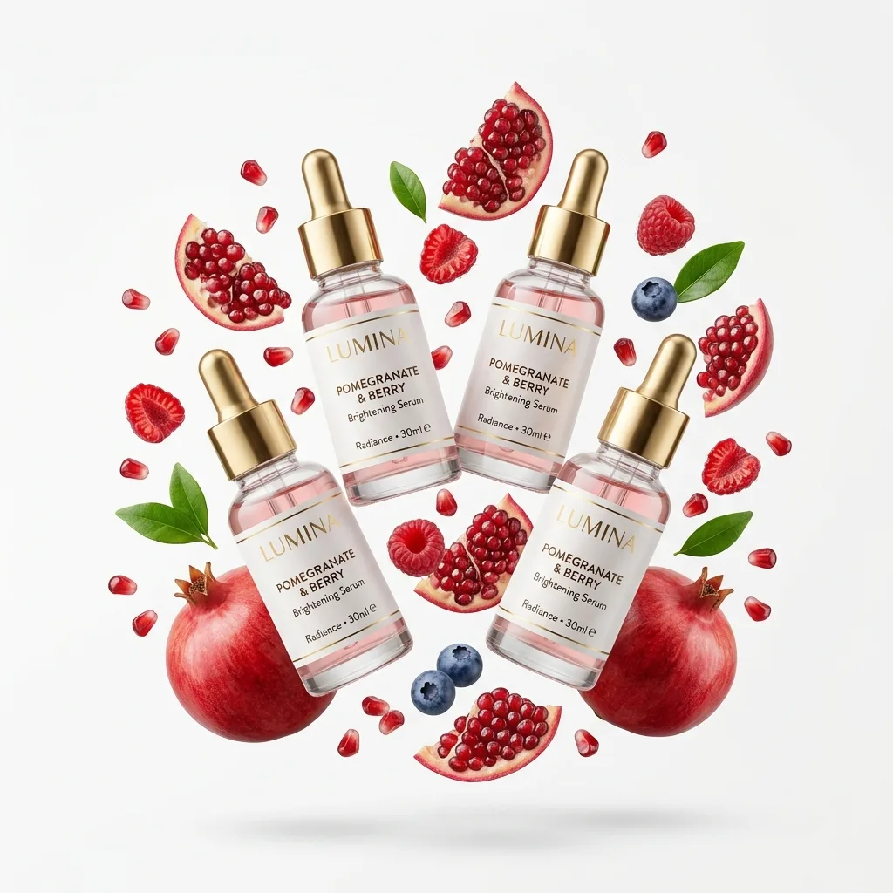

**#57 · Product &amp; Brand Prompt · <code>Vinano Image Pro</code>**

<details>
<summary>Show prompt</summary>

```
[product], 3–4 identical units of the product floating in mid-air, surrounded by fresh [fruit/vegetable] and sliced pieces that the product is made from, ingredients suspended around the product, dynamic balanced composition, ultra-clean pure white background, no gradients, no color cast, soft studio lighting, realistic soft shadows beneath floating objects, glossy packaging reflections, juicy ingredient textures, premium skincare editorial style, hyper-realistic product photography, macro detail, sharp focus, commercial advertising quality, minimal composition, 8k, 1:1 Aim for an editorial, design-driven look with deliberate negative space.
```

</details>

---

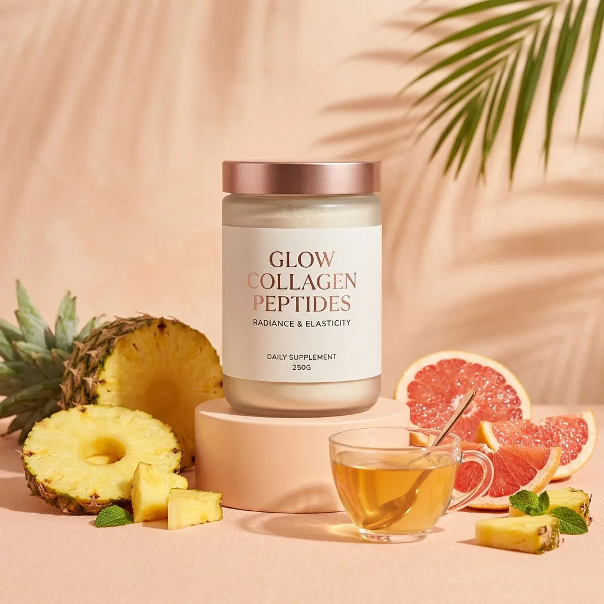

**#58 · Product &amp; Brand Prompt · <code>Vinano Image Pro</code>**

<details>
<summary>Show prompt</summary>

```
refined minimalist luxury product photography of a collagen supplement jar placed on a soft pastel peach background, cylindrical pedestal base, surrounded by fresh pineapple and sliced grapefruit, a small glass cup golden liquid in front, warm sunlight casting soft palm leaf shadows, clean aesthetic, high-end skincare branding, soft diffused lighting, realistic textures, subtle reflections, shallow depth of field, editorial style, 4k, ultra-detailed. Preserve realistic proportions and depth for a confident, professional finish.
```

</details>

---

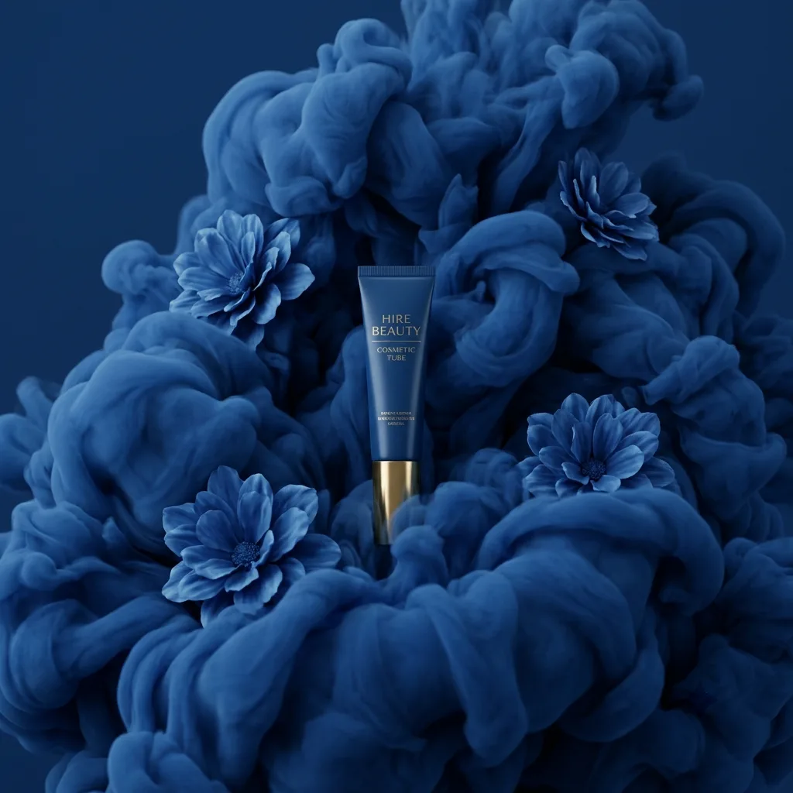

**#59 · Product &amp; Brand Prompt · <code>Vinano Image Pro</code>**

<details>
<summary>Show prompt</summary>

```
Use the uploaded image as the exact visual reference.
Keep the product centered.
Do not change the tube position, lighting tone, flower placement, or color palette.
Maintain the deep blue monochromatic aesthetic.
No additional lights.
No color grading changes.
Camera:
Locked camera.
No zoom.
No rotation.
No angle change.
Static premium composition.
Action:
Animate the surrounding voluminous blue swirling clouds in ultra slow motion.
The cloud-like forms (soft fabric/ink-style swirls) gently move and curl around the product.
Movement should feel fluid, heavy, and luxurious.
Soft rolling motion from bottom to top.
Subtle inward spiral motion around the tube.
No aggressive motion.
No fast movement.
No deformation of the product.
Flowers:
Remain mostly stable.
Very subtle natural micro movement as if lightly affected by airflow.
Petals should not detach.
No new petals added.
Physics:
Smooth, dense, smoke-like simulation.
Velvety texture.
Soft shadow transitions within the folds.
Natural depth and layering.

Mood:
Elegant.
Premium.
Artistic beauty campaign.
High-end cosmetic advertisement.

Sound (optional if supported):
Soft ambient atmospheric tone.
Very subtle airy texture.
No voiceover.
End Frame:
Clouds continue slowly flowing around the product.
Product remains sharp and perfectly centered.
Ultra realistic.
Luxury slow-motion finish.

Maintain consistent colour harmony and crisp focus across the whole frame.
```

</details>

---

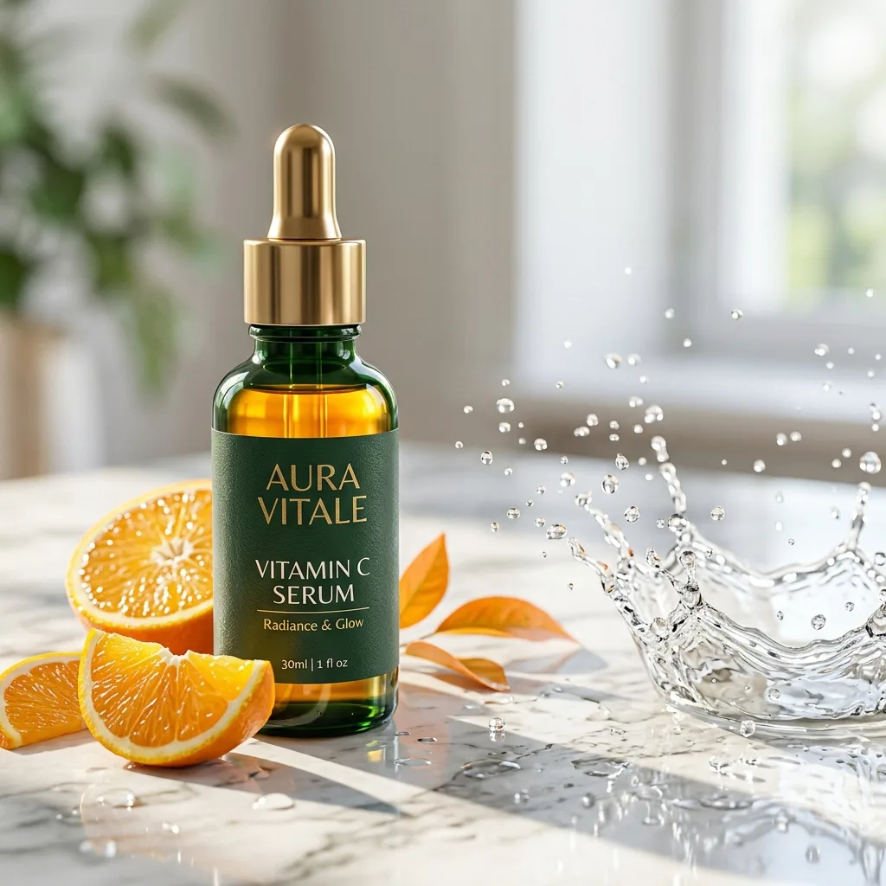

**#60 · Product &amp; Brand Prompt · <code>Vinano Image Pro</code>**

<details>
<summary>Show prompt</summary>

```
Ultra-realistic premium skincare serum bottle (dark green glass dropper), golden liquid inside, placed on sunlit marble surface fresh orange slices around, natural citrus vibe, water splash frozen mid-air, detailed droplets and reflections, soft natural sunlight sharp shadows, minimal aesthetic, macro photography, high detail textures, glossy glass reflections, fresh and vibrant color tones, luxury skincare advertising, 8K, perfect composition. Aim for an editorial, design-driven look with deliberate negative space.
```

</details>

---


**#61 · Product &amp; Brand Prompt · <code>Vinano Image Pro</code>**

<details>
<summary>Show prompt</summary>

```
Create a brand visual storyboard for presenting your product:

Create ONE final image.

A clean 3×3 [ratio] storyboard grid nine equal [ratio] sized panels on [4:5] ratio.

Use the reference image as the base product reference. Keep the same product, packaging design, branding, materials, colors, proportions and overall identity across all nine panels exactly as the reference. The product must remain clearly recognizable in every frame. The label, logo and proportions must stay exactly the same.

This storyboard is a high-end designer mockup presentation for a branding portfolio. The focus is on form, composition, materiality and visual rhythm rather than realism or lifestyle narrative. The overall look should feel curated, editorial and design-driven.

FRAME 1:
Front-facing hero shot of the product in a clean studio setup. Neutral background, balanced composition, calm and confident presentation of the product.

FRAME 2:
Close-up shot the focus centered on the middle of the product. Focusing on surface texture, materials and print details.

FRAME 3:
Shows the reference product placed in an environment that naturally fits the brand and product category. Studio setting inspired by the product design elements and colours.

FRAME 4:
Product shown in use or interaction on a neutral studio background. Hands and interaction elements are minimal and restrained, the look matches the style of the package.

FRAME 5:
Isometric composition showing multiple products arranged in a precise geometric order from the top isometric angle. All products are placed at the same isometric top angle, evenly spaced, clean, structured and graphic.

FRAME 6:
Product levitating slightly tilted on a neutral background that matches the reference image color palette. Floating position is angled and intentional, the product is floating naturally in space.

FRAME 7:
is an extreme close-up focusing on a specific detail of the label, edge, texture or material behavior.

FRAME 8:
The product in an unexpected yet aesthetically strong setting that feels bold, editorial and visually striking.
Unexpected but highly stylized setting. Studio-based, and designer-driven. Bold composition that elevates the brand.

FRAME 9:
Wide composition showing the product in use, placed within a refined designer setup. Clean props, controlled styling, cohesive the rest of the series.

CAMERA & STYLE:
ultra-detailed, high-fidelity studio imagery a real camera look. Different camera angles and framings across frames. Controlled depth of field, precise lighting, accurate materials and reflections. Lighting logic, color palette, mood and visual language must remain consistent across all nine panels as one cohesive series.

OUTPUT:
A clean 3×3 grid no borders, no text, no captions and no watermarks.

Keep edges clean and the overall composition balanced for a polished, gallery-ready result.
```

</details>

---

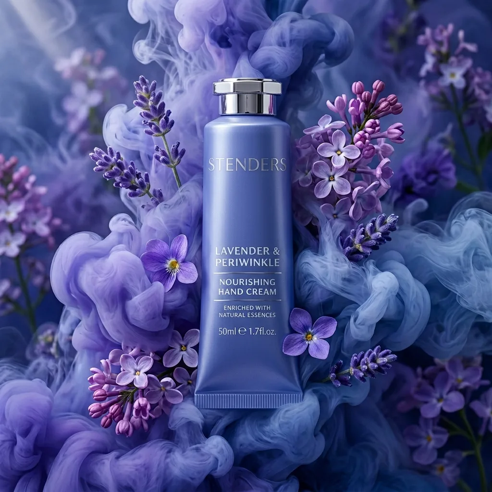

**#62 · Product &amp; Brand Prompt · <code>Vinano Image Pro</code>**

<details>
<summary>Show prompt</summary>

```
Ultra-realistic luxury cosmetic product photography in a dramatic monochromatic blue-violet composition. A sleek satin-finish periwinkle-blue squeeze tube labeled “STENDERS” stands vertically centered in the frame, featuring elegant silver typography and a reflective metallic chrome cap. The tube is surrounded by voluminous swirling clouds of ink-like smoke in layered shades of lavender, indigo, and icy blue, creating a soft, billowing texture that wraps around the product. Interwoven throughout the smoke are fresh purple and lilac flowers intricate petal details and vibrant yellow centers, along delicate sprigs of tiny violet blossoms for added dimension. Soft directional lighting from the upper left highlights the smooth curvature of the tube, adds subtle sheen to the metallic cap, and creates depth within the smoke plumes. The background seamlessly blends cool blue and purple tones, enhancing the ethereal, floral fragrance aesthetic. Hyper-detailed textures of petals and vapor, cinematic depth, high-end perfumed skincare advertising style, 8K

ultra-high resolution

Emphasise material texture and natural light so the final frame feels tactile and premium.
```

</details>

---

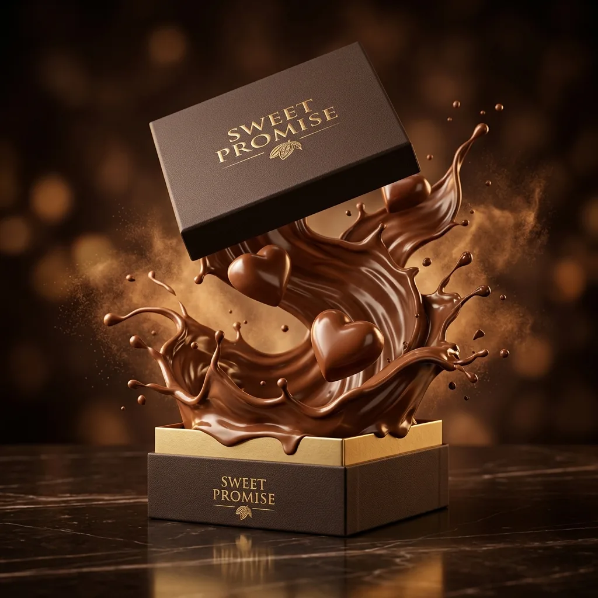

**#63 · Product &amp; Brand Prompt · <code>Vinano Image Pro</code>**

<details>
<summary>Show prompt</summary>

```
A slow, sensual luxury chocolate commercial shot in ultra-high definition. The scene opens in near darkness as a premium espresso-brown gift box soft gold accents slowly rotates on a reflective surface. A warm spotlight reveals the embossed title “SWEET PROMISE” in an elegant serif font, paired a subtle botanical emblem. As the lid gently lifts in slow motion, molten milk chocolate surges upward in a gravity-defying burst, captured at 120fps for dramatic fluid motion. Glossy heart-shaped chocolates rise and orbit the splash, rotating gracefully at different depths, their surfaces catching highlights like polished jewels. Thick chocolate ribbons stretch, drip, and shatter into silky droplets mid-air while cocoa powder blooms softly like a golden mist. Cinematic mocha-and-gold color grading, shallow depth of field, creamy bokeh background, soft rim lighting outlining every chocolate curve. Macro close-ups transition into wide hero shots, emphasizing texture, gloss, and richness. The motion feels slow, seductive, and indulgent—pure luxury confectionery advertising, premium product film, elegant pacing, emotionally rich, visually irresistible. Emphasise material texture and natural light so the final frame feels tactile and premium.
```

</details>

---

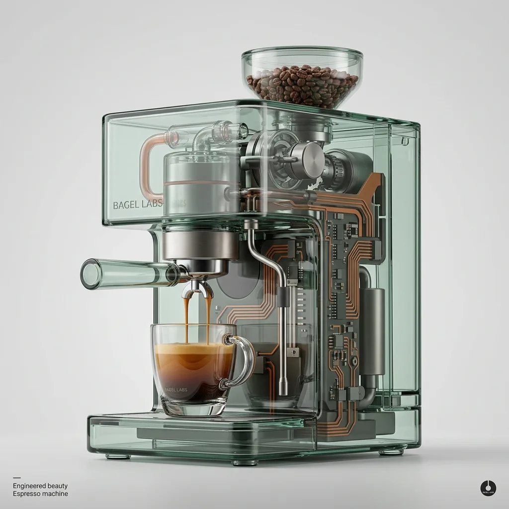

**#64 · Product &amp; Brand Prompt · <code>Vinano Image Pro</code>**

<details>
<summary>Show prompt</summary>

```
BAGEL LABS.
Act as a creative director curating a wide-ranging, eclectic collection of “recontextualized everyday objects.”

DIVERSE OBJECT SELECTION (MANDATORY VARIETY):
Randomly select ONE object from these distinct categories to ensure diversity:
Analog Office & Desk:
Sport & Leisure:
Barware & Kitchen:
Utility & Tools:
Grooming:
Travel:

SELECTED CATEGORY:
Barware & Kitchen

CHOSEN OBJECT:
A coffee machine and coffee cup — instantly recognizable, reimagined as a luxury technological artifact.

THE CONCEPT:
Recontextualize the everyday coffee machine as a transparent, high-precision object of engineered beauty.
A fully glass espresso machine reveals its internal systems: hot water circulation, pressure chambers, coffee bean hopper, grinding mechanism, and extraction pathway. Integrated computer circuitry runs through the machine like a nervous system, visually linking ritual, data, and energy.

Fresh coffee is actively pouring from the machine into a matching glass cup, captured mid-flow. The moment feels frozen, precise, and intentional—ritual meets technology.

MATERIALS & FINISH:
- COFFEE MACHINE BODY:
 Precision-molded optical glass subtle green-tinted transparency. Internal structure is fully visible and meticulously organized.
- INTERNAL COMPONENTS:
 - Hot water tubes and pressure lines clearly visible, rendered in brushed titanium and warm grey.
 - Coffee bean chamber visible at the top realistic roasted beans.
 - Grinding and extraction mechanisms exposed, engineered and clean.
- CIRCUITRY:
 Integrated PC-style circuitry embedded within the machine’s internal architecture.
 - Circuit paths in muted industrial orange.
 - Supporting components in graphite and titanium tones.
 Circuits are physical and structural, not glowing or decorative.
- COFFEE CUP:
 Matching optical glass cup weighted base and refined silhouette.
 Subtle BAGEL LABS logomark engraved near the base.
- BRAND INTEGRATION:
 BAGEL LABS logomark engraved into the glass body of the machine (side or rear plane), and subtly etched on the cup.
 No stickers. No printed logos.

ACTION / MOMENT:
Coffee is visibly flowing from the machine into the glass cup.
Liquid motion is realistic and smooth.
Crema and color gradient are visible through the glass, emphasizing transparency and material depth.

PRESENTATION (NO BOXES):
The coffee machine and cup stand fully exposed on a minimal pedestal or surface.
No packaging, no housing, no covers.
All components are visible by design.

PHOTOGRAPHY & LIGHTING:
Style: High-end product editorial (Wallpaper* / Dezeen).
Lighting: Soft, studio high-key lighting carefully controlled reflections to highlight glass thickness, liquid motion, and internal depth. No harsh shadows.
Background: Clean, seamless light grey or white cyclorama.

COLOR & GRADING:
Primary tones: transparent glass subtle green tint, warm greys, titanium neutrals.
Accent: restrained BAGEL LABS orange within the circuitry only.
Overall mood: clean, intelligent, technological luxury.

GRAPHIC OVERLAYS (UI):
- Bottom Left:
 A small, refined minimalist two-line descriptor identifying the object.
- Bottom Right:
 A small, discreet, monochrome BAGEL LABS logomark.
Do not visualize font names or color codes.

CAMERA & DETAIL:
Full-frame, 50mm equivalent.
Ultra-high realism: accurate glass refraction, liquid physics, micro-detail in circuits and mechanical parts.
Shallow depth of field allowed, but machine and cup must remain fully legible.

NEGATIVE PROMPT:
No people, no hands, no kitchens, no cafes, no clutter, no packaging, no stickers, no printed text on surfaces, no neon colors, no glow effects, no cartoon or CGI look, no fingerprints, no dust, no watermarks.

Aim for an editorial, design-driven look with deliberate negative space.
```

</details>

---

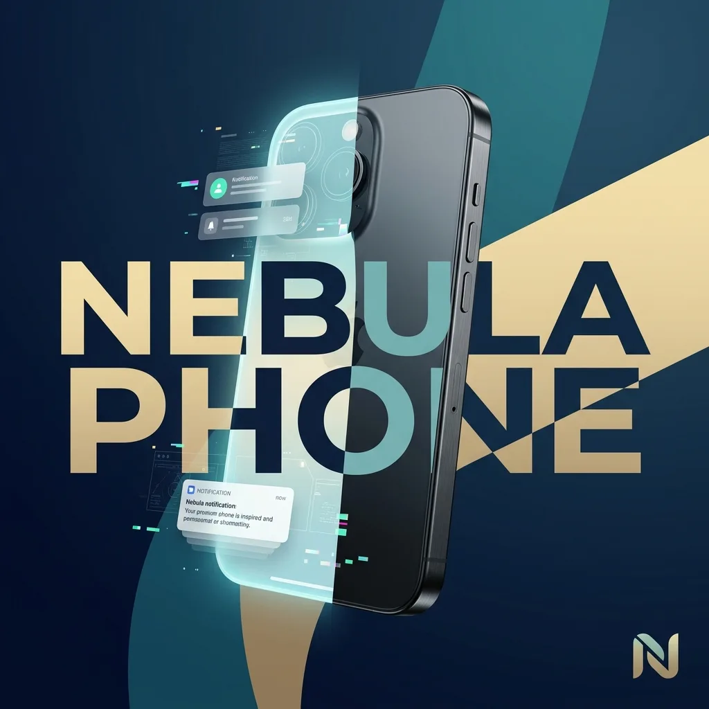

**#65 · Product &amp; Brand Prompt · <code>Vinano Image Pro</code>**

<details>
<summary>Show prompt</summary>

```
Create a 1:1 cinematic product poster (1080×1080) of [BRAND & PRODUCT], centered and fully visible, floating against a clean background inspired by the brand’s core color palette.

The product must remain intact and uncut, but be conceptually split by design:
• One half is true-to-life photorealistic, showcasing accurate materials, textures, reflections, buttons, surfaces, and premium build quality
• The other half transforms seamlessly into flat digital elements that represent the brand’s ecosystem — UI fragments, abstract tech shapes, interface cards, schematic overlays, soft holographic effects, or minimal glitch-style geometry

Lighting:
Cinematic, high-end studio lighting controlled highlights and soft shadows, emphasizing form and depth.

Typography:
Bold double-exposure style text displaying the product or brand name, integrated cleanly into the composition.
Official logo placed subtly and professionally in one corner.

Preserve realistic proportions and depth for a confident, professional finish.
```

</details>

---

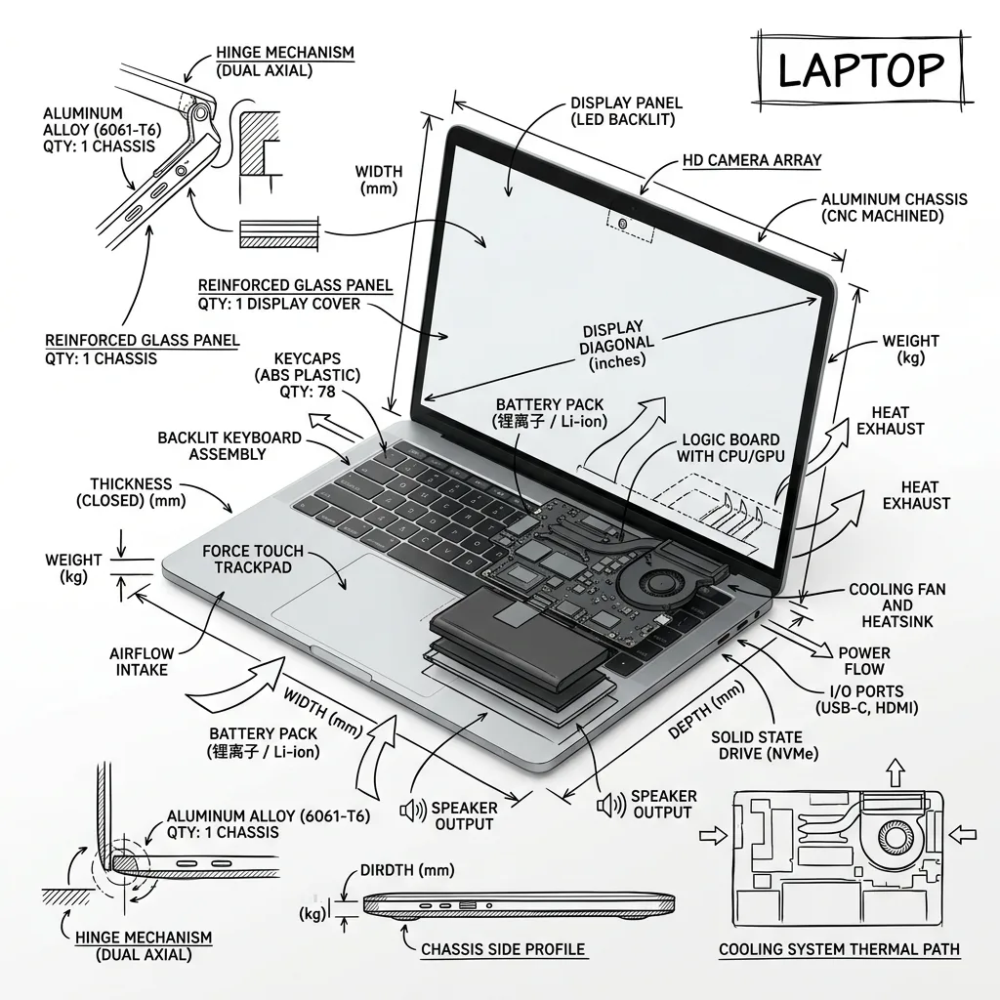

**#66 · Product &amp; Brand Prompt · <code>Vinano Image Pro</code>**

<details>
<summary>Show prompt</summary>

```
Create an infographic image of laptop,combining a realistic photograph or photoreal render of the object technical annotation overlays placed directly on top.

Use black ink–style line drawings and text (technical pen / architectural sketch look) on a pure white studio background, including:
•Key component labels
•Internal cutaway or exploded-view outlines
•Measurements, dimensions, and scale markers
•Material callouts and quantities
•Arrows indicating function, force, or flow (air, sound, power, pressure)
•Simple schematic or sectional diagrams where relevant

Place the title [OBJECT] inside a hand-drawn technical annotation box in one corner.

Style & layout rules:
•The real object remains clearly visible beneath the annotations
•Annotations feel sketched, technical, and architectural
•crisp composition balanced negative space
•Educational, museum-exhibit / engineering-manual vibe

Visual style:
Minimal technical illustration aesthetic, black linework over realistic imagery, precise but slightly hand-drawn feel.

Color palette:
White background, black annotation lines and text only. No colors.

Output:
1080×1080, ultra-crisp, social-feed optimized, no watermark.”

Es par ek text post bnao X ke liye ki ye mere dwara bnata gya hai

Keep edges clean and the overall composition balanced for a polished, gallery-ready result.
```

</details>

---

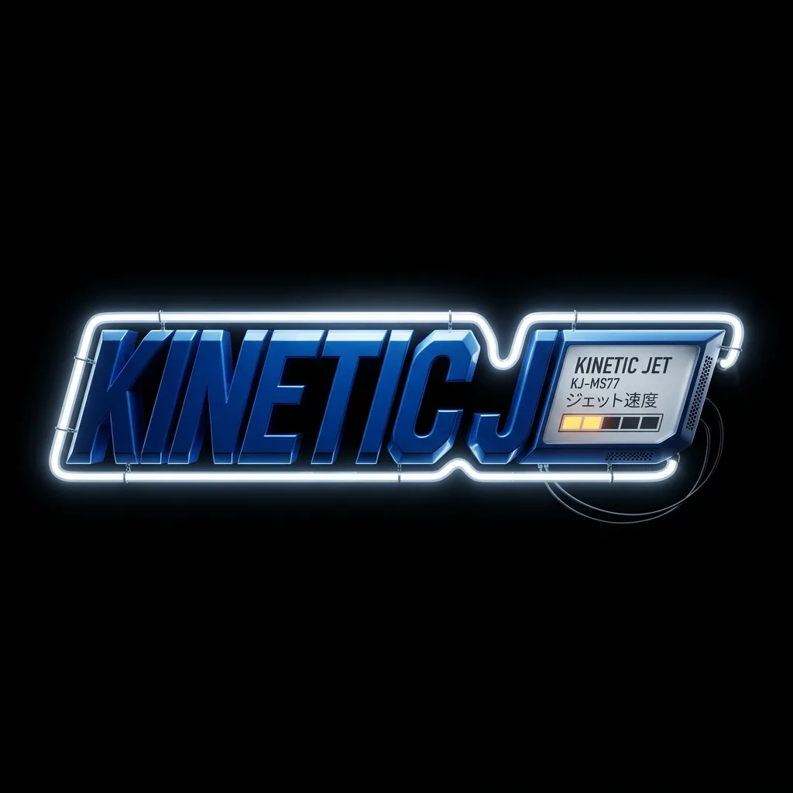

**#67 · Product &amp; Brand Prompt · <code>Vinano Image Pro</code>**

<details>
<summary>Show prompt</summary>

```
[BRAND NAME] | [COLOR]

Act as a 3D Motion Graphics Director and CGI Type Artist specializing in Japanese streetwear, Y2K motorsport aesthetics, and retro-tech hardware design. References: Kawasaki Racing livery, Yasuhiro Nightow title cards, Wipeout game UI, Peak Design × Japanese hardware collab.

PHASE 0: BRAND LOGO INTELLIGENCE

Retrieve the canonical logotype of [BRAND NAME] from training data. Identify its core typographic DNA — stroke weight, angle of italic lean, terminal style, any custom glyph cuts. If [BRAND NAME] uses a geometric or sans-serif wordmark — apply a 15 to 20° italic transformation while preserving all letterform proportions. If [BRAND NAME] already uses italic or script — preserve its native angle exactly. The goal is to translate the brand's typographic identity into a Japanese motorsport script register — aerodynamic, forward-leaning, built for speed. The letters must remain recognizable as [BRAND NAME]'s typeface, not replaced a generic racing font.

PHASE 1: PRIMARY TYPOGRAPHY SCULPTURE

The wordmark of [BRAND NAME] is a fully 3D object — thick, physical, occupying real depth. Form language: each letter has a flat front face, beveled top and bottom edges 30 to 45° chamfer cuts — the kind of angular geometry found on Japanese racing fairings and Kawasaki tank badges. Letters are slightly condensed and heavily italic — forward momentum is built into the geometry. The overall silhouette reads as one unified aerodynamic form — letters connect at their bases through a common ground plane, like a single cast aluminum piece. Material: high-gloss automotive lacquer in [COLOR] — the same paint system as a Japanese sports motorcycle tank. Surface properties: IOR 1.6, roughness 0.05, clear-coat depth visible. [COLOR] is pure and saturated in midtones, pushing toward near-white in specular peaks, pulling toward deep shadow in recessed zones and chamfer undersides. Reflections on the front face: subtle dark environment reflections — minimal and moody, just enough to show material depth. Top chamfer faces catch the primary light as bright highlight strips — the signature detail that defines 3D volume.

PHASE 2: NEON WIRE OUTLINE SYSTEM

A continuous neon tube traces the exact outer silhouette contour of the entire wordmark — every letter edge, every chamfer angle, every connecting point between letters. This is not a glow effect or a stroke — it is a physical glass neon tube, 4 to 6mm diameter, bent precisely to follow the letterform outline at a 3 to 5mm offset distance from the letter surface. Neon tube properties: glass tube body is semi-transparent — internal plasma glow visible through glass. Light emission: bright cold white light, color temperature 7000 to 8000K, pure white very slight blue-cool bias. Emitted light creates a tight halo of illumination — 8 to 15mm radius soft glow on surrounding black void. The neon light bounces onto nearest letter surfaces — edges adjacent to the tube receive subtle cool white rim light. Tube construction: clean geometric bends at sharp corners, thin mounting wire clips at 3 to 4 points along its length — technically precise, like real neon sign hardware.

PHASE 3: INTEGRATED TECHNICAL SCREEN

A hardware screen panel is physically integrated the wordmark — not a separate floating element, not placed at a distance. Integration logic — autonomously determine the most natural attachment point based on [BRAND NAME]'s logo geometry, choosing ONE of these integration modes: OVERLAP MODE — the screen panel is partially overlaid onto the rightmost or leftmost letter of the wordmark, as if mounted directly on the letter face. The letter surface shows through the screen's transparent zones. The screen edge cuts across the letter geometry deliberately — like a sticker or plate bolted onto the sculpture. EXTENSION MODE — the screen panel extends directly from the end of the final letter as a seamless continuation of the wordmark's ground plane — same italic angle, same 3D depth, as if the wordmark was designed this panel as part of its original form. The transition from letter to screen feels like one continuous designed object. INSET MODE — the screen panel sits in a recess cut into one of the larger letters — as if a rectangular section of the letter body was removed and replaced a hardware display. The letter geometry frames the screen on three sides.

Screen physical construction: machined aluminum or brushed steel housing, same thickness as the letter sculpture — 8 to 12mm deep. The face is a slightly frosted acrylic panel backlit from within. The screen has the same italic angle as the wordmark — it is not upright, it leans the composition. Screen contents rendered in precise small-scale detail: [BRAND NAME] in small clean technical sans-serif as primary label. An alphanumeric model code autonomously generated to feel authentic to [BRAND NAME]'s cultural language. 2 to 3 Japanese characters as secondary label. A horizontal LED progress bar — 4 to 6 rectangular segments, 1 to 2 lit in amber, others dark. A small ventilation grille or mesh pattern along one edge of the housing. The screen connects to the neon outline system 1 to 2 thin cables — physical wires, 1 to 2mm diameter, slight organic sag from gravity, running to the nearest neon tube mounting clip.

PHASE 4: LIGHTING & ATMOSPHERE

Background: pure absolute black (#000000 to #030303) — complete void, no ambient, no gradient, no surface. The composition is self-illuminated — only light sources are the neon tube emission, the screen's internal backlight, and a single narrow overhead spot. Overhead spot: focused directly above the wordmark center — illuminates top chamfer faces as bright highlight strips, falls off completely within 5 to 10cm of letterform edges, never reaches the background. Neon contribution: cool white rim light on adjacent letter edges, 8 to 15mm glow halo in surrounding void, reflected light on cables and screen housing. Screen contribution: the frosted acrylic face emits a soft diffused glow — slightly cooler than the neon, illuminating the immediate area of whichever letter the screen is integrated. The amber LED segments create a warm micro-glow within the screen housing. No other light sources. No rim lights. No fill. Darkness is absolute outside self-illuminated zones.

PHASE 5: COMPOSITION

Aspect ratio: 1:1 square. The wordmark integrated screen occupies the horizontal center — wider than tall, spreading laterally. The screen integration should feel like it was always part of the logo design — not an accessory bolted on, but a native component. Vertical position: slightly above center. The neon outline breaches the implied bounding box slightly at 1 to 2 points — confirming physical separation between neon tube and letter surface. Camera: slightly elevated 5 to 10° above center — reveals top chamfer faces and confirms 3D depth. Mild perspective. Depth of field: none — sharp across entire composition from screen detail to neon tube.

PHASE 6: TECH SPECS

Render: Octane Render or Redshift. Ray tracing: on — for accurate neon tube emission, screen backlight glow, glass refraction, cable shadows. Volumetric light: subtle around neon tube and screen face only — physically present glow without fogging the black void. Neon tube: dielectric glass material physical light emission, not a glow map. Screen face: translucent acrylic internal emissive backlight. Letter sculpture: automotive lacquer full clear-coat depth. Anti-aliasing: maximum. Sampling: minimum 1024 samples. Film grain: none. Output feel: CGI title card or album cover — precision and atmosphere in equal measure. Darkness absolute. Neon and screen physically real.

Render with rich micro-detail while keeping the layout uncluttered and intentional.
```

</details>

---

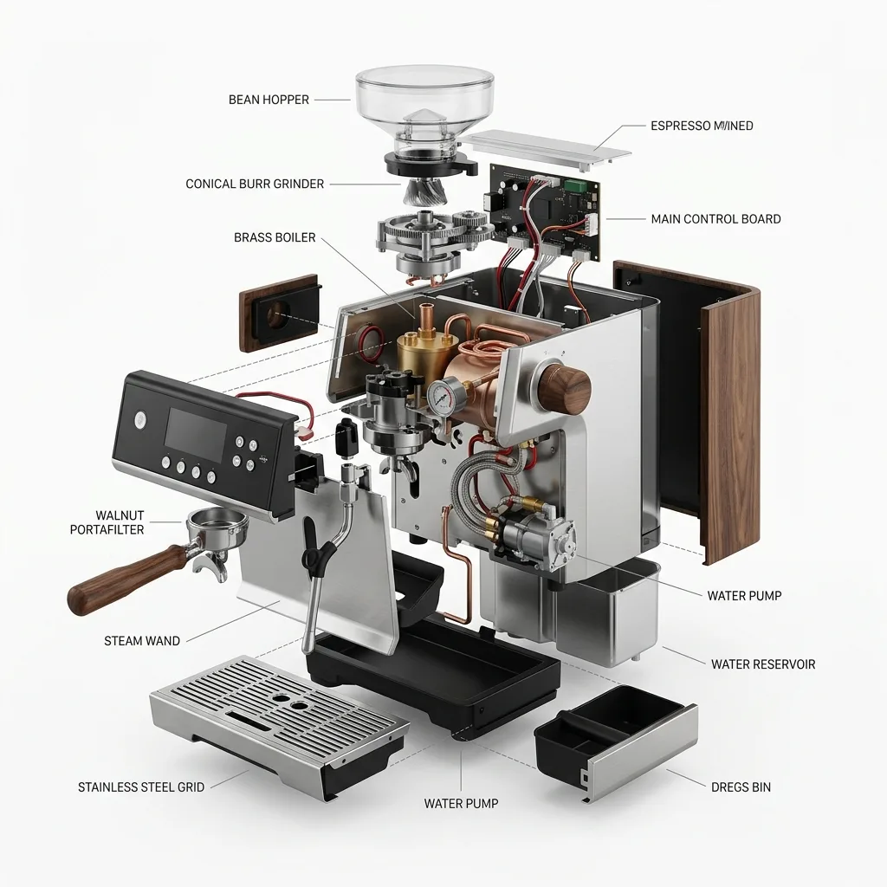

**#68 · Product &amp; Brand Prompt · <code>Vinano Image Pro</code>**

<details>
<summary>Show prompt</summary>

```
product design, [object or vehicle material accents], exploded view diagram, white background, three-dimensional, highly detailed internal components, studio lighting, product photography, best quality Maintain consistent colour harmony and crisp focus across the whole frame.
```

</details>

---

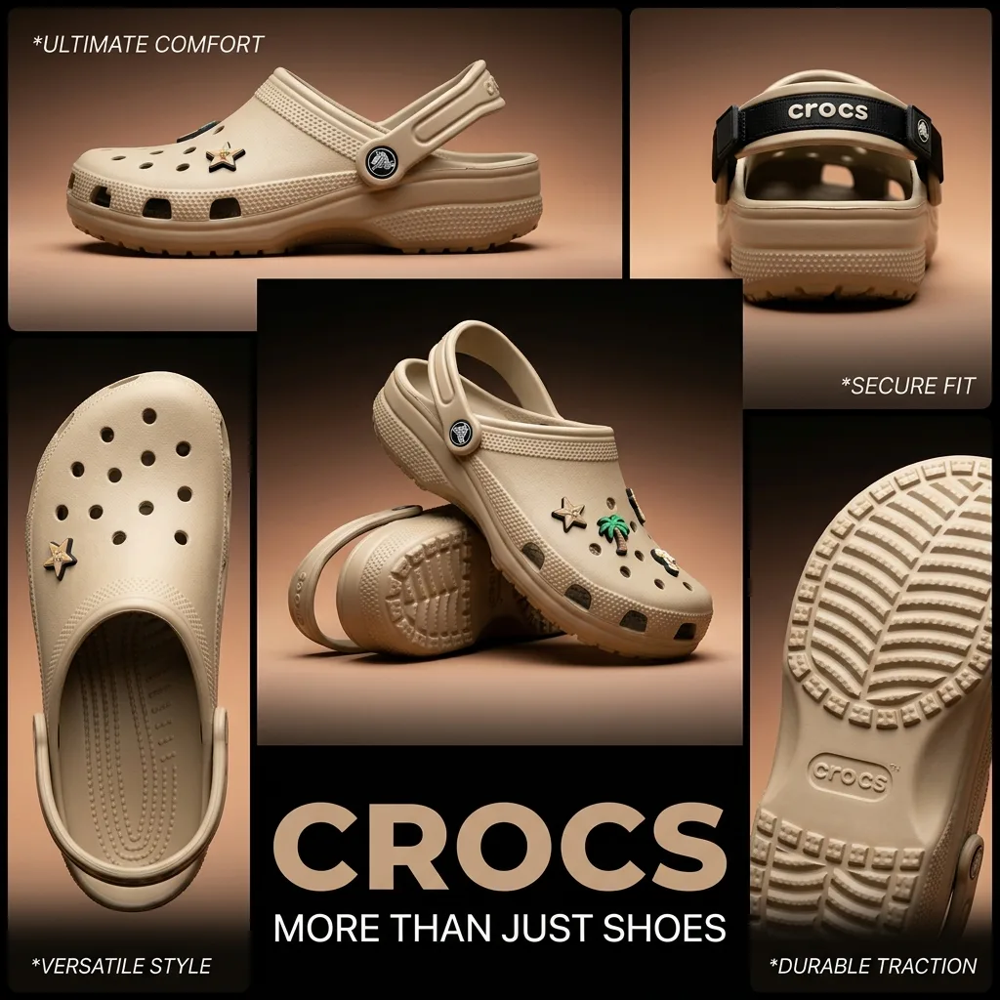

**#69 · Product &amp; Brand Prompt · <code>Vinano Image Pro</code>**

<details>
<summary>Show prompt</summary>

```
Multi-image product collage poster featuring beige/tan Crocs clog shoes, designed as a modern footwear advertisement.

The layout combines multiple product angles arranged in a structured grid:

Side profile view showing the clog silhouette and ventilation holes

Rear view highlighting the heel strap and branding

Top-down view showing the cushioned footbed texture

Close-up detail of the sole tread and side logo

A hero product image in the foreground one shoe stacked against another, creating depth

Clean studio background a warm brown-to-black gradient, giving a cozy, lifestyle-oriented tone.
The Crocs appear matte, lightweight, and comfortable, realistic foam texture and soft shadows.

Large bold headline typography at the bottom reads:
“CROCS”
Subheading: “MORE THAN JUST SHOES”

Small blocks of descriptive lifestyle copy appear subtly in the background, reinforcing comfort, durability, and versatility. Overall composition feels like a social media brand post or poster ad.

Visual Style

Modern product advertising
Lifestyle + catalog hybrid
Warm earthy color palette
Soft studio lighting
true-to-life photorealistic textures
crisp composition
Professional footwear photography

Camera & Composition

Multiple angles combined into one layout
85mm–100mm product photography look
Sharp focus on shoes
Soft shadows beneath products
Balanced exposure
No distortion

Mood & Branding

Comfort
Everyday lifestyle
Durable
Casual confidence
Practical yet stylish
Approachable brand feel

Negative Prompt

Low resolution, incorrect shoe shape, warped branding, misspelled logo, glossy plastic look, harsh reflections, cluttered layout, inconsistent lighting, cartoon style, CGI look, watermark, text artifacts

Keep edges clean and the overall composition balanced for a polished, gallery-ready result.
```

</details>

---

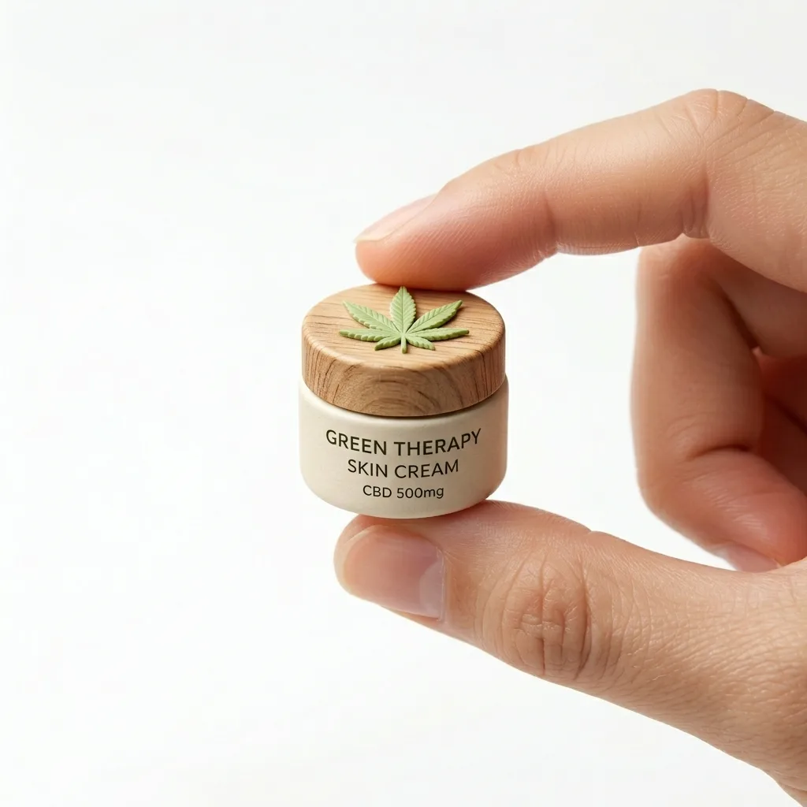

**#70 · Product &amp; Brand Prompt · <code>Vinano Image Pro</code>**

<details>
<summary>Show prompt</summary>

```
A high-resolution advertising photograph of a realistic, miniature product in the attached image, held delicately between a person's thumb and index finger: clean and white background, studio lighting, soft shadows. The hand is well-groomed, a natural skin tone, and positioned to highlight the product’s shape and details. The product appears extremely small but hyper-detailed and brand-accurate, centered in the frame a shallow depth of field. Emulates luxury product photography and refined minimalist commercial style Emphasise material texture and natural light so the final frame feels tactile and premium.
```

</details>

---

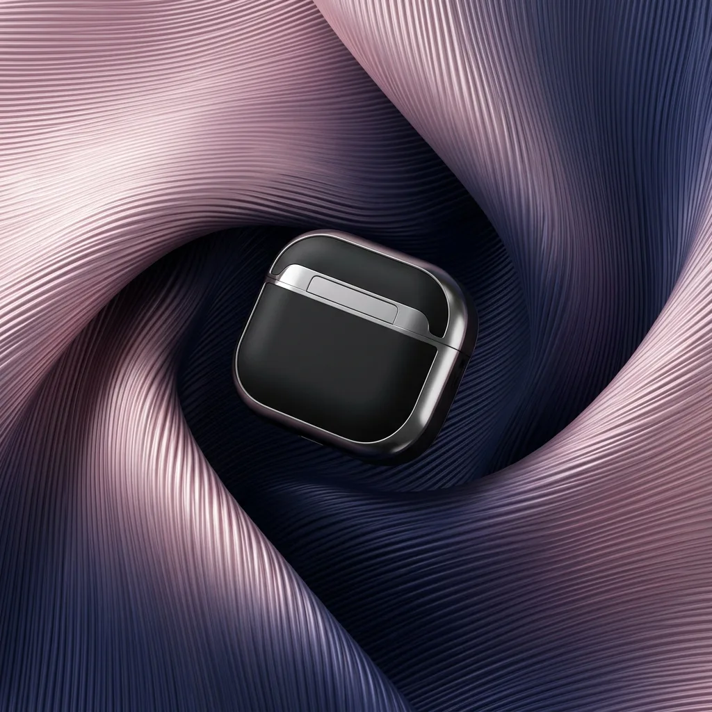

**#71 · Product &amp; Brand Prompt · <code>Vinano Image Pro</code>**

<details>
<summary>Show prompt</summary>

```
{
 "image_generation_request": {
 "subject": "[PRODUCT]",
 "product_finish": {
 "primary": "matte black subtle light absorption",
 "secondary": "polished metallic silver mirror-like reflections",
 "treatment": "duotone — matte black body metallic silver accents, trim, edges, or panel insets"
 },
 "composition": {
 "placement": "dead center, full view, floating suspended within the folded surface environment",
 "scale": "product occupies roughly 30-40% of the frame",
 "constraints": ["product must be entirely visible no cropping",
 "no pedestals, stands, platforms, or ground planes",
 "the surface folds frame the product but never obscure more than 10% of it",
 "product is the sharpest element in the scene"]
 },
 "background_environment": {
 "description": "A single continuous undulating surface that fills the entire frame, folding over and around itself in large voluminous waves — like a massive sheet of pleated metallic silk or a single machined metal panel that has been softly twisted and draped. This is NOT multiple separate ribbons or strands. It is ONE connected surface.",
 "base_color": "[INSERT DEEP BACKGROUND COLOR visible in crevices — e.g. pure black, midnight navy]",
 "surface_color_1": "[INSERT GRADIENT COLOR A — e.g. soft lavender, warm copper, pearl rose]",
 "surface_color_2": "[INSERT GRADIENT COLOR B — e.g. deep indigo, cobalt blue, violet]",
 "color_behavior": "The two colors blend in a smooth continuous gradient across the single surface, shifting based on the surface's curvature and light angle. Where the surface faces the light it shows color_1, where it curves away it transitions to color_2. The transition is seamless no hard edges or stripes.",
 "surface_texture": {
 "type": "fine parallel ribs embossed into the surface — like the grooves on a vinyl record or finely pleated accordion fabric",
 "rib_description": "extremely fine, uniform, tightly spaced parallel lines that follow the flow direction of the surface. The ribs are a TEXTURE on the surface, not separate objects. They create a subtle corrugated micro-relief that catches light along each tiny ridge.",
 "rib_density": "very high — approximately 50-100 visible lines per inch of surface, creating a dense linear grain",
 "rib_depth": "shallow — the ribs are subtle surface detail, not deep cuts. They create gentle highlight-shadow alternation across the surface"
 },
 "surface_form": {
 "fold_style": "large, smooth, voluminous folds like draped heavy silk — broad sweeping curves gentle twists",
 "fold_count": "3-5 major folds visible, each one wide and generous, NOT many small tangled ribbons",
 "fold_behavior": "folds overlap softly, tucking under and over each other smooth transitions. Where folds meet they create deep soft shadow crevices",
 "tension": "the surface appears smooth and taut across each fold, no wrinkles or crumpling — like stretched satin over a curved form",
 "edges": "no visible edges — the surface appears to extend beyond the frame in all directions, as if we are seeing a close-up section of an infinite draped form"
 },
 "material": {
 "finish": "satin metallic — a soft brushed-metal luminosity between matte and mirror. The surface has a pearlescent quality where colors shift viewing angle",
 "light_interaction": "soft specular highlights along the crest of each rib, gentle shadows in each rib valley, creating an overall shimmering linear texture across the broad folds"
 }
 },
 "lighting": {
 "type": "soft, diffused, directional — as if a large softbox is illuminating from upper-left, creating a warm-to-cool gradient across the scene",
 "shadow_behavior": "deep soft shadows in fold crevices, gradual falloff — no harsh edges",
 "highlight_behavior": "broad soft highlights across fold peaks, fine linear shimmer from the rib texture",
 "restrictions": "no visible light sources, no lens flare, no reflections of studio equipment"
 },
 "style": {
 "aesthetic": "parametric design art, computational sculpture, abstract luxury",
 "mood": "luxurious, smooth, tactile, premium product showcase",
 "critical_note": "The background must look like a SINGLE continuous folded metallic surface fine ribbed texture — NOT like multiple separate ribbons, cables, wires, or strands bundled together. Think of one sheet of finely pleated metal that has been elegantly draped and folded."
 },
 "technical_specs": {
 "quality": "8k resolution, extreme surface texture detail, tack-sharp product focus",
 "render_style": "true-to-life photorealistic 3D render, Octane or Redshift quality",
 "aspect_ratio": "1:1 square",
 "exclusions": "text, watermarks, logos on background, extra props, lens flare, studio equipment, flat surfaces, any ground plane, separate ribbons, wire bundles, rope-like forms"
 }
 }
}

Aim for an editorial, design-driven look with deliberate negative space.
```

</details>

---

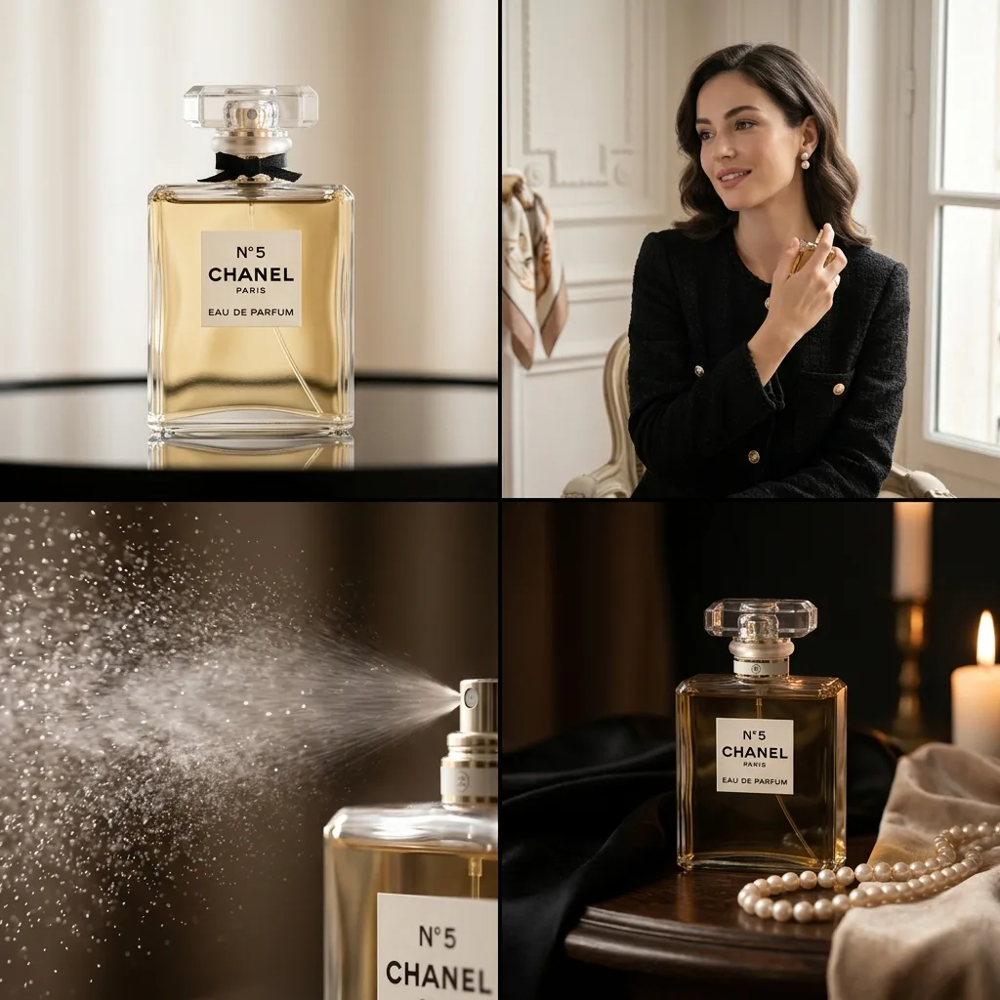

**#72 · Product &amp; Brand Prompt · <code>Vinano Image Pro</code>**

<details>
<summary>Show prompt</summary>

```
2×2 grid luxury perfume advertisement for Chanel perfume, four distinct yet cohesive high-end commercial images, elegant Parisian aesthetic, timeless fashion branding.

Panel 1 – Hero Product Elegance

refined minimalist studio shot of a Chanel perfume bottle centered on a reflective surface. Soft, diffused lighting highlights the glass clarity, sharp edges, and iconic label. Neutral background in beige, ivory, or soft black. Luxurious, calm, iconic composition.

Panel 2 – Parisian Lifestyle Mood

Elegant adult woman in a classic Parisian interior vintage molding. She gently applies Chanel perfume to her neck or wrist. Natural light, effortless beauty, refined posture. Editorial fashion photography style, understated luxury.

Panel 3 – Sensory Detail Close-Up

Macro close-up of the Chanel perfume bottle fine mist dispersing into the air. Light catches the spray particles. Soft shadows, shallow depth of field. Emphasis on texture, fragrance atmosphere, and sensory refinement.

Panel 4 – Cinematic Night Glamour

Moody, cinematic scene the Chanel perfume bottle placed on a dark surface beside silk fabric or pearls. Low-key lighting, warm highlights, deep shadows. Evokes mystery, confidence, and timeless femininity.

All four images are visually unified through refined color grading, restrained contrast, and classic Chanel luxury cues.

Visual Style

Luxury fashion advertising
Editorial, timeless, refined
Soft contrast
Muted neutral palette
High realism
crisp composition
Parisian elegance

Camera & Lighting

Professional studio and editorial photography
50–85mm lens look
Shallow depth of field
Soft diffused lighting
Controlled highlights and shadows
Perfect label clarity

Mood Keywords

Elegant
Iconic
Sophisticated
Timeless
Feminine
Confident
Luxury

Negative Prompt

Cheap packaging, distorted logo, misspelled branding, harsh lighting, oversaturation, cluttered background, CGI look, cartoon style, watermark, text overlays, knockoff perfume bottles

Aspect Ratio

Overall canvas: 1:1
Grid: 2×2 equal squares
Optimized for luxury brand advertising and social campaigns

Keep edges clean and the overall composition balanced for a polished, gallery-ready result.
```

</details>

---

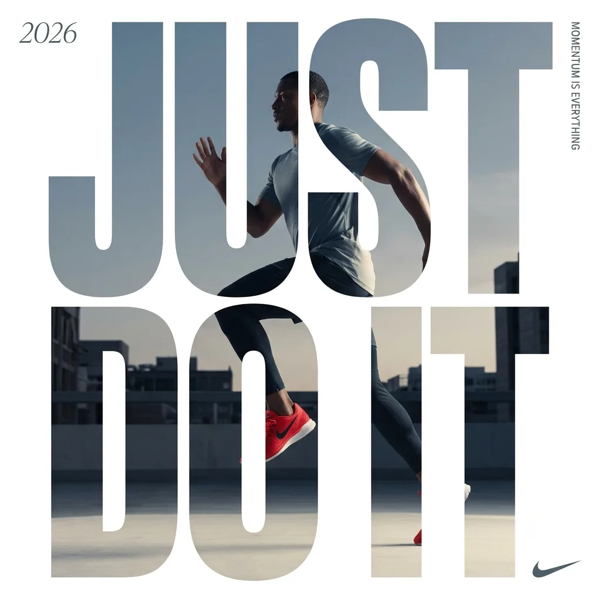

**#73 · Product &amp; Brand Prompt · <code>Vinano Image Pro</code>**

<details>
<summary>Show prompt</summary>

```
[BRAND NAME]. Act as a Senior Editorial Designer and Typographer.

PHASE 1: TYPOGRAPHIC MASK (THE "WINDOW" EFFECT).

- Core Element: Use the most iconic slogan or the name of [BRAND NAME] as a massive, ultra-bold, heavy sans-serif typographic mask.

- Layout: The letters must be giant, filling the entire vertical frame from edge to edge tight kerning.

- Concept: The text acts as a "cut-out" window. The background is solid white, and the photographic subject is visible ONLY through the letterforms.

PHASE 2: DYNAMIC SUBJECT LOGIC.

- Subject Selection:

- Detail: Ensure a high-contrast element (like a red shoe or a glowing headlight) is visible through one of the letters as a focal point.

PHASE 3: SOPHISTICATED MUTED PALETTE.

- Atmosphere: Use a "Refined Muted" color scheme.

- Tones: Soft slate blues, charcoal greys, and creamy off-whites for the photography inside the mask.

- Accent: Identify one sharp, saturated accent color belonging to [BRAND NAME] and apply it to a single key object visible through the text.

PHASE 4: PHOTOGRAPHY & LIGHTING.

- Lighting: Soft-box studio lighting. Diffused shadows and gentle highlights to create a cinematic, high-end editorial feel.

- Finish: Clean, matte texture zero visual noise. High-definition photographic quality.

PHASE 5: refined minimalist BRANDING.

- Accents: Add a tiny refined minimalist logo and a small vertical tagline in a clean, microscopic sans-serif font near the corners.

- Year: Include the year "2026" in a subtle, elegant font to mimic a limited-edition look.

Preserve realistic proportions and depth for a confident, professional finish.
```

</details>

---

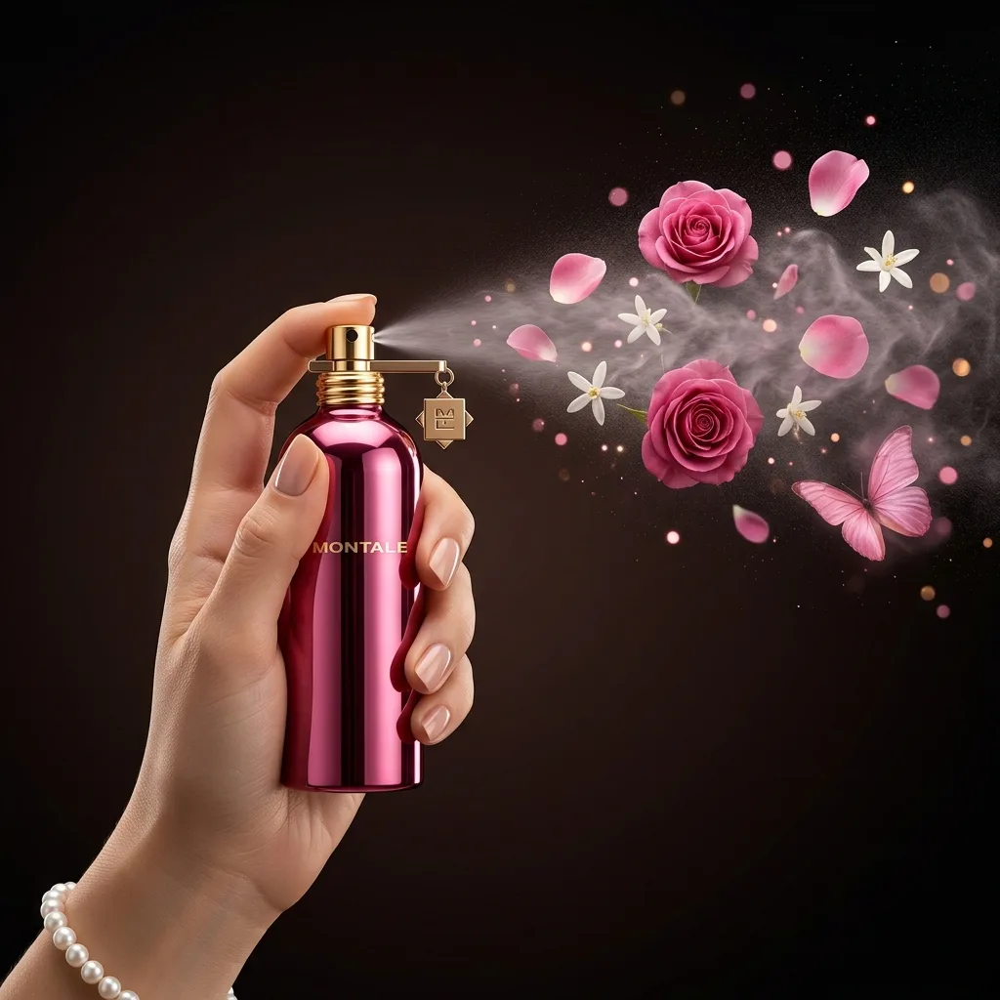

**#74 · Product &amp; Brand Prompt · <code>Vinano Image Pro</code>**

<details>
<summary>Show prompt</summary>

```
{
 "resolution": "8K",
 "aspect_ratio": "3:4",
 "style": "high-end AI-edited studio photography",
 "subject": {
 "primary": "human hand holding a metallic pink perfume bottle",
 "hand_details": {
 "skin": "smooth, well-groomed",
 "nails": "short to medium length, natural nude tone",
 "accessory": "white pearl bracelet on wrist"
 },
 "bottle": {
 "material": "metallic reflective",
 "color": "deep metallic pink",
 "shape": "cylindrical rounded shoulders",
 "nozzle": "gold spray nozzle, cap removed",
 "charm": {
 "material": "gold",
 "shape": "small geometric star-like tag",
 "attachment": "hanging from bottle neck thin metal loop"
 },
 "visible_text": "MONTALE"
 }
 },
 "action": {
 "spray": {
 "type": "fine atomized mist",
 "direction": "left to right",
 "texture": "soft, smoke-like, semi-transparent"
 }
 },
 "elements_emerging_from_mist": {
 "flowers": {
 "pink_roses": "fully bloomed roses floating in air",
 "rose_petals": "individual pink petals suspended mid-air",
 "white_flowers": "small star-shaped white blossoms thin petals"
 },
 "butterfly": {
 "color": "pink",
 "wings": "semi-translucent visible veins",
 "position": "right side of frame"
 },
 "particles": {
 "type": "small glowing bokeh-like specks",
 "colors": ["soft pink", "warm gold"]
 }
 },
 "background": {
 "color": "dark black to deep brown gradient",
 "environment": "studio, no visible location"
 },
 "lighting": {
 "type": "soft cinematic studio lighting",
 "highlights": ["bottle curves", "gold nozzle", "mist", "flowers"],
 "contrast": "high subject-to-background contrast"
 },
 "composition": {
 "orientation": "vertical",
 "subject_position": "slightly left of center",
 "depth": "foreground hand, mid-air mist and flowers, dark background"
 },
 "quality": {
 "sharpness": "ultra-sharp",
 "detail_level": "extreme micro-detail",
 "finish": "luxury advertising grade"
 }
}

Keep edges clean and the overall composition balanced for a polished, gallery-ready result.
```

</details>

---

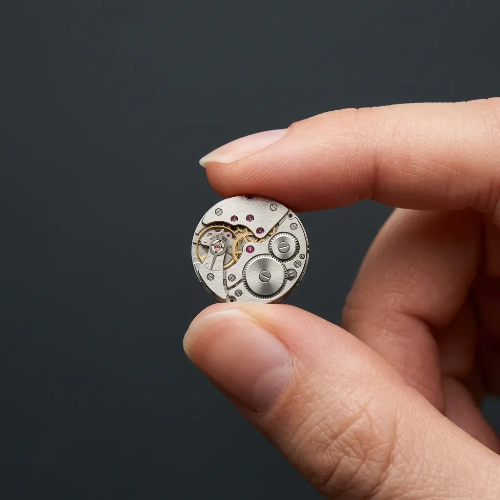

**#75 · Product &amp; Brand Prompt · <code>Vinano Image Pro</code>**

<details>
<summary>Show prompt</summary>

```
macro photograph, refined minimalist advertising style, a hyper-realistic miniature [PRODUCT] crafted from [MATERIAL], delicately poised between a person's thumb and forefinger against a seamless, matte [BG_COLOR] cyclorama under professional Top-Down_Spotlight that casts subtle, soft shadows, the impeccably groomed hand accentuating the object's intricate contours while the composition remains perfectly centered a shallow depth of field to highlight its exquisite craftsmanship Keep edges clean and the overall composition balanced for a polished, gallery-ready result.
```

</details>

---

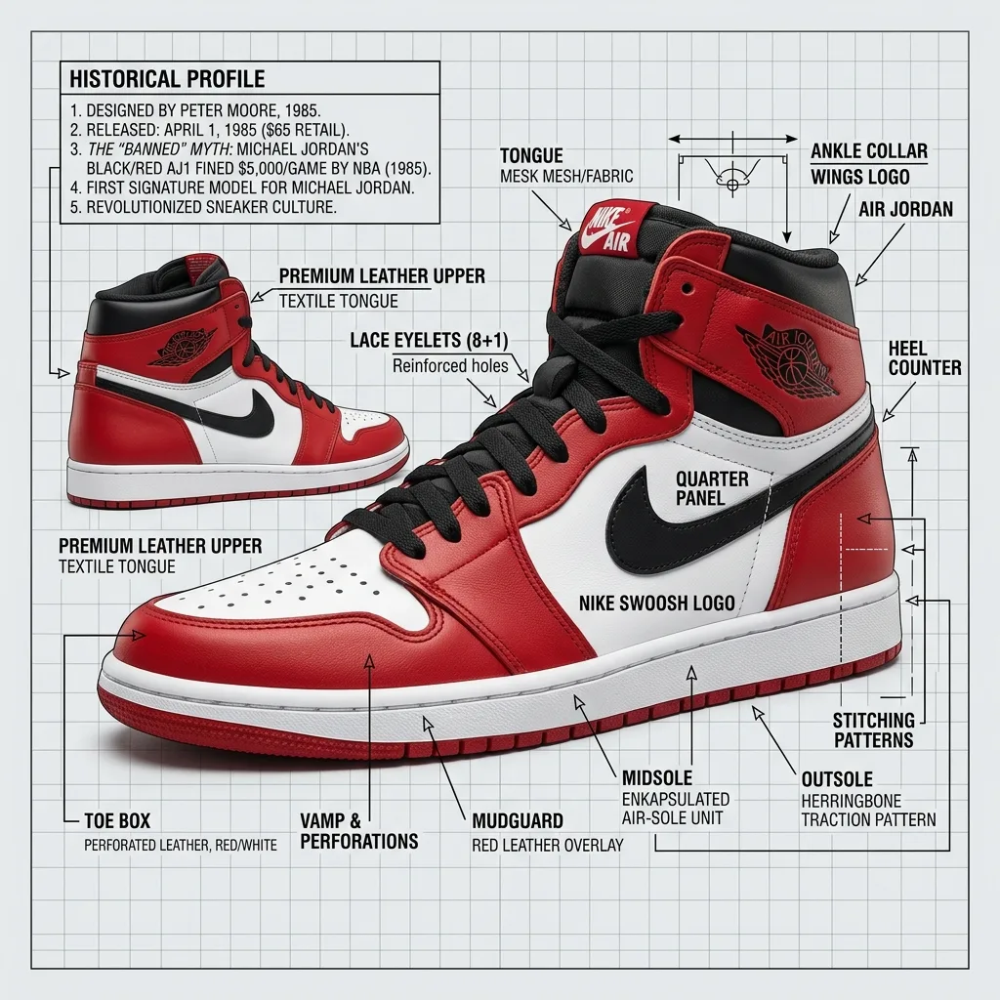

**#76 · Product &amp; Brand Prompt · <code>Vinano Image Pro</code>**

<details>
<summary>Show prompt</summary>

```
Create an infographic image of Nike Air Jordan 1 High OG sneaker, combining a realistic photograph or photoreal render of the object technical annotation overlays placed directly on top. Use black ink–style line drawings and text (technical pen / engineering diagram aesthetic) for all annotations. Include precise arrows pointing to specific parts, detailed labels naming each component (toe box, swoosh logo, wings logo, collar, tongue, lace holes, midsole, outsole, heel counter, perforations, stitching patterns), materials used (premium leather, rubber outsole, foam cushioning), and historical notes (designed by Peter Moore, 1985, banned by NBA). Show both side profile and slight 3/4 angle. Background should be clean white or very light neutral. Overall style: a hybrid of product photography and vintage technical manual illustration. High resolution, ultra-detailed, 4K quality. Maintain consistent colour harmony and crisp focus across the whole frame.
```

</details>

---

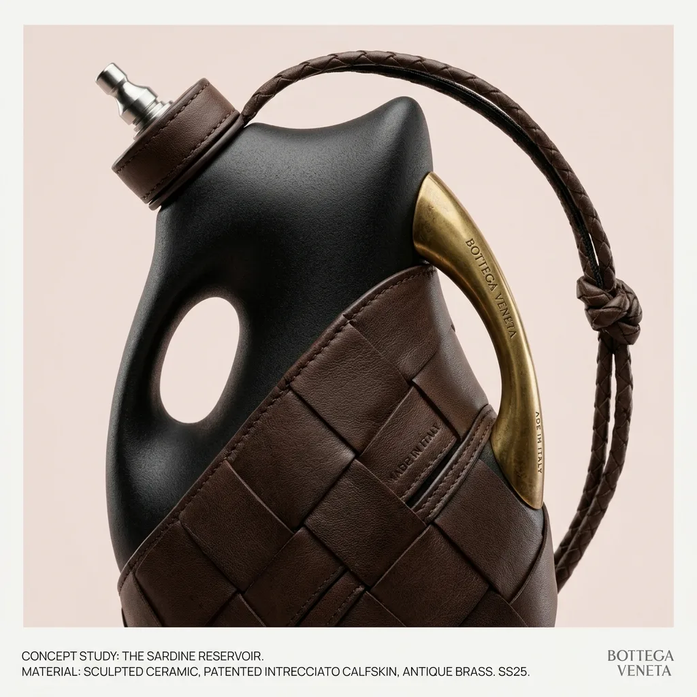

**#77 · Product &amp; Brand Prompt · <code>Vinano Image Pro</code>**

<details>
<summary>Show prompt</summary>

```
[BRAND NAME]:
A high-end, glossy concept art magazine editorial photograph of a unique, unexpected functional object conceptualized and designed by the brand.

**1. The Concept & Object (AI Invention):**
Based on the design philosophy, heritage, and material vocabulary of the specified brand, the AI must invent a novel utility product (NOT standard clothing, shoes, or bags). Examples could be home goods, tech accessories, tools, or sporting equipment, reinterpretated through the brand's lens. The object should feel sculptural yet functional.

**2. Materials & Details (Hyper-Premium):**
The object is constructed from ultra-premium, highly tactile materials characteristic of the brand (e.g., patinated exotic leathers, brushed aerospace-grade titanium, sculpted matte ceramics, molded carbon fiber, or technical high-fashion textiles). Every detail is hyper-realistic: visible stitching, microscopic material grain, precision engravings, and complex texture contrasts.

**3. Photography & Lighting (Cinematic Studio):**
Shot on a medium format Phase One camera a 100mm macro lens. Extremely shallow depth of field, sharp focus on the hero details of the object and a creamy, smooth bokeh background. The lighting is sophisticated studio softbox lighting: gentle, enveloping fill light precise rim lighting to accentuate contours and material textures.

**4. Environment:**
A seamless, impeccably clean studio cyclorama background in a pure, ultra-light pastel tone (e.g., desaturated mint, pale blush, or off-white), free of shadows.

**5. Layout & UI Elements (Strict Placement):**
- **Bottom Right Corner:** A small, understated, monochrome gray logo of the brand.
- **Bottom Left Corner:** Small, refined minimalist monochrome gray text describing the invented product. The font style looks like Manrope Regular very tight tracking (kerning) and balanced line spacing. Example format: "CONCEPT STUDY: [AI inserts invented product name]. MATERIAL: [AI inserts main materials]. SS25.

Render with rich micro-detail while keeping the layout uncluttered and intentional.
```

</details>

---

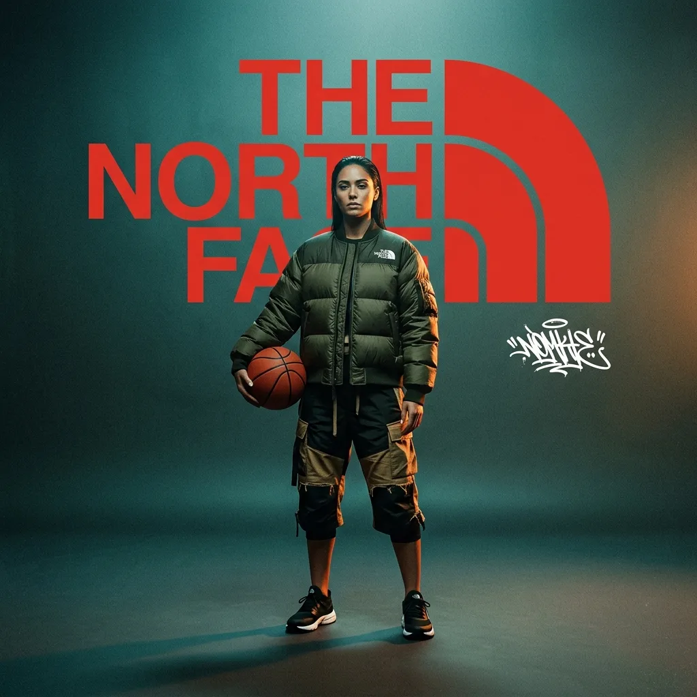

**#78 · Product &amp; Brand Prompt · <code>Vinano Image Pro</code>**

<details>
<summary>Show prompt</summary>

```
A high-fashion, cinematic brand concept poster for "The North Face." The scene features a woman in the uploaded image, standing in a stylized studio. They are dressed in edgy, oversized urban streetwear: a dark olive-green quilted puffer bomber jacket, layered black and tan distressed techwear shorts below knees, and black sneakers white soles. The person holds a classic orange basketball at their hip. In the background, a massive, bold red "THE NORTH FACE" logo and its iconic half-dome symbol are stacked and centered, dominating the upper half of the frame. To the right of the subject, there's a small white stylized graffiti-style signature. The lighting is moody and dramatic, featuring a teal-tinted atmosphere a warm rim light hitting the subject’s right side. The floor is a dark, smooth studio surface a soft shadow cast forward. The overall aesthetic is gritty, futuristic, and high-contrast, a heavy film grain texture. Render with rich micro-detail while keeping the layout uncluttered and intentional.
```

</details>

---

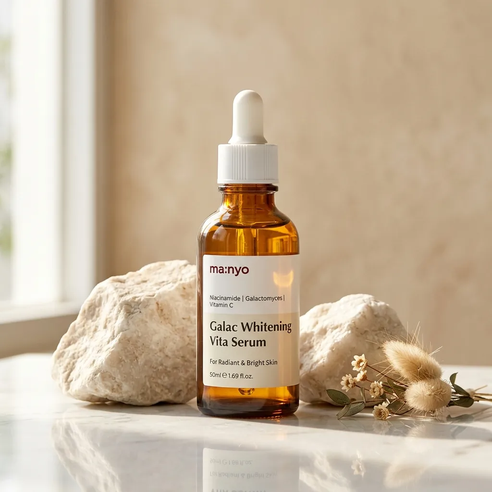

**#79 · Product &amp; Brand Prompt · <code>Vinano Image Pro</code>**

<details>
<summary>Show prompt</summary>

```
refined minimalist studio product photography of an amber glass dropper serum bottle white cap, labeled “ma:nyo Galac Whitening Vita Serum”, placed between large textured white stones, soft beige background, warm sunlight casting natural shadows, subtle golden glow reflecting through the glass, small delicate dried flowers beside the bottle, glossy reflective surface, high-end skincare advertisement, ultra-realistic, 85mm lens, shallow depth of field, soft diffused lighting, clean aesthetic, 8k resolution. Aim for an editorial, design-driven look with deliberate negative space.
```

</details>

---

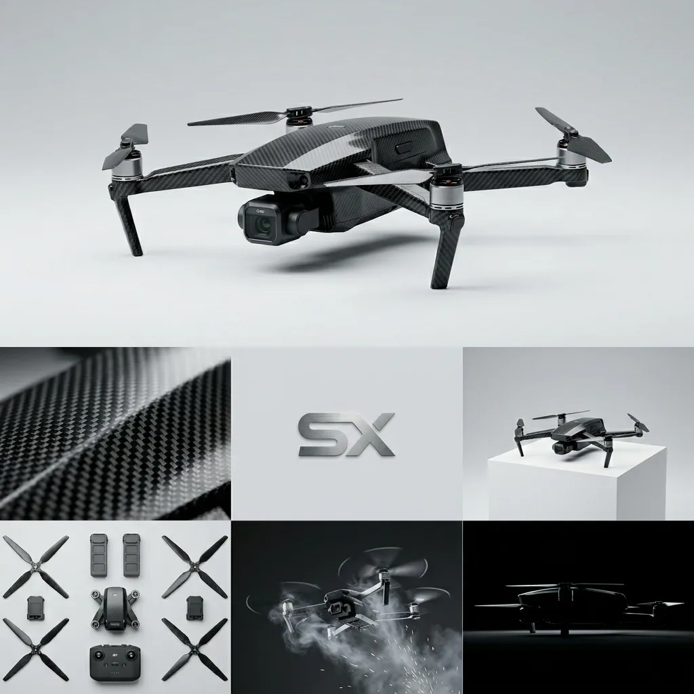

**#80 · Product &amp; Brand Prompt · <code>Vinano Image Pro</code>**

<details>
<summary>Show prompt</summary>

```
CORE OBJECTIVE: Create a professional 8k studio editorial based on [ATTACHED_INPUT_IMAGE]. Analyze subject geometry, material, and branding to maintain logic across 7 seamless panels.

STEP 1: DYNAMIC ANALYSIS
Identify: Subject, logo (or name), and material.

Material Logic: Tech (sharp rim lights), Glass (refraction/caustics), Organic (soft light), Fashion (matte/satin sheen).

COMPOSITION & STRUCTURE
Single seamless image. Top: 1 Hero Panel. Bottom: 2x3 Grid (6 panels). Total 7 views. No text or borders (except Frame 2).

PANEL SPECIFICATIONS
MAIN HERO: Centered master portrait on infinite-curve background. Lighting highlights primary material.

F1 (Macro): Extreme close-up on material "DNA" (microscopic grain, textures, or circuitry).

F2 (Logo): 3D premium brand emblem centered on a refined minimalist studio backdrop.

F3 (Scale): Subject in size-appropriate context (gallery for large, pedestal for small).

F4 (Rhythm): High-angle "knolling" or grid repetition of components.

F5 (Motion): Weightless action-still environmental cues (vapor, sparks, or splashes).

F6 (Form): High-contrast rim-lit profile focusing purely on the iconic silhouette.

VISUAL ENFORCEMENT
Style: Ultra-high-end Studio Editorial.

Consistency: 100% identical color and design details across all views.

Technical: 8k, ray-traced reflections, professional grading, global illumination.

Aim for an editorial, design-driven look with deliberate negative space.
```

</details>

---

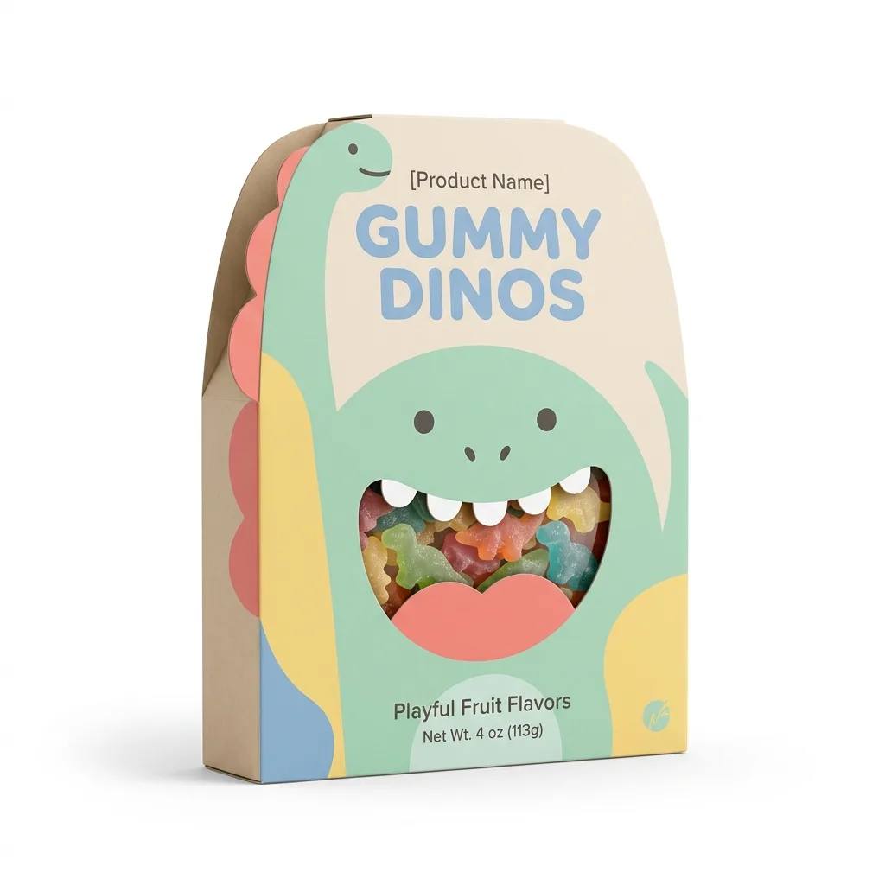

**#81 · Product &amp; Brand Prompt · <code>Vinano Image Pro</code>**

<details>
<summary>Show prompt</summary>

```
Playful designer packaging for [product name], creative box shaped like the product, integrated cartoon face on the front panel, oversized die-cut window revealing the real contents as part of the character’s expression, smooth matte cardboard material, bold flat graphic design, modern refined minimalist branding, limited pastel color palette, rounded friendly shapes, clean typography, high-end 3D packaging mockup render, soft studio lighting, pure white background, subtle realistic contact shadow beneath, ultra-detailed, retail-ready presentation, 1:1 aspect ratio. Preserve realistic proportions and depth for a confident, professional finish.
```

</details>

---

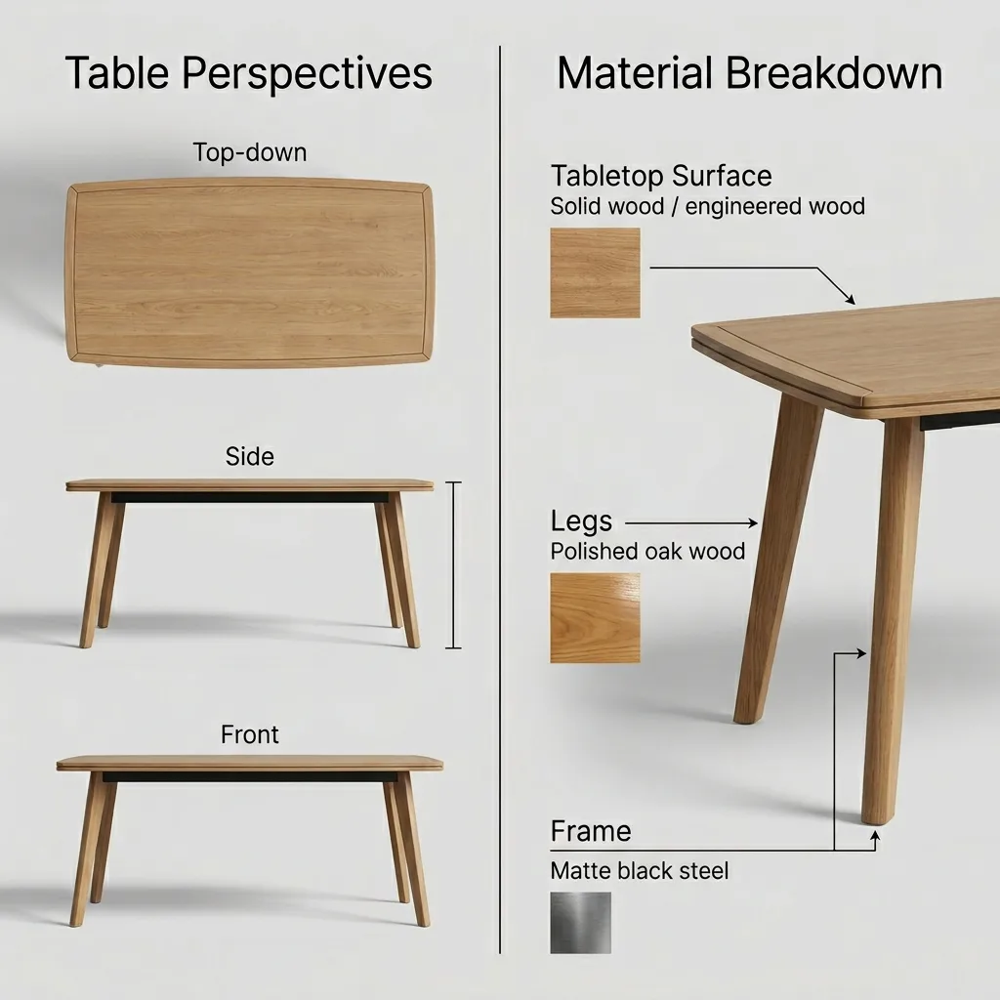

**#82 · Product &amp; Brand Prompt · <code>Vinano Image Pro</code>**

<details>
<summary>Show prompt</summary>

```
{
 "objective": "Create a detailed product showcase image of a table design multiple perspectives and material information",
 "image_specifications": {
 "style": "Realistic 3D render or premium-quality product illustration",
 "layout": "Split view",
 "aspect_ratio": "3:2 or 4:3",
 "background": "Neutral (light gray or white) to enhance clarity and contrast"
 },
 "left_side": {
 "section_title": "Table Perspectives",
 "views": [{
 "view": "Top-down",
 "description": "Display the full table from above, showing tabletop shape, surface texture, and edge details"
 },
 {
 "view": "Side view",
 "description": "Profile of the table to show leg design, table height, and tabletop thickness"
 },
 {
 "view": "Front view",
 "description": "Straight-on view to show width, symmetry, and leg alignment"
 }],
 "visual_style": "Consistent lighting and shadows for realism, subtle shadows to define form"
 },
 "right_side": {
 "section_title": "Material Breakdown",
 "content": [{
 "material": "Tabletop Surface",
 "material_type": "Solid wood / engineered wood",
 "swatch_image": "Close-up wood texture sample",
 "label_style": "Clean sans-serif text arrows pointing to table sections"
 },
 {
 "material": "Legs",
 "material_type": "Polished oak wood or metal",
 "swatch_image": "Close-up material texture sample",
 "label_style": "Consistent labeling visual connection to perspective images"
 },
 {
 "material": "Frame",
 "material_type": "Matte black steel",
 "swatch_image": "Small metallic texture sample",
 "label_style": "refined minimalist annotations"
 }]
 },
 "visual_elements": {
 "separation": "Vertical dividing line or subtle split background",
 "color_palette": "Natural tones for materials, grayscale for background and lines",
 "typography": "Modern, readable font for labels and section titles"
 },
 "output_format": {
 "type": "Image",
 "high_resolution": true,
 "use_case": ["Product sheet", "Interior design catalog", "Furniture showcase"]
 }
}

Maintain consistent colour harmony and crisp focus across the whole frame.
```

</details>

---

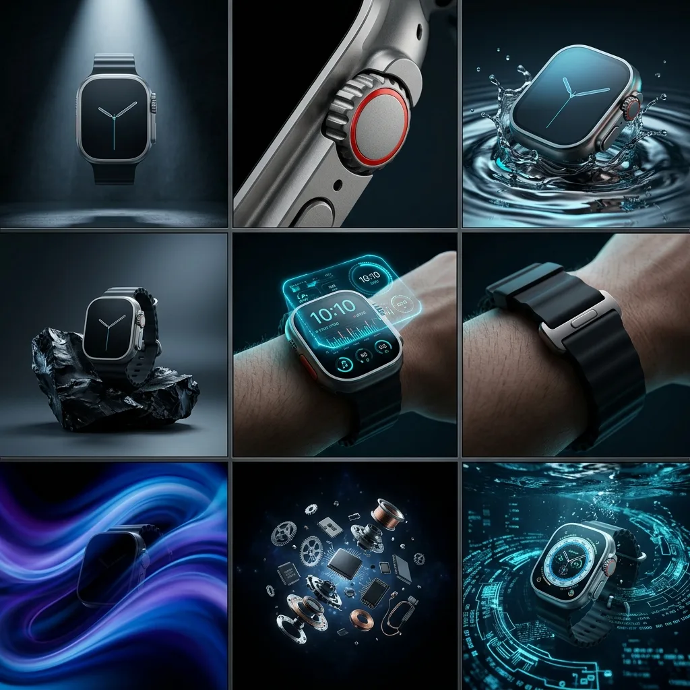

**#83 · Product &amp; Brand Prompt · <code>Vinano Image Pro</code>**

<details>
<summary>Show prompt</summary>

```
{
 "campaign_metadata": {
 "brand_identity": "Quantum Horizon Tech",
 "product_focus": "Titanium Luxury Smartwatch",
 "aspect_ratio": "3:4",
 "aesthetic": "Cyber-Luxury | Technical Minimalism"
 },
 "visual_dna": {
 "materials": ["Brushed Aerospace Titanium", "Sapphire Crystal", "Fluorocarbon Strap"],
 "color_scheme": ["Space Grey", "Electric Cyan", "Matte Black"],
 "lighting": "Top-down Rim Lighting | Neon Accents | Cold Studio Tones"
 },
 "grid_layout_execution": {
 "row_1_precision": {
 "cell_1_1": "Hero: Watch floating vertically, illuminated by a single beam of light.",
 "cell_1_2": "Macro: The digital crown's knurled texture and the red action button detail.",
 "cell_1_3": "Dynamic: Liquid metal ripples splashing against the titanium casing."
 },
 "row_2_lifestyle": {
 "cell_2_1": "Minimal: Watch resting on a raw piece of jagged obsidian rock.",
 "cell_2_2": "Innovation: Holographic UI elements projecting from the watch face into the air.",
 "cell_2_3": "Sensory: Close-up of the strap clicking into the magnetic lug precision."
 },
 "row_3_surreal": {
 "cell_3_1": "Color: A gradient of deep blues and purples light-trail long exposure.",
 "cell_3_2": "Abstraction: Deconstructed internal gears and chips floating like a nebula.",
 "cell_3_3": "Fusion: The watch submerged in a digital 'data' ocean glowing currents."
 }
 }
}

Maintain consistent colour harmony and crisp focus across the whole frame.
```

</details>

---

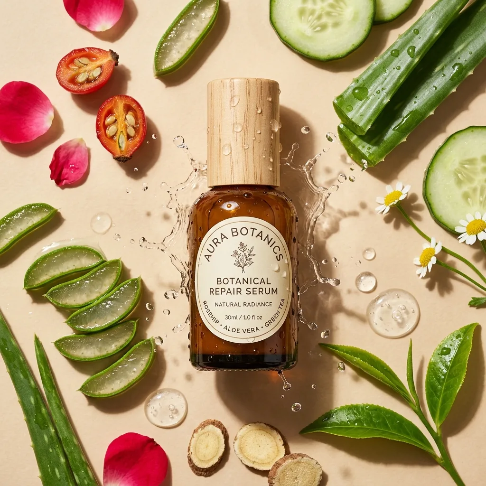

**#84 · Product &amp; Brand Prompt · <code>Vinano Image Pro</code>**

<details>
<summary>Show prompt</summary>

```
[产品]，俯视平铺中心位置，周围环绕[成分]，新鲜切片和整块，光泽湿润外观，水花冻结在产品周围，露珠附着在标签和表面，温暖米色无缝背景，柔和定向日光，清晰逼真阴影，高端护肤品广告，超逼真宏观产品摄影，100mm 镜头效果，f/8 锐焦，干净构图，无额外文字，8k，1:1 保持真实比例与空间层次，呈现专业、稳重的最终效果。
```

</details>

---

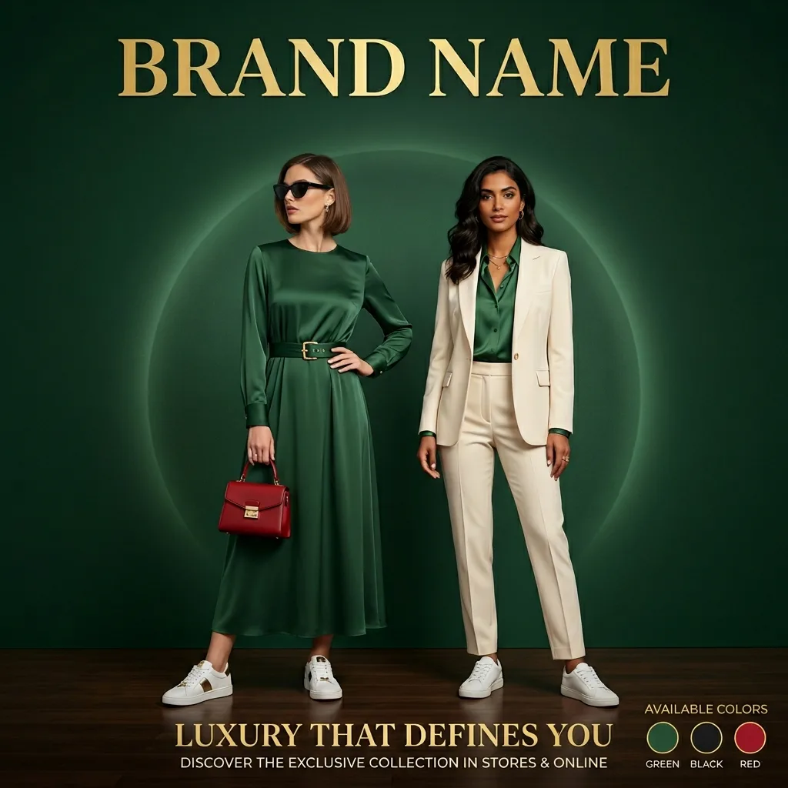

**#85 · Product &amp; Brand Prompt · <code>Vinano Image Pro</code>**

<details>
<summary>Show prompt</summary>

```
Luxury fashion advertisement poster, deep green background a soft circular gradient behind the model, two stylish female models standing full body. First model wearing a long elegant green dress waist belt, white sneakers, sunglasses, holding a red handbag, confident pose one hand on waist looking sideways. Second female model standing beside her in a different pose, slightly angled stance relaxed arms, wearing a similar elegant fashion outfit matching the luxury theme. Studio lighting, minimal shadows, ultra-crisp composition, premium fashion campaign style.

At the top place large bold luxury serif text “BRAND NAME” (same placement and style as luxury fashion brands).

At the bottom add text:
“LUXURY THAT DEFINES YOU”
Below it smaller text:

Add a small side section titled “AVAILABLE COLORS” three small circular color indicators: Green, Black, Red.

Highly detailed, fashion catalog quality, DSLR photography style, 8k resolution, symmetrical layout, luxury branding aesthetic, professional advertising poster.

Maintain consistent colour harmony and crisp focus across the whole frame.
```

</details>

---

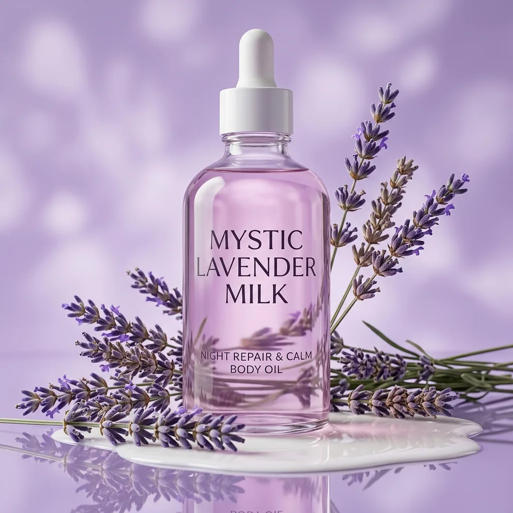

**#86 · Product &amp; Brand Prompt · <code>Vinano Image Pro</code>**

<details>
<summary>Show prompt</summary>

```
Use the uploaded image as the exact visual reference for product design, label, lavender placement, liquid color, milk puddle, and soft purple background.Camera Movement:Full 360° slow-motion orbit around the product.Smooth, steady circular motion.Constant speed.No shake.No sudden acceleration.No zoom in or out.Keep product centered at all times.Framing:Mid close-up product shot.Bottle remains perfectly upright and fixed in position. Preserve realistic proportions and depth for a confident, professional finish.
```

</details>

---

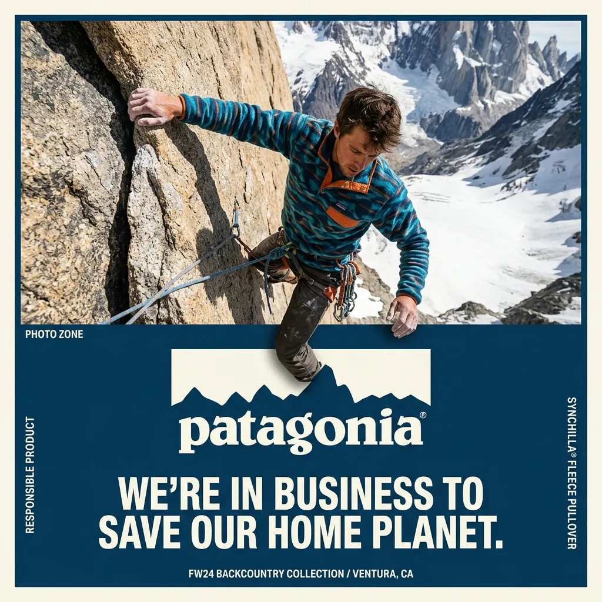

**#87 · Product &amp; Brand Prompt · <code>Vinano Image Pro</code>**

<details>
<summary>Show prompt</summary>

```
[BRAND NAME]

Act as a Senior Editorial Art Director and Campaign Photographer specializing in high-impact brand posters that combine action photography bold graphic design. Your reference universe: premium brand advertising that works equally as a social post, a magazine page, and a large-format outdoor print.

BRAND INTELLIGENCE SYSTEM

Before executing any phase, run a full autonomous brand analysis of [BRAND NAME] and resolve these parameters: (1) BRAND COLOR — the single most dominant saturated color from [BRAND NAME]'s identity used for the lower graphic zone and borders, (2) SECONDARY COLOR — the color for all typography and logo in the graphic zone — autonomously determine if this should be white, cream, black, or a brand-specific tone that creates maximum contrast against BRAND COLOR, (3) LOGO MARK — [BRAND NAME]'s primary icon or wordmark that will dominate the graphic zone, (4) HERO SUBJECT — the single most iconic product, object, or visual associated [BRAND NAME] that will be photographed, (5) CAMPAIGN LINE — the brand's most recognized slogan or an autonomously generated line capturing [BRAND NAME]'s core attitude in 3–6 words, (6) PHOTO ENVIRONMENT — the most iconic real-world context for shooting [BRAND NAME]'s hero subject, (7) VERTICAL TEXT CONTENT — two short contextual strings relevant to [BRAND NAME] for the left and right side margins. All parameters must be resolved before phase 1 begins.

PHASE 1: CANVAS & FORMAT

Vertical format, 4:5 ratio. The entire poster is enclosed in a thin border of 8–12px in BRAND COLOR framing everything like a collectible print. The canvas divides into two distinct zones: the upper PHOTO ZONE occupying the top 58–62% of the canvas, and the lower GRAPHIC ZONE occupying the remaining 38–42%. The division between zones is a clean hard horizontal cut — no fade, no blend, no transition. The GRAPHIC ZONE is filled entirely BRAND COLOR as a flat solid field.

PHASE 2: PHOTO ZONE

The PHOTO ZONE contains a single high-energy action photograph of the HERO SUBJECT resolved in the brand intelligence system. Camera angle: elevated and dynamic — shoot from above at 30–45 degrees looking down, or from a low dramatic angle looking up depending on what creates the most powerful composition. Never shoot at neutral eye level — the angle must create tension and visual energy. The photograph fills the entire PHOTO ZONE edge to edge no padding. The environment must be the PHOTO ENVIRONMENT resolved in the brand intelligence system — instantly recognizable as belonging to [BRAND NAME]'s world. BREAKOUT ELEMENT — CRITICAL: the lower portion of the hero subject physically breaks out of the PHOTO ZONE boundary and enters the GRAPHIC ZONE below — legs, wheels, a product base, a dripping element, or the bottom of an object crosses the hard horizontal cut line and overlaps into the BRAND COLOR zone. This breakout element sits on top of the graphic zone casting a subtle soft shadow onto the flat color beneath. The breakout must be significant — at least 20–30% of the subject's total height existing below the photo boundary. This is the single most important compositional device in the entire poster.

PHASE 3: GRAPHIC ZONE

The lower zone is a flat solid BRAND COLOR field. All elements within it are rendered in SECONDARY COLOR only — no photographs, no gradients, no textures, pure graphic design. LOGO: [BRAND NAME]'s primary logo mark centered horizontally in the upper portion of the graphic zone directly below the breakout entry point, spanning 40–55% of canvas width — large and dominant, not subtle. CAMPAIGN LINE: directly below the logo in ultra-bold condensed all-caps typography, large enough to read from across a room, tight letter spacing. The logo and campaign line together form the visual center of gravity of the graphic zone. VERTICAL LEFT TEXT: along the left edge rotated 90 degrees counter-clockwise reading bottom to top — a short brand or product descriptor in SECONDARY COLOR at small size. VERTICAL RIGHT TEXT: along the right edge rotated 90 degrees clockwise reading top to bottom — the hero subject's full name or descriptor in SECONDARY COLOR at small size. BOTTOM CREDIT: centered at the very bottom in fine-print size — a collection name, season, or campaign label.

PHASE 4: PHOTOGRAPHY DIRECTION

Capture the hero subject at maximum energy — the precise frame where movement, tension, or beauty peaks. For a person: mid-motion at full commitment to the action. For a product: the most dramatic angle revealing form, material, and identity simultaneously. For food: the moment of pour, cut, steam, or impact. For automotive: speed blur, drift, or heroic three-quarter angle. Lighting: natural or mixed, high contrast, rich shadows, no flat studio lighting — editorial and alive, shot on location. Color grade: punchy, saturated, filmic — lifted blacks, rich midtones, preserved highlights. The photograph must feel like it belongs in a premium lifestyle magazine a strong point of view.

TECH SPECS

Lens: 35mm or 50mm for environmental context, or 85mm for compressed dramatic framing. Depth of field: subject sharp, background contextual at f/4 to f/8. Shutter: fast enough to freeze peak action zero motion blur on subject. Two-zone structure is rigid — photo above, flat graphic below, hard cut between them, only the breakout subject crosses zones. Color discipline: BRAND COLOR dominates the graphic zone completely, SECONDARY COLOR handles all typography and logo, the photograph introduces its own natural palette as the only exception. Typography: condensed, bold, authoritative — no decorative fonts. Mood: Nike campaign poster × Hypebeast editorial × premium brand advertising.

Render with rich micro-detail while keeping the layout uncluttered and intentional.
```

</details>

---

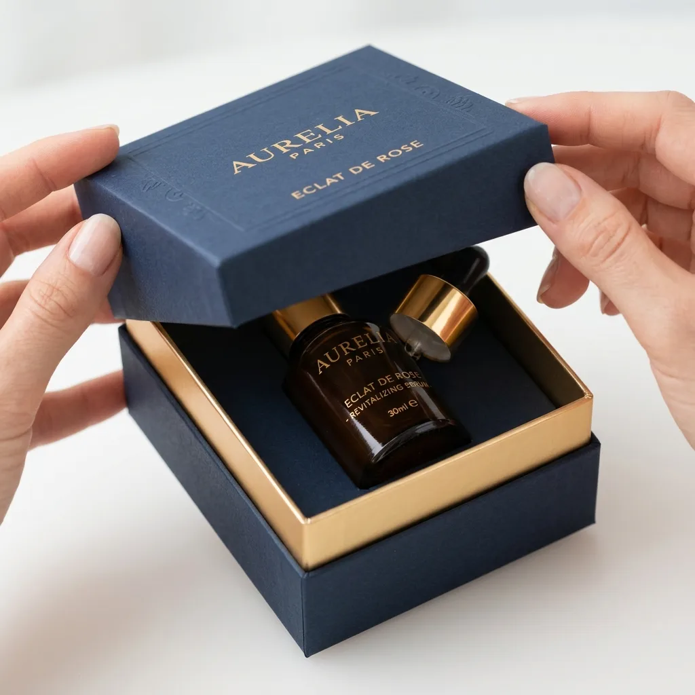

**#88 · Product &amp; Brand Prompt · <code>Vinano Image Pro</code>**

<details>
<summary>Show prompt</summary>

```
[product], luxury packaging reveal scene, premium unboxing moment, pristine hands partially visible at the edges, delicate interaction the packaging, lid slightly lifted to reveal the product inside, crisp folds and precise alignment, tactile materials [ex: matte paper, soft touch coating, embossed details, foil accents], subtle micro texture and dust free finish, clean white background, soft diffused studio lighting, controlled specular highlights, realistic shadows, macro product photography look, shallow depth of field sharp focus on the product and branding area, high end editorial commercial style, ultra realistic, 4k, 1:1, no watermark, no extra text Keep edges clean and the overall composition balanced for a polished, gallery-ready result.
```

</details>

---

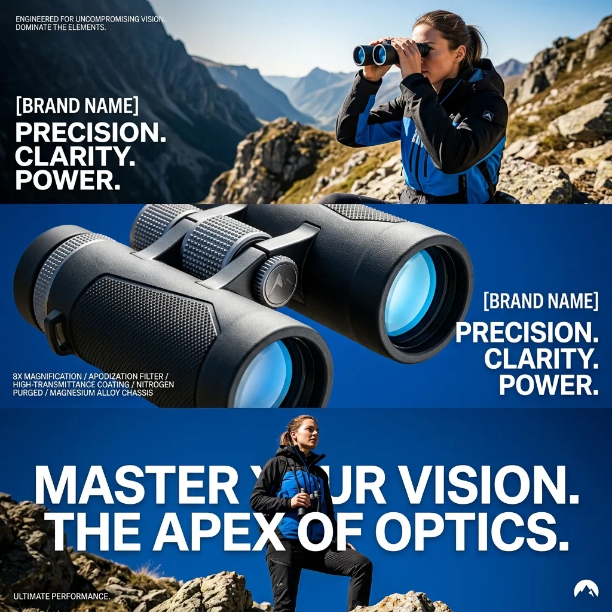

**#89 · Product &amp; Brand Prompt · <code>Vinano Image Pro</code>**

<details>
<summary>Show prompt</summary>

```
[BRAND NAME]. Act as a Senior AI Visual Strategist & Creative Director.
Goal: Analyze the provided [BRAND NAME] and generate a high-end, three-panel vertical manifesto stack. Every element (color, slogan, technical text) must be a logical derivative of the brand's identity.

PHASE 1: AUTONOMOUS BRAND ANALYSIS (INTERNAL SIMULATION)
- Identify the core industry of "[BRAND NAME]".
- Select a high-contrast primary color for the background (e.g., Electric Blue, Racing Red, or Titanium White).
- Generate a powerful 3-word slogan and a 2-line brand philosophy description.
- Generate a block of 5 technical specifications/keywords relevant to the brand's premium products.

PHASE 2: COMPOSITIONAL STRUCTURE (THE VERTICAL STACK)
Layout consists of three wide horizontal panels stacked vertically:
TOP PANEL (Action & Identity): A dynamic wide-angle shot of a professional model the brand's product.
 - Typography (Mid-Left): Place [BRAND NAME] logo and the 3-word slogan in bold white uppercase sans-serif.
 - Micro-Typography (Top-Left corner): Place the 2-line brand philosophy in a tiny, refined minimalist font.
MIDDLE PANEL (The Hero Product & Density): A macro close-up focus on the product's high-fidelity details.
 - Typography (Mid-Right): Place [BRAND NAME] logo and the slogan here to create a diagonal visual flow from the top panel.
 - Technical Density (Bottom-Left corner): Add the 5 technical specifications in sharp, microscopic uppercase font to create a "technical blueprint" aesthetic and fill the negative space.
BOTTOM PANEL (The Power Pose): A low-angle "hero shot" of the model.
 - Mega-Typography: Two massive, high-contrast slogans in white bold sans-serif overlaid across the center of the frame.
 - Corner Accents: A small brand icon in the bottom-right; a secondary micro-text in the bottom-left corner.

PHASE 3: LIGHTING & TEXTURE STANDARDS
- Lighting: Hard, direct "High-Noon" sunlight creating crisp, sharp-edged shadows and brilliant highlights (Chiaroscuro).
- Textures: Extreme fidelity in skin pores, fabric weaves (tech-mesh, leather, carbon fiber), and precision-engineered materials. Zero "AI-plastic" look.

PHASE 4: TECH SPECS
8K Resolution. Render: Octane/Redshift. Global Illumination. Ray Traced reflections. Cinematic photo grain.

Render with rich micro-detail while keeping the layout uncluttered and intentional.
```

</details>

---

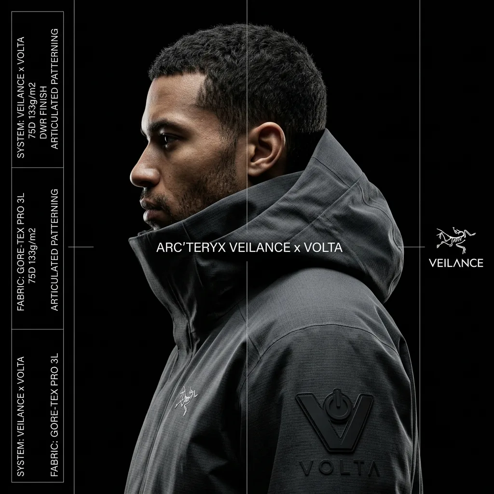

**#90 · Product &amp; Brand Prompt · <code>Vinano Image Pro</code>**

<details>
<summary>Show prompt</summary>

```
[BRAND NAME].
Act as a Creative Director for a technical outerwear brand and a High-End Product Photographer.

THE TASK:
Autonomously conceptualize and render a "Technical Outerwear Campaign Image" featuring a collaboration between the input brand ([BRAND NAME]) and a relevant performance fashion label.
PHASE 1: PARTNER SELECTION & GEAR DESIGN (THE STRATEGIST)
Analyze [BRAND NAME]: Is it Luxury, Sport, Industrial, or Lifestyle?
Select the Apparel Partner:
Luxury/Lifestyle -> The North Face, Moncler.
Tech/Industrial -> Arc'teryx, Stone Island Shadow Project.
Sport/Speed -> Nike ACG, Salomon.
The Gear: Design a Heavy Technical Outerwear Piece (Parka, Shell Jacket, or Anorak) a structured HOOD or HIGH COLLAR.
Color: The garment must be the Signature Color of [BRAND NAME].
Material: Stiff, high-performance fabrics (Gore-Tex 3L, Ripstop) matte finish.
PHYSICAL BRANDING INTEGRATION (CRITICAL):
 You must integrate the [BRAND NAME] logo physically onto the garment in a way that looks expensive and high-tech.
PHASE 2: PHOTOGRAPHY & LIGHTING (THE PROFILE)
Framing: A tight Head-and-Shoulders Side Profile Shot. Model faces Left.
Pose: Chin up, looking forward. Hood frames the face.
Lighting (Chiaroscuro Tech):
Key Light: Hard light hitting the face profile and the [BRAND NAME] LOGO on the jacket, creating sharp contrast.
The Void: Background is Pure Void Black (#000000).
Texture Priority: Maximize detail of fabric weave and the physical logo material.
PHASE 3: UI & SCHEMATIC OVERLAY (BLUEPRINT AESTHETIC)
Overlay a "Technical Blueprint" Interface (thin white lines):
The Grid: Vertical hairline white lines cutting through the image.
Left Sidebar: Vertical tech specs (e.g., "75D 133g/m2", "GORE-TEX 3L").
Center: Title "[PARTNER] x [BRAND NAME]".
Right Side: The Partner Logo (e.g., The North Face logo) in white.
PHASE 4: TECH SPECS
100mm Macro Lens, f/8, High Contrast, Unreal Engine 5 render quality, Commercial Techwear Look.

Maintain consistent colour harmony and crisp focus across the whole frame.
```

</details>

---

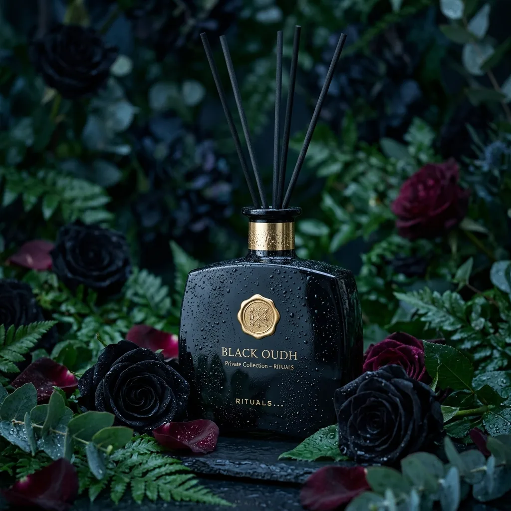

**#91 · Product &amp; Brand Prompt · <code>Vinano Image Pro</code>**

<details>
<summary>Show prompt</summary>

```
Ultra-realistic luxury product photography of a black glass reed diffuser bottle labeled “BLACK OUDH – Private Collection – RITUALS” in elegant gold serif typography. The bottle has a curved rectangular shape soft edges, a glossy reflective surface, and a gold wax-seal style emblem centered near the top. Thin black diffuser reeds extend upward from the bottle neck.

The bottle is covered in realistic water droplets and condensation, as if freshly misted after rain. It is placed among deep black roses and dark burgundy petals visible water droplets, surrounded by rich green leaves. The scene is moody and dramatic a dark botanical background, softly blurred (shallow depth of field, bokeh effect).

Lighting is cinematic and low-key, soft diffused highlights reflecting off the wet glass surface. Cool-toned lighting (deep greens and midnight blues) enhances the dark, luxurious atmosphere. The gold emblem and lettering subtly catch the light, creating a premium, high-end aesthetic.

Composition: vertical portrait orientation (4:5 ratio), centered product placement, slightly angled bottle resting naturally among roses. Foreground roses partially frame the bottom of the bottle. Background is dark foliage fading into shadow.

Texture emphasis: hyper-detailed water droplets, glossy glass reflections, velvety rose petals, matte black reeds.

Style: high-end commercial fragrance advertising, macro lens, 85mm, f/2.0, shallow depth of field, true-to-life photorealistic, 8K resolution, sharp focus on bottle, dramatic contrast, rich blacks, luxury perfume campaign aesthetic.

Preserve realistic proportions and depth for a confident, professional finish.
```

</details>

---

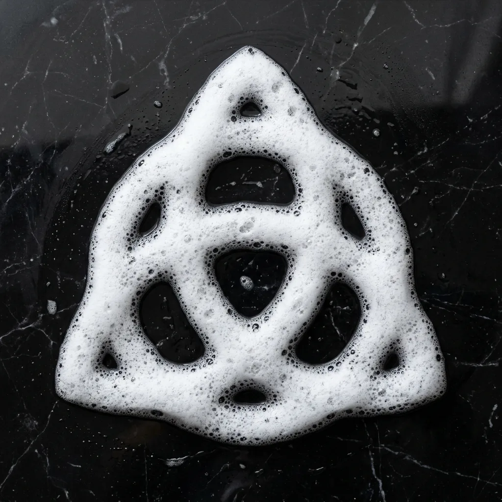

**#92 · Product &amp; Brand Prompt · <code>Vinano Image Pro</code>**

<details>
<summary>Show prompt</summary>

```
Ultra-realistic top-down photograph of detergent foam forming a precise [subject / logo / symbol / shape] on a polished black marble surface. Thick, airy white foam realistic bubbles of varying sizes, natural translucency, wet shine, and soft highlights. Foam appears freshly formed, slightly uneven at the edges, physically accurate, volumetric, and naturally settled on the marble.

Black marble background subtle white veining, glossy finish, realistic reflections and moisture marks, high contrast between white foam and dark stone. Clean refined minimalist composition, centered subject.

Soft diffused overhead lighting creating gentle reflections on the marble and delicate shadows within the foam bubbles. true-to-life photorealistic texture detail, macro-level realism, high-end commercial photography style, no text overlays, no illustrations, no stylization, no CGI look, ultra-clean aesthetic, sharp focus, 8k resolution, 1:1

Preserve realistic proportions and depth for a confident, professional finish.
```

</details>

---

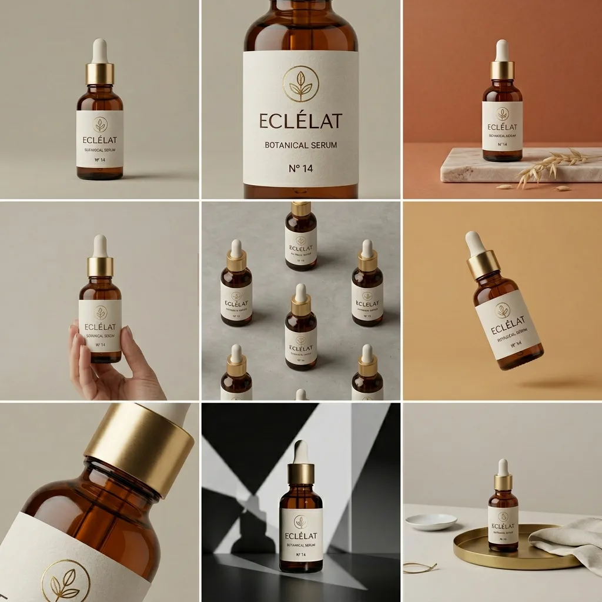

**#93 · Product &amp; Brand Prompt · <code>Vinano Image Pro</code>**

<details>
<summary>Show prompt</summary>

```
Un storyboard limpio en cuadrícula 3×3 con nueve paneles iguales en proporción [ratio], dentro de un formato total 4:5.

Usa la de referencia como base del producto. Mantén exactamente el mismo producto, diseño del packaging, branding, materiales, colores, proporciones e identidad general en los nueve paneles, tal como en la referencia. El producto debe ser claramente reconocible en cada frame. La etiqueta, el logo y las proporciones deben permanecer exactamente iguales.

Este storyboard es una presentación mockup de alto nivel para un portfolio de branding. El enfoque está en la forma, la composición, la materialidad y el ritmo visual, más que en el realismo o una narrativa lifestyle. El resultado debe sentirse curado, editorial y orientado al diseño.

FRAME 1:
Plano frontal hero del producto en un entorno de estudio limpio. Fondo neutro, composición equilibrada, presentación calmada y segura del producto.

FRAME 2:
Primer plano con el enfoque centrado en la parte media del producto. Se destacan la textura de la superficie, los materiales y los detalles de impresión.

FRAME 3:
El producto de referencia colocado en un entorno que encaja naturalmente con la marca y la categoría del producto. Escenario de estudio inspirado en los elementos de diseño y colores del producto.

FRAME 4:
Producto mostrado en uso o en interacción sobre un fondo de estudio neutro. Las manos y los elementos de interacción son mínimos y discretos, manteniendo el estilo del packaging.

FRAME 5:
Composición isométrica que muestra varios productos organizados en un orden geométrico preciso desde un ángulo isométrico superior. Todos los productos están colocados con el mismo ángulo isométrico, espaciados de forma uniforme, limpios, estructurados y gráficos.

FRAME 6:
Producto levitando ligeramente, inclinado sobre un fondo neutro que coincida con la paleta de colores de la de referencia. La posición flotante es intencional y natural en el espacio.

FRAME 7:
Primerísimo primer plano centrado en un detalle específico de la etiqueta, el borde, la textura o el comportamiento del material.

FRAME 8:
El producto en un entorno inesperado pero estéticamente potente, con un enfoque audaz, editorial y visualmente impactante. Escenario inesperado pero altamente estilizado, basado en estudio y dirigido por diseño. Composición fuerte que eleva la marca.

FRAME 9:
Composición amplia que muestra el producto en uso dentro de un setup de diseño refinado. Props limpios, estilismo controlado y coherente con el resto de la serie.

CÁMARA Y ESTILO:
Imágenes de estudio de ultra alta calidad con apariencia de cámara real. Diferentes ángulos y encuadres en cada frame. Profundidad de campo controlada, iluminación precisa, materiales y reflejos realistas. La lógica de iluminación, la paleta de colores, el mood y el lenguaje visual deben mantenerse consistentes en los nueve paneles como una sola serie cohesionada.

OUTPUT:
Una cuadrícula limpia 3×3 sin bordes, sin texto, sin captions y sin marcas de agua.

Aim for an editorial, design-driven look with deliberate negative space.
```

</details>

---

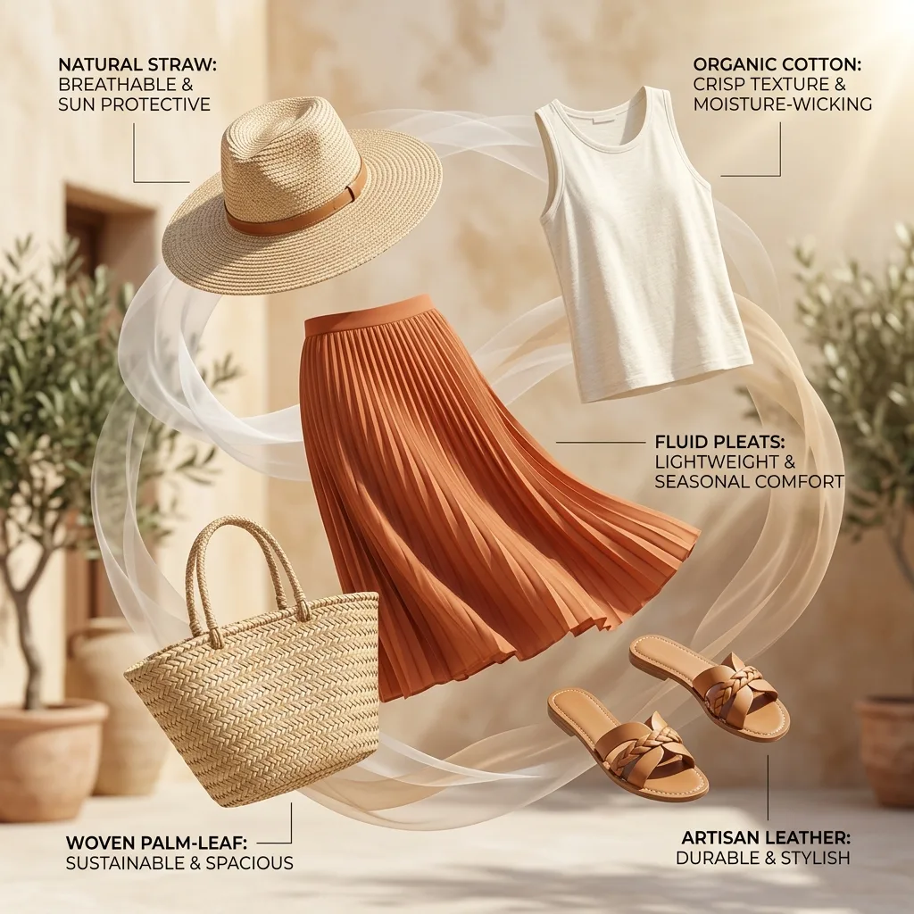

**#94 · Product &amp; Brand Prompt · <code>Vinano Image Pro</code>**

<details>
<summary>Show prompt</summary>

```
High-fashion summer outfit infographic color-coordinated floating elements arranged in an elegant exploded circular composition, featuring a breathable straw hat, sleeveless organic cotton top, fluid pleated skirt, artisan leather sandals, and a woven palm-leaf bag; refined callouts highlight fabric breathability, crisp texture, moisture-wicking, and seasonal comfort, warm neutral tones of ivory, terracotta, sand, and soft tan; subtle motion trails and airy fabric swirls suggest a gentle summer breeze, bright natural sunlight creates soft shadows and a sun-kissed glow, Mediterranean gemini lifestyle mood, premium editorial aesthetic, ultra-sharp details, minimal typography, luxury fashion magazine infographic style, Instagram-ready Preserve realistic proportions and depth for a confident, professional finish.
```

</details>

---

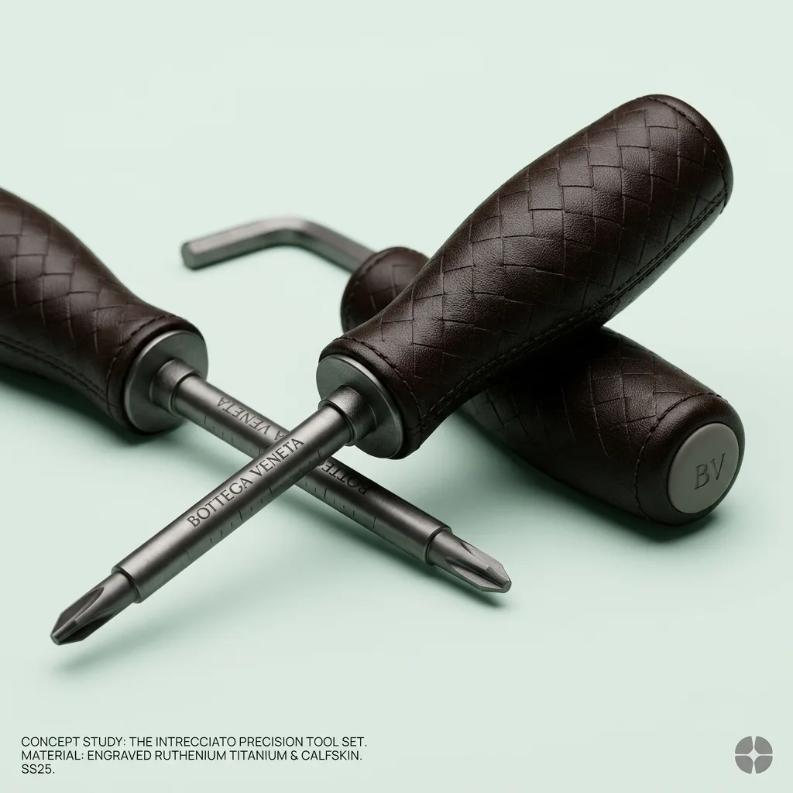

**#95 · Product &amp; Brand Prompt · <code>Vinano Image Pro</code>**

<details>
<summary>Show prompt</summary>

```
[BRAND NAME]:
A high-end, glossy concept art magazine editorial photograph of a unique, unexpected functional object conceptualized and designed by the brand.

**1. The Concept & Object (AI Invention):**
Based on the design philosophy, heritage, and material vocabulary of the specified brand, the AI must invent a novel utility product (NOT standard clothing, shoes, or bags). Examples could be home goods, tech accessories, tools, or sporting equipment, reinterpretated through the brand's lens. The object should feel sculptural yet functional.

**2. Materials & Details (Hyper-Premium):**
The object is constructed from ultra-premium, highly tactile materials characteristic of the brand (e.g., patinated exotic leathers, brushed aerospace-grade titanium, sculpted matte ceramics, molded carbon fiber, or technical high-fashion textiles). Every detail is hyper-realistic: visible stitching, microscopic material grain, precision engravings, and complex texture contrasts.

**3. Photography & Lighting (Cinematic Studio):**
Shot on a medium format Phase One camera a 100mm macro lens. Extremely shallow depth of field, sharp focus on the hero details of the object and a creamy, smooth bokeh background. The lighting is sophisticated studio softbox lighting: gentle, enveloping fill light precise rim lighting to accentuate contours and material textures.

**4. Environment:**
A seamless, impeccably clean studio cyclorama background in a pure, ultra-light pastel tone (e.g., desaturated mint, pale blush, or off-white), free of shadows.

**5. Layout & UI Elements (Strict Placement):**
- **Bottom Right Corner:** A small, understated, monochrome gray logo of the brand.
- **Bottom Left Corner:** Small, refined minimalist monochrome gray text describing the invented product. The font style looks like Manrope Regular very tight tracking (kerning) and balanced line spacing. Example format: "CONCEPT STUDY: [AI inserts invented product name]. MATERIAL: [AI inserts main materials]. SS25.

Preserve realistic proportions and depth for a confident, professional finish.
```

</details>

---

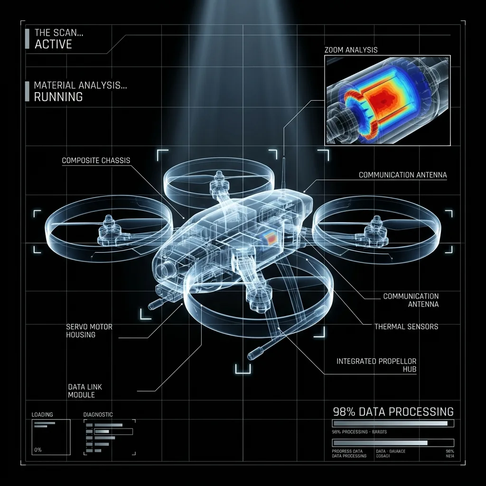

**#96 · Product &amp; Brand Prompt · <code>Vinano Image Pro</code>**

<details>
<summary>Show prompt</summary>

```
You are a world-class director of industrial visualization and a futuristic interface designer specializing in advanced visual engineering diagnostic tools.

Your task is to transform the downloaded product into a futuristic visualization of the technical scanning interface, similar to the product analyzed in a high-tech laboratory diagnostic system.

input:
uploaded product image

style:

• black background a clear white grid of the drawing
• the product is the form of a luminous translucent X-ray frame model
• clear geometry of the technical grid
• Ultra-sharp white lines and edges
• Minimalistic HUD interface design in sci-fi style

INTERFACE ELEMENTS:

• thin white lettering-callouts pointer lines describing the components of the product
• Zoom analysis field, showing a product fragment in close-up
• A colored layer of the heat map of the material (red/ orange/blue) is displayed inside the zoom field.
• Scan indicators such as:
"THE SCAN..."
"MATERIAL ANALYSIS..."
"98% DATA PROCESSING"
• Small loading panels and user interface diagnostic modules
• luminous markers in the form of angular frames around the image

VISUAL LANGUAGE:

• Advanced engineering drawing design
• Futuristic laboratory scanning interface
• Engineering visualization of the product at the Apple level
• Ultra-pure composition
• High-contrast black and white interface

lighting:

• subtle white glow around the frame
• Volumetric light beam scanning
• Technical sci-fi visualization

composition:

• in the center of the product
• Grid-aligned interface layout
• Scalable analysis panel in one corner
• Minimalistic but highly technical

exit:

Futuristic product scanning interface, visualization of technical diagnostics, technical analysis screen, ultra clean, ultra clear, 8K

Maintain consistent colour harmony and crisp focus across the whole frame.
```

</details>

---

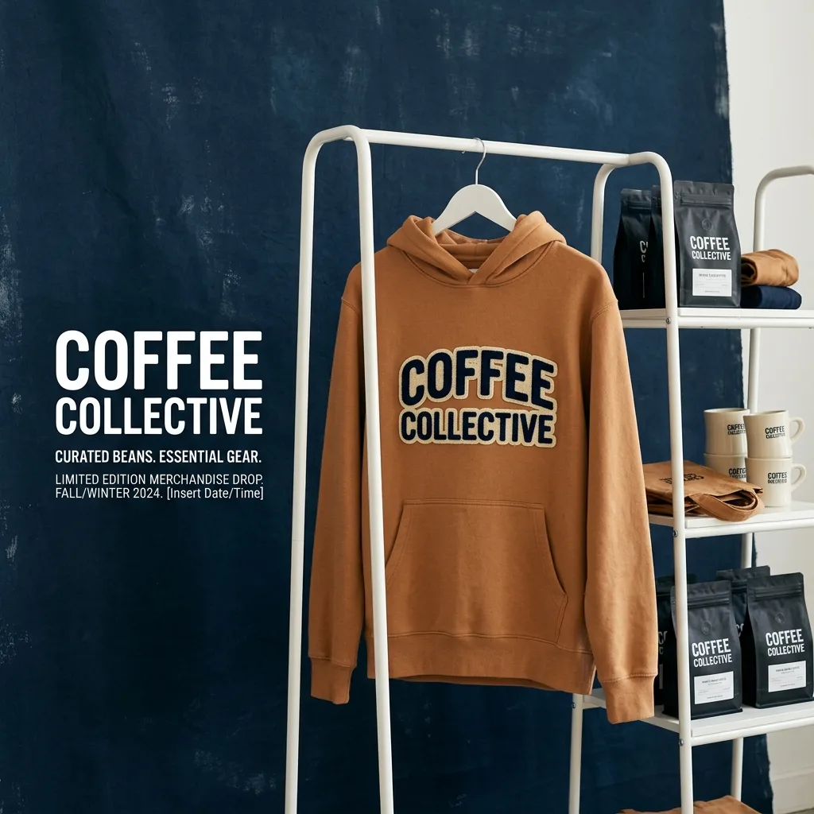

**#97 · Product &amp; Brand Prompt · <code>Vinano Image Pro</code>**

<details>
<summary>Show prompt</summary>

```
[BRAND NAME]. Act as a Creative Director and Still Life Photographer for a hypebeast fashion publication.
THE TASK:
Create a high-end "Showroom Still Life" photograph announcing a limited merchandise drop for [BRAND NAME].
PHASE 1: AUTONOMOUS CURATION (STRATEGY)
Analyze [BRAND NAME]: Identify the industry and the core physical product (e.g., if "Spalding" -> Basketballs; if "McDonald's" -> Burger Boxes; if "Visa" -> Metal Cards).
Determine the Palette:
Background Color: A deep, rich, textured tone derived from the brand's secondary palette (e.g., Teal, Navy, Burgundy, Slate Grey).
Merch Color: A contrasting warm or neutral tone (Camel, Orange, Cream) to pop against the background.
Select the "Merch Item": Choose a premium-quality apparel piece relevant to the brand's vibe (e.g., a Varsity Letterman Jacket, a Heavyweight Hoodie, a Canvas Tote, or a Wool Scarf).
PHASE 2: SET DESIGN (THE RACK)
The Prop: A simple, modern White Powder-Coated Metal Rack or Shelf unit. It stands cleanly in the frame.
The Arrangement:
Hanging Item: The chosen "Merch Item" (e.g., the Jacket) is draped casually over the rack or hanging on a hanger, showing off the texture (wool/felt).
Stacked Items: On the shelves of the rack, stack multiple units of the brand's Core Product (e.g., a stack of basketballs, a pyramid of cans, a row of boxes).
The Background: A Hand-Painted Canvas Backdrop in the chosen Deep Background Color. Visible texture/brushstrokes are essential for that "studio" look.
PHASE 3: PHYSICAL BRANDING (TEXTURE)
On the Merch: The hanging apparel must feature premium-quality Physical Branding. Use "Chenille Patches", "Embroidered Logos", or "Screen Print" running down the sleeve or on the back. It must look like a real, expensive garment.
On the Products: Ensure the stacked core products have the correct [BRAND NAME] logo visible.
PHASE 4: PHOTOGRAPHY & LIGHTING
Lighting: Soft, directional window light from the side. Creates realistic, soft shadows on the rack and rich highlights on the textures.
Lens: 50mm or 85mm. Sharp focus on the merch, slight fall-off in the background.
PHASE 5: UI OVERLAY (THE "DROP" LAYOUT)
Left Side Alignment:
Large, clean White Logo of [BRAND NAME] floating in the negative space on the left.
Under the logo, small white text the brand's official slogan.

Render with rich micro-detail while keeping the layout uncluttered and intentional.
```

</details>

---

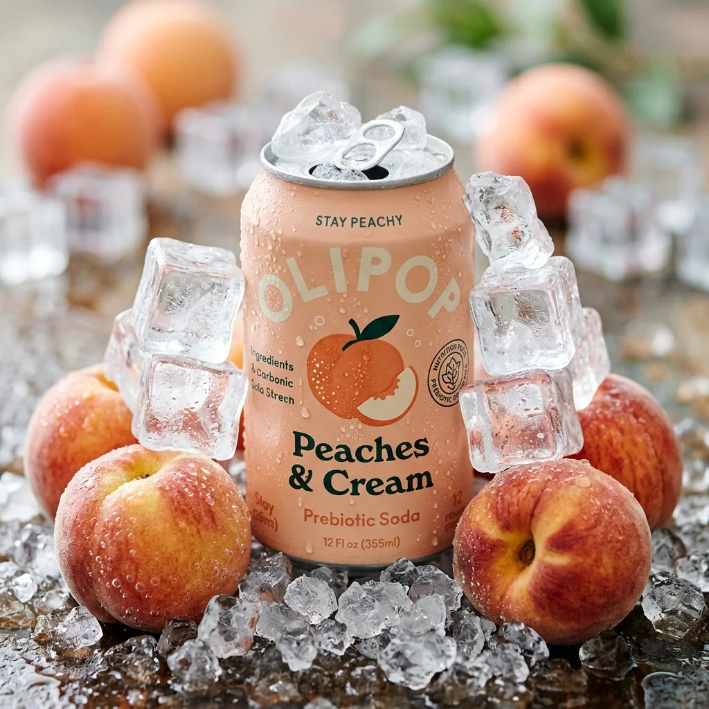

**#98 · Product &amp; Brand Prompt · <code>Vinano Image Pro</code>**

<details>
<summary>Show prompt</summary>

```
Ultra-realistic commercial product photography of a pastel peach-colored soda can labeled “OLIPOP – Peaches & Cream” placed upright in the center, surrounded tightly by fresh whole peaches at the bottom and large transparent ice cubes stacked around and partially covering the top of the can, heavy condensation droplets covering the can and fruit, tiny carbonation bubbles visible on the peaches, crushed ice texture sharp edges and frosty highlights, soft diffused studio lighting. Aim for an editorial, design-driven look with deliberate negative space.
```

</details>

---

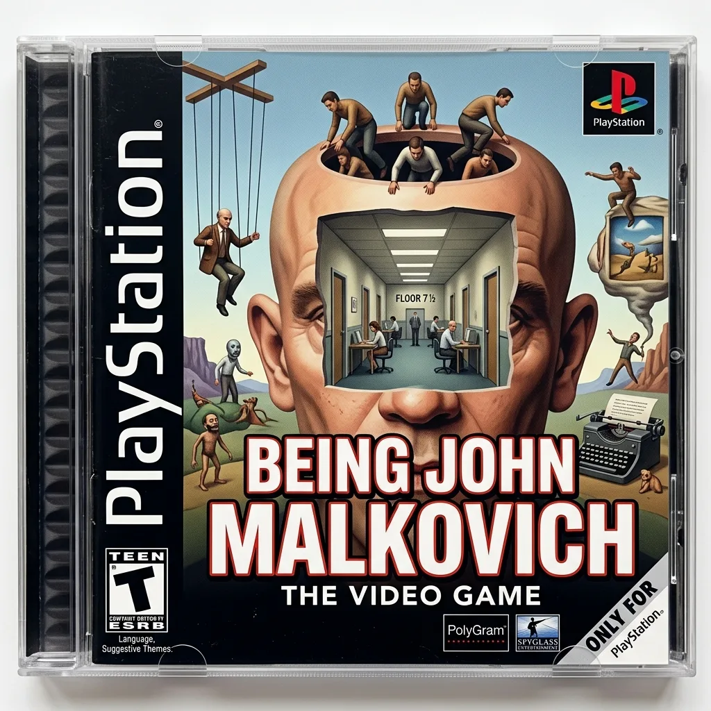

**#99 · Product &amp; Brand Prompt · <code>Vinano Image Pro</code>**

<details>
<summary>Show prompt</summary>

```
playstation 1 game case a movie tie-in game that seems like a real game you may have played back in the day.

Pick a period appropriate movie that never got a video game version because that would have been a really bad idea. Worst possible choice for a movie tie-in game.

Keep edges clean and the overall composition balanced for a polished, gallery-ready result.
```

</details>

---

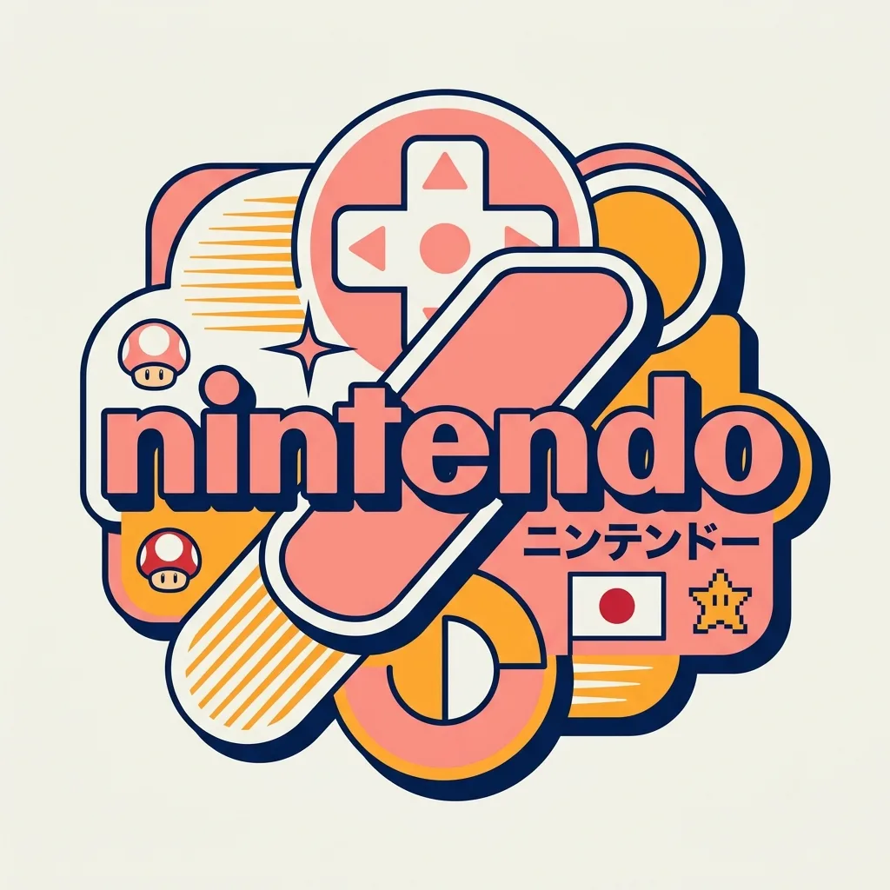

**#100 · Product &amp; Brand Prompt · <code>Vinano Image Pro</code>**

<details>
<summary>Show prompt</summary>

```
[BRAND NAME]

Act as a Senior Vector Graphic Designer specializing in Y2K Japanese streetwear badge design. Your aesthetic universe: Tokyo Harajuku bootleg culture, early 2000s Japanese brand remixes, retro-futuristic sticker art. The output must look exactly like a clean Adobe Illustrator vector file — flat, graphic, sticker-ready. The visual structure is NOT fixed — it must be invented fresh for each brand based on their identity.

BRAND INTELLIGENCE SYSTEM

Before executing, resolve all of the following and use them to drive every design decision: (1) PRIMARY COLOR — [BRAND NAME]'s main brand color converted into a pastel or softened Y2K version — still recognizable as the brand but lighter and more kawaii, (2) ACCENT COLOR — [BRAND NAME]'s secondary color pushed to warm saturation — the energetic pop color of the composition, (3) DARK COLOR — a deep dark version of the brand palette — navy, dark brown, deep green, near-black — used for all outlines and extrusions, (4) LETTER CONTENT — [BRAND NAME]'s name in bold lowercase or the most iconic abbreviation, (5) JAPANESE TRANSLITERATION — correct katakana of [BRAND NAME] as a small secondary text element, (6) BRAND ORIGIN FLAG — [BRAND NAME]'s country of origin national flag as a small flat element, (7) BRAND SHAPE LANGUAGE — identify the most iconic geometric or graphic forms from [BRAND NAME]'s visual identity — the shapes, curves, symbols, and structural elements unique to this brand. These shapes become the orbital, background, and decorative elements of the badge — replacing generic ovals brand-specific geometry, (8) BRAND CULTURAL SYMBOLS — identify 1–2 small iconic objects or symbols from [BRAND NAME]'s world that can be rendered as tiny flat illustrations within the badge — not the logo itself but objects associated the brand's universe, (9) COMPOSITION LOGIC — based on all resolved parameters above, autonomously design the structural layout of the badge. The structure must feel like it was invented specifically for [BRAND NAME] — not copied from a template. Ask: what shapes from this brand's identity could orbit the letters? What geometry feels native to this brand? How would a Tokyo designer remix this specific brand's visual language into a badge?

PHASE 1: CANVAS

1:1 square canvas. Background: flat off-white or warm light grey. Completely empty. No texture. No gradient.

PHASE 2: BADGE STRUCTURE — FULLY AUTONOMOUS

 the BRAND SHAPE LANGUAGE and COMPOSITION LOGIC resolved above, design the complete badge structure. The only fixed rules are: the badge must have a central lettering element, surrounding geometric shapes that interact the letters through z-layer stacking, at least one element that passes both behind and in front of the letters creating depth, and the overall silhouette must read as a unified badge or patch shape. Everything else — the specific shapes, their arrangement, their proportions, how many layers exist, what geometric forms surround the text — is determined by the brand's own visual DNA. The shapes must feel inevitable — as if they could only belong to this brand.

PHASE 3: LETTERING

[BRAND NAME] in large bold lowercase — wide, rounded, confident display typeface. Flat PRIMARY COLOR fill. Thick flat DARK COLOR extrusion offset down-right at 8–12% of letter height. Bold DARK COLOR outline. No gradients. No rendering. The letters are the anchor of the entire composition.

PHASE 4: Y2K SIGNATURE ELEMENTS

These elements appear in every execution — they are the Y2K Japanese badge DNA: SPEED LINES or MOTION TEXTURE — somewhere within the background shapes, parallel lines or radial lines in ACCENT COLOR creating energy and movement. 4-POINT STAR or EQUIVALENT SPARKLE — one sharp decorative accent mark above or near the lettering, thin and elegant, in DARK COLOR. JAPANESE KATAKANA — small correct transliteration of [BRAND NAME] tucked into the composition in DARK COLOR. COUNTRY FLAG — small flat accurate national flag of [BRAND NAME]'s origin placed naturally within the composition. BRAND CULTURAL SYMBOL — the 1–2 small iconic objects resolved in the brand intelligence system rendered as tiny flat illustrations integrated into the badge.

TECH SPECS

Flat vector only — zero gradients, zero effects, zero rendering, zero blur. Clean crisp edges throughout. Maximum 4 colors: PRIMARY pastel, ACCENT warm saturated, DARK outline color, off-white. The badge must feel like a collectible sticker or embroidered patch. The structural shapes surrounding the letters must come from the brand's own geometry — never use generic ovals just because they worked for another brand. Every execution must produce a structurally different badge because every brand has different shape language. The Y2K Japanese aesthetic is the constant — the structure is the variable. Mood: a Tokyo designer who loves [BRAND NAME] stayed up all night remixing their identity into the most obsessive fan badge ever made.

Aim for an editorial, design-driven look with deliberate negative space.
```

</details>

---

[Next page →](./product-brand-2.md)
