# UI & Graphic — full gallery

[← Back to README](../README.md) · [`prompts.json`](../prompts/prompts.json) · **176** prompts · page 2 / 2

[← Prev](./ui-graphic.md) — [1](./ui-graphic.md) · **2**

---

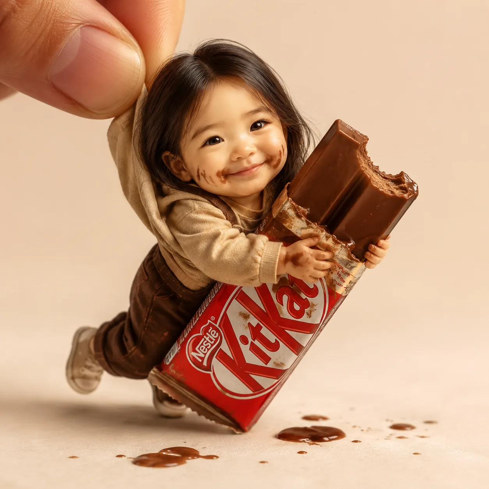

**#101 · Realistic, Minimalist · <code>Vinano Studio</code>**

> Keywords: realistic, minimalist, AI art, AI prompt, text to image

<details>
<summary>Show prompt</summary>

```
Use the uploaded photo as the sole reference for identity. Maintain maximum facial resemblance, preserving facial features, proportions, expression, hairstyle, skin tone, and natural asymmetries extreme accuracy.
Create an adorable handmade premium collectible male doll a slightly oversized head, a small slender body, soft felt and fabric textures, realistic 3D facial details, lifelike glass eyes, and handcrafted stitching. The tiny doll tightly hugs a giant KitKat bar almost as large as himself, several bite marks already taken from it.
He wears a playful, satisfied smile chocolate smudges around his lips, cheeks, and fingertips. A few drops of melted chocolate are scattered on the floor beneath him. A giant human finger gently lifts him by the back of his shirt collar, but he stubbornly refuses to let go of the KitKat, creating a humorous and adorable scene.
Emphasize dramatic size contrast, warm bright lighting, a clean refined minimalist background, premium diorama craftsmanship, macro photography, shallow depth of field, ultra-realistic textures, and exceptional facial fidelity to the uploaded reference photo.She smiles proudly, traces of chocolate on her mouth, cheeks, and hands. A few drops of melted chocolate lie on the floor. A giant human finger gently lifts her by the back of her collar while she refuses to let go of the feasible Chocolate Strong scale contrast; warm, bright, clean atmosphere; refined minimalist background; premium diorama macro photography; soft depth of field; professional photographic quality; and extreme facial fidelity to the original photo

Keep edges clean and the overall composition balanced for a polished, gallery-ready result.
```

</details>

---

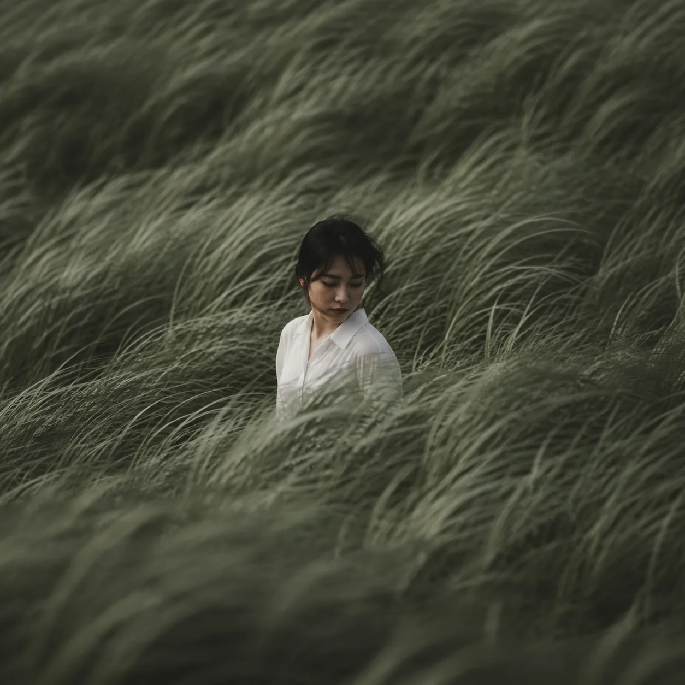

**#102 · Portrait, Landscape · <code>Vinano Studio</code>**

> Keywords: portrait, landscape, cinematic, AI art, AI prompt, text to image

<details>
<summary>Show prompt</summary>

```
Create a 3:4 cinematic, atmospheric editorial portrait the attached photo as the exact face and identity reference. A solitary man/woman stands alone in the middle of vast, wind-swept sage green grass fields. Tall grass surrounds the subject completely, flowing in strong currents like ocean waves, partially obscuring the body and creating motion,depth, and solitude. The subject wears a simple, loose white shirt that softly contrasts the rich green landscape.
Dark hair is slightly messy, natural strands moving in the wind. The head is gently tilted downward, eyes cast toward the ground, conveying a quiet, introspective, melancholic mood. Expression is calm, distant, and emotionally restrained. Compose the frame slightly off-center, from a subtle elevated angle. No visible horizon, the frame is fully immersed in grass texture. Use a muted natural palette of sage green, deep olive, and soft off-white. Shoot vertical 3:4, telephoto perspective, shallow depth of field, cinematic framing. Film photography aesthetic visible grain, soft edge falloff, atmospheric light, wind-driven motion blur in the grass. Quiet, poetic storytelling; ultra-detailed yet natural, magazine-cover editorial quality. No text, no watermark.

Aim for an editorial, design-driven look with deliberate negative space.
```

</details>

---

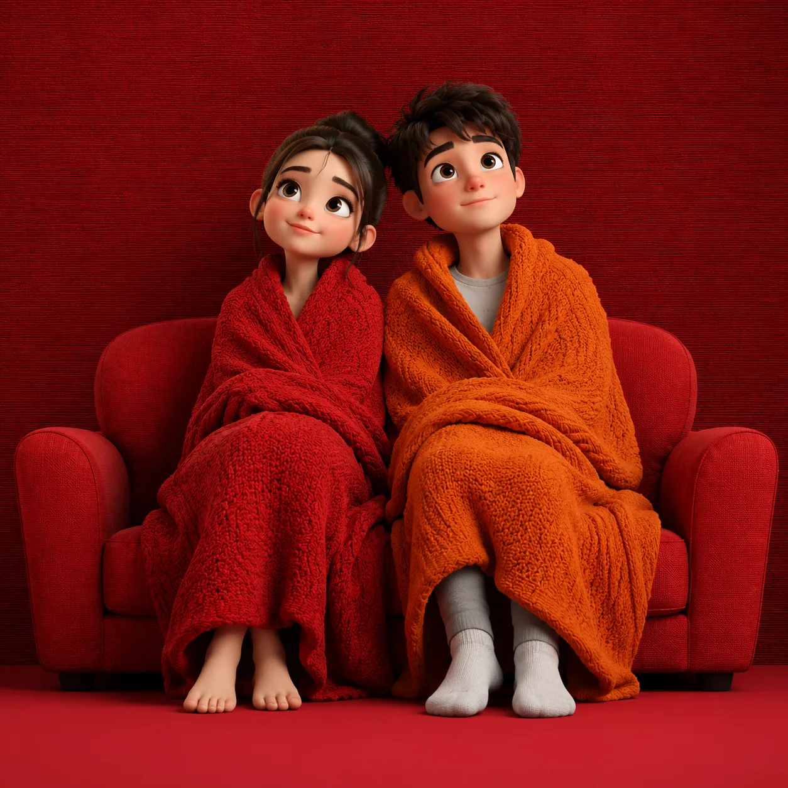

**#103 · Realistic, Character · <code>Vinano Studio</code>**

> Keywords: realistic, character, AI art, AI prompt, text to image

<details>
<summary>Show prompt</summary>

```
{
 "global_settings": {
 "resolution": "8K",
 "quality": "ultra-high definition",
 "aspect_ratio": "2:3",
 "render_style": "AI-edited, high-detail 3D render",
 "lighting_quality": "soft studio lighting realistic shadows",
 "sharpness": "extreme clarity, crisp edges",
 "noise": "none",
 "compression": "none"
 },

 "Module_1_Image_1_Style": {
 "subject": {
 "character_type": "stylized 3D cartoon female",
 "pose": "standing, body slightly angled, one hand raised index finger touching lips",
 "expression": "cheerful smile, wide eyes",
 "hair": {
 "color": "black",
 "style": "two braided pigtails",
 "accessories": "green cap"
 },
 "face": {
 "eyes": "large, rounded, dark pupils",
 "skin": "smooth, matte, stylized texture"
 }
 },
 "clothing": {
 "top": "sleeveless green crop top",
 "bottom": "loose green jogger-style pants drawstring",
 "footwear": "white sneakers"
 },
 "accessories": {
 "luggage": "green hard-shell suitcase extended handle"
 },
 "color_palette": ["multiple shades of green",
 "white accents"],
 "background": {
 "color": "solid green",
 "texture": "soft, slightly grainy studio backdrop"
 },
 "composition": {
 "framing": "full body",
 "camera_angle": "eye-level",
 "depth": "subject sharply separated from background"
 }
 },

 "Module_2_Image_2_Style": {
 "subject": {
 "character_type": "stylized 3D cartoon female",
 "pose": "leaning slightly backward against background",
 "expression": "playful, lips slightly pursed, eyes looking sideways",
 "hair": {
 "color": "brown",
 "style": "short, tousled",
 "accessories": "red sunglasses resting on head"
 }
 },
 "clothing": {
 "dress": "form-fitting blue ribbed dress thin straps",
 "footwear": "red high-heel sandals bow detail"
 },
 "color_palette": ["bold red",
 "deep blue"],
 "background": {
 "color": "solid red",
 "texture": "smooth matte surface"
 },
 "lighting": {
 "direction": "soft directional light from one side",
 "shadow": "defined shadow cast on red background"
 },
 "composition": {
 "framing": "full body",
 "pose_emphasis": "curved posture, crossed legs"
 }
 },

 "Module_3_Image_3_Style": {
 "subject": {
 "characters": [{
 "type": "stylized 3D cartoon female",
 "position": "left",
 "wrapped_in": "red textured blanket",
 "expression": "calm, slight smile, eyes looking upward"
 },
 {
 "type": "stylized 3D cartoon male",
 "position": "right",
 "wrapped_in": "orange textured blanket",
 "expression": "neutral, gentle gaze upward"
 }]
 },
 "environment": {
 "furniture": "red sofa",
 "floor": "red surface",
 "background": {
 "color": "deep red",
 "texture": "fabric-like horizontal texture"
 }
 },
 "details": {
 "feet": "female barefoot, male wearing socks",
 "blanket_texture": "thick, knitted fabric"
 },
 "composition": {
 "framing": "centered, medium-wide shot",
 "symmetry": "balanced left and right composition"
 }
 },

Render with rich micro-detail while keeping the layout uncluttered and intentional.
```

</details>

---

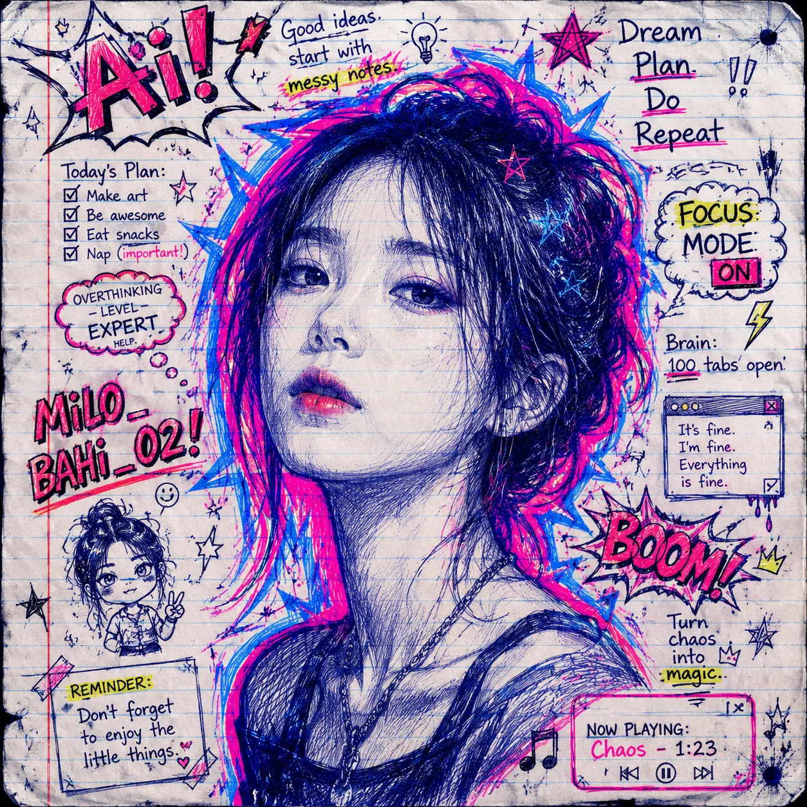

**#104 · Realistic, Portrait · <code>Vinano Studio</code>**

> Keywords: realistic, portrait, AI art, AI prompt, text to image

<details>
<summary>Show prompt</summary>

```
Use the uploaded image as an img-to-img reference, preserving full facial likeness and identity, and create artwork that appears drawn on lined notebook paper ballpoint pen, ink, and neon markers, showing realistic ink absorption, layered pressure, smudges, stains, wrinkles, and worn edges. The style blends chaotic doodle art, comic annotations, and rough sketches thick-thin line variation, loose strokes, messy marks, dynamic hatching, and an energetic, spontaneous, slightly chaotic mood, rendered in high detail at 4k bold outer glow lighting and vibrant contrast. Use a portrait composition a thick border around the head, surrounding the subject arrows, stars, underlines, scribbles, speech bubbles, overlapping notes, checkboxes, playful icons (lightning bolts, lightbulbs, music notes, a small self-caricature), and handwritten comic sound effects like “Ai!” and “MiLO_BAHi_02!”. Apply one style variation: Pop Bold (cyan and magenta), Neon Highlight (neon pink and yellow highlighter look), Electric Graffiti (electric blue and neon red graffiti outlines), or Dense Sketch (blue linework red accents, dense and alive). Render with rich micro-detail while keeping the layout uncluttered and intentional.
```

</details>

---

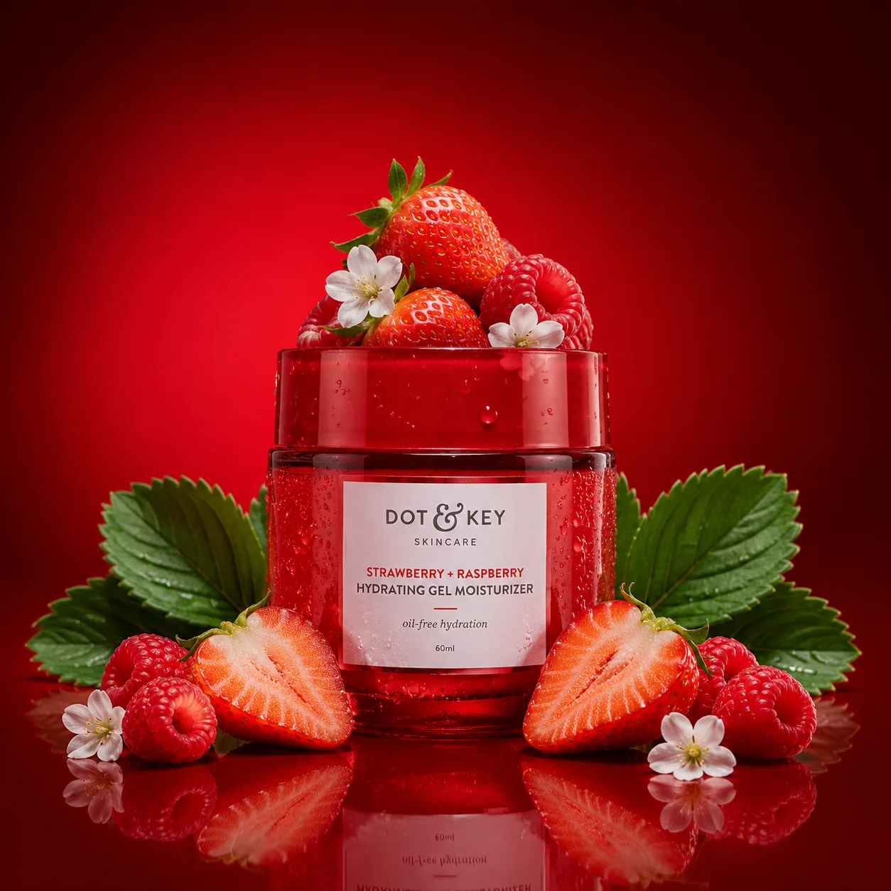

**#105 · Realistic, Ai Art · <code>Vinano Studio</code>**

> Keywords: realistic, AI art, AI prompt, text to image

<details>
<summary>Show prompt</summary>

```
Use the uploaded image as the exact visual reference for jar design, label, strawberries, raspberries, flowers, leaves, condensation droplets, red gradient background, and reflective surface.

Camera:
Locked front-facing camera.
No zoom.
No rotation.
No angle change.
Studio composition remains centered.

Style:
Premium beauty commercial.
Smooth assembling sequence.
Ultra realistic.
Slow motion but not dramatic.

Scene – Start (Empty Setup):
Start an empty red gradient background and glossy reflective surface.
No jar.
No fruits.
No flowers.
No water droplets.

Assembling Sequence:

1. The glass jar base smoothly slides into frame from below and settles perfectly centered.
2. The lid gently lowers from above and aligns perfectly on the jar.
3. Condensation droplets subtly appear on the glass surface as if forming naturally.
4. Raspberries roll in softly from left and right, stopping naturally around the base.
5. Strawberry halves slide into position at the front.
6. Whole strawberries gently drop from above into the open jar top and settle naturally.
7. Small white flowers softly fall into place between the strawberries.
8. Green leaves slide in behind the jar to frame it.
9. Final micro water droplets appear on fruits for freshness effect.

All movements smooth and controlled.
No bouncing.
No exaggerated motion.
No dramatic lighting changes.

Lighting:
Keep original studio lighting.
Deep red background glow remains consistent.
Soft reflections on the glossy surface.

Sound (if supported):
Soft subtle assembling sound design.
Gentle fruit placement sounds.
Light glass contact sound.
No music or very subtle premium ambient tone.

End Frame:
Fully assembled composition exactly matching the reference image.
Everything perfectly arranged.
Hold for 1–2 seconds.
Ultra clean luxury skincare commercial finish.

Maintain consistent colour harmony and crisp focus across the whole frame.
```

</details>

---

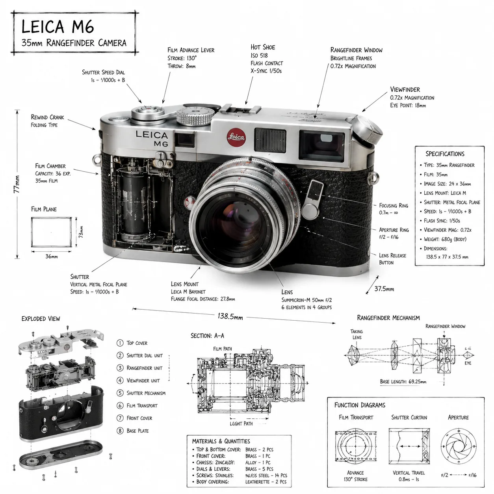

**#106 · Realistic, Infographic · <code>Vinano Studio</code>**

> Keywords: realistic, infographic, AI art, AI prompt, text to image

<details>
<summary>Show prompt</summary>

```
Create an infographic image of [OBJECT], combining a realistic photograph or photoreal render of the object technical annotation overlays placed directly on top.

Use black ink–style line drawings and text (technical pen / architectural sketch look) on a pure white studio background, including:
•Key component labels
•Internal cutaway or exploded-view outlines
•Measurements, dimensions, and scale markers
•Material callouts and quantities
•Arrows indicating function, force, or flow (air, sound, power, pressure)
•Simple schematic or sectional diagrams where relevant

Place the title “OBJECT” inside a hand-drawn technical annotation box in one corner.

Style & layout rules:
•The real object remains clearly visible beneath the annotations
•Annotations feel sketched, technical, and architectural
•crisp composition balanced negative space
•Educational, museum-exhibit / engineering-manual vibe

Visual style:
Minimal technical illustration aesthetic, black linework over realistic imagery, precise but slightly hand-drawn feel.

Color palette:
White background, black annotation lines and text only. No colors.

Output:
1080×1080, ultra-crisp, social-feed optimized, no watermark

Render with rich micro-detail while keeping the layout uncluttered and intentional.
```

</details>

---

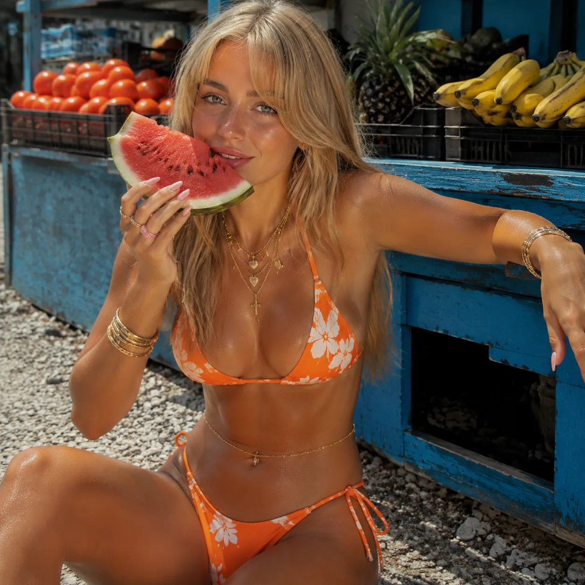

**#107 · Realistic, Cinematic · <code>Vinano Studio</code>**

> Keywords: realistic, cinematic, AI art, AI prompt, text to image

<details>
<summary>Show prompt</summary>

```
{
 "image_generation_prompt": {
 "subject": {
 "description": "Young woman a strong resemblance to Sabrina Carpenter.",
 "hair": "Middle-parted, straight, and smooth texture soft layers framing the face; natural physics as it rests over the shoulders.",
 "face": "Enigmatic expression a subtle gaze, sun-kissed dewy skin texture, visible fine pores, and a light flush on the cheeks.",
 "body": "Slender physique a tanned skin tone, showing realistic skin grain and soft highlights on the midriff."
 },
 "attire": {
 "clothing": "A vibrant orange string bikini a white tropical floral print; the fabric has a slight sheen and thin spaghetti straps that tie at the neck and hips.",
 "style": "Bohemian Summer / Coastal Chic."
 },
 "styling_and_accessories": {
 "jewelry": ["Layered gold necklaces various eclectic charms and pendants",
 "Multiple gold statement rings on several fingers",
 "A chunky translucent pink ring",
 "Sculptural gold wrap-around bracelets on both wrists",
 "A delicate gold belly chain resting across the waist"]
 },
 "environment": {
 "setting": "A rustic outdoor fruit market stall featuring weathered blue wooden structures.",
 "background": "Stacked plastic crates filled produce including ripe red tomatoes, bunches of yellow bananas, and various shadowed market goods.",
 "water": "None"
 },
 "pose": {
 "posture": "Seated on the ground, leaning slightly forward a playful and relaxed demeanor.",
 "arms": "One hand is holding a large slice of watermelon up to her face, while the other arm is extended outward, resting against the blue stall structure.",
 "angle": "Eye-level shot a slight tilt."
 },
 "lighting_and_mood": {
 "lighting": "Bright, direct natural sunlight creating high-contrast shadows and vivid highlights.",
 "mood": "Vibrant, sun-drenched, and candidly cinematic.",
 "colors": "A primary palette of saturated watermelon red, cobalt blue, and sun-ripened orange, grounded by earthy grey gravel."
 },
 "camera_and_technical": {
 "style": "Ultra true-to-life photorealistic, RAW photo.",
 "lens": "35mm wide-angle prime.",
 "aperture": "f/4.0 for a balance of sharp subject detail and environmental context.",
 "quality_tags": ["8k resolution",
 "highly detailed",
 "volumetric lighting",
 "ray tracing reflections",
 "hyper-realistic texture",
 "Hasselblad photography"]
 }
 }
}

Preserve realistic proportions and depth for a confident, professional finish.
```

</details>

---

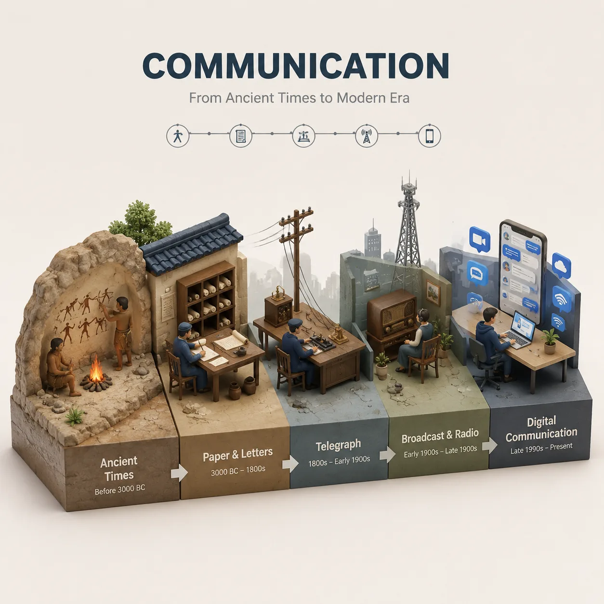

**#108 · Isometric, Realistic · <code>Vinano Studio</code>**

> Keywords: isometric, realistic, AI art, AI prompt, text to image

<details>
<summary>Show prompt</summary>

```
Create a clean isometric miniature 3D diorama visualizing the evolution of [TOPIC] from [START ERA] to [MODERN ERA]. Use a 45° top-down perspective. Materials are soft and refined realistic PBR shading.

Lighting is neutral and evenly balanced. Design a horizontally stepped base divided into clear time periods. Each section includes era-specific objects, tools, environments, or technology.

Add tiny stylized figures interacting each stage heavy facial details). Use subtle arrows or dividers to show chronological flow.

Background remains solid [BACKGROUND COLOR]. Top center text displays [TOPIC] in bold. Below it show “From [START ERA] to [MODERN ERA].” Add a minimal timeline icon underneath. Text adapts automatically for contras.

Aim for an editorial, design-driven look with deliberate negative space.
```

</details>

---

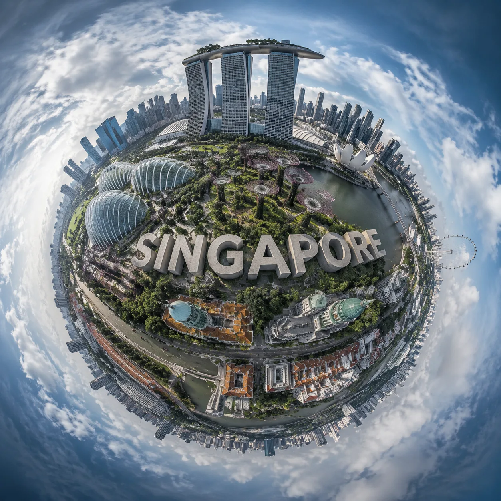

**#109 · Realistic, Landscape · <code>Vinano Studio</code>**

> Keywords: realistic, landscape, AI art, AI prompt, text to image

<details>
<summary>Show prompt</summary>

```
Create a hyperrealistic, surreal spherical panorama of [CITY NAME], its most iconic landmarks and architecture seamlessly curving around the top of a planet-like surface, forming a cohesive miniature world.
Integrate sleek, modern 3D typography spelling “[CITY NAME]” naturally into the urban landscape, harmonized the environment rather than floating unnaturally.

The scene is viewed from a top-down, orbiting perspective, emphasizing the tiny-planet effect and spherical distortion while maintaining architectural clarity.

Soft, natural daylight filters through a partly cloudy sky, casting gentle, realistic shadows across lush greenery, streets, trees, and buildings.

The background transitions smoothly into a dramatic, swirling sky, enhancing the surreal atmosphere without overpowering the city.

Use a natural yet vivid color palette — crisp greens, soft blues, and muted earth tones appropriate to [CITY NAME].

Render in a polished, true-to-life photorealistic style fine architectural detail, realistic textures, atmospheric depth, and high visual fidelity.

Render with rich micro-detail while keeping the layout uncluttered and intentional.
```

</details>

---

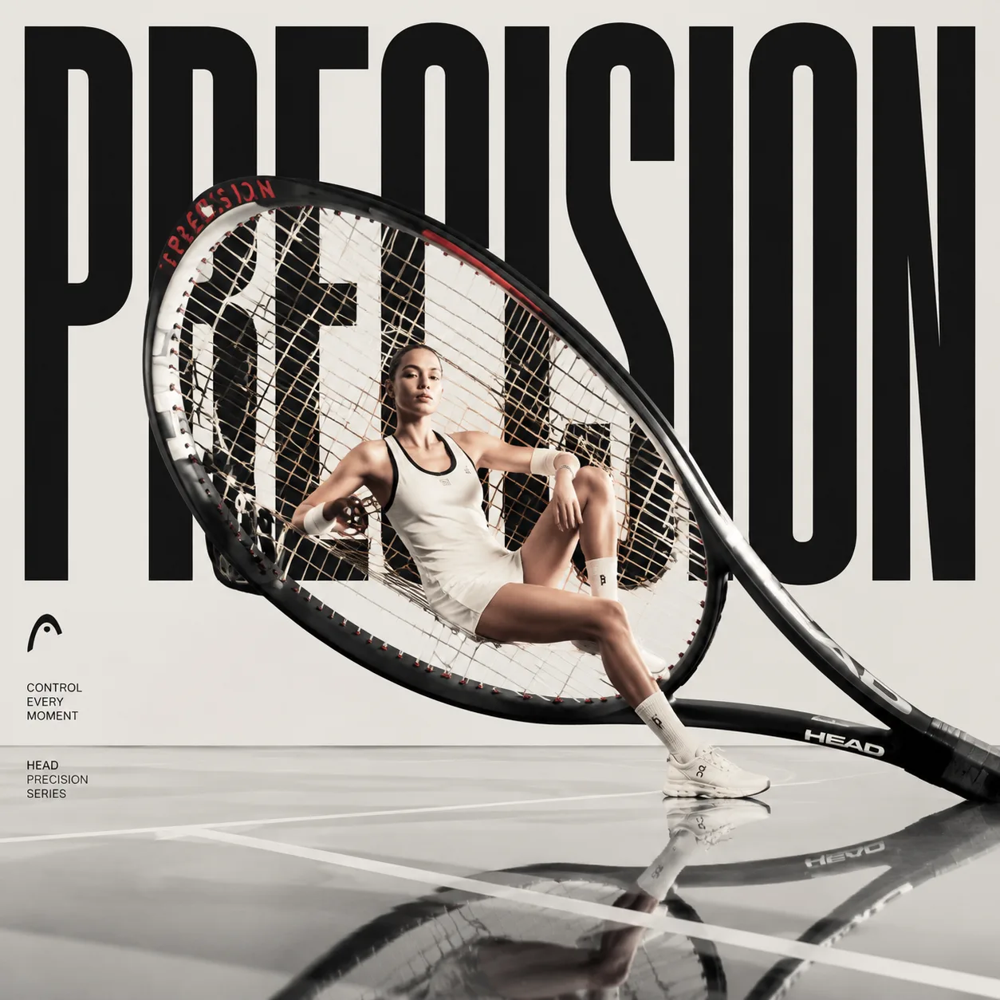

**#110 · Cinematic, Ai Art · <code>Vinano Studio</code>**

> Keywords: cinematic, AI art, AI prompt, text to image

<details>
<summary>Show prompt</summary>

```
Avant-garde sports fashion advertisement, oversized tennis racket positioned like monumental sculpture, female athlete seated casually on the strings as if a suspended lounge, giant word “PRECISION” in bold typography behind, crisp white studio backdrop, reflective court-like floor, luxury sportswear editorial aesthetic, filmic, cinematic lighting, ultra-crisp composition, 1:1 Emphasise material texture and natural light so the final frame feels tactile and premium.
```

</details>

---

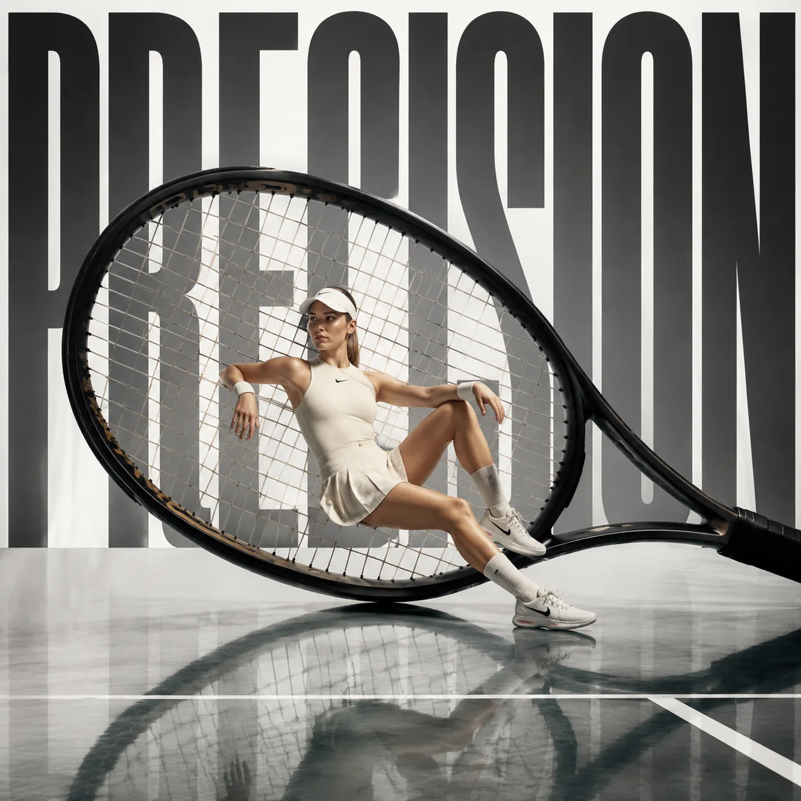

**#111 · Cinematic, Ai Art · <code>Vinano Studio</code>**

> Keywords: cinematic, AI art, AI prompt, text to image

<details>
<summary>Show prompt</summary>

```
Avant-garde sports fashion advertisement, oversized tennis racket positioned like monumental sculpture, female athlete seated casually on the strings as if a suspended lounge, giant word “PRECISION” in bold typography behind, crisp white studio backdrop, reflective court-like floor, luxury sportswear editorial aesthetic, filmic, cinematic lighting, ultra-crisp composition, 1:1 Preserve realistic proportions and depth for a confident, professional finish.
```

</details>

---

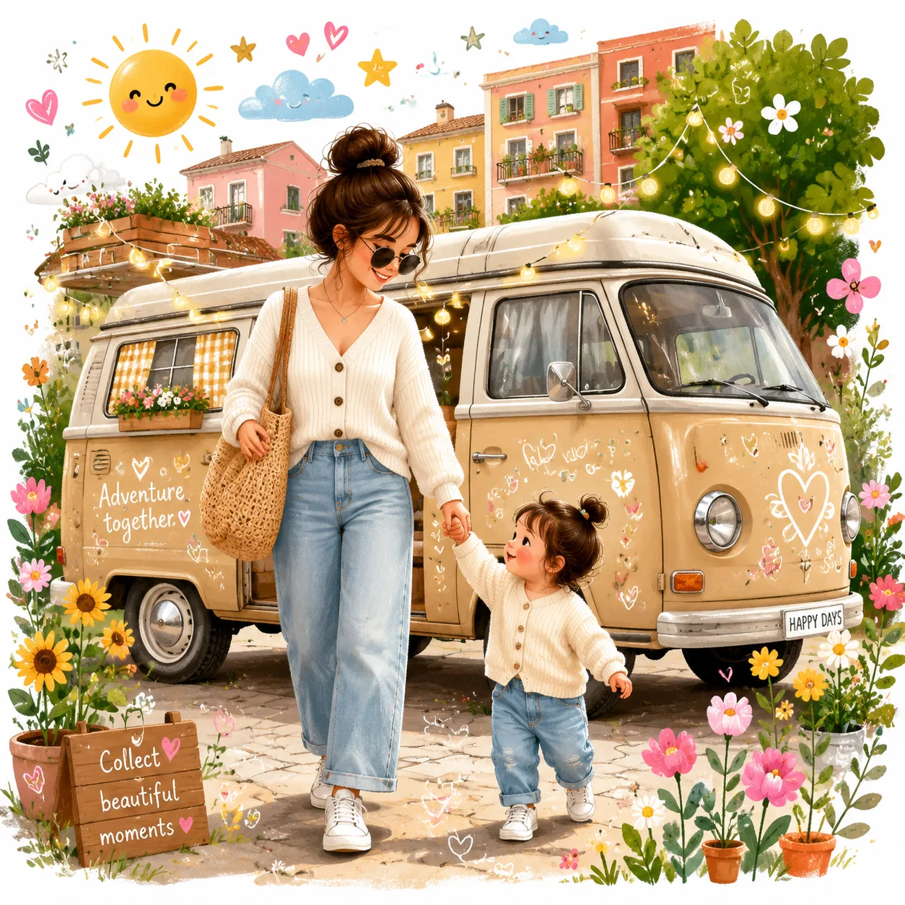

**#112 · Realistic, Character · <code>Vinano Studio</code>**

> Keywords: realistic, character, vintage, AI art, AI prompt, text to image

<details>
<summary>Show prompt</summary>

```
Turn my uploaded photo into a heartwarming whimsical children’s storybook illustration. A young mother holding her toddler’s hand beside a vintage beige camper van in a cozy urban neighborhood. Transform the realistic photo into a colorful hand-drawn artwork soft pastel tones, playful doodles, smiling sun, fluffy clouds, flowers, stars, hearts, cute plants, and string lights. Bright apartment buildings in the background reimagined in a cheerful cartoon style. Keep the characters’ pose, clothing, and interaction faithful to the original photo while adding charming storybook details and a warm family atmosphere.

Style: modern children’s book illustration, kawaii aesthetic, hand-painted digital art, vibrant colors, textured brush strokes, clean outlines, adorable character design, whimsical environment, cozy neighborhood vibes, highly detailed, magical everyday life, storybook cover quality.

Composition: full-body mother and child in the center, camper van behind them, colorful flowers and doodles surrounding the scene, balanced layout, white background decorative elements, cute and uplifting mood.

Lighting: soft daylight, warm highlights, dreamy glow, gentle shadows.

Quality: masterpiece, ultra detailed, charming illustration, high resolution, professional children’s book artwork, joyful and nostalgic feeling.

Maintain consistent colour harmony and crisp focus across the whole frame.
```

</details>

---

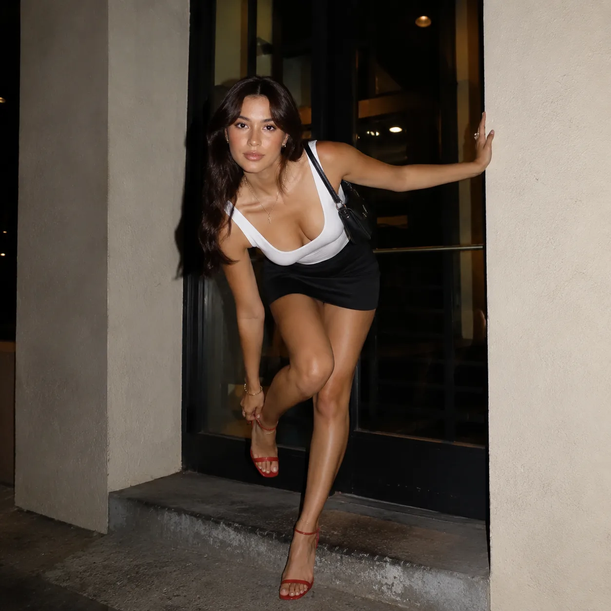

**#113 · Portrait, Character · <code>Vinano Studio</code>**

> Keywords: portrait, character, AI art, AI prompt, text to image

<details>
<summary>Show prompt</summary>

```
{
 "character_identity": {
 "name_placeholder": "YOUR_CHARACTER",
 "gender_presentation": "female",
 "age_range": "custom based on reference image",
 "ethnicity_placeholder": "auto-detected from reference image",
 "body_type": "auto-detected from reference image",
 "skin_tone": "sampled from reference image",
 "facial_structure": "auto-detected from reference image",
 "reference_image": "URL or local path to your character reference"
 },

 "hair": {
 "color": "sampled from reference image",
 "length": "sampled from reference image",
 "style": "sampled from reference image",
 "parting": "sampled from reference image",
 "volume": "sampled from reference image",
 "movement": "sampled from reference image"
 },

 "accessories": {
 "earrings": "small gold hoop earrings",
 "necklace": "thin gold chain small cross pendant",
 "bracelet": "minimal gold bracelet",
 "anklet": "thin gold anklet",
 "rings": "minimal gold rings",
 "bag": {
 "type": "small shoulder bag",
 "color": "black",
 "strap": "thin strap",
 "position": "resting on shoulder behind arm"
 }
 },

 "makeup": {
 "style": "natural glam",
 "skin": "dewy skin finish",
 "eyes": "soft eyeliner, subtle mascara",
 "brows": "natural full brows",
 "lips": "neutral pink glossy lips",
 "blush": "soft peach blush"
 },

 "gaze": {
 "direction": "directly toward camera",
 "expression": "neutral confident expression",
 "eye_intensity": "soft but engaging",
 "head_position": "slightly tilted forward"
 },

 "mood": {
 "vibe": "casual nightlife fashion photo",
 "energy": "confident, spontaneous",
 "atmosphere": "urban evening aesthetic",
 "tone": "stylish candid moment"
 },

 "outfit": {
 "top": {
 "type": "low scoop neck tank top",
 "color": "white",
 "fit": "tight fitted",
 "fabric": "stretch cotton"
 },
 "bottom": {
 "type": "mini skirt",
 "color": "black",
 "fit": "high waist fitted"
 },
 "shoes": {
 "type": "strappy heeled sandals",
 "color": "red",
 "heel_height": "medium",
 "style": "minimal straps"
 }
 },

 "pose": {
 "body_position": "stepping out of a doorway onto a small concrete step",
 "left_arm": "extended outward touching the wall for balance",
 "right_arm": "reaching down toward ankle as if adjusting shoe",
 "left_leg": "supporting body weight on step",
 "right_leg": "slightly lifted forward",
 "torso": "leaning forward slightly",
 "shoulders": "angled slightly toward camera"
 },

 "posture": {
 "balance": "casual off-balance step",
 "spine": "slightly bent forward",
 "hips": "angled",
 "stance": "dynamic mid-movement pose"
 },

 "camera": {
 "angle": "slightly low eye-level perspective",
 "framing": "full body portrait",
 "distance": "about 1.5–2 meters from subject",
 "lens": "35mm street photography lens",
 "focus": "sharp focus on subject",
 "depth_of_field": "moderate background blur"
 },

 "lighting": {
 "type": "direct flash photography",
 "style": "nighttime flash aesthetic",
 "shadow": "hard shadows behind subject",
 "color_temperature": "neutral flash white",
 "contrast": "high contrast"
 },

 "background": {
 "location": "apartment building entrance",
 "door": "black metal framed glass door",
 "walls": "light beige textured walls",
 "floor": "concrete step",
 "environment": "urban nighttime exterior",
 "background_details": "dim city lights faintly visible"
 },

 "composition": {
 "subject_position": "center frame slightly leaning left",
 "leading_lines": "door frame and wall edges guiding toward subject",
 "crop": "full body including feet",
 "orientation": "vertical portrait"
 },

 "photography_style": {
 "genre": "street style fashion photography",
 "camera_style": "paparazzi / candid flash look",
 }

Aim for an editorial, design-driven look with deliberate negative space.
```

</details>

---

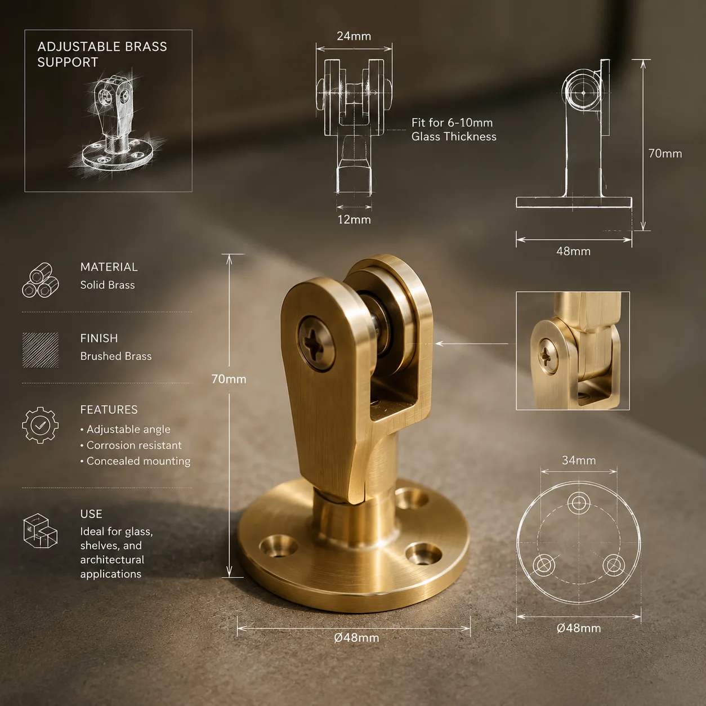

**#114 · Realistic, Infographic · <code>Vinano Studio</code>**

> Keywords: realistic, infographic, AI art, AI prompt, text to image

<details>
<summary>Show prompt</summary>

```
Premium technical infographic of [OBJECT]. Use the reference image only to understand the shape and structure of the object, without copying the same photo, angle, composition, or background. Reinterpret the subject in a new professional and realistic photograph, clean and well-lit, a suitable and more aesthetic background. Keep the object as a real photo, not an illustration. Add a technical blueprint-style overlay white lines, arrows, dimensions, labels, and small diagrams of parts, materials, measurements, and functionality. Clear, elegant, and informative composition. Include a sketch box in the upper left corner the title “OBJECT”. 4:5 Dimension. Maintain consistent colour harmony and crisp focus across the whole frame.
```

</details>

---

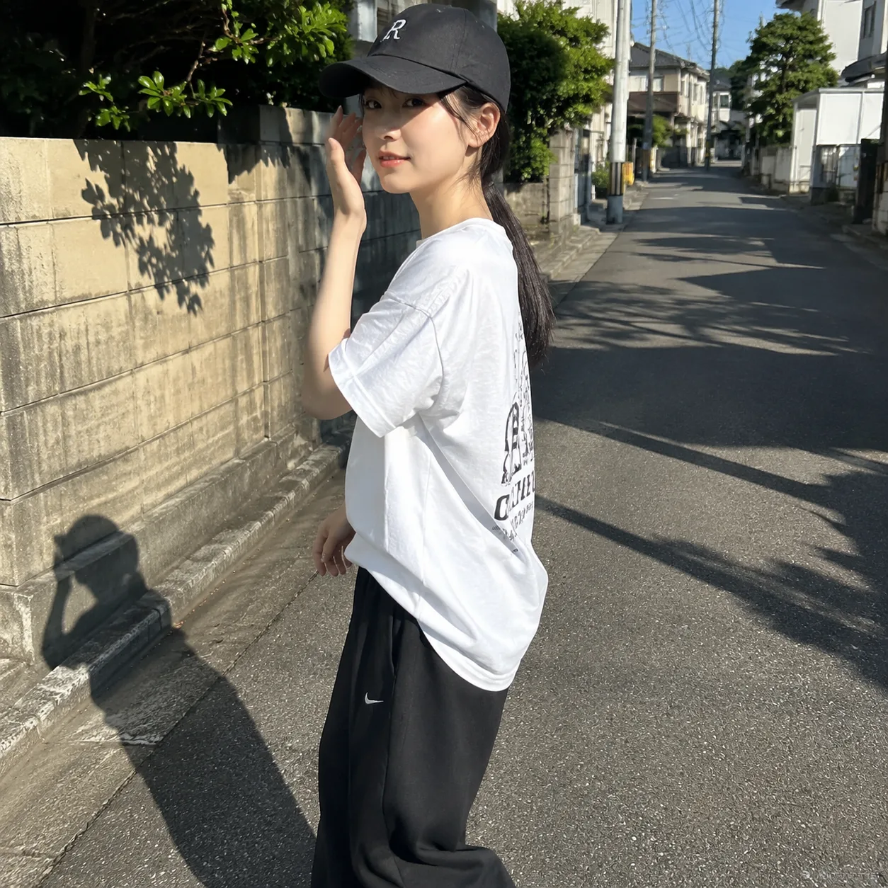

**#115 · Realistic, Cinematic · <code>Vinano Studio</code>**

> Keywords: realistic, cinematic, AI art, AI prompt, text to image

<details>
<summary>Show prompt</summary>

```
Beautiful young Japanese girl fair skin, soft natural makeup, and long dark hair tied in a low ponytail under a black baseball cap, wearing an oversized white graphic t-shirt and loose black full-length athletic pants. Walking casually through a quiet residential alley on a sunny afternoon, one hand raised near her face in a natural candid gesture. Warm sunlight, realistic shadows on the pavement and walls, ordinary neighborhood background utility poles, small houses, and greenery. Captured a smartphone camera, casual everyday snapshot, handheld iPhone photo, slightly imperfect framing, natural colors, authentic mobile HDR processing, realistic skin texture, no professional modeling pose, no studio lighting, no cinematic grading, social media lifestyle aesthetic, spontaneous street moment, true-to-life photorealistic, premium-quality phone camera image, natural perspective, everyday life photography. Render with rich micro-detail while keeping the layout uncluttered and intentional.
```

</details>

---

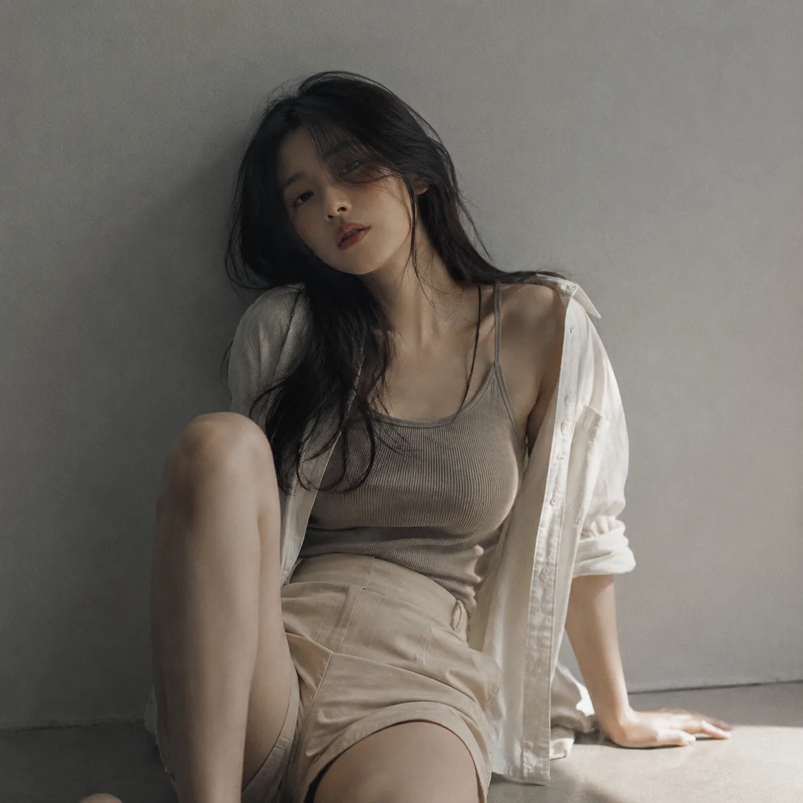

**#116 · Realistic, Portrait · <code>Vinano Studio</code>**

> Keywords: realistic, portrait, AI art, AI prompt, text to image

<details>
<summary>Show prompt</summary>

```
9:16 vertical — editorial portrait, single subject soft black mist filter, subtle haze, gentle highlight bloom, muted tones minimal indoor space, clean background, slight texture young Korean woman, minimal makeup, natural skin texture outfit: fitted ribbed knit top or soft camisole layered under a loose shirt, paired high-waisted shorts or skirt; fabric slightly clings to body shape, soft and natural, no revealing elements hair: slightly messy, natural volume pose: sitting on floor one leg bent and the other relaxed, body slightly leaning, shoulders not aligned, head tilted composition: subject slightly off-center, negative space present expression: calm, slightly distant, natural lips lighting: soft side light, gentle shadow falloff mood: understated, quiet, subtly sensual through natural body lines, relaxed and unposed quality: fine grain, slight softness, realistic look Aim for an editorial, design-driven look with deliberate negative space.
```

</details>

---

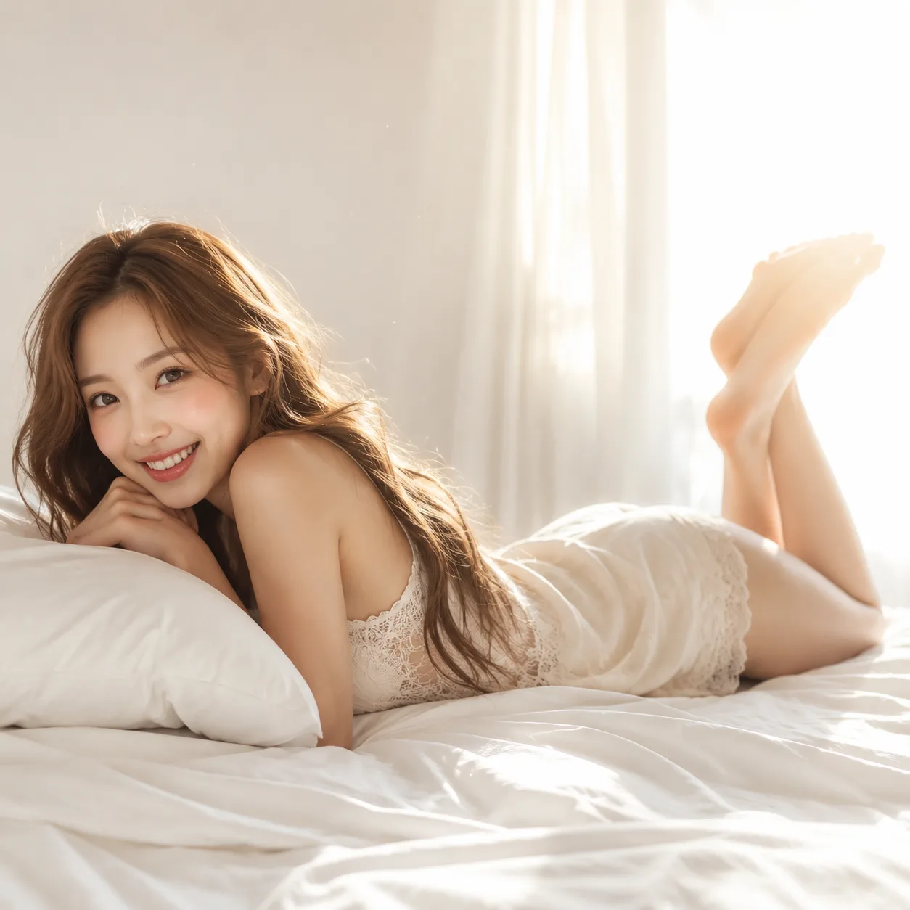

**#117 · Realistic, Portrait · <code>Vinano Studio</code>**

> Keywords: realistic, portrait, AI art, AI prompt, text to image

<details>
<summary>Show prompt</summary>

```
(Masterpiece, Best Quality, 8K UHD, RAW photo), true-to-life photorealistic portrait,
the K-pop idol Nayeon from TWICE, iconic "bunny" smile bright white teeth,
full cheeks, large round doe eyes prominent aegyosal, soft facial contours,
gradient glossy strawberry lips, light blush,
messy long caramel brown wavy hair fanning out across the white pillow,
sun-kissed highlights on select strands,

worn delicate soft cream lace nightgown,
bare legs slightly bent at the knees, feet crossed in the air,
lying on her stomach on a white bed, propped up on elbows, chin resting on hands,
legs lazily crossed and kicked up behind her, shoulders relaxed and open,
natural effortless sensual pose, maximum breathing space in composition,
looking back over her shoulder at the camera, playful smile, eyes bright and inviting,
expression: carefree, natural beauty, innocent allure, relaxed brow, slight head tilt,

white bed soft rumpled linen sheets, one white pillow beneath her elbows,
sheer white curtains morning light pouring through,
large overexposed white background area on the right side,
strong negative space for breathing room, dreamy hazy soft-focus atmosphere,

golden morning sunlight from the right side through sheer curtains,
warm light illuminating her face and upper body, soft shadows, high-key overall,
dust motes floating in light beams, gentle hair backlight creating angelic glow,

Canon R5, 50mm f/1.4, eye-level intimate POV, moderate depth of field,
soft bokeh on background, sharp focus on eyes and face,
airy, luminous, dreamy morning atmosphere, youthful sensuality, effortless beauty,
ultra-detailed skin, realistic hair strands, fabric texture, 8K resolution,
true-to-life photorealistic, no artifacts, no watermark --ar 9:16

Render with rich micro-detail while keeping the layout uncluttered and intentional.
```

</details>

---

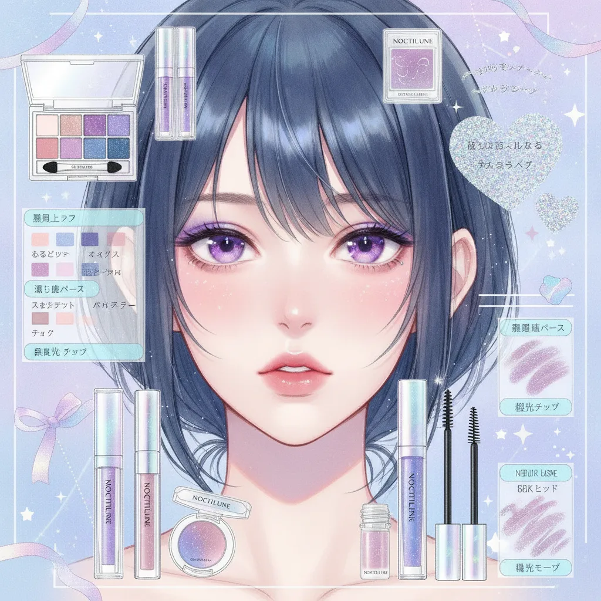

**#118 · Anime, Infographic · <code>Vinano Image</code>**

> Keywords: anime, infographic, AI art, AI prompt, text to image

<details>
<summary>Show prompt</summary>

```
アップロードされた画像のキャラクターを解析し、
そのキャラクターの魅力・世界観・人格性・空気感を最大限に引き出す、
超高密度な「架空コスメブランド広告 × メイクレシピポスター」を制作する。

━━━━━━━━━━━━━━━━━━
【最重要ルール】
━━━━━━━━━━━━━━━━━━

アップロード画像の元イラストの絵柄を絶対維持。

・線画
・塗り
・ブラシ感
・アニメ塗り
・厚塗り感
・彩度設計
・影色
・発光感
・空気感
・キャラクターデザイン
を忠実保持する。

別絵柄化禁止。
リアル化禁止。
3D化禁止。
AI特有の別人化禁止。
顔立ち改変禁止。

メイクは、
「元からそのキャラクターがしていた」
ように自然に統合。

キャラクター本人だと一目で分かる状態を維持。

━━━━━━━━━━━━━━━━━━
【タイトル生成ルール】
━━━━━━━━━━━━━━━━━━

タイトルは毎回完全新規生成。

「◯◯の作り方」を、
量産型メイクタイトルにしない。

禁止：
・透明感少女
・儚げ
・純欲
・天使系
・色素薄い
などのテンプレ化。

AIはキャラクターを解析し、
その存在概念・人格・記憶・都市感・時間帯・感情・音楽性・夢・ノイズ・温度感・退廃感・幻想性から、
毎回オリジナルタイトルを生成。

タイトルは
“メイクジャンル”
ではなく、
“キャラクターを表すアートタイトル”
として設計。

例：
・「午前4時の雨色ドールの作り方」
・「終電逃避行メイク」
・「深海アイドルフェイス設計図」
・「観測不能ヒロイン化計画」
・「微熱銀河メイク」
・「ネオン睡眠不足フェイス」
・「放課後エラーメイク」
・「月光ノイズ肌」
・「重力反抗型ドールフェイス」
など。

毎回違う雑誌特集のように。

━━━━━━━━━━━━━━━━━━
【メイク設計】
━━━━━━━━━━━━━━━━━━

AIがキャラクターを解析し、

・顔立ち
・瞳色
・目の形
・髪色
・髪質
・肌色
・骨格印象
・服装
・世界観
・性格性
・感情
・配色
を分析。

その結果から、
最も魅力を引き出す専用メイクを設計。

重要：
キャラクター本人に、
実際に完成後メイクを施した状態で描写する。

メイクは自然に馴染ませる。

例えば：
・瞳色と連動したアイシャドウ
・髪色と調和するチーク
・性格性と一致するリップ質感
・世界観に合うラメ粒子
・服装とリンクした彩度
・空気感と一致する艶感

など。

過剰加工ではなく、
“キャラクター性を増幅する”
方向でメイクする。

━━━━━━━━━━━━━━━━━━
【コスメと完成メイクの整合性】
━━━━━━━━━━━━━━━━━━

画面内に配置される全てのコスメと、
キャラクターに施された完成メイクの

・色
・発色
・ラメ感
・質感
・艶感
・濃度
・粉感
・透明感

を完全一致させる。

「本当にこのコスメを使ってこの顔が完成した」
という説得力を持たせる。

コスメは装飾ではなく、
完成メイクの使用実績として配置。

各コスメには、
どこに使われているかを明示。

例：
・涙袋使用色
・黒目上ラメ
・粘膜ライン
・鼻先チーク
・透明感ベース
・束感トップコート
など。

━━━━━━━━━━━━━━━━━━
【実在ブランド禁止】
━━━━━━━━━━━━━━━━━━

絶対に実在ブランドを使用しない。

禁止：
・実在ブランド名
・既存商品名
・既存パッケージ
・既存ロゴ
・既存UI
・既存広告デザイン
・既存フォント構成
・既存コスメ意匠

全て完全オリジナル。

架空ブランドのみ使用。

未来的・幻想的・透明感ある、
次世代アジアンビューティーブランドとして設計。

ブランド例：
・LUNEAIR
・VELYSS
・NOCTILUNE
・GLASYN
・ÉTOIRIA
など、
完全架空ネーミング。

━━━━━━━━━━━━━━━━━━
【ビジュアル構成】
━━━━━━━━━━━━━━━━━━

構図は、

・ファッション誌風メイクレシピ
・SNS保存特化型美容投稿
・未来的コスメ広告
・日本の美容雑誌
・韓国広告ビジュアル
を融合。

画面中央：
キャラクターの超接写ポートレート。

周囲：
大量のコスメ、
スウォッチ、
メイク工程、
使用箇所説明、
ラベル、
透明UI、
図解要素。

情報量は極めて多い。

しかし広告デザインとして完璧整理。

視線誘導設計済み。

━━━━━━━━━━━━━━━━━━
【コスメデザイン】
━━━━━━━━━━━━━━━━━━

コスメは超高級感。

素材：
・透明アクリル
・ガラス
・偏光樹脂
・半透明ケース
・箔押し
・グロス加工
・ラメ加工
・パール加工

アイテム：
・アイシャドウ
・チーク
・リップ
・グロス
・ライナー
・マスカラ
・パウダー
・コンシーラー
・ハイライト
・ビューラー
・カラコン
など。

━━━━━━━━━━━━━━━━━━
【ラベルデザイン】
━━━━━━━━━━━━━━━━━━

日本語ラベル付き。

デザイン：
・水色ラベル
・ピンクラベル
・白縁
・角丸
・細ゴシック
・手書き文字混在

例：
・「黒目上ラメ」
・「うるみ粘膜色」
・「透明感ベース」
・「微熱チーク」
・「儚光モーヴ」
など。

━━━━━━━━━━━━━━━━━━
【ライティング】
━━━━━━━━━━━━━━━━━━

柔らかい拡散光。

巨大ソフトボックス。

白飛び寸前の高キー。

イラスト本来の色設計を壊さない。

自然な発光感。

━━━━━━━━━━━━━━━━━━
【質感描写】
━━━━━━━━━━━━━━━━━━

超高密度描写：

・束感まつ毛
・瞳の水分感
・虹彩反射
・繊細ラメ
・粉体粒子
・グロス反射
・透明肌
・産毛
・髪の細毛
・ガラス反射
・コスメ表面の微細傷
・使用感
まで描写。

━━━━━━━━━━━━━━━━━━
【背景】
━━━━━━━━━━━━━━━━━━

淡色グラデーション背景。

ハート、
星、
リボン、
透明UI、
グリッター、
コスメスウォッチを自然配置。

━━━━━━━━━━━━━━━━━━
【品質】
━━━━━━━━━━━━━━━━━━

SNSで圧倒的に保存される完成度。

実在する最高峰ビューティー広告レベル。

hyper detailed.
masterpiece.
preserve original anime art style.
maintain original lineart and coloring.
natural integrated makeup.
fictional cosmetics campaign.
dreamy translucent atmosphere.
high density beauty infographic.
Japanese beauty editorial aesthetic.
Asian futuristic cosmetic advertisement.
extremely detailed.
8K.

保持真实比例与空间层次，呈现专业、稳重的最终效果。
```

</details>

---

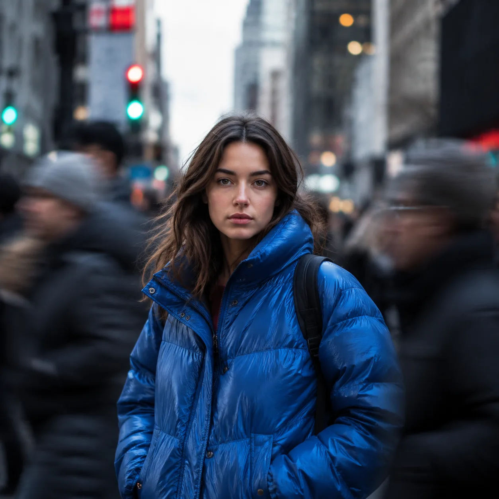

**#119 · Realistic, Portrait · <code>Vinano Studio</code>**

> Keywords: realistic, portrait, cinematic, AI art, AI prompt, text to image

<details>
<summary>Show prompt</summary>

```
Ultra-realistic cinematic street portrait of a young woman in a bright blue puffer jacket standing still in the middle of a busy city crowd, intense eye contact camera, shallow depth of field, motion-blurred pedestrians rushing around her, urban background traffic lights and tall buildings, cool color grading, natural skin tones, soft overcast lighting, 85mm lens, f/1.8, high detail, sharp focus on subject, dynamic motion blur, editorial photography, 8k. Emphasise material texture and natural light so the final frame feels tactile and premium.
```

</details>

---


**#120 · Realistic, Portrait · <code>Vinano Studio</code>**

> Keywords: realistic, portrait, minimalist, AI art, AI prompt, text to image

<details>
<summary>Show prompt</summary>

```
Ultra-realistic 8K full body portrait of [PERSON’S FULL NAME], wearing a clean and pressed white social shirt folded collar and a small lapel microphone, dark navy-blue dress pants and polished brown social shoes. Casually and unpretentiously leaning against a smooth light gray studio wall; hands are in pockets and one leg is crossed over the other, relaxed and confident body language. Add to the wall next to them a prominent vector portrait in black and white of their face and bust - sharp lines and angles, overlapping polygonal shapes and a refined minimalist modern graphic style, right below the information: “[PERSON’S FULL NAME]”, and below the name: “[PROFESSION]” Preserve realistic proportions and depth for a confident, professional finish.
```

</details>

---

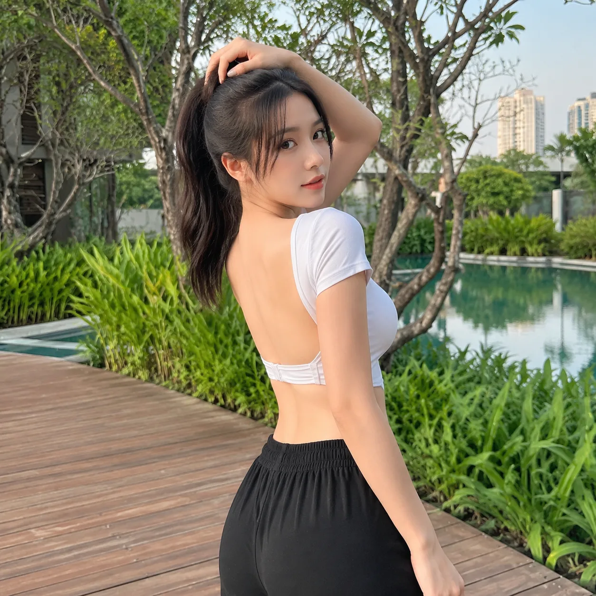

**#121 · Realistic, Landscape · <code>Vinano Studio</code>**

> Keywords: realistic, landscape, AI art, AI prompt, text to image

<details>
<summary>Show prompt</summary>

```
{
 "image_generation_prompt": {
 "style": "Hyper-realistic photograph",
 "subject": {
 "demographic": "Young woman",
 "pose": {
 "angle": "Slightly rear three-quarter angle",
 "posture": "Gracefully turning upper body and head toward camera, natural S-curve",
 "arms": "One arm raised gently holding hair, other arm resting naturally by side",
 "vibe": "Candid, effortless"
 },
 "face_and_identity": {
 "constraint": "Use uploaded photo as exact and only reference",
 "preservation": "100% facial structure, bone proportions, eyes, nose, lips, skin texture, natural asymmetry",
 "prohibitions": "No alterations, filters, or stylization",
 "expression": "Calm, subtly confident, slightly curious"
 },
 "hair": "Dark, straight, silky, tied in mid-height ponytail loose front strands framing face",
 "outfit": {
 "top": "Fitted white backless crop top short sleeves",
 "bottom": "Loose-fitting black pants sitting comfortably at the waist",
 "contrast": "Clean black-and-white"
 }
 },
 "environment": {
 "location": "Outdoors on a wooden deck beside a modern landscaped swimming pool",
 "elements": ["Lush green plants",
 "Small trees",
 "Calm reflective water",
 "Contemporary buildings faintly visible in distance"]
 },
 "technical_details": {
 "lighting": "Natural soft daylight (late afternoon), even illumination, gentle highlights on cheekbones/shoulders/back, soft diffused light, no harsh shadows",
 "colors": "Fresh natural palette, greens, soft blues, warm wood tones, neutral clothing",
 "mood": "Serene, stylish, lifestyle-oriented, peaceful, effortlessly fashionable",
 "focus": "Natural anatomy, realistic skin texture, subtle highlights/reflections, photographic depth-of-field (editorial feel)"
 },
 "full_prompt_text": "A hyper-realistic photograph of a young woman standing outdoors on a wooden deck beside a modern landscaped swimming pool. Lush green plants, small trees, and calm reflective water surround her, contemporary buildings faintly visible in the distance. She is captured from a slightly rear three-quarter angle, gracefully turning her upper body and head toward the camera, forming a natural S-curve in her posture. One arm is raised above her head, gently holding her hair, while the other arm rests naturally by her side, giving a candid, effortless feel. Face & Identity: Use the uploaded photo as the exact and only reference. Preserve the face 100%: facial structure, bone proportions, eyes, nose, lips, skin texture, and natural asymmetry. No alterations, filters, or stylization. Expression must remain calm, subtly confident, and slightly curious. Hair & Outfit: Dark, straight, silky hair tied in a mid-height ponytail, loose front strands framing her face. She wears a fitted white backless crop top short sleeves exposing her shoulders and upper back, paired loose-fitting black pants sitting comfortably at the waist. Lighting & Mood: Natural soft daylight, likely late afternoon, evenly illuminating skin and clothing. Gentle highlights accentuate cheekbones, shoulder, and back. Soft, diffused lighting ensures no harsh shadows. Colors & Atmosphere: Fresh, natural palette dominated by greens, soft blues, warm wood tones, and neutral clothing colors. The mood is serene, stylish, and lifestyle-oriented. Extra: Focus on natural anatomy, realistic skin texture, and photographic depth-of-field."
 }
}

Render with rich micro-detail while keeping the layout uncluttered and intentional.
```

</details>

---

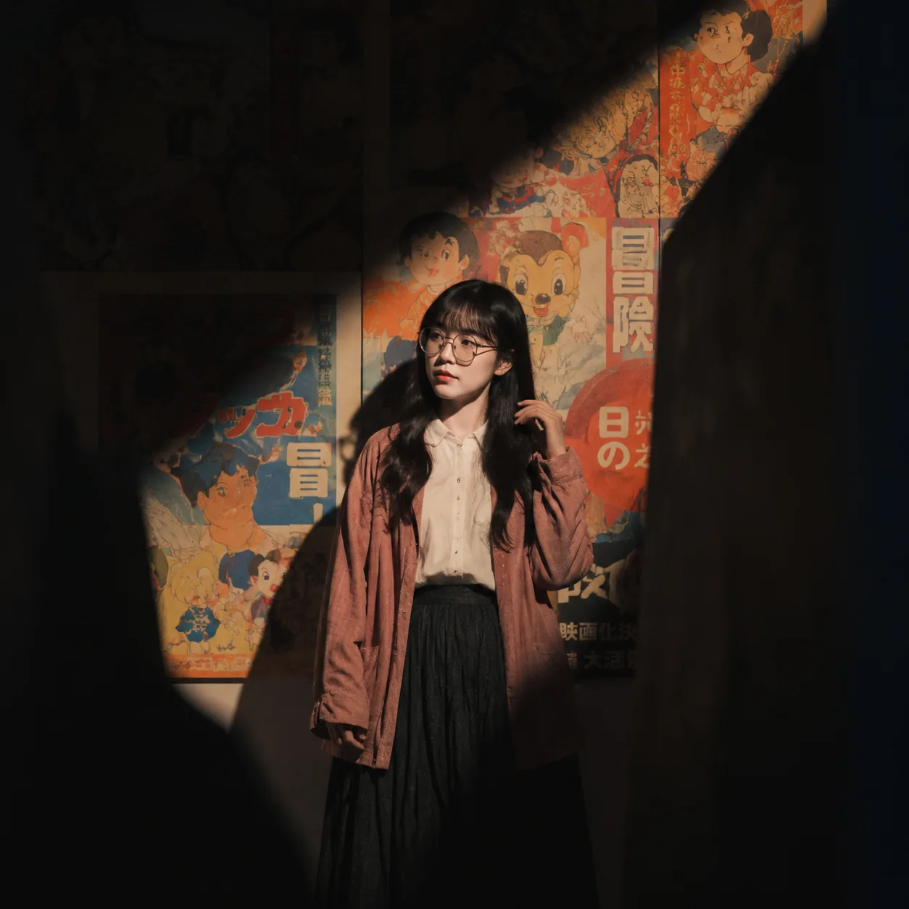

**#122 · Anime, Realistic · <code>Vinano Studio</code>**

> Keywords: anime, realistic, portrait, cinematic, cyberpunk, vintage

<details>
<summary>Show prompt</summary>

```
Use my reference photo to preserve the exact facial features, hairstyle, bangs, facial proportions, skin tone, body posture, and overall silhouette high identity consistency.

Cinematic portrait of a woman standing alone inside a dark exhibition room. She wears a vintage white shirt layered a soft pink outer jacket and a black vintage-textured skirt. Minimal makeup. Front-profile pose her body facing the camera, relaxed posture, one shoulder slightly lowered, hands gently adjusting her hair. Calm, mysterious expression an intellectual and elegant aura.

She is positioned in the lower center of the frame, surrounded by darkness. A single dramatic diagonal spotlight cuts across the scene from the upper right to the lower left, illuminating only half of her body while the rest fades into shadow. Behind her is a colorful vintage Japanese mural wall filled retro cartoon illustrations and traditional artistic details.

Foreground shadows naturally frame the composition like torn darkness, creating a moody museum atmosphere lonely artistic energy and a contemplative cinematic mood. Realistic photography subtle film grain, analog texture, muted blacks, and vibrant mural accents.

Camera angle: eye-level shot, medium-close portrait framing, subject captured at approximately a 70-degree side profile angle, slight distance from the subject for environmental storytelling, centered cinematic composition.

Camera settings: cinematic low-light photography, shallow depth of field, realistic shadow falloff, Kodak Portra film color grading.

Lighting: harsh focused spotlight from the upper right creating a strong diagonal beam and deep high-contrast shadows, minimal ambient light, rich blacks, soft warm highlights along the face and glasses edges.

Vibe: mysterious, artistic, museum-core aesthetic, intelligent quiet energy, melancholic cinematic atmosphere, indie film still, luxury editorial photography, solitary nighttime mood, understated elegance.

Style: ultra-realistic cinematic photography, analog grain, editorial fashion portrait, natural skin texture, subtle imperfections, realistic color science, masterpiece quality.

Negative prompt: anime, smiling, overexposed lighting, extra limbs, bad anatomy, overly colorful outfit, cyberpunk neon, blurry face, low quality, distorted hands, unrealistic skin, HDR overload, exaggerated makeup, busy composition, duplicate person.

Maintain consistent colour harmony and crisp focus across the whole frame.
```

</details>

---

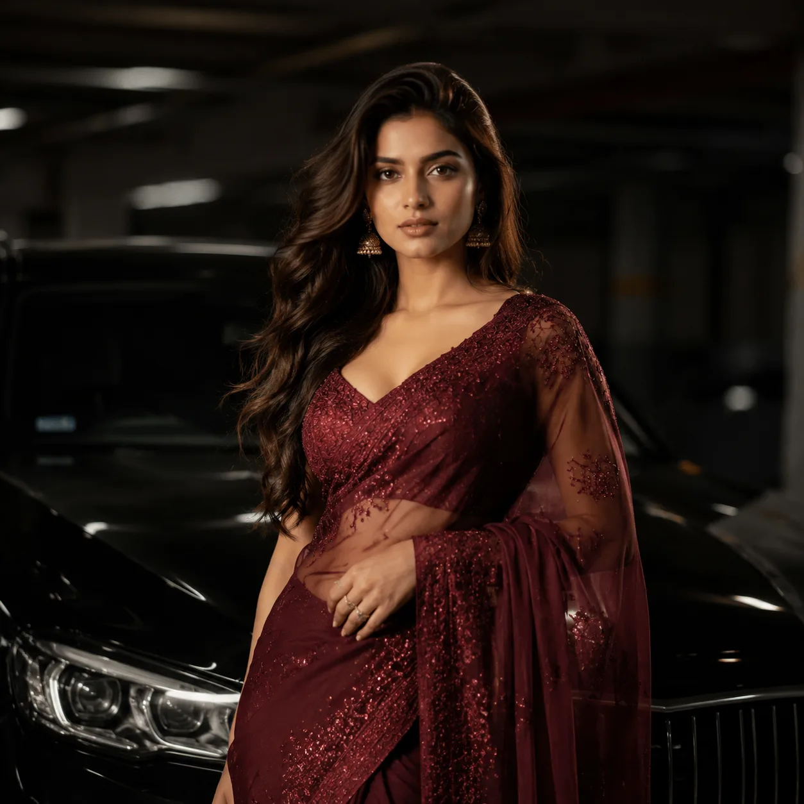

**#123 · Realistic, Portrait · <code>Vinano Studio</code>**

> Keywords: realistic, portrait, cinematic, AI art, AI prompt, text to image

<details>
<summary>Show prompt</summary>

```
{
 "image_generation_prompt": {
 "style": "Ultra-realistic cinematic fashion photography",
 "subject": {
 "type": "Female model",
 "pose": "Standing confidently, slight body angle, direct eye contact camera",
 "expression": "Calm, elegant, confident",
 "appearance": {
 "skin_tone": "Warm medium complexion natural glow",
 "face": "Sharp symmetrical facial features, defined eyebrows, soft glam makeup, nude glossy lips",
 "hair": "Long dark brown wavy hair, side-parted, flowing naturally over shoulders"
 },
 "outfit": {
 "clothing": "Deep maroon saree sheer fabric and heavy embroidered blouse",
 "fabric_details": "Sequined embroidery, fine threadwork, subtle shimmer",
 "fit": "Perfectly tailored, elegant drape",
 "accessories": ["Traditional gold jhumka earrings",
 "Minimal rings"]
 }
 },
 "environment": {
 "location": "Indoor parking garage",
 "background": "Luxury black car softly visible behind subject",
 "lighting": {
 "type": "Professional cinematic flash lighting",
 "key_light": "Soft frontal light highlighting facial contours",
 "fill_light": "Balanced shadows for depth",
 "background_light": "Low ambient light for dramatic contrast"
 }
 },
 "camera": {
 "camera_type": "Full-frame DSLR",
 "lens": "85mm portrait lens",
 "aperture": "f/1.8",
 "iso": 100,
 "shutter_speed": "1/160s",
 "focus": "Tack sharp focus on eyes, shallow depth of field"
 },
 "rendering": {
 "quality": "8K ultra-high resolution",
 "texture_detail": "Hyper-detailed skin texture, realistic fabric fibers, natural highlights",
 "color_grading": "Moody cinematic tones rich maroon and neutral shadows",
 "realism": "true-to-life photorealistic, zero artificial look"
 },
 "composition": {
 "framing": "Mid-length portrait",
 "rule_of_thirds": true,
 "vibe": "Luxury, elegance, high-fashion editorial"
 },
 "post_processing": {
 "retouching": "Minimal, natural skin retouching",
 "noise": "None",
 "sharpness": "Crisp but natural"
 }
 }
}

Emphasise material texture and natural light so the final frame feels tactile and premium.
```

</details>

---


**#124 · Realistic, Character · <code>Vinano Image Pro</code>**

> Keywords: realistic, character, cinematic, AI art, AI prompt, text to image

<details>
<summary>Show prompt</summary>

```
Create a premium-quality 3D metallic typography composition of the title [MOVIE / SERIES NAME], set against a dark, textured background that reflects the tone, genre, and emotional atmosphere of the story, delivering a cinematic, premium visual impact.

Each individual letter is sculpted as a cinematic form, seamlessly merging a different iconic scene from the movie or series into the letter itself. Scenes are translated into architectural elements, environments, characters, props, lighting, and atmospheric details, transformed into elegant, readable letterforms rather than literal collages.

Every letter acts as a mini visual narrative, instantly recognizable to fans, while no two letters repeat the same scene or story moment. The full title feels cohesive, balanced, and unified as a single artwork.

The typography is rendered in polished metallic materials (gold, silver, steel, or [COLOR]), featuring realistic reflections, fine engravings, and subtle surface wear for cinematic authenticity.

Dramatic studio lighting soft rim highlights and deep shadows enhances depth, scale, and mood, blending seamlessly the embedded scenes.

Ultra-sharp focus, premium 3D render quality, cinematic depth of field, luxury title-card aesthetic, ultra-high resolution.

No cartoon style, no flat illustration — pure cinematic realism sculptural artistry.

Keep edges clean and the overall composition balanced for a polished, gallery-ready result.
```

</details>

---


**#125 · Realistic, Cinematic · <code>Vinano Studio</code>**

> Keywords: realistic, cinematic, AI art, AI prompt, text to image

<details>
<summary>Show prompt</summary>

```
An architectural blueprint of {BUILDING_NAME} placed on a {SURFACE}, a true-to-life photorealistic miniature under-construction version of {BUILDING_NAME} emerging from it — {STRUCTURAL_ELEMENT_1}, {STRUCTURAL_ELEMENT_2}, {STRUCTURAL_ELEMENT_3}, {CONSTRUCTION_DETAIL}, {WORKER_SCENE}, {MATERIAL_ELEMENT}, and {EXTRA_DETAIL}. All elements grow from the blueprint like a 3D architectural diorama, steel beams rising from the drawn lines, scaffolding threading through the paper. Studio soft, diffused lighting, cinematic depth, 2:3 Keep edges clean and the overall composition balanced for a polished, gallery-ready result.
```

</details>

---

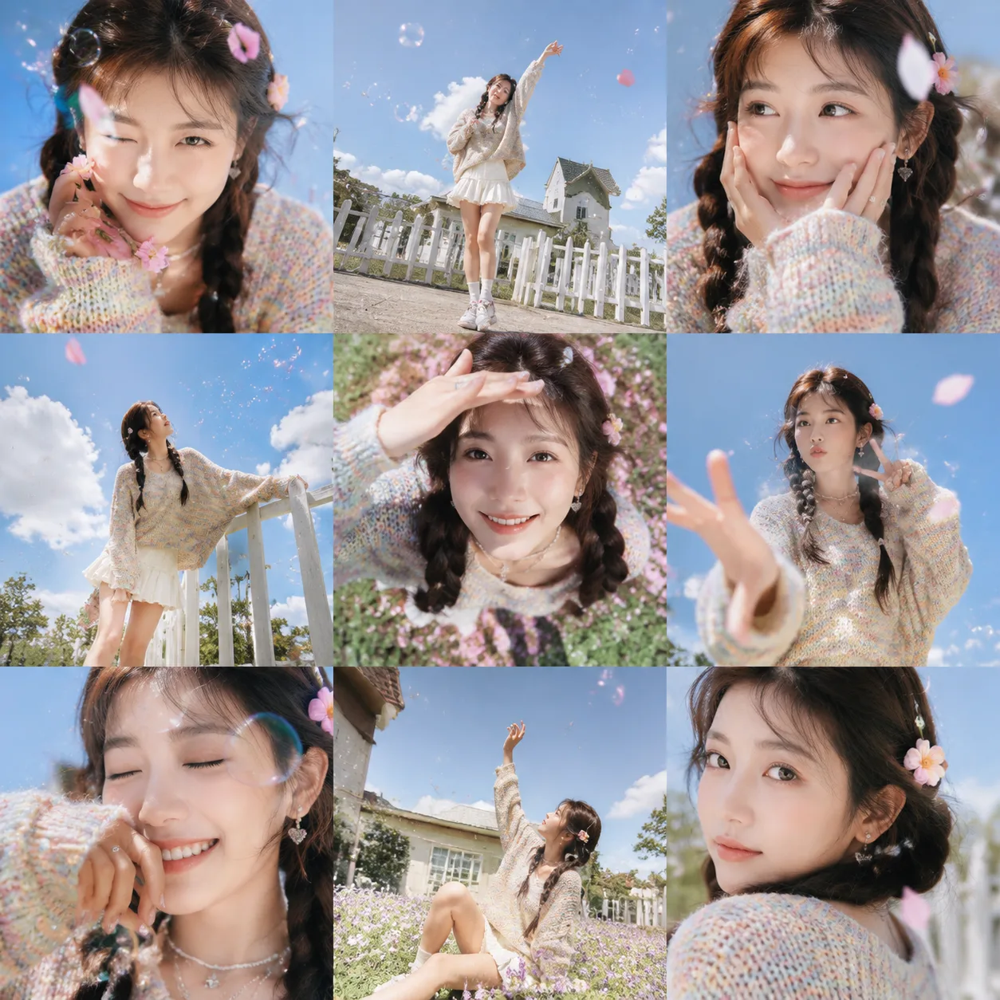

**#126 · Realistic, Portrait · <code>Vinano Studio</code>**

> Keywords: realistic, portrait, character, cinematic, AI art, AI prompt

<details>
<summary>Show prompt</summary>

```
A vibrant 3×3 grid photo collage containing nine unique and expressive poses based on the uploaded female facial photos. The scene captures a beautiful summer day a bright blue sky, fluffy clouds, and warm sunlight producing crisp natural shadows. Soft bokeh, sparkling highlights, soap bubbles reflecting sunlight, and floating flower petals create a dreamy atmosphere.

The character wears an oversized pastel sweater, a fashionable skirt, layered silver necklaces, and cute accessories. A light breeze adds natural movement to the hair and clothing. Images switch freely between 35mm wide-angle full-body shots and 85mm close-up beauty portraits, featuring playful camera interactions, cheek poses, over-the-shoulder glances, peace signs, and candid smiling expressions. The collage combines top-down views, low-angle shots, and intimate close-ups for a dynamic editorial composition. Rendered in ultra-realistic 2K delicate skin texture, realistic fabric details, vibrant colors, soft filmic, cinematic lighting, and the polished look of a premium Korean lifestyle magazine and luxury social media campaign.

Maintain consistent colour harmony and crisp focus across the whole frame.
```

</details>

---

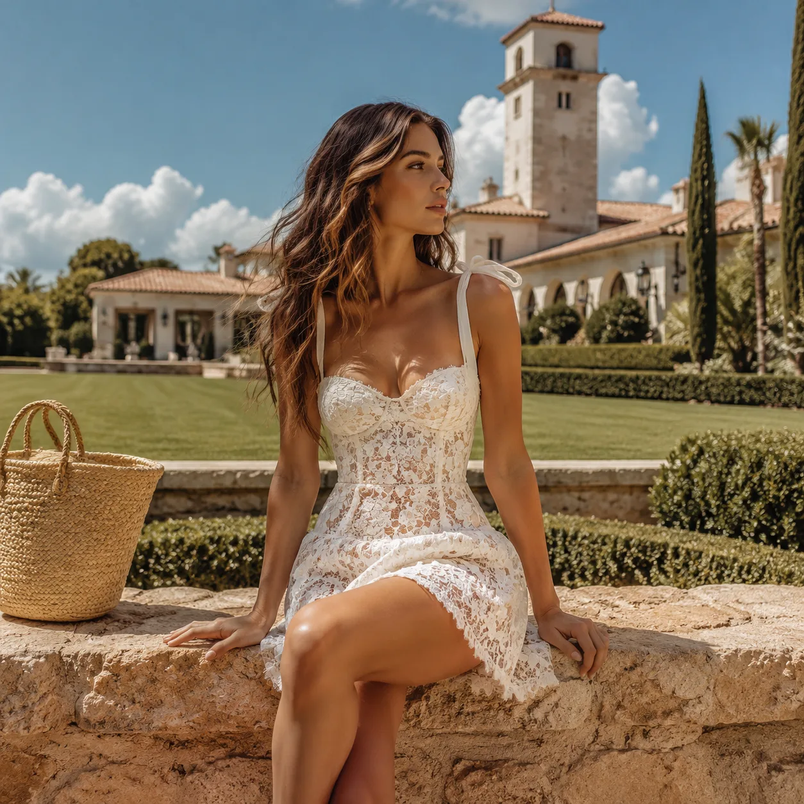

**#127 · Realistic, Portrait · <code>Vinano Studio</code>**

> Keywords: realistic, portrait, cinematic, AI art, AI prompt, text to image

<details>
<summary>Show prompt</summary>

```
{
 "prompt_details": {
 "subject": {
 "description": "Young woman a faired complexion and voluminous, layered brunette hair featuring honey-blonde highlights styled in loose, glamorous waves.",
 "features": "Soft facial features, full lips, neutral expression, gazing off-camera to the right.",
 "skin_texture": "Smooth, sun-kissed skin realistic texture and subtle sheen."
 },
 "outfit": {
 "garment": "White semi-sheer lace mini dress a delicate floral pattern.",
 "details": "Spaghetti straps tied in bows at the shoulders, sweetheart neckline, fitted bodice, flowy skirt a scalloped raw-edge hem.",
 "style": "Coquette aesthetic, summer resort wear, romantic and feminine."
 },
 "accessories": {
 "item": "Woven straw market basket or tote bag placed on the ledge behind the subject.",
 "texture": "Natural dried palm leaf texture."
 },
 "pose": {
 "action": "Sitting gracefully on a textured stone garden wall.",
 "body_language": "One leg bent at the knee, hands resting gently on the stone surface, posture upright but relaxed."
 },
 "environment": {
 "setting": "Luxurious Mediterranean-style estate or villa garden.",
 "foreground": "Rough-hewn beige stone wall/ledge.",
 "background": "Manicured green lawn, sculpted hedges, large estate building Spanish colonial architecture (stucco walls, tiled roof, tower), bright blue sky fluffy white cumulus clouds.",
 "atmosphere": "High-end vacation, tranquil, affluent summer day."
 },
 "lighting": {
 "type": "Bright natural daylight.",
 "quality": "Sun-drenched illumination, soft but distinct shadows indicating overhead sun, realistic global illumination."
 },
 "mood": {
 "vibe": "Elegant, dreamy, serene, sophisticated, 'old money' aesthetic.",
 "tone": "Warm, bright, and airy."
 },
 "camera_settings": {
 "lens": "50mm portrait lens.",
 "aperture": "f/2.8 for slight background separation while keeping the subject sharp.",
 "shutter_speed": "1/250s.",
 "iso": "100.",
 "perspective": "Eye-level shot capturing the subject and the estate background."
 },
 "technical_specs": {
 "quality": "Ultra-true-to-life photorealistic, 8k resolution, raw photo style, highly detailed textures (lace, stone, hair), masterpiece, cinematic composition.",
 "engine": "Unreal Engine 5 render style or high-end DSLR photography."
 }
 }
}

Aim for an editorial, design-driven look with deliberate negative space.
```

</details>

---


**#128 · Realistic, Ai Art · <code>Vinano Studio</code>**

> Keywords: realistic, AI art, AI prompt, text to image

<details>
<summary>Show prompt</summary>

```
Abstract liquid typography spelling "text", thick transparent water-gel material, hyper realistic refraction and subtle caustics, realistic surface tension, sculpted droplet forms merged into smooth letter curves, glossy highlights, micro bubbles inside the gel, soft contact shadows on a pure white seamless background, scattered water droplets on the surface sharp specular reflections, studio lighting, crisp true-to-life photorealistic 3D render, macro detail, sharp focus, 8k, 1:1, no watermark, no extra text Render with rich micro-detail while keeping the layout uncluttered and intentional.
```

</details>

---

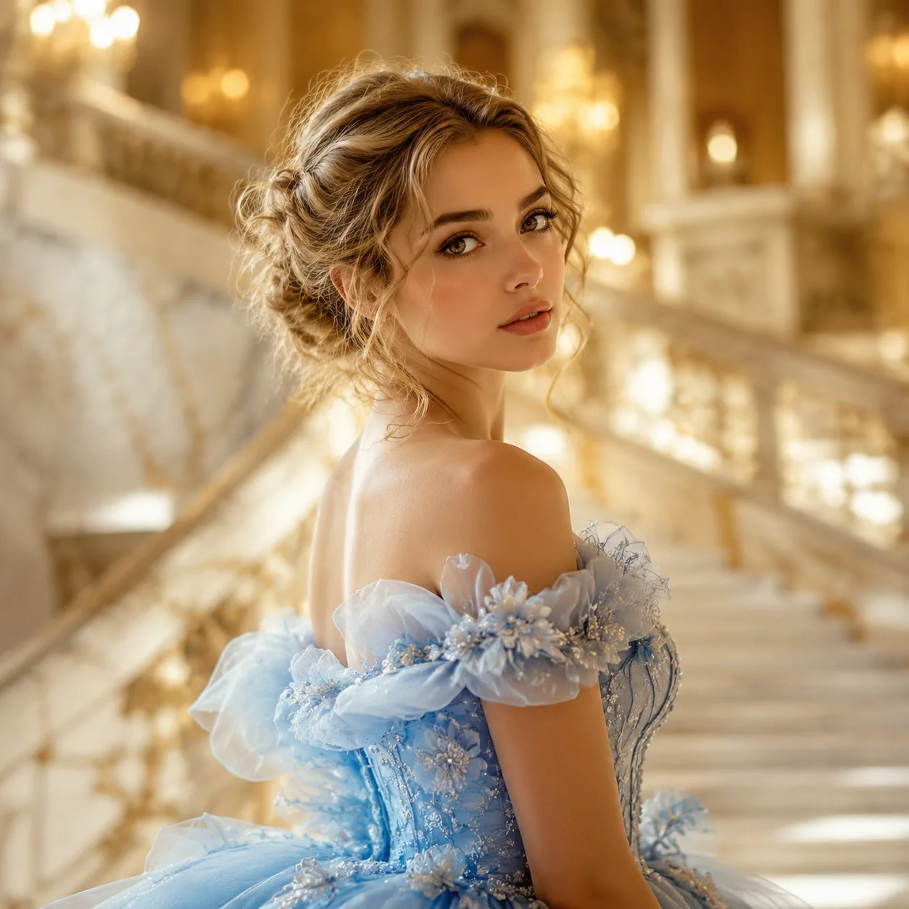

**#129 · Realistic, Portrait · <code>Vinano Studio</code>**

> Keywords: realistic, portrait, cinematic, minimalist, AI art, AI prompt

<details>
<summary>Show prompt</summary>

```
{
 "prompt_metadata": {
 "title": "Cinematic Royal Portrait: Ana de Armas",
 "version": "2.0",
 "generation_type": "true-to-life photorealistic Cinematic",
 "aspect_ratio": "3:4",
 "quality_preset": "Ultra-High-Resolution / 8K / RAW",
 "aesthetic_style": "Fairytale Royal / Ethereal Elegance"
 },
 "subject": {
 "identity": {
 "name": "Ana de Armas",
 "likeness_fidelity": "100% accurate facial features",
 "ethnicity_match": "Authentic skin tone and bone structure"
 },
 "physical_features": {
 "eyes": {
 "color": "Deep brown",
 "details": "Luminous catch-lights, sharp focus on iris texture"
 },
 "complexion": {
 "texture": "Visible skin pores, natural imperfections, luminous warm glow",
 "finish": "Soft-focus dewiness"
 },
 "hair": {
 "style": "Intricate blonde updo",
 "texture": "Soft, loose ringlet curls framing the face",
 "detail": "Fine individual strands visible, silk-like sheen"
 },
 "makeup": {
 "style": "Natural / refined minimalist",
 "details": "Soft peach blush, nude glossy lips, light mascara"
 }
 },
 "pose": {
 "composition": "Close-up portrait",
 "stance": "Graceful and poised, slight tilt of the head",
 "expression": "Serene, regal, and enigmatic"
 }
 },
 "wardrobe": {
 "garment": "Grand Powder-Blue Ball Gown",
 "bodice_details": {
 "type": "Structured corset",
 "neckline": "Off-shoulder ruffled sleeves",
 "embellishments": "Hand-stitched 3D floral appliqués"
 },
 "skirt_details": {
 "material": "Layered silk tulle",
 "volume": "Voluminous and airy",
 "translucency": "Subtle light-filtering through fabric layers"
 }
 },
 "environment": {
 "location": "Grand Palace Interior",
 "architecture": {
 "primary_element": "Wide marble staircase",
 "material": "Polished white Calacatta marble gold veining",
 "backdrop": "Ornate balustrades, distant vaulted ceilings"
 },
 "atmosphere": {
 "vibe": "Dreamy, luxurious, and timeless",
 "depth": "Extreme shallow depth of field (bokeh background)"
 }
 },
 "lighting_and_color": {
 "lighting_scheme": {
 "primary_source": "Cinematic soft-box simulation",
 "secondary_source": "Warm ambient glow from palace chandeliers",
 "effects": "Subtle bloom, ethereal light rays, volumetric golden hour glow"
 },
 "color_palette": {
 "dominants": ["Powder blue", "Creamy white", "Soft gold"],
 "accents": ["Warm skin tones", "Deep amber highlights"]
 }
 },
 "technical_rendering": {
 "camera_settings": {
 "lens": "85mm prime lens simulation",
 "aperture": "f/1.2 for creamy bokeh",
 "sensor": "Full-frame digital cinema camera"
 },
 "image_fidelity": {
 "texture_mapping": "High-fidelity fabric weave and marble grain",
 "post_processing": "Subtle film grain, HDR, color graded for fairytale cinema",
 "anti_aliasing": "Ultra-sharp edges on subject, smooth gradients in background"
 }
 }
}

Aim for an editorial, design-driven look with deliberate negative space.
```

</details>

---

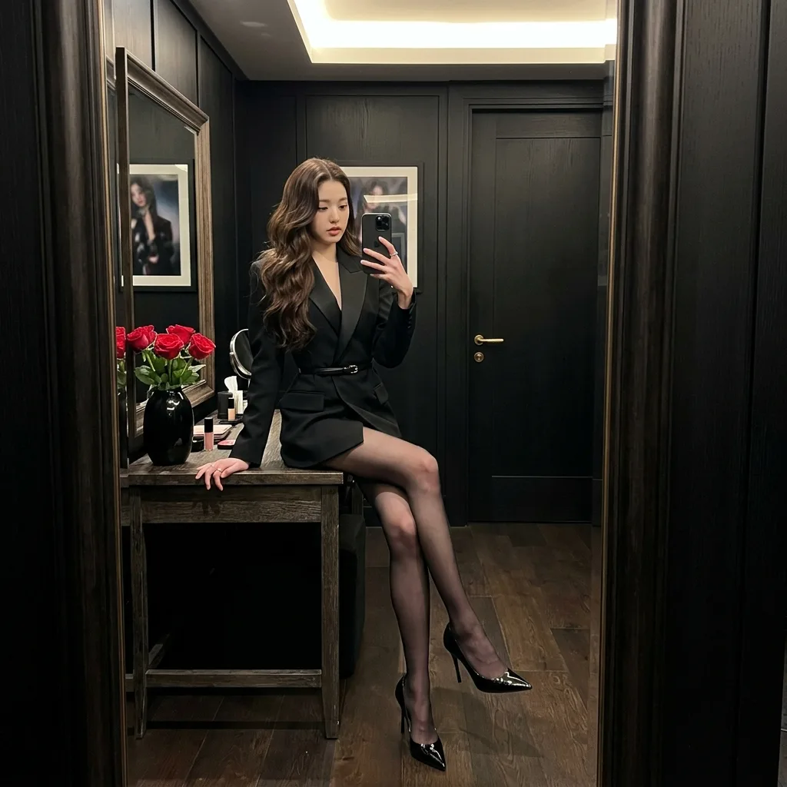

**#130 · Realistic, Minimalist · <code>Vinano Image Pro</code>**

> Keywords: realistic, minimalist, AI art, AI prompt, text to image

<details>
<summary>Show prompt</summary>

```
{
  "meta": {
    "quality": "ultra-true-to-life photorealistic, 8k, raw style, highly detailed",
    "camera_model": "iPhone 15 Pro Max, mobile photography aesthetic",
    "lens_spec": "24mm wide angle, f/1.8 aperture",
    "aspect_ratio": "9:16",
    "style_preset": "high-fashion editorial, mirror selfie aesthetic",
    "technical_rules": "no skin smoothing, natural skin texture, sharp focus"
  },
  "scene": {
    "location": "luxury dressing room, modern dark interior",
    "time_of_day": "evening, artificial indoor lighting",
    "atmosphere": "sophisticated, intimate, chic",
    "background_elements": ["black refined minimalist door", "sleek dark wood paneling", "framed k-pop editorial art"],
    "props": ["smartphone", "black vase red roses", "vanity desk"]
  },
  "subject": {
    "identity": {
      "name_reference": "Wonyoung from IVE",
      "biometric_details": "ultra-slim proportions, doll-like features, signature beauty marks under eyes, long neck",
      "ethnicity_age": "Korean, early 20s"
    },
    "physical": {
      "body_type": "extremely slender, long legs, graceful posture",
      "skin_details": "porcelain tone, subtle glow, natural skin grain",
      "hair_style": "long voluminous dark brown waves, side-parted",
      "facial_features": "almond-shaped eyes, slim nose, plump heart-shaped lips"
    }
  },
  "wardrobe": {
    "outfit_description": "plunging black blazer dress, structured shoulders, thin gold-buckle belt",
    "materials": "matte wool-blend, satin lapels, sheer black hosiery",
    "footwear": "pointed-toe black patent leather stiletto pumps",
    "accessories": ["silver rings", "thin black bra peeking through"]
  },
  "pose_action": {
    "primary_pose": "sitting on the edge of a wooden desk",
    "body_language": "legs crossed elegantly, holding phone for a mirror selfie, slight lean",
    "expression": "cool, composed gaze, slight pout",
    "interaction": "taking a mirror selfie, looking at phone screen"
  },
  "lighting": {
    "setup": "overhead softbox, warm interior accent lights",
    "effects": "specular highlights on hair and shoes, soft shadows",
    "color_grading": "moody, high-contrast, deep blacks, warm skin tones"
  },
  "composition": {
    "shot_type": "full-body mirror selfie",
    "camera_angle": "eye-level, slightly angled",
    "focus_point": "sharp focus on subject and mirror reflection",
    "depth_of_field": "slight fall-off in background"
  },
  "realism_focus": {
    "textures": ["patent leather sheen", "sheer nylon texture", "wood grain"],
    "imperfections": ["natural fabric folds", "mirror surface dust"]
  }
}

Maintain consistent colour harmony and crisp focus across the whole frame.
```

</details>

---

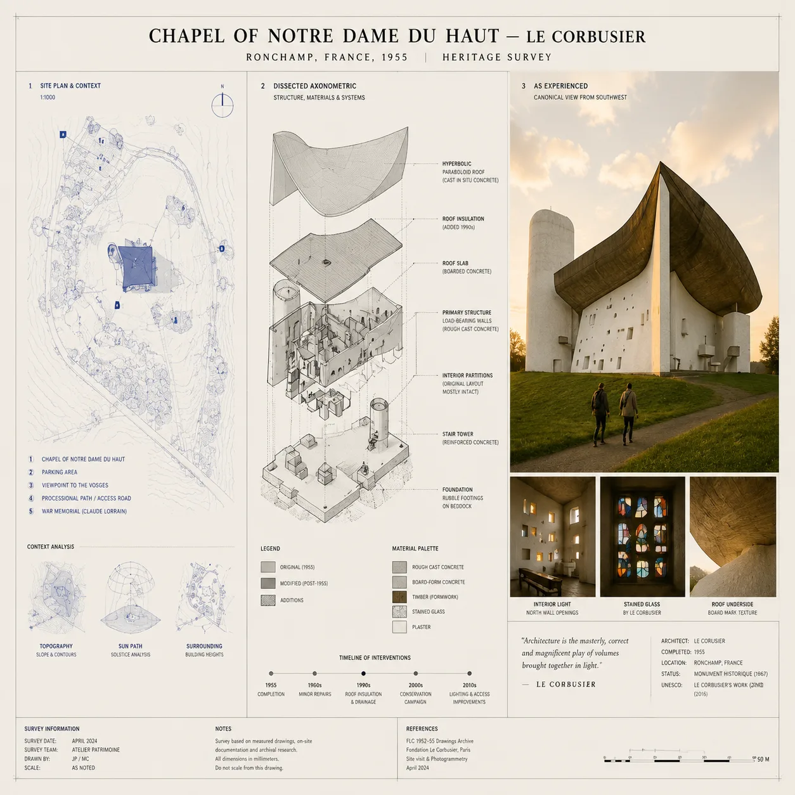

**#131 · Landscape, Ai Art · <code>Vinano Studio</code>**

> Keywords: landscape, AI art, AI prompt, text to image

<details>
<summary>Show prompt</summary>

```
A preservation architect's survey board for [BUILDING / STRUCTURE] — [STYLE / ARCHITECT / PERIOD]. Left section: site plan and context, showing the structure in its urban or landscape setting orientation, shadows, and neighboring relationships mapped. Center section: the building dissected, a cutaway axonometric revealing structural system, material layers, hidden infrastructure, callouts identifying original versus modified elements. Right section: the building as experienced, photographed from the canonical viewpoint in ideal light, human figures for scale and life, the architecture inhabited. Visual style transitions from technical survey blue-line through neutral analytical greys to golden-hour warmth. Title block reading "[BUILDING NAME] — [ARCHITECT], [CITY], [YEAR], HERITAGE SURVEY". Keep edges clean and the overall composition balanced for a polished, gallery-ready result.
```

</details>

---

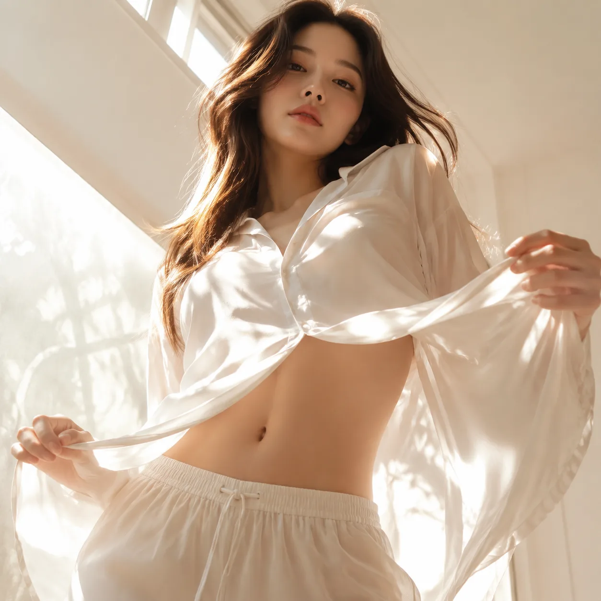

**#132 · Realistic, Cinematic · <code>Vinano Studio</code>**

> Keywords: realistic, cinematic, AI art, AI prompt, text to image

<details>
<summary>Show prompt</summary>

```
A highly realistic photo of an adult East Asian woman in her early 20s, photographed from a dramatic low angle looking upward. She has a natural, elegant face, soft clear skin, light natural makeup, slightly tousled long dark brown hair, and a calm, subtly alluring expression while looking down toward the camera.

She is wearing a loose white silk shirt instead of a knit top. The shirt is lightweight, glossy, soft, and fluid, a luxurious silk texture. She gently lifts and opens the hem of the white silk shirt both hands, creating a flowing curve of fabric across the frame. The shirt catches the sunlight beautifully, showing delicate highlights, soft folds, and a refined semi-sheer quality. Her lower body is styled relaxed white drawstring lounge pants.

Composition: extreme low-angle shot from around waist level, camera pointing upward toward her face and torso. The midriff is visible, the fabric stretched lightly between her hands. Her face appears near the top of the frame, while the torso and silk shirt dominate the foreground. Vertical composition, intimate fashion editorial framing.

Lighting: strong natural sunlight streaming in from a window above and behind her, creating radiant sunbeams and scattered dappled light patterns across her skin, shirt, and the scene. Bright backlighting, glowing rim light on the hair, warm highlights, soft shadows, airy and luminous mood.

Background: minimal bright interior near a window, clean modern room, soft pale walls, morning or afternoon sunlight flooding the space. The environment should feel quiet, warm, and serene.

Style: ultra-realistic fashion photograph, cinematic sunlight, natural skin texture, premium editorial aesthetic, soft and airy mood, high detail, realistic color grading, elegant and sensual without explicit nudity, 4K quality.

Important details: white silk shirt, not knit, loose and glossy fabric, sunlight passing through and reflecting on the material, visible soft folds, low-angle perspective, luminous atmosphere, adult subject only.

Emphasise material texture and natural light so the final frame feels tactile and premium.
```

</details>

---


**#133 · Anime, Character · <code>Vinano Studio</code>**

> Keywords: anime, character, minimalist, AI art, AI prompt, text to image

<details>
<summary>Show prompt</summary>

```
{
 "render_manifest": {
 "engine_release": "v15_visual_fusion_core",
 "task_type": "Reference Image → Stylized Illustration",
 "render_output": {
 "medium": "High-detail digital artwork",
 "quality": "Ultra HD / Print-ready",
 "style_handling": "Layered independent style synthesis"
 }
 },

 "art_style_stack": {

 "style_A": {
 "tag": "PLAYFUL_CARICATURE_FORM",
 "design_rules": {
 "body_design": "Stylized exaggeration preserved likeness",
 "edge_treatment": "Strong expressive contours",
 "form_warp": "Personality-led distortions",
 "emotion": "Lively, fun, energetic"
 }
 },

 "style_B": {
 "tag": "DYNAMIC_INK_ART",
 "design_rules": {
 "line_style": "Organic hand-drawn ink strokes",
 "paint_system": {
 "palette": "Bold, high-saturation colors",
 "surface_detail": ["soft shading", "light cross-hatching", "gesture strokes"]
 },
 "scene_logic": {
 "backdrop": "Clean white refined minimalist space",
 "motion_effects": "Illustrative kinetic accents"
 },
 "visual_feel": "Modern comic illustration"
 }
 },

 "style_C": {
 "tag": "CEL_SHADED_GRAPHIC",
 "design_rules": {
 "color_behavior": "Flat fills minimal blending",
 "shadow_style": "Hard-edged, high-contrast shading",
 "outline_style": "Crisp graphic ink lines",
 "render_goal": "Animation and vector-ready look"
 }
 },

 "style_D": {
 "tag": "KODOMO_ANIME_INFLUENCE",
 "design_rules": {
 "shape_language": "Smooth rounded geometry",
 "color_behavior": "Bright solid tones",
 "art_direction": "Classic child-friendly anime style",
 "tone": "Cheerful and light-hearted"
 }
 },

 "style_E": {
 "tag": "CLASSIC_SLAPSTICK_CARTOON",
 "design_rules": {
 "pose_physics": "Elastic squash-and-stretch motion",
 "facial_expression": "Over-the-top animated reactions",
 "ink_weight": "Thick bold cartoon outlines",
 "energy_level": "High-motion, exaggerated action"
 }
 }
 },

 "final_processing": {
 "image_finish": {
 "edge_clarity": "Enhanced line sharpness",
 "color_tuning": "Vibrant illustration grading"
 },
 "layout_rules": {
 "framing": "Centered character focus",
 "background_cleanliness": "Noise-free, studio clean"
 }
 }
}

Maintain consistent colour harmony and crisp focus across the whole frame.
```

</details>

---

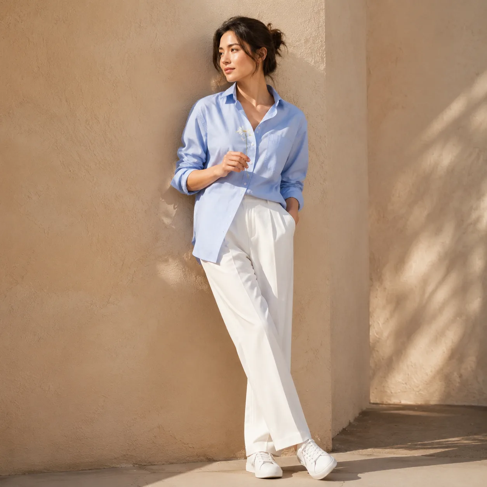

**#134 · Realistic, Cinematic · <code>Vinano Studio</code>**

> Keywords: realistic, cinematic, minimalist, AI art, AI prompt, text to image

<details>
<summary>Show prompt</summary>

```
the uploaded reference image STRICTLY, preserve the same woman’s face, identity, age, facial structure, skin tone, and natural expression 100% accuracy. No facial alteration, beautification, or identity change.\n\nGenerate a highly realistic cinematic fashion editorial photoshoot featuring a stylish adult woman leaning casually against a warm beige textured wall. Her body is slightly angled, one shoulder gently resting on the wall, conveying relaxed confidence, elegance, and quiet strength.\n\nOutfit:\nShe wears a loose pastel blue button-down shirt softly rolled-up sleeves, styled effortlessly. Paired tailored white relaxed-fit trousers that drape naturally. Footwear consists of clean refined minimalist white or soft blue-white sneakers, maintaining a modern, understated luxury feel.\n\nPose & Expression:\nShe stands natural posture — one hand casually placed in her trouser pocket, the other delicately holding a small white daisy flower. Her facial expression is calm, self-assured, and serene, a soft editorial gaze slightly away from the camera. Emotion feels confident yet gentle.\n\nHair & Makeup:\nHair is neatly styled in a natural, modern look (soft waves, low ponytail, or loose bun). Makeup is minimal and refined — clean skin, subtle blush, neutral lips, no heavy contouring or glow.\n\nLighting & Atmosphere:\nWarm natural sunlight streams from the side, creating soft highlights along her face and clothing, gentle shadows adding depth to the textured wall. The mood is airy, sunlit, and cinematic.\n\nVisual Style:\nHigh-end fashion editorial aesthetic realistic skin texture, crisp fabric details, refined neutral color palette, and elegant composition.\n\nCamera & Quality:\nProfessional fashion photography style, shallow depth of field, cinematic framing, ultra-realistic 8K quality, sharp focus on subject smooth background falloff.\n\nOverall Feel:\nModern, minimal, sun-drenched lifestyle fashion campaign — confident, graceful, and timeless.",

 "style": "cinematic, high-end female fashion editorial",
 "lighting": "warm natural sunlight soft shadows",
 "background": "minimal beige textured wall, sunlit",
 "quality": "ultra-realistic, 8K, ultra-sharp",
 "camera": "professional fashion photography, shallow depth of field",
 "mood": "clean, modern, elegant, confident, relaxed"

Preserve realistic proportions and depth for a confident, professional finish.
```

</details>

---

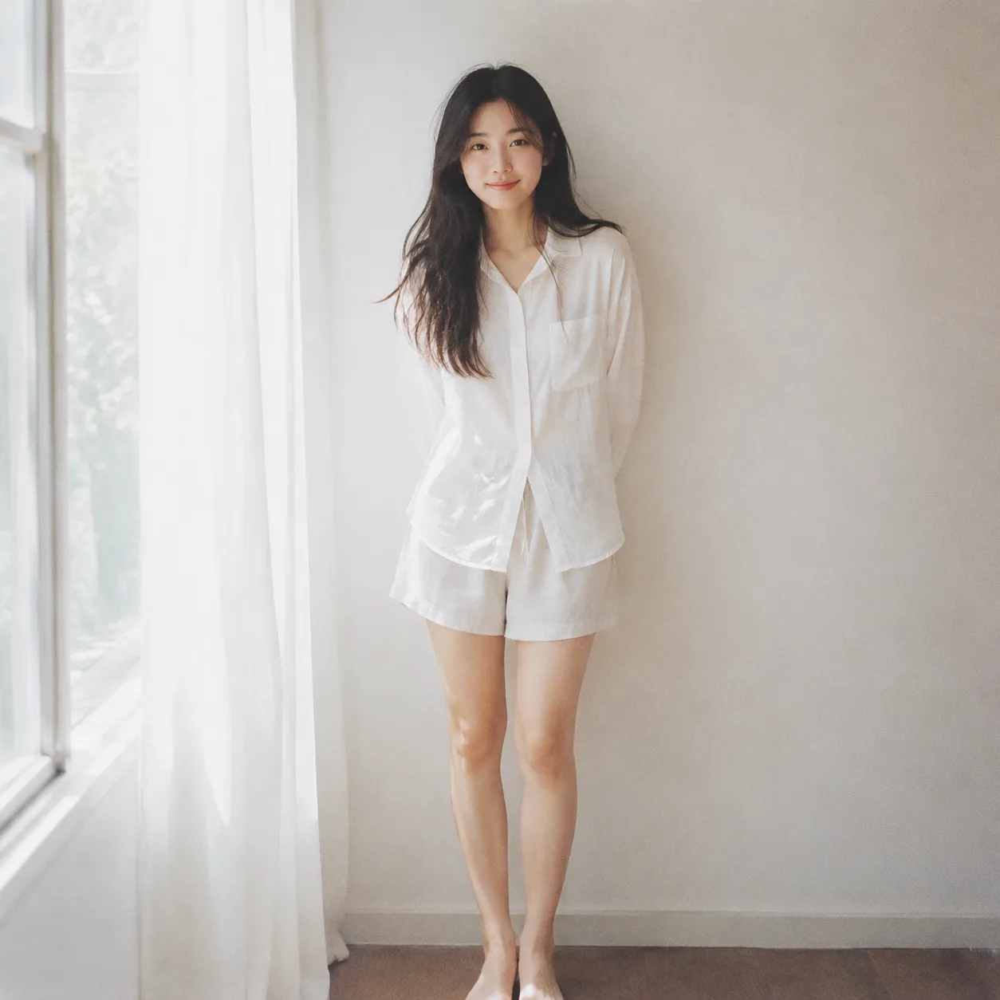

**#135 · Realistic, Ai Art · <code>Vinano Studio</code>**

> Keywords: realistic, AI art, AI prompt, text to image

<details>
<summary>Show prompt</summary>

```
Analog 35mm film photography, soft airy Japanese-style aesthetic, gentle diffused natural window light, slight overexposure, pastel tones, low contrast, soft highlights, minimal indoor setting near a window white curtains, clean light-colored wall, natural composition, eye-level, slightly closer full-body framing (mid-thigh to head), young East Asian woman, natural minimal makeup, soft realistic skin texture, long slightly messy dark hair, oversized white button-up shirt, light casual shorts, barefoot, simple and relaxed styling, standing naturally relaxed posture, arms loosely at sides or slightly behind, facing camera, gentle soft smile, subtle stillness, focus on light, air, and quiet everyday mood, soft film grain, dreamy and understated atmosphere --ar 9:16 Maintain consistent colour harmony and crisp focus across the whole frame.
```

</details>

---

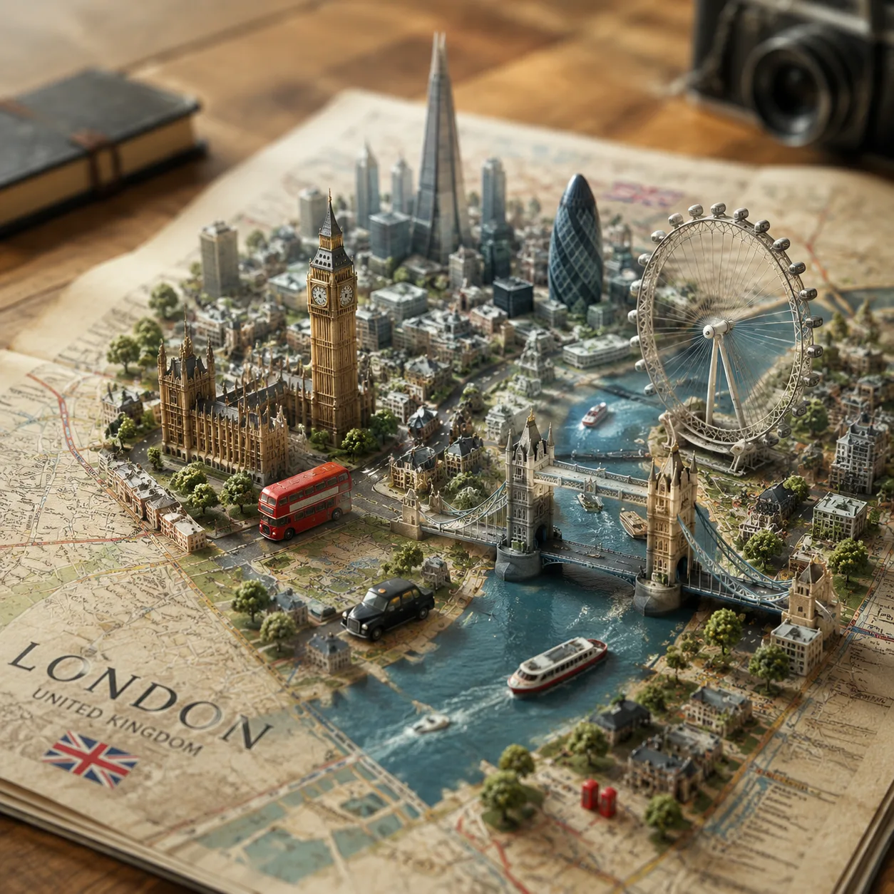

**#136 · Realistic, Cinematic · <code>Vinano Studio</code>**

> Keywords: realistic, cinematic, AI art, AI prompt, text to image

<details>
<summary>Show prompt</summary>

```
A street-style map of [CITY_NAME] placed on a {MAP_SURFACE}, a true-to-life photorealistic miniature version of [CITY_NAME] emerging from it [LANDMARK_1],[LANDMARK_2],[LANDMARK_3], [NATURE_ELEMENT], [URBAN_LIFE_ELEMENT], [ICONIC_TRANSPORT],and EXTRA_DETAIL.All elements grow from the map like a 3D urban diorama. Studio soft, diffused lighting, cinematic depth, 2:3 format Emphasise material texture and natural light so the final frame feels tactile and premium.
```

</details>

---

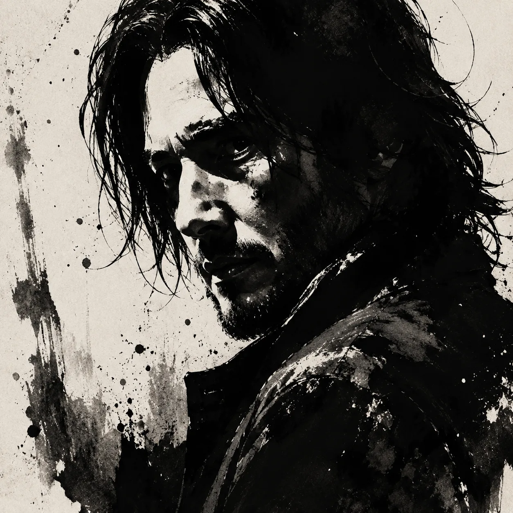

**#137 · Portrait, Cinematic · <code>Vinano Studio</code>**

> Keywords: portrait, cinematic, AI art, AI prompt, text to image

<details>
<summary>Show prompt</summary>

```
A high-contrast ink noir portrait of [SUBJECT], illustrated entirely expressive black ink strokes and controlled splatter. Heavy shadows dominate the composition while selective highlights emerge through negative space. Subtle paper grain is visible. Atmosphere is moody, cinematic, and intense, like a graphic novel frozen at its most dramatic panel. Emphasise material texture and natural light so the final frame feels tactile and premium.
```

</details>

---


**#138 · Realistic, Portrait · <code>Vinano Studio</code>**

> Keywords: realistic, portrait, landscape, AI art, AI prompt, text to image

<details>
<summary>Show prompt</summary>

```
A hyper-realistic travel advertisement in square format (1080x1080), featuring a hand holding a sleek, ultra-thin smartphone or tablet in portrait orientation, tilted slightly sideways to create a striking 3D portal effect. The screen displays a high-resolution image of an iconic landmark from [COUNTRY], which continues into the real background, blending seamlessly. The landmark appears to emerge from the screen. Birds fly nearby and a commercial airplane passes through a bright blue sky soft white clouds. Bold, clean sans-serif text reading [CITY] is placed prominently above. The lighting is warm and natural, casting soft shadows across the landscape. The surroundings reflect the region’s natural environment (like meadows, coastlines, or city skylines). The device is glossy and minimal-bezel, enhancing realism and depth. Emphasise material texture and natural light so the final frame feels tactile and premium.
```

</details>

---

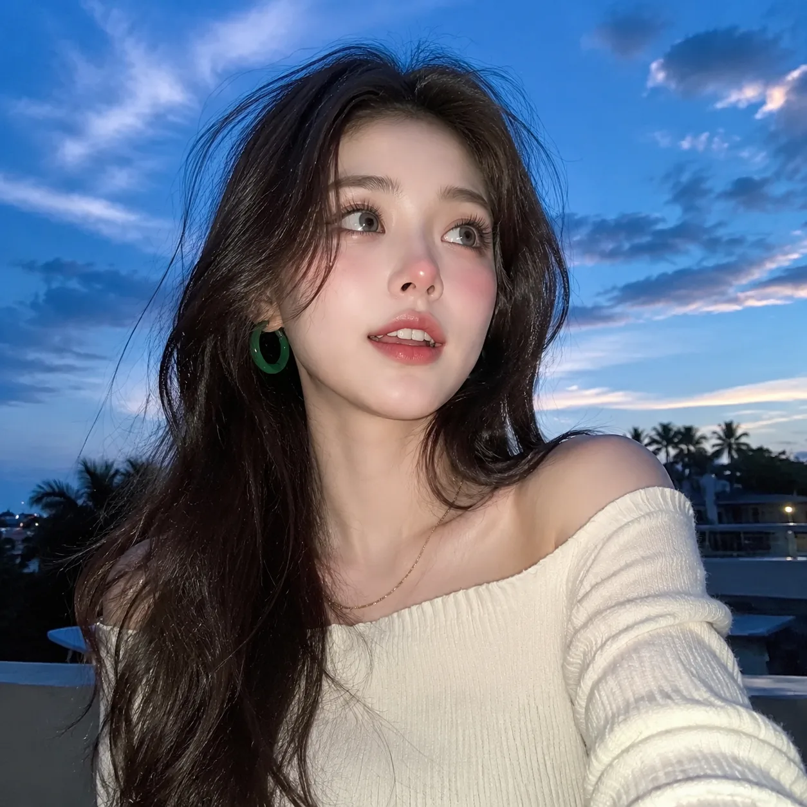

**#139 · Realistic, Portrait · <code>Vinano Studio</code>**

> Keywords: realistic, portrait, AI art, AI prompt, text to image

<details>
<summary>Show prompt</summary>

```
Reference Face: 100%, no alternation, no modification facial features, just keep it exactly as they are), Generate an ultra-realistic, highly ultra-detailed, 8k resolution, true-to-life portrait of a young woman in her 20s.8 Clothes Wearing: A fitted, ribbed, long-sleeved off-the-shoulder top in a creamy white or pale beige color. The fabric has a distinct horizontal ribbing texture. The neckline is wide and straight (boat neck style), fully exposingthe collarbones and shoulders.
She is wearing a delicate, thin gold chain necklace and a chunky green hoop earring visible on her left ear. The Background: An outdoor setting at dusk or early evening featuring a deep blue sky scattered wispy white clouds.
In the lower background, there are silhouettes of trees (possibly palm or tropical) and a building railing or roofline, suggesting a rooftop or balcony environment.The Pose Setting: A high-angle selfie shot where the subject is looking away from the lens, glancing upward and to her right a candid, spontaneous expression. Her mouth is slightly parted in a natural, relaxed manner, showing her teeth. The angle suggests she is holding the camera an extended arm in front of her.
The Hairstyle: Long, voluminous dark brown hair styled in loose, soft waves that cascade over her shoulders and frame her face. The hair has a slightly messy, windblown texturewith a center part and natural flyaways, adding to the candid feel. Make-up Style: "Douyin-style makeup look: Porcelain skin mesmerizing gray contact lenses and long, separated doll-like eyelashes. Heavy soft pink blush applied to the apples of the cheeks and tip of the nose for a youthful flush.

Maintain consistent colour harmony and crisp focus across the whole frame.
```

</details>

---

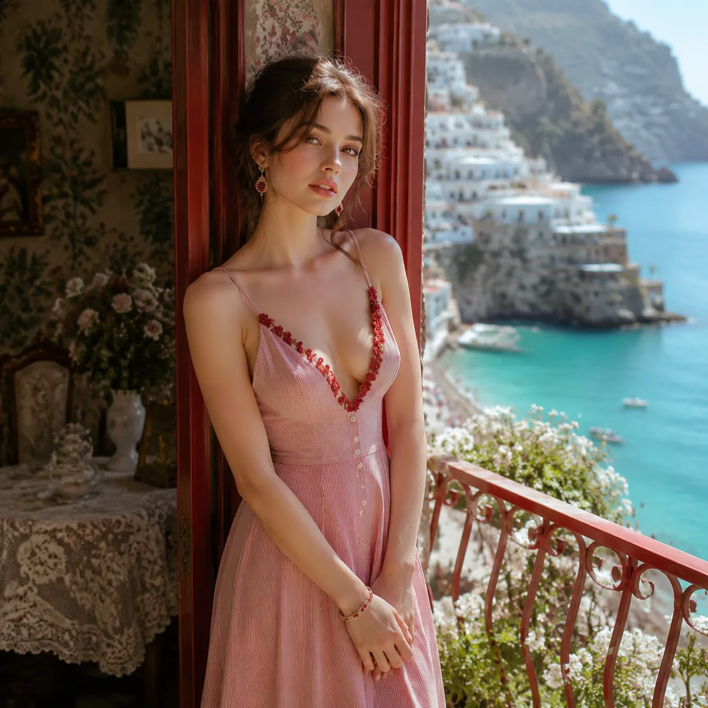

**#140 · Realistic, Portrait · <code>Vinano Studio</code>**

> Keywords: realistic, portrait, cinematic, vintage, AI art, AI prompt

<details>
<summary>Show prompt</summary>

```
true-to-life photorealistic romantic European travel editorial portrait of a beautiful young woman, standing in an open crimson-red balcony doorway of a luxurious Italian coastal villa. She wears a pink-and-white micro pinstripe sundress a deep plunging neckline delicate red velvet floral ruffle trim along the inner V-neckline. Front buttons, thin straps, elegant ruby-red drop earrings, delicate gold red stone bracelet. Fair pinkish flawless skin, natural soft-glam makeup, large brown striking eyes, subtle peach blush, pink-rosy plumpy lips. Dark brown hair styled in a messy romantic low updo loose face-framing wavy strands. Her body is turned slightly away from camera while leaning gently against the doorframe, hands relaxed together in front of her body. She looks toward the camera a soft dreamy expression, lips slightly parted. Vintage floral wallpaper, lace-covered table, flowers and antique decor inside the room. Bright Mediterranean coastline, turquoise water, white cliffside buildings and flower boxes visible outside the balcony. Eye-level shot, medium portrait framing, 85mm lens, f/1.8, shallow depth of field, creamy bokeh, natural window light, soft diffused daylight, warm filmic tones, luxury travel magazine aesthetic, highly detailed, true-to-life photorealistic, cinematic, elegant, romantic atmosphere.

Negative prompt: standing centered, ruffles around entire cups, dark moody lighting, harsh shadows, heavy makeup, modern interior, wide-angle distortion, cartoon, CGI, blur, watermark.

Aim for an editorial, design-driven look with deliberate negative space.
```

</details>

---

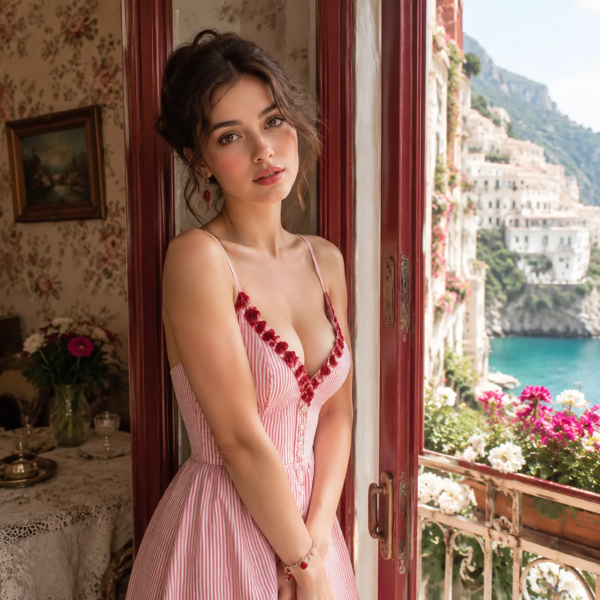

**#141 · Realistic, Portrait · <code>Vinano Studio</code>**

> Keywords: realistic, portrait, cinematic, vintage, AI art, AI prompt

<details>
<summary>Show prompt</summary>

```
true-to-life photorealistic romantic European travel editorial portrait of a beautiful young woman, standing in an open crimson-red balcony doorway of a luxurious Italian coastal villa. She wears a pink-and-white micro pinstripe sundress a deep plunging neckline delicate red velvet floral ruffle trim along the inner V-neckline. Front buttons, thin straps, elegant ruby-red drop earrings, delicate gold red stone bracelet. Fair pinkish flawless skin, natural soft-glam makeup, large brown striking eyes, subtle peach blush, pink-rosy plumpy lips. Dark brown hair styled in a messy romantic low updo loose face-framing wavy strands. Her body is turned slightly away from camera while leaning gently against the doorframe, hands relaxed together in front of her body. She looks toward the camera a soft dreamy expression, lips slightly parted. Vintage floral wallpaper, lace-covered table, flowers and antique decor inside the room. Bright Mediterranean coastline, turquoise water, white cliffside buildings and flower boxes visible outside the balcony. Eye-level shot, medium portrait framing, 85mm lens, f/1.8, shallow depth of field, creamy bokeh, natural window light, soft diffused daylight, warm filmic tones, luxury travel magazine aesthetic, highly detailed, true-to-life photorealistic, cinematic, elegant, romantic atmosphere.

Negative prompt: standing centered, ruffles around entire cups, dark moody lighting, harsh shadows, heavy makeup, modern interior, wide-angle distortion, cartoon, CGI, blur, watermark.

Preserve realistic proportions and depth for a confident, professional finish.
```

</details>

---

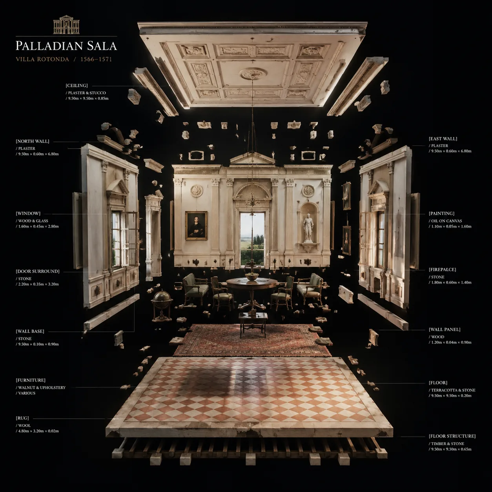

**#142 · Ai Art, Ai Prompt · <code>Vinano Studio</code>**

> Keywords: AI art, AI prompt, text to image

<details>
<summary>Show prompt</summary>

```
[ROOM TYPE] pulled apart in 3D, every surface and object floating at its exact position, slightly separated. EXPLOSION: ceiling lifted, four walls sliding outward, floor dropped, furniture floating in place, objects orbiting their surfaces, light sources still emitting across the exploded void. The ghost of the room readable in the arrangement. Labels on architectural elements only: "[SURFACE]" / "[MATERIAL]" / "[DIMENSION]" LIGHTING: each element still lit by its original source, windows casting light across the gap, lamps throwing cones into empty space. BACKGROUND: deep dark, the room floats in void. TITLE: "[ROOM NAME]" / SUBTITLE: "[BUILDING TYPE] [PERIOD]" Mood: architectural model that became a universe. 4K, extraordinary spatial clarity, tack sharp. Keep edges clean and the overall composition balanced for a polished, gallery-ready result.
```

</details>

---


**#143 · Character, Ai Art · <code>Vinano Studio</code>**

> Keywords: character, AI art, AI prompt, text to image

<details>
<summary>Show prompt</summary>

```
Cute 3D render of a [subject], matte surface, kneaded clay icon style, simple stylized design, [doing action], [emotion or mood], rounded proportions, soft sculpted details, playful body language, vibrant [color1], [color2], and [color3] accents, clean white background, minimal composition, soft ambient lighting, subtle shadow, charming character design, high-resolution, polished toy-like aesthetic Preserve realistic proportions and depth for a confident, professional finish.
```

</details>

---

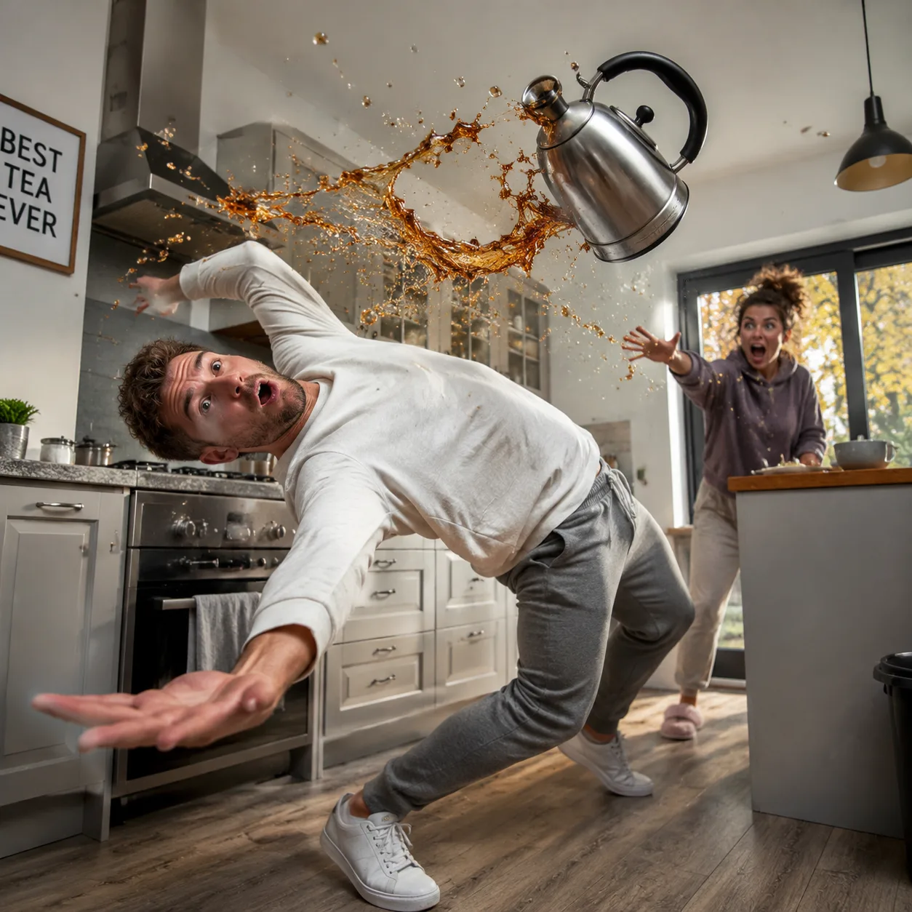

**#144 · Realistic, Cinematic · <code>Vinano Studio</code>**

> Keywords: realistic, cinematic, AI art, AI prompt, text to image

<details>
<summary>Show prompt</summary>

```
Surreal comedic scene inside a modern kitchen: a young man bends backward in an extreme dodge pose, acrobatic and exaggerated, a kettle mid-air above him splashing hot tea in a dramatic frozen moment. A woman in the background extends her arm as if she accidentally threw the kettle, expression shocked and energetic.Dynamic action freeze-frame, dramatic liquid splash, wide-angle lens distortion, sharp details, realistic lighting, cinematic color grading, humorous storytelling, high-resolution digital art. Render with rich micro-detail while keeping the layout uncluttered and intentional.
```

</details>

---

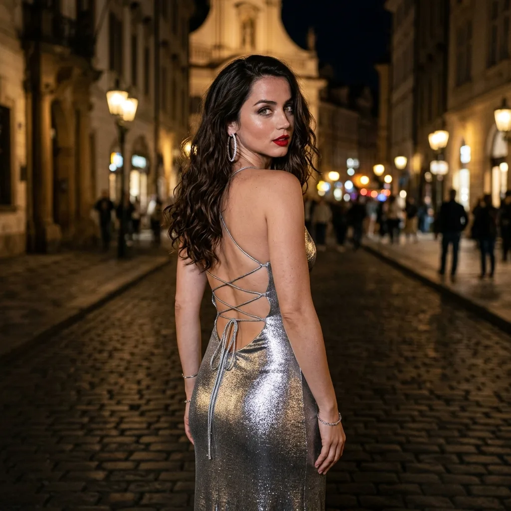

**#145 · Realistic, Portrait · <code>Vinano Image Pro</code>**

> Keywords: realistic, portrait, cinematic, vintage, AI art, AI prompt

<details>
<summary>Show prompt</summary>

```
{
 "generation_parameters": {
 "type": "photorealistic_cinematic_portrait",
 "aspect_ratio": "3:4",
 "quality_preset": "ultra_high_definition",
 "model_reference": "Ana de Armas"
 },
 "subject_breakdown": {
 "identity": {
 "name": "Ana de Armas",
 "facial_features": {
 "skin_texture": "hyper-realistic pore detail, soft natural skin sheen",
 "eyes": "deep hazel-green, intense eye contact, sharp focus, catching the light",
 "lips": "bold classic red lipstick, matte finish, perfectly defined",
 "expression": "alluring, mysterious, looking back over shoulder"
 },
 "hair": {
 "color": "dark chocolate brown",
 "style": "long, loose waves cascading down the back",
 "texture": "silky, voluminous, high-shine"
 },
 "physique": {
 "body_type": "curvy hourglass figure",
 "silhouette": "form-fitting, accentuated curves"
 }
 },
 "attire_and_styling": {
 "main_garment": {
 "item": "maxi dress",
 "fit": "extremely tight, bodycon, second-skin fit",
 "material": "glittering metallic silver fabric, liquid metal effect, high reflectivity",
 "design_details": ["dramatic open back",
 "thin criss-cross lace-up straps across the back",
 "deep thigh-high side slit",
 "floor-length hem"]
 },
 "accessories": {
 "jewelry": "large oversized crystal hoop earrings, diamond sparkle",
 "shoes": "strappy silver high heels (partially visible)"
 }
 }
 },
 "environment_context": {
 "setting": {
 "location": "Luxurious Old European Street",
 "architecture": "Baroque facades, cobblestone pavement, vintage aesthetics",
 "atmosphere": "nightlife, sophisticated, romantic, moody"
 },
 "background_elements": {
 "details": "blurred city lights, bokeh effect, historic buildings in shadow",
 "depth": "shallow depth of field to isolate subject"
 }
 },
 "lighting_and_atmosphere": {
 "lighting_setup": {
 "primary_source": "warm golden street lamps",
 "ambient": "soft city glow",
 "accents": "rim lighting highlighting hair and shoulder profile",
 "shadows": "soft, cinematic contrast"
 },
 "color_palette": {
 "tones": ["silver", "gold", "deep midnight blue", "crimson red"],
 "temperature": "warm vs cool contrast"
 }
 },
 "technical_specifications": {
 "photography_style": "fashion editorial, cinematic glamour",
 "camera_settings": {
 "focal_length": "85mm portrait lens",
 "aperture": "f/1.8",
 "iso": "400",
 "shutter_speed": "1/125"
 },
 "render_quality": ["8k resolution",
 "unreal engine 5 style",
 "octane render",
 "ray tracing",
 "sharp focus on eyes"]
 }
}

Keep edges clean and the overall composition balanced for a polished, gallery-ready result.
```

</details>

---

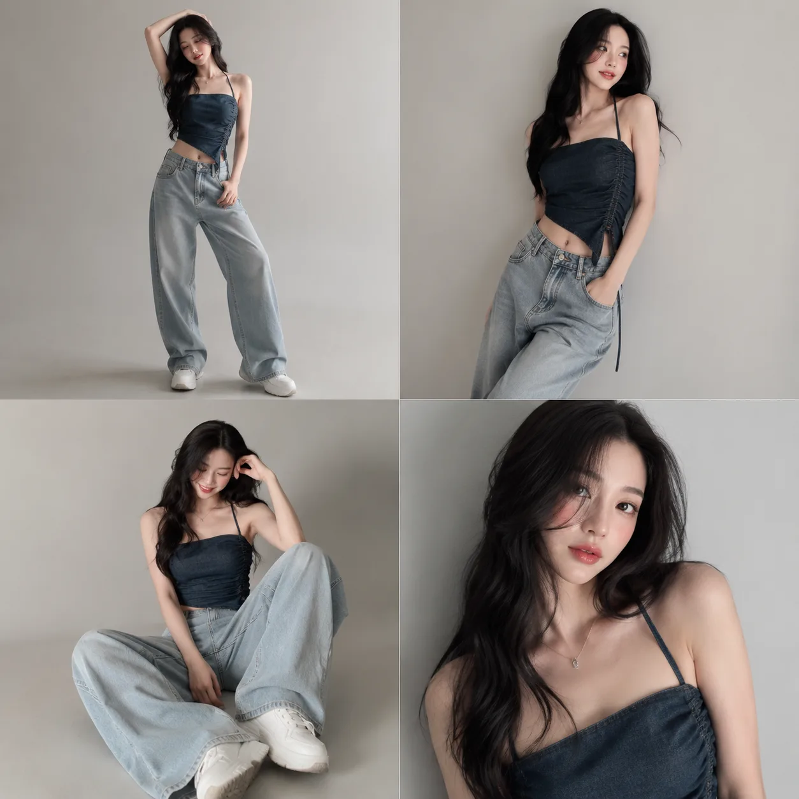

**#146 · Realistic, Portrait · <code>Vinano Studio</code>**

> Keywords: realistic, portrait, AI art, AI prompt, text to image

<details>
<summary>Show prompt</summary>

```
{
 "scene_type": "smartphone fashion portrait series",
 "composition": {
 "layout": "4-photo grid collage",
 "camera": "smartphone photography",
 "framing": ["full body standing",
 "leaning wall pose",
 "casual seated pose",
 "upper body close-up"],
 "angle": "eye-level, natural candid perspective",
 "aspect_ratio": "1:1 collage"
 },
 "subject": {
 "gender": "female",
 "age": "early 20s",
 "aesthetic": "extremely beautiful, soft feminine street style",
 "appearance": {
 "skin_tone": "smooth fair complexion",
 "face": "soft feminine features, delicate jawline, naturally pretty",
 "expression": "confident, playful, relaxed",
 "eyes": "expressive soft gaze",
 "hair": {
 "color": "deep black",
 "style": "long loose waves",
 "texture": "silky natural movement"
 },
 "makeup": "clean girl makeup, dewy skin, soft pink blush, glossy lips"
 },
 "outfit": {
 "top": "dark denim asymmetrical ruched camisole top thin straps and side drawstring detail",
 "bottom": "light wash ultra baggy wide-leg jeans",
 "shoes": "chunky white sneakers",
 "style": "modern Korean-inspired casual streetwear, effortless denim-on-denim aesthetic"
 },
 "pose_style": "relaxed candid fashion poses natural movement",
 "body_language": "soft confidence, feminine energy, effortless cool-girl vibe"
 },
 "environment": {
 "location": "minimal studio setup",
 "background": "clean light gray seamless backdrop",
 "floor": "neutral matte studio floor",
 "lighting": {
 "type": "soft diffused studio lighting",
 "tone": "cool neutral",
 "shadows": "soft realistic shadows",
 "highlights": "gentle glow on skin and denim texture"
 }
 },
 "style": {
 "photography_type": "smartphone editorial fashion photography",
 "visual_tone": "minimal, airy, trendy",
 "mood": "fresh, stylish, youthful confidence",
 "color_palette": "washed denim blue, soft gray, white",
 "contrast": "low to medium",
 "grain": "light natural grain"
 },
 "rendering": {
 "realism": "ultra-realistic",
 "detail_level": "high fabric and skin texture detail",
 "sharpness": "high",
 "depth_of_field": "natural smartphone depth",
 "post_processing": "clean editing slightly soft finish"
 },
 "atmosphere": "effortless Gen-Z fashion aesthetic, casual luxury streetwear energy, modern feminine charm"
}

Aim for an editorial, design-driven look with deliberate negative space.
```

</details>

---

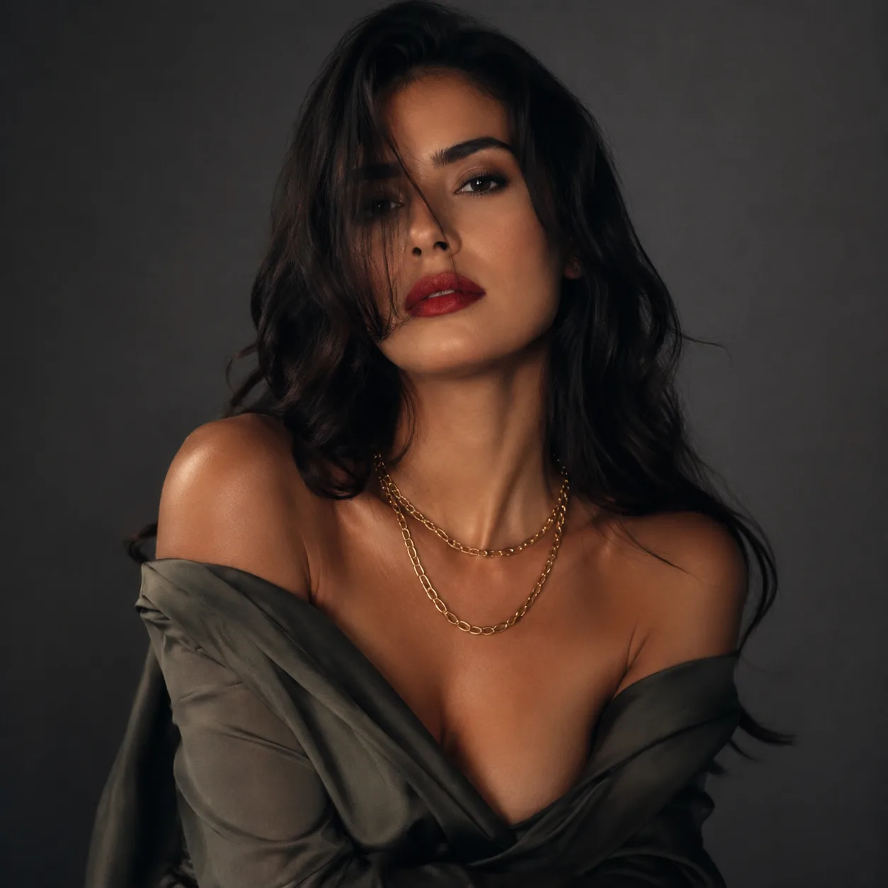

**#147 · Realistic, Portrait · <code>Vinano Studio</code>**

> Keywords: realistic, portrait, cinematic, AI art, AI prompt, text to image

<details>
<summary>Show prompt</summary>

```
{
 "image_request": {
 "style": {
 "genre": "High-fashion editorial portrait",
 "vibe": "Luxury magazine aesthetic",
 "mood": "Elegant, bold, confident",
 "aspect_ratio": "4:4"
 },
 "lighting": {
 "type": "Dramatic filmic, cinematic lighting",
 "tone": "Warm highlights soft shadows",
 "environment": "Studio",
 "background": "Dark gray, smooth, minimal"
 },
 "subject": {
 "identity_lock": "Use the provided reference image",
 "face_constraints": "Maintain 100% exact facial features, proportions, asymmetry, and realism",
 "gender": "Woman",
 "expression": "Sensual, confident, calm",
 "gaze": "Soft and alluring, partially obscured by hair"
 },
 "hair": {
 "length": "Long",
 "style": "Loose, cascading over the shoulders",
 "detail": "Some strands falling over the face for mystery"
 },
 "makeup": {
 "style": "Subtle yet striking editorial makeup",
 "lips": "Intense red lipstick",
 "skin": "Natural, realistic texture",
 "overall_finish": "High-fashion, refined"
 },
 "wardrobe": {
 "outfit": "Draped garment",
 "color": "Muted gray-green",
 "design": "Off-shoulder, exposing shoulders and collarbones"
 },
 "accessories": {
 "jewelry": ["Gold necklace",
 "Layered gold chains"]
 },
 "pose": {
 "body_language": "Confident, elegant, bold",
 "posture": "Relaxed yet powerful editorial stance"
 },
 "camera": {
 "quality": "Ultra-realistic, ultra-detailed",
 "style": "High-end fashion photography",
 "focus": "Sharp facial detail natural depth"
 },
 "final_notes": {
 "realism": "true-to-life photorealistic skin, hair, and fabric textures",
 "editing": "No face alteration, no over-smoothing, no stylization",
 "overall_feel": "Luxury birthday editorial photoshoot"
 }
 }
}

Maintain consistent colour harmony and crisp focus across the whole frame.
```

</details>

---

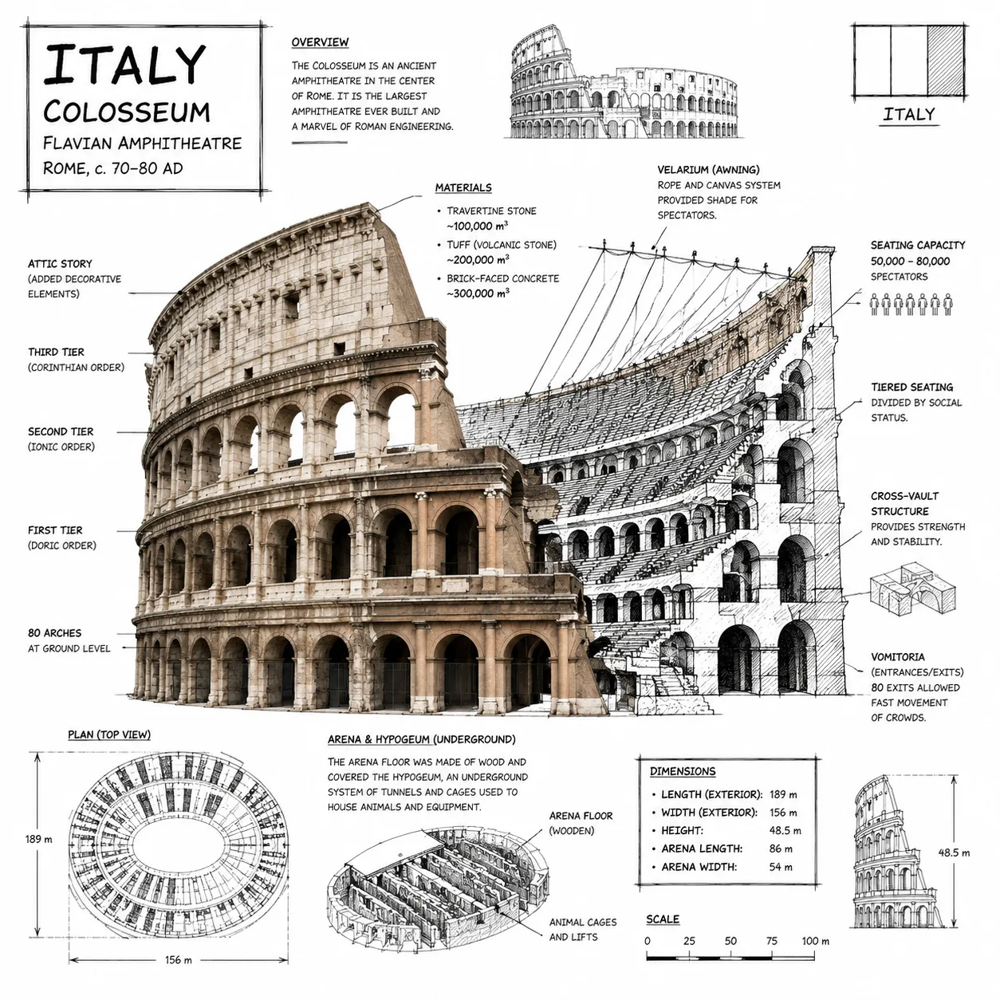

**#148 · Realistic, Infographic · <code>Vinano Studio</code>**

> Keywords: realistic, infographic, AI art, AI prompt, text to image

<details>
<summary>Show prompt</summary>

```
Create an infographic image of [COUNTRY], combining a realistic photograph or photoreal render of the object technical annotation overlays placed directly on top.

Use black ink–style line drawings and text (technical pen / architectural sketch look) on a pure white studio background, including:
•Key component labels
•Internal cutaway or exploded-view outlines
•Measurements, dimensions, and scale markers
•Material callouts and quantities
•Arrows indicating function, force, or flow (air, sound, power, pressure)
•Simple schematic or sectional diagrams where relevant
Include a small flag of the country in the top right corner.

Place the title [COUNTRY] inside a hand-drawn technical annotation box in one corner.

Style & layout rules:
•The real object remains clearly visible beneath the annotations
•Annotations feel sketched, technical, and architectural
•crisp composition balanced negative space
•Educational, museum-exhibit / engineering-manual vibe

Visual style:
Minimal technical illustration aesthetic, black linework over realistic imagery, precise but slightly hand-drawn feel.

Color palette:
White background, black annotation lines and text only. No colors.

Output:
1080×1080, ultra-crisp, social-feed optimized, no watermark.

Keep edges clean and the overall composition balanced for a polished, gallery-ready result.
```

</details>

---


**#149 · Realistic, Portrait · <code>Vinano Studio</code>**

> Keywords: realistic, portrait, AI art, AI prompt, text to image

<details>
<summary>Show prompt</summary>

```
{
 "reference_usage": {
 "use_reference_for": ["pose",
 "framing",
 "camera_angle",
 "lighting_style",
 "background_style",
 "overall_composition"],
 "do_not_copy": ["face",
 "facial_structure",
 "identity",
 "celebrity_likeness"]
 },
 "scene": {
 "type": "studio",
 "background": "smooth_neutral_gradient_same_as_reference",
 "lighting": "soft_balanced_professional_studio_lighting_same_as_reference"
 },
 "subject": {
 "identity": "generic_adult_male_not_a_real_person",
 "age_range": "late_20s_to_mid_30s",
 "pose": "upright_head_and_shoulders_pose_same_as_reference",
 "expression": "confident_friendly_smile_similar_intensity",
 "gaze": "direct_eye_contact_with_camera",
 "hair": {
 "style": "short_neatly_groomed",
 "color": "dark_brown_or_black"
 },
 "facial_features": "original_unique_face_not_matching_reference"
 },
 "outfit": {
 "type": "formal_business",
 "jacket": "tailored_dark_gray_suit",
 "shirt": "clean_white_dress_shirt",
 "tie": "navy_blue_classic"
 },
 "camera": {
 "framing": "tight_head_and_shoulders",
 "angle": "straight_on_same_as_reference",
 "lens": "85mm_portrait",
 "aperture": "f2.8",
 "depth_of_field": "shallow",
 "focus": "razor_sharp_on_face"
 },
 "style": {
 "look": "photorealistic_high_end_corporate_portrait",
 "skin_texture": "natural_realistic",
 "contrast": "clean_professional",
 "detail_level": "high"
 },
 "negative_prompt": ["Cristiano Ronaldo",
 "celebrity",
 "famous person",
 "lookalike",
 "same face as reference",
 "identity match",
 "overly stylized",
 "cartoon",
 "illustration",
 "blur",
 "low quality"]
}

Keep edges clean and the overall composition balanced for a polished, gallery-ready result.
```

</details>

---

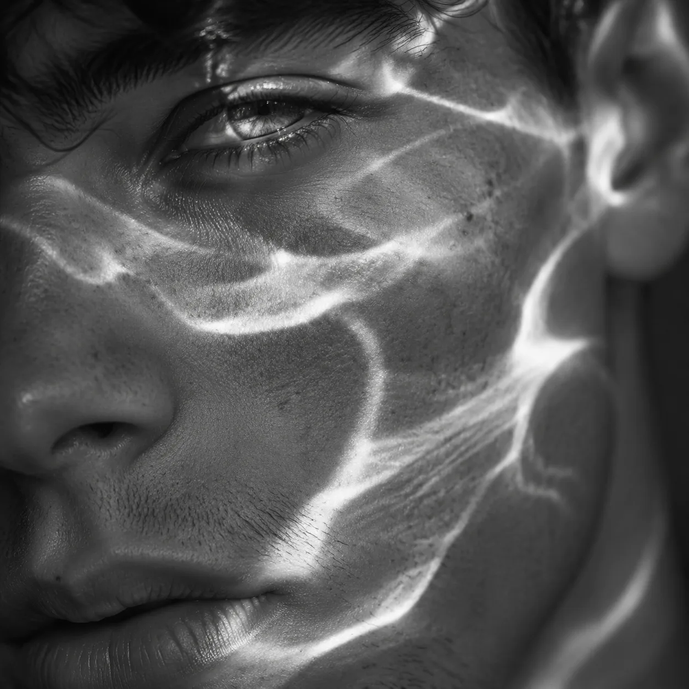

**#150 · Realistic, Portrait · <code>Vinano Studio</code>**

> Keywords: realistic, portrait, cinematic, AI art, AI prompt, text to image

<details>
<summary>Show prompt</summary>

```
A hyperrealistic 8K black and white extreme close-up portrait of a young man's face, focusing tightly on his eye, cheekbone, and lips. Bright sunlight breaks into soft, wavy luminous lines that ripple across his skin like underwater reflections. The light flows diagonally, wrapping around the contours of his face in surreal patterns, while the shadows dissolve into smooth mid-gray tones instead of deep black. The skin is rendered in lifelike detail-visible pores, faint freckles, subtle stubble, and natural imperfections catch the glowing light realistically. The lips are softly highlighted, and the eye reflects fragments of the luminous waves, adding depth and emotion without artificial glow. The camera framing feels macro, pressed close to the face, razor-thin depth of field: one illuminated ridge of skin is perfectly sharp, while the rest melts into velvety blur. The glassy, fluid quality of the light lines gives the portrait a surreal dreamlike aesthetic while remaining grounded in photographic realism. The background disappears into soft gray gradients, leaving only the interplay of skin texture and luminous wave-like rays. Fine cinematic grain overlays the frame, enhancing the tactile analog feel. The overall mood is intimate, surreal, and emotionally evocative - a monochrome portrait. Emphasise material texture and natural light so the final frame feels tactile and premium.
```

</details>

---

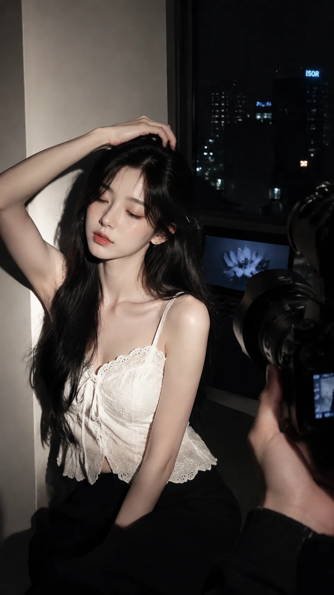

**#151 · Ai Art, Ai Prompt · <code>Vinano Studio</code>**

> Keywords: AI art, AI prompt, text to image

<details>
<summary>Show prompt</summary>

```
Behind-the-scenes indoor photography at night, high-contrast. The subject is Karina from aespa, featuring her signature sharp V-shaped jawline, large almond-shaped eyes soft makeup, and porcelain skin. She has long, voluminous dark hair in a layered 'wolf-cut' style. Karina is sitting, tilted slightly toward the camera her eyes closed, her right arm raised her hand resting on her head, highlighting her visible collarbones. She wears a soft white eyelet embroidery camisole a small bow tie at the chest and black bottoms. To the right, a professional camera and photographer's hands are visible in the foreground. Background features a window overlooking a dark city a digital screen and a distant lit building. Side-lit from the left, soft but high-contrast, shallow depth of field. --ar 9:16 Aim for an editorial, design-driven look with deliberate negative space.
```

</details>

---

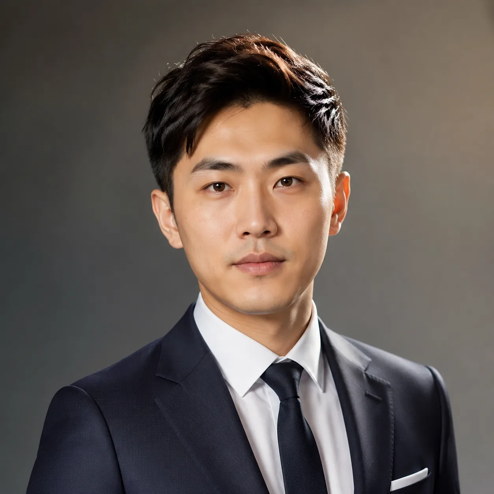

**#152 · Realistic, Portrait · <code>Vinano Studio</code>**

> Keywords: realistic, portrait, AI art, AI prompt, text to image

<details>
<summary>Show prompt</summary>

```
Ultra realistic professional business portrait based on the attached image. Keep the subject’s facial structure, skin tone, hairstyle, and expression accurate. Dress the subject in clean, modern professional attire suitable for executives. Use a soft, minimal, premium gradient background smooth lighting transitions Emphasise material texture and natural light so the final frame feels tactile and premium.
```

</details>

---

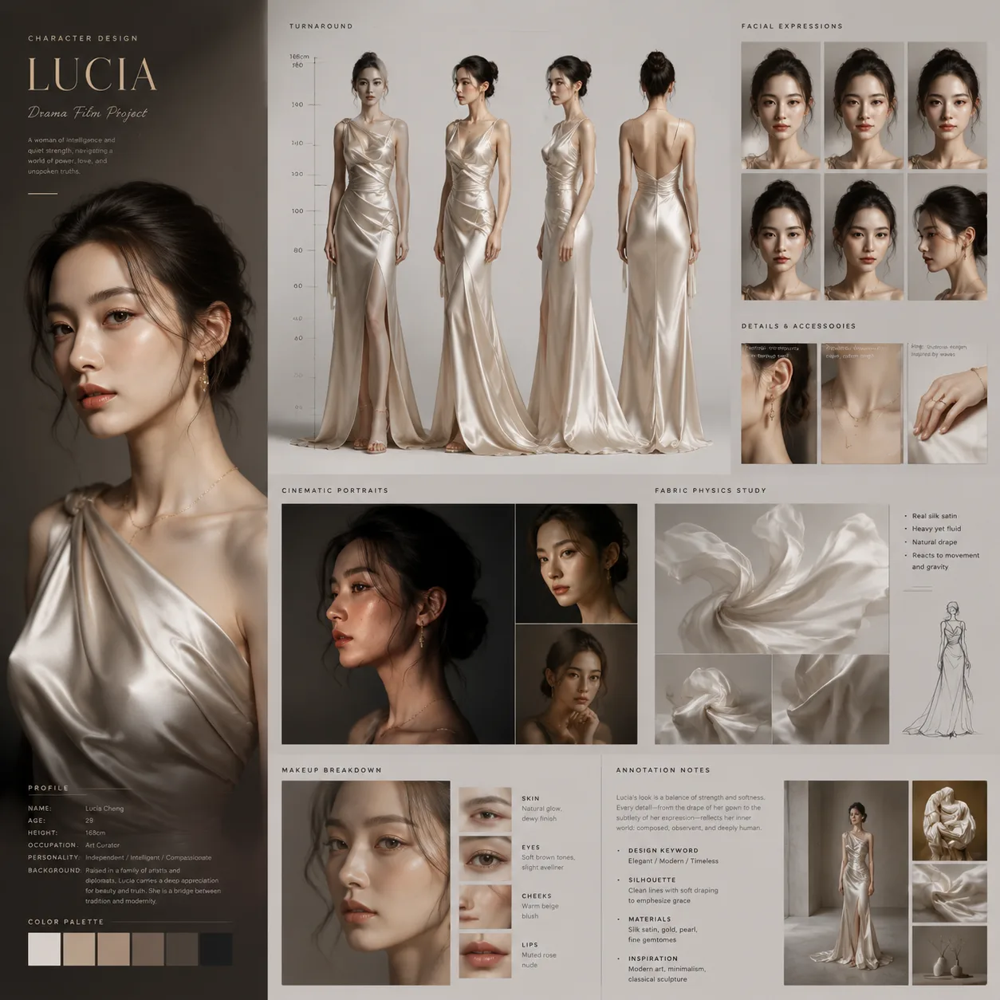

**#153 · Portrait, Character · <code>Vinano Studio</code>**

> Keywords: portrait, character, cinematic, minimalist, AI art, AI prompt

<details>
<summary>Show prompt</summary>

```
Create a cinematic character design board for a premium drama film.

A stunning female protagonist sharp yet gentle facial features, glowing natural skin, and a high-fashion silk gown modern sculpted design. Minimalistic luxury jewelry enhances her refined look.

Include: full-body turnaround sheets, facial expression variations, cinematic portrait angles, fabric physics study, makeup breakdown, annotation notes, and height reference scale.

Mood: clean studio lighting, modern editorial fashion aesthetic, soft shadows, luxury magazine tone.

Render with rich micro-detail while keeping the layout uncluttered and intentional.
```

</details>

---

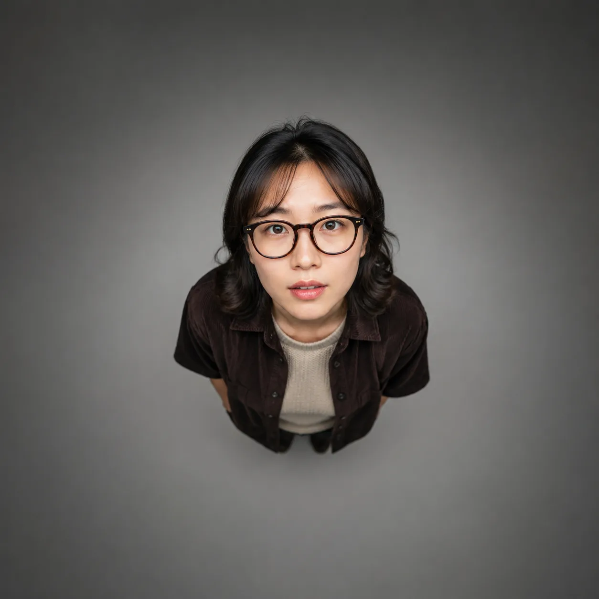

**#154 · Realistic, Portrait · <code>Vinano Studio</code>**

> Keywords: realistic, portrait, minimalist, AI art, AI prompt, text to image

<details>
<summary>Show prompt</summary>

```
{
 "type": "image_generation_prompt",
 "style": "ultra-wide angle, aerial portrait, contemporary studio photography",
 "identity_preservation": {
 "use_reference_image": true,
 "strict_identity_lock": true,
 "alter_face": false,
 "notes": "Preserve 100% of the woman’s facial features, proportions, skin texture, and natural expression from the reference image."
 },
 "composition": {
 "camera_angle": "top-down aerial view (approximately 90 degrees above the subject)",
 "framing": "full-body framing emphasis on head and upper torso",
 "negative_space": "large amount of negative space surrounding the subject",
 "perspective_effect": "dramatic isolation and graphic impact"
 },
 "subject": {
 "gender": "female",
 "pose": {
 "body_position": "standing or lying naturally beneath the camera",
 "head_direction": "looking straight up toward the camera",
 "expression": "engaging, slightly curious or inquisitive"
 },
 "appearance": {
 "hair": {
 "style": "natural hairstyle visible texture and volume",
 "notes": "do not alter hair color or structure from reference"
 },
 "eyewear": "round, thick-framed stylish glasses",
 "wardrobe": {
 "outer_layer": "short-sleeve button-up shirt in deep dark brown, corduroy or textured fabric",
 "inner_layer": "light beige or off-white textured sweater or t-shirt worn underneath"
 },
 "skin": {
 "tone": "natural, realistic",
 "texture": "clearly visible, not over-smoothed"
 }
 }
 },
 "environment": {
 "background": {
 "type": "studio backdrop",
 "color": "soft gray gradient",
 "gradient_style": "darker at the edges, lighter at the center directly beneath the subject"
 },
 "setup": "refined minimalist, distraction-free"
 },
 "lighting": {
 "type": "soft, uniform overhead lighting",
 "direction": "from above",
 "effect": ["subtle shadows defining facial features and clothing folds",
 "even illumination no harsh contrast"]
 },
 "camera_settings": {
 "iso": "150–200",
 "aperture": "f/1.28",
 "shutter_speed": "1/200s",
 "resolution": "high-resolution, ultra-detailed"
 },
 "color_grading": {
 "palette": "neutral, modern tones",
 "contrast": "soft and balanced",
 "look": "clean, contemporary"
 },
 "mood": {
 "atmosphere": "refined minimalist, modern, contemplative",
 "focus": "strong subject isolation and visual clarity"
 },
 "output_goal": "Create a high-resolution, top-down aerial studio portrait of a woman against a soft gray gradient background, dramatic perspective, refined minimalist composition, and complete preservation of her facial identity and natural appearance."
}

Emphasise material texture and natural light so the final frame feels tactile and premium.
```

</details>

---

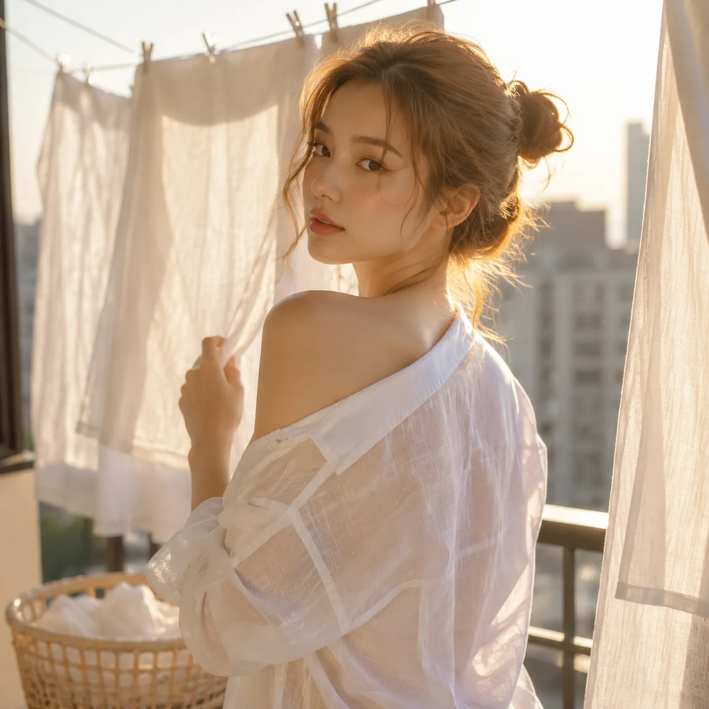

**#155 · Cinematic, Ai Art · <code>Vinano Studio</code>**

> Keywords: cinematic, AI art, AI prompt, text to image

<details>
<summary>Show prompt</summary>

```
{
  "raw_prompt": "K-pop idol Sana (TWICE) posing on a sunlit balcony among hanging white laundry. She wears an oversized, sheer white button-down shirt slipping off one shoulder. Golden hour backlighting, soft skin textures, urban background, 8k resolution, filmic, cinematic lighting. --ar 9:16",
  "aspect_ratio": "9:16",
  "subjects": [{
      "name": "Sana (TWICE)",
      "physical_features": "Soft brown hair in a loose bun, feline eyes, high nose bridge, fair glowing skin, subtle coral lip tint.",
      "outfit": {
        "garment": "Oversized, translucent white linen button-down shirt, draped open to reveal one shoulder.",
        "footwear": "Barefoot.",
        "accessories": "None."
      },
      "pose_and_expression": "Side profile, looking back over shoulder a soft, dreamy gaze. One hand gently touching hanging fabric."
    }],
  "environment": "Apartment balcony white sheets drying on lines, blurred city buildings in the background, laundry basket at feet.",
  "photography_and_lighting": {
    "camera_style": "Professional DSLR, 50mm lens, shallow depth of field.",
    "lighting": "Warm golden hour sunlight, heavy backlighting creating a glowing rim light effect.",
    "color_grading": "Warm tones, soft contrast, airy and ethereal aesthetic."
  }
}

Emphasise material texture and natural light so the final frame feels tactile and premium.
```

</details>

---

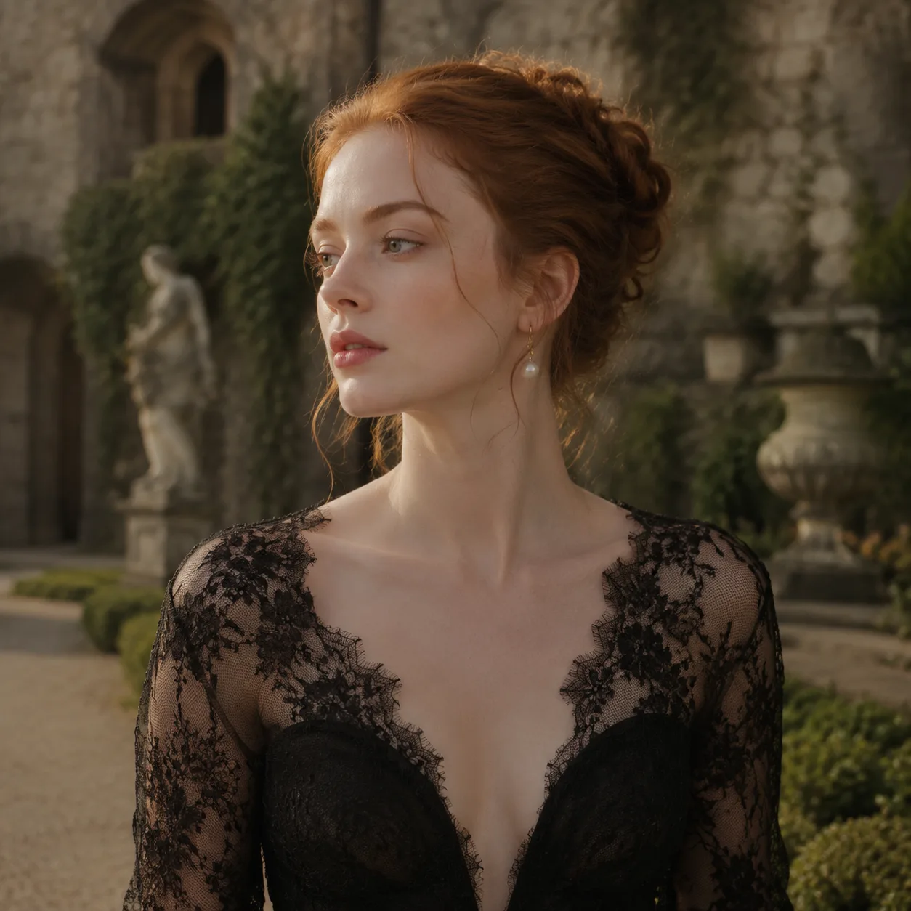

**#156 · Realistic, Portrait · <code>Vinano Studio</code>**

> Keywords: realistic, portrait, character, cinematic, AI art, AI prompt

<details>
<summary>Show prompt</summary>

```
{
 "subject": {
 "character": "Sadie Sink",
 "age_range": "early to mid 20s",
 "skin_texture": "smooth, natural skin texture, soft porcelain tone",
 "expression": "calm, distant, introspective"
 },

 "pose_and_orientation": {
 "body_direction": "upper body fully facing the camera, straight on",
 "head_direction": "head turned gently to the left, matching the reference image angle",
 "gaze_direction": "looking past the camera to the left, identical to the reference image",
 "shoulders": "even, squared shoulders facing forward",
 "posture": "upright, elegant, noble posture"
 },

 "gaze": {
 "eye_focus": "soft, unfocused gaze into the distance",
 "emotion": "quiet confidence, subtle melancholy, composed elegance"
 },

 "mood": {
 "overall_feeling": "elegant, poetic, timeless",
 "energy": "soft, restrained, aristocratic",
 "atmosphere": "romantic European fine art portrait"
 },

 "hair": {
 "style": "loosely gathered messy bun",
 "structure": "soft volume at the crown, natural irregularity",
 "flyaways": "loose strands framing the face and neck",
 "finish": "natural, matte, effortless"
 },

 "accessories": {
 "earrings": "delicate dangling pearl earrings",
 "style": "classic, minimal, aristocratic",
 "movement": "subtle natural swing"
 },

 "outfit": {
 "reference_instruction": "base the outfit directly on the clothing in the provided reference image",
 "dress_type": "deep V-neck evening dress",
 "fabric": "sheer black lace overlay",
 "lace_detail": "intricate floral lace patterns identical in spirit to the reference",
 "inner_layer": "solid black structured bodice beneath the lace",
 "neckline_behavior": "lace softly draped over shoulders and collarbone as in the reference image",
 "overall_style": "haute couture, timeless, refined, identical silhouette to the reference"
 },

 "lighting": {
 "type": "soft natural daylight",
 "direction": "side lighting from camera right, matching reference",
 "shadow_style": "gentle shadows sculpting cheekbones and jawline",
 "contrast": "low contrast, painterly softness",
 "skin_light": "even, diffused glow"
 },

 "camera": {
 "shot_type": "medium close-up portrait",
 "lens": "85mm portrait lens look",
 "depth_of_field": "shallow depth of field soft background blur",
 "focus": "sharp focus on eyes and facial features"
 },

 "composition": {
 "framing": "vertical portrait",
 "subject_placement": "centered composition subtle negative space",
 "aesthetic": "fine art editorial photography"
 },

 "background": {
 "location": "historic European castle garden",
 "elements": ["ancient stone castle walls",
 "ivy-covered arches",
 "classical European garden statues",
 "trimmed hedges and greenery",
 "stone garden pathways"],
 "time_of_day": "late afternoon",
 "background_style": "romantic, softly blurred, cinematic"
 },

 "color_palette": {
 "dominant_colors": ["soft blush pink",
 "stone gray",
 "deep black",
 "muted garden green"],
 "tone": "warm, slightly desaturated, timeless"
 },

 "style_tags": ["fine art portrait",
 "filmic, cinematic lighting",
 "european aristocracy",
 "romantic realism",
 "fashion editorial",
 "renaissance inspired"],

 "quality": {
 "detail_level": "ultra-detailed",
 "resolution": "high resolution, 8k look",
 "texture_quality": "realistic lace, fabric and skin texture",
 "render_style": "true-to-life photorealistic painterly softness"
 },

 "negative_prompt": {
 "exclude": ["different pose than specified",
 "front-facing gaze",
 "modern clothing",
 "harsh lighting",
 "over-saturated colors",
 "plastic skin",
 "cartoon or illustration style",
 "distorted anatomy",
 "over-sharpening"]
 }
}

Aim for an editorial, design-driven look with deliberate negative space.
```

</details>

---

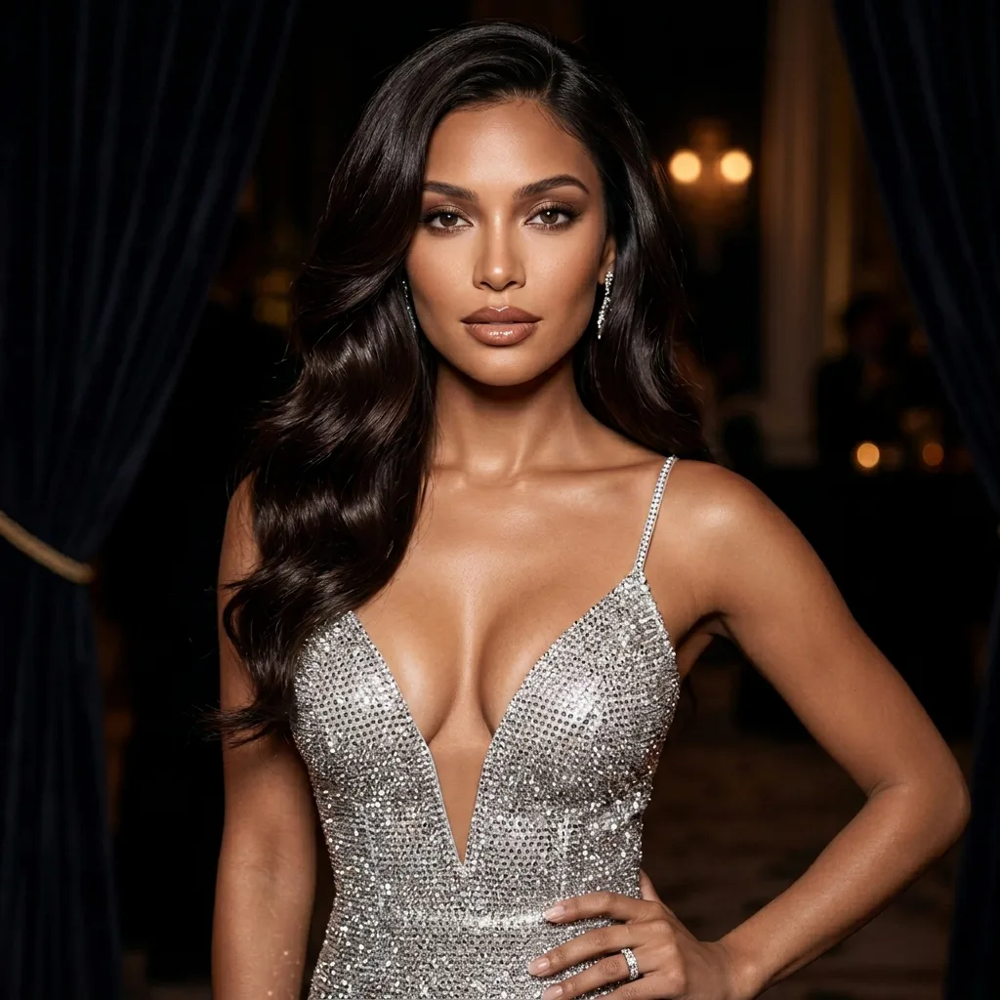

**#157 · Realistic, Portrait · <code>Vinano Image Pro</code>**

> Keywords: realistic, portrait, cinematic, AI art, AI prompt, text to image

<details>
<summary>Show prompt</summary>

```
{
  "image_request": {
    "identity_lock": {
      "face_reference": "Use the uploaded reference image",
      "constraints": ["Preserve exact facial features",
        "No face alteration",
        "No morphing or beautification",
        "Maintain true bone structure, proportions, and asymmetry"]
    },
    "subject": {
      "type": "Adult woman Sydney Sweeney ",
      "style": "Luxury high-fashion editorial portrait"
    },
    "face_and_expression": {
      "features": "Striking, refined facial features identical to reference",
      "expression": "Calm, confident, elegant",
      "skin": {
        "finish": "Natural, flawless, realistic texture",
        "tone": "Warm, even, unedited"
      }
    },
    "makeup": {
      "style": "Luxury nude makeup",
      "color_palette": "Brown and bronze tones",
      "eyes": {
        "shadow": "Softly smudged bronze-brown",
        "liner": "Subtle, diffused",
        "lashes": "Defined but natural"
      },
      "contour": "Soft sculpting bronzed warmth",
      "lips": {
        "shape": "Naturally full",
        "finish": "Glossy, well-contoured nude-bronze"
      },
      "overall": "Elegant, high-end, polished without excess"
    },
    "hair": {
      "color": "Deep dark brown / black",
      "length": "Very long",
      "style": "Voluminous, flowing waves",
      "finish": "Glossy, luxurious, red-carpet ready"
    },
    "wardrobe": {
      "dress": {
        "type": "Gala gown",
        "material": "Fully covered in silver crystals",
        "effect": "Intensely reflective, high sparkle",
        "straps": "Thin straps",
        "neckline": "Extremely deep V-neck",
        "slit": "High thigh slit",
        "fit": "Figure-enhancing, elegant, couture-level"
      }
    },
    "lighting": {
      "style": "Cinematic editorial lighting",
      "quality": "Bright highlights on crystals, soft sculpting on face",
      "mood": "Luxurious, dramatic, red-carpet glamour",
      "contrast": "Balanced refined shadows"
    },
    "camera_and_quality": {
      "resolution": "Ultra-HD 8K",
      "realism": "Hyper-realistic photographic quality",
      "focus": "Sharp focus on face, hair, and crystal details",
      "depth_of_field": "Natural, editorial"
    },
    "aesthetic": {
      "theme": "High-glamour evening couture",
      "vibe": ["Elegant",
        "Powerful",
        "Luxury",
        "Timeless"]
    },
    "negative_prompt": ["face alteration",
      "beauty morphing",
      "cartoon",
      "CGI",
      "3D render",
      "plastic skin",
      "over-retouching",
      "low detail",
      "blur",
      "illustration" Ratio 3.4]
  }
 }

Preserve realistic proportions and depth for a confident, professional finish.
```

</details>

---

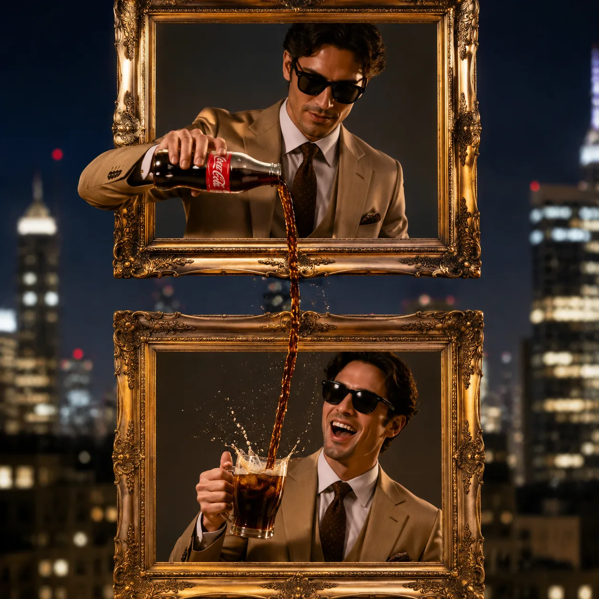

**#158 · Ai Art, Ai Prompt · <code>Vinano Studio</code>**

> Keywords: AI art, AI prompt, text to image

<details>
<summary>Show prompt</summary>

```
A stylish man wearing a tan suit and sunglasses is featured in a creative split image, framed by two ornate gold frames. In the top frame, he is pouring Coca-Cola from a bottle. The cola streams downward, passing through the gap between the frames. In the bottom frame, the same man, also in a tan suit and sunglasses, is shown a joyful expression as the stream of cola splashes into a glass mug he is holding, creating a dynamic splash.The background behind the frames is a softly blurred night cityscape tall buildings and lights, suggesting. Emphasise material texture and natural light so the final frame feels tactile and premium.
```

</details>

---

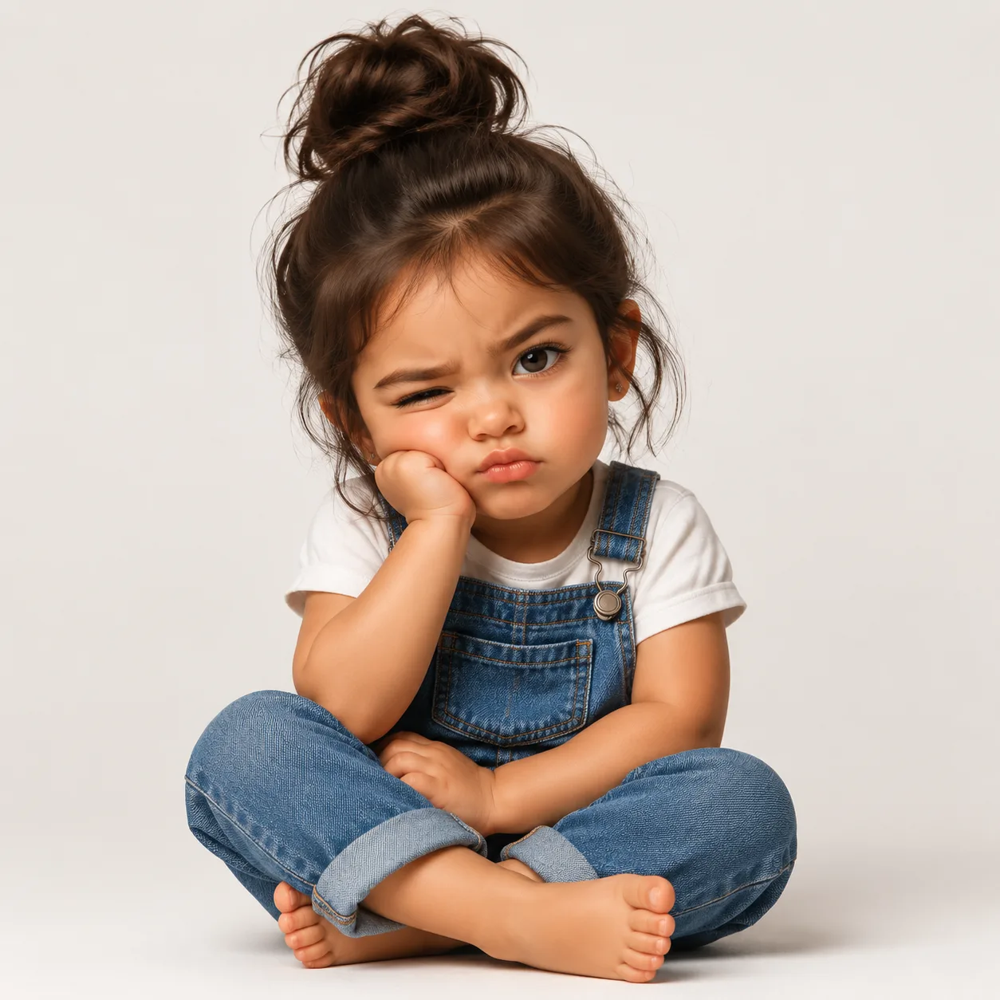

**#159 · Realistic, Cinematic · <code>Vinano Studio</code>**

> Keywords: realistic, cinematic, AI art, AI prompt, text to image

<details>
<summary>Show prompt</summary>

```
Create a super cute, hyper-realistic 3D render of a toddler girl who is a younger version of the person in the provided reference photo.

The facial structure must strongly match the reference image. Accurately replicate the exact eye shape, eye color, skin tone, lip shape, nose structure, cheek fullness, eyebrow shape, and overall facial proportions. The toddler version should clearly resemble the same person at a younger age while maintaining realistic childlike softness and rounded features.
If any accessory (such as an earring or similar detail) appears in the reference image, replicate it accurately in size, colour, and placement.
Expression:

Distinctly grumpy and pouty. Chin resting on her left palm. One eye slightly squinted in mild annoyance. Eyebrows gently furrowed. Lips pushed forward in a stubborn pout. Expression must feel natural and emotionally believable, not exaggerated.
Hair:

Hairstyle should be adapted from the reference image while keeping it toddler-appropriate. Styled in a messy high bun soft, natural baby hair strands framing the face.
Outfit:

White short-sleeve t-shirt under classic blue denim overalls visible stitching and metal clasps.
Pose & Background:

Sitting cross-legged on a clean white studio background. Feet slightly angled toward the camera. Balanced composition full body visible.
Style & Quality:

Ultra-detailed Pixar/Disney-inspired 3D animation aesthetic. Professional CGI rendering. 1:1 aspect ratio. 8K resolution. Sharp focus. Cinematic studio lighting soft subsurface scattering on the skin. Smooth textures, realistic fabric physics, soft global illumination, and natural shadow falloff.

Aim for an editorial, design-driven look with deliberate negative space.
```

</details>

---

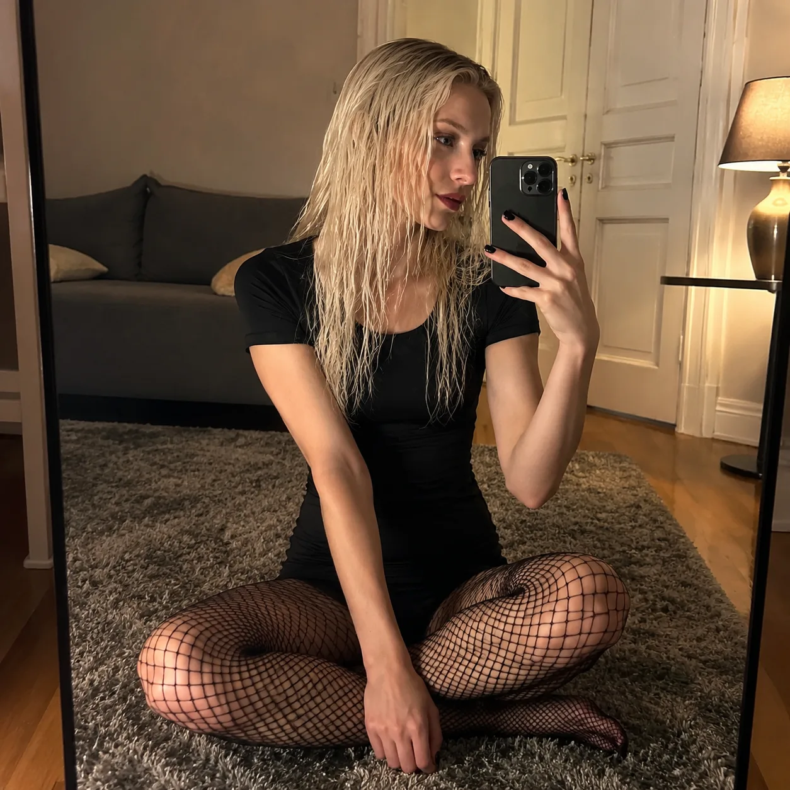

**#160 · Realistic, Ai Art · <code>Vinano Studio</code>**

> Keywords: realistic, AI art, AI prompt, text to image

<details>
<summary>Show prompt</summary>

```
{
 "meta": {
 "aspect_ratio": "9:16",
 "quality": "true-to-life photorealistic, raw, unedited smartphone photograph",
 "resolution": "8k",
 "camera": "Smartphone camera (e.g., iPhone 14 Pro)",
 "lens": "Wide-angle smartphone lens",
 "style": "Candid mirror selfie, natural indoor evening light, warm tone",
 "composition": "Full-body mirror shot of a woman sitting on a rug, holding a smartphone to take the photo."
 },
 "scene": {
 "location": "Indoor living room",
 "environment": ["Large grey shag rug on wooden floor",
 "Dark grey sofa in background",
 "White double doors",
 "Warm ambient lighting from a lamp"],
 "time": "Evening",
 "atmosphere": "Casual, relaxed, intimate"
 },
 "lighting": {
 "type": "Warm, dim indoor light",
 "source": "Lamp light from the side and smartphone screen light",
 "effect": "Soft, warm glow shadows, highlighting wet hair and fishnet texture."
 },
 "subject": {
 "identity": "The woman from image_0.png wet platinum blonde hair.",
 "body": {
 "pose": "Sitting cross-legged on the grey rug, looking at the smartphone in her hand, holding it up for a mirror selfie.",
 "physique": "Slim build."
 },
 "outfit": {
 "clothing": "Black short-sleeved mini-dress, black fishnet tights.",
 "accessories": "None visible besides the smartphone."
 }
 },
 "realism_focus": {
 "textures": "Wet hair strands, detailed mesh of the fishnet tights, texture of the grey shag rug, fabric of the black dress.",
 "imperfections": "Natural skin texture, realistic phone reflection in the mirror."
 }
}

Preserve realistic proportions and depth for a confident, professional finish.
```

</details>

---

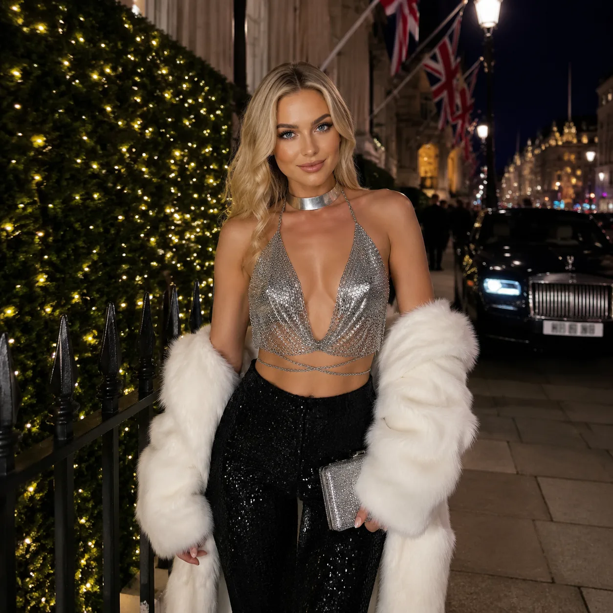

**#161 · Realistic, Cinematic · <code>Vinano Studio</code>**

> Keywords: realistic, cinematic, AI art, AI prompt, text to image

<details>
<summary>Show prompt</summary>

```
{
 "canvas": {
 "width": 1200,
 "height": 1200
 },
 "subject": {
 "gender": "female",
 "age_range": "early to mid 20s",
 "ethnicity": "fair-skinned, European appearance",
 "hair": {
 "color": "golden blonde",
 "length": "long",
 "style": "loose, soft waves",
 "parting": "center part"
 },
 "face": {
 "shape": "oval",
 "skin_tone": "warm fair",
 "makeup": {
 "foundation": "smooth, natural finish",
 "eyes": "defined lashes, subtle smoky eyeliner",
 "eyebrows": "well-shaped, medium thickness",
 "lips": "nude peach matte lipstick",
 "blush": "soft warm pink"
 },
 "expression": "soft confident smile",
 "eye_color": "light blue"
 },
 "pose": {
 "body_position": "standing upright",
 "orientation": "facing the camera",
 "shoulders": "relaxed",
 "arms": "left arm holding clutch, right arm relaxed"
 }
 },
 "outfit": {
 "top": {
 "type": "metallic chainmail halter top",
 "color": "silver",
 "design": "deep plunging V neckline",
 "details": ["thin chain straps",
 "horizontal chain strap wrapped across midriff"]
 },
 "outerwear": {
 "type": "faux fur coat",
 "color": "white",
 "texture": "plush and fluffy",
 "wear_style": "draped off shoulders, resting around elbows"
 },
 "bottoms": {
 "type": "high-waisted trousers",
 "color": "black",
 "material": "sequined fabric",
 "fit": "slim fit"
 },
 "accessories": {
 "handbag": {
 "type": "small clutch",
 "color": "silver metallic",
 "finish": "glittered"
 }
 },
 "jewelry": {
 "neck": "wide silver choker collar",
 "connection": "choker attached to halter top chain"
 }
 },
 "environment": {
 "location": "luxury city street at night",
 "city_vibe": "London-inspired",
 "background_elements": ["grand stone building tall columns",
 "Union Jack flags mounted on building facade",
 "ornate black metal fencing",
 "large green hedge wrapped in warm fairy lights",
 "parked black luxury car resembling Rolls-Royce",
 "street lamps",
 "blurred pedestrians and traffic lights in distance"],
 "ground": "clean stone pavement"
 },
 "lighting": {
 "time": "night",
 "sources": ["warm decorative fairy lights",
 "soft street lighting",
 "ambient building lights"],
 "effect_on_subject": "even illumination on face and outfit",
 "color_temperature": "warm foreground cool background highlights"
 },
 "camera": {
 "shot_type": "medium shot",
 "angle": "eye-level",
 "focus": "sharp focus on subject",
 "depth_of_field": "shallow",
 "background": "cinematic bokeh"
 },
 "style": {
 "aesthetic": "luxury glamour",
 "mood": "confident, elegant, upscale nightlife",
 "photography_type": "high-end smartphone or mirrorless camera",
 "realism_level": "true-to-life photorealistic",
 "grain": "very subtle night grain"
 },
 "color_palette": {
 "primary_colors": ["silver", "white", "black"],
 "accent_colors": ["warm gold lights", "deep night blues"]
 }
}

Emphasise material texture and natural light so the final frame feels tactile and premium.
```

</details>

---

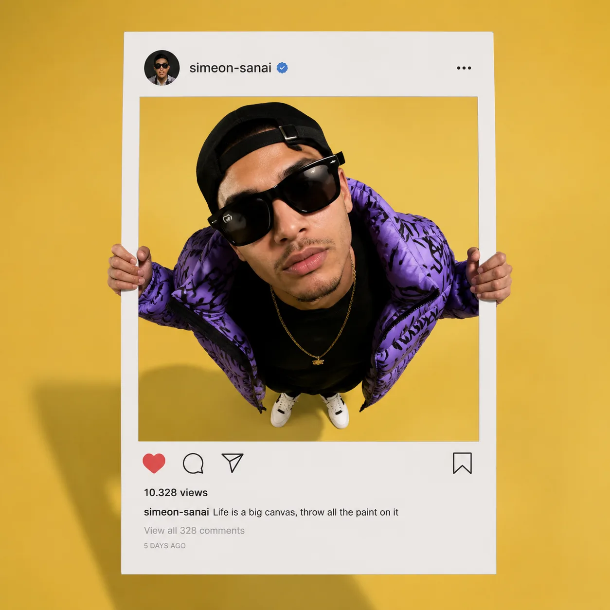

**#162 · Realistic, Ai Art · <code>Vinano Studio</code>**

> Keywords: realistic, AI art, AI prompt, text to image

<details>
<summary>Show prompt</summary>

```
Create an Ultra-realistic photo composite of uploaded person breaking out of an Instagram post frame. Standing pose, both hands holding frame edges, upper body outside frame real shadows. High top-down view, strong 10mm fisheye effect on person only (big head, smaller body), frame straight. Confident upward gaze, purple graffiti puffer jacket, black tee, gold chain, white sneakers, sunglasses, black cap, yellow floor, clean Instagram UI (simeon-sanai) overlay, true-to-life photorealistic. Aim for an editorial, design-driven look with deliberate negative space.
```

</details>

---

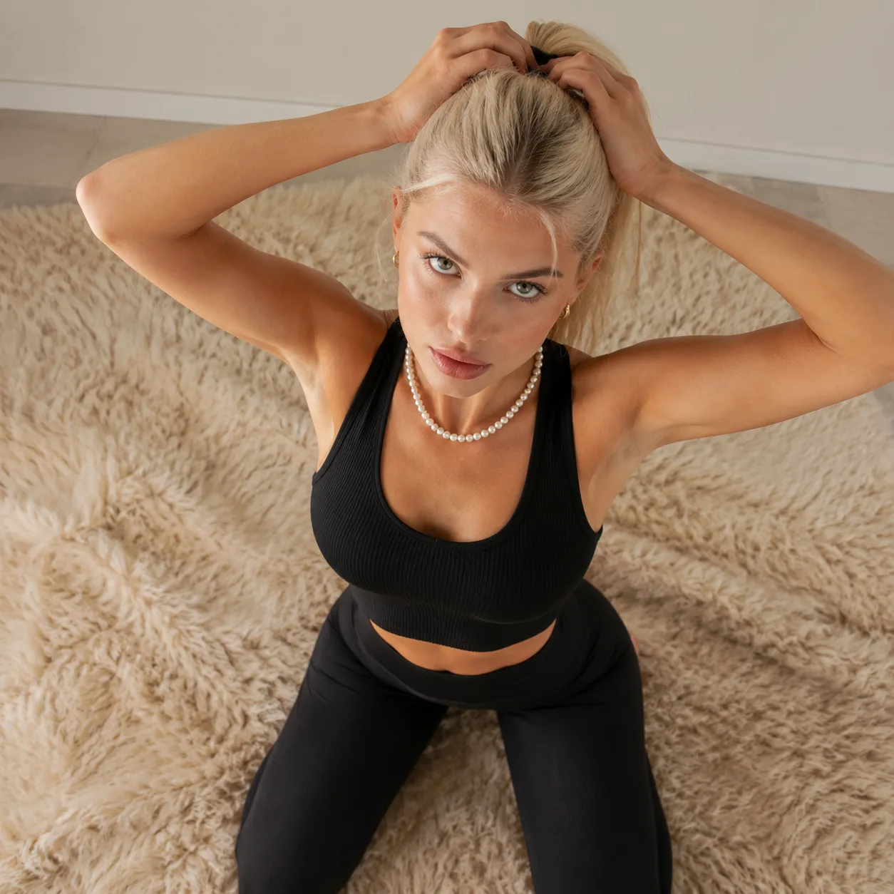

**#163 · Realistic, Minimalist · <code>Vinano Studio</code>**

> Keywords: realistic, minimalist, AI art, AI prompt, text to image

<details>
<summary>Show prompt</summary>

```
{
 "meta": {
 "aspect_ratio": "4:5",
 "quality": "ultra_photorealistic, raw, professional fashion photography",
 "resolution": "8k",
 "camera": "Mirrorless camera (e.g., Sony A7R IV)",
 "lens": "24mm f/1.4 wide-angle lens",
 "style": "Clean girl aesthetic, refined minimalist, athletic lifestyle, high-end studio look",
 "composition": "Extreme high-angle shot looking directly down at a woman kneeling, centered framing, focus on face and upper body."
 },
 "scene": {
 "location": "A refined minimalist, bright interior room neutral tones.",
 "environment": ["Large, plush, shaggy beige faux-fur rug on the floor",
 "Plain off-white or light beige wall in the background",
 "Clean, uncluttered refined minimalist space"],
 "time": "Daytime, bright and airy indoor setting.",
 "atmosphere": "Confident, cozy, modern, polished."
 },
 "lighting": {
 "type": "Soft, diffused natural daylight or overhead softbox lighting.",
 "source": "Large window or professional studio light from above.",
 "effect": "Even, bright illumination that eliminates harsh shadows, highlighting the glow of the skin and the texture of the blonde hair."
 },
 "subject": {
 "identity": "A stunningly beautiful young woman sleek platinum blonde hair, fair skin, and light green eyes. She has distinctively plump, natural lips and defined eyebrows.",
 "body": {
 "pose": "Kneeling on the shaggy rug, leaning her body forward towards the lens, hands raised to her head as she adjusts a high ponytail.",
 "physique": "Fit, athletic build toned arms and shoulders."
 },
 "outfit": {
 "clothing": "Black sleeveless ribbed crop top, matching high-waisted black yoga leggings.",
 "accessories": "Elegant white pearl necklace, small gold hoop earrings."
 }
 },
 "realism_focus": {
 "textures": "Detailed fiber texture of the shaggy rug, ribbed fabric of the black top, individual strands and sheen of the blonde hair, smooth but realistic skin texture subtle pores.",
 "imperfections": "Natural highlights on the lips and eyes, soft shadows cast on the rug, realistic tension in the arms while holding the hair."
 }
}

Emphasise material texture and natural light so the final frame feels tactile and premium.
```

</details>

---

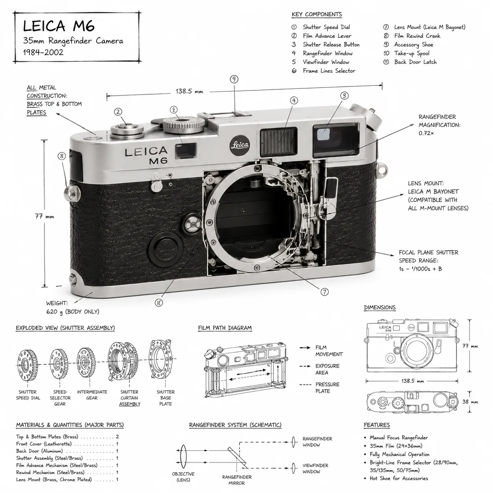

**#164 · Realistic, Infographic · <code>Vinano Studio</code>**

> Keywords: realistic, infographic, AI art, AI prompt, text to image

<details>
<summary>Show prompt</summary>

```
Create an infographic image of [OBJECT], combining a realistic photograph or true-to-life photorealistic render of the object technical annotation overlays placed directly on top.

Use black ink–style line drawings and text (technical pen / architectural sketch look) on a pure white studio background.

Include:
•Key component labels
•Internal cutaway or exploded-view outlines (where relevant)
•Measurements, dimensions, and scale markers
•Material callouts and quantities
•Arrows indicating function, force, or flow (air, sound, power, pressure, movement)
•Simple schematic or sectional diagrams where applicable

Place the title [OBJECT] inside a hand-drawn technical annotation box in one corner.

Style & layout rules:
•The real object remains clearly visible beneath the annotations
•Annotations look hand-sketched, technical, and architectural
•crisp composition balanced negative space
•Educational, museum-exhibit / engineering-manual vibe

Visual style:
Minimal technical illustration aesthetic.
Black linework layered over realistic imagery.
Precise but slightly hand-drawn feel.

Color palette:
Pure white background.
Black annotation lines and text only.
No colors.

Output:
1080 × 1080 resolution
Ultra-crisp
Social-feed optimized
No watermark

Keep edges clean and the overall composition balanced for a polished, gallery-ready result.
```

</details>

---


**#165 · Cinematic, Ai Art · <code>Vinano Studio</code>**

> Keywords: cinematic, AI art, AI prompt, text to image

<details>
<summary>Show prompt</summary>

```
2B, facies in proximo, elegantia mechanica et desiderium tacitum; capilli albi in bob nitido, frons pura; oculi velati (caecum fascia nigrum, si canonice), sed expressio per labra et mala loquitur; labra humida, glossum densum; cutis roscida cum poris subtilibus; angulus humilis, warm rimlight aureum ad labra, low-key; focus in labris et textura cutis, cinematic close-up, hyper-detail. Emphasise material texture and natural light so the final frame feels tactile and premium.
```

</details>

---

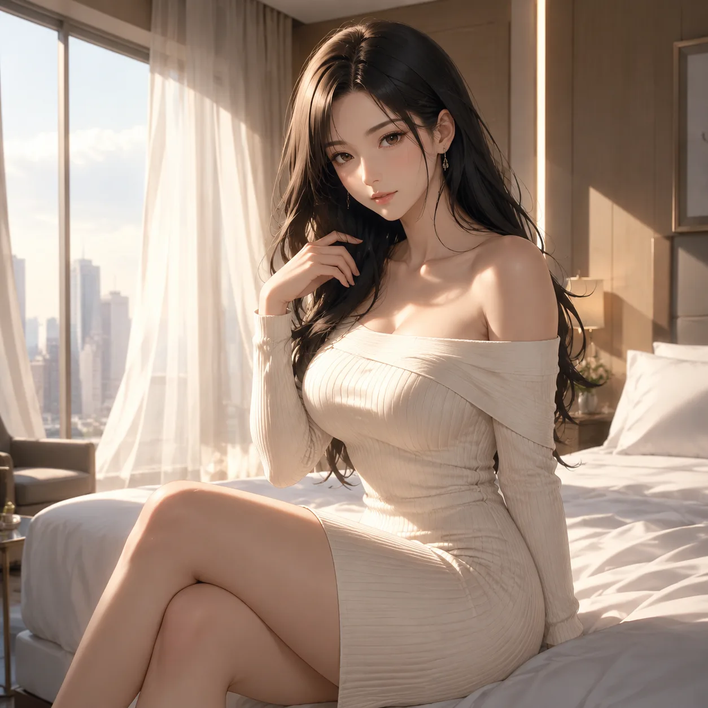

**#166 · Anime, Realistic · <code>Vinano Studio</code>**

> Keywords: anime, realistic, cinematic, minimalist, AI art, AI prompt

<details>
<summary>Show prompt</summary>

```
9:16 aspect ratio, traditional anime style, premium cinematic illustration, ultra-detailed anime artwork, premium-quality Japanese animation aesthetics, elegant young Japanese woman (around 23 years old), refined and natural beauty, soft translucent skin, smooth complexion, no blush on cheeks, clean and sophisticated makeup, calm expression, slightly mature atmosphere.

Face design: delicate facial structure, slim jawline, elegant nose bridge, sharp almond-shaped eyes, slightly elongated eye shape, dark brown eyes, gentle but confident gaze directed at camera, subtle glossy lips, composed expression.

Hair: long glossy black hair soft waves, natural volume, silky highlights, flowing strands around shoulders.

Scene: luxury hotel bedroom in the morning, warm golden sunlight entering through floor-to-ceiling windows, sheer white curtains gently moving, quiet city skyline outside, beige and light wood refined minimalist interior, elegant modern furniture, white bed sheets illuminated by natural light, sophisticated and peaceful atmosphere.

Outfit: creamy white fitted off-shoulder knit dress, premium ribbed fabric, elegant neckline revealing shoulders and collarbone, refined silhouette, slim waist emphasis, smooth natural body lines, tasteful fashion styling.

Pose: sitting sideways on edge of bed, upper body softly turned toward camera, one hand touching hair near collarbone, legs elegantly crossed, relaxed posture, subtle S-curve body line, graceful shoulder angle, intimate but classy mood.

Body balance: mature natural proportions, elegant neck and shoulder lines, refined waist transition, smooth silhouette, feminine yet sophisticated presence.

Lighting: cinematic warm morning light, soft indoor illumination, delicate highlights on skin and fabric texture, subtle rim light around hair and shoulders, realistic shadows, atmospheric depth, premium fashion magazine feeling.

Camera composition: upper body to thighs framing, shallow depth of field, creamy bokeh, natural perspective, visual focus on eyes, collarbone, waistline and elegant silhouette.

Style tags: traditional anime illustration, high-end anime key visual, cinematic storytelling mood, luxury lifestyle aesthetic, detailed linework, soft rendering, elegant atmosphere, masterpiece quality, anime movie frame.

Emphasise material texture and natural light so the final frame feels tactile and premium.
```

</details>

---

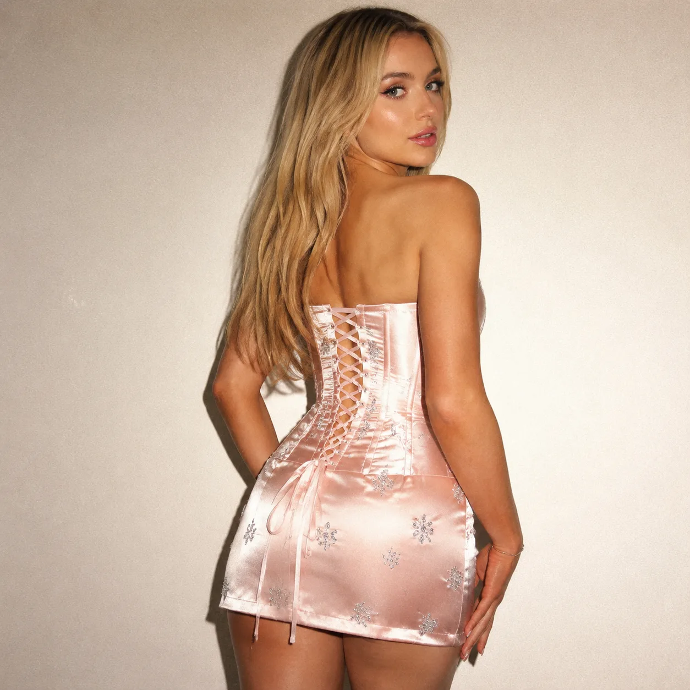

**#167 · Realistic, Portrait · <code>Vinano Studio</code>**

> Keywords: realistic, portrait, vintage, AI art, AI prompt, text to image

<details>
<summary>Show prompt</summary>

```
{
 "meta_data": {
 "prompt_version": "2.0",
 "use_case": "High-Fashion true-to-life photorealistic Image Generation",
 "main_subject_count": 1,
 "reference_image": {
 "face_consistency": true,
 "instruction": "Use the same face from the reference image without changing facial features"
 }
 },
 "subject_layer": {
 "anatomy": {
 "gender": "Female",
 "age_group": "Young adult",
 "ethnicity": "Western",
 "build": "Slim, elegant"
 },
 "pose_expression": {
 "pose": "Full-body portrait, body angled away, looking over her shoulder toward the camera",
 "expression": "Soft, glamorous, confident"
 },
 "hair_makeup": {
 "hair": {
 "color": "Blonde",
 "length": "Long",
 "style": "Smooth, flowing naturally over shoulders"
 },
 "makeup": {
 "eyes": "Soft winged eyeliner",
 "lips": "Glossy, luminous finish",
 "overall_style": "Polished, editorial glamour"
 }
 },
 "wardrobe": {
 "outfit": "Pale pink satin mini dress",
 "design_details": ["Structured corset back",
 "Lace-up detailing",
 "Crystal floral embellishments scattered across fabric"],
 "material_texture": "premium-quality satin subtle sheen",
 "embellishments": "Shimmering rhinestones sharp detail"
 }
 },
 "photography_style": {
 "aesthetic": "1990s vintage editorial",
 "camera_effects": ["Subtle film grain",
 "High contrast",
 "Warm, saturated color tones"],
 "lighting": {
 "type": "Direct hard flash",
 "effect": "Creates slight shadow on background",
 "vibe": "Paparazzi / disposable camera look"
 },
 "background": {
 "setting": "Plain studio wall",
 "color": "Off-white"
 },
 "focus_details": ["Sharp focus on corset lacing",
 "Visible satin texture",
 "Crisp rhinestone reflections"]
 },
 "image_quality": {
 "realism": "true-to-life photorealistic",
 "resolution": "Ultra high-definition",
 "detail_level": "Editorial-grade clarity and texture"
 }
}

Keep edges clean and the overall composition balanced for a polished, gallery-ready result.
```

</details>

---

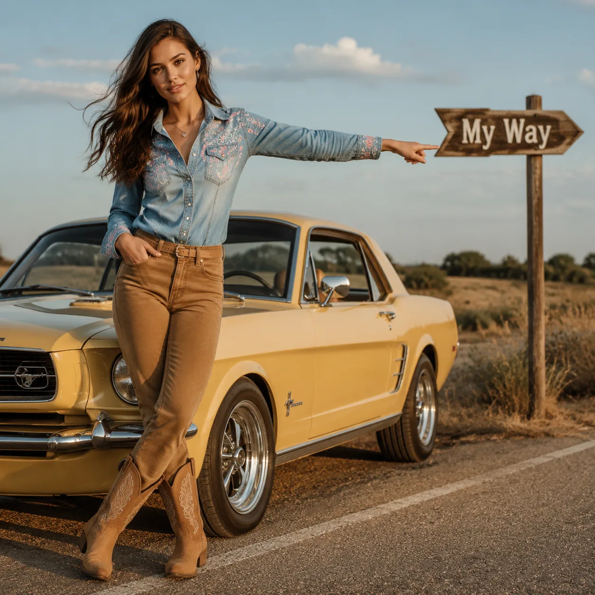

**#168 · Realistic, Portrait · <code>Vinano Studio</code>**

> Keywords: realistic, portrait, cinematic, AI art, AI prompt, text to image

<details>
<summary>Show prompt</summary>

```
{
 "project": " – Maximalist Editorial Americana Scene",
 "version": "2.4",
 "engine_optimization": " (maximalist cinematic photorealism, high detail density, controlled imperfection)",
 "render_intent": "cohesive western color harmony refined fashion detail and narrative clarity",
 "frame": {
 "aspect_ratio": "3:4",
 "shot_type": "medium-full portrait",
 "camera_angle": "eye-level subtle cinematic parallax",
 "composition": "subject foreground dominant, pointing gesture aligned parallel to the sign, car balancing the frame",
 "lens_simulation": "50mm full-frame prime",
 "camera_metadata": {
 "iso": 100,
 "shutter_speed": "1/320",
 "aperture": "f/1.8"
 },
 "depth_of_field": "shallow, face and guiding hand crisp, background softly diffused"
 },
 "subject": {
 "type": "young woman",
 "approximate_age": "early to mid 20s",
 "identity_consistency": "single subject, realistic anatomy, natural proportions",
 "appearance": {
 "hair": {
 "color": "deep brunette",
 "length": "long",
 "style": "loose, softly flowing, gently wind-swept"
 },
 "face": {
 "beauty_level": "very beautiful, striking yet natural",
 "pose_detail": "face slightly tilted, enhancing elegance and approachability"
 },
 "skin": {
 "tone": "light to medium",
 "details": ["natural texture",
 "subtle freckles",
 "soft daylight glow"]
 },
 "eyes": {
 "color": "warm brown or hazel",
 "expression": "inviting, confident, gently persuasive"
 },
 "makeup": "minimal, clean editorial finish"
 },
 "expression": "calm confidence a subtle, encouraging smile",
 "pose": "standing beside the car, torso slightly angled, arm extended horizontally, pointing parallel to the sign as if signaling ‘follow that way, follow me’"
 },
 "wardrobe": {
 "top": "light pastel blue denim shirt visible weave, pink and white embroidery in refined western motifs",
 "fit": "relaxed yet tailored",
 "bottom": "light brown pants, soft twill or suede-like texture, tailored natural creases",
 "footwear": "warm tan suede cowboy boots, medium contrast, elegant western stitching, slightly worn for authenticity",
 "accessories": ["silver necklace",
 "small silver heart-shaped pendant, delicate and understated, resting just below the collarbone"],
 "fabric_behavior": "authentic material stiffness and drape, embroidered threads catching light, natural folds and tension"
 },
 "vehicle": {
 "type": "classic Ford Mustang",
 "color": "lemon yellow",
 "finish": "glossy paint realistic reflections and subtle surface imperfections",
 "positioning": "parked beside the subject at a slight diagonal, iconic profile visible"
 },
 "environment": {
 "location": "open roadside or rural edge",
 "background_elements": ["roadside sign clearly legible text: 'My Way'",
 "open sky",
 "soft greenery or distant fields"],
 "atmosphere": "freedom, direction, invitation, optimistic Americana mood"
 },
 "lighting": {
 "type": "natural daylight",
 "source": "open sky sunlight",
 "time_of_day": "late afternoon",
 "quality": "soft, directional, cinematic",
 "effects": ["gentle rim light on hair and shoulders",
 "subtle highlights on silver jewelry",
 "soft reflections on car paint"],
 "shadow_behavior": "clean, soft-edged, physically accurate"
 },
 "color_palette": {
 "dominant_colors": ["lemon yellow",
 "pastel denim blue",
 "light brown",
 "warm tan",
 "soft pink and white embroidery",
 "natural skin tones",
 "silver accents"],
 "grading_style": "warm cinematic editorial grading filmic highlight roll-off"
 }
}

Aim for an editorial, design-driven look with deliberate negative space.
```

</details>

---

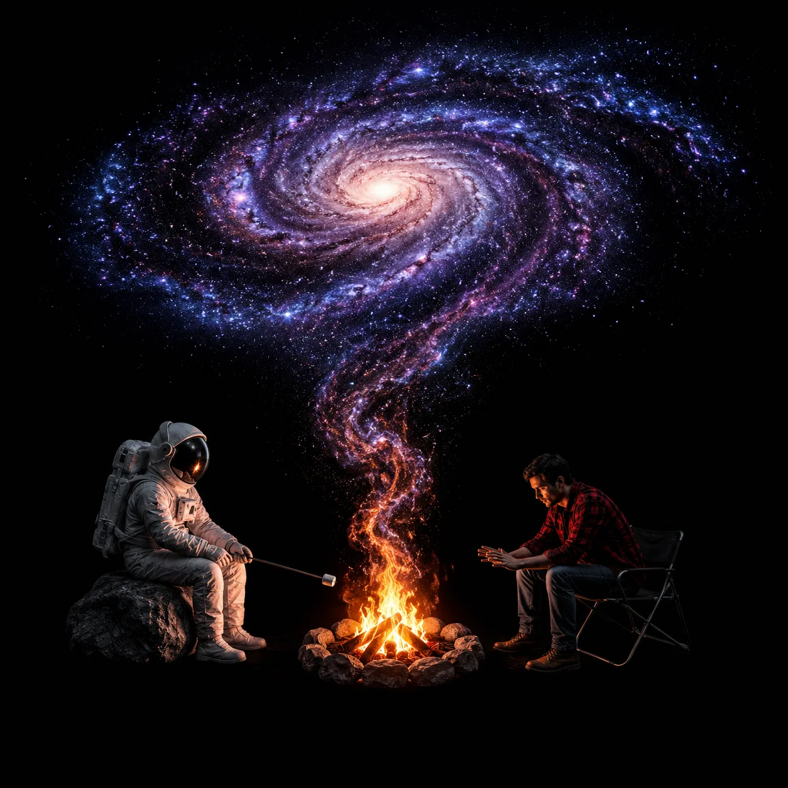

**#169 · Realistic, Character · <code>Vinano Studio</code>**

> Keywords: realistic, character, cinematic, AI art, AI prompt, text to image

<details>
<summary>Show prompt</summary>

```
{
 "type": "image_generation_prompt",
 "style": "surreal, cinematic, conceptual art",
 "camera": {
 "angle": "high-angle",
 "shot": "full shot",
 "composition": "symmetrical balance central campfire dividing two characters",
 "background": "pitch-black void no visible environment"
 },
 "scene": {
 "setting": "abstract cosmic space",
 "environment": "dark void emphasizing isolation and contrast",
 "resolution": "8k",
 "render_style": "true-to-life photorealistic"
 },
 "characters": [{
 "position": "left",
 "subject": "astronaut",
 "pose": "sitting",
 "seat": "rough gray rock",
 "appearance": {
 "suit": "highly detailed realistic white space suit",
 "helmet": "on, reflective visor"
 },
 "action": "holding a stick and roasting a marshmallow over the fire"
 },
 {
 "position": "right",
 "subject": "young man",
 "pose": "sitting and leaning forward",
 "seat": "metal folding chair",
 "appearance": {
 "hair": "dark hair",
 "clothing": {
 "top": "red and black plaid flannel shirt",
 "bottom": "blue jeans",
 "footwear": "brown boots"
 }
 },
 "action": "warming hands by the fire"
 }],
 "central_element": {
 "object": "campfire",
 "style": "magical and surreal",
 "fire_behavior": "flames transition seamlessly into a spiral galaxy",
 "galaxy": {
 "type": "true-to-life photorealistic spiral galaxy",
 "details": ["glittering stars",
 "cosmic dust",
 "swirling motion"],
 "shape": "arching overhead like a celestial canopy"
 }
 },
 "lighting": {
 "primary_light": "warm orange glow from the campfire",
 "secondary_light": "cool blue and purple glow from the galaxy",
 "mood": "dramatic, cinematic, ethereal",
 "shadows": "soft but deep, emphasizing contrast"
 },
 "color_palette": {
 "dominant": ["black", "orange", "blue", "purple"],
 "accent": ["white", "red", "brown"]
 },
 "themes": ["human connection",
 "cosmic wonder",
 "contrast between the ordinary and the infinite",
 "shared warmth in an infinite universe"],
 "quality_tags": ["ultra-detailed",
 "true-to-life photorealistic textures",
 "filmic, cinematic lighting",
 "sharp focus",
 "high dynamic range"]
}

Aim for an editorial, design-driven look with deliberate negative space.
```

</details>

---

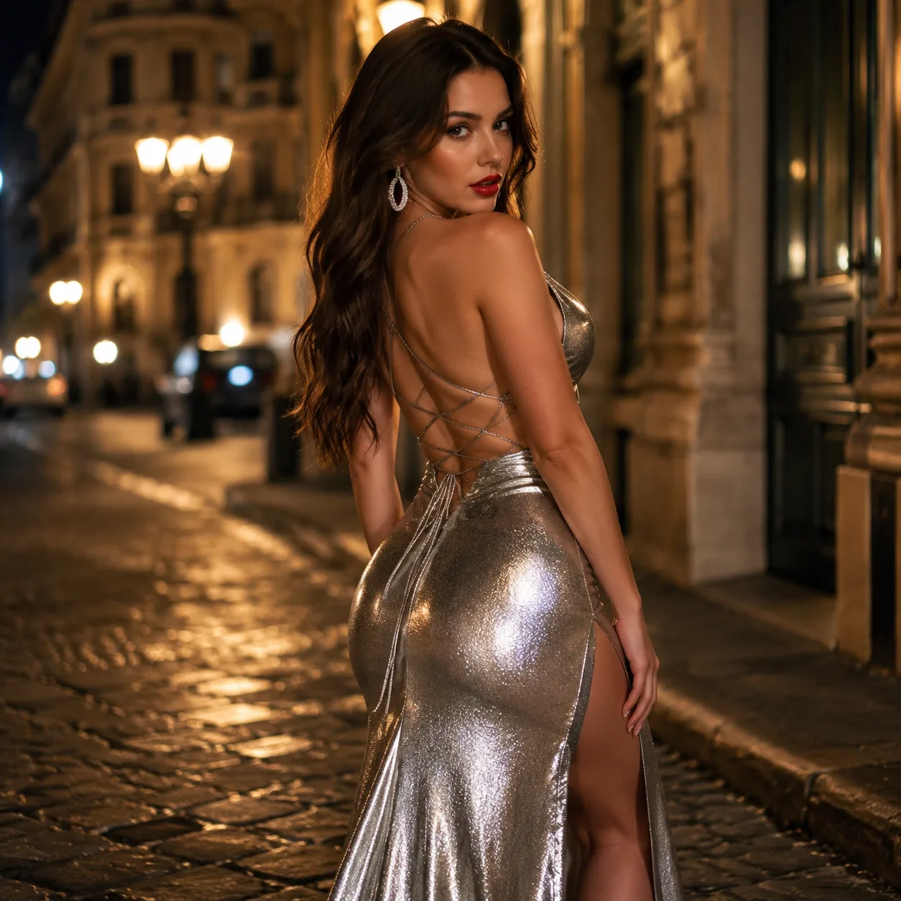

**#170 · Realistic, Portrait · <code>Vinano Studio</code>**

> Keywords: realistic, portrait, cinematic, vintage, AI art, AI prompt

<details>
<summary>Show prompt</summary>

```
{
 "generation_parameters": {
 "type": "photorealistic_cinematic_portrait",
 "aspect_ratio": "3:4",
 "quality_preset": "ultra_high_definition",
 "model_reference": "Ana de Armas"
 },
 "subject_breakdown": {
 "identity": {
 "name": "Ana de Armas",
 "facial_features": {
 "skin_texture": "hyper-realistic pore detail, soft natural skin sheen",
 "eyes": "deep hazel-green, intense eye contact, sharp focus, catching the light",
 "lips": "bold classic red lipstick, matte finish, perfectly defined",
 "expression": "alluring, mysterious, looking back over shoulder"
 },
 "hair": {
 "color": "dark chocolate brown",
 "style": "long, loose waves cascading down the back",
 "texture": "silky, voluminous, high-shine"
 },
 "physique": {
 "body_type": "curvy hourglass figure",
 "silhouette": "form-fitting, accentuated curves"
 }
 },
 "attire_and_styling": {
 "main_garment": {
 "item": "maxi dress",
 "fit": "extremely tight, bodycon, second-skin fit",
 "material": "glittering metallic silver fabric, liquid metal effect, high reflectivity",
 "design_details": ["dramatic open back",
 "thin criss-cross lace-up straps across the back",
 "deep thigh-high side slit",
 "floor-length hem"]
 },
 "accessories": {
 "jewelry": "large oversized crystal hoop earrings, diamond sparkle",
 "shoes": "strappy silver high heels (partially visible)"
 }
 }
 },
 "environment_context": {
 "setting": {
 "location": "Luxurious Old European Street",
 "architecture": "Baroque facades, cobblestone pavement, vintage aesthetics",
 "atmosphere": "nightlife, sophisticated, romantic, moody"
 },
 "background_elements": {
 "details": "blurred city lights, bokeh effect, historic buildings in shadow",
 "depth": "shallow depth of field to isolate subject"
 }
 },
 "lighting_and_atmosphere": {
 "lighting_setup": {
 "primary_source": "warm golden street lamps",
 "ambient": "soft city glow",
 "accents": "rim lighting highlighting hair and shoulder profile",
 "shadows": "soft, cinematic contrast"
 },
 "color_palette": {
 "tones": ["silver", "gold", "deep midnight blue", "crimson red"],
 "temperature": "warm vs cool contrast"
 }
 },
 "technical_specifications": {
 "photography_style": "fashion editorial, cinematic glamour",
 "camera_settings": {
 "focal_length": "85mm portrait lens",
 "aperture": "f/1.8",
 "iso": "400",
 "shutter_speed": "1/125"
 },
 "render_quality": ["8k resolution",
 "unreal engine 5 style",
 "octane render",
 "ray tracing",
 "sharp focus on eyes"]
 }
}

Keep edges clean and the overall composition balanced for a polished, gallery-ready result.
```

</details>

---

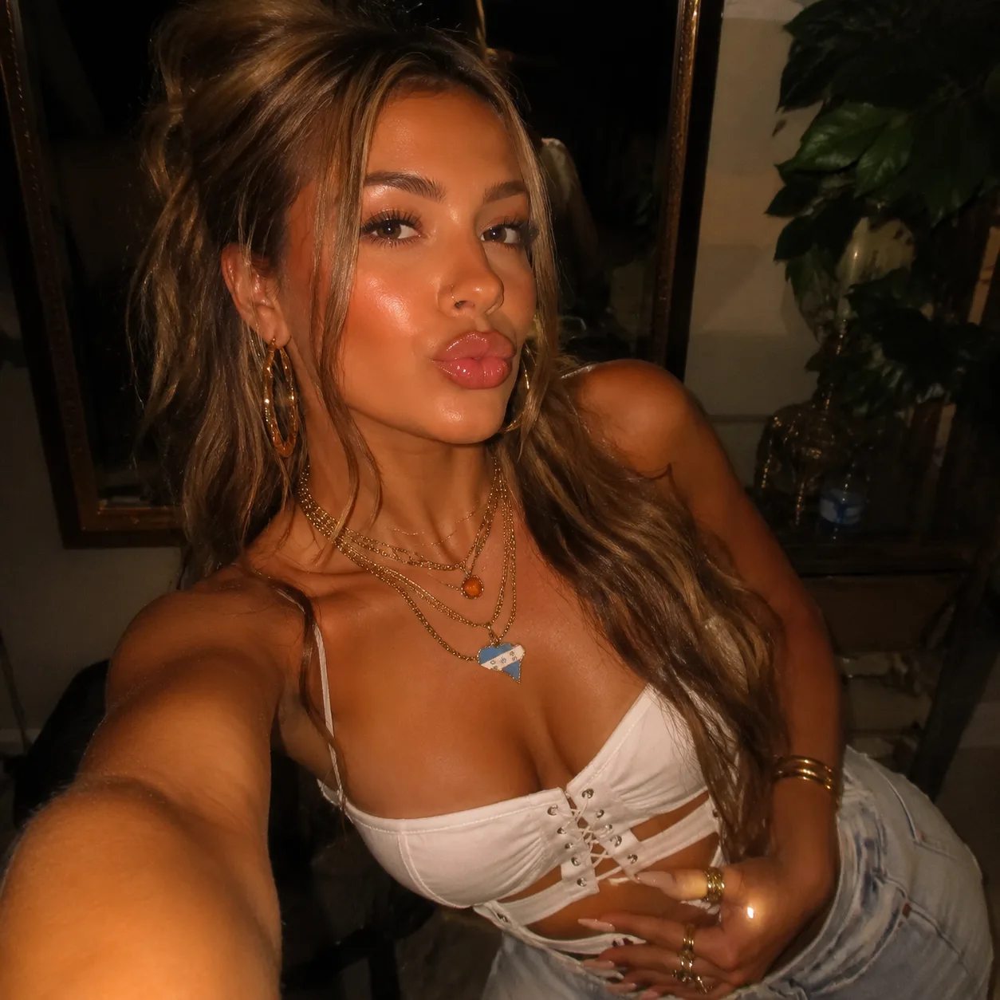

**#171 · Ai Art, Ai Prompt · <code>Vinano Studio</code>**

> Keywords: AI art, AI prompt, text to image

<details>
<summary>Show prompt</summary>

```
Use the uploaded photo as inspiration for the woman’s appearance; do not change my physical features.

Her dark blonde hair is long, wavy, and voluminous, styled in an extra messy half-up hairstyle loose strands framing her cheeks, adding depth and realism.

She is wearing four layered chunky gold necklaces: one a small carnelian crystal pendant, one shaped like the map of Honduras the flag inside. She also wears extremely large gold hoop earrings, three gold bangles, and chunky gold rings on every finger. Her nails are long, almond-shaped, and neutral-toned. Her nose piercing is visible.

A young woman is taking a selfie from a slightly elevated angle. Her head is slightly tilted to one side, her lips pursed into a thin pout as if blowing a kiss. She looks directly at the camera a confident and sensual expression. Her eyes are emphasized long, natural lashes and perfectly defined eyebrows.

She has flawless, sun-kissed skin a soft blush on her cheeks, nose, and forehead. Her lips are full and glossy, painted in warm nude tones. Clean contouring and subtle texture.

She has very long, sleek, dark black straight hair, styled elegantly two strands framing her face.

She is wearing a white corset-style top straps crossing along the rib area, and light shabby jeans that are only partially visible. Her neck is adorned a thin gold chain, and her ears are decorated small gold hoop earrings.

The background is dark and softly blurred, featuring a large mirror in the back that does not distract from the face. Green plants are visible.

Lighting: A warm, soft flash light that enhances the glow of the skin and creates a typical early-2000s shine.

Effects: Soft skin glow, slightly saturated colors, a fine glossy effect on the lips and skin, warm golden highlights, and a shallow depth of field (bokeh).

Photography style: Y2K glamour, retro nighttime look, luxurious, sensual, and impeccably digitally edited, inspired by celebrity selfies.

Emphasise material texture and natural light so the final frame feels tactile and premium.
```

</details>

---

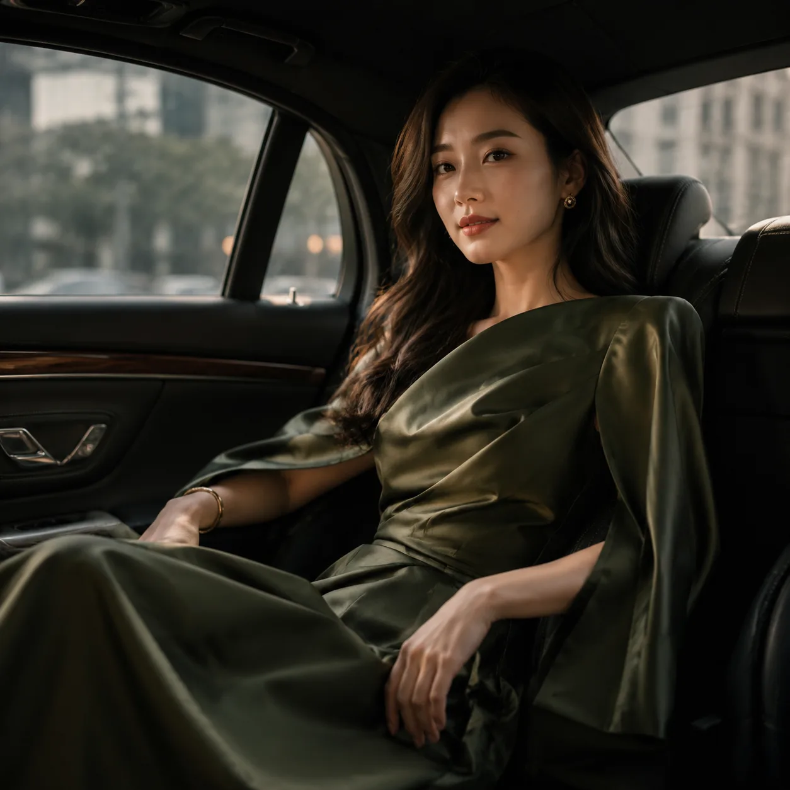

**#172 · Portrait, Cinematic · <code>Vinano Studio</code>**

> Keywords: portrait, cinematic, AI art, AI prompt, text to image

<details>
<summary>Show prompt</summary>

```
{
  "render_goal": "Narrative cinematic fashion portrait",
  "subject": {
    "pose": "female seated in the back seat, relaxed posture",
    "expression": "quiet confident smile"
  },
  "wardrobe": "structured silk gown in deep olive",
  "environment": {
    "location": "luxury car interior",
    "props": "window light, city blur outside"
  }
}

Render with rich micro-detail while keeping the layout uncluttered and intentional.
```

</details>

---

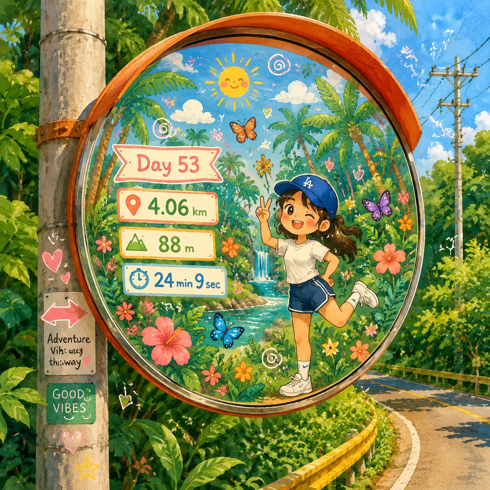

**#173 · Character, Infographic · <code>Vinano Studio</code>**

> Keywords: character, infographic, AI art, AI prompt, text to image

<details>
<summary>Show prompt</summary>

```
Transform the uploaded photo into a whimsical hand-painted storybook illustration. Keep the exact pose, perspective, convex traffic mirror reflection, road, utility pole, and surrounding tropical greenery. Reimagine the mirror reflection as a vibrant illustrated world lush jungle plants, palm trees, flowers, butterflies, doodle hearts, stars, swirls, smiling sun, fluffy clouds, and colorful hand-drawn decorations. The person is transformed into a cute cartoon character wearing a white t-shirt, navy shorts, white socks, and a blue cap, posing playfully one leg raised and a peace sign. Integrate fitness-tracker statistics inside the mirror in a charming infographic style: “Day 53”, “4.06 km”, “88 m”, “24 min 9 sec”. Bright pastel colors, textured gouache paint, children's book aesthetic, whimsical doodles, clean outlines, cozy and cheerful mood, highly detailed foliage, playful travel journal style, Strava-inspired adventure artwork, vibrant greens, oranges, blues, and pinks, ultra-detailed illustration, masterpiece, kawaii aesthetic, editorial quality, vertical composition, 4k. Render with rich micro-detail while keeping the layout uncluttered and intentional.
```

</details>

---

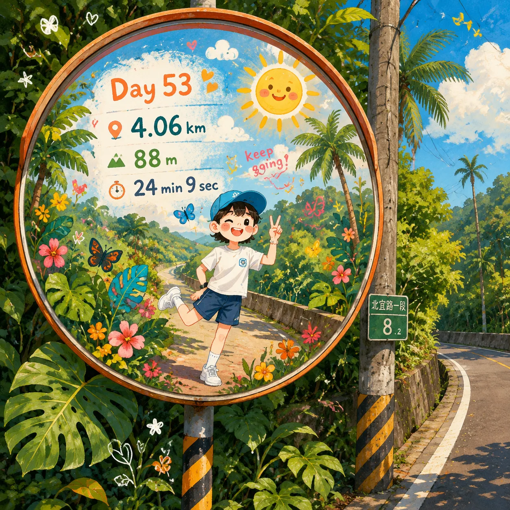

**#174 · Character, Infographic · <code>Vinano Studio</code>**

> Keywords: character, infographic, AI art, AI prompt, text to image

<details>
<summary>Show prompt</summary>

```
Transform the uploaded photo into a whimsical hand-painted storybook illustration. Keep the exact pose, perspective, convex traffic mirror reflection, road, utility pole, and surrounding tropical greenery. Reimagine the mirror reflection as a vibrant illustrated world lush jungle plants, palm trees, flowers, butterflies, doodle hearts, stars, swirls, smiling sun, fluffy clouds, and colorful hand-drawn decorations. The person is transformed into a cute cartoon character wearing a white t-shirt, navy shorts, white socks, and a blue cap, posing playfully one leg raised and a peace sign. Integrate fitness-tracker statistics inside the mirror in a charming infographic style: “Day 53”, “4.06 km”, “88 m”, “24 min 9 sec”. Bright pastel colors, textured gouache paint, children's book aesthetic, whimsical doodles, clean outlines, cozy and cheerful mood, highly detailed foliage, playful travel journal style, Strava-inspired adventure artwork, vibrant greens, oranges, blues, and pinks, ultra-detailed illustration, masterpiece, kawaii aesthetic, editorial quality, vertical composition, 4k. Render with rich micro-detail while keeping the layout uncluttered and intentional.
```

</details>

---

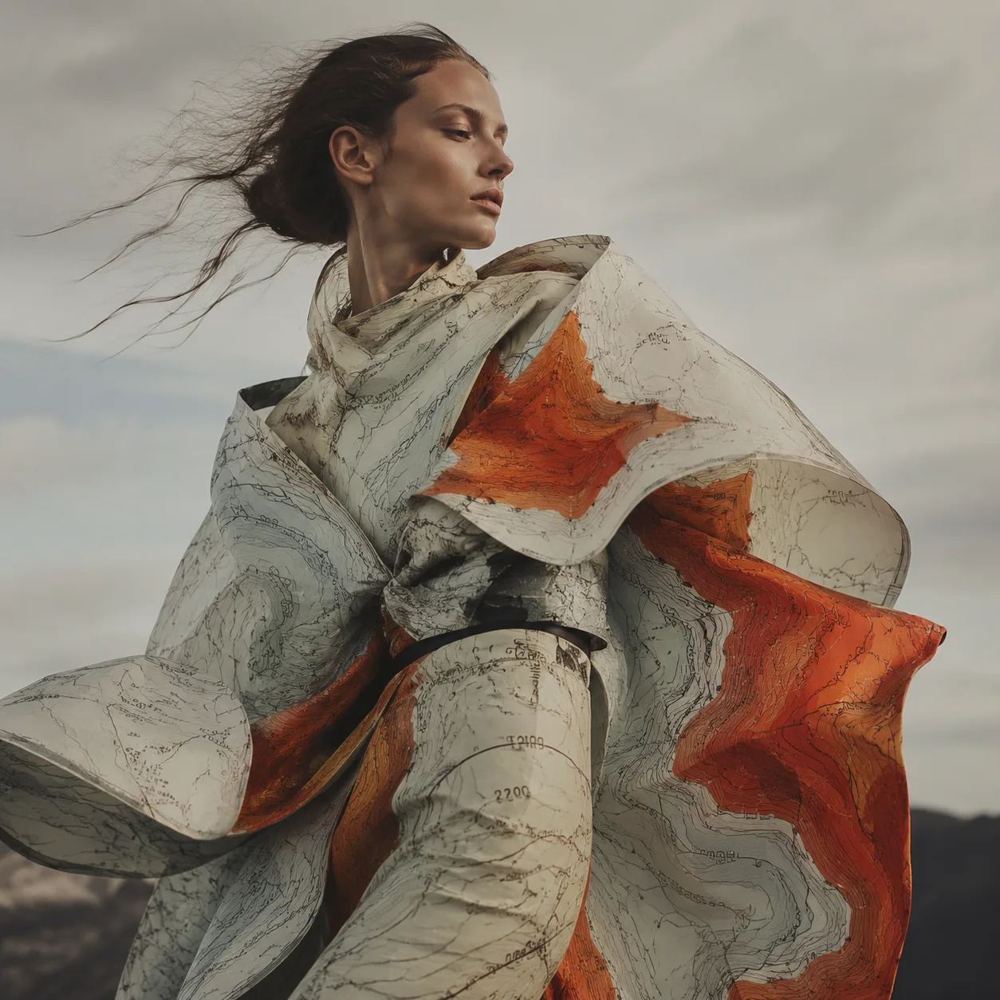

**#175 · Portrait, Cinematic · <code>Vinano Studio</code>**

> Keywords: portrait, cinematic, AI art, AI prompt, text to image

<details>
<summary>Show prompt</summary>

```
A high-fashion editorial portrait of a [Subject] wearing avant-garde garments crafted from flowing topographic maps. Fabric layered contour lines, elevation markings, and cartographic patterns, featuring muted [Color One] and bold [Color Two] contrasts. Wind-blown movement, elegant silhouette, soft focus, cinematic fashion photography, Vogue meets GIS aesthetic, sophisticated and conceptual. Preserve realistic proportions and depth for a confident, professional finish.
```

</details>

---

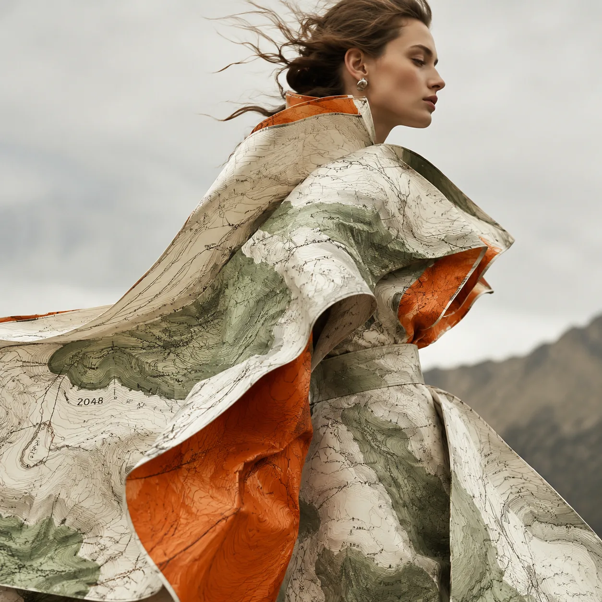

**#176 · Portrait, Cinematic · <code>Vinano Studio</code>**

> Keywords: portrait, cinematic, AI art, AI prompt, text to image

<details>
<summary>Show prompt</summary>

```
A high-fashion editorial portrait of a [Subject] wearing avant-garde garments crafted from flowing topographic maps. Fabric layered contour lines, elevation markings, and cartographic patterns, featuring muted [Color One] and bold [Color Two] contrasts. Wind-blown movement, elegant silhouette, soft focus, cinematic fashion photography, Vogue meets GIS aesthetic, sophisticated and conceptual. Emphasise material texture and natural light so the final frame feels tactile and premium.
```

</details>

---
