# UI & Graphic — full gallery

[← Back to README](../README.md) · [`prompts.json`](../prompts/prompts.json) · **176** prompts · page 1 / 2

**1** · [2](./ui-graphic-2.md) — [Next →](./ui-graphic-2.md)

---


**#1 · UI &amp; Graphic Prompt · <code>Vinano Studio</code>**

<details>
<summary>Show prompt</summary>

```
High-resolution Japanese commercial advertisement style photo, three young women posing against a clean white background bold geometric color blocks (blue, pink, yellow, green) arranged diagonally.
Top right: woman short brown hair wearing a red and black plaid shirt and black choker, winking and making an “OK” hand gesture over one eye.

Left: woman in a light blue police uniform cap, making an “OK” gesture near her eye a playful expression.

Bottom right: woman dressed as a nurse in a white outfit and cap, making a peace (V) sign a cute expression.
Bright studio lighting, soft shadows, vibrant colors, sharp focus, clean commercial composition, modern Japanese advertising aesthetic, playful and energetic mood, ultra-detailed, crisp skin tones.
No text, no logos, no typography anywhere in the image.

Render with rich micro-detail while keeping the layout uncluttered and intentional.
```

</details>

---


**#2 · UI &amp; Graphic Prompt · <code>Vinano Studio</code>**

<details>
<summary>Show prompt</summary>

```
{
 "objective": "Create a premium split composition showing a detailed automotive blueprint (top) and a perfectly matching real-world car material breakdown (bottom), a carefully designed high-end background",
 "aspect_ratio": "3:4",
 "composition": {
 "layout": "vertical_split",
 "split_ratio": "50:50",
 "alignment": "precise, centered",
 "continuity_rule": "bottom car must EXACTLY match blueprint geometry, proportions, and design"
 },

 "top_section": {
 "type": "engineering_blueprint",
 "style": "ultra-detailed CAD drawing",
 "background": {
 "color": "#0b1d2a",
 "texture": "subtle grid lines",
 "vignette": "very slight edge darkening"
 },
 "linework": {
 "color": "white faint cyan glow",
 "thickness_variation": "technical precision",
 "sharpness": "very crisp"
 },
 "views": {
 "top_view": "dominant center",
 "side_view": "bottom left",
 "front_view": "bottom right"
 },
 "technical_elements": {
 "dimension_lines": true,
 "units": "mm",
 "arrows": "thin CAD arrows",
 "labels": ["ENGINE BLOCK",
 "PISTONS",
 "TRANSMISSION",
 "DRIVE SHAFT",
 "SUSPENSION",
 "CHASSIS",
 "WIRING LAYOUT"],
 "exploded_diagram": {
 "position": "top right",
 "components": ["engine block",
 "crankshaft",
 "pistons",
 "radiator",
 "drive shaft",
 "shock absorbers"],
 "connection_lines": "dashed white"
 }
 },
 "detail_level": "engineering-grade, extremely dense"
 },

 "bottom_section": {
 "type": "real_product + material_breakdown",
 "layout": "car_left_material_panel_right",

 "environment": {
 "type": "luxury architectural setting",
 "design_intent": "background must feel intentional, premium, and editorial — not random",

 "scene": {
 "location": "modern refined minimalist luxury house exterior",
 "architecture": ["clean concrete walls",
 "large floor-to-ceiling glass panels",
 "subtle wood accents",
 "sharp geometric lines"],
 "ground": "smooth concrete driveway slight reflection",
 "background_elements": ["minimal landscaping (bonsai-style trees or trimmed bushes)",
 "no clutter",
 "balanced negative space"]
 },

 "lighting": {
 "time": "golden hour (soft warm sunlight)",
 "direction": "side lighting to enhance car shape",
 "shadows": "soft and elongated",
 "reflections": "physically accurate on car paint"
 },

 "depth": {
 "depth_of_field": "moderate",
 "background_blur": "slight cinematic blur",
 "focus_priority": "car remains razor sharp"
 }
 },

 "car_render": {
 "style": "true-to-life photorealistic automotive photography",
 "camera": {
 "angle": "3/4 front angle",
 "height": "slightly low for hero perspective",
 "lens": "35mm",
 "framing": "car occupies left 60% of bottom section"
 },
 "constraints": ["exact match to blueprint",
 "no added design features",
 "realistic proportions only"]
 },

 "material_panel": {
 "position": "right side",
 "style": "Apple-style product breakdown",
 "background": "soft off-white panel subtle shadow separation",
 "layout": "vertical stack spacing",

 "items": [{
 "title": "Seat Material",
 "visual": "macro close-up of seat texture",
 "material": "premium leather or fabric",
 "lighting": "soft diffused",
 "annotation": "thin line pointing to interior seat"
 },
 {
 "title": "Body Material",
 "visual": "close-up of painted metal reflections",
 "material": "coated aluminum / steel",
 "annotation": "points to car exterior panel"
 },
 {
 "title": "LED Headlights",
 "visual": "detailed glowing LED headlight close-up",
 "material": "modern LED system",
 "annotation": "points to front headlight"
 }],

 "typography": {
 "font": "modern sans-serif",
 "style": "clean, minimal",
 "hierarchy": "clear titles + small labels"
 }
 }
 },

 "style": {
 "fusion": ["engineering blueprint",
 "luxury automotive ad",
 "product design presentation"],
 "quality": "ultra high-end",
 "finish": "polished, editorial-grade"
 },

 "negative_constraints": ["no mismatch between blueprint and car",
 "no messy or cluttered background",
 "no unrealistic reflections",
 "no over-saturated colors",
 "no random environments",
 "no extra parts not in blueprint"],

 "render_settings": {
 "sharpness": "high",
 "dynamic_range": "wide",
 "color_grading": "natural cinematic",
 "noise": "minimal"
 }
}

Maintain consistent colour harmony and crisp focus across the whole frame.
```

</details>

---


**#3 · UI &amp; Graphic Prompt · <code>Vinano Studio</code>**

<details>
<summary>Show prompt</summary>

```
Pergola Blueprint Prompt: Hand-drawn architectural pencil sketch of a wooden garden pergola on white paper. Front and slight side elevation view clear proportions.

Construction lines, dimensions and handwritten notes visible. Wooden posts and cross beams precisely drafted. Professional but hand-sketched technical style. Clean white background.

Finished Pergola: Fully built wooden pergola in a real garden, matching the exact structure and proportions from the sketch. Viewed from a low front corner perspective at eye level, showing depth and the full beam structure instead of a flat elevation. Natural wood texture realistic joints and connections. Installed on grass surrounding plants. Soft daylight grounded shadows. true-to-life photorealistic architectural visualization.

Render with rich micro-detail while keeping the layout uncluttered and intentional.
```

</details>

---


**#4 · UI &amp; Graphic Prompt · <code>Vinano Studio</code>**

<details>
<summary>Show prompt</summary>

```
{
 "generation_request": {
 "meta_data": {
 "tool": "",
 "task_type": "luxury_fashion_moodboard_editorial",
 "language": "en",
 "priority": "highest",
 "version": "v2.5_DAY1_YELLOW_HALTER_SATIN_MINIMAL_ITEMS_GOLD_TEXT"
 },
 "input": {
 "mode": "image_to_image",
 "reference_image_usage": "high",
 "notes": "Use the uploaded reference only as a layout and visual styling guide. Create a clean, elegant luxury fashion moodboard the editorial feeling: soft ivory background, large refined 'DAY 1' title at the top, one pinned seaside restaurant photo, one hero yellow satin halter-neck evening dress an open back, and only a minimal number of supporting elements. Show only one pair of pearl-white heels, only one matching luxury evening bag, only one jewelry item, and only one sea-inspired martini cocktail. Do not include extra accessories, extra bags, extra shoes, or extra jewelry. The composition must feel minimal, expensive, balanced, and professionally art directed, strong hierarchy and generous negative space. The dress should be the main focal point, a sleek modern silhouette, fluid satin drape, and premium fashion-house finish. The seaside restaurant photo should show an upscale evening dinner setup directly on the sand, candlelight and romantic luxury atmosphere. The cocktail should be one elegant sea-inspired martini ocean-blue or sea-glass tones. Add one short motivational quote near the bottom in a refined handwritten or script style. All visible typography, including the 'DAY 1' title and the quote, should be rendered in elegant metallic gold tones a luxurious editorial finish."
 },
 "output_settings": {
 "aspect_ratio": "4:5",
 "orientation": "portrait",
 "resolution_target": "ultra_high_res",
 "num_images": 1,
 "render_style": "luxury_editorial_collage_realism",
 "sharpness": "ultra_crisp",
 "grain": "subtle_print_texture",
 "dynamic_range": "soft_high_end",
 "color_grade": "sunset_gold_pearl_coastal_luxury"
 },
 "layout": {
 "background": "soft warm ivory or premium matte neutral tone",
 "composition": "large DAY 1 title at the top, one pinned seaside photo, one central hero dress, one pair of shoes, one bag, one jewelry item, one cocktail, one short quote",
 "design_feel": "minimal luxury editorial board balanced spacing and no clutter"
 },
 "fashion_story": {
 "hero_dress": "yellow satin halter-neck backless evening dress, sleek modern silhouette, elegant drape, luxurious reflections",
 "shoes": "one pair of pearl-white heels delicate pearl-thread detailing",
 "bag": "one small luxury evening bag in pearl white, ivory, champagne, or soft gold tone",
 "jewelry": "one elegant pearl bracelet or one refined pearl jewelry piece only"
 },
 "lifestyle_element": {
 "date_setting": "luxury beachside evening restaurant directly on the sand, candlelight, elegant table setting, romantic atmosphere",
 "cocktail": "one sea-inspired martini ocean-toned blue-green color and premium garnish"
 },
 "text_element": {
 "title": "DAY 1",
 "title_style": "large elegant editorial serif in metallic gold",
 "quote_examples": ["Softness can still make an entrance.",
 "Choose the night that feels like you.",
 "Elegance is how you arrive."],
 "quote_style": "one short refined handwritten or script quote in metallic gold",
 "instruction": "use only one short quote"
 },
 "must_have": ["reference-inspired clean luxury layout",
 "large DAY 1 title in gold",
 "yellow satin halter-neck backless dress",
 "one pair of pearl-white heels",
 "one matching luxury bag",
 "one jewelry item only",
 "one sea-inspired martini",
 "one seaside dinner photo",
 "one short motivational quote in gold",
 "minimal elegant composition"],
 "negative_prompt": ["extra bag",
 "extra shoes",
 "extra jewelry",
 "extra accessories",
 "too many objects",
 "messy collage",
 "cheap styling",
 "too much text",
 "wrong dress color",
 "flat uninspired layout",
 "cartoon",
 "low detail",
 "logo",
 "watermark"]
 }
}
Prompt(right):
{
 "generation_request": {
 "meta_data": {
 "tool": "",
 "task_type": "reference_locked_fashion_editorial_scene",
 "language": "en",
 "priority": "highest",
 "version": "v1.1_REFERENCE_WOMAN_IN_DAY1_LOOK_MORE_NATURAL"
 },
 "references": {
 "reference_image_style": {
 "source": "UPLOAD_MOODBOARD_IMAGE",
 "purpose": "OUTFIT_ACCESSORIES_STYLING_SCENE_GUIDE",
 "strict_lock": false,
 "preserve_palette": true,
 "preserve_vibe": true,
 "preserve_outfit_details": true,
 "preserve_accessories": true,
 "preserve_scene_direction": true,
 "affect_face": false
 },
 "reference_image_face": {
 "source": "UPLOAD_WOMAN_REFERENCE_IMAGE",
 "purpose": "FACE_IDENTITY_LOCK",
 "strict_lock": true,
 "face_similarity_priority": "MAX",
 "identity_lock_strength": 0.97,
 "no_identity_blending": true,
 "no_age_shift": true,
 "preserve_skin_texture": true
 }
 },
 "input": {
 "mode": "image_to_image",
 "notes": "Use the uploaded woman reference as the identity base. Dress her in a look closely matching the moodboard: yellow satin halter-neck backless evening dress, pearl-white heels, matching luxury evening bag, and minimal pearl jewelry. Do not make the woman look overly perfect, mannequin-like, or artificial. She must feel like a real elegant woman photographed during a luxury seaside dinner, not a fashion doll. Keep natural skin texture, subtle facial asymmetry, believable posture, relaxed shoulders, real body weight, and candid human presence. Show her seated at a luxury beachside restaurant directly on the sand during evening golden hour into night, naturally holding or reaching for a sea-inspired martini cocktail. The dress, shoes, bag, and jewelry should remain clearly visible and strongly matched to the moodboard, but the overall image should feel lived-in, cinematic, and natural rather than overly staged."
 },
 "output_settings": {
 "aspect_ratio": "4:5",
 "orientation": "portrait",
 "resolution_target": "ultra_high_res",
 "num_images": 1,
 "render_style": "natural_luxury_realism",
 "sharpness": "clean_natural",
 "grain": "subtle_film",
 "dynamic_range": "soft_high_end",
 "color_grade": "sunset_gold_pearl_coastal_natural"
 },
 "scene": {
 "environment": "luxury beachside restaurant directly on the sand at evening golden hour fading into night",
 "details": "candlelit table, elegant place setting, warm ambient lights, sea view, refined romantic atmosphere",
 "pose": "woman seated naturally, slightly turned, relaxed and elegant, interacting casually the cocktail, not stiff, not overly posed",
 "mood": "romantic, upscale, warm, feminine, cinematic, believable"
 },
 "subject": {
 "identity": "uploaded woman reference strong but natural resemblance",
 "outfit": "yellow satin halter-neck backless evening dress closely matching the moodboard",
 "shoes": "pearl-white heels clearly visible",
 "bag": "matching evening bag clearly visible",
 "jewelry": "minimal pearl jewelry",
 "beauty": "natural luxury beauty, realistic skin texture, soft evening glam, human and believable"
 },
 "camera": {
 "framing": "three-quarter seated fashion portrait wide enough to show shoes, bag, and dress shape",
 "angle": "natural editorial angle, slightly observational rather than overly staged",
 "focus": "sharp on face, dress texture, shoes, bag, cocktail, and table details",
 "depth_of_field": "soft cinematic background separation"
 },
 "lighting": {
 "type": "natural luxury evening lighting",
 "quality": "warm sunset and candlelit ambience soft fill, realistic facial shadows, elegant satin highlights, no overexposure",
 "skin_rendering": "realistic skin texture, no plastic effect, no beauty filter look"
 },
 "must_have": ["realistic human presence",
 "natural face",
 "no mannequin look",
 "strong resemblance to uploaded woman",
 "yellow satin halter dress",
 "visible pearl-white heels",
 "visible matching bag",
 "minimal pearl jewelry",
 "luxury seaside date setting",
 "sea-inspired martini",
 "photoreal quality"],
 "negative_prompt": ["mannequin look",
 "fashion doll look",
 "plastic skin",
 "over-smoothed face",
 "beauty filter",
 "stiff pose",
 "unnatural symmetry",
 "different outfit",
 "different shoes",
 "different bag",
 "identity mismatch",
 "blurry face",
 "bad anatomy",
 "extra fingers",
 "deformed hands",
 "cartoon",
 "logo",
 "watermark",
 "text"]
 }
}

Maintain consistent colour harmony and crisp focus across the whole frame.
```

</details>

---


**#5 · UI &amp; Graphic Prompt · <code>Vinano Studio</code>**

<details>
<summary>Show prompt</summary>

```
A flat-lay collection of exactly 9 hyper-realistic 3D resin fridge magnets arranged on a bright pure white surface in a clean 3x3 grid, themed around [BRAND]. At the very top center, a wide rectangular text magnet spells "BRAND" in bold 3D block letters in the brand's signature colors. Below it, 9 magnets in a clean 3x3 grid: the official logo badge, the most iconic hero product, a secondary iconic product, a third iconic product or packaging, a brand mascot or character chibi, a fifth iconic item, a sixth iconic item, a seventh iconic item, and the brand's storefront or headquarters building facade. Each magnet is small, neatly spaced generous white space between them, slightly raised a soft drop shadow beneath. Bright white background, warm studio lighting from above, true-to-life photorealistic product render, top-down flat-lay angle, 4:5 aspect ratio Aim for an editorial, design-driven look with deliberate negative space.
```

</details>

---


**#6 · UI &amp; Graphic Prompt · <code>Vinano Studio</code>**

<details>
<summary>Show prompt</summary>

```
An extreme close-up, high-fashion editorial portrait focusing on the right side of a person's face. The composition is a tight crop showing the bridge of the nose, a portion of the lips, and a single eye peering through sunglasses. The shot is characterized by a heavy, cinematic film grain and a warm, sophisticated studio atmosphere.
Eyewear: Large-frame, wrap-around sunglasses made of high-gloss dark tortoiseshell acetate (mottled black and deep mahogany). The lenses are a vibrant, translucent amber-orange, allowing the eye and eyelashes behind the lens to remain visible but color-tinted.
Person: A person smooth skin showing natural texture and fine pores. The lighting is soft-side lighting from the right, creating a gentle shadow on the left side of the nose and a subtle highlight on the cheekbone and lower lip.
Typography: Bold, white, geometric sans-serif text reading "Bold Impact" is overlaid on the lower-right cheek. Three smaller, delicate labels are scattered: "Deep Tones" (top right), "Sharp Detail" (on the left lens), and "Strong Style" (bottom right).
Color Palette: A rich mix of skin tones (#E8A88A), burnt orange (#B8541C), and deep espresso (#1A0D0B), contrasted crisp white text (#FFFFFF).
Lighting: Warm studio lighting a soft-focus depth of field. The background consists of out-of-focus hair and skin, keeping all attention on the eye and the texture of the acetate frames.
Atmosphere: Premium, editorial fashion magazine aesthetic; high-contrast but soft transitions.

Emphasise material texture and natural light so the final frame feels tactile and premium.
```

</details>

---


**#7 · UI &amp; Graphic Prompt · <code>Vinano Studio</code>**

<details>
<summary>Show prompt</summary>

```
[BRAND NAME]
({INDUSTRY}).

Act as a Lead Brand Designer creating a comprehensive "Brand Identity System" presentation (Bento-Grid Layout).

**THE TASK:**
Generate a single, high-resolution bento-grid board containing **6 distinct modules** that define the visual identity for [BRAND NAME].

---

**PHASE 1: VISUAL STRATEGY (AUTONOMOUS)**
1. **Analyze the Brand:** Determine the archetype and visual vibe.
2. **Define the Palette:** Select 4 distinct colors.
3. **Select Typography:** Choose ONE specific Google Font (Serif, Sans-Serif, or Display) relevant to the industry.

**PHASE 2: THE LAYOUT (6-MODULE GRID)**
The image must be a clean, gap-separated grid featuring these specific blocks:

* **Block 1 (The Hero):** A high-end **Key Visual** photography showing the product/service in context. filmic, cinematic lighting, true-to-life photorealistic. Overlay the brand logo in white.
* **Block 2 (Social Media):** A mockup of an **Instagram Post**. It features a bold headline the brand font and a lifestyle image.
* **Block 3 (The Palette & HEX):** A clean design block displaying **4 Vertical Color Swatches**.
 * *Crucial Detail:* Inside or below each color swatch, simulate distinct text looking like **HEX Codes** (e.g., "#1A2B3C").
* **Block 4 (Typography Spec):** A refined minimalist block dedicated to the **Brand Font**.
 * *CRITICAL CONSTRAINT:* Do NOT show the alphabet (Aa Bb Cc).
 * *The Content:* The block must display ONLY the **Name of the Font** (e.g., "Montserrat", "Lato", "Oswald") written in large, crisp characters that specific font style. This acts as the visual specimen.
 * *Subtext:* Tiny text at the bottom reading "Primary Typeface".
* **Block 5 (The Logo):** A solid background block featuring the **Final Logo** (clean, vector style, NO construction lines/grids). refined minimalist and iconic.
* **Block 6 (Brand DNA):** A text-heavy "Manifesto Card". It simulates a layout three short paragraphs titled:
 * **ARCHETYPE:** (e.g., "The Innovator")
 * **VOICE:** (e.g., "Confident, Direct")
 * **VISUALS:** (e.g., "Cinematic, High-Contrast")

**PHASE 3: AESTHETIC & FINISH**
* **Style:** Behance Trend / Awwwards Winner.
* **Quality:** 8k resolution, razor-sharp vector graphics mixed high-end photography.
* **Lighting:** Soft studio lighting across the whole grid to make it look like a cohesive presentation board.

Emphasise material texture and natural light so the final frame feels tactile and premium.
```

</details>

---


**#8 · UI &amp; Graphic Prompt · <code>Vinano Studio</code>**

<details>
<summary>Show prompt</summary>

```
Create a soap foam sculpture in the exact shape of the uploaded logo, made entirely of white soap bubbles and foam realistic bubble textures. Place it on wet bathroom tiles in the brand’s signature color (match the color from the uploaded logo). Top-down view, centered composition. The tiles should be glossy and wet water droplets scattered across the surface. Add smaller foam bubbles and soap suds around the main logo shape. Grout lines visible between tiles. Additional small foam shapes in corners. Product photography style, clean and vibrant lighting. Aim for an editorial, design-driven look with deliberate negative space.
```

</details>

---


**#9 · UI &amp; Graphic Prompt · <code>Vinano Studio</code>**

<details>
<summary>Show prompt</summary>

```
[BRAND NAME]. Act as a Senior AI Visual Strategist & Creative Director.
Goal: Generate a high-motion triptych editorial where every visual element (color, text, props) is a direct semantic derivative of the brand name.
PHASE 1: SEMANTIC BRAND ANALYSIS (AUTONOMOUS)
[INSTRUCTIONS FOR]:
Core Identity: Analyze "[BRAND NAME]". Define its industry, soul, and "vibe" (e.g., Kinetic, Organic, Brutalist, Ethereal).
Color Psychology: Select a triadic palette based on brand associations:
 - BACKGROUND: The "Mood" color (e.g., Deep Forest for 'GAIA', Neon Amber for 'FUSE').
 - ACCENTS/TYPOGRAPHY: The "Energy" color. Must have high contrast/readability against the background.
 - APPAREL: The "Statement" color. Completes the brand's visual signature.
Copywriting: Generate 2-3 short, punchy slogans or keywords that resonate the brand's mission to be used as background micro-text.
PHASE 2: COMPOSITION (THE DYNAMIC TRIPTYCH)
Layout: A single horizontal image split into three vertical editorial panels.
- PANEL 1 (The Portrait): Extreme close-up. Bold [BRAND NAME] wordmark inside a geometric frame (circle or rectangle) overlapping the model's face or neck.
- PANEL 2 (The Elevate): Medium shot. A model (gender determined by brand target audience) holds a primary brand-representative object above their head in a triumphant or symbolic gesture.
- PANEL 3 (The Kinetic): Full-body shot. High-speed motion blur or an aggressive "power pose" interacting the brand's core element.
PHASE 3: GRAPHIC OVERLAYS & TEXTURES
- Main Typography: Large, slanted (italic) heavy sans-serif in [ACCENT COLOR].
- Dynamic Ribbons: Vertical yellow or contrast tapes crossing the panels repeating text: "[BRAND NAME] // [ASSOCIATED KEYWORD] // [BRAND NAME]".
- Micro-Copy: Scattered small text in corners like "DESIGNED FOR [TARGET AUDIENCE]" or "EST. 2026 // GLOBAL IDENTITY".
PHASE 4: LIGHTING & ESTHETIC STANDARDS
- High-End Editorial (Vogue/Hypebeast style).
- Global Illumination crisp, sharp edges.
- Realistic skin textures (pores, subtle sweat/shine) and high-fidelity fabric weaves.
- No "AI-plastic" artifacts.
PHASE 5: TECH SPECS
8K Resolution. Render: Octane. Subtle film grain. Ray-traced reflections on eyes and surfaces.

Preserve realistic proportions and depth for a confident, professional finish.
```

</details>

---


**#10 · UI &amp; Graphic Prompt · <code>Vinano Studio</code>**

<details>
<summary>Show prompt</summary>

```
Create a typographic illustration shaped like a [OBJECT], where the text [BRAND SLOGAN] forms the shape — bold and playful lettering style that fills the entire silhouette — letters adapt fluidly to the curves and contours of the [OBJECT] — [COLOR 1, COLOR 2] [BACKGROUND COLOR] background that enhances the focus on the main shape — include [BRAND] logo positioned below the [OBJECT] — vector-style, clean, high resolution, 1080x1080 pixels, square format. Emphasise material texture and natural light so the final frame feels tactile and premium.
```

</details>

---


**#11 · UI &amp; Graphic Prompt · <code>Vinano Studio</code>**

<details>
<summary>Show prompt</summary>

```
[PERSONE]. Act as a Senior Editorial Designer and Graphic Artist.
Goal: Generate a complex, multi-layered Swiss-style collage poster for [PERSONE].
PHASE 1: SEMANTIC INTELLIGENCE (AUTONOMOUS)
[INSTRUCTIONS]:
Analyze "[PERSONE]". Determine their primary field (e.g., Elite Sports, Cyber-Engineering, Cinema, History).
Select an "Iconic Accent Color" based on their identity (e.g., Racing Orange for a driver, Neon Cyan for a hacker, Crimson for a hero).
Generate 3 key statistics or milestones (e.g., "7 TITLES", "98% ACCURACY") and a short professional title.
PHASE 2: COMPOSITIONAL STRUCTURE (THE GRID)
The image is a single vertical composition overlapping geometric frames and segments:
- MAIN SUBJECT (Top Left): A large, high-grain grayscale or color portrait of [PERSONE], smiling or looking confident.
- DETAIL SHOT (Center Right): A zoomed-in, cropped rectangle showing only the eyes or a specific detail of [PERSONE].
- FULL BODY SHOT (Bottom Center): [PERSONE] sitting on a geometric box or podium in a relaxed but powerful pose.
- BACKGROUND: Light gray a heavy, tactile film grain/noise texture.
PHASE 3: GRAPHIC ELEMENTS & TYPOGRAPHY
- Initials: Large, outlined capital letters of the first and last name placed in opposite corners.
- Vertical Ribbon: A solid color strip the text "WORLD CHAMPIONSHIP LEADER" or a relevant title running vertically through the center.
- Data Blocks:
 - A specific number (ID or rank) in a bold sans-serif block.
 - A "Statistics" block in the bottom-left corner 3 lines of text (e.g., "TWO POLES / FOUR WINS / FIVE PODIUMS").
- Accents: Scatter orange and black squares, dotted circles, and small asterisks throughout the grid for visual complexity.
PHASE 4: LIGHTING & TEXTURE
- Texture: High-contrast, gritty, and grainy. The overall image should look like a printed high-end magazine or a vintage poster.
- Lighting: Professional studio lighting on the subjects, but processed a "risograph" or "halftone" feel.
PHASE 5: TECH SPECS
8K Resolution. Swiss Modernism aesthetic. Flat vector shapes combined hyper-realistic photography.

Aim for an editorial, design-driven look with deliberate negative space.
```

</details>

---


**#12 · UI &amp; Graphic Prompt · <code>Vinano Studio</code>**

<details>
<summary>Show prompt</summary>

```
product design, [object], cross-section cutaway view, internal anatomy revealed,
white background, museum specimen aesthetic, scientific illustration style

Emphasise material texture and natural light so the final frame feels tactile and premium.
```

</details>

---


**#13 · UI &amp; Graphic Prompt · <code>Vinano Studio</code>**

<details>
<summary>Show prompt</summary>

```
Create an infographic image of [OBJECT], combining a realistic photograph or true-to-life photorealistic render of the object technical annotation overlays placed directly on top. Use black ink–style line drawings and text (technical pen / architectural sketch look) on a pure white studio background. Include: •Key component labels •Internal cutaway or exploded-view outlines (where relevant) •Measurements, dimensions, and scale markers •Material callouts and quantities Preserve realistic proportions and depth for a confident, professional finish.
```

</details>

---


**#14 · UI &amp; Graphic Prompt · <code>Vinano Studio</code>**

<details>
<summary>Show prompt</summary>

```
Create a whimsical, playful illustration featuring [CHARACTER / SUBJECT] as the central focus.
The character is drawn simplified features, a small rounded head, and minimal facial detail, wearing [HEADWEAR / CLOTHING DESCRIPTION].

They are positioned among oversized abstract shapes and organic elements such as [FLORAL / SYMBOLIC OBJECTS], creating a sense of imaginative scale. The character is interacting [OBJECT / ACTION], adding narrative interest.

Decorative graphic elements like [SYMBOLS: exclamation points, speech bubbles, scribbles, notes, etc.] float around the subject to enhance expression and energy.

Use clean, simple linework and a limited color palette of [PRIMARY COLORS], keeping the illustration bold and cohesive. The background is a soft neutral tone such as beige or off-white. The overall style is modern, flat, and illustrative, a lively, creative, and slightly abstract atmosphere.

Preserve realistic proportions and depth for a confident, professional finish.
```

</details>

---


**#15 · UI &amp; Graphic Prompt · <code>Vinano Studio</code>**

<details>
<summary>Show prompt</summary>

```
[BRAND NAME] + [HERO COLOR]

Act as a Mixed-Media Campaign Art Director. Your specialty: combining studio photography cutouts hand-drawn 2D illustration where the real human and the drawn object physically interact — touching, holding, standing on, leaning against, or the illustrated element as if it truly exists in their space.

PHASE 1: CANVAS & COLOR SYSTEM

Format: 1:1 square canvas. Base: single flat saturated color [HERO COLOR]. No gradients. No texture. Pure chromatic field.
Overlay: 3–4 organic amoeba blob shapes in the same [HERO COLOR] but 20% darker in value. Smooth edges, irregular silhouettes, scattered asymmetrically. Some bleeding off-frame.
Hand-painted feel, clean execution.

PHASE 2: AUTONOMOUS OBJECT SELECTION

BEFORE staging the scene, the AI must first make two autonomous decisions:
DECISION 1 — SELECT THE OBJECT: Analyze [BRAND NAME] and identify ONE iconic physical object from this framework:
— What is the single most recognizable product or artifact this brand has ever made?
— What object do fans of this brand collect, use daily, or photograph?
— What prop has defined this brand's visual identity across decades?
Do NOT choose animals. Do NOT choose logos. Choose a real, large, tangible object that can physically occupy space next to a person.
DECISION 2 — SELECT THE INTERACTION: Based on the chosen object, determine the most natural and visually dynamic way the real model can directly interact the drawn object.
Interaction must be:
✓ Physical and direct — hands touching, feet on, body leaning, arms around
✓ Immediately readable — the relationship between person and object is understood in under 2 seconds
✓ Scaled correctly — the object must be large enough to interact at human scale
✓ Active, not passive — the model is DOING something the object, not just standing next to it
INTERACTION TYPE EXAMPLES (AI selects the most brand-appropriate):
· HOLDING: model's real hands grip the illustrated object — cup, camera, trophy, bottle, bag
· WEARING/: model's real body wears or uses the object — sitting on a chair, wearing an illustrated hat, holding an illustrated product to their face
· STANDING ON: model's real feet are planted on top of the illustrated object — skateboard, surfboard, podium, giant sneaker
· RIDING/LEANING: model's real body leans against or drapes over the illustrated object — car hood, shopping cart, giant product silhouette
· EMERGING FROM: model appears to step out of or through the illustrated object — bursting through a giant sneaker box, rising from an illustrated cup

PHASE 3: STAGING THE SCENE

Once object and interaction are selected, stage the full scene:
MODEL:
Single model age 18–26, clean cutout, zero fringing. Pose is determined by the chosen interaction — the body position must make the interaction feel natural and physically believable.
Wardrobe: [BRAND NAME]'s most iconic apparel in [HERO COLOR] monochromatic palette.
ILLUSTRATED OBJECT: Pure white (#FFFFFF) flat 2D illustration. Brush-pen marker line quality, 3–5px weight. Slightly imperfect organic edges — hand-drawn feel, not vector-perfect. NO shading. NO gradients. Flat white fill only.

SCALE RULE — CRITICAL: The illustrated object must be LARGE. Minimum size: 40% of canvas height. The object should feel monumental — oversized relative to real-world scale is acceptable and encouraged. A coffee cup can be waist-height. A sneaker can be as tall as the model. Large scale = better readability = stronger visual impact.
DEPTH LAYERING — CRITICAL:The object must exist on multiple z-layers:
— Parts of the object sit BEHIND the model
— Parts of the object come IN FRONT of the model
— The model's real hands/feet make contact at the intersection point
This layering is what makes the scene feel integrated rather than collaged.
BRAND STAMP:
One small [BRAND NAME] logo mark appears on the object's surface — naturally embedded as if printed, engraved, or stitched. Rendered in [HERO COLOR] darker variant. Subtle, not dominant.

PHASE 4: SUPPORTING ILLUSTRATION SYSTEM

All supporting elements: white, flat, brush-pen line style. Same visual language as the hero object.
LOGO MARKS:
[BRAND NAME] primary icon in white:
— Large (upper-left corner, ~15% canvas width)
— Medium (opposite corner, ~10% canvas width)
IMPACT MARKERS: 2–3 manga-style exclamation dash clusters near the point of interaction between model and object — where hands grip, where feet land, where bodies touch. This emphasizes the physical connection.
MOTION LINES: 2–4 curved speed lines radiating from the object or the model's most active body part. Taper at ends. Cross behind and in front of the model for depth.

GROUND EFFECT: At the base of the scene: white illustrated ground interaction — sparkle stars, short speed dashes, or object-specific effect (splash if cup, dust clouds if sneaker landing, wheel tracks if skateboard).
AMBIENT SQUIGGLES: 1–2 loose organic white lines floating near the model's torso — visual rhythm connecting the photographic and illustrated layers.

PHASE 5: LIGHTING

Studio strobe, high-key, even and clean. 5500K neutral. No dramatic shadows on model. Soft contact shadow at model's feet (opacity 15%). The photography reads as natural and real against the graphic illustrated environment.

TECH SPECS

Aesthetic: mixed media — real photograph integrated hand-drawn 2D illustration. Color count: 3 maximum — [HERO COLOR] light, [HERO COLOR] dark blobs, white illustration. Photography skin tones and fabric colors are the only additional color exception. Illustration style: Y2K comic energy, Japanese streetwear magazine, brush marker. Composition: asymmetric and dynamic. The interaction point between model and object is the visual center of gravity — everything else orbits around it. No text. No wordmarks. Logo icon only. Mood: the model is not posing the object — the model is IN THE MIDDLE of it. Caught mid-action. Alive.

Aim for an editorial, design-driven look with deliberate negative space.
```

</details>

---


**#16 · UI &amp; Graphic Prompt · <code>Vinano Studio</code>**

<details>
<summary>Show prompt</summary>

```
A refined minimalist and creative advertisement set on a pure white background. A real photographic [Real Object] is integrated into a simple hand-drawn black ink doodle loose, playful lines. The [Doodle Concept] interacts directly and cleverly the real object, making the object part of the illustrated scene. Include bold uppercase black “[Ad Copy]” text at the top. Place the official [Brand Logo] clearly centered at the bottom. Clean layout, high contrast between realistic object and flat doodle drawing, lots of negative space, smart visual metaphor, print-ready poster design Render with rich micro-detail while keeping the layout uncluttered and intentional.
```

</details>

---


**#17 · UI &amp; Graphic Prompt · <code>Vinano Studio</code>**

<details>
<summary>Show prompt</summary>

```
style_preset: "Zodiac Astrology VTuber Logo Aesthetics (Celestial Ver.)"
global_settings:
 vibe: "Mystical, celestial, cosmic wisdom, divination, stargazing"
 background: "Pure white background (for isolation)"
 rendering:
 - "Elegant, celestial vector-style finish"
 - "Deep midnight blue and shining gold palette"
 - "Thin elegant layered outlines star accents"
 - "Glowing star effects and celestial glow"
drawing_rules:
 line_quality: "Thin, elegant curves constellation line art accents."
 character_design:
 - "Integrated constellation and tarot motifs woven into the letters"
 - "Custom stylized font: elegant, celestial shapes star dot accents"
 typography_style:
 - "Main Title: Large, stylized Japanese constellation dot patterns"
 - "Subtitle: Smaller English text in an elegant celestial font"
 ornament_rule:
 - "Strictly follow the 'ornaments_selection' provided in the USER INPUT SECTION"
 - "Distribute ornaments to create a 'celestial reading' visual impact"
visual_parameters:
 color_palette:
 primary: "Deep midnight blue and shining gold gradient"
 secondary: "Thin gold inner border + Midnight blue outer stroke"
 accents: "Constellation lines, zodiac symbols, and star glow"

# ----------------------------------------------------------
# USER INPUT SECTION (下記を自由に編集してね)
# ----------------------------------------------------------
request:
 input_text: "星読み" # ← ここを好きな名前に変更
 subtitle: "Astrology" # ← 小さく表示したい文字
 motif_concept: "星座図とタロットカード" # ← ここを好きな動物やモノに変更

 custom_colors: "ミッドナイトブルーとシャイニングゴールド" # ← 好きな色を指定

 ornaments_selection:
 - "星座線 (Zodiac constellation lines)"
 - "タロットカード (Tarot card borders)"
 - "三日月 (Crescent moon)"
 - "太陽 (Radiant sun)"
 - "魔法陣 (Mystical magic circle)"

Aim for an editorial, design-driven look with deliberate negative space.
```

</details>

---


**#18 · UI &amp; Graphic Prompt · <code>Vinano Studio</code>**

<details>
<summary>Show prompt</summary>

```
Create a clean high-contrast vector mascot icon in Notion-style artwork based on [person description]. Show only the head in a 3/4 view. Use very thick bold black outer outlines and slightly thinner inner detail lines. Flat monochrome fill. Simplify facial features into strong geometric shapes while preserving recognizable traits such as bald head or hairstyle, beard shape, glasses shape, eyebrows, and smile. Expression should be friendly and slightly exaggerated. Teeth are simplified into clean flat blocks. pure white background. Modern startup mascot logo aesthetic, clean SVG vector look, crisp edges, black and white only, high contrast, symmetrical balance, square composition, 1:1 aspect ratio Preserve realistic proportions and depth for a confident, professional finish.
```

</details>

---


**#19 · UI &amp; Graphic Prompt · <code>Vinano Studio</code>**

<details>
<summary>Show prompt</summary>

```
[BRAND NAME] + [HERO COLOR]

Act as a Mixed-Media Campaign Art Director. Your specialty: combining studio photography cutouts hand-drawn 2D illustration where the real human and the drawn object physically interact — touching, holding, standing on, leaning against, or the illustrated element as if it truly exists in their space.

PHASE 1: CANVAS & COLOR SYSTEM

Format: 1:1 square canvas. Base: single flat saturated color [HERO COLOR]. No gradients. No texture. Pure chromatic field.
Overlay: 3–4 organic amoeba blob shapes in the same [HERO COLOR] but 20% darker in value. Smooth edges, irregular silhouettes, scattered asymmetrically. Some bleeding off-frame.
Hand-painted feel, clean execution.

PHASE 2: AUTONOMOUS OBJECT SELECTION

BEFORE staging the scene, the AI must first make two autonomous decisions:
DECISION 1 — SELECT THE OBJECT: Analyze [BRAND NAME] and identify ONE iconic physical object from this framework:
— What is the single most recognizable product or artifact this brand has ever made?
— What object do fans of this brand collect, use daily, or photograph?
— What prop has defined this brand's visual identity across decades?
Do NOT choose animals. Do NOT choose logos. Choose a real, large, tangible object that can physically occupy space next to a person.
DECISION 2 — SELECT THE INTERACTION: Based on the chosen object, determine the most natural and visually dynamic way the real model can directly interact the drawn object.
Interaction must be:
✓ Physical and direct — hands touching, feet on, body leaning, arms around
✓ Immediately readable — the relationship between person and object is understood in under 2 seconds
✓ Scaled correctly — the object must be large enough to interact at human scale
✓ Active, not passive — the model is DOING something the object, not just standing next to it
INTERACTION TYPE EXAMPLES (AI selects the most brand-appropriate):
· HOLDING: model's real hands grip the illustrated object — cup, camera, trophy, bottle, bag
· WEARING/: model's real body wears or uses the object — sitting on a chair, wearing an illustrated hat, holding an illustrated product to their face
· STANDING ON: model's real feet are planted on top of the illustrated object — skateboard, surfboard, podium, giant sneaker
· RIDING/LEANING: model's real body leans against or drapes over the illustrated object — car hood, shopping cart, giant product silhouette
· EMERGING FROM: model appears to step out of or through the illustrated object — bursting through a giant sneaker box, rising from an illustrated cup

PHASE 3: STAGING THE SCENE

Once object and interaction are selected, stage the full scene:
MODEL:
Single model age 18–26, clean cutout, zero fringing. Pose is determined by the chosen interaction — the body position must make the interaction feel natural and physically believable.
Wardrobe: [BRAND NAME]'s most iconic apparel in [HERO COLOR] monochromatic palette.
ILLUSTRATED OBJECT: Pure white (#FFFFFF) flat 2D illustration. Brush-pen marker line quality, 3–5px weight. Slightly imperfect organic edges — hand-drawn feel, not vector-perfect. NO shading. NO gradients. Flat white fill only.

SCALE RULE — CRITICAL: The illustrated object must be LARGE. Minimum size: 40% of canvas height. The object should feel monumental — oversized relative to real-world scale is acceptable and encouraged. A coffee cup can be waist-height. A sneaker can be as tall as the model. Large scale = better readability = stronger visual impact.
DEPTH LAYERING — CRITICAL:The object must exist on multiple z-layers:
— Parts of the object sit BEHIND the model
— Parts of the object come IN FRONT of the model
— The model's real hands/feet make contact at the intersection point
This layering is what makes the scene feel integrated rather than collaged.
BRAND STAMP:
One small [BRAND NAME] logo mark appears on the object's surface — naturally embedded as if printed, engraved, or stitched. Rendered in [HERO COLOR] darker variant. Subtle, not dominant.

PHASE 4: SUPPORTING ILLUSTRATION SYSTEM

All supporting elements: white, flat, brush-pen line style. Same visual language as the hero object.
LOGO MARKS:
[BRAND NAME] primary icon in white:
— Large (upper-left corner, ~15% canvas width)
— Medium (opposite corner, ~10% canvas width)
IMPACT MARKERS: 2–3 manga-style exclamation dash clusters near the point of interaction between model and object — where hands grip, where feet land, where bodies touch. This emphasizes the physical connection.
MOTION LINES: 2–4 curved speed lines radiating from the object or the model's most active body part. Taper at ends. Cross behind and in front of the model for depth.

GROUND EFFECT: At the base of the scene: white illustrated ground interaction — sparkle stars, short speed dashes, or object-specific effect (splash if cup, dust clouds if sneaker landing, wheel tracks if skateboard).
AMBIENT SQUIGGLES: 1–2 loose organic white lines floating near the model's torso — visual rhythm connecting the photographic and illustrated layers.

PHASE 5: LIGHTING

Studio strobe, high-key, even and clean. 5500K neutral. No dramatic shadows on model. Soft contact shadow at model's feet (opacity 15%). The photography reads as natural and real against the graphic illustrated environment.

TECH SPECS

Aesthetic: mixed media — real photograph integrated hand-drawn 2D illustration. Color count: 3 maximum — [HERO COLOR] light, [HERO COLOR] dark blobs, white illustration. Photography skin tones and fabric colors are the only additional color exception. Illustration style: Y2K comic energy, Japanese streetwear magazine, brush marker. Composition: asymmetric and dynamic. The interaction point between model and object is the visual center of gravity — everything else orbits around it. No text. No wordmarks. Logo icon only. Mood: the model is not posing the object — the model is IN THE MIDDLE of it. Caught mid-action. Alive.

Maintain consistent colour harmony and crisp focus across the whole frame.
```

</details>

---


**#20 · UI &amp; Graphic Prompt · <code>Vinano Studio</code>**

<details>
<summary>Show prompt</summary>

```
Ultra-clean modern editorial infographic poster (1080x1080), premium magazine layout meets lifestyle photography/illustration.

**TITLE:**
Large, bold sans-serif text at top center: "HUMAN LIVER"

**CENTRAL VISUAL:**
A realistic, high-fidelity 3D illustration of the Human Liver (showing Right/Left lobes and Gallbladder). Color palette: Terracotta, deep brownish-red, and soft coral, set against a clean soft beige/off-white background. Lighting is studio-soft.

**LAYOUT SECTIONS (Matching the reference):**

* **Section 1 - Quick Facts (Top Left/Right floating bubbles):**
 * "Weight: ~1.5 kg (Heaviest internal organ)"
 * "Regeneration: Can grow back from 25%"
 * "Location: Upper Right Abdomen"
 * "Blood Flow: Filters 1.4 Liters/min"

* **Section 2 - Core Parts / Systems (Labels pointing to central organ):**
 * Right Lobe
 * Left Lobe
 * Gallbladder (Greenish sac underneath)
 * Common Bile Duct
 * Hepatic Portal Vein

* **Section 4 - Functions / Uses (Left side list minimal icons):**
 * **Detoxification:** Filters toxins from blood.
 * **Bile Production:** Digestion of fats.
 * **Metabolism:** Processes carbs & proteins.
 * **Storage:** Stores Glycogen, Iron, Vitamins.

* **Section 5 - Related Highlights (Right side list minimal icons):**
 * **Chemical Factory:** Performs 500+ vital functions.
 * **Immune Defense:** Fights infections in blood.
 * **Clotting:** Produces proteins for blood clotting.

* **Section 6 - Tips / Best Practices (Bottom row, card style icons):**
 1. **Limit Alcohol:** Prevents cirrhosis/fatty liver.
 2. **Hydration:** Water helps flush toxins.
 3. **Balanced Diet:** Low sugar, high fiber.
 4. **Vaccination:** Hepatitis A & B protection.
 5. **Exercise:** Burn triglycerides/fat.

**STYLE:**
Glassmorphism effects on text boxes, soft drop shadows, medical accuracy mixed high-end graphic design aesthetics.

Emphasise material texture and natural light so the final frame feels tactile and premium.
```

</details>

---

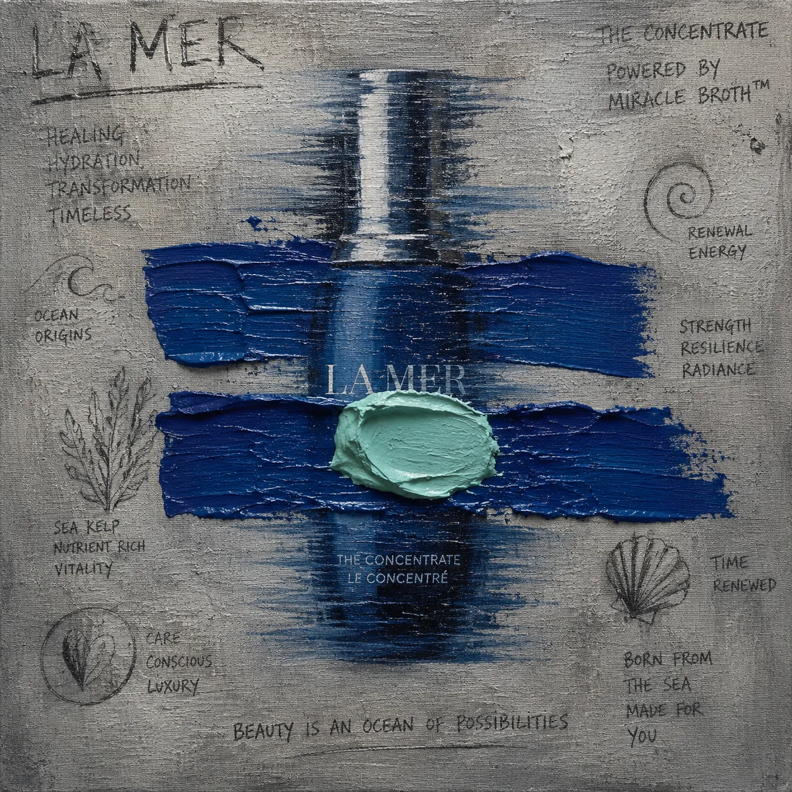

**#21 · UI &amp; Graphic Prompt · <code>Vinano Studio</code>**

<details>
<summary>Show prompt</summary>

```
[BRAND NAME].
Goal: Generate a professional mixed-media oil painting on textured canvas where the color palette and graphics are dynamically adapted to the brand identity.

1. BRAND COLOR ADAPTATION
- Analyze the visual identity of [BRAND NAME].
- Use the primary brand color for the two main horizontal impasto strokes.
- Use a contrasting secondary brand color for the thick, raised central dollop of paint.
- Replace the original red and yellow this new adaptive color scheme.

2. PAINTED SUBJECT & MOTION
- Object: A central, vertically oriented product related to [BRAND NAME], rendered as a cohesive OIL PAINTING directly on the canvas.
- Technique: Apply a "motion blur" oil painting effect visible horizontal brushstrokes to create a sense of dynamic movement.
- Integration: The object must be part of the painted layer, sharing the same heavy-grain canvas texture as the background, not an overlay.
- Branding: Paint the "[BRAND NAME]" logo distressed, semi-transparent oil paint layers within the object's silhouette.

3. ADAPTIVE IMPASTO & TEXTURE
- Primary Strokes: Two thick, physical, horizontal impasto oil paint strokes applied over the painted object in the brand's primary color.
- Detail: One heavily textured, raised dollop of the brand's secondary color oil paint placed precisely on the center stroke.
- Surface: Background is a raw, heavy-grain grey textured canvas visible weave, charcoal smudges, and gesso dabs.

4. BRAND-CENTRIC GRAPHICS
- Handwriting: Use charcoal and graphite to scribble keywords, slogans, and values associated [BRAND NAME] across the canvas.
- Symbols: Replace the original $ and doodles hand-drawn, messy abstract icons representing [BRAND NAME].
- Execution: All text and symbols must look like they were scratched or drawn graphite over the dried oil paint layers.

5. STYLE
- Contemporary mixed-media pop-art. 8K macro photography focusing on the physical thickness of oil paint and the raw canvas grain.

Emphasise material texture and natural light so the final frame feels tactile and premium.
```

</details>

---

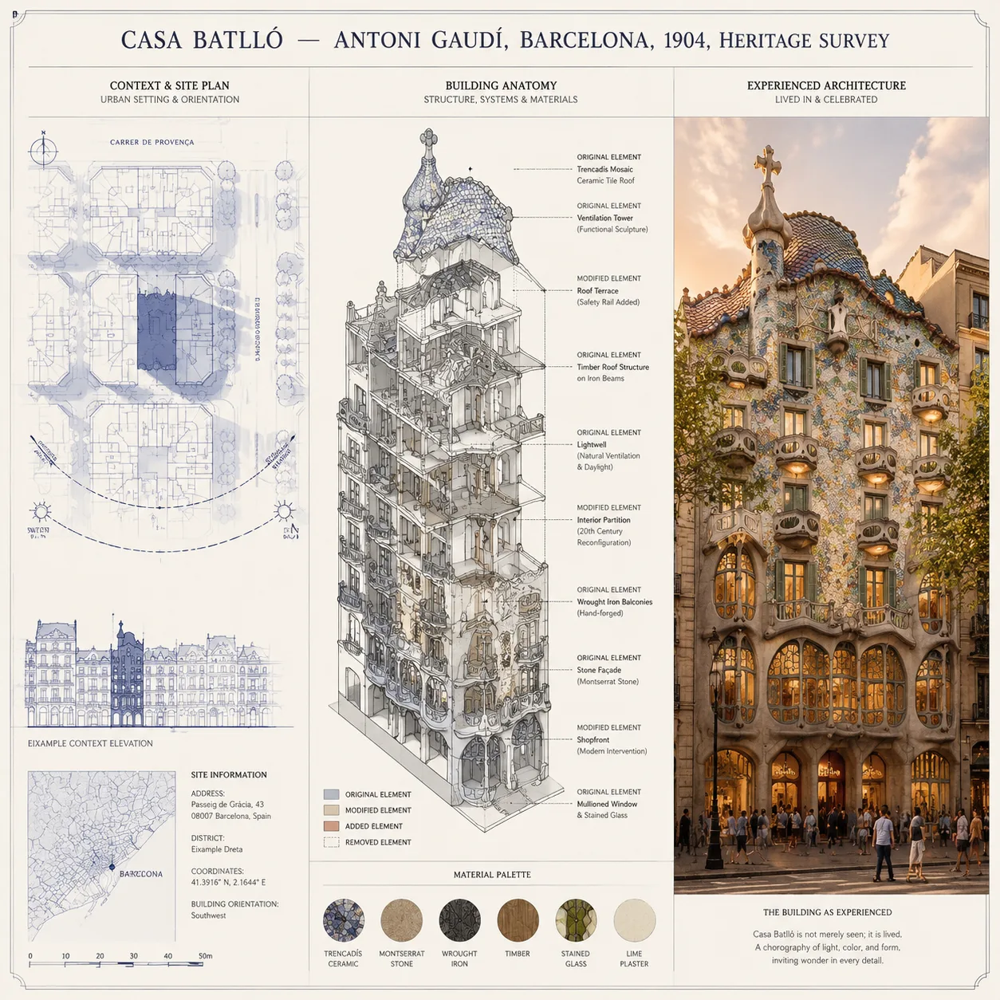

**#22 · UI &amp; Graphic Prompt · <code>Vinano Studio</code>**

<details>
<summary>Show prompt</summary>

```
A preservation architect's survey board for [BUILDING / STRUCTURE] — [STYLE / ARCHITECT / PERIOD]. Left section: site plan and context, showing the structure in its urban or landscape setting orientation, shadows, and neighboring relationships mapped. Center section: the building dissected, a cutaway axonometric revealing structural system, material layers, hidden infrastructure, callouts identifying original versus modified elements. Right section: the building as experienced, photographed from the canonical viewpoint in ideal light, human figures for scale and life, the architecture inhabited. Visual style transitions from technical survey blue-line through neutral analytical greys to golden-hour warmth. Title block reading "[BUILDING NAME] — [ARCHITECT], [CITY], [YEAR], HERITAGE SURVEY". Keep edges clean and the overall composition balanced for a polished, gallery-ready result.
```

</details>

---

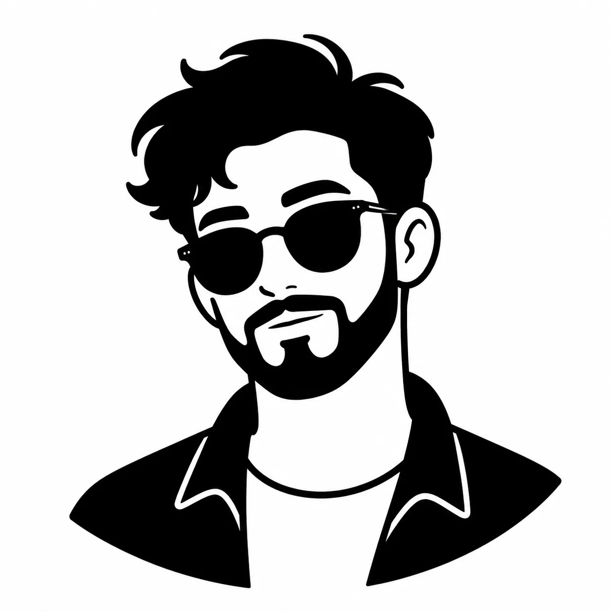

**#23 · UI &amp; Graphic Prompt · <code>Vinano Studio</code>**

<details>
<summary>Show prompt</summary>

```
A refined minimalist, black-and-white flat vector illustration portrait of [NAME], rendered in the expressive "Notion avatar" art style.
LINE WORK & VIBE:
Style: Use THICK, UNIFORM black outlines (monoline weight). The lines should feel organic, smooth, and confident, not rigidly geometric or robotic like generic icons.
Vibe: The character should have a distinct personality and a relaxed, cool, or friendly expression. Focus on stylized features, unique hairstyles, and defining accessories to convey character.
SELECTIVE BLACK FILLS (CRITICAL):
Unlike pure outline icons, utilize Solid Black Fills selectively and strategically.
Where to Fill: Use solid black for prominent hair masses, beards, eyebrows, sunglasses, or dark clothing elements.
Where to Keep White: The skin, main face area, and lighter elements must remain pure flat white inside the thick outlines.
COMPOSITION & TECHNICAL:
No shading, no gray tones, no gradients. Only pure Black and pure White.
Clean bust or headshot composition centered on a white background.
High contrast, clean 2D vector graphics.

Maintain consistent colour harmony and crisp focus across the whole frame.
```

</details>

---

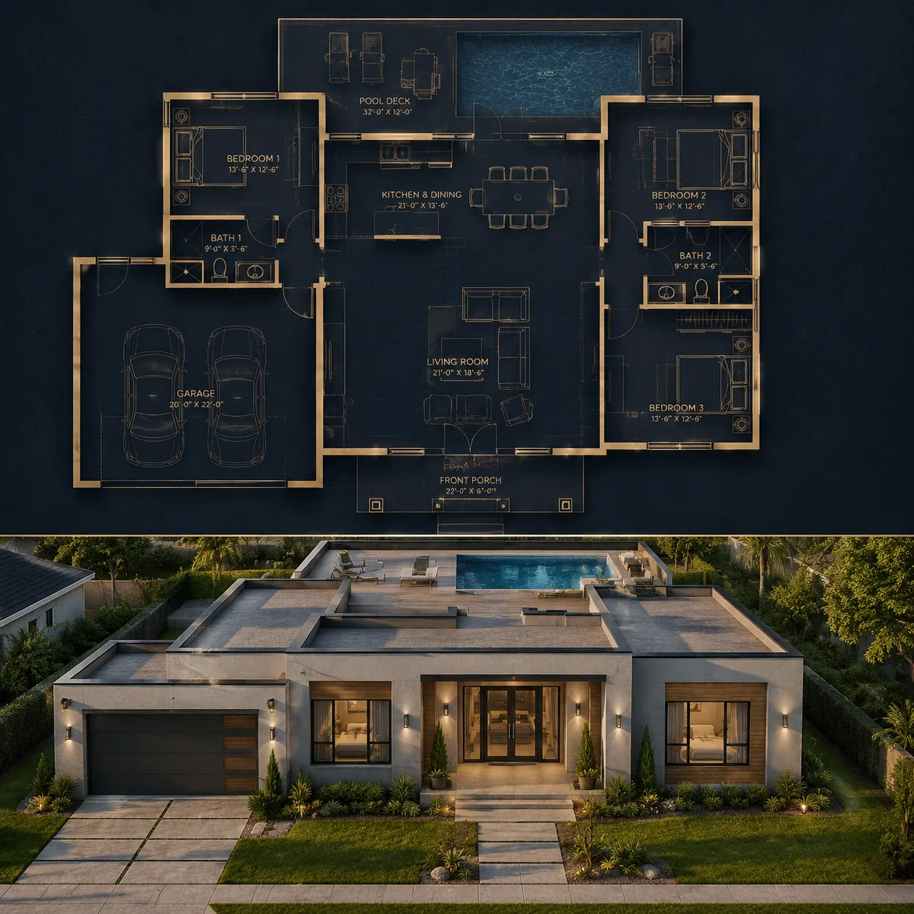

**#24 · UI &amp; Graphic Prompt · <code>Vinano Studio</code>**

<details>
<summary>Show prompt</summary>

```
{
 "objective": "Create a split architectural visualization where the top is a detailed dark-themed blueprint and the bottom is a true-to-life photorealistic house that matches the blueprint EXACTLY",

 "aspect_ratio": "3:4",

 "composition": {
 "layout": "vertical split",
 "top_section": "blueprint",
 "bottom_section": "realistic render",
 "alignment": "perfect structural correspondence between both sections"
 },

 "top_section": {
 "type": "architectural blueprint",
 "style": "dark luxury blueprint (similar to reference image 2)",

 "visual_style": {
 "background": "deep navy / charcoal blue",
 "lines": "thin glowing beige/gold lines",
 "walls": "slightly extruded 3D effect",
 "labels": "clean modern sans-serif",
 "lighting": "soft ambient glow"
 },

 "content": {
 "rooms": ["3 bedrooms (left, right, bottom-right)",
 "central living room",
 "kitchen + dining (top center)",
 "2 bathrooms",
 "garage (left side connected)",
 "front porch",
 "backyard pool deck"],
 "details": ["furniture outlines (beds, sofa, dining table)",
 "door swings and openings",
 "window placements",
 "circulation paths",
 "exact proportions and spacing"]
 }
 },

 "bottom_section": {
 "type": "true-to-life photorealistic house render",

 "constraint": "MUST MATCH THE BLUEPRINT EXACTLY — no added, removed, or shifted rooms",

 "architecture": {
 "style": "modern single-story house",
 "roof": "flat layered roof",
 "materials": ["smooth concrete walls",
 "wood panel accents",
 "large glass windows"]
 },

 "layout_mapping_rules": ["garage must be on the left side exactly as blueprint",
 "main entrance aligned living room",
 "pool positioned in backyard matching blueprint dimensions",
 "window placements correspond to each room location",
 "bedroom volumes visible externally in correct positions"],

 "environment": {
 "setting": "suburban neighborhood",
 "elements": ["green lawn",
 "minimal landscaping",
 "clean driveway leading to garage",
 "pool deck matching blueprint footprint"]
 },

 "lighting": {
 "time": "golden hour",
 "style": "soft natural light realistic shadows"
 },

 "camera": {
 "angle": "slightly elevated front perspective",
 "lens": "35mm architectural view"
 }
 },

 "consistency_rules": ["room positions must be identical between blueprint and render",
 "no extra structures added in render",
 "all doors and windows must align logically",
 "pool size and placement must match exactly",
 "garage placement must match blueprint"],

 "style": {
 "top": "architectural visualization (dark premium)",
 "bottom": "true-to-life photorealistic modern house",
 "overall": "clean, high-end architectural presentation"
 },

 "negative_constraints": ["no mismatch between blueprint and render",
 "no extra rooms",
 "no fantasy elements",
 "no unrealistic proportions",
 "no cluttered environment"]
}

Render with rich micro-detail while keeping the layout uncluttered and intentional.
```

</details>

---


**#25 · UI &amp; Graphic Prompt · <code>Vinano Studio</code>**

<details>
<summary>Show prompt</summary>

```
Create a collection of icons representing [a theme], they belong together as a single theme. Put them in a 2x2 grid (no lines). The background is pure white. Make the icons as risograph prints. No text. No color distortion. Vibrant and not faded. Stochastic stippling and sand-like noise pattern within color fills. Each icon has a thick black outline. Emphasise material texture and natural light so the final frame feels tactile and premium.
```

</details>

---

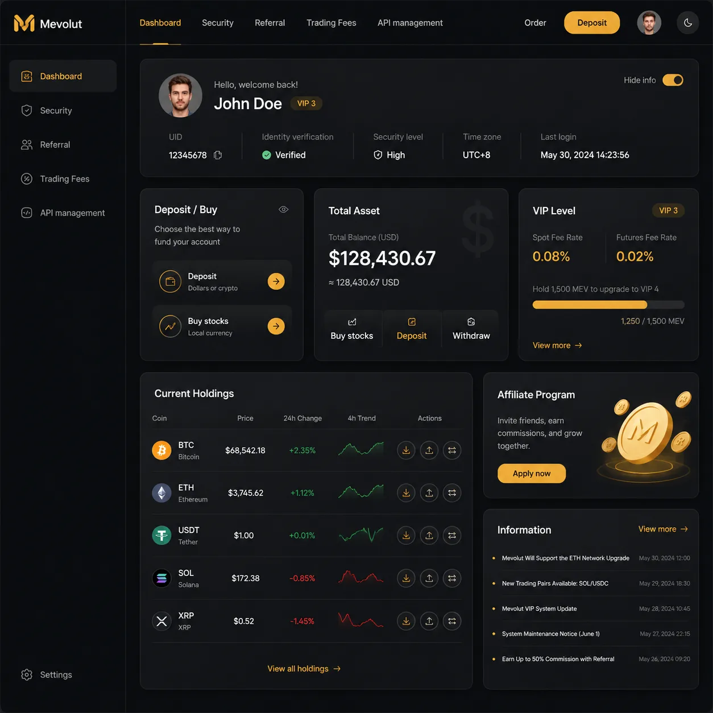

**#26 · UI &amp; Graphic Prompt · <code>Vinano Studio</code>**

<details>
<summary>Show prompt</summary>

```
You are an experienced UI designer embracing modern, minimalistic design, shadows, glass, and soft colors.

Your role is to create a professional, beautiful mockup that is ready for delivery based on these requirements:

<requirements>
## 1. Overall Style & Visual Language
This interface represents a premium, modern fintech / crypto trading dashboard a dark theme.
The visual language combines **soft neumorphism**, and **luxury Web3 aesthetics**.

Core characteristics:
- Warm gold/orange accent highlights
- Monochromatic color palette minimalistic effects and shadows
- Card-based layout depth and subtle backgrounds
- Minimal borders, separation shadows or light backgrounds

Target perception:
- Secure
- Professional
- High-end / institutional-grade
- Optimized for experienced traders

---

## 2. Layout Structure

### Global Layout
- Desktop-first dashboard
- Output proportions: 3:2
- Three main regions:
 1. Top navigation bar (horizontal)
 2. Left sidebar navigation (vertical)
 3. Main content area (multi-column grid of cards)

Spacing is generous, prioritizing clarity and visual breathing room.

---

## 3. Top Navigation Bar
- Height: 72px
- Left:
 - Brand logo text "Mevolut"
 - Stylized "M"
 - Gold/orange accent
- Center:
 - Navigation links: Dashboard, Security, Referral, Trading Fees, API management
- Right:
 - Order link
 - Primary CTA: “Deposit” (gold pill button)
 - User avatar (circular)
 - Theme toggle (moon icon)

Typography:
- Clean sans-serif
- Medium weight
- White primary text, muted gray inactive states

---

## 4. Left Sidebar Navigation
- Width: 240px
- Background: near-black
- Vertical navigation items icons:
 - Dashboard (active)
 - Security
 - Referral
 - Trading Fees
 - API management
- Bottom-aligned:
 - Settings

Active item:
- Subtle background highlight
- Slight background tint
- Rounded container

Icons:
- Outline style
- Gold accent on active state

---

## 5. Main Content Area

### 5.1 User Overview Card
- Large rounded card at top
- Left:
 - Circular avatar
 - Greeting text (“Hello…”)
 - User name
- Inline info blocks:
 - UID (copy icon)
 - Identity verification status
 - Security level
 - Time zone
 - Last login timestamp
- Right:
 - “Hide info” toggle

Style:
- Subtle inner shadows

---

### 5.2 Deposit / Buy Card
- Medium-sized card
- Title text explaining deposit options
- Two action rows:
 - Deposit (dollars or crypto)
 - Buy stocks (local currency)
- Each row:
 - Icon
 - Label
 - Arrow action button (gold accent)

---

### 5.3 Total Asset Card
- Displays USD balance and USD equivalent
- Large, faded Dollar symbol watermark in background
- Action tabs:
 - Buy stocks
 - Deposit
 - Withdraw
- Numeric values are large

---

### 5.4 VIP Level Card
- Shows current VIP level
- Spot and futures fee rates
- Progress bar for token holdings
- “View more” link

Progress bar:
- Rounded
- Dark background track

---

### 5.5 Current Holdings Table
- Card containing a table layout
- Columns:
 - Coin (icon + name)
 - Price
 - 24h Change
 - 4h Trend (sparkline)
 - Actions (Deposit, Withdraw, Trade)

Sparklines:
- Green for positive trend
- Red for negative trend

Hover:
- Subtle background highlight per row

---

### 5.6 Affiliate Program Card
- Promotional card
- Gold coin illustration
- Short description and CTA button (“Apply now”)

---

### 5.7 Information / News Card
- Vertical list of announcements
- Headline + timestamp
- “View more” link at top

---

## 6. Color Palette
- Primary background: deep charcoal / black
- Card surfaces: slightly lighter
- Accent color: warm gold
- Text hierarchy:
 - White (primary)
 - Muted gray (secondary)
 - Dark gray (disabled)
- Status colors:
 - Green for positive
 - Red for negative

---

## 7. Effects & Interaction
- Rounded corners throughout (sm)

# Design tokens:
{
 // Global theme definition
 "theme": {
 "mode": "dark",
 "style": ["soft-neumorphism",
 "premium-fintech"]
 },

 // Layout measurements and structure
 "layout": {
 "type": "desktop-dashboard",
 "grid": "three-column",
 "sidebarWidth": 240,
 "topbarHeight": 68,
 "contentPadding": 24
 },

 // Color system
 "colors": {
 "background": "#0B0D10", // Main app background
 "primaryAccent": "#F5A623", // Gold/orange highlight
 "secondaryAccent": "#FFB547",
 "textPrimary": "#FFFFFF",
 "textSecondary": "#B0B3B8",
 "textMuted": "#6B6F76",
 "success": "#22C55E",
 "danger": "#EF4444"
 },

 // Typography scale
 "typography": {
 "fontFamily": "SF Pro, system-ui, sans-serif",
 "weights": {
 "heading": 600,
 "body": 400,
 "numeric": 500
 },
 "sizes": {
 "h1": 24,
 "h2": 20,
 "h3": 16,
 "body": 14,
 "caption": 12
 }
 },

 // Core UI components
 "components": {
 "card": {
 "borderRadius": 16,
 "shadow": "0 20px 40px rgba(0,0,0,0.4)",
 "border": "none",
 "background": "#14171C",
 },

 "button": {
 "primary": {
 "textColor": "#0B0D10",
 "borderRadius": 999,
 },
 "secondary": {
 "background": "transparent",
 "textColor": "#F5A623"
 }
 },

 "sidebar": {
 "background": "#0E1014",
 "itemRadius": 12,
 "iconStyle": "outline"
 },

 "table": {
 "rowHeight": 56,
 "divider": "subtle",
 "hoverHighlight": true,
 "sparkline": {
 "positiveColor": "#22C55E",
 "negativeColor": "#EF4444"
 }
 },

 "progressBar": {
 "height": 6,
 "radius": 999,
 "fillColor": "#22C55E",
 "backgroundColor": "#2A2E35"
 }
 },

 // Icon system
 "icons": {
 "style": "outline",
 "size": 18,
 "colorInactive": "#6B6F76",
 "colorActive": "#F5A623"
 }
}
</requirements>

Keep edges clean and the overall composition balanced for a polished, gallery-ready result.
```

</details>

---

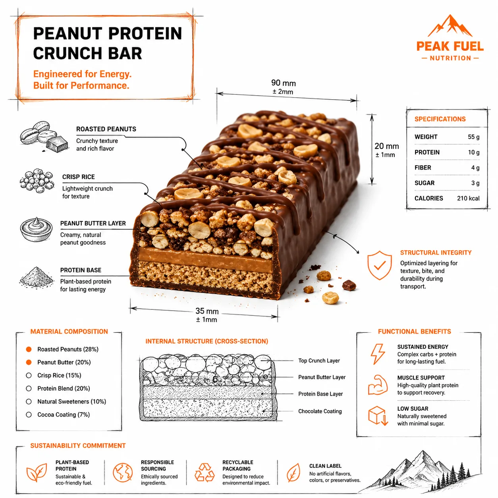

**#27 · UI &amp; Graphic Prompt · <code>Vinano Studio</code>**

<details>
<summary>Show prompt</summary>

```
Create a branded technical infographic of a [SNACK], combining a realistic photograph or photoreal render of the product technical annotation overlays placed directly on top. Use black ink–style line drawings strategic [BRAND COLOR] accents (architectural sketch look) on a pure white studio background, including:
• Key component labels
• Internal cross-section showing structure, layering, or internal design
• Measurements, dimensions, and specifications
• Material callouts composition and quantities
• Arrows indicating function for primary features and structural integrity
• Simple schematic or sectional diagram showing key mechanical or design elements
• Sustainability callouts
Title placement: Inside a hand-drawn technical annotation box accent border reading the product name in bold font, positioned in upper corner.
Style & layout rules:
• The realistic product remains clearly visible
• Annotations feel sketched, technical, and architectural
• Accents used for highlight (20-30% of linework), black for primary technical lines (70-80%)
• crisp composition balanced negative space
• Educational, food-engineering vibe premium branding
• Include subtle brand logo mark in corner
Visual style: Minimal technical illustration aesthetic, black linework accents over realistic imagery, precise but slightly hand-drawn feel.
Color palette: White background, black annotation lines/text, [BRAND COLOR] for accents and key callouts only.
Output: 1080×1080, ultra-crisp, social-feed optimized, no watermark

Keep edges clean and the overall composition balanced for a polished, gallery-ready result.
```

</details>

---

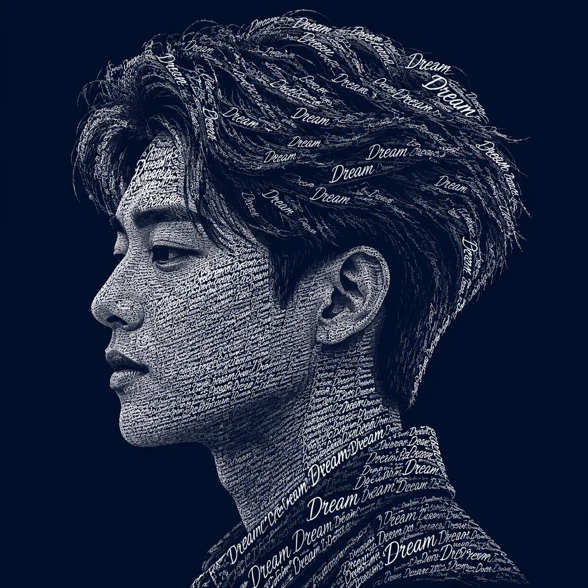

**#28 · UI &amp; Graphic Prompt · <code>Vinano Studio</code>**

<details>
<summary>Show prompt</summary>

```
Create a typographic art portrait the uploaded photo of a person as reference. Display a left-facing side profile portrait. The entire image--including the face. hair. and facial features--must be formed exclusively from repeated white calligraphic text the words: "[PUT WHATEVER WORDS YOU WANT HERE]" The text should follow the natural contours of the face and hair, clearly shaping the person's profile silhouette. Use a deep navy blue background high contrast The stvle should be clean vector art sharp edges. Output in high-resolution 8K quality. Do not alter the person's facial identity. No additional colors. no textures. and no watermark. Dimension 4:5 Render with rich micro-detail while keeping the layout uncluttered and intentional.
```

</details>

---

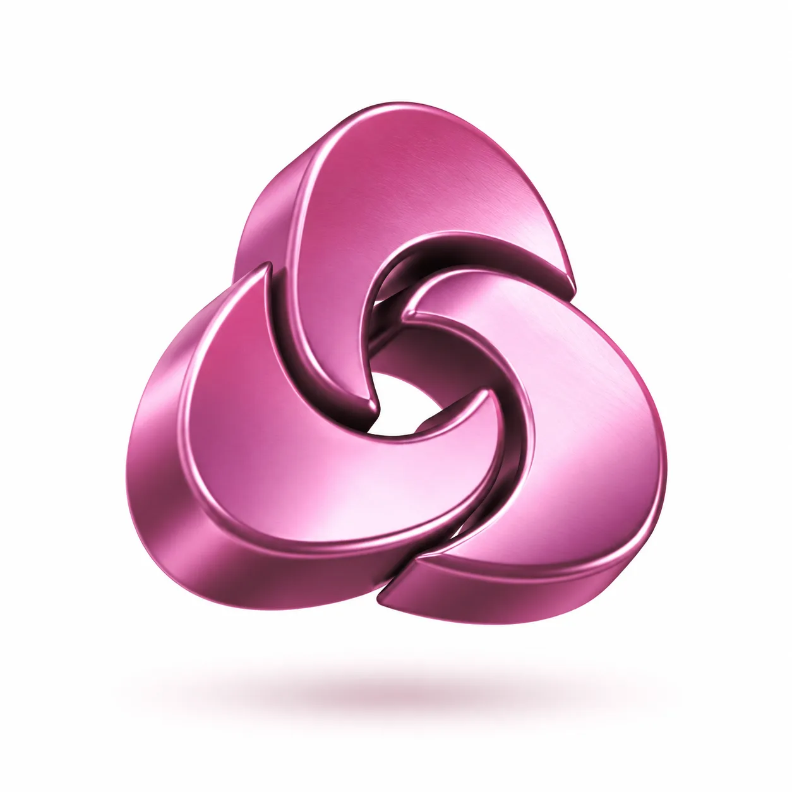

**#29 · UI &amp; Graphic Prompt · <code>Vinano Studio</code>**

<details>
<summary>Show prompt</summary>

```
[BRAND NAME]. Act as a 3D Product Visualization Artist.

PHASE 1: LOGO TO 3D OBJECT

Take the [BRAND NAME] logo and transform it into a thick 3D sculptural form. Simplify to core shape, add rounded edges (8-12mm fillet), make it one solid piece 40-60mm depth. Keep it recognizable.

PHASE 2: PINK METALLIC MATERIAL

- Color: Pink metallic (#C85A8E to #8B4A6F range)

- Finish: Glossy brushed metal fine grain

- Highlights: Light pink (#E89BB8)

- Shadows: Deep plum (#6B3854)

- Roughness: 0.2 (shiny but not mirror)

- NO copper, NO gold, NO silver

PHASE 3: LIGHTING

Soft studio lighting from top-left creating smooth gradient across the object. Light pink on highlights, deep plum in shadows. No hard shadows.

PHASE 4: BACKGROUND & FLOATING

- Pure white background (#FFFFFF)

- Object levitating in white void

- Soft blurred shadow underneath (90% transparent)

- NO pedestals, NO stands, NO supports

PHASE 5: CAMERA

Slight 3/4 angle, looking down 10°, object centered, filling 60% of frame.

TECH SPECS:

- premium-quality 3D render (Octane/Cycles)

- 4K resolution

- Full object in focus

- Subtle bloom on highlights

CRITICAL:

- Must be PINK metallic only

- Must float in pure white space

- Must have thick 3D volume smooth surfaces

- Must look like luxury product photography

Render with rich micro-detail while keeping the layout uncluttered and intentional.
```

</details>

---

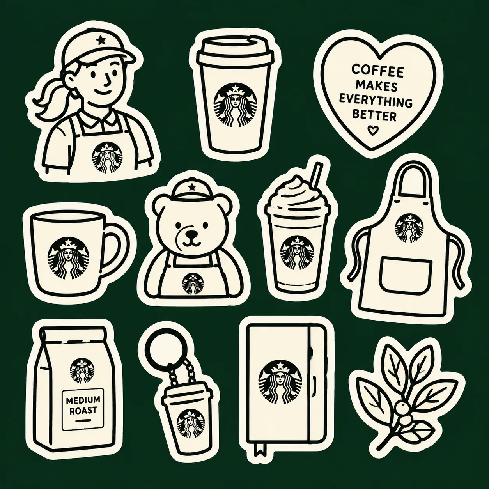

**#30 · UI &amp; Graphic Prompt · <code>Vinano Studio</code>**

<details>
<summary>Show prompt</summary>

```
[BRAND NAME]. Act as a vector illustrator designing a trendy, high-end "Sticker Sheet" set.
THE TASK:
Deconstruct the brand identity of [BRAND NAME] into a playful, cohesive set of approximately 8-10 unique sticker designs arranged on a single sheet.
Content Generation: Do not just make logos. Autonomously invent a mix of:
Mascots/Characters: Stylized busts of people wearing brand-relevant accessories or expressing emotions.
Key Products: Iconic items associated the brand.
Symbols/Objects: Abstract shapes or tools relevant to the brand's lifestyle.

VISUAL STYLE (MONOLINE VECTOR):
The art style must strictly match "Modern Trendy Line Art."
Line Work: Use a THICK, UNIFORM line weight (monoline) for all internal details. The lines should be smooth, rounded, and confident.
Coloring: The stickers must be filled Solid Off-White or Cream, utilizing the line color for details. NO gradients, NO shading, NO 3D effects. Flat 2D vector look.
The "Sticker" Effect: Every element must have a thick, distinct White (or Cream) Die-Cut Border surrounding it, separating it from the background.
COLOR PALETTE (HIGH CONTRAST):
Background: A solid, deep, saturated color to create maximum contrast.
Stickers: High-brightness Cream or White fill Dark (Black or Dark Brown) outlines.
COMPOSITION:
The stickers are scattered naturally across the sheet (knolling layout) even spacing. No overlapping.

Preserve realistic proportions and depth for a confident, professional finish.
```

</details>

---

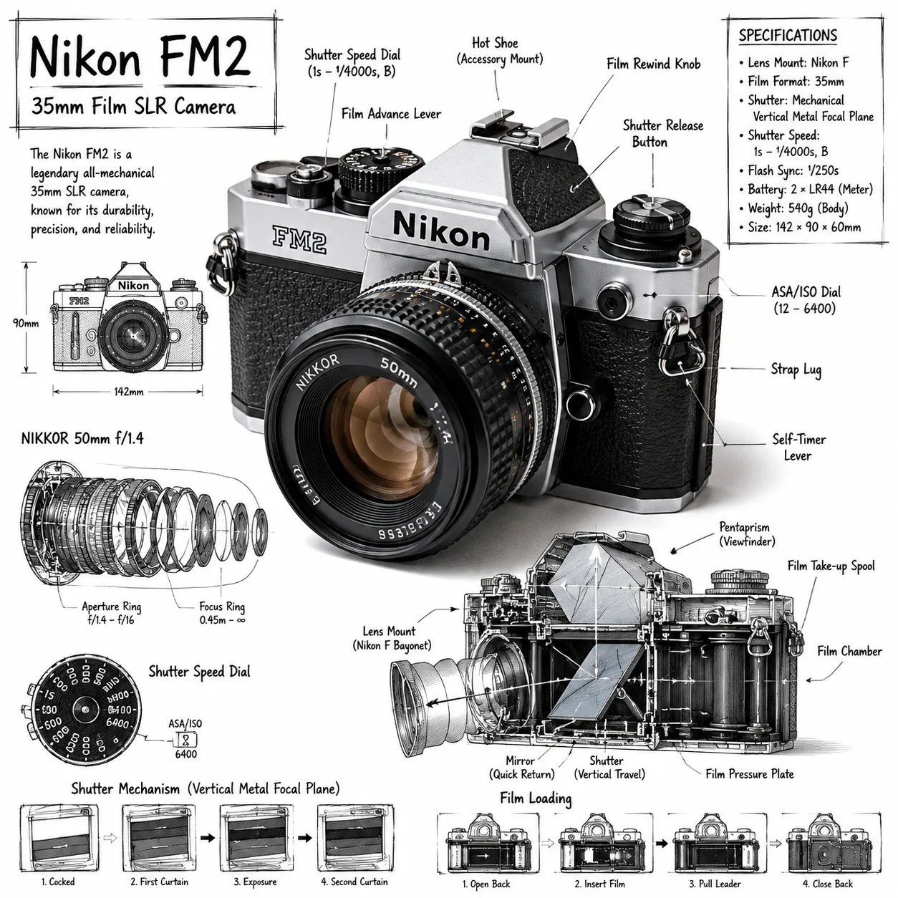

**#31 · UI &amp; Graphic Prompt · <code>Vinano Studio</code>**

<details>
<summary>Show prompt</summary>

```
Create an infographic image of [OBJECT], combining a realistic photograph or photoreal render of the object technical annotation overlays placed directly on top.

Use black ink–style line drawings and text (technical pen / architectural sketch look) on a pure white studio background, including:
•Key component labels
•Internal cutaway or exploded-view outlines
•Measurements, dimensions, and scale markers
•Material callouts and quantities
•Arrows indicating function, force, or flow (air, sound, power, pressure)
•Simple schematic or sectional diagrams where relevant

Place the title [OBJECT] inside a hand-drawn technical annotation box in one corner.

Style & layout rules:
•The real object remains clearly visible beneath the annotations
•Annotations feel sketched, technical, and architectural
•crisp composition balanced negative space
•Educational, museum-exhibit / engineering-manual vibe

Visual style:
Minimal technical illustration aesthetic, black linework over realistic imagery, precise but slightly hand-drawn feel.

Color palette:
White background, black annotation lines and text only. No colors.

Output:
1080×1080, ultra-crisp, social-feed optimized, no watermark.

Render with rich micro-detail while keeping the layout uncluttered and intentional.
```

</details>

---

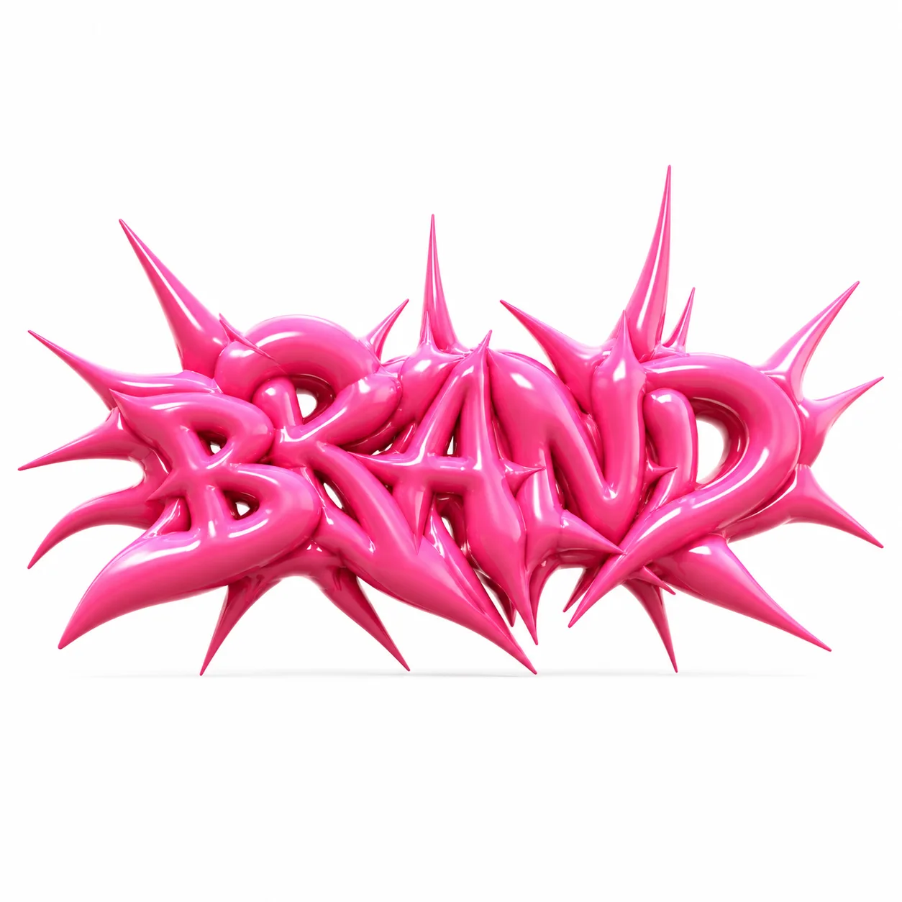

**#32 · UI &amp; Graphic Prompt · <code>Vinano Studio</code>**

<details>
<summary>Show prompt</summary>

```
[BRAND NAME] | [COLOR]

Act as a 3D Type Designer and CGI Artist working at the intersection of streetwear culture, Y2K aesthetics, and high-end digital sculpture. Your references: Nigo, Futura, Guccimaze, Soulwax art direction.

---

PHASE 1: TYPOGRAPHIC CONCEPT

Render the word or logotype [BRAND NAME] as a fully 3D sculptural object — not a flat text extrusion, but a living, inflated, organic type sculpture. Style: Wildstyle graffiti DNA fused inflatable balloon morphology. Letters are not separate — they flow into each other as one continuous organic mass. Each letterform has: bulbous pneumatic body as if inflated under high pressure from within, stretching the surface taut. Aggressive spike extensions — sharp tapered protrusions erupting between and around letters, directional, asymmetric, energetic, some long and blade-like, others short and thorn-like. Wildstyle overlaps — letters partially occlude each other creating depth layers, classic graffiti ambiguity where readability fights visual complexity. Organic connective tissue — negative spaces between letters filled stretched membrane forms, like rubber pulled between two inflated surfaces.

---

PHASE 2: MATERIAL & SURFACE

Single unified material across the entire sculpture — no color variation between letters. Material type: high-gloss latex / inflated rubber / soft silicone — the surface behaves like a balloon skin stretched to near-bursting point. Subsurface scattering: active — light penetrates slightly into the material, creating a translucent inner glow at thin edges and spike tips. Thinner areas read lighter, denser volumes read darker. Specular highlights: large, soft, slightly elongated — the kind you get on inflated latex, not hard plastic. Multiple secondary highlights in concave zones. Apply [COLOR] as the sole material color of the entire sculpture — this is non-negotiable. [COLOR] defines the pure midtone of the material. Highlights push toward the most luminous near-white version of [COLOR]. Shadow zones and deep crevices push toward the darkest most saturated version of [COLOR]. The entire chromatic range of the sculpture lives within the [COLOR] family — no hue deviation, no neutral grays.

---

PHASE 3: COMPOSITION & STAGING

Background: pure white (#FFFFFF) — clinical studio isolation. Zero texture, zero gradient. Shadow: none, or absolute minimum contact shadow directly beneath the sculpture — the object appears to float slightly. Orientation: horizontal spread — the sculpture is wider than tall, expanding laterally. Spike elements breach the invisible bounding box on all sides — top spikes reach upward, side extensions push outward. Camera angle: straight-on frontal, slightly elevated 5 to 10° above center — reveals the full typographic mass while showing the 3D depth of overlapping elements. Depth of field: none — sharp from foreground spikes to background letter bodies, every detail in focus. Scale feel: monumental — as if the sculpture is 2 meters wide in physical space, photographed in a white infinity studio.

---

PHASE 4: TECH SPECS

Render engine: Octane Render or Redshift — physically accurate subsurface scattering mandatory. Global illumination: large soft HDRI dome light, neutral white temperature 5500K. No directional shadows. No rim lights. No background elements. Ray tracing: on — for accurate specular and inter-reflection between letter surfaces. Anti-aliasing: maximum — edges must be razor-clean against white background. Output feel: this is a CGI product render, not AI art. Precision over expressionism. Aspect ratio: 1:1 square — centered composition breathing room on all four sides.

Maintain consistent colour harmony and crisp focus across the whole frame.
```

</details>

---

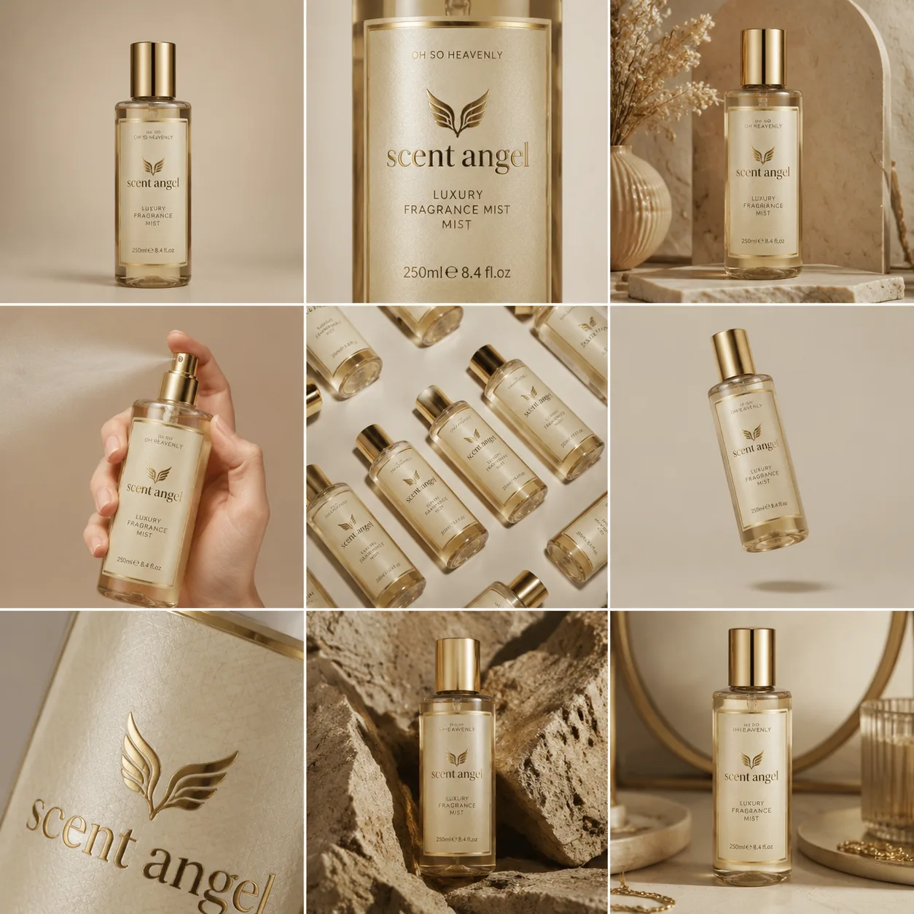

**#33 · UI &amp; Graphic Prompt · <code>Vinano Studio</code>**

<details>
<summary>Show prompt</summary>

```
Create ONE final image.

A clean 3×3 [ratio] storyboard grid nine equal [ratio] sized panels on [4:5] ratio.

Use the reference image as the base product reference. Keep the same product, packaging design, branding, materials, colors, proportions and overall identity across all nine panels exactly as the reference. The product must remain clearly recognizable in every frame. The label, logo and proportions must stay exactly the same.

This storyboard is a high-end designer mockup presentation for a branding portfolio. The focus is on form, composition, materiality and visual rhythm rather than realism or lifestyle narrative. The overall look should feel curated, editorial and design-driven.

FRAME 1:
Front-facing hero shot of the product in a clean studio setup. Neutral background, balanced composition, calm and confident presentation of the product.

FRAME 2:
Close-up shot the focus centered on the middle of the product. Focusing on surface texture, materials and print details.

FRAME 3:
Shows the reference product placed in an environment that naturally fits the brand and product category. Studio setting inspired by the product design elements and colours.

FRAME 4:
Product shown in use or interaction on a neutral studio background. Hands and interaction elements are minimal and restrained, the look matches the style of the package.

FRAME 5:
Isometric composition showing multiple products arranged in a precise geometric order from the top isometric angle. All products are placed at the same isometric top angle, evenly spaced, clean, structured and graphic.

FRAME 6:
Product levitating slightly tilted on a neutral background that matches the reference image color palette. Floating position is angled and intentional, the product is floating naturally in space.

FRAME 7:
is an extreme close-up focusing on a specific detail of the label, edge, texture or material behavior.

FRAME 8:
The product in an unexpected yet aesthetically strong setting that feels bold, editorial and visually striking.
Unexpected but highly stylized setting. Studio-based, and designer-driven. Bold composition that elevates the brand.

FRAME 9:
Wide composition showing the product in use, placed within a refined designer setup. Clean props, controlled styling, cohesive the rest of the series.

CAMERA & STYLE:
ultra-detailed, high-fidelity studio imagery a real camera look. Different camera angles and framings across frames. Controlled depth of field, precise lighting, accurate materials and reflections. Lighting logic, color palette, mood and visual language must remain consistent across all nine panels as one cohesive series.

OUTPUT:
A clean 3×3 grid no borders, no text, no captions and no watermarks.

Render with rich micro-detail while keeping the layout uncluttered and intentional.
```

</details>

---

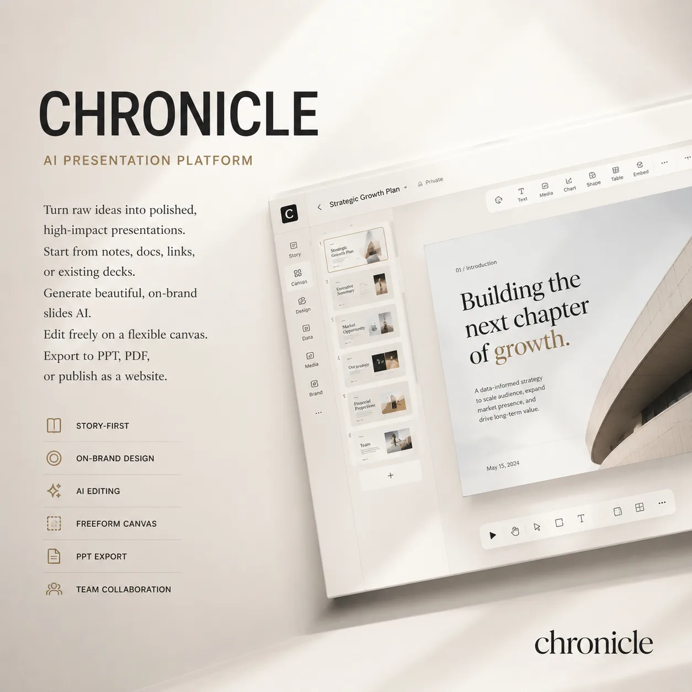

**#34 · UI &amp; Graphic Prompt · <code>Vinano Studio</code>**

<details>
<summary>Show prompt</summary>

```
Create a premium 4:3 presentation cover slide introducing Chronicle, the AI-native presentation platform from

Style:
elegant, minimal, modern, premium startup aesthetic. Similar to high-end brand guideline covers (like Apple / Linear / Notion style). Soft gradient background subtle depth, clean whitespace, refined typography, polished editorial layout.

Main title:
CHRONICLE

Subtitle:
AI PRESENTATION PLATFORM

Body copy (small elegant text):
Turn raw ideas into polished, high-impact presentations.
Start from notes, docs, links, or existing decks.
Generate beautiful, on-brand slides AI.
Edit freely on a flexible canvas.
Export to PPT, PDF, or publish as a website.

Feature highlights (small premium labels):
STORY-FIRST
ON-BRAND DESIGN
AI EDITING
FREEFORM CANVAS
PPT EXPORT
TEAM COLLABORATION

Bottom-right elegant logo text:
chronicle

Visual feeling:
business-class premium, strategy deck quality, consulting-grade presentation, slightly futuristic but highly professional.

Composition:
clean editorial balance, asymmetrical layout, strong whitespace, presentation software hero shot feeling.

Aspect ratio:
4:3

Language:
English only

Emphasise material texture and natural light so the final frame feels tactile and premium.
```

</details>

---

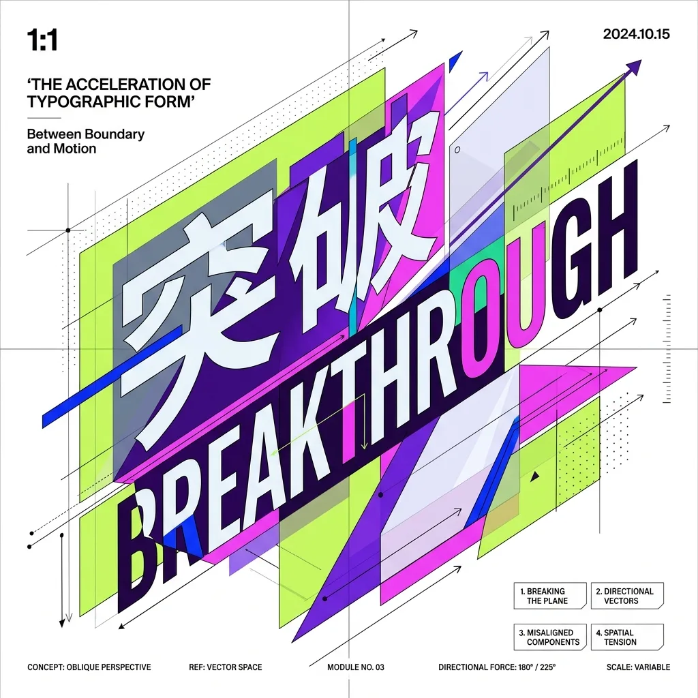

**#35 · UI &amp; Graphic Prompt · <code>Vinano Image Pro</code>**

<details>
<summary>Show prompt</summary>

```
请基于用户输入的【核心文字 / 单词 / 词组 / 短句 / 字母】，创作一张高完成度的「斜向透视平面字体概念海报 / Oblique Planar Perspective Typographic Poster」。

用户输入：[主题文字]；
文字语言：[中文 / 英文 / 中英混排]；
可选补充语境：[____]；
可选情绪倾向：[____]；
可选禁用元素：[____]。

这不是普通插画，不是简单把文字放大后的字效海报，也不是传统正面平铺式平面排版，而是一张以“文字为主视觉核心”的现代实验性字体海报。整体必须采用「斜向透视平面字体构成 / Oblique Planar Perspective Typography」的方式来设计：文字不应完全贴在正面平面上，而应像被放置在不同倾斜角度的二维平面中，通过斜向基准线、透视压缩、平面偏转、角度切入、错位构成、向量指向、方向线条、半透明几何平面与模块化色块，共同建立一种“仍然是平面设计，但具有明显角度感、空间方向感、视觉张力和向量关系”的字体构成效果。

请先真正理解用户输入内容的字面含义、情绪气质、隐含象征、文化联想、心理感受与语义张力，再把这些理解转译成一个具有“方向性、倾斜关系、平面透视感和视觉对抗 / 连接关系”的字体海报系统。如果主题偏情绪型，请重点通过斜向文字平面的距离关系、重心偏移、留白方向、线条走势、模块密度变化和色块压迫 / 释放来表达；如果主题偏动作型，请重点通过倾斜推进、速度线、方向箭头、透视切片、错位平面和向量轨迹来表达；如果主题偏关系型，请重点通过多个文字主体、几何平面和图形模块之间的角度差、相交、重叠、对峙、包裹、切割和中介结构来表达；如果主题偏抽象概念型，请先找到一个简洁但具有视觉转译潜力的抽象隐喻，再通过斜向透视字体、向量辅助系统、局部遮挡、层级偏移、模块重复和变形网格来构建画面。

整体画面必须呈现为一张现代、锐利、清亮、时尚、有实验性、有传播力、有视觉记忆点的高完成度字体海报。用户输入的文字必须成为第一视觉主体，是整个海报的核心内容。文字可以横排、竖排、拆分、错位、分组、重组、局部裁切、局部遮挡、嵌套、倾斜、透视压缩、斜向旋转，甚至分别放置在不同角度的二维平面中，但必须始终保持较高识别度与清晰可读性。画面中至少要让观众明显感受到：文字不再是正面贴平，而是进入了一个由多个倾斜平面和方向关系组成的平面空间系统中。

请重点强化以下风格特征：文字有斜向角度感、近大远小的平面透视感、不同方向的向量关系、倾斜基准线、辅助箭头、几何切面、模块推进、局部框线、数据感标注、小型目录式辅助说明、少量点阵与路径线。可以让不同的文字或文字组处在不同倾斜平面中，形成彼此之间的视角差、方向冲突、视觉对话或张力关系。图形元素必须围绕文字构建，而不是独立装饰；它们应该支撑文字、切割文字、包裹文字、延伸文字的方向、强化文字的倾斜动势，并与文字共同构成一个完整的视觉句子。

视觉语言上，请采用 modern graphic design、oblique planar perspective typography、experimental typography、bold typographic composition、flat vector aesthetics、high-contrast graphic layout、contemporary editorial poster、crisp vector-like precision 的方向。整体不是写实，不是摄影，不是复古文学封面，不是包豪斯旧海报感，不是厚重肌理风，不是暗沉艺术海报，也不是普通 PPT 封面。它应当是更当代、更清亮、更锋利、更数字化、更具有设计公司提案感与展览海报感的视觉结果。

【新版配色要求】
配色必须鲜亮、透亮、清亮、艳丽、高对比，但不要固定使用蓝色与橙色组合，也不要默认落入常见的蓝橙撞色方案。请根据主题语义、情绪气质和视觉隐喻，自动生成一组更大胆、更有想象力、更有新鲜感的现代高对比配色。允许使用非常规组合、跳跃性色彩、强烈撞色、冷暖冲突、霓虹感、数码感、未来感或艺术化配色，但整体必须仍然有秩序、有审美控制、有设计感，不能杂乱失控。

请优先采用“2 个主色 + 1 到 2 个高亮点缀色 + 留白 / 结构支点色”的配色组织方式。可以探索但不限于以下方向：荧光绿 + 品红 + 冷白、亮黄 + 紫罗兰 + 黑色、酸橙绿 + 深紫 + 青蓝、玫红 + 青绿 + 银白、樱桃红 + 湖蓝 + 纯白、薄荷青 + 亮红 + 深蓝、荧光黄 + 桃红 + 紫色、珊瑚橙 + 青蓝 + 白色、多彩数码拼接配色等。每次生成时，请尽量形成一套独立的色彩记忆点，不要重复单一固定主配色，不要让作品系列都长得像同一张图换字。

文字颜色不要全部使用纯黑，可以根据构图关系，让不同文字主体使用不同高饱和色，或在同一组大字中形成主次色分配。允许少量深色作为结构支点，但整体画面应以鲜亮、清透、醒目、前卫的色彩印象为主。色彩应服务于语义表达，而不是仅仅为了热闹；要让观众觉得颜色是“被设计过的”，而不是随机堆砌的。

构图应大胆、倾斜、具有推进感和方向感，但同时要控制画面秩序。建议采用 1 组核心标题主体、1 组斜向透视文字平面系统、1 组几何向量与色块结构、少量辅助标注信息与点线符号。画面需要保留足够留白，让高饱和色与倾斜文字更有呼吸感和展览海报感。可以加入少量小字说明、标签、编号、英文关键词、极简副标题或短句，用来强化概念，但必须克制，不要抢夺主标题的视觉权重。辅助信息可模拟视觉识别系统或编辑设计中的注释语言，例如短词、参数、索引、方向说明、概念标签等。

字体与排版必须现代、清晰、醒目、有力量，并且具有一定实验性。中文适合使用几何无衬线、现代设计感强的标题字、窄长字形或有切面感的字形；英文适合使用 bold grotesk、condensed sans、geometric sans、editorial sans 等。允许局部拉伸、压缩、斜切、透视变形、切片错位，但不要把文字做成真实 3D 挤出字，不要厚重投影，不要真实立体建模，不要金属字，不要玻璃字，不要浮雕字。重点是“平面中的空间感”，而不是“物理三维立体感”。

图形元素可使用：斜向矩形、倾斜平面框、三角切角、圆点系统、箭头、路径线、细线辅助网格、透视边框、方向向量、点阵模块、数据感短线、色块面片、半透明几何切片、局部环形线、分区标签、小尺寸索引信息等。这些元素都必须服务主题语义和字体构成，不应沦为纯装饰。

请避免以下问题：不要做成普通正面平铺字体海报、不要做成传统极简主义排版封面、不要做成写实摄影或插画、不要做成厚重 3D 字、不要做成复古低饱和或米灰色调海报、不要堆砌无关图形、不要过度装饰、不要让文字不可读、不要让画面脏乱拥挤、不要让图形与主题词脱节、不要反复默认同一套主配色。

如果适合，请自动生成一句极短的副标题或概念短句，用来辅助解释主题，例如 “Between ____ and ____”、“The tension of ____”、“A state of ____”、“Where ____ begins”，或根据中文语境生成一句更简洁的中文短句，但必须保持简短、克制、设计化。

最终输出应是一张：高完成度、现代、鲜亮、高对比、平面、锐利、实验性强、具有斜向透视字体构成感、可读且有设计感、并且在配色上更大胆自由、更有想象力、更不落入固定蓝橙套路的现代字体概念海报。

整体保持边缘干净、构图均衡，呈现可直接使用的精致成品感。
```

</details>

---

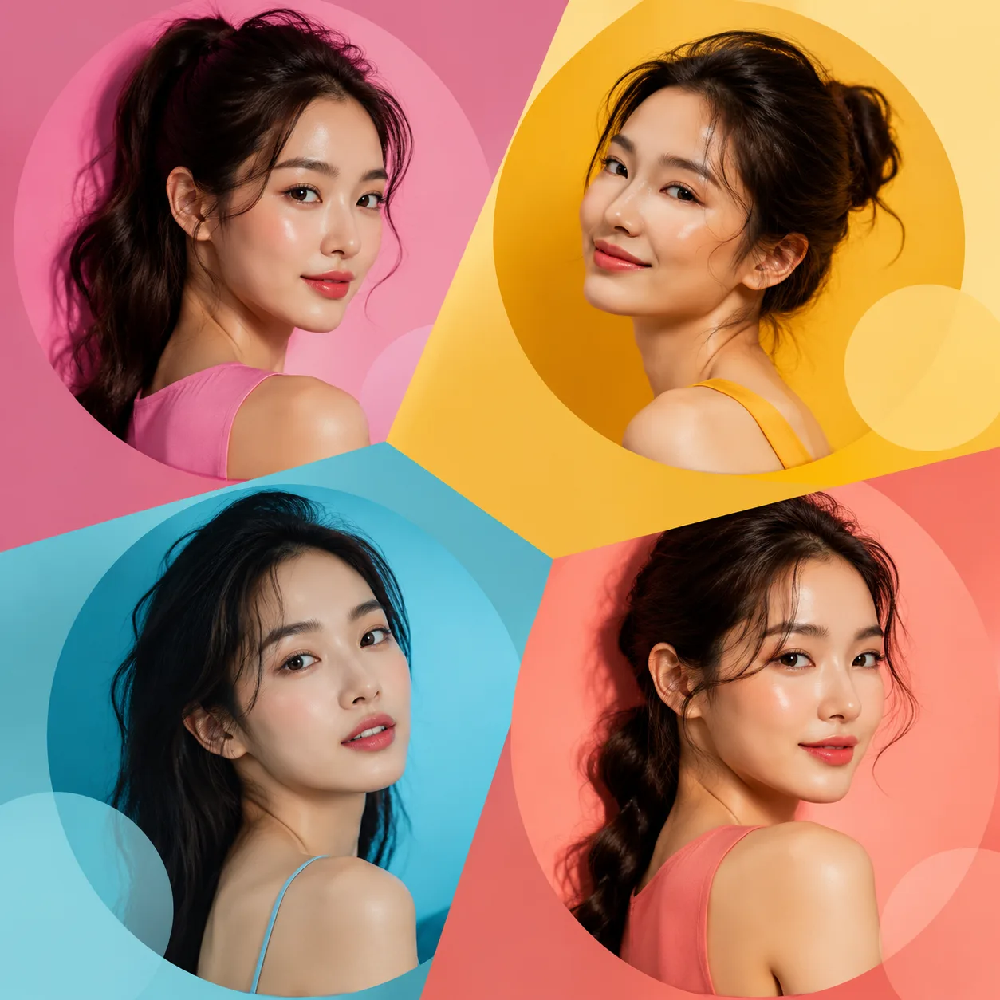

**#36 · UI &amp; Graphic Prompt · <code>Vinano Studio</code>**

<details>
<summary>Show prompt</summary>

```
Ultra-modern high-end skincare advertising collage featuring four beautiful young Asian women, each portrait styled in a separate geometric section of a dynamic diagonal layout. Clean editorial beauty photography soft natural skin texture, glowing healthy complexion, and subtle makeup. Bright vibrant color blocking design pink, yellow, cyan, and coral tones. Minimal abstract background shapes, smooth gradients, and modern graphic design composition. Studio-quality lighting, fashion magazine aesthetic, premium cosmetic campaign feel. Each woman posed confidently in different angles, smiling softly, fresh and youthful vibe. Balanced symmetry sharp diagonal divisions and circular portrait frames. Highly polished commercial beauty branding style, filmic, cinematic lighting, ultra-detailed, 4k resolution.

IMPORTANT NEGATIVE PROMPT:
No text, no typography, no logos, no brand names, no product bottles, no packaging, no watermark, no labels, no written elements.

Aim for an editorial, design-driven look with deliberate negative space.
```

</details>

---

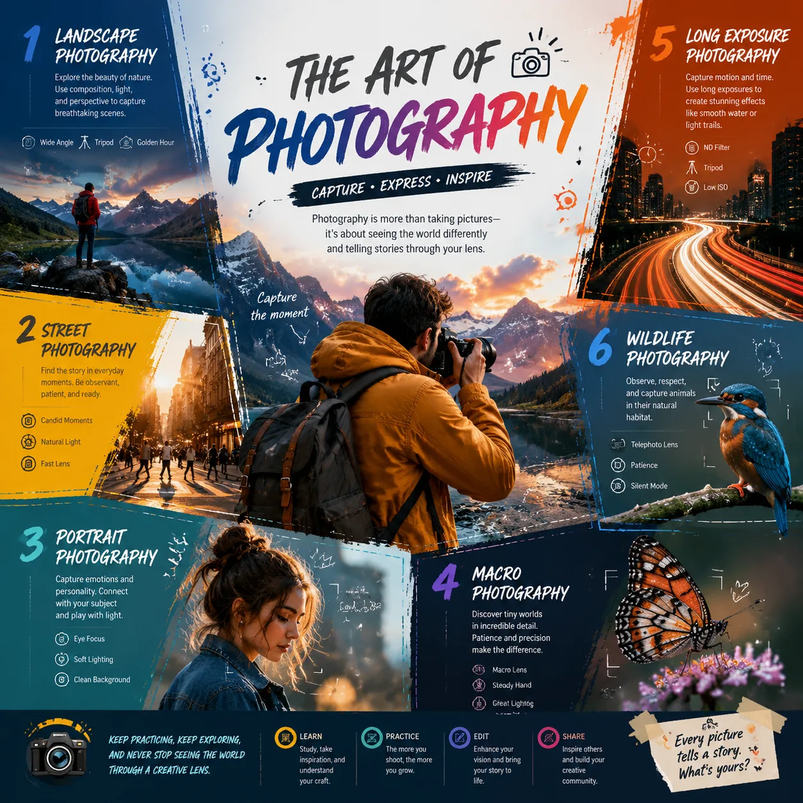

**#37 · UI &amp; Graphic Prompt · <code>Vinano Studio</code>**

<details>
<summary>Show prompt</summary>

```
Make a portrait-sized wallpaper about several activities from the hobby of (Name Hobby), in the wallpaper it contains various movements in the hobby activity, make the wallpaper design as if it was designed by a professional graphic designer, the coloring and UI of the wallpaper are colorful and don't look commonplace, don't be monotonous, and don't look stiff from the visual of the wallpaper, arranged neatly and precisely, 8k resolution Render with rich micro-detail while keeping the layout uncluttered and intentional.
```

</details>

---

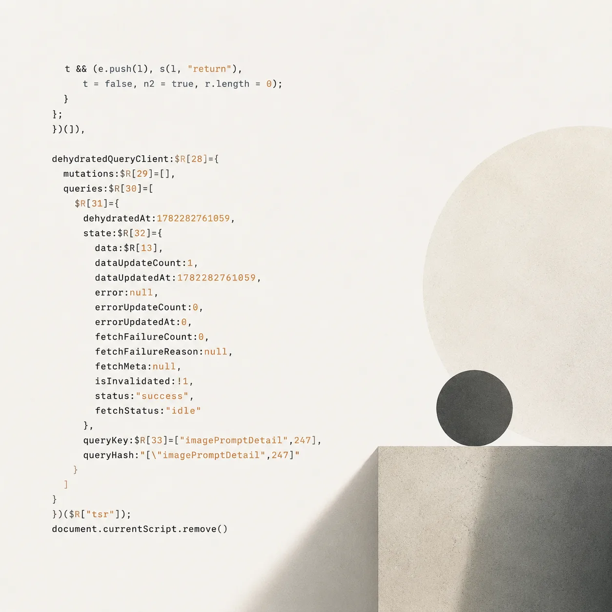

**#38 · UI &amp; Graphic Prompt · <code>Vinano Studio</code>**

<details>
<summary>Show prompt</summary>

```
{
 t && (e.push(l), s(l, "return"), t = false, n2 = true, r.length = 0);
 } };
})()),dehydratedQueryClient:$R[28]={mutations:$R[29]=[],queries:$R[30]=[$R[31]={dehydratedAt:1782282761059,state:$R[32]={data:$R[13],dataUpdateCount:1,dataUpdatedAt:1782282761059,error:null,errorUpdateCount:0,errorUpdatedAt:0,fetchFailureCount:0,fetchFailureReason:null,fetchMeta:null,isInvalidated:!1,status:"success",fetchStatus:"idle"},queryKey:$R[33]=["imagePromptDetail",247],queryHash:"[\"imagePromptDetail\",247]"}]}}})($R["tsr"]);document.currentScript.remove()

Aim for an editorial, design-driven look with deliberate negative space.
```

</details>

---

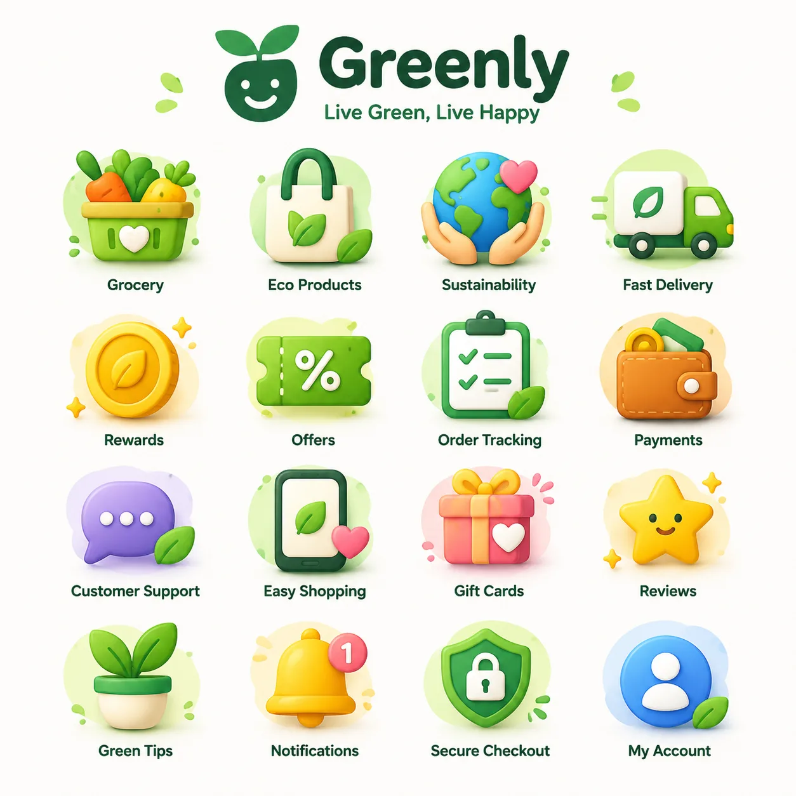

**#39 · UI &amp; Graphic Prompt · <code>Vinano Studio</code>**

<details>
<summary>Show prompt</summary>

```
Create a cohesive collection of playful icons for [BRAND NAME], a [BRAND TYPE/INDUSTRY] brand. Style should be [STYLE KEYWORDS: e.g., rounded, 3D, flat, hand-drawn, minimal] a [COLOR STYLE: vibrant, pastel, gradient, monochrome] palette. Use [DESIGN TRAITS: soft shadows, bold outlines, subtle textures, glow, etc.] to give a friendly and modern feel. Maintain consistency across all icons a unified grid, proportions, and visual language. Icons should represent [LIST OF FEATURES/FUNCTIONS]. Ensure high clarity, balanced spacing, and scalable design suitable for UI, apps, and branding. Maintain consistent colour harmony and crisp focus across the whole frame.
```

</details>

---

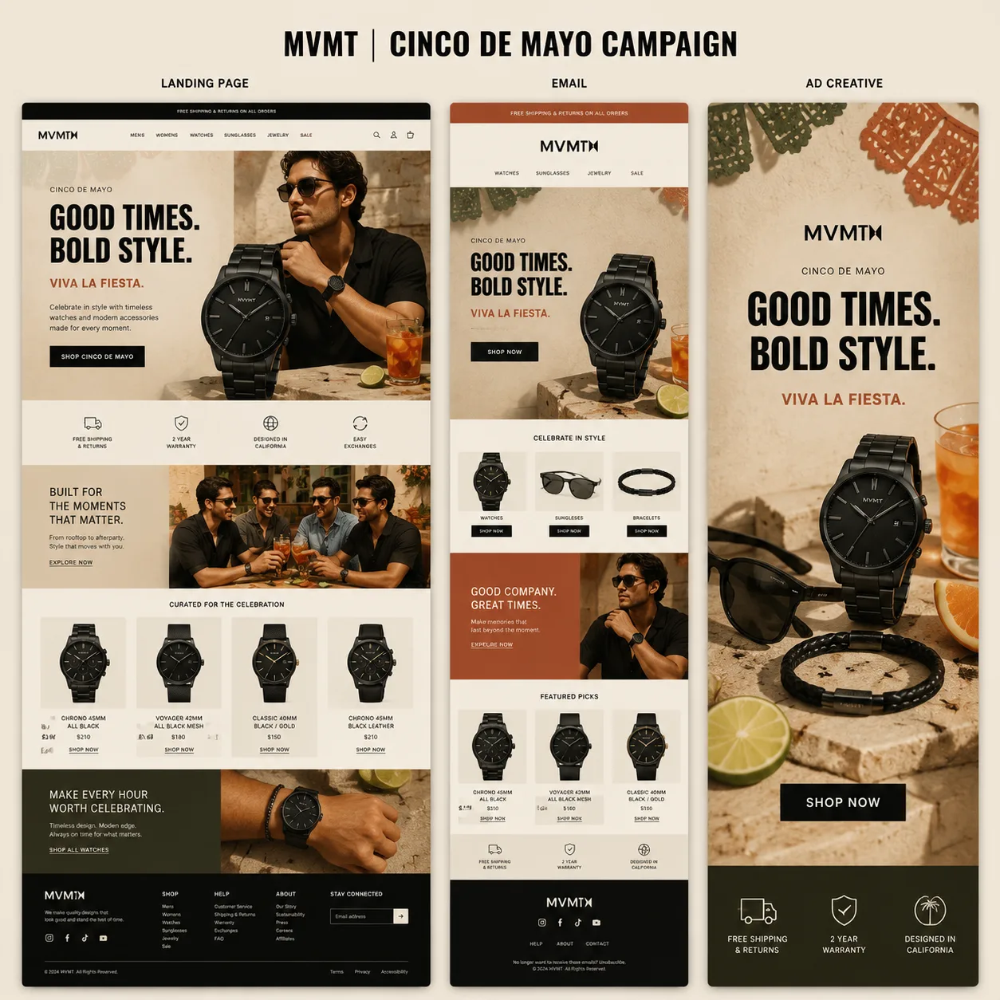

**#40 · UI &amp; Graphic Prompt · <code>Vinano Studio</code>**

<details>
<summary>Show prompt</summary>

```
Create a premium presentation-style campaign board for MVMT’s Cinco de Mayo campaign on a soft warm neutral background.

At the top, add the title:
“MVMT | CINCO DE MAYO CAMPAIGN”

Below it, show three clearly labeled vertical panels side by side subtle shadows:
“LANDING PAGE”
“EMAIL”
“AD CREATIVE”

Overall style:
Clean, premium, masculine-leaning, modern DTC design. The image should feel like a polished creative review board, not a collage. All three panels should clearly belong to the same campaign, shared typography, colors, product styling, and seasonal details.

Use a warm, elevated palette:
cream, sand, stone, black, charcoal, dark olive, terracotta, muted green, and warm golden accents.

Cinco de Mayo direction:
Tasteful and refined, not cheesy. Use subtle festive touches like papel picado-inspired accents, citrus, warm stone textures, celebratory drinks, and sunlit lifestyle styling.

Shared headline direction:
“GOOD TIMES. BOLD STYLE.”
Optional secondary line:
“VIVA LA FIESTA.”

Panel 1 — Landing Page:
Create the widest and most detailed panel as a tall desktop ecommerce landing page.
Include:
- MVMT site header
- hero bold headline
- premium black watch as hero product
- stylish male lifestyle model
- CTA button
- icon/value prop row
- supporting lifestyle banner
- curated product grid
- realistic footer

Panel 2 — Email:
Create a slimmer tall ecommerce email mockup.
Include:
- promo bar
- MVMT logo and header
- hero section same campaign art direction
- curated category or product row
- supporting lifestyle block
- featured products section
- compact footer

Panel 3 — Ad Creative:
Create a bold vertical Facebook ad.
Include:
- strong headline
- premium product composition black watch, sunglasses, and bracelet
- citrus and celebratory props
- CTA button
- compact benefit strip at the bottom messages like:
“FREE SHIPPING & RETURNS”
“2 YEAR WARRANTY”
“DESIGNED IN CALIFORNIA”

Important:
- landing page should feel broader and more layered
- email should feel modular and structured
- ad should feel bold, simple, and conversion-focused
- labels above each panel should be clearly visible
- text should be mostly legible
- everything should feel premium, realistic, and cohesive

Avoid:
cheesy fiesta graphics, bright rainbow colors, clutter, generic templates, messy collage styling, or cartoonish holiday visuals.

Output:
A highly realistic single-image campaign board showing a landing page, email, and ad creative for MVMT’s Cinco de Mayo campaign, all clearly labeled and designed as one cohesive system.

Emphasise material texture and natural light so the final frame feels tactile and premium.
```

</details>

---

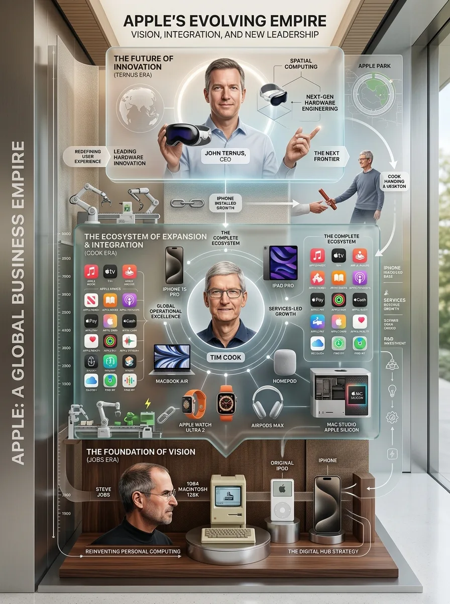

**#41 · UI &amp; Graphic Prompt · <code>Vinano Image Pro</code>**

<details>
<summary>Show prompt</summary>

```
高复杂度信息图：结合今天的新闻，CEO 换成了Ternus，信息图要竖版 3:4要有乔布斯、cook、Ternus 三人头像，以及产品，以及超多苹果服务标志，整体风格偏 WWDC 的苹果风格，完整展现苹果庞大商业帝国 强调材质质感与自然光影，让画面更具高级真实感。
```

</details>

---

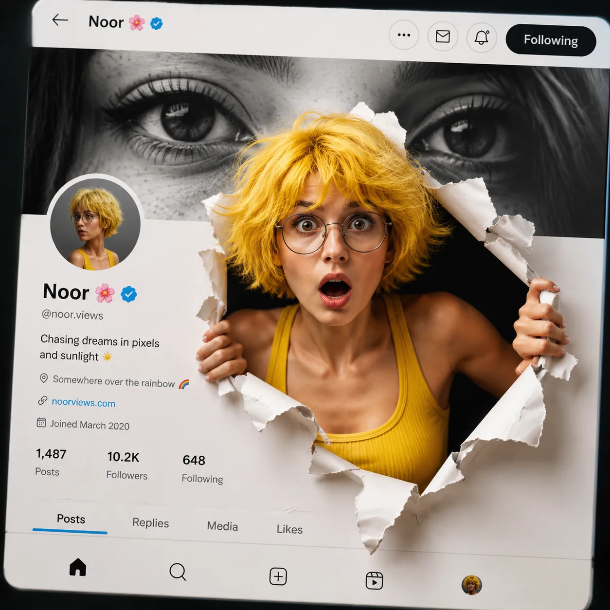

**#42 · UI &amp; Graphic Prompt · <code>Vinano Studio</code>**

<details>
<summary>Show prompt</summary>

```
A creative 3D photo manipulation of a social media profile interface, featuring a surprised young woman short messy yellow hair, round glasses, and expressive wide eyes, wearing a sleeveless yellow top. She is breaking through a torn paper effect from the screen, holding the ripped edges both hands. The tear reveals a dark background behind her, adding depth. The UI resembles a modern social media profile page profile picture, username “Noor 🌸”, verified badge, bio text, and follower stats. Top banner shows a black-and-white close-up of eyes. Clean minimal layout, soft shadows, realistic lighting, high detail, depth-of-field, ultra-realistic textures, cinematic composition, vibrant color contrast, trending AI art style, 4K resolution. Emphasise material texture and natural light so the final frame feels tactile and premium.
```

</details>

---

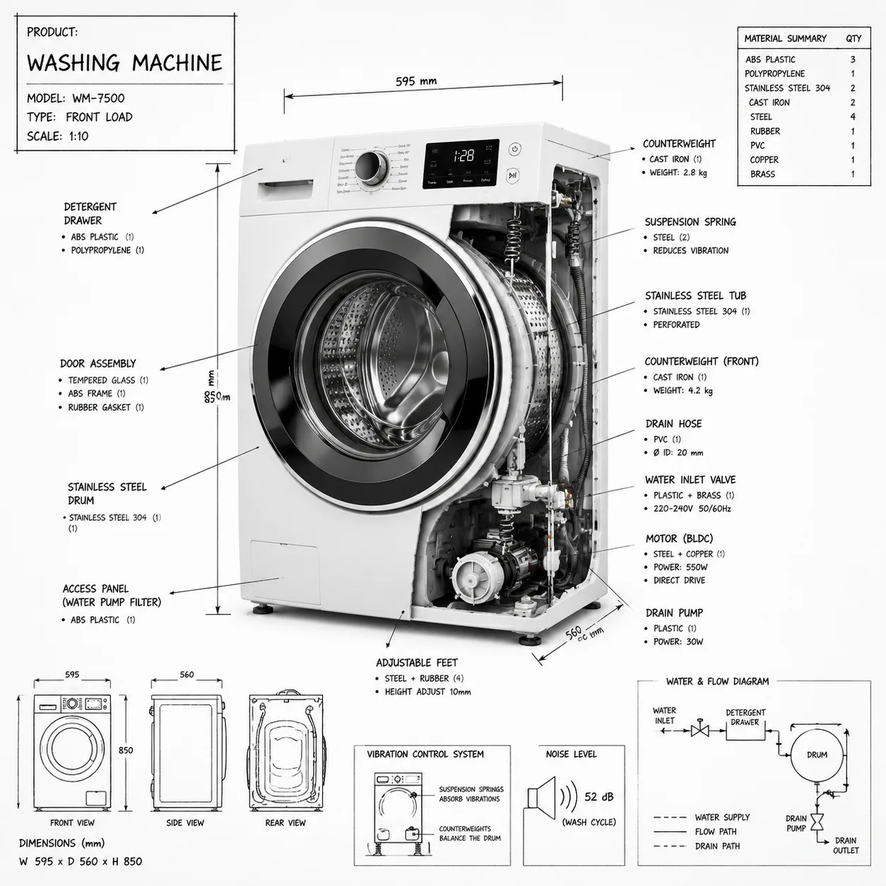

**#43 · UI &amp; Graphic Prompt · <code>Vinano Studio</code>**

<details>
<summary>Show prompt</summary>

```
Create an infographic image of [washing machine], combining a realistic photograph or photoreal render of the object technical annotation overlays placed directly on top.

Use black ink–style line drawings and text (technical pen / architectural sketch look) on a pure white studio background, including:
•Key component labels
•Internal cutaway or exploded-view outlines
•Measurements, dimensions, and scale markers
•Material callouts and quantities
•Arrows indicating function, force, or flow (air, sound, power, pressure)
•Simple schematic or sectional diagrams where relevant

Place the title [PRODUCT] inside a hand-drawn technical annotation box in one corner.

Style & layout rules:
•The real object remains clearly visible beneath the annotations
•Annotations feel sketched, technical, and architectural
•crisp composition balanced negative space
•Educational, museum-exhibit / engineering-manual vibe

Visual style:
Minimal technical illustration aesthetic, black linework over realistic imagery, precise but slightly hand-drawn feel.

Color palette:
White background, black annotation lines and text only. No colors.

Output:
1080×1080, ultra-crisp, social-feed optimized, no watermark.

Keep edges clean and the overall composition balanced for a polished, gallery-ready result.
```

</details>

---

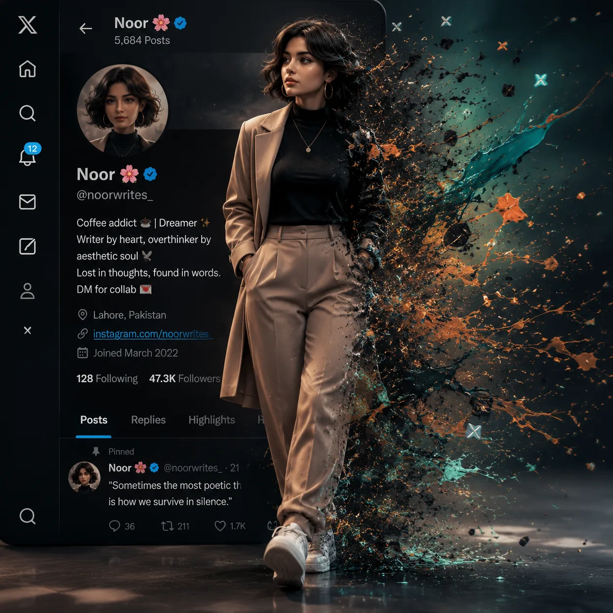

**#44 · UI &amp; Graphic Prompt · <code>Vinano Studio</code>**

<details>
<summary>Show prompt</summary>

```
A cinematic digital artwork of a stylish animated girl walking out of a modern X (Twitter) profile interface. The background shows a real mobile UI profile screen the name "Noor 🌸", verified badge, username, and detailed bio.
The girl matches the profile picture — soft aesthetic illustration style, short wavy black hair, gold hoop earrings, minimal makeup, wearing a black turtleneck and beige coat matching pants and sneakers.
She is stepping forward confidently from the screen into real space. The right half of her body dissolves into dynamic particles — a mix of black dust, teal, and orange energy splashes, flowing outward like liquid + digital fragments.
crisp composition: left side = structured UI, right side = abstract particle explosion. Soft filmic, cinematic lighting, depth of field, ultra-detailed textures, smooth shadows, 4K render, octane render, Unreal Engine 5 style, trending on ArtStation.

Preserve realistic proportions and depth for a confident, professional finish.
```

</details>

---

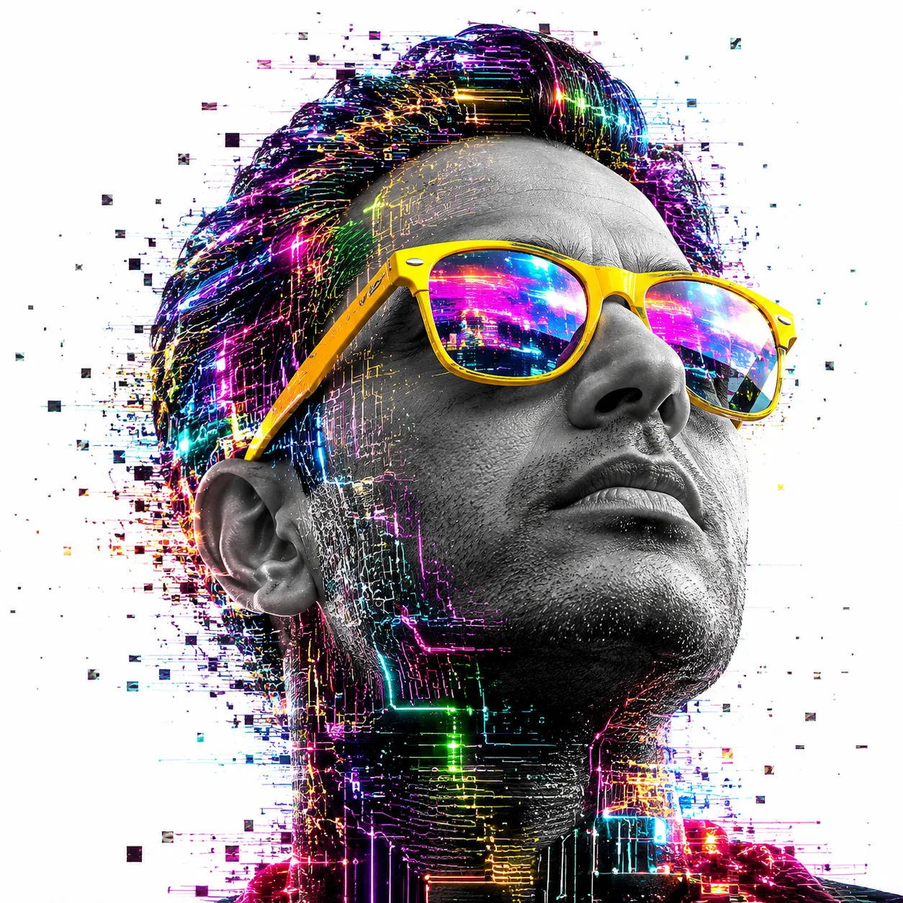

**#45 · UI &amp; Graphic Prompt · <code>Vinano Studio</code>**

<details>
<summary>Show prompt</summary>

```
A hyper-realistic 8K close-up portrait of a person's head and upper neck, shot from a slightly low-angle perspective looking upward.
Use the uploaded image as the face reference - the face must match 100% exactly (same identity, facial structure, proportions, skin details, and expression). Do not alter the face in any way.
The subject is wearing bright yellow sunglasses reflective lenses showing colorful abstract digital scenes in shades of pink, blue, and yellow.
The face is rendered in detailed grayscale, showing realistic skin texture, pores, and light stubble on the jawline, creating strong contrast the rest of the head.
The hair and most of the head and neck are made of glowing digital circuit patterns, abstract shapes, lines, and data streams in vibrant colors like magenta, cyan, blue, green, yellow, and orange. These elements appear layered and complex, a soft internal glow.
Parts of the digital head are breaking apart and dissolving outward into pixels, lines, and glitch fragments that fade into a clean white background, giving a glitch-art, futuristic look.
filmic, cinematic lighting highlights one side of the face, shadows under the chin and subtle rim lighting around the digital elements.
Overall style is futuristic, cyber-inspired, high-detail, and true-to-life photorealistic.

Preserve realistic proportions and depth for a confident, professional finish.
```

</details>

---

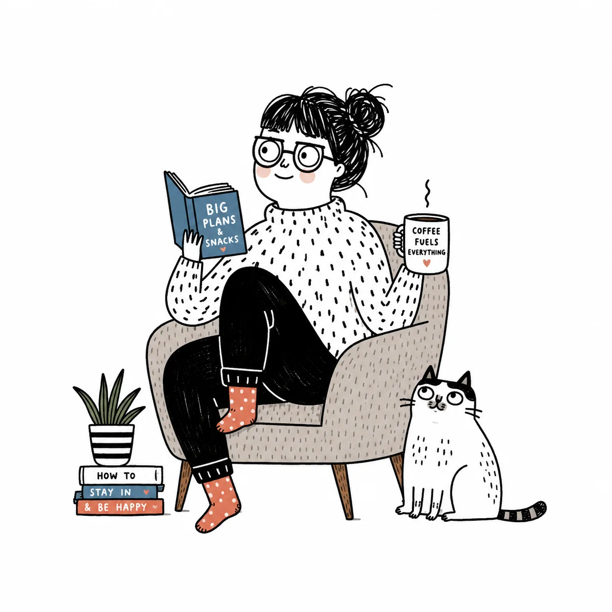

**#46 · UI &amp; Graphic Prompt · <code>Vinano Studio</code>**

<details>
<summary>Show prompt</summary>

```
A simple illustration of a [subject] in [outfit], [doing action], a [facial expression] expression, Gemma Correll, playful hand-drawn linework, quirky character design, minimal detail, expressive posture, clean white background, charming editorial illustration feel Aim for an editorial, design-driven look with deliberate negative space.
```

</details>

---

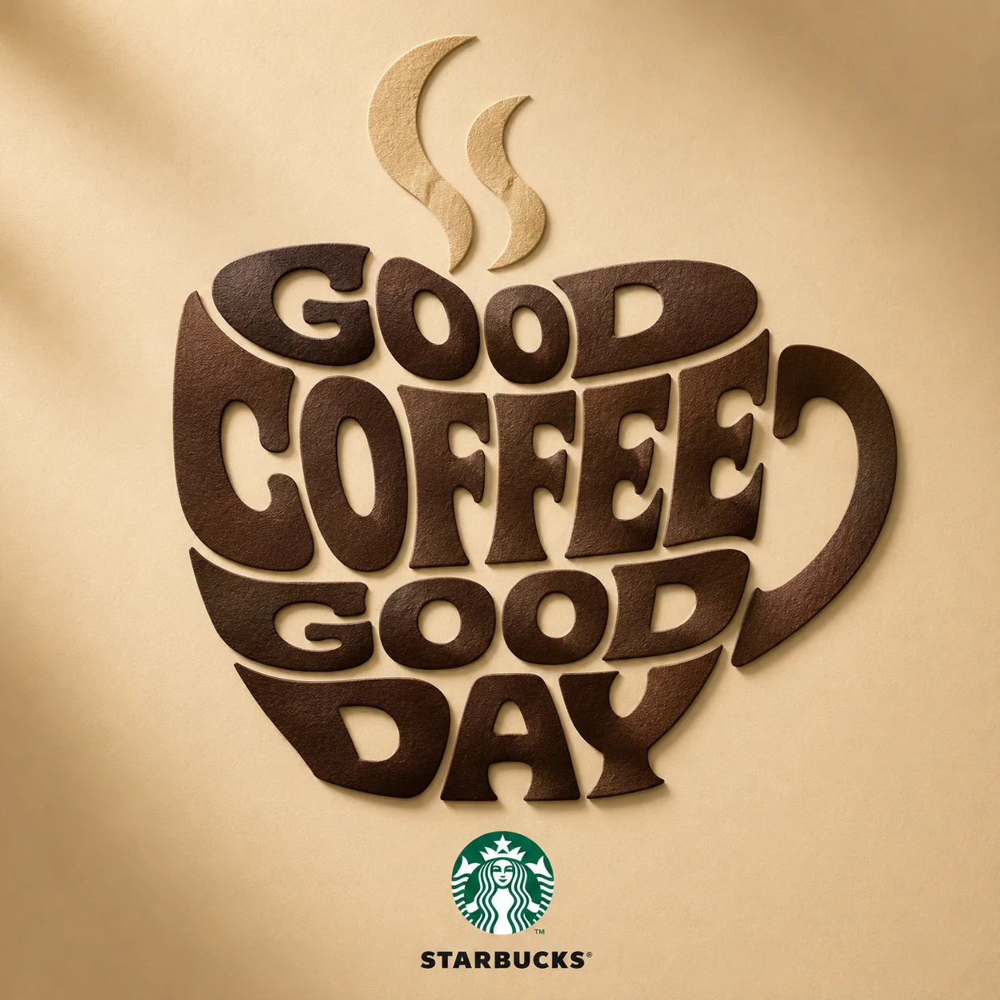

**#47 · UI &amp; Graphic Prompt · <code>Vinano Studio</code>**

<details>
<summary>Show prompt</summary>

```
Create a typographic illustration shaped like a [OBJECT], where the text [BRAND SLOGAN] forms the shape — bold and playful lettering style that fills the entire silhouette — letters adapt fluidly to the curves and contours of the [OBJECT] — [COLOR DESCRIPTION] [BACKGROUND COLOR] background that enhances the focus on the main shape — include [BRAND] logo positioned below the [OBJECT] — vector-style, clean, high resolution, 1080x1080 pixels, square format. Emphasise material texture and natural light so the final frame feels tactile and premium.
```

</details>

---

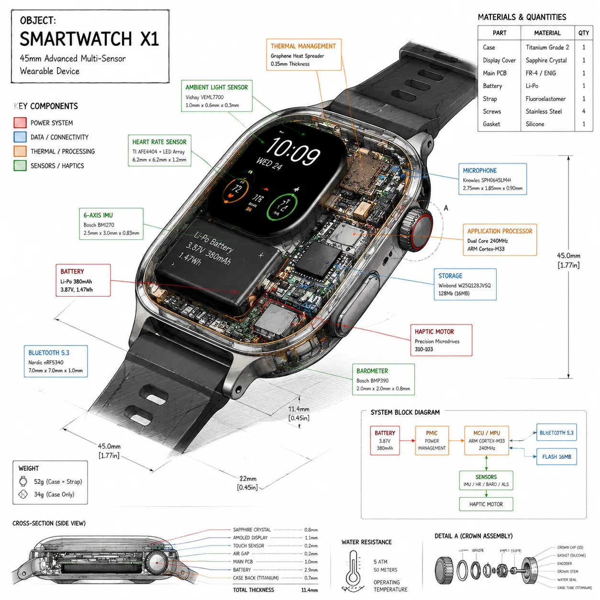

**#48 · UI &amp; Graphic Prompt · <code>Vinano Studio</code>**

<details>
<summary>Show prompt</summary>

```
Create a technical infographic of [OBJECT] a 45-degree isometric 3D perspective showing the device slightly tilted to reveal depth and dimension.
Combine a realistic photoreal render black ink technical annotations on pure white background. Include:
Key component labels color-coded callout boxes
Internal component visibility through transparent/cutaway sections
Measurements, dimensions, and precise scale markers
Material callouts and quantities
Color-coded arrows for function/flow: RED (power/battery), BLUE (data/connectivity), ORANGE (thermal/processor), GREEN (sensors/haptics)
Simple schematics or cross-sectional diagrams where relevant

Place “OBJECT” title in a hand-drawn technical box (top-left corner).
Style: Black linework (technical pen/architectural), sketched but precise. Object remains clearly visible. Educational museum-exhibit vibe. crisp composition, balanced negative space.
Perspective: Isometric 3D angle—tilted to show depth, dimension, and internal architecture dramatically. Like a professional product teardown or engineering manual.
Colors: ~10-15% accent density. Black dominant. White background.
Output: 1080×1080, ultra-crisp, social-feed optimized.

Render with rich micro-detail while keeping the layout uncluttered and intentional.
```

</details>

---

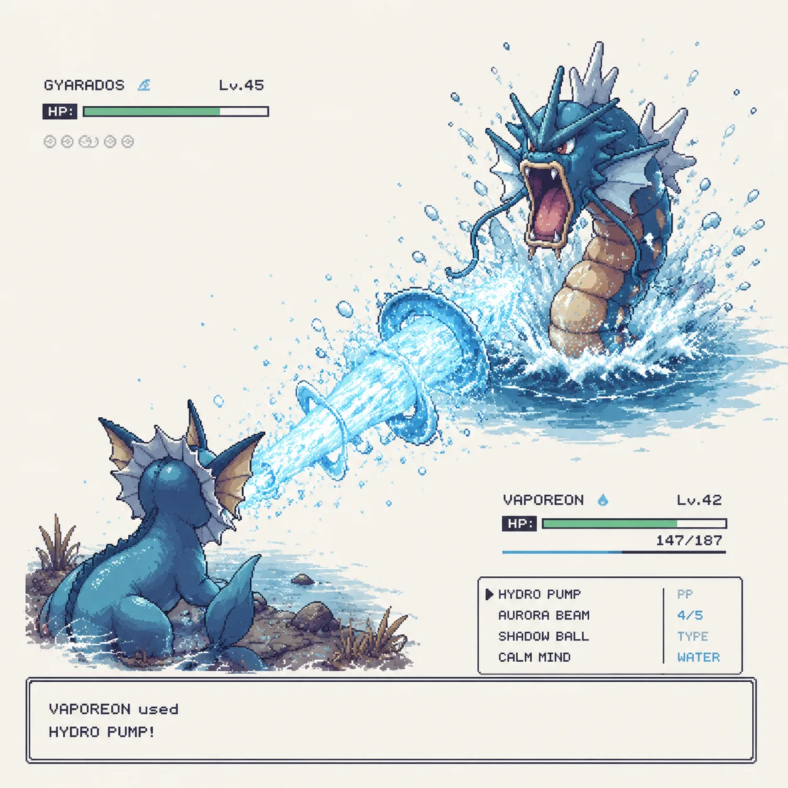

**#49 · Ai Art, Ai Prompt · <code>Vinano Studio</code>**

> Keywords: AI art, AI prompt, text to image

<details>
<summary>Show prompt</summary>

```
inspired by a classic pokemon gameboy screenshot but it's highly detailed beautiful pixel art, include cool effects from moves used, modern minimal ui Aim for an editorial, design-driven look with deliberate negative space.
```

</details>

---

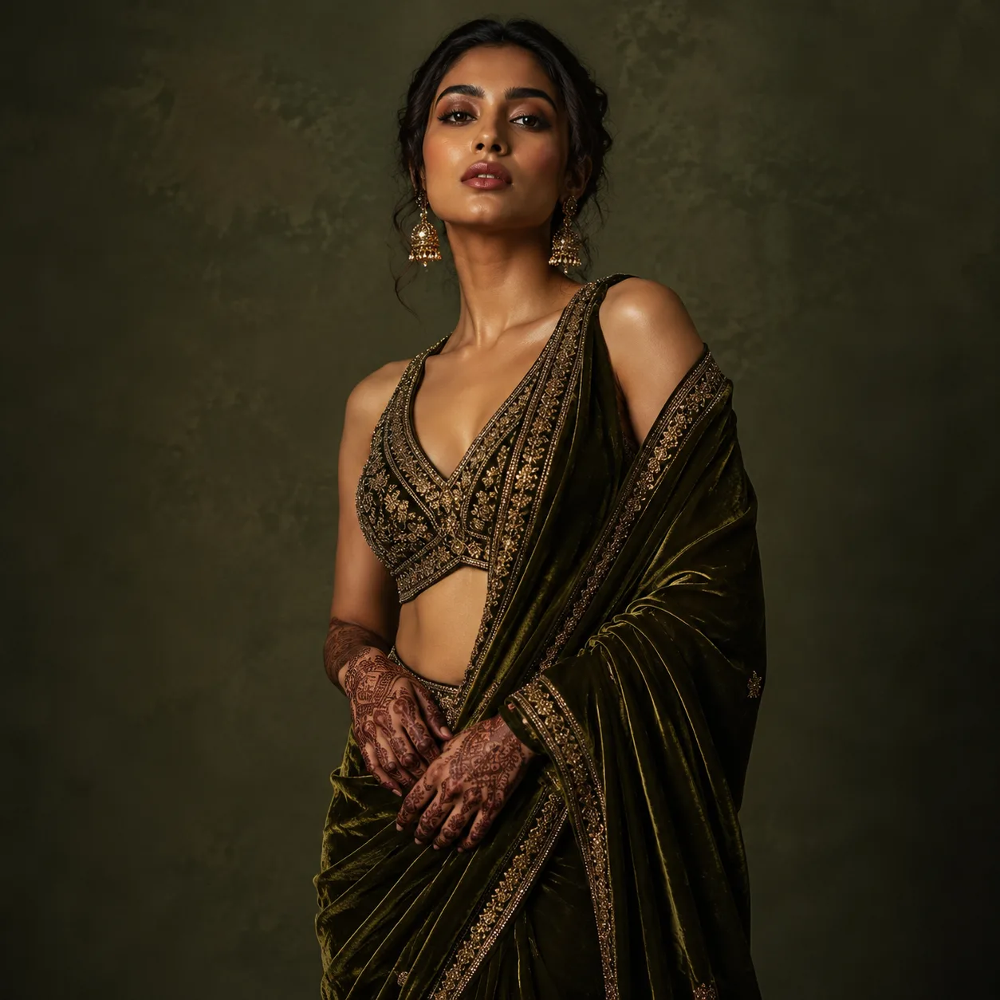

**#50 · Ai Art, Ai Prompt · <code>Vinano Studio</code>**

> Keywords: AI art, AI prompt, text to image

<details>
<summary>Show prompt</summary>

```
A detailed, high-fashion studio photograph of a woman posing gracefully, wearing a luxurious olive green velvet saree draped elegantly over her shoulder, paired a matching heavily embroidered sleeveless blouse that highlights her midriff. The lighting is moody and dramatic, accentuating the rich texture of the velvet and giving her skin a subtle, dewy sheen. Her hands are adorned intricate, dark henna (mehndi) designs, and she is wearing traditional gold earrings, looking directly into the camera a confident expression. Aim for an editorial, design-driven look with deliberate negative space.
```

</details>

---

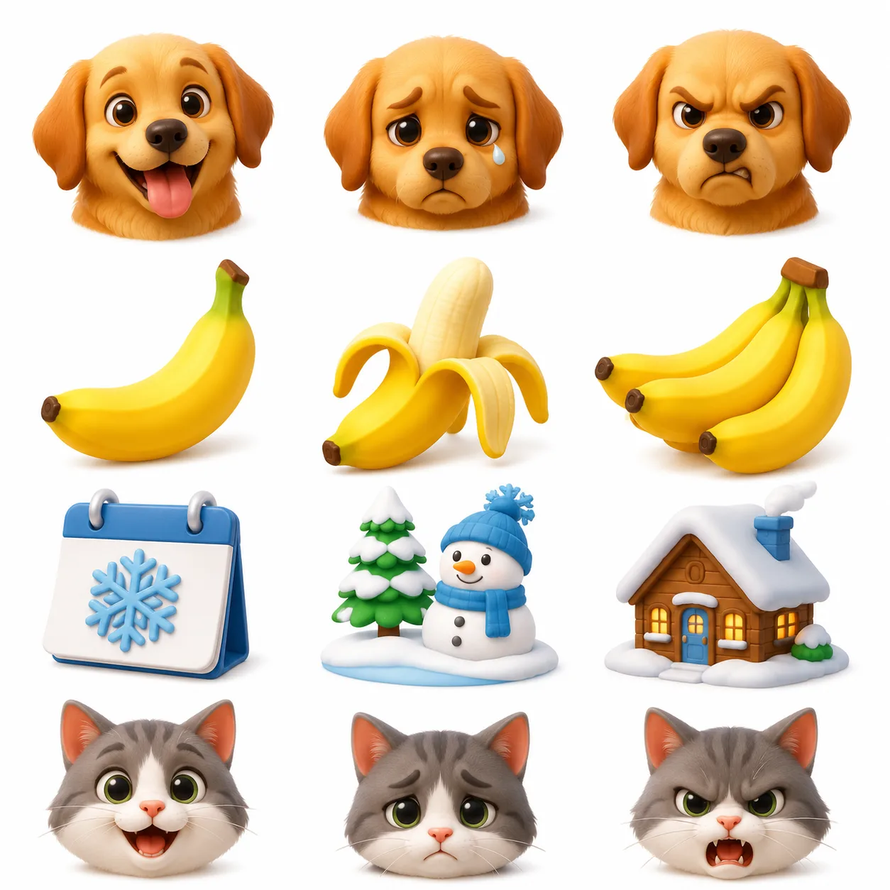

**#51 · Ai Art, Ai Prompt · <code>Vinano Studio</code>**

> Keywords: AI art, AI prompt, text to image

<details>
<summary>Show prompt</summary>

```
Create a collection of icons representing [a theme], they belong together as a single theme. Put them in a 3x3 grid. The background is white. Make the icons in a colorful and tactile 3D style. No text.

- dogs different emotions
- bananas
- January
- the same cat in different emotions

Maintain consistent colour harmony and crisp focus across the whole frame.
```

</details>

---

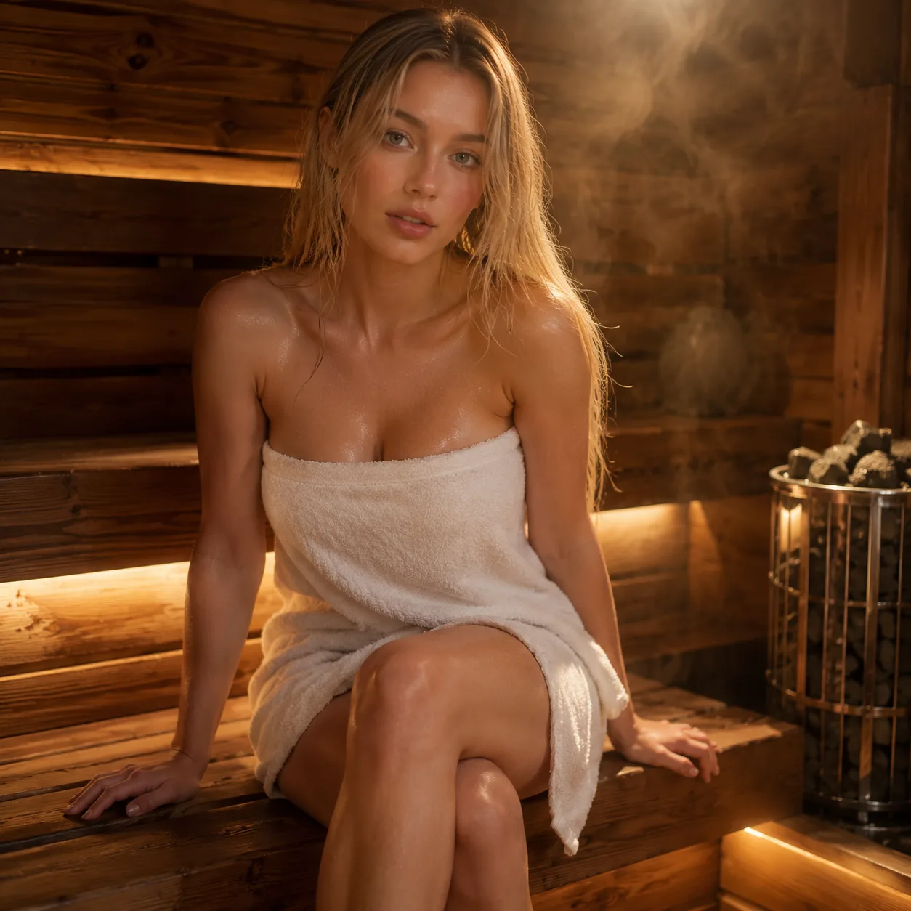

**#52 · Realistic, Portrait · <code>Vinano Studio</code>**

> Keywords: realistic, portrait, cinematic, AI art, AI prompt, text to image

<details>
<summary>Show prompt</summary>

```
{
 "project_configuration": {
 "title": "Cinematic Wellness: The Sauna Portrait",
 "version": "2.0_High_Fidelity",
 "output_parameters": {
 "aspect_ratio": "9:16",
 "resolution": "8K UHD",
 "color_space": "DCI-P3",
 "style_preset": "Hyper-realistic Photorealism",
 "rendering_engine": "Octane Render / Unreal Engine 5.4 Path Tracing"
 }
 },
 "subject_composition": {
 "identity": {
 "resemblance": "Sydney Sweeney",
 "age_range": "Early 20s",
 "expression": "Serene, introspective, captivating, direct eye contact",
 "skin_tone": "Fair, ivory, dewy complexion"
 },
 "anatomical_precision": {
 "micro_details": "Visible skin pores, fine vellus hair, realistic skin texture, subcutaneous scattering (SSS), tiny crystalline water droplets on collarbones and forehead.",
 "eyes": "Deep hazel, intricate iris patterns, sharp catchlights reflecting the warm sauna interior.",
 "lips": "Soft pink, moist, slightly parted, high-gloss finish from the humidity.",
 "hair": "Long blonde hair, wet-look styling, damp strands clinging to the skin, dark-blonde roots, high-specularity sheen."
 },
 "attire_and_fabric": {
 "primary_garment": "High-texture white cotton bath towel",
 "fabric_details": "Visible terry cloth loops, heavy fabric weight, damp patches showing darker white tones, intricate weaving patterns, soft frayed edges."
 },
 "pose_and_dynamics": {
 "position": "Seated elegantly on a mid-level cedar bench, legs crossed at the ankles.",
 "body_language": "Leaning slightly forward to create depth, relaxed shoulders, natural posture, hands resting softly on the wood."
 }
 },
 "environment_design": {
 "setting": "Ultra-luxury traditional Finnish sauna",
 "interior_materials": {
 "wood": "Polished Western Red Cedar, horizontal slats, visible grain, knots, and heat-induced oil sheen.",
 "elements": "Hot sauna stones in a stainless steel heater (background), rising heat haze."
 },
 "atmospheric_effects": {
 "steam": "Ethereal swirling mist, volumetric fog, thick humidity, moisture-laden air.",
 "haze": "Soft-focus background, golden-hour glow filtered through steam particles."
 }
 },
 "lighting_and_optics": {
 "lighting_setup": {
 "type": "Warm diffused ambient lighting",
 "primary_source": "Hidden LED strips beneath benches creating a soft under-glow.",
 "secondary_source": "Top-down warm spotlighting (3200K temperature).",
 "shadows": "Soft, diffused, zero harsh edges."
 },
 "optical_settings": {
 "lens": "35mm prime lens, wide angle minimal distortion.",
 "aperture": "f/1.8 for shallow depth of field (bokeh background).",
 "focus": "Sharp focus on the subject's eyes, gradual fall-off on the shoulders and environment."
 }
 },
 "technical_post_processing": {
 "quality_enhancements": ["true-to-life photorealistic masterpiece",
 "Ray-traced reflections",
 "Global illumination",
 "Anamorphic lens flares (subtle)",
 "High Dynamic Range (HDR10+)",
 "16-bit color depth"],
 "color_grading": {
 "palette": "Warm ambers, deep browns, clean whites, soft skin tones.",
 "vibe": "Cinematic, intimate, luxury spa, high-end editorial."
 }
 }
}

Emphasise material texture and natural light so the final frame feels tactile and premium.
```

</details>

---

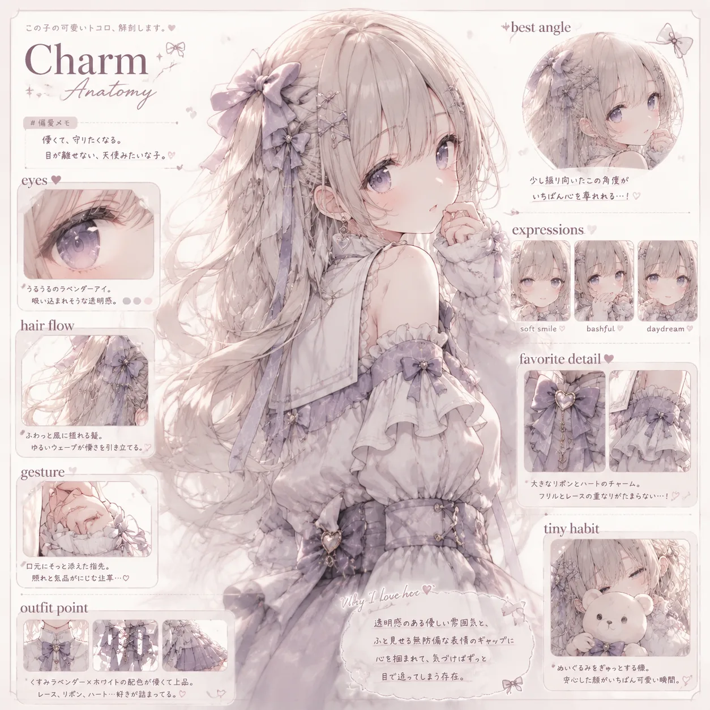

**#53 · Anime, Character · <code>Vinano Studio</code>**

> Keywords: anime, character, AI art, AI prompt, text to image

<details>
<summary>Show prompt</summary>

```
入力されたキャラクター画像をもとに、
そのキャラクターの「魅力解剖図」を1枚のビジュアルとして作成してください。

これは通常のキャラクター設定資料、三面図、プロフィールシートではありません。
目的は、キャラクターの情報を説明することではなく、
「この子のどこが可愛いのか」「なぜ目を惹かれるのか」「どの部分に好きになる理由があるのか」を、
デザイン的・感情的に分解して見せることです。

入力画像からキャラクターの以下の魅力要素を丁寧に読み取ってください。

・目の形、瞳の色、目線の印象
・髪の流れ、前髪、毛先、シルエットの可愛さ
・表情のクセ、微笑み方、照れ、無表情の中の感情
・手の仕草、指先、袖口との関係
・衣装の好きポイント、リボン、フリル、装飾、小物
・首元、肩、袖、スカート、靴などの見せ場
・そのキャラクターが一番かわいく見える角度
・全体から感じる性格、雰囲気、守りたくなるポイント、惹かれる理由

中央にはキャラクターを大きく配置してください。
キャラクターはただ立たせるのではなく、
その子の魅力が最も伝わる角度、ポーズ、表情で描いてください。
正面すぎる証明写真のような構図は禁止。
少し振り向く、手を口元に添える、袖をつまむ、髪を軽く押さえる、視線を少し外すなど、
“好きになる瞬間”を切り取ったような自然で魅力的なポーズにしてください。

周囲には、キャラクターの魅力ポイントを分解した小さなクローズアップパネルを配置してください。
ただし機械的な設定資料のように並べるのではなく、
雑誌の特集ページ、デザイン解剖図、ファンが作った愛のある分析ボードのように、
美しく、可愛く、少し偏愛を感じるレイアウトにしてください。

配置するパネル例：
・瞳のアップ：この子らしさが宿る目元
・髪の流れ：シルエットを決める毛束
・手元：仕草に出る性格
・表情差分：微笑み、照れ、少し不機嫌、無防備な顔
・衣装の推しポイント：リボン、袖、襟、装飾、素材感
・一番かわいい角度：顔の向き、視線、首の傾き
・小物やモチーフ：その子の世界観を象徴する要素

各パネルは、キャラクターの魅力を強調するための拡大カットとして描いてください。
パーツだけを無機質に切り抜くのではなく、
「ここが好き」と思わせるような温度感のある見せ方にしてください。

画面内には短い注釈風のラベルを入れてもよいですが、
長文説明ではなく、短い見出しや記号的なデザインにしてください。
例：
“eyes”
“hair flow”
“gesture”
“best angle”
“favorite detail”
“charm point”
“soft expression”
“tiny habit”

文字は主役にしすぎず、あくまでデザイン要素として扱ってください。
読ませる資料ではなく、見た瞬間に「この子、可愛い」と伝わるビジュアルにしてください。

デザイン全体は、可愛い研究ノート、キャラクター愛の解剖図、ファッション誌の分析ページ、公式アートブックの特集ページを合わせたような雰囲気。
背景はシンプルで清潔感があり、キャラクターの色に合わせた淡いグラデーション、紙面風の余白、細い罫線、半透明のパネル、手書き風の丸囲み、矢印、ハート、小さな装飾を使ってください。

重要：
キャラクターを単に説明しないこと。
身長、年齢、能力、所属、武器説明などの設定資料的な情報は不要です。
描くべきなのはスペックではなく、
“好きになる理由”です。

キャラクター本人の魅力が最優先。
パネルや注釈が多すぎて主役が埋もれないようにしてください。
中央のキャラクターは必ず最も可愛く、最も完成度高く描いてください。

全体の印象：
cute character charm analysis sheet,
visual breakdown of cuteness,
not a character profile,
not a model sheet,
aesthetic design board,
fan-favorite details,
emotional attraction map,
soft editorial layout,
official artbook style,
clean anime illustration,
beautiful eyes,
expressive hands,
flowing hair,
adorable pose,
best angle,
lovable expression,
fashion detail close-ups,
delicate annotations,
soft pastel panels,
refined graphic design,
premium-quality anime illustration,
commercial-level finish.

Emphasise material texture and natural light so the final frame feels tactile and premium.
```

</details>

---

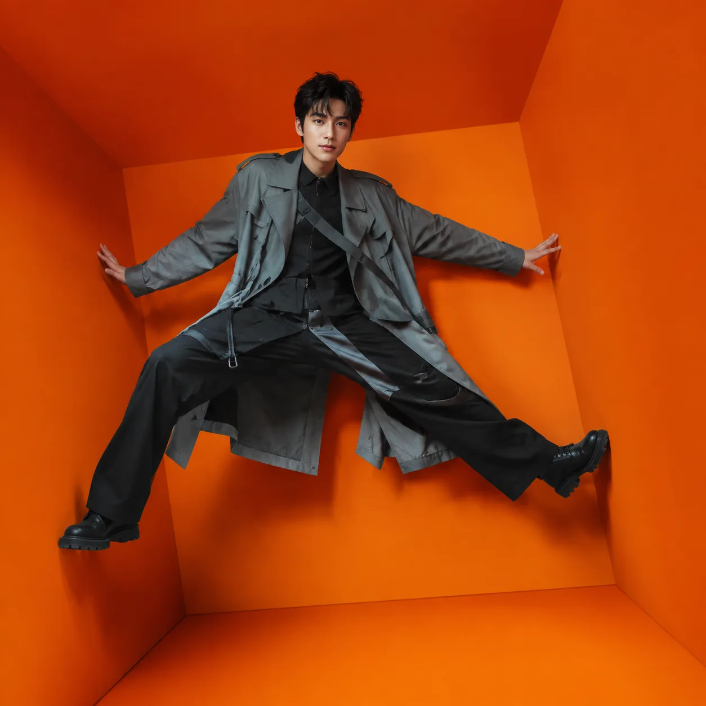

**#54 · Realistic, Cinematic · <code>Vinano Studio</code>**

> Keywords: realistic, cinematic, AI art, AI prompt, text to image

<details>
<summary>Show prompt</summary>

```
[INPUT IMAGE: USER_PHOTO] Use the person in the input image as the ONLY subject. Preserve their identity and facial features clearly.

Create a hyper-realistic high-fashion editorial photo inside a surreal 3D geometric “color box” room (a hollow cube / tilted cube set). Each render MUST randomly choose:
1) a bold single-color box (monochrome environment, vivid and saturated),
2) a dynamic “cool” fashion pose (gravity-defying or extreme stretch / leap / sideways bracing against the walls),
3) a dramatic camera angle (wide-angle 24–35mm equivalent, tilted horizon, strong perspective).

The subject appears full-body and sharp, wearing an avant-garde fashion styling that feels modern and editorial (clean silhouette, stylish layering, premium fabric texture). Keep clothing tasteful and fashion-forward. The subject’s pose should feel athletic, stylish, and unusual—like a magazine campaign shot.

Lighting: studio quality, crisp and cinematic; strong key light controlled soft shadows, subtle rim light; realistic reflections and bounce light from the colored walls. Ultra-detailed skin texture, natural pores, realistic fabric weave, clean edges, high dynamic range.
Composition: subject centered plenty of negative space and strong geometric lines; the box perspective frames the subject.
Color: the box color is a SINGLE bold color and MUST be different each run (random vivid hue). The subject’s outfit contrasts well the box color.

Output: hyper-real, true-to-life photorealistic, 8k detail, editorial campaign quality, sharp focus on subject, no motion blur, no distortion of face, natural proportions.

Preserve realistic proportions and depth for a confident, professional finish.
```

</details>

---

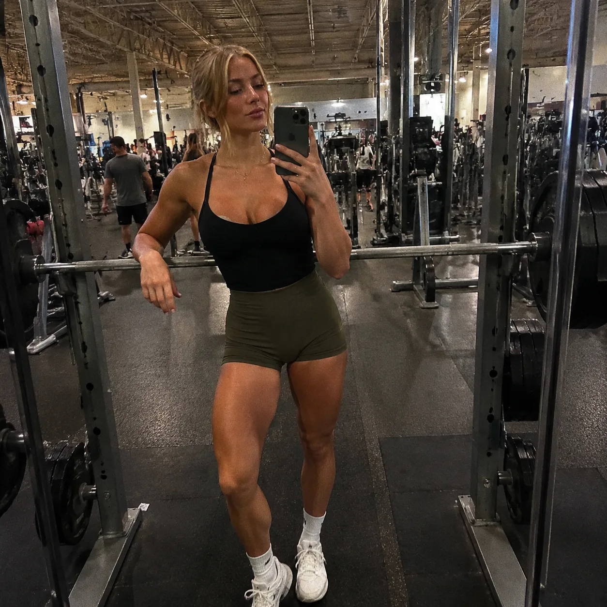

**#55 · Realistic, Cinematic · <code>Vinano Studio</code>**

> Keywords: realistic, cinematic, AI art, AI prompt, text to image

<details>
<summary>Show prompt</summary>

```
A mirror selfie taken inside a commercial gym, photographed a smartphone front camera. The subject is an attractive, athletic woman a curvy, feminine build, strong thighs and hips, toned legs, and a confident stance. She is wearing a black tank top a deep neckline and olive-green high-waisted workout shorts, white socks, and white trainers.

She stands inside a squat rack, one knee slightly bent, hips angled forward, leaning casually against the barbell. The gym environment is clearly visible: metal racks, weight machines, rubber flooring, high industrial ceiling exposed beams, warm overhead lights, and other gym-goers blurred in the background.

Her face is fully visible and resembles Sydney Sweeney — soft facial features, expressive eyes, blonde hair styled naturally, minimal makeup, realistic skin texture — captured casually as if mid-workout. Expression is relaxed and confident, not posed.

The photo has a raw smartphone aesthetic:

noticeable film grain and digital noise

low resolution

mild blur and compression artifacts

imperfect focus

uneven indoor lighting

slightly warm color cast

The image feels candid and unpolished, like a real gym mirror selfie posted online.
true-to-life photorealistic, casual realism, modern lo-fi aesthetic, natural body proportions.

Camera & Style Cues

Smartphone front camera

Mirror selfie

Slight wide-angle distortion

Indoor gym lighting

No studio polish

Negative Prompt;

ultra-high resolution, professional photoshoot, filmic, cinematic lighting, flawless skin, exaggerated curves, plastic look, studio background, cartoon style, text, watermark

Aim for an editorial, design-driven look with deliberate negative space.
```

</details>

---

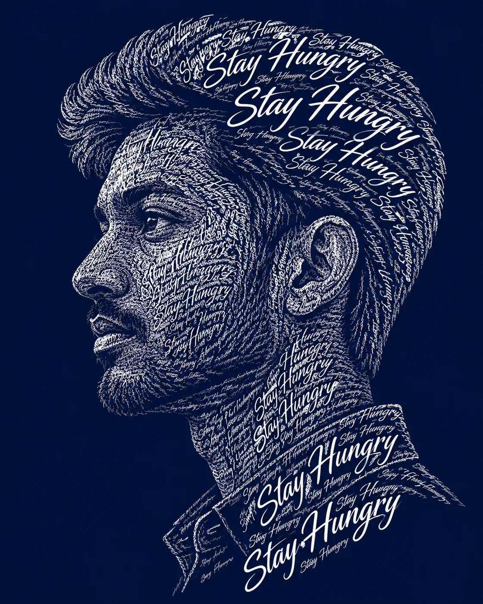

**#56 · Portrait, Ai Art · <code>Vinano Studio</code>**

> Keywords: portrait, AI art, AI prompt, text to image

<details>
<summary>Show prompt</summary>

```
Create a typographic art portrait the uploaded photo of a person as reference. Display a left-facing side profile portrait. The entire image--including the face. hair. and facial features--must be formed exclusively from repeated white calligraphic text the words: "[PUT WHATEVER WORDS YOU WANT HERE]" The text should follow the natural contours of the face and hair, clearly shaping the person's profile silhouette. Use a deep navy blue background high contrast The stvle should be clean vector art sharp edges. Output in high-resolution 8K quality. Do not alter the person's facial identity. No additional colors. no textures. and no watermark. Dimension 4:5 Maintain consistent colour harmony and crisp focus across the whole frame.
```

</details>

---

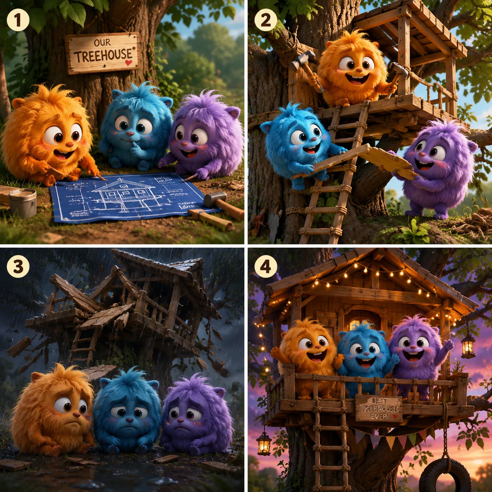

**#57 · Character, Ai Art · <code>Vinano Studio</code>**

> Keywords: character, AI art, AI prompt, text to image

<details>
<summary>Show prompt</summary>

```
Create a funny 4-part story featuring 3 fluffy creatures building a treehouse. The story has emotional highs and lows and ends in a happy moment. Maintain consistent identity across the 3 characters. Generate 4 images in 16:9 format, one at a time. Preserve realistic proportions and depth for a confident, professional finish.
```

</details>

---

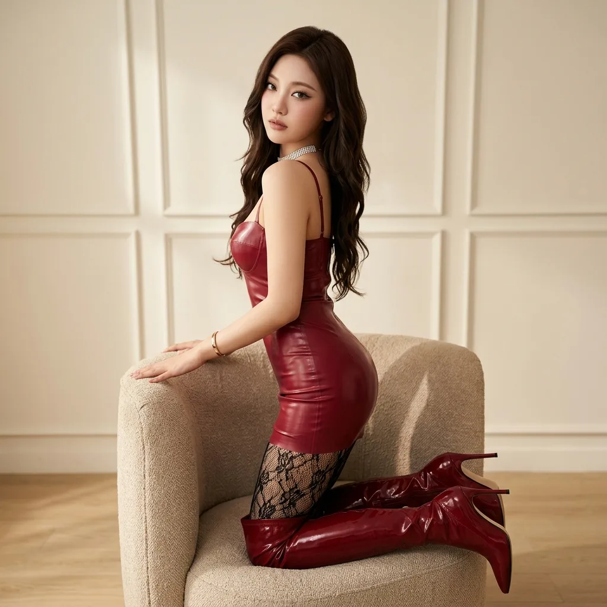

**#58 · Realistic, Portrait · <code>Vinano Image Pro</code>**

> Keywords: realistic, portrait, minimalist, AI art, AI prompt, text to image

<details>
<summary>Show prompt</summary>

```
{
  "raw_prompt": "Ultra-realistic high-end smartphone photo of aespa's Ningning in a refined minimalist luxury studio. She has a distinct feline-like eye shape, soft cheeks, and long dark espresso brown hair styled in soft waves. She is wearing a deep ruby red latex mini dress a structured sweetheart neckline and thin straps, paired intricate floral lace patterned tights and ruby red patent leather thigh-high stiletto boots. She is kneeling elegantly on a beige upholstered chair, twisting her torso to look back at the camera an alluring, composed expression. Soft studio lighting warm highlights. --ar 9:16",
  "aspect_ratio": "9:16",
  "subjects": [{
      "name": "Ningning (aespa)",
      "physical_features": "Distinct feline-like eye shape, soft cheeks, fair skin, long dark espresso brown hair soft waves. Polished glam makeup sharp eyeliner and a muted nude lip.",
      "outfit": {
        "garment": "Deep ruby red latex mini dress, tight body-hugging fit, structured sweetheart neckline, thin shoulder straps.",
        "footwear": "Intricate floral lace patterned black tights, ruby red patent leather thigh-high boots a slim pointed toe and tall stiletto heel.",
        "accessories": "Sparkling silver choker, thin gold bracelet on the wrist."
      },
      "pose_and_expression": "Kneeling elegantly on a beige chair, upper body twisted to face the camera over her shoulder. Sultry, composed expression a confident gaze."
    }],
  "environment": "refined minimalist indoor studio, beige upholstered chair, light wooden floor, cream wall decorative panel lines.",
  "photography_and_lighting": {
    "camera_style": "High-end smartphone-style portrait, 8k resolution, high-definition details.",
    "lighting": "Soft studio lighting, even warm lighting soft shadows enhancing skin and fabric textures.",
    "color_grading": "Elegant and glamorous mood, crisp textures, high contrast between the red latex and cream background."
  }
}

Keep edges clean and the overall composition balanced for a polished, gallery-ready result.
```

</details>

---

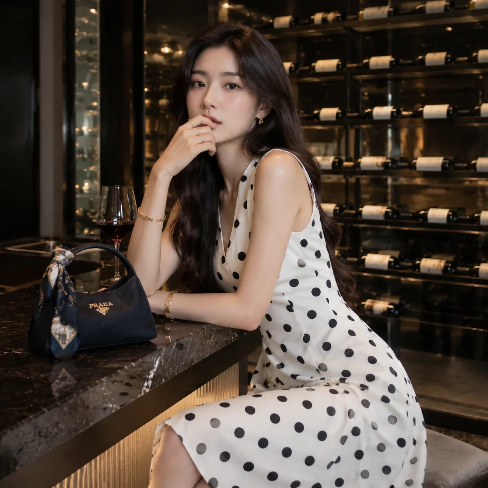

**#59 · Realistic, Cinematic · <code>Vinano Studio</code>**

> Keywords: realistic, cinematic, AI art, AI prompt, text to image

<details>
<summary>Show prompt</summary>

```
Young beautiful woman long wavy hair, elegant sleeveless polka dot midi dress black and white pattern, sitting thoughtfully at stylish wine bar counter, hand near lips, luxury wine bottles wall background, Prada navy blue mini bag silk scarf, gold jewelry, sophisticated chic atmosphere, soft warm lighting, cinematic, highly detailed, realistic

Use my uploaded face image as the ONLY facial and identity reference. No other faces, models, datasets, or references are allowed.

Maintain consistent colour harmony and crisp focus across the whole frame.
```

</details>

---

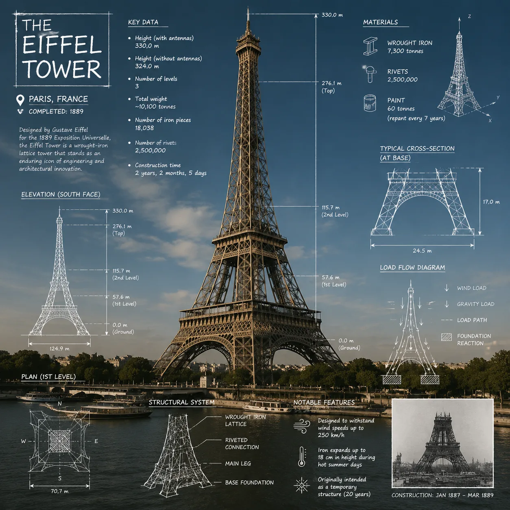

**#60 · Infographic, Ai Art · <code>Vinano Studio</code>**

> Keywords: infographic, AI art, AI prompt, text to image

<details>
<summary>Show prompt</summary>

```
Create an infographic image of [LANDMARK], combining a real photograph of the landmark blueprint-style technical annotations and diagrams overlaid on the image. Include the title “[LANDMARK]” in a hand-drawn box in the corner. Add white chalk-style sketches showing key structural data, important measurements, material quantities, internal diagrams, load-flow arrows, cross-sections, floor plans, and notable architectural or engineering features. Style: blueprint aesthetic white line drawings on the photograph, technical/architectural annotation style, educational infographic feel, the real environment visible behind the annotations. Render with rich micro-detail while keeping the layout uncluttered and intentional.
```

</details>

---

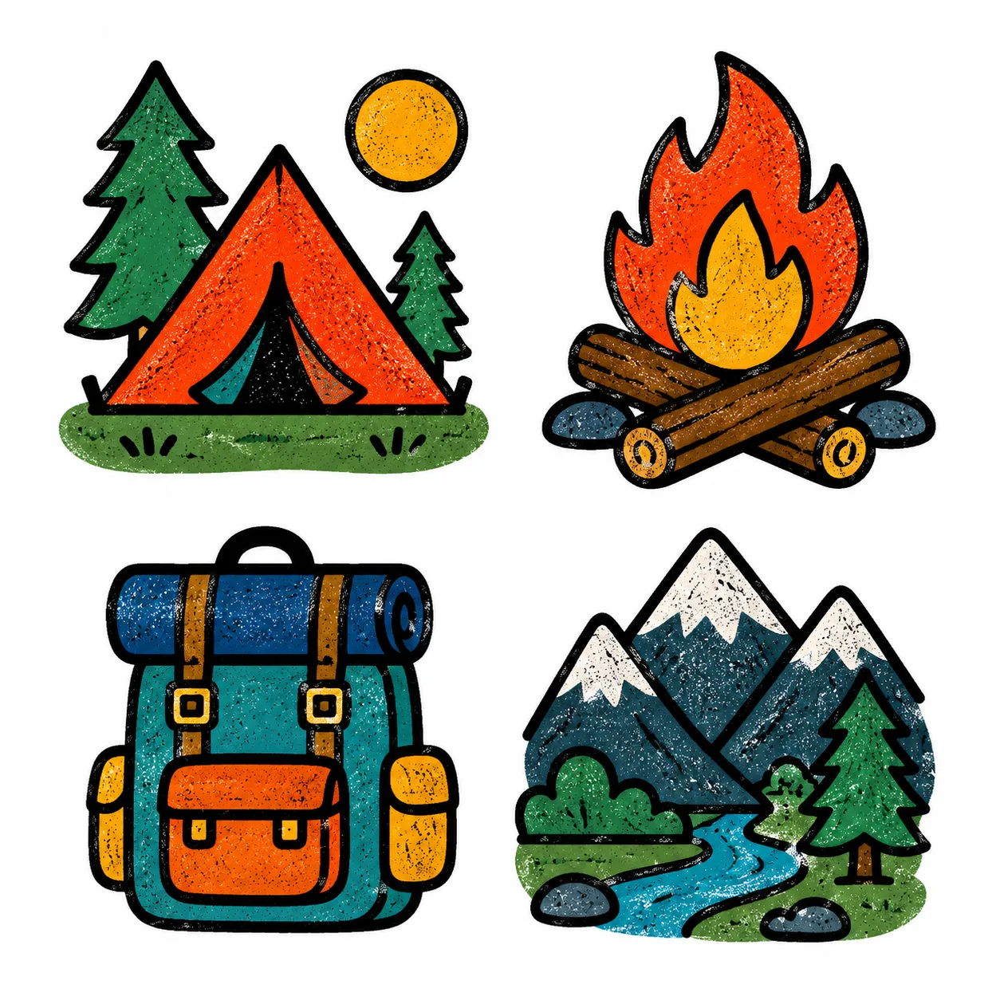

**#61 · Ai Art, Ai Prompt · <code>Vinano Studio</code>**

> Keywords: AI art, AI prompt, text to image

<details>
<summary>Show prompt</summary>

```
Create a collection of icons representing [a theme], they belong together as a single theme. Put them in a 2x2 grid (no lines). The background is pure white. Make the icons as risograph prints. No text. No color distortion. Vibrant and not faded. Stochastic stippling and sand-like noise pattern within color fills. Each icon has a thick black outline. Maintain consistent colour harmony and crisp focus across the whole frame.
```

</details>

---

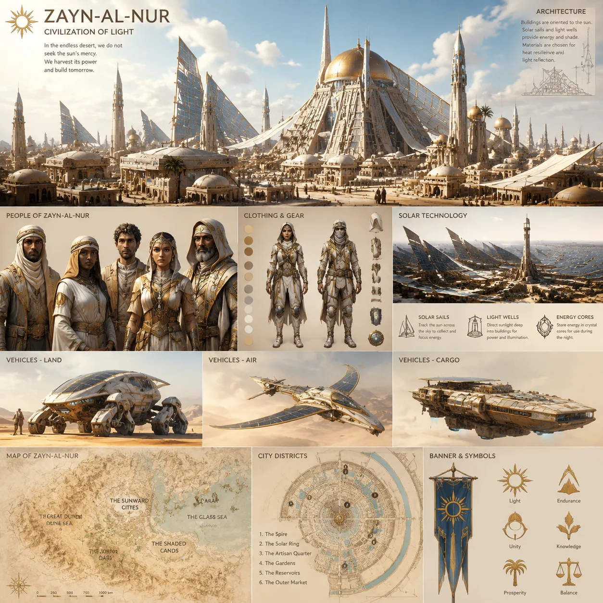

**#62 · Character, Cinematic · <code>Vinano Studio</code>**

> Keywords: character, cinematic, AI art, AI prompt, text to image

<details>
<summary>Show prompt</summary>

```
Create a complete visual worldbuilding set for a futuristic desert civilization solar technology, multiple images including architecture, characters, clothing, vehicles, and maps, cohesive design language, cinematic realism, ultra detailed. Maintain consistent colour harmony and crisp focus across the whole frame.
```

</details>

---

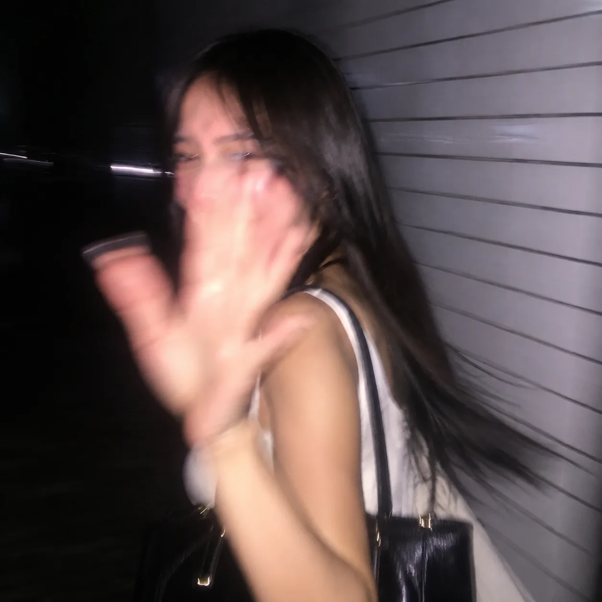

**#63 · Anime, Realistic · <code>Vinano Studio</code>**

> Keywords: anime, realistic, portrait, cinematic, AI art, AI prompt

<details>
<summary>Show prompt</summary>

```
Ultra-realistic candid smartphone photograph, 9:16 vertical.
Use the attached image only as a strong visual inspiration for general facial proportions and vibe,
while ensuring the generated subject remains fully original, non-identifiable, and not a face copy.
Scene
Nighttime on a quiet Tokyo city sidewalk beside a building white ceramic tile walls.
The subject is walking past the camera, partially side-on, captured mid-step in a rushed, accidental moment.
Poses & Gestures (combined naturally)
The subject reacts instinctively to being photographed:
turning her head back mid-walk as if surprised,
raising one hand close to the lens to partially block the camera,
shy, restrained smile forming as she suppresses laughter,
body angled in half-profile while continuing to walk forward,
motion carries her slightly out of frame, imperfect framing.
Expressions are subtle and spontaneous — embarrassed, playful, fleeting — never posed.
Camera & Motion
Shot on a modern smartphone, handheld, rushed capture. Strong uncontrolled camera shake. Heavy directional motion blur across the raised hand, hair, and face. Facial features appear smeared and streaked by movement, faintly recognizable but distorted. Partial ghosting around the body. Imperfect framing, subject nearly leaving the frame.
Lighting
Flash-only lighting fired mid-motion. Harsh flash highlights on skin and hand. Deep surrounding darkness. Uneven exposure, blown highlights, hard shadows typical of hurried night phone photography.
Background
White ceramic tile wall stretches into streaked light bands due to motion blur. Street surroundings fade into darkness minimal readable detail.
Mood
Candid, shy, slightly playful. Feels intrusive, raw, imperfect, and authentic — like a fleeting memory accidentally captured and never meant to be perfect.
Image Quality
Extremely noisy. Heavily blurred. Raw smartphone look. Not cinematic. Not editorial. Not polished.
Negative Prompt
anime, illustration, painting, stylized,
studio lighting, beauty lighting, soft portrait,
sharp focus, clean face, perfect anatomy, smooth skin,
fashion editorial, posed portrait, cinematic grading, film still,
tripod shot, professional photography,
identity match, face copy, real person replication

Maintain consistent colour harmony and crisp focus across the whole frame.
```

</details>

---

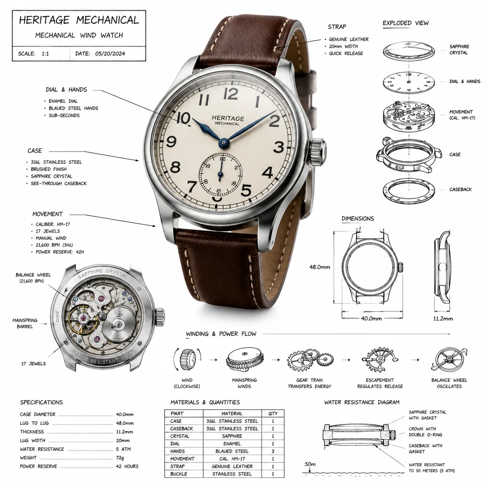

**#64 · Realistic, Infographic · <code>Vinano Studio</code>**

> Keywords: realistic, infographic, AI art, AI prompt, text to image

<details>
<summary>Show prompt</summary>

```
Create an infographic image of [OBJECT], combining a realistic photograph or photoreal render of the object technical annotation overlays placed directly on top.

Use black ink–style line drawings and text (technical pen / architectural sketch look) on a pure white studio background, including:
•Key component labels
•Internal cutaway or exploded-view outlines
•Measurements, dimensions, and scale markers
•Material callouts and quantities
•Arrows indicating function, force, or flow (air, sound, power, pressure)
•Simple schematic or sectional diagrams where relevant

Place the title [OBJECT] inside a hand-drawn technical annotation box in one corner.

Style & layout rules:
•The real object remains clearly visible beneath the annotations
•Annotations feel sketched, technical, and architectural
•crisp composition balanced negative space
•Educational, museum-exhibit / engineering-manual vibe

Visual style:
Minimal technical illustration aesthetic, black linework over realistic imagery, precise but slightly hand-drawn feel.

Color palette:
White background, black annotation lines and text only. No colors.

Output:
1080×1080, ultra-crisp, social-feed optimized, no watermark.

Render with rich micro-detail while keeping the layout uncluttered and intentional.
```

</details>

---

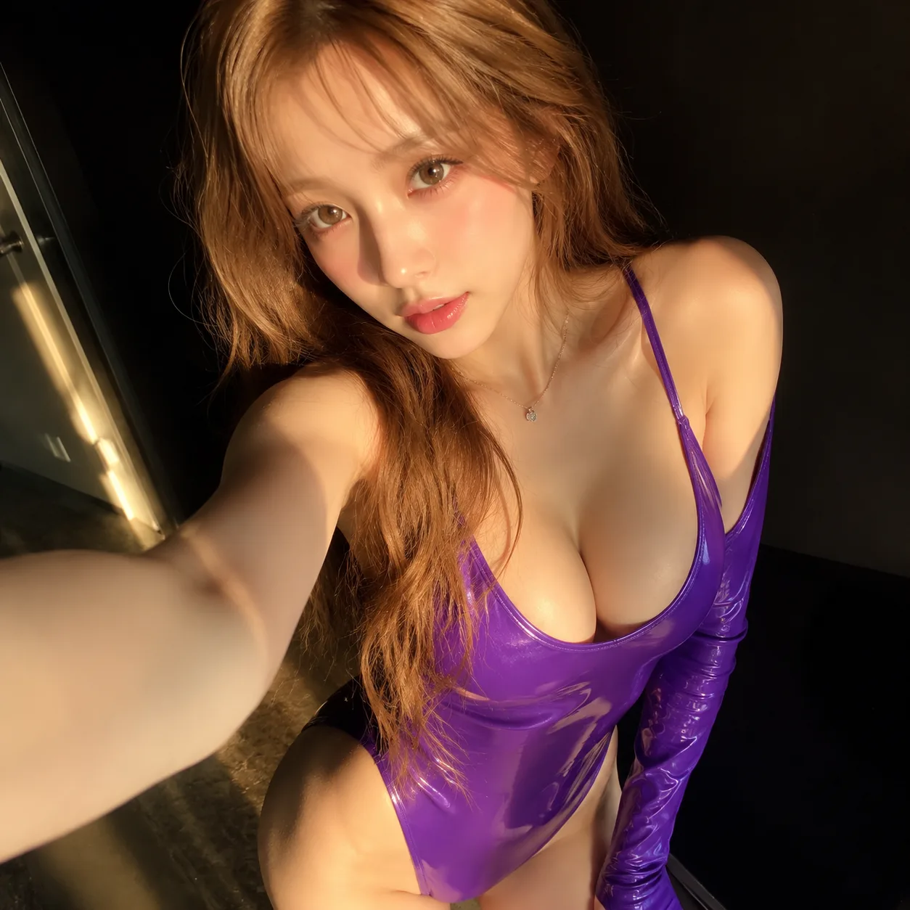

**#65 · Ai Art, Ai Prompt · <code>Vinano Studio</code>**

> Keywords: AI art, AI prompt, text to image

<details>
<summary>Show prompt</summary>

```
{
"subject": {
"description": "the prettiest (G)I-DLE Yuqi taking a high-angle selfie.",
"mirror_rules": "Left arm extended holding camera.",
"age": "Early 20s",
"expression": {
"eyes": {
"look": "upward at lens",
"energy": "alluring",
"direction": "direct"
},
"mouth": {
"position": "slightly parted",
"energy": "soft"
},
"overall": "seductive and innocent"
},
"face": {
"preserve_original": true,
"features": "Yuqi's irresistibly cute yet alluring round-yet-sharp face, bright expressive eyes, charming smile lines, and vibrant fair aesthetic.",
"makeup": "Asian influencer aesthetic, heavy under-eye blush, light contacts, glossy lips."
}
},
"hair": {
"color": "Warm light brown",
"style": "Long, loose waves, voluminous.",
"effect": "Top backlit halo, strands falling over chest."
},
"body": {
"frame": "Slim pronounced curves.",
"waist": "Narrow",
"chest": "Full, deep cleavage.",
"legs": "Upper thighs visible.",
"skin": {
"visible_areas": "Chest, shoulders, left arm, upper hips.",
"tone": "Fair, pale luminous.",
"texture": "Smooth, soft, slightly dewy.",
"lighting_effect": "Harsh warm sunlight hitting cleavage and left shoulder, casting sharp shadows."
}
},
"pose": {
"position": "Angled torso, hips pushed back, playful high-angle pose slight hip cock and energetic lean.",
"base": "Standing/leaning.",
"overall": "Leaning forward into the high-angle lens flirty body language."
},
"clothing": {
"top": {
"type": "Tight shiny latex bodysuit detached left sleeve.",
"color": "Glossy Purple",
"details": "Deep scoop neck, thin straps.",
"effect": "Stretching tightly over chest."
},
"bottom": {
"type": "Latex bodysuit bottom",
"color": "Glossy Purple",
"details": "Extremely high cut exposing hips."
}
},
"accessories": {
"jewelry": "Delicate silver pendant necklace."
},
"photography": {
"camera_style": "Smartphone selfie",
"angle": "High angle, looking down.",
"shot_type": "Medium close-up.",
"aspect_ratio": "9:16",
"texture": "Digital, slight wide-angle distortion on left arm.",
"lighting": "Strong directional warm light, high contrast.",
"depth_of_field": "Shallow, blurry dark background."
},
"background": {
"setting": "Dark interior room.",
"wall_color": "Dark/black.",
"elements": ["Lit door edge on left"],
"atmosphere": "Intimate, private.",
"lighting": "Mostly dark one sharp shaft of warm light."
},
"the_vibe": {
"energy": "Captivating",
"mood": "Sensual",
"aesthetic": "Soft-core, golden hour selfie.",
"authenticity": "Casual smartphone snapshot.",
"intimacy": "High, direct eye contact.",
"story": "Catching the golden hour light in a bedroom.",
"caption_energy": "Effortless glow."
},
"constraints": {
"must_keep": ["High angle perspective",
"Harsh warm directional light",
"Bodysuit cut"],
"avoid": ["Flat studio lighting",
"Professional posture",
"Over-bright background"]
},
"negative_prompt": ["ugly",
"flat light",
"studio lighting",
"professional camera",
"overexposed",
"extra limbs",
"stiff"]
}

Emphasise material texture and natural light so the final frame feels tactile and premium.
```

</details>

---

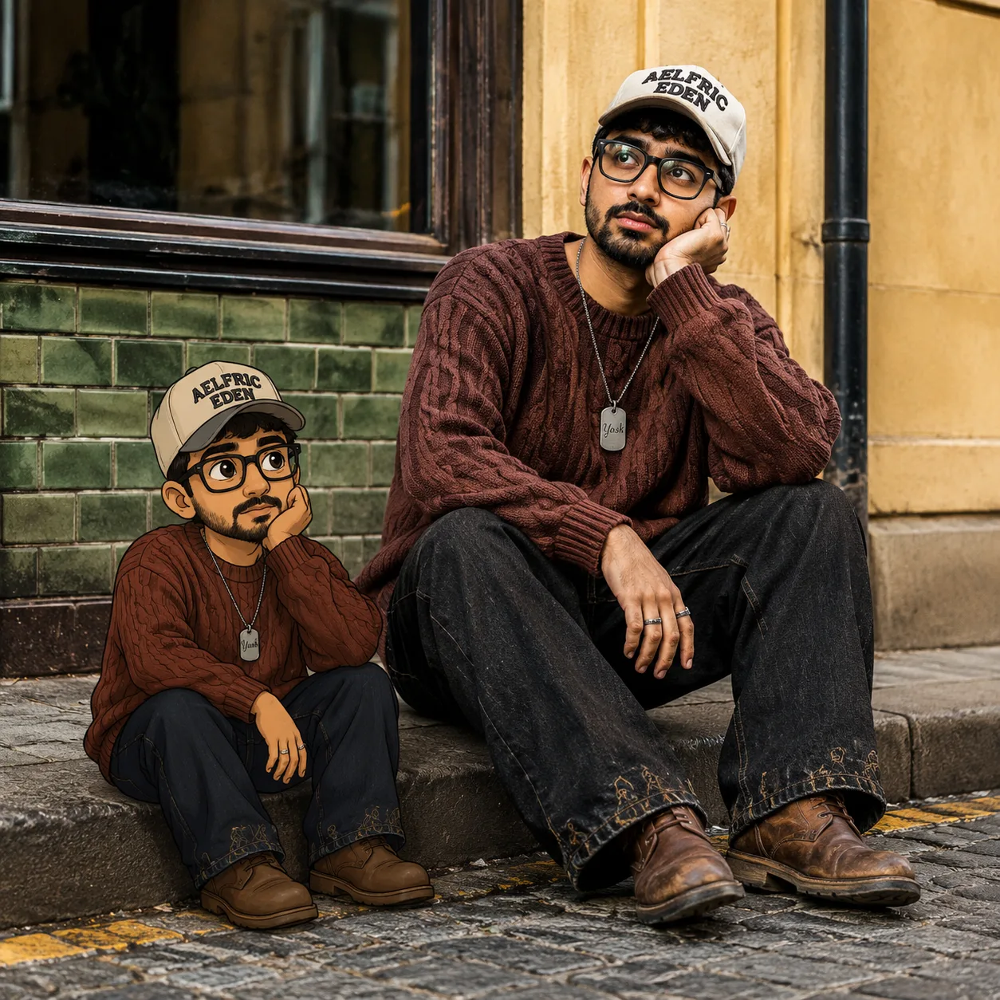

**#66 · Realistic, Portrait · <code>Vinano Studio</code>**

> Keywords: realistic, portrait, character, cinematic, AI art, AI prompt

<details>
<summary>Show prompt</summary>

```
Transform this image [Upload Your Image] into a 64K DSLR shot resolution of A creative urban street portrait featuring a young man (same face as the uploaded image) sitting on a curb in a quiet city street, paired a stylized cartoon illustration of himself placed beside him. The real-life subject (same face as the uploaded image) is seated casually on a concrete sidewalk edge, resting his head on one hand in a bored, contemplative pose. He looks slightly upward a neutral, introspective expression, conveying a sense of quiet thoughtfulness and urban solitude. He wears a muted maroon cable-knit sweater a relaxed fit, dark loose-fitting denim jeans subtle stitched details near the cuffs, and worn brown leather boots. Accessories include layered silver chain dog tag the name "[Add Text]" written on it, rings on his fingers, black-framed glasses, and a light-coloured baseball cap bold embroidered lettering on the front. His hair is short, dark hair, a well-groomed beard texture and character. Next to him on the sidewalk sits a small cartoon version (same face as the uploaded image) of himself, matching his outfit and pose exactly—same sweater, jeans, boots, cap, glasses, and facial expression. The illustrated character has clean outlines, warm muted colors, and a soft shaded, hand-drawn animation style, creating a playful contrast between realism and illustration. The cartoon figure is proportionally smaller, emphasizing a companion-like or inner-self concept. The background features textured cobblestone pavement, a curb edge, and a building facade muted yellow walls and green-tiled brickwork near a window. The color palette is earthy and subdued, natural daylight providing soft, even lighting and realistic shadows. The overall composition blends street photography, fashion portraiture, and mixed-media digital art, evoking themes of identity, self-reflection, and creativity.
Style & Mood Keywords: Urban street photography, casual fashion portrait, mixed media art, real and cartoon character duo, introspective mood, muted earthy tones, soft natural light, realistic textures, creative storytelling, high-resolution detail, cinematic realism. Octane render & Unreal Engine

Emphasise material texture and natural light so the final frame feels tactile and premium.
```

</details>

---

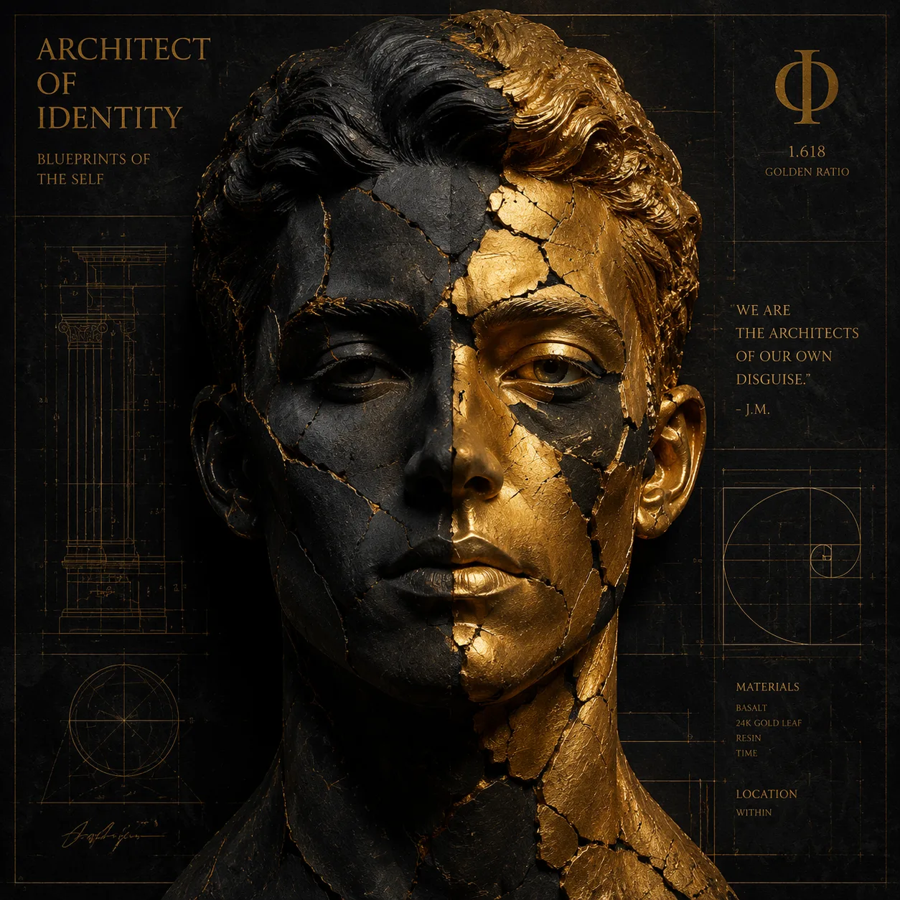

**#67 · Realistic, Portrait · <code>Vinano Studio</code>**

> Keywords: realistic, portrait, cinematic, AI art, AI prompt, text to image

<details>
<summary>Show prompt</summary>

```
A high-detail artistic 3D portrait of the person in the photo, reimagined as a fragmented sculptural mask. The face is vertically split: one side is made of matte charcoal-black stone deep cracks, while the other side is polished, radiant leaf gold. The entire composition is overlaid on a dark architectural blueprint background featuring intricate gold grid lines, technical diagrams, and elegant golden serif typography. filmic, cinematic lighting, hyper-realistic textures, Kintsugi-inspired aesthetic, luxury conceptual art, 8k resolution, moody and sophisticated atmosphere. Render with rich micro-detail while keeping the layout uncluttered and intentional.
```

</details>

---

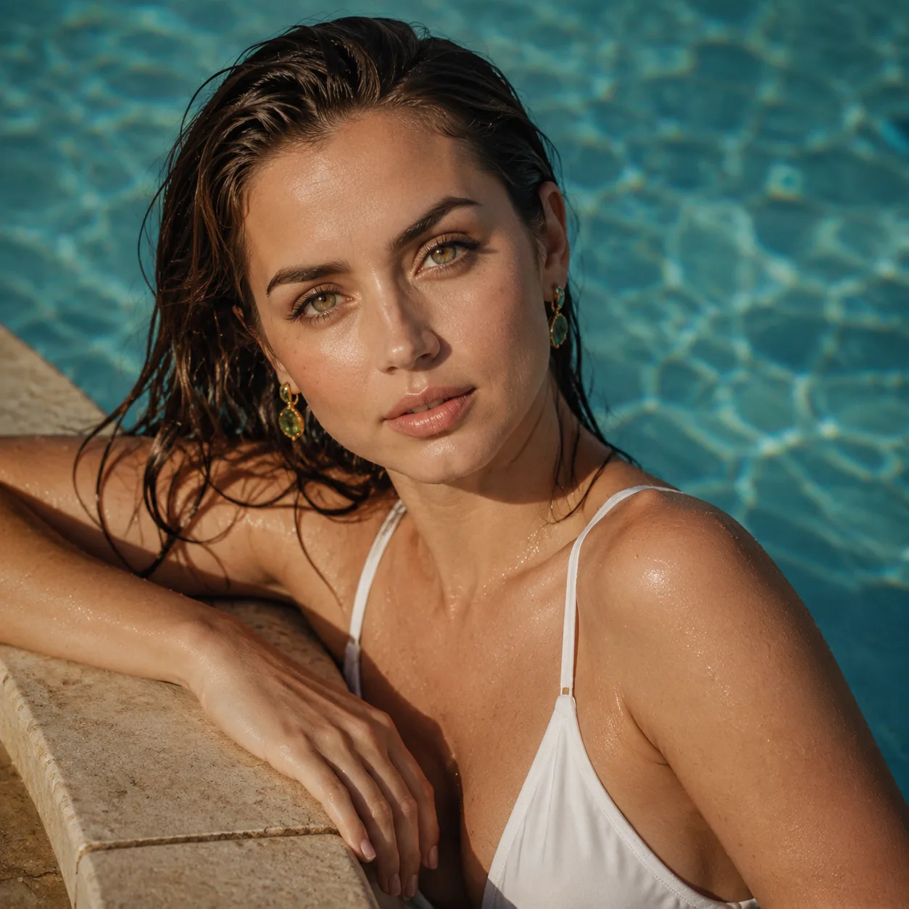

**#68 · Realistic, Minimalist · <code>Vinano Studio</code>**

> Keywords: realistic, minimalist, AI art, AI prompt, text to image

<details>
<summary>Show prompt</summary>

```
{
 "version_control": {
 "target_style": "High-End Fashion Editorial",
 "fidelity_level": "Absolute 1:1 Identity Lock",
 "rendering_engine_constraints": "No CGI, No Illustration, No AI Smoothing"
 },
 "subject_profile": {
 "identity": {
 "name": "Ana de Armas",
 "age_group": "Adult Woman",
 "biometric_integrity": "Preserve 100% original bone structure, facial asymmetry, moles, and eye shape. Zero morphing or enhancement."
 },
 "anatomy_and_skin": {
 "texture": "Visible pores, micro-creases, subtle translucency",
 "physics": "Natural water droplets, soft wet sheen, realistic surface tension on skin",
 "tone": "Natural base skin tone, sun-kissed warmth, no artificial glow"
 },
 "face_details": {
 "eyes": "Natural eye color, soft neutral-pink glossy shadow, thin lash-line eyeliner (no wing), separated curled lashes",
 "brows": "Natural density, straight-to-softly-rounded architecture",
 "nose_and_lips": "Subtle pink warmth on nose bridge; full lips, rose-pink gradient, wet glossy finish, blurred edges, no overlining"
 },
 "hair_styling": {
 "state": "Visibly wet, slicked at roots, damp strands",
 "arrangement": "Loose, flowing over shoulders and back, natural messy texture",
 "match_reference": "1:1 color and style match"
 }
 },
 "composition_and_pose": {
 "action": "Leaning on swimming pool edge, body angled 45-degrees",
 "arm_placement": "One arm naturally resting on pool coping",
 "framing": "Medium close-up, three-quarter angle",
 "mood": "Intimate, calm, grounded, confident"
 },
 "attire_and_wardrobe": {
 "primary_garment": "refined minimalist white swimsuit, thin straps, clean lines",
 "fabric_physics": "Realistic tension against wet skin, natural folds and bunching",
 "jewelry": "Statement earrings, natural stones/gold, realistic micro-scratches and reflections"
 },
 "environment_and_lighting": {
 "background": {
 "element": "Turquoise pool water",
 "physics": "Refraction, light-play on pool floor, subtle ripples, realistic movement"
 },
 "lighting_design": {
 "source": "Single-direction natural sunlight",
 "color_temp": "Warm sun-lit tones",
 "exposure": "Slightly underexposed (lowered exposure)",
 "shadows": "Physically accurate contact shadows on collarbones and chest"
 }
 },
 "technical_parameters": {
 "optics": "50mm–85mm focal length equivalent, realistic photographic perspective",
 "depth_of_field": "Shallow, organic bokeh, natural fall-off",
 "resolution_quality": "16k Hyper-Realistic",
 "aspect_ratio": "3:4"
 }
}

Maintain consistent colour harmony and crisp focus across the whole frame.
```

</details>

---

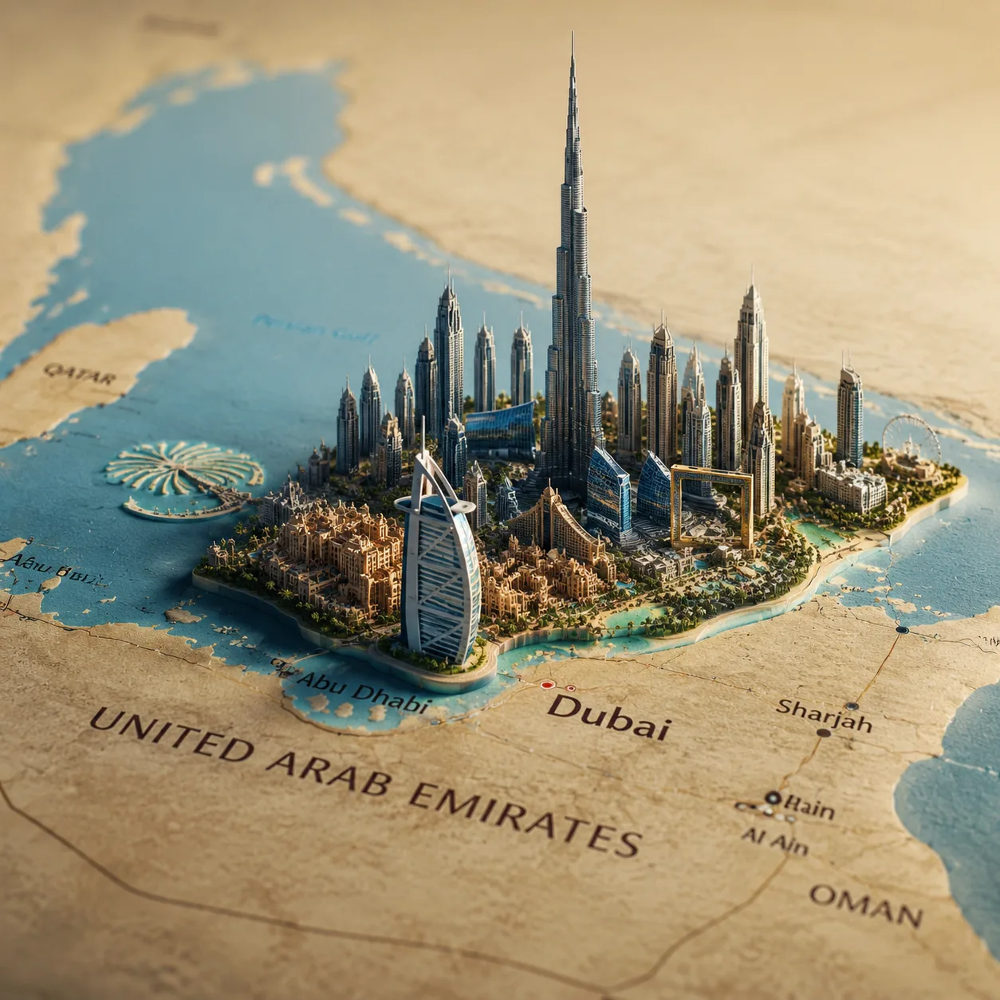

**#69 · Realistic, Cinematic · <code>Vinano Studio</code>**

> Keywords: realistic, cinematic, AI art, AI prompt, text to image

<details>
<summary>Show prompt</summary>

```
A realistic, highly detailed geographic map viewed from above, accurately representing the region where [COUNTRY] is located. Rising from the map is a miniature 3D diorama of [CITY], precisely positioned at its real geographic location. The diorama features iconic architecture, natural landmarks, and cultural elements seamlessly emerging from the map surface. Ultra-realistic materials, fine textures, and depth of field. Soft studio lighting subtle shadows, cinematic composition, premium macro photography style. Square 1:1 format, high detail, realistic scale. Keep edges clean and the overall composition balanced for a polished, gallery-ready result.
```

</details>

---

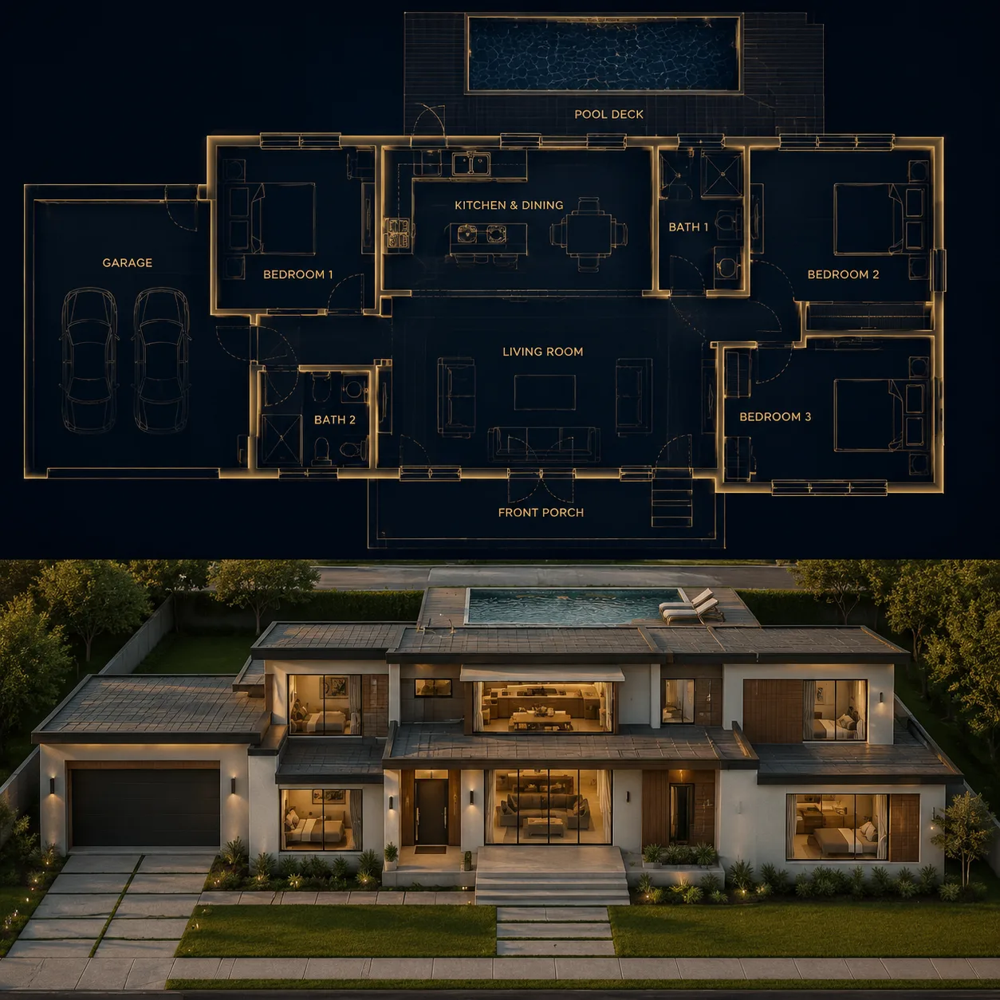

**#70 · Realistic, Fantasy · <code>Vinano Studio</code>**

> Keywords: realistic, fantasy, AI art, AI prompt, text to image

<details>
<summary>Show prompt</summary>

```
{
 "objective": "Create a split architectural visualization where the top is a detailed dark-themed blueprint and the bottom is a true-to-life photorealistic house that matches the blueprint EXACTLY",

 "aspect_ratio": "3:4",

 "composition": {
 "layout": "vertical split",
 "top_section": "blueprint",
 "bottom_section": "realistic render",
 "alignment": "perfect structural correspondence between both sections"
 },

 "top_section": {
 "type": "architectural blueprint",
 "style": "dark luxury blueprint (similar to reference image 2)",

 "visual_style": {
 "background": "deep navy / charcoal blue",
 "lines": "thin glowing beige/gold lines",
 "walls": "slightly extruded 3D effect",
 "labels": "clean modern sans-serif",
 "lighting": "soft ambient glow"
 },

 "content": {
 "rooms": ["3 bedrooms (left, right, bottom-right)",
 "central living room",
 "kitchen + dining (top center)",
 "2 bathrooms",
 "garage (left side connected)",
 "front porch",
 "backyard pool deck"],
 "details": ["furniture outlines (beds, sofa, dining table)",
 "door swings and openings",
 "window placements",
 "circulation paths",
 "exact proportions and spacing"]
 }
 },

 "bottom_section": {
 "type": "true-to-life photorealistic house render",

 "constraint": "MUST MATCH THE BLUEPRINT EXACTLY — no added, removed, or shifted rooms",

 "architecture": {
 "style": "modern single-story house",
 "roof": "flat layered roof",
 "materials": ["smooth concrete walls",
 "wood panel accents",
 "large glass windows"]
 },

 "layout_mapping_rules": ["garage must be on the left side exactly as blueprint",
 "main entrance aligned living room",
 "pool positioned in backyard matching blueprint dimensions",
 "window placements correspond to each room location",
 "bedroom volumes visible externally in correct positions"],

 "environment": {
 "setting": "suburban neighborhood",
 "elements": ["green lawn",
 "minimal landscaping",
 "clean driveway leading to garage",
 "pool deck matching blueprint footprint"]
 },

 "lighting": {
 "time": "golden hour",
 "style": "soft natural light realistic shadows"
 },

 "camera": {
 "angle": "slightly elevated front perspective",
 "lens": "35mm architectural view"
 }
 },

 "consistency_rules": ["room positions must be identical between blueprint and render",
 "no extra structures added in render",
 "all doors and windows must align logically",
 "pool size and placement must match exactly",
 "garage placement must match blueprint"],

 "style": {
 "top": "architectural visualization (dark premium)",
 "bottom": "true-to-life photorealistic modern house",
 "overall": "clean, high-end architectural presentation"
 },

 "negative_constraints": ["no mismatch between blueprint and render",
 "no extra rooms",
 "no fantasy elements",
 "no unrealistic proportions",
 "no cluttered environment"]
}

Aim for an editorial, design-driven look with deliberate negative space.
```

</details>

---

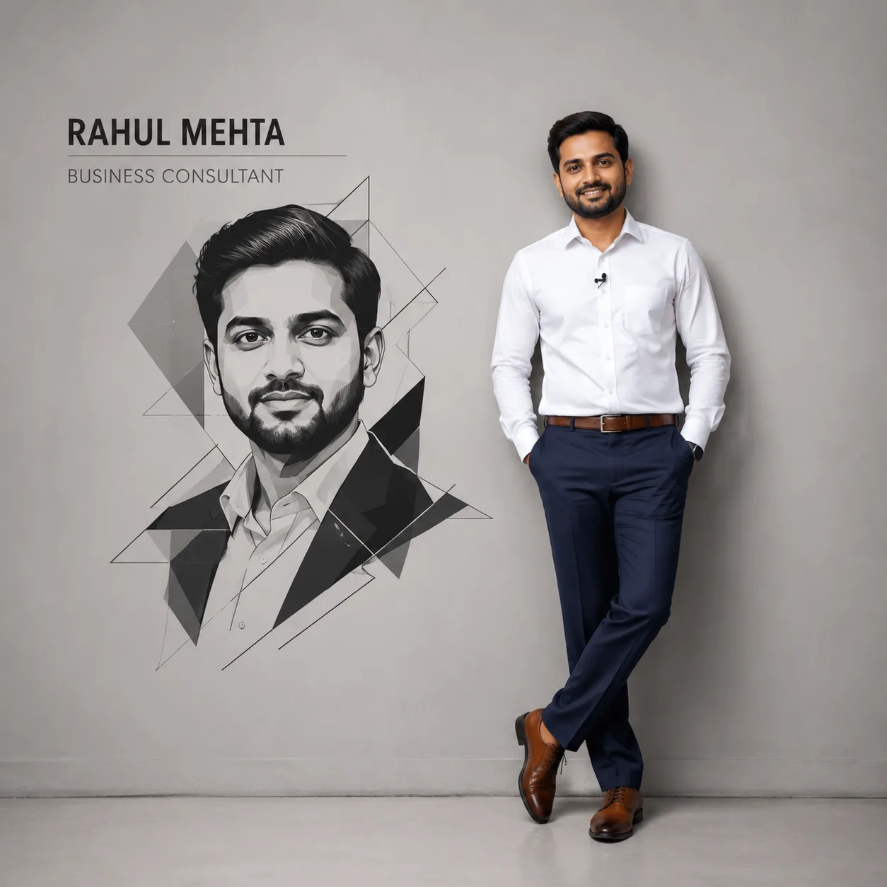

**#71 · Realistic, Portrait · <code>Vinano Studio</code>**

> Keywords: realistic, portrait, minimalist, AI art, AI prompt, text to image

<details>
<summary>Show prompt</summary>

```
Ultra-realistic 8K full body portrait of [PERSON’S FULL NAME], wearing a clean and pressed white social shirt folded collar and a small lapel microphone, dark navy-blue dress pants and polished brown social shoes. Casually and unpretentiously leaning against a smooth light gray studio wall; hands are in pockets and one leg is crossed over the other, relaxed and confident body language. Add to the wall next to them a prominent vector portrait in black and white of their face and bust - sharp lines and angles, overlapping polygonal shapes and a refined minimalist modern graphic style, right below the information: “[PERSON’S FULL NAME]”, and below the name: “[PROFESSION]” Render with rich micro-detail while keeping the layout uncluttered and intentional.
```

</details>

---

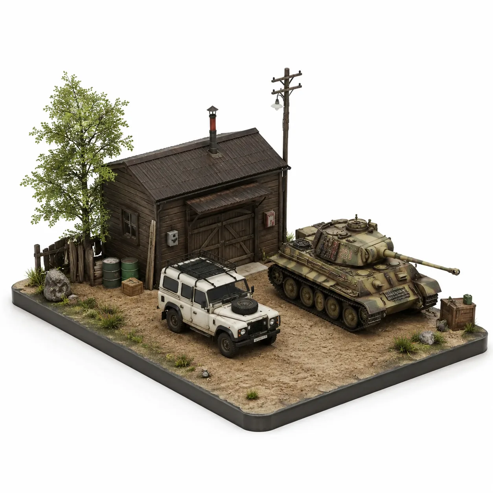

**#72 · Isometric, Character · <code>Vinano Studio</code>**

> Keywords: isometric, character, cinematic, AI art, AI prompt, text to image

<details>
<summary>Show prompt</summary>

```
{
 "reference_images": {
 "scene_reference": "ATTACHED_IMAGE",
 "usage_rule": "Use this image as the sole and exact source for scene layout, object placement, and composition. Do not reinterpret or replace the scene."
 },

 "concept": {
 "type": "miniature diorama reconstruction",
 "intent": "Rebuild the attached scene as a clean, collectible-scale diorama while preserving the original spatial relationships"
 },

 "environment": {
 "scale": "tabletop miniature",
 "ground": {
 "type": "sculpted base",
 "behavior": "supports all objects naturally without enclosure",
 "edges": "clean, minimal, slightly beveled"
 },
 "background": {
 "type": "seamless studio backdrop",
 "color": "pure white",
 "constraint": "no environment beyond the diorama base"
 }
 },

 "objects_and_elements": {
 "layout_rule": "All objects must remain in the same relative positions as in the reference image",
 "primary_elements": "exact vehicles, structures, props, and terrain visible in the reference",
 "detail_handling": "simplified but faithful miniature proportions",
 "characters": {
 "presence": "only if present in the reference",
 "style": "miniature figurines, no facial realism"
 }
 },

 "composition": {
 "view": "isometric or slightly elevated 3/4 perspective",
 "framing": "entire diorama visible, centered",
 "cropping": "no zoom, no cinematic crop"
 },

 "camera": {
 "lens_equivalent": "35mm–50mm",
 "perspective": "miniature realism",
 "distortion": "none"
 },

 "lighting": {
 "type": "soft studio lighting",
 "direction": "overhead and slightly angled",
 "shadows": "subtle contact shadows only beneath objects",
 "avoid": ["dramatic lighting",
 "spotlights",
 "cinematic contrast"]
 },

 "materials_and_style": {
 "surface_finish": "smooth, matte or lightly satin",
 "material_quality": "premium-quality scale model materials",
 "aesthetic": "clean, modern, premium diorama"
 },

 "quality_controls": {
 "image_clarity": "ultra-clean",
 "grain": "none",
 "noise": "none",
 "motion_blur": "none"
 },

 "negative_prompts": ["glass case",
 "display box",
 "museum enclosure",
 "transparent cube",
 "protective casing",
 "reflections on glass",
 "labels or plaques",
 "text overlays",
 "busy background",
 "cinematic blur"]
}

Aim for an editorial, design-driven look with deliberate negative space.
```

</details>

---

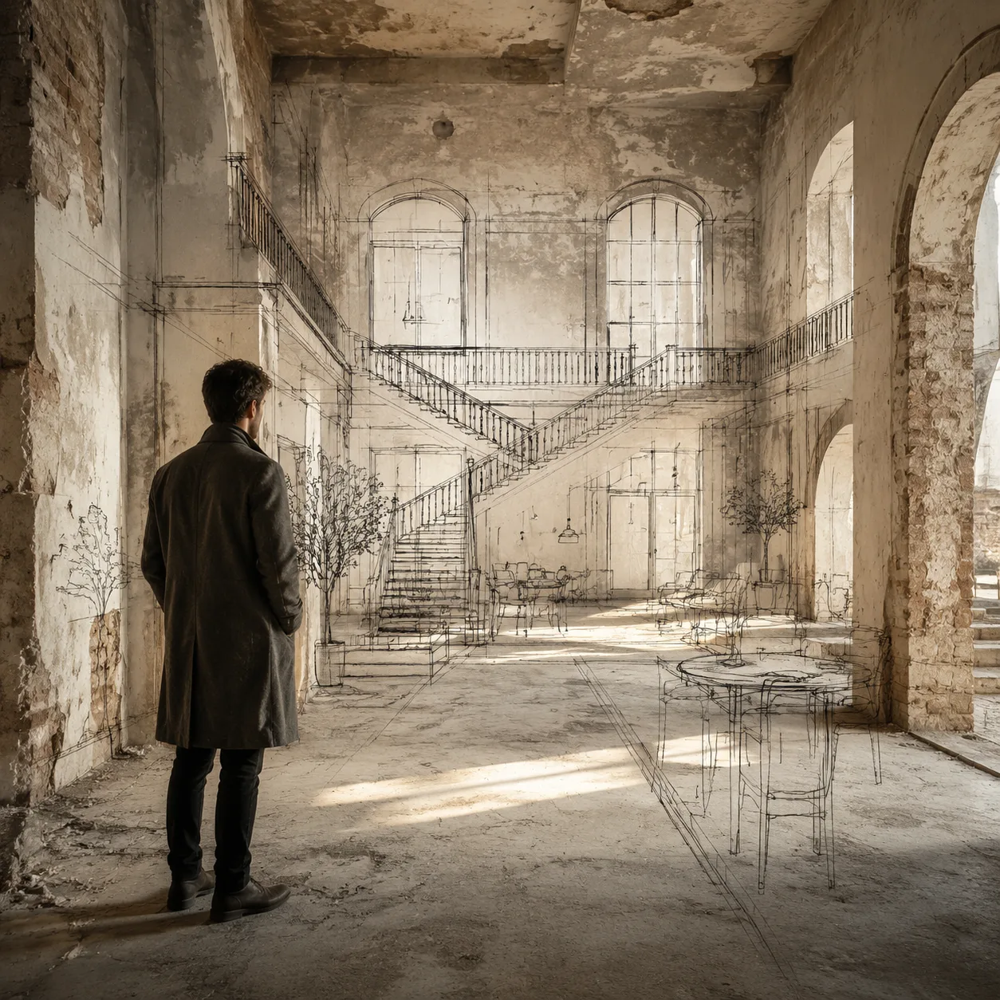

**#73 · Realistic, Ai Art · <code>Vinano Studio</code>**

> Keywords: realistic, AI art, AI prompt, text to image

<details>
<summary>Show prompt</summary>

```
A [person type] standing full-body near the edge of the frame, slightly to the left, in [real-world incomplete / empty / damaged environment]. The camera is positioned behind and slightly to the right of the person, capturing them from a three-quarter rear angle. The person stands calmly and thoughtfully, looking toward the space ahead.

The environment is [describe the real space as it exists now: empty, unfinished, decayed, rigid, lifeless]. The atmosphere feels [emotional tone: quiet, dry, historical, minimal, raw]. Natural light illuminates the scene, creating realistic shadows and depth. Floating hand-drawn sketch lines appear over and within the environment, aligned precisely in perspective the real space. These sketches represent [what is missing / what once existed / what could exist in the future].

The sketch lines are black, clean, and hand-drawn, resembling [architectural / interior / restoration / urban planning] concept sketches pencil or ink. The strokes are expressive, slightly imperfect, and organic — not rigid or mechanical. The sketched elements occupy the foreground and midground, appearing closer to the person than expected. Some sketch lines subtly overlap the person’s silhouette and the real surfaces, visually merging imagination reality. The sketches float naturally within the scene, seamlessly blending the environment and conveying the idea of [vision / restoration / transformation / potential] coming to life.

Aim for an editorial, design-driven look with deliberate negative space.
```

</details>

---

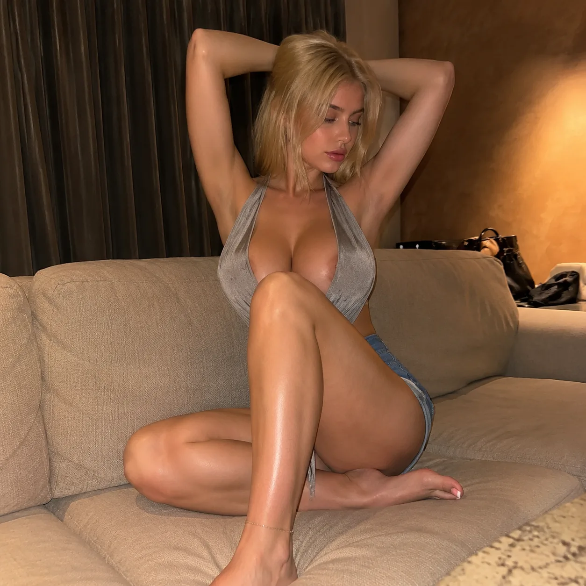

**#74 · Anime, Realistic · <code>Vinano Studio</code>**

> Keywords: anime, realistic, AI art, AI prompt, text to image

<details>
<summary>Show prompt</summary>

```
{
 "image_prompt": {
 "meta": {
 "aspect_ratio": "9:16 vertical",
 "camera": "iPhone 15 Pro Max (rear camera)",
 "lens_feel": "24mm wide, slight wide-angle realism without face distortion",
 "quality": "ultra-true-to-life photorealistic, looks like a real iPhone camera roll photo",
 "texture_rules": ["natural skin texture (no plastic smoothing)",
 "subtle smartphone noise/grain in shadows",
 "tiny handheld imperfections (micro-tilt, not perfectly centered)"]
 },
 "scene": {
 "location": "modern hotel-suite / upscale apartment living room",
 "key_background_elements": ["large floor-to-ceiling dark charcoal curtains on the left side",
 "warm textured plaster wall on the right side (brown/tan, slightly mottled)",
 "soft warm light gradient on the wall (like a hidden lamp or sconce spill)",
 "neutral-toned interior, quiet late-night vibe"],
 "foreground": ["large beige fabric sectional sofa visible woven texture",
 "seat cushions slightly creased from weight (real compression, not perfect)",
 "bottom-right corner hint of a speckled stone/marble tabletop edge (out of focus)"],
 "extra_realism_details": ["a few personal items/bags faintly visible in the back-right area (messy-but-real, not staged)",
 "dim room depth, corners fall into shadow naturally"]
 },
 "lighting": {
 "type": "warm indoor ambient lighting",
 "sources": ["soft warm lamp spill from camera-right creating a golden cast on skin and wall",
 "darker fill from the curtain side (camera-left) for contrast"],
 "look": ["gentle highlights on shoulders, chest, thighs",
 "soft but noticeable shadows under legs and along couch seams",
 "overall warm tungsten color temperature"]
 },
 "subject": {
 "person": "one adult woman",
 "ethnicity": "fair-skinned European look",
 "skin": {
 "tone": "light warm-fair beige a golden indoor cast",
 "finish": "natural, slight sheen on shoulders and legs, visible pores/real texture"
 },
 "face": {
 "structure": "soft pretty features, small nose, full lips, delicate jawline",
 "expression": "calm, slightly dreamy/relaxed, eyes looking down to her right (not at camera)",
 "makeup": "minimal glam: even skin, subtle blush, natural brows, soft lip tint (not bold)"
 },
 "hair": {
 "color": "light blonde",
 "length": "shoulder-length to slightly longer",
 "style": "straight a loose natural fall, center/soft-middle part, a few face-framing strands"
 },
 "body": {
 "type": "slim-curvy hourglass (fit waist, rounded hips, very full bust but still natural)",
 "waist": "tight and visibly cinched from seated twist and posture",
 "legs": "long, smooth, slightly glossy highlights from warm light",
 "chest": "very full and more prominent than before, lifted cleavage from posture and fabric tension, realistic weight and shape (not cartoonish)"
 },
 "grooming_details": {
 "armpits": "visible because both arms are raised; smooth/clean look",
 "fingernails": "short-to-medium length, glossy pale pink/nude manicure",
 "toenails": "classic French tip pedicure (clean white tips, natural pink base, glossy finish)",
 "accessory": "thin delicate anklet on the left ankle"
 }
 },
 "outfit": {
 "top": {
 "type": "deep-plunge sleeveless halter-style bodysuit or draped knit top",
 "color": "silver-grey / cool grey",
 "material": "soft drapey fabric that catches warm light, slight sheen",
 "fit_rules": ["very deep V neckline",
 "open sides / low armholes that reveal side torso",
 "no bra lines visible",
 "fabric tension/creases where it pulls at the waist and chest (realistic stretch, slightly stronger tension due to fuller bust)"]
 },
 "bottom": {
 "type": "very short denim shorts (light blue wash)",
 "fit": "snug on hips, subtle wrinkles at the lap/waist from sitting"
 },
 "feet": "barefoot on the couch cushions (natural toe spread, relaxed), French tip pedicure visible when toes catch the warm light"
 },
 "pose": {
 "exact_pose_match": ["sitting on the beige sofa",
 "one leg folded under her (tucked), the other knee raised high toward her chest",
 "raised knee is closest to camera, creating a strong thigh line and depth",
 "both arms lifted behind her head, hands interlaced or resting in hair",
 "elbows out wide, shoulders open, armpits naturally visible",
 "torso slightly twisted, emphasizing waist curve",
 "head turned down and to her right, relaxed neck line"],
 "micro_motion": ["a tiny arch in the back from the arms-behind-head stretch",
 "subtle compression of thigh and hip against the cushion",
 "loose strands of blonde hair resting near cheeks"]
 },
 "camera_composition": {
 "framing": "vertical 9:16, subject low-mid frame lots of negative space above",
 "angle": "slightly low/straight-on from the front (as if a friend shot it while seated/standing nearby)",
 "distance": "about 2–3 meters",
 "focus": "sharp on her face + front thigh, background slightly softer but still readable",
 "realism_notes": ["not perfectly symmetrical",
 "slight handheld tilt",
 "iPhone-style HDR but restrained (no crunchy oversharpening)"]
 },
 "negative_prompt": ["no cartoon/anime look",
 "no CGI/plastic skin",
 "no excessive symmetry or studio perfection",
 "no extra fingers/limb glitches",
 "no heavy beauty filter",
 "no explicit nudity or pornographic framing"]
 }
}

Render with rich micro-detail while keeping the layout uncluttered and intentional.
```

</details>

---

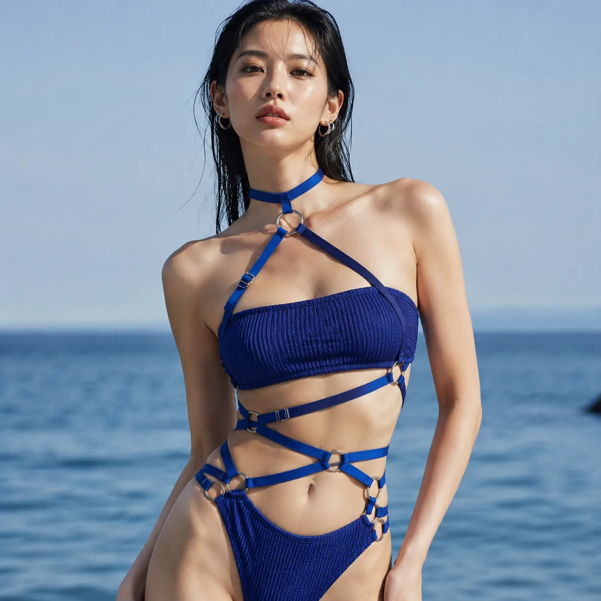

**#75 · Ai Art, Ai Prompt · <code>Vinano Studio</code>**

> Keywords: AI art, AI prompt, text to image

<details>
<summary>Show prompt</summary>

```
(cobalt blue knit swimsuit),
bikini, (multi-harness bikini:1.2), (blue harness-like swimwear construction:1.2),
choker halter neck harness strap,
diagonal chest strap, wraparound waist straps, non-matching strap tension, fashion experimental swimwear, (tube top)

Render with rich micro-detail while keeping the layout uncluttered and intentional.
```

</details>

---

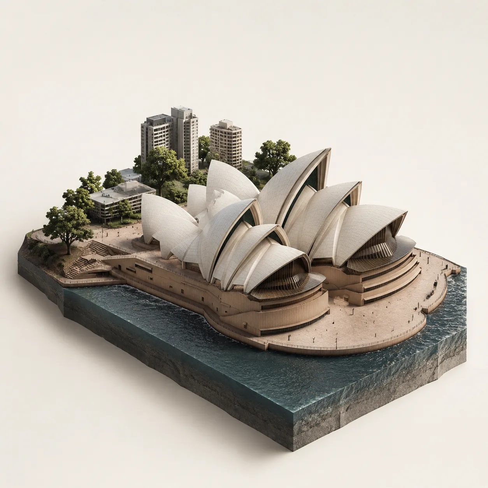

**#76 · Isometric, Realistic · <code>Vinano Studio</code>**

> Keywords: isometric, realistic, landscape, AI art, AI prompt, text to image

<details>
<summary>Show prompt</summary>

```
A miniature isometric architectural diorama of [LANDMARK NAME], accurately reflecting its real-world structure and proportions, placed on a small floating base subtle surrounding buildings and landscape elements inspired by [CITY / COUNTRY]. Realistic materials and natural textures, physically accurate stone, concrete, metal, and glass surfaces. True-to-life color palette based on the actual landmark, muted and realistic tones. Off-white studio background soft, natural lighting, gentle shadows, and crisp composition. High-detail, realistic yet refined 3D render, premium architectural model aesthetic, no people, no text. Aim for an editorial, design-driven look with deliberate negative space.
```

</details>

---

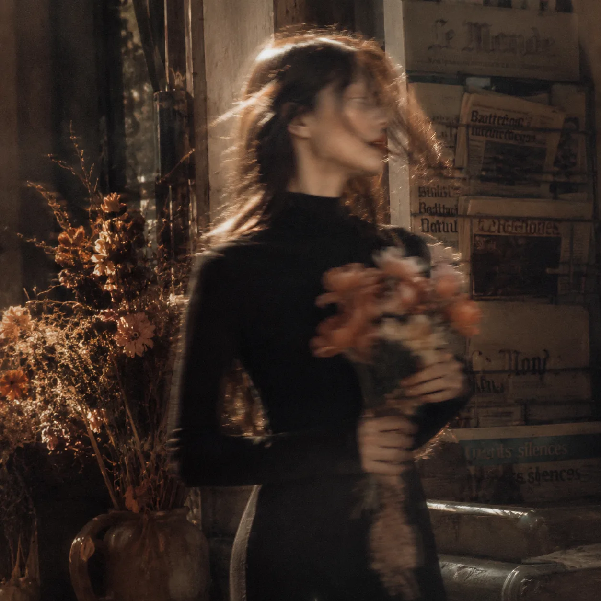

**#77 · Character, Vintage · <code>Vinano Studio</code>**

> Keywords: character, vintage, AI art, AI prompt, text to image

<details>
<summary>Show prompt</summary>

```
The generated image uses the uploaded image as a reference for the character, wearing a high-necked, tight-fitting black long-sleeved dress. A cluster of withered wood and orange-pink flowers lies beside an old newsstand, the grainy texture of vintage film interwoven, the blurred background noticeable trailing shadows, and the double-image effect creating a fantastical atmosphere. A bewitchingly beautiful girl, carrying flowers, is shown in profile, her fair skin delicate and translucent. Her exquisite face is blurred motion, the outline of her figure slightly swaying the panning camera, the soft focus making the image even more hazy and languid. A warm-toned, low-saturation filter enhances the effect, her long, backlit hair glowing a soft glow, the messy strands sweeping wildly across her jawline, the details concealing a captivating yet dangerous allure. Cute movements add dynamism, the motion blur blending the film grain, creating a trendy, Instagram-worthy image while the blurred image outlines a dynamic scene full of story, cleverly balancing bewitching and sweetness. Emphasise material texture and natural light so the final frame feels tactile and premium.
```

</details>

---

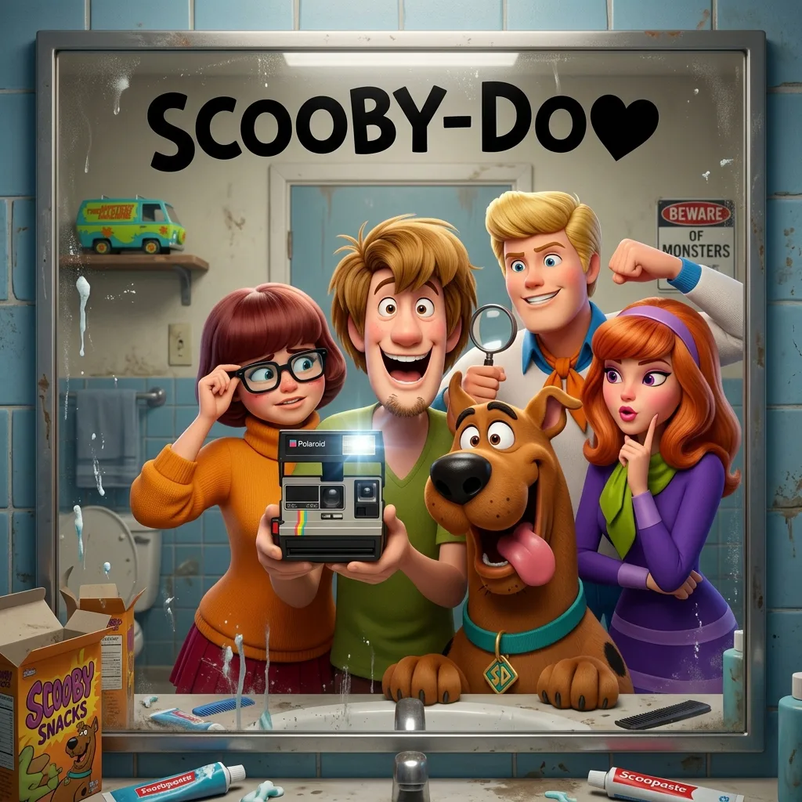

**#78 · Realistic, Character · <code>Vinano Image Pro</code>**

> Keywords: realistic, character, cinematic, vintage, AI art, AI prompt

<details>
<summary>Show prompt</summary>

```
premium-quality stylized 3D CGI Pixar-style render, vertical 3:4 composition, the most iconic characters from [SHOW/MOVIE] captured as a chaotic and joyful bathroom mirror selfie; the most recognizable character holds a large vintage camera up toward the mirror, the remaining characters squeezed tightly into the frame around them, each showing their most signature expression or pose; everyone wearing their most iconic costumes and outfits faithful to the source material; all crammed together creating classic crowded selfie energy; facial proportions gently stylized in Disney/Pixar animation style expressive eyes while faithfully preserving each character's most recognizable traits, hairstyles and costumes from [SHOW/MOVIE]; the bathroom mirror has realistic toothpaste splatters and subtle smudges; the reflection shows bold black Pixar-style lettering reading "[SHOW/MOVIE]❤️"; the bathroom background is styled to match the world of [SHOW/MOVIE] thematic props and easter eggs relevant to [SHOW/MOVIE] placed naturally around the scene; lighting combines soft ambient bathroom lighting a bright camera flash reflecting in the mirror creating gentle specular highlights; warm Pixar-style color grading faithful to the visual tone of [SHOW/MOVIE], smooth highlight rolloff, refined Disney/Pixar cinematic character shading, ultra-detailed 4K render, no watermark Render with rich micro-detail while keeping the layout uncluttered and intentional.
```

</details>

---

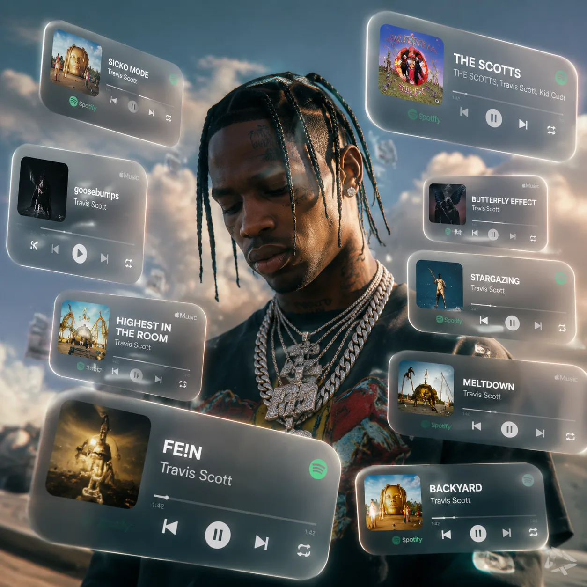

**#79 · Realistic, Portrait · <code>Vinano Studio</code>**

> Keywords: realistic, portrait, character, cinematic, AI art, AI prompt

<details>
<summary>Show prompt</summary>

```
[PERSONE]: Enter the music artist name here.
Goal: Generate a cinematic, dreamlike AR (Augmented Reality) visual featuring [PERSONE] as the central subject, surrounded by an orbiting system of floating music interface cards.

1. THE SUBJECT & DYNAMIC TRACKLIST
- Character: A premium-quality, realistic portrait of [PERSONE] as the central figure.
- AI AUTOMATION (CRITICAL): Based on the name provided in [PERSONE], identify their top 8 most popular songs. Automatically replace the placeholder list below these real song titles.
- Featured Tracks: [Placeholder for songs like: century, rottweiler, 4 raws, phantom, mist, cali man, LV sandals]. Each song title must appear on its own floating 3D interface card.

2. AR INTERFACE & CARDS
- Style: Numerous 3D Spotify and Apple Music interface cards orbiting the subject at varying depths.
- Material: Translucent frosted glass (glassmorphism) soft rounded edges and subtle glowing borders.
- Movement: Some cards are in the extreme foreground, partially obscuring [PERSONE], while others drift into the distance behind the figure.
- Visual Accents: Dynamic motion blur on the edges of the cards to suggest a swirling, orbiting movement.

3. LIGHTING & COMPOSITION
- Lighting: Natural tones enhanced professional photo quality. The soft glow from the interface cards subtly illuminates the face of [PERSONE].
- Focus: Strong depth of field. The background and extreme foreground cards are artistically blurred, keeping the focus sharp on the artist and the closest player interfaces.
- Composition: A cinematic wide or medium shot that emphasizes the scale of the floating AR elements.

4. AESTHETIC
- High-end editorial music photography, futuristic AR concept, clean and airy vibe. 8k resolution, sophisticated lighting, and realistic textures on the glass cards.

Emphasise material texture and natural light so the final frame feels tactile and premium.
```

</details>

---

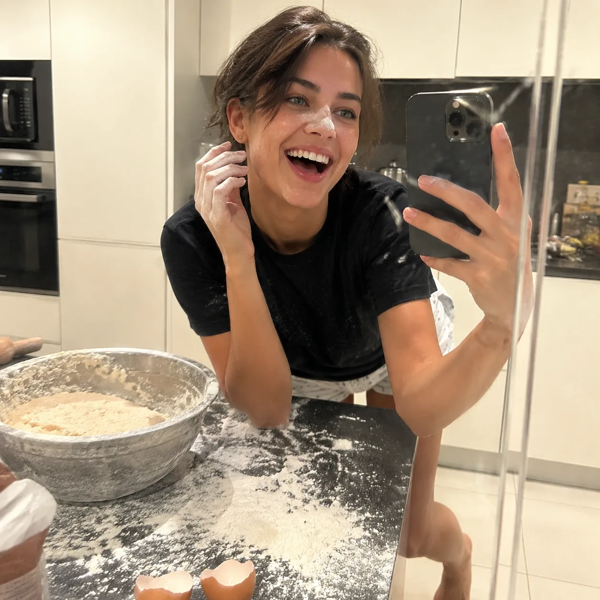

**#80 · Realistic, Portrait · <code>Vinano Studio</code>**

> Keywords: realistic, portrait, AI art, AI prompt, text to image

<details>
<summary>Show prompt</summary>

```
{
 "prompt_type": "descriptive_portrait",
 "subject_details": {
 "demographics": "Young female, sun-kissed skin, fit and athletic build, strictly matching the reference photo.",
 "facial_features": {
 "expression": "Laughing mouth open, a smudge of white flour on her nose and cheek, playful and messy yet attractive, facial expression matching the reference photo.",
 "eyes": "Bright green eyes, aligned the reference photo angle.",
 "hair": "Slightly messy short-to-medium hair, casually styled, exactly following the reference photo hairstyle."
 },
 "apparel": {
 "dress": "Plain black t-shirt fitting exactly like the reference photo pose, paired tiny pajama shorts.",
 "accessories": "None.",
 "footwear": "Barefoot."
 }
 },
 "pose_and_action": {
 "body_position": "Leaning over the kitchen island counter, elbows resting on the surface, body position strictly following the reference photo.",
 "hands": "Hands lightly dusted flour. One hand holds the phone, the other is near her face, matching the reference photo hand positions exactly.",
 "camera_angle": "Eye-level mirror selfie captured in a reflective kitchen cabinet or window, camera angle matching the reference photo precisely."
 },
 "background_environment": {
 "location": "Messy kitchen.",
 "lighting_source": "Bright overhead kitchen lights.",
 "objects": {
 "details": "Bowl of dough, scattered flour on the counter, cracked eggshells."
 }
 },
 "technical_specs": {
 "style": "Playful, domestic, ultra-realistic, high detail on natural skin texture and flour dust, strict adherence to the reference photo for realism.",
 "aspect_ratio": "4:5"
 },
 "constraints": ["Preserve facial identity exactly as in the reference image",
 "No facial reshaping or beautification",
 "No artificial filters or stylization",
 "Maintain natural proportions and lighting"],
 "output_goal": "Create a playful, ultra-realistic mirror selfie portrait of a young woman in a messy kitchen, laughing naturally flour on her face, perfectly matching the reference photo in pose, expression, and identity."
}

Emphasise material texture and natural light so the final frame feels tactile and premium.
```

</details>

---

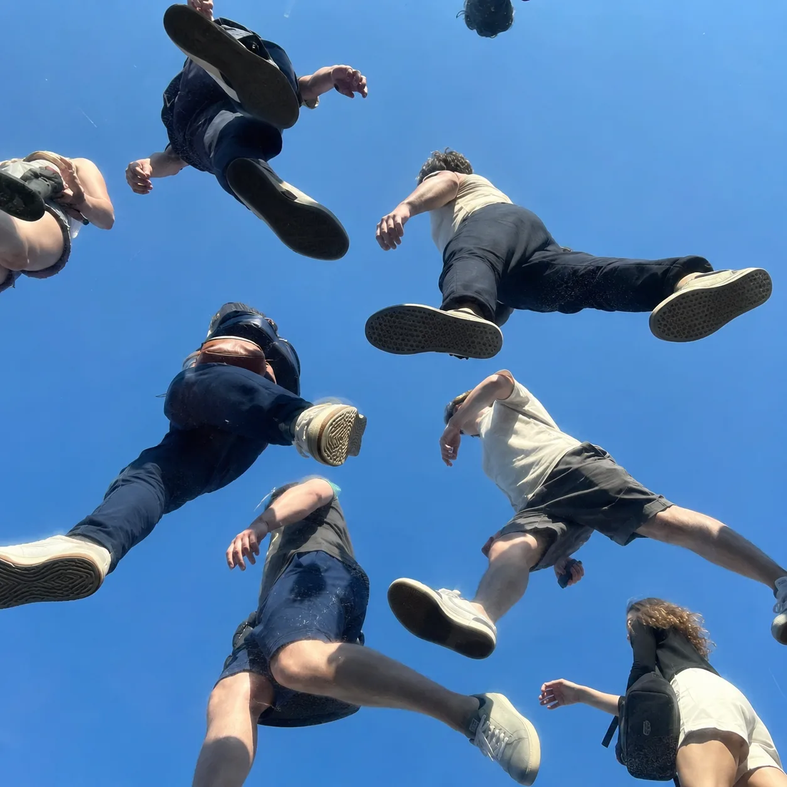

**#81 · Ai Art, Ai Prompt · <code>Vinano Studio</code>**

> Keywords: AI art, AI prompt, text to image

<details>
<summary>Show prompt</summary>

```
View from under a plane of completely transparent plexiglass. We are looking straight up. Many people are walking on the plexiglass. In the background is a pure blue sky. No buildings visible. No edges or separations in the plexiglass. It’s as if the plexiglass isn’t even there. We are very close to the people. The people are in the process of walking. The people are walking generally from left to right. The soles of their shoes are very close to the foreground. Preserve realistic proportions and depth for a confident, professional finish.
```

</details>

---

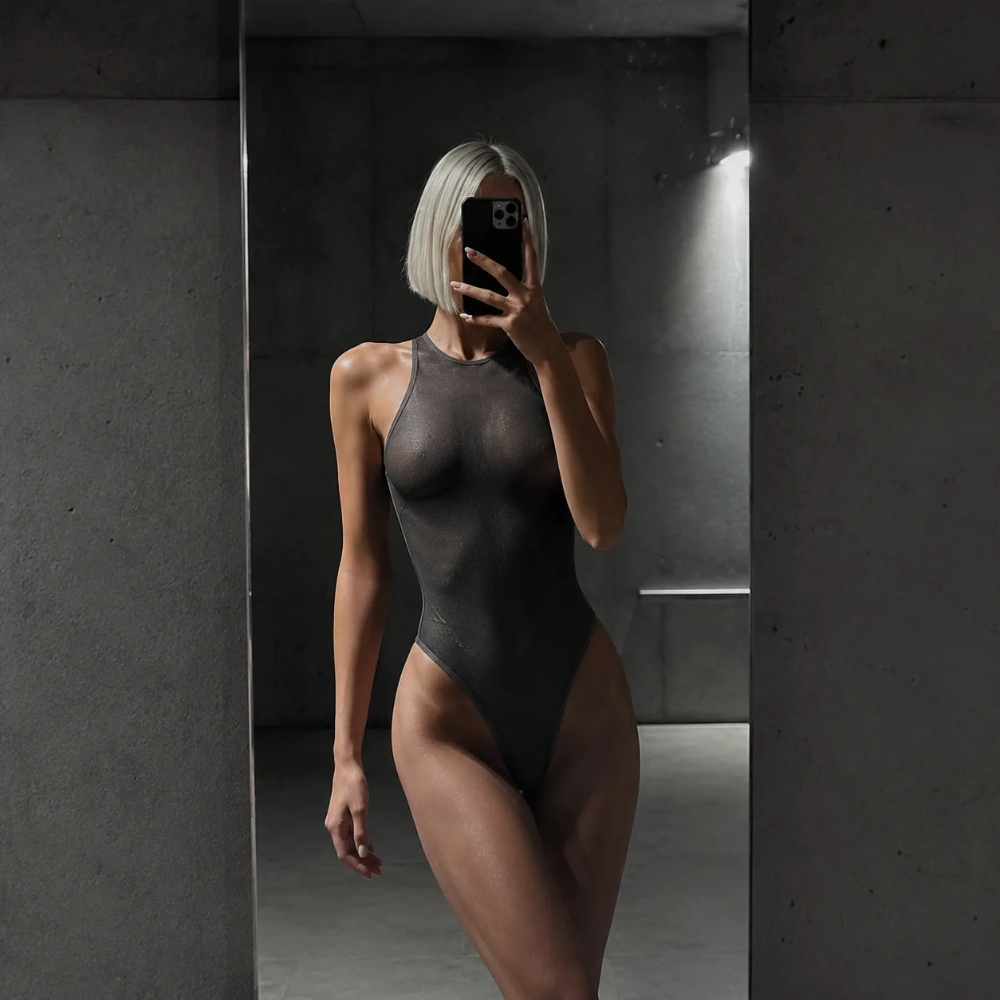

**#82 · Realistic, Ai Art · <code>Vinano Studio</code>**

> Keywords: realistic, AI art, AI prompt, text to image

<details>
<summary>Show prompt</summary>

```
{
  "meta": {
    "aspect_ratio": "9:16",
    "camera": "iPhone rear camera",
    "lens": "35mm",
    "quality": "ultra true-to-life photorealistic",
    "style": "cold editorial mirror reflection, raw iphone realism, natural skin texture, slight grain"
  },

  "scene": {
    "location": "empty concrete hallway apartment",
    "visibility_rule": "only mirror reflection visible, subject never appears directly",
    "environment_details": ["tall frameless mirror mounted on concrete wall",
      "industrial gray walls",
      "soft shadow gradients",
      "clean but slightly brutalist interior"],
    "time": "very late night",
    "atmosphere": "silent, detached, fashion-editorial tension"
  },

  "lighting": {
    "type": "single directional light",
    "source": "cool LED wall light from side",
    "color_temperature": "cold white",
    "effect": "sharp highlights on shoulders and collarbones, deep controlled shadows"
  },

  "camera_perspective": {
    "pov": "mirror reflection only",
    "angle": "straight-on, chest-height",
    "framing": "upper thighs to head visible only inside mirror",
    "real_world_visibility": "no body parts visible outside mirror",
    "phone_visibility": "phone covering face in reflection"
  },

  "subject": {
    "gender": "female",
    "age_vibe": "young adult",
    "ethnicity": "Northern European",

    "hair": {
      "color": "icy platinum blonde",
      "style": "short blunt bob",
      "behavior": "clean lines, barely touching jaw"
    },

    "outfit": {
      "bodysuit": {
        "type": "one-piece mesh bodysuit",
        "color": "smoky graphite gray",
        "material": "semi-transparent technical mesh",
        "fit": "tight, sculpting, stretched naturally",
        "coverage": "fashion-revealing, non-explicit"
      }
    },

    "pose": {
      "position": "standing still close to mirror",
      "legs": {
        "stance": "asymmetrical",
        "detail": "one leg straight, one knee slightly bent inward"
      },
      "hips": {
        "action": "subtle sideways shift creating tension in fabric"
      },
      "arms": {
        "phone_hand": "holding phone directly in front of face",
        "free_hand": "hanging loose by side, relaxed fingers"
      },
      "vibe": "cold confidence, model-off-duty, emotionally distant"
    },

    "face": {
      "visibility": "completely hidden by phone",
      "effect": "identity erased, body language only"
    }
  },

  "imperfections": ["minor mirror streaks",
    "uneven LED light falloff",
    "slight handheld camera micro-tilt"]
}

Keep edges clean and the overall composition balanced for a polished, gallery-ready result.
```

</details>

---

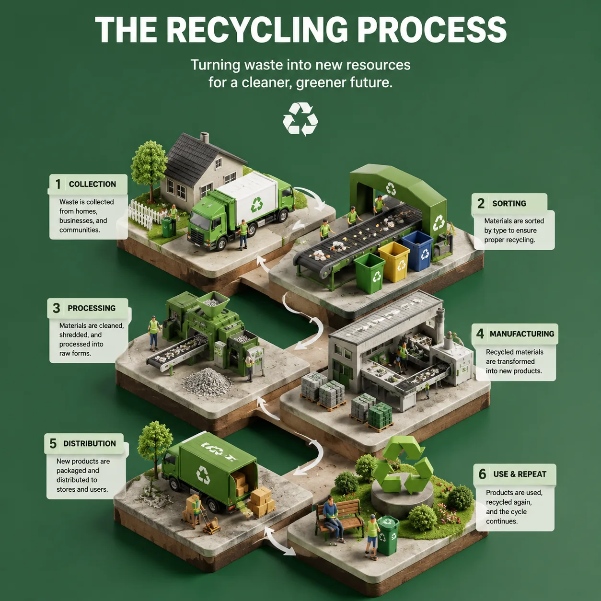

**#83 · Isometric, Realistic · <code>Vinano Studio</code>**

> Keywords: isometric, realistic, AI art, AI prompt, text to image

<details>
<summary>Show prompt</summary>

```
Create a clear, 45° top-down isometric miniature 3D educational diorama explaining [PROCESS / CONCEPT].

Use soft refined textures, realistic PBR materials, and gentle lifelike lighting.

Build a stepped or layered diorama base showing each stage of the process subtle arrows or paths.

Include tiny stylized figures interacting each stage (no facial details).

Use a clean solid [BACKGROUND COLOR] background.
At the top-center, display [PROCESS NAME] in large bold text, directly beneath it show a short explanation subtitle, and place a minimal symbolic icon below.

All text must automatically match the background contrast (white or black).

Aim for an editorial, design-driven look with deliberate negative space.
```

</details>

---

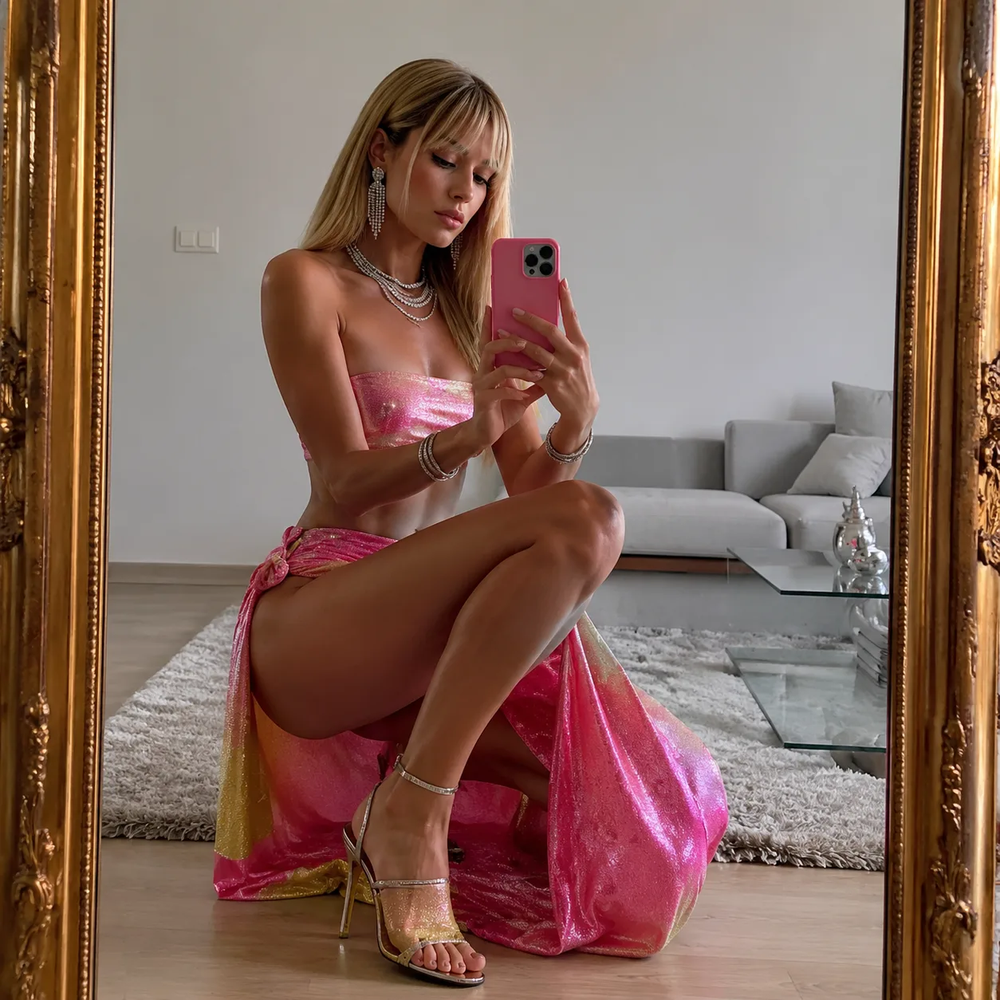

**#84 · Realistic, Minimalist · <code>Vinano Studio</code>**

> Keywords: realistic, minimalist, AI art, AI prompt, text to image

<details>
<summary>Show prompt</summary>

```
{
 "specification_metadata": {
 "version": "16.0_modular_atomic",
 "rendering_engine": "8K true-to-life photorealistic Hyper-Definition",
 "aspect_ratio": "9:16",
 "style_intent": "High-End Influencer Lifestyle Photography"
 },
 "subject_schema": {
 "biometrics": {
 "identity": "Young Western woman",
 "physique": "Athletic / Toned build",
 "facial_profile": {
 "complexion": "Clear / Flawless",
 "features": "Refined / Sharp",
 "skin_shader": "Luminous / Natural texture"
 }
 },
 "capillary_logic": {
 "color": "Long, sleek blonde",
 "style": "Straightened / High-sheen",
 "fringe_logic": "Messy bangs spread naturally across the forehead",
 "physics": "Silky texture / Individual strand rendering"
 },
 "performance_kinematics": {
 "pose_archetype": "Crouching low mirror selfie",
 "spatial_orientation": "Full-body reflection",
 "gesture": "Holding device both hands at a slight downward tilt"
 }
 },
 "wardrobe_schema": {
 "apparel_system": {
 "type": "Avant-Garde Two-Piece Set",
 "fabric_logic": {
 "texture": "Shimmery / Glittery / Reflective",
 "material": "High-luster metallic weave"
 },
 "chroma_profile": {
 "primary": "Vibrant Hot Pink",
 "accent": "Light Yellow"
 },
 "garment_architecture": {
 "upper": "Strapless bandeau / Diagonal midriff cutout",
 "lower": "High-waisted maxi skirt / Dramatic thigh-high slit / Hip-knot detailing"
 }
 },
 "accessory_system": {
 "material": "Polished Silver",
 "items": [{ "type": "Necklace", "detail": "Layered silver chains" },
 { "type": "Earrings", "detail": "Ornate silver chandeliers" },
 { "type": "Bracelets", "detail": "Multiple thin silver bands" }]
 }
 },
 "hardware_node": {
 "device_spec": {
 "model": "iPhone 16 Pro Max",
 "finish": "Silver / Gray Titanium",
 "peripheral": "Hot Pink phone case (High-saturation pop color)"
 }
 },
 "environmental_rig": {
 "scenography": {
 "interior_style": "Modern refined minimalist",
 "surfaces": {
 "floor": "Light wood planks",
 "rug": "Light grey shag / High-pile texture",
 "walls": "Neutral matte white"
 },
 "props": {
 "mirror": "Large floor-length mirror an ornate gold frame"
 }
 },
 "illumination_architecture": {
 "source_type": "Natural soft indoor daylight",
 "distribution": "Even / Diffused",
 "shadow_logic": "Soft-ambient / Zero harsh contrast"
 }
 },
 "technical_logic_node": {
 "optical_parameters": {
 "shot_type": "Wide-angle mirror reflection",
 "perspective": "Eye-level / Slightly tilted downward",
 "focus_mapping": "Sharp focus on subject and garment textures"
 },
 "color_theory": {
 "base_palette": ["Monochromatic grays", "Metallic silver"],
 "contrast_element": "Hot pink focal point"
 },
 "post_processing_directives": {
 "resolution": "8K UHD",
 "denoising": "Off / Film grain retention",
 "filtering": "Professional editorial grade"
 }
 }
}

Aim for an editorial, design-driven look with deliberate negative space.
```

</details>

---


**#85 · Character, Cinematic · <code>Vinano Studio</code>**

> Keywords: character, cinematic, AI art, AI prompt, text to image

<details>
<summary>Show prompt</summary>

```
A handcrafted felt miniature illustration of [Celebrity] reimagined as a soft wool doll character. The figure has simplified facial features, button-like eyes, subtle smile, and carefully crafted felt textures. He is wearing an outfit inspired by his iconic casual tech style—dark jacket, simple t-shirt, and trousers—recreated in knitted wool and fabric. The scene has a whimsical, storybook feel grassy felt terrain, pastel hills, and a bright sky soft clouds. Macro photography look, shallow depth of field, soft natural lighting, stop-motion animation aesthetic, ultra-detailed fibers and fabric textures, cozy yet futuristic mood, cinematic composition, premium quality. Aim for an editorial, design-driven look with deliberate negative space.
```

</details>

---

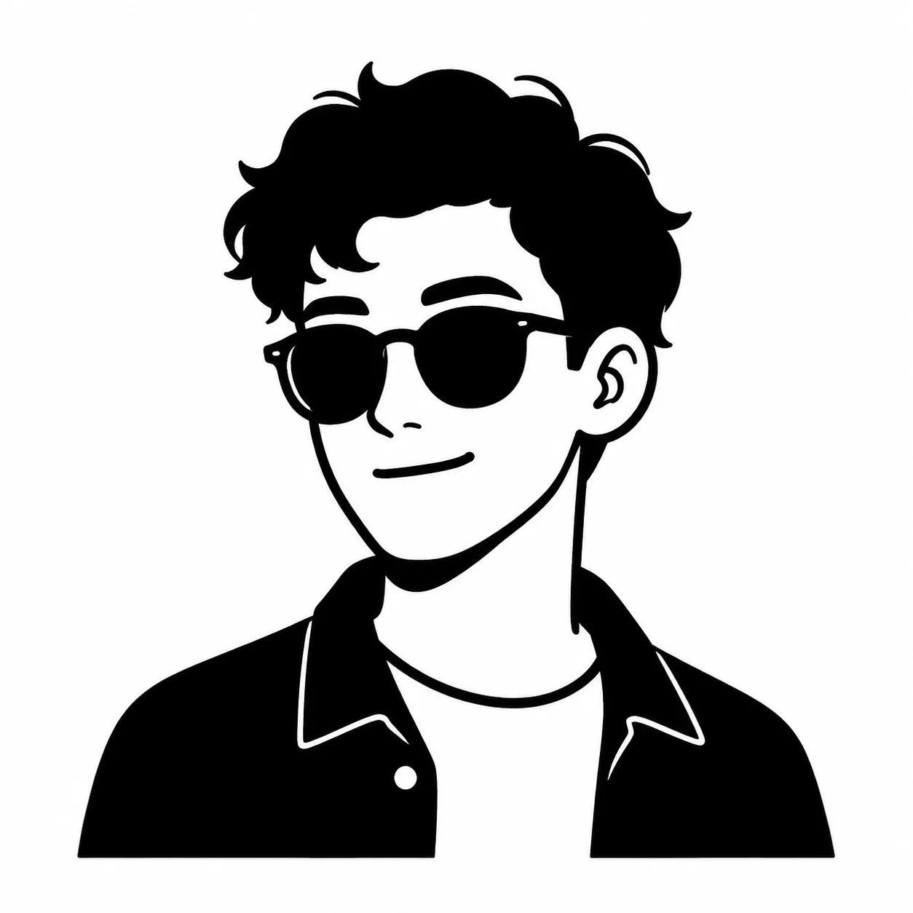

**#86 · Portrait, Character · <code>Vinano Studio</code>**

> Keywords: portrait, character, minimalist, AI art, AI prompt, text to image

<details>
<summary>Show prompt</summary>

```
A refined minimalist, black-and-white flat vector illustration portrait of [NAME], rendered in the expressive "Notion avatar" art style.
LINE WORK & VIBE:
Style: Use THICK, UNIFORM black outlines (monoline weight). The lines should feel organic, smooth, and confident, not rigidly geometric or robotic like generic icons.
Vibe: The character should have a distinct personality and a relaxed, cool, or friendly expression. Focus on stylized features, unique hairstyles, and defining accessories to convey character.
SELECTIVE BLACK FILLS (CRITICAL):
Unlike pure outline icons, utilize Solid Black Fills selectively and strategically.
Where to Fill: Use solid black for prominent hair masses, beards, eyebrows, sunglasses, or dark clothing elements.
Where to Keep White: The skin, main face area, and lighter elements must remain pure flat white inside the thick outlines.
COMPOSITION & TECHNICAL:
No shading, no gray tones, no gradients. Only pure Black and pure White.
Clean bust or headshot composition centered on a white background.
High contrast, clean 2D vector graphics.

Preserve realistic proportions and depth for a confident, professional finish.
```

</details>

---

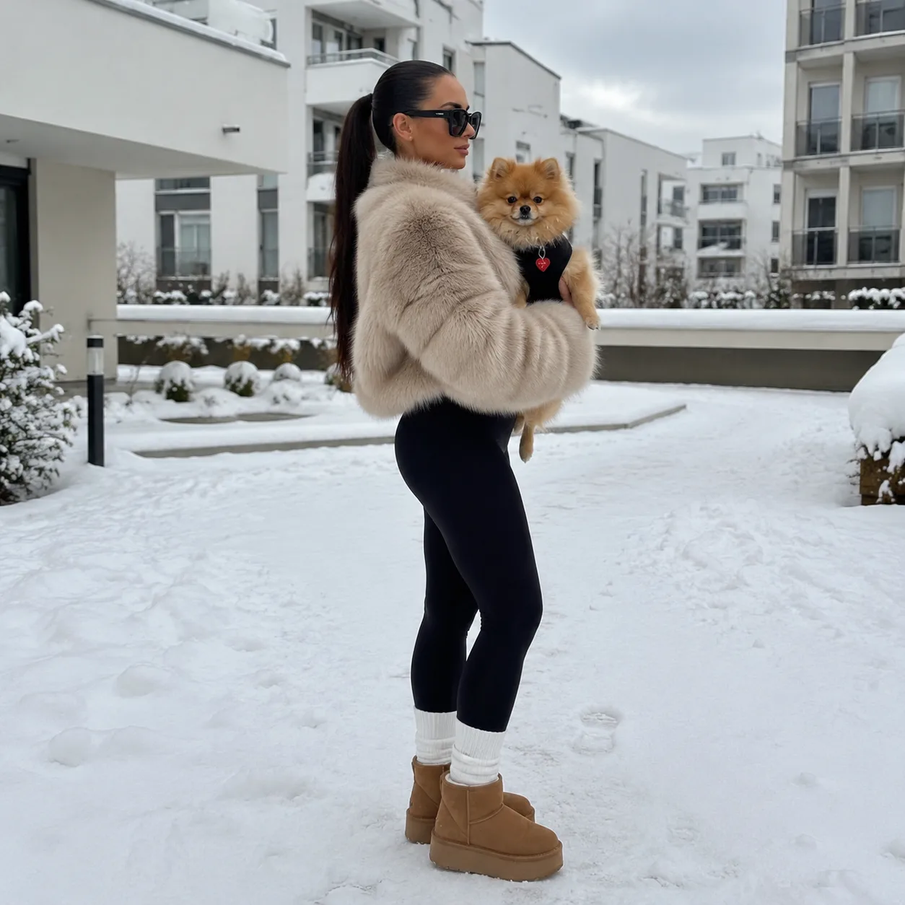

**#87 · Realistic, Ai Art · <code>Vinano Studio</code>**

> Keywords: realistic, AI art, AI prompt, text to image

<details>
<summary>Show prompt</summary>

```
{
 "title": "Winter Lifestyle Fashion Photograph",
 "description": "An ultra-realistic winter lifestyle fashion photograph taken outdoors in a modern residential area under an overcast sky. A young woman, in a relaxed side profile facing right, stands in a snow-covered courtyard surrounded by contemporary white apartment buildings. She wears oversized black sunglasses, a fitted black bodysuit, a voluminous beige fur jacket, white ribbed socks, and brown platform UGG boots. In her arms, she holds a small fluffy Pomeranian dog in a black harness a red heart tag, looking at the camera. The soft, diffused daylight and shallow depth of field create a candid, luxurious, and authentic atmosphere natural textures and lifelike proportions.",
 "photographer_perspective": {
 "lens": "50–85mm",
 "focus": "Shallow depth of field, sharp focus on the woman and dog.",
 "lighting": "Soft, diffused cold daylight under an overcast sky.",
 "color_temperature": "Realistic winter color temperature low contrast.",
 "aesthetic": "Editorial luxury casual, candid yet composed, true-to-life."
 },
 "subjects": {
 "woman": {
 "pose": "Side profile facing right, relaxed and naturally balanced.",
 "attire": ["Oversized black luxury sunglasses",
 "Fitted black bodysuit / catsuit",
 "Short beige fur jacket voluminous sleeves",
 "White ribbed socks",
 "Brown platform UGG boots worn winter soles"],
 "details": "Authentic human proportions, natural posture, realistic skin texture, no plastic smoothness."
 },
 "dog": {
 "breed": "Small fluffy Pomeranian",
 "accessories": "Black harness a subtle red heart tag",
 "pose": "Looking directly toward the camera",
 "details": "Detailed fur strands, soft natural shine, expressive eyes."
 }
 },
 "environment": {
 "location": "Modern residential area courtyard.",
 "elements": "Contemporary white multi-story apartment buildings balconies.",
 "condition": "All surfaces naturally covered in fresh snow.",
 "atmosphere": "True-to-life winter atmosphere, no artificial perfection."
 }
}

Keep edges clean and the overall composition balanced for a polished, gallery-ready result.
```

</details>

---

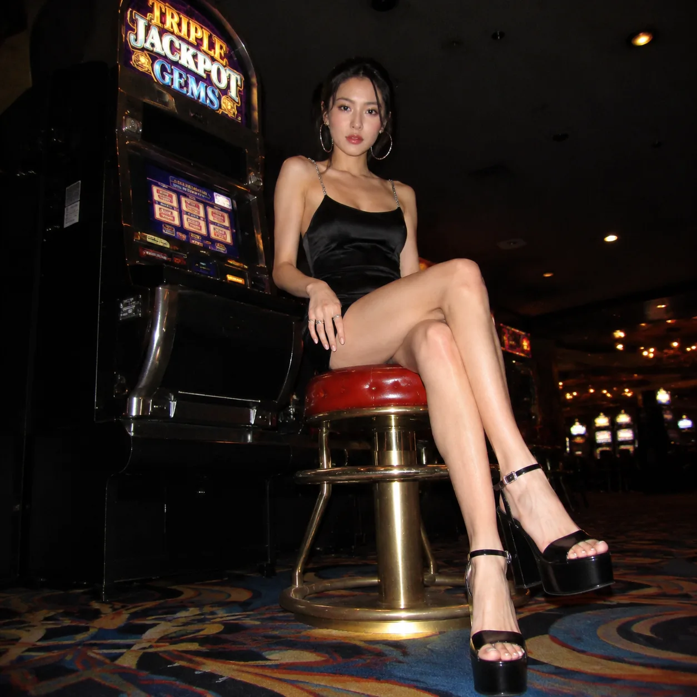

**#88 · Realistic, Character · <code>Vinano Studio</code>**

> Keywords: realistic, character, vintage, AI art, AI prompt, text to image

<details>
<summary>Show prompt</summary>

```
{
 "image_generation_request": {
 "meta_settings": {
 "aspect_ratio": "9:16",
 "model_version": "v6.0",
 "stylize_value": 250,
 "quality": "High"
 },
 "subject_definition": {
 "identity_source": {
 "method": "Image Reference",
 "instruction": "Strictly preserve facial features and hair from the uploaded reference image."
 },
 "body_language": {
 "pose": "Seated on a high stool, body angled 30 degrees to the left, legs elegantly crossed at the knee to elongate the silhouette.",
 "hands": "Resting casually on the upper thighs, fingers relaxed, showcasing rings.",
 "gaze": "Looking slightly down towards the camera lens or directly into the flash."
 }
 },
 "fashion_and_styling": {
 "garment_main": {
 "item": "Black mini slip dress",
 "fabric": "Satin or high-sheen silk blend",
 "fit": "Skin-tight, fitted bodycon silhouette",
 "details": ["Spaghetti straps made of glittering rhinestones",
 "Deep scoop neckline",
 "Mini hemline exposing legs"]
 },
 "footwear": {
 "item": "Platform sandals",
 "style": "Chunky block heel, 1990s/Y2K inspired",
 "material": "Black patent leather or satin",
 "details": "Silver buckle ankle strap, open toe"
 },
 "jewelry": {
 "ears": "Oversized sterling silver hoop earrings",
 "hands": "Multiple delicate silver stacking rings"
 }
 },
 "environmental_context": {
 "location": "Vintage Casino Floor",
 "flooring": {
 "type": "Patterned carpeting",
 "texture": "Worn nylon",
 "design": "Psychedelic swirls in teal, burnt orange, and royal blue",
 "vibe": "Retro Las Vegas aesthetic"
 },
 "furniture": {
 "item": "Casino bar stool",
 "material": "Tufted red faux leather seat",
 "base": "Tarnished bronze or gold metal pedestal footrest"
 },
 "props_and_background": {
 "primary_prop": "Slot machine",
 "prop_details": "Illuminated marquee reading 'TRIPLE JACKPOT GEMS', glowing buttons, glass screen reflections",
 "atmosphere": "Smoky, crowded, dimly lit background bokeh lights from other machines"
 }
 },
 "photography_technical": {
 "camera_simulation": "Early 2000s Digital Compact Camera (e.g., Sony Cybershot or Canon PowerShot)",
 "lighting_style": {
 "type": "Direct On-Camera Flash",
 "characteristics": ["Harsh shadows directly behind the subject",
 "High contrast",
 "Overexposed specular highlights on skin and fabric",
 "Vignetted corners"]
 },
 "composition": {
 "angle": "Extreme low angle (Worm's-eye view)",
 "focus": "Sharp focus on subject, slight blur on background",
 "framing": "Full body shot emphasizing long legs and platform shoes"
 },
 "post_processing": {
 "filters": "Vintage digicam aesthetic",
 "grain": "ISO 800 digital noise",
 "saturation": "High saturation, slightly blown-out whites"
 }
 },
 "compiled_prompts": {
 "main_prompt": "Low angle worm's-eye view shot, direct flash photography. A young woman sitting on a red tufted leather casino stool. She is wearing a fitted black satin mini slip dress sparkling rhinestone spaghetti straps and chunky black platform block heels ankle buckles. To her left is a large glowing slot machine neon text 'TRIPLE JACKPOT GEMS'. The floor is a gaudy retro casino carpet teal and orange swirls. Background is a dimly lit gambling floor. Aesthetic is Y2K party photography, candid snapshot, harsh flash lighting, hard shadows, high contrast, digital noise, 2000s digicam style, ultra-realistic texture on skin and fabric.",
 }
 }

Aim for an editorial, design-driven look with deliberate negative space.
```

</details>

---

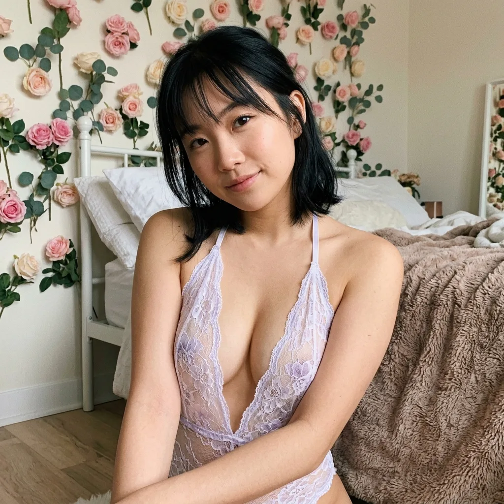

**#89 · Portrait, Ai Art · <code>Vinano Image Pro</code>**

> Keywords: portrait, AI art, AI prompt, text to image

<details>
<summary>Show prompt</summary>

```
{ "subject": { "description": "Young Asian woman in a sheer deep-V lace halter, sitting in a floral-decorated bedroom.", "age": "early 20s", "expression": { "eyes": { "look": "direct", "energy": "gentle, softly seductive", "direction": "at lens" }, "mouth": { "position": "closed, slight curve", "energy": "soft" }, "overall": "inviting and calm" }, "face": { "preserve_original": true, "makeup": "soft pink blush, glossy coral lips, subtle eyeliner" }, "hair": { "color": "black", "style": "shoulder-length bob, wispy bangs", "effect": "tucked behind left ear, slightly relaxed" }, "body": { "frame": "slender, feminine", "waist": "partially visible", "chest": "prominent cleavage, extreme deep plunge", "legs": "out of frame", "skin": { "visible_areas": "face, neck, shoulders, chest, arms", "tone": "fair, warm undertones", "texture": "velvety and warm to the touch", "lighting_effect": "diffused glow catching soft highlights" } }, "pose": { "position": "leaning slightly forward", "base": "sitting on floor", "overall": "relaxed, intimate approach" }, "clothing": { "top": { "type": "halter bodysuit", "color": "white and pale lilac", "details": "sheer floral lace, scalloped edges, thin neck straps, extremely deep V-neck", "effect": "revealing, delicate" }, "bottom": { "type": "none visible", "color": "", "details": "" } } }, "photography": { "camera_style": "smartphone portrait aesthetic, slight overexposure", "angle": "high-angle, slightly off-center", "shot_type": "chest-up portrait", "aspect_ratio": "3:4", "texture": "soft digital, slight random grain", "lighting": "soft front diffused light", "depth_of_field": "shallow, f/2.8 equivalent blurring background" }, "background": { "setting": "cozy bedroom", "wall_color": "off-white", "elements": ["wall heavily decorated dense pink and cream roses", "white metal bed frame", "brown fluffy blanket", "white pillows", "light wood floor"], "atmosphere": "romantic, private", "lighting": "soft ambient, gentle shadow fall-off" }, "the_vibe": { "energy": "lingering softness", "mood": "sweet seduction", "aesthetic": "soft girl, floral pastel", "authenticity": "casual indoor snapshot, slightly imperfect framing", "intimacy": "invading personal space, close proximity", "story": "a quiet afternoon spent waiting", "caption_energy": "feeling pretty today" }, "constraints": { "must_keep": ["deep-V lace halter", "flower wall background", "soft skin texture"], "avoid": ["heavy makeup", "harsh directional shadows", "complex accessories"] }, "negative_prompt": ["harsh lighting", "deformed features", "extra limbs", "watermark", "text", "oversaturated", "masculine features", "messy background"] } Render with rich micro-detail while keeping the layout uncluttered and intentional.
```

</details>

---

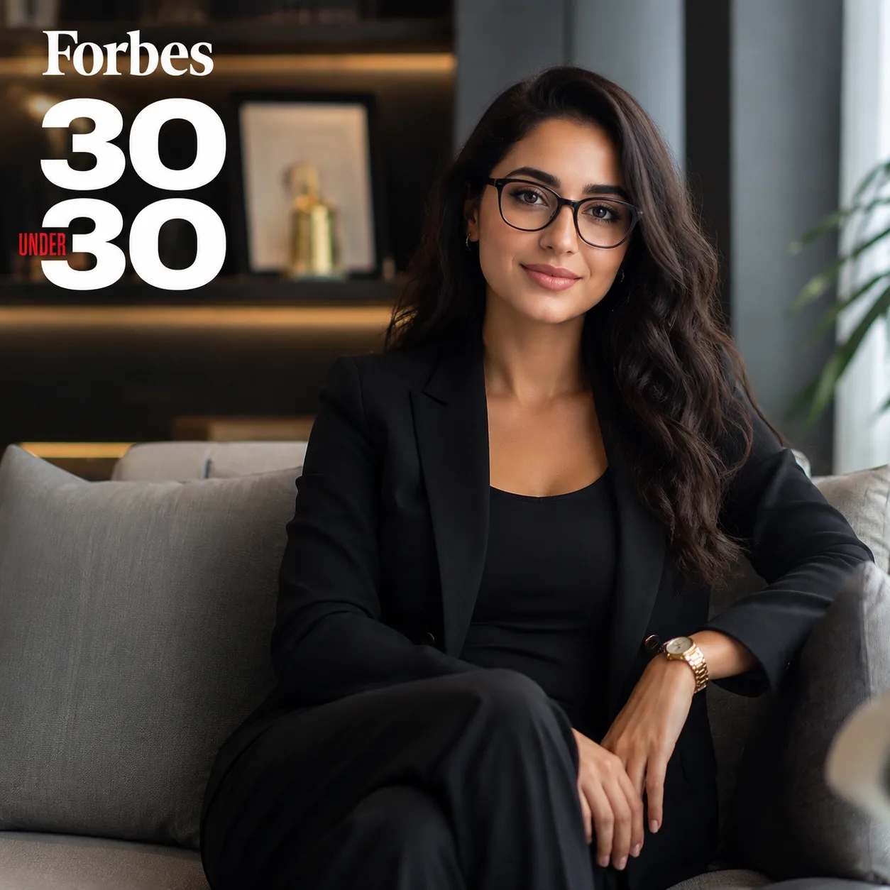

**#90 · Realistic, Portrait · <code>Vinano Studio</code>**

> Keywords: realistic, portrait, minimalist, AI art, AI prompt, text to image

<details>
<summary>Show prompt</summary>

```
Create a hyper-realistic Forbes “30 Under 30” magazine-style portrait of the same woman from the reference image (preserve her exact facial features, identity, and expression 100%). She is sitting confidently on a modern luxury sofa in a high-end office or studio environment. She has a radiant, glowing skin tone soft, natural makeup, subtle highlights on cheekbones, and bright, sharp eyes behind elegant glasses. Her expression is calm, confident, and successful. Outfit: smart professional attire (refined minimalist black or neutral tones), clean and modern. Preserve realistic proportions and depth for a confident, professional finish.
```

</details>

---

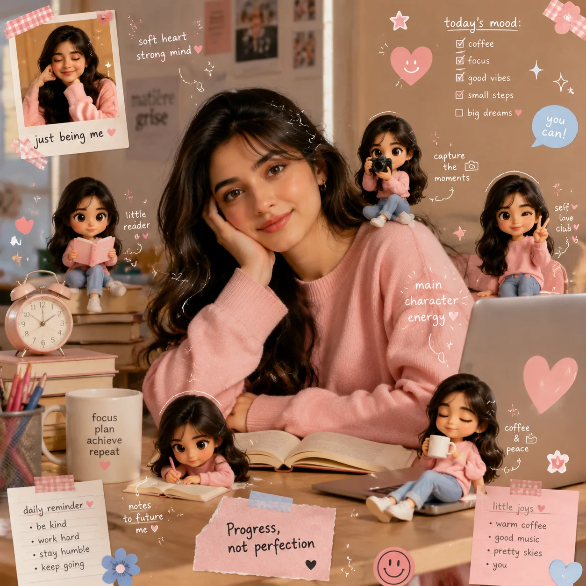

**#91 · Character, Ai Art · <code>Vinano Studio</code>**

> Keywords: character, AI art, AI prompt, text to image

<details>
<summary>Show prompt</summary>

```
Transform the provided reference image into a cozy aesthetic scrapbook-style composition while strictly preserving the original subject, identity, pose, lighting, and background.

Add multiple small “mini version” characters of the same person (chibi / doll-like style), placed naturally around the scene (on objects, table, shoulder, etc.). These mini figures must match the subject’s face, hairstyle, outfit, and vibe consistently, styled as cute 3D collectible figurines. Show them doing different activities (reading, posing, taking photos, relaxing).

Overlay handwritten-style doodles and annotations across the image: arrows, hearts, stars, sparkles, icons, and playful captions connected to elements in the scene.

Use a soft pastel color palette (white base pink, peach, blue accents).

Keep the frame visually rich and filled but balanced and clean.

Style: warm, cozy lighting, dreamy Instagram scrapbook aesthetic, soft depth of field, highly detailed, polished but playful.

The final result must look like the SAME original image enhanced mini alter-egos and aesthetic annotations — not a recreated or different scene.

Render with rich micro-detail while keeping the layout uncluttered and intentional.
```

</details>

---

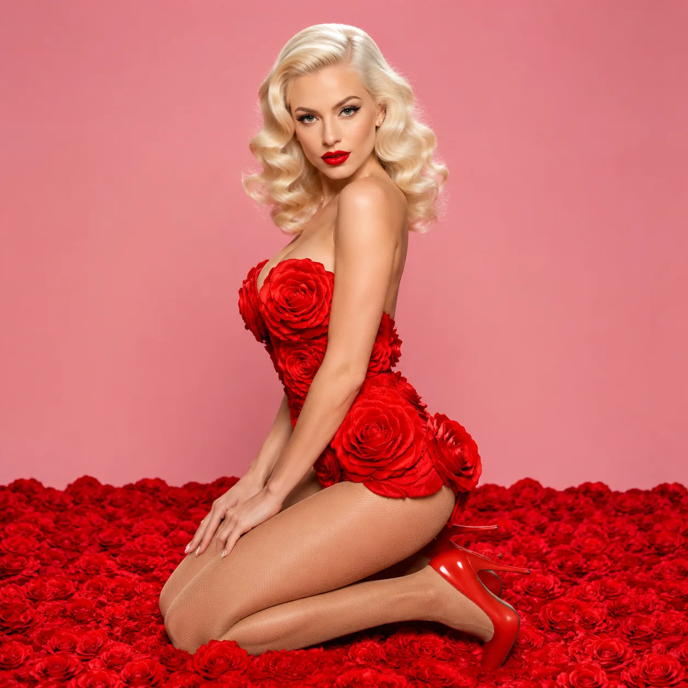

**#92 · Portrait, Vintage · <code>Vinano Studio</code>**

> Keywords: portrait, vintage, AI art, AI prompt, text to image

<details>
<summary>Show prompt</summary>

```
{
 "visual_style": {
 "pose": {
 "position": "Kneeling seated on heels",
 "body_orientation": "Side profile torso slight twist toward camera",
 "spine_posture": "Upright gentle curve",
 "head_angle": "Turned toward camera (three-quarter view)",
 "gaze": "Direct confident eye contact",
 "arms": "Relaxed, hands resting on thighs",
 "energy": "Stylized fashion editorial posture"
 },

 "colors": {
 "primary_palette": ["Vivid Crimson Red (floral elements)",
 "Soft Pastel Pink (background)",
 "Platinum Blonde (hair)"],
 "secondary_palette": ["Warm natural skin tones",
 "Neutral tan hosiery tones"],
 "contrast_profile": "High saturation reds contrasted muted pink background",
 "color_distribution": {
 "dominant": "Red",
 "supporting": "Pink",
 "accent": "Blonde highlights"
 }
 },

 "composition": {
 "framing": "Vertical portrait",
 "shot_type": "Medium-full body",
 "subject_placement": "Centered",
 "foreground": "Dense red floral layer",
 "midground": "Subject",
 "background": "Flat pastel studio backdrop",
 "visual_lines": "S-curve silhouette guiding viewer focus upward",
 "depth": "Three-layer depth separation"
 },

 "outfits": {
 "garment_concept": "Rose-inspired sculptural fashion elements",
 "material_visual": "Soft textile or plush floral forms",
 "legwear": "Fine mesh tights",
 "footwear": "Gloss red pointed-toe heels",
 "hair": {
 "style": "Old Hollywood waves",
 "volume": "High",
 "tone": "Platinum blonde"
 },
 "makeup": {
 "lip_color": "Matte vivid red",
 "eyes": "Defined liner and lashes",
 "skin_finish": "Smooth glam contour"
 }
 },

 "lighting": {
 "type": "Studio soft diffused lighting",
 "direction": "Frontal key slight side shaping",
 "shadow_profile": "Minimal harsh shadows",
 "highlight_behavior": "Even skin illumination",
 "environment_reflection": "Matte backdrop light absorption"
 },

 "effects": {
 "post_processing": ["High red saturation",
 "Soft glam skin smoothing",
 "Clean digital polish"],
 "texture_emphasis": ["Floral softness",
 "Smooth skin rendering",
 "Matte backdrop"],
 "aesthetic": ["Glam editorial",
 "Romantic studio fashion",
 "Vintage Hollywood influence"]
 }
 }
}

Maintain consistent colour harmony and crisp focus across the whole frame.
```

</details>

---

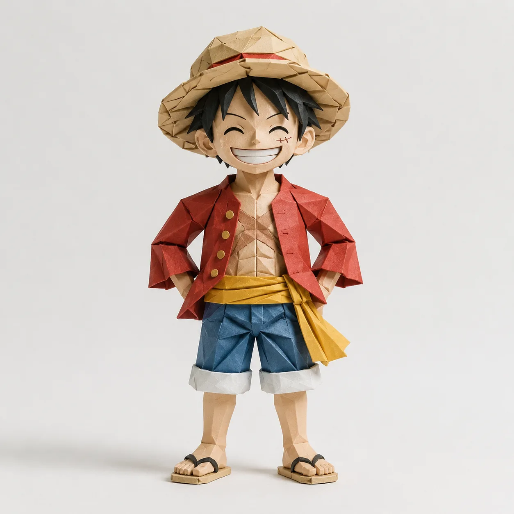

**#93 · Realistic, Character · <code>Vinano Studio</code>**

> Keywords: realistic, character, minimalist, AI art, AI prompt, text to image

<details>
<summary>Show prompt</summary>

```
A hyper-detailed, origami-style version of a person, folded from premium-quality paper crisp, clean edges and a realistic paper texture. Intricate geometric folds capture the character’s iconic shape and expressions. Use the same color palette as the reference photo (no black). Place it on a clean studio surface soft, natural shadows. A refined minimalist collectible art aesthetic; ultra-true-to-life photorealistic; 8k, 1080×1080 square. Preserve realistic proportions and depth for a confident, professional finish.
```

</details>

---

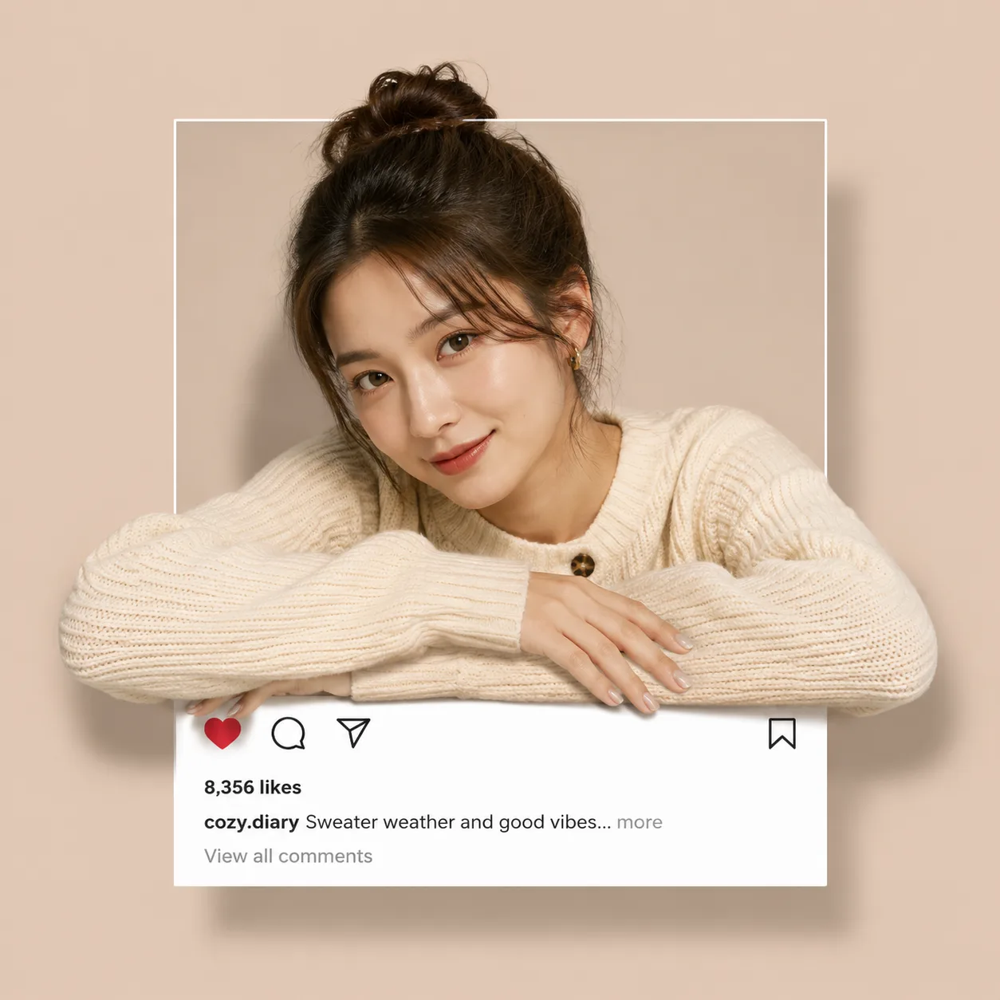

**#94 · Realistic, Character · <code>Vinano Studio</code>**

> Keywords: realistic, character, AI art, AI prompt, text to image

<details>
<summary>Show prompt</summary>

```
A true-to-life photorealistic fashion upper body shot of [Character Description and expression] wearing [Detailed Outfit Description]. The subject is framed inside a central white Instagram-style post border.

Composition & Spacing: The white frame is perfectly centered in the middle of the image, leaving balanced empty [Soft Background Color matching the outfit] space above and below the frame to match the theme.

Frame Details: The top, left, and right white borders are very thin. The bottom white section is thicker to include UI elements. The bottom section features a red heart icon, comment bubble, share icon, and bookmark icon.

Text Details: Clearly visible text on the bottom panel: "[Number] likes", username "[Username]", caption "[Caption text]... more", and below that, "View all comments".

3D Pop-Out Effect & Hand Pose:
[CHOOSE ONE OF THE FOLLOWING ACTIONS OR DESCRIBE YOUR OWN ACTION:]
 1. (Grip): head and arms are physically popping out OVER the top and side thin borders. hands are realistically gripping the outer edges of the thin side borders, appearing to hold the frame firmly.
2. (Kiss): Her body is leaning forward towards the camera, creating a strong sense of depth. Her head remains securely framed WITHIN the top thin white border. Only her right hand, raised near her mouth in a blowing-kiss gesture, physically extends forward and breaks OUT of the thin side frame boundary. Her left hand realistically grips the side edge.
3. (Resting): She is looking directly at the camera a gentle smile. Her head and shoulders physically pop out OVER the top thin white border. Crucially, her hands are realistically resting comfortably on top of the thicker bottom white UI panel, appearing to lean casually on the frame edge.
4. (Dynamic Frame): Her upper body and head remain secure WITHIN the boundaries of the white frame. However, both of her arms are fully extended outward dynamically, breaking past the thin borders up to her elbows, reaching straight toward the camera lens. She forms a distinct “L” shape both hands, as if framing a scene. Due to perspective, her hands are positioned significantly closer to the camera than her face, showing strong spatial depth.

Subject Dimensionality & Texture: The subject must look like a solid, three-dimensional figure, not flat. Emphasize the detailed texture of the [Specific Fabric Name from outfit description], the contours of the face, and realistic hair details. She should have distinct depth separating her from the flat [Background Color] background.

Lighting & Shadows: Professional studio lighting creating soft, realistic drop shadows cast by the physical frame and, crucially, by the [popping-out elements, e.g., hands/head/arms] onto the solid flat [Background Color] background, enhancing the dramatic depth and illusion. High definition, commercial photography.

Emphasise material texture and natural light so the final frame feels tactile and premium.
```

</details>

---

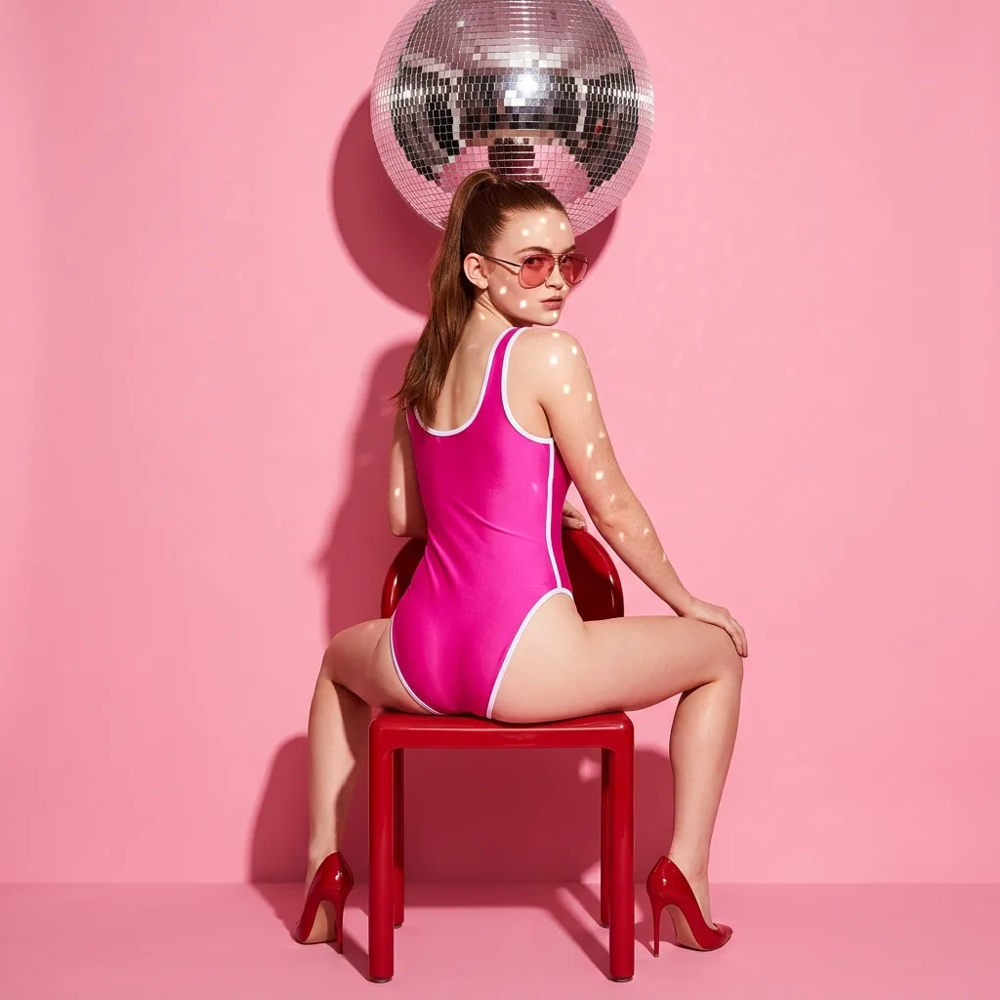

**#95 · Minimalist, Ai Art · <code>Vinano Image Pro</code>**

> Keywords: minimalist, AI art, AI prompt, text to image

<details>
<summary>Show prompt</summary>

```
{
 "style_summary": "Retro-modern disco-pop aesthetic high-saturation monochromatic tones.",
 "pose": {
 "orientation": "Over-the-shoulder look",
 "description": "Sadie Sink is positioned front to the camera open legs sitting on a reversed red glossy chair creating a focal point in the upper half of the frame.",
 "stance": "High-cut silhouette emphasizing the chest, legs and red glossy high heels."
 },
 "colors": {
 "primary_palette": ["Bubblegum Pink", "Fuchsia", "Hot Pink"],
 "accent_colors": ["Metallic Silver", "White"],
 "skin_tones": "Warm, natural tan highlights",
 "vibe": "Monochromatic and high-energy."
 },
 "composition": {
 "framing": "Vertical, medium-full shot",
 "subject_placement": "Centered silhouette",
 "background": "refined minimalist, solid-colored flat wall",
 "depth": "Shallow, a sharp drop-off shadow on the background to create a 3D pop effect."
 },
 "outfits_and_props": {
 "clothing": "High-leg pink spandex bodysuit white piping/trim",
 "accessories": "Rose-tinted transparent aviator-style sunglasses",
 "key_prop": "A large, multi-faceted metallic silver disco ball",
 "hair": "High ponytail, sleek and brunette."
 },
 "lighting": {
 "type": "Hard studio lighting",
 "direction": "Side-lit from the left",
 "shadows": "Sharp, defined shadows on the wall and body contours",
 "highlights": "Specular highlights on the bodysuit and disco ball facets",
 "special_lighting": "Caustic light reflections (small squares of light) projected onto the subject's skin from the disco ball."
 },
 "effects_and_texture": {
 "finish": "Glossy and high-contrast",
 "texture": "Reflective surfaces (disco ball), matte background, and smooth spandex sheen",
 "saturation": "High",
 "grain": "Clean, digital finish minimal noise."
 }
}

Aim for an editorial, design-driven look with deliberate negative space.
```

</details>

---

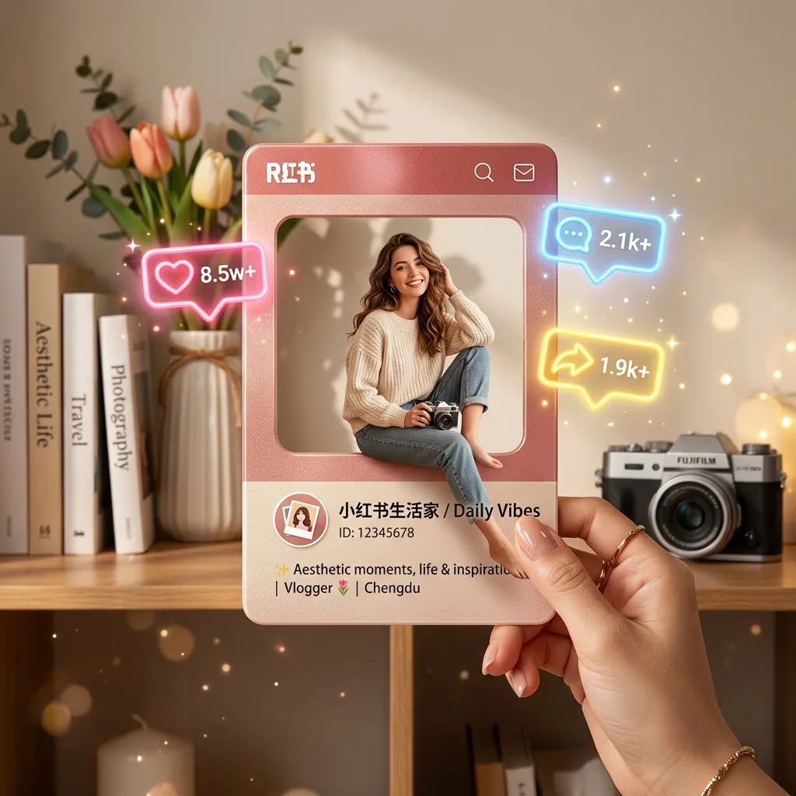

**#96 · Ai Art, Ai Prompt · <code>Vinano Image Pro</code>**

> Keywords: AI art, AI prompt, text to image

<details>
<summary>Show prompt</summary>

```
一只手中握着一张3D小红书个人资料卡，卡片中间方形镂空，一个女孩随意地坐在卡片镂空的边缘，温暖的米色和柔和的粉彩美学背景，逼真的深度和阴影，电影般的柔和光线，闪亮光滑的纹理，小红书风格的UI，漂浮的互动图标（点赞、评论、分享）带有发光的霓虹效果，闪光和光晕，背景中温馨的美学布置包括书籍、花瓶里的花和一台复古相机，梦幻氛围，Pixar风格+半现实主义融合，超高品质，4K，居中构图，高端影响者美学 追求杂志编辑式的设计感，刻意安排留白与视觉重心。
```

</details>

---

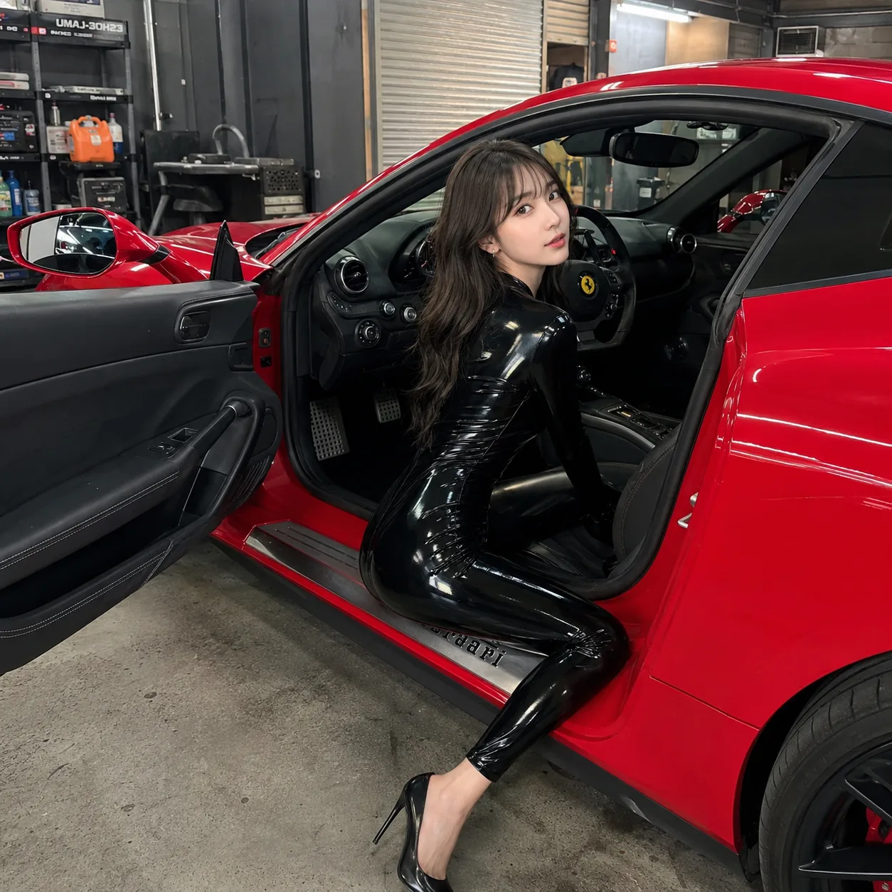

**#97 · Realistic, Ai Art · <code>Vinano Studio</code>**

> Keywords: realistic, AI art, AI prompt, text to image

<details>
<summary>Show prompt</summary>

```
{
  "meta": {
    "aspect_ratio": "9:16",
    "quality": "true-to-life photorealistic",
    "resolution": "4k",
    "camera": "Smartphone camera",
    "lens": "Standard lens",
    "style": "Candid garage photography, natural light mixed overhead fluorescent",
    "composition": "Full-body shot of Sakura Miyawaki sitting on the door sill of a red sports car in a garage, looking back at the camera."
  },
  "scene": {
    "location": "Car garage/workshop interior",
    "environment": ["Interior and open door of a red Ferrari", "Concrete floor", "Metal garage door and dark walls", "Workshop equipment and shelving in the background"],
    "time": "Daytime (indoors)",
    "atmosphere": "Casual, industrial, candid"
  },
  "lighting": {
    "type": "Mixed artificial and ambient daylight",
    "source": "Overhead fluorescent shop lights and light from an open garage door",
    "effect": "Functional, even lighting some shadows and highlights on the car and subject."
  },
  "subject": {
    "identity": "Sakura Miyawaki, the Japanese K-pop idol her signature large, deep-set double eyelid eyes, a high straight nasal bridge, and a delicate pointed chin. Her hair is long, wavy dark brown, almost black, styled soft curtain bangs.",
    "body": {
      "pose": "Sitting on the red door sill of the car, body turned towards the interior.",
      "physique": "Slender, athletic hourglass figure elegant proportions"
    },
    "outfit": {
      "clothing": "Glossy black latex bodysuit, black stiletto pumps."
    }
  },
  "realism_focus": {
    "textures": "Wavy hair strands, glossy black latex of bodysuit, leather car interior, metal door sill, rubber tires, concrete floor",
    "imperfections": "Natural creases in clothing, realistic reflections on car paint and interior"
  }
}

Maintain consistent colour harmony and crisp focus across the whole frame.
```

</details>

---

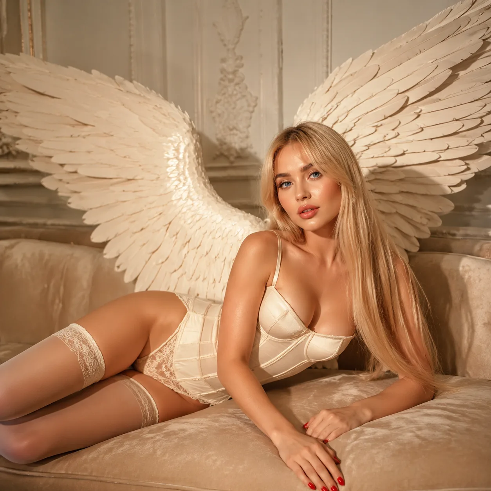

**#98 · Realistic, Cinematic · <code>Vinano Studio</code>**

> Keywords: realistic, cinematic, fantasy, AI art, AI prompt, text to image

<details>
<summary>Show prompt</summary>

```
{
 "image_generation_prompt": {
 "subject": {
 "description": "Young woman a strong resemblance to Sabrina Carpenter.",
 "hair": "Extra-long, straight, and sleek hair cascading down the shoulders and back, featuring a clean center part and soft silk-like physics.",
 "face": "Enchanting expression large blue eyes, slightly parted lips, and a flawless porcelain skin texture a soft-focus glow.",
 "body": "Slender and toned physique smooth skin, captured in a reclining pose that emphasizes graceful curves."
 },
 "attire": {
 "clothing": "A delicate cream-colored corset bodysuit structured boning and visible stitching, paired matching thin-strap lingerie and sheer thigh-high stockings lace trim.",
 "style": "Ethereal Boudoir / Angelic Fantasy."
 },
 "styling_and_accessories": {
 "jewelry": ["Large architectural white angel wings layered, sculptural feather-like scales",
 "Subtle red manicured nails"]
 },
 "environment": {
 "setting": "An opulent indoor lounge featuring a plush velvet or suede sofa.",
 "background": "An ornate wall classical plaster molding and decorative wainscoting in a warm off-white tone.",
 "water": "None"
 },
 "pose": {
 "posture": "Reclining horizontally on a sofa, propped up slightly by the elbows, creating a dynamic diagonal composition.",
 "arms": "One arm extended forward hands resting gently on the sofa surface, the other tucked slightly behind.",
 "angle": "Eye-level medium shot, focusing on the interplay between the subject and the wings."
 },
 "lighting_and_mood": {
 "lighting": "Warm, directional studio lighting creating a soft spotlight effect on the subject, gentle shadows cast by the wings against the wall.",
 "mood": "Dreamy, angelic, and high-fashion editorial.",
 "colors": "A monochrome-inspired palette of cream, ivory, and beige warm golden undertones."
 },
 "camera_and_technical": {
 "style": "Ultra true-to-life photorealistic, RAW photo.",
 "lens": "35mm wide-angle lens to capture the span of the wings.",
 "aperture": "f/2.0 for a shallow depth of field that keeps the wall texture soft.",
 "quality_tags": ["8k resolution",
 "highly detailed",
 "soft-focus skin",
 "filmic, cinematic lighting",
 "hyper-realistic texture",
 "Vogue editorial style"]
 }
 }
}

Preserve realistic proportions and depth for a confident, professional finish.
```

</details>

---

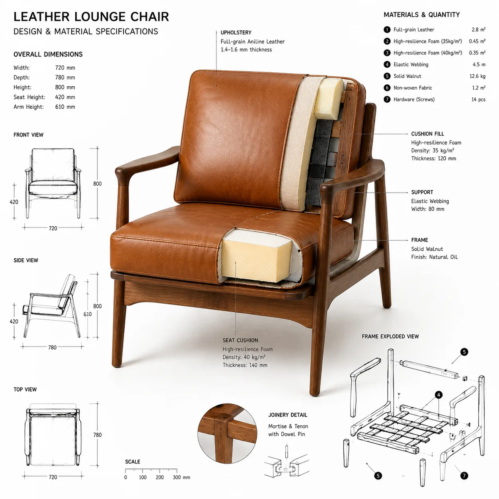

**#99 · Realistic, Infographic · <code>Vinano Studio</code>**

> Keywords: realistic, infographic, AI art, AI prompt, text to image

<details>
<summary>Show prompt</summary>

```
Create an infographic image of [OBJECT], combining a realistic photograph or true-to-life photorealistic render of the object technical annotation overlays placed directly on top. Use black ink–style line drawings and text (technical pen / architectural sketch look) on a pure white studio background. Include: •Key component labels •Internal cutaway or exploded-view outlines (where relevant) •Measurements, dimensions, and scale markers •Material callouts and quantities Emphasise material texture and natural light so the final frame feels tactile and premium.
```

</details>

---

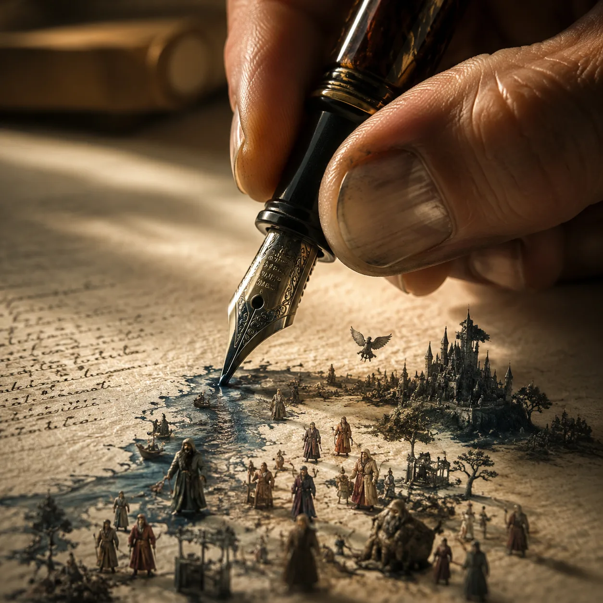

**#100 · Realistic, Portrait · <code>Vinano Studio</code>**

> Keywords: realistic, portrait, character, cinematic, vintage, AI art

<details>
<summary>Show prompt</summary>

```
A colossal hand gripping an enormous vintage fountain pen, captured in vertical portrait format (9:16), writing on endless textured paper that fills the frame. Where the ink flows, the story of [BOOK_NAME] bursts into vivid life — [iconic characters, key objects, and signature scenes from [BOOK_NAME] emerging as tiny miniature figures on the paper, each no larger than a fingernail, ultra-miniature scale]. The miniature world cascades downward across the page as the pen moves, characters frozen mid-story, ink still wet at the edges where they emerge. Extreme close-up of the enormous pen nib touching paper, ink bleeding into fiber, fingertips visible skin texture. Warm amber and soft golden light raking across the paper surface, deep shadows, cinematic depth of field, magical realism, hyper-detailed, true-to-life photorealistic, 8K, --ar 9:16 Emphasise material texture and natural light so the final frame feels tactile and premium.
```

</details>

---

[Next page →](./ui-graphic-2.md)
